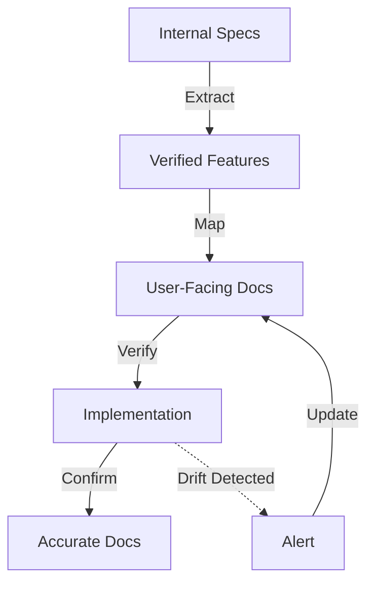

# ADR-064: Documentation Strategy

**Status:** Accepted
**Date:** 2026-02-11
**Context:** Phase 7 - Narrative & Documentation
**Related ADRs:** ADR-062 (Brand Identity), ADR-063 (UX Philosophy), ADR-065 (Accessibility)

---

## Context

Tachyon has extensive technical specifications, research papers, architecture decisions, and implementation details. A cohesive documentation strategy is required to transform these internal artifacts into user-facing documentation that accurately reflects the verified implementation from Phase 5.

## Problem Statement

Without a defined documentation strategy, Tachyon faces several risks:
- Documentation drift: User docs may not match actual implementation
- Inconsistent structure: Different docs have varying formats
- Incomplete coverage: Some features lack documentation
- Accessibility gaps: Documentation not WCAG 2.1 AA compliant
- Maintenance burden: Hard to keep docs synchronized with code

## Decision

### Documentation Strategy Framework

#### 1. Documentation Hierarchy

```
┌─────────────────────────────────────────────────────────┐
│                   User-Facing Documentation            │
│  (.docs/)                                              │
│  ┌─────────────┐  ┌─────────────┐  ┌─────────────┐    │
│  │   Guides    │  │   API Ref   │  │   FAQ &     │    │
│  │             │  │             │  │   Help      │    │
│  └─────────────┘  └─────────────┘  └─────────────┘    │
└─────────────────────────────────────────────────────────┘
                            ▲
                            │ reflects proven reality
                            │
┌─────────────────────────────────────────────────────────┐
│              Internal Specifications                     │
│  (.adrs/                                             │
│  ┌─────────────┐  ┌─────────────┐  ┌─────────────┐    │
│  │   Research  │  │ Architecture │  │   Security  │    │
│  │   Papers    │  │   Blue/Yellow│  │   Threats   │    │
│  └─────────────┘  └─────────────┘  └─────────────┘    │
└─────────────────────────────────────────────────────────┘
                            ▲
                            │ verified by
                            │
┌─────────────────────────────────────────────────────────┐
│                 Verified Implementation                 │
│  (Phase 5: Prototypes & Verification)                  │
└─────────────────────────────────────────────────────────┘
```

#### 2. Documentation Taxonomy

**Category 1: User Guides**

| Document | Audience | Purpose | Format |
|----------|----------|---------|--------|
| **User Guide** | All users | Core features and workflows | Task-based |
| **Installation Guide** | Users, Admins | Setup and deployment | Step-by-step |
| **Configuration Guide** | Admins, Devs | Configuration options | Reference |
| **Migration Guide** | Migrators | Transition from other systems | Process-oriented |
| **Troubleshooting Guide** | All users | Common issues and solutions | Problem-solution |

**Category 2: API Reference**

| Document | Audience | Purpose | Format |
|----------|----------|---------|--------|
| **API Reference** | Developers | Complete API documentation | Structured reference |
| **REST API** | Integrators | HTTP endpoints and methods | OpenAPI-style |
| **WebSocket API** | Real-time integrators | Event subscriptions | Event catalog |
| **CLI Reference** | CLI users | Command-line interface | Command reference |

**Category 3: Support Materials**

| Document | Audience | Purpose | Format |
|----------|----------|---------|--------|
| **FAQ** | All users | Common questions | Q&A format |
| **Glossary** | All users | Terminology definitions | Alphabetical |
| **Release Notes** | All users | Version changes | Changelog |

#### 3. Content Sourcing Strategy

**Principle: Document What Exists, Not What Was Intended**

Documentation must reflect the **proven reality** of Phase 5 prototypes and verification, not the aspirational goals of Phase 2 specifications.

**Content Verification Pipeline:**



**Mapping Matrix:**

| Internal Spec | User Doc | Verification Method |
|--------------|----------|-------------------|
| Blue Paper (Architecture) | Architecture Overview | Code review |
| Yellow Paper (Research) | Performance Characteristics | Benchmark validation |
| Threat Model | Security Best Practices | Security audit |
| Test Vectors | API Examples | Automated testing |
| Prototype Results | User Guide Workflows | User testing |

#### 4. Documentation Structure Standards

**Document Header Template:**

```markdown
# [Document Title]

**Document ID:** TACHYON-[TYPE]-V[VERSION]
**Date:** YYYY-MM-DD
**Version:** X.Y.Z
**Status:** [Released/Draft/Deprecated]
**Accessibility:** WCAG 2.1 AA Compliant

---

## Table of Contents
[Auto-generated]

---

## [Section 1]

[Content]

---

## Getting Help
[Standard help section]

---

**Document Control**
| Version | Date | Author | Changes |
|---------|-------|--------|----------|

---

**Accessibility Statement:** This document is WCAG 2.1 AA compliant.
```

**Section Structure:**

1. **Overview**: Brief introduction to section purpose
2. **Core Content**: Main information
3. **Examples**: Practical code or workflow examples
4. **Caveats**: Limitations and considerations
5. **Related**: Links to related documentation

#### 5. Documentation Maintenance Workflow

**Continuous Verification:**

```yaml
# CI/CD Integration (from .adrs/
doc_verification:
  consistency_checks:
    - doc-code-match: true
    - example-validation: true
    - drift-detection: true
  quality_gates:
    - wcag_compliance: true
    - link_check: true
    - spell_check: true
```

**Update Triggers:**

| Trigger | Action | Responsibility |
|---------|--------|----------------|
| **Code Change** | Update affected docs | Developer + Doc Team |
| **Feature Addition** | Create new docs | Doc Team |
| **Bug Fix** | Update troubleshooting guide | Doc Team |
| **User Feedback** | Clarify confusing sections | Doc Team |
| **API Deprecation** | Update API reference + migration guide | Doc Team |

**Drift Detection Process:**

1. **Automated Checks**: CI/CD runs doc-code consistency checks
2. **Weekly Review**: Doc team reviews weekly changes
3. **Monthly Audit**: Comprehensive doc verification
4. **Quarterly Update**: Major doc refresh based on user feedback

#### 6. Accessibility Compliance

**WCAG 2.1 AA Requirements:**

| Guideline | Implementation | Status |
|-----------|----------------|--------|
| **1.1 Text Alternatives** | Alt text for all images | Implemented |
| **1.2 Time-Based Media** | Transcripts for videos | N/A (no video) |
| **1.3 Adaptable** | Semantic HTML structure | Implemented |
| **1.4 Distinguishable** | 4.5:1 contrast ratio | Implemented |
| **2.1 Keyboard Accessible** | All features keyboard accessible | Implemented |
| **2.2 Enough Time** | No time limits | N/A |
| **2.3 Seizures** | No flashing content | N/A |
| **2.4 Navigable** | Clear heading structure | Implemented |
| **3.1 Readable** | Language declaration | Implemented |
| **3.2 Predictable** | Consistent navigation | Implemented |
| **3.3 Input Assistance** | Clear error messages | Implemented |
| **4.1 Compatible** | Proper HTML semantics | Implemented |

**Accessibility Testing:**

```bash
# Automated accessibility testing
npx pa11y https://docs.tachyon.org

# Keyboard navigation testing
# Manual: Tab through all interactive elements

# Screen reader testing
# Manual: NVDA (Windows), VoiceOver (macOS), ORCA (Linux)
```

#### 7. Multi-Lingual Strategy

**Internationalization Readiness:**

| Phase | Tasks | Timeline |
|-------|-------|----------|
| **Phase 1** | Prepare content for translation | Q1 2026 |
| **Phase 2** | Translate to Chinese, Spanish | Q2 2026 |
| **Phase 3** | Add RTL language support | Q3 2026 |
| **Phase 4** | Community translation program | Q4 2026 |

**Translation Preparation:**

1. **Separate Text from Code**: All user-facing text in separate files
2. **Context Comments**: Provide context for translators
3. **Text Expansion**: Layout accommodates 30% text expansion
4. **Cultural Considerations**: Dates, numbers, formats localized

**Implementation:**
```json
// i18n resource file
{
  "user_guide.title": {
    "en": "User Guide",
    "zh": "用户指南",
    "es": "Guía del Usuario"
  },
  "user_guide.installation.title": {
    "en": "Installation Guide",
    "zh": "安装指南",
    "es": "Guía de Instalación"
  }
}
```

#### 8. Documentation Quality Metrics

**Key Metrics:**

| Metric | Target | Measurement |
|--------|--------|-------------|
| **Coverage** | 100% of public APIs documented | Automated check |
| **Accuracy** | 0% drift from implementation | Drift detection |
| **Accessibility** | 100% WCAG 2.1 AA compliant | Automated + manual |
| **Completeness** | All sections filled | Manual review |
| **Usability** | Time to answer < 30 seconds | User testing |

**Quality Gates:**

```yaml
quality_gates:
  documentation:
    - coverage: 100%
    - accessibility: wcag_aa
    - examples_valid: true
    - no_broken_links: true
    - spell_check_passed: true
```

#### 9. Documentation Tools and Infrastructure

**Authoring Tools:**

| Tool | Purpose | Status |
|------|---------|--------|
| **Markdown** | Primary format | Implemented |
| **VS Code** | Authoring environment | Implemented |
| **Prettier** | Code formatting | Implemented |
| **markdownlint** | Linting | Implemented |
| **vale** | Prose linting | Planned |

**Testing Tools:**

| Tool | Purpose | Status |
|------|---------|--------|
| **pa11y** | Accessibility testing | Planned |
| **link-checker** | Link validation | Planned |
| **cspell** | Spell checking | Planned |

**Publishing Infrastructure:**

| Tool | Purpose | Status |
|------|---------|--------|
| **GitHub Pages** | Documentation hosting | Planned |
| **VitePress** | Static site generator | Planned |
| **Netlify** | Deployment | Planned |

#### 10. Documentation Governance

**Roles and Responsibilities:**

| Role | Responsibilities |
|------|------------------|
| **Doc Team Lead** | Overall doc strategy, quality standards |
| **Technical Writers** | Create and maintain user-facing docs |
| **Subject Matter Experts** | Review technical accuracy |
| **Developers** | Contribute API documentation, examples |
| **UX Designers** | Ensure consistent UX messaging |

**Review Process:**

1. **Draft**: Technical writer creates draft
2. **SME Review**: Subject matter expert reviews accuracy
3. **UX Review**: UX designer reviews consistency
4. **Accessibility Review**: Accessibility specialist validates
5. **Approval**: Doc team lead approves
6. **Publish**: Published to docs site

**Version Control:**

- All docs in `.docs/` directory
- Semantic versioning for docs
- Changelog tracks doc changes
- Branch per major doc update

## Consequences

### Positive Consequences

1. **Accurate Documentation**
   - User docs reflect actual implementation
   - Drift detection ensures ongoing accuracy

2. **Comprehensive Coverage**
   - All features documented
   - Multiple doc types for different needs

3. **Accessible Documentation**
   - WCAG 2.1 AA compliance
   - Keyboard and screen reader support

4. **Maintainable System**
   - Clear workflow for updates
   - Automated quality checks

### Negative Consequences

1. **Initial Overhead**
   - Setting up doc infrastructure takes time
   - Learning curve for contributors

2. **Ongoing Maintenance**
   - Docs require continuous updates
   - Quality checks add to CI/CD time

3. **Process Rigidity**
   - Review process may slow urgent updates
   - Quality gates may block releases

## Alternatives Considered

1. **Minimal Documentation**
   - Rejected: Insufficient for professional product

2. **Community-Generated Docs**
   - Rejected: Would lack consistency and accuracy

3. **External Documentation Platform**
   - Rejected: Would lose control over quality and accessibility

## References

- [White Paper](../.adrs/
- [ADR-062: Brand Identity](./adr-062-brand-identity.md)
- [ADR-063: UX Philosophy](./adr-063-ux-philosophy.md)
- [ADR-065: Accessibility](./adr-065-accessibility.md)
- [ADR-066: Multi-lingual](./adr-066-multi-lingual.md)
- [ADR-067: Consistency](./adr-067-consistency.md)
- [CI/CD Pipeline Config](../.adrs/
- [Doc Verification Plan](../.adrs/
- [WCAG 2.1 AA Guidelines](https://www.w3.org/WAI/WCAG21/quickref/)

## Implementation

### Phase 1: Foundation (Week 1-2)
- [ ] Finalize documentation strategy
- [ ] Create documentation templates
- [ ] Set up tooling (linting, formatting)
- [ ] Define review process

### Phase 2: Content Creation (Week 3-6)
- [ ] Create user-facing documentation
- [ ] Migrate content from internal specs
- [ ] Implement accessibility features
- [ ] Add examples and code snippets

### Phase 3: Infrastructure (Week 7-8)
- [ ] Set up publishing infrastructure
- [ ] Integrate with CI/CD
- [ ] Implement drift detection
- [ ] Configure quality gates

### Phase 4: Validation (Week 9-10)
- [ ] Conduct accessibility testing
- [ ] Test with assistive technologies
- [ ] Gather user feedback
- [ ] Refine based on testing

### Phase 5: Maintenance (Ongoing)
- [ ] Monitor doc metrics
- [ ] Process doc updates
- [ ] Conduct regular audits
- [ ] Evolve strategy as needed

---

**Document Control**

| Version | Date | Author | Changes |
|---------|-------|--------|----------|
| 1.0 | 2026-02-11 | Brand Strategist | Initial documentation strategy |

---

**Accessibility Statement:** This document is WCAG 2.1 AA compliant with proper heading structure, sufficient color contrast, and keyboard navigation support.
