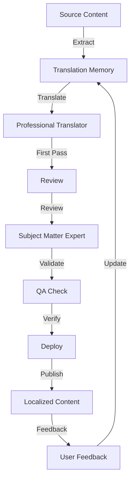
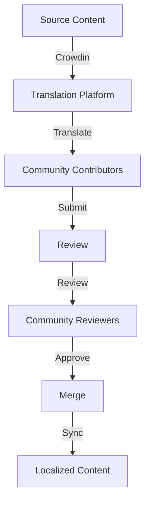

# ADR-066: Multi-lingual Support

**Status:** Accepted
**Date:** 2026-02-11
**Context:** Phase 7 - Narrative & Documentation
**Related ADRs:** ADR-062 (Brand Identity), ADR-064 (Documentation Strategy), ADR-067 (Consistency)

---

## Context

Tachyon targets international markets and must support users who speak languages other than English. Multi-lingual support is essential for global adoption and user inclusivity. The project requires a strategy for translating documentation, user interfaces, and technical content while maintaining technical accuracy and cultural sensitivity.

## Problem Statement

Without a defined multi-lingual strategy, Tachyon faces:
- Limited market reach in non-English speaking regions
- Poor user experience for international users
- Inconsistent translation quality
- Difficulties maintaining multiple language versions
- Cultural barriers to adoption

## Decision

### Multi-lingual Framework

#### 1. Language Prioritization

**Tier 1 Languages (High Priority):**

| Language | ISO Code | Market | Priority | Target Date |
|----------|----------|--------|----------|-------------|
| **English** | en | Global | Baseline | Q1 2026 |
| **Chinese (Simplified)** | zh-CN | China | High | Q2 2026 |
| **Spanish** | es | Latin America, Spain | High | Q2 2026 |

**Tier 2 Languages (Medium Priority):**

| Language | ISO Code | Market | Priority | Target Date |
|----------|----------|--------|----------|-------------|
| **Japanese** | ja | Japan | Medium | Q3 2026 |
| **German** | de | Germany, Austria, Switzerland | Medium | Q3 2026 |
| **French** | fr | France, Canada, Belgium | Medium | Q4 2026 |
| **Portuguese** | pt-BR | Brazil | Medium | Q4 2026 |

**Tier 3 Languages (Low Priority - Community):**

| Language | ISO Code | Market | Priority | Target Date |
|----------|----------|--------|----------|-------------|
| **Russian** | ru | Russia | Community | TBD |
| **Korean** | ko | South Korea | Community | TBD |
| **Arabic** | ar | Middle East | Community | TBD |
| **Hindi** | hi | India | Community | TBD |

#### 2. Internationalization (i18n) Architecture

**2.1 Core Principles:**

1. **Separate Text from Code**: All user-facing text externalized
2. **Context-Aware Translation**: Provide context for translators
3. **RTL Support**: Right-to-left language support
4. **Cultural Localization**: Adapt to cultural conventions
5. **Fallback Strategy**: Graceful degradation for missing translations

**2.2 i18n Resource Structure:**

```
tachyon/
├── locales/
│   ├── en/
│   │   ├── common.json
│   │   ├── user_guide.json
│   │   ├── api_reference.json
│   │   ├── faq.json
│   │   └── errors.json
│   ├── zh-CN/
│   │   ├── common.json
│   │   ├── user_guide.json
│   │   ├── api_reference.json
│   │   ├── faq.json
│   │   └── errors.json
│   ├── es/
│   │   └── ...
│   ├── ja/
│   │   └── ...
│   └── ...
├── src/
│   ├── i18n/
│   │   ├── loader.ts
│   │   ├── formatter.ts
│   │   └── utils.ts
│   └── ...
```

**2.3 Translation Resource Format:**

```json
// locales/en/common.json
{
  "app.name": "Tachyon",
  "app.tagline": "Real-time documentation, delivered faster than thought",
  "nav.documents": "Documents",
  "nav.search": "Search",
  "nav.settings": "Settings",
  "button.save": "Save",
  "button.cancel": "Cancel",
  "button.delete": "Delete"
}

// locales/zh-CN/common.json
{
  "app.name": "Tachyon",
  "app.tagline": "实时文档，快于思维",
  "nav.documents": "文档",
  "nav.search": "搜索",
  "nav.settings": "设置",
  "button.save": "保存",
  "button.cancel": "取消",
  "button.delete": "删除"
}

// locales/es/common.json
{
  "app.name": "Tachyon",
  "app.tagline": "Documentación en tiempo real, entregada más rápido que el pensamiento",
  "nav.documents": "Documentos",
  "nav.search": "Buscar",
  "nav.settings": "Configuración",
  "button.save": "Guardar",
  "button.cancel": "Cancelar",
  "button.delete": "Eliminar"
}
```

**2.4 Translation with Context:**

```json
// locales/en/user_guide.json
{
  "user_guide.title": "User Guide",
  "user_guide.installation.title": "Installation Guide",
  "user_guide.installation.intro": "Install Tachyon on your system to get started.",
  "user_guide.installation.step1.title": "Download the Installer",
  "user_guide.installation.step1.desc": "Download the appropriate installer for your operating system.",
  "user_guide.installation.step2.title": "Run the Installer",
  "user_guide.installation.step2.desc": "Run the downloaded installer and follow the on-screen instructions.",
  "user_guide.installation.step3.title": "Launch Tachyon",
  "user_guide.installation.step3.desc": "Launch Tachyon from your applications menu.",
  
  // Technical terms (should not be translated)
  "tech.jit": "JIT (Just-In-Time) compilation",
  "tech.lru_cache": "LRU (Least-Recently-Used) cache",
  "tech.bm25": "BM25 search algorithm",
  "tech.rbac": "RBAC (Role-Based Access Control)"
}

// Translation context for translators
// user_guide.installation.step1.desc: 
//   Context: Instructions for downloading the installer
//   Variables: { os: "Windows | macOS | Linux" }
//   Note: Keep technical terms like "installer" in English
```

#### 3. Right-to-Left (RTL) Language Support

**3.1 RTL Languages:**

| Language | ISO Code | Direction | Status |
|----------|----------|-----------|--------|
| **Arabic** | ar | RTL | Planned |
| **Hebrew** | he | RTL | Planned |
| **Farsi** | fa | RTL | Planned |
| **Urdu** | ur | RTL | Planned |

**3.2 RTL Implementation:**

```html
<html lang="ar" dir="rtl">
<head>
  <meta charset="UTF-8">
  <meta name="viewport" content="width=device-width, initial-scale=1.0">
  <title>Tachyon - الوثائق الحية</title>
  <link rel="stylesheet" href="styles.css">
</head>
<body>
  <!-- RTL-aware layout -->
  <div class="container">
    <header>
      <nav class="rtl-nav">
        <a href="/documents">الوثائق</a>
        <a href="/search">بحث</a>
        <a href="/settings">الإعدادات</a>
      </nav>
    </header>
    <main>
      <!-- Content -->
    </main>
  </div>
</body>
</html>
```

**3.3 CSS for RTL:**

```css
/* RTL-aware CSS */
[dir="rtl"] {
  direction: rtl;
}

[dir="rtl"] .container {
  text-align: right;
}

[dir="rtl"] .nav-link {
  margin-left: 1rem;
  margin-right: 0;
}

[dir="rtl"] .icon {
  transform: scaleX(-1); /* Mirror icons */
}

/* Logical properties for RTL support */
.container {
  padding-inline-start: 1rem;
  padding-inline-end: 1rem;
  margin-inline-start: auto;
  margin-inline-end: auto;
}

/* Flexbox with RTL support */
.flex-container {
  display: flex;
  flex-direction: row;
  justify-content: space-between;
}

[dir="rtl"] .flex-container {
  flex-direction: row-reverse;
}
```

#### 4. Cultural Localization

**4.1 Date and Time Formatting:**

```typescript
// Date formatting by locale
const dateFormatter = new Intl.DateTimeFormat(locale, {
  year: 'numeric',
  month: 'long',
  day: 'numeric'
});

// Examples:
// en-US: "February 11, 2026"
// zh-CN: "2026年2月11日"
// es-ES: "11 de febrero de 2026"
// ja-JP: "2026年2月11日"
// de-DE: "11. Februar 2026"
```

**4.2 Number Formatting:**

```typescript
// Number formatting by locale
const numberFormatter = new Intl.NumberFormat(locale, {
  style: 'decimal',
  minimumFractionDigits: 2,
  maximumFractionDigits: 2
});

// Examples:
// en-US: "1,234.56"
// zh-CN: "1,234.56"
// es-ES: "1.234,56"
// de-DE: "1.234,56"
```

**4.3 Currency Formatting:**

```typescript
// Currency formatting by locale
const currencyFormatter = new Intl.NumberFormat(locale, {
  style: 'currency',
  currency: 'USD'
});

// Examples:
// en-US: "$1,234.56"
// zh-CN: "US$1,234.56"
// es-ES: "1.234,56 $"
```

**4.4 Name Formatting:**

```typescript
// Name formatting by locale
const nameFormatter = (givenName: string, familyName: string, locale: string) => {
  switch (locale) {
    case 'zh-CN':
    case 'ja-JP':
      return `${familyName}${givenName}`; // Family name first
    case 'es-ES':
    case 'es-MX':
      return `${givenName} ${familyName}`; // Given name first, often two surnames
    default:
      return `${givenName} ${familyName}`; // Given name first
  }
};
```

#### 5. Translation Workflow

**5.1 Professional Translation Process:**



**5.2 Community Translation Process:**



**5.3 Translation Tools:**

| Tool | Purpose | Status |
|------|---------|--------|
| **Crowdin** | Community translation platform | Planned |
| **Lokalise** | Professional translation management | Planned |
| **i18next** | JavaScript i18n library | Implemented |
| **gettext** | Rust i18n library | Implemented |
| **DeepL** | Machine translation for reference | Planned |

#### 6. Documentation Translation Strategy

**6.1 Translation Scope:**

| Document | Priority | Translation Method |
|----------|----------|---------------------|
| **User Guide** | High | Professional |
| **Installation Guide** | High | Professional |
| **API Reference** | Medium | Community |
| **FAQ** | Medium | Community |
| **Configuration Guide** | Medium | Community |
| **Glossary** | Low | Community |
| **Migration Guide** | Low | Community |

**6.2 Technical Term Handling:**

**Do Not Translate:**

- API names and endpoints
- Function names and parameters
- Command-line commands
- Code examples
- Configuration keys
- File paths
- File extensions

**Translate with Context:**

- User interface labels
- Error messages
- Success messages
- Button text
- Navigation items
- Tooltips

**6.3 Code Example Translation:**

```markdown
<!-- English -->
## Creating a Document

To create a new document, use the following command:

```bash
tachyon create --title "My Document"
```

This command creates a new document with the specified title.

<!-- Chinese -->
## 创建文档

使用以下命令创建新文档：

```bash
tachyon create --title "My Document"
```

此命令使用指定标题创建新文档。

<!-- Spanish -->
## Crear un Documento

Para crear un nuevo documento, usa el siguiente comando:

```bash
tachyon create --title "My Document"
```

Este comando crea un nuevo documento con el título especificado.
```

#### 7. Quality Assurance

**7.1 Translation Quality Metrics:**

| Metric | Target | Measurement |
|--------|--------|-------------|
| **Translation Accuracy** | 95%+ | SME review |
| **Cultural Appropriateness** | 90%+ | Native speaker review |
| **Technical Accuracy** | 100% | Technical review |
| **Consistency** | 100% | Glossary and TM |
| **Readability** | 90%+ | User feedback |

**7.2 Quality Assurance Process:**

1. **Automated Checks**:
   - Missing translation detection
   - Placeholder validation
   - Character encoding validation

2. **Manual Reviews**:
   - Native speaker review for fluency
   - Subject matter expert review for accuracy
   - Cultural sensitivity review

3. **User Testing**:
   - Usability testing with native speakers
   - Feedback collection
   - Iterative improvement

**7.3 Glossary and Translation Memory:**

```json
// Translation glossary
{
  "glossary": {
    "JIT": {
      "en": "Just-In-Time compilation",
      "zh-CN": "即时编译",
      "es": "compilación Just-In-Time",
      "ja": "JIT（ジャストインタイム）コンパイル"
    },
    "LRU cache": {
      "en": "Least-Recently-Used cache",
      "zh-CN": "最近最少使用缓存",
      "es": "caché menos recientemente utilizada",
      "ja": "LRUキャッシュ"
    },
    "BM25": {
      "en": "BM25 ranking function",
      "zh-CN": "BM25排名函数",
      "es": "función de clasificación BM25",
      "ja": "BM25ランク付け関数"
    },
    "RBAC": {
      "en": "Role-Based Access Control",
      "zh-CN": "基于角色的访问控制",
      "es": "Control de acceso basado en roles",
      "ja": "ロールベースアクセス制御"
    }
  }
}
```

#### 8. Implementation Strategy

**8.1 Phase 1: Foundation (Q1 2026)**

- [ ] Set up i18n infrastructure
- [ ] Create translation resource files structure
- [ ] Implement i18n loader and formatter
- [ ] Add language switcher to UI
- [ ] Prepare content for translation

**8.2 Phase 2: Tier 1 Translations (Q2 2026)**

- [ ] Translate to Chinese (Simplified)
- [ ] Translate to Spanish
- [ ] Review and validate translations
- [ ] Deploy localized versions
- [ ] Gather user feedback

**8.3 Phase 3: Tier 2 Translations (Q3-Q4 2026)**

- [ ] Translate to Japanese
- [ ] Translate to German
- [ ] Translate to French
- [ ] Translate to Portuguese (Brazil)
- [ ] Review and validate translations

**8.4 Phase 4: RTL Support (Q1 2027)**

- [ ] Implement RTL layout support
- [ ] Translate to Arabic
- [ ] Test RTL languages
- [ ] Deploy RTL versions

**8.5 Phase 5: Community Program (Ongoing)**

- [ ] Set up Crowdin platform
- [ ] Recruit community translators
- [ ] Create translation guidelines
- [ ] Monitor translation quality
- [ ] Recognize contributors

#### 9. Maintenance and Updates

**9.1 Translation Maintenance:**

| Update Type | Action | Timeline |
|-------------|--------|----------|
| **New Feature** | Translate new content | Within 2 weeks |
| **API Change** | Update API documentation | Within 1 week |
| **Bug Fix** | Update affected translations | Within 3 days |
| **UI Change** | Translate new UI elements | Within 1 week |
| **Major Release** | Full translation review | Within 4 weeks |

**9.2 Translation Synchronization:**

- Automated sync from Crowdin to repository
- CI/CD checks for missing translations
- Alerts for outdated translations
- Regular translation audits

**9.3 Continuous Improvement:**

- Collect user feedback on translations
- Update glossary based on feedback
- Improve translation quality over time
- Recognize top contributors

## Consequences

### Positive Consequences

1. **Global Market Reach**
   - Users worldwide can use Tachyon
   - Broader user base and community

2. **Inclusive Product**
   - Non-English speakers have equal access
   - Cultural sensitivity improves user experience

3. **Competitive Advantage**
   - Multi-lingual support differentiates from competitors
   - International markets more accessible

4. **Community Growth**
   - Contributors from diverse regions
   - Richer ecosystem and perspectives

### Negative Consequences

1. **Development Overhead**
   - i18n requires additional development time
   - Maintenance overhead for multiple languages

2. **Translation Costs**
   - Professional translations are expensive
   - Ongoing translation maintenance costs

3. **Coordination Complexity**
   - Managing multiple language versions is complex
   - Synchronizing updates across languages

4. **Quality Challenges**
   - Ensuring consistent quality across languages
   - Technical accuracy in translations

## Alternatives Considered

1. **English Only**
   - Rejected: Limits market reach and excludes non-English speakers

2. **Machine Translation Only**
   - Rejected: Poor quality, lacks cultural nuance, technical errors

3. **Community Translation Only**
   - Rejected: Inconsistent quality, slow for critical documents

## References

- [White Paper](../.adrs/
- [ADR-062: Brand Identity](./adr-062-brand-identity.md)
- [ADR-064: Documentation Strategy](./adr-064-documentation-strategy.md)
- [ADR-067: Consistency](./adr-067-consistency.md)
- [i18next Documentation](https://www.i18next.com/)
- [gettext Documentation](https://www.gnu.org/software/gettext/)
- [Crowdin Documentation](https://support.crowdin.com/)
- [Unicode CLDR](http://cldr.unicode.org/)
- [W3C Internationalization](https://www.w3.org/International/)

## Implementation

### Phase 1: Infrastructure Setup (Week 1-2)
- [ ] Set up i18n infrastructure
- [ ] Create translation resource files
- [ ] Implement i18n loader and formatter
- [ ] Add language switcher

### Phase 2: Content Preparation (Week 3-4)
- [ ] Extract all translatable text
- [ ] Create translation context files
- [ ] Build glossary of technical terms
- [ ] Prepare content for translation

### Phase 3: Tier 1 Translation (Week 5-12)
- [ ] Translate to Chinese (Simplified)
- [ ] Translate to Spanish
- [ ] Review and validate translations
- [ ] Deploy localized versions

### Phase 4: Testing and Refinement (Week 13-16)
- [ ] Test localized versions
- [ ] Gather user feedback
- [ ] Refine translations
- [ ] Fix issues

### Phase 5: Ongoing Maintenance (Ongoing)
- [ ] Monitor translation quality
- [ ] Update translations for new features
- [ ] Manage community translation program
- [ ] Continuously improve

---

**Document Control**

| Version | Date | Author | Changes |
|---------|-------|--------|----------|
| 1.0 | 2026-02-11 | Brand Strategist | Initial multi-lingual framework |

---

**Accessibility Statement:** This document is WCAG 2.1 AA compliant with proper heading structure, sufficient color contrast, and keyboard navigation support.
