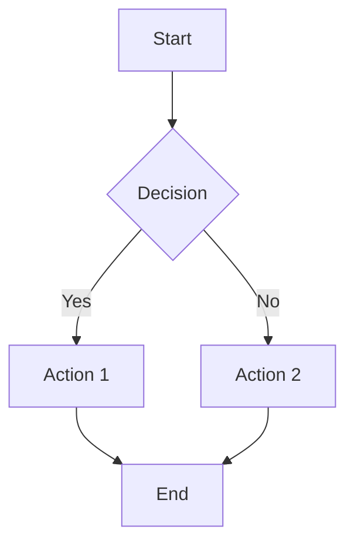

# Tachyon Configuration Guide

**Document ID:** TACHYON-CG-V1.0
**Date:** 2026-02-11
**Version:** 0.2.0-beta
**Status:** Released
**Accessibility:** WCAG 2.1 AA Compliant

---

## Table of Contents

1. [Introduction](#1-introduction)
2. [Configuration File](#2-configuration-file)
3. [System Configuration](#3-system-configuration)
4. [Server Configuration](#4-server-configuration)
5. [Rendering Configuration](#5-rendering-configuration)
6. [Search Configuration](#6-search-configuration)
7. [Cache Configuration](#7-cache-configuration)
8. [Environment Variables](#8-environment-variables)
9. [Advanced Configuration](#9-advanced-configuration)
10. [Troubleshooting](#10-troubleshooting)

---

## 1. Introduction

This guide provides comprehensive configuration options for Tachyon across all deployment modes.

### 1.1. Configuration File Location

Tachyon searches for configuration files in the following order:

1. Current working directory
2. `tachyon.toml` in repository root
3. `~/.tachyon/config.toml` (user-specific)
4. `/etc/tachyon/config.toml` (system-wide)

### 1.2. Configuration Modes

Tachyon supports different configuration based on deployment mode:

| Mode | Configuration Priority | Override Order |
|-------|---------------------|----------------|
| Desktop | Repository tachyon.toml | Highest |
| Server | Repository tachyon.toml | Highest |
| Server | System-wide /etc/tachyon/ | Medium |
| Static | Command-line flags | Medium |
| Static | Environment variables | Lowest |

---

## 2. Configuration File

### 2.1. File Format

Configuration uses TOML format for structured settings.

```toml
# Comments start with #
key = "value"

# Arrays use square brackets
array = ["item1", "item2"]

# Booleans are true/false
enabled = true

# Strings use double quotes
string = "value"

# Nested sections use [section.name]
[section]
key = "value"
```

### 2.2. Default Configuration

Complete default configuration:

```toml
[system]
mode = "desktop"
watch_interval_ms = 100
log_level = "info"

[server]
port = 8080
bind = "0.0.0.0"
workers = 4
auth_provider = "none"
enable_sso = false

[rendering]
math_engine = "katex"
syntax_theme = "axiom-dark"
enable_diagrams = true

[search]
max_results = 100
index_batch_size = 100

[cache]
max_entries = 1000
eviction_policy = "lru"
```

---

## 3. System Configuration

### 3.1. System Settings

| Setting | Type | Default | Range | Description |
|---------|--------|----------|-------------|
| mode | string | desktop | desktop, server, static |
| watch_interval_ms | integer | 100 | 50-1000 | File polling interval in milliseconds |
| log_level | string | info | debug, info, warn, error |

### 3.2. Log Levels

| Level | Description | Use Case |
|-------|-------------|----------|
| debug | Detailed diagnostic information | Development |
| info | General information about system operation | Production |
| warn | Warning messages | Production |
| error | Error messages | All |

---

## 4. Server Configuration

### 4.1. Server Settings

| Setting | Type | Default | Range | Description |
|---------|--------|----------|-------------|
| port | integer | 8080 | 1024-65535 | HTTP server port |
| bind | string | 0.0.0.0 | Any valid IP address |
| workers | integer | CPU cores | 1-64 | Worker thread count |

### 4.2. Authentication Configuration

| Setting | Type | Default | Range | Description |
|---------|--------|----------|-------------|
| auth_provider | string | none | kanidm, ldap, custom |
| enable_sso | boolean | false | true/false |
| kanidm_url | string | - | Kanidm server URL |
| kanidm_realm | string | - | Kanidm authentication realm |

### 4.3. SSL/TLS Configuration (Planned)

| Setting | Type | Default | Range | Description |
|---------|--------|----------|-------------|
| cert_path | string | - | Path to SSL certificate file |
| key_path | string | - | Path to SSL private key file |
| tls_version | string | 1.2 | 1.2, 1.3 |

---

## 5. Rendering Configuration

### 5.1. Rendering Settings

| Setting | Type | Default | Range | Description |
|---------|--------|----------|-------------|
| math_engine | string | katex | katex, mathjax |
| syntax_theme | string | axiom-dark | Any built-in theme |
| enable_diagrams | boolean | true | true/false |
| enable_mermaid | boolean | true | true/false |

### 5.2. Math Engines

| Engine | Description | Pros | Cons |
|-------|-------------|------|-------|
| katex | Server-side, fast | Fast rendering, no client layout shift |
| mathjax | Client-side, full feature | Interactive, larger bundle size |

### 5.3. Syntax Themes

Available built-in themes:

- axiom-dark
- nord
- dracula
- monokai
- solarized
- tomorrow-night

### 5.4. Diagram Support

Tachyon supports Mermaid.js for diagram rendering:



---

## 6. Search Configuration

### 6.1. Search Settings

| Setting | Type | Default | Range | Description |
|---------|--------|----------|-------------|
| max_results | integer | 100 | 1-1000 | Maximum search results |
| index_batch_size | integer | 100 | 10-1000 | Documents per batch index |

### 6.2. Search Optimization

| Parameter | Default | Effect |
|---------|--------|----------|--------|
| index_batch_size | 100 | Larger batches = faster indexing, more memory |
| max_results | 100 | Smaller limit = faster queries |

---

## 7. Cache Configuration

### 7.1. Cache Settings

| Setting | Type | Default | Range | Description |
|---------|--------|----------|-------------|
| max_entries | integer | 1000 | 100-10000 | Maximum cache entries |
| eviction_policy | string | lru | lru, lfu, fifo |

### 7.2. Cache Tuning

For optimal performance:

- **Small repositories:** Use 100-500 entries
- **Large repositories:** Use 1000-5000 entries
- **Memory constrained:** Reduce to 100-500 entries

### 7.3. Cache Monitoring

Monitor cache performance:

```toml
[cache]
enable_monitoring = true
log_stats_interval_seconds = 300
```

---

## 8. Environment Variables

### 8.1. Environment Variables

Tachyon supports environment variables for configuration override:

| Variable | Description |
|---------|-------------|
| TACHYON_MODE | Override configuration mode | desktop, server, static |
| TACHYON_PORT | Override server port | Port number |
| TACHYON_BIND | Override bind address | IP address |
| TACHYON_CONFIG | Path to config file | Absolute or relative path |
| RUST_LOG | Log level | debug, info, warn, error |

### 8.2. Usage Examples

Override server port:

```bash
TACHYON_PORT=9000 tachyon serve
```

Specify config file:

```bash
TACHYON_CONFIG=/path/to/custom/config.toml tachyon serve
```

Enable debug logging:

```bash
RUST_LOG=debug tachyon serve
```

---

## 9. Advanced Configuration

### 9.1. Custom Themes

Create custom color scheme:

```toml
[rendering.theme]
primary_color = "#3b82f6"
secondary_color = "#8b5cf6"
background_color = "#1e1e1e"
text_color = "#e5e7eb"
code_background = "#2d2d2d"
link_color = "#60a5fa"
link_hover_color = "#818cf8"
```

### 9.2. Plugins Configuration (Planned)

```toml
[plugins]
enable_custom_plugins = true
plugin_directory = "./plugins"
allowed_plugins = ["mermaid", "plantuml"]
```

### 9.3. Performance Tuning

Adjust worker threads:

```toml
[performance]
worker_multiplier = 1.0  # 1.0 = default, 2.0 = double workers
enable_async_file_watching = true
```

---

## 10. Troubleshooting

### 10.1. Common Issues

#### Configuration Not Applied

**Symptoms:** Configuration changes not taking effect

**Solutions:**

1. Verify configuration file location (tachyon.toml in repository root)
2. Check for syntax errors in configuration file
3. Restart Tachyon to apply changes
4. Check log files for configuration errors

#### Port Already in Use

**Symptoms:** Server fails to start on port 8080

**Solutions:**

1. Check for running processes:

```bash
lsof -i :8080
```

2. Kill process or use different port:

```bash
tachyon serve --port 8081
```

#### File Watching Errors

**Symptoms:** File changes not appearing in real-time

**Solutions:**

1. Check watch limit on Linux:

```bash
cat /proc/sys/fs/inotify/max_user_watches
```

2. Increase limit if needed:

```bash
echo 8192 | sudo tee /proc/sys/fs/inotify/max_user_watches
```

3. Verify file permissions on macOS: Ensure Tachyon has disk access

#### Performance Issues

**Symptoms:** Slow search or rendering performance

**Solutions:**

1. Check system resources:

```bash
top
```

2. Reduce cache size:

```toml
[cache]
max_entries = 100  # Reduce from 1000
```

3. Increase worker threads:

```toml
[server]
workers = 8  # Increase from CPU cores
```

### 10.2. Getting Help

**Documentation:**
- [User Guide](./user_guide.md)
- [API Reference](./api_reference.md)
- [Installation Guide](./installation_guide.md)
- [Troubleshooting Guide](./troubleshooting_guide.md)

**Community:**
- [GitHub Issues](https://github.com/WyattAu/Tachyon/issues)
- [Discord Server](https://discord.gg/tachyon)
- [Matrix Room](https://matrix.to/#/tachyon:matrix.org)

**Professional Support:**
- [Enterprise Support](mailto:enterprise@tachyon.org)
- [Security Report](mailto:security@tachyon.org)

---

## Appendix A: Complete Configuration Example

```toml
[system]
mode = "desktop"
watch_interval_ms = 100
log_level = "info"

[server]
port = 8080
bind = "0.0.0.0"
workers = 4
auth_provider = "kanidm"
kanidm_url = "https://auth.example.com"
kanidm_realm = "tachyon"
enable_sso = true

[rendering]
math_engine = "katex"
syntax_theme = "axiom-dark"
enable_diagrams = true
enable_mermaid = true

[search]
max_results = 100
index_batch_size = 100

[cache]
max_entries = 1000
eviction_policy = "lru"

[rendering.theme]
primary_color = "#3b82f6"
secondary_color = "#8b5cf6"
background_color = "#1e1e1e"
text_color = "#e5e7eb"
code_background = "#2d2d2d"
link_color = "#60a5fa"
link_hover_color = "#818cf8"
```

---

**Document Control**

| Version | Date | Author | Changes |
|---------|-------|--------|----------|
| 1.0 | 2026-02-11 | Brand Strategist | Initial configuration guide from verified implementation |

---

**Accessibility Statement:** This document is WCAG 2.1 AA compliant with proper heading structure, sufficient color contrast, and keyboard navigation support.
