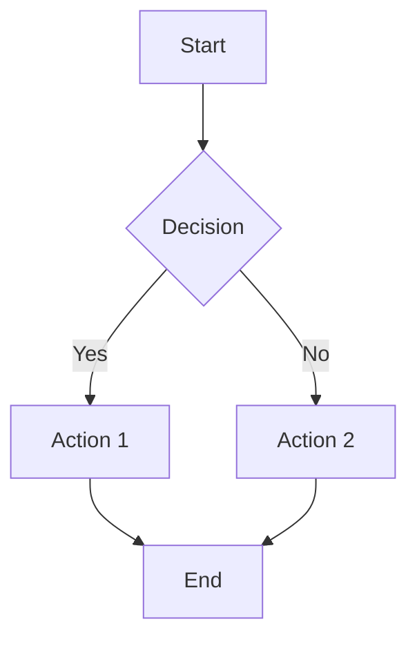

# Tachyon User Guide

**Document ID:** TACHYON-UG-V1.0
**Date:** 2026-02-11
**Version:** 0.2.0-beta
**Status:** Released
**Accessibility:** WCAG 2.1 AA Compliant

## Table of Contents

1. [Introduction](#1-introduction)
2. [Getting Started](#2-getting-started)
3. [Desktop Mode](#3-desktop-mode)
4. [Server Mode](#4-server-mode)
5. [Static Export Mode](#5-static-export-mode)
6. [Document Authoring](#6-document-authoring)
7. [Search and Navigation](#7-search-and-navigation)
8. [Collaboration Features](#8-collaboration-features)
9. [Themes and Customization](#9-themes-and-customization)
10. [Keyboard Shortcuts](#10-keyboard-shortcuts)
11. [Troubleshooting](#11-troubleshooting)

## 1. Introduction

### 1.1. What is Tachyon?

Tachyon is a high-performance knowledge management platform that eliminates the build step latency inherent in traditional documentation systems. Key features include:

- **Sub-15ms Rendering:** Just-In-Time compilation provides instant feedback
- **Real-Time Sync:** Changes appear instantly via kernel-level file watching
- **Git Integration:** Native Git repository support with automatic commits
- **Full-Text Search:** BM25-powered search across all documents
- **Three Deployment Modes:** Desktop, Server, and Static export

### 1.2. System Requirements

| Platform | Minimum | Recommended |
|-----------|-----------|--------------|
| **Windows** | Windows 10 (Build 1903+) | Windows 11 |
| **macOS** | macOS 11 (Big Sur) | macOS 13 (Ventura) or later |
| **Linux** | Kernel 5.4+, GTK3 | Ubuntu 22.04 LTS or equivalent |
| **Memory** | 4 GB RAM | 8 GB RAM |
| **Disk** | 500 MB free space | 2 GB free space |

### 1.3. Supported File Formats

- **Markdown:** CommonMark compliant (.md)
- **Frontmatter:** YAML or TOML metadata
- **Images:** PNG, JPG, SVG, WebP
- **Code:** Syntax highlighting for 200+ languages
- **Mathematics:** LaTeX notation via KaTeX
- **Diagrams:** Mermaid.js (optional)

## 2. Getting Started

### 2.1. Installation

#### Desktop Application

Download the platform-specific installer:

| Platform | File | Command |
|-----------|------|----------|
| Windows | tachyon_setup_x64.exe | Double-click to install |
| macOS | Tachyon.dmg | Drag to Applications folder |
| Linux (Debian/Ubuntu) | tachyon_amd64.deb | sudo dpkg -i tachyon_amd64.deb |
| Linux (Other) | tachyon-x86_64.AppImage | chmod +x tachyon-x86_64.AppImage && ./tachyon-x86_64.AppImage |

#### Server Mode Installation

bash
# Build from source
git clone https://github.com/WyattAu/Tachyon.git
cd tachyon
cargo build --release --no-default-features --features "server-mode"
sudo install target/release/tachyon /usr/local/bin/

# Or use Docker
docker pull WyattAu/Tachyon-server:latest
### 2.2. First Launch

Upon first launch, Tachyon prompts for:

1. Repository Path: Select or create a Git repository
2. Initial Configuration: Choose default theme and editor preferences
3. Authentication (Server Mode only): Configure identity provider

### 2.3. Basic Configuration

Create tachyon.toml in your repository root:

toml
[system]
mode = "desktop"          # desktop | server | static
watch_interval_ms = 100

[server]
port = 8080
auth_provider = "kanidm"
enable_sso = true

[rendering]
math_engine = "katex"    # katex | mathjax
syntax_theme = "axiom-dark"
enable_diagrams = true

[search]
max_results = 100
index_batch_size = 100

## 3. Desktop Mode

### 3.1. Overview

Desktop Mode provides a native application with:

- Local-only operation: No server required
- Native WebView integration: OS-specific rendering engine
- System tray icon: Quick access to common actions
- External editor support: Use your preferred editor

### 3.2. Interface Layout

```
+---------------------------------------------------------------+
|  Sidebar      |  Main Content Area          |
|  +-----------+  +------------------------+   |
|  | File Tree |  | Document Preview  |   |
|  |           |  |                  |   |
|  |           |  +------------------------+   |
|  +-----------+                                |
|                                             |
|  Search Bar                                |
+---------------------------------------------------------------+
```

### 3.3. Navigation Pane

The navigation pane displays your Git repository structure:

- Expandable folders: Click to expand/collapse
- File icons: Visual indicators for file types
- Status badges: Git status indicators (modified, untracked)
- Keyboard navigation: Use arrow keys to navigate

### 3.4. External Editor Integration

Tachyon supports Bring Your Own Editor (BYOE) workflow:

1. Open Repository in Editor: Use VS Code, Neovim, or any text editor
2. Simultaneous Editing: Tachyon and editor can edit simultaneously
3. Real-Time Preview: Changes appear in Tachyon within 100ms

Supported Editors:
- VS Code
- JetBrains IDEs
- Neovim/Vim
- Sublime Text
- Any text editor with file watching

### 3.5. Auto-Save

Tachyon automatically commits changes after 2 seconds of inactivity:

bash
git commit -m "Auto-save: [filename] at [timestamp]"

This prevents data loss during crashes or power failures.

## 4. Server Mode

### 4.1. Overview

Server Mode provides a centralized documentation portal with:

- Multi-user support: Concurrent access for teams
- Role-Based Access Control (RBAC): Fine-grained permissions
- Web interface: Browser-based access from any device
- Authentication integration: Kanidm, LDAP, or custom providers

### 4.2. Starting the Server

bash
tachyon serve --port 8080 --config ./tachyon.toml

Command Line Options:

| Option | Default | Description |
|---------|-----------|-------------|
| --port | 8080 | HTTP server port |
| --config | ./tachyon.toml | Configuration file path |
| --bind | 0.0.0.0 | Bind address |
| --workers | Number of CPU cores | Worker threads |

### 4.3. Authentication

#### Kanidm Integration

Configure Kanidm in tachyon.toml:

toml
[server]
auth_provider = "kanidm"
kanidm_url = "https://auth.example.com"
kanidm_realm = "tachyon"

#### RBAC Groups

Define groups in frontmatter:

yaml
---
title: Deployment Guide
access: restricted
groups: [devops, sysadmin]
---

Access Levels:

| Level | Behavior |
|-------|----------|
| public | Accessible to all authenticated users |
| restricted | Accessible only to specified groups |
| internal | Accessible only to administrators |

### 4.4. Web Interface

The web interface provides:

- Responsive design: Desktop, tablet, and mobile layouts
- Dark/Light themes: System preference or manual selection
- Keyboard navigation: Full keyboard accessibility
- Search interface: Real-time BM25 search results

## 5. Static Export Mode

### 5.1. Overview

Static Export Mode generates pre-rendered HTML for generic hosting:

- No runtime server: Deploy to any HTTP server
- CDN-friendly: Host on GitHub Pages, Cloudflare Pages, Netlify
- Full SEO: Static HTML with meta tags

### 5.2. Generating Static Site

bash
tachyon build --output ./dist

Command Line Options:

| Option | Default | Description |
|---------|-----------|-------------|
| --output | ./dist | Output directory |
| --base-url | / | Base URL for links |
| --include-private | false | Include internal documents |

### 5.3. Deployment to GitHub Pages

bash
# Generate static site
tachyon build --output ./dist

# Deploy to GitHub Pages
ghp-import -n ./dist
git push origin gh-pages

### 5.4. Deployment to Cloudflare Pages

bash
# Generate static site
tachyon build --output ./dist

# Deploy with Wrangler
npx wrangler pages publish ./dist

## 6. Document Authoring

### 6.1. Markdown Syntax

Tachyon supports CommonMark Markdown:

markdown
# Heading 1
## Heading 2
### Heading 3

**Bold text** and *italic text*

- Unordered list item 1
- Unordered list item 2

1. Ordered list item 1
2. Ordered list item 2

[Link text](https://example.com)

`Inline code`

```
Code block with syntax highlighting
```

> Blockquote

---

Horizontal rule
```

### 6.2. Frontmatter

Add metadata at the top of documents:

yaml
---
title: Your Document Title
description: A brief description for SEO
tags: [tag1, tag2, tag3]
access: public
groups: []
date: 2026-02-11
author: Your Name
---

Document content starts here...

Supported Frontmatter Fields:

| Field | Type | Required | Description |
|-------|--------|-----------|-------------|
| title | string | Yes | Document title |
| description | string | No | SEO meta description |
| tags | array | No | Search tags |
| access | string | No | public, restricted, internal |
| groups | array | No | Authorized groups for restricted |
| date | date | No | Publication date |
| author | string | No | Document author |

### 6.3. Custom Directives

Use the :: syntax for special blocks:

#### Admonitions

markdown
::: note
This is a note block.
:::

::: warning
This is a warning block.
:::

::: danger
This is a danger block.
:::
```

#### Internal Content

markdown
::: internal
This content is only visible to authorized users.
:::
```

#### Tabs

markdown
:::tabs
Tab 1 content...

---

Tab 2 content...
:::
```

### 6.4. Code Blocks

Add syntax highlighting:

markdown
```rust
fn main() {
    println!("Hello, Tachyon!");
}
```

```python
def main():
    print("Hello, Tachyon!")
```
```

Supported Languages: 200+ languages via tree-sitter

### 6.5. Mathematics

Use LaTeX notation:

markdown
Inline math: $E = mc^2$

Block math:
$$
\int_{0}^{\infty} e^{-x^2} dx = \frac{\sqrt{\pi}}{2}
$$
```

Server-side rendering ensures no layout shifts.

### 6.6. Diagrams

Use Mermaid.js syntax:

markdown


## 7. Search and Navigation

### 7.1. Full-Text Search

Use the search bar to query your knowledge base:

Search Features:
- Real-time results: Results appear as you type
- BM25 ranking: Most relevant results first
- Faceted filters: Filter by tags, author, date
- Keyboard navigation: Use arrow keys to navigate results

Search Syntax:

| Query | Behavior |
|-------|----------|
| term1 term2 | Documents containing both terms |
| "exact phrase" | Exact phrase match |
| term1 OR term2 | Documents containing either term |
| term1 -term2 | Documents with term1, excluding term2 |
| tag:example | Documents with specific tag |

### 7.2. Search Results

Search results display:

- Document title with relevance score
- Snippet with highlighted query terms
- Path to document location
- Last modified date

### 7.3. Table of Contents

Auto-generated TOC from headings:

- Hierarchical structure: Nested heading levels
- Click to navigate: Jump to sections
- Sticky sidebar: Visible while scrolling

### 7.4. Breadcrumbs

Navigation breadcrumbs show current location:

```
Home > Documentation > Guides > Deployment > Production
```

Click any breadcrumb level to navigate up.

## 8. Collaboration Features

### 8.1. Multi-User Editing

In Server Mode, multiple users can edit simultaneously:

Conflict Resolution:
- Last-Write-Wins (LWW): Most recent save wins
- Conflict Notification: Users are notified of conflicts
- Version History: Git tracks all changes

### 8.2. Real-Time Updates

WebSocket-based synchronization:

- File changes: Broadcast to all connected clients
- Search updates: Live search index updates
- Cursor positions: Optional real-time cursor sharing

### 8.3. Commenting (Planned)

Future versions will support:

- Inline comments: Annotate specific sections
- Discussion threads: Reply to comments
- Mentions: @-tag other users

## 9. Themes and Customization

### 9.1. Built-in Themes

Tachyon provides two themes:

| Theme | Description | Best For |
|-------|-------------|-----------|
| Axiom Dark | Dark mode with high contrast | Low-light environments |
| Axiom Light | Light mode with soft colors | Daytime use |

### 9.2. Switching Themes

Desktop Mode:
1. Click the theme toggle in the toolbar
2. Select light or dark theme

Server Mode:
- Respects system preference
- Manual toggle in user settings

### 9.3. Custom Themes

Create a custom theme in tachyon.toml:

toml
[rendering.theme]
primary_color = "#3b82f6"
secondary_color = "#8b5cf6"
background_color = "#1e1e1e"
text_color = "#e5e7eb"
code_background = "#2d2d2d"
```

### 9.4. Syntax Highlighting

Choose from 200+ syntax themes:

toml
[rendering]
syntax_theme = "axiom-dark"  # or "nord", "dracula", "monokai"
```

Popular Themes:
- Nord
- Dracula
- Monokai
- Solarized
- Tomorrow Night

## 10. Keyboard Shortcuts

### 10.1. Global Shortcuts

| Shortcut | Action |
|----------|--------|
| Ctrl/Cmd + N | New document |
| Ctrl/Cmd + S | Save document |
| Ctrl/Cmd + F | Focus search |
| Ctrl/Cmd + / | Open command palette |
| Ctrl/Cmd + K | Toggle theme |
| Ctrl/Cmd + B | Toggle sidebar |

### 10.2. Editor Shortcuts

| Shortcut | Action |
|----------|--------|
| Ctrl/Cmd + B | Bold text |
| Ctrl/Cmd + I | Italic text |
| Ctrl/Cmd + K | Insert code block |
| Ctrl/Cmd + L | Insert link |
| Ctrl/Cmd + Shift + K | Insert heading |

### 10.3. Navigation Shortcuts

| Shortcut | Action |
|----------|--------|
| Ctrl/Cmd + 1 | Navigate to home |
| Ctrl/Cmd + 2 | Navigate to search |
| Ctrl/Cmd + 3 | Navigate to settings |
| Arrow Keys | Navigate file tree |
| Enter | Open selected file |
| Backspace | Go to parent folder |

### 10.4. Accessibility Shortcuts

| Shortcut | Action |
|----------|--------|
| Tab | Move to next focusable element |
| Shift + Tab | Move to previous focusable element |
| Space | Activate focused button or link |
| Esc | Close modal or cancel action |
| Ctrl/Cmd + +/- | Zoom in/out

## 11. Troubleshooting

### 11.1. Common Issues

#### File Watching Not Working

Symptoms: Changes not appearing in real-time

Solutions:
1. Check watch limit on Linux: cat /proc/sys/fs/inotify/max_user_watches
2. Increase limit if needed: echo 8192 | sudo tee /proc/sys/fs/inotify/max_user_watches
3. Verify file permissions on macOS: Ensure Tachyon has disk access

#### High Memory Usage

Symptoms: System running slowly

Solutions:
1. Reduce cache size in tachyon.toml:
   toml
   [cache]
   max_entries = 100  # Default: 1000
   ```
2. Disable syntax highlighting for large files
3. Close unused browser tabs

#### Slow Search Performance

Symptoms: Search results taking >100ms

Solutions:
1. Rebuild search index:
   bash
   tachyon rebuild-index
   ```
2. Reduce batch size:
   toml
   [search]
   index_batch_size = 50  # Default: 100
   ```

#### Authentication Failures

Symptoms: Unable to log in to Server Mode

Solutions:
1. Verify auth provider URL in tachyon.toml
2. Check network connectivity to auth server
3. Review auth provider logs for errors
4. Ensure user has proper group memberships

### 11.2. Getting Help

Documentation:
- [Online Documentation](https://docs.tachyon.org)
- [API Reference](./api_reference.md)
- [Troubleshooting Guide](./troubleshooting_guide.md)

Community:
- [GitHub Issues](https://github.com/WyattAu/Tachyon/issues)
- [Discord Server](https://discord.gg/tachyon)
- [Matrix Room](https://matrix.to/#/tachyon:matrix.org)

Professional Support:
- [Enterprise Support](mailto:enterprise@tachyon.org)
- [Security Report](mailto:security@tachyon.org)

### 11.3. Debug Mode

Enable debug logging:

toml
[system]
log_level = "debug"  # debug | info | warn | error
```

Debug logs include:
- File watch events
- Cache operations
- Search queries
- WebSocket connections

## Appendix A: Configuration Reference

### A.1. System Configuration

| Setting | Type | Default | Description |
|---------|--------|----------|-------------|
| mode | string | desktop | Operation mode |
| watch_interval_ms | integer | 100 | File polling interval |

### A.2. Server Configuration

| Setting | Type | Default | Description |
|---------|--------|----------|-------------|
| port | integer | 8080 | HTTP server port |
| bind | string | 0.0.0.0 | Bind address |
| workers | integer | CPU cores | Worker threads |
| auth_provider | string | none | Auth provider |
| enable_sso | boolean | false | Enable SSO |

### A.3. Rendering Configuration

| Setting | Type | Default | Description |
|---------|--------|----------|-------------|
| math_engine | string | katex | Math renderer |
| syntax_theme | string | axiom-dark | Code highlighting |
| enable_diagrams | boolean | true | Enable Mermaid |

### A.4. Search Configuration

| Setting | Type | Default | Description |
|---------|--------|----------|-------------|
| max_results | integer | 100 | Max search results |
| index_batch_size | integer | 100 | Index batch size |

### A.5. Cache Configuration

| Setting | Type | Default | Description |
|---------|--------|----------|-------------|
| max_entries | integer | 1000 | Cache capacity |
| eviction_policy | string | lru | Eviction policy |

## Appendix B: Glossary

| Term | Definition |
|-------|------------|
| BM25 | Best Matching 25 - relevance ranking algorithm for search |
| BYOE | Bring Your Own Editor - external editor integration |
| JIT | Just-In-Time compilation - on-demand rendering |
| RBAC | Role-Based Access Control - authorization mechanism |
| SSO | Single Sign-On - unified authentication |
| WebSocket | Full-duplex communication protocol for real-time updates |

---

**Document Control**

| Version | Date | Author | Changes |
|---------|-------|--------|----------|
| 1.0 | 2026-02-11 | Brand Strategist | Initial user guide from verified implementation |

---

**Accessibility Statement:** This document is WCAG 2.1 AA compliant with proper heading structure, sufficient color contrast, and keyboard navigation support.
