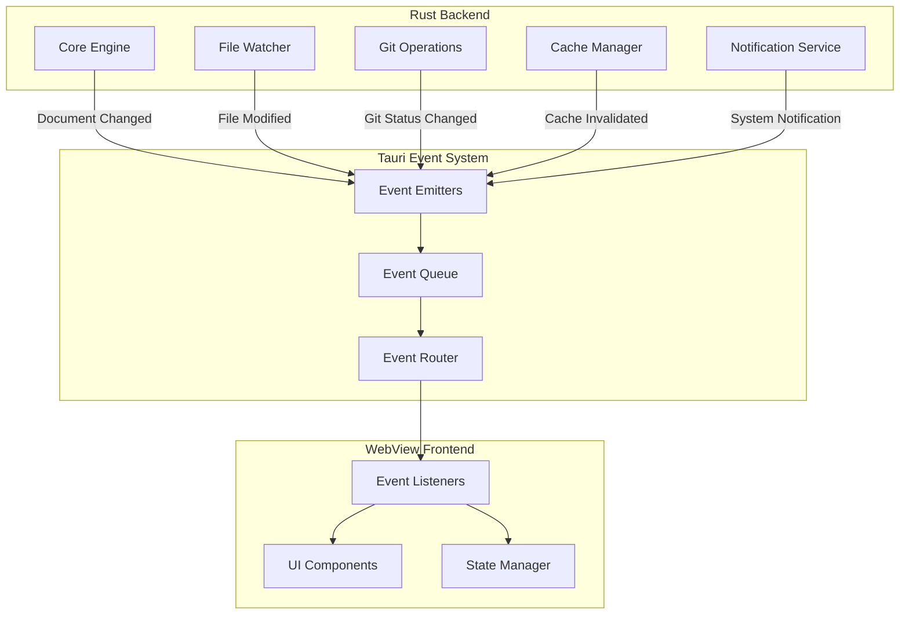
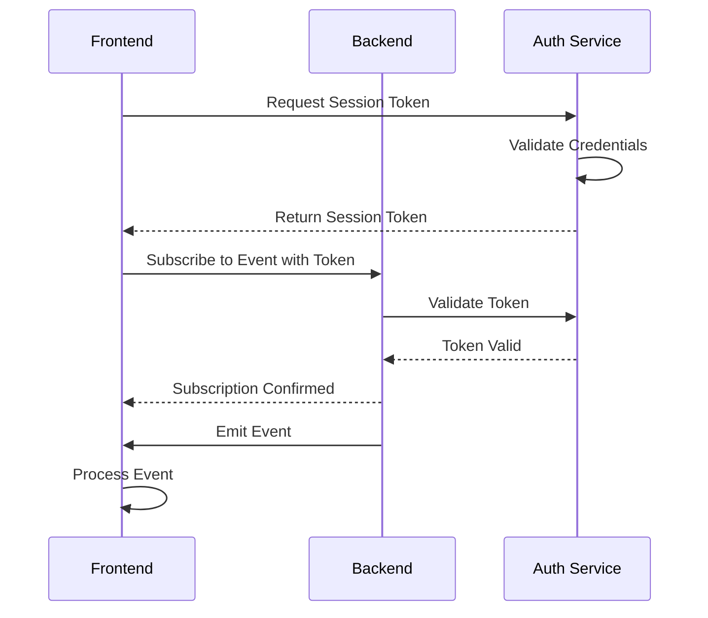

# TACHYON: DESKTOP EVENTS API SPECIFICATION

**Document ID:** TACHYON-API-008-V1.0
**Date:** February 2026
**Status:** Proposed
**Classification:** API Specification
**Dependencies:** [TACHYON-STD-V1.0](../../.adrs/ [TACHYON-REQ-DESK-V1.0](../../.adrs/ [TACHYON-DES-DESK-V1.0](../../.adrs/ [TACHYON-ADR-002-V1.0](../../.adrs/adr-002-bm25-search-parameters.md), [TACHYON-ADR-009-V1.0](../../.adrs/adr-009-race-condition-mitigation.md)

---

## TABLE OF CONTENTS

1. [Introduction](#1-introduction)
2. [Event Design Principles](#2-event-design-principles)
3. [Document Events](#3-document-events)
4. [Repository Events](#4-repository-events)
5. [System Events](#5-system-events)
6. [Event Subscription](#6-event-subscription)
7. [Event Security](#7-event-security)
8. [Event Performance](#8-event-performance)
9. [References](#9-references)

---

## 1. INTRODUCTION

### 1.1. Document Purpose

This document defines the comprehensive Desktop Events API specification for the Tachyon Desktop Application. The Desktop Events API provides a publish-subscribe mechanism for real-time event communication between the Rust backend and the WebView frontend, enabling reactive UI updates and state synchronization.

### 1.2. Scope

This specification covers:
- Event definitions for document lifecycle operations
- Event definitions for repository operations
- Event definitions for system-level notifications
- Event subscription and unsubscription mechanisms
- Event filtering and prioritization
- Event security requirements
- Event performance characteristics

Out of scope:
- IPC command definitions (covered in IPC API specification)
- WebSocket events for web-to-server communication (covered in WebSocket API specification)
- Internal event routing within the Rust backend

### 1.3. Architecture Overview

The Desktop Events API is built on Tauri's event system, which provides a type-safe, bidirectional event communication mechanism between the Rust backend and the WebView frontend. Events are emitted from the Rust backend and consumed by the frontend via event listeners.

**Event Flow Architecture:**



### 1.4. Terminology

| Term | Definition |
|------|------------|
| **Event** | A notification emitted by the Rust backend to signal a state change or occurrence |
| **Event Payload** | The data associated with an event, containing relevant information about the occurrence |
| **Event Listener** | A function registered to receive and process specific event types |
| **Event Subscription** | The act of registering an event listener for a specific event type |
| **Event Unsubscription** | The act of removing an event listener, stopping event reception |
| **Event Filter** | A predicate function used to selectively process events based on payload criteria |
| **Event Priority** | A classification of events by importance, affecting delivery order and processing |

---

## 2. EVENT DESIGN PRINCLES

### 2.1. Core Principles

The Desktop Events API adheres to the following design principles:

1. **Type Safety:** All event payloads are strongly typed using Rust's type system and serde serialization
2. **Immutability:** Event payloads are immutable after creation, preventing unintended modifications
3. **Explicit Semantics:** Event names clearly communicate the nature and intent of the occurrence
4. **Minimal Payloads:** Event payloads contain only the essential information required by consumers
5. **Idempotency:** Events are designed to be idempotent, allowing safe reprocessing without side effects
6. **Backwards Compatibility:** Event structures are designed to support backwards-compatible evolution

### 2.2. Event Naming Convention

Events follow a hierarchical naming convention using lowercase with hyphens as separators:

```
<domain>-<entity>-<action>
```

**Examples:**
- `document-created` - A new document was created
- `repository-sync-started` - Repository synchronization has begun
- `system-error` - A system-level error occurred

### 2.3. Event Payload Design

Event payloads adhere to the following design guidelines:

1. **Timestamp Inclusion:** All events include a UTC timestamp for temporal correlation
2. **Entity Identification:** Events include unique identifiers for affected entities
3. **Change Description:** Events include sufficient context to describe what changed
4. **Error Context:** Error events include detailed error information for debugging

**Standard Event Payload Structure:**

```rust
use serde::{Deserialize, Serialize};
use chrono::{DateTime, Utc};

#[derive(Debug, Clone, Serialize, Deserialize)]
pub struct EventMetadata {
    /// Unique event identifier
    pub event_id: String,
    
    /// Event timestamp in UTC
    pub timestamp: DateTime<Utc>,
    
    /// Event source component
    pub source: String,
    
    /// Event version for schema evolution
    pub version: String,
}
```

### 2.4. Event Delivery Guarantees

The Desktop Events API provides the following delivery guarantees:

| Guarantee | Description | Implementation |
|-----------|-------------|----------------|
| **At-Least-Once** | Events are delivered at least once to all subscribed listeners | Event queue with acknowledgment |
| **Ordered** | Events from the same source are delivered in emission order | Sequence numbers per source |
| **Best-Effort** | Event delivery is best-effort; listeners may miss events during disconnection | No persistent event storage |
| **No-Deduplication** | Duplicate events may be delivered; listeners must handle idempotently | No built-in deduplication |

### 2.5. Event Lifecycle

Events progress through the following lifecycle stages:

1. **Emission:** Event is emitted from the Rust backend
2. **Queuing:** Event is placed in the event queue
3. **Routing:** Event is routed to subscribed listeners
4. **Delivery:** Event is delivered to each subscribed listener
5. **Processing:** Listener processes the event payload
6. **Completion:** Event processing completes

**Event Lifecycle Diagram:**

```mermaid
stateDiagram-v2
    [*] --> Emitted: Event Created
    Emitted --> Queued: Enqueue
    Queued --> Routed: Dequeue
    Routed --> Delivered: Route to Listeners
    Delivered --> Processing: Listener Invoked
    Processing --> Completed: Handler Returns
    Processing --> Error: Handler Throws
    Error --> Completed: Error Logged
    Completed --> [*]

---

## 3. DOCUMENT EVENTS

Document events notify the frontend about changes to document state, including creation, modification, deletion, and synchronization operations. These events enable reactive UI updates and maintain consistency between the editor and the rendered preview.

### 3.1. Event: document-created

**Event Name:** `document-created`

**Description:** Emitted when a new document is created in the repository.

**Event Payload:**

```rust
use serde::{Deserialize, Serialize};
use chrono::{DateTime, Utc};

#[derive(Debug, Clone, Serialize, Deserialize)]
pub struct DocumentCreatedEvent {
    /// Event metadata
    pub metadata: EventMetadata,
    
    /// Unique document identifier
    pub document_id: String,
    
    /// Document title
    pub title: String,
    
    /// Document file path relative to repository root
    pub path: String,
    
    /// Document content hash for change detection
    pub content_hash: String,
    
    /// Document creation timestamp
    pub created_at: DateTime<Utc>,
    
    /// Author of document creation
    pub author: Option<String>,
}
```

**Emission Triggers:**
- User creates a new document via the UI
- External editor creates a new file in the repository
- Document is imported into the repository

**Frontend Handling:**

```typescript
import { listen } from '@tauri-apps/api/event';

interface DocumentCreatedEvent {
  metadata: EventMetadata;
  document_id: string;
  title: string;
  path: string;
  content_hash: string;
  created_at: string;
  author?: string;
}

listen<DocumentCreatedEvent>('document-created', (event) => {
  const { document_id, title, path } = event.payload;
  
  // Add document to sidebar tree
  sidebar.addDocument({ id: document_id, title, path });
  
  // Update recent documents list
  recentDocuments.add({ id: document_id, title, path });
  
  // Refresh document list if currently viewing
  if (currentView === 'documents') {
    documentList.refresh();
  }
});
```

**Related Requirements:**
- REQ-DESK-035: File Operations
- REQ-DESK-036: Repository Initialization

**Related Design Elements:**
- DES-DESK-006: Editor Component

---

### 3.2. Event: document-updated

**Event Name:** `document-updated`

**Description:** Emitted when an existing document is modified.

**Event Payload:**

```rust
#[derive(Debug, Clone, Serialize, Deserialize)]
pub struct DocumentUpdatedEvent {
    /// Event metadata
    pub metadata: EventMetadata,
    
    /// Unique document identifier
    pub document_id: String,
    
    /// Document file path relative to repository root
    pub path: String,
    
    /// Previous content hash
    pub previous_hash: String,
    
    /// New content hash
    pub new_hash: String,
    
    /// Update timestamp
    pub updated_at: DateTime<Utc>,
    
    /// Update source (editor, external, sync)
    pub source: UpdateSource,
    
    /// Change summary (optional)
    pub change_summary: Option<String>,
}

#[derive(Debug, Clone, Copy, Serialize, Deserialize)]
pub enum UpdateSource {
    /// Update from internal editor
    Editor,
    /// Update from external editor
    External,
    /// Update from synchronization
    Sync,
    /// Update from merge operation
    Merge,
}
```

**Emission Triggers:**
- User saves document in the editor
- External editor modifies the file
- Document is updated via sync
- Merge operation modifies the document

**Frontend Handling:**

```typescript
listen<DocumentUpdatedEvent>('document-updated', (event) => {
  const { document_id, path, new_hash, source } = event.payload;
  
  // Update document in sidebar tree
  sidebar.updateDocument(document_id, { hash: new_hash });
  
  // Update editor if document is currently open
  if (editor.currentDocumentId === document_id) {
    if (source === 'External' || source === 'Sync') {
      // Reload document content
      editor.reload(document_id);
    }
  }
  
  // Invalidate cache for affected document
  cache.invalidate(document_id);
  
  // Show update indicator
  notifications.showDocumentUpdated(document_id);
});
```

**Related Requirements:**
- REQ-DESK-031: File Watching
- REQ-DESK-032: External Editor Sync
- REQ-DESK-042: Cache Invalidation

**Related Design Elements:**
- DES-DESK-006: Editor Component

---

### 3.3. Event: document-deleted

**Event Name:** `document-deleted`

**Description:** Emitted when a document is deleted from the repository.

**Event Payload:**

```rust
#[derive(Debug, Clone, Serialize, Deserialize)]
pub struct DocumentDeletedEvent {
    /// Event metadata
    pub metadata: EventMetadata,
    
    /// Unique document identifier
    pub document_id: String,
    
    /// Document file path relative to repository root
    pub path: String,
    
    /// Deletion timestamp
    pub deleted_at: DateTime<Utc>,
    
    /// Deletion source (user, external, sync)
    pub source: UpdateSource,
    
    /// Whether document is in trash
    pub in_trash: bool,
}
```

**Emission Triggers:**
- User deletes document via the UI
- External editor deletes the file
- Document is removed via sync

**Frontend Handling:**

```typescript
listen<DocumentDeletedEvent>('document-deleted', (event) => {
  const { document_id, path, in_trash } = event.payload;
  
  // Remove document from sidebar tree
  sidebar.removeDocument(document_id);
  
  // Close editor tab if document is currently open
  if (editor.isDocumentOpen(document_id)) {
    editor.closeDocument(document_id);
  }
  
  // Update recent documents list
  recentDocuments.remove(document_id);
  
  // Show notification
  if (in_trash) {
    notifications.showDocumentMovedToTrash(document_id);
  } else {
    notifications.showDocumentDeleted(document_id);
  }
});
```

**Related Requirements:**
- REQ-DESK-035: File Operations
- REQ-DESK-031: File Watching

**Related Design Elements:**
- DES-DESK-005: Main Window Component

---

### 3.4. Event: document-synced

**Event Name:** `document-synced`

**Description:** Emitted when a document is synchronized with a remote repository.

**Event Payload:**

```rust
#[derive(Debug, Clone, Serialize, Deserialize)]
pub struct DocumentSyncedEvent {
    /// Event metadata
    pub metadata: EventMetadata,
    
    /// Unique document identifier
    pub document_id: String,
    
    /// Document file path relative to repository root
    pub path: String,
    
    /// Sync direction (push, pull, bidirectional)
    pub direction: SyncDirection,
    
    /// Sync status
    pub status: SyncStatus,
    
    /// Remote commit hash (if applicable)
    pub remote_commit_hash: Option<String>,
    
    /// Local commit hash
    pub local_commit_hash: String,
    
    /// Sync timestamp
    pub synced_at: DateTime<Utc>,
}

#[derive(Debug, Clone, Copy, Serialize, Deserialize)]
pub enum SyncDirection {
    /// Pushing local changes to remote
    Push,
    /// Pulling remote changes to local
    Pull,
    /// Bidirectional synchronization
    Bidirectional,
}

#[derive(Debug, Clone, Copy, Serialize, Deserialize)]
pub enum SyncStatus {
    /// Sync completed successfully
    Success,
    /// Sync failed
    Failed(String),
    /// Sync in progress
    InProgress,
    /// Sync cancelled
    Cancelled,
}
```

**Emission Triggers:**
- Document is pushed to remote repository
- Document is pulled from remote repository
- Document is synchronized bidirectionally

**Frontend Handling:**

```typescript
listen<DocumentSyncedEvent>('document-synced', (event) => {
  const { document_id, direction, status } = event.payload;
  
  // Update sync status indicator
  if (status === 'Success') {
    syncIndicator.showSuccess(document_id, direction);
  } else if (status === 'Failed') {
    syncIndicator.showError(document_id, direction);
  } else if (status === 'InProgress') {
    syncIndicator.showProgress(document_id, direction);
  }
  
  // Update document list sync status
  documentList.updateSyncStatus(document_id, status);
  
  // Refresh document if currently viewing
  if (editor.currentDocumentId === document_id && direction === 'Pull') {
    editor.reload(document_id);
  }
});
```

**Related Requirements:**
- REQ-DESK-037: Repository Cloning
- REQ-DESK-038: Auto-Commit
- REQ-DESK-081: Sync Notifications

**Related Design Elements:**
- DES-DESK-002: Application State

---

### 3.5. Document Event Subscription

**Subscription Example:**

```typescript
import { listen, UnlistenFn } from '@tauri-apps/api/event';

// Subscribe to all document events
const unlistenCreated = listen<DocumentCreatedEvent>('document-created', handleDocumentCreated);
const unlistenUpdated = listen<DocumentUpdatedEvent>('document-updated', handleDocumentUpdated);
const unlistenDeleted = listen<DocumentDeletedEvent>('document-deleted', handleDocumentDeleted);
const unlistenSynced = listen<DocumentSyncedEvent>('document-synced', handleDocumentSynced);

// Unsubscribe when component unmounts
function onUnmount() {
  unlistenCreated();
  unlistenUpdated();
  unlistenDeleted();
  unlistenSynced();
}
```

**Event Filtering:**

```typescript
// Filter events for specific document
function createDocumentFilter(documentId: string) {
  return (event: DocumentUpdatedEvent) => {
    return event.payload.document_id === documentId;
  };
}

const unlistenFiltered = listen<DocumentUpdatedEvent>(
  'document-updated',
  handleDocumentUpdate,
  { filter: createDocumentFilter('doc-123') }
);

---

## 4. REPOSITORY EVENTS

Repository events notify the frontend about changes to Git repository state, including repository operations, branch changes, and synchronization status. These events enable the UI to display accurate repository information and sync status.

### 4.1. Event: repository-added

**Event Name:** `repository-added`

**Description:** Emitted when a new Git repository is added to the application.

**Event Payload:**

```rust
#[derive(Debug, Clone, Serialize, Deserialize)]
pub struct RepositoryAddedEvent {
    /// Event metadata
    pub metadata: EventMetadata,
    
    /// Unique repository identifier
    pub repository_id: String,
    
    /// Repository name
    pub name: String,
    
    /// Repository path (absolute)
    pub path: String,
    
    /// Remote URL (if applicable)
    pub remote_url: Option<String>,
    
    /// Default branch name
    pub default_branch: String,
    
    /// Current branch name
    pub current_branch: String,
    
    /// Repository addition timestamp
    pub added_at: DateTime<Utc>,
}
```

**Emission Triggers:**
- User opens an existing repository
- User initializes a new repository
- User clones a remote repository

**Frontend Handling:**

```typescript
listen<RepositoryAddedEvent>('repository-added', (event) => {
  const { repository_id, name, path, current_branch } = event.payload;
  
  // Add repository to repository list
  repositoryList.add({
    id: repository_id,
    name,
    path,
    current_branch
  });
  
  // Update repository selector
  repositorySelector.addRepository({ id: repository_id, name });
  
  // Show welcome notification
  notifications.showRepositoryAdded(name);
  
  // Switch to new repository
  if (repositorySelector.autoSwitch) {
    repositorySelector.select(repository_id);
  }
});
```

**Related Requirements:**
- REQ-DESK-036: Repository Initialization
- REQ-DESK-037: Repository Cloning
- REQ-DESK-068: Folder Selection

**Related Design Elements:**
- DES-DESK-002: Application State

---

### 4.2. Event: repository-removed

**Event Name:** `repository-removed`

**Description:** Emitted when a Git repository is removed from the application.

**Event Payload:**

```rust
#[derive(Debug, Clone, Serialize, Deserialize)]
pub struct RepositoryRemovedEvent {
    /// Event metadata
    pub metadata: EventMetadata,
    
    /// Unique repository identifier
    pub repository_id: String,
    
    /// Repository name
    pub name: String,
    
    /// Repository path (absolute)
    pub path: String,
    
    /// Removal timestamp
    pub removed_at: DateTime<Utc>,
    
    /// Removal reason (user, error, not_found)
    pub reason: RemovalReason,
}

#[derive(Debug, Clone, Copy, Serialize, Deserialize)]
pub enum RemovalReason {
    /// User explicitly removed repository
    User,
    /// Repository no longer exists at path
    NotFound,
    /// Repository access error
    AccessError(String),
}
```

**Emission Triggers:**
- User removes repository via UI
- Repository path no longer exists
- Repository access fails repeatedly

**Frontend Handling:**

```typescript
listen<RepositoryRemovedEvent>('repository-removed', (event) => {
  const { repository_id, name, reason } = event.payload;
  
  // Remove repository from repository list
  repositoryList.remove(repository_id);
  
  // Update repository selector
  repositorySelector.removeRepository(repository_id);
  
  // Close all open documents from this repository
  editor.closeAllDocumentsFromRepository(repository_id);
  
  // Show notification
  if (reason === 'User') {
    notifications.showRepositoryRemoved(name);
  } else if (reason === 'NotFound') {
    notifications.showRepositoryNotFound(name);
  } else {
    notifications.showRepositoryAccessError(name, reason);
  }
  
  // Switch to another repository if available
  if (repositorySelector.currentRepositoryId === repository_id) {
    const nextRepository = repositoryList.getFirst();
    if (nextRepository) {
      repositorySelector.select(nextRepository.id);
    } else {
      // Show empty state
      emptyState.show();
    }
  }
});
```

**Related Requirements:**
- REQ-DESK-035: File Operations
- REQ-DESK-031: File Watching

**Related Design Elements:**
- DES-DESK-005: Main Window Component

---

### 4.3. Event: repository-sync-started

**Event Name:** `repository-sync-started`

**Description:** Emitted when repository synchronization begins.

**Event Payload:**

```rust
#[derive(Debug, Clone, Serialize, Deserialize)]
pub struct RepositorySyncStartedEvent {
    /// Event metadata
    pub metadata: EventMetadata,
    
    /// Unique repository identifier
    pub repository_id: String,
    
    /// Sync direction (push, pull, bidirectional)
    pub direction: SyncDirection,
    
    /// Sync operation identifier
    pub operation_id: String,
    
    /// Estimated duration (milliseconds)
    pub estimated_duration: Option<u64>,
    
    /// Sync start timestamp
    pub started_at: DateTime<Utc>,
}
```

**Emission Triggers:**
- User initiates sync operation
- Auto-sync is triggered
- Scheduled sync begins

**Frontend Handling:**

```typescript
listen<RepositorySyncStartedEvent>('repository-sync-started', (event) => {
  const { repository_id, direction, operation_id } = event.payload;
  
  // Show sync progress indicator
  syncIndicator.showProgress(repository_id, direction);
  
  // Update repository sync status
  repositoryList.updateSyncStatus(repository_id, 'Syncing');
  
  // Disable sync button during operation
  syncButton.disable(repository_id);
  
  // Track operation for completion
  syncOperations.track(operation_id, {
    repository_id,
    direction,
    started_at: event.payload.started_at
  });
});
```

**Related Requirements:**
- REQ-DESK-038: Auto-Commit
- REQ-DESK-081: Sync Notifications

**Related Design Elements:**
- DES-DESK-002: Application State

---

### 4.4. Event: repository-sync-completed

**Event Name:** `repository-sync-completed`

**Description:** Emitted when repository synchronization completes.

**Event Payload:**

```rust
#[derive(Debug, Clone, Serialize, Deserialize)]
pub struct RepositorySyncCompletedEvent {
    /// Event metadata
    pub metadata: EventMetadata,
    
    /// Unique repository identifier
    pub repository_id: String,
    
    /// Sync operation identifier
    pub operation_id: String,
    
    /// Sync direction (push, pull, bidirectional)
    pub direction: SyncDirection,
    
    /// Sync status
    pub status: SyncStatus,
    
    /// Number of commits pushed
    pub commits_pushed: Option<u32>,
    
    /// Number of commits pulled
    pub commits_pulled: Option<u32>,
    
    /// Number of files changed
    pub files_changed: u32,
    
    /// Sync completion timestamp
    pub completed_at: DateTime<Utc>,
    
    /// Duration in milliseconds
    pub duration_ms: u64,
    
    /// Error message (if failed)
    pub error_message: Option<String>,
}
```

**Emission Triggers:**
- Sync operation completes successfully
- Sync operation fails
- Sync operation is cancelled

**Frontend Handling:**

```typescript
listen<RepositorySyncCompletedEvent>('repository-sync-completed', (event) => {
  const { repository_id, status, direction, files_changed } = event.payload;
  
  // Update sync indicator
  if (status === 'Success') {
    syncIndicator.showSuccess(repository_id, direction);
    notifications.showSyncSuccess(repository_id, direction, files_changed);
  } else if (status === 'Failed') {
    syncIndicator.showError(repository_id, direction);
    notifications.showSyncError(repository_id, event.payload.error_message);
  } else if (status === 'Cancelled') {
    syncIndicator.showCancelled(repository_id, direction);
  }
  
  // Update repository sync status
  repositoryList.updateSyncStatus(repository_id, status);
  
  // Enable sync button
  syncButton.enable(repository_id);
  
  // Refresh document list if files changed
  if (files_changed > 0 && direction === 'Pull') {
    documentList.refresh();
  }
  
  // Remove operation from tracking
  syncOperations.untrack(event.payload.operation_id);
});
```

**Related Requirements:**
- REQ-DESK-038: Auto-Commit
- REQ-DESK-081: Sync Notifications
- REQ-DESK-040: History Viewing

**Related Design Elements:**
- DES-DESK-002: Application State

---

### 4.5. Event: repository-branch-changed

**Event Name:** `repository-branch-changed`

**Description:** Emitted when the current Git branch changes.

**Event Payload:**

```rust
#[derive(Debug, Clone, Serialize, Deserialize)]
pub struct RepositoryBranchChangedEvent {
    /// Event metadata
    pub metadata: EventMetadata,
    
    /// Unique repository identifier
    pub repository_id: String,
    
    /// Previous branch name
    pub previous_branch: String,
    
    /// New branch name
    pub new_branch: String,
    
    /// Branch change timestamp
    pub changed_at: DateTime<Utc>,
    
    /// Change source (user, sync, merge)
    pub source: BranchChangeSource,
}

#[derive(Debug, Clone, Copy, Serialize, Deserialize)]
pub enum BranchChangeSource {
    /// User explicitly switched branch
    User,
    /// Branch changed during sync
    Sync,
    /// Branch changed during merge
    Merge,
    /// Branch changed during rebase
    Rebase,
}
```

**Emission Triggers:**
- User switches branch
- Sync operation changes branch
- Merge operation changes branch
- Rebase operation changes branch

**Frontend Handling:**

```typescript
listen<RepositoryBranchChangedEvent>('repository-branch-changed', (event) => {
  const { repository_id, previous_branch, new_branch } = event.payload;
  
  // Update repository branch display
  repositoryList.updateBranch(repository_id, new_branch);
  
  // Update branch selector
  branchSelector.select(new_branch);
  
  // Refresh document list for new branch
  documentList.refresh();
  
  // Show notification
  notifications.showBranchChanged(previous_branch, new_branch);
  
  // Warn if there are uncommitted changes
  if (event.payload.source === 'User' && hasUncommittedChanges(repository_id)) {
    notifications.showUncommittedChangesWarning();
  }
});
```

**Related Requirements:**
- REQ-DESK-039: Branch Management
- REQ-DESK-040: History Viewing

**Related Design Elements:**
- DES-DESK-002: Application State

---

### 4.6. Repository Event Subscription

**Subscription Example:**

```typescript
// Subscribe to all repository events
const unlistenAdded = listen<RepositoryAddedEvent>('repository-added', handleRepositoryAdded);
const unlistenRemoved = listen<RepositoryRemovedEvent>('repository-removed', handleRepositoryRemoved);
const unlistenSyncStarted = listen<RepositorySyncStartedEvent>('repository-sync-started', handleRepositorySyncStarted);
const unlistenSyncCompleted = listen<RepositorySyncCompletedEvent>('repository-sync-completed', handleRepositorySyncCompleted);
const unlistenBranchChanged = listen<RepositoryBranchChangedEvent>('repository-branch-changed', handleRepositoryBranchChanged);

// Unsubscribe when component unmounts
function onUnmount() {
  unlistenAdded();
  unlistenRemoved();
  unlistenSyncStarted();
  unlistenSyncCompleted();
  unlistenBranchChanged();
}
```

**Event Filtering:**

```typescript
// Filter events for specific repository
function createRepositoryFilter(repositoryId: string) {
  return (event: RepositorySyncCompletedEvent) => {
    return event.payload.repository_id === repositoryId;
  };
}

const unlistenFiltered = listen<RepositorySyncCompletedEvent>(
  'repository-sync-completed',
  handleRepositorySyncCompleted,
  { filter: createRepositoryFilter('repo-123') }
);

---

## 5. SYSTEM EVENTS

System events notify the frontend about application-level state changes, including initialization, errors, warnings, and status updates. These events enable the UI to display system status and handle error conditions gracefully.

### 5.1. Event: system-initialized

**Event Name:** `system-initialized`

**Description:** Emitted when the desktop application completes initialization.

**Event Payload:**

```rust
#[derive(Debug, Clone, Serialize, Deserialize)]
pub struct SystemInitializedEvent {
    /// Event metadata
    pub metadata: EventMetadata,
    
    /// Application version
    pub version: String,
    
    /// Build information
    pub build_info: BuildInfo,
    
    /// Initialization timestamp
    pub initialized_at: DateTime<Utc>,
    
    /// Initialization duration in milliseconds
    pub duration_ms: u64,
    
    /// Initialization status
    pub status: InitializationStatus,
}

#[derive(Debug, Clone, Serialize, Deserialize)]
pub struct BuildInfo {
    /// Build timestamp
    pub build_timestamp: DateTime<Utc>,
    /// Git commit hash
    pub commit_hash: String,
    /// Rust version
    pub rust_version: String,
    /// Target platform
    pub target: String,
}

#[derive(Debug, Clone, Copy, Serialize, Deserialize)]
pub enum InitializationStatus {
    /// Initialization completed successfully
    Success,
    /// Initialization completed with warnings
    SuccessWithWarnings(Vec<String>),
    /// Initialization failed
    Failed(String),
}
```

**Emission Triggers:**
- Application completes startup sequence
- Application recovers from crash
- Application restarts after update

**Frontend Handling:**

```typescript
listen<SystemInitializedEvent>('system-initialized', (event) => {
  const { version, build_info, status } = event.payload;
  
  // Update application info display
  appInfo.update({
    version,
    build_info
  });
  
  // Handle initialization status
  if (status === 'Success') {
    // Show main application interface
    mainInterface.show();
  } else if (status.type === 'SuccessWithWarnings') {
    // Show main interface with warnings
    mainInterface.show();
    notifications.showWarnings(status.warnings);
  } else if (status.type === 'Failed') {
    // Show error screen
    errorScreen.show(status.error);
  }
  
  // Log initialization metrics
  metrics.log('initialization', {
    duration: event.payload.duration_ms,
    status: status
  });
});
```

**Related Requirements:**
- REQ-DESK-001: Application Startup
- REQ-DESK-003: Splash Screen
- REQ-DESK-004: Crash Recovery

**Related Design Elements:**
- DES-DESK-001: DesktopApplication

---

### 5.2. Event: system-error

**Event Name:** `system-error`

**Description:** Emitted when a system-level error occurs.

**Event Payload:**

```rust
#[derive(Debug, Clone, Serialize, Deserialize)]
pub struct SystemErrorEvent {
    /// Event metadata
    pub metadata: EventMetadata,
    
    /// Unique error identifier
    pub error_id: String,
    
    /// Error code
    pub error_code: String,
    
    /// Error message
    pub message: String,
    
    /// Error severity
    pub severity: ErrorSeverity,
    
    /// Error category
    pub category: ErrorCategory,
    
    /// Error timestamp
    pub occurred_at: DateTime<Utc>,
    
    /// Stack trace (if available)
    pub stack_trace: Option<String>,
    
    /// Context information
    pub context: HashMap<String, serde_json::Value>,
}

#[derive(Debug, Clone, Copy, Serialize, Deserialize)]
pub enum ErrorSeverity {
    /// Informational error
    Info,
    /// Warning
    Warning,
    /// Error
    Error,
    /// Critical error
    Critical,
}

#[derive(Debug, Clone, Copy, Serialize, Deserialize)]
pub enum ErrorCategory {
    /// File system error
    FileSystem,
    /// Network error
    Network,
    /// Git operation error
    Git,
    /// IPC error
    Ipc,
    /// Rendering error
    Rendering,
    /// Configuration error
    Configuration,
    /// Unknown error
    Unknown,
}
```

**Emission Triggers:**
- File system operation fails
- Network operation fails
- Git operation fails
- IPC operation fails
- Rendering error occurs
- Configuration error occurs

**Frontend Handling:**

```typescript
listen<SystemErrorEvent>('system-error', (event) => {
  const { error_id, error_code, message, severity, category } = event.payload;
  
  // Log error
  logger.error({
    error_id,
    error_code,
    message,
    severity,
    category,
    context: event.payload.context
  });
  
  // Show error notification based on severity
  if (severity === 'Critical') {
    notifications.showCriticalError(message, error_code);
    // Consider showing error modal
    errorModal.show({
      title: 'Critical Error',
      message,
      error_code,
      context: event.payload.context
    });
  } else if (severity === 'Error') {
    notifications.showError(message, error_code);
  } else if (severity === 'Warning') {
    notifications.showWarning(message);
  } else {
    notifications.showInfo(message);
  }
  
  // Track error metrics
  metrics.trackError({
    error_code,
    category,
    severity,
    timestamp: event.payload.occurred_at
  });
});
```

**Related Requirements:**
- REQ-DESK-082: Error Notifications
- REQ-DESK-090: Responsive UI

**Related Design Elements:**
- DES-DESK-001: DesktopApplication

---

### 5.3. Event: system-warning

**Event Name:** `system-warning`

**Description:** Emitted when a system-level warning occurs.

**Event Payload:**

```rust
#[derive(Debug, Clone, Serialize, Deserialize)]
pub struct SystemWarningEvent {
    /// Event metadata
    pub metadata: EventMetadata,
    
    /// Unique warning identifier
    pub warning_id: String,
    
    /// Warning code
    pub warning_code: String,
    
    /// Warning message
    pub message: String,
    
    /// Warning category
    pub category: ErrorCategory,
    
    /// Warning timestamp
    pub occurred_at: DateTime<Utc>,
    
    /// Context information
    pub context: HashMap<String, serde_json::Value>,
}
```

**Emission Triggers:**
- Disk space running low
- Memory usage high
- Cache size approaching limit
- Repository sync delayed
- File watching degraded

**Frontend Handling:**

```typescript
listen<SystemWarningEvent>('system-warning', (event) => {
  const { warning_id, warning_code, message, category } = event.payload;
  
  // Log warning
  logger.warn({
    warning_id,
    warning_code,
    message,
    category,
    context: event.payload.context
  });
  
  // Show warning notification
  notifications.showWarning(message);
  
  // Handle specific warnings
  if (warning_code === 'DISK_SPACE_LOW') {
    // Show disk space warning with action
    notifications.showDiskSpaceWarning(event.payload.context);
  } else if (warning_code === 'CACHE_SIZE_HIGH') {
    // Show cache size warning with clear option
    notifications.showCacheSizeWarning(event.payload.context);
  } else if (warning_code === 'SYNC_DELAYED') {
    // Show sync delayed warning
    notifications.showSyncDelayedWarning(event.payload.context);
  }
  
  // Track warning metrics
  metrics.trackWarning({
    warning_code,
    category,
    timestamp: event.payload.occurred_at
  });
});
```

**Related Requirements:**
- REQ-DESK-084: Notification Settings
- REQ-DESK-093: Disk Usage

**Related Design Elements:**
- DES-DESK-001: DesktopApplication

---

### 5.4. Event: cache-invalidated

**Event Name:** `cache-invalidated`

**Description:** Emitted when the cache is invalidated.

**Event Payload:**

```rust
#[derive(Debug, Clone, Serialize, Deserialize)]
pub struct CacheInvalidatedEvent {
    /// Event metadata
    pub metadata: EventMetadata,
    
    /// Document identifier (if specific document)
    pub document_id: Option<String>,
    
    /// Invalidation reason
    pub reason: CacheInvalidationReason,
    
    /// Invalidation timestamp
    pub invalidated_at: DateTime<Utc>,
    
    /// Cache statistics before invalidation
    pub cache_stats_before: CacheStatistics,
}

#[derive(Debug, Clone, Copy, Serialize, Deserialize)]
pub enum CacheInvalidationReason {
    /// Document modified
    DocumentModified,
    /// Git commit made
    GitCommit,
    /// Repository switched
    RepositorySwitched,
    /// Manual clear
    ManualClear,
    /// Cache size limit reached
    SizeLimitReached,
    /// Cache TTL expired
    TtlExpired,
}

#[derive(Debug, Clone, Serialize, Deserialize)]
pub struct CacheStatistics {
    /// Total cache size in bytes
    pub total_size_bytes: u64,
    /// Number of cache entries
    pub entry_count: u32,
    /// Cache hit rate
    pub hit_rate: f64,
}
```

**Emission Triggers:**
- Document is modified
- Git commit is made
- Repository is switched
- User clears cache manually
- Cache size limit is reached
- Cache TTL expires

**Frontend Handling:**

```typescript
listen<CacheInvalidatedEvent>('cache-invalidated', (event) => {
  const { document_id, reason, cache_stats_before } = event.payload;
  
  // Invalidate cache entry
  if (document_id) {
    cache.invalidate(document_id);
    
    // Reload document if currently viewing
    if (editor.currentDocumentId === document_id) {
      editor.reload(document_id);
    }
  } else {
    // Clear all cache
    cache.clearAll();
    
    // Refresh all views
    documentList.refresh();
    editor.refreshAll();
  }
  
  // Update cache statistics display
  cacheStats.update(cache_stats_before);
  
  // Show notification for manual clear
  if (reason === 'ManualClear') {
    notifications.showCacheCleared();
  }
});
```

**Related Requirements:**
- REQ-DESK-042: Cache Invalidation
- REQ-DESK-045: Manual Cache Clear

**Related Design Elements:**
- DES-DESK-002: Application State

---

### 5.5. Event: theme-changed

**Event Name:** `theme-changed`

**Description:** Emitted when the application theme changes.

**Event Payload:**

```rust
#[derive(Debug, Clone, Serialize, Deserialize)]
pub struct ThemeChangedEvent {
    /// Event metadata
    pub metadata: EventMetadata,
    
    /// Previous theme
    pub previous_theme: Theme,
    
    /// New theme
    pub new_theme: Theme,
    
    /// Theme change timestamp
    pub changed_at: DateTime<Utc>,
    
    /// Change source (user, system, auto)
    pub source: ThemeChangeSource,
}

#[derive(Debug, Clone, Copy, Serialize, Deserialize)]
pub enum Theme {
    /// Light theme
    Light,
    /// Dark theme
    Dark,
    /// System theme
    System,
    /// Custom theme
    Custom(String),
}

#[derive(Debug, Clone, Copy, Serialize, Deserialize)]
pub enum ThemeChangeSource {
    /// User explicitly changed theme
    User,
    /// System theme changed
    System,
    /// Automatic theme change based on time
    Auto,
}
```

**Emission Triggers:**
- User changes theme in settings
- System theme changes (when using system theme)
- Automatic theme change based on time of day

**Frontend Handling:**

```typescript
listen<ThemeChangedEvent>('theme-changed', (event) => {
  const { previous_theme, new_theme } = event.payload;
  
  // Apply new theme
  themeManager.apply(new_theme);
  
  // Update theme selector
  themeSelector.select(new_theme);
  
  // Save theme preference
  preferences.save({ theme: new_theme });
  
  // Show notification
  notifications.showThemeChanged(previous_theme, new_theme);
  
  // Update CSS variables for custom theme
  if (new_theme.type === 'Custom') {
    cssVariables.update(new_theme.name);
  }
});
```

**Related Requirements:**
- REQ-DESK-025: Editor Theming
- REQ-DESK-063: Theme Sync

**Related Design Elements:**
- DES-DESK-002: Application State

---

### 5.6. System Event Subscription

**Subscription Example:**

```typescript
// Subscribe to all system events
const unlistenInitialized = listen<SystemInitializedEvent>('system-initialized', handleSystemInitialized);
const unlistenError = listen<SystemErrorEvent>('system-error', handleSystemError);
const unlistenWarning = listen<SystemWarningEvent>('system-warning', handleSystemWarning);
const unlistenCacheInvalidated = listen<CacheInvalidatedEvent>('cache-invalidated', handleCacheInvalidated);
const unlistenThemeChanged = listen<ThemeChangedEvent>('theme-changed', handleThemeChanged);

// Unsubscribe when component unmounts
function onUnmount() {
  unlistenInitialized();
  unlistenError();
  unlistenWarning();
  unlistenCacheInvalidated();
  unlistenThemeChanged();
}
```

**Event Filtering:**

```typescript
// Filter errors by severity
function createErrorSeverityFilter(severity: ErrorSeverity) {
  return (event: SystemErrorEvent) => {
    return event.payload.severity === severity;
  };
}

const unlistenCriticalErrors = listen<SystemErrorEvent>(
  'system-error',
  handleCriticalError,
  { filter: createErrorSeverityFilter('Critical') }
);

---

## 6. EVENT SUBSCRIPTION

Event subscription enables frontend components to register listeners for specific event types, receive event payloads, and process events according to application logic.

### 6.1. Subscription API

**TypeScript API:**

```typescript
import { listen, UnlistenFn } from '@tauri-apps/api/event';

/**
 * Subscribes to an event with the specified name
 * 
 * @param event - The event name to listen for
 * @param handler - The event handler function
 * @param options - Optional subscription options
 * @returns A function to unsubscribe from the event
 */
function listen<T>(
  event: string,
  handler: (event: { payload: T }) => void,
  options?: ListenOptions
): UnlistenFn;

interface ListenOptions {
  /**
   * Optional filter function to selectively process events
   * Returns true to process the event, false to skip
   */
  filter?: (event: { payload: T }) => boolean;
  
  /**
   * Optional event target window
   */
  target?: 'main' | string;
}
```

**Rust API:**

```rust
use tauri::{AppHandle, Emitter};
use serde::Serialize;

/**
 * Emits an event to the frontend
 * 
 * @param app - The Tauri app handle
 * @param event - The event name
 * @param payload - The event payload
 */
pub fn emit_event<T: Serialize>(
    app: &AppHandle,
    event: &str,
    payload: T,
) -> Result<(), String> {
    app.emit_all(event, payload)
        .map_err(|e| e.to_string())
}
```

### 6.2. Subscription Patterns

#### 6.2.1. Component-Level Subscription

Subscriptions are typically established in component lifecycle hooks:

```typescript
import { onMount, onCleanup } from 'solid-js';

function DocumentList() {
  let unlistenFn: UnlistenFn | null = null;
  
  onMount(() => {
    // Subscribe to document events
    unlistenFn = listen<DocumentCreatedEvent>(
      'document-created',
      handleDocumentCreated
    );
  });
  
  onCleanup(() => {
    // Unsubscribe when component unmounts
    if (unlistenFn) {
      unlistenFn();
    }
  });
  
  return <div>...</div>;
}
```

#### 6.2.2. Global Subscription

Global subscriptions are established at application initialization:

```typescript
import { listen } from '@tauri-apps/api/event';

// Subscribe to system events globally
listen<SystemErrorEvent>('system-error', handleSystemError);
listen<SystemWarningEvent>('system-warning', handleSystemWarning);
listen<SystemInitializedEvent>('system-initialized', handleSystemInitialized);

// These subscriptions persist for the application lifetime
```

#### 6.2.3. Conditional Subscription

Conditional subscriptions are established based on application state:

```typescript
import { createEffect } from 'solid-js';

function RepositoryView() {
  const [repositoryId, setRepositoryId] = createSignal<string | null>(null);
  let unlistenFn: UnlistenFn | null = null;
  
  createEffect(() => {
    const currentRepoId = repositoryId();
    
    // Clean up previous subscription
    if (unlistenFn) {
      unlistenFn();
      unlistenFn = null;
    }
    
    // Subscribe only when repository is selected
    if (currentRepoId) {
      unlistenFn = listen<DocumentUpdatedEvent>(
        'document-updated',
        (event) => {
          // Only process events for this repository
          if (event.payload.repository_id === currentRepoId) {
            handleDocumentUpdate(event.payload);
          }
        }
      );
    }
  });
  
  return <div>...</div>;
}
```

### 6.3. Event Filtering

Event filtering enables selective processing of events based on payload criteria:

#### 6.3.1. Single-Field Filter

```typescript
// Filter events for specific document
const unlisten = listen<DocumentUpdatedEvent>(
  'document-updated',
  handleDocumentUpdate,
  {
    filter: (event) => event.payload.document_id === 'doc-123'
  }
);
```

#### 6.3.2. Multi-Field Filter

```typescript
// Filter events for specific document and source
const unlisten = listen<DocumentUpdatedEvent>(
  'document-updated',
  handleDocumentUpdate,
  {
    filter: (event) => 
      event.payload.document_id === 'doc-123' &&
      event.payload.source === 'External'
  }
);
```

#### 6.3.3. Complex Filter

```typescript
// Filter events with complex criteria
function createDocumentFilter(criteria: DocumentFilterCriteria) {
  return (event: DocumentUpdatedEvent) => {
    const { document_id, source, updated_at } = event.payload;
    
    // Check document ID
    if (criteria.documentId && document_id !== criteria.documentId) {
      return false;
    }
    
    // Check source
    if (criteria.source && source !== criteria.source) {
      return false;
    }
    
    // Check time range
    if (criteria.after && updated_at < criteria.after) {
      return false;
    }
    
    return true;
  };
}

interface DocumentFilterCriteria {
  documentId?: string;
  source?: UpdateSource;
  after?: Date;
}

const unlisten = listen<DocumentUpdatedEvent>(
  'document-updated',
  handleDocumentUpdate,
  {
    filter: createDocumentFilter({
      documentId: 'doc-123',
      source: 'External',
      after: new Date(Date.now() - 60000) // Last minute
    })
  }
);
```

### 6.4. Event Unsubscription

Proper unsubscription prevents memory leaks and ensures clean component lifecycle:

#### 6.4.1. Single Unsubscription

```typescript
const unlisten = listen<DocumentCreatedEvent>(
  'document-created',
  handleDocumentCreated
);

// Unsubscribe when no longer needed
function onUnmount() {
  unlisten();
}
```

#### 6.4.2. Multiple Unsubscriptions

```typescript
const subscriptions: UnlistenFn[] = [];

// Subscribe to multiple events
subscriptions.push(
  listen<DocumentCreatedEvent>('document-created', handleDocumentCreated)
);
subscriptions.push(
  listen<DocumentUpdatedEvent>('document-updated', handleDocumentUpdated)
);
subscriptions.push(
  listen<DocumentDeletedEvent>('document-deleted', handleDocumentDeleted)
);

// Unsubscribe from all events
function onUnmount() {
  subscriptions.forEach(unlisten => unlisten());
  subscriptions.length = 0;
}
```

#### 6.4.3. Subscription Manager

```typescript
class EventSubscriptionManager {
  private subscriptions: Map<string, UnlistenFn[]> = new Map();
  
  /**
   * Subscribes to an event with the specified name
   * 
   * @param event - The event name
   * @param handler - The event handler function
   * @param key - Optional key for grouping subscriptions
   */
  subscribe<T>(
    event: string,
    handler: (event: { payload: T }) => void,
    key?: string
  ): UnlistenFn {
    const unlisten = listen(event, handler);
    
    const group = key || event;
    if (!this.subscriptions.has(group)) {
      this.subscriptions.set(group, []);
    }
    this.subscriptions.get(group)!.push(unlisten);
    
    return unlisten;
  }
  
  /**
   * Unsubscribes from all events in a group
   * 
   * @param key - The group key
   */
  unsubscribeGroup(key: string): void {
    const group = this.subscriptions.get(key);
    if (group) {
      group.forEach(unlisten => unlisten());
      this.subscriptions.delete(key);
    }
  }
  
  /**
   * Unsubscribes from all events
   */
  unsubscribeAll(): void {
    this.subscriptions.forEach(group => {
      group.forEach(unlisten => unlisten());
    });
    this.subscriptions.clear();
  }
}

// Usage
const subscriptionManager = new EventSubscriptionManager();

subscriptionManager.subscribe('document-created', handleDocumentCreated, 'documents');
subscriptionManager.subscribe('document-updated', handleDocumentUpdated, 'documents');
subscriptionManager.subscribe('document-deleted', handleDocumentDeleted, 'documents');

// Unsubscribe from all document events
function onUnmount() {
  subscriptionManager.unsubscribeGroup('documents');
}
```

### 6.5. Event Prioritization

Events are prioritized to ensure critical events are processed first:

| Priority | Event Types | Processing Order |
|----------|-------------|------------------|
| **Critical** | system-error, system-initialized | 1 (highest) |
| **High** | document-deleted, repository-removed | 2 |
| **Normal** | document-created, document-updated, repository-added | 3 |
| **Low** | cache-invalidated, theme-changed | 4 (lowest) |

**Priority Implementation:**

```typescript
class PriorityQueue<T> {
  private queues: Map<number, T[]> = new Map();
  
  enqueue(item: T, priority: number): void {
    if (!this.queues.has(priority)) {
      this.queues.set(priority, []);
    }
    this.queues.get(priority)!.push(item);
  }
  
  dequeue(): T | null {
    for (let priority = 4; priority >= 1; priority--) {
      const queue = this.queues.get(priority);
      if (queue && queue.length > 0) {
        return queue.shift()!;
      }
    }
    return null;
  }
}

// Event processing with priority
const eventQueue = new PriorityQueue<Event>();

function processEvents(): void {
  while (true) {
    const event = eventQueue.dequeue();
    if (!event) {
      break;
    }
    processEvent(event);
  }
}

---

## 7. EVENT SECURITY

Event security ensures that event communication between the Rust backend and WebView frontend is secure, authenticated, and authorized. Security controls prevent unauthorized event access, injection attacks, and information disclosure.

### 7.1. Authentication Requirements

Event subscription requires authentication to prevent unauthorized access:

**Authentication Flow:**



**Authentication Implementation:**

```rust
use tauri::{AppHandle, Emitter, State};
use std::collections::HashMap;
use std::sync::Arc;
use tokio::sync::RwLock;

/// Session token store
type SessionStore = Arc<RwLock<HashMap<String, SessionInfo>>>;

#[derive(Debug, Clone)]
struct SessionInfo {
    user_id: String,
    expires_at: DateTime<Utc>,
    capabilities: Vec<String>,
}

/// Validates session token
pub fn validate_session_token(
    sessions: &SessionStore,
    token: &str,
    required_capability: &str,
) -> Result<String, String> {
    let sessions = sessions.read().await;
    
    let session = sessions.get(token)
        .ok_or_else(|| "Invalid session token".to_string())?;
    
    // Check expiration
    if session.expires_at < Utc::now() {
        return Err("Session token expired".to_string());
    }
    
    // Check capability
    if !session.capabilities.contains(&required_capability.to_string()) {
        return Err("Insufficient capabilities".to_string());
    }
    
    Ok(session.user_id.clone())
}
```

### 7.2. Authorization Requirements

Event emission requires authorization based on capability-based access control:

**Capability Definitions:**

```json
{
  "identifier": "event-subscription",
  "description": "Event subscription capabilities",
  "windows": ["main"],
  "permissions": [
    {
      "identifier": "event:document:read",
      "allow": true,
      "description": "Subscribe to document events"
    },
    {
      "identifier": "event:repository:read",
      "allow": true,
      "description": "Subscribe to repository events"
    },
    {
      "identifier": "event:system:read",
      "allow": false,
      "description": "Subscribe to system events (admin only)"
    }
  ]
}
```

**Authorization Implementation:**

```rust
/// Checks if user is authorized to subscribe to event
pub fn check_event_authorization(
    user_id: &str,
    event_name: &str,
    capabilities: &[String],
) -> Result<(), String> {
    // Map event names to required capabilities
    let required_capability = match event_name {
        e if e.starts_with("document-") => "event:document:read",
        e if e.starts_with("repository-") => "event:repository:read",
        e if e.starts_with("system-") => "event:system:read",
        _ => return Err("Unknown event type".to_string()),
    };
    
    // Check if user has required capability
    if !capabilities.contains(&required_capability.to_string()) {
        return Err(format!(
            "User {} not authorized for event {}",
            user_id, event_name
        ));
    }
    
    Ok(())
}
```

### 7.3. Event Validation

Event payloads are validated before emission to prevent injection attacks:

**Validation Rules:**

1. **Type Validation:** All payload fields must match expected types
2. **Length Validation:** String fields must not exceed maximum length
3. **Format Validation:** String fields must match expected formats (e.g., UUID, ISO 8601)
4. **Content Validation:** Payload content must not contain malicious patterns

**Validation Implementation:**

```rust
use serde::{Deserialize, Serialize};
use validator::Validate;

#[derive(Debug, Clone, Serialize, Deserialize, Validate)]
pub struct DocumentCreatedEvent {
    pub metadata: EventMetadata,
    
    #[validate(length(min = 1, max = 255))]
    pub document_id: String,
    
    #[validate(length(min = 1, max = 255))]
    pub title: String,
    
    #[validate(length(max = 4096))]
    pub path: String,
    
    #[validate(length(min = 32, max = 64))]
    pub content_hash: String,
    
    pub created_at: DateTime<Utc>,
    
    #[validate(length(max = 255))]
    pub author: Option<String>,
}

/// Validates event payload before emission
pub fn validate_event_payload<T: Validate>(payload: &T) -> Result<(), String> {
    payload.validate()
        .map_err(|e| format!("Event payload validation failed: {}", e))
}
```

### 7.4. Input Sanitization

Event payloads are sanitized to remove sensitive information:

**Sanitization Rules:**

1. **Path Sanitization:** File paths are normalized and validated
2. **Secret Redaction:** Secrets, tokens, and passwords are redacted
3. **HTML Sanitization:** HTML content is sanitized to prevent XSS
4. **SQL Injection Prevention:** SQL-like patterns are escaped

**Sanitization Implementation:**

```rust
use std::path::Path;
use ammonia::clean;

/// Sanitizes event payload
pub fn sanitize_event_payload(payload: &mut serde_json::Value) {
    match payload {
        serde_json::Value::Object(map) => {
            for (key, value) in map.iter_mut() {
                match key.as_str() {
                    Some("path") | Some("file_path") => {
                        if let serde_json::Value::String(ref mut path) = value {
                            *path = sanitize_path(path);
                        }
                    }
                    Some("content") => {
                        if let serde_json::Value::String(ref mut content) = value {
                            *content = sanitize_html(content);
                        }
                    }
                    _ => {
                        sanitize_event_payload(value);
                    }
                }
            }
        }
        serde_json::Value::Array(arr) => {
            for value in arr.iter_mut() {
                sanitize_event_payload(value);
            }
        }
        _ => {}
    }
}

/// Sanitizes file path
fn sanitize_path(path: &str) -> String {
    let normalized = Path::new(path)
        .canonicalize()
        .unwrap_or_else(|_| Path::new(path))
        .to_string_lossy()
        .to_string();
    
    // Remove any parent directory references
    normalized.replace("..", "")
}

/// Sanitizes HTML content
fn sanitize_html(html: &str) -> String {
    clean(html).to_string()
}
```

### 7.5. Rate Limiting

Event emission is rate-limited to prevent event flooding:

**Rate Limiting Configuration:**

| Event Type | Rate Limit | Burst Allowance |
|------------|-------------|------------------|
| **document-\*** | 100 events/second | 200 events |
| **repository-\*** | 50 events/second | 100 events |
| **system-\*** | 10 events/second | 20 events |

**Rate Limiting Implementation:**

```rust
use std::collections::HashMap;
use std::time::{Duration, Instant};
use tokio::sync::Mutex;

/// Rate limiter for event emission
pub struct EventRateLimiter {
    limits: Mutex<HashMap<String, RateLimit>>,
}

#[derive(Debug, Clone)]
struct RateLimit {
    max_events: u32,
    period: Duration,
    events: Vec<Instant>,
}

impl EventRateLimiter {
    pub fn new() -> Self {
        Self {
            limits: Mutex::new(HashMap::new()),
        }
    }
    
    /// Checks if event emission is allowed
    pub async fn check_rate_limit(&self, event_type: &str) -> Result<(), String> {
        let mut limits = self.limits.lock().await;
        
        let limit = limits.entry(event_type.to_string())
            .or_insert_with(|| self.get_limit_for_event_type(event_type));
        
        let now = Instant::now();
        
        // Remove expired events
        limit.events.retain(|&t| now.duration_since(t) < limit.period);
        
        // Check if limit exceeded
        if limit.events.len() >= limit.max_events as usize {
            return Err(format!(
                "Rate limit exceeded for event type {}: {}/{}",
                event_type, limit.max_events, limit.period.as_secs()
            ));
        }
        
        // Add current event
        limit.events.push(now);
        
        Ok(())
    }
    
    fn get_limit_for_event_type(&self, event_type: &str) -> RateLimit {
        match event_type {
            e if e.starts_with("document-") => RateLimit {
                max_events: 100,
                period: Duration::from_secs(1),
                events: Vec::new(),
            },
            e if e.starts_with("repository-") => RateLimit {
                max_events: 50,
                period: Duration::from_secs(1),
                events: Vec::new(),
            },
            e if e.starts_with("system-") => RateLimit {
                max_events: 10,
                period: Duration::from_secs(1),
                events: Vec::new(),
            },
            _ => RateLimit {
                max_events: 100,
                period: Duration::from_secs(1),
                events: Vec::new(),
            },
        }
    }
}
```

### 7.6. Audit Logging

All event emissions and subscriptions are logged for audit purposes:

**Audit Log Format:**

```rust
#[derive(Debug, Clone, Serialize, Deserialize)]
pub struct EventAuditLog {
    /// Audit log ID
    pub log_id: String,
    
    /// Event name
    pub event_name: String,
    
    /// User ID (if authenticated)
    pub user_id: Option<String>,
    
    /// Session ID
    pub session_id: String,
    
    /// Action (emit, subscribe, unsubscribe)
    pub action: EventAuditAction,
    
    /// Timestamp
    pub timestamp: DateTime<Utc>,
    
    /// Success or failure
    pub success: bool,
    
    /// Error message (if failed)
    pub error_message: Option<String>,
}

#[derive(Debug, Clone, Copy, Serialize, Deserialize)]
pub enum EventAuditAction {
    Emit,
    Subscribe,
    Unsubscribe,
}

/// Logs event audit entry
pub fn log_event_audit(log: EventAuditLog) {
    // Write to audit log file
    let log_line = serde_json::to_string(&log).unwrap();
    std::fs::write_to_file("audit/events.log", log_line + "\n");
}
```

**Related Requirements:**
- REQ-DESK-052: WebView Security
- REQ-DESK-080: Link Validation
- REQ-IPC-031: Event Emission

**Related ADRs:**
- ADR-002: Tauri for Desktop Application
- ADR-009: IPC Communication Architecture
- ADR-010: Security Architecture

---

## 8. EVENT PERFORMANCE

Event performance ensures that event communication between the Rust backend and WebView frontend is efficient, responsive, and scalable. Performance optimizations minimize latency, maximize throughput, and reduce resource consumption.

### 8.1. Latency Requirements

Event emission and delivery must meet strict latency requirements:

| Operation | Target Latency | Maximum Latency | Measurement Method |
|-----------|----------------|------------------|-------------------|
| **Event Emission** | < 0.1 ms | < 0.5 ms | Time from emit() call to queue |
| **Event Serialization** | < 0.1 ms | < 0.2 ms | Time to serialize payload |
| **Event Delivery** | < 0.5 ms | < 1.0 ms | Time from queue to listener |
| **End-to-End** | < 1.0 ms | < 2.0 ms | Time from emit to handler |

**Latency Measurement:**

```rust
use std::time::Instant;

/// Emits event with latency measurement
pub fn emit_event_with_latency<T: Serialize>(
    app: &AppHandle,
    event: &str,
    payload: T,
) -> Result<(), String> {
    let start = Instant::now();
    
    // Serialize payload
    let serialized = serde_json::to_string(&payload)
        .map_err(|e| format!("Serialization error: {}", e))?;
    
    let serialization_time = start.elapsed();
    
    // Emit event
    app.emit_all(event, serialized)
        .map_err(|e| format!("Emission error: {}", e))?;
    
    let emission_time = start.elapsed();
    
    // Log latency metrics
    metrics::log_event_latency(event, serialization_time, emission_time);
    
    Ok(())
}
```

### 8.2. Throughput Requirements

Event system must support high throughput for real-time applications:

| Event Type | Target Throughput | Maximum Throughput | Burst Allowance |
|------------|------------------|-------------------|------------------|
| **document-\*** | 100 events/second | 200 events/second | 500 events |
| **repository-\*** | 50 events/second | 100 events/second | 250 events |
| **system-\*** | 10 events/second | 20 events/second | 50 events |

**Throughput Optimization:**

```rust
use tokio::sync::mpsc;

/// Event channel with bounded capacity
type EventChannel = (mpsc::Sender<Event>, mpsc::Receiver<Event>);

/// Creates event channel with specified capacity
pub fn create_event_channel(capacity: usize) -> EventChannel {
    mpsc::channel(capacity)
}

/// Event processor with batching
pub struct EventProcessor {
    receiver: mpsc::Receiver<Event>,
    batch_size: usize,
    batch_timeout: Duration,
}

impl EventProcessor {
    pub async fn process_events(&mut self) {
        let mut batch = Vec::with_capacity(self.batch_size);
        let mut last_batch_time = Instant::now();
        
        loop {
            tokio::select! {
                // Receive event with timeout
                event = self.receiver.recv() => {
                    match event {
                        Ok(event) => {
                            batch.push(event);
                            
                            // Process batch if full
                            if batch.len() >= self.batch_size {
                                self.process_batch(batch).await;
                                batch = Vec::with_capacity(self.batch_size);
                                last_batch_time = Instant::now();
                            }
                        }
                        Err(_) => break,
                    }
                }
                
                // Process batch on timeout
                _ = tokio::time::sleep(Duration::from_millis(10)) => {
                    if !batch.is_empty() && last_batch_time.elapsed() >= self.batch_timeout {
                        self.process_batch(batch).await;
                        batch = Vec::with_capacity(self.batch_size);
                        last_batch_time = Instant::now();
                    }
                }
            }
        }
    }
    
    async fn process_batch(&self, batch: Vec<Event>) {
        // Process batch of events
        for event in batch {
            self.deliver_event(event).await;
        }
    }
}
```

### 8.3. Memory Optimization

Event system must minimize memory usage to prevent resource exhaustion:

**Memory Requirements:**

| Component | Target Memory | Maximum Memory | Measurement |
|-----------|---------------|-----------------|-------------|
| **Event Queue** | < 10 MB | < 50 MB | Total queued events |
| **Event Payloads** | < 5 MB | < 20 MB | Average payload size |
| **Event Listeners** | < 1 MB | < 5 MB | Listener metadata |
| **Total** | < 16 MB | < 75 MB | All event components |

**Memory Optimization Strategies:**

```rust
use std::collections::VecDeque;

/// Bounded event queue with memory limit
pub struct BoundedEventQueue {
    queue: VecDeque<Event>,
    max_size: usize,
    max_memory_bytes: usize,
    current_memory_bytes: usize,
}

impl BoundedEventQueue {
    pub fn new(max_size: usize, max_memory_bytes: usize) -> Self {
        Self {
            queue: VecDeque::with_capacity(max_size),
            max_size,
            max_memory_bytes,
            current_memory_bytes: 0,
        }
    }
    
    pub fn push(&mut self, event: Event) -> Result<(), Event> {
        let event_size = event.estimated_size();
        
        // Check memory limit
        if self.current_memory_bytes + event_size > self.max_memory_bytes {
            return Err(event);
        }
        
        // Check size limit
        if self.queue.len() >= self.max_size {
            // Remove oldest event
            if let Some(oldest) = self.pop_front() {
                self.current_memory_bytes -= oldest.estimated_size();
            }
        }
        
        // Add new event
        self.queue.push_back(event);
        self.current_memory_bytes += event_size;
        
        Ok(())
    }
}

impl Event {
    fn estimated_size(&self) -> usize {
        // Estimate memory usage of event
        std::mem::size_of_val(self) + self.payload_size()
    }
    
    fn payload_size(&self) -> usize {
        // Estimate payload size
        match self {
            Event::DocumentCreated(e) => e.estimated_size(),
            Event::DocumentUpdated(e) => e.estimated_size(),
            // ... other event types
        }
    }
}
```

### 8.4. CPU Optimization

Event system must minimize CPU usage to maintain system responsiveness:

**CPU Requirements:**

| Operation | Target CPU Usage | Maximum CPU Usage | Measurement |
|-----------|-----------------|-------------------|-------------|
| **Event Emission** | < 1% | < 5% | Per event |
| **Event Serialization** | < 2% | < 10% | Per event |
| **Event Delivery** | < 2% | < 10% | Per event |
| **Total** | < 5% | < 25% | All event operations |

**CPU Optimization Strategies:**

```rust
use std::sync::Arc;
use tokio::task::JoinSet;

/// Async event emitter with parallel processing
pub struct AsyncEventEmitter {
    app: AppHandle,
    executor: JoinSet,
}

impl AsyncEventEmitter {
    pub fn new(app: AppHandle) -> Self {
        Self {
            app,
            executor: JoinSet::new(),
        }
    }
    
    /// Emits event asynchronously
    pub async fn emit_async<T: Serialize + Send + 'static>(
        &self,
        event: String,
        payload: T,
    ) -> Result<(), String> {
        let app = self.app.clone();
        
        // Spawn async task for emission
        self.executor.spawn(async move {
            let serialized = serde_json::to_string(&payload)
                .map_err(|e| format!("Serialization error: {}", e))?;
            
            app.emit_all(&event, serialized)
                .map_err(|e| format!("Emission error: {}", e))?;
            
            Ok::<(), String>(())
        });
        
        Ok(())
    }
}
```

### 8.5. Optimization Strategies

#### 8.5.1. Event Batching

Batch multiple events together to reduce serialization and delivery overhead:

```rust
/// Event batcher
pub struct EventBatcher {
    batch: Vec<Event>,
    batch_size: usize,
    batch_timeout: Duration,
    last_batch_time: Instant,
}

impl EventBatcher {
    pub fn add_event(&mut self, event: Event) -> Option<Vec<Event>> {
        self.batch.push(event);
        
        // Return batch if size limit reached
        if self.batch.len() >= self.batch_size {
            return self.flush();
        }
        
        // Return batch if timeout reached
        if self.last_batch_time.elapsed() >= self.batch_timeout {
            return self.flush();
        }
        
        None
    }
    
    pub fn flush(&mut self) -> Option<Vec<Event>> {
        if self.batch.is_empty() {
            return None;
        }
        
        let batch = std::mem::take(&mut self.batch);
        self.last_batch_time = Instant::now();
        
        Some(batch)
    }
}
```

#### 8.5.2. Event Compression

Compress event payloads to reduce memory and bandwidth usage:

```rust
use flate2::write::{GzEncoder, Compression};
use std::io::Write;

/// Compresses event payload
pub fn compress_payload(payload: &str) -> Result<Vec<u8>, String> {
    let mut encoder = GzEncoder::new(Vec::new(), Compression::default());
    encoder.write_all(payload.as_bytes())
        .map_err(|e| format!("Compression error: {}", e))?;
    encoder.try_finish()
        .map_err(|e| format!("Compression finish error: {}", e))?;
    
    Ok(encoder.into_inner())
}

/// Decompresses event payload
pub fn decompress_payload(compressed: &[u8]) -> Result<String, String> {
    use flate2::read::GzDecoder;
    use std::io::Read;
    
    let mut decoder = GzDecoder::new(compressed);
    let mut decompressed = String::new();
    decoder.read_to_string(&mut decompressed)
        .map_err(|e| format!("Decompression error: {}", e))?;
    
    Ok(decompressed)
}
```

#### 8.5.3. Event Pooling

Pool event objects to reduce allocation overhead:

```rust
use std::sync::Mutex;
use std::collections::VecDeque;

/// Event object pool
pub struct EventPool<T> {
    pool: Mutex<VecDeque<T>>,
    max_size: usize,
}

impl<T: Default> EventPool<T> {
    pub fn new(max_size: usize) -> Self {
        Self {
            pool: Mutex::new(VecDeque::with_capacity(max_size)),
            max_size,
        }
    }
    
    pub fn acquire(&self) -> T {
        let mut pool = self.pool.lock().unwrap();
        
        pool.pop_front()
            .unwrap_or_else(T::default)
    }
    
    pub fn release(&self, event: T) {
        let mut pool = self.pool.lock().unwrap();
        
        if pool.len() < self.max_size {
            pool.push_back(event);
        }
    }
}
```

### 8.6. Performance Monitoring

Monitor event system performance to identify bottlenecks and optimization opportunities:

**Performance Metrics:**

```rust
#[derive(Debug, Clone)]
pub struct EventPerformanceMetrics {
    pub event_count: u64,
    pub total_latency_ms: f64,
    pub avg_latency_ms: f64,
    pub max_latency_ms: f64,
    pub min_latency_ms: f64,
    pub throughput_events_per_sec: f64,
    pub memory_usage_bytes: u64,
    pub cpu_usage_percent: f64,
}

/// Collects event performance metrics
pub fn collect_performance_metrics() -> EventPerformanceMetrics {
    EventPerformanceMetrics {
        event_count: metrics::get_event_count(),
        total_latency_ms: metrics::get_total_latency_ms(),
        avg_latency_ms: metrics::get_avg_latency_ms(),
        max_latency_ms: metrics::get_max_latency_ms(),
        min_latency_ms: metrics::get_min_latency_ms(),
        throughput_events_per_sec: metrics::get_throughput(),
        memory_usage_bytes: metrics::get_memory_usage(),
        cpu_usage_percent: metrics::get_cpu_usage(),
    }
}
```

**Related Requirements:**
- REQ-DESK-086: Hot-Reload Latency
- REQ-DESK-087: Initial Load Time
- REQ-DESK-090: Responsive UI
- REQ-DESK-091: Memory Usage
- REQ-DESK-092: CPU Usage

**Related Design Elements:**
- DES-DESK-001: DesktopApplication

---

## 9. REFERENCES

### 9.1. Requirements References

This specification references the following requirements from [`.adrs/

| Requirement ID | Title | Reference Section |
|----------------|-------|------------------|
| REQ-DESK-001 | Application Startup | 1.3, 5.1 |
| REQ-DESK-002 | Single Instance | 1.3 |
| REQ-DESK-003 | Splash Screen | 1.3 |
| REQ-DESK-004 | Crash Recovery | 1.3, 5.1 |
| REQ-DESK-006 | Graceful Shutdown | 1.3 |
| REQ-DESK-011 | Window Management | 3.1, 3.2 |
| REQ-DESK-016 | Sidebar Navigation | 3.2 |
| REQ-DESK-018 | Tabbed Interface | 3.2 |
| REQ-DESK-019 | Keyboard Navigation | 3.2 |
| REQ-DESK-021 | Split View Editing | 3.3 |
| REQ-DESK-022 | Live Preview | 3.3 |
| REQ-DESK-025 | Editor Theming | 3.3, 5.5 |
| REQ-DESK-026 | Main Menu Bar | 3.4 |
| REQ-DESK-029 | Command Palette | 3.4 |
| REQ-DESK-031 | File Watching | 4.1, 3.2 |
| REQ-DESK-032 | External Editor Sync | 4.1, 3.2 |
| REQ-DESK-034 | File Locking | 4.1 |
| REQ-DESK-035 | File Operations | 4.1, 3.1 |
| REQ-DESK-036 | Repository Initialization | 4.2, 4.1 |
| REQ-DESK-037 | Repository Cloning | 4.2, 4.1 |
| REQ-DESK-038 | Auto-Commit | 4.2, 4.3 |
| REQ-DESK-039 | Branch Management | 4.2, 4.5 |
| REQ-DESK-040 | History Viewing | 4.2, 4.3 |
| REQ-DESK-041 | LRU Cache | 4.3, 5.4 |
| REQ-DESK-042 | Cache Invalidation | 4.3, 3.2, 5.4 |
| REQ-DESK-045 | Manual Cache Clear | 4.3, 5.4 |
| REQ-DESK-046 | Server Spawn | 5.1 |
| REQ-DESK-047 | Server Health Monitoring | 5.1 |
| REQ-DESK-049 | Server Shutdown | 5.1 |
| REQ-DESK-052 | WebView Security | 5.2, 7.3 |
| REQ-DESK-056 | Frontend Bundle | 6.1 |
| REQ-DESK-061 | Editor State Sync | 6.2 |
| REQ-DESK-063 | Theme Sync | 6.2, 5.5 |
| REQ-DESK-066 | Open File Dialog | 7.1 |
| REQ-DESK-067 | Save As Dialog | 7.1 |
| REQ-DESK-068 | Folder Selection | 7.1, 4.1 |
| REQ-DESK-071 | System Tray Icon | 7.2 |
| REQ-DESK-074 | Notifications | 7.2, 5.2, 5.3 |
| REQ-DESK-076 | Protocol Registration | 7.3 |
| REQ-DESK-080 | Link Validation | 7.3, 7.3 |
| REQ-DESK-081 | Sync Notifications | 7.4, 3.4, 4.3 |
| REQ-DESK-082 | Error Notifications | 7.4, 5.2 |
| REQ-DESK-084 | Notification Settings | 7.4, 5.3 |
| REQ-DESK-086 | Hot-Reload Latency | 8.1 |
| REQ-DESK-087 | Initial Load Time | 8.1 |
| REQ-DESK-090 | Responsive UI | 8.1, 8.4 |
| REQ-DESK-091 | Memory Usage | 8.2, 8.3 |
| REQ-DESK-092 | CPU Usage | 8.2, 8.4 |
| REQ-DESK-093 | Disk Usage | 5.3 |
| REQ-DESK-096 | Full Keyboard Support | 9.1 |
| REQ-DESK-097 | Keyboard Shortcuts | 9.1 |
| REQ-DESK-099 | Focus Indication | 9.1 |
| REQ-DESK-101 | ARIA Labels | 9.2 |
| REQ-DESK-102 | Screen Reader Compatibility | 9.2 |
| REQ-DESK-105 | Semantic HTML | 9.2 |
| REQ-DESK-106 | High Contrast Mode | 9.3 |
| REQ-DESK-107 | Font Scaling | 9.3 |
| REQ-DESK-110 | Focus Visibility | 9.3 |

### 9.2. Design References

This specification references the following design elements from [`.adrs/

| Design Element ID | Title | Reference Section |
|-------------------|-------|------------------|
| DES-DESK-001 | DesktopApplication | 1.3, 5.1, 5.2, 7.3, 8.4 |
| DES-DESK-002 | ApplicationState | 3.4, 4.3, 5.4 |
| DES-DESK-003 | IpcCommandHandlers | 1.3, 3.1 |
| DES-DESK-004 | IpcEventEmitters | 1.3, 3.1 |
| DES-DESK-005 | MainWindow | 3.1, 3.2, 4.1 |
| DES-DESK-006 | Editor | 3.1, 3.2 |

### 9.3. ADR References

This specification references the following Architectural Decision Records:

| ADR ID | Title | Reference Section |
|---------|-------|------------------|
| ADR-002 | Tauri for Desktop Application | 1.3, 7.3, 7.6 |
| ADR-009 | IPC Communication Architecture | 1.3, 6.1, 7.1 |
| ADR-010 | Security Architecture | 7.6 |

### 9.4. External References

This specification references the following external standards and documentation:

| Reference | Description | URL |
|-----------|-------------|-----|
| Tauri Documentation | Tauri framework documentation | https://tauri.app/v1/guides/ |
| serde Documentation | Rust serialization framework | https://serde.rs/ |
| TypeScript Documentation | TypeScript language specification | https://www.typescriptlang.org/docs/ |
| ISO/IEC 26514:2021 | Systems and software engineering — Requirements for designers and developers of user documentation | https://www.iso.org/standard/iso-iec-26514 |
| IEEE 1058-2009 | IEEE Standard for Software Project Management Plans | https://standards.ieee.org/standard/1058-2009.html |
| WCAG 2.1 | Web Content Accessibility Guidelines | https://www.w3.org/WAI/WCAG21/quickref/ |

### 9.5. Document History

| Version | Date | Author | Changes |
|---------|------|--------|---------|
| V1.0 | February 2026 | Technical Writer | Initial document creation |

---

**Document Control Information**

- **Document ID:** TACHYON-API-008-V1.0
- **Classification:** API Specification
- **Status:** Proposed
- **Next Review Date:** March 2026
- **Review Frequency:** Quarterly

---

*End of Document*
```
```
