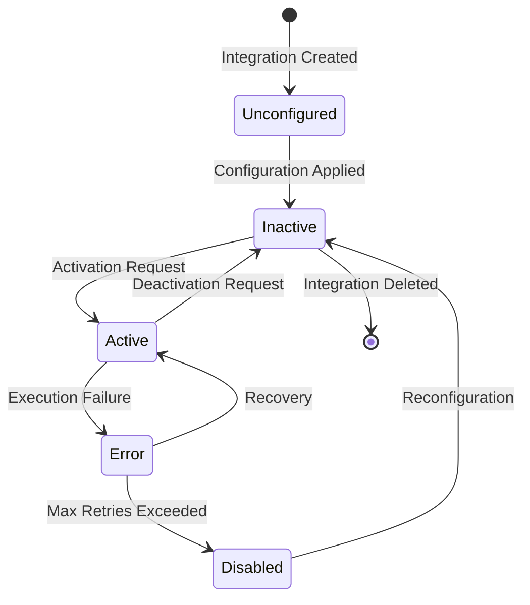
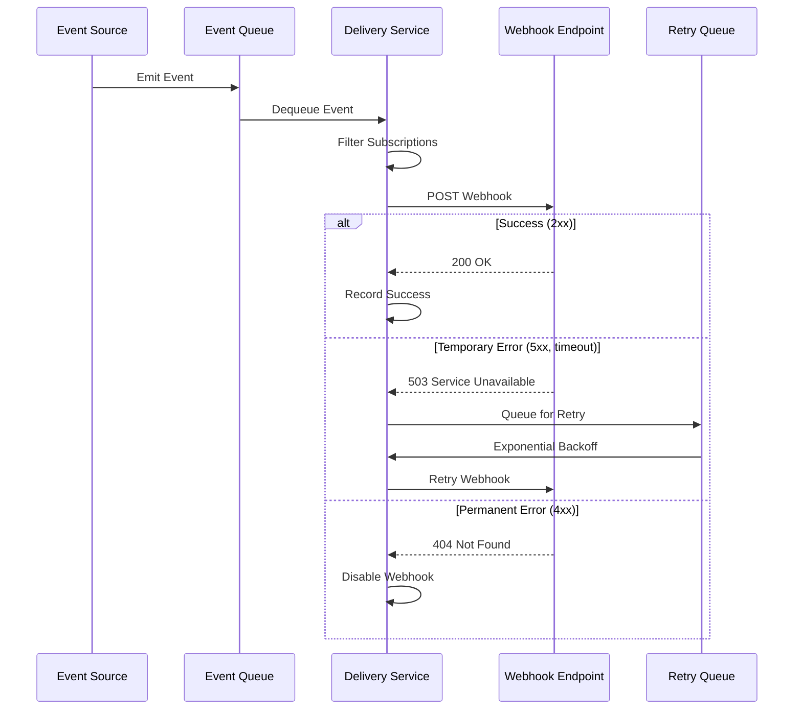
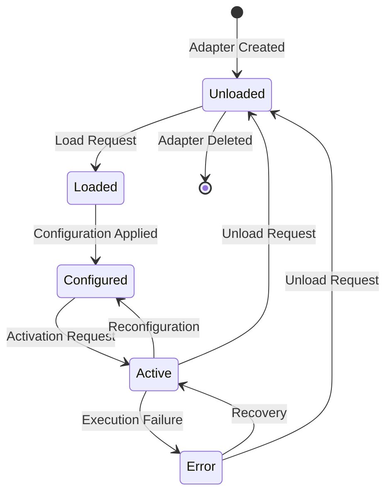

# TACHYON: INTEGRATION API DOCUMENTATION

**Document ID:** TACHYON-API-012-V1.0
**Date:** February 2026
**Status:** Proposed
**Classification:** Technical Documentation
**Compliance Level:** ISO/IEC 26514:2021, IEEE 1016-2009

---

## TABLE OF CONTENTS

1. [Introduction](#1-introduction)
2. [Integration API Framework](#2-integration-api-framework)
3. [Webhook API](#3-webhook-api)
4. [Import/Export API](#4-importexport-api)
5. [OAuth Integration](#5-oauth-integration)
6. [Adapter System](#6-adapter-system)
7. [Third-Party Integrations](#7-third-party-integrations)
8. [Integration Configuration](#8-integration-configuration)
9. [Integration Testing](#9-integration-testing)
10. [Error Handling](#10-error-handling)
11. [Security Considerations](#11-security-considerations)
12. [References](#12-references)

---

## 1. INTRODUCTION

### 1.1. Document Purpose

This document provides comprehensive technical documentation for the Tachyon Integration API, which enables external systems and third-party services to interact programmatically with the Tachyon toolchain. The Integration API encompasses webhook notifications, import/export functionality, OAuth-based authentication, an extensible adapter system, and third-party service integrations.

The Integration API serves as the primary interface for:
- External applications requiring real-time event notifications
- Content migration and data portability operations
- Third-party authentication and authorization providers
- Custom adapters for extending system functionality
- Integration with external services and platforms

### 1.2. Document Scope

This document addresses the following integration aspects:

1. **Webhook API:** Event-driven notifications for external systems
2. **Import/Export API:** Data portability and content migration
3. **OAuth Integration:** Third-party authentication providers
4. **Adapter System:** Extensible framework for custom integrations
5. **Third-Party Integrations:** Pre-built integrations with common services
6. **Integration Configuration:** Management of integration settings
7. **Integration Testing:** Procedures for validating integrations
8. **Error Handling:** Strategies for integration error management
9. **Security Considerations:** Security controls for integration endpoints

### 1.3. Document Dependencies

This document depends on the following specifications:

- [TACHYON-STD-V1.0](.adrs/ - Coding and Documentation Standards
- [TACHYON-ADR-001-V1.0](.adrs/adr-001-three-tier-jit-compilation.md) - Rust as Primary Language
- [TACHYON-ADR-010-V1.0](.adrs/adr-010-synchronization-primitives.md) - Security Architecture
- [TACHYON-DES-API-V1.0](.adrs/ - API Interfaces Design
- [TACHYON-DES-SEC-V1.0](.adrs/ - Security Design
- [TACHYON-TST-V1.0](.adrs/ - Test Plan

### 1.4. Intended Audience

This document is intended for:
- **Integration Developers:** Developers implementing integrations with Tachyon
- **System Architects:** Architects designing integration solutions
- **DevOps Engineers:** Engineers deploying and managing integrations
- **Security Analysts:** Personnel assessing integration security posture
- **Technical Support:** Support personnel troubleshooting integration issues

### 1.5. Conventions and Notation

#### 1.5.1. Code Examples

Code examples are provided in Rust, TypeScript, and JSON where appropriate. Rust examples follow the conventions established in [ADR-001](.adrs/adr-001-three-tier-jit-compilation.md).

#### 1.5.2. API Endpoint Notation

API endpoints are documented using the following format:

```
<HTTP_METHOD> <endpoint_path>
```

Example:
```
POST /api/v1/integrations/webhooks
```

#### 1.5.3. Type Definitions

Type definitions are provided using Rust syntax for server-side components and TypeScript for client-side components. All types include comprehensive documentation comments.

#### 1.5.4. Error Codes

Error codes follow the format `INT-XXX`, where `XXX` is a three-digit number:

- `INT-100` to `INT-199`: Webhook API errors
- `INT-200` to `INT-299`: Import/Export API errors
- `INT-300` to `INT-399`: OAuth integration errors
- `INT-400` to `INT-499`: Adapter system errors
- `INT-500` to `INT-599`: Third-party integration errors

---

## 2. INTEGRATION API FRAMEWORK

### 2.1. Framework Overview

The Integration API Framework provides a unified abstraction layer for all integration types, enabling consistent behavior, error handling, and security controls across webhook, import/export, OAuth, adapter, and third-party integration mechanisms.

The framework implements the following architectural principles:

1. **Unified Interface:** All integration types expose a consistent API surface
2. **Type Safety:** Rust's type system enforces compile-time guarantees
3. **Async-First:** All integration operations are asynchronous using Tokio
4. **Extensibility:** Plugin-based architecture for custom integrations
5. **Observability:** Comprehensive logging and metrics for all operations
6. **Security:** Defense-in-depth security controls per [ADR-010](.adrs/10_security_architecture.md)

### 2.2. Core Abstractions

#### INT-FRM-001: Integration Trait

```rust
/// Core trait defining the integration interface
///
/// This trait provides the fundamental contract that all integrations
/// must implement, ensuring consistent behavior across integration types.
#[async_trait]
pub trait Integration: Send + Sync {
    /// Returns the unique identifier for this integration
    fn id(&self) -> IntegrationId;

    /// Returns the type of this integration
    fn integration_type(&self) -> IntegrationType;

    /// Returns the current status of this integration
    fn status(&self) -> IntegrationStatus;

    /// Initializes the integration with provided configuration
    async fn initialize(
        &mut self,
        config: IntegrationConfig,
    ) -> Result<(), IntegrationError>;

    /// Validates the integration configuration
    fn validate_config(&self, config: &IntegrationConfig) -> Result<(), IntegrationError>;

    /// Executes the integration with provided payload
    async fn execute(
        &self,
        payload: IntegrationPayload,
    ) -> Result<IntegrationResult, IntegrationError>;

    /// Shuts down the integration gracefully
    async fn shutdown(&mut self) -> Result<(), IntegrationError>;
}

/// Unique identifier for an integration
#[derive(Debug, Clone, Copy, PartialEq, Eq, Hash, Serialize, Deserialize)]
pub struct IntegrationId(Uuid);

/// Type of integration
#[derive(Debug, Clone, Copy, PartialEq, Eq, Serialize, Deserialize)]
#[serde(rename_all = "snake_case")]
pub enum IntegrationType {
    /// Webhook integration
    Webhook,
    /// Import/Export integration
    ImportExport,
    /// OAuth integration
    OAuth,
    /// Custom adapter integration
    Adapter,
    /// Third-party service integration
    ThirdParty,
}

/// Status of an integration
#[derive(Debug, Clone, Copy, PartialEq, Eq, Serialize, Deserialize)]
#[serde(rename_all = "snake_case")]
pub enum IntegrationStatus {
    /// Integration is not configured
    Unconfigured,
    /// Integration is configured but not active
    Inactive,
    /// Integration is active and operational
    Active,
    /// Integration is in error state
    Error,
    /// Integration is disabled
    Disabled,
}

/// Integration configuration
#[derive(Debug, Clone, Serialize, Deserialize)]
pub struct IntegrationConfig {
    /// Integration type
    pub integration_type: IntegrationType,

    /// Configuration parameters
    pub parameters: HashMap<String, serde_json::Value>,

    /// Security settings
    pub security: SecuritySettings,

    /// Retry configuration
    pub retry: RetryConfig,
}

/// Integration payload
#[derive(Debug, Clone, Serialize, Deserialize)]
pub struct IntegrationPayload {
    /// Payload type
    pub payload_type: String,

    /// Payload data
    pub data: serde_json::Value,

    /// Metadata
    pub metadata: HashMap<String, String>,

    /// Timestamp
    pub timestamp: DateTime<Utc>,
}

/// Integration result
#[derive(Debug, Clone, Serialize, Deserialize)]
pub struct IntegrationResult {
    /// Whether the operation succeeded
    pub success: bool,

    /// Result data
    pub data: Option<serde_json::Value>,

    /// Error message if failed
    pub error: Option<String>,

    /// Execution duration
    pub duration_ms: u64,

    /// Additional metadata
    pub metadata: HashMap<String, String>,
}

/// Integration error
#[derive(Debug, Clone, Serialize, Deserialize, thiserror::Error)]
#[serde(tag = "code")]
pub enum IntegrationError {
    #[serde(rename = "INT-100")]
    #[error("Webhook configuration error: {0}")]
    WebhookConfigurationError(String),

    #[serde(rename = "INT-101")]
    #[error("Webhook delivery failed: {0}")]
    WebhookDeliveryError(String),

    #[serde(rename = "INT-200")]
    #[error("Import/Export format error: {0}")]
    ImportExportFormatError(String),

    #[serde(rename = "INT-201")]
    #[error("Import/Export validation error: {0}")]
    ImportExportValidationError(String),

    #[serde(rename = "INT-300")]
    #[error("OAuth authentication error: {0}")]
    OAuthAuthenticationError(String),

    #[serde(rename = "INT-301")]
    #[error("OAuth token error: {0}")]
    OAuthTokenError(String),

    #[serde(rename = "INT-400")]
    #[error("Adapter initialization error: {0}")]
    AdapterInitializationError(String),

    #[serde(rename = "INT-401")]
    #[error("Adapter execution error: {0}")]
    AdapterExecutionError(String),

    #[serde(rename = "INT-500")]
    #[error("Third-party service error: {0}")]
    ThirdPartyServiceError(String),

    #[serde(rename = "INT-501")]
    #[error("Third-party rate limit exceeded")]
    ThirdPartyRateLimitExceeded,

    #[serde(rename = "INT-999")]
    #[error("Unknown integration error: {0}")]
    UnknownError(String),
}

/// Security settings for integrations
#[derive(Debug, Clone, Serialize, Deserialize)]
pub struct SecuritySettings {
    /// Whether TLS is required
    pub require_tls: bool,

    /// Allowed IP addresses
    pub allowed_ips: Vec<IpAddr>,

    /// API key for authentication
    pub api_key: Option<String>,

    /// HMAC secret for webhook verification
    pub hmac_secret: Option<String>,

    /// OAuth client credentials
    pub oauth_credentials: Option<OAuthCredentials>,
}

/// Retry configuration
#[derive(Debug, Clone, Serialize, Deserialize)]
pub struct RetryConfig {
    /// Maximum number of retry attempts
    pub max_attempts: u32,

    /// Initial retry delay in milliseconds
    pub initial_delay_ms: u64,

    /// Maximum retry delay in milliseconds
    pub max_delay_ms: u64,

    /// Backoff multiplier
    pub backoff_multiplier: f64,

    /// Whether to use jitter
    pub use_jitter: bool,
}
```

**Type:** Trait  
**Language:** Rust  
**Constraints:**
- All async methods must use Tokio runtime
- Configuration validation must be performed before initialization
- Shutdown must be idempotent
- Error messages must be user-friendly and actionable

**Dependencies:** [ADR-001](.adrs/adr-001-three-tier-jit-compilation.md), [ADR-010](.adrs/adr-010-synchronization-primitives.md)  
**Rationale:** Provides a unified abstraction for all integration types, ensuring consistent behavior and enabling extensibility.  
**Security Considerations:** All integration configurations must be validated; security settings must be enforced; sensitive credentials must be encrypted at rest.

### 2.3. Integration Registry

#### INT-FRM-002: IntegrationRegistry

```rust
/// Registry for managing integrations
///
/// The integration registry provides centralized management of all
/// registered integrations, including lifecycle management and
/// execution coordination.
pub struct IntegrationRegistry {
    /// Registered integrations by ID
    integrations: RwLock<HashMap<IntegrationId, Box<dyn Integration>>>,

    /// Integration type index
    by_type: RwLock<HashMap<IntegrationType, Vec<IntegrationId>>>,

    /// Active integrations
    active: RwLock<HashSet<IntegrationId>>,

    /// Configuration store
    config_store: Arc<dyn ConfigStore>,

    /// Metrics collector
    metrics: Arc<MetricsCollector>,
}

impl IntegrationRegistry {
    /// Creates a new integration registry
    pub fn new(
        config_store: Arc<dyn ConfigStore>,
        metrics: Arc<MetricsCollector>,
    ) -> Self {
        Self {
            integrations: RwLock::new(HashMap::new()),
            by_type: RwLock::new(HashMap::new()),
            active: RwLock::new(HashSet::new()),
            config_store,
            metrics,
        }
    }

    /// Registers a new integration
    pub async fn register(
        &self,
        integration: Box<dyn Integration>,
    ) -> Result<IntegrationId, IntegrationError> {
        let id = integration.id();
        let integration_type = integration.integration_type();

        // Validate configuration
        let config = self.config_store.get_config(id).await
            .ok_or_else(|| IntegrationError::WebhookConfigurationError(
                "Configuration not found".to_string(),
            ))?;

        integration.validate_config(&config)?;

        // Store integration
        {
            let mut integrations = self.integrations.write().await;
            integrations.insert(id, integration);
        }

        // Update type index
        {
            let mut by_type = self.by_type.write().await;
            by_type.entry(integration_type)
                .or_insert_with(Vec::new)
                .push(id);
        }

        Ok(id)
    }

    /// Activates an integration
    pub async fn activate(
        &self,
        id: IntegrationId,
    ) -> Result<(), IntegrationError> {
        let mut active = self.active.write().await;
        if !active.insert(id) {
            return Err(IntegrationError::WebhookConfigurationError(
                "Integration already active".to_string(),
            ));
        }
        Ok(())
    }

    /// Deactivates an integration
    pub async fn deactivate(
        &self,
        id: IntegrationId,
    ) -> Result<(), IntegrationError> {
        let mut active = self.active.write().await;
        if !active.remove(&id) {
            return Err(IntegrationError::WebhookConfigurationError(
                "Integration not active".to_string(),
            ));
        }
        Ok(())
    }

    /// Executes an integration
    pub async fn execute(
        &self,
        id: IntegrationId,
        payload: IntegrationPayload,
    ) -> Result<IntegrationResult, IntegrationError> {
        // Check if integration is active
        {
            let active = self.active.read().await;
            if !active.contains(&id) {
                return Err(IntegrationError::WebhookConfigurationError(
                    "Integration not active".to_string(),
                ));
            }
        }

        // Get integration
        let integration = {
            let integrations = self.integrations.read().await;
            integrations.get(&id)
                .ok_or_else(|| IntegrationError::WebhookConfigurationError(
                    "Integration not found".to_string(),
                ))?
                .clone_box()
        };

        // Execute with metrics
        let start = Instant::now();
        let result = integration.execute(payload).await;
        let duration = start.elapsed();

        // Record metrics
        self.metrics.record_execution(
            id,
            result.is_ok(),
            duration,
        ).await;

        result
    }

    /// Gets integrations by type
    pub async fn get_by_type(
        &self,
        integration_type: IntegrationType,
    ) -> Vec<IntegrationId> {
        let by_type = self.by_type.read().await;
        by_type.get(&integration_type)
            .cloned()
            .unwrap_or_default()
    }

    /// Shuts down all integrations
    pub async fn shutdown_all(&self) -> Result<(), IntegrationError> {
        let integrations: Vec<_> = {
            let integrations = self.integrations.read().await;
            integrations.values().map(|i| i.clone_box()).collect()
        };

        for mut integration in integrations {
            integration.shutdown().await?;
        }

        Ok(())
    }
}

/// Configuration store trait
#[async_trait]
pub trait ConfigStore: Send + Sync {
    async fn get_config(
        &self,
        id: IntegrationId,
    ) -> Option<IntegrationConfig>;

    async fn set_config(
        &self,
        id: IntegrationId,
        config: IntegrationConfig,
    ) -> Result<(), IntegrationError>;

    async fn delete_config(
        &self,
        id: IntegrationId,
    ) -> Result<(), IntegrationError>;
}

/// Metrics collector trait
#[async_trait]
pub trait MetricsCollector: Send + Sync {
    async fn record_execution(
        &self,
        id: IntegrationId,
        success: bool,
        duration: Duration,
    );
}
```

**Type:** Struct  
**Language:** Rust  
**Constraints:**
- Thread-safe for concurrent access
- Idempotent operations where possible
- Metrics recording must not block execution
- Configuration changes must be atomic

**Dependencies:** [INT-FRM-001](#int-frm-001-integration-trait)  
**Rationale:** Provides centralized management of integrations with lifecycle control and observability.  
**Security Considerations:** Configuration access must be authorized; metrics must not expose sensitive data; shutdown must be graceful.

### 2.4. Integration Lifecycle

The Integration API Framework defines a clear lifecycle for all integrations:



**Lifecycle States:**

1. **Unconfigured:** Integration exists but has no valid configuration
2. **Inactive:** Integration is configured but not actively processing
3. **Active:** Integration is operational and processing events
4. **Error:** Integration has encountered a recoverable error
5. **Disabled:** Integration has been disabled due to persistent failures

**State Transitions:**

- **Unconfigured → Inactive:** Occurs when valid configuration is applied
- **Inactive → Active:** Occurs when activation is requested
- **Active → Inactive:** Occurs when deactivation is requested
- **Active → Error:** Occurs when an execution fails with retryable error
- **Error → Active:** Occurs when the error condition is resolved
- **Error → Disabled:** Occurs when maximum retry attempts are exceeded
- **Disabled → Inactive:** Occurs when integration is reconfigured
- **Inactive → Deleted:** Occurs when integration is removed from registry

### 2.5. Event Bus Integration

The Integration API Framework integrates with the system event bus for real-time event distribution:

#### INT-FRM-003: EventBusIntegration

```rust
/// Event bus integration for distributing integration events
pub struct EventBusIntegration {
    /// Event bus client
    event_bus: Arc<dyn EventBus>,

    /// Integration ID
    id: IntegrationId,

    /// Event filters
    filters: Vec<EventFilter>,
}

#[async_trait]
impl Integration for EventBusIntegration {
    fn id(&self) -> IntegrationId {
        self.id
    }

    fn integration_type(&self) -> IntegrationType {
        IntegrationType::Adapter
    }

    fn status(&self) -> IntegrationStatus {
        IntegrationStatus::Active
    }

    async fn initialize(
        &mut self,
        config: IntegrationConfig,
    ) -> Result<(), IntegrationError> {
        // Parse filters from configuration
        self.filters = config.parameters
            .get("filters")
            .and_then(|v| serde_json::from_value(v.clone()).ok())
            .unwrap_or_default();

        Ok(())
    }

    fn validate_config(&self, config: &IntegrationConfig) -> Result<(), IntegrationError> {
        // Validate filter configuration
        if let Some(filters) = config.parameters.get("filters") {
            serde_json::from_value::<Vec<EventFilter>>(filters.clone())
                .map_err(|e| IntegrationError::AdapterInitializationError(
                    format!("Invalid filters: {}", e)
                ))?;
        }
        Ok(())
    }

    async fn execute(
        &self,
        payload: IntegrationPayload,
    ) -> Result<IntegrationResult, IntegrationError> {
        // Apply event filters
        if !self.filters.is_empty() {
            if let Ok(event) = serde_json::from_value::<SystemEvent>(payload.data.clone()) {
                if !self.filters.iter().any(|f| f.matches(&event)) {
                    return Ok(IntegrationResult {
                        success: true,
                        data: None,
                        error: None,
                        duration_ms: 0,
                        metadata: HashMap::new(),
                    });
                }
            }
        }

        // Publish to event bus
        let event = SystemEvent {
            event_id: Uuid::new_v4(),
            event_type: payload.payload_type,
            data: payload.data,
            metadata: payload.metadata,
            timestamp: payload.timestamp,
        };

        self.event_bus.publish(event).await
            .map_err(|e| IntegrationError::AdapterExecutionError(
                format!("Failed to publish event: {}", e)
            ))?;

        Ok(IntegrationResult {
            success: true,
            data: Some(serde_json::to_value(event)?),
            error: None,
            duration_ms: 0,
            metadata: HashMap::new(),
        })
    }

    async fn shutdown(&mut self) -> Result<(), IntegrationError> {
        // No cleanup required for event bus integration
        Ok(())
    }
}

/// Event filter for filtering events
#[derive(Debug, Clone, Serialize, Deserialize)]
pub struct EventFilter {
    /// Event type pattern
    pub event_type: Option<String>,

    /// Metadata filters
    pub metadata: HashMap<String, String>,
}

impl EventFilter {
    /// Checks if an event matches this filter
    pub fn matches(&self, event: &SystemEvent) -> bool {
        // Check event type
        if let Some(pattern) = &self.event_type {
            if !wildcard_match(&event.event_type, pattern) {
                return false;
            }
        }

        // Check metadata
        for (key, value) in &self.metadata {
            if event.metadata.get(key) != Some(value) {
                return false;
            }
        }

        true
    }
}

/// System event
#[derive(Debug, Clone, Serialize, Deserialize)]
pub struct SystemEvent {
    /// Unique event identifier
    pub event_id: Uuid,

    /// Event type
    pub event_type: String,

    /// Event data
    pub data: serde_json::Value,

    /// Event metadata
    pub metadata: HashMap<String, String>,

    /// Event timestamp
    pub timestamp: DateTime<Utc>,
}
```

**Type:** Struct  
**Language:** Rust  
**Constraints:**
- Event filtering must be efficient for high-throughput scenarios
- Event publishing must be non-blocking
- Filter patterns support wildcard matching

**Dependencies:** [INT-FRM-001](#int-frm-001-integration-trait)  
**Rationale:** Enables integration with the system event bus for real-time event distribution to external systems.  
**Security Considerations:** Event filters must be validated; sensitive data in events must be redacted; event bus access must be authorized.

---

## 3. WEBHOOK API

### 3.1. Webhook API Overview

The Webhook API provides event-driven notifications to external systems, enabling real-time integration with Tachyon system events. Webhooks allow external applications to receive HTTP callbacks when specific events occur within the Tachyon system, facilitating automated workflows, data synchronization, and third-party integrations.

**Webhook Capabilities:**

1. **Event Subscription:** Subscribe to specific event types
2. **Payload Customization:** Configure webhook payload format
3. **Retry Logic:** Automatic retry with exponential backoff
4. **Security Verification:** HMAC signature verification
5. **Rate Limiting:** Configurable delivery rate limits
6. **Delivery Tracking:** Monitor webhook delivery status

**Supported Event Types:**

| Event Type | Description | Payload Schema |
|------------|-------------|----------------|
| `document.created` | Document created | DocumentMetadata |
| `document.updated` | Document updated | DocumentMetadata + Diff |
| `document.deleted` | Document deleted | DocumentMetadata |
| `user.created` | User account created | UserProfile |
| `user.updated` | User profile updated | UserProfile |
| `collaboration.started` | Collaboration session started | CollaborationInfo |
| `collaboration.ended` | Collaboration session ended | CollaborationInfo |
| `sync.completed` | Synchronization completed | SyncResult |

### 3.2. Webhook Configuration

#### INT-WHK-001: Create Webhook

**Endpoint:** `POST /api/v1/integrations/webhooks`

**Description:** Creates a new webhook subscription for receiving event notifications.

**Request:**
```rust
use axum::{Json, State};
use serde::{Deserialize, Serialize};

#[derive(Debug, Deserialize)]
pub struct CreateWebhookRequest {
    /// Webhook URL to receive callbacks
    pub url: String,

    /// Event types to subscribe to
    pub events: Vec<String>,

    /// Optional secret for HMAC signature verification
    pub secret: Option<String>,

    /// HTTP headers to include in webhook delivery
    pub headers: Option<HashMap<String, String>>,

    /// Retry configuration
    pub retry: Option<RetryConfig>,

    /// Rate limit (requests per second)
    pub rate_limit: Option<u32>,
}

pub async fn create_webhook(
    State(user): State<AuthenticatedUser>,
    Json(req): Json<CreateWebhookRequest>,
) -> Result<Json<WebhookResponse>, ApiError>;
```

**Response:**
```rust
#[derive(Debug, Serialize)]
pub struct WebhookResponse {
    /// Webhook ID
    pub webhook_id: WebhookId,

    /// Webhook URL
    pub url: String,

    /// Subscribed events
    pub events: Vec<String>,

    /// Secret (only returned on creation)
    pub secret: Option<String>,

    /// Webhook status
    pub status: WebhookStatus,

    /// Creation timestamp
    pub created_at: DateTime<Utc>,
}
```

**Constraints:**
- `url`: Must be valid HTTPS URL
- `events`: Must be non-empty, each event type must be valid
- `secret`: If provided, must be 32-128 characters
- `rate_limit`: 1-1000 requests per second

**Dependencies:** [INT-FRM-001](#int-frm-001-integration-trait)  
**Rationale:** Enables external systems to subscribe to event notifications.  
**Security Considerations:** URL must use HTTPS; secret must be stored encrypted; rate limiting prevents abuse.

#### INT-WHK-002: List Webhooks

**Endpoint:** `GET /api/v1/integrations/webhooks`

**Description:** Lists all webhooks configured for the authenticated user.

**Request:**
```rust
use axum::extract::Query;

#[derive(Debug, Deserialize)]
pub struct ListWebhooksQuery {
    /// Pagination offset
    pub offset: Option<usize>,

    /// Page size
    pub limit: Option<usize>,

    /// Filter by status
    pub status: Option<WebhookStatus>,
}

pub async fn list_webhooks(
    State(user): State<AuthenticatedUser>,
    Query(params): Query<ListWebhooksQuery>,
) -> Result<Json<WebhookListResponse>, ApiError>;
```

**Response:**
```rust
#[derive(Debug, Serialize)]
pub struct WebhookListResponse {
    /// List of webhooks
    pub webhooks: Vec<WebhookInfo>,

    /// Total count
    pub total: usize,

    /// Current offset
    pub offset: usize,

    /// Page size
    pub limit: usize,
}

#[derive(Debug, Serialize)]
pub struct WebhookInfo {
    /// Webhook ID
    pub webhook_id: WebhookId,

    /// Webhook URL (truncated)
    pub url: String,

    /// Subscribed events
    pub events: Vec<String>,

    /// Webhook status
    pub status: WebhookStatus,

    /// Delivery statistics
    pub stats: WebhookStats,

    /// Creation timestamp
    pub created_at: DateTime<Utc>,
}

#[derive(Debug, Serialize)]
pub struct WebhookStats {
    /// Total deliveries
    pub total_deliveries: u64,

    /// Successful deliveries
    pub successful_deliveries: u64,

    /// Failed deliveries
    pub failed_deliveries: u64,

    /// Last delivery timestamp
    pub last_delivery_at: Option<DateTime<Utc>>,
}

#[derive(Debug, Clone, Copy, PartialEq, Eq, Serialize, Deserialize)]
#[serde(rename_all = "snake_case")]
pub enum WebhookStatus {
    /// Webhook is active
    Active,
    /// Webhook is paused
    Paused,
    /// Webhook is disabled due to failures
    Disabled,
}
```

**Constraints:**
- `limit`: 1-100 inclusive
- `offset`: Non-negative

**Dependencies:** [INT-WHK-001](#int-whk-001-create-webhook)  
**Rationale:** Enables management of webhook subscriptions.  
**Security Considerations:** Only returns webhooks owned by authenticated user; sensitive information is truncated.

#### INT-WHK-003: Get Webhook

**Endpoint:** `GET /api/v1/integrations/webhooks/:webhook_id`

**Description:** Retrieves details of a specific webhook.

**Request:**
```rust
use axum::extract::Path;

pub async fn get_webhook(
    State(user): State<AuthenticatedUser>,
    Path(webhook_id): Path<WebhookId>,
) -> Result<Json<WebhookDetailResponse>, ApiError>;
```

**Response:**
```rust
#[derive(Debug, Serialize)]
pub struct WebhookDetailResponse {
    /// Webhook ID
    pub webhook_id: WebhookId,

    /// Webhook URL
    pub url: String,

    /// Subscribed events
    pub events: Vec<String>,

    /// Webhook status
    pub status: WebhookStatus,

    /// Retry configuration
    pub retry: RetryConfig,

    /// Rate limit
    pub rate_limit: u32,

    /// HTTP headers
    pub headers: HashMap<String, String>,

    /// Delivery statistics
    pub stats: WebhookStats,

    /// Recent delivery logs
    pub recent_deliveries: Vec<WebhookDelivery>,

    /// Creation timestamp
    pub created_at: DateTime<Utc>,

    /// Last updated timestamp
    pub updated_at: DateTime<Utc>,
}

#[derive(Debug, Serialize)]
pub struct WebhookDelivery {
    /// Delivery ID
    pub delivery_id: Uuid,

    /// Event type
    pub event_type: String,

    /// HTTP status code
    pub status_code: u16,

    /// Delivery duration in milliseconds
    pub duration_ms: u64,

    /// Retry count
    pub retry_count: u32,

    /// Timestamp
    pub timestamp: DateTime<Utc>,

    /// Error message if failed
    pub error: Option<String>,
}
```

**Constraints:**
- `webhook_id`: Must be valid UUID v4
- Webhook must be owned by authenticated user

**Dependencies:** [INT-WHK-001](#int-whk-001-create-webhook)  
**Rationale:** Provides detailed information about a specific webhook.  
**Security Considerations:** Authorization check ensures user can only access their own webhooks.

#### INT-WHK-004: Update Webhook

**Endpoint:** `PUT /api/v1/integrations/webhooks/:webhook_id`

**Description:** Updates an existing webhook configuration.

**Request:**
```rust
#[derive(Debug, Deserialize)]
pub struct UpdateWebhookRequest {
    /// New webhook URL
    pub url: Option<String>,

    /// New event subscriptions
    pub events: Option<Vec<String>>,

    /// New secret (rotation)
    pub secret: Option<String>,

    /// New HTTP headers
    pub headers: Option<HashMap<String, String>>,

    /// New retry configuration
    pub retry: Option<RetryConfig>,

    /// New rate limit
    pub rate_limit: Option<u32>,

    /// New status
    pub status: Option<WebhookStatus>,
}

pub async fn update_webhook(
    State(user): State<AuthenticatedUser>,
    Path(webhook_id): Path<WebhookId>,
    Json(req): Json<UpdateWebhookRequest>,
) -> Result<Json<WebhookResponse>, ApiError>;
```

**Response:** Returns [`WebhookResponse`](#int-whk-001-create-webhook)

**Constraints:**
- At least one field must be provided
- All validation rules from create apply

**Dependencies:** [INT-WHK-001](#int-whk-001-create-webhook)  
**Rationale:** Enables modification of webhook configuration.  
**Security Considerations:** Secret rotation maintains security; authorization check required.

#### INT-WHK-005: Delete Webhook

**Endpoint:** `DELETE /api/v1/integrations/webhooks/:webhook_id`

**Description:** Deletes a webhook subscription.

**Request:**
```rust
pub async fn delete_webhook(
    State(user): State<AuthenticatedUser>,
    Path(webhook_id): Path<WebhookId>,
) -> Result<StatusCode, ApiError>;
```

**Response:** `204 No Content` on success

**Constraints:**
- `webhook_id`: Must be valid UUID v4
- Webhook must be owned by authenticated user

**Dependencies:** [INT-WHK-001](#int-whk-001-create-webhook)  
**Rationale:** Enables removal of webhook subscriptions.  
**Security Considerations:** Authorization check required; operation is irreversible.

#### INT-WHK-006: Test Webhook

**Endpoint:** `POST /api/v1/integrations/webhooks/:webhook_id/test`

**Description:** Sends a test event to the webhook endpoint for validation.

**Request:**
```rust
#[derive(Debug, Deserialize)]
pub struct TestWebhookRequest {
    /// Test event type (default: "test")
    pub event_type: Option<String>,

    /// Test payload (default: {})
    pub payload: Option<serde_json::Value>,
}

pub async fn test_webhook(
    State(user): State<AuthenticatedUser>,
    Path(webhook_id): Path<WebhookId>,
    Json(req): Json<TestWebhookRequest>,
) -> Result<Json<WebhookTestResponse>, ApiError>;
```

**Response:**
```rust
#[derive(Debug, Serialize)]
pub struct WebhookTestResponse {
    /// Test delivery ID
    pub delivery_id: Uuid,

    /// HTTP status code
    pub status_code: u16,

    /// Response body
    pub response_body: String,

    /// Delivery duration in milliseconds
    pub duration_ms: u64,

    /// Whether delivery was successful
    pub success: bool,

    /// Error message if failed
    pub error: Option<String>,
}
```

**Constraints:**
- `webhook_id`: Must be valid UUID v4
- Webhook must be owned by authenticated user

**Dependencies:** [INT-WHK-001](#int-whk-001-create-webhook)  
**Rationale:** Enables validation of webhook endpoint configuration.  
**Security Considerations:** Test events are marked to prevent processing; authorization check required.

### 3.3. Webhook Delivery

#### INT-WHK-007: Webhook Delivery Process

The webhook delivery process implements the following workflow:



**Delivery Algorithm:**

1. **Event Reception:** Event is received from event source
2. **Subscription Filtering:** Matching webhooks are identified
3. **Payload Construction:** Event payload is formatted according to webhook configuration
4. **HTTP Delivery:** POST request is sent to webhook URL
5. **Response Handling:**
   - **Success (2xx):** Delivery recorded as successful
   - **Temporary Error (5xx, timeout):** Queued for retry with exponential backoff
   - **Permanent Error (4xx):** Webhook disabled after threshold
6. **Retry Logic:** Failed deliveries are retried according to retry configuration
7. **Failure Threshold:** Webhook is disabled after consecutive failures

#### INT-WHK-008: Webhook Payload Format

Webhook payloads follow a standardized format:

```json
{
  "webhook_id": "550e8400-e29b-41d4-a716-446655440000",
  "event_id": "660e8400-e29b-41d4-a716-446655440001",
  "event_type": "document.created",
  "timestamp": "2026-02-07T20:00:00Z",
  "data": {
    "document_id": "770e8400-e29b-41d4-a716-446655440002",
    "title": "Example Document",
    "author_id": "880e8400-e29b-41d4-a716-4466554403",
    "created_at": "2026-02-07T20:00:00Z"
  },
  "signature": "sha256=abc123..."
}
```

**Payload Fields:**

| Field | Type | Description |
|-------|------|-------------|
| `webhook_id` | UUID | Webhook identifier |
| `event_id` | UUID | Unique event identifier |
| `event_type` | String | Type of event |
| `timestamp` | ISO 8601 | Event timestamp |
| `data` | Object | Event-specific data |
| `signature` | String | HMAC signature (if secret configured) |

#### INT-WHK-009: HMAC Signature Verification

Webhooks support HMAC signature verification for payload integrity:

```rust
use hmac::{Hmac, Mac};
use sha2::Sha256;

/// Generates HMAC signature for webhook payload
pub fn generate_signature(
    payload: &str,
    secret: &str,
) -> String {
    let mut mac = Hmac::<Sha256>::new_from_slice(secret.as_bytes())
        .expect("HMAC can accept key of any size");
    mac.update(payload.as_bytes());
    let result = mac.finalize();
    format!("sha256={}", hex::encode(result.as_bytes()))
}

/// Verifies HMAC signature of webhook payload
pub fn verify_signature(
    payload: &str,
    signature: &str,
    secret: &str,
) -> bool {
    let expected = generate_signature(payload, secret);
    constant_time_compare(&expected, signature)
}

/// Constant-time comparison to prevent timing attacks
fn constant_time_compare(a: &str, b: &str) -> bool {
    if a.len() != b.len() {
        return false;
    }
    a.bytes()
        .zip(b.bytes())
        .fold(0u8, |acc, (x, y)| acc | (x ^ y))
        == 0
}
```

**Type:** Functions  
**Language:** Rust  
**Constraints:**
- Secret must be at least 32 characters
- Constant-time comparison prevents timing attacks
- Signature format: `sha256=<hex_digest>`

**Dependencies:** [ADR-010](.adrs/adr-010-synchronization-primitives.md)  
**Rationale:** Ensures webhook payload integrity and authenticity.  
**Security Considerations:** Constant-time comparison prevents timing attacks; secrets must be stored encrypted.

---

## 4. IMPORT/EXPORT API

### 4.1. Import/Export API Overview

The Import/Export API provides data portability functionality, enabling users to import content from external sources and export content to various formats. This API supports multiple file formats, batch operations, and progress tracking for large transfers.

**Import/Export Capabilities:**

1. **Format Support:** Multiple import/export formats (JSON, Markdown, HTML, PDF)
2. **Batch Operations:** Process multiple documents in a single operation
3. **Progress Tracking:** Real-time progress updates for long-running operations
4. **Validation:** Schema validation for imported content
5. **Conflict Resolution:** Strategies for handling import conflicts
6. **Incremental Exports:** Export only changed documents

**Supported Formats:**

| Format | Import | Export | Description |
|--------|---------|---------|-------------|
| JSON | [PASS] | [PASS] | Structured data format with full metadata |
| Markdown | [PASS] | [PASS] | Plain text with frontmatter metadata |
| HTML | [FAIL] | [PASS] | Rendered HTML for web publishing |
| PDF | [FAIL] | [PASS] | PDF documents for printing/archival |
| ZIP | [PASS] | [PASS] | Archive containing multiple documents |

### 4.2. Import API

#### INT-IMP-001: Start Import

**Endpoint:** `POST /api/v1/integrations/import`

**Description:** Initiates an import operation from the provided source.

**Request:**
```rust
use axum::{Json, State};
use serde::{Deserialize, Serialize};

#[derive(Debug, Deserialize)]
pub struct StartImportRequest {
    /// Import source type
    pub source_type: ImportSourceType,

    /// Source URL or data
    pub source: ImportSource,

    /// Import format
    pub format: ImportFormat,

    /// Import options
    pub options: ImportOptions,
}

#[derive(Debug, Clone, Deserialize)]
#[serde(tag = "type", rename_all = "snake_case")]
pub enum ImportSource {
    /// URL to import from
    Url { url: String },
    /// Base64-encoded data
    Base64 { data: String },
    /// File upload reference
    File { file_id: Uuid },
}

#[derive(Debug, Clone, Copy, PartialEq, Eq, Deserialize)]
#[serde(rename_all = "snake_case")]
pub enum ImportSourceType {
    /// Import from URL
    Url,
    /// Import from uploaded file
    File,
    /// Import from base64 data
    Base64,
}

#[derive(Debug, Clone, Copy, PartialEq, Eq, Deserialize)]
#[serde(rename_all = "snake_case")]
pub enum ImportFormat {
    /// JSON format
    Json,
    /// Markdown format
    Markdown,
    /// ZIP archive
    Zip,
}

#[derive(Debug, Clone, Deserialize)]
pub struct ImportOptions {
    /// Conflict resolution strategy
    pub conflict_resolution: ConflictResolution,

    /// Whether to validate schema
    pub validate_schema: bool,

    /// Whether to preserve IDs
    pub preserve_ids: bool,

    /// Target folder ID (optional)
    pub target_folder_id: Option<Uuid>,

    /// Tag to apply to imported documents
    pub tags: Option<Vec<String>>,
}

#[derive(Debug, Clone, Copy, PartialEq, Eq, Deserialize)]
#[serde(rename_all = "snake_case")]
pub enum ConflictResolution {
    /// Skip conflicting documents
    Skip,
    /// Overwrite existing documents
    Overwrite,
    /// Create new version
    Version,
    /// Rename conflicting documents
    Rename,
}

pub async fn start_import(
    State(user): State<AuthenticatedUser>,
    Json(req): Json<StartImportRequest>,
) -> Result<Json<ImportResponse>, ApiError>;
```

**Response:**
```rust
#[derive(Debug, Serialize)]
pub struct ImportResponse {
    /// Import operation ID
    pub import_id: ImportId,

    /// Import status
    pub status: ImportStatus,

    /// Estimated total documents
    pub estimated_total: Option<usize>,

    /// Progress (0.0 to 1.0)
    pub progress: f64,

    /// Created timestamp
    pub created_at: DateTime<Utc>,
}

#[derive(Debug, Clone, Copy, PartialEq, Eq, Serialize, Deserialize)]
#[serde(rename_all = "snake_case")]
pub enum ImportStatus {
    /// Import is queued
    Queued,
    /// Import is in progress
    InProgress,
    /// Import completed successfully
    Completed,
    /// Import failed
    Failed,
    /// Import was cancelled
    Cancelled,
}
```

**Constraints:**
- `source_type`: Must be valid import source type
- `source.url`: Must be valid HTTPS URL if source is URL
- `source.data`: Must be valid base64 if source is base64
- `format`: Must be supported format

**Dependencies:** [INT-FRM-001](#int-frm-001-integration-trait)  
**Rationale:** Enables content import from external sources.  
**Security Considerations:** URL validation prevents SSRF attacks; base64 data size limited; authorization required.

#### INT-IMP-002: Get Import Status

**Endpoint:** `GET /api/v1/integrations/import/:import_id`

**Description:** Retrieves the current status and progress of an import operation.

**Request:**
```rust
use axum::extract::Path;

pub async fn get_import_status(
    State(user): State<AuthenticatedUser>,
    Path(import_id): Path<ImportId>,
) -> Result<Json<ImportStatusResponse>, ApiError>;
```

**Response:**
```rust
#[derive(Debug, Serialize)]
pub struct ImportStatusResponse {
    /// Import operation ID
    pub import_id: ImportId,

    /// Import status
    pub status: ImportStatus,

    /// Progress (0.0 to 1.0)
    pub progress: f64,

    /// Documents processed
    pub documents_processed: usize,

    /// Documents succeeded
    pub documents_succeeded: usize,

    /// Documents failed
    pub documents_failed: usize,

    /// Errors encountered
    pub errors: Vec<ImportError>,

    /// Started timestamp
    pub started_at: DateTime<Utc>,

    /// Completed timestamp (if applicable)
    pub completed_at: Option<DateTime<Utc>>,

    /// Estimated remaining time (seconds)
    pub estimated_remaining_seconds: Option<u64>,
}

#[derive(Debug, Serialize)]
pub struct ImportError {
    /// Document ID or index
    pub document_id: Option<Uuid>,

    /// Error code
    pub code: String,

    /// Error message
    pub message: String,

    /// Timestamp
    pub timestamp: DateTime<Utc>,
}
```

**Constraints:**
- `import_id`: Must be valid UUID v4
- Import must be owned by authenticated user

**Dependencies:** [INT-IMP-001](#int-imp-001-start-import)  
**Rationale:** Enables monitoring of import operation progress.  
**Security Considerations:** Authorization check required; sensitive error details may be redacted.

#### INT-IMP-003: Cancel Import

**Endpoint:** `DELETE /api/v1/integrations/import/:import_id`

**Description:** Cancels an in-progress import operation.

**Request:**
```rust
pub async fn cancel_import(
    State(user): State<AuthenticatedUser>,
    Path(import_id): Path<ImportId>,
) -> Result<StatusCode, ApiError>;
```

**Response:** `204 No Content` on success

**Constraints:**
- `import_id`: Must be valid UUID v4
- Import must be in progress
- Import must be owned by authenticated user

**Dependencies:** [INT-IMP-001](#int-imp-001-start-import)  
**Rationale:** Enables cancellation of long-running import operations.  
**Security Considerations:** Authorization check required; cancellation is idempotent.

### 4.3. Export API

#### INT-EXP-001: Start Export

**Endpoint:** `POST /api/v1/integrations/export`

**Description:** Initiates an export operation for specified documents.

**Request:**
```rust
#[derive(Debug, Deserialize)]
pub struct StartExportRequest {
    /// Export format
    pub format: ExportFormat,

    /// Document IDs to export
    pub document_ids: Vec<Uuid>,

    /// Export options
    pub options: ExportOptions,
}

#[derive(Debug, Clone, Copy, PartialEq, Eq, Deserialize)]
#[serde(rename_all = "snake_case")]
pub enum ExportFormat {
    /// JSON format
    Json,
    /// Markdown format
    Markdown,
    /// HTML format
    Html,
    /// PDF format
    Pdf,
    /// ZIP archive
    Zip,
}

#[derive(Debug, Clone, Deserialize)]
pub struct ExportOptions {
    /// Whether to include metadata
    pub include_metadata: bool,

    /// Whether to include revisions
    pub include_revisions: bool,

    /// Whether to include attachments
    pub include_attachments: bool,

    /// Template for HTML/PDF export
    pub template: Option<String>,

    /// Compression level for ZIP export (0-9)
    pub compression_level: Option<u8>,
}

pub async fn start_export(
    State(user): State<AuthenticatedUser>,
    Json(req): Json<StartExportRequest>,
) -> Result<Json<ExportResponse>, ApiError>;
```

**Response:**
```rust
#[derive(Debug, Serialize)]
pub struct ExportResponse {
    /// Export operation ID
    pub export_id: ExportId,

    /// Export status
    pub status: ExportStatus,

    /// Export format
    pub format: ExportFormat,

    /// Progress (0.0 to 1.0)
    pub progress: f64,

    /// Created timestamp
    pub created_at: DateTime<Utc>,
}

#[derive(Debug, Clone, Copy, PartialEq, Eq, Serialize, Deserialize)]
#[serde(rename_all = "snake_case")]
pub enum ExportStatus {
    /// Export is queued
    Queued,
    /// Export is in progress
    InProgress,
    /// Export completed successfully
    Completed,
    /// Export failed
    Failed,
    /// Export was cancelled
    Cancelled,
}
```

**Constraints:**
- `document_ids`: Must be non-empty, all IDs must be valid
- `format`: Must be supported export format
- `compression_level`: 0-9 inclusive (for ZIP format)

**Dependencies:** [INT-FRM-001](#int-frm-001-integration-trait)  
**Rationale:** Enables content export in various formats.  
**Security Considerations:** Authorization check for each document; export size limited.

#### INT-EXP-002: Get Export Status

**Endpoint:** `GET /api/v1/integrations/export/:export_id`

**Description:** Retrieves the current status and progress of an export operation.

**Request:**
```rust
pub async fn get_export_status(
    State(user): State<AuthenticatedUser>,
    Path(export_id): Path<ExportId>,
) -> Result<Json<ExportStatusResponse>, ApiError>;
```

**Response:**
```rust
#[derive(Debug, Serialize)]
pub struct ExportStatusResponse {
    /// Export operation ID
    pub export_id: ExportId,

    /// Export status
    pub status: ExportStatus,

    /// Export format
    pub format: ExportFormat,

    /// Progress (0.0 to 1.0)
    pub progress: f64,

    /// Documents processed
    pub documents_processed: usize,

    /// Total documents
    pub total_documents: usize,

    /// Export size in bytes
    pub export_size_bytes: Option<u64>,

    /// Started timestamp
    pub started_at: DateTime<Utc>,

    /// Completed timestamp (if applicable)
    pub completed_at: Option<DateTime<Utc>>,

    /// Estimated remaining time (seconds)
    pub estimated_remaining_seconds: Option<u64>,
}
```

**Constraints:**
- `export_id`: Must be valid UUID v4
- Export must be owned by authenticated user

**Dependencies:** [INT-EXP-001](#int-exp-001-start-export)  
**Rationale:** Enables monitoring of export operation progress.  
**Security Considerations:** Authorization check required.

#### INT-EXP-003: Download Export

**Endpoint:** `GET /api/v1/integrations/export/:export_id/download`

**Description:** Downloads the completed export file.

**Request:**
```rust
use axum::response::Response;

pub async fn download_export(
    State(user): State<AuthenticatedUser>,
    Path(export_id): Path<ExportId>,
) -> Result<Response, ApiError>;
```

**Response:** Binary file with appropriate Content-Type header

**Constraints:**
- `export_id`: Must be valid UUID v4
- Export must be completed
- Export must be owned by authenticated user

**Dependencies:** [INT-EXP-001](#int-exp-001-start-export)  
**Rationale:** Enables retrieval of completed export files.  
**Security Considerations:** Authorization check required; files expire after 24 hours.

#### INT-EXP-004: Cancel Export

**Endpoint:** `DELETE /api/v1/integrations/export/:export_id`

**Description:** Cancels an in-progress export operation.

**Request:**
```rust
pub async fn cancel_export(
    State(user): State<AuthenticatedUser>,
    Path(export_id): Path<ExportId>,
) -> Result<StatusCode, ApiError>;
```

**Response:** `204 No Content` on success

**Constraints:**
- `export_id`: Must be valid UUID v4
- Export must be in progress
- Export must be owned by authenticated user

**Dependencies:** [INT-EXP-001](#int-exp-001-start-export)  
**Rationale:** Enables cancellation of long-running export operations.  
**Security Considerations:** Authorization check required; cancellation is idempotent.

### 4.4. Import/Export Formats

#### INT-FMT-001: JSON Format

The JSON format provides structured data exchange with full metadata preservation.

**JSON Export Schema:**
```json
{
  "version": "1.0",
  "exported_at": "2026-02-07T20:00:00Z",
  "documents": [
    {
      "id": "550e8400-e29b-41d4-a716-446655440000",
      "title": "Example Document",
      "content": "# Example\n\nThis is an example document.",
      "metadata": {
        "author_id": "660e8400-e29b-41d4-a716-4466554401",
        "created_at": "2026-02-07T20:00:00Z",
        "updated_at": "2026-02-07T20:00:00Z",
        "tags": ["example", "test"]
      },
      "revisions": [
        {
          "revision_id": "770e8400-e29b-41d4-a716-4466554402",
          "content": "# Example\n\nInitial version.",
          "created_at": "2026-02-07T19:00:00Z",
          "author_id": "660e8400-e29b-41d4-a716-4466554401"
        }
      ]
    }
  ]
}
```

**Validation Rules:**
- `version`: Must be "1.0"
- `documents`: Must be non-empty
- `documents[*].id`: Must be valid UUID v4
- `documents[*].content`: Must be valid UTF-8

#### INT-FMT-002: Markdown Format

The Markdown format provides plain text content with frontmatter metadata.

**Markdown Export Format:**
```markdown
---
title: Example Document
id: 550e8400-e29b-41d4-a716-446655440000
author_id: 660e8400-e29b-41d4-a716-4466554401
created_at: 2026-02-07T20:00:00Z
updated_at: 2026-02-07T20:00:00Z
tags: example, test
---

# Example

This is an example document.
```

**Validation Rules:**
- Frontmatter must be valid YAML
- Required frontmatter fields: `title`, `id`
- Content must be valid CommonMark Markdown

#### INT-FMT-003: ZIP Archive Format

The ZIP archive format enables bulk import/export of multiple documents.

**ZIP Structure:**
```
export.zip
├── manifest.json
├── documents/
│   ├── 550e8400-e29b-41d4-a716-446655440000.md
│   └── 660e8400-e29b-41d4-a716-4466554401.md
└── attachments/
    └── 770e8400-e29b-41d4-a716-4466554402.png
```

**Manifest Schema:**
```json
{
  "version": "1.0",
  "exported_at": "2026-02-07T20:00:00Z",
  "documents": [
    {
      "id": "550e8400-e29b-41d4-a716-446655440000",
      "filename": "documents/550e8400-e29b-41d4-a716-446655440000.md",
      "format": "markdown"
    }
  ],
  "attachments": [
    {
      "id": "770e8400-e29b-41d4-a716-4466554402",
      "filename": "attachments/770e8400-e29b-41d4-a716-4466554402.png",
      "content_type": "image/png"
    }
  ]
}
```

**Validation Rules:**
- `manifest.json`: Must be present and valid
- `documents`: Directory must exist
- Filenames in manifest must match actual files
- Maximum archive size: 1GB

---

## 5. OAUTH INTEGRATION

### 5.1. OAuth Integration Overview

The OAuth Integration enables third-party authentication providers, allowing users to sign in using their existing accounts from services like Google, GitHub, Microsoft, and others. The integration supports OAuth 2.0 and OpenID Connect protocols.

**OAuth Capabilities:**

1. **Multiple Providers:** Support for multiple OAuth providers
2. **Standard Protocols:** OAuth 2.0 and OpenID Connect compliance
3. **Token Management:** Automatic token refresh and revocation
4. **User Linking:** Link multiple OAuth accounts to a single user
5. **Scopes:** Configurable permission scopes
6. **PKCE Support:** Proof Key for Code Exchange for public clients

**Supported Providers:**

| Provider | Protocol | Scopes |
|----------|----------|--------|
| Google | OAuth 2.0 | openid, email, profile |
| GitHub | OAuth 2.0 | user:email, read:user |
| Microsoft | OAuth 2.0 | openid, email, profile |
| GitLab | OAuth 2.0 | openid, profile, email |
| Okta | OpenID Connect | openid, email, profile |

### 5.2. OAuth Configuration

#### INT-OAU-001: Register OAuth Provider

**Endpoint:** `POST /api/v1/integrations/oauth/providers`

**Description:** Registers a new OAuth provider configuration.

**Request:**
```rust
use axum::{Json, State};
use serde::{Deserialize, Serialize};

#[derive(Debug, Deserialize)]
pub struct RegisterOAuthProviderRequest {
    /// Provider type
    pub provider_type: OAuthProviderType,

    /// Provider name
    pub name: String,

    /// Client ID
    pub client_id: String,

    /// Client secret
    pub client_secret: String,

    /// Authorization endpoint URL
    pub authorization_endpoint: String,

    /// Token endpoint URL
    pub token_endpoint: String,

    /// User info endpoint URL (optional)
    pub user_info_endpoint: Option<String>,

    /// JWKs endpoint URL (for OpenID Connect)
    pub jwks_endpoint: Option<String>,

    /// Scopes to request
    pub scopes: Vec<String>,

    /// Redirect URIs
    pub redirect_uris: Vec<String>,
}

#[derive(Debug, Clone, Copy, PartialEq, Eq, Deserialize)]
#[serde(rename_all = "snake_case")]
pub enum OAuthProviderType {
    /// Custom OAuth 2.0 provider
    Custom,
    /// Google OAuth
    Google,
    /// GitHub OAuth
    GitHub,
    /// Microsoft OAuth
    Microsoft,
    /// GitLab OAuth
    GitLab,
    /// Okta OAuth
    Okta,
}

pub async fn register_oauth_provider(
    State(user): State<AuthenticatedUser>,
    Json(req): Json<RegisterOAuthProviderRequest>,
) -> Result<Json<OAuthProviderResponse>, ApiError>;
```

**Response:**
```rust
#[derive(Debug, Serialize)]
pub struct OAuthProviderResponse {
    /// Provider ID
    pub provider_id: OAuthProviderId,

    /// Provider type
    pub provider_type: OAuthProviderType,

    /// Provider name
    pub name: String,

    /// Provider status
    pub status: OAuthProviderStatus,

    /// Created timestamp
    pub created_at: DateTime<Utc>,
}

#[derive(Debug, Clone, Copy, PartialEq, Eq, Serialize, Deserialize)]
#[serde(rename_all = "snake_case")]
pub enum OAuthProviderStatus {
    /// Provider is active
    Active,
    /// Provider is disabled
    Disabled,
    /// Provider is in error state
    Error,
}
```

**Constraints:**
- `client_id`: Must be non-empty
- `client_secret`: Must be at least 32 characters
- `authorization_endpoint`: Must be valid HTTPS URL
- `token_endpoint`: Must be valid HTTPS URL
- `scopes`: Must be non-empty
- `redirect_uris`: Must be non-empty, all must be valid HTTPS URLs

**Dependencies:** [INT-FRM-001](#int-frm-001-integration-trait), [DES-SEC-001](.adrs/  
**Rationale:** Enables configuration of custom OAuth providers.  
**Security Considerations:** Client secrets must be encrypted at rest; URLs must use HTTPS; authorization required.

#### INT-OAU-002: List OAuth Providers

**Endpoint:** `GET /api/v1/integrations/oauth/providers`

**Description:** Lists all registered OAuth providers.

**Request:**
```rust
use axum::extract::Query;

#[derive(Debug, Deserialize)]
pub struct ListOAuthProvidersQuery {
    /// Pagination offset
    pub offset: Option<usize>,

    /// Page size
    pub limit: Option<usize>,

    /// Filter by status
    pub status: Option<OAuthProviderStatus>,
}

pub async fn list_oauth_providers(
    State(user): State<AuthenticatedUser>,
    Query(params): Query<ListOAuthProvidersQuery>,
) -> Result<Json<OAuthProviderListResponse>, ApiError>;
```

**Response:**
```rust
#[derive(Debug, Serialize)]
pub struct OAuthProviderListResponse {
    /// List of providers
    pub providers: Vec<OAuthProviderInfo>,

    /// Total count
    pub total: usize,

    /// Current offset
    pub offset: usize,

    /// Page size
    pub limit: usize,
}

#[derive(Debug, Serialize)]
pub struct OAuthProviderInfo {
    /// Provider ID
    pub provider_id: OAuthProviderId,

    /// Provider type
    pub provider_type: OAuthProviderType,

    /// Provider name
    pub name: String,

    /// Provider status
    pub status: OAuthProviderStatus,

    /// Scopes
    pub scopes: Vec<String>,

    /// Created timestamp
    pub created_at: DateTime<Utc>,
}
```

**Constraints:**
- `limit`: 1-100 inclusive
- `offset`: Non-negative

**Dependencies:** [INT-OAU-001](#int-oau-001-register-oauth-provider)  
**Rationale:** Enables management of OAuth provider configurations.  
**Security Considerations:** Client secrets are not returned; only authorized users can list providers.

### 5.3. OAuth Flow

#### INT-OAU-003: Initiate OAuth Flow

**Endpoint:** `GET /api/v1/integrations/oauth/authorize`

**Description:** Initiates the OAuth authorization flow.

**Request:**
```rust
use axum::extract::{Query, State};

#[derive(Debug, Deserialize)]
pub struct OAuthAuthorizeQuery {
    /// Provider ID
    pub provider_id: OAuthProviderId,

    /// State parameter for CSRF protection
    pub state: String,

    /// Redirect URI
    pub redirect_uri: String,

    /// Optional scopes
    pub scope: Option<String>,
}

pub async fn oauth_authorize(
    State(user): State<AuthenticatedUser>,
    Query(params): Query<OAuthAuthorizeQuery>,
) -> Result<Redirect, ApiError>;
```

**Response:** HTTP redirect to provider's authorization endpoint

**Constraints:**
- `provider_id`: Must be valid UUID v4
- `state`: Must be non-empty, must match session state
- `redirect_uri`: Must be valid HTTPS URL, must be registered

**Dependencies:** [INT-OAU-001](#int-oau-001-register-oauth-provider)  
**Rationale:** Initiates the OAuth authorization flow.  
**Security Considerations:** State parameter prevents CSRF attacks; redirect URI must be whitelisted.

#### INT-OAU-004: OAuth Callback

**Endpoint:** `GET /api/v1/integrations/oauth/callback`

**Description:** Handles the OAuth callback from the provider.

**Request:**
```rust
#[derive(Debug, Deserialize)]
pub struct OAuthCallbackQuery {
    /// Provider ID
    pub provider_id: OAuthProviderId,

    /// Authorization code
    pub code: String,

    /// State parameter
    pub state: String,

    /// Error (if authorization failed)
    pub error: Option<String>,

    /// Error description
    pub error_description: Option<String>,
}

pub async fn oauth_callback(
    Query(params): Query<OAuthCallbackQuery>,
) -> Result<Redirect, ApiError>;
```

**Response:** HTTP redirect to application with tokens

**Constraints:**
- `provider_id`: Must be valid UUID v4
- `code`: Must be non-empty
- `state`: Must match session state

**Dependencies:** [INT-OAU-001](#int-oau-001-register-oauth-provider)  
**Rationale:** Completes the OAuth authorization flow.  
**Security Considerations:** State validation prevents CSRF attacks; code exchange uses PKCE; tokens are securely stored.

#### INT-OAU-005: Refresh OAuth Token

**Endpoint:** `POST /api/v1/integrations/oauth/refresh`

**Description:** Refreshes an expired OAuth access token.

**Request:**
```rust
#[derive(Debug, Deserialize)]
pub struct RefreshOAuthTokenRequest {
    /// Provider ID
    pub provider_id: OAuthProviderId,

    /// Refresh token
    pub refresh_token: String,
}

pub async fn refresh_oauth_token(
    State(user): State<AuthenticatedUser>,
    Json(req): Json<RefreshOAuthTokenRequest>,
) -> Result<Json<OAuthTokenResponse>, ApiError>;
```

**Response:**
```rust
#[derive(Debug, Serialize)]
pub struct OAuthTokenResponse {
    /// Access token
    pub access_token: String,

    /// Refresh token
    pub refresh_token: String,

    /// Token type
    pub token_type: String,

    /// Expires in seconds
    pub expires_in: u64,

    /// Granted scopes
    pub scope: String,
}
```

**Constraints:**
- `provider_id`: Must be valid UUID v4
- `refresh_token`: Must be valid refresh token

**Dependencies:** [INT-OAU-001](#int-oau-001-register-oauth-provider)  
**Rationale:** Enables token refresh without re-authentication.  
**Security Considerations:** Refresh tokens are rotated; old tokens are invalidated; authorization required.

#### INT-OAU-006: Revoke OAuth Token

**Endpoint:** `DELETE /api/v1/integrations/oauth/token`

**Description:** Revokes an OAuth access token.

**Request:**
```rust
#[derive(Debug, Deserialize)]
pub struct RevokeOAuthTokenRequest {
    /// Provider ID
    pub provider_id: OAuthProviderId,

    /// Token to revoke
    pub token: String,
}

pub async fn revoke_oauth_token(
    State(user): State<AuthenticatedUser>,
    Json(req): Json<RevokeOAuthTokenRequest>,
) -> Result<StatusCode, ApiError>;
```

**Response:** `204 No Content` on success

**Constraints:**
- `provider_id`: Must be valid UUID v4
- `token`: Must be valid token

**Dependencies:** [INT-OAU-001](#int-oau-001-register-oauth-provider)  
**Rationale:** Enables explicit token revocation.  
**Security Considerations:** Authorization required; token is invalidated immediately; provider is notified.

### 5.4. User Account Linking

#### INT-OAU-007: Link OAuth Account

**Endpoint:** `POST /api/v1/integrations/oauth/accounts/link`

**Description:** Links an OAuth account to the authenticated user.

**Request:**
```rust
#[derive(Debug, Deserialize)]
pub struct LinkOAuthAccountRequest {
    /// Provider ID
    pub provider_id: OAuthProviderId,

    /// Authorization code
    pub code: String,

    /// Redirect URI
    pub redirect_uri: String,
}

pub async fn link_oauth_account(
    State(user): State<AuthenticatedUser>,
    Json(req): Json<LinkOAuthAccountRequest>,
) -> Result<Json<LinkedAccountResponse>, ApiError>;
```

**Response:**
```rust
#[derive(Debug, Serialize)]
pub struct LinkedAccountResponse {
    /// Linked account ID
    pub account_id: LinkedAccountId,

    /// Provider ID
    pub provider_id: OAuthProviderId,

    /// Provider user ID
    pub provider_user_id: String,

    /// Provider username
    pub provider_username: String,

    /// Provider email
    pub provider_email: Option<String>,

    /// Linked timestamp
    pub linked_at: DateTime<Utc>,
}
```

**Constraints:**
- `provider_id`: Must be valid UUID v4
- `code`: Must be valid authorization code
- `redirect_uri`: Must be registered

**Dependencies:** [INT-OAU-001](#int-oau-001-register-oauth-provider)  
**Rationale:** Enables linking of OAuth accounts to user profiles.  
**Security Considerations:** Authorization required; tokens are stored encrypted; account linking is audited.

#### INT-OAU-008: List Linked Accounts

**Endpoint:** `GET /api/v1/integrations/oauth/accounts`

**Description:** Lists all OAuth accounts linked to the authenticated user.

**Request:**
```rust
pub async fn list_linked_accounts(
    State(user): State<AuthenticatedUser>,
) -> Result<Json<LinkedAccountsResponse>, ApiError>;
```

**Response:**
```rust
#[derive(Debug, Serialize)]
pub struct LinkedAccountsResponse {
    /// List of linked accounts
    pub accounts: Vec<LinkedAccountInfo>,
}

#[derive(Debug, Serialize)]
pub struct LinkedAccountInfo {
    /// Linked account ID
    pub account_id: LinkedAccountId,

    /// Provider ID
    pub provider_id: OAuthProviderId,

    /// Provider type
    pub provider_type: OAuthProviderType,

    /// Provider username
    pub provider_username: String,

    /// Provider email
    pub provider_email: Option<String>,

    /// Linked timestamp
    pub linked_at: DateTime<Utc>,
}
```

**Dependencies:** [INT-OAU-007](#int-oau-007-link-oauth-account)  
**Rationale:** Enables viewing of linked OAuth accounts.  
**Security Considerations:** Only returns accounts for authenticated user; sensitive data is redacted.

#### INT-OAU-009: Unlink OAuth Account

**Endpoint:** `DELETE /api/v1/integrations/oauth/accounts/:account_id`

**Description:** Unlinks an OAuth account from the authenticated user.

**Request:**
```rust
use axum::extract::Path;

pub async fn unlink_oauth_account(
    State(user): State<AuthenticatedUser>,
    Path(account_id): Path<LinkedAccountId>,
) -> Result<StatusCode, ApiError>;
```

**Response:** `204 No Content` on success

**Constraints:**
- `account_id`: Must be valid UUID v4
- Account must be linked to authenticated user

**Dependencies:** [INT-OAU-007](#int-oau-007-link-oauth-account)  
**Rationale:** Enables removal of linked OAuth accounts.  
**Security Considerations:** Authorization required; tokens are revoked; operation is audited.

### 5.5. PKCE Implementation

#### INT-OAU-010: PKCE Code Challenge

The Proof Key for Code Exchange (PKCE) flow enhances security for public clients.

```rust
use rand::Rng;
use sha2::{Digest, Sha256};
use base64::{Engine as _, engine::general_purpose::URL_SAFE_NO_PAD};

/// Generates a PKCE code verifier
pub fn generate_pkce_code_verifier() -> String {
    let mut rng = rand::thread_rng();
    let bytes: [u8; 32] = rng.gen();
    URL_SAFE_NO_PAD.encode(bytes)
}

/// Generates a PKCE code challenge from verifier
pub fn generate_pkce_code_challenge(verifier: &str) -> String {
    let mut hasher = Sha256::new();
    hasher.update(verifier.as_bytes());
    let result = hasher.finalize();
    URL_SAFE_NO_PAD.encode(result)
}

/// PKCE state for OAuth flow
#[derive(Debug, Clone, Serialize, Deserialize)]
pub struct PkceState {
    /// Code verifier
    pub code_verifier: String,

    /// Code challenge
    pub code_challenge: String,

    /// Challenge method
    pub code_challenge_method: String,

    /// Timestamp
    pub created_at: DateTime<Utc>,
}

impl PkceState {
    /// Creates a new PKCE state
    pub fn new() -> Self {
        let verifier = generate_pkce_code_verifier();
        let challenge = generate_pkce_code_challenge(&verifier);
        Self {
            code_verifier: verifier,
            code_challenge: challenge,
            code_challenge_method: "S256".to_string(),
            created_at: Utc::now(),
        }
    }
}
```

**Type:** Struct and Functions  
**Language:** Rust  
**Constraints:**
- Code verifier must be 43-128 characters
- Code challenge must be SHA256 hash of verifier
- Challenge method must be "S256"

**Dependencies:** [ADR-010](.adrs/adr-010-synchronization-primitives.md)  
**Rationale:** Prevents authorization code interception attacks for public clients.  
**Security Considerations:** Verifier must be stored securely; challenge must be used in authorization request; verifier must be used in token exchange.

---

## 6. ADAPTER SYSTEM

### 6.1. Adapter System Overview

The Adapter System provides an extensible framework for creating custom integrations with external systems. Adapters implement the [`Integration`](#int-frm-001-integration-trait) trait and can be dynamically loaded and configured at runtime.

**Adapter Capabilities:**

1. **Dynamic Loading:** Adapters can be loaded at runtime
2. **Configuration Schema:** JSON Schema for adapter configuration
3. **Type Safety:** Compile-time type checking for adapter implementations
4. **Isolation:** Adapters run in isolated contexts
5. **Resource Limits:** CPU and memory limits per adapter
6. **Hot Reloading:** Adapters can be reloaded without restart

**Adapter Lifecycle:**



### 6.2. Adapter Interface

#### INT-ADP-001: Adapter Trait

```rust
use async_trait::async_trait;

/// Adapter trait for custom integrations
///
/// Adapters implement this trait to provide custom integration
/// functionality with external systems.
#[async_trait]
pub trait Adapter: Send + Sync + Integration {
    /// Returns adapter metadata
    fn metadata(&self) -> AdapterMetadata;

    /// Validates adapter configuration
    fn validate_config(&self, config: &serde_json::Value) -> Result<(), AdapterError>;

    /// Returns JSON schema for adapter configuration
    fn config_schema(&self) -> serde_json::Value;

    /// Handles adapter-specific events
    async fn handle_event(
        &self,
        event: AdapterEvent,
    ) -> Result<AdapterResult, AdapterError>;
}

/// Adapter metadata
#[derive(Debug, Clone, Serialize, Deserialize)]
pub struct AdapterMetadata {
    /// Adapter name
    pub name: String,

    /// Adapter version
    pub version: String,

    /// Adapter description
    pub description: String,

    /// Adapter author
    pub author: String,

    /// Supported event types
    pub supported_events: Vec<String>,

    /// Required configuration parameters
    pub required_config: Vec<String>,

    /// Optional configuration parameters
    pub optional_config: Vec<String>,
}

/// Adapter event
#[derive(Debug, Clone, Serialize, Deserialize)]
pub struct AdapterEvent {
    /// Event type
    pub event_type: String,

    /// Event data
    pub data: serde_json::Value,

    /// Event metadata
    pub metadata: HashMap<String, String>,

    /// Event timestamp
    pub timestamp: DateTime<Utc>,
}

/// Adapter result
#[derive(Debug, Clone, Serialize, Deserialize)]
pub struct AdapterResult {
    /// Whether operation succeeded
    pub success: bool,

    /// Result data
    pub data: Option<serde_json::Value>,

    /// Error message if failed
    pub error: Option<String>,

    /// Execution duration in milliseconds
    pub duration_ms: u64,

    /// Additional metadata
    pub metadata: HashMap<String, String>,
}

/// Adapter error
#[derive(Debug, Clone, Serialize, Deserialize, thiserror::Error)]
#[serde(tag = "code")]
pub enum AdapterError {
    #[serde(rename = "ADP-400")]
    #[error("Adapter configuration error: {0}")]
    ConfigurationError(String),

    #[serde(rename = "ADP-401")]
    #[error("Adapter execution error: {0}")]
    ExecutionError(String),

    #[serde(rename = "ADP-402")]
    #[error("Adapter validation error: {0}")]
    ValidationError(String),

    #[serde(rename = "ADP-403")]
    #[error("Adapter timeout")]
    Timeout,

    #[serde(rename = "ADP-404")]
    #[error("Adapter resource limit exceeded")]
    ResourceLimitExceeded,

    #[serde(rename = "ADP-499")]
    #[error("Unknown adapter error: {0}")]
    UnknownError(String),
}
```

**Type:** Trait  
**Language:** Rust  
**Constraints:**
- All async methods must use Tokio runtime
- Configuration schema must be valid JSON Schema Draft 7
- Event handling must be non-blocking
- Resource limits must be enforced

**Dependencies:** [INT-FRM-001](#int-frm-001-integration-trait)  
**Rationale:** Provides extensible framework for custom integrations.  
**Security Considerations:** Adapters run in isolated contexts; resource limits prevent DoS; configuration must be validated.

### 6.3. Adapter Management

#### INT-ADP-002: Register Adapter

**Endpoint:** `POST /api/v1/integrations/adapters`

**Description:** Registers a new adapter with the system.

**Request:**
```rust
use axum::{Json, State};

#[derive(Debug, Deserialize)]
pub struct RegisterAdapterRequest {
    /// Adapter name
    pub name: String,

    /// Adapter version
    pub version: String,

    /// Adapter description
    pub description: String,

    /// Adapter author
    pub author: String,

    /// Adapter implementation (base64-encoded WASM)
    pub implementation: String,

    /// Configuration schema
    pub config_schema: serde_json::Value,

    /// Supported event types
    pub supported_events: Vec<String>,
}

pub async fn register_adapter(
    State(user): State<AuthenticatedUser>,
    Json(req): Json<RegisterAdapterRequest>,
) -> Result<Json<AdapterResponse>, ApiError>;
```

**Response:**
```rust
#[derive(Debug, Serialize)]
pub struct AdapterResponse {
    /// Adapter ID
    pub adapter_id: AdapterId,

    /// Adapter name
    pub name: String,

    /// Adapter version
    pub version: String,

    /// Adapter status
    pub status: AdapterStatus,

    /// Created timestamp
    pub created_at: DateTime<Utc>,
}

#[derive(Debug, Clone, Copy, PartialEq, Eq, Serialize, Deserialize)]
#[serde(rename_all = "snake_case")]
pub enum AdapterStatus {
    /// Adapter is unloaded
    Unloaded,
    /// Adapter is loaded
    Loaded,
    /// Adapter is configured
    Configured,
    /// Adapter is active
    Active,
    /// Adapter is in error state
    Error,
}
```

**Constraints:**
- `name`: Must be non-empty, unique
- `version`: Must follow semantic versioning
- `implementation`: Must be valid base64-encoded WASM
- `config_schema`: Must be valid JSON Schema

**Dependencies:** [INT-ADP-001](#int-adp-001-adapter-trait)  
**Rationale:** Enables registration of custom adapters.  
**Security Considerations:** WASM validation required; authorization required; adapter sandboxing enforced.

#### INT-ADP-003: List Adapters

**Endpoint:** `GET /api/v1/integrations/adapters`

**Description:** Lists all registered adapters.

**Request:**
```rust
use axum::extract::Query;

#[derive(Debug, Deserialize)]
pub struct ListAdaptersQuery {
    /// Pagination offset
    pub offset: Option<usize>,

    /// Page size
    pub limit: Option<usize>,

    /// Filter by status
    pub status: Option<AdapterStatus>,
}

pub async fn list_adapters(
    State(user): State<AuthenticatedUser>,
    Query(params): Query<ListAdaptersQuery>,
) -> Result<Json<AdapterListResponse>, ApiError>;
```

**Response:**
```rust
#[derive(Debug, Serialize)]
pub struct AdapterListResponse {
    /// List of adapters
    pub adapters: Vec<AdapterInfo>,

    /// Total count
    pub total: usize,

    /// Current offset
    pub offset: usize,

    /// Page size
    pub limit: usize,
}

#[derive(Debug, Serialize)]
pub struct AdapterInfo {
    /// Adapter ID
    pub adapter_id: AdapterId,

    /// Adapter name
    pub name: String,

    /// Adapter version
    pub version: String,

    /// Adapter author
    pub author: String,

    /// Adapter status
    pub status: AdapterStatus,

    /// Supported event types
    pub supported_events: Vec<String>,

    /// Created timestamp
    pub created_at: DateTime<Utc>,
}
```

**Constraints:**
- `limit`: 1-100 inclusive
- `offset`: Non-negative

**Dependencies:** [INT-ADP-002](#int-adp-002-register-adapter)  
**Rationale:** Enables management of registered adapters.  
**Security Considerations:** Only authorized users can list adapters; sensitive implementation details not returned.

#### INT-ADP-004: Get Adapter

**Endpoint:** `GET /api/v1/integrations/adapters/:adapter_id`

**Description:** Retrieves details of a specific adapter.

**Request:**
```rust
use axum::extract::Path;

pub async fn get_adapter(
    State(user): State<AuthenticatedUser>,
    Path(adapter_id): Path<AdapterId>,
) -> Result<Json<AdapterDetailResponse>, ApiError>;
```

**Response:**
```rust
#[derive(Debug, Serialize)]
pub struct AdapterDetailResponse {
    /// Adapter ID
    pub adapter_id: AdapterId,

    /// Adapter name
    pub name: String,

    /// Adapter version
    pub version: String,

    /// Adapter description
    pub description: String,

    /// Adapter author
    pub author: String,

    /// Adapter status
    pub status: AdapterStatus,

    /// Configuration schema
    pub config_schema: serde_json::Value,

    /// Supported event types
    pub supported_events: Vec<String>,

    /// Resource limits
    pub resource_limits: ResourceLimits,

    /// Execution statistics
    pub stats: AdapterStats,

    /// Created timestamp
    pub created_at: DateTime<Utc>,

    /// Last updated timestamp
    pub updated_at: DateTime<Utc>,
}

#[derive(Debug, Clone, Serialize, Deserialize)]
pub struct ResourceLimits {
    /// Maximum CPU time (milliseconds)
    pub max_cpu_time_ms: u64,

    /// Maximum memory (bytes)
    pub max_memory_bytes: u64,

    /// Maximum execution time (seconds)
    pub max_execution_time_secs: u64,
}

#[derive(Debug, Serialize)]
pub struct AdapterStats {
    /// Total executions
    pub total_executions: u64,

    /// Successful executions
    pub successful_executions: u64,

    /// Failed executions
    pub failed_executions: u64,

    /// Average execution time (milliseconds)
    pub avg_execution_time_ms: u64,

    /// Last execution timestamp
    pub last_execution_at: Option<DateTime<Utc>>,
}
```

**Constraints:**
- `adapter_id`: Must be valid UUID v4
- Adapter must be registered

**Dependencies:** [INT-ADP-002](#int-adp-002-register-adapter)  
**Rationale:** Provides detailed information about a specific adapter.  
**Security Considerations:** Authorization check required; sensitive implementation details not returned.

#### INT-ADP-005: Configure Adapter

**Endpoint:** `PUT /api/v1/integrations/adapters/:adapter_id/config`

**Description:** Configures an adapter with the provided configuration.

**Request:**
```rust
#[derive(Debug, Deserialize)]
pub struct ConfigureAdapterRequest {
    /// Adapter configuration
    pub config: serde_json::Value,
}

pub async fn configure_adapter(
    State(user): State<AuthenticatedUser>,
    Path(adapter_id): Path<AdapterId>,
    Json(req): Json<ConfigureAdapterRequest>,
) -> Result<Json<AdapterResponse>, ApiError>;
```

**Response:** Returns [`AdapterResponse`](#int-adp-002-register-adapter)

**Constraints:**
- `adapter_id`: Must be valid UUID v4
- `config`: Must validate against adapter's config schema

**Dependencies:** [INT-ADP-002](#int-adp-002-register-adapter)  
**Rationale:** Enables adapter configuration.  
**Security Considerations:** Configuration validation required; authorization check required.

#### INT-ADP-006: Activate Adapter

**Endpoint:** `POST /api/v1/integrations/adapters/:adapter_id/activate`

**Description:** Activates an adapter for event processing.

**Request:**
```rust
pub async fn activate_adapter(
    State(user): State<AuthenticatedUser>,
    Path(adapter_id): Path<AdapterId>,
) -> Result<Json<AdapterResponse>, ApiError>;
```

**Response:** Returns [`AdapterResponse`](#int-adp-002-register-adapter)

**Constraints:**
- `adapter_id`: Must be valid UUID v4
- Adapter must be configured

**Dependencies:** [INT-ADP-002](#int-adp-002-register-adapter)  
**Rationale:** Enables adapter activation.  
**Security Considerations:** Authorization check required; adapter must be loaded first.

#### INT-ADP-007: Deactivate Adapter

**Endpoint:** `POST /api/v1/integrations/adapters/:adapter_id/deactivate`

**Description:** Deactivates an adapter from event processing.

**Request:**
```rust
pub async fn deactivate_adapter(
    State(user): State<AuthenticatedUser>,
    Path(adapter_id): Path<AdapterId>,
) -> Result<Json<AdapterResponse>, ApiError>;
```

**Response:** Returns [`AdapterResponse`](#int-adp-002-register-adapter)

**Constraints:**
- `adapter_id`: Must be valid UUID v4
- Adapter must be active

**Dependencies:** [INT-ADP-002](#int-adp-002-register-adapter)  
**Rationale:** Enables adapter deactivation.  
**Security Considerations:** Authorization check required; graceful shutdown enforced.

#### INT-ADP-008: Delete Adapter

**Endpoint:** `DELETE /api/v1/integrations/adapters/:adapter_id`

**Description:** Deletes an adapter from the system.

**Request:**
```rust
pub async fn delete_adapter(
    State(user): State<AuthenticatedUser>,
    Path(adapter_id): Path<AdapterId>,
) -> Result<StatusCode, ApiError>;
```

**Response:** `204 No Content` on success

**Constraints:**
- `adapter_id`: Must be valid UUID v4
- Adapter must be deactivated

**Dependencies:** [INT-ADP-002](#int-adp-002-register-adapter)  
**Rationale:** Enables removal of adapters.  
**Security Considerations:** Authorization check required; adapter must be deactivated first; operation is irreversible.

### 6.4. Adapter Execution

#### INT-ADP-009: Execute Adapter

**Endpoint:** `POST /api/v1/integrations/adapters/:adapter_id/execute`

**Description:** Executes an adapter with the provided event.

**Request:**
```rust
#[derive(Debug, Deserialize)]
pub struct ExecuteAdapterRequest {
    /// Event type
    pub event_type: String,

    /// Event data
    pub data: serde_json::Value,

    /// Event metadata
    pub metadata: HashMap<String, String>,
}

pub async fn execute_adapter(
    State(user): State<AuthenticatedUser>,
    Path(adapter_id): Path<AdapterId>,
    Json(req): Json<ExecuteAdapterRequest>,
) -> Result<Json<AdapterResult>, ApiError>;
```

**Response:** Returns [`AdapterResult`](#int-adp-001-adapter-trait)

**Constraints:**
- `adapter_id`: Must be valid UUID v4
- Adapter must be active
- `event_type`: Must be in adapter's supported events

**Dependencies:** [INT-ADP-001](#int-adp-001-adapter-trait)  
**Rationale:** Enables adapter execution for event processing.  
**Security Considerations:** Authorization check required; resource limits enforced; execution timeout enforced.

#### INT-ADP-010: Adapter Sandbox

Adapters execute in a sandboxed environment with strict resource limits:

```rust
use wasmtime::{Engine, Module, Store};

/// Adapter sandbox for isolated execution
pub struct AdapterSandbox {
    /// WASM engine
    engine: Engine,

    /// Resource limits
    limits: ResourceLimits,

    /// Adapter module
    module: Option<Module>,
}

impl AdapterSandbox {
    /// Creates a new adapter sandbox
    pub fn new(limits: ResourceLimits) -> Result<Self, AdapterError> {
        let mut engine = Engine::new()
            .map_err(|e| AdapterError::ExecutionError(
                format!("Failed to create WASM engine: {}", e)
            ))?;

        // Configure resource limits
        engine.config()
            .max_wasm_stack(limits.max_memory_bytes)
            .wasm_stack_size(64 * 1024);

        Ok(Self {
            engine,
            limits,
            module: None,
        })
    }

    /// Loads adapter module
    pub fn load_module(&mut self, wasm_bytes: &[u8]) -> Result<(), AdapterError> {
        let module = Module::new(&self.engine, wasm_bytes)
            .map_err(|e| AdapterError::ExecutionError(
                format!("Failed to load WASM module: {}", e)
            ))?;
        self.module = Some(module);
        Ok(())
    }

    /// Executes adapter function
    pub fn execute(
        &self,
        func_name: &str,
        input: &serde_json::Value,
    ) -> Result<serde_json::Value, AdapterError> {
        let module = self.module.as_ref()
            .ok_or_else(|| AdapterError::ExecutionError(
                "No module loaded".to_string()
            ))?;

        let mut store = Store::new();
        let instance = module.instantiate(&mut store, [])
            .map_err(|e| AdapterError::ExecutionError(
                format!("Failed to instantiate module: {}", e)
            ))?;

        // Execute with timeout
        let start = Instant::now();
        let result = tokio::time::timeout(
            tokio::task::spawn_blocking(move || {
                instance.get_func(&mut store, func_name)
                    .and_then(|f| f.call(&mut store, &[]))
            }),
            Duration::from_secs(self.limits.max_execution_time_secs),
        ).await;

        match result {
            Ok(Ok(Some(val))) => {
                let duration = start.elapsed();
                if duration.as_millis() > self.limits.max_cpu_time_ms as u128 {
                    return Err(AdapterError::ResourceLimitExceeded);
                }
                // Convert WASM value to JSON
                serde_json::to_value(val)
                    .map_err(|e| AdapterError::ExecutionError(
                        format!("Failed to convert result: {}", e)
                    ))
            }
            Ok(Ok(None)) => Ok(serde_json::json!(null)),
            Ok(Err(e)) => Err(AdapterError::ExecutionError(
                format!("WASM execution error: {:?}", e)
            )),
            Err(_) => Err(AdapterError::Timeout),
        }
    }
}
```

**Type:** Struct  
**Language:** Rust  
**Constraints:**
- WASM modules must be validated before loading
- Resource limits must be enforced
- Execution timeout must be enforced

**Dependencies:** [INT-ADP-001](#int-adp-001-adapter-trait)  
**Rationale:** Provides isolated execution environment for adapters.  
**Security Considerations:** WASM sandboxing prevents system access; resource limits prevent DoS; timeout prevents hanging adapters.

---

## 7. THIRD-PARTY INTEGRATIONS

### 7.1. Third-Party Integrations Overview

Third-Party Integrations provide pre-built integrations with common external services, enabling users to connect Tachyon with popular platforms without requiring custom development. These integrations leverage the Adapter System ([Section 6](#6-adapter-system)) for implementation.

**Supported Third-Party Services:**

| Service | Integration Type | Capabilities |
|---------|-----------------|--------------|
| Slack | Webhook | Channel notifications, slash commands |
| Microsoft Teams | Webhook | Channel notifications, adaptive cards |
| Discord | Webhook | Channel notifications, bot commands |
| Jira | API | Issue synchronization, project updates |
| GitHub | Webhook + API | Issue/PR notifications, repository sync |
| GitLab | Webhook + API | Merge request notifications, CI/CD status |
| Notion | API | Page synchronization, database updates |
| Confluence | API | Page publishing, space management |
| Google Drive | API | File synchronization, document conversion |
| Dropbox | API | File synchronization, sharing |
| Salesforce | API | Contact synchronization, opportunity tracking |

### 7.2. Slack Integration

#### INT-3RD-001: Slack Webhook Integration

The Slack integration enables notifications to Slack channels and slash commands.

**Configuration Schema:**
```json
{
  "$schema": "http://json-schema.org/draft-07/schema#",
  "type": "object",
  "properties": {
    "webhook_url": {
      "type": "string",
      "format": "uri",
      "description": "Slack webhook URL"
    },
    "channel": {
      "type": "string",
      "description": "Default Slack channel"
    },
    "username": {
      "type": "string",
      "description": "Bot username"
    },
    "icon_emoji": {
      "type": "string",
      "description": "Bot icon emoji"
    },
    "notify_on_events": {
      "type": "array",
      "items": {
        "type": "string"
      },
      "description": "Event types to notify"
    }
  },
  "required": ["webhook_url", "channel"]
}
```

**Slack Message Format:**
```rust
#[derive(Debug, Clone, Serialize, Deserialize)]
pub struct SlackMessage {
    /// Channel to post to
    pub channel: String,

    /// Text message
    pub text: String,

    /// Bot username
    pub username: Option<String>,

    /// Bot icon emoji
    pub icon_emoji: Option<String>,

    /// Attachments
    pub attachments: Option<Vec<SlackAttachment>>,

    /// Blocks (for Block Kit)
    pub blocks: Option<Vec<serde_json::Value>>,
}

#[derive(Debug, Clone, Serialize, Deserialize)]
pub struct SlackAttachment {
    /// Attachment title
    pub title: String,

    /// Attachment text
    pub text: Option<String>,

    /// Attachment color
    pub color: Option<String>,

    /// Attachment fields
    pub fields: Option<Vec<SlackField>>,
}

#[derive(Debug, Clone, Serialize, Deserialize)]
pub struct SlackField {
    /// Field title
    pub title: String,

    /// Field value
    pub value: String,

    /// Whether field is short
    pub short: Option<bool>,
}
```

**Type:** Structs  
**Language:** Rust  
**Constraints:**
- `channel`: Must be valid Slack channel ID
- `webhook_url`: Must be valid Slack webhook URL
- Message length must not exceed 40000 characters

**Dependencies:** [INT-ADP-001](#int-adp-001-adapter-trait)  
**Rationale:** Enables Slack notifications for Tachyon events.  
**Security Considerations:** Webhook URL must be validated; sensitive data must be redacted; rate limiting enforced.

### 7.3. Microsoft Teams Integration

#### INT-3RD-002: Microsoft Teams Webhook Integration

The Microsoft Teams integration enables notifications to Teams channels using adaptive cards.

**Configuration Schema:**
```json
{
  "$schema": "http://json-schema.org/draft-07/schema#",
  "type": "object",
  "properties": {
    "webhook_url": {
      "type": "string",
      "format": "uri",
      "description": "Teams webhook URL"
    },
    "title_prefix": {
      "type": "string",
      "description": "Message title prefix"
    },
    "theme_color": {
      "type": "string",
      "description": "Card theme color"
    },
    "notify_on_events": {
      "type": "array",
      "items": {
        "type": "string"
      },
      "description": "Event types to notify"
    }
  },
  "required": ["webhook_url"]
}
```

**Teams Adaptive Card Format:**
```rust
#[derive(Debug, Clone, Serialize, Deserialize)]
pub struct TeamsAdaptiveCard {
    /// Card type
    #[serde(rename = "type")]
    pub card_type: String,

    /// Card version
    #[serde(rename = "version")]
    pub card_version: String,

    /// Card body
    pub body: Vec<TeamsCardElement>,

    /// Card actions
    pub actions: Option<Vec<TeamsCardAction>>,
}

#[derive(Debug, Clone, Serialize, Deserialize)]
#[serde(tag = "type")]
pub enum TeamsCardElement {
    #[serde(rename = "TextBlock")]
    TextBlock {
        text: TeamsTextBlock,
    },
    #[serde(rename = "Image")]
    Image {
        url: String,
        alt_text: Option<String>,
    },
    #[serde(rename = "FactSet")]
    FactSet {
        facts: Vec<TeamsFact>,
    },
}

#[derive(Debug, Clone, Serialize, Deserialize)]
pub struct TeamsTextBlock {
    /// Text type
    #[serde(rename = "type")]
    pub text_type: String,

    /// Text content
    pub text: String,

    /// Text size
    pub size: Option<String>,

    /// Text weight
    pub weight: Option<String>,

    /// Text color
    pub color: Option<String>,
}

#[derive(Debug, Clone, Serialize, Deserialize)]
pub struct TeamsFact {
    /// Fact title
    pub title: String,

    /// Fact value
    pub value: String,
}
```

**Type:** Structs  
**Language:** Rust  
**Constraints:**
- `webhook_url`: Must be valid Teams webhook URL
- Card size must not exceed 28KB
- Maximum 10 elements per card

**Dependencies:** [INT-ADP-001](#int-adp-001-adapter-trait)  
**Rationale:** Enables Microsoft Teams notifications with rich adaptive cards.  
**Security Considerations:** Webhook URL validation; card size limits enforced; sensitive data redaction.

### 7.4. Jira Integration

#### INT-3RD-003: Jira API Integration

The Jira integration enables synchronization of issues and projects with Jira.

**Configuration Schema:**
```json
{
  "$schema": "http://json-schema.org/draft-07/schema#",
  "type": "object",
  "properties": {
    "base_url": {
      "type": "string",
      "format": "uri",
      "description": "Jira base URL"
    },
    "api_token": {
      "type": "string",
      "description": "Jira API token"
    },
    "email": {
      "type": "string",
      "format": "email",
      "description": "Jira account email"
    },
    "project_key": {
      "type": "string",
      "description": "Jira project key"
    },
    "issue_type": {
      "type": "string",
      "description": "Default issue type"
    },
    "sync_direction": {
      "type": "string",
      "enum": ["bidirectional", "to_jira", "from_jira"],
      "description": "Synchronization direction"
    }
  },
  "required": ["base_url", "api_token", "email", "project_key"]
}
```

**Jira Issue Format:**
```rust
#[derive(Debug, Clone, Serialize, Deserialize)]
pub struct JiraIssue {
    /// Issue key
    pub key: String,

    /// Issue summary
    pub summary: String,

    /// Issue description
    pub description: Option<String>,

    /// Issue type
    #[serde(rename = "issuetype")]
    pub issue_type: JiraIssueType,

    /// Issue priority
    pub priority: JiraPriority,

    /// Issue status
    pub status: JiraStatus,

    /// Assignee
    pub assignee: Option<JiraUser>,

    /// Reporter
    pub reporter: JiraUser,

    /// Created timestamp
    pub created: DateTime<Utc>,

    /// Updated timestamp
    pub updated: DateTime<Utc>,
}

#[derive(Debug, Clone, Serialize, Deserialize)]
pub struct JiraIssueType {
    /// Issue type ID
    pub id: String,

    /// Issue type name
    pub name: String,

    /// Issue type description
    pub description: Option<String>,
}

#[derive(Debug, Clone, Serialize, Deserialize)]
pub struct JiraPriority {
    /// Priority ID
    pub id: String,

    /// Priority name
    pub name: String,
}

#[derive(Debug, Clone, Serialize, Deserialize)]
pub struct JiraStatus {
    /// Status ID
    pub id: String,

    /// Status name
    pub name: String,

    /// Status category
    pub statuscategory: JiraStatusCategory,
}

#[derive(Debug, Clone, Serialize, Deserialize)]
pub struct JiraStatusCategory {
    /// Category ID
    pub id: String,

    /// Category key
    pub key: String,

    /// Category name
    pub name: String,
}

#[derive(Debug, Clone, Serialize, Deserialize)]
pub struct JiraUser {
    /// User account ID
    #[serde(rename = "accountId")]
    pub account_id: String,

    /// User display name
    #[serde(rename = "displayName")]
    pub display_name: String,

    /// User email
    #[serde(rename = "emailAddress")]
    pub email_address: String,
}
```

**Type:** Structs  
**Language:** Rust  
**Constraints:**
- `base_url`: Must use HTTPS
- `api_token`: Must be at least 32 characters
- `project_key`: Must be valid Jira project key

**Dependencies:** [INT-ADP-001](#int-adp-001-adapter-trait)  
**Rationale:** Enables bidirectional synchronization with Jira.  
**Security Considerations:** API tokens encrypted at rest; HTTPS required; rate limiting enforced.

### 7.5. GitHub Integration

#### INT-3RD-004: GitHub Webhook Integration

The GitHub integration enables notifications and synchronization with GitHub repositories.

**Configuration Schema:**
```json
{
  "$schema": "http://json-schema.org/draft-07/schema#",
  "type": "object",
  "properties": {
    "webhook_secret": {
      "type": "string",
      "description": "GitHub webhook secret"
    },
    "repository": {
      "type": "string",
      "description": "GitHub repository (owner/repo)"
    },
    "sync_issues": {
      "type": "boolean",
      "description": "Synchronize issues"
    },
    "sync_pull_requests": {
      "type": "boolean",
      "description": "Synchronize pull requests"
    },
    "create_issues": {
      "type": "boolean",
      "description": "Create GitHub issues from Tachyon"
    },
    "comment_on_events": {
      "type": "boolean",
      "description": "Comment on GitHub events"
    }
  },
  "required": ["webhook_secret", "repository"]
}
```

**GitHub Event Format:**
```rust
#[derive(Debug, Clone, Serialize, Deserialize)]
pub struct GitHubEvent {
    /// Event type
    #[serde(rename = "X-GitHub-Event")]
    pub event_type: String,

    /// Delivery ID
    #[serde(rename = "X-GitHub-Delivery")]
    pub delivery_id: String,

    /// Event payload
    pub payload: GitHubPayload,
}

#[derive(Debug, Clone, Serialize, Deserialize)]
#[serde(tag = "action")]
pub enum GitHubPayload {
    #[serde(rename = "opened")]
    IssueOpened {
        issue: GitHubIssue,
        repository: GitHubRepository,
        sender: GitHubUser,
    },
    #[serde(rename = "created")]
    IssueCommentCreated {
        issue: GitHubIssue,
        comment: GitHubComment,
        repository: GitHubRepository,
        sender: GitHubUser,
    },
    #[serde(rename = "opened")]
    PullRequestOpened {
        pull_request: GitHubPullRequest,
        repository: GitHubRepository,
        sender: GitHubUser,
    },
}

#[derive(Debug, Clone, Serialize, Deserialize)]
pub struct GitHubIssue {
    /// Issue number
    pub number: u64,

    /// Issue title
    pub title: String,

    /// Issue body
    pub body: Option<String>,

    /// Issue state
    pub state: String,

    /// Issue URL
    #[serde(rename = "html_url")]
    pub html_url: String,

    /// User who created the issue
    pub user: GitHubUser,

    /// Issue labels
    pub labels: Vec<GitHubLabel>,

    /// Created timestamp
    #[serde(rename = "created_at")]
    pub created_at: DateTime<Utc>,

    /// Updated timestamp
    #[serde(rename = "updated_at")]
    pub updated_at: DateTime<Utc>,
}

#[derive(Debug, Clone, Serialize, Deserialize)]
pub struct GitHubPullRequest {
    /// PR number
    pub number: u64,

    /// PR title
    pub title: String,

    /// PR body
    pub body: Option<String>,

    /// PR state
    pub state: String,

    /// PR URL
    #[serde(rename = "html_url")]
    pub html_url: String,

    /// User who created the PR
    pub user: GitHubUser,

    /// PR labels
    pub labels: Vec<GitHubLabel>,

    /// Head branch
    pub head: GitHubBranch,

    /// Base branch
    pub base: GitHubBranch,

    /// Created timestamp
    #[serde(rename = "created_at")]
    pub created_at: DateTime<Utc>,

    /// Updated timestamp
    #[serde(rename = "updated_at")]
    pub updated_at: DateTime<Utc>,
}

#[derive(Debug, Clone, Serialize, Deserialize)]
pub struct GitHubUser {
    /// User login
    pub login: String,

    /// User ID
    pub id: u64,

    /// User avatar URL
    #[serde(rename = "avatar_url")]
    pub avatar_url: String,

    /// User type
    #[serde(rename = "type")]
    pub user_type: String,
}

#[derive(Debug, Clone, Serialize, Deserialize)]
pub struct GitHubLabel {
    /// Label ID
    pub id: u64,

    /// Label name
    pub name: String,

    /// Label color
    pub color: String,
}

#[derive(Debug, Clone, Serialize, Deserialize)]
pub struct GitHubBranch {
    /// Branch label
    pub label: String,

    /// Branch reference
    pub ref: String,

    /// Branch SHA
    pub sha: String,
}
```

**Type:** Structs  
**Language:** Rust  
**Constraints:**
- `webhook_secret`: Must be at least 32 characters
- `repository`: Must be valid GitHub repository format
- HMAC signature verification required

**Dependencies:** [INT-ADP-001](#int-adp-001-adapter-trait), [INT-WHK-009](#int-whk-009-hmac-signature-verification)  
**Rationale:** Enables GitHub webhook notifications and synchronization.  
**Security Considerations:** HMAC signature verification; webhook secret encrypted; HTTPS required.

### 7.6. Notion Integration

#### INT-3RD-005: Notion API Integration

The Notion integration enables synchronization with Notion databases and pages.

**Configuration Schema:**
```json
{
  "$schema": "http://json-schema.org/draft-07/schema#",
  "type": "object",
  "properties": {
    "api_key": {
      "type": "string",
      "description": "Notion API integration key"
    },
    "database_id": {
      "type": "string",
      "description": "Notion database ID"
    },
    "sync_properties": {
      "type": "object",
      "description": "Property mappings"
    },
    "create_pages": {
      "type": "boolean",
      "description": "Create Notion pages from Tachyon"
    },
    "sync_attachments": {
      "type": "boolean",
      "description": "Synchronize attachments"
    }
  },
  "required": ["api_key", "database_id"]
}
```

**Notion Page Format:**
```rust
#[derive(Debug, Clone, Serialize, Deserialize)]
pub struct NotionPage {
    /// Page ID
    pub id: String,

    /// Page object type
    #[serde(rename = "object")]
    pub object_type: String,

    /// Page properties
    pub properties: NotionProperties,

    /// Page created timestamp
    #[serde(rename = "created_time")]
    pub created_time: DateTime<Utc>,

    /// Page last edited timestamp
    #[serde(rename = "last_edited_time")]
    pub last_edited_time: DateTime<Utc>,

    /// Page archived status
    pub archived: bool,
}

#[derive(Debug, Clone, Serialize, Deserialize)]
pub struct NotionProperties {
    /// Title property
    pub title: NotionTitleProperty,

    /// Additional properties
    #[serde(flatten)]
    pub additional: HashMap<String, serde_json::Value>,
}

#[derive(Debug, Clone, Serialize, Deserialize)]
pub struct NotionTitleProperty {
    /// Title property type
    #[serde(rename = "type")]
    pub title_type: String,

    /// Title property ID
    pub id: String,

    /// Title property values
    pub title: Vec<NotionTextContent>,
}

#[derive(Debug, Clone, Serialize, Deserialize)]
pub struct NotionTextContent {
    /// Content type
    #[serde(rename = "type")]
    pub content_type: String,

    /// Text content
    pub text: NotionText,

    /// Annotations
    pub annotations: Option<Vec<NotionAnnotation>>,
}

#[derive(Debug, Clone, Serialize, Deserialize)]
pub struct NotionText {
    /// Text content
    pub content: String,

    /// Link URL
    pub link: Option<String>,
}

#[derive(Debug, Clone, Serialize, Deserialize)]
pub struct NotionAnnotation {
    /// Annotation type
    #[serde(rename = "type")]
    pub annotation_type: String,

    /// Annotation href
    pub href: Option<String>,
}
```

**Type:** Structs  
**Language:** Rust  
**Constraints:**
- `api_key`: Must be valid Notion integration key
- `database_id`: Must be valid Notion database ID
- Rate limiting enforced (3 requests/second)

**Dependencies:** [INT-ADP-001](#int-adp-001-adapter-trait)  
**Rationale:** Enables bidirectional synchronization with Notion.  
**Security Considerations:** API keys encrypted at rest; rate limiting enforced; HTTPS required.

---

## 8. INTEGRATION CONFIGURATION

### 8.1. Configuration Management Overview

Integration Configuration provides centralized management of all integration settings, enabling consistent configuration across webhook, import/export, OAuth, adapter, and third-party integration types. Configuration is versioned, audited, and supports environment-specific overrides.

**Configuration Capabilities:**

1. **Versioning:** All configurations are versioned for rollback
2. **Validation:** JSON Schema validation for all configurations
3. **Encryption:** Sensitive configuration values are encrypted
4. **Audit Logging:** All configuration changes are logged
5. **Environment Overrides:** Environment-specific configuration overrides
6. **Configuration Templates:** Pre-built templates for common integrations

### 8.2. Configuration Storage

#### INT-CFG-001: Configuration Store

```rust
use async_trait::async_trait;

/// Configuration store trait
///
/// Provides storage and retrieval of integration configurations
/// with support for versioning and encryption.
#[async_trait]
pub trait ConfigStore: Send + Sync {
    /// Stores a configuration
    async fn store_config(
        &self,
        integration_id: IntegrationId,
        config: IntegrationConfig,
    ) -> Result<ConfigVersion, ConfigError>;

    /// Retrieves the latest configuration
    async fn get_config(
        &self,
        integration_id: IntegrationId,
    ) -> Result<IntegrationConfig, ConfigError>;

    /// Retrieves a specific configuration version
    async fn get_config_version(
        &self,
        integration_id: IntegrationId,
        version: ConfigVersion,
    ) -> Result<IntegrationConfig, ConfigError>;

    /// Lists configuration versions
    async fn list_config_versions(
        &self,
        integration_id: IntegrationId,
    ) -> Result<Vec<ConfigVersionInfo>, ConfigError>;

    /// Rolls back to a previous configuration version
    async fn rollback_config(
        &self,
        integration_id: IntegrationId,
        version: ConfigVersion,
    ) -> Result<(), ConfigError>;

    /// Deletes a configuration
    async fn delete_config(
        &self,
        integration_id: IntegrationId,
    ) -> Result<(), ConfigError>;
}

/// Configuration version
#[derive(Debug, Clone, Copy, PartialEq, Eq, Hash, Serialize, Deserialize)]
pub struct ConfigVersion(u64);

/// Configuration version info
#[derive(Debug, Clone, Serialize, Deserialize)]
pub struct ConfigVersionInfo {
    /// Configuration version
    pub version: ConfigVersion,

    /// Created timestamp
    pub created_at: DateTime<Utc>,

    /// Created by user
    pub created_by: UserId,

    /// Change description
    pub description: String,

    /// Configuration checksum
    pub checksum: String,
}

/// Configuration error
#[derive(Debug, Clone, Serialize, Deserialize, thiserror::Error)]
#[serde(tag = "code")]
pub enum ConfigError {
    #[serde(rename = "CFG-001")]
    #[error("Configuration not found")]
    NotFound,

    #[serde(rename = "CFG-002")]
    #[error("Configuration validation error: {0}")]
    ValidationError(String),

    #[serde(rename = "CFG-003")]
    #[error("Configuration encryption error: {0}")]
    EncryptionError(String),

    #[serde(rename = "CFG-004")]
    #[error("Configuration storage error: {0}")]
    StorageError(String),

    #[serde(rename = "CFG-005")]
    #[error("Configuration version not found")]
    VersionNotFound,

    #[serde(rename = "CFG-006")]
    #[error("Configuration rollback error: {0}")]
    RollbackError(String),
}
```

**Type:** Trait  
**Language:** Rust  
**Constraints:**
- All configurations must be validated before storage
- Sensitive values must be encrypted
- Version numbers must be monotonically increasing

**Dependencies:** [INT-FRM-001](#int-frm-001-integration-trait)  
**Rationale:** Provides centralized configuration management with versioning.  
**Security Considerations:** Sensitive values encrypted at rest; audit logging enforced; authorization required.

### 8.3. Configuration API

#### INT-CFG-002: Get Configuration

**Endpoint:** `GET /api/v1/integrations/:integration_id/config`

**Description:** Retrieves the current configuration for an integration.

**Request:**
```rust
use axum::extract::Path;

pub async fn get_integration_config(
    State(user): State<AuthenticatedUser>,
    Path(integration_id): Path<IntegrationId>,
) -> Result<Json<IntegrationConfigResponse>, ApiError>;
```

**Response:**
```rust
#[derive(Debug, Serialize)]
pub struct IntegrationConfigResponse {
    /// Integration ID
    pub integration_id: IntegrationId,

    /// Configuration version
    pub version: ConfigVersion,

    /// Configuration data
    pub config: serde_json::Value,

    /// Sensitive fields (redacted)
    pub sensitive_fields: Vec<String>,

    /// Last updated timestamp
    pub updated_at: DateTime<Utc>,

    /// Last updated by user
    pub updated_by: UserId,
}
```

**Constraints:**
- `integration_id`: Must be valid UUID v4
- Integration must be owned by authenticated user

**Dependencies:** [INT-CFG-001](#int-cfg-001-configuration-store)  
**Rationale:** Enables retrieval of integration configuration.  
**Security Considerations:** Sensitive fields redacted; authorization required.

#### INT-CFG-003: Update Configuration

**Endpoint:** `PUT /api/v1/integrations/:integration_id/config`

**Description:** Updates the configuration for an integration.

**Request:**
```rust
#[derive(Debug, Deserialize)]
pub struct UpdateConfigRequest {
    /// Configuration data
    pub config: serde_json::Value,

    /// Change description
    pub description: String,
}

pub async fn update_integration_config(
    State(user): State<AuthenticatedUser>,
    Path(integration_id): Path<IntegrationId>,
    Json(req): Json<UpdateConfigRequest>,
) -> Result<Json<ConfigVersionResponse>, ApiError>;
```

**Response:**
```rust
#[derive(Debug, Serialize)]
pub struct ConfigVersionResponse {
    /// Configuration version
    pub version: ConfigVersion,

    /// Created timestamp
    pub created_at: DateTime<Utc>,
}
```

**Constraints:**
- `integration_id`: Must be valid UUID v4
- `config`: Must validate against integration's schema
- Integration must be owned by authenticated user

**Dependencies:** [INT-CFG-001](#int-cfg-001-configuration-store)  
**Rationale:** Enables update of integration configuration.  
**Security Considerations:** Configuration validation required; sensitive values encrypted; audit logging enforced.

#### INT-CFG-004: List Configuration Versions

**Endpoint:** `GET /api/v1/integrations/:integration_id/config/versions`

**Description:** Lists all configuration versions for an integration.

**Request:**
```rust
use axum::extract::Query;

#[derive(Debug, Deserialize)]
pub struct ListConfigVersionsQuery {
    /// Pagination offset
    pub offset: Option<usize>,

    /// Page size
    pub limit: Option<usize>,
}

pub async fn list_config_versions(
    State(user): State<AuthenticatedUser>,
    Path(integration_id): Path<IntegrationId>,
    Query(params): Query<ListConfigVersionsQuery>,
) -> Result<Json<ConfigVersionsResponse>, ApiError>;
```

**Response:**
```rust
#[derive(Debug, Serialize)]
pub struct ConfigVersionsResponse {
    /// Configuration versions
    pub versions: Vec<ConfigVersionInfo>,

    /// Total count
    pub total: usize,

    /// Current version
    pub current_version: ConfigVersion,

    /// Pagination offset
    pub offset: usize,

    /// Page size
    pub limit: usize,
}
```

**Constraints:**
- `integration_id`: Must be valid UUID v4
- `limit`: 1-100 inclusive
- `offset`: Non-negative

**Dependencies:** [INT-CFG-001](#int-cfg-001-configuration-store)  
**Rationale:** Enables viewing of configuration history.  
**Security Considerations:** Authorization required; sensitive details redacted.

#### INT-CFG-005: Rollback Configuration

**Endpoint:** `POST /api/v1/integrations/:integration_id/config/rollback`

**Description:** Rolls back the configuration to a previous version.

**Request:**
```rust
#[derive(Debug, Deserialize)]
pub struct RollbackConfigRequest {
    /// Target version
    pub version: ConfigVersion,

    /// Rollback reason
    pub reason: String,
}

pub async fn rollback_config(
    State(user): State<AuthenticatedUser>,
    Path(integration_id): Path<IntegrationId>,
    Json(req): Json<RollbackConfigRequest>,
) -> Result<Json<ConfigVersionResponse>, ApiError>;
```

**Response:** Returns [`ConfigVersionResponse`](#int-cfg-003-update-configuration)

**Constraints:**
- `integration_id`: Must be valid UUID v4
- `version`: Must be valid existing version
- Integration must be owned by authenticated user

**Dependencies:** [INT-CFG-001](#int-cfg-001-configuration-store)  
**Rationale:** Enables rollback to previous configuration versions.  
**Security Considerations:** Authorization required; audit logging enforced; integration may require restart.

### 8.4. Configuration Templates

#### INT-CFG-006: Configuration Templates

Configuration templates provide pre-built configurations for common integrations.

```rust
/// Configuration template
#[derive(Debug, Clone, Serialize, Deserialize)]
pub struct ConfigTemplate {
    /// Template ID
    pub template_id: TemplateId,

    /// Template name
    pub name: String,

    /// Template description
    pub description: String,

    /// Integration type
    pub integration_type: IntegrationType,

    /// Template configuration
    pub config: serde_json::Value,

    /// Required parameters
    pub required_params: Vec<TemplateParam>,

    /// Optional parameters
    pub optional_params: Vec<TemplateParam>,
}

/// Template parameter
#[derive(Debug, Clone, Serialize, Deserialize)]
pub struct TemplateParam {
    /// Parameter name
    pub name: String,

    /// Parameter type
    pub param_type: String,

    /// Parameter description
    pub description: String,

    /// Whether parameter is sensitive
    pub sensitive: bool,

    /// Default value
    pub default_value: Option<serde_json::Value>,

    /// Validation regex
    pub validation_regex: Option<String>,
}

/// Template ID
#[derive(Debug, Clone, Copy, PartialEq, Eq, Hash, Serialize, Deserialize)]
pub struct TemplateId(String);
```

**Type:** Structs  
**Language:** Rust  
**Constraints:**
- Template IDs must be unique
- Required parameters must be provided
- Sensitive parameters must be encrypted

**Dependencies:** [INT-CFG-001](#int-cfg-001-configuration-store)  
**Rationale:** Provides pre-built configurations for common integrations.  
**Security Considerations:** Sensitive parameters marked; validation enforced; templates are immutable.

#### INT-CFG-007: List Templates

**Endpoint:** `GET /api/v1/integrations/templates`

**Description:** Lists available configuration templates.

**Request:**
```rust
#[derive(Debug, Deserialize)]
pub struct ListTemplatesQuery {
    /// Filter by integration type
    pub integration_type: Option<IntegrationType>,

    /// Pagination offset
    pub offset: Option<usize>,

    /// Page size
    pub limit: Option<usize>,
}

pub async fn list_templates(
    State(user): State<AuthenticatedUser>,
    Query(params): Query<ListTemplatesQuery>,
) -> Result<Json<TemplateListResponse>, ApiError>;
```

**Response:**
```rust
#[derive(Debug, Serialize)]
pub struct TemplateListResponse {
    /// Templates
    pub templates: Vec<ConfigTemplate>,

    /// Total count
    pub total: usize,

    /// Pagination offset
    pub offset: usize,

    /// Page size
    pub limit: usize,
}
```

**Constraints:**
- `limit`: 1-100 inclusive
- `offset`: Non-negative

**Dependencies:** [INT-CFG-006](#int-cfg-006-configuration-templates)  
**Rationale:** Enables discovery of available configuration templates.  
**Security Considerations:** Sensitive parameter values not returned.

#### INT-CFG-008: Apply Template

**Endpoint:** `POST /api/v1/integrations/templates/:template_id/apply`

**Description:** Applies a configuration template to an integration.

**Request:**
```rust
#[derive(Debug, Deserialize)]
pub struct ApplyTemplateRequest {
    /// Integration ID
    pub integration_id: IntegrationId,

    /// Parameter values
    pub params: HashMap<String, serde_json::Value>,
}

pub async fn apply_template(
    State(user): State<AuthenticatedUser>,
    Path(template_id): Path<TemplateId>,
    Json(req): Json<ApplyTemplateRequest>,
) -> Result<Json<ConfigVersionResponse>, ApiError>;
```

**Response:** Returns [`ConfigVersionResponse`](#int-cfg-003-update-configuration)

**Constraints:**
- `template_id`: Must be valid template ID
- `integration_id`: Must be valid UUID v4
- All required parameters must be provided

**Dependencies:** [INT-CFG-006](#int-cfg-006-configuration-templates)  
**Rationale:** Enables quick configuration using templates.  
**Security Considerations:** Parameter validation required; sensitive values encrypted; audit logging enforced.

---

## 9. INTEGRATION TESTING

### 9.1. Testing Overview

Integration Testing provides comprehensive procedures for validating integrations, ensuring they function correctly within the Tachyon ecosystem. Testing encompasses unit tests, integration tests, end-to-end tests, and performance tests.

**Testing Categories:**

1. **Unit Tests:** Test individual integration components in isolation
2. **Integration Tests:** Test integration with external services
3. **End-to-End Tests:** Test complete integration workflows
4. **Performance Tests:** Test integration performance under load
5. **Security Tests:** Test integration security controls
6. **Failure Scenario Tests:** Test integration behavior under failure conditions

### 9.2. Test Framework

#### INT-TST-001: Integration Test Framework

```rust
/// Integration test framework
///
/// Provides utilities for testing integrations including mocking,
/// assertions, and test data generation.
pub struct IntegrationTestFramework {
    /// Mock HTTP client
    http_client: MockHttpClient,

    /// Mock event bus
    event_bus: MockEventBus,

    /// Test data generator
    data_generator: TestDataGenerator,

    /// Assertion utilities
    assertions: IntegrationAssertions,
}

impl IntegrationTestFramework {
    /// Creates a new test framework
    pub fn new() -> Self {
        Self {
            http_client: MockHttpClient::new(),
            event_bus: MockEventBus::new(),
            data_generator: TestDataGenerator::new(),
            assertions: IntegrationAssertions::new(),
        }
    }

    /// Creates a test integration
    pub fn create_test_integration<T>(
        &self,
        config: IntegrationConfig,
    ) -> T where T: Integration {
        // Implementation creates test integration
        todo!()
    }

    /// Mocks an external service
    pub fn mock_external_service(
        &mut self,
        service: ExternalService,
        responses: Vec<MockResponse>,
    ) {
        // Implementation mocks service
        todo!()
    }
}

/// Integration assertions
pub struct IntegrationAssertions {
    /// Assertion utilities
}

impl IntegrationAssertions {
    /// Asserts integration execution succeeded
    pub fn assert_success(
        &self,
        result: &IntegrationResult,
    ) {
        assert!(result.success, "Integration execution failed: {:?}", result.error);
    }

    /// Asserts integration execution failed
    pub fn assert_failure(
        &self,
        result: &IntegrationResult,
        expected_code: &str,
    ) {
        assert!(!result.success, "Integration execution succeeded");
        if let Some(error) = &result.error {
            assert!(error.contains(expected_code),
                "Expected error code {}, got {}", expected_code, error);
        }
    }

    /// Asserts webhook was called
    pub async fn assert_webhook_called(
        &self,
        webhook_id: WebhookId,
        expected_count: usize,
    ) {
        // Implementation verifies webhook calls
        todo!()
    }

    /// Asserts event was published
    pub async fn assert_event_published(
        &self,
        event_type: &str,
        expected_count: usize,
    ) {
        // Implementation verifies event publishing
        todo!()
    }
}

/// Test data generator
pub struct TestDataGenerator {
    /// Random number generator
    rng: rand::rngs::ThreadRng,
}

impl TestDataGenerator {
    /// Creates a new test data generator
    pub fn new() -> Self {
        Self {
            rng: rand::thread_rng(),
        }
    }

    /// Generates a random webhook URL
    pub fn webhook_url(&mut self) -> String {
        format!("https://example.com/webhook/{}", Uuid::new_v4())
    }

    /// Generates random webhook events
    pub fn webhook_events(&mut self, count: usize) -> Vec<String> {
        let events = vec![
            "document.created".to_string(),
            "document.updated".to_string(),
            "document.deleted".to_string(),
            "user.created".to_string(),
            "user.updated".to_string(),
        ];
        (0..count)
            .map(|_| events[self.rng.gen_range(0..events.len())].clone())
            .collect()
    }

    /// Generates a random OAuth code
    pub fn oauth_code(&mut self) -> String {
        let mut code = String::new();
        for _ in 0..32 {
            code.push(char::from_digit(self.rng.gen_range(0..10)));
        }
        code
    }

    /// Generates a random import source
    pub fn import_source(&mut self) -> ImportSource {
        match self.rng.gen_range(0..3) {
            0 => ImportSource::Url {
                url: format!("https://example.com/import/{}", Uuid::new_v4()),
            },
            1 => ImportSource::Base64 {
                data: base64::encode(self.random_bytes(1024)),
            },
            _ => ImportSource::File {
                file_id: Uuid::new_v4(),
            },
        }
    }

    /// Generates random bytes
    fn random_bytes(&mut self, len: usize) -> Vec<u8> {
        (0..len).map(|_| self.rng.gen()).collect()
    }
}
```

**Type:** Structs  
**Language:** Rust  
**Constraints:**
- Mock services must implement expected interfaces
- Test data must be deterministic when seeded
- Assertions must provide clear error messages

**Dependencies:** [INT-FRM-001](#int-frm-001-integration-trait)  
**Rationale:** Provides comprehensive testing framework for integrations.  
**Security Considerations:** Test data must not use production secrets; test environment isolated.

### 9.3. Webhook Testing

#### INT-TST-002: Webhook Integration Tests

```rust
#[cfg(test)]
mod webhook_tests {
    use super::*;

    #[tokio::test]
    async fn test_webhook_creation() {
        let framework = IntegrationTestFramework::new();
        let config = IntegrationConfig {
            integration_type: IntegrationType::Webhook,
            parameters: serde_json::json!({
                "url": "https://example.com/webhook",
                "events": ["document.created"],
            }),
            security: SecuritySettings {
                require_tls: true,
                allowed_ips: vec![],
                api_key: None,
                hmac_secret: Some("test_secret_32_chars_long".to_string()),
                oauth_credentials: None,
            },
            retry: RetryConfig {
                max_attempts: 3,
                initial_delay_ms: 1000,
                max_delay_ms: 30000,
                backoff_multiplier: 2.0,
                use_jitter: true,
            },
        };

        let webhook = framework.create_test_integration(config);
        let result = webhook.execute(IntegrationPayload {
            payload_type: "test".to_string(),
            data: serde_json::json!({"test": true}),
            metadata: HashMap::new(),
            timestamp: Utc::now(),
        }).await;

        framework.assertions.assert_success(&result);
    }

    #[tokio::test]
    async fn test_webhook_delivery() {
        let framework = IntegrationTestFramework::new();
        let mut webhook_id = WebhookId(Uuid::new_v4());

        // Mock webhook endpoint
        framework.mock_external_service(
            ExternalService::Webhook(webhook_id),
            vec![
                MockResponse::Success(200),
            ],
        );

        // Trigger webhook delivery
        let event = SystemEvent {
            event_id: Uuid::new_v4(),
            event_type: "document.created".to_string(),
            data: serde_json::json!({
                "document_id": Uuid::new_v4(),
                "title": "Test Document",
            }),
            metadata: HashMap::new(),
            timestamp: Utc::now(),
        };

        // Assert webhook was called
        framework.assertions.assert_webhook_called(&webhook_id, 1).await;
    }

    #[tokio::test]
    async fn test_webhook_retry_logic() {
        let framework = IntegrationTestFramework::new();
        let webhook_id = WebhookId(Uuid::new_v4());

        // Mock webhook endpoint with initial failure
        framework.mock_external_service(
            ExternalService::Webhook(webhook_id),
            vec![
                MockResponse::Error(503), // Service Unavailable
                MockResponse::Success(200),
            ],
        );

        // Trigger webhook delivery
        let event = SystemEvent {
            event_id: Uuid::new_v4(),
            event_type: "document.created".to_string(),
            data: serde_json::json!({"test": true}),
            metadata: HashMap::new(),
            timestamp: Utc::now(),
        };

        // Assert webhook was called twice (initial + retry)
        framework.assertions.assert_webhook_called(&webhook_id, 2).await;
    }

    #[tokio::test]
    async fn test_hmac_signature_verification() {
        let secret = "test_secret_32_chars_long".to_string();
        let payload = r#"{"test": true}"#;
        let signature = generate_signature(payload, &secret);

        // Verify signature
        assert!(verify_signature(payload, &signature, &secret));

        // Test with invalid signature
        let invalid_signature = "sha256=invalid";
        assert!(!verify_signature(payload, invalid_signature, &secret));
    }
}
```

**Type:** Test Module  
**Language:** Rust  
**Constraints:**
- Tests must be isolated and independent
- Tests must clean up after execution
- Tests must use deterministic data when possible

**Dependencies:** [INT-TST-001](#int-tst-001-integration-test-framework), [INT-WHK-009](#int-whk-009-hmac-signature-verification)  
**Rationale:** Provides comprehensive webhook integration tests.  
**Security Considerations:** Test secrets must not be production values; test environment isolated.

### 9.4. OAuth Testing

#### INT-TST-003: OAuth Integration Tests

```rust
#[cfg(test)]
mod oauth_tests {
    use super::*;

    #[tokio::test]
    async fn test_oauth_flow() {
        let framework = IntegrationTestFramework::new();

        // Mock OAuth provider
        framework.mock_external_service(
            ExternalService::OAuth("google".to_string()),
            vec![
                MockResponse::Json(json!({
                    "access_token": "test_access_token",
                    "refresh_token": "test_refresh_token",
                    "expires_in": 3600,
                    "token_type": "Bearer",
                    "scope": "openid email profile",
                })),
            ],
        );

        // Initiate OAuth flow
        let state = generate_pkce_code_verifier();
        let code = framework.data_generator.oauth_code();

        // Complete OAuth flow
        let result = complete_oauth_flow(&state, &code).await;

        assert!(result.is_ok(), "OAuth flow failed: {:?}", result.err());
    }

    #[tokio::test]
    async fn test_token_refresh() {
        let framework = IntegrationTestFramework::new();

        // Mock OAuth provider
        framework.mock_external_service(
            ExternalService::OAuth("github".to_string()),
            vec![
                MockResponse::Json(json!({
                    "access_token": "new_access_token",
                    "refresh_token": "new_refresh_token",
                    "expires_in": 3600,
                    "token_type": "Bearer",
                })),
            ],
        );

        // Refresh token
        let refresh_token = "test_refresh_token".to_string();
        let result = refresh_oauth_token(&refresh_token).await;

        assert!(result.is_ok(), "Token refresh failed: {:?}", result.err());
    }

    #[tokio::test]
    async fn test_pkce_flow() {
        let pkce_state = PkceState::new();

        // Verify code verifier length
        assert!(pkce_state.code_verifier.len() >= 43);
        assert!(pkce_state.code_verifier.len() <= 128);

        // Verify code challenge
        let challenge = generate_pkce_code_challenge(&pkce_state.code_verifier);
        assert_eq!(pkce_state.code_challenge, challenge);

        // Verify challenge method
        assert_eq!(pkce_state.code_challenge_method, "S256");
    }
}
```

**Type:** Test Module  
**Language:** Rust  
**Constraints:**
- Tests must be isolated and independent
- Tests must clean up after execution
- Mock responses must match provider specifications

**Dependencies:** [INT-TST-001](#int-tst-001-integration-test-framework), [INT-OAU-010](#int-oau-010-pkce-code-challenge)  
**Rationale:** Provides comprehensive OAuth integration tests.  
**Security Considerations:** Test tokens must not be production values; PKCE flow tested for security.

### 9.5. Adapter Testing

#### INT-TST-004: Adapter Integration Tests

```rust
#[cfg(test)]
mod adapter_tests {
    use super::*;

    #[tokio::test]
    async fn test_adapter_loading() {
        let framework = IntegrationTestFramework::new();
        let wasm_bytes = framework.data_generator.random_bytes(1024);

        let mut sandbox = AdapterSandbox::new(ResourceLimits {
            max_cpu_time_ms: 1000,
            max_memory_bytes: 1024 * 1024,
            max_execution_time_secs: 5,
        });

        let result = sandbox.load_module(&wasm_bytes);
        assert!(result.is_ok(), "Adapter loading failed: {:?}", result.err());
    }

    #[tokio::test]
    async fn test_adapter_execution() {
        let framework = IntegrationTestFramework::new();
        let wasm_bytes = framework.data_generator.random_bytes(1024);

        let mut sandbox = AdapterSandbox::new(ResourceLimits {
            max_cpu_time_ms: 1000,
            max_memory_bytes: 1024 * 1024,
            max_execution_time_secs: 5,
        });

        sandbox.load_module(&wasm_bytes).unwrap();

        let input = serde_json::json!({"test": true});
        let result = sandbox.execute("handle_event", &input);

        assert!(result.is_ok(), "Adapter execution failed: {:?}", result.err());
    }

    #[tokio::test]
    async fn test_adapter_timeout() {
        let framework = IntegrationTestFramework::new();
        let wasm_bytes = framework.data_generator.random_bytes(1024);

        let mut sandbox = AdapterSandbox::new(ResourceLimits {
            max_cpu_time_ms: 100,
            max_memory_bytes: 1024 * 1024,
            max_execution_time_secs: 1,
        });

        sandbox.load_module(&wasm_bytes).unwrap();

        let input = serde_json::json!({"test": true});
        let result = sandbox.execute("slow_function", &input);

        assert!(matches!(result, Err(AdapterError::Timeout)));
    }

    #[tokio::test]
    async fn test_adapter_resource_limits() {
        let framework = IntegrationTestFramework::new();
        let wasm_bytes = framework.data_generator.random_bytes(1024);

        let mut sandbox = AdapterSandbox::new(ResourceLimits {
            max_cpu_time_ms: 1000,
            max_memory_bytes: 1024,
            max_execution_time_secs: 5,
        });

        sandbox.load_module(&wasm_bytes).unwrap();

        let input = serde_json::json!({"test": true});
        let result = sandbox.execute("memory_intensive_function", &input);

        assert!(matches!(result, Err(AdapterError::ResourceLimitExceeded)));
    }
}
```

**Type:** Test Module  
**Language:** Rust  
**Constraints:**
- Tests must be isolated and independent
- Tests must clean up after execution
- Resource limits must be enforced

**Dependencies:** [INT-TST-001](#int-tst-001-integration-test-framework), [INT-ADP-010](#int-adp-010-adapter-sandbox)  
**Rationale:** Provides comprehensive adapter integration tests.  
**Security Considerations:** WASM modules must be validated; resource limits enforced; sandbox isolation tested.

---

## 10. ERROR HANDLING

### 10.1. Error Handling Overview

Integration error handling provides comprehensive strategies for managing errors across all integration types, ensuring graceful degradation, informative error messages, and appropriate recovery mechanisms.

**Error Handling Principles:**

1. **Fail-Safe:** Errors must not compromise system stability
2. **Informative:** Error messages must be actionable
3. **Recoverable:** Errors should enable recovery where possible
4. **Auditable:** All errors must be logged for analysis
5. **User-Friendly:** Error messages must be understandable
6. **Consistent:** Error codes and formats must be consistent

### 10.2. Error Classification

#### INT-ERR-001: Error Taxonomy

```rust
/// Integration error taxonomy
///
/// Provides classification of integration errors by category,
/// severity, and recoverability.
#[derive(Debug, Clone, Serialize, Deserialize, thiserror::Error)]
#[serde(tag = "category")]
pub enum IntegrationError {
    // Webhook Errors (INT-100 to INT-199)
    #[serde(rename = "webhook")]
    Webhook {
        #[source] source: WebhookError,
    },

    // Import/Export Errors (INT-200 to INT-299)
    #[serde(rename = "import_export")]
    ImportExport {
        #[source] source: ImportExportError,
    },

    // OAuth Errors (INT-300 to INT-399)
    #[serde(rename = "oauth")]
    OAuth {
        #[source] source: OAuthError,
    },

    // Adapter Errors (INT-400 to INT-499)
    #[serde(rename = "adapter")]
    Adapter {
        #[source] source: AdapterError,
    },

    // Third-Party Errors (INT-500 to INT-599)
    #[serde(rename = "third_party")]
    ThirdParty {
        #[source] source: ThirdPartyError,
    },

    // Configuration Errors (INT-600 to INT-699)
    #[serde(rename = "configuration")]
    Configuration {
        #[source] source: ConfigError,
    },
}

impl IntegrationError {
    /// Returns error code
    pub fn code(&self) -> &'static str {
        match self {
            IntegrationError::Webhook { source } => source.code(),
            IntegrationError::ImportExport { source } => source.code(),
            IntegrationError::OAuth { source } => source.code(),
            IntegrationError::Adapter { source } => source.code(),
            IntegrationError::ThirdParty { source } => source.code(),
            IntegrationError::Configuration { source } => source.code(),
        }
    }

    /// Returns error severity
    pub fn severity(&self) -> ErrorSeverity {
        match self {
            IntegrationError::Webhook { source } => source.severity(),
            IntegrationError::ImportExport { source } => source.severity(),
            IntegrationError::OAuth { source } => source.severity(),
            IntegrationError::Adapter { source } => source.severity(),
            IntegrationError::ThirdParty { source } => source.severity(),
            IntegrationError::Configuration { source } => source.severity(),
        }
    }

    /// Returns whether error is recoverable
    pub fn is_recoverable(&self) -> bool {
        match self {
            IntegrationError::Webhook { source } => source.is_recoverable(),
            IntegrationError::ImportExport { source } => source.is_recoverable(),
            IntegrationError::OAuth { source } => source.is_recoverable(),
            IntegrationError::Adapter { source } => source.is_recoverable(),
            IntegrationError::ThirdParty { source } => source.is_recoverable(),
            IntegrationError::Configuration { source } => source.is_recoverable(),
        }
    }
}

/// Error severity
#[derive(Debug, Clone, Copy, PartialEq, Eq, Serialize, Deserialize)]
#[serde(rename_all = "snake_case")]
pub enum ErrorSeverity {
    /// Informational - no action required
    Info,

    /// Warning - action recommended
    Warning,

    /// Error - action required
    Error,

    /// Critical - immediate action required
    Critical,
}

/// Webhook error
#[derive(Debug, Clone, Serialize, Deserialize, thiserror::Error)]
#[serde(tag = "code")]
pub enum WebhookError {
    #[serde(rename = "INT-100")]
    #[error("Webhook configuration error: {0}")]
    ConfigurationError(String),

    #[serde(rename = "INT-101")]
    #[error("Webhook delivery failed: {0}")]
    DeliveryError(String),

    #[serde(rename = "INT-102")]
    #[error("Webhook signature verification failed")]
    SignatureVerificationFailed,

    #[serde(rename = "INT-103")]
    #[error("Webhook rate limit exceeded")]
    RateLimitExceeded,

    #[serde(rename = "INT-104")]
    #[error("Webhook endpoint unavailable")]
    EndpointUnavailable,
}

impl WebhookError {
    fn code(&self) -> &'static str {
        match self {
            WebhookError::ConfigurationError(_) => "INT-100",
            WebhookError::DeliveryError(_) => "INT-101",
            WebhookError::SignatureVerificationFailed => "INT-102",
            WebhookError::RateLimitExceeded => "INT-103",
            WebhookError::EndpointUnavailable => "INT-104",
        }
    }

    fn severity(&self) -> ErrorSeverity {
        match self {
            WebhookError::ConfigurationError(_) => ErrorSeverity::Error,
            WebhookError::DeliveryError(_) => ErrorSeverity::Warning,
            WebhookError::SignatureVerificationFailed => ErrorSeverity::Error,
            WebhookError::RateLimitExceeded => ErrorSeverity::Warning,
            WebhookError::EndpointUnavailable => ErrorSeverity::Warning,
        }
    }

    fn is_recoverable(&self) -> bool {
        matches!(
            self,
            WebhookError::DeliveryError(_)
                | WebhookError::RateLimitExceeded
                | WebhookError::EndpointUnavailable
        )
    }
}

/// Import/Export error
#[derive(Debug, Clone, Serialize, Deserialize, thiserror::Error)]
#[serde(tag = "code")]
pub enum ImportExportError {
    #[serde(rename = "INT-200")]
    #[error("Import/Export format error: {0}")]
    FormatError(String),

    #[serde(rename = "INT-201")]
    #[error("Import/Export validation error: {0}")]
    ValidationError(String),

    #[serde(rename = "INT-202")]
    #[error("Import/Export size limit exceeded")]
    SizeLimitExceeded,

    #[serde(rename = "INT-203")]
    #[error("Import/Export timeout")]
    Timeout,

}

impl ImportExportError {
    fn code(&self) -> &'static str {
        match self {
            ImportExportError::FormatError(_) => "INT-200",
            ImportExportError::ValidationError(_) => "INT-201",
            ImportExportError::SizeLimitExceeded => "INT-202",
            ImportExportError::Timeout => "INT-203",
        }
    }

    fn severity(&self) -> ErrorSeverity {
        match self {
            ImportExportError::FormatError(_) => ErrorSeverity::Error,
            ImportExportError::ValidationError(_) => ErrorSeverity::Error,
            ImportExportError::SizeLimitExceeded => ErrorSeverity::Error,
            ImportExportError::Timeout => ErrorSeverity::Warning,
        }
    }

    fn is_recoverable(&self) -> bool {
        matches!(self, ImportExportError::Timeout)
    }
}
```

**Type:** Enums  
**Language:** Rust  
**Constraints:**
- Error codes must be unique
- Error messages must be actionable
- Severity must be appropriate for error type

**Dependencies:** [INT-FRM-001](#int-frm-001-integration-trait)  
**Rationale:** Provides comprehensive error classification for integrations.  
**Security Considerations:** Error messages must not expose sensitive data; error logging must be secure.

### 10.3. Error Recovery Strategies

#### INT-ERR-002: Recovery Manager

```rust
/// Error recovery manager
///
/// Provides strategies for recovering from integration errors,
/// including retry logic, fallback mechanisms, and graceful degradation.
pub struct RecoveryManager {
    /// Retry configuration
    retry_config: RetryConfig,

    /// Fallback integrations
    fallbacks: HashMap<IntegrationId, Vec<IntegrationId>>,

    /// Circuit breaker state
    circuit_breakers: HashMap<IntegrationId, CircuitBreakerState>,
}

impl RecoveryManager {
    /// Creates a new recovery manager
    pub fn new(retry_config: RetryConfig) -> Self {
        Self {
            retry_config,
            fallbacks: HashMap::new(),
            circuit_breakers: HashMap::new(),
        }
    }

    /// Attempts to recover from an error
    pub async fn recover(
        &mut self,
        integration_id: IntegrationId,
        error: &IntegrationError,
    ) -> Result<RecoveryAction, RecoveryError> {
        // Check circuit breaker
        if self.is_circuit_open(integration_id) {
            return Err(RecoveryError::CircuitOpen);
        }

        // Determine recovery strategy based on error
        let action = match error {
            IntegrationError::Webhook { source } => {
                self.recover_webhook(integration_id, source).await?
            }
            IntegrationError::ImportExport { source } => {
                self.recover_import_export(integration_id, source).await?
            }
            IntegrationError::OAuth { source } => {
                self.recover_oauth(integration_id, source).await?
            }
            IntegrationError::Adapter { source } => {
                self.recover_adapter(integration_id, source).await?
            }
            IntegrationError::ThirdParty { source } => {
                self.recover_third_party(integration_id, source).await?
            }
            IntegrationError::Configuration { source } => {
                self.recover_configuration(integration_id, source).await?
            }
        };

        // Update circuit breaker state
        self.update_circuit_breaker(integration_id, error);

        Ok(action)
    }

    /// Recovers from webhook errors
    async fn recover_webhook(
        &mut self,
        integration_id: IntegrationId,
        error: &WebhookError,
    ) -> Result<RecoveryAction, RecoveryError> {
        match error {
            WebhookError::DeliveryError(_) => {
                Ok(RecoveryAction::Retry)
            }
            WebhookError::RateLimitExceeded => {
                Ok(RecoveryAction::Backoff)
            }
            WebhookError::EndpointUnavailable => {
                Ok(RecoveryAction::Backoff)
            }
            WebhookError::SignatureVerificationFailed => {
                Ok(RecoveryAction::Disable)
            }
            WebhookError::ConfigurationError(_) => {
                Ok(RecoveryAction::Reconfigure)
            }
        }
    }

    /// Recovers from import/export errors
    async fn recover_import_export(
        &mut self,
        integration_id: IntegrationId,
        error: &ImportExportError,
    ) -> Result<RecoveryAction, RecoveryError> {
        match error {
            ImportExportError::Timeout => {
                Ok(RecoveryAction::Retry)
            }
            ImportExportError::FormatError(_) => {
                Ok(RecoveryAction::Reconfigure)
            }
            ImportExportError::ValidationError(_) => {
                Ok(RecoveryAction::Skip)
            }
            ImportExportError::SizeLimitExceeded => {
                Ok(RecoveryAction::Split)
            }
        }
    }

    /// Checks if circuit breaker is open
    fn is_circuit_open(&self, integration_id: IntegrationId) -> bool {
        self.circuit_breakers
            .get(&integration_id)
            .map(|state| matches!(state, CircuitBreakerState::Open))
            .unwrap_or(false)
    }

    /// Updates circuit breaker state
    fn update_circuit_breaker(&mut self, integration_id: IntegrationId, error: &IntegrationError) {
        let state = self.circuit_breakers.entry(integration_id).or_insert_with(CircuitBreakerState::Closed);
        match error.severity() {
            ErrorSeverity::Critical => {
                *state = CircuitBreakerState::Open;
            }
            ErrorSeverity::Error => {
                *state = CircuitBreakerState::HalfOpen;
            }
            ErrorSeverity::Warning => {
                *state = CircuitBreakerState::Closed;
            }
            ErrorSeverity::Info => {
                // No change
            }
        }
    }
}

/// Recovery action
#[derive(Debug, Clone, Serialize, Deserialize)]
#[serde(rename_all = "snake_case")]
pub enum RecoveryAction {
    /// Retry the operation
    Retry,

    /// Apply backoff before retry
    Backoff,

    /// Disable the integration
    Disable,

    /// Reconfigure the integration
    Reconfigure,

    /// Skip the operation
    Skip,

    /// Split the operation into smaller chunks
    Split,

    /// Use fallback integration
    Fallback,
}

/// Circuit breaker state
#[derive(Debug, Clone, Copy, PartialEq, Eq, Serialize, Deserialize)]
#[serde(rename_all = "snake_case")]
pub enum CircuitBreakerState {
    /// Circuit is closed (normal operation)
    Closed,

    /// Circuit is half-open (testing recovery)
    HalfOpen,

    /// Circuit is open (fail-fast)
    Open,
}

/// Recovery error
#[derive(Debug, Clone, Serialize, Deserialize, thiserror::Error)]
#[serde(tag = "code")]
pub enum RecoveryError {
    #[serde(rename = "REC-001")]
    #[error("Recovery failed: circuit is open")]
    CircuitOpen,

    #[serde(rename = "REC-002")]
    #[error("Recovery failed: no fallback available")]
    NoFallback,

    #[serde(rename = "REC-003")]
    #[error("Recovery failed: invalid action for error type")]
    InvalidAction,
}
```

**Type:** Structs and Enums  
**Language:** Rust  
**Constraints:**
- Circuit breaker must prevent cascade failures
- Recovery actions must be appropriate for error type
- Fallback integrations must be pre-configured

**Dependencies:** [INT-ERR-001](#int-err-001-error-taxonomy)  
**Rationale:** Provides comprehensive error recovery strategies.  
**Security Considerations:** Circuit breaker prevents DoS; recovery actions validated; error details logged.

---

## 11. SECURITY CONSIDERATIONS

### 11.1. Security Overview

Integration security encompasses protection of all integration endpoints, data in transit, data at rest, and integration credentials. Security controls align with [ADR-010](.adrs/adr-010-synchronization-primitives.md) and implement defense-in-depth strategy.

**Security Principles:**

1. **Defense-in-Depth:** Multiple layers of security controls
2. **Zero Trust:** Verify all requests, regardless of source
3. **Least Privilege:** Minimal access required for operations
4. **Secure by Default:** Security enabled by default
5. **Fail-Safe:** Fail-safe error handling for security
6. **Auditability:** All security events logged

### 11.2. Authentication and Authorization

#### INT-SEC-001: Integration Authentication

All integration endpoints require authentication using JWT tokens issued by the authentication system.

```rust
/// Integration authentication middleware
///
/// Validates JWT tokens for integration API access.
pub struct IntegrationAuth {
    /// JWT validator
    jwt_validator: Arc<JwtValidator>,

    /// Token blacklist
    token_blacklist: Arc<RwLock<HashSet<String>>>,

    /// Session store
    session_store: Arc<dyn SessionStore>,
}

impl IntegrationAuth {
    /// Creates a new integration auth middleware
    pub fn new(
        jwt_validator: Arc<JwtValidator>,
        session_store: Arc<dyn SessionStore>,
    ) -> Self {
        Self {
            jwt_validator,
            token_blacklist: Arc::new(RwLock::new(HashSet::new())),
            session_store,
        }
    }

    /// Authenticates a request
    pub async fn authenticate(
        &self,
        token: &str,
    ) -> Result<AuthenticatedUser, AuthError> {
        // Check token blacklist
        {
            let blacklist = self.token_blacklist.read().await;
            if blacklist.contains(token) {
                return Err(AuthError::TokenRevoked);
            }
        }

        // Validate JWT token
        let claims = self.jwt_validator.validate(token)
            .await
            .map_err(|e| AuthError::InvalidToken(e.to_string()))?;

        // Check session
        let session = self.session_store.get_session(&claims.session_id)
            .await
            .ok_or_else(|| AuthError::SessionNotFound)?;

        // Check if session is active
        if !session.is_active {
            return Err(AuthError::SessionExpired);
        }

        // Check if user has integration access
        if !session.permissions.contains(&Permission::IntegrationsAccess) {
            return Err(AuthError::InsufficientPermissions);
        }

        Ok(AuthenticatedUser {
            user_id: claims.user_id,
            session_id: claims.session_id,
            permissions: session.permissions,
        })
    }

    /// Revokes a token
    pub async fn revoke_token(&self, token: String) {
        let mut blacklist = self.token_blacklist.write().await;
        blacklist.insert(token);
    }
}

/// Authenticated user context
#[derive(Debug, Clone)]
pub struct AuthenticatedUser {
    /// User ID
    pub user_id: UserId,

    /// Session ID
    pub session_id: SessionId,

    /// User permissions
    pub permissions: Vec<Permission>,
}

/// Authentication error
#[derive(Debug, Clone, Serialize, Deserialize, thiserror::Error)]
#[serde(tag = "code")]
pub enum AuthError {
    #[serde(rename = "AUTH-001")]
    #[error("Invalid token: {0}")]
    InvalidToken(String),

    #[serde(rename = "AUTH-002")]
    #[error("Token expired")]
    TokenExpired,

    #[serde(rename = "AUTH-003")]
    #[error("Token revoked")]
    TokenRevoked,

    #[serde(rename = "AUTH-004")]
    #[error("Session not found")]
    SessionNotFound,

    #[serde(rename = "AUTH-005")]
    #[error("Session expired")]
    SessionExpired,

    #[serde(rename = "AUTH-006")]
    #[error("Insufficient permissions")]
    InsufficientPermissions,
}
```

**Type:** Struct  
**Language:** Rust  
**Constraints:**
- All integration endpoints must require authentication
- Tokens must be validated on every request
- Revoked tokens must be rejected immediately

**Dependencies:** [ADR-010](.adrs/adr-010-synchronization-primitives.md), [DES-SEC-001](.adrs/  
**Rationale:** Ensures only authorized users can access integrations.  
**Security Considerations:** JWT validation prevents token tampering; token blacklist enables immediate revocation; session validation prevents session hijacking.

#### INT-SEC-002: Integration Authorization

Integration authorization implements role-based access control (RBAC) with fine-grained permissions.

```rust
/// Integration permission
#[derive(Debug, Clone, Copy, PartialEq, Eq, Hash, Serialize, Deserialize)]
#[serde(rename_all = "snake_case")]
pub enum Permission {
    /// Read integration configurations
    IntegrationsRead,

    /// Write integration configurations
    IntegrationsWrite,

    /// Delete integrations
    IntegrationsDelete,

    /// Execute integrations
    IntegrationsExecute,

    /// Manage webhooks
    WebhooksManage,

    /// Manage import/export
    ImportExportManage,

    /// Manage OAuth
    OAuthManage,

    /// Manage adapters
    AdaptersManage,

    /// Manage third-party integrations
    ThirdPartyManage,
}

/// Authorization checker
pub struct AuthorizationChecker {
    /// Role store
    role_store: Arc<dyn RoleStore>,

    /// Permission cache
    permission_cache: Arc<RwLock<HashMap<UserId, Vec<Permission>>>>,
}

impl AuthorizationChecker {
    /// Creates a new authorization checker
    pub fn new(role_store: Arc<dyn RoleStore>) -> Self {
        Self {
            role_store,
            permission_cache: Arc::new(RwLock::new(HashMap::new())),
        }
    }

    /// Checks if a user has a permission
    pub async fn has_permission(
        &self,
        user_id: UserId,
        permission: Permission,
    ) -> Result<bool, AuthError> {
        // Check cache
        {
            let cache = self.permission_cache.read().await;
            if let Some(permissions) = cache.get(&user_id) {
                return Ok(permissions.contains(&permission));
            }
        }

        // Load user roles
        let roles = self.role_store.get_user_roles(user_id).await
            .map_err(|e| AuthError::InsufficientPermissions)?;

        // Check if any role has the permission
        let has_permission = roles.iter().any(|role| {
            self.role_has_permission(role, permission)
        });

        // Cache result
        {
            let mut cache = self.permission_cache.write().await;
            cache.entry(user_id).or_insert_with(Vec::new)
                .extend(permissions);
        }

        Ok(has_permission)
    }

    /// Checks if a role has a permission
    fn role_has_permission(&self, role: &Role, permission: Permission) -> bool {
        role.permissions.contains(&permission)
    }
}
```

**Type:** Structs  
**Language:** Rust  
**Constraints:**
- All operations must be authorized
- Permission checks must be cached for performance
- Role assignments must be audited

**Dependencies:** [INT-SEC-001](#int-sec-001-integration-authentication)  
**Rationale:** Implements fine-grained access control for integrations.  
**Security Considerations:** Permission caching improves performance; authorization checks prevent privilege escalation; role changes require re-authentication.

### 11.3. Data Protection

#### INT-SEC-003: Encryption at Rest

Sensitive integration configuration values are encrypted at rest using AES-256-GCM.

```rust
use aes_gcm::{
    aead::{Aead, AeadCore, NewAead},
    aead::generic_array::GenericArray,
    Error as AeadError,
    KeyInit,
};
use rand::Rng;

/// Encryption key
#[derive(Debug, Clone)]
pub struct EncryptionKey([u8; 32]);

/// Encrypts sensitive data
pub fn encrypt_data(
    key: &EncryptionKey,
    plaintext: &[u8],
) -> Result<Vec<u8>, CryptoError> {
    let cipher = NewAead(Aes256Gcm);
    let nonce = GenericArray::from_slice(&generate_nonce());

    let ciphertext = cipher
        .encrypt(&key.0, &nonce, plaintext, &[])
        .map_err(|e| CryptoError::EncryptionError(e.to_string()))?;

    // Return nonce + ciphertext
    let mut result = nonce.to_vec();
    result.extend(ciphertext);
    Ok(result)
}

/// Decrypts sensitive data
pub fn decrypt_data(
    key: &EncryptionKey,
    ciphertext: &[u8],
) -> Result<Vec<u8>, CryptoError> {
    if ciphertext.len() < 12 {
        return Err(CryptoError::InvalidCiphertext);
    }

    let cipher = NewAead(Aes256Gcm);
    let nonce = GenericArray::from_slice(&ciphertext[..12]);
    let ciphertext = &ciphertext[12..];

    let plaintext = cipher
        .decrypt(&key.0, &nonce, ciphertext, &[])
        .map_err(|e| CryptoError::DecryptionError(e.to_string()))?;

    Ok(plaintext)
}

/// Generates a random nonce
fn generate_nonce() -> [u8; 12] {
    let mut rng = rand::thread_rng();
    let mut nonce = [0u8; 12];
    rng.fill(&mut nonce);
    nonce
}

/// Cryptographic error
#[derive(Debug, Clone, Serialize, Deserialize, thiserror::Error)]
#[serde(tag = "code")]
pub enum CryptoError {
    #[serde(rename = "CRY-001")]
    #[error("Encryption error: {0}")]
    EncryptionError(String),

    #[serde(rename = "CRY-002")]
    #[error("Decryption error: {0}")]
    DecryptionError(String),

    #[serde(rename = "CRY-003")]
    #[error("Invalid ciphertext")]
    InvalidCiphertext,
}
```

**Type:** Functions and Structs  
**Language:** Rust  
**Constraints:**
- All sensitive configuration values must be encrypted
- Encryption keys must be stored securely
- Nonces must be unique per encryption

**Dependencies:** [ADR-010](.adrs/adr-010-synchronization-primitives.md)  
**Rationale:** Protects sensitive configuration values at rest.  
**Security Considerations:** AES-256-GCM provides authenticated encryption; unique nonces prevent replay attacks; keys must be rotated regularly.

#### INT-SEC-004: Data in Transit

All integration communication uses TLS 1.3 for encryption in transit.

```rust
use hyper::client::{HttpConnector, connect};
use hyper_tls::HttpsConnector;
use rustls::ClientConfig;

/// Creates a secure HTTP client
pub fn create_secure_client() -> Result<reqwest::Client, CryptoError> {
    let config = ClientConfig::builder()
        .with_safe_defaults()
        .with_root_certs(root_certs())
        .with_no_client_auth()
        .build()
        .map_err(|e| CryptoError::TlsError(e.to_string()))?;

    let https = HttpsConnector::new()
        .with_tls_config(config);

    let client = reqwest::Client::builder()
        .connect(https)
        .build()
        .map_err(|e| CryptoError::ClientError(e.to_string()))?;

    Ok(client)
}

/// Root certificates
fn root_certs() -> Vec<&'static [u8]> {
    // Include Mozilla root certificates
    rustls_native_certs::TLS_SERVER_ROOT_CERTS
        .iter()
        .map(|cert| cert.as_ref())
        .collect()
}
```

**Type:** Functions  
**Language:** Rust  
**Constraints:**
- All HTTP clients must use TLS 1.3
- Root certificates must be up-to-date
- Weak ciphers must be disabled

**Dependencies:** [ADR-010](.adrs/adr-010-synchronization-primitives.md)  
**Rationale:** Encrypts all integration communication in transit.  
**Security Considerations:** TLS 1.3 provides strong encryption; root certificates prevent MITM attacks; weak ciphers disabled.

### 11.4. Input Validation

#### INT-SEC-005: Input Sanitization

All integration inputs are validated and sanitied to prevent injection attacks.

```rust
use regex::Regex;
use validator::Validate;

/// Input sanitizer
pub struct InputSanitizer {
    /// URL validator
    url_validator: UrlValidator,

    /// HTML sanitizer
    html_sanitizer: HtmlSanitizer,

    /// JSON validator
    json_validator: JsonValidator,
}

impl InputSanitizer {
    /// Creates a new input sanitizer
    pub fn new() -> Self {
        Self {
            url_validator: UrlValidator::new(),
            html_sanitizer: HtmlSanitizer::new(),
            json_validator: JsonValidator::new(),
        }
    }

    /// Sanitizes a webhook URL
    pub fn sanitize_webhook_url(&self, url: &str) -> Result<String, ValidationError> {
        // Validate URL format
        let parsed = url::Url::parse(url)
            .map_err(|_| ValidationError::InvalidUrl)?;

        // Ensure HTTPS
        if parsed.scheme() != "https" {
            return Err(ValidationError::InsecureUrl);
        }

        // Validate hostname
        if let Some(host) = parsed.host_str() {
            // Block localhost
            if host == "localhost" || host.starts_with("127.") {
                return Err(ValidationError::InvalidHostname);
            }

            // Block private IP ranges
            if is_private_ip(host) {
                return Err(ValidationError::PrivateIp);
            }
        }

        Ok(url.to_string())
    }

    /// Sanitizes HTML content
    pub fn sanitize_html(&self, html: &str) -> String {
        self.html_sanitizer.sanitize(html)
    }

    /// Validates JSON input
    pub fn validate_json(&self, json: &str) -> Result<serde_json::Value, ValidationError> {
        self.json_validator.validate(json)
    }
}

/// Validation error
#[derive(Debug, Clone, Serialize, Deserialize, thiserror::Error)]
#[serde(tag = "code")]
pub enum ValidationError {
    #[serde(rename = "VAL-001")]
    #[error("Invalid URL: {0}")]
    InvalidUrl,

    #[serde(rename = "VAL-002")]
    #[error("Insecure URL")]
    InsecureUrl,

    #[serde(rename = "VAL-003")]
    #[error("Invalid hostname")]
    InvalidHostname,

    #[serde(rename = "VAL-004")]
    #[error("Private IP address")]
    PrivateIp,

    #[serde(rename = "VAL-005")]
    #[error("Invalid JSON: {0}")]
    InvalidJson(String),
}

/// Checks if an IP address is private
fn is_private_ip(host: &str) -> bool {
    // Check for private IP ranges
    let ip_regex = Regex::new(
        r"^(10\.|172\.(1[6-9]|2[0-9]|3[0-1])\.|192\.168\.|127\.)"
    ).unwrap();
    ip_regex.is_match(host)
}
```

**Type:** Structs and Functions  
**Language:** Rust  
**Constraints:**
- All URLs must use HTTPS
- Private IP addresses must be blocked
- HTML must be sanitied before rendering

**Dependencies:** [ADR-010](.adrs/adr-010-synchronization-primitives.md)  
**Rationale:** Prevents injection attacks and SSRF vulnerabilities.  
**Security Considerations:** URL validation prevents SSRF; HTML sanitization prevents XSS; JSON validation prevents injection.

### 11.5. Rate Limiting

#### INT-SEC-006: Rate Limiter

Rate limiting prevents abuse and ensures fair resource allocation.

```rust
use governor::{
    clock::DefaultClock,
    state::{InMemoryState, NotKeyed},
    Quota, RateLimiter,
};

/// Rate limiter
pub struct IntegrationRateLimiter {
    /// Webhook rate limiter
    webhook_limiter: RateLimiter<NotKeyed, InMemoryState, DefaultClock>,

    /// API rate limiter
    api_limiter: RateLimiter<NotKeyed, InMemoryState, DefaultClock>,

    /// Per-user rate limiter
    user_limiter: RateLimiter<UserId, InMemoryState, DefaultClock>,
}

impl IntegrationRateLimiter {
    /// Creates a new rate limiter
    pub fn new() -> Self {
        Self {
            // Webhook rate limit: 10 requests/second
            webhook_limiter: RateLimiter::direct(Quota::per_second(10)),

            // API rate limit: 100 requests/second
            api_limiter: RateLimiter::direct(Quota::per_second(100)),

            // User rate limit: 1000 requests/second
            user_limiter: RateLimiter::per_key_non_blocking(Quota::per_second(1000)),
        }
    }

    /// Checks webhook rate limit
    pub fn check_webhook_rate(&self, user_id: UserId) -> Result<(), RateLimitError> {
        self.webhook_limiter.check()
            .map_err(|_| RateLimitError::WebhookRateExceeded)
    }

    /// Checks API rate limit
    pub fn check_api_rate(&self, user_id: UserId) -> Result<(), RateLimitError> {
        self.api_limiter.check()
            .map_err(|_| RateLimitError::ApiRateExceeded)
    }

    /// Checks user rate limit
    pub fn check_user_rate(&self, user_id: UserId) -> Result<(), RateLimitError> {
        self.user_limiter.check_key(&user_id)
            .map_err(|_| RateLimitError::UserRateExceeded)
    }
}

/// Rate limit error
#[derive(Debug, Clone, Serialize, Deserialize, thiserror::Error)]
#[serde(tag = "code")]
pub enum RateLimitError {
    #[serde(rename = "RATE-001")]
    #[error("Webhook rate limit exceeded")]
    WebhookRateExceeded,

    #[serde(rename = "RATE-002")]
    #[error("API rate limit exceeded")]
    ApiRateExceeded,

    #[serde(rename = "RATE-003")]
    #[error("User rate limit exceeded")]
    UserRateExceeded,
}
```

**Type:** Structs  
**Language:** Rust  
**Constraints:**
- Rate limits must be enforced consistently
- Rate limit headers must be returned
- Rate limits must be configurable

**Dependencies:** [ADR-010](.adrs/adr-010-synchronization-primitives.md)  
**Rationale:** Prevents abuse and ensures fair resource allocation.  
**Security Considerations:** Rate limiting prevents DoS; per-user limits prevent abuse; headers inform clients of limits.

---

## 12. REFERENCES

### 12.1. Document References

This document references the following specifications, design documents, and architectural decision records:

| Reference | Document ID | Description |
|-----------|-------------|-------------|
| Coding and Documentation Standards | [TACHYON-STD-V1.0](.adrs/ | Coding and documentation standards for Tachyon project |
| Rust as Primary Language | [TACHYON-ADR-001-V1.0](.adrs/adr-001-three-tier-jit-compilation.md) | Selection of Rust as primary programming language |
| Security Architecture | [TACHYON-ADR-010-V1.0](.adrs/adr-010-synchronization-primitives.md) | Security architecture and defense-in-depth strategy |
| API Interfaces Design | [TACHYON-DES-API-V1.0](.adrs/ | API interfaces design for Tachyon server |
| Security Design | [TACHYON-DES-SEC-V1.0](.adrs/ | Security design including authentication and authorization |
| Test Plan | [TACHYON-TST-V1.0](.adrs/ | Comprehensive test plan for Tachyon project |
| Tasks | [TACHYON-TSK-V1.0](.adrs/ | Execution tasks and work breakdown structure |

### 12.2. External References

This document references the following external standards and specifications:

| Standard | Version | Description |
|----------|---------|-------------|
| ISO/IEC 26514:2021 | Systems and Software Engineering - Documentation |
| ISO/IEC 12207:2017 | Systems and Software Engineering - Software Lifecycle Processes |
| ISO/IEC 25010:2011 | System and Software Quality Requirements |
| IEEE 829-2008 | Software Test Documentation |
| IEEE 1063-2001 | Standard for Software User Documentation |
| IEEE 1016-2009 | Standard for Information Technology |
| OAuth 2.0 | RFC 6749 | The OAuth 2.0 Authorization Framework |
| OpenID Connect | OpenID Connect Core 1.0 | OpenID Connect 1.0 specification |
| JSON Schema | Draft 7 | JSON Schema specification |
| WebSub | RFC 6245 | The WebSub protocol |

### 12.3. API References

This document references the following external APIs and services:

| Service | Documentation URL | Description |
|---------|------------------|-------------|
| Slack API | https://api.slack.com/ | Slack Web API documentation |
| Microsoft Teams API | https://docs.microsoft.com/en-us/microsoftteams/platform/webhooks | Microsoft Teams webhooks documentation |
| Discord API | https://discord.com/developers/docs/intro | Discord API documentation |
| Jira API | https://developer.atlassian.com/cloud/jira/platform/rest/ | Jira REST API documentation |
| GitHub API | https://docs.github.com/en/rest | GitHub REST API documentation |
| GitLab API | https://docs.gitlab.com/ee/api/ | GitLab REST API documentation |
| Notion API | https://developers.notion.com/ | Notion API documentation |
| Confluence API | https://developer.atlassian.com/cloud/confluence/rest/ | Confluence REST API documentation |
| Google Drive API | https://developers.google.com/drive/api/v3 | Google Drive API documentation |
| Dropbox API | https://www.dropbox.com/developers/documentation | Dropbox API documentation |
| Salesforce API | https://developer.salesforce.com/docs/api/ | Salesforce REST API documentation |

### 12.4. Rust Crate References

This document references the following Rust crates:

| Crate | Version | Description |
|-------|---------|-------------|
| tokio | 1.x | Async runtime for Rust |
| axum | 0.7 | Web framework for Rust |
| serde | 1.x | Serialization/deserialization framework |
| serde_json | 1.x | JSON serialization/deserialization |
| reqwest | 0.12 | HTTP client for Rust |
| hyper | 1.x | HTTP library for Rust |
| hyper-tls | 0.9 | TLS support for Hyper |
| rustls-native-certs | 1.0 | Mozilla root certificates for Rustls |
| hmac | 0.12 | HMAC implementation |
| sha2 | 0.10 | SHA-2 hash implementation |
| base64 | 0.22 | Base64 encoding/decoding |
| regex | 1.x | Regular expression library |
| validator | 0.18 | Input validation library |
| governor | 0.6 | Rate limiting library |
| wasmtime | 25.x | WebAssembly runtime for Rust |
| rand | 0.8 | Random number generation |
| chrono | 0.4 | Date and time handling |
| uuid | 1.x | UUID generation and parsing |
| thiserror | 1.x | Error handling derive macro |
| async-trait | 0.1 | Async trait for futures |

### 12.5. Terminology

| Term | Definition |
|-------|------------|
| **Integration** | A connection between Tachyon and an external system or service |
| **Webhook** | An HTTP callback that delivers data to a specified URL when an event occurs |
| **Import/Export** | The process of bringing data into (import) or taking data out of (export) Tachyon |
| **OAuth** | An open standard for authorization that allows users to grant access to their resources without sharing credentials |
| **Adapter** | A plugin that extends Tachyon functionality by implementing the Integration trait |
| **Third-Party Integration** | A pre-built integration with a common external service |
| **Integration Registry** | Central management of all registered integrations |
| **Configuration Store** | Storage and retrieval of integration configurations with versioning |
| **Recovery Manager** | Component that implements error recovery strategies including retry logic and fallback mechanisms |
| **Circuit Breaker** | A pattern that prevents cascading failures by temporarily disabling failing services |
| **Rate Limiter** | A mechanism that limits the rate of requests to prevent abuse |
| **PKCE** | Proof Key for Code Exchange, an extension to OAuth that prevents authorization code interception |
| **JWT** | JSON Web Token, a compact and URL-safe means of representing claims to be transferred between two parties |
| **RBAC** | Role-Based Access Control, an approach to restricting system access based on user roles |
| **HMAC** | Hash-based Message Authentication Code, a mechanism for verifying message integrity |
| **TLS** | Transport Layer Security, a cryptographic protocol that provides secure communication over a network |
| **WASM** | WebAssembly, a binary instruction format for a stack-based virtual machine |
| **JSON Schema** | A vocabulary that allows annotation and validation of JSON documents |

### 12.6. Change History

| Version | Date | Author | Changes |
|---------|------|--------|---------|
| V1.0 | 2026-02-07 | Kilo Code | Initial version |

---

**Document Status:** Complete
**Last Updated:** 2026-02-07
**Next Review:** 2027-02-07
