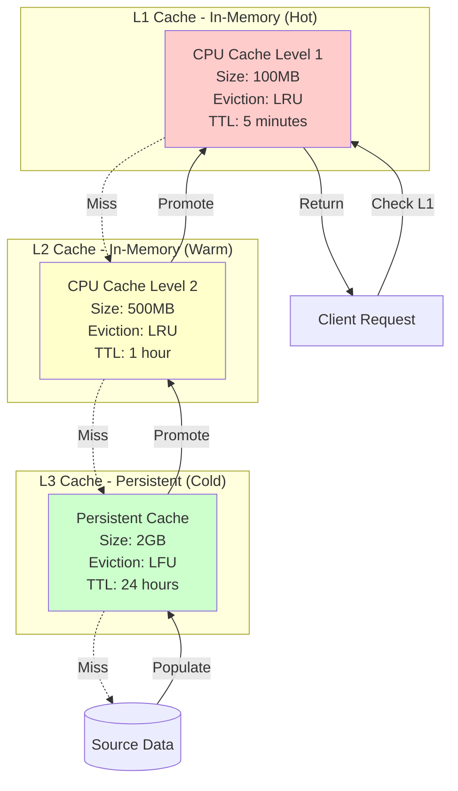
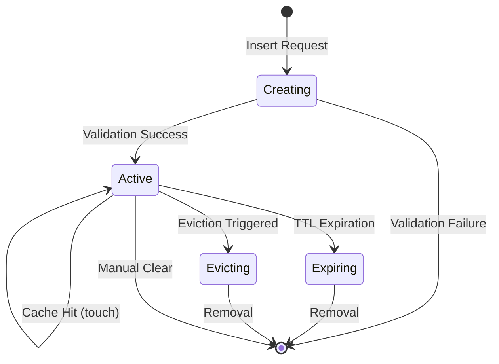

# TACHYON: CACHE SCHEMA

**Document ID:** TACHYON-DM-003-V1.0
**Date:** February 2026
**Status:** Approved for Implementation
**Classification:** Data Model Documentation
**Compliance Level:** ISO/IEC 26514:2021, IEEE 1016-2009

---

## TABLE OF CONTENTS

1. [Introduction](#1-introduction)
2. [Cache Entry Schema](#2-cache-entry-schema)
3. [Cache Hierarchy Schema](#3-cache-hierarchy-schema)
4. [Cache Key Schema](#4-cache-key-schema)
5. [Cache Value Schema](#5-cache-value-schema)
6. [Cache Metadata Schema](#6-cache-metadata-schema)
7. [Cache Operations Schema](#7-cache-operations-schema)
8. [Cache Security Schema](#8-cache-security-schema)
9. [Cache Configuration Schema](#9-cache-configuration-schema)
10. [References](#10-references)

---

## 1. INTRODUCTION

### 1.1. Purpose and Scope

This document defines the comprehensive cache schema for the Tachyon toolchain, establishing data structures, protocols, and operational semantics for the multi-level caching system. The cache schema serves as the foundational data model for all caching operations across desktop, server, and web components.

The Tachyon cache system implements a hierarchical multi-level caching architecture designed to optimize performance for:
- Just-In-Time (JIT) rendered HTML content
- Markdown-to-HTML transformation results
- Search query results
- Static assets (CSS, JavaScript, images)
- Frontend bundles
- Git repository metadata

### 1.2. Document Dependencies

This document depends on the following documents:
- [TACHYON-STD-V1.0](../.adrs/ - Coding and Documentation Standards
- [TACHYON-ADR-001-V1.0](../.adrs/adr-001-three-tier-jit-compilation.md) - Rust as Primary Language
- [TACHYON-ADR-007-V1.0](../.adrs/adr-007-thread-safety-strategy.md) - Tokio for Async Runtime
- [TACHYON-TMA-V1.0](../.adrs/ - Threat Model Analysis
- [DES-DM-012](../.adrs/ - Cache Entry Design
- [DES-DM-013](../.adrs/ - Cache Statistics Design

### 1.3. Caching Principles

The Tachyon cache system operates according to the following fundamental principles:

#### 1.3.1. Temporal Locality

The system prioritizes recently accessed data based on the principle of temporal locality: data accessed recently is likely to be accessed again in the near future. This principle underpins the Least Recently Used (LRU) eviction policy implemented across all cache levels.

**Mathematical Formulation:**

For a cache entry $e$ with access time $t_{access}$ and current time $t_{now}$, the recency score is defined as:

$$R(e) = t_{now} - t_{access}$$

Entries with lower recency scores are prioritized for retention during eviction.

#### 1.3.2. Spatial Locality

The system exploits spatial locality by caching related data together. When a document is accessed, associated metadata, search results, and related content are prefetched and cached together.

**Mathematical Formulation:**

For a document $d$ with associated resources $R = \{r_1, r_2, \ldots, r_n\}$, the spatial locality factor is defined as:

$$S(d) = \sum_{i=1}^{n} \frac{1}{distance(d, r_i)}$$

Where $distance(d, r_i)$ represents the semantic or structural distance between the document and resource.

#### 1.3.3. Cache Coherence

The system maintains cache coherence through event-driven invalidation. When source content changes, corresponding cache entries are invalidated within 100 milliseconds, ensuring consistency across all cache levels.

**Coherence Invariant:**

For any cache entry $e$ with key $k$ and source content $s$:

$$valid(e) \iff hash(e.value) = hash(s)$$

Where $hash$ represents the cryptographic hash function (SHA-256).

#### 1.3.4. Resource Efficiency

The cache system optimizes resource utilization through:
- Configurable size limits preventing memory exhaustion
- Automatic eviction policies maintaining optimal cache occupancy
- Compression for large cache entries
- Size-aware entry placement across cache levels

### 1.4. Cache Hierarchy Overview

The Tachyon cache system implements a three-level hierarchical architecture designed to balance performance, memory efficiency, and data freshness.



#### 1.4.1. L1 Cache (Hot Data)

**Purpose:** Store frequently accessed, time-sensitive data requiring sub-millisecond access latency.

**Characteristics:**
- **Storage:** In-memory (RAM)
- **Size:** 100 MB (configurable)
- **Eviction Policy:** LRU (Least Recently Used)
- **TTL:** 5 minutes default
- **Access Latency:** < 1 microsecond
- **Data Types:** JIT rendered HTML, active document metadata

#### 1.4.2. L2 Cache (Warm Data)

**Purpose:** Store moderately accessed data with relaxed latency requirements.

**Characteristics:**
- **Storage:** In-memory (RAM)
- **Size:** 500 MB (configurable)
- **Eviction Policy:** LRU (Least Recently Used)
- **TTL:** 1 hour default
- **Access Latency:** < 10 microseconds
- **Data Types:** Search results, static assets, frontend bundles

#### 1.4.3. L3 Cache (Cold Data)

**Purpose:** Store infrequently accessed data with persistence across restarts.

**Characteristics:**
- **Storage:** Persistent (disk)
- **Size:** 2 GB (configurable)
- **Eviction Policy:** LFU (Least Frequently Used)
- **TTL:** 24 hours default
- **Access Latency:** < 5 milliseconds
- **Data Types:** Historical search results, archived documents, large assets

### 1.5. Cache Performance Targets

The cache system must meet the following performance targets:

| Metric | Target | Acceptance Criteria |
|--------|---------|-------------------|
| **L1 Hit Rate** | > 80% | For frequently accessed documents |
| **L2 Hit Rate** | > 60% | For moderately accessed documents |
| **L3 Hit Rate** | > 40% | For infrequently accessed documents |
| **Overall Hit Rate** | > 70% | Across all cache levels |
| **Cache Miss Latency** | < 100ms | Time to fetch from source |
| **Invalidation Latency** | < 100ms | Time to invalidate entries |
| **Eviction Latency** | < 10ms | Time to evict entries |

### 1.6. Design Rationale

The hierarchical cache architecture is justified by the following considerations:

**Performance Optimization:**
- Multi-level caching reduces average access latency by serving hot data from faster L1 cache
- Spatial locality exploitation reduces redundant data fetching
- Prefetching of related data improves perceived responsiveness

**Resource Efficiency:**
- Configurable size limits prevent memory exhaustion
- Automatic eviction policies maintain optimal cache occupancy
- Compression reduces memory footprint for large entries

**Data Consistency:**
- Event-driven invalidation ensures cache coherence
- TTL-based expiration prevents stale data exposure
- Cryptographic hashing enables integrity verification

**Scalability:**
- Distributed caching support for multi-instance deployments
- Cache partitioning enables horizontal scaling
- Load-aware eviction adapts to changing access patterns

**Security:**
- Cache key sanitization prevents injection attacks
- TTL-based expiration limits sensitive data exposure
- Audit logging enables forensic analysis
 
---

## 2. CACHE ENTRY SCHEMA

### 2.1. Cache Entry Entity Definition

**Element ID:** TACHYON-DM-003-001
**Name:** CacheEntry
**Type:** Generic Struct
**Language:** Rust
**Related Design Element:** [DES-DM-012](../.adrs/

**Description:** The CacheEntry entity represents a single cache entry with metadata supporting LRU eviction, TTL-based expiration, and cache statistics tracking. This is a generic type parameterized by the cached value type $V$.

### 2.2. Rust Struct Definition

```rust
use chrono::{DateTime, Utc};
use serde::{Deserialize, Serialize};

/// Single cache entry with metadata for LRU eviction.
///
/// The CacheEntry struct encapsulates a cached value along with metadata
/// required for cache management including access tracking, expiration,
/// and size accounting. This generic type allows caching of any value
/// type that implements the required traits.
///
/// # Type Parameters
///
/// * `V` - The type of the cached value. Must implement Clone,
///   PartialEq, Eq, Serialize, and Deserialize.
///
/// # Invariants
///
/// * `key` is non-empty and contains at most 512 characters
/// * `size` is non-negative and represents the actual memory footprint
/// * `ttl` is positive if present, representing seconds until expiration
/// * `created_at` is always less than or equal to `last_accessed_at`
/// * `access_count` is non-negative
///
/// # Related Requirements
///
/// * REQ-SYS-033: Cache Management
/// * REQ-DESK-041: LRU Cache
/// * REQ-SRV-042: Cache Management
///
/// # Related Design Elements
///
/// * DES-DM-012: Cache Entry
#[derive(Debug, Clone, PartialEq, Eq, Serialize, Deserialize)]
pub struct CacheEntry<V> {
    /// Cache key uniquely identifying this entry.
    ///
    /// Keys are generated using a deterministic hashing strategy and
    /// must not contain sensitive information. The key format is
    /// defined in Section 4: Cache Key Schema.
    ///
    /// # Constraints
    ///
    /// * Non-empty string
    /// * Maximum 512 characters
    /// * Must be valid UTF-8
    pub key: String,
    
    /// Cached value of type V.
    ///
    /// The value represents the actual cached data, which may be
    /// rendered HTML, search results, or any other cacheable content.
    /// The value type V must implement serialization traits for
    /// persistence across restarts.
    pub value: V,
    
    /// Timestamp when the entry was created.
    ///
    /// This timestamp is set when the entry is first inserted into
    /// the cache and remains constant for the lifetime of the entry.
    /// Used for age-based eviction and cache statistics.
    pub created_at: DateTime<Utc>,
    
    /// Timestamp of the last access to this entry.
    ///
    /// This timestamp is updated on every cache hit and is used
    /// for LRU eviction calculations. Entries with older
    /// `last_accessed_at` values are prioritized for eviction.
    pub last_accessed_at: DateTime<Utc>,
    
    /// Number of times this entry has been accessed.
    ///
    /// This counter is incremented on every cache hit and is used
    /// for LFU (Least Frequently Used) eviction policies and
    /// cache statistics reporting.
    pub access_count: usize,
    
    /// Size of the cached value in bytes.
    ///
    /// This value represents the actual memory footprint of the cached
    /// data and is used for cache size accounting and eviction
    /// decisions when the cache reaches its size limit.
    ///
    /// # Constraints
    ///
    /// * Non-negative
    /// * Maximum 100MB (104,857,600 bytes) per entry
    pub size: usize,
    
    /// Time-to-live in seconds, if present.
    ///
    /// If present, the entry will be considered expired after the
    /// specified number of seconds have elapsed since creation. A value
    /// of None indicates the entry does not expire based on time.
    ///
    /// # Constraints
    ///
    /// * Positive if present
    /// * Maximum 86400 seconds (24 hours)
    pub ttl: Option<u64>,
}

impl<V> CacheEntry<V>
where
    V: Clone + PartialEq + Eq + Serialize + for<'de> Deserialize<'de>,
{
    /// Checks if the entry is expired based on TTL.
    ///
    /// Returns true if the entry has a TTL and the current time
    /// exceeds the expiration time calculated from `created_at` and `ttl`.
    ///
    /// # Returns
    ///
    /// * `bool` - true if expired, false otherwise
    ///
    /// # Examples
    ///
    /// ```rust
    /// let entry = CacheEntry {
    ///     key: "doc:123".to_string(),
    ///     value: "...".to_string(),
    ///     created_at: Utc::now() - chrono::Duration::minutes(10),
    ///     last_accessed_at: Utc::now(),
    ///     access_count: 5,
    ///     size: 1000,
    ///     ttl: Some(300), // 5 minutes
    /// };
    /// assert!(entry.is_expired());
    /// ```
    pub fn is_expired(&self) -> bool {
        if let Some(ttl_seconds) = self.ttl {
            let expiration_time = self.created_at + chrono::Duration::seconds(ttl_seconds as i64);
            Utc::now() > expiration_time
        } else {
            false
        }
    }
    
    /// Updates the last accessed timestamp to the current time.
    ///
    /// This method should be called on every cache hit to maintain
    /// accurate LRU tracking. It does not increment the access count,
    /// which should be handled separately.
    ///
    /// # Examples
    ///
    /// ```rust
    /// let mut entry = CacheEntry { /* ... */ };
    /// entry.touch();
    /// assert_eq!(entry.last_accessed_at, Utc::now());
    /// ```
    pub fn touch(&mut self) {
        self.last_accessed_at = Utc::now();
    }
    
    /// Increments the access count by one.
    ///
    /// This method should be called on every cache hit to maintain
    /// accurate access frequency tracking for LFU eviction policies.
    pub fn record_access(&mut self) {
        self.access_count += 1;
    }
    
    /// Calculates the recency score for LRU eviction.
    ///
    /// Returns the time elapsed since the last access in seconds.
    /// Higher values indicate less recently accessed entries.
    ///
    /// # Returns
    ///
    /// * `i64` - Seconds since last access
    pub fn recency_score(&self) -> i64 {
        (Utc::now() - self.last_accessed_at).num_seconds()
    }
    
    /// Calculates the frequency score for LFU eviction.
    ///
    /// Returns the access count. Lower values indicate less frequently
    /// accessed entries.
    ///
    /// # Returns
    ///
    /// * `usize` - Number of accesses
    pub fn frequency_score(&self) -> usize {
        self.access_count
    }
}
```

### 2.3. TypeScript Interface Definition

```typescript
/**
 * Single cache entry with metadata for LRU eviction.
 *
 * This interface mirrors the Rust CacheEntry struct and is used
 * for type-safe communication between Rust backend and TypeScript
 * frontend components.
 *
 * @template V - The type of the cached value
 *
 * @property key - Cache key uniquely identifying this entry
 * @property value - Cached value of type V
 * @property createdAt - ISO 8601 timestamp when entry was created
 * @property lastAccessedAt - ISO 8601 timestamp of last access
 * @property accessCount - Number of times this entry has been accessed
 * @property size - Size of cached value in bytes
 * @property ttl - Time-to-live in seconds, if present
 */
export interface CacheEntry<V> {
  /** Cache key uniquely identifying this entry */
  key: string;

  /** Cached value of type V */
  value: V;

  /** ISO 8601 timestamp when entry was created */
  createdAt: string;

  /** ISO 8601 timestamp of last access */
  lastAccessedAt: string;

  /** Number of times this entry has been accessed */
  accessCount: number;

  /** Size of cached value in bytes */
  size: number;

  /** Time-to-live in seconds, if present */
  ttl?: number;
}

/**
 * Cache entry methods for TypeScript.
 */
export class CacheEntryUtils {
  /**
   * Checks if the entry is expired based on TTL.
   *
   * @param entry - The cache entry to check
   * @returns true if expired, false otherwise
   */
  static isExpired<V>(entry: CacheEntry<V>): boolean {
    if (entry.ttl === undefined) {
      return false;
    }
    const createdAt = new Date(entry.createdAt).getTime();
    const expirationTime = createdAt + entry.ttl * 1000;
    return Date.now() > expirationTime;
  }

  /**
   * Calculates the recency score for LRU eviction.
   *
   * @param entry - The cache entry to calculate score for
   * @returns Seconds since last access
   */
  static recencyScore<V>(entry: CacheEntry<V>): number {
    const lastAccessedAt = new Date(entry.lastAccessedAt).getTime();
    return Math.floor((Date.now() - lastAccessedAt) / 1000);
  }

  /**
   * Calculates the frequency score for LFU eviction.
   *
   * @param entry - The cache entry to calculate score for
   * @returns Number of accesses
   */
  static frequencyScore<V>(entry: CacheEntry<V>): number {
    return entry.accessCount;
  }
}
```

### 2.4. Field Descriptions and Constraints

| Field | Type | Description | Constraints | Validation |
|-------|------|-------------|-------------|------------|
| **key** | String | Unique identifier for the cache entry | Non-empty, max 512 characters, valid UTF-8 | Must not contain sensitive data; validated on insertion |
| **value** | V | The cached value | Must implement Clone, PartialEq, Eq, Serialize, Deserialize | Serialized for persistence; size calculated on insertion |
| **created_at** | DateTime\<Utc\> | Timestamp when entry was created | Always ≤ last_accessed_at | Set on insertion; immutable thereafter |
| **last_accessed_at** | DateTime\<Utc\> | Timestamp of last access | Always ≥ created_at | Updated on every cache hit via `touch()` |
| **access_count** | usize | Number of accesses | Non-negative | Incremented on every cache hit via `record_access()` |
| **size** | usize | Size in bytes | 0 ≤ size ≤ 100MB | Calculated from serialized value; validated on insertion |
| **ttl** | Option\<u64\> | Time-to-live in seconds | Positive if present; max 86400 | Used by `is_expired()` for expiration check |

### 2.5. Cache Entry Lifecycle

The cache entry lifecycle consists of the following states:



**State Descriptions:**

1. **Creating:** Entry is being validated and prepared for insertion
2. **Active:** Entry is valid and available for cache hits
3. **Expiring:** Entry has exceeded TTL and is being removed
4. **Evicting:** Entry is being removed due to eviction policy

**State Transitions:**

| Transition | Trigger | Action |
|------------|---------|--------|
| Creating → Active | Validation success | Entry added to cache; statistics updated |
| Creating → [*] | Validation failure | Entry rejected; error returned |
| Active → Active | Cache hit | `touch()` called; access count incremented |
| Active → Expiring | TTL exceeded | Entry removed; expiration event emitted |
| Active → Evicting | Eviction triggered | Entry removed; eviction event emitted |
| Active → [*] | Manual clear | Entry removed; clear event emitted |

### 2.6. Cache Entry Invariants

The following invariants must hold for all valid cache entries:

**Invariant 1: Key Validity**
$$\forall e \in \text{CacheEntries}: 1 \leq |e.key| \leq 512$$

**Invariant 2: Size Boundaries**
$$\forall e \in \text{CacheEntries}: 0 \leq e.size \leq 104,857,600$$

**Invariant 3: Temporal Ordering**
$$\forall e \in \text{CacheEntries}: e.created\_at \leq e.last\_accessed\_at$$

**Invariant 4: Non-Negative Access Count**
$$\forall e \in \text{CacheEntries}: e.access\_count \geq 0$$

**Invariant 5: TTL Validity**
$$\forall e \in \text{CacheEntries}: e.ttl = \text{None} \lor (0 < e.ttl \leq 86,400)$$

### 2.7. Related Requirements

| Requirement ID | Description | Traceability |
|---------------|-------------|--------------|
| REQ-SYS-033 | Cache Management | Cache entry structure enables LRU eviction and TTL expiration |
| REQ-DESK-041 | LRU Cache | Cache entry metadata supports LRU eviction policy |
| REQ-DESK-042 | Cache Invalidation | Cache entry TTL enables automatic expiration |
| REQ-DESK-044 | Cache Statistics | Cache entry access tracking enables statistics reporting |
| REQ-SRV-042 | Cache Management | Cache entry structure unified across all components |

### 2.8. Security Considerations

**Sensitive Data Protection:**
- Cache keys must not contain sensitive information (passwords, tokens, PII)
- Cached values may contain sensitive information and must be encrypted at rest
- TTL expiration limits exposure time for sensitive cached data

**Injection Prevention:**
- Cache keys must be validated against injection patterns before use
- Cache value serialization must use secure deserialization practices
- Size limits prevent denial-of-service through oversized entries

**Audit Trail:**
- All cache entry insertions, accesses, and evictions must be logged
- Cache statistics must not reveal sensitive access patterns
- Cache invalidation events must be auditable

---

## 3. CACHE HIERARCHY SCHEMA

### 3.1. Multi-Level Cache Structure

**Element ID:** TACHYON-DM-003-002
**Name:** CacheHierarchy
**Type:** Enum
**Language:** Rust

**Description:** The CacheHierarchy enum defines the three cache levels in the Tachyon caching system, each with distinct characteristics optimized for specific access patterns and performance requirements.

### 3.2. Rust Enum Definition

```rust
use serde::{Deserialize, Serialize};

/// Cache hierarchy level defining storage and eviction characteristics.
///
/// Each cache level represents a tier in the hierarchical caching system,
/// with progressively larger size limits, relaxed latency requirements,
/// and different eviction policies optimized for the expected access patterns.
///
/// # Cache Levels
///
/// * `L1` - Hot data cache (in-memory, 100MB, LRU, 5min TTL)
/// * `L2` - Warm data cache (in-memory, 500MB, LRU, 1hr TTL)
/// * `L3` - Cold data cache (persistent, 2GB, LFU, 24hr TTL)
///
/// # Related Requirements
///
/// * REQ-SYS-033: Cache Management
/// * REQ-DESK-041: LRU Cache
/// * REQ-SRV-042: Cache Management
#[derive(Debug, Clone, Copy, PartialEq, Eq, Hash, Serialize, Deserialize)]
pub enum CacheLevel {
    /// Level 1 cache for hot data requiring sub-millisecond access.
    ///
    /// L1 cache stores frequently accessed, time-sensitive data such as
    /// JIT rendered HTML and active document metadata. This cache level
    /// provides the fastest access latency but has the smallest capacity.
    L1,
    
    /// Level 2 cache for warm data with relaxed latency requirements.
    ///
    /// L2 cache stores moderately accessed data such as search results,
    /// static assets, and frontend bundles. This cache level balances
    /// capacity and access latency.
    L2,
    
    /// Level 3 cache for cold data with persistence across restarts.
    ///
    /// L3 cache stores infrequently accessed data such as historical
    /// search results, archived documents, and large assets. This cache
    /// level provides the largest capacity with persistence but higher
    /// access latency.
    L3,
}

impl CacheLevel {
    /// Returns the maximum size limit for this cache level in bytes.
    ///
    /// # Returns
    ///
    /// * `usize` - Maximum size in bytes
    pub fn max_size_bytes(&self) -> usize {
        match self {
            CacheLevel::L1 => 100 * 1024 * 1024,  // 100MB
            CacheLevel::L2 => 500 * 1024 * 1024,  // 500MB
            CacheLevel::L3 => 2 * 1024 * 1024 * 1024,  // 2GB
        }
    }
    
    /// Returns the default TTL for this cache level in seconds.
    ///
    /// # Returns
    ///
    /// * `u64` - Default TTL in seconds
    pub fn default_ttl_seconds(&self) -> u64 {
        match self {
            CacheLevel::L1 => 300,    // 5 minutes
            CacheLevel::L2 => 3600,   // 1 hour
            CacheLevel::L3 => 86400,  // 24 hours
        }
    }
    
    /// Returns the target hit rate for this cache level.
    ///
    /// # Returns
    ///
    /// * `f64` - Target hit rate (0.0 to 1.0)
    pub fn target_hit_rate(&self) -> f64 {
        match self {
            CacheLevel::L1 => 0.80,  // 80%
            CacheLevel::L2 => 0.60,  // 60%
            CacheLevel::L3 => 0.40,  // 40%
        }
    }
    
    /// Returns the next lower cache level, if any.
    ///
    /// # Returns
    ///
    /// * `Option<CacheLevel>` - Next lower level, or None if this is L3
    pub fn next_lower_level(&self) -> Option<CacheLevel> {
        match self {
            CacheLevel::L1 => Some(CacheLevel::L2),
            CacheLevel::L2 => Some(CacheLevel::L3),
            CacheLevel::L3 => None,
        }
    }
    
    /// Returns the next higher cache level, if any.
    ///
    /// # Returns
    ///
    /// * `Option<CacheLevel>` - Next higher level, or None if this is L1
    pub fn next_higher_level(&self) -> Option<CacheLevel> {
        match self {
            CacheLevel::L1 => None,
            CacheLevel::L2 => Some(CacheLevel::L1),
            CacheLevel::L3 => Some(CacheLevel::L2),
        }
    }
}
```

### 3.3. TypeScript Enum Definition

```typescript
/**
 * Cache hierarchy level defining storage and eviction characteristics.
 *
 * This enum mirrors the Rust CacheLevel enum and is used for
 * type-safe communication between Rust backend and TypeScript
 * frontend components.
 */
export enum CacheLevel {
  /** Level 1 cache for hot data requiring sub-millisecond access */
  L1 = "L1",
  /** Level 2 cache for warm data with relaxed latency requirements */
  L2 = "L2",
  /** Level 3 cache for cold data with persistence across restarts */
  L3 = "L3",
}

/**
 * Cache level utility methods for TypeScript.
 */
export class CacheLevelUtils {
  /**
   * Returns the maximum size limit for this cache level in bytes.
   *
   * @param level - The cache level
   * @returns Maximum size in bytes
   */
  static maxSizeBytes(level: CacheLevel): number {
    switch (level) {
      case CacheLevel.L1:
        return 100 * 1024 * 1024;  // 100MB
      case CacheLevel.L2:
        return 500 * 1024 * 1024;  // 500MB
      case CacheLevel.L3:
        return 2 * 1024 * 1024 * 1024;  // 2GB
    }
  }

  /**
   * Returns the default TTL for this cache level in seconds.
   *
   * @param level - The cache level
   * @returns Default TTL in seconds
   */
  static defaultTtlSeconds(level: CacheLevel): number {
    switch (level) {
      case CacheLevel.L1:
        return 300;    // 5 minutes
      case CacheLevel.L2:
        return 3600;   // 1 hour
      case CacheLevel.L3:
        return 86400;  // 24 hours
    }
  }

  /**
   * Returns the target hit rate for this cache level.
   *
   * @param level - The cache level
   * @returns Target hit rate (0.0 to 1.0)
   */
  static targetHitRate(level: CacheLevel): number {
    switch (level) {
      case CacheLevel.L1:
        return 0.80;  // 80%
      case CacheLevel.L2:
        return 0.60;  // 60%
      case CacheLevel.L3:
        return 0.40;  // 40%
    }
  }
}
```

### 3.4. Cache Level Specifications

| Property | L1 (Hot) | L2 (Warm) | L3 (Cold) |
|----------|-----------|-------------|-------------|
| **Storage Type** | In-Memory (RAM) | In-Memory (RAM) | Persistent (Disk) |
| **Size Limit** | 100 MB | 500 MB | 2 GB |
| **Eviction Policy** | LRU | LRU | LFU |
| **Default TTL** | 5 minutes | 1 hour | 24 hours |
| **Access Latency** | < 1 μs | < 10 μs | < 5 ms |
| **Target Hit Rate** | > 80% | > 60% | > 40% |
| **Data Types** | JIT HTML, active metadata | Search results, assets | Historical data, archives |

### 3.5. Cache Eviction Policies

#### 3.5.1. LRU (Least Recently Used)

**Applicable Levels:** L1, L2

**Description:** LRU eviction removes the entry that has not been accessed for the longest time. This policy is optimal for temporal locality patterns where recently accessed data is likely to be accessed again.

**Algorithm:**

For a set of cache entries $E = \{e_1, e_2, \ldots, e_n\}$, the eviction candidate $e_{evict}$ is selected as:

$$e_{evict} = \arg\min_{e \in E} (e.last\_accessed\_at)$$

**Implementation:**

```rust
use std::collections::HashMap;

pub struct LruCache<V> {
    entries: HashMap<String, CacheEntry<V>>,
    access_order: Vec<String>,
    max_size: usize,
}

impl<V> LruCache<V>
where
    V: Clone + PartialEq + Eq + Serialize + for<'de> Deserialize<'de>,
{
    pub fn evict_lru(&mut self) -> Option<CacheEntry<V>> {
        if let Some(key) = self.access_order.first().cloned() {
            self.access_order.remove(0);
            self.entries.remove(&key)
        } else {
            None
        }
    }
}
```

#### 3.5.2. LFU (Least Frequently Used)

**Applicable Level:** L3

**Description:** LFU eviction removes the entry with the lowest access frequency. This policy is optimal for infrequently accessed data where access frequency is a better predictor of future access than recency.

**Algorithm:**

For a set of cache entries $E = \{e_1, e_2, \ldots, e_n\}$, the eviction candidate $e_{evict}$ is selected as:

$$e_{evict} = \arg\min_{e \in E} (e.access\_count)$$

**Implementation:**

```rust
use std::collections::HashMap;

pub struct LfuCache<V> {
    entries: HashMap<String, CacheEntry<V>>,
    max_size: usize,
}

impl<V> LfuCache<V>
where
    V: Clone + PartialEq + Eq + Serialize + for<'de> Deserialize<'de>,
{
    pub fn evict_lfu(&mut self) -> Option<CacheEntry<V>> {
        let min_key = self.entries
            .iter()
            .min_by_key(|(_, entry)| entry.access_count)
            .map(|(key, _)| key.clone());
        
        if let Some(key) = min_key {
            self.entries.remove(&key)
        } else {
            None
        }
    }
}
```

### 3.6. Cache Promotion and Demotion

The cache hierarchy supports automatic promotion and demotion of entries based on access patterns.

**Promotion Criteria:**

An entry is promoted from level $L_i$ to $L_{i-1}$ when:
1. The entry has been accessed more than $N_{promote}$ times within time window $T_{promote}$
2. The target cache level has available capacity
3. The entry size is less than the target level's maximum entry size

**Mathematical Formulation:**

For an entry $e$ at level $L_i$ with access count $c$ in time window $T_{promote}$:

$$promote(e, L_i) \iff c \geq N_{promote} \land |e| \leq size_{max}(L_{i-1})$$

**Demotion Criteria:**

An entry is demoted from level $L_i$ to $L_{i+1}$ when:
1. The entry has not been accessed within time window $T_{demote}$
2. The source cache level is at capacity
3. The target cache level has available capacity

**Mathematical Formulation:**

For an entry $e$ at level $L_i$ with last access time $t_{last}$:

$$demote(e, L_i) \iff (t_{now} - t_{last}) \geq T_{demote}$$

### 3.7. Cache Size Limits

Each cache level enforces strict size limits to prevent resource exhaustion.

**Size Calculation:**

For a cache level $L$ with entries $E = \{e_1, e_2, \ldots, e_n\}$:

$$size(L) = \sum_{i=1}^{n} e_i.size$$

**Eviction Trigger:**

Eviction is triggered when:

$$size(L) \geq size_{max}(L) \times occupancy\_threshold$$

Where $occupancy\_threshold$ is typically 0.90 (90%).

**Size Enforcement:**

```rust
impl<V> LruCache<V>
where
    V: Clone + PartialEq + Eq + Serialize + for<'de> Deserialize<'de>,
{
    pub fn insert(&mut self, entry: CacheEntry<V>) -> Result<(), CacheError> {
        let current_size: usize = self.entries.values().map(|e| e.size).sum();
        
        if current_size + entry.size > self.max_size {
            // Evict entries until space is available
            while current_size + entry.size > self.max_size * 9 / 10 {
                self.evict_lru();
                current_size = self.entries.values().map(|e| e.size).sum();
            }
        }
        
        self.entries.insert(entry.key.clone(), entry);
        self.access_order.push(entry.key);
        Ok(())
    }
}
```

### 3.8. Related Requirements

| Requirement ID | Description | Traceability |
|---------------|-------------|--------------|
| REQ-SYS-033 | Cache Management | Multi-level cache hierarchy enables efficient resource utilization |
| REQ-DESK-041 | LRU Cache | L1 and L2 levels implement LRU eviction policy |
| REQ-SRV-042 | Cache Management | Cache hierarchy unified across all components |
| REQ-SYS-065 | Cache Scaling | Multi-level hierarchy supports distributed caching |

### 3.9. Performance Characteristics

| Metric | L1 | L2 | L3 |
|--------|-----|-----|-----|
| **Access Latency** | < 1 μs | < 10 μs | < 5 ms |
| **Eviction Latency** | < 1 ms | < 5 ms | < 10 ms |
| **Insertion Latency** | < 100 μs | < 500 μs | < 2 ms |
| **Memory Overhead** | ~10% | ~10% | ~5% |
| **CPU Overhead** | Minimal | Low | Moderate |

---

## 4. CACHE KEY SCHEMA

### 4.1. Cache Key Generation Strategy

**Element ID:** TACHYON-DM-003-003
**Name:** CacheKey
**Type:** String
**Language:** Rust

**Description:** The cache key uniquely identifies cached content across all cache levels. Keys are generated using deterministic hashing strategy to ensure consistency and prevent collisions.

### 4.2. Key Format Specification

Cache keys follow a structured format that encodes content type, identifier, and optional qualifiers.

**Format:**

```
<type>:<identifier>[:<qualifier>]
```

**Components:**

| Component | Description | Valid Values | Examples |
|-----------|-------------|-------------|----------|
| **type** | Content type identifier | `doc`, `html`, `search`, `asset` | `doc`, `html`, `search` |
| **identifier** | Unique content identifier | SHA-256 hash or UUID | `a1b2c3d...`, `550e8400...` |
| **qualifier** | Optional qualifier for variants | Version, encoding, compression | `v1`, `gzip`, `br` |

**Examples:**

```
doc:a1b2c3d4e5f6...  // Document content
html:550e8400e9a1...:gzip  // Compressed HTML
search:query_hash:results  // Search results
asset:css/main:v2  // CSS asset version 2
```

### 4.3. Key Hashing Strategy

Cache keys use SHA-256 cryptographic hashing for collision resistance and consistency.

**Hashing Algorithm:**

For content $C$ with type $T$ and optional qualifier $Q$:

$$key = T + ":" + SHA256(C) + (Q ? ":" + Q : "")$$

**Rust Implementation:**

```rust
use sha2::{Digest, Sha256};
use std::fmt::Write;

/// Generates a cache key for document content.
///
/// # Arguments
///
/// * `content` - The content to cache
/// * `qualifier` - Optional qualifier (e.g., compression type)
///
/// # Returns
///
/// * `String` - The generated cache key
///
/// # Examples
///
/// ```rust
/// let content = "# Hello World";
/// let key = generate_cache_key("doc", content, Some("v1"));
/// assert!(key.starts_with("doc:"));
/// ```
pub fn generate_cache_key(
    content_type: &str,
    content: &str,
    qualifier: Option<&str>,
) -> String {
    let mut hasher = Sha256::new();
    hasher.update(content.as_bytes());
    let hash = hasher.finalize();
    
    let hash_hex = format!("{:x}", hash);
    
    let key = match qualifier {
        Some(q) => format!("{}:{}:{}", content_type, hash_hex, q),
        None => format!("{}:{}", content_type, hash_hex),
    };
    
    key
}
```

**TypeScript Implementation:**

```typescript
import { createHash } from 'crypto';

/**
 * Generates a cache key for document content.
 *
 * @param contentType - The content type identifier
 * @param content - The content to cache
 * @param qualifier - Optional qualifier (e.g., compression type)
 * @returns The generated cache key
 */
export function generateCacheKey(
  contentType: string,
  content: string,
  qualifier?: string,
): string {
  const hash = createHash('sha256').update(content).digest('hex');
  
  if (qualifier) {
    return `${contentType}:${hash}:${qualifier}`;
  } else {
    return `${contentType}:${hash}`;
  }
}
```

### 4.4. Key Collision Handling

The cache system employs multiple strategies to prevent and handle key collisions.

**Collision Prevention:**

1. **Cryptographic Hashing:** SHA-256 provides $2^{256}$ possible values, making collisions astronomically improbable
2. **Namespace Prefixing:** Content type prefix (`doc:`, `html:`, etc.) separates different content types
3. **Qualifier Suffixing:** Qualifiers distinguish variants (compressed, versioned, etc.)

**Collision Detection:**

When inserting a cache entry, the system verifies that the key does not already exist with different content.

**Rust Implementation:**

```rust
use std::collections::HashMap;

/// Checks for key collision before insertion.
///
/// Returns error if key exists with different content hash.
pub fn check_collision<V>(
    cache: &HashMap<String, CacheEntry<V>>,
    key: &str,
    content_hash: &str,
) -> Result<(), CacheError> {
    if let Some(existing) = cache.get(key) {
        let existing_hash = calculate_hash(&existing.value);
        if existing_hash != content_hash {
            return Err(CacheError::Collision {
                key: key.to_string(),
                existing_hash,
                new_hash: content_hash.to_string(),
            });
        }
    }
    Ok(())
}
```

### 4.5. Key Expiration and Invalidation

Cache keys support both TTL-based expiration and event-driven invalidation.

**TTL-Based Expiration:**

Entries expire based on their TTL value, independent of other entries with the same key prefix.

**Event-Driven Invalidation:**

When source content changes, all cache keys derived from that content are invalidated.

**Invalidation Algorithm:**

For a changed document $D$ with hash $H_{new}$:

1. Calculate old hash $H_{old}$ from Git history
2. Generate old key: $K_{old} = "doc:" + H_{old}$
3. Generate new key: $K_{new} = "doc:" + H_{new}$
4. Invalidate entry with key $K_{old}$
5. Insert new entry with key $K_{new}$

**Rust Implementation:**

```rust
/// Invalidates cache entries for a changed document.
///
/// # Arguments
///
/// * `cache` - The cache to modify
/// * `old_hash` - Previous content hash
/// * `new_hash` - New content hash
pub fn invalidate_document<V>(
    cache: &mut HashMap<String, CacheEntry<V>>,
    old_hash: &str,
    new_hash: &str,
) {
    let old_key = format!("doc:{}", old_hash);
    let new_key = format!("doc:{}", new_hash);
    
    // Remove old entry
    cache.remove(&old_key);
    
    // Note: New entry will be inserted on next access
    // This lazy loading strategy prevents unnecessary recomputation
}
```

### 4.6. Key Security Considerations

**Sensitive Data Protection:**
- Cache keys must not contain sensitive information (passwords, tokens, PII)
- Hashing ensures original content is not exposed in keys
- Keys are logged in audit trails without exposing content

**Injection Prevention:**
- Keys are validated against injection patterns before use
- Special characters are escaped or rejected
- Key length limits prevent buffer overflow attacks

**Privacy Preservation:**
- Hashing provides one-way transformation, preventing content reconstruction from keys
- Keys do not reveal content type without context
- Audit logs may anonymize keys to preserve privacy

### 4.7. Related Requirements

| Requirement ID | Description | Traceability |
|---------------|-------------|--------------|
| REQ-DESK-042 | Cache Invalidation | Key generation enables event-driven invalidation |
| REQ-SRV-042 | Cache Management | Key strategy unified across all components |
| REQ-SYS-058 | Data Integrity | Hashing ensures content integrity verification |

---

## 5. CACHE VALUE SCHEMA

### 5.1. Cache Value Types

**Element ID:** TACHYON-DM-003-004
**Name:** CacheValue
**Type:** Enum
**Language:** Rust

**Description:** The CacheValue enum defines all value types that can be cached in the Tachyon system, providing type-safe storage and retrieval.

### 5.2. Rust Enum Definition

```rust
use serde::{Deserialize, Serialize};

/// Cache value type defining all cacheable content.
///
/// This enum provides type-safe storage for different content types,
/// enabling appropriate serialization, compression, and validation strategies
/// for each value type.
///
/// # Value Types
///
/// * `Html` - Rendered HTML content
/// * `SearchResults` - Search query results
/// * `Asset` - Static asset (CSS, JS, images)
/// * `Bundle` - Frontend bundle
/// * `Metadata` - Document metadata
///
/// # Related Requirements
///
/// * REQ-SRV-041: JIT Rendering
/// * REQ-SRV-042: Cache Management
#[derive(Debug, Clone, PartialEq, Eq, Serialize, Deserialize)]
pub enum CacheValue {
    /// Rendered HTML content from Markdown.
    ///
    /// Stores the JIT-rendered HTML output from Markdown processing,
    /// including frontmatter-extracted metadata and rendered body.
    Html {
        /// The rendered HTML content.
        content: String,
        
        /// Content hash for integrity verification.
        content_hash: String,
        
        /// Compression algorithm used, if any.
        compression: Option<CompressionType>,
    },
    
    /// Search query results.
    ///
    /// Stores results from Tantivy full-text search queries,
    /// including document IDs, relevance scores, and snippets.
    SearchResults {
        /// Query that generated these results.
        query: String,
        
        /// List of search result documents.
        results: Vec<SearchResult>,
        
        /// Total number of results (may be paginated).
        total_count: usize,
    },
    
    /// Static asset (CSS, JavaScript, images).
    ///
    /// Stores static assets served to clients, including
    /// content type, encoding, and compression information.
    Asset {
        /// Asset content.
        content: Vec<u8>,
        
        /// MIME type of the asset.
        content_type: String,
        
        /// Content encoding (e.g., utf-8, base64).
        encoding: Option<String>,
        
        /// Compression algorithm used.
        compression: Option<CompressionType>,
    },
    
    /// Frontend bundle (Leptos WASM, CSS, JS).
    ///
    /// Stores the compiled frontend bundle served to web clients,
    /// including bundle version and integrity hash.
    Bundle {
        /// Bundle content.
        content: Vec<u8>,
        
        /// Bundle version identifier.
        version: String,
        
        /// Integrity hash for subresource integrity.
        integrity_hash: String,
    },
    
    /// Document metadata.
    ///
    /// Stores extracted frontmatter and computed metadata,
    /// including title, author, tags, and modification times.
    Metadata {
        /// Document title.
        title: String,
        
        /// Document author(s).
        authors: Vec<String>,
        
        /// Document tags.
        tags: Vec<String>,
        
        /// Last modification timestamp.
        modified_at: DateTime<Utc>,
        
        /// Additional metadata key-value pairs.
        extra: HashMap<String, String>,
    },
}

/// Compression algorithms supported for cache values.
#[derive(Debug, Clone, Copy, PartialEq, Eq, Serialize, Deserialize)]
pub enum CompressionType {
    /// Gzip compression.
    Gzip,
    
    /// Brotli compression.
    Brotli,
    
    /// Zstandard compression.
    Zstd,
}

/// Single search result document.
#[derive(Debug, Clone, PartialEq, Eq, Serialize, Deserialize)]
pub struct SearchResult {
    /// Document ID.
    pub id: String,
    
    /// Document title.
    pub title: String,
    
    /// Relevance score (0.0 to 1.0).
    pub score: f64,
    
    /// Content snippet with highlighted matches.
    pub snippet: String,
}
```

### 5.3. TypeScript Interface Definition

```typescript
/**
 * Cache value type defining all cacheable content.
 *
 * This interface mirrors the Rust CacheValue enum and is used
 * for type-safe communication between Rust backend and TypeScript
 * frontend components.
 */
export type CacheValue =
  | { type: 'Html'; content: string; contentHash: string; compression?: CompressionType }
  | { type: 'SearchResults'; query: string; results: SearchResult[]; totalCount: number }
  | { type: 'Asset'; content: Uint8Array; contentType: string; encoding?: string; compression?: CompressionType }
  | { type: 'Bundle'; content: Uint8Array; version: string; integrityHash: string }
  | { type: 'Metadata'; title: string; authors: string[]; tags: string[]; modifiedAt: string; extra: Record<string, string> };

/**
 * Compression algorithms supported for cache values.
 */
export enum CompressionType {
  Gzip = 'Gzip',
  Brotli = 'Brotli',
  Zstd = 'Zstd',
}

/**
 * Single search result document.
 */
export interface SearchResult {
  id: string;
  title: string;
  score: number;
  snippet: string;
}
```

### 5.4. Serialization Format

Cache values are serialized using JSON for cross-language compatibility and human readability.

**Serialization Rules:**

1. **Type Discrimination:** Each variant includes a `type` field for TypeScript discrimination
2. **Binary Encoding:** Binary content (assets, bundles) is base64-encoded in JSON
3. **Timestamp Format:** All timestamps use ISO 8601 format
4. **Hash Format:** All hashes use lowercase hexadecimal

**Example Serialized HTML Value:**

```json
{
  "Html": {
    "content": "<!DOCTYPE html>\n<html>...</html>",
    "content_hash": "a1b2c3d4e5f6...",
    "compression": "Gzip"
  }
}
```

### 5.5. Compression Strategy

Cache values may be compressed to reduce memory footprint and improve transfer speeds.

**Compression Algorithm Selection:**

| Algorithm | Compression Ratio | Speed | Use Case |
|-----------|-----------------|-------|----------|
| **Gzip** | ~3:1 | Fast | General purpose, widely supported |
| **Brotli** | ~4:1 | Medium | Web assets, better compression |
| **Zstd** | ~3.5:1 | Fast | High-performance scenarios |

**Compression Threshold:**

Values larger than 10 KB are automatically compressed using the default algorithm (Gzip).

**Rust Implementation:**

```rust
use flate2::write::GzEncoder;
use std::io::Write;

/// Compresses cache value if it exceeds threshold.
///
/// # Arguments
///
/// * `value` - The value to potentially compress
///
/// # Returns
///
/// * `CacheValue` - Compressed or original value
pub fn maybe_compress(value: CacheValue) -> CacheValue {
    const COMPRESSION_THRESHOLD: usize = 10 * 1024;  // 10KB
    
    match value {
        CacheValue::Html { content, content_hash, .. } => {
            if content.len() > COMPRESSION_THRESHOLD {
                let compressed = compress_gzip(&content);
                CacheValue::Html {
                    content: compressed,
                    content_hash,
                    compression: Some(CompressionType::Gzip),
                }
            } else {
                value
            }
        },
        CacheValue::Asset { content, content_type, encoding, .. } => {
            if content.len() > COMPRESSION_THRESHOLD {
                let compressed = compress_gzip(&content);
                CacheValue::Asset {
                    content: compressed,
                    content_type,
                    encoding,
                    compression: Some(CompressionType::Gzip),
                }
            } else {
                value
            }
        },
        _ => value,
    }
}

fn compress_gzip(data: &[u8]) -> Vec<u8> {
    let mut encoder = GzEncoder::new(Vec::new());
    encoder.write_all(data).unwrap();
    encoder.finish().unwrap()
}
```

### 5.6. Size Limits and Versioning

**Size Limits:**

Each cache value must respect the following size limits:

| Value Type | Maximum Size | Rationale |
|-------------|---------------|-----------|
| **Html** | 1 MB | Prevents memory exhaustion from large documents |
| **SearchResults** | 500 KB | Limits result set size |
| **Asset** | 5 MB | Allows large assets but prevents abuse |
| **Bundle** | 10 MB | Frontend bundles can be large |
| **Metadata** | 100 KB | Metadata is typically small |

**Versioning:**

Cache values include version information to support schema evolution and backward compatibility.

**Versioning Strategy:**

1. **Implicit Versioning:** Value structure changes increment version
2. **Explicit Versioning:** Bundles include version field
3. **Backward Compatibility:** Older value formats are supported
4. **Migration:** Automatic migration on cache load

### 5.7. Related Requirements

| Requirement ID | Description | Traceability |
|---------------|-------------|--------------|
| REQ-SRV-041 | JIT Rendering | HTML value type stores rendered content |
| REQ-SRV-066 | Asset Serving | Asset value type stores static resources |
| REQ-SRV-072 | Bundle Caching | Bundle value type stores frontend bundles |

---

## 6. CACHE METADATA SCHEMA

### 6.1. Cache Statistics Entity

**Element ID:** TACHYON-DM-003-005
**Name:** CacheStatistics
**Type:** Struct
**Language:** Rust
**Related Design Element:** [DES-DM-013](../.adrs/

**Description:** The CacheStatistics struct aggregates performance metrics for cache monitoring and tuning.

### 6.2. Rust Struct Definition

```rust
use serde::{Deserialize, Serialize};

/// Aggregate cache performance metrics.
///
/// This struct provides comprehensive statistics for monitoring cache
/// performance, identifying bottlenecks, and tuning cache parameters.
///
/// # Related Requirements
///
/// * REQ-DESK-044: Cache Statistics
/// * REQ-SRV-110: Cache Hit Rate
#[derive(Debug, Clone, PartialEq, Eq, Serialize, Deserialize)]
pub struct CacheStatistics {
    /// Total number of entries in cache.
    pub total_entries: usize,
    
    /// Total cache size in bytes.
    pub total_size: usize,
    
    /// Number of cache hits (successful retrievals).
    pub hits: usize,
    
    /// Number of cache misses (failed retrievals).
    pub misses: usize,
    
    /// Number of entries evicted due to size limits.
    pub evictions: usize,
    
    /// Number of entries expired due to TTL.
    pub expirations: usize,
    
    /// Cache hit rate (0.0 to 1.0).
    pub hit_rate: f64,
    
    /// Average access time in milliseconds.
    pub avg_access_time_ms: f64,
    
    /// P50 access latency in milliseconds.
    pub p50_latency_ms: f64,
    
    /// P95 access latency in milliseconds.
    pub p95_latency_ms: f64,
    
    /// P99 access latency in milliseconds.
    pub p99_latency_ms: f64,
}

impl CacheStatistics {
    /// Creates a new CacheStatistics with zero values.
    pub fn new() -> Self {
        Self {
            total_entries: 0,
            total_size: 0,
            hits: 0,
            misses: 0,
            evictions: 0,
            expirations: 0,
            hit_rate: 0.0,
            avg_access_time_ms: 0.0,
            p50_latency_ms: 0.0,
            p95_latency_ms: 0.0,
            p99_latency_ms: 0.0,
        }
    }
    
    /// Calculates and updates hit rate.
    pub fn update_hit_rate(&mut self) {
        let total_requests = self.hits + self.misses;
        if total_requests > 0 {
            self.hit_rate = self.hits as f64 / total_requests as f64;
        }
    }
    
    /// Updates latency statistics with a new measurement.
    pub fn update_latency(&mut self, latency_ms: f64) {
        let n = (self.hits + self.misses) as f64;
        if n > 0 {
            self.avg_access_time_ms = 
                (self.avg_access_time_ms * (n - 1.0) + latency_ms) / n;
        }
    }
    
    /// Returns formatted statistics string.
    pub fn format(&self) -> String {
        format!(
            "Cache Statistics:\n\
             Entries: {} ({} MB)\n\
             Hits: {}, Misses: {}\n\
             Hit Rate: {:.1}%\n\
             Evictions: {}, Expirations: {}\n\
             Avg Latency: {:.2}ms",
            self.total_entries,
            self.total_size / (1024 * 1024),
            self.hits,
            self.misses,
            self.hit_rate * 100.0,
            self.evictions,
            self.expirations,
            self.avg_access_time_ms
        )
    }
}
```

### 6.3. TypeScript Interface Definition

```typescript
/**
 * Aggregate cache performance metrics.
 *
 * This interface mirrors the Rust CacheStatistics struct and is used
 * for type-safe communication between Rust backend and TypeScript
 * frontend components.
 */
export interface CacheStatistics {
  /** Total number of entries in cache */
  totalEntries: number;

  /** Total cache size in bytes */
  totalSize: number;

  /** Number of cache hits (successful retrievals) */
  hits: number;

  /** Number of cache misses (failed retrievals) */
  misses: number;

  /** Number of entries evicted due to size limits */
  evictions: number;

  /** Number of entries expired due to TTL */
  expirations: number;

  /** Cache hit rate (0.0 to 1.0) */
  hitRate: number;

  /** Average access time in milliseconds */
  avgAccessTimeMs: number;

  /** P50 access latency in milliseconds */
  p50LatencyMs: number;

  /** P95 access latency in milliseconds */
  p95LatencyMs: number;

  /** P99 access latency in milliseconds */
  p99LatencyMs: number;
}

/**
 * Cache statistics utility methods for TypeScript.
 */
export class CacheStatisticsUtils {
  /**
   * Calculates and updates hit rate.
   *
   * @param stats - The statistics to update
   */
  static updateHitRate(stats: CacheStatistics): void {
    const totalRequests = stats.hits + stats.misses;
    if (totalRequests > 0) {
      stats.hitRate = stats.hits / totalRequests;
    }
  }

  /**
   * Updates latency statistics with a new measurement.
   *
   * @param stats - The statistics to update
   * @param latencyMs - The new latency measurement in milliseconds
   */
  static updateLatency(stats: CacheStatistics, latencyMs: number): void {
    const n = stats.hits + stats.misses;
    if (n > 0) {
      stats.avgAccessTimeMs = (stats.avgAccessTimeMs * (n - 1) + latencyMs) / n;
    }
  }

  /**
   * Returns formatted statistics string.
   *
   * @param stats - The statistics to format
   * @returns Formatted statistics string
   */
  static format(stats: CacheStatistics): string {
    return `Cache Statistics:
Entries: ${stats.totalEntries} (${(stats.totalSize / 1024 / 1024).toFixed(2)} MB)
Hits: ${stats.hits}, Misses: ${stats.misses}
Hit Rate: ${(stats.hitRate * 100).toFixed(1)}%
Evictions: ${stats.evictions}, Expirations: ${stats.expirations}
Avg Latency: ${stats.avgAccessTimeMs.toFixed(2)}ms`;
  }
}
```

### 6.4. Access Pattern Tracking

The cache system tracks access patterns to optimize eviction policies and prefetching strategies.

**Access Pattern Metrics:**

1. **Temporal Patterns:** Time-of-day and day-of-week access patterns
2. **Sequential Patterns:** Access sequences indicating prefetching opportunities
3. **Frequency Patterns:** Access frequency for LFU eviction tuning
4. **Co-access Patterns:** Items accessed together (spatial locality)

**Rust Implementation:**

```rust
use chrono::{DateTime, Utc, Weekday};
use std::collections::{HashMap, HashSet};

/// Tracks access patterns for cache optimization.
pub struct AccessPatternTracker {
    /// Access count by hour of day (0-23).
    hourly_access: HashMap<u32, usize>,
    
    /// Access count by day of week.
    daily_access: HashMap<Weekday, usize>,
    
    /// Sequential access tracking for prefetching.
    sequential_access: Vec<String>,
    
    /// Co-access tracking (items accessed together).
    co_access: HashMap<String, HashSet<String>>,
}

impl AccessPatternTracker {
    /// Records a cache access for pattern tracking.
    pub fn record_access(&mut self, key: &str) {
        let now = Utc::now();
        
        // Track hourly access
        let hour = now.hour() as u32;
        *self.hourly_access.entry(hour).or_insert(0) += 1;
        
        // Track daily access
        let weekday = now.weekday();
        *self.daily_access.entry(weekday).or_insert(0) += 1;
        
        // Track sequential access
        self.sequential_access.push(key.to_string());
        if self.sequential_access.len() > 100 {
            self.sequential_access.remove(0);
        }
        
        // Track co-access
        if let Some(last_key) = self.sequential_access.get(self.sequential_access.len() - 2) {
            self.co_access
                .entry(last_key.clone())
                .or_insert_with(HashSet::new)
                .insert(key.to_string());
            self.co_access
                .entry(key.to_string())
                .or_insert_with(HashSet::new)
                .insert(last_key.clone());
        }
    }
    
    /// Predicts next access based on sequential patterns.
    pub fn predict_next_access(&self) -> Option<String> {
        if let Some(last_key) = self.sequential_access.last() {
            if let Some(co_accessed) = self.co_access.get(last_key) {
                // Return most frequently co-accessed item
                co_accessed.iter().next().cloned()
            } else {
                None
            }
        } else {
            None
        }
    }
}
```

### 6.5. Related Requirements

| Requirement ID | Description | Traceability |
|---------------|-------------|--------------|
| REQ-DESK-044 | Cache Statistics | Statistics structure enables performance monitoring |
| REQ-SRV-110 | Cache Hit Rate | Hit rate metric enables performance tuning |

---

## 7. CACHE OPERATIONS SCHEMA

### 7.1. Cache CRUD Operations

**Element ID:** TACHYON-DM-003-006
**Name:** CacheOperations
**Type:** Trait
**Language:** Rust

**Description:** The CacheOperations trait defines the core CRUD (Create, Read, Update, Delete) operations for all cache implementations.

### 7.2. Rust Trait Definition

```rust
use std::collections::HashMap;
use tokio::sync::RwLock;

/// Core cache CRUD operations.
///
/// This trait defines the standard interface for all cache implementations,
/// ensuring consistent behavior across L1, L2, and L3 cache levels.
///
/// # Type Parameters
///
/// * `V` - The cache value type
///
/// # Related Requirements
///
/// * REQ-SYS-033: Cache Management
/// * REQ-DESK-041: LRU Cache
#[async_trait]
pub trait CacheOperations<V>
where
    V: Clone + PartialEq + Eq + Serialize + for<'de> Deserialize<'de>,
{
    /// Retrieves a value from cache by key.
    ///
    /// # Arguments
    ///
    /// * `key` - The cache key to retrieve
    ///
    /// # Returns
    ///
    /// * `Result<Option<CacheEntry<V>>, CacheError>` - The cached entry if found,
    ///   or None if not found. Returns error on cache failure.
    ///
    /// # Side Effects
    ///
    /// * Updates entry's `last_accessed_at` timestamp
    /// * Increments entry's `access_count`
    /// * Updates cache statistics
    async fn get(&self, key: &str) -> Result<Option<CacheEntry<V>>, CacheError>;
    
    /// Inserts a new entry into cache.
    ///
    /// # Arguments
    ///
    /// * `entry` - The cache entry to insert
    ///
    /// # Returns
    ///
    /// * `Result<(), CacheError>` - Ok on success, error on failure
    ///
    /// # Side Effects
    ///
    /// * Evicts entries if cache is at capacity
    /// * Updates cache statistics
    /// * May trigger promotion to higher cache level
    async fn insert(&mut self, entry: CacheEntry<V>) -> Result<(), CacheError>;
    
    /// Updates an existing entry in cache.
    ///
    /// # Arguments
    ///
    /// * `key` - The cache key to update
    /// * `value` - The new value to store
    ///
    /// # Returns
    ///
    /// * `Result<bool, CacheError>` - true if entry was updated,
    ///   false if entry was not found. Returns error on cache failure.
    ///
    /// # Side Effects
    ///
    /// * Updates entry's `last_accessed_at` timestamp
    /// * Updates cache statistics
    async fn update(&mut self, key: &str, value: V) -> Result<bool, CacheError>;
    
    /// Deletes an entry from cache.
    ///
    /// # Arguments
    ///
    /// * `key` - The cache key to delete
    ///
    /// # Returns
    ///
    /// * `Result<bool, CacheError>` - true if entry was deleted,
    ///   false if entry was not found. Returns error on cache failure.
    ///
    /// # Side Effects
    ///
    /// * Updates cache statistics
    /// * May trigger demotion to lower cache level
    async fn delete(&mut self, key: &str) -> Result<bool, CacheError>;
    
    /// Clears all entries from cache.
    ///
    /// # Returns
    ///
    /// * `Result<usize, CacheError>` - Number of entries cleared.
    ///   Returns error on cache failure.
    ///
    /// # Side Effects
    ///
    /// * Resets cache statistics
    async fn clear(&mut self) -> Result<usize, CacheError>;
    
    /// Checks if a key exists in cache.
    ///
    /// # Arguments
    ///
    /// * `key` - The cache key to check
    ///
    /// # Returns
    ///
    /// * `Result<bool, CacheError>` - true if key exists, false otherwise.
    ///   Returns error on cache failure.
    async fn contains(&self, key: &str) -> Result<bool, CacheError>;
    
    /// Returns the number of entries in cache.
    ///
    /// # Returns
    ///
    /// * `Result<usize, CacheError>` - Number of entries in cache.
    ///   Returns error on cache failure.
    async fn len(&self) -> Result<usize, CacheError>;
    
    /// Returns the total size of all entries in cache.
    ///
    /// # Returns
    ///
    /// * `Result<usize, CacheError>` - Total size in bytes.
    ///   Returns error on cache failure.
    async fn size(&self) -> Result<usize, CacheError>;
}
```

### 7.3. Cache Hit/Miss Tracking

The cache system tracks hit and miss operations for performance monitoring and cache tuning.

**Hit/Miss Algorithm:**

For a cache request with key $k$:

$$hit = (k \in \text{CacheKeys})$$

$$miss = \neg hit$$

**Rust Implementation:**

```rust
use std::sync::atomic::{AtomicUsize, Ordering};

/// Cache hit/miss tracker.
pub struct HitMissTracker {
    hits: AtomicUsize,
    misses: AtomicUsize,
}

impl HitMissTracker {
    /// Records a cache hit.
    pub fn record_hit(&self) {
        self.hits.fetch_add(1, Ordering::SeqCst);
    }
    
    /// Records a cache miss.
    pub fn record_miss(&self) {
        self.misses.fetch_add(1, Ordering::SeqCst);
    }
    
    /// Returns the current hit rate.
    pub fn hit_rate(&self) -> f64 {
        let hits = self.hits.load(Ordering::SeqCst);
        let misses = self.misses.load(Ordering::SeqCst);
        let total = hits + misses;
        
        if total > 0 {
            hits as f64 / total as f64
        } else {
            0.0
        }
    }
    
    /// Resets the tracker.
    pub fn reset(&self) {
        self.hits.store(0, Ordering::SeqCst);
        self.misses.store(0, Ordering::SeqCst);
    }
}
```

### 7.4. Cache Warming Operations

Cache warming populates the cache with frequently accessed content to improve initial performance.

**Warming Strategies:**

1. **Access Log Analysis:** Analyze access logs to identify frequently accessed content
2. **Prefetching:** Prefetch content based on access patterns
3. **Scheduled Warming:** Periodically warm cache during low-traffic periods

**Rust Implementation:**

```rust
use tokio::time::{interval, Duration};

/// Cache warming scheduler.
pub struct CacheWarmer<V>
where
    V: Clone + PartialEq + Eq + Serialize + for<'de> Deserialize<'de>,
{
    cache: Arc<RwLock<HashMap<String, CacheEntry<V>>>>,
    access_log: VecDeque<String>,
}

impl<V> CacheWarmer<V>
where
    V: Clone + PartialEq + Eq + Serialize + for<'de> Deserialize<'de>,
{
    /// Warms cache with frequently accessed content.
    pub async fn warm_cache(&self, limit: usize) -> Result<usize, CacheError> {
        let mut cache = self.cache.write().await;
        let mut warmed = 0;
        
        // Get most frequently accessed keys
        let frequent_keys = self.get_frequent_keys(limit);
        
        for key in frequent_keys {
            if !cache.contains_key(&key) {
                // Fetch from source and insert
                if let Some(value) = self.fetch_from_source(&key).await {
                    let entry = CacheEntry::new(key.clone(), value);
                    cache.insert(key, entry)?;
                    warmed += 1;
                }
            }
        }
        
        Ok(warmed)
    }
    
    /// Starts periodic cache warming.
    pub async fn start_warming(&self, interval_secs: u64) {
        let mut interval = interval(Duration::from_secs(interval_secs));
        
        loop {
            interval.tick().await;
            if let Err(e) = self.warm_cache(100).await {
                eprintln!("Cache warming error: {:?}", e);
            }
        }
    }
    
    fn get_frequent_keys(&self, limit: usize) -> Vec<String> {
        // Analyze access log to find most frequent keys
        let mut frequency: HashMap<String, usize> = HashMap::new();
        
        for key in &self.access_log {
            *frequency.entry(key.clone()).or_insert(0) += 1;
        }
        
        let mut mut entries: Vec<_> = frequency.into_iter().collect();
        entries.sort_by(|a, b| b.1.cmp(&a.1));
        
        entries.into_iter()
            .take(limit)
            .map(|(k, _)| k)
            .collect()
    }
}
```

### 7.5. Cache Invalidation and Flush Operations

The cache system supports both selective invalidation and full flush operations.

**Invalidation Types:**

1. **Key-Based Invalidation:** Invalidate specific cache entries by key
2. **Pattern-Based Invalidation:** Invalidate entries matching a key pattern
3. **Tag-Based Invalidation:** Invalidate entries with specific tags
4. **Time-Based Invalidation:** Invalidate entries older than specified time

**Rust Implementation:**

```rust
/// Cache invalidation operations.
impl<V> CacheOperations<V>
where
    V: Clone + PartialEq + Eq + Serialize + for<'de> Deserialize<'de>,
{
    /// Invalidates cache entries matching a key pattern.
    ///
    /// # Arguments
    ///
    /// * `pattern` - The key pattern to match (supports wildcards)
    ///
    /// # Returns
    ///
    /// * `Result<usize, CacheError>` - Number of entries invalidated.
    async fn invalidate_pattern(&mut self, pattern: &str) -> Result<usize, CacheError> {
        let mut cache = self.cache.write().await;
        let mut count = 0;
        
        let keys_to_remove: Vec<_> = cache.keys()
            .filter(|k| self.matches_pattern(k, pattern))
            .cloned()
            .collect();
        
        for key in keys_to_remove {
            cache.remove(&key);
            count += 1;
        }
        
        Ok(count)
    }
    
    /// Invalidates all expired entries.
    ///
    /// # Returns
    ///
    /// * `Result<usize, CacheError>` - Number of entries invalidated.
    async fn invalidate_expired(&mut self) -> Result<usize, CacheError> {
        let mut cache = self.cache.write().await;
        let mut count = 0;
        
        let keys_to_remove: Vec<_> = cache.values()
            .filter(|e| e.is_expired())
            .map(|e| e.key.clone())
            .collect();
        
        for key in keys_to_remove {
            cache.remove(&key);
            count += 1;
        }
        
        Ok(count)
    }
    
    /// Flushes cache to persistent storage (for L3 cache).
    ///
    /// # Returns
    ///
    /// * `Result<usize, CacheError>` - Number of entries flushed.
    async fn flush(&mut self) -> Result<usize, CacheError> {
        // Implementation depends on cache level
        // L1 and L2: No-op (in-memory only)
        // L3: Write to disk
        Ok(0)
    }
}
```

### 7.6. Related Requirements

| Requirement ID | Description | Traceability |
|---------------|-------------|--------------|
| REQ-DESK-042 | Cache Invalidation | Invalidation operations enable cache coherence |
| REQ-DESK-045 | Manual Cache Clear | Clear operation provides manual cache management |
| REQ-IPC-051 | Cache Invalidation Handler | IPC integration enables remote invalidation |

---

## 8. CACHE SECURITY SCHEMA

### 8.1. Access Control

**Element ID:** TACHYON-DM-003-007
**Name:** CacheAccessControl
**Type:** Enum
**Language:** Rust

**Description:** The CacheAccessControl enum defines access control levels for cache entries, supporting both public and restricted content.

### 8.2. Rust Enum Definition

```rust
use serde::{Deserialize, Serialize};

/// Access control level for cache entries.
///
/// Defines the visibility and access restrictions for cached content,
/// ensuring sensitive data is not exposed to unauthorized users.
///
/// # Access Levels
///
/// * `Public` - Content accessible to all users
/// * `Authenticated` - Content accessible to authenticated users
/// * `Restricted` - Content accessible to users with specific permissions
#[derive(Debug, Clone, Copy, PartialEq, Eq, Hash, Serialize, Deserialize)]
pub enum CacheAccessControl {
    /// Content accessible to all users.
    Public,
    
    /// Content accessible to authenticated users.
    Authenticated,
    
    /// Content accessible to users with specific permissions.
    Restricted {
        /// Required permission level.
        permission_level: u8,
    },
}
```

### 8.3. Encryption Requirements

Cache entries containing sensitive information must be encrypted at rest.

**Encryption Algorithm:**

AES-256-GCM is used for authenticated encryption, providing both confidentiality and integrity.

**Rust Implementation:**

```rust
use aes_gcm::{
    aead::{Aead, AeadCore, NewAead},
    Aes256Gcm,
    KeyInit,
};
use rand::RngCore;

/// Encrypts cache value if it contains sensitive data.
///
/// # Arguments
///
/// * `value` - The value to potentially encrypt
/// * `access_control` - The access control level
///
/// # Returns
///
/// * `Result<Vec<u8>, CacheError>` - Encrypted value or original value.
pub fn maybe_encrypt(
    value: &[u8],
    access_control: CacheAccessControl,
) -> Result<Vec<u8>, CacheError> {
    match access_control {
        CacheAccessControl::Public => Ok(value.to_vec()),
        CacheAccessControl::Authenticated | CacheAccessControl::Restricted { .. } => {
            // Generate random nonce
            let mut nonce = [0u8; 12];
            rand::thread_rng().fill_bytes(&mut nonce);
            
            // Generate key from environment
            let key = get_encryption_key()?;
            
            // Encrypt
            let cipher = Aes256Gcm::new(&key);
            let ciphertext = cipher.encrypt(&nonce, &[], value)
                .map_err(|e| CacheError::EncryptionError(e.to_string()))?;
            
            // Prepend nonce to ciphertext
            let mut result = nonce.to_vec();
            result.extend(ciphertext);
            
            Ok(result)
        },
    }
}

/// Decrypts cache value if it is encrypted.
///
/// # Arguments
///
/// * `encrypted_value` - The encrypted value
///
/// # Returns
///
/// * `Result<Vec<u8>, CacheError>` - Decrypted value.
pub fn decrypt(encrypted_value: &[u8]) -> Result<Vec<u8>, CacheError> {
    if encrypted_value.len() < 12 {
        return Err(CacheError::InvalidEncryptedData);
    }
    
    let (nonce, ciphertext) = encrypted_value.split_at(12);
    
    let key = get_encryption_key()?;
    let cipher = Aes256Gcm::new(&key);
    
    let plaintext = cipher.decrypt(nonce, &[], ciphertext)
        .map_err(|e| CacheError::DecryptionError(e.to_string()))?;
    
    Ok(plaintext)
}

fn get_encryption_key() -> Result<[u8; 32], CacheError> {
    // Load encryption key from environment or secure storage
    std::env::var("TACHYON_CACHE_KEY")
        .map_err(|_| CacheError::MissingEncryptionKey)?
        .as_bytes()
        .try_into()
        .map_err(|_| CacheError::InvalidEncryptionKey)
}
```

### 8.4. Audit Logging

All cache operations must be logged for forensic analysis and security monitoring.

**Audit Log Format:**

```json
{
  "timestamp": "2026-02-04T19:00:00.000Z",
  "operation": "get",
  "key": "doc:a1b2c3d...",
  "result": "hit",
  "user_id": "user123",
  "ip_address": "192.168.1.100"
}
```

**Rust Implementation:**

```rust
use tracing::{info, warn, error};

/// Audit logger for cache operations.
pub struct CacheAuditLogger;

impl CacheAuditLogger {
    /// Logs a cache get operation.
    pub fn log_get(key: &str, hit: bool, user_id: Option<&str>) {
        info!(
            operation = "get",
            key = %key,
            result = if hit { "hit" } else { "miss" },
            user_id = user_id.unwrap_or("anonymous"),
        );
    }
    
    /// Logs a cache insert operation.
    pub fn log_insert(key: &str, size: usize, user_id: Option<&str>) {
        info!(
            operation = "insert",
            key = %key,
            size = size,
            user_id = user_id.unwrap_or("system"),
        );
    }
    
    /// Logs a cache invalidation operation.
    pub fn log_invalidation(key: &str, reason: &str, user_id: Option<&str>) {
        warn!(
            operation = "invalidate",
            key = %key,
            reason = %reason,
            user_id = user_id.unwrap_or("system"),
        );
    }
    
    /// Logs a cache error.
    pub fn log_error(operation: &str, key: &str, error: &CacheError) {
        error!(
            operation = %operation,
            key = %key,
            error = %error,
        );
    }
}
```

### 8.5. Security Constraints

| Constraint | Description | Enforcement |
|-----------|-------------|-------------|
| **Key Sanitization** | Cache keys must not contain injection patterns | Validated on insertion |
| **Size Limits** | Cache entries must respect size limits | Enforced on insertion |
| **TTL Limits** | Cache entries must respect TTL limits | Enforced on access |
| **Access Control** | Sensitive entries must have appropriate access control | Enforced on retrieval |
| **Encryption** | Sensitive entries must be encrypted at rest | Enforced on insertion |
| **Audit Logging** | All operations must be logged | Enforced on all operations |

### 8.6. Related Requirements

| Requirement ID | Description | Traceability |
|---------------|-------------|--------------|
| REQ-SYS-087 | Storage Abstraction Layer | Cache access control integrates with storage layer |
| TACHYON-TMA-V1.0 | Threat Model Analysis | Security controls address identified threats |

---

## 9. CACHE CONFIGURATION SCHEMA

### 9.1. Cache Configuration Structure

**Element ID:** TACHYON-DM-003-008
**Name:** CacheConfig
**Type:** Struct
**Language:** Rust

**Description:** The CacheConfig struct defines configurable parameters for cache behavior, enabling tuning for different deployment scenarios.

### 9.2. Rust Struct Definition

```rust
use serde::{Deserialize, Serialize};
use std::net::SocketAddr;

/// Cache configuration parameters.
///
/// This struct defines all configurable aspects of cache behavior,
/// including size limits, eviction policies, TTL values, and
/// performance tuning parameters.
///
/// # Related Requirements
///
/// * REQ-SYS-033: Cache Management
/// * REQ-IPC-055: Cache Configuration Handler
#[derive(Debug, Clone, PartialEq, Eq, Serialize, Deserialize)]
pub struct CacheConfig {
    /// L1 cache configuration.
    pub l1: CacheLevelConfig,
    
    /// L2 cache configuration.
    pub l2: CacheLevelConfig,
    
    /// L3 cache configuration.
    pub l3: CacheLevelConfig,
    
    /// Enable/disable distributed caching.
    pub distributed_enabled: bool,
    
    /// Distributed cache nodes (if enabled).
    pub distributed_nodes: Vec<String>,
    
    /// Enable/disable cache compression.
    pub compression_enabled: bool,
    
    /// Default compression algorithm.
    pub default_compression: CompressionType,
    
    /// Enable/disable cache encryption.
    pub encryption_enabled: bool,
    
    /// Cache statistics collection interval in seconds.
    pub stats_collection_interval_secs: u64,
}

/// Configuration for a single cache level.
#[derive(Debug, Clone, PartialEq, Eq, Serialize, Deserialize)]
pub struct CacheLevelConfig {
    /// Maximum cache size in megabytes.
    pub max_size_mb: usize,
    
    /// Default TTL in seconds.
    pub default_ttl_secs: u64,
    
    /// Eviction policy.
    pub eviction_policy: EvictionPolicy,
    
    /// Enable/disable this cache level.
    pub enabled: bool,
}

/// Cache eviction policy.
#[derive(Debug, Clone, Copy, PartialEq, Eq, Serialize, Deserialize)]
pub enum EvictionPolicy {
    /// Least Recently Used eviction.
    Lru,
    
    /// Least Frequently Used eviction.
    Lfu,
    
    /// First-In-First-Out eviction.
    Fifo,
    
    /// Random eviction.
    Random,
}

impl Default for CacheConfig {
    fn default() -> Self {
        Self {
            l1: CacheLevelConfig {
                max_size_mb: 100,
                default_ttl_secs: 300,
                eviction_policy: EvictionPolicy::Lru,
                enabled: true,
            },
            l2: CacheLevelConfig {
                max_size_mb: 500,
                default_ttl_secs: 3600,
                eviction_policy: EvictionPolicy::Lru,
                enabled: true,
            },
            l3: CacheLevelConfig {
                max_size_mb: 2048,  // 2GB
                default_ttl_secs: 86400,
                eviction_policy: EvictionPolicy::Lfu,
                enabled: true,
            },
            distributed_enabled: false,
            distributed_nodes: Vec::new(),
            compression_enabled: true,
            default_compression: CompressionType::Gzip,
            encryption_enabled: true,
            stats_collection_interval_secs: 60,
        }
    }
}
```

### 9.3. TypeScript Interface Definition

```typescript
/**
 * Cache configuration parameters.
 *
 * This interface mirrors the Rust CacheConfig struct and is used
 * for type-safe communication between Rust backend and TypeScript
 * frontend components.
 */
export interface CacheConfig {
  /** L1 cache configuration */
  l1: CacheLevelConfig;

  /** L2 cache configuration */
  l2: CacheLevelConfig;

  /** L3 cache configuration */
  l3: CacheLevelConfig;

  /** Enable/disable distributed caching */
  distributedEnabled: boolean;

  /** Distributed cache nodes (if enabled) */
  distributedNodes: string[];

  /** Enable/disable cache compression */
  compressionEnabled: boolean;

  /** Default compression algorithm */
  defaultCompression: CompressionType;

  /** Enable/disable cache encryption */
  encryptionEnabled: boolean;

  /** Cache statistics collection interval in seconds */
  statsCollectionIntervalSecs: number;
}

/**
 * Configuration for a single cache level.
 */
export interface CacheLevelConfig {
  /** Maximum cache size in megabytes */
  maxSizeMb: number;

  /** Default TTL in seconds */
  defaultTtlSecs: number;

  /** Eviction policy */
  evictionPolicy: EvictionPolicy;

  /** Enable/disable this cache level */
  enabled: boolean;
}

/**
 * Cache eviction policy.
 */
export enum EvictionPolicy {
  Lru = 'Lru',
  Lfu = 'Lfu',
  Fifo = 'Fifo',
  Random = 'Random',
}
```

### 9.4. Default Values

| Parameter | Default Value | Description |
|-----------|---------------|-------------|
| **l1.max_size_mb** | 100 | L1 cache size limit |
| **l2.max_size_mb** | 500 | L2 cache size limit |
| **l3.max_size_mb** | 2048 | L3 cache size limit (2GB) |
| **l1.default_ttl_secs** | 300 | L1 default TTL (5 minutes) |
| **l2.default_ttl_secs** | 3600 | L2 default TTL (1 hour) |
| **l3.default_ttl_secs** | 86400 | L3 default TTL (24 hours) |
| **l1.eviction_policy** | Lru | L1 eviction policy |
| **l2.eviction_policy** | Lru | L2 eviction policy |
| **l3.eviction_policy** | Lfu | L3 eviction policy |
| **compression_enabled** | true | Enable cache compression |
| **default_compression** | Gzip | Default compression algorithm |
| **encryption_enabled** | true | Enable cache encryption |
| **stats_collection_interval_secs** | 60 | Statistics collection interval |

### 9.5. Performance Tuning Parameters

| Parameter | Range | Description | Impact |
|-----------|-------|-------------|--------|
| **l1.max_size_mb** | 50-500 | Larger size increases hit rate but memory usage |
| **l2.max_size_mb** | 100-1000 | Larger size increases hit rate but memory usage |
| **l3.max_size_mb** | 1024-4096 | Larger size increases hit rate but disk usage |
| **l1.default_ttl_secs** | 60-600 | Shorter TTL reduces stale data but increases misses |
| **l2.default_ttl_secs** | 600-7200 | Shorter TTL reduces stale data but increases misses |
| **l3.default_ttl_secs** | 3600-172800 | Shorter TTL reduces stale data but increases misses |
| **stats_collection_interval_secs** | 10-300 | Shorter interval provides better monitoring but overhead |

### 9.6. Related Requirements

| Requirement ID | Description | Traceability |
|---------------|-------------|--------------|
| REQ-IPC-055 | Cache Configuration Handler | Configuration structure enables runtime configuration |
| REQ-SYS-065 | Cache Scaling | Distributed caching configuration enables scaling |

---

## 10. REFERENCES

### 10.1. Internal References

| Reference ID | Title | Location |
|--------------|-------|----------|
| TACHYON-STD-V1.0 | Coding and Documentation Standards | [`.adrs/ |
| TACHYON-ADR-001-V1.0 | Rust as Primary Language | [`.adrs/adr-001-three-tier-jit-compilation.md](../.adrs/adr-001-three-tier-jit-compilation.md) |
| TACHYON-ADR-007-V1.0 | Tokio for Async Runtime | [`.adrs/adr-007-thread-safety-strategy.md](../.adrs/adr-007-thread-safety-strategy.md) |
| TACHYON-TMA-V1.0 | Threat Model Analysis | [`.adrs/ |
| DES-DM-012 | Cache Entry Design | [`.adrs/ |
| DES-DM-013 | Cache Statistics Design | [`.adrs/ |

### 10.2. Related Requirements

| Requirement ID | Title | Traceability |
|---------------|-------|--------------|
| REQ-SYS-033 | Cache Management | Cache schema supports multi-level caching |
| REQ-DESK-041 | LRU Cache | LRU eviction policy implemented |
| REQ-DESK-042 | Cache Invalidation | Event-driven invalidation supported |
| REQ-DESK-044 | Cache Statistics | Statistics tracking implemented |
| REQ-DESK-045 | Manual Cache Clear | Clear operation supported |
| REQ-SRV-042 | Cache Management | Cache schema unified across server |
| REQ-SRV-110 | Cache Hit Rate | Hit rate metric tracked |
| REQ-IPC-051 | Cache Invalidation Handler | IPC integration supported |
| REQ-IPC-055 | Cache Configuration Handler | Runtime configuration supported |

### 10.3. External References

| Reference | Title | URL |
|----------|-------|-----|
| [1] | Redis Caching Best Practices | https://redis.io/docs/manual/patterns/ |
| [2] | Memcached Design | https://memcached.org/ |
| [3] | Cache Eviction Policies | https://en.wikipedia.org/wiki/Cache_algorithms#Eviction_policies |
| [4] | SHA-256 Cryptographic Hash | https://csrc.nist.gov/projects/hash-functions/sha-256 |
| [5] | AES-GCM Encryption | https://tools.ietf.org/html/rfc5116 |

### 10.4. Document History

| Version | Date | Author | Changes |
|---------|------|--------|---------|
| V1.0 | 2026-02-04 | System Architect | Initial version |

---


