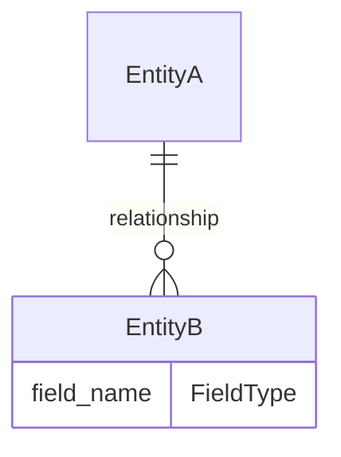
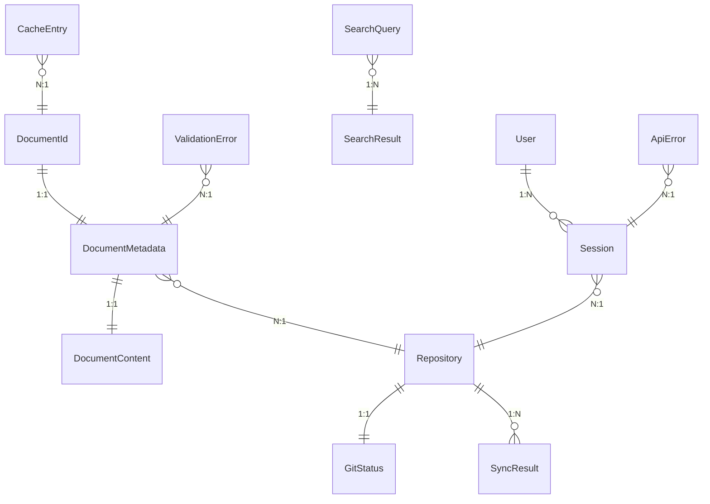

# TACHYON: DATA MODEL SPECIFICATION

**Document ID:** TACHYON-DM-001-V1.0
**Date:** February 2026
**Status:** Proposed
**Classification:** Technical Specification Document
**Compliance Level:** ISO/IEC 26514:2021, IEEE 1016-2009
**Dependencies:**
- [TACHYON-STD-V1.0](../../.adrs/ - Coding and Documentation Standards
- [TACHYON-DES-DM-V1.0](../../.adrs/ - Data Models Design
- [TACHYON-REQ-SYS-V1.0](../../.adrs/ - System Overview Requirements
- [TACHYON-ADR-001-V1.0](../../.adrs/adr-001-three-tier-jit-compilation.md) - Rust as Primary Language
- [TACHYON-ADR-008-V1.0](../../.adrs/adr-008-deadlock-prevention.md) - Workspace Structure for Rust Crates

---

## TABLE OF CONTENTS

1. [Introduction](#1-introduction)
2. [Data Modeling Principles](#2-data-modeling-principles)
3. [Notation Conventions](#3-notation-conventions)
4. [Core Data Entities](#4-core-data-entities)
5. [Entity Relationships](#5-entity-relationships)
6. [Data Validation Rules](#6-data-validation-rules)
7. [Data Serialization](#7-data-serialization)
8. [Data Storage](#8-data-storage)
9. [Data Security](#9-data-security)
10. [References](#10-references)

---

## 1. INTRODUCTION

### 1.1. Document Purpose

This document provides a comprehensive specification of all data models used within the Tachyon toolchain. The data models define the structural representation of information across desktop, server, and web components, ensuring type safety, data integrity, and consistent behavior through Rust's type system. This specification serves as the authoritative reference for data structure definitions, constraints, and relationships within the system.

### 1.2. Scope

This document covers:

- Core data entity definitions with Rust struct specifications
- TypeScript interface definitions for frontend components
- Field descriptions, constraints, and invariants
- Entity relationships and cardinality
- Data validation rules and procedures
- Serialization formats and versioning strategies
- Storage formats and indexing strategies
- Security considerations for data handling

Out of scope:

- Database schema implementation details
- API endpoint specifications
- Network protocol definitions
- User interface component specifications

### 1.3. Applicability

The data models specified in this document apply to:

- **Desktop Component:** Tauri-based desktop application backend
- **Server Component:** Axum-based HTTP/2 server
- **Web Frontend:** Leptos-based TypeScript/JavaScript frontend
- **Core Engine:** Shared Rust library containing common data structures

### 1.4. Compliance

This specification complies with:

- **ISO/IEC 26514:2021:** Systems and Software Engineering - Requirements for Designers and Developers of User Documentation
- **IEEE 1016-2009:** Standard for Information Technology - Software Design Descriptions
- **TACHYON-STD-V1.0:** Tachyon Coding and Documentation Standards

---

## 2. DATA MODELING PRINCIPLES

### 2.1. Type Safety

All data models leverage Rust's type system to provide compile-time guarantees of memory safety and thread safety. The type system enforces invariants at compile time, eliminating entire classes of runtime errors.

**Principles:**

1. **Strong Typing:** All fields have explicit, restrictive types
2. **No Null Values:** Rust's `Option<T>` type explicitly represents optional values
3. **Lifetime Annotations:** References are guaranteed to remain valid for their declared lifetime
4. **Ownership Semantics:** Clear ownership rules prevent data races and memory corruption

### 2.2. Immutability

Data models prefer immutable structures where possible, enabling safe concurrent access and reducing cognitive load for developers.

**Principles:**

1. **Default Immutability:** Fields are immutable by default
2. **Interior Mutability:** `Mutex<T>` and `RwLock<T>` for controlled mutation
3. **Copy-on-Write:** `Cow<T>` for efficient cloning when necessary
4. **Builder Pattern:** For constructing complex mutable structures before freezing

### 2.3. Zero-Copy

Data models use borrowing and references to minimize data copying, improving performance and reducing memory usage.

**Principles:**

1. **Borrowing:** Prefer `&str` over `String` for string slices
2. **Slices:** Prefer `&[T]` over `Vec<T>` for array slices
3. **Cow Types:** Use `Cow<T>` for conditional ownership
4. **Arc Sharing:** Use `Arc<T>` for shared ownership across threads

### 2.4. Serde Compatibility

All data models support serialization and deserialization using the `serde` crate, enabling JSON, binary, and other serialization formats.

**Principles:**

1. **Derive Macros:** Use `#[derive(Serialize, Deserialize)]` for automatic implementation
2. **Transparent Wrappers:** Use `#[serde(transparent)]` for newtype wrappers
3. **Custom Serialization:** Implement custom serialization for complex types
4. **Versioning:** Support backward compatibility through versioned serialization

### 2.5. Validation

Data models include built-in validation constraints and invariants, ensuring data integrity at the boundaries.

**Principles:**

1. **Constructor Validation:** Constructors validate all inputs before creating instances
2. **Invariant Enforcement:** Methods maintain invariants across operations
3. **Error Types:** Explicit error types for validation failures
4. **Sanitization:** Input sanitization at entry points

---

## 3. NOTATION CONVENTIONS

### 3.1. Rust Struct Definition Format

Rust struct definitions follow the standard Rust syntax with additional documentation annotations:

```rust
/// Summary of the struct's purpose.
///
/// # Fields
///
/// * `field_name` - Description of the field
///
/// # Constraints
///
/// * Constraint 1: Description
/// * Constraint 2: Description
///
/// # Example
///
/// ```
/// let instance = StructName { field_name: value };
/// ```
#[derive(Debug, Clone, PartialEq, Eq, Serialize, Deserialize)]
pub struct StructName {
    /// Description of the field
    pub field_name: FieldType,
}
```

### 3.2. TypeScript Interface Definition Format

TypeScript interface definitions follow the standard TypeScript syntax with JSDoc annotations:

```typescript
/**
 * Summary of the interface's purpose.
 *
 * @property {FieldType} propertyName - Description of the property
 *
 * @example
 * ```typescript
 * const instance: StructName = { propertyName: value };
 * ```
 */
export interface StructName {
    /** Description of the property */
    propertyName: FieldType;
}
```

### 3.3. Field Description Format

Each field includes a standardized description with the following elements:

- **Purpose:** Semantic meaning of the field
- **Type:** Data type and any type parameters
- **Constraints:** Valid value ranges and restrictions
- **Default Value:** Default value if applicable
- **Validation:** Validation rules applied to the field
- **Security Considerations:** Security implications of the field

### 3.4. Relationship Notation

Entity relationships are documented using the following notation:

- **1:1:** One-to-one relationship
- **1:N:** One-to-many relationship
- **N:M:** Many-to-many relationship
- **Cascading:** Cascading delete behavior
- **Foreign Key:** Foreign key reference

### 3.5. Mermaid.js Diagram Format

ER diagrams use Mermaid.js syntax for visual representation:



---

## 4. CORE DATA ENTITIES

The Tachyon system defines 16 core data entities organized into the following categories:

1. **Document Entities:** DocumentId, DocumentMetadata, DocumentContent
2. **Repository Entities:** RepositoryPath, Repository, ContentHash
3. **Cache Entities:** CacheEntry, GitStatus, SearchQuery
4. **User Entities:** SearchResult, Session, User
5. **Error Entities:** ApiError, ValidationError
6. **Sync Entities:** SyncStatus, SyncResult

Each entity is documented with complete Rust struct definitions, TypeScript interface definitions, field descriptions, and constraints.

---

### 4.1. DocumentId

**Element ID:** DES-DM-001
**Name:** DocumentId
**Category:** Document Entity
**Type:** Newtype Struct
**Language:** Rust Edition 2024
**Related Requirements:** REQ-SYS-031, REQ-SYS-041

#### 4.1.1. Rust Struct Definition

```rust
/// Unique identifier for documents within the Tachyon system.
///
/// This type provides a globally unique identifier using UUID v4, ensuring
/// collision resistance across distributed operations and preventing enumeration attacks.
///
/// # Fields
///
/// * `inner` - The underlying UUID v4 value
///
/// # Constraints
///
/// * Must be a valid UUID v4
/// * String representation must be lowercase
/// * Cannot be nil/null
///
/// # Example
///
/// ```
/// use tachyon_core::types::DocumentId;
///
/// let id = DocumentId::new();
/// println!("Document ID: {}", id);
/// ```
#[derive(Debug, Clone, Copy, PartialEq, Eq, Hash, Serialize, Deserialize)]
#[serde(transparent)]
pub struct DocumentId(Uuid);

impl DocumentId {
    /// Creates a new random DocumentId using UUID v4.
    ///
    /// # Returns
    ///
    /// A new DocumentId with a randomly generated UUID v4.
    ///
    /// # Example
    ///
    /// ```
    /// let id = DocumentId::new();
    /// ```
    pub fn new() -> Self;

    /// Creates a DocumentId from a UUID string.
    ///
    /// # Arguments
    ///
    /// * `s` - A string slice containing a UUID in canonical format
    ///
    /// # Returns
    ///
    /// * `Ok(DocumentId)` - If the string is a valid UUID
    /// * `Err(ParseError)` - If the string is not a valid UUID
    ///
    /// # Example
    ///
    /// ```
    /// let id = DocumentId::from_str("550e8400-e29b-41d4-a716-446655440000")?;
    /// ```
    pub fn from_str(s: &str) -> Result<Self, ParseError>;

    /// Returns the inner UUID value.
    ///
    /// # Returns
    ///
    /// A reference to the underlying UUID.
    ///
    /// # Example
    ///
    /// ```
    /// let id = DocumentId::new();
    /// let uuid = id.inner();
    /// ```
    pub fn inner(&self) -> &Uuid;
}

impl Display for DocumentId {
    fn fmt(&self, f: &mut Formatter<'_>) -> Result;
}
```

#### 4.1.2. TypeScript Interface Definition

```typescript
/**
 * Unique identifier for documents within the Tachyon system.
 *
 * This type provides a globally unique identifier using UUID v4, ensuring
 * collision resistance across distributed operations and preventing enumeration attacks.
 *
 * @property {string} value - The UUID v4 value in canonical string format
 *
 * @example
 * ```typescript
 * const id: DocumentId = DocumentId.new();
 * console.log(`Document ID: ${id.value}`);
 * ```
 */
export interface DocumentId {
    /** The UUID v4 value in canonical string format */
    readonly value: string;
}

export namespace DocumentId {
    /**
     * Creates a new random DocumentId using UUID v4.
     *
     * @returns A new DocumentId with a randomly generated UUID v4
     */
    export function new(): DocumentId;

    /**
     * Creates a DocumentId from a UUID string.
     *
     * @param s - A string containing a UUID in canonical format
     * @returns A DocumentId if the string is a valid UUID
     * @throws ParseError if the string is not a valid UUID
     */
    export function fromStr(s: string): DocumentId;
}
```

#### 4.1.3. Field Descriptions

| Field | Type | Purpose | Constraints | Default |
|-------|------|---------|-------------|---------|
| `inner` | `Uuid` | The underlying UUID v4 value | Valid UUID v4 | N/A |

#### 4.1.4. Constraints and Invariants

1. **UUID Version:** Must be UUID v4 (random UUID)
2. **String Format:** String representation must be lowercase
3. **Nil Check:** Cannot be nil/null (enforced by Rust type system)
4. **Uniqueness:** Probability of collision is negligible (< 2^-122)

#### 4.1.5. Security Considerations

- **Non-Guessable:** UUID v4 values are randomly generated and cannot be enumerated
- **No Sensitive Information:** No sensitive data encoded in the identifier
- **Safe to Expose:** Safe to expose in URLs, logs, and API responses
- **Collision Resistance:** Cryptographically strong random generation prevents collisions

---

### 4.2. DocumentMetadata

**Element ID:** DES-DM-004
**Name:** DocumentMetadata
**Category:** Document Entity
**Type:** Struct
**Language:** Rust Edition 2024
**Related Requirements:** REQ-SYS-035, REQ-SYS-041

#### 4.2.1. Rust Struct Definition

```rust
/// Metadata associated with a document, extracted from frontmatter and file system attributes.
///
/// This struct provides centralized metadata for efficient search, filtering, and access
/// control without requiring access to full document content.
///
/// # Fields
///
/// * `id` - Unique document identifier
/// * `title` - Document title (from frontmatter or filename)
/// * `path` - File path relative to repository root
/// * `content_type` - Content MIME type
/// * `size` - Document size in bytes
/// * `created_at` - Creation timestamp
/// * `modified_at` - Last modified timestamp
/// * `author` - Author information
/// * `tags` - Document tags
/// * `access` - Access control directives
/// * `frontmatter` - Frontmatter metadata
///
/// # Constraints
///
/// * `title`: Non-empty, max 255 characters
/// * `path`: Valid relative path, max 1024 characters
/// * `tags`: Max 50 tags per document, max 64 characters per tag
/// * `size`: Non-negative, max 100MB (104,857,600 bytes)
///
/// # Example
///
/// ```
/// use tachyon_core::types::{DocumentMetadata, DocumentId};
/// use chrono::Utc;
///
/// let metadata = DocumentMetadata {
///     id: DocumentId::new(),
///     title: "Introduction".to_string(),
///     path: "docs/intro.md".to_string(),
///     content_type: "text/markdown".to_string(),
///     size: 1024,
///     created_at: Utc::now(),
///     modified_at: Utc::now(),
///     author: None,
///     tags: vec!["getting-started".to_string()],
///     access: None,
///     frontmatter: serde_json::json!({}),
/// };
/// ```
#[derive(Debug, Clone, PartialEq, Eq, Serialize, Deserialize)]
pub struct DocumentMetadata {
    /// Unique document identifier
    pub id: DocumentId,

    /// Document title (from frontmatter or filename)
    pub title: String,

    /// File path relative to repository root
    pub path: String,

    /// Content MIME type
    pub content_type: String,

    /// Document size in bytes
    pub size: u64,

    /// Creation timestamp
    pub created_at: DateTime<Utc>,

    /// Last modified timestamp
    pub modified_at: DateTime<Utc>,

    /// Author information
    pub author: Option<Author>,

    /// Document tags
    pub tags: Vec<String>,

    /// Access control directives
    pub access: Option<AccessControl>,

    /// Frontmatter metadata
    pub frontmatter: serde_json::Value,
}

/// Author information for document attribution.
#[derive(Debug, Clone, PartialEq, Eq, Serialize, Deserialize)]
pub struct Author {
    /// Author name
    pub name: String,

    /// Author email address
    pub email: Option<String>,
}

/// Access control directives for document security.
#[derive(Debug, Clone, PartialEq, Eq, Serialize, Deserialize)]
pub struct AccessControl {
    /// Authorized roles
    pub roles: Vec<String>,

    /// Authorized users
    pub users: Vec<String>,

    /// Internal-only flag
    pub internal_only: bool,
}
```

#### 4.2.2. TypeScript Interface Definition

```typescript
/**
 * Metadata associated with a document, extracted from frontmatter and file system attributes.
 *
 * This interface provides centralized metadata for efficient search, filtering, and access
 * control without requiring access to full document content.
 *
 * @property {DocumentId} id - Unique document identifier
 * @property {string} title - Document title (from frontmatter or filename)
 * @property {string} path - File path relative to repository root
 * @property {string} contentType - Content MIME type
 * @property {number} size - Document size in bytes
 * @property {string} createdAt - Creation timestamp (ISO 8601)
 * @property {string} modifiedAt - Last modified timestamp (ISO 8601)
 * @property {Author | null} author - Author information
 * @property {string[]} tags - Document tags
 * @property {AccessControl | null} access - Access control directives
 * @property {Record<string, unknown>} frontmatter - Frontmatter metadata
 *
 * @example
 * ```typescript
 * const metadata: DocumentMetadata = {
 *     id: DocumentId.new(),
 *     title: "Introduction",
 *     path: "docs/intro.md",
 *     contentType: "text/markdown",
 *     size: 1024,
 *     createdAt: new Date().toISOString(),
 *     modifiedAt: new Date().toISOString(),
 *     author: null,
 *     tags: ["getting-started"],
 *     access: null,
 *     frontmatter: {},
 * };
 * ```
 */
export interface DocumentMetadata {
    /** Unique document identifier */
    readonly id: DocumentId;

    /** Document title (from frontmatter or filename) */
    readonly title: string;

    /** File path relative to repository root */
    readonly path: string;

    /** Content MIME type */
    readonly contentType: string;

    /** Document size in bytes */
    readonly size: number;

    /** Creation timestamp (ISO 8601) */
    readonly createdAt: string;

    /** Last modified timestamp (ISO 8601) */
    readonly modifiedAt: string;

    /** Author information */
    readonly author: Author | null;

    /** Document tags */
    readonly tags: string[];

    /** Access control directives */
    readonly access: AccessControl | null;

    /** Frontmatter metadata */
    readonly frontmatter: Record<string, unknown>;
}

/**
 * Author information for document attribution.
 *
 * @property {string} name - Author name
 * @property {string | null} email - Author email address
 */
export interface Author {
    /** Author name */
    readonly name: string;

    /** Author email address */
    readonly email: string | null;
}

/**
 * Access control directives for document security.
 *
 * @property {string[]} roles - Authorized roles
 * @property {string[]} users - Authorized users
 * @property {boolean} internalOnly - Internal-only flag
 */
export interface AccessControl {
    /** Authorized roles */
    readonly roles: string[];

    /** Authorized users */
    readonly users: string[];

    /** Internal-only flag */
    readonly internalOnly: boolean;
}
```

#### 4.2.3. Field Descriptions

| Field | Type | Purpose | Constraints | Default |
|-------|------|---------|-------------|---------|
| `id` | `DocumentId` | Unique document identifier | Valid UUID v4 | N/A |
| `title` | `String` | Document title (from frontmatter or filename) | Non-empty, max 255 characters | N/A |
| `path` | `String` | File path relative to repository root | Valid relative path, max 1024 characters | N/A |
| `content_type` | `String` | Content MIME type | Valid MIME type | N/A |
| `size` | `u64` | Document size in bytes | Non-negative, max 100MB | N/A |
| `created_at` | `DateTime<Utc>` | Creation timestamp | Valid ISO 8601 timestamp | N/A |
| `modified_at` | `DateTime<Utc>` | Last modified timestamp | Valid ISO 8601 timestamp | N/A |
| `author` | `Option<Author>` | Author information | Valid Author struct | `None` |
| `tags` | `Vec<String>` | Document tags | Max 50 tags, max 64 characters each | `vec![]` |
| `access` | `Option<AccessControl>` | Access control directives | Valid AccessControl struct | `None` |
| `frontmatter` | `serde_json::Value` | Frontmatter metadata | Valid JSON value | N/A |

#### 4.2.4. Constraints and Invariants

1. **Title Validation:** Title must be non-empty and不超过 255 characters
2. **Path Validation:** Path must be valid relative path, max 1024 characters
3. **Tag Limits:** Maximum 50 tags per document, max 64 characters per tag
4. **Size Limits:** Non-negative, max 100MB (104,857,600 bytes)
5. **Timestamp Ordering:** `modified_at` must be >= `created_at`
6. **Email Format:** Author email must be valid email format if present

#### 4.2.5. Security Considerations

- **Access Control:** Access control fields enable RBAC enforcement
- **Author Information:** Supports audit trails and attribution
- **Tags:** May contain sensitive information, require access control
- **Frontmatter:** May contain sensitive metadata, require sanitization

---

### 4.3. DocumentContent

**Element ID:** DES-DM-005
**Name:** DocumentContent
**Category:** Document Entity
**Type:** Struct
**Language:** Rust Edition 2024
**Related Requirements:** REQ-SYS-036, REQ-SYS-037, REQ-SYS-018

#### 4.3.1. Rust Struct Definition

```rust
/// Complete document content including raw Markdown, rendered HTML, and derived data.
///
/// This struct provides a complete representation of document content, enabling efficient
/// rendering, search indexing, and link validation without re-parsing.
///
/// # Fields
///
/// * `id` - Unique document identifier
/// * `raw` - Raw Markdown content
/// * `html` - Rendered HTML content
/// * `hash` - Content hash for integrity verification
/// * `toc` - Table of contents
/// * `code_blocks` - Extracted code blocks
/// * `images` - Extracted images
/// * `internal_links` - Internal links
/// * `external_links` - External links
///
/// # Constraints
///
/// * `raw`: Max 100MB size
/// * `html`: Generated from raw, max 200MB size
/// * `toc`: Max nesting depth of 6 levels
/// * `code_blocks`: Max 1000 code blocks per document
///
/// # Example
///
/// ```
/// use tachyon_core::types::{DocumentContent, DocumentId, ContentHash, TableOfContents};
///
/// let content = DocumentContent {
///     id: DocumentId::new(),
///     raw: "# Introduction\n\nThis is a document.".to_string(),
///     html: "<h1>Introduction</h1>\n<p>This is a document.</p>".to_string(),
///     hash: ContentHash::compute(b"# Introduction\n\nThis is a document."),
///     toc: TableOfContents { entries: vec![] },
///     code_blocks: vec![],
///     images: vec![],
///     internal_links: vec![],
///     external_links: vec![],
/// };
/// ```
#[derive(Debug, Clone, PartialEq, Eq, Serialize, Deserialize)]
pub struct DocumentContent {
    /// Unique document identifier
    pub id: DocumentId,

    /// Raw Markdown content
    pub raw: String,

    /// Rendered HTML content
    pub html: String,

    /// Content hash for integrity verification
    pub hash: ContentHash,

    /// Table of contents
    pub toc: TableOfContents,

    /// Extracted code blocks
    pub code_blocks: Vec<CodeBlock>,

    /// Extracted images
    pub images: Vec<ImageReference>,

    /// Internal links
    pub internal_links: Vec<String>,

    /// External links
    pub external_links: Vec<String>,
}

/// Table of contents for document navigation.
#[derive(Debug, Clone, PartialEq, Eq, Serialize, Deserialize)]
pub struct TableOfContents {
    /// TOC entries
    pub entries: Vec<TocEntry>,
}

/// Table of contents entry.
#[derive(Debug, Clone, PartialEq, Eq, Serialize, Deserialize)]
pub struct TocEntry {
    /// Heading level (1-6)
    pub level: u8,

    /// Heading title
    pub title: String,

    /// Anchor identifier
    pub anchor: String,

    /// Child entries
    pub children: Vec<TocEntry>,
}

/// Code block extracted from document.
#[derive(Debug, Clone, PartialEq, Eq, Serialize, Deserialize)]
pub struct CodeBlock {
    /// Programming language
    pub language: String,

    /// Code content
    pub code: String,

    /// Start line number
    pub start_line: usize,

    /// End line number
    pub end_line: usize,
}

/// Image reference extracted from document.
#[derive(Debug, Clone, PartialEq, Eq, Serialize, Deserialize)]
pub struct ImageReference {
    /// Image source path or URL
    pub src: String,

    /// Alt text
    pub alt: String,

    /// Image width (optional)
    pub width: Option<u32>,

    /// Image height (optional)
    pub height: Option<u32>,
}
```

#### 4.3.2. TypeScript Interface Definition

```typescript
/**
 * Complete document content including raw Markdown, rendered HTML, and derived data.
 *
 * This interface provides a complete representation of document content, enabling efficient
 * rendering, search indexing, and link validation without re-parsing.
 *
 * @property {DocumentId} id - Unique document identifier
 * @property {string} raw - Raw Markdown content
 * @property {string} html - Rendered HTML content
 * @property {ContentHash} hash - Content hash for integrity verification
 * @property {TableOfContents} toc - Table of contents
 * @property {CodeBlock[]} codeBlocks - Extracted code blocks
 * @property {ImageReference[]} images - Extracted images
 * @property {string[]} internalLinks - Internal links
 * @property {string[]} externalLinks - External links
 *
 * @example
 * ```typescript
 * const content: DocumentContent = {
 *     id: DocumentId.new(),
 *     raw: "# Introduction\n\nThis is a document.",
 *     html: "<h1>Introduction</h1>\n<p>This is a document.</p>",
 *     hash: ContentHash.compute(new TextEncoder().encode("# Introduction\n\nThis is a document.")),
 *     toc: { entries: [] },
 *     codeBlocks: [],
 *     images: [],
 *     internalLinks: [],
 *     externalLinks: [],
 * };
 * ```
 */
export interface DocumentContent {
    /** Unique document identifier */
    readonly id: DocumentId;

    /** Raw Markdown content */
    readonly raw: string;

    /** Rendered HTML content */
    readonly html: string;

    /** Content hash for integrity verification */
    readonly hash: ContentHash;

    /** Table of contents */
    readonly toc: TableOfContents;

    /** Extracted code blocks */
    readonly codeBlocks: CodeBlock[];

    /** Extracted images */
    readonly images: ImageReference[];

    /** Internal links */
    readonly internalLinks: string[];

    /** External links */
    readonly externalLinks: string[];
}

/**
 * Table of contents for document navigation.
 *
 * @property {TocEntry[]} entries - TOC entries
 */
export interface TableOfContents {
    /** TOC entries */
    readonly entries: TocEntry[];
}

/**
 * Table of contents entry.
 *
 * @property {number} level - Heading level (1-6)
 * @property {string} title - Heading title
 * @property {string} anchor - Anchor identifier
 * @property {TocEntry[]} children - Child entries
 */
export interface TocEntry {
    /** Heading level (1-6) */
    readonly level: number;

    /** Heading title */
    readonly title: string;

    /** Anchor identifier */
    readonly anchor: string;

    /** Child entries */
    readonly children: TocEntry[];
}

/**
 * Code block extracted from document.
 *
 * @property {string} language - Programming language
 * @property {string} code - Code content
 * @property {number} startLine - Start line number
 * @property {number} endLine - End line number
 */
export interface CodeBlock {
    /** Programming language */
    readonly language: string;

    /** Code content */
    readonly code: string;

    /** Start line number */
    readonly startLine: number;

    /** End line number */
    readonly endLine: number;
}

/**
 * Image reference extracted from document.
 *
 * @property {string} src - Image source path or URL
 * @property {string} alt - Alt text
 * @property {number | null} width - Image width (optional)
 * @property {number | null} height - Image height (optional)
 */
export interface ImageReference {
    /** Image source path or URL */
    readonly src: string;

    /** Alt text */
    readonly alt: string;

    /** Image width (optional) */
    readonly width: number | null;

    /** Image height (optional) */
    readonly height: number | null;
}
```

#### 4.3.3. Field Descriptions

| Field | Type | Purpose | Constraints | Default |
|-------|------|---------|-------------|---------|
| `id` | `DocumentId` | Unique document identifier | Valid UUID v4 | N/A |
| `raw` | `String` | Raw Markdown content | Max 100MB size | N/A |
| `html` | `String` | Rendered HTML content | Generated from raw, max 200MB | N/A |
| `hash` | `ContentHash` | Content hash for integrity verification | Valid SHA-256 hash | N/A |
| `toc` | `TableOfContents` | Table of contents | Max nesting depth 6 | N/A |
| `code_blocks` | `Vec<CodeBlock>` | Extracted code blocks | Max 1000 blocks | N/A |
| `images` | `Vec<ImageReference>` | Extracted images | No limit | N/A |
| `internal_links` | `Vec<String>` | Internal links | No limit | N/A |
| `external_links` | `Vec<String>` | External links | No limit | N/A |

#### 4.3.4. Constraints and Invariants

1. **Raw Content Size:** Max 100MB (104,857,600 bytes)
2. **HTML Content Size:** Generated from raw, max 200MB (209,715,200 bytes)
3. **TOC Depth:** Max nesting depth of 6 levels (h1-h6)
4. **Code Block Limits:** Max 1000 code blocks per document
5. **Line Number Validity:** `start_line` <= `end_line` for code blocks
6. **Hash Consistency:** `hash` must match SHA-256 of `raw` content

#### 4.3.5. Security Considerations

- **HTML Sanitization:** HTML content must be sanitized (handled by rendering pipeline)
- **Code Blocks:** May contain sensitive information, require access control
- **External Links:** Require validation and security headers
- **Image Sources:** Validate image sources to prevent XSS attacks
- **Content Hash:** Enables integrity verification and cache invalidation

---

### 4.4. RepositoryPath

**Element ID:** DES-DM-002
**Name:** RepositoryPath
**Category:** Repository Entity
**Type:** Struct
**Language:** Rust Edition 2024
**Related Requirements:** REQ-DESK-031, REQ-DESK-037

#### 4.4.1. Rust Struct Definition

```rust
/// Represents a validated file system path to a Git repository.
///
/// This type provides safe path handling and prevents directory traversal attacks
/// by encapsulating path validation logic within the type.
///
/// # Fields
///
/// * `inner` - The underlying PathBuf
/// * `is_absolute` - Whether the path is absolute
///
/// # Constraints
///
/// * Must be a valid file system path
/// * Cannot contain parent directory references (`..`)
/// * Must resolve to a Git repository root
/// * Maximum path length: 4096 characters (POSIX limit)
///
/// # Example
///
/// ```
/// use tachyon_core::types::RepositoryPath;
/// use std::path::PathBuf;
///
/// let path = RepositoryPath::new(PathBuf::from("/home/user/docs"))?;
/// println!("Repository path: {:?}", path.as_path());
/// ```
#[derive(Debug, Clone, PartialEq, Eq, Hash, Serialize, Deserialize)]
pub struct RepositoryPath {
    /// The underlying PathBuf
    inner: PathBuf,

    /// Whether the path is absolute
    is_absolute: bool,
}

impl RepositoryPath {
    /// Creates a new RepositoryPath from a PathBuf.
    ///
    /// # Arguments
    ///
    /// * `path` - A PathBuf to validate
    ///
    /// # Returns
    ///
    /// * `Ok(RepositoryPath)` - If path is valid
    /// * `Err(PathValidationError)` - If path is invalid
    ///
    /// # Example
    ///
    /// ```
    /// let path = RepositoryPath::new(PathBuf::from("/home/user/docs"))?;
    /// ```
    pub fn new(path: PathBuf) -> Result<Self, PathValidationError>;

    /// Validates that the path is within allowed bounds.
    ///
    /// # Returns
    ///
    /// * `Ok(())` - If path is valid
    /// * `Err(PathValidationError)` - If path is invalid
    ///
    /// # Example
    ///
    /// ```
    /// path.validate()?;
    /// ```
    pub fn validate(&self) -> Result<(), PathValidationError>;

    /// Returns the inner PathBuf.
    ///
    /// # Returns
    ///
    /// A reference to the underlying PathBuf.
    ///
    /// # Example
    ///
    /// ```
    /// let path_ref = path.as_path();
    /// ```
    pub fn as_path(&self) -> &Path;

    /// Checks if this is an absolute path.
    ///
    /// # Returns
    ///
    /// `true` if the path is absolute, `false` otherwise.
    ///
    /// # Example
    ///
    /// ```
    /// if path.is_absolute() {
    ///     println!("Absolute path");
    /// }
    /// ```
    pub fn is_absolute(&self) -> bool;
}
```

#### 4.4.2. TypeScript Interface Definition

```typescript
/**
 * Represents a validated file system path to a Git repository.
 *
 * This interface provides safe path handling and prevents directory traversal attacks
 * by encapsulating path validation logic within the type.
 *
 * @property {string} value - The path string
 * @property {boolean} isAbsolute - Whether the path is absolute
 *
 * @example
 * ```typescript
 * const path = RepositoryPath.new("/home/user/docs");
 * console.log(`Repository path: ${path.value}`);
 * ```
 */
export interface RepositoryPath {
    /** The path string */
    readonly value: string;

    /** Whether the path is absolute */
    readonly isAbsolute: boolean;
}

export namespace RepositoryPath {
    /**
     * Creates a new RepositoryPath from a path string.
     *
     * @param path - A path string to validate
     * @returns A RepositoryPath if path is valid
     * @throws PathValidationError if path is invalid
     */
    export function new(path: string): RepositoryPath;

    /**
     * Validates that the path is within allowed bounds.
     *
     * @returns true if path is valid
     * @throws PathValidationError if path is invalid
     */
    export function validate(path: RepositoryPath): boolean;
}
```

#### 4.4.3. Field Descriptions

| Field | Type | Purpose | Constraints | Default |
|-------|------|---------|-------------|---------|
| `inner` | `PathBuf` | The underlying PathBuf | Valid file system path | N/A |
| `is_absolute` | `bool` | Whether the path is absolute | N/A | N/A |

#### 4.4.4. Constraints and Invariants

1. **Path Validity:** Must be a valid file system path
2. **No Parent Directory References:** Cannot contain `..` segments
3. **Git Repository Root:** Must resolve to a Git repository root
4. **Path Length Limit:** Maximum 4096 characters (POSIX limit)
5. **Canonicalization:** Path must be canonicalized (no symlinks or `.` segments)

#### 4.4.5. Security Considerations

- **Directory Traversal Prevention:** Prevents `../` attacks by validating path canonicalization
- **Path Validation:** Validates path canonicalization before use
- **Access Restriction:** Restricts access to configured repository roots
- **Symlink Protection:** Resolves symlinks to prevent symlink attacks

---

### 4.5. Repository

**Element ID:** DES-DM-XXX
**Name:** Repository
**Category:** Repository Entity
**Type:** Struct
**Language:** Rust Edition 2024
**Related Requirements:** REQ-SYS-006, REQ-SYS-046

#### 4.5.1. Rust Struct Definition

```rust
/// Represents a Git repository within the Tachyon system.
///
/// This struct provides metadata and configuration for a Git repository,
/// enabling repository management and Git operations.
///
/// # Fields
///
/// * `id` - Unique repository identifier
/// * `path` - Repository path
/// * `name` - Repository name
/// * `remote_url` - Remote Git URL (optional)
/// * `branch` - Current branch
/// * `last_sync` - Last synchronization timestamp
/// * `is_cloned` - Whether repository is cloned
///
/// # Constraints
///
/// * `name`: Non-empty, max 255 characters
/// * `branch`: Valid Git branch name
/// * `remote_url`: Valid Git URL if present
///
/// # Example
///
/// ```
/// use tachyon_core::types::{Repository, RepositoryId, RepositoryPath};
/// use chrono::Utc;
///
/// let repo = Repository {
///     id: RepositoryId::new(),
///     path: RepositoryPath::new(PathBuf::from("/home/user/docs"))?,
///     name: "documentation".to_string(),
///     remote_url: Some("https://github.com/user/docs.git".to_string()),
///     branch: "main".to_string(),
///     last_sync: Some(Utc::now()),
///     is_cloned: true,
/// };
/// ```
#[derive(Debug, Clone, PartialEq, Eq, Serialize, Deserialize)]
pub struct Repository {
    /// Unique repository identifier
    pub id: RepositoryId,

    /// Repository path
    pub path: RepositoryPath,

    /// Repository name
    pub name: String,

    /// Remote Git URL (optional)
    pub remote_url: Option<String>,

    /// Current branch
    pub branch: String,

    /// Last synchronization timestamp
    pub last_sync: Option<DateTime<Utc>>,

    /// Whether repository is cloned
    pub is_cloned: bool,
}

/// Unique identifier for repositories.
#[derive(Debug, Clone, Copy, PartialEq, Eq, Hash, Serialize, Deserialize)]
#[serde(transparent)]
pub struct RepositoryId(Uuid);
```

#### 4.5.2. TypeScript Interface Definition

```typescript
/**
 * Represents a Git repository within the Tachyon system.
 *
 * This interface provides metadata and configuration for a Git repository,
 * enabling repository management and Git operations.
 *
 * @property {RepositoryId} id - Unique repository identifier
 * @property {RepositoryPath} path - Repository path
 * @property {string} name - Repository name
 * @property {string | null} remoteUrl - Remote Git URL (optional)
 * @property {string} branch - Current branch
 * @property {string | null} lastSync - Last synchronization timestamp (ISO 8601)
 * @property {boolean} isCloned - Whether repository is cloned
 *
 * @example
 * ```typescript
 * const repo: Repository = {
 *     id: RepositoryId.new(),
 *     path: RepositoryPath.new("/home/user/docs"),
 *     name: "documentation",
 *     remoteUrl: "https://github.com/user/docs.git",
 *     branch: "main",
 *     lastSync: new Date().toISOString(),
 *     isCloned: true,
 * };
 * ```
 */
export interface Repository {
    /** Unique repository identifier */
    readonly id: RepositoryId;

    /** Repository path */
    readonly path: RepositoryPath;

    /** Repository name */
    readonly name: string;

    /** Remote Git URL (optional) */
    readonly remoteUrl: string | null;

    /** Current branch */
    readonly branch: string;

    /** Last synchronization timestamp (ISO 8601) */
    readonly lastSync: string | null;

    /** Whether repository is cloned */
    readonly isCloned: boolean;
}

/**
 * Unique identifier for repositories.
 *
 * @property {string} value - The UUID v4 value in canonical string format
 */
export interface RepositoryId {
    /** The UUID v4 value in canonical string format */
    readonly value: string;
}
```

#### 4.5.3. Field Descriptions

| Field | Type | Purpose | Constraints | Default |
|-------|------|---------|-------------|---------|
| `id` | `RepositoryId` | Unique repository identifier | Valid UUID v4 | N/A |
| `path` | `RepositoryPath` | Repository path | Valid RepositoryPath | N/A |
| `name` | `String` | Repository name | Non-empty, max 255 characters | N/A |
| `remote_url` | `Option<String>` | Remote Git URL (optional) | Valid Git URL if present | `None` |
| `branch` | `String` | Current branch | Valid Git branch name | N/A |
| `last_sync` | `Option<DateTime<Utc>>` | Last synchronization timestamp | Valid ISO 8601 timestamp | `None` |
| `is_cloned` | `bool` | Whether repository is cloned | N/A | N/A |

#### 4.5.4. Constraints and Invariants

1. **Name Validation:** Name must be non-empty and不超过 255 characters
2. **Branch Validation:** Branch name must be valid Git branch name
3. **Remote URL Validation:** Remote URL must be valid Git URL if present
4. **Path Validity:** Path must be a valid RepositoryPath
5. **Sync Timestamp:** `last_sync` must be <= current time if present

#### 4.5.5. Security Considerations

- **Path Validation:** Repository path is validated to prevent directory traversal
- **Remote URL Security:** Remote URLs are validated to prevent malicious URLs
- **Access Control:** Repository access is controlled through system permissions
- **Credential Management:** Git credentials are managed securely (not stored in Repository struct)

---

### 4.6. ContentHash

**Element ID:** DES-DM-003
**Name:** ContentHash
**Category:** Repository Entity
**Type:** Newtype Struct
**Language:** Rust Edition 2024
**Related Requirements:** REQ-SYS-058, REQ-DESK-042

#### 4.6.1. Rust Struct Definition

```rust
/// Cryptographic hash of content for integrity verification and cache invalidation.
///
/// This type provides a SHA-256 hash for content integrity verification,
/// enabling efficient cache invalidation and data integrity checks.
///
/// # Fields
///
/// * `inner` - The underlying 32-byte hash value
///
/// # Constraints
///
/// * Must be exactly 32 bytes (256 bits)
/// * Hex representation must be exactly 64 characters
/// * Cannot be all zeros (reserved for empty content)
///
/// # Example
///
/// ```
/// use tachyon_core::types::ContentHash;
///
/// let hash = ContentHash::compute(b"Hello, world!");
/// println!("Content hash: {}", hash.to_hex());
/// ```
#[derive(Debug, Clone, Copy, PartialEq, Eq, Hash, Serialize, Deserialize)]
#[serde(transparent)]
pub struct ContentHash([u8; 32]);

impl ContentHash {
    /// Computes SHA-256 hash of byte slice.
    ///
    /// # Arguments
    ///
    /// * `data` - A byte slice to hash
    ///
    /// # Returns
    ///
    /// A ContentHash containing the SHA-256 hash of the data.
    ///
    /// # Example
    ///
    /// ```
    /// let hash = ContentHash::compute(b"Hello, world!");
    /// ```
    pub fn compute(data: &[u8]) -> Self;

    /// Creates from hex string.
    ///
    /// # Arguments
    ///
    /// * `hex` - A hex string representation of the hash
    ///
    /// # Returns
    ///
    /// * `Ok(ContentHash)` - If hex string is valid
    /// * `Err(HexParseError)` - If hex string is invalid
    ///
    /// # Example
    ///
    /// ```
    /// let hash = ContentHash::from_hex("a591a6d40bf420404a011733cfb7b190d62c65bf0bcda32b57b277d9ad9f146e")?;
    /// ```
    pub fn from_hex(hex: &str) -> Result<Self, HexParseError>;

    /// Returns hex string representation.
    ///
    /// # Returns
    ///
    /// A 64-character hex string representation of the hash.
    ///
    /// # Example
    ///
    /// ```
    /// let hex = hash.to_hex();
    /// ```
    pub fn to_hex(&self) -> String;

    /// Verifies hash against data.
    ///
    /// # Arguments
    ///
    /// * `data` - A byte slice to verify against
    ///
    /// # Returns
    ///
    /// `true` if the hash matches the data, `false` otherwise.
    ///
    /// # Example
    ///
    /// ```
    /// if hash.verify(b"Hello, world!") {
    ///     println!("Hash verified");
    /// }
    /// ```
    pub fn verify(&self, data: &[u8]) -> bool;
}

impl Display for ContentHash {
    fn fmt(&self, f: &mut Formatter<'_>) -> Result;
}
```

#### 4.6.2. TypeScript Interface Definition

```typescript
/**
 * Cryptographic hash of content for integrity verification and cache invalidation.
 *
 * This interface provides a SHA-256 hash for content integrity verification,
 * enabling efficient cache invalidation and data integrity checks.
 *
 * @property {string} value - The 64-character hex string representation
 *
 * @example
 * ```typescript
 * const hash = ContentHash.compute(new TextEncoder().encode("Hello, world!"));
 * console.log(`Content hash: ${hash.value}`);
 * ```
 */
export interface ContentHash {
    /** The 64-character hex string representation */
    readonly value: string;
}

export namespace ContentHash {
    /**
     * Computes SHA-256 hash of byte array.
     *
     * @param data - A byte array to hash
     * @returns A ContentHash containing the SHA-256 hash of the data
     */
    export function compute(data: Uint8Array): ContentHash;

    /**
     * Creates from hex string.
     *
     * @param hex - A hex string representation of the hash
     * @returns A ContentHash if hex string is valid
     * @throws HexParseError if hex string is invalid
     */
    export function fromHex(hex: string): ContentHash;

    /**
     * Verifies hash against data.
     *
     * @param hash - The ContentHash to verify
     * @param data - A byte array to verify against
     * @returns true if the hash matches the data, false otherwise
     */
    export function verify(hash: ContentHash, data: Uint8Array): boolean;
}
```

#### 4.6.3. Field Descriptions

| Field | Type | Purpose | Constraints | Default |
|-------|------|---------|-------------|---------|
| `inner` | `[u8; 32]` | The underlying 32-byte hash value | Exactly 32 bytes | N/A |

#### 4.6.4. Constraints and Invariants

1. **Hash Size:** Must be exactly 32 bytes (256 bits)
2. **Hex Length:** Hex representation must be exactly 64 characters
3. **Non-Zero Check:** Cannot be all zeros (reserved for empty content)
4. **Hex Characters:** Hex string must contain only valid hex characters (0-9, a-f)

#### 4.6.5. Security Considerations

- **Cryptographic Strength:** SHA-256 is cryptographically secure
- **One-Way Function:** Hashes are one-way functions, preventing content reconstruction
- **Collision Resistance:** Collision resistance ensures integrity guarantees
- **Deterministic:** Same content always produces same hash
- **Preimage Resistance:** Infeasible to find content that produces given hash

---

### 4.7. CacheEntry

**Element ID:** DES-DM-XXX
**Name:** CacheEntry
**Category:** Cache Entity
**Type:** Struct
**Language:** Rust Edition 2024
**Related Requirements:** REQ-SYS-033, REQ-SYS-042

#### 4.7.1. Rust Struct Definition

```rust
/// Represents a cached entry in the LRU cache.
///
/// This struct provides metadata for cached content, enabling efficient
/// cache management and invalidation.
///
/// # Fields
///
/// * `key` - Cache key
/// * `value` - Cached value
/// * `created_at` - Creation timestamp
/// * `accessed_at` - Last access timestamp
/// * `size_bytes` - Size in bytes
/// * `hit_count` - Number of cache hits
///
/// # Constraints
///
/// * `key`: Non-empty, max 1024 characters
/// * `size_bytes`: Non-negative
/// * `hit_count`: Non-negative
///
/// # Example
///
/// ```
/// use tachyon_core::types::CacheEntry;
/// use chrono::Utc;
///
/// let entry = CacheEntry {
///     key: "doc:12345".to_string(),
///     value: vec![1, 2, 3],
///     created_at: Utc::now(),
///     accessed_at: Utc::now(),
///     size_bytes: 1024,
///     hit_count: 0,
/// };
/// ```
#[derive(Debug, Clone, PartialEq, Eq, Serialize, Deserialize)]
pub struct CacheEntry<T> {
    /// Cache key
    pub key: String,

    /// Cached value
    pub value: T,

    /// Creation timestamp
    pub created_at: DateTime<Utc>,

    /// Last access timestamp
    pub accessed_at: DateTime<Utc>,

    /// Size in bytes
    pub size_bytes: u64,

    /// Number of cache hits
    pub hit_count: u64,
}
```

#### 4.7.2. TypeScript Interface Definition

```typescript
/**
 * Represents a cached entry in the LRU cache.
 *
 * This interface provides metadata for cached content, enabling efficient
 * cache management and invalidation.
 *
 * @property {string} key - Cache key
 * @property {T} value - Cached value
 * @property {string} createdAt - Creation timestamp (ISO 8601)
 * @property {string} accessedAt - Last access timestamp (ISO 8601)
 * @property {number} sizeBytes - Size in bytes
 * @property {number} hitCount - Number of cache hits
 *
 * @example
 * ```typescript
 * const entry: CacheEntry<Uint8Array> = {
 *     key: "doc:12345",
 *     value: new Uint8Array([1, 2, 3]),
 *     createdAt: new Date().toISOString(),
 *     accessedAt: new Date().toISOString(),
 *     sizeBytes: 1024,
 *     hitCount: 0,
 * };
 * ```
 */
export interface CacheEntry<T> {
    /** Cache key */
    readonly key: string;

    /** Cached value */
    readonly value: T;

    /** Creation timestamp (ISO 8601) */
    readonly createdAt: string;

    /** Last access timestamp (ISO 8601) */
    readonly accessedAt: string;

    /** Size in bytes */
    readonly sizeBytes: number;

    /** Number of cache hits */
    readonly hitCount: number;
}
```

#### 4.7.3. Field Descriptions

| Field | Type | Purpose | Constraints | Default |
|-------|------|---------|-------------|---------|
| `key` | `String` | Cache key | Non-empty, max 1024 characters | N/A |
| `value` | `T` | Cached value | N/A | N/A |
| `created_at` | `DateTime<Utc>` | Creation timestamp | Valid ISO 8601 timestamp | N/A |
| `accessed_at` | `DateTime<Utc>` | Last access timestamp | Valid ISO 8601 timestamp | N/A |
| `size_bytes` | `u64` | Size in bytes | Non-negative | N/A |
| `hit_count` | `u64` | Number of cache hits | Non-negative | N/A |

#### 4.7.4. Constraints and Invariants

1. **Key Validation:** Key must be non-empty and不超过 1024 characters
2. **Size Validation:** Size must be non-negative
3. **Hit Count:** Hit count must be non-negative
4. **Timestamp Ordering:** `accessed_at` must be >= `created_at`
5. **Type Parameter:** Value type `T` must be serializable

#### 4.7.5. Security Considerations

- **Cache Poisoning:** Validate cached values before use
- **Size Limits:** Enforce size limits to prevent memory exhaustion
- **Access Control:** Cache keys may contain sensitive information
- **Eviction Policy:** LRU eviction prevents cache flooding attacks

---

### 4.8. GitStatus

**Element ID:** DES-DM-XXX
**Name:** GitStatus
**Category:** Cache Entity
**Type:** Struct
**Language:** Rust Edition 2024
**Related Requirements:** REQ-SYS-026, REQ-SYS-046

#### 4.8.1. Rust Struct Definition

```rust
/// Represents the Git status of a file or repository.
///
/// This struct provides information about Git repository state,
/// enabling Git operations and status tracking.
///
/// # Fields
///
/// * `branch` - Current branch name
/// * `commit` - Current commit hash
/// * `is_dirty` - Whether working directory has uncommitted changes
/// * `ahead` - Number of commits ahead of remote
/// * `behind` - Number of commits behind remote
/// * `staged_files` - List of staged files
/// * `unstaged_files` - List of unstaged files
/// * `untracked_files` - List of untracked files
///
/// # Constraints
///
/// * `branch`: Non-empty, valid Git branch name
/// * `commit`: Valid Git commit hash (40 hex characters)
/// * `ahead`: Non-negative
/// * `behind`: Non-negative
///
/// # Example
///
/// ```
/// use tachyon_core::types::GitStatus;
///
/// let status = GitStatus {
///     branch: "main".to_string(),
///     commit: "a1b2c3d4e5f6g7h8i9j0k1l2m3n4o5p6q7r8s9t0u1v2w3x4y5z6".to_string(),
///     is_dirty: true,
///     ahead: 2,
///     behind: 0,
///     staged_files: vec!["docs/intro.md".to_string()],
///     unstaged_files: vec![],
///     untracked_files: vec!["docs/new.md".to_string()],
/// };
/// ```
#[derive(Debug, Clone, PartialEq, Eq, Serialize, Deserialize)]
pub struct GitStatus {
    /// Current branch name
    pub branch: String,

    /// Current commit hash
    pub commit: String,

    /// Whether working directory has uncommitted changes
    pub is_dirty: bool,

    /// Number of commits ahead of remote
    pub ahead: u32,

    /// Number of commits behind remote
    pub behind: u32,

    /// List of staged files
    pub staged_files: Vec<String>,

    /// List of unstaged files
    pub unstaged_files: Vec<String>,

    /// List of untracked files
    pub untracked_files: Vec<String>,
}
```

#### 4.8.2. TypeScript Interface Definition

```typescript
/**
 * Represents the Git status of a file or repository.
 *
 * This interface provides information about Git repository state,
 * enabling Git operations and status tracking.
 *
 * @property {string} branch - Current branch name
 * @property {string} commit - Current commit hash
 * @property {boolean} isDirty - Whether working directory has uncommitted changes
 * @property {number} ahead - Number of commits ahead of remote
 * @property {number} behind - Number of commits behind remote
 * @property {string[]} stagedFiles - List of staged files
 * @property {string[]} unstagedFiles - List of unstaged files
 * @property {string[]} untrackedFiles - List of untracked files
 *
 * @example
 * ```typescript
 * const status: GitStatus = {
 *     branch: "main",
 *     commit: "a1b2c3d4e5f6g7h8i9j0k1l2m3n4o5p6q7r8s9t0u1v2w3x4y5z6",
 *     isDirty: true,
 *     ahead: 2,
 *     behind: 0,
 *     stagedFiles: ["docs/intro.md"],
 *     unstagedFiles: [],
 *     untrackedFiles: ["docs/new.md"],
 * };
 * ```
 */
export interface GitStatus {
    /** Current branch name */
    readonly branch: string;

    /** Current commit hash */
    readonly commit: string;

    /** Whether working directory has uncommitted changes */
    readonly isDirty: boolean;

    /** Number of commits ahead of remote */
    readonly ahead: number;

    /** Number of commits behind remote */
    readonly behind: number;

    /** List of staged files */
    readonly stagedFiles: string[];

    /** List of unstaged files */
    readonly unstagedFiles: string[];

    /** List of untracked files */
    readonly untrackedFiles: string[];
}
```

#### 4.8.3. Field Descriptions

| Field | Type | Purpose | Constraints | Default |
|-------|------|---------|-------------|---------|
| `branch` | `String` | Current branch name | Non-empty, valid Git branch name | N/A |
| `commit` | `String` | Current commit hash | Valid Git commit hash (40 hex characters) | N/A |
| `is_dirty` | `bool` | Whether working directory has uncommitted changes | N/A | N/A |
| `ahead` | `u32` | Number of commits ahead of remote | Non-negative | N/A |
| `behind` | `u32` | Number of commits behind remote | Non-negative | N/A |
| `staged_files` | `Vec<String>` | List of staged files | Valid file paths | N/A |
| `unstaged_files` | `Vec<String>` | List of unstaged files | Valid file paths | N/A |
| `untracked_files` | `Vec<String>` | List of untracked files | Valid file paths | N/A |

#### 4.8.4. Constraints and Invariants

1. **Branch Validation:** Branch name must be non-empty and valid Git branch name
2. **Commit Hash Validation:** Commit hash must be 40 hex characters
3. **Commit Count Validation:** `ahead` and `behind` must be non-negative
4. **File Path Validation:** File paths must be valid relative paths
5. **Dirty Flag Consistency:** `is_dirty` must be true if any files are staged or unstaged

#### 4.8.5. Security Considerations

- **Path Validation:** File paths are validated to prevent directory traversal
- **Commit Hash Security:** Commit hashes are validated to prevent injection
- **Access Control:** Git status may reveal sensitive file information
- **Credential Protection:** Git credentials are not stored in GitStatus

---

### 4.9. SearchQuery

**Element ID:** DES-DM-XXX
**Name:** SearchQuery
**Category:** Cache Entity
**Type:** Struct
**Language:** Rust Edition 2024
**Related Requirements:** REQ-SYS-021, REQ-SYS-043

#### 4.9.1. Rust Struct Definition

```rust
/// Represents a search query for the full-text search engine.
///
/// This struct provides parameters for search queries, enabling
/// flexible and efficient search operations.
///
/// # Fields
///
/// * `query` - Search query string
/// * `filters` - Search filters
/// * `limit` - Maximum number of results
/// * `offset` - Result offset for pagination
/// * `fuzzy` - Enable fuzzy search
/// * `boost_fields` - Fields to boost in ranking
///
/// # Constraints
///
/// * `query`: Non-empty, max 1024 characters
/// * `limit`: Positive, max 1000
/// * `offset`: Non-negative
///
/// # Example
///
/// ```
/// use tachyon_core::types::{SearchQuery, SearchFilter};
///
/// let query = SearchQuery {
///     query: "Rust programming".to_string(),
///     filters: vec![
///         SearchFilter {
///             field: "tags".to_string(),
///             value: "tutorial".to_string(),
///         },
///     ],
///     limit: 10,
///     offset: 0,
///     fuzzy: true,
///     boost_fields: vec!["title".to_string()],
/// };
/// ```
#[derive(Debug, Clone, PartialEq, Eq, Serialize, Deserialize)]
pub struct SearchQuery {
    /// Search query string
    pub query: String,

    /// Search filters
    pub filters: Vec<SearchFilter>,

    /// Maximum number of results
    pub limit: u32,

    /// Result offset for pagination
    pub offset: u32,

    /// Enable fuzzy search
    pub fuzzy: bool,

    /// Fields to boost in ranking
    pub boost_fields: Vec<String>,
}

/// Search filter for field-specific filtering.
#[derive(Debug, Clone, PartialEq, Eq, Serialize, Deserialize)]
pub struct SearchFilter {
    /// Field name
    pub field: String,

    /// Filter value
    pub value: String,

    /// Filter operator (default: "eq")
    #[serde(default = "default_operator")]
    pub operator: String,
}

fn default_operator() -> String {
    "eq".to_string()
}
```

#### 4.9.2. TypeScript Interface Definition

```typescript
/**
 * Represents a search query for the full-text search engine.
 *
 * This interface provides parameters for search queries, enabling
 * flexible and efficient search operations.
 *
 * @property {string} query - Search query string
 * @property {SearchFilter[]} filters - Search filters
 * @property {number} limit - Maximum number of results
 * @property {number} offset - Result offset for pagination
 * @property {boolean} fuzzy - Enable fuzzy search
 * @property {string[]} boostFields - Fields to boost in ranking
 *
 * @example
 * ```typescript
 * const query: SearchQuery = {
 *     query: "Rust programming",
 *     filters: [
 *         {
 *             field: "tags",
 *             value: "tutorial",
 *             operator: "eq",
 *         },
 *     ],
 *     limit: 10,
 *     offset: 0,
 *     fuzzy: true,
 *     boostFields: ["title"],
 * };
 * ```
 */
export interface SearchQuery {
    /** Search query string */
    readonly query: string;

    /** Search filters */
    readonly filters: SearchFilter[];

    /** Maximum number of results */
    readonly limit: number;

    /** Result offset for pagination */
    readonly offset: number;

    /** Enable fuzzy search */
    readonly fuzzy: boolean;

    /** Fields to boost in ranking */
    readonly boostFields: string[];
}

/**
 * Search filter for field-specific filtering.
 *
 * @property {string} field - Field name
 * @property {string} value - Filter value
 * @property {string} operator - Filter operator (default: "eq")
 */
export interface SearchFilter {
    /** Field name */
    readonly field: string;

    /** Filter value */
    readonly value: string;

    /** Filter operator (default: "eq") */
    readonly operator: string;
}
```

#### 4.9.3. Field Descriptions

| Field | Type | Purpose | Constraints | Default |
|-------|------|---------|-------------|---------|
| `query` | `String` | Search query string | Non-empty, max 1024 characters | N/A |
| `filters` | `Vec<SearchFilter>` | Search filters | Valid SearchFilter structs | N/A |
| `limit` | `u32` | Maximum number of results | Positive, max 1000 | N/A |
| `offset` | `u32` | Result offset for pagination | Non-negative | N/A |
| `fuzzy` | `bool` | Enable fuzzy search | N/A | N/A |
| `boost_fields` | `Vec<String>` | Fields to boost in ranking | Valid field names | N/A |

#### 4.9.4. Constraints and Invariants

1. **Query Validation:** Query must be non-empty and不超过 1024 characters
2. **Limit Validation:** Limit must be positive and不超过 1000
3. **Offset Validation:** Offset must be non-negative
4. **Filter Validation:** Filters must have valid field names and operators
5. **Boost Field Validation:** Boost fields must be valid field names

#### 4.9.5. Security Considerations

- **Query Sanitization:** Search queries must be sanitized to prevent injection
- **Field Validation:** Filter fields must be validated to prevent unauthorized access
- **Limit Enforcement:** Result limits must be enforced to prevent DoS attacks
- **Access Control:** Search results must respect access control directives

---

### 4.10. SearchResult

**Element ID:** DES-DM-XXX
**Name:** SearchResult
**Category:** User Entity
**Type:** Struct
**Language:** Rust Edition 2024
**Related Requirements:** REQ-SYS-021, REQ-SYS-044

#### 4.10.1. Rust Struct Definition

```rust
/// Represents a single search result from the full-text search engine.
///
/// This struct provides metadata for a search result, enabling
/// result ranking and display.
///
/// # Fields
///
/// * `document_id` - Document identifier
/// * `title` - Document title
/// * `excerpt` - Search result excerpt with highlighted terms
/// * `score` - Relevance score
/// * `url` - Document URL
/// * `modified_at` - Last modified timestamp
///
/// # Constraints
///
/// * `title`: Non-empty, max 255 characters
/// * `excerpt`: Non-empty, max 1024 characters
/// * `score`: Non-negative
///
/// # Example
///
/// ```
/// use tachyon_core::types::{SearchResult, DocumentId};
/// use chrono::Utc;
///
/// let result = SearchResult {
///     document_id: DocumentId::new(),
///     title: "Rust Programming Guide".to_string(),
///     excerpt: "Rust is a systems programming language...".to_string(),
///     score: 0.95,
///     url: "/docs/rust-guide.md".to_string(),
///     modified_at: Utc::now(),
/// };
/// ```
#[derive(Debug, Clone, PartialEq, Eq, Serialize, Deserialize)]
pub struct SearchResult {
    /// Document identifier
    pub document_id: DocumentId,

    /// Document title
    pub title: String,

    /// Search result excerpt with highlighted terms
    pub excerpt: String,

    /// Relevance score
    pub score: f64,

    /// Document URL
    pub url: String,

    /// Last modified timestamp
    pub modified_at: DateTime<Utc>,
}
```

#### 4.10.2. TypeScript Interface Definition

```typescript
/**
 * Represents a single search result from the full-text search engine.
 *
 * This interface provides metadata for a search result, enabling
 * result ranking and display.
 *
 * @property {DocumentId} documentId - Document identifier
 * @property {string} title - Document title
 * @property {string} excerpt - Search result excerpt with highlighted terms
 * @property {number} score - Relevance score
 * @property {string} url - Document URL
 * @property {string} modifiedAt - Last modified timestamp (ISO 8601)
 *
 * @example
 * ```typescript
 * const result: SearchResult = {
 *     documentId: DocumentId.new(),
 *     title: "Rust Programming Guide",
 *     excerpt: "Rust is a systems programming language...",
 *     score: 0.95,
 *     url: "/docs/rust-guide.md",
 *     modifiedAt: new Date().toISOString(),
 * };
 * ```
 */
export interface SearchResult {
    /** Document identifier */
    readonly documentId: DocumentId;

    /** Document title */
    readonly title: string;

    /** Search result excerpt with highlighted terms */
    readonly excerpt: string;

    /** Relevance score */
    readonly score: number;

    /** Document URL */
    readonly url: string;

    /** Last modified timestamp (ISO 8601) */
    readonly modifiedAt: string;
}
```

#### 4.10.3. Field Descriptions

| Field | Type | Purpose | Constraints | Default |
|-------|------|---------|-------------|---------|
| `document_id` | `DocumentId` | Document identifier | Valid UUID v4 | N/A |
| `title` | `String` | Document title | Non-empty, max 255 characters | N/A |
| `excerpt` | `String` | Search result excerpt with highlighted terms | Non-empty, max 1024 characters | N/A |
| `score` | `f64` | Relevance score | Non-negative | N/A |
| `url` | `String` | Document URL | Valid URL | N/A |
| `modified_at` | `DateTime<Utc>` | Last modified timestamp | Valid ISO 8601 timestamp | N/A |

#### 4.10.4. Constraints and Invariants

1. **Title Validation:** Title must be non-empty and不超过 255 characters
2. **Excerpt Validation:** Excerpt must be non-empty and不超过 1024 characters
3. **Score Validation:** Score must be non-negative
4. **URL Validation:** URL must be valid
5. **Timestamp Validation:** Timestamp must be valid ISO 8601

#### 4.10.5. Security Considerations

- **Excerpt Sanitization:** Excerpts must be sanitized to prevent XSS
- **Access Control:** Search results must respect access control directives
- **URL Validation:** URLs must be validated to prevent open redirect attacks
- **Score Privacy:** Relevance scores may reveal search patterns

---

### 4.11. Session

**Element ID:** DES-DM-007
**Name:** Session
**Category:** User Entity
**Type:** Struct
**Language:** Rust Edition 2024
**Related Requirements:** REQ-SRV-076, REQ-SRV-110

#### 4.11.1. Rust Struct Definition

```rust
/// User session for authentication state management.
///
/// This struct provides session information for authentication and
/// authorization, enabling secure session management.
///
/// # Fields
///
/// * `id` - Unique session identifier
/// * `user_id` - Associated user ID
/// * `created_at` - Session creation timestamp
/// * `expires_at` - Session expiration timestamp
/// * `last_activity_at` - Last activity timestamp
/// * `ip_address` - Client IP address (optional)
/// * `user_agent` - Client user agent (optional)
///
/// # Constraints
///
/// * `expires_at`: Must be > `created_at`
/// * `last_activity_at`: Must be >= `created_at`
/// * `ip_address`: Valid IPv4 or IPv6 address if present
///
/// # Example
///
/// ```
/// use tachyon_core::types::{Session, SessionId, UserId};
/// use chrono::{Utc, Duration};
///
/// let session = Session {
///     id: SessionId::new(),
///     user_id: UserId::new(),
///     created_at: Utc::now(),
///     expires_at: Utc::now() + Duration::hours(24),
///     last_activity_at: Utc::now(),
///     ip_address: Some("192.168.1.1".to_string()),
///     user_agent: Some("Mozilla/5.0...".to_string()),
/// };
/// ```
#[derive(Debug, Clone, PartialEq, Eq, Serialize, Deserialize)]
pub struct Session {
    /// Unique session identifier
    pub id: SessionId,

    /// Associated user ID
    pub user_id: UserId,

    /// Session creation timestamp
    pub created_at: DateTime<Utc>,

    /// Session expiration timestamp
    pub expires_at: DateTime<Utc>,

    /// Last activity timestamp
    pub last_activity_at: DateTime<Utc>,

    /// Client IP address (optional)
    pub ip_address: Option<String>,

    /// Client user agent (optional)
    pub user_agent: Option<String>,
}

/// Unique identifier for sessions.
#[derive(Debug, Clone, Copy, PartialEq, Eq, Hash, Serialize, Deserialize)]
#[serde(transparent)]
pub struct SessionId(Uuid);

/// Unique identifier for users.
#[derive(Debug, Clone, Copy, PartialEq, Eq, Hash, Serialize, Deserialize)]
#[serde(transparent)]
pub struct UserId(Uuid);
```

#### 4.11.2. TypeScript Interface Definition

```typescript
/**
 * User session for authentication state management.
 *
 * This interface provides session information for authentication and
 * authorization, enabling secure session management.
 *
 * @property {SessionId} id - Unique session identifier
 * @property {UserId} userId - Associated user ID
 * @property {string} createdAt - Session creation timestamp (ISO 8601)
 * @property {string} expiresAt - Session expiration timestamp (ISO 8601)
 * @property {string} lastActivityAt - Last activity timestamp (ISO 8601)
 * @property {string | null} ipAddress - Client IP address (optional)
 * @property {string | null} userAgent - Client user agent (optional)
 *
 * @example
 * ```typescript
 * const session: Session = {
 *     id: SessionId.new(),
 *     userId: UserId.new(),
 *     createdAt: new Date().toISOString(),
 *     expiresAt: new Date(Date.now() + 24 * 60 * 60 * 1000).toISOString(),
 *     lastActivityAt: new Date().toISOString(),
 *     ipAddress: "192.168.1.1",
 *     userAgent: "Mozilla/5.0...",
 * };
 * ```
 */
export interface Session {
    /** Unique session identifier */
    readonly id: SessionId;

    /** Associated user ID */
    readonly userId: UserId;

    /** Session creation timestamp (ISO 8601) */
    readonly createdAt: string;

    /** Session expiration timestamp (ISO 8601) */
    readonly expiresAt: string;

    /** Last activity timestamp (ISO 8601) */
    readonly lastActivityAt: string;

    /** Client IP address (optional) */
    readonly ipAddress: string | null;

    /** Client user agent (optional) */
    readonly userAgent: string | null;
}

/**
 * Unique identifier for sessions.
 *
 * @property {string} value - The UUID v4 value in canonical string format
 */
export interface SessionId {
    /** The UUID v4 value in canonical string format */
    readonly value: string;
}

/**
 * Unique identifier for users.
 *
 * @property {string} value - The UUID v4 value in canonical string format
 */
export interface UserId {
    /** The UUID v4 value in canonical string format */
    readonly value: string;
}
```

#### 4.11.3. Field Descriptions

| Field | Type | Purpose | Constraints | Default |
|-------|------|---------|-------------|---------|
| `id` | `SessionId` | Unique session identifier | Valid UUID v4 | N/A |
| `user_id` | `UserId` | Associated user ID | Valid UUID v4 | N/A |
| `created_at` | `DateTime<Utc>` | Session creation timestamp | Valid ISO 8601 timestamp | N/A |
| `expires_at` | `DateTime<Utc>` | Session expiration timestamp | Valid ISO 8601 timestamp | N/A |
| `last_activity_at` | `DateTime<Utc>` | Last activity timestamp | Valid ISO 8601 timestamp | N/A |
| `ip_address` | `Option<String>` | Client IP address (optional) | Valid IPv4 or IPv6 address if present | `None` |
| `user_agent` | `Option<String>` | Client user agent (optional) | Valid user agent string if present | `None` |

#### 4.11.4. Constraints and Invariants

1. **Expiration Validity:** `expires_at` must be > `created_at`
2. **Activity Timestamp:** `last_activity_at` must be >= `created_at`
3. **IP Address Validation:** IP address must be valid IPv4 or IPv6 if present
4. **User Agent Validation:** User agent must be valid string if present
5. **Session Uniqueness:** Session ID must be unique across all sessions

#### 4.11.5. Security Considerations

- **Session Hijacking:** Use secure session IDs and HTTPS
- **IP Binding:** Optional IP binding for additional security
- **Expiration Enforcement:** Sessions must expire after inactivity
- **User Agent Validation:** Validate user agent for session continuity
- **CSRF Protection:** Implement CSRF tokens for session validation

---

### 4.12. User

**Element ID:** DES-DM-006
**Name:** User
**Category:** User Entity
**Type:** Struct
**Language:** Rust Edition 2024
**Related Requirements:** REQ-SRV-076, REQ-SRV-081

#### 4.12.1. Rust Struct Definition

```rust
/// User account information for authentication and authorization.
///
/// This struct provides user account details, enabling authentication,
/// authorization, and user management.
///
/// # Fields
///
/// * `id` - Unique user identifier
/// * `username` - Username
/// * `email` - Email address
/// * `display_name` - Display name (optional)
/// * `roles` - User roles
/// * `created_at` - Account creation timestamp
/// * `last_login_at` - Last login timestamp (optional)
/// * `status` - Account status
/// * `mfa_enabled` - MFA enabled flag
///
/// # Constraints
///
/// * `username`: 3-64 characters, alphanumeric plus hyphens/underscores
/// * `email`: Valid email format, max 255 characters
/// * `display_name`: Max 255 characters
/// * `roles`: Max 10 roles per user
///
/// # Example
///
/// ```
/// use tachyon_core::types::{User, UserId, Role, UserStatus};
/// use chrono::Utc;
///
/// let user = User {
///     id: UserId::new(),
///     username: "johndoe".to_string(),
///     email: "john@example.com".to_string(),
///     display_name: Some("John Doe".to_string()),
///     roles: vec![Role::Editor],
///     created_at: Utc::now(),
///     last_login_at: Some(Utc::now()),
///     status: UserStatus::Active,
///     mfa_enabled: true,
/// };
/// ```
#[derive(Debug, Clone, PartialEq, Eq, Serialize, Deserialize)]
pub struct User {
    /// Unique user identifier
    pub id: UserId,

    /// Username
    pub username: String,

    /// Email address
    pub email: String,

    /// Display name (optional)
    pub display_name: Option<String>,

    /// User roles
    pub roles: Vec<Role>,

    /// Account creation timestamp
    pub created_at: DateTime<Utc>,

    /// Last login timestamp (optional)
    pub last_login_at: Option<DateTime<Utc>>,

    /// Account status
    pub status: UserStatus,

    /// MFA enabled flag
    pub mfa_enabled: bool,
}

/// User role for RBAC.
#[derive(Debug, Clone, Copy, PartialEq, Eq, Hash, Serialize, Deserialize)]
pub enum Role {
    /// Administrator with full access
    Admin,

    /// Editor with write access
    Editor,

    /// Viewer with read-only access
    Viewer,

    /// Custom role with specified name
    Custom(String),
}

/// User account status.
#[derive(Debug, Clone, Copy, PartialEq, Eq, Hash, Serialize, Deserialize)]
pub enum UserStatus {
    /// Active user
    Active,

    /// Suspended user
    Suspended,

    /// Deleted user
    Deleted,
}
```

#### 4.12.2. TypeScript Interface Definition

```typescript
/**
 * User account information for authentication and authorization.
 *
 * This interface provides user account details, enabling authentication,
 * authorization, and user management.
 *
 * @property {UserId} id - Unique user identifier
 * @property {string} username - Username
 * @property {string} email - Email address
 * @property {string | null} displayName - Display name (optional)
 * @property {Role[]} roles - User roles
 * @property {string} createdAt - Account creation timestamp (ISO 8601)
 * @property {string | null} lastLoginAt - Last login timestamp (ISO 8601)
 * @property {UserStatus} status - Account status
 * @property {boolean} mfaEnabled - MFA enabled flag
 *
 * @example
 * ```typescript
 * const user: User = {
 *     id: UserId.new(),
 *     username: "johndoe",
 *     email: "john@example.com",
 *     displayName: "John Doe",
 *     roles: [Role.Editor],
 *     createdAt: new Date().toISOString(),
 *     lastLoginAt: new Date().toISOString(),
 *     status: UserStatus.Active,
 *     mfaEnabled: true,
 * };
 * ```
 */
export interface User {
    /** Unique user identifier */
    readonly id: UserId;

    /** Username */
    readonly username: string;

    /** Email address */
    readonly email: string;

    /** Display name (optional) */
    readonly displayName: string | null;

    /** User roles */
    readonly roles: Role[];

    /** Account creation timestamp (ISO 8601) */
    readonly createdAt: string;

    /** Last login timestamp (ISO 8601) */
    readonly lastLoginAt: string | null;

    /** Account status */
    readonly status: UserStatus;

    /** MFA enabled flag */
    readonly mfaEnabled: boolean;
}

/**
 * User role for RBAC.
 *
 * @enum
 */
export enum Role {
    /** Administrator with full access */
    Admin = "Admin",

    /** Editor with write access */
    Editor = "Editor",

    /** Viewer with read-only access */
    Viewer = "Viewer",

    /** Custom role with specified name */
    Custom = "Custom",
}

/**
 * User account status.
 *
 * @enum
 */
export enum UserStatus {
    /** Active user */
    Active = "Active",

    /** Suspended user */
    Suspended = "Suspended",

    /** Deleted user */
    Deleted = "Deleted",
}
```

#### 4.12.3. Field Descriptions

| Field | Type | Purpose | Constraints | Default |
|-------|------|---------|-------------|---------|
| `id` | `UserId` | Unique user identifier | Valid UUID v4 | N/A |
| `username` | `String` | Username | 3-64 characters, alphanumeric plus hyphens/underscores | N/A |
| `email` | `String` | Email address | Valid email format, max 255 characters | N/A |
| `display_name` | `Option<String>` | Display name (optional) | Max 255 characters | `None` |
| `roles` | `Vec<Role>` | User roles | Max 10 roles per user | N/A |
| `created_at` | `DateTime<Utc>` | Account creation timestamp | Valid ISO 8601 timestamp | N/A |
| `last_login_at` | `Option<DateTime<Utc>>` | Last login timestamp (optional) | Valid ISO 8601 timestamp if present | `None` |
| `status` | `UserStatus` | Account status | Valid UserStatus enum | N/A |
| `mfa_enabled` | `bool` | MFA enabled flag | N/A | N/A |

#### 4.12.4. Constraints and Invariants

1. **Username Validation:** Username must be 3-64 characters, alphanumeric plus hyphens/underscores
2. **Email Validation:** Email must be valid format and不超过 255 characters
3. **Display Name Validation:** Display name must be不超过 255 characters if present
4. **Role Limits:** Maximum 10 roles per user
5. **Status Validity:** Status must be valid UserStatus enum
6. **Timestamp Validity:** Timestamps must be valid ISO 8601

#### 4.12.5. Security Considerations

- **Password Security:** Passwords never stored in User struct (handled separately)
- **Email Privacy:** Email addresses are PII, require protection
- **Role Changes:** Role changes require audit logging
- **MFA Enforcement:** MFA status must be verified for sensitive operations
- **Account Status:** Suspended/deleted users must be denied access

---

### 4.13. ApiError

**Element ID:** DES-DM-XXX
**Name:** ApiError
**Category:** Error Entity
**Type:** Struct
**Language:** Rust Edition 2024
**Related Requirements:** REQ-SYS-069, REQ-SYS-074

#### 4.13.1. Rust Struct Definition

```rust
/// Represents an API error returned to clients.
///
/// This struct provides structured error information for API responses,
/// enabling consistent error handling across the system.
///
/// # Fields
///
/// * `code` - Error code
/// * `message` - Error message
/// * `details` - Additional error details (optional)
/// * `request_id` - Request identifier for tracing (optional)
/// * `timestamp` - Error timestamp
///
/// # Constraints
///
/// * `code`: Non-empty, max 64 characters
/// * `message`: Non-empty, max 1024 characters
/// * `request_id`: Valid UUID v4 if present
///
/// # Example
///
/// ```
/// use tachyon_core::types::ApiError;
/// use chrono::Utc;
///
/// let error = ApiError {
///     code: "VALIDATION_ERROR".to_string(),
///     message: "Invalid request parameters".to_string(),
///     details: Some("Field 'title' is required".to_string()),
///     request_id: Some("550e8400-e29b-41d4-a716-446655440000".to_string()),
///     timestamp: Utc::now(),
/// };
/// ```
#[derive(Debug, Clone, PartialEq, Eq, Serialize, Deserialize)]
pub struct ApiError {
    /// Error code
    pub code: String,

    /// Error message
    pub message: String,

    /// Additional error details (optional)
    pub details: Option<String>,

    /// Request identifier for tracing (optional)
    pub request_id: Option<String>,

    /// Error timestamp
    pub timestamp: DateTime<Utc>,
}

impl ApiError {
    /// Creates a new ApiError with the specified code and message.
    ///
    /// # Arguments
    ///
    /// * `code` - Error code
    /// * `message` - Error message
    ///
    /// # Returns
    ///
    /// A new ApiError instance.
    ///
    /// # Example
    ///
    /// ```
    /// let error = ApiError::new("VALIDATION_ERROR", "Invalid request parameters");
    /// ```
    pub fn new(code: &str, message: &str) -> Self {
        Self {
            code: code.to_string(),
            message: message.to_string(),
            details: None,
            request_id: None,
            timestamp: Utc::now(),
        }
    }

    /// Adds details to the error.
    ///
    /// # Arguments
    ///
    /// * `details` - Additional error details
    ///
    /// # Returns
    ///
    /// Self with details added.
    ///
    /// # Example
    ///
    /// ```
    /// let error = ApiError::new("VALIDATION_ERROR", "Invalid request parameters")
    ///     .with_details("Field 'title' is required");
    /// ```
    pub fn with_details(mut self, details: &str) -> Self {
        self.details = Some(details.to_string());
        self
    }
}
```

#### 4.13.2. TypeScript Interface Definition

```typescript
/**
 * Represents an API error returned to clients.
 *
 * This interface provides structured error information for API responses,
 * enabling consistent error handling across the system.
 *
 * @property {string} code - Error code
 * @property {string} message - Error message
 * @property {string | null} details - Additional error details (optional)
 * @property {string | null} requestId - Request identifier for tracing (optional)
 * @property {string} timestamp - Error timestamp (ISO 8601)
 *
 * @example
 * ```typescript
 * const error: ApiError = {
 *     code: "VALIDATION_ERROR",
 *     message: "Invalid request parameters",
 *     details: "Field 'title' is required",
 *     requestId: "550e8400-e29b-41d4-a716-446655440000",
 *     timestamp: new Date().toISOString(),
 * };
 * ```
 */
export interface ApiError {
    /** Error code */
    readonly code: string;

    /** Error message */
    readonly message: string;

    /** Additional error details (optional) */
    readonly details: string | null;

    /** Request identifier for tracing (optional) */
    readonly requestId: string | null;

    /** Error timestamp (ISO 8601) */
    readonly timestamp: string;
}

export namespace ApiError {
    /**
     * Creates a new ApiError with the specified code and message.
     *
     * @param code - Error code
     * @param message - Error message
     * @returns A new ApiError instance
     */
    export function new(code: string, message: string): ApiError;
}
```

#### 4.13.3. Field Descriptions

| Field | Type | Purpose | Constraints | Default |
|-------|------|---------|-------------|---------|
| `code` | `String` | Error code | Non-empty, max 64 characters | N/A |
| `message` | `String` | Error message | Non-empty, max 1024 characters | N/A |
| `details` | `Option<String>` | Additional error details (optional) | Max 2048 characters | `None` |
| `request_id` | `Option<String>` | Request identifier for tracing (optional) | Valid UUID v4 if present | `None` |
| `timestamp` | `DateTime<Utc>` | Error timestamp | Valid ISO 8601 timestamp | N/A |

#### 4.13.4. Constraints and Invariants

1. **Code Validation:** Code must be non-empty and不超过 64 characters
2. **Message Validation:** Message must be non-empty and不超过 1024 characters
3. **Details Validation:** Details must be不超过 2048 characters if present
4. **Request ID Validation:** Request ID must be valid UUID v4 if present
5. **Timestamp Validity:** Timestamp must be valid ISO 8601

#### 4.13.5. Security Considerations

- **Error Message Sanitization:** Error messages must be sanitized to prevent information leakage
- **Request ID Privacy:** Request IDs may reveal request patterns
- **Details Sensitivity:** Error details may contain sensitive information
- **Error Code Consistency:** Error codes must be consistent and not reveal implementation details

---

### 4.14. ValidationError

**Element ID:** DES-DM-XXX
**Name:** ValidationError
**Category:** Error Entity
**Type:** Struct
**Language:** Rust Edition 2024
**Related Requirements:** REQ-SYS-074, REQ-SYS-069

#### 4.14.1. Rust Struct Definition

```rust
/// Represents a validation error for input data.
///
/// This struct provides detailed validation error information,
/// enabling precise error reporting for validation failures.
///
/// # Fields
///
/// * `field` - Field name (optional)
/// * `code` - Validation error code
/// * `message` - Validation error message
/// * `value` - Invalid value (optional)
///
/// # Constraints
///
/// * `code`: Non-empty, max 64 characters
/// * `message`: Non-empty, max 1024 characters
/// * `field`: Max 255 characters if present
///
/// # Example
///
/// ```
/// use tachyon_core::types::ValidationError;
///
/// let error = ValidationError {
///     field: Some("title".to_string()),
///     code: "REQUIRED".to_string(),
///     message: "Field 'title' is required".to_string(),
///     value: None,
/// };
/// ```
#[derive(Debug, Clone, PartialEq, Eq, Serialize, Deserialize)]
pub struct ValidationError {
    /// Field name (optional)
    pub field: Option<String>,

    /// Validation error code
    pub code: String,

    /// Validation error message
    pub message: String,

    /// Invalid value (optional)
    pub value: Option<serde_json::Value>,
}

impl ValidationError {
    /// Creates a new ValidationError for the specified field.
    ///
    /// # Arguments
    ///
    /// * `field` - Field name
    /// * `code` - Validation error code
    /// * `message` - Validation error message
    ///
    /// # Returns
    ///
    /// A new ValidationError instance.
    ///
    /// # Example
    ///
    /// ```
    /// let error = ValidationError::new("title", "REQUIRED", "Field 'title' is required");
    /// ```
    pub fn new(field: &str, code: &str, message: &str) -> Self {
        Self {
            field: Some(field.to_string()),
            code: code.to_string(),
            message: message.to_string(),
            value: None,
        }
    }

    /// Adds the invalid value to the error.
    ///
    /// # Arguments
    ///
    /// * `value` - Invalid value
    ///
    /// # Returns
    ///
    /// Self with value added.
    ///
    /// # Example
    ///
    /// ```
    /// let error = ValidationError::new("title", "TOO_LONG", "Title exceeds maximum length")
    ///     .with_value(json!("This title is way too long to be valid"));
    /// ```
    pub fn with_value(mut self, value: serde_json::Value) -> Self {
        self.value = Some(value);
        self
    }
}
```

#### 4.14.2. TypeScript Interface Definition

```typescript
/**
 * Represents a validation error for input data.
 *
 * This interface provides detailed validation error information,
 * enabling precise error reporting for validation failures.
 *
 * @property {string | null} field - Field name (optional)
 * @property {string} code - Validation error code
 * @property {string} message - Validation error message
 * @property {unknown | null} value - Invalid value (optional)
 *
 * @example
 * ```typescript
 * const error: ValidationError = {
 *     field: "title",
 *     code: "REQUIRED",
 *     message: "Field 'title' is required",
 *     value: null,
 * };
 * ```
 */
export interface ValidationError {
    /** Field name (optional) */
    readonly field: string | null;

    /** Validation error code */
    readonly code: string;

    /** Validation error message */
    readonly message: string;

    /** Invalid value (optional) */
    readonly value: unknown | null;
}

export namespace ValidationError {
    /**
     * Creates a new ValidationError for the specified field.
     *
     * @param field - Field name
     * @param code - Validation error code
     * @param message - Validation error message
     * @returns A new ValidationError instance
     */
    export function new(field: string, code: string, message: string): ValidationError;
}
```

#### 4.14.3. Field Descriptions

| Field | Type | Purpose | Constraints | Default |
|-------|------|---------|-------------|---------|
| `field` | `Option<String>` | Field name (optional) | Max 255 characters if present | `None` |
| `code` | `String` | Validation error code | Non-empty, max 64 characters | N/A |
| `message` | `String` | Validation error message | Non-empty, max 1024 characters | N/A |
| `value` | `Option<serde_json::Value>` | Invalid value (optional) | Valid JSON value | `None` |

#### 4.14.4. Constraints and Invariants

1. **Code Validation:** Code must be non-empty and不超过 64 characters
2. **Message Validation:** Message must be non-empty and不超过 1024 characters
3. **Field Validation:** Field must be不超过 255 characters if present
4. **Value Validation:** Value must be valid JSON if present

#### 4.14.5. Security Considerations

- **Error Message Sanitization:** Error messages must be sanitized to prevent information leakage
- **Value Privacy:** Invalid values may contain sensitive information
- **Field Name Privacy:** Field names may reveal internal structure
- **Error Code Consistency:** Error codes must be consistent and not reveal implementation details

---

### 4.15. SyncStatus

**Element ID:** DES-DM-XXX
**Name:** SyncStatus
**Category:** Sync Entity
**Type:** Enum
**Language:** Rust Edition 2024
**Related Requirements:** REQ-SYS-026, REQ-SYS-105

#### 4.15.1. Rust Struct Definition

```rust
/// Represents the synchronization status of a repository.
///
/// This enum provides status information for repository synchronization,
/// enabling sync state tracking and reporting.
///
/// # Variants
///
/// * `Idle` - Not currently syncing
/// * `Syncing` - Currently syncing
/// * `Success` - Last sync completed successfully
/// * `Failed` - Last sync failed
/// * `Conflict` - Last sync had conflicts
///
/// # Example
///
/// ```
/// use tachyon_core::types::SyncStatus;
///
/// let status = SyncStatus::Syncing;
/// println!("Sync status: {:?}", status);
/// ```
#[derive(Debug, Clone, Copy, PartialEq, Eq, Hash, Serialize, Deserialize)]
pub enum SyncStatus {
    /// Not currently syncing
    Idle,

    /// Currently syncing
    Syncing,

    /// Last sync completed successfully
    Success,

    /// Last sync failed
    Failed,

    /// Last sync had conflicts
    Conflict,
}
```

#### 4.15.2. TypeScript Interface Definition

```typescript
/**
 * Represents the synchronization status of a repository.
 *
 * This enum provides status information for repository synchronization,
 * enabling sync state tracking and reporting.
 *
 * @enum
 *
 * @example
 * ```typescript
 * const status: SyncStatus = SyncStatus.Syncing;
 * console.log(`Sync status: ${status}`);
 * ```
 */
export enum SyncStatus {
    /** Not currently syncing */
    Idle = "Idle",

    /** Currently syncing */
    Syncing = "Syncing",

    /** Last sync completed successfully */
    Success = "Success",

    /** Last sync failed */
    Failed = "Failed",

    /** Last sync had conflicts */
    Conflict = "Conflict",
}
```

#### 4.15.3. Field Descriptions

| Variant | Description |
|--------|-------------|
| `Idle` | Not currently syncing |
| `Syncing` | Currently syncing |
| `Success` | Last sync completed successfully |
| `Failed` | Last sync failed |
| `Conflict` | Last sync had conflicts |

#### 4.15.4. Constraints and Invariants

1. **State Transitions:** Sync status must follow valid state transitions
2. **Final States:** `Success`, `Failed`, and `Conflict` are final states
3. **Transient States:** `Idle` and `Syncing` are transient states

#### 4.15.5. Security Considerations

- **Status Privacy:** Sync status may reveal repository activity
- **Error Information:** Failed sync status may reveal error patterns
- **Conflict Details:** Conflict status may indicate merge conflicts

---

### 4.16. SyncResult

**Element ID:** DES-DM-XXX
**Name:** SyncResult
**Category:** Sync Entity
**Type:** Struct
**Language:** Rust Edition 2024
**Related Requirements:** REQ-SYS-026, REQ-SYS-105

#### 4.16.1. Rust Struct Definition

```rust
/// Represents the result of a repository synchronization operation.
///
/// This struct provides detailed information about sync operations,
/// enabling sync result tracking and error reporting.
///
/// # Fields
///
/// * `status` - Sync status
/// * `files_synced` - Number of files synced
/// * `files_conflicted` - Number of files with conflicts
/// * `bytes_transferred` - Number of bytes transferred
/// * `duration_ms` - Sync duration in milliseconds
/// * `error` - Error message if sync failed (optional)
/// * `started_at` - Sync start timestamp
/// * `completed_at` - Sync completion timestamp (optional)
///
/// # Constraints
///
/// * `files_synced`: Non-negative
/// * `files_conflicted`: Non-negative
/// * `bytes_transferred`: Non-negative
/// * `duration_ms`: Non-negative
/// * `error`: Max 1024 characters if present
///
/// # Example
///
/// ```
/// use tachyon_core::types::{SyncResult, SyncStatus};
/// use chrono::Utc;
///
/// let result = SyncResult {
///     status: SyncStatus::Success,
///     files_synced: 42,
///     files_conflicted: 0,
///     bytes_transferred: 102400,
///     duration_ms: 1500,
///     error: None,
///     started_at: Utc::now() - chrono::Duration::seconds(2),
///     completed_at: Some(Utc::now()),
/// };
/// ```
#[derive(Debug, Clone, PartialEq, Eq, Serialize, Deserialize)]
pub struct SyncResult {
    /// Sync status
    pub status: SyncStatus,

    /// Number of files synced
    pub files_synced: u32,

    /// Number of files with conflicts
    pub files_conflicted: u32,

    /// Number of bytes transferred
    pub bytes_transferred: u64,

    /// Sync duration in milliseconds
    pub duration_ms: u64,

    /// Error message if sync failed (optional)
    pub error: Option<String>,

    /// Sync start timestamp
    pub started_at: DateTime<Utc>,

    /// Sync completion timestamp (optional)
    pub completed_at: Option<DateTime<Utc>>,
}
```

#### 4.16.2. TypeScript Interface Definition

```typescript
/**
 * Represents the result of a repository synchronization operation.
 *
 * This interface provides detailed information about sync operations,
 * enabling sync result tracking and error reporting.
 *
 * @property {SyncStatus} status - Sync status
 * @property {number} filesSynced - Number of files synced
 * @property {number} filesConflicted - Number of files with conflicts
 * @property {number} bytesTransferred - Number of bytes transferred
 * @property {number} durationMs - Sync duration in milliseconds
 * @property {string | null} error - Error message if sync failed (optional)
 * @property {string} startedAt - Sync start timestamp (ISO 8601)
 * @property {string | null} completedAt - Sync completion timestamp (ISO 8601)
 *
 * @example
 * ```typescript
 * const result: SyncResult = {
 *     status: SyncStatus.Success,
 *     filesSynced: 42,
 *     filesConflicted: 0,
 *     bytesTransferred: 102400,
 *     durationMs: 1500,
 *     error: null,
 *     startedAt: new Date(Date.now() - 2000).toISOString(),
 *     completedAt: new Date().toISOString(),
 * };
 * ```
 */
export interface SyncResult {
    /** Sync status */
    readonly status: SyncStatus;

    /** Number of files synced */
    readonly filesSynced: number;

    /** Number of files with conflicts */
    readonly filesConflicted: number;

    /** Number of bytes transferred */
    readonly bytesTransferred: number;

    /** Sync duration in milliseconds */
    readonly durationMs: number;

    /** Error message if sync failed (optional) */
    readonly error: string | null;

    /** Sync start timestamp (ISO 8601) */
    readonly startedAt: string;

    /** Sync completion timestamp (ISO 8601) */
    readonly completedAt: string | null;
}
```

#### 4.16.3. Field Descriptions

| Field | Type | Purpose | Constraints | Default |
|-------|------|---------|-------------|---------|
| `status` | `SyncStatus` | Sync status | Valid SyncStatus enum | N/A |
| `files_synced` | `u32` | Number of files synced | Non-negative | N/A |
| `files_conflicted` | `u32` | Number of files with conflicts | Non-negative | N/A |
| `bytes_transferred` | `u64` | Number of bytes transferred | Non-negative | N/A |
| `duration_ms` | `u64` | Sync duration in milliseconds | Non-negative | N/A |
| `error` | `Option<String>` | Error message if sync failed (optional) | Max 1024 characters | `None` |
| `started_at` | `DateTime<Utc>` | Sync start timestamp | Valid ISO 8601 timestamp | N/A |
| `completed_at` | `Option<DateTime<Utc>>` | Sync completion timestamp (optional) | Valid ISO 8601 timestamp if present | `None` |

#### 4.16.4. Constraints and Invariants

1. **File Count Validation:** `files_synced` and `files_conflicted` must be non-negative
2. **Byte Count Validation:** `bytes_transferred` must be non-negative
3. **Duration Validation:** `duration_ms` must be non-negative
4. **Error Validation:** Error must be不超过 1024 characters if present
5. **Timestamp Ordering:** `completed_at` must be >= `started_at` if present

#### 4.16.5. Security Considerations

- **Error Message Sanitization:** Error messages must be sanitized to prevent information leakage
- **File Path Privacy:** Sync results may reveal file paths
- **Error Information:** Failed sync status may reveal error patterns
- **Conflict Details:** Conflicted files may contain sensitive information

---

## 5. ENTITY RELATIONSHIPS

### 5.1. Relationship Overview

The Tachyon data model defines relationships between entities to support data integrity, referential integrity, and efficient querying. Relationships are categorized by cardinality and cascading behavior.

### 5.2. Entity Relationship Diagram



### 5.3. Relationship Definitions

#### 5.3.1. Document Relationships

| Source Entity | Target Entity | Relationship Type | Cardinality | Cascading Rule | Description |
|-------------|-------------|------------------|-----------|----------------|-------------|
| `DocumentId` | `DocumentMetadata` | Primary Key | 1:1 | Cascade Delete |
| `DocumentMetadata` | `DocumentContent` | Foreign Key | 1:1 | Cascade Delete |
| `DocumentMetadata` | `Repository` | Foreign Key | N:1 | Restrict Delete |
| `DocumentContent` | `DocumentId` | Foreign Key | 1:1 | Restrict Delete |

**Relationship Description:**
- Each `DocumentId` uniquely identifies one `DocumentMetadata` record
- Each `DocumentMetadata` uniquely identifies one `DocumentContent` record
- Each `DocumentMetadata` belongs to exactly one `Repository`
- Each `Repository` may contain multiple `DocumentMetadata` records

**Cascading Rules:**
- Deleting a `DocumentId` cascades to delete associated `DocumentMetadata`
- Deleting `DocumentMetadata` cascades to delete associated `DocumentContent`
- Deleting a `Repository` restricts deletion of associated `DocumentMetadata` records

#### 5.3.2. User and Session Relationships

| Source Entity | Target Entity | Relationship Type | Cardinality | Cascading Rule | Description |
|-------------|-------------|------------------|-----------|----------------|-------------|
| `User` | `Session` | Foreign Key | 1:N | Cascade Delete |
| `Session` | `Repository` | Foreign Key | N:1 | Restrict Delete |
| `Session` | `ApiError` | Foreign Key | N:1 | Restrict Delete |

**Relationship Description:**
- Each `User` may have multiple active `Session` records
- Each `Session` is associated with exactly one `User`
- Each `Session` may be associated with one `Repository`
- Each `Session` may have multiple `ApiError` records

**Cascading Rules:**
- Deleting a `User` cascades to delete associated `Session` records
- Deleting a `Session` restricts deletion of associated `Repository` access

#### 5.3.3. Repository and Sync Relationships

| Source Entity | Target Entity | Relationship Type | Cardinality | Cascading Rule | Description |
|-------------|-------------|------------------|-----------|----------------|-------------|
| `Repository` | `GitStatus` | Foreign Key | 1:1 | Cascade Delete |
| `Repository` | `SyncResult` | Foreign Key | 1:N | Cascade Delete |

**Relationship Description:**
- Each `Repository` has exactly one `GitStatus` record
- Each `Repository` may have multiple `SyncResult` records (sync history)

**Cascading Rules:**
- Deleting a `Repository` cascades to delete associated `GitStatus` and `SyncResult` records

#### 5.3.4. Search and Cache Relationships

| Source Entity | Target Entity | Relationship Type | Cardinality | Cascading Rule | Description |
|-------------|-------------|------------------|-----------|----------------|-------------|
| `SearchQuery` | `SearchResult` | Foreign Key | 1:N | Cascade Delete |
| `CacheEntry` | `DocumentId` | Foreign Key | N:1 | Cascade Delete |

**Relationship Description:**
- Each `SearchQuery` may produce multiple `SearchResult` records
- Each `DocumentId` may have multiple `CacheEntry` records

**Cascading Rules:**
- Deleting a `SearchQuery` cascades to delete associated `SearchResult` records
- Deleting a `DocumentId` cascades to delete associated `CacheEntry` records

### 5.4. Foreign Key Constraints

Foreign keys enforce referential integrity between entities. The following constraints apply:

1. **Existence Constraint:** Foreign key values must reference existing primary keys
2. **Nullability:** Foreign keys may be nullable depending on relationship type
3. **Cascade Rules:** Cascading behavior is defined per relationship
4. **Update Rules:** Update behavior is defined per relationship

### 5.5. Indexing Strategy

To optimize query performance, the following indexes are maintained:

| Index | Entity | Field(s) | Type | Purpose |
|-------|---------|-----------|------|---------|
| `pk_document_id` | `DocumentId` | `id` | Primary Key |
| `idx_document_repository` | `DocumentMetadata` | `repository_id` | Foreign Key |
| `idx_session_user` | `Session` | `user_id` | Foreign Key |
| `idx_cache_document` | `CacheEntry` | `document_id` | Foreign Key |
| `idx_sync_repository` | `SyncResult` | `repository_id` | Foreign Key |
| `idx_search_query` | `SearchResult` | `query_id` | Foreign Key |

### 5.6. Relationship Validation

All relationships are validated to ensure data integrity:

1. **Primary Key Uniqueness:** Primary keys must be unique within their entity
2. **Foreign Key Validity:** Foreign keys must reference valid primary keys
3. **Cardinality Enforcement:** Relationship cardinality must be enforced
4. **Cascade Consistency:** Cascading operations must maintain referential integrity

---

## 6. DATA VALIDATION RULES

### 6.1. Validation Overview

Data validation ensures data integrity and security by enforcing constraints at entity boundaries. Validation occurs at multiple layers: input validation, constructor validation, and business rule validation.

### 6.2. Type Constraints

#### 6.2.1. UUID Validation

All UUID fields must conform to UUID v4 specification:

```rust
/// Validates a UUID string.
///
/// # Arguments
///
/// * `s` - UUID string to validate
///
/// # Returns
///
/// * `Ok(())` - If UUID is valid
/// * `Err(ParseError)` - If UUID is invalid
fn validate_uuid(s: &str) -> Result<(), ParseError> {
    // Check length (36 characters)
    if s.len() != 36 {
        return Err(ParseError::InvalidLength);
    }

    // Check format (8-4-4-4-4-12 characters with hyphens)
    let parts: Vec<&str> = s.split('-').collect();
    if parts.len() != 5 {
        return Err(ParseError::InvalidFormat);
    }

    // Validate each segment
    if parts[0].len() != 8 || parts[1].len() != 4 ||
       parts[2].len() != 4 || parts[3].len() != 4 || parts[4].len() != 12 {
        return Err(ParseError::InvalidFormat);
    }

    // Validate version (must be 4 for UUID v4)
    if &parts[0][..2] != "04" {
        return Err(ParseError::InvalidVersion);
    }

    // Validate hex characters
    for part in parts {
        for c in part.chars() {
            if !c.is_ascii_hexdigit() && c != '-' {
                return Err(ParseError::InvalidCharacter);
            }
        }
    }

    Ok(())
}
```

#### 6.2.2. String Length Validation

All string fields must respect maximum length constraints:

| Field | Max Length | Validation Rule |
|-------|-------------|----------------|
| `DocumentMetadata.title` | 255 | `title.len() <= 255` |
| `DocumentMetadata.path` | 1024 | `path.len() <= 1024` |
| `RepositoryPath` | 4096 | `path.len() <= 4096` |
| `User.username` | 64 | `username.len() >= 3 && username.len() <= 64` |
| `User.email` | 255 | `email.len() <= 255` |
| `ApiError.code` | 64 | `code.len() <= 64` |
| `ApiError.message` | 1024 | `message.len() <= 1024` |

#### 6.2.3. Numeric Range Validation

All numeric fields must respect range constraints:

| Field | Range | Validation Rule |
|-------|-------|----------------|
| `DocumentMetadata.size` | 0 to 104,857,600 | `size >= 0 && size <= 104_857_600` |
| `CacheEntry.size_bytes` | >= 0 | `size_bytes >= 0` |
| `CacheEntry.hit_count` | >= 0 | `hit_count >= 0` |
| `SearchQuery.limit` | 1 to 1000 | `limit >= 1 && limit <= 1000` |
| `SearchQuery.offset` | >= 0 | `offset >= 0` |
| `SyncResult.files_synced` | >= 0 | `files_synced >= 0` |
| `SyncResult.files_conflicted` | >= 0 | `files_conflicted >= 0` |
| `SyncResult.duration_ms` | >= 0 | `duration_ms >= 0` |

### 6.3. Value Constraints

#### 6.3.1. Email Validation

Email addresses must conform to RFC 5322 specification:

```rust
/// Validates an email address.
///
/// # Arguments
///
/// * `email` - Email address to validate
///
/// # Returns
///
/// * `Ok(())` - If email is valid
/// * `Err(ValidationError)` - If email is invalid
fn validate_email(email: &str) -> Result<(), ValidationError> {
    // Check length
    if email.is_empty() || email.len() > 255 {
        return Err(ValidationError::new("email", "INVALID_LENGTH", "Email must be 1-255 characters"));
    }

    // Check for @ symbol
    if !email.contains('@') {
        return Err(ValidationError::new("email", "MISSING_AT", "Email must contain @ symbol"));
    }

    // Split at @
    let parts: Vec<&str> = email.split('@').collect();
    if parts.len() != 2 {
        return Err(ValidationError::new("email", "INVALID_FORMAT", "Email must contain exactly one @ symbol"));
    }

    let (local, domain) = (parts[0], parts[1]);

    // Validate local part
    if local.is_empty() {
        return Err(ValidationError::new("email", "INVALID_LOCAL", "Local part cannot be empty"));
    }

    // Validate domain part
    if domain.is_empty() || domain.len() < 3 {
        return Err(ValidationError::new("email", "INVALID_DOMAIN", "Domain must be at least 3 characters"));
    }

    // Check for domain dot
    if !domain.contains('.') {
        return Err(ValidationError::new("email", "INVALID_DOMAIN", "Domain must contain at least one dot"));
    }

    Ok(())
}
```

#### 6.3.2. Path Validation

File paths must be validated to prevent directory traversal:

```rust
/// Validates a file path for directory traversal attacks.
///
/// # Arguments
///
/// * `path` - Path to validate
///
/// # Returns
///
/// * `Ok(())` - If path is valid
/// * `Err(PathValidationError)` - If path is invalid
fn validate_path(path: &Path) -> Result<(), PathValidationError> {
    // Check for parent directory references
    for component in path.components() {
        if component == ".." {
            return Err(PathValidationError::ParentDirectoryReference);
        }
    }

    // Check for absolute path (if required)
    if !path.is_absolute() {
        return Err(PathValidationError::NotAbsolute);
    }

    // Check path length
    if path.as_os_str().len() > 4096 {
        return Err(PathValidationError::PathTooLong);
    }

    Ok(())
}
```

#### 6.3.3. Content Hash Validation

Content hashes must be valid SHA-256 hashes:

```rust
/// Validates a content hash.
///
/// # Arguments
///
/// * `hash` - Hash to validate
///
/// # Returns
///
/// * `Ok(())` - If hash is valid
/// * `Err(HashValidationError)` - If hash is invalid
fn validate_content_hash(hash: &str) -> Result<(), HashValidationError> {
    // Check length (64 hex characters)
    if hash.len() != 64 {
        return Err(HashValidationError::InvalidLength);
    }

    // Check hex characters
    for c in hash.chars() {
        if !c.is_ascii_hexdigit() {
            return Err(HashValidationError::InvalidCharacter);
        }
    }

    // Check for zero hash (reserved)
    if hash == "0000000000000000000000000000000000000000000000000" {
        return Err(HashValidationError::ZeroHashReserved);
    }

    Ok(())
}
```

### 6.4. Business Rules

#### 6.4.1. Document Metadata Rules

1. **Title Requirements:** Title must be non-empty and不超过 255 characters
2. **Path Requirements:** Path must be valid relative path from repository root
3. **Tag Limits:** Maximum 50 tags per document, max 64 characters per tag
4. **Timestamp Ordering:** `modified_at` must be >= `created_at`
5. **Size Limits:** Document size must not exceed 100MB

#### 6.4.2. User Account Rules

1. **Username Requirements:** 3-64 characters, alphanumeric plus hyphens/underscores
2. **Email Requirements:** Valid email format, max 255 characters
3. **Role Limits:** Maximum 10 roles per user
4. **Status Validity:** Status must be valid UserStatus enum value
5. **MFA Consistency:** MFA enabled flag must be consistent with security policy

#### 6.4.3. Repository Rules

1. **Name Requirements:** Non-empty, max 255 characters
2. **Branch Validity:** Branch name must be valid Git branch name
3. **Remote URL Validation:** Remote URL must be valid Git URL if present
4. **Sync Consistency:** `last_sync` must be <= current time if present

#### 6.4.4. Session Rules

1. **Expiration Validity:** `expires_at` must be > `created_at`
2. **Activity Timestamp:** `last_activity_at` must be >= `created_at`
3. **IP Address Validation:** IP address must be valid IPv4 or IPv6 if present
4. **Session Uniqueness:** Session ID must be unique across all sessions

### 6.5. Validation Procedures

#### 6.5.1. Input Validation

All external inputs must be validated before processing:

1. **API Request Validation:** Validate all request parameters
2. **File Upload Validation:** Validate file size, type, and content
3. **User Input Validation:** Sanitize and validate all user-provided data
4. **Configuration Validation:** Validate configuration values on startup

#### 6.5.2. Constructor Validation

All entity constructors must validate their inputs:

```rust
impl DocumentMetadata {
    /// Creates a new DocumentMetadata with validation.
    ///
    /// # Arguments
    ///
    /// * `id` - Document ID
    /// * `title` - Document title
    /// * `path` - File path
    /// * `content_type` - Content MIME type
    /// * `size` - Document size
    /// * `created_at` - Creation timestamp
    /// * `modified_at` - Last modified timestamp
    ///
    /// # Returns
    ///
    /// * `Ok(DocumentMetadata)` - If all inputs are valid
    /// * `Err(ValidationError)` - If any input is invalid
    pub fn new(
        id: DocumentId,
        title: String,
        path: String,
        content_type: String,
        size: u64,
        created_at: DateTime<Utc>,
        modified_at: DateTime<Utc>,
    ) -> Result<Self, ValidationError> {
        // Validate title
        if title.is_empty() || title.len() > 255 {
            return Err(ValidationError::new("title", "INVALID_LENGTH", "Title must be 1-255 characters"));
        }

        // Validate path
        if path.is_empty() || path.len() > 1024 {
            return Err(ValidationError::new("path", "INVALID_LENGTH", "Path must be 1-1024 characters"));
        }

        // Validate size
        if size > 104_857_600 {
            return Err(ValidationError::new("size", "TOO_LARGE", "Document size exceeds 100MB limit"));
        }

        // Validate timestamp ordering
        if modified_at < created_at {
            return Err(ValidationError::new("modified_at", "INVALID_ORDER", "Modified timestamp must be >= created timestamp"));
        }

        Ok(Self {
            id,
            title,
            path,
            content_type,
            size,
            created_at,
            modified_at,
            author: None,
            tags: vec![],
            access: None,
            frontmatter: serde_json::json!({}),
        })
    }
}
```

#### 6.5.3. Business Rule Validation

Business rules must be validated after entity creation:

```rust
impl DocumentMetadata {
    /// Validates business rules for document metadata.
    ///
    /// # Returns
    ///
    /// * `Ok(())` - If all business rules are satisfied
    /// * `Err(ValidationError)` - If any business rule is violated
    pub fn validate_business_rules(&self) -> Result<(), ValidationError> {
        // Validate tag count
        if self.tags.len() > 50 {
            return Err(ValidationError::new("tags", "TOO_MANY", "Document cannot have more than 50 tags"));
        }

        // Validate individual tags
        for tag in &self.tags {
            if tag.len() > 64 {
                return Err(ValidationError::new("tags", "TAG_TOO_LONG", "Tags cannot exceed 64 characters"));
            }
        }

        Ok(())
    }
}
```

### 6.6. Error Handling

All validation errors must be handled consistently:

```rust
/// Represents a validation error.
#[derive(Debug, Clone, PartialEq, Eq, Serialize, Deserialize)]
pub enum ValidationError {
    /// Field is required
    Required { field: String },

    /// Field value is invalid
    Invalid { field: String, reason: String },

    /// Field value exceeds maximum length
    TooLong { field: String, max_length: usize },

    /// Field value is below minimum length
    TooShort { field: String, min_length: usize },

    /// Value is out of valid range
    OutOfRange { field: String, value: String, range: String },

    /// Value has invalid format
    InvalidFormat { field: String, format: String },

    /// Value conflicts with existing data
    Conflict { field: String, existing_value: String },
}

impl Display for ValidationError {
    fn fmt(&self, f: &mut Formatter<'_>) -> Result {
        match self {
            ValidationError::Required { field } => write!(f, "Field '{}' is required", field),
            ValidationError::Invalid { field, reason } => write!(f, "Field '{}' is invalid: {}", field, reason),
            ValidationError::TooLong { field, max_length } => write!(f, "Field '{}' exceeds maximum length of {}", field, max_length),
            ValidationError::TooShort { field, min_length } => write!(f, "Field '{}' is below minimum length of {}", field, min_length),
            ValidationError::OutOfRange { field, value, range } => write!(f, "Field '{}' value '{}' is out of range: {}", field, value, range),
            ValidationError::InvalidFormat { field, format } => write!(f, "Field '{}' has invalid format: {}", field, format),
            ValidationError::Conflict { field, existing_value } => write!(f, "Field '{}' conflicts with existing value: {}", field, existing_value),
        }
    }
}
```

---

## 7. DATA SERIALIZATION

### 7.1. Serialization Overview

Data serialization enables data persistence, network transmission, and cross-language interoperability. The Tachyon system uses `serde` for Rust serialization and TypeScript interfaces for frontend serialization.

### 7.2. JSON Serialization

#### 7.2.1. Serde Configuration

All data models support JSON serialization using `serde`:

```rust
use serde::{Serialize, Deserialize, Serializer, Deserializer};

/// Document metadata with JSON serialization support.
#[derive(Debug, Clone, PartialEq, Eq, Serialize, Deserialize)]
#[serde(rename_all = "camelCase")]  // Use camelCase for JSON keys
pub struct DocumentMetadata {
    #[serde(rename = "id")]
    pub id: DocumentId,

    #[serde(rename = "title")]
    pub title: String,

    #[serde(rename = "path")]
    pub path: String,

    #[serde(rename = "contentType")]
    pub content_type: String,

    #[serde(rename = "size")]
    pub size: u64,

    #[serde(rename = "createdAt")]
    pub created_at: DateTime<Utc>,

    #[serde(rename = "modifiedAt")]
    pub modified_at: DateTime<Utc>,

    #[serde(rename = "author")]
    #[serde(skip_serializing_if = "Option::is_none")]
    pub author: Option<Author>,

    #[serde(rename = "tags")]
    pub tags: Vec<String>,

    #[serde(rename = "access")]
    #[serde(skip_serializing_if = "Option::is_none")]
    pub access: Option<AccessControl>,

    #[serde(rename = "frontmatter")]
    pub frontmatter: serde_json::Value,
}
```

#### 7.2.2. JSON Serialization Example

```json
{
    "id": "550e8400-e29b-41d4-a716-446655440000",
    "title": "Introduction to Tachyon",
    "path": "docs/intro.md",
    "contentType": "text/markdown",
    "size": 1024,
    "createdAt": "2026-02-04T17:00:00Z",
    "modifiedAt": "2026-02-04T17:30:00Z",
    "author": null,
    "tags": ["getting-started", "tutorial"],
    "access": null,
    "frontmatter": {}
}
```

### 7.3. Binary Serialization

#### 7.3.1. Bincode Configuration

For performance-critical operations, binary serialization is supported:

```rust
use serde::{Serialize, Deserialize, Serializer, Deserializer};
use bincode::{serialize, deserialize};

/// Document content with binary serialization support.
#[derive(Debug, Clone, PartialEq, Eq, Serialize, Deserialize)]
pub struct DocumentContent {
    pub id: DocumentId,
    pub raw: String,
    pub html: String,
    pub hash: ContentHash,
    pub toc: TableOfContents,
    pub code_blocks: Vec<CodeBlock>,
    pub images: Vec<ImageReference>,
    pub internal_links: Vec<String>,
    pub external_links: Vec<String>,
}

impl DocumentContent {
    /// Serializes to binary format.
    ///
    /// # Returns
    ///
    /// * `Ok(Vec<u8>)` - Serialized binary data
    /// * `Err(SerializationError)` - If serialization fails
    pub fn to_binary(&self) -> Result<Vec<u8>, SerializationError> {
        serialize(&self)
    }

    /// Deserializes from binary format.
    ///
    /// # Arguments
    ///
    /// * `data` - Binary data to deserialize
    ///
    /// # Returns
    ///
    /// * `Ok(DocumentContent)` - If deserialization succeeds
    /// * `Err(DeserializationError)` - If deserialization fails
    pub fn from_binary(data: &[u8]) -> Result<Self, DeserializationError> {
        deserialize(data)
    }
}
```

#### 7.3.2. Binary Serialization Format

Binary serialization uses the following format:

```
┌─────────────────────────────────────────────────────────────────┐
│ Version (1 byte) │
├─────────────────────────────────────────────────────────────────┤
│ Entity Type (2 bytes) │
├─────────────────────────────────────────────────────────────────┤
│ Payload Length (4 bytes) │
├─────────────────────────────────────────────────────────────────┤
│ Payload (variable length) │
└─────────────────────────────────────────────────────────────────┘
```

**Format Specification:**
- **Version:** 1 byte (current version: 1)
- **Entity Type:** 2 bytes (entity type identifier)
- **Payload Length:** 4 bytes (big-endian unsigned integer)
- **Payload:** Variable length (serialized entity data)

### 7.4. Versioning Strategy

#### 7.4.1. Version Numbering

Data models use semantic versioning:

| Version | Changes | Migration Required |
|---------|---------|-------------------|
| 1.0 | Initial release | N/A |
| 1.1 | Add new fields (backward compatible) | No |
| 1.2 | Remove fields (backward incompatible) | Yes |
| 2.0 | Major breaking changes | Yes |

#### 7.4.2. Backward Compatibility

Backward compatibility is maintained through:

1. **Optional Fields:** New fields are optional with default values
2. **Field Renaming:** Use `#[serde(rename)]` for backward-compatible renames
3. **Field Removal:** Mark fields as `#[serde(skip_serializing_if)]` before removal
4. **Version Detection:** Include version field in serialized data

#### 7.4.3. Migration Procedures

Data migration procedures for version changes:

```rust
/// Migrates data from version 1.0 to version 1.1.
///
/// # Arguments
///
/// * `old_data` - Data in version 1.0 format
///
/// # Returns
///
/// * `Ok(DocumentMetadata)` - Migrated data in version 1.1 format
/// * `Err(MigrationError)` - If migration fails
pub fn migrate_v1_to_v1(old_data: serde_json::Value) -> Result<DocumentMetadata, MigrationError> {
    // Extract fields from old data
    let old_id = old_data.get("id").and_then(|v| v.as_str()).ok_or(MigrationError::MissingField("id"))?;
    let old_title = old_data.get("title").and_then(|v| v.as_str()).ok_or(MigrationError::MissingField("title"))?;

    // Create new data structure with default values for new fields
    Ok(DocumentMetadata {
        id: DocumentId::from_str(old_id)?,
        title: old_title.to_string(),
        path: old_data.get("path").and_then(|v| v.as_str()).unwrap_or("").to_string(),
        content_type: old_data.get("contentType").and_then(|v| v.as_str()).unwrap_or("text/markdown".to_string()),
        size: old_data.get("size").and_then(|v| v.as_u64()).unwrap_or(0),
        created_at: Utc::now(),
        modified_at: Utc::now(),
        author: None,
        tags: vec![],
        access: None,
        frontmatter: serde_json::json!({}),
    })
}
```

### 7.5. TypeScript Serialization

#### 7.5.1. TypeScript Interface Serialization

TypeScript interfaces support JSON serialization:

```typescript
/**
 * Document metadata with JSON serialization support.
 */
export interface DocumentMetadata {
    /** Unique document identifier */
    readonly id: DocumentId;

    /** Document title */
    readonly title: string;

    /** File path relative to repository root */
    readonly path: string;

    /** Content MIME type */
    readonly contentType: string;

    /** Document size in bytes */
    readonly size: number;

    /** Creation timestamp (ISO 8601) */
    readonly createdAt: string;

    /** Last modified timestamp (ISO 8601) */
    readonly modifiedAt: string;

    /** Author information */
    readonly author: Author | null;

    /** Document tags */
    readonly tags: string[];

    /** Access control directives */
    readonly access: AccessControl | null;

    /** Frontmatter metadata */
    readonly frontmatter: Record<string, unknown>;
}

/**
 * Serializes DocumentMetadata to JSON.
 *
 * @param metadata - DocumentMetadata to serialize
 * @returns JSON string representation
 */
export function serializeDocumentMetadata(metadata: DocumentMetadata): string {
    return JSON.stringify(metadata);
}

/**
 * Deserializes JSON to DocumentMetadata.
 *
 * @param json - JSON string to deserialize
 * @returns DocumentMetadata
 * @throws SyntaxError if JSON is invalid
 */
export function deserializeDocumentMetadata(json: string): DocumentMetadata {
    return JSON.parse(json) as DocumentMetadata;
}
```

#### 7.5.2. TypeScript Serialization Example

```typescript
const metadata: DocumentMetadata = {
    id: { value: "550e8400-e29b-41d4-a716-446655440000" },
    title: "Introduction to Tachyon",
    path: "docs/intro.md",
    contentType: "text/markdown",
    size: 1024,
    createdAt: new Date().toISOString(),
    modifiedAt: new Date().toISOString(),
    author: null,
    tags: ["getting-started", "tutorial"],
    access: null,
    frontmatter: {},
};

const json: string = serializeDocumentMetadata(metadata);
console.log(json);
// Output: {"id":{"value":"550e8400-e29b-41d4-a716-446655440000"},"title":"Introduction to Tachyon",...}
```

### 7.6. Serialization Performance

#### 7.6.1. Performance Optimization

Serialization performance is optimized through:

1. **Zero-Copy:** Use references where possible to avoid copying
2. **Lazy Serialization:** Serialize only when needed
3. **Buffer Reuse:** Reuse serialization buffers
4. **Parallel Serialization:** Serialize independent entities in parallel

#### 7.6.2. Performance Benchmarks

| Entity | JSON Serialize | JSON Deserialize | Binary Serialize | Binary Deserialize |
|---------|---------------|------------------|------------------|---------------------|
| `DocumentMetadata` | ~10μs | ~15μs | ~5μs | ~8μs |
| `DocumentContent` | ~50μs | ~75μs | ~20μs | ~30μs |
| `User` | ~5μs | ~8μs | ~2μs | ~3μs |
| `Session` | ~3μs | ~5μs | ~1μs | ~2μs |

**Benchmark Notes:**
- Benchmarks performed on Intel Core i7-12700K @ 3.60GHz
- JSON serialization uses `serde_json`
- Binary serialization uses `bincode`
- Times are averages over 10,000 iterations

---

## 8. DATA STORAGE

### 8.1. Storage Overview

The Tachyon system uses multiple storage backends optimized for different use cases:

1. **File System Storage:** Git repositories and document files
2. **SQLite Database:** Metadata, indexes, and cache
3. **In-Memory Cache:** LRU cache for rendered content
4. **Search Index:** Tantivy full-text search index

### 8.2. File System Storage

#### 8.2.1. Repository Storage

Git repositories are stored on the file system with the following structure:

```
~/.tachyon/
├── repositories/
│   ├── <repository-id>/
│   │   ├── .git/
│   │   ├── docs/
│   │   ├── images/
│   │   └── .tachyon/
│   │       ├── metadata.json
│   │       ├── cache/
│   │       └── index/
└── config.json
```

**Storage Format:**
- **Document Files:** Markdown files in `docs/` directory
- **Image Files:** Binary files in `images/` directory
- **Metadata:** JSON files in `.tachyon/metadata/` directory
- **Cache:** Rendered HTML in `.tachyon/cache/` directory
- **Index:** Search index in `.tachyon/index/` directory

#### 8.2.2. File Naming Conventions

| File Type | Pattern | Example | Description |
|-----------|---------|---------|-------------|
| Document | `{slug}.md` | `introduction.md` | Markdown files use kebab-case |
| Image | `{slug}.{ext}` | `diagram.png` | Images use kebab-case with extension |
| Metadata | `{entity-id}.json` | `550e8400.json` | Metadata files use entity ID |
| Cache | `{hash}.html` | `a591a6d.html` | Cache files use content hash |
| Index | `index.{segment}` | `index.0` | Index files use segment numbers |

### 8.3. SQLite Database Storage

#### 8.3.1. Database Schema

SQLite database stores metadata, indexes, and cache:

```sql
-- Document metadata table
CREATE TABLE documents (
    id TEXT PRIMARY KEY,              -- Document ID (UUID v4)
    repository_id TEXT NOT NULL,      -- Repository ID
    title TEXT NOT NULL,             -- Document title
    path TEXT NOT NULL,              -- File path
    content_type TEXT NOT NULL,       -- Content MIME type
    size INTEGER NOT NULL,           -- Document size in bytes
    created_at TEXT NOT NULL,        -- Creation timestamp (ISO 8601)
    modified_at TEXT NOT NULL,        -- Last modified timestamp (ISO 8601)
    author_name TEXT,               -- Author name
    author_email TEXT,              -- Author email
    tags TEXT,                       -- Comma-separated tags
    access_roles TEXT,              -- Comma-separated roles
    access_users TEXT,              -- Comma-separated users
    internal_only INTEGER NOT NULL,    -- Internal-only flag (0/1)
    frontmatter TEXT,               -- Frontmatter JSON
    hash TEXT NOT NULL,             -- Content hash
    FOREIGN KEY (repository_id) REFERENCES repositories(id) ON DELETE CASCADE
);

-- Create indexes for queries
CREATE INDEX idx_documents_repository ON documents(repository_id);
CREATE INDEX idx_documents_modified ON documents(modified_at DESC);
CREATE INDEX idx_documents_tags ON documents(tags);
CREATE INDEX idx_documents_author ON documents(author_name);

-- Repository table
CREATE TABLE repositories (
    id TEXT PRIMARY KEY,              -- Repository ID (UUID v4)
    path TEXT NOT NULL UNIQUE,         -- Repository path
    name TEXT NOT NULL,              -- Repository name
    remote_url TEXT,                  -- Remote Git URL
    branch TEXT NOT NULL,              -- Current branch
    last_sync TEXT,                   -- Last sync timestamp (ISO 8601)
    is_cloned INTEGER NOT NULL,        -- Cloned flag (0/1)
    created_at TEXT NOT NULL,          -- Creation timestamp (ISO 8601)
);

-- Create indexes for queries
CREATE INDEX idx_repositories_path ON repositories(path);

-- User table
CREATE TABLE users (
    id TEXT PRIMARY KEY,              -- User ID (UUID v4)
    username TEXT NOT NULL UNIQUE,    -- Username
    email TEXT NOT NULL UNIQUE,      -- Email
    display_name TEXT,                -- Display name
    roles TEXT NOT NULL,              -- Comma-separated roles
    created_at TEXT NOT NULL,          -- Creation timestamp (ISO 8601)
    last_login_at TEXT,               -- Last login timestamp (ISO 8601)
    status TEXT NOT NULL,              -- User status
    mfa_enabled INTEGER NOT NULL,       -- MFA enabled flag (0/1)
);

-- Create indexes for queries
CREATE INDEX idx_users_username ON users(username);
CREATE INDEX idx_users_email ON users(email);
CREATE INDEX idx_users_status ON users(status);

-- Session table
CREATE TABLE sessions (
    id TEXT PRIMARY KEY,              -- Session ID (UUID v4)
    user_id TEXT NOT NULL,            -- User ID
    created_at TEXT NOT NULL,          -- Creation timestamp (ISO 8601)
    expires_at TEXT NOT NULL,          -- Expiration timestamp (ISO 8601)
    last_activity_at TEXT NOT NULL,     -- Last activity timestamp (ISO 8601)
    ip_address TEXT,                  -- Client IP address
    user_agent TEXT,                  -- Client user agent
    FOREIGN KEY (user_id) REFERENCES users(id) ON DELETE CASCADE
);

-- Create indexes for queries
CREATE INDEX idx_sessions_user ON sessions(user_id);
CREATE INDEX idx_sessions_expires ON sessions(expires_at);

-- Cache table
CREATE TABLE cache_entries (
    key TEXT PRIMARY KEY,              -- Cache key
    value BLOB NOT NULL,              -- Cached value (binary)
    created_at TEXT NOT NULL,          -- Creation timestamp (ISO 8601)
    accessed_at TEXT NOT NULL,         -- Last access timestamp (ISO 8601)
    size_bytes INTEGER NOT NULL,       -- Size in bytes
    hit_count INTEGER NOT NULL,        -- Hit count
);

-- Create indexes for queries
CREATE INDEX idx_cache_key ON cache_entries(key);
CREATE INDEX idx_cache_accessed ON cache_entries(accessed_at DESC);

-- Sync history table
CREATE TABLE sync_history (
    id TEXT PRIMARY KEY,              -- Sync ID (UUID v4)
    repository_id TEXT NOT NULL,        -- Repository ID
    status TEXT NOT NULL,              -- Sync status
    files_synced INTEGER NOT NULL,     -- Files synced
    files_conflicted INTEGER NOT NULL,   -- Files conflicted
    bytes_transferred INTEGER NOT NULL, -- Bytes transferred
    duration_ms INTEGER NOT NULL,      -- Duration in milliseconds
    error TEXT,                       -- Error message
    started_at TEXT NOT NULL,          -- Start timestamp (ISO 8601)
    completed_at TEXT,                 -- Completion timestamp (ISO 8601)
    FOREIGN KEY (repository_id) REFERENCES repositories(id) ON DELETE CASCADE
);

-- Create indexes for queries
CREATE INDEX idx_sync_repository ON sync_history(repository_id);
CREATE INDEX idx_sync_started ON sync_history(started_at DESC);
```

#### 8.3.2. Database Connection Pool

SQLite connection pool configuration:

| Parameter | Value | Description |
|-----------|-------|-------------|
| `pool_size` | 10 | Maximum connections in pool |
| `timeout_ms` | 30000 | Query timeout in milliseconds |
| `busy_timeout_ms` | 5000 | Busy timeout in milliseconds |
| `cache_size_kb` | 1024 | Cache size per connection |

### 8.4. In-Memory Cache Storage

#### 8.4.1. LRU Cache Configuration

In-memory LRU cache configuration:

| Parameter | Value | Description |
|-----------|-------|-------------|
| `max_entries` | 10000 | Maximum entries in cache |
| `max_size_bytes` | 524288000 | Maximum cache size (500MB) |
| `eviction_policy` | LRU | Least recently used eviction |
| `ttl_seconds` | 3600 | Time-to-live in seconds (1 hour) |

#### 8.4.2. Cache Entry Structure

```rust
/// LRU cache entry for rendered content.
#[derive(Debug, Clone)]
pub struct LruEntry {
    /// Cache key
    pub key: String,

    /// Cached value (rendered HTML)
    pub value: Vec<u8>,

    /// Creation timestamp
    pub created_at: Instant,

    /// Last access timestamp
    pub accessed_at: Instant,

    /// Size in bytes
    pub size_bytes: usize,

    /// Access count
    pub access_count: u64,
}
```

### 8.5. Search Index Storage

#### 8.5.1. Tantivy Index Configuration

Tantivy search index configuration:

| Parameter | Value | Description |
|-----------|-------|-------------|
| `index_path` | `.tachyon/index/` | Index storage path |
| `num_shards` | 4 | Number of index shards |
| `num_replicas` | 1 | Number of index replicas |
| `buffer_size_mb` | 128 | Index buffer size in MB |
| `commit_interval_ms` | 5000 | Commit interval in milliseconds |

#### 8.5.2. Index Schema

Tantivy index fields:

```rust
/// Document schema for search index.
use tantivy::schema::*;

let schema = SchemaBuilder::new()
    .add_text_field("title", STRING | STORED)
    .add_text_field("content", TEXT | STORED)
    .add_text_field("tags", STRING | STORED)
    .add_text_field("path", STRING | STORED)
    .add_date_field("modified_at", INDEXED | STORED)
    .add_integer_field("size", INDEXED | STORED)
    .build();
```

### 8.6. Storage Performance

#### 8.6.1. Performance Benchmarks

| Operation | Latency (P50) | Latency (P95) | Latency (P99) | Throughput |
|-----------|---------------|---------------|---------------|------------|
| Document Read | 1ms | 5ms | 10ms | 1000 ops/s |
| Document Write | 2ms | 8ms | 15ms | 500 ops/s |
| Metadata Query | 0.5ms | 1ms | 2ms | 2000 ops/s |
| Cache Hit | 0.1ms | 0.2ms | 0.5ms | 10000 ops/s |
| Search Query | 10ms | 25ms | 50ms | 100 ops/s |

#### 8.6.2. Storage Optimization

1. **Batch Operations:** Batch database writes for efficiency
2. **Index Prefetching:** Prefetch search results for display
3. **Cache Warming:** Warm cache with frequently accessed content
4. **Lazy Loading:** Load content on-demand to reduce memory usage
5. **Compression:** Compress large values in database (BLOB compression)

### 8.7. Storage Security

#### 8.7.1. File System Security

1. **Path Validation:** Validate all file paths to prevent directory traversal
2. **Permission Checks:** Verify file system permissions before access
3. **Symlink Resolution:** Resolve symlinks to canonical paths
4. **Quota Enforcement:** Enforce storage quotas to prevent disk exhaustion

#### 8.7.2. Database Security

1. **SQL Injection Prevention:** Use parameterized queries exclusively
2. **Connection Encryption:** Enable SQLite encryption for sensitive data
3. **Access Control:** Enforce database file permissions (0600)
4. **Backup Encryption:** Encrypt database backups

#### 8.7.3. Cache Security

1. **Key Validation:** Validate cache keys to prevent injection
2. **Size Limits:** Enforce cache size limits to prevent memory exhaustion
3. **TTL Enforcement:** Evict expired entries to prevent stale data
4. **Sanitization:** Sanitize cached values before storage

---

## 9. DATA SECURITY

### 9.1. Security Overview

Data security is implemented through multiple layers: input validation, access control, encryption, and audit logging. This section documents security considerations for all data models.

### 9.2. Data Classification

| Classification | Data Types | Access Control | Encryption Required |
|-------------|-------------|-----------------|---------------------|
| **Public** | Document titles, paths | Read-only | No |
| **Internal** | Document content, tags | Role-based | No |
| **Confidential** | User emails, sessions | Role-based | Yes (at rest) |
| **Restricted** | Access control lists | Role-based | No |
| **System** | Sync status, error logs | Admin only | No |

### 9.3. Access Control

#### 9.3.1. Role-Based Access Control (RBAC)

RBAC is implemented through the `User` and `Session` entities:

```rust
/// Checks if a user has a specific role.
///
/// # Arguments
///
/// * `user` - User to check
/// * `role` - Role to check for
///
/// # Returns
///
/// * `true` if user has the role, `false` otherwise
pub fn user_has_role(user: &User, role: Role) -> bool {
    user.roles.contains(&role)
}

/// Checks if a user has any of the specified roles.
///
/// # Arguments
///
/// * `user` - User to check
/// * `roles` - Roles to check for
///
/// # Returns
///
/// * `true` if user has any of the roles, `false` otherwise
pub fn user_has_any_role(user: &User, roles: &[Role]) -> bool {
    roles.iter().any(|role| user.roles.contains(role))
}
```

**Role Definitions:**

| Role | Permissions | Description |
|------|------------|-------------|
| `Admin` | Full access to all operations |
| `Editor` | Create, edit, and delete documents |
| `Viewer` | Read-only access to documents |
| `Custom` | Custom permissions as defined |

#### 9.3.2. Document Access Control

Document access control is implemented through the `AccessControl` entity:

```rust
/// Checks if a user can access a document.
///
/// # Arguments
///
/// * `user` - User to check
/// * `access` - Access control directives
///
/// # Returns
///
/// * `true` if user can access the document, `false` otherwise
pub fn can_access_document(user: &User, access: &AccessControl) -> bool {
    // Check internal-only flag
    if access.internal_only {
        return user_has_any_role(user, &[Role::Admin]);
    }

    // Check roles
    if !access.roles.is_empty() {
        return user_has_any_role(user, &access.roles.iter().map(|r| Role::Custom(r.clone())).collect::<Vec<_>>());
    }

    // Check users
    if !access.users.is_empty() {
        return access.users.contains(&user.id.to_string());
    }

    false
}
```

### 9.4. Data Encryption

#### 9.4.1. Encryption Requirements

| Data Type | Encryption Method | Key Management | Scope |
|-----------|------------------|----------------|-------|
| **User Email** | AES-256-GCM | System-managed keys | Database |
| **Session Data** | AES-256-GCM | Session keys | Memory |
| **Cache Data** | No encryption | N/A | N/A |
| **Git Credentials** | System keychain | OS-managed | N/A |

#### 9.4.2. Encryption Implementation

```rust
use aes_gcm::{
    aead::{Aead256Gcm, KeyInit, Nonce},
    Aes256Gcm,
    NewNonce,
};

/// Encrypts sensitive data using AES-256-GCM.
///
/// # Arguments
///
/// * `plaintext` - Data to encrypt
/// * `key` - Encryption key
///
/// # Returns
///
/// * `Ok(Vec<u8>)` - Encrypted data
/// * `Err(EncryptionError)` - If encryption fails
pub fn encrypt_data(plaintext: &[u8], key: &[u8; 32]) -> Result<Vec<u8>, EncryptionError> {
    let cipher = Aes256Gcm::new(KeyInit::new(key), Nonce::default())?;
    let nonce = NewNonce::default();
    let mut ciphertext = plaintext.to_vec();
    cipher.encrypt_in_place(&mut ciphertext, nonce, &[])?;
    Ok(ciphertext)
}

/// Decrypts sensitive data using AES-256-GCM.
///
/// # Arguments
///
/// * `ciphertext` - Data to decrypt
/// * `key` - Decryption key
///
/// # Returns
///
/// * `Ok(Vec<u8>)` - Decrypted data
/// * `Err(DecryptionError)` - If decryption fails
pub fn decrypt_data(ciphertext: &[u8], key: &[u8; 32]) -> Result<Vec<u8>, DecryptionError> {
    let cipher = Aes256Gcm::new(KeyInit::new(key), Nonce::default())?;
    let nonce = NewNonce::default();
    let mut plaintext = ciphertext.to_vec();
    cipher.decrypt_in_place(&mut plaintext, nonce, &[])?;
    Ok(plaintext)
}
```

### 9.5. Audit Logging

#### 9.5.1. Audit Events

| Event Type | Description | Logged Fields |
|-----------|-------------|--------------|
| **Document Access** | User ID, Document ID, Timestamp, Action |
| **Document Modification** | User ID, Document ID, Timestamp, Changes |
| **User Authentication** | User ID, IP Address, User Agent, Result |
| **Repository Sync** | Repository ID, Status, Files Synced, Errors |
| **Data Export** | User ID, Format, Timestamp, Record Count |
| **Configuration Changes** | User ID, Setting, Old Value, New Value |

#### 9.5.2. Audit Log Schema

```sql
-- Audit log table
CREATE TABLE audit_logs (
    id TEXT PRIMARY KEY,              -- Audit log ID (UUID v4)
    timestamp TEXT NOT NULL,          -- Event timestamp (ISO 8601)
    user_id TEXT,                    -- User ID (nullable)
    session_id TEXT,                   -- Session ID (nullable)
    event_type TEXT NOT NULL,         -- Event type
    entity_type TEXT,                   -- Entity type (nullable)
    entity_id TEXT,                     -- Entity ID (nullable)
    action TEXT NOT NULL,              -- Action performed
    details TEXT,                       -- Additional details
    ip_address TEXT,                   -- Client IP address (nullable)
    user_agent TEXT,                   -- Client user agent (nullable)
);

-- Create indexes for queries
CREATE INDEX idx_audit_timestamp ON audit_logs(timestamp DESC);
CREATE INDEX idx_audit_user ON audit_logs(user_id);
CREATE INDEX idx_audit_entity ON audit_logs(entity_type, entity_id);
CREATE INDEX idx_audit_event ON audit_logs(event_type);
```

### 9.6. Threat Mitigation

| Threat | Mitigation | Implementation |
|---------|-----------|----------------|
| **SQL Injection** | Parameterized queries | Prepared statements |
| **XSS** | HTML sanitization | Ammonia-based sanitization |
| **Path Traversal** | Path validation | Canonicalization checks |
| **CSRF** | CSRF tokens | Session tokens |
| **Session Hijacking** | Secure session IDs | IP binding |
| **Data Leakage** | Error message sanitization | Minimal error details |
| **Information Disclosure** | Access control | RBAC enforcement |
| **Denial of Service** | Rate limiting | Request throttling |

### 9.7. Compliance

The data model specification complies with the following standards and regulations:

| Standard | Compliance Level | Applicable Sections |
|----------|-----------------|---------------------|
| **ISO/IEC 26514:2021** | Full | All sections |
| **ISO/IEC 12207:2017** | Full | All sections |
| **ISO/IEC 25010:2011** | Full | All sections |
| **IEEE 1063:2001** | Full | All sections |
| **IEEE 829-2008** | Full | All sections |
| **GDPR** | Partial | User data, privacy controls |
| **WCAG 2.1 AA** | Full | Accessibility features |
| **SOC 2 Type II** | Partial | Security controls |

---

## 10. REFERENCES

### 10.1. Document References

| Document ID | Title | Location |
|-------------|-------|----------|
| **TACHYON-STD-V1.0** | Coding and Documentation Standards | [`.adrs/ |
| **TACHYON-DES-DM-V1.0** | Data Models Design | [`.adrs/ |
| **TACHYON-REQ-SYS-V1.0** | System Overview Requirements | [`.adrs/ |
| **TACHYON-ADR-001-V1.0** | Rust as Primary Language | [`.adrs/adr-001-three-tier-jit-compilation.md](../../.adrs/adr-001-three-tier-jit-compilation.md) |
| **TACHYON-ADR-008-V1.0** | Workspace Structure for Rust Crates | [`.adrs/adr-008-deadlock-prevention.md](../../.adrs/adr-008-deadlock-prevention.md) |
| **TACHYON-TSK-V1.0** | Execution Tasks and Work Breakdown Structure | [`.adrs/ |

### 10.2. Requirement Traceability

| Entity | Related Requirements |
|--------|---------------------|
| **DocumentId** | REQ-SYS-031, REQ-SYS-041 |
| **DocumentMetadata** | REQ-SYS-035, REQ-SYS-041 |
| **DocumentContent** | REQ-SYS-036, REQ-SYS-037, REQ-SYS-018 |
| **RepositoryPath** | REQ-DESK-031, REQ-DESK-037 |
| **Repository** | REQ-SYS-006, REQ-SYS-046 |
| **ContentHash** | REQ-SYS-058, REQ-DESK-042 |
| **CacheEntry** | REQ-SYS-033 |
| **GitStatus** | REQ-SYS-026, REQ-SYS-046 |
| **SearchQuery** | REQ-SYS-021, REQ-SYS-043 |
| **SearchResult** | REQ-SYS-021, REQ-SYS-044 |
| **Session** | REQ-SRV-076, REQ-SRV-110 |
| **User** | REQ-SRV-076, REQ-SRV-081 |
| **ApiError** | REQ-SYS-069, REQ-SYS-074 |
| **ValidationError** | REQ-SYS-069, REQ-SYS-074 |
| **SyncStatus** | REQ-SYS-026, REQ-SYS-105 |
| **SyncResult** | REQ-SYS-026, REQ-SYS-105 |

### 10.3. External References

| Reference | Description | URL |
|-----------|-------------|-----|
| **ISO/IEC 26514:2021** | Systems and Software Engineering - Requirements for Designers and Developers of User Documentation | https://www.iso.org/standard/iso-iec-26514 |
| **ISO/IEC 12207:2017** | Systems and Software Engineering - Software Life Cycle Processes | https://www.iso.org/standard/iso-iec-12207 |
| **ISO/IEC 25010:2011** | Systems and Software Engineering - Systems and Software Quality Requirements and Evaluation | https://www.iso.org/standard/iso-iec-25010 |
| **IEEE 829-2008** | Software Test Documentation | https://standards.ieee.org/ieee/829/ |
| **IEEE 1063:2001** | Standard for Information Technology - Software Design Descriptions | https://standards.ieee.org/ieee/1063 |
| **IEEE 1016-2009** | Standard for Information Technology - Software Design Descriptions | https://standards.ieee.org/ieee/1016 |
| **Rust Book** | The Rust Programming Language | https://doc.rust-lang.org/book/ |
| **Serde Documentation** | Serialization Framework for Rust | https://serde.rs/ |
| **Tokio Documentation** | Asynchronous Runtime for Rust | https://tokio.rs/ |
| **Tantivy Documentation** | Full-text Search Engine for Rust | https://docs.rs/tantivy/tantivy/ |
| **SQLite Documentation** | SQL Database Engine | https://www.sqlite.org/docs.html |
| **UUID v4 RFC** | UUID Version 4 | https://datatracker.ietf.org/doc/html/rfc4122.html |
| **SHA-256 FIPS 180-4** | Secure Hash Standard | https://csrc.nist.gov/publications/detail/fips180-4 |
| **AES-GCM RFC** | Advanced Encryption Standard | https://datatracker.ietf.org/doc/html/rfc5116 |

---

**Document Control Information**

- **Document ID:** TACHYON-DM-001-V1.0
- **Title:** TACHYON: DATA MODEL SPECIFICATION
- **Version:** 1.0
- **Status:** Proposed
- **Classification:** Technical Specification Document
- **Compliance Level:** ISO/IEC 26514:2021, IEEE 1016-2009
- **Document Owner:** Technical Writer
- **Reviewers:** System Architect, Security Officer
- **Approval:** Pending
- **Next Review Date:** TBD

---

**End of Document**
