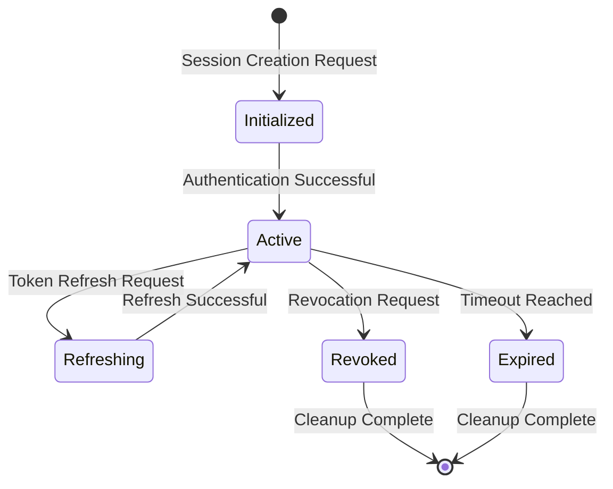

# TACHYON: SESSION SCHEMA

**Document ID:** TACHYON-DM-004-V1.0
**Date:** February 2026
**Status:** Proposed
**Classification:** Data Model Specification
**Dependencies:** [TACHYON-STD-V1.0](../../.adrs/ [TACHYON-DES-DM-V1.0](../../.adrs/ [TACHYON-REQ-SEC-V1.0](../../.adrs/

---

## TABLE OF CONTENTS

1. [Introduction](#1-introduction)
2. [Session Management Principles](#2-session-management-principles)
3. [Session Lifecycle](#3-session-lifecycle)
4. [Session Entity Schema](#4-session-entity-schema)
5. [User Session Schema](#5-user-session-schema)
6. [Session Authentication Schema](#6-session-authentication-schema)
7. [Session Authorization Schema](#7-session-authorization-schema)
8. [Session State Schema](#8-session-state-schema)
9. [Session Metadata Schema](#9-session-metadata-schema)
10. [Session Operations Schema](#10-session-operations-schema)
11. [Session Security Schema](#11-session-security-schema)
12. [References](#12-references)

---

## 1. INTRODUCTION

### 1.1. Document Purpose

This document defines the comprehensive session schema for the Tachyon toolchain, specifying data structures, constraints, and operations for managing user sessions across desktop, server, and web components. The session schema provides the foundation for authentication state management, authorization context, and user session persistence.

### 1.2. Scope

This document covers:

- Session entity definitions and data structures
- User session state management
- Authentication mechanisms and credentials
- Authorization context and access control
- Session metadata and tracking
- Session operations (create, refresh, revoke, migrate)
- Security requirements and threat mitigation

Out of scope:

- Core rendering engine implementation (covered in system architecture)
- Desktop application UI implementation (covered in desktop requirements)
- Server component implementation (covered in server requirements)

### 1.3. Design Principles

The session schema adheres to the following principles:

- **Type Safety:** Leverage Rust's type system for compile-time guarantees
- **Immutability:** Prefer immutable data structures where possible
- **Cryptographic Security:** Use cryptographically secure random values for session identifiers
- **Defense-in-Depth:** Multiple layers of security controls for session management
- **Auditability:** Comprehensive logging for all session operations

---

## 2. SESSION MANAGEMENT PRINCIPLES

### 2.1. Security Principles

| Principle | Description | Implementation |
|-----------|-------------|----------------|
| **Least Privilege** | Sessions grant minimal required permissions | Role-based access control with scoped permissions |
| **Zero Trust** | No implicit trust in session validity | Continuous validation of session tokens |
| **Fail-Safe** | Sessions fail securely on errors | Immediate revocation on security events |
| **Defense-in-Depth** | Multiple layers of session security | Encryption, validation, monitoring, and audit logging |

### 2.2. Session Properties

| Property | Requirement | Rationale |
|----------|-------------|-----------|
| **Uniqueness** | Each session ID must be globally unique | Prevents session collision and hijacking |
| **Unpredictability** | Session IDs must be cryptographically random | Prevents enumeration and prediction attacks |
| **Expiration** | Sessions must have finite lifetime | Limits exposure window for compromised sessions |
| **Revocability** | Sessions must be revocable immediately | Enables rapid response to security incidents |
| **Traceability** | All session operations must be logged | Supports forensic analysis and compliance |

### 2.3. Session Isolation

Sessions are isolated by the following boundaries:

1. **User Isolation:** Sessions are scoped to individual users
2. **Device Isolation:** Sessions are scoped to specific devices or clients
3. **Application Isolation:** Sessions are scoped to specific applications (desktop, web)
4. **Security Zone Isolation:** Sessions are isolated between security zones

---

## 3. SESSION LIFECYCLE

### 3.1. Lifecycle States



### 3.2. State Transitions

| Transition | Trigger | Conditions | Side Effects |
|-----------|---------|-------------|--------------|
| **Initialized → Active** | Successful authentication | Session token issued, audit log created |
| **Active → Refreshing** | Token refresh request | New token generated, old token invalidated |
| **Refreshing → Active** | Successful refresh | Session expiration extended, activity updated |
| **Active → Revoked** | Revocation request | Session invalidated immediately, audit log created |
| **Active → Expired** | Timeout reached | Session invalidated automatically, cleanup scheduled |
| **Revoked → Terminated** | Cleanup complete | Session data removed from storage |

### 3.3. Lifecycle Operations

| Operation | Description | Security Considerations |
|-----------|-------------|-----------------------|
| **Create** | Initialize new session | Validate credentials, generate secure session ID |
| **Validate** | Verify session validity | Check expiration, revocation status, IP consistency |
| **Refresh** | Extend session lifetime | Validate existing session, rotate session token |
| **Revoke** | Invalidate session immediately | Log revocation reason, notify affected user |
| **Cleanup** | Remove expired sessions | Secure deletion of session data, audit trail |

---

## 4. SESSION ENTITY SCHEMA

### 4.1. Session Entity Definition

**Element ID:** TACHYON-DM-004-001
**Name:** Session
**Type:** Struct
**Language:** Rust

**Description:** Core session entity representing an authenticated user session within the Tachyon system.

**Fields:**
```rust
use chrono::{DateTime, Utc};
use serde::{Deserialize, Serialize};
use uuid::Uuid;

/// Core session entity representing an authenticated user session
#[derive(Debug, Clone, PartialEq, Eq, Serialize, Deserialize)]
pub struct Session {
    /// Unique session identifier (cryptographically random)
    pub id: SessionId,
    
    /// Associated user identifier
    pub user_id: UserId,
    
    /// Session creation timestamp
    pub created_at: DateTime<Utc>,
    
    /// Session expiration timestamp
    pub expires_at: DateTime<Utc>,
    
    /// Last activity timestamp
    pub last_activity_at: DateTime<Utc>,
    
    /// User agent string from client
    pub user_agent: Option<String>,
    
    /// IP address of client
    pub ip_address: Option<String>,
    
    /// Session status
    pub status: SessionStatus,
    
    /// Session type (desktop, web, api)
    pub session_type: SessionType,
    
    /// Device identifier for session isolation
    pub device_id: Option<String>,
}

/// Cryptographically secure session identifier
#[derive(Debug, Clone, Copy, PartialEq, Eq, Hash, Serialize, Deserialize)]
#[serde(transparent)]
pub struct SessionId(String);

impl SessionId {
    /// Creates a new cryptographically random session ID
    /// 
    /// # Returns
    /// 
    /// A new SessionId with 256-bit random value
    pub fn new() -> Self;
    
    /// Validates that the session ID is properly formatted
    /// 
    /// # Arguments
    /// 
    /// * `value` - The session ID string to validate
    /// 
    /// # Returns
    /// 
    /// `Ok(())` if valid, `Err(SessionIdError)` if invalid
    pub fn validate(value: &str) -> Result<(), SessionIdError>;
}

/// Session status enumeration
#[derive(Debug, Clone, Copy, PartialEq, Eq, Hash, Serialize, Deserialize)]
pub enum SessionStatus {
    /// Session is active and valid
    Active,
    /// Session has been revoked
    Revoked,
    /// Session has expired
    Expired,
    /// Session is being refreshed
    Refreshing,
}

/// Session type enumeration
#[derive(Debug, Clone, Copy, PartialEq, Eq, Hash, Serialize, Deserialize)]
pub enum SessionType {
    /// Desktop application session
    Desktop,
    /// Web browser session
    Web,
    /// API client session
    Api,
}

/// Session ID validation error
#[derive(Debug, Clone, PartialEq, Eq, thiserror::Error)]
pub enum SessionIdError {
    #[error("Session ID is empty")]
    Empty,
    
    #[error("Session ID is invalid length: expected 64 characters, got {0}")]
    InvalidLength(usize),
    
    #[error("Session ID contains invalid characters")]
    InvalidCharacters,
    
    #[error("Session ID is not properly formatted hexadecimal")]
    InvalidHex,
}
```

**Constraints:**

- `id`: Must be 64-character hexadecimal string (256 bits), cryptographically random
- `user_id`: Must reference a valid user in the system
- `created_at`: Must be before `expires_at`
- `expires_at`: Must be after `created_at`, maximum lifetime 24 hours
- `last_activity_at`: Must be between `created_at` and current time
- `user_agent`: Maximum 512 characters if present
- `ip_address`: Must be valid IPv4 or IPv6 address if present
- `device_id`: Maximum 128 characters if present

**Dependencies:**

- REQ-SEC-016: Secure Session Tokens
- REQ-SEC-017: Session Timeout
- REQ-SEC-018: Session Refresh
- REQ-SEC-019: Concurrent Session Limits
- REQ-SEC-020: Session Revocation

**Rationale:** The Session entity provides comprehensive tracking of authenticated user sessions with security controls including expiration, revocation, and device isolation. The cryptographically random session ID prevents enumeration and prediction attacks.

**Security Considerations:**

- Session IDs must be generated using cryptographically secure random number generator
- IP address tracking enables detection of session hijacking attempts
- User agent tracking enables detection of suspicious client changes
- Session status provides immediate revocation capability for security incidents
- Device isolation prevents session reuse across unauthorized devices

---

## 5. USER SESSION SCHEMA

### 5.1. User Session Definition

**Element ID:** TACHYON-DM-004-002
**Name:** UserSession
**Type:** Struct
**Language:** Rust

**Description:** Extended session entity including user context and authentication state.

**Fields:**
```rust
use chrono::{DateTime, Utc};
use serde::{Deserialize, Serialize};

/// Extended session entity with user context
#[derive(Debug, Clone, PartialEq, Eq, Serialize, Deserialize)]
pub struct UserSession {
    /// Core session entity
    pub session: Session,
    
    /// User context information
    pub user_context: UserContext,
    
    /// Authentication state
    pub auth_state: AuthenticationState,
    
    /// Authorization context
    pub authz_context: AuthorizationContext,
    
    /// Session preferences
    pub preferences: SessionPreferences,
}

/// User context information
#[derive(Debug, Clone, PartialEq, Eq, Serialize, Deserialize)]
pub struct UserContext {
    /// User identifier
    pub user_id: UserId,
    
    /// Username
    pub username: String,
    
    /// User roles
    pub roles: Vec<Role>,
    
    /// User permissions
    pub permissions: Vec<Permission>,
    
    /// User locale
    pub locale: String,
    
    /// User timezone
    pub timezone: String,
}

/// Authentication state
#[derive(Debug, Clone, PartialEq, Eq, Serialize, Deserialize)]
pub struct AuthenticationState {
    /// Authentication method used
    pub method: AuthenticationMethod,
    
    /// Multi-factor authentication status
    pub mfa_verified: bool,
    
    /// Authentication strength level
    pub strength_level: AuthenticationStrength,
    
    /// Last authentication timestamp
    pub authenticated_at: DateTime<Utc>,
    
    /// Re-authentication required flag
    pub reauth_required: bool,
}

/// Authentication method enumeration
#[derive(Debug, Clone, Copy, PartialEq, Eq, Hash, Serialize, Deserialize)]
pub enum AuthenticationMethod {
    /// Password-based authentication
    Password,
    /// OAuth 2.0 authentication
    OAuth2(String),
    /// SAML 2.0 authentication
    Saml(String),
    /// OpenID Connect authentication
    OpenIdConnect(String),
    /// Multi-factor authentication
    Mfa,
}

/// Authentication strength level
#[derive(Debug, Clone, Copy, PartialEq, Eq, Hash, Serialize, Deserialize)]
pub enum AuthenticationStrength {
    /// Basic authentication (single factor)
    Basic,
    /// Strong authentication (multi-factor)
    Strong,
    /// Very strong authentication (hardware token)
    VeryStrong,
}

/// Session preferences
#[derive(Debug, Clone, PartialEq, Eq, Serialize, Deserialize)]
pub struct SessionPreferences {
    /// Remember me flag
    pub remember_me: bool,
    
    /// Session timeout preference (seconds)
    pub timeout_seconds: u32,
    
    /// Auto-refresh enabled flag
    pub auto_refresh: bool,
    
    /// Notification preferences
    pub notifications: NotificationPreferences,
}

/// Notification preferences
#[derive(Debug, Clone, PartialEq, Eq, Serialize, Deserialize)]
pub struct NotificationPreferences {
    /// Email notifications enabled
    pub email_enabled: bool,
    
    /// Push notifications enabled
    pub push_enabled: bool,
    
    /// Security alerts enabled
    pub security_alerts_enabled: bool,
}
```

**Constraints:**

- `username`: 3-64 characters, alphanumeric plus hyphens/underscores
- `locale`: Must be valid IETF BCP 47 language tag
- `timezone`: Must be valid IANA timezone identifier
- `roles`: Maximum 10 roles per user
- `permissions`: Maximum 100 permissions per user
- `timeout_seconds`: Minimum 300 seconds (5 minutes), maximum 86400 seconds (24 hours)

**Dependencies:**

- REQ-SEC-011: Multi-Factor Authentication
- REQ-SEC-012: Password Requirements
- REQ-SEC-013: OAuth 2.0 Support
- REQ-SEC-014: SAML 2.0 Support
- REQ-SEC-015: OpenID Connect

**Rationale:** The UserSession entity extends core Session with user context, authentication state, and preferences, enabling personalized and secure session management with role-based access control.

**Security Considerations:**

- MFA verification status must be checked before granting elevated privileges
- Authentication strength level determines access to sensitive operations
- Re-authentication flag forces re-verification for sensitive operations
- User context enables audit logging with user attribution
- Preferences must be validated to prevent privilege escalation

---

## 6. SESSION AUTHENTICATION SCHEMA

### 6.1. Session Authentication Definition

**Element ID:** TACHYON-DM-004-003
**Name:** SessionAuthentication
**Type:** Struct
**Language:** Rust

**Description:** Session authentication credentials and mechanisms for verifying user identity.

**Fields:**
```rust
use chrono::{DateTime, Utc};
use serde::{Deserialize, Serialize};

/// Session authentication credentials
#[derive(Debug, Clone, PartialEq, Eq, Serialize, Deserialize)]
pub struct SessionAuthentication {
    /// Session identifier
    pub session_id: SessionId,
    
    /// User identifier
    pub user_id: UserId,
    
    /// Authentication method
    pub method: AuthenticationMethod,
    
    /// Authentication timestamp
    pub authenticated_at: DateTime<Utc>,
    
    /// MFA verification status
    pub mfa_verified: bool,
    
    /// MFA method used
    pub mfa_method: Option<MfaMethod>,
    
    /// MFA verification timestamp
    pub mfa_verified_at: Option<DateTime<Utc>>,
    
    /// Authentication token
    pub token: AuthenticationToken,
    
    /// Token expiration
    pub token_expires_at: DateTime<Utc>,
}

/// MFA method enumeration
#[derive(Debug, Clone, Copy, PartialEq, Eq, Hash, Serialize, Deserialize)]
pub enum MfaMethod {
    /// Time-based One-Time Password
    Totp,
    /// SMS-based verification
    Sms,
    /// Email-based verification
    Email,
    /// Hardware token
    HardwareToken,
    /// Biometric verification
    Biometric,
}

/// Authentication token
#[derive(Debug, Clone, PartialEq, Eq, Serialize, Deserialize)]
pub struct AuthenticationToken {
    /// JWT token
    pub jwt: String,
    
    /// Token type
    pub token_type: TokenType,
    
    /// Token issuer
    pub issuer: String,
    
    /// Token subject
    pub subject: String,
    
    /// Token issued at timestamp
    pub issued_at: DateTime<Utc>,
    
    /// Token expires at timestamp
    pub expires_at: DateTime<Utc>,
    
    /// Token scopes
    pub scopes: Vec<String>,
}

/// Token type enumeration
#[derive(Debug, Clone, Copy, PartialEq, Eq, Hash, Serialize, Deserialize)]
pub enum TokenType {
    /// Access token
    Access,
    /// Refresh token
    Refresh,
    /// ID token
    Id,
}
```

**Constraints:**

- `jwt`: Must be valid JWT token with RS256 signature
- `issuer`: Must match configured issuer
- `subject`: Must match user ID
- `scopes`: Maximum 20 scopes per token
- `token_expires_at`: Must be after `authenticated_at`, maximum 24 hours

**Dependencies:**

- REQ-SEC-011: Multi-Factor Authentication
- REQ-SEC-016: Secure Session Tokens
- REQ-SEC-018: Session Refresh

**Rationale:** The SessionAuthentication entity provides comprehensive authentication state including MFA verification and JWT token management, enabling secure session validation and token rotation.

**Security Considerations:**

- JWT tokens must be signed with RS256 algorithm
- MFA verification must be completed for elevated privileges
- Token rotation prevents token replay attacks
- Token scopes enforce principle of least privilege
- MFA method must be logged for audit trail

---

## 7. SESSION AUTHORIZATION SCHEMA

### 7.1. Session Authorization Definition

**Element ID:** TACHYON-DM-004-004
**Name:** SessionAuthorization
**Type:** Struct
**Language:** Rust

**Description:** Session authorization context for enforcing access control and permissions.

**Fields:**
```rust
use serde::{Deserialize, Serialize};

/// Session authorization context
#[derive(Debug, Clone, PartialEq, Eq, Serialize, Deserialize)]
pub struct SessionAuthorization {
    /// Session identifier
    pub session_id: SessionId,
    
    /// User identifier
    pub user_id: UserId,
    
    /// User roles
    pub roles: Vec<Role>,
    
    /// User permissions
    pub permissions: Vec<Permission>,
    
    /// Effective permissions (computed from roles)
    pub effective_permissions: Vec<Permission>,
    
    /// Permission cache timestamp
    pub permissions_cached_at: DateTime<Utc>,
}

/// Role enumeration
#[derive(Debug, Clone, Copy, PartialEq, Eq, Hash, Serialize, Deserialize)]
pub enum Role {
    /// Administrator role
    Admin,
    /// Editor role
    Editor,
    /// Viewer role
    Viewer,
    /// Custom role
    Custom(String),
}

/// Permission enumeration
#[derive(Debug, Clone, Copy, PartialEq, Eq, Hash, Serialize, Deserialize)]
pub enum Permission {
    /// Read documents
    DocumentRead,
    /// Write documents
    DocumentWrite,
    /// Delete documents
    DocumentDelete,
    /// Manage users
    UserManage,
    /// Manage roles
    RoleManage,
    /// Manage permissions
    PermissionManage,
    /// View audit logs
    AuditView,
    /// Manage system configuration
    SystemConfig,
    /// Custom permission
    Custom(String),
}

/// Permission check result
#[derive(Debug, Clone, PartialEq, Eq, Serialize, Deserialize)]
pub struct PermissionCheck {
    /// Permission granted
    pub granted: bool,
    
    /// Permission denied reason
    pub reason: Option<String>,
    
    /// Required permissions
    pub required: Vec<Permission>,
    
    /// Missing permissions
    pub missing: Vec<Permission>,
}
```

**Constraints:**

- `roles`: Maximum 10 roles per user
- `permissions`: Maximum 100 direct permissions per user
- `effective_permissions`: Computed from roles, maximum 200 effective permissions
- `permissions_cached_at`: Cache validity maximum 5 minutes

**Dependencies:**

- REQ-SEC-021: Role-Based Access Control
- REQ-SEC-022: Attribute-Based Access Control
- REQ-SEC-023: Frontmatter Access Control
- REQ-SEC-024: Block Redaction
- REQ-SEC-025: Permission Inheritance

**Rationale:** The SessionAuthorization entity provides comprehensive access control with role-based permissions and effective permission computation, enabling fine-grained authorization decisions.

**Security Considerations:**

- Role-based access control enforces principle of least privilege
- Effective permissions computed from roles prevent privilege escalation
- Permission caching improves performance while maintaining security
- Permission checks must be logged for audit trail
- Custom permissions require explicit approval and documentation

---

## 8. SESSION STATE SCHEMA

### 8.1. Session State Definition

**Element ID:** TACHYON-DM-004-005
**Name:** SessionState
**Type:** Struct
**Language:** Rust

**Description:** Session state for managing application-specific state and user preferences.

**Fields:**
```rust
use serde::{Deserialize, Serialize};
use std::collections::HashMap;

/// Session state
#[derive(Debug, Clone, PartialEq, Eq, Serialize, Deserialize)]
pub struct SessionState {
    /// Session identifier
    pub session_id: SessionId,
    
    /// UI state
    pub ui_state: UiState,
    
    /// User preferences
    pub user_preferences: UserPreferences,
    
    /// Temporary data
    pub temporary_data: HashMap<String, serde_json::Value>,
    
    /// State version for conflict resolution
    pub version: u64,
}

/// UI state
#[derive(Debug, Clone, PartialEq, Eq, Serialize, Deserialize)]
pub struct UiState {
    /// Current view
    pub current_view: String,
    
    /// View parameters
    pub view_params: HashMap<String, String>,
    
    /// Selected items
    pub selected_items: Vec<String>,
    
    /// Open panels
    pub open_panels: Vec<String>,
    
    /// Window state
    pub window_state: WindowState,
}

/// Window state
#[derive(Debug, Clone, PartialEq, Eq, Serialize, Deserialize)]
pub struct WindowState {
    /// Window position (x, y)
    pub position: (i32, i32),
    
    /// Window size (width, height)
    pub size: (u32, u32),
    
    /// Window maximized flag
    pub maximized: bool,
    
    /// Window minimized flag
    pub minimized: bool,
    
    /// Active tab
    pub active_tab: Option<String>,
}

/// User preferences
#[derive(Debug, Clone, PartialEq, Eq, Serialize, Deserialize)]
pub struct UserPreferences {
    /// Theme preference
    pub theme: Theme,
    
    /// Language preference
    pub language: String,
    
    /// Font size
    pub font_size: u8,
    
    /// Notifications enabled
    pub notifications_enabled: bool,
    
    /// Auto-save enabled
    pub auto_save_enabled: bool,
}

/// Theme enumeration
#[derive(Debug, Clone, Copy, PartialEq, Eq, Hash, Serialize, Deserialize)]
pub enum Theme {
    /// Light theme
    Light,
    /// Dark theme
    Dark,
    /// System theme
    System,
    /// High contrast theme
    HighContrast,
}
```

**Constraints:**

- `current_view`: Maximum 256 characters
- `view_params`: Maximum 50 parameters
- `selected_items`: Maximum 100 items
- `open_panels`: Maximum 10 panels
- `temporary_data`: Maximum 1MB total size
- `version`: Monotonically increasing

**Dependencies:**

- REQ-SYS-031: JIT Rendering Pipeline
- REQ-DESK-018: User Interface Requirements

**Rationale:** The SessionState entity provides comprehensive application state management including UI state, user preferences, and temporary data, enabling personalized user experience with state persistence.

**Security Considerations:**

- UI state must be validated to prevent XSS attacks
- Temporary data must be sanitized before storage
- State version enables conflict resolution and rollback
- User preferences must not contain sensitive information
- State changes must be logged for audit trail

---

## 9. SESSION METADATA SCHEMA

### 9.1. Session Metadata Definition

**Element ID:** TACHYON-DM-004-006
**Name:** SessionMetadata
**Type:** Struct
**Language:** Rust

**Description:** Session metadata for tracking session lifecycle and security events.

**Fields:**
```rust
use chrono::{DateTime, Utc};
use serde::{Deserialize, Serialize};

/// Session metadata
#[derive(Debug, Clone, PartialEq, Eq, Serialize, Deserialize)]
pub struct SessionMetadata {
    /// Session identifier
    pub session_id: SessionId,
    
    /// Created timestamp
    pub created_at: DateTime<Utc>,
    
    /// Last accessed timestamp
    pub last_accessed_at: DateTime<Utc>,
    
    /// Expires at timestamp
    pub expires_at: DateTime<Utc>,
    
    /// Creation IP address
    pub creation_ip: Option<String>,
    
    /// Last access IP address
    pub last_access_ip: Option<String>,
    
    /// User agent string
    pub user_agent: Option<String>,
    
    /// Device identifier
    pub device_id: Option<String>,
    
    /// Geographic location
    pub location: Option<GeographicLocation>,
    
    /// Security events
    pub security_events: Vec<SecurityEvent>,
}

/// Geographic location
#[derive(Debug, Clone, PartialEq, Eq, Serialize, Deserialize)]
pub struct GeographicLocation {
    /// Country code (ISO 3166-1 alpha-2)
    pub country_code: Option<String>,
    
    /// Region code
    pub region: Option<String>,
    
    /// City
    pub city: Option<String>,
    
    /// Latitude
    pub latitude: Option<f64>,
    
    /// Longitude
    pub longitude: Option<f64>,
}

/// Security event
#[derive(Debug, Clone, PartialEq, Eq, Serialize, Deserialize)]
pub struct SecurityEvent {
    /// Event type
    pub event_type: SecurityEventType,
    
    /// Event timestamp
    pub timestamp: DateTime<Utc>,
    
    /// Event description
    pub description: String,
    
    /// IP address
    pub ip_address: Option<String>,
    
    /// User agent
    pub user_agent: Option<String>,
    
    /// Event severity
    pub severity: EventSeverity,
}

/// Security event type
#[derive(Debug, Clone, Copy, PartialEq, Eq, Hash, Serialize, Deserialize)]
pub enum SecurityEventType {
    /// Session created
    SessionCreated,
    /// Session accessed
    SessionAccessed,
    /// Session refreshed
    SessionRefreshed,
    /// Session revoked
    SessionRevoked,
    /// Session expired
    SessionExpired,
    /// Suspicious activity detected
    SuspiciousActivity,
    /// Failed authentication attempt
    FailedAuthentication,
    /// IP address changed
    IpAddressChanged,
    /// User agent changed
    UserAgentChanged,
}

/// Event severity
#[derive(Debug, Clone, Copy, PartialEq, Eq, Hash, Serialize, Deserialize)]
pub enum EventSeverity {
    /// Informational event
    Info,
    /// Warning event
    Warning,
    /// Error event
    Error,
    /// Critical event
    Critical,
}
```

**Constraints:**

- `country_code`: Must be valid ISO 3166-1 alpha-2 code if present
- `latitude`: Range -90 to 90 if present
- `longitude`: Range -180 to 180 if present
- `description`: Maximum 1024 characters
- `security_events`: Maximum 1000 events per session

**Dependencies:**

- REQ-SEC-056: Comprehensive Logging
- REQ-SEC-057: Immutable Logs
- REQ-SEC-058: Log Tamper Protection
- REQ-SEC-059: Log Retention
- REQ-SEC-060: Log Access

**Rationale:** The SessionMetadata entity provides comprehensive session tracking including geographic location, security events, and access patterns, enabling security monitoring and forensic analysis.

**Security Considerations:**

- Geographic location must be obtained with user consent
- IP address changes must trigger security alerts
- Security events must be logged immutably
- Event severity determines alerting thresholds
- Metadata must be protected from unauthorized access

---

## 10. SESSION OPERATIONS SCHEMA

### 10.1. Session Operations Definition

**Element ID:** TACHYON-DM-004-007
**Name:** SessionOperations
**Type:** Trait
**Language:** Rust

**Description:** Session operations for creating, validating, refreshing, revoking, and migrating sessions.

**Trait Definition:**
```rust
use chrono::{DateTime, Utc};
use thiserror::Error;

/// Session operations trait
#[async_trait::async_trait]
pub trait SessionOperations: Send + Sync {
    /// Creates a new session for the specified user
    ///
    /// # Arguments
    ///
    /// * `user_id` - The user identifier
    /// * `auth_method` - The authentication method used
    /// * `user_agent` - The user agent string
    /// * `ip_address` - The client IP address
    /// * `device_id` - The device identifier
    ///
    /// # Returns
    ///
    /// The created session
    ///
    /// # Errors
    ///
    /// Returns `SessionError` if session creation fails
    async fn create_session(
        &self,
        user_id: UserId,
        auth_method: AuthenticationMethod,
        user_agent: Option<String>,
        ip_address: Option<String>,
        device_id: Option<String>,
    ) -> Result<UserSession, SessionError>;
    
    /// Validates an existing session
    ///
    /// # Arguments
    ///
    /// * `session_id` - The session identifier to validate
    /// * `ip_address` - The current client IP address
    /// * `user_agent` - The current user agent string
    ///
    /// # Returns
    ///
    /// The validated session
    ///
    /// # Errors
    ///
    /// Returns `SessionError` if validation fails
    async fn validate_session(
        &self,
        session_id: SessionId,
        ip_address: Option<String>,
        user_agent: Option<String>,
    ) -> Result<Session, SessionError>;
    
    /// Refreshes an existing session
    ///
    /// # Arguments
    ///
    /// * `session_id` - The session identifier to refresh
    /// * `extend_duration` - The duration to extend in seconds
    ///
    /// # Returns
    ///
    /// The refreshed session
    ///
    /// # Errors
    ///
    /// Returns `SessionError` if refresh fails
    async fn refresh_session(
        &self,
        session_id: SessionId,
        extend_duration: u32,
    ) -> Result<Session, SessionError>;
    
    /// Revokes an existing session
    ///
    /// # Arguments
    ///
    /// * `session_id` - The session identifier to revoke
    /// * `reason` - The revocation reason
    ///
    /// # Returns
    ///
    /// Unit result
    ///
    /// # Errors
    ///
    /// Returns `SessionError` if revocation fails
    async fn revoke_session(
        &self,
        session_id: SessionId,
        reason: String,
    ) -> Result<(), SessionError>;
    
    /// Migrates a session to a new device
    ///
    /// # Arguments
    ///
    /// * `session_id` - The session identifier to migrate
    /// * `new_device_id` - The new device identifier
    ///
    /// # Returns
    ///
    /// The migrated session
    ///
    /// # Errors
    ///
    /// Returns `SessionError` if migration fails
    async fn migrate_session(
        &self,
        session_id: SessionId,
        new_device_id: String,
    ) -> Result<Session, SessionError>;
    
    /// Cleans up expired sessions
    ///
    /// # Arguments
    ///
    /// * `older_than` - Remove sessions older than this timestamp
    ///
    /// # Returns
    ///
    /// Number of sessions cleaned up
    ///
    /// # Errors
    ///
    /// Returns `SessionError` if cleanup fails
    async fn cleanup_expired_sessions(
        &self,
        older_than: DateTime<Utc>,
    ) -> Result<usize, SessionError>;
}

/// Session error enumeration
#[derive(Debug, Clone, PartialEq, Eq, thiserror::Error)]
pub enum SessionError {
    #[error("Session not found: {0}")]
    SessionNotFound(SessionId),
    
    #[error("Session expired")]
    SessionExpired,
    
    #[error("Session revoked: {0}")]
    SessionRevoked(String),
    
    #[error("Session validation failed: {0}")]
    ValidationFailed(String),
    
    #[error("Session creation failed: {0}")]
    CreationFailed(String),
    
    #[error("Session refresh failed: {0}")]
    RefreshFailed(String),
    
    #[error("Session revocation failed: {0}")]
    RevocationFailed(String),
    
    #[error("Session migration failed: {0}")]
    MigrationFailed(String),
    
    #[error("Session cleanup failed: {0}")]
    CleanupFailed(String),
}
```

**Constraints:**

- `extend_duration`: Minimum 300 seconds (5 minutes), maximum 86400 seconds (24 hours)
- `reason`: Maximum 1024 characters
- `older_than`: Must be in the past

**Dependencies:**

- REQ-SEC-016: Secure Session Tokens
- REQ-SEC-017: Session Timeout
- REQ-SEC-018: Session Refresh
- REQ-SEC-019: Concurrent Session Limits
- REQ-SEC-020: Session Revocation

**Rationale:** The SessionOperations trait provides comprehensive session lifecycle management including creation, validation, refresh, revocation, and migration, enabling secure session management with proper error handling.

**Security Considerations:**

- Session creation must validate credentials before issuing tokens
- Session validation must check expiration, revocation, IP consistency
- Session refresh must rotate tokens to prevent replay attacks
- Session revocation must be immediate and logged
- Session migration must require user confirmation for security

---

## 11. SESSION SECURITY SCHEMA

### 11.1. Session Security Definition

**Element ID:** TACHYON-DM-004-008
**Name:** SessionSecurity
**Type:** Struct
**Language:** Rust

**Description:** Session security controls for encryption, storage, and threat mitigation.

**Fields:**
```rust
use serde::{Deserialize, Serialize};

/// Session security configuration
#[derive(Debug, Clone, PartialEq, Eq, Serialize, Deserialize)]
pub struct SessionSecurity {
    /// Encryption settings
    pub encryption: EncryptionSettings,
    
    /// Storage settings
    pub storage: StorageSettings,
    
    /// Session hijacking prevention
    pub hijacking_prevention: HijackingPrevention,
    
    /// Session fixation prevention
    pub fixation_prevention: FixationPrevention,
    
    /// Audit logging configuration
    pub audit_logging: AuditLoggingConfig,
}

/// Encryption settings
#[derive(Debug, Clone, PartialEq, Eq, Serialize, Deserialize)]
pub struct EncryptionSettings {
    /// Session token encryption algorithm
    pub token_algorithm: EncryptionAlgorithm,
    
    /// Session data encryption algorithm
    pub data_algorithm: EncryptionAlgorithm,
    
    /// Key rotation interval (hours)
    pub key_rotation_interval: u32,
    
    /// Encryption at rest enabled
    pub encrypt_at_rest: bool,
}

/// Encryption algorithm
#[derive(Debug, Clone, Copy, PartialEq, Eq, Hash, Serialize, Deserialize)]
pub enum EncryptionAlgorithm {
    /// AES-256-GCM
    Aes256Gcm,
    /// ChaCha20-Poly1305
    ChaCha20Poly1305,
}

/// Storage settings
#[derive(Debug, Clone, PartialEq, Eq, Serialize, Deserialize)]
pub struct StorageSettings {
    /// Storage backend
    pub backend: StorageBackend,
    
    /// Secure storage enabled
    pub secure_storage: bool,
    
    /// Session data retention period (days)
    pub retention_days: u32,
    
    /// Session data anonymization enabled
    pub anonymize_data: bool,
}

/// Storage backend
#[derive(Debug, Clone, Copy, PartialEq, Eq, Hash, Serialize, Deserialize)]
pub enum StorageBackend {
    /// In-memory storage
    Memory,
    /// SQLite database
    Sqlite,
    /// Redis cache
    Redis,
    /// PostgreSQL database
    Postgresql,
}

/// Hijacking prevention settings
#[derive(Debug, Clone, PartialEq, Eq, Serialize, Deserialize)]
pub struct HijackingPrevention {
    /// IP binding enabled
    pub ip_binding: bool,
    
    /// User agent binding enabled
    pub user_agent_binding: bool,
    
    /// Geographic binding enabled
    pub geographic_binding: bool,
    
    /// Device binding enabled
    pub device_binding: bool,
    
    /// Concurrent session limit
    pub concurrent_session_limit: u8,
    
    /// IP change detection enabled
    pub ip_change_detection: bool,
}

/// Fixation prevention settings
#[derive(Debug, Clone, PartialEq, Eq, Serialize, Deserialize)]
pub struct FixationPrevention {
    /// Regenerate session ID on authentication
    pub regenerate_on_auth: bool,
    
    /// Session ID rotation interval (minutes)
    pub rotation_interval: u32,
    
    /// Reject pre-authentication session IDs
    pub reject_pre_auth_ids: bool,
    
    /// Require fresh session ID for sensitive operations
    pub require_fresh_for_sensitive: bool,
}

/// Audit logging configuration
#[derive(Debug, Clone, PartialEq, Eq, Serialize, Deserialize)]
pub struct AuditLoggingConfig {
    /// Log all session events
    pub log_all_events: bool,
    
    /// Log security events
    pub log_security_events: bool,
    
    /// Log IP address changes
    pub log_ip_changes: bool,
    
    /// Log user agent changes
    pub log_user_agent_changes: bool,
    
    /// Log retention period (days)
    pub retention_days: u32,
}
```

**Constraints:**

- `key_rotation_interval`: Minimum 24 hours, maximum 168 hours (7 days)
- `retention_days`: Minimum 7 days, maximum 365 days
- `concurrent_session_limit`: Minimum 1, maximum 10
- `rotation_interval`: Minimum 30 minutes, maximum 1440 minutes (24 hours)

**Dependencies:**

- REQ-SEC-016: Secure Session Tokens
- REQ-SEC-026: AES-256 Encryption
- REQ-SEC-027: Key Management
- REQ-SEC-028: Database Encryption
- REQ-SEC-056: Comprehensive Logging
- REQ-SEC-057: Immutable Logs
- REQ-SEC-058: Log Tamper Protection
- REQ-SEC-059: Log Retention

**Rationale:** The SessionSecurity entity provides comprehensive security controls including encryption, secure storage, hijacking prevention, fixation prevention, and audit logging, implementing defense-in-depth security for session management.

**Security Considerations:**

- Encryption at rest protects session data from unauthorized access
- Key rotation limits exposure window for compromised keys
- IP binding prevents session hijacking through IP spoofing
- User agent binding prevents session hijacking through user agent spoofing
- Session fixation prevention prevents session fixation attacks
- Audit logging provides forensic evidence and compliance support

---

## 12. REFERENCES

### 12.1. Internal References

| Reference ID | Title | Location |
|--------------|-------|----------|
| TACHYON-STD-V1.0 | Coding and Documentation Standards | [`.adrs/ |
| TACHYON-DES-DM-V1.0 | Data Models Design | [`.adrs/ |
| TACHYON-REQ-SEC-V1.0 | Security Requirements | [`.adrs/ |
| TACHYON-ADR-001-V1.0 | Rust as Primary Language | [`.adrs/adr-001-three-tier-jit-compilation.md](../../.adrs/adr-001-three-tier-jit-compilation.md) |
| TACHYON-ADR-009-V1.0 | IPC Communication Architecture | [`.adrs/adr-009-race-condition-mitigation.md](../../.adrs/adr-009-race-condition-mitigation.md) |
| TACHYON-ADR-010-V1.0 | Security Architecture | [`.adrs/adr-010-synchronization-primitives.md](../../.adrs/adr-010-synchronization-primitives.md) |

### 12.2. External References

[1] RFC 7519, "JSON Web Token (JWT)," IETF, May 2015.

[2] OWASP Foundation, "OWASP Top 10 Web Application Security Risks," OWASP, 2021.

[3] NIST SP 800-63B, "Digital Identity Guidelines," NIST, 2017.

[4] ISO/IEC 27001:2013, "Information Technology - Security Techniques - Information Security Management Systems," ISO/IEC, 2013.

[5] RFC 4122, "The OAuth 2.0 Authorization Framework," IETF, October 2012.

[6] RFC 6749, "OpenID Connect Core 1.0," IETF, November 2014.

[7] NIST SP 800-63, "Electronic Authentication Guideline," NIST, 2020.

[8] OWASP Foundation, "Session Management Cheat Sheet," OWASP, 2022.

[9] RFC 6265, "JSON Web Signature (JWS)," IETF, March 2015.

[10] RFC 7616, "JSON Web Encryption (JWE)," IETF, May 2015.
