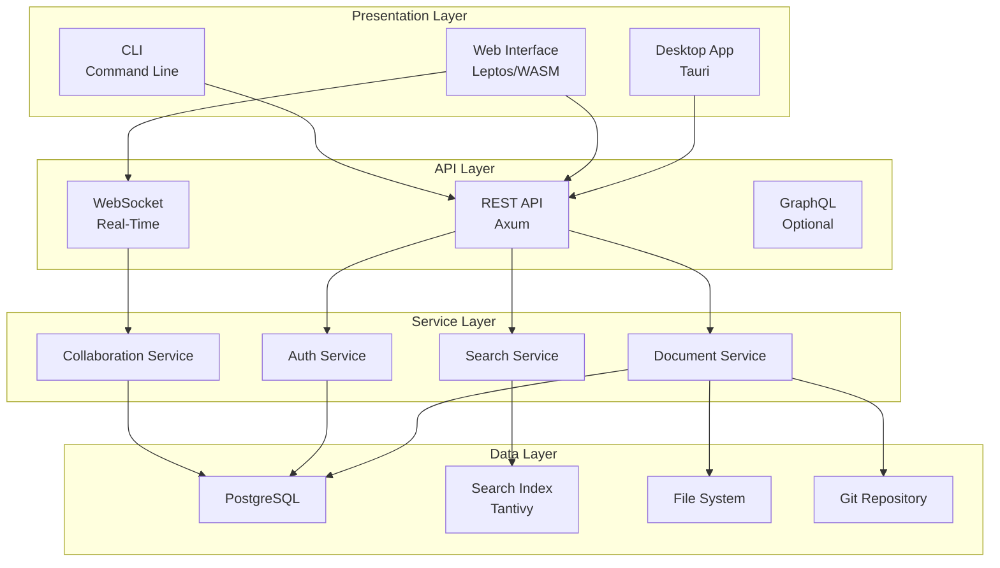
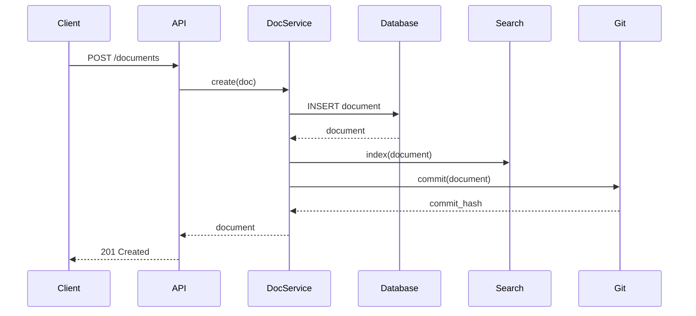
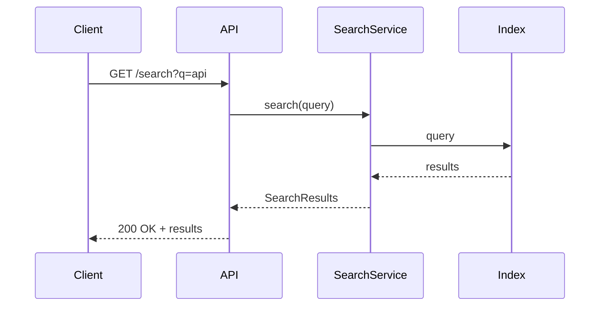
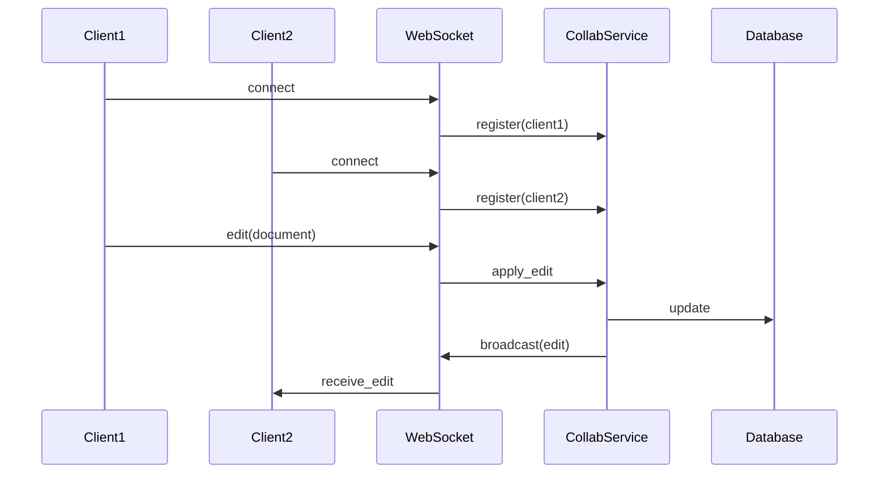
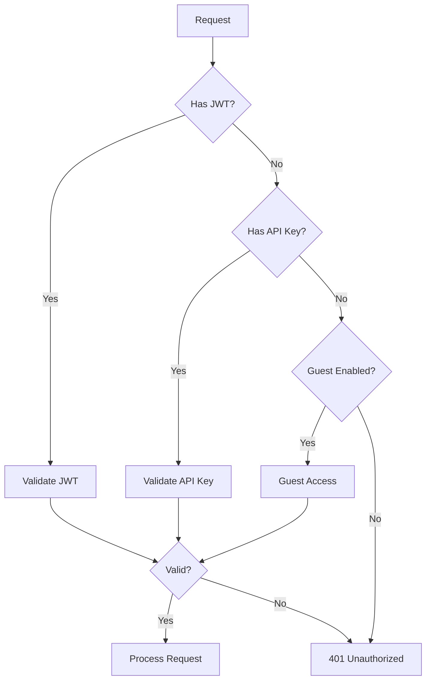

# System Architecture

This document describes the high-level architecture of Tachyon.

## Overview

Tachyon is a high-performance knowledge management platform built with Rust. It supports three operation modes:
- **Desktop**: Local-first application
- **Server**: Multi-user collaboration server
- **Static Export**: Generate static HTML



## Core Components

### 1. Presentation Layer

#### Desktop Application (Tauri)

- Native desktop app for Windows, macOS, Linux
- Direct file system access
- Local-first operation
- IPC communication with Rust backend

```rust
// Tauri command
#[tauri::command]
async fn open_document(path: String) -> Result<Document, Error> {
    // Load document from file system
}
```

#### Web Interface (Leptos)

- WASM-based reactive UI
- Server-side rendering support
- Real-time updates via WebSocket

```rust
// Leptos component
#[component]
fn DocumentView(cx: Scope, id: String) -> impl IntoView {
    let doc = create_resource(cx, move || id.clone(), fetch_document);
    view! { cx, <Suspense fallback=|| "Loading..."> ... </Suspense> }
}
```

### 2. API Layer

#### REST API (Axum)

- HTTP/2 support
- OpenAPI documentation
- JWT and API key authentication

```rust
// Route definition
Router::new()
    .route("/documents", get(list_documents).post(create_document))
    .route("/documents/:id", get(get_document).put(update_document))
    .layer(middleware::from_fn(auth_middleware))
```

#### WebSocket Server

- Real-time collaboration
- Live cursors and presence
- Operational transform

```rust
// WebSocket handler
async fn handle_websocket(socket: WebSocket, state: State) {
    let (tx, rx) = socket.split();
    // Handle real-time updates
}
```

### 3. Service Layer

#### Document Service

- CRUD operations
- Version control
- Hierarchy management

```rust
pub struct DocumentService {
    db: PgPool,
    repo: GitRepository,
}

impl DocumentService {
    pub async fn create(&self, doc: CreateDocument) -> Result<Document> {
        // Create in database
        // Commit to git
        // Index for search
    }
}
```

#### Search Service

- Full-text indexing with Tantivy
- Fuzzy matching
- Faceted search

```rust
pub struct SearchService {
    index: Index,
    reader: IndexReader,
}

impl SearchService {
    pub fn search(&self, query: Query) -> Result<SearchResults> {
        let searcher = self.reader.searcher();
        let results = searcher.search(&query, &TopDocs::with_limit(20))?;
        Ok(results)
    }
}
```

#### Authentication Service

- JWT token management
- API key validation
- OAuth/OIDC integration

```rust
pub struct AuthService {
    jwt_secret: String,
    db: PgPool,
}

impl AuthService {
    pub fn create_token(&self, user: &User) -> Result<String> {
        let claims = Claims::new(user);
        encode(&Header::default(), &claims, &self.jwt_secret)
    }
}
```

#### Collaboration Service

- Real-time synchronization
- Conflict resolution
- Presence tracking

```rust
pub struct CollaborationService {
    connections: HashMap<DocumentId, Vec<Connection>>,
    manager: ConnectionManager,
}

impl CollaborationService {
    pub async fn broadcast(&self, doc_id: DocumentId, event: Event) {
        // Broadcast to all connected clients
    }
}
```

### 4. Data Layer

#### PostgreSQL Database

- Document metadata
- User accounts
- Permissions
- Sessions

Schema: See [Database Guide](database.md)

#### Search Index (Tantivy)

- Full-text index
- Inverted index
- Fast queries

```rust
let schema = Schema::builder()
    .add_text_field("title", TEXT | STORED)
    .add_text_field("content", TEXT)
    .add_text_field("tags", TEXT | INDEXED)
    .build();
```

#### File System

- Document storage (desktop mode)
- Git repository access
- Static export

```rust
pub struct FileSystem {
    root: PathBuf,
}

impl FileSystem {
    pub fn read_document(&self, path: &Path) -> Result<String> {
        std::fs::read_to_string(self.root.join(path))
    }
}
```

## Data Flow

### Document Creation Flow



### Search Flow



### Real-Time Collaboration Flow



## Performance Characteristics

### Rendering

- **Target**: < 15ms
- **Implementation**: JIT rendering with caching
- **Optimization**: SIMD-accelerated markdown parsing

### Search

- **Target**: < 100ms
- **Implementation**: Tantivy inverted index
- **Optimization**: Memory-mapped index files

### API Response

- **Target**: < 50ms (p99)
- **Implementation**: Async I/O with Tokio
- **Optimization**: Connection pooling, query optimization

### WebSocket Latency

- **Target**: < 10ms
- **Implementation**: Async broadcast
- **Optimization**: Event batching

## Scalability

### Horizontal Scaling

```
                  Load Balancer
                       |
        +--------------+--------------+
        |              |              |
   Server 1       Server 2       Server 3
        |              |              |
        +--------------+--------------+
                       |
              Shared PostgreSQL
              Shared Redis (rate limit)
```

### Vertical Scaling

- Increase CPU cores (Tokio utilizes all cores)
- Increase RAM (larger caches)
- SSD storage (faster index access)

## Security

### Authentication Flow



### Authorization

- Role-based access control (RBAC)
- Document-level permissions
- Team/project isolation

### Data Protection

- TLS encryption in transit
- Encrypted secrets at rest
- SQL injection prevention (parameterized queries)
- XSS prevention (HTML escaping)

## Deployment

See [Deployment Guide](deployment.md) for production deployment strategies.

## Monitoring

### Metrics

- Request latency (histogram)
- Error rate (counter)
- Active connections (gauge)
- Search query time (histogram)

### Logging

- Structured logging (JSON)
- Log levels: ERROR, WARN, INFO, DEBUG, TRACE
- Distributed tracing support

### Health Checks

```bash
GET /health
{
  "status": "healthy",
  "version": "0.2.0",
  "uptime_secs": 3600
}
```

## Next Steps

- [Database Guide](database.md) - Database schema
- [API Guide](api.md) - REST API documentation
- [WebSocket Guide](websockets.md) - Real-time features
- [Deployment](deployment.md) - Production deployment
