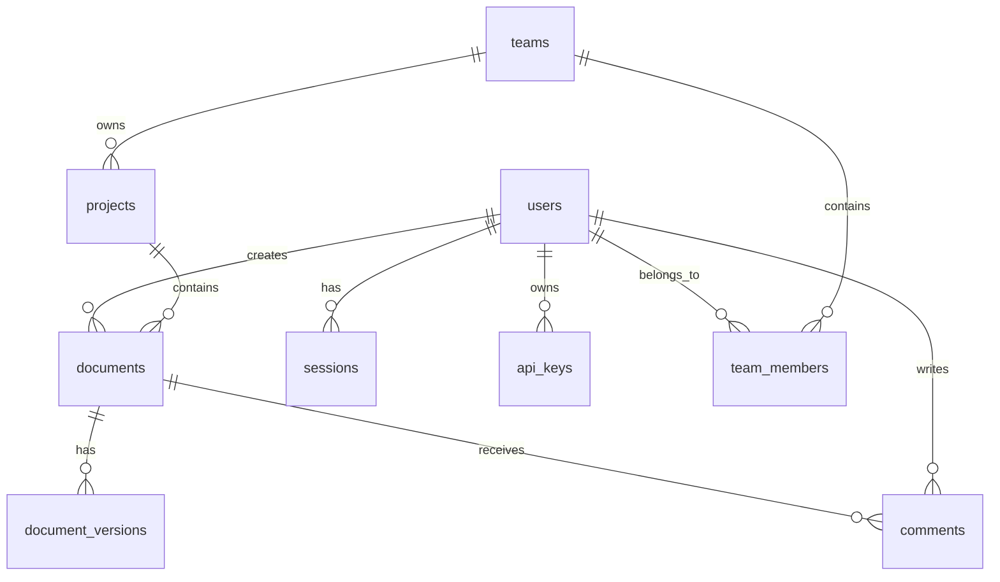

# Database Guide

This guide covers the database schema, migrations, and operations for Tachyon.

## Overview

Tachyon uses PostgreSQL as its primary database for storing:
- User accounts and authentication
- Document metadata
- Permissions and roles
- Team and project information
- Sessions and audit logs

## Schema

### Entity Relationship Diagram



### Tables

#### users

```sql
CREATE TABLE users (
    id UUID PRIMARY KEY DEFAULT gen_random_uuid(),
    email VARCHAR(255) UNIQUE NOT NULL,
    password_hash VARCHAR(255) NOT NULL,
    name VARCHAR(255),
    role VARCHAR(50) NOT NULL DEFAULT 'user',
    is_active BOOLEAN NOT NULL DEFAULT true,
    created_at TIMESTAMP WITH TIME ZONE DEFAULT NOW(),
    updated_at TIMESTAMP WITH TIME ZONE DEFAULT NOW(),
    last_login_at TIMESTAMP WITH TIME ZONE
);

CREATE INDEX idx_users_email ON users(email);
CREATE INDEX idx_users_role ON users(role);
```

#### teams

```sql
CREATE TABLE teams (
    id UUID PRIMARY KEY DEFAULT gen_random_uuid(),
    name VARCHAR(255) NOT NULL,
    description TEXT,
    owner_id UUID NOT NULL REFERENCES users(id) ON DELETE CASCADE,
    settings JSONB DEFAULT '{}',
    created_at TIMESTAMP WITH TIME ZONE DEFAULT NOW(),
    updated_at TIMESTAMP WITH TIME ZONE DEFAULT NOW()
);

CREATE INDEX idx_teams_owner ON teams(owner_id);
```

#### team_members

```sql
CREATE TABLE team_members (
    id UUID PRIMARY KEY DEFAULT gen_random_uuid(),
    team_id UUID NOT NULL REFERENCES teams(id) ON DELETE CASCADE,
    user_id UUID NOT NULL REFERENCES users(id) ON DELETE CASCADE,
    role VARCHAR(50) NOT NULL DEFAULT 'member',
    joined_at TIMESTAMP WITH TIME ZONE DEFAULT NOW(),
    UNIQUE(team_id, user_id)
);

CREATE INDEX idx_team_members_team ON team_members(team_id);
CREATE INDEX idx_team_members_user ON team_members(user_id);
```

#### projects

```sql
CREATE TABLE projects (
    id UUID PRIMARY KEY DEFAULT gen_random_uuid(),
    team_id UUID REFERENCES teams(id) ON DELETE CASCADE,
    name VARCHAR(255) NOT NULL,
    description TEXT,
    visibility VARCHAR(50) NOT NULL DEFAULT 'team',
    settings JSONB DEFAULT '{}',
    created_by UUID NOT NULL REFERENCES users(id),
    created_at TIMESTAMP WITH TIME ZONE DEFAULT NOW(),
    updated_at TIMESTAMP WITH TIME ZONE DEFAULT NOW()
);

CREATE INDEX idx_projects_team ON projects(team_id);
CREATE INDEX idx_projects_created_by ON projects(created_by);
```

#### documents

```sql
CREATE TABLE documents (
    id UUID PRIMARY KEY DEFAULT gen_random_uuid(),
    project_id UUID NOT NULL REFERENCES projects(id) ON DELETE CASCADE,
    parent_id UUID REFERENCES documents(id) ON DELETE CASCADE,
    title VARCHAR(500) NOT NULL,
    content TEXT,
    content_type VARCHAR(50) DEFAULT 'markdown',
    tags TEXT[] DEFAULT '{}',
    metadata JSONB DEFAULT '{}',
    is_public BOOLEAN DEFAULT false,
    version INTEGER DEFAULT 1,
    created_by UUID NOT NULL REFERENCES users(id),
    updated_by UUID NOT NULL REFERENCES users(id),
    created_at TIMESTAMP WITH TIME ZONE DEFAULT NOW(),
    updated_at TIMESTAMP WITH TIME ZONE DEFAULT NOW(),
    deleted_at TIMESTAMP WITH TIME ZONE
);

CREATE INDEX idx_documents_project ON documents(project_id);
CREATE INDEX idx_documents_parent ON documents(parent_id);
CREATE INDEX idx_documents_created_by ON documents(created_by);
CREATE INDEX idx_documents_is_public ON documents(is_public);
CREATE INDEX idx_documents_tags ON documents USING GIN(tags);
CREATE INDEX idx_documents_metadata ON documents USING GIN(metadata);
```

#### document_versions

```sql
CREATE TABLE document_versions (
    id UUID PRIMARY KEY DEFAULT gen_random_uuid(),
    document_id UUID NOT NULL REFERENCES documents(id) ON DELETE CASCADE,
    version INTEGER NOT NULL,
    title VARCHAR(500) NOT NULL,
    content TEXT,
    changed_by UUID NOT NULL REFERENCES users(id),
    change_summary TEXT,
    created_at TIMESTAMP WITH TIME ZONE DEFAULT NOW(),
    UNIQUE(document_id, version)
);

CREATE INDEX idx_document_versions_document ON document_versions(document_id);
```

#### comments

```sql
CREATE TABLE comments (
    id UUID PRIMARY KEY DEFAULT gen_random_uuid(),
    document_id UUID NOT NULL REFERENCES documents(id) ON DELETE CASCADE,
    parent_id UUID REFERENCES comments(id) ON DELETE CASCADE,
    user_id UUID NOT NULL REFERENCES users(id) ON DELETE CASCADE,
    content TEXT NOT NULL,
    position JSONB,
    resolved BOOLEAN DEFAULT false,
    created_at TIMESTAMP WITH TIME ZONE DEFAULT NOW(),
    updated_at TIMESTAMP WITH TIME ZONE DEFAULT NOW()
);

CREATE INDEX idx_comments_document ON comments(document_id);
CREATE INDEX idx_comments_user ON comments(user_id);
```

#### sessions

```sql
CREATE TABLE sessions (
    id UUID PRIMARY KEY DEFAULT gen_random_uuid(),
    user_id UUID NOT NULL REFERENCES users(id) ON DELETE CASCADE,
    token_hash VARCHAR(255) UNIQUE NOT NULL,
    ip_address INET,
    user_agent TEXT,
    expires_at TIMESTAMP WITH TIME ZONE NOT NULL,
    created_at TIMESTAMP WITH TIME ZONE DEFAULT NOW()
);

CREATE INDEX idx_sessions_user ON sessions(user_id);
CREATE INDEX idx_sessions_token ON sessions(token_hash);
CREATE INDEX idx_sessions_expires ON sessions(expires_at);
```

#### api_keys

```sql
CREATE TABLE api_keys (
    id UUID PRIMARY KEY DEFAULT gen_random_uuid(),
    user_id UUID NOT NULL REFERENCES users(id) ON DELETE CASCADE,
    name VARCHAR(255) NOT NULL,
    description TEXT,
    key_hash VARCHAR(255) UNIQUE NOT NULL,
    key_prefix VARCHAR(50) NOT NULL,
    scopes TEXT[] NOT NULL DEFAULT '{}',
    last_used_at TIMESTAMP WITH TIME ZONE,
    expires_at TIMESTAMP WITH TIME ZONE,
    created_at TIMESTAMP WITH TIME ZONE DEFAULT NOW()
);

CREATE INDEX idx_api_keys_user ON api_keys(user_id);
CREATE INDEX idx_api_keys_prefix ON api_keys(key_prefix);
```

## Migrations

### Migration Structure

```
migrations/
├── 20260101000000_initial_schema.up.sql
├── 20260101000000_initial_schema.down.sql
├── 20260201000000_add_teams.up.sql
├── 20260201000000_add_teams.down.sql
└── ...
```

### Creating Migrations

Using sqlx-cli:

```bash
# Install sqlx-cli
cargo install sqlx-cli --no-default-features --features native-tls,postgres

# Create migration
sqlx migrate add <migration_name>

# This creates:
# migrations/<timestamp>_<migration_name>.up.sql
# migrations/<timestamp>_<migration_name>.down.sql
```

### Running Migrations

```bash
# Up (apply migrations)
sqlx migrate run

# Down (revert last migration)
sqlx migrate revert

# Info (show migration status)
sqlx migrate info
```

### Programmatic Migrations

```rust
use sqlx::postgres::PgPool;

pub async fn run_migrations(pool: &PgPool) -> Result<(), sqlx::migrate::MigrateError> {
    sqlx::migrate!("./migrations")
        .run(pool)
        .await
}
```

## Database Operations

### Connection Pool

```rust
use sqlx::postgres::PgPoolOptions;

#[derive(Clone)]
pub struct Database {
    pool: PgPool,
}

impl Database {
    pub async fn new(database_url: &str) -> Result<Self, sqlx::Error> {
        let pool = PgPoolOptions::new()
            .max_connections(10)
            .min_connections(2)
            .connect(database_url)
            .await?;
        
        Ok(Self { pool })
    }
}
```

### Query Patterns

#### Simple Query

```rust
let user = sqlx::query_as::<_, User>(
    "SELECT * FROM users WHERE id = $1"
)
.bind(user_id)
.fetch_one(&pool)
.await?;
```

#### Insert

```rust
let user = sqlx::query_as::<_, User>(
    "INSERT INTO users (email, password_hash, name, role)
     VALUES ($1, $2, $3, $4)
     RETURNING *"
)
.bind(&email)
.bind(&password_hash)
.bind(&name)
.bind(&role)
.fetch_one(&pool)
.await?;
```

#### Update

```rust
let updated = sqlx::query(
    "UPDATE documents
     SET title = $1, content = $2, updated_at = NOW(), version = version + 1
     WHERE id = $3"
)
.bind(&title)
.bind(&content)
.bind(&id)
.execute(&pool)
.await?;
```

#### Transaction

```rust
let mut tx = pool.begin().await?;

sqlx::query("INSERT INTO documents ...")
    .bind(&doc.title)
    .execute(&mut *tx)
    .await?;

sqlx::query("INSERT INTO document_versions ...")
    .bind(&version.document_id)
    .execute(&mut *tx)
    .await?;

tx.commit().await?;
```

#### Bulk Insert

```rust
let mut builder = sqlx::QueryBuilder::new(
    "INSERT INTO documents (project_id, title, content)"
);

builder.push_values(docs, |mut b, doc| {
    b.push_bind(doc.project_id)
     .push_bind(doc.title)
     .push_bind(doc.content);
});

builder.build().execute(&pool).await?;
```

## Performance

### Indexes

Key indexes for performance:

```sql
-- Document search
CREATE INDEX idx_documents_fts ON documents 
    USING GIN(to_tsvector('english', title || ' ' || content));

-- User lookups
CREATE INDEX idx_users_email ON users(email);

-- Team membership
CREATE INDEX idx_team_members_lookup ON team_members(team_id, user_id);

-- Recent documents
CREATE INDEX idx_documents_recent ON documents(updated_at DESC);
```

### Query Optimization

1. **Use indexes**: Ensure queries use indexed columns
2. **Limit results**: Always use LIMIT for pagination
3. **Avoid SELECT ***: Select only needed columns
4. **Use EXPLAIN**: Analyze query plans

```sql
EXPLAIN ANALYZE
SELECT * FROM documents WHERE project_id = 'uuid' LIMIT 20;
```

### Connection Pooling

```rust
PgPoolOptions::new()
    .max_connections(20)        // Max connections
    .min_connections(5)         // Min connections
    .acquire_timeout(Duration::from_secs(3))
    .idle_timeout(Duration::from_secs(600))
    .max_lifetime(Duration::from_secs(3600))
```

## Backup and Recovery

### Backup

```bash
# Full backup
pg_dump -h localhost -U tachyon tachyon > backup.sql

# Compressed backup
pg_dump -h localhost -U tachyon tachyon | gzip > backup.sql.gz

# Schema only
pg_dump -h localhost -U tachyon --schema-only tachyon > schema.sql

# Data only
pg_dump -h localhost -U tachyon --data-only tachyon > data.sql
```

### Restore

```bash
# Restore from backup
psql -h localhost -U tachyon tachyon < backup.sql

# Restore compressed
gunzip -c backup.sql.gz | psql -h localhost -U tachyon tachyon
```

## Monitoring

### Health Check

```sql
SELECT 1;
```

### Active Connections

```sql
SELECT count(*) FROM pg_stat_activity 
WHERE datname = 'tachyon';
```

### Table Sizes

```sql
SELECT 
    schemaname,
    tablename,
    pg_size_pretty(pg_total_relation_size(schemaname||'.'||tablename)) AS size
FROM pg_tables
WHERE schemaname = 'public'
ORDER BY pg_total_relation_size(schemaname||'.'||tablename) DESC;
```

### Slow Queries

Enable slow query logging in `postgresql.conf`:

```
log_min_duration_statement = 1000  # Log queries > 1s
```

## Best Practices

1. **Use transactions** for multi-step operations
2. **Handle errors** appropriately
3. **Use connection pooling**
4. **Index frequently queried columns**
5. **Regular backups**
6. **Monitor performance**
7. **Keep migrations reversible**

## Next Steps

- [API Guide](api.md) - API documentation
- [Architecture](architecture.md) - System architecture
- [Deployment](deployment.md) - Production deployment
