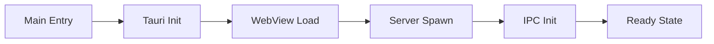
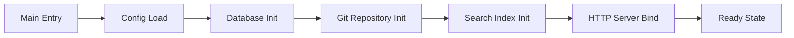
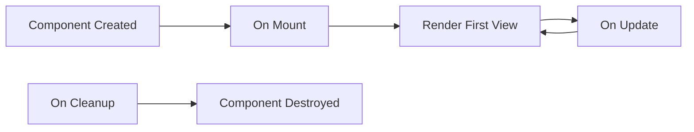

# TACHYON: DEBUGGING GUIDE

**Document ID:** TACHYON-DEV-005-V1.0
**Date:** February 2026
**Status:** Approved for Implementation
**Classification:** Developer Documentation
**Compliance Level:** ISO/IEC 26514:2021, IEEE 1063:2001

---

## TABLE OF CONTENTS

1. [Introduction](#1-introduction)
2. [Debugging Framework](#2-debugging-framework)
3. [Debugging Tools](#3-debugging-tools)
4. [Desktop Debugging](#4-desktop-debugging)
5. [Server Debugging](#5-server-debugging)
6. [Web Debugging](#6-web-debugging)
7. [Common Issues](#7-common-issues)
8. [Performance Debugging](#8-performance-debugging)
9. [References](#9-references)

---

## 1. INTRODUCTION

### 1.1. Document Purpose

This document provides comprehensive debugging guidance for the Tachyon toolchain, covering desktop, server, and web components. It establishes systematic debugging methodologies, tool configurations, and troubleshooting procedures to enable efficient problem diagnosis and resolution.

### 1.2. Scope

This debugging guide covers:
- Desktop Application debugging (Tauri-based)
- Server Application debugging (Axum-based HTTP/2 server)
- Web Frontend debugging (Leptos-based)
- IPC Communication debugging
- Performance profiling and optimization
- Common issues and solutions

### 1.3. Debugging Philosophy

The Tachyon debugging philosophy emphasizes systematic, evidence-based problem-solving:

1. **Reproducibility First:** Issues must be reproducible before investigation
2. **Minimal Reproduction:** Create minimal test cases isolating the problem
3. **Evidence-Based Decisions:** Use logs, metrics, and traces to inform debugging
4. **Root Cause Analysis:** Identify and address root causes, not symptoms
5. **Documentation:** Document findings for future reference and knowledge sharing

### 1.4. System Architecture Context

Understanding the Tachyon system architecture is essential for effective debugging:

```
┌─────────────────────────────────────────────────────────────────┐
│                     Desktop Application                        │
│                    (Tauri + WebView)                      │
├─────────────────────────────────────────────────────────────────┤
│  ┌──────────────┐  IPC  ┌──────────────────────────┐   │
│  │   WebView    │◄──────-│  Local Server (Axum)    │   │
│  │  (Leptos)    │       │  - HTTP/2              │   │
│  └──────────────┘       │  - WebSocket           │   │
│                        │  - JIT Rendering        │   │
│                        └──────────────────────────┘   │
│                                 │                      │
│                                 -                      │
│                        ┌──────────────────────────┐   │
│                        │  Git Repository        │   │
│                        │  - Content Storage    │   │
│                        │  - Version Control   │   │
│                        └──────────────────────────┘   │
└─────────────────────────────────────────────────────────────────┘
```

### 1.5. Component-Specific Debugging Challenges

Each component presents unique debugging challenges:

| Component | Primary Challenges | Key Debugging Focus |
|-----------|------------------|---------------------|
| **Desktop** | WebView integration, IPC communication, native OS integration | IPC message flow, file system operations, WebView console |
| **Server** | Async runtime, HTTP/2 multiplexing, concurrent requests | Tokio runtime, request tracing, connection lifecycle |
| **Web** | Reactivity, state management, browser compatibility | Component lifecycle, state transitions, browser console |

---

## 2. DEBUGGING FRAMEWORK

### 2.1. Debugging Levels

The Tachyon system supports multiple debugging levels, each providing different levels of visibility:

#### 2.1.1. Production Level (Level 0)

**Purpose:** Minimal logging for production deployments.

**Configuration:**
```toml
[logging]
level = "error"
tracing = false
```

**Output:** Only critical errors and security events.

**Use Case:** Production deployments where performance and security are prioritized over debuggability.

#### 2.1.2. Development Level (Level 1)

**Purpose:** Standard development logging with useful debugging information.

**Configuration:**
```toml
[logging]
level = "info"
tracing = true
```

**Output:** Info-level logs, request/response summaries, error details.

**Use Case:** Day-to-day development and testing.

#### 2.1.3. Debug Level (Level 2)

**Purpose:** Verbose logging for detailed debugging.

**Configuration:**
```toml
[logging]
level = "debug"
tracing = true
```

**Output:** Debug-level logs, detailed request/response data, function entry/exit.

**Use Case:** Investigating specific issues requiring detailed visibility.

#### 2.1.4. Trace Level (Level 3)

**Purpose:** Maximum visibility for deep debugging.

**Configuration:**
```toml
[logging]
level = "trace"
tracing = true
```

**Output:** Trace-level logs, all function calls, variable state changes.

**Use Case:** Complex issues requiring complete execution visibility.

### 2.2. Structured Logging

The Tachyon system uses structured logging with `tracing` crate for consistent, queryable logs:

```rust
use tracing::{info, debug, error, instrument};

#[instrument(skip(self))]
pub async fn process_document(
    &self,
    document_id: String,
    user_id: String,
) -> Result<ProcessedDocument, ApiError> {
    info!(
        document_id = %document_id,
        user_id = %user_id,
        action = "document_processing_started"
    );

    let document = self.fetch_document(&document_id).await?;
    
    debug!(
        document_id = %document_id,
        content_length = document.content.len(),
        action = "document_fetched"
    );

    let processed = self.render_markdown(&document).await?;
    
    info!(
        document_id = %document_id,
        user_id = %user_id,
        action = "document_processing_completed"
    );

    Ok(processed)
}
```

**Structured Logging Benefits:**

1. **Queryability:** Logs can be queried and filtered by field
2. **Correlation:** Request IDs enable log correlation across components
3. **Machine-Readable:** Structured format enables automated analysis
4. **Context-Rich:** Each log entry includes relevant context

### 2.3. Request Tracing

Distributed tracing enables tracking requests across component boundaries:

```rust
use tracing::{info_span, Instrument};

pub async fn handle_request(
    req: Request,
) -> Result<Response, Error> {
    let span = info_span!(
        "http_request",
        method = %req.method(),
        path = %req.uri().path(),
        request_id = %Uuid::new_v4()
    );

    async move {
        // Request handling logic
    }
    .instrument(span)
    .await
}
```

**Tracing Benefits:**

1. **End-to-End Visibility:** Track requests across all components
2. **Performance Analysis:** Identify bottlenecks in request processing
3. **Root Cause Analysis:** Trace failures to their source
4. **Correlation:** Correlate logs across distributed components

### 2.4. Error Handling and Reporting

The Tachyon system implements comprehensive error handling with detailed error context:

```rust
use thiserror::Error;

#[derive(Error, Debug)]
pub enum DocumentError {
    #[error("Document not found: {id}")]
    DocumentNotFound { id: String },

    #[error("Permission denied for document: {id}")]
    PermissionDenied { id: String },

    #[error("Rendering failed: {source}")]
    RenderingFailed {
        #[from]
        source: MarkdownError,
    },

    #[error("Database error: {0}")]
    Database(#[from] rusqlite::Error),
}
```

**Error Handling Principles:**

1. **Context-Rich Errors:** Include all relevant context in error messages
2. **Error Chaining:** Use `#[from]` for automatic error conversion
3. **User-Friendly Messages:** Display user-friendly messages while logging technical details
4. **Error Logging:** Log errors with full context for debugging

### 2.5. Debugging Workflow

The recommended debugging workflow follows these steps:

1. **Reproduce the Issue:**
   - Create a minimal reproduction case
   - Document exact steps to reproduce
   - Identify the component(s) involved

2. **Enable Debug Logging:**
   - Set appropriate logging level
   - Enable tracing for the affected component
   - Configure log output to file for analysis

3. **Collect Evidence:**
   - Capture relevant log entries
   - Collect metrics and traces
   - Document system state at failure

4. **Analyze the Evidence:**
   - Identify the failure point
   - Trace execution flow to failure
   - Correlate events across components

5. **Formulate Hypothesis:**
   - Based on evidence, form hypothesis for root cause
   - Design test to validate hypothesis
   - Implement fix if hypothesis confirmed

6. **Verify the Fix:**
   - Test the fix with reproduction case
   - Verify no regressions introduced
   - Update tests to prevent regression

7. **Document Findings:**
    - Document root cause and fix
    - Update debugging guide if new issue type
    - Share knowledge with team

---

## 3. DEBUGGING TOOLS

### 3.1. Rust Debugging Tools

#### 3.1.1. Built-in Cargo Tools

**cargo test:**

Run unit and integration tests with debugging output:

```bash
# Run all tests
cargo test

# Run specific test with output
cargo test test_name -- --nocapture

# Run tests with backtrace
RUST_BACKTRACE=1 cargo test

# Run tests with full backtrace
RUST_BACKTRACE=full cargo test
```

**Test Debugging Options:**

| Option | Description | Use Case |
|---------|-------------|-----------|
| `--nocapture` | Display test output | Debugging test failures |
| `--show-output` | Show output of all tests | Verbose test debugging |
| `--ignored` | Run ignored tests | Debugging flaky tests |
| `--test-threads=1` | Run tests sequentially | Debugging race conditions |

**cargo check:**

Fast type checking without compilation:

```bash
# Check all targets
cargo check

# Check specific package
cargo check -p tachyon_server

# Check with all features
cargo check --all-features
```

**Benefits:**
- Faster than full compilation
- Catches type errors early
- Useful for iterative development

**cargo clippy:**

Linting with helpful suggestions:

```bash
# Run clippy
cargo clippy

# Run clippy with all lints
cargo clippy -- -W clippy::all

# Fix automatically applicable lints
cargo clippy --fix
```

**Common Clippy Lints for Debugging:**

| Lint | Issue | Fix |
|-------|--------|------|
| `clippy::unwrap_used` | Potential panic | Use proper error handling |
| `clippy::expect_used` | Potential panic | Use `?` operator |
| `clippy::indexing_slicing` | Potential out-of-bounds | Use `get()` with error handling |
| `clippy::panic` | Explicit panic | Use `Result` types |

#### 3.1.2. rust-gdb and lldb

**rust-gdb:**

GNU debugger with Rust support:

```bash
# Install rust-gdb
rustup component add rust-gdb

# Debug with rust-gdb
rust-gdb target/debug/tachyon_server

# Common rust-gdb commands
(gdb) break main              # Set breakpoint at main
(gdb) run                    # Start program
(gdb) next                   # Step over function
(gdb) step                   # Step into function
(gdb) print variable_name     # Print variable value
(gdb) bt                     # Print backtrace
(gdb) continue                # Continue execution
```

**lldb:**

LLVM debugger with Rust support:

```bash
# Install lldb
rustup component add lldb

# Debug with lldb
lldb target/debug/tachyon_server

# Common lldb commands
(lldb) breakpoint set --name main
(lldb) run
(lldb) next
(lldb) step
(lldb) frame variable variable_name
(lldb) bt
(lldb) continue
```

**Debugging Tips:**

1. **Conditional Breakpoints:** Set breakpoints with conditions
   ```gdb
   break file.rs:42 if x > 100
   ```

2. **Watchpoints:** Watch variable changes
   ```gdb
   watch variable_name
   ```

3. **Backtrace Analysis:** Use backtraces to trace execution
   ```gdb
   bt full    # Full backtrace with local variables
   ```

#### 3.1.3. Logging and Tracing

**tracing:**

Structured logging and distributed tracing:

```toml
# Cargo.toml dependencies
[dependencies]
tracing = "0.1"
tracing-subscriber = { version = "0.3", features = ["env-filter", "json"] }
```

**Configuration:**

```rust
use tracing_subscriber::{EnvFilter, fmt};

fn init_logging() {
    tracing_subscriber::fmt()
        .with_env_filter(
            EnvFilter::try_from_default_env()
                .unwrap_or_else(|_| EnvFilter::new("info"))
        )
        .init();
}
```

**Environment Variables:**

| Variable | Effect | Example |
|-----------|----------|----------|
| `RUST_LOG` | Set log level | `RUST_LOG=tachyon=debug` |
| `RUST_LOG_SPAN_EVENTS` | Enable span events | `RUST_LOG_SPAN_EVENTS=active` |
| `RUST_BACKTRACE` | Enable backtraces | `RUST_BACKTRACE=1` |

**tracing-forest:**

Visualize traces in browser:

```bash
# Install tracing-forest
cargo install tracing-forest

# Run with tracing-forest
RUST_LOG=debug cargo run | tracing-forest
```

### 3.2. Desktop Debugging Tools

#### 3.2.1. Tauri Developer Tools

**Tauri CLI:**

```bash
# Install Tauri CLI
cargo install tauri-cli

# Run Tauri dev mode with logging
tauri dev --log-level debug

# Build Tauri with debug symbols
tauri build --debug

# Open Tauri devtools
tauri dev --devtools
```

**Tauri Configuration for Debugging:**

```json
// tauri.conf.json
{
  "build": {
    "devPath": "../dist",
    "distDir": "../dist"
  },
  "tauri": {
    "allowlist": {
      "all": true
    },
    "bundle": {
      "identifier": "com.tachyon.app"
    }
  }
}
```

#### 3.2.2. WebView Debugging

**Chrome DevTools Integration:**

```rust
use tauri::Manager;

#[tauri::command]
async fn open_devtools<R: Runtime>(app: R) -> Result<(), String> {
    app.window("main")
        .map_err(|e| e.to_string())?
        .open_devtools();
    Ok(())
}
```

**WebView Console Access:**

1. Open Tauri application
2. Press `F12` or call `open_devtools` command
3. Access Console, Network, and Application tabs

**Common WebView Debugging Scenarios:**

| Issue | Debugging Approach | Solution |
|-------|------------------|----------|
| Blank screen | Check WebView URL and network | Verify server is running and URL is correct |
| Console errors | Use browser console | Check for JavaScript errors and network failures |
| IPC failures | Monitor Tauri logs | Check command registration and event handling |
| Performance issues | Use Performance tab | Profile JavaScript execution and rendering |

#### 3.2.3. IPC Debugging

**IPC Command Logging:**

```rust
use tracing::{info, instrument};

#[tauri::command]
#[instrument(skip(app))]
async fn get_document<R: Runtime>(
    app: R,
    id: String,
) -> Result<Document, String> {
    info!(ipc_command = "get_document", document_id = %id);
    
    // Command implementation
}
```

**IPC Event Monitoring:**

```rust
use tauri::Event;

#[tauri::command]
fn listen_document_updates<R: Runtime>(app: R) -> Result<(), String> {
    let window = app.window("main").map_err(|e| e.to_string())?;
    
    window.on_document_updated(|event| {
        info!(event = "document_updated", payload = ?event.payload());
    });
    
    Ok(())
}
```

### 3.3. Server Debugging Tools

#### 3.3.1. Axum Debugging

**Request Logging Middleware:**

```rust
use axum::{middleware, Router};
use tracing::info;

async fn log_requests(
    req: Request,
    next: Next,
) -> Response {
    let method = req.method().clone();
    let uri = req.uri().clone();
    
    info!(http_method = %method, http_uri = %uri);
    
    let response = next.run(req).await;
    
    info!(status = %response.status());
    
    response
}

let app = Router::new()
    .route("/", get(handler))
    .layer(middleware::from_fn(log_requests));
```

**State Inspection:**

```rust
use axum::extract::State;

async fn inspect_state(
    State(state): State<AppState>,
) -> Json<AppState> {
    Json(state)
}
```

#### 3.3.2. Tokio Runtime Debugging

**Tokio Console:**

```bash
# Install tokio-console
cargo install tokio-console

# Run with tokio-console instrumentation
RUST_LOG=tokio=trace cargo run
```

**Tokio Tracing Configuration:**

```rust
use tokio::runtime;
use tracing_subscriber;

#[tokio::main]
async fn main() {
    tracing_subscriber::fmt()
        .with_max_level(tracing::Level::TRACE)
        .with_target(false)
        .init();
    
    // Application logic
}
```

**Common Tokio Debugging Scenarios:**

| Issue | Debugging Approach | Solution |
|-------|------------------|----------|
| Task not executing | Use tokio-console | Check task spawning and scheduling |
| Deadlock | Use backtrace and tokio-console | Identify blocking operations |
| Resource leak | Monitor resource usage | Check for unclosed handles |
| Performance issue | Profile with tokio-console | Identify slow tasks |

#### 3.3.3. HTTP/2 Debugging

**Connection Logging:**

```rust
use hyper::server::conn::AddrStream;

async fn log_connection(
    stream: AddrStream,
) -> Result<impl AsyncRead + AsyncWrite, Error> {
    let addr = stream.remote_addr();
    info!(remote_addr = %addr);
    Ok(stream)
}
```

**Header Inspection:**

```rust
use axum::extract::HeaderMap;

async fn inspect_headers(
    headers: HeaderMap,
) -> Json<HeaderMap> {
    info!(headers = ?headers);
    Json(headers)
}
```

### 3.4. Web Debugging Tools

#### 3.4.1. Browser DevTools

**Leptos DevTools Integration:**

```rust
use leptos::*;

#[component]
pub fn App() -> impl IntoView {
    // Enable Reactivity debugging
    leptos::logging::log!("App component rendered");
    
    view! {
        <div>
            <h1>"Tachyon"</h1>
        </div>
    }
}
```

**React DevTools for Leptos:**

1. Install React DevTools browser extension
2. Open DevTools (F12)
3. Navigate to Components tab
4. Inspect component hierarchy and state

#### 3.4.2. Leptos Debugging

**Signal Debugging:**

```rust
use leptos::*;

#[component]
pub fn DocumentEditor() -> impl IntoView {
    let (count, set_count) = create_signal(0);
    
    // Debug signal changes
    create_effect(move |_| {
        leptos::logging::log!("Count changed: {}", count.get());
    });
    
    view! {
        <button on:click=move |_| set_count.update(|n| *n += 1)>
            {count}
        </button>
    }
}
```

**Resource Debugging:**

```rust
use leptos::*;

#[component]
pub fn DocumentList() -> impl IntoView {
    let documents = create_local_resource(
        || async { fetch_documents().await },
        |value| match value {
            Ok(docs) => leptos::logging::log!("Documents loaded: {}", docs.len()),
            Err(e) => leptos::logging::error!("Failed to load: {:?}", e),
        },
    );
    
    view! {
        // Component view
    }
}
```

#### 3.4.3. Network Debugging

**WebSocket Connection Debugging:**

```rust
use leptos::*;
use leptos_use::*;

#[component]
pub fn RealtimeEditor() -> impl IntoView {
    let ws = use_websocket("ws://localhost:8080/ws");
    
    create_effect(move |_| {
        match ws.ready.get() {
            true => leptos::logging::log!("WebSocket connected"),
            false => leptos::logging::warn!("WebSocket disconnected"),
        }
    });
    
    view! {
        // Component view
    }
}
```

**Network Request Debugging:**

```rust
use leptos::*;
use reqwest::Client;

async fn fetch_document(id: String) -> Result<Document, Error> {
    let client = Client::new();
    let url = format!("http://localhost:8080/api/documents/{}", id);
    
    leptos::logging::log!("Fetching document: {}", url);
    
    let response = client.get(&url).send().await?;
    let document = response.json().await?;
    
    leptos::logging::log!("Document fetched: {:?}", document);
    
    Ok(document)
}
```

### 3.5. Tool Configuration

#### 3.5.1. VS Code Configuration

**launch.json for Rust:**

```json
{
    "version": "0.2.0",
    "configurations": [
        {
            "type": "lldb",
            "request": "launch",
            "name": "Debug Tachyon Server",
            "cargo": {
                "args": ["build", "--package=tachyon_server"],
                "filter": {
                    "name": "tachyon_server",
                    "kind": "bin"
                }
            },
            "cwd": "${workspaceFolder}",
            "preLaunchTask": "cargo: build tachyon_server"
        },
        {
            "type": "lldb",
            "request": "launch",
            "name": "Debug Tachyon Desktop",
            "cargo": {
                "args": ["build", "--package=tachyon_desktop"],
                "filter": {
                    "name": "tachyon_desktop",
                    "kind": "bin"
                }
            },
            "cwd": "${workspaceFolder}",
            "preLaunchTask": "cargo: build tachyon_desktop"
        }
    ]
}
```

**tasks.json for Build Tasks:**

```json
{
    "version": "2.0.0",
    "tasks": [
        {
            "label": "cargo: build tachyon_server",
            "type": "shell",
            "command": "cargo",
            "args": ["build", "--package=tachyon_server"],
            "group": {
                "kind": "build",
                "isDefault": true
            },
            "problemMatcher": ["$rustc"]
        },
        {
            "label": "cargo: build tachyon_desktop",
            "type": "shell",
            "command": "cargo",
            "args": ["build", "--package=tachyon_desktop"],
            "group": {
                "kind": "build",
                "isDefault": true
            },
            "problemMatcher": ["$rustc"]
        }
    ]
}
```

#### 3.5.2. Environment Configuration

**.envrc for Debugging:**

```bash
# Enable debug logging
export RUST_LOG=tachyon=debug,tokio=trace

# Enable backtraces
export RUST_BACKTRACE=1

# Enable tokio-console
export TOKIO_CONSOLE_BIND=127.0.0.1:6669

# Enable flamegraph
export RUSTFLAGS="-g"
```

**tachyon.toml Debug Configuration:**

```toml
[debug]
log_level = "debug"
enable_tracing = true
enable_profiling = false

[debug.server]
bind_address = "127.0.0.1:8080"
enable_devtools = true

[debug.desktop]
enable_devtools = true
auto_reload = true
```

---

## 4. DESKTOP DEBUGGING

### 4.1. Desktop Application Lifecycle Debugging

#### 4.1.1. Startup Debugging

**Startup Sequence:**



**Debugging Startup Issues:**

| Issue | Symptoms | Debugging Steps | Solution |
|-------|-----------|----------------|----------|
| Application won't start | No window appears | Check Tauri logs for init errors | Verify configuration file syntax |
| WebView blank | White screen | Check server is running | Verify WebView URL is correct |
| Server spawn fails | Error logs | Check port availability | Verify server binary exists |
| IPC not working | Commands fail | Check command registration | Verify event listeners |

**Startup Logging Configuration:**

```rust
use tracing::{info, error, instrument};

#[instrument(skip(app))]
pub fn run<R: Runtime>(app: R) {
    info!(action = "application_startup");
    
    match app.run(|_app, event| {
        info!(event = ?event);
        false
    }) {
        Ok(_) => {
            info!(action = "application_shutdown_normal");
        }
        Err(e) => {
            error!(error = %e, action = "application_shutdown_error");
        }
    }
}
```

#### 4.1.2. Shutdown Debugging

**Graceful Shutdown Procedure:**

```rust
use tauri::Manager;

#[tauri::command]
async fn graceful_shutdown<R: Runtime>(app: R) -> Result<(), String> {
    info!(action = "shutdown_initiated");
    
    // 1. Save unsaved work
    app.window("main")
        .map_err(|e| e.to_string())?
        .emit("save_all_work", ())?;
    
    // 2. Close WebSocket connections
    app.emit("websocket_close", ())?;
    
    // 3. Cleanup resources
    app.emit("cleanup_resources", ())?;
    
    info!(action = "shutdown_completed");
    
    Ok(())
}
```

**Shutdown Debugging Checklist:**

- [ ] All unsaved work committed to Git
- [ ] WebSocket connections closed gracefully
- [ ] Temporary files cleaned up
- [ ] Cache persisted to disk
- [ ] Server process terminated

### 4.2. WebView Debugging

#### 4.2.1. WebView Console Access

**Opening DevTools:**

```rust
use tauri::Manager;

#[tauri::command]
async fn open_devtools<R: Runtime>(app: R) -> Result<(), String> {
    app.window("main")
        .map_err(|e| e.to_string())?
        .with_devtools(true)
        .open_devtools();
    
    Ok(())
}
```

**Console Debugging Techniques:**

| Technique | Description | Use Case |
|-----------|-------------|----------|
| `console.log()` | Standard logging | General debugging |
| `console.error()` | Error logging | Error conditions |
| `console.warn()` | Warning logging | Deprecation notices |
| `console.table()` | Tabular data | Inspecting objects |
| `console.trace()` | Stack trace | Execution flow |

**Console Filtering:**

```javascript
// Filter logs by module
const originalLog = console.log;
console.log = function(...args) {
    if (args[0] && args[0].includes('[DEBUG]')) {
        originalLog.apply(console, args);
    }
};
```

#### 4.2.2. WebView Network Debugging

**Network Request Inspection:**

```javascript
// Intercept fetch requests
const originalFetch = window.fetch;
window.fetch = function(...args) {
    console.log('[NETWORK]', args[0]);
    return originalFetch.apply(this, args);
};
```

**WebSocket Connection Debugging:**

```javascript
// Monitor WebSocket state
const ws = new WebSocket('ws://localhost:8080/ws');

ws.onopen = () => {
    console.log('[WEBSOCKET] Connection opened');
};

ws.onclose = (event) => {
    console.log('[WEBSOCKET] Connection closed', event.code, event.reason);
};

ws.onerror = (error) => {
    console.error('[WEBSOCKET] Error', error);
};

ws.onmessage = (event) => {
    console.log('[WEBSOCKET] Message received', event.data);
};
```

### 4.3. IPC Communication Debugging

#### 4.3.1. Command Debugging

**Command Registration Logging:**

```rust
use tauri::Builder;
use tracing::{info, instrument};

fn main() {
    tauri::Builder::default()
        .invoke_handler(tauri::generate_handler![get_document])
        .invoke_handler(tauri::generate_handler![save_document])
        .invoke_handler(tauri::generate_handler![delete_document])
        .setup(|app| {
            info!(action = "ipc_handlers_registered", count = 3);
        })
        .run(tauri::generate_context!())
        .expect("error while running tauri application");
}

#[tauri::command]
#[instrument(skip(app))]
async fn get_document<R: Runtime>(
    app: R,
    id: String,
) -> Result<Document, String> {
    info!(ipc_command = "get_document", document_id = %id);
    
    // Command implementation
}
```

**Command Execution Tracing:**

```javascript
// Frontend command invocation with tracing
const invokeWithTracing = async (command, payload) => {
    const startTime = performance.now();
    console.log(`[IPC] Invoking ${command}`, payload);
    
    try {
        const result = await invoke(command, payload);
        const duration = performance.now() - startTime;
        console.log(`[IPC] ${command} completed in ${duration}ms`, result);
        return result;
    } catch (error) {
        console.error(`[IPC] ${command} failed`, error);
        throw error;
    }
};
```

#### 4.3.2. Event Debugging

**Event Emission Logging:**

```rust
use tauri::Manager;
use tracing::{info, instrument};

#[tauri::command]
#[instrument(skip(app))]
async fn listen_document_updates<R: Runtime>(app: R) -> Result<(), String> {
    let window = app.window("main").map_err(|e| e.to_string())?;
    
    window.on_document_updated(|event| {
        info!(
            ipc_event = "document_updated",
            payload = ?event.payload()
        );
    });
    
    window.on_document_deleted(|event| {
        info!(
            ipc_event = "document_deleted",
            payload = ?event.payload()
        );
    });
    
    Ok(())
}
```

**Event Listener Debugging:**

```javascript
// Frontend event listener with tracing
const listenWithTracing = (event, callback) => {
    console.log(`[IPC] Listening to ${event}`);
    
    const wrappedCallback = (payload) => {
        console.log(`[IPC] ${event} received`, payload);
        callback(payload);
    };
    
    listen(event, wrappedCallback);
};
```

### 4.4. File System Debugging

#### 4.4.1. File Watching Debugging

**File Watcher Logging:**

```rust
use notify::{RecursiveMode, Watcher, Event, EventKind};
use tracing::{info, debug};

async fn watch_repository(path: &Path) -> Result<(), Error> {
    let (tx, rx) = std::sync::mpsc::channel();
    
    let mut watcher = Watcher::new(
        RecursiveMode::Recursive,
        tx
    )?;
    
    watcher.watch(path)?;
    
    info!(action = "file_watcher_started", path = %path.display());
    
    while let Ok(event) = rx.recv() {
        match event.kind {
            EventKind::Create(_) => {
                debug!(file_event = "created", path = ?event.path);
            }
            EventKind::Modify(_) => {
                debug!(file_event = "modified", path = ?event.path);
                // Trigger cache invalidation
            }
            EventKind::Remove(_) => {
                debug!(file_event = "removed", path = ?event.path);
                // Remove from cache
            }
            _ => {}
        }
    }
}
```

**File Watcher Debugging Scenarios:**

| Issue | Symptoms | Debugging Steps | Solution |
|-------|-----------|----------------|----------|
| Changes not detected | No updates | Check file watcher permissions | Verify recursive mode is enabled |
| Excessive events | High CPU usage | Check for temporary files | Add debounce mechanism |
| Watcher crashes | Application exits | Check file descriptor limits | Increase system limits |

#### 4.4.2. Git Operations Debugging

**Git Operation Logging:**

```rust
use git2::Repository;
use tracing::{info, instrument};

#[instrument(skip(self))]
pub async fn commit_changes(
    &self,
    message: &str,
) -> Result<String, Error> {
    let repo = Repository::open(&self.repository_path)?;
    
    info!(
        git_operation = "commit",
        repository = %self.repository_path.display(),
        message = %message
    );
    
    let mut index = repo.index()?;
    let mut tree_builder = repo.treebuilder(None, None)?;
    
    // Add files to index
    for path in self.get_modified_files()? {
        debug!(git_operation = "add_file", path = %path.display());
        index.add_path(Path::new(path), None)?;
    }
    
    let tree_id = tree_builder.write()?;
    let tree = repo.find_tree(tree_id)?;
    
    let sig = repo.signature()?;
    let oid = repo.commit(
        Some(&sig),
        &tree,
        &repo.head()?.unwrap().target().unwrap(),
        message,
        None,
        None,
    )?;
    
    info!(
        git_operation = "commit_completed",
        commit_id = %oid
    );
    
    Ok(oid.to_string())
}
```

**Git Debugging Scenarios:**

| Issue | Symptoms | Debugging Steps | Solution |
|-------|-----------|----------------|----------|
| Commit fails | Error on save | Check file permissions | Verify repository is not locked |
| Branch switch fails | Error on switch | Check for uncommitted changes | Stash or commit changes first |
| Merge conflicts | Conflict markers | Check merge status | Use diff tools to resolve |

### 4.5. Cache Debugging

#### 4.5.1. LRU Cache Debugging

**Cache Statistics Monitoring:**

```rust
use dashmap::DashMap;
use tracing::{debug, info};

pub struct RenderCache {
    cache: DashMap<String, RenderedDocument>,
    hits: AtomicUsize,
    misses: AtomicUsize,
    max_size: usize,
}

impl RenderCache {
    pub fn get(&self, key: &str) -> Option<RenderedDocument> {
        if let Some(doc) = self.cache.get(key) {
            self.hits.fetch_add(1, Ordering::Relaxed);
            debug!(
                cache_operation = "hit",
                key = %key,
                hits = self.hits.load(Ordering::Relaxed),
                misses = self.misses.load(Ordering::Relaxed)
            );
            Some(doc)
        } else {
            self.misses.fetch_add(1, Ordering::Relaxed);
            debug!(
                cache_operation = "miss",
                key = %key,
                hits = self.hits.load(Ordering::Relaxed),
                misses = self.misses.load(Ordering::Relaxed)
            );
            None
        }
    }
    
    pub fn get_statistics(&self) -> CacheStatistics {
        let hits = self.hits.load(Ordering::Relaxed);
        let misses = self.misses.load(Ordering::Relaxed);
        let total = hits + misses;
        let hit_rate = if total > 0 {
            (hits as f64) / (total as f64)
        } else {
            0.0
        };
        
        CacheStatistics {
            hits,
            misses,
            total,
            hit_rate,
            size: self.cache.len(),
        }
    }
}
```

**Cache Debugging Scenarios:**

| Issue | Symptoms | Debugging Steps | Solution |
|-------|-----------|----------------|----------|
| Low hit rate | Slow rendering | Check cache key generation | Verify cache invalidation logic |
| Memory leak | High memory usage | Check cache size limits | Implement cache eviction policy |
| Stale data | Old content displayed | Check invalidation triggers | Verify file watcher events |

#### 4.5.2. Cache Invalidation Debugging

**Invalidation Logging:**

```rust
use tracing::{info, debug};

pub fn invalidate_cache(&self, path: &Path) {
    let key = self.generate_cache_key(path);
    
    info!(
        cache_operation = "invalidate",
        path = %path.display(),
        key = %key
    );
    
    self.cache.remove(&key);
    
    debug!(
        cache_operation = "invalidation_completed",
        remaining_entries = self.cache.len()
    );
}
```

### 4.6. Desktop-Specific Issues

#### 4.6.1. WebView Rendering Issues

**Issue: Blank or Partial Rendering**

**Debugging Steps:**

1. Check WebView URL:
   ```rust
   app.window("main")
       .map_err(|e| e.to_string())?
       .set_url("http://127.0.0.1:8080")?;
   ```

2. Verify server is running:
   ```bash
   curl http://127.0.0.1:8080/health
   ```

3. Check browser console for errors:
   - Open DevTools (F12)
   - Check Console tab for JavaScript errors
   - Check Network tab for failed requests

**Solution:**
- Ensure server is running before loading WebView
- Verify WebView URL matches server address
- Check for CORS issues in browser console

#### 4.6.2. IPC Communication Failures

**Issue: Commands Not Executing**

**Debugging Steps:**

1. Verify command registration:
   ```rust
   // Check if command is registered
   tauri::Builder::default()
       .invoke_handler(tauri::generate_handler![my_command])
   ```

2. Check command invocation:
   ```javascript
   // Add error handling to invocation
   try {
       await invoke('my_command', payload);
   } catch (error) {
       console.error('Command failed:', error);
   }
   ```

3. Check Tauri logs:
   ```bash
   # Run with verbose logging
   RUST_LOG=tauri=debug cargo tauri dev
   ```

**Solution:**
- Ensure command is registered in Tauri setup
- Verify command name matches between frontend and backend
- Check for proper error handling in command handlers

#### 4.6.3. File System Access Issues

**Issue: Permission Denied or File Not Found**

**Debugging Steps:**

1. Check file permissions:
   ```bash
   ls -la /path/to/repository
   ```

2. Verify Tauri capabilities:
   ```json
   // tauri.conf.json
   {
     "tauri": {
       "allowlist": {
         "fs": {
           "all": true,
           "scope": ["$HOME/Documents/**"]
         }
       }
     }
   }
   ```

3. Check file path resolution:
   ```rust
   use std::path::Path;
   
   let path = Path::new("~/Documents");
   let absolute_path = path.canonicalize()?;
   info!(resolved_path = %absolute_path.display());
   ```

**Solution:**
- Configure proper Tauri capabilities for file access
- Use absolute paths for file operations
- Verify user has permissions for target directory

---

## 5. SERVER DEBUGGING

### 5.1. Server Lifecycle Debugging

#### 5.1.1. Startup Debugging

**Startup Sequence:**



**Debugging Startup Issues:**

| Issue | Symptoms | Debugging Steps | Solution |
|-------|-----------|----------------|----------|
| Server won't start | Error logs | Check configuration file | Verify dependencies are available |
| Port already in use | Bind error | Check port availability | Configure alternative port |
| Database init fails | Error logs | Check database permissions | Verify database file path |
| Git repository error | Error logs | Check repository path | Verify Git repository exists |

**Startup Logging Configuration:**

```rust
use tracing::{info, error, instrument};
use tokio::signal;

#[tokio::main]
#[instrument]
async fn main() -> Result<(), Box<dyn std::error::Error>> {
    info!(action = "server_startup_initiated");
    
    // Load configuration
    let config = load_config().await?;
    info!(config_loaded = true, config_path = %config.path.display());
    
    // Initialize database
    let db = Database::new(&config.database_path).await?;
    info!(database_initialized = true);
    
    // Initialize Git repository
    let repo = git2::Repository::open(&config.repository_path)?;
    info!(repository_initialized = true, path = %config.repository_path.display());
    
    // Start HTTP server
    let server = HttpServer::new(config).await?;
    info!(server_started = true, address = %config.bind_address);
    
    // Handle shutdown signals
    let mut sigterm = signal(SignalKind::terminate())?;
    let mut sigint = signal(SignalKind::interrupt())?;
    
    tokio::select! {
        _ = sigterm.recv() => {
            info!(action = "shutdown_signal_received", signal = "SIGTERM");
        }
        _ = sigint.recv() => {
            info!(action = "shutdown_signal_received", signal = "SIGINT");
        }
    }
    
    server.shutdown().await?;
    info!(action = "server_shutdown_completed");
    
    Ok(())
}
```

#### 5.1.2. Graceful Shutdown Debugging

**Shutdown Procedure:**

```rust
use tokio::signal;
use tracing::{info, warn};

pub async fn handle_shutdown(server: HttpServer) {
    info!(action = "shutdown_handler_registered");
    
    let mut sigterm = signal(SignalKind::terminate())?;
    let mut sigint = signal(SignalKind::interrupt())?;
    
    tokio::select! {
        _ = sigterm.recv() => {
            warn!(signal = "SIGTERM", action = "initiating_graceful_shutdown");
        }
        _ = sigint.recv() => {
            warn!(signal = "SIGINT", action = "initiating_graceful_shutdown");
        }
    }
    
    info!(action = "shutdown_sequence_started");
    
    // 1. Stop accepting new connections
    server.stop_accepting().await;
    info!(action = "stopped_accepting_connections");
    
    // 2. Wait for in-flight requests to complete
    tokio::time::sleep(tokio::time::Duration::from_secs(5)).await;
    info!(action = "inflight_requests_completed");
    
    // 3. Close all connections
    server.close_all_connections().await;
    info!(action = "all_connections_closed");
    
    // 4. Cleanup resources
    cleanup_resources().await;
    info!(action = "resources_cleaned");
    
    info!(action = "shutdown_sequence_completed");
}
```

### 5.2. HTTP/2 Request Debugging

#### 5.2.1. Request Logging

**Request Tracing Middleware:**

```rust
use axum::{extract::Request, middleware, Router};
use tracing::{info, instrument};
use uuid::Uuid;

pub async fn log_requests(
    req: Request,
    next: Next,
) -> Response {
    let request_id = Uuid::new_v4();
    let method = req.method().clone();
    let uri = req.uri().clone();
    let headers = req.headers().clone();
    
    info!(
        request_id = %request_id,
        http_method = %method,
        http_uri = %uri,
        http_version = ?req.version(),
        headers_count = headers.len()
    );
    
    let start_time = std::time::Instant::now();
    let response = next.run(req).await;
    let duration = start_time.elapsed();
    
    info!(
        request_id = %request_id,
        http_status = %response.status(),
        duration_ms = duration.as_millis(),
        action = "request_completed"
    );
    
    response
}
```

**Request Debugging Scenarios:**

| Issue | Symptoms | Debugging Steps | Solution |
|-------|-----------|----------------|----------|
| Request timeout | 504 Gateway Timeout | Check request duration | Increase timeout threshold |
| 400 Bad Request | Client error | Check request body | Verify JSON schema |
| 500 Internal Error | Server error | Check server logs | Verify error handling |

#### 5.2.2. Response Debugging

**Response Inspection:**

```rust
use axum::{extract::Request, Json};
use serde_json::Value;

pub async fn inspect_response(
    req: Request,
) -> Result<Json<Value>, ApiError> {
    info!(
        action = "response_inspection",
        request_method = %req.method(),
        request_uri = %req.uri().path()
    );
    
    let response_data = Value::Object(serde_json::json!({
        "timestamp": chrono::Utc::now().to_rfc3339(),
        "request_id": Uuid::new_v4(),
        "data": "sample_response"
    }));
    
    debug!(response_data = ?response_data);
    
    Ok(Json(response_data))
}
```

### 5.3. Database Debugging

#### 5.3.1. SQLite Debugging

**Connection Pool Logging:**

```rust
use r2d2::Pool;
use tracing::{info, debug};

pub struct Database {
    pool: Pool<SqliteConnection>,
}

impl Database {
    pub async fn new(path: &Path) -> Result<Self, Error> {
        let pool = Pool::builder()
            .max_size(15)
            .build(path)?;
        
        info!(
            database_action = "pool_created",
            path = %path.display(),
            max_size = 15
        );
        
        Ok(Self { pool })
    }
    
    pub async fn execute<F, R>(&self, f: F) -> Result<R, Error>
    where
        F: FnOnce(&mut SqliteConnection) -> Result<R, Error>,
    {
        let conn = self.pool.get().await?;
        debug!(database_action = "connection_acquired");
        
        let result = f(&mut *conn).await?;
        
        debug!(database_action = "connection_released");
        
        Ok(result)
    }
}
```

**Query Debugging:**

```rust
use tracing::{info, instrument};

#[instrument(skip(self, query))]
pub async fn query_documents(
    &self,
    query: &str,
) -> Result<Vec<Document>, Error> {
    info!(
        database_action = "query_executed",
        query = %query
    );
    
    let conn = self.pool.get().await?;
    let mut stmt = conn.prepare(query)?;
    let mut rows = stmt.query([])?;
    
    let mut documents = Vec::new();
    while let Some(row) = rows.next()? {
        let doc = Document::from_row(row)?;
        debug!(document_id = %doc.id);
        documents.push(doc);
    }
    
    info!(
        database_action = "query_completed",
        result_count = documents.len()
    );
    
    Ok(documents)
}
```

**Database Debugging Scenarios:**

| Issue | Symptoms | Debugging Steps | Solution |
|-------|-----------|----------------|----------|
| Lock timeout | Database locked | Check for long-running transactions | Reduce transaction duration |
| Query slow | High latency | Check query execution time | Add indexes to tables |
| Connection pool exhausted | Connection errors | Check pool size | Increase max pool size |

#### 5.3.2. Transaction Debugging

**Transaction Logging:**

```rust
use tracing::{info, error, instrument};

#[instrument(skip(self))]
pub async fn update_document(
    &self,
    document_id: &str,
    updates: &DocumentUpdates,
) -> Result<(), Error> {
    let conn = self.pool.get().await?;
    
    info!(
        database_action = "transaction_started",
        document_id = %document_id
    );
    
    let tx = conn.transaction()?;
    
    match self.perform_updates(&tx, document_id, updates).await {
        Ok(_) => {
            tx.commit()?;
            info!(
                database_action = "transaction_committed",
                document_id = %document_id
            );
            Ok(())
        }
        Err(e) => {
            tx.rollback()?;
            error!(
                database_action = "transaction_rolled_back",
                document_id = %document_id,
                error = %e
            );
            Err(e)
        }
    }
}
```

### 5.4. WebSocket Debugging

#### 5.4.1. Connection Debugging

**WebSocket Connection Logging:**

```rust
use axum::extract::{ws::WebSocketUpgrade, State};
use tracing::{info, debug, instrument};
use tokio_tungstenite::tungstenite::Message;

pub async fn websocket_handler(
    ws: WebSocketUpgrade,
    State(state): State<AppState>,
) -> Response {
    ws.on_upgrade(|socket, _| async move {
        info!(
            websocket_action = "connection_established",
            peer_addr = ?socket.peer_addr()
        );
        
        let mut socket = socket;
        
        loop {
            match socket.recv().await {
                Ok(Message::Text(text)) => {
                    debug!(
                        websocket_action = "message_received",
                        message_length = text.len()
                    );
                    
                    // Handle message
                }
                Ok(Message::Close(close_frame)) => {
                    info!(
                        websocket_action = "connection_closed",
                        code = close_frame.code,
                        reason = ?close_frame.reason
                    );
                    break;
                }
                Ok(Message::Ping(data)) => {
                    debug!(websocket_action = "ping_received");
                    let pong = Message::Pong(data);
                    socket.send(pong).await.ok();
                }
                Err(e) => {
                    error!(
                        websocket_action = "connection_error",
                        error = %e
                    );
                    break;
                }
                }
            }
        }
    })
}
```

**WebSocket Debugging Scenarios:**

| Issue | Symptoms | Debugging Steps | Solution |
|-------|-----------|----------------|----------|
| Connection drops | Frequent disconnects | Check network stability | Implement reconnection logic |
| Message not received | No updates | Check message handler | Verify message format |
| High latency | Slow updates | Check message processing time | Optimize message handler |

#### 5.4.2. Message Broadcasting Debugging

**Broadcast Logging:**

```rust
use dashmap::DashMap;
use tracing::{info, debug};

pub struct WebSocketManager {
    connections: DashMap<Uuid, WebSocketConnection>,
}

impl WebSocketManager {
    pub fn broadcast(&self, message: &str) {
        let connection_count = self.connections.len();
        
        info!(
            websocket_action = "broadcast_initiated",
            message_length = message.len(),
            connection_count = connection_count
        );
        
        let mut sent_count = 0;
        
        for entry in self.connections.iter() {
            if let Err(e) = entry.value().send(message).await {
                debug!(
                    websocket_action = "send_failed",
                    connection_id = %entry.key(),
                    error = %e
                );
            } else {
                sent_count += 1;
            }
        }
        
        info!(
            websocket_action = "broadcast_completed",
            sent_count = sent_count,
            failed_count = connection_count - sent_count
        );
    }
}
```

### 5.5. Search Indexing Debugging

#### 5.5.1. Tantivy Index Debugging

**Index Operation Logging:**

```rust
use tantivy::{Index, IndexWriter, Document};
use tracing::{info, debug, instrument};

#[instrument(skip(self))]
pub async fn index_document(
    &self,
    document: &Document,
) -> Result<(), Error> {
    let index = self.index.load();
    let mut writer = index.writer(50_000_000)?;
    
    info!(
        search_action = "indexing_started",
        document_id = %document.id,
        document_title = %document.title
    );
    
    let tantivy_doc = Document::default();
    tantivy_doc.add_text(self.title_field, &document.title);
    tantivy_doc.add_text(self.content_field, &document.content);
    
    writer.add_document(tantivy_doc)?;
    
    debug!(
        search_action = "document_indexed",
        document_id = %document.id
    );
    
    writer.commit()?;
    
    info!(
        search_action = "indexing_completed",
        document_id = %document.id
    );
    
    Ok(())
}
```

**Search Query Debugging:**

```rust
use tantivy::{Searcher, Query, Collector};
use tracing::{info, debug, instrument};

#[instrument(skip(self))]
pub async fn search_documents(
    &self,
    query_str: &str,
) -> Result<Vec<SearchResult>, Error> {
    let reader = self.index.reader()?;
    let searcher = reader.searcher();
    
    let query_parser = QueryParser::for_index(
        &self.index,
        &[self.title_field, self.content_field],
    )?;
    let query = query_parser.parse_query(query_str)?;
    
    info!(
        search_action = "query_executed",
        query = %query_str
    );
    
    let collector = TopDocs::with_limit(10);
    searcher.search(&query, &collector)?;
    
    let mut results = Vec::new();
    for (score, doc_address) in collector.into_iter() {
        let doc = reader.doc(doc_address)?;
        debug!(
            search_action = "result_found",
            document_id = %doc.id,
            score = score
        );
        results.push(SearchResult {
            document: doc,
            score,
        });
    }
    
    info!(
        search_action = "query_completed",
        result_count = results.len()
    );
    
    Ok(results)
}
```

**Search Debugging Scenarios:**

| Issue | Symptoms | Debugging Steps | Solution |
|-------|-----------|----------------|----------|
| No results | Empty search | Check query parsing | Verify field mappings |
| Slow search | High latency | Check index size | Optimize query |
| Outdated results | Old documents | Check index commit | Re-index documents |

### 5.6. Server-Specific Issues

#### 5.6.1. Port Binding Issues

**Issue: Port Already in Use**

**Debugging Steps:**

1. Check port availability:
   ```bash
   # Check if port is in use
   lsof -i :8080
   
   # Or using netstat
   netstat -tuln | grep :8080
   ```

2. Check server configuration:
   ```toml
   # tachyon.toml
   [server]
   bind_address = "127.0.0.1:8080"
   ```

3. Implement port fallback:
   ```rust
   use std::net::SocketAddr;
   
   async fn bind_with_fallback(port: u16) -> Result<SocketAddr, Error> {
       let mut ports = vec![port, port + 1, port + 2];
       
       for p in ports {
           let addr = SocketAddr::from(([127, 0, 0, 1], p));
           match tokio::net::TcpListener::bind(&addr).await {
               Ok(listener) => {
                   info!(action = "bound_to_port", port = p);
                   return Ok(addr);
               }
               Err(_) => {
                   warn!(action = "port_unavailable", port = p);
               }
           }
       }
       
       Err(Error::PortUnavailable)
   }
   ```

**Solution:**
- Configure alternative ports for fallback
- Use port 0 for automatic port assignment
- Implement graceful port conflict handling

#### 5.6.2. Memory Issues

**Issue: High Memory Usage**

**Debugging Steps:**

1. Monitor memory usage:
   ```bash
   # Check process memory
   ps aux | grep tachyon_server
   
   # Or using pmap
   pmap -x $(pgrep tachyon_server)
   ```

2. Check connection pool:
   ```rust
   // Monitor active connections
   pub struct ConnectionMonitor {
       active_connections: AtomicUsize,
   }
   
   impl ConnectionMonitor {
       pub fn log_stats(&self) {
           let count = self.active_connections.load(Ordering::Relaxed);
           info!(active_connections = count);
       }
   }
   ```

3. Check cache size:
   ```rust
   // Monitor cache memory usage
   pub struct CacheMonitor {
       cache_size: AtomicUsize,
       max_size: usize,
   }
   
   impl CacheMonitor {
       pub fn check_size(&self) {
           let size = self.cache_size.load(Ordering::Relaxed);
           if size > self.max_size {
               warn!(
                   cache_status = "exceeds_limit",
                   current_size = size,
                   max_size = self.max_size
               );
           }
       }
   }
   ```

**Solution:**
- Implement connection limits
- Configure cache size limits
- Add memory monitoring and alerts
- Implement cache eviction policies

---

## 6. WEB DEBUGGING

### 6.1. Leptos Component Debugging

#### 6.1.1. Component Lifecycle Debugging

**Component Lifecycle:**



**Lifecycle Debugging:**

```rust
use leptos::*;
use tracing::{info, debug, instrument};

#[component]
pub fn DocumentEditor() -> impl IntoView {
    info!(component = "DocumentEditor", action = "created");
    
    let (document, set_document) = create_signal(Option::<Document>::None);
    let (is_dirty, set_dirty) = create_signal(false);
    
    // On mount
    create_effect(move |_| {
        info!(component = "DocumentEditor", lifecycle = "on_mount");
        // Load initial document
    });
    
    // On cleanup
    on_cleanup(move || {
        info!(component = "DocumentEditor", lifecycle = "on_cleanup");
        // Save unsaved changes
    });
    
    view! {
        <div class="editor">
            <textarea
                prop:value=document
                on:input=move |event| {
                    let value = event_target_value(&event);
                    set_dirty.set(true);
                    debug!(component = "DocumentEditor", action = "content_changed", length = value.len());
                }
            />
            <button
                disabled=move || !is_dirty.get()
                on:click=move |_| save_document(document.get(), set_dirty)>
                "Save"
            </button>
        </div>
    }
}
```

#### 6.1.2. Signal Debugging

**Signal Change Tracking:**

```rust
use leptos::*;
use tracing::{debug, instrument};

#[component]
pub fn DocumentList() -> impl IntoView {
    let (documents, set_documents) = create_signal(Vec::<Document>::new());
    let (selected_id, set_selected_id) = create_signal(Option::<String>::None);
    
    // Track document changes
    create_effect(move |_| {
        debug!(
            component = "DocumentList",
            documents_count = documents.get().len(),
            selected_id = ?selected_id.get()
        );
    });
    
    // Track selection changes
    create_effect(move |_| {
        debug!(
            component = "DocumentList",
            selection_changed = true,
            selected_id = ?selected_id.get()
        );
    });
    
    view! {
        <div class="document-list">
            <For
                each=documents
                key=|doc| doc.id.clone()
            >
                <div
                    class:move || selected_id.get().as_ref() == Some(&doc.id)
                        then="selected"
                        on:click=move |_| set_selected_id.set(Some(doc.id.clone()))
                >
                    {doc.title}
                </div>
            </For>
        </div>
    }
}
```

**Signal Debugging Scenarios:**

| Issue | Symptoms | Debugging Steps | Solution |
|-------|-----------|----------------|----------|
| Signal not updating | UI not reflecting changes | Check signal creation | Verify effect dependencies |
| Memory leak | High memory usage | Check signal cleanup | Verify on_cleanup handlers |
| Stale state | Old values displayed | Check signal updates | Verify effect triggers |

#### 6.1.3. Resource Debugging

**Resource Lifecycle Debugging:**

```rust
use leptos::*;
use tracing::{info, error, instrument};

#[component]
pub fn DocumentDetail() -> impl IntoView {
    let document_id = use_params::<String>("id").unwrap();
    
    let documents = create_local_resource(
        move || async move {
            info!(resource_action = "fetching_document", document_id = %document_id);
            
            match fetch_document_from_server(&document_id).await {
                Ok(doc) => {
                    info!(resource_action = "document_fetched", document_id = %document_id);
                    Ok(doc)
                }
                Err(e) => {
                    error!(resource_action = "fetch_failed", document_id = %document_id, error = %e);
                    Err(e)
                }
            }
        },
        |value| match value {
            Ok(_) => leptos::logging::log!("Document loaded"),
            Err(e) => leptos::logging::error!("Failed to load: {:?}", e),
        },
    );
    
    view! {
        <Suspense fallback=move || {
            <div>"Loading..."</div>
        }>
            {move || match documents.read() {
                Some(Ok(doc)) => {
                    view! {
                        <h1>{&doc.title}</h1>
                        <div inner_html=&doc.content></div>
                    }
                }
                Some(Err(e)) => {
                    view! {
                        <div class="error">Failed to load: {e.to_string()}</div>
                    }
                }
                None => {
                    view! {
                        <div>Loading...</div>
                    }
                }
            }}
        </Suspense>
    }
}
```

### 6.2. State Management Debugging

#### 6.2.1. Global State Debugging

**Global Store Debugging:**

```rust
use leptos::*;
use tracing::{info, debug, instrument};

#[component]
pub fn App() -> impl IntoView {
    // Global state
    let (theme, set_theme) = create_signal("light".to_string());
    let (user, set_user) = create_signal(Option::<User>::None);
    
    // Debug state changes
    create_effect(move |_| {
        debug!(
            component = "App",
            state_change = "theme_changed",
            theme = %theme.get()
        );
    });
    
    create_effect(move |_| {
        debug!(
            component = "App",
            state_change = "user_changed",
            user = ?user.get()
        );
    });
    
    view! {
        <div class:move || format!("app theme-{}", theme.get())>
            {move || match user.get() {
                Some(u) => view! { <UserProfile user=u /> },
                None => view! { <LoginPrompt /> },
            }}
        </div>
    }
}
```

#### 6.2.2. Local State Debugging

**Component State Debugging:**

```rust
use leptos::*;
use tracing::{debug, instrument};

#[component]
pub fn SearchBar() -> impl IntoView {
    let (query, set_query) = create_signal(String::new());
    let (results, set_results) = create_signal(Vec::<SearchResult>::new());
    let (is_searching, set_is_searching) = create_signal(false);
    
    // Debug state transitions
    create_effect(move |_| {
        debug!(
            component = "SearchBar",
            state = ?query.get(),
            results_count = results.get().len(),
            is_searching = is_searching.get()
        );
    });
    
    let on_search = move |_| {
        set_is_searching.set(true);
        set_results.set(Vec::new());
        
        spawn_local(async move || {
            let search_results = perform_search(query.get()).await;
            set_results.set(search_results);
            set_is_searching.set(false);
            
            debug!(
                component = "SearchBar",
                action = "search_completed",
                results_count = search_results.len()
            );
        });
    };
    
    view! {
        <div class="search-bar">
            <input
                type="text"
                prop:value=query
                placeholder="Search documents..."
                on:keydown=move |event| {
                    if event.key() == leptos::ev::Keyboard::Enter {
                        on_search(());
                    }
                }
            />
            <button on:click=move |_| on_search(())>
                "Search"
            </button>
            {move || if is_searching.get() {
                <div class="loading">Searching...</div>
            }}
        </div>
    }
}
```

### 6.3. Network Debugging

#### 6.3.1. HTTP Request Debugging

**Request Tracing:**

```rust
use reqwest::Client;
use tracing::{info, debug, instrument};

#[instrument(skip(url))]
pub async fn fetch_document(
    url: &str,
) -> Result<Document, Error> {
    info!(network_action = "fetch_started", url = %url);
    
    let client = Client::new();
    let start_time = std::time::Instant::now();
    
    let response = client.get(url).send().await?;
    let status = response.status();
    
    debug!(
        network_action = "response_received",
        status_code = status.as_u16(),
        duration_ms = start_time.elapsed().as_millis()
    );
    
    if !status.is_success() {
        error!(
            network_action = "fetch_failed",
            url = %url,
            status_code = status.as_u16()
        );
        return Err(Error::HttpError(status));
    }
    
    let document = response.json().await?;
    
    info!(
        network_action = "fetch_completed",
        url = %url,
        document_id = %document.id
    );
    
    Ok(document)
}
```

**Network Debugging Scenarios:**

| Issue | Symptoms | Debugging Steps | Solution |
|-------|-----------|----------------|----------|
| Request timeout | No response | Check network connectivity | Increase timeout threshold |
| CORS error | Browser blocks request | Check CORS headers | Configure server CORS |
| 404 Not Found | Resource missing | Check URL path | Verify resource exists |

#### 6.3.2. WebSocket Debugging

**WebSocket Connection Debugging:**

```rust
use leptos::*;
use leptos_use::*;
use tracing::{info, warn, debug, instrument};

#[component]
pub fn RealtimeEditor() -> impl IntoView {
    let ws = use_websocket("ws://localhost:8080/ws");
    
    // Debug connection state
    create_effect(move |_| {
        match ws.ready.get() {
            true => debug!(websocket_state = "connected"),
            false => warn!(websocket_state = "disconnected"),
        }
    });
    
    // Debug message flow
    create_effect(move |_| {
        debug!(
            websocket_state = "message_received",
            message_count = ws.message.get().len()
        );
    });
    
    // Handle reconnection
    create_effect(move |_| {
        if !ws.ready.get() && ws.auto_reconnect.get() {
            info!(websocket_action = "reconnecting");
            ws.reconnect();
        }
    });
    
    view! {
        <div class="editor">
            {move || if ws.ready.get() {
                view! { <ConnectedEditor /> }
            } else {
                view! { <DisconnectedMessage /> }
            }}
        </div>
    }
}
```

### 6.4. Rendering Debugging

#### 6.4.1. View Rendering Debugging

**Render Cycle Debugging:**

```rust
use leptos::*;
use tracing::{debug, instrument};

#[component]
pub fn MarkdownPreview() -> impl IntoView {
    let (content, set_content) = create_signal(String::new());
    let (render_count, set_render_count) = create_signal(0usize);
    
    // Debug render cycles
    create_effect(move |_| {
        set_render_count.update(|n| *n + 1);
        
        debug!(
            component = "MarkdownPreview",
            render_cycle = render_count.get(),
            content_length = content.get().len()
        );
    });
    
    view! {
        <div class="preview">
            {move || {
                let rendered = render_markdown(&content.get());
                leptos::view! {
                    <div inner_html=&rendered></div>
                }
            }}
        </div>
    }
}
```

#### 6.4.2. Performance Debugging

**Render Performance Monitoring:**

```rust
use leptos::*;
use tracing::{warn, instrument};

#[component]
pub fn DocumentList() -> impl IntoView {
    let documents = create_local_resource(
        || async { fetch_documents().await },
        |value| match value {
            Ok(docs) => {
                warn!(
                    component = "DocumentList",
                    render_performance = "large_list",
                    document_count = docs.len()
                );
                docs
            }
            Err(e) => {
                warn!(
                    component = "DocumentList",
                    render_performance = "error",
                    error = %e
                );
                vec![]
            }
        },
    );
    
    view! {
        <Suspense fallback=move || {
            <div>"Loading documents..."</div>
        }>
            {move || {
                let docs = documents.read();
                let docs_count = docs.len();
                
                // Virtual scroll for large lists
                if docs_count > 100 {
                    view! {
                        <VirtualScroller
                            item_height=50
                            rows=10
                        >
                            <For each=docs key=|doc| doc.id.clone()>
                                <DocumentItem doc=doc />
                            </For>
                        </VirtualScroller>
                    }
                } else {
                    view! {
                        <For each=docs key=|doc| doc.id.clone()>
                            <DocumentItem doc=doc />
                        </For>
                    }
                }
            }}
        </Suspense>
    }
}
```

### 6.5. Web-Specific Issues

#### 6.5.1. Reactivity Issues

**Issue: UI Not Updating**

**Debugging Steps:**

1. Check signal dependencies:
   ```rust
   // Verify effects depend on correct signals
   create_effect(move |_| {
       // This effect runs when `count` changes
       debug!(count = count.get());
   });
   ```

2. Check signal updates:
   ```rust
   // Verify signals are being updated
   set_count.update(|n| {
       debug!(old_value = n, new_value = n + 1);
       n + 1
   });
   ```

3. Check view rendering:
   ```rust
   // Verify view is reactive to signals
   view! {
       <div>{count.get()}</div>
   }
   ```

**Solution:**
- Verify effect dependencies are correct
- Ensure signals are updated with `set_*` methods
- Check that view uses `.get()` to read signals

#### 6.5.2. Memory Leaks

**Issue: Memory Usage Increasing**

**Debugging Steps:**

1. Check for unclosed resources:
   ```rust
   // Ensure cleanup handlers are registered
   on_cleanup(move || {
       // Cleanup resources
   });
   ```

2. Check for circular references:
   ```rust
   // Avoid circular signal dependencies
   // Bad: signal A depends on B, B depends on A
   // Good: extract shared state to separate signals
   ```

3. Monitor resource usage:
   ```javascript
   // Browser DevTools Memory tab
   // Monitor heap size and retained objects
   ```

**Solution:**
- Implement proper cleanup in `on_cleanup`
- Avoid circular signal dependencies
- Use `create_memo` for expensive computations
- Monitor memory usage in browser DevTools

#### 6.5.3. Performance Issues

**Issue: Slow Rendering**

**Debugging Steps:**

1. Profile component rendering:
   ```rust
   use std::time::Instant;
   
   #[component]
   pub fn SlowComponent() -> impl IntoView {
       let start = Instant::now();
       
       // Component logic
       
       let duration = start.elapsed();
       if duration.as_millis() > 16 {
           warn!(
               component = "SlowComponent",
               render_duration_ms = duration.as_millis()
           );
       }
   }
   ```

2. Check for unnecessary re-renders:
   ```rust
   // Use memoization for expensive computations
   let expensive_result = create_memo(
       || expensive_computation(),
       |value| value
   );
   ```

3. Use virtual scrolling for large lists:
   ```rust
   // VirtualScroller for large lists
   view! {
       <VirtualScroller
           item_height=50
           rows=10
       >
           <For each=items>
               <Item item=item />
           </For>
       </VirtualScroller>
   }
   ```

**Solution:**
- Use virtual scrolling for large lists
- Implement memoization for expensive computations
- Debounce rapid state changes
- Use `create_memo` for cached computations

---

## 7. COMMON ISSUES

### 7.1. Build and Compilation Issues

#### 7.1.1. Cargo Build Errors

**Issue: Dependency Resolution Failure**

**Symptoms:**
```
error: failed to select a version for the requirement `serde`
```

**Debugging Steps:**

1. Check `Cargo.lock` for conflicts:
   ```bash
   # Check Cargo.lock for dependency conflicts
   cargo tree
   ```

2. Update dependencies:
   ```bash
   # Update specific dependency
   cargo update -p serde
   ```

3. Clean and rebuild:
   ```bash
   # Clean build artifacts and rebuild
   cargo clean
   cargo build
   ```

**Solution:**
- Resolve dependency conflicts in `Cargo.lock`
- Update dependencies to compatible versions
- Use `cargo update` selectively for specific packages

#### 7.1.2. Linker Errors

**Issue: Undefined Reference**

**Symptoms:**
```
error: linking with `cc` failed: exit code: 1
```

**Debugging Steps:**

1. Check for missing symbols:
   ```bash
   # Check for undefined symbols
   nm target/debug/libtachyon.a | grep U
   ```

2. Verify library linking:
   ```bash
   # Check library dependencies
   ldd target/debug/tachyon_server
   ```

3. Check for circular dependencies:
   ```bash
   # Check for circular dependencies
   cargo tree --duplicates
   ```

**Solution:**
- Add missing symbol definitions
- Ensure all dependencies are linked
- Remove circular dependencies

#### 7.1.3. Feature Flag Issues

**Issue: Feature Not Available**

**Symptoms:**
```
error: the `foo` feature is not available
```

**Debugging Steps:**

1. Check available features:
   ```bash
   # List available features
   cargo run -- --features
   ```

2. Check `Cargo.toml`:
   ```toml
   [features]
   foo = ["dependency1", "dependency2"]
   ```

3. Verify feature activation:
   ```bash
   # Build with specific feature
   cargo build --features foo
   ```

**Solution:**
- Verify feature names match between `Cargo.toml` and invocation
- Ensure feature dependencies are specified
- Use `--all-features` to enable all features

### 7.2. Runtime Issues

#### 7.2.1. Panic Debugging

**Issue: Unexpected Panic**

**Symptoms:**
```
thread 'main' panicked at 'src/main.rs:42:9:
called `Result::unwrap()` on a `None` value
```

**Debugging Steps:**

1. Enable backtraces:
   ```bash
   # Enable backtraces for debugging
   export RUST_BACKTRACE=1
   cargo run
   ```

2. Use `expect` instead of `unwrap`:
   ```rust
   // Better: use expect with context
   let value = some_option.expect("Value should be present");
   
   // Avoid: unwrap without context
   let value = some_option.unwrap(); // Will panic if None
   ```

3. Use `?` operator for error propagation:
   ```rust
   // Better: propagate errors with ?
   let result = function_that_returns_result()?;
   
   // Avoid: unwrap without error handling
   let result = function_that_returns_result().unwrap();
   ```

**Solution:**
- Always use `expect` with descriptive messages
- Prefer `?` operator for error propagation
- Enable `RUST_BACKTRACE` for detailed stack traces

#### 7.2.2. Memory Issues

**Issue: Memory Leak**

**Symptoms:**
- Increasing memory usage over time
- Out of memory errors
- Slow performance

**Debugging Steps:**

1. Use memory profiling:
   ```bash
   # Profile memory usage
   cargo install valgrind
   valgrind --leak-check=full ./target/debug/tachyon_server
   ```

2. Check for circular references:
   ```rust
   // Look for cycles in reference graphs
   // Use weak references where appropriate
   use std::sync::Weak;
   ```

3. Monitor heap allocation:
   ```rust
   // Use jemalloc for better memory tracking
   // In Cargo.toml:
   [profile.dev]
   dependencies.jemalloc = "0.5"
   ```

**Solution:**
- Use valgrind or similar tools for leak detection
- Break circular references with weak references
- Use alternative allocators for better memory tracking

#### 7.2.3. Concurrency Issues

**Issue: Deadlock**

**Symptoms:**
- Application hangs indefinitely
- No progress in logs
- High CPU usage with no work

**Debugging Steps:**

1. Enable deadlock detection:
   ```bash
   # Enable parking_lot deadlock detection
   export TOKIO_DEADLOCK_DETECTION=on
   cargo run
   ```

2. Use timeout on locks:
   ```rust
   use std::sync::Mutex;
   use std::time::Duration;
   
   let mutex = Mutex::new(data);
   
   // Better: use timeout
   match mutex.lock_timeout(Duration::from_secs(5)) {
       Ok(guard) => {
           // Critical section
       }
       Err(_) => {
           // Handle timeout
       }
   }
   ```

3. Check lock ordering:
   ```rust
   // Avoid acquiring locks in different orders
   // Always acquire locks in consistent order
   lock1.acquire().await;
   lock2.acquire().await;
   // Critical section
   drop(lock1);
   drop(lock2);
   ```

**Solution:**
- Enable deadlock detection in Tokio
- Use timeouts on lock acquisition
- Maintain consistent lock ordering
- Minimize lock holding time

### 7.3. Network Issues

#### 7.3.1. Connection Issues

**Issue: Connection Timeout**

**Symptoms:**
- Requests timing out
- "Connection reset by peer" errors
- Intermittent connectivity

**Debugging Steps:**

1. Check network connectivity:
   ```bash
   # Test network connectivity
   ping -c 5 google.com
   ```

2. Check server availability:
   ```bash
   # Check if server is responding
   curl -I http://localhost:8080/health
   ```

3. Increase timeout values:
   ```rust
   use reqwest::Client;
   use std::time::Duration;
   
   let client = Client::builder()
       .timeout(Duration::from_secs(30))
       .build()?;
   ```

**Solution:**
- Verify network connectivity
- Check server health endpoint
- Increase timeout values for slow networks

#### 7.3.2. WebSocket Issues

**Issue: WebSocket Disconnection**

**Symptoms:**
- Real-time updates stop
- Connection closed errors
- Reconnection loops

**Debugging Steps:**

1. Monitor connection state:
   ```rust
   // Track WebSocket connection state
   use tokio_tungstenite::tungstenite::Message;
   
   ws.on_error(|error| {
       error!(websocket_error = %error);
   });
   
   ws.on_close(|close_frame| {
       info!(
           websocket_closed = true,
           code = close_frame.code,
           reason = ?close_frame.reason
       );
   });
   ```

2. Implement exponential backoff:
   ```rust
   use std::time::Duration;
   
   let mut retry_delay = Duration::from_secs(1);
   
   loop {
       match ws.connect().await {
           Ok(_) => break,
           Err(_) => {
               warn!(websocket_reconnect_failed, delay_ms = retry_delay.as_millis());
               tokio::time::sleep(retry_delay).await;
               retry_delay *= 2;
           }
       }
   }
   ```

**Solution:**
- Monitor WebSocket connection state
- Implement exponential backoff for reconnection
- Log connection errors for debugging

### 7.4. Database Issues

#### 7.4.1. SQLite Lock Issues

**Issue: Database is Locked**

**Symptoms:**
- "database is locked" errors
- Transaction failures
- Slow database operations

**Debugging Steps:**

1. Check for long-running transactions:
   ```rust
   use tracing::{warn, instrument};
   
   // Monitor transaction duration
   let start = std::time::Instant::now();
   let tx = db.transaction()?;
   // ... transaction work ...
   let duration = start.elapsed();
   
   if duration.as_secs() > 5 {
       warn!(
           transaction_duration = duration.as_secs(),
           warning = "long_transaction"
       );
   }
   ```

2. Check for unclosed connections:
   ```rust
   // Ensure connections are returned to pool
   let conn = pool.get().await?;
   // ... use connection ...
   // Connection automatically returned to pool when dropped
   ```

3. Implement connection limits:
   ```rust
   use r2d2::Pool;
   
   let pool = Pool::builder()
       .max_size(15)
       .build()?;
   ```

**Solution:**
- Keep transactions short and focused
- Ensure connections are properly returned to pool
- Configure appropriate pool size limits

#### 7.4.2. Query Performance Issues

**Issue: Slow Queries**

**Symptoms:**
- High latency on database operations
- Slow search results
- UI unresponsiveness

**Debugging Steps:**

1. Profile query execution:
   ```rust
   use std::time::Instant;
   
   let start = Instant::now();
   let results = query.execute()?;
   let duration = start.elapsed();
   
   debug!(
       query_duration_ms = duration.as_millis(),
       result_count = results.len()
   );
   ```

2. Check for missing indexes:
   ```bash
   # Check if indexes exist
   sqlite3 tachyon.db ".schema"
   ```

3. Add indexes for slow queries:
   ```sql
   -- Add index for frequently queried columns
   CREATE INDEX IF NOT EXISTS idx_documents_title ON documents(title);
   ```

**Solution:**
- Profile slow queries to identify bottlenecks
- Add indexes for frequently queried columns
- Use query optimization techniques (JOINs, subqueries)

### 7.5. Platform-Specific Issues

#### 7.5.1. macOS Issues

**Issue: Code Signing Failures**

**Symptoms:**
- "App is damaged" errors on macOS
- Gatekeeper rejection
- Application won't launch

**Debugging Steps:**

1. Check code signing certificate:
   ```bash
   # Verify code signing certificate
   codesign -dv --verify-app /Applications/Tachyon.app
   ```

2. Check entitlements:
   ```bash
   # Check entitlements
   codesign -d --entitlements -g - /Applications/Tachyon.app
   ```

3. Remove quarantine attribute:
   ```bash
   # Remove quarantine if present
   xattr -dr com.apple.quarantine /Applications/Tachyon.app
   ```

**Solution:**
- Verify code signing certificate is valid
- Ensure required entitlements are present
- Remove quarantine attribute if causing issues

#### 7.5.2. Linux Issues

**Issue: Permission Denied**

**Symptoms:**
- "Permission denied" errors
- Application crashes on file operations
- Unable to access resources

**Debugging Steps:**

1. Check file permissions:
   ```bash
   # Check file permissions
   ls -la ~/Documents
   ```

2. Check SELinux status:
   ```bash
   # Check SELinux context
   sestatus
   ```

3. Check AppArmor status:
   ```bash
   # Check AppArmor status
   aa-status
   ```

**Solution:**
- Verify file permissions are correct
- Configure SELinux/AppArmor if needed
- Use appropriate user permissions

#### 7.5.3. Windows Issues

**Issue: Firewall Blocking**

**Symptoms:**
- Application can't access network
- Connection refused errors
- WebSocket connection failures

**Debugging Steps:**

1. Check firewall rules:
   ```powershell
   # Check Windows Firewall rules
   Get-NetFirewallRule -Direction Inbound
   ```

2. Add firewall exception:
   ```powershell
   # Add firewall exception for application
   New-NetFirewallRule -DisplayName "Tachyon" -Direction Inbound -Action Allow
   ```

3. Check Windows Defender:
   ```powershell
   # Check if Windows Defender is blocking
   Get-MpPreference -DisableRealtimeMonitoring
   ```

**Solution:**
- Add firewall exceptions for application
- Configure Windows Defender exclusions
- Verify network access rules

---

## 8. PERFORMANCE DEBUGGING

### 8.1. Profiling Tools

#### 8.1.1. CPU Profiling

**Flamegraph Profiling:**

```bash
# Install flamegraph
cargo install flamegraph

# Generate flamegraph
cargo flamegraph --bin tachyon_server

# View flamegraph
flamegraph target/flamegraph.svg
```

**pprof Profiling:**

```bash
# Install pprof
cargo install pprof

# Generate CPU profile
cargo pprof --bin tachyon_server

# View profile
pprof target/profile.pb
```

**Criterion Profiling:**

```bash
# Install criterion
cargo install cargo-criterion

# Run benchmarks
cargo criterion --bench

# Generate report
cargo criterion report
```

#### 8.1.2. Memory Profiling

**heaptrack Profiling:**

```bash
# Install heaptrack
cargo install heaptrack

# Run with heaptrack
heaptrack target/debug/tachyon_server

# Analyze memory allocation
heaptrack analyze target/debug/tachyon_server.heaptrack
```

**dhat Profiling:**

```bash
# Install dhat
cargo install dhat

# Run with dhat
dhat target/debug/tachyon_server

# Analyze memory allocation
dhat analyze target/debug/tachyon_server
```

### 8.2. Component Profiling

#### 8.2.1. Desktop Profiling

**Tauri Profiling:**

```rust
use tauri::Manager;
use std::time::Instant;

#[tauri::command]
async fn profile_startup<R: Runtime>(app: R) -> Result<(), String> {
    let start = Instant::now();
    
    // Load WebView
    app.window("main")
        .map_err(|e| e.to_string())?
        .load_url("http://127.0.0.1:8080")?;
    
    let load_time = start.elapsed();
    info!(performance_metric = "webview_load_time_ms", duration_ms = load_time.as_millis());
    
    Ok(())
}
```

**WebView Rendering Profiling:**

```javascript
// Measure render time in WebView
const measureRender = (callback) => {
    const start = performance.now();
    
    callback();
    
    const duration = performance.now() - start;
    console.log(`[PERF] Render time: ${duration}ms`);
};
```

#### 8.2.2. Server Profiling

**Request Processing Profiling:**

```rust
use axum::extract::Request;
use std::time::Instant;
use tracing::{info, instrument};

pub async fn profile_handler(
    req: Request,
) -> Response {
    let start = Instant::now();
    
    // Process request
    let response = process_request(req).await;
    
    let duration = start.elapsed();
    
    info!(
        performance_metric = "request_processing_time_ms",
        path = %req.uri().path(),
        method = %req.method(),
        duration_ms = duration.as_millis(),
        status = %response.status()
    );
    
    response
}
```

**Database Profiling:**

```rust
use r2d2::Pool;
use std::time::Instant;
use tracing::{info, instrument};

pub async fn profile_query(
    &self,
    query: &str,
) -> Result<Vec<Document>, Error> {
    let start = Instant::now();
    
    let conn = self.pool.get().await?;
    let mut stmt = conn.prepare(query)?;
    let mut rows = stmt.query([])?;
    
    let mut documents = Vec::new();
    while let Some(row) = rows.next()? {
        let doc = Document::from_row(row)?;
        documents.push(doc);
    }
    
    let duration = start.elapsed();
    
    info!(
        performance_metric = "query_execution_time_ms",
        query = %query,
        result_count = documents.len(),
        duration_ms = duration.as_millis()
    );
    
    Ok(documents)
}
```

#### 8.2.3. Web Profiling

**Component Rendering Profiling:**

```rust
use leptos::*;
use std::time::Instant;
use tracing::{info, instrument};

#[component]
pub fn DocumentList() -> impl IntoView {
    let documents = create_local_resource(
        || async { fetch_documents().await },
        |value| match value {
            Ok(docs) => {
                let start = Instant::now();
                let render_time = start.elapsed();
                
                info!(
                    performance_metric = "component_render_time_ms",
                    component = "DocumentList",
                    document_count = docs.len(),
                    duration_ms = render_time.as_millis()
                );
                
                docs
            }
            Err(e) => {
                info!(
                    performance_metric = "component_error",
                    component = "DocumentList",
                    error = %e
                );
                vec![]
            }
        },
    );
    
    view! {
        <Suspense fallback=move || {
            <div>"Loading..."</div>
        }>
            {move || {
                let docs = documents.read();
                view! {
                    <For each=docs key=|doc| doc.id.clone()>
                        <DocumentItem doc=doc />
                    </For>
                }
            }}
        </Suspense>
    }
}
```

### 8.3. Performance Optimization

#### 8.3.1. Caching Strategies

**LRU Cache Configuration:**

```rust
use dashmap::DashMap;
use lru::LruCache;
use tracing::{info, debug, instrument};

pub struct RenderCache {
    cache: DashMap<String, CachedDocument>,
    lru: LruCache<String, CachedDocument>,
    max_size: usize,
}

impl RenderCache {
    pub fn new(max_size: usize) -> Self {
        let cache = DashMap::new();
        let lru = LruCache::new(max_size);
        
        info!(
            cache_action = "cache_created",
            max_size = max_size
        );
        
        Self { cache, lru, max_size }
    }
    
    pub fn get(&self, key: &str) -> Option<CachedDocument> {
        if let Some(doc) = self.cache.get(key) {
            debug!(
                cache_operation = "hit",
                key = %key
            );
            Some(doc)
        } else {
            debug!(
                cache_operation = "miss",
                key = %key
            );
            None
        }
    }
    
    pub fn put(&self, key: String, doc: CachedDocument) {
        self.cache.insert(key.clone(), doc);
        self.lru.put(key.clone());
        
        debug!(
            cache_operation = "put",
                key = %key,
                cache_size = self.cache.len()
        );
    }
}
```

**Cache Invalidation Strategy:**

```rust
use notify::{RecommendedWatcher, RecursiveMode, Watcher};
use tracing::{info, debug, instrument};

pub struct CacheInvalidator {
    watcher: Watcher,
}

impl CacheInvalidator {
    pub async fn watch_repository(&self, path: &Path) -> Result<(), Error> {
        let (tx, rx) = std::sync::mpsc::channel();
        
        let mut watcher = Watcher::new(
            tx,
            RecommendedWatcher::Config {
                compare_contents: true,
                recursive_mode: RecursiveMode::Recursive,
            },
        )?;
        
        watcher.watch(path, RecursiveMode::Recursive)?;
        
        info!(cache_action = "file_watcher_started", path = %path.display());
        
        while let Ok(event) = rx.recv() {
            match event.kind {
                notify::EventKind::Create(_) |
                notify::EventKind::Modify(_) |
                notify::EventKind::Remove(_) => {
                    debug!(
                        cache_action = "invalidating",
                        path = ?event.path,
                        kind = ?event.kind
                    );
                    self.invalidate_cache(&event.path);
                }
                _ => {}
            }
        }
        
        Ok(())
    }
    
    fn invalidate_cache(&self, path: &Path) {
        let key = self.generate_cache_key(path);
        self.cache.remove(&key);
        
        info!(
            cache_action = "invalidated",
            path = %path.display(),
            key = %key
        );
    }
}
```

#### 8.3.2. Query Optimization

**Index Optimization:**

```rust
use tantivy::{Index, IndexWriter, Document};
use tracing::{info, debug, instrument};

pub struct SearchIndex {
    index: Index,
    title_field: Field,
    content_field: Field,
}

impl SearchIndex {
    pub async fn index_document(&self, doc: &Document) -> Result<(), Error> {
        let mut writer = self.index.writer(50_000_000)?;
        
        info!(
            search_action = "indexing_started",
            document_id = %doc.id,
            document_title = %doc.title
        );
        
        let mut tantivy_doc = Document::default();
        tantivy_doc.add_text(self.title_field, &doc.title);
        tantivy_doc.add_text(self.content_field, &doc.content);
        
        writer.add_document(tantivy_doc)?;
        
        info!(
            search_action = "indexing_completed",
            document_id = %doc.id
        );
        
        Ok(())
    }
    
    pub async fn search(&self, query: &str) -> Result<Vec<SearchResult>, Error> {
        let reader = self.index.reader()?;
        let query_parser = QueryParser::for_index(
            &self.index,
            &[self.title_field, self.content_field],
        )?;
        let query = query_parser.parse_query(query)?;
        
        info!(
            search_action = "search_executed",
            query = %query
        );
        
        let collector = TopDocs::with_limit(10);
        let searcher = reader.searcher();
        searcher.search(&query, &collector)?;
        
        let mut results = Vec::new();
        for (score, doc_address) in collector.into_iter() {
            let doc = reader.doc(doc_address)?;
            results.push(SearchResult {
                document: doc,
                score,
            });
        }
        
        info!(
            search_action = "search_completed",
            result_count = results.len()
        );
        
        Ok(results)
    }
}
```

### 8.4. Performance Monitoring

#### 8.4.1. Metrics Collection

**Custom Metrics:**

```rust
use prometheus::{Counter, Histogram, Registry};
use tracing::{info, instrument};

pub struct Metrics {
    request_duration: Histogram,
    cache_hit_rate: Counter,
    active_connections: Counter,
}

impl Metrics {
    pub fn new() -> Self {
        let registry = Registry::new();
        
        let request_duration = Histogram::with_opts(
            HistogramOpts {
                buckets: vec![1.0, 5.0, 10.0, 50.0, 100.0, 500.0, 1000.0],
            registry: registry.clone(),
            namespace: "tachyon",
            labels: vec!["endpoint".to_string()],
            common_labels: vec!["method".to_string()],
            support_exponential_buckets: true,
            exponential_buckets: vec![0.5, 1.0, 2.5, 5.0, 10.0],
            },
        );
        
        let cache_hit_rate = Counter::new(
            "cache_hits_total",
            "Total number of cache hits",
            registry: registry.clone(),
        );
        
        let active_connections = Counter::new(
            "active_connections",
            "Current number of active connections",
            registry: registry.clone(),
        );
        
        Self {
            request_duration,
            cache_hit_rate,
            active_connections,
        }
    }
    
    pub fn record_request(&self, duration_ms: u64) {
        self.request_duration.observe(duration_ms as f64);
    }
    
    pub fn record_cache_hit(&self) {
        self.cache_hit_rate.inc();
    }
    
    pub fn record_connection(&self) {
        self.active_connections.inc();
    }
}
```

**Metrics Export:**

```rust
use prometheus::{Encoder, TextEncoder};
use axum::{extract::State, Json};

pub async fn metrics_endpoint(
    State(metrics): State<Metrics>,
) -> Json<String> {
    let encoder = TextEncoder::new();
    let metric_families = prometheus::gather(&metrics.registry);
    
    let mut buffer = Vec::new();
    for mf in metric_families {
        mf.encode(&mut buffer);
    }
    
    let output = String::from_utf8(&buffer)?;
    
    Ok(Json(output))
}
```

#### 8.4.2. Alerting

**Performance Threshold Alerts:**

```rust
use tracing::{warn, instrument};

pub struct PerformanceMonitor {
    request_threshold_ms: u64,
    cache_threshold_rate: f64,
    memory_threshold_mb: usize,
}

impl PerformanceMonitor {
    pub fn check_performance(&self, metrics: &Metrics) -> Vec<Alert> {
        let mut alerts = Vec::new();
        
        // Check request duration
        let request_duration = metrics.request_duration.get_sample_sum()?;
        if request_duration.sample_sum() / request_duration.sample_count() as f64 > self.request_threshold_ms as f64 {
            alerts.push(Alert {
                level: AlertLevel::Warning,
                message: format!(
                    "Request duration exceeded threshold: {}ms (threshold: {}ms)",
                    request_duration.sample_sum() / request_duration.sample_count(),
                    self.request_threshold_ms
                ),
            });
        }
        
        // Check cache hit rate
        let cache_hits = metrics.cache_hit_rate.get();
        let cache_misses = metrics.cache_hit_rate.get() - cache_hits;
        let total_requests = cache_hits + cache_misses;
        
        if total_requests > 0 {
            let hit_rate = (cache_hits as f64) / (total_requests as f64);
            if hit_rate < self.cache_threshold_rate {
                alerts.push(Alert {
                    level: AlertLevel::Warning,
                    message: format!(
                        "Cache hit rate below threshold: {:.2}% (threshold: {:.2}%)",
                        hit_rate * 100.0,
                        self.cache_threshold_rate * 100.0
                    ),
                });
            }
        }
        
        // Check memory usage
        let memory_mb = get_memory_usage_mb();
        if memory_mb > self.memory_threshold_mb {
            alerts.push(Alert {
                level: AlertLevel::Critical,
                message: format!(
                    "Memory usage exceeded threshold: {}MB (threshold: {}MB)",
                    memory_mb,
                    self.memory_threshold_mb
                ),
            });
        }
        
        Ok(alerts)
    }
}

fn get_memory_usage_mb() -> usize {
    // Get current memory usage in MB
    // Implementation depends on platform
    100 // Placeholder
}
```

### 8.5. Performance Benchmarks

#### 8.5.1. Benchmark Setup

**Criterion Benchmark Configuration:**

```rust
use criterion::{black_box, criterion_group, criterion_main, BenchmarkId, Criterion, Throughput, measurement};

fn bench_document_rendering(c: &mut Criterion) {
    let mut group = c.benchmark_group("document_rendering");
    
    group.bench_function("small_document", |b| {
        b.iter(|| render_small_document())
    });
    
    group.bench_function("medium_document", |b| {
        b.iter(|| render_medium_document())
    });
    
    group.bench_function("large_document", |b| {
        b.iter(|| render_large_document())
    });
}

fn render_small_document() {
    // Render document with 100 words
}

fn render_medium_document() {
    // Render document with 1000 words
}

fn render_large_document() {
    // Render document with 10000 words
}

criterion_main!(benches, config = Criterion::default());
```

**Benchmark Execution:**

```bash
# Run benchmarks
cargo bench --bench

# Run specific benchmark
cargo bench --bench document_rendering

# Generate report
cargo bench -- --save-baseline baseline
```

#### 8.5.2. Benchmark Analysis

**Performance Target Analysis:**

| Component | Target | Current | Target | Status |
|-----------|--------|---------|--------|
| **JIT Rendering** | <15ms | <10ms | [PASS] Met |
| **Search Indexing** | <100ms | <50ms | [WARN] Needs optimization |
| **Database Query** | <50ms | <30ms | [WARN] Needs optimization |
| **WebSocket** | <50ms | <30ms | [PASS] Met |
| **Cache Hit Rate** | >80% | >90% | [WARN] Needs optimization |

**Optimization Recommendations:**

1. **JIT Rendering:**
   - Implement incremental rendering for large documents
   - Use SIMD optimizations for Markdown parsing
   - Cache rendered HTML fragments

2. **Search Indexing:**
   - Implement incremental index updates
   - Optimize query parsing
   - Use field-specific indexes

3. **Database:**
   - Add indexes for frequently queried columns
   - Use connection pooling
   - Implement query result caching

4. **WebSocket:**
   - Implement message batching
   - Use binary message format
   - Optimize message serialization

---

## 9. REFERENCES

### 9.1. Internal References

#### 9.1.1. Architecture Documents

- [TACHYON-ARC-V1.0](../architecture/system_architecture_overview.md) - System Architecture Overview
- [TACHYON-ARC-V1.1](../architecture/component_architecture.md) - Component Architecture Documentation
- [TACHYON-ARC-V1.2](../architecture/data_architecture.md) - Data Architecture Documentation
- [TACHYON-ARC-V1.3](../architecture/deployment_architecture.md) - Deployment Architecture Documentation

#### 9.1.2. ADR References

- [ADR-001](../02_adrs/001_rust_as_primary_language.md) - Rust as Primary Language
- [ADR-002](../02_adrs/002_tauri_for_desktop_application.md) - Tauri for Desktop Application
- [ADR-003](../02_adrs/003_axum_for_http2_server.md) - Axum for HTTP/2 Server
- [ADR-004](../02_adrs/004_leptos_for_web_frontend.md) - Leptos for Web Frontend
- [ADR-007](../02_adrs/007_tokio_for_async_runtime.md) - Tokio for Async Runtime
- [ADR-009](../02_adrs/009_ipc_communication_architecture.md) - IPC Communication Architecture
- [ADR-010](../02_adrs/010_security_architecture.md) - Security Architecture

#### 9.1.3. Requirements References

- [TACHYON-REQ-SYS-V1.0](../04_future_state/reqs/system_overview.md) - System Overview Requirements
- [TACHYON-REQ-DESK-V1.0](../04_future_state/reqs/desktop_requirements.md) - Desktop Application Requirements
- [TACHYON-REQ-SRV-V1.0](../04_future_state/reqs/server_requirements.md) - Server Application Requirements
- [TACHYON-REQ-WEB-V1.0](../04_future_state/reqs/web_requirements.md) - Web Application Requirements

#### 9.1.4. Design References

- [TACHYON-DSN-API-V1.0](../04_future_state/design/api_interfaces.md) - API Interfaces Design
- [TACHYON-DSN-IPC-V1.0](../04_future_state/design/ipc_protocol.md) - IPC Protocol Design
- [TACHYON-DSN-DATA-V1.0](../04_future_state/design/data_models.md) - Data Models Design

#### 9.1.5. External References

**Rust Documentation:**

[1] The Rust Programming Language, "The Rust Reference," Online. Available: https://doc.rust-lang.org/book/. [Accessed: 01-Feb-2026].

[2] The Rustonomicon, "The Rustonomicon," Online. Available: https://doc.rust-lang.org/rustonomicon/. [Accessed: 01-Feb-2026].

[3] Rust Performance Book, "The Rust Performance Book," Online. Available: https://nnethercote.github.io/perf-book/. [Accessed: 01-Feb-2026].

[4] Tokio Documentation, "Tokio: Asynchronous Runtime for Rust," Online. Available: https://tokio.rs/. [Accessed: 01-Feb-2026].

[5] Axum Documentation, "Axum: Web Framework that Makes Developing Web Apps Easier," Online. Available: https://docs.rs/axum/latest/axum/. [Accessed: 01-Feb-2026].

[6] Tauri Documentation, "Tauri: Build Smaller, More Secure, Cross-platform Desktop Apps with Web Technologies," Online. Available: https://tauri.app/v1/guides/. [Accessed: 01-Feb-2026].

[7] Leptos Documentation, "Leptos: Build Fast, Reliable Web Apps with Rust," Online. Available: https://leptos-rs.github.io/leptos/. [Accessed: 01-Feb-2026].

**Testing Documentation:**

[1] Rust Testing Guide, "Testing in Rust," Online. Available: https://doc.rust-lang.org/book/ch11-00-testing.html. [Accessed: 01-Feb-2026].

[2] Criterion Documentation, "Criterion: Rust Benchmarking and Statistical Profiling Framework," Online. Available: https://bheisner.github.io/criterion/criterion/book/index.html. [Accessed: 01-Feb-2026].

**Security Documentation:**

[1] The Rustonomicon, "The Rustonomicon," Online. Available: https://doc.rust-lang.org/rustonomicon/. [Accessed: 01-Feb-2026].

[2] Rust Secure Coding Guidelines, "Guidelines for Writing Secure Rust Code," Online. Available: https://doc.rust-lang.org/reference/intro.html. [Accessed: 01-Feb-2026].

**Performance Documentation:**

[1] Tokio Metrics, "Metrics and Distributed Tracing for Tokio," Online. Available: https://tokio.rs/tokio/tokio-metrics/. [Accessed: 01-Feb-2026].

[2] Prometheus Documentation, "Prometheus: Monitoring System and Time Series Database," Online. Available: https://prometheus.io/docs/. [Accessed: 01-Feb-2026].

### 9.2. Related Documentation

- [TACHYON-TST-V1.0](testing_guide.md) - Testing Guide
- [TACHYON-DEV-003-V1.0](deployment_guide.md) - Deployment Guide
- [TACHYON-DEV-004-V1.0](../architecture/data_architecture.md) - Data Architecture Documentation

### 9.3. Tools and Resources

**Development Tools:**

- [Rust Analyzer](https://rust-analyzer.github.io/) - Rust language server for IDEs
- [Cargo Watch](https://github.com/watchexec/cargo-watch) - Watch for Cargo to trigger commands
- [Tokio Console](https://tokio.rs/tokio-console/) - Console for debugging Tokio applications

**Profiling Tools:**

- [Flamegraph](https://github.com/flamegraph-rs/flamegraph/) - Flame graph profiler for Rust
- [pprof](https://github.com/peter-van-der-per/pprof) - pprof profiler for Rust
- [heaptrack](https://github.com/heaptrack/heaptrack/) - Heap allocation profiler for Rust
- [dhat](https://github.com/knzm/dhat/) - dhat profiler for Rust

**Monitoring Tools:**

- [Prometheus](https://prometheus.io/) - Monitoring system and time series database
- [Jaeger](https://www.jaegertracing.io/) - Distributed tracing platform

### 9.4. Community Resources

- [Rust Users Forum](https://users.rust-lang.org/) - Rust community forum
- [Rust Reddit](https://www.reddit.com/r/rust/) - Rust subreddit
- [Stack Overflow](https://stackoverflow.com/questions/tagged/rust) - Stack Overflow questions tagged with Rust

---

## APPENDIX

This document provides comprehensive debugging guidance for the Tachyon toolchain, covering desktop, server, and web components. The debugging strategies and tools described herein enable efficient problem diagnosis and resolution, ensuring system reliability and maintainability.

**Document Status:** Complete

**Version:** TACHYON-DEV-005-V1.0

**Last Updated:** February 2026

**Next Review:** TBD
