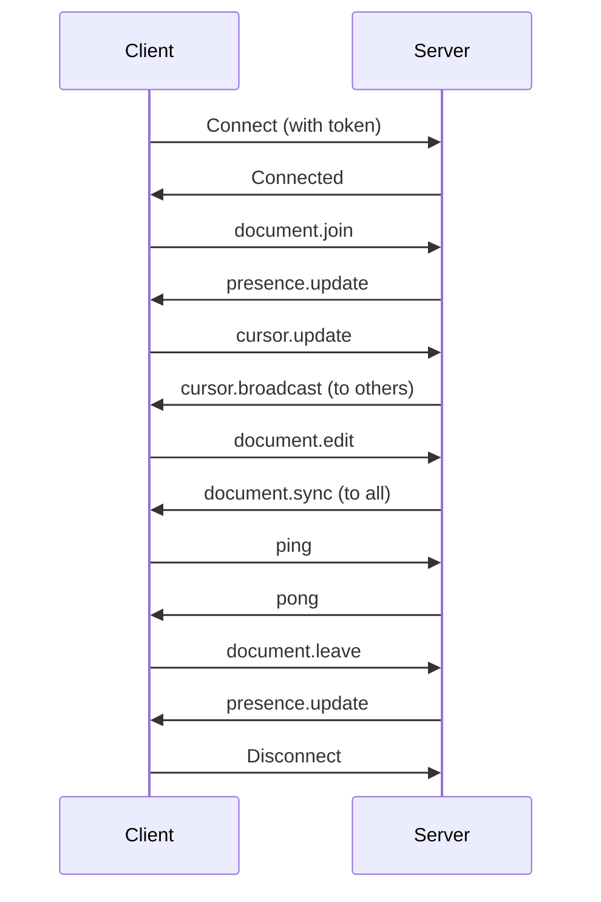

# WebSocket Protocol Guide

This guide covers the WebSocket protocol for real-time features in Tachyon.

## Overview

Tachyon uses WebSockets for:
- Real-time document collaboration
- Live cursors and presence
- Instant notifications
- Document synchronization

## Connection

### Endpoint

```
ws://localhost:8080/ws
wss://api.example.com/ws
```

### Authentication

Include JWT token in query parameter or header:

```javascript
// Query parameter
const ws = new WebSocket('ws://localhost:8080/ws?token=YOUR_JWT_TOKEN');

// Or use subprotocol header
const ws = new WebSocket('ws://localhost:8080/ws', ['Bearer', YOUR_JWT_TOKEN]);
```

## Message Format

All messages use JSON format:

```typescript
interface Message {
  type: string;        // Message type
  payload: any;        // Message payload
  timestamp: string;   // ISO timestamp
  id?: string;         // Optional message ID
}
```

## Client-to-Server Messages

### Join Document

Join a document for collaboration:

```json
{
  "type": "document.join",
  "payload": {
    "document_id": "doc-uuid"
  }
}
```

### Leave Document

Leave a document:

```json
{
  "type": "document.leave",
  "payload": {
    "document_id": "doc-uuid"
  }
}
```

### Cursor Update

Share cursor position:

```json
{
  "type": "cursor.update",
  "payload": {
    "document_id": "doc-uuid",
    "position": {
      "line": 42,
      "column": 15
    }
  }
}
```

### Document Edit

Send document edits:

```json
{
  "type": "document.edit",
  "payload": {
    "document_id": "doc-uuid",
    "version": 5,
    "operations": [
      {
        "type": "insert",
        "position": 245,
        "text": "Hello, "
      },
      {
        "type": "delete",
        "position": 252,
        "length": 5
      }
    ]
  }
}
```

### Ping

Keep connection alive:

```json
{
  "type": "ping",
  "payload": {}
}
```

## Server-to-Client Messages

### Pong

Response to ping:

```json
{
  "type": "pong",
  "payload": {},
  "timestamp": "2026-03-09T12:00:00Z"
}
```

### Presence Update

User joined or left:

```json
{
  "type": "presence.update",
  "payload": {
    "document_id": "doc-uuid",
    "users": [
      {
        "user_id": "user-uuid",
        "name": "John Doe",
        "color": "#FF5733",
        "cursor": {
          "line": 42,
          "column": 15
        }
      }
    ]
  },
  "timestamp": "2026-03-09T12:00:00Z"
}
```

### Cursor Broadcast

Other user's cursor position:

```json
{
  "type": "cursor.broadcast",
  "payload": {
    "document_id": "doc-uuid",
    "user_id": "user-uuid",
    "name": "Jane Doe",
    "color": "#33FF57",
    "position": {
      "line": 20,
      "column": 8
    }
  },
  "timestamp": "2026-03-09T12:00:00Z"
}
```

### Document Sync

Document update from server:

```json
{
  "type": "document.sync",
  "payload": {
    "document_id": "doc-uuid",
    "version": 6,
    "content": "Updated content...",
    "operations": [
      {
        "type": "insert",
        "position": 245,
        "text": "Hello, "
      }
    ]
  },
  "timestamp": "2026-03-09T12:00:00Z"
}
```

### Error

Error message:

```json
{
  "type": "error",
  "payload": {
    "code": "DOCUMENT_NOT_FOUND",
    "message": "Document not found"
  },
  "timestamp": "2026-03-09T12:00:00Z"
}
```

### Notification

User notification:

```json
{
  "type": "notification",
  "payload": {
    "type": "comment",
    "title": "New Comment",
    "message": "John commented on your document",
    "data": {
      "document_id": "doc-uuid",
      "comment_id": "comment-uuid"
    }
  },
  "timestamp": "2026-03-09T12:00:00Z"
}
```

## Operational Transform

For collaborative editing, Tachyon uses operational transform (OT) to resolve conflicts.

### Operation Types

#### Insert

```json
{
  "type": "insert",
  "position": 100,
  "text": "inserted text"
}
```

#### Delete

```json
{
  "type": "delete",
  "position": 100,
  "length": 10
}
```

#### Retain

```json
{
  "type": "retain",
  "position": 100,
  "length": 50
}
```

### Conflict Resolution

When concurrent edits occur:

1. Client sends operation with version number
2. Server transforms operation against concurrent operations
3. Server broadcasts transformed operation
4. Clients apply transformed operation

Example flow:

```
Client A: Insert "Hello" at position 10 (version 5)
Client B: Insert "World" at position 10 (version 5)

Server transforms:
- A's operation: Insert "Hello" at position 10
- B's operation: Insert "World" at position 15 (after A's insertion)

Final result: "HelloWorld" at position 10
```

## Connection Lifecycle



## Implementation Examples

### JavaScript/TypeScript

```typescript
class TachyonWebSocket {
  private ws: WebSocket;
  private handlers: Map<string, Function[]> = new Map();
  
  constructor(url: string, token: string) {
    this.ws = new WebSocket(`${url}?token=${token}`);
    this.setupListeners();
  }
  
  private setupListeners() {
    this.ws.onmessage = (event) => {
      const message = JSON.parse(event.data);
      this.handleMessage(message);
    };
    
    this.ws.onopen = () => {
      console.log('Connected to WebSocket');
    };
    
    this.ws.onerror = (error) => {
      console.error('WebSocket error:', error);
    };
  }
  
  on(type: string, handler: Function) {
    if (!this.handlers.has(type)) {
      this.handlers.set(type, []);
    }
    this.handlers.get(type)!.push(handler);
  }
  
  private handleMessage(message: any) {
    const handlers = this.handlers.get(message.type) || [];
    handlers.forEach(handler => handler(message.payload));
  }
  
  send(type: string, payload: any) {
    this.ws.send(JSON.stringify({ type, payload }));
  }
  
  joinDocument(documentId: string) {
    this.send('document.join', { document_id: documentId });
  }
  
  leaveDocument(documentId: string) {
    this.send('document.leave', { document_id: documentId });
  }
  
  updateCursor(documentId: string, line: number, column: number) {
    this.send('cursor.update', {
      document_id: documentId,
      position: { line, column }
    });
  }
  
  editDocument(documentId: string, operations: any[]) {
    this.send('document.edit', {
      document_id: documentId,
      operations
    });
  }
}

// Usage
const ws = new TachyonWebSocket('ws://localhost:8080/ws', 'your-token');

ws.on('presence.update', (payload) => {
  console.log('Active users:', payload.users);
});

ws.on('document.sync', (payload) => {
  console.log('Document updated:', payload.content);
});

ws.joinDocument('doc-uuid');
```

### Rust

```rust
use tokio_tungstenite::{connect_async, tungstenite::Message};
use futures::{SinkExt, StreamExt};
use serde::{Deserialize, Serialize};

#[derive(Serialize, Deserialize)]
struct WsMessage {
    #[serde(rename = "type")]
    msg_type: String,
    payload: serde_json::Value,
}

async fn connect_websocket(url: &str, token: &str) -> Result<(), Box<dyn std::error::Error>> {
    let url = format!("{}?token={}", url, token);
    let (mut ws_stream, _) = connect_async(&url).await?;
    
    // Join document
    let join_msg = WsMessage {
        msg_type: "document.join".to_string(),
        payload: serde_json::json!({ "document_id": "doc-uuid" }),
    };
    ws_stream.send(Message::Text(serde_json::to_string(&join_msg)?)).await?;
    
    // Receive messages
    while let Some(msg) = ws_stream.next().await {
        let msg = msg?;
        if let Message::Text(text) = msg {
            let message: WsMessage = serde_json::from_str(&text)?;
            handle_message(message);
        }
    }
    
    Ok(())
}

fn handle_message(message: WsMessage) {
    match message.msg_type.as_str() {
        "document.sync" => {
            println!("Document sync: {:?}", message.payload);
        }
        "presence.update" => {
            println!("Presence update: {:?}", message.payload);
        }
        _ => {}
    }
}
```

## Best Practices

1. **Reconnect on disconnect** with exponential backoff
2. **Handle errors** gracefully
3. **Send pings** regularly to keep connection alive
4. **Buffer operations** during reconnection
5. **Use version numbers** to detect conflicts
6. **Apply backpressure** when messages arrive too fast

## Debugging

Enable WebSocket debugging:

```javascript
// Browser
WebSocket.prototype.originalSend = WebSocket.prototype.send;
WebSocket.prototype.send = function(data) {
  console.log('WS Send:', data);
  this.originalSend(data);
};

// Or use browser DevTools Network tab (filter: WS)
```

## Next Steps

- [API Guide](api.md) - REST API documentation
- [Architecture](architecture.md) - System architecture
- [Documents API](../api/documents.md) - Document endpoints
