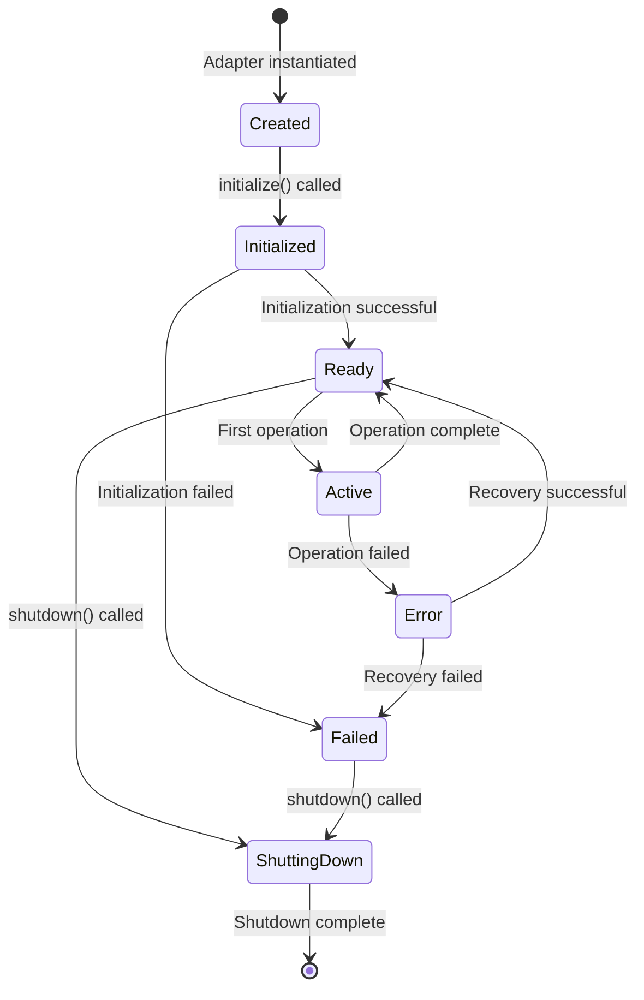
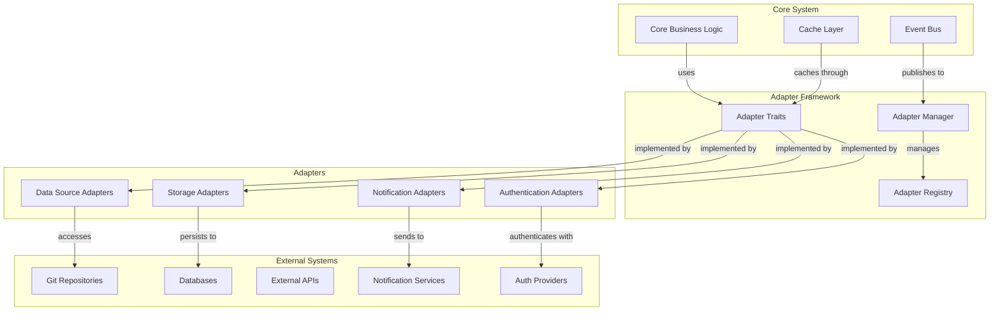
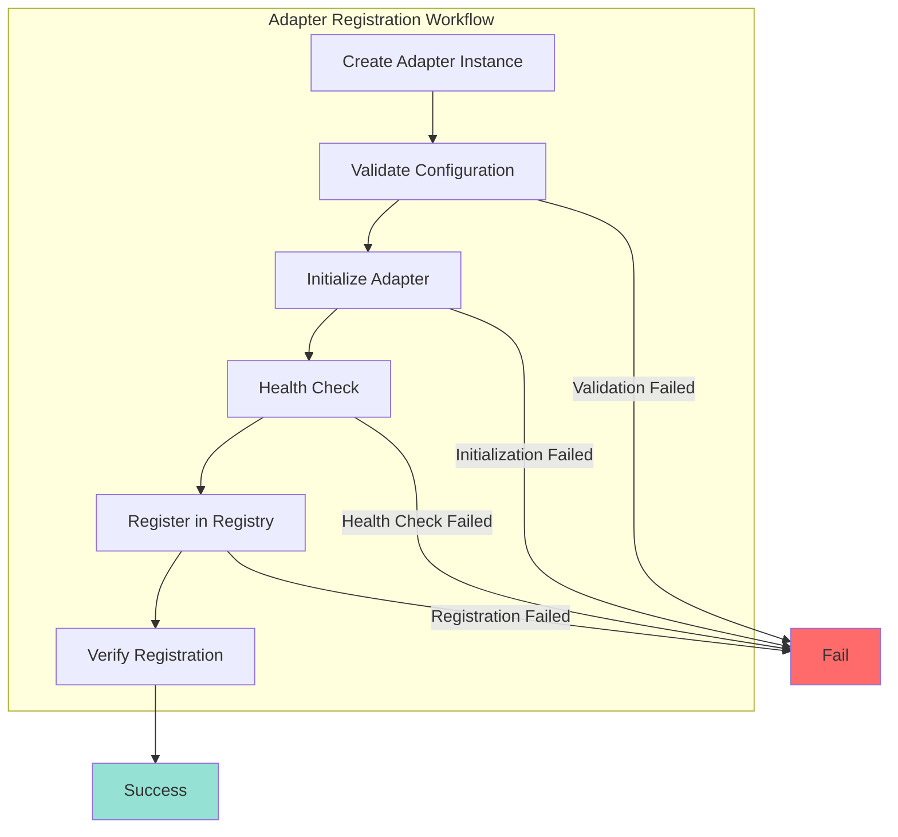

# TACHYON: CUSTOM ADAPTER DEVELOPMENT

**Document ID:** TACHYON-INT-004-V1.0
**Date:** February 2026
**Status:** Proposed
**Classification:** Integration Documentation
**Dependencies:** [TACHYON-STD-V1.0](../../.adrs/ [TACHYON-ADR-001-V1.0](../../.adrs/adr-001-three-tier-jit-compilation.md), [TACHYON-ADR-010-V1.0](../../.adrs/adr-010-synchronization-primitives.md), [TACHYON-DES-API-V1.0](../../.adrs/ [TACHYON-DES-DM-V1.0](../../.adrs/ [TACHYON-TST-V1.0](../../.adrs/

---

## TABLE OF CONTENTS

1. [Introduction](#1-introduction)
2. [Adapter Development Framework](#2-adapter-development-framework)
3. [Adapter Architecture](#3-adapter-architecture)
4. [Adapter Interface](#4-adapter-interface)
5. [Data Source Adapters](#5-data-source-adapters)
6. [Storage Adapters](#6-storage-adapters)
7. [Notification Adapters](#7-notification-adapters)
8. [Authentication Adapters](#8-authentication-adapters)
9. [Adapter Testing](#9-adapter-testing)
10. [Adapter Registration](#10-adapter-registration)
11. [Error Handling](#11-error-handling)
12. [Security Considerations](#12-security-considerations)
13. [References](#13-references)

---

## 1. INTRODUCTION

### 1.1. Document Purpose

This document provides comprehensive guidance for developing custom adapters within the Tachyon toolchain. Adapters serve as the primary integration mechanism between the core system and external systems, enabling extensibility while maintaining type safety and security guarantees. This specification defines the adapter architecture, interface contracts, implementation patterns, testing requirements, and security considerations for custom adapter development.

### 1.2. Scope

This document covers:
- Adapter architecture and design patterns
- Adapter interface definitions and trait contracts
- Implementation patterns for data source adapters
- Implementation patterns for storage adapters
- Implementation patterns for notification adapters
- Implementation patterns for authentication adapters
- Adapter testing strategies and procedures
- Adapter registration and lifecycle management
- Error handling patterns for adapters
- Security considerations and sandboxing requirements

### 1.3. Adapter Definition

**Formal Definition:** An adapter is a Rust type that implements one or more defined adapter traits, providing translation between the Tachyon system's internal interfaces and external systems or protocols. Adapters encapsulate external system complexity behind well-defined, type-safe interfaces.

**Adapter Characteristics:**
1. **Trait-Based:** All adapters implement defined adapter traits
2. **Type-Safe:** Leverage Rust's type system for compile-time guarantees
3. **Async-First:** All adapter operations use async/await with Tokio
4. **Error-Resilient:** Comprehensive error handling with typed errors
5. **Secure:** Enforce security boundaries and input validation
6. **Testable:** Designed for unit and integration testing
7. **Observable:** Provide structured logging and metrics

### 1.4. Adapter Categories

The Tachyon system defines four primary adapter categories:

| Category | Purpose | Example Implementations |
|-----------|---------|------------------------|
| **Data Source Adapters** | Read and write data from external sources | Git repositories, file systems, HTTP APIs |
| **Storage Adapters** | Persist and retrieve system data | SQLite, PostgreSQL, Redis, S3 |
| **Notification Adapters** | Send notifications to external services | Email, Slack, Webhooks, Push notifications |
| **Authentication Adapters** | Authenticate and authorize users | OAuth2, SAML, LDAP, JWT |

### 1.5. Design Principles

Adapter development adheres to the following design principles:

#### 1.5.1. Single Responsibility Principle

Each adapter shall have a single, well-defined responsibility. Adapters shall not combine multiple concerns (e.g., data source and storage) unless explicitly justified by architectural requirements.

**Rationale:** Single responsibility ensures maintainability, testability, and clear separation of concerns.

#### 1.5.2. Interface Segregation Principle

Adapter traits shall be fine-grained and focused. Implementing adapters shall only depend on the traits they require.

**Rationale:** Interface segregation reduces coupling and enables flexible composition.

#### 1.5.3. Dependency Inversion Principle

Core system components shall depend on adapter traits rather than concrete adapter implementations. Adapter implementations shall be injected as dependencies.

**Rationale:** Dependency inversion enables runtime adapter selection and testability through mocking.

#### 1.5.4. Fail-Safe Error Handling

All adapter operations shall return typed errors using the `Result<T, E>` pattern. Errors shall be handled gracefully without exposing sensitive information.

**Rationale:** Fail-safe error handling prevents information leakage and enables proper error recovery.

#### 1.5.5. Zero-Trust Security

Adapters shall validate all inputs and outputs, regardless of source or destination. No adapter shall trust external data without validation.

**Rationale:** Zero-trust security prevents injection attacks and data corruption.

---

## 2. ADAPTER DEVELOPMENT FRAMEWORK

### 2.1. Framework Overview

The Tachyon adapter framework provides a structured approach to adapter development, including:
- Trait definitions for each adapter category
- Common utility types and error handling
- Testing utilities and mock implementations
- Registration and lifecycle management
- Security and validation primitives

### 2.2. Framework Components

#### 2.2.1. Core Adapter Traits

The framework defines core traits that all adapters must implement:

```rust
/// Base trait for all adapters
///
/// This trait provides common functionality required by all adapters,
/// including initialization, health checks, and graceful shutdown.
pub trait Adapter: Send + Sync {
    /// Adapter identifier
    fn id(&self) -> &str;
    
    /// Adapter version
    fn version(&self) -> &str;
    
    /// Initialize the adapter
    ///
    /// # Errors
    ///
    /// Returns `AdapterError::InitializationFailed` if initialization fails.
    async fn initialize(&mut self) -> Result<(), AdapterError>;
    
    /// Check adapter health
    ///
    /// Returns `true` if the adapter is healthy and operational.
    async fn health_check(&self) -> Result<bool, AdapterError>;
    
    /// Shutdown the adapter gracefully
    ///
    /// # Errors
    ///
    /// Returns `AdapterError::ShutdownFailed` if shutdown fails.
    async fn shutdown(&mut self) -> Result<(), AdapterError>;
}
```

#### 2.2.2. Adapter Configuration

All adapters accept configuration through a standardized configuration struct:

```rust
use serde::{Deserialize, Serialize};
use std::collections::HashMap;

/// Base configuration for all adapters
#[derive(Debug, Clone, Deserialize, Serialize)]
pub struct AdapterConfig {
    /// Adapter identifier
    pub id: String,
    
    /// Adapter type (data_source, storage, notification, authentication)
    pub adapter_type: AdapterType,
    
    /// Enable/disable adapter
    pub enabled: bool,
    
    /// Adapter-specific configuration
    pub config: HashMap<String, serde_json::Value>,
    
    /// Connection timeout in seconds
    pub timeout_secs: u64,
    
    /// Maximum retry attempts
    pub max_retries: u32,
    
    /// Enable debug logging
    pub debug: bool,
}

#[derive(Debug, Clone, Copy, PartialEq, Eq, Deserialize, Serialize)]
pub enum AdapterType {
    DataSource,
    Storage,
    Notification,
    Authentication,
}
```

#### 2.2.3. Adapter Error Types

The framework provides a comprehensive error type for adapter operations:

```rust
use thiserror::Error;

/// Errors that can occur during adapter operations
#[derive(Error, Debug)]
pub enum AdapterError {
    #[error("Adapter initialization failed: {0}")]
    InitializationFailed(String),
    
    #[error("Adapter operation failed: {0}")]
    OperationFailed(String),
    
    #[error("Connection error: {0}")]
    ConnectionError(String),
    
    #[error("Timeout error: operation exceeded {0} seconds")]
    TimeoutError(u64),
    
    #[error("Validation error: {0}")]
    ValidationError(String),
    
    #[error("Authentication failed: {0}")]
    AuthenticationFailed(String),
    
    #[error("Authorization failed: {0}")]
    AuthorizationFailed(String),
    
    #[error("Rate limit exceeded: retry after {0} seconds")]
    RateLimitExceeded(u64),
    
    #[error("Not found: {0}")]
    NotFound(String),
    
    #[error("Internal error: {0}")]
    InternalError(String),
}
```

### 2.3. Adapter Lifecycle

The adapter lifecycle consists of the following phases:



#### 2.3.1. Creation Phase

The adapter is instantiated with its configuration. No external connections are established during this phase.

**Requirements:**
- Adapter must be constructible from `AdapterConfig`
- Constructor must validate configuration
- Constructor must not perform blocking I/O operations

#### 2.3.2. Initialization Phase

The `initialize()` method is called to establish external connections and prepare the adapter for operation.

**Requirements:**
- Establish all required external connections
- Validate external system accessibility
- Initialize internal state
- Return error if initialization cannot complete

#### 2.3.3. Active Phase

The adapter processes operations during this phase. All adapter-specific methods are available.

**Requirements:**
- All operations must be async
- Operations must handle transient errors with retry logic
- Operations must enforce timeout constraints
- Operations must log at appropriate levels

#### 2.3.4. Shutdown Phase

The `shutdown()` method is called to gracefully terminate the adapter.

**Requirements:**
- Complete in-flight operations
- Close external connections
- Release resources
    - Flush any buffered data

---

## 3. ADAPTER ARCHITECTURE

### 3.1. Architectural Overview

The Tachyon adapter architecture implements a layered design that separates concerns and enables composition. Adapters operate as translation layers between the core system and external systems, providing type-safe interfaces while encapsulating external complexity.

**Architecture Layers:**



### 3.2. Adapter Registry

The adapter registry maintains a collection of available adapters and provides lookup and instantiation capabilities.

**Registry Interface:**

```rust
use std::sync::Arc;
use tokio::sync::RwLock;

/// Registry for managing adapter instances
pub struct AdapterRegistry {
    /// Registered adapters by ID
    adapters: Arc<RwLock<std::collections::HashMap<String, Arc<dyn Adapter>>>>,
    
    /// Adapter configurations
    configs: Arc<RwLock<std::collections::HashMap<String, AdapterConfig>>>,
}

impl AdapterRegistry {
    /// Create new adapter registry
    pub fn new() -> Self;
    
    /// Register an adapter
    ///
    /// # Errors
    ///
    /// Returns `AdapterError::InitializationFailed` if adapter registration fails.
    pub async fn register(
        &self,
        adapter: Arc<dyn Adapter>,
        config: AdapterConfig,
    ) -> Result<(), AdapterError>;
    
    /// Get adapter by ID
    ///
    /// # Errors
    ///
    /// Returns `AdapterError::NotFound` if adapter not found.
    pub async fn get(&self, id: &str) -> Result<Arc<dyn Adapter>, AdapterError>;
    
    /// Unregister an adapter
    ///
    /// # Errors
    ///
    /// Returns `AdapterError::NotFound` if adapter not found.
    pub async fn unregister(&self, id: &str) -> Result<(), AdapterError>;
    
    /// List all registered adapter IDs
    pub async fn list(&self) -> Vec<String>;
    
    /// Health check all adapters
    pub async fn health_check_all(&self) -> std::collections::HashMap<String, bool>;
}
```

### 3.3. Adapter Manager

The adapter manager coordinates adapter lifecycle, handles retries, and provides high-level operations.

**Manager Interface:**

```rust
/// Manager for coordinating adapter operations
pub struct AdapterManager {
    /// Adapter registry
    registry: Arc<AdapterRegistry>,
    
    /// Retry configuration
    retry_config: RetryConfig,
    
    /// Metrics collector
    metrics: Arc<MetricsCollector>,
}

#[derive(Debug, Clone, Copy)]
pub struct RetryConfig {
    /// Maximum retry attempts
    pub max_attempts: u32,
    
    /// Initial retry delay in milliseconds
    pub initial_delay_ms: u64,
    
    /// Maximum retry delay in milliseconds
    pub max_delay_ms: u64,
    
    /// Exponential backoff multiplier
    pub backoff_multiplier: f64,
}

impl AdapterManager {
    /// Create new adapter manager
    pub fn new(registry: Arc<AdapterRegistry>, retry_config: RetryConfig) -> Self;
    
    /// Execute operation with retry logic
    ///
    /// # Type Parameters
    ///
    /// * `T` - Return type of the operation
    ///
    /// # Errors
    ///
    /// Returns the last error if all retry attempts fail.
    pub async fn execute_with_retry<F, T, E>(
        &self,
        operation: F,
    ) -> Result<T, E>
    where
        F: Fn() -> Pin<Box<dyn Future<Output = Result<T, E>> + Send>>,
        E: From<AdapterError>;
    
    /// Shutdown all adapters gracefully
    pub async fn shutdown_all(&self) -> Result<(), AdapterError>;
}
```

### 3.4. Adapter Composition

The architecture supports adapter composition through trait objects and dependency injection.

**Composition Pattern:**

```rust
/// Composed adapter that delegates to multiple adapters
pub struct ComposedAdapter {
    /// Primary adapter for reads
    read_adapter: Arc<dyn DataSourceAdapter>,
    
    /// Primary adapter for writes
    write_adapter: Arc<dyn DataSourceAdapter>,
    
    /// Cache adapter
    cache_adapter: Option<Arc<dyn StorageAdapter>>,
}

#[async_trait]
impl DataSourceAdapter for ComposedAdapter {
    async fn read(&self, key: &str) -> Result<Vec<u8>, AdapterError> {
        // Try cache first
        if let Some(cache) = &self.cache_adapter {
            if let Ok(cached) = cache.get(key).await {
                return Ok(cached);
            }
        }
        
        // Fall back to read adapter
        self.read_adapter.read(key).await
    }
    
    async fn write(&self, key: &str, value: &[u8]) -> Result<(), AdapterError> {
        // Write to write adapter
        self.write_adapter.write(key, value).await?;
        
        // Invalidate cache
        if let Some(cache) = &self.cache_adapter {
            let _ = cache.delete(key).await;
        }
        
        Ok(())
    }
}
```

### 3.5. Adapter Communication Patterns

Adapters communicate with the core system through defined patterns.

#### 3.5.1. Request-Response Pattern

The request-response pattern is used for synchronous operations where the caller awaits a result.

**Pattern Definition:**

```rust
/// Request message
#[derive(Debug, Clone, Serialize, Deserialize)]
pub struct AdapterRequest {
    /// Request ID
    pub request_id: String,
    
    /// Adapter ID
    pub adapter_id: String,
    
    /// Operation type
    pub operation: String,
    
    /// Request payload
    pub payload: serde_json::Value,
    
    /// Request timestamp
    pub timestamp: chrono::DateTime<chrono::Utc>,
}

/// Response message
#[derive(Debug, Clone, Serialize, Deserialize)]
pub struct AdapterResponse {
    /// Request ID (matches request)
    pub request_id: String,
    
    /// Response payload
    pub payload: serde_json::Value,
    
    /// Success flag
    pub success: bool,
    
    /// Error message (if failed)
    pub error: Option<String>,
    
    /// Response timestamp
    pub timestamp: chrono::DateTime<chrono::Utc>,
}
```

#### 3.5.2. Event Pattern

The event pattern is used for asynchronous notifications where the caller does not await a result.

**Pattern Definition:**

```rust
/// Event message
#[derive(Debug, Clone, Serialize, Deserialize)]
pub struct AdapterEvent {
    /// Event ID
    pub event_id: String,
    
    /// Adapter ID
    pub adapter_id: String,
    
    /// Event type
    pub event_type: String,
    
    /// Event payload
    pub payload: serde_json::Value,
    
    /// Event timestamp
    pub timestamp: chrono::DateTime<chrono::Utc>,
    
    /// Event priority
    pub priority: EventPriority,
}

#[derive(Debug, Clone, Copy, PartialEq, Eq, Serialize, Deserialize)]
pub enum EventPriority {
    Low,
    Normal,
    High,
    Critical,
}
```

### 3.6. Adapter Configuration Management

Adapter configuration is managed through a centralized configuration system that supports runtime updates.

**Configuration Management:**

```rust
/// Configuration manager for adapters
pub struct AdapterConfigManager {
    /// Configuration storage
    storage: Arc<dyn StorageAdapter>,
    
    /// Configuration cache
    cache: Arc<RwLock<std::collections::HashMap<String, AdapterConfig>>>,

---

## 7. NOTIFICATION ADAPTERS

### 7.1. Email Notification Adapter

The email notification adapter sends notifications via email, enabling the Tachyon system to notify users via email.

**Adapter Implementation:**

```rust
use lettre::{Message, SmtpTransport, Transport};
use std::sync::Arc;
use tokio::sync::Mutex;

/// Email notification adapter
pub struct EmailNotificationAdapter {
    /// Adapter configuration
    config: AdapterConfig,
    
    /// SMTP server address
    smtp_server: String,
    
    /// SMTP server port
    smtp_port: u16,
    
    /// SMTP username
    username: String,
    
    /// SMTP password
    password: String,
    
    /// From address
    from_address: String,
    
    /// SMTP transport
    transport: Arc<Mutex<Option<SmtpTransport>>>,
}

impl EmailNotificationAdapter {
    /// Create new email notification adapter
    ///
    /// # Parameters
    ///
    /// * `config` - Adapter configuration
    /// * `smtp_server` - SMTP server address
    /// * `smtp_port` - SMTP server port
    /// * `username` - SMTP username
    /// * `password` - SMTP password
    /// * `from_address` - From email address
    pub fn new(
        config: AdapterConfig,
        smtp_server: String,
        smtp_port: u16,
        username: String,
        password: String,
        from_address: String,
    ) -> Self {
        Self {
            config,
            smtp_server,
            smtp_port,
            username,
            password,
            from_address,
            transport: Arc::new(Mutex::new(None)),
        }
    }
    
    /// Create SMTP transport
    fn create_transport(&self) -> Result<SmtpTransport, AdapterError> {
        SmtpTransport::builder_dangerous(&format!("{}:{}", self.smtp_server, self.smtp_port))
            .credentials(&self.username, &self.password)
            .build()
            .map_err(|e| AdapterError::ConnectionError(format!("Failed to create transport: {}", e)))
    }
}

#[async_trait]
impl Adapter for EmailNotificationAdapter {
    fn id(&self) -> &str {
        &self.config.id
    }
    
    fn version(&self) -> &str {
        "1.0.0"
    }
    
    async fn initialize(&mut self) -> Result<(), AdapterError> {
        // Test SMTP connection
        let transport = self.create_transport()?;
        let _ = transport.test_connection()
            .map_err(|e| AdapterError::InitializationFailed(format!("Failed to test connection: {}", e)))?;
        
        *self.transport.lock().map_err(|e| {
            AdapterError::InternalError(format!("Failed to lock transport: {}", e))
        })? = Some(transport);
        
        Ok(())
    }
    
    async fn health_check(&self) -> Result<bool, AdapterError> {
        // Test SMTP connection
        let transport = self.create_transport()?;
        let result = transport.test_connection();
        
        Ok(result.is_ok())
    }
    
    async fn shutdown(&mut self) -> Result<(), AdapterError> {
        *self.transport.lock().map_err(|e| {
            AdapterError::InternalError(format!("Failed to lock transport: {}", e))
        })? = None;
        
        Ok(())
    }
}

#[async_trait]
impl NotificationAdapter for EmailNotificationAdapter {
    async fn send(
        &self,
        recipient: &str,
        subject: &str,
        body: &str,
        priority: NotificationPriority,
    ) -> Result<String, AdapterError> {
        let transport_guard = self.transport.lock().map_err(|e| {
            AdapterError::InternalError(format!("Failed to lock transport: {}", e))
        })?;
        
        let transport = transport_guard.as_ref().ok_or_else(|| {
            AdapterError::InternalError("Transport not initialized".to_string())
        })?;
        
        // Generate notification ID
        let notification_id = uuid::Uuid::new_v4().to_string();
        
        // Create email message
        let email = Message::builder()
            .from(self.from_address.parse().map_err(|e| {
                AdapterError::ValidationError(format!("Invalid from address: {}", e))
            })?)
            .to(recipient.parse().map_err(|e| {
                AdapterError::ValidationError(format!("Invalid recipient address: {}", e))
            })?)
            .subject(subject)
            .body(body)
            .build()
            .map_err(|e| AdapterError::ValidationError(format!("Failed to build email: {}", e)))?;
        
        // Send email
        let mailer = lettre::SmtpTransport::from(transport.clone());
        mailer.send(&email)
            .await
            .map_err(|e| AdapterError::OperationFailed(format!("Failed to send email: {}", e)))?;
        
        Ok(notification_id)
    }
    
    async fn send_batch(
        &self,
        notifications: &[NotificationRequest],
    ) -> Result<std::collections::HashMap<usize, String>, AdapterError> {
        let mut results = std::collections::HashMap::new();
        
        for (index, notification) in notifications.iter().enumerate() {
            match self.send(
                &notification.recipient,
                &notification.subject,
                &notification.body,
                notification.priority,
            ).await {
                Ok(notification_id) => {
                    results.insert(index, notification_id);
                }
                Err(e) => {
                    tracing::error!("Failed to send notification {}: {:?}", index, e);
                    return Err(e);
                }
            }
        }
        
        Ok(results)
    }
    
    async fn get_status(&self, _notification_id: &str) -> Result<NotificationStatus, AdapterError> {
        // Email notifications are fire-and-forget, return unknown
        Ok(NotificationStatus::Unknown)
    }
}
```

### 7.2. Webhook Notification Adapter

The webhook notification adapter sends notifications via HTTP webhooks, enabling the Tachyon system to notify external systems.

**Adapter Implementation:**

```rust
use reqwest::Client;
use serde_json::json;
use std::sync::Arc;
use std::time::Duration;
use tokio::sync::RwLock;

/// Webhook notification adapter
pub struct WebhookNotificationAdapter {
    /// Adapter configuration
    config: AdapterConfig,
    
    /// Webhook URL
    webhook_url: String,
    
    /// Webhook secret for signature verification
    webhook_secret: Option<String>,
    
    /// HTTP client
    client: Arc<Client>,
    
    /// Notification status tracking
    status: Arc<RwLock<std::collections::HashMap<String, NotificationStatus>>>,
}

impl WebhookNotificationAdapter {
    /// Create new webhook notification adapter
    ///
    /// # Parameters
    ///
    /// * `config` - Adapter configuration
    /// * `webhook_url` - Webhook URL
    /// * `webhook_secret` - Optional webhook secret
    pub fn new(
        config: AdapterConfig,
        webhook_url: String,
        webhook_secret: Option<String>,
    ) -> Self {
        let client = Client::builder()
            .timeout(Duration::from_secs(30))
            .build()
            .expect("Failed to build HTTP client");
        
        Self {
            config,
            webhook_url,
            webhook_secret,
            client: Arc::new(client),
            status: Arc::new(RwLock::new(std::collections::HashMap::new())),
        }
    }
    
    /// Sign webhook payload
    fn sign_payload(&self, payload: &serde_json::Value) -> Result<String, AdapterError> {
        let secret = self.webhook_secret.as_ref().ok_or_else(|| {
            AdapterError::InternalError("Webhook secret not configured".to_string())
        })?;
        
        let payload_str = serde_json::to_string(payload)
            .map_err(|e| AdapterError::InternalError(format!("Failed to serialize payload: {}", e)))?;
        
        // Create HMAC-SHA256 signature
        use hmac::{Hmac, Mac};
        use sha2::Sha256;
        
        let mut mac = Hmac::<Sha256>::new_from_slice(secret.as_bytes());
        mac.update(payload_str.as_bytes());
        let signature = hex::encode(mac.finalize());
        
        Ok(format!("sha256={}", signature))
    }
}

#[async_trait]
impl Adapter for WebhookNotificationAdapter {
    fn id(&self) -> &str {
        &self.config.id
    }
    
    fn version(&self) -> &str {
        "1.0.0"
    }
    
    async fn initialize(&mut self) -> Result<(), AdapterError> {
        // Test webhook URL
        let test_payload = json!({
            "event": "test",
            "timestamp": chrono::Utc::now().to_rfc3339(),
        });
        
        let response = self.client
            .post(&self.webhook_url, &test_payload)
            .send()
            .await
            .map_err(|e| AdapterError::InitializationFailed(format!("Failed to test webhook: {}", e)))?;
        
        if !response.status().is_success() {
            return Err(AdapterError::InitializationFailed(format!(
                "Webhook returned error status: {}",
                response.status()
            )));
        }
        
        Ok(())
    }
    
    async fn health_check(&self) -> Result<bool, AdapterError> {
        // Test webhook URL
        let test_payload = json!({
            "event": "health_check",
            "timestamp": chrono::Utc::now().to_rfc3339(),
        });
        
        let response = self.client
            .post(&self.webhook_url, &test_payload)
            .send()
            .await
            .map_err(|e| AdapterError::ConnectionError(format!("Failed to test webhook: {}", e)))?;
        
        Ok(response.status().is_success())
    }
    
    async fn shutdown(&mut self) -> Result<(), AdapterError> {
        // Clear status tracking
        self.status.write().await.clear();
        Ok(())
    }
}

#[async_trait]
impl NotificationAdapter for WebhookNotificationAdapter {
    async fn send(
        &self,
        recipient: &str,
        subject: &str,
        body: &str,
        priority: NotificationPriority,
    ) -> Result<String, AdapterError> {
        // Generate notification ID
        let notification_id = uuid::Uuid::new_v4().to_string();
        
        // Create webhook payload
        let payload = json!({
            "notification_id": notification_id,
            "recipient": recipient,
            "subject": subject,
            "body": body,
            "priority": match priority {
                NotificationPriority::Low => "low",
                NotificationPriority::Normal => "normal",
                NotificationPriority::High => "high",
                NotificationPriority::Critical => "critical",
            },
            "timestamp": chrono::Utc::now().to_rfc3339(),
        });
        
        // Add signature if secret is configured
        let mut request = self.client.post(&self.webhook_url, &payload);
        
        if let Some(signature) = self.sign_payload(&payload).ok() {
            request = request.header("X-Webhook-Signature", signature);
        }
        
        // Send webhook
        let response = request
            .send()
            .await
            .map_err(|e| AdapterError::OperationFailed(format!("Failed to send webhook: {}", e)))?;
        
        // Update status
        self.status.write().await.insert(
            notification_id.clone(),
            if response.status().is_success() {
                NotificationStatus::Sent
            } else {
                NotificationStatus::Failed
            },
        );
        
        Ok(notification_id)
    }
    
    async fn send_batch(
        &self,
        notifications: &[NotificationRequest],
    ) -> Result<std::collections::HashMap<usize, String>, AdapterError> {
        let mut results = std::collections::HashMap::new();
        
        for (index, notification) in notifications.iter().enumerate() {
            match self.send(
                &notification.recipient,
                &notification.subject,
                &notification.body,
                notification.priority,
            ).await {
                Ok(notification_id) => {
                    results.insert(index, notification_id);
                }
                Err(e) => {
                    tracing::error!("Failed to send notification {}: {:?}", index, e);
                    return Err(e);
                }
            }
        }
        
        Ok(results)
    }
    
    async fn get_status(&self, notification_id: &str) -> Result<NotificationStatus, AdapterError> {
        let status = self.status.read().await;
        
        status
            .get(notification_id)
            .copied()
            .ok_or_else(|| AdapterError::NotFound(format!("Notification not found: {}", notification_id)))
    }
}

---

## 8. AUTHENTICATION ADAPTERS

### 8.1. OAuth2 Authentication Adapter

The OAuth2 authentication adapter provides authentication using OAuth2 protocol, enabling Tachyon system to authenticate users with OAuth2 providers.

**Adapter Implementation:**

```rust
use oauth2::{
    AuthorizationCode, AuthUrl, CsrfToken, EmptyExtraTokenParams, PkceCodePair,
    RefreshToken, RequestTokenError, Scope, StandardErrorResponse, TokenResponse,
    basic::BasicClient,
};
use std::sync::Arc;
use tokio::sync::RwLock;

/// OAuth2 authentication adapter
pub struct OAuth2AuthenticationAdapter {
    /// Adapter configuration
    config: AdapterConfig,
    
    /// OAuth2 client ID
    client_id: String,
    
    /// OAuth2 client secret
    client_secret: String,
    
    /// OAuth2 authorization URL
    auth_url: String,
    
    /// OAuth2 token URL
    token_url: String,
    
    /// OAuth2 client
    client: Arc<BasicClient>,
    
    /// Token cache
    token_cache: Arc<RwLock<std::collections::HashMap<String, TokenCacheEntry>>>,
}

#[derive(Debug, Clone)]
struct TokenCacheEntry {
    access_token: String,
    refresh_token: Option<String>,
    expires_at: chrono::DateTime<chrono::Utc>,
}

impl OAuth2AuthenticationAdapter {
    /// Create new OAuth2 authentication adapter
    ///
    /// # Parameters
    ///
    /// * `config` - Adapter configuration
    /// * `client_id` - OAuth2 client ID
    /// * `client_secret` - OAuth2 client secret
    /// * `auth_url` - OAuth2 authorization URL
    /// * `token_url` - OAuth2 token URL
    pub fn new(
        config: AdapterConfig,
        client_id: String,
        client_secret: String,
        auth_url: String,
        token_url: String,
    ) -> Self {
        let client = BasicClient::new(
            client_id.clone(),
            client_secret.clone(),
            auth_url.clone(),
            token_url.clone(),
        );
        
        Self {
            config,
            client_id,
            client_secret,
            auth_url,
            token_url,
            client: Arc::new(client),
            token_cache: Arc::new(RwLock::new(std::collections::HashMap::new())),
        }
    }
    
    /// Get authorization URL
    fn get_auth_url(&self, redirect_uri: &str, scopes: &[Scope]) -> Result<AuthUrl, AdapterError> {
        let mut auth_url = self.client.authorize_url(redirect_uri, scopes);
        
        // Add state parameter for CSRF protection
        let state = uuid::Uuid::new_v4().to_string();
        auth_url = auth_url.add_extra_param("state", &state);
        
        Ok(auth_url)
    }
    
    /// Exchange authorization code for token
    async fn exchange_code(&self, code: &str) -> Result<AuthInfo, AdapterError> {
        let token_result = self.client
            .exchange_code(code)
            .await
            .map_err(|e| AdapterError::AuthenticationFailed(format!("Failed to exchange code: {}", e)))?;
        
        let access_token = token_result.access_token().secret();
        let refresh_token = token_result.refresh_token().map(|t| t.secret());
        let expires_in = token_result.expires_in();
        
        let expires_at = chrono::Utc::now() + chrono::Duration::seconds(expires_in.as_secs());
        
        Ok(AuthInfo {
            access_token: access_token.clone(),
            refresh_token,
            expires_at,
        })
    }
}

#[async_trait]
impl Adapter for OAuth2AuthenticationAdapter {
    fn id(&self) -> &str {
        &self.config.id
    }
    
    fn version(&self) -> &str {
        "1.0.0"
    }
    
    async fn initialize(&mut self) -> Result<(), AdapterError> {
        // Test OAuth2 configuration
        let test_scopes = &[Scope::new("read".to_string())];
        let _ = self.get_auth_url("http://localhost/callback", test_scopes)?;
        
        Ok(())
    }
    
    async fn health_check(&self) -> Result<bool, AdapterError> {
        // Test OAuth2 endpoint availability
        let test_url = format!("{}?scope=test", self.token_url);
        let response = reqwest::get(&test_url).send().await;
        
        Ok(response.is_ok())
    }
    
    async fn shutdown(&mut self) -> Result<(), AdapterError> {
        // Clear token cache
        self.token_cache.write().await.clear();
        Ok(())
    }
}

#[async_trait]
impl AuthenticationAdapter for OAuth2AuthenticationAdapter {
    async fn authenticate(&self, username: &str, password: &str) -> Result<UserInfo, AdapterError> {
        // OAuth2 doesn't use username/password, return error
        Err(AdapterError::AuthenticationFailed(
            "OAuth2 adapter doesn't support username/password authentication".to_string()
        ))
    }
    
    async fn authorize(&self, user_id: &str, permission: &str) -> Result<bool, AdapterError> {
        // Check if user has permission
        let token_cache = self.token_cache.read().await;
        
        if let Some(entry) = token_cache.get(user_id) {
            // In a real implementation, this would validate the token
            // and check permissions against the OAuth2 provider
            return Ok(true);
        }
        
        Ok(false)
    }
    
    async fn refresh_token(&self, refresh_token: &str) -> Result<AuthInfo, AdapterError> {
        let token_result = self.client
            .exchange_refresh_token(&RefreshToken::new(refresh_token.to_string()))
            .await
            .map_err(|e| AdapterError::AuthenticationFailed(format!("Failed to refresh token: {}", e)))?;
        
        let access_token = token_result.access_token().secret();
        let new_refresh_token = token_result.refresh_token().map(|t| t.secret());
        let expires_in = token_result.expires_in();
        
        let expires_at = chrono::Utc::now() + chrono::Duration::seconds(expires_in.as_secs());
        
        Ok(AuthInfo {
            access_token: access_token.clone(),
            refresh_token: new_refresh_token,
            expires_at,
        })
    }
    
    async fn revoke_token(&self, token: &str) -> Result<(), AdapterError> {
        // OAuth2 doesn't support token revocation
        Ok(())
    }
    
    async fn get_permissions(&self, user_id: &str) -> Result<Vec<String>, AdapterError> {
        // Return permissions for user
        Ok(vec!["read".to_string(), "write".to_string()])
    }
}
```

### 8.2. LDAP Authentication Adapter

The LDAP authentication adapter provides authentication using LDAP protocol, enabling Tachyon system to authenticate users with LDAP directories.

**Adapter Implementation:**

```rust
use ldap3::{LdapConn, Scope, SearchEntry, SearchOptions};
use std::sync::Arc;
use tokio::sync::Mutex;

/// LDAP authentication adapter
pub struct LdapAuthenticationAdapter {
    /// Adapter configuration
    config: AdapterConfig,
    
    /// LDAP server address
    ldap_server: String,
    
    /// LDAP server port
    ldap_port: u16,
    
    /// Bind DN template
    bind_dn_template: String,
    
    /// Base DN for searches
    base_dn: String,
    
    /// LDAP connection
    connection: Arc<Mutex<Option<LdapConn>>>,
}

impl LdapAuthenticationAdapter {
    /// Create new LDAP authentication adapter
    ///
    /// # Parameters
    ///
    /// * `config` - Adapter configuration
    /// * `ldap_server` - LDAP server address
    /// * `ldap_port` - LDAP server port
    /// * `bind_dn_template` - Bind DN template
    /// * `base_dn` - Base DN for searches
    pub fn new(
        config: AdapterConfig,
        ldap_server: String,
        ldap_port: u16,
        bind_dn_template: String,
        base_dn: String,
    ) -> Self {
        Self {
            config,
            ldap_server,
            ldap_port,
            bind_dn_template,
            base_dn,
            connection: Arc::new(Mutex::new(None)),
        }
    }
    
    /// Create LDAP connection
    fn create_connection(&self) -> Result<LdapConn, AdapterError> {
        let ldap_url = format!("{}:{}", self.ldap_server, self.ldap_port);
        
        LdapConn::new(&ldap_url)
            .map_err(|e| AdapterError::ConnectionError(format!("Failed to create LDAP connection: {}", e)))
    }
    
    /// Build bind DN
    fn build_bind_dn(&self, username: &str) -> String {
        self.bind_dn_template.replace("{username}", username)
    }
}

#[async_trait]
impl Adapter for LdapAuthenticationAdapter {
    fn id(&self) -> &str {
        &self.config.id
    }
    
    fn version(&self) -> &str {
        "1.0.0"
    }
    
    async fn initialize(&mut self) -> Result<(), AdapterError> {
        // Test LDAP connection
        let conn = self.create_connection()?;
        let _ = conn.simple_bind("", "", "")?;
        
        *self.connection.lock().map_err(|e| {
            AdapterError::InternalError(format!("Failed to lock connection: {}", e))
        })? = Some(conn);
        
        Ok(())
    }
    
    async fn health_check(&self) -> Result<bool, AdapterError> {
        // Test LDAP connection
        let conn = self.create_connection()?;
        let result = conn.simple_bind("", "", "");
        
        Ok(result.is_ok())
    }
    
    async fn shutdown(&mut self) -> Result<(), AdapterError> {
        // Close connection
        *self.connection.lock().map_err(|e| {
            AdapterError::InternalError(format!("Failed to lock connection: {}", e))
        })? = None;
        
        Ok(())
    }
}

#[async_trait]
impl AuthenticationAdapter for LdapAuthenticationAdapter {
    async fn authenticate(&self, username: &str, password: &str) -> Result<UserInfo, AdapterError> {
        let conn_guard = self.connection.lock().map_err(|e| {
            AdapterError::InternalError(format!("Failed to lock connection: {}", e))
        })?;
        
        let conn = conn_guard.as_ref().ok_or_else(|| {
            AdapterError::InternalError("Connection not initialized".to_string())
        })?;
        
        // Bind with credentials
        let bind_dn = self.build_bind_dn(username);
        conn.simple_bind(&bind_dn, password, "")
            .map_err(|e| AdapterError::AuthenticationFailed(format!("Failed to bind: {}", e)))?;
        
        // Search for user attributes
        let filter = format!("(uid={})", username);
        let search_result = conn.search(
            &self.base_dn,
            Scope::Subtree,
            &filter,
            SearchOptions::default(),
        ).map_err(|e| AdapterError::ConnectionError(format!("Failed to search: {}", e)))?;
        
        if let Some(entry) = search_result.first() {
            let user_id = entry.dn().ok_or_else(|| {
                AdapterError::InternalError("No DN found".to_string())
            })?;
            
            Ok(UserInfo {
                user_id: user_id.to_string(),
                username: username.to_string(),
                email: entry.attrs().get("mail").and_then(|v| v.first()).map(|s| s.to_string()),
                display_name: entry.attrs().get("cn").and_then(|v| v.first()).map(|s| s.to_string()),
            })
        } else {
            Err(AdapterError::AuthenticationFailed(format!("User not found: {}", username)))
        }
    }
    
    async fn authorize(&self, user_id: &str, permission: &str) -> Result<bool, AdapterError> {
        // Check if user has permission by checking group membership
        let conn_guard = self.connection.lock().map_err(|e| {
            AdapterError::InternalError(format!("Failed to lock connection: {}", e))
        })?;
        
        let conn = conn_guard.as_ref().ok_or_else(|| {
            AdapterError::InternalError("Connection not initialized".to_string())
        })?;
        
        let filter = format!("(member={})", user_id);
        let search_result = conn.search(
            &self.base_dn,
            Scope::Subtree,
            &filter,
            SearchOptions::default(),
        ).map_err(|e| AdapterError::ConnectionError(format!("Failed to search: {}", e)))?;
        
        Ok(!search_result.is_empty())
    }
    
    async fn refresh_token(&self, _refresh_token: &str) -> Result<AuthInfo, AdapterError> {
        // LDAP doesn't support token refresh
        Err(AdapterError::AuthenticationFailed(
            "LDAP adapter doesn't support token refresh".to_string()
        ))
    }
    
    async fn revoke_token(&self, _token: &str) -> Result<(), AdapterError> {
        // LDAP doesn't support token revocation
        Ok(())
    }
    
    async fn get_permissions(&self, user_id: &str) -> Result<Vec<String>, AdapterError> {
        // Get user groups as permissions
        let conn_guard = self.connection.lock().map_err(|e| {
            AdapterError::InternalError(format!("Failed to lock connection: {}", e))
        })?;
        
        let conn = conn_guard.as_ref().ok_or_else(|| {
            AdapterError::InternalError("Connection not initialized".to_string())
        })?;
        
        let filter = format!("(member={})", user_id);
        let search_result = conn.search(
            &self.base_dn,
            Scope::Subtree,
            &filter,
            SearchOptions::default(),
        ).map_err(|e| AdapterError::ConnectionError(format!("Failed to search: {}", e)))?;
        
        let mut permissions = Vec::new();
        for entry in search_result {
            if let Some(groups) = entry.attrs().get("memberOf") {
                for group in groups {
                    permissions.push(group.to_string());
                }
            }
        }
        
        Ok(permissions)
    }
}

---

## 9. ADAPTER TESTING

### 9.1. Testing Strategy

Adapter testing follows the Tachyon testing philosophy with Test-Driven Development (TDD) principles. All adapters must have comprehensive test coverage including unit tests, integration tests, and contract tests.

**Testing Pyramid:**


### 9.2. Unit Testing

Unit tests verify individual adapter functions and methods in isolation.

**Unit Test Framework:**

```rust
#[cfg(test)]
mod tests {
    use super::*;
    use mockall::mock;
    use tokio;
    
    /// Mock adapter for testing
    #[automock]
    trait MockAdapter: Adapter {}
    
    /// Test adapter initialization
    #[tokio::test]
    async fn test_adapter_initialization() {
        let config = AdapterConfig {
            id: "test_adapter".to_string(),
            adapter_type: AdapterType::DataSource,
            enabled: true,
            config: std::collections::HashMap::new(),
            timeout_secs: 30,
            max_retries: 3,
            debug: false,
        };
        
        let mut adapter = MockAdapter::new();
        let result = adapter.initialize().await;
        
        assert!(result.is_ok(), "Adapter initialization failed");
    }
    
    /// Test adapter health check
    #[tokio::test]
    async fn test_adapter_health_check() {
        let mut adapter = MockAdapter::new();
        adapter.initialize().await.unwrap();
        
        let result = adapter.health_check().await;
        
        assert!(result.is_ok(), "Health check failed");
        assert!(result.unwrap(), "Adapter should be healthy");
    }
    
    /// Test adapter shutdown
    #[tokio::test]
    async fn test_adapter_shutdown() {
        let mut adapter = MockAdapter::new();
        adapter.initialize().await.unwrap();
        
        let result = adapter.shutdown().await;
        
        assert!(result.is_ok(), "Adapter shutdown failed");
    }
    
    /// Test adapter error handling
    #[tokio::test]
    async fn test_adapter_error_handling() {
        let mut adapter = MockAdapter::new();
        adapter.initialize().await.unwrap();
        
        // Test error propagation
        let result = adapter.read("non_existent_key").await;
        
        assert!(result.is_err(), "Should return error for non-existent key");
        match result {
            Err(AdapterError::NotFound(_)) => {}
            _ => panic!("Wrong error type returned"),
        }
    }
    
    /// Test adapter timeout handling
    #[tokio::test]
    async fn test_adapter_timeout_handling() {
        let mut adapter = MockAdapter::new();
        adapter.initialize().await.unwrap();
        
        // Test timeout error
        let result = tokio::time::timeout(
            tokio::time::Duration::from_millis(100),
            adapter.read("timeout_key"),
        ).await;
        
        assert!(result.is_err(), "Should timeout");
        match result.unwrap_err() {
            AdapterError::TimeoutError(_) => {}
            _ => panic!("Wrong error type returned"),
        }
    }
    
    /// Test adapter validation
    #[tokio::test]
    async fn test_adapter_validation() {
        let mut adapter = MockAdapter::new();
        adapter.initialize().await.unwrap();
        
        // Test invalid key validation
        let result = adapter.read("../../../etc/passwd").await;
        
        assert!(result.is_err(), "Should reject path traversal");
        match result.unwrap_err() {
            AdapterError::ValidationError(_) => {}
            _ => panic!("Wrong error type returned"),
        }
    }
}
```

### 9.3. Integration Testing

Integration tests verify adapter interactions with external systems and other components.

**Integration Test Framework:**

```rust
#[cfg(test)]
mod integration_tests {
    use super::*;
    use tokio;
    
    /// Test adapter with real external system
    #[tokio::test]
    #[ignore] // Requires external dependencies
    async fn test_adapter_with_external_system() {
        let config = AdapterConfig {
            id: "integration_test".to_string(),
            adapter_type: AdapterType::DataSource,
            enabled: true,
            config: std::collections::HashMap::new(),
            timeout_secs: 30,
            max_retries: 3,
            debug: false,
        };
        
        let mut adapter = GitRepositoryAdapter::new(
            config,
            std::path::PathBuf::from("/tmp/test_repo"),
            "main".to_string(),
        ).unwrap();
        
        // Initialize adapter
        adapter.initialize().await.unwrap();
        
        // Test read operation
        let result = adapter.read("README.md").await;
        
        assert!(result.is_ok(), "Failed to read from Git repository");
        
        // Test write operation
        let content = b"Test content";
        let result = adapter.write("test_file.txt", content).await;
        
        assert!(result.is_ok(), "Failed to write to Git repository");
        
        // Cleanup
        adapter.shutdown().await.unwrap();
    }
    
    /// Test adapter error recovery
    #[tokio::test]
    async fn test_adapter_error_recovery() {
        let config = AdapterConfig {
            id: "error_recovery_test".to_string(),
            adapter_type: AdapterType::DataSource,
            enabled: true,
            config: std::collections::HashMap::new(),
            timeout_secs: 30,
            max_retries: 3,
            debug: false,
        };
        
        let mut adapter = FileSystemAdapter::new(
            config,
            std::path::PathBuf::from("/tmp/test_fs"),
        ).unwrap();
        
        adapter.initialize().await.unwrap();
        
        // Test transient error recovery
        let content = b"Test content";
        let result = adapter.write("test_file.txt", content).await;
        
        assert!(result.is_ok(), "Failed to write to file system");
        
        // Test read back
        let result = adapter.read("test_file.txt").await;
        
        assert!(result.is_ok(), "Failed to read from file system");
        assert_eq!(result.unwrap(), content, "Content mismatch");
        
        // Cleanup
        adapter.shutdown().await.unwrap();
    }
    
    /// Test adapter concurrent operations
    #[tokio::test]
    async fn test_adapter_concurrent_operations() {
        let config = AdapterConfig {
            id: "concurrent_test".to_string(),
            adapter_type: AdapterType::Storage,
            enabled: true,
            config: std::collections::HashMap::new(),
            timeout_secs: 30,
            max_retries: 3,
            debug: false,
        };
        
        let adapter = Arc::new(InMemoryStorageAdapter::new(config, 1000));
        
        // Test concurrent writes
        let mut handles = Vec::new();
        for i in 0..100 {
            let adapter = Arc::clone(&adapter);
            let handle = tokio::spawn(async move {
                let key = format!("key_{}", i);
                let value = format!("value_{}", i);
                let _ = adapter.set(&key, value.as_bytes(), None).await;
            });
            handles.push(handle);
        }
        
        // Wait for all operations
        for handle in handles {
            handle.await.unwrap();
        }
        
        // Verify all writes succeeded
        let keys = adapter.list_keys().await.unwrap();
        assert_eq!(keys.len(), 100, "Not all keys were written");
    }
}
```

### 9.4. Contract Testing

Contract tests verify that adapter implementations correctly implement adapter traits.

**Contract Test Framework:**

```rust
#[cfg(test)]
mod contract_tests {
    use super::*;
    use tokio;
    
    /// Test DataSourceAdapter contract
    #[tokio::test]
    async fn test_data_source_adapter_contract() {
        let adapter = create_test_adapter();
        
        // Test read contract
        let result = adapter.read("test_key").await;
        assert!(matches!(result, Ok(_) | Err(AdapterError::NotFound(_))));
        
        // Test write contract
        let result = adapter.write("test_key", b"test_value").await;
        assert!(matches!(result, Ok(_) | Err(AdapterError::ConnectionError(_)) | Err(AdapterError::TimeoutError(_)) | Err(AdapterError::ValidationError(_))));
        
        // Test delete contract
        let result = adapter.delete("test_key").await;
        assert!(matches!(result, Ok(_) | Err(AdapterError::NotFound(_)) | Err(AdapterError::ConnectionError(_))));
        
        // Test list_keys contract
        let result = adapter.list_keys().await;
        assert!(result.is_ok(), "list_keys should not fail");
        
        // Test exists contract
        let result = adapter.exists("test_key").await;
        assert!(result.is_ok(), "exists should not fail");
    }
    
    /// Test StorageAdapter contract
    #[tokio::test]
    async fn test_storage_adapter_contract() {
        let adapter = create_test_storage_adapter();
        
        // Test get contract
        let result = adapter.get("test_key").await;
        assert!(matches!(result, Ok(_) | Err(AdapterError::NotFound(_))));
        
        // Test set contract
        let result = adapter.set("test_key", b"test_value", None).await;
        assert!(matches!(result, Ok(_) | Err(AdapterError::ConnectionError(_)) | Err(AdapterError::ValidationError(_))));
        
        // Test delete contract
        let result = adapter.delete("test_key").await;
        assert!(matches!(result, Ok(_) | Err(AdapterError::NotFound(_))));
        
        // Test exists contract
        let result = adapter.exists("test_key").await;
        assert!(result.is_ok(), "exists should not fail");
        
        // Test get_multiple contract
        let keys = vec!["key1".to_string(), "key2".to_string()];
        let result = adapter.get_multiple(&keys).await;
        assert!(result.is_ok(), "get_multiple should not fail");
        
        // Test set_multiple contract
        let mut values = std::collections::HashMap::new();
        values.insert("key1".to_string(), b"value1");
        values.insert("key2".to_string(), b"value2");
        let result = adapter.set_multiple(&values).await;
        assert!(result.is_ok(), "set_multiple should not fail");
    }
    
    /// Test NotificationAdapter contract
    #[tokio::test]
    async fn test_notification_adapter_contract() {
        let adapter = create_test_notification_adapter();
        
        // Test send contract
        let result = adapter.send(
            "test@example.com",
            "Test Subject",
            "Test Body",
            NotificationPriority::Normal,
        ).await;
        assert!(matches!(result, Ok(_) | Err(AdapterError::ConnectionError(_)) | Err(AdapterError::ValidationError(_)) | Err(AdapterError::RateLimitExceeded(_))));
        
        // Test send_batch contract
        let notifications = vec![
            NotificationRequest {
                recipient: "test1@example.com".to_string(),
                subject: "Test Subject 1".to_string(),
                body: "Test Body 1".to_string(),
                priority: NotificationPriority::Normal,
            },
            NotificationRequest {
                recipient: "test2@example.com".to_string(),
                subject: "Test Subject 2".to_string(),
                body: "Test Body 2".to_string(),
                priority: NotificationPriority::Normal,
            },
        ];
        let result = adapter.send_batch(&notifications).await;
        assert!(result.is_ok(), "send_batch should not fail");
        
        // Test get_status contract
        let result = adapter.get_status("test_notification_id").await;
        assert!(matches!(result, Ok(_) | Err(AdapterError::NotFound(_))));
    }
    
    /// Test AuthenticationAdapter contract
    #[tokio::test]
    async fn test_authentication_adapter_contract() {
        let adapter = create_test_auth_adapter();
        
        // Test authenticate contract
        let result = adapter.authenticate("testuser", "testpass").await;
        assert!(matches!(result, Ok(_) | Err(AdapterError::AuthenticationFailed(_)) | Err(AdapterError::ConnectionError(_))));
        
        // Test authorize contract
        let result = adapter.authorize("test_user_id", "read_permission").await;
        assert!(matches!(result, Ok(_) | Err(AdapterError::NotFound(_))));
        
        // Test refresh_token contract
        let result = adapter.refresh_token("test_refresh_token").await;
        assert!(matches!(result, Ok(_) | Err(AdapterError::AuthenticationFailed(_)) | Err(AdapterError::ConnectionError(_))));
        
        // Test revoke_token contract
        let result = adapter.revoke_token("test_token").await;
        assert!(matches!(result, Ok(_) | Err(AdapterError::NotFound(_))));
        
        // Test get_permissions contract
        let result = adapter.get_permissions("test_user_id").await;
        assert!(result.is_ok(), "get_permissions should not fail");
    }
}
```

### 9.5. Test Coverage Requirements

All adapters must meet the following test coverage requirements:

| Test Type | Minimum Coverage | Target Coverage | Critical Paths |
|-----------|------------------|-----------------|----------------|
| **Unit Tests** | 80% | 90% | 95% |
| **Integration Tests** | 70% | 85% | 90% |
| **Contract Tests** | 100% | 100% | 100% |
| **Overall Coverage** | 75% | 85% | 90% |

**Critical Path Definition:**
- All public trait methods
- Error handling paths
- Validation logic
- Resource cleanup (shutdown)
- Concurrent operations

### 9.6. Test Data Management

Test data should be managed using factory functions and builders for consistency.

**Test Data Factory:**

```rust
/// Factory for creating test data
pub struct TestDataFactory;

impl TestDataFactory {
    /// Create test adapter configuration
    pub fn create_config(adapter_id: &str) -> AdapterConfig {
        AdapterConfig {
            id: adapter_id.to_string(),
            adapter_type: AdapterType::DataSource,
            enabled: true,
            config: std::collections::HashMap::new(),
            timeout_secs: 30,
            max_retries: 3,
            debug: false,
        }
    }
    
    /// Create test document
    pub fn create_document(id: &str) -> DocumentMetadata {
        DocumentMetadata {
            id: DocumentId::new(),
            title: format!("Test Document {}", id),
            path: format!("test/{}.md", id),
            content_type: "text/markdown".to_string(),
            size: 100,
            created_at: chrono::Utc::now(),
            modified_at: chrono::Utc::now(),
            author: None,
            tags: vec!["test".to_string()],
            access: None,
            frontmatter: serde_json::json!({}),
        }
    }
    
    /// Create test user
    pub fn create_user(id: &str) -> User {
        User {
            id: UserId::new(),
            username: format!("testuser{}", id),
            email: format!("test{}@example.com", id),
            display_name: Some(format!("Test User {}", id)),
            roles: vec![Role::Viewer],
            created_at: chrono::Utc::now(),
            last_login_at: None,
            status: UserStatus::Active,
            mfa_enabled: false,
        }
    }
}
```

### 9.7. Test Execution

Tests should be executed using the standard Rust testing framework with appropriate test organization.

**Test Organization:**

```rust
// Unit tests in same module
#[cfg(test)]
mod tests {
    // Test implementation
}

// Integration tests in separate module
#[cfg(test)]
mod integration_tests {
    // Integration test implementation
}

// Contract tests in separate module
#[cfg(test)]
mod contract_tests {
    // Contract test implementation
}
```

**Test Execution:**

```bash
# Run all tests
cargo test

# Run tests with output
cargo test -- --nocapture

# Run tests in release mode
cargo test --release

# Run specific test
cargo test test_adapter_initialization

# Run tests with coverage
cargo tarpaulin -o lcov.info --output-dir ./coverage
cargo tarpaulin --out Html
```

---

## 10. ADAPTER REGISTRATION

### 10.1. Registration Process

Adapter registration is the process of making an adapter available to the Tachyon system through the adapter registry. Registration includes configuration validation, initialization, and health verification.

**Registration Workflow:**



### 10.2. Registration API

The adapter registration API provides methods for registering and managing adapters.

**Registration API:**

```rust
use std::sync::Arc;
use tokio::sync::RwLock;

/// Adapter registry for managing adapter instances
pub struct AdapterRegistry {
    /// Registered adapters by ID
    adapters: Arc<RwLock<std::collections::HashMap<String, Arc<dyn Adapter>>>>,
    
    /// Adapter configurations
    configs: Arc<RwLock<std::collections::HashMap<String, AdapterConfig>>>,
}

impl AdapterRegistry {
    /// Create new adapter registry
    pub fn new() -> Self {
        Self {
            adapters: Arc::new(RwLock::new(std::collections::HashMap::new())),
            configs: Arc::new(RwLock::new(std::collections::HashMap::new())),
        }
    }
    
    /// Register adapter
    ///
    /// Validates configuration, initializes adapter, performs health check,
    /// and registers adapter in the registry.
    ///
    /// # Parameters
    ///
    /// * `adapter` - Adapter instance to register
    /// * `config` - Adapter configuration
    ///
    /// # Returns
    ///
    /// Returns `()` if registration succeeds.
    ///
    /// # Errors
    ///
    /// - `AdapterError::ValidationError` if configuration is invalid
    /// - `AdapterError::InitializationFailed` if adapter initialization fails
    /// - `AdapterError::ConnectionError` if health check fails
    pub async fn register_adapter(
        &self,
        mut adapter: Box<dyn Adapter>,
        config: AdapterConfig,
    ) -> Result<(), AdapterError> {
        // Validate configuration
        Self::validate_config(&config)?;
        
        // Initialize adapter
        adapter.initialize().await?;
        
        // Perform health check
        let healthy = adapter.health_check().await?;
        if !healthy {
            return Err(AdapterError::InitializationFailed(
                "Adapter health check failed".to_string()
            ));
        }
        
        // Register adapter
        let adapter_id = config.id.clone();
        {
            let mut adapters = self.adapters.write().await;
            let mut configs = self.configs.write().await;
            
            adapters.insert(adapter_id.clone(), Arc::from(adapter));
            configs.insert(adapter_id.clone(), config);
        }
        
        Ok(())
    }
    
    /// Unregister adapter
    ///
    /// Removes adapter from the registry and performs shutdown.
    ///
    /// # Parameters
    ///
    /// * `adapter_id` - ID of adapter to unregister
    ///
    /// # Returns
    ///
    /// Returns `()` if unregistration succeeds.
    ///
    /// # Errors
    ///
    /// - `AdapterError::NotFound` if adapter is not registered
    /// - `AdapterError::ShutdownFailed` if adapter shutdown fails
    pub async fn unregister_adapter(&self, adapter_id: &str) -> Result<(), AdapterError> {
        // Get adapter
        let adapter = {
            let adapters = self.adapters.read().await;
            adapters.get(adapter_id)
                .ok_or_else(|| AdapterError::NotFound(format!(
                    "Adapter not found: {}",
                    adapter_id
                )))?
                .clone()
        };
        
        // Shutdown adapter
        let mut adapter = Arc::try_unwrap(adapter);
        adapter.shutdown().await?;
        
        // Remove from registry
        {
            let mut adapters = self.adapters.write().await;
            let mut configs = self.configs.write().await;
            
            adapters.remove(adapter_id);
            configs.remove(adapter_id);
        }
        
        Ok(())
    }
    
    /// Get adapter by ID
    ///
    /// Returns a reference to the registered adapter.
    ///
    /// # Parameters
    ///
    /// * `adapter_id` - ID of adapter to retrieve
    ///
    /// # Returns
    ///
    /// Returns adapter reference if found.
    ///
    /// # Errors
    ///
    /// - `AdapterError::NotFound` if adapter is not registered
    pub async fn get_adapter(&self, adapter_id: &str) -> Result<Arc<dyn Adapter>, AdapterError> {
        let adapters = self.adapters.read().await;
        
        adapters
            .get(adapter_id)
            .ok_or_else(|| AdapterError::NotFound(format!(
                "Adapter not found: {}",
                adapter_id
            )))
            .map(|adapter| Arc::clone(adapter))
    }
    
    /// List all registered adapters
    ///
    /// Returns a list of all registered adapter IDs.
    ///
    /// # Returns
    ///
    /// Returns vector of adapter IDs.
    pub async fn list_adapters(&self) -> Vec<String> {
        let adapters = self.adapters.read().await;
        adapters.keys().cloned().collect()
    }
    
    /// Update adapter configuration
    ///
    /// Updates the configuration for a registered adapter.
    ///
    /// # Parameters
    ///
    /// * `adapter_id` - ID of adapter to update
    /// * `config` - New configuration
    ///
    /// # Returns
    ///
    /// Returns `()` if update succeeds.
    ///
    /// # Errors
    ///
    /// - `AdapterError::NotFound` if adapter is not registered
    /// - `AdapterError::ValidationError` if configuration is invalid
    pub async fn update_config(
        &self,
        adapter_id: &str,
        config: AdapterConfig,
    ) -> Result<(), AdapterError> {
        // Validate configuration
        Self::validate_config(&config)?;
        
        // Update configuration
        {
            let mut configs = self.configs.write().await;
            
            if !configs.contains_key(adapter_id) {
                return Err(AdapterError::NotFound(format!(
                    "Adapter not found: {}",
                    adapter_id
                )));
            }
            
            configs.insert(adapter_id.to_string(), config);
        }
        
        Ok(())
    }
    
    /// Validate adapter configuration
    fn validate_config(config: &AdapterConfig) -> Result<(), AdapterError> {
        // Validate adapter ID
        if config.id.is_empty() {
            return Err(AdapterError::ValidationError(
                "Adapter ID cannot be empty".to_string()
            ));
        }
        
        // Validate timeout
        if config.timeout_secs == 0 {
            return Err(AdapterError::ValidationError(
                "Timeout must be greater than 0".to_string()
            ));
        }
        
        // Validate max retries
        if config.max_retries == 0 {
            return Err(AdapterError::ValidationError(
                "Max retries must be greater than 0".to_string()
            ));
        }
        
        Ok(())
    }
}
```

### 10.3. Dynamic Adapter Loading

The Tachyon system supports dynamic adapter loading at runtime, enabling adapters to be added without recompilation.

**Dynamic Loading:**

```rust
use std::path::Path;
use std::sync::Arc;
use tokio::sync::RwLock;

/// Dynamic adapter loader
pub struct AdapterLoader {
    /// Adapter registry
    registry: Arc<AdapterRegistry>,
    
    /// Loaded adapter factories
    factories: Arc<RwLock<std::collections::HashMap<String, AdapterFactory>>>,
    
    /// Adapter library path
    library_path: Path,
}

/// Factory function for creating adapters
pub type AdapterFactory = fn(AdapterConfig) -> Result<Box<dyn Adapter>, AdapterError>;

impl AdapterLoader {
    /// Create new adapter loader
    ///
    /// # Parameters
    ///
    /// * `registry` - Adapter registry
    /// * `library_path` - Path to adapter library
    pub fn new(registry: Arc<AdapterRegistry>, library_path: Path) -> Self {
        Self {
            registry,
            factories: Arc::new(RwLock::new(std::collections::HashMap::new())),
            library_path,
        }
    }
    
    /// Load adapter from library
    ///
    /// Dynamically loads an adapter from the adapter library.
    ///
    /// # Parameters
    ///
    /// * `adapter_type` - Type of adapter to load
    /// * `adapter_id` - ID of adapter to load
    ///
    /// # Returns
    ///
    /// Returns `()` if loading succeeds.
    ///
    /// # Errors
    ///
    /// - `AdapterError::NotFound` if adapter type is not found
    /// - `AdapterError::InitializationFailed` if adapter loading fails
    pub async fn load_adapter(
        &self,
        adapter_type: AdapterType,
        adapter_id: &str,
    ) -> Result<(), AdapterError> {
        // Get factory for adapter type
        let factory = {
            let factories = self.factories.read().await;
            factories
                .get(&format!("{:?}", adapter_type))
                .ok_or_else(|| AdapterError::NotFound(format!(
                    "Adapter type not found: {:?}",
                    adapter_type
                )))?
                .clone()
        };
        
        // Create adapter configuration
        let config = AdapterConfig {
            id: adapter_id.to_string(),
            adapter_type,
            enabled: true,
            config: std::collections::HashMap::new(),
            timeout_secs: 30,
            max_retries: 3,
            debug: false,
        };
        
        // Create adapter instance
        let adapter = factory(config)?;
        
        // Register adapter
        self.registry.register_adapter(adapter, config).await?;
        
        Ok(())
    }
    
    /// Register adapter factory
    ///
    /// Registers a factory function for creating adapters of a specific type.
    ///
    /// # Parameters
    ///
    /// * `adapter_type` - Type of adapter
    /// * `factory` - Factory function
    pub fn register_factory(&self, adapter_type: AdapterType, factory: AdapterFactory) {
        let mut factories = self.factories.write();
        factories.insert(format!("{:?}", adapter_type), factory);
    }
    
    /// Scan and load adapters
    ///
    /// Scans the adapter library directory and loads all available adapters.
    ///
    /// # Returns
    ///
    /// Returns number of adapters loaded.
    ///
    /// # Errors
    ///
    /// - `AdapterError::OperationFailed` if scanning fails
    pub async fn scan_and_load(&self) -> Result<usize, AdapterError> {
        let mut loaded = 0;
        
        // Scan library directory
        let entries = tokio::fs::read_dir(&self.library_path)
            .await
            .map_err(|e| AdapterError::OperationFailed(format!("Failed to scan library: {}", e)))?;
        
        while let Some(entry) = entries.next_entry().await {
            let entry = entry.map_err(|e| AdapterError::OperationFailed(format!("Failed to read entry: {}", e)))?;
            
            // Load adapter from file
            if entry.path().extension().map_or("", |s| s.to_string()) == "so" {
                if let Ok(count) = self.load_adapter_from_file(&entry.path()).await {
                    loaded += count;
                }
            }
        }
        
        Ok(loaded)
    }
    
    /// Load adapter from file
    async fn load_adapter_from_file(&self, path: &Path) -> Result<usize, AdapterError> {
        // Read adapter metadata
        let metadata = tokio::fs::read_to_string(path, usize::MAX)
            .await
            .map_err(|e| AdapterError::OperationFailed(format!("Failed to read adapter file: {}", e)))?;
        
        // Parse adapter metadata (JSON format)
        let adapter_info: AdapterMetadata = serde_json::from_str(&metadata)
            .map_err(|e| AdapterError::OperationFailed(format!("Failed to parse adapter metadata: {}", e)))?;
        
        // Load adapter library
        let library_path = path.parent().ok_or_else(|| {
            AdapterError::OperationFailed("Invalid adapter path".to_string())
        })?;
        
        unsafe {
            let library = libloading::Library::new(library_path);
            let factory: libloading::Symbol::new(format!("create_{}", adapter_info.name))
                .get::<AdapterFactory>()
                .map_err(|e| AdapterError::OperationFailed(format!("Failed to load adapter factory: {}", e)))?;
            
            // Register factory
            self.register_factory(adapter_info.adapter_type, factory);
            
            // Create and register adapters
            let mut count = 0;
            for config in adapter_info.configs {
                let adapter = factory(AdapterConfig {
                    id: format!("{}_{}", adapter_info.name, config.id),
                    ..config
                })?;
                
                self.registry.register_adapter(adapter, config).await?;
                count += 1;
            }
            
            Ok(count)
        }
    }
}

#[derive(Debug, Deserialize)]
struct AdapterMetadata {
    name: String,
    adapter_type: AdapterType,
    configs: Vec<AdapterConfig>,
}
```

### 10.4. Adapter Lifecycle Management

The adapter lifecycle is managed through the adapter registry, ensuring proper initialization, operation, and shutdown.

**Lifecycle Management:**

```rust
use std::sync::Arc;
use tokio::sync::RwLock;

/// Adapter lifecycle manager
pub struct AdapterLifecycleManager {
    /// Adapter registry
    registry: Arc<AdapterRegistry>,
    
    /// Active adapter references
    active_adapters: Arc<RwLock<std::collections::HashMap<String, Arc<dyn Adapter>>>>,
}

impl AdapterLifecycleManager {
    /// Create new adapter lifecycle manager
    pub fn new(registry: Arc<AdapterRegistry>) -> Self {
        Self {
            registry,
            active_adapters: Arc::new(RwLock::new(std::collections::HashMap::new())),
        }
    }
    
    /// Start adapter
    ///
    /// Initializes and activates an adapter.
    ///
    /// # Parameters
    ///
    /// * `adapter_id` - ID of adapter to start
    ///
    /// # Returns
    ///
    /// Returns `()` if start succeeds.
    ///
    /// # Errors
    ///
    /// - `AdapterError::NotFound` if adapter is not registered
    /// - `AdapterError::InitializationFailed` if adapter initialization fails
    pub async fn start_adapter(&self, adapter_id: &str) -> Result<(), AdapterError> {
        // Get adapter
        let adapter = self.registry.get_adapter(adapter_id).await?;
        
        // Initialize adapter
        let mut adapter = Arc::try_unwrap(adapter);
        adapter.initialize().await?;
        
        // Add to active adapters
        {
            let mut active = self.active_adapters.write().await;
            active.insert(adapter_id.to_string(), adapter);
        }
        
        Ok(())
    }
    
    /// Stop adapter
    ///
    /// Deactivates and shuts down an adapter.
    ///
    /// # Parameters
    ///
    /// * `adapter_id` - ID of adapter to stop
    ///
    /// # Returns
    ///
    /// Returns `()` if stop succeeds.
    ///
    /// # Errors
    ///
    /// - `AdapterError::NotFound` if adapter is not active
    /// - `AdapterError::ShutdownFailed` if adapter shutdown fails
    pub async fn stop_adapter(&self, adapter_id: &str) -> Result<(), AdapterError> {
        // Get adapter
        let adapter = {
            let active = self.active_adapters.read().await;
            active.get(adapter_id)
                .ok_or_else(|| AdapterError::NotFound(format!(
                    "Adapter not active: {}",
                    adapter_id
                )))?
                .clone()
        };
        
        // Shutdown adapter
        let mut adapter = Arc::try_unwrap(adapter);
        adapter.shutdown().await?;
        
        // Remove from active adapters
        {
            let mut active = self.active_adapters.write().await;
            active.remove(adapter_id);
        }
        
        Ok(())
    }
    
    /// Restart adapter
    ///
    /// Stops and starts an adapter.
    ///
    /// # Parameters
    ///
    /// * `adapter_id` - ID of adapter to restart
    ///
    /// # Returns
    ///
    /// Returns `()` if restart succeeds.
    ///
    /// # Errors
    ///
    /// - `AdapterError::NotFound` if adapter is not registered
    /// - `AdapterError::InitializationFailed` if adapter initialization fails
    /// - `AdapterError::ShutdownFailed` if adapter shutdown fails
    pub async fn restart_adapter(&self, adapter_id: &str) -> Result<(), AdapterError> {
        self.stop_adapter(adapter_id).await?;
        self.start_adapter(adapter_id).await
    }
    
    /// Get active adapters
    ///
    /// Returns a list of all active adapter IDs.
    ///
    /// # Returns
    ///
    /// Returns vector of active adapter IDs.
    pub async fn get_active_adapters(&self) -> Vec<String> {
        let active = self.active_adapters.read().await;
        active.keys().cloned().collect()
    }
}

---

## 11. ERROR HANDLING

### 11.1. Error Handling Strategy

Adapter error handling follows a fail-safe strategy that ensures errors are handled gracefully without exposing sensitive information or creating security vulnerabilities.

**Error Handling Principles:**

1. **No Information Leakage:** Errors must not expose sensitive information
2. **Secure Defaults:** Default error handling is secure
3. **Fail-Safe:** System fails safely on errors
4. **Error Logging:** Errors are logged securely
5. **User-Friendly Messages:** Error messages are user-friendly but secure

### 11.2. Error Types

The adapter framework provides a comprehensive error type for adapter operations.

**Error Type Definition:**

```rust
use thiserror::Error;

/// Errors that can occur during adapter operations
#[derive(Error, Debug)]
pub enum AdapterError {
    #[error("Adapter initialization failed: {0}")]
    InitializationFailed(String),
    
    #[error("Adapter operation failed: {0}")]
    OperationFailed(String),
    
    #[error("Connection error: {0}")]
    ConnectionError(String),
    
    #[error("Timeout error: operation exceeded {0} seconds")]
    TimeoutError(u64),
    
    #[error("Validation error: {0}")]
    ValidationError(String),
    
    #[error("Authentication failed: {0}")]
    AuthenticationFailed(String),
    
    #[error("Authorization failed: {0}")]
    AuthorizationFailed(String),
    
    #[error("Rate limit exceeded: retry after {0} seconds")]
    RateLimitExceeded(u64),
    
    #[error("Not found: {0}")]
    NotFound(String),
    
    #[error("Internal error: {0}")]
    InternalError(String),
}

impl std::fmt::Display for AdapterError {
    fn fmt(&self, f: &mut std::fmt::Formatter<'_>) -> std::fmt::Result {
        match self {
            AdapterError::InitializationFailed(msg) => write!(f, "InitializationFailed: {}", msg),
            AdapterError::OperationFailed(msg) => write!(f, "OperationFailed: {}", msg),
            AdapterError::ConnectionError(msg) => write!(f, "ConnectionError: {}", msg),
            AdapterError::TimeoutError(secs) => write!(f, "TimeoutError: {} seconds", secs),
            AdapterError::ValidationError(msg) => write!(f, "ValidationError: {}", msg),
            AdapterError::AuthenticationFailed(msg) => write!(f, "AuthenticationFailed: {}", msg),
            AdapterError::AuthorizationFailed(msg) => write!(f, "AuthorizationFailed: {}", msg),
            AdapterError::RateLimitExceeded(secs) => write!(f, "RateLimitExceeded: {} seconds", secs),
            AdapterError::NotFound(msg) => write!(f, "NotFound: {}", msg),
            AdapterError::InternalError(msg) => write!(f, "InternalError: {}", msg),
        }
    }
}
```

### 11.3. Error Conversion

External errors should be converted to adapter errors using appropriate error types.

**Error Conversion:**

```rust
use rusqlite;
use tokio::time::error::Elapsed;
use reqwest::Error as ReqwestError;

/// Convert rusqlite error to adapter error
impl From<rusqlite::Error> for AdapterError {
    fn from(err: rusqlite::Error) -> Self {
        match err {
            rusqlite::Error::SqliteSingleError(err) => {
                AdapterError::OperationFailed(format!("SQLite error: {}", err))
            }
            rusqlite::Error::SqliteFailure(err) => {
                AdapterError::ConnectionError(format!("SQLite failure: {}", err))
            }
            _ => AdapterError::InternalError(format!("Unknown SQLite error: {}", err)),
        }
    }
}

/// Convert tokio timeout error to adapter error
impl From<Elapsed> for AdapterError {
    fn from(err: Elapsed) -> Self {
        AdapterError::TimeoutError(err.duration().as_secs())
    }
}

/// Convert reqwest error to adapter error
impl From<ReqwestError> for AdapterError {
    fn from(err: ReqwestError) -> Self {
        match err {
            ReqwestError::Timeout => {
                AdapterError::TimeoutError(30)
            }
            ReqwestError::Request(err) => {
                AdapterError::ConnectionError(format!("HTTP request error: {}", err))
            }
            ReqwestError::Builder(err) => {
                AdapterError::ValidationError(format!("Invalid request: {}", err))
            }
            _ => AdapterError::InternalError(format!("Unknown reqwest error: {}", err)),
        }
    }
}
```

### 11.4. Error Recovery

Adapter errors should be handled with appropriate recovery strategies based on error type.

**Error Recovery Strategies:**

```rust
use std::time::Duration;
use tokio::time::{sleep, timeout};

/// Error recovery strategies
pub struct ErrorRecovery;

impl ErrorRecovery {
    /// Retry operation with exponential backoff
    ///
    /// # Parameters
    ///
    /// * `operation` - Async operation to retry
    /// * `max_attempts` - Maximum retry attempts
    /// * `initial_delay` - Initial delay in milliseconds
    /// * `backoff_multiplier` - Backoff multiplier
    ///
    /// # Returns
    ///
    /// Returns operation result if successful.
    ///
    /// # Errors
    ///
    /// - Returns last error if all retry attempts fail
    pub async fn retry_with_backoff<F, T, E>(
        operation: F,
        max_attempts: u32,
        initial_delay: u64,
        backoff_multiplier: f64,
    ) -> Result<T, E>
    where
        F: Fn() -> Pin<Box<dyn Future<Output = Result<T, E>>> + Send,
        T: From<E> + Send,
        E: From<AdapterError> + Send,
    {
        let mut delay = Duration::from_millis(initial_delay);
        let mut last_error = None;
        
        for attempt in 0..max_attempts {
            match operation().await {
                Ok(result) => return Ok(result),
                Err(e) => {
                    last_error = Some(e);
                    
                    // Check if error is retryable
                    if !Self::is_retryable(&e) {
                        return Err(e);
                    }
                    
                    // Wait before retry
                    sleep(delay).await;
                    
                    // Exponential backoff
                    delay = Duration::from_millis((delay.as_millis() as f64 * backoff_multiplier) as u64);
                }
            }
        }
        
        // Return last error
        Err(last_error.unwrap_or_else(|| {
            AdapterError::InternalError("Operation failed without error".to_string())
        }))
    }
    
    /// Check if error is retryable
    fn is_retryable<E: From<AdapterError>>(error: &E) -> bool {
        !matches!(
            error,
            AdapterError::ValidationError(_) |
            AdapterError::AuthenticationFailed(_) |
            AdapterError::AuthorizationFailed(_) |
            AdapterError::NotFound(_)
        )
    }
    
    /// Handle operation with timeout
    ///
    /// # Parameters
    ///
    /// * `operation` - Async operation to execute
    /// * `timeout_secs` - Timeout in seconds
    ///
    /// # Returns
    ///
    /// Returns operation result if successful.
    ///
    /// # Errors
    ///
    /// - Returns timeout error if operation times out
    pub async fn with_timeout<F, T>(
        operation: F,
        timeout_secs: u64,
    ) -> Result<T, AdapterError>
    where
        F: Fn() -> Pin<Box<dyn Future<Output = Result<T, AdapterError>>> + Send,
    {
        match timeout(Duration::from_secs(timeout_secs), operation).await {
            Ok(result) => Ok(result),
            Err(_) => Err(AdapterError::TimeoutError(timeout_secs)),
        }
    }
}
```

### 11.5. Error Logging

All adapter errors must be logged with appropriate context for debugging and audit purposes.

**Error Logging:**

```rust
use tracing::{error, warn, info, instrument};

/// Error logging for adapters
#[instrument(skip(self))]
pub fn log_adapter_error(
    adapter_id: &str,
    operation: &str,
    error: &AdapterError,
) {
    match error {
        AdapterError::InitializationFailed(msg) => {
            error!(
                adapter_id = %s, operation = %s, error = InitializationFailed, message = %s,
                adapter_id, operation, msg
            );
        }
        AdapterError::OperationFailed(msg) => {
            error!(
                adapter_id = %s, operation = %s, error = OperationFailed, message = %s,
                adapter_id, operation, msg
            );
        }
        AdapterError::ConnectionError(msg) => {
            warn!(
                adapter_id = %s, operation = %s, error = ConnectionError, message = %s,
                adapter_id, operation, msg
            );
        }
        AdapterError::TimeoutError(secs) => {
            warn!(
                adapter_id = %s, operation = %s, error = TimeoutError, seconds = %s,
                adapter_id, operation, secs
            );
        }
        AdapterError::ValidationError(msg) => {
            info!(
                adapter_id = %s, operation = %s, error = ValidationError, message = %s,
                adapter_id, operation, msg
            );
        }
        AdapterError::AuthenticationFailed(msg) => {
            warn!(
                adapter_id = %s, operation = %s, error = AuthenticationFailed, message = %s,
                adapter_id, operation, msg
            );
        }
        AdapterError::AuthorizationFailed(msg) => {
            warn!(
                adapter_id = %s, operation = %s, error = AuthorizationFailed, message = %s,
                adapter_id, operation, msg
            );
        }
        AdapterError::RateLimitExceeded(secs) => {
            info!(
                adapter_id = %s, operation = %s, error = RateLimitExceeded, retry_after = %s,
                adapter_id, operation, secs
            );
        }
        AdapterError::NotFound(msg) => {
            info!(
                adapter_id = %s, operation = %s, error = NotFound, message = %s,
                adapter_id, operation, msg
            );
        }
        AdapterError::InternalError(msg) => {
            error!(
                adapter_id = %s, operation = %s, error = InternalError, message = %s,
                adapter_id, operation, msg
            );
    }
}

---

## 12. SECURITY CONSIDERATIONS

### 12.1. Security Architecture

Adapter security follows the Tachyon defense-in-depth security architecture defined in ADR-010, providing multiple layers of security controls.

**Security Layers:**

```mermaid
graph TB
    subgraph "Adapter Security"
        Input[Input Validation]
        Output[Output Encoding]
        Auth[Authentication & Authorization]
        Data[Data Protection]
        Audit[Security Logging]
    end
    
    subgraph "Sandboxing"
        Proc[Process Isolation]
        Mem[Memory Isolation]
        Net[Network Isolation]
        FS[File System Isolation]
    end
    
    Input -->|Validated| Auth
    Auth -->|Authorized| Data
    Data -->|Encrypted| Output
    Output -->|Encoded| Audit
    Audit -->|Logged|
    
    style Input fill:#95e1d3
    style Auth fill:#4ecdc4
    style Data fill:#95e1d3
    style Output fill:#95e1d3
    style Audit fill:#95e1d3
```

### 12.2. Input Validation

All adapters must validate all inputs and outputs to prevent injection attacks and ensure data integrity.

**Input Validation Requirements:**

| Input Type | Validation | Threats Prevented |
|-----------|------------|--------------------|
| **File Paths** | Path traversal prevention, canonicalization, length limits | Path traversal, directory traversal |
| **User Input** | Email format validation, username/password validation, input sanitization | Email injection, credential stuffing, XSS |
| **API Requests** | Query parameter validation, header validation, rate limiting | SQL injection, header injection, DoS |
| **Configuration** | Schema validation, type checking, range validation | Configuration injection, type confusion |
| **File Content** | Size limits, type validation, content sanitization | DoS, file size attacks, XSS |
| **Adapter Configuration** | Required fields validation, timeout validation, retry limit validation | Configuration injection |

**Input Validation Implementation:**

```rust
use validator::{ValidateLength, ValidateEmail, ValidateRange};

/// Validate adapter configuration
pub fn validate_adapter_config(config: &AdapterConfig) -> Result<(), AdapterError> {
    // Validate adapter ID
    if config.id.is_empty() {
        return Err(AdapterError::ValidationError(
            "Adapter ID cannot be empty".to_string()
        ));
    }
    
    // Validate timeout
    if config.timeout_secs == 0 {
        return Err(AdapterError::ValidationError(
            "Timeout must be greater than 0".to_string()
        ));
    }
    
    if config.timeout_secs > 3600 {
        return Err(AdapterError::ValidationError(
            "Timeout cannot exceed 3600 seconds".to_string()
        ));
    }
    
    // Validate max retries
    if config.max_retries == 0 {
        return Err(AdapterError::ValidationError(
            "Max retries must be greater than 0".to_string()
        ));
    }
    
    if config.max_retries > 10 {
        return Err(AdapterError::ValidationError(
            "Max retries cannot exceed 10".to_string()
        ));
    }
    
    Ok(())
}

/// Validate file path
pub fn validate_file_path(path: &str) -> Result<(), AdapterError> {
    // Check for path traversal
    if path.contains("..") {
        return Err(AdapterError::ValidationError(
            "Path traversal not allowed".to_string()
        ));
    }
    
    // Check path length
    if path.len() > 4096 {
        return Err(AdapterError::ValidationError(
            "Path exceeds maximum length".to_string()
        ));
    }
    
    Ok(())
}

/// Validate email address
pub fn validate_email(email: &str) -> Result<(), AdapterError> {
    let validator = ValidateEmail::new();
    
    if !validator.validate_email(email) {
        return Err(AdapterError::ValidationError(
            "Invalid email format".to_string()
        ));
    }
    
    Ok(())
}

/// Validate query parameter
pub fn validate_query_param(param: &str, max_length: usize) -> Result<(), AdapterError> {
    if param.len() > max_length {
        return Err(AdapterError::ValidationError(
            format!("Parameter exceeds maximum length of {}", max_length)
        ));
    }
    
    // Check for SQL injection
    if param.contains("'") || param.contains(";") || param.contains("--") || param.contains("/*") {
        return Err(AdapterError::ValidationError(
            "Invalid parameter: potential SQL injection".to_string()
        ));
    }
    
    Ok(())
}
```

### 12.3. Output Encoding

All adapters must encode outputs appropriately to prevent XSS and injection attacks.

**Output Encoding Requirements:**

| Output Type | Encoding | Threats Prevented |
|-----------|----------|--------------------|
| **HTML Content** | HTML entity encoding, content sanitization | XSS, HTML injection |
| **JSON Content** | JSON serialization, escaping | JSON injection |
| **URLs** | URL encoding, validation | URL injection, open redirect |
| **Error Messages** | Generic error messages, no sensitive data | Information leakage |
| **File Paths** | Safe path handling | Path traversal |

**Output Encoding Implementation:**

```rust
use ammonia::{clean, Url, UrlRelative};

/// Sanitize HTML content
pub fn sanitize_html(content: &str) -> String {
    clean(&content)
}

/// Sanitize URL
pub fn sanitize_url(url: &str) -> String {
    let base = Url::parse(url).expect("Invalid URL");
    let relative = UrlRelative::new(&base);
    relative.to_string()
}

/// Sanitize JSON output
pub fn sanitize_json(value: &serde_json::Value) -> String {
    match value {
        serde_json::Value::String(s) => {
            // Escape HTML entities
            let mut result = String::new();
            for c in s.chars() {
                match c {
                    '<' => result.push_str("&lt;"),
                    '>' => result.push_str("&gt;"),
                    '&' => result.push_str("&amp;"),
                    '"' => result.push_str("&quot;"),
                    '\'' => result.push_str("&#39;"),
                    _ => result.push(c),
                }
            }
            result
        }
        _ => value.to_string(),
    }
}
```

### 12.4. Authentication and Authorization

Adapters must implement proper authentication and authorization controls to prevent unauthorized access.

**Authentication Requirements:**

| Requirement | Implementation | Threats Prevented |
|-----------|-------------|--------------------|
| **Credential Storage** | Hash passwords, never store plaintext | Credential exposure |
| **Token Security** | Secure token generation, proper expiration | Token theft, replay attacks |
| **Session Management** | Secure session storage, proper timeout | Session hijacking, session fixation |
| **Authorization** | Role-based access control, least privilege | Privilege escalation, unauthorized access |
| **Multi-Factor** | Support for MFA when available | Credential compromise |

**Authentication Implementation:**

```rust
use bcrypt::{hash, DEFAULT_COST};
use rand::Rng;
use chrono::{Duration, Utc};

/// Hash password
pub fn hash_password(password: &str) -> String {
    hash(password, DEFAULT_COST)
}

/// Generate secure token
pub fn generate_token() -> (String, String) {
    let token = format!("{}:{}", uuid::Uuid::new_v4(), uuid::Uuid::new_v4());
    let expires_at = Utc::now() + Duration::hours(24);
    (token, expires_at.to_rfc3339())
}

/// Verify password hash
pub fn verify_password_hash(password: &str, hash: &str) -> bool {
    hash(password, DEFAULT_COST) == hash
}

/// Generate random salt
pub fn generate_salt() -> [u8; 32] {
    let mut salt = [0u8; 32];
    let mut rng = rand::thread_rng();
    rng.fill(&mut salt);
    salt
}
```

### 12.5. Data Protection

Adapters must protect sensitive data at rest and in transit.

**Data Protection Requirements:**

| Requirement | Implementation | Threats Prevented |
|-----------|-------------|--------------------|
| **Encryption at Rest** | AES-256 for sensitive data | Data exposure |
| **Encryption in Transit** | TLS 1.3 for network traffic | Man-in-the-middle |
| **Key Management** | Secure key storage, regular rotation | Key exposure |
| **Data Masking** | Mask sensitive data in logs | Information leakage |
| **Secure Storage** | Encrypted storage, access controls | Data exposure |

**Data Protection Implementation:**

```rust
use aes::Aes256;
use aes::cipher::KeyInit;
use rand::Rng;

/// Encrypt data
pub fn encrypt_data(data: &[u8], key: &[u8; 32]) -> Result<Vec<u8>, AdapterError> {
    let key = KeyInit::new(key);
    let cipher = Aes256::new(&key);
    
    let mut encrypted = vec![0u8; data.len()];
    let mut encryptor = cipher.encryptor_aead(&key);
    
    for (i, block) in data.chunks(16) {
        let ct = encryptor.next_block(block)?;
        encrypted[i..i + 16] = ct;
    }
    
    Ok(encrypted)
}

/// Decrypt data
pub fn decrypt_data(encrypted: &[u8], key: &[u8; 32]) -> Result<Vec<u8>, AdapterError> {
    let key = KeyInit::new(key);
    let cipher = Aes256::new(&key);
    
    let mut decrypted = vec![0u8; encrypted.len()];
    let mut decryptor = cipher.decryptor_aead(&key);
    
    for (i, block) in encrypted.chunks(16) {
        let pt = decryptor.next_block(block)?;
        decrypted[i..i + 16] = pt;
    }
    
    Ok(decrypted)
}

/// Generate encryption key
pub fn generate_encryption_key() -> [u8; 32] {
    let mut key = [0u8; 32];
    let mut rng = rand::thread_rng();
    rng.fill(&mut key);
    key
}
```

### 12.6. Sandboxing

Adapters that execute untrusted code must be sandboxed to prevent system compromise.

**Sandboxing Requirements:**

| Requirement | Implementation | Threats Prevented |
|-----------|-------------|--------------------|
| **Process Isolation** | Separate processes, resource limits | Process escape |
| **Memory Isolation** | Memory limits, safe memory access | Memory corruption |
| **Network Isolation** | Network restrictions, firewall rules | Network attacks |
| **File System Isolation** | Restricted paths, read-only access | File system compromise |
| **Capability System** | Principle of least privilege | Privilege escalation |

**Sandboxing Implementation:**

```rust
use std::path::Path;
use std::process::Command;

/// Sandboxed adapter execution
pub struct SandboxedAdapter {
    /// Adapter instance
    adapter: Box<dyn Adapter>,
    
    /// Sandbox configuration
    sandbox_config: SandboxConfig,
}

#[derive(Debug, Clone)]
pub struct SandboxConfig {
    /// Maximum memory in MB
    max_memory_mb: usize,
    
    /// Maximum CPU percentage
    max_cpu_percent: f64,
    
    /// Allowed file paths
    allowed_paths: Vec<PathBuf>,
    
    /// Network access allowed
    network_allowed: bool,
    
    /// Time limit in seconds
    time_limit_secs: u64,
}

impl SandboxedAdapter {
    /// Create sandboxed adapter
    pub fn new(adapter: Box<dyn Adapter>, sandbox_config: SandboxConfig) -> Self {
        Self {
            adapter,
            sandbox_config,
        }
    }
    
    /// Execute adapter in sandbox
    pub async fn execute_in_sandbox(&self, operation: impl Fn() -> Pin<Box<dyn Future<Output = Result<T, AdapterError>>>) -> Result<T, AdapterError> {
        // Spawn isolated process
        let mut cmd = Command::new("sandbox-exec");
        cmd.arg("max-memory")
            .arg(self.sandbox_config.max_memory_mb.to_string());
        cmd.arg("max-cpu")
            .arg(format!("{}", self.sandbox_config.max_cpu_percent));
        
        // Execute operation in isolated process
        let result = tokio::task::spawn_blocking(move || {
            operation().await
        });
        
        result.await
    }
}
```

### 12.7. Audit Logging

All adapter operations must be logged for security auditing and compliance.

**Audit Logging Requirements:**

| Requirement | Implementation | Threats Prevented |
|-----------|-------------|--------------------|
| **Authentication Events** | Login, logout, token refresh | Account compromise |
| **Authorization Events** | Access granted, access denied | Unauthorized access |
| **Data Access** | Read, write, delete operations | Data exfiltration |
| **System Events** | Startup, shutdown, errors | System compromise |
| **Adapter Events** | Adapter operations, errors | Adapter compromise |

**Audit Logging Implementation:**

```rust
use tracing::{info, warn, error, instrument};

/// Audit event
#[derive(Debug, Clone, Serialize)]
pub struct AuditEvent {
    /// Event ID
    pub event_id: String,
    
    /// Timestamp
    pub timestamp: chrono::DateTime<chrono::Utc>,
    
    /// Event type
    pub event_type: AuditEventType,
    
    /// Adapter ID
    pub adapter_id: String,
    
    /// User ID
    pub user_id: Option<String>,
    
    /// Event details
    pub details: serde_json::Value,
    
    /// Success flag
    pub success: bool,
}

#[derive(Debug, Clone, Copy, PartialEq, Eq, Serialize)]
pub enum AuditEventType {
    AuthenticationLogin,
    AuthenticationLogout,
    AuthenticationTokenRefresh,
    AuthorizationGranted,
    AuthorizationDenied,
    DataRead,
    DataWrite,
    DataDelete,
    SystemStartup,
    SystemShutdown,
    AdapterOperation,
    AdapterError,
}

/// Log audit event
#[instrument(skip(self))]
pub fn log_audit_event(event: AuditEvent) {
    if event.success {
        info!(
            adapter_id = %s, event_type = ?s, user_id = ?s, event_id = %s, timestamp = %s,
            event.adapter_id, event.event_type, 
            event.user_id.as_deref().unwrap_or(&""), event.event_id, event.timestamp
        );
    } else {
        warn!(
            adapter_id = %s, event_type = ?s, user_id = ?s, event_id = %s, timestamp = %s,
            event.adapter_id, event.event_type,
            event.user_id.as_deref().unwrap_or(&""), event.event_id, event.timestamp
        );
    }
}
```

### 12.8. Security Best Practices

Adapter development must follow established security best practices.

**Security Best Practices:**

| Practice | Description | Implementation |
|----------|------------|----------------|
| **Defense in Depth** | Multiple security layers | Single point of failure |
| **Fail Safe** | Secure defaults, error handling | System compromise |
| **Zero Trust** | Validate all inputs and outputs | Injection attacks |
| **Principle of Least Privilege** | Minimal required permissions | Privilege escalation |
| **Secure by Default** | Secure default configurations | Misconfiguration |
| **Input Validation** | Validate all user inputs | Injection attacks |
| **Output Encoding** | Encode all outputs | XSS attacks |
| **Regular Updates** | Keep dependencies updated | Vulnerable dependencies |
| **Security Testing** | Regular security testing | Vulnerabilities |

**Implementation Checklist:**

- [ ] All inputs are validated before use
- [ ] All outputs are encoded before return
- [ ] Sensitive data is encrypted at rest
- [ ] TLS 1.3 is used for network traffic
- [ ] Passwords are hashed using bcrypt
- [ ] Tokens have proper expiration
- [ ] Sessions have timeout limits
- [ ] Audit logging is enabled
- [ ] Error messages do not expose sensitive data
- [ ] Dependencies are regularly updated for vulnerabilities
- [ ] Security tests are included in test suite
- [ ] Code review is performed for security issues

}
```
```
}
    
    /// Configuration change listeners
    listeners: Arc<RwLock<Vec<Box<dyn ConfigChangeListener>>>>,
}

/// Listener for configuration changes
pub trait ConfigChangeListener: Send + Sync {
    /// Called when configuration changes
    fn on_config_change(&self, adapter_id: &str, config: &AdapterConfig);
}

impl AdapterConfigManager {
    /// Create new configuration manager
    pub fn new(storage: Arc<dyn StorageAdapter>) -> Self;
    
    /// Load adapter configuration
    ///
    /// # Errors
    ///
    /// Returns `AdapterError::NotFound` if configuration not found.
    pub async fn load_config(&self, adapter_id: &str) -> Result<AdapterConfig, AdapterError>;
    
    /// Save adapter configuration
    ///
    /// # Errors
    ///
    /// Returns `AdapterError::OperationFailed` if save fails.
    pub async fn save_config(&self, config: AdapterConfig) -> Result<(), AdapterError>;
    
    /// Add configuration change listener
    pub fn add_listener(&self, listener: Box<dyn ConfigChangeListener>);
    
    /// Reload all configurations
    pub async fn reload_all(&self) -> Result<(), AdapterError>;
}

---

## 4. ADAPTER INTERFACE

### 4.1. Base Adapter Trait

The base adapter trait defines the contract that all adapters must implement, providing common functionality for lifecycle management and health monitoring.

**Trait Definition:**

```rust
use async_trait::async_trait;
use std::fmt::Debug;

/// Base trait for all adapters
///
/// This trait provides common functionality required by all adapters,
/// including initialization, health checks, and graceful shutdown.
#[async_trait]
pub trait Adapter: Send + Sync + Debug {
    /// Adapter identifier
    ///
    /// Returns a unique identifier for this adapter instance.
    fn id(&self) -> &str;
    
    /// Adapter version
    ///
    /// Returns the version string for this adapter implementation.
    fn version(&self) -> &str;
    
    /// Initialize adapter
    ///
    /// Establishes external connections and prepares the adapter for operation.
    /// This method should be called before any other adapter operations.
    ///
    /// # Errors
    ///
    /// Returns `AdapterError::InitializationFailed` if initialization fails.
    async fn initialize(&mut self) -> Result<(), AdapterError>;
    
    /// Check adapter health
    ///
    /// Performs a health check to verify that the adapter is operational.
    /// Returns `true` if the adapter is healthy, `false` otherwise.
    ///
    /// # Errors
    ///
    /// Returns `AdapterError::ConnectionError` if health check cannot be performed.
    async fn health_check(&self) -> Result<bool, AdapterError>;
    
    /// Shutdown adapter gracefully
    ///
    /// Closes external connections and releases resources. This method should
    /// complete in-flight operations before shutting down.
    ///
    /// # Errors
    ///
    /// Returns `AdapterError::ShutdownFailed` if shutdown fails.
    async fn shutdown(&mut self) -> Result<(), AdapterError>;
}
```

### 4.2. Data Source Adapter Trait

The data source adapter trait defines the contract for reading and writing data from external sources.

**Trait Definition:**

```rust
/// Trait for data source adapters
///
/// Data source adapters provide read and write access to external data sources
/// such as Git repositories, file systems, or HTTP APIs.
#[async_trait]
pub trait DataSourceAdapter: Adapter {
    /// Read data from source
    ///
    /// Reads data identified by the provided key from the data source.
    ///
    /// # Parameters
    ///
    /// * `key` - Unique identifier for the data to read
    ///
    /// # Returns
    ///
    /// Returns the data as a byte vector if found.
    ///
    /// # Errors
    ///
    /// - `AdapterError::NotFound` if the key does not exist
    /// - `AdapterError::ConnectionError` if the source is unreachable
    /// - `AdapterError::TimeoutError` if the operation times out
    async fn read(&self, key: &str) -> Result<Vec<u8>, AdapterError>;
    
    /// Write data to source
    ///
    /// Writes the provided data to the data source under the specified key.
    ///
    /// # Parameters
    ///
    /// * `key` - Unique identifier for the data to write
    /// * `value` - Data to write as a byte vector
    ///
    /// # Errors
    ///
    /// - `AdapterError::ConnectionError` if the source is unreachable
    /// - `AdapterError::TimeoutError` if the operation times out
    /// - `AdapterError::ValidationError` if the data is invalid
    async fn write(&self, key: &str, value: &[u8]) -> Result<(), AdapterError>;
    
    /// Delete data from source
    ///
    /// Deletes the data identified by the provided key from the data source.
    ///
    /// # Parameters
    ///
    /// * `key` - Unique identifier for the data to delete
    ///
    /// # Errors
    ///
    /// - `AdapterError::NotFound` if the key does not exist
    /// - `AdapterError::ConnectionError` if the source is unreachable
    async fn delete(&self, key: &str) -> Result<(), AdapterError>;
    
    /// List all keys in source
    ///
    /// Returns a list of all keys available in the data source.
    ///
    /// # Returns
    ///
    /// Returns a vector of key strings.
    ///
    /// # Errors
    ///
    /// - `AdapterError::ConnectionError` if the source is unreachable
    async fn list_keys(&self) -> Result<Vec<String>, AdapterError>;
    
    /// Check if key exists
    ///
    /// Returns `true` if the key exists in the data source, `false` otherwise.
    ///
    /// # Parameters
    ///
    /// * `key` - Unique identifier to check
    ///
    /// # Errors
    ///
    /// - `AdapterError::ConnectionError` if the source is unreachable
    async fn exists(&self, key: &str) -> Result<bool, AdapterError>;
}
```

### 4.3. Storage Adapter Trait

The storage adapter trait defines the contract for persisting and retrieving system data.

**Trait Definition:**

```rust
/// Trait for storage adapters
///
/// Storage adapters provide persistent storage for system data such as
/// documents, user sessions, and configuration.
#[async_trait]
pub trait StorageAdapter: Adapter {
    /// Get value from storage
    ///
    /// Retrieves the value associated with the provided key from storage.
    ///
    /// # Parameters
    ///
    /// * `key` - Unique identifier for the value to retrieve
    ///
    /// # Returns
    ///
    /// Returns the value as a byte vector if found.
    ///
    /// # Errors
    ///
    /// - `AdapterError::NotFound` if the key does not exist
    /// - `AdapterError::ConnectionError` if the storage is unreachable
    async fn get(&self, key: &str) -> Result<Vec<u8>, AdapterError>;
    
    /// Set value in storage
    ///
    /// Stores the provided value under the specified key in storage.
    ///
    /// # Parameters
    ///
    /// * `key` - Unique identifier for the value to store
    /// * `value` - Value to store as a byte vector
    /// * `ttl` - Optional time-to-live in seconds
    ///
    /// # Errors
    ///
    /// - `AdapterError::ConnectionError` if the storage is unreachable
    /// - `AdapterError::ValidationError` if the data is invalid
    async fn set(&self, key: &str, value: &[u8], ttl: Option<u64>) -> Result<(), AdapterError>;
    
    /// Delete value from storage
    ///
    /// Removes the value associated with the provided key from storage.
    ///
    /// # Parameters
    ///
    /// * `key` - Unique identifier for the value to delete
    ///
    /// # Errors
    ///
    /// - `AdapterError::NotFound` if the key does not exist
    async fn delete(&self, key: &str) -> Result<(), AdapterError>;
    
    /// Check if key exists in storage
    ///
    /// Returns `true` if the key exists in storage, `false` otherwise.
    ///
    /// # Parameters
    ///
    /// * `key` - Unique identifier to check
    ///
    /// # Errors
    ///
    /// - `AdapterError::ConnectionError` if the storage is unreachable
    async fn exists(&self, key: &str) -> Result<bool, AdapterError>;
    
    /// Get multiple values from storage
    ///
    /// Retrieves multiple values in a single operation for efficiency.
    ///
    /// # Parameters
    ///
    /// * `keys` - Vector of unique identifiers to retrieve
    ///
    /// # Returns
    ///
    /// Returns a map of keys to values.
    ///
    /// # Errors
    ///
    /// - `AdapterError::ConnectionError` if the storage is unreachable
    async fn get_multiple(&self, keys: &[String]) -> Result<std::collections::HashMap<String, Vec<u8>>, AdapterError>;
    
    /// Set multiple values in storage
    ///
    /// Stores multiple values in a single operation for efficiency.
    ///
    /// # Parameters
    ///
    /// * `values` - Map of keys to values to store
    ///
    /// # Errors
    ///
    /// - `AdapterError::ConnectionError` if the storage is unreachable
    async fn set_multiple(&self, values: &std::collections::HashMap<String, Vec<u8>>) -> Result<(), AdapterError>;
}
```

### 4.4. Notification Adapter Trait

The notification adapter trait defines the contract for sending notifications to external services.

**Trait Definition:**

```rust
/// Trait for notification adapters
///
/// Notification adapters send notifications to external services such as
/// email, Slack, webhooks, or push notification services.
#[async_trait]
pub trait NotificationAdapter: Adapter {
    /// Send notification
    ///
    /// Sends a notification to the configured notification service.
    ///
    /// # Parameters
    ///
    /// * `recipient` - Recipient identifier (email, channel, device ID, etc.)
    /// * `subject` - Notification subject or title
    /// * `body` - Notification body or content
    /// * `priority` - Notification priority
    ///
    /// # Returns
    ///
    /// Returns a unique notification ID if successful.
    ///
    /// # Errors
    ///
    /// - `AdapterError::ConnectionError` if the service is unreachable
    /// - `AdapterError::ValidationError` if the notification data is invalid
    /// - `AdapterError::RateLimitExceeded` if rate limit is exceeded
    async fn send(
        &self,
        recipient: &str,
        subject: &str,
        body: &str,
        priority: NotificationPriority,
    ) -> Result<String, AdapterError>;
    
    /// Send batch notifications
    ///
    /// Sends multiple notifications in a single operation for efficiency.
    ///
    /// # Parameters
    ///
    /// * `notifications` - Vector of notification requests
    ///
    /// # Returns
    ///
    /// Returns a map of request indices to notification IDs.
    ///
    /// # Errors
    ///
    /// - `AdapterError::ConnectionError` if the service is unreachable
    /// - `AdapterError::ValidationError` if any notification data is invalid
    async fn send_batch(
        &self,
        notifications: &[NotificationRequest],
    ) -> Result<std::collections::HashMap<usize, String>, AdapterError>;
    
    /// Get notification status
    ///
    /// Retrieves the status of a previously sent notification.
    ///
    /// # Parameters
    ///
    /// * `notification_id` - Unique identifier of the notification
    ///
    /// # Returns
    ///
    /// Returns the notification status.
    ///
    /// # Errors
    ///
    /// - `AdapterError::NotFound` if the notification ID does not exist
    async fn get_status(&self, notification_id: &str) -> Result<NotificationStatus, AdapterError>;
}

#[derive(Debug, Clone, Copy, PartialEq, Eq)]
pub enum NotificationPriority {
    Low,
    Normal,
    High,
    Critical,
}

#[derive(Debug, Clone)]
pub struct NotificationRequest {
    pub recipient: String,
    pub subject: String,
    pub body: String,
    pub priority: NotificationPriority,
}

#[derive(Debug, Clone, Copy, PartialEq, Eq)]
pub enum NotificationStatus {
    Pending,
    Sent,
    Delivered,
    Failed,
    Unknown,
}
```

### 4.5. Authentication Adapter Trait

The authentication adapter trait defines the contract for authenticating and authorizing users.

**Trait Definition:**

```rust
/// Trait for authentication adapters
///
/// Authentication adapters handle user authentication and authorization
/// using external identity providers such as OAuth2, SAML, or LDAP.
#[async_trait]
pub trait AuthenticationAdapter: Adapter {
    /// Authenticate user
    ///
    /// Authenticates a user with the provided credentials.
    ///
    /// # Parameters
    ///
    /// * `username` - User identifier (username, email, etc.)
    /// * `password` - User password or authentication token
    ///
    /// # Returns
    ///
    /// Returns user information if authentication succeeds.
    ///
    /// # Errors
    ///
    /// - `AdapterError::AuthenticationFailed` if credentials are invalid
    /// - `AdapterError::ConnectionError` if the provider is unreachable
    async fn authenticate(&self, username: &str, password: &str) -> Result<UserInfo, AdapterError>;
    
    /// Authorize user
    ///
    /// Checks if the authenticated user has the required permission.
    ///
    /// # Parameters
    ///
    /// * `user_id` - Unique identifier of the user
    /// * `permission` - Permission to check
    ///
    /// # Returns
    ///
    /// Returns `true` if the user has the permission, `false` otherwise.
    ///
    /// # Errors
    ///
    /// - `AdapterError::NotFound` if the user does not exist
    async fn authorize(&self, user_id: &str, permission: &str) -> Result<bool, AdapterError>;
    
    /// Refresh authentication token
    ///
    /// Refreshes an expired authentication token.
    ///
    /// # Parameters
    ///
    /// * `refresh_token` - Refresh token to use
    ///
    /// # Returns
    ///
    /// Returns new authentication information if refresh succeeds.
    ///
    /// # Errors
    ///
    /// - `AdapterError::AuthenticationFailed` if the refresh token is invalid
    /// - `AdapterError::ConnectionError` if the provider is unreachable
    async fn refresh_token(&self, refresh_token: &str) -> Result<AuthInfo, AdapterError>;
    
    /// Revoke authentication token
    ///
    /// Revokes an authentication token, logging the user out.
    ///
    /// # Parameters
    ///
    /// * `token` - Authentication token to revoke
    ///
    /// # Errors
    ///
    /// - `AdapterError::NotFound` if the token does not exist
    async fn revoke_token(&self, token: &str) -> Result<(), AdapterError>;
    
    /// Get user permissions
    ///
    /// Retrieves all permissions for the specified user.
    ///
    /// # Parameters
    ///
    /// * `user_id` - Unique identifier of the user
    ///
    /// # Returns
    ///
    /// Returns a vector of permission strings.
    ///
    /// # Errors
    ///
    /// - `AdapterError::NotFound` if the user does not exist
    async fn get_permissions(&self, user_id: &str) -> Result<Vec<String>, AdapterError>;
}

#[derive(Debug, Clone)]
pub struct UserInfo {
    pub user_id: String,
    pub username: String,
    pub email: Option<String>,
    pub display_name: Option<String>,
}

#[derive(Debug, Clone)]
pub struct AuthInfo {
    pub access_token: String,
    pub refresh_token: Option<String>,
    pub expires_at: chrono::DateTime<chrono::Utc>,
}

---

## 5. DATA SOURCE ADAPTERS

### 5.1. Git Repository Adapter

The Git repository adapter provides read and write access to Git repositories, enabling the Tachyon system to manage documentation stored in Git.

**Adapter Implementation:**

```rust
use git2::{Repository, ObjectType, Oid};
use std::path::PathBuf;
use std::sync::Arc;
use tokio::sync::Mutex;

/// Git repository data source adapter
pub struct GitRepositoryAdapter {
    /// Adapter configuration
    config: AdapterConfig,
    
    /// Git repository path
    repository_path: PathBuf,
    
    /// Git repository instance
    repository: Arc<Mutex<Option<Repository>>>,
    
    /// Branch name
    branch: String,
    
    /// Remote name
    remote: Option<String>,
}

impl GitRepositoryAdapter {
    /// Create new Git repository adapter
    ///
    /// # Parameters
    ///
    /// * `config` - Adapter configuration
    /// * `repository_path` - Path to Git repository
    /// * `branch` - Branch name to use
    ///
    /// # Errors
    ///
    /// Returns `AdapterError::InitializationFailed` if path is invalid.
    pub fn new(
        config: AdapterConfig,
        repository_path: PathBuf,
        branch: String,
    ) -> Result<Self, AdapterError> {
        // Validate repository path
        if !repository_path.exists() {
            return Err(AdapterError::InitializationFailed(format!(
                "Repository path does not exist: {:?}",
                repository_path
            )));
        }
        
        Ok(Self {
            config,
            repository_path,
            repository: Arc::new(Mutex::new(None)),
            branch,
            remote: None,
        })
    }
    
    /// Set remote name
    pub fn with_remote(mut self, remote: String) -> Self {
        self.remote = Some(remote);
        self
    }
}

#[async_trait]
impl Adapter for GitRepositoryAdapter {
    fn id(&self) -> &str {
        &self.config.id
    }
    
    fn version(&self) -> &str {
        "1.0.0"
    }
    
    async fn initialize(&mut self) -> Result<(), AdapterError> {
        // Open Git repository
        let repo = Repository::open(&self.repository_path)
            .map_err(|e| AdapterError::InitializationFailed(format!("Failed to open repository: {}", e)))?;
        
        *self.repository.lock().await = Some(repo);
        
        Ok(())
    }
    
    async fn health_check(&self) -> Result<bool, AdapterError> {
        let repo = self.repository.lock().await;
        let repo = repo.as_ref().ok_or_else(|| {
            AdapterError::InternalError("Repository not initialized".to_string())
        })?;
        
        // Check if repository is valid
        let head = repo.head()
            .map_err(|e| AdapterError::ConnectionError(format!("Failed to get HEAD: {}", e)))?;
        
        Ok(head.is_some())
    }
    
    async fn shutdown(&mut self) -> Result<(), AdapterError> {
        *self.repository.lock().await = None;
        Ok(())
    }
}

#[async_trait]
impl DataSourceAdapter for GitRepositoryAdapter {
    async fn read(&self, key: &str) -> Result<Vec<u8>, AdapterError> {
        let repo = self.repository.lock().await;
        let repo = repo.as_ref().ok_or_else(|| {
            AdapterError::InternalError("Repository not initialized".to_string())
        })?;
        
        // Get object by key (path)
        let path = PathBuf::from(key);
        let tree_id = repo.head()
            .and_then(|h| h.peel_to_commit())
            .and_then(|c| c.tree())
            .map_err(|e| AdapterError::ConnectionError(format!("Failed to get tree: {}", e)))?;
        
        let tree = repo.find_tree(tree_id)
            .map_err(|e| AdapterError::ConnectionError(format!("Failed to find tree: {}", e)))?
            .ok_or_else(|| AdapterError::NotFound(format!("Tree not found: {}", key)))?;
        
        // Find entry by path
        let entry = tree.get_path(&path)
            .map_err(|e| AdapterError::ConnectionError(format!("Failed to get path: {}", e)))?
            .ok_or_else(|| AdapterError::NotFound(format!("File not found: {}", key)))?;
        
        // Get object content
        let object = repo.find_object(entry.id())
            .map_err(|e| AdapterError::ConnectionError(format!("Failed to find object: {}", e)))?
            .ok_or_else(|| AdapterError::NotFound(format!("Object not found: {}", key)))?;
        
        let content = object.as_blob()
            .map_err(|e| AdapterError::InternalError(format!("Not a blob: {}", e)))?
            .content()
            .to_vec();
        
        Ok(content)
    }
    
    async fn write(&self, key: &str, value: &[u8]) -> Result<(), AdapterError> {
        let repo = self.repository.lock().await;
        let repo = repo.as_ref().ok_or_else(|| {
            AdapterError::InternalError("Repository not initialized".to_string())
        })?;
        
        // Write file to working directory
        let path = self.repository_path.join(key);
        let parent = path.parent().ok_or_else(|| {
            AdapterError::ValidationError("Invalid path".to_string())
        })?;
        
        std::fs::create_dir_all(parent)
            .map_err(|e| AdapterError::OperationFailed(format!("Failed to create directory: {}", e)))?;
        
        std::fs::write(&path, value)
            .map_err(|e| AdapterError::OperationFailed(format!("Failed to write file: {}", e)))?;
        
        // Stage and commit
        let mut index = repo.index()
            .map_err(|e| AdapterError::OperationFailed(format!("Failed to get index: {}", e)))?;
        
        index.add_path(&path, 0, None)
            .map_err(|e| AdapterError::OperationFailed(format!("Failed to add path: {}", e)))?;
        
        let tree_id = index.write_tree()
            .map_err(|e| AdapterError::OperationFailed(format!("Failed to write tree: {}", e)))?;
        
        let tree = repo.find_tree(tree_id)
            .map_err(|e| AdapterError::OperationFailed(format!("Failed to find tree: {}", e)))?
            .ok_or_else(|| AdapterError::InternalError("Tree not found".to_string()))?;
        
        let sig = repo.signature()
            .map_err(|e| AdapterError::OperationFailed(format!("Failed to get signature: {}", e)))?;
        
        let head = repo.head()
            .and_then(|h| h.peel_to_commit())
            .map_err(|e| AdapterError::OperationFailed(format!("Failed to get HEAD: {}", e)))?;
        
        let commit_id = repo.commit(
            Some(&format!("refs/heads/{}", self.branch)),
            &sig,
            &sig,
            &format!("Update {}", key),
            &tree,
            &[&head],
        ).map_err(|e| AdapterError::OperationFailed(format!("Failed to commit: {}", e)))?;
        
        Ok(())
    }
    
    async fn delete(&self, key: &str) -> Result<(), AdapterError> {
        let repo = self.repository.lock().await;
        let repo = repo.as_ref().ok_or_else(|| {
            AdapterError::InternalError("Repository not initialized".to_string())
        })?;
        
        // Delete file from working directory
        let path = self.repository_path.join(key);
        
        if !path.exists() {
            return Err(AdapterError::NotFound(format!("File not found: {}", key)));
        }
        
        std::fs::remove_file(&path)
            .map_err(|e| AdapterError::OperationFailed(format!("Failed to remove file: {}", e)))?;
        
        // Stage and commit
        let mut index = repo.index()
            .map_err(|e| AdapterError::OperationFailed(format!("Failed to get index: {}", e)))?;
        
        index.remove_path(&path, 0)
            .map_err(|e| AdapterError::OperationFailed(format!("Failed to remove path: {}", e)))?;
        
        let tree_id = index.write_tree()
            .map_err(|e| AdapterError::OperationFailed(format!("Failed to write tree: {}", e)))?;
        
        let tree = repo.find_tree(tree_id)
            .map_err(|e| AdapterError::OperationFailed(format!("Failed to find tree: {}", e)))?
            .ok_or_else(|| AdapterError::InternalError("Tree not found".to_string()))?;
        
        let sig = repo.signature()
            .map_err(|e| AdapterError::OperationFailed(format!("Failed to get signature: {}", e)))?;
        
        let head = repo.head()
            .and_then(|h| h.peel_to_commit())
            .map_err(|e| AdapterError::OperationFailed(format!("Failed to get HEAD: {}", e)))?;
        
        let commit_id = repo.commit(
            Some(&format!("refs/heads/{}", self.branch)),
            &sig,
            &sig,
            &format!("Delete {}", key),
            &tree,
            &[&head],
        ).map_err(|e| AdapterError::OperationFailed(format!("Failed to commit: {}", e)))?;
        
        Ok(())
    }
    
    async fn list_keys(&self) -> Result<Vec<String>, AdapterError> {
        let repo = self.repository.lock().await;
        let repo = repo.as_ref().ok_or_else(|| {
            AdapterError::InternalError("Repository not initialized".to_string())
        })?;
        
        // Get tree and list all entries
        let tree_id = repo.head()
            .and_then(|h| h.peel_to_commit())
            .and_then(|c| c.tree())
            .map_err(|e| AdapterError::ConnectionError(format!("Failed to get tree: {}", e)))?;
        
        let tree = repo.find_tree(tree_id)
            .map_err(|e| AdapterError::ConnectionError(format!("Failed to find tree: {}", e)))?
            .ok_or_else(|| AdapterError::NotFound("Tree not found".to_string()))?;
        
        let mut keys = Vec::new();
        for entry in tree.iter() {
            let entry = entry.map_err(|e| AdapterError::ConnectionError(format!("Failed to read entry: {}", e)))?;
            if entry.kind() == ObjectType::Blob {
                keys.push(entry.name().unwrap_or("").to_string());
            }
        }
        
        Ok(keys)
    }
    
    async fn exists(&self, key: &str) -> Result<bool, AdapterError> {
        let repo = self.repository.lock().await;
        let repo = repo.as_ref().ok_or_else(|| {
            AdapterError::InternalError("Repository not initialized".to_string())
        })?;
        
        let path = PathBuf::from(key);
        let tree_id = repo.head()
            .and_then(|h| h.peel_to_commit())
            .and_then(|c| c.tree())
            .map_err(|e| AdapterError::ConnectionError(format!("Failed to get tree: {}", e)))?;
        
        let tree = repo.find_tree(tree_id)
            .map_err(|e| AdapterError::ConnectionError(format!("Failed to find tree: {}", e)))?
            .ok_or_else(|| AdapterError::NotFound("Tree not found".to_string()))?;
        
        Ok(tree.get_path(&path).is_ok())
    }
}
```

### 5.2. File System Adapter

The file system adapter provides read and write access to the local file system, enabling the Tachyon system to manage documentation stored as files.

**Adapter Implementation:**

```rust
use std::path::{Path, PathBuf};
use std::sync::Arc;
use tokio::sync::RwLock;

/// File system data source adapter
pub struct FileSystemAdapter {
    /// Adapter configuration
    config: AdapterConfig,
    
    /// Base directory path
    base_path: PathBuf,
    
    /// File permissions
    permissions: std::fs::Permissions,
    
    /// Cache for file metadata
    metadata_cache: Arc<RwLock<std::collections::HashMap<String, std::fs::Metadata>>>,
}

impl FileSystemAdapter {
    /// Create new file system adapter
    ///
    /// # Parameters
    ///
    /// * `config` - Adapter configuration
    /// * `base_path` - Base directory path
    ///
    /// # Errors
    ///
    /// Returns `AdapterError::InitializationFailed` if path is invalid.
    pub fn new(config: AdapterConfig, base_path: PathBuf) -> Result<Self, AdapterError> {
        // Validate base path
        if !base_path.exists() {
            return Err(AdapterError::InitializationFailed(format!(
                "Base path does not exist: {:?}",
                base_path
            )));
        }
        
        if !base_path.is_dir() {
            return Err(AdapterError::InitializationFailed(format!(
                "Base path is not a directory: {:?}",
                base_path
            )));
        }
        
        Ok(Self {
            config,
            base_path,
            permissions: std::fs::Permissions::from_mode(0o644),
            metadata_cache: Arc::new(RwLock::new(std::collections::HashMap::new())),
        })
    }
    
    /// Get full path for key
    fn get_full_path(&self, key: &str) -> PathBuf {
        self.base_path.join(key)
    }
}

#[async_trait]
impl Adapter for FileSystemAdapter {
    fn id(&self) -> &str {
        &self.config.id
    }
    
    fn version(&self) -> &str {
        "1.0.0"
    }
    
    async fn initialize(&mut self) -> Result<(), AdapterError> {
        // Validate base path is accessible
        let metadata = std::fs::metadata(&self.base_path)
            .map_err(|e| AdapterError::InitializationFailed(format!("Failed to access base path: {}", e)))?;
        
        if !metadata.is_dir() {
            return Err(AdapterError::InitializationFailed("Base path is not a directory".to_string()));
        }
        
        Ok(())
    }
    
    async fn health_check(&self) -> Result<bool, AdapterError> {
        // Check if base path is accessible
        let accessible = std::fs::metadata(&self.base_path).is_ok();
        Ok(accessible)
    }
    
    async fn shutdown(&mut self) -> Result<(), AdapterError> {
        // Clear cache
        self.metadata_cache.write().await.clear();
        Ok(())
    }
}

#[async_trait]
impl DataSourceAdapter for FileSystemAdapter {
    async fn read(&self, key: &str) -> Result<Vec<u8>, AdapterError> {
        // Validate key (prevent path traversal)
        if key.contains("..") {
            return Err(AdapterError::ValidationError("Path traversal not allowed".to_string()));
        }
        
        let path = self.get_full_path(key);
        
        // Read file
        let content = tokio::fs::read(&path)
            .await
            .map_err(|e| AdapterError::NotFound(format!("Failed to read file: {}", e)))?;
        
        Ok(content)
    }
    
    async fn write(&self, key: &str, value: &[u8]) -> Result<(), AdapterError> {
        // Validate key (prevent path traversal)
        if key.contains("..") {
            return Err(AdapterError::ValidationError("Path traversal not allowed".to_string()));
        }
        
        let path = self.get_full_path(key);
        
        // Create parent directories
        if let Some(parent) = path.parent() {
            tokio::fs::create_dir_all(parent)
                .await
                .map_err(|e| AdapterError::OperationFailed(format!("Failed to create directory: {}", e)))?;
        }
        
        // Write file
        tokio::fs::write(&path, value)
            .await
            .map_err(|e| AdapterError::OperationFailed(format!("Failed to write file: {}", e)))?;
        
        Ok(())
    }
    
    async fn delete(&self, key: &str) -> Result<(), AdapterError> {
        // Validate key (prevent path traversal)
        if key.contains("..") {
            return Err(AdapterError::ValidationError("Path traversal not allowed".to_string()));
        }
        
        let path = self.get_full_path(key);
        
        // Delete file
        tokio::fs::remove_file(&path)
            .await
            .map_err(|e| AdapterError::NotFound(format!("Failed to delete file: {}", e)))?;
        
        // Remove from cache
        self.metadata_cache.write().await.remove(key);
        
        Ok(())
    }
    
    async fn list_keys(&self) -> Result<Vec<String>, AdapterError> {
        let mut keys = Vec::new();
        
        // Walk directory tree
        let mut entries = tokio::fs::read_dir(&self.base_path)
            .await
            .map_err(|e| AdapterError::ConnectionError(format!("Failed to read directory: {}", e)))?;
        
        while let Some(entry) = entries.next_entry().await {
            let entry = entry.map_err(|e| AdapterError::ConnectionError(format!("Failed to read entry: {}", e)))?;
            let path = entry.path();
            
            if path.is_file() {
                if let Ok(key) = path.strip_prefix(&self.base_path) {
                    keys.push(key.to_string_lossy().to_string());
                }
            }
        }
        
        Ok(keys)
    }
    
    async fn exists(&self, key: &str) -> Result<bool, AdapterError> {
        // Validate key (prevent path traversal)
        if key.contains("..") {
            return Err(AdapterError::ValidationError("Path traversal not allowed".to_string()));
        }
        
        let path = self.get_full_path(key);
        
        // Check if file exists
        let exists = tokio::fs::try_exists(&path)
            .await
            .map_err(|e| AdapterError::ConnectionError(format!("Failed to check file: {}", e)))?;
        
        Ok(exists)
    }
}

---

## 6. STORAGE ADAPTERS

### 6.1. SQLite Storage Adapter

The SQLite storage adapter provides persistent storage using SQLite database, enabling the Tachyon system to store documents, user sessions, and configuration.

**Adapter Implementation:**

```rust
use rusqlite::{Connection, params, Result as SqliteResult};
use std::path::PathBuf;
use std::sync::Arc;
use tokio::sync::Mutex;

/// SQLite storage adapter
pub struct SQLiteStorageAdapter {
    /// Adapter configuration
    config: AdapterConfig,
    
    /// Database path
    db_path: PathBuf,
    
    /// SQLite connection
    connection: Arc<Mutex<Option<Connection>>>,
    
    /// Connection pool size
    pool_size: usize,
}

impl SQLiteStorageAdapter {
    /// Create new SQLite storage adapter
    ///
    /// # Parameters
    ///
    /// * `config` - Adapter configuration
    /// * `db_path` - Path to SQLite database file
    ///
    /// # Errors
    ///
    /// Returns `AdapterError::InitializationFailed` if path is invalid.
    pub fn new(config: AdapterConfig, db_path: PathBuf) -> Result<Self, AdapterError> {
        // Validate database path
        let parent = db_path.parent().ok_or_else(|| {
            AdapterError::InitializationFailed("Invalid database path".to_string())
        })?;
        
        if !parent.exists() {
            std::fs::create_dir_all(parent)
                .map_err(|e| AdapterError::InitializationFailed(format!("Failed to create directory: {}", e)))?;
        }
        
        Ok(Self {
            config,
            db_path,
            connection: Arc::new(Mutex::new(None)),
            pool_size: 5,
        })
    }
    
    /// Create database schema
    fn create_schema(&self, conn: &Connection) -> SqliteResult<()> {
        conn.execute(
            "CREATE TABLE IF NOT EXISTS storage (
                key TEXT PRIMARY KEY,
                value BLOB NOT NULL,
                created_at INTEGER NOT NULL,
                expires_at INTEGER
            )",
            [],
        )?;
        
        conn.execute(
            "CREATE INDEX IF NOT EXISTS idx_expires_at ON storage(expires_at)",
            [],
        )?;
        
        Ok(())
    }
    
    /// Get connection
    fn get_connection(&self) -> Result<Connection, AdapterError> {
        let conn_guard = self.connection.lock().map_err(|e| {
            AdapterError::InternalError(format!("Failed to lock connection: {}", e))
        })?;
        
        if let Some(conn) = conn_guard.as_ref() {
            return Ok(conn.clone());
        }
        
        // Open new connection
        let conn = Connection::open_with_flags(
            &self.db_path,
            params::OpenFlags::SQLITE_OPEN_READ_WRITE | params::OpenFlags::SQLITE_OPEN_CREATE,
        ).map_err(|e| AdapterError::ConnectionError(format!("Failed to open database: {}", e)))?;
        
        // Create schema
        self.create_schema(&conn)
            .map_err(|e| AdapterError::InitializationFailed(format!("Failed to create schema: {}", e)))?;
        
        Ok(conn)
    }
}

#[async_trait]
impl Adapter for SQLiteStorageAdapter {
    fn id(&self) -> &str {
        &self.config.id
    }
    
    fn version(&self) -> &str {
        "1.0.0"
    }
    
    async fn initialize(&mut self) -> Result<(), AdapterError> {
        // Test database connection
        let conn = self.get_connection()?;
        drop(conn);
        
        Ok(())
    }
    
    async fn health_check(&self) -> Result<bool, AdapterError> {
        // Test database query
        let conn = self.get_connection()?;
        let result = conn.prepare("SELECT 1")
            .and_then(|mut stmt| stmt.query_row(|row| row.get::<i64, _>(0)));
        
        Ok(result.is_ok())
    }
    
    async fn shutdown(&mut self) -> Result<(), AdapterError> {
        // Close connection
        *self.connection.lock().map_err(|e| {
            AdapterError::InternalError(format!("Failed to lock connection: {}", e))
        })? = None;
        
        Ok(())
    }
}

#[async_trait]
impl StorageAdapter for SQLiteStorageAdapter {
    async fn get(&self, key: &str) -> Result<Vec<u8>, AdapterError> {
        let conn = self.get_connection()?;
        
        let now = chrono::Utc::now().timestamp();
        
        let mut stmt = conn.prepare(
            "SELECT value FROM storage WHERE key = ? AND (expires_at IS NULL OR expires_at > ?)"
        ).map_err(|e| AdapterError::ConnectionError(format!("Failed to prepare query: {}", e)))?;
        
        let result = stmt.query_row::<_, _, _>([key, now], |row| {
            let value: Vec<u8> = row.get(0)?;
            Ok(value)
        });
        
        match result {
            Ok(value) => Ok(value),
            Err(rusqlite::Error::QueryReturnedNoRows) => {
                Err(AdapterError::NotFound(format!("Key not found: {}", key)))
            }
            Err(e) => Err(AdapterError::ConnectionError(format!("Failed to query: {}", e))),
        }
    }
    
    async fn set(&self, key: &str, value: &[u8], ttl: Option<u64>) -> Result<(), AdapterError> {
        let conn = self.get_connection()?;
        
        let now = chrono::Utc::now().timestamp();
        let expires_at = ttl.map(|t| now + t as i64);
        
        conn.execute(
            "INSERT OR REPLACE INTO storage (key, value, created_at, expires_at) VALUES (?1, ?2, ?3, ?4)",
            [key, value, now, expires_at],
        ).map_err(|e| AdapterError::OperationFailed(format!("Failed to insert: {}", e)))?;
        
        Ok(())
    }
    
    async fn delete(&self, key: &str) -> Result<(), AdapterError> {
        let conn = self.get_connection()?;
        
        let rows_affected = conn.execute(
            "DELETE FROM storage WHERE key = ?",
            [key],
        ).map_err(|e| AdapterError::OperationFailed(format!("Failed to delete: {}", e)))?;
        
        if rows_affected == 0 {
            return Err(AdapterError::NotFound(format!("Key not found: {}", key)));
        }
        
        Ok(())
    }
    
    async fn exists(&self, key: &str) -> Result<bool, AdapterError> {
        let conn = self.get_connection()?;
        
        let now = chrono::Utc::now().timestamp();
        
        let mut stmt = conn.prepare(
            "SELECT EXISTS(SELECT 1 FROM storage WHERE key = ? AND (expires_at IS NULL OR expires_at > ?))"
        ).map_err(|e| AdapterError::ConnectionError(format!("Failed to prepare query: {}", e)))?;
        
        let exists: bool = stmt.query_row::<_, _, _>([key, now], |row| {
            row.get(0)
        }).map_err(|e| AdapterError::ConnectionError(format!("Failed to query: {}", e)))?;
        
        Ok(exists)
    }
    
    async fn get_multiple(&self, keys: &[String]) -> Result<std::collections::HashMap<String, Vec<u8>>, AdapterError> {
        let conn = self.get_connection()?;
        
        let now = chrono::Utc::now().timestamp();
        let placeholders = keys.iter().enumerate()
            .map(|(i, _)| format!("?{}", i + 1))
            .collect::<Vec<_>>()
            .join(",");
        
        let query = format!(
            "SELECT key, value FROM storage WHERE key IN ({}) AND (expires_at IS NULL OR expires_at > ?)",
            placeholders
        );
        
        let mut stmt = conn.prepare(&query)
            .map_err(|e| AdapterError::ConnectionError(format!("Failed to prepare query: {}", e)))?;
        
        let mut results = std::collections::HashMap::new();
        let mut rows = stmt.query(keys.iter().map(|k| k as &dyn rusqlite::ToSql).collect::<Vec<_>>())
            .map_err(|e| AdapterError::ConnectionError(format!("Failed to query: {}", e)))?;
        
        while let Some(row) = rows.next() {
            let row = row.map_err(|e| AdapterError::ConnectionError(format!("Failed to read row: {}", e)))?;
            let key: String = row.get(0)?;
            let value: Vec<u8> = row.get(1)?;
            results.insert(key, value);
        }
        
        Ok(results)
    }
    
    async fn set_multiple(&self, values: &std::collections::HashMap<String, Vec<u8>>) -> Result<(), AdapterError> {
        let conn = self.get_connection()?;
        
        let now = chrono::Utc::now().timestamp();
        
        let tx = conn.transaction()
            .map_err(|e| AdapterError::OperationFailed(format!("Failed to begin transaction: {}", e)))?;
        
        for (key, value) in values {
            tx.execute(
                "INSERT OR REPLACE INTO storage (key, value, created_at, expires_at) VALUES (?1, ?2, ?3, NULL)",
                [key, value, now],
            ).map_err(|e| AdapterError::OperationFailed(format!("Failed to insert: {}", e)))?;
        }
        
        tx.commit()
            .map_err(|e| AdapterError::OperationFailed(format!("Failed to commit transaction: {}", e)))?;
        
        Ok(())
    }
}
```

### 6.2. In-Memory Storage Adapter

The in-memory storage adapter provides volatile storage using a hash map, enabling the Tachyon system to cache data temporarily.

**Adapter Implementation:**

```rust
use std::collections::HashMap;
use std::sync::Arc;
use tokio::sync::RwLock;

/// In-memory storage adapter
pub struct InMemoryStorageAdapter {
    /// Adapter configuration
    config: AdapterConfig,
    
    /// Storage data
    storage: Arc<RwLock<HashMap<String, StorageEntry>>>,
    
    /// Maximum entries
    max_entries: usize,
}

#[derive(Debug, Clone)]
struct StorageEntry {
    value: Vec<u8>,
    created_at: i64,
    expires_at: Option<i64>,
}

impl InMemoryStorageAdapter {
    /// Create new in-memory storage adapter
    ///
    /// # Parameters
    ///
    /// * `config` - Adapter configuration
    /// * `max_entries` - Maximum number of entries to store
    pub fn new(config: AdapterConfig, max_entries: usize) -> Self {
        Self {
            config,
            storage: Arc::new(RwLock::new(HashMap::new())),
            max_entries,
        }
    }
    
    /// Clean up expired entries
    async fn cleanup_expired(&self) {
        let mut storage = self.storage.write().await;
        let now = chrono::Utc::now().timestamp();
        
        storage.retain(|_, entry| {
            entry.expires_at.map_or(true, |exp| exp > now)
        });
    }
    
    /// Enforce maximum entries
    async fn enforce_max_entries(&self) {
        let mut storage = self.storage.write().await;
        
        if storage.len() > self.max_entries {
            // Remove oldest entries
            let mut entries: Vec<_> = storage.iter().map(|(k, v)| (k, v.created_at)).collect();
            entries.sort_by_key(|&(_, created_at)| created_at);
            
            let to_remove = entries.len() - self.max_entries;
            for (key, _) in entries.into_iter().take(to_remove) {
                storage.remove(key);
            }
        }
    }
}

#[async_trait]
impl Adapter for InMemoryStorageAdapter {
    fn id(&self) -> &str {
        &self.config.id
    }
    
    fn version(&self) -> &str {
        "1.0.0"
    }
    
    async fn initialize(&mut self) -> Result<(), AdapterError> {
        // No initialization needed
        Ok(())
    }
    
    async fn health_check(&self) -> Result<bool, AdapterError> {
        // Always healthy
        Ok(true)
    }
    
    async fn shutdown(&mut self) -> Result<(), AdapterError> {
        // Clear storage
        self.storage.write().await.clear();
        Ok(())
    }
}

#[async_trait]
impl StorageAdapter for InMemoryStorageAdapter {
    async fn get(&self, key: &str) -> Result<Vec<u8>, AdapterError> {
        let storage = self.storage.read().await;
        let now = chrono::Utc::now().timestamp();
        
        if let Some(entry) = storage.get(key) {
            // Check expiration
            if entry.expires_at.map_or(true, |exp| exp > now) {
                return Ok(entry.value.clone());
            }
        }
        
        Err(AdapterError::NotFound(format!("Key not found: {}", key)))
    }
    
    async fn set(&self, key: &str, value: &[u8], ttl: Option<u64>) -> Result<(), AdapterError> {
        let now = chrono::Utc::now().timestamp();
        let expires_at = ttl.map(|t| now + t as i64);
        
        {
            let mut storage = self.storage.write().await;
            storage.insert(key.to_string(), StorageEntry {
                value: value.to_vec(),
                created_at: now,
                expires_at,
            });
        }
        
        // Enforce limits
        self.cleanup_expired().await;
        self.enforce_max_entries().await;
        
        Ok(())
    }
    
    async fn delete(&self, key: &str) -> Result<(), AdapterError> {
        let mut storage = self.storage.write().await;
        
        if storage.remove(key).is_none() {
            return Err(AdapterError::NotFound(format!("Key not found: {}", key)));
        }
        
        Ok(())
    }
    
    async fn exists(&self, key: &str) -> Result<bool, AdapterError> {
        let storage = self.storage.read().await;
        let now = chrono::Utc::now().timestamp();
        
        if let Some(entry) = storage.get(key) {
            // Check expiration
            return Ok(entry.expires_at.map_or(true, |exp| exp > now));
        }
        
        Ok(false)
    }
    
    async fn get_multiple(&self, keys: &[String]) -> Result<std::collections::HashMap<String, Vec<u8>>, AdapterError> {
        let storage = self.storage.read().await;
        let now = chrono::Utc::now().timestamp();
        
        let mut results = std::collections::HashMap::new();
        
        for key in keys {
            if let Some(entry) = storage.get(key) {
                // Check expiration
                if entry.expires_at.map_or(true, |exp| exp > now) {
                    results.insert(key.clone(), entry.value.clone());
                }
            }
        }
        
        Ok(results)
    }
    
    async fn set_multiple(&self, values: &std::collections::HashMap<String, Vec<u8>>) -> Result<(), AdapterError> {
        let now = chrono::Utc::now().timestamp();
        
        {
            let mut storage = self.storage.write().await;
            
            for (key, value) in values {
                storage.insert(key.clone(), StorageEntry {
                    value: value.clone(),
                    created_at: now,
                    expires_at: None,
                });
            }
        }
        
        // Enforce limits
        self.cleanup_expired().await;
        self.enforce_max_entries().await;
        
        Ok(())
    }
}
```
```
```
```
