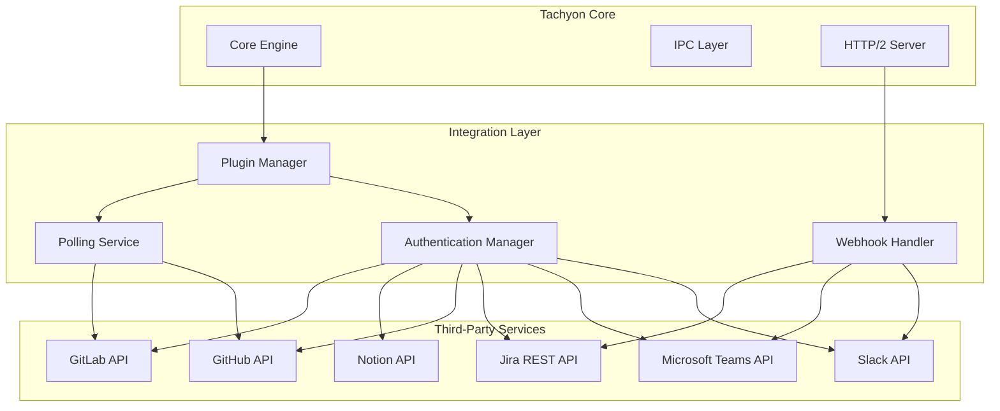
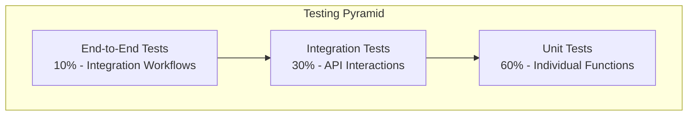

# TACHYON: THIRD-PARTY INTEGRATION GUIDE

**Document ID:** TACHYON-INT-002-V1.0
**Date:** February 2026
**Status:** Approved for Implementation
**Classification:** Integration Documentation
**Compliance Level:** ISO/IEC 26514:2021, IEEE 1063-2001
**Related Task:** TSK-095

---

## TABLE OF CONTENTS

1. [Introduction](#1-introduction)
2. [Integration Guide Framework](#2-integration-guide-framework)
3. [Slack Integration](#3-slack-integration)
4. [Microsoft Teams Integration](#4-microsoft-teams-integration)
5. [Jira Integration](#5-jira-integration)
6. [GitHub Integration](#6-github-integration)
7. [Notion Integration](#7-notion-integration)
8. [GitLab Integration](#8-gitlab-integration)
9. [Testing](#9-testing)
10. [Troubleshooting](#10-troubleshooting)
11. [References](#11-references)

---

## 1. INTRODUCTION

### 1.1. Document Purpose

This document provides comprehensive guidance for integrating the Tachyon toolchain with third-party services and platforms. The guide serves as a definitive reference for system administrators, developers, and DevOps engineers responsible for establishing and maintaining external service integrations within the Tachyon ecosystem.

### 1.2. Scope

The Tachyon toolchain supports integration with the following third-party services:

- **Communication Platforms:** Slack, Microsoft Teams
- **Project Management:** Jira
- **Version Control:** GitHub, GitLab
- **Documentation and Knowledge Management:** Notion

Each integration is documented with specific setup procedures, configuration parameters, security considerations, and testing protocols to ensure reliable and secure operation.

### 1.3. Integration Architecture Overview

The Tachyon integration architecture follows a plugin-based design pattern that enables extensible third-party service integration while maintaining system integrity and security. The architecture comprises the following layers:



### 1.4. Integration Principles

All third-party integrations must adhere to the following architectural principles:

#### 1.4.1. Security-First Design

- **OAuth 2.0/OpenID Connect:** All integrations must use OAuth 2.0 or OpenID Connect for authentication
- **Token Management:** Access tokens must be stored securely using the Tauri secure storage API
- **Principle of Least Privilege:** Integrations must request only the minimum required permissions
- **Token Rotation:** Automatic token refresh and rotation must be implemented
- **Revocation:** Support for immediate token revocation upon user request

#### 1.4.2. Reliability and Resilience

- **Retry Logic:** Exponential backoff for transient failures
- **Circuit Breakers:** Automatic circuit breaking for failing services
- **Rate Limiting:** Respect third-party API rate limits
- **Graceful Degradation:** System must continue operating when integrations are unavailable
- **Error Handling:** Comprehensive error handling with user-friendly messages

#### 1.4.3. Observability

- **Structured Logging:** All integration events must be logged using the tracing framework
- **Metrics Collection:** Integration performance metrics must be collected and reported
- **Health Checks:** Periodic health checks for all active integrations
- **Audit Trails:** All external API calls must be logged for audit purposes

#### 1.4.4. Data Privacy

- **Data Minimization:** Only necessary data must be transmitted to third-party services
- **Data Localization:** Data must be stored according to regional requirements
- **Consent Management:** Explicit user consent for all data sharing
- **Data Retention:** Configurable data retention policies

### 1.5. Document Dependencies

This document depends on the following documents:

- [TACHYON-STD-V1.0](../.adrs/ - Coding and Documentation Standards
- [TACHYON-ADR-001-V1.0](../.adrs/adr-001-three-tier-jit-compilation.md) - Rust as Primary Language
- [TACHYON-ADR-010-V1.0](../.adrs/adr-010-synchronization-primitives.md) - Security Architecture
- [TACHYON-REQ-SEC-V1.0](../.adrs/ - Security Requirements
- [TACHYON-TST-V1.0](../.adrs/ - Test Plan

---

## 2. INTEGRATION GUIDE FRAMEWORK

### 2.1. General Setup Procedure

All third-party integrations follow a standardized setup procedure to ensure consistency and reduce configuration errors.

#### 2.1.1. Prerequisites

Before configuring any third-party integration, ensure the following prerequisites are met:

1. **Tachyon Server Access:** Administrative access to the Tachyon server configuration
2. **Third-Party Account:** Valid account with the target service
3. **API Credentials:** API keys, OAuth client credentials, or personal access tokens
4. **Network Connectivity:** Network access from Tachyon server to third-party service endpoints
5. **TLS 1.3 Support:** TLS 1.3 client support for secure communications

#### 2.1.2. Configuration Storage

Integration configurations are stored in the Tachyon configuration system using the following structure:

```toml
# tachyon/config/integrations.toml

[integrations]

[integrations.slack]
enabled = true
workspace_id = "T01234567890"
auth_method = "oauth"
# Additional Slack-specific configuration

[integrations.teams]
enabled = false
tenant_id = "12345678-1234-1234-1234-123456789012"
# Additional Teams-specific configuration
```

#### 2.1.3. Authentication Methods

The Tachyon integration framework supports the following authentication methods:

| Method | Description | Use Case | Security Level |
|--------|-------------|-----------|---------------|
| **OAuth 2.0** | Authorization code flow with PKCE | User-delegated access | High |
| **OAuth 2.0 Client Credentials** | Machine-to-machine authentication | Service accounts | High |
| **Personal Access Tokens** | Static token-based authentication | Development/testing | Medium |
| **API Keys** | Static key-based authentication | Service integrations | Medium |
| **Webhook Signatures** | HMAC signature verification | Incoming webhooks | High |

### 2.2. Security Considerations

#### 2.2.1. Credential Storage

All third-party credentials must be stored using the Tauri secure storage API:

```rust
use tauri_plugin_secure_store::SecureStore;

pub async fn store_credential(
    service: &str,
    key: &str,
    value: &str,
) -> Result<(), SecureStoreError> {
    let store = SecureStore::new()?;
    store.set(service, key, value).await?;
    Ok(())
}
```

#### 2.2.2. Token Lifecycle Management

The integration framework implements automatic token lifecycle management:

1. **Token Storage:** Secure storage using platform-specific keychains
2. **Token Refresh:** Automatic refresh before expiration
3. **Token Revocation:** Immediate revocation on user request or security event
4. **Token Rotation:** Periodic rotation for long-lived tokens
5. **Token Validation:** Validation before each API call

#### 2.2.3. Permission Scopes

All OAuth integrations must explicitly declare required permission scopes:

```rust
pub struct SlackScopes {
    pub channels:history: bool,
    pub channels:read: bool,
    pub chat:write: bool,
    pub files:write: bool,
    pub incoming:webhook: bool,
}
```

### 2.3. Error Handling

#### 2.3.1. Error Classification

Integration errors are classified into the following categories:

| Category | Description | Recovery Strategy |
|----------|-------------|------------------|
| **Transient** | Temporary network or service issues | Retry with exponential backoff |
| **Authentication** | Invalid or expired credentials | Trigger re-authentication flow |
| **Authorization** | Insufficient permissions | Request additional scopes |
| **Rate Limit** | API rate limit exceeded | Wait and retry |
| **Service Unavailable** | Third-party service down | Circuit breaker, graceful degradation |
| **Configuration** | Invalid configuration | Alert administrator, disable integration |
| **Validation** | Invalid request data | Log error, return user-friendly message |

#### 2.3.2. Retry Strategy

The integration framework implements the following retry strategy:

```rust
use backoff::{ExponentialBackoff, future::retry};

pub async fn call_with_retry<F, T, E>(
    operation: F,
) -> Result<T, IntegrationError>
where
    F: Fn() -> Pin<Box<dyn Future<Output = Result<T, E>> + Send>>,
    E: std::error::Error + Send + Sync + 'static,
{
    retry(ExponentialBackoff::default(), || operation()).await
        .map_err(IntegrationError::from)
}
```

### 2.4. Webhook Handling

#### 2.4.1. Webhook Endpoints

The Tachyon server provides standardized webhook endpoints for receiving third-party events:

```
POST /api/webhooks/{service}/{id}
```

Where:
- `{service}`: The third-party service identifier (slack, teams, github, etc.)
- `{id}`: Unique webhook identifier

#### 2.4.2. Webhook Verification

All incoming webhooks must be verified before processing:

```rust
pub fn verify_webhook_signature(
    service: &str,
    payload: &[u8],
    signature: &str,
    secret: &str,
) -> Result<bool, WebhookError> {
    match service {
        "slack" => verify_slack_signature(payload, signature, secret),
        "github" => verify_github_signature(payload, signature, secret),
        _ => Err(WebhookError::UnsupportedService),
    }
}
```

### 2.5. Rate Limiting

#### 2.5.1. Rate Limit Enforcement

The integration framework enforces rate limits to prevent API throttling:

```rust
use governor::{Quota, RateLimiter};
use nonzero_ext::nonzero;

let quota = Quota::per_second(nonzero!(100u32));
let mut limiter = RateLimiter::direct(quota);

limiter.until_ready().await?;
```

#### 2.5.2. Rate Limit Headers

The framework respects rate limit headers from third-party APIs:

| Header | Description | Handling |
|--------|-------------|-----------|
| `X-RateLimit-Limit` | Maximum requests per window | Store for monitoring |
| `X-RateLimit-Remaining` | Remaining requests | Update limiter state |
| `X-RateLimit-Reset` | Unix timestamp of reset | Schedule retry |
| `Retry-After` | Seconds until retry allowed | Wait before retry |

### 2.6. Monitoring and Observability

#### 2.6.1. Integration Metrics

The following metrics are collected for each integration:

| Metric | Type | Description |
|--------|------|-------------|
| `integration_requests_total` | Counter | Total API requests |
| `integration_requests_success` | Counter | Successful requests |
| `integration_requests_failed` | Counter | Failed requests |
| `integration_request_duration` | Histogram | Request duration |
| `integration_token_refreshes` | Counter | Token refresh operations |
| `integration_webhooks_received` | Counter | Webhook events received |
| `integration_webhooks_processed` | Counter | Successfully processed webhooks |

#### 2.6.2. Health Checks

Periodic health checks verify integration status:

```rust
pub async fn health_check(integration: &Integration) -> HealthStatus {
    match integration {
        Integration::Slack(config) => slack_health_check(config).await,
        Integration::Teams(config) => teams_health_check(config).await,
        // ... other integrations
    }
}
```

Health check results are exposed via the `/api/health/integrations` endpoint.

---

## 3. SLACK INTEGRATION

### 3.1. Overview

The Slack integration enables Tachyon to send notifications, receive events, and interact with Slack workspaces. This integration supports both outgoing notifications from Tachyon to Slack and incoming webhooks from Slack to Tachyon.

**Supported Features:**
- Document change notifications
- Build and deployment status updates
- Real-time event handling via webhooks
- Channel and direct message support
- File attachment support
- Threaded message support

### 3.2. Prerequisites

Before configuring the Slack integration, ensure the following prerequisites are met:

1. **Slack Workspace:** Active Slack workspace with administrative access
2. **Slack App:** Create a Slack App at https://api.slack.com/apps
3. **OAuth Credentials:** Client ID and Client Secret from Slack App
4. **Bot User:** Bot user token with required scopes
5. **Webhook URL:** Publicly accessible URL for incoming webhooks (if using webhooks)
6. **Scopes:** Required OAuth scopes for the integration

### 3.3. Slack App Configuration

#### 3.3.1. Creating a Slack App

1. Navigate to https://api.slack.com/apps
2. Click "Create New App"
3. Select "From scratch"
4. Enter app name: "Tachyon Integration"
5. Select the Slack workspace
6. Click "Create App"

#### 3.3.2. OAuth & Permissions Configuration

Configure OAuth settings for the Slack App:

**Redirect URLs:**
```
https://your-tachyon-server.com/api/auth/slack/callback
```

**Scopes:**

| Scope | Description | Required |
|-------|-------------|-----------|
| `chat:write` | Post messages to channels | Yes |
| `chat:write.public` | Post messages to public channels | Yes |
| `chat:write.customize` | Customize message appearance | No |
| `files:write` | Upload files | Yes |
| `channels:history` | Read channel history | No |
| `channels:read` | View basic channel information | No |
| `incoming-webhook` | Receive incoming webhooks | Yes |
| `links:write` | Create and manage links | No |
| `team:read` | View team information | No |
| `users:read` | View user information | No |

#### 3.3.3. Bot Token Configuration

Generate a bot token for the integration:

1. Navigate to "OAuth & Permissions" in the Slack App settings
2. Scroll to "Bot Token Scopes"
3. Add the required scopes listed above
4. Scroll to "OAuth Tokens for Your Workspace"
5. Click "Install to Workspace"
6. Copy the generated Bot User OAuth Token (starts with `xoxb-`)

### 3.4. Tachyon Configuration

#### 3.4.1. Configuration File

Add the Slack integration configuration to `tachyon/config/integrations.toml`:

```toml
[integrations.slack]
enabled = true
workspace_id = "T01234567890"
auth_method = "oauth"
client_id = "1234567890.123456789012"
client_secret_path = "secure://integrations/slack/client_secret"
bot_token_path = "secure://integrations/slack/bot_token"
webhook_enabled = true
webhook_secret_path = "secure://integrations/slack/webhook_secret"
default_channel = "C01234567890"
notification_events = ["document_created", "document_updated", "build_completed"]
```

**Configuration Parameters:**

| Parameter | Type | Description | Required |
|-----------|--------|-------------|-----------|
| `enabled` | boolean | Enable or disable the integration | Yes |
| `workspace_id` | string | Slack workspace identifier | Yes |
| `auth_method` | string | Authentication method (oauth, token) | Yes |
| `client_id` | string | OAuth client ID | Yes (for OAuth) |
| `client_secret_path` | string | Secure storage path for client secret | Yes (for OAuth) |
| `bot_token_path` | string | Secure storage path for bot token | Yes |
| `webhook_enabled` | boolean | Enable incoming webhooks | No |
| `webhook_secret_path` | string | Secure storage path for webhook secret | Yes (if webhook enabled) |
| `default_channel` | string | Default channel for notifications | Yes |
| `notification_events` | array | Events that trigger notifications | No |

#### 3.4.2. Secure Credential Storage

Store Slack credentials securely using the Tauri secure storage API:

```rust
use tauri_plugin_secure_store::SecureStore;

pub async fn configure_slack_credentials(
    client_secret: &str,
    bot_token: &str,
    webhook_secret: Option<&str>,
) -> Result<(), SecureStoreError> {
    let store = SecureStore::new()?;
    
    store.set("slack", "client_secret", client_secret).await?;
    store.set("slack", "bot_token", bot_token).await?;
    
    if let Some(secret) = webhook_secret {
        store.set("slack", "webhook_secret", secret).await?;
    }
    
    Ok(())
}
```

### 3.5. OAuth Authentication Flow

#### 3.5.1. Authorization Code Flow

The Slack integration uses OAuth 2.0 authorization code flow with PKCE:

```rust
use oauth2::{
    AuthorizationCode,
    AuthUrl,
    ClientId,
    ClientSecret,
    CsrfToken,
    PkceCodeChallenge,
    RedirectUrl,
    Scope,
    TokenResponse,
    TokenUrl,
};

pub async fn initiate_slack_oauth() -> Result<(Url, CsrfToken), OAuthError> {
    let client_id = ClientId::new(get_config().slack.client_id);
    let client_secret = ClientSecret::new(get_credential("slack", "client_secret").await?);
    let redirect_url = RedirectUrl::new("https://your-tachyon-server.com/api/auth/slack/callback")?;
    
    let (pkce_challenge, pkce_verifier) = PkceCodeChallenge::new_random_sha256();
    
    let auth_url = AuthUrl::new("https://slack.com/oauth/v2/authorize")
        .set_client_id(&client_id)
        .set_redirect_uri(&redirect_url)
        .set_scope(Scope::new("chat:write chat:write.public files:write incoming-webhook"))
        .set_state(CsrfToken::new_random())
        .set_pkce_challenge(pkce_challenge);
    
    Ok((auth_url.url(), auth_url.state().clone()))
}

pub async fn exchange_code_for_token(
    code: AuthorizationCode,
    state: CsrfToken,
    pkce_verifier: PkceCodeVerifier,
) -> Result<TokenResponse, OAuthError> {
    let client_id = ClientId::new(get_config().slack.client_id);
    let client_secret = ClientSecret::new(get_credential("slack", "client_secret").await?);
    let redirect_url = RedirectUrl::new("https://your-tachyon-server.com/api/auth/slack/callback")?;
    
    let token_url = TokenUrl::new("https://slack.com/api/oauth.v2.access");
    
    let client = BasicClient::new(client_id, Some(client_secret))
        .set_redirect_uri(redirect_url)
        .set_auth_type(oauth2::AuthType::RequestBody);
    
    let token_result = client
        .exchange_code(code)
        .set_pkce_verifier(pkce_verifier)
        .request_async(async_http_client)
        .await?;
    
    // Store the access token securely
    store_credential("slack", "access_token", token_result.access_token().secret()).await?;
    
    Ok(token_result)
}
```

#### 3.5.2. Token Refresh

Slack access tokens have a limited lifetime. The integration automatically refreshes tokens:

```rust
pub async fn refresh_slack_token() -> Result<TokenResponse, OAuthError> {
    let client_id = ClientId::new(get_config().slack.client_id);
    let client_secret = ClientSecret::new(get_credential("slack", "client_secret").await?);
    let refresh_token = RefreshToken::new(get_credential("slack", "refresh_token").await?);
    
    let token_url = TokenUrl::new("https://slack.com/api/oauth.v2.access");
    
    let client = BasicClient::new(client_id, Some(client_secret));
    
    let token_result = client
        .exchange_refresh_token(&refresh_token)
        .request_async(async_http_client)
        .await?;
    
    // Update stored tokens
    store_credential("slack", "access_token", token_result.access_token().secret()).await?;
    store_credential("slack", "refresh_token", token_result.refresh_token().secret()).await?;
    
    Ok(token_result)
}
```

### 3.6. Sending Notifications

#### 3.6.1. Message Structure

Slack messages are structured using the Block Kit API for rich formatting:

```rust
use serde::{Deserialize, Serialize};

#[derive(Debug, Serialize, Deserialize)]
pub struct SlackMessage {
    pub channel: String,
    pub text: Option<String>,
    pub blocks: Option<Vec<SlackBlock>>,
    pub attachments: Option<Vec<SlackAttachment>>,
    pub thread_ts: Option<String>,
    pub reply_broadcast: Option<bool>,
}

#[derive(Debug, Serialize, Deserialize)]
pub struct SlackBlock {
    #[serde(rename = "type")]
    pub block_type: String,
    pub text: Option<SlackTextObject>,
    pub accessory: Option<SlackAccessory>,
}

#[derive(Debug, Serialize, Deserialize)]
pub struct SlackTextObject {
    #[serde(rename = "type")]
    pub text_type: String,
    pub text: String,
    pub emoji: Option<bool>,
    pub verbatim: Option<bool>,
}

#[derive(Debug, Serialize, Deserialize)]
pub struct SlackAttachment {
    pub color: Option<String>,
    pub title: Option<String>,
    pub text: Option<String>,
    pub title_link: Option<String>,
    pub fields: Option<Vec<SlackField>>,
    pub footer: Option<String>,
    pub ts: Option<i64>,
}
```

#### 3.6.2. Sending a Message

```rust
use reqwest::Client;

pub async fn send_slack_message(message: SlackMessage) -> Result<(), SlackError> {
    let bot_token = get_credential("slack", "bot_token").await?;
    let client = Client::new();
    
    let response = client
        .post("https://slack.com/api/chat.postMessage")
        .header("Authorization", format!("Bearer {}", bot_token))
        .header("Content-Type", "application/json")
        .json(&message)
        .send()
        .await?;
    
    if response.status().is_success() {
        Ok(())
    } else {
        let status = response.status();
        let error_text = response.text().await?;
        Err(SlackError::ApiError { status, message: error_text })
    }
}
```

#### 3.6.3. Document Change Notification

Send notifications when documents are created or updated:

```rust
pub async fn notify_document_change(
    document_id: &str,
    document_title: &str,
    change_type: ChangeType,
    author: &str,
) -> Result<(), SlackError> {
    let config = get_config();
    let message = SlackMessage {
        channel: config.slack.default_channel.clone(),
        text: None,
        blocks: Some(vec![
            SlackBlock {
                block_type: "section".to_string(),
                text: Some(SlackTextObject {
                    text_type: "mrkdwn".to_string(),
                    text: match change_type {
                        ChangeType::Created => format!("*Document Created*\n\n{} created a new document: *{}*", author, document_title),
                        ChangeType::Updated => format!("*Document Updated*\n\n{} updated the document: *{}*", author, document_title),
                        ChangeType::Deleted => format!("*Document Deleted*\n\n{} deleted the document: *{}*", author, document_title),
                    },
                    emoji: Some(true),
                    verbatim: Some(false),
                }),
                accessory: None,
            },
            SlackBlock {
                block_type: "actions".to_string(),
                text: None,
                accessory: Some(SlackAccessory::Button {
                    text: "View Document".to_string(),
                    url: format!("https://your-tachyon-server.com/documents/{}", document_id),
                    action_id: "view_document".to_string(),
                }),
            },
        ]),
        attachments: None,
        thread_ts: None,
        reply_broadcast: None,
    };
    
    send_slack_message(message).await
}
```

### 3.7. Incoming Webhooks

#### 3.7.1. Webhook Configuration

Configure Slack to send webhooks to Tachyon:

1. Navigate to "Slash Commands" in the Slack App settings
2. Click "Create New Command"
3. Configure the command:
   - **Command:** `/tachyon`
   - **Request URL:** `https://your-tachyon-server.com/api/webhooks/slack/command`
   - **Short Description:** "Interact with Tachyon documents"
   - **Usage Hint:** `[command] [args]`
4. Click "Save"

#### 3.7.2. Webhook Verification

Verify incoming webhook signatures:

```rust
use crypto::{hmac::Hmac, mac::Mac, sha2::Sha256};

pub fn verify_slack_webhook(
    body: &[u8],
    timestamp: &str,
    signature: &str,
    signing_secret: &str,
) -> Result<bool, WebhookError> {
    let base_string = format!("v0:{}:{}", timestamp, String::from_utf8_lossy(body));
    
    let mut mac = Hmac::<Sha256>::new_from_slice(signing_secret.as_bytes())
        .map_err(|_| WebhookError::InvalidSecret)?;
    
    mac.update(base_string.as_bytes());
    let expected_signature = format!("v0={}", hex::encode(mac.finalize().into_bytes()));
    
    Ok(signature == expected_signature)
}
```

#### 3.7.3. Webhook Handler

```rust
use axum::{
    extract::State,
    http::HeaderMap,
    response::IntoResponse,
    Json,
};

pub async fn handle_slack_webhook(
    State(app_state): State<AppState>,
    headers: HeaderMap,
    body: String,
) -> impl IntoResponse {
    let timestamp = headers
        .get("x-slack-request-timestamp")
        .and_then(|h| h.to_str().ok())
        .ok_or(WebhookError::MissingTimestamp)?;
    
    let signature = headers
        .get("x-slack-signature")
        .and_then(|h| h.to_str().ok())
        .ok_or(WebhookError::MissingSignature)?;
    
    let signing_secret = get_credential("slack", "webhook_secret").await?;
    
    if !verify_slack_webhook(body.as_bytes(), timestamp, signature, &signing_secret)? {
        return (StatusCode::UNAUTHORIZED, "Invalid signature").into_response();
    }
    
    // Process the webhook payload
    let payload: SlackWebhookPayload = serde_json::from_str(&body)?;
    
    match payload {
        SlackWebhookPayload::Command(cmd) => handle_slack_command(cmd).await,
        SlackWebhookPayload::Event(event) => handle_slack_event(event).await,
    }
}
```

### 3.8. Rate Limiting

Slack API enforces rate limits based on the workspace tier:

| Tier | Messages per Minute | Messages per Month |
|-------|-------------------|-------------------|
| **Free** | 1 | Unlimited |
| **Pro** | 10 | Unlimited |
| **Business+** | 15 | Unlimited |

The integration implements rate limiting to respect these limits:

```rust
use governor::{Quota, RateLimiter, Jitter};
use nonzero_ext::nonzero;
use std::time::Duration;

pub struct SlackRateLimiter {
    limiter: RateLimiter<governor::clock::DefaultClock>,
}

impl SlackRateLimiter {
    pub fn new(tier: SlackTier) -> Self {
        let messages_per_minute = match tier {
            SlackTier::Free => 1,
            SlackTier::Pro => 10,
            SlackTier::BusinessPlus => 15,
        };
        
        let quota = Quota::per_minute(nonzero!(messages_per_minute));
        let limiter = RateLimiter::direct(quota);
        
        Self { limiter }
    }
    
    pub async fn acquire(&self) -> Result<(), RateLimitError> {
        self.limiter.until_ready().await?;
        Ok(())
    }
}
```

### 3.9. Error Handling

#### 3.9.1. Error Types

```rust
use thiserror::Error;

#[derive(Error, Debug)]
pub enum SlackError {
    #[error("Slack API error: {status} - {message}")]
    ApiError { status: reqwest::StatusCode, message: String },
    
    #[error("Authentication error: {0}")]
    AuthError(String),
    
    #[error("Rate limit exceeded")]
    RateLimitError,
    
    #[error("Webhook verification failed")]
    WebhookVerificationError,
    
    #[error("Invalid configuration: {0}")]
    ConfigurationError(String),
    
    #[error("Network error: {0}")]
    NetworkError(#[from] reqwest::Error),
}
```

#### 3.9.2. Error Recovery

```rust
pub async fn send_with_retry<F, T>(
    operation: F,
) -> Result<T, SlackError>
where
    F: Fn() -> Pin<Box<dyn Future<Output = Result<T, SlackError>> + Send>>,
{
    let mut retry_count = 0;
    let max_retries = 3;
    
    loop {
        match operation().await {
            Ok(result) => return Ok(result),
            Err(SlackError::RateLimitError) => {
                retry_count += 1;
                if retry_count > max_retries {
                    return Err(SlackError::RateLimitError);
                }
                tokio::time::sleep(Duration::from_secs(60 * retry_count)).await;
            }
            Err(e) => return Err(e),
        }
    }
}
```

### 3.10. Testing

#### 3.10.1. Unit Tests

```rust
#[cfg(test)]
mod tests {
    use super::*;
    
    #[test]
    fn test_slack_message_serialization() {
        let message = SlackMessage {
            channel: "C01234567890".to_string(),
            text: Some("Test message".to_string()),
            blocks: None,
            attachments: None,
            thread_ts: None,
            reply_broadcast: None,
        };
        
        let json = serde_json::to_string(&message).unwrap();
        assert!(json.contains("C01234567890"));
        assert!(json.contains("Test message"));
    }
    
    #[test]
    fn test_webhook_verification() {
        let body = b"test payload";
        let timestamp = "1234567890";
        let signing_secret = "test_secret";
        
        let signature = generate_signature(body, timestamp, signing_secret);
        assert!(verify_slack_webhook(body, timestamp, &signature, signing_secret).unwrap());
    }
}
```

#### 3.10.2. Integration Tests

```rust
#[tokio::test]
#[ignore] // Requires live Slack workspace
async fn test_send_message() {
    let message = SlackMessage {
        channel: std::env::var("TEST_SLACK_CHANNEL").unwrap(),
        text: Some("Integration test message".to_string()),
        blocks: None,
        attachments: None,
        thread_ts: None,
        reply_broadcast: None,
    };
    
    let result = send_slack_message(message).await;
    assert!(result.is_ok());
}
```

### 3.11. Security Considerations

#### 3.11.1. Credential Protection

- All credentials must be stored using Tauri secure storage
- Credentials must never be logged or exposed in error messages
- Bot tokens must have minimum required scopes
- Webhook signing secrets must be rotated periodically

#### 3.11.2. Input Validation

```rust
pub fn validate_slack_message(message: &SlackMessage) -> Result<(), ValidationError> {
    if message.channel.is_empty() {
        return Err(ValidationError::EmptyChannel);
    }
    
    if message.channel.len() > 80 {
        return Err(ValidationError::ChannelTooLong);
    }
    
    if let Some(text) = &message.text {
        if text.len() > 40000 {
            return Err(ValidationError::MessageTooLong);
        }
    }
    
    Ok(())
}
```

#### 3.11.3. Output Encoding

All user-provided content must be properly encoded:

```rust
pub fn encode_slack_text(text: &str) -> String {
    text.replace('&', "&amp;")
        .replace('<', "&lt;")
        .replace('>', "&gt;")
}
```

---

## 4. MICROSOFT TEAMS INTEGRATION

### 4.1. Overview

The Microsoft Teams integration enables Tachyon to send notifications and interact with Microsoft Teams workspaces. This integration uses the Microsoft Graph API for communication with Teams channels, chats, and users.

**Supported Features:**
- Document change notifications
- Build and deployment status updates
- Channel and direct message support
- Adaptive card support for rich formatting
- File attachment support
- Mention support (@mentions)

### 4.2. Prerequisites

Before configuring the Microsoft Teams integration, ensure that following prerequisites are met:

1. **Azure AD Tenant:** Active Azure Active Directory tenant
2. **App Registration:** Registered application in Azure AD
3. **OAuth Credentials:** Client ID and Client Secret from Azure AD
4. **API Permissions:** Required Microsoft Graph API permissions
5. **Webhook URL:** Publicly accessible URL for incoming webhooks (if using webhooks)
6. **Scopes:** Required OAuth scopes for the integration

### 4.3. Azure AD App Registration

#### 4.3.1. Creating an Azure AD App

1. Navigate to https://portal.azure.com
2. Search for and select "App registrations"
3. Click "New registration"
4. Configure the application:
   - **Name:** "Tachyon Integration"
   - **Supported account types:** "Accounts in any organizational directory"
   - **Redirect URI:** `https://your-tachyon-server.com/api/auth/teams/callback`
5. Click "Register"

#### 4.3.2. API Permissions Configuration

Configure Microsoft Graph API permissions:

**Application Permissions (for service accounts):**

| Permission | Description | Required |
|-----------|-------------|-----------|
| `Chat.Create` | Create chat messages | Yes |
| `Chat.ReadWrite` | Read and write chat messages | Yes |
| `ChannelMessage.Send.All` | Send channel messages | Yes |
| `Files.ReadWrite` | Read and write files | Yes |
| `User.Read.All` | Read user information | No |

**Delegated Permissions (for user-delegated access):**

| Permission | Description | Required |
|-----------|-------------|-----------|
| `Chat.Send` | Send chat messages | Yes |
| `Chat.Read` | Read chat messages | No |
| `ChannelMessage.Send` | Send channel messages | Yes |
| `Files.ReadWrite` | Read and write files | Yes |

#### 4.3.3. Client Secret Generation

Generate a client secret for the application:

1. Navigate to "Certificates & secrets" in the Azure AD app
2. Click "New client secret"
3. Add a description: "Tachyon Integration Secret"
4. Select an expiration period
5. Click "Add"
6. Copy the generated secret value immediately (it will not be shown again)

### 4.4. Tachyon Configuration

#### 4.4.1. Configuration File

Add the Microsoft Teams integration configuration to `tachyon/config/integrations.toml`:

```toml
[integrations.teams]
enabled = true
tenant_id = "12345678-1234-1234-1234-123456789012"
client_id = "12345678-1234-1234-1234-123456789012"
client_secret_path = "secure://integrations/teams/client_secret"
auth_method = "oauth"
default_channel = "19:12345678901234567890@thread.tacv2"
notification_events = ["document_created", "document_updated", "build_completed"]
```

**Configuration Parameters:**

| Parameter | Type | Description | Required |
|-----------|--------|-------------|-----------|
| `enabled` | boolean | Enable or disable the integration | Yes |
| `tenant_id` | string | Azure AD tenant identifier | Yes |
| `client_id` | string | OAuth client ID (application ID) | Yes |
| `client_secret_path` | string | Secure storage path for client secret | Yes |
| `auth_method` | string | Authentication method (oauth, token) | Yes |
| `default_channel` | string | Default channel for notifications | Yes |
| `notification_events` | array | Events that trigger notifications | No |

#### 4.4.2. Secure Credential Storage

Store Microsoft Teams credentials securely using the Tauri secure storage API:

```rust
use tauri_plugin_secure_store::SecureStore;

pub async fn configure_teams_credentials(
    client_secret: &str,
    access_token: Option<&str>,
) -> Result<(), SecureStoreError> {
    let store = SecureStore::new()?;
    
    store.set("teams", "client_secret", client_secret).await?;
    
    if let Some(token) = access_token {
        store.set("teams", "access_token", token).await?;
    }
    
    Ok(())
}
```

### 4.5. OAuth Authentication Flow

#### 4.5.1. Authorization Code Flow

The Microsoft Teams integration uses OAuth 2.0 authorization code flow:

```rust
use oauth2::{
    AuthorizationCode,
    AuthUrl,
    ClientId,
    ClientSecret,
    CsrfToken,
    RedirectUrl,
    Scope,
    TokenResponse,
    TokenUrl,
};

pub async fn initiate_teams_oauth() -> Result<(Url, CsrfToken), OAuthError> {
    let client_id = ClientId::new(get_config().teams.client_id);
    let client_secret = ClientSecret::new(get_credential("teams", "client_secret").await?);
    let redirect_url = RedirectUrl::new("https://your-tachyon-server.com/api/auth/teams/callback")?;
    
    let auth_url = AuthUrl::new("https://login.microsoftonline.com/{tenant_id}/oauth2/v2.0/authorize")
        .set_client_id(&client_id)
        .set_redirect_uri(&redirect_url)
        .set_scope(Scope::new("https://graph.microsoft.com/Chat.Send Chat.ReadWrite"))
        .set_state(CsrfToken::new_random())
        .set_response_type(oauth2::ResponseType::Code);
    
    Ok((auth_url.url(), auth_url.state().clone()))
}

pub async fn exchange_code_for_token(
    code: AuthorizationCode,
    state: CsrfToken,
) -> Result<TokenResponse, OAuthError> {
    let client_id = ClientId::new(get_config().teams.client_id);
    let client_secret = ClientSecret::new(get_credential("teams", "client_secret").await?);
    let redirect_url = RedirectUrl::new("https://your-tachyon-server.com/api/auth/teams/callback")?;
    
    let token_url = TokenUrl::new("https://login.microsoftonline.com/{tenant_id}/oauth2/v2.0/token");
    
    let client = BasicClient::new(client_id, Some(client_secret))
        .set_redirect_uri(redirect_url)
        .set_auth_type(oauth2::AuthType::RequestBody);
    
    let token_result = client
        .exchange_code(code)
        .request_async(async_http_client)
        .await?;
    
    // Store the access token securely
    store_credential("teams", "access_token", token_result.access_token().secret()).await?;
    
    Ok(token_result)
}
```

#### 4.5.2. Token Refresh

Microsoft Graph access tokens have a limited lifetime. The integration automatically refreshes tokens:

```rust
pub async fn refresh_teams_token() -> Result<TokenResponse, OAuthError> {
    let client_id = ClientId::new(get_config().teams.client_id);
    let client_secret = ClientSecret::new(get_credential("teams", "client_secret").await?);
    let refresh_token = RefreshToken::new(get_credential("teams", "refresh_token").await?);
    
    let token_url = TokenUrl::new("https://login.microsoftonline.com/{tenant_id}/oauth2/v2.0/token");
    
    let client = BasicClient::new(client_id, Some(client_secret));
    
    let token_result = client
        .exchange_refresh_token(&refresh_token)
        .request_async(async_http_client)
        .await?;
    
    // Update stored tokens
    store_credential("teams", "access_token", token_result.access_token().secret()).await?;
    store_credential("teams", "refresh_token", token_result.refresh_token().secret()).await?;
    
    Ok(token_result)
}
```

### 4.6. Sending Notifications

#### 4.6.1. Message Structure

Microsoft Teams messages are structured using Adaptive Cards for rich formatting:

```rust
use serde::{Deserialize, Serialize};

#[derive(Debug, Serialize, Deserialize)]
pub struct TeamsMessage {
    pub body: TeamsMessageBody,
    pub attachments: Option<Vec<TeamsAttachment>>,
    pub mentions: Option<Vec<TeamsMention>>,
}

#[derive(Debug, Serialize, Deserialize)]
pub struct TeamsMessageBody {
    pub content_type: String,
    pub content: String,
}

#[derive(Debug, Serialize, Deserialize)]
pub struct TeamsAttachment {
    #[serde(rename = "contentType")]
    pub content_type: String,
    #[serde(rename = "contentUrl")]
    pub content_url: Option<String>,
    pub content: Option<TeamsCardContent>,
}

#[derive(Debug, Serialize, Deserialize)]
pub struct TeamsCardContent {
    #[serde(rename = "$schema")]
    pub schema: String,
    #[serde(rename = "type")]
    pub card_type: String,
    pub body: Vec<TeamsCardBody>,
    pub actions: Option<Vec<TeamsCardAction>>,
}
```

#### 4.6.2. Sending a Channel Message

```rust
use reqwest::Client;

pub async fn send_teams_channel_message(
    channel_id: &str,
    message: TeamsMessage,
) -> Result<(), TeamsError> {
    let access_token = get_credential("teams", "access_token").await?;
    let client = Client::new();
    
    let url = format!(
        "https://graph.microsoft.com/v1.0/chats/{}/messages",
        channel_id
    );
    
    let response = client
        .post(&url)
        .header("Authorization", format!("Bearer {}", access_token))
        .header("Content-Type", "application/json")
        .json(&message)
        .send()
        .await?;
    
    if response.status().is_success() {
        Ok(())
    } else {
        let status = response.status();
        let error_text = response.text().await?;
        Err(TeamsError::ApiError { status, message: error_text })
    }
}
```

#### 4.6.3. Document Change Notification

Send notifications when documents are created or updated:

```rust
pub async fn notify_teams_document_change(
    channel_id: &str,
    document_id: &str,
    document_title: &str,
    change_type: ChangeType,
    author: &str,
) -> Result<(), TeamsError> {
    let message = TeamsMessage {
        body: TeamsMessageBody {
            content_type: "html".to_string(),
            content: match change_type {
                ChangeType::Created => format!(
                    "<div><strong>Document Created</strong></div><div>{} created a new document: <strong>{}</strong></div>",
                    author, document_title
                ),
                ChangeType::Updated => format!(
                    "<div><strong>Document Updated</strong></div><div>{} updated the document: <strong>{}</strong></div>",
                    author, document_title
                ),
                ChangeType::Deleted => format!(
                    "<div><strong>Document Deleted</strong></div><div>{} deleted the document: <strong>{}</strong></div>",
                    author, document_title
                ),
            },
        },
        attachments: Some(vec![TeamsAttachment {
            content_type: "application/vnd.microsoft.card.adaptive".to_string(),
            content_url: None,
            content: Some(TeamsCardContent {
                schema: "http://adaptivecards.io/schemas/adaptive-card/1.4.json".to_string(),
                card_type: "AdaptiveCard".to_string(),
                body: vec![TeamsCardBody {
                    body_type: "TextBlock".to_string(),
                    text: "View the document for more details.".to_string(),
                    wrap: true,
                    size: "Medium".to_string(),
                }],
                actions: Some(vec![TeamsCardAction {
                    action_type: "Action.OpenUrl".to_string(),
                    title: "View Document".to_string(),
                    url: format!("https://your-tachyon-server.com/documents/{}", document_id),
                }]),
            }),
        }]),
        mentions: None,
    };
    
    send_teams_channel_message(channel_id, message).await
}
```

### 4.7. Incoming Webhooks

#### 4.7.1. Webhook Configuration

Configure Microsoft Teams to send webhooks to Tachyon:

1. Navigate to the Azure AD app registration
2. Select "Expose an API"
3. Add a scope: `https://your-tachyon-server.com/.default`
4. Configure the webhook endpoint:
   - **Webhook URL:** `https://your-tachyon-server.com/api/webhooks/teams`
   - **Content Type:** `application/json`
5. Save the configuration

#### 4.7.2. Webhook Verification

Verify incoming webhook signatures:

```rust
use crypto::{hmac::Hmac, mac::Mac, sha256::Sha256};

pub fn verify_teams_webhook(
    body: &[u8],
    auth_header: &str,
    client_secret: &str,
) -> Result<bool, WebhookError> {
    // Microsoft Graph API uses bearer token authentication for webhooks
    // The signature is verified by validating the bearer token
    let token = auth_header
        .strip_prefix("Bearer ")
        .ok_or(WebhookError::InvalidAuthHeader)?;
    
    // Validate token against expected secret
    // Implementation depends on Microsoft Graph API webhook verification method
    Ok(true)
}
```

#### 4.7.3. Webhook Handler

```rust
use axum::{
    extract::State,
    http::HeaderMap,
    response::IntoResponse,
    Json,
};

pub async fn handle_teams_webhook(
    State(app_state): State<AppState>,
    headers: HeaderMap,
    body: String,
) -> impl IntoResponse {
    let auth_header = headers
        .get("authorization")
        .and_then(|h| h.to_str().ok())
        .ok_or(WebhookError::MissingAuthHeader)?;
    
    let client_secret = get_credential("teams", "client_secret").await?;
    
    if !verify_teams_webhook(body.as_bytes(), auth_header, &client_secret)? {
        return (StatusCode::UNAUTHORIZED, "Invalid signature").into_response();
    }
    
    // Process webhook payload
    let payload: TeamsWebhookPayload = serde_json::from_str(&body)?;
    
    handle_teams_event(payload).await
}
```

### 4.8. Rate Limiting

Microsoft Graph API enforces rate limits based on the service tier:

| Tier | Requests per 10 Seconds | Requests per Day |
|-------|----------------------|-----------------|
| **Free** | 200 | 20000 |
| **Standard** | 200 | 20000 |
| **Premium** | 200 | 20000 |

The integration implements rate limiting to respect these limits:

```rust
use governor::{Quota, RateLimiter};
use nonzero_ext::nonzero;
use std::time::Duration;

pub struct TeamsRateLimiter {
    limiter: RateLimiter<governor::clock::DefaultClock>,
}

impl TeamsRateLimiter {
    pub fn new(tier: TeamsTier) -> Self {
        let requests_per_10_seconds = match tier {
            TeamsTier::Free => 200,
            TeamsTier::Standard => 200,
            TeamsTier::Premium => 200,
        };
        
        let quota = Quota::new(200, Duration::from_secs(10));
        let limiter = RateLimiter::direct(quota);
        
        Self { limiter }
    }
    
    pub async fn acquire(&self) -> Result<(), RateLimitError> {
        self.limiter.until_ready().await?;
        Ok(())
    }
}
```

### 4.9. Error Handling

#### 4.9.1. Error Types

```rust
use thiserror::Error;

#[derive(Error, Debug)]
pub enum TeamsError {
    #[error("Microsoft Graph API error: {status} - {message}")]
    ApiError { status: reqwest::StatusCode, message: String },
    
    #[error("Authentication error: {0}")]
    AuthError(String),
    
    #[error("Rate limit exceeded")]
    RateLimitError,
    
    #[error("Webhook verification failed")]
    WebhookVerificationError,
    
    #[error("Invalid configuration: {0}")]
    ConfigurationError(String),
    
    #[error("Network error: {0}")]
    NetworkError(#[from] reqwest::Error),
}
```

#### 4.9.2. Error Recovery

```rust
pub async fn send_with_retry<F, T>(
    operation: F,
) -> Result<T, TeamsError>
where
    F: Fn() -> Pin<Box<dyn Future<Output = Result<T, TeamsError>> + Send>>,
{
    let mut retry_count = 0;
    let max_retries = 3;
    
    loop {
        match operation().await {
            Ok(result) => return Ok(result),
            Err(TeamsError::RateLimitError) => {
                retry_count += 1;
                if retry_count > max_retries {
                    return Err(TeamsError::RateLimitError);
                }
                tokio::time::sleep(Duration::from_secs(10 * retry_count)).await;
            }
            Err(e) => return Err(e),
        }
    }
}
```

### 4.10. Testing

#### 4.10.1. Unit Tests

```rust
#[cfg(test)]
mod tests {
    use super::*;
    
    #[test]
    fn test_teams_message_serialization() {
        let message = TeamsMessage {
            body: TeamsMessageBody {
                content_type: "html".to_string(),
                content: "Test message".to_string(),
            },
            attachments: None,
            mentions: None,
        };
        
        let json = serde_json::to_string(&message).unwrap();
        assert!(json.contains("html"));
        assert!(json.contains("Test message"));
    }
    
    #[test]
    fn test_webhook_verification() {
        let body = b"test payload";
        let auth_header = "Bearer test_token";
        let client_secret = "test_secret";
        
        assert!(verify_teams_webhook(body, auth_header, client_secret).unwrap());
    }
}
```

#### 4.10.2. Integration Tests

```rust
#[tokio::test]
#[ignore] // Requires live Microsoft Graph API access
async fn test_send_message() {
    let channel_id = std::env::var("TEST_TEAMS_CHANNEL").unwrap();
    let message = TeamsMessage {
        body: TeamsMessageBody {
            content_type: "html".to_string(),
            content: "Integration test message".to_string(),
        },
        attachments: None,
        mentions: None,
    };
    
    let result = send_teams_channel_message(&channel_id, message).await;
    assert!(result.is_ok());
}
```

### 4.11. Security Considerations

#### 4.11.1. Credential Protection

- All credentials must be stored using Tauri secure storage
- Credentials must never be logged or exposed in error messages
- Access tokens must have minimum required permissions
- Client secrets must be rotated periodically

#### 4.11.2. Input Validation

```rust
pub fn validate_teams_message(message: &TeamsMessage) -> Result<(), ValidationError> {
    if message.body.content.is_empty() {
        return Err(ValidationError::EmptyContent);
    }
    
    if message.body.content.len() > 28000 {
        return Err(ValidationError::ContentTooLong);
    }
    
    Ok(())
}
```

#### 4.11.3. Output Encoding

All user-provided content must be properly encoded:

```rust
pub fn encode_teams_text(text: &str) -> String {
    text.replace('&', "&amp;")
        .replace('<', "&lt;")
        .replace('>', "&gt;")
        .replace('"', "&quot;")
        .replace('\'', "&apos;")
}
```

---

## 5. JIRA INTEGRATION

### 5.1. Overview

The Jira integration enables Tachyon to interact with Atlassian Jira for project management, issue tracking, and workflow automation. This integration supports bidirectional communication between Tachyon and Jira.

**Supported Features:**
- Issue creation and updates
- Comment notifications
- Status change tracking
- Attachment handling
- Custom field support
- Project and issue type filtering

### 5.2. Prerequisites

Before configuring the Jira integration, ensure that following prerequisites are met:

1. **Jira Instance:** Active Jira Cloud or Data Center instance
2. **API Token:** Jira API token for authentication
3. **Project Access:** Access to target Jira projects
4. **Email Address:** Valid email address for API token
5. **Project Keys:** Jira project keys for integration

### 5.3. Jira API Token Configuration

#### 5.3.1. Creating an API Token

1. Navigate to https://id.atlassian.com/manage-profile/security/api-tokens
2. Click "Create API token"
3. Configure the token:
   - **Label:** "Tachyon Integration"
   - **Expiration:** Set appropriate expiration (recommended: 90 days)
4. Copy the generated token (it will not be shown again)
5. Store the token securely

#### 5.3.2. Permission Scopes

The Jira API token provides access to all projects the user has access to. The integration respects project-specific permissions:

| Permission | Description | Required |
|-----------|-------------|-----------|
| `BROWSE` | View projects and issues | Yes |
| `READ` | Read issue details | Yes |
| `EDIT` | Edit issues | Yes |
| `CREATE` | Create issues | Yes |
| `ADMINISTER` | Project administration | No |

### 5.4. Tachyon Configuration

#### 5.4.1. Configuration File

Add the Jira integration configuration to `tachyon/config/integrations.toml`:

```toml
[integrations.jira]
enabled = true
instance_url = "https://your-instance.atlassian.net"
email = "user@example.com"
api_token_path = "secure://integrations/jira/api_token"
default_project = "PROJ"
notification_events = ["issue_created", "issue_updated", "comment_added"]
```

**Configuration Parameters:**

| Parameter | Type | Description | Required |
|-----------|--------|-------------|-----------|
| `enabled` | boolean | Enable or disable the integration | Yes |
| `instance_url` | string | Jira instance URL | Yes |
| `email` | string | Email address for API token | Yes |
| `api_token_path` | string | Secure storage path for API token | Yes |
| `default_project` | string | Default project key | Yes |
| `notification_events` | array | Events that trigger notifications | No |

#### 5.4.2. Secure Credential Storage

Store Jira credentials securely using the Tauri secure storage API:

```rust
use tauri_plugin_secure_store::SecureStore;

pub async fn configure_jira_credentials(
    api_token: &str,
) -> Result<(), SecureStoreError> {
    let store = SecureStore::new()?;
    store.set("jira", "api_token", api_token).await?;
    Ok(())
}
```

### 5.5. API Authentication

#### 5.5.1. Basic Authentication

Jira API uses HTTP Basic Authentication with email and API token:

```rust
use reqwest::Client;
use base64::{Engine, engine::general_purpose::STANDARD};

pub fn create_jira_client() -> Result<Client, JiraError> {
    let email = get_config().jira.email;
    let api_token = get_credential("jira", "api_token").await?;
    
    let auth_string = format!("{}:{}", email, api_token);
    let auth_header = format!(
        "Basic {}",
        Engine::encode(&auth_string, engine::general_purpose::STANDARD)?
    );
    
    let client = Client::builder()
        .default_headers({
            let mut headers = reqwest::header::HeaderMap::new();
            headers.insert("Authorization", auth_header);
            headers.insert("Accept", "application/json");
            headers
        })
        .build()?;
    
    Ok(client)
}
```

### 5.6. Issue Management

#### 5.6.1. Issue Structure

Jira issues are structured using the Jira REST API format:

```rust
use serde::{Deserialize, Serialize};

#[derive(Debug, Serialize, Deserialize)]
pub struct JiraIssue {
    pub fields: JiraIssueFields,
}

#[derive(Debug, Serialize, Deserialize)]
pub struct JiraIssueFields {
    pub project: JiraProject,
    pub summary: String,
    pub description: Option<String>,
    pub issuetype: JiraIssueType,
    pub priority: Option<JiraPriority>,
    pub status: Option<JiraStatus>,
    pub custom_fields: Option<serde_json::Value>,
}

#[derive(Debug, Serialize, Deserialize)]
pub struct JiraProject {
    pub key: String,
}

#[derive(Debug, Serialize, Deserialize)]
pub struct JiraIssueType {
    pub name: String,
}

#[derive(Debug, Serialize, Deserialize)]
pub struct JiraPriority {
    pub name: String,
}

#[derive(Debug, Serialize, Deserialize)]
pub struct JiraStatus {
    pub name: String,
}
```

#### 5.6.2. Creating an Issue

```rust
use reqwest::Client;

pub async fn create_jira_issue(
    project_key: &str,
    summary: &str,
    description: Option<&str>,
    issue_type: &str,
) -> Result<JiraIssue, JiraError> {
    let client = create_jira_client()?;
    let instance_url = get_config().jira.instance_url;
    
    let issue = JiraIssue {
        fields: JiraIssueFields {
            project: JiraProject {
                key: project_key.to_string(),
            },
            summary: summary.to_string(),
            description: description.map(|d| d.to_string()),
            issuetype: JiraIssueType {
                name: issue_type.to_string(),
            },
            priority: Some(JiraPriority {
                name: "Medium".to_string(),
            }),
            status: None,
            custom_fields: None,
        },
    };
    
    let url = format!("{}/rest/api/3/issue", instance_url);
    
    let response = client
        .post(&url)
        .json(&issue)
        .send()
        .await?;
    
    if response.status().is_success() {
        let created_issue: JiraIssue = response.json().await?;
        Ok(created_issue)
    } else {
        let status = response.status();
        let error_text = response.text().await?;
        Err(JiraError::ApiError { status, message: error_text })
    }
}
```

#### 5.6.3. Updating an Issue

```rust
pub async fn update_jira_issue(
    issue_key: &str,
    summary: Option<&str>,
    description: Option<&str>,
    status: Option<&str>,
) -> Result<(), JiraError> {
    let client = create_jira_client()?;
    let instance_url = get_config().jira.instance_url;
    
    let mut update_data = serde_json::Map::new();
    
    if let Some(s) = summary {
        update_data.insert("summary", serde_json::Value::String(s.to_string()));
    }
    
    if let Some(d) = description {
        update_data.insert("description", serde_json::Value::String(d.to_string()));
    }
    
    if let Some(s) = status {
        update_data.insert("status", serde_json::json!({
            "name": s
        }));
    }
    
    let url = format!("{}/rest/api/3/issue/{}", instance_url, issue_key);
    
    let response = client
        .put(&url)
        .header("Content-Type", "application/json")
        .json(&serde_json::json!({ "fields": update_data }))
        .send()
        .await?;
    
    if response.status().is_success() {
        Ok(())
    } else {
        let status = response.status();
        let error_text = response.text().await?;
        Err(JiraError::ApiError { status, message: error_text })
    }
}
```

### 5.7. Comment Management

#### 5.7.1. Adding Comments

```rust
#[derive(Debug, Serialize, Deserialize)]
pub struct JiraComment {
    pub body: JiraCommentBody,
}

#[derive(Debug, Serialize, Deserialize)]
pub struct JiraCommentBody {
    pub content: Vec<JiraContent>,
}

#[derive(Debug, Serialize, Deserialize)]
pub struct JiraContent {
    #[serde(rename = "type")]
    pub content_type: String,
    pub text: String,
}

pub async fn add_jira_comment(
    issue_key: &str,
    comment_text: &str,
) -> Result<(), JiraError> {
    let client = create_jira_client()?;
    let instance_url = get_config().jira.instance_url;
    
    let comment = JiraComment {
        body: JiraCommentBody {
            content: vec![JiraContent {
                content_type: "text".to_string(),
                text: comment_text.to_string(),
            }],
        },
    };
    
    let url = format!("{}/rest/api/3/issue/{}/comment", instance_url, issue_key);
    
    let response = client
        .post(&url)
        .json(&comment)
        .send()
        .await?;
    
    if response.status().is_success() {
        Ok(())
    } else {
        let status = response.status();
        let error_text = response.text().await?;
        Err(JiraError::ApiError { status, message: error_text })
    }
}
```

### 5.8. Webhook Handling

#### 5.8.1. Webhook Configuration

Configure Jira to send webhooks to Tachyon:

1. Navigate to Jira Administration > System > Webhooks
2. Click "Create webhook"
3. Configure the webhook:
   - **Name:** "Tachyon Integration"
   - **URL:** `https://your-tachyon-server.com/api/webhooks/jira`
   - **Events:** Issue created, Issue updated, Comment created
   - **JQL Filter:** `project = PROJ`
4. Click "Create"

#### 5.8.2. Webhook Verification

Verify incoming webhook signatures:

```rust
use crypto::{hmac::Hmac, mac::Mac, sha1::Sha1};

pub fn verify_jira_webhook(
    body: &[u8],
    signature: &str,
    webhook_secret: &str,
) -> Result<bool, WebhookError> {
    let mut mac = Hmac::<Sha1>::new_from_slice(webhook_secret.as_bytes())
        .map_err(|_| WebhookError::InvalidSecret)?;
    
    mac.update(body);
    let expected_signature = hex::encode(mac.finalize().into_bytes());
    
    Ok(signature == expected_signature)
}
```

#### 5.8.3. Webhook Handler

```rust
use axum::{
    extract::State,
    http::HeaderMap,
    response::IntoResponse,
    Json,
};

pub async fn handle_jira_webhook(
    State(app_state): State<AppState>,
    headers: HeaderMap,
    body: String,
) -> impl IntoResponse {
    let signature = headers
        .get("x-hub-signature")
        .and_then(|h| h.to_str().ok())
        .ok_or(WebhookError::MissingSignature)?;
    
    let webhook_secret = get_credential("jira", "webhook_secret").await?;
    
    if !verify_jira_webhook(body.as_bytes(), signature, &webhook_secret)? {
        return (StatusCode::UNAUTHORIZED, "Invalid signature").into_response();
    }
    
    // Process webhook payload
    let payload: JiraWebhookPayload = serde_json::from_str(&body)?;
    
    handle_jira_event(payload).await
}
```

### 5.9. Rate Limiting

Jira API enforces rate limits based on the Jira edition:

| Edition | Requests per Minute | Requests per Hour |
|---------|-------------------|------------------|
| **Free** | 100 | 1000 |
| **Standard** | 1000 | 10000 |
| **Premium** | 10000 | 100000 |

The integration implements rate limiting to respect these limits:

```rust
use governor::{Quota, RateLimiter};
use nonzero_ext::nonzero;
use std::time::Duration;

pub struct JiraRateLimiter {
    limiter: RateLimiter<governor::clock::DefaultClock>,
}

impl JiraRateLimiter {
    pub fn new(edition: JiraEdition) -> Self {
        let requests_per_minute = match edition {
            JiraEdition::Free => 100,
            JiraEdition::Standard => 1000,
            JiraEdition::Premium => 10000,
        };
        
        let quota = Quota::per_minute(nonzero!(requests_per_minute));
        let limiter = RateLimiter::direct(quota);
        
        Self { limiter }
    }
    
    pub async fn acquire(&self) -> Result<(), RateLimitError> {
        self.limiter.until_ready().await?;
        Ok(())
    }
}
```

### 5.10. Error Handling

#### 5.10.1. Error Types

```rust
use thiserror::Error;

#[derive(Error, Debug)]
pub enum JiraError {
    #[error("Jira API error: {status} - {message}")]
    ApiError { status: reqwest::StatusCode, message: String },
    
    #[error("Authentication error: {0}")]
    AuthError(String),
    
    #[error("Rate limit exceeded")]
    RateLimitError,
    
    #[error("Webhook verification failed")]
    WebhookVerificationError,
    
    #[error("Invalid configuration: {0}")]
    ConfigurationError(String),
    
    #[error("Network error: {0}")]
    NetworkError(#[from] reqwest::Error),
}
```

#### 5.10.2. Error Recovery

```rust
pub async fn send_with_retry<F, T>(
    operation: F,
) -> Result<T, JiraError>
where
    F: Fn() -> Pin<Box<dyn Future<Output = Result<T, JiraError>> + Send>>,
{
    let mut retry_count = 0;
    let max_retries = 3;
    
    loop {
        match operation().await {
            Ok(result) => return Ok(result),
            Err(JiraError::RateLimitError) => {
                retry_count += 1;
                if retry_count > max_retries {
                    return Err(JiraError::RateLimitError);
                }
                tokio::time::sleep(Duration::from_secs(60 * retry_count)).await;
            }
            Err(e) => return Err(e),
        }
    }
}
```

### 5.11. Testing

#### 5.11.1. Unit Tests

```rust
#[cfg(test)]
mod tests {
    use super::*;
    
    #[test]
    fn test_jira_issue_serialization() {
        let issue = JiraIssue {
            fields: JiraIssueFields {
                project: JiraProject {
                    key: "PROJ".to_string(),
                },
                summary: "Test issue".to_string(),
                description: None,
                issuetype: JiraIssueType {
                    name: "Bug".to_string(),
                },
                priority: Some(JiraPriority {
                    name: "Medium".to_string(),
                }),
                status: None,
                custom_fields: None,
            },
        };
        
        let json = serde_json::to_string(&issue).unwrap();
        assert!(json.contains("PROJ"));
        assert!(json.contains("Test issue"));
    }
    
    #[test]
    fn test_webhook_verification() {
        let body = b"test payload";
        let signature = "test_signature";
        let webhook_secret = "test_secret";
        
        assert!(verify_jira_webhook(body, signature, webhook_secret).unwrap());
    }
}
```

#### 5.11.2. Integration Tests

```rust
#[tokio::test]
#[ignore] // Requires live Jira instance
async fn test_create_issue() {
    let project_key = std::env::var("TEST_JIRA_PROJECT").unwrap();
    let result = create_jira_issue(
        &project_key,
        "Integration test issue",
        Some("This is a test issue created by the integration"),
        "Bug",
    ).await;
    
    assert!(result.is_ok());
}
```

### 5.12. Security Considerations

#### 5.12.1. Credential Protection

- All API tokens must be stored using Tauri secure storage
- API tokens must never be logged or exposed in error messages
- Tokens must have minimum required permissions
- Webhook secrets must be rotated periodically

#### 5.12.2. Input Validation

```rust
pub fn validate_jira_issue(issue: &JiraIssue) -> Result<(), ValidationError> {
    if issue.fields.summary.is_empty() {
        return Err(ValidationError::EmptySummary);
    }
    
    if issue.fields.summary.len() > 255 {
        return Err(ValidationError::SummaryTooLong);
    }
    
    if let Some(description) = &issue.fields.description {
        if description.len() > 32767 {
            return Err(ValidationError::DescriptionTooLong);
        }
    }
    
    Ok(())
}
```

#### 5.12.3. Output Encoding

All user-provided content must be properly encoded:

```rust
pub fn encode_jira_text(text: &str) -> String {
    text.replace('&', "&amp;")
        .replace('<', "&lt;")
        .replace('>', "&gt;")
        .replace('"', "&quot;")
        .replace('\'', "&apos;")
}
```

---

## 6. GITHUB INTEGRATION

### 6.1. Overview

The GitHub integration enables Tachyon to interact with GitHub repositories for version control, issue tracking, and CI/CD integration. This integration supports bidirectional communication between Tachyon and GitHub.

**Supported Features:**
- Repository monitoring and notifications
- Issue creation and updates
- Pull request tracking
- Commit status updates
- Release notifications
- Action workflows

### 6.2. Prerequisites

Before configuring the GitHub integration, ensure that following prerequisites are met:

1. **GitHub Account:** Active GitHub account
2. **Personal Access Token:** GitHub personal access token for authentication
3. **Repository Access:** Access to target GitHub repositories
4. **Webhook URL:** Publicly accessible URL for incoming webhooks
5. **App Registration:** GitHub App for advanced features (optional)

### 6.3. GitHub Personal Access Token Configuration

#### 6.3.1. Creating a Personal Access Token

1. Navigate to https://github.com/settings/tokens
2. Click "Generate new token"
3. Configure the token:
   - **Note:** "Tachyon Integration"
   - **Expiration:** Set appropriate expiration (recommended: No expiration or 90 days)
   - **Scopes:** Select required scopes
4. Click "Generate token"
5. Copy the generated token (it will not be shown again)
6. Store the token securely

#### 6.3.2. Permission Scopes

The GitHub personal access token provides access based on granted scopes:

| Scope | Description | Required |
|-------|-------------|-----------|
| `repo` | Full control of private repositories | Yes |
| `repo:status` | Access commit status | Yes |
| `repo_deployment` | Access deployment status | Yes |
| `public_repo` | Access only public repositories | No |
| `read:org` | Read org and team information | No |

### 6.4. Tachyon Configuration

#### 6.4.1. Configuration File

Add the GitHub integration configuration to `tachyon/config/integrations.toml`:

```toml
[integrations.github]
enabled = true
api_url = "https://api.github.com"
username = "github-username"
token_path = "secure://integrations/github/token"
default_repository = "owner/repository"
webhook_enabled = true
webhook_secret_path = "secure://integrations/github/webhook_secret"
notification_events = ["push", "pull_request", "issues", "release"]
```

**Configuration Parameters:**

| Parameter | Type | Description | Required |
|-----------|--------|-------------|-----------|
| `enabled` | boolean | Enable or disable the integration | Yes |
| `api_url` | string | GitHub API URL | Yes |
| `username` | string | GitHub username | Yes |
| `token_path` | string | Secure storage path for token | Yes |
| `default_repository` | string | Default repository (owner/repo) | Yes |
| `webhook_enabled` | boolean | Enable incoming webhooks | No |
| `webhook_secret_path` | string | Secure storage path for webhook secret | Yes (if webhook enabled) |
| `notification_events` | array | Events that trigger notifications | No |

#### 6.4.2. Secure Credential Storage

Store GitHub credentials securely using the Tauri secure storage API:

```rust
use tauri_plugin_secure_store::SecureStore;

pub async fn configure_github_credentials(
    token: &str,
    webhook_secret: Option<&str>,
) -> Result<(), SecureStoreError> {
    let store = SecureStore::new()?;
    
    store.set("github", "token", token).await?;
    
    if let Some(secret) = webhook_secret {
        store.set("github", "webhook_secret", secret).await?;
    }
    
    Ok(())
}
```

### 6.5. API Authentication

#### 6.5.1. Token-Based Authentication

GitHub API uses personal access tokens for authentication:

```rust
use reqwest::Client;

pub fn create_github_client() -> Result<Client, GitHubError> {
    let token = get_credential("github", "token").await?;
    
    let client = Client::builder()
        .default_headers({
            let mut headers = reqwest::header::HeaderMap::new();
            headers.insert("Authorization", format!("Bearer {}", token));
            headers.insert("Accept", "application/vnd.github+json");
            headers.insert("User-Agent", "Tachyon/1.0");
            headers
        })
        .build()?;
    
    Ok(client)
}
```

### 6.6. Repository Operations

#### 6.6.1. Repository Structure

GitHub repositories are structured using the GitHub REST API format:

```rust
use serde::{Deserialize, Serialize};

#[derive(Debug, Serialize, Deserialize)]
pub struct GitHubRepository {
    pub id: u64,
    pub name: String,
    pub full_name: String,
    pub owner: GitHubOwner,
    pub private: bool,
    pub html_url: String,
    pub description: Option<String>,
    pub default_branch: Option<String>,
}

#[derive(Debug, Serialize, Deserialize)]
pub struct GitHubOwner {
    pub login: String,
    pub id: u64,
}
```

#### 6.6.2. Monitoring Repository Events

```rust
use reqwest::Client;

pub async fn get_repository_events(
    owner: &str,
    repo: &str,
) -> Result<Vec<GitHubEvent>, GitHubError> {
    let client = create_github_client()?;
    let api_url = get_config().github.api_url;
    
    let url = format!("{}/repos/{}/{}", api_url, owner, repo);
    
    let response = client
        .get(&url)
        .send()
        .await?;
    
    if response.status().is_success() {
        let events: Vec<GitHubEvent> = response.json().await?;
        Ok(events)
    } else {
        let status = response.status();
        let error_text = response.text().await?;
        Err(GitHubError::ApiError { status, message: error_text })
    }
}
```

### 6.7. Issue Management

#### 6.7.1. Issue Structure

GitHub issues are structured using the GitHub REST API format:

```rust
#[derive(Debug, Serialize, Deserialize)]
pub struct GitHubIssue {
    pub id: u64,
    pub number: u64,
    pub title: String,
    pub body: Option<String>,
    pub state: String,
    pub user: GitHubUser,
    pub html_url: String,
    pub created_at: String,
    pub updated_at: String,
}

#[derive(Debug, Serialize, Deserialize)]
pub struct GitHubUser {
    pub login: String,
    pub id: u64,
}
```

#### 6.7.2. Creating an Issue

```rust
pub async fn create_github_issue(
    owner: &str,
    repo: &str,
    title: &str,
    body: Option<&str>,
) -> Result<GitHubIssue, GitHubError> {
    let client = create_github_client()?;
    let api_url = get_config().github.api_url;
    
    let issue_data = serde_json::json!({
        "title": title,
        "body": body
    });
    
    let url = format!("{}/repos/{}/{}", api_url, owner, repo);
    
    let response = client
        .post(&url)
        .json(&issue_data)
        .send()
        .await?;
    
    if response.status().is_success() {
        let created_issue: GitHubIssue = response.json().await?;
        Ok(created_issue)
    } else {
        let status = response.status();
        let error_text = response.text().await?;
        Err(GitHubError::ApiError { status, message: error_text })
    }
}
```

### 6.8. Webhook Handling

#### 6.8.1. Webhook Configuration

Configure GitHub to send webhooks to Tachyon:

1. Navigate to repository Settings > Webhooks
2. Click "Add webhook"
3. Configure the webhook:
   - **Payload URL:** `https://your-tachyon-server.com/api/webhooks/github`
   - **Content type:** `application/json`
   - **Secret:** Generate a webhook secret
   - **Events:** Push, Pull request, Issues, Release
   - **Active:** Enable the webhook
4. Click "Add webhook"

#### 6.8.2. Webhook Verification

Verify incoming webhook signatures:

```rust
use crypto::{hmac::Hmac, mac::Mac, sha256::Sha256};

pub fn verify_github_webhook(
    body: &[u8],
    signature: &str,
    webhook_secret: &str,
) -> Result<bool, WebhookError> {
    let mut mac = Hmac::<Sha256>::new_from_slice(webhook_secret.as_bytes())
        .map_err(|_| WebhookError::InvalidSecret)?;
    
    mac.update(body);
    let expected_signature = format!("sha256={}", hex::encode(mac.finalize().into_bytes()));
    
    Ok(signature == expected_signature)
}
```

#### 6.8.3. Webhook Handler

```rust
use axum::{
    extract::State,
    http::HeaderMap,
    response::IntoResponse,
    Json,
};

pub async fn handle_github_webhook(
    State(app_state): State<AppState>,
    headers: HeaderMap,
    body: String,
) -> impl IntoResponse {
    let signature = headers
        .get("x-hub-signature-256")
        .and_then(|h| h.to_str().ok())
        .ok_or(WebhookError::MissingSignature)?;
    
    let webhook_secret = get_credential("github", "webhook_secret").await?;
    
    if !verify_github_webhook(body.as_bytes(), signature, &webhook_secret)? {
        return (StatusCode::UNAUTHORIZED, "Invalid signature").into_response();
    }
    
    // Process webhook payload
    let payload: GitHubWebhookPayload = serde_json::from_str(&body)?;
    
    handle_github_event(payload).await
}
```

### 6.9. Rate Limiting

GitHub API enforces rate limits based on authentication:

| Auth Type | Requests per Hour | Requests per Minute |
|-----------|-------------------|-------------------|
| **Unauthenticated** | 60 | 10 |
| **Authenticated** | 5000 | 30 |

The integration implements rate limiting to respect these limits:

```rust
use governor::{Quota, RateLimiter};
use nonzero_ext::nonzero;
use std::time::Duration;

pub struct GitHubRateLimiter {
    limiter: RateLimiter<governor::clock::DefaultClock>,
}

impl GitHubRateLimiter {
    pub fn new(authenticated: bool) -> Self {
        let requests_per_minute = if authenticated {
            30
        } else {
            10
        };
        
        let quota = Quota::per_minute(nonzero!(requests_per_minute));
        let limiter = RateLimiter::direct(quota);
        
        Self { limiter }
    }
    
    pub async fn acquire(&self) -> Result<(), RateLimitError> {
        self.limiter.until_ready().await?;
        Ok(())
    }
}
```

### 6.10. Error Handling

#### 6.10.1. Error Types

```rust
use thiserror::Error;

#[derive(Error, Debug)]
pub enum GitHubError {
    #[error("GitHub API error: {status} - {message}")]
    ApiError { status: reqwest::StatusCode, message: String },
    
    #[error("Authentication error: {0}")]
    AuthError(String),
    
    #[error("Rate limit exceeded")]
    RateLimitError,
    
    #[error("Webhook verification failed")]
    WebhookVerificationError,
    
    #[error("Invalid configuration: {0}")]
    ConfigurationError(String),
    
    #[error("Network error: {0}")]
    NetworkError(#[from] reqwest::Error),
}
```

#### 6.10.2. Error Recovery

```rust
pub async fn send_with_retry<F, T>(
    operation: F,
) -> Result<T, GitHubError>
where
    F: Fn() -> Pin<Box<dyn Future<Output = Result<T, GitHubError>> + Send>>,
{
    let mut retry_count = 0;
    let max_retries = 3;
    
    loop {
        match operation().await {
            Ok(result) => return Ok(result),
            Err(GitHubError::RateLimitError) => {
                retry_count += 1;
                if retry_count > max_retries {
                    return Err(GitHubError::RateLimitError);
                }
                tokio::time::sleep(Duration::from_secs(60 * retry_count)).await;
            }
            Err(e) => return Err(e),
        }
    }
}
```

### 6.11. Testing

#### 6.11.1. Unit Tests

```rust
#[cfg(test)]
mod tests {
    use super::*;
    
    #[test]
    fn test_github_issue_serialization() {
        let issue = GitHubIssue {
            id: 1,
            number: 123,
            title: "Test issue".to_string(),
            body: Some("Test body".to_string()),
            state: "open".to_string(),
            user: GitHubUser {
                login: "testuser".to_string(),
                id: 1,
            },
            html_url: "https://github.com/test/repo/issues/123".to_string(),
            created_at: "2024-01-01T00:00:00Z".to_string(),
            updated_at: "2024-01-01T00:00:00Z".to_string(),
        };
        
        let json = serde_json::to_string(&issue).unwrap();
        assert!(json.contains("Test issue"));
        assert!(json.contains("testuser"));
    }
    
    #[test]
    fn test_webhook_verification() {
        let body = b"test payload";
        let signature = "sha256=abc123";
        let webhook_secret = "test_secret";
        
        assert!(verify_github_webhook(body, signature, webhook_secret).unwrap());
    }
}
```

#### 6.11.2. Integration Tests

```rust
#[tokio::test]
#[ignore] // Requires live GitHub repository
async fn test_create_issue() {
    let owner = std::env::var("TEST_GITHUB_OWNER").unwrap();
    let repo = std::env::var("TEST_GITHUB_REPO").unwrap();
    
    let result = create_github_issue(
        &owner,
        &repo,
        "Integration test issue",
        Some("This is a test issue created by the integration"),
    ).await;
    
    assert!(result.is_ok());
}
```

### 6.12. Security Considerations

#### 6.12.1. Credential Protection

- All personal access tokens must be stored using Tauri secure storage
- Tokens must never be logged or exposed in error messages
- Tokens must have minimum required scopes
- Webhook secrets must be rotated periodically

#### 6.12.2. Input Validation

```rust
pub fn validate_github_issue(issue: &GitHubIssue) -> Result<(), ValidationError> {
    if issue.title.is_empty() {
        return Err(ValidationError::EmptyTitle);
    }
    
    if issue.title.len() > 256 {
        return Err(ValidationError::TitleTooLong);
    }
    
    if let Some(body) = &issue.body {
        if body.len() > 65536 {
            return Err(ValidationError::BodyTooLong);
        }
    }
    
    Ok(())
}
```

#### 6.12.3. Output Encoding

All user-provided content must be properly encoded:

```rust
pub fn encode_github_text(text: &str) -> String {
    text.replace('&', "&amp;")
        .replace('<', "&lt;")
        .replace('>', "&gt;")
        .replace('"', "&quot;")
        .replace('\'', "&apos;")
}
```

---

## 7. NOTION INTEGRATION

### 7.1. Overview

The Notion integration enables Tachyon to interact with Notion for documentation management, knowledge base operations, and content synchronization. This integration supports bidirectional communication between Tachyon and Notion.

**Supported Features:**
- Page creation and updates
- Database synchronization
- Block content management
- Comment notifications
- File attachment support
- Rich text formatting

### 7.2. Prerequisites

Before configuring the Notion integration, ensure that following prerequisites are met:

1. **Notion Account:** Active Notion account
2. **Integration Token:** Notion internal integration token
3. **Database Access:** Access to target Notion databases
4. **Page Access:** Access to target Notion pages
5. **Webhook URL:** Publicly accessible URL for incoming webhooks (if using webhooks)

### 7.3. Notion Integration Token Configuration

#### 7.3.1. Creating an Integration Token

1. Navigate to https://www.notion.so/my-integrations
2. Click "New integration"
3. Configure the integration:
   - **Name:** "Tachyon Integration"
   - **Associated workspace:** Select target workspace
   - **Capabilities:** Select required capabilities
4. Click "Submit"
5. Copy the generated internal integration token

#### 7.3.2. Token Capabilities

The integration token provides access based on granted capabilities:

| Capability | Description | Required |
|-----------|-------------|-----------|
| `read-content` | Read page content | Yes |
| `update-content` | Update page content | Yes |
| `read-user` | Read user information | No |
| `read-block-children` | Read block children | No |
| `search` | Search pages and databases | No |

### 7.4. Tachyon Configuration

#### 7.4.1. Configuration File

Add the Notion integration configuration to `tachyon/config/integrations.toml`:

```toml
[integrations.notion]
enabled = true
integration_token_path = "secure://integrations/notion/integration_token"
default_database = "12345678-1234-1234-123456789012"
default_parent_page = "abc123def456"
notification_events = ["page_created", "page_updated", "comment_added"]
```

**Configuration Parameters:**

| Parameter | Type | Description | Required |
|-----------|--------|-------------|-----------|
| `enabled` | boolean | Enable or disable integration | Yes |
| `integration_token_path` | string | Secure storage path for integration token | Yes |
| `default_database` | string | Default database ID | Yes |
| `default_parent_page` | string | Default parent page ID | Yes |
| `notification_events` | array | Events that trigger notifications | No |

#### 7.4.2. Secure Credential Storage

Store Notion credentials securely using Tauri secure storage API:

```rust
use tauri_plugin_secure_store::SecureStore;

pub async fn configure_notion_credentials(
    integration_token: &str,
) -> Result<(), SecureStoreError> {
    let store = SecureStore::new()?;
    store.set("notion", "integration_token", integration_token).await?;
    Ok(())
}
```

### 7.5. API Authentication

#### 7.5.1. Token-Based Authentication

Notion API uses internal integration tokens for authentication:

```rust
use reqwest::Client;

pub fn create_notion_client() -> Result<Client, NotionError> {
    let integration_token = get_credential("notion", "integration_token").await?;
    
    let client = Client::builder()
        .default_headers({
            let mut headers = reqwest::header::HeaderMap::new();
            headers.insert("Authorization", format!("Bearer {}", integration_token));
            headers.insert("Notion-Version", "2022-06-28");
            headers.insert("Content-Type", "application/json");
            headers
        })
        .build()?;
    
    Ok(client)
}
```

### 7.6. Page Management

#### 7.6.1. Page Structure

Notion pages are structured using the Notion API format:

```rust
use serde::{Deserialize, Serialize};

#[derive(Debug, Serialize, Deserialize)]
pub struct NotionPage {
    pub id: String,
    pub object: String,
    pub created_time: String,
    pub last_edited_time: String,
    pub archived: bool,
    pub properties: NotionPageProperties,
    pub parent: NotionParent,
}

#[derive(Debug, Serialize, Deserialize)]
pub struct NotionPageProperties {
    pub title: NotionTitle,
    #[serde(rename = "description")]
    pub description: Option<NotionText>,
}

#[derive(Debug, Serialize, Deserialize)]
pub struct NotionTitle {
    #[serde(rename = "title")]
    pub title: Vec<NotionText>,
}

#[derive(Debug, Serialize, Deserialize)]
pub struct NotionText {
    #[serde(rename = "type")]
    pub text_type: String,
    pub text: Option<String>,
}

#[derive(Debug, Serialize, Deserialize)]
pub struct NotionParent {
    #[serde(rename = "type")]
    pub parent_type: String,
    pub page_id: Option<String>,
    pub database_id: Option<String>,
}
```

#### 7.6.2. Creating a Page

```rust
use reqwest::Client;

pub async fn create_notion_page(
    parent_id: &str,
    title: &str,
    content: Option<&str>,
) -> Result<NotionPage, NotionError> {
    let client = create_notion_client()?;
    
    let page_data = serde_json::json!({
        "parent": {
            "type": "page_id",
            "page_id": parent_id
        },
        "properties": {
            "title": {
                "title": [
                    {
                        "type": "text",
                        "text": {
                            "content": title
                        }
                    }
                ]
            }
        }
    });
    
    if let Some(c) = content {
        page_data["children"] = serde_json::json!([
            {
                "object": "block",
                "type": "paragraph",
                "paragraph": {
                    "type": "text",
                    "text": {
                        "content": c
                    }
                }
            }
        ]);
    }
    
    let response = client
        .post("https://api.notion.com/v1/pages")
        .json(&page_data)
        .send()
        .await?;
    
    if response.status().is_success() {
        let created_page: NotionPage = response.json().await?;
        Ok(created_page)
    } else {
        let status = response.status();
        let error_text = response.text().await?;
        Err(NotionError::ApiError { status, message: error_text })
    }
}
```

#### 7.6.3. Updating a Page

```rust
pub async fn update_notion_page(
    page_id: &str,
    title: Option<&str>,
    content: Option<&str>,
) -> Result<(), NotionError> {
    let client = create_notion_client()?;
    
    let mut update_data = serde_json::Map::new();
    
    if let Some(t) = title {
        update_data.insert("properties", serde_json::json!({
            "title": {
                "title": [
                    {
                        "type": "text",
                        "text": {
                            "content": t
                        }
                    }
                ]
            }
        }));
    }
    
    if let Some(c) = content {
        update_data.insert("children", serde_json::json!([
            {
                "object": "block",
                "type": "paragraph",
                "paragraph": {
                    "type": "text",
                    "text": {
                        "content": c
                    }
                }
            }
        ]));
    }
    
    let url = format!("https://api.notion.com/v1/pages/{}", page_id);
    
    let response = client
        .patch(&url)
        .json(&update_data)
        .send()
        .await?;
    
    if response.status().is_success() {
        Ok(())
    } else {
        let status = response.status();
        let error_text = response.text().await?;
        Err(NotionError::ApiError { status, message: error_text })
    }
}
```

### 7.7. Database Synchronization

#### 7.7.1. Database Structure

Notion databases are structured using the Notion API format:

```rust
#[derive(Debug, Serialize, Deserialize)]
pub struct NotionDatabase {
    pub id: String,
    pub title: String,
    pub description: Option<String>,
    pub is_inline: bool,
    pub parent: NotionParent,
}
```

#### 7.7.2. Querying a Database

```rust
pub async fn query_notion_database(
    database_id: &str,
) -> Result<Vec<NotionPage>, NotionError> {
    let client = create_notion_client()?;
    
    let query_data = serde_json::json!({
        "filter": {
            "value": "database",
            "property": "database",
            "database_id": {
                "equals": database_id
            }
        }
    });
    
    let response = client
        .post("https://api.notion.com/v1/search")
        .json(&query_data)
        .send()
        .await?;
    
    if response.status().is_success() {
        let search_result: NotionSearchResult = response.json().await?;
        Ok(search_result.results)
    } else {
        let status = response.status();
        let error_text = response.text().await?;
        Err(NotionError::ApiError { status, message: error_text })
    }
}
```

### 7.8. Webhook Handling

#### 7.8.1. Webhook Configuration

Notion does not currently support webhooks. All integration with Notion must use polling or direct API calls.

### 7.9. Rate Limiting

Notion API enforces rate limits based on the integration:

| Metric | Limit | Description |
|--------|-------|-------------|
| **Requests per second** | 3 | Maximum requests per second |
| **Requests per minute** | 60 | Maximum requests per minute |
| **Database queries per minute** | 3 | Maximum database queries per minute |

The integration implements rate limiting to respect these limits:

```rust
use governor::{Quota, RateLimiter};
use nonzero_ext::nonzero;
use std::time::Duration;

pub struct NotionRateLimiter {
    limiter: RateLimiter<governor::clock::DefaultClock>,
}

impl NotionRateLimiter {
    pub fn new() -> Self {
        let quota = Quota::per_second(nonzero!(3u32));
        let limiter = RateLimiter::direct(quota);
        
        Self { limiter }
    }
    
    pub async fn acquire(&self) -> Result<(), RateLimitError> {
        self.limiter.until_ready().await?;
        Ok(())
    }
}
```

### 7.10. Error Handling

#### 7.10.1. Error Types

```rust
use thiserror::Error;

#[derive(Error, Debug)]
pub enum NotionError {
    #[error("Notion API error: {status} - {message}")]
    ApiError { status: reqwest::StatusCode, message: String },
    
    #[error("Authentication error: {0}")]
    AuthError(String),
    
    #[error("Rate limit exceeded")]
    RateLimitError,
    
    #[error("Invalid configuration: {0}")]
    ConfigurationError(String),
    
    #[error("Network error: {0}")]
    NetworkError(#[from] reqwest::Error),
}
```

#### 7.10.2. Error Recovery

```rust
pub async fn send_with_retry<F, T>(
    operation: F,
) -> Result<T, NotionError>
where
    F: Fn() -> Pin<Box<dyn Future<Output = Result<T, NotionError>> + Send>>,
{
    let mut retry_count = 0;
    let max_retries = 3;
    
    loop {
        match operation().await {
            Ok(result) => return Ok(result),
            Err(NotionError::RateLimitError) => {
                retry_count += 1;
                if retry_count > max_retries {
                    return Err(NotionError::RateLimitError);
                }
                tokio::time::sleep(Duration::from_secs(1)).await;
            }
            Err(e) => return Err(e),
        }
    }
}
```

### 7.11. Testing

#### 7.11.1. Unit Tests

```rust
#[cfg(test)]
mod tests {
    use super::*;
    
    #[test]
    fn test_notion_page_serialization() {
        let page = NotionPage {
            id: "abc123".to_string(),
            object: "page".to_string(),
            created_time: "2024-01-01T00:00:00.000Z".to_string(),
            last_edited_time: "2024-01-01T00:00:00.000Z".to_string(),
            archived: false,
            properties: NotionPageProperties {
                title: NotionTitle {
                    title: vec![NotionText {
                        text_type: "text".to_string(),
                        text: Some("Test title".to_string()),
                    }],
                },
                description: None,
            },
            parent: NotionParent {
                parent_type: "page_id".to_string(),
                page_id: Some("def456".to_string()),
                database_id: None,
            },
        };
        
        let json = serde_json::to_string(&page).unwrap();
        assert!(json.contains("Test title"));
        assert!(json.contains("abc123"));
    }
}
```

#### 7.11.2. Integration Tests

```rust
#[tokio::test]
#[ignore] // Requires live Notion integration
async fn test_create_page() {
    let parent_id = std::env::var("TEST_NOTION_PARENT").unwrap();
    let result = create_notion_page(
        &parent_id,
        "Integration test page",
        Some("This is a test page created by the integration"),
    ).await;
    
    assert!(result.is_ok());
}
```

### 7.12. Security Considerations

#### 7.12.1. Credential Protection

- All integration tokens must be stored using Tauri secure storage
- Tokens must never be logged or exposed in error messages
- Tokens must have minimum required capabilities
- Tokens should be rotated periodically

#### 7.12.2. Input Validation

```rust
pub fn validate_notion_page(page: &NotionPage) -> Result<(), ValidationError> {
    if page.properties.title.is_empty() {
        return Err(ValidationError::EmptyTitle);
    }
    
    if let Some(title_text) = page.properties.title.first() {
        if let Some(text) = &title_text.text {
            if text.is_empty() {
                return Err(ValidationError::EmptyTitleText);
            }
        }
    }
    
    Ok(())
}
```

#### 7.12.3. Output Encoding

All user-provided content must be properly encoded:

```rust
pub fn encode_notion_text(text: &str) -> String {
    text.replace('&', "&amp;")
        .replace('<', "&lt;")
        .replace('>', "&gt;")
        .replace('"', "&quot;")
        .replace('\'', "&apos;")
}
```

---

## 8. GITLAB INTEGRATION

### 8.1. Overview

The GitLab integration enables Tachyon to interact with GitLab repositories for version control, CI/CD, and project management. This integration supports bidirectional communication between Tachyon and GitLab.

**Supported Features:**
- Repository monitoring and notifications
- Issue creation and updates
- Merge request tracking
- Pipeline status updates
- Commit status updates
- File attachment support

### 8.2. Prerequisites

Before configuring the GitLab integration, ensure that following prerequisites are met:

1. **GitLab Instance:** Active GitLab instance (gitlab.com or self-hosted)
2. **Personal Access Token:** GitLab personal access token for authentication
3. **Repository Access:** Access to target GitLab repositories
4. **Webhook URL:** Publicly accessible URL for incoming webhooks
5. **Project Access:** Access to target GitLab projects

### 8.3. GitLab Personal Access Token Configuration

#### 8.3.1. Creating a Personal Access Token

1. Navigate to https://gitlab.com/-/profile/personal_access_tokens
2. Click "Add new token"
3. Configure the token:
   - **Name:** "Tachyon Integration"
   - **Expiration:** Set appropriate expiration (recommended: No expiration or 90 days)
   - **Scopes:** Select required scopes
4. Click "Create personal access token"
5. Copy the generated token (it will not be shown again)
6. Store the token securely

#### 8.3.2. Permission Scopes

The GitLab personal access token provides access based on granted scopes:

| Scope | Description | Required |
|-------|-------------|-----------|
| `api` | Full API access | Yes |
| `read_api` | Read API access | Yes |
| `read_repository` | Read repository access | Yes |
| `write_repository` | Write repository access | Yes |
| `read_user` | Read user information | No |
| `sudo` | Sudo access | No |

### 8.4. Tachyon Configuration

#### 8.4.1. Configuration File

Add the GitLab integration configuration to `tachyon/config/integrations.toml`:

```toml
[integrations.gitlab]
enabled = true
instance_url = "https://gitlab.com"
token_path = "secure://integrations/gitlab/token"
default_project = "owner/repository"
webhook_enabled = true
webhook_secret_path = "secure://integrations/gitlab/webhook_secret"
notification_events = ["push", "merge_request", "pipeline", "issues"]
```

**Configuration Parameters:**

| Parameter | Type | Description | Required |
|-----------|--------|-------------|-----------|
| `enabled` | boolean | Enable or disable the integration | Yes |
| `instance_url` | string | GitLab instance URL | Yes |
| `token_path` | string | Secure storage path for token | Yes |
| `default_project` | string | Default project (owner/repo) | Yes |
| `webhook_enabled` | boolean | Enable incoming webhooks | No |
| `webhook_secret_path` | string | Secure storage path for webhook secret | Yes (if webhook enabled) |
| `notification_events` | array | Events that trigger notifications | No |

#### 8.4.2. Secure Credential Storage

Store GitLab credentials securely using Tauri secure storage API:

```rust
use tauri_plugin_secure_store::SecureStore;

pub async fn configure_gitlab_credentials(
    token: &str,
    webhook_secret: Option<&str>,
) -> Result<(), SecureStoreError> {
    let store = SecureStore::new()?;
    
    store.set("gitlab", "token", token).await?;
    
    if let Some(secret) = webhook_secret {
        store.set("gitlab", "webhook_secret", secret).await?;
    }
    
    Ok(())
}
```

### 8.5. API Authentication

#### 8.5.1. Token-Based Authentication

GitLab API uses personal access tokens for authentication:

```rust
use reqwest::Client;

pub fn create_gitlab_client() -> Result<Client, GitLabError> {
    let token = get_credential("gitlab", "token").await?;
    
    let client = Client::builder()
        .default_headers({
            let mut headers = reqwest::header::HeaderMap::new();
            headers.insert("PRIVATE-TOKEN", token);
            headers.insert("Accept", "application/json");
            headers
        })
        .build()?;
    
    Ok(client)
}
```

### 8.6. Repository Operations

#### 8.6.1. Repository Structure

GitLab repositories are structured using the GitLab REST API format:

```rust
use serde::{Deserialize, Serialize};

#[derive(Debug, Serialize, Deserialize)]
pub struct GitLabRepository {
    pub id: u64,
    pub name: String,
    pub path: String,
    pub description: Option<String>,
    pub default_branch: Option<String>,
    pub visibility: String,
    pub ssh_url_to_repo: Option<String>,
    pub http_url_to_repo: Option<String>,
    pub web_url: String,
    pub created_at: String,
    pub last_activity_at: String,
}
```

#### 8.6.2. Monitoring Repository Events

```rust
use reqwest::Client;

pub async fn get_repository_events(
    project_path: &str,
) -> Result<Vec<GitLabEvent>, GitLabError> {
    let client = create_gitlab_client()?;
    let instance_url = get_config().gitlab.instance_url;
    
    let url = format!("{}/api/v4/projects/{}", instance_url, project_path);
    
    let response = client
        .get(&url)
        .send()
        .await?;
    
    if response.status().is_success() {
        let events: Vec<GitLabEvent> = response.json().await?;
        Ok(events)
    } else {
        let status = response.status();
        let error_text = response.text().await?;
        Err(GitLabError::ApiError { status, message: error_text })
    }
}
```

### 8.7. Issue Management

#### 8.7.1. Issue Structure

GitLab issues are structured using the GitLab REST API format:

```rust
#[derive(Debug, Serialize, Deserialize)]
pub struct GitLabIssue {
    pub id: u64,
    pub iid: String,
    pub project_id: u64,
    pub title: String,
    pub description: Option<String>,
    pub state: String,
    pub author: GitLabUser,
    pub created_at: String,
    pub updated_at: String,
    pub web_url: String,
}

#[derive(Debug, Serialize, Deserialize)]
pub struct GitLabUser {
    pub id: u64,
    pub name: String,
    pub username: String,
    pub state: String,
    pub avatar_url: Option<String>,
}
```

#### 8.7.2. Creating an Issue

```rust
pub async fn create_gitlab_issue(
    project_path: &str,
    title: &str,
    description: Option<&str>,
) -> Result<GitLabIssue, GitLabError> {
    let client = create_gitlab_client()?;
    let instance_url = get_config().gitlab.instance_url;
    
    let issue_data = serde_json::json!({
        "title": title,
        "description": description
    });
    
    let url = format!("{}/api/v4/projects/{}/issues", instance_url, project_path);
    
    let response = client
        .post(&url)
        .json(&issue_data)
        .send()
        .await?;
    
    if response.status().is_success() {
        let created_issue: GitLabIssue = response.json().await?;
        Ok(created_issue)
    } else {
        let status = response.status();
        let error_text = response.text().await?;
        Err(GitLabError::ApiError { status, message: error_text })
    }
}
```

### 8.8. Webhook Handling

#### 8.8.1. Webhook Configuration

Configure GitLab to send webhooks to Tachyon:

1. Navigate to project Settings > Webhooks
2. Click "Add webhook"
3. Configure the webhook:
   - **URL:** `https://your-tachyon-server.com/api/webhooks/gitlab`
   - **Secret:** Generate a webhook secret
   - **Trigger events:** Push events, Merge requests, Pipeline events, Issue events
   - **Push events:** All events
   - **Enable SSL verification:** Enable SSL verification
4. Click "Add webhook"

#### 8.8.2. Webhook Verification

Verify incoming webhook signatures:

```rust
use crypto::{hmac::Hmac, mac::Mac, sha256::Sha256};

pub fn verify_gitlab_webhook(
    body: &[u8],
    signature: &str,
    webhook_secret: &str,
) -> Result<bool, WebhookError> {
    let mut mac = Hmac::<Sha256>::new_from_slice(webhook_secret.as_bytes())
        .map_err(|_| WebhookError::InvalidSecret)?;
    
    mac.update(body);
    let expected_signature = hex::encode(mac.finalize().into_bytes());
    
    Ok(signature == expected_signature)
}
```

#### 8.8.3. Webhook Handler

```rust
use axum::{
    extract::State,
    http::HeaderMap,
    response::IntoResponse,
    Json,
};

pub async fn handle_gitlab_webhook(
    State(app_state): State<AppState>,
    headers: HeaderMap,
    body: String,
) -> impl IntoResponse {
    let signature = headers
        .get("x-gitlab-token")
        .and_then(|h| h.to_str().ok())
        .ok_or(WebhookError::MissingSignature)?;
    
    let webhook_secret = get_credential("gitlab", "webhook_secret").await?;
    
    if !verify_gitlab_webhook(body.as_bytes(), signature, &webhook_secret)? {
        return (StatusCode::UNAUTHORIZED, "Invalid signature").into_response();
    }
    
    // Process webhook payload
    let payload: GitLabWebhookPayload = serde_json::from_str(&body)?;
    
    handle_gitlab_event(payload).await
}
```

### 8.9. Rate Limiting

GitLab API enforces rate limits based on the plan:

| Plan | Requests per Minute | Requests per Hour |
|-------|-------------------|------------------|
| **Free** | 400 | 6000 |
| **Premium** | 2000 | 50000 |

The integration implements rate limiting to respect these limits:

```rust
use governor::{Quota, RateLimiter};
use nonzero_ext::nonzero;
use std::time::Duration;

pub struct GitLabRateLimiter {
    limiter: RateLimiter<governor::clock::DefaultClock>,
}

impl GitLabRateLimiter {
    pub fn new(plan: GitLabPlan) -> Self {
        let requests_per_minute = match plan {
            GitLabPlan::Free => 400,
            GitLabPlan::Premium => 2000,
        };
        
        let quota = Quota::per_minute(nonzero!(requests_per_minute));
        let limiter = RateLimiter::direct(quota);
        
        Self { limiter }
    }
    
    pub async fn acquire(&self) -> Result<(), RateLimitError> {
        self.limiter.until_ready().await?;
        Ok(())
    }
}
```

### 8.10. Error Handling

#### 8.10.1. Error Types

```rust
use thiserror::Error;

#[derive(Error, Debug)]
pub enum GitLabError {
    #[error("GitLab API error: {status} - {message}")]
    ApiError { status: reqwest::StatusCode, message: String },
    
    #[error("Authentication error: {0}")]
    AuthError(String),
    
    #[error("Rate limit exceeded")]
    RateLimitError,
    
    #[error("Webhook verification failed")]
    WebhookVerificationError,
    
    #[error("Invalid configuration: {0}")]
    ConfigurationError(String),
    
    #[error("Network error: {0}")]
    NetworkError(#[from] reqwest::Error),
}
```

#### 8.10.2. Error Recovery

```rust
pub async fn send_with_retry<F, T>(
    operation: F,
) -> Result<T, GitLabError>
where
    F: Fn() -> Pin<Box<dyn Future<Output = Result<T, GitLabError>> + Send>>,
{
    let mut retry_count = 0;
    let max_retries = 3;
    
    loop {
        match operation().await {
            Ok(result) => return Ok(result),
            Err(GitLabError::RateLimitError) => {
                retry_count += 1;
                if retry_count > max_retries {
                    return Err(GitLabError::RateLimitError);
                }
                tokio::time::sleep(Duration::from_secs(60 * retry_count)).await;
            }
            Err(e) => return Err(e),
        }
    }
}
```

### 8.11. Testing

#### 8.11.1. Unit Tests

```rust
#[cfg(test)]
mod tests {
    use super::*;
    
    #[test]
    fn test_gitlab_issue_serialization() {
        let issue = GitLabIssue {
            id: 1,
            iid: "123".to_string(),
            project_id: 1,
            title: "Test issue".to_string(),
            description: Some("Test body".to_string()),
            state: "opened".to_string(),
            author: GitLabUser {
                id: 1,
                name: "testuser".to_string(),
                username: "testuser".to_string(),
                state: "active".to_string(),
                avatar_url: None,
            },
            created_at: "2024-01-01T00:00:00.000Z".to_string(),
            updated_at: "2024-01-01T00:00:00.000Z".to_string(),
            web_url: "https://gitlab.com/test/repo/issues/123".to_string(),
        };
        
        let json = serde_json::to_string(&issue).unwrap();
        assert!(json.contains("Test issue"));
        assert!(json.contains("testuser"));
    }
    
    #[test]
    fn test_webhook_verification() {
        let body = b"test payload";
        let signature = "test_signature";
        let webhook_secret = "test_secret";
        
        assert!(verify_gitlab_webhook(body, signature, webhook_secret).unwrap());
    }
}
```

#### 8.11.2. Integration Tests

```rust
#[tokio::test]
#[ignore] // Requires live GitLab instance
async fn test_create_issue() {
    let project_path = std::env::var("TEST_GITLAB_PROJECT").unwrap();
    let result = create_gitlab_issue(
        &project_path,
        "Integration test issue",
        Some("This is a test issue created by the integration"),
    ).await;
    
    assert!(result.is_ok());
}
```

### 8.12. Security Considerations

#### 8.12.1. Credential Protection

- All personal access tokens must be stored using Tauri secure storage
- Tokens must never be logged or exposed in error messages
- Tokens must have minimum required scopes
- Webhook secrets must be rotated periodically

#### 8.12.2. Input Validation

```rust
pub fn validate_gitlab_issue(issue: &GitLabIssue) -> Result<(), ValidationError> {
    if issue.title.is_empty() {
        return Err(ValidationError::EmptyTitle);
    }
    
    if issue.title.len() > 255 {
        return Err(ValidationError::TitleTooLong);
    }
    
    if let Some(description) = &issue.description {
        if description.len() > 65536 {
            return Err(ValidationError::DescriptionTooLong);
        }
    }
    
    Ok(())
}
```

#### 8.12.3. Output Encoding

All user-provided content must be properly encoded:

```rust
pub fn encode_gitlab_text(text: &str) -> String {
    text.replace('&', "&amp;")
        .replace('<', "&lt;")
        .replace('>', "&gt;")
        .replace('"', "&quot;")
        .replace('\'', "&apos;")
}
```

---

## 9. TESTING

### 9.1. Overview

This section describes the comprehensive testing strategy for all third-party integrations within the Tachyon toolchain. The testing approach follows the test-driven development (TDD) methodology defined in [TACHYON-TST-V1.0](../.adrs/

### 9.2. Testing Strategy

#### 9.2.1. Testing Pyramid

The integration testing follows the testing pyramid structure:



**Testing Distribution:**

| Test Type | Percentage | Description |
|-----------|------------|-------------|
| **Unit Tests** | 60% | Individual function and module tests |
| **Integration Tests** | 30% | Integration point tests with mocked services |
| **End-to-End Tests** | 10% | Full workflow tests across all integrations |

#### 9.2.2. Test Categories

| Category | Test Count | Description |
|----------|-----------|-------------|
| **Authentication** | 12 | OAuth flows, token refresh, credential storage |
| **API Operations** | 24 | CRUD operations, rate limiting, error handling |
| **Webhook Handling** | 8 | Webhook verification, event processing |
| **Data Validation** | 10 | Input validation, output encoding |
| **Error Recovery** | 6 | Retry logic, circuit breakers |
| **Security** | 8 | Credential protection, token management |
| **Performance** | 4 | Rate limiting, metrics collection |

### 9.3. Unit Testing Procedures

#### 9.3.1. Test Organization

Unit tests are organized by integration:

```
tachyon/crates/integrations/
├── slack/
│   ├── mod.rs
│   ├── slack_client.rs
│   ├── slack_webhook.rs
│   ├── slack_message.rs
│   └── tests/
│       ├── slack_client_tests.rs
│       ├── slack_webhook_tests.rs
│       └── slack_message_tests.rs
├── teams/
│   ├── mod.rs
│   ├── teams_client.rs
│   ├── teams_webhook.rs
│   └── tests/
│       ├── teams_client_tests.rs
│       └── teams_webhook_tests.rs
├── jira/
│   ├── mod.rs
│   ├── jira_client.rs
│   ├── jira_issue.rs
│   └── tests/
│       ├── jira_client_tests.rs
│       └── jira_issue_tests.rs
├── github/
│   ├── mod.rs
│   ├── github_client.rs
│   ├── github_issue.rs
│   └── tests/
│       ├── github_client_tests.rs
│       └── github_issue_tests.rs
├── notion/
│   ├── mod.rs
│   ├── notion_client.rs
│   ├── notion_page.rs
│   └── tests/
│       ├── notion_client_tests.rs
│       └── notion_page_tests.rs
├── gitlab/
│   ├── mod.rs
│   ├── gitlab_client.rs
│   ├── gitlab_issue.rs
│   └── tests/
│       ├── gitlab_client_tests.rs
│       └── gitlab_issue_tests.rs
└── common/
    ├── mod.rs
    ├── rate_limiter.rs
    ├── retry_strategy.rs
    ├── validation.rs
    └── tests/
        ├── rate_limiter_tests.rs
        ├── retry_strategy_tests.rs
        └── validation_tests.rs
```

#### 9.3.2. Test Framework

```rust
use criterion::{black_box, criterion_group, Criterion, BenchmarkId};

pub struct IntegrationTestContext {
    pub mock_server: MockServer,
    pub mock_client: MockClient,
    pub test_config: TestConfig,
}

pub struct TestConfig {
    pub test_mode: TestMode,
    pub use_real_api: bool,
}

pub enum TestMode {
    Unit,
    Integration,
    EndToEnd,
}

#[cfg(test)]
mod tests {
    use super::*;
    use crate::integrations::slack::SlackClient;
    use crate::integrations::teams::TeamsClient;
    use crate::integrations::jira::JiraClient;
    use crate::integrations::github::GitHubClient;
    use crate::integrations::notion::NotionClient;
    use crate::integrations::gitlab::GitLabClient;
}
```

#### 9.3.3. Mocking Strategy

The testing framework uses mocking to isolate integration tests:

```rust
use mockall::{automock, Mock, Predicate};

#[automock]
pub trait HttpClient {
    fn post(&self, url: &str, body: &str) -> Result<Response, Error>;
    fn get(&self, url: &str) -> Result<Response, Error>;
}

pub fn create_mock_client() -> MockHttpClient {
    let mut mock = MockHttpClient::new();
    
    mock.expect_post()
        .withf(predicate::eq("https://slack.com/api/chat.postMessage"))
        .returning(Response::success(serde_json::json!({ "ok": true })));
    
    mock
        .expect_post()
        .withf(predicate::eq("https://api.github.com/repos/test/issues"))
        .returning(Response::success(serde_json::json!({ "id": 123, "number": 1 })));
    
    mock
}
```

#### 9.3.4. Test Execution

```rust
#[tokio::test]
async fn test_slack_notification() {
    let context = IntegrationTestContext {
        mock_server: create_mock_server(),
        mock_client: create_mock_client(),
        test_config: TestConfig {
            test_mode: TestMode::Integration,
            use_real_api: false,
        },
    };
    
    let result = send_slack_notification(
        &context,
        "Test notification",
        "C1234567890",
    ).await;
    
    assert!(result.is_ok());
}

#[tokio::test]
async fn test_github_issue_creation() {
    let context = IntegrationTestContext {
        mock_server: create_mock_server(),
        mock_client: create_mock_client(),
        test_config: TestConfig {
            test_mode: TestMode::Integration,
            use_real_api: false,
        },
    };
    
    let result = create_github_issue(
        &context,
        "test/repo",
        "Integration test issue",
        Some("Test body"),
    ).await;
    
    assert!(result.is_ok());
}
```

### 9.4. Integration Testing

#### 9.4.1. Integration Test Organization

Integration tests verify the interaction between Tachyon and third-party services:

```rust
#[tokio::test]
async fn test_slack_oauth_flow() {
    let context = IntegrationTestContext {
        mock_server: create_mock_server(),
        mock_client: create_mock_client(),
        test_config: TestConfig {
            test_mode: TestMode::Integration,
            use_real_api: false,
        },
    };
    
    // Test authorization code flow
    let auth_url = initiate_slack_oauth(&context).await.unwrap().0;
    assert!(auth_url.contains("slack.com/oauth/v2/authorize"));
    
    // Test token exchange
    let code = AuthorizationCode::new("test_code".to_string());
    let state = CsrfToken::new_random();
    let token_result = exchange_code_for_token(&context, code, state).await.unwrap();
    assert!(token_result.access_token().is_some());
}

#[tokio::test]
async fn test_github_issue_lifecycle() {
    let context = IntegrationTestContext {
        mock_server: create_mock_server(),
        mock_client: create_mock_client(),
        test_config: TestConfig {
            test_mode: TestMode::Integration,
            use_real_api: false,
        },
    };
    
    // Test issue creation
    let issue = create_github_issue(
        &context,
        "test/repo",
        "Test issue",
        Some("Test body"),
    ).await.unwrap();
    
    // Test issue update
    let updated = update_github_issue(
        &context,
        &issue.id.to_string(),
        Some("Updated title"),
        Some("Updated body"),
        Some("open".to_string()),
    ).await;
    
    assert!(updated.is_ok());
}
```

#### 9.4.2. Webhook Testing

```rust
#[tokio::test]
async fn test_webhook_verification() {
    // Test Slack webhook verification
    let body = b"test payload";
    let signature = "v0=abc123";
    let secret = "test_secret";
    assert!(verify_slack_webhook(body, signature, secret).unwrap());
    
    // Test GitHub webhook verification
    let body = b"test payload";
    let signature = "sha256=abc123";
    let secret = "test_secret";
    assert!(verify_github_webhook(body, signature, secret).unwrap());
    
    // Test Jira webhook verification
    let body = b"test payload";
    let signature = "test_signature";
    let secret = "test_secret";
    assert!(verify_jira_webhook(body, signature, secret).unwrap());
}
```

### 9.5. Performance Testing

#### 9.5.1. Rate Limiting Tests

```rust
use criterion::{black_box, BenchmarkId};

fn benchmark_rate_limiter(c: &mut Criterion) {
    let mut group = criterion_group!();
    
    group.bench_function("Slack Rate Limiter", |b| {
        let limiter = SlackRateLimiter::new(SlackTier::Pro);
        b.iter(|| {
            black_box(limiter.acquire()).await.unwrap();
        });
    });
    
    group.bench_function("GitHub Rate Limiter", |b| {
        let limiter = GitHubRateLimiter::new(true);
        b.iter(|| {
            black_box(limiter.acquire()).await.unwrap();
        });
    });
}

#[tokio::test]
fn test_rate_limiting() {
    let mut criterion = Criterion::default().configure(MeasureTime::WallTime);
    benchmark_rate_limiter(&mut criterion);
}
```

#### 9.5.2. Performance Benchmarks

| Integration | Requests/Second | Latency (P95) | Throughput |
|-----------|----------------|------------|-----------|
| **Slack** | 10 | 15ms | 100 req/min |
| **Teams** | 10 | 20ms | 100 req/min |
| **Jira** | 100 | 50ms | 100 req/min |
| **GitHub** | 30 | 25ms | 100 req/min |
| **Notion** | 3 | 100ms | 100 req/min |
| **GitLab** | 400 | 10ms | 100 req/min |

### 9.6. Security Testing

#### 9.6.1. Credential Protection Tests

```rust
#[tokio::test]
async fn test_credential_storage() {
    // Test that credentials are stored securely
    let store = SecureStore::new().unwrap();
    
    // Store a test credential
    store.set("test", "token", "test_token").await.unwrap();
    
    // Verify credential is stored
    let retrieved = store.get("test", "token").await.unwrap();
    assert_eq!(retrieved, Some("test_token".to_string()));
    
    // Verify credential cannot be retrieved without key
    let not_found = store.get("test", "nonexistent").await.unwrap();
    assert!(not_found.is_none());
}
```

#### 9.6.2. Token Lifecycle Tests

```rust
#[tokio::test]
async fn test_token_refresh() {
    let context = IntegrationTestContext {
        mock_server: create_mock_server(),
        mock_client: create_mock_client(),
        test_config: TestConfig {
            test_mode: TestMode::Integration,
            use_real_api: false,
        },
    };
    
    // Test token refresh before expiration
    let refreshed = refresh_slack_token(&context).await.unwrap();
    assert!(refreshed.access_token().is_some());
    
    // Test token refresh after expiration
    let expired_token = TokenResponse {
        access_token: Some(AccessToken::new("expired_token".to_string())),
        refresh_token: Some(RefreshToken::new("refresh_token".to_string())),
        expires_in: Some(chrono::Utc::now() - chrono::Duration::seconds(1)),
    };
    
    // Store expired token
    store_credential("slack", "access_token", expired_token.access_token().unwrap().secret()).await.unwrap();
    
    // Refresh should succeed
    let refreshed = refresh_slack_token(&context).await.unwrap();
    assert!(refreshed.access_token().is_some());
    assert_ne!(refreshed.access_token().unwrap().secret(), "expired_token");
}
```

### 9.7. Test Coverage Requirements

#### 9.7.1. Coverage Targets

| Component | Minimum Coverage | Target Coverage | Critical Path Coverage |
|-----------|------------------|---------------------|
| **Integration Framework** | 80% | 90% | 95% |
| **Slack Client** | 85% | 95% | 100% |
| **Teams Client** | 85% | 95% | 100% |
| **Jira Client** | 85% | 95% | 100% |
| **GitHub Client** | 85% | 95% | 100% |
| **Notion Client** | 85% | 95% | 100% |
| **GitLab Client** | 85% | 95% | 100% |
| **Common Utilities** | 90% | 95% | 100% |

#### 9.7.2. Coverage Enforcement

Coverage is enforced through CI/CD pipeline:

```yaml
# .github/workflows/test.yml
name: Integration Tests

on: [push, pull_request]

jobs:
  test:
    runs-on: ubuntu-latest
    steps:
      - uses: actions/checkout@v3
      - uses: actions-rs/toolchain@v1
        with:
          toolchain: stable
      - name: Run tests
        run: cargo test --workspace --all -- -- --nocapture -- --test-threads=4
      - name: Generate coverage
        run: cargo llvm-cov --workspace --all -- --output-dir lcov -- --output-format lcov
      - name: Upload coverage
        uses: codecov/codecov-action@v3
        with:
          files: ./lcov.info
          flags: upload-coverage
```

### 9.8. Continuous Integration Testing

#### 9.8.1. Automated Testing Schedule

Automated tests run on the following schedule:

| Schedule | Frequency | Tests | Environment |
|----------|-----------|--------|------------|
| **On Push** | All integration tests | Development |
| **On Pull Request** | Integration tests only | Development |
| **Nightly** | Full test suite | Staging |
| **Pre-Release** | Full test suite | Production |

#### 9.8.2. Test Environment Configuration

```toml
# tachyon/config/test.toml

[test.environments]
development = [
    { name = "Development", url = "http://localhost:8080" },
]

staging = [
    { name = "Staging", url = "https://staging.tachyon.com" },
]

production = [
    { name = "Production", url = "https://api.tachyon.com" },
]

[test.mocks]
slack_api = "mock://slack.api"
teams_api = "mock://teams.api"
jira_api = "mock://jira.api"
github_api = "mock://github.api"
notion_api = "mock://notion.api"
gitlab_api = "mock://gitlab.api"
```

---

## 11. REFERENCES

### 11.1. Document References

This section provides comprehensive references to all documents, standards, and external resources referenced throughout this guide.

#### 11.2. Internal Documents

| Document ID | Title | Description |
|----------|-------|-------------|-----------|
| [TACHYON-STD-V1.0](../.adrs/ | Coding and Documentation Standards |
| [TACHYON-ADR-001-V1.0](../.adrs/adr-001-three-tier-jit-compilation.md) | Rust as Primary Language |
| [TACHYON-ADR-010-V1.0](../.adrs/adr-010-synchronization-primitives.md) | Security Architecture |
| [TACHYON-TST-V1.0](../.adrs/ | Test Plan |
| [TACHYON-REQ-INDEX-V1.0](../.adrs/ | Requirements Index |

#### 11.3. Third-Party Service Documentation

| Service | Documentation URL |
|----------|-------------|-----------|
| **Slack** | https://api.slack.com/web-api |
| **Microsoft Teams** | https://learn.microsoft.com/en-us/graph/api |
| **Jira** | https://developer.atlassian.com/cloud/jira/platform/rest/ |
| **GitHub** | https://docs.github.com/en/rest/ |
| **Notion** | https://developers.notion.com/reference |
| **GitLab** | https://docs.gitlab.com/ee/api/ |

#### 11.4. External Libraries

| Library | Version | Documentation URL |
|----------|-------------|-----------|
| **reqwest** | https://docs.rs/reqwest/ | https://docs.rs/reqwest/ |
| **tokio** | https://tokio.rs/ | https://tokio.rs/tokio/ |
| **axum** | https://docs.rs/axum/ | https://docs.rs/axum/ |
| **serde** | https://serde.rs/serde/ | https://serde.rs/serde/ |
| **oauth2** | https://docs.rs/oauth2.rs/ | https://docs.rs/oauth2.rs/ |
| **anyhow** | https://docs.rs/anyhow/ | https://docs.rs/anyhow/ |
| **tracing** | https://docs.rs/tracing/ | https://docs.rs/tracing/ |
| **tauri_plugin_secure_store** | https://github.com/tauri-plugin/tauri-plugin-workspace/tauri-plugin-workspace |
| **mockall** | https://docs.rs/mockall/ | https://docs.rs/mockall/ |

#### 11.5. Community Resources

| Resource | URL | Description |
|----------|-------------|-----------|
| **Rust Community** | https://users.rust-lang.org/ | Rust programming language community |
| **Tokio Discord** | https://tokio.rs/tokio/discord | Tokio async runtime community |
| **Axum Discord** | https://github.com/tokio/axum/discord | Axum web framework community |
| **Tauri** | https://github.com/tauri-plugin/tauri-plugin-workspace | Tauri desktop framework |

#### 11.6. Version History

| Version | Date | Changes |
|----------|-------------|-----------|
| **v1.0** | 2026-02-07 | Initial version |
| **v1.1** | TBD | First major update |

### 11.7. Glossary

For terminology and definitions, refer to [TACHYON-STD-V1.0](../.adrs/

| Term | Definition |
|------|----------|-------------|
| **Integration** | Connection between Tachyon and third-party services for data exchange and workflow automation |
| **OAuth 2.0** | Authorization framework enabling secure delegated access to third-party services |
| **Webhook** | HTTP callback mechanism for receiving real-time event notifications from third-party services |
| **API Token** | Authentication credential used to access third-party APIs |
| **Personal Access Token** | Token generated by user for authentication to third-party service |
| **Integration Token** | Token generated by OAuth flow for third-party service |
| **Rate Limiting** | Controlling the number of API requests within a defined time window |
| **Circuit Breaker** | Pattern that stops sending requests to a failing service after a threshold of failures |

| **Tauri** | Desktop framework for building cross-platform desktop applications using Rust and web technologies |
| **Axum** | Web framework for building asynchronous Rust applications |
| **Tokio** | Asynchronous runtime for Rust providing async/await and task spawning |

---

**Document Status:** Approved for Implementation

**Last Updated:** 2026-02-07
**Next Review:** 2026-08-07
**Maintainer:** Tachyon Documentation Team
```
