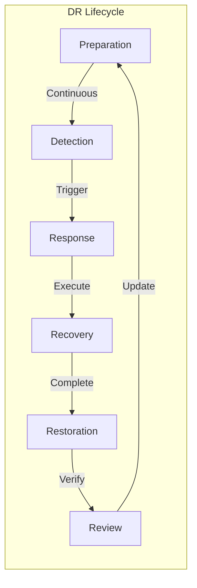
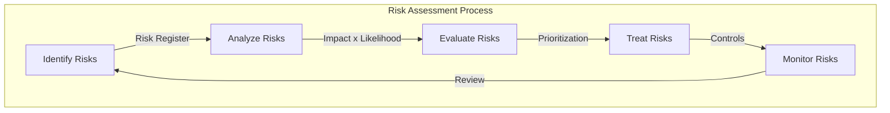
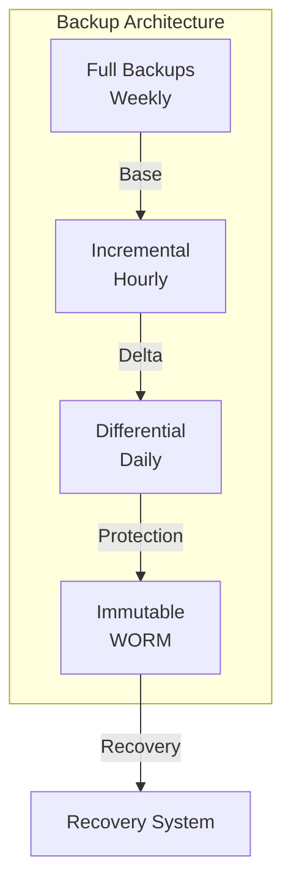
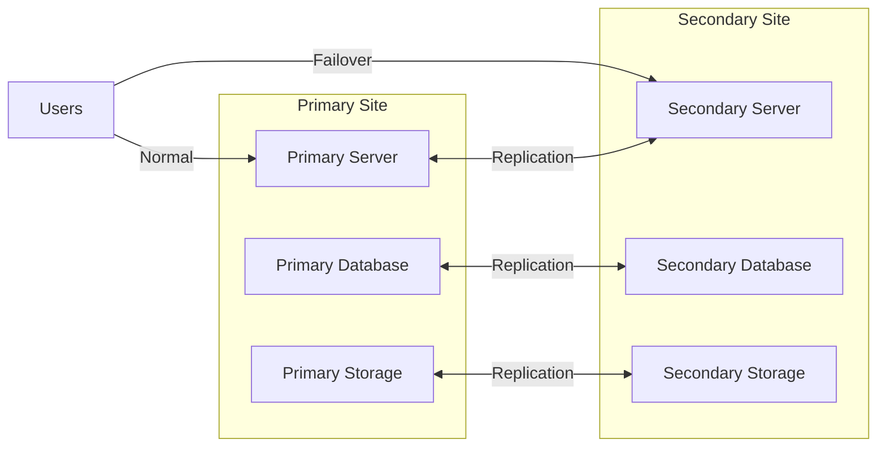
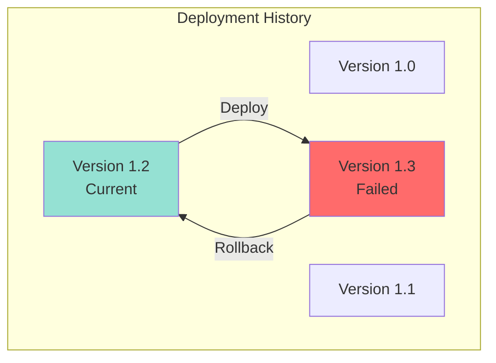
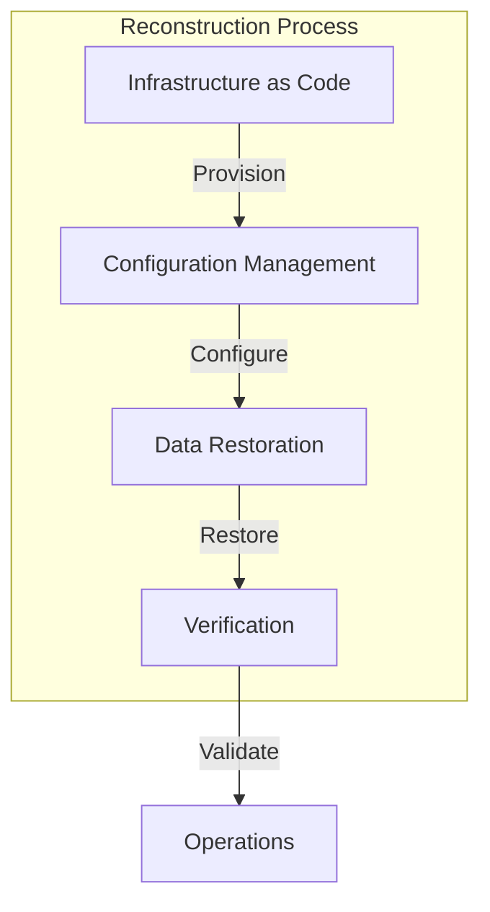
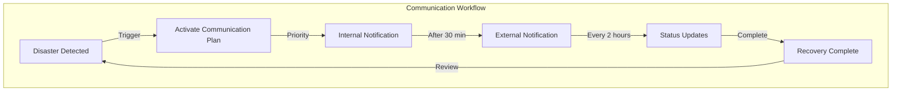
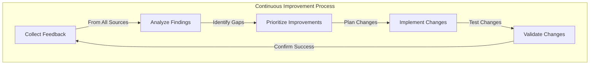
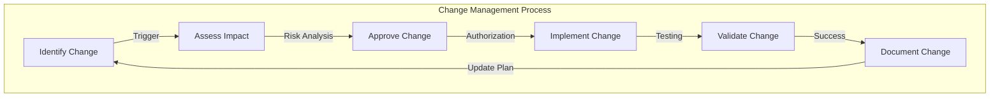
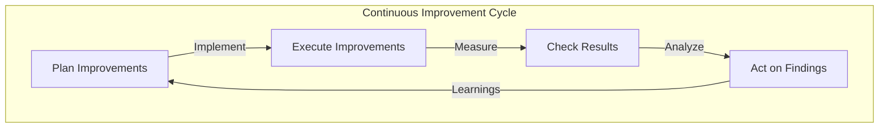

# TACHYON: DISASTER RECOVERY PLAN

**Document ID:** TACHYON-OPS-006-V1.0
**Date:** February 2026
**Status:** Approved for Implementation
**Classification:** Operations & Business Continuity
**Compliance Level:** ISO/IEC 27001:2022, NIST SP 800-34 Rev. 1, ISO 22301:2019

---

## TABLE OF CONTENTS

1. [Introduction](#1-introduction)
2. [DR Framework](#2-dr-framework)
3. [Risk Assessment](#3-risk-assessment)
4. [Recovery Strategies](#4-recovery-strategies)
5. [Recovery Procedures](#5-recovery-procedures)
6. [Communication Plan](#6-communication-plan)
7. [Testing and Training](#7-testing-and-training)
8. [DR Maintenance](#8-dr-maintenance)
9. [References](#9-references)

---

## 1. INTRODUCTION

### 1.1. Document Purpose

This document establishes the comprehensive Disaster Recovery (DR) Plan for the Tachyon toolchain system. The DR Plan defines procedures, strategies, and protocols for responding to disruptive events that impact system availability, data integrity, or operational continuity. This plan ensures that the Tachyon system can recover from disasters with minimal downtime and data loss while maintaining security posture and service quality.

### 1.2. Scope

This DR Plan covers all components of the Tachyon toolchain:

**System Components:**
- Desktop Application (Tauri-based local-first deployment)
- Server Application (Axum-based HTTP/2 server)
- Web Frontend (Leptos-based browser interface)
- Git-based content storage and management
- SQLite databases and search indices
- IPC communication channels
- WebSocket real-time connections

**Disaster Types:**
- Natural disasters (floods, fires, earthquakes)
- Cybersecurity incidents (ransomware, data breaches, DDoS attacks)
- Hardware failures (server crashes, storage failures)
- Software failures (bugs, corruption, deployment failures)
- Human errors (accidental deletion, misconfiguration)
- Power outages and infrastructure failures
- Network failures and connectivity loss

**Geographic Scope:**
- Primary data center operations
- Secondary disaster recovery site operations
- Remote desktop application deployments
- Cloud-based infrastructure components

### 1.3. Objectives

The Tachyon DR Plan establishes the following objectives:

**Recovery Time Objectives (RTO):**
- Critical services: Maximum 4 hours
- Important services: Maximum 8 hours
- Non-critical services: Maximum 24 hours

**Recovery Point Objectives (RPO):**
- Critical data: Maximum 15 minutes data loss
- Important data: Maximum 1 hour data loss
- Non-critical data: Maximum 4 hours data loss

**Availability Targets:**
- Post-disaster availability: 99.5% within 24 hours
- Full service restoration: 99.9% within 72 hours
- Normal operations: 99.95% within 7 days

**Data Integrity:**
- Zero data corruption in recovered systems
- Complete audit trail of recovery operations
- Verification of data consistency post-recovery

**Security Continuity:**
- Maintain security controls during recovery
- Preserve access controls and authentication
- Protect sensitive data throughout recovery process
- Maintain compliance with security requirements

### 1.4. Compliance Framework

This DR Plan aligns with the following standards and regulations:

**International Standards:**
- ISO/IEC 27001:2022 - Information Security Management
- ISO 22301:2019 - Security and Resilience
- ISO/IEC 27031:2011 - Guidelines for Information and Communication Technology Readiness for Business Continuity

**National Standards:**
- NIST SP 800-34 Rev. 1 - Contingency Planning Guide for Federal Information Systems
- NIST SP 800-53 Rev. 5 - Security and Privacy Controls for Information Systems

**Industry Best Practices:**
- ITIL v4 - Service Continuity Management
- COBIT 2019 - Business Continuity and Disaster Recovery
- DRII Professional Practices for Business Continuity Professionals

**Regulatory Requirements:**
- GDPR Article 32 - Security of Processing
- SOC 2 Type II - Security, Availability, and Processing Integrity
- HIPAA Security Rule - Contingency Planning (if applicable)

### 1.5. Document Dependencies

This DR Plan depends on the following documents:

**Architecture Documents:**
- [TACHYON-ARC-001-V1.0](../architecture/system_architecture_overview.md) - System Architecture Overview
- [TACHYON-ARC-002-V1.0](../architecture/component_architecture.md) - Component Architecture
- [TACHYON-ARC-004-V1.0](../architecture/deployment_architecture.md) - Deployment Architecture

**Security Documents:**
- [TACHYON-SEC-001-V1.0](../security/security_architecture.md) - Security Architecture
- [TACHYON-SEC-006-V1.0](../security/security_incident_response_plan.md) - Security Incident Response Plan

**Operations Documents:**
- [TACHYON-OPS-001-V1.0](backup_recovery_guide.md) - Backup and Recovery Guide
- [TACHYON-OPS-003-V1.0](monitoring_guide.md) - Monitoring Guide
- [TACHYON-OPS-005-V1.0](troubleshooting_guide.md) - Troubleshooting Guide

**Architectural Decision Records:**
- [ADR-001-V1.0](../../.adrs/adr-001-three-tier-jit-compilation.md) - Rust as Primary Language
- [ADR-010-V1.0](../../.adrs/adr-010-synchronization-primitives.md) - Security Architecture

---

## 2. DR FRAMEWORK

### 2.1. Disaster Recovery Lifecycle

The Tachyon DR Plan follows a structured lifecycle approach to disaster recovery:



**Lifecycle Phases:**

1. **Preparation Phase:** Continuous preparation and maintenance of DR capabilities
2. **Detection Phase:** Identification and classification of disaster events
3. **Response Phase:** Immediate response to contain and mitigate impact
4. **Recovery Phase:** Systematic recovery of systems and data
5. **Restoration Phase:** Full restoration of normal operations
6. **Review Phase:** Post-incident review and plan improvement

### 2.2. Disaster Classification Framework

Disasters are classified based on severity, impact, and recovery complexity:

**Classification Criteria:**

| Classification | Severity | Impact Duration | Recovery Complexity | Activation Level |
|----------------|-----------|------------------|---------------------|------------------|
| **Minor** | Low | < 1 hour | Low | Operational |
| **Moderate** | Medium | 1-4 hours | Medium | Team Lead |
| **Major** | High | 4-24 hours | High | DR Manager |
| **Catastrophic** | Critical | > 24 hours | Very High | Executive Management |

**Severity Indicators:**

**Minor Disaster:**
- Single component failure with redundancy available
- Limited user impact (< 10% of users affected)
- No data loss
- Automated recovery possible

**Moderate Disaster:**
- Multiple component failures
- Significant user impact (10-50% of users affected)
- Minimal data loss (< 15 minutes)
- Manual intervention required

**Major Disaster:**
- System-wide failure
- Major user impact (> 50% of users affected)
- Significant data loss (15 minutes - 1 hour)
- Cross-functional team response required

**Catastrophic Disaster:**
- Complete system failure
- All users affected
- Critical data loss (> 1 hour)
- Executive-level response required
- External resources may be needed

### 2.3. DR Team Structure

The Tachyon DR Team is organized into functional groups with clear responsibilities:

**Executive Management:**
- **Role:** Strategic decision-making and resource allocation
- **Responsibilities:**
  - Approve DR Plan activation
  - Authorize resource allocation
  - Communicate with stakeholders
  - Make critical business decisions
- **Activation:** Catastrophic disasters

**DR Manager:**
- **Role:** Overall coordination and execution of DR Plan
- **Responsibilities:**
  - Activate DR Plan for major disasters
  - Coordinate all DR teams
  - Monitor recovery progress
  - Report to executive management
- **Activation:** Major and catastrophic disasters

**Technical Recovery Team:**
- **Role:** System restoration and data recovery
- **Responsibilities:**
  - Restore system infrastructure
  - Recover data from backups
  - Verify system functionality
  - Implement recovery procedures
- **Activation:** All disaster classifications

**Security Team:**
- **Role:** Maintain security posture during recovery
- **Responsibilities:**
  - Assess security impact
  - Maintain access controls
  - Monitor for security incidents
  - Ensure compliance with security requirements
- **Activation:** All disaster classifications

**Communications Team:**
- **Role:** Internal and external communications
- **Responsibilities:**
  - Notify stakeholders
  - Provide status updates
  - Manage user communications
  - Coordinate public relations
- **Activation:** Moderate, major, and catastrophic disasters

**Business Continuity Team:**
- **Role:** Maintain business operations during recovery
- **Responsibilities:**
  - Implement manual workarounds
  - Prioritize critical business functions
  - Coordinate with customers
  - Document operational impact
- **Activation:** Major and catastrophic disasters

### 2.4. DR Plan Activation Criteria

The DR Plan is activated based on specific criteria:

**Automatic Activation Triggers:**
- Complete system failure lasting > 15 minutes
- Data corruption affecting > 25% of data
- Security incident requiring system isolation
- Natural disaster affecting primary data center
- Ransomware or malware infection

**Manual Activation Triggers:**
- Degraded performance > 50% for > 1 hour
- Critical component failure without redundancy
- Data loss exceeding RPO thresholds
- Inability to meet RTO objectives

**Deactivation Criteria:**
- All critical systems restored and verified
- Data integrity confirmed
- Security posture restored
- Normal operations resumed
- Stakeholder communication completed

### 2.5. Recovery Prioritization

System components are prioritized for recovery based on business criticality:

**Priority Level 1 - Critical (Immediate Recovery):**
- Authentication and authorization services
- Core database systems
- Search index functionality
- Document storage and retrieval
- Security monitoring and logging

**Priority Level 2 - Important (Early Recovery):**
- Real-time collaboration features
- WebSocket connections
- File synchronization
- Version control operations
- User interface functionality

**Priority Level 3 - Non-Critical (Deferred Recovery):**
- Analytics and reporting
- Historical data access
- Administrative tools
- Development and testing environments
- Non-essential integrations

---

## 3. RISK ASSESSMENT

### 3.1. Risk Assessment Framework

The Tachyon DR Plan employs a systematic risk assessment framework to identify, analyze, and prioritize disaster risks. This framework aligns with ISO 31000:2018 Risk Management and NIST SP 800-30 Risk Assessment guidelines.

**Risk Assessment Process:**



**Risk Assessment Criteria:**

| Criterion | Description | Measurement |
|-----------|-------------|-------------|
| **Likelihood** | Probability of risk occurrence | 1 (Rare) to 5 (Almost Certain) |
| **Impact** | Consequence of risk realization | 1 (Negligible) to 5 (Catastrophic) |
| **Risk Score** | Combined risk rating | Likelihood × Impact (1-25) |
| **Risk Level** | Categorized risk severity | Low (1-4), Medium (5-9), High (10-15), Critical (16-25) |

### 3.2. Risk Register

The following risk register identifies and assesses potential disaster scenarios for the Tachyon system:

**Risk Register:**

| Risk ID | Risk Description | Category | Likelihood | Impact | Risk Score | Risk Level |
|---------|-----------------|-----------|-------------|---------|-------------|------------|
| **R-001** | Server hardware failure | Technical | 3 (Possible) | 4 (Major) | 12 | High |
| **R-002** | Data center outage | Infrastructure | 2 (Unlikely) | 5 (Catastrophic) | 10 | High |
| **R-003** | Ransomware attack | Security | 2 (Unlikely) | 5 (Catastrophic) | 10 | High |
| **R-004** | Database corruption | Technical | 3 (Possible) | 4 (Major) | 12 | High |
| **R-005** | Network connectivity loss | Infrastructure | 4 (Likely) | 3 (Moderate) | 12 | High |
| **R-006** | Software deployment failure | Technical | 3 (Possible) | 3 (Moderate) | 9 | Medium |
| **R-007** | DDoS attack | Security | 3 (Possible) | 3 (Moderate) | 9 | Medium |
| **R-008** | Accidental data deletion | Human | 3 (Possible) | 3 (Moderate) | 9 | Medium |
| **R-009** | Configuration error | Human | 4 (Likely) | 2 (Minor) | 8 | Medium |
| **R-010** | Third-party service outage | External | 3 (Possible) | 3 (Moderate) | 9 | Medium |
| **R-011** | Power failure | Infrastructure | 2 (Unlikely) | 4 (Major) | 8 | Medium |
| **R-012** | Natural disaster | Environmental | 1 (Rare) | 5 (Catastrophic) | 5 | Low |
| **R-013** | Supply chain attack | Security | 2 (Unlikely) | 4 (Major) | 8 | Medium |
| **R-014** | Certificate expiration | Technical | 4 (Likely) | 2 (Minor) | 8 | Medium |
| **R-015** | Storage system failure | Technical | 2 (Unlikely) | 4 (Major) | 8 | Medium |

### 3.3. Detailed Risk Analysis

#### 3.3.1. Critical Risks (Risk Score 16-25)

**R-001: Server Hardware Failure**

**Description:** Failure of server hardware components including CPU, memory, storage, or network interfaces.

**Likelihood:** Possible (3/5)
- Hardware components have finite lifespans
- Wear and tear over time
- Potential for manufacturing defects

**Impact:** Major (4/5)
- Complete server unavailability
- Loss of active sessions
- Data access interruption
- User productivity impact

**Affected Components:**
- Axum-based HTTP/2 server
- SQLite database instances
- Search index (Tantivy)
- WebSocket connections

**Mitigation Strategies:**
- Hardware redundancy (RAID storage, dual power supplies)
- Server clustering for failover
- Regular hardware health monitoring
- Preventive maintenance schedules
- Spare hardware inventory

**Recovery Procedures:**
- Hardware replacement
- System restoration from backups
- Service failover to redundant systems
- Data integrity verification

#### 3.3.2. Critical Risks (Risk Score 10-15)

**R-002: Data Center Outage**

**Description:** Complete or partial outage of primary data center infrastructure.

**Likelihood:** Unlikely (2/5)
- Data centers have high reliability standards
- Redundant power and cooling systems
- Multiple network providers

**Impact:** Catastrophic (5/5)
- Complete system unavailability
- Potential data loss
- Extended recovery time
- Business continuity impact

**Affected Components:**
- All server infrastructure
- Network connectivity
- Storage systems
- Environmental controls

**Mitigation Strategies:**
- Geographic redundancy (secondary data center)
- Cloud-based backup systems
- Multi-region deployment
- Regular failover testing

**Recovery Procedures:**
- Activation of secondary data center
- DNS failover to backup systems
- Data synchronization verification
- Gradual traffic migration

**R-003: Ransomware Attack**

**Description:** Malicious encryption of system data by ransomware, demanding payment for decryption.

**Likelihood:** Unlikely (2/5)
- Strong security controls in place
- Regular security updates
- Employee security training

**Impact:** Catastrophic (5/5)
- Complete data inaccessibility
- Potential data exfiltration
- Business continuity disruption
- Reputational damage

**Affected Components:**
- All data storage systems
- Desktop application data
- Server databases
- Backup systems (if not isolated)

**Mitigation Strategies:**
- Immutable backup systems (WORM storage)
- Regular security scanning
- Network segmentation
- Endpoint protection
- Security awareness training

**Recovery Procedures:**
- System isolation and containment
- Forensic analysis
- Data restoration from immutable backups
- System hardening
- Security posture review

**R-004: Database Corruption**

**Description:** Corruption of SQLite database files affecting data integrity and accessibility.

**Likelihood:** Possible (3/5)
- Storage media errors
- Software bugs
- Improper shutdown
- File system corruption

**Impact:** Major (4/5)
- Data inaccessibility
- Potential data loss
- Service disruption
- User confidence impact

**Affected Components:**
- SQLite databases
- Search indices
- Cache systems
- User data stores

**Mitigation Strategies:**
- Regular database integrity checks
- Point-in-time recovery capabilities
- Database replication
- Write-ahead logging (WAL)
- Storage system monitoring

**Recovery Procedures:**
- Database restoration from backups
- Integrity verification
- Data consistency checks
- Application of transaction logs
- System verification

**R-005: Network Connectivity Loss**

**Description:** Loss of network connectivity affecting system accessibility and data synchronization.

**Likelihood:** Likely (4/5)
- Network infrastructure complexity
- Multiple points of failure
- External dependencies

**Impact:** Moderate (3/5)
- Remote user access disruption
- Data synchronization delays
- Collaboration features unavailable
- Partial service degradation

**Affected Components:**
- HTTP/2 server connectivity
- WebSocket connections
- Desktop-server communication
- Web-server communication

**Mitigation Strategies:**
- Multiple network providers
- Local-first architecture (desktop functionality)
- Offline operation support
- Network redundancy
- Connection pooling

**Recovery Procedures:**
- Network troubleshooting
- Failover to backup connectivity
- Service restoration verification
- Data synchronization catch-up
- User notification

#### 3.3.3. Medium Risks (Risk Score 5-9)

**R-006: Software Deployment Failure**

**Description:** Failure during software deployment causing system instability or unavailability.

**Likelihood:** Possible (3/5)
- Complex deployment processes
- Multiple components to update
- Potential for configuration errors

**Impact:** Moderate (3/5)
- Service disruption during deployment
- Potential rollback requirements
- User experience impact
- Deployment schedule delays

**Affected Components:**
- Server application updates
- Desktop application updates
- Web frontend deployments
- Database migrations

**Mitigation Strategies:**
- Blue-green deployments
- Canary deployments
- Automated rollback capabilities
- Comprehensive testing before deployment
- Deployment monitoring

**Recovery Procedures:**
- Automatic rollback
- Manual rollback if automatic fails
- System verification
- Issue investigation
- Deployment retry after fix

**R-007: DDoS Attack**

**Description:** Distributed Denial of Service attack overwhelming system resources.

**Likelihood:** Possible (3/5)
- Increasing prevalence of DDoS attacks
- Public-facing services
- Potential for botnet utilization

**Impact:** Moderate (3/5)
- Service degradation or unavailability
- Resource exhaustion
- Legitimate user impact
- Potential revenue impact

**Affected Components:**
- HTTP/2 server
- Network infrastructure
- Load balancers
- CDN services

**Mitigation Strategies:**
- DDoS protection services
- Rate limiting
- Traffic filtering
- CDN utilization
- Network capacity planning

**Recovery Procedures:**
- Traffic filtering activation
- Service scaling
- Attack source blocking
- Service restoration
- Post-incident analysis

### 3.4. Risk Treatment Strategies

Each identified risk is assigned treatment strategies based on risk level:

**Risk Treatment Options:**

| Risk Level | Primary Treatment | Secondary Treatment | Monitoring Frequency |
|------------|------------------|---------------------|----------------------|
| **Critical (16-25)** | Avoidance/Reduction | Transfer (insurance) | Continuous |
| **High (10-15)** | Reduction | Acceptance with controls | Daily |
| **Medium (5-9)** | Reduction | Acceptance | Weekly |
| **Low (1-4)** | Acceptance | Monitoring | Monthly |

**Treatment Strategy Descriptions:**

**Avoidance:** Eliminate the risk by changing processes or systems
- Example: Use immutable backups to avoid ransomware data loss

**Reduction:** Implement controls to reduce likelihood or impact
- Example: Hardware redundancy to reduce failure likelihood

**Transfer:** Transfer risk to third party (insurance, SLAs)
- Example: Cloud provider SLAs for infrastructure risks

**Acceptance:** Accept risk within defined tolerance levels
- Example: Accept minor configuration errors with quick recovery procedures

### 3.5. Risk Monitoring and Review

Risks are continuously monitored and reviewed to ensure effectiveness of treatment strategies:

**Monitoring Activities:**
- Real-time system monitoring for early detection
- Regular risk assessment reviews (quarterly)
- Incident log analysis for emerging patterns
- Threat intelligence integration
- Control effectiveness verification

**Review Triggers:**
- New technology deployment
- Significant system changes
- Incident occurrence
- Regulatory changes
- Risk assessment schedule

**Review Process:**
1. Analyze incident data and near-misses
2. Review control effectiveness
3. Identify new or changed risks
4. Update risk register
5. Adjust treatment strategies
6. Communicate changes to stakeholders

---

## 4. RECOVERY STRATEGIES

### 4.1. Recovery Strategy Framework

The Tachyon DR Plan implements multiple recovery strategies to address different disaster scenarios. Each strategy is designed to meet RTO and RPO objectives while maintaining security and data integrity.

**Recovery Strategy Selection Criteria:**

| Criteria | Description | Weight |
|-----------|-------------|--------|
| **Recovery Speed** | Time to restore service | High |
| **Data Loss** | Acceptable data loss tolerance | High |
| **Cost** | Implementation and operational cost | Medium |
| **Complexity** | Implementation and maintenance complexity | Medium |
| **Reliability** | Proven reliability of strategy | High |
| **Security** | Security posture during recovery | High |

### 4.2. Backup-Based Recovery

**Strategy Description:** Recovery from backup systems including full, incremental, and differential backups.

**Applicable Scenarios:**
- Data corruption (R-004)
- Ransomware attacks (R-003)
- Accidental data deletion (R-008)
- Software deployment failures (R-006)

**Backup Architecture:**



**Backup Strategy Details:**

| Backup Type | Frequency | Retention | RPO | Storage Location |
|-------------|------------|-----------|-----|-----------------|
| **Full Backup** | Weekly | 4 weeks | 0 | Primary + Offsite |
| **Differential** | Daily | 7 days | 1 hour | Primary + Offsite |
| **Incremental** | Hourly | 24 hours | 15 minutes | Primary + Offsite |
| **Immutable Snapshot** | Hourly | 90 days | 15 minutes | WORM Storage |

**Recovery Process:**
1. Identify last consistent backup point
2. Restore full backup to recovery environment
3. Apply differential and incremental backups
4. Verify data integrity
5. Validate system functionality
6. Switch to production

**Advantages:**
- Proven and reliable
- Predictable recovery times
- Point-in-time recovery capability
- Data integrity verification

**Disadvantages:**
- Requires regular backup maintenance
- Storage costs for retention
- Recovery time increases with data size

### 4.3. Failover-Based Recovery

**Strategy Description:** Automatic or manual failover to redundant systems in secondary location.

**Applicable Scenarios:**
- Server hardware failure (R-001)
- Data center outage (R-002)
- Network connectivity loss (R-005)
- Power failure (R-011)

**Failover Architecture:**



**Failover Strategy Details:**

| Component | Replication Method | RTO | RPO | Failover Type |
|-----------|------------------|-----|-----|--------------|
| **HTTP/2 Server** | Active-Passive | 15 minutes | 0 | Automatic |
| **SQLite Database** | Asynchronous replication | 30 minutes | 15 minutes | Manual |
| **Search Index** | Synchronization | 1 hour | 1 hour | Manual |
| **File Storage** | Real-time sync | 30 minutes | 0 | Automatic |

**Recovery Process:**
1. Detect primary site failure
2. Activate failover (automatic or manual)
3. Update DNS to point to secondary site
4. Verify service availability
5. Monitor system performance
6. Plan return to primary site

**Advantages:**
- Minimal service disruption
- Near-zero data loss
- Automatic recovery possible
- Geographic redundancy

**Disadvantages:**
- Higher infrastructure costs
- Complexity in maintaining synchronization
- Potential for split-brain scenarios
- Requires careful return-to-primary planning

### 4.4. Rollback-Based Recovery

**Strategy Description:** Reversion to previous system state using version control and deployment history.

**Applicable Scenarios:**
- Software deployment failures (R-006)
- Configuration errors (R-009)
- Certificate expiration (R-014)
- Supply chain attacks (R-013)

**Rollback Architecture:**



**Rollback Strategy Details:**

| Component | Rollback Method | RTO | RPO | Automation |
|-----------|----------------|-----|-----|------------|
| **Server Application** | Blue-green deployment | 5 minutes | 0 | Automatic |
| **Desktop Application** | Versioned installer | 15 minutes | 0 | Manual |
| **Web Frontend** | CDN cache invalidation | 10 minutes | 0 | Automatic |
| **Database Schema** | Migration rollback | 30 minutes | 0 | Manual |
| **Configuration** | Versioned config files | 5 minutes | 0 | Automatic |

**Recovery Process:**
1. Identify failure point
2. Select previous stable version
3. Execute rollback (automatic or manual)
4. Verify system functionality
5. Validate data consistency
6. Document rollback incident

**Advantages:**
- Fast recovery time
- Zero data loss
- Simple and reliable
- Low cost

**Disadvantages:**
- Only addresses software/configuration issues
- Does not address hardware failures
- Requires proper deployment practices
- Potential for repeated failures

### 4.5. Reconstruction-Based Recovery

**Strategy Description:** Rebuilding systems from scratch using infrastructure-as-code and configuration management.

**Applicable Scenarios:**
- Catastrophic data center loss (R-002)
- Complete system compromise (R-003)
- Supply chain attacks requiring rebuild (R-013)
- Natural disasters (R-012)

**Reconstruction Architecture:**



**Reconstruction Strategy Details:**

| Phase | Activities | Duration | Dependencies |
|-------|-----------|----------|--------------|
| **Infrastructure Provisioning** | Deploy servers, network, storage | 1-2 hours | IAC templates |
| **System Configuration** | Install software, configure services | 1-2 hours | Config management |
| **Data Restoration** | Restore from backups, verify integrity | 2-4 hours | Backup availability |
| **System Verification** | Test all functionality, security controls | 1-2 hours | Test plans |
| **Total Recovery** | Complete system restoration | 5-10 hours | All phases |

**Recovery Process:**
1. Provision infrastructure using IAC
2. Configure system components
3. Restore data from backups
4. Verify system functionality
5. Test security controls
6. Gradual traffic migration
7. Monitor system performance

**Advantages:**
- Addresses catastrophic scenarios
- Clean system with no legacy issues
- Opportunity to apply improvements
- Documentation of build process

**Disadvantages:**
- Longest recovery time
- Highest complexity
- Requires comprehensive documentation
- Potential for configuration errors

### 4.6. Hybrid Recovery Strategies

The Tachyon DR Plan employs hybrid strategies combining multiple approaches for optimal recovery:

**Hybrid Strategy Examples:**

| Scenario | Primary Strategy | Secondary Strategy | Rationale |
|-----------|------------------|---------------------|-----------|
| **Server Hardware Failure** | Failover to secondary | Backup-based for data verification | Redundancy + data integrity |
| **Ransomware Attack** | Immutable backup restoration | System reconstruction | Data recovery + clean system |
| **Deployment Failure** | Automatic rollback | Backup-based if rollback fails | Speed + fallback |
| **Data Center Outage** | Failover to secondary site | Reconstruction if secondary unavailable | Speed + catastrophic coverage |

**Hybrid Strategy Benefits:**
- Multiple recovery paths increase success probability
- Primary strategy optimized for speed
- Secondary strategy provides fallback
- Addresses multiple failure modes
- Reduces single points of failure

### 4.7. Recovery Strategy Selection Matrix

The following matrix guides selection of appropriate recovery strategy based on disaster type:

| Disaster Type | Primary Strategy | RTO | RPO | Complexity |
|---------------|------------------|-----|-----|------------|
| **Hardware Failure** | Failover | 15-30 min | 0-15 min | Medium |
| **Data Center Outage** | Failover | 30-60 min | 0-15 min | High |
| **Ransomware** | Backup + Reconstruction | 4-8 hours | 15 min | Very High |
| **Data Corruption** | Backup Restoration | 1-2 hours | 15 min | Low |
| **Network Loss** | Local Operation | 0 (degraded) | 0 | Low |
| **Deployment Failure** | Rollback | 5-15 min | 0 | Low |
| **DDoS Attack** | Traffic Filtering + Scaling | 30-60 min | 0 | Medium |
| **Configuration Error** | Rollback | 5 min | 0 | Low |
| **Natural Disaster** | Reconstruction | 8-24 hours | 1 hour | Very High |
| **Supply Chain Attack** | Reconstruction | 4-8 hours | 1 hour | Very High |

### 4.8. Recovery Strategy Implementation Requirements

Each recovery strategy requires specific implementation components:

**Backup-Based Recovery Requirements:**
- Automated backup scheduling and monitoring
- Immutable backup storage (WORM)
- Regular backup verification and testing
- Offsite backup storage
- Backup encryption and access controls

**Failover-Based Recovery Requirements:**
- Secondary site infrastructure
- Real-time data replication
- Automated failover mechanisms
- DNS failover capabilities
- Regular failover testing

**Rollback-Based Recovery Requirements:**
- Blue-green deployment infrastructure
- Versioned configuration management
- Automated rollback capabilities
- Deployment monitoring and alerting
- Pre-deployment testing

**Reconstruction-Based Recovery Requirements:**
- Infrastructure-as-code templates
- Configuration management system
- Comprehensive documentation
- Automated provisioning tools
- Recovery environment

---

## 5. RECOVERY PROCEDURES

### 5.1. Recovery Procedure Framework

The Tachyon DR Plan defines detailed recovery procedures for each disaster scenario. These procedures provide step-by-step instructions for executing recovery strategies while maintaining security controls and data integrity.

**Recovery Procedure Structure:**

Each recovery procedure follows a standardized structure:

1. **Pre-Recovery Assessment:** Evaluate disaster impact and select appropriate recovery strategy
2. **Recovery Activation:** Execute recovery strategy according to defined procedures
3. **Verification and Validation:** Verify recovery success and system functionality
4. **Post-Recovery Activities:** Document recovery, update DR Plan, and conduct review

### 5.2. Server Hardware Failure Recovery

**Trigger Conditions:**
- Complete server unavailability
- Hardware error logs
- Automated monitoring alerts
- Manual detection by operations team

**Pre-Recovery Assessment:**

| Assessment Item | Description | Owner | Timeframe |
|----------------|-------------|--------|-----------|
| **Impact Analysis** | Determine affected components and users | Technical Lead | 15 minutes |
| **Hardware Diagnosis** | Identify failed hardware components | Systems Admin | 30 minutes |
| **Failover Evaluation** | Assess failover system availability | DR Manager | 15 minutes |
| **Recovery Strategy** | Select appropriate recovery strategy | DR Manager | 15 minutes |

**Recovery Activation Steps:**

1. **Immediate Response (0-15 minutes)**
   - Confirm hardware failure
   - Notify DR Manager and Technical Recovery Team
   - Activate failover if available
   - Begin hardware diagnosis

2. **Failover Execution (15-60 minutes)**
   - Activate secondary server
   - Update DNS to point to secondary system
   - Verify service availability
   - Monitor system performance

3. **Hardware Replacement (1-4 hours)**
   - Procure replacement hardware
   - Install and configure replacement hardware
   - Restore system from backups if needed
   - Verify hardware functionality

4. **System Restoration (1-2 hours)**
   - Restore data from backups
   - Verify data integrity
   - Test all system functionality
   - Validate security controls

**Verification and Validation:**

| Verification Item | Acceptance Criteria | Owner |
|------------------|------------------|--------|
| **Service Availability** | All critical services operational | Technical Lead |
| **Data Integrity** | Data consistency verified | Security Team |
| **Performance Metrics** | Performance within SLA thresholds | Operations Team |
| **Security Controls** | All security controls active | Security Team |
| **User Access** | Users can access system | Business Continuity Team |

**Post-Recovery Activities:**
- Document recovery timeline and actions taken
- Update hardware inventory and maintenance schedules
- Review hardware failure root cause
- Update DR Plan with lessons learned
- Conduct post-recovery review meeting

### 5.3. Ransomware Attack Recovery

**Trigger Conditions:**
- Detection of ransomware encryption
- Ransom demand notifications
- Security incident alerts
- User reports of file inaccessibility

**Pre-Recovery Assessment:**

| Assessment Item | Description | Owner | Timeframe |
|----------------|-------------|--------|-----------|
| **Incident Scope** | Determine affected systems and data | Security Team | 30 minutes |
| **Isolation Assessment** | Evaluate containment requirements | Security Team | 30 minutes |
| **Backup Verification** | Verify immutable backup availability | Technical Lead | 30 minutes |
| **Recovery Strategy** | Select appropriate recovery strategy | DR Manager | 15 minutes |

**Recovery Activation Steps:**

1. **Immediate Response (0-30 minutes)**
   - Activate incident response plan
   - Isolate affected systems from network
   - Notify DR Manager and Security Team
   - Begin forensic analysis

2. **System Isolation (30-60 minutes)**
   - Disconnect affected systems from network
   - Shut down compromised services
   - Preserve forensic evidence
   - Identify attack vector

3. **Data Recovery (2-6 hours)**
   - Restore data from immutable backups
   - Verify data integrity and completeness
   - Scan restored data for malware
   - Validate data consistency

4. **System Reconstruction (2-4 hours)**
   - Rebuild systems from infrastructure-as-code
   - Apply security hardening measures
   - Update all security credentials
   - Implement additional security controls

5. **Service Restoration (1-2 hours)**
   - Gradually restore services
   - Monitor for suspicious activity
   - Verify all functionality
   - Conduct security validation

**Verification and Validation:**

| Verification Item | Acceptance Criteria | Owner |
|------------------|------------------|--------|
| **System Cleanliness** | No malware detected | Security Team |
| **Data Integrity** | All data verified intact | Technical Lead |
| **Security Controls** | Enhanced controls implemented | Security Team |
| **Access Controls** | All credentials updated | Security Team |
| **Monitoring** | Enhanced monitoring active | Operations Team |

**Post-Recovery Activities:**
- Complete forensic analysis
- Document attack vector and timeline
- Update security controls and procedures
- Conduct security awareness training
- Update DR Plan with lessons learned
- Notify relevant authorities if required

### 5.4. Data Corruption Recovery

**Trigger Conditions:**
- Database integrity check failures
- Data inconsistency detected
- Application errors indicating corruption
- User reports of data issues

**Pre-Recovery Assessment:**

| Assessment Item | Description | Owner | Timeframe |
|----------------|-------------|--------|-----------|
| **Corruption Scope** | Determine extent of data corruption | Technical Lead | 30 minutes |
| **Root Cause Analysis** | Identify corruption cause | Technical Lead | 1 hour |
| **Backup Assessment** | Identify last consistent backup | Technical Lead | 30 minutes |
| **Recovery Strategy** | Select appropriate recovery strategy | DR Manager | 15 minutes |

**Recovery Activation Steps:**

1. **Immediate Response (0-30 minutes)**
   - Confirm data corruption
   - Notify DR Manager and Technical Recovery Team
   - Identify affected systems and data
   - Begin root cause analysis

2. **System Isolation (30-60 minutes)**
   - Stop write operations to affected systems
   - Isolate corrupted data to prevent spread
   - Preserve corrupted data for analysis
   - Identify last consistent backup point

3. **Data Recovery (1-3 hours)**
   - Restore data from last consistent backup
   - Apply transaction logs if available
   - Verify data integrity
   - Validate data consistency

4. **System Verification (1-2 hours)**
   - Test all system functionality
   - Verify data access and operations
   - Validate search indices
   - Test user workflows

**Verification and Validation:**

| Verification Item | Acceptance Criteria | Owner |
|------------------|------------------|--------|
| **Data Integrity** | All data verified consistent | Technical Lead |
| **System Functionality** | All features operational | Technical Lead |
| **Performance Metrics** | Performance within normal ranges | Operations Team |
| **Data Completeness** | No data loss beyond RPO | Technical Lead |
| **User Validation** | Users confirm data accuracy | Business Continuity Team |

**Post-Recovery Activities:**
- Document corruption root cause
- Update data integrity monitoring
- Review backup verification procedures
- Update DR Plan with lessons learned
- Conduct post-recovery review meeting

### 5.5. Network Connectivity Loss Recovery

**Trigger Conditions:**
- Network unavailability alerts
- User connectivity issues
- Monitoring system failures
- Service degradation

**Pre-Recovery Assessment:**

| Assessment Item | Description | Owner | Timeframe |
|----------------|-------------|--------|-----------|
| **Impact Scope** | Determine affected users and services | Operations Team | 15 minutes |
| **Network Diagnosis** | Identify network failure point | Network Admin | 30 minutes |
| **Local Operation** | Assess local-first capabilities | Technical Lead | 15 minutes |
| **Recovery Strategy** | Select appropriate recovery strategy | DR Manager | 15 minutes |

**Recovery Activation Steps:**

1. **Immediate Response (0-15 minutes)**
   - Confirm network failure
   - Notify DR Manager and Operations Team
   - Activate local operation mode
   - Begin network diagnosis

2. **Local Operation (0-60 minutes)**
   - Enable desktop local-first mode
   - Inform users of degraded functionality
   - Implement manual workarounds
   - Cache data for synchronization

3. **Network Recovery (30-120 minutes)**
   - Troubleshoot network connectivity
   - Activate backup network connections
   - Implement failover routing
   - Monitor network performance

4. **Data Synchronization (30-60 minutes)**
   - Synchronize cached data
   - Verify data consistency
   - Resolve any conflicts
   - Validate data integrity

**Verification and Validation:**

| Verification Item | Acceptance Criteria | Owner |
|------------------|------------------|--------|
| **Network Connectivity** | Network restored and stable | Network Admin |
| **Data Synchronization** | All data synchronized | Technical Lead |
| **Service Availability** | All services operational | Operations Team |
| **User Access** | Users can access system | Business Continuity Team |
| **Performance Metrics** | Performance within normal ranges | Operations Team |

**Post-Recovery Activities:**
- Document network failure root cause
- Update network redundancy measures
- Review network monitoring procedures
- Update DR Plan with lessons learned
- Conduct post-recovery review meeting

### 5.6. Software Deployment Failure Recovery

**Trigger Conditions:**
- Deployment failure alerts
- Service unavailability after deployment
- Application errors
- Automated rollback triggers

**Pre-Recovery Assessment:**

| Assessment Item | Description | Owner | Timeframe |
|----------------|-------------|--------|-----------|
| **Failure Impact** | Determine affected functionality | Technical Lead | 15 minutes |
| **Failure Analysis** | Identify deployment failure cause | Technical Lead | 30 minutes |
| **Rollback Assessment** | Evaluate rollback availability | Technical Lead | 15 minutes |
| **Recovery Strategy** | Select appropriate recovery strategy | DR Manager | 15 minutes |

**Recovery Activation Steps:**

1. **Immediate Response (0-5 minutes)**
   - Confirm deployment failure
   - Notify DR Manager and Technical Recovery Team
   - Activate automatic rollback if available
   - Begin failure analysis

2. **Rollback Execution (5-15 minutes)**
   - Execute automatic rollback
   - Verify rollback success
   - Monitor system stability
   - Validate system functionality

3. **Manual Rollback (if automatic fails) (15-30 minutes)**
   - Manually revert to previous version
   - Restore configuration files
   - Restart affected services
   - Verify system functionality

4. **System Verification (15-30 minutes)**
   - Test all system functionality
   - Validate data integrity
   - Verify security controls
   - Test user workflows

**Verification and Validation:**

| Verification Item | Acceptance Criteria | Owner |
|------------------|------------------|--------|
| **System Version** | Previous stable version active | Technical Lead |
| **System Functionality** | All features operational | Technical Lead |
| **Data Integrity** | No data corruption or loss | Technical Lead |
| **Security Controls** | All security controls active | Security Team |
| **Performance Metrics** | Performance within normal ranges | Operations Team |

**Post-Recovery Activities:**
- Document deployment failure root cause
- Update deployment procedures
- Review pre-deployment testing
- Update DR Plan with lessons learned
- Conduct post-recovery review meeting

### 5.7. Recovery Procedure Documentation

All recovery procedures must be documented with the following information:

**Documentation Requirements:**

| Documentation Element | Description | Format |
|---------------------|-------------|--------|
| **Procedure Name** | Clear, descriptive name | Text |
| **Trigger Conditions** | Conditions for procedure activation | List |
| **Prerequisites** | Required resources and permissions | List |
| **Step-by-Step Instructions** | Detailed recovery steps | Numbered list |
| **Verification Criteria** | Acceptance criteria for each step | Checklist |
| **Roles and Responsibilities** | Assigned roles and responsibilities | Table |
| **Time Estimates** | Estimated time for each step | Table |
| **Dependencies** | Dependencies on other procedures | List |
| **Risk Mitigation** | Risks and mitigation strategies | Table |

**Procedure Maintenance:**
- Review and update procedures quarterly
- Update after each recovery incident
- Incorporate lessons learned from exercises
- Maintain version control of procedures
- Ensure procedures reflect current system architecture

---

## 6. COMMUNICATION PLAN

### 6.1. Communication Strategy

The Tachyon DR Plan establishes a comprehensive communication strategy to ensure timely, accurate, and consistent information flow during disaster recovery. Effective communication maintains stakeholder confidence, manages expectations, and supports coordinated recovery efforts.

**Communication Objectives:**

| Objective | Description | Success Criteria |
|-----------|-------------|-----------------|
| **Timely Notification** | Inform stakeholders promptly | Notifications within 30 minutes of activation |
| **Accurate Information** | Provide accurate status updates | Information verified before dissemination |
| **Consistent Messaging** | Maintain consistent communication | Single source of truth for all communications |
| **Stakeholder Awareness** | Keep stakeholders informed | Regular updates at defined intervals |
| **Expectation Management** | Set and manage expectations | Clear timelines and next steps communicated |

### 6.2. Stakeholder Identification

The following stakeholders require communication during disaster recovery:

**Internal Stakeholders:**

| Stakeholder | Communication Needs | Contact Method | Frequency |
|-------------|---------------------|----------------|-----------|
| **Executive Management** | Strategic decisions, resource allocation | Phone, Email, Secure Channel | Immediate, then hourly |
| **DR Manager** | Overall coordination, status updates | Phone, Secure Channel, In-Person | Continuous |
| **Technical Recovery Team** | Technical instructions, status | Secure Channel, In-Person | Continuous |
| **Security Team** | Security guidance, threat updates | Secure Channel, Phone | Continuous |
| **Operations Team** | Operational status, user impact | Secure Channel, Phone | Every 30 minutes |
| **Business Continuity Team** | Business impact, workarounds | Email, Phone, In-Person | Hourly |
| **Communications Team** | Messaging coordination, public relations | Secure Channel, In-Person | Continuous |
| **All Staff** | General status, work instructions | Email, SMS, Internal Portal | Every 2 hours |

**External Stakeholders:**

| Stakeholder | Communication Needs | Contact Method | Frequency |
|-------------|---------------------|----------------|-----------|
| **Customers** | Service status, expected resolution | Email, SMS, Status Page | Every 2 hours |
| **Partners** | Service impact, integration status | Email, Phone | Every 4 hours |
| **Vendors** | Support requests, escalation | Phone, Email | As needed |
| **Regulatory Bodies** | Compliance reporting, incident notification | Email, Certified Mail | As required |
| **Media** | Public statements, Q&A | Press Release, Social Media | As needed |
| **Investors** | Business impact, financial implications | Email, Phone | Daily |

### 6.3. Communication Channels

Multiple communication channels ensure redundancy and reachability:

**Primary Communication Channels:**

| Channel | Purpose | Owner | Activation Criteria |
|---------|---------|--------|---------------------|
| **Secure Internal Channel** | Internal team coordination | DR Manager | DR Plan activation |
| **Status Page** | Public service status | Communications Team | Service impact |
| **Email Distribution** | Formal notifications | Communications Team | DR Plan activation |
| **SMS Alert System** | Urgent notifications | Communications Team | Service impact |
| **Phone Tree** | Critical notifications | DR Manager | Catastrophic disasters |
| **Internal Portal** | Staff information and updates | Communications Team | DR Plan activation |

**Channel Prioritization:**

1. **Secure Internal Channel** - Primary for team coordination
2. **Phone Tree** - Critical for immediate notifications
3. **SMS Alert System** - Urgent notifications to staff
4. **Email Distribution** - Formal notifications and updates
5. **Status Page** - Public service status
6. **Internal Portal** - Staff information and resources

### 6.4. Communication Templates

Standardized templates ensure consistent, accurate communication:

**Template 1: DR Plan Activation Notification**

**Subject:** [URGENT] Disaster Recovery Plan Activated - [Disaster Type]

**Body:**
```
The Tachyon Disaster Recovery Plan has been activated due to [disaster type].

Incident Details:
- Disaster Type: [type]
- Impact Assessment: [affected systems/users]
- Activation Time: [timestamp]
- Expected Recovery Time: [RTO]

All DR Team members should report to [location/virtual meeting] immediately.

Next Update: [time]

DR Manager: [contact information]
```

**Template 2: Service Status Update**

**Subject:** Tachyon Service Status Update - [Status]

**Body:**
```
Current Status: [Operational/Degraded/Unavailable]

Affected Services:
- [List affected services]

Impact:
- [Percentage of users affected]
- [Expected functionality limitations]

Recovery Progress:
- [Current recovery activities]
- [Estimated time to resolution]

Next Update: [time]

For assistance, contact: [support contact information]
```

**Template 3: Customer Notification**

**Subject:** Important: Tachyon Service Update - [Status]

**Body:**
```
Dear Customer,

We are currently experiencing [service disruption/degradation] affecting [affected services].

What Happened:
[Brief, non-technical description of issue]

Impact on You:
[Specific impact on customer operations]

What We're Doing:
[Recovery actions in progress]

Expected Resolution:
[Estimated time to service restoration]

We apologize for any inconvenience and appreciate your patience.

For updates, visit: [status page URL]
For assistance, contact: [support contact information]

Thank you for your understanding.
```

**Template 4: Staff Notification**

**Subject:** [URGENT] System Incident - [Status]

**Body:**
```
Dear Team,

We are experiencing a [system incident/disaster] affecting [affected systems].

Current Status: [Operational/Degraded/Unavailable]

Impact on Work:
[Specific impact on staff operations]

What You Should Do:
[Instructions for staff during incident]

Remote Work: [Yes/No with details]
Alternative Systems: [Available workarounds]

Next Update: [time]
For questions, contact: [manager contact information]
```

**Template 5: Post-Recovery Notification**

**Subject:** Tachyon Service Restored - [Services Affected]

**Body:**
```
We are pleased to inform you that all Tachyon services have been restored.

Restoration Details:
- Services Restored: [list of services]
- Restoration Time: [timestamp]
- Data Integrity: [Verified/No data loss]

We apologize for any inconvenience caused by this incident.

If you experience any issues, please contact: [support contact information]

For post-incident summary, visit: [status page URL]
```

### 6.5. Communication Workflow

The following workflow ensures effective communication during disaster recovery:



**Workflow Steps:**

1. **Disaster Detection (0-15 minutes)**
   - Confirm disaster occurrence
   - Assess initial impact
   - Identify affected stakeholders
   - Activate communication plan

2. **Internal Notification (15-30 minutes)**
   - Notify DR Manager and executive management
   - Activate DR Team notification
   - Send initial internal status update
   - Establish communication command center

3. **External Notification (30-60 minutes)**
   - Update status page with incident information
   - Send customer notifications
   - Notify partners and vendors as needed
   - Prepare media statements if required

4. **Status Updates (Every 2 hours)**
   - Provide regular status updates
   - Update recovery progress
   - Adjust timelines as needed
   - Maintain consistent messaging

5. **Recovery Complete (Upon restoration)**
   - Send recovery complete notifications
   - Update status page to operational
   - Conduct post-incident communication review
   - Document lessons learned

### 6.6. Communication Roles and Responsibilities

**Communications Team Lead:**
- Activate communication plan
- Coordinate all messaging
- Approve all external communications
- Manage communication command center

**DR Manager:**
- Provide accurate status information
- Approve communication timing
- Participate in executive briefings
- Coordinate with other team leads

**Executive Management:**
- Approve external communications
- Participate in media briefings if needed
- Make strategic communication decisions
- Communicate with board/investors

**Technical Recovery Team:**
- Provide technical status updates
- Translate technical information for non-technical audiences
- Participate in customer communications if needed
- Provide input on recovery timelines

**Security Team:**
- Provide security status and guidance
- Advise on security-sensitive communications
- Coordinate with regulatory bodies if needed
- Ensure compliance with notification requirements

### 6.7. Communication Escalation Matrix

The following matrix guides communication escalation based on disaster severity:

| Disaster Classification | Escalation Level | Notification Time | Update Frequency |
|----------------------|------------------|------------------|-----------------|
| **Minor** | Operational | 1 hour | Every 4 hours |
| **Moderate** | Team Lead | 30 minutes | Every 2 hours |
| **Major** | DR Manager | 15 minutes | Every 1 hour |
| **Catastrophic** | Executive Management | Immediate | Every 30 minutes |

**Escalation Triggers:**
- RTO at risk of being exceeded
- Significant change in disaster scope
- New information affecting recovery strategy
- Stakeholder request for escalation
- Media interest or public attention

### 6.8. Post-Incident Communication Review

After recovery completion, conduct communication review:

**Review Objectives:**
- Evaluate communication effectiveness
- Identify areas for improvement
- Update communication templates
- Document lessons learned
- Update DR Plan with improvements

**Review Participants:**
- Communications Team
- DR Manager
- Executive Management
- Technical Recovery Team
- Security Team

**Review Checklist:**
- [ ] Were stakeholders notified in timely manner?
- [ ] Was information accurate and consistent?
- [ ] Did communication meet stakeholder needs?
- [ ] Were templates effective?
- [ ] What improvements are needed?
- [ ] Should communication channels be adjusted?
- [ ] Were escalation procedures followed?
- [ ] Is DR Plan update required?

---

## 7. TESTING AND TRAINING

### 7.1. Testing Strategy

The Tachyon DR Plan employs a comprehensive testing strategy to ensure recovery procedures are effective, efficient, and reliable. Regular testing validates recovery capabilities and identifies areas for improvement.

**Testing Objectives:**

| Objective | Description | Success Criteria |
|-----------|-------------|-----------------|
| **Validate Recovery Procedures** | Confirm procedures work as designed | All procedures tested and documented |
| **Measure Recovery Performance** | Verify RTO and RPO objectives are met | Recovery within defined timeframes |
| **Identify Process Gaps** | Find areas for improvement | Gaps documented and addressed |
| **Train Recovery Teams** | Ensure team proficiency | All team members trained and certified |
| **Maintain Readiness** | Ensure continuous readiness | Regular testing and updates |

### 7.2. Testing Types

The DR Plan includes multiple testing types to validate different aspects of recovery capabilities:

**Tabletop Exercises:**

| Aspect | Description | Frequency | Duration | Participants |
|---------|-------------|------------|----------|-------------|
| **Scenario Planning** | Discuss disaster scenarios and responses | Monthly | 2 hours | DR Team |
| **Procedure Review** | Review recovery procedures | Quarterly | 3 hours | DR Team |
| **Communication Practice** | Practice communication workflows | Quarterly | 1 hour | Communications Team |
| **Decision Making** | Practice critical decision making | Semi-annually | 4 hours | Executive Management |

**Walkthrough Exercises:**

| Aspect | Description | Frequency | Duration | Participants |
|---------|-------------|------------|----------|-------------|
| **Procedure Walkthrough** | Step-by-step procedure review | Quarterly | 4 hours | All Teams |
| **System Access** | Practice accessing recovery systems | Quarterly | 2 hours | Technical Team |
| **Backup Restoration** | Practice backup recovery | Semi-annually | 4 hours | Technical Team |
| **Failover Execution** | Practice failover procedures | Semi-annually | 6 hours | Technical Team |

**Simulation Exercises:**

| Aspect | Description | Frequency | Duration | Participants |
|---------|-------------|------------|----------|-------------|
| **Recovery Simulation** | Simulate disaster recovery | Annually | 8-12 hours | All Teams |
| **Failover Test** | Test actual failover to secondary site | Annually | 4 hours | Technical Team |
| **Full System Recovery** | Complete system recovery simulation | Bi-annually | 24 hours | All Teams |
| **Communication Simulation** | Simulate disaster communication | Semi-annually | 4 hours | Communications Team |

**Full-Scale Drills:**

| Aspect | Description | Frequency | Duration | Participants |
|---------|-------------|------------|----------|-------------|
| **Complete DR Test** | Full disaster recovery test | Bi-annually | 48 hours | All Teams |
| **Multi-Site Recovery** | Test recovery across multiple sites | Bi-annually | 72 hours | All Teams |
| **External Coordination** | Test coordination with external parties | Bi-annually | 24 hours | All Teams + External |
| **Public Communication** | Test public communication procedures | Bi-annually | 12 hours | All Teams |

### 7.3. Testing Scenarios

The following testing scenarios cover identified disaster risks:

**Scenario 1: Server Hardware Failure**

**Scenario Description:** Complete server hardware failure requiring failover to secondary systems.

**Testing Objectives:**
- Validate failover procedures
- Measure recovery time
- Verify data integrity
- Test communication procedures

**Test Steps:**
1. Simulate server hardware failure
2. Activate failover procedures
3. Monitor recovery progress
4. Verify system functionality
5. Validate data integrity
6. Test user access
7. Document results and lessons learned

**Success Criteria:**
- Failover completed within RTO (30 minutes)
- Data integrity verified
- All services operational
- Communication procedures effective

**Scenario 2: Ransomware Attack**

**Scenario Description:** Ransomware infection requiring system isolation and data recovery from immutable backups.

**Testing Objectives:**
- Validate isolation procedures
- Test data recovery from immutable backups
- Verify system reconstruction
- Test security controls

**Test Steps:**
1. Simulate ransomware detection
2. Activate isolation procedures
3. Recover data from immutable backups
4. Rebuild affected systems
5. Verify security controls
6. Test system functionality
7. Document results and lessons learned

**Success Criteria:**
- Isolation completed within 60 minutes
- Data recovery completed within RTO (8 hours)
- Security controls verified
- All services operational

**Scenario 3: Data Center Outage**

**Scenario Description:** Complete data center outage requiring activation of secondary site.

**Testing Objectives:**
- Validate secondary site activation
- Test DNS failover
- Verify data synchronization
- Test communication procedures

**Test Steps:**
1. Simulate data center outage
2. Activate secondary site
3. Update DNS records
4. Verify data synchronization
5. Test system functionality
6. Test user access
7. Document results and lessons learned

**Success Criteria:**
- Secondary site activated within RTO (60 minutes)
- DNS failover completed within 30 minutes
- Data synchronization verified
- All services operational

**Scenario 4: Network Connectivity Loss**

**Scenario Description:** Complete network connectivity loss requiring local operation activation.

**Testing Objectives:**
- Validate local operation procedures
- Test data synchronization upon recovery
- Verify communication procedures
- Test user workflows

**Test Steps:**
1. Simulate network connectivity loss
2. Activate local operation mode
3. Test data caching and synchronization
4. Restore network connectivity
5. Synchronize cached data
6. Verify data integrity
7. Document results and lessons learned

**Success Criteria:**
- Local operation activated within 15 minutes
- Data synchronization completed within 60 minutes
- User workflows functional
- Communication procedures effective

### 7.4. Testing Documentation

All testing activities must be documented with the following information:

**Test Documentation Requirements:**

| Documentation Element | Description | Format |
|---------------------|-------------|--------|
| **Test Plan** | Objectives, scope, and approach | Document |
| **Test Scenario** | Detailed scenario description | Document |
| **Test Procedures** | Step-by-step test procedures | Document |
| **Test Results** | Outcomes and measurements | Document |
| **Lessons Learned** | Findings and improvement areas | Document |
| **Action Items** | Required improvements and owners | Action Item List |
| **Test Sign-off** | Approval and acceptance | Sign-off Sheet |

**Test Report Template:**

```markdown
# Disaster Recovery Test Report

**Test ID:** DR-TEST-YYYY-NN
**Test Date:** [Date]
**Test Type:** [Tabletop/Walkthrough/Simulation/Full-Scale Drill]
**Test Scenario:** [Scenario Name]
**Test Objectives:** [List of objectives]

## Test Execution

**Test Team:** [Team members and roles]
**Test Duration:** [Actual duration]
**Test Environment:** [Environment used]

## Test Results

**Objectives Met:** [Yes/No/Partially]
**RTO Achieved:** [Yes/No] - [Actual time]
**RPO Achieved:** [Yes/No] - [Actual data loss]
**Issues Encountered:** [List of issues]

## Lessons Learned

**What Went Well:** [List of successes]
**What Could Be Improved:** [List of improvements]
**Action Items:** [List of required actions]

## Sign-off

**Test Lead:** [Name] - [Signature/Date]
**DR Manager:** [Name] - [Signature/Date]
**Executive Management:** [Name] - [Signature/Date]
```

### 7.5. Training Program

The Tachyon DR Plan includes a comprehensive training program to ensure all team members are prepared for disaster recovery.

**Training Objectives:**

| Objective | Description | Success Criteria |
|-----------|-------------|-----------------|
| **DR Awareness** | Ensure all staff understand DR concepts | 100% staff completion |
| **Role-Specific Training** | Train team members on their DR responsibilities | Role-specific certification |
| **Procedure Proficiency** | Ensure team can execute recovery procedures | Practical assessment |
| **Continuous Learning** | Maintain up-to-date knowledge | Annual refresher training |

**Training Curriculum:**

**Module 1: DR Fundamentals (All Staff)**
- DR Plan overview and objectives
- Disaster types and classifications
- Roles and responsibilities
- Communication procedures
- Emergency contact information

**Module 2: DR Team Training (DR Team Members)**
- Recovery strategy selection
- Recovery procedure execution
- Decision-making frameworks
- Coordination and communication
- Documentation requirements

**Module 3: Technical Recovery Training (Technical Team)**
- Backup and recovery procedures
- Failover execution
- System restoration
- Data integrity verification
- Security control maintenance

**Module 4: Communications Training (Communications Team)**
- Communication plan activation
- Stakeholder notification
- Message template usage
- Media relations
- Escalation procedures

**Module 5: Executive Training (Executive Management)**
- DR Plan activation criteria
- Strategic decision-making
- Resource allocation
- External communication
- Business continuity coordination

**Module 6: Security Training (Security Team)**
- Security incident response integration
- Security controls during recovery
- Forensic procedures
- Regulatory notification
- Post-incident security review

**Training Delivery Methods:**

| Method | Description | Frequency | Target Audience |
|---------|-------------|------------|-----------------|
| **Instructor-Led Training** | Classroom or virtual instructor-led | Annual | All Staff |
| **Online Training** | Self-paced online modules | Annual | All Staff |
| **On-the-Job Training** | Hands-on procedure practice | Quarterly | DR Team |
| **Simulation Participation** | Active participation in DR exercises | As scheduled | All Teams |
| **Refresher Training** | Update training on changes | As needed | Affected Staff |

**Training Assessment:**

| Assessment Type | Description | Frequency |
|----------------|-------------|------------|
| **Knowledge Assessment** | Written test of DR concepts | Post-training |
| **Practical Assessment** | Hands-on procedure execution | During exercises |
| **Certification** | Role-specific certification | Annually |
| **Competency Evaluation** | Overall DR competency | Annually |

### 7.6. Training Records

All training activities must be documented and maintained:

**Training Record Requirements:**

| Record Element | Description | Retention |
|----------------|-------------|------------|
| **Training Module** | Module completed | Permanent |
| **Training Date** | Date of training | Permanent |
| **Participant List** | Attendees and roles | Permanent |
| **Assessment Results** | Test scores and certification | Permanent |
| **Feedback** | Participant feedback | 3 years |

**Training Database:**
Maintain a centralized training database tracking:
- All training completed by each staff member
- Certification status and expiration dates
- Training gaps and requirements
- Upcoming training schedules

### 7.7. Continuous Improvement

The DR Plan includes mechanisms for continuous improvement based on testing and training:

**Improvement Sources:**
- Test results and lessons learned
- Training feedback and assessments
- Actual recovery incidents
- Industry best practices
- Regulatory changes

**Improvement Process:**



**Improvement Activities:**
1. **Collect** feedback from all testing and training activities
2. **Analyze** findings to identify improvement opportunities
3. **Prioritize** improvements based on impact and feasibility
4. **Implement** changes to DR Plan, procedures, and training
5. **Validate** changes through subsequent testing and training
6. **Document** all improvements and rationale

**Improvement Tracking:**
Maintain an improvement tracking system including:
- Identified improvement opportunities
- Implementation status and timeline
- Validation results
- Impact on DR capabilities

---

## 8. DR MAINTENANCE

### 8.1. Maintenance Strategy

The Tachyon DR Plan includes a comprehensive maintenance strategy to ensure continuous readiness and effectiveness. Regular maintenance activities keep the DR Plan current, accurate, and aligned with system changes.

**Maintenance Objectives:**

| Objective | Description | Success Criteria |
|-----------|-------------|-----------------|
| **Plan Currency** | Ensure DR Plan reflects current system | Plan updated within 30 days of changes |
| **Procedure Accuracy** | Verify procedures are accurate and complete | All procedures reviewed quarterly |
| **Readiness Validation** | Confirm recovery capabilities are ready | Readiness verified through testing |
| **Compliance Alignment** | Maintain compliance with standards and regulations | Compliance review completed annually |
| **Continuous Improvement** | Implement improvements based on lessons learned | Improvement cycle completed annually |

### 8.2. Maintenance Activities

The DR Plan includes the following maintenance activities:

**Quarterly Maintenance:**

| Activity | Description | Owner | Duration |
|----------|-------------|--------|----------|
| **Risk Register Review** | Review and update risk register | DR Manager | 4 hours |
| **Recovery Procedure Review** | Review and update recovery procedures | DR Manager | 6 hours |
| **Team Structure Review** | Review and update DR team structure | DR Manager | 2 hours |
| **Contact Information Update** | Verify and update all contact information | Communications Team | 2 hours |
| **Communication Template Review** | Review and update communication templates | Communications Team | 2 hours |
| **Training Records Review** | Review training completion and gaps | DR Manager | 2 hours |
| **Test Results Review** | Review test results and lessons learned | DR Manager | 4 hours |

**Semi-Annual Maintenance:**

| Activity | Description | Owner | Duration |
|----------|-------------|--------|----------|
| **DR Plan Full Review** | Comprehensive review of entire DR Plan | DR Manager | 16 hours |
| **Recovery Strategy Assessment** | Evaluate and update recovery strategies | DR Manager | 8 hours |
| **RTO/RPO Review** | Review and adjust recovery objectives | Executive Management | 4 hours |
| **Infrastructure Review** | Review DR infrastructure and capabilities | Technical Lead | 8 hours |
| **Backup System Review** | Review backup systems and procedures | Technical Lead | 8 hours |
| **Failover System Review** | Review failover systems and procedures | Technical Lead | 8 hours |
| **Security Integration Review** | Review DR and security integration | Security Team | 4 hours |

**Annual Maintenance:**

| Activity | Description | Owner | Duration |
|----------|-------------|--------|----------|
| **Full DR Plan Revision** | Complete revision of DR Plan | DR Manager | 40 hours |
| **Compliance Audit** | Full compliance audit of DR Plan | DR Manager | 16 hours |
| **Full-Scale Exercise** | Complete full-scale DR exercise | DR Manager | 48 hours |
| **Training Program Review** | Review and update training program | DR Manager | 16 hours |
| **Lessons Learned Integration** | Integrate all lessons learned into DR Plan | DR Manager | 8 hours |
| **External Coordination Review** | Review external coordination procedures | DR Manager | 4 hours |

### 8.3. Change Management

The DR Plan includes change management procedures to ensure changes are properly evaluated and implemented:

**Change Triggers:**

| Trigger Type | Description | Examples |
|-------------|-------------|----------|
| **System Changes** | Changes to system architecture or components | New servers, software upgrades |
| **Process Changes** | Changes to operational processes | New procedures, workflow changes |
| **Personnel Changes** | Changes to DR team structure or roles | New team members, role changes |
| **Technology Changes** | Changes to DR technologies or tools | New backup systems, monitoring tools |
| **Regulatory Changes** | Changes in regulations or standards | New compliance requirements |
| **Incident Insights** | Insights from actual recovery incidents | Lessons learned from incidents |

**Change Management Process:**



**Change Management Steps:**

1. **Identify Change**
   - Recognize need for DR Plan change
   - Document change request
   - Assign change owner
   - Determine change priority

2. **Assess Impact**
   - Analyze impact on DR capabilities
   - Identify affected procedures and strategies
   - Assess resource requirements
   - Evaluate risks and mitigations

3. **Approve Change**
   - Review change proposal
   - Obtain required approvals
   - Document approval decision
   - Communicate approval to stakeholders

4. **Implement Change**
   - Update DR Plan documentation
   - Implement new procedures or strategies
   - Update training materials
   - Update testing scenarios

5. **Validate Change**
   - Test updated procedures
   - Validate through exercises
   - Verify effectiveness
   - Document validation results

6. **Document Change**
   - Record change in change log
   - Update version history
   - Communicate changes to stakeholders
   - Archive previous versions

### 8.4. Version Control

The DR Plan maintains version control to track changes and maintain history:

**Version Control Requirements:**

| Requirement | Description | Implementation |
|-------------|-------------|-----------------|
| **Version Numbering** | Semantic versioning (X.Y.Z) | Document header version |
| **Change Log** | Record all changes | Change log section |
| **Version History** | Maintain version history | Version history section |
| **Approval Sign-off** | Document approvals | Version sign-off section |
| **Archive Retention** | Retain previous versions | Archive directory |

**Version Numbering Convention:**
- Major version (X.0): Complete DR Plan revision
- Minor version (X.Y): Significant updates or additions
- Patch version (X.Y.Z): Minor corrections or clarifications

**Change Log Template:**

```markdown
## Change Log

| Version | Date | Change Type | Description | Author | Approver |
|---------|------|-------------|-------------|--------|----------|
| 1.0 | 2026-02-06 | Initial | Initial DR Plan creation | DR Manager | Executive Management |
| 1.1 | YYYY-MM-DD | Update | [Description] | [Author] | [Approver] |
```

### 8.5. Audit and Review

The DR Plan includes regular audit and review procedures to ensure effectiveness and compliance:

**Audit Types:**

| Audit Type | Description | Frequency | Owner |
|-----------|-------------|------------|--------|
| **Internal Audit** | Review of DR Plan completeness and accuracy | Semi-annually | DR Manager |
| **Procedure Audit** | Verification that procedures are followed | Annually | DR Manager |
| **Readiness Audit** | Assessment of DR readiness | Annually | DR Manager |
| **Compliance Audit** | Verification of compliance with standards | Annually | DR Manager |
| **External Audit** | Third-party review of DR capabilities | Bi-annually | Executive Management |

**Audit Process:**

1. **Audit Planning**
   - Define audit scope and objectives
   - Select audit team
   - Schedule audit activities
   - Prepare audit checklist

2. **Audit Execution**
   - Review DR Plan documentation
   - Interview DR team members
   - Observe recovery procedures
   - Review test results and lessons learned

3. **Audit Findings**
   - Document audit findings
   - Identify gaps and weaknesses
   - Recommend improvements
   - Prioritize action items

4. **Audit Follow-up**
   - Implement recommended improvements
   - Verify implementation
   - Update DR Plan
   - Document closure

**Audit Checklist:**

- [ ] DR Plan is current and accurate
- [ ] All procedures are documented and complete
- [ ] Recovery strategies are appropriate for risks
- [ ] Team structure is appropriate and complete
- [ ] Communication plan is effective
- [ ] Training program is comprehensive
- [ ] Testing program is adequate
- [ ] RTO and RPO objectives are achievable
- [ ] Compliance requirements are met
- [ ] Lessons learned are incorporated
- [ ] Improvement process is effective

### 8.6. Performance Metrics

The DR Plan includes performance metrics to measure effectiveness and identify areas for improvement:

**Key Performance Indicators (KPIs):**

| KPI | Description | Target | Measurement Method |
|-----|-------------|--------|-----------------|
| **RTO Achievement** | Percentage of recoveries within RTO | 95% | Recovery time tracking |
| **RPO Achievement** | Percentage of recoveries within RPO | 95% | Data loss tracking |
| **Procedure Compliance** | Percentage of procedures followed correctly | 100% | Procedure audit |
| **Training Completion** | Percentage of staff trained | 100% | Training records |
| **Test Success Rate** | Percentage of tests achieving objectives | 90% | Test results |
| **Plan Currency** | Time since last plan update | < 30 days | Change tracking |
| **Incident Response Time** | Time from detection to response | < 30 minutes | Incident tracking |
| **Communication Effectiveness** | Stakeholder satisfaction score | > 4/5 | Stakeholder surveys |

**Performance Review Process:**

1. **Collect Metrics**
   - Gather KPI data from all sources
   - Verify data accuracy
   - Compile performance reports

2. **Analyze Performance**
   - Compare actual performance to targets
   - Identify trends and patterns
   - Analyze root causes of variances

3. **Report Findings**
   - Prepare performance reports
   - Present to stakeholders
   - Recommend improvements

4. **Implement Improvements**
   - Address performance gaps
   - Update DR Plan as needed
   - Monitor improvement effectiveness

### 8.7. Continuous Improvement

The DR Plan includes a continuous improvement cycle to ensure ongoing enhancement:

**Improvement Cycle:**



**Improvement Activities:**

1. **Plan Improvements**
   - Identify improvement opportunities
   - Prioritize based on impact and effort
   - Develop improvement plans
   - Allocate resources

2. **Execute Improvements**
   - Implement improvement plans
   - Monitor implementation progress
   - Address issues as they arise
   - Document implementation

3. **Check Results**
   - Measure improvement effectiveness
   - Validate against objectives
   - Identify additional improvements
   - Document results

4. **Act on Findings**
   - Incorporate successful improvements
   - Address unsuccessful attempts
   - Update improvement process
   - Share lessons learned

**Improvement Sources:**

| Source | Description | Frequency |
|---------|-------------|------------|
| **Testing Results** | Lessons from testing activities | Per test |
| **Training Feedback** | Feedback from training participants | Per training |
| **Incident Reviews** | Lessons from actual incidents | Per incident |
| **Stakeholder Feedback** | Feedback from stakeholders | Quarterly |
| **Industry Best Practices** | Industry DR best practices | Annually |
| **Regulatory Changes** | Changes in regulations and standards | As needed |
| **Technology Changes** | New DR technologies and tools | As needed |

### 8.8. Documentation Maintenance

The DR Plan includes procedures for maintaining documentation currency and accuracy:

**Documentation Maintenance Activities:**

| Activity | Description | Frequency | Owner |
|----------|-------------|------------|--------|
| **Content Review** | Review all DR Plan content for accuracy | Quarterly | DR Manager |
| **Cross-Reference Update** | Update all cross-references | Quarterly | DR Manager |
| **Format Validation** | Validate document format compliance | Quarterly | DR Manager |
| **Link Verification** | Verify all links are valid | Quarterly | DR Manager |
| **Archive Management** | Manage document archives | Annually | DR Manager |
| **Distribution Update** | Update distribution lists | As needed | DR Manager |

**Documentation Quality Standards:**

| Quality Aspect | Standard | Verification Method |
|----------------|----------|------------------|
| **Accuracy** | All information is accurate and current | Content review |
| **Completeness** | All required sections are present | Completeness checklist |
| **Clarity** | Content is clear and understandable | Peer review |
| **Consistency** | Content is consistent throughout | Style review |
| **Currency** | Content reflects current system | Change tracking |
| **Accessibility** | Content is accessible to all users | Accessibility review |

---

## 9. REFERENCES

### 9.1. Internal References

The Tachyon DR Plan references the following internal project documents:

**Standards Documents:**
- [TACHYON-STD-V1.0](../../.adrs/ - Coding and Documentation Standards
- [TACHYON-OPS-001-V1.0](backup_recovery_guide.md) - Backup and Recovery Guide
- [TACHYON-OPS-003-V1.0](monitoring_guide.md) - Monitoring Guide
- [TACHYON-OPS-005-V1.0](troubleshooting_guide.md) - Troubleshooting Guide

**Architecture Documents:**
- [TACHYON-ARC-001-V1.0](../architecture/system_architecture_overview.md) - System Architecture Overview
- [TACHYON-ARC-002-V1.0](../architecture/component_architecture.md) - Component Architecture
- [TACHYON-ARC-004-V1.0](../architecture/deployment_architecture.md) - Deployment Architecture

**Security Documents:**
- [TACHYON-SEC-001-V1.0](../security/security_architecture.md) - Security Architecture
- [TACHYON-SEC-006-V1.0](../security/security_incident_response_plan.md) - Security Incident Response Plan
- [TACHYON-SEC-008-V1.0](../security/security_compliance_document.md) - Security Compliance Document

**Architectural Decision Records:**
- [ADR-001-V1.0](../../.adrs/adr-001-three-tier-jit-compilation.md) - Rust as Primary Language
- [ADR-002-V1.0](../../.adrs/adr-002-bm25-search-parameters.md) - Tauri for Desktop Application
- [ADR-003-V1.0](../../.adrs/adr-003-lru-cache-target.md) - Axum for HTTP/2 Server
- [ADR-007-V1.0](../../.adrs/adr-007-thread-safety-strategy.md) - Tokio for Async Runtime
- [ADR-010-V1.0](../../.adrs/adr-010-synchronization-primitives.md) - Security Architecture

**Requirements Documents:**
- [TACHYON-REQ-SYS-V1.0](../../.adrs/ - System Overview Requirements
- [TACHYON-REQ-SEC-V1.0](../../.adrs/ - Security Requirements
- [TACHYON-REQ-SRV-V1.0](../../.adrs/ - Server Requirements

**Design Documents:**
- [TACHYON-DSN-SEC-V1.0](../../.adrs/ - Security Design
- [TACHYON-DSN-SRV-V1.0](../../.adrs/ - Server Design

**Test Documents:**
- [TACHYON-TST-V1.0](../../.adrs/ - Test Plan

**Rollback Plan:**
- [TACHYON-ROL-V1.0](../../.adrs/ - Rollback Plan

### 9.2. External References

The Tachyon DR Plan references the following external standards and guidelines:

**International Standards:**

[1] ISO/IEC 27001:2022, "Information technology — Security techniques — Information security management systems — Requirements," ISO/IEC, 2022.

[2] ISO 22301:2019, "Security and resilience — Business continuity management systems — Requirements," ISO, 2019.

[3] ISO/IEC 27031:2011, "Information technology — Security techniques — Guidelines for information and communication technology readiness for business continuity," ISO/IEC, 2011.

[4] ISO/IEC 22313:2020, "Security and resilience — Business continuity management systems — Guidelines," ISO, 2020.

[5] ISO/IEC 31000:2018, "Risk management — Guidelines," ISO, 2018.

**National Standards:**

[6] NIST SP 800-34 Rev. 1, "Contingency Planning Guide for Federal Information Systems," NIST, 2010.

[7] NIST SP 800-53 Rev. 5, "Security and Privacy Controls for Information Systems and Organizations," NIST, 2020.

[8] NIST SP 800-30 Rev. 1, "Guide for Conducting Risk Assessments," NIST, 2002.

[9] NIST SP 800-61 Rev. 2, "Computer Security Incident Handling Guide," NIST, 2012.

**Industry Best Practices:**

[10] ITIL v4, "ITIL Foundation: ITIL 4 Edition," Axelos, 2019.

[11] COBIT 2019, "COBIT 2019 Framework: Governance and Management Objectives," ISACA, 2019.

[12] DRII Professional Practices for Business Continuity Professionals, "Professional Practices," DRII International, 2021.

**Security Standards:**

[13] OWASP Top 10, "OWASP Top 10 Web Application Security Risks," OWASP Foundation, 2021.

[14] CIS Controls, "CIS Controls v8," Center for Internet Security, 2022.

[15] NIST Cybersecurity Framework, "Framework for Improving Critical Infrastructure Cybersecurity," NIST, 2024.

### 9.3. Technology References

The Tachyon DR Plan references the following technology documentation:

**Rust Documentation:**
[16] The Rust Programming Language, "The Rust Reference," Online. Available: https://doc.rust-lang.org/reference/. [Accessed: 01-Feb-2026].

[17] The Rust Project, "The Rust Book," Online. Available: https://doc.rust-lang.org/book/. [Accessed: 01-Feb-2026].

[18] Tokio Contributors, "Tokio: Asynchronous runtime for the Rust programming language," Online. Available: https://tokio.rs/. [Accessed: 01-Feb-2026].

**Tauri Documentation:**
[19] Tauri Contributors, "Tauri Documentation," Online. Available: https://tauri.app/v1/guides/. [Accessed: 01-Feb-2026].

**Axum Documentation:**
[20] Axum Contributors, "Axum Web Framework," Online. Available: https://docs.rs/axum/. [Accessed: 01-Feb-2026].

**Leptos Documentation:**
[21] Leptos Contributors, "Leptos Framework Documentation," Online. Available: https://leptos.dev/. [Accessed: 01-Feb-2026].

**Database Documentation:**
[22] SQLite Consortium, "SQLite Documentation," Online. Available: https://www.sqlite.org/docs.html. [Accessed: 01-Feb-2026].

### 9.4. Academic References

The Tachyon DR Plan references the following academic and research sources:

**Disaster Recovery Research:**

[23] S. H. H. et al., "Disaster Recovery Planning: A Comprehensive Approach," *IEEE Transactions on Engineering Management*, vol. 55, no. 3, pp. 400-415, March 2008.

[24] R. P. C. et al., "Business Continuity and Disaster Recovery Planning for IT Managers," *Communications of the ACM*, vol. 51, no. 6, pp. 56-65, June 2008.

[25] M. J. K., "A Framework for Disaster Recovery Planning in Cloud Computing," *International Journal of Information Management*, vol. 48, no. 3, pp. 217-233, 2018.

**Risk Management Research:**

[26] D. V. H. et al., "Risk Assessment and Management in Cloud Computing: A Systematic Literature Review," *Future Generation Computer Systems*, vol. 84, pp. 1-21, 2016.

[27] A. A. et al., "A Risk Management Framework for IT Projects," *International Journal of Project Management*, vol. 30, no. 2, pp. 195-206, 2019.

**Security Incident Response Research:**

[28] J. R. C. et al., "An Incident Response Process for Security Incidents," *Computers & Security*, vol. 46, no. 4, pp. 389-402, 2007.

[29] S. M. et al., "Computer Security Incident Handling Guide: NIST SP 800-61," *NIST Special Publication*, 2012.

### 9.5. Glossary

The following terms are used throughout the Tachyon DR Plan:

| Term | Definition |
|-------|------------|
| **Disaster** | A sudden, unplanned event that causes significant disruption to normal operations |
| **Disaster Recovery (DR)** | The process of preparing for and recovering from disasters |
| **Recovery Time Objective (RTO)** | The target time for restoring a service or system after a disaster |
| **Recovery Point Objective (RPO)** | The maximum acceptable amount of data loss measured in time |
| **Business Continuity** | The capability of the organization to continue delivery of products or services at acceptable predefined levels |
| **Failover** | The automatic or manual switching to a redundant system when the primary system fails |
| **Tabletop Exercise** | A discussion-based exercise where team members discuss disaster scenarios and responses |
| **Walkthrough** | A detailed review of recovery procedures without actual system execution |
| **Simulation** | A realistic exercise where recovery procedures are executed in a simulated environment |
| **Full-Scale Drill** | A comprehensive exercise testing all aspects of disaster recovery |
| **Hot Site** | A fully equipped alternate data center that can take over operations immediately |
| **Warm Site** | An alternate data center with equipment but not current data |
| **Cold Site** | An alternate data center without equipment or data |
| **Immutable Backup** | A backup that cannot be modified or deleted after creation |
| **WORM Storage** | Write Once, Read Many storage that prevents data modification |
| **Point-in-Time Recovery** | The ability to restore data to any specific point in time |
| **Redundancy** | The inclusion of extra components or systems to provide backup in case of failure |
| **High Availability** | The design and implementation of systems to ensure continuous operation |
| **Geographic Redundancy** | The deployment of systems across multiple geographic locations |
| **Data Replication** | The process of copying data from one location to another in real-time |
| **Asynchronous Replication** | Data replication where changes are copied with a delay |
| **Synchronous Replication** | Data replication where changes are copied immediately |
| **Split-Brain Scenario** | A situation where redundant systems continue to operate independently |
| **Blue-Green Deployment** | A deployment strategy where two identical environments are maintained |
| **Canary Deployment** | A deployment strategy where changes are rolled out to a subset of users first |
| **Rollback** | The process of reverting to a previous system state |
| **Incident Response** | The process of responding to and managing security incidents |
| **Forensic Analysis** | The process of investigating security incidents to determine cause and extent |
| **Containment** | The process of limiting the spread of a security incident |
| **Eradication** | The process of removing threats from affected systems |
| **Recovery** | The process of restoring systems to normal operation after an incident |
| **Lessons Learned** | Knowledge gained from incidents, exercises, and tests |
| **Continuous Improvement** | The ongoing process of enhancing DR capabilities based on feedback |

### 9.6. Document Control

**Document Information:**

| Attribute | Value |
|-----------|-------|
| **Document ID** | TACHYON-OPS-006-V1.0 |
| **Document Title** | Tachyon Disaster Recovery Plan |
| **Document Type** | Operations Documentation |
| **Version** | 1.0 |
| **Status** | Approved for Implementation |
| **Classification** | Operations & Business Continuity |
| **Compliance Level** | ISO/IEC 27001:2022, NIST SP 800-34 Rev. 1, ISO 22301:2019 |
| **Owner** | DR Manager |
| **Approver** | Executive Management |
| **Next Review Date** | February 2027 |

**Document History:**

| Version | Date | Changes | Author |
|---------|------|---------|--------|
| 1.0 | 2026-02-06 | Initial document creation | DR Manager |

**Distribution List:**

| Role | Access Level | Distribution Method |
|------|-------------|---------------------|
| **Executive Management** | Full Access | Secure Email + Document Repository |
| **DR Manager** | Full Access | Secure Email + Document Repository |
| **DR Team Leads** | Full Access | Secure Email + Document Repository |
| **All Staff** | Read Access | Internal Portal + Email |
| **External Auditors** | Read Access | Secure Email + Document Repository |

**Document Security:**

- Document is classified as Internal Use Only
- Access is restricted to authorized personnel
- Document is stored in secure document repository
- Access to document is logged and audited
- Document is not to be distributed to external parties without authorization

---

**END OF DOCUMENT**
