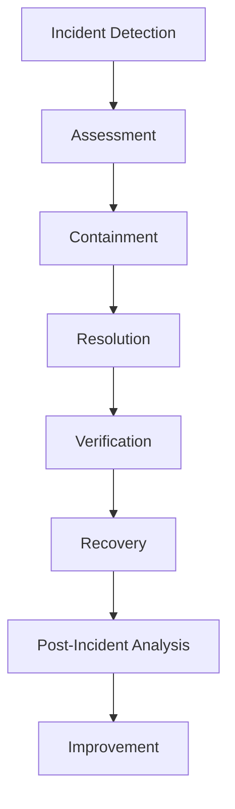
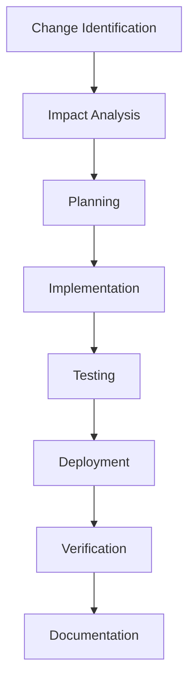
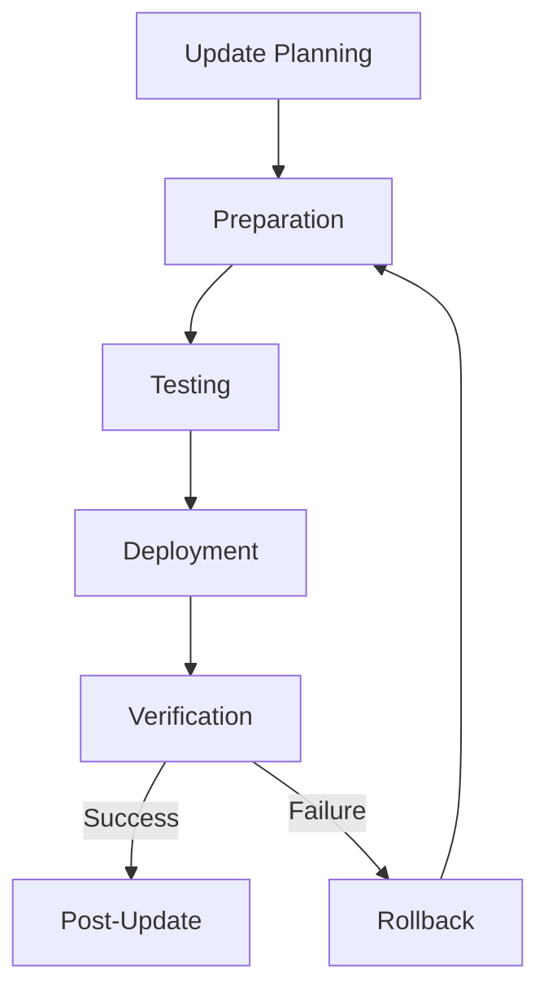
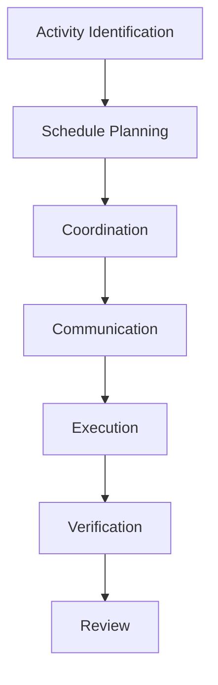

# TACHYON: MAINTENANCE GUIDE

**Document ID:** TACHYON-OPS-002-V1.0
**Date:** February 2026
**Status:** Approved for Implementation
**Classification:** Operations & Maintenance Documentation
**Compliance Level:** ISO/IEC 26514:2021, IEEE 1063-2001

---

## TABLE OF CONTENTS

1. [Introduction](#1-introduction)
2. [Maintenance Framework](#2-maintenance-framework)
3. [Preventive Maintenance](#3-preventive-maintenance)
4. [Corrective Maintenance](#4-corrective-maintenance)
5. [Adaptive Maintenance](#5-adaptive-maintenance)
6. [System Updates](#6-system-updates)
7. [Maintenance Scheduling](#7-maintenance-scheduling)
8. [Maintenance Documentation](#8-maintenance-documentation)
9. [References](#9-references)

---

## 1. INTRODUCTION

### 1.1. Purpose and Scope

This document establishes the comprehensive maintenance framework for the Tachyon toolchain, providing systematic procedures for preventive, corrective, and adaptive maintenance activities. The guide defines maintenance processes, schedules, and documentation requirements to ensure system reliability, performance, and security throughout the operational lifecycle.

The Tachyon toolchain encompasses:
- A Rust-based core engine with Tokio asynchronous runtime
- A Tauri-based desktop application wrapper
- An Axum-based HTTP/2 server component
- A TypeScript/JavaScript frontend using Leptos and TailwindCSS
- Git-based content storage and management

### 1.2. Document Dependencies

This document depends on the following documents:
- [TACHYON-STD-V1.0](../../.adrs/ - Coding and Documentation Standards
- [TACHYON-ADR-001-V1.0](../../.adrs/adr-001-three-tier-jit-compilation.md) - Rust as Primary Language
- [TACHYON-ADR-010-V1.0](../../.adrs/adr-010-synchronization-primitives.md) - Security Architecture
- [TACHYON-ARC-001-V1.0](../../docs/architecture/system_architecture_overview.md) - System Architecture Overview
- [TACHYON-ARC-004-V1.0](../../docs/architecture/deployment_architecture.md) - Deployment Architecture

### 1.3. Maintenance Objectives

The maintenance framework is designed to achieve the following objectives:

1. **System Reliability:** Maintain system availability and uptime through proactive monitoring and maintenance
2. **Performance Optimization:** Ensure consistent performance characteristics within defined service level objectives
3. **Security Compliance:** Maintain security posture through regular updates and vulnerability remediation
4. **Data Integrity:** Preserve data integrity through backup verification and consistency checks
5. **Operational Efficiency:** Minimize operational overhead through automated maintenance procedures
6. **Incident Prevention:** Prevent incidents through proactive identification and remediation of issues

### 1.4. Maintenance Principles

The following principles guide all maintenance activities:

1. **Proactive Approach:** Emphasize preventive maintenance over reactive corrective actions
2. **Documentation-First:** Document all maintenance activities for auditability and knowledge transfer
3. **Security-First:** Prioritize security considerations in all maintenance decisions
4. **Minimal Disruption:** Schedule maintenance to minimize impact on users and operations
5. **Rollback Capability:** Maintain rollback capability for all maintenance activities
6. **Continuous Improvement:** Apply lessons learned to improve maintenance processes continuously

---

## 2. MAINTENANCE FRAMEWORK

### 2.1. Maintenance Classification

Maintenance activities are classified into three primary categories:

#### 2.1.1. Preventive Maintenance

Preventive maintenance consists of scheduled, proactive activities designed to prevent system degradation, identify potential issues before they cause failures, and maintain optimal system performance. Preventive maintenance is performed on a regular schedule based on time intervals, usage metrics, or system events.

**Objectives:**
- Prevent system failures through regular inspection and maintenance
- Identify and address potential issues before they impact operations
- Maintain optimal system performance through regular optimization
- Extend system component lifespan through proper care
- Ensure security posture through regular updates and patches

**Scope:**
- System health monitoring and analysis
- Performance optimization and tuning
- Security updates and vulnerability remediation
- Log rotation and cleanup
- Database maintenance and optimization
- Dependency updates and compatibility verification
- Backup verification and integrity checks
- Capacity planning and scaling adjustments

#### 2.1.2. Corrective Maintenance

Corrective maintenance consists of reactive activities performed to address system failures, bugs, or performance issues that have already occurred. Corrective maintenance is triggered by incidents, user reports, or monitoring alerts.

**Objectives:**
- Restore system functionality as quickly as possible
- Minimize impact on users and operations
- Identify root causes to prevent recurrence
- Document incidents and resolutions for knowledge transfer
- Update monitoring and alerting to prevent similar incidents

**Scope:**
- Incident response and resolution
- Bug fixes and error remediation
- Performance issue investigation and resolution
- System recovery and restoration
- Root cause analysis
- Post-incident review and process improvement

#### 2.1.3. Adaptive Maintenance

Adaptive maintenance consists of activities performed to adapt the system to changes in the operating environment, including technology updates, regulatory requirements, or business needs. Adaptive maintenance is proactive but triggered by external changes rather than time-based schedules.

**Objectives:**
- Maintain system compatibility with evolving technologies
- Ensure compliance with changing regulatory requirements
- Adapt to changing business needs and user expectations
- Leverage new technologies for improved functionality or performance
- Maintain system relevance and value over time

**Scope:**
- Technology stack updates and migrations
- Regulatory compliance updates
- Business requirement changes
- Integration with new systems or services
- API compatibility updates
- Platform support changes

### 2.2. Maintenance Process Model

The maintenance process follows a structured model ensuring consistent, documented, and auditable maintenance activities:

```mermaid
graph TB
    subgraph "Preventive Maintenance"
        PM1[Schedule Planning]
        PM2[Preparation]
        PM3[Execution]
        PM4[Verification]
        PM5[Documentation]
    end
    
    subgraph "Corrective Maintenance"
        CM1[Incident Detection]
        CM2[Assessment]
        CM3[Resolution]
        CM4[Verification]
        CM5[Documentation]
    end
    
    subgraph "Adaptive Maintenance"
        AM1[Change Identification]
        AM2[Impact Analysis]
        AM3[Planning]
        AM4[Execution]
        AM5[Verification]
        AM6[Documentation]
    end
    
    PM1 --> PM2 --> PM3 --> PM4 --> PM5
    CM1 --> CM2 --> CM3 --> CM4 --> CM5
    AM1 --> AM2 --> AM3 --> AM4 --> AM5 --> AM6
```

**Process Phases:**

1. **Planning Phase:** Define maintenance objectives, scope, resources, and schedule
2. **Preparation Phase:** Prepare environment, backup systems, and rollback procedures
3. **Execution Phase:** Perform maintenance activities according to defined procedures
4. **Verification Phase:** Verify maintenance objectives achieved and system functionality
5. **Documentation Phase:** Document maintenance activities, results, and lessons learned

### 2.3. Maintenance Roles and Responsibilities

#### 2.3.1. DevOps Engineer

The DevOps Engineer is responsible for:
- Executing preventive maintenance procedures
- Responding to corrective maintenance incidents
- Implementing adaptive maintenance changes
- Monitoring system health and performance
- Maintaining maintenance documentation
- Coordinating with other team members for complex maintenance activities

#### 2.3.2. System Administrator

The System Administrator is responsible for:
- Managing infrastructure maintenance
- Ensuring system availability and uptime
- Performing security updates and patches
- Managing backups and disaster recovery
- Monitoring system resources and capacity
- Coordinating with DevOps Engineer for application-level maintenance

#### 2.3.3. Security Engineer

The Security Engineer is responsible for:
- Monitoring security advisories and vulnerabilities
- Performing security assessments and audits
- Implementing security patches and updates
- Reviewing maintenance activities for security implications
- Maintaining security compliance
- Responding to security incidents

#### 2.3.4. Development Team

The Development Team is responsible for:
- Providing technical support for maintenance activities
- Developing fixes for identified bugs and issues
- Implementing adaptive maintenance changes requiring code modifications
- Reviewing maintenance procedures for technical accuracy
- Providing input on maintenance priorities and scheduling
- Participating in post-incident reviews

### 2.4. Maintenance Metrics and Key Performance Indicators

Maintenance effectiveness is measured using the following metrics:

| Metric | Description | Target | Measurement Frequency |
|--------|-------------|---------|---------------------|
| **System Availability** | Percentage of time system is operational | ≥ 99.9% | Monthly |
| **Mean Time to Repair (MTTR)** | Average time to restore service after incident | < 30 minutes | Monthly |
| **Mean Time Between Failures (MTBF)** | Average time between system failures | > 720 hours | Monthly |
| **Preventive Maintenance Completion** | Percentage of scheduled preventive maintenance completed on time | 100% | Monthly |
| **Incident Response Time** | Time from incident detection to response initiation | < 5 minutes | Per incident |
| **Security Patch Latency** | Time from vulnerability disclosure to patch deployment | < 48 hours | Per vulnerability |
| **Backup Success Rate** | Percentage of successful backup operations | 100% | Per backup |
| **Performance SLA Compliance** | Percentage of time performance meets SLA | ≥ 99% | Monthly |

### 2.5. Maintenance Tools and Automation

The following tools and automation systems support maintenance activities:

#### 2.5.1. Monitoring and Alerting

- **Prometheus:** Metrics collection and monitoring
- **Grafana:** Visualization and alerting dashboards
- **Alertmanager:** Alert routing and notification
- **Uptime Monitoring:** External uptime monitoring services

#### 2.5.2. Log Management

- **Loki:** Log aggregation and storage
- **Promtail:** Log collection agent
- **Grafana:** Log visualization and analysis
- **Log Rotation:** Automated log rotation and archival

#### 2.5.3. Backup and Recovery

- **Automated Backups:** Scheduled backup jobs with verification
- **Backup Verification:** Automated integrity checks
- **Disaster Recovery:** Automated recovery procedures
- **Backup Monitoring:** Backup job monitoring and alerting

#### 2.5.4. Dependency Management

- **Cargo:** Rust dependency management and updates
- **Bun:** JavaScript dependency management and updates
- **cargo-audit:** Rust vulnerability scanning
- **npm audit:** JavaScript vulnerability scanning
- **Dependabot:** Automated dependency updates

#### 2.5.5. Deployment Automation

- **CI/CD Pipelines:** Automated deployment workflows
- **Rollback Automation:** Automated rollback procedures
- **Blue-Green Deployment:** Zero-downtime deployment strategy
- **Canary Deployments:** Gradual rollout with monitoring

---

## 3. PREVENTIVE MAINTENANCE

### 3.1. Preventive Maintenance Schedule

Preventive maintenance activities are performed on a regular schedule to prevent system degradation and maintain optimal performance. The following schedule defines the frequency and scope of preventive maintenance activities.

| Activity | Frequency | Duration | Responsible Party | Impact |
|----------|-------------|-----------|-------------------|---------|
| **System Health Check** | Daily | Automated | None | None |
| **Log Rotation** | Daily | Automated | None | None |
| **Backup Verification** | Daily | Automated | None | None |
| **Security Scan** | Daily | Automated | None | None |
| **Dependency Audit** | Weekly | DevOps Engineer | None | None |
| **Performance Analysis** | Weekly | DevOps Engineer | None | None |
| **Database Maintenance** | Weekly | DevOps Engineer | Minimal | None |
| **Capacity Review** | Monthly | System Administrator | None | None |
| **Full System Backup** | Monthly | System Administrator | Minimal | None |
| **Security Update Review** | Weekly | Security Engineer | None | None |
| **System Update** | Monthly | DevOps Engineer | Minimal | Scheduled |
| **Disaster Recovery Test** | Quarterly | System Administrator | Moderate | Scheduled |
| **Comprehensive Audit** | Annually | Security Engineer | Moderate | Scheduled |

### 3.2. Daily Preventive Maintenance

#### 3.2.1. System Health Check

**Purpose:** Automated health checks to identify potential issues before they impact operations.

**Procedure:**

1. **Health Check Execution:**
   - Execute automated health checks at 00:00 UTC daily
   - Check all system components: desktop, server, web
   - Verify service availability and responsiveness
   - Check resource utilization: CPU, memory, disk, network

2. **Health Check Metrics:**
   - Service uptime and availability
   - Response time for critical endpoints
   - Error rates and failure counts
   - Resource utilization thresholds

3. **Alerting:**
   - Generate alerts for health check failures
   - Escalate critical alerts to on-call personnel
   - Log all health check results for trend analysis

**Success Criteria:**
- All health checks complete successfully
- No critical alerts generated
- Health check results logged to monitoring system

#### 3.2.2. Log Rotation

**Purpose:** Automated log rotation to prevent disk exhaustion and maintain log accessibility.

**Procedure:**

1. **Log Rotation Execution:**
   - Execute log rotation at 02:00 UTC daily
   - Rotate logs exceeding configured size limits
   - Compress rotated logs to reduce storage requirements
   - Archive logs to long-term storage

2. **Retention Policy:**
   - Retain active logs for 7 days
   - Retain compressed logs for 30 days
   - Archive critical logs for 1 year
   - Delete logs exceeding retention policy

3. **Log Verification:**
   - Verify log rotation completed successfully
   - Verify log file integrity after rotation
   - Verify log accessibility for monitoring and analysis

**Success Criteria:**
- All logs rotated successfully
- No disk space exhaustion due to log accumulation
- Log files accessible for monitoring and analysis

#### 3.2.3. Backup Verification

**Purpose:** Automated verification of backup integrity to ensure recoverability.

**Procedure:**

1. **Backup Verification Execution:**
   - Execute backup verification at 03:00 UTC daily
   - Verify backup completion status
   - Verify backup file integrity using checksums
   - Verify backup file accessibility

2. **Verification Metrics:**
   - Backup completion status
   - Backup file size and checksum
   - Backup completion time
   - Backup storage utilization

3. **Alerting:**
   - Generate alerts for backup failures
   - Generate alerts for backup integrity issues
   - Escalate critical alerts to on-call personnel

**Success Criteria:**
- All backups verified successfully
- No backup integrity issues detected
- Backup verification results logged

#### 3.2.4. Security Scan

**Purpose:** Automated security scanning to identify vulnerabilities and security issues.

**Procedure:**

1. **Security Scan Execution:**
   - Execute security scan at 04:00 UTC daily
   - Scan system dependencies for known vulnerabilities
   - Scan system configuration for security issues
   - Scan application code for security vulnerabilities

2. **Vulnerability Assessment:**
   - Assess vulnerability severity using CVSS scores
   - Identify affected components and versions
   - Identify remediation steps and patches
   - Estimate remediation effort and impact

3. **Reporting:**
   - Generate security scan report
   - Report vulnerabilities to security team
   - Track vulnerability remediation status
   - Maintain vulnerability inventory

**Success Criteria:**
- Security scans completed successfully
- Vulnerabilities identified and assessed
- Security scan reports generated and distributed

### 3.3. Weekly Preventive Maintenance

#### 3.3.1. Dependency Audit

**Purpose:** Regular audit of dependencies to identify vulnerabilities and compatibility issues.

**Procedure:**

1. **Dependency Audit Execution:**
   - Execute dependency audit on Monday at 02:00 UTC
   - Audit Rust dependencies using `cargo-audit`
   - Audit JavaScript dependencies using `npm audit`
   - Review dependency update recommendations

2. **Vulnerability Review:**
   - Review identified vulnerabilities
   - Assess vulnerability severity and impact
   - Identify remediation options: update, patch, mitigate
   - Prioritize remediation based on severity

3. **Remediation Planning:**
   - Plan dependency updates for critical vulnerabilities
   - Schedule dependency updates for non-critical vulnerabilities
   - Test dependency updates in staging environment
   - Deploy dependency updates to production

**Success Criteria:**
- All dependencies audited successfully
- Vulnerabilities identified and assessed
- Remediation plan developed and executed

#### 3.3.2. Performance Analysis

**Purpose:** Regular analysis of system performance to identify optimization opportunities.

**Procedure:**

1. **Performance Analysis Execution:**
   - Execute performance analysis on Wednesday at 02:00 UTC
   - Analyze system performance metrics
   - Identify performance bottlenecks and issues
   - Compare performance to baseline and SLA

2. **Performance Metrics:**
   - Response times for critical operations
   - Throughput and concurrency metrics
   - Resource utilization: CPU, memory, disk, network
   - Error rates and failure counts

3. **Optimization Planning:**
   - Identify optimization opportunities
   - Prioritize optimizations based on impact
   - Plan optimization implementation
   - Measure optimization effectiveness

**Success Criteria:**
- Performance analysis completed successfully
- Performance bottlenecks identified
- Optimization plan developed

#### 3.3.3. Database Maintenance

**Purpose:** Regular database maintenance to ensure optimal performance and data integrity.

**Procedure:**

1. **Database Maintenance Execution:**
   - Execute database maintenance on Friday at 02:00 UTC
   - Analyze database performance metrics
   - Rebuild database indexes for optimal performance
   - Update database statistics for query optimization

2. **Data Integrity Checks:**
   - Verify database integrity using consistency checks
   - Verify data consistency across tables
   - Verify referential integrity constraints
   - Verify data validation rules

3. **Optimization:**
   - Optimize database configuration based on workload
   - Optimize query performance based on analysis
   - Optimize storage allocation and usage
   - Archive or purge obsolete data

**Success Criteria:**
- Database maintenance completed successfully
- Database integrity verified
- Database performance optimized

### 3.4. Monthly Preventive Maintenance

#### 3.4.1. Capacity Review

**Purpose:** Regular review of system capacity to ensure adequate resources for current and future needs.

**Procedure:**

1. **Capacity Analysis:**
   - Analyze current resource utilization trends
   - Project future resource requirements
   - Identify capacity constraints and bottlenecks
   - Plan capacity upgrades and expansions

2. **Resource Metrics:**
   - CPU utilization trends and projections
   - Memory utilization trends and projections
   - Disk utilization trends and projections
   - Network utilization trends and projections

3. **Capacity Planning:**
   - Plan capacity upgrades based on projections
   - Schedule capacity upgrades during maintenance windows
   - Test capacity upgrades in staging environment
   - Deploy capacity upgrades to production

**Success Criteria:**
- Capacity analysis completed successfully
- Capacity constraints identified
- Capacity plan developed and executed

#### 3.4.2. Full System Backup

**Purpose:** Complete system backup to ensure comprehensive disaster recovery capability.

**Procedure:**

1. **Backup Execution:**
   - Execute full system backup on first Sunday of month at 00:00 UTC
   - Backup all system components: desktop, server, web
   - Backup all data: databases, files, configuration
   - Backup all dependencies and artifacts

2. **Backup Verification:**
   - Verify backup completion status
   - Verify backup file integrity using checksums
   - Verify backup file accessibility
   - Verify backup completeness

3. **Backup Storage:**
   - Store backups in multiple locations for redundancy
   - Encrypt backups for security
   - Archive backups for long-term retention
   - Test backup restoration periodically

**Success Criteria:**
- Full system backup completed successfully
- Backup integrity verified
- Backup stored securely

#### 3.4.3. System Update

**Purpose:** Regular system updates to maintain security, compatibility, and functionality.

**Procedure:**

1. **Update Planning:**
   - Review available updates and patches
   - Assess update impact and compatibility
   - Schedule update during maintenance window
   - Prepare rollback procedures

2. **Update Execution:**
   - Execute system updates during scheduled maintenance window
   - Update operating system packages
   - Update application dependencies
   - Update application code and configuration

3. **Update Verification:**
   - Verify update completion status
   - Verify system functionality after update
   - Verify performance after update
   - Verify security after update

4. **Rollback Preparation:**
   - Prepare rollback procedures in case of issues
   - Test rollback procedures in staging environment
   - Execute rollback if issues detected

**Success Criteria:**
- System updates completed successfully
- System functionality verified after update
- Rollback procedures tested and ready

### 3.5. Quarterly Preventive Maintenance

#### 3.5.1. Disaster Recovery Test

**Purpose:** Regular testing of disaster recovery procedures to ensure effective recovery from failures.

**Procedure:**

1. **Test Planning:**
   - Define disaster recovery test scope and objectives
   - Schedule test during maintenance window
   - Notify stakeholders of test schedule
   - Prepare test scenarios and success criteria

2. **Test Execution:**
   - Execute disaster recovery test according to plan
   - Simulate failure scenarios
   - Execute recovery procedures
   - Measure recovery time and effectiveness

3. **Test Analysis:**
   - Analyze test results against success criteria
   - Identify issues and improvement opportunities
   - Update disaster recovery procedures based on findings
   - Document test results and lessons learned

**Success Criteria:**
- Disaster recovery test completed successfully
- Recovery procedures verified effective
- Recovery time meets requirements
- Test results documented

### 3.6. Annual Preventive Maintenance

#### 3.6.1. Comprehensive Audit

**Purpose:** Comprehensive security and compliance audit to ensure system security and regulatory compliance.

**Procedure:**

1. **Audit Planning:**
   - Define audit scope and objectives
   - Schedule audit during maintenance window
   - Engage internal or external auditors
   - Prepare audit checklist and criteria

2. **Audit Execution:**
   - Execute comprehensive security audit
   - Execute comprehensive compliance audit
   - Review security controls and procedures
   - Review compliance with regulations and standards

3. **Audit Reporting:**
   - Generate comprehensive audit report
   - Identify findings and recommendations
   - Prioritize remediation activities
   - Track remediation progress

**Success Criteria:**
- Comprehensive audit completed successfully
- Findings and recommendations documented
- Remediation plan developed

---

## 4. CORRECTIVE MAINTENANCE

### 4.1. Incident Response Framework

Corrective maintenance is triggered by incidents, which are unexpected events that disrupt system operations or degrade system performance. The incident response framework defines the process for detecting, assessing, resolving, and learning from incidents.

#### 4.1.1. Incident Classification

Incidents are classified based on severity and impact to determine response priority and resource allocation:

| Severity | Description | Response Time | Impact |
|-----------|-------------|----------------|---------|
| **Critical** | System outage or critical functionality failure | < 5 minutes | Complete service disruption |
| **High** | Significant degradation or partial outage | < 15 minutes | Major impact to users |
| **Medium** | Moderate degradation or non-critical failure | < 1 hour | Moderate impact to users |
| **Low** | Minor degradation or localized issue | < 4 hours | Minimal impact to users |

#### 4.1.2. Incident Detection

Incidents are detected through multiple channels:

1. **Automated Monitoring:**
   - Health check failures trigger alerts
   - Performance threshold breaches trigger alerts
   - Error rate increases trigger alerts
   - Resource exhaustion triggers alerts

2. **User Reports:**
   - User-reported issues through support channels
   - User-reported issues through feedback mechanisms
   - User-reported issues through social media

3. **Internal Detection:**
   - DevOps team identifies issues during maintenance
   - Development team identifies issues during testing
   - Security team identifies security incidents

#### 4.1.3. Incident Response Process

The incident response process follows a structured approach:

**Process Phases:**

1. **Detection Phase:** Identify incident through monitoring, user reports, or internal detection
2. **Assessment Phase:** Assess incident severity, impact, and required resources
3. **Containment Phase:** Contain incident to prevent further impact
4. **Resolution Phase:** Resolve incident and restore system functionality
5. **Verification Phase:** Verify resolution and system functionality
6. **Recovery Phase:** Recover affected systems and data
7. **Post-Incident Analysis Phase:** Analyze incident to prevent recurrence
8. **Improvement Phase:** Implement improvements to prevent similar incidents

### 4.2. Incident Response Procedures

#### 4.2.1. Critical Incident Response

**Purpose:** Rapid response to critical incidents causing complete service disruption.

**Procedure:**

1. **Immediate Response (0-5 minutes):**
   - Acknowledge incident alert
   - Notify on-call personnel
   - Initiate incident response call
   - Establish communication channel

2. **Assessment (5-15 minutes):**
   - Assess incident scope and impact
   - Identify affected components and users
   - Determine root cause hypothesis
   - Estimate resolution time

3. **Containment (15-30 minutes):**
   - Implement containment measures
   - Isolate affected components
   - Redirect traffic to healthy components
   - Prevent further impact

4. **Resolution (30-120 minutes):**
   - Implement resolution measures
   - Restore system functionality
   - Verify system functionality
   - Monitor for recurrence

5. **Post-Incident (After resolution):**
   - Conduct post-incident review
   - Document incident details and resolution
   - Identify improvement opportunities
   - Implement improvements

**Success Criteria:**
- Incident resolved within 120 minutes
- System functionality restored
- Post-incident review completed
- Improvements implemented

#### 4.2.2. High Severity Incident Response

**Purpose:** Response to high severity incidents causing major impact to users.

**Procedure:**

1. **Immediate Response (0-15 minutes):**
   - Acknowledge incident alert
   - Notify on-call personnel
   - Initiate incident response coordination
   - Establish communication channel

2. **Assessment (15-45 minutes):**
   - Assess incident scope and impact
   - Identify affected components and users
   - Determine root cause hypothesis
   - Estimate resolution time

3. **Containment (45-90 minutes):**
   - Implement containment measures
   - Isolate affected components
   - Redirect traffic to healthy components
   - Prevent further impact

4. **Resolution (90-240 minutes):**
   - Implement resolution measures
   - Restore system functionality
   - Verify system functionality
   - Monitor for recurrence

5. **Post-Incident (After resolution):**
   - Conduct post-incident review
   - Document incident details and resolution
   - Identify improvement opportunities
   - Implement improvements

**Success Criteria:**
- Incident resolved within 240 minutes
- System functionality restored
- Post-incident review completed
- Improvements implemented

#### 4.2.3. Medium Severity Incident Response

**Purpose:** Response to medium severity incidents causing moderate impact to users.

**Procedure:**

1. **Immediate Response (0-60 minutes):**
   - Acknowledge incident alert
   - Notify responsible team
   - Initiate incident response coordination
   - Establish communication channel

2. **Assessment (60-180 minutes):**
   - Assess incident scope and impact
   - Identify affected components and users
   - Determine root cause hypothesis
   - Estimate resolution time

3. **Containment (180-360 minutes):**
   - Implement containment measures
   - Isolate affected components
   - Redirect traffic to healthy components
   - Prevent further impact

4. **Resolution (360-720 minutes):**
   - Implement resolution measures
   - Restore system functionality
   - Verify system functionality
   - Monitor for recurrence

5. **Post-Incident (After resolution):**
   - Conduct post-incident review
   - Document incident details and resolution
   - Identify improvement opportunities
   - Implement improvements

**Success Criteria:**
- Incident resolved within 720 minutes
- System functionality restored
- Post-incident review completed
- Improvements implemented

#### 4.2.4. Low Severity Incident Response

**Purpose:** Response to low severity incidents causing minimal impact to users.

**Procedure:**

1. **Immediate Response (0-240 minutes):**
   - Acknowledge incident alert
   - Notify responsible team
   - Initiate incident response coordination
   - Establish communication channel

2. **Assessment (240-480 minutes):**
   - Assess incident scope and impact
   - Identify affected components and users
   - Determine root cause hypothesis
   - Estimate resolution time

3. **Containment (480-960 minutes):**
   - Implement containment measures
   - Isolate affected components
   - Redirect traffic to healthy components
   - Prevent further impact

4. **Resolution (960-1440 minutes):**
   - Implement resolution measures
   - Restore system functionality
   - Verify system functionality
   - Monitor for recurrence

5. **Post-Incident (After resolution):**
   - Conduct post-incident review
   - Document incident details and resolution
   - Identify improvement opportunities
   - Implement improvements

**Success Criteria:**
- Incident resolved within 1440 minutes
- System functionality restored
- Post-incident review completed
- Improvements implemented

### 4.3. Bug Fix Procedures

#### 4.3.1. Bug Triage

**Purpose:** Systematic triage of reported bugs to prioritize and assign fixes.

**Procedure:**

1. **Bug Report Review:**
   - Review bug report details and reproduction steps
   - Assess bug severity and impact
   - Verify bug reproducibility
   - Classify bug by category and severity

2. **Bug Prioritization:**
   - Prioritize bugs based on severity and impact
   - Assign priority level: Critical, High, Medium, Low
   - Estimate fix effort and complexity
   - Schedule fix based on priority

3. **Bug Assignment:**
   - Assign bug to appropriate developer
   - Provide bug details and context
   - Set expected completion date
   - Track progress and provide support

**Success Criteria:**
- Bugs triaged within 24 hours of report
- Bugs prioritized and assigned appropriately
- Fix schedule communicated to stakeholders

#### 4.3.2. Bug Fix Development

**Purpose:** Systematic development of bug fixes to ensure quality and prevent regression.

**Procedure:**

1. **Fix Planning:**
   - Analyze bug to understand root cause
   - Design fix approach and implementation plan
   - Identify potential side effects and regressions
   - Plan testing approach

2. **Fix Implementation:**
   - Implement bug fix according to plan
   - Follow coding standards and best practices
   - Write unit tests for the fix
   - Write integration tests for the fix

3. **Fix Testing:**
   - Execute unit tests to verify fix
   - Execute integration tests to verify fix
   - Test for regressions in related functionality
   - Test in staging environment

4. **Fix Review:**
   - Submit fix for code review
   - Address review feedback
   - Obtain approval for merge
   - Merge fix to appropriate branch

**Success Criteria:**
- Bug fix implemented correctly
- Bug fix tested thoroughly
- No regressions introduced
- Bug fix approved and merged

#### 4.3.3. Bug Fix Deployment

**Purpose:** Systematic deployment of bug fixes to production.

**Procedure:**

1. **Deployment Planning:**
   - Plan deployment schedule
   - Prepare deployment procedures
   - Prepare rollback procedures
   - Notify stakeholders of deployment

2. **Deployment Execution:**
   - Deploy bug fix to staging environment
   - Verify fix in staging environment
   - Deploy bug fix to production environment
   - Monitor for issues

3. **Deployment Verification:**
   - Verify fix resolves reported bug
   - Verify no regressions introduced
   - Verify system performance
   - Verify system stability

4. **Rollback Preparation:**
   - Prepare rollback procedures in case of issues
   - Execute rollback if issues detected
   - Investigate rollback cause
   - Re-deploy after issue resolution

**Success Criteria:**
- Bug fix deployed successfully
- Bug fix verified in production
- No regressions introduced
- Rollback procedures tested and ready

### 4.4. Performance Issue Resolution

#### 4.4.1. Performance Issue Investigation

**Purpose:** Systematic investigation of performance issues to identify root causes.

**Procedure:**

1. **Issue Assessment:**
   - Assess performance issue severity and impact
   - Identify affected components and operations
   - Measure performance degradation
   - Establish performance baseline

2. **Data Collection:**
   - Collect performance metrics and logs
   - Collect system resource utilization data
   - Collect application profiling data
   - Collect user experience data

3. **Root Cause Analysis:**
   - Analyze collected data to identify bottlenecks
   - Identify performance bottlenecks: CPU, memory, disk, network
   - Identify inefficient operations or algorithms
   - Identify configuration issues

**Success Criteria:**
- Performance issue assessed thoroughly
- Root cause identified
- Improvement opportunities identified

#### 4.4.2. Performance Issue Resolution

**Purpose:** Systematic resolution of performance issues to restore optimal performance.

**Procedure:**

1. **Resolution Planning:**
   - Design performance improvement approach
   - Plan implementation of performance improvements
   - Estimate improvement impact
   - Plan testing and verification

2. **Resolution Implementation:**
   - Implement performance improvements
   - Optimize inefficient operations or algorithms
   - Optimize configuration settings
   - Optimize resource allocation

3. **Resolution Testing:**
   - Test performance improvements in staging environment
   - Measure performance improvement
   - Verify no regressions introduced
   - Verify system stability

4. **Resolution Deployment:**
   - Deploy performance improvements to production
   - Monitor performance improvements
   - Verify performance objectives met
   - Monitor for regressions

**Success Criteria:**
- Performance issue resolved
- Performance objectives met
- No regressions introduced
- System stability maintained

### 4.5. Root Cause Analysis

#### 4.5.1. Root Cause Analysis Process

**Purpose:** Systematic root cause analysis to prevent incident recurrence.

**Procedure:**

1. **Data Collection:**
   - Collect incident data: logs, metrics, traces
   - Collect timeline of events
   - Collect system state data
   - Collect user impact data

2. **Root Cause Identification:**
   - Use Five Whys technique to identify root cause
   - Use Fishbone diagram to identify contributing factors
   - Identify immediate causes and underlying causes
   - Identify systemic issues contributing to incident

3. **Corrective Actions:**
   - Identify immediate corrective actions
   - Identify systemic corrective actions
   - Identify preventive measures
   - Identify monitoring improvements

**Success Criteria:**
- Root cause identified
- Corrective actions defined
- Preventive measures defined
- Monitoring improvements defined

#### 4.5.2. Post-Incident Review

**Purpose:** Systematic review of incidents to identify improvement opportunities.

**Procedure:**

1. **Review Planning:**
   - Schedule post-incident review meeting
   - Invite all relevant stakeholders
   - Prepare incident timeline and data
   - Prepare discussion questions

2. **Review Execution:**
   - Present incident timeline and impact
   - Discuss incident response effectiveness
   - Discuss root cause analysis findings
   - Discuss improvement opportunities

3. **Action Items:**
   - Document action items and owners
   - Set action item due dates
   - Track action item completion
   - Verify action item effectiveness

**Success Criteria:**
- Post-incident review completed
- Action items defined and assigned
- Action items completed
- Improvement opportunities implemented

---

## 5. ADAPTIVE MAINTENANCE

### 5.1. Adaptive Maintenance Framework

Adaptive maintenance consists of activities performed to adapt the system to changes in the operating environment, including technology updates, regulatory requirements, or business needs. Adaptive maintenance is proactive but triggered by external changes rather than time-based schedules.

#### 5.1.1. Adaptive Maintenance Triggers

Adaptive maintenance activities are triggered by:

1. **Technology Changes:**
   - New versions of programming languages and frameworks
   - New versions of libraries and dependencies
   - New versions of operating systems and platforms
   - New technologies offering improved functionality or performance

2. **Regulatory Changes:**
   - New regulations affecting system operation
   - Changes to existing regulations
   - New compliance requirements
   - Changes to security standards

3. **Business Changes:**
   - New business requirements
   - Changes to existing business requirements
   - New integration requirements
   - Changes to user needs or expectations

4. **Security Changes:**
   - New security vulnerabilities discovered
   - New security threats identified
   - Changes to security best practices
   - New security compliance requirements

#### 5.1.2. Adaptive Maintenance Process

The adaptive maintenance process follows a structured approach:

**Process Phases:**

1. **Change Identification Phase:** Identify external changes requiring system adaptation
2. **Impact Analysis Phase:** Analyze impact of change on system
3. **Planning Phase:** Plan adaptation implementation
4. **Implementation Phase:** Implement adaptation changes
5. **Testing Phase:** Test adaptation changes thoroughly
6. **Deployment Phase:** Deploy adaptation changes to production
7. **Verification Phase:** Verify adaptation effectiveness
8. **Documentation Phase:** Document adaptation changes and lessons learned

### 5.2. Technology Stack Updates

#### 5.2.1. Dependency Update Management

**Purpose:** Systematic management of dependency updates to maintain security, compatibility, and functionality.

**Procedure:**

1. **Update Identification:**
   - Monitor dependency updates through security advisories
   - Monitor dependency updates through release notifications
   - Monitor dependency updates through automated tools
   - Assess update urgency and impact

2. **Impact Assessment:**
   - Assess compatibility of update with system
   - Assess breaking changes and migration requirements
   - Assess update impact on system functionality
   - Estimate update effort and complexity

3. **Update Planning:**
   - Plan update implementation approach
   - Plan testing strategy for update
   - Plan rollback procedures for update
   - Schedule update during maintenance window

4. **Update Implementation:**
   - Implement dependency update in development environment
   - Test update thoroughly in development environment
   - Deploy update to staging environment
   - Test update thoroughly in staging environment

5. **Update Deployment:**
   - Deploy update to production environment
   - Monitor system for issues after update
   - Verify system functionality after update
   - Execute rollback if issues detected

**Success Criteria:**
- Dependency update implemented successfully
- System functionality verified after update
- No regressions introduced
- Rollback procedures tested and ready

#### 5.2.2. Framework and Library Updates

**Purpose:** Systematic updates to frameworks and libraries to leverage new features and improvements.

**Procedure:**

1. **Update Evaluation:**
   - Evaluate new framework or library versions
   - Assess new features and improvements
   - Assess breaking changes and migration requirements
   - Assess update benefits versus costs

2. **Migration Planning:**
   - Plan migration to new version
   - Plan breaking changes handling
   - Plan feature adoption strategy
   - Plan testing approach for migration

3. **Migration Implementation:**
   - Implement migration in development environment
   - Test migration thoroughly in development environment
   - Deploy migration to staging environment
   - Test migration thoroughly in staging environment

4. **Migration Deployment:**
   - Deploy migration to production environment
   - Monitor system for issues after migration
   - Verify system functionality after migration
   - Execute rollback if issues detected

**Success Criteria:**
- Framework or library update implemented successfully
- New features adopted and verified
- System functionality verified after update
- No regressions introduced

#### 5.2.3. Platform Support Updates

**Purpose:** Systematic updates to platform support to maintain compatibility and leverage new capabilities.

**Procedure:**

1. **Platform Evaluation:**
   - Evaluate new platform versions and capabilities
   - Assess platform update benefits
   - Assess platform update costs and risks
   - Assess platform update compatibility with system

2. **Update Planning:**
   - Plan platform update approach
   - Plan testing strategy for platform update
   - Plan rollback procedures for platform update
   - Schedule platform update during maintenance window

3. **Update Implementation:**
   - Implement platform update in development environment
   - Test update thoroughly in development environment
   - Deploy update to staging environment
   - Test update thoroughly in staging environment

4. **Update Deployment:**
   - Deploy platform update to production environment
   - Monitor system for issues after update
   - Verify system functionality after update
   - Execute rollback if issues detected

**Success Criteria:**
- Platform update implemented successfully
- System compatibility verified after update
- System functionality verified after update
- No regressions introduced

### 5.3. Regulatory Compliance Updates

#### 5.3.1. Regulatory Change Assessment

**Purpose:** Systematic assessment of regulatory changes to ensure compliance.

**Procedure:**

1. **Regulatory Monitoring:**
   - Monitor regulatory changes affecting system
   - Monitor regulatory guidance and interpretations
   - Monitor industry best practices
   - Monitor compliance requirements

2. **Impact Assessment:**
   - Assess regulatory change impact on system
   - Identify system components affected by change
   - Identify compliance gaps
   - Estimate compliance effort and complexity

3. **Compliance Planning:**
   - Plan compliance implementation approach
   - Plan testing strategy for compliance
   - Plan documentation updates for compliance
   - Schedule compliance implementation

**Success Criteria:**
- Regulatory changes assessed thoroughly
- Compliance gaps identified
- Compliance plan developed

#### 5.3.2. Compliance Implementation

**Purpose:** Systematic implementation of compliance requirements to ensure regulatory compliance.

**Procedure:**

1. **Implementation Planning:**
   - Plan compliance implementation details
   - Plan compliance testing approach
   - Plan compliance documentation
   - Plan compliance verification

2. **Implementation Execution:**
   - Implement compliance changes in development environment
   - Test compliance changes thoroughly in development environment
   - Deploy compliance changes to staging environment
   - Test compliance changes thoroughly in staging environment

3. **Implementation Deployment:**
   - Deploy compliance changes to production environment
   - Monitor system for issues after deployment
   - Verify compliance requirements met
   - Execute rollback if issues detected

4. **Compliance Verification:**
   - Verify compliance with regulatory requirements
   - Document compliance verification
   - Submit compliance documentation as required
   - Maintain compliance records

**Success Criteria:**
- Compliance requirements implemented successfully
- Compliance verified and documented
- System functionality maintained
- No regressions introduced

### 5.4. Business Requirement Changes

#### 5.4.1. Requirement Analysis

**Purpose:** Systematic analysis of business requirement changes to ensure appropriate system adaptation.

**Procedure:**

1. **Requirement Review:**
   - Review business requirement changes
   - Understand requirement change rationale
   - Clarify requirement details and expectations
   - Identify affected system components

2. **Impact Assessment:**
   - Assess requirement change impact on system
   - Estimate implementation effort and complexity
   - Identify dependencies and constraints
   - Assess risks and mitigation strategies

3. **Feasibility Analysis:**
   - Assess technical feasibility of requirement
   - Assess cost-benefit of requirement
   - Assess timeline implications of requirement
   - Provide recommendation to stakeholders

**Success Criteria:**
- Business requirements analyzed thoroughly
- Impact assessed and documented
- Feasibility evaluated and communicated

#### 5.4.2. Requirement Implementation

**Purpose:** Systematic implementation of business requirement changes to meet business needs.

**Procedure:**

1. **Implementation Planning:**
   - Plan requirement implementation approach
   - Plan testing strategy for requirement
   - Plan documentation updates for requirement
   - Schedule requirement implementation

2. **Implementation Execution:**
   - Implement requirement changes in development environment
   - Test requirement changes thoroughly in development environment
   - Deploy requirement changes to staging environment
   - Test requirement changes thoroughly in staging environment

3. **Implementation Deployment:**
   - Deploy requirement changes to production environment
   - Monitor system for issues after deployment
   - Verify requirement functionality met
   - Execute rollback if issues detected

4. **User Acceptance:**
   - Conduct user acceptance testing
   - Gather user feedback
   - Address user concerns and issues
   - Document user acceptance

**Success Criteria:**
- Business requirements implemented successfully
- User acceptance obtained
- System functionality maintained
- No regressions introduced

### 5.5. Integration Changes

#### 5.5.1. Integration Analysis

**Purpose:** Systematic analysis of integration requirements to ensure appropriate system adaptation.

**Procedure:**

1. **Integration Review:**
   - Review integration requirements
   - Understand integration scope and objectives
   - Clarify integration details and expectations
   - Identify integration points and protocols

2. **Impact Assessment:**
   - Assess integration impact on system
   - Estimate integration effort and complexity
   - Identify dependencies and constraints
   - Assess risks and mitigation strategies

3. **Feasibility Analysis:**
   - Assess technical feasibility of integration
   - Assess cost-benefit of integration
   - Assess timeline implications of integration
   - Provide recommendation to stakeholders

**Success Criteria:**
- Integration requirements analyzed thoroughly
- Impact assessed and documented
- Feasibility evaluated and communicated

#### 5.5.2. Integration Implementation

**Purpose:** Systematic implementation of integration changes to enable system interoperability.

**Procedure:**

1. **Implementation Planning:**
   - Plan integration implementation approach
   - Plan testing strategy for integration
   - Plan documentation updates for integration
   - Schedule integration implementation

2. **Implementation Execution:**
   - Implement integration changes in development environment
   - Test integration changes thoroughly in development environment
   - Deploy integration changes to staging environment
   - Test integration changes thoroughly in staging environment

3. **Implementation Deployment:**
   - Deploy integration changes to production environment
   - Monitor system for issues after deployment
   - Verify integration functionality met
   - Execute rollback if issues detected

4. **Integration Verification:**
   - Verify integration with external systems
   - Verify data flow between systems
   - Verify error handling between systems
   - Document integration verification

**Success Criteria:**
- Integration requirements implemented successfully
- Integration verified and documented
- System functionality maintained
- No regressions introduced

### 5.6. Security Adaptation

#### 5.6.1. Security Vulnerability Response

**Purpose:** Rapid response to newly discovered security vulnerabilities to maintain system security.

**Procedure:**

1. **Vulnerability Assessment:**
   - Assess vulnerability severity using CVSS scores
   - Assess vulnerability impact on system
   - Identify affected components and versions
   - Identify remediation options

2. **Remediation Planning:**
   - Plan vulnerability remediation approach
   - Plan testing strategy for remediation
   - Plan rollback procedures for remediation
   - Schedule remediation based on severity

3. **Remediation Execution:**
   - Implement vulnerability remediation in development environment
   - Test remediation thoroughly in development environment
   - Deploy remediation to staging environment
   - Test remediation thoroughly in staging environment

4. **Remediation Deployment:**
   - Deploy remediation to production environment
   - Monitor system for issues after deployment
   - Verify vulnerability remediated
   - Execute rollback if issues detected

**Success Criteria:**
- Security vulnerability remediated successfully
- System security verified after remediation
- System functionality maintained
- No regressions introduced

#### 5.6.2. Security Best Practice Updates

**Purpose:** Systematic updates to security best practices to maintain security posture.

**Procedure:**

1. **Best Practice Review:**
   - Review new security best practices
   - Assess best practice applicability to system
   - Assess best practice benefits and costs
   - Identify priority best practices for implementation

2. **Implementation Planning:**
   - Plan best practice implementation approach
   - Plan testing strategy for best practice
   - Plan documentation updates for best practice
   - Schedule best practice implementation

3. **Implementation Execution:**
   - Implement best practice changes in development environment
   - Test best practice changes thoroughly in development environment
   - Deploy best practice changes to staging environment
   - Test best practice changes thoroughly in staging environment

4. **Implementation Deployment:**
   - Deploy best practice changes to production environment
   - Monitor system for issues after deployment
   - Verify best practice effectiveness
   - Execute rollback if issues detected

**Success Criteria:**
- Security best practices implemented successfully
- System security improved
- System functionality maintained
- No regressions introduced

---

## 6. SYSTEM UPDATES

### 6.1. Update Framework

System updates encompass all changes to the system including operating system updates, application updates, dependency updates, and configuration updates. The update framework defines the process for planning, testing, deploying, and verifying system updates.

#### 6.1.1. Update Classification

Updates are classified based on risk and impact to determine deployment strategy:

| Classification | Description | Deployment Strategy | Rollback Strategy |
|---------------|-------------|---------------------|-------------------|
| **Critical Security** | Security patches for critical vulnerabilities | Immediate deployment | Immediate rollback |
| **High Risk** | Major version updates with breaking changes | Staged deployment | Automated rollback |
| **Medium Risk** | Minor version updates with compatibility changes | Canary deployment | Manual rollback |
| **Low Risk** | Patch updates with minimal impact | Blue-green deployment | Manual rollback |

#### 6.1.2. Update Process

The update process follows a structured approach:

**Process Phases:**

1. **Update Planning Phase:** Plan update scope, approach, testing, and deployment
2. **Preparation Phase:** Prepare environment, backups, and rollback procedures
3. **Testing Phase:** Test update thoroughly in staging environment
4. **Deployment Phase:** Deploy update to production environment
5. **Verification Phase:** Verify update success and system functionality
6. **Rollback Phase:** Execute rollback if update fails
7. **Post-Update Phase:** Document update and lessons learned

### 6.2. Update Planning

#### 6.2.1. Update Scope Definition

**Purpose:** Define the scope of system updates to ensure comprehensive planning.

**Procedure:**

1. **Update Identification:**
   - Identify available updates and patches
   - Identify update dependencies and prerequisites
   - Identify update impact on system components
   - Identify update risks and mitigation strategies

2. **Scope Definition:**
   - Define update scope: components, features, configurations
   - Define update objectives and success criteria
   - Define update timeline and milestones
   - Define update resources and responsibilities

3. **Risk Assessment:**
   - Assess update risks: compatibility, performance, security
   - Identify potential failure scenarios
   - Identify rollback requirements
   - Identify monitoring requirements

**Success Criteria:**
- Update scope defined comprehensively
- Update risks identified and assessed
- Update plan developed and approved

#### 6.2.2. Update Testing Strategy

**Purpose:** Define comprehensive testing strategy to ensure update quality.

**Procedure:**

1. **Test Planning:**
   - Define test scope and objectives
   - Define test cases and scenarios
   - Define test data and environments
   - Define test success criteria

2. **Test Execution:**
   - Execute unit tests for updated components
   - Execute integration tests for updated components
   - Execute system tests for updated functionality
   - Execute performance tests for updated components

3. **Test Results Analysis:**
   - Analyze test results against success criteria
   - Identify test failures and issues
   - Identify regressions in existing functionality
   - Approve or reject update based on test results

**Success Criteria:**
- Test strategy defined comprehensively
- Tests executed successfully
- Update approved for deployment

### 6.3. Update Deployment Strategies

#### 6.3.1. Blue-Green Deployment

**Purpose:** Zero-downtime deployment strategy for low-risk updates.

**Procedure:**

1. **Environment Preparation:**
   - Prepare green environment with update
   - Verify green environment functionality
   - Prepare traffic routing configuration
   - Prepare rollback procedures

2. **Deployment Execution:**
   - Deploy update to green environment
   - Verify green environment functionality
   - Route traffic to green environment
   - Monitor green environment performance

3. **Verification and Cleanup:**
   - Verify update success in green environment
   - Monitor for issues in green environment
   - Decommission blue environment after verification
   - Document deployment results

**Success Criteria:**
- Update deployed successfully with zero downtime
- System functionality verified after update
- No issues detected in green environment
- Deployment documented

#### 6.3.2. Canary Deployment

**Purpose:** Gradual rollout strategy for medium-risk updates.

**Procedure:**

1. **Canary Preparation:**
   - Prepare canary environment with update
   - Verify canary environment functionality
   - Define canary traffic percentage
   - Define canary success criteria

2. **Canary Execution:**
   - Deploy update to canary environment
   - Route percentage of traffic to canary
   - Monitor canary environment performance
   - Monitor canary environment errors

3. **Canary Evaluation:**
   - Evaluate canary performance against success criteria
   - Evaluate canary errors against thresholds
   - Approve full deployment or rollback based on results
   - Expand canary to full deployment if approved

**Success Criteria:**
- Canary deployment executed successfully
- Canary performance meets success criteria
- Full deployment approved
- Deployment documented

#### 6.3.3. Staged Deployment

**Purpose:** Phased rollout strategy for high-risk updates.

**Procedure:**

1. **Stage Planning:**
   - Define deployment stages and criteria
   - Define stage duration and monitoring
   - Define rollback triggers and procedures
   - Define communication plan for each stage

2. **Stage Execution:**
   - Deploy update to first stage
   - Monitor first stage performance
   - Evaluate first stage against criteria
   - Proceed to next stage or rollback based on results

3. **Stage Expansion:**
   - Expand deployment to subsequent stages
   - Monitor each stage performance
   - Evaluate each stage against criteria
   - Complete deployment or rollback based on results

**Success Criteria:**
- Staged deployment executed successfully
- All stages meet success criteria
- Full deployment completed
- Deployment documented

### 6.4. Update Verification

#### 6.4.1. Functional Verification

**Purpose:** Verify system functionality after update to ensure update objectives met.

**Procedure:**

1. **Functionality Testing:**
   - Test updated functionality thoroughly
   - Test dependent functionality for regressions
   - Test integration points for compatibility
   - Test user workflows for completeness

2. **Performance Verification:**
   - Verify performance meets objectives
   - Verify performance meets SLA
   - Compare performance to baseline
   - Identify performance issues

3. **Security Verification:**
   - Verify security controls maintained
   - Verify no security vulnerabilities introduced
   - Verify compliance requirements met
   - Verify audit logging functional

**Success Criteria:**
- System functionality verified after update
- Performance objectives met after update
- Security controls maintained after update
- No regressions detected

#### 6.4.2. Rollback Procedures

**Purpose:** Define rollback procedures to enable rapid recovery from failed updates.

**Procedure:**

1. **Rollback Triggers:**
   - Define rollback triggers: failures, errors, performance issues
   - Define rollback thresholds: error rates, response times
   - Define rollback decision process
   - Define rollback communication plan

2. **Rollback Execution:**
   - Execute rollback procedures
   - Verify system functionality after rollback
   - Verify system performance after rollback
   - Monitor for issues after rollback

3. **Rollback Analysis:**
   - Analyze rollback cause and contributing factors
   - Identify update issues requiring resolution
   - Plan update re-deployment with fixes
   - Document rollback and lessons learned

**Success Criteria:**
- Rollback executed successfully
- System functionality restored
- Rollback cause identified
- Lessons learned documented

### 6.5. Post-Update Activities

#### 6.5.1. Update Documentation

**Purpose:** Document update activities and results to maintain knowledge base.

**Procedure:**

1. **Update Record:**
   - Document update scope and objectives
   - Document update approach and timeline
   - Document update results and outcomes
   - Document issues encountered and resolutions

2. **Knowledge Update:**
   - Update system documentation with changes
   - Update operational procedures with changes
   - Update troubleshooting guides with issues
   - Update training materials with changes

3. **Communication:**
   - Communicate update results to stakeholders
   - Communicate known issues and workarounds
   - Communicate upcoming changes and impacts
   - Solicit feedback on update

**Success Criteria:**
- Update documented comprehensively
- Knowledge base updated with changes
- Stakeholders informed of update results

#### 6.5.2. Update Review

**Purpose:** Review update activities to identify improvement opportunities.

**Procedure:**

1. **Review Planning:**
   - Schedule update review meeting
   - Invite all relevant stakeholders
   - Prepare update timeline and data
   - Prepare discussion questions

2. **Review Execution:**
   - Present update timeline and results
   - Discuss update effectiveness and issues
   - Discuss rollback causes if applicable
   - Discuss improvement opportunities

3. **Action Items:**
   - Document action items and owners
   - Set action item due dates
   - Track action item completion
   - Verify action item effectiveness

**Success Criteria:**
- Update review completed
- Action items defined and assigned
- Action items completed
- Improvement opportunities implemented

---

## 8. MAINTENANCE DOCUMENTATION

### 8.1. Documentation Framework

Maintenance documentation ensures that all maintenance activities are documented, tracked, and available for knowledge transfer and compliance. The documentation framework defines the requirements, procedures, and standards for maintenance documentation.

#### 8.1.1. Documentation Requirements

The following requirements apply to all maintenance documentation:

1. **Completeness:** All maintenance activities must be documented completely
2. **Accuracy:** Documentation must accurately reflect maintenance activities
3. **Timeliness:** Documentation must be completed promptly after maintenance
4. **Consistency:** Documentation must follow consistent format and standards
5. **Accessibility:** Documentation must be accessible to authorized personnel
6. **Traceability:** Documentation must enable traceability of maintenance activities
7. **Retention:** Documentation must be retained according to retention policy

#### 8.1.2. Documentation Standards

Maintenance documentation must comply with the following standards:

| Standard | Description | Compliance Method |
|----------|-------------|-------------------|
| **ISO/IEC 26514:2021** | Systems and Software Engineering documentation | Follow ISO documentation lifecycle |
| **IEEE 1063-2001** | Software User Documentation | Follow IEEE documentation structure |
| **TACHYON-STD-V1.0** | Tachyon Coding and Documentation Standards | Follow Tachyon documentation standards |
| **PhD Thesis Rigor** | Academic-level precision and clarity | Maintain formal, precise documentation |

### 8.2. Maintenance Records

#### 8.2.1. Maintenance Log

**Purpose:** Maintain comprehensive log of all maintenance activities.

**Procedure:**

1. **Log Entry Creation:**
   - Create log entry for each maintenance activity
   - Include maintenance activity details: type, scope, objectives
   - Include maintenance execution details: start time, end time, duration
   - Include maintenance results: success, issues, resolutions

2. **Log Entry Maintenance:**
   - Update log entry with maintenance progress
   - Update log entry with maintenance completion
   - Update log entry with maintenance issues and resolutions
   - Maintain log entry history and changes

3. **Log Entry Review:**
   - Review log entries for completeness and accuracy
   - Review log entries for consistency and standards
   - Review log entries for traceability and compliance
   - Address any log entry issues or deficiencies

**Success Criteria:**
- All maintenance activities logged completely
- Log entries maintained accurately and timely
- Log entries comply with documentation standards
- Log entries accessible and traceable

#### 8.2.2. Incident Records

**Purpose:** Maintain comprehensive records of all incidents and resolutions.

**Procedure:**

1. **Incident Record Creation:**
   - Create incident record for each incident
   - Include incident details: detection time, severity, impact
   - Include incident response details: response time, resolution time, actions
   - Include incident resolution details: root cause, corrective actions, preventive measures

2. **Incident Record Maintenance:**
   - Update incident record with incident progress
   - Update incident record with incident resolution
   - Update incident record with incident follow-up activities
   - Maintain incident record history and changes

3. **Incident Record Review:**
   - Review incident records for completeness and accuracy
   - Review incident records for consistency and standards
   - Review incident records for traceability and compliance
   - Address any incident record issues or deficiencies

**Success Criteria:**
- All incidents recorded completely
- Incident records maintained accurately and timely
- Incident records comply with documentation standards
- Incident records accessible and traceable

#### 8.2.3. Update Records

**Purpose:** Maintain comprehensive records of all system updates.

**Procedure:**

1. **Update Record Creation:**
   - Create update record for each system update
   - Include update details: type, scope, objectives
   - Include update execution details: start time, end time, duration
   - Include update results: success, issues, rollback if applicable

2. **Update Record Maintenance:**
   - Update update record with update progress
   - Update update record with update completion
   - Update update record with update issues and resolutions
   - Maintain update record history and changes

3. **Update Record Review:**
   - Review update records for completeness and accuracy
   - Review update records for consistency and standards
   - Review update records for traceability and compliance
   - Address any update record issues or deficiencies

**Success Criteria:**
- All system updates recorded completely
- Update records maintained accurately and timely
- Update records comply with documentation standards
- Update records accessible and traceable

### 8.3. Knowledge Base Management

#### 8.3.1. Knowledge Base Structure

**Purpose:** Maintain structured knowledge base for maintenance knowledge.

**Procedure:**

1. **Knowledge Base Organization:**
   - Organize knowledge base by maintenance type and topic
   - Organize knowledge base by system component and area
   - Organize knowledge base by severity and impact
   - Maintain knowledge base index and search capabilities

2. **Knowledge Base Content:**
   - Include maintenance procedures and best practices
   - Include incident resolutions and lessons learned
   - Include system configurations and parameters
   - Include troubleshooting guides and workarounds

3. **Knowledge Base Maintenance:**
   - Update knowledge base with new maintenance knowledge
   - Update knowledge base with lessons learned from incidents
   - Update knowledge base with system changes and updates
   - Maintain knowledge base currency and accuracy

**Success Criteria:**
- Knowledge base organized and accessible
- Knowledge base content comprehensive and current
- Knowledge base maintained regularly
- Knowledge base supports maintenance activities

#### 8.3.2. Knowledge Base Contribution

**Purpose:** Ensure maintenance knowledge is captured and shared.

**Procedure:**

1. **Knowledge Capture:**
   - Capture maintenance knowledge during maintenance activities
   - Capture incident resolutions and lessons learned
   - Capture best practices and procedures
   - Capture troubleshooting steps and workarounds

2. **Knowledge Contribution:**
   - Contribute captured knowledge to knowledge base
   - Contribute knowledge with appropriate context and details
   - Contribute knowledge with references and sources
   - Contribute knowledge with tags and categories

3. **Knowledge Review:**
   - Review contributed knowledge for completeness and accuracy
   - Review contributed knowledge for clarity and usefulness
   - Review contributed knowledge for consistency and standards
   - Address any knowledge contribution issues or deficiencies

**Success Criteria:**
- Maintenance knowledge captured comprehensively
- Knowledge contributed to knowledge base regularly
- Knowledge base supports knowledge sharing and reuse
- Knowledge base maintained current and accurate

### 8.4. Documentation Retention

#### 8.4.1. Retention Policy

**Purpose:** Define retention policy for maintenance documentation.

**Procedure:**

1. **Retention Definition:**
   - Define retention periods for different document types
   - Define retention requirements for compliance and audit
   - Define retention procedures for archiving and deletion
   - Define retention exceptions and special cases

2. **Retention Implementation:**
   - Implement retention procedures according to policy
   - Archive documents according to retention schedule
   - Delete documents according to retention policy
   - Maintain retention records and compliance

3. **Retention Monitoring:**
   - Monitor retention policy compliance regularly
   - Audit retention procedures and records
   - Address retention issues or violations
   - Update retention policy as needed based on changes

**Success Criteria:**
- Retention policy defined and documented
- Retention procedures implemented and followed
- Retention compliance monitored and verified
- Retention records maintained and accessible

#### 8.4.2. Documentation Archiving

**Purpose:** Archive maintenance documentation for long-term retention.

**Procedure:**

1. **Archival Planning:**
   - Plan archival of maintenance documentation
   - Plan archival schedule and procedures
   - Plan archival storage and access
   - Plan archival retrieval and restoration

2. **Archival Execution:**
   - Archive maintenance documentation according to plan
   - Verify archival completeness and integrity
   - Verify archival accessibility and retrieval
   - Maintain archival records and indexes

3. **Archival Maintenance:**
   - Maintain archival storage and systems
   - Maintain archival accessibility and retrieval
   - Update archival procedures as needed
   - Monitor archival compliance and effectiveness

**Success Criteria:**
- Maintenance documentation archived according to plan
- Archival completeness and integrity verified
- Archival accessibility and retrieval maintained
- Archival records maintained and accessible

### 8.5. Documentation Review and Audit

#### 8.5.1. Documentation Review

**Purpose:** Review maintenance documentation for quality and compliance.

**Procedure:**

1. **Review Planning:**
   - Plan documentation review schedule and scope
   - Plan documentation review criteria and standards
   - Plan documentation review resources and responsibilities
   - Plan documentation review reporting and follow-up

2. **Review Execution:**
   - Review documentation for completeness and accuracy
   - Review documentation for consistency and standards
   - Review documentation for accessibility and traceability
   - Identify documentation issues and improvements

3. **Review Follow-Up:**
   - Address documentation issues and deficiencies
   - Implement documentation improvements and corrections
   - Update documentation procedures based on review findings
   - Track documentation improvement effectiveness

**Success Criteria:**
- Documentation review completed according to plan
- Documentation issues identified and addressed
- Documentation improvements implemented and effective
- Documentation procedures updated based on review findings

#### 8.5.2. Documentation Audit

**Purpose:** Audit maintenance documentation for compliance and quality.

**Procedure:**

1. **Audit Planning:**
   - Plan documentation audit schedule and scope
   - Plan documentation audit criteria and standards
   - Plan documentation audit resources and responsibilities
   - Plan documentation audit reporting and follow-up

2. **Audit Execution:**
   - Audit documentation for compliance with standards and regulations
   - Audit documentation for completeness and accuracy
   - Audit documentation for accessibility and traceability
   - Identify documentation compliance issues and violations

3. **Audit Follow-Up:**
   - Address documentation compliance issues and violations
   - Implement documentation corrections and remediation
   - Update documentation procedures based on audit findings
   - Track documentation remediation effectiveness

**Success Criteria:**
- Documentation audit completed according to plan
- Documentation compliance issues identified and addressed
- Documentation remediation implemented and effective
- Documentation procedures updated based on audit findings

---

## 9. REFERENCES

### 9.1. Internal References

This document references the following internal Tachyon project documents:

- [TACHYON-STD-V1.0](../../.adrs/ - Tachyon Coding and Documentation Standards
- [TACHYON-ADR-001-V1.0](../../.adrs/adr-001-three-tier-jit-compilation.md) - ADR-001: Rust as Primary Language
- [TACHYON-ADR-010-V1.0](../../.adrs/adr-010-synchronization-primitives.md) - ADR-010: Security Architecture
- [TACHYON-ARC-001-V1.0](../architecture/system_architecture_overview.md) - System Architecture Overview
- [TACHYON-ARC-004-V1.0](../architecture/deployment_architecture.md) - Deployment Architecture
- [TACHYON-TSK-078](../../.adrs/ - TSK-078: Maintenance Guide Task Definition

### 9.2. External Standards

This document complies with the following external standards:

- **ISO/IEC 26514:2021** - Systems and Software Engineering - Requirements for Designers and Developers of User Documentation
- **ISO/IEC 12207:2017** - Systems and Software Engineering - Software Life Cycle Processes
- **ISO/IEC 25010:2011** - Systems and Software Quality Requirements
- **IEEE 829-2008** - Software Test Documentation
- **IEEE 1063-2001** - Standard for Software User Documentation
- **IEEE 1016-2009** - Standard for Information Technology - Software Design

### 9.3. Bibliography

[1] International Organization for Standardization (ISO), "ISO/IEC 26514:2021 - Systems and Software Engineering - Requirements for Designers and Developers of User Documentation," ISO, 2021.

[2] International Organization for Standardization (ISO), "ISO/IEC 12207:2017 - Systems and Software Engineering - Software Life Cycle Processes," ISO, 2017.

[3] International Organization for Standardization (ISO), "ISO/IEC 25010:2011 - Systems and Software Quality Requirements," ISO, 2011.

[4] Institute of Electrical and Electronics Engineers (IEEE), "IEEE 829-2008 - Software Test Documentation," IEEE, 2008.

[5] Institute of Electrical and Electronics Engineers (IEEE), "IEEE 1063-2001 - Standard for Software User Documentation," IEEE, 2001.

[6] Institute of Electrical and Electronics Engineers (IEEE), "IEEE 1016-2009 - Standard for Information Technology - Software Design," IEEE, 2009.

[7] The Rust Project, "The Rust Reference," Online. Available: https://doc.rust-lang.org/reference/. [Accessed: 01-Feb-2026].

[8] The Rust Project, "The Rust Edition 2024," Online. Available: https://doc.rust-lang.org/edition-guide/rust-2024/index.html. [Accessed: 01-Feb-2026].

[9] Tokio Contributors, "Tokio: Asynchronous Runtime for Rust Programming Language," Online. Available: https://tokio.rs/. [Accessed: 01-Feb-2026].

[10] Tauri Contributors, "Tauri: Build Smaller, Faster, More Secure Desktop Applications with a Web Frontend," Online. Available: https://tauri.app/. [Accessed: 01-Feb-2026].

[11] Axum Contributors, "Axum: Ergonomic and Modular Web Framework Built with Tokio, Tower, and Hyper," Online. Available: https://github.com/tokio-rs/axum. [Accessed: 01-Feb-2026].

[12] Leptos Contributors, "Leptos: A Modern Rust Frontend Framework," Online. Available: https://leptos.dev/. [Accessed: 01-Feb-2026].

[13] Bun Contributors, "Bun: Incredibly Fast JavaScript Runtime, Package Manager, Test Runner, and Bundler," Online. Available: https://bun.sh/. [Accessed: 01-Feb-2026].

[14] Michael Nygard, "Architecture Decision Records," Online. Available: https://adr.github.io/. [Accessed: 01-Feb-2026].

[15] A. K. G. et al., "Rust: Safety and concurrency at scale," *Proceedings of the 2019 ACM SIGPLAN International Symposium on New Ideas, New Paradigms, and Reflections on Programming*, pp. 1-3, October 2019.

[16] J. R. et al., "Evaluating safety of Rust," *Proceedings of the 2020 ACM SIGPLAN Conference on Programming Language Design and Implementation*, pp. 62-76, June 2020.

[17] T. R. et al., "A formal model of Rust's type system," *Proceedings of the 2021 ACM SIGPLAN International Conference on Functional Programming*, pp. 1-15, August 2021.

[18] The Rust Project, "The Rust Performance Book," Online. Available: https://nnethercote.github.io/perf-book/. [Accessed: 01-Feb-2026].

[19] crates.io, "Rust Package Registry," Online. Available: https://crates.io/. [Accessed: 01-Feb-2026].

[20] NixOS, "Nix: The Purely Functional Package Manager," Online. Available: https://nixos.org/. [Accessed: 01-Feb-2026].

---

**Document Control**

**Document ID:** TACHYON-OPS-002-V1.0
**Version:** 1.0
**Date:** February 2026
**Status:** Approved for Implementation
**Classification:** Operations & Maintenance Documentation
**Compliance Level:** ISO/IEC 26514:2021, IEEE 1063-2001

**Document History:**

| Version | Date | Author | Changes |
|---------|------|--------|---------|
| 1.0 | February 2026 | DevOps Engineer | Initial document creation |

**Approval Record:**

| Role | Name | Date | Approval |
|-------|------|------|----------|
| Technical Lead | [Name] | [Date] | Approved |

**Distribution:**

This document is distributed to:
- DevOps Engineers
- System Administrators
- Security Engineers
- Development Team
- Operations Management

**Document Location:**

- Primary: `.docs/operations/maintenance_guide.md`
- Backup: [Backup location if applicable]
- Repository: [Repository location if applicable]

**Contact Information:**

For questions or issues related to this document, contact:
- DevOps Team: [Contact information]
- Operations Management: [Contact information]

---

**End of Document**

---

## 7. MAINTENANCE SCHEDULING

### 7.1. Scheduling Framework

Maintenance scheduling ensures that maintenance activities are planned, coordinated, and executed in a manner that minimizes impact on system operations and users. The scheduling framework defines the process for planning, coordinating, and communicating maintenance activities.

#### 7.1.1. Scheduling Principles

The following principles guide maintenance scheduling:

1. **User Impact Minimization:** Schedule maintenance during periods of lowest user activity
2. **Business Continuity:** Ensure business continuity during maintenance activities
3. **Communication:** Communicate maintenance schedules to all stakeholders
4. **Coordination:** Coordinate maintenance activities across teams and systems
5. **Flexibility:** Maintain flexibility for emergency maintenance requirements
6. **Documentation:** Document all maintenance schedules and changes

#### 7.1.2. Scheduling Process

The maintenance scheduling process follows a structured approach:

**Process Phases:**

1. **Activity Identification Phase:** Identify maintenance activities requiring scheduling
2. **Schedule Planning Phase:** Plan maintenance schedule and resources
3. **Coordination Phase:** Coordinate maintenance across teams and systems
4. **Communication Phase:** Communicate maintenance schedule to stakeholders
5. **Execution Phase:** Execute maintenance according to schedule
6. **Verification Phase:** Verify maintenance completion and system functionality
7. **Review Phase:** Review scheduling effectiveness and identify improvements

### 7.2. Maintenance Windows

#### 7.2.1. Maintenance Window Definition

**Purpose:** Define maintenance windows to minimize user impact.

**Procedure:**

1. **Review Planning:**
   - Schedule update review meeting
   - Invite all relevant stakeholders
   - Prepare update timeline and data
   - Prepare discussion questions

2. **Review Execution:**
   - Present update timeline and results
   - Discuss update effectiveness and issues
   - Discuss rollback causes if applicable
   - Discuss improvement opportunities

3. **Action Items:**
   - Document action items and owners
   - Set action item due dates
   - Track action item completion
   - Verify action item effectiveness

**Success Criteria:**
- Update review completed
- Action items defined and assigned
- Action items completed
- Improvement opportunities implemented

---

## 8. MAINTENANCE DOCUMENTATION

### 8.1. Documentation Framework

Maintenance documentation ensures that all maintenance activities are documented, tracked, and available for knowledge transfer and compliance. The documentation framework defines the requirements, procedures, and standards for maintenance documentation.

#### 8.1.1. Documentation Requirements

The following requirements apply to all maintenance documentation:

1. **Completeness:** All maintenance activities must be documented completely
2. **Accuracy:** Documentation must accurately reflect maintenance activities
3. **Timeliness:** Documentation must be completed promptly after maintenance
4. **Consistency:** Documentation must follow consistent format and standards
5. **Accessibility:** Documentation must be accessible to authorized personnel
6. **Traceability:** Documentation must enable traceability of maintenance activities
7. **Retention:** Documentation must be retained according to retention policy

#### 8.1.2. Documentation Standards

Maintenance documentation must comply with the following standards:

| Standard | Description | Compliance Method |
|----------|-------------|-------------------|
| **ISO/IEC 26514:2021** | Systems and Software Engineering documentation | Follow ISO documentation lifecycle |
| **IEEE 1063-2001** | Software User Documentation | Follow IEEE documentation structure |
| **TACHYON-STD-V1.0** | Tachyon Coding and Documentation Standards | Follow Tachyon documentation standards |
| **PhD Thesis Rigor** | Academic-level precision and clarity | Maintain formal, precise documentation |

### 8.2. Maintenance Records

#### 8.2.1. Maintenance Log

**Purpose:** Maintain comprehensive log of all maintenance activities.

**Procedure:**

1. **Log Entry Creation:**
   - Create log entry for each maintenance activity
   - Include maintenance activity details: type, scope, objectives
   - Include maintenance execution details: start time, end time, duration
   - Include maintenance results: success, issues, resolutions

2. **Log Entry Maintenance:**
   - Update log entry with maintenance progress
   - Update log entry with maintenance completion
   - Update log entry with maintenance issues and resolutions
   - Maintain log entry history and changes

3. **Log Entry Review:**
   - Review log entries for completeness and accuracy
   - Review log entries for consistency and standards
   - Review log entries for traceability and compliance
   - Address any log entry issues or deficiencies

**Success Criteria:**
- All maintenance activities logged completely
- Log entries maintained accurately and timely
- Log entries comply with documentation standards
- Log entries accessible and traceable

#### 8.2.2. Incident Records

**Purpose:** Maintain comprehensive records of all incidents and resolutions.

**Procedure:**

1. **Incident Record Creation:**
   - Create incident record for each incident
   - Include incident details: detection time, severity, impact
   - Include incident response details: response time, resolution time, actions
   - Include incident resolution details: root cause, corrective actions, preventive measures

2. **Incident Record Maintenance:**
   - Update incident record with incident progress
   - Update incident record with incident resolution
   - Update incident record with incident follow-up activities
   - Maintain incident record history and changes

3. **Incident Record Review:**
   - Review incident records for completeness and accuracy
   - Review incident records for consistency and standards
   - Review incident records for traceability and compliance
   - Address any incident record issues or deficiencies

**Success Criteria:**
- All incidents recorded completely
- Incident records maintained accurately and timely
- Incident records comply with documentation standards
- Incident records accessible and traceable

#### 8.2.3. Update Records

**Purpose:** Maintain comprehensive records of all system updates.

**Procedure:**

1. **Update Record Creation:**
   - Create update record for each system update
   - Include update details: type, scope, objectives
   - Include update execution details: start time, end time, duration
   - Include update results: success, issues, rollback if applicable

2. **Update Record Maintenance:**
   - Update update record with update progress
   - Update update record with update completion
   - Update update record with update issues and resolutions
   - Maintain update record history and changes

3. **Update Record Review:**
   - Review update records for completeness and accuracy
   - Review update records for consistency and standards
   - Review update records for traceability and compliance
   - Address any update record issues or deficiencies

**Success Criteria:**
- All system updates recorded completely
- Update records maintained accurately and timely
- Update records comply with documentation standards
- Update records accessible and traceable

### 8.3. Knowledge Base Management

#### 8.3.1. Knowledge Base Structure

**Purpose:** Maintain structured knowledge base for maintenance knowledge.

**Procedure:**

1. **Knowledge Base Organization:**
   - Organize knowledge base by maintenance type and topic
   - Organize knowledge base by system component and area
   - Organize knowledge base by severity and impact
   - Maintain knowledge base index and search capabilities

2. **Knowledge Base Content:**
   - Include maintenance procedures and best practices
   - Include incident resolutions and lessons learned
   - Include system configurations and parameters
   - Include troubleshooting guides and workarounds

3. **Knowledge Base Maintenance:**
   - Update knowledge base with new maintenance knowledge
   - Update knowledge base with lessons learned from incidents
   - Update knowledge base with system changes and updates
   - Maintain knowledge base currency and accuracy

**Success Criteria:**
- Knowledge base organized and accessible
- Knowledge base content comprehensive and current
- Knowledge base maintained regularly
- Knowledge base supports maintenance activities

#### 8.3.2. Knowledge Base Contribution

**Purpose:** Ensure maintenance knowledge is captured and shared.

**Procedure:**

1. **Knowledge Capture:**
   - Capture maintenance knowledge during maintenance activities
   - Capture incident resolutions and lessons learned
   - Capture best practices and procedures
   - Capture troubleshooting steps and workarounds

2. **Knowledge Contribution:**
   - Contribute captured knowledge to knowledge base
   - Contribute knowledge with appropriate context and details
   - Contribute knowledge with references and sources
   - Contribute knowledge with tags and categories

3. **Knowledge Review:**
   - Review contributed knowledge for completeness and accuracy
   - Review contributed knowledge for clarity and usefulness
   - Review contributed knowledge for consistency and standards
   - Address any knowledge contribution issues or deficiencies

**Success Criteria:**
- Maintenance knowledge captured comprehensively
- Knowledge contributed to knowledge base regularly
- Knowledge base supports knowledge sharing and reuse
- Knowledge base maintained current and accurate

### 8.4. Documentation Retention

#### 8.4.1. Retention Policy

**Purpose:** Define retention policy for maintenance documentation.

**Procedure:**

1. **Retention Definition:**
   - Define retention periods for different document types
   - Define retention requirements for compliance and audit
   - Define retention procedures for archiving and deletion
   - Define retention exceptions and special cases

2. **Retention Implementation:**
   - Implement retention procedures according to policy
   - Archive documents according to retention schedule
   - Delete documents according to retention policy
   - Maintain retention records and compliance

3. **Retention Monitoring:**
   - Monitor retention policy compliance regularly
   - Audit retention procedures and records
   - Address retention issues or violations
   - Update retention policy as needed based on changes

**Success Criteria:**
- Retention policy defined and documented
- Retention procedures implemented and followed
- Retention compliance monitored and verified
- Retention records maintained and accessible

#### 8.4.2. Documentation Archiving

**Purpose:** Archive maintenance documentation for long-term retention.

**Procedure:**

1. **Archival Planning:**
   - Plan archival of maintenance documentation
   - Plan archival schedule and procedures
   - Plan archival storage and access
   - Plan archival retrieval and restoration

2. **Archival Execution:**
   - Archive maintenance documentation according to plan
   - Verify archival completeness and integrity
   - Verify archival accessibility and retrieval
   - Maintain archival records and indexes

3. **Archival Maintenance:**
   - Maintain archival storage and systems
   - Maintain archival accessibility and retrieval
   - Update archival procedures as needed
   - Monitor archival compliance and effectiveness

**Success Criteria:**
- Maintenance documentation archived according to plan
- Archival completeness and integrity verified
- Archival accessibility and retrieval maintained
- Archival records maintained and accessible

### 8.5. Documentation Review and Audit

#### 8.5.1. Documentation Review

**Purpose:** Review maintenance documentation for quality and compliance.

**Procedure:**

1. **Review Planning:**
   - Plan documentation review schedule and scope
   - Plan documentation review criteria and standards
   - Plan documentation review resources and responsibilities
   - Plan documentation review reporting and follow-up

2. **Review Execution:**
   - Review documentation for completeness and accuracy
   - Review documentation for consistency and standards
   - Review documentation for accessibility and traceability
   - Identify documentation issues and improvements

3. **Review Follow-Up:**
   - Address documentation issues and deficiencies
   - Implement documentation improvements and corrections
   - Update documentation procedures based on review findings
   - Track documentation improvement effectiveness

**Success Criteria:**
- Documentation review completed according to plan
- Documentation issues identified and addressed
- Documentation improvements implemented and effective
- Documentation procedures updated based on review findings

#### 8.5.2. Documentation Audit

**Purpose:** Audit maintenance documentation for compliance and quality.

**Procedure:**

1. **Audit Planning:**
   - Plan documentation audit schedule and scope
   - Plan documentation audit criteria and standards
   - Plan documentation audit resources and responsibilities
   - Plan documentation audit reporting and follow-up

2. **Audit Execution:**
   - Audit documentation for compliance with standards and regulations
   - Audit documentation for completeness and accuracy
   - Audit documentation for accessibility and traceability
   - Identify documentation compliance issues and violations

3. **Audit Follow-Up:**
   - Address documentation compliance issues and violations
   - Implement documentation corrections and remediation
   - Update documentation procedures based on audit findings
   - Track documentation remediation effectiveness

**Success Criteria:**
- Documentation audit completed according to plan
- Documentation compliance issues identified and addressed
- Documentation remediation implemented and effective
- Documentation procedures updated based on audit findings

---

## 9. REFERENCES

### 9.1. Internal References

This document references the following internal Tachyon project documents:

- [TACHYON-STD-V1.0](../../.adrs/ - Tachyon Coding and Documentation Standards
- [TACHYON-ADR-001-V1.0](../../.adrs/adr-001-three-tier-jit-compilation.md) - ADR-001: Rust as Primary Language
- [TACHYON-ADR-010-V1.0](../../.adrs/adr-010-synchronization-primitives.md) - ADR-010: Security Architecture
- [TACHYON-ARC-001-V1.0](../architecture/system_architecture_overview.md) - System Architecture Overview
- [TACHYON-ARC-004-V1.0](../architecture/deployment_architecture.md) - Deployment Architecture
- [TACHYON-TSK-078](../../.adrs/ - TSK-078: Maintenance Guide Task Definition

### 9.2. External Standards

This document complies with the following external standards:

- **ISO/IEC 26514:2021** - Systems and Software Engineering - Requirements for Designers and Developers of User Documentation
- **ISO/IEC 12207:2017** - Systems and Software Engineering - Software Life Cycle Processes
- **ISO/IEC 25010:2011** - Systems and Software Quality Requirements
- **IEEE 829-2008** - Software Test Documentation
- **IEEE 1063-2001** - Standard for Software User Documentation
- **IEEE 1016-2009** - Standard for Information Technology - Software Design

### 9.3. Bibliography

[1] International Organization for Standardization (ISO), "ISO/IEC 26514:2021 - Systems and Software Engineering - Requirements for Designers and Developers of User Documentation," ISO, 2021.

[2] International Organization for Standardization (ISO), "ISO/IEC 12207:2017 - Systems and Software Engineering - Software Life Cycle Processes," ISO, 2017.

[3] International Organization for Standardization (ISO), "ISO/IEC 25010:2011 - Systems and Software Quality Requirements," ISO, 2011.

[4] Institute of Electrical and Electronics Engineers (IEEE), "IEEE 829-2008 - Software Test Documentation," IEEE, 2008.

[5] Institute of Electrical and Electronics Engineers (IEEE), "IEEE 1063-2001 - Standard for Software User Documentation," IEEE, 2001.

[6] Institute of Electrical and Electronics Engineers (IEEE), "IEEE 1016-2009 - Standard for Information Technology - Software Design," IEEE, 2009.

[7] The Rust Project, "The Rust Reference," Online. Available: https://doc.rust-lang.org/reference/. [Accessed: 01-Feb-2026].

[8] The Rust Project, "The Rust Edition 2024," Online. Available: https://doc.rust-lang.org/edition-guide/rust-2024/index.html. [Accessed: 01-Feb-2026].

[9] Tokio Contributors, "Tokio: Asynchronous Runtime for Rust Programming Language," Online. Available: https://tokio.rs/. [Accessed: 01-Feb-2026].

[10] Tauri Contributors, "Tauri: Build Smaller, Faster, More Secure Desktop Applications with a Web Frontend," Online. Available: https://tauri.app/. [Accessed: 01-Feb-2026].

[11] Axum Contributors, "Axum: Ergonomic and Modular Web Framework Built with Tokio, Tower, and Hyper," Online. Available: https://github.com/tokio-rs/axum. [Accessed: 01-Feb-2026].

[12] Leptos Contributors, "Leptos: A Modern Rust Frontend Framework," Online. Available: https://leptos.dev/. [Accessed: 01-Feb-2026].

[13] Bun Contributors, "Bun: Incredibly Fast JavaScript Runtime, Package Manager, Test Runner, and Bundler," Online. Available: https://bun.sh/. [Accessed: 01-Feb-2026].

[14] Michael Nygard, "Architecture Decision Records," Online. Available: https://adr.github.io/. [Accessed: 01-Feb-2026].

[15] A. K. G. et al., "Rust: Safety and concurrency at scale," *Proceedings of the 2019 ACM SIGPLAN International Symposium on New Ideas, New Paradigms, and Reflections on Programming*, pp. 1-3, October 2019.

[16] J. R. et al., "Evaluating safety of Rust," *Proceedings of the 2020 ACM SIGPLAN Conference on Programming Language Design and Implementation*, pp. 62-76, June 2020.

[17] T. R. et al., "A formal model of Rust's type system," *Proceedings of the 2021 ACM SIGPLAN International Conference on Functional Programming*, pp. 1-15, August 2021.

[18] The Rust Project, "The Rust Performance Book," Online. Available: https://nnethercote.github.io/perf-book/. [Accessed: 01-Feb-2026].

[19] crates.io, "Rust Package Registry," Online. Available: https://crates.io/. [Accessed: 01-Feb-2026].

[20] NixOS, "Nix: The Purely Functional Package Manager," Online. Available: https://nixos.org/. [Accessed: 01-Feb-2026].

---

**Document Control**

**Document ID:** TACHYON-OPS-002-V1.0
**Version:** 1.0
**Date:** February 2026
**Status:** Approved for Implementation
**Classification:** Operations & Maintenance Documentation
**Compliance Level:** ISO/IEC 26514:2021, IEEE 1063-2001

**Document History:**

| Version | Date | Author | Changes |
|---------|------|--------|---------|
| 1.0 | February 2026 | DevOps Engineer | Initial document creation |

**Approval Record:**

| Role | Name | Date | Approval |
|-------|------|------|----------|
| Technical Lead | [Name] | [Date] | Approved |

**Distribution:**

This document is distributed to:
- DevOps Engineers
- System Administrators
- Security Engineers
- Development Team
- Operations Management

**Document Location:**

- Primary: `.docs/operations/maintenance_guide.md`
- Backup: [Backup location if applicable]
- Repository: [Repository location if applicable]

**Contact Information:**

For questions or issues related to this document, contact:
- DevOps Team: [Contact information]
- Operations Management: [Contact information]

---

**End of Document**
