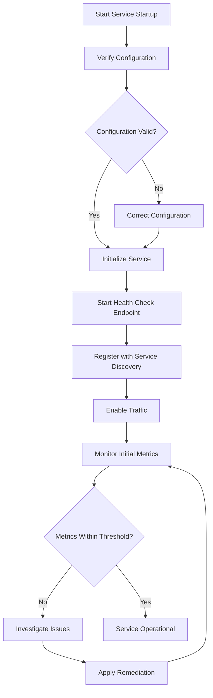
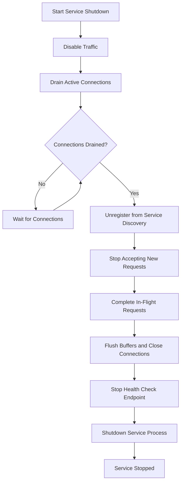
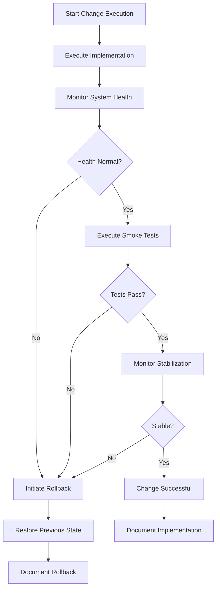

# TACHYON: OPERATIONS GUIDE

**Document ID:** TACHYON-OPS-001-V1.0
**Date:** February 2026
**Status:** Approved for Operations
**Classification:** Operations & Maintenance Documentation
**Compliance Level:** ISO/IEC 26514:2021, IEEE 1063-2001, ISO/IEC 12207:2017

---

## TABLE OF CONTENTS

1. [Introduction](#1-introduction)
2. [Operations Framework](#2-operations-framework)
3. [Operational Procedures](#3-operational-procedures)
4. [System Administration](#4-system-administration)
5. [Service Management](#5-service-management)
6. [Performance Management](#6-performance-management)
7. [Incident Management](#7-incident-management)
8. [Change Management](#8-change-management)
9. [References](#9-references)

---

## 1. INTRODUCTION

### 1.1. Purpose and Scope

This Operations Guide establishes the comprehensive operational framework for the Tachyon toolchain system. The document provides formal procedures, guidelines, and best practices for the day-to-day operation, monitoring, maintenance, and evolution of the Tachyon system across all deployment environments.

The Tachyon toolchain encompasses a hybrid architecture comprising:
- **Desktop Component:** Tauri-based desktop application with local-first data storage
- **Server Component:** Axum-based HTTP/2 server for centralized operations
- **Web Component:** Leptos/Bun-based web frontend for browser access
- **Core Engine:** Rust-based core engine with Tokio asynchronous runtime

This guide is intended for DevOps engineers, system administrators, and operations personnel responsible for maintaining the operational integrity, performance, and security of the Tachyon system in production environments.

### 1.2. Document Dependencies

This guide depends on and references the following documents:
- [TACHYON-STD-V1.0](../.adrs/ - Coding and Documentation Standards
- [TACHYON-ADR-001-V1.0](../.adrs/adr-001-three-tier-jit-compilation.md) - Rust as Primary Language
- [TACHYON-ADR-010-V1.0](../.adrs/adr-010-synchronization-primitives.md) - Security Architecture
- [TACHYON-ARC-V1.0](../docs/architecture/system_architecture_overview.md) - System Architecture Overview
- [TACHYON-DEP-V1.0](../docs/quality/deployment_guide.md) - Deployment Guide

### 1.3. Operational Context

The Tachyon system operates in two distinct deployment modes, each with specific operational requirements:

#### 1.3.1. Local-First Desktop Mode
In this mode, the Tachyon desktop application operates primarily on user workstations with local Git-based content storage. Operational responsibilities include:
- Desktop application lifecycle management (installation, updates, configuration)
- Local Git repository synchronization and integrity
- Local file system security and access control
- Desktop application performance monitoring

#### 1.3.2. Centralized Server Mode
In this mode, the Tachyon server component provides centralized services for multiple clients. Operational responsibilities include:
- Server component deployment and scaling
- HTTP/2 service availability and performance
- Centralized Git repository management
- Network security and TLS certificate management
- Server resource monitoring and capacity planning

### 1.4. Operational Principles

The operational framework for Tachyon is founded on the following principles:

#### 1.4.1. Reliability Principle
The system must maintain high availability and reliability through:
- Redundant deployment configurations where applicable
- Automated failover mechanisms
- Comprehensive health monitoring
- Graceful degradation under load

#### 1.4.2. Security Principle
All operational activities must adhere to security best practices:
- Principle of least privilege for all operational accounts
- Defense-in-depth security controls
- Comprehensive audit logging
- Regular security patching and updates

#### 1.4.3. Observability Principle
The system must provide comprehensive observability through:
- Structured logging at appropriate verbosity levels
- Metrics collection for performance monitoring
- Distributed tracing for request flow analysis
- Real-time alerting for critical events

#### 1.4.4. Maintainability Principle
Operational procedures must facilitate system evolution:
- Version-controlled configuration management
- Automated deployment and rollback procedures
- Comprehensive backup and recovery capabilities
- Documented change management processes

---

## 2. OPERATIONS FRAMEWORK

### 2.1. Operational Architecture

The Tachyon operations framework implements a layered architecture that separates concerns across monitoring, automation, and response layers.

#### 2.1.1. Monitoring Layer

The monitoring layer provides continuous visibility into system state through:
- **Metrics Collection:** Prometheus-compatible metrics for quantitative monitoring
- **Structured Logging:** JSON-formatted logs with consistent schema
- **Distributed Tracing:** OpenTelemetry-based request tracing
- **Health Checks:** HTTP endpoints for service health verification

#### 2.1.2. Automation Layer

The automation layer enables repeatable, reliable operations through:
- **Infrastructure as Code:** Declarative infrastructure configuration
- **CI/CD Pipelines:** Automated build, test, and deployment
- **Configuration Management:** Centralized, version-controlled configuration
- **Backup Automation:** Scheduled backup execution and verification

#### 2.1.3. Response Layer

The response layer manages operational events through:
- **Alert Management:** Configurable alerting rules and notification channels
- **Incident Response:** Structured incident handling procedures
- **Runbook Automation:** Automated remediation for common issues
- **Escalation Procedures:** Defined escalation paths for critical incidents

### 2.2. Operational Domains

The Tachyon operations framework addresses the following operational domains:

#### 2.2.1. Service Availability
Ensuring that all Tachyon services remain available and responsive:
- Desktop application availability and startup time
- Server component uptime and response times
- Web frontend accessibility and load times
- Database connectivity and query performance

#### 2.2.2. Data Integrity
Maintaining the integrity and consistency of all data:
- Git repository integrity verification
- Content storage consistency checks
- Database transaction integrity
- Backup verification and restoration testing

#### 2.2.3. Performance Management
Optimizing system performance across all components:
- Response time monitoring and optimization
- Resource utilization analysis (CPU, memory, disk, network)
- Bottleneck identification and resolution
- Capacity planning and scaling recommendations

#### 2.2.4. Security Operations
Maintaining the security posture of the system:
- Security event monitoring and alerting
- Vulnerability scanning and patching
- Access control management and auditing
- Security incident response procedures

### 2.3. Operational Metrics

The following key performance indicators (KPIs) are monitored to assess operational health:

| Metric | Component | Target | Alert Threshold |
|--------|-----------|--------|-----------------|
| Desktop Startup Time | Desktop | <3 seconds | >5 seconds |
| Server Response Time (p95) | Server | <100ms | >500ms |
| Web Frontend Load Time | Web | <2 seconds | >5 seconds |
| Git Sync Latency | All | <1 second | >5 seconds |
| Memory Utilization | Server | <70% | >85% |
| CPU Utilization | Server | <60% | >80% |
| Disk I/O Latency | Server | <10ms | >50ms |
| Error Rate | All | <0.1% | >1% |

### 2.4. Operational Roles and Responsibilities

#### 2.4.1. DevOps Engineer
Primary responsibility for system operations, including:
- Deployment and configuration management
- Monitoring and alerting configuration
- Incident response and troubleshooting
- Performance optimization and capacity planning

#### 2.4.2. System Administrator
Responsible for infrastructure operations, including:
- Server provisioning and maintenance
- Network configuration and security
- Storage management and backup execution
- Operating system patching and updates

#### 2.4.3. Security Engineer
Responsible for security operations, including:
- Security monitoring and incident response
- Vulnerability assessment and remediation
- Access control management
- Security compliance verification

#### 2.4.4. Site Reliability Engineer
Responsible for reliability engineering, including:
- Service level objective (SLO) definition and monitoring
- Error budget management
- Reliability improvement initiatives
- Post-incident analysis and remediation

---

## 3. OPERATIONAL PROCEDURES

### 3.1. Daily Operations

Daily operational activities ensure the continuous health and performance of the Tachyon system. These procedures are designed to be executed by operations personnel on a scheduled basis.

#### 3.1.1. Daily Health Check

**Purpose:** Verify the operational status of all Tachyon components.

**Procedure:**
1. Review monitoring dashboard for any active alerts
2. Verify desktop application startup time is within target (<3 seconds)
3. Check server component response times (p95 <100ms)
4. Confirm web frontend load times are acceptable (<2 seconds)
5. Validate Git synchronization latency (<1 second)
6. Review error rates across all components (<0.1%)

**Tools Required:**
- Monitoring dashboard (Grafana or equivalent)
- Log aggregation system (Loki or equivalent)
- Health check endpoints

**Expected Outcome:** All components operating within defined thresholds with no critical alerts.

**Escalation:** If any component exceeds threshold values, initiate incident response procedures (Section 7).

#### 3.1.2. Daily Log Review

**Purpose:** Identify potential issues from system logs before they escalate.

**Procedure:**
1. Query logs for error-level messages in the past 24 hours
2. Analyze error patterns and frequencies
3. Investigate any recurring error conditions
4. Review security-related log entries
5. Document findings in the daily operations log

**Tools Required:**
- Log aggregation system with query capabilities
- Log analysis tools or scripts

**Expected Outcome:** All errors are reviewed, understood, and either resolved or documented for further investigation.

#### 3.1.3. Daily Backup Verification

**Purpose:** Ensure backup integrity for all critical data.

**Procedure:**
1. Verify scheduled backup jobs completed successfully
2. Check backup integrity checksums
3. Validate backup storage capacity and retention policy compliance
4. Test restore procedure for a random backup sample (weekly)

**Tools Required:**
- Backup management interface
- Integrity verification tools
- Restore testing procedures

**Expected Outcome:** All backups are verified as complete and intact.

**Escalation:** If any backup verification fails, initiate backup recovery procedures immediately.

### 3.2. Weekly Operations

Weekly operational activities provide deeper analysis and preventive maintenance.

#### 3.2.1. Weekly Performance Analysis

**Purpose:** Analyze performance trends and identify optimization opportunities.

**Procedure:**
1. Review performance metrics over the past week
2. Identify any performance degradation trends
3. Analyze resource utilization patterns (CPU, memory, disk, network)
4. Compare current performance against baseline metrics
5. Document any significant deviations and investigate root causes

**Tools Required:**
- Performance monitoring system with historical data
- Trend analysis tools
- Baseline comparison reports

**Expected Outcome:** Performance trends are understood, and any degradation is addressed proactively.

#### 3.2.2. Weekly Security Audit

**Purpose:** Verify security posture and identify potential vulnerabilities.

**Procedure:**
1. Review security event logs for the past week
2. Verify access control logs for unauthorized access attempts
3. Check for any failed authentication attempts exceeding normal patterns
4. Review TLS certificate expiration dates
5. Verify security patch status on all components

**Tools Required:**
- Security information and event management (SIEM) system
- Certificate management tools
- Patch management system

**Expected Outcome:** Security posture is verified, and any issues are addressed before they become vulnerabilities.

#### 3.2.3. Weekly Capacity Planning Review

**Purpose:** Ensure adequate capacity for current and projected load.

**Procedure:**
1. Review current resource utilization trends
2. Compare utilization against capacity planning projections
3. Identify any components approaching capacity limits
4. Review growth projections and plan for capacity increases
5. Document capacity planning recommendations

**Tools Required:**
- Capacity planning tools
- Resource utilization reports
- Growth projection models

**Expected Outcome:** Capacity is adequate for current and projected load, with proactive planning for future needs.

### 3.3. Monthly Operations

Monthly operational activities provide comprehensive system review and strategic planning.

#### 3.3.1. Monthly Comprehensive System Review

**Purpose:** Conduct thorough review of all system components and operations.

**Procedure:**
1. Review all operational metrics for the past month
2. Analyze incident trends and patterns
3. Review change management activities and their impacts
4. Evaluate service level objective (SLO) compliance
5. Identify areas for operational improvement
6. Generate monthly operations report

**Tools Required:**
- Comprehensive monitoring and reporting tools
- Incident management system
- Change management system
- SLO tracking system

**Expected Outcome:** Comprehensive understanding of system health and operational effectiveness, with actionable improvement recommendations.

#### 3.3.2. Monthly Backup and Recovery Test

**Purpose:** Verify backup integrity and recovery procedures.

**Procedure:**
1. Select a random backup from the past month
2. Perform full restore to isolated test environment
3. Verify restored data integrity
4. Document restore time and any issues encountered
5. Update backup and recovery procedures based on findings

**Tools Required:**
- Test environment isolated from production
- Restore procedures and tools
- Data integrity verification tools

**Expected Outcome:** Verified ability to restore from backup within defined recovery time objectives (RTO).

#### 3.3.3. Monthly Security Assessment

**Purpose:** Conduct comprehensive security assessment.

**Procedure:**
1. Perform vulnerability scan on all components
2. Review security patch status and apply any critical patches
3. Conduct penetration testing on external-facing services
4. Review and update security policies as needed
5. Document security assessment findings and remediation plan

**Tools Required:**
- Vulnerability scanning tools
- Patch management system
- Penetration testing tools or services
- Security policy management system

**Expected Outcome:** Security posture is assessed, vulnerabilities are identified, and remediation plan is established.

### 3.4. Operational Workflows

The following workflows define the sequence of activities for common operational scenarios.

#### 3.4.1. Service Startup Workflow



#### 3.4.2. Service Shutdown Workflow



#### 3.4.3. Configuration Update Workflow

```mermaid
graph TD
    A[Start Configuration Update] --> B[Validate New Configuration]
    B --> C{Configuration Valid?}
    C -->|No| D[Reject and Report Errors]
    C -->|Yes| E[Backup Current Configuration]
    E --> F[Apply New Configuration]
    F --> G[Reload Configuration]
    G --> H[Verify Service Health]
    H --> I{Service Healthy?}
    I -->|No| J[Rollback Configuration]
    I -->|Yes| K[Configuration Update Complete]
    J --> L[Restore Backup Configuration]
    L --> G

---

## 4. SYSTEM ADMINISTRATION

### 4.1. User and Access Management

Proper user and access management is critical for maintaining system security and operational integrity.

#### 4.1.1. User Account Provisioning

**Purpose:** Create and configure user accounts with appropriate access levels.

**Procedure:**
1. Receive user provisioning request with justification
2. Verify approval from appropriate authority
3. Create user account in identity management system
4. Assign appropriate role-based access control (RBAC) permissions
5. Generate initial credentials following password policy
5.1. Minimum 16 characters
5.2. Mix of uppercase, lowercase, numbers, and special characters
5.3. No dictionary words or common patterns
6. Deliver credentials through secure channel
7. Require password change on first login
8. Document account creation in access log

**Tools Required:**
- Identity management system
- RBAC configuration interface
- Secure communication channel

**Expected Outcome:** User account created with appropriate permissions and secure initial credentials.

**Security Considerations:** Follow principle of least privilege - grant only the minimum permissions required for the user's role.

#### 4.1.2. Access Review and Revocation

**Purpose:** Periodically review and revoke unnecessary access.

**Procedure:**
1. Generate quarterly access report for all users
2. Review each user's access level against current role requirements
3. Identify users with excessive or outdated permissions
4. Coordinate with managers to confirm continued access requirements
5. Revoke unnecessary access permissions
6. Document access changes in audit log
7. Notify affected users of access changes

**Tools Required:**
- Access reporting system
- RBAC configuration interface
- Audit logging system

**Expected Outcome:** All users have appropriate access levels for their current roles.

**Frequency:** Quarterly, with additional reviews upon role changes.

#### 4.1.3. Privileged Access Management

**Purpose:** Securely manage and monitor privileged access.

**Procedure:**
1. Maintain inventory of all privileged accounts
2. Require multi-factor authentication (MFA) for all privileged access
3. Implement just-in-time (JIT) access for elevated privileges
4. Log all privileged access sessions with full session recording
5. Conduct regular audits of privileged access usage
6. Rotate privileged credentials on defined schedule (quarterly minimum)
7. Require approval for new privileged access grants

**Tools Required:**
- Privileged access management (PAM) system
- MFA authentication system
- Session recording and monitoring tools

**Expected Outcome:** Privileged access is tightly controlled, monitored, and auditable.

### 4.2. Configuration Management

Configuration management ensures consistency and reproducibility across all environments.

#### 4.2.1. Configuration Repository

**Purpose:** Maintain version-controlled configuration for all components.

**Procedure:**
1. Store all configuration files in Git repository
2. Use environment-specific branches (development, staging, production)
3. Implement configuration validation in CI/CD pipeline
4. Require peer review for all configuration changes
5. Tag configuration releases with semantic versioning
6. Maintain configuration change log
7. Encrypt sensitive configuration values (secrets, API keys)

**Tools Required:**
- Git version control system
- CI/CD pipeline with validation
- Secret management system
- Configuration validation tools

**Expected Outcome:** All configurations are version-controlled, validated, and traceable.

#### 4.2.2. Configuration Deployment

**Purpose:** Deploy configuration changes safely and reliably.

**Procedure:**
1. Create feature branch for configuration change
2. Implement and test configuration changes in development environment
3. Validate configuration against schema and constraints
4. Submit pull request with configuration changes
5. Obtain peer review and approval
6. Merge to staging branch and deploy to staging environment
7. Conduct smoke testing in staging environment
8. Schedule production deployment during maintenance window
9. Deploy configuration to production with rollback plan
10. Verify configuration applied correctly
11. Monitor for any issues post-deployment

**Tools Required:**
- Git workflow with pull requests
- Deployment automation tools
- Monitoring and alerting systems

**Expected Outcome:** Configuration changes deployed reliably with minimal disruption to service.

#### 4.2.3. Configuration Rollback

**Purpose:** Quickly revert problematic configuration changes.

**Procedure:**
1. Identify the configuration change causing issues
2. Determine the previous stable configuration version
3. Execute rollback to previous configuration version
4. Verify service health after rollback
5. Investigate root cause of configuration issue
6. Document incident and resolution
7. Update configuration validation to prevent recurrence

**Tools Required:**
- Configuration deployment system with rollback capability
- Monitoring and health check systems
- Incident documentation system

**Expected Outcome:** Service restored to stable state with minimal downtime.

### 4.3. System Maintenance

Regular system maintenance ensures optimal performance and security.

#### 4.3.1. Operating System Updates

**Purpose:** Keep operating systems patched and secure.

**Procedure:**
1. Monitor for security advisories and patch releases
2. Classify patches by severity (critical, important, moderate, low)
3. Test critical and important patches in staging environment
4. Schedule patch deployment during maintenance windows
5. Create system backup before applying patches
6. Apply patches following tested procedure
7. Verify system functionality post-patch
8. Monitor for any issues after patch application
9. Document patch application and any issues encountered

**Tools Required:**
- Patch management system
- Staging environment for testing
- Backup and restore tools
- Monitoring systems

**Expected Outcome:** Operating systems remain secure and functional with minimal disruption.

**Frequency:** Critical patches within 7 days of release, important patches within 30 days, moderate and low patches within 90 days.

#### 4.3.2. Log Rotation and Cleanup

**Purpose:** Manage log storage and retention efficiently.

**Procedure:**
1. Configure log rotation based on size and age thresholds
2. Define retention policies for different log types
2.1. Security logs: 90 days minimum
2.2. Application logs: 30 days minimum
2.3. Debug logs: 7 days minimum
3. Implement automated log rotation
4. Compress archived logs to reduce storage
5. Archive critical logs to long-term storage
6. Monitor log storage utilization
7. Alert on storage approaching capacity limits

**Tools Required:**
- Log rotation configuration
- Compression utilities
- Long-term storage system
- Storage monitoring tools

**Expected Outcome:** Logs are properly rotated, retained according to policy, and storage is managed efficiently.

#### 4.3.3. Database Maintenance

**Purpose:** Maintain database performance and integrity.

**Procedure:**
1. Schedule regular database maintenance windows
2. Perform database consistency checks
3. Rebuild indexes as needed
4. Update statistics for query optimization
5. Analyze query performance and optimize slow queries
6. Archive or purge old data according to retention policy
7. Verify backup integrity
8. Test database restore procedures quarterly

**Tools Required:**
- Database administration tools
- Query analysis tools
- Backup and restore tools

**Expected Outcome:** Database maintains optimal performance and data integrity.

**Frequency:** Weekly consistency checks, monthly index rebuilds and statistics updates, quarterly archive and purge operations.

### 4.4. Storage Management

Effective storage management ensures data availability and system performance.

#### 4.4.1. Disk Space Monitoring

**Purpose:** Monitor and manage disk space utilization.

**Procedure:**
1. Configure monitoring for disk space on all storage volumes
2. Set alert thresholds at 70% (warning) and 85% (critical)
3. Review disk space trends weekly
4. Identify growth patterns and predict capacity exhaustion
5. Plan storage expansion before reaching critical thresholds
6. Clean up temporary files and unnecessary data
7. Archive old data to long-term storage as appropriate

**Tools Required:**
- Storage monitoring system
- Capacity planning tools
- Data archival tools

**Expected Outcome:** Sufficient storage capacity maintained with proactive capacity planning.

#### 4.4.2. Data Archival

**Purpose:** Archive old data to optimize performance and storage.

**Procedure:**
1. Define archival policies based on data age and access patterns
2. Identify data eligible for archival
3. Verify data integrity before archival
4. Create archival index for retrievability
5. Compress and encrypt archived data
6. Transfer to long-term storage
7. Verify archival completeness
8. Update database to reference archived data location
9. Document archival process and location

**Tools Required:**
- Data archival tools
- Compression and encryption utilities
- Long-term storage system
- Database administration tools

**Expected Outcome:** Old data is securely archived, optimizing performance and storage utilization.

#### 4.4.3. Backup Storage Management

**Purpose:** Ensure backup storage is adequate and properly managed.

**Procedure:**
1. Monitor backup storage utilization
2. Verify backup storage capacity meets retention policy requirements
3. Implement backup storage tiering (hot, warm, cold)
4. Rotate backup media for off-site storage
5. Verify backup storage integrity regularly
6. Test restore from backup storage quarterly
7. Plan backup storage expansion based on growth projections

**Tools Required:**
- Backup management system
- Storage tiering implementation
- Integrity verification tools
- Restore testing procedures

**Expected Outcome:** Backup storage is adequate, properly tiered, and verified for reliability.

---

## 5. SERVICE MANAGEMENT

### 5.1. Service Lifecycle Management

Effective service lifecycle management ensures reliable deployment and operation of all Tachyon components.

#### 5.1.1. Service Deployment

**Purpose:** Deploy new or updated services reliably to target environments.

**Procedure:**
1. Verify deployment prerequisites (dependencies, configuration, resources)
2. Create deployment package with version identifier
3. Deploy to development environment
4. Execute smoke tests in development environment
5. Deploy to staging environment
6. Execute comprehensive tests in staging environment
7. Schedule production deployment during maintenance window
8. Create pre-deployment backup
9. Execute production deployment
10. Verify service health post-deployment
11. Monitor for issues during stabilization period
12. Document deployment results

**Tools Required:**
- Deployment automation system
- Testing framework
- Monitoring and health check systems
- Backup and restore tools

**Expected Outcome:** Service deployed successfully with minimal disruption to operations.

**Rollback Plan:** If deployment fails or issues are detected during stabilization, execute rollback to previous version using documented rollback procedure.

#### 5.1.2. Service Startup and Initialization

**Purpose:** Ensure services start correctly and are ready to handle traffic.

**Procedure:**
1. Execute service startup command
2. Monitor startup logs for errors
3. Verify service process is running
4. Check health check endpoint responds correctly
5. Verify service registration with service discovery
6. Confirm service is accepting connections
7. Validate initial metrics are within expected ranges
8. Enable traffic routing to service

**Tools Required:**
- Service management interface
- Log monitoring tools
- Health check utilities
- Service discovery system

**Expected Outcome:** Service starts successfully and is ready to handle production traffic.

**Failure Handling:** If service fails to start correctly, investigate logs, correct configuration or dependencies, and retry startup.

#### 5.1.3. Service Shutdown and Decommissioning

**Purpose:** Gracefully shut down services with minimal disruption.

**Procedure:**
1. Disable new traffic routing to service
2. Drain existing connections (wait for in-flight requests to complete)
3. Verify connection drain completion
4. Unregister service from service discovery
5. Stop accepting new requests
6. Flush buffers and close connections
7. Stop service process
8. Verify service is completely stopped
9. Clean up temporary resources
10. Document shutdown completion

**Tools Required:**
- Service management interface
- Traffic management system
- Service discovery system
- Resource cleanup tools

**Expected Outcome:** Service shuts down gracefully without disrupting other services or losing data.

### 5.2. Service Health Monitoring

Continuous health monitoring enables proactive issue detection and resolution.

#### 5.2.1. Health Check Configuration

**Purpose:** Configure comprehensive health checks for all services.

**Procedure:**
1. Define health check endpoints for each service
2. Configure health check intervals (typically 30 seconds)
3. Set health check timeout values (typically 5 seconds)
4. Define health check criteria (response codes, response times)
5. Configure unhealthy threshold (consecutive failures before marking unhealthy)
6. Configure healthy threshold (consecutive successes before marking healthy)
7. Test health check configuration
8. Document health check parameters

**Tools Required:**
- Service configuration management
- Health check testing tools
- Documentation system

**Expected Outcome:** Health checks configured to accurately reflect service health.

#### 5.2.2. Health Check Monitoring

**Purpose:** Continuously monitor service health status.

**Procedure:**
1. Review health check dashboard regularly
2. Investigate any services marked as unhealthy
3. Analyze health check failure patterns
4. Correlate health check failures with other metrics
5. Initiate incident response for persistent health check failures
6. Document health check incidents and resolutions

**Tools Required:**
- Health check monitoring dashboard
- Incident management system
- Log analysis tools

**Expected Outcome:** Health check failures are detected and addressed proactively.

**Alerting:** Configure alerts for services marked unhealthy for more than 2 consecutive health check intervals.

#### 5.2.3. Dependency Health Monitoring

**Purpose:** Monitor health of service dependencies.

**Procedure:**
1. Identify all service dependencies (databases, external APIs, other services)
2. Configure health checks for each dependency
3. Monitor dependency health status
4. Configure alerts for dependency health failures
5. Implement circuit breakers for failing dependencies
6. Document dependency health procedures

**Tools Required:**
- Dependency monitoring tools
- Circuit breaker implementation
- Alerting system

**Expected Outcome:** Dependency health issues are detected and handled gracefully.

### 5.3. Service Discovery

Service discovery enables dynamic service registration and communication.

#### 5.3.1. Service Registration

**Purpose:** Register services with service discovery system.

**Procedure:**
1. Configure service discovery client in service
2. Define service registration parameters (service name, port, health check URL)
3. Implement service registration on startup
4. Configure registration retry logic
5. Verify service appears in service discovery registry
6. Test service discovery queries return correct service instances

**Tools Required:**
- Service discovery system (Consul, etcd, or equivalent)
- Service configuration management
- Service discovery testing tools

**Expected Outcome:** Services are correctly registered and discoverable.

#### 5.3.2. Service Deregistration

**Purpose:** Remove services from service discovery on shutdown.

**Procedure:**
1. Implement service deregistration on graceful shutdown
2. Configure deregistration timeout
3. Verify service is removed from service discovery registry
4. Test service deregistration process
5. Document deregistration behavior

**Tools Required:**
- Service discovery system
- Service shutdown procedures
- Service discovery testing tools

**Expected Outcome:** Services are correctly removed from service discovery on shutdown.

#### 5.3.3. Service Discovery Query

**Purpose:** Enable services to discover and communicate with each other.

**Procedure:**
1. Implement service discovery client in services
2. Configure service discovery query parameters (service name, tags)
3. Implement service discovery query caching
4. Configure service discovery query retry logic
5. Test service discovery queries return correct results
6. Monitor service discovery query performance

**Tools Required:**
- Service discovery system
- Service discovery client libraries
- Performance monitoring tools

**Expected Outcome:** Services can reliably discover and communicate with each other.

### 5.4. Load Balancing

Load balancing distributes traffic across service instances for optimal performance and reliability.

#### 5.4.1. Load Balancer Configuration

**Purpose:** Configure load balancers for optimal traffic distribution.

**Procedure:**
1. Select appropriate load balancing algorithm (round-robin, least-connections, IP hash)
2. Configure health checks for load balancer backends
3. Configure session persistence if required
4. Set connection and timeout parameters
5. Configure SSL/TLS termination if applicable
6. Test load balancer configuration
7. Document load balancer parameters

**Tools Required:**
- Load balancer (NGINX, HAProxy, or cloud load balancer)
- Configuration management system
- Load testing tools

**Expected Outcome:** Load balancer configured for optimal traffic distribution and reliability.

#### 5.4.2. Load Balancer Monitoring

**Purpose:** Monitor load balancer performance and health.

**Procedure:**
1. Monitor load balancer metrics (connection counts, response times, error rates)
2. Monitor backend health status
3. Review load distribution across backends
4. Identify and investigate any imbalances
5. Monitor load balancer resource utilization
6. Alert on load balancer performance degradation

**Tools Required:**
- Load balancer monitoring tools
- Metrics collection system
- Alerting system

**Expected Outcome:** Load balancer performance is monitored and issues are detected proactively.

#### 5.4.3. Load Balancer Scaling

**Purpose:** Scale load balancer capacity based on traffic demands.

**Procedure:**
1. Monitor load balancer capacity utilization
2. Define scaling thresholds (e.g., 70% capacity utilization)
3. Configure auto-scaling policies if applicable
4. Plan manual scaling for predictable traffic increases
5. Execute load balancer scaling
6. Verify load balancer performance post-scaling
7. Document scaling activities

**Tools Required:**
- Load balancer scaling tools
- Capacity planning tools
- Monitoring systems

**Expected Outcome:** Load balancer capacity scales to meet traffic demands without performance degradation.

---

## 6. PERFORMANCE MANAGEMENT

### 6.1. Performance Monitoring

Continuous performance monitoring enables proactive identification and resolution of performance issues.

#### 6.1.1. Metrics Collection

**Purpose:** Collect comprehensive performance metrics from all components.

**Procedure:**
1. Identify key performance indicators (KPIs) for each component
2. Configure metrics collection at appropriate intervals
3. Implement metrics aggregation and storage
4. Configure metrics retention policies
5. Validate metrics collection accuracy
6. Document metrics schema and definitions

**Key Metrics:**
- **Desktop Component:** Startup time, memory usage, CPU utilization, UI responsiveness
- **Server Component:** Request latency, throughput, error rate, resource utilization
- **Web Component:** Page load time, time to interactive, resource load times
- **Git Operations:** Clone time, commit time, push/pull latency

**Tools Required:**
- Metrics collection system (Prometheus or equivalent)
- Metrics storage system
- Metrics validation tools

**Expected Outcome:** Comprehensive performance metrics collected and available for analysis.

#### 6.1.2. Performance Dashboard

**Purpose:** Provide real-time visibility into system performance.

**Procedure:**
1. Design dashboard layout for optimal information presentation
2. Configure performance visualizations (charts, graphs, gauges)
3. Set appropriate time ranges for different visualizations
4. Configure alert thresholds on dashboard
5. Test dashboard accuracy and responsiveness
6. Document dashboard usage and interpretation

**Tools Required:**
- Dashboard system (Grafana or equivalent)
- Metrics query system
- Alerting integration

**Expected Outcome:** Real-time performance visibility enabling proactive issue detection.

#### 6.1.3. Performance Trend Analysis

**Purpose:** Identify performance trends and potential issues before they impact users.

**Procedure:**
1. Review performance metrics over defined time periods (daily, weekly, monthly)
2. Identify performance degradation trends
3. Compare current performance against historical baselines
4. Analyze performance correlations (e.g., load vs. response time)
5. Identify performance anomalies and outliers
6. Document findings and recommendations

**Tools Required:**
- Performance analysis tools
- Historical metrics data
- Trend analysis algorithms

**Expected Outcome:** Performance trends understood, with proactive identification of potential issues.

### 6.2. Performance Optimization

Systematic performance optimization ensures the Tachyon system operates efficiently.

#### 6.2.1. Bottleneck Identification

**Purpose:** Identify performance bottlenecks limiting system performance.

**Procedure:**
1. Analyze performance metrics to identify slow components
2. Profile resource utilization (CPU, memory, disk, network)
3. Analyze database query performance
4. Review network latency and throughput
5. Identify synchronization points and contention
6. Document identified bottlenecks with supporting data

**Tools Required:**
- Profiling tools
- Database query analysis tools
- Network analysis tools
- Performance monitoring systems

**Expected Outcome:** Performance bottlenecks identified with supporting data for optimization planning.

#### 6.2.2. Optimization Implementation

**Purpose:** Implement performance improvements to address identified bottlenecks.

**Procedure:**
1. Prioritize optimization efforts based on impact and effort
2. Implement optimizations in development environment
3. Benchmark optimization effectiveness
4. Deploy optimizations to staging environment
5. Conduct comprehensive testing in staging
6. Deploy optimizations to production with monitoring
7. Verify optimization effectiveness in production
8. Document optimization results

**Optimization Techniques:**
- **Code Optimization:** Algorithm improvements, caching, memoization
- **Database Optimization:** Query optimization, indexing, schema changes
- **Infrastructure Optimization:** Resource scaling, load balancing, caching layers
- **Network Optimization:** Protocol optimization, connection pooling, compression

**Tools Required:**
- Development and testing environments
- Benchmarking tools
- Monitoring and alerting systems

**Expected Outcome:** Performance improvements implemented and verified as effective.

#### 6.2.3. Regression Prevention

**Purpose:** Prevent performance regressions from code and configuration changes.

**Procedure:**
1. Establish performance baselines for all components
2. Configure performance regression tests in CI/CD pipeline
3. Set performance regression thresholds
4. Fail builds that exceed regression thresholds
5. Investigate and resolve performance regressions before deployment
6. Update performance baselines after approved improvements

**Tools Required:**
- Performance testing framework
- CI/CD pipeline integration
- Performance baseline management

**Expected Outcome:** Performance regressions detected and prevented before reaching production.

### 6.3. Capacity Planning

Proactive capacity planning ensures adequate resources for current and future demands.

#### 6.3.1. Capacity Assessment

**Purpose:** Assess current capacity utilization and identify constraints.

**Procedure:**
1. Collect current resource utilization metrics
2. Analyze utilization trends over time
3. Identify resource constraints and bottlenecks
4. Compare utilization against capacity limits
5. Assess headroom for growth
6. Document capacity assessment findings

**Resources to Assess:**
- **Compute:** CPU cores, CPU utilization, thread capacity
- **Memory:** Total memory, memory utilization, swap usage
- **Storage:** Disk capacity, disk utilization, I/O capacity
- **Network:** Bandwidth, network utilization, connection limits

**Tools Required:**
- Resource monitoring systems
- Capacity analysis tools
- Trend analysis tools

**Expected Outcome:** Current capacity utilization understood with identified constraints.

#### 6.3.2. Demand Forecasting

**Purpose:** Forecast future resource demands based on growth projections.

**Procedure:**
1. Analyze historical growth patterns
2. Incorporate business growth projections
3. Factor in planned feature additions
4. Model resource demand scenarios (conservative, moderate, aggressive)
5. Calculate resource requirements for each scenario
6. Document demand forecasts with assumptions

**Forecasting Horizons:**
- **Short-term:** 3-6 months
- **Medium-term:** 6-12 months
- **Long-term:** 12-24 months

**Tools Required:**
- Historical data analysis
- Growth modeling tools
- Business planning inputs

**Expected Outcome:** Resource demand forecasts for multiple time horizons and scenarios.

#### 6.3.3. Capacity Planning

**Purpose:** Plan capacity expansions to meet forecasted demands.

**Procedure:**
1. Review demand forecasts and capacity assessments
2. Identify when capacity will be exhausted under each scenario
3. Plan capacity expansion activities
4. Budget for capacity expansions
5. Schedule capacity expansion activities
6. Execute capacity expansions
7. Verify expanded capacity meets requirements
8. Document capacity planning activities

**Expansion Options:**
- **Vertical Scaling:** Increase resources on existing infrastructure
- **Horizontal Scaling:** Add additional infrastructure instances
- **Architecture Optimization:** Improve efficiency through architectural changes

**Tools Required:**
- Capacity planning tools
- Budgeting systems
- Infrastructure provisioning systems

**Expected Outcome:** Capacity expanded proactively to meet forecasted demands without service disruption.

---

## 7. INCIDENT MANAGEMENT

### 7.1. Incident Classification

Proper incident classification enables appropriate response prioritization and resource allocation.

#### 7.1.1. Severity Levels

**Purpose:** Classify incidents by severity to prioritize response efforts.

**Severity Definitions:**

| Severity | Description | Response Time | Impact |
|----------|-------------|---------------|--------|
| **SEV-1** (Critical) | Complete service outage or critical security breach | 15 minutes | All users affected, business critical |
| **SEV-2** (High) | Major service degradation or partial outage | 1 hour | Significant user impact |
| **SEV-3** (Medium) | Minor service degradation or feature unavailability | 4 hours | Limited user impact |
| **SEV-4** (Low) | Cosmetic issues or documentation errors | 24 hours | Minimal user impact |

**Classification Criteria:**
- **Service Availability:** Percentage of users unable to access service
- **Performance Degradation:** Percentage of performance threshold exceeded
- **Data Loss:** Amount of data affected or lost
- **Security Impact:** Potential for unauthorized access or data exposure

**Tools Required:**
- Incident classification guidelines
- Monitoring and alerting systems
- Impact assessment tools

**Expected Outcome:** Incidents classified consistently with appropriate response priorities.

#### 7.1.2. Incident Detection

**Purpose:** Detect incidents quickly to minimize impact.

**Detection Methods:**
1. **Automated Alerts:** Monitoring system triggers alerts based on thresholds
2. **User Reports:** Users report issues through support channels
3. **Internal Reports:** Operations personnel identify issues during routine activities
4. **Security Alerts:** Security systems detect potential security incidents

**Detection Workflow:**
1. Alert received or issue identified
2. Verify alert validity (not false positive)
3. Assess incident scope and impact
4. Classify incident severity
5. Initiate incident response process

**Tools Required:**
- Monitoring and alerting systems
- Support ticketing system
- Communication channels

**Expected Outcome:** Incidents detected promptly with accurate initial assessment.

### 7.2. Incident Response

Structured incident response ensures effective resolution and learning.

#### 7.2.1. Incident Declaration

**Purpose:** Formally declare an incident to initiate response process.

**Procedure:**
1. Verify incident meets declaration criteria
2. Assign incident identifier
3. Classify incident severity
4. Declare incident in incident management system
5. Notify incident response team
6. Establish incident communication channel
7. Document incident declaration

**Declaration Criteria:**
- Service availability below defined thresholds
- Performance degradation exceeding thresholds
- Security event requiring investigation
- Data integrity concerns
- User-reported issues affecting multiple users

**Tools Required:**
- Incident management system
- Communication platforms
- Declaration guidelines

**Expected Outcome:** Incident formally declared with appropriate notification and documentation.

#### 7.2.2. Incident Investigation

**Purpose:** Investigate incident to understand root cause and scope.

**Procedure:**
1. Gather incident information (logs, metrics, user reports)
2. Analyze timeline of events leading to incident
3. Identify affected components and services
4. Determine current impact scope
5. Investigate potential root causes
6. Formulate hypothesis for root cause
7. Test hypothesis through diagnostic procedures
8. Confirm root cause

**Investigation Techniques:**
- **Log Analysis:** Review error logs, access logs, application logs
- **Metrics Analysis:** Analyze performance metrics before, during, and after incident
- **Tracing:** Follow request traces through system components
- **Reproduction:** Attempt to reproduce incident in controlled environment
- **Dependency Analysis:** Check for issues with external dependencies

**Tools Required:**
- Log aggregation and analysis tools
- Metrics and monitoring systems
- Distributed tracing systems
- Diagnostic tools

**Expected Outcome:** Root cause identified with understanding of incident scope and impact.

#### 7.2.3. Incident Resolution

**Purpose:** Resolve incident and restore normal operations.

**Procedure:**
1. Develop resolution plan based on root cause
2. Implement resolution in development/staging environment
3. Test resolution effectiveness
4. Plan production deployment with rollback strategy
5. Deploy resolution to production
6. Verify incident resolved
7. Monitor for recurrence
8. Close incident when stable

**Resolution Approaches:**
- **Immediate Fix:** Quick fix to restore service (may be temporary)
- **Workaround:** Alternative method to provide service while permanent fix developed
- **Permanent Fix:** Complete resolution addressing root cause
- **Rollback:** Revert to previous stable state if fix causes issues

**Tools Required:**
- Development and testing environments
- Deployment systems
- Monitoring and alerting systems
- Rollback procedures

**Expected Outcome:** Incident resolved with service restored to normal operations.

### 7.3. Post-Incident Activities

Post-incident activities ensure learning and prevention of recurrence.

#### 7.3.1. Post-Incident Review

**Purpose:** Conduct thorough review to identify lessons learned and improvement opportunities.

**Procedure:**
1. Schedule post-incident review meeting (within 5 business days)
2. Invite all relevant stakeholders
3. Review incident timeline and response
4. Analyze what went well and what could be improved
5. Identify root cause and contributing factors
6. Develop action items to prevent recurrence
7. Assign owners and due dates for action items
8. Document post-incident review findings

**Review Participants:**
- Incident Commander
- Technical responders
- Operations personnel
- Security personnel (if security incident)
- Management stakeholders
- Customer support representatives

**Tools Required:**
- Meeting scheduling and documentation
- Incident timeline reconstruction
- Action item tracking system

**Expected Outcome:** Comprehensive post-incident review with actionable improvement items.

#### 7.3.2. Incident Report

**Purpose:** Document incident comprehensively for future reference and learning.

**Report Contents:**
1. **Executive Summary:** High-level overview of incident
2. **Incident Details:** Timeline, severity, impact, affected components
3. **Root Cause Analysis:** Detailed analysis of root cause and contributing factors
4. **Response Activities:** Actions taken during incident response
5. **Resolution:** How incident was resolved
6. **Impact Assessment:** Quantitative and qualitative impact assessment
7. **Lessons Learned:** Key takeaways and insights
8. **Action Items:** Preventive actions with owners and due dates
9. **Appendices:** Logs, metrics, communication transcripts

**Tools Required:**
- Incident documentation templates
- Log and metrics export tools
- Document management system

**Expected Outcome:** Comprehensive incident report capturing all relevant information.

#### 7.3.3. Action Item Tracking

**Purpose:** Track and complete action items to prevent incident recurrence.

**Procedure:**
1. Create action items from post-incident review
2. Assign owners and due dates to each action item
3. Track action item completion status
4. Follow up on overdue action items
5. Verify action item effectiveness
6. Close action items when completed and verified
7. Report action item status in regular operations reviews

**Action Item Categories:**
- **Process Improvements:** Changes to operational procedures
- **Tooling Improvements:** New or enhanced monitoring and alerting
- **Training:** Additional training for operations personnel
- **Architecture Changes:** System architecture modifications
- **Documentation:** Documentation updates or additions

**Tools Required:**
- Action item tracking system
- Reminder and escalation mechanisms
- Verification procedures

**Expected Outcome:** All action items tracked and completed to prevent incident recurrence.

### 7.4. Incident Communication

Effective communication during incidents minimizes impact and maintains stakeholder confidence.

#### 7.4.1. Internal Communication

**Purpose:** Keep internal stakeholders informed during incident response.

**Communication Channels:**
- **Incident Command Channel:** Primary channel for incident responders
- **Operations Channel:** Broader operations team awareness
- **Management Channel:** Executive management updates
- **Engineering Channel:** Engineering team awareness

**Communication Frequency:**
- **SEV-1:** Every 15 minutes until resolved
- **SEV-2:** Every 30 minutes until resolved
- **SEV-3:** Every hour until resolved
- **SEV-4:** Daily until resolved

**Communication Content:**
- Current status and impact
- Actions being taken
- Expected resolution time
- Next update time

**Tools Required:**
- Communication platforms (Slack, Teams, etc.)
- Status page templates
- Communication guidelines

**Expected Outcome:** Internal stakeholders kept informed with appropriate level of detail.

#### 7.4.2. External Communication

**Purpose:** Communicate with external stakeholders (customers, partners) during incidents.

**Communication Triggers:**
- Service outage affecting customers
- Security incident potentially affecting customer data
- Scheduled maintenance windows
- Known issues with workarounds

**Communication Channels:**
- Status page
- Email notifications
- In-app notifications
- Social media (for major incidents)

**Communication Content:**
- Issue description and impact
- Current status
- Actions being taken
- Expected resolution time
- Next update time

**Tools Required:**
- Status page system
- Email notification system
- Communication templates
- Approval workflows for external communications

**Expected Outcome:** External stakeholders informed appropriately with accurate, timely information.

---

## 8. CHANGE MANAGEMENT

### 8.1. Change Request Process

Structured change request process ensures all changes are properly evaluated, approved, and tracked.

#### 8.1.1. Change Request Submission

**Purpose:** Submit change requests for evaluation and approval.

**Procedure:**
1. Complete change request template with required information
1.1. Change description and justification
1.2. Components affected by change
1.3. Risk assessment
1.4. Testing plan
1.5. Rollback plan
1.6. Implementation timeline
1.7. Resource requirements
2. Submit change request to change management system
3. Assign change request ID
4. Notify change advisory board (CAB) of new request
5. Track change request status

**Change Request Categories:**
- **Standard Change:** Pre-authorized, low-risk changes with established procedures
- **Normal Change:** Requires evaluation and approval before implementation
- **Emergency Change:** Requires expedited approval for critical issues

**Tools Required:**
- Change management system
- Change request templates
- Notification system

**Expected Outcome:** Change request submitted with complete information for evaluation.

#### 8.1.2. Change Request Evaluation

**Purpose:** Evaluate change requests for feasibility, risk, and impact.

**Procedure:**
1. Review change request for completeness
2. Assess technical feasibility
3. Evaluate risk level (low, medium, high, critical)
4. Analyze impact on operations and users
5. Review testing and rollback plans
6. Identify dependencies and prerequisites
7. Recommend approval, conditional approval, or rejection
8. Document evaluation findings

**Evaluation Criteria:**
- **Technical Feasibility:** Can the change be implemented successfully?
- **Risk Level:** What is the likelihood and impact of failure?
- **Operational Impact:** How will this change affect operations?
- **User Impact:** How will this change affect users?
- **Resource Requirements:** Are sufficient resources available?
- **Timeline:** Is the proposed timeline realistic?

**Tools Required:**
- Change management system
- Technical evaluation tools
- Risk assessment framework

**Expected Outcome:** Change request evaluated with clear recommendation.

#### 8.1.3. Change Request Approval

**Purpose:** Obtain appropriate approvals for change requests.

**Approval Matrix:**

| Change Risk | Approver Required | Approval Criteria |
|-------------|-----------------|-----------------|
| Low | Operations Manager | Minimal risk, well-tested |
| Medium | Operations Director | Moderate risk, adequate testing |
| High | CAB Majority | Significant risk, comprehensive testing |
| Critical | CAB Unanimous | High risk, extensive testing and planning |
| Emergency | On-Call Manager | Critical issue requiring immediate action |

**Procedure:**
1. Route change request to appropriate approver based on risk level
2. Approver reviews change request and evaluation
3. Approver approves, conditionally approves, or rejects change request
4. Document approval decision and rationale
5. Notify requester of approval decision
6. Track approved changes for implementation

**Tools Required:**
- Change management system
- Approval workflow automation
- Notification system

**Expected Outcome:** Change requests approved by appropriate authority with documented decision.

### 8.2. Change Implementation

Structured change implementation ensures changes are deployed safely and reliably.

#### 8.2.1. Pre-Implementation Preparation

**Purpose:** Prepare for change implementation to minimize risk.

**Procedure:**
1. Verify all approvals are obtained
2. Confirm implementation resources are available
3. Verify testing environment matches production configuration
4. Complete all required testing in staging environment
5. Verify rollback plan is documented and tested
6. Schedule implementation during approved maintenance window
7. Notify stakeholders of upcoming change
8. Prepare monitoring and alerting for change detection

**Pre-Implementation Checklist:**
- [ ] All approvals obtained
- [ ] Testing completed successfully
- [ ] Rollback plan tested
- [ ] Maintenance window scheduled
- [ ] Stakeholders notified
- [ ] Monitoring configured
- [ ] On-call personnel available
- [ ] Backup created (if applicable)

**Tools Required:**
- Change management system
- Testing environments
- Monitoring and alerting systems
- Communication tools

**Expected Outcome:** Change implementation fully prepared with all prerequisites met.

#### 8.2.2. Change Execution

**Purpose:** Execute change according to approved plan.

**Procedure:**
1. Begin change implementation at scheduled time
2. Follow documented implementation procedure
3. Monitor system health during implementation
4. Verify change applied correctly
5. Execute smoke tests to validate functionality
6. Monitor for issues during stabilization period
7. Declare change successful if all tests pass
8. Initiate rollback if issues detected

**Change Execution Workflow:**



**Tools Required:**
- Implementation tools and procedures
- Monitoring and health check systems
- Rollback procedures
- Documentation system

**Expected Outcome:** Change executed successfully or rolled back if issues detected.

#### 8.2.3. Post-Implementation Verification

**Purpose:** Verify change is successful and system is stable.

**Procedure:**
1. Monitor system metrics for defined stabilization period
2. Verify all health checks pass
3. Confirm no performance degradation
4. Validate user-facing functionality works correctly
5. Review logs for any errors or warnings
6. Conduct additional testing if issues detected
7. Declare change complete after successful verification
8. Document post-implementation verification results

**Stabilization Period:**
- **Low Risk Changes:** 1 hour
- **Medium Risk Changes:** 4 hours
- **High Risk Changes:** 24 hours
- **Critical Changes:** 72 hours

**Tools Required:**
- Monitoring and metrics systems
- Health check systems
- Log analysis tools
- Testing tools

**Expected Outcome:** Change verified as successful with system operating normally.

### 8.3. Change Documentation

Comprehensive change documentation ensures traceability and learning.

#### 8.3.1. Change Record

**Purpose:** Document all aspects of the change for future reference.

**Change Record Contents:**
1. **Change Request ID:** Unique identifier for tracking
2. **Change Description:** Detailed description of what was changed
3. **Change Justification:** Why the change was necessary
4. **Approval Information:** Who approved and when
5. **Implementation Details:** How the change was implemented
6. **Testing Results:** Results of all testing performed
7. **Rollback Plan:** Documented rollback procedure
8. **Implementation Results:** Outcome of change implementation
9. **Post-Implementation Verification:** Verification results
10. **Lessons Learned:** Insights from the change process

**Tools Required:**
- Change management system
- Documentation templates
- Version control system

**Expected Outcome:** Comprehensive change record documenting all aspects of the change.

#### 8.3.2. Change Log

**Purpose:** Maintain chronological log of all changes for audit and analysis.

**Change Log Entries:**
- Change request ID
- Change description
- Change category (standard, normal, emergency)
- Risk level
- Approver
- Implementation date and time
- Implementation outcome
- Rollback executed (yes/no)

**Change Log Analysis:**
- Frequency of changes by category and risk level
- Success rate of changes
- Common causes of change failures
- Trends in change requests over time

**Tools Required:**
- Change management system
- Change log reporting tools
- Analysis and visualization tools

**Expected Outcome:** Complete change log enabling analysis and trend identification.

#### 8.3.3. Change Review

**Purpose:** Review changes to identify improvement opportunities.

**Procedure:**
1. Schedule periodic change review meetings (monthly)
2. Review all changes implemented since last review
3. Analyze change success rate and failure causes
4. Identify process improvements
5. Review change request quality and completeness
6. Evaluate approval process effectiveness
7. Document improvement recommendations
8. Implement approved process improvements

**Review Participants:**
- Change Advisory Board (CAB) members
- Operations personnel
- Engineering representatives
- Security representatives (for security-relevant changes)

**Tools Required:**
- Change management system
- Meeting documentation tools
- Action item tracking system

**Expected Outcome:** Continuous improvement of change management process based on lessons learned.

---

## 9. REFERENCES

### 9.1. Internal References

This Operations Guide references the following internal Tachyon project documents:

#### 9.1.1. Standards and Governance

- **[TACHYON-STD-V1.0](../.adrs/ - Coding and Documentation Standards
  - Establishes documentation structure and quality standards
  - Defines ISO/IEEE compliance requirements
  - Specifies PhD thesis level rigor requirements

#### 9.1.2. Architecture Documentation

- **[TACHYON-ARC-V1.0](../docs/architecture/system_architecture_overview.md)** - System Architecture Overview
  - Provides high-level system architecture
  - Describes component interactions and dependencies
  - Defines architectural principles and design goals

- **[TACHYON-DEP-V1.0](../docs/quality/deployment_guide.md)** - Deployment Guide
  - Documents deployment procedures and strategies
  - Defines deployment environments and infrastructure requirements
  - Specifies rollback procedures for deployment failures

#### 9.1.3. Architectural Decision Records

- **[TACHYON-ADR-001-V1.0](../.adrs/adr-001-three-tier-jit-compilation.md)** - Rust as Primary Language
  - Justifies Rust selection for core components
  - Documents memory safety and performance characteristics
  - Specifies Rust edition and minimum supported versions

- **[TACHYON-ADR-010-V1.0](../.adrs/adr-010-synchronization-primitives.md)** - Security Architecture
  - Defines defense-in-depth security strategy
  - Specifies security controls and layers
  - Documents security operational requirements

#### 9.1.4. Task Documentation

- **[TACHYON-TSK-V1.0](../.adrs/ - Execution Tasks and Work Breakdown Structure
  - Defines all project tasks and their relationships
  - Specifies task dependencies and execution order
  - Documents task deliverables and acceptance criteria

### 9.2. External Standards and References

This Operations Guide references the following external standards and best practices:

#### 9.2.1. ISO Standards

- **ISO/IEC 26514:2021** - Systems and Software Engineering — Requirements for Designers and Developers of User Documentation
  - Provides requirements for documentation lifecycle
  - Specifies information architecture principles
  - Defines quality assurance procedures for documentation

- **ISO/IEC 12207:2017** - Systems and Software Engineering — Software Life Cycle Processes
  - Defines software lifecycle processes
  - Specifies primary, supporting, and organizational processes
  - Provides framework for operations and maintenance processes

- **ISO/IEC 25010:2011** - Systems and Software Engineering — Systems and Software Quality Requirements
  - Defines software quality characteristics
  - Specifies quality in use model
  - Provides quality measures framework

#### 9.2.2. IEEE Standards

- **IEEE 829-2008** - IEEE Standard for Software and System Test Documentation
  - Defines test documentation standards
  - Specifies test plan, design, and case documentation
  - Provides test incident and summary report formats

- **IEEE 1063-2001** - IEEE Standard for Software User Documentation
  - Defines user documentation quality requirements
  - Specifies audience analysis and task orientation
  - Provides completeness and accuracy criteria

- **IEEE 1016-2009** - IEEE Standard for Information Technology — Software Design Descriptions
  - Defines software design documentation standards
  - Specifies design description structure
  - Provides interface and dependency documentation guidelines

#### 9.2.3. Industry Best Practices

- **ITIL® 4** - Information Technology Infrastructure Library
  - Provides IT service management best practices
  - Defines incident, problem, and change management processes
  - Specifies service level management framework

- **NIST SP 800-53** - Security and Privacy Controls for Information Systems and Organizations
  - Provides security control catalog
  - Defines operational security controls
  - Specifies incident response and recovery requirements

- **COBIT 2019** - Framework for Governance and Management of Enterprise IT
  - Provides IT governance framework
  - Defines information and related technology control objectives
  - Specifies performance management and monitoring

### 9.3. Technology References

This Operations Guide references the following technologies and tools:

#### 9.3.1. Programming Languages and Runtimes

- **Rust Edition 2024** - Primary language for core components
  - Memory safety through ownership system
  - Zero-cost abstractions
  - Concurrency through async/await with Tokio

- **TypeScript/JavaScript** - Web frontend language
  - Type safety through TypeScript
  - Browser compatibility through JavaScript
  - Modern async/await patterns

#### 9.3.2. Frameworks and Libraries

- **Tauri** - Desktop application framework
  - Cross-platform desktop applications
  - WebView-based UI with native backend
  - Capability-based security model

- **Axum** - HTTP/2 web framework for Rust
  - Type-safe routing and handlers
  - Async request handling with Tokio
  - Middleware and state management

- **Leptos** - Rust-based web frontend framework
  - Reactive programming model
  - Server-side rendering
  - WebAssembly compilation support

- **Tokio** - Asynchronous runtime for Rust
  - Async I/O operations
  - Task scheduling and execution
  - Timer and delay utilities

#### 9.3.3. Build and Package Management

- **Cargo** - Rust package manager and build system
  - Dependency management and resolution
  - Workspace support for multi-crate projects
  - Cross-compilation support

- **Bun** - JavaScript runtime and package manager
  - Fast JavaScript execution
  - Package management
  - TypeScript support

- **Nix Flakes** - Reproducible build system
  - Declarative package management
  - Reproducible build environments
  - Dependency pinning

### 9.4. Operational Tools References

This Operations Guide references the following operational tools:

#### 9.4.1. Monitoring and Observability

- **Prometheus** - Metrics collection and storage
  - Time-series database
  - Multi-dimensional data model
  - Flexible query language (PromQL)

- **Grafana** - Visualization and dashboarding
  - Metric visualization
  - Alert configuration
  - Dashboard templating

- **Loki** - Log aggregation system
  - Horizontal scalability
  - LogQL query language
  - Integration with Prometheus

- **OpenTelemetry** - Distributed tracing standard
  - Vendor-neutral instrumentation
  - Trace context propagation
  - Multiple backend support

#### 9.4.2. Deployment and Configuration

- **Docker** - Containerization platform
  - Container image management
  - Container runtime
  - Compose for multi-container applications

- **Kubernetes** - Container orchestration
  - Container orchestration and scaling
  - Service discovery and load balancing
  - Configuration and secret management

- **Ansible** - Configuration management
  - Agentless configuration management
  - Idempotent operations
  - Playbook-based automation

#### 9.4.3. Incident and Change Management

- **PagerDuty** - Incident response and on-call management
  - On-call scheduling and escalation
  - Incident notification and tracking
  - Post-incident review workflows

- **ServiceNow** - IT service management
  - Incident management
  - Change management
  - Knowledge base

- **Jira** - Issue and project tracking
  - Issue tracking and workflow
  - Project management
  - Integration with development tools

### 9.5. Glossary

| Term | Definition |
|------|------------|
| **ADR** | Architectural Decision Record - A document that captures important architectural decisions |
| **CAB** | Change Advisory Board - Group responsible for evaluating and approving change requests |
| **CI/CD** | Continuous Integration/Continuous Deployment - Automated build, test, and deployment pipeline |
| **Git** | Distributed version control system for source code and content management |
| **HTTP/2** | Major revision of HTTP network protocol with improved performance |
| **KPI** | Key Performance Indicator - Quantifiable measure used to evaluate success |
| **MFA** | Multi-Factor Authentication - Security system requiring multiple forms of verification |
| **RBAC** | Role-Based Access Control - Access restriction based on user roles |
| **SLO** | Service Level Objective - Target value for a service level metric |
| **TLS** | Transport Layer Security - Cryptographic protocol for secure communications |
| **WASM** | WebAssembly - Binary instruction format for web browsers |
| **Zero Trust** | Security model assuming no implicit trust within security boundaries |

---

## DOCUMENT HISTORY

| Version | Date | Author | Changes |
|---------|------|--------|---------|
| V1.0 | February 2026 | Technical Writer | Initial document creation |

---

**Document Control**

- **Document Owner:** DevOps Engineering Team
- **Review Cycle:** Annual
- **Next Review Date:** February 2027
- **Approval Authority:** Operations Director

---

**END OF DOCUMENT**
```
