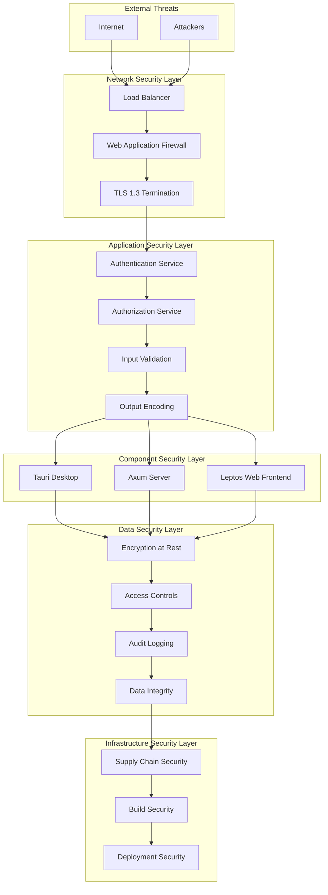

# TACHYON: SECURITY ARCHITECTURE

**Document ID:** TACHYON-SEC-001-V1.0
**Date:** February 2026
**Status:** Approved for Implementation
**Classification:** Security Architecture Documentation
**Compliance Level:** ISO/IEC 27001:2013, NIST SP 800-53, OWASP Top 10

---

## TABLE OF CONTENTS

1. [Introduction](#1-introduction)
2. [Security Architecture Overview](#2-security-architecture-overview)
3. [Security Layers](#3-security-layers)
4. [Trust Boundaries](#4-trust-boundaries)
5. [Defense-in-Depth Strategy](#5-defense-in-depth-strategy)
6. [Security Controls](#6-security-controls)
7. [Data Protection](#7-data-protection)
8. [Network Security](#8-network-security)
9. [Application Security](#9-application-security)
10. [Monitoring and Auditing](#10-monitoring-and-auditing)
11. [Incident Response](#11-incident-response)
12. [References](#12-references)

---

## 1. INTRODUCTION

### 1.1. Document Purpose

This document defines the comprehensive security architecture for the Tachyon toolchain, a hybrid Knowledge Management System (KMS) and Internal Developer Portal (IDP) comprising desktop, server, and web components. The security architecture implements a defense-in-depth strategy with multiple layers of security controls to protect confidentiality, integrity, and availability of system data and functionality.

### 1.2. Scope

The security architecture covers:
- Desktop application security (Tauri-based)
- Server component security (Axum-based HTTP/2 server)
- Web frontend security (Leptos/Bun-based)
- Inter-component communication security
- Data protection at rest and in transit
- Authentication and authorization mechanisms
- Supply chain security
- Audit logging and monitoring
- Incident response procedures

### 1.3. Security Principles

The Tachyon security architecture is founded on the following fundamental principles:

| Principle | Description | Implementation |
|-----------|-------------|----------------|
| **Defense-in-Depth** | Multiple layers of security controls provide redundant protection | Implemented across all architectural layers |
| **Least Privilege** | Minimal access required for each operation | Role-Based Access Control (RBAC) and capability-based permissions |
| **Zero Trust** | No trust assumptions; verify all requests | Comprehensive authentication and authorization for all operations |
| **Secure by Design** | Security incorporated from design phase | Security-first architecture decisions and threat modeling |
| **Fail-Safe Defaults** | Secure default configurations | Hardened default configurations with opt-out only |
| **Auditability** | All security-relevant events logged | Comprehensive audit logging with tracing |

### 1.4. Document Dependencies

This document depends on the following specifications:
- [TACHYON-STD-V1.0](../../.adrs/ - Coding and Documentation Standards
- [TACHYON-REQ-SEC-V1.0](../../.adrs/ - Security Requirements
- [TACHYON-DES-SEC-V1.0](../../.adrs/ - Security Design
- [TACHYON-ADR-010-V1.0](../../.adrs/adr-010-synchronization-primitives.md) - Security Architecture ADR
- [TACHYON-TMA-V1.0](../../.adrs/ - Threat Model Analysis

---

## 2. SECURITY ARCHITECTURE OVERVIEW

### 2.1. Architectural Context

The Tachyon toolchain operates as a hybrid system with dual deployment modes:

1. **Local-First Desktop Mode:** Tauri-based desktop application with local file system access and optional server synchronization
2. **Centralized Server Mode:** Axum-based HTTP/2 server providing centralized storage, collaboration, and web access

This hybrid architecture necessitates a comprehensive security posture addressing both local and remote threat vectors while maintaining consistent security controls across the system.

### 2.2. Security Objectives

The security architecture achieves the following primary objectives:

| Objective | Description | Priority |
|-----------|-------------|----------|
| **Confidentiality** | Protect sensitive documentation, user credentials, and intellectual property from unauthorized access | Critical |
| **Integrity** | Ensure documentation content, user data, and system configurations remain unaltered by unauthorized actors | Critical |
| **Availability** | Maintain continuous access to documentation services for authorized users | High |
| **Accountability** | Enable traceability of all user actions and system events for audit purposes | High |
| **Non-Repudiation** | Prevent users from denying actions they performed within the system | Medium |

### 2.3. Threat Landscape

The Tachyon system operates within a complex threat landscape encompassing various attack vectors:

| Adversary Type | Motivation | Capabilities | Likelihood | Impact |
|----------------|------------|--------------|------------|--------|
| **Script Kiddies** | Notoriety, learning | Low-skilled, automated tools | High | Low |
| **Insiders** | Disgruntlement, financial gain | Authorized access, knowledge of systems | Medium | Critical |
| **Cybercriminals** | Financial gain | Sophisticated tools, persistence | Medium | High |
| **Advanced Persistent Threats (APTs)** | Espionage, intellectual property theft | Advanced capabilities, nation-state resources | Low | Critical |
| **Supply Chain Attackers** | Mass compromise, persistence | Dependency poisoning, build system compromise | Low | Critical |

### 2.4. Security Architecture Diagram



---

## 3. SECURITY LAYERS

The Tachyon security architecture implements five distinct layers of security controls, each providing specific protection mechanisms and working together to achieve defense-in-depth.

### 3.1. Network Security Layer

The network security layer protects the system from external threats and secures all network communications.

| Component | Security Control | Threat Mitigated | Requirement |
|-----------|-----------------|------------------|-------------|
| **Load Balancer** | DDoS protection, traffic distribution | Denial of Service | REQ-SEC-071 |
| **Web Application Firewall** | SQL injection, XSS, CSRF prevention | Tampering, Spoofing | REQ-SEC-050 |
| **TLS 1.3 Termination** | Encryption in transit, Perfect Forward Secrecy | Information Disclosure | REQ-SEC-031 |
| **Certificate Pinning** | Man-in-the-Middle prevention | Spoofing | REQ-SEC-073 |

**Network Security Controls:**

1. **TLS 1.3 Enforcement:** All network communications must use TLS 1.3 with approved cipher suites
2. **Certificate Validation:** Full certificate chain verification with revocation checking
3. **HSTS Headers:** Strict-Transport-Security headers with max-age of 31536000 seconds
4. **Perfect Forward Secrecy:** Ephemeral key exchange for all TLS connections
5. **DDoS Protection:** Rate limiting, connection throttling, and traffic analysis

### 3.2. Application Security Layer

The application security layer implements security controls within application logic to prevent application-level exploits.

| Component | Security Control | Threat Mitigated | Requirement |
|-----------|-----------------|------------------|-------------|
| **Authentication Service** | JWT-based authentication, MFA support | Spoofing | REQ-SEC-011 |
| **Authorization Service** | RBAC, ABAC, least privilege | Elevation of Privilege | REQ-SEC-021 |
| **Input Validation** | Schema validation, type checking, length limits | Tampering, Injection | REQ-SEC-041 |
| **Output Encoding** | HTML, URL, JSON encoding | XSS, Injection | REQ-SEC-051 |

**Application Security Controls:**

1. **Multi-Factor Authentication:** Support for TOTP, SMS, and hardware token MFA
2. **JWT Token Management:** Cryptographically secure tokens with proper signing and rotation
3. **Role-Based Access Control:** Hierarchical roles with permission inheritance
4. **Input Validation:** Comprehensive validation against schemas with type checking
5. **Output Encoding:** Context-aware encoding for HTML, URLs, JSON, and JavaScript

### 3.3. Component Security Layer

The component security layer secures individual system components (desktop, server, web) from component-specific threats.

| Component | Security Control | Threat Mitigated | Requirement |
|-----------|-----------------|------------------|-------------|
| **Tauri Desktop** | Capability system, WebView sandboxing | Elevation of Privilege | REQ-SEC-081 |
| **Axum Server** | Middleware-based security, async safety | Denial of Service | REQ-SEC-071 |
| **Leptos Web Frontend** | CSP headers, XSS prevention | Cross-Site Scripting | REQ-SEC-050 |

**Component Security Controls:**

1. **Tauri Capabilities:** Fine-grained permissions for file system, shell, and network access
2. **WebView Security:** Content Security Policy, same-origin policy enforcement
3. **Async Safety:** Tokio's async safety preventing race conditions
4. **Memory Safety:** Rust's ownership system preventing memory corruption
5. **Type Safety:** Compile-time type checking preventing type confusion

### 3.4. Data Security Layer

The data security layer protects data at rest and ensures data integrity across all storage systems.

| Component | Security Control | Threat Mitigated | Requirement |
|-----------|-----------------|------------------|-------------|
| **Encryption at Rest** | AES-256 encryption for sensitive data | Information Disclosure | REQ-SEC-026 |
| **Access Controls** | File permissions, database ACLs | Unauthorized Access | REQ-SEC-021 |
| **Audit Logging** | Comprehensive event logging with tracing | Repudiation | REQ-SEC-056 |
| **Data Integrity** | Cryptographic signatures, checksums | Tampering | REQ-SEC-036 |

**Data Security Controls:**

1. **AES-256 Encryption:** All sensitive data encrypted at rest using AES-256-GCM
2. **Key Management:** Secure key storage with rotation and backup procedures
3. **Access Controls:** Role-based permissions on all data access operations
4. **Audit Logging:** Immutable logs with cryptographic signing for tamper protection
5. **Data Integrity:** HMAC signatures and checksums for critical data

### 3.5. Infrastructure Security Layer

The infrastructure security layer secures the build system, deployment pipeline, and supply chain.

| Component | Security Control | Threat Mitigated | Requirement |
|-----------|-----------------|------------------|-------------|
| **Supply Chain Security** | Dependency verification, lock files | Supply Chain Attacks | REQ-SEC-086 |
| **Build Security** | Reproducible builds, code signing | Build Tampering | REQ-SEC-091 |
| **Deployment Security** | Secure deployment pipelines, verification | Deployment Attacks | REQ-SEC-094 |

**Infrastructure Security Controls:**

1. **Dependency Verification:** SHA-256 checksums for all dependencies
2. **Lock File Pinning:** Cargo.lock and bun.lock for reproducible builds
3. **Reproducible Builds:** Nix flakes ensuring deterministic build outputs
4. **Code Signing:** Cryptographic signatures for all build artifacts
5. **Vulnerability Scanning:** Automated scanning with cargo-audit and cargo-deny

---

## 4. TRUST BOUNDARIES

Trust boundaries define the separation between security zones with different trust levels. Each boundary requires appropriate security controls to prevent unauthorized access and lateral movement.

### 4.1. Trust Boundary Definition

The Tachyon system defines following trust boundaries:

| Boundary | Source Zone | Destination Zone | Trust Level | Controls Required |
|-----------|--------------|-------------------|-------------|------------------|
| **External to DMZ** | Untrusted Zone | DMZ Zone | None → Low | Load Balancer, WAF |
| **DMZ to Application** | DMZ Zone | Application Layer | Low → Medium | TLS 1.3, Authentication |
| **Application to Data** | Application Layer | Data Layer | Medium → High | Authorization, Access Controls |
| **Desktop to Server** | Local System | Remote Server | Medium → Medium | mTLS, IPC Security |
| **Web to Server** | Browser | Server | Low → Medium | WebSocket Auth, CORS |
| **Build to Production** | Build Environment | Production | High → High | Code Signing, Verification |

### 4.2. Security Zones

The Tachyon architecture defines five security zones with distinct trust levels and protection requirements.

#### 4.2.1. Untrusted Zone

**Description:** Public internet and external users with no inherent trust.

**Components:**
- Internet traffic
- External API clients
- Public web browsers

**Trust Level:** None

**Primary Threats:**
- DDoS attacks
- Reconnaissance
- Exploitation attempts
- Man-in-the-Middle attacks

**Security Controls:**
- Load balancer with DDoS protection
- Web Application Firewall (WAF)
- Rate limiting and throttling
- TLS 1.3 termination
- IP reputation filtering

**Requirement Mapping:** REQ-SEC-006, REQ-SEC-007, REQ-SEC-071

#### 4.2.2. DMZ Zone

**Description:** Network perimeter with security controls providing initial defense.

**Components:**
- Load balancer
- Web Application Firewall
- TLS termination endpoint

**Trust Level:** Low

**Primary Threats:**
- Protocol attacks
- Man-in-the-Middle
- SSL/TLS attacks
- Application layer attacks

**Security Controls:**
- TLS 1.3 with perfect forward secrecy
- Certificate validation
- HSTS headers
- WAF rules for OWASP Top 10
- Request validation and filtering

**Requirement Mapping:** REQ-SEC-031, REQ-SEC-032, REQ-SEC-033, REQ-SEC-075

#### 4.2.3. Application Layer Zone

**Description:** Server, desktop, and web components processing business logic.

**Components:**
- Axum HTTP/2 server
- Tauri desktop application
- Leptos web frontend
- Authentication and authorization services

**Trust Level:** Medium

**Primary Threats:**
- Application-level exploits
- Privilege escalation
- Injection attacks
- Session hijacking

**Security Controls:**
- JWT-based authentication with MFA
- Role-Based Access Control (RBAC)
- Input validation and sanitization
- Output encoding
- Session management with timeout

**Requirement Mapping:** REQ-SEC-011, REQ-SEC-021, REQ-SEC-041, REQ-SEC-051

#### 4.2.4. Data Layer Zone

**Description:** Storage systems for content, metadata, and user data.

**Components:**
- Git repository storage
- SQLite database
- Tantivy search index
- In-memory cache

**Trust Level:** High

**Primary Threats:**
- Data exfiltration
- Data tampering
- Unauthorized access
- Ransomware

**Security Controls:**
- AES-256 encryption at rest
- Access controls with RBAC
- Audit logging with tamper protection
- Data integrity verification
- Secure backup procedures

**Requirement Mapping:** REQ-SEC-026, REQ-SEC-028, REQ-SEC-036, REQ-SEC-056

#### 4.2.5. Build Infrastructure Zone

**Description:** Nix build environment and artifact storage.

**Components:**
- Nix store
- Build environment
- Dependency cache

**Trust Level:** High

**Primary Threats:**
- Supply chain attacks
- Build poisoning
- Dependency tampering
- Artifact substitution

**Security Controls:**
- Dependency verification with checksums
- Reproducible builds with Nix
- Code signing for artifacts
- Lock file pinning
- Vulnerability scanning

**Requirement Mapping:** REQ-SEC-086, REQ-SEC-091, REQ-SEC-093, REQ-SEC-094

### 4.3. Zone Transition Controls

Transitions between security zones require specific security controls based on trust level change.

| Transition | Trust Change | Required Controls |
|-----------|--------------|------------------|
| **Untrusted → DMZ** | None → Low | DDoS protection, WAF, TLS |
| **DMZ → Application** | Low → Medium | Authentication, TLS validation |
| **Application → Data** | Medium → High | Authorization, access controls |
| **Desktop <-> Server** | Medium <-> Medium | mTLS, IPC security |
| **Web → Server** | Low → Medium | WebSocket auth, CORS |
| **Build → Production** | High → High | Code signing, verification |

### 4.4. Trust Boundary Enforcement

Trust boundaries are enforced through following mechanisms:

1. **Network-Level Enforcement:** Firewalls, network segmentation, and access control lists
2. **Application-Level Enforcement:** Authentication, authorization, and session management
3. **Data-Level Enforcement:** Encryption, access controls, and audit logging
4. **Infrastructure-Level Enforcement:** Build verification, code signing, and dependency validation

**Failure Modes:**

| Failure Mode | Impact | Mitigation |
|--------------|--------|------------|
| **Boundary Bypass** | Unauthorized access, lateral movement | Defense-in-depth, monitoring |
| **Control Failure** | Reduced security, increased attack surface | Fail-safe defaults, redundancy |
| **Misconfiguration** | Security vulnerabilities, exposure | Configuration validation, audit |
| **Compromise** | Zone breach, data exfiltration | Isolation, containment, incident response |

---

## 5. DEFENSE-IN-DEPTH STRATEGY

The defense-in-depth strategy implements multiple layers of security controls ensuring that if one layer fails, other layers provide protection. This approach aligns with the Tachyon system's security requirements and threat model analysis.

### 5.1. Defense-in-Depth Principles

The Tachyon defense-in-depth strategy is founded on following principles:

| Principle | Description | Implementation |
|-----------|-------------|----------------|
| **Redundant Protection** | Multiple controls protect against same threat | TLS + encryption + access controls for data protection |
| **Layered Defense** | Failure of one layer doesn't compromise system | Memory safety + input validation + output encoding |
| **Compartmentalization** | Isolated security domains reduce attack surface | Trust boundaries with zone isolation |
| **Defense in Depth** | Multiple layers provide depth of defense | Five security layers across architecture |
| **Resilience** | System remains resilient even if one layer is compromised | Fail-safe defaults and graceful degradation |

### 5.2. Layer Interaction Model

Security layers interact to provide comprehensive protection across the system:

```mermaid
graph LR
    subgraph "External Threats"
        Threat[Attacker]
    end
    
    subgraph "Layer 1: Network Security"
        Net1[DDoS Protection]
        Net2[TLS 1.3]
        Net3[WAF]
    end
    
    subgraph "Layer 2: Application Security"
        App1[Authentication]
        App2[Authorization]
        App3[Input Validation]
    end
    
    subgraph "Layer 3: Component Security"
        Comp1[Memory Safety]
        Comp2[Type Safety]
        Comp3[Capability System]
    end
    
    subgraph "Layer 4: Data Security"
        Data1[Encryption at Rest]
        Data2[Access Controls]
        Data3[Audit Logging]
    end
    
    subgraph "Layer 5: Infrastructure Security"
        Inf1[Supply Chain]
        Inf2[Build Security]
        Inf3[Code Signing]
    end
    
    Threat --> Net1
    Net1 --> Net2
    Net2 --> Net3
    Net3 --> App1
    App1 --> App2
    App2 --> App3
    App3 --> Comp1
    Comp1 --> Comp2
    Comp2 --> Comp3
    Comp3 --> Data1
    Data1 --> Data2
    Data2 --> Data3
    Data3 --> Inf1
    Inf1 --> Inf2
    Inf2 --> Inf3
```



### 5.3. Threat-to-Layer Mapping

Each threat category is addressed by multiple security layers:

| Threat Category | Layer 1: Network | Layer 2: Application | Layer 3: Component | Layer 4: Data | Layer 5: Infrastructure |
|----------------|------------------|----------------------|-------------------|---------------|------------------------|
| **Spoofing** | TLS 1.3, Certificate Validation | Authentication, MFA | Capability System | Access Controls | Code Signing |
| **Tampering** | TLS Integrity, WAF | Input Validation, Output Encoding | Memory Safety, Type Safety | Encryption, Integrity Checks | Reproducible Builds |
| **Repudiation** | Network Logging | Session Management | Component Logging | Audit Logging | Build Verification |
| **Information Disclosure** | TLS Encryption | Authorization, RBAC | Capability System | Encryption at Rest | Dependency Verification |
| **Denial of Service** | DDoS Protection, Rate Limiting | Request Timeout, Size Limits | Resource Quotas | Resource Monitoring | Build Isolation |
| **Elevation of Privilege** | Network Segmentation | Authorization, Least Privilege | Capability System | Access Controls | Build Sandboxing |

### 5.4. Defense-in-Depth Benefits

The defense-in-depth strategy provides following benefits:

1. **Redundant Protection:** Multiple controls protect against same threat, reducing probability of successful attack
2. **Layered Defense:** Failure of one layer doesn't compromise entire system
3. **Compartmentalization:** Isolated security domains reduce attack surface and limit blast radius
4. **Defense in Depth:** Multiple layers provide depth of defense, making attacks progressively harder
5. **Resilience:** System remains resilient even if one layer is compromised
6. **Flexibility:** New threats can be addressed by adding or modifying controls at appropriate layers
7. **Compliance:** Supports compliance with security standards requiring defense-in-depth

### 5.5. Defense-in-Depth Implementation

The defense-in-depth strategy is implemented through following mechanisms:

#### 5.5.1. Memory Safety Layer (Compiler-Enforced)

Rust's ownership system provides memory safety at compile time, preventing entire classes of memory corruption vulnerabilities:

| Vulnerability | Prevention | Mechanism |
|-------------|------------|-----------|
| **Buffer Overflow** | Compile-time bounds checking | Ownership and borrowing |
| **Use-After-Free** | Compile-time lifetime tracking | Ownership and borrowing |
| **Double-Free** | Compile-time ownership tracking | Ownership |
| **Null Pointer Dereference** | Compile-time null checking | Option<T> type |
| **Data Races** | Compile-time race prevention | Send and Sync traits |
| **Memory Leaks** | Compile-time RAII | Drop trait |

**Requirement Mapping:** REQ-SEC-096, REQ-SEC-097, REQ-SEC-098, REQ-SEC-100

#### 5.5.2. Input Validation Layer (Application-Level)

Comprehensive input validation across all interfaces prevents injection attacks:

| Interface | Validation | Threats Prevented |
|-----------|-----------|------------------|
| **HTTP/2 Server** | Path validation, query validation, body validation | SQL injection, XSS, path traversal |
| **IPC Commands** | Type validation, range validation, format validation | Type confusion, buffer overflow |
| **File Operations** | Path validation, permission validation, size validation | Path traversal, unauthorized access |
| **WebSocket Messages** | Type validation, size validation, format validation | Type confusion, DoS |

**Requirement Mapping:** REQ-SEC-041, REQ-SEC-042, REQ-SEC-043, REQ-SEC-044, REQ-SEC-045

#### 5.5.3. Encryption Layer (Data Protection)

TLS 1.3 for network communications and encryption at rest for sensitive data provide confidentiality and integrity protections:

| Data Type | Encryption | Key Size | Algorithm |
|-----------|-----------|----------|-----------|
| **Network Traffic** | TLS 1.3 | 256-bit | AES-256-GCM |
| **User Credentials** | bcrypt | 256-bit salt | Argon2id |
| **Session Tokens** | JWT | 256-bit | RS256 |
| **Database** | SQLite encryption | 256-bit | AES-256-GCM |

**Requirement Mapping:** REQ-SEC-026, REQ-SEC-027, REQ-SEC-031, REQ-SEC-032, REQ-SEC-035

#### 5.5.4. Access Control Layer (Authorization)

Role-Based Access Control (RBAC) with capability-based permissions implements principle of least privilege:

| Control Type | Implementation | Purpose |
|-------------|----------------|---------|
| **RBAC** | Hierarchical roles with permission inheritance | Simplified permission management |
| **ABAC** | Attribute-based access control for fine-grained permissions | Complex authorization scenarios |
| **Capability System** | Tauri capabilities for system resource access | Fine-grained system access |
| **Frontmatter ACL** | Document-level access control from frontmatter | Document-specific permissions |

**Requirement Mapping:** REQ-SEC-021, REQ-SEC-022, REQ-SEC-023, REQ-SEC-024, REQ-SEC-081

#### 5.5.5. Audit Logging Layer (Accountability)

Comprehensive audit logging with tracing provides accountability and enables forensic analysis:

| Category | Events | Purpose |
|-----------|--------|---------|
| **Authentication** | Login, logout, token refresh | Account tracking |
| **Authorization** | Access granted, access denied | Permission tracking |
| **Data Access** | Read, write, delete | Data access tracking |
| **System Events** | Startup, shutdown, errors | System state tracking |
| **Security Events** | Failed login, blocked access | Security incident tracking |

**Requirement Mapping:** REQ-SEC-056, REQ-SEC-057, REQ-SEC-058, REQ-SEC-059, REQ-SEC-060

---

## 6. SECURITY CONTROLS

Security controls are specific measures implemented to protect the system from identified threats. This section details authentication, authorization, and related security controls.

### 6.1. Authentication Controls

Authentication controls verify the identity of users and system components before granting access.

#### 6.1.1. Multi-Factor Authentication (MFA)

**Description:** MFA requires users to provide multiple forms of authentication, significantly reducing the risk of credential theft and session hijacking.

**Implementation:**

| Factor | Type | Implementation |
|--------|------|----------------|
| **Something You Know** | Password | Argon2id hashing with 256-bit salt |
| **Something You Have** | TOTP, Hardware Token | Time-based one-time passwords, WebAuthn |
| **Something You Are** | Biometrics (Optional) | Platform-specific biometric authentication |

**Security Properties:**
- Passwords must be minimum 12 characters with complexity requirements
- TOTP secrets must be cryptographically secure and stored encrypted
- Hardware tokens must support FIDO2/WebAuthn standards
- MFA can be enforced per-user or per-role based on security policy

**Requirement Mapping:** REQ-SEC-011, REQ-SEC-012

#### 6.1.2. JWT-Based Session Management

**Description:** JSON Web Tokens (JWT) provide stateless, cryptographically secure session tokens with embedded permissions.

**Token Structure:**

```json
{
  "header": {
    "alg": "RS256",
    "typ": "JWT",
    "kid": "key-id-1"
  },
  "payload": {
    "iss": "tachyon-server",
    "sub": "user-uuid",
    "aud": "tachyon-api",
    "iat": 1234567890,
    "exp": 1234654290,
    "nbf": 1234567890,
    "jti": "token-uuid",
    "permissions": ["document:read", "document:write"],
    "sid": "session-uuid"
  },
  "signature": "cryptographic-signature"
}
```

**Security Properties:**
- Tokens signed with RS256 or ES256 algorithms
- Token expiration enforced (maximum 24 hours)
- Refresh tokens are single-use and must be rotated
- Token ID (jti) enables revocation
- Session ID (sid) enables concurrent session tracking

**Requirement Mapping:** REQ-SEC-016, REQ-SEC-017, REQ-SEC-018, REQ-SEC-019, REQ-SEC-020

#### 6.1.3. Federated Authentication

**Description:** Support for OAuth 2.0, SAML 2.0, and OpenID Connect enables integration with external identity providers.

**Supported Providers:**

| Protocol | Providers | Use Case |
|----------|-----------|----------|
| **OAuth 2.0** | GitHub, Google, Microsoft | Third-party login |
| **SAML 2.0** | Enterprise SSO | Corporate authentication |
| **OpenID Connect** | OIDC-compliant providers | Federated identity |

**Security Properties:**
- State parameter prevents CSRF attacks
- PKCE (Proof Key for Code Exchange) for public clients
- Token validation includes audience and issuer claims
- Provider-specific security requirements enforced

**Requirement Mapping:** REQ-SEC-013, REQ-SEC-014, REQ-SEC-015

### 6.2. Authorization Controls

Authorization controls determine what authenticated users are permitted to do within the system.

#### 6.2.1. Role-Based Access Control (RBAC)

**Description:** RBAC assigns permissions to roles, and roles to users, providing hierarchical permission management.

**Role Hierarchy:**

```
Admin (all permissions)
├── System Admin (system:* permissions)
├── Auditor (system:audit permission)
└── User Manager (user:* permissions)

User (standard permissions)
├── Editor (document:read, document:write, document:share)
├── Viewer (document:read only)
└── Collaborator (document:read, document:write)
```

**Permission Categories:**

| Category | Permissions | Description |
|-----------|-------------|-------------|
| **Document** | document:read, document:write, document:delete, document:share | Document operations |
| **Repository** | repository:read, repository:write, repository:delete, repository:sync | Repository operations |
| **User** | user:read, user:write, user:delete | User management |
| **System** | system:admin, system:audit | System administration |

**Requirement Mapping:** REQ-SEC-021, REQ-SEC-025

#### 6.2.2. Attribute-Based Access Control (ABAC)

**Description:** ABAC provides fine-grained permissions based on user attributes, resource attributes, and environmental context.

**Policy Example:**

```
Allow if:
  user.role == "editor" AND
  document.classification == "confidential" AND
  time.hour >= 9 AND time.hour <= 17 AND
  user.location == "office"
```

**Attributes:**

| Attribute Type | Examples | Source |
|---------------|----------|--------|
| **User Attributes** | role, department, clearance level | User profile |
| **Resource Attributes** | classification, owner, tags | Resource metadata |
| **Environmental Attributes** | time, location, device | Context data |

**Requirement Mapping:** REQ-SEC-022

#### 6.2.3. Frontmatter Access Control

**Description:** Document frontmatter defines access control directives that are enforced during document rendering.

**Frontmatter Example:**

```yaml
---
access:
  roles:
    - editor
    - collaborator
  users:
    - user-uuid-1
    - user-uuid-2
  classification: confidential
---
```

**Enforcement:**
- Access control directives parsed from document frontmatter
- Unauthorized users receive access denied response
- Internal blocks (`::: internal`) redacted for unauthorized users
- Frontmatter changes trigger access control recalculation

**Requirement Mapping:** REQ-SEC-023, REQ-SEC-024

### 6.3. Session Management Controls

Session management controls ensure secure session lifecycle and prevent session hijacking.

| Control | Implementation | Security Benefit |
|---------|----------------|------------------|
| **Session Timeout** | Configurable timeout with automatic invalidation | Reduces window for session hijacking |
| **Session Refresh** | Token rotation on refresh | Prevents replay attacks |
| **Concurrent Session Limits** | Configurable limits per user | Prevents account sharing |
| **Session Revocation** | Immediate revocation capability | Enables incident response |
| **Secure Storage** | HTTP-only, Secure, SameSite cookies | Prevents cookie theft |

**Requirement Mapping:** REQ-SEC-017, REQ-SEC-018, REQ-SEC-019, REQ-SEC-020

### 6.4. Password Security Controls

Password security controls ensure strong password policies and secure password storage.

| Control | Requirement | Implementation |
|---------|------------|----------------|
| **Minimum Length** | 12 characters | Enforced by validation |
| **Complexity** | Uppercase, lowercase, numbers, special characters | Enforced by validation |
| **Password History** | No reuse of last 10 passwords | Stored hash comparison |
| **Password Expiration** | Optional (90 days recommended) | Configurable policy |
| **Secure Storage** | Argon2id hashing with 256-bit salt | Never stored in plaintext |

**Requirement Mapping:** REQ-SEC-012

---

## 7. DATA PROTECTION

Data protection controls ensure confidentiality, integrity, and availability of data at rest and in transit.

### 7.1. Encryption at Rest

Encryption at rest protects sensitive data stored on disk from unauthorized access.

#### 7.1.1. AES-256 Encryption

**Description:** All sensitive data encrypted using AES-256-GCM algorithm with authenticated encryption.

**Implementation:**

| Data Type | Encryption Method | Key Management |
|-----------|-----------------|----------------|
| **SQLite Database** | AES-256-GCM | Hardware Security Module (HSM) or KMS |
| **User Credentials** | Argon2id (not encryption, but hashing) | Salt stored separately |
| **Configuration Files** | AES-256-GCM | Key stored in environment variable |
| **Backup Files** | AES-256-GCM | Key rotated quarterly |

**Security Properties:**
- AES-256-GCM provides authenticated encryption (confidentiality + integrity)
- Unique IV (Initialization Vector) for each encryption operation
- Keys stored securely with hardware-backed key management when available
- Key rotation implemented with forward secrecy (new keys don't decrypt old data)

**Requirement Mapping:** REQ-SEC-026, REQ-SEC-027, REQ-SEC-028, REQ-SEC-029, REQ-SEC-030

#### 7.1.2. Key Management

**Description:** Secure key management ensures encryption keys are protected throughout their lifecycle.

**Key Lifecycle:**

1. **Key Generation:** Cryptographically secure random key generation
2. **Key Storage:** Keys stored in Hardware Security Module (HSM) or Key Management Service (KMS)
3. **Key Distribution:** Keys distributed over secure channels (TLS 1.3)
4. **Key Rotation:** Keys rotated quarterly or on compromise
5. **Key Destruction:** Keys securely destroyed (zeroization) when no longer needed

**Key Management Best Practices:**
- Never store encryption keys alongside encrypted data
- Use separate keys for different data types (database, backups, configuration)
- Implement key escrow for disaster recovery
- Log all key operations (generation, rotation, destruction)

**Requirement Mapping:** REQ-SEC-027

### 7.2. Encryption in Transit

Encryption in transit protects data transmitted over networks from eavesdropping and tampering.

#### 7.2.1. TLS 1.3 Enforcement

**Description:** All network communications must use TLS 1.3 with approved cipher suites.

**TLS Configuration:**

| Setting | Value | Rationale |
|---------|-------|-----------|
| **Minimum Version** | TLS 1.3 | Latest protocol with best security |
| **Cipher Suites** | TLS_AES_256_GCM_SHA384, TLS_CHACHA20_POLY1305_SHA256 | Strong ciphers with forward secrecy |
| **Perfect Forward Secrecy** | Required | Protection against future key compromise |
| **Certificate Validation** | Full chain with revocation checking | Prevent man-in-the-middle |
| **HSTS** | max-age=31536000, includeSubDomains | Enforce HTTPS |

**Security Properties:**
- TLS 1.3 provides modern cryptographic primitives
- Perfect Forward Secrecy (PFS) protects against future key compromise
- Certificate validation prevents man-in-the-middle attacks
- HSTS headers prevent protocol downgrade attacks

**Requirement Mapping:** REQ-SEC-031, REQ-SEC-032, REQ-SEC-033, REQ-SEC-034, REQ-SEC-035

#### 7.2.2. Mutual TLS (mTLS)

**Description:** Mutual TLS provides two-way authentication for inter-component communication.

**Use Cases:**

| Communication | mTLS Required | Rationale |
|--------------|----------------|-----------|
| **Desktop <-> Server** | Yes | Authenticates both endpoints |
| **Server <-> Server** | Yes | Prevents unauthorized server instances |
| **Web <-> Server** | No (client auth via JWT) | Browser-based authentication |
| **Server <-> Database** | No (local connection) | Local communication protected by network segmentation |

**Implementation:**
- Each component has unique X.509 certificate
- Certificate Authority (CA) manages certificate issuance and revocation
- Certificate pinning for critical endpoints
- Certificate rotation implemented with minimal downtime

**Requirement Mapping:** REQ-SEC-072

### 7.3. Data Integrity

Data integrity controls ensure data has not been tampered with or corrupted.

#### 7.3.1. Cryptographic Signatures

**Description:** Critical data is cryptographically signed to verify authenticity and integrity.

**Signed Data Types:**

| Data Type | Signing Algorithm | Purpose |
|-----------|------------------|---------|
| **Build Artifacts** | RSA-4096 | Verify artifact authenticity |
| **Audit Logs** | HMAC-SHA256 | Detect log tampering |
| **Configuration** | Ed25519 | Verify configuration integrity |
| **Git Commits** | GPG | Verify commit authorship |

**Verification Process:**
1. Retrieve signature alongside data
2. Verify signature using public key or certificate
3. Reject data if signature verification fails
4. Log signature verification failures for security monitoring

**Requirement Mapping:** REQ-SEC-036

#### 7.3.2. Checksums and Hashes

**Description:** Checksums and hashes verify data integrity for files and data transfers.

**Checksum Types:**

| Use Case | Algorithm | Purpose |
|----------|-----------|---------|
| **File Verification** | SHA-256 | Verify file integrity |
| **Dependency Verification** | SHA-256 | Verify dependency integrity |
| **Data Transfer** | SHA-256 | Verify transfer integrity |
| **Git Objects** | SHA-1 | Verify Git object integrity |

**Implementation:**
- Checksums calculated and stored separately from data
- Checksums verified before data use
- Checksum verification failures logged and rejected
- Git's SHA-1 provides cryptographic verification for repository integrity

**Requirement Mapping:** REQ-SEC-037, REQ-SEC-038

### 7.4. Data Classification

Data classification ensures appropriate security controls are applied based on data sensitivity.

**Classification Levels:**

| Level | Description | Controls Required |
|-------|-------------|-------------------|
| **Public** | Data intended for public access | No special controls |
| **Internal** | Data for internal use only | Access controls, encryption at rest |
| **Confidential** | Sensitive business data | Access controls, encryption at rest and in transit, audit logging |
| **Highly Confidential** | Highly sensitive data (e.g., credentials, PII) | Strict access controls, encryption, audit logging, data masking |

**Classification Enforcement:**
- Classification metadata stored with data
- Access control policies based on classification level
- Audit logging for highly confidential data access
- Data masking for logs and error messages

**Requirement Mapping:** REQ-SEC-008

### 7.5. Data Masking

Data masking protects sensitive data from unauthorized viewing in logs, error messages, and debug output.

**Masking Techniques:**

| Data Type | Masking Technique | Example |
|-----------|-----------------|---------|
| **Email Addresses** | Partial masking | j***@example.com |
| **Phone Numbers** | Partial masking | ***-***-1234 |
| **Credit Cards** | Partial masking | ****-****-****-1234 |
| **API Keys** | Complete masking | [REDACTED] |
| **Passwords** | Complete masking | [REDACTED] |

**Implementation:**
- Masking applied at data source (before logging)
- Different masking levels for different contexts (logs vs. UI)
- Unmasked data only available to authorized users with explicit access
- Masking configuration stored separately from application code

**Requirement Mapping:** REQ-SEC-056 (audit logging with data masking)

---

## 8. NETWORK SECURITY

Network security controls protect the system from network-based attacks and secure all network communications.

### 8.1. Network Segmentation

Network segmentation divides the network into isolated segments to limit attack surface and prevent lateral movement.

**Network Segments:**

| Segment | Purpose | Access Controls |
|---------|---------|-----------------|
| **DMZ** | Public-facing services | Internet access only, restricted internal access |
| **Application Zone** | Application servers | Access from DMZ only, no direct internet access |
| **Data Zone** | Database and storage | Access from application zone only |
| **Management Zone** | Administrative access | Strict access controls, audit logging |
| **Build Zone** | Build infrastructure | Isolated from production networks |

**Segmentation Controls:**
- Firewalls enforce segmentation rules
- Network ACLs restrict traffic between segments
- VPN required for management zone access
- Bastion hosts for management access

**Requirement Mapping:** REQ-SEC-007, REQ-SEC-010

### 8.2. Firewall Rules

Firewall rules control network traffic between segments and to/from the internet.

**Default Policy:** Deny all traffic not explicitly allowed

**Firewall Rule Categories:**

| Rule Type | Source | Destination | Port | Action | Purpose |
|-----------|--------|-------------|------|--------|---------|
| **Inbound HTTP/2** | Internet | DMZ | 443 | Allow public API access |
| **Inbound HTTPS** | Internet | DMZ | 443 | Allow web access |
| **Outbound HTTPS** | DMZ | Internet | 443 | Allow external API calls |
| **Application to Data** | Application Zone | Data Zone | 5432 | Allow database access |
| **Management Access** | VPN | Management Zone | 22 | Allow SSH over VPN |

**Firewall Best Practices:**
- Rules ordered from most specific to least specific
- Regular audit of firewall rules for unused or overly permissive rules
- Logging of all denied traffic for security monitoring
- Rate limiting on firewall rules to prevent abuse

**Requirement Mapping:** REQ-SEC-071

### 8.3. DDoS Protection

Distributed Denial of Service (DDoS) protection mitigates volumetric and protocol-based attacks.

**DDoS Protection Layers:**

| Layer | Protection Type | Implementation |
|-------|-----------------|----------------|
| **Network Layer** | Volumetric protection | Cloudflare, AWS Shield |
| **Transport Layer** | SYN flood protection | Rate limiting, SYN cookies |
| **Application Layer** | HTTP flood protection | Rate limiting, request validation |
| **Application Logic** | Resource exhaustion protection | Request timeout, size limits |

**DDoS Mitigation Techniques:**
- Rate limiting per IP and per user
- Connection pooling with limits
- Request timeout and size limits
- Challenge-response tests (CAPTCHA) for suspicious traffic
- Geographic blocking for known malicious regions

**Requirement Mapping:** REQ-SEC-071

### 8.4. WebSocket Security

WebSocket connections require specific security controls beyond standard HTTP security.

**WebSocket Security Controls:**

| Control | Implementation | Security Benefit |
|---------|----------------|------------------|
| **Authentication** | JWT token in connection URL | Prevents unauthorized connections |
| **Origin Validation** | Validate Origin header | Prevents CSRF attacks |
| **Message Validation** | Schema validation for all messages | Prevents injection attacks |
| **Rate Limiting** | Per-connection and per-user rate limits | Prevents abuse |
| **Connection Limits** | Concurrent connection limits per user | Prevents resource exhaustion |

**WebSocket Security Best Practices:**
- Use WSS (WebSocket Secure) exclusively
- Implement heartbeat/ping-pong for connection health monitoring
- Log all WebSocket connection events (connect, disconnect, errors)
- Implement graceful connection closure on errors

**Requirement Mapping:** REQ-SEC-076, REQ-SEC-077, REQ-SEC-078, REQ-SEC-079, REQ-SEC-080

### 8.5. HTTP Security Headers

HTTP security headers provide additional protection against web-based attacks.

**Required Security Headers:**

| Header | Value | Purpose |
|--------|-------|---------|
| **Strict-Transport-Security** | max-age=31536000; includeSubDomains; preload | Enforce HTTPS |
| **Content-Security-Policy** | default-src 'self'; script-src 'self' | Prevent XSS |
| **X-Content-Type-Options** | nosniff | Prevent MIME sniffing |
| **X-Frame-Options** | DENY | Prevent clickjacking |
| **X-XSS-Protection** | 1; mode=block | XSS protection |
| **Referrer-Policy** | strict-origin-when-cross-origin | Control referrer information |
| **Permissions-Policy** | geolocation=(), microphone=() | Control feature permissions |

**Header Implementation:**
- Headers set on all HTTP responses
- CSP policy configured per application requirements
- HSTS preload submitted to browser preload list
- Regular review of header configuration

**Requirement Mapping:** REQ-SEC-033, REQ-SEC-050, REQ-SEC-075

### 8.6. DNS Security

DNS security controls protect against DNS-based attacks.

**DNS Security Measures:**

| Measure | Implementation | Threat Mitigated |
|---------|----------------|------------------|
| **DNSSEC** | Enable DNSSEC validation | DNS spoofing, cache poisoning |
| **DNS over HTTPS** | Use DoH resolvers | DNS interception |
| **DNS over TLS** | Use DoT resolvers | DNS interception |
| **DNS Filtering** | Block malicious domains | Malware, phishing |
| **DNS Caching** | Implement DNS caching with TTL | DNS amplification attacks |

**DNS Security Best Practices:**
- Use reputable DNS resolvers with security features
- Implement DNSSEC validation on all DNS queries
- Monitor DNS resolution for anomalies
- Regular review of DNS filtering rules

**Requirement Mapping:** REQ-SEC-074

### 8.7. Certificate Management

Certificate management ensures secure TLS connections with valid certificates.

**Certificate Lifecycle:**

1. **Certificate Generation:** Generate certificates with sufficient key length (2048-bit minimum for RSA, 256-bit for ECC)
2. **Certificate Installation:** Install certificates on all TLS endpoints
3. **Certificate Validation:** Validate certificates on all connections
4. **Certificate Rotation:** Rotate certificates before expiration
5. **Certificate Revocation:** Revoke compromised certificates immediately

**Certificate Best Practices:**
- Use certificate pinning for critical endpoints
- Implement OCSP stapling for certificate status
- Monitor certificate expiration with automated alerts
- Use separate certificates for different environments (dev, staging, production)

**Requirement Mapping:** REQ-SEC-032, REQ-SEC-073

---

## 9. APPLICATION SECURITY

Application security controls protect against application-level exploits including injection attacks, cross-site scripting, and other web-based vulnerabilities.

### 9.1. Input Validation

Input validation ensures all user inputs conform to expected formats, types, and constraints before processing.

#### 9.1.1. Schema Validation

**Description:** All inputs validated against defined schemas before processing.

**Validation Categories:**

| Input Type | Validation | Threats Prevented |
|-----------|-----------|------------------|
| **HTTP Request Body** | JSON schema validation | Type confusion, injection |
| **Query Parameters** | Type and format validation | SQL injection, XSS |
| **Path Parameters** | Path validation and canonicalization | Path traversal |
| **File Uploads** | File type, size, and content validation | Malicious file upload |
| **WebSocket Messages** | Schema validation | Type confusion, DoS |

**Schema Validation Example:**

```rust
use validator::ValidateLength;

#[derive(Debug, ValidateLength)]
pub struct DocumentTitle {
    #[validate(length(min = 1, max = 100))]
    pub title: String,
}

pub async fn create_document(
    title: DocumentTitle,
) -> Result<Document, ApiError> {
    // Validation automatically performed by ValidateLength
    let document = Document::new(title.title)?;
    Ok(document)
}
```

**Requirement Mapping:** REQ-SEC-041, REQ-SEC-042, REQ-SEC-043, REQ-SEC-044, REQ-SEC-045

#### 9.1.2. Type Safety

**Description:** Rust's type system prevents type confusion attacks at compile time.

**Type Safety Guarantees:**

| Vulnerability | Prevention | Mechanism |
|-------------|------------|-----------|
| **Type Confusion** | Compile-time type checking | Strong typing |
| **Null Pointer Dereference** | Compile-time null checking | Option<T> type |
| **Integer Overflow** | Compile-time bounds checking | Checked arithmetic |
| **Use-After-Free** | Compile-time lifetime tracking | Ownership and borrowing |

**Requirement Mapping:** REQ-SEC-098

### 9.2. Input Sanitization

Input sanitization removes or escapes potentially dangerous content before processing or storage.

#### 9.2.1. XSS Prevention

**Description:** All user-generated content sanitized to prevent Cross-Site Scripting attacks.

**XSS Prevention Techniques:**

| Context | Sanitization Method | Example |
|--------|-------------------|---------|
| **HTML Content** | HTML entity encoding | `&` → `&amp;` |
| **HTML Attributes** | Attribute encoding | `"` → `&quot;` |
| **JavaScript** | JavaScript encoding | `\` → `\\` |
| **URL Parameters** | URL encoding | ` ` → `%20` |
| **CSS** | CSS encoding | `;` → `\3B ` |

**Implementation:**
- Context-aware encoding based on where content will be used
- Allow-list of safe HTML tags and attributes
- Content Security Policy (CSP) headers for additional protection

**Requirement Mapping:** REQ-SEC-046, REQ-SEC-050

#### 9.2.2. SQL Injection Prevention

**Description:** Parameterized queries prevent SQL injection attacks.

**SQL Injection Prevention:**

```rust
// VULNERABLE: String concatenation
let query = format!("SELECT * FROM documents WHERE id = {}", user_input);

// SECURE: Parameterized query
let query = "SELECT * FROM documents WHERE id = $1";
conn.query_row(query, &[user_input])?;
```

**Best Practices:**
- Always use parameterized queries
- Never concatenate user input into SQL queries
- Use ORM when possible for additional protection
- Validate input types before database queries

**Requirement Mapping:** REQ-SEC-047

#### 9.2.3. Command Injection Prevention

**Description:** Proper escaping and validation prevent command injection attacks.

**Command Injection Prevention:**

| Technique | Implementation | Protection |
|-----------|----------------|------------|
| **Allow-listing** | Only allow specific commands | Prevents arbitrary command execution |
| **Argument Escaping** | Properly escape shell arguments | Prevents argument injection |
| **Validation** | Validate command syntax | Prevents malformed commands |
| **Least Privilege** | Run commands with minimal privileges | Limits impact of compromise |

**Requirement Mapping:** REQ-SEC-048

#### 9.2.4. Path Traversal Prevention

**Description:** Path canonicalization and allow-lists prevent path traversal attacks.

**Path Traversal Prevention:**

```rust
use std::path::Path;

fn validate_path(user_path: &str, base_dir: &Path) -> Result<Path, Error> {
    let full_path = base_dir.join(user_path);
    let canonical = full_path.canonicalize()?;
    
    // Verify path is within base directory
    if !canonical.starts_with(base_dir.canonicalize()?) {
        return Err(Error::PathTraversal);
    }
    
    Ok(canonical)
}
```

**Best Practices:**
- Always canonicalize paths before use
- Verify canonical path is within allowed directory
- Use allow-lists for permitted directories
- Never trust user-provided paths

**Requirement Mapping:** REQ-SEC-049

### 9.3. Output Encoding

Output encoding ensures data is safely rendered in different contexts.

**Encoding Contexts:**

| Context | Encoding Method | Threats Prevented |
|---------|----------------|------------------|
| **HTML Body** | HTML entity encoding | XSS |
| **HTML Attributes** | Attribute encoding | XSS |
| **JavaScript** | JavaScript encoding | XSS |
| **URL** | URL encoding | URL injection |
| **CSS** | CSS encoding | XSS |

**Requirement Mapping:** REQ-SEC-051, REQ-SEC-052, REQ-SEC-053, REQ-SEC-054, REQ-SEC-055

### 9.4. Content Security Policy (CSP)

Content Security Policy headers prevent XSS attacks by controlling resource loading.

**CSP Policy Example:**

```
Content-Security-Policy: 
  default-src 'self';
  script-src 'self' 'unsafe-inline' 'unsafe-eval';
  style-src 'self' 'unsafe-inline';
  img-src 'self' data: https:;
  font-src 'self';
  connect-src 'self' wss://tachyon.example.com;
  frame-ancestors 'none';
  base-uri 'self';
  form-action 'self';
```

**CSP Directives:**

| Directive | Purpose | Recommended Value |
|----------|---------|------------------|
| **default-src** | Default resource loading policy | 'self' |
| **script-src** | Script loading policy | 'self' (avoid 'unsafe-inline') |
| **style-src** | Style loading policy | 'self' |
| **img-src** | Image loading policy | 'self' data: (if needed) |
| **connect-src** | WebSocket/HTTP request policy | 'self' wss://domain |
| **frame-ancestors** | Prevent clickjacking | 'none' |

**Requirement Mapping:** REQ-SEC-050

### 9.5. IPC Security

IPC (Inter-Process Communication) security controls protect communication between desktop application and system resources.

**Tauri Capability System:**

| Capability | Description | Security Benefit |
|-----------|-------------|------------------|
| **fs:read** | File read access | Controlled file system access |
| **fs:write** | File write access | Controlled file system access |
| **fs:scope** | Scoped file access | Limits access to specific directories |
| **shell:allow-execute** | Command execution | Controlled command execution |
| **http:allow-request** | HTTP requests | Controlled network access |

**IPC Security Best Practices:**
- Define capabilities with minimal required permissions
- Scope file system access to specific directories
- Validate all IPC messages against schemas
- Rate limit IPC operations to prevent abuse
- Log all IPC operations with security context

**Requirement Mapping:** REQ-SEC-081, REQ-SEC-082, REQ-SEC-083, REQ-SEC-084, REQ-SEC-085

### 9.6. Error Handling

Secure error handling prevents information leakage and maintains system security.

**Error Handling Principles:**

| Principle | Implementation | Security Benefit |
|-----------|----------------|------------------|
| **No Information Leakage** | Generic error messages for users | Prevents information disclosure |
| **Secure Defaults** | Fail-safe error handling | Prevents insecure fallbacks |
| **Error Logging** | Detailed errors in logs only | Enables debugging without exposing to users |
| **User-Friendly Messages** | Clear but non-specific messages | Improves UX without security compromise |

**Error Handling Example:**

```rust
use thiserror::Error;

#[derive(Error, Debug)]
pub enum ApiError {
    #[error("Document not found")]
    DocumentNotFound,
    
    #[error("Permission denied")]
    PermissionDenied,
    
    #[error("Internal server error")]
    InternalError,
}

impl std::fmt::Display for ApiError {
    fn fmt(&self, f: &mut std::fmt::Formatter<'_>) -> std::fmt::Result {
        match self {
            ApiError::DocumentNotFound => write!(f, "Document not found"),
            ApiError::PermissionDenied => write!(f, "Permission denied"),
            ApiError::InternalError => write!(f, "Internal server error"),
        }
    }
}
```

**Requirement Mapping:** REQ-SEC-099 (panic handling)

---

## 10. MONITORING AND AUDITING

Monitoring and auditing controls provide visibility into system security state and enable incident response.

### 10.1. Audit Logging

Audit logging provides comprehensive records of all security-relevant events for accountability and forensic analysis.

#### 10.1.1. Audit Log Categories

**Description:** Audit logs categorized by event type for organized analysis and reporting.

| Category | Events | Purpose |
|-----------|--------|---------|
| **Authentication** | Login, logout, token refresh, MFA verification | Account tracking |
| **Authorization** | Access granted, access denied, permission checks | Permission tracking |
| **Data Access** | Read, write, delete operations | Data access tracking |
| **Configuration** | Configuration changes, permission modifications | Change tracking |
| **Security Events** | Failed login, blocked access, attack detection | Incident tracking |

**Requirement Mapping:** REQ-SEC-061, REQ-SEC-062, REQ-SEC-063, REQ-SEC-064, REQ-SEC-065

#### 10.1.2. Audit Log Properties

**Description:** Audit logs must meet specific security requirements.

**Required Properties:**

| Property | Requirement | Implementation |
|----------|------------|----------------|
| **Comprehensive** | All security-relevant events logged | Instrument all code paths |
| **Immutable** | Write-once, read-many storage | Append-only log storage |
| **Tamper-Protected** | Cryptographic signing of logs | HMAC-SHA256 signatures |
| **Retention** | Minimum 90 days retention | Configurable retention policy |
| **Access Control** | Restricted log access | Role-based log access |
| **Timestamped** | Precise timestamps for all events | NTP-synchronized time |

**Audit Log Example:**

```json
{
  "timestamp": "2026-02-06T08:30:00.000Z",
  "event_type": "authentication",
  "event": "login_success",
  "user_id": "user-uuid-1",
  "ip_address": "192.168.1.100",
  "user_agent": "Mozilla/5.0...",
  "mfa_verified": true,
  "session_id": "session-uuid-1",
  "signature": "HMAC-SHA256-signature"
}
```

**Requirement Mapping:** REQ-SEC-056, REQ-SEC-057, REQ-SEC-058, REQ-SEC-059, REQ-SEC-060

#### 10.1.3. Audit Log Storage

**Description:** Audit logs stored securely to prevent tampering and ensure availability.

**Storage Requirements:**

| Requirement | Implementation |
|------------|----------------|
| **Append-Only** | Logs written once, never modified | File system with append-only mode |
| **Encryption** | Logs encrypted at rest | AES-256-GCM encryption |
| **Redundancy** | Multiple log copies | Primary and backup storage |
| **Integrity** | Cryptographic signatures | HMAC-SHA256 per log entry |
| **Access Control** | Restricted log access | File permissions, access logging |

**Log Storage Architecture:**

```
Primary Storage (Encrypted, Append-Only)
    ↓
Backup Storage (Encrypted, Append-Only)
    ↓
Archive Storage (Encrypted, WORM)
```

### 10.2. Security Monitoring

Security monitoring provides real-time visibility into system security state and enables rapid incident detection.

#### 10.2.1. Monitoring Metrics

**Description:** Security metrics collected and analyzed for anomaly detection and trend analysis.

**Metric Categories:**

| Category | Metrics | Purpose |
|-----------|---------|---------|
| **Authentication Metrics** | Failed login rate, MFA usage, session duration | Detect credential attacks |
| **Authorization Metrics** | Access denied rate, permission usage | Detect privilege escalation |
| **Network Metrics** | Traffic volume, request rate, error rate | Detect DoS attacks |
| **Application Metrics** | Error rate, response time, resource usage | Detect application issues |
| **Data Metrics** | Data access patterns, modification rate | Detect data exfiltration |

**Requirement Mapping:** REQ-SEC-066, REQ-SEC-070

#### 10.2.2. Anomaly Detection

**Description:** Anomaly detection identifies unusual patterns that may indicate security incidents.

**Anomaly Detection Techniques:**

| Technique | Implementation | Threats Detected |
|-----------|----------------|------------------|
| **Statistical Analysis** | Baseline comparison | Unusual access patterns |
| **Machine Learning** | Pattern recognition | Zero-day attacks, APTs |
| **Rule-Based** | Threshold alerts | Known attack patterns |
| **Behavioral Analysis** | User behavior baselines | Compromised accounts |

**Anomaly Detection Example:**

```
Alert: Unusual data access pattern detected
- User: user-uuid-1
- Baseline: 10-20 documents accessed per day
- Current: 500 documents accessed in 1 hour
- Severity: High
- Action: Account locked, security team notified
```

**Requirement Mapping:** REQ-SEC-067

#### 10.2.3. Alerting

**Description:** Alerts generated for security events with configurable severity thresholds.

**Alert Severity Levels:**

| Severity | Criteria | Response Time |
|----------|-----------|---------------|
| **Critical** | System compromise, data breach | Immediate (< 5 minutes) |
| **High** | Attack in progress, privilege escalation | Urgent (< 15 minutes) |
| **Medium** | Suspicious activity, policy violation | Standard (< 1 hour) |
| **Low** | Minor issues, informational | Routine (< 24 hours) |

**Alert Channels:**

| Channel | Use Case | Configuration |
|---------|----------|---------------|
| **Email** | Low and medium severity | Configured recipients |
| **SMS** | Critical and high severity | On-call personnel |
| **Slack/Teams** | All severities | Security channel |
| **PagerDuty** | Critical severity | On-call rotation |

**Requirement Mapping:** REQ-SEC-068

#### 10.2.4. Security Dashboard

**Description:** Security dashboard provides real-time visibility into system security state.

**Dashboard Components:**

| Component | Purpose | Metrics Displayed |
|-----------|---------|-------------------|
| **Overview Panel** | High-level security status | Incident count, active threats |
| **Authentication Panel** | Authentication events | Failed login rate, MFA usage |
| **Authorization Panel** | Authorization events | Access denied rate, permission usage |
| **Network Panel** | Network security | Traffic volume, DDoS status |
| **Data Panel** | Data access patterns | Access volume, modification rate |
| **Alert Panel** | Active alerts | Alert list, severity, status |

**Dashboard Features:**
- Real-time data refresh (configurable interval)
- Historical data views (hourly, daily, weekly, monthly)
- Drill-down capability for detailed analysis
- Export functionality for reporting
- Role-based access control

**Requirement Mapping:** REQ-SEC-069

### 10.3. Log Analysis

Log analysis enables forensic investigation and trend identification.

#### 10.3.1. Log Search

**Description:** Powerful search capabilities enable efficient log analysis.

**Search Capabilities:**

| Capability | Implementation |
|-------------|----------------|
| **Full-Text Search** | Search all log fields |
| **Filtered Search** | Filter by event type, user, time range |
| **Regular Expression** | Pattern matching for complex queries |
| **Faceted Search** | Multi-criteria filtering |
| **Saved Queries** | Reusable search templates |

#### 10.3.2. Log Aggregation

**Description:** Logs from multiple components aggregated for centralized analysis.

**Aggregation Benefits:**

| Benefit | Description |
|---------|-------------|
| **Centralized View** | Single pane of glass for all logs |
| **Correlation** | Detect patterns across components |
| **Efficiency** | Faster analysis with aggregated data |
| **Consistency** | Unified log format and structure |

**Aggregation Architecture:**

```
Component Logs (Desktop, Server, Web)
    ↓
Log Collector (Centralized collection)
    ↓
Log Aggregator (Parsing, normalization)
    ↓
Log Storage (Encrypted, indexed)
    ↓
Log Analysis (Search, visualization)
```

#### 10.3.3. Log Retention

**Description:** Logs retained for specified periods to support forensic analysis and compliance.

**Retention Policy:**

| Log Type | Retention Period | Rationale |
|-----------|-----------------|-----------|
| **Security Events** | 1 year | Forensic analysis, compliance |
| **Authentication Events** | 6 months | Account tracking, compliance |
| **Authorization Events** | 6 months | Permission tracking, compliance |
| **System Events** | 3 months | Troubleshooting, trend analysis |
| **Debug Logs** | 30 days | Troubleshooting, development |

**Retention Implementation:**
- Automated log archival after retention period
- Archived logs encrypted and stored separately
- Log deletion after retention period (with verification)
- Retention policy configurable per log type

---

## 11. INCIDENT RESPONSE

Incident response procedures provide structured approach to detecting, responding to, and recovering from security incidents.

### 11.1. Incident Detection

Incident detection identifies potential security incidents through monitoring and analysis.

#### 11.1.1. Detection Sources

**Description:** Security incidents detected through multiple sources and techniques.

| Detection Source | Implementation | Incident Types Detected |
|-----------------|----------------|----------------------|
| **Automated Alerts** | Security monitoring system | DDoS, brute force, anomalies |
| **Log Analysis** | Automated log analysis | Pattern detection, suspicious activity |
| **User Reports** | User reporting mechanism | Phishing, suspicious activity |
| **External Reports** | Bug bounty, security researchers | Vulnerabilities, exploits |
| **Threat Intelligence** | Threat feeds, security advisories | Known threats, CVEs |

#### 11.1.2. Incident Classification

**Description:** Incidents classified by severity and type for appropriate response.

**Severity Levels:**

| Severity | Definition | Response Time | Examples |
|----------|-------------|---------------|----------|
| **Critical** | System compromise, data breach | < 5 minutes | Ransomware, data exfiltration |
| **High** | Attack in progress, privilege escalation | < 15 minutes | Active exploitation, unauthorized access |
| **Medium** | Suspicious activity, policy violation | < 1 hour | Failed login attempts, unusual access |
| **Low** | Minor issues, informational | < 24 hours | Policy violations, misconfigurations |

**Incident Types:**

| Category | Examples | Detection Methods |
|-----------|----------|-----------------|
| **Compromise** | System breach, data breach | Anomaly detection, alerts |
| **Attack** | DDoS, brute force, exploitation | Network monitoring, IDS |
| **Policy Violation** | Unauthorized access, data mishandling | Access logs, user reports |
| **Vulnerability** | Software vulnerability, misconfiguration | Vulnerability scanning, external reports |
| **Data Breach** | Data exfiltration, unauthorized access | Data access logs, DLP |

### 11.2. Incident Response Process

Incident response process provides structured approach to handling security incidents.

#### 11.2.1. Response Phases

**Description:** Incident response organized into phases for systematic handling.

**Response Phases:**

1. **Preparation:** Incident response plan, team training, tools ready
2. **Detection:** Identify potential security incidents
3. **Analysis:** Analyze incident to understand scope and impact
4. **Containment:** Limit incident impact and prevent spread
5. **Eradication:** Remove threat from system
6. **Recovery:** Restore normal operations
7. **Post-Incident Activity:** Lessons learned, process improvement

#### 11.2.2. Incident Response Team

**Description:** Dedicated team responsible for incident response.

**Team Roles:**

| Role | Responsibilities |
|-------|----------------|
| **Incident Commander** | Overall coordination, decision making |
| **Technical Lead** | Technical investigation, containment |
| **Communications Lead** | Stakeholder communication, notifications |
| **Legal Counsel** | Legal guidance, compliance |
| **PR/Communications** | Public communication, messaging |
| **Security Analysts** | Log analysis, threat hunting |
| **System Administrators** | System recovery, patching |

**On-Call Rotation:**
- 24/7 on-call coverage
- Primary and secondary on-call personnel
- Escalation procedures for critical incidents
- Contact information documented and accessible

#### 11.2.3. Incident Containment

**Description:** Containment strategies limit incident impact and prevent spread.

**Containment Strategies:**

| Strategy | Implementation | Use Case |
|-----------|----------------|----------|
| **Network Isolation** | Firewall rules, network segmentation | Malware, active exploitation |
| **System Isolation** | Disable affected systems | Compromised systems |
| **Account Isolation** | Disable compromised accounts | Credential theft, account takeover |
| **Service Isolation** | Disable affected services | Service-specific attacks |
| **Data Isolation** | Restrict data access | Data breaches, unauthorized access |

**Containment Decision Factors:**
- Incident severity and impact
- Business criticality of affected systems
- Available containment options
- Potential impact of containment actions
- Time required for containment

### 11.3. Incident Recovery

Incident recovery restores normal operations after incident containment.

#### 11.3.1. Recovery Steps

**Description:** Systematic approach to restoring normal operations.

**Recovery Steps:**

1. **Verification:** Verify threat eradicated
2. **System Restoration:** Restore from clean backups
3. **Configuration Restoration:** Apply secure configurations
4. **Access Restoration:** Restore access controls
5. **Monitoring:** Enhanced monitoring for recurrence
6. **Validation:** Validate system functionality

#### 11.3.2. Backup and Restoration

**Description:** Secure backup procedures enable rapid recovery.

**Backup Requirements:**

| Requirement | Implementation |
|------------|----------------|
| **Regular Backups** | Daily incremental, weekly full | Automated backup jobs |
| **Encryption** | AES-256-GCM encryption at rest | Encrypted backup storage |
| **Off-Site Storage** | Separate physical location | Cloud backup service |
| **Testing** | Regular restoration testing | Monthly restoration tests |
| **Integrity** | Cryptographic verification | Checksums, signatures |
| **Retention** | Configurable retention period | 90 days minimum |

**Restoration Process:**

1. **Verify Backup Integrity:** Check cryptographic signatures
2. **Select Backup:** Choose appropriate backup point
3. **Restore to Isolated System:** Prevent reinfection
4. **Verify Restoration:** Validate restored data
5. **Update Security Controls:** Apply latest security patches
6. **Monitor for Recurrence:** Enhanced monitoring post-restoration

### 11.4. Post-Incident Activity

Post-incident activities ensure lessons learned and process improvement.

#### 11.4.1. Incident Report

**Description:** Comprehensive incident report documents incident and response activities.

**Report Sections:**

| Section | Content |
|---------|---------|
| **Executive Summary** | High-level overview for stakeholders |
| **Incident Timeline** | Chronological events and actions |
| **Impact Assessment** | Business and technical impact |
| **Root Cause Analysis** | Investigation findings and conclusions |
| **Response Actions** | Containment, eradication, recovery actions |
| **Lessons Learned** | Process improvements and recommendations |
| **Appendices** | Technical details, logs, evidence |

**Report Distribution:**

| Recipient | Purpose | Timing |
|-----------|---------|--------|
| **Executive Team** | Business impact, high-level summary | Within 24 hours |
| **Technical Team** | Technical details, root cause | Within 48 hours |
| **Legal Counsel** | Compliance implications | Within 48 hours |
| **Security Team** | Lessons learned, recommendations | Within 72 hours |
| **Regulatory Bodies** | Regulatory reporting (if required) | Per regulation |

#### 11.4.2. Lessons Learned

**Description:** Systematic analysis of incident to identify improvements.

**Lessons Learned Categories:**

| Category | Questions | Output |
|-----------|-----------|--------|
| **Detection** | How was incident detected? Could it be detected earlier? | Detection improvements |
| **Response** | Was response effective? What worked well? What didn't? | Response improvements |
| **Prevention** | How could incident be prevented? | Prevention improvements |
| **Process** | Were procedures followed? Were gaps identified? | Process improvements |
| **Technology** | Were technical controls effective? | Technology improvements |

**Improvement Tracking:**

1. **Identify Improvements:** Document specific improvements
2. **Prioritize Improvements:** Rank by impact and effort
3. **Assign Owners:** Assign responsibility for each improvement
4. **Track Progress:** Monitor improvement implementation
5. **Verify Effectiveness:** Validate improvements prevent recurrence

#### 11.4.3. Process Updates

**Description:** Incident response procedures updated based on lessons learned.

**Update Process:**

1. **Review Procedures:** Evaluate current incident response procedures
2. **Identify Gaps:** Document gaps and improvement areas
3. **Update Procedures:** Modify procedures based on lessons learned
4. **Train Team:** Train team on updated procedures
5. **Test Procedures:** Validate updated procedures through exercises

**Continuous Improvement:**

- Quarterly procedure reviews
- Annual incident response exercises
- Regular team training
- Integration of threat intelligence
- Monitoring of security trends

---

## 12. REFERENCES

This section provides references to related documents, standards, and external resources.

### 12.1. Internal References

Internal Tachyon documentation referenced in this security architecture.

| Document ID | Title | Purpose |
|-------------|-------|---------|
| [TACHYON-STD-V1.0](../../.adrs/ | Coding and Documentation Standards | Document standards and conventions |
| [TACHYON-REQ-SEC-V1.0](../../.adrs/ | Security Requirements | Functional security requirements |
| [TACHYON-DES-SEC-V1.0](../../.adrs/ | Security Design | Security design specifications |
| [TACHYON-ADR-010-V1.0](../../.adrs/adr-010-synchronization-primitives.md) | Security Architecture ADR | Security architecture decision |
| [TACHYON-TMA-V1.0](../../.adrs/ | Threat Model Analysis | Threat analysis and modeling |
| [TACHYON-TSK-V1.0](../../.adrs/ | Execution Tasks | Task breakdown structure |

### 12.2. Standards and Regulations

External standards and regulations referenced in this security architecture.

| Standard | Organization | Purpose |
|----------|--------------|---------|
| ISO/IEC 27001:2013 | ISO/IEC | Information security management systems |
| NIST SP 800-53 | NIST | Security and privacy controls |
| OWASP Top 10 | OWASP Foundation | Web application security risks |
| RFC 8446 | IETF | TLS 1.3 protocol specification |
| CWE-25 | MITRE | Buffer overflow vulnerability |
| NTIA Cybersecurity Framework | NTIA | Functions and categories |

### 12.3. External Resources

External resources providing security guidance and best practices.

| Resource | Organization | Purpose |
|----------|--------------|---------|
| OWASP Application Security Verification Standard | OWASP Foundation | Application security testing |
| CIS Controls | Center for Internet Security | Security best practices |
| SANS Top 25 | SANS Institute | Most dangerous software errors |
| CVE Database | MITRE | Common Vulnerabilities and Exposures |
| NVD | NIST | National Vulnerability Database |

### 12.4. Document Change History

Version history of the Security Architecture document.

| Version | Date | Changes | Author |
|---------|------|---------|--------|
| V1.0 | February 2026 | Initial version |

---

**Document Status:** Approved for Implementation

**Next Review Date:** February 2027

**Approval:**
- Security Architect: _____________________ Date: _______
- System Architect: _____________________ Date: _______
- DevOps Lead: ______________________ Date: _______
