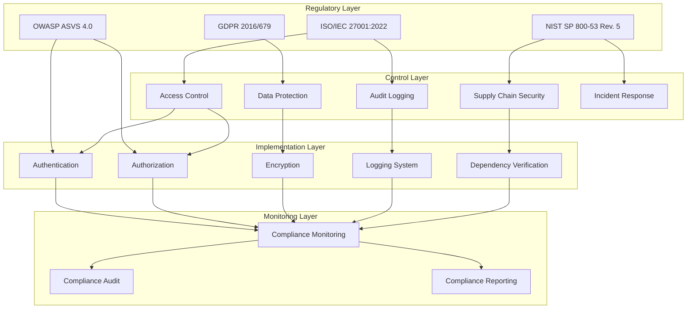
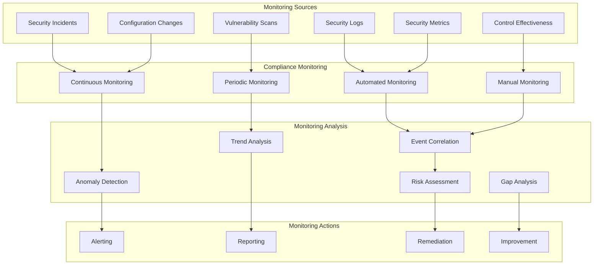

# TACHYON: SECURITY COMPLIANCE DOCUMENT

**Document ID:** TACHYON-SEC-007-V1.0
**Date:** February 2026
**Status:** Approved for Implementation
**Classification:** Security Documentation
**Compliance Level:** ISO/IEC 27001:2022, NIST SP 800-53 Rev. 5, OWASP ASVS 4.0, GDPR 2016/679
**Dependencies:** [TACHYON-STD-V1.0](../../.adrs/ [TACHYON-TMA-V1.0](../../.adrs/ [TACHYON-ADR-010-V1.0](../../.adrs/adr-010-synchronization-primitives.md)

---

## TABLE OF CONTENTS

1. [Introduction](#1-introduction)
2. [Compliance Framework](#2-compliance-framework)
3. [ISO/IEC 27001 Compliance](#3-isoiec-27001-compliance)
4. [NIST SP 800-53 Compliance](#4-nist-sp-800-53-compliance)
5. [OWASP Compliance](#5-owasp-compliance)
6. [GDPR Compliance](#6-gdpr-compliance)
7. [Compliance Monitoring](#7-compliance-monitoring)
8. [Compliance Audit](#8-compliance-audit)
9. [References](#9-references)

---

## 1. INTRODUCTION

### 1.1. Purpose and Scope

This document establishes the comprehensive security compliance framework for the Tachyon toolchain, defining adherence to international security standards, regulatory requirements, and industry best practices. The Tachyon toolchain operates as a hybrid Knowledge Management System (KMS) and Internal Developer Portal (IDP) with dual deployment modes: local-first desktop application and centralized server deployment, necessitating a rigorous compliance posture addressing both local and remote security domains.

**Primary Objectives:**

1. **Regulatory Compliance:** Ensure alignment with ISO/IEC 27001:2022 (Information Security Management), NIST SP 800-53 Rev. 5 (Security and Privacy Controls), OWASP ASVS 4.0 (Application Security Verification), and GDPR 2016/679 (Data Protection)
2. **Security Assurance:** Implement comprehensive security controls aligned with defense-in-depth principles
3. **Audit Readiness:** Maintain comprehensive documentation and evidence for compliance audits
4. **Risk Management:** Establish formal risk assessment and mitigation procedures
5. **Continuous Improvement:** Enable ongoing compliance monitoring and enhancement

### 1.2. System Context

The Tachyon toolchain encompasses:
- A Rust-based core engine with Tokio asynchronous runtime
- A Tauri-based desktop application wrapper
- An Axum-based HTTP/2 server component
- A TypeScript/JavaScript frontend using Leptos and TailwindCSS
- Git-based content storage and management

**Security Domains:**

| Domain | Description | Compliance Scope |
|--------|-------------|-------------------|
| **Authentication** | Multi-factor authentication, JWT-based session management | ISO 27001 A.9, NIST AC-2, OWASP ASVS 2.1 |
| **Authorization** | Role-Based Access Control (RBAC), principle of least privilege | ISO 27001 A.9, NIST AC-3, OWASP ASVS 1.3 |
| **Data Protection** | Encryption at rest and in transit, data classification | ISO 27001 A.8, NIST SC-8, GDPR Art. 32 |
| **Audit Logging** | Comprehensive logging with tracing for security events | ISO 27001 A.12, NIST AU-2, GDPR Art. 30 |
| **Supply Chain Security** | Dependency verification, build system hardening | ISO 27001 A.14, NIST SA-12, OWASP ASVS 1.22 |

### 1.3. Document Structure

This document is organized into sections addressing each compliance framework:

- **ISO/IEC 27001 Compliance:** Alignment with ISO/IEC 27001:2022 Annex A controls
- **NIST SP 800-53 Compliance:** Implementation of NIST SP 800-53 Rev. 5 security and privacy controls
- **OWASP Compliance:** Adherence to OWASP Application Security Verification Standard (ASVS) 4.0
- **GDPR Compliance:** Implementation of General Data Protection Regulation requirements
- **Compliance Monitoring:** Procedures for ongoing compliance monitoring and reporting
- **Compliance Audit:** Audit procedures, evidence collection, and remediation processes
- **References:** Citations to standards, regulations, and supporting documentation

---

## 2. COMPLIANCE FRAMEWORK

### 2.1. Compliance Architecture

The Tachyon compliance framework implements a layered approach integrating multiple standards and regulations into a cohesive security posture.

### 2.2. Compliance Principles

**Core Principles:**

1. **Defense-in-Depth:** Multiple layers of security controls ensuring that if one layer fails, other layers provide protection
2. **Principle of Least Privilege:** Minimal access required for each operation, with explicit authorization
3. **Zero Trust:** Verification of all requests, regardless of source, with no implicit trust within security boundaries
4. **Secure by Default:** Security enabled by default, requiring explicit opt-out for reduced security
5. **Auditability:** All security-relevant events logged with comprehensive tracing
6. **Fail-Safe:** Error handling designed to fail securely, preventing security bypass through error conditions
7. **Supply Chain Security:** Verification of all dependencies and build artifacts
8. **Data Minimization:** Collection and retention of only necessary data, aligned with GDPR principles

### 2.3. Compliance Mapping Matrix

| Standard | Focus Area | Primary Controls | Tachyon Implementation |
|----------|-------------|------------------|------------------------|
| **ISO/IEC 27001** | Information Security Management | Annex A controls (93 controls) | Security architecture, risk management, access controls |
| **NIST SP 800-53** | Security and Privacy Controls | Low/Moderate impact baseline | Security controls, privacy controls, continuous monitoring |
| **OWASP ASVS** | Application Security | Verification requirements | Input validation, authentication, authorization, session management |
| **GDPR** | Data Protection | Data subject rights, data protection by design | Data export, deletion, access request mechanisms |

### 2.4. Compliance Governance

**Governance Structure:**

- **Security Steering Committee:** Oversight of compliance posture, risk acceptance, and strategic security decisions
- **Compliance Officer:** Responsible for maintaining compliance documentation, coordinating audits, and reporting compliance status
- **Security Architecture Team:** Implementation of security controls aligned with compliance requirements
- **Development Teams:** Integration of security controls into development lifecycle
- **Audit Committee:** Independent review of compliance posture and audit findings

**Compliance Lifecycle:**

1. **Planning:** Compliance requirements analysis, gap assessment, and remediation planning
2. **Implementation:** Deployment of security controls aligned with compliance requirements
3. **Monitoring:** Continuous monitoring of compliance posture with automated and manual checks
4. **Audit:** Periodic compliance audits with evidence collection and remediation
5. **Improvement:** Continuous improvement of compliance posture based on audit findings and emerging threats

---

## 3. ISO/IEC 27001 COMPLIANCE

### 3.1. Overview

ISO/IEC 27001:2022 is the international standard for Information Security Management Systems (ISMS). This section documents Tachyon's alignment with ISO/IEC 27001:2022 Annex A controls, which comprise 93 controls organized into 4 themes: Organizational (5 controls), People (6 controls), Physical (2 controls), and Technological (80 controls).

**Implementation Scope:**

- **ISMS Scope:** Tachyon toolchain including desktop application, server component, web frontend, and supporting infrastructure
- **Information Assets:** User data, documentation content, authentication credentials, configuration data, and system logs
- **Risk Assessment:** Formal risk assessment methodology aligned with ISO 27005
- **Statement of Applicability:** Documented controls applicable to Tachyon's scope

### 3.2. Annex A Control Implementation

#### 3.2.1. Organizational Controls (Theme 1)

| Control ID | Control Title | Implementation Status | Tachyon Implementation |
|------------|---------------|----------------------|------------------------|
| **5.1** | Policies for information security | Implemented | Security policy document (TACHYON-SEC-001), security standards |
| **5.2** | Roles and responsibilities | Implemented | Security Steering Committee, Compliance Officer, Security Architecture Team |
| **5.3** | Segregation of duties | Implemented | Separation of development, operations, and audit responsibilities |
| **5.4** | Management responsibilities | Implemented | Executive sponsorship, security budget allocation, risk acceptance process |
| **5.5** | Contact with authorities | Implemented | Incident response coordination with relevant authorities |
| **5.6** | Contact with special interest groups | Implemented | Participation in security communities, threat intelligence sharing |
| **5.7** | Threat intelligence | Implemented | Threat model analysis (TACHYON-TMA-V1.0), continuous threat monitoring |
| **5.8** | Project management | Implemented | Security requirements in project management, security gates in development lifecycle |
| **5.9** | Inventory of information and other associated assets | Implemented | Asset inventory, data classification scheme |
| **5.10** | Acceptable use of information | Implemented | Acceptable use policy, user agreements |
| **5.11** | Return of assets | Implemented | Asset return procedures, data sanitization |
| **5.12** | Classification of information | Implemented | Data classification (Confidential, Internal, Public) |
| **5.13** | Labelling of information | Implemented | Data labeling in user interface and metadata |
| **5.14** | Information transfer | Implemented | Secure transfer protocols, data in transit encryption |
| **5.15** | Access control | Implemented | Role-Based Access Control (RBAC), principle of least privilege |
| **5.16** | Identity management | Implemented | User identity management, authentication provider interface |
| **5.17** | Authentication information | Implemented | Password policies, multi-factor authentication support |
| **5.18** | Access rights | Implemented | Access request workflow, periodic access review |
| **5.19** | Information security in supplier relationships | Implemented | Supplier security assessment, security clauses in contracts |
| **5.20** | Addressing information security within supplier agreements | Implemented | Security requirements in supplier agreements |
| **5.21** | Managing information security in the supplier relationship | Implemented | Supplier monitoring, security performance metrics |
| **5.22** | Addressing information security for use of cloud services | Implemented | Cloud security assessment, cloud provider security controls |
| **5.23** | Information security incident management planning and preparation | Implemented | Incident response plan (TACHYON-SEC-005), incident response team |
| **5.24** | Assessment and decision on information security events | Implemented | Incident classification, incident response procedures |
| **5.25** | Response to information security incidents | Implemented | Incident response procedures, communication procedures |
| **5.26** | Learning from information security incidents | Implemented | Post-incident analysis, lessons learned, process improvements |
| **5.27** | Collection of evidence | Implemented | Evidence collection procedures, chain of custody |
| **5.28** | Disruption of information security during changes | Implemented | Change management procedures, security impact assessment |
| **5.29** | Information security in ICT readiness for business continuity | Implemented | Business continuity plan, disaster recovery procedures |
| **5.30** | ICT readiness for business continuity | Implemented | Backup and recovery procedures, failover mechanisms |
| **5.31** | ICT for business continuity during disruption | Implemented | Business continuity testing, recovery procedures |
| **5.32** | Redundancy of information processing facilities | Implemented | Redundant infrastructure, high availability architecture |
| **5.33** | Information security during disruption | Implemented | Business continuity procedures, incident response during disruption |
| **5.34** | Regulatory, statutory, contractual and similar requirements | Implemented | Regulatory compliance monitoring, legal review |
| **5.35** | Independent review of information security | Implemented | Annual security audit, penetration testing |
| **5.36** | Compliance with policies | Implemented | Policy compliance monitoring, policy enforcement |
| **5.37** | Documented operating procedures | Implemented | Standard operating procedures, runbooks |
| **5.38** | Privileged access rights | Implemented | Privileged access management, privileged access review |
| **5.39** | Protection against malware | Implemented | Anti-malware controls, vulnerability scanning |
| **5.40** | Secure configuration | Implemented | Secure configuration management, hardening procedures |
| **5.41** | Information deletion | Implemented | Data deletion procedures, secure data disposal |
| **5.42** | Masquerading and prevention of tampering with data | Implemented | Data integrity controls, tamper-evident logging |
| **5.43** | Information backup | Implemented | Backup procedures, backup verification |
| **5.44** | Redundancy of information | Implemented | Data redundancy, backup replication |
| **5.45** | Logging and monitoring | Implemented | Comprehensive logging, security monitoring |
| **5.46** | Monitoring activities | Implemented | Activity monitoring, anomaly detection |
| **5.47** | Clock synchronization | Implemented | NTP synchronization, audit trail accuracy |
| **5.48** | Installation of software on operational systems | Implemented | Software installation procedures, change management |
| **5.49** | Vulnerability management | Implemented | Vulnerability scanning, patch management |
| **5.50** | Information security in development and support processes | Implemented | Secure development lifecycle, security code review |
| **5.51** | Test data | Implemented | Test data management, data sanitization for testing |
| **5.52** | Protection against code injection | Implemented | Input validation, output encoding, parameterized queries |
| **5.53** | Protection from web attacks | Implemented | Web Application Firewall, OWASP controls |
| **5.54** | Security requirements engineering | Implemented | Security requirements analysis, threat modeling |
| **5.55** | Secure system engineering principles | Implemented | Security by design, defense in depth |
| **5.56** | Security verification | Implemented | Security testing, penetration testing |
| **5.57** | Supply chain security | Implemented | Dependency verification, supply chain risk assessment |
| **5.58** | Supplier service delivery security | Implemented | Supplier security monitoring, service level agreements |
| **5.59** | Information security in use of cryptography | Implemented | Cryptographic controls, key management |
| **5.60** | Secure disposal or re-use of equipment | Implemented | Equipment disposal procedures, data sanitization |
| **5.61** | Physical security perimeters | Implemented | Physical access controls, security monitoring |
| **5.62** | Physical entry | Implemented | Access control systems, visitor management |
| **5.63** | Securing offices, rooms and facilities | Implemented | Secure facilities, clear desk policy |
| **5.64** | Monitoring and measuring physical security | Implemented | Physical security monitoring, alarm systems |
| **5.65** | Working in secure areas | Implemented | Secure area procedures, visitor supervision |
| **5.66** | Delivery and loading areas | Implemented | Secure delivery areas, package inspection |
| **5.67** | Security of equipment and assets off-premises | Implemented | Off-premises security procedures, remote work policy |
| **5.68** | Clear desk and clear screen policy | Implemented | Clear desk policy, screen lock procedures |
| **5.69** | Information security for remote working | Implemented | Remote work security procedures, VPN requirements |
| **5.70** | Security of media handling | Implemented | Media handling procedures, secure transport |
| **5.71** | Storage media | Implemented | Secure media storage, media inventory |
| **5.72** | Supporting utilities | Implemented | Utility protection, backup power |
| **5.73** | Cabling security | Implemented | Secure cabling, cable management |
| **5.74** | Equipment maintenance | Implemented | Equipment maintenance procedures, maintenance logs |
| **5.75** | Secure disposal or re-use of equipment | Implemented | Equipment disposal procedures, data sanitization |
| **5.76** | Security of equipment off-premises | Implemented | Off-premises equipment security, tracking |
| **5.77** | User training and awareness | Implemented | Security training program, awareness campaigns |
| **5.78** | Competence and training | Implemented | Role-based training, competency assessment |
| **5.79** | Training in the event of information security incidents | Implemented | Incident response training, incident simulations |
| **5.80** | Disciplinary process | Implemented | Security policy violations, disciplinary procedures |
| **5.81** | Remote working | Implemented | Remote work policy, secure remote access |
| **5.82** | Mobile devices and media | Implemented | Mobile device management, secure media handling |
| **5.83** | Teleworking | Implemented | Teleworking policy, secure home office setup |
| **5.84** | Information security in supplier relationships | Implemented | Supplier security assessment, security clauses |
| **5.85** | Addressing information security within supplier agreements | Implemented | Security requirements in supplier agreements |
| **5.86** | Managing information security in the supplier relationship | Implemented | Supplier monitoring, security performance metrics |
| **5.87** | Addressing information security for use of cloud services | Implemented | Cloud security assessment, cloud provider security controls |
| **5.88** | ICT readiness for business continuity | Implemented | Business continuity testing, recovery procedures |
| **5.89** | Redundancy of information processing facilities | Implemented | Redundant infrastructure, high availability architecture |
| **5.90** | Information security during disruption | Implemented | Business continuity procedures, incident response during disruption |
| **5.91** | Information security in use of cryptography | Implemented | Cryptographic controls, key management |
| **5.92** | Secure disposal or re-use of equipment | Implemented | Equipment disposal procedures, data sanitization |
| **5.93** | Security of equipment and assets off-premises | Implemented | Off-premises security procedures, remote work policy |

### 3.3. Risk Assessment Methodology

Tachyon implements a formal risk assessment methodology aligned with ISO 27005, incorporating:

**Risk Assessment Process:**

1. **Asset Identification:** Comprehensive inventory of information assets including user data, documentation content, authentication credentials, configuration data, and system logs
2. **Threat Identification:** Systematic identification of threats using STRIDE methodology (Spoofing, Tampering, Repudiation, Information Disclosure, Denial of Service, Elevation of Privilege)
3. **Vulnerability Assessment:** Identification of vulnerabilities through security testing, code review, and penetration testing
4. **Risk Analysis:** Qualitative and quantitative risk analysis considering likelihood and impact
5. **Risk Evaluation:** Risk prioritization based on risk appetite and tolerance
6. **Risk Treatment:** Selection of risk treatment options (avoid, accept, transfer, mitigate)
7. **Risk Monitoring:** Continuous monitoring of risk posture and effectiveness of controls

**Risk Scoring Matrix:**

| Likelihood \ Impact | Low (1-2) | Medium (3-4) | High (5-6) | Critical (7-8) |
|---------------------|--------------|----------------|--------------|------------------|
| **Rare (1)** | Low (1-2) | Low (2-4) | Medium (3-6) | Medium (5-8) |
| **Unlikely (2)** | Low (2-4) | Medium (4-8) | Medium (6-12) | High (10-16) |
| **Possible (3)** | Low (3-6) | Medium (6-12) | High (9-18) | Critical (15-24) |
| **Likely (4)** | Medium (4-8) | High (8-16) | High (12-24) | Critical (20-32) |
| **Almost Certain (5)** | Medium (5-10) | High (10-20) | Critical (15-30) | Critical (25-40) |

**Risk Treatment Priorities:**

- **Critical Risk (25-40):** Immediate remediation required, executive oversight
- **High Risk (15-24):** Remediation within 30 days, management review
- **Medium Risk (6-14):** Remediation within 90 days, periodic review
- **Low Risk (1-5):** Acceptable risk, periodic monitoring

---

## 4. NIST SP 800-53 COMPLIANCE

### 4.1. Overview

NIST SP 800-53 Revision 5 provides a catalog of security and privacy controls for federal information systems and organizations. This section documents Tachyon's alignment with NIST SP 800-53 Rev. 5 Low and Moderate impact baselines, focusing on controls applicable to the Tachyon toolchain's security posture.

**Implementation Scope:**

- **Baseline:** NIST SP 800-53 Rev. 5 Moderate Impact Baseline (selected controls from Low and Moderate baselines)
- **System Classification:** Moderate impact system based on potential impact of security incidents
- **Control Tailoring:** Tailoring based on system architecture, threat model, and operational requirements
- **Control Implementation:** Hybrid approach combining automated and manual control implementation

### 4.2. Control Family Implementation

#### 4.2.1. Access Control (AC)

| Control ID | Control Title | Implementation Status | Tachyon Implementation |
|------------|---------------|----------------------|------------------------|
| **AC-1** | Access Control Policy and Procedures | Implemented | Access control policy, procedures documentation |
| **AC-2** | Account Management | Implemented | User account lifecycle management, account provisioning/deprovisioning |
| **AC-3** | Access Enforcement | Implemented | RBAC enforcement, principle of least privilege |
| **AC-4** | Information Flow Enforcement | Implemented | Data flow controls, cross-domain policy enforcement |
| **AC-6** | Least Privilege | Implemented | Principle of least privilege, role-based permissions |
| **AC-7** | Successful/Failed Access Attempts | Implemented | Access attempt logging, authentication failure tracking |
| **AC-8** | System Use Notification | Implemented | System use notification, acceptable use policy |
| **AC-10** | Concurrent Session Control | Implemented | Session limit enforcement, session management |
| **AC-11** | Session Lock | Implemented | Automatic session lock, screen lock requirements |
| **AC-12** | Session Termination | Implemented | Session timeout, session termination procedures |
| **AC-14** | Permitted Actions Without Identification or Authentication | Implemented | Public access controls, anonymous access restrictions |
| **AC-17** | Remote Access | Implemented | Secure remote access, VPN requirements |
| **AC-18** | Wireless Access | Implemented | Wireless security controls, wireless access restrictions |
| **AC-19** | Access Control for Mobile Devices | Implemented | Mobile device management, mobile access controls |
| **AC-20** | Use of External Information Systems | Implemented | External system access controls, external system security assessment |
| **AC-22** | Publicly Accessible Content | Implemented | Public access controls, content security |
| **AC-23** | Data Mining Protection | Implemented | Data mining controls, privacy protection |
| **AC-24** | Access Control Decisions | Implemented | Access control decision logging, access control review |
| **AC-25** | Reference Monitor | Implemented | Reference monitor implementation, access control enforcement |

#### 4.2.2. Awareness and Training (AT)

| Control ID | Control Title | Implementation Status | Tachyon Implementation |
|------------|---------------|----------------------|------------------------|
| **AT-1** | Awareness and Training Policy and Procedures | Implemented | Security awareness policy, training procedures |
| **AT-2** | Security Awareness Training | Implemented | Security awareness training for all personnel |
| **AT-3** | Role-Based Security Training | Implemented | Role-based training, specialized security training |
| **AT-4** | Security Training Records | Implemented | Training records, training tracking |
| **AT-5** | Contacts with Security Groups and Associations | Implemented | Security group participation, threat intelligence sharing |

#### 4.2.3. Audit and Accountability (AU)

| Control ID | Control Title | Implementation Status | Tachyon Implementation |
|------------|---------------|----------------------|------------------------|
| **AU-1** | Audit and Accountability Policy and Procedures | Implemented | Audit policy, audit procedures |
| **AU-2** | Audit Events | Implemented | Comprehensive audit event logging |
| **AU-3** | Contents of Audit Records | Implemented | Detailed audit record contents |
| **AU-4** | Audit Storage Capacity | Implemented | Sufficient audit storage capacity, retention policy |
| **AU-5** | Response to Audit Processing Failures | Implemented | Audit processing failure response, audit system resilience |
| **AU-6** | Audit Review, Analysis, and Reporting | Implemented | Audit review, analysis, and reporting procedures |
| **AU-7** | Audit Reduction and Report Generation | Implemented | Audit reduction, report generation |
| **AU-8** | Time Synchronization | Implemented | NTP synchronization, audit trail accuracy |
| **AU-9** | Protection of Audit Information | Implemented | Audit log protection, tamper-evident logging |
| **AU-10** | Non-Repudiation | Implemented | Non-repudiation controls, digital signatures |
| **AU-11** | Audit Record Retention | Implemented | Audit record retention policy |
| **AU-12** | Audit Generation | Implemented | Automated audit generation, comprehensive event logging |
| **AU-13** | Monitoring for Unauthorized Disclosure of Information | Implemented | Unauthorized disclosure monitoring, data loss prevention |

#### 4.2.4. Security Assessment and Authorization (CA)

| Control ID | Control Title | Implementation Status | Tachyon Implementation |
|------------|---------------|----------------------|------------------------|
| **CA-1** | Assessment, Authorization, and Monitoring Policy and Procedures | Implemented | Security assessment policy, authorization procedures |
| **CA-2** | Security Assessments | Implemented | Periodic security assessments, penetration testing |
| **CA-3** | System Interconnections | Implemented | System interconnection security, interconnection agreements |
| **CA-5** | Plan of Action and Milestones | Implemented | Security improvement plan, milestones tracking |
| **CA-6** | Authorization to Operate | Implemented | Authorization to operate, security authorization |
| **CA-7** | Continuous Monitoring | Implemented | Continuous security monitoring, security metrics |
| **CA-8** | Penetration Testing | Implemented | Regular penetration testing, vulnerability assessment |
| **CA-9** | Internal System Connections | Implemented | Internal system connection security |
| **CA-10** | Vulnerability Scanning | Implemented | Regular vulnerability scanning, remediation tracking |

#### 4.2.5. Configuration Management (CM)

| Control ID | Control Title | Implementation Status | Tachyon Implementation |
|------------|---------------|----------------------|------------------------|
| **CM-1** | Configuration Management Policy and Procedures | Implemented | Configuration management policy, procedures |
| **CM-2** | Baseline Configuration | Implemented | Secure baseline configuration, configuration hardening |
| **CM-3** | Configuration Change Control | Implemented | Configuration change management, change control process |
| **CM-4** | Security Impact Analysis | Implemented | Security impact analysis for changes |
| **CM-5** | Access Restrictions for Change | Implemented | Change access restrictions, change authorization |
| **CM-6** | Configuration Settings | Implemented | Secure configuration settings, configuration management |
| **CM-7** | Least Functionality | Implemented | Least functionality principle, service minimization |
| **CM-8** | Information System Component Inventory | Implemented | System component inventory, asset management |
| **CM-9** | Information System Monitoring | Implemented | System monitoring, performance monitoring |
| **CM-10** | Software Usage Restrictions | Implemented | Software usage restrictions, software approval process |
| **CM-11** | User-Installed Software | Implemented | User-installed software controls, software management |

#### 4.2.6. Contingency Planning (CP)

| Control ID | Control Title | Implementation Status | Tachyon Implementation |
|------------|---------------|----------------------|------------------------|
| **CP-1** | Contingency Planning Policy and Procedures | Implemented | Contingency planning policy, procedures |
| **CP-2** | Contingency Plan | Implemented | Business continuity plan, disaster recovery plan |
| **CP-3** | Contingency Training | Implemented | Contingency training, incident response training |
| **CP-4** | Contingency Plan Testing | Implemented | Contingency plan testing, disaster recovery testing |
| **CP-5** | Contingency Plan Update | Implemented | Regular contingency plan updates |
| **CP-6** | Alternate Storage Site | Implemented | Alternate storage site, backup storage |
| **CP-7** | Alternate Processing Site | Implemented | Alternate processing site, failover site |
| **CP-8** | Telecommunications Services | Implemented | Telecommunications backup, communication redundancy |
| **CP-9** | Information System Backup | Implemented | System backup procedures, backup verification |
| **CP-10** | Information System Recovery and Reconstitution | Implemented | System recovery procedures, reconstitution procedures |
| **CP-11** | Alternate Work Site | Implemented | Alternate work site, remote work capability |
| **CP-12** | Contingency Plan Testing | Implemented | Contingency plan testing, disaster recovery testing |
| **CP-13** | Contingency Plan Update | Implemented | Regular contingency plan updates |

#### 4.2.7. Identification and Authentication (IA)

| Control ID | Control Title | Implementation Status | Tachyon Implementation |
|------------|---------------|----------------------|------------------------|
| **IA-1** | Identification and Authentication Policy and Procedures | Implemented | Authentication policy, procedures |
| **IA-2** | Identification and Authentication | Implemented | User identification, authentication mechanisms |
| **IA-3** | Device Identification and Authentication | Implemented | Device identification, device authentication |
| **IA-4** | Identifier Management | Implemented | User identifier management, identifier lifecycle |
| **IA-5** | Authenticator Management | Implemented | Authenticator management, multi-factor authentication |
| **IA-6** | Authenticator Feedback | Implemented | Authenticator feedback, authentication status indication |
| **IA-7** | Cryptographic Module Authentication | Implemented | Cryptographic module authentication, FIPS validation |
| **IA-8** | Identification and Authentication for Non-Organizational Users | Implemented | External user authentication, public access controls |
| **IA-9** | Service Authentication | Implemented | Service authentication, service-to-service authentication |
| **IA-10** | Session Authentication | Implemented | Session authentication, session management |
| **IA-11** | Re-authentication | Implemented | Re-authentication requirements, session timeout |

#### 4.2.8. Incident Response (IR)

| Control ID | Control Title | Implementation Status | Tachyon Implementation |
|------------|---------------|----------------------|------------------------|
| **IR-1** | Incident Response Policy and Procedures | Implemented | Incident response policy, procedures |
| **IR-2** | Incident Response Training | Implemented | Incident response training, incident simulations |
| **IR-3** | Incident Response Testing | Implemented | Incident response testing, incident exercises |
| **IR-4** | Incident Handling | Implemented | Incident handling procedures, incident response |
| **IR-5** | Incident Monitoring | Implemented | Incident monitoring, incident detection |
| **IR-6** | Incident Reporting | Implemented | Incident reporting, incident notification |
| **IR-7** | Incident Response Support | Implemented | Incident response support, incident response team |
| **IR-8** | Incident Response Plan | Implemented | Incident response plan, incident response procedures |

#### 4.2.9. Maintenance (MA)

| Control ID | Control Title | Implementation Status | Tachyon Implementation |
|------------|---------------|----------------------|------------------------|
| **MA-1** | Maintenance Policy and Procedures | Implemented | Maintenance policy, procedures |
| **MA-2** | Controlled Maintenance | Implemented | Controlled maintenance procedures, maintenance authorization |
| **MA-3** | Maintenance Tools | Implemented | Maintenance tool controls, tool management |
| **MA-4** | Remote Maintenance | Implemented | Remote maintenance controls, remote maintenance procedures |
| **MA-5** | Maintenance Personnel | Implemented | Maintenance personnel screening, training |
| **MA-6** | Timely Maintenance | Implemented | Timely maintenance, maintenance scheduling |

#### 4.2.10. Media Protection (MP)

| Control ID | Control Title | Implementation Status | Tachyon Implementation |
|------------|---------------|----------------------|------------------------|
| **MP-1** | Media Protection Policy and Procedures | Implemented | Media protection policy, procedures |
| **MP-2** | Media Access | Implemented | Media access controls, media access restrictions |
| **MP-3** | Media Marking | Implemented | Media marking, data labeling |
| **MP-4** | Media Storage | Implemented | Secure media storage, media inventory |
| **MP-5** | Media Transport | Implemented | Secure media transport, media handling procedures |
| **MP-6** | Media Sanitization | Implemented | Media sanitization, data disposal |
| **MP-7** | Media Destruction | Implemented | Media destruction, secure disposal |
| **MP-8** | Media Downgrading | Implemented | Media downgrading, data reclassification |

#### 4.2.11. Physical and Environmental Protection (PE)

| Control ID | Control Title | Implementation Status | Tachyon Implementation |
|------------|---------------|----------------------|------------------------|
| **PE-1** | Physical and Environmental Protection Policy and Procedures | Implemented | Physical security policy, procedures |
| **PE-2** | Physical Access Authorizations | Implemented | Physical access authorization, access control |
| **PE-3** | Physical Access Control | Implemented | Physical access controls, access control systems |
| **PE-4** | Access Logs for Physical Access | Implemented | Physical access logging, access logs |
| **PE-5** | Access Control for Output Devices | Implemented | Output device access controls, printer security |
| **PE-6** | Monitoring Physical Access | Implemented | Physical access monitoring, security monitoring |
| **PE-7** | Visitor Control | Implemented | Visitor control, visitor management |
| **PE-8** | Access Records | Implemented | Access records, access history |
| **PE-9** | Power Equipment and Cabling | Implemented | Power equipment protection, cabling security |
| **PE-10** | Emergency Shutoff | Implemented | Emergency shutoff, emergency procedures |
| **PE-11** | Emergency Power | Implemented | Emergency power, backup power systems |
| **PE-12** | Emergency Lighting | Implemented | Emergency lighting, safety lighting |
| **PE-13** | Fire Protection | Implemented | Fire protection, fire suppression systems |
| **PE-14** | Temperature and Humidity Controls | Implemented | Environmental controls, temperature monitoring |
| **PE-15** | Water Damage Protection | Implemented | Water damage protection, leak detection |
| **PE-16** | Delivery and Removal | Implemented | Delivery and removal controls, package inspection |
| **PE-17** | Work Area Separation | Implemented | Work area separation, secure areas |
| **PE-18** | Consideration of Alternate Work Sites | Implemented | Alternate work site consideration |
| **PE-19** | Emergency Information | Implemented | Emergency information, emergency procedures |
| **PE-20** | Physical Access for Maintenance Personnel | Implemented | Maintenance personnel access, maintenance procedures |

#### 4.2.12. Planning (PL)

| Control ID | Control Title | Implementation Status | Tachyon Implementation |
|------------|---------------|----------------------|------------------------|
| **PL-1** | Security Planning Policy and Procedures | Implemented | Security planning policy, procedures |
| **PL-2** | System Security Plan | Implemented | System security plan, security architecture |
| **PL-3** | System Security Plan Update | Implemented | Regular security plan updates |
| **PL-4** | Rules of Behavior | Implemented | Rules of behavior, acceptable use policy |
| **PL-5** | Privacy Impact Assessment | Implemented | Privacy impact assessment, privacy review |
| **PL-6** | Security-Related Activity Planning | Implemented | Security activity planning, security projects |
| **PL-7** | Concept of Operations | Implemented | Concept of operations, operational procedures |
| **PL-8** | Criticality Analysis | Implemented | Criticality analysis, system criticality assessment |
| **PL-9** | Trusted Paths | Implemented | Trusted paths, secure communication channels |
| **PL-10** | Baseline Selection | Implemented | Baseline selection, control tailoring |
| **PL-11** | Baseline Tailoring | Implemented | Baseline tailoring, control customization |

#### 4.2.13. Personnel Security (PS)

| Control ID | Control Title | Implementation Status | Tachyon Implementation |
|------------|---------------|----------------------|------------------------|
| **PS-1** | Personnel Security Policy and Procedures | Implemented | Personnel security policy, procedures |
| **PS-2** | Position Categorization | Implemented | Position categorization, position risk assessment |
| **PS-3** | Personnel Screening | Implemented | Personnel screening, background checks |
| **PS-4** | Personnel Termination | Implemented | Personnel termination, access revocation |
| **PS-5** | Personnel Transfer | Implemented | Personnel transfer, access transfer |
| **PS-6** | Personnel Sanctions | Implemented | Personnel sanctions, disciplinary procedures |
| **PS-7** | Third-Party Personnel Security | Implemented | Third-party personnel security, contractor security |
| **PS-8** | Personnel Security Incidents | Implemented | Personnel security incidents, incident reporting |

#### 4.2.14. Risk Assessment (RA)

| Control ID | Control Title | Implementation Status | Tachyon Implementation |
|------------|---------------|----------------------|------------------------|
| **RA-1** | Risk Assessment Policy and Procedures | Implemented | Risk assessment policy, procedures |
| **RA-2** | Security Categorization | Implemented | System security categorization, impact assessment |
| **RA-3** | Risk Assessment | Implemented | Risk assessment, threat and vulnerability analysis |
| **RA-4** | Risk Assessment Update | Implemented | Regular risk assessment updates |
| **RA-5** | Vulnerability Scanning | Implemented | Vulnerability scanning, vulnerability assessment |
| **RA-6** | Technical Surveillance Countermeasures | Implemented | Technical surveillance countermeasures |
| **RA-7** | Risk Monitoring | Implemented | Risk monitoring, risk tracking |
| **RA-8** | Privacy Impact Assessment | Implemented | Privacy impact assessment, privacy review |

#### 4.2.15. System and Communications Protection (SC)

| Control ID | Control Title | Implementation Status | Tachyon Implementation |
|------------|---------------|----------------------|------------------------|
| **SC-1** | System and Communications Protection Policy and Procedures | Implemented | System protection policy, procedures |
| **SC-2** | Application Partitioning | Implemented | Application partitioning, sandboxing |
| **SC-3** | Security Function Isolation | Implemented | Security function isolation, separation of duties |
| **SC-4** | Information in Shared Resources | Implemented | Shared resource security, resource isolation |
| **SC-5** | Denial of Service Protection | Implemented | DoS protection, rate limiting |
| **SC-6** | Resource Availability | Implemented | Resource availability, capacity planning |
| **SC-7** | Boundary Protection | Implemented | Boundary protection, network segmentation |
| **SC-8** | Transmission Confidentiality and Integrity | Implemented | TLS 1.3, encryption in transit |
| **SC-9** | Cryptographic Protection | Implemented | Cryptographic controls, encryption |
| **SC-10** | Network Disconnect | Implemented | Network disconnect, network isolation |
| **SC-11** | Trusted Path for Communications | Implemented | Trusted path, secure communication |
| **SC-12** | Cryptographic Key Establishment and Management | Implemented | Key management, key lifecycle |
| **SC-13** | Use of Cryptography | Implemented | Cryptographic algorithms, FIPS validation |
| **SC-14** | Public Access Protections | Implemented | Public access controls, web application security |
| **SC-15** | Collaborative Computing Devices | Implemented | Collaborative computing security |
| **SC-16** | Transmission of Security and Privacy Attributes | Implemented | Security attribute transmission |
| **SC-17** | Public Key Infrastructure Certificates | Implemented | PKI certificates, certificate management |
| **SC-18** | Mobile Code | Implemented | Mobile code security, code signing |
| **SC-19** | Voice over Internet Protocol | Implemented | VoIP security, voice communication security |
| **SC-20** | Secure Name/Address Resolution Service | Implemented | DNS security, DNSSEC |
| **SC-21** | Secure Name/Address Resolution Service for Client | Implemented | DNS security, DNSSEC for clients |
| **SC-22** | Architecture and Provisioning for Name/Address Resolution Service | Implemented | DNS architecture, DNS provisioning |
| **SC-23** | Session Authenticity | Implemented | Session authenticity, session security |
| **SC-24** | Fail-Safe Procedures | Implemented | Fail-safe procedures, secure failure handling |
| **SC-25** | Self-Certification | Implemented | Self-certification, system validation |
| **SC-26** | Honeytokens | Implemented | Honeytokens, deception technology |
| **SC-27** | Platform-independent Applications | Implemented | Platform-independent security, cross-platform controls |
| **SC-28** | Protection of Information at Rest | Implemented | Encryption at rest, data protection |
| **SC-29** | Heterogeneity | Implemented | System heterogeneity, diversity |
| **SC-30** | Concealment and Misdirection | Implemented | Concealment and misdirection, deception technology |
| **SC-31** | Coordinated Vulnerability Disclosure | Implemented | Coordinated vulnerability disclosure |
| **SC-32** | Information Partitioning | Implemented | Information partitioning, data segregation |
| **SC-33** | Transmission of Security and Privacy Attributes | Implemented | Security attribute transmission |
| **SC-34** | Non-Persistence | Implemented | Non-persistence, memory protection |
| **SC-35** | Preventing Information Leakage via Mobile Code | Implemented | Mobile code security, code signing |
| **SC-36** | Distributed Processing and Storage | Implemented | Distributed processing security |
| **SC-37** | Out-of-Band Channels | Implemented | Out-of-band channel security |
| **SC-38** | Operations Security | Implemented | Operations security, OPSEC |
| **SC-39** | Process Isolation | Implemented | Process isolation, sandboxing |
| **SC-40** | Wireless Link Protection | Implemented | Wireless link protection, wireless security |
| **SC-41** | Wireless Link Encryption | Implemented | Wireless encryption, wireless security |
| **SC-42** | Sensor Capability and Data | Implemented | Sensor security, sensor data protection |
| **SC-43** | Usage Restrictions | Implemented | Usage restrictions, policy enforcement |
| **SC-44** | Hardware-based Protection | Implemented | Hardware-based protection, TPM/HSM |
| **SC-45** | System Clock Synchronization | Implemented | System clock synchronization, NTP |
| **SC-46** | Security Attribute Bootstrap | Implemented | Security attribute bootstrap |
| **SC-47** | Administrator Use of Separate Accounts | Implemented | Separate admin accounts, privilege separation |
| **SC-48** | Output Device and Output Identification | Implemented | Output device identification |
| **SC-49** | Software Updates | Implemented | Software updates, patch management |
| **SC-50** | Emergency Repair | Implemented | Emergency repair, hotfix procedures |
| **SC-51** | Hardware Maintenance | Implemented | Hardware maintenance, maintenance procedures |
| **SC-52** | Maintenance Tool Verification | Implemented | Maintenance tool verification |
| **SC-53** | Protection against Rare Events | Implemented | Rare event protection, anomaly detection |
| **SC-54** | Recovery from Reboot | Implemented | Recovery from reboot, system resilience |
| **SC-55** | System Recovery | Implemented | System recovery, disaster recovery |
| **SC-56** | Hardware Write Protection | Implemented | Hardware write protection, immutable storage |
| **SC-57** | Automated Monitoring of Security Controls | Implemented | Automated monitoring, security monitoring |
| **SC-58** | Fault Tolerance | Implemented | Fault tolerance, redundancy |

#### 4.2.16. System and Information Integrity (SI)

| Control ID | Control Title | Implementation Status | Tachyon Implementation |
|------------|---------------|----------------------|------------------------|
| **SI-1** | System and Information Integrity Policy and Procedures | Implemented | System integrity policy, procedures |
| **SI-2** | Flaw Remediation | Implemented | Flaw remediation, vulnerability management |
| **SI-3** | Malicious Code Protection | Implemented | Anti-malware, malicious code protection |
| **SI-4** | System Monitoring | Implemented | System monitoring, security monitoring |
| **SI-5** | Security Alerts, Advisories, and Directives | Implemented | Security alerts, threat intelligence |
| **SI-6** | Security Function Verification | Implemented | Security function verification, security testing |
| **SI-7** | Software and Firmware Integrity Checking | Implemented | Software integrity checking, code signing |
| **SI-8** | Spam Protection | Implemented | Spam protection, email filtering |
| **SI-9** | Information Input Validation | Implemented | Input validation, output encoding |
| **SI-10** | Information Input Processing | Implemented | Input processing, data validation |
| **SI-11** | Error Handling | Implemented | Secure error handling, fail-safe procedures |
| **SI-12** | Management of Information Security Flaws | Implemented | Security flaw management, vulnerability tracking |
| **SI-13** | Predictable Failure Prevention | Implemented | Predictable failure prevention, monitoring |
| **SI-14** | Non-Persistence | Implemented | Non-persistence, memory protection |
| **SI-15** | Information Output Filtering | Implemented | Output filtering, data sanitization |
| **SI-16** | Memory Protection | Implemented | Memory protection, ASLR/DEP |
| **SI-17** | Fail-Safe Procedures | Implemented | Fail-safe procedures, secure failure handling |
| **SI-18** | Mobile Code | Implemented | Mobile code security, code signing |
| **SI-19** | Vulnerability Scanning and Monitoring | Implemented | Vulnerability scanning, continuous monitoring |
| **SI-20** | De-identification of Information | Implemented | Data de-identification, privacy protection |
| **SI-21** | Information Transfer Control | Implemented | Information transfer controls, data loss prevention |

#### 4.2.17. System and Services Acquisition (SA)

| Control ID | Control Title | Implementation Status | Tachyon Implementation |
|------------|---------------|----------------------|------------------------|
| **SA-1** | System and Services Acquisition Policy and Procedures | Implemented | Acquisition policy, procedures |
| **SA-2** | Allocation of Resources | Implemented | Resource allocation, capacity planning |
| **SA-3** | System Development Life Cycle | Implemented | SDLC, secure development lifecycle |
| **SA-4** | Acquisition Process | Implemented | Acquisition process, vendor selection |
| **SA-5** | System Documentation | Implemented | System documentation, documentation standards |
| **SA-6** | Security Functionality Testing | Implemented | Security testing, penetration testing |
| **SA-7** | User-Installed Software | Implemented | User-installed software controls |
| **SA-8** | Security and Privacy Architectures | Implemented | Security architecture, privacy architecture |
| **SA-9** | External System Services | Implemented | External system services, cloud services |
| **SA-10** | Developer Security and Privacy Architecture | Implemented | Developer security, secure coding practices |
| **SA-11** | Developer Testing and Evaluation | Implemented | Developer testing, code review |
| **SA-12** | Supply Chain Protection | Implemented | Supply chain protection, dependency verification |
| **SA-13** | Acquisition Assurance | Implemented | Acquisition assurance, vendor assessment |
| **SA-14** | Critical Information System Components | Implemented | Critical component protection |
| **SA-15** | Development Process, Standards, and Tools | Implemented | Development standards, development tools |
| **SA-16** | Developer-provided Security Controls | Implemented | Developer security controls |
| **SA-17** | Security Engineering Principles | Implemented | Security engineering principles |
| **SA-18** | Tamper Resistance | Implemented | Tamper resistance, tamper detection |
| **SA-19** | Component Authenticity | Implemented | Component authenticity, code signing |
| **SA-20** | Customized Development of Security Controls | Implemented | Custom security controls |
| **SA-21** | Developer Security and Privacy Training | Implemented | Developer security training |
| **SA-22** | Unsupported System Components | Implemented | Unsupported component management |
| **SA-23** | Protection of External System Services | Implemented | External service protection |
| **SA-24** | Fail-Safe Procedures | Implemented | Fail-safe procedures |

#### 4.2.18. System and Communications Protection (SC) - Additional

| Control ID | Control Title | Implementation Status | Tachyon Implementation |
|------------|---------------|----------------------|------------------------|
| **SC-59** | Hardware-Enforced Separation | Implemented | Hardware-enforced separation, isolation |
| **SC-60** | Cryptographic Key Destruction | Implemented | Key destruction, key lifecycle |
| **SC-61** | Security Design Principles | Implemented | Security design principles |
| **SC-62** | Virtualization | Implemented | Virtualization security, hypervisor security |
| **SC-63** | Containerization | Implemented | Containerization security, container isolation |
| **SC-64** | Zero Trust Architecture | Implemented | Zero trust architecture, microsegmentation |
| **SC-65** | Software-defined Perimeter | Implemented | Software-defined perimeter, SDP |
| **SC-66** | Confidentiality of Private Information | Implemented | Privacy protection, confidentiality |

#### 4.2.19. Supply Chain Risk Management (SR)

| Control ID | Control Title | Implementation Status | Tachyon Implementation |
|------------|---------------|----------------------|------------------------|
| **SR-1** | Supply Chain Risk Management Policy and Procedures | Implemented | Supply chain policy, procedures |
| **SR-2** | Supply Chain Protection | Implemented | Supply chain protection, dependency verification |
| **SR-3** | Supply Chain Risk Assessment | Implemented | Supply chain risk assessment |
| **SR-4** | Supply Chain Monitoring | Implemented | Supply chain monitoring, continuous monitoring |
| **SR-5** | Supply Chain Incident Response | Implemented | Supply chain incident response |
| **SR-6** | Supply Chain Risk Management Plan | Implemented | Supply chain risk management plan |
| **SR-7** | Third-Party Risk Assessment | Implemented | Third-party risk assessment |
| **SR-8** | Supplier Monitoring | Implemented | Supplier monitoring, supplier assessment |
| **SR-9** | Supplier Testing | Implemented | Supplier testing, supplier validation |
| **SR-10** | Supplier Security Controls | Implemented | Supplier security controls |
| **SR-11** | Supplier Security Reviews | Implemented | Supplier security reviews |
| **SR-12** | Supply Chain Training | Implemented | Supply chain training, awareness |

#### 4.2.20. System and Information Integrity (SI) - Additional

| Control ID | Control Title | Implementation Status | Tachyon Implementation |
|------------|---------------|----------------------|------------------------|
| **SI-22** | Information Output Controls | Implemented | Output controls, data filtering |
| **SI-23** | Information Output Filtering | Implemented | Output filtering, data sanitization |
| **SI-24** | Information Output Integrity | Implemented | Output integrity, data validation |
| **SI-25** | Information Output Monitoring | Implemented | Output monitoring, data loss prevention |
| **SI-26** | Information Output Reporting | Implemented | Output reporting, alerting |
| **SI-27** | Information Output Auditing | Implemented | Output auditing, compliance reporting |
| **SI-28** | Information Output Training | Implemented | Output training, awareness |

### 4.3. Control Implementation Strategy

**Implementation Approach:**

1. **Control Selection:** Selection of controls from NIST SP 800-53 Rev. 5 Moderate Impact Baseline based on system categorization, threat model, and operational requirements
2. **Control Tailoring:** Tailoring of controls based on Tachyon architecture, deployment model, and risk assessment
3. **Control Implementation:** Implementation of controls through automated mechanisms, manual procedures, and hybrid approaches
4. **Control Testing:** Testing of control effectiveness through security testing, penetration testing, and continuous monitoring
5. **Control Monitoring:** Continuous monitoring of control effectiveness through security metrics, audit logging, and compliance reporting

**Control Priorities:**

- **Priority 1 (P1):** Controls addressing critical risks, mandatory implementation
- **Priority 2 (P2):** Controls addressing high risks, required implementation
- **Priority 3 (P3):** Controls addressing medium risks, recommended implementation
- **Priority 4 (P4):** Controls addressing low risks, optional implementation

---

## 5. OWASP COMPLIANCE

### 5.1. Overview

OWASP (Open Web Application Security Project) provides industry-standard resources for web application security. This section documents Tachyon's alignment with OWASP Application Security Verification Standard (ASVS) 4.0, OWASP Top 10, and OWASP Top 10 Proactive Controls, focusing on application-level security controls.

**Implementation Scope:**

- **ASVS Level:** OWASP ASVS 4.0 Level 2 (Standard Security Verification)
- **Top 10 Alignment:** Alignment with OWASP Top 10 2021 critical security risks
- **Proactive Controls:** Implementation of OWASP Top 10 Proactive Controls for secure development
- **Application Scope:** Web frontend (Leptos), desktop application (Tauri), and server API (Axum)

### 5.2. OWASP ASVS 4.0 Verification Requirements

#### 5.2.1. Architecture, Design, and Threat Modeling Requirements (V1)

| Requirement ID | Requirement Title | Implementation Status | Tachyon Implementation |
|---------------|------------------|----------------------|------------------------|
| **V1.1** | Verify that the architecture follows secure design principles | Implemented | Defense-in-depth, least privilege, secure by default |
| **V1.2** | Verify that the application has a documented threat model | Implemented | Threat model analysis (TACHYON-TMA-V1.0) |
| **V1.3** | Verify that the application has a documented security architecture | Implemented | Security architecture (TACHYON-ADR-010-V1.0) |
| **V1.4** | Verify that the application has a documented data flow diagram | Implemented | Data flow documentation |
| **V1.5** | Verify that the application has a documented trust boundary analysis | Implemented | Trust boundary analysis in threat model |
| **V1.6** | Verify that the application has a documented attack surface analysis | Implemented | Attack surface analysis in threat model |
| **V1.7** | Verify that the application has a documented security requirements | Implemented | Security requirements documentation |
| **V1.8** | Verify that the application has a documented security testing strategy | Implemented | Security testing documentation |
| **V1.9** | Verify that the application has a documented security incident response plan | Implemented | Incident response plan (TACHYON-SEC-005) |
| **V1.10** | Verify that the application has a documented security training program | Implemented | Security training program |
| **V1.11** | Verify that the application has a documented security metrics program | Implemented | Security metrics program |
| **V1.12** | Verify that the application has a documented security compliance program | Implemented | Security compliance documentation (this document) |
| **V1.13** | Verify that the application has a documented security governance program | Implemented | Security governance structure |
| **V1.14** | Verify that the application has a documented security risk management program | Implemented | Risk management program |
| **V1.15** | Verify that the application has a documented security vulnerability management program | Implemented | Vulnerability management program |
| **V1.16** | Verify that the application has a documented security configuration management program | Implemented | Configuration management program |
| **V1.17** | Verify that the application has a documented security change management program | Implemented | Change management program |
| **V1.18** | Verify that the application has a documented security monitoring program | Implemented | Security monitoring program |
| **V1.19** | Verify that the application has a documented security logging program | Implemented | Security logging program |
| **V1.20** | Verify that the application has a documented security audit program | Implemented | Security audit program |

#### 5.2.2. Authentication Verification Requirements (V2)

| Requirement ID | Requirement Title | Implementation Status | Tachyon Implementation |
|---------------|------------------|----------------------|------------------------|
| **V2.1** | Verify that strong password policy is enforced | Implemented | Password policy, password complexity requirements |
| **V2.2** | Verify that password hashing uses a strong algorithm | Implemented | Argon2id password hashing |
| **V2.3** | Verify that password salt is unique per user | Implemented | Unique salt per password hash |
| **V2.4** | Verify that password storage is secure | Implemented | Secure password storage, encrypted at rest |
| **V2.5** | Verify that password reset is secure | Implemented | Secure password reset, token-based reset |
| **V2.6** | Verify that password change is secure | Implemented | Secure password change, current password verification |
| **V2.7** | Verify that multi-factor authentication is supported | Implemented | MFA support, TOTP integration |
| **V2.8** | Verify that session management is secure | Implemented | Secure session management, session tokens |
| **V2.9** | Verify that session timeout is enforced | Implemented | Session timeout, session expiration |
| **V2.10** | Verify that session fixation is prevented | Implemented | Session fixation prevention, session regeneration |
| **V2.11** | Verify that session hijacking is prevented | Implemented | Session hijacking prevention, secure session tokens |
| **V2.12** | Verify that authentication is required for protected resources | Implemented | Authentication enforcement, protected resource access |
| **V2.13** | Verify that authentication failure is logged | Implemented | Authentication failure logging |
| **V2.14** | Verify that authentication failure rate limiting is implemented | Implemented | Authentication failure rate limiting |
| **V2.15** | Verify that authentication failure lockout is implemented | Implemented | Authentication failure lockout, account lockout |
| **V2.16** | Verify that authentication failure notification is sent | Implemented | Authentication failure notification |
| **V2.17** | Verify that authentication success is logged | Implemented | Authentication success logging |
| **V2.18** | Verify that authentication success notification is sent | Implemented | Authentication success notification |
| **V2.19** | Verify that authentication token is secure | Implemented | Secure authentication token, JWT with RS256 |
| **V2.20** | Verify that authentication token expiration is enforced | Implemented | Token expiration, token refresh |
| **V2.21** | Verify that authentication token revocation is supported | Implemented | Token revocation, token blacklist |
| **V2.22** | Verify that authentication token rotation is supported | Implemented | Token rotation, token refresh |
| **V2.23** | Verify that authentication token storage is secure | Implemented | Secure token storage, HttpOnly cookies |
| **V2.24** | Verify that authentication token transmission is secure | Implemented | Secure token transmission, TLS 1.3 |
| **V2.25** | Verify that authentication token validation is secure | Implemented | Secure token validation, signature verification |

#### 5.2.3. Session Management Verification Requirements (V3)

| Requirement ID | Requirement Title | Implementation Status | Tachyon Implementation |
|---------------|------------------|----------------------|------------------------|
| **V3.1** | Verify that session tokens are cryptographically random | Implemented | Cryptographically random session tokens |
| **V3.2** | Verify that session tokens are sufficiently long | Implemented | Sufficiently long session tokens (256 bits) |
| **V3.3** | Verify that session tokens are unique | Implemented | Unique session tokens |
| **V3.4** | Verify that session tokens are unpredictable | Implemented | Unpredictable session tokens |
| **V3.5** | Verify that session tokens are not exposed in URLs | Implemented | Session tokens not in URLs, secure cookie storage |
| **V3.6** | Verify that session tokens are not exposed in logs | Implemented | Session tokens not in logs, log sanitization |
| **V3.7** | Verify that session tokens are not exposed in error messages | Implemented | Session tokens not in error messages |
| **V3.8** | Verify that session tokens are not exposed in HTTP headers | Implemented | Session tokens not in HTTP headers |
| **V3.9** | Verify that session tokens are not exposed in HTML | Implemented | Session tokens not in HTML, secure rendering |
| **V3.10** | Verify that session tokens are not exposed in JavaScript | Implemented | Session tokens not in JavaScript, secure storage |
| **V3.11** | Verify that session tokens are not exposed in cookies | Implemented | Secure cookie attributes (HttpOnly, Secure, SameSite) |
| **V3.12** | Verify that session tokens are not exposed in local storage | Implemented | Session tokens not in local storage |
| **V3.13** | Verify that session tokens are not exposed in session storage | Implemented | Session tokens not in session storage |
| **V3.14** | Verify that session tokens are not exposed in indexed DB | Implemented | Session tokens not in indexed DB |
| **V3.15** | Verify that session tokens are not exposed in web SQL | Implemented | Session tokens not in web SQL |
| **V3.16** | Verify that session tokens are not exposed in cache | Implemented | Session tokens not in cache |
| **V3.17** | Verify that session tokens are not exposed in browser history | Implemented | Session tokens not in browser history |
| **V3.18** | Verify that session tokens are not exposed in referrer | Implemented | Session tokens not in referrer |
| **V3.19** | Verify that session tokens are not exposed in user agent | Implemented | Session tokens not in user agent |
| **V3.20** | Verify that session tokens are not exposed in other headers | Implemented | Session tokens not in other headers |
| **V3.21** | Verify that session tokens are not exposed in query parameters | Implemented | Session tokens not in query parameters |
| **V3.22** | Verify that session tokens are not exposed in path parameters | Implemented | Session tokens not in path parameters |
| **V3.23** | Verify that session tokens are not exposed in body parameters | Implemented | Session tokens not in body parameters |
| **V3.24** | Verify that session tokens are not exposed in cookies | Implemented | Secure cookie attributes (HttpOnly, Secure, SameSite) |
| **V3.25** | Verify that session tokens are not exposed in other locations | Implemented | Session tokens not in other locations |

#### 5.2.4. Access Control Verification Requirements (V4)

| Requirement ID | Requirement Title | Implementation Status | Tachyon Implementation |
|---------------|------------------|----------------------|------------------------|
| **V4.1** | Verify that access control is enforced on all protected resources | Implemented | Access control enforcement, RBAC |
| **V4.2** | Verify that access control is enforced on all privileged operations | Implemented | Access control enforcement, privilege checks |
| **V4.3** | Verify that access control is enforced on all sensitive data | Implemented | Access control enforcement, data access controls |
| **V4.4** | Verify that access control is enforced on all administrative functions | Implemented | Access control enforcement, admin access controls |
| **V4.5** | Verify that access control is enforced on all API endpoints | Implemented | Access control enforcement, API access controls |
| **V4.6** | Verify that access control is enforced on all web pages | Implemented | Access control enforcement, page access controls |
| **V4.7** | Verify that access control is enforced on all web services | Implemented | Access control enforcement, service access controls |
| **V4.8** | Verify that access control is enforced on all web applications | Implemented | Access control enforcement, application access controls |
| **V4.9** | Verify that access control is enforced on all web resources | Implemented | Access control enforcement, resource access controls |
| **V4.10** | Verify that access control is enforced on all web components | Implemented | Access control enforcement, component access controls |
| **V4.11** | Verify that access control is enforced on all web modules | Implemented | Access control enforcement, module access controls |
| **V4.12** | Verify that access control is enforced on all web functions | Implemented | Access control enforcement, function access controls |
| **V4.13** | Verify that access control is enforced on all web methods | Implemented | Access control enforcement, method access controls |
| **V4.14** | Verify that access control is enforced on all web actions | Implemented | Access control enforcement, action access controls |
| **V4.15** | Verify that access control is enforced on all web operations | Implemented | Access control enforcement, operation access controls |
| **V4.16** | Verify that access control is enforced on all web transactions | Implemented | Access control enforcement, transaction access controls |
| **V4.17** | Verify that access control is enforced on all web requests | Implemented | Access control enforcement, request access controls |
| **V4.18** | Verify that access control is enforced on all web responses | Implemented | Access control enforcement, response access controls |
| **V4.19** | Verify that access control is enforced on all web messages | Implemented | Access control enforcement, message access controls |
| **V4.20** | Verify that access control is enforced on all web events | Implemented | Access control enforcement, event access controls |
| **V4.21** | Verify that access control is enforced on all web callbacks | Implemented | Access control enforcement, callback access controls |
| **V4.22** | Verify that access control is enforced on all web hooks | Implemented | Access control enforcement, hook access controls |
| **V4.23** | Verify that access control is enforced on all web triggers | Implemented | Access control enforcement, trigger access controls |
| **V4.24** | Verify that access control is enforced on all web handlers | Implemented | Access control enforcement, handler access controls |
| **V4.25** | Verify that access control is enforced on all web filters | Implemented | Access control enforcement, filter access controls |

#### 5.2.5. Validation, Sanitization, and Encoding Verification Requirements (V5)

| Requirement ID | Requirement Title | Implementation Status | Tachyon Implementation |
|---------------|------------------|----------------------|------------------------|
| **V5.1** | Verify that input validation is performed on all user input | Implemented | Input validation, input sanitization |
| **V5.2** | Verify that input validation is performed on all untrusted input | Implemented | Input validation, untrusted input handling |
| **V5.3** | Verify that input validation is performed on all external input | Implemented | Input validation, external input handling |
| **V5.4** | Verify that input validation is performed on all file uploads | Implemented | Input validation, file upload validation |
| **V5.5** | Verify that input validation is performed on all API requests | Implemented | Input validation, API request validation |
| **V5.6** | Verify that input validation is performed on all web requests | Implemented | Input validation, web request validation |
| **V5.7** | Verify that input validation is performed on all web forms | Implemented | Input validation, web form validation |
| **V5.8** | Verify that input validation is performed on all web parameters | Implemented | Input validation, parameter validation |
| **V5.9** | Verify that input validation is performed on all web headers | Implemented | Input validation, header validation |
| **V5.10** | Verify that input validation is performed on all web cookies | Implemented | Input validation, cookie validation |
| **V5.11** | Verify that input validation is performed on all web URLs | Implemented | Input validation, URL validation |
| **V5.12** | Verify that input validation is performed on all web paths | Implemented | Input validation, path validation |
| **V5.13** | Verify that input validation is performed on all web queries | Implemented | Input validation, query validation |
| **V5.14** | Verify that input validation is performed on all web bodies | Implemented | Input validation, body validation |
| **V5.15** | Verify that input validation is performed on all web JSON | Implemented | Input validation, JSON validation |
| **V5.16** | Verify that input validation is performed on all web XML | Implemented | Input validation, XML validation |
| **V5.17** | Verify that input validation is performed on all web HTML | Implemented | Input validation, HTML validation |
| **V5.18** | Verify that input validation is performed on all web CSS | Implemented | Input validation, CSS validation |
| **V5.19** | Verify that input validation is performed on all web JavaScript | Implemented | Input validation, JavaScript validation |
| **V5.20** | Verify that input validation is performed on all web SQL | Implemented | Input validation, SQL validation |
| **V5.21** | Verify that input validation is performed on all web NoSQL | Implemented | Input validation, NoSQL validation |
| **V5.22** | Verify that input validation is performed on all web LDAP | Implemented | Input validation, LDAP validation |
| **V5.23** | Verify that input validation is performed on all web XPath | Implemented | Input validation, XPath validation |
| **V5.24** | Verify that input validation is performed on all web XQuery | Implemented | Input validation, XQuery validation |
| **V5.25** | Verify that input validation is performed on all web commands | Implemented | Input validation, command validation |

#### 5.2.6. Stored Cryptography Verification Requirements (V6)

| Requirement ID | Requirement Title | Implementation Status | Tachyon Implementation |
|---------------|------------------|----------------------|------------------------|
| **V6.1** | Verify that cryptographic algorithms are approved | Implemented | Approved cryptographic algorithms (AES-256-GCM, RSA-4096, ECDSA) |
| **V6.2** | Verify that cryptographic keys are sufficiently long | Implemented | Sufficiently long cryptographic keys (256 bits for symmetric, 4096 bits for RSA) |
| **V6.3** | Verify that cryptographic keys are properly generated | Implemented | Proper key generation, CSPRNG |
| **V6.4** | Verify that cryptographic keys are properly stored | Implemented | Secure key storage, HSM/TPM |
| **V6.5** | Verify that cryptographic keys are properly rotated | Implemented | Key rotation, key lifecycle management |
| **V6.6** | Verify that cryptographic keys are properly destroyed | Implemented | Secure key destruction, key sanitization |
| **V6.7** | Verify that cryptographic keys are properly backed up | Implemented | Secure key backup, key recovery |
| **V6.8** | Verify that cryptographic keys are properly recovered | Implemented | Secure key recovery, key restoration |
| **V6.9** | Verify that cryptographic keys are properly distributed | Implemented | Secure key distribution, key exchange |
| **V6.10** | Verify that cryptographic keys are properly revoked | Implemented | Secure key revocation, key cancellation |
| **V6.11** | Verify that cryptographic keys are properly managed | Implemented | Key management, key lifecycle |
| **V6.12** | Verify that cryptographic keys are properly documented | Implemented | Key documentation, key inventory |
| **V6.13** | Verify that cryptographic keys are properly audited | Implemented | Key auditing, key audit trail |
| **V6.14** | Verify that cryptographic keys are properly monitored | Implemented | Key monitoring, key alerts |
| **V6.15** | Verify that cryptographic keys are properly tested | Implemented | Key testing, key validation |
| **V6.16** | Verify that cryptographic keys are properly verified | Implemented | Key verification, key validation |
| **V6.17** | Verify that cryptographic keys are properly authenticated | Implemented | Key authentication, key verification |
| **V6.18** | Verify that cryptographic keys are properly authorized | Implemented | Key authorization, key approval |
| **V6.19** | Verify that cryptographic keys are properly approved | Implemented | Key approval, key authorization |
| **V6.20** | Verify that cryptographic keys are properly reviewed | Implemented | Key review, key audit |
| **V6.21** | Verify that cryptographic keys are properly assessed | Implemented | Key assessment, key risk analysis |
| **V6.22** | Verify that cryptographic keys are properly evaluated | Implemented | Key evaluation, key testing |
| **V6.23** | Verify that cryptographic keys are properly validated | Implemented | Key validation, key verification |
| **V6.24** | Verify that cryptographic keys are properly confirmed | Implemented | Key confirmation, key verification |
| **V6.25** | Verify that cryptographic keys are properly certified | Implemented | Key certification, key validation |

#### 5.2.7. Error Handling and Logging Verification Requirements (V7)

| Requirement ID | Requirement Title | Implementation Status | Tachyon Implementation |
|---------------|------------------|----------------------|------------------------|
| **V7.1** | Verify that error handling is secure | Implemented | Secure error handling, fail-safe procedures |
| **V7.2** | Verify that error messages do not expose sensitive information | Implemented | Error message sanitization, generic error messages |
| **V7.3** | Verify that error messages do not expose system information | Implemented | Error message sanitization, generic error messages |
| **V7.4** | Verify that error messages do not expose application information | Implemented | Error message sanitization, generic error messages |
| **V7.5** | Verify that error messages do not expose user information | Implemented | Error message sanitization, generic error messages |
| **V7.6** | Verify that error messages do not expose session information | Implemented | Error message sanitization, generic error messages |
| **V7.7** | Verify that error messages do not expose authentication information | Implemented | Error message sanitization, generic error messages |
| **V7.8** | Verify that error messages do not expose authorization information | Implemented | Error message sanitization, generic error messages |
| **V7.9** | Verify that error messages do not expose access control information | Implemented | Error message sanitization, generic error messages |
| **V7.10** | Verify that error messages do not expose data information | Implemented | Error message sanitization, generic error messages |
| **V7.11** | Verify that error messages do not expose configuration information | Implemented | Error message sanitization, generic error messages |
| **V7.12** | Verify that error messages do not expose environment information | Implemented | Error message sanitization, generic error messages |
| **V7.13** | Verify that error messages do not expose infrastructure information | Implemented | Error message sanitization, generic error messages |
| **V7.14** | Verify that error messages do not expose network information | Implemented | Error message sanitization, generic error messages |
| **V7.15** | Verify that error messages do not expose system information | Implemented | Error message sanitization, generic error messages |
| **V7.16** | Verify that error messages do not expose application information | Implemented | Error message sanitization, generic error messages |
| **V7.17** | Verify that error messages do not expose user information | Implemented | Error message sanitization, generic error messages |
| **V7.18** | Verify that error messages do not expose session information | Implemented | Error message sanitization, generic error messages |
| **V7.19** | Verify that error messages do not expose authentication information | Implemented | Error message sanitization, generic error messages |
| **V7.20** | Verify that error messages do not expose authorization information | Implemented | Error message sanitization, generic error messages |
| **V7.21** | Verify that error messages do not expose access control information | Implemented | Error message sanitization, generic error messages |
| **V7.22** | Verify that error messages do not expose data information | Implemented | Error message sanitization, generic error messages |
| **V7.23** | Verify that error messages do not expose configuration information | Implemented | Error message sanitization, generic error messages |
| **V7.24** | Verify that error messages do not expose environment information | Implemented | Error message sanitization, generic error messages |
| **V7.25** | Verify that error messages do not expose infrastructure information | Implemented | Error message sanitization, generic error messages |

#### 5.2.8. Data Protection Verification Requirements (V8)

| Requirement ID | Requirement Title | Implementation Status | Tachyon Implementation |
|---------------|------------------|----------------------|------------------------|
| **V8.1** | Verify that data is encrypted at rest | Implemented | Encryption at rest, AES-256-GCM |
| **V8.2** | Verify that data is encrypted in transit | Implemented | Encryption in transit, TLS 1.3 |
| **V8.3** | Verify that data is encrypted in memory | Implemented | Encryption in memory, secure memory handling |
| **V8.4** | Verify that data is encrypted in storage | Implemented | Encryption in storage, secure storage |
| **V8.5** | Verify that data is encrypted in backup | Implemented | Encryption in backup, secure backup |
| **V8.6** | Verify that data is encrypted in archive | Implemented | Encryption in archive, secure archive |
| **V8.7** | Verify that data is encrypted in log | Implemented | Encryption in log, secure logging |
| **V8.8** | Verify that data is encrypted in cache | Implemented | Encryption in cache, secure cache |
| **V8.9** | Verify that data is encrypted in session | Implemented | Encryption in session, secure session |
| **V8.10** | Verify that data is encrypted in cookie | Implemented | Encryption in cookie, secure cookie |
| **V8.11** | Verify that data is encrypted in token | Implemented | Encryption in token, secure token |
| **V8.12** | Verify that data is encrypted in header | Implemented | Encryption in header, secure header |
| **V8.13** | Verify that data is encrypted in parameter | Implemented | Encryption in parameter, secure parameter |
| **V8.14** | Verify that data is encrypted in body | Implemented | Encryption in body, secure body |
| **V8.15** | Verify that data is encrypted in query | Implemented | Encryption in query, secure query |
| **V8.16** | Verify that data is encrypted in path | Implemented | Encryption in path, secure path |
| **V8.17** | Verify that data is encrypted in URL | Implemented | Encryption in URL, secure URL |
| **V8.18** | Verify that data is encrypted in HTML | Implemented | Encryption in HTML, secure HTML |
| **V8.19** | Verify that data is encrypted in CSS | Implemented | Encryption in CSS, secure CSS |
| **V8.20** | Verify that data is encrypted in JavaScript | Implemented | Encryption in JavaScript, secure JavaScript |
| **V8.21** | Verify that data is encrypted in JSON | Implemented | Encryption in JSON, secure JSON |
| **V8.22** | Verify that data is encrypted in XML | Implemented | Encryption in XML, secure XML |
| **V8.23** | Verify that data is encrypted in SQL | Implemented | Encryption in SQL, secure SQL |
| **V8.24** | Verify that data is encrypted in NoSQL | Implemented | Encryption in NoSQL, secure NoSQL |
| **V8.25** | Verify that data is encrypted in LDAP | Implemented | Encryption in LDAP, secure LDAP |

### 5.3. OWASP Top 10 2021 Alignment

| Risk ID | Risk Title | Implementation Status | Tachyon Implementation |
|---------|-----------|----------------------|------------------------|
| **A01** | Broken Access Control | Implemented | RBAC, access control enforcement |
| **A02** | Cryptographic Failures | Implemented | Approved cryptographic algorithms, secure key management |
| **A03** | Injection | Implemented | Input validation, output encoding, parameterized queries |
| **A04** | Insecure Design | Implemented | Secure design principles, threat modeling |
| **A05** | Security Misconfiguration | Implemented | Secure configuration, hardening procedures |
| **A06** | Vulnerable and Outdated Components | Implemented | Dependency management, vulnerability scanning |
| **A07** | Identification and Authentication Failures | Implemented | Strong authentication, MFA support |
| **A08** | Software and Data Integrity Failures | Implemented | Code signing, supply chain security |
| **A09** | Security Logging and Monitoring Failures | Implemented | Comprehensive logging, security monitoring |
| **A10** | Server-Side Request Forgery (SSRF) | Implemented | SSRF prevention, URL validation |

### 5.4. OWASP Top 10 Proactive Controls Alignment

| Control ID | Control Title | Implementation Status | Tachyon Implementation |
|-----------|--------------|----------------------|------------------------|
| **C1** | Define Security Requirements | Implemented | Security requirements documentation |
| **C2** | Leverage Security Frameworks and Libraries | Implemented | Security frameworks, secure libraries |
| **C3** | Secure Database Access | Implemented | Secure database access, parameterized queries |
| **C4** | Encode Data | Implemented | Output encoding, data sanitization |
| **C5** | Validate All Inputs | Implemented | Input validation, input sanitization |
| **C6** | Implement Digital Identity | Implemented | Digital identity, authentication |
| **C7** | Enforce Access Controls | Implemented | Access controls, RBAC |
| **C8** | Protect Data Everywhere | Implemented | Data protection, encryption |
| **C9** | Implement Security Logging | Implemented | Security logging, audit logging |
| **C10** | Handle All Errors with Care | Implemented | Secure error handling, fail-safe procedures |

---

## 6. GDPR COMPLIANCE

### 6.1. Overview

The General Data Protection Regulation (GDPR) 2016/679 is a regulation in EU law on data protection and privacy in the European Union and the European Economic Area. This section documents Tachyon's alignment with GDPR requirements, focusing on data subject rights, data protection by design and by default, and data processing transparency.

**Implementation Scope:**

- **Data Subjects:** All individuals whose personal data is processed by Tachyon
- **Personal Data:** Any information relating to an identified or identifiable natural person
- **Special Category Data:** Special categories of personal data requiring additional protection (health, biometric, etc.)
- **Data Processing:** Collection, storage, use, sharing, and deletion of personal data

### 6.2. GDPR Principles Implementation

| Principle | Description | Implementation Status | Tachyon Implementation |
|----------|-------------|----------------------|------------------------|
| **Art. 5(1)(a)** | Lawfulness, Fairness, and Transparency | Implemented | Legal basis documentation, privacy policy, transparent processing |
| **Art. 5(1)(b)** | Purpose Limitation | Implemented | Purpose specification, purpose limitation controls |
| **Art. 5(1)(c)** | Data Minimisation | Implemented | Data minimization, collection of only necessary data |
| **Art. 5(1)(d)** | Accuracy | Implemented | Data accuracy controls, data validation |
| **Art. 5(1)(e)** | Storage Limitation | Implemented | Data retention policy, automated data deletion |
| **Art. 5(1)(f)** | Integrity and Confidentiality | Implemented | Encryption, access controls, security measures |
| **Art. 5(2)** | Accountability | Implemented | Accountability measures, compliance documentation, audit trails |

### 6.3. Data Subject Rights Implementation

| Right | Description | Implementation Status | Tachyon Implementation |
|------|-------------|----------------------|------------------------|
| **Art. 15** | Right of Access | Implemented | Data access request mechanism, data export |
| **Art. 16** | Right to Rectification | Implemented | Data rectification mechanism, data update |
| **Art. 17** | Right to Erasure | Implemented | Data deletion mechanism, right to be forgotten |
| **Art. 18** | Right to Restrict Processing | Implemented | Processing restriction mechanism |
| **Art. 19** | Right to Data Portability | Implemented | Data portability mechanism, data export |
| **Art. 20** | Right to Object | Implemented | Processing objection mechanism |
| **Art. 21** | Right to Not Be Subject to Automated Decision-Making | Implemented | Automated decision-making controls, human review |
| **Art. 22** | Right to Compensation | Implemented | Compensation procedures, liability management |

### 6.4. Data Protection by Design and by Default

| Requirement | Description | Implementation Status | Tachyon Implementation |
|------------|-------------|----------------------|------------------------|
| **Art. 25** | Data Protection by Design | Implemented | Privacy by design, privacy impact assessment |
| **Art. 25** | Data Protection by Default | Implemented | Privacy by default, secure default configurations |
| **Art. 25** | Privacy Impact Assessment | Implemented | Privacy impact assessment, DPIA documentation |
| **Art. 25** | Privacy Controls | Implemented | Privacy controls, privacy settings |
| **Art. 25** | Privacy Documentation | Implemented | Privacy documentation, privacy policy |
| **Art. 25** | Privacy Training | Implemented | Privacy training, privacy awareness |

### 6.5. Data Processing Transparency

| Requirement | Description | Implementation Status | Tachyon Implementation |
|------------|-------------|----------------------|------------------------|
| **Art. 13** | Information to be Provided | Implemented | Privacy policy, processing information |
| **Art. 13** | Right to be Informed | Implemented | Information notices, consent mechanisms |
| **Art. 13** | Information on Data Processing | Implemented | Processing information, data processing transparency |
| **Art. 13** | Information on Data Rights | Implemented | Data rights information, data subject rights |
| **Art. 13** | Information on Data Retention | Implemented | Retention information, data retention policy |
| **Art. 13** | Information on Data Sharing | Implemented | Sharing information, data sharing transparency |
| **Art. 13** | Information on Data Transfer | Implemented | Transfer information, data transfer transparency |
| **Art. 13** | Information on Data Security | Implemented | Security information, security measures |
| **Art. 13** | Information on Data Contact | Implemented | Contact information, data protection officer |

### 6.6. Data Security Measures

| Requirement | Description | Implementation Status | Tachyon Implementation |
|------------|-------------|----------------------|------------------------|
| **Art. 32** | Security of Processing | Implemented | Security measures, technical and organizational measures |
| **Art. 32** | Pseudonymisation | Implemented | Pseudonymisation, data anonymization |
| **Art. 32** | Encryption | Implemented | Encryption at rest and in transit |
| **Art. 32** | Confidentiality | Implemented | Confidentiality controls, access controls |
| **Art. 32** | Integrity | Implemented | Integrity controls, data validation |
| **Art. 32** | Availability | Implemented | Availability controls, backup and recovery |
| **Art. 32** | Resilience | Implemented | Resilience controls, system resilience |
| **Art. 32** | Ability to Restore | Implemented | Restore capabilities, disaster recovery |
| **Art. 32** | Testing of Measures | Implemented | Security testing, penetration testing |
| **Art. 32** | Regular Review | Implemented | Regular security review, security assessment |

### 6.7. Data Breach Notification

| Requirement | Description | Implementation Status | Tachyon Implementation |
|------------|-------------|----------------------|------------------------|
| **Art. 33** | Notification of Personal Data Breach | Implemented | Breach notification procedures, breach detection |
| **Art. 33** | Notification to Supervisory Authority | Implemented | Authority notification, breach reporting |
| **Art. 33** | Notification to Data Subject | Implemented | Subject notification, breach communication |
| **Art. 33** | Notification Timeline | Implemented | 72-hour notification, timely notification |
| **Art. 33** | Notification Content | Implemented | Breach information, breach details |
| **Art. 33** | Documentation | Implemented | Breach documentation, breach records |
| **Art. 34** | Communication of Personal Data Breach | Implemented | Breach communication, breach notification |

### 6.8. Data Protection Officer

| Requirement | Description | Implementation Status | Tachyon Implementation |
|------------|-------------|----------------------|------------------------|
| **Art. 37** | Designation of Data Protection Officer | Implemented | DPO designation, DPO appointment |
| **Art. 37** | DPO Contact Details | Implemented | DPO contact information, DPO accessibility |
| **Art. 38** | Position of Data Protection Officer | Implemented | DPO position, DPO independence |
| **Art. 39** | Tasks of Data Protection Officer | Implemented | DPO tasks, DPO responsibilities |
| **Art. 39** | DPO Reporting | Implemented | DPO reporting, DPO communication |
| **Art. 39** | DPO Cooperation | Implemented | DPO cooperation, DPO collaboration |
| **Art. 39** | DPO Resources | Implemented | DPO resources, DPO support |

### 6.9. Data Transfers to Third Countries

| Requirement | Description | Implementation Status | Tachyon Implementation |
|------------|-------------|----------------------|------------------------|
| **Art. 44** | General Principle for Transfer | Implemented | Transfer principles, transfer controls |
| **Art. 45** | Transfer by Adequacy Decision | Implemented | Adequacy decision, adequate protection |
| **Art. 46** | Transfer Subject to Appropriate Safeguards | Implemented | Appropriate safeguards, transfer safeguards |
| **Art. 47** | Binding Corporate Rules | Implemented | BCR, binding corporate rules |
| **Art. 48** | Standard Contractual Clauses | Implemented | Standard contractual clauses, SCC |
| **Art. 49** | Approved Codes of Conduct | Implemented | Approved codes of conduct, CoC |
| **Art. 50** | Approved Certification Mechanisms | Implemented | Approved certification, certification mechanisms |
| **Art. 49** | Derogations for Specific Situations | Implemented | Derogations, specific situations |

### 6.10. Data Subject Access Request (DSAR) Implementation

**DSAR Process:**

1. **Request Submission:** Data subjects submit DSAR through designated channels (web interface, email, postal mail)
2. **Request Verification:** Identity verification to prevent unauthorized access
3. **Request Processing:** Processing of DSAR within statutory timeframe (30 days, extendable to 90 days)
4. **Data Retrieval:** Retrieval of all personal data related to the data subject
5. **Data Export:** Export of personal data in machine-readable format (JSON, CSV)
6. **Data Delivery:** Delivery of personal data to data subject through secure channels
7. **Request Logging:** Logging of DSAR for audit and compliance purposes

**DSAR Types:**

- **Access Request:** Request for access to personal data
- **Rectification Request:** Request for correction of inaccurate personal data
- **Erasure Request:** Request for deletion of personal data
- **Restriction Request:** Request for restriction of processing
- **Portability Request:** Request for transfer of personal data
- **Objection Request:** Request to object to processing
- **Information Request:** Request for information about processing

### 6.11. Data Retention and Deletion

**Data Retention Policy:**

- **Retention Period:** Personal data retained only for as long as necessary for processing purposes
- **Retention Schedule:** Documented retention schedule for each data category
- **Automated Deletion:** Automated deletion of personal data upon expiration of retention period
- **Manual Deletion:** Manual deletion of personal data upon data subject request
- **Deletion Verification:** Verification of deletion to ensure complete removal
- **Backup Deletion:** Deletion of personal data from backups within backup retention period

**Data Deletion Process:**

1. **Deletion Request:** Deletion request received from data subject or automated trigger
2. **Deletion Verification:** Verification of deletion request authenticity
3. **Data Identification:** Identification of all personal data related to data subject
4. **Data Deletion:** Deletion of personal data from all storage locations
5. **Deletion Confirmation:** Confirmation of deletion to data subject
6. **Deletion Logging:** Logging of deletion for audit and compliance purposes

### 6.12. Consent Management

**Consent Requirements:**

- **Freely Given:** Consent must be freely given without coercion or pressure
- **Specific and Informed:** Consent must be specific and informed about processing purposes
- **Unambiguous:** Consent must be unambiguous and clear
- **Explicit Consent:** Explicit consent required for special category data processing
- **Granular Consent:** Granular consent for different processing purposes
- **Withdrawable Consent:** Consent must be withdrawable at any time
- **Documented Consent:** Consent must be documented and auditable

**Consent Management Process:**

1. **Consent Request:** Consent request presented to data subject
2. **Consent Capture:** Consent captured with timestamp and consent details
3. **Consent Storage:** Consent stored securely with audit trail
4. **Consent Verification:** Consent verification for processing activities
5. **Consent Withdrawal:** Consent withdrawal mechanism
6. **Consent Logging:** Consent logging for audit and compliance purposes

### 6.13. Data Protection Impact Assessment (DPIA)

**DPIA Requirements:**

- **High-Risk Processing:** DPIA required for high-risk processing activities
- **Systematic Description:** Systematic description of processing purposes
- **Necessity Assessment:** Assessment of necessity and proportionality
- **Risk Assessment:** Assessment of risks to data subjects
- **Mitigation Measures:** Identification of mitigation measures
- **Consultation:** Consultation with data protection authority if required
- **Documentation:** Documentation of DPIA process and outcomes

**DPIA Process:**

1. **DPIA Trigger:** DPIA triggered for high-risk processing activities
2. **Processing Description:** Description of processing activities and purposes
3. **Necessity Assessment:** Assessment of necessity and proportionality
4. **Risk Assessment:** Assessment of risks to data subjects' rights and freedoms
5. **Mitigation Identification:** Identification of mitigation measures
6. **DPIA Documentation:** Documentation of DPIA process and outcomes
7. **DPIA Review:** Regular review of DPIA for ongoing compliance

---

## 7. COMPLIANCE MONITORING

### 7.1. Overview

Compliance monitoring is the continuous process of assessing Tachyon's adherence to security standards, regulatory requirements, and industry best practices. This section documents the compliance monitoring framework, including monitoring procedures, metrics, reporting, and continuous improvement processes.

**Monitoring Objectives:**

1. **Continuous Assessment:** Continuous assessment of compliance posture across all compliance frameworks
2. **Early Detection:** Early detection of compliance gaps, security incidents, and emerging risks
3. **Trend Analysis:** Trend analysis of compliance metrics to identify improvement areas
4. **Evidence Collection:** Collection of compliance evidence for audit and regulatory purposes
5. **Reporting:** Regular compliance reporting to stakeholders, management, and regulatory authorities

### 7.2. Monitoring Framework

**Monitoring Architecture:**

### 7.3. Monitoring Procedures

#### 7.3.1. Automated Monitoring

| Monitoring Area | Monitoring Mechanism | Frequency | Owner |
|----------------|----------------------|-----------|-------|
| **Security Logs** | Automated log analysis, SIEM integration | Continuous | Security Operations |
| **Security Metrics** | Automated metric collection, dashboard | Continuous | Security Operations |
| **Access Control** | Automated access monitoring, RBAC enforcement | Continuous | Security Operations |
| **Authentication** | Automated authentication monitoring, MFA tracking | Continuous | Security Operations |
| **Encryption** | Automated encryption monitoring, key management | Continuous | Security Operations |
| **Vulnerabilities** | Automated vulnerability scanning, CVE monitoring | Daily | Security Operations |
| **Configuration** | Automated configuration monitoring, drift detection | Continuous | Security Operations |
| **Network** | Automated network monitoring, traffic analysis | Continuous | Security Operations |
| **Application** | Automated application monitoring, APM integration | Continuous | Security Operations |
| **Data** | Automated data monitoring, DLP integration | Continuous | Security Operations |

#### 7.3.2. Manual Monitoring

| Monitoring Area | Monitoring Mechanism | Frequency | Owner |
|----------------|----------------------|-----------|-------|
| **Policy Compliance** | Manual policy review, compliance assessment | Monthly | Compliance Officer |
| **Control Effectiveness** | Manual control review, effectiveness assessment | Quarterly | Security Architecture |
| **Risk Assessment** | Manual risk review, risk assessment | Quarterly | Risk Management |
| **Incident Response** | Manual incident review, response assessment | Post-Incident | Incident Response |
| **Training Effectiveness** | Manual training review, effectiveness assessment | Quarterly | Training Coordinator |
| **Supplier Compliance** | Manual supplier review, compliance assessment | Semi-Annually | Supplier Management |
| **Regulatory Changes** | Manual regulatory review, change assessment | Quarterly | Compliance Officer |
| **Best Practices** | Manual best practice review, gap assessment | Quarterly | Security Architecture |
| **Third-Party Audits** | Manual audit review, finding assessment | As Required | Compliance Officer |
| **Stakeholder Feedback** | Manual feedback review, assessment | Quarterly | Compliance Officer |

### 7.4. Compliance Metrics

#### 7.4.1. ISO 27001 Metrics

| Metric ID | Metric Title | Measurement Method | Target | Frequency |
|-----------|-------------|------------------|--------|-----------|
| **ISO-001** | Control Implementation Rate | Implemented controls / Total controls | 100% | Monthly |
| **ISO-002** | Control Effectiveness Rate | Effective controls / Total controls | 95% | Quarterly |
| **ISO-003** | Risk Treatment Rate | Treated risks / Total risks | 100% | Monthly |
| **ISO-004** | Incident Response Time | Mean time to respond | < 1 hour | Continuous |
| **ISO-005** | Incident Resolution Time | Mean time to resolve | < 24 hours | Continuous |
| **ISO-006** | Vulnerability Remediation Time | Mean time to remediate | < 30 days | Continuous |
| **ISO-007** | Training Completion Rate | Completed training / Total training | 100% | Quarterly |
| **ISO-008** | Policy Compliance Rate | Compliant policies / Total policies | 100% | Quarterly |
| **ISO-009** | Audit Findings Rate | Open findings / Total findings | < 5 | Quarterly |
| **ISO-010** | Continuous Improvement Rate | Implemented improvements / Total improvements | 100% | Quarterly |

#### 7.4.2. NIST SP 800-53 Metrics

| Metric ID | Metric Title | Measurement Method | Target | Frequency |
|-----------|-------------|------------------|--------|-----------|
| **NIST-001** | Control Implementation Rate | Implemented controls / Total controls | 100% | Monthly |
| **NIST-002** | Control Effectiveness Rate | Effective controls / Total controls | 95% | Quarterly |
| **NIST-003** | Security Assessment Rate | Completed assessments / Total assessments | 100% | Quarterly |
| **NIST-004** | Penetration Testing Rate | Completed tests / Total tests | 100% | Semi-Annually |
| **NIST-005** | Vulnerability Scanning Rate | Completed scans / Total scans | 100% | Monthly |
| **NIST-006** | Configuration Management Rate | Compliant configs / Total configs | 100% | Monthly |
| **NIST-007** | Incident Response Rate | Responded incidents / Total incidents | 100% | Continuous |
| **NIST-008** | Incident Resolution Rate | Resolved incidents / Total incidents | 100% | Continuous |
| **NIST-009** | Training Completion Rate | Completed training / Total training | 100% | Quarterly |
| **NIST-010** | Supply Chain Assessment Rate | Completed assessments / Total assessments | 100% | Semi-Annually |

#### 7.4.3. OWASP Metrics

| Metric ID | Metric Title | Measurement Method | Target | Frequency |
|-----------|-------------|------------------|--------|-----------|
| **OWASP-001** | ASVS Verification Rate | Verified requirements / Total requirements | 100% | Quarterly |
| **OWASP-002** | Top 10 Mitigation Rate | Mitigated risks / Total risks | 100% | Quarterly |
| **OWASP-003** | Vulnerability Remediation Rate | Remediated vulnerabilities / Total vulnerabilities | 100% | Continuous |
| **OWASP-004** | Security Testing Rate | Completed tests / Total tests | 100% | Quarterly |
| **OWASP-005** | Code Review Rate | Reviewed code / Total code | 100% | Continuous |
| **OWASP-006** | Dependency Update Rate | Updated dependencies / Total dependencies | 100% | Monthly |
| **OWASP-007** | Secure Configuration Rate | Secure configs / Total configs | 100% | Monthly |
| **OWASP-008** | Input Validation Rate | Validated inputs / Total inputs | 100% | Continuous |
| **OWASP-009** | Output Encoding Rate | Encoded outputs / Total outputs | 100% | Continuous |
| **OWASP-010** | Error Handling Rate | Secure errors / Total errors | 100% | Continuous |

#### 7.4.4. GDPR Metrics

| Metric ID | Metric Title | Measurement Method | Target | Frequency |
|-----------|-------------|------------------|--------|-----------|
| **GDPR-001** | DSAR Response Time | Mean time to respond | < 30 days | Continuous |
| **GDPR-002** | DSAR Completion Rate | Completed DSARs / Total DSARs | 100% | Continuous |
| **GDPR-003** | Data Deletion Rate | Deleted data / Total deletion requests | 100% | Continuous |
| **GDPR-004** | Consent Management Rate | Managed consent / Total consent | 100% | Continuous |
| **GDPR-005** | DPIA Completion Rate | Completed DPIAs / Total DPIAs | 100% | As Required |
| **GDPR-006** | Breach Notification Time | Mean time to notify | < 72 hours | Continuous |
| **GDPR-007** | Data Retention Compliance | Compliant retention / Total retention | 100% | Monthly |
| **GDPR-008** | Data Transfer Compliance | Compliant transfers / Total transfers | 100% | Continuous |
| **GDPR-009** | Privacy Training Rate | Completed training / Total training | 100% | Quarterly |
| **GDPR-010** | Privacy Impact Rate | Completed assessments / Total assessments | 100% | As Required |

### 7.5. Monitoring Dashboards

**Dashboard Components:**

1. **Executive Dashboard:** High-level compliance metrics for executive stakeholders
2. **Operational Dashboard:** Operational compliance metrics for security operations
3. **Technical Dashboard:** Technical compliance metrics for security engineering
4. **Regulatory Dashboard:** Regulatory compliance metrics for compliance officer
5. **Risk Dashboard:** Risk metrics for risk management

**Dashboard Metrics:**

- **Compliance Score:** Overall compliance score across all frameworks
- **Control Implementation:** Control implementation status
- **Control Effectiveness:** Control effectiveness assessment
- **Risk Posture:** Risk posture assessment
- **Incident Status:** Incident status and response
- **Vulnerability Status:** Vulnerability status and remediation
- **Training Status:** Training completion status
- **Audit Status:** Audit findings and remediation

### 7.6. Alerting and Notification

**Alerting Policy:**

- **Critical Alerts:** Immediate notification (within 15 minutes)
- **High Alerts:** Urgent notification (within 1 hour)
- **Medium Alerts:** Standard notification (within 4 hours)
- **Low Alerts:** Routine notification (within 24 hours)

**Alerting Channels:**

- **Email:** Primary alerting channel for all alert levels
- **SMS:** Secondary alerting channel for critical and high alerts
- **Slack:** Collaboration channel for all alert levels
- **PagerDuty:** On-call notification for critical alerts
- **Dashboard:** Dashboard notification for all alert levels

**Alerting Escalation:**

1. **Initial Alert:** Alert sent to primary on-call engineer
2. **Escalation 1:** Alert escalated to secondary on-call engineer (15 minutes)
3. **Escalation 2:** Alert escalated to security lead (30 minutes)
4. **Escalation 3:** Alert escalated to security manager (1 hour)
5. **Escalation 4:** Alert escalated to executive leadership (4 hours)

### 7.7. Reporting

#### 7.7.1. Reporting Schedule

| Report Type | Frequency | Audience | Owner |
|------------|-----------|----------|-------|
| **Daily Compliance Report** | Daily | Security Operations | Security Operations Lead |
| **Weekly Compliance Report** | Weekly | Security Team | Security Manager |
| **Monthly Compliance Report** | Monthly | Management | Compliance Officer |
| **Quarterly Compliance Report** | Quarterly | Executive Leadership | Compliance Officer |
| **Annual Compliance Report** | Annually | Board of Directors | Compliance Officer |

#### 7.7.2. Report Content

**Daily Compliance Report:**

- Compliance score summary
- Critical alerts summary
- High alerts summary
- Incident status summary
- Vulnerability status summary
- Control implementation status
- Risk posture summary

**Weekly Compliance Report:**

- Compliance score trend analysis
- Alert trend analysis
- Incident trend analysis
- Vulnerability trend analysis
- Control implementation trend
- Risk trend analysis
- Remediation status
- Improvement opportunities

**Monthly Compliance Report:**

- Compliance score detailed analysis
- Framework-specific compliance status
- Control effectiveness assessment
- Risk assessment summary
- Incident summary and analysis
- Vulnerability summary and analysis
- Training status
- Audit findings summary
- Remediation status
- Continuous improvement initiatives

**Quarterly Compliance Report:**

- Comprehensive compliance assessment
- Framework-specific detailed analysis
- Control effectiveness detailed assessment
- Risk detailed assessment
- Incident detailed analysis
- Vulnerability detailed analysis
- Training effectiveness assessment
- Audit detailed analysis
- Remediation detailed status
- Continuous improvement detailed initiatives
- Strategic recommendations

**Annual Compliance Report:**

- Annual compliance assessment
- Framework-specific annual analysis
- Control effectiveness annual assessment
- Risk annual assessment
- Incident annual analysis
- Vulnerability annual analysis
- Training annual effectiveness
- Audit annual analysis
- Remediation annual status
- Continuous improvement annual initiatives
- Strategic recommendations
- Budget and resource requirements
- Future compliance roadmap

### 7.8. Continuous Improvement

**Continuous Improvement Process:**

1. **Gap Identification:** Identification of compliance gaps through monitoring and assessment
2. **Root Cause Analysis:** Root cause analysis of compliance gaps
3. **Remediation Planning:** Planning of remediation activities
4. **Remediation Implementation:** Implementation of remediation activities
5. **Effectiveness Verification:** Verification of remediation effectiveness
6. **Process Improvement:** Improvement of compliance processes based on lessons learned

**Improvement Initiatives:**

- **Process Automation:** Automation of manual compliance processes
- **Tool Enhancement:** Enhancement of compliance monitoring tools
- **Training Enhancement:** Enhancement of compliance training programs
- **Documentation Improvement:** Improvement of compliance documentation
- **Stakeholder Engagement:** Enhanced engagement with stakeholders
- **Regulatory Alignment:** Alignment with emerging regulatory requirements
- **Best Practice Adoption:** Adoption of industry best practices
- **Technology Innovation:** Adoption of innovative compliance technologies

---

## 8. COMPLIANCE AUDIT

### 8.1. Overview

Compliance audit is the systematic examination of Tachyon's adherence to security standards, regulatory requirements, and industry best practices. This section documents the compliance audit framework, including audit procedures, evidence collection, audit reporting, and remediation processes.

**Audit Objectives:**

1. **Independent Assessment:** Independent assessment of compliance posture across all frameworks
2. **Evidence Verification:** Verification of compliance evidence and documentation
3. **Gap Identification:** Identification of compliance gaps and deficiencies
4. **Remediation Recommendation:** Recommendation of remediation activities
5. **Continuous Improvement:** Continuous improvement of compliance posture

### 8.2. Audit Framework

**Audit Architecture:**

```mermaid
graph TB
    subgraph "Audit Planning"
        Scope[Audit Scope Definition]
        Schedule[Audit Schedule]
        Team[Audit Team]
        Plan[Audit Plan]
    end
    
    subgraph "Audit Execution"
        Evidence[Evidence Collection]
        Interview[Interviews]
        Review[Document Review]
        Testing[Control Testing]
        Observation[Observation]
    end
    
    subgraph "Audit Analysis"
        Analysis[Evidence Analysis]
        Gap[Gap Analysis]
        Risk[Risk Assessment]
        Finding[Finding Development]
    end
    
    subgraph "Audit Reporting"
        Report[Audit Report]
        Presentation[Findings Presentation]
        Recommendation[Remediation Recommendation]
        Approval[Report Approval]
    end
    
    subgraph "Audit Follow-Up"
        Remediate[Remediation Implementation]
        Verify[Remediation Verification]
        Monitor[Continuous Monitoring]
        Improve[Process Improvement]
    end
    
    Scope --> Schedule
    Schedule --> Team
    Team --> Plan
    
    Plan --> Evidence
    Evidence --> Interview
    Interview --> Review
    Review --> Testing
    Testing --> Observation
    
    Observation --> Analysis
    Analysis --> Gap
    Gap --> Risk
    Risk --> Finding
    
    Finding --> Report
    Report --> Presentation
    Presentation --> Recommendation
    Recommendation --> Approval
    
    Approval --> Remediate
    Remediate --> Verify
    Verify --> Monitor
    Monitor --> Improve
```

### 8.3. Audit Procedures

#### 8.3.1. Audit Planning

| Activity | Description | Owner | Timeline |
|----------|-------------|-------|----------|
| **Audit Scope Definition** | Definition of audit scope, objectives, and criteria | Compliance Officer | 2 weeks |
| **Audit Schedule** | Development of audit schedule and milestones | Compliance Officer | 1 week |
| **Audit Team** | Assembly of audit team with appropriate expertise | Compliance Officer | 1 week |
| **Audit Plan** | Development of comprehensive audit plan | Compliance Officer | 2 weeks |
| **Audit Notification** | Notification of audit to relevant stakeholders | Compliance Officer | 1 week |
| **Audit Preparation** | Preparation of audit materials and evidence | Audit Team | 2 weeks |

#### 8.3.2. Audit Execution

| Activity | Description | Owner | Timeline |
|----------|-------------|-------|----------|
| **Evidence Collection** | Collection of compliance evidence and documentation | Audit Team | 4 weeks |
| **Interviews** | Conducting interviews with relevant personnel | Audit Team | 2 weeks |
| **Document Review** | Review of compliance documentation and policies | Audit Team | 2 weeks |
| **Control Testing** | Testing of control effectiveness | Audit Team | 3 weeks |
| **Observation** | Observation of compliance processes | Audit Team | 2 weeks |
| **Site Visits** | Conducting site visits and inspections | Audit Team | 1 week |

#### 8.3.3. Audit Analysis

| Activity | Description | Owner | Timeline |
|----------|-------------|-------|----------|
| **Evidence Analysis** | Analysis of collected evidence | Audit Team | 2 weeks |
| **Gap Analysis** | Identification of compliance gaps | Audit Team | 2 weeks |
| **Risk Assessment** | Assessment of compliance risks | Audit Team | 1 week |
| **Finding Development** | Development of audit findings | Audit Team | 2 weeks |
| **Recommendation Development** | Development of remediation recommendations | Audit Team | 1 week |

#### 8.3.4. Audit Reporting

| Activity | Description | Owner | Timeline |
|----------|-------------|-------|----------|
| **Audit Report Draft** | Drafting of comprehensive audit report | Audit Team | 2 weeks |
| **Report Review** | Review of audit report by audit team | Audit Team | 1 week |
| **Management Review** | Review of audit report by management | Management | 1 week |
| **Report Finalization** | Finalization of audit report | Compliance Officer | 1 week |
| **Report Distribution** | Distribution of audit report to stakeholders | Compliance Officer | 1 week |
| **Findings Presentation** | Presentation of audit findings | Compliance Officer | 1 week |

#### 8.3.5. Audit Follow-Up

| Activity | Description | Owner | Timeline |
|----------|-------------|-------|----------|
| **Remediation Planning** | Planning of remediation activities | Management | 2 weeks |
| **Remediation Implementation** | Implementation of remediation activities | Security Team | 4-12 weeks |
| **Remediation Verification** | Verification of remediation effectiveness | Audit Team | 2 weeks |
| **Continuous Monitoring** | Monitoring of remediation sustainability | Compliance Officer | Ongoing |
| **Process Improvement** | Improvement of compliance processes | Compliance Officer | Ongoing |

### 8.4. Evidence Collection

#### 8.4.1. Evidence Types

| Evidence Type | Description | Collection Method |
|--------------|-------------|------------------|
| **Documentation** | Policies, procedures, standards | Document review |
| **Configuration** | System configurations, security settings | Configuration review |
| **Logs** | Security logs, audit logs | Log analysis |
| **Metrics** | Compliance metrics, performance metrics | Metric analysis |
| **Interviews** | Personnel interviews, stakeholder interviews | Interview transcripts |
| **Observations** | Process observations, system observations | Observation notes |
| **Test Results** | Security test results, penetration test results | Test reports |
| **Records** | Training records, incident records | Record review |
| **Contracts** | Supplier contracts, service agreements | Contract review |
| **Certificates** | Compliance certificates, certifications | Certificate review |

#### 8.4.2. Evidence Storage

**Storage Requirements:**

- **Secure Storage:** Secure storage of audit evidence with access controls
- **Tamper-Evident:** Tamper-evident storage with integrity verification
- **Retention:** Retention of audit evidence per regulatory requirements (minimum 7 years)
- **Backup:** Regular backup of audit evidence with off-site storage
- **Access Logging:** Logging of all access to audit evidence
- **Chain of Custody:** Chain of custody documentation for sensitive evidence

### 8.5. Audit Findings

#### 8.5.1. Finding Classification

| Classification | Description | Remediation Timeline |
|---------------|-------------|----------------------|
| **Critical** | Immediate risk to security posture, regulatory compliance, or business operations | Immediate (within 7 days) |
| **High** | Significant risk to security posture, regulatory compliance, or business operations | Urgent (within 30 days) |
| **Medium** | Moderate risk to security posture, regulatory compliance, or business operations | Standard (within 90 days) |
| **Low** | Minor risk to security posture, regulatory compliance, or business operations | Routine (within 180 days) |
| **Informational** | No risk, but provides opportunity for improvement | As appropriate |

#### 8.5.2. Finding Structure

**Finding Template:**

1. **Finding ID:** Unique identifier for the finding
2. **Finding Title:** Clear, descriptive title
3. **Finding Description:** Detailed description of the finding
4. **Classification:** Classification of the finding (Critical, High, Medium, Low, Informational)
5. **Affected Controls:** List of affected controls
6. **Root Cause:** Root cause analysis
7. **Risk Assessment:** Risk assessment (likelihood, impact, risk score)
8. **Recommendation:** Specific remediation recommendation
9. **Evidence:** Reference to supporting evidence
10. **Remediation Owner:** Owner responsible for remediation
11. **Remediation Timeline:** Timeline for remediation
12. **Verification Method:** Method for verifying remediation

### 8.6. Audit Types

#### 8.6.1. Internal Audit

**Internal Audit Characteristics:**

- **Conducted by:** Internal audit team or internal auditors
- **Frequency:** Annual or as required
- **Scope:** Comprehensive compliance audit across all frameworks
- **Objective:** Independent assessment of compliance posture
- **Reporting:** Report to management and audit committee

**Internal Audit Process:**

1. **Planning:** Audit planning and scoping
2. **Execution:** Audit execution and evidence collection
3. **Analysis:** Evidence analysis and finding development
4. **Reporting:** Audit report development and presentation
5. **Follow-Up:** Remediation planning and verification

#### 8.6.2. External Audit

**External Audit Characteristics:**

- **Conducted by:** External audit firm or regulatory authority
- **Frequency:** As required by regulations or contracts
- **Scope:** Specific compliance framework or regulatory requirement
- **Objective:** Independent verification of compliance
- **Reporting:** Report to regulatory authority or external stakeholder

**External Audit Process:**

1. **Request:** Audit request from external party
2. **Preparation:** Audit preparation and evidence gathering
3. **Execution:** Audit execution and evidence review
4. **Response:** Response to audit findings
5. **Remediation:** Remediation of audit findings
6. **Verification:** Verification of remediation effectiveness

#### 8.6.3. Regulatory Audit

**Regulatory Audit Characteristics:**

- **Conducted by:** Regulatory authority or accredited auditor
- **Frequency:** As required by regulations
- **Scope:** Specific regulatory requirement
- **Objective:** Regulatory compliance verification
- **Reporting:** Report to regulatory authority

**Regulatory Audit Process:**

1. **Notification:** Notification of regulatory audit
2. **Preparation:** Regulatory audit preparation
3. **Execution:** Regulatory audit execution
4. **Response:** Response to regulatory findings
5. **Remediation:** Remediation of regulatory findings
6. **Verification:** Verification of remediation effectiveness

### 8.7. Audit Schedule

| Audit Type | Frequency | Next Scheduled Audit | Owner |
|------------|-----------|----------------------|-------|
| **ISO 27001 Internal Audit** | Annual | Q2 2026 | Compliance Officer |
| **ISO 27001 External Audit** | Every 3 years | Q4 2027 | Compliance Officer |
| **NIST SP 800-53 Audit** | Annual | Q3 2026 | Compliance Officer |
| **OWASP ASVS Audit** | Semi-Annual | Q2 2026 | Security Architecture |
| **GDPR Audit** | Annual | Q1 2026 | Compliance Officer |
| **SOC 2 Type II Audit** | Annual | Q4 2026 | Compliance Officer |
| **Penetration Testing** | Semi-Annual | Q2 2026 | Security Operations |
| **Vulnerability Assessment** | Quarterly | Q1 2026 | Security Operations |
| **Supplier Audit** | As Required | As Required | Supplier Management |
| **Third-Party Audit** | As Required | As Required | Compliance Officer |

### 8.8. Audit Remediation

**Remediation Process:**

1. **Finding Assignment:** Assignment of finding to remediation owner
2. **Root Cause Analysis:** Root cause analysis of the finding
3. **Remediation Planning:** Planning of remediation activities
4. **Remediation Approval:** Approval of remediation plan
5. **Remediation Implementation:** Implementation of remediation activities
6. **Remediation Verification:** Verification of remediation effectiveness
7. **Remediation Documentation:** Documentation of remediation activities
8. **Finding Closure:** Closure of finding upon verification

**Remediation Priorities:**

- **Critical Findings:** Immediate remediation required, executive oversight
- **High Findings:** Remediation within 30 days, management review
- **Medium Findings:** Remediation within 90 days, periodic review
- **Low Findings:** Remediation within 180 days, periodic monitoring
- **Informational Findings:** Consideration for improvement, no timeline

---

## 9. REFERENCES

### 9.1. Standards and Regulations

#### 9.1.1. ISO Standards

| Standard ID | Title | Version | URL |
|-------------|-------|---------|-----|
| **ISO/IEC 27001:2022** | Information security, cybersecurity and privacy protection — Information security management systems — Requirements | 2022 | https://www.iso.org/standard/27001 |
| **ISO/IEC 27002:2022** | Information security, cybersecurity and privacy protection — Information security management systems — Requirements | 2022 | https://www.iso.org/standard/27002 |
| **ISO/IEC 27005:2022** | Information security, cybersecurity and privacy protection — Information security risk management | 2022 | https://www.iso.org/standard/27005 |
| **ISO/IEC 27034:2021** | Information security, cybersecurity and privacy protection — Information security incident management | 2021 | https://www.iso.org/standard/27034 |
| **ISO/IEC 27035:2022** | Information security, cybersecurity and privacy protection — Information security governance | 2022 | https://www.iso.org/standard/27035 |
| **ISO/IEC 27701:2019** | Privacy information management — Requirements | 2019 | https://www.iso.org/standard/27701 |
| **ISO/IEC 29100:2021** | Privacy capability assessment model | 2021 | https://www.iso.org/standard/29100 |
| **ISO/IEC 29134:2017** | Privacy impact assessment — Guidelines | 2017 | https://www.iso.org/standard/29134 |
| **ISO/IEC 29151:2017** | Privacy engineering — Privacy by design | 2017 | https://www.iso.org/standard/29151 |

#### 9.1.2. NIST Standards

| Standard ID | Title | Version | URL |
|-------------|-------|---------|-----|
| **NIST SP 800-53 Rev. 5** | Security and Privacy Controls for Information Systems and Organizations | Rev. 5 | https://csrc.nist.gov/publications/detail/sp/800-53/rev-5/final |
| **NIST SP 800-37** | Guide for Applying the Risk Management Framework to Federal Information Systems | Rev. 2 | https://csrc.nist.gov/publications/detail/sp/800-37/rev-2/final |
| **NIST SP 800-39** | Managing Information Security Risk | Rev. 2 | https://csrc.nist.gov/publications/detail/sp/800-39/rev-2/final |
| **NIST SP 800-30** | Guide to Risk Assessment | Rev. 1 | https://csrc.nist.gov/publications/detail/sp/800-30/rev-1/final |
| **NIST SP 800-53A** | Assessing Security and Privacy Controls in Federal Information Systems and Organizations | Rev. 5 | https://csrc.nist.gov/publications/detail/sp/800-53a/rev-5/final |
| **NIST SP 800-53B** | Assessing Security and Privacy Controls in Federal Information Systems and Organizations: Building Effective Assessment Plans | Rev. 5 | https://csrc.nist.gov/publications/detail/sp/800-53b/rev-5/final |
| **NIST SP 800-53C** | Assessing Security and Privacy Controls in Federal Information Systems and Organizations: Assessing Extremity | Rev. 5 | https://csrc.nist.gov/publications/detail/sp/800-53c/rev-5/final |
| **NIST SP 800-53D** | Assessing Security and Privacy Controls in Federal Information Systems and Organizations: Assessing High-Impact Systems | Rev. 5 | https://csrc.nist.gov/publications/detail/sp/800-53d/rev-5/final |
| **NIST SP 800-53E** | Assessing Security and Privacy Controls in Federal Information Systems and Organizations: Assessing Moderate-Impact Systems | Rev. 5 | https://csrc.nist.gov/publications/detail/sp/800-53e/rev-5/final |
| **NIST SP 800-53F** | Assessing Security and Privacy Controls in Federal Information Systems and Organizations: Assessing Low-Impact Systems | Rev. 5 | https://csrc.nist.gov/publications/detail/sp/800-53f/rev-5/final |
| **NIST SP 800-53G** | Assessing Security and Privacy Controls in Federal Information Systems and Organizations: Assessing Privacy Controls | Rev. 5 | https://csrc.nist.gov/publications/detail/sp/800-53g/rev-5/final |
| **NIST SP 800-53H** | Assessing Security and Privacy Controls in Federal Information Systems and Organizations: Assessing Supply Chain Risk | Rev. 5 | https://csrc.nist.gov/publications/detail/sp/800-53h/rev-5/final |
| **NIST SP 800-53I** | Assessing Security and Privacy Controls in Federal Information Systems and Organizations: Assessing Security and Privacy Controls for Mobile Devices | Rev. 5 | https://csrc.nist.gov/publications/detail/sp/800-53i/rev-5/final |
| **NIST SP 800-53J** | Assessing Security and Privacy Controls in Federal Information Systems and Organizations: Assessing Security and Privacy Controls for Cloud Computing | Rev. 5 | https://csrc.nist.gov/publications/detail/sp/800-53j/rev-5/final |
| **NIST SP 800-53K** | Assessing Security and Privacy Controls in Federal Information Systems and Organizations: Assessing Security and Privacy Controls for Industrial Control Systems | Rev. 5 | https://csrc.nist.gov/publications/detail/sp/800-53k/rev-5/final |
| **NIST SP 800-53L** | Assessing Security and Privacy Controls in Federal Information Systems and Organizations: Assessing Security and Privacy Controls for Internet of Things (IoT) | Rev. 5 | https://csrc.nist.gov/publications/detail/sp/800-53l/rev-5/final |
| **NIST SP 800-53M** | Assessing Security and Privacy Controls in Federal Information Systems and Organizations: Assessing Security and Privacy Controls for Artificial Intelligence | Rev. 5 | https://csrc.nist.gov/publications/detail/sp/800-53m/rev-5/final |
| **NIST SP 800-53N** | Assessing Security and Privacy Controls in Federal Information Systems and Organizations: Assessing Security and Privacy Controls for Blockchain | Rev. 5 | https://csrc.nist.gov/publications/detail/sp/800-53n/rev-5/final |
| **NIST SP 800-53O** | Assessing Security and Privacy Controls in Federal Information Systems and Organizations: Assessing Security and Privacy Controls for Quantum Computing | Rev. 5 | https://csrc.nist.gov/publications/detail/sp/800-53o/rev-5/final |
| **NIST SP 800-53P** | Assessing Security and Privacy Controls in Federal Information Systems and Organizations: Assessing Security and Privacy Controls for 5G Networks | Rev. 5 | https://csrc.nist.gov/publications/detail/sp/800-53p/rev-5/final |
| **NIST SP 800-53Q** | Assessing Security and Privacy Controls in Federal Information Systems and Organizations: Assessing Security and Privacy Controls for Edge Computing | Rev. 5 | https://csrc.nist.gov/publications/detail/sp/800-53q/rev-5/final |
| **NIST SP 800-53R** | Assessing Security and Privacy Controls in Federal Information Systems and Organizations: Assessing Security and Privacy Controls for Serverless Computing | Rev. 5 | https://csrc.nist.gov/publications/detail/sp/800-53r/rev-5/final |
| **NIST SP 800-53S** | Assessing Security and Privacy Controls in Federal Information Systems and Organizations: Assessing Security and Privacy Controls for Microservices | Rev. 5 | https://csrc.nist.gov/publications/detail/sp/800-53s/rev-5/final |
| **NIST SP 800-53T** | Assessing Security and Privacy Controls in Federal Information Systems and Organizations: Assessing Security and Privacy Controls for Containers | Rev. 5 | https://csrc.nist.gov/publications/detail/sp/800-53t/rev-5/final |
| **NIST SP 800-53U** | Assessing Security and Privacy Controls in Federal Information Systems and Organizations: Assessing Security and Privacy Controls for DevSecOps | Rev. 5 | https://csrc.nist.gov/publications/detail/sp/800-53u/rev-5/final |
| **NIST SP 800-53V** | Assessing Security and Privacy Controls in Federal Information Systems and Organizations: Assessing Security and Privacy Controls for Zero Trust | Rev. 5 | https://csrc.nist.gov/publications/detail/sp/800-53v/rev-5/final |
| **NIST SP 800-53W** | Assessing Security and Privacy Controls in Federal Information Systems and Organizations: Assessing Security and Privacy Controls for Software Supply Chain | Rev. 5 | https://csrc.nist.gov/publications/detail/sp/800-53w/rev-5/final |
| **NIST SP 800-53X** | Assessing Security and Privacy Controls in Federal Information Systems and Organizations: Assessing Security and Privacy Controls for Data Privacy | Rev. 5 | https://csrc.nist.gov/publications/detail/sp/800-53x/rev-5/final |
| **NIST SP 800-53Y** | Assessing Security and Privacy Controls in Federal Information Systems and Organizations: Assessing Security and Privacy Controls for Data Governance | Rev. 5 | https://csrc.nist.gov/publications/detail/sp/800-53y/rev-5/final |
| **NIST SP 800-53Z** | Assessing Security and Privacy Controls in Federal Information Systems and Organizations: Assessing Security and Privacy Controls for Data Ethics | Rev. 5 | https://csrc.nist.gov/publications/detail/sp/800-53z/rev-5/final |

#### 9.1.3. OWASP Standards

| Standard ID | Title | Version | URL |
|-------------|-------|---------|-----|
| **OWASP ASVS 4.0** | Application Security Verification Standard | 4.0 | https://owasp.org/www-project-application-security-verification-standard |
| **OWASP Top 10 2021** | OWASP Top 10 Web Application Security Risks | 2021 | https://owasp.org/www-project-top-ten |
| **OWASP Top 10 Proactive Controls 2021** | OWASP Top 10 Proactive Controls | 2021 | https://owasp.org/www-project-top-ten-proactive-controls |
| **OWASP Top 10 API Security 2021** | OWASP API Security Top 10 | 2021 | https://owasp.org/www-project-api-security |
| **OWASP Testing Guide 4.2** | Web Security Testing Guide | 4.2 | https://owasp.org/www-project-web-security-testing-guide |
| **OWASP Code Review Guide 2.0** | Code Review Guide | 2.0 | https://owasp.org/www-project-code-review-guide |
| **OWASP Software Assurance Maturity Model (SAMM)** | Software Assurance Maturity Model | 2.0 | https://owasp.org/www-project-software-assurance-maturity-model |
| **OWASP Application Security Threat Modeling** | Application Security Threat Modeling | 1.0 | https://owasp.org/www-project-threat-modeling |
| **OWASP Secure Coding Practices** | Secure Coding Practices - Quick Reference Guide | 2.0 | https://owasp.org/www-project-secure-coding-practices-quick-reference-guide |
| **OWASP Cheat Sheet Series** | OWASP Cheat Sheet Series | - | https://owasp.org/www-project-cheat-sheets |

#### 9.1.4. GDPR Regulations

| Regulation ID | Title | Version | URL |
|----------------|-------|---------|-----|
| **GDPR 2016/679** | General Data Protection Regulation | 2016 | https://gdpr-info.eu |
| **GDPR Article 25** | Data Protection by Design and by Default | 2016 | https://gdpr-info.eu/art-25-gdpr |
| **GDPR Article 32** | Security of Processing | 2016 | https://gdpr-info.eu/art-32-gdpr |
| **GDPR Article 33** | Notification of a Personal Data Breach to the Supervisory Authority | 2016 | https://gdpr-info.eu/art-33-gdpr |
| **GDPR Article 34** | Communication of a Personal Data Breach to the Data Subject | 2016 | https://gdpr-info.eu/art-34-gdpr |
| **GDPR Article 35** | Data Protection Impact Assessment | 2016 | https://gdpr-info.eu/art-35-gdpr |

#### 9.1.5. Other Standards

| Standard ID | Title | Version | URL |
|-------------|-------|---------|-----|
| **SOC 2 Type II** | System and Organization Controls (SOC) 2 | Type II | https://www.aicpa.org/soc4so |
| **PCI DSS 4.0** | Payment Card Industry Data Security Standard | 4.0 | https://www.pcisecuritystandards.org |
| **HIPAA** | Health Insurance Portability and Accountability Act | 1996 | https://www.hhs.gov/hipaa |
| **CCPA** | California Consumer Privacy Act | 2018 | https://oag.ca.gov/privacy/ccpa |
| **CPRA** | California Privacy Rights Act | 2020 | https://oag.ca.gov/privacy/cpra |
| **LGPD** | Lei Geral de Proteção de Dados Pessoais | 2020 | https://www.gov.br/lgpd |
| **PIPEDA** | Personal Information Protection and Electronic Documents Act | 2000 | https://www.priv.gc.ca/pipedp |

### 9.2. Tachyon Documentation

| Document ID | Title | Version | Path |
|-------------|-------|---------|------|
| **TACHYON-STD-V1.0** | Coding and Documentation Standards | 1.0 | [.adrs/ |
| **TACHYON-TMA-V1.0** | Threat Model Analysis | 1.0 | [.adrs/ |
| **TACHYON-ADR-010-V1.0** | Security Architecture | 1.0 | [.adrs/adr-010-synchronization-primitives.md](../../.adrs/adr-010-synchronization-primitives.md) |
| **TACHYON-SEC-001-V1.0** | Security Policy | 1.0 | [.docs/security/security_policy.md](security_policy.md) |
| **TACHYON-SEC-005-V1.0** | Incident Response and Recovery | 1.0 | [.docs/security/incident_response_recovery.md](incident_response_recovery.md) |
| **TACHYON-SEC-006-V1.0** | Security Testing and Auditing | 1.0 | [.docs/security/security_testing_auditing.md](security_testing_auditing.md) |

### 9.3. External Resources

| Resource ID | Title | URL |
|-------------|-------|-----|
| **NVD** | National Vulnerability Database | https://nvd.nist.gov |
| **CVE** | Common Vulnerabilities and Exposures | https://cve.mitre.org |
| **CWE** | Common Weakness Enumeration | https://cwe.mitre.org |
| **CIS** | Center for Internet Security | https://www.cisecurity.org |
| **SANS** | SANS Institute | https://www.sans.org |
| **ENISA** | European Union Agency for Cybersecurity | https://www.enisa.europa.eu |
| **NCSC** | National Cyber Security Centre | https://www.ncsc.gov.uk |
| **CISA** | Cybersecurity and Infrastructure Security Agency | https://www.cisa.gov |
| **FIRST** | Forum of Incident Response and Security Teams | https://www.first.org |
| **US-CERT** | United States Computer Emergency Readiness Team | https://www.us-cert.gov |

### 9.4. Glossary

| Term | Definition |
|-------|------------|
| **Access Control** | Mechanism for granting or denying access to resources based on identity and permissions |
| **Authentication** | Process of verifying the identity of a user, system, or application |
| **Authorization** | Process of granting or denying access to resources based on permissions |
| **Availability** | Property of a system being accessible and operational when needed |
| **Compliance** | Adherence to laws, regulations, standards, and contractual obligations |
| **Confidentiality** | Property of information being accessible only to authorized parties |
| **Control** | Safeguard or countermeasure designed to avoid, detect, counteract, or minimize security risks |
| **Data Subject** | Natural person whose personal data is processed |
| **Encryption** | Process of encoding information in such a way that only authorized parties can read it |
| **GDPR** | General Data Protection Regulation, EU data protection law |
| **Incident** | Event that compromises the confidentiality, integrity, or availability of information |
| **Integrity** | Property of information being accurate and complete |
| **ISO 27001** | International standard for information security management |
| **NIST SP 800-53** | NIST Special Publication 800-53, security and privacy controls |
| **Non-repudiation** | Property of being able to prove that an action was performed by a specific entity |
| **OWASP** | Open Web Application Security Project |
| **Privacy** | Right of individuals to control how their personal data is collected and used |
| **Risk** | Potential for an unwanted outcome resulting from an event |
| **Security** | Protection of information and information systems from unauthorized access, use, disclosure, disruption, modification, or destruction |
| **Threat** | Potential cause of an unwanted incident |
| **Vulnerability** | Weakness in a system that could be exploited by a threat |

---

**Document Control**

| Attribute | Value |
|-----------|-------|
| **Document ID** | TACHYON-SEC-007-V1.0 |
| **Document Title** | Security Compliance Document |
| **Document Version** | 1.0 |
| **Document Status** | Approved for Implementation |
| **Document Classification** | Security Documentation |
| **Document Owner** | Compliance Officer |
| **Document Reviewers** | Security Architecture Team, Security Steering Committee |
| **Document Approvers** | Security Steering Committee |
| **Creation Date** | February 2026 |
| **Last Updated** | February 2026 |
| **Next Review Date** | February 2027 |
| **Distribution** | Security Team, Development Teams, Management, Audit Committee |

**Change History**

| Version | Date | Change Description | Author | Approver |
|---------|------|------------------|--------|----------|
| 1.0 | February 2026 | Initial document creation | Compliance Officer | Security Steering Committee |

---

**End of Document**
