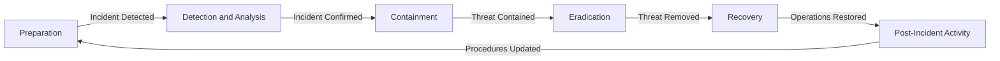
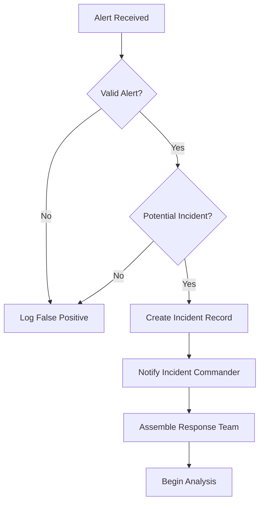

# TACHYON: SECURITY INCIDENT RESPONSE PLAN

**Document ID:** TACHYON-SEC-005-V1.0
**Date:** February 2026
**Status:** Approved for Implementation
**Classification:** Security Operations Documentation
**Compliance Level:** ISO/IEC 27035:2016, NIST SP 800-61 Rev. 2

---

## TABLE OF CONTENTS

1. [Introduction](#1-introduction)
2. [Incident Response Principles](#2-incident-response-principles)
3. [Incident Response Framework](#3-incident-response-framework)
4. [Incident Classification](#4-incident-classification)
5. [Response Procedures](#5-response-procedures)
6. [Containment Procedures](#6-containment-procedures)
7. [Eradication Procedures](#7-eradication-procedures)
8. [Recovery Procedures](#8-recovery-procedures)
9. [Post-Incident Activities](#9-post-incident-activities)
10. [References](#10-references)

---

## 1. INTRODUCTION

### 1.1. Document Purpose

This document establishes a comprehensive Security Incident Response Plan (SIRP) for the Tachyon toolchain, providing a structured methodology for detecting, responding to, and recovering from security incidents. The plan defines roles, responsibilities, procedures, and escalation paths to ensure consistent, effective response to security events across all system components.

### 1.2. Scope and Applicability

This plan applies to all security incidents affecting the Tachyon toolchain, including:
- Desktop application (Tauri-based)
- Server component (Axum-based HTTP/2 server)
- Web frontend (Leptos/Bun-based)
- Data storage systems (Git repositories, SQLite databases)
- Build infrastructure (Nix flakes, CI/CD pipelines)
- Third-party dependencies and supply chain

The plan covers both local-first deployment and centralized server deployment modes, addressing the unique security challenges of each operational context.

### 1.3. Document Dependencies

This document depends on the following documents:
- [TACHYON-STD-V1.0](../../.adrs/ - Coding and Documentation Standards
- [TACHYON-SEC-REQ-V1.0](../../.adrs/ - Security Requirements
- [TACHYON-SEC-DES-V1.0](../../.adrs/ - Security Design
- [TACHYON-ADR-001-V1.0](../../.adrs/adr-001-three-tier-jit-compilation.md) - Rust Language Decision
- [TACHYON-ADR-010-V1.0](../../.adrs/adr-010-synchronization-primitives.md) - Security Architecture
- [TACHYON-TMA-V1.0](../../.adrs/ - Threat Model Analysis

### 1.4. Key Objectives

The Security Incident Response Plan aims to achieve the following objectives:

1. **Minimize Impact:** Reduce the duration and impact of security incidents on Tachyon operations
2. **Preserve Evidence:** Maintain chain of custody for forensic investigation and legal proceedings
3. **Ensure Communication:** Provide timely, accurate communication to stakeholders
4. **Facilitate Recovery:** Enable rapid restoration of normal operations
5. **Enable Learning:** Capture lessons learned to improve security posture
6. **Maintain Compliance:** Adhere to regulatory requirements and industry standards
7. **Protect Reputation:** Preserve trust with users and stakeholders

### 1.5. Incident Definition

A **security incident** is defined as an event that compromises the confidentiality, integrity, or availability of Tachyon system assets, or indicates a potential compromise that may affect these properties.

**Examples of security incidents include:**
- Unauthorized access to user accounts or administrative systems
- Data breach or exfiltration of sensitive documentation
- Ransomware or malware infection
- Denial of service attacks affecting system availability
- Supply chain compromise through dependency poisoning
- Privilege escalation vulnerabilities being exploited
- Configuration errors leading to unauthorized access
- Physical theft or loss of equipment containing sensitive data

**Non-incidents** (events that do not require incident response activation):
- Failed authentication attempts without successful breach
- Routine security alerts that are false positives
- Scheduled maintenance activities
- Minor operational issues without security implications
- Known vulnerabilities being addressed through patch management

---

## 2. INCIDENT RESPONSE PRINCIPLES

### 2.1. Foundational Principles

The Tachyon Security Incident Response Plan is founded on the following principles, which guide all incident response activities and decision-making processes.

#### 2.1.1. Speed and Efficiency

**Principle:** Rapid detection and response minimize incident impact.

**Implementation:**
- Automated monitoring and alerting for security events
- Pre-defined playbooks for common incident types
- 24/7 on-call rotation for critical response roles
- Automated containment mechanisms where feasible
- Streamlined communication channels for incident coordination

**Rationale:** The time between incident onset and containment directly correlates with incident severity and cost. Rapid response limits attacker dwell time, reduces data exposure, and preserves system availability.

#### 2.1.2. Accuracy and Thoroughness

**Principle:** Response actions must be based on accurate information and thorough analysis.

**Implementation:**
- Verification of incident indicators before escalation
- Comprehensive evidence collection and preservation
- Multiple-source validation of threat intelligence
- Detailed documentation of all response actions
- Peer review of critical response decisions

**Rationale:** Inaccurate assessment leads to inappropriate response actions, potentially exacerbating the incident or disrupting legitimate operations. Thorough analysis ensures effective, targeted response.

#### 2.1.3. Communication and Transparency

**Principle:** Stakeholders receive timely, accurate information about incidents.

**Implementation:**
- Pre-defined communication templates for different audiences
- Regular status updates during active incidents
- Clear distinction between confirmed facts and preliminary assessments
- Post-incident summaries with lessons learned
- Confidentiality of sensitive operational details

**Rationale:** Transparent communication maintains trust with users, enables informed decision-making by stakeholders, and supports regulatory compliance requirements.

#### 2.1.4. Least Disruption

**Principle:** Response actions minimize disruption to legitimate operations.

**Implementation:**
- Targeted containment affecting only compromised systems
- Gradual escalation of response measures
- Business continuity considerations in response planning
- Validation of system health before service restoration
- Post-incident monitoring to ensure stability

**Rationale:** Overly aggressive response can cause more disruption than the incident itself. Targeted actions balance security requirements with operational continuity.

### 2.2. Operational Principles

These principles guide day-to-day incident response operations and team interactions.

#### 2.2.1. Chain of Command

**Principle:** Clear authority structure enables efficient decision-making during incidents.

**Implementation:**
- Defined incident commander role with ultimate authority
- Escalation paths for exceeding incident commander authority
- Delegation of technical tasks while maintaining oversight
- Documentation of all command decisions
- Regular drills to practice command structure

**Rationale:** Clear command structure prevents decision paralysis during high-pressure situations and ensures accountability for response actions.

#### 2.2.2. Evidence Preservation

**Principle:** All evidence is preserved for forensic analysis and legal proceedings.

**Implementation:**
- Write-once, read-many storage for audit logs
- Cryptographic signing of evidence to prevent tampering
- Chain of custody documentation for all evidence
- Isolation of affected systems before forensic imaging
- Secure storage of evidence with access controls

**Rationale:** Proper evidence preservation enables root cause analysis, supports legal action if required, and provides data for lessons learned activities.

#### 2.2.3. Continuous Improvement

**Principle:** Each incident improves future response capabilities.

**Implementation:**
- Mandatory post-incident reviews for all significant incidents
- Integration of lessons learned into response playbooks
- Regular updates to detection and response tools
- Metrics collection and analysis of response performance
- Training updates based on incident trends

**Rationale:** Continuous improvement ensures the incident response capability evolves to address emerging threats and operational lessons.

### 2.3. Legal and Regulatory Principles

These principles ensure incident response activities comply with legal and regulatory requirements.

#### 2.3.1. Legal Compliance

**Principle:** All response activities comply with applicable laws and regulations.

**Implementation:**
- Legal counsel consultation for significant incidents
- Data breach notification requirements awareness
- Evidence collection respecting privacy laws
- Coordination with law enforcement when appropriate
- Documentation of legal considerations in incident records

**Rationale:** Non-compliance can result in legal liability, regulatory penalties, and reputational damage. Legal guidance ensures appropriate response actions.

#### 2.3.2. Privacy Protection

**Principle:** User privacy is protected during incident response activities.

**Implementation:**
- Access controls for sensitive user data
- Data minimization in evidence collection
- Secure storage and disposal of user data
- Privacy impact assessments for response procedures
- User notification when data access is required

**Rationale:** Privacy protection maintains user trust and complies with regulations such as GDPR and CCPA.

---

## 3. INCIDENT RESPONSE FRAMEWORK

### 3.1. Response Methodology Overview

The Tachyon Security Incident Response Plan adopts the NIST SP 800-61 Rev. 2 Computer Security Incident Handling Guide framework, providing a structured approach to incident response. This methodology ensures consistent, effective response across all incident types and severity levels.

**Framework Benefits:**
- Standardized processes enable predictable response times
- Clear roles and responsibilities reduce confusion during incidents
- Documented procedures support training and knowledge transfer
- Metrics collection enables continuous improvement
- Compliance with industry standards and best practices

### 3.2. NIST Incident Response Phases

The NIST framework defines four primary phases of incident response, each with specific objectives and activities.

#### 3.2.1. Phase 1: Preparation

**Objective:** Establish and maintain incident response capability before incidents occur.

**Key Activities:**

1. **Incident Response Team Formation**
   - Define incident response team (IRT) structure and roles
   - Establish on-call rotation and escalation procedures
   - Document team member contact information and availability
   - Conduct regular training and tabletop exercises
   - Maintain skills matrix and identify training gaps

2. **Detection and Analysis Capabilities**
   - Deploy comprehensive monitoring and logging infrastructure
   - Implement automated alerting for security events
   - Establish baseline metrics for anomaly detection
   - Configure SIEM (Security Information and Event Management) systems
   - Integrate threat intelligence feeds for proactive detection

3. **Containment and Eradication Procedures**
   - Develop playbooks for common incident types
   - Document system isolation and shutdown procedures
   - Establish backup and restoration procedures
   - Implement automated containment mechanisms
   - Define criteria for escalating containment measures

4. **Communication and Notification**
   - Create communication templates for different stakeholders
   - Establish notification requirements and timelines
   - Define escalation paths for incident severity
   - Maintain contact lists for external parties (legal, PR, regulators)
   - Document internal communication channels and procedures

5. **Post-Incident Activity**
   - Establish lessons learned process and documentation requirements
   - Define metrics collection and analysis procedures
   - Create incident report templates and approval workflows
   - Schedule regular incident review meetings
   - Maintain incident history database for trend analysis

**Preparation Deliverables:**
- Incident Response Plan (this document)
- Incident Response Team roster with contact information
- Incident playbooks for common scenarios
- Communication templates and notification lists
- Monitoring and alerting configuration documentation
- Training materials and exercise schedules
- Evidence collection and preservation procedures

#### 3.2.2. Phase 2: Detection and Analysis

**Objective:** Identify and analyze potential security incidents to determine scope and severity.

**Key Activities:**

1. **Incident Detection**
   - Monitor security alerts and event logs
   - Analyze anomalous behavior patterns
   - Correlate events across multiple data sources
   - Validate indicators of compromise (IoCs)
   - Assess potential impact on Tachyon operations

2. **Incident Triage**
   - Classify incident type and severity level
   - Determine affected systems and data scope
   - Assess business impact and urgency
   - Identify required response team members
   - Initiate incident response team notification

3. **Incident Analysis**
   - Collect and preserve evidence from affected systems
   - Analyze attack vectors and techniques used
   - Determine attacker capabilities and persistence mechanisms
   - Identify root cause and contributing factors
   - Assess potential for lateral movement or additional compromise

4. **Incident Documentation**
   - Create incident record with unique identifier
   - Document all detection and analysis activities
   - Maintain timeline of incident events
   - Record decisions and rationale for response actions
   - Preserve evidence chain of custody

**Detection and Analysis Deliverables:**
- Incident record with classification and severity
- Evidence collection with chain of custody
- Incident timeline and analysis report
- Initial containment recommendations
- Stakeholder notification status

#### 3.2.3. Phase 3: Containment, Eradication, and Recovery

**Objective:** Limit incident impact, remove threat, and restore normal operations.

**Key Activities:**

1. **Containment**
   - Implement short-term containment to prevent further damage
   - Isolate affected systems from network
   - Revoke compromised credentials and sessions
   - Block malicious network traffic or endpoints
   - Deploy additional monitoring for containment validation

2. **Eradication**
   - Remove malicious code, accounts, or configurations
   - Patch vulnerabilities exploited during incident
   - Remove attacker persistence mechanisms
   - Validate complete removal of threat
   - Implement controls to prevent recurrence

3. **Recovery**
   - Restore affected systems from clean backups
   - Validate system integrity before returning to production
   - Monitor for signs of re-infection
   - Update security controls based on lessons learned
   - Conduct post-incident testing and validation

**Containment, Eradication, and Recovery Deliverables:**
- Containment validation report
- Eradication confirmation and root cause analysis
- System restoration documentation
- Post-recovery validation results
- Updated security controls and configurations

#### 3.2.4. Phase 4: Post-Incident Activity

**Objective:** Learn from incidents and improve incident response capability.

**Key Activities:**

1. **Lessons Learned**
   - Conduct post-incident review meeting
   - Identify what went well and what needs improvement
   - Document lessons learned and action items
   - Update incident response procedures and playbooks
   - Share lessons with relevant teams and stakeholders

2. **Metrics Collection**
   - Collect incident response time metrics
   - Analyze incident trends and patterns
   - Assess effectiveness of response procedures
   - Identify training needs based on incident data
   - Track improvement metrics over time

3. **Reporting and Documentation**
   - Complete incident report with all details
   - Obtain management review and approval
   - Archive incident records for future reference
   - Update threat model based on incident findings
   - Communicate lessons learned to broader organization

**Post-Incident Activity Deliverables:**
- Post-incident review meeting minutes
- Lessons learned document with action items
- Updated incident response procedures
- Incident metrics and trend analysis
- Final incident report with management approval

### 3.3. Incident Response Lifecycle

The incident response lifecycle represents the continuous cycle of preparation, detection, response, and improvement.



**Lifecycle Characteristics:**
- **Continuous Improvement:** Each incident informs preparation for future incidents
- **Feedback Loop:** Lessons learned feed back into preparation phase
- **Metrics-Driven:** Quantitative data guides process improvements
- **Adaptive:** Procedures evolve based on incident trends and emerging threats

### 3.4. Incident Response Team Structure

The Incident Response Team (IRT) is organized to provide comprehensive coverage of incident response activities.

#### 3.4.1. Incident Commander

**Role:** Overall authority and coordination for incident response.

**Responsibilities:**
- Declare incident activation and deactivation
- Coordinate all incident response activities
- Make containment, eradication, and recovery decisions
- Manage incident communication and stakeholder updates
- Escalate incidents requiring additional authority
- Approve final incident report and closure

**Required Skills:**
- Leadership and decision-making under pressure
- Comprehensive understanding of Tachyon architecture
- Incident response experience and training
- Communication skills for stakeholder management
- Understanding of legal and regulatory requirements

#### 3.4.2. Technical Response Team

**Role:** Technical execution of containment, eradication, and recovery activities.

**Responsibilities:**
- Analyze technical aspects of incident
- Implement containment measures on affected systems
- Eradicate threats and patch vulnerabilities
- Restore systems from backups or clean configurations
- Validate system integrity and security

**Required Skills:**
- Deep technical knowledge of Tachyon components
- Forensic analysis and evidence collection
- System administration and troubleshooting
- Understanding of security tools and techniques
- Experience with incident containment and recovery

#### 3.4.3. Communications Team

**Role:** Manage internal and external communication during incidents.

**Responsibilities:**
- Draft and distribute stakeholder notifications
- Coordinate with legal, PR, and compliance teams
- Maintain incident status updates
- Handle media inquiries and public statements
- Document all communication activities

**Required Skills:**
- Clear and concise communication
- Understanding of crisis communication principles
- Knowledge of legal and regulatory notification requirements
- Media relations experience
- Sensitivity to stakeholder concerns

#### 3.4.4. Legal and Compliance Team

**Role:** Ensure legal and regulatory compliance during incident response.

**Responsibilities:**
- Advise on legal implications of incident
- Ensure compliance with data breach notification laws
- Coordinate with law enforcement if required
- Review incident documentation for legal risks
- Provide guidance on evidence handling and preservation

**Required Skills:**
- Legal expertise in cybersecurity and data protection
- Understanding of applicable regulations (GDPR, CCPA, etc.)
- Experience with law enforcement coordination
- Knowledge of evidence handling requirements
- Risk assessment for legal exposure

---

## 4. INCIDENT CLASSIFICATION

### 4.1. Classification Framework

Incident classification provides a standardized approach to categorize security events based on type, severity, and impact. This framework enables consistent response decisions, appropriate resource allocation, and accurate communication to stakeholders.

**Classification Benefits:**
- Standardized incident categorization across Tachyon components
- Clear severity-based response time objectives
- Appropriate escalation and notification requirements
- Metrics collection for trend analysis
- Efficient resource allocation based on incident priority

### 4.2. Incident Types

Incidents are classified by primary attack vector or security objective, aligning with the STRIDE methodology from the threat model.

#### 4.2.1. Spoofing Incidents (SEC-001)

**Definition:** Incidents where an adversary impersonates a legitimate user, system, or process to gain unauthorized access.

**Subcategories:**
- **SEC-001-A:** User Identity Spoofing - Credential theft, session hijacking, phishing
- **SEC-001-B:** System Component Spoofing - DNS spoofing, server impersonation, build system spoofing
- **SEC-001-C:** Certificate Spoofing - Invalid certificates, certificate authority compromise

**Detection Indicators:**
- Unusual login patterns or locations
- Failed authentication attempts from multiple sources
- Session anomalies (multiple concurrent sessions, unusual session duration)
- Certificate validation failures
- DNS resolution anomalies

**Example Scenarios:**
- Attacker uses stolen credentials to access user account
- Malicious server mimicking legitimate Tachyon server endpoint
- Compromised build system injecting malicious artifacts

#### 4.2.2. Tampering Incidents (SEC-002)

**Definition:** Incidents where an adversary modifies data or code without authorization.

**Subcategories:**
- **SEC-002-A:** Data Tampering - Database modification, file system tampering, cache poisoning
- **SEC-002-B:** Code Tampering - Source code modification, binary patching, build system compromise
- **SEC-002-C:** Dependency Tampering - Dependency poisoning, supply chain compromise

**Detection Indicators:**
- Database integrity check failures
- Git repository commit anomalies
- File modification outside normal operations
- Checksum or signature verification failures
- Unexpected changes in audit logs

**Example Scenarios:**
- Attacker modifies documentation content in SQLite database
- Malicious code injected into build process
- Compromised dependency adding backdoor functionality

#### 4.2.3. Information Disclosure Incidents (SEC-003)

**Definition:** Incidents where an adversary gains unauthorized access to sensitive information.

**Subcategories:**
- **SEC-003-A:** Data Exfiltration - Unauthorized data extraction, bulk data download
- **SEC-003-B:** Unauthorized Access - Privilege escalation, access control bypass, IDOR
- **SEC-003-C:** Log Leakage - Sensitive information in logs, verbose error messages

**Detection Indicators:**
- Unusual data access patterns or volumes
- Access to sensitive data by unauthorized users
- Large data transfers to external endpoints
- Failed authorization attempts followed by success
- Sensitive information in application logs

**Example Scenarios:**
- Attacker exploits IDOR vulnerability to access confidential documents
- Privilege escalation allows access to administrative functions
- Error messages expose database structure or credentials

#### 4.2.4. Denial of Service Incidents (SEC-004)

**Definition:** Incidents where an adversary disrupts system availability by overwhelming resources or exploiting vulnerabilities.

**Subcategories:**
- **SEC-004-A:** Resource Exhaustion - Volumetric DDoS, protocol DDoS, memory exhaustion
- **SEC-004-B:** Logic-Based DoS - Algorithmic complexity attacks, deadlock induction, infinite loops
- **SEC-004-C:** Application-Level DoS - Slowloris, request flooding, cache poisoning

**Detection Indicators:**
- Unusual traffic volumes or patterns
- Resource utilization spikes (CPU, memory, disk, network)
- Increased error rates or timeouts
- Connection pool exhaustion
- Slow response times across multiple endpoints

**Example Scenarios:**
- Volumetric DDoS attack overwhelming Axum server bandwidth
- Slowloris attack exhausting WebSocket connection pool
- Algorithmic complexity attack triggering worst-case search performance

#### 4.2.5. Elevation of Privilege Incidents (SEC-005)

**Definition:** Incidents where an adversary gains higher privileges than authorized.

**Subcategories:**
- **SEC-005-A:** Privilege Escalation - Exploiting vulnerabilities for higher privileges
- **SEC-005-B:** Access Control Bypass - Circumventing authorization checks
- **SEC-005-C:** Session Hijacking - Stealing or forging session tokens

**Detection Indicators:**
- Users performing actions outside normal permissions
- Failed authorization attempts followed by success
- Session anomalies (unexpected user context, privilege changes)
- Access to administrative functions by non-administrative users
- Unusual privilege changes in audit logs

**Example Scenarios:**
- Attacker exploits vulnerability to gain system administrator access
- Broken access control allows access to restricted documents
- Session fixation forces user to use attacker-controlled session

### 4.3. Severity Levels

Severity levels classify incidents based on potential impact, urgency, and required response resources. Severity determines response time objectives, notification requirements, and escalation paths.

#### 4.3.1. Severity Level 1: Critical (SEC-CRIT)

**Definition:** Incidents with immediate, severe impact on Tachyon operations, data confidentiality, or user safety.

**Characteristics:**
- Active exploitation with confirmed data breach
- Complete system outage or service unavailability
- Compromise of critical systems or data
- Regulatory or legal compliance violation imminent
- Significant financial or reputational impact

**Response Time Objectives:**
- **Detection to Triage:** Within 15 minutes
- **Triage to Containment:** Within 1 hour
- **Containment to Eradication:** Within 4 hours
- **Eradication to Recovery:** Within 24 hours

**Notification Requirements:**
- Immediate notification to Incident Commander
- Executive notification within 1 hour
- Legal and compliance team notification within 2 hours
- User notification as required by regulations (typically within 72 hours)
- External stakeholders (customers, partners) as appropriate

**Resource Requirements:**
- Full Incident Response Team activation
- Executive leadership involvement
- Legal and compliance team engagement
- External forensics or security vendor engagement as needed
- 24/7 monitoring until incident resolution

**Example Scenarios:**
- Active ransomware attack encrypting production data
- Confirmed exfiltration of sensitive user data
- Complete compromise of build infrastructure
- Zero-day vulnerability being actively exploited

#### 4.3.2. Severity Level 2: High (SEC-HIGH)

**Definition:** Incidents with significant impact requiring urgent response to prevent escalation.

**Characteristics:**
- Potential data breach requiring investigation
- Partial system outage or degraded service
- Compromise of non-critical systems
- Potential regulatory or legal compliance issues
- Moderate financial or reputational impact

**Response Time Objectives:**
- **Detection to Triage:** Within 1 hour
- **Triage to Containment:** Within 4 hours
- **Containment to Eradication:** Within 8 hours
- **Eradication to Recovery:** Within 48 hours

**Notification Requirements:**
- Notification to Incident Commander within 30 minutes
- Executive notification within 4 hours
- Legal and compliance team notification within 8 hours
- User notification if data breach confirmed
- External stakeholders if service impact significant

**Resource Requirements:**
- Core Incident Response Team activation
- Technical team lead involvement
- Legal consultation if data breach suspected
- Extended monitoring during business hours

**Example Scenarios:**
- Suspicious data access patterns requiring investigation
- Partial service degradation affecting multiple users
- Compromise of development or staging environment
- Vulnerability exploitation requiring emergency patching

#### 4.3.3. Severity Level 3: Medium (SEC-MED)

**Definition:** Incidents with moderate impact requiring investigation and remediation.

**Characteristics:**
- Potential security concern without confirmed impact
- Limited system impact or user disruption
- Configuration errors with security implications
- Minor policy violations
- Low financial or reputational impact

**Response Time Objectives:**
- **Detection to Triage:** Within 4 hours
- **Triage to Containment:** Within 8 hours
- **Containment to Eradication:** Within 24 hours
- **Eradication to Recovery:** Within 72 hours

**Notification Requirements:**
- Notification to Incident Commander within 2 hours
- Executive notification within 24 hours if escalation needed
- Legal consultation if data access confirmed
- User notification if personal data affected

**Resource Requirements:**
- Technical team lead or designated responder
- Standard monitoring during business hours
- Documentation and lessons learned required

**Example Scenarios:**
- Failed brute force attack attempts on authentication endpoints
- Minor configuration error exposing non-sensitive data
- Suspicious activity requiring investigation
- Vulnerability identified in non-critical component

#### 4.3.4. Severity Level 4: Low (SEC-LOW)

**Definition:** Incidents with minimal impact requiring documentation and monitoring.

**Characteristics:**
- Security concern with no confirmed impact
- Individual user issue without system-wide implications
- False positive security alert
- Policy violation without security implications
- No financial or reputational impact

**Response Time Objectives:**
- **Detection to Triage:** Within 8 hours
- **Triage to Resolution:** Within 24 hours
- Documentation and closure within 48 hours

**Notification Requirements:**
- Documentation in incident tracking system
- No executive notification required unless pattern emerges
- No user notification required

**Resource Requirements:**
- Individual responder assignment
- Standard documentation requirements
- Review during regular team meetings

**Example Scenarios:**
- Single failed login attempt from unknown IP
- False positive security alert
- Minor policy violation (e.g., weak password)
- Individual user account locked due to failed attempts

### 4.4. Severity Classification Matrix

The following matrix provides guidance for classifying incidents based on multiple factors.

| Factor | Critical | High | Medium | Low |
|----------|-----------|-------|--------|-----|
| **Data Impact** | Confirmed breach of sensitive data | Potential data breach | No data access confirmed | No data access suspected |
| **System Impact** | Complete outage or critical system compromise | Partial outage or degraded service | Limited impact or individual user issues | No system impact |
| **User Impact** | All users affected | Significant user base affected | Limited users affected | Individual user affected |
| **Regulatory Impact** | Imminent violation | Potential violation | Possible violation | No regulatory concern |
| **Financial Impact** | Significant (> $100K) | Moderate ($10K - $100K) | Minor (< $10K) | Negligible |
| **Reputational Impact** | Severe public exposure | Moderate public concern | Limited internal concern | No reputational concern |
| **Response Time** | Immediate (<1 hour) | Urgent (<4 hours) | Standard (<24 hours) | Routine (<48 hours) |

### 4.5. Classification Process

Incident classification follows a structured process to ensure consistent categorization.

**Process Steps:**

1. **Initial Classification (Detection Phase)**
   - Assign preliminary incident type based on detection source
   - Estimate severity based on initial indicators
   - Document classification rationale
   - Initiate appropriate response procedures

2. **Classification Refinement (Triage Phase)**
   - Verify initial classification with additional analysis
   - Adjust severity based on confirmed impact
   - Update incident record with refined classification
   - Escalate if severity increases

3. **Final Classification (Post-Incident)**
   - Confirm incident type based on complete analysis
   - Validate severity assessment against actual impact
   - Document classification accuracy and lessons learned
   - Update classification guidelines if needed

**Classification Decision Criteria:**
- Use the most severe applicable category
- Escalate severity if uncertainty exists
- Document rationale for all classification decisions
- Re-classify if new information becomes available

---

## 5. RESPONSE PROCEDURES

### 5.1. Detection Procedures

Detection procedures define the systematic approach to identifying potential security incidents across Tachyon components. Early and accurate detection minimizes incident impact and enables rapid response.

#### 5.1.1. Detection Sources

Tachyon system implements multiple detection sources to provide comprehensive security monitoring.

**Monitoring Infrastructure:**

1. **Application-Level Monitoring**
   - **Purpose:** Detect security events at application layer
   - **Components:** Axum server, Tauri desktop, Leptos web frontend
   - **Events Monitored:**
     - Authentication and authorization failures
     - Unusual access patterns or data access
     - Input validation failures
     - Privilege escalation attempts
     - Configuration changes
   - **Implementation:** Tracing instrumentation with structured logging

2. **Network-Level Monitoring**
   - **Purpose:** Detect network-based attacks and anomalies
   - **Components:** HTTP/2 server, WebSocket connections, IPC communication
   - **Events Monitored:**
     - Unusual traffic patterns or volumes
     - Protocol anomalies or violations
     - Geographic anomalies in access patterns
     - Port scanning or reconnaissance attempts
     - Man-in-the-Middle indicators
   - **Implementation:** Network monitoring tools with alerting

3. **Infrastructure-Level Monitoring**
   - **Purpose:** Detect infrastructure-level security events
   - **Components:** Host systems, databases, build infrastructure
   - **Events Monitored:**
     - Resource utilization anomalies
     - File system modifications
     - Process creation or termination
     - System log anomalies
     - Build system changes
   - **Implementation:** Host-based intrusion detection systems

4. **Dependency and Supply Chain Monitoring**
   - **Purpose:** Detect supply chain attacks and dependency compromises
   - **Components:** Cargo dependencies, Nix flakes, build artifacts
   - **Events Monitored:**
     - Vulnerability disclosures in dependencies
     - Dependency version changes
     - Build artifact integrity failures
     - Checksum or signature verification failures
   - **Implementation:** Automated vulnerability scanning and integrity verification

#### 5.1.2. Detection Indicators

Detection indicators provide specific patterns or events that may indicate security incidents.

**Indicators of Compromise (IoCs):**

| Indicator Type | Description | Severity | Response Action |
|-----------------|-------------|------------|-----------------|
| **Authentication Anomalies** | Multiple failed logins, unusual login locations, concurrent sessions | Medium-High | Investigate user activity, lock accounts if confirmed compromise |
| **Privilege Escalation** | User performing actions outside normal permissions | High | Revoke privileges, investigate access logs |
| **Data Exfiltration** | Large data transfers, unusual data access patterns | High-Critical | Block transfers, investigate data access |
| **System Anomalies** | Unusual process activity, file modifications, configuration changes | Medium | Investigate system state, isolate if suspicious |
| **Network Anomalies** | Unusual traffic patterns, protocol violations, geographic anomalies | Medium | Investigate network activity, block if malicious |
| **Dependency Issues** | Vulnerable dependencies, integrity failures, build anomalies | Medium | Update dependencies, investigate build system |

**Detection Thresholds:**

- **False Positive Reduction:** Configure detection thresholds to minimize false positives while maintaining sensitivity
- **Severity-Based Thresholds:** Different thresholds for different severity levels
- **Context-Aware Detection:** Consider normal usage patterns when evaluating events
- **Adaptive Thresholds:** Adjust thresholds based on historical data and trends

#### 5.1.3. Detection Workflow

The detection workflow provides a structured process for evaluating potential security incidents.

**Workflow Steps:**

1. **Alert Reception**
   - Receive alert from monitoring system
   - Validate alert source and integrity
   - Assign initial severity based on alert type
   - Log alert in incident tracking system

2. **Initial Assessment**
   - Review alert details and context
   - Check for related alerts or patterns
   - Evaluate against baseline metrics
   - Determine if alert indicates potential incident

3. **Triage Decision**
   - **If False Positive:**
     - Document false positive rationale
     - Update detection thresholds if needed
     - Close alert without incident activation
   - **If Potential Incident:**
     - Create incident record
     - Assign incident type and preliminary severity
     - Initiate incident response team notification
     - Begin detailed analysis

4. **Incident Activation**
   - Notify Incident Commander
   - Assemble incident response team
   - Begin evidence collection
   - Initiate containment planning

**Detection Workflow Diagram:**



### 5.2. Notification Procedures

Notification procedures ensure timely communication to appropriate stakeholders during security incidents.

#### 5.2.1. Notification Requirements

Notification requirements are based on incident severity and stakeholder category.

**Stakeholder Categories:**

1. **Internal Stakeholders**
   - **Incident Response Team:** Immediate notification for all incidents
   - **Executive Leadership:** Notification based on severity (Critical: 1 hour, High: 4 hours, Medium: 24 hours)
   - **Legal and Compliance:** Notification for incidents with regulatory implications
   - **Technical Teams:** Notification for incidents requiring technical response
   - **Support Teams:** Notification for incidents affecting user-facing services

2. **External Stakeholders**
   - **Users:** Notification if personal data affected or service significantly impacted
   - **Customers:** Notification if business operations affected
   - **Partners:** Notification if shared systems or data affected
   - **Regulators:** Notification if required by data breach laws (typically 72 hours)
   - **Law Enforcement:** Notification if criminal activity suspected

**Notification Timelines:**

| Severity | Internal Notification | External Notification | Regulatory Notification |
|-----------|---------------------|---------------------|----------------------|
| **Critical** | Within 1 hour | As appropriate | Within 72 hours (or as required) |
| **High** | Within 4 hours | If service impact significant | If data breach confirmed |
| **Medium** | Within 24 hours | If personal data affected | If regulatory concern exists |
| **Low** | Within 48 hours | Not required | Not required |

#### 5.2.2. Notification Templates

Standardized notification templates ensure consistent, accurate communication.

**Internal Notification Template:**

```
SUBJECT: Security Incident Alert - [INCIDENT-ID] - [SEVERITY]

INCIDENT DETAILS:
- Incident ID: [INCIDENT-ID]
- Severity: [SEVERITY]
- Incident Type: [INCIDENT-TYPE]
- Detection Time: [TIMESTAMP]
- Affected Systems: [SYSTEMS]
- Current Status: [STATUS]

INITIAL ASSESSMENT:
[Brief description of initial assessment]

ACTIONS TAKEN:
[List of actions taken so far]

NEXT STEPS:
[List of planned next steps]

CONTACT:
- Incident Commander: [NAME] - [CONTACT]
- Technical Lead: [NAME] - [CONTACT]

For questions or additional information, contact the Incident Commander.
```

**User Notification Template:**

```
SUBJECT: Important Security Notice - [DATE]

Dear [User Name],

We are writing to inform you of a security incident that may affect your account.

INCIDENT DETAILS:
- What happened: [Brief, non-technical description]
- When it happened: [Date range]
- What information was affected: [If applicable]
- What we are doing: [Remediation actions]

WHAT YOU NEED TO DO:
[Specific user actions, if any]

FOR MORE INFORMATION:
- Contact: [Support contact]
- FAQ: [Link to FAQ if available]
- Updates: [Where to find updates]

We apologize for any inconvenience and appreciate your patience as we resolve this issue.

Sincerely,
The Tachyon Team
```

#### 5.2.3. Communication Channels

Designated communication channels ensure reliable information flow during incidents.

**Internal Channels:**

1. **Incident Response Channel**
   - **Purpose:** Real-time coordination during active incidents
   - **Platform:** Secure messaging platform (e.g., Slack, Teams)
   - **Access:** Incident response team members only
   - **Usage:** Tactical coordination, status updates, decision-making

2. **Executive Update Channel**
   - **Purpose:** Regular updates to executive leadership
   - **Platform:** Email or executive briefing channel
   - **Frequency:** Based on severity (Critical: Hourly, High: Every 4 hours, Medium: Daily)
   - **Content:** High-level status, business impact, timeline

3. **All-Hands Channel**
   - **Purpose:** Organization-wide announcements for significant incidents
   - **Platform:** Email or all-hands messaging
   - **Usage:** Major incidents requiring organization-wide awareness

**External Channels:**

1. **User Communication**
   - **Platform:** Email, in-app notifications, status page
   - **Timing:** As required by severity and regulations
   - **Content:** User-friendly language, actionable guidance

2. **Public Communication**
   - **Platform:** Website, social media, press releases
   - **Timing:** For incidents with public visibility
   - **Content:** Approved messaging from communications team

#### 5.2.4. Notification Escalation

Escalation procedures ensure appropriate stakeholders are notified as incident severity increases.

**Escalation Triggers:**

- Severity increases from initial classification
- Additional systems or data affected
- Regulatory or legal implications identified
- Public visibility or media attention
- Business impact exceeds initial assessment

**Escalation Process:**

1. **Assess Escalation Need**
   - Review current incident status and impact
   - Determine if additional stakeholders need notification
   - Identify appropriate escalation level

2. **Execute Escalation**
   - Notify additional stakeholders using appropriate templates
   - Update incident record with escalation details
   - Communicate escalation to existing stakeholders

3. **Maintain Communication**
   - Provide regular updates to all notified stakeholders
   - Adjust update frequency based on severity
   - Ensure consistent messaging across all channels

---

## 6. CONTAINMENT PROCEDURES

### 6.1. Containment Strategy

Containment procedures limit incident impact by preventing further damage or data loss. Containment is implemented progressively, starting with least disruptive measures and escalating as needed.

**Containment Principles:**

1. **Speed Over Perfection:** Implement containment quickly, even if temporary
2. **Minimal Disruption:** Use least disruptive containment measures first
3. **Evidence Preservation:** Avoid actions that destroy evidence
4. **Validation:** Verify containment effectiveness before proceeding
5. **Escalation:** Escalate containment measures if initial measures insufficient

### 6.2. Containment Strategies by Incident Type

Different incident types require specific containment strategies tailored to the attack vector.

#### 6.2.1. Spoofing Incidents Containment

**Objective:** Prevent unauthorized access by spoofed identities or systems.

**Containment Measures:**

1. **User Identity Spoofing (SEC-001-A)**
   - Revoke all active sessions for affected user accounts
   - Force password reset and require MFA re-enrollment
   - Lock affected accounts pending investigation
   - Implement additional authentication challenges
   - Monitor for subsequent spoofing attempts

2. **System Component Spoofing (SEC-001-B)**
   - Block network traffic to spoofed endpoints
   - Implement certificate pinning for critical endpoints
   - Validate DNS resolution with DNSSEC
   - Verify SSH host keys before Git operations
   - Rotate credentials for affected systems

**Validation Criteria:**
- No successful authentication with spoofed credentials
- Network traffic to spoofed endpoints blocked
- Certificate validation failures resolved
- DNS resolution verified as legitimate

#### 6.2.2. Tampering Incidents Containment

**Objective:** Prevent further data or code modification.

**Containment Measures:**

1. **Data Tampering (SEC-002-A)**
   - Isolate affected databases or file systems
   - Revoke write access to affected data stores
   - Implement read-only mode for affected systems
   - Restore data from clean backups
   - Validate data integrity before restoration

2. **Code Tampering (SEC-002-B)**
   - Halt build processes and deployments
   - Revoke compromised build artifacts
   - Isolate build infrastructure from network
   - Restore source code from clean repositories
   - Rebuild with verified dependencies

**Validation Criteria:**
- No further modifications to affected data
- Build processes halted and isolated
- Source code integrity verified
- Dependency checksums validated

#### 6.2.3. Information Disclosure Incidents Containment

**Objective:** Prevent further unauthorized data access.

**Containment Measures:**

1. **Data Exfiltration (SEC-003-A)**
   - Block network egress to external endpoints
   - Implement data loss prevention (DLP) rules
   - Revoke access for affected user accounts
   - Audit recent data access for scope assessment
   - Implement additional monitoring for exfiltration indicators

2. **Unauthorized Access (SEC-003-B)**
   - Revoke escalated privileges immediately
   - Lock affected user accounts
   - Implement additional authorization checks
   - Audit access logs for additional compromise
   - Patch access control vulnerabilities

**Validation Criteria:**
- No further unauthorized data access detected
- Network egress to suspicious endpoints blocked
- Privilege revocation confirmed in audit logs
- Access control vulnerabilities patched

#### 6.2.4. Denial of Service Incidents Containment

**Objective:** Restore system availability and prevent service disruption.

**Containment Measures:**

1. **Resource Exhaustion (SEC-004-A)**
   - Implement rate limiting at network edge
   - Block traffic from attack sources
   - Scale resources horizontally if available
   - Implement caching to reduce load
   - Engage DDoS protection services

2. **Logic-Based DoS (SEC-004-B)**
   - Implement input validation to prevent exploitation
   - Add timeouts for resource-intensive operations
   - Implement circuit breakers for failing services
   - Rate limit expensive operations
   - Deploy patches for vulnerable algorithms

**Validation Criteria:**
- System resources returning to normal levels
- Attack traffic blocked or mitigated
- Service availability restored
- Response times within acceptable ranges

#### 6.2.5. Elevation of Privilege Incidents Containment

**Objective:** Prevent further privilege escalation and unauthorized actions.

**Containment Measures:**

1. **Privilege Escalation (SEC-005-A)**
   - Revoke escalated privileges immediately
   - Isolate affected systems from network
   - Audit all actions taken with escalated privileges
   - Patch privilege escalation vulnerabilities
   - Implement additional privilege validation

2. **Access Control Bypass (SEC-005-B)**
   - Implement additional authorization checks
   - Block access to bypassed resources
   - Audit all access attempts to affected resources
   - Patch access control vulnerabilities
   - Review and update permission configurations

**Validation Criteria:**
- No further privilege escalation detected
- Escalated privileges revoked
- Access control vulnerabilities patched
- Additional authorization checks implemented

### 6.3. Isolation Procedures

Isolation procedures provide systematic methods for isolating affected systems while preserving evidence.

#### 6.3.1. System Isolation

**Network Isolation:**

1. **Identify Affected Systems**
   - Determine scope of compromise based on analysis
   - Identify network segments and dependencies
   - Assess impact of isolation on other systems

2. **Implement Network Isolation**
   - Configure firewall rules to block traffic to/from affected systems
   - Disconnect affected systems from network if necessary
   - Implement VLAN segmentation if applicable
   - Document isolation configuration changes

3. **Validate Isolation**
   - Verify no traffic flows to/from isolated systems
   - Confirm other systems remain operational
   - Test isolation effectiveness with controlled traffic

**System Isolation Considerations:**
- Preserve evidence on isolated systems
- Maintain access for forensic analysis
- Document all isolation actions
- Plan restoration procedures before isolation

#### 6.3.2. Account Isolation

**Account Lockout Procedures:**

1. **Identify Compromised Accounts**
   - Review authentication logs for suspicious activity
   - Correlate with incident indicators
   - Determine scope of account compromise

2. **Implement Account Lockout**
   - Lock affected user accounts
   - Revoke all active sessions
   - Invalidate API keys and tokens
   - Notify affected users of account lockout

3. **Validate Account Isolation**
   - Confirm no successful authentication with compromised credentials
   - Verify session revocation in audit logs
   - Monitor for subsequent compromise attempts

**Account Isolation Considerations:**
- Preserve evidence of compromise
- Document lockout rationale and duration
- Plan account restoration procedures
- Communicate clearly with affected users

#### 6.3.3. Service Isolation

**Service Shutdown Procedures:**

1. **Identify Affected Services**
   - Determine which services are compromised or at risk
   - Assess dependencies and impact of service shutdown
   - Identify alternative service delivery methods

2. **Implement Service Shutdown**
   - Gracefully shutdown affected services
   - Redirect traffic to maintenance pages
   - Disable service endpoints if needed
   - Document shutdown actions and timeline

3. **Validate Service Isolation**
   - Confirm service is no longer accessible
   - Verify no data flow through service
   - Assess impact on dependent services

**Service Isolation Considerations:**
- Preserve service logs and state for analysis
- Plan service restoration procedures
- Communicate service unavailability to users
- Minimize disruption to dependent services

### 6.4. Containment Validation

Validation procedures confirm that containment measures are effective before proceeding to eradication.

**Validation Checklist:**

- [ ] No further incident activity detected
- [ ] Containment measures verified as effective
- [ ] Evidence preserved on affected systems
- [ ] Containment impact assessed and documented
- [ ] Stakeholders notified of containment status

**Validation Timeline:**

- **Initial Validation:** Within 30 minutes of containment implementation
- **Continuous Monitoring:** Ongoing monitoring for 24 hours post-containment
- **Final Validation:** Before proceeding to eradication phase

**Escalation Criteria:**

If containment is not effective within defined timeframes:
- Escalate containment measures
- Consider broader isolation (network segment, entire environment)
- Engage additional technical resources
- Reassess incident severity and classification

---

## 7. ERADICATION PROCEDURES

### 7.1. Eradication Strategy

Eradication procedures remove the threat from Tachyon systems and address root causes to prevent recurrence. Eradication follows containment, after threat analysis is complete and containment is validated.

**Eradication Principles:**

1. **Root Cause Analysis:** Understand and address the underlying vulnerability
2. **Complete Removal:** Remove all components of the threat
3. **Validation:** Verify complete threat removal before proceeding
4. **Prevention:** Implement controls to prevent recurrence
5. **Documentation:** Document all eradication actions and rationale

### 7.2. Eradication Procedures by Incident Type

Different incident types require specific eradication procedures addressing the attack vector and root cause.

#### 7.2.1. Spoofing Incidents Eradication

**Objective:** Remove spoofed identities and prevent future spoofing.

**Eradication Measures:**

1. **User Identity Spoofing (SEC-001-A)**
   - Identify and close all attacker-created accounts
   - Strengthen authentication requirements (password complexity, MFA enforcement)
   - Implement additional fraud detection mechanisms
   - Review and update authentication policies
   - Educate affected users on security best practices

2. **System Component Spoofing (SEC-001-B)**
   - Remove spoofed systems or endpoints from network
   - Implement stronger authentication for inter-component communication
   - Update DNS records to prevent spoofing
   - Rotate all credentials for affected systems
   - Implement certificate pinning for all critical endpoints

**Validation Criteria:**
- Spoofed identities removed from system
- Authentication mechanisms strengthened
- No further spoofing attempts detected
- Certificate pinning implemented and validated

#### 7.2.2. Tampering Incidents Eradication

**Objective:** Remove malicious modifications and restore integrity.

**Eradication Measures:**

1. **Data Tampering (SEC-002-A)**
   - Restore tampered data from clean backups
   - Implement data integrity verification mechanisms
   - Review and update access controls
   - Implement change detection and alerting
   - Audit recent data modifications for additional tampering

2. **Code Tampering (SEC-002-B)**
   - Restore source code from clean repositories
   - Remove malicious code or dependencies
   - Rebuild all artifacts from verified sources
   - Implement code signing for build artifacts
   - Review and update build security controls

**Validation Criteria:**
- Data integrity verified against known good state
- Source code verified as clean
- Build artifacts signed and verified
- No further tampering detected

#### 7.2.3. Information Disclosure Incidents Eradication

**Objective:** Close unauthorized access paths and prevent future disclosure.

**Eradication Measures:**

1. **Data Exfiltration (SEC-003-A)**
   - Identify and close exfiltration channels
   - Implement data loss prevention (DLP) controls
   - Review and update data access policies
   - Implement additional monitoring for data access patterns
   - Audit data access for additional unauthorized access

2. **Unauthorized Access (SEC-003-B)**
   - Patch access control vulnerabilities
   - Review and update authorization policies
   - Implement additional access logging and monitoring
   - Audit all permissions for excessive grants
   - Review and update role definitions

**Validation Criteria:**
- Unauthorized access paths closed
- Access control vulnerabilities patched
- Additional monitoring implemented
- No further unauthorized access detected

#### 7.2.4. Denial of Service Incidents Eradication

**Objective:** Address vulnerabilities exploited for DoS and implement resilience.

**Eradication Measures:**

1. **Resource Exhaustion (SEC-004-A)**
   - Implement resource quotas and limits
   - Add rate limiting to all endpoints
   - Implement caching to reduce resource consumption
   - Add autoscaling for resource-intensive operations
   - Implement circuit breakers for failing services

2. **Logic-Based DoS (SEC-004-B)**
   - Patch vulnerabilities exploited for DoS
   - Implement input validation and sanitization
   - Add timeouts for all operations
   - Implement algorithm complexity limits
   - Add request size limits

**Validation Criteria:**
- Vulnerabilities patched and verified
- Resource limits implemented and tested
- No further DoS attempts successful
- System resilience improved

#### 7.2.5. Elevation of Privilege Incidents Eradication

**Objective:** Remove privilege escalation paths and strengthen authorization.

**Eradication Measures:**

1. **Privilege Escalation (SEC-005-A)**
   - Patch privilege escalation vulnerabilities
   - Review and update privilege assignment policies
   - Implement principle of least privilege enforcement
   - Add additional privilege validation checks
   - Audit privilege assignments for compliance

2. **Access Control Bypass (SEC-005-B)**
   - Patch access control vulnerabilities
   - Review and update access control implementations
   - Implement additional authorization layers
   - Add indirect object references
   - Implement mandatory access control reviews

**Validation Criteria:**
- Privilege escalation vulnerabilities patched
- Access controls reviewed and updated
- Additional authorization layers implemented
- No further privilege escalation detected

### 7.3. Remediation Procedures

Remediation procedures address the root cause of incidents and implement controls to prevent recurrence.

#### 7.3.1. Vulnerability Remediation

**Patch Management Process:**

1. **Identify Vulnerabilities**
   - Document all vulnerabilities exploited during incident
   - Assess vulnerability severity and CVSS scores
   - Identify affected components and versions
   - Determine patch availability and testing requirements

2. **Test Patches**
   - Test patches in non-production environment
   - Validate patch effectiveness against vulnerability
   - Assess patch impact on system functionality
   - Document testing results and any issues

3. **Deploy Patches**
   - Schedule patch deployment during maintenance windows
   - Deploy patches to all affected systems
   - Verify patch deployment success
   - Monitor for patch-related issues

**Patch Management Considerations:**
- Prioritize critical and high-severity vulnerabilities
- Coordinate patching across all affected components
- Document patch deployment and rollback procedures
- Monitor for patch-related issues post-deployment

#### 7.3.2. Configuration Remediation

**Configuration Review Process:**

1. **Identify Configuration Issues**
   - Review configuration changes during incident
   - Identify insecure or misconfigured settings
   - Assess configuration against security baselines
   - Document configuration issues and impact

2. **Update Configurations**
   - Update insecure configurations to secure defaults
   - Remove unnecessary or risky configuration options
   - Implement configuration validation
   - Document configuration changes

**Configuration Remediation Considerations:**
- Use security baselines for configuration validation
- Implement configuration change approval processes
- Document configuration changes for audit trail
- Review configurations regularly for security compliance

#### 7.3.3. Process Remediation

**Process Improvement Process:**

1. **Identify Process Gaps**
   - Review processes exploited during incident
   - Identify gaps in security processes
   - Assess process effectiveness against threats
   - Document process gaps and impact

2. **Update Processes**
   - Update security processes to address gaps
   - Implement additional process controls
   - Train staff on updated processes
   - Document process changes

**Process Remediation Considerations:**
- Involve process owners in remediation planning
- Test updated processes before full deployment
- Provide training and documentation for process changes
- Monitor process effectiveness post-implementation

### 7.4. Eradication Validation

Validation procedures confirm complete threat removal and effective remediation.

**Validation Checklist:**

- [ ] All threat components removed from system
- [ ] Vulnerabilities patched and verified
- [ ] Configurations updated and validated
- [ ] Processes updated and tested
- [ ] No further incident activity detected
- [ ] Security controls implemented to prevent recurrence

**Validation Timeline:**

- **Initial Validation:** Within 4 hours of eradication implementation
- **Monitoring Period:** 48 hours of enhanced monitoring
- **Final Validation:** Before proceeding to recovery phase

**Rollback Criteria:**

If eradication is not effective or causes issues:
- Rollback eradication changes
- Reassess threat analysis and root cause
- Implement alternative eradication measures
- Escalate to additional technical resources

---

## 8. RECOVERY PROCEDURES

### 8.1. Recovery Strategy

Recovery procedures restore Tachyon systems to normal operations after containment and eradication. Recovery focuses on restoring functionality, validating integrity, and resuming operations with enhanced security.

**Recovery Principles:**

1. **Validation Before Restoration:** Verify systems are clean before restoring operations
2. **Gradual Restoration:** Restore systems incrementally to validate stability
3. **Monitoring Post-Restoration:** Enhanced monitoring after restoration to detect issues
4. **Communication:** Keep stakeholders informed of recovery progress
5. **Documentation:** Document all recovery actions and validation results

### 8.2. System Recovery Procedures

System recovery procedures restore affected Tachyon components to operational state.

#### 8.2.1. Desktop Application Recovery

**Recovery Steps:**

1. **Validate Desktop Application**
   - Scan application files for malware
   - Verify application integrity with checksums
   - Review application logs for malicious activity
   - Validate configuration files

2. **Restore Desktop Application**
   - Reinstall application from clean source if compromised
   - Restore configuration from clean backups
   - Re-establish local data synchronization
   - Validate application functionality

3. **Validate Desktop Recovery**
   - Test all desktop application features
   - Verify data synchronization is working
   - Confirm no malicious processes running
   - Monitor for stability issues

**Desktop Recovery Considerations:**
- Preserve user data during recovery
- Communicate recovery steps to users
- Provide alternative access if recovery extended
- Monitor for data synchronization issues

#### 8.2.2. Server Component Recovery

**Recovery Steps:**

1. **Validate Server Infrastructure**
   - Scan server systems for malware
   - Verify server application integrity
   - Review server logs for persistence mechanisms
   - Validate network configurations

2. **Restore Server Services**
   - Restore server application from clean deployment
   - Restore database from clean backups
   - Re-establish network connectivity
   - Restart server services in controlled manner

3. **Validate Server Recovery**
   - Test all server endpoints
   - Verify database integrity and functionality
   - Confirm authentication and authorization working
   - Monitor for performance issues

**Server Recovery Considerations:**
- Coordinate recovery with dependent services
- Implement gradual traffic restoration
- Monitor for resource utilization issues
- Have rollback plan ready if issues arise

#### 8.2.3. Web Frontend Recovery

**Recovery Steps:**

1. **Validate Web Assets**
   - Scan web assets for malicious code
   - Verify asset integrity with SRI hashes
   - Review web application logs
   - Validate CDN configuration if applicable

2. **Restore Web Frontend**
   - Deploy clean web assets
   - Restore web application configuration
   - Re-establish WebSocket connections
   - Clear browser caches if needed

3. **Validate Web Recovery**
   - Test all web application features
   - Verify WebSocket connectivity
   - Confirm no malicious content in rendered pages
   - Monitor for client-side issues

**Web Recovery Considerations:**
- Clear browser caches to prevent cached malicious content
- Communicate recovery to web users
- Monitor for client-side issues
- Test across different browsers and platforms

#### 8.2.4. Data Recovery Procedures

**Recovery Steps:**

1. **Validate Data Integrity**
   - Verify backup integrity with checksums
   - Validate backup creation timestamps
   - Review backup logs for compromise indicators
   - Test backup restoration in staging

2. **Restore Data**
   - Restore databases from clean backups
   - Restore Git repositories from clean states
   - Restore user data from clean backups
   - Rebuild search indexes from clean data

3. **Validate Data Recovery**
   - Verify data integrity post-restoration
   - Test data access and functionality
   - Confirm no data loss or corruption
   - Validate data synchronization

**Data Recovery Considerations:**
- Use point-in-time recovery if available
- Validate data integrity before restoring to production
- Document data loss or corruption
- Implement additional data protection post-recovery

### 8.3. Account Recovery Procedures

Account recovery procedures restore user access after security incidents.

**Recovery Steps:**

1. **Validate User Accounts**
   - Review account activity for compromise indicators
   - Verify account security settings
   - Check for unauthorized account changes
   - Validate account credentials

2. **Restore User Accounts**
   - Unlock compromised accounts
   - Reset credentials and require password change
   - Re-enroll MFA for affected users
   - Restore account permissions to appropriate levels

3. **Validate Account Recovery**
   - Confirm users can successfully authenticate
   - Verify MFA is working correctly
   - Test account permissions and access
   - Monitor for subsequent compromise attempts

**Account Recovery Considerations:**
- Communicate clearly with affected users
- Provide guidance on secure password practices
- Monitor for account abuse post-recovery
- Implement additional authentication challenges if needed

### 8.4. Recovery Validation

Validation procedures confirm successful recovery and system stability.

**Validation Checklist:**

- [ ] All systems restored to operational state
- [ ] System integrity verified with checksums
- [ ] All functionality tested and working
- [ ] Data integrity validated
- [ ] No malicious activity detected
- [ ] Performance within acceptable ranges
- [ ] Users can access systems successfully

**Validation Timeline:**

- **Initial Validation:** Within 1 hour of system restoration
- **Functional Validation:** Within 4 hours of system restoration
- **Stability Monitoring:** 24-48 hours of enhanced monitoring
- **Final Validation:** Before declaring incident resolved

**Rollback Criteria:**

If recovery is not successful or causes issues:
- Rollback to previous stable state
- Reassess recovery procedures
- Implement alternative recovery approach
- Escalate to additional technical resources

### 8.5. Post-Recovery Monitoring

Enhanced monitoring procedures detect issues or recurrence after recovery.

**Monitoring Activities:**

1. **System Monitoring**
   - Enhanced monitoring for 24-48 hours post-recovery
   - Monitor for performance issues
   - Watch for resource utilization anomalies
   - Track error rates and patterns

2. **Security Monitoring**
   - Enhanced security event monitoring
   - Monitor for recurrence of incident indicators
   - Review authentication and authorization patterns
   - Watch for new or unusual activity

3. **User Monitoring**
   - Monitor user support requests for issues
   - Track user-reported problems
   - Assess user satisfaction and feedback
   - Identify any widespread issues

**Monitoring Escalation:**

If issues detected during post-recovery monitoring:
- Investigate issues immediately
- Implement remediation if needed
- Communicate issues to stakeholders
- Consider rollback if issues are severe

---

## 9. POST-INCIDENT ACTIVITIES

### 9.1. Post-Incident Analysis

Post-incident analysis captures lessons learned and identifies improvements to prevent future incidents.

#### 9.1.1. Incident Timeline Reconstruction

**Timeline Development Process:**

1. **Gather Timeline Data**
   - Collect all incident logs and records
   - Interview incident response team members
   - Review monitoring and alerting data
   - Document key events and timestamps

2. **Construct Timeline**
   - Create chronological sequence of incident events
   - Document detection, containment, eradication, and recovery phases
   - Record all decisions and rationale
   - Identify timeline gaps or uncertainties

**Timeline Elements:**

| Phase | Event | Timestamp | Decision | Rationale |
|--------|-------|-----------|----------|----------|
| Detection | Initial alert received | [Timestamp] | [Rationale] |
| Triage | Incident classified | [Timestamp] | [Rationale] |
| Containment | Containment implemented | [Timestamp] | [Rationale] |
| Eradication | Threat removed | [Timestamp] | [Rationale] |
| Recovery | Systems restored | [Timestamp] | [Rationale] |

#### 9.1.2. Root Cause Analysis

**Root Cause Analysis Process:**

1. **Identify Contributing Factors**
   - Analyze how incident occurred
   - Identify vulnerabilities or weaknesses exploited
   - Assess process or configuration failures
   - Review detection and response effectiveness

2. **Determine Root Cause**
   - Use Five Whys technique to drill down to root cause
   - Identify systemic issues vs. isolated incidents
   - Assess human factors and process gaps
   - Document root cause with supporting evidence

**Root Cause Analysis Framework:**

```
Incident: [Incident Description]

Why did it happen? [Direct cause]
Why did that happen? [Contributing factor 1]
Why did that happen? [Contributing factor 2]
Why did that happen? [Contributing factor 3]
Why did that happen? [Root cause]
```

#### 9.1.3. Impact Assessment

**Impact Analysis Categories:**

1. **Technical Impact**
   - Systems affected and duration of outage
   - Data loss or corruption
   - Performance degradation
   - Recovery time and effort

2. **Business Impact**
   - User impact and service disruption
   - Financial impact (direct and indirect)
   - Productivity loss
   - Customer or partner impact

3. **Security Impact**
   - Data breach scope and sensitivity
   - Compliance violations or notifications
   - Reputation impact
   - Regulatory or legal exposure

**Impact Assessment Template:**

| Impact Category | Description | Severity | Duration | Affected Users | Financial Impact |
|----------------|-------------|----------|----------|----------------|---------------|
| Technical | [Description] | [Severity] | [Duration] | [Count] | [Amount] |
| Business | [Description] | [Severity] | [Duration] | [Count] | [Amount] |
| Security | [Description] | [Severity] | [Duration] | [Count] | [Amount] |

### 9.2. Lessons Learned

Lessons learned capture insights and improvements to prevent future incidents.

#### 9.2.1. Lessons Identification

**Lessons Categories:**

1. **Detection Lessons**
   - What worked well in detection?
   - What could be improved in detection?
   - Were detection thresholds appropriate?
   - Was detection timely enough?

2. **Response Lessons**
   - What response procedures were effective?
   - What procedures need improvement?
   - Were containment measures appropriate?
   - Was eradication complete and effective?

3. **Process Lessons**
   - What processes worked well?
   - What processes need improvement?
   - Were communication procedures effective?
   - Were escalation procedures appropriate?

4. **Technical Lessons**
   - What technical controls were effective?
   - What technical controls need improvement?
   - Were configurations appropriate?
   - Were vulnerabilities properly patched?

**Lessons Learned Template:**

```
Incident: [Incident ID]
Date: [Date]

What Went Well:
1. [Positive outcome or process]
2. [Positive outcome or process]
3. [Positive outcome or process]

What Needs Improvement:
1. [Area needing improvement]
2. [Area needing improvement]
3. [Area needing improvement]

Recommended Actions:
1. [Specific action with owner and timeline]
2. [Specific action with owner and timeline]
3. [Specific action with owner and timeline]
```

#### 9.2.2. Action Item Tracking

**Action Item Management:**

1. **Document Action Items**
   - Create specific, actionable items from lessons learned
   - Assign owners and due dates
   - Prioritize actions by impact and effort
   - Track completion status

2. **Implement Action Items**
   - Execute action items according to timeline
   - Validate effectiveness of implemented actions
   - Update procedures and documentation
   - Train staff on new procedures

**Action Item Tracking Template:**

| ID | Action Item | Owner | Priority | Due Date | Status | Completion Date |
|----|-------------|--------|----------|--------|----------------|
| 1 | [Description] | [Name] | [Priority] | [Date] | [Status] | [Date] |
| 2 | [Description] | [Name] | [Priority] | [Date] | [Status] | [Date] |

### 9.3. Incident Reporting

Incident reporting documents the complete incident for stakeholders and regulatory requirements.

#### 9.3.1. Incident Report Structure

**Report Sections:**

1. **Executive Summary**
   - Incident overview and impact
   - Key findings and recommendations
   - High-level timeline and metrics

2. **Incident Details**
   - Complete incident timeline
   - Detection, containment, eradication, and recovery details
   - Systems and data affected

3. **Root Cause Analysis**
   - Root cause determination
   - Contributing factors
   - Vulnerabilities or weaknesses exploited

4. **Impact Assessment**
   - Technical, business, and security impact
   - Financial and regulatory impact
   - User and customer impact

5. **Lessons Learned**
   - Key insights and findings
   - Recommended improvements
   - Action items with owners and timelines

6. **Appendices**
   - Evidence logs
   - Technical details
   - Communication records
   - Supporting documentation

#### 9.3.2. Report Approval Process

**Approval Workflow:**

1. **Draft Review**
   - Technical team reviews technical accuracy
   - Legal team reviews compliance implications
   - Communications team reviews messaging
   - Management reviews business impact

2. **Approval**
   - Incident Commander approves final report
   - Executive leadership reviews and approves
   - Document approval decisions and any changes

3. **Distribution**
   - Distribute report to stakeholders
   - Archive report in incident database
   - Update threat model based on findings
   - Implement lessons learned and action items

**Report Distribution:**

| Stakeholder | Distribution Method | Timing | Access Level |
|-------------|-------------------|---------|-------------|
| Executive Leadership | Secure email or briefing | Within 7 days | Full |
| Incident Response Team | Internal document system | Within 7 days | Full |
| Legal and Compliance | Secure document system | Within 7 days | Full |
| Regulatory Bodies | As required by regulation | As required | Redacted |
| External Stakeholders | As appropriate | As appropriate | Summary |

### 9.4. Process Improvement

Process improvement updates incident response procedures based on lessons learned.

**Improvement Categories:**

1. **Detection Improvements**
   - Update detection thresholds and rules
   - Implement new monitoring capabilities
   - Improve alerting and notification
   - Enhance threat intelligence integration

2. **Response Improvements**
   - Update containment and eradication procedures
   - Improve playbooks for common incident types
   - Enhance automation capabilities
   - Update escalation procedures

3. **Communication Improvements**
   - Update communication templates
   - Improve notification procedures
   - Enhance stakeholder communication
   - Update public communication procedures

4. **Training Improvements**
   - Update training materials based on lessons learned
   - Conduct targeted training on incident response
   - Improve tabletop exercise scenarios
   - Enhance awareness programs

**Process Update Workflow:**

1. **Identify Process Changes**
   - Review lessons learned for process gaps
   - Prioritize changes by impact and effort
   - Document proposed changes

2. **Test Process Changes**
   - Test changes in controlled environment
   - Validate effectiveness of changes
   - Assess impact on existing procedures

3. **Implement Process Changes**
   - Deploy changes to production procedures
   - Train staff on updated procedures
   - Update documentation and playbooks
   - Monitor effectiveness of changes

### 9.5. Metrics Collection and Analysis

Metrics collection enables continuous improvement of incident response capability.

**Key Metrics:**

1. **Detection Metrics**
   - Time to detect incidents
   - Detection accuracy (true positives vs. false positives)
   - Detection source effectiveness
   - Alerting effectiveness

2. **Response Metrics**
   - Time to triage incidents
   - Time to contain incidents
   - Time to eradicate incidents
   - Time to recover incidents

3. **Quality Metrics**
   - Incident recurrence rate
   - Containment effectiveness
   - Eradication completeness
   - Recovery success rate

**Metrics Dashboard:**

| Metric | Current Period | Previous Period | Trend | Target | Status |
|--------|---------------|----------------|-------|-------|--------|
| Detection Time | [Value] | [Value] | [Trend] | [Target] | [Status] |
| Containment Time | [Value] | [Value] | [Trend] | [Target] | [Status] |
| Eradication Time | [Value] | [Value] | [Trend] | [Target] | [Status] |
| Recovery Time | [Value] | [Value] | [Trend] | [Target] | [Status] |
| Incident Recurrence | [Value] | [Value] | [Trend] | [Target] | [Status] |

**Metrics Analysis:**

- Review metrics monthly or quarterly
- Identify trends and patterns
- Assess performance against targets
- Identify areas needing improvement
- Implement improvements based on analysis

---

## 10. REFERENCES

### 10.1. Internal References

This document references internal Tachyon specifications and documentation that provide context and requirements for the Security Incident Response Plan.

**Related Specifications:**

1. [TACHYON-STD-V1.0](../../.adrs/ - Tachyon Coding and Documentation Standards
   - Defines documentation standards and formatting requirements
   - Provides guidance on structure, style, and presentation

2. [TACHYON-SEC-REQ-V1.0](../../.adrs/ - Tachyon Security Requirements
   - Defines security requirements for Tachyon system
   - Provides context for incident response procedures
   - References REQ-SEC-056 through REQ-SEC-100 (Audit Logging)
   - References REQ-SEC-068 through REQ-SEC-070 (Monitoring and Alerting)

3. [TACHYON-SEC-DES-V1.0](../../.adrs/ - Tachyon Security Design
   - Defines security architecture and controls
   - Provides technical context for incident response
   - References authentication, authorization, and encryption mechanisms

4. [TACHYON-TMA-V1.0](../../.adrs/ - Tachyon Threat Model Analysis
   - Provides comprehensive threat analysis using STRIDE methodology
   - Defines threat landscape and adversary profiles
   - References incident types SEC-001 through SEC-005

**Related Architecture Decision Records:**

1. [TACHYON-ADR-001-V1.0](../../.adrs/adr-001-three-tier-jit-compilation.md) - ADR-001: Rust as Primary Language
   - Justifies Rust selection for memory safety and security
   - Provides context for incident response technical procedures
   - References Rust's ownership system and borrow checker

2. [TACHYON-ADR-010-V1.0](../../.adrs/adr-010-synchronization-primitives.md) - ADR-010: Security Architecture
   - Defines defense-in-depth security architecture
   - Provides security principles and controls
   - References memory safety, capability-based access control, and input validation

**Related Tasks:**

1. [TSK-030](../../.adrs/ - Security Architecture Documentation
   - Documents security architecture and controls
   - Provides foundation for incident response procedures

2. [TSK-031](../../.adrs/ - Threat Model Documentation
   - Documents threat analysis and adversary profiles
   - Provides context for incident classification and response

3. [TSK-034](../../.adrs/ - Security Testing and Auditing Documentation
   - Documents security testing procedures
   - Provides proactive measures to prevent incidents

### 10.2. External Standards and Frameworks

This document references industry standards and frameworks that inform incident response best practices.

**Standards and Frameworks:**

1. **NIST SP 800-61 Rev. 2** - Computer Security Incident Handling Guide
   - Provides four-phase incident response framework
   - Defines preparation, detection/analysis, containment/eradication/recovery, and post-incident activity
   - References: https://csrc.nist.gov/pubs/sp/800-61/rev2/

2. **ISO/IEC 27035:2016** - Information Technology - Security Techniques - Information Security Incident Management
   - Provides international standard for incident management
   - Defines incident management principles and processes
   - References: https://www.iso.org/standard/iso-iec-27035

3. **ISO/IEC 27001:2013** - Information Technology - Security Techniques - Information Security Management Systems
   - Provides comprehensive information security management framework
   - Defines incident management within broader security context
   - References: https://www.iso.org/standard/iso-iec-27001

4. **SANS Institute** - Incident Response Framework
   - Provides industry-standard incident response framework
   - Defines six-step incident response process
   - References: https://www.sans.org/white-papers/incident-response

5. **MITRE ATT&CK** - Adversarial Tactics, Techniques, and Common Knowledge
   - Provides adversary behavior classification
   - Informs incident analysis and threat modeling
   - References: https://attack.mitre.org/

**Regulatory Requirements:**

1. **GDPR (General Data Protection Regulation)**
   - Requires notification of personal data breaches within 72 hours
   - Defines data protection and incident response requirements
   - References: https://gdpr-info.eu/

2. **CCPA (California Consumer Privacy Act)**
   - Requires notification of data breaches to California residents
   - Defines data protection and incident response requirements
   - References: https://oag.ca.gov/privacy/ccpa

3. **HIPAA (Health Insurance Portability and Accountability Act)**
   - Requires notification of healthcare data breaches
   - Defines security and incident response requirements for healthcare data
   - References: https://www.hhs.gov/hipaa

### 10.3. Technical References

This document references technical resources and tools that support incident response activities.

**Tachyon-Specific References:**

1. **Tauri Documentation** - https://tauri.app/v1/guides/
   - Provides desktop application security guidance
   - Documents capability-based access control and IPC security

2. **Axum Documentation** - https://docs.rs/axum/
   - Provides HTTP/2 server framework guidance
   - Documents middleware and security features

3. **Leptos Documentation** - https://leptos.dev/
   - Provides web frontend framework guidance
   - Documents client-side security considerations

4. **Tokio Documentation** - https://tokio.rs/
   - Provides async runtime guidance
   - Documents error handling and resilience patterns

**Security Tools and Resources:**

1. **OWASP (Open Web Application Security Project)** - https://owasp.org/
   - Provides web application security resources
   - Documents common vulnerabilities and mitigation strategies

2. **CWE (Common Weakness Enumeration)** - https://cwe.mitre.org/
   - Provides comprehensive weakness catalog
   - Documents vulnerability types and mitigation strategies

3. **CVE (Common Vulnerabilities and Exposures)** - https://cve.mitre.org/
   - Provides vulnerability database
   - Documents known vulnerabilities and patches

4. **NVD (National Vulnerability Database)** - https://nvd.nist.gov/
   - Provides vulnerability database with severity ratings
   - Documents vulnerability analysis and impact assessment

### 10.4. Document Version History

**Version History:**

| Version | Date | Author | Changes |
|---------|------|--------|---------|
| V1.0 | February 2026 | Initial document creation for TSK-035 |

**Approval:**

- **Document Status:** Approved for Implementation
- **Approval Date:** February 2026
- **Approved By:** Security Architect
- **Review Period:** Valid until next major version update

**Next Review:**

- **Scheduled Review:** Annually or as needed
- **Review Triggers:** Significant incidents, major system changes, regulatory updates
- **Review Owner:** Incident Response Team Lead

---

**Document Control Information:**

- **Document ID:** TACHYON-SEC-005-V1.0
- **Classification:** Security Operations Documentation
- **Compliance Level:** ISO/IEC 27035:2016, NIST SP 800-61 Rev. 2
- **Distribution:** Internal use only - Confidential
- **Retention:** Retain until superseded or 7 years after last incident reference

**Contact Information:**

For questions or clarifications regarding this document, contact:
- **Security Team:** security@tachyon.example.com
- **Incident Response Team:** irt@tachyon.example.com

---

**END OF DOCUMENT**

