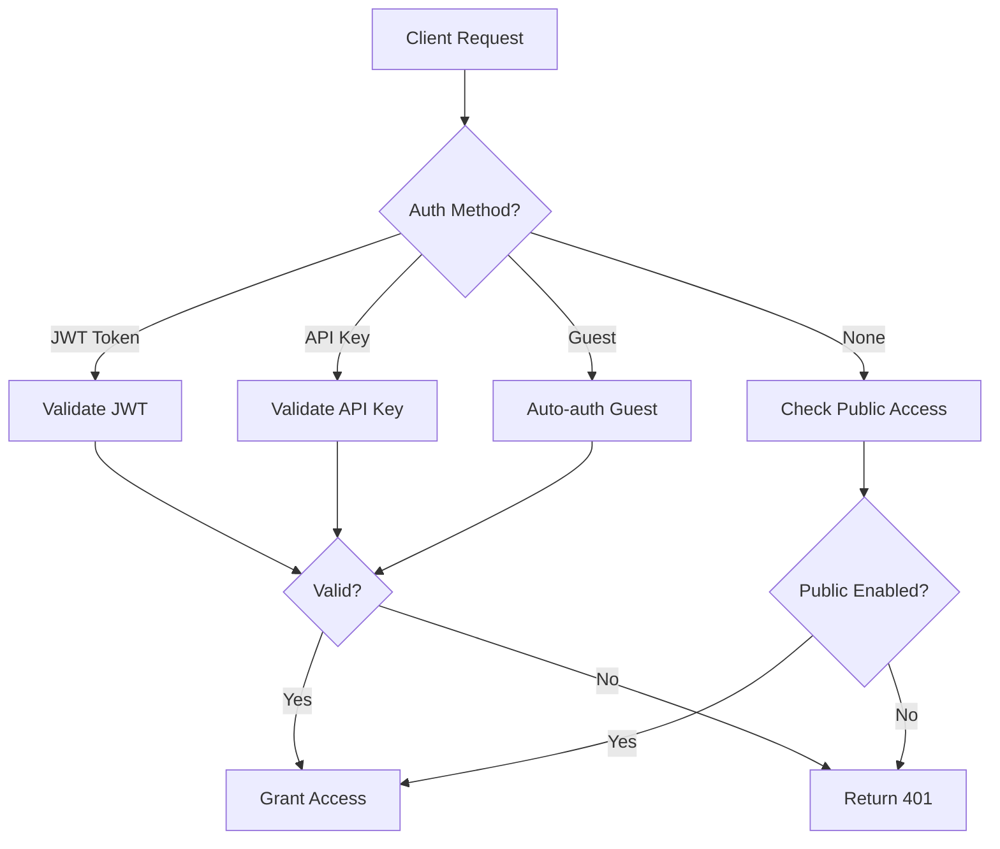
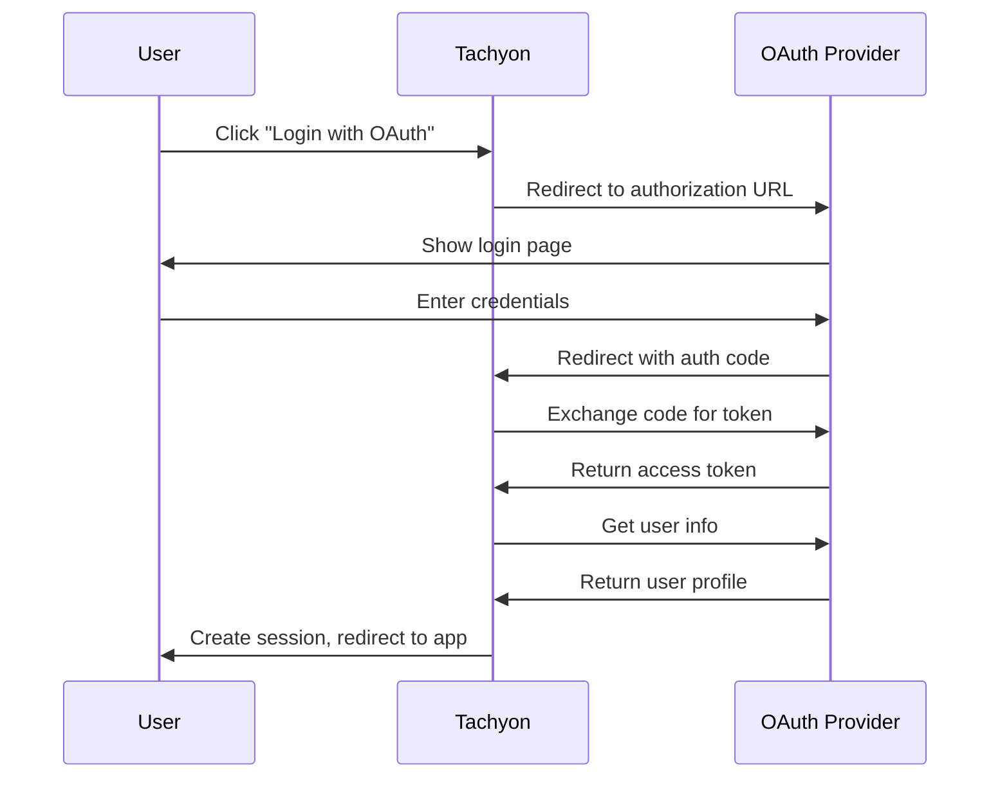

# Authentication Guide

This guide covers authentication methods and setup for Tachyon.

## Overview

Tachyon supports multiple authentication methods:

1. **JWT (JSON Web Tokens)** - Token-based authentication
2. **API Keys** - Service account authentication
3. **Guest Login** - Anonymous access
4. **OAuth/OIDC** - External identity providers (via integration)



## JWT Authentication

### Overview

JWT (JSON Web Token) is the primary authentication method for user sessions.

### Token Structure

```json
{
  "header": {
    "alg": "HS256",
    "typ": "JWT"
  },
  "payload": {
    "sub": "user-uuid",
    "iat": 1234567890,
    "exp": 1234654290,
    "iss": "tachyon-server",
    "aud": "tachyon-client"
  }
}
```

### Obtaining a Token

**Login Endpoint:**
```bash
POST /api/v1/auth/login
Content-Type: application/json

{
  "email": "user@example.com",
  "password": "your-password"
}
```

**Response:**
```json
{
  "token": "eyJhbGciOiJIUzI1NiIsInR5cCI6IkpXVCJ9...",
  "user": {
    "id": "uuid",
    "email": "user@example.com",
    "role": "user"
  }
}
```

### Using the Token

Include the token in the `Authorization` header:

```bash
curl -H "Authorization: Bearer YOUR_JWT_TOKEN" \
  https://api.example.com/api/v1/documents
```

### Token Refresh

Tokens can be refreshed before expiration:

```bash
POST /api/v1/auth/refresh
Authorization: Bearer YOUR_CURRENT_TOKEN
```

### Configuration

```toml
[jwt]
secret = "your-secret-key-minimum-32-characters"
expiration_secs = 86400  # 24 hours
issuer = "tachyon-server"
audience = "tachyon-client"
```

### Best Practices

1. **Secure Secret**: Use a strong, random secret (min 32 characters)
2. **HTTPS Only**: Always use HTTPS in production
3. **Short Expiration**: Use shorter expiration times for better security
4. **Refresh Tokens**: Implement token refresh for long sessions

## API Key Authentication

### Overview

API keys are used for service account authentication and programmatic access.

### Key Format

API keys follow the format: `tchk_<random-string>`

Example: `tchk_1a2b3c4d5e6f7g8h9i0j`

### Creating API Keys

```bash
POST /api/v1/users/me/api-keys
Authorization: Bearer YOUR_JWT_TOKEN
Content-Type: application/json

{
  "name": "CI/CD Pipeline",
  "expires_at": "2026-12-31T23:59:59Z"
}
```

**Response:**
```json
{
  "id": "uuid",
  "name": "CI/CD Pipeline",
  "key": "tchk_1a2b3c4d5e6f7g8h9i0j",
  "created_at": "2026-03-09T12:00:00Z",
  "expires_at": "2026-12-31T23:59:59Z"
}
```

### Using API Keys

Include in the `X-API-Key` header:

```bash
curl -H "X-API-Key: tchk_1a2b3c4d5e6f7g8h9i0j" \
  https://api.example.com/api/v1/documents
```

### Configuration

```toml
[api_keys]
enabled = true
header_name = "X-API-Key"
key_prefix = "tchk_"
```

### Best Practices

1. **Store Securely**: Never commit API keys to version control
2. **Use Environment Variables**: Store keys in environment variables
3. **Rotate Regularly**: Rotate keys periodically
4. **Limit Scope**: Use different keys for different purposes
5. **Set Expiration**: Always set expiration dates

## Guest Authentication

### Overview

Guest authentication allows anonymous users to access Tachyon with limited permissions.

### Enabling Guest Login

```toml
[guest]
guest_login_enabled = true
guest_user_id = "00000000-0000-0000-0000-000000000099"
```

### Guest Login Endpoint

```bash
POST /api/v1/auth/guest
```

**Response:**
```json
{
  "token": "eyJhbGciOiJIUzI1NiIsInR5cCI6IkpXVCJ9...",
  "user": {
    "id": "00000000-0000-0000-0000-000000000099",
    "email": "guest@tachyon.local",
    "role": "guest"
  }
}
```

### Public Access

Enable public document access:

```toml
[guest]
public_notes_enabled = true
```

This allows unauthenticated access to documents marked as public.

### Guest Permissions

Guest users typically have:
- Read-only access to public documents
- No access to private documents
- No administrative capabilities

## OAuth/OIDC Integration

### Overview

Tachyon can integrate with external identity providers via OAuth 2.0 or OpenID Connect.

### Supported Providers

- Kanidm (recommended)
- Auth0
- Okta
- Keycloak
- Custom OAuth/OIDC providers

### Configuration Example

```toml
[oauth]
enabled = true
provider = "kanidm"

[oauth.kanidm]
client_id = "tachyon-client"
client_secret = "${OAUTH_CLIENT_SECRET}"
authorization_url = "https://idm.example.com/oauth2/authorize"
token_url = "https://idm.example.com/oauth2/token"
userinfo_url = "https://idm.example.com/oauth2/userinfo"
redirect_url = "https://docs.example.com/auth/callback"
```

### OAuth Flow



## Session Management

### Session Endpoints

**Get Current Session:**
```bash
GET /api/v1/session
Authorization: Bearer YOUR_TOKEN
```

**Logout:**
```bash
DELETE /api/v1/session
Authorization: Bearer YOUR_TOKEN
```

**List Active Sessions:**
```bash
GET /api/v1/sessions
Authorization: Bearer YOUR_TOKEN
```

**Revoke Session:**
```bash
DELETE /api/v1/sessions/{session_id}
Authorization: Bearer YOUR_TOKEN
```

## Role-Based Access Control (RBAC)

### User Roles

| Role | Permissions |
|------|-------------|
| `admin` | Full system access |
| `editor` | Create, edit, delete documents |
| `viewer` | Read-only access |
| `guest` | Limited read access |

### Checking Permissions

```bash
GET /api/v1/users/me/permissions
Authorization: Bearer YOUR_TOKEN
```

**Response:**
```json
{
  "role": "editor",
  "permissions": [
    "documents:read",
    "documents:create",
    "documents:update",
    "documents:delete"
  ]
}
```

## Security Best Practices

### 1. Use Strong Secrets

```bash
# Generate a secure JWT secret
openssl rand -base64 32
```

### 2. Enable HTTPS

```toml
[server]
enable_tls = true
tls_cert_path = "/path/to/cert.pem"
tls_key_path = "/path/to/key.pem"
```

### 3. Configure CORS Properly

```toml
[cors]
enabled = true
allowed_origins = ["https://your-domain.com"]
allow_credentials = true
```

### 4. Enable Rate Limiting

```toml
[rate_limit]
enabled = true
default_requests_per_minute = 100

[rate_limit.endpoint_limits]
"/api/v1/auth/login" = { max_requests = 5, window_secs = 60 }
```

### 5. Use Security Headers

```toml
[security]
enable_security_headers = true
environment = "production"
enable_hsts = true
```

## Troubleshooting

### Invalid Token

```
Error: Invalid or expired token
```

**Solution:**
- Check token hasn't expired
- Verify JWT secret matches
- Ensure token format is correct

### CORS Errors

```
Error: CORS policy blocked
```

**Solution:**
- Add origin to `allowed_origins`
- Check `allow_credentials` setting
- Verify request headers

### API Key Not Recognized

```
Error: Invalid API key
```

**Solution:**
- Verify key format (should start with `tchk_`)
- Check key hasn't expired
- Ensure `api_keys.enabled = true`

## Next Steps

- [API Key Usage](api-keys.md) - Detailed API key guide
- [Team Management](teams.md) - Manage teams and permissions
- [Security Configuration](configuration.md#security-configuration) - Security settings
