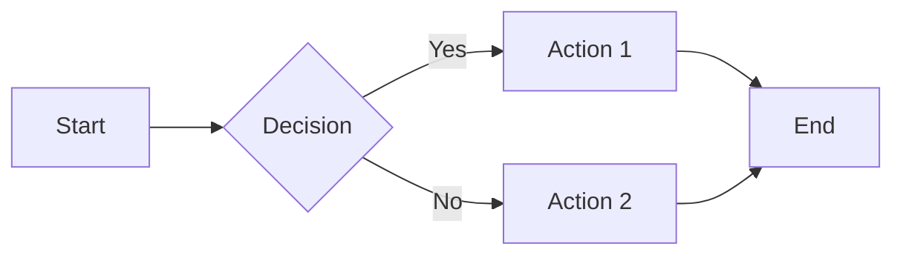

# Feature Overview

Tachyon provides a comprehensive set of features for documentation management.

## Core Features

### Just-In-Time Rendering

Traditional static site generators require a build step. Tachyon renders content on-demand with sub-15ms latency:

| Metric | Performance |
|--------|-------------|
| Render latency | < 15ms |
| Time to first paint | < 100ms |
| Search query | < 100ms |
| File watch response | < 50ms |

### Local-First Architecture

Full functionality without network connectivity:
- All documents stored locally
- Git-based version control
- Offline editing and search
- Sync when connected

### Multi-Mode Operation

| Mode | Use Case |
|------|----------|
| **Desktop** | Personal knowledge management |
| **Server** | Team documentation portal |
| **Static Export** | Deploy to any static host |

## Document Features

### Markdown Support

Full CommonMark and GitHub Flavored Markdown (GFM) support:

```markdown
# Headings
## Level 2
### Level 3

**Bold** and *italic* and ~~strikethrough~~

- Unordered lists
- With multiple items

1. Ordered lists
2. Numbered automatically

> Blockquotes for important notes

[Links](https://example.com) and images: 

Tables:

| Column 1 | Column 2 |
|----------|----------|
| Data 1   | Data 2   |
```

### Code Highlighting

Syntax highlighting for 12+ languages:
- Rust, Python, JavaScript, TypeScript
- JSON, TOML, YAML
- HTML, CSS, SQL
- Bash, Markdown

Three built-in themes: Light, Dark, High Contrast

### Mathematics

Server-side rendering with KaTeX:

**Inline:** `$E = mc^2$` renders as $E = mc^2$

**Block:**
```
$$
\sum_{i=1}^{n} i = \frac{n(n+1)}{2}
$$
```

### Diagrams

Mermaid.js integration for diagrams:



### Frontmatter

YAML frontmatter for metadata:

```yaml
---
title: API Documentation
author: Jane Doe
date: 2024-01-15
tags: [api, reference]
access: restricted
groups: [developers, admins]
---
```

## Search Features

### Full-Text Search

Powered by Tantivy search engine:
- Sub-100ms query response
- Fuzzy matching
- Phrase search
- Boolean operators

### Advanced Queries

| Query | Description |
|-------|-------------|
| `hello world` | Documents containing both terms |
| `"exact phrase"` | Exact phrase match |
| `tag:api` | Filter by tag |
| `author:john` | Filter by author |
| `created:>2024-01-01` | Date range filter |
| `status:published` | Filter by status |

### Search Operators

```
AND    - Both terms required (default)
OR     - Either term
NOT    - Exclude term
*      - Wildcard
?      - Single character wildcard
```

## Collaboration Features

### Real-Time Editing

Server mode provides real-time collaboration:
- Live cursors showing collaborator positions
- Presence indicators (who's viewing)
- Conflict resolution
- Edit history

### Comments and Annotations

Add comments to any document:
- Thread-based discussions
- @mentions for notifications
- Resolve threads

### Version History

Complete document history:
- View all previous versions
- Compare versions (diff view)
- Restore previous versions
- Branch history

## Security Features

### Role-Based Access Control

Server mode implements comprehensive RBAC:

| Role | Permissions |
|------|-------------|
| **Viewer** | Read public documents |
| **Editor** | Read, create, edit documents |
| **Reviewer** | Editor + approve changes |
| **Admin** | Full access, user management |

### Document-Level Security

Control access via frontmatter:

```yaml
---
access: restricted
groups: [security-team, admins]
---
```

### Block Redaction

Hide sensitive content from unauthorized users:

```markdown
::: internal
This content is only visible to internal team members.
:::
```

### Audit Logging

Complete audit trail in server mode:
- Document access logs
- Edit history
- Authentication events
- Administrative actions

## Git Integration

### Automatic Commits

Changes are automatically committed:
- Meaningful commit messages
- Timestamp tracking
- Author attribution

### Branch Visualization

View Git history visually:
- Commit graph
- Branch timeline
- Merge history

### External Editor Sync

Work with any editor:
- VS Code, Neovim, JetBrains
- No file locks
- Bidirectional sync
- Conflict detection

## Customization

### Themes

Three built-in themes with custom CSS support:

```toml
[rendering]
syntax_theme = "dark"
custom_css = "./custom.css"
```

### Templates

Create document templates:

```markdown
---
template: meeting-notes
---

# Meeting: {{title}}
Date: {{date}}
Attendees: {{attendees}}

## Agenda

## Notes

## Action Items
```

### Plugins

Extend functionality with plugins:
- Custom renderers
- Import/export formats
- Integrations (Jira, Slack, etc.)

## Performance

| Operation | Latency |
|-----------|---------|
| Document render | < 15ms |
| Search query | < 100ms |
| File watch trigger | < 50ms |
| WebSocket update | < 10ms |
| Cache hit | < 1ms |

## Feature Guides

For detailed information on specific features:

- [Document Management](documents.md)
- [Search Functionality](search.md)
- [Collaboration](collaboration.md)
- [Team Management](teams.md)
- [Permissions](permissions.md)
