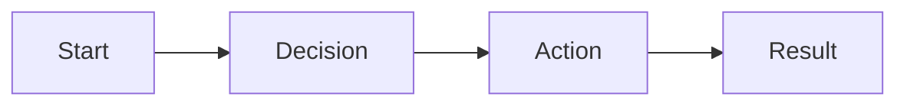
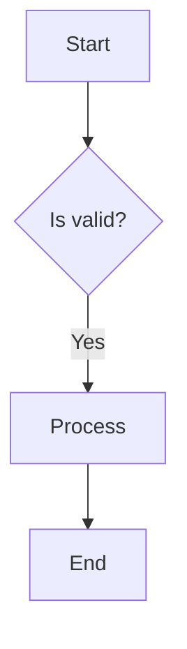
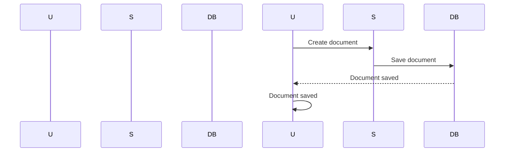

# TACHYON: USER GUIDE

**Document ID:** TACHYON-USER-001-V1.0
**Date:** February 2026
**Status:** Approved for Distribution
**Classification:** User Documentation
**Compliance Level:** ISO/IEC 26514:2021, IEEE 1063-2001

---

## TABLE OF CONTENTS

1. [Introduction](#1-introduction)
2. [Getting Started](#2-getting-started)
3. [Core Features](#3-core-features)
4. [Desktop Application](#4-desktop-application)
5. [Web Interface](#5-web-interface)
6. [Server Operations](#6-server-operations)
7. [Advanced Features](#7-advanced-features)
8. [Best Practices](#8-best-practices)
9. [References](#9-references)

---

## 1. INTRODUCTION

### 1.1. Document Purpose

This user guide provides comprehensive instructions for using the Tachyon toolchain, a modern documentation and content management system designed for efficiency, security, and collaboration. This guide covers all user-facing functionality across desktop, web, and server deployment modes.

### 1.2. System Overview

Tachyon is a three-tier toolchain comprising:

- **Desktop Application:** A local-first application built with Tauri and Rust, providing native performance with full offline capabilities
- **Server Component:** An HTTP/2 server built with Axum and Rust, enabling centralized deployment and collaboration
- **Web Interface:** A browser-based interface built with Leptos and Bun, providing cross-platform accessibility

The system leverages Git for version control and content storage, ensuring data integrity and enabling seamless collaboration workflows.

### 1.3. Target Audience

This guide is intended for:
- **Content Creators:** Users who create, edit, and manage documentation
- **Collaborators:** Users who work in teams on shared documentation projects
- **System Administrators:** Users responsible for deploying and maintaining Tachyon servers
- **Power Users:** Users who require advanced features and customization options

### 1.4. Document Conventions

The following conventions are used throughout this guide:

| Convention | Meaning |
|------------|---------|
| **Bold** | UI elements, buttons, and menu items |
| `Monospace` | File paths, commands, and code |
| *Italic* | Emphasis and important terms |
| > | Menu navigation paths (e.g., File > Open) |
| [ ] | Checkboxes or optional items |
| [x] | Selected checkboxes or completed items |

### 1.5. Prerequisites

Before using Tachyon, ensure you have:

**Hardware Requirements:**
- **Desktop Application:** 4GB RAM minimum, 8GB recommended; 500MB disk space
- **Web Browser:** Modern browser supporting ES6 and WebAssembly (Chrome 90+, Firefox 88+, Safari 14+, Edge 90+)
- **Server Deployment:** 2GB RAM minimum, 4GB recommended; 1GB disk space per 1000 documents

**Software Requirements:**
- **Desktop Application:** Windows 10+, macOS 11+, or Linux (glibc 2.17+)
- **Development:** Rust 1.77.2+, Node.js 18+, Bun 1.2+
- **Server Deployment:** Docker 20.10+ (optional), or native Rust toolchain

**Network Requirements:**
- **Desktop Mode:** No network required for local-first operation
- **Server Mode:** Stable internet connection for collaboration features
- **Web Interface:** HTTPS connection required for secure authentication

---

## 2. GETTING STARTED

### 2.1. Installation

#### 2.1.1. Desktop Application Installation

**Windows:**

1. Download the latest Tachyon installer from the official website
2. Run the installer executable (`Tachyon-Setup-x.x.x.exe`)
3. Follow the installation wizard:
   - Accept the license agreement
   - Select installation directory (default: `C:\Program Files\Tachyon`)
   - Choose start menu folder (default: Tachyon)
   - Select additional components (desktop shortcut, file associations)
4. Complete the installation
5. Launch Tachyon from the Start menu or desktop shortcut

**macOS:**

1. Download the Tachyon disk image (`.dmg`) from the official website
2. Mount the disk image by double-clicking the downloaded file
3. Drag the Tachyon application to your Applications folder
4. Launch Tachyon from Applications or Launchpad
5. On first launch, macOS may display a security warning:
   - Open System Preferences > Security & Privacy
   - Click "Open Anyway" for Tachyon
   - Confirm the application launch

**Linux:**

**Debian/Ubuntu:**
```bash
# Download and install the .deb package
wget https://github.com/WyattAu/Tachyon/releases/latest/download/tachyon-latest-amd64.deb
sudo apt install ./tachyon-latest-amd64.deb
```

**Fedora/RHEL:**
```bash
# Download and install the .rpm package
wget https://github.com/WyattAu/Tachyon/releases/latest/download/tachyon-latest-x86_64.rpm
sudo dnf install ./tachyon-latest-x86_64.rpm
```

**Arch Linux:**
```bash
# Install from AUR
yay -S tachyon-desktop
```

#### 2.1.2. Server Deployment

**Using Docker (Recommended):**

```bash
# Pull the latest Tachyon server image
docker pull tachyon/server:latest

# Run the server
docker run -d \
  --name tachyon-server \
  -p 8080:8080 \
  -v /path/to/data:/tachyon/data \
  -v /path/to/config:/tachyon/config \
  tachyon/server:latest
```

**Native Installation:**

```bash
# Clone the repository
git clone https://github.com/tachyon/tachyon.git
cd tachyon

# Build the server
cargo build --release --bin tachyon-server

# Run the server
./target/release/tachyon-server --config config.toml
```

#### 2.1.3. Web Interface Access

The web interface is accessible via browser at:
- **Local Development:** `http://localhost:8080`
- **Production Server:** `https://your-server.example.com`

No installation is required for the web interface—simply navigate to the URL in a supported browser.

### 2.2. First-Time Setup

#### 2.2.1. Desktop Application Initial Configuration

On first launch, Tachyon presents a welcome wizard:

1. **Welcome Screen:** Click "Get Started" to begin configuration
2. **Repository Setup:**
   - Choose "Create New Repository" or "Open Existing Repository"
   - For new repositories, specify:
     - Repository name
     - Local storage location
     - Initial branch name (default: `main`)
3. **User Profile:**
   - Enter your display name
   - Set your email address (for Git commits)
   - Configure SSH key (optional, for remote repositories)
4. **Theme Selection:**
   - Choose Light, Dark, or System theme
   - Preview the theme in real-time
5. **Completion:** Click "Finish" to complete setup

#### 2.2.2. Server Initial Configuration

On first server startup, Tachyon requires initial configuration:

1. **Admin Account Creation:**
   ```bash
   # Run the setup command
   ./tachyon-server setup
   
   # Follow the prompts
   Enter admin username: admin
   Enter admin email: admin@example.com
   Enter admin password: [secure password]
   Confirm password: [secure password]
   ```

2. **Configuration File (`config.toml`):**
   ```toml
   [server]
   host = "0.0.0.0"
   port = 8080
   tls_enabled = true
   tls_cert_path = "/path/to/cert.pem"
   tls_key_path = "/path/to/key.pem"
   
   [database]
   path = "/tachyon/data/tachyon.db"
   
   [auth]
   session_timeout = 86400
   max_login_attempts = 5
   lockout_duration = 300
   ```

3. **Restart the server** to apply configuration

#### 2.2.3. Web Interface Registration

1. Navigate to the Tachyon web interface URL
2. Click "Create Account" on the login page
3. Complete the registration form:
   - Username (3-32 characters, alphanumeric)
   - Email address (valid email format)
   - Password (minimum 12 characters, complexity requirements)
   - Confirm password
4. Click "Register" to create your account
5. Check your email for the verification link (if email verification is enabled)
6. Click on the verification link to activate your account

### 2.3. Basic Operations

#### 2.3.1. Creating Your First Document

**Desktop Application:**

1. Click "New Document" button in the toolbar
2. Enter the document title in the dialog
3. Select document type (Markdown, Plain Text, or Custom)
4. Click "Create" to open the editor
5. Begin editing your document
6. Changes are automatically saved (configurable interval, default: 2 seconds)

**Web Interface:**

1. Click "+" button in the document list
2. Enter the document title
3. Select the document type
4. Click "Create"
5. The editor opens automatically
6. Click "Save" or use `Ctrl+S` / `Cmd+S` to save

#### 2.3.2. Opening Existing Documents

**Desktop Application:**

1. Navigate to the repository in the sidebar
2. Click on a document in the file tree
3. The document opens in the editor pane
4. Recent documents are available in the "Recent" sidebar section

**Web Interface:**

1. Use the search bar to find documents
2. Click on a document in the search results
3. Or navigate through the repository tree in the sidebar
4. The document opens in the main content area

#### 2.3.3. Basic Editing

**Markdown Editing:**

Tachyon supports CommonMark Markdown with extensions:

```markdown
# Heading 1
## Heading 2
### Heading 3

**Bold text** and *italic text*

- List item 1
- List item 2
  - Nested item

1. Numbered item
2. Another item

[Link text](https://example.com)

`Inline code`

```
Code block
```

> Blockquote

| Header 1 | Header 2 |
|-----------|-----------|
| Cell 1    | Cell 2    |
```

**Keyboard Shortcuts:**

| Action | Windows/Linux | macOS |
|--------|---------------|---------|
| Save | `Ctrl+S` | `Cmd+S` |
| Undo | `Ctrl+Z` | `Cmd+Z` |
| Redo | `Ctrl+Y` | `Cmd+Shift+Z` |
| Find | `Ctrl+F` | `Cmd+F` |
| Replace | `Ctrl+H` | `Cmd+Opt+F` |
| Bold | `Ctrl+B` | `Cmd+B` |
| Italic | `Ctrl+I` | `Cmd+I` |
| Heading 1 | `Ctrl+Alt+1` | `Cmd+Opt+1` |
| Heading 2 | `Ctrl+Alt+2` | `Cmd+Opt+2` |
| Heading 3 | `Ctrl+Alt+3` | `Cmd+Opt+3` |
| Code block | `Ctrl+Alt+C` | `Cmd+Opt+C` |
| Link | `Ctrl+K` | `Cmd+K` |

### 2.4. Troubleshooting Common Issues

#### 2.4.1. Desktop Application Won't Start

**Symptoms:** Application fails to launch or crashes immediately

**Solutions:**

1. **Check System Requirements:**
   - Verify your OS version meets minimum requirements
   - Ensure sufficient disk space and memory

2. **Clear Application Cache:**
   - Windows: Delete `%APPDATA%\Tachyon\Cache`
   - macOS: Delete `~/Library/Caches/Tachyon`
   - Linux: Delete `~/.cache/tachyon`

3. **Check for Conflicting Processes:**
   - Windows: Open Task Manager and end any Tachyon processes
   - macOS/Linux: Run `pkill tachyon` and retry

4. **Reinstall Application:**
   - Uninstall Tachyon
   - Download the latest version
   - Reinstall following the installation instructions

#### 2.4.2. Server Connection Failed

**Symptoms:** Desktop or web interface cannot connect to server

**Solutions:**

1. **Verify Server Status:**
   ```bash
   # Check if server is running
   ps aux | grep tachyon-server
   
   # Check server logs
   tail -f /tachyon/logs/server.log
   ```

2. **Check Network Connectivity:**
   ```bash
   # Test server connectivity
   curl -I https://your-server.example.com
   
   # Test local server
   curl -I http://localhost:8080
   ```

3. **Verify Firewall Settings:**
   - Ensure port 8080 (or configured port) is open
   - Check both server and client firewall rules

4. **Verify TLS Certificate:**
   - Ensure TLS certificate is valid and not expired
   - Check certificate chain is complete

#### 2.4.3. Document Won't Save

**Symptoms:** Changes are not saved or save errors occur

**Solutions:**

1. **Check Disk Space:**
   - Verify sufficient disk space on the storage location
   - Clear cache if necessary

2. **Check File Permissions:**
   ```bash
   # Check repository permissions
   ls -la /path/to/repository
   
   # Fix permissions if needed
   chmod -R u+rw /path/to/repository
   ```

3. **Verify Git Repository Status:**
   ```bash
   # Check repository status
   cd /path/to/repository
   git status
   
   # Resolve any merge conflicts
   git mergetool
   ```

4. **Check for File Locks:**
   - Ensure no other process has the file locked
   - Restart the application if necessary

---

## 3. CORE FEATURES

### 3.1. Document Management

#### 3.1.1. Document Types

Tachyon supports multiple document types, each optimized for specific use cases:

| Document Type | Extension | Description | Use Cases |
|---------------|------------|-------------|------------|
| **Markdown** | `.md` | CommonMark with extensions | Documentation, articles, notes |
| **Plain Text** | `.txt` | Unformatted text | Code snippets, logs, raw data |
| **HTML** | `.html` | Hypertext markup | Web content, templates |
| **JSON** | `.json` | Structured data | Configuration, API responses |
| **YAML** | `.yaml`, `.yml` | Configuration data | Settings, manifests |
| **Custom** | Variable | User-defined schemas | Specialized content types |

#### 3.1.2. Document Metadata

Each document includes metadata for organization and search:

**Metadata Fields:**

| Field | Type | Required | Description |
|--------|--------|-----------|-------------|
| `title` | String | Yes | Document title (1-200 characters) |
| `description` | String | No | Brief description (max 500 characters) |
| `tags` | Array | No | Tag list for categorization |
| `author` | String | Yes | Author identifier |
| `created_at` | Timestamp | Auto | Creation timestamp |
| `modified_at` | Timestamp | Auto | Last modification timestamp |
| `version` | String | Auto | Document version (Git commit) |
| `language` | String | No | Content language code (ISO 639-1) |

**Editing Metadata:**

**Desktop Application:**
1. Open document
2. Click "Metadata" button in toolbar (or press `Ctrl+M` / `Cmd+M`)
3. Edit metadata fields in dialog
4. Click "Save" to apply changes

**Web Interface:**
1. Open document
2. Click "Metadata" tab in right sidebar
3. Edit metadata fields
4. Changes auto-save after 2 seconds

#### 3.1.3. Document Organization

**Folders and Directories:**

Tachyon supports hierarchical folder organization:

```
repository/
├── docs/
│   ├── getting-started/
│   │   ├── installation.md
│   │   └── first-steps.md
│   ├── guides/
│   │   ├── editor-guide.md
│   │   └── collaboration.md
│   └── api/
│       ├── authentication.md
│       └── endpoints.md
└── images/
    └── screenshots/
```

**Creating Folders:**

**Desktop Application:**
1. Right-click in repository tree
2. Select "New Folder" from context menu
3. Enter folder name
4. Press Enter to create

**Web Interface:**
1. Click "New Folder" button in repository tree
2. Enter folder name
3. Click "Create"

**Moving Documents:**

**Desktop Application:**
1. Drag and drop document to new folder
2. Or right-click document > "Move" > select destination

**Web Interface:**
1. Click "Move" button on document card
2. Select destination folder in dialog
3. Click "Move" to confirm

#### 3.1.4. Document Templates

Tachyon provides templates for common document types:

**Built-in Templates:**

| Template Name | Description | Content |
|---------------|-------------|----------|
| **Blank Markdown** | Empty Markdown document | Standard CommonMark headers |
| **Article** | Article structure | Title, author, date, content sections |
| **API Documentation** | API reference template | Description, parameters, responses, examples |
| **Technical Guide** | Tutorial structure | Prerequisites, steps, troubleshooting |
| **Meeting Notes** | Meeting documentation | Attendees, agenda, action items |
| **Release Notes** | Release documentation | Version, features, bug fixes, known issues |

**Creating Documents from Templates:**

1. Click "New Document" button
2. Select "From Template" option
3. Choose template from dropdown
4. Enter document title
5. Click "Create"
6. Document opens with pre-populated content

**Custom Templates:**

You can create custom templates:

1. Create a document with desired structure
2. Save document in `.templates/` folder
3. Template appears in template selection dialog

### 3.2. Search and Discovery

#### 3.2.1. Full-Text Search

Tachyon provides fast, full-text search across all documents:

**Search Syntax:**

| Operator | Description | Example |
|----------|-------------|----------|
| `term` | Simple term search | `authentication` |
| `"phrase"` | Exact phrase search | `"user authentication"` |
| `term1 AND term2` | Both terms required | `authentication AND security` |
| `term1 OR term2` | Either term required | `HTTP OR HTTPS` |
| `NOT term` | Exclude term | `authentication NOT password` |
| `term*` | Wildcard matching | `auth*` matches auth, authentication, authorize |
| `title:term` | Search in title only | `title:installation` |
| `tag:term` | Search in tags only | `tag:security` |
| `author:name` | Search by author | `author:john` |
| `after:date` | Documents after date | `after:2026-01-01` |
| `before:date` | Documents before date | `before:2026-02-01` |

**Performing Search:**

**Desktop Application:**
1. Press `Ctrl+F` / `Cmd+F` to open search bar
2. Enter search query
3. Results update in real-time as you type
4. Click on result to open document
5. Search terms are highlighted in document

**Web Interface:**
1. Click search icon in header (or press `/`)
2. Enter search query in search bar
3. Results appear below search bar
4. Click on result to navigate to document
5. Use arrow keys to navigate results, Enter to open

#### 3.2.2. Advanced Filters

Filter search results by metadata:

**Filter Options:**

| Filter | Values | Description |
|--------|---------|-------------|
| **Document Type** | Markdown, Plain Text, HTML, JSON, YAML | Filter by file type |
| **Date Range** | Custom date picker | Filter by creation/modification date |
| **Author** | List of authors | Filter by document author |
| **Tags** | Tag selection | Filter by assigned tags |
| **Folder** | Folder tree | Filter by location in repository |

**Applying Filters:**

1. Perform search to get initial results
2. Click "Filters" button next to search bar
3. Select desired filters
4. Results update automatically

#### 3.2.3. Saved Searches

Save frequently used searches for quick access:

**Saving a Search:**

1. Perform search with desired query and filters
2. Click "Save Search" button
3. Enter name for saved search
4. Click "Save"

**Accessing Saved Searches:**

**Desktop Application:**
- Saved searches appear in "Saved Searches" section of sidebar
- Click on saved search to apply

**Web Interface:**
- Saved searches appear in dropdown next to search bar
- Select from dropdown to apply

**Managing Saved Searches:**

1. Right-click on saved search
2. Select "Edit" to modify query or rename
3. Select "Delete" to remove saved search

### 3.3. Version Control Integration

#### 3.3.1. Git Workflow

Tachyon integrates with Git for version control:

**Basic Git Operations:**

| Operation | Description | Access Method |
|------------|-------------|---------------|
| **Commit** | Save changes to repository | File > Commit, `Ctrl+Shift+C` |
| **Push** | Upload commits to remote | File > Push |
| **Pull** | Download changes from remote | File > Pull |
| **Branch** | Create or switch branches | File > Branch |
| **Merge** | Merge branches | File > Merge |
| **Stash** | Stash uncommitted changes | File > Stash |

**Committing Changes:**

**Desktop Application:**
1. Make changes to documents
2. Click "Commit" button in toolbar
3. Enter commit message (required, max 200 characters)
4. Review staged changes
5. Click "Commit" to save changes

**Web Interface:**
1. Make changes to documents
2. Click "Commit" button in header
3. Enter commit message
4. Review staged changes in diff view
5. Click "Commit" to save changes

#### 3.3.2. Branch Management

**Creating a New Branch:**

1. Click "Branch" button
2. Enter branch name (alphanumeric, hyphens, underscores)
3. Select base branch to branch from
4. Click "Create Branch"

**Switching Branches:**

1. Click current branch indicator in status bar
2. Select branch from dropdown
3. Confirm switch if there are uncommitted changes
4. Repository switches to selected branch

**Merging Branches:**

1. Switch to target branch (e.g., `main`)
2. Click "Merge" button
3. Select source branch to merge
4. Review merge conflicts (if any)
5. Click "Complete Merge" to finish

#### 3.3.3. Viewing History

**Document History:**

1. Open document
2. Click "History" button in toolbar
3. Timeline shows all commits affecting document
4. Click on commit to view that version
5. Use "Compare" to see diff between versions

**Repository History:**

1. Click "Repository History" in sidebar
2. View all commits across repository
3. Filter by author, date range, or file path
4. Click on commit to view details

### 3.4. Collaboration Features

#### 3.4.1. Real-Time Collaboration

Tachyon supports real-time collaborative editing:

**Starting a Collaborative Session:**

1. Open document
2. Click "Share" button in toolbar
3. Select "Enable Collaboration"
4. Copy share link
5. Send link to collaborators

**Joining a Collaborative Session:**

1. Click share link received from collaborator
2. Sign in to Tachyon account (if not already signed in)
3. Document opens in collaborative mode
4. See other collaborators' cursors and selections

**Collaboration Indicators:**

| Indicator | Description |
|-----------|-------------|
| **Cursors** | Colored cursors show other users' positions |
| **Selections** | Highlighted regions show other users' selections |
| **User List** | Shows all active collaborators |
| **Connection Status** | Indicates real-time connection status |

#### 3.4.2. Comments and Discussions

**Adding Comments:**

1. Select text to comment on (optional)
2. Right-click and select "Add Comment"
3. Enter comment text
4. Click "Post" to add comment

**Viewing Comments:**

- Comments appear in right sidebar
- Click on comment to jump to referenced text
- Comments show author and timestamp

**Replying to Comments:**

1. Click "Reply" on existing comment
2. Enter reply text
3. Click "Post" to add reply

**Resolving Comments:**

1. Click "Resolve" on comment
2. Comment is marked as resolved and hidden from view
3. Resolved comments can be viewed by clicking "Show Resolved"

#### 3.4.3. Review and Approval

**Requesting Review:**

1. Open document or pull request
2. Click "Request Review" button
3. Select reviewers from user list
4. Enter review request message
5. Click "Send Request"

**Reviewing Changes:**

1. Open review request from notifications
2. View changes in diff view
3. Add comments on specific changes
4. Approve or request changes

**Approving Changes:**

1. Click "Approve" button
2. Enter approval message (optional)
3. Changes are marked as approved

**Requesting Changes:**

1. Click "Request Changes" button
2. Enter feedback for author
3. Changes are returned to author for revision

---

## 4. DESKTOP APPLICATION

### 4.1. Application Interface

#### 4.1.1. Main Window Layout

The Tachyon desktop application features a three-pane layout optimized for productivity:

**Layout Components:**

| Component | Description | Access Method |
|-----------|-------------|---------------|
| **Sidebar** | Repository tree, recent documents, tags | Left panel |
| **Editor** | Document editing area | Center panel |
| **Preview** | Live Markdown rendering | Right panel (toggleable) |
| **Status Bar** | Sync status, branch info, notifications | Bottom bar |

**Customizing the Layout:**

**Resizing Panes:**
1. Drag the divider between sidebar and editor to adjust width
2. Drag the divider between editor and preview to adjust width
3. Double-click divider to reset to default widths

**Toggling Panels:**
1. Click "View" menu
2. Select "Show/Hide Sidebar" or "Show/Hide Preview"
3. Panels toggle on/off

**Full Screen Mode:**
- Press `F11` to enter full screen mode
- Press `Esc` to exit full screen mode

#### 4.1.2. Menu Bar

The menu bar provides access to all application functions:

**Menu Structure:**

| Menu | Items | Description |
|-------|--------|-------------|
| **File** | New, Open, Save, Save As, Print, Export, Import | Document operations |
| **Edit** | Undo, Redo, Cut, Copy, Paste, Find, Replace | Text editing |
| **View** | Zoom, Theme, Layout, Full Screen | Display options |
| **Repository** | Commit, Push, Pull, Branch, Merge, Stash | Git operations |
| **Tools** | Spell Check, Word Count, Statistics | Utilities |
| **Help** | Documentation, About, Keyboard Shortcuts | Help resources |

**Keyboard Shortcuts for Menu Items:**

| Action | Windows/Linux | macOS |
|--------|---------------|---------|
| New Document | `Ctrl+N` | `Cmd+N` |
| Open | `Ctrl+O` | `Cmd+O` |
| Save | `Ctrl+S` | `Cmd+S` |
| Save As | `Ctrl+Shift+S` | `Cmd+Shift+S` |
| Print | `Ctrl+P` | `Cmd+P` |
| Undo | `Ctrl+Z` | `Cmd+Z` |
| Redo | `Ctrl+Y` | `Cmd+Shift+Z` |
| Find | `Ctrl+F` | `Cmd+F` |
| Replace | `Ctrl+H` | `Cmd+Opt+F` |
| Commit | `Ctrl+Shift+C` | `Cmd+Shift+C` |
| Preferences | `Ctrl+,` | `Cmd+,` |

#### 4.1.3. Sidebar Navigation

The sidebar provides hierarchical navigation through the repository:

**Repository Tree:**

- Displays folder structure with expandable/collapsible folders
- Shows document icons indicating type (Markdown, Plain Text, etc.)
- Shows Git status indicators (modified, staged, untracked)
- Right-click context menu for file operations

**Recent Documents:**

- Lists recently opened documents
- Shows last modification time
- Click to open document
- Right-click to remove from recent list

**Tags Panel:**

- Displays all tags used in repository
- Click tag to filter documents by tag
- Right-click to edit or delete tags

**Sidebar Actions:**

**Creating New Documents:**
1. Click "+" button in sidebar header
2. Select document type
3. Enter document title
4. Document opens in editor

**Creating New Folders:**
1. Right-click in repository tree
2. Select "New Folder"
3. Enter folder name
4. Press Enter to create

**Renaming Items:**
1. Right-click on file or folder
2. Select "Rename"
3. Enter new name
4. Press Enter to confirm

**Deleting Items:**
1. Right-click on file or folder
2. Select "Delete"
3. Confirm deletion
4. Item is moved to trash

#### 4.1.4. Editor Features

The editor provides a rich editing experience for Markdown documents:

**Editor Toolbar:**

| Button | Icon | Function |
|--------|------|----------|
| **Bold** | **B** | Toggle bold formatting |
| **Italic** | *I* | Toggle italic formatting |
| **Heading 1** | H1 | Set heading level 1 |
| **Heading 2** | H2 | Set heading level 2 |
| **Heading 3** | H3 | Set heading level 3 |
| **Code** | `</>` | Insert code block |
| **Link** | [link] | Insert link |
| **Image** | [image][U+FE0F] | Insert image |
| **Table** | data | Insert table |
| **Quote** | > | Insert blockquote |
| **List** | • | Insert bullet list |
| **Numbered List** | 1. | Insert numbered list |
| **Horizontal Rule** | — | Insert horizontal rule |

**Editor Keyboard Shortcuts:**

| Action | Windows/Linux | macOS |
|--------|---------------|---------|
| Bold | `Ctrl+B` | `Cmd+B` |
| Italic | `Ctrl+I` | `Cmd+I` |
| Code Block | `Ctrl+Alt+C` | `Cmd+Opt+C` |
| Link | `Ctrl+K` | `Cmd+K` |
| Strikethrough | `Ctrl+Shift+X` | `Cmd+Shift+X` |
| Heading 1 | `Ctrl+Alt+1` | `Cmd+Opt+1` |
| Heading 2 | `Ctrl+Alt+2` | `Cmd+Opt+2` |
| Heading 3 | `Ctrl+Alt+3` | `Cmd+Opt+3` |
| Increase Indent | `Ctrl+]` | `Cmd+]` |
| Decrease Indent | `Ctrl+[` | `Cmd+[` |
| Auto-Complete | `Ctrl+Space` | `Ctrl+Space` |

**Live Preview:**

- Renders Markdown in real-time as you type
- Updates automatically on save
- Synchronized scrolling with editor
- Click on preview to sync editor position to preview
- Supports CommonMark extensions (tables, task lists, strikethrough)

**Spell Checking:**

- Underlines misspelled words in red
- Right-click on underlined word for suggestions
- Click suggestion to accept correction
- Supports multiple languages (configurable in settings)

**Word Count:**

- Displays word count in status bar
- Updates in real-time as you type
- Click word count to see character count

### 4.2. File Operations

#### 4.2.1. Opening Files

**Native File Dialogs:**

Tachyon uses native operating system file dialogs for file operations:

**Opening Files:**
1. Click "File > Open" or press `Ctrl+O`
2. Navigate to file location
3. Select file(s) to open
4. Click "Open" to load file into editor

**Supported File Types:**
- Markdown files (`.md`)
- Plain text files (`.txt`)
- HTML files (`.html`)
- JSON files (`.json`)
- YAML files (`.yaml`, `.yml`)
- Custom file types

**Recent Files:**
- File menu shows recently opened files
- Click to quickly reopen recent documents

#### 4.2.2. Saving Files

**Auto-Save:**

- Documents automatically save at configurable interval (default: 2 seconds)
- Auto-save indicator in status bar shows last save time
- Modified indicator (*) appears in document title when unsaved changes exist

**Manual Save:**

1. Click "File > Save" or press `Ctrl+S`
2. Document is saved to repository
- Save confirmation appears in status bar

**Save As:**

1. Click "File > Save As"
2. Choose file location and name
3. Select file type from dropdown
4. Click "Save" to export document

**Export Options:**

| Format | Description | Use Cases |
|--------|-------------|------------|
| **HTML** | Web-ready document | Publishing to web |
| **PDF** | Printable document | Sharing with non-technical users |
| **Markdown** | Source document | Archiving or sharing with developers |

#### 4.2.3. Importing Files

**Import Methods:**

**Drag and Drop:**
1. Drag file from file explorer onto Tachyon window
2. File is imported and opened in editor

**Import Menu:**
1. Click "File > Import"
2. Navigate to file location
3. Select file(s) to import
4. Click "Open" to load file

**Import Formats:**
- Supports all file types supported for opening
- Preserves file content and structure
- Creates new document in repository

### 4.3. Git Integration

#### 4.3.1. Repository Status

The desktop application provides comprehensive Git integration:

**Status Indicators:**

| Indicator | Meaning | Location |
|-----------|---------|----------|
| **Modified** | File has uncommitted changes | File icon badge |
| **Staged** | File is staged for commit | File icon badge |
| **Untracked** | New file not in Git | File icon badge |
| **Ignored** | File ignored by `.gitignore` | Dimmed icon |

**Repository Panel:**

- Displays current branch name
- Shows commit count ahead/behind remote
- Displays unpushed commits indicator
- Quick access to Git operations

#### 4.3.2. Git Operations

**Committing Changes:**

1. Make changes to documents
2. Click "Commit" button in toolbar or Repository > Commit
3. Enter commit message (required, max 200 characters)
4. Review staged changes in diff view
5. Select files to include in commit
6. Click "Commit" to save changes to Git

**Branching:**

**Creating Branch:**
1. Click "Repository > New Branch"
2. Enter branch name (alphanumeric, hyphens, underscores)
3. Select base branch
4. Click "Create"

**Switching Branches:**
1. Click branch indicator in status bar
2. Select branch from dropdown
3. Confirm if there are uncommitted changes
4. Repository switches to selected branch

**Merging:**
1. Switch to target branch
2. Click "Repository > Merge"
3. Select source branch to merge
4. Review merge conflicts in diff view
5. Resolve conflicts if any
6. Click "Complete Merge"

**Pushing and Pulling:**

**Push:**
1. Click "Repository > Push"
2. Changes upload to remote repository
3. Progress indicator shows upload status

**Pull:**
1. Click "Repository > Pull"
2. Changes download from remote repository
3. Auto-merge if fast-forward
4. Manual merge required if diverged

### 4.4. Settings and Preferences

#### 4.4.1. Application Settings

Access application settings through the preferences dialog:

**Opening Preferences:**
1. Click "Edit > Preferences" or press `Ctrl+,`
2. Preferences dialog opens with tabbed interface

**Preferences Categories:**

| Category | Settings |
|----------|---------|
| **General** | Application name, language, theme |
| **Editor** | Font size, tab width, auto-save interval |
| **Git** | User name, email, default branch |
| **Repository** | Default repository path, auto-fetch |
| **Network** | Proxy settings, timeout |
| **Advanced** | Cache size, log level |

#### 4.4.2. Theme Customization

**Built-in Themes:**

| Theme | Description |
|-------|-------------|
| **Light** | High contrast, suitable for bright environments |
| **Dark** | Low contrast, suitable for low-light environments |
| **System** | Follows operating system theme settings |

**Applying Themes:**
1. Open Preferences > General
2. Select theme from dropdown
3. Theme applies immediately
4. Editor and UI components update to match theme

**Custom Themes:**
1. Create custom theme file (JSON format)
2. Place in `.themes/` folder in repository
3. Select "Custom" in theme dropdown
4. Navigate to custom theme file

#### 4.4.3. Keyboard Customization

**Customizing Shortcuts:**

1. Open Preferences > Keyboard
2. Click on action to customize
3. Press desired key combination
4. Click "Assign" to bind shortcut

**Resetting Shortcuts:**
1. Click "Reset to Defaults" button
2. All shortcuts return to default settings

**Modifier Keys:**

| Key | Windows | macOS |
|-----|---------|-------|
| **Control** | Ctrl | Control |
| **Shift** | Shift | Shift |
| **Alt** | Alt | Option |
| **Command** | Windows key | Command |

### 4.5. Performance Optimization

#### 4.5.1. Cache Management

Tachyon implements intelligent caching for optimal performance:

**Cache Types:**

| Cache Type | Purpose | Size Limit |
|-----------|---------|------------|
| **Document Cache** | Store recently opened documents | 100 documents |
| **Rendered HTML** | Cache rendered Markdown output | 50 documents |
| **Search Index** | Full-text search index | Updated on repository changes |
| **Image Thumbnails** | Cache image previews | 200 images |

**Cache Configuration:**

**Accessing Cache Settings:**
1. Open Preferences > Advanced
2. Adjust cache size limits
3. Clear cache manually if needed

**Clearing Cache:**
1. Click "File > Clear Cache"
2. Confirm cache clearing
3. Application performance may temporarily degrade during rebuild

#### 4.5.2. Resource Management

**Memory Usage:**

- Tachyon is designed to use minimal system memory
- Large documents are loaded on-demand
- Inactive documents are unloaded from memory
- Memory usage displayed in Activity Monitor (if available)

**CPU Usage:**

- Efficient rendering engine minimizes CPU usage
- Background operations (Git sync, indexing) use minimal CPU
- CPU usage displayed in Activity Monitor (if available)

**Disk Usage:**

- Repository stored efficiently with Git compression
- Cache size is configurable
- Disk usage displayed in repository properties

### 4.6. Troubleshooting Desktop Issues

#### 4.6.1. Application Crashes

**Symptoms:** Application terminates unexpectedly

**Solutions:**

1. **Check for Updates:**
   - Verify you are using the latest version
   - Check for available updates in Help > Check for Updates

2. **Review Crash Logs:**
   ```bash
   # Location varies by OS
   # Windows: %APPDATA%\Tachyon\logs\
   # macOS: ~/Library/Logs/Tachyon\
   # Linux: ~/.local/share/tachyon/logs/
   ```

3. **Disable Hardware Acceleration:**
   - Some graphics drivers cause crashes
   - Disable GPU acceleration in Preferences > Advanced
   - Restart application

4. **Reset Application Settings:**
   - Corrupt settings can cause crashes
   - Delete or rename settings file
   - Application will recreate with defaults

#### 4.6.2. Sync Issues

**Symptoms:** Changes not syncing with remote repository

**Solutions:**

1. **Check Network Connection:**
   - Verify internet connection is stable
   - Test remote repository accessibility
   - Check firewall settings

2. **Verify Remote Repository:**
   - Ensure remote repository URL is correct
   - Check authentication credentials
   - Verify repository exists and is accessible

3. **Review Sync Status:**
   - Check status bar for sync errors
   - Review Git logs for detailed error messages
   - Resolve merge conflicts before pushing

4. **Force Sync:**
   - Use "Repository > Force Push" if needed
   - Resolves some sync conflicts by overwriting remote

---

## 5. WEB INTERFACE

### 5.1. Accessing the Web Interface

#### 5.1.1. Browser Compatibility

The Tachyon web interface supports modern browsers with ES6 and WebAssembly:

**Supported Browsers:**

| Browser | Minimum Version | Notes |
|---------|---------------|-------|
| **Chrome** | 90+ | Recommended, full feature support |
| **Firefox** | 88+ | Full support, some UI differences |
| **Safari** | 14+ | macOS default, good performance |
| **Edge** | 90+ | Windows default, good performance |

**Browser Requirements:**
- JavaScript enabled (default: enabled)
- Cookies enabled for session persistence
- LocalStorage enabled for preferences
- WebSockets supported for real-time features

**Checking Browser Compatibility:**

1. Visit the web interface URL
2. If compatibility warning appears, update your browser
3. Enable JavaScript if disabled
4. Clear browser cache if experiencing issues

#### 5.1.2. Authentication

**Account Creation:**

1. Click "Create Account" on the login page
2. Complete the registration form:
   - Username (3-32 characters, alphanumeric)
   - Email address (valid email format)
   - Password (minimum 12 characters, complexity requirements)
   - Confirm password
3. Click "Register" to create account
4. Check email for verification link (if enabled)
5. Click verification link to activate account

**Logging In:**

1. Navigate to login page
2. Enter username and password
3. Click "Sign In"
4. Session persists across page refreshes
5. Session expires after configurable timeout (default: 24 hours)

**Password Recovery:**

1. Click "Forgot Password" on login page
2. Enter email address
3. Click "Send Reset Link"
4. Check email for reset instructions
5. Follow link to create new password
6. Log in with new password

**Multi-Factor Authentication (MFA):**

If MFA is enabled for your account:

1. Enter username and password
2. Enter MFA code (6-digit code from authenticator app)
3. Click "Verify" to complete login
4. MFA device can be remembered for future logins

**Session Management:**

**Active Sessions:**
- View all active sessions in account settings
- Revoke individual sessions if needed
- Revoke all sessions for security

**Session Timeout:**
- Sessions automatically expire after inactivity
- Configurable timeout period (default: 24 hours)
- Warning before session expiration

### 5.2. Document Management in Web

#### 5.2.1. Document List View

**Document List Features:**

- Displays all documents in current repository
- Shows document metadata (title, author, modified date)
- Supports sorting by name, date, or author
- Pagination for large repositories (configurable page size)

**Filtering and Search:**

| Filter | Description |
|--------|-------------|
| **Search Bar** | Full-text search across all documents |
| **Type Filter** | Filter by document type (Markdown, Plain Text, etc.) |
| **Tag Filter** | Filter by assigned tags |
| **Author Filter** | Filter by document author |
| **Date Filter** | Filter by date range |

**Document Actions:**

| Action | Access Method |
|--------|---------------|
| **Open Document** | Click on document title or card |
| **Create New Document** | Click "+" button in header |
| **Delete Document** | Click trash icon on document card |
| **Download Document** | Click download icon to export |
| **Share Document** | Click share icon to get share link |

#### 5.2.2. Document Editor

**Web Editor Features:**

The web editor provides a rich editing experience similar to the desktop application:

**Editor Toolbar:**

| Button | Function |
|--------|----------|
| **Bold** | **B** | Toggle bold formatting |
| **Italic** | *I* | Toggle italic formatting |
| **Heading 1** | H1 | Set heading level 1 |
| **Heading 2** | H2 | Set heading level 2 |
| **Heading 3** | H3 | Set heading level 3 |
| **Code** | `</>` | Insert code block |
| **Link** | [link] | Insert link |
| **Image** | [image][U+FE0F] | Insert image |
| **Table** | data | Insert table |
| **Quote** | > | Insert blockquote |
| **List** | • | Insert bullet list |
| **Numbered List** | 1. | Insert numbered list |

**Auto-Save Behavior:**

- Documents automatically save every 30 seconds
- Auto-save indicator shows in status bar
- Last save time displayed
- Changes are preserved if network interruption occurs

**Keyboard Shortcuts (Web):**

| Action | Windows/Linux | macOS |
|--------|---------------|---------|
| Save | `Ctrl+S` | `Cmd+S` |
| Undo | `Ctrl+Z` | `Cmd+Z` |
| Redo | `Ctrl+Y` | `Cmd+Shift+Z` |
| Find | `Ctrl+F` | `Cmd+F` |
| Bold | `Ctrl+B` | `Cmd+B` |
| Italic | `Ctrl+I` | `Cmd+I` |

#### 5.2.3. Preview Mode

**Live Preview:**

- Renders Markdown in real-time as you type
- Synchronized scrolling with editor
- Click on preview to sync editor position
- Supports CommonMark extensions

**Split View:**

- Click "Split View" button to show editor and preview side-by-side
- Adjustable split ratio (50/50 default)
- Independent scrolling in each pane

**Print Preview:**

- Click "Print" button to open print dialog
- Preview shows exactly how document will appear when printed
- Adjust print settings (margins, headers, footers)

### 5.3. Collaboration Features

#### 5.3.1. Real-Time Collaboration

**Starting a Collaborative Session:**

1. Open document in web interface
2. Click "Share" button in toolbar
3. Select "Enable Collaboration"
4. Copy share link
5. Send link to collaborators

**Joining a Collaborative Session:**

1. Click share link received from collaborator
2. Sign in to Tachyon account if prompted
3. Document opens in collaborative mode
4. See other collaborators' cursors and selections

**Collaboration Indicators:**

| Indicator | Description |
|-----------|-------------|
| **Cursors** | Colored cursors show other users' positions |
| **Selections** | Highlighted regions show other users' selections |
| **User List** | Shows all active collaborators |
| **Connection Status** | Indicates real-time connection status |

#### 5.3.2. Comments and Discussions

**Adding Comments:**

1. Select text to comment on (optional)
2. Click "Add Comment" button in toolbar
3. Enter comment text
4. Click "Post" to add comment

**Viewing Comments:**

- Comments appear in right sidebar
- Click on comment to jump to referenced text
- Comments show author and timestamp

**Replying to Comments:**

1. Click "Reply" on existing comment
2. Enter reply text
3. Click "Post" to add reply

**Resolving Comments:**

1. Click "Resolve" on comment
2. Comment is marked as resolved and hidden from view
3. Resolved comments can be viewed by clicking "Show Resolved"

### 5.4. Settings and Preferences

#### 5.4.1. Account Settings

**Profile Settings:**

1. Click user avatar in header
2. Navigate to "Account Settings"
3. Update profile information:
   - Display name
   - Email address
   - Timezone
   - Language preference
4. Click "Save" to apply changes

**Security Settings:**

1. Navigate to "Account Settings > Security"
2. Configure security options:
   - Change password
   - Enable/disable MFA
   - Manage active sessions
   - View login history
   - Configure trusted devices

**Notification Preferences:**

1. Navigate to "Account Settings > Notifications"
2. Configure notification preferences:
   - Email notifications (enabled/disabled)
   - Browser notifications (enabled/disabled)
   - In-app notifications (enabled/disabled)
   - Notification types to receive

#### 5.4.2. Interface Customization

**Theme Selection:**

1. Click user avatar in header
2. Navigate to "Account Settings > Appearance"
3. Select theme:
   - Light (high contrast, bright)
   - Dark (low contrast, easy on eyes)
   - System (follows OS theme)
4. Theme applies immediately

**Language Selection:**

1. Navigate to "Account Settings > Appearance"
2. Select preferred language
3. Available languages:
   - English (en)
   - Additional languages (if configured)
4. Click "Save" to apply changes

**Accessibility Options:**

1. Navigate to "Account Settings > Accessibility"
2. Configure accessibility preferences:
   - Font size (small, medium, large)
   - High contrast mode
   - Screen reader support
   - Keyboard navigation enhancements

### 5.5. Mobile Responsiveness

**Responsive Design:**

The web interface is fully responsive and works across devices:

**Device Support:**

| Device Type | Minimum Width | Notes |
|-------------|---------------|-------|
| **Desktop** | 1024px | Full functionality, mouse and keyboard |
| **Tablet** | 768px | Optimized layout, touch interactions |
| **Mobile** | 375px | Compact view, touch-optimized navigation |

**Adaptive Layout:**

- Sidebar collapses on mobile devices
- Toolbar adapts to screen width
- Content reflows for optimal reading
- Touch targets sized appropriately (minimum 44x44px)

**Mobile-Specific Features:**

- Swipe gestures for navigation
- Pull-to-refresh for content updates
- Touch-optimized buttons and controls
- Hamburger menu for collapsed sidebar

**Viewport Meta Tag:**

```html
<meta name="viewport" content="width=device-width, initial-scale=1.0">
```

Ensures proper scaling on mobile devices.

### 5.6. Troubleshooting Web Issues

#### 5.6.1. Login Issues

**Symptoms:** Unable to log in or account access denied

**Solutions:**

1. **Verify Credentials:**
   - Check username and password are correct
   - Ensure caps lock is not enabled
   - Reset password if needed

2. **Clear Browser Data:**
   - Clear cookies and LocalStorage
   - Disable browser extensions temporarily
   - Try incognito/private browsing mode

3. **Check Account Status:**
   - Verify account is not locked
   - Contact administrator if account is disabled
   - Check email for account status notifications

#### 5.6.2. Performance Issues

**Symptoms:** Slow page load or unresponsive interface

**Solutions:**

1. **Check Network Connection:**
   - Verify internet connection is stable
   - Test server accessibility
   - Check for network restrictions

2. **Clear Browser Cache:**
   - Clear browser cache and cookies
   - Disable extensions temporarily
   - Restart browser

3. **Disable Extensions:**
   - Browser extensions can interfere with web interface
   - Disable all extensions temporarily
   - Try different browser if issues persist

4. **Check Browser Compatibility:**
   - Verify browser meets minimum requirements
   - Update to latest browser version
   - Try different browser if issues persist

#### 5.6.3. Sync Issues

**Symptoms:** Changes not syncing between devices

**Solutions:**

1. **Check Network Connection:**
   - Verify stable internet connection
   - Check for network restrictions
   - Test server accessibility

2. **Verify Session Status:**
   - Check if you are logged in on all devices
   - Refresh session if needed
   - Check for session expiration

3. **Force Sync:**
   - Manual sync may be required in some cases
   - Check sync status in repository panel
- - Resolve conflicts before syncing

---

## 6. SERVER OPERATIONS

### 6.1. Server Administration

#### 6.1.1. Initial Setup

**Admin Account Creation:**

The first time the server starts, you must create an admin account:

```bash
# Run the setup command
./tachyon-server setup

# Follow the prompts
Enter admin username: admin
Enter admin email: admin@example.com
Enter admin password: [secure password]
Confirm password: [secure password]
```

**Configuration File (`config.toml`):**

```toml
[server]
host = "0.0.0.0"
port = 8080
tls_enabled = true
tls_cert_path = "/path/to/cert.pem"
tls_key_path = "/path/to/key.pem"

[database]
path = "/tachyon/data/tachyon.db"
backup_enabled = true
backup_interval = 86400

[auth]
session_timeout = 86400
max_login_attempts = 5
lockout_duration = 300
registration_enabled = true
email_verification_required = true

[logging]
level = "info"
log_path = "/tachyon/logs/server.log"
max_log_size_mb = 100
```

**Starting the Server:**

```bash
# Start the server
./tachyon-server --config config.toml

# Or use Docker
docker run -d \
  --name tachyon-server \
  -p 8080:8080 \
  -v /path/to/data:/tachyon/data \
  -v /path/to/config:/tachyon/config \
  tachyon/server:latest
```

#### 6.1.2. User Management

**Creating User Accounts:**

1. Log in as admin
2. Navigate to "Admin > Users"
3. Click "Create User"
4. Enter user information:
   - Username (3-32 characters, alphanumeric)
   - Email address (valid email format)
   - Password (minimum 12 characters, complexity requirements)
   - Role selection (Admin, Editor, Viewer)
5. Click "Create"
6. User receives account creation email (if email verification enabled)

**Managing User Roles:**

| Role | Permissions |
|------|-------------|
| **Admin** | Full system access, user management |
| **Editor** | Create and edit documents, full repository access |
| **Viewer** | Read-only access to documents |

**Modifying User Accounts:**

1. Navigate to "Admin > Users"
2. Click on user in user list
3. Edit user information
4. Change user role if needed
5. Reset user password if needed
6. Disable account if needed (prevents login but preserves data)

**Deleting User Accounts:**

1. Navigate to "Admin > Users"
2. Click on user in user list
3. Click "Delete"
4. Confirm deletion
5. User data is preserved but account is removed

### 6.2. Repository Management

#### 6.2.1. Repository Configuration

**Creating New Repositories:**

1. Log in as admin
2. Navigate to "Admin > Repositories"
3. Click "Create Repository"
4. Enter repository information:
   - Repository name (alphanumeric, hyphens, underscores)
   - Description
   - Visibility (Private, Public, Organization)
   - Default branch name
5. Click "Create"

**Repository Visibility:**

| Visibility | Description | Access Control |
|-----------|-------------|---------------|
| **Private** | Only owner and designated users | Owner manages access |
| **Public** | Anyone with link can access | Open access, read-only for non-members |
| **Organization** | Members of organization can access | Organization manages access |

**Repository Settings:**

- Enable/disable Git integration
- Configure default branch
- Set repository size limits
- Configure backup schedules

#### 6.2.2. Backup and Restore

**Automatic Backups:**

- Scheduled backups based on configured interval
- Full repository backup every 24 hours
- Incremental backups every 4 hours

**Manual Backup:**

1. Navigate to repository settings
2. Click "Create Backup"
3. Enter backup name
4. Select backup type (full, incremental)
5. Click "Create"

**Restoring from Backup:**

1. Navigate to repository settings
2. Click "Backups" tab
3. Select backup to restore from
4. Click "Restore"
5. Confirm restore operation
6. Repository is restored to selected backup state

### 6.3. Monitoring and Maintenance

#### 6.3.1. Server Health Monitoring

**Health Endpoints:**

The server provides health check endpoints:

```bash
# Check server health
curl http://localhost:8080/health

# Response
{
  "status": "healthy",
  "version": "1.0.0",
  "uptime": 86400,
  "database": "connected",
  "git": "connected"
}
```

**Monitoring Metrics:**

| Metric | Description | Healthy Range |
|--------|-------------|---------------|
| **CPU Usage** | Processor utilization percentage | < 70% |
| **Memory Usage** | RAM utilization percentage | < 80% |
| **Disk Usage** | Storage utilization percentage | < 85% |
| **Active Connections** | Current WebSocket connections | < 100 |
| **Request Rate** | Requests per second | < 1000 |
| **Response Time** | Average request duration | < 100ms |

#### 6.3.2. Log Management

**Log Levels:**

| Level | Description | Use Cases |
|-------|-------------|-----------|
| **Error** | Error conditions requiring attention | System errors, security events |
| **Warn** | Warning conditions | Potentially problematic situations | Configuration issues |
| **Info** | Informational messages | Normal operations, user actions |
| **Debug** | Detailed debugging information | Development troubleshooting |

**Accessing Logs:**

```bash
# View recent logs
tail -f /tachyon/logs/server.log

# Search logs for specific events
grep "ERROR" /tachyon/logs/server.log

# Download logs for analysis
scp user@server:/tachyon/logs/server.log ./server.log
```

**Log Rotation:**

- Logs automatically rotate when reaching size limit
- Old logs are compressed and archived
- Configurable retention period (default: 30 days)
- Prevents disk space exhaustion

### 6.4. Security Operations

#### 6.4.1. Access Control

**Authentication Methods:**

The server supports multiple authentication mechanisms:

| Method | Description | Configuration |
|---------|-------------|---------------|
| **Password** | Traditional username/password authentication | Default enabled |
| **OAuth 2.0** | External authentication providers (Google, GitHub) | Optional |
| **SAML** | Single Sign-On (SSO) | Enterprise option |
| **LDAP** | Directory service integration | Enterprise option |

**API Key Management:**

1. Navigate to "Admin > API Keys"
2. Click "Generate API Key"
3. Enter key name and description
4. Key is generated and displayed
5. Use key for programmatic access
6. Keys can be revoked if compromised

**Session Management:**

1. Navigate to "Admin > Sessions"
2. View all active sessions
3. Revoke individual sessions
4. Revoke all sessions for security

#### 6.4.2. Rate Limiting

**Rate Limiting Strategy:**

The server implements token-bucket rate limiting to prevent abuse:

| Limit Type | Default Limit | Description |
|------------|---------------|-----------|
| **Anonymous** | 100 requests/minute | Public access without authentication |
| **Authenticated** | 1000 requests/minute | Logged-in users |
| **API Key** | 10000 requests/minute | Programmatic access |

**Configuring Limits:**

```toml
[rate_limiting]
anonymous_requests_per_minute = 100
authenticated_requests_per_minute = 1000
api_key_requests_per_minute = 10000
```

**Rate Limit Headers:**

When rate limits are exceeded, the server returns:

```http
HTTP/1.1 429 Too Many Requests
X-RateLimit-Limit: 100
X-RateLimit-Remaining: 60
X-RateLimit-Reset: 60

X-RateLimit-Policy: token-bucket
```

#### 6.4.3. TLS Configuration

**Enabling TLS:**

1. Obtain SSL/TLS certificate from certificate authority
2. Place certificate file at configured path
3. Place private key file at configured path
4. Update `config.toml`:

```toml
[server]
tls_enabled = true
tls_cert_path = "/path/to/cert.pem"
tls_key_path = "/path/to/key.pem"
```

**Certificate Requirements:**

- Certificate must be valid and not expired
- Private key must match certificate
- Certificate must include full certificate chain
- Supported formats: PEM, DER, PKCS#12

**Testing TLS Configuration:**

```bash
# Test TLS configuration
curl -I https://your-server.example.com

# Verify certificate chain
openssl s_client -connect your-server.example.com:443 -showcerts
```

### 6.5. Deployment

#### 6.5.1. Docker Deployment

**Docker Compose:**

```yaml
version: '3.8'

services:
  tachyon-server:
    image: tachyon/server:latest
    ports:
      - "8080:8080"
    volumes:
      - ./data:/tachyon/data
      - ./config:/tachyon/config
    environment:
      - TACHYON_ENV: production
    restart: unless-stopped
```

**Running with Docker Compose:**

```bash
# Start services
docker-compose up -d

# View logs
docker-compose logs -f tachyon-server

# Stop services
docker-compose down
```

**Docker Run Command:**

```bash
# Run container directly
docker run -d \
  --name tachyon-server \
  -p 8080:8080 \
  -v /path/to/data:/tachyon/data \
  -v /path/to/config:/tachyon/config \
  tachyon/server:latest
```

#### 6.5.2. Native Deployment

**Systemd Service (Linux):**

```bash
# Create systemd service file
sudo nano /etc/systemd/system/tachyon-server.service

# Service file content
[Unit]
Description=Tachyon Server
After=network.target
Wants=tachyon-server.service

[Service]
Type=notify
ExecStart=/path/to/tachyon-server
Restart=always
RestartSec=10

[Install]
WantedBy=multi-user.target
```

**Enable and Start Service:**

```bash
# Reload systemd
sudo systemctl daemon-reload

# Enable service
sudo systemctl enable tachyon-server

# Start service
sudo systemctl start tachyon-server

# Check status
sudo systemctl status tachyon-server
```

**Nginx Reverse Proxy (Optional):**

```nginx
# Nginx configuration for Tachyon
server {
    listen 80;
    server_name tachyon.example.com;
    location /tachyon;

    location /tachyon {
        proxy_pass http://tachyon:8080;
        proxy_set_header Upgrade $http_upgrade;
        proxy_set_header Connection "upgrade";
    }
}
```

### 6.6. Troubleshooting Server Issues

#### 6.6.1. Server Won't Start

**Symptoms:** Server fails to start or crashes immediately

**Solutions:**

1. **Check Configuration:**
   ```bash
   # Validate configuration file
   ./tachyon-server --validate-config
   ```

2. **Check Port Availability:**
   ```bash
   # Check if port is in use
   lsof -i :8080
   # Kill process using port
   kill -9 $(lsof -i :8080)
   ```

3. **Check Database Lock:**
   ```bash
   # Check for database lock file
   ls -la /tachyon/data/tachyon.db.lock
   # Remove lock if server crashed
   rm /tachyon/data/tachyon.db.lock
   ```

4. **Review Logs:**
   ```bash
   # Check for errors
   tail -50 /tachyon/logs/server.log
   ```

#### 6.6.2. Performance Issues

**Symptoms:** Slow response times or high resource usage

**Solutions:**

1. **Check Resource Usage:**
   - Monitor CPU, memory, and disk usage
   - Identify resource-intensive operations
   - Optimize database queries

2. **Optimize Database:**
   - Ensure proper indexes are configured
   - Run database maintenance tasks
   - Clear old or unnecessary data

3. **Scale Horizontally:**
   - Add more server instances behind load balancer
   - Configure container resource limits
   - Use external caching layer

4. **Enable Caching:**
   - Configure reverse proxy caching
   - Enable CDN for static assets
   - Optimize asset delivery


---

## 7. ADVANCED FEATURES

### 7.1. Advanced Editing Features

#### 7.1.1. Mathematical Notation

Tachyon supports LaTeX mathematical notation for technical documentation:

**Inline Math:**

```
Inline math uses $...$ for inline expressions
Example: $E = mc^2$
```

**Block Math:**

```
$$
\int_{0}^{\infty} e^{-x^2} dx = \frac{\sqrt{\pi}}{2}
$$
```

**Supported Symbols:**

| Symbol | LaTeX | Usage |
|--------|---------|---------|
| **Greek Letters** | `\alpha`, `\beta`, `\gamma` | Variables, constants |
| **Operators** | `+`, `-`, `*`, `/`, `\cdot` | Arithmetic |
| **Relations** | `\leq`, `\geq`, `\neq`, `\approx` | Comparisons |
| **Brackets** | `\left(`, `\right)`, `\left[`, `\right]` | Grouping |
| **Functions** | `\sin`, `\cos`, `\tan`, `\log` | Trigonometry |
| **Integrals** | `\int`, `\sum`, `\prod`, `\lim` | Calculus |
| **Limits** | `\lim_{n \to \infty}` | Limits and summations |

**Examples:**

```markdown
The quadratic formula is $x = \frac{-b \pm \sqrt{b^2 - 4ac}}{2a}$

For the wave equation: $\psi(x,t) = A \sin(kx - \omega t)$
```

**Keyboard Shortcuts for Math:**

| Action | Windows/Linux | macOS |
|--------|---------------|---------|
| **Inline Math** | `Ctrl+M` | `Cmd+M` |
| **Block Math** | `Ctrl+Shift+M` | `Cmd+Shift+M` |
| **Greek Letter** | Type letter after `\` | Type Greek letter |

#### 7.1.2. Code Blocks and Syntax Highlighting

**Supported Languages:**

| Language | File Extension | Highlighting |
|---------|---------------|-----------|
| **Rust** | `.rs` | Syntax highlighting, type checking |
| **TypeScript** | `.ts`, `.tsx` | Syntax highlighting, type checking |
| **JavaScript** | `.js` | Syntax highlighting |
| **Python** | `.py` | Syntax highlighting |
| **Go** | `.go` | Syntax highlighting |
| **YAML** | `.yaml`, `.yml` | Syntax highlighting |
| **JSON** | `.json` | Syntax highlighting, validation |
| **TOML** | `.toml` | Syntax highlighting |
| **HTML** | `.html` | Syntax highlighting |
| **CSS** | `.css` | Syntax highlighting |
| **SQL** | `.sql` | Syntax highlighting |

**Code Block Features:**

- Line numbers for easy reference
- Syntax highlighting with language-specific colors
- Copy button to copy entire block
- Fold/unfold code blocks
- Word wrap for long lines
- Auto-indentation on paste

**Fenced Code Blocks:**

Supported fenced code blocks for multiple languages:

```````
```rust
fn example() -> Result {
    println!("Hello, world!");
}
```

```

```typescript
const greeting: string = "Hello, world!";
console.log(greeting);
```

```

```python
def example():
    return "Hello, world!"
```

```

```bash
#!/bin/bash
echo "Hello, world!"
```

#### 7.1.3. Diagrams and Visualizations

**Mermaid Diagrams:**

Tachyon supports Mermaid diagrams for technical documentation:



**Flowcharts:**



**Sequence Diagrams:**



**Creating Diagrams:**

1. Type ```mermaid` followed by diagram type
2. Press Enter to create new line
3. Use Mermaid syntax to create diagram
4. Preview renders in real-time

**Supported Diagram Types:**

| Type | Syntax | Use Cases |
|------|-------|---------|
| **Flowchart** | `flowchart TD` | Process flows, decision trees |
| **Sequence** | `sequenceDiagram` | Interactions between components |
| **Class** | `classDiagram` | Class structures |
| **State** | `stateDiagram` | State transitions |
| **Gantt** | `gantt` | Project timelines |
| **ER** | `erDiagram` | Entity relationships |
| **User Journey** | `journey` | User experience flows |

### 7.2. Collaboration Features

#### 7.2.1. Pull Requests and Code Review

**Pull Request Workflow:**

1. User creates pull request in repository
2. Assign reviewers from team
3. Reviewers add comments and suggestions
4. Author addresses feedback
5. Request is approved and merged

**Code Review Interface:**

**Viewing Pull Requests:**

- Navigate to "Pull Requests" in repository
- See all open pull requests
- Filter by status (open, merged, closed)
- Sort by date or author
- Click on pull request to view details

**Reviewing Changes:**

- Side-by-side diff view shows proposed changes
- Inline comments for specific lines
- Approve or request changes button
- Threaded discussions for line-by-line review

**Merge Conflicts:**

- Automatic merge conflict detection
- Visual diff tool for conflict resolution
- Choose "Accept Incoming" or "Keep Current" for each conflict
- Merge conflicts are tracked in Git history

#### 7.2.2. External Integrations

**Webhook Integration:**

Tachyon supports webhooks for automation:

**Available Webhooks:**

| Event | Description | Use Cases |
|-------|-------------|-----------|
| **pre-commit** | Runs before commit | Code quality checks, validation |
| **post-commit** | Runs after commit | Notifications, CI/CD triggers |
| **push** | Runs after push | Deployment notifications |
| **pull_request** | Runs on PR creation | Review assignments |

**Configuring Webhooks:**

1. Navigate to repository settings
2. Click "Webhooks" tab
3. Add webhook URL for each event type
4. Configure secret for webhook authentication
5. Test webhook with test payload
6. Webhook is triggered on configured events

**Webhook Payload Format:**

```json
{
  "event": "push",
  "repository": "tachyon/docs",
  "commit": "abc123",
  "author": {
    "name": "John Doe",
    "email": "john@example.com"
  },
  "timestamp": "2026-02-06T14:00:00Z"
}
```

### 7.3. Automation and Scripting

#### 7.3.1. Custom Scripts and Macros

**Document Templates:**

Tachyon supports document templates with variables:

**Template Variables:**

| Variable | Description | Example |
|----------|-------------|-----------|
| `{{title}}` | Document title | `{{title}}` |
| `{{author}}` | Author name | `{{author}}` |
| `{{date}}` | Creation date | `{{date}}` |
| `{{description}}` | Document description | `{{description}}` |
| `{{content}}` | Document content | `{{content}}` |

**Creating Templates:**

1. Create new document
2. Click "File > New from Template"
3. Select template
4. Variables are prompted for
5. Document opens with pre-populated content

**Custom Macros:**

Tachyon supports custom macros for repeated operations:

**Macro Definition:**

```markdown
# Macro definition
{{#macro_name}}

## Description
Macro description text

## Usage
{{#macro_name}}

## Example
{{#macro_name}}
```

**Using Macros:**

1. Type `{{#macro_name}}` in editor
2. Macro expands to full content
3. Continue editing macro as needed
4. Save document with macro content

### 7.3.2. Search Operators

**Advanced Search Syntax:**

Tachyon provides powerful search operators for complex queries:

**Boolean Operators:**

| Operator | Description | Example |
|----------|-------------|-----------|
| `AND` | Both terms must match | `authentication AND security` |
| `OR` | Either term must match | `HTTP OR HTTPS` |
| `NOT` | Exclude term | `authentication NOT password` |
| `()` | Grouping | `(authentication OR security) AND (MFA OR backup)` |

**Proximity Search:**

| Operator | Description | Example |
|----------|-------------|-----------|
| `"term1" "term2"` | Terms within 10 words | `"user" "management"` |
| `~term1~` | Fuzzy match | `~authentication~` matches "authorization" |

**Range Queries:**

| Operator | Description | Example |
|----------|-------------|-----------|
| `title:5..10` | Heading levels 5-10 | `title:5..10` |
| `modified:2024-01..2024-12` | Date range | `modified:2024-01..2024-12` |
| `author:john` | Author filter | `author:john` |
| `tag:security` | Tag filter | `tag:security` |

**Wildcard Patterns:**

| Pattern | Description | Example |
|----------|-------------|-----------|
| `*` | Zero or more characters | `auth*` matches authentication, author, etc. |
| `?` | Single character | `securit?` matches secret, security, etc. |
| `[ ]` | Character set | `[aeiou]` matches any vowel |

### 7.3.3. Export and Import

**Export Formats:**

Tachyon supports multiple export formats:

| Format | File Extension | Use Cases |
|--------|---------------|-----------|
| **Markdown** | `.md` | Documentation, articles, notes |
| **HTML** | `.html` | Web publishing, sharing |
| **PDF** | `.pdf` | Printing, archival |
| **JSON** | `.json` | Data interchange, API responses |
| **YAML** | `.yaml` | Configuration, data files |
| **Plain Text** | `.txt` | Raw data, code snippets |

**Bulk Export:**

1. Select multiple documents in document list
2. Click "Export" button
3. Select export format
4. Choose export options (include metadata, include subdirectories)
5. Click "Export" to download

**Import Formats:**

1. Click "File > Import"
2. Select file(s) to import
3. Choose import destination (new repository, existing repository)
4. Click "Import" to load files

**Import Options:**

| Option | Description |
|--------|-------------|-----------|
| **Skip Conflicts** | Skip files that already exist | Prevents data loss |
| **Overwrite** | Replace existing files with imported content | Updates existing files |
| **Merge** | Combine changes intelligently | Creates merge commits |


---

## 8. BEST PRACTICES

### 8.1. Document Organization

#### 8.1.1. Folder Structure

**Recommended Repository Organization:**

```
repository/
├── docs/              # User-facing documentation
│   ├── guides/           # How-to guides and tutorials
│   ├── api/              # API reference documentation
│   ├── images/           # Screenshots and diagrams
│   └── templates/         # Document templates
├── src/                # Source code (if applicable)
└── tests/               # Test files and examples
```

**Organizing by Document Type:**

| Document Type | Location | Purpose |
|-------------|----------|-----------|
| **User Guides** | `docs/guides/` | End-user documentation |
| **API Docs** | `docs/api/` | Technical reference |
| **Images** | `docs/images/` | Visual assets |
| **Templates** | `docs/templates/` | Reusable content |

**Naming Conventions:**

- Use lowercase with hyphens for file and folder names
- Use descriptive names that indicate content purpose
- Group related documents in logical folders
- Keep folder depth shallow (max 3-4 levels)

#### 8.1.2. File Naming

**File Naming Guidelines:**

| Guideline | Example | Rationale |
|-----------|-------------|-----------|
| **Descriptive Names** | `user-authentication-guide.md` | Clear, descriptive names |
| **Date-Based Names** | `2024-02-06-release-notes.md` | Versioned documents |
| **Function-Based Names** | `api-authentication-endpoints.md` | Indicates functionality |
| **Avoid Abbreviations** | `usr-guide.md` instead of `user_guide.md` | Clear, unambiguous |

**File Extensions:**

| Extension | Use Case |
|-----------|-------------|-----------|
| `.md` | Markdown documents | Primary format |
| `.html` | Web content | Publishing |
| `.json` | Configuration/API data | Data interchange |
| `.yaml` | Configuration | Settings |
| `.toml` | Build configuration |
| `.rs` | Rust source | Source code |
| `.ts`, `.tsx` | TypeScript code | Frontend |

### 8.2. Content Quality

#### 8.2.1. Writing Style Guidelines

**Clarity and Conciseness:**

- Use simple, direct language
- Avoid jargon and technical terms where possible
- Explain technical concepts with examples
- One concept per paragraph
- Use active voice (imperative mood)

**Structure and Organization:**

- Use clear headings and subheadings
- Use bullet points for lists
- Use numbered lists for sequences
- Include code examples for technical content

**Accuracy and Completeness:**

- Verify all technical details are correct
- Test all procedures described
- Include all required sections
- Cross-reference related documentation

### 8.3. Security Best Practices

#### 8.3.1. Password Security

**Password Requirements:**

| Requirement | Minimum | Rationale |
|-----------|-------------|-----------|
| **Length** | 12 characters | Prevents brute force attacks |
| **Complexity** | Mixed case, numbers, symbols | Prevents pattern-based attacks |
| **Uniqueness** | No common passwords | Prevents credential stuffing |

**Creating Strong Passwords:**

1. Use password manager or generate random password
2. Minimum 12 characters
3. Include uppercase, lowercase, numbers, special characters
4. Avoid dictionary words, personal information
5. Use passphrases (3-4 random words)

**Password Management:**

- Use built-in password manager for secure storage
- Enable two-factor authentication when available
- Change password regularly (every 90 days)
- Never share passwords via unencrypted channels

#### 8.3.2. Data Protection

**Sensitive Information:**

- Never include API keys or secrets in documentation
- Use placeholder values instead of real credentials
- Sanitize user data before inclusion
- Follow principle of least privilege

**Access Control:**

- Implement role-based access control
- Use principle of least privilege
- Regularly review and revoke access permissions
- Audit access logs for security incidents

### 8.4. Collaboration Best Practices

#### 8.4.1. Code Review Workflow

**Review Process:**

1. **Thorough Review:** Examine entire pull request carefully
2. **Context Understanding:** Understand the purpose and context of changes
3. **Constructive Feedback:** Provide specific, actionable suggestions
4. **Be Respectful:** Acknowledge effort and provide constructive criticism

**Code Review Comments:**

- **Good Examples:**
  ```
    ```rust
    // Good: Use iterator instead of index
    for item in items {
        println!("{}", item);
    }
    ```
- **Bad Examples:**
  ```
    ```rust
    // Bad: Manual index management
    let mut i = 0;
    while i < items.len() {
        if items[i] == target {
            break;
        }
        i += 1;
    }
    ```

**Merge Conflict Resolution:**

- Communicate early about conflicts
- Discuss resolution approach before implementing
- Use descriptive commit messages
- Document resolution in commit message

#### 8.4.2. Documentation Maintenance

#### 8.4.1. Keeping Documentation Current

**Update Strategy:**

- Review and update documentation with each release
- Document new features as they are added
- Deprecate removed features as they are removed
- Update examples and screenshots for UI changes

**Version Control:**

- Use semantic versioning (MAJOR.MINOR.PATCH)
- Maintain separate branches for major versions
- Tag releases with version numbers
- Document breaking changes in release notes

**Change Log:**

- Maintain changelog in repository
- Document all user-facing changes
- Link changelog entries to related issues and PRs

### 8.5. Performance Optimization

#### 8.5.1. Efficient Editing

**Optimization Techniques:**

- Use keyboard shortcuts for common operations
- Minimize mouse usage for navigation
- Use auto-complete features
- Enable spell checking and auto-correct

**Large Document Handling:**

- Documents load on-demand (not entire file in memory)
- Editor remains responsive with large files
- Preview renders efficiently with incremental updates

**Network Efficiency:**

- Minimize API calls through batching
- Use WebSocket for real-time updates
- Implement local caching for frequently accessed data

### 8.6. Accessibility

#### 8.6.1. Keyboard Navigation

**Keyboard Shortcuts Reference:**

| Action | Windows/Linux | macOS |
|--------|---------------|---------|
| **Navigation** | `Alt+Left/Right` | `Opt+Left/Right` |
| **Search** | `Ctrl+F` | `Cmd+F` |
| **Save** | `Ctrl+S` | `Cmd+S` |
| **Help** | `F1` | `F1` |

**Screen Reader Support:**

- Ensure proper ARIA labels on interactive elements
- Provide keyboard navigation for all features
- Support high contrast mode
- Test with screen reader software

### 8.6.2. High Contrast Mode

**Enabling High Contrast:**

- Navigate to settings or use theme selection
- High contrast mode increases readability
- Reduces eye strain in low-light environments
- Improves text visibility for users with visual impairments

**Font Sizing:**

- Use browser zoom or system font settings
- Configure minimum font size for readability
- Test readability at different zoom levels

### 8.6.3. Mobile Usage

**Responsive Design:**

The web interface is fully responsive and optimized for mobile devices:

**Touch-Optimized Interactions:**

- Large touch targets (minimum 44x44px) for easy tapping
- Swipe gestures for navigation
- Pull-to-refresh for content updates
- Collapsible sidebar for mobile view

**Mobile-Specific Features:**

- Hamburger menu for collapsed navigation
- Bottom navigation bar for quick access
- Touch-friendly buttons and controls
- Optimized text rendering for mobile screens

### 8.7. Backup Strategies

#### 8.7.1. Regular Backups

**Backup Frequency:**

| Frequency | Description | Retention Period |
|-----------|-------------|-----------|
| **Daily** | 24 hours | Recommended for active projects |
| **Weekly** | 7 days | Good balance of storage and performance |
| **Monthly** | 30 days | Minimum for long-term retention |

**Backup Types:**

| Type | Description |
|-----------|-------------|-----------|
| **Full** | Complete repository snapshot | Complete recovery point |
| **Incremental** | Changes since last backup | Faster backup, minimal storage |
| **Differential** | Only changed files | Minimal storage, fast backup |

**Backup Storage:**

- Local storage (default): `/tachyon/data/backups/`
- Cloud storage (optional): Configured S3 or equivalent
- Off-site storage (optional): External backup location

**Restoration Process:**

1. Navigate to repository settings
2. Click "Backups" tab
3. Select backup to restore from
4. Choose restore type (full, incremental, differential)
5. Click "Restore"
6. Confirm restore operation

### 8.7.2. Disaster Recovery

**Recovery Plan:**

1. **Identify Critical Data:** Determine essential documents and configurations
2. **Backup Recovery:** Restore from most recent backup
3. **Alternative Sources:** Recover from local copies or cloud storage
4. **Document Recovery:** Re-create from documentation if needed

**Testing Recovery Plan:**

1. Verify all systems are operational
2. Test data integrity with checksums
3. Validate user access controls
4. Document recovery procedures

**Incident Response:**

1. Assess impact and scope
2. Notify stakeholders immediately
3. Implement recovery procedures
4. Document lessons learned

---

## 9. REFERENCES

### 9.1. Related Documentation

**Architecture Documentation:**

- [`.docs/architecture/system_architecture_overview.md`](.docs/architecture/system_architecture_overview.md) - System architecture overview
- [`.docs/architecture/component_architecture.md`](.docs/architecture/component_architecture.md) - Component architecture
- [`.docs/architecture/data_architecture.md`](.docs/architecture/data_architecture.md) - Data architecture
- [`.docs/architecture/deployment_architecture.md`](.docs/architecture/deployment_architecture.md) - Deployment architecture

**API Documentation:**

- [`.docs/api/authentication_api_specification.md`](.docs/api/authentication_api_specification.md) - Authentication API
- [`.docs/api/authorization_api_specification.md`](.docs/api/authorization_api_specification.md) - Authorization API
- [`.docs/api/desktop_api_specification.md`](.docs/api/desktop_api_specification.md) - Desktop API
- [`.docs/api/desktop_commands_api_specification.md`](.docs/api/desktop_commands_api_specification.md) - Desktop Commands API
- [`.docs/api/desktop_events_api_specification.md`](docs/api/desktop_events_api_specification.md) - Desktop Events API
- [`.docs/api/document_api_specification.md`](.docs/api/document_api_specification.md) - Document API
- [`.docs/api/repository_api_specification.md`](docs/api/repository_api_specification.md) - Repository API
- [`.docs/api/server_api_specification.md`](.docs/api/server_api_specification.md) - Server API
- [`.docs/api/server_endpoints_api_specification.md`](.docs/api/server_endpoints_api_specification.md) - Server Endpoints API
- [`.docs/api/server_events_api_specification.md`](docs/api/server_events_api_specification.md) - Server Events API
- [`.docs/api/web_api_specification.md`](.docs/api/web_api_specification.md) - Web API
- [`.docs/api/web_client_api_specification.md`](docs/api/web_client_api_specification.md) - Web Client API
- [`.docs/api/web_components_api_specification.md`](.docs/api/web_components_api_specification.md) - Web Components API
- [`.docs/api/websocket_api_specification.md`](.docs/api/websocket_api_specification.md) - WebSocket API

**Design Documentation:**

- Desktop design
- Web design
- Server design

**Security Documentation:**

- Security architecture
- Security architecture (see docs/security/)

**Requirements Documentation:**

- System overview requirements
- Desktop requirements
- Server requirements
- Web requirements

**Standards:**

- Coding standards
- Documentation requirements

### 9.2. External Resources

**Official Documentation:**

- [Rust Programming Language](https://doc.rust-lang.org/book/) - Rust language reference
- [Tokio Async Runtime](https://tokio.rs/) - Tokio async runtime
- [Axum Web Framework](https://docs.rs/axum/0.7.0/) - Axum web framework
- [Leptos Framework](https://leptos.rs/) - Leptos framework
- [Tauri Desktop Framework](https://tauri.app/v1/) - Tauri framework

**Community Resources:**

- [Rust Community Forum](https://users.rust-lang.org/) - Community support
- [Stack Overflow](https://stackoverflow.com/) - Q&A platform
- [GitHub Discussions](https://github.com/tachyon/tachyon/discussions) - Project discussions

### 9.3. Glossary

| Term | Definition |
|------|---------|
| **Tachyon** | The Tachyon toolchain for documentation and content management |
| **Repository** | Git-based version control system for storing and tracking content |
| **Commit** | Git operation that saves changes to repository history |
| **Branch** | Parallel version line for independent development |
| **Merge** | Git operation that combines changes from different branches |
| **Push** | Git operation that uploads local commits to remote repository |
| **Pull** | Git operation that downloads changes from remote repository |
| **Stash** | Git operation that temporarily saves uncommitted changes |
| **Clone** | Git operation that copies a remote repository locally |
| **Fork** | Git operation that creates a personal copy of a repository |
| **PR** | Pull Request for merging changes into main branch |
| **Issue** | Discussion thread for tracking bugs or features |

---

**Document Version:** TACHYON-USER-001-V1.0
**Last Updated:** February 2026
**Status:** Approved for Distribution
**Classification:** User Documentation
**Compliance Level:** ISO/IEC 26514:2021, IEEE 1063-2001

