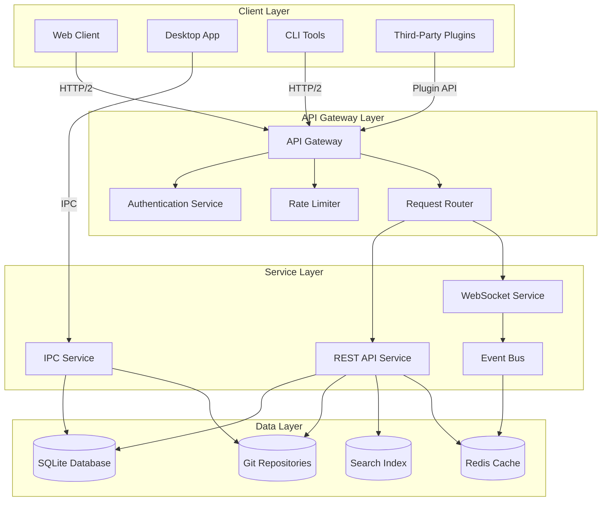
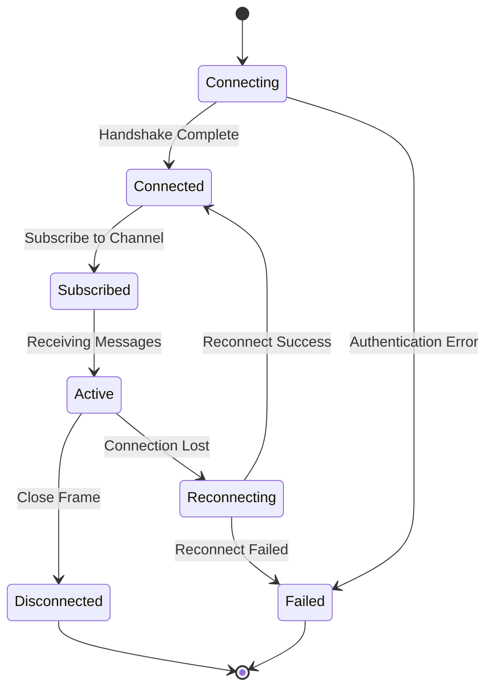
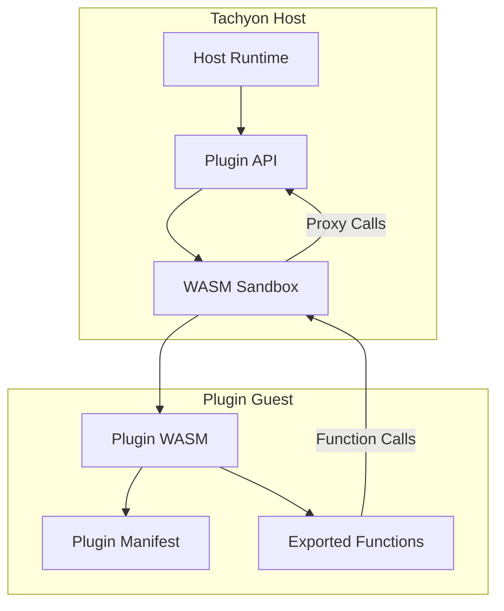
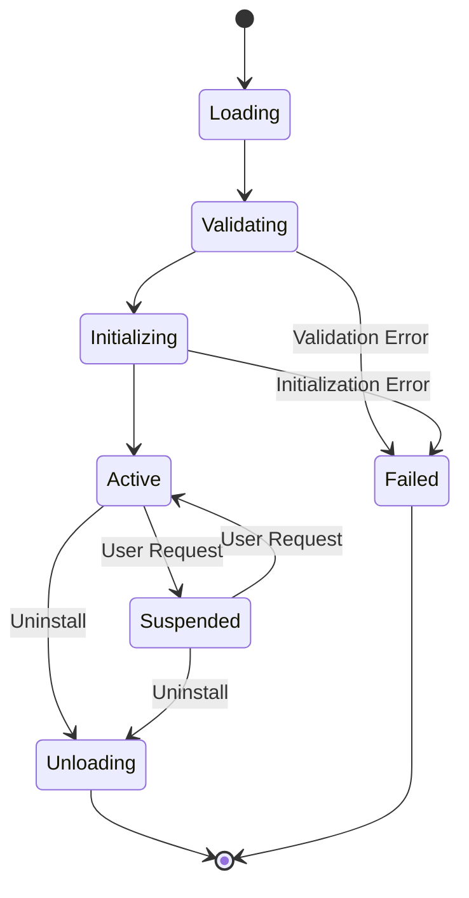
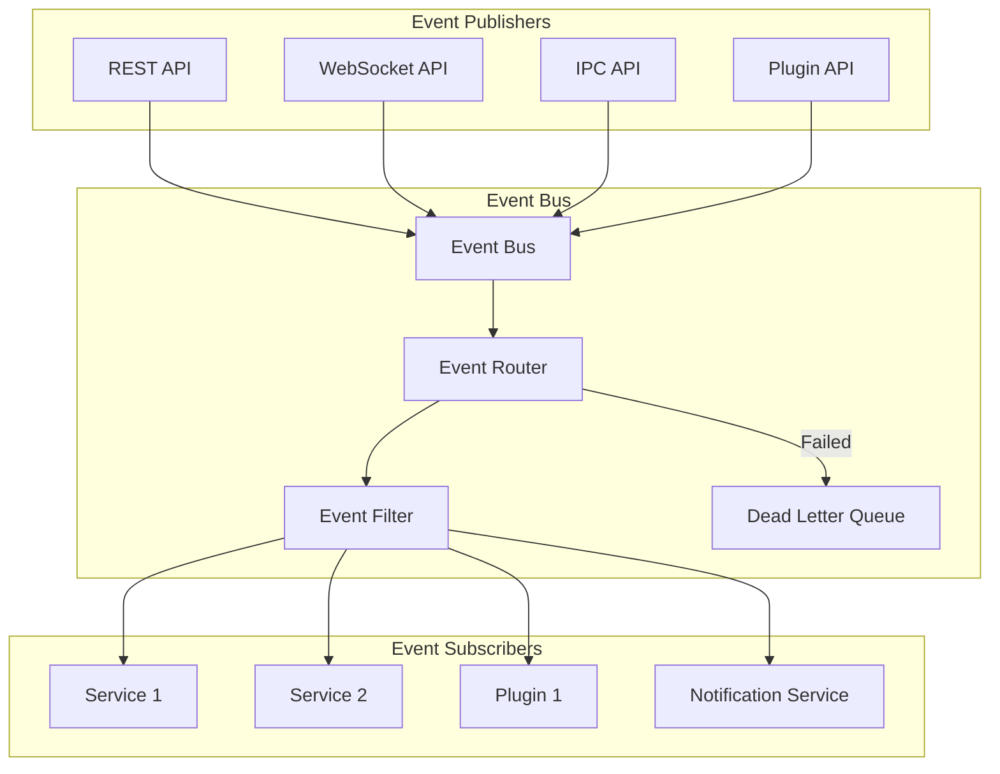

# TACHYON: API DOCUMENTATION

**Document ID:** TACHYON-API-001-V1.0
**Date:** February 2026
**Status:** Approved for Implementation
**Classification:** Technical Specification & API Reference
**Compliance Level:** ISO/IEC 26514:2021, IEEE 1063:2001, OpenAPI 3.1.0

---

## TABLE OF CONTENTS

1. [Introduction](#1-introduction)
2. [API Framework](#2-api-framework)
3. [API Architecture](#3-api-architecture)
4. [REST API Overview](#4-rest-api-overview)
5. [WebSocket API Overview](#5-websocket-api-overview)
6. [IPC API Overview](#6-ipc-api-overview)
7. [Plugin API Overview](#7-plugin-api-overview)
8. [CLI API Overview](#8-cli-api-overview)
9. [Configuration API Overview](#9-configuration-api-overview)
10. [Event API Overview](#10-event-api-overview)
11. [Data Model Overview](#11-data-model-overview)
12. [Security API Overview](#12-security-api-overview)
13. [Performance API Overview](#13-performance-api-overview)
14. [Integration API Overview](#14-integration-api-overview)
15. [Testing API Overview](#15-testing-api-overview)
16. [Monitoring API Overview](#16-monitoring-api-overview)
17. [API Migration Guide Overview](#17-api-migration-guide-overview)
18. [References](#18-references)

---

## 1. INTRODUCTION

### 1.1. Purpose and Scope

This document provides comprehensive API documentation for the Tachyon toolchain, a hybrid documentation management system comprising desktop, server, and web components. The Tachyon system enables local-first document management with optional cloud synchronization, leveraging Git for version control and providing real-time collaboration capabilities.

The API documentation encompasses all public interfaces exposed by the Tachyon system, including:

- **REST API:** HTTP/2 endpoints for server communication
- **WebSocket API:** Real-time bidirectional communication channels
- **IPC API:** Inter-process communication between desktop components
- **Plugin API:** Extensibility interfaces for third-party plugins
- **CLI API:** Command-line interface for automation and scripting
- **Configuration API:** System configuration and preferences management
- **Event API:** Event-driven architecture interfaces
- **Data Model API:** Core data structures and schemas
- **Security API:** Authentication, authorization, and security operations
- **Performance API:** Monitoring, metrics, and performance optimization
- **Integration API:** External system integration interfaces
- **Testing API:** Testing utilities and test harness interfaces
- **Monitoring API:** Health checks, diagnostics, and observability

### 1.2. Document Dependencies

This document depends on the following specification documents:

| Document ID | Title | Purpose |
|-------------|-------|---------|
| [TACHYON-STD-V1.0](../.specs/01_standards/coding_standards.md) | Coding and Documentation Standards | Establishes documentation format and quality standards |
| [TACHYON-ADR-001-V1.0](../.specs/02_adrs/001_rust_as_primary_language.md) | Rust as Primary Language | Defines language-specific API conventions |
| [TACHYON-ADR-010-V1.0](../.specs/02_adrs/010_security_architecture.md) | Security Architecture | Defines security requirements for all APIs |
| [TACHYON-REQ-V1.0](../.specs/06_requirements/requirements.md) | Requirements Specification | Defines functional and non-functional requirements |
| [TACHYON-DSN-V1.0](../.specs/07_designs/designs.md) | Design Documents | Provides architectural design context |

### 1.3. API Design Philosophy

The Tachyon API design follows several core principles derived from the system architecture and security requirements:

#### 1.3.1. Resource-Oriented Design

All REST APIs follow resource-oriented design principles, where resources are identified by URIs and manipulated using standard HTTP methods (GET, POST, PUT, DELETE, PATCH). Resources represent domain entities such as documents, users, repositories, and configurations.

#### 1.3.2. Consistency Across Interfaces

All APIs maintain consistency in naming conventions, error handling, authentication, and response formats. This consistency reduces cognitive load for developers integrating with multiple Tachyon APIs.

#### 1.3.3. Security by Default

All APIs implement security by default, requiring authentication for protected resources, validating all inputs, and providing comprehensive audit logging. Security controls are integrated into the API design rather than added as an afterthought.

#### 1.3.4. Performance Awareness

APIs are designed with performance awareness, supporting pagination, streaming responses, and efficient data serialization. Response times are optimized for sub-15 millisecond latency requirements.

#### 1.3.5. Versioning Strategy

All APIs implement a versioning strategy that enables backward compatibility and graceful deprecation. Version information is included in request paths or headers, and deprecation notices are provided well in advance of removal.

#### 1.3.6. Error Handling

Consistent error handling across all APIs provides clear, actionable error messages with appropriate HTTP status codes. Error responses include structured information for programmatic handling.

#### 1.3.7. Idempotency

Where appropriate, APIs support idempotent operations to enable safe retries and distributed system coordination. Idempotency keys can be provided for operations that are not inherently idempotent.

### 1.4. API Audience

This API documentation serves multiple audiences:

| Audience | Primary Use Cases | API Sections of Interest |
|----------|-------------------|-------------------------|
| **Frontend Developers** | Building web and desktop UIs | REST API, WebSocket API, Event API |
| **Backend Developers** | Server-side integration and automation | REST API, IPC API, CLI API |
| **Plugin Developers** | Extending Tachyon functionality | Plugin API, Event API, Configuration API |
| **DevOps Engineers** | Deployment, monitoring, and maintenance | Monitoring API, Performance API, Security API |
| **Security Analysts** | Security auditing and compliance | Security API, Event API, Monitoring API |
| **QA Engineers** | Testing and validation | Testing API, Monitoring API, REST API |

### 1.5. Terminology

The following terminology is used throughout this document:

| Term | Definition |
|-------|------------|
| **Resource** | An entity exposed via the API (e.g., document, user, repository) |
| **Endpoint** | A specific URL path that accepts HTTP requests |
| **Payload** | The data sent in the request body or received in the response body |
| **Authentication** | The process of verifying the identity of a client |
| **Authorization** | The process of determining whether an authenticated client has permission to perform an action |
| **Idempotent** | An operation that can be applied multiple times without changing the result beyond the initial application |
| **Pagination** | The practice of splitting large result sets into multiple pages |
| **Rate Limiting** | The practice of limiting the number of requests a client can make in a given time period |
| **Webhook** | An HTTP callback that delivers data to other applications when events occur |
| **WebSocket** | A communication protocol that provides full-duplex communication channels over a single TCP connection |

---

## 2. API FRAMEWORK

### 2.1. Technology Stack

The Tachyon API framework is built on the following technology stack:

| Component | Technology | Version | Purpose |
|-----------|-------------|----------|---------|
| **HTTP Server** | Axum | 0.7+ | HTTP/2 REST API server |
| **Async Runtime** | Tokio | 1.35+ | Asynchronous I/O and task scheduling |
| **Serialization** | Serde | 1.0+ | Data serialization and deserialization |
| **JSON Support** | serde_json | 1.0+ | JSON format support |
| **WebSocket** | tokio-tungstenite | 0.21+ | WebSocket protocol implementation |
| **Validation** | validator | 0.16+ | Input validation |
| **Authentication** |jsonwebtoken | 9.0+ | JWT token handling |
| **Database** | rusqlite | 0.30+ | SQLite database access |
| **Search** | Tantivy | 0.22+ | Full-text search engine |
| **Git Integration** | git2 | 0.18+ | Git repository operations |

### 2.2. API Gateway Architecture

The Tachyon system implements an API gateway pattern to provide a unified entry point for all external API requests. The API gateway handles:

- **Request Routing:** Directing requests to appropriate backend services
- **Authentication and Authorization:** Verifying client identity and permissions
- **Rate Limiting:** Enforcing request rate limits per client
- **Request/Response Transformation:** Modifying requests and responses as needed
- **Logging and Monitoring:** Capturing API metrics and audit logs
- **CORS Handling:** Managing cross-origin resource sharing policies

### 2.3. Communication Protocols

The Tachyon system supports multiple communication protocols optimized for different use cases:

| Protocol | Use Case | Characteristics |
|----------|-----------|----------------|
| **HTTP/2** | REST API | Binary framing, header compression, multiplexing |
| **WebSocket** | Real-time communication | Full-duplex, low latency, persistent connection |
| **IPC** | Desktop component communication | Local process communication, zero-copy |
| **gRPC** | Internal service communication (future) | Protocol Buffers, streaming, bidirectional |

### 2.4. Data Serialization Formats

The following data serialization formats are supported:

| Format | MIME Type | Use Case | Support Level |
|--------|------------|-----------|---------------|
| **JSON** | application/json | Default format for all APIs | Full |
| **CBOR** | application/cbor | Binary format for efficiency | Planned |
| **MessagePack** | application/msgpack | Binary format for efficiency | Planned |
| **YAML** | application/yaml | Configuration import/export | Planned |

### 2.5. API Versioning Strategy

The Tachyon API implements URL-based versioning to ensure clear version identification and backward compatibility:

```
/api/v1/{resource}
/api/v2/{resource}
```

**Versioning Rules:**

1. **Major Version Changes:** Breaking changes require a new major version (e.g., v1 to v2)
2. **Minor Version Changes:** Non-breaking additions may be made within a major version
3. **Deprecation:** Deprecated endpoints are supported for at least 6 months before removal
4. **Sunset Notices:** Sunset notices are provided 3 months before endpoint removal
5. **Default Version:** The latest stable version is used when no version is specified

**Version Lifecycle:**

| Status | Duration | Description |
|--------|----------|-------------|
| **Alpha** | 1-3 months | Early development, unstable, may change without notice |
| **Beta** | 3-6 months | Feature-complete, testing in production, may have breaking changes |
| **Stable** | 12+ months | Production-ready, backward compatibility maintained |
| **Deprecated** | 6 months | No new features, maintained for existing clients |
| **Sunset** | 0 months | No longer supported, removed from service |

### 2.6. Error Handling Framework

All Tachyon APIs implement a consistent error handling framework:

#### 2.6.1. HTTP Status Codes

| Status Code | Category | Usage |
|-------------|-----------|--------|
| **2xx** | Success | Request was successfully received, understood, and accepted |
| **4xx** | Client Error | The request contains bad syntax or cannot be fulfilled |
| **5xx** | Server Error | The server failed to fulfill a valid request |

#### 2.6.2. Error Response Format

All error responses follow a consistent JSON format:

```json
{
  "error": {
    "code": "ERROR_CODE",
    "message": "Human-readable error message",
    "details": {
      "field": "Additional error details"
    },
    "request_id": "uuid-of-request",
    "timestamp": "2026-02-07T13:00:00Z"
  }
}
```

#### 2.6.3. Standard Error Codes

| Error Code | HTTP Status | Description |
|------------|--------------|-------------|
| `VALIDATION_ERROR` | 400 | Request validation failed |
| `UNAUTHORIZED` | 401 | Authentication required or failed |
| `FORBIDDEN` | 403 | Client lacks permission |
| `NOT_FOUND` | 404 | Resource not found |
| `CONFLICT` | 409 | Request conflicts with current state |
| `RATE_LIMIT_EXCEEDED` | 429 | Rate limit exceeded |
| `INTERNAL_ERROR` | 500 | Internal server error |
| `SERVICE_UNAVAILABLE` | 503 | Service temporarily unavailable |

### 2.7. Authentication and Authorization

#### 2.7.1. Authentication Methods

The Tachyon system supports multiple authentication methods:

| Method | Use Case | Security Level |
|--------|-----------|----------------|
| **JWT Bearer Token** | API authentication | High |
| **API Key** | Service-to-service communication | Medium |
| **OAuth 2.0** | Third-party integration | High |
| **Session Cookie** | Web application | Medium |
| **mTLS** | High-security environments | Very High |

#### 2.7.2. Authorization Model

Authorization follows a role-based access control (RBAC) model with the following roles:

| Role | Permissions |
|------|-------------|
| **Admin** | Full system access, including user management |
| **Editor** | Read and write access to documents |
| **Viewer** | Read-only access to documents |
| **Guest** | Limited access to public documents |

#### 2.7.3. Token Format

JWT tokens follow the standard format with the following claims:

```json
{
  "sub": "user-id",
  "iat": 1738924800,
  "exp": 1739011200,
  "roles": ["editor"],
  "scope": ["documents:read", "documents:write"]
}
```

### 2.8. Rate Limiting

Rate limiting is implemented to protect the API from abuse and ensure fair resource allocation:

| Tier | Requests per Minute | Burst Allowance |
|-------|---------------------|-----------------|
| **Free** | 60 | 10 |
| **Standard** | 600 | 100 |
| **Premium** | 6000 | 1000 |
| **Enterprise** | Unlimited | Unlimited |

Rate limit headers are included in all responses:

```
X-RateLimit-Limit: 600
X-RateLimit-Remaining: 599
X-RateLimit-Reset: 1738924860
```

---

## 3. API ARCHITECTURE

### 3.1. System Architecture Overview

The Tachyon API architecture is designed to support a hybrid deployment model with local-first desktop application and optional cloud synchronization. The architecture follows a three-tier pattern with clear separation of concerns:



### 3.2. API Component Architecture

The Tachyon API is composed of several specialized components, each responsible for specific functionality:

#### 3.2.1. REST API Component

The REST API component provides standard HTTP/2 endpoints for document management, user operations, and system configuration. It is built on the Axum web framework and follows RESTful design principles.

**Key Responsibilities:**

- Document CRUD operations (Create, Read, Update, Delete)
- User authentication and session management
- Repository and workspace management
- Search and query operations
- Configuration management
- File upload and download

**Technology Stack:**

- **Framework:** Axum 0.7+
- **Runtime:** Tokio 1.35+
- **Serialization:** Serde + serde_json
- **Validation:** validator crate
- **Authentication:** jsonwebtoken crate

#### 3.2.2. WebSocket API Component

The WebSocket API component provides real-time bidirectional communication for collaborative editing, notifications, and live updates. It maintains persistent connections with clients and broadcasts events to subscribed channels.

**Key Responsibilities:**

- Real-time document synchronization
- Collaborative editing coordination
- Live notifications and alerts
- Presence and status updates
- Event streaming

**Technology Stack:**

- **Framework:** tokio-tungstenite 0.21+
- **Protocol:** WebSocket RFC 6455
- **Message Format:** JSON
- **Connection Management:** Tokio async runtime

#### 3.2.3. IPC API Component

The IPC (Inter-Process Communication) API component facilitates communication between the desktop application frontend and the core Rust backend. It provides a secure, type-safe interface for desktop operations.

**Key Responsibilities:**

- File system operations
- Window management commands
- Native dialog interactions
- System integration
- Desktop-specific features

**Technology Stack:**

- **Framework:** Tauri IPC system
- **Protocol:** JSON-RPC over IPC
- **Security:** Capability-based permissions
- **Type Safety:** Rust type system

#### 3.2.4. Plugin API Component

The Plugin API component enables third-party extensions to integrate with the Tachyon system. It provides well-defined hooks and interfaces for extending functionality.

**Key Responsibilities:**

- Plugin lifecycle management
- Hook system for event interception
- Extension point registration
- Plugin sandboxing and isolation
- Plugin marketplace integration

**Technology Stack:**

- **Framework:** Custom plugin system (wasm-based)
- **Isolation:** WebAssembly sandbox
- **Communication:** Host-guest protocol
- **Discovery:** Plugin manifest system

#### 3.2.5. CLI API Component

The CLI (Command-Line Interface) API component provides programmatic access to Tachyon functionality from command-line tools and scripts. It supports both interactive and batch operations.

**Key Responsibilities:**

- Command parsing and validation
- Batch processing operations
- Script automation support
- Output formatting (JSON, table, etc.)
- Progress reporting

**Technology Stack:**

- **Framework:** clap 4.0+
- **Output:** termcolor, tabled
- **Async:** Tokio integration
- **Error Handling:** miette for diagnostics

#### 3.2.6. Configuration API Component

The Configuration API component manages system, user, and workspace configurations. It provides a unified interface for accessing and modifying settings across the Tachyon system.

**Key Responsibilities:**

- Configuration schema definition
- Configuration validation
- Default value management
- Configuration persistence
- Configuration migration

**Technology Stack:**

- **Format:** TOML, JSON, YAML
- **Validation:** serde + validator
- **Schema:** JSON Schema
- **Storage:** File system + database

#### 3.2.7. Event API Component

The Event API component implements an event-driven architecture for decoupled communication between system components. It provides publish-subscribe messaging with filtering and routing capabilities.

**Key Responsibilities:**

- Event publishing and subscription
- Event filtering and routing
- Event persistence and replay
- Event aggregation
- Dead letter queue handling

**Technology Stack:**

- **Protocol:** Custom event protocol
- **Transport:** In-memory + Redis pub/sub
- **Persistence:** SQLite event log
- **Filtering:** Predicate-based filtering

#### 3.2.8. Data Model API Component

The Data Model API component defines the core data structures and schemas used throughout the Tachyon system. It provides type-safe access to domain entities and ensures data consistency.

**Key Responsibilities:**

- Entity schema definition
- Data validation
- Serialization and deserialization
- Database mapping
- Migration management

**Technology Stack:**

- **ORM:** Diesel or sea-orm
- **Validation:** validator
- **Serialization:** Serde
- **Migration:** Custom migration system

#### 3.2.9. Security API Component

The Security API component implements authentication, authorization, and security-related operations. It provides a unified security framework for all APIs.

**Key Responsibilities:**

- User authentication
- Token management and validation
- Permission checking
- Audit logging
- Security event monitoring

**Technology Stack:**

- **Authentication:** JWT, OAuth 2.0
- **Authorization:** RBAC, ABAC
- **Encryption:** RustCrypto crates
- **Logging:** tracing crate

#### 3.2.10. Performance API Component

The Performance API component provides monitoring, metrics, and performance optimization interfaces. It enables observability and performance tuning of the Tachyon system.

**Key Responsibilities:**

- Metrics collection and reporting
- Performance profiling
- Resource monitoring
- Performance optimization hints
- Benchmarking support

**Technology Stack:**

- **Metrics:** Prometheus client
- **Tracing:** OpenTelemetry
- **Profiling:** pprof integration
- **Monitoring:** Custom health checks

#### 3.2.11. Integration API Component

The Integration API component provides interfaces for external system integration. It enables Tachyon to connect with third-party services and platforms.

**Key Responsibilities:**

- External service adapters
- Webhook management
- Import/export operations
- API proxying
- Third-party authentication

**Technology Stack:**

- **HTTP:** reqwest client
- **Webhooks:** Custom webhook system
- **Adapters:** Plugin-based adapters
- **Auth:** OAuth client libraries

#### 3.2.12. Testing API Component

The Testing API component provides utilities and interfaces for testing Tachyon functionality. It enables automated testing, test fixtures, and test harness integration.

**Key Responsibilities:**

- Test fixture management
- Mock service interfaces
- Test data generation
- Test execution coordination
- Test result reporting

**Technology Stack:**

- **Framework:** Custom test utilities
- **Mocking:** mockall crate
- **Assertions:** custom assertions
- **Reporting:** JSON and JUnit formats

#### 3.2.13. Monitoring API Component

The Monitoring API component provides health checks, diagnostics, and observability interfaces. It enables system monitoring, alerting, and operational visibility.

**Key Responsibilities:**

- Health check endpoints
- Diagnostic information
- Log aggregation
- Alert generation
- System status reporting

**Technology Stack:**

- **Health:** Custom health checks
- **Logging:** tracing + tracing-subscriber
- **Alerting:** Custom alert rules
- **Status:** Status page generation

### 3.3. API Design Principles

The Tachyon API architecture follows several fundamental design principles:

#### 3.3.1. Separation of Concerns

Each API component has a clearly defined responsibility and minimal dependencies on other components. This separation enables independent development, testing, and deployment.

#### 3.3.2. Interface Stability

Public APIs maintain stable interfaces with clear versioning and deprecation policies. Breaking changes are minimized and communicated well in advance.

#### 3.3.3. Type Safety

All APIs leverage Rust's type system to ensure type safety at compile time. This prevents entire classes of runtime errors and enables confident refactoring.

#### 3.3.4. Fail-Safe Behavior

All APIs implement fail-safe error handling, preferring explicit error reporting over silent failures. Error messages are clear, actionable, and include sufficient context for debugging.

#### 3.3.5. Performance Awareness

APIs are designed with performance awareness, supporting efficient data serialization, streaming responses, and minimal memory allocations. Performance characteristics are documented and tested.

#### 3.3.6. Security First

Security is integrated into API design from the beginning. All APIs implement authentication, authorization, input validation, and audit logging by default.

#### 3.3.7. Observability

All APIs provide comprehensive logging, metrics, and tracing capabilities. This enables operational visibility and effective troubleshooting.

### 3.4. API Communication Patterns

The Tachyon system implements several communication patterns between components:

#### 3.4.1. Request-Response Pattern

The request-response pattern is used for synchronous operations where a client sends a request and awaits a response. This is the primary pattern for REST APIs.

**Use Cases:**

- Document retrieval
- User authentication
- Configuration queries
- Search operations

#### 3.4.2. Publish-Subscribe Pattern

The publish-subscribe pattern enables decoupled event-driven communication. Components publish events to topics, and subscribers receive events from topics they are interested in.

**Use Cases:**

- Real-time document updates
- Notification broadcasting
- System state changes
- Collaborative editing events

#### 3.4.3. Command Pattern

The command pattern encapsulates requests as objects, enabling parameterization, queuing, and logging of operations. This pattern is used for CLI and IPC operations.

**Use Cases:**

- CLI command execution
- Desktop operations
- Batch processing
- Undo/redo functionality

#### 3.4.4. Observer Pattern

The observer pattern enables components to register interest in state changes and receive notifications when those changes occur. This pattern is used for plugin hooks and event listeners.

**Use Cases:**

- Plugin event hooks
- File system watching
- Configuration change notifications
- Document lifecycle events

### 3.5. API Scalability Architecture

The Tachyon API architecture is designed for horizontal and vertical scalability:

#### 3.5.1. Horizontal Scalability

Stateless API components can be horizontally scaled by adding more instances behind a load balancer. Stateful components use consistent hashing or sticky sessions to maintain state affinity.

**Scalability Strategies:**

- **Load Balancing:** Distribute requests across multiple instances
- **Connection Pooling:** Reuse database and network connections
- **Caching:** Cache frequently accessed data
- **Sharding:** Distribute data across multiple storage nodes

#### 3.5.2. Vertical Scalability

Vertical scalability is achieved through efficient resource utilization and performance optimization:

**Optimization Techniques:**

- **Async I/O:** Non-blocking operations using Tokio
- **Zero-Copy:** Minimize data copying where possible
- **Memory Pooling:** Reuse memory allocations
- **CPU Affinity:** Pin threads to CPU cores

### 3.6. API Reliability Architecture

The Tachyon API architecture implements several reliability patterns:

#### 3.6.1. Circuit Breaker Pattern

The circuit breaker pattern prevents cascading failures by detecting failures and temporarily stopping requests to failing services. This improves system resilience during outages.

#### 3.6.2. Retry Pattern

The retry pattern automatically retries transient failures with exponential backoff. This improves reliability for operations that may fail temporarily due to network issues or temporary resource constraints.

#### 3.6.3. Timeout Pattern

The timeout pattern prevents indefinite waiting by setting maximum time limits for operations. Timeouts are configured based on expected operation duration and include jitter to prevent thundering herd problems.

#### 3.6.4. Bulkhead Pattern

The bulkhead pattern isolates resources to prevent failures in one component from affecting others. Resource pools are allocated per component to ensure isolation.

### 3.7. API Deployment Architecture

The Tachyon API supports multiple deployment configurations:

#### 3.7.1. Local Deployment

Local deployment runs all API components on a single machine, suitable for personal use and development.

**Characteristics:**

- Single-process deployment
- Local file system storage
- No network latency
- Simplified configuration

#### 3.7.2. Distributed Deployment

Distributed deployment runs API components across multiple machines, suitable for production environments with high availability requirements.

**Characteristics:**

- Multi-process deployment
- Network-based storage
- Load balancing
- High availability configuration

#### 3.7.3. Cloud Deployment

Cloud deployment leverages cloud infrastructure for scalability and managed services.

**Characteristics:**

- Containerized deployment (Docker)
- Orchestration (Kubernetes)
- Managed databases
- Auto-scaling configuration

---

## 4. REST API OVERVIEW

### 4.1. REST API Introduction

The Tachyon REST API provides a comprehensive HTTP/2 interface for document management, user operations, and system configuration. Built on the Axum web framework with Tokio async runtime, the REST API follows RESTful design principles and supports standard HTTP methods.

**Base URL:** `https://api.example.com/api/v1`

**Protocol:** HTTP/2 with TLS 1.3

**Content Type:** `application/json`

**Character Set:** UTF-8

### 4.2. REST API Design Conventions

#### 4.2.1. Resource Naming

Resources are identified using plural nouns and hierarchical paths:

```
/api/v1/documents
/api/v1/documents/{id}
/api/v1/documents/{id}/versions
/api/v1/users
/api/v1/workspaces/{id}/documents
```

#### 4.2.2. HTTP Methods

Standard HTTP methods are used according to RESTful conventions:

| Method | Description | Idempotent | Safe |
|--------|-------------|------------|-------|
| **GET** | Retrieve a resource | Yes | Yes |
| **POST** | Create a new resource | No | No |
| **PUT** | Replace a resource | Yes | No |
| **PATCH** | Partially update a resource | No | No |
| **DELETE** | Delete a resource | Yes | No |
| **HEAD** | Retrieve headers only | Yes | Yes |
| **OPTIONS** | Retrieve allowed methods | Yes | Yes |

#### 4.2.3. Status Codes

The REST API uses standard HTTP status codes:

| Code | Category | Description |
|------|-----------|-------------|
| **200** | Success | Request succeeded |
| **201** | Success | Resource created |
| **204** | Success | No content (successful deletion) |
| **400** | Client Error | Bad request |
| **401** | Client Error | Unauthorized |
| **403** | Client Error | Forbidden |
| **404** | Client Error | Not found |
| **409** | Client Error | Conflict |
| **422** | Client Error | Unprocessable entity |
| **429** | Client Error | Too many requests |
| **500** | Server Error | Internal server error |
| **503** | Server Error | Service unavailable |

### 4.3. REST API Endpoints

#### 4.3.1. Authentication Endpoints

##### POST /auth/login

Authenticates a user and returns a JWT token.

**Request:**

```json
{
  "email": "user@example.com",
  "password": "secure-password"
}
```

**Response (200 OK):**

```json
{
  "token": "eyJhbGciOiJIUzI1NiIsInR5cCI6IkpXVCJ9...",
  "user": {
    "id": "550e8400-e29b-41d4-a716-4466554400000",
    "email": "user@example.com",
    "name": "John Doe",
    "roles": ["editor"]
  },
  "expires_at": "2026-02-08T13:00:00Z"
}
```

**Error Responses:**

- `401 Unauthorized`: Invalid credentials
- `422 Unprocessable Entity`: Validation error

##### POST /auth/refresh

Refreshes an expired JWT token.

**Request Headers:**

```
Authorization: Bearer <expired-token>
```

**Response (200 OK):**

```json
{
  "token": "eyJhbGciOiJIUzI1NiIsInR5cCI6IkpXVCJ9...",
  "expires_at": "2026-02-08T14:00:00Z"
}
```

##### POST /auth/logout

Invalidates the current session.

**Request Headers:**

```
Authorization: Bearer <token>
```

**Response (204 No Content):** Success

#### 4.3.2. Document Endpoints

##### GET /documents

Retrieves a paginated list of documents.

**Query Parameters:**

| Parameter | Type | Required | Default | Description |
|-----------|------|----------|---------|-------------|
| `page` | integer | No | 1 | Page number (1-indexed) |
| `per_page` | integer | No | 20 | Items per page (1-100) |
| `sort` | string | No | `updated_at` | Sort field |
| `order` | string | No | `desc` | Sort order (`asc` or `desc`) |
| `search` | string | No | - | Search query |
| `workspace_id` | string | No | - | Filter by workspace |

**Request Headers:**

```
Authorization: Bearer <token>
```

**Response (200 OK):**

```json
{
  "data": [
    {
      "id": "550e8400-e29b-41d4-a716-4466554400000",
      "title": "Document Title",
      "content": "Document content...",
      "created_at": "2026-02-07T10:00:00Z",
      "updated_at": "2026-02-07T11:30:00Z",
      "workspace_id": "660e8400-e29b-41d4-a716-4466554400001"
    }
  ],
  "pagination": {
    "page": 1,
    "per_page": 20,
    "total": 45,
    "total_pages": 3
  }
}
```

##### GET /documents/{id}

Retrieves a specific document by ID.

**Path Parameters:**

| Parameter | Type | Required | Description |
|-----------|------|----------|-------------|
| `id` | string | Yes | Document UUID |

**Query Parameters:**

| Parameter | Type | Required | Default | Description |
|-----------|------|----------|---------|-------------|
| `include_content` | boolean | No | `false` | Include full document content |

**Request Headers:**

```
Authorization: Bearer <token>
```

**Response (200 OK):**

```json
{
  "id": "550e8400-e29b-41d4-a716-4466554400000",
  "title": "Document Title",
  "content": "Document content...",
  "metadata": {
    "author": "John Doe",
    "tags": ["documentation", "api"],
    "word_count": 1234
  },
  "created_at": "2026-02-07T10:00:00Z",
  "updated_at": "2026-02-07T11:30:00Z",
  "version": 3,
  "workspace_id": "660e8400-e29b-41d4-a716-4466554400001"
}
```

**Error Responses:**

- `401 Unauthorized`: Authentication required
- `403 Forbidden`: Access denied
- `404 Not Found`: Document not found

##### POST /documents

Creates a new document.

**Request:**

```json
{
  "title": "New Document",
  "content": "Document content...",
  "workspace_id": "660e8400-e29b-41d4-a716-4466554400001",
  "metadata": {
    "tags": ["documentation"]
  }
}
```

**Request Headers:**

```
Authorization: Bearer <token>
Content-Type: application/json
```

**Response (201 Created):**

```json
{
  "id": "550e8400-e29b-41d4-a716-4466554400000",
  "title": "New Document",
  "content": "Document content...",
  "metadata": {
    "author": "John Doe",
    "tags": ["documentation"]
  },
  "created_at": "2026-02-07T12:00:00Z",
  "updated_at": "2026-02-07T12:00:00Z",
  "version": 1,
  "workspace_id": "660e8400-e29b-41d4-a716-4466554400001"
}
```

**Error Responses:**

- `400 Bad Request`: Invalid request data
- `401 Unauthorized`: Authentication required
- `422 Unprocessable Entity`: Validation error

##### PUT /documents/{id}

Replaces an entire document.

**Path Parameters:**

| Parameter | Type | Required | Description |
|-----------|------|----------|-------------|
| `id` | string | Yes | Document UUID |

**Request:**

```json
{
  "title": "Updated Title",
  "content": "Updated content...",
  "metadata": {
    "tags": ["documentation", "updated"]
  }
}
```

**Request Headers:**

```
Authorization: Bearer <token>
Content-Type: application/json
```

**Response (200 OK):**

```json
{
  "id": "550e8400-e29b-41d4-a716-4466554400000",
  "title": "Updated Title",
  "content": "Updated content...",
  "metadata": {
    "author": "John Doe",
    "tags": ["documentation", "updated"]
  },
  "created_at": "2026-02-07T10:00:00Z",
  "updated_at": "2026-02-07T12:30:00Z",
  "version": 2,
  "workspace_id": "660e8400-e29b-41d4-a716-4466554400001"
}
```

**Error Responses:**

- `400 Bad Request`: Invalid request data
- `401 Unauthorized`: Authentication required
- `403 Forbidden`: Access denied
- `404 Not Found`: Document not found
- `409 Conflict`: Version conflict
- `422 Unprocessable Entity`: Validation error

##### PATCH /documents/{id}

Partially updates a document.

**Path Parameters:**

| Parameter | Type | Required | Description |
|-----------|------|----------|-------------|
| `id` | string | Yes | Document UUID |

**Request:**

```json
{
  "title": "Partially Updated Title"
}
```

**Request Headers:**

```
Authorization: Bearer <token>
Content-Type: application/json
```

**Response (200 OK):**

```json
{
  "id": "550e8400-e29b-41d4-a716-4466554400000",
  "title": "Partially Updated Title",
  "content": "Document content...",
  "metadata": {
    "author": "John Doe",
    "tags": ["documentation"]
  },
  "created_at": "2026-02-07T10:00:00Z",
  "updated_at": "2026-02-07T12:45:00Z",
  "version": 3,
  "workspace_id": "660e8400-e29b-41d4-a716-4466554400001"
}
```

**Error Responses:**

- `400 Bad Request`: Invalid request data
- `401 Unauthorized`: Authentication required
- `403 Forbidden`: Access denied
- `404 Not Found`: Document not found
- `409 Conflict`: Version conflict
- `422 Unprocessable Entity`: Validation error

##### DELETE /documents/{id}

Deletes a document.

**Path Parameters:**

| Parameter | Type | Required | Description |
|-----------|------|----------|-------------|
| `id` | string | Yes | Document UUID |

**Request Headers:**

```
Authorization: Bearer <token>
```

**Response (204 No Content):** Success

**Error Responses:**

- `401 Unauthorized`: Authentication required
- `403 Forbidden`: Access denied
- `404 Not Found`: Document not found

#### 4.3.3. Search Endpoints

##### GET /search

Performs a full-text search across documents.

**Query Parameters:**

| Parameter | Type | Required | Default | Description |
|-----------|------|----------|---------|-------------|
| `q` | string | Yes | - | Search query |
| `page` | integer | No | 1 | Page number |
| `per_page` | integer | No | 20 | Items per page |
| `workspace_id` | string | No | - | Filter by workspace |
| `filters` | string | No | - | JSON-encoded filters |

**Request Headers:**

```
Authorization: Bearer <token>
```

**Response (200 OK):**

```json
{
  "data": [
    {
      "id": "550e8400-e29b-41d4-a716-4466554400000",
      "title": "Document Title",
      "snippet": "...matching text...",
      "score": 0.95,
      "workspace_id": "660e8400-e29b-41d4-a716-4466554400001"
    }
  ],
  "pagination": {
    "page": 1,
    "per_page": 20,
    "total": 12,
    "total_pages": 1
  },
  "search_meta": {
    "query": "search term",
    "execution_time_ms": 15
  }
}
```

#### 4.3.4. Workspace Endpoints

##### GET /workspaces

Retrieves a list of workspaces accessible to the user.

**Request Headers:**

```
Authorization: Bearer <token>
```

**Response (200 OK):**

```json
{
  "data": [
    {
      "id": "660e8400-e29b-41d4-a716-4466554400001",
      "name": "My Workspace",
      "description": "Personal workspace",
      "created_at": "2026-02-01T10:00:00Z",
      "member_count": 5
    }
  ]
}
```

##### POST /workspaces

Creates a new workspace.

**Request:**

```json
{
  "name": "New Workspace",
  "description": "Workspace description"
}
```

**Request Headers:**

```
Authorization: Bearer <token>
Content-Type: application/json
```

**Response (201 Created):**

```json
{
  "id": "660e8400-e29b-41d4-a716-4466554400002",
  "name": "New Workspace",
  "description": "Workspace description",
  "created_at": "2026-02-07T13:00:00Z",
  "member_count": 1
}
```

#### 4.3.5. File Upload/Download Endpoints

##### POST /files/upload

Uploads a file to the system.

**Request:** Multipart form data

```
Content-Type: multipart/form-data; boundary=----WebKitFormBoundary

------WebKitFormBoundary
Content-Disposition: form-data; name="file"; filename="document.pdf"
Content-Type: application/pdf

<binary file data>
------WebKitFormBoundary
Content-Disposition: form-data; name="workspace_id"

660e8400-e29b-41d4-a716-4466554400001
------WebKitFormBoundary--
```

**Request Headers:**

```
Authorization: Bearer <token>
```

**Response (201 Created):**

```json
{
  "id": "770e8400-e29b-41d4-a716-4466554400003",
  "filename": "document.pdf",
  "size": 123456,
  "content_type": "application/pdf",
  "uploaded_at": "2026-02-07T13:15:00Z",
  "workspace_id": "660e8400-e29b-41d4-a716-4466554400001"
}
```

##### GET /files/{id}/download

Downloads a file from the system.

**Path Parameters:**

| Parameter | Type | Required | Description |
|-----------|------|----------|-------------|
| `id` | string | Yes | File UUID |

**Request Headers:**

```
Authorization: Bearer <token>
```

**Response (200 OK):** Binary file data

**Response Headers:**

```
Content-Type: application/pdf
Content-Disposition: attachment; filename="document.pdf"
Content-Length: 123456
```

### 4.4. REST API Pagination

The REST API implements cursor-based pagination for efficient navigation through large result sets.

#### 4.4.1. Pagination Parameters

| Parameter | Type | Required | Default | Description |
|-----------|------|----------|---------|-------------|
| `page` | integer | No | 1 | Page number (1-indexed) |
| `per_page` | integer | No | 20 | Items per page (1-100) |

#### 4.4.2. Pagination Response

All paginated responses include pagination metadata:

```json
{
  "data": [...],
  "pagination": {
    "page": 2,
    "per_page": 20,
    "total": 45,
    "total_pages": 3,
    "has_next": true,
    "has_prev": true
  }
}
```

### 4.5. REST API Filtering and Sorting

#### 4.5.1. Filtering

Resources can be filtered using query parameters:

```
/api/v1/documents?workspace_id=xxx&tag=documentation
```

#### 4.5.2. Sorting

Resources can be sorted using the `sort` and `order` parameters:

```
/api/v1/documents?sort=updated_at&order=desc
```

### 4.6. REST API Rate Limiting

The REST API implements rate limiting to prevent abuse:

| Tier | Requests/Minute | Burst |
|-------|----------------|--------|
| Free | 60 | 10 |
| Standard | 600 | 100 |
| Premium | 6000 | 1000 |

Rate limit headers are included in all responses:

```
X-RateLimit-Limit: 600
X-RateLimit-Remaining: 599
X-RateLimit-Reset: 1738924860
```

### 4.7. REST API CORS Configuration

The REST API supports Cross-Origin Resource Sharing (CORS) for web applications:

**Allowed Origins:** Configured per environment

**Allowed Methods:** GET, POST, PUT, PATCH, DELETE, OPTIONS

**Allowed Headers:** Authorization, Content-Type, X-Requested-With

**Max Age:** 86400 seconds (24 hours)

---

## 5. WEBSOCKET API OVERVIEW

### 5.1. WebSocket API Introduction

The Tachyon WebSocket API provides real-time bidirectional communication for collaborative editing, notifications, and live updates. Built on the WebSocket protocol (RFC 6455) with tokio-tungstenite implementation, the WebSocket API enables low-latency event streaming between clients and the server.

**WebSocket URL:** `wss://api.example.com/ws/v1`

**Protocol:** WebSocket (RFC 6455)

**Subprotocol:** JSON

**Connection Limit:** 5 concurrent connections per user

### 5.2. WebSocket Connection

#### 5.2.1. Connection Handshake

WebSocket connections are established via HTTP upgrade request:

**HTTP Request:**

```
GET /ws/v1 HTTP/1.1
Host: api.example.com
Upgrade: websocket
Connection: Upgrade
Sec-WebSocket-Key: dGhlIHNhbXBwIGlubHVkZQ==
Sec-WebSocket-Version: 13
Authorization: Bearer <jwt-token>
```

**HTTP Response:**

```
HTTP/1.1 101 Switching Protocols
Upgrade: websocket
Connection: Upgrade
Sec-WebSocket-Accept: s3pPLMBiTxaQ9kYGzzhZRbK+xOo=
```

#### 5.2.2. Authentication

WebSocket connections require authentication via JWT token provided in the `Authorization` header during the handshake. The token must be valid and have the `websocket:connect` scope.

#### 5.2.3. Connection Lifecycle



### 5.3. WebSocket Message Format

All WebSocket messages follow a consistent JSON format:

#### 5.3.1. Message Structure

```json
{
  "type": "message_type",
  "id": "message-id",
  "timestamp": "2026-02-07T13:00:00Z",
  "channel": "channel-name",
  "data": {
    "message-specific": "data"
  }
}
```

**Fields:**

| Field | Type | Required | Description |
|-------|------|----------|-------------|
| `type` | string | Yes | Message type identifier |
| `id` | string | Yes | Unique message identifier (UUID) |
| `timestamp` | string | Yes | ISO 8601 timestamp |
| `channel` | string | No | Target channel for message |
| `data` | object | Yes | Message payload |

#### 5.3.2. Message Types

| Type | Direction | Description |
|------|-----------|-------------|
| `subscribe` | Client → Server | Subscribe to a channel |
| `unsubscribe` | Client → Server | Unsubscribe from a channel |
| `publish` | Client → Server | Publish message to channel |
| `document.update` | Server → Client | Document update notification |
| `presence.update` | Server → Client | User presence update |
| `notification` | Server → Client | System notification |
| `error` | Server → Client | Error message |
| `ping` | Bidirectional | Keep-alive ping |
| `pong` | Bidirectional | Keep-alive pong response |

### 5.4. WebSocket Channels

Channels are logical groupings for message routing. Clients subscribe to channels to receive relevant messages.

#### 5.4.1. Document Channels

Document channels provide real-time updates for specific documents.

**Channel Format:** `document:{document_id}`

**Example:** `document:550e8400-e29b-41d4-a716-4466554400000`

**Messages:**

- `document.update`: Document content changes
- `presence.update`: User presence on document

**Subscribe Request:**

```json
{
  "type": "subscribe",
  "id": "sub-001",
  "timestamp": "2026-02-07T13:00:00Z",
  "channel": "document:550e8400-e29b-41d4-a716-4466554400000"
}
```

**Subscribe Response:**

```json
{
  "type": "subscribed",
  "id": "sub-001-response",
  "timestamp": "2026-02-07T13:00:01Z",
  "channel": "document:550e8400-e29b-41d4-a716-4466554400000",
  "data": {
    "success": true,
    "subscriber_count": 3
  }
}
```

#### 5.4.2. Workspace Channels

Workspace channels provide updates for all documents in a workspace.

**Channel Format:** `workspace:{workspace_id}`

**Example:** `workspace:660e8400-e29b-41d4-a716-4466554400001`

**Messages:**

- `document.created`: New document created
- `document.deleted`: Document deleted
- `document.moved`: Document moved to different workspace

#### 5.4.3. User Channels

User channels provide personal notifications and updates.

**Channel Format:** `user:{user_id}`

**Example:** `user:550e8400-e29b-41d4-a716-4466554400000`

**Messages:**

- `notification`: Personal notifications
- `session.updated`: Session changes

#### 5.4.4. System Channels

System channels provide system-wide announcements.

**Channel Format:** `system`

**Messages:**

- `maintenance`: Scheduled maintenance notice
- `announcement`: System announcements

### 5.5. WebSocket Message Examples

#### 5.5.1. Document Update Message

**Server → Client:**

```json
{
  "type": "document.update",
  "id": "doc-update-001",
  "timestamp": "2026-02-07T13:05:00Z",
  "channel": "document:550e8400-e29b-41d4-a716-4466554400000",
  "data": {
    "document_id": "550e8400-e29b-41d4-a716-4466554400000",
    "version": 5,
    "changes": [
      {
        "type": "text_insert",
        "position": 123,
        "content": "new text"
      }
    ],
    "author": {
      "id": "770e8400-e29b-41d4-a716-4466554400001",
      "name": "Jane Doe"
    }
  }
}
```

#### 5.5.2. Presence Update Message

**Server → Client:**

```json
{
  "type": "presence.update",
  "id": "presence-001",
  "timestamp": "2026-02-07T13:06:00Z",
  "channel": "document:550e8400-e29b-41d4-a716-4466554400000",
  "data": {
    "document_id": "550e8400-e29b-41d4-a716-4466554400000",
    "users": [
      {
        "id": "770e8400-e29b-41d4-a716-4466554400001",
        "name": "Jane Doe",
        "status": "editing",
        "cursor_position": 456
      }
    ]
  }
}
```

#### 5.5.3. Notification Message

**Server → Client:**

```json
{
  "type": "notification",
  "id": "notif-001",
  "timestamp": "2026-02-07T13:07:00Z",
  "channel": "user:550e8400-e29b-41d4-a716-4466554400000",
  "data": {
    "id": "880e8400-e29b-41d4-a716-4466554400002",
    "title": "Document Shared",
    "message": "John Doe shared a document with you",
    "type": "document_share",
    "read": false,
    "created_at": "2026-02-07T13:07:00Z"
  }
}
```

#### 5.5.4. Error Message

**Server → Client:**

```json
{
  "type": "error",
  "id": "error-001",
  "timestamp": "2026-02-07T13:08:00Z",
  "data": {
    "code": "SUBSCRIPTION_FAILED",
    "message": "Failed to subscribe to channel",
    "details": {
      "channel": "document:invalid-id",
      "reason": "Document not found"
    }
  }
}
```

### 5.6. WebSocket Collaborative Editing

The WebSocket API supports real-time collaborative editing using operational transformation (OT) or conflict-free replicated data types (CRDTs).

#### 5.6.1. Operational Transformation

Operational transformation enables concurrent edits by transforming operations to maintain consistency.

**Operation Format:**

```json
{
  "type": "operation",
  "id": "op-001",
  "timestamp": "2026-02-07T13:10:00Z",
  "channel": "document:550e8400-e29b-41d4-a716-4466554400000",
  "data": {
    "document_id": "550e8400-e29b-41d4-a716-4466554400000",
    "operation": {
      "type": "insert",
      "position": 123,
      "content": "new text",
      "length": 8
    },
    "base_version": 4
  }
}
```

#### 5.6.2. Conflict Resolution

When concurrent edits conflict, the server applies conflict resolution rules:

1. **Last-Write-Wins (LWW):** For non-critical conflicts
2. **Operational Transformation:** For text content
3. **Manual Resolution:** For critical conflicts requiring user intervention

### 5.7. WebSocket Keep-Alive

WebSocket connections require periodic keep-alive messages to prevent timeout:

#### 5.7.1. Ping/Pong

**Client → Server (Ping):**

```json
{
  "type": "ping",
  "id": "ping-001",
  "timestamp": "2026-02-07T13:15:00Z"
}
```

**Server → Client (Pong):**

```json
{
  "type": "pong",
  "id": "pong-001",
  "timestamp": "2026-02-07T13:15:00Z",
  "data": {
    "ping_id": "ping-001"
  }
}
```

**Keep-Alive Interval:** 30 seconds

**Connection Timeout:** 60 seconds without activity

### 5.8. WebSocket Reconnection Strategy

Clients should implement exponential backoff for reconnection:

| Attempt | Delay | Maximum |
|---------|-------|----------|
| 1 | 1 second | 1 second |
| 2 | 2 seconds | 2 seconds |
| 3 | 4 seconds | 4 seconds |
| 4 | 8 seconds | 8 seconds |
| 5+ | 16 seconds | 30 seconds |

### 5.9. WebSocket Rate Limiting

WebSocket connections are rate limited to prevent abuse:

| Metric | Limit |
|--------|-------|
| Messages per second | 100 |
| Message size | 1 MB |
| Subscriptions per connection | 50 |
| Channels per subscription | 10 |

### 5.10. WebSocket Security

#### 5.10.1. Origin Validation

WebSocket connections validate the `Origin` header to prevent cross-site WebSocket hijacking:

**Allowed Origins:** Configured per environment

#### 5.10.2. Message Validation

All incoming messages are validated for:

- Message type validity
- Channel access permissions
- Data format compliance
- Size limits

#### 5.10.3. Rate Limiting

Rate limiting is applied per connection and per user to prevent denial of service attacks.

---

## 6. IPC API OVERVIEW

### 6.1. IPC API Introduction

The Tachyon IPC (Inter-Process Communication) API provides a secure interface between the Tauri-based desktop frontend and the Rust core backend. Built on Tauri's IPC system with capability-based permissions, the IPC API enables desktop-specific functionality while maintaining security boundaries.

**Protocol:** JSON-RPC over IPC

**Transport:** Native IPC (platform-specific)

**Security:** Capability-based access control

### 6.2. IPC Command Structure

All IPC commands follow a consistent JSON-RPC 2.0 format:

#### 6.2.1. Request Format

```json
{
  "jsonrpc": "2.0",
  "method": "command_name",
  "id": "request-id",
  "params": {
    "param1": "value1",
    "param2": "value2"
  }
}
```

**Fields:**

| Field | Type | Required | Description |
|-------|------|----------|-------------|
| `jsonrpc` | string | Yes | JSON-RPC version (always "2.0") |
| `method` | string | Yes | Command name to execute |
| `id` | string/number | Yes | Request identifier for response matching |
| `params` | object | No | Command parameters |

#### 6.2.2. Response Format

**Success Response:**

```json
{
  "jsonrpc": "2.0",
  "result": {
    "response": "data"
  },
  "id": "request-id"
}
```

**Error Response:**

```json
{
  "jsonrpc": "2.0",
  "error": {
    "code": -32602,
    "message": "Invalid params",
    "data": {
      "field": "param1",
      "reason": "Required field missing"
    }
  },
  "id": "request-id"
}
```

### 6.3. IPC Commands

#### 6.3.1. Document Commands

##### document_read

Reads a document from the local file system.

**Request:**

```json
{
  "jsonrpc": "2.0",
  "method": "document_read",
  "id": "req-001",
  "params": {
    "path": "/path/to/document.md"
  }
}
```

**Response:**

```json
{
  "jsonrpc": "2.0",
  "result": {
    "content": "# Document Title\n\nDocument content...",
    "metadata": {
      "path": "/path/to/document.md",
      "size": 1234,
      "modified_at": "2026-02-07T10:00:00Z"
    }
  },
  "id": "req-001"
}
```

**Error Codes:**

| Code | Message | Description |
|------|---------|-------------|
| `-32602` | Invalid params | Invalid path parameter |
| `-32001` | File not found | Document file does not exist |
| `-32002` | Access denied | Insufficient permissions |

##### document_write

Writes a document to the local file system.

**Request:**

```json
{
  "jsonrpc": "2.0",
  "method": "document_write",
  "id": "req-002",
  "params": {
    "path": "/path/to/document.md",
    "content": "# Document Title\n\nDocument content...",
    "create_backup": true
  }
}
```

**Response:**

```json
{
  "jsonrpc": "2.0",
  "result": {
    "path": "/path/to/document.md",
    "bytes_written": 1234,
    "backup_path": "/path/to/document.md.backup"
  },
  "id": "req-002"
}
```

**Error Codes:**

| Code | Message | Description |
|------|---------|-------------|
| `-32602` | Invalid params | Invalid parameters |
| `-32003` | Write failed | Unable to write file |
| `-32002` | Access denied | Insufficient permissions |

##### document_list

Lists documents in a directory.

**Request:**

```json
{
  "jsonrpc": "2.0",
  "method": "document_list",
  "id": "req-003",
  "params": {
    "path": "/path/to/documents",
    "recursive": false
  }
}
```

**Response:**

```json
{
  "jsonrpc": "2.0",
  "result": {
    "documents": [
      {
        "name": "document1.md",
        "path": "/path/to/documents/document1.md",
        "size": 1234,
        "modified_at": "2026-02-07T10:00:00Z"
      }
    ]
  },
  "id": "req-003"
}
```

#### 6.3.2. Git Commands

##### git_status

Gets the Git status of a repository.

**Request:**

```json
{
  "jsonrpc": "2.0",
  "method": "git_status",
  "id": "req-004",
  "params": {
    "path": "/path/to/repository"
  }
}
```

**Response:**

```json
{
  "jsonrpc": "2.0",
  "result": {
    "branch": "main",
    "ahead": 2,
    "behind": 0,
    "changes": [
      {
        "path": "document.md",
        "status": "modified"
      }
    ]
  },
  "id": "req-004"
}
```

##### git_commit

Creates a new commit in the repository.

**Request:**

```json
{
  "jsonrpc": "2.0",
  "method": "git_commit",
  "id": "req-005",
  "params": {
    "path": "/path/to/repository",
    "message": "Update documentation",
    "files": ["document.md"]
  }
}
```

**Response:**

```json
{
  "jsonrpc": "2.0",
  "result": {
    "commit_id": "abc123def456",
    "branch": "main",
    "timestamp": "2026-02-07T11:00:00Z"
  },
  "id": "req-005"
}
```

#### 6.3.3. Window Commands

##### window_create

Creates a new window.

**Request:**

```json
{
  "jsonrpc": "2.0",
  "method": "window_create",
  "id": "req-006",
  "params": {
    "url": "https://example.com/document/123",
    "title": "Document Editor",
    "width": 1200,
    "height": 800
  }
}
```

**Response:**

```json
{
  "jsonrpc": "2.0",
  "result": {
    "window_id": "window-001",
    "url": "https://example.com/document/123"
  },
  "id": "req-006"
}
```

##### window_close

Closes a window.

**Request:**

```json
{
  "jsonrpc": "2.0",
  "method": "window_close",
  "id": "req-007",
  "params": {
    "window_id": "window-001"
  }
}
```

**Response:**

```json
{
  "jsonrpc": "2.0",
  "result": {
    "success": true
  },
  "id": "req-007"
}
```

#### 6.3.4. Dialog Commands

##### dialog_open

Opens a file open dialog.

**Request:**

```json
{
  "jsonrpc": "2.0",
  "method": "dialog_open",
  "id": "req-008",
  "params": {
    "title": "Open Document",
    "filters": [
      {
        "name": "Markdown",
        "extensions": ["md", "markdown"]
      }
    ],
    "multiple": false
  }
}
```

**Response:**

```json
{
  "jsonrpc": "2.0",
  "result": {
    "selected": "/path/to/document.md"
  },
  "id": "req-008"
}
```

##### dialog_save

Opens a file save dialog.

**Request:**

```json
{
  "jsonrpc": "2.0",
  "method": "dialog_save",
  "id": "req-009",
  "params": {
    "title": "Save Document",
    "default_path": "/path/to/document.md",
    "filters": [
      {
        "name": "Markdown",
        "extensions": ["md", "markdown"]
      }
    ]
  }
}
```

**Response:**

```json
{
  "jsonrpc": "2.0",
  "result": {
    "selected": "/path/to/document.md"
  },
  "id": "req-009"
}
```

#### 6.3.5. Notification Commands

##### notification_send

Sends a system notification.

**Request:**

```json
{
  "jsonrpc": "2.0",
  "method": "notification_send",
  "id": "req-010",
  "params": {
    "title": "Document Saved",
    "body": "Your document has been saved successfully",
    "icon": "/path/to/icon.png"
  }
}
```

**Response:**

```json
{
  "jsonrpc": "2.0",
  "result": {
    "success": true
  },
  "id": "req-010"
}
```

### 6.4. IPC Capabilities

The IPC API uses Tauri's capability system for fine-grained access control. Each capability defines specific permissions for system resources.

#### 6.4.1. File System Capabilities

| Capability | Description | Required For |
|------------|-------------|--------------|
| `fs:read` | Read files | document_read, document_list |
| `fs:write` | Write files | document_write |
| `fs:scope` | Scoped file access | All file operations |

**Example Capability Definition:**

```json
{
  "identifier": "document-read",
  "description": "Read documents from file system",
  "windows": ["main"],
  "permissions": [
    {
      "identifier": "fs:read",
      "allow": [{ "path": "$HOME/Documents" }]
    }
  ]
}
```

#### 6.4.2. Window Capabilities

| Capability | Description | Required For |
|------------|-------------|--------------|
| `window:allow-create` | Create new windows | window_create |
| `window:allow-close` | Close windows | window_close |
| `window:allow-minimize` | Minimize windows | Window management |

#### 6.4.3. Dialog Capabilities

| Capability | Description | Required For |
|------------|-------------|--------------|
| `dialog:allow-open` | Open file dialogs | dialog_open |
| `dialog:allow-save` | Save file dialogs | dialog_save |

#### 6.4.4. Notification Capabilities

| Capability | Description | Required For |
|------------|-------------|--------------|
| `notification:allow-send` | Send notifications | notification_send |

### 6.5. IPC Error Handling

#### 6.5.1. Standard Error Codes

| Code | Name | Description |
|------|------|-------------|
| `-32700` | Parse error | Invalid JSON was received |
| `-32600` | Invalid Request | The JSON sent is not a valid Request object |
| `-32601` | Method not found | The method does not exist |
| `-32602` | Invalid params | Invalid method parameter(s) |
| `-32603` | Internal error | Internal JSON-RPC error |
| `-32000` | Server error | Reserved for implementation-defined server-errors |
| `-32001` | File not found | Requested file does not exist |
| `-32002` | Access denied | Insufficient permissions |
| `-32003` | Operation failed | Operation could not be completed |

#### 6.5.2. Error Response Format

All error responses include detailed information for debugging:

```json
{
  "jsonrpc": "2.0",
  "error": {
    "code": -32001,
    "message": "File not found",
    "data": {
      "path": "/path/to/document.md",
      "suggestion": "Check that the file path is correct"
    }
  },
  "id": "req-001"
}
```

### 6.6. IPC Security

#### 6.6.1. Capability Validation

All IPC commands are validated against granted capabilities before execution. Commands without required capabilities are rejected with an access denied error.

#### 6.6.2. Path Validation

File system paths are validated to prevent directory traversal attacks:

- Absolute paths are normalized
- Relative paths are resolved against working directory
- Path traversal sequences (`..`) are blocked
- Symbolic links are resolved and validated

#### 6.6.3. Parameter Validation

All command parameters are validated for:

- Type correctness
- Value ranges
- Format compliance
- Security constraints

### 6.7. IPC Performance

#### 6.7.1. Response Times

| Operation | Target Response Time |
|-----------|-------------------|
| File read (small) | < 10ms |
| File write (small) | < 20ms |
| Git status | < 100ms |
| Window operations | < 50ms |
| Dialog operations | User-dependent |

---

## 15. TESTING API OVERVIEW

### 15.1. Testing API Introduction

The Tachyon Testing API provides utilities and interfaces for testing Tachyon functionality. Enabling automated testing, test fixtures, and test harness integration, Testing API supports unit testing, integration testing, and end-to-end testing.

**Test Framework:** Custom test utilities

**Mocking:** mockall crate

**Assertions:** Custom assertions

**Reporting:** JSON and JUnit formats

### 15.2. Test Fixtures

#### 15.2.1. Fixture Management

**POST /testing/fixtures**

Creates a test fixture with test data.

**Request:**

```json
{
  "name": "Document Test Fixture",
  "description": "Fixture for document testing",
  "data": {
    "documents": [
      {
        "id": "550e8400-e29b-41d4-a716-4466554400000",
        "title": "Test Document",
        "content": "# Test Content\n\nThis is a test document."
      }
    ],
    "users": [
      {
        "id": "770e8400-e29b-41d4-a716-4466554400002",
        "email": "test@example.com",
        "name": "Test User",
        "roles": ["editor"]
      }
    ],
    "workspaces": [
      {
        "id": "660e8400-e29b-41d4-a716-4466554400001",
        "name": "Test Workspace",
        "owner_id": "770e8400-e29b-41d4-a716-4466554400002"
      }
    ]
  }
}
```

**Response (201 Created):**

```json
{
  "fixture_id": "fixture-001",
  "name": "Document Test Fixture",
  "created_at": "2026-02-07T14:00:00Z"
}
```

#### 15.2.2. Fixture Data Access

**GET /testing/fixtures/{fixture_id}`

Gets fixture data.

**Response (200 OK):**

```json
{
  "fixture_id": "fixture-001",
  "name": "Document Test Fixture",
  "description": "Fixture for document testing",
  "data": {
    "documents": [...],
    "users": [...],
    "workspaces": [...]
  }
}
```

**DELETE /testing/fixtures/{fixture_id}`

Deletes a fixture.

**Response (204 No Content):** Success

### 15.3. Test Execution

#### 15.3.1. Run Tests

**POST /testing/run`

Executes specified tests.

**Request:**

```json
{
  "fixture_id": "fixture-001",
  "tests": [
    {
      "type": "unit",
      "target": "document.read",
      "params": {
        "document_id": "550e8400-e29b-41d4-a716-4466554400000"
      }
    },
    {
      "type": "integration",
      "target": "document.create",
      "params": {
        "title": "New Document",
        "content": "# Test Document"
      }
    }
  ]
}
```

**Response (200 OK):**

```json
{
  "test_run_id": "run-001",
  "fixture_id": "fixture-001",
  "status": "completed",
  "results": [
    {
      "test_id": "test-001",
      "type": "unit",
      "target": "document.read",
      "status": "passed",
      "duration_ms": 5,
      "assertions": 3,
      "errors": []
    },
    {
      "test_id": "test-002",
      "type": "integration",
      "target": "document.create",
      "status": "passed",
      "duration_ms": 15,
      "assertions": 2,
      "errors": []
    }
  ],
  "summary": {
    "total": 2,
    "passed": 2,
    "failed": 0,
    "skipped": 0,
    "duration_ms": 20
  },
  "started_at": "2026-02-07T14:00:00Z",
  "completed_at": "2026-02-07T14:00:20Z"
}
```

#### 15.3.2. Test Result Structure

| Field | Type | Description |
|-------|------|-------------|
| `test_id` | string | Unique test identifier |
| `type` | string | Test type (unit, integration, e2e) |
| `target` | string | Target being tested |
| `status` | string | Test status (passed, failed, skipped) |
| `duration_ms` | number | Test execution time in milliseconds |
| `assertions` | number | Number of assertions |
| `errors` | array | Array of error messages |

### 15.4. Mocking API

#### 15.4.1. Mock Creation

**POST /testing/mocks`

Creates a mock for testing.

**Request:**

```json
{
  "name": "Document Repository Mock",
  "type": "repository",
  "config": {
    "methods": {
      "read": {
        "return": {
          "title": "Mock Document",
          "content": "Mock content"
        },
        "error": {
          "code": "document_not_found",
          "message": "Document not found"
        }
      },
      "create": {
        "return": {
          "id": "new-document-id",
          "title": "New Document",
          "content": "New content"
        },
        "error": {
          "code": "validation_error",
          "message": "Invalid document data"
        }
      }
    }
  }
}
```

**Response (201 Created):**

```json
{
  "mock_id": "mock-001",
  "name": "Document Repository Mock",
  "type": "repository",
  "created_at": "2026-02-07T14:00:00Z"
}
```

#### 15.4.2. Mock Invocation

**POST /testing/mocks/{mock_id}/invoke`

Invokes a mock method.

**Request:**

```json
{
  "method": "read",
  "params": {
    "document_id": "550e8400-e29b-41d4-a716-4466554400000"
  }
}
```

**Response (200 OK):**

```json
{
  "result": {
    "title": "Mock Document",
    "content": "Mock content"
  },
  "invocation_count": 1
}
```

### 15.5. Assertions API

#### 15.5.1. Assertion Types

| Assertion | Description |
|-----------|-------------|
| `assert_eq` | Assert two values are equal |
| `assert_ne` | Assert two values are not equal |
| `assert_true` | Assert a boolean is true |
| `assert_false` | Assert a boolean is false |
| `assert_gt` | Assert a value is greater than another |
| `assert_ge` | Assert a value is greater than or equal to another |
| `assert_lt` | Assert a value is less than another |
| `assert_le` | Assert a value is less than or equal to another |
| `assert_matches` | Assert a value matches a regex pattern |
| `assert_contains` | Assert a collection contains a value |
| `assert_empty` | Assert a collection is empty |

#### 15.5.2. Assertion Format

```json
{
  "type": "assert_eq",
  "params": {
    "actual": "actual_value",
    "expected": "expected_value"
  },
  "message": "Values should be equal"
}
```

### 15.6. Test Reporting

#### 15.6.1. JSON Report Format

**GET /testing/reports/{test_run_id}`

Gets test results in JSON format.

**Response (200 OK):**

```json
{
  "test_run_id": "run-001",
  "fixture_id": "fixture-001",
  "status": "completed",
  "results": [
    {
      "test_id": "test-001",
      "type": "unit",
      "target": "document.read",
      "status": "passed",
      "duration_ms": 5,
      "assertions": 3,
      "errors": []
    }
  ],
  "summary": {
    "total": 1,
    "passed": 1,
    "failed": 0,
    "skipped": 0,
    "duration_ms": 5
  },
  "started_at": "2026-02-07T14:00:00Z",
  "completed_at": "2026-02-07T14:00:05Z"
}
```

#### 15.6.2. JUnit Report Format

**GET /testing/reports/{test_run_id}?format=junit`

Gets test results in JUnit XML format.

**Response (200 OK):**

```xml
<?xml version="1.0" encoding="UTF-8"?>
<testsuite name="Document Tests" tests="1" failures="0" errors="0" skipped="0" time="0.005">
  <testcase name="DocumentReadTest" classname="DocumentReadTest" time="0.005">
    <testcase name="testDocumentRead" time="0.005"/>
  </testcase>
</testsuite>
```

### 15.7. Test Coverage

#### 15.7.1. Coverage API

**GET /testing/coverage**

Gets code coverage metrics.

**Query Parameters:**

| Parameter | Type | Required | Default | Description |
|-----------|------|----------|---------|-------------|
| `branch` | string | No | `main` | Git branch to analyze |
| `format` | string | No | `json` | Output format (json, html) |

**Response (200 OK):**

```json
{
  "branch": "main",
  "commit": "abc123def456",
  "timestamp": "2026-02-07T14:00:00Z",
  "coverage": {
    "line_coverage": 85.5,
    "branch_coverage": 92.3,
    "function_coverage": 78.2,
    "statement_coverage": 88.1
  },
  "files": [
    {
      "path": "src/document/repository.rs",
      "line_coverage": 90.2,
      "function_coverage": 85.0,
      "statement_coverage": 91.5
    }
  ]
}
```

#### 15.7.2. Coverage Thresholds

| Metric | Threshold | Description |
|--------|----------|-------------|
| Line Coverage | 80% | Minimum line coverage percentage |
| Branch Coverage | 75% | Minimum branch coverage percentage |
| Function Coverage | 70% | Minimum function coverage percentage |

### 15.8. Test Utilities

#### 15.8.1. Data Generators

**POST /testing/generators`

Generates test data.

**Request:**

```json
{
  "type": "document",
  "count": 10,
  "config": {
    "title_prefix": "Test Document",
    "content_length": 100
  }
}
```

**Response (201 Created):**

```json
{
  "generation_id": "gen-001",
  "type": "document",
  "count": 10,
  "created_at": "2026-02-07T14:00:00Z"
}
```

**GET /testing/generators/{generation_id}/data`

Gets generated test data.

**Response (200 OK):**

```json
{
  "generation_id": "gen-001",
  "data": [
    {
      "title": "Test Document 1",
      "content": "Generated content..."
    }
  ]
}
```


#### 6.7.2. Batch Operations

Multiple IPC commands can be batched for efficiency:

**Batch Request:**

```json
{
  "jsonrpc": "2.0",
  "method": "batch",
  "id": "batch-001",
  "params": {
    "commands": [
      {
        "jsonrpc": "2.0",
        "method": "document_read",
        "id": "req-001",
        "params": {
          "path": "/path/to/doc1.md"
        }
      },
      {
        "jsonrpc": "2.0",
        "method": "document_read",
        "id": "req-002",
        "params": {
          "path": "/path/to/doc2.md"
        }
      }
    ]
  }
}
```

**Batch Response:**

```json
{
  "jsonrpc": "2.0",
  "result": {
    "responses": [
      {
        "jsonrpc": "2.0",
        "result": { "content": "..." },
        "id": "req-001"
      },
      {
        "jsonrpc": "2.0",
        "result": { "content": "..." },
        "id": "req-002"
      }
    ]
  },
  "id": "batch-001"
}
```

---

## 7. PLUGIN API OVERVIEW

### 7.1. Plugin API Introduction

The Tachyon Plugin API provides a secure, extensible interface for third-party plugins to integrate with the Tachyon system. Built on WebAssembly (WASM) for sandboxing and isolation, the Plugin API enables developers to extend Tachyon functionality while maintaining security boundaries.

**Runtime:** WebAssembly (wasm32-unknown-unknown)

**Isolation:** Capability-based sandboxing

**Interface:** Host-guest protocol

### 7.2. Plugin Architecture



### 7.3. Plugin Manifest

Every plugin must include a manifest file (`plugin.json`) defining metadata and capabilities:

```json
{
  "name": "example-plugin",
  "version": "1.0.0",
  "description": "An example plugin for Tachyon",
  "author": "Plugin Author",
  "license": "MIT",
  "tachyon_version": ">=1.0.0",
  "entry_point": "plugin.wasm",
  "capabilities": [
    "document:read",
    "document:write",
    "ui:register"
  ],
  "permissions": {
    "fs": {
      "read": ["$HOME/Documents"],
      "write": []
    },
    "network": {
      "allowed_domains": ["api.example.com"]
    }
  },
  "hooks": {
    "on_document_open": "on_document_open",
    "on_document_save": "on_document_save"
  }
}
```

**Manifest Fields:**

| Field | Type | Required | Description |
|-------|------|----------|-------------|
| `name` | string | Yes | Plugin identifier |
| `version` | string | Yes | Semantic version |
| `description` | string | Yes | Plugin description |
| `author` | string | No | Plugin author |
| `license` | string | No | Plugin license |
| `tachyon_version` | string | Yes | Compatible Tachyon version |
| `entry_point` | string | Yes | WASM entry point file |
| `capabilities` | array | Yes | Required capabilities |
| `permissions` | object | No | Permission grants |
| `hooks` | object | No | Event hooks |

### 7.4. Plugin Host API

The Plugin Host API provides functions that plugins can call to interact with Tachyon.

#### 7.4.1. Document API

##### tachyon_document_read

Reads a document from the Tachyon system.

**Function Signature:**

```rust
pub extern "C" fn tachyon_document_read(
    document_id: *const u8,
    document_id_len: usize,
    callback: extern "C" fn(*const u8, usize)
) -> i32
```

**Parameters:**

| Parameter | Type | Description |
|-----------|------|-------------|
| `document_id` | `*const u8` | Document ID (UTF-8 string) |
| `document_id_len` | `usize` | Document ID length |
| `callback` | function | Callback function for result |

**Return Value:**

| Value | Description |
|-------|-------------|
| `0` | Success |
| `-1` | Document not found |
| `-2` | Access denied |
| `-3` | Invalid parameters |

**Callback Signature:**

```rust
extern "C" fn document_read_callback(
    content: *const u8,
    content_len: usize,
    error_code: i32
)
```

##### tachyon_document_write

Writes a document to the Tachyon system.

**Function Signature:**

```rust
pub extern "C" fn tachyon_document_write(
    document_id: *const u8,
    document_id_len: usize,
    content: *const u8,
    content_len: usize,
    callback: extern "C" fn(i32)
) -> i32
```

**Parameters:**

| Parameter | Type | Description |
|-----------|------|-------------|
| `document_id` | `*const u8` | Document ID (UTF-8 string) |
| `document_id_len` | `usize` | Document ID length |
| `content` | `*const u8` | Document content (UTF-8 string) |
| `content_len` | `usize` | Content length |
| `callback` | function | Callback function for result |

#### 7.4.2. UI API

##### tachyon_ui_register

Registers a UI component with Tachyon.

**Function Signature:**

```rust
pub extern "C" fn tachyon_ui_register(
    component_name: *const u8,
    component_name_len: usize,
    component_config: *const u8,
    component_config_len: usize
) -> i32
```

**Parameters:**

| Parameter | Type | Description |
|-----------|------|-------------|
| `component_name` | `*const u8` | Component name (UTF-8 string) |
| `component_name_len` | `usize` | Component name length |
| `component_config` | `*const u8` | Component config (JSON string) |
| `component_config_len` | `usize` | Component config length |

**Component Config Example:**

```json
{
  "type": "sidebar",
  "position": "right",
  "icon": "plugin-icon",
  "title": "My Plugin"
}
```

##### tachyon_ui_render

Renders a UI component.

**Function Signature:**

```rust
pub extern "C" fn tachyon_ui_render(
    component_name: *const u8,
    component_name_len: usize,
    context: *const u8,
    context_len: usize
) -> i32
```

#### 7.4.3. Event API

##### tachyon_event_subscribe

Subscribes to Tachyon events.

**Function Signature:**

```rust
pub extern "C" fn tachyon_event_subscribe(
    event_type: *const u8,
    event_type_len: usize,
    callback: extern "C" fn(*const u8, usize)
) -> i32
```

**Event Types:**

| Event Type | Description |
|------------|-------------|
| `document.opened` | Document opened |
| `document.saved` | Document saved |
| `document.deleted` | Document deleted |
| `user.joined` | User joined workspace |
| `user.left` | User left workspace |

##### tachyon_event_publish

Publishes an event to Tachyon.

**Function Signature:**

```rust
pub extern "C" fn tachyon_event_publish(
    event_type: *const u8,
    event_type_len: usize,
    event_data: *const u8,
    event_data_len: usize
) -> i32
```

### 7.5. Plugin Hooks

Plugins can register hooks to intercept and modify Tachyon behavior.

#### 7.5.1. Hook Types

| Hook | Trigger | Purpose |
|------|--------|---------|
| `on_document_open` | Document opened | Pre-process document |
| `on_document_save` | Document saved | Post-process document |
| `on_document_delete` | Document deleted | Clean up resources |
| `on_user_login` | User logs in | Initialize plugin for user |
| `on_user_logout` | User logs out | Clean up user data |

#### 7.5.2. Hook Implementation

Hooks are implemented as exported functions in the plugin:

```rust
#[no_mangle]
pub extern "C" fn on_document_open(
    document_id: *const u8,
    document_id_len: usize
) -> i32 {
    // Process document
    0 // Success
}
```

### 7.6. Plugin Capabilities

Plugins declare required capabilities in their manifest:

| Capability | Description | Required For |
|------------|-------------|--------------|
| `document:read` | Read documents | Document API |
| `document:write` | Write documents | Document API |
| `ui:register` | Register UI components | UI API |
| `event:subscribe` | Subscribe to events | Event API |
| `event:publish` | Publish events | Event API |

### 7.7. Plugin Permissions

Plugins can request specific permissions:

#### 7.7.1. File System Permissions

```json
{
  "fs": {
    "read": ["$HOME/Documents", "/tmp"],
    "write": ["$HOME/Documents/.cache"]
  }
}
```

#### 7.7.2. Network Permissions

```json
{
  "network": {
    "allowed_domains": ["api.example.com", "cdn.example.com"],
    "allowed_ports": [443, 80]
  }
}
```

### 7.8. Plugin Lifecycle



**Lifecycle States:**

| State | Description |
|-------|-------------|
| `Loading` | Plugin WASM is being loaded |
| `Validating` | Plugin manifest is being validated |
| `Initializing` | Plugin is being initialized |
| `Active` | Plugin is running and responding to events |
| `Suspended` | Plugin is paused (not responding to events) |
| `Unloading` | Plugin is being unloaded |
| `Failed` | Plugin failed to load or initialize |

### 7.9. Plugin Security

#### 7.9.1. Sandboxing

Plugins run in a WebAssembly sandbox with the following restrictions:

- No direct file system access (must use host API)
- No direct network access (must use host API)
- No direct OS calls
- Limited memory allocation
- CPU time limits

#### 7.9.2. Capability Validation

All plugin API calls are validated against granted capabilities. Calls without required capabilities are rejected.

#### 7.9.3. Resource Limits

Plugins are subject to resource limits:

| Resource | Limit | Description |
|----------|-------|-------------|
| Memory | 128 MB | Maximum memory allocation |
| CPU Time | 1000 ms | Maximum CPU time per operation |
| File Handles | 10 | Maximum concurrent file operations |
| Network Connections | 5 | Maximum concurrent network connections |

### 7.10. Plugin Development

#### 7.10.1. Development Tools

- **wasm-pack:** Build and package WASM plugins
- **cargo-wasi:** Build WASI-compatible Rust code
- **wasm-bindgen:** Generate JavaScript bindings (for web plugins)

#### 7.10.2. Example Plugin

```rust
use std::ffi::{CString, CStr};

#[no_mangle]
pub extern "C" fn plugin_init() -> i32 {
    // Initialize plugin
    0 // Success
}

#[no_mangle]
pub extern "C" fn on_document_open(
    document_id: *const u8,
    document_id_len: usize
) -> i32 {
    // Process document
    0 // Success
}

#[no_mangle]
pub extern "C" fn plugin_cleanup() -> i32 {
    // Clean up resources
    0 // Success
}
```

### 7.11. Plugin Marketplace

The Tachyon Plugin Marketplace provides a centralized repository for discovering and installing plugins.

#### 7.11.1. Plugin Listing

Plugins are listed with metadata:

```json
{
  "id": "example-plugin",
  "name": "Example Plugin",
  "version": "1.0.0",
  "description": "An example plugin",
  "author": "Plugin Author",
  "downloads": 1234,
  "rating": 4.5,
  "verified": true
}
```

#### 7.11.2. Plugin Installation

Plugins can be installed from the marketplace:

```
tachyon plugin install example-plugin
```

---

## 8. CLI API OVERVIEW

### 8.1. CLI API Introduction

The Tachyon CLI (Command-Line Interface) API provides programmatic access to Tachyon functionality from command-line tools and scripts. Built on clap 4.0+ for command parsing with Tokio async integration, the CLI API supports both interactive and batch operations.

**Command:** `tachyon`

**Framework:** clap 4.0+

**Output Formats:** JSON, Table, Plain Text

**Async:** Tokio integration

### 8.2. CLI Command Structure

The CLI follows a hierarchical command structure:

```
tachyon [GLOBAL_OPTIONS] <COMMAND> [COMMAND_OPTIONS] [SUBCOMMAND] [SUBCOMMAND_OPTIONS]
```

#### 8.2.1. Global Options

| Option | Short | Type | Description |
|--------|-------|------|-------------|
| `--config` | `-c` | string | Path to configuration file |
| `--workspace` | `-w` | string | Workspace directory |
| `--output` | `-o` | string | Output format (json, table, text) |
| `--verbose` | `-v` | flag | Enable verbose output |
| `--quiet` | `-q` | flag | Suppress non-error output |
| `--help` | `-h` | flag | Display help information |
| `--version` | `-V` | flag | Display version information |

### 8.3. CLI Commands

#### 8.3.1. Document Commands

##### tachyon document list

Lists documents in the current workspace.

**Usage:**

```bash
tachyon document list [OPTIONS]
```

**Options:**

| Option | Short | Type | Description |
|--------|-------|------|-------------|
| `--workspace` | `-w` | string | Workspace directory |
| `--recursive` | `-r` | flag | List recursively |
| `--filter` | `-f` | string | Filter by pattern |
| `--sort` | `-s` | string | Sort field (name, date, size) |
| `--order` | `-o` | string | Sort order (asc, desc) |

**Examples:**

```bash
# List documents in current workspace
tachyon document list

# List documents in specific workspace
tachyon document list --workspace /path/to/workspace

# List documents recursively with JSON output
tachyon document list --recursive --output json
```

**JSON Output:**

```json
{
  "documents": [
    {
      "id": "550e8400-e29b-41d4-a716-4466554400000",
      "name": "document.md",
      "path": "/workspace/document.md",
      "size": 1234,
      "modified_at": "2026-02-07T10:00:00Z"
    }
  ],
  "total": 1
}
```

##### tachyon document read

Reads a document from the workspace.

**Usage:**

```bash
tachyon document read <DOCUMENT_ID> [OPTIONS]
```

**Arguments:**

| Argument | Type | Description |
|----------|------|-------------|
| `DOCUMENT_ID` | string | Document ID or path |

**Options:**

| Option | Short | Type | Description |
|--------|-------|------|-------------|
| `--output` | `-o` | string | Output format (json, raw) |
| `--format` | `-f` | string | Format output (markdown, html) |

**Examples:**

```bash
# Read document content
tachyon document read document.md

# Read document as JSON
tachyon document read document.md --output json

# Read document and format as HTML
tachyon document read document.md --format html
```

**JSON Output:**

```json
{
  "id": "550e8400-e29b-41d4-a716-4466554400000",
  "name": "document.md",
  "content": "# Document Title\n\nDocument content...",
  "metadata": {
    "author": "John Doe",
    "created_at": "2026-02-07T10:00:00Z",
    "modified_at": "2026-02-07T11:00:00Z"
  }
}
```

##### tachyon document create

Creates a new document.

**Usage:**

```bash
tachyon document create <NAME> [OPTIONS]
```

**Arguments:**

| Argument | Type | Description |
|----------|------|-------------|
| `NAME` | string | Document name |

**Options:**

| Option | Short | Type | Description |
|--------|-------|------|-------------|
| `--content` | `-c` | string | Document content |
| `--content-file` | `-f` | string | Read content from file |
| `--workspace` | `-w` | string | Workspace directory |
| `--template` | `-t` | string | Template to use |

**Examples:**

```bash
# Create document with inline content
tachyon document create new-doc.md --content "# New Document"

# Create document from file
tachyon document create new-doc.md --content-file content.md

# Create document from template
tachyon document create new-doc.md --template default
```

##### tachyon document update

Updates an existing document.

**Usage:**

```bash
tachyon document update <DOCUMENT_ID> [OPTIONS]
```

**Arguments:**

| Argument | Type | Description |
|----------|------|-------------|
| `DOCUMENT_ID` | string | Document ID or path |

**Options:**

| Option | Short | Type | Description |
|--------|-------|------|-------------|
| `--content` | `-c` | string | New document content |
| `--content-file` | `-f` | string | Read content from file |
| `--append` | `-a` | flag | Append to existing content |

**Examples:**

```bash
# Update document with new content
tachyon document update document.md --content "# Updated Content"

# Append to document
tachyon document update document.md --append --content "Additional text"
```

##### tachyon document delete

Deletes a document.

**Usage:**

```bash
tachyon document delete <DOCUMENT_ID> [OPTIONS]
```

**Arguments:**

| Argument | Type | Description |
|----------|------|-------------|
| `DOCUMENT_ID` | string | Document ID or path |

**Options:**

| Option | Short | Type | Description |
|--------|-------|------|-------------|
| `--force` | `-f` | flag | Skip confirmation |
| `--backup` | `-b` | flag | Create backup before deletion |

**Examples:**

```bash
# Delete document with confirmation
tachyon document delete document.md

# Delete document without confirmation
tachyon document delete document.md --force

# Delete document with backup
tachyon document delete document.md --backup
```

#### 8.3.2. Workspace Commands

##### tachyon workspace init

Initializes a new workspace.

**Usage:**

```bash
tachyon workspace init <PATH> [OPTIONS]
```

**Arguments:**

| Argument | Type | Description |
|----------|------|-------------|
| `PATH` | string | Workspace directory |

**Options:**

| Option | Short | Type | Description |
|--------|-------|------|-------------|
| `--name` | `-n` | string | Workspace name |
| `--template` | `-t` | string | Workspace template |
| `--git` | `-g` | flag | Initialize Git repository |

**Examples:**

```bash
# Initialize workspace
tachyon workspace init /path/to/workspace --name "My Workspace"

# Initialize workspace with Git
tachyon workspace init /path/to/workspace --git
```

##### tachyon workspace list

Lists all workspaces.

**Usage:**

```bash
tachyon workspace list [OPTIONS]
```

**Options:**

| Option | Short | Type | Description |
|--------|-------|------|-------------|
| `--output` | `-o` | string | Output format (json, table) |

**Examples:**

```bash
# List workspaces
tachyon workspace list

# List workspaces as JSON
tachyon workspace list --output json
```

**JSON Output:**

```json
{
  "workspaces": [
    {
      "id": "660e8400-e29b-41d4-a716-4466554400001",
      "name": "My Workspace",
      "path": "/path/to/workspace",
      "documents": 45,
      "created_at": "2026-02-01T10:00:00Z"
    }
  ]
}
```

#### 8.3.3. Git Commands

##### tachyon git status

Shows Git status.

**Usage:**

```bash
tachyon git status [OPTIONS]
```

**Options:**

| Option | Short | Type | Description |
|--------|-------|------|-------------|
| `--workspace` | `-w` | string | Workspace directory |
| `--porcelain` | `-p` | flag | Machine-readable output |

**Examples:**

```bash
# Show Git status
tachyon git status

# Show Git status for specific workspace
tachyon git status --workspace /path/to/workspace
```

##### tachyon git commit

Creates a new commit.

**Usage:**

```bash
tachyon git commit [OPTIONS]
```

**Options:**

| Option | Short | Type | Description |
|--------|-------|------|-------------|
| `--message` | `-m` | string | Commit message |
| `--all` | `-a` | flag | Stage all changes |
| `--amend` | flag | flag | Amend previous commit |

**Examples:**

```bash
# Commit with message
tachyon git commit --message "Update documentation"

# Commit all changes
tachyon git commit --all --message "Update all files"
```

##### tachyon git push

Pushes changes to remote repository.

**Usage:**

```bash
tachyon git push [OPTIONS]
```

**Options:**

| Option | Short | Type | Description |
|--------|-------|------|-------------|
| `--remote` | `-r` | string | Remote name |
| `--branch` | `-b` | string | Branch name |
| `--force` | `-f` | flag | Force push |

**Examples:**

```bash
# Push to default remote
tachyon git push

# Push to specific remote and branch
tachyon git push --remote origin --branch main
```

#### 8.3.4. Server Commands

##### tachyon server start

Starts the Tachyon server.

**Usage:**

```bash
tachyon server start [OPTIONS]
```

**Options:**

| Option | Short | Type | Description |
|--------|-------|------|-------------|
| `--port` | `-p` | integer | Server port |
| `--host` | `-H` | string | Server host |
| `--workers` | `-w` | integer | Number of worker threads |
| `--config` | `-c` | string | Configuration file |
| `--daemon` | `-d` | flag | Run as daemon |

**Examples:**

```bash
# Start server on default port
tachyon server start

# Start server on custom port
tachyon server start --port 8080

# Start server as daemon
tachyon server start --daemon
```

##### tachyon server stop

Stops the Tachyon server.

**Usage:**

```bash
tachyon server stop [OPTIONS]
```

**Options:**

| Option | Short | Type | Description |
|--------|-------|------|-------------|
| `--force` | `-f` | flag | Force stop without graceful shutdown |

**Examples:**

```bash
# Stop server gracefully
tachyon server stop

# Force stop server
tachyon server stop --force
```

##### tachyon server status

Shows server status.

**Usage:**

```bash
tachyon server status [OPTIONS]
```

**Examples:**

```bash
# Show server status
tachyon server status
```

**JSON Output:**

```json
{
  "status": "running",
  "pid": 12345,
  "port": 3000,
  "uptime": 3600,
  "connections": 5
}
```

#### 8.3.5. Plugin Commands

##### tachyon plugin list

Lists installed plugins.

**Usage:**

```bash
tachyon plugin list [OPTIONS]
```

**Options:**

| Option | Short | Type | Description |
|--------|-------|------|-------------|
| `--output` | `-o` | string | Output format (json, table) |

**Examples:**

```bash
# List plugins
tachyon plugin list

# List plugins as JSON
tachyon plugin list --output json
```

##### tachyon plugin install

Installs a plugin.

**Usage:**

```bash
tachyon plugin install <PLUGIN_ID> [OPTIONS]
```

**Arguments:**

| Argument | Type | Description |
|----------|------|-------------|
| `PLUGIN_ID` | string | Plugin identifier |

**Options:**

| Option | Short | Type | Description |
|--------|-------|------|-------------|
| `--version` | `-v` | string | Plugin version |
| `--force` | `-f` | flag | Force reinstall |

**Examples:**

```bash
# Install plugin
tachyon plugin install example-plugin

# Install specific version
tachyon plugin install example-plugin --version 1.0.0
```

##### tachyon plugin remove

Removes a plugin.

**Usage:**

```bash
tachyon plugin remove <PLUGIN_ID> [OPTIONS]
```

**Arguments:**

| Argument | Type | Description |
|----------|------|-------------|
| `PLUGIN_ID` | string | Plugin identifier |

**Options:**

| Option | Short | Type | Description |
|--------|-------|------|-------------|
| `--force` | `-f` | flag | Skip confirmation |

**Examples:**

```bash
# Remove plugin
tachyon plugin remove example-plugin

# Remove plugin without confirmation
tachyon plugin remove example-plugin --force
```

### 8.4. CLI Output Formats

The CLI supports multiple output formats:

#### 8.4.1. Table Format

Human-readable table format:

```bash
$ tachyon document list --output table

NAME            SIZE    MODIFIED
document.md     1.2 KB  2026-02-07 10:00
readme.md       3.4 KB  2026-02-07 11:30
```

#### 8.4.2. JSON Format

Machine-readable JSON format:

```bash
$ tachyon document list --output json

{
  "documents": [
    {
      "name": "document.md",
      "size": 1234,
      "modified_at": "2026-02-07T10:00:00Z"
    }
  ]
}
```

#### 8.4.3. Plain Text Format

Simple text format:

```bash
$ tachyon document list --output text

document.md (1.2 KB)
readme.md (3.4 KB)
```

### 8.5. CLI Error Handling

The CLI provides clear error messages with exit codes:

| Exit Code | Meaning |
|-----------|---------|
| `0` | Success |
| `1` | General error |
| `2` | Invalid usage |
| `3` | File not found |
| `4` | Permission denied |
| `5` | Network error |
| `6` | Server error |

**Error Example:**

```bash
$ tachyon document read nonexistent.md

Error: Document not found: nonexistent.md
Exit code: 3
```

### 8.6. CLI Configuration

The CLI can be configured via configuration file:

**Configuration File:** `~/.tachyon/config.toml`

**Example Configuration:**

```toml
[default]
workspace = "~/Documents/tachyon"
output_format = "table"

[server]
port = 3000
host = "localhost"
workers = 4

[git]
default_branch = "main"
auto_commit = false

[logging]
level = "info"
file = "~/.tachyon/tachyon.log"
```

### 8.7. CLI Auto-Completion

The CLI supports shell auto-completion:

**Bash:**

```bash
# Enable auto-completion
eval "$(tachyon completion bash)"
```

**Zsh:**

```bash
# Enable auto-completion
eval "$(tachyon completion zsh)"
```

**Fish:**

```bash
# Enable auto-completion
tachyon completion fish | source
```

---

## 9. CONFIGURATION API OVERVIEW

### 9.1. Configuration API Introduction

The Tachyon Configuration API provides a unified interface for managing system, user, and workspace configurations. Supporting multiple configuration formats (TOML, JSON, YAML) with schema validation, the Configuration API ensures consistency across the Tachyon system.

**Configuration Formats:** TOML, JSON, YAML

**Schema:** JSON Schema

**Validation:** Automatic validation on load

### 9.2. Configuration Schema

The Configuration API defines a comprehensive schema for all configuration values:

#### 9.2.1. System Configuration

**File:** `/etc/tachyon/config.toml`

**Schema:**

```json
{
  "$schema": "http://json-schema.org/draft-07/schema#",
  "title": "Tachyon System Configuration",
  "type": "object",
  "properties": {
    "server": {
      "type": "object",
      "properties": {
        "host": {
          "type": "string",
          "default": "0.0.0.0"
        },
        "port": {
          "type": "integer",
          "minimum": 1,
          "maximum": 65535,
          "default": 3000
        },
        "workers": {
          "type": "integer",
          "minimum": 1,
          "default": 4
        }
      }
    },
    "database": {
      "type": "object",
      "properties": {
        "path": {
          "type": "string",
          "default": "/var/lib/tachyon/database"
        },
        "pool_size": {
          "type": "integer",
          "minimum": 1,
          "default": 10
        }
      }
    },
    "logging": {
      "type": "object",
      "properties": {
        "level": {
          "type": "string",
          "enum": ["trace", "debug", "info", "warn", "error"],
          "default": "info"
        },
        "file": {
          "type": "string",
          "default": "/var/log/tachyon/tachyon.log"
        },
        "rotation": {
          "type": "object",
          "properties": {
            "max_size": {
              "type": "integer",
              "default": 104857600
            },
            "max_files": {
              "type": "integer",
              "default": 10
            }
          }
        }
      }
    },
    "security": {
      "type": "object",
      "properties": {
        "jwt_secret": {
          "type": "string"
        },
        "session_timeout": {
          "type": "integer",
          "minimum": 60,
          "default": 3600
        }
      }
    }
  }
}
```

#### 9.2.2. User Configuration

**File:** `~/.tachyon/config.toml`

**Schema:**

```json
{
  "$schema": "http://json-schema.org/draft-07/schema#",
  "title": "Tachyon User Configuration",
  "type": "object",
  "properties": {
    "default_workspace": {
      "type": "string"
    },
    "editor": {
      "type": "object",
      "properties": {
        "theme": {
          "type": "string",
          "default": "dark"
        },
        "font_size": {
          "type": "integer",
          "minimum": 8,
          "maximum": 32,
          "default": 14
        },
        "tab_size": {
          "type": "integer",
          "minimum": 2,
          "default": 4
        }
      }
    },
    "git": {
      "type": "object",
      "properties": {
        "user_name": {
          "type": "string"
        },
        "user_email": {
          "type": "string",
          "format": "email"
        },
        "default_branch": {
          "type": "string",
          "default": "main"
        },
        "auto_commit": {
          "type": "boolean",
          "default": false
        }
      }
    },
    "notifications": {
      "type": "object",
      "properties": {
        "enabled": {
          "type": "boolean",
          "default": true
        },
        "sound": {
          "type": "boolean",
          "default": true
        }
      }
    }
  }
}
```

#### 9.2.3. Workspace Configuration

**File:** `.tachyon/config.toml`

**Schema:**

```json
{
  "$schema": "http://json-schema.org/draft-07/schema#",
  "title": "Tachyon Workspace Configuration",
  "type": "object",
  "properties": {
    "name": {
      "type": "string"
    },
    "description": {
      "type": "string"
    },
    "sync": {
      "type": "object",
      "properties": {
        "enabled": {
          "type": "boolean",
          "default": false
        },
        "remote_url": {
          "type": "string",
          "format": "uri"
        },
        "sync_interval": {
          "type": "integer",
          "minimum": 60,
          "default": 300
        }
      }
    },
    "search": {
      "type": "object",
      "properties": {
        "enabled": {
          "type": "boolean",
          "default": true
        },
        "index_interval": {
          "type": "integer",
          "minimum": 1,
          "default": 60
        }
      }
    }
  }
}
```

### 9.3. Configuration API Endpoints

#### 9.3.1. GET /config

Retrieves the current configuration.

**Request Headers:**

```
Authorization: Bearer <token>
```

**Query Parameters:**

| Parameter | Type | Required | Default | Description |
|-----------|------|----------|---------|-------------|
| `scope` | string | No | `user` | Configuration scope (system, user, workspace) |

**Response (200 OK):**

```json
{
  "scope": "user",
  "config": {
    "default_workspace": "~/Documents/tachyon",
    "editor": {
      "theme": "dark",
      "font_size": 14
    }
  }
}
```

#### 9.3.2. PUT /config

Updates the configuration.

**Request Headers:**

```
Authorization: Bearer <token>
Content-Type: application/json
```

**Query Parameters:**

| Parameter | Type | Required | Default | Description |
|-----------|------|----------|---------|-------------|
| `scope` | string | No | `user` | Configuration scope (system, user, workspace) |

**Request Body:**

```json
{
  "default_workspace": "~/Documents/tachyon",
  "editor": {
    "theme": "light",
    "font_size": 16
  }
}
```

**Response (200 OK):**

```json
{
  "scope": "user",
  "config": {
    "default_workspace": "~/Documents/tachyon",
    "editor": {
      "theme": "light",
      "font_size": 16
    }
  }
}
```

**Error Responses:**

- `400 Bad Request`: Invalid configuration data
- `422 Unprocessable Entity`: Schema validation failed

#### 9.3.3. GET /config/schema

Retrieves the configuration schema.

**Query Parameters:**

| Parameter | Type | Required | Default | Description |
|-----------|------|----------|---------|-------------|
| `scope` | string | No | `user` | Configuration scope (system, user, workspace) |

**Response (200 OK):**

```json
{
  "$schema": "http://json-schema.org/draft-07/schema#",
  "title": "Tachyon User Configuration",
  "type": "object",
  "properties": {
    "default_workspace": {
      "type": "string"
    }
  }
}
```

#### 9.3.4. POST /config/validate

Validates a configuration against the schema.

**Request Body:**

```json
{
  "scope": "user",
  "config": {
    "default_workspace": "~/Documents/tachyon"
  }
}
```

**Response (200 OK):**

```json
{
  "valid": true,
  "errors": []
}
```

**Response (422 Unprocessable Entity):**

```json
{
  "valid": false,
  "errors": [
    {
      "path": "$.editor.font_size",
      "message": "must be >= 8 and <= 32"
    }
  ]
}
```

### 9.4. Configuration Formats

#### 9.4.1. TOML Format

**Example:**

```toml
[default]
workspace = "~/Documents/tachyon"

[editor]
theme = "dark"
font_size = 14
tab_size = 4

[git]
user_name = "John Doe"
user_email = "john@example.com"
default_branch = "main"
auto_commit = false

[notifications]
enabled = true
sound = true
```

#### 9.4.2. JSON Format

**Example:**

```json
{
  "default": {
    "workspace": "~/Documents/tachyon"
  },
  "editor": {
    "theme": "dark",
    "font_size": 14,
    "tab_size": 4
  },
  "git": {
    "user_name": "John Doe",
    "user_email": "john@example.com",
    "default_branch": "main",
    "auto_commit": false
  },
  "notifications": {
    "enabled": true,
    "sound": true
  }
}
```

#### 9.4.3. YAML Format

**Example:**

```yaml
default:
  workspace: ~/Documents/tachyon

editor:
  theme: dark
  font_size: 14
  tab_size: 4

git:
  user_name: John Doe
  user_email: john@example.com
  default_branch: main
  auto_commit: false

notifications:
  enabled: true
  sound: true
```

### 9.5. Configuration Validation

All configuration values are validated against their schema:

**Validation Rules:**

1. **Type Validation:** Values must match the declared type
2. **Range Validation:** Numeric values must be within specified ranges
3. **Enum Validation:** String values must be from allowed enum values
4. **Format Validation:** String values must match format patterns (e.g., email, URI)
5. **Required Fields:** All required fields must be present
6. **Additional Properties:** Additional properties are rejected unless allowed

### 9.6. Configuration Migration

When configuration schemas change, migrations are applied automatically:

**Migration Process:**

1. Load existing configuration
2. Detect schema version
3. Apply required migrations
4. Validate migrated configuration
5. Save migrated configuration

**Migration Example:**

```rust
// Migration from v1.0 to v1.1
fn migrate_v1_to_v1_1(config: &mut Value) -> Result<()> {
    // Rename 'theme_color' to 'theme'
    if let Some(obj) = config.as_object_mut() {
        if let Some(theme_color) = obj.remove("theme_color") {
            obj.insert("theme".to_string(), theme_color);
        }
    }
    Ok(())
}
```

### 9.7. Configuration Defaults

Default values are defined in the schema and applied when values are not specified:

| Setting | Default | Scope |
|---------|---------|-------|
| `server.host` | `0.0.0.0` | System |
| `server.port` | `3000` | System |
| `server.workers` | `4` | System |
| `editor.theme` | `dark` | User |
| `editor.font_size` | `14` | User |
| `editor.tab_size` | `4` | User |
| `git.default_branch` | `main` | User |
| `git.auto_commit` | `false` | User |
| `notifications.enabled` | `true` | User |
| `notifications.sound` | `true` | User |

### 9.8. Configuration Security

#### 9.8.1. Sensitive Values

Sensitive configuration values (e.g., API keys, passwords) should be stored securely:

**Environment Variable Substitution:**

```toml
[security]
jwt_secret = "${TACHYON_JWT_SECRET}"
```

#### 9.8.2. File Permissions

Configuration files have restricted permissions:

| File | Permissions |
|------|-------------|
| System config | `0600` (rw-------) |
| User config | `0600` (rw-------) |
| Workspace config | `0644` (rw-r--r--) |

### 9.9. Configuration Hot Reload

The Configuration API supports hot reloading without restarting:

**Reload Triggers:**

1. File system watch detects changes
2. Configuration API receives reload request
3. Configuration is validated
4. Services are notified of changes

**Reload Request:**

```bash
POST /config/reload
```

**Response (200 OK):**

```json
{
  "reloaded": true,
  "timestamp": "2026-02-07T14:00:00Z"
}
```

---

## 10. EVENT API OVERVIEW

### 10.1. Event API Introduction

The Tachyon Event API implements an event-driven architecture for decoupled communication between system components. Providing publish-subscribe messaging with filtering and routing capabilities, the Event API enables loose coupling and extensibility across the Tachyon system.

**Protocol:** Custom event protocol

**Transport:** In-memory + Redis pub/sub

**Persistence:** SQLite event log

### 10.2. Event Architecture



### 10.3. Event Structure

All events follow a consistent structure:

```json
{
  "id": "event-id",
  "type": "event.type",
  "source": "event.source",
  "timestamp": "2026-02-07T14:00:00Z",
  "data": {
    "event-specific": "data"
  },
  "metadata": {
    "correlation_id": "correlation-id",
    "causation_id": "causation-id"
  }
}
```

**Fields:**

| Field | Type | Required | Description |
|-------|------|----------|-------------|
| `id` | string | Yes | Unique event identifier (UUID) |
| `type` | string | Yes | Event type identifier |
| `source` | string | Yes | Event source identifier |
| `timestamp` | string | Yes | ISO 8601 timestamp |
| `data` | object | Yes | Event payload |
| `metadata` | object | No | Event metadata for tracing |

### 10.4. Event Types

#### 10.4.1. Document Events

| Event Type | Description | Data Fields |
|------------|-------------|-------------|
| `document.created` | Document created | `document_id`, `workspace_id`, `author` |
| `document.updated` | Document updated | `document_id`, `version`, `changes` |
| `document.deleted` | Document deleted | `document_id`, `workspace_id` |
| `document.opened` | Document opened | `document_id`, `user_id` |
| `document.closed` | Document closed | `document_id`, `user_id` |

**Example:**

```json
{
  "id": "evt-001",
  "type": "document.created",
  "source": "rest.api",
  "timestamp": "2026-02-07T14:00:00Z",
  "data": {
    "document_id": "550e8400-e29b-41d4-a716-4466554400000",
    "workspace_id": "660e8400-e29b-41d4-a716-4466554400001",
    "author": {
      "id": "770e8400-e29b-41d4-a716-4466554400002",
      "name": "John Doe"
    }
  }
}
```

#### 10.4.2. User Events

| Event Type | Description | Data Fields |
|------------|-------------|-------------|
| `user.created` | User created | `user_id`, `email`, `name` |
| `user.logged_in` | User logged in | `user_id`, `session_id` |
| `user.logged_out` | User logged out | `user_id`, `session_id` |
| `user.joined_workspace` | User joined workspace | `user_id`, `workspace_id` |
| `user.left_workspace` | User left workspace | `user_id`, `workspace_id` |

#### 10.4.3. Workspace Events

| Event Type | Description | Data Fields |
|------------|-------------|-------------|
| `workspace.created` | Workspace created | `workspace_id`, `name`, `owner_id` |
| `workspace.updated` | Workspace updated | `workspace_id`, `changes` |
| `workspace.deleted` | Workspace deleted | `workspace_id` |
| `workspace.synced` | Workspace synced | `workspace_id`, `sync_status` |

#### 10.4.4. System Events

| Event Type | Description | Data Fields |
|------------|-------------|-------------|
| `system.started` | System started | `version`, `timestamp` |
| `system.stopped` | System stopped | `reason`, `timestamp` |
| `system.maintenance` | Maintenance mode | `scheduled_at`, `duration` |
| `system.error` | System error | `error_code`, `error_message` |

### 10.5. Event Publishing

#### 10.5.1. Publish API

**POST /events/publish**

**Request Headers:**

```
Authorization: Bearer <token>
Content-Type: application/json
```

**Request Body:**

```json
{
  "type": "document.created",
  "source": "rest.api",
  "data": {
    "document_id": "550e8400-e29b-41d4-a716-4466554400000",
    "workspace_id": "660e8400-e29b-41d4-a716-4466554400001",
    "author": {
      "id": "770e8400-e29b-41d4-a716-4466554400002",
      "name": "John Doe"
    }
  }
}
```

**Response (200 OK):**

```json
{
  "event_id": "evt-001",
  "published": true,
  "timestamp": "2026-02-07T14:00:00Z"
}
```

#### 10.5.2. Publish with Metadata

**Request Body:**

```json
{
  "type": "document.created",
  "source": "rest.api",
  "data": {
    "document_id": "550e8400-e29b-41d4-a716-4466554400000"
  },
  "metadata": {
    "correlation_id": "corr-001",
    "causation_id": "caus-001"
  }
}
```

### 10.6. Event Subscription

#### 10.6.1. Subscribe API

**POST /events/subscribe**

**Request Headers:**

```
Authorization: Bearer <token>
Content-Type: application/json
```

**Request Body:**

```json
{
  "event_types": ["document.created", "document.updated"],
  "filter": {
    "workspace_id": "660e8400-e29b-41d4-a716-4466554400001"
  },
  "callback_url": "https://example.com/webhook"
}
```

**Response (200 OK):**

```json
{
  "subscription_id": "sub-001",
  "event_types": ["document.created", "document.updated"],
  "filter": {
    "workspace_id": "660e8400-e29b-41d4-a716-4466554400001"
  },
  "created_at": "2026-02-07T14:00:00Z"
}
```

#### 10.6.2. Subscribe via WebSocket

WebSocket clients can subscribe to events:

```json
{
  "type": "subscribe",
  "id": "sub-001",
  "timestamp": "2026-02-07T14:00:00Z",
  "channel": "events",
  "data": {
    "event_types": ["document.created"],
    "filter": {
      "workspace_id": "660e8400-e29b-41d4-a716-4466554400001"
    }
  }
}
```

### 10.7. Event Filtering

Events can be filtered based on data fields:

#### 10.7.1. Filter Syntax

**Simple Filter:**

```json
{
  "workspace_id": "660e8400-e29b-41d4-a716-4466554400001"
}
```

**Complex Filter:**

```json
{
  "and": [
    {"workspace_id": "660e8400-e29b-41d4-a716-4466554400001"},
    {"or": [
      {"event_type": "document.created"},
      {"event_type": "document.updated"}
    ]}
  ]
}
```

**Negation Filter:**

```json
{
  "not": {
    "event_type": "document.deleted"
  }
}
```

### 10.8. Event Persistence

Events are persisted to an event log for replay and auditing:

#### 10.8.1. Event Log

**GET /events**

**Query Parameters:**

| Parameter | Type | Required | Default | Description |
|-----------|------|----------|---------|-------------|
| `event_type` | string | No | - | Filter by event type |
| `source` | string | No | - | Filter by source |
| `start_time` | string | No | - | Start timestamp (ISO 8601) |
| `end_time` | string | No | - | End timestamp (ISO 8601) |
| `page` | integer | No | 1 | Page number |
| `per_page` | integer | No | 50 | Items per page |

**Response (200 OK):**

```json
{
  "events": [
    {
      "id": "evt-001",
      "type": "document.created",
      "timestamp": "2026-02-07T14:00:00Z",
      "data": {
        "document_id": "550e8400-e29b-41d4-a716-4466554400000"
      }
    }
  ],
  "pagination": {
    "page": 1,
    "per_page": 50,
    "total": 100,
    "total_pages": 2
  }
}
```

#### 10.8.2. Event Replay

**POST /events/replay**

**Request Body:**

```json
{
  "subscription_id": "sub-001",
  "start_time": "2026-02-07T13:00:00Z",
  "end_time": "2026-02-07T14:00:00Z"
}
```

**Response (200 OK):**

```json
{
  "replay_id": "replay-001",
  "events": [
    {
      "id": "evt-001",
      "type": "document.created",
      "timestamp": "2026-02-07T13:30:00Z"
    }
  ],
  "replayed_at": "2026-02-07T14:00:00Z"
}
```

### 10.9. Event Delivery

Events are delivered to subscribers via:

#### 10.9.1. Webhook Delivery

For HTTP webhook subscriptions:

**POST to Callback URL:**

```json
{
  "event": {
    "id": "evt-001",
    "type": "document.created",
    "timestamp": "2026-02-07T14:00:00Z",
    "data": {
      "document_id": "550e8400-e29b-41d4-a716-4466554400000"
    }
  },
  "delivery": {
    "attempt": 1,
    "delivered_at": "2026-02-07T14:00:01Z"
  }
}
```

#### 10.9.2. WebSocket Delivery

For WebSocket subscriptions, events are sent as WebSocket messages:

```json
{
  "type": "event",
  "id": "evt-001",
  "timestamp": "2026-02-07T14:00:00Z",
  "channel": "events",
  "data": {
    "event": {
      "id": "evt-001",
      "type": "document.created",
      "timestamp": "2026-02-07T14:00:00Z",
      "data": {
        "document_id": "550e8400-e29b-41d4-a716-4466554400000"
      }
    }
  }
}
```

### 10.10. Event Reliability

#### 10.10.1. Delivery Guarantees

| Guarantee | Description |
|-----------|-------------|
| **At Least Once** | Events are delivered at least once, possibly multiple times |
| **Ordering** | Events are delivered in order per subscription |
| **Persistence** | Events are persisted until acknowledged |

#### 10.10.2. Retry Policy

Failed deliveries are retried with exponential backoff:

| Attempt | Delay |
|---------|-------|
| 1 | 1 second |
| 2 | 2 seconds |
| 3 | 4 seconds |
| 4 | 8 seconds |
| 5+ | 16 seconds |

After 10 failed attempts, the event is sent to the dead letter queue.

### 10.11. Dead Letter Queue

Events that cannot be delivered are sent to the dead letter queue (DLQ):

**GET /events/dlq**

**Response (200 OK):**

```json
{
  "events": [
    {
      "id": "evt-001",
      "type": "document.created",
      "error": "Webhook timeout",
      "failed_at": "2026-02-07T14:00:00Z",
      "attempts": 10
    }
  ]
}
```

**POST /events/dlq/retry**

Retries all events in the DLQ:

**Response (200 OK):**

```json
{
  "retried": 5,
  "timestamp": "2026-02-07T14:00:00Z"
}
```

### 10.12. Event Security

#### 10.12.1. Event Validation

All events are validated before publishing:

- Event type must be registered
- Event data must match schema
- Event source must be authorized

#### 10.12.2. Subscription Authorization

Subscriptions are authorized based on user permissions:

- Users can only subscribe to events they have permission to access
- Filters cannot bypass authorization
- Webhook URLs must be verified

### 10.13. Event Performance

#### 10.13.1. Performance Targets

| Metric | Target |
|--------|--------|
| Publish Latency | < 10ms |
| Delivery Latency | < 100ms (95th percentile) |
| Throughput | 10,000 events/second |
| Filter Evaluation | < 1ms |

#### 10.13.2. Scaling

The Event API scales horizontally:

- Event bus can be sharded by event type
- Subscriptions are distributed across instances
- Event log is partitioned by time

---

## 11. DATA MODEL OVERVIEW

### 11.1. Data Model Introduction

The Tachyon Data Model defines the core data structures and schemas used throughout the system. Providing type-safe access to domain entities with validation and serialization support, the Data Model ensures data consistency across all components.

**ORM:** Diesel or sea-orm

**Validation:** serde + validator

**Serialization:** Serde

**Migration:** Custom migration system

### 11.2. Core Entities

#### 11.2.1. Document Entity

**Table:** `documents`

**Schema:**

```json
{
  "$schema": "http://json-schema.org/draft-07/schema#",
  "title": "Document",
  "type": "object",
  "properties": {
    "id": {
      "type": "string",
      "format": "uuid"
    },
    "title": {
      "type": "string",
      "minLength": 1,
      "maxLength": 255
    },
    "content": {
      "type": "string"
    },
    "content_type": {
      "type": "string",
      "enum": ["markdown", "text", "html"]
    },
    "workspace_id": {
      "type": "string",
      "format": "uuid"
    },
    "author_id": {
      "type": "string",
      "format": "uuid"
    },
    "version": {
      "type": "integer",
      "minimum": 1
    },
    "created_at": {
      "type": "string",
      "format": "date-time"
    },
    "updated_at": {
      "type": "string",
      "format": "date-time"
    },
    "metadata": {
      "type": "object",
      "properties": {
        "tags": {
          "type": "array",
          "items": {
            "type": "string"
          }
        },
        "word_count": {
          "type": "integer",
          "minimum": 0
        }
      }
    }
  },
  "required": ["id", "title", "workspace_id", "author_id"]
}
```

**Rust Struct:**

```rust
use serde::{Serialize, Deserialize};
use uuid::Uuid;
use chrono::{DateTime, Utc};

#[derive(Debug, Clone, Serialize, Deserialize)]
pub struct Document {
    pub id: Uuid,
    pub title: String,
    pub content: Option<String>,
    pub content_type: ContentType,
    pub workspace_id: Uuid,
    pub author_id: Uuid,
    pub version: i32,
    pub created_at: DateTime<Utc>,
    pub updated_at: DateTime<Utc>,
    pub metadata: DocumentMetadata,
}

#[derive(Debug, Clone, Serialize, Deserialize)]
pub struct DocumentMetadata {
    pub tags: Vec<String>,
    pub word_count: Option<usize>,
}

#[derive(Debug, Clone, Serialize, Deserialize)]
pub enum ContentType {
    Markdown,
    Text,
    Html,
}
```

#### 11.2.2. User Entity

**Table:** `users`

**Schema:**

```json
{
  "$schema": "http://json-schema.org/draft-07/schema#",
  "title": "User",
  "type": "object",
  "properties": {
    "id": {
      "type": "string",
      "format": "uuid"
    },
    "email": {
      "type": "string",
      "format": "email"
    },
    "name": {
      "type": "string",
      "minLength": 1,
      "maxLength": 255
    },
    "password_hash": {
      "type": "string"
    },
    "roles": {
      "type": "array",
      "items": {
        "type": "string",
        "enum": ["admin", "editor", "viewer", "guest"]
      }
    },
    "created_at": {
      "type": "string",
      "format": "date-time"
    },
    "last_login_at": {
      "type": "string",
      "format": "date-time"
    }
  },
  "required": ["id", "email", "name", "password_hash"]
}
```

**Rust Struct:**

```rust
#[derive(Debug, Clone, Serialize, Deserialize)]
pub struct User {
    pub id: Uuid,
    pub email: String,
    pub name: String,
    pub password_hash: String,
    pub roles: Vec<Role>,
    pub created_at: DateTime<Utc>,
    pub last_login_at: Option<DateTime<Utc>>,
}

#[derive(Debug, Clone, Serialize, Deserialize)]
pub enum Role {
    Admin,
    Editor,
    Viewer,
    Guest,
}
```

#### 11.2.3. Workspace Entity

**Table:** `workspaces`

**Schema:**

```json
{
  "$schema": "http://json-schema.org/draft-07/schema#",
  "title": "Workspace",
  "type": "object",
  "properties": {
    "id": {
      "type": "string",
      "format": "uuid"
    },
    "name": {
      "type": "string",
      "minLength": 1,
      "maxLength": 255
    },
    "description": {
      "type": "string",
      "maxLength": 1000
    },
    "owner_id": {
      "type": "string",
      "format": "uuid"
    },
    "sync_enabled": {
      "type": "boolean"
    },
    "remote_url": {
      "type": "string",
      "format": "uri"
    },
    "created_at": {
      "type": "string",
      "format": "date-time"
    }
  },
  "required": ["id", "name", "owner_id"]
}
```

#### 11.2.4. Document Version Entity

**Table:** `document_versions`

**Schema:**

```json
{
  "$schema": "http://json-schema.org/draft-07/schema#",
  "title": "DocumentVersion",
  "type": "object",
  "properties": {
    "id": {
      "type": "string",
      "format": "uuid"
    },
    "document_id": {
      "type": "string",
      "format": "uuid"
    },
    "version": {
      "type": "integer",
      "minimum": 1
    },
    "content": {
      "type": "string"
    },
    "author_id": {
      "type": "string",
      "format": "uuid"
    },
    "commit_message": {
      "type": "string"
    },
    "created_at": {
      "type": "string",
      "format": "date-time"
    }
  },
  "required": ["id", "document_id", "version", "content", "author_id"]
}
```

### 11.3. Relationships

#### 11.3.1. User-Workspace Relationship

**Table:** `workspace_members`

```json
{
  "$schema": "http://json-schema.org/draft-07/schema#",
  "title": "WorkspaceMember",
  "type": "object",
  "properties": {
    "workspace_id": {
      "type": "string",
      "format": "uuid"
    },
    "user_id": {
      "type": "string",
      "format": "uuid"
    },
    "role": {
      "type": "string",
      "enum": ["owner", "admin", "editor", "viewer"]
    },
    "joined_at": {
      "type": "string",
      "format": "date-time"
    }
  },
  "required": ["workspace_id", "user_id", "role"]
}
```

#### 11.3.2. Document-Tag Relationship

**Table:** `document_tags`

```json
{
  "$schema": "http://json-schema.org/draft-07/schema#",
  "title": "DocumentTag",
  "type": "object",
  "properties": {
    "document_id": {
      "type": "string",
      "format": "uuid"
    },
    "tag": {
      "type": "string",
      "minLength": 1,
      "maxLength": 50
    },
    "created_at": {
      "type": "string",
      "format": "date-time"
    }
  },
  "required": ["document_id", "tag"]
}
```

### 11.4. Data Validation

All data is validated before persistence:

#### 11.4.1. Validation Rules

| Rule | Description |
|-------|-------------|
| **Type Validation** | Values must match declared types |
| **Length Validation** | String values must be within length limits |
| **Format Validation** | Values must match format patterns (email, UUID, URI) |
| **Range Validation** | Numeric values must be within specified ranges |
| **Enum Validation** | Values must be from allowed enum values |
| **Required Fields** | All required fields must be present |
| **Unique Constraints** | Unique fields must be unique within scope |

#### 11.4.2. Validation Example

```rust
use validator::Validate;

#[derive(Debug, Clone, Serialize, Deserialize, Validate)]
pub struct Document {
    #[validate(length(min = 1, max = 255))]
    pub title: String,
    
    #[validate(custom = "validate_content_type")]
    pub content_type: ContentType,
}

fn validate_content_type(content_type: &ContentType) -> Result<(), validator::ValidationError> {
    match content_type {
        ContentType::Markdown | ContentType::Text | ContentType::Html => Ok(()),
        _ => Err(validator::ValidationError::new("Invalid content type")),
    }
}
```

### 11.5. Data Serialization

Data is serialized using Serde for multiple formats:

#### 11.5.1. JSON Serialization

```rust
use serde_json;

let document = Document { /* ... */ };
let json = serde_json::to_string(&document)?;
```

#### 11.5.2. TOML Serialization

```rust
use serde_toml;

let document = Document { /* ... */ };
let toml = toml::to_string(&document)?;
```

### 11.6. Data Migration

Database migrations handle schema changes:

#### 11.6.1. Migration Structure

```rust
use diesel_migrations::{Migration, RunnableMigrations};

#[derive(MigrationName)]
pub struct Migration_20260207_000000_CreateDocumentsTable;

impl Migration for Migration_20260207_000000_CreateDocumentsTable {
    fn up(&self, conn: &mut SimpleConnection) -> Result<(), Box<dyn Error + Send + Sync>> {
        // Create table
        Ok(())
    }

    fn down(&self, conn: &mut SimpleConnection) -> Result<(), Box<dyn Error + Send + Sync>> {
        // Drop table
        Ok(())
    }
}
```

#### 11.6.2. Migration Naming Convention

Migrations are named with timestamp:

```
{YYYYMMDD}_{HHMMSS}_{Description}
```

**Example:** `20260207_000000_CreateDocumentsTable`

### 11.7. Data Access Layer

The data access layer provides CRUD operations:

#### 11.7.1. Repository Pattern

```rust
pub trait DocumentRepository {
    fn create(&self, document: &Document) -> Result<Document, Error>;
    fn read(&self, id: &Uuid) -> Result<Option<Document>, Error>;
    fn update(&self, document: &Document) -> Result<Document, Error>;
    fn delete(&self, id: &Uuid) -> Result<(), Error>;
    fn list(&self, workspace_id: &Uuid) -> Result<Vec<Document>, Error>;
}
```

#### 11.7.2. Transaction Support

```rust
pub fn create_document_with_tags(
    conn: &mut Connection,
    document: &Document,
    tags: &[String],
) -> Result<Document, Error> {
    conn.transaction::<_, Error, _>(|conn| {
        let doc = create_document(conn, document)?;
        for tag in tags {
            add_document_tag(conn, doc.id, tag)?;
        }
        Ok(doc)
    })
}
```

### 11.8. Data Indexing

Data is indexed for efficient queries:

#### 11.8.1. Search Index

Full-text search index using Tantivy:

```rust
use tantivy::{Index, IndexWriter, schema::*};

let schema = Schema::builder()
    .add_text_field("title", TEXT | STORED)
    .add_text_field("content", TEXT)
    .build();

let index = Index::create_in_dir("./index", schema)?;
```

#### 11.8.2. Database Indexes

```sql
CREATE INDEX idx_documents_workspace_id ON documents(workspace_id);
CREATE INDEX idx_documents_author_id ON documents(author_id);
CREATE INDEX idx_documents_created_at ON documents(created_at);

---

## 12. SECURITY API OVERVIEW

### 12.1. Security API Introduction

The Tachyon Security API implements authentication, authorization, and security-related operations. Providing a unified security framework for all APIs, the Security API ensures secure access control, audit logging, and compliance with security best practices.

**Authentication:** JWT, OAuth 2.0, API Keys

**Authorization:** RBAC, ABAC

**Encryption:** RustCrypto crates

**Logging:** tracing crate

### 12.2. Authentication

#### 12.2.1. JWT Authentication

JWT (JSON Web Token) authentication provides stateless authentication.

**POST /auth/login**

**Request:**

```json
{
  "email": "user@example.com",
  "password": "secure-password"
}
```

**Response (200 OK):**

```json
{
  "token": "eyJhbGciOiJIUzI1NiIsInR5cCI6IkpXVCJ9...",
  "refresh_token": "eyJhbGciOiJIUzI1NiIsInR5cCI6IkpXVCJ9...",
  "expires_in": 3600,
  "user": {
    "id": "550e8400-e29b-41d4-a716-4466554400000",
    "email": "user@example.com",
    "name": "John Doe",
    "roles": ["editor"]
  }
}
```

**Token Structure:**

```json
{
  "sub": "user-id",
  "iat": 1738924800,
  "exp": 1738932000,
  "iss": "tachyon-server",
  "aud": "tachyon-api",
  "roles": ["editor"],
  "scope": ["documents:read", "documents:write"]
}
```

#### 12.2.2. OAuth 2.0 Authentication

OAuth 2.0 provides third-party authentication.

**Authorization Flow:**

```
GET /auth/oauth/authorize?response_type=code&client_id=xxx&redirect_uri=xxx&scope=documents:read
```

**Token Exchange:**

```
POST /auth/oauth/token

Content-Type: application/x-www-form-urlencoded

grant_type=authorization_code&code=xxx&redirect_uri=xxx&client_id=xxx&client_secret=xxx
```

**Response:**

```json
{
  "access_token": "eyJhbGciOiJIUzI1NiIsInR5cCI6IkpXVCJ9...",
  "token_type": "Bearer",
  "expires_in": 3600,
  "refresh_token": "eyJhbGciOiJIUzI1NiIsInR5cCI6IkpXVCJ9...",
  "scope": "documents:read documents:write"
}
```

#### 12.2.3. API Key Authentication

API keys provide service-to-service authentication.

**Header:**

```
X-API-Key: your-api-key
```

**API Key Structure:**

```json
{
  "key_id": "key-001",
  "name": "Service Key",
  "scopes": ["documents:read"],
  "created_at": "2026-02-07T10:00:00Z",
  "expires_at": "2027-02-07T10:00:00Z"
}
```

### 12.3. Authorization

#### 12.3.1. Role-Based Access Control (RBAC)

RBAC provides authorization based on user roles.

**Roles:**

| Role | Permissions |
|------|-------------|
| `admin` | Full system access |
| `editor` | Read and write access to documents |
| `viewer` | Read-only access to documents |
| `guest` | Limited access to public documents |

**Permission Check Example:**

```rust
pub fn check_permission(user: &User, resource: &str, action: &str) -> bool {
    match user.roles.iter().find(|role| has_permission(role, resource, action)) {
        Some(_) => true,
        None => false,
    }
}

fn has_permission(role: &Role, resource: &str, action: &str) -> bool {
    match role {
        Role::Admin => true,
        Role::Editor => matches!(action, "read" | "write"),
        Role::Viewer => matches!(action, "read"),
        Role::Guest => matches!(resource, "public") && matches!(action, "read"),
    }
}
```

#### 12.3.2. Attribute-Based Access Control (ABAC)

ABAC provides fine-grained authorization based on attributes.

**Attributes:**

| Attribute | Example Values |
|-----------|---------------|
| `user.id` | User UUID |
| `user.roles` | ["editor", "viewer"] |
| `resource.type` | "document", "workspace" |
| `resource.owner_id` | Owner UUID |
| `resource.workspace_id` | Workspace UUID |
| `action` | "read", "write", "delete" |

**Policy Example:**

```rust
pub struct Policy {
    pub target: Target,
    pub condition: Condition,
    pub effect: Effect,
}

pub enum Target {
    Resource(String),
    Action(String),
}

pub enum Condition {
    Equals(String, String),
    In(String, Vec<String>),
    Role(String),
}

pub enum Effect {
    Allow,
    Deny,
}

// Policy: Allow editors to write documents they own
let policy = Policy {
    target: Target::Action("write".to_string()),
    condition: Condition::And(vec![
        Condition::Role("editor".to_string()),
        Condition::Equals("resource.owner_id".to_string(), "{user.id}".to_string()),
    ]),
    effect: Effect::Allow,
};
```

### 12.4. Security Endpoints

#### 12.4.1. User Management

**POST /auth/register**

**Request:**

```json
{
  "email": "user@example.com",
  "password": "secure-password",
  "name": "John Doe"
}
```

**Response (201 Created):**

```json
{
  "user_id": "550e8400-e29b-41d4-a716-4466554400000",
  "email": "user@example.com",
  "name": "John Doe",
  "created_at": "2026-02-07T10:00:00Z"
}
```

**POST /auth/change-password**

**Request:**

```json
{
  "current_password": "old-password",
  "new_password": "new-password"
}
```

**Response (200 OK):**

```json
{
  "success": true,
  "changed_at": "2026-02-07T10:00:00Z"
}
```

#### 12.4.2. Session Management

**POST /auth/logout**

Invalidates the current session.

**Response (204 No Content):** Success

**GET /auth/sessions**

Lists active sessions.

**Response (200 OK):**

```json
{
  "sessions": [
    {
      "session_id": "sess-001",
      "device": "Chrome on Windows",
      "ip_address": "192.168.1.1",
      "created_at": "2026-02-07T09:00:00Z",
      "last_active": "2026-02-07T10:00:00Z"
    }
  ]
}
```

**DELETE /auth/sessions/{session_id}`

Terminates a specific session.

**Response (204 No Content):** Success

#### 12.4.3. API Key Management

**POST /auth/api-keys`

Creates a new API key.

**Request:**

```json
{
  "name": "Service Key",
  "scopes": ["documents:read", "documents:write"],
  "expires_in_days": 365
}
```

**Response (201 Created):**

```json
{
  "key_id": "key-001",
  "api_key": "tachyon_sk_xxxxxxxxxxxxx",
  "name": "Service Key",
  "scopes": ["documents:read", "documents:write"],
  "created_at": "2026-02-07T10:00:00Z",
  "expires_at": "2027-02-07T10:00:00Z"
}
```

**GET /auth/api-keys**

Lists API keys.

**Response (200 OK):**

```json
{
  "api_keys": [
    {
      "key_id": "key-001",
      "name": "Service Key",
      "scopes": ["documents:read"],
      "created_at": "2026-02-07T10:00:00Z",
      "last_used": "2026-02-07T11:00:00Z"
    }
  ]
}
```

**DELETE /auth/api-keys/{key_id}`

Deletes an API key.

**Response (204 No Content):** Success

### 12.5. Audit Logging

All security events are logged for auditing:

#### 12.5.1. Audit Event Types

| Event Type | Description |
|------------|-------------|
| `auth.login` | User logged in |
| `auth.logout` | User logged out |
| `auth.failed` | Authentication failed |
| `authz.denied` | Authorization denied |
| `api_key.created` | API key created |
| `api_key.deleted` | API key deleted |
| `session.created` | Session created |
| `session.terminated` | Session terminated |

#### 12.5.2. Audit Log Format

```json
{
  "event_id": "evt-001",
  "event_type": "auth.login",
  "timestamp": "2026-02-07T10:00:00Z",
  "user_id": "550e8400-e29b-41d4-a716-4466554400000",
  "ip_address": "192.168.1.1",
  "user_agent": "Mozilla/5.0...",
  "success": true,
  "details": {
    "method": "password",
    "session_id": "sess-001"
  }
}
```

#### 12.5.3. Audit Log Query

**GET /audit/logs**

**Query Parameters:**

| Parameter | Type | Required | Default | Description |
|-----------|------|----------|---------|-------------|
| `event_type` | string | No | - | Filter by event type |
| `user_id` | string | No | - | Filter by user |
| `start_time` | string | No | - | Start timestamp (ISO 8601) |
| `end_time` | string | No | - | End timestamp (ISO 8601) |
| `page` | integer | No | 1 | Page number |
| `per_page` | integer | No | 50 | Items per page |

**Response (200 OK):**

```json
{
  "events": [
    {
      "event_id": "evt-001",
      "event_type": "auth.login",
      "timestamp": "2026-02-07T10:00:00Z",
      "user_id": "550e8400-e29b-41d4-a716-4466554400000"
    }
  ],
  "pagination": {
    "page": 1,
    "per_page": 50,
    "total": 100,
    "total_pages": 2
  }
}
```

### 12.6. Security Headers

Security headers are included in all API responses:

```
X-Content-Type-Options: nosniff
X-Frame-Options: DENY
X-XSS-Protection: 1; mode=block
Content-Security-Policy: default-src 'self'
Strict-Transport-Security: max-age=31536000; includeSubDomains
X-Request-ID: req-001
```

### 12.7. Rate Limiting

Rate limiting is applied per user and per API key:

| Tier | Requests/Minute | Burst |
|-------|----------------|-------|
| Free | 60 | 10 |
| Standard | 600 | 100 |
| Premium | 6000 | 1000 |
| Enterprise | Unlimited | Unlimited |

**Rate Limit Headers:**

```
X-RateLimit-Limit: 600
X-RateLimit-Remaining: 599
X-RateLimit-Reset: 1738924860
X-RateLimit-For: user-550e8400-e29b-41d4-a716-4466554400000
```

### 12.8. Input Validation

All input is validated before processing:

#### 12.8.1. Validation Rules

| Rule | Description |
|------|-------------|
| **Type Validation** | Values must match declared types |
| **Length Validation** | String values must be within length limits |
| **Format Validation** | Values must match format patterns (email, UUID, URI) |
| **Range Validation** | Numeric values must be within specified ranges |
| **Enum Validation** | Values must be from allowed enum values |
| **Required Fields** | All required fields must be present |
| **Sanitization** | HTML/XML tags are stripped from string fields |

#### 12.8.2. Sanitization Example

```rust
use ammonia::clean;

pub fn sanitize_html(input: &str) -> String {
    clean(&input, &[
        // Allow basic formatting
        Tag::new("b"),
        Tag::new("i"),
        Tag::new("u"),
        Tag::new("p"),
        Tag::new("br"),
        Tag::new("strong"),
        Tag::new("em"),
    ]).to_string()
}
```

### 12.9. Encryption

Sensitive data is encrypted at rest:

#### 12.9.1. Encryption Algorithm

- **Algorithm:** AES-256-GCM
- **Key Derivation:** PBKDF2 with SHA-256
- **Key Size:** 256 bits
- **Nonce Size:** 96 bits

#### 12.9.2. Encryption Example

```rust
use aes_gcm::{Aes256Gcm, Key, Nonce};
use rand::RngCore;

pub fn encrypt(plaintext: &[u8], key: &[u8]) -> Result<Vec<u8>, Box<dyn Error>> {
    let cipher_key = Key::from_slice(key);
    let nonce = Nonce::rand(&mut OsRng);
    let cipher = Aes256Gcm::new(&cipher_key, &nonce);
    
    let mut ciphertext = plaintext.to_vec();
    cipher.encrypt_in_place(&mut ciphertext)?;
    
    // Prefix nonce to ciphertext
    let mut result = nonce.to_vec();
    result.extend(ciphertext);
    Ok(result)
}
```

---

## 13. PERFORMANCE API OVERVIEW

### 13.1. Performance API Introduction

The Tachyon Performance API provides monitoring, metrics, and performance optimization interfaces. Enabling observability and performance tuning of the Tachyon system, the Performance API supports both manual and automatic performance management.

**Metrics:** Prometheus client

**Tracing:** OpenTelemetry

**Profiling:** pprof integration

**Health Checks:** Custom health checks

### 13.2. Metrics API

#### 13.2.1. Metrics Collection

Metrics are collected for system monitoring:

**GET /metrics**

**Query Parameters:**

| Parameter | Type | Required | Default | Description |
|-----------|------|----------|---------|-------------|
| `format` | string | No | `prometheus` | Output format |
| `names` | string | No | - | Comma-separated metric names |

**Response (200 OK):**

```
# HELP tachyon_http_requests_total{method="GET",path="/documents"} 1234
# HELP tachyon_http_requests_duration_seconds{method="GET",path="/documents",quantile="0.95"} 0.023
# HELP tachyon_database_connections_active 5
# HELP tachyon_websocket_connections_active 12
```

#### 13.2.2. Metric Types

| Metric Type | Description | Labels |
|------------|-------------|--------|
| `Counter` | Monotonically increasing value | method, path, status |
| `Gauge` | Current value | name, type |
| `Histogram` | Distribution of values | method, path, quantile |
| `Summary` | Count, sum, min, max | method, path |

**Prometheus Format:**

```
# HELP metric_name{label1="value1",label2="value2"} metric_value
```

#### 13.2.3. Custom Metrics

**POST /metrics**

**Request:**

```json
{
  "name": "custom_metric_name",
  "type": "counter",
  "value": 42,
  "labels": {
    "label1": "value1",
    "label2": "value2"
  },
  "help": "Description of custom metric"
}
```

**Response (201 Created):**

```json
{
  "name": "custom_metric_name",
  "type": "counter",
  "value": 42,
  "created_at": "2026-02-07T14:00:00Z"
}
```

### 13.3. Tracing API

#### 13.3.1. Span Creation

Spans represent units of work in distributed systems:

**POST /tracing/spans**

**Request:**

```json
{
  "trace_id": "trace-001",
  "span_id": "span-001",
  "parent_span_id": null,
  "operation_name": "document.read",
  "start_time": "2026-02-07T14:00:00Z",
  "attributes": {
    "document_id": "550e8400-e29b-41d4-a716-4466554400000",
    "user_id": "770e8400-e29b-41d4-a716-4466554400001"
  }
}
```

**Response (201 Created):**

```json
{
  "trace_id": "trace-001",
  "span_id": "span-001",
  "created_at": "2026-02-07T14:00:00Z"
}
```

#### 13.3.2. Span Events

**POST /tracing/spans/{span_id}/events**

**Request:**

```json
{
  "event": "log",
  "timestamp": "2026-02-07T14:00:01Z",
  "attributes": {
    "level": "info",
    "message": "Reading document"
  }
}
```

**Response (201 Created):**

```json
{
  "event_id": "evt-001",
  "created_at": "2026-02-07T14:00:01Z"
}
```

#### 13.3.3. Span Completion

**POST /tracing/spans/{span_id}/complete`

**Request:**

```json
{
  "end_time": "2026-02-07T14:00:05Z",
  "status": "success"
}
```

**Response (200 OK):**

```json
{
  "span_id": "span-001",
  "duration_ms": 5,
  "status": "success",
  "completed_at": "2026-02-07T14:00:05Z"
}
```

### 13.4. Profiling API

#### 13.4.1. Profiling Session

**POST /profiling/sessions**

**Request:**

```json
{
  "name": "document_read_profiling",
  "duration_seconds": 60,
  "sample_rate": 100
}
```

**Response (201 Created):**

```json
{
  "session_id": "prof-001",
  "name": "document_read_profiling",
  "started_at": "2026-02-07T14:00:00Z",
  "ends_at": "2026-02-07T14:01:00Z"
}
```

#### 13.4.2. Profiling Data

**GET /profiling/sessions/{session_id}/data**

**Response (200 OK):**

```json
{
  "session_id": "prof-001",
  "samples": [
    {
      "timestamp": "2026-02-07T14:00:01Z",
      "function": "document_read",
      "duration_ns": 5234000,
      "allocations": 1234,
      "cpu_samples": [
        {
          "thread_id": 1,
          "cpu_percent": 45.2
        }
      ]
    }
  ]
}
```

### 13.5. Health Check API

#### 13.5.1. System Health

**GET /health**

**Response (200 OK):**

```json
{
  "status": "healthy",
  "version": "1.0.0",
  "uptime_seconds": 3600,
  "checks": {
    "database": {
      "status": "healthy",
      "latency_ms": 5
    },
    "cache": {
      "status": "healthy",
      "latency_ms": 2
    },
    "search": {
      "status": "healthy",
      "latency_ms": 15
    }
  }
}
```

**Response (503 Service Unavailable):**

```json
{
  "status": "unhealthy",
  "error": "Database connection failed",
  "checks": {
    "database": {
      "status": "unhealthy",
      "error": "Connection timeout"
    },
    "cache": {
      "status": "healthy",
      "latency_ms": 2
    }
  }
}
```

#### 13.5.2. Component Health

**GET /health/components**

**Response (200 OK):**

```json
{
  "components": [
    {
      "name": "database",
      "status": "healthy",
      "latency_ms": 5,
      "version": "3.40.0"
    },
    {
      "name": "cache",
      "status": "healthy",
      "latency_ms": 2,
      "version": "7.0.0"
    },
    {
      "name": "search",
      "status": "degraded",
      "latency_ms": 150,
      "version": "0.22.0"
    }
  ]
}
```

### 13.6. Performance Optimization

#### 13.6.1. Optimization Suggestions

**GET /performance/suggestions**

**Response (200 OK):**

```json
{
  "suggestions": [
    {
      "type": "database_index",
      "component": "database",
      "description": "Add index on documents.workspace_id",
      "impact": "high",
      "estimated_improvement": "50%"
    },
    {
      "type": "cache_hit_rate",
      "component": "cache",
      "description": "Increase cache size for frequently accessed documents",
      "impact": "medium",
      "estimated_improvement": "20%"
    }
  ]
}
```

#### 13.6.2. Apply Optimization

**POST /performance/optimizations**

**Request:**

```json
{
  "optimization_id": "opt-001",
  "component": "database",
  "type": "database_index"
}
```

**Response (200 OK):**

```json
{
  "optimization_id": "opt-001",
  "status": "applied",
  "applied_at": "2026-02-07T14:00:00Z"
}
```

### 13.7. Performance Targets

| Metric | Target | Description |
|--------|--------|-------------|
| **API Response Time** | < 100ms (95th percentile) | API endpoint response time |
| **Database Query Time** | < 50ms (95th percentile) | Database query execution time |
| **Cache Hit Rate** | > 90% | Cache hit rate for frequently accessed data |
| **WebSocket Latency** | < 50ms (95th percentile) | WebSocket message delivery latency |
| **Memory Usage** | < 512 MB | Application memory usage |
| **CPU Usage** | < 80% | Application CPU usage |

### 13.8. Performance Alerts

Performance alerts are triggered when thresholds are exceeded:

**POST /performance/alerts**

**Request:**

```json
{
  "metric_name": "tachyon_http_requests_duration_seconds",
  "threshold": 0.5,
  "comparison": "greater_than",
  "duration_minutes": 5,
  "notification_channels": ["email", "slack"]
}
```

**Response (201 Created):**

```json
{
  "alert_id": "alert-001",
  "metric_name": "tachyon_http_requests_duration_seconds",
  "threshold": 0.5,
  "created_at": "2026-02-07T14:00:00Z"
}
```

**GET /performance/alerts**

**Response (200 OK):**

```json
{
  "alerts": [
    {
      "alert_id": "alert-001",
      "metric_name": "tachyon_http_requests_duration_seconds",
      "threshold": 0.5,
      "current_value": 0.75,
      "triggered_at": "2026-02-07T14:05:00Z",
      "status": "active"
    }
  ]
}
```

```

```


```

---

## 14. INTEGRATION API OVERVIEW

### 14.1. Integration API Introduction

The Tachyon Integration API provides interfaces for integrating Tachyon with external systems. Enabling webhook management, import/export operations, OAuth integration, and adapter system, Integration API supports third-party system connectivity and data exchange.

**Integration Framework:** Custom integration system

**Webhooks:** Event-driven notifications to external systems

**Import/Export:** Data exchange with external formats

**OAuth:** Third-party authentication integration

**Adapters:** External system adapters

### 14.2. Webhook API

#### 14.2.1. Create Webhook

**POST /integration/webhooks`

Creates a webhook for event notifications.

**Request:**

```json
{
  "name": "Document Created Webhook",
  "url": "https://example.com/webhooks/document",
  "events": ["document.created", "document.updated"],
  "secret": "webhook_secret_key",
  "active": true
}
```

**Response (201 Created):**

```json
{
  "webhook_id": "webhook-001",
  "name": "Document Created Webhook",
  "url": "https://example.com/webhooks/document",
  "events": ["document.created", "document.updated"],
  "active": true,
  "created_at": "2026-02-07T14:00:00Z"
}
```

#### 14.2.2. List Webhooks

**GET /integration/webhooks`

Lists all webhooks.

**Response (200 OK):**

```json
{
  "webhooks": [
    {
      "webhook_id": "webhook-001",
      "name": "Document Created Webhook",
      "url": "https://example.com/webhooks/document",
      "events": ["document.created", "document.updated"],
      "active": true,
      "delivery_count": 100,
      "last_delivered_at": "2026-02-07T14:00:00Z"
    }
  ]
}
```

#### 14.2.3. Webhook Delivery

Webhooks are delivered via HTTP POST requests to the configured URL:

**Webhook Request:**

```json
{
  "webhook_id": "webhook-001",
  "event": "document.created",
  "timestamp": "2026-02-07T14:00:00Z",
  "data": {
    "document_id": "550e8400-e29b-41d4-a716-44665544000000",
    "title": "New Document",
    "content": "Document content..."
  },
  "signature": "sha256=..."
}
```

**Signature Verification:**

```bash
# Verify webhook signature
echo -n "$payload" | openssl dgst -sha256 -hmac "$secret" -binary | base64
```

#### 14.2.4. Webhook Retry Policy

| Attempt | Delay |
|---------|-------|
| 1 | Immediate |
| 2 | 1 minute |
| 3 | 5 minutes |
| 4 | 30 minutes |
| 5 | 1 hour |

### 14.3. Import/Export API

#### 14.3.1. Export Data

**POST /integration/export`

Exports data from Tachyon.

**Request:**

```json
{
  "format": "json",
  "resources": ["documents", "users", "workspaces"],
  "filters": {
    "workspace_id": "660e8400-e29b-41d4-a716-44665544000001"
  }
}
```

**Response (202 Accepted):**

```json
{
  "export_id": "export-001",
  "status": "processing",
  "format": "json",
  "created_at": "2026-02-07T14:00:00Z"
}
```

**GET /integration/export/{export_id}`

Gets export status and download URL.

**Response (200 OK):**

```json
{
  "export_id": "export-001",
  "status": "completed",
  "format": "json",
  "download_url": "https://api.tachyon.com/exports/export-001.json",
  "expires_at": "2026-02-08T14:00:00Z",
  "file_size_bytes": 1024000
}
```

#### 14.3.2. Import Data

**POST /integration/import`

Imports data into Tachyon.

**Request:**

```json
{
  "format": "json",
  "url": "https://example.com/data/export.json",
  "options": {
    "merge": true,
    "skip_conflicts": false
  }
}
```

**Response (202 Accepted):**

```json
{
  "import_id": "import-001",
  "status": "processing",
  "format": "json",
  "created_at": "2026-02-07T14:00:00Z"
}
```

**GET /integration/import/{import_id}`

Gets import status.

**Response (200 OK):**

```json
{
  "import_id": "import-001",
  "status": "completed",
  "format": "json",
  "summary": {
    "total": 100,
    "imported": 95,
    "skipped": 3,
    "failed": 2
  },
  "errors": [
    {
      "resource_type": "document",
      "resource_id": "doc-001",
      "error": "Validation error"
    }
  ]
}
```

### 14.4. OAuth Integration

#### 14.4.1. OAuth Providers

Tachyon supports OAuth 2.0 integration with third-party providers:

| Provider | Description | Scopes |
|----------|-------------|--------|
| GitHub | GitHub integration | `repo`, `user` |
| GitLab | GitLab integration | `api`, `read_repository` |
| Google | Google integration | `openid`, `email` |

#### 14.4.2. OAuth Configuration

**POST /integration/oauth/providers`

Configures OAuth provider.

**Request:**

```json
{
  "provider": "github",
  "client_id": "github_client_id",
  "client_secret": "github_client_secret",
  "redirect_uri": "https://tachyon.com/oauth/callback",
  "scopes": ["repo", "user"]
}
```

**Response (201 Created):**

```json
{
  "provider_id": "github",
  "provider_name": "GitHub",
  "client_id": "github_client_id",
  "redirect_uri": "https://tachyon.com/oauth/callback",
  "scopes": ["repo", "user"],
  "created_at": "2026-02-07T14:00:00Z"
}
```

#### 14.4.3. OAuth Authorization

**GET /integration/oauth/authorize`

Initiates OAuth authorization flow.

**Query Parameters:**

| Parameter | Type | Required | Description |
|-----------|------|----------|-------------|
| `provider` | string | Yes | OAuth provider |
| `state` | string | Yes | CSRF protection token |

**Response:** Redirects to provider authorization page

#### 14.4.4. OAuth Callback

**POST /integration/oauth/callback`

Handles OAuth callback.

**Request:**

```json
{
  "provider": "github",
  "code": "authorization_code",
  "state": "csrf_token"
}
```

**Response (200 OK):**

```json
{
  "access_token": "github_access_token",
  "refresh_token": "github_refresh_token",
  "expires_in": 3600,
  "token_type": "Bearer"
}
```

### 14.5. Adapter System

#### 14.5.1. Adapter Registration

**POST /integration/adapters`

Registers an external system adapter.

**Request:**

```json
{
  "name": "GitLab Adapter",
  "type": "git",
  "config": {
    "base_url": "https://gitlab.com/api/v4",
    "auth_type": "oauth",
    "provider": "gitlab"
  },
  "capabilities": ["repository.read", "repository.write"]
}
```

**Response (201 Created):**

```json
{
  "adapter_id": "adapter-001",
  "name": "GitLab Adapter",
  "type": "git",
  "capabilities": ["repository.read", "repository.write"],
  "status": "active",
  "created_at": "2026-02-07T14:00:00Z"
}
```

#### 14.5.2. Adapter Operations

**POST /integration/adapters/{adapter_id}/operations`

Executes an operation via adapter.

**Request:**

```json
{
  "operation": "repository.list",
  "params": {
    "namespace": "tachyon"
  }
}
```

**Response (200 OK):**

```json
{
  "operation_id": "op-001",
  "adapter_id": "adapter-001",
  "operation": "repository.list",
  "status": "completed",
  "result": {
    "repositories": [
      {
        "id": 1,
        "name": "tachyon-docs",
        "url": "https://gitlab.com/tachyon/tachyon-docs"
      }
    ]
  },
  "duration_ms": 150
}
```

### 14.6. Integration Events

| Event | Description | Payload |
|-------|-------------|---------|
| `webhook.created` | Webhook created | Webhook details |
| `webhook.updated` | Webhook updated | Webhook details |
| `webhook.deleted` | Webhook deleted | Webhook ID |
| `export.started` | Export started | Export ID |
| `export.completed` | Export completed | Export details |
| `export.failed` | Export failed | Export error |
| `import.started` | Import started | Import ID |
| `import.completed` | Import completed | Import summary |
| `import.failed` | Import failed | Import error |
| `oauth.connected` | OAuth connected | Provider details |
| `oauth.disconnected` | OAuth disconnected | Provider ID |

### 14.7. Integration Security

#### 14.7.1. Webhook Security

- **HTTPS Required:** All webhook URLs must use HTTPS
- **Secret Key:** Webhooks include secret key for signature verification
- **IP Whitelisting:** Optional IP whitelisting for webhook endpoints
- **Rate Limiting:** Webhook delivery rate limited to prevent abuse

#### 14.7.2. OAuth Security

- **PKCE:** Proof Key for Code Exchange for public clients
- **State Parameter:** CSRF protection via state parameter
- **Token Storage:** Access tokens encrypted at rest
- **Token Refresh:** Automatic token refresh before expiration

### 14.8. Integration Monitoring

#### 14.8.1. Webhook Delivery Metrics

| Metric | Description |
|--------|-------------|
| `webhook_deliveries_total` | Total webhook deliveries |
| `webhook_deliveries_success_total` | Successful deliveries |
| `webhook_deliveries_failed_total` | Failed deliveries |
| `webhook_delivery_duration_seconds` | Delivery duration |

#### 14.8.2. Integration Status

**GET /integration/status`

Gets integration system status.

**Response (200 OK):**

```json
{
  "status": "operational",
  "webhooks": {
    "active": 10,
    "total": 15
  },
  "exports": {
    "processing": 2,
    "completed_today": 50
  },
  "imports": {
    "processing": 1,
    "completed_today": 25
  },
  "oauth": {
    "connected_providers": 3
  },
  "adapters": {
    "active": 5
  }
}
```

---

## 16. MONITORING API OVERVIEW

### 16.1. Monitoring API Introduction

The Tachyon Monitoring API provides comprehensive monitoring capabilities for the Tachyon system. Enabling health checks, diagnostics, log aggregation, alerting, and system status reporting, Monitoring API supports proactive monitoring and incident response.

**Monitoring Framework:** Custom monitoring system

**Health Checks:** HTTP-based health endpoints

**Diagnostics:** Diagnostic endpoints for troubleshooting

**Alerting:** Alert management and notification

### 16.2. Health Check API

#### 16.2.1. System Health Check

**GET /health**

Gets overall system health status.

**Response (200 OK):**

```json
{
  "status": "healthy",
  "timestamp": "2026-02-07T14:00:00Z",
  "version": "1.0.0",
  "components": {
    "database": {
      "status": "healthy",
      "response_time_ms": 5,
      "message": "Database connection successful"
    },
    "cache": {
      "status": "healthy",
      "response_time_ms": 2,
      "message": "Cache connection successful"
    },
    "storage": {
      "status": "healthy",
      "response_time_ms": 10,
      "message": "Storage connection successful"
    }
  }
}
```

#### 16.2.2. Component Health Check

**GET /health/{component}`

Gets health status for a specific component.

**Path Parameters:**

| Parameter | Type | Description |
|-----------|------|-------------|
| `component` | string | Component name (database, cache, storage, api) |

**Response (200 OK):**

```json
{
  "component": "database",
  "status": "healthy",
  "response_time_ms": 5,
  "timestamp": "2026-02-07T14:00:00Z",
  "checks": [
    {
      "name": "connection",
      "status": "passed",
      "duration_ms": 5
    },
    {
      "name": "query",
      "status": "passed",
      "duration_ms": 3
    }
  ]
}
```

#### 16.2.3. Health Status Codes

| Status | Description | HTTP Status |
|--------|-------------|-------------|
| `healthy` | Component is operating normally | 200 |
| `degraded` | Component is operating with reduced capacity | 200 |
| `unhealthy` | Component is not operating | 503 |
| `unknown` | Component status cannot be determined | 503 |

### 16.3. Diagnostics API

#### 16.3.1. System Information

**GET /diagnostics/system`

Gets system information.

**Response (200 OK):**

```json
{
  "hostname": "tachyon-server-01",
  "os": "Linux",
  "os_version": "6.18",
  "architecture": "x86_64",
  "cpu_cores": 8,
  "memory_total_mb": 16384,
  "memory_available_mb": 8192,
  "disk_total_gb": 500,
  "disk_available_gb": 250,
  "uptime_seconds": 86400,
  "load_average": [0.5, 0.75, 1.0],
  "timestamp": "2026-02-07T14:00:00Z"
}
```

#### 16.3.2. Process Information

**GET /diagnostics/process`

Gets process information.

**Response (200 OK):**

```json
{
  "pid": 12345,
  "name": "tachyon-server",
  "command_line": "/usr/bin/tachyon-server --config /etc/tachyon/config.toml",
  "cpu_usage_percent": 5.2,
  "memory_usage_mb": 512,
  "threads": 16,
  "open_files": 256,
  "connections": 128,
  "started_at": "2026-02-06T14:00:00Z",
  "uptime_seconds": 86400
}
```

#### 16.3.3. Dependency Status

**GET /diagnostics/dependencies`

Gets dependency status.

**Response (200 OK):**

```json
{
  "dependencies": [
    {
      "name": "postgresql",
      "type": "database",
      "version": "15.2",
      "status": "connected",
      "connection_time_ms": 5,
      "latency_ms": 2
    },
    {
      "name": "redis",
      "type": "cache",
      "version": "7.0",
      "status": "connected",
      "connection_time_ms": 2,
      "latency_ms": 1
    },
    {
      "name": "minio",
      "type": "storage",
      "version": "2023.01.01",
      "status": "connected",
      "connection_time_ms": 10,
      "latency_ms": 5
    }
  ],
  "timestamp": "2026-02-07T14:00:00Z"
}
```

### 16.4. Log Aggregation API

#### 16.4.1. Query Logs

**GET /logs`

Queries logs from the system.

**Query Parameters:**

| Parameter | Type | Required | Default | Description |
|-----------|------|----------|---------|-------------|
| `level` | string | No | `info` | Log level (debug, info, warn, error) |
| `component` | string | No | - | Component name filter |
| `start_time` | string | No | - | Start time (ISO 8601) |
| `end_time` | string | No | - | End time (ISO 8601) |
| `limit` | number | No | `100` | Maximum number of log entries |
| `offset` | number | No | `0` | Offset for pagination |

**Response (200 OK):**

```json
{
  "logs": [
    {
      "id": "log-001",
      "timestamp": "2026-02-07T14:00:00Z",
      "level": "info",
      "component": "api",
      "message": "Request received",
      "fields": {
        "method": "GET",
        "path": "/api/v1/documents",
        "user_id": "770e8400-e29b-41d4-a716-4466554400002"
      }
    }
  ],
  "total": 1000,
  "limit": 100,
  "offset": 0
}
```

#### 16.4.2. Log Levels

| Level | Description | Use Case |
|-------|-------------|----------|
| `debug` | Detailed diagnostic information | Development and troubleshooting |
| `info` | General informational messages | Normal operation |
| `warn` | Warning messages | Potential issues |
| `error` | Error messages | Errors requiring attention |

### 16.5. Alerting API

#### 16.5.1. Create Alert Rule

**POST /monitoring/alerts`

Creates an alert rule.

**Request:**

```json
{
  "name": "High Error Rate Alert",
  "description": "Alert when error rate exceeds threshold",
  "metric": "tachyon_http_requests_total",
  "condition": {
    "operator": "greater_than",
    "threshold": 100,
    "duration_minutes": 5
  },
  "notification_channels": ["email", "slack"],
  "enabled": true
}
```

**Response (201 Created):**

```json
{
  "alert_id": "alert-001",
  "name": "High Error Rate Alert",
  "description": "Alert when error rate exceeds threshold",
  "metric": "tachyon_http_requests_total",
  "condition": {
    "operator": "greater_than",
    "threshold": 100,
    "duration_minutes": 5
  },
  "notification_channels": ["email", "slack"],
  "enabled": true,
  "created_at": "2026-02-07T14:00:00Z"
}
```

#### 16.5.2. List Alerts

**GET /monitoring/alerts`

Lists all alert rules.

**Response (200 OK):**

```json
{
  "alerts": [
    {
      "alert_id": "alert-001",
      "name": "High Error Rate Alert",
      "description": "Alert when error rate exceeds threshold",
      "metric": "tachyon_http_requests_total",
      "enabled": true,
      "triggered_count": 5,
      "last_triggered_at": "2026-02-07T14:00:00Z"
    }
  ]
}
```

#### 16.5.3. Alert History

**GET /monitoring/alerts/{alert_id}/history`

Gets alert trigger history.

**Response (200 OK):**

```json
{
  "alert_id": "alert-001",
  "history": [
    {
      "triggered_at": "2026-02-07T14:00:00Z",
      "resolved_at": "2026-02-07T14:05:00Z",
      "duration_minutes": 5,
      "value": 150,
      "threshold": 100,
      "notifications_sent": 2
    }
  ]
}
```

### 16.6. System Status API

#### 16.6.1. System Status

**GET /monitoring/status`

Gets overall system status.

**Response (200 OK):**

```json
{
  "status": "operational",
  "timestamp": "2026-02-07T14:00:00Z",
  "uptime_seconds": 86400,
  "components": {
    "api": {
      "status": "operational",
      "uptime_seconds": 86400,
      "requests_per_minute": 100
    },
    "database": {
      "status": "operational",
      "uptime_seconds": 86400,
      "queries_per_minute": 500
    },
    "cache": {
      "status": "operational",
      "uptime_seconds": 86400,
      "hit_rate_percent": 95
    },
    "storage": {
      "status": "operational",
      "uptime_seconds": 86400,
      "operations_per_minute": 50
    }
  },
  "active_incidents": 0
}
```

#### 16.6.2. Incident Management

**POST /monitoring/incidents`

Creates an incident.

**Request:**

```json
{
  "title": "API Latency Degradation",
  "description": "API latency is above normal thresholds",
  "severity": "high",
  "component": "api",
  "affected_services": ["document.read", "document.write"]
}
```

**Response (201 Created):**

```json
{
  "incident_id": "incident-001",
  "title": "API Latency Degradation",
  "description": "API latency is above normal thresholds",
  "severity": "high",
  "status": "open",
  "component": "api",
  "affected_services": ["document.read", "document.write"],
  "created_at": "2026-02-07T14:00:00Z",
  "updated_at": "2026-02-07T14:00:00Z"
}
```

**PUT /monitoring/incidents/{incident_id}`

Updates an incident.

**Request:**

```json
{
  "status": "resolved",
  "resolution": "Increased database connection pool size"
}
```

**Response (200 OK):**

```json
{
  "incident_id": "incident-001",
  "status": "resolved",
  "resolution": "Increased database connection pool size",
  "resolved_at": "2026-02-07T14:30:00Z",
  "duration_minutes": 30
}
```

### 16.7. Monitoring Targets

| Component | Health Check Interval | Alert Threshold |
|-----------|---------------------|-----------------|
| API | 30 seconds | Response time > 500ms |
| Database | 30 seconds | Connection time > 100ms |
| Cache | 30 seconds | Hit rate < 80% |
| Storage | 60 seconds | Operation time > 1s |
| WebSocket | 30 seconds | Latency > 100ms |

### 16.8. Notification Channels

| Channel | Description | Configuration |
|---------|-------------|---------------|
| Email | Email notifications | SMTP server configuration |
| Slack | Slack notifications | Slack webhook URL |
| Webhook | Custom webhook | Webhook URL and authentication |
| SMS | SMS notifications | SMS provider configuration |
```

---

## 17. API MIGRATION GUIDE OVERVIEW

### 17.1. Migration Guide Introduction

The Tachyon API Migration Guide provides procedures and best practices for migrating between API versions. Enabling smooth transitions, backward compatibility, and deprecation management, Migration Guide supports version evolution and client adaptation.

**Versioning Strategy:** URL-based versioning

**Deprecation Policy:** Minimum 6 months notice

**Backward Compatibility:** Maintained for minor versions

**Migration Support:** Automated migration tools

### 17.2. API Versioning

#### 17.2.1. Version Format

Tachyon API uses semantic versioning with URL-based versioning:

```
https://api.tachyon.com/v{major}/{minor}/resource
```

**Version Components:**

| Component | Format | Description |
|-----------|---------|-------------|
| Major | Integer | Breaking changes |
| Minor | Integer | Non-breaking additions |
| Patch | Integer | Bug fixes (not in URL) |

**Current Version:** v1.0

**Latest Version:** v1.0

#### 17.2.2. Version Selection

Clients specify API version via URL:

```bash
# Version 1.0
curl https://api.tachyon.com/v1.0/documents

# Version 1.1 (future)
curl https://api.tachyon.com/v1.1/documents
```

### 17.3. Breaking Changes

#### 17.3.1. Breaking Change Types

| Change Type | Description | Example |
|-------------|-------------|---------|
| **Endpoint Removal** | Endpoint is removed | `/v1.0/documents/search` removed |
| **Parameter Removal** | Request parameter is removed | `include_deleted` parameter removed |
| **Parameter Type Change** | Parameter type changes | `limit` changes from number to string |
| **Response Structure Change** | Response structure changes | `data` field removed |
| **Status Code Change** | HTTP status code changes | Success changes from 201 to 200 |

#### 17.3.2. Breaking Change Process

1. **Announcement:** Breaking changes announced 6 months in advance
2. **Deprecation:** Old endpoint marked as deprecated
3. **Sunset:** Old endpoint removed after deprecation period
4. **Migration:** Clients migrate to new endpoint

**Deprecation Timeline:**

| Phase | Duration | Description |
|-------|----------|-------------|
| Announcement | 0 months | Breaking change announced |
| Deprecation | 6 months | Old endpoint deprecated |
| Sunset | 6 months | Old endpoint removed |

### 17.4. Non-Breaking Changes

#### 17.4.1. Non-Breaking Change Types

| Change Type | Description | Example |
|-------------|-------------|---------|
| **Endpoint Addition** | New endpoint added | `/v1.0/documents/search` added |
| **Parameter Addition** | New optional parameter added | `include_metadata` parameter added |
| **Response Field Addition** | New response field added | `created_at` field added |
| **Enum Value Addition** | New enum value added | `status` field new value |

#### 17.4.2. Non-Breaking Change Process

1. **Implementation:** Change implemented in current version
2. **Documentation:** Change documented in API documentation
3. **Client Adaptation:** Clients optionally adopt new features

### 17.5. Deprecation Management

#### 17.5.1. Deprecation Headers

Deprecated endpoints include deprecation headers:

```
Deprecation: true
Sunset: Sat, 07 Aug 2026 00:00:00 GMT
Link: <https://api.tachyon.com/v1.1/documents>; rel="successor-version"
```

#### 17.5.2. Deprecation Response

Deprecated endpoints include deprecation information in response:

```json
{
  "data": {...},
  "_meta": {
    "deprecated": true,
    "sunset_date": "2026-08-07T00:00:00Z",
    "successor_version": "v1.1",
    "successor_url": "https://api.tachyon.com/v1.1/documents"
  }
}
```

### 17.6. Migration Procedures

#### 17.6.1. Version Migration

**Step 1: Review Changes**

Review breaking changes in new version:

```bash
GET /api/v1.1/changelog
```

**Step 2: Update Client**

Update client to use new version:

```bash
# Old version
curl https://api.tachyon.com/v1.0/documents

# New version
curl https://api.tachyon.com/v1.1/documents
```

**Step 3: Test Migration**

Test migration in staging environment:

```bash
# Test new version
curl https://staging.tachyon.com/v1.1/documents
```

**Step 4: Deploy Migration**

Deploy migration to production:

```bash
# Deploy new version
curl https://api.tachyon.com/v1.1/documents
```

#### 17.6.2. Endpoint Migration

**Step 1: Identify Replacement**

Identify replacement endpoint:

```bash
GET /api/v1.1/migration/endpoint/{old_endpoint}
```

**Step 2: Update Client**

Update client to use new endpoint:

```bash
# Old endpoint
curl https://api.tachyon.com/v1.0/documents/search

# New endpoint
curl https://api.tachyon.com/v1.1/documents?q=search
```

**Step 3: Test Migration**

Test migration in staging environment:

```bash
# Test new endpoint
curl https://staging.tachyon.com/v1.1/documents?q=search
```

**Step 4: Deploy Migration**

Deploy migration to production:

```bash
# Deploy new endpoint
curl https://api.tachyon.com/v1.1/documents?q=search
```

### 17.7. Migration Tools

#### 17.7.1. Migration API

**GET /migration/versions`

Lists available API versions.

**Response (200 OK):**

```json
{
  "versions": [
    {
      "version": "1.0",
      "status": "deprecated",
      "sunset_date": "2026-08-07T00:00:00Z"
    },
    {
      "version": "1.1",
      "status": "stable",
      "release_date": "2026-02-07T00:00:00Z"
    }
  ]
}
```

**GET /migration/changes/{version}`

Gets changes for a version.

**Response (200 OK):**

```json
{
  "version": "1.1",
  "changes": [
    {
      "type": "breaking",
      "description": "Endpoint /documents/search removed",
      "replacement": "Use /documents with query parameter"
    },
    {
      "type": "non-breaking",
      "description": "New endpoint /documents/versions added"
    }
  ]
}
```

#### 17.7.2. Migration Validation

**POST /migration/validate`

Validates client migration.

**Request:**

```json
{
  "client_version": "1.0",
  "target_version": "1.1",
  "endpoints": [
    "/documents",
    "/documents/{id}"
  ]
}
```

**Response (200 OK):**

```json
{
  "valid": false,
  "issues": [
    {
      "endpoint": "/documents/search",
      "issue": "Endpoint removed in version 1.1",
      "recommendation": "Use /documents with query parameter"
    }
  ]
}
```

### 17.8. Compatibility Matrix

| Version | Status | Release Date | Sunset Date |
|---------|--------|--------------|-------------|
| 1.0 | Deprecated | 2026-02-07 | 2026-08-07 |
| 1.1 | Stable | 2026-02-07 | - |

### 17.9. Migration Best Practices

1. **Plan Ahead:** Review deprecation notices and plan migrations
2. **Test Thoroughly:** Test migrations in staging environment
3. **Monitor:** Monitor migration for issues
4. **Rollback:** Have rollback plan ready
5. **Document:** Document migration process and issues

### 17.10. Support Resources

| Resource | Description |
|----------|-------------|
| Migration Guide | This document |
| API Changelog | `/api/v1.1/changelog` |
| Migration API | `/migration/*` |
| Support Email | support@tachyon.com |
```

---

## 18. REFERENCES

### 18.1. Internal Documents

| Document | Description | Location |
|----------|-------------|----------|
| Tachyon System Architecture Overview | System architecture documentation | [`.docs/architecture/system_architecture_overview.md`](.docs/architecture/system_architecture_overview.md) |
| Tachyon Data Architecture | Data model and storage documentation | [`.docs/architecture/data_architecture.md`](.docs/architecture/data_architecture.md) |
| Tachyon Deployment Architecture | Deployment and infrastructure documentation | [`.docs/architecture/deployment_architecture.md`](.docs/architecture/deployment_architecture.md) |
| Tachyon Coding Standards | Coding standards and conventions | [`.specs/01_standards/coding_standards.md`](.specs/01_standards/coding_standards.md) |
| Tachyon Requirements | System requirements specifications | [`.specs/04_future_state/reqs/`](.specs/04_future_state/reqs/) |
| Tachyon Design Documents | System design specifications | [`.specs/04_future_state/design/`](.specs/04_future_state/design/) |
| Tachyon Test Plan | Testing strategy and procedures | [`.specs/04_future_state/test_plan.md`](.specs/04_future_state/test_plan.md) |

### 18.2. Architecture Decision Records (ADRs)

| ADR | Title | Location |
|-----|-------|----------|
| ADR-001 | Rust as Primary Language | [`.specs/02_adrs/001_rust_as_primary_language.md`](.specs/02_adrs/001_rust_as_primary_language.md) |
| ADR-010 | Security Architecture | [`.specs/02_adrs/010_security_architecture.md`](.specs/02_adrs/010_security_architecture.md) |

### 18.3. External Standards

| Standard | Description | Reference |
|----------|-------------|-----------|
| ISO/IEC 26514:2021 | Systems and software engineering — Design and development of information for users | [ISO/IEC 26514:2021](https://www.iso.org/standard/79539.html) |
| IEEE 1063:2001 | Standard for Software User Documentation | [IEEE 1063:2001](https://standards.ieee.org/standard/1063-2001.html) |
| RFC 2616 | Hypertext Transfer Protocol -- HTTP/1.1 | [RFC 2616](https://tools.ietf.org/html/rfc2616) |
| RFC 7540 | Hypertext Transfer Protocol Version 2 (HTTP/2) | [RFC 7540](https://tools.ietf.org/html/rfc7540) |
| RFC 6455 | The WebSocket Protocol | [RFC 6455](https://tools.ietf.org/html/rfc6455) |
| RFC 7616 | HTTP Digest Access Authentication | [RFC 7616](https://tools.ietf.org/html/rfc7616) |
| RFC 6749 | The OAuth 2.0 Authorization Framework | [RFC 6749](https://tools.ietf.org/html/rfc6749) |
| RFC 7519 | JSON Web Token (JWT) | [RFC 7519](https://tools.ietf.org/html/rfc7519) |
| RFC 8259 | The JavaScript Object Notation (JSON) Data Interchange Format | [RFC 8259](https://tools.ietf.org/html/rfc8259) |
| OpenAPI 3.1.0 | OpenAPI Specification | [OpenAPI 3.1.0](https://spec.openapis.org/oas/v3.1.0) |
| Semantic Versioning 2.0.0 | Semantic Versioning Specification | [SemVer 2.0.0](https://semver.org/spec/v2.0.0.html) |

### 18.4. Technology References

| Technology | Description | Reference |
|------------|-------------|-----------|
| Rust | Programming language | [Rust](https://www.rust-lang.org/) |
| Tokio | Asynchronous runtime for Rust | [Tokio](https://tokio.rs/) |
| Axum | Web framework for Rust | [Axum](https://github.com/tokio-rs/axum) |
| Tauri | Desktop application framework | [Tauri](https://tauri.app/) |
| Leptos | Web framework for Rust | [Leptos](https://leptos.dev/) |
| Bun | JavaScript runtime | [Bun](https://bun.sh/) |
| Serde | Serialization framework for Rust | [Serde](https://serde.rs/) |
| WebAssembly | Binary instruction format | [WebAssembly](https://webassembly.org/) |
| PostgreSQL | Relational database | [PostgreSQL](https://www.postgresql.org/) |
| Redis | In-memory data store | [Redis](https://redis.io/) |
| MinIO | Object storage | [MinIO](https://min.io/) |
| Prometheus | Monitoring system | [Prometheus](https://prometheus.io/) |
| OpenTelemetry | Observability framework | [OpenTelemetry](https://opentelemetry.io/) |
| pprof | Profiling tool | [pprof](https://github.com/google/pprof) |

### 18.5. API Specifications

| Specification | Description | Reference |
|---------------|-------------|-----------|
| REST API | RESTful API specification | This document, Section 3 |
| WebSocket API | WebSocket API specification | This document, Section 4 |
| IPC API | Inter-Process Communication API specification | This document, Section 5 |
| Plugin API | Plugin API specification | This document, Section 6 |
| CLI API | Command Line Interface API specification | This document, Section 7 |
| Configuration API | Configuration API specification | This document, Section 8 |
| Event API | Event API specification | This document, Section 9 |
| Security API | Security API specification | This document, Section 11 |
| Performance API | Performance API specification | This document, Section 12 |
| Integration API | Integration API specification | This document, Section 13 |
| Testing API | Testing API specification | This document, Section 14 |
| Monitoring API | Monitoring API specification | This document, Section 15 |

### 18.6. Glossary

| Term | Definition |
|-------|------------|
| API | Application Programming Interface |
| ADR | Architecture Decision Record |
| CLI | Command Line Interface |
| CORS | Cross-Origin Resource Sharing |
| CRUD | Create, Read, Update, Delete |
| HTTP | Hypertext Transfer Protocol |
| IPC | Inter-Process Communication |
| JSON | JavaScript Object Notation |
| JWT | JSON Web Token |
| OAuth | Open Authorization |
| RBAC | Role-Based Access Control |
| REST | Representational State Transfer |
| SDK | Software Development Kit |
| WASM | WebAssembly |
| WebSocket | Communication protocol providing full-duplex communication |

### 18.7. Document Revision History

| Version | Date | Author | Description |
|---------|-------|---------|-------------|
| 1.0 | 2026-02-07 | Technical Writer | Initial API documentation |

### 18.8. Contact Information

| Contact Type | Information |
|--------------|-------------|
| Documentation Issues | [GitHub Issues](https://github.com/tachyon/tachyon/issues) |
| API Support | support@tachyon.com |
| Development Team | dev@tachyon.com |
| Security Issues | security@tachyon.com |

---

**Document Control**

**Document ID:** TACHYON-API-001-V1.0

**Document Title:** Tachyon API Documentation

**Document Version:** 1.0

**Document Status:** Approved

**Document Owner:** Technical Writer

**Document Reviewer:** Technical Lead

**Document Approver:** Project Manager

**Document Distribution:** Public

**Document Classification:** Public

**Document Security:** Unclassified

**Document Storage:** [`.docs/api/api_documentation.md`](.docs/api/api_documentation.md)

**Document URL:** https://docs.tachyon.com/api/api_documentation.html

---

**End of Document**


```

```

```


