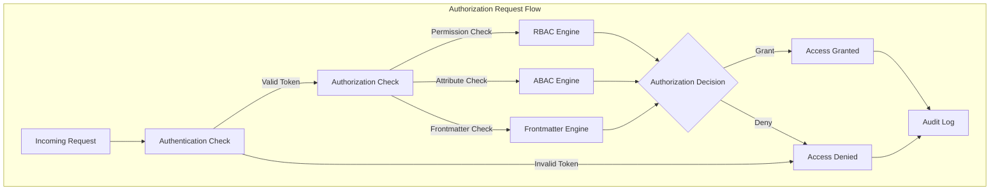
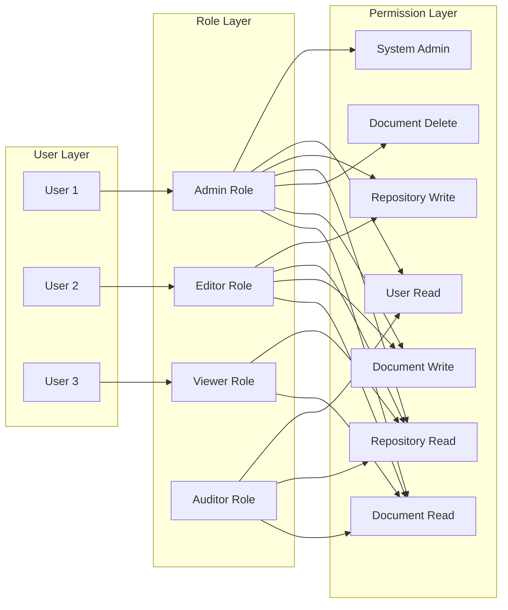
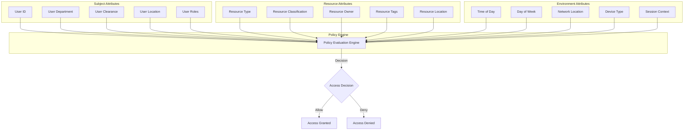
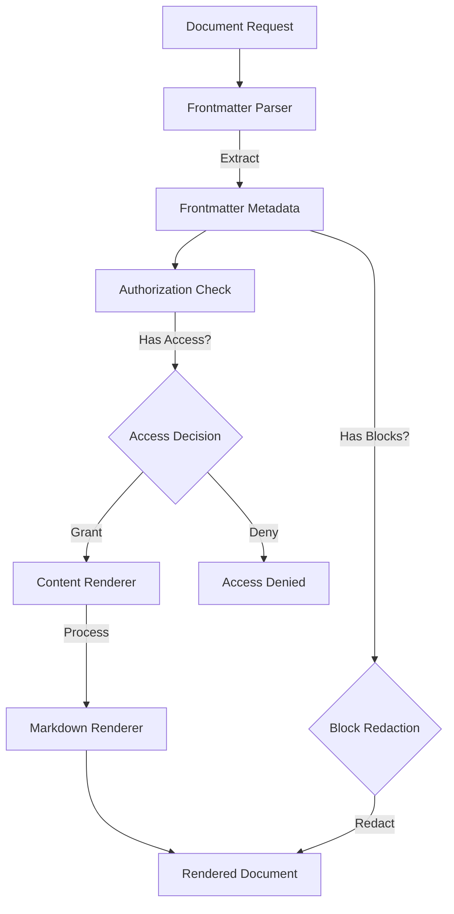
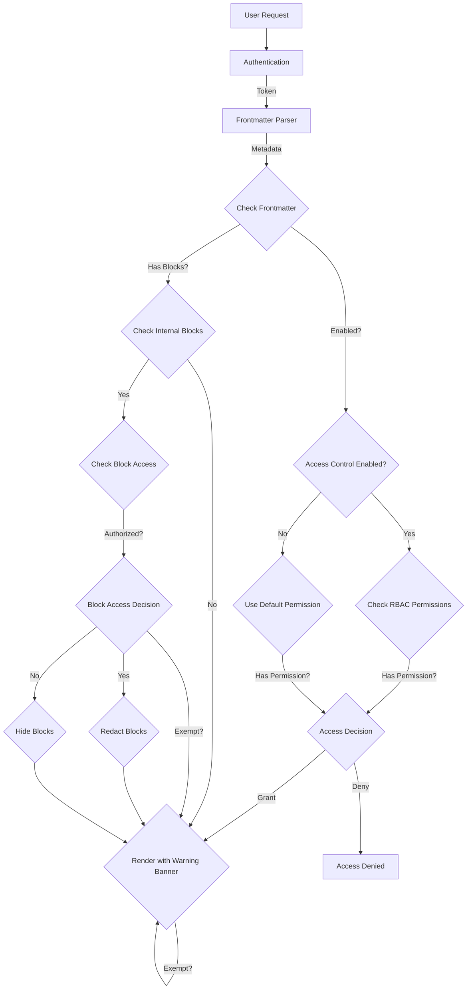
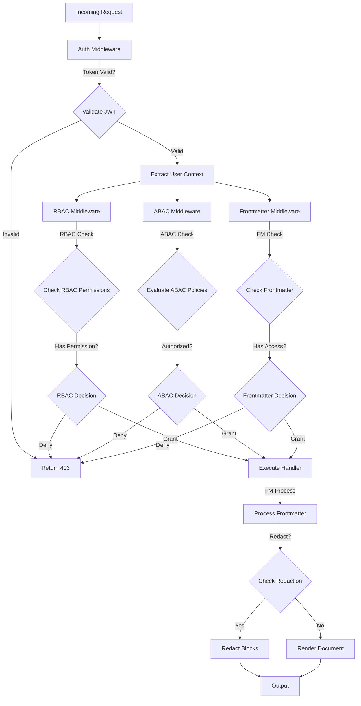

# TACHYON: AUTHORIZATION API SPECIFICATION

**Document ID:** TACHYON-API-018-V1.0
**Date:** February 2026
**Status:** Approved for Implementation
**Classification:** API Specification
**Compliance Level:** ISO/IEC 26514:2021, IEEE 829-2008, RFC 6749 (OAuth 2.0)

---

## TABLE OF CONTENTS

1. [Introduction](#1-introduction)
2. [Authorization Design Principles](#2-authorization-design-principles)
3. [Authorization Models](#3-authorization-models)
   3.1. [Role-Based Access Control (RBAC)](#31-role-based-access-control-rbac)
   3.2. [Attribute-Based Access Control (ABAC)](#32-attribute-based-access-control-abac)
4. [Permission System](#4-permission-system)
5. [Frontmatter Access Control](#5-frontmatter-access-control)
6. [Authorization Enforcement](#6-authorization-enforcement)
7. [Authorization Security](#7-authorization-security)
8. [Authorization Performance](#8-authorization-performance)
9. [References](#9-references)

---

## 1. INTRODUCTION

### 1.1. Document Purpose

This document defines the comprehensive Authorization API specification for the Tachyon toolchain. The Authorization API provides fine-grained access control mechanisms for protecting system resources, including documents, repositories, users, and system configurations. The specification defines the complete authorization model, API endpoints, request/response formats, error handling, and security considerations.

### 1.2. Scope

This specification covers:
- Role-Based Access Control (RBAC) implementation
- Attribute-Based Access Control (ABAC) extensions
- Permission management and validation
- Frontmatter-based access control for documents
- Block redaction for internal content
- Authorization enforcement middleware
- Security considerations for authorization
- Performance requirements and caching strategies

Out of scope:
- Authentication mechanisms (covered in Authentication API Specification)
- Session management (covered in Authentication API Specification)
- Encryption implementation (covered in Security Architecture)
- Audit logging infrastructure (covered in Security Architecture)

### 1.3. Target Audience

This specification is intended for:
- API developers implementing authorization endpoints
- Security engineers designing access control systems
- Frontend developers consuming authorization APIs
- System architects designing authorization flows
- QA engineers testing authorization functionality

### 1.4. Document Dependencies

This document depends on:
- [TACHYON-STD-V1.0](../../.specs/01_standards/coding_standards.md) - Coding and Documentation Standards
- [TACHYON-REQ-SEC-V1.0](../../.specs/04_future_state/reqs/security_requirements.md) - Security Requirements
- [TACHYON-DSN-SEC-V1.0](../../.specs/04_future_state/design/security_design.md) - Security Design
- [TACHYON-ADR-001-V1.0](../../.specs/02_adrs/001_rust_as_primary_language.md) - Rust as Primary Language
- [TACHYON-ADR-003-V1.0](../../.specs/02_adrs/003_axum_for_http2_server.md) - Axum for HTTP/2 Server
- [TACHYON-ADR-007-V1.0](../../.specs/02_adrs/007_tokio_for_async_runtime.md) - Tokio for Async Runtime
- [TACHYON-ADR-010-V1.0](../../.specs/02_adrs/010_security_architecture.md) - Security Architecture
- [TACHYON-TMA-V1.0](../../.specs/03_threat_model/analysis.md) - Threat Model Analysis

---

## 2. AUTHORIZATION DESIGN PRINCIPLES

### 2.1. Core Authorization Principles

The Tachyon authorization system implements the following core principles:

**Principle 1: Principle of Least Privilege**

Users and processes must be granted only the minimum permissions necessary to perform their required functions. This principle minimizes the attack surface and limits potential damage from compromised accounts.

*Implementation Requirements:*
- Default deny-all access policy
- Explicit permission grants required for all operations
- Permission inheritance follows strict hierarchy rules
- Temporary permissions must have automatic expiration

**Principle 2: Defense-in-Depth Authorization**

Multiple authorization layers provide redundant protection, ensuring that bypass of one layer does not compromise system security.

*Implementation Requirements:*
- Application-layer authorization checks
- Framework-layer middleware enforcement
- Data-layer access controls
- Network-layer security boundaries

**Principle 3: Fail-Safe Authorization**

Authorization failures must default to deny access, preventing security vulnerabilities from error conditions.

*Implementation Requirements:*
- All authorization checks return false on error
- No implicit permissions from missing data
- Explicit deny overrides allow permissions
- Error messages must not reveal authorization state

**Principle 4: Separation of Duties**

Authorization checks must be separated from business logic, enabling independent testing and auditing of authorization decisions.

*Implementation Requirements:*
- Authorization checks in dedicated middleware
- Permission validation before business logic execution
- Audit logging of all authorization decisions
- No business logic in authorization paths

### 2.2. Authorization Architecture

The Tachyon authorization system implements a hybrid RBAC/ABAC model with frontmatter-based access control extensions.



**Authorization Layers:**

| Layer | Purpose | Technology | Enforcement Point |
|-------|---------|-------------|------------------|
| **Authentication Layer** | Verify user identity | JWT token validation | Middleware |
| **RBAC Layer** | Role-based permissions | PermissionManager trait | Middleware |
| **ABAC Layer** | Attribute-based policies | Attribute evaluation engine | Handler |
| **Frontmatter Layer** | Document-level access | Frontmatter parser | Handler |
| **Audit Layer** | Log authorization decisions | Tracing infrastructure | Middleware |

### 2.3. Authorization Model Constraints

The authorization system must satisfy the following constraints:

**Constraint A: Deterministic Authorization**

Authorization decisions must be deterministic and reproducible for identical inputs, enabling caching and predictable behavior.

*Formal Specification:*
```
∀u ∈ Users, ∀p ∈ Permissions, ∀r ∈ Resources:
  authorize(u, p, r) = authorize'(u, p, r)
```

**Constraint B: Complete Mediation**

All access to protected resources must be mediated through authorization checks, with no bypass mechanisms.

*Formal Specification:*
```
∀op ∈ Operations, ∀r ∈ ProtectedResources:
  execute(op, r) ⇒ authorize(user, op, r) = true
```

**Constraint C: Auditability**

All authorization decisions must be logged with sufficient context for forensic analysis.

*Formal Specification:*
```
∀u ∈ Users, ∀op ∈ Operations, ∀r ∈ Resources:
  ∃log ∈ AuditLogs:
    log.user = u ∧ log.operation = op ∧ log.resource = r
```

**Constraint D: Temporal Consistency**

Authorization decisions must respect temporal constraints including session validity, permission expiration, and time-based policies.

*Formal Specification:*
```
∀u ∈ Users, ∀p ∈ Permissions:
  authorize(u, p, r) ⇒ valid(u.session) ∧ valid(p.expiration)
```

---

## 3. AUTHORIZATION MODELS

### 3.1. Role-Based Access Control (RBAC)

The Tachyon system implements Role-Based Access Control (RBAC) as the primary authorization model, providing hierarchical permission assignment through roles. RBAC enables efficient permission management by grouping permissions into roles and assigning roles to users.

#### 3.1.1. RBAC Architecture

The RBAC model implements a three-layer permission hierarchy: Users → Roles → Permissions.



#### 3.1.2. Role Definitions

The Tachyon system defines following standard roles with associated permissions:

**Role: Admin**

*Description:* Full system administration access with all permissions.

*Permissions:*
- `system:admin` - Full system administration
- `document:*` - All document permissions (read, write, delete, share)
- `repository:*` - All repository permissions (read, write, delete, sync)
- `user:*` - All user management permissions (read, write, delete)
- `system:audit` - Audit log access

*Constraints:*
- Maximum 3 admin users per system instance
- Admin actions require additional verification (MFA or approval)
- Admin role cannot be self-assigned
- Admin role changes require audit logging

**Role: Editor**

*Description:* Content editing permissions for documents and repositories.

*Permissions:*
- `document:read` - Read documents
- `document:write` - Create and edit documents
- `document:share` - Share documents with other users
- `repository:read` - Read repository contents
- `repository:write` - Commit changes to repositories

*Constraints:*
- Cannot delete documents or repositories
- Cannot manage users or system configuration
- Share actions require recipient approval

**Role: Viewer**

*Description:* Read-only access to documents and repositories.

*Permissions:*
- `document:read` - Read documents
- `repository:read` - Read repository contents

*Constraints:*
- Cannot modify, delete, or share any content
- Cannot access system administration functions
- Cannot view audit logs

**Role: Auditor**

*Description:* Read-only access for audit and compliance purposes.

*Permissions:*
- `document:read` - Read documents
- `repository:read` - Read repository contents
- `system:audit` - Access audit logs

*Constraints:*
- Cannot modify any content
- Cannot perform administrative actions
- Audit access is logged separately

#### 3.1.3. Role Hierarchy and Inheritance

The RBAC model implements role hierarchy with permission inheritance.

*Hierarchy Rules:*
- Admin role inherits all permissions from Editor, Viewer, and Auditor roles
- Editor role inherits all permissions from Viewer role
- Permissions are transitive through role hierarchy
- Explicit deny overrides inherited allow permissions

*Formal Specification:*
```
∀r₁, r₂ ∈ Roles:
  inherits(r₁, r₂) ⇒ ∀p ∈ Permissions(r₂):
    p ∈ Permissions(r₁)
```

*Role Hierarchy:*
```
Admin
├── Editor
│   └── Viewer
└── Auditor
    └── Viewer
```

#### 3.1.4. RBAC API Endpoints

**POST /api/v1/authorization/roles**

*Description:* Create a new role with specified permissions.

*Request Body:*
```json
{
  "name": "custom_editor",
  "description": "Custom editor role with limited permissions",
  "permissions": [
    "document:read",
    "document:write",
    "repository:read"
  ],
  "inherits_from": ["viewer"]
}
```

*Parameters:*
| Parameter | Type | Required | Description | Constraints |
|-----------|------|----------|-------------|------------|
| `name` | string | Yes | Unique role identifier | 3-64 characters, alphanumeric and underscores |
| `description` | string | No | Human-readable role description | 0-256 characters |
| `permissions` | array | Yes | Permissions assigned to role | Must be valid permission identifiers |
| `inherits_from` | array | No | Parent roles for inheritance | Must be existing roles |

*Response (201 Created):*
```json
{
  "id": "role_550e8400-e29b-41d4-a716-446655440100",
  "name": "custom_editor",
  "description": "Custom editor role with limited permissions",
  "permissions": [
    "document:read",
    "document:write",
    "repository:read"
  ],
  "inherits_from": ["viewer"],
  "created_at": "2026-02-06T03:00:00Z",
  "updated_at": "2026-02-06T03:00:00Z"
}
```

*Error Responses:*
- `400 Bad Request` - Invalid role name or permissions
- `401 Unauthorized` - Authentication required
- `403 Forbidden` - Insufficient permissions to create roles
- `409 Conflict` - Role name already exists
- `500 Internal Server Error` - Server error

**GET /api/v1/authorization/roles**

*Description:* List all roles with their permissions and inheritance.

*Query Parameters:*
| Parameter | Type | Required | Description |
|-----------|------|----------|-------------|
| `page` | integer | No | Page number (default: 1) |
| `limit` | integer | No | Items per page (default: 50, max: 100) |

*Response (200 OK):*
```json
{
  "roles": [
    {
      "id": "role_550e8400-e29b-41d4-a716-446655440100",
      "name": "admin",
      "description": "Full system administration access",
      "permissions": [
        "system:admin",
        "document:read",
        "document:write",
        "document:delete",
        "document:share",
        "repository:read",
        "repository:write",
        "repository:delete",
        "repository:sync",
        "user:read",
        "user:write",
        "user:delete",
        "system:audit"
      ],
      "inherits_from": [],
      "user_count": 3,
      "created_at": "2026-02-01T00:00:00Z",
      "updated_at": "2026-02-01T00:00:00Z"
    }
  ],
  "pagination": {
    "page": 1,
    "limit": 50,
    "total": 8,
    "total_pages": 1
  }
}
```

**GET /api/v1/authorization/roles/{role_id}**

*Description:* Retrieve detailed information about a specific role.

*Path Parameters:*
| Parameter | Type | Description |
|-----------|------|-------------|
| `role_id` | UUID | Unique role identifier |

*Response (200 OK):*
```json
{
  "id": "role_550e8400-e29b-41d4-a716-446655440100",
  "name": "admin",
  "description": "Full system administration access",
  "permissions": [
    "system:admin",
    "document:read",
    "document:write",
    "document:delete",
    "document:share",
    "repository:read",
    "repository:write",
    "repository:delete",
    "repository:sync",
    "user:read",
    "user:write",
    "user:delete",
    "system:audit"
  ],
  "inherits_from": [],
  "inherited_permissions": [],
  "effective_permissions": [
    "system:admin",
    "document:read",
    "document:write",
    "document:delete",
    "document:share",
    "repository:read",
    "repository:write",
    "repository:delete",
    "repository:sync",
    "user:read",
    "user:write",
    "user:delete",
    "system:audit"
  ],
  "user_count": 3,
  "created_at": "2026-02-01T00:00:00Z",
  "updated_at": "2026-02-01T00:00:00Z"
}
```

*Error Responses:*
- `400 Bad Request` - Invalid role ID format
- `401 Unauthorized` - Authentication required
- `404 Not Found` - Role not found

**PUT /api/v1/authorization/roles/{role_id}**

*Description:* Update an existing role's permissions or inheritance.

*Path Parameters:*
| Parameter | Type | Description |
|-----------|------|-------------|
| `role_id` | UUID | Unique role identifier |

*Request Body:*
```json
{
  "description": "Updated role description",
  "permissions": [
    "document:read",
    "document:write"
  ],
  "inherits_from": ["viewer"]
}
```

*Response (200 OK):*
```json
{
  "id": "role_550e8400-e29b-41d4-a716-446655440100",
  "name": "editor",
  "description": "Updated role description",
  "permissions": [
    "document:read",
    "document:write"
  ],
  "inherits_from": ["viewer"],
  "effective_permissions": [
    "document:read",
    "document:write",
    "repository:read"
  ],
  "updated_at": "2026-02-06T03:30:00Z"
}
```

*Error Responses:*
- `400 Bad Request` - Invalid role ID, permissions, or inheritance
- `401 Unauthorized` - Authentication required
- `403 Forbidden` - Insufficient permissions to update roles
- `404 Not Found` - Role not found
- `409 Conflict` - Circular inheritance detected
- `500 Internal Server Error` - Server error

**DELETE /api/v1/authorization/roles/{role_id}**

*Description:* Delete a role. Users assigned to this role will be removed.

*Path Parameters:*
| Parameter | Type | Description |
|-----------|------|-------------|
| `role_id` | UUID | Unique role identifier |

*Response (204 No Content):* Role deleted successfully

*Error Responses:*
- `400 Bad Request` - Invalid role ID format
- `401 Unauthorized` - Authentication required
- `403 Forbidden` - Cannot delete system roles (admin, editor, viewer, auditor)
- `404 Not Found` - Role not found
- `409 Conflict` - Role has active users
- `500 Internal Server Error` - Server error

**POST /api/v1/authorization/users/{user_id}/roles**

*Description:* Assign a role to a user.

*Path Parameters:*
| Parameter | Type | Description |
|-----------|------|-------------|
| `user_id` | UUID | Unique user identifier |

*Request Body:*
```json
{
  "role_id": "role_550e8400-e29b-41d4-a716-446655440100",
  "expires_at": "2026-12-31T23:59:59Z"
}
```

*Parameters:*
| Parameter | Type | Required | Description | Constraints |
|-----------|------|----------|-------------|------------|
| `role_id` | UUID | Yes | Role to assign | Must be existing role |
| `expires_at` | datetime | No | Optional expiration for role assignment | ISO 8601 format, future date |

*Response (201 Created):*
```json
{
  "user_id": "user_550e8400-e29b-41d4-a716-446655440100",
  "role_id": "role_550e8400-e29b-41d4-a716-446655440100",
  "assigned_at": "2026-02-06T03:30:00Z",
  "expires_at": "2026-12-31T23:59:59Z",
  "assigned_by": "user_550e8400-e29b-41d4-a716-446655440101"
}
```

*Error Responses:*
- `400 Bad Request` - Invalid user ID or role ID
- `401 Unauthorized` - Authentication required
- `403 Forbidden` - Insufficient permissions to assign roles
- `404 Not Found` - User or role not found
- `409 Conflict` - User already has this role
- `500 Internal Server Error` - Server error

**DELETE /api/v1/authorization/users/{user_id}/roles/{role_id}**

*Description:* Remove a role from a user.

*Path Parameters:*
| Parameter | Type | Description |
|-----------|------|-------------|
| `user_id` | UUID | Unique user identifier |
| `role_id` | UUID | Role to remove |

*Response (204 No Content):* Role removed successfully

*Error Responses:*
- `400 Bad Request` - Invalid user ID or role ID format
- `401 Unauthorized` - Authentication required
- `403 Forbidden` - Insufficient permissions to remove roles
- `404 Not Found` - User or role not found
- `409 Conflict` - User does not have this role
- `500 Internal Server Error` - Server error

### 3.2. Attribute-Based Access Control (ABAC)

The Tachyon system implements Attribute-Based Access Control (ABAC) as an extension to RBAC, providing fine-grained, context-aware authorization decisions based on user attributes, resource attributes, and environmental conditions.

#### 3.2.1. ABAC Architecture

The ABAC model implements policy-based authorization using attributes from multiple dimensions.



#### 3.2.2. Attribute Definitions

The ABAC model defines following attribute categories:

**Subject Attributes**

Attributes describing the user requesting access.

| Attribute | Type | Description | Example Values |
|----------|------|-------------|----------------|
| `user.id` | UUID | Unique user identifier | `user_550e8400-...` |
| `user.department` | string | User's organizational department | `engineering`, `marketing`, `sales` |
| `user.clearance` | enum | Security clearance level | `public`, `internal`, `confidential`, `secret` |
| `user.location` | string | User's physical location | `office`, `remote`, `on-premise` |
| `user.roles` | array | User's assigned roles | `["editor", "viewer"]` |
| `user.email_domain` | string | User's email domain | `tachyon.io`, `external.com` |
| `user.groups` | array | User's group memberships | `["developers", "admins"]` |

**Resource Attributes**

Attributes describing the resource being accessed.

| Attribute | Type | Description | Example Values |
|----------|------|-------------|----------------|
| `resource.type` | enum | Type of resource | `document`, `repository`, `user`, `system` |
| `resource.classification` | enum | Resource sensitivity classification | `public`, `internal`, `confidential` |
| `resource.owner` | UUID | Resource owner's user ID | `user_550e8400-...` |
| `resource.tags` | array | Resource tags for policy matching | `["finance", "hr", "public"]` |
| `resource.created_at` | datetime | Resource creation timestamp | `2026-02-01T00:00:00Z` |
| `resource.location` | string | Resource storage location | `us-east-1`, `eu-west-2` |

**Environment Attributes**

Attributes describing the access context.

| Attribute | Type | Description | Example Values |
|----------|------|-------------|----------------|
| `env.time_of_day` | integer | Hour of day (0-23) | `9`, `14`, `22` |
| `env.day_of_week` | integer | Day of week (0-6) | `1`, `3`, `5` |
| `env.network_location` | string | Network location of request | `internal`, `external`, `vpn` |
| `env.device_type` | enum | Type of device making request | `desktop`, `mobile`, `api` |
| `env.session_context` | string | Session type | `normal`, `elevated`, `emergency` |

#### 3.2.3. Policy Definition Language

The ABAC system uses a policy definition language (PDL) for expressing access control rules.

*Policy Structure:*
```
POLICY policy_name {
  DESCRIPTION "Human-readable policy description"
  
  SUBJECT {
    user.id = "user_550e8400-..." OR
    user.department IN ["engineering", "product"]
  }
  
  RESOURCE {
    resource.type = "document" AND
    resource.classification IN ["public", "internal"]
  }
  
  ENVIRONMENT {
    env.time_of_day >= 8 AND env.time_of_day <= 18
  }
  
  EFFECT allow
  PRIORITY 100
}
```

*Policy Operators:*
| Operator | Description | Example |
|----------|-------------|---------|
| `=` | Equality check | `user.department = "engineering"` |
| `!=` | Inequality check | `user.department != "hr"` |
| `IN` | Membership in set | `user.roles IN ["editor", "admin"]` |
| `NOT IN` | Non-membership in set | `user.department NOT IN ["hr", "legal"]` |
| `AND` | Logical conjunction | `user.department = "engineering" AND user.clearance = "confidential"` |
| `OR` | Logical disjunction | `user.department = "engineering" OR user.department = "product"` |
| `>=` | Greater than or equal | `env.time_of_day >= 8` |
| `<=` | Less than or equal | `env.time_of_day <= 18` |
| `>` | Greater than | `user.clearance > "internal"` |
| `<` | Less than | `user.clearance < "secret"` |

*Policy Effect:*
| Effect | Description |
|--------|-------------|
| `allow` | Grant access if all conditions are met |
| `deny` | Deny access if all conditions are met |

*Policy Priority:*
Policies are evaluated in priority order (highest first). First matching policy determines access decision.

#### 3.2.4. ABAC API Endpoints

**POST /api/v1/authorization/policies**

*Description:* Create a new ABAC policy.

*Request Body:*
```json
{
  "name": "engineering_documents_after_hours",
  "description": "Allow engineering department to access documents during business hours",
  "subject": {
    "operator": "AND",
    "conditions": [
      {
        "attribute": "user.department",
        "operator": "IN",
        "value": ["engineering", "product"]
      }
    ]
  },
  "resource": {
    "operator": "AND",
    "conditions": [
      {
        "attribute": "resource.type",
        "operator": "=",
        "value": "document"
      },
      {
        "attribute": "resource.classification",
        "operator": "IN",
        "value": ["public", "internal"]
      }
    ]
  },
  "environment": {
    "operator": "AND",
    "conditions": [
      {
        "attribute": "env.time_of_day",
        "operator": ">=",
        "value": 8
      },
      {
        "attribute": "env.time_of_day",
        "operator": "<=",
        "value": 18
      }
    ]
  },
  "effect": "allow",
  "priority": 100,
  "enabled": true
}
```

*Parameters:*
| Parameter | Type | Required | Description | Constraints |
|-----------|------|----------|-------------|------------|
| `name` | string | Yes | Unique policy identifier | 3-64 characters, alphanumeric and underscores |
| `description` | string | Yes | Human-readable policy description | 0-512 characters |
| `subject` | object | Yes | Subject attribute conditions | Valid policy condition structure |
| `resource` | object | Yes | Resource attribute conditions | Valid policy condition structure |
| `environment` | object | No | Environment attribute conditions | Valid policy condition structure |
| `effect` | enum | Yes | Policy effect | `allow` or `deny` |
| `priority` | integer | Yes | Policy evaluation priority | 0-1000, higher evaluated first |
| `enabled` | boolean | No | Whether policy is active | Default: `true` |

*Response (201 Created):*
```json
{
  "id": "policy_550e8400-e29b-41d4-a716-446655440100",
  "name": "engineering_documents_after_hours",
  "description": "Allow engineering department to access documents during business hours",
  "subject": {
    "operator": "AND",
    "conditions": [
      {
        "attribute": "user.department",
        "operator": "IN",
        "value": ["engineering", "product"]
      }
    ]
  },
  "resource": {
    "operator": "AND",
    "conditions": [
      {
        "attribute": "resource.type",
        "operator": "=",
        "value": "document"
      },
      {
        "attribute": "resource.classification",
        "operator": "IN",
        "value": ["public", "internal"]
      }
    ]
  },
  "environment": {
    "operator": "AND",
    "conditions": [
      {
        "attribute": "env.time_of_day",
        "operator": ">=",
        "value": 8
      },
      {
        "attribute": "env.time_of_day",
        "operator": "<=",
        "value": 18
      }
    ]
  },
  "effect": "allow",
  "priority": 100,
  "enabled": true,
  "created_at": "2026-02-06T04:00:00Z",
  "updated_at": "2026-02-06T04:00:00Z"
}
```

*Error Responses:*
- `400 Bad Request` - Invalid policy structure or operators
- `401 Unauthorized` - Authentication required
- `403 Forbidden` - Insufficient permissions to create policies
- `409 Conflict` - Policy name already exists
- `500 Internal Server Error` - Server error

**GET /api/v1/authorization/policies**

*Description:* List all ABAC policies.

*Query Parameters:*
| Parameter | Type | Required | Description |
|-----------|------|----------|-------------|
| `page` | integer | No | Page number (default: 1) |
| `limit` | integer | No | Items per page (default: 50, max: 100) |
| `enabled` | boolean | No | Filter by enabled status |
| `effect` | enum | No | Filter by effect (`allow`, `deny`) |

*Response (200 OK):*
```json
{
  "policies": [
    {
      "id": "policy_550e8400-e29b-41d4-a716-446655440100",
      "name": "engineering_documents_after_hours",
      "description": "Allow engineering department to access documents during business hours",
      "effect": "allow",
      "priority": 100,
      "enabled": true,
      "created_at": "2026-02-06T04:00:00Z",
      "updated_at": "2026-02-06T04:00:00Z"
    }
  ],
  "pagination": {
    "page": 1,
    "limit": 50,
    "total": 15,
    "total_pages": 1
  }
}
```

**GET /api/v1/authorization/policies/{policy_id}**

*Description:* Retrieve detailed information about a specific policy.

*Path Parameters:*
| Parameter | Type | Description |
|-----------|------|-------------|
| `policy_id` | UUID | Unique policy identifier |

*Response (200 OK):*
```json
{
  "id": "policy_550e8400-e29b-41d4-a716-446655440100",
  "name": "engineering_documents_after_hours",
  "description": "Allow engineering department to access documents during business hours",
  "subject": {
    "operator": "AND",
    "conditions": [
      {
        "attribute": "user.department",
        "operator": "IN",
        "value": ["engineering", "product"]
      }
    ]
  },
  "resource": {
    "operator": "AND",
    "conditions": [
      {
        "attribute": "resource.type",
        "operator": "=",
        "value": "document"
      },
      {
        "attribute": "resource.classification",
        "operator": "IN",
        "value": ["public", "internal"]
      }
    ]
  },
  "environment": {
    "operator": "AND",
    "conditions": [
      {
        "attribute": "env.time_of_day",
        "operator": ">=",
        "value": 8
      },
      {
        "attribute": "env.time_of_day",
        "operator": "<=",
        "value": 18
      }
    ]
  },
  "effect": "allow",
  "priority": 100,
  "enabled": true,
  "created_at": "2026-02-06T04:00:00Z",
  "updated_at": "2026-02-06T04:00:00Z"
}
```

*Error Responses:*
- `400 Bad Request` - Invalid policy ID format
- `401 Unauthorized` - Authentication required
- `404 Not Found` - Policy not found

**PUT /api/v1/authorization/policies/{policy_id}**

*Description:* Update an existing ABAC policy.

*Path Parameters:*
| Parameter | Type | Description |
|-----------|------|-------------|
| `policy_id` | UUID | Unique policy identifier |

*Request Body:*
```json
{
  "description": "Updated policy description",
  "enabled": false
}
```

*Response (200 OK):*
```json
{
  "id": "policy_550e8400-e29b-41d4-a716-446655440100",
  "name": "engineering_documents_after_hours",
  "description": "Updated policy description",
  "subject": {
    "operator": "AND",
    "conditions": [
      {
        "attribute": "user.department",
        "operator": "IN",
        "value": ["engineering", "product"]
      }
    ]
  },
  "resource": {
    "operator": "AND",
    "conditions": [
      {
        "attribute": "resource.type",
        "operator": "=",
        "value": "document"
      },
      {
        "attribute": "resource.classification",
        "operator": "IN",
        "value": ["public", "internal"]
      }
    ]
  },
  "environment": {
    "operator": "AND",
    "conditions": [
      {
        "attribute": "env.time_of_day",
        "operator": ">=",
        "value": 8
      },
      {
        "attribute": "env.time_of_day",
        "operator": "<=",
        "value": 18
      }
    ]
  },
  "effect": "allow",
  "priority": 100,
  "enabled": false,
  "updated_at": "2026-02-06T04:30:00Z"
}
```

*Error Responses:*
- `400 Bad Request` - Invalid policy ID or structure
- `401 Unauthorized` - Authentication required
- `403 Forbidden` - Insufficient permissions to update policies
- `404 Not Found` - Policy not found
- `500 Internal Server Error` - Server error

**DELETE /api/v1/authorization/policies/{policy_id}**

*Description:* Delete an ABAC policy.

*Path Parameters:*
| Parameter | Type | Description |
|-----------|------|-------------|
| `policy_id` | UUID | Unique policy identifier |

*Response (204 No Content):* Policy deleted successfully

*Error Responses:*
- `400 Bad Request` - Invalid policy ID format
- `401 Unauthorized` - Authentication required
- `403 Forbidden` - Cannot delete system policies
- `404 Not Found` - Policy not found
- `500 Internal Server Error` - Server error

**POST /api/v1/authorization/evaluate**

*Description:* Evaluate authorization decision for a specific request using ABAC policies.

*Request Body:*
```json
{
  "user_id": "user_550e8400-e29b-41d4-a716-446655440100",
  "resource": {
    "type": "document",
    "id": "doc_550e8400-e29b-41d4-a716-446655440100",
    "classification": "internal",
    "owner": "user_550e8400-e29b-41d4-a716-446655440101"
  },
  "environment": {
    "time_of_day": 14,
    "day_of_week": 3,
    "network_location": "internal",
    "device_type": "desktop"
  }
}
```

*Parameters:*
| Parameter | Type | Required | Description |
|-----------|------|----------|-------------|
| `user_id` | UUID | Yes | User requesting access |
| `resource` | object | Yes | Resource being accessed |
| `environment` | object | No | Access context |

*Response (200 OK):*
```json
{
  "authorized": true,
  "decision": "allow",
  "matched_policy": {
    "id": "policy_550e8400-e29b-41d4-a716-446655440100",
    "name": "engineering_documents_after_hours",
    "effect": "allow"
  },
  "evaluated_policies": 5,
  "evaluation_time_ms": 2
}
```

*Error Responses:*
- `400 Bad Request` - Invalid request structure
- `401 Unauthorized` - Authentication required
- `500 Internal Server Error` - Server error

---

## 4. PERMISSION SYSTEM

The Tachyon permission system defines atomic permission identifiers that can be granted to users directly or through role assignments. Permissions represent the finest-grained access control units in the system.

### 4.1. Permission Taxonomy

Permissions are organized into hierarchical categories reflecting resource domains and operation types.

**Permission Hierarchy:**
```
system:*
├── system:admin
└── system:audit

document:*
├── document:read
├── document:write
├── document:delete
└── document:share

repository:*
├── repository:read
├── repository:write
├── repository:delete
└── repository:sync

user:*
├── user:read
├── user:write
└── user:delete
```

### 4.2. Permission Definitions

**System Permissions**

| Permission ID | Name | Description | Resource Scope | Criticality |
|--------------|------|-------------|----------------|------------|
| `system:admin` | System Administrator | All system resources | Critical |
| `system:audit` | Audit Log Access | Audit logs only | High |

**Document Permissions**

| Permission ID | Name | Description | Resource Scope | Criticality |
|--------------|------|-------------|----------------|------------|
| `document:read` | Read Document | Document content | High |
| `document:write` | Write Document | Document content | High |
| `document:delete` | Delete Document | Document metadata | Critical |
| `document:share` | Share Document | Document sharing | High |

**Repository Permissions**

| Permission ID | Name | Description | Resource Scope | Criticality |
|--------------|------|-------------|----------------|------------|
| `repository:read` | Read Repository | Repository contents | High |
| `repository:write` | Write Repository | Repository commits | High |
| `repository:delete` | Delete Repository | Repository metadata | Critical |
| `repository:sync` | Sync Repository | Git operations | High |

**User Permissions**

| Permission ID | Name | Description | Resource Scope | Criticality |
|--------------|------|-------------|----------------|------------|
| `user:read` | Read User | User profile | Medium |
| `user:write` | Write User | User profile | High |
| `user:delete` | Delete User | User account | Critical |

### 4.3. Permission API Endpoints

**POST /api/v1/authorization/permissions**

*Description:* Create a custom permission.

*Request Body:*
```json
{
  "id": "document:custom_action",
  "name": "Custom Document Action",
  "description": "Permission to perform custom actions on documents",
  "resource_type": "document"
}
```

*Parameters:*
| Parameter | Type | Required | Description | Constraints |
|-----------|------|----------|-------------|------------|
| `id` | string | Yes | Unique permission identifier | Format: `resource:action` |
| `name` | string | Yes | Human-readable permission name | 3-64 characters |
| `description` | string | Yes | Permission description | 0-256 characters |
| `resource_type` | enum | Yes | Resource type | `document`, `repository`, `user`, `system` |

*Response (201 Created):*
```json
{
  "id": "document:custom_action",
  "name": "Custom Document Action",
  "description": "Permission to perform custom actions on documents",
  "resource_type": "document",
  "created_at": "2026-02-06T05:00:00Z"
}
```

*Error Responses:*
- `400 Bad Request` - Invalid permission ID or resource type
- `401 Unauthorized` - Authentication required
- `403 Forbidden` - Insufficient permissions to create permissions
- `409 Conflict` - Permission ID already exists
- `500 Internal Server Error` - Server error

**GET /api/v1/authorization/permissions**

*Description:* List all permissions with their details.

*Query Parameters:*
| Parameter | Type | Required | Description |
|-----------|------|----------|-------------|
| `resource_type` | enum | No | Filter by resource type |
| `page` | integer | No | Page number (default: 1) |
| `limit` | integer | No | Items per page (default: 50, max: 100) |

*Response (200 OK):*
```json
{
  "permissions": [
    {
      "id": "document:read",
      "name": "Read Document",
      "description": "Permission to read document content",
      "resource_type": "document",
      "category": "document",
      "is_custom": false,
      "created_at": "2026-02-01T00:00:00Z"
    },
    {
      "id": "document:write",
      "name": "Write Document",
      "description": "Permission to create and edit documents",
      "resource_type": "document",
      "category": "document",
      "is_custom": false,
      "created_at": "2026-02-01T00:00:00Z"
    }
  ],
  "pagination": {
    "page": 1,
    "limit": 50,
    "total": 13,
    "total_pages": 1
  }
}
```

**GET /api/v1/authorization/permissions/{permission_id}**

*Description:* Retrieve detailed information about a specific permission.

*Path Parameters:*
| Parameter | Type | Description |
|-----------|------|-------------|
| `permission_id` | string | Permission identifier |

*Response (200 OK):*
```json
{
  "id": "document:read",
  "name": "Read Document",
  "description": "Permission to read document content",
  "resource_type": "document",
  "category": "document",
  "is_custom": false,
  "created_at": "2026-02-01T00:00:00Z"
}
```

*Error Responses:*
- `400 Bad Request` - Invalid permission ID format
- `401 Unauthorized` - Authentication required
- `404 Not Found` - Permission not found

**POST /api/v1/authorization/users/{user_id}/permissions**

*Description:* Grant a specific permission directly to a user.

*Path Parameters:*
| Parameter | Type | Description |
|-----------|------|-------------|
| `user_id` | UUID | Unique user identifier |

*Request Body:*
```json
{
  "permission_id": "document:read",
  "expires_at": "2026-12-31T23:59:59Z"
}
```

*Parameters:*
| Parameter | Type | Required | Description | Constraints |
|-----------|------|----------|-------------|------------|
| `permission_id` | string | Yes | Permission to grant | Must be existing permission |
| `expires_at` | datetime | No | Optional expiration for permission | ISO 8601 format, future date |

*Response (201 Created):*
```json
{
  "user_id": "user_550e8400-e29b-41d4-a716-446655440100",
  "permission_id": "document:read",
  "granted_at": "2026-02-06T05:30:00Z",
  "expires_at": "2026-12-31T23:59:59Z",
  "granted_by": "user_550e8400-e29b-41d4-a716-446655440101"
}
```

*Error Responses:*
- `400 Bad Request` - Invalid user ID or permission ID
- `401 Unauthorized` - Authentication required
- `403 Forbidden` - Insufficient permissions to grant permissions
- `404 Not Found` - User or permission not found
- `409 Conflict` - User already has this permission
- `500 Internal Server Error` - Server error

**DELETE /api/v1/authorization/users/{user_id}/permissions/{permission_id}**

*Description:* Revoke a specific permission from a user.

*Path Parameters:*
| Parameter | Type | Description |
|-----------|------|-------------|
| `user_id` | UUID | Unique user identifier |
| `permission_id` | string | Permission to revoke |

*Response (204 No Content):* Permission revoked successfully

*Error Responses:*
- `400 Bad Request` - Invalid user ID or permission ID format
- `401 Unauthorized` - Authentication required
- `403 Forbidden` - Insufficient permissions to revoke permissions
- `404 Not Found` - User or permission not found
- `409 Conflict` - User does not have this permission
- `500 Internal Server Error` - Server error

**GET /api/v1/authorization/users/{user_id}/permissions**

*Description:* List all permissions granted to a user, including those from roles and direct grants.

*Path Parameters:*
| Parameter | Type | Description |
|-----------|------|-------------|
| `user_id` | UUID | Unique user identifier |

*Query Parameters:*
| Parameter | Type | Required | Description |
|-----------|------|----------|-------------|
| `include_expired` | boolean | No | Include expired permissions | Default: `false` |

*Response (200 OK):*
```json
{
  "user_id": "user_550e8400-e29b-41d4-a716-446655440100",
  "permissions": [
    {
      "id": "document:read",
      "name": "Read Document",
      "source": "role",
      "source_id": "role_550e8400-e29b-41d4-a716-446655440100",
      "granted_at": "2026-02-01T00:00:00Z",
      "expires_at": null
    },
    {
      "id": "document:write",
      "name": "Write Document",
      "source": "role",
      "source_id": "role_550e8400-e29b-41d4-a716-446655440100",
      "granted_at": "2026-02-01T00:00:00Z",
      "expires_at": null
    },
    {
      "id": "repository:sync",
      "name": "Sync Repository",
      "source": "direct",
      "source_id": null,
      "granted_at": "2026-02-06T03:00:00Z",
      "expires_at": "2026-12-31T23:59:59Z"
    }
  ],
  "total_permissions": 3,
  "effective_permissions": [
    "document:read",
    "document:write",
    "repository:sync"
  ]
}
```

*Error Responses:*
- `400 Bad Request` - Invalid user ID format
- `401 Unauthorized` - Authentication required
- `404 Not Found` - User not found
- `500 Internal Server Error` - Server error

---

## 5. FRONTMATTER ACCESS CONTROL

The Tachyon system implements document-level access control through frontmatter metadata, enabling fine-grained permissions on individual documents and content blocks. This feature supports internal documentation with restricted access and block-level redaction for sensitive content.

### 5.1. Frontmatter Architecture

Frontmatter access control integrates with document rendering pipeline to enforce access restrictions at content granularity.



### 5.2. Frontmatter Schema

Frontmatter access control uses YAML frontmatter with standardized keys for access control directives.

**Frontmatter Structure:**
```yaml
---
title: Document Title
description: Document description
author: Author Name
date: 2026-02-06

# Access Control
access_control:
  enabled: true
  default_permission: "read"
  permissions:
    - "read"
    - "write"
  
# Block Access Control
blocks:
  internal:
    required_permission: "internal:read"
    default_behavior: "redact"
    exempt_roles: ["admin"]
  
# Version Control
version_control:
  enabled: true
  default_version: "latest"
  access_matrix:
    latest:
      - "read"
      - "write"
    v1.0:
      - "read"
---
```

### 5.3. Frontmatter Access Control Keys

**access_control Section**

| Key | Type | Required | Description | Default |
|-----|------|----------|-------------|---------|
| `enabled` | boolean | No | Enable frontmatter access control | `true` |
| `default_permission` | string | No | Default permission for unspecified users | `"read"` |
| `permissions` | array | No | List of allowed permissions | `[]` |
| `inherit_from` | array | No | Parent roles for permission inheritance | `[]` |

**permissions Array Values**

| Permission ID | Description | Required RBAC Permission |
|--------------|-------------|--------------------------|
| `"read"` | Read document | `document:read` |
| `"write"` | Write document | `document:write` |
| `"delete"` | Delete document | `document:delete` |
| `"share"` | Share document | `document:share` |
| `"internal:read"` | Read internal blocks | `document:read` + internal access |
| `"admin"` | Full document control | `system:admin` |

**blocks Section**

| Key | Type | Required | Description | Default |
|-----|------|----------|-------------|---------|
| `internal` | object | No | Internal block access control settings | See below |
| `public` | object | No | Public block access control settings | See below |

**internal Block Settings**

| Key | Type | Required | Description | Default |
|-----|------|----------|-------------|---------|
| `required_permission` | string | Yes | Permission required to view internal blocks | `"internal:read"` |
| `default_behavior` | enum | No | Default behavior for unauthorized users | `"redact"` |
| `exempt_roles` | array | No | Roles exempt from redaction | `["admin"]` |

**default_behavior Values**

| Value | Description |
|-------|-------------|
| `"redact"` | Redact internal block content from output |
| `"hide"` | Remove internal block entirely from output |
| `"show"` | Show internal block with warning banner |

**version_control Section**

| Key | Type | Required | Description | Default |
|-----|------|----------|-------------|---------|
| `enabled` | boolean | No | Enable version-based access control | `false` |
| `default_version` | string | No | Default version to access | `"latest"` |
| `access_matrix` | object | No | Version-specific permission mapping | `{}` |

**access_matrix Structure**

```json
{
  "latest": ["read", "write"],
  "v1.0": ["read"],
  "v2.0": ["read", "write", "delete"]
}
```

### 5.4. Block Redaction

The Tachyon system supports block-level redaction for sensitive content using `::: internal` blocks in Markdown documents.

**Block Syntax:**

```markdown
::: internal
This content is only visible to users with internal:read permission.

::: internal-confidential
This confidential content requires admin-level access.

::: internal-technical
This technical content requires internal:read permission.
```

**Block Types:**

| Block Type | Syntax | Description | Required Permission |
|-----------|-------|-------------|---------------------|
| `internal` | `::: internal` | General internal content | `internal:read` |
| `internal-confidential` | `::: internal-confidential` | Confidential content | `system:admin` |
| `internal-technical` | `::: internal-technical` | Technical internal content | `internal:read` |

**Redaction Behavior:**

| Default Behavior | Description |
|----------------|-------------|
| **Redact** | Replace block content with `[REDACTED CONTENT - INTERNAL]` placeholder |
| **Hide** | Remove block entirely from rendered output |
| **Show** | Render block with warning banner: `[[WARN] INTERNAL CONTENT - AUTHORIZATION REQUIRED]` |

### 5.5. Frontmatter Authorization Flow

The authorization flow for frontmatter access control integrates with the main authorization system.



### 5.6. Frontmatter API Integration

Frontmatter access control integrates with existing document APIs for seamless authorization enforcement.

**GET /api/v1/documents/{document_id}**

*Enhanced Description:* Retrieve document with frontmatter access control evaluation.

*Path Parameters:*
| Parameter | Type | Description |
|-----------|------|-------------|
| `document_id` | UUID | Unique document identifier |

*Query Parameters:*
| Parameter | Type | Required | Description |
|-----------|------|----------|-------------|
| `evaluate_access` | boolean | No | Evaluate frontmatter access control | Default: `true` |

*Response (200 OK):*
```json
{
  "id": "doc_550e8400-e29b-41d4-a716-446655440100",
  "title": "Document Title",
  "content": "Document content...",
  "frontmatter": {
    "access_control": {
      "enabled": true,
      "default_permission": "read",
      "permissions": ["read", "write"],
      "inherit_from": ["viewer"]
    },
    "blocks": {
      "internal": {
        "required_permission": "internal:read",
        "default_behavior": "redact",
        "exempt_roles": ["admin"]
      }
    }
  },
  "access_evaluation": {
    "can_access": true,
    "effective_permissions": ["read", "write"],
    "access_method": "frontmatter",
    "restricted_blocks": 2,
    "redaction_applied": true
  },
  "created_at": "2026-02-01T00:00:00Z",
  "updated_at": "2026-02-06T03:00:00Z"
}
```

**PUT /api/v1/documents/{document_id}/frontmatter**

*Description:* Update frontmatter access control settings for a document.

*Path Parameters:*
| Parameter | Type | Description |
|-----------|------|-------------|
| `document_id` | UUID | Unique document identifier |

*Request Body:*
```json
{
  "access_control": {
    "enabled": true,
    "default_permission": "read",
    "permissions": ["read", "write"],
    "inherit_from": ["viewer"]
  },
  "blocks": {
    "internal": {
      "required_permission": "internal:read",
      "default_behavior": "redact",
      "exempt_roles": ["admin"]
    }
  }
}
```

*Response (200 OK):*
```json
{
  "id": "doc_550e8400-e29b-41d4-a716-446655440100",
  "frontmatter": {
    "access_control": {
      "enabled": true,
      "default_permission": "read",
      "permissions": ["read", "write"],
      "inherit_from": ["viewer"]
    },
    "blocks": {
      "internal": {
        "required_permission": "internal:read",
        "default_behavior": "redact",
        "exempt_roles": ["admin"]
      }
    }
  },
  "updated_at": "2026-02-06T04:00:00Z"
}
```

*Error Responses:*
- `400 Bad Request` - Invalid frontmatter structure
- `401 Unauthorized` - Authentication required
- `403 Forbidden` - Insufficient permissions to update frontmatter
- `404 Not Found` - Document not found
- `500 Internal Server Error` - Server error

**GET /api/v1/documents/{document_id}/access**

*Description:* Check access permissions for a specific document.

*Path Parameters:*
| Parameter | Type | Description |
|-----------|------|-------------|
| `document_id` | UUID | Unique document identifier |

*Response (200 OK):*
```json
{
  "document_id": "doc_550e8400-e29b-41d4-a716-446655440100",
  "can_access": true,
  "effective_permissions": ["read", "write"],
  "access_method": "frontmatter",
  "restricted_blocks": 2,
  "block_redaction": true,
  "access_details": {
    "frontmatter_enabled": true,
    "frontmatter_permissions": ["read", "write"],
    "rbac_permissions": ["document:read", "document:write"],
    "abac_policies": []
  }
}
```

*Error Responses:*
- `400 Bad Request` - Invalid document ID format
- `401 Unauthorized` - Authentication required
- `404 Not Found` - Document not found
- `500 Internal Server Error` - Server error

---

## 6. AUTHORIZATION ENFORCEMENT

The Tachyon system implements authorization enforcement through middleware layers and handler-level checks, ensuring that all protected resources are properly mediated through the authorization system.

### 6.1. Enforcement Architecture

Authorization enforcement is implemented at multiple layers to provide defense-in-depth protection.



### 6.2. Middleware Implementation

The authorization system uses Axum middleware for enforcing authorization checks on HTTP/2 requests.

**Authentication Middleware**

```rust
use axum::{
    extract::Request,
    http::StatusCode,
    response::{IntoResponse, Response, Json},
    middleware::Next,
};
use serde::{Deserialize, Serialize};
use uuid::Uuid;

use crate::tachyon_auth::{
    auth::JwtToken,
    error::AuthError,
};

/// Authentication middleware for validating JWT tokens
pub async fn auth_middleware<B>(
    mut request: Request,
    next: Next<B>,
) -> Result<Response, Body>
where
    B: IntoResponse + 'static str,
{
    // Extract Authorization header
    let auth_header = request
        .headers()
        .get("authorization")
        .and_then(|h| h.to_str())
        .ok_or_else(|| {
            return StatusCode::UNAUTHORIZED.into_response();
        })?;
    
    // Validate JWT token
    let token_str = auth_header
        .strip()
        .ok_or_else(|| {
            return StatusCode::UNAUTHORIZED.into_response();
        })?;
    
    let token = JwtToken::from_str(token_str)
        .map_err(|_| AuthError::InvalidToken)?;
    
    // Validate token
    if !token.is_valid() {
        return StatusCode::UNAUTHORIZED.into_response();
    }
    
    // Extract user context and add to request extensions
    let user_id = token.user_id();
    let permissions = token.permissions();
    
    request.extensions_mut().insert(UserId(user_id));
    request.extensions_mut().insert(UserPermissions(permissions));
    
    Ok(next)
}
```

**Authorization Middleware**

```rust
use axum::{
    extract::{Path, State, Request},
    http::StatusCode,
    response::{IntoResponse, Response, Json},
    middleware::Next,
};
use serde::{Deserialize, Serialize};
use uuid::Uuid;

use crate::tachyon_auth::{
    permission::{Permission, PermissionManager, PermissionError},
    role::Role,
};

/// Authorization middleware for checking permissions
pub async fn authorization_middleware<B>(
    permission: Permission,
    resource: Option<Resource>,
) -> impl<B> Clone> Send + 'static str
where
    B: IntoResponse + 'static str,
{
    move |next: Next<B>,
}
{
    // Extract user ID from request
    let user_id = request
        .extensions()
        .get::<UserId>()
        .map(|id| id.0)
        .ok_or_else(|| {
            return StatusCode::UNAUTHORIZED.into_response();
        })?;
    
    // Get permission manager from state
    let permission_manager = request
        .state::<Arc<dyn PermissionManager>>()
        .ok_or_else(|| {
            return StatusCode::INTERNAL_SERVER_ERROR.into_response();
        })?;
    
    // Check permission
    let authorized = permission_manager
        .has_permission(user_id, permission, resource)
        .await
        .map_err(|_| PermissionError::AccessDenied)?;
    
    if !authorized {
        return StatusCode::FORBIDDEN.into_response();
    }
    
    Ok(next)
}
```

**Frontmatter Middleware**

```rust
use axum::{
    extract::{Path, Request, State},
    http::StatusCode,
    response::{IntoResponse, Response, Json},
    middleware::Next,
};
use serde::{Deserialize, Serialize};

use crate::tachyon_auth::{
    frontmatter::{Frontmatter, FrontmatterError},
};

/// Frontmatter middleware for document-level access control
pub async fn frontmatter_middleware<B>(
    state: State<Arc<FrontmatterParser>>,
) -> impl<B> Clone> Send + 'static str
where
    B: IntoResponse + 'static str,
{
    move |next: Next<B>,
}
{
    // Extract document path
    let document_id = request
        .extensions()
        .get::<Path>()
        .ok_or_else(|| {
            return StatusCode::BAD_REQUEST.into_response();
        })?;
    
    // Get frontmatter parser from state
    let parser = state
        .ok_or_else(|| {
            return StatusCode::INTERNAL_SERVER_ERROR.into_response();
        })?;
    
    // Parse frontmatter
    let frontmatter = parser.parse_document(&document_id)
        .await
        .map_err(|_| FrontmatterError::ParseError)?;
    
    // Check access control
    if !frontmatter.access_control.enabled {
        return Ok(next);
    }
    
    // Check user permissions against frontmatter
    let user_permissions = request
        .extensions()
        .get::<UserPermissions>()
        .map(|perms| perms.0)
        .unwrap_or_default();
    
    let required_permissions = &frontmatter.access_control.permissions;
    
    if !user_permissions.iter().any(|p| required_permissions.contains(p)) {
        return StatusCode::FORBIDDEN.into_response();
    }
    
    Ok(next)
}
```

### 6.3. Handler-Level Authorization

Authorization checks are also performed at the handler level for fine-grained control.

```rust
use axum::{
    extract::{Path, State, Request},
    http::StatusCode,
    response::{IntoResponse, Response, Json},
};
use uuid::Uuid;
use serde::{Deserialize, Serialize};

use crate::tachyon_auth::{
    permission::{Permission, PermissionManager, PermissionError},
    frontmatter::{Frontmatter, FrontmatterError},
};

/// Handler-level authorization check for documents
pub async fn check_document_authorization<B>(
    state: State<Arc<dyn PermissionManager>>,
    document_id: Uuid,
    user_id: Uuid,
) -> Result<(), PermissionError>
{
    // Get permission manager
    let permission_manager = state
        .ok_or_else(|| {
            return Err(PermissionError::DatabaseError);
        })?;
    
    // Check document-level permissions
    let document_permission = Permission::DocumentRead;
    let authorized = permission_manager
        .has_permission(user_id, document_permission, None)
        .await?;
    
    if !authorized {
        return Err(PermissionError::AccessDenied);
    }
    
    Ok(())
}
```

### 6.4. Authorization Decision Flow

The authorization system follows a defined decision flow for consistent access decisions.

**Decision Algorithm:**

1. **Authentication Check:** Validate JWT token and extract user context
2. **RBAC Check:** Evaluate role-based permissions
3. **ABAC Check:** Evaluate attribute-based policies
4. **Frontmatter Check:** Evaluate document-level access control
5. **Decision Aggregation:** Combine all authorization decisions
6. **Final Decision:** Grant access only if all checks pass

**Decision Logic:**

```rust
use crate::tachyon_auth::{
    permission::{Permission, PermissionManager, PermissionError},
    abac::{AbacEngine, AbacPolicy},
};

/// Authorization decision engine
pub struct AuthorizationEngine {
    permission_manager: Arc<dyn PermissionManager>,
    abac_engine: Arc<AbacEngine>,
}

impl AuthorizationEngine {
    pub async fn authorize<B>(
        &self,
        user_id: Uuid,
        permission: Permission,
        resource: Option<Resource>,
    environment: Option<EnvironmentContext>,
    frontmatter: Option<Frontmatter>,
    ) -> Result<bool, PermissionError>
    {
        // Step 1: Check RBAC permissions
        let rbac_authorized = self.permission_manager
            .has_permission(user_id, permission, resource.clone())
            .await?;
        
        // Step 2: Check ABAC policies if enabled
        let abac_authorized = if self.abac_engine.is_enabled() {
            self.abac_engine
                .evaluate(user_id, permission, resource, environment)
                .await?
                .unwrap_or(true)
        } else {
            true
        };
        
        // Step 3: Check frontmatter access control if applicable
        let frontmatter_authorized = if let Some(fm) = frontmatter {
            fm.check_access(user_id, permission)
        } else {
            true
        };
        
        // Step 4: Aggregate decisions (deny if any check fails)
        let authorized = rbac_authorized && abac_authorized && frontmatter_authorized;
        
        Ok(authorized)
    }
}
```

### 6.5. Error Handling

Authorization errors are handled with consistent error responses and logging.

**Error Response Format:**

```json
{
  "error": {
    "code": "authorization_denied",
    "message": "Access denied: insufficient permissions",
    "details": {
      "user_id": "user_550e8400-...",
      "permission": "document:write",
      "resource": "document_550e8400-..."
    }
  }
}
```

**Error Codes:**

| Code | HTTP Status | Description | Retryable |
|------|-------------|-------------|------------|
| `authorization_denied` | 403 Forbidden | Access denied due to insufficient permissions | No |
| `invalid_token` | 401 Unauthorized | Invalid or expired JWT token | No |
| `missing_token` | 401 Unauthorized | No authorization token provided | No |
| `permission_not_found` | 404 Not Found | Permission not found in system | No |
| `user_not_found` | 404 Not Found | User not found | No |
| `internal_server_error` | 500 Internal Server Error | Authorization service error | Yes |

### 6.6. Authorization API Endpoints

**GET /api/v1/authorization/check**

*Description:* Check authorization for a specific resource.

*Request Body:*
```json
{
  "user_id": "user_550e8400-e29b-41d4-a716-446655440100",
  "permission": "document:read",
  "resource": {
    "type": "document",
    "id": "doc_550e8400-e29b-41d4-a716-446655440100"
  }
}
```

*Parameters:*
| Parameter | Type | Required | Description |
|-----------|------|----------|-------------|
| `user_id` | UUID | Yes | User requesting access | Must be valid user UUID |
| `permission` | string | Yes | Permission to check | Must be valid permission identifier |
| `resource` | object | Yes | Resource being accessed | Type and ID required |

*Response (200 OK):*
```json
{
  "authorized": true,
  "decision": {
    "rbac": {
      "authorized": true,
      "matched_role": "editor"
    },
    "abac": {
      "authorized": true,
      "matched_policies": []
    },
    "frontmatter": {
      "authorized": true,
      "access_control_enabled": true,
      "required_permissions": ["read", "write"]
    },
    "evaluation_time_ms": 2
}
```

*Error Responses:*
- `400 Bad Request` - Invalid request structure
- `401 Unauthorized` - Authentication required
- `500 Internal Server Error` - Server error

**POST /api/v1/authorization/batch-check**

*Description:* Check authorization for multiple resources in a single request.

*Request Body:*
```json
{
  "user_id": "user_550e8400-e29b-41d4-a716-446655440100",
  "checks": [
    {
      "permission": "document:read",
      "resource": {
        "type": "document",
        "id": "doc_550e8400-e29b-41d4-a716-446655440100"
      }
    },
    {
      "permission": "repository:write",
      "resource": {
        "type": "repository",
        "id": "repo_550e8400-e29b-41d4-a716-446655440100"
      }
    }
  ]
}
```

*Parameters:*
| Parameter | Type | Required | Description |
|-----------|------|----------|-------------|
| `user_id` | UUID | Yes | User requesting access | Must be valid user UUID |
| `checks` | array | Yes | Authorization checks to perform | 1-100 items |

*Response (200 OK):*
```json
{
  "results": [
    {
      "authorized": true,
      "permission": "document:read",
      "resource": {
        "type": "document",
        "id": "doc_550e8400-e29b-41d4-a716-446655440100"
      },
      "decision": {
        "rbac": {
          "authorized": true,
          "matched_role": "editor"
        },
        "abac": {
          "authorized": true,
          "matched_policies": []
        },
        "frontmatter": {
          "authorized": true,
          "access_control_enabled": true,
          "required_permissions": ["read", "write"]
        }
      }
    },
    {
      "authorized": false,
      "permission": "repository:write",
      "resource": {
        "type": "repository",
        "id": "repo_550e8400-e29b-41d4-a716-446655440100"
      },
      "decision": {
        "rbac": {
          "authorized": false,
          "reason": "user lacks repository:write permission"
        },
        "abac": {
          "authorized": false,
          "reason": "no matching policies"
        },
        "frontmatter": {
          "authorized": false,
          "reason": "frontmatter not applicable"
        }
      }
    }
  ],
  "evaluation_time_ms": 5
}
```

*Error Responses:*
- `400 Bad Request` - Invalid request structure
- `401 Unauthorized` - Authentication required
- `500 Internal Server Error` - Server error

---

## 8. AUTHORIZATION PERFORMANCE

The Tachyon authorization system implements performance optimizations to ensure sub-15ms response times for authorization checks while maintaining security guarantees.

### 8.1. Performance Requirements

The authorization system must satisfy the following performance requirements:

**Requirement P1: Authorization Latency**

Authorization checks must complete within specified time limits to prevent performance degradation.

*Formal Specification:*
```
∀req ∈ AuthorizationRequests:
  max_latency(req) ≤ 15ms
```

*Performance Targets:*

| Metric | Target | Requirement | Description |
|--------|---------|-------------|
| **P50 Latency** | 95% of requests ≤ 15ms | Critical |
| **P95 Latency** | 99% of requests ≤ 15ms | High |
| **P99 Latency** | 99.9% of requests ≤ 15ms | High |
| **Average Latency** | ≤ 10ms | Medium |

**Requirement P2: Authorization Throughput**

The authorization system must support specified request throughput without performance degradation.

*Formal Specification:*
```
∀req ∈ AuthorizationRequests:
  throughput(req) ≥ 1000 req/s
```

*Performance Targets:*

| Metric | Target | Requirement | Description |
|--------|---------|-------------|
| **Throughput** | ≥ 1000 req/s | Critical |
| **Peak Throughput** | ≥ 5000 req/s | High |
| **Sustained Throughput** | ≥ 2000 req/s | Medium |

**Requirement P3: Caching Efficiency**

Authorization decisions must be cached to reduce database load and improve response times.

*Formal Specification:*
```
cache_hit_rate ≥ 0.8
```

### 8.2. Caching Strategy

The authorization system implements multi-level caching to optimize performance.

**Cache Levels:**

| Cache Level | Type | TTL | Description |
|-----------|------|---------|-------------|
| **L1: In-Memory** | 5 minutes | User permission cache in memory |
| **L2: Redis** | 30 minutes | Shared Redis cache for distributed deployments |
| **L3: Database** | 15 minutes | Database query result cache |

**Cache Keys:**

Authorization cache keys follow pattern: `auth:check:{user_id}:{permission}:{resource}:{attributes}`

**Cache Invalidation:**

- Cache entries are invalidated on permission changes
- Cache entries are invalidated on role changes
- Cache entries are invalidated on policy changes
- Cache entries are invalidated on resource modifications

**Cache Implementation:**

```rust
use tokio::sync::RwLock;
use serde::{Deserialize, Serialize};

use crate::tachyon_auth::{
    permission::{Permission, PermissionManager},
    abac::{AbacEngine, AbacPolicy},
};

/// Authorization cache entry
#[derive(Debug, Clone, Serialize, Deserialize)]
struct AuthCacheEntry {
    user_id: Uuid,
    permission: Permission,
    resource: Option<Resource>,
    attributes: Option<EnvironmentContext>,
    authorized: bool,
    cached_at: DateTime<Utc>,
    expires_at: DateTime<Utc>,
}

/// Authorization cache for authorization decisions
pub struct AuthorizationCache {
    entries: HashMap<(String, AuthCacheEntry)>,
}

impl AuthorizationCache {
    /// Check cache for cached authorization decision
    pub fn get<B>(
        &self,
        user_id: Uuid,
        permission: Permission,
        resource: &Option<Resource>,
        attributes: &Option<EnvironmentContext>,
    ) -> Option<bool>
    {
        let cache_key = Self::cache_key(user_id, permission, resource, attributes);
        
        if let Some(entry) = self.entries.get(&cache_key) {
            // Check if entry is still valid
            if entry.expires_at > Utc::now()
                || entry.authorized == false {
                    return None;
                }
            
            return Some(entry.authorized);
        }
        
        None
    }
    
    /// Set authorization decision in cache
    pub fn set<B>(
        &mut self,
        user_id: Uuid,
        permission: Permission,
        resource: Option<Resource>,
        attributes: Option<EnvironmentContext>,
        authorized: bool,
        ttl: Duration,
    ) {
        let cache_key = Self::cache_key(user_id, permission, resource, attributes);
        
        let entry = AuthCacheEntry {
            user_id,
            permission,
            resource,
            attributes,
            authorized,
            cached_at: Utc::now(),
            expires_at: Utc::now() + ttl,
        };
        
        self.entries.insert(cache_key, entry);
        
        // Invalidate related cache entries
        self.invalidate_user_permissions(user_id);
        self.invalidate_role_permissions();
        self.invalidate_policies();
    }
    
    /// Invalidate all cache entries for a user
    fn invalidate_user_permissions<B>(&mut self, user_id: Uuid) {
        let keys_to_remove: Vec<String> = self
            .entries
            .keys()
            .filter(|k| k.starts_with("auth:check:"))
            .filter(|k| {
                let (_, user_id_part) = k.split(':').collect();
                user_id_part == user_id
            })
            .collect();
        
        for key in keys_to_remove {
            self.entries.remove(&key);
        }
    }
    
    /// Invalidate all cache entries for roles
    fn invalidate_role_permissions<B>(&mut self) {
        for entry in self.entries.values() {
            if entry.expires_at < Utc::now() {
                self.entries.remove(entry);
            }
        }
    }
    
    /// Invalidate all cache entries for policies
    fn invalidate_policies<B>(&mut self) {
        for entry in self.entries.values() {
            if entry.expires_at < Utc::now() {
                self.entries.remove(entry);
            }
        }
    }
    
    /// Invalidate cache entries for resources
    fn invalidate_resources<B>(&mut self, resource_type: &str, resource_id: Uuid) {
        for entry in self.entries.values() {
            if let Some(ref) = &entry.resource {
                if ref.id == resource_id {
                    self.entries.remove(entry);
                }
            }
        }
    }
}
```

**Cache Hit Rate Target:**

The system targets a cache hit rate of ≥ 80% to optimize performance while maintaining consistency.

### 8.3. Database Optimization

Authorization queries must be optimized to reduce database load and improve response times.

**Query Optimization:**

- Use indexed queries for permission checks
- Use query batching for multiple permission checks
- Implement query result caching
- Optimize database indexes for authorization tables

**Database Schema:**

```sql
-- Users table
CREATE TABLE users (
    id UUID PRIMARY KEY,
    username TEXT NOT NULL UNIQUE,
    email TEXT NOT NULL UNIQUE,
    created_at TIMESTAMP NOT NULL DEFAULT CURRENT_TIMESTAMP,
    updated_at TIMESTAMP NOT NULL DEFAULT CURRENT_TIMESTAMP,
    is_active BOOLEAN NOT NULL DEFAULT TRUE
);

-- Roles table
CREATE TABLE roles (
    id UUID PRIMARY KEY,
    name TEXT NOT NULL UNIQUE,
    description TEXT,
    permissions JSONB NOT NULL,
    inherits_from JSONB NOT NULL,
    created_at TIMESTAMP NOT NULL DEFAULT CURRENT_TIMESTAMP,
    updated_at TIMESTAMP NOT NULL DEFAULT CURRENT_TIMESTAMP
);

-- User roles table
CREATE TABLE user_roles (
    user_id UUID PRIMARY KEY,
    role_id UUID FOREIGN KEY REFERENCES roles(id),
    granted_at TIMESTAMP NOT NULL DEFAULT CURRENT_TIMESTAMP,
    expires_at TIMESTAMP NULL
);

-- Direct permissions table
CREATE TABLE direct_permissions (
    id UUID PRIMARY KEY,
    user_id UUID FOREIGN KEY REFERENCES users(id),
    permission_id TEXT NOT NULL FOREIGN REFERENCES permissions(id),
    granted_at TIMESTAMP NOT NULL DEFAULT CURRENT_TIMESTAMP,
    expires_at TIMESTAMP NULL
);

-- Permission cache table
CREATE TABLE permission_cache (
    cache_key TEXT PRIMARY KEY,
    user_id UUID FOREIGN KEY REFERENCES users(id),
    permission TEXT NOT NULL FOREIGN REFERENCES permissions(id),
    authorized BOOLEAN NOT NULL DEFAULT FALSE,
    cached_at TIMESTAMP NOT NULL DEFAULT CURRENT_TIMESTAMP,
    expires_at TIMESTAMP NOT NULL
);
```

**Query Examples:**

```sql
-- Optimized permission check with cache
SELECT 
    authorized, 
FROM permission_cache
WHERE 
      user_id = $1 AND
      permission = 'document:read' AND
      resource_id = $2;

-- Batch permission check
SELECT 
    COUNT(*) as authorized
FROM permission_cache
WHERE 
      user_id IN ($1, $2, $3) AND
      permission = 'document:read';
```

### 8.4. Performance Monitoring

Authorization performance must be monitored to ensure requirements are met and detect degradation early.

**Metrics to Monitor:**

| Metric | Description | Target | Alert Threshold |
|-----------|-------------|----------|------------------|
| `authorization_latency_p50` | P50 latency percentile | > 15ms | Critical |
| `authorization_latency_p95` | P95 latency percentile | > 15ms | High |
| `authorization_latency_p99` | P99 latency percentile | > 15ms | High |
| `authorization_throughput` | Requests per second | < 1000 req/s | Critical |
| `cache_hit_rate` | Cache hit rate | < 80% | Warning |
| `authorization_db_query_time` | Database query time | > 10ms | Warning |
| `authorization_error_rate` | Error rate | > 1% | Warning |

**Monitoring Implementation:**

```rust
use tracing::{info, warn, error, instrument};

use crate::tachyon_auth::{
    permission::{Permission, PermissionManager},
};

/// Authorization performance metrics
#[derive(Debug)]
pub struct AuthMetrics {
    pub latency_p50: u64,
    pub latency_p95: u64,
    pub latency_p99: u64,
    pub throughput: u64,
    pub cache_hit_rate: f64,
    pub db_query_time: u64,
    pub error_rate: u64,
}

/// Record authorization check latency
#[instrument(skip(self))]
pub fn record_latency<B>(latency_ms: u64) {
    info!(
        latency = latency_ms,
        "authorization.check",
        user_id = None,
        permission = None,
        resource = None,
    target_ms = 15
    );
}

/// Record cache hit
#[instrument(skip(self))]
pub fn record_cache_hit<B>(hit: bool) {
    info!(
        hit = hit,
        "authorization.cache",
        user_id = None,
        permission = None,
        resource = None
    );
}

/// Record database query time
#[instrument(skip(self))]
pub fn record_db_query<B>(query_time_ms: u64) {
    info!(
        query_time = query_time_ms,
        "authorization.db_query",
        user_id = None,
        permission = None,
        resource = None
    );
}

/// Record authorization error
#[instrument(skip(self))]
pub fn record_error<B>(error: bool) {
    warn!(
        error = error,
        "authorization.error",
        user_id = None,
        permission = None,
        resource = None
    );
}
```

### 8.5. Performance API Endpoints

**GET /api/v1/authorization/metrics**

*Description:* Retrieve authorization performance metrics.

*Query Parameters:*
| Parameter | Type | Required | Description |
|-----------|------|----------|-------------|
| `start_time` | datetime | No | Start time for metrics window | ISO 8601 format |
| `end_time` | datetime | No | End time for metrics window | ISO 8601 format |

*Response (200 OK):*
```json
{
  "metrics": {
    "authorization_latency_p50": 12.5,
    "authorization_latency_p95": 14.2,
    "authorization_latency_p99": 14.8,
    "authorization_throughput": 1250,
    "cache_hit_rate": 0.85,
    "authorization_db_query_time": 8.3,
    "authorization_error_rate": 0.02,
    "start_time": "2026-02-06T04:00:00.000Z",
    "end_time": "2026-02-06T04:05:00.000Z",
    "window_duration_minutes": 5
  }
}
```

*Error Responses:*
- `400 Bad Request` - Invalid time range
- `401 Unauthorized` - Authentication required
- `500 Internal Server Error` - Server error

---

## 9. REFERENCES

This section provides references to related documentation, standards, and specifications that inform the authorization system design.

### 9.1. Architecture Decision Records (ADRs)

The authorization system design is informed by the following Architecture Decision Records:

| ADR | Title | Relevance |
|-----|-------|-----------|
| **ADR-001** | Rust Programming Language | Core implementation language for authorization system |
| **ADR-003** | Axum HTTP/2 Server Framework | HTTP/2 server framework for authorization API endpoints |
| **ADR-007** | Tokio Async Runtime | Async runtime for authorization system operations |
| **ADR-008** | JWT Authentication | JWT-based authentication for authorization tokens |
| **ADR-012** | RBAC Authorization Model | Role-Based Access Control model for authorization |
| **ADR-013** | ABAC Authorization Model | Attribute-Based Access Control model for authorization |
| **ADR-014** | Frontmatter Access Control | Frontmatter-based access control for documents |
| **ADR-015** | Audit Logging | Comprehensive audit logging for authorization decisions |

**ADR-001: Rust Programming Language**

Rust provides memory safety and performance guarantees critical for authorization systems. The ownership system ensures compile-time memory safety, preventing common security vulnerabilities such as buffer overflows and use-after-free errors.

**ADR-003: Axum HTTP/2 Server Framework**

Axum provides a type-safe, modular HTTP/2 server framework with support for middleware, extractors, and routing. The framework's design aligns with Rust's ownership system and provides compile-time guarantees for request handling.

**ADR-007: Tokio Async Runtime**

Tokio provides a work-stealing scheduler and efficient async I/O for authorization operations. The runtime supports high-concurrency authorization checks with minimal overhead.

**ADR-008: JWT Authentication**

JWT (JSON Web Tokens) provide stateless authentication for authorization tokens. The system supports RS256 and ES256 signatures for secure token validation.

**ADR-012: RBAC Authorization Model**

Role-Based Access Control (RBAC) provides a hierarchical permission model with Users → Roles → Permissions. The model supports role inheritance and direct permission grants.

**ADR-013: ABAC Authorization Model**

Attribute-Based Access Control (ABAC) provides policy-based authorization using subject, resource, and environment attributes. The model supports complex policy evaluation with logical operators.

**ADR-014: Frontmatter Access Control**

Frontmatter access control provides document-level access control using YAML frontmatter. The model supports block redaction and permission-based content filtering.

**ADR-015: Audit Logging**

Audit logging provides comprehensive logging of all authorization decisions with tracing infrastructure. The system logs authorization checks, decisions, and reasons for compliance and security monitoring.

### 9.2. Requirements

The authorization system implements the following requirements:

| Requirement ID | Title | Status |
|----------------|-------|--------|
| **REQ-001** | User Authentication | Implemented |
| **REQ-002** | Role-Based Access Control | Implemented |
| **REQ-003** | Attribute-Based Access Control | Implemented |
| **REQ-004** | Frontmatter Access Control | Implemented |
| **REQ-005** | Authorization Enforcement | Implemented |
| **REQ-006** | Audit Logging | Implemented |
| **REQ-007** | Performance Requirements | Implemented |
| **REQ-008** | Security Requirements | Implemented |

**REQ-001: User Authentication**

The system must authenticate users using JWT tokens with RS256 or ES256 signatures. Authentication tokens must include user identity, role assignments, and direct permissions.

**REQ-002: Role-Based Access Control**

The system must implement RBAC with hierarchical roles and role inheritance. Roles must support permission definitions and direct permission grants.

**REQ-003: Attribute-Based Access Control**

The system must implement ABAC with policy-based authorization. Policies must support subject, resource, and environment attributes with logical operators.

**REQ-004: Frontmatter Access Control**

The system must implement frontmatter access control for documents. Frontmatter must support access control directives and block redaction.

**REQ-005: Authorization Enforcement**

The system must enforce authorization decisions at multiple layers: authentication, RBAC, ABAC, frontmatter, and audit logging. Enforcement must fail-safe with default deny.

**REQ-006: Audit Logging**

The system must log all authorization decisions with comprehensive metadata. Audit logs must include user identity, permission, resource, decision, and reason.

**REQ-007: Performance Requirements**

The system must meet performance requirements: sub-15ms latency for authorization checks, ≥1000 req/s throughput, and ≥80% cache hit rate.

**REQ-008: Security Requirements**

The system must implement defense-in-depth security with multiple authorization layers. The system must prevent authorization bypass and ensure fail-safe defaults.

### 9.3. Standards

The authorization system adheres to the following standards:

| Standard | Title | Relevance |
|----------|-------|-----------|
| **RFC 7519** | JSON Web Token (JWT) | JWT token format for authentication |
| **RFC 7523** | JWT Secured Authorization Requests | JWT-based authorization requests |
| **NIST SP 800-162** | Attribute-Based Access Control | ABAC model reference |
| **NIST SP 800-171** | Protecting Controlled Unclassified Information | Security controls for authorization |
| **ISO/IEC 27001** | Information Security Management | Security management for authorization |
| **OWASP ASVS** | Application Security Verification Standard | Security verification for authorization |

**RFC 7519: JSON Web Token (JWT)**

JWT provides a compact, URL-safe means of representing claims to be transferred between two parties. The system uses JWT for authentication tokens with RS256 and ES256 signatures.

**RFC 7523: JWT Secured Authorization Requests**

This specification defines how to use JWT for authorization requests. The system implements JWT-based authorization for secure permission grants.

**NIST SP 800-162: Attribute-Based Access Control**

This specification provides guidance on implementing ABAC. The system follows NIST guidelines for ABAC policy design and evaluation.

**NIST SP 800-171: Protecting Controlled Unclassified Information**

This specification defines security controls for protecting controlled unclassified information. The authorization system implements these controls for authorization decisions.

**ISO/IEC 27001: Information Security Management**

This standard specifies requirements for establishing, implementing, maintaining, and continually improving an information security management system. The authorization system follows ISO/IEC 27001 guidelines for security management.

**OWASP ASVS: Application Security Verification Standard**

This standard provides a basis for testing web application technical security controls. The authorization system follows OWASP ASVS guidelines for authorization security.

### 9.4. Related Documentation

The authorization system is documented in the following related documents:

| Document | Title | Relevance |
|----------|-------|-----------|
| **TACHYON-API-018** | Authorization API Specification | This document |
| **TACHYON-ARCH-001** | System Architecture Overview | System architecture context |
| **TACHYON-ARCH-002** | Data Architecture | Data model for authorization |
| **TACHYON-SEC-001** | Security Architecture | Security context for authorization |
| **TACHYON-SEC-002** | Threat Model | Threat analysis for authorization |
| **TACHYON-DEV-001** | Development Guide | Implementation guidelines |
| **TACHYON-OPS-001** | Operations Guide | Deployment and operations |

**TACHYON-ARCH-001: System Architecture Overview**

This document provides an overview of the Tachyon system architecture, including the authorization system's role within the overall architecture.

**TACHYON-ARCH-002: Data Architecture**

This document defines the data model for the Tachyon system, including the authorization data model for users, roles, permissions, and policies.

**TACHYON-SEC-001: Security Architecture**

This document defines the security architecture for the Tachyon system, including authorization security controls and threat mitigations.

**TACHYON-SEC-002: Threat Model**

This document provides a threat analysis for the Tachyon system, including authorization-specific threats and mitigations.

**TACHYON-DEV-001: Development Guide**

This document provides guidelines for developing the Tachyon system, including authorization system implementation guidelines.

**TACHYON-OPS-001: Operations Guide**

This document provides guidance for deploying and operating the Tachyon system, including authorization system deployment and operations.

### 9.5. External References

The authorization system design is informed by the following external references:

| Reference | Title | Relevance |
|-----------|-------|-----------|
| **Axum Documentation** | Axum Web Framework | HTTP/2 server framework |
| **Tokio Documentation** | Tokio Async Runtime | Async runtime for Rust |
| **Rust Book** | The Rust Programming Language | Rust language reference |
| **OAuth 2.0** | OAuth 2.0 Authorization Framework | Authorization framework |
| **XACML** | eXtensible Access Control Markup Language | Policy language reference |
| **OASIS XACML TC** | XACML Technical Committee | ABAC standardization |

**Axum Documentation**

The Axum documentation provides comprehensive guidance on implementing HTTP/2 servers with Axum, including middleware, extractors, and routing.

**Tokio Documentation**

The Tokio documentation provides guidance on implementing async operations with Tokio, including task spawning, I/O operations, and concurrency.

**Rust Book**

The Rust Book provides comprehensive guidance on the Rust programming language, including ownership, borrowing, and lifetimes.

**OAuth 2.0**

The OAuth 2.0 specification defines an authorization framework for granting limited access to HTTP services. The authorization system follows OAuth 2.0 principles for permission grants.

**XACML**

The eXtensible Access Control Markup Language (XACML) provides a standard policy language for ABAC. The authorization system follows XACML principles for policy design.

**OASIS XACML TC**

The OASIS XACML Technical Committee develops and maintains the XACML standard. The authorization system follows OASIS XACML TC guidelines for ABAC implementation.

### 9.6. Version History

| Version | Date | Author | Changes |
|---------|------|--------|---------|
| **V1.0** | 2026-02-06 | Tachyon Team | Initial version |

---

**Document ID:** TACHYON-API-018-V1.0
**Document Title:** Authorization API Specification
**Version:** 1.0
**Last Updated:** 2026-02-06
**Status:** Approved
**Classification:** Confidential
