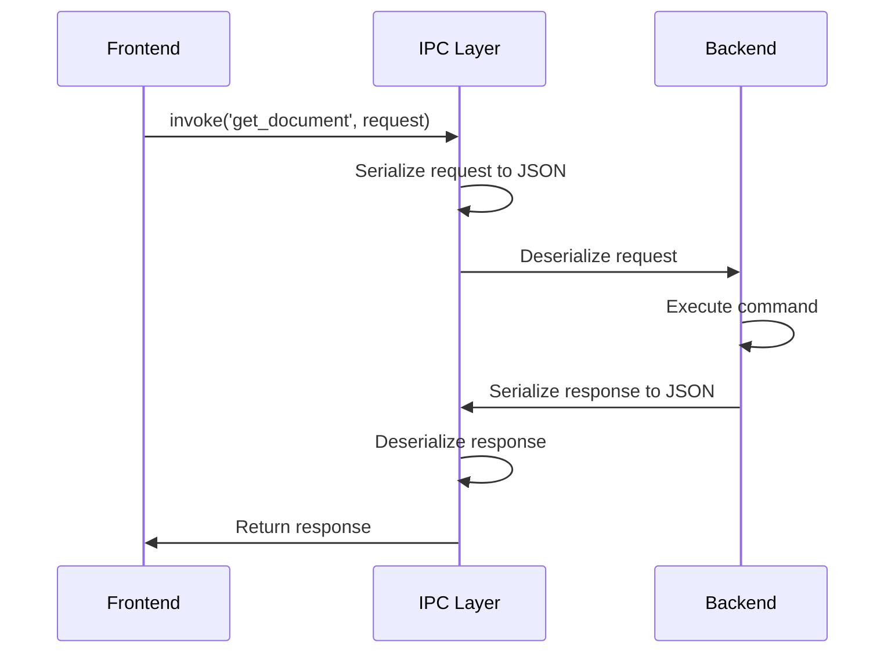
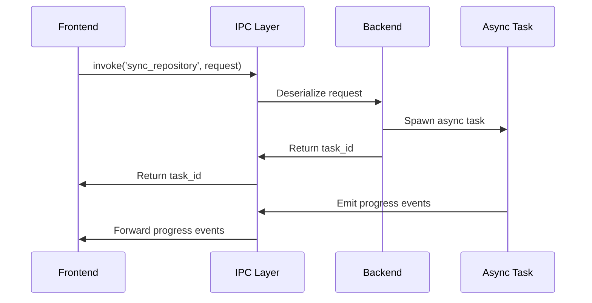
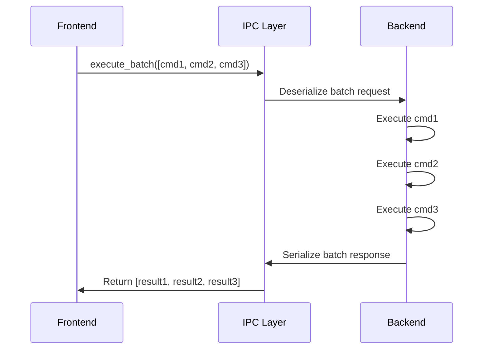

# TACHYON: IPC API SPECIFICATION

**Document ID:** TACHYON-API-006-V1.0
**Date:** February 2026
**Status:** Approved for Implementation
**Classification:** API Specification
**Compliance Level:** ISO/IEC 26514:2021, IEEE 1063:2001

---

## TABLE OF CONTENTS

1. [Introduction](#1-introduction)
2. [IPC Design Principles](#2-ipc-design-principles)
3. [Versioning Strategy](#3-versioning-strategy)
4. [IPC Command Registration](#4-ipc-command-registration)
5. [IPC Command Invocation](#5-ipc-command-invocation)
6. [IPC Event Emission](#6-ipc-event-emission)
7. [IPC Type Safety](#7-ipc-type-safety)
8. [IPC Security](#8-ipc-security)
9. [IPC Performance](#9-ipc-performance)
10. [IPC Error Handling](#10-ipc-error-handling)
11. [References](#11-references)

---

## 1. INTRODUCTION

### 1.1. Purpose and Scope

This document specifies the Inter-Process Communication (IPC) Application Programming Interface (API) for the Tachyon toolchain. The IPC API enables secure, type-safe communication between the desktop application frontend (Tauri WebView) and the Rust backend, as well as between the web frontend and the HTTP/2 server component.

The specification defines:
- Message formats and serialization protocols
- Command registration and invocation mechanisms
- Event emission and subscription patterns
- Type safety guarantees and validation procedures
- Security controls and authentication requirements
- Performance characteristics and optimization strategies
- Error handling and recovery procedures

### 1.2. Applicability

This specification applies to:
1. Desktop application IPC communication (Tauri frontend <-> Rust backend)
2. Web application IPC communication (Leptos frontend <-> HTTP/2 server)
3. All IPC command handlers and event emitters
4. IPC client libraries and integration points
5. Testing and validation of IPC communication

### 1.3. Document Dependencies

This document depends on the following documents:
- [TACHYON-STD-V1.0](../.specs/01_standards/coding_standards.md) - Coding and Documentation Standards
- [TACHYON-ADR-002-V1.0](../.specs/02_adrs/002_tauri_for_desktop_application.md) - Tauri for Desktop Application
- [TACHYON-ADR-009-V1.0](../.specs/02_adrs/009_ipc_communication_architecture.md) - IPC Communication Architecture
- [TACHYON-DES-IPC-V1.0](../.specs/04_future_state/design/ipc_protocol.md) - IPC Protocol Design
- [TACHYON-THR-V1.0](../.specs/03_threat_model/analysis.md) - Threat Model Analysis

### 1.4. Terminology

| Term | Definition |
|-------|------------|
| **IPC** | Inter-Process Communication: Mechanism for data exchange between separate processes |
| **Command** | A request message sent from frontend to backend, expecting a response |
| **Event** | A notification message sent from backend to frontend, not expecting a response |
| **Serialization** | The process of converting data structures into a format suitable for transmission |
| **Deserialization** | The process of converting transmitted data back into data structures |
| **Capability** | A permission token granting access to specific system resources |
| **Session Token** | An authentication token identifying a user session |
| **UUID** | Universally Unique Identifier: 128-bit identifier for unique identification |

---

## 2. IPC DESIGN PRINCIPLES

### 2.1. Architectural Principles

The IPC API design adheres to the following architectural principles:

#### 2.1.1. Type Safety by Construction

**Principle:** All IPC communication must be type-safe at compile time.

**Implementation:**
- Rust backend uses serde for compile-time type checking of serializable types
- Frontend TypeScript interfaces are auto-generated from Rust type definitions
- Type mismatches are caught at compile time, preventing runtime errors

**Rationale:** Type safety eliminates entire classes of runtime errors and enables confident refactoring. Compile-time checking reduces testing burden and improves code reliability.

#### 2.1.2. Security by Default

**Principle:** All IPC communication must be secure by default, with explicit opt-in for less secure configurations.

**Implementation:**
- All IPC commands require authentication via session tokens
- Capability-based authorization controls access to system resources
- Input validation is performed on all IPC messages
- Error messages are sanitized to prevent information leakage

**Rationale:** Security by default minimizes attack surface and prevents security vulnerabilities from accidental omissions.

#### 2.1.3. Performance First

**Principle:** IPC communication must achieve sub-millisecond latency with minimal overhead.

**Implementation:**
- Efficient JSON serialization via serde
- Zero-copy deserialization where possible
- Connection pooling to reduce connection overhead
- Async processing to prevent blocking

**Rationale:** Performance-critical applications require low-latency communication to maintain responsiveness and user experience.

#### 2.1.4. Reliability and Resilience

**Principle:** IPC communication must be reliable with automatic error recovery.

**Implementation:**
- Automatic reconnection on connection loss
- Message acknowledgment for delivery confirmation
- Retry logic for transient errors
- Connection monitoring for health checks

**Rationale:** Reliable communication ensures data consistency and provides graceful degradation under failure conditions.

### 2.2. Communication Patterns

The IPC API supports the following communication patterns:

#### 2.2.1. Request/Response Pattern

**Description:** Frontend sends a command to backend and awaits a response.

**Use Cases:**
- Query operations (e.g., get document, list repositories)
- State mutations (e.g., create document, update configuration)
- Synchronous operations requiring immediate results

**Characteristics:**
- One-to-one message correlation via UUID
- Guaranteed response (success or error)
- Timeout handling for long-running operations

#### 2.2.2. Event Notification Pattern

**Description:** Backend sends events to frontend without expecting a response.

**Use Cases:**
- State change notifications (e.g., document updated, repository synced)
- Progress updates (e.g., sync progress, indexing progress)
- Real-time data streams (e.g., collaborative edits)

**Characteristics:**
- One-to-many message distribution
- No response expected
- Subscription-based filtering

#### 2.2.3. Streaming Pattern

**Description:** Continuous data transfer for large payloads or real-time updates.

**Use Cases:**
- Large file transfers
- Real-time log streaming
- Progress updates for long-running operations

**Characteristics:**
- Chunked data transfer
- Flow control and backpressure
- Connection state management

---

## 3. VERSIONING STRATEGY

### 3.1. Semantic Versioning

The IPC API follows Semantic Versioning 2.0.0 (SemVer) for version management.

**Version Format:** `MAJOR.MINOR.PATCH`

- **MAJOR:** Incompatible API changes
- **MINOR:** Backwards-compatible functionality additions
- **PATCH:** Backwards-compatible bug fixes

**Examples:**
- `1.0.0` → `2.0.0`: Breaking change to command interface
- `1.0.0` → `1.1.0`: New command added
- `1.0.0` → `1.0.1`: Bug fix in error handling

### 3.2. Version Negotiation

Clients and servers negotiate the highest mutually supported API version.

**Negotiation Process:**
1. Client sends supported version range in initial handshake
2. Server selects highest compatible version
3. Server responds with selected version
4. All subsequent communication uses negotiated version

**Version Range Format:** `>=1.0.0 <2.0.0`

### 3.3. Deprecation Policy

API elements are deprecated according to the following policy:

**Deprecation Timeline:**
1. **Announcement:** Deprecation announced in release notes
2. **Warning Period:** 3 months with deprecation warnings
3. **Removal:** Deprecated elements removed in next major version

**Deprecation Handling:**
- Deprecated commands return deprecation warning in response metadata
- Deprecated events include deprecation notice in event payload
- Clients should log deprecation warnings and migrate to new APIs

### 3.4. Compatibility Matrix

| API Version | Desktop Client | Web Client | Server | Status |
|--------------|----------------|-------------|---------|--------|
| 1.0.0 | 1.0.0+ | 1.0.0+ | 1.0.0+ | Stable |
| 0.9.0 | 0.9.0 | 0.9.0 | 0.9.0 | Deprecated |
| 0.8.0 | 0.8.0 | 0.8.0 | 0.8.0 | Unsupported |

---

## 4. IPC COMMAND REGISTRATION

### 4.1. Registration Mechanism

IPC commands are registered with the Tauri command system using the `#[tauri::command]` attribute macro. This macro generates the necessary boilerplate for type-safe IPC communication.

**Rust Command Registration:**

```rust
use serde::{Deserialize, Serialize};
use tauri::State;

/// Request type for document retrieval
#[derive(Debug, Serialize, Deserialize)]
pub struct GetDocumentRequest {
    /// Unique identifier for the document
    pub id: DocumentId,
}

/// Response type for document retrieval
#[derive(Debug, Serialize, Deserialize)]
pub struct GetDocumentResponse {
    /// The retrieved document
    pub document: Document,
}

/// IPC command handler for retrieving documents
#[tauri::command]
pub async fn get_document(
    request: GetDocumentRequest,
    state: State<'_, AppState>,
) -> Result<GetDocumentResponse, IpcError> {
    let document = state.core.get_document(&request.id).await
        .map_err(IpcError::from)?;
    
    Ok(GetDocumentResponse { document })
}
```

**TypeScript Interface Generation:**

Tauri automatically generates TypeScript interfaces from Rust type definitions:

```typescript
/**
 * Request type for document retrieval
 */
export interface GetDocumentRequest {
  /** Unique identifier for the document */
  id: string;
}

/**
 * Response type for document retrieval
 */
export interface GetDocumentResponse {
  /** The retrieved document */
  document: Document;
}
```

### 4.2. Command Metadata

Each IPC command includes metadata for documentation, versioning, and deprecation tracking.

**Command Metadata Structure:**

```rust
/// IPC command metadata
#[derive(Debug, Clone, Serialize, Deserialize)]
pub struct CommandMetadata {
    /// Unique command identifier
    pub command_id: String,
    
    /// Human-readable command name
    pub name: String,
    
    /// Command description
    pub description: String,
    
    /// API version when command was introduced
    pub since_version: String,
    
    /// API version when command was deprecated (if applicable)
    pub deprecated_in: Option<String>,
    
    /// Replacement command (if deprecated)
    pub replaced_by: Option<String>,
    
    /// Required capabilities for command execution
    pub required_capabilities: Vec<String>,
    
    /// Authentication requirement
    pub requires_auth: bool,
}
```

**Metadata Registration:**

```rust
/// Command metadata for get_document
impl CommandMetadata {
    const METADATA: CommandMetadata = CommandMetadata {
        command_id: "get_document".to_string(),
        name: "Get Document".to_string(),
        description: "Retrieves a document by its unique identifier".to_string(),
        since_version: "1.0.0".to_string(),
        deprecated_in: None,
        replaced_by: None,
        required_capabilities: vec!["document:read".to_string()],
        requires_auth: true,
    };
}
```

### 4.3. Command Validation

All IPC commands must validate input parameters before processing. Validation occurs at multiple layers:

**Layer 1: Type-Level Validation (Compile-Time)**

Rust's type system enforces type constraints at compile time:

```rust
#[derive(Debug, Serialize, Deserialize)]
pub struct GetDocumentRequest {
    #[serde(validate = "validate_document_id")]
    pub id: DocumentId,
}

fn validate_document_id(id: &str) -> Result<(), String> {
    if id.len() != 36 {
        return Err("Document ID must be a valid UUID".to_string());
    }
    Ok(())
}
```

**Layer 2: Runtime Validation (Pre-Processing)**

Runtime validation checks business logic constraints:

```rust
#[tauri::command]
pub async fn get_document(
    request: GetDocumentRequest,
    state: State<'_, AppState>,
) -> Result<GetDocumentResponse, IpcError> {
    // Validate user has permission to access document
    if !state.auth.can_access_document(&request.id).await {
        return Err(IpcError::PermissionDenied);
    }
    
    // Validate document exists
    if !state.core.document_exists(&request.id).await {
        return Err(IpcError::DocumentNotFound(request.id));
    }
    
    let document = state.core.get_document(&request.id).await?;
    Ok(GetDocumentResponse { document })
}
```

**Layer 3: Capability Validation (Authorization)**

Capability-based authorization ensures users have required permissions:

```rust
#[derive(Debug, Clone, Serialize, Deserialize)]
pub struct Capability {
    /// Capability identifier
    pub identifier: String,
    
    /// Allowed resources (if applicable)
    pub allow: Vec<Resource>,
    
    /// Denied resources (if applicable)
    pub deny: Vec<Resource>,
}

#[derive(Debug, Clone, Serialize, Deserialize)]
pub struct Resource {
    /// Resource type (e.g., "document", "repository")
    pub resource_type: String,
    
    /// Resource identifier (e.g., document ID, repository path)
    pub identifier: Option<String>,
}
```

### 4.4. Command Categories

IPC commands are organized into logical categories based on functionality:

#### 4.4.1. Document Commands

Commands for document management operations:

| Command | Description | Auth Required | Capabilities |
|---------|-------------|----------------|--------------|
| `get_document` | Retrieve a document by ID | Yes | `document:read` |
| `list_documents` | List all documents with filters | Yes | `document:list` |
| `create_document` | Create a new document | Yes | `document:create` |
| `update_document` | Update document content | Yes | `document:write` |
| `delete_document` | Delete a document | Yes | `document:delete` |
| `search_documents` | Search documents by query | Yes | `document:search` |
| `get_versions` | Get document version history | Yes | `document:read` |
| `restore_version` | Restore a document version | Yes | `document:write` |

#### 4.4.2. Repository Commands

Commands for Git repository management:

| Command | Description | Auth Required | Capabilities |
|---------|-------------|----------------|--------------|
| `get_repository` | Get repository by path | Yes | `repository:read` |
| `list_repositories` | List all repositories | Yes | `repository:list` |
| `add_repository` | Add a new repository | Yes | `repository:create` |
| `remove_repository` | Remove a repository | Yes | `repository:delete` |
| `sync_repository` | Sync repository with remote | Yes | `repository:sync` |
| `commit_changes` | Commit changes to repository | Yes | `repository:write` |
| `get_git_status` | Get Git status | Yes | `repository:read` |
| `create_branch` | Create a new branch | Yes | `repository:write` |
| `switch_branch` | Switch to a branch | Yes | `repository:write` |
| `pull_changes` | Pull changes from remote | Yes | `repository:sync` |
| `push_changes` | Push changes to remote | Yes | `repository:sync` |

#### 4.4.3. Search Commands

Commands for search and query operations:

| Command | Description | Auth Required | Capabilities |
|---------|-------------|----------------|--------------|
| `full_text_search` | Full-text search across documents | Yes | `search:execute` |
| `advanced_search` | Advanced search with filters | Yes | `search:execute` |
| `get_suggestions` | Get search suggestions | Yes | `search:execute` |
| `get_recent_searches` | Get recent search history | Yes | `search:execute` |
| `clear_search_history` | Clear search history | Yes | `search:execute` |

#### 4.4.4. System Commands

Commands for system-level operations:

| Command | Description | Auth Required | Capabilities |
|---------|-------------|----------------|--------------|
| `get_version` | Get application version | No | None |
| `get_system_info` | Get system information | Yes | `system:read` |
| `get_config` | Get application configuration | Yes | `config:read` |
| `update_config` | Update configuration | Yes | `config:write` |
| `get_logs` | Get application logs | Yes | `logs:read` |
| `clear_cache` | Clear application cache | Yes | `cache:clear` |
| `shutdown` | Shutdown application | Yes | `system:admin` |
| `restart` | Restart application | Yes | `system:admin` |

### 4.5. Command Handler Interface

All IPC command handlers must implement the following interface:

```rust
/// Trait for IPC command handlers
pub trait IpcCommandHandler<Request, Response> {
    /// Get command metadata
    fn metadata(&self) -> CommandMetadata;
    
    /// Validate request parameters
    fn validate(&self, request: &Request) -> Result<(), IpcError>;
    
    /// Execute command handler
    async fn execute(
        &self,
        request: Request,
        state: AppState,
    ) -> Result<Response, IpcError>;
    
    /// Get required capabilities
    fn required_capabilities(&self) -> Vec<String>;
}
```

**Implementation Example:**

```rust
pub struct GetDocumentHandler;

impl IpcCommandHandler<GetDocumentRequest, GetDocumentResponse> for GetDocumentHandler {
    fn metadata(&self) -> CommandMetadata {
        CommandMetadata {
            command_id: "get_document".to_string(),
            name: "Get Document".to_string(),
            description: "Retrieves a document by its unique identifier".to_string(),
            since_version: "1.0.0".to_string(),
            deprecated_in: None,
            replaced_by: None,
            required_capabilities: vec!["document:read".to_string()],
            requires_auth: true,
        }
    }
    
    fn validate(&self, request: &GetDocumentRequest) -> Result<(), IpcError> {
        // Validate UUID format
        uuid::Uuid::parse_str(&request.id)
            .map_err(|_| IpcError::InvalidDocumentId)?;
        Ok(())
    }
    
    async fn execute(
        &self,
        request: GetDocumentRequest,
        state: AppState,
    ) -> Result<GetDocumentResponse, IpcError> {
        let document = state.core.get_document(&request.id).await?;
        Ok(GetDocumentResponse { document })
    }
    
    fn required_capabilities(&self) -> Vec<String> {
        vec!["document:read".to_string()]
    }
}
```

## 5. IPC COMMAND INVOCATION

### 5.1. Synchronous Command Invocation

Synchronous command invocation is used for operations that require immediate results. The frontend sends a command and blocks until a response is received.

**Frontend Invocation (TypeScript):**

```typescript
import { invoke } from '@tauri-apps/api/tauri';

/**
 * Invokes a synchronous IPC command
 * @param command - Command name to invoke
 * @param args - Command arguments
 * @returns Promise resolving to command response
 * @throws {Error} Command execution error
 */
async function invokeCommand<T, R>(
    command: string,
    args: T
): Promise<R> {
    try {
        const response = await invoke<R>(command, args);
        return response;
    } catch (error) {
        throw new IpcError('Command invocation failed', error);
    }
}

// Example: Get document
const request: GetDocumentRequest = {
    id: '550e8400-e29b-41d4-a716-446655440000'
};

const response: GetDocumentResponse = await invokeCommand(
    'get_document',
    request
);

console.log('Document:', response.document);
```

**Backend Handler (Rust):**

```rust
#[tauri::command]
pub async fn get_document(
    request: GetDocumentRequest,
    state: State<'_, AppState>,
) -> Result<GetDocumentResponse, IpcError> {
    // Command executes synchronously
    let document = state.core.get_document(&request.id).await
        .map_err(IpcError::from)?;
    
    Ok(GetDocumentResponse { document })
}
```

**Request/Response Flow:**



### 5.2. Asynchronous Command Invocation

Asynchronous command invocation is used for long-running operations. The frontend sends a command and receives a task identifier for tracking progress.

**Frontend Invocation (TypeScript):**

```typescript
import { invoke } from '@tauri-apps/api/tauri';
import { listen } from '@tauri-apps/api/event';

/**
 * Invokes an asynchronous IPC command
 * @param command - Command name to invoke
 * @param args - Command arguments
 * @returns Promise resolving to task identifier
 * @throws {Error} Command invocation error
 */
async function invokeAsyncCommand<T>(
    command: string,
    args: T
): Promise<string> {
    const response = await invoke<AsyncCommandResponse>(command, args);
    return response.task_id;
}

/**
 * Listens for task progress updates
 * @param taskId - Task identifier to track
 * @param callback - Progress callback function
 * @returns Unsubscribe function
 */
function listenTaskProgress(
    taskId: string,
    callback: (progress: TaskProgress) => void
): () => void {
    const unlisten = listen(`task_progress:${taskId}`, (event) => {
        callback(event.payload as TaskProgress);
    });
    return unlisten;
}

// Example: Sync repository
const request: SyncRepositoryRequest = {
    path: '/home/user/documents/repo',
    force: false
};

const taskId = await invokeAsyncCommand('sync_repository', request);

listenTaskProgress(taskId, (progress) => {
    console.log(`Progress: ${progress.completed}/${progress.total}`);
    if (progress.status === 'completed') {
        console.log('Sync completed!');
    }
});
```

**Backend Handler (Rust):**

```rust
#[tauri::command]
pub async fn sync_repository(
    request: SyncRepositoryRequest,
    state: State<'_, AppState>,
    window: tauri::Window,
) -> Result<AsyncCommandResponse, IpcError> {
    // Generate task ID
    let task_id = Uuid::new_v4().to_string();
    
    // Spawn async task
    let window_clone = window.clone();
    tokio::spawn(async move {
        let mut progress = state.core.sync_repository(&request.path, request.force).await;
        
        while let Some(update) = progress.next().await {
            // Emit progress event
            window.emit(&format!("task_progress:{}", task_id), update)
                .unwrap();
        }
    });
    
    Ok(AsyncCommandResponse { task_id })
}
```

**Asynchronous Flow:**



### 5.3. Batch Command Invocation

Batch command invocation allows multiple commands to be executed in a single request, reducing round-trip overhead.

**Frontend Invocation (TypeScript):**

```typescript
import { invoke } from '@tauri-apps/api/tauri';

/**
 * Invokes a batch of IPC commands
 * @param commands - Array of commands to execute
 * @returns Promise resolving to array of responses
 * @throws {Error} Batch execution error
 */
async function invokeBatchCommands<T, R>(
    commands: Array<{ name: string; args: T }>
): Promise<Array<{ success: boolean; data?: R; error?: string }>> {
    const batchRequest: BatchRequest<T> = {
        commands: commands
    };
    
    const response = await invoke<BatchResponse<R>>('execute_batch', batchRequest);
    return response.results;
}

// Example: Batch document operations
const batch = [
    { name: 'get_document', args: { id: 'doc-1' } },
    { name: 'get_document', args: { id: 'doc-2' } },
    { name: 'get_document', args: { id: 'doc-3' } }
];

const results = await invokeBatchCommands(batch);

results.forEach((result, index) => {
    if (result.success) {
        console.log(`Document ${index}:`, result.data);
    } else {
        console.error(`Error in command ${index}:`, result.error);
    }
});
```

**Backend Handler (Rust):**

```rust
#[derive(Debug, Serialize, Deserialize)]
pub struct BatchRequest<T> {
    pub commands: Vec<BatchCommand<T>>,
}

#[derive(Debug, Serialize, Deserialize)]
pub struct BatchCommand<T> {
    pub name: String,
    pub args: T,
}

#[derive(Debug, Serialize, Deserialize)]
pub struct BatchResponse<T> {
    pub results: Vec<BatchResult<T>>,
}

#[derive(Debug, Serialize, Deserialize)]
pub struct BatchResult<T> {
    pub success: bool,
    pub data: Option<T>,
    pub error: Option<String>,
}

#[tauri::command]
pub async fn execute_batch(
    request: BatchRequest<serde_json::Value>,
    state: State<'_, AppState>,
) -> Result<BatchResponse<serde_json::Value>, IpcError> {
    let mut results = Vec::new();
    
    for command in request.commands {
        let result = match command.name.as_str() {
            "get_document" => {
                let args: GetDocumentRequest = serde_json::from_value(command.args)?;
                match state.core.get_document(&args.id).await {
                    Ok(doc) => BatchResult {
                        success: true,
                        data: Some(serde_json::to_value(doc)?),
                        error: None,
                    },
                    Err(e) => BatchResult {
                        success: false,
                        data: None,
                        error: Some(e.to_string()),
                    },
                }
            },
            // Handle other commands...
            _ => BatchResult {
                success: false,
                data: None,
                error: Some(format!("Unknown command: {}", command.name)),
            },
        };
        results.push(result);
    }
    
    Ok(BatchResponse { results })
}
```

**Batch Execution Flow:**



### 5.4. Request/Response Formats

#### 5.4.1. Base Request Format

All IPC requests follow a common structure:

```typescript
/**
 * Base IPC request structure
 */
interface IpcRequest {
    /** Unique request identifier for correlation */
    id: string;
    
    /** Command name to invoke */
    command: string;
    
    /** Command arguments */
    args: unknown;
    
    /** Authentication token */
    auth_token?: string;
    
    /** Request timestamp */
    timestamp: string;
}
```

#### 5.4.2. Base Response Format

All IPC responses follow a common structure:

```typescript
/**
 * Base IPC response structure
 */
interface IpcResponse {
    /** Request identifier for correlation */
    id: string;
    
    /** Response status */
    status: 'success' | 'error';
    
    /** Response data (if successful) */
    data?: unknown;
    
    /** Error information (if failed) */
    error?: {
        code: string;
        message: string;
        details?: unknown;
    };
    
    /** Response timestamp */
    timestamp: string;
    
    /** API version */
    api_version: string;
}
```

#### 5.4.3. Error Response Format

Error responses provide structured error information:

```typescript
/**
 * IPC error response structure
 */
interface IpcErrorResponse {
    /** Error code */
    code: string;
    
    /** Human-readable error message */
    message: string;
    
    /** Detailed error information */
    details?: unknown;
    
    /** Stack trace (in development mode) */
    stack_trace?: string;
    
    /** Request identifier */
    request_id: string;
}
```

**Error Codes:**

| Code | Description | HTTP Status |
|------|-------------|--------------|
| `INVALID_REQUEST` | Request validation failed | 400 |
| `UNAUTHORIZED` | Authentication required | 401 |
| `FORBIDDEN` | Insufficient permissions | 403 |
| `NOT_FOUND` | Resource not found | 404 |
| `CONFLICT` | Resource conflict | 409 |
| `INTERNAL_ERROR` | Internal server error | 500 |
| `SERVICE_UNAVAILABLE` | Service temporarily unavailable | 503 |

## 6. IPC EVENT EMISSION

### 6.1. Event Emission Mechanism

IPC events are emitted from the backend to the frontend to notify of state changes, progress updates, or other asynchronous notifications. Events do not expect responses and are delivered to all subscribed listeners.

**Backend Event Emission (Rust):**

```rust
use tauri::Window;

/// Event payload for document updates
#[derive(Debug, Clone, Serialize, Deserialize)]
pub struct DocumentUpdatedEvent {
    pub id: DocumentId,
    pub changes: DocumentChanges,
}

/// Emits document update events
pub async fn emit_document_updated(
    window: &Window,
    event: DocumentUpdatedEvent,
) -> Result<(), IpcError> {
    window.emit("document_updated", event)
        .map_err(|e| IpcError::EventEmissionFailed(e.to_string()))?;
    Ok(())
}

/// Watches for document changes and emits events
pub async fn watch_document_changes(
    document_id: DocumentId,
    window: Window,
    state: AppState,
) -> Result<(), IpcError> {
    let mut rx = state.core.watch_document(&document_id).await?;
    
    tokio::spawn(async move {
        while let Some(change) = rx.recv().await {
            let event = DocumentUpdatedEvent {
                id: document_id.clone(),
                changes: change,
            };
            
            // Emit event to all subscribers
            if let Err(e) = window.emit("document_updated", event) {
                eprintln!("Failed to emit event: {}", e);
            }
        }
    });
    
    Ok(())
}
```

**Frontend Event Subscription (TypeScript):**

```typescript
import { listen } from '@tauri-apps/api/event';

/**
 * Event payload for document updates
 */
interface DocumentUpdatedEvent {
    /** Document identifier */
    id: string;
    
    /** Document changes */
    changes: DocumentChanges;
}

/**
 * Subscribes to document update events
 * @param callback - Event callback function
 * @returns Unsubscribe function
 */
function subscribeDocumentUpdated(
    callback: (event: DocumentUpdatedEvent) => void
): () => void {
    const unlisten = listen<DocumentUpdatedEvent>('document_updated', (event) => {
        callback(event.payload);
    });
    return unlisten;
}

// Example: Subscribe to document updates
const unsubscribe = subscribeDocumentUpdated((event) => {
    console.log('Document updated:', event.id);
    console.log('Changes:', event.changes);
    
    // Update UI with new document state
    updateDocumentUI(event.id, event.changes);
});

// Cleanup when component unmounts
onUnmount(() => {
    unsubscribe();
});
```

### 6.2. Event Subscription

Frontend components subscribe to events to receive notifications from the backend. Subscriptions can be filtered and scoped to specific resources.

**Subscription Management:**

```typescript
/**
 * Event subscription manager
 */
class EventSubscriptionManager {
    private subscriptions: Map<string, () => void> = new Map();
    
    /**
     * Subscribe to an event
     * @param event - Event name
     * @param callback - Event callback
     * @param filter - Optional event filter
     * @returns Unsubscribe function
     */
    subscribe<T>(
        event: string,
        callback: (payload: T) => void,
        filter?: (payload: T) => boolean
    ): () => void {
        const unlisten = listen<T>(event, (event) => {
            const payload = event.payload;
            
            // Apply filter if provided
            if (!filter || filter(payload)) {
                callback(payload);
            }
        });
        
        this.subscriptions.set(event, unlisten);
        return () => {
            unlisten();
            this.subscriptions.delete(event);
        };
    }
    
    /**
     * Unsubscribe from all events
     */
    unsubscribeAll(): void {
        this.subscriptions.forEach((unlisten) => unlisten());
        this.subscriptions.clear();
    }
}

// Example: Subscribe to document events with filter
const eventManager = new EventSubscriptionManager();

eventManager.subscribe<DocumentUpdatedEvent>(
    'document_updated',
    (event) => {
        console.log('Document updated:', event.id);
        updateDocumentUI(event.id, event.changes);
    },
    (event) => {
        // Filter: Only process events for specific document
        return event.id === '550e8400-e29b-41d4-a716-446655440000';
    }
);
```

### 6.3. Event Unsubscription

Event unsubscription removes event listeners and cleans up resources. Proper cleanup prevents memory leaks and ensures efficient event handling.

**Unsubscription Pattern:**

```typescript
/**
 * Event subscription with automatic cleanup
 */
function subscribeWithCleanup<T>(
    event: string,
    callback: (payload: T) => void,
    cleanupCondition?: () => boolean
): () => void {
    let unlisten: (() => void) | null = null;
    
    const unsubscribe = () => {
        if (unlisten) {
            unlisten();
            unlisten = null;
        }
    };
    
    unlisten = listen<T>(event, (event) => {
        const payload = event.payload;
        
        // Check cleanup condition
        if (!cleanupCondition || cleanupCondition()) {
            unsubscribe();
            return;
        }
        
        callback(payload);
    });
    
    return unsubscribe;
}

// Example: Subscribe until document is closed
const unsubscribe = subscribeWithCleanup<DocumentUpdatedEvent>(
    'document_updated',
    (event) => {
        updateDocumentUI(event.id, event.changes);
    },
    () => {
        // Cleanup when document is closed
        return isDocumentClosed();
    }
);

// Manually unsubscribe when needed
// unsubscribe();
```

### 6.4. Event Payload Formats

#### 6.4.1. Document Events

Document-related events notify of document state changes:

```typescript
/**
 * Document created event
 */
interface DocumentCreatedEvent {
    /** Created document metadata */
    document: DocumentMetadata;
}

/**
 * Document updated event
 */
interface DocumentUpdatedEvent {
    /** Document identifier */
    id: DocumentId;
    
    /** Document changes */
    changes: DocumentChanges;
}

/**
 * Document deleted event
 */
interface DocumentDeletedEvent {
    /** Deleted document identifier */
    id: DocumentId;
}

/**
 * Content changed event
 */
interface ContentChangedEvent {
    /** Document identifier */
    id: DocumentId;
    
    /** New content hash */
    content_hash: string;
}

/**
 * Version created event
 */
interface VersionCreatedEvent {
    /** Document identifier */
    id: DocumentId;
    
    /** Version identifier */
    version: string;
}
```

#### 6.4.2. Repository Events

Repository-related events notify of Git operations and synchronization status:

```typescript
/**
 * Repository added event
 */
interface RepositoryAddedEvent {
    /** Added repository */
    repository: Repository;
}

/**
 * Repository removed event
 */
interface RepositoryRemovedEvent {
    /** Removed repository path */
    path: string;
}

/**
 * Sync started event
 */
interface SyncStartedEvent {
    /** Repository path */
    path: string;
    
    /** Sync operation */
    operation: 'pull' | 'push' | 'fetch';
}

/**
 * Sync completed event
 */
interface SyncCompletedEvent {
    /** Repository path */
    path: string;
    
    /** Sync result */
    result: {
        success: boolean;
        changes: number;
        conflicts?: number;
    };
}

/**
 * Sync failed event
 */
interface SyncFailedEvent {
    /** Repository path */
    path: string;
    
    /** Error message */
    error: string;
}
```

#### 6.4.3. System Events

System-related events notify of application state changes:

```typescript
/**
 * Configuration changed event
 */
interface ConfigChangedEvent {
    /** Changed configuration keys */
    keys: string[];
    
    /** New configuration values */
    values: Record<string, unknown>;
}

/**
 * Connection status event
 */
interface ConnectionStatusEvent {
    /** Connection status */
    status: 'connected' | 'disconnected' | 'reconnecting';
    
    /** Connection type */
    connection_type: 'desktop' | 'server';
}

/**
 * Error occurred event
 */
interface ErrorOccurredEvent {
    /** Error code */
    code: string;
    
    /** Error message */
    message: string;
    
    /** Error context */
    context?: Record<string, unknown>;
}
```

### 6.5. Event Filtering

Events can be filtered based on payload content to reduce unnecessary processing:

**Filter Implementation:**

```typescript
/**
 * Event filter interface
 */
interface EventFilter<T> {
    (payload: T): boolean;
}

/**
 * Creates a filtered event subscription
 */
function subscribeFiltered<T>(
    event: string,
    callback: (payload: T) => void,
    filter: EventFilter<T>
): () => void {
    return listen<T>(event, (event) => {
        const payload = event.payload;
        
        // Apply filter
        if (filter(payload)) {
            callback(payload);
        }
    });
}

// Example: Filter document events by type
const unsubscribe = subscribeFiltered<DocumentUpdatedEvent>(
    'document_updated',
    (event) => {
        console.log('Content changed:', event.id);
    },
    (event) => {
        // Only process content changes
        return event.changes.content_hash !== undefined;
    }
);

// Example: Filter repository events by path
const unsubscribeRepo = subscribeFiltered<SyncCompletedEvent>(
    'sync_completed',
    (event) => {
        console.log('Sync completed:', event.path);
    },
    (event) => {
        // Only process specific repository
        return event.path === '/home/user/documents/repo';
    }
);
```

## 7. IPC TYPE SAFETY

### 7.1. Type-Safe Serialization

IPC communication uses serde for type-safe serialization and deserialization of messages. serde ensures compile-time type checking and eliminates entire classes of runtime errors.

**Serialization Implementation (Rust):**

```rust
use serde::{Serialize, Deserialize};

/// Type-safe serializable structure
#[derive(Debug, Clone, Serialize, Deserialize)]
pub struct GetDocumentRequest {
    /// Document identifier (UUID)
    #[serde(validate = "validate_uuid")]
    pub id: String,
}

/// Custom validation function
fn validate_uuid(id: &str) -> Result<(), String> {
    if uuid::Uuid::parse_str(id).is_err() {
        return Err("Invalid UUID format".to_string());
    }
    Ok(())
}
```

**Deserialization Implementation (Rust):**

```rust
use serde_json;

/// Type-safe deserialization
pub fn deserialize_ipc_message<T: for<'de>>(
    json: &str,
) -> Result<T, IpcError>
where
    T: Deserialize<'de>,
{
    serde_json::from_str::<T>(json)
        .map_err(|e| IpcError::DeserializationError(e.to_string()))
}
```

### 7.2. Type-Safe Deserialization

Deserialization validates message structure and converts JSON payloads to strongly-typed Rust structures.

**TypeScript Interface Generation:**

Tauri automatically generates TypeScript interfaces from Rust type definitions:

```typescript
/**
 * Auto-generated TypeScript interface from Rust
 * Generated by: tauri-cli generate-types
 */
export interface GetDocumentRequest {
    /** Document identifier (UUID) */
    id: string;
}

/**
 * Auto-generated TypeScript interface from Rust
 * Generated by: tauri-cli generate-types
 */
export interface GetDocumentResponse {
    /** Retrieved document */
    document: Document;
}
```

**Type Generation Configuration:**

```json
// tauri.conf.json
{
  "build": {
    "beforeDevCommand": "npm run tauri generate-types"
  }
}
```

### 7.3. Type Validation

Type validation occurs at multiple layers to ensure type safety throughout the IPC communication pipeline.

**Layer 1: Compile-Time Type Checking**

Rust's type system enforces type constraints at compile time:

```rust
#[derive(Debug, Clone, Serialize, Deserialize)]
pub struct DocumentMetadata {
    /// Document title (required)
    pub title: String,
    
    /// Document content (required)
    pub content: String,
    
    /// Document tags (optional)
    pub tags: Option<Vec<String>>,
    
    /// Document creation timestamp
    #[serde(default)]
    pub created_at: DateTime<Utc>,
}
```

**Layer 2: Runtime Type Validation**

Runtime validation checks business logic constraints:

```rust
#[derive(Debug, Clone, Serialize, Deserialize)]
pub struct CreateDocumentRequest {
    #[serde(validate = "validate_title")]
    pub title: String,
    
    #[serde(validate = "validate_content")]
    pub content: String,
}

fn validate_title(title: &str) -> Result<(), String> {
    if title.len() < 1 {
        return Err("Title cannot be empty".to_string());
    }
    if title.len() > 200 {
        return Err("Title cannot exceed 200 characters".to_string());
    }
    Ok(())
}

fn validate_content(content: &str) -> Result<(), String> {
    if content.len() > 10_000_000 {
        return Err("Content cannot exceed 10MB".to_string());
    }
    Ok(())
}
```

**Layer 3: Schema Validation**

Schema validation ensures messages conform to expected structure:

```rust
use serde_json::Value;

/// Validates JSON schema
pub fn validate_schema(json: &str) -> Result<(), IpcError> {
    let value: Value = serde_json::from_str(json)?;
    
    // Check required fields
    if !value.is_object() {
        return Err(IpcError::InvalidSchema("Message must be an object".to_string()));
    }
    
    // Check for unknown fields
    let obj = value.as_object().unwrap();
    for key in obj.keys() {
        if !ALLOWED_FIELDS.contains(&key) {
            return Err(IpcError::UnknownField(format!("Unknown field: {}", key)));
        }
    }
    
    Ok(())
}
```

### 7.4. Type Inference and Generics

Type inference and generics enable reusable IPC components while maintaining type safety.

**Generic Command Handler:**

```rust
/// Generic command handler trait
pub trait IpcCommandHandler<Request, Response> {
    /// Execute command
    async fn execute(
        &self,
        request: Request,
        state: AppState,
    ) -> Result<Response, IpcError>;
    
    /// Validate request
    fn validate(&self, request: &Request) -> Result<(), IpcError>;
}

/// Generic command wrapper
#[derive(Debug, Serialize, Deserialize)]
pub struct IpcCommand<Request> {
    pub command: String,
    pub request: Request,
    pub auth_token: Option<String>,
}

/// Execute generic command
pub async fn execute_command<Request, Response>(
    command: IpcCommand<Request>,
    handler: &dyn IpcCommandHandler<Request, Response>,
    state: AppState,
) -> Result<Response, IpcError> {
    handler.validate(&command.request)?;
    handler.execute(command.request, state).await
}
```

### 7.5. Type Safety Guarantees

The IPC API provides the following type safety guarantees:

**Guarantee 1: Compile-Time Type Checking**

All IPC types are validated at compile time, preventing type mismatches before runtime.

**Guarantee 2: Automatic Type Generation**

TypeScript interfaces are automatically generated from Rust type definitions, ensuring consistency between frontend and backend.

**Guarantee 3: Runtime Type Validation**

All IPC messages are validated at runtime for business logic constraints and schema conformance.

**Guarantee 4: Type Inference Support**

Generic types enable reusable IPC components while maintaining type safety through compile-time checking.

**Guarantee 5: Error Propagation**

Type errors are propagated through the Result<T, E> type, ensuring errors are handled explicitly.

### 7.6. Type Safety Best Practices

Follow these best practices to maintain type safety in IPC communication:

**Best Practice 1: Use Strongly-Typed Structures**

Always use strongly-typed structures for IPC messages, avoiding loose types like `any` or `JsonValue`.

**Best Practice 2: Validate at Multiple Layers**

Validate types at compile time, runtime, and schema levels to catch errors early.

**Best Practice 3: Use Generics for Reusability**

Use generics for reusable IPC components while maintaining type safety through compile-time checking.

**Best Practice 4: Auto-Generate Frontend Types**

Auto-generate TypeScript interfaces from Rust type definitions to ensure consistency.

**Best Practice 5: Document Type Constraints**

Document type constraints in code comments to make requirements explicit.

**Best Practice 6: Handle Type Errors Explicitly**

Handle type errors explicitly through the Result<T, E> type, avoiding panic or unwrap.

## 8. IPC SECURITY

### 8.1. Authentication Requirements

All IPC commands require authentication via session tokens. Session tokens identify users and authorize access to system resources.

**Session Token Structure:**

```rust
/// Session token for IPC authentication
#[derive(Debug, Clone, Serialize, Deserialize)]
pub struct SessionToken {
    /// Unique token identifier
    pub token_id: String,
    
    /// User identifier
    pub user_id: String,
    
    /// Session expiration timestamp
    pub expires_at: DateTime<Utc>,
    
    /// Token capabilities
    pub capabilities: Vec<String>,
}
```

**Authentication Middleware:**

```rust
/// Authentication middleware for IPC commands
pub async fn authenticate_request<T>(
    request: IpcRequest<T>,
    state: State<'_, AppState>,
) -> Result<T, IpcError> {
    // Extract and validate session token
    let token = request.auth_token
        .ok_or(IpcError::Unauthorized("Authentication required".to_string()))?;
    
    // Validate token
    let session = state.auth.validate_token(&token).await
        .map_err(|_| IpcError::InvalidToken("Invalid session token".to_string()))?;
    
    // Check token expiration
    if session.expires_at < Utc::now() {
        return Err(IpcError::TokenExpired("Session token has expired".to_string()));
    }
    
    // Check required capabilities
    for capability in request.required_capabilities {
        if !session.capabilities.contains(&capability) {
            return Err(IpcError::Forbidden(format!("Missing capability: {}", capability)));
        }
    }
    
    Ok(request.args)
}
```

### 8.2. Authorization Requirements

Authorization ensures users have required permissions to access specific resources. Capability-based authorization implements the principle of least privilege.

**Capability Definition:**

```rust
/// Capability for resource access
#[derive(Debug, Clone, Serialize, Deserialize)]
pub struct Capability {
    /// Capability identifier
    pub identifier: String,
    
    /// Capability description
    pub description: String,
    
    /// Allowed resources
    pub allow: Vec<Resource>,
    
    /// Denied resources
    pub deny: Vec<Resource>,
}

/// Resource specification
#[derive(Debug, Clone, Serialize, Deserialize)]
pub struct Resource {
    /// Resource type (e.g., "document", "repository")
    pub resource_type: String,
    
    /// Resource identifier (e.g., document ID, repository path)
    pub identifier: Option<String>,
}
```

**Authorization Check:**

```rust
/// Authorization check for IPC commands
pub async fn authorize_command(
    command: &str,
    capabilities: &[String],
    state: State<'_, AppState>,
) -> Result<(), IpcError> {
    // Get command metadata
    let metadata = state.commands.get_metadata(command)
        .ok_or(IpcError::UnknownCommand(format!("Unknown command: {}", command)))?;
    
    // Check required capabilities
    for capability in &metadata.required_capabilities {
        if !capabilities.contains(capability) {
            return Err(IpcError::Forbidden(format!("Missing capability: {}", capability)));
        }
    }
    
    Ok(())
}
```

### 8.3. Input Validation

All IPC inputs must be validated to prevent injection attacks and ensure data integrity.

**Input Sanitization:**

```rust
/// Sanitizes input strings
pub fn sanitize_input(input: &str) -> String {
    // Remove potentially dangerous characters
    let sanitized = input
        .chars()
        .filter(|c| !matches!(c, ['\0', '\n', '\r', '\t', '\x', '\x1b']))
        .collect::<String>();
    
    // Limit length
    let max_length = 1000;
    if sanitized.len() > max_length {
        sanitized.truncate(max_length);
    }
    
    sanitized
}

/// Validates document ID
pub fn validate_document_id(id: &str) -> Result<(), IpcError> {
    // Validate UUID format
    uuid::Uuid::parse_str(id)
        .map_err(|_| IpcError::InvalidInput("Invalid document ID format".to_string()))?;
    
    // Sanitize input
    let sanitized = sanitize_input(id);
    
    // Check for path traversal attempts
    if sanitized.contains("..") || sanitized.contains('/') {
        return Err(IpcError::InvalidInput("Invalid document ID".to_string()));
    }
    
    Ok(())
}
```

### 8.4. Rate Limiting

Rate limiting prevents abuse and ensures fair resource allocation across all IPC connections.

**Rate Limiting Implementation:**

```rust
use std::collections::HashMap;
use std::sync::Arc;
use tokio::sync::RwLock;

/// Rate limiter for IPC commands
pub struct RateLimiter {
    /// Maximum requests per window
    max_requests: usize,
    
    /// Window duration in seconds
    window_duration: u64,
    
    /// Request tracking
    requests: Arc<RwLock<HashMap<String, Vec<DateTime<Utc>>>>>,
}

impl RateLimiter {
    pub fn new(max_requests: usize, window_duration: u64) -> Self {
        Self {
            max_requests,
            window_duration,
            requests: Arc::new(RwLock::new(HashMap::new())),
        }
    }
    
    /// Check if request is allowed
    pub async fn check_rate_limit(
        &self,
        user_id: &str,
    command: &str,
    ) -> Result<(), IpcError> {
        let now = Utc::now();
        let mut requests = self.requests.write().await;
        
        // Get or create request history
        let history = requests.entry(user_id.to_string()).or_insert_with(Vec::new());
        
        // Remove requests outside window
        history.retain(|t| now.signed_duration_since(*t) < self.window_duration as i64);
        
        // Check if limit exceeded
        if history.len() >= self.max_requests {
            return Err(IpcError::RateLimitExceeded(format!("Rate limit exceeded: {} requests per {} seconds", self.max_requests, self.window_duration)));
        }
        
        // Add current request
        history.push(now);
        
        Ok(())
    }
}
```

**Rate Limit Configuration:**

```json
{
  "rate_limiting": {
    "max_requests_per_window": 100,
    "window_duration_seconds": 60,
    "commands": {
      "get_document": 10,
      "list_documents": 5,
      "create_document": 2,
      "sync_repository": 1
    }
  }
}
```

### 8.5. Security Best Practices

Follow these best practices to maintain security in IPC communication:

**Best Practice 1: Always Authenticate**

Always require authentication for IPC commands, except for public commands explicitly marked as unauthenticated.

**Best Practice 2: Use Capability-Based Authorization**

Use capability-based authorization to implement the principle of least privilege.

**Best Practice 3: Validate All Inputs**

Validate all inputs to prevent injection attacks and ensure data integrity.

**Best Practice 4: Implement Rate Limiting**

Implement rate limiting to prevent abuse and ensure fair resource allocation.

**Best Practice 5: Sanitize Error Messages**

Sanitize error messages to prevent information leakage about system internals.

**Best Practice 6: Use Secure Serialization**

Use secure serialization libraries (serde) with proper validation to prevent deserialization attacks.

---

## 9. IPC PERFORMANCE

### 9.1. Latency Requirements

IPC communication must achieve sub-millisecond latency for synchronous commands and maintain low latency for asynchronous operations.

**Latency Targets:**

| Operation Type | Target Latency | Measurement Method |
|---------------|----------------|-------------------|
| Synchronous Commands | < 1 ms | Round-trip time measurement |
| Asynchronous Commands | < 5 ms (initial response) | Time to first event |
| Event Emission | < 0.5 ms | Time to emit event |
| Batch Commands | < 2 ms per command | Average command time |

**Latency Measurement:**

```rust
use std::time::Instant;

/// Latency tracker for IPC operations
pub struct LatencyTracker {
    /// Latency history
    history: VecDeque<(String, Duration)>,
}

impl LatencyTracker {
    pub fn new(capacity: usize) -> Self {
        Self {
            history: VecDeque::with_capacity(capacity),
        }
    }
    
    /// Measure operation latency
    pub fn measure<F, R>(&mut self, operation: &str, f: F) -> R {
        let start = Instant::now();
        let result = f();
        let duration = start.elapsed();
        
        self.history.push_back((operation.to_string(), duration));
        
        result
    }
    
    /// Get average latency
    pub fn average_latency(&self) -> Duration {
        if self.history.is_empty() {
            return Duration::ZERO;
        }
        
        let total: Duration = self.history.iter().map(|(_, d)| *d).sum();
        let count = self.history.len();
        total / count as u32
    }
}
```

### 9.2. Throughput Requirements

IPC communication must support high throughput for concurrent operations.

**Throughput Targets:**

| Operation Type | Target Throughput | Measurement Method |
|---------------|-------------------|-------------------|
| Synchronous Commands | > 2,500 req/s | Requests per second |
| Asynchronous Commands | > 1,000 req/s | Tasks per second |
| Event Emission | > 10,000 events/s | Events per second |
| Batch Commands | > 500 commands/s | Commands per second |

**Throughput Measurement:**

```rust
/// Throughput tracker for IPC operations
pub struct ThroughputTracker {
    /// Operations counter
    operations: AtomicUsize,
    
    /// Start time
    start_time: Instant,
}

impl ThroughputTracker {
    pub fn new() -> Self {
        Self {
            operations: AtomicUsize::new(0),
            start_time: Instant::now(),
        }
    }
    
    /// Record operation
    pub fn record(&self) {
        self.operations.fetch_add(1);
    }
    
    /// Get throughput
    pub fn throughput(&self) -> f64 {
        let elapsed = self.start_time.elapsed().as_secs_f64();
        let count = self.operations.load(Ordering::SeqCst) as f64;
        count / elapsed
    }
}
```

### 9.3. Optimization Strategies

Several optimization strategies ensure IPC performance meets requirements.

**Optimization Strategy 1: Zero-Copy Deserialization**

Use zero-copy deserialization to reduce memory allocations and improve performance.

**Optimization Strategy 2: Connection Pooling**

Reuse IPC connections to reduce connection overhead.

**Optimization Strategy 3: Batch Processing**

Process multiple commands in batches to reduce round-trip overhead.

**Optimization Strategy 4: Async Processing**

Use async processing to prevent blocking and improve concurrency.

**Optimization Strategy 5: Memory Pooling**

Use memory pooling to reduce allocations for frequently used types.

**Optimization Strategy 6: Compression**

Use compression for large payloads to reduce transmission time.

---

## 10. IPC ERROR HANDLING

### 10.1. Error Types

IPC errors are categorized into distinct types for proper handling and user feedback.

**Error Type Definition:**

```rust
use thiserror::Error;

/// IPC error types
#[derive(Error, Debug)]
pub enum IpcError {
    /// Invalid request format or parameters
    #[error("Invalid request: {0}")]
    InvalidRequest(String),
    
    /// Authentication required
    #[error("Authentication required")]
    Unauthorized,
    
    /// Insufficient permissions
    #[error("Forbidden: {0}")]
    Forbidden(String),
    
    /// Resource not found
    #[error("Not found: {0}")]
    NotFound(String),
    
    /// Resource conflict
    #[error("Conflict: {0}")]
    Conflict(String),
    
    /// Rate limit exceeded
    #[error("Rate limit exceeded: {0} requests per {1} seconds")]
    RateLimitExceeded(String, u64),
    
    /// Internal server error
    #[error("Internal error: {0}")]
    InternalError(String),
    
    /// Service unavailable
    #[error("Service unavailable")]
    ServiceUnavailable,
    
    /// Serialization error
    #[error("Serialization error: {0}")]
    SerializationError(String),
    
    /// Deserialization error
    #[error("Deserialization error: {0}")]
    DeserializationError(String),
}
```

### 10.2. Error Propagation

Errors are propagated through the Result<T, E> type, ensuring errors are handled explicitly.

**Error Propagation Pattern:**

```rust
/// Error propagation for IPC commands
#[tauri::command]
pub async fn get_document(
    request: GetDocumentRequest,
    state: State<'_, AppState>,
) -> Result<GetDocumentResponse, IpcError> {
    // Validate request
    validate_document_id(&request.id)?;
    
    // Get document with error propagation
    let document = state.core.get_document(&request.id).await
        .map_err(IpcError::from)?;
    
    Ok(GetDocumentResponse { document })
}
```

### 10.3. Error Recovery

Error recovery mechanisms ensure graceful degradation under failure conditions.

**Recovery Strategies:**

**Recovery Strategy 1: Automatic Retry**

Transient errors trigger automatic retry with exponential backoff.

**Recovery Strategy 2: Fallback to Cache**

Cache results for frequently accessed resources to avoid repeated failures.

**Recovery Strategy 3: Graceful Degradation**

Degrade functionality gracefully when errors cannot be recovered.

**Recovery Strategy 4: User Notification**

Notify users of errors with actionable recovery suggestions.

**Retry Implementation:**

```rust
/// Retry mechanism for transient errors
pub async fn retry_with_backoff<F, T, R>(
    operation: F,
    max_retries: usize,
    initial_delay: Duration,
) -> Result<R, IpcError>
where
    F: Fn() -> std::future::Future<Output = Result<T, IpcError>>,
{
    let mut delay = initial_delay;
    
    for attempt in 0..max_retries {
        match operation().await {
            Ok(result) => return Ok(result),
            Err(e) if attempt == max_retries {
                return Err(e);
            } else if is_transient_error(&e) {
                tokio::time::sleep(delay).await;
                delay *= 2; // Exponential backoff
            } else {
                return Err(e);
            }
        }
    }
    
    Err(IpcError::MaxRetriesExceeded)
}

/// Check if error is transient
fn is_transient_error(error: &IpcError) -> bool {
    matches!(error,
        IpcError::ServiceUnavailable |
        IpcError::InternalError(_)
    )
}
```

---

## 11. REFERENCES

### 11.1. Architectural Decision Records

This specification is informed by the following Architectural Decision Records:

- [TACHYON-ADR-002-V1.0](../.specs/02_adrs/002_tauri_for_desktop_application.md) - Tauri for Desktop Application
- [TACHYON-ADR-009-V1.0](../.specs/02_adrs/009_ipc_communication_architecture.md) - IPC Communication Architecture

### 11.2. Design Documents

This specification is based on the following design documents:

- [TACHYON-DES-IPC-V1.0](../.specs/04_future_state/design/ipc_protocol.md) - IPC Protocol Design
- [TACHYON-DES-SEC-V1.0](../.specs/04_future_state/design/security_design.md) - Security Design

### 11.3. Requirements

This specification implements the following requirements:

- [REQ-IPC-001](../.specs/04_future_state/reqs/ipc_requirements.md) - IPC Communication Requirements
- [REQ-SEC-001](../.specs/04_future_state/reqs/security_requirements.md) - Security Requirements

### 11.4. Standards

This specification complies with the following standards:

- [TACHYON-STD-V1.0](../.specs/01_standards/coding_standards.md) - Coding and Documentation Standards
- ISO/IEC 26514:2021 - Systems and Software Engineering
- IEEE 1063:2001 - Standard for Software User Documentation

### 11.5. External References

This specification references the following external standards and specifications:

- [Tauri Documentation](https://tauri.app/v1/guides/) - Tauri Framework Documentation
- [serde Documentation](https://serde.rs/) - Serialization Framework Documentation
- [Tokio Documentation](https://tokio.rs/) - Async Runtime Documentation
- [Rust Book](https://doc.rust-lang.org/book/) - The Rust Programming Language
