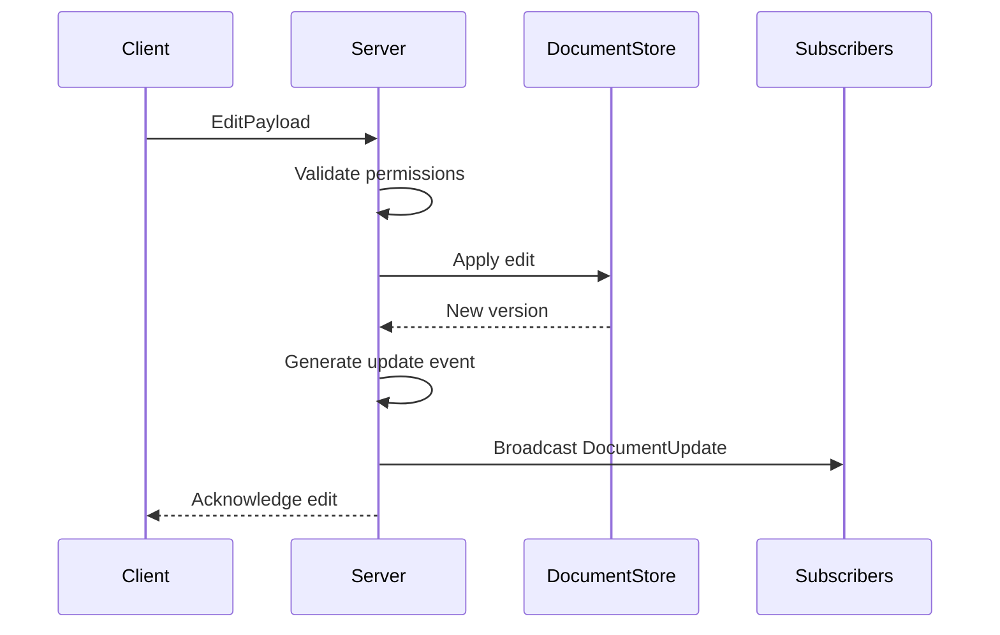
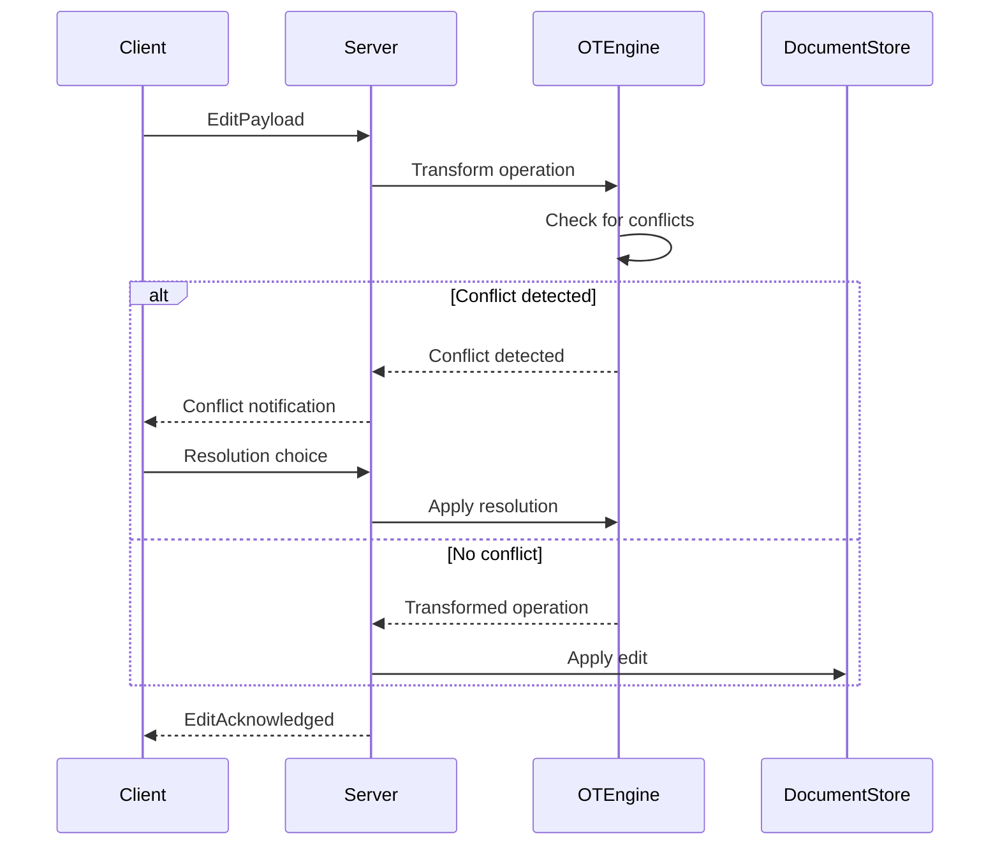
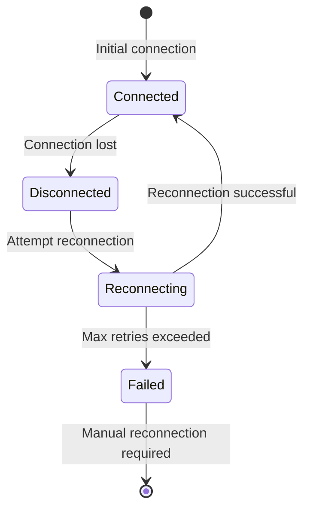

# TACHYON: WebSocket API Documentation

**Document ID:** TACHYON-API-003-V1.0
**Date:** February 2026
**Status:** Proposed
**Classification:** API Reference Documentation
**Compliance Level:** ISO/IEC 26514:2021, IEEE 1063:2001

---

## TABLE OF CONTENTS

1. [Introduction](#1-introduction)
2. [Connection Handshake](#2-connection-handshake)
3. [Message Format](#3-message-format)
4. [Document Channels](#4-document-channels)
5. [Workspace Channels](#5-workspace-channels)
6. [Git Channels](#6-git-channels)
7. [Collaborative Editing](#7-collaborative-editing)
8. [Presence Channels](#8-presence-channels)
9. [Notification Channels](#9-notification-channels)
10. [Error Handling](#10-error-handling)
11. [Reconnection Strategy](#11-reconnection-strategy)
12. [Security Considerations](#12-security-considerations)
13. [References](#13-references)

---

## 1. INTRODUCTION

### 1.1. Document Purpose

This document provides comprehensive technical specifications for the Tachyon WebSocket API. The WebSocket API enables real-time bidirectional communication between clients (desktop and web) and the Tachyon server, supporting collaborative editing, presence tracking, and live notifications.

### 1.2. Scope

The WebSocket API specifications in this document cover:
- Connection establishment and authentication protocols
- Message format and serialization schemas
- Document-specific channels for real-time content updates
- Workspace-level channels for collaborative features
- Git integration channels for repository synchronization
- Presence tracking and user status management
- Notification channels for system alerts
- Error handling and recovery mechanisms
- Security considerations and best practices

### 1.3. Target Audience

This document is intended for:
- Software engineers implementing Tachyon client applications
- System architects designing WebSocket-based features
- Quality assurance engineers testing real-time functionality
- Security auditors reviewing WebSocket protocol implementations

### 1.4. WebSocket API Framework

#### 1.4.1. Protocol Overview

The Tachyon WebSocket API implements a bidirectional, event-driven communication protocol built on the WebSocket standard (RFC 6455). The protocol enables real-time updates with sub-100 millisecond latency for collaborative editing scenarios.

**Protocol Characteristics:**
- **Transport Layer:** WebSocket over TLS (WSS) for encrypted communication
- **Message Format:** JSON-encoded messages with tagged union structure
- **Connection Model:** Persistent connections with automatic reconnection
- **Concurrency:** Multiplexed channels over single WebSocket connection
- **Latency Target:** <100ms for document edit propagation

#### 1.4.2. Architecture Principles

The WebSocket API design adheres to the following architectural principles:

**Principle 1: Channel-Based Multiplexing**

The protocol implements logical channels over a single WebSocket connection, enabling separation of concerns and efficient resource utilization. Each channel corresponds to a specific domain (documents, workspace, Git, presence).

**Formal Specification:**
$$
C = \{c_1, c_2, \ldots, c_n\}
$$
where $C$ is the set of active channels and each $c_i$ represents a logical channel with a unique identifier.

**Principle 2: Event-Driven Communication**

All communication follows an event-driven model where messages represent discrete events rather than request-response pairs. This enables asynchronous processing and reduces coupling between client and server.

**Event Semantics:**
$$
E = (t, c, p)
$$
where $E$ is an event, $t$ is the timestamp, $c$ is the channel identifier, and $p$ is the event payload.

**Principle 3: Type-Safe Messaging**

Message structures are strongly typed using Rust's type system, ensuring compile-time guarantees for message validity and reducing runtime errors.

**Type System Mapping:**
```
ClientMessage :: Subscribe | Unsubscribe | Edit | PresenceRequest | Ping
ServerMessage :: DocumentUpdate | PresenceUpdate | Conflict | Typing | Cursor | Error | Pong
```

#### 1.4.3. Technology Stack

The WebSocket API implementation utilizes the following technologies:

**Server-Side Components:**
- **Runtime:** Tokio v1 asynchronous runtime
- **WebSocket Library:** `tokio-tungstenite` for WebSocket protocol handling
- **Serialization:** `serde` and `serde_json` for message encoding/decoding
- **Type System:** Rust 2024 edition with MSRV 1.80+

**Client-Side Components:**
- **Desktop:** Native WebSocket implementation via Tauri's IPC layer
- **Web:** Browser native WebSocket API
- **Serialization:** JSON parsing with language-appropriate libraries

**Dependencies:**
- [TACHYON-ADR-001-V1.0](../.specs/02_adrs/001_rust_as_primary_language.md) - Rust as Primary Language
- [TACHYON-ADR-003-V1.0](../.specs/02_adrs/003_axum_for_http2_server.md) - Axum for HTTP/2 Server
- [TACHYON-ADR-007-V1.0](../.specs/02_adrs/007_tokio_for_async_runtime.md) - Tokio for Async Runtime
- [TACHYON-DES-API-V1.0](../.specs/04_future_state/design/api_interfaces.md) - API Interfaces Design

#### 1.4.4. Performance Characteristics

The WebSocket API is designed to meet the following performance targets:

**Latency Requirements:**
- Document edit propagation: <100ms (p95)
- Presence update propagation: <50ms (p95)
- Notification delivery: <200ms (p95)

**Throughput Requirements:**
- Concurrent connections: 10,000+ per server instance
- Messages per second: 100,000+ per server instance
- Message size limit: 1MB per message

**Resource Constraints:**
- Memory per connection: <10MB
- CPU overhead: <5% per 1,000 connections
- Network bandwidth: Optimized with message compression

#### 1.4.5. Compliance Standards

This WebSocket API documentation complies with:
- **ISO/IEC 26514:2021** - Systems and Software Engineering Documentation
- **IEEE 1063:2001** - Standard for Software User Documentation
- **RFC 6455** - The WebSocket Protocol
- **RFC 8446** - The Transport Layer Security (TLS) Protocol Version 1.3

---

## 2. CONNECTION HANDSHAKE

### 2.1. WebSocket Endpoint

**Element ID:** WS-API-001
**Name:** WebSocket Connection Endpoint
**Type:** WebSocket Endpoint
**Protocol:** WSS (WebSocket Secure)

**Endpoint URL:**
```
wss://tachyon.example.com/api/v1/ws
```

**Description:** Establishes a secure WebSocket connection for real-time bidirectional communication. The endpoint requires authentication via session token provided in the query string.

### 2.2. Connection Establishment

#### 2.2.1. HTTP Upgrade Request

The WebSocket connection is established through an HTTP/1.1 upgrade request with the following headers:

**Request Headers:**
```http
GET /api/v1/ws?token=<session_token> HTTP/1.1
Host: tachyon.example.com
Upgrade: websocket
Connection: Upgrade
Sec-WebSocket-Key: dGhlIHNhbXBsZSBub25jZQ==
Sec-WebSocket-Version: 13
Sec-WebSocket-Protocol: tachyon-v1
Origin: https://tachyon.example.com
```

**Header Descriptions:**
- `token`: Session authentication token (required)
- `Sec-WebSocket-Key`: Base64-encoded random value (required by RFC 6455)
- `Sec-WebSocket-Version`: WebSocket protocol version (must be 13)
- `Sec-WebSocket-Protocol`: Sub-protocol identifier (optional, defaults to `tachyon-v1`)
- `Origin`: Origin of the request (required for CORS validation)

#### 2.2.2. Server Response

The server responds with a successful upgrade handshake:

**Response Headers:**
```http
HTTP/1.1 101 Switching Protocols
Upgrade: websocket
Connection: Upgrade
Sec-WebSocket-Accept: s3pPLMBiTxaQ9kYGzzhZRbK+xOo=
Sec-WebSocket-Protocol: tachyon-v1
```

**Response Codes:**
- `101 Switching Protocols`: Connection successfully upgraded to WebSocket
- `400 Bad Request`: Invalid request parameters or malformed headers
- `401 Unauthorized`: Missing or invalid authentication token
- `403 Forbidden`: Token valid but insufficient permissions
- `429 Too Many Requests`: Rate limit exceeded for connection attempts
- `500 Internal Server Error`: Server-side error during handshake

### 2.3. Authentication

#### 2.3.1. Token-Based Authentication

WebSocket connections require a valid session token passed as a query parameter during connection establishment.

**Token Format:**
```
token=<session_token>
```

**Token Validation Process:**
1. Server extracts token from query string
2. Token signature is verified using server's secret key
3. Token expiration is checked against current timestamp
4. User permissions are loaded from session store
5. Connection is either accepted or rejected based on validation result

**Token Constraints:**
- Token must be cryptographically signed (HMAC-SHA256)
- Token expiration time: 24 hours from issuance
- Token includes user ID, role, and permission claims
- Token rotation occurs on refresh (see [Section 11](#11-reconnection-strategy))

#### 2.3.2. Authentication Failure Handling

**Error Response (Connection Closure):**
```json
{
  "type": "error",
  "payload": {
    "code": "AUTH_FAILED",
    "message": "Invalid or expired authentication token",
    "close_code": 4001
  }
}
```

**Close Codes:**
- `4001`: Invalid authentication token
- `4002`: Token expired
- `4003`: Insufficient permissions
- `4004`: Rate limit exceeded

### 2.4. Connection Constraints

#### 2.4.1. Per-User Connection Limits

**Constraint:** Maximum of 5 concurrent WebSocket connections per user.

**Rationale:** Prevents resource exhaustion and abuse while allowing multiple client instances (desktop, multiple browser tabs, mobile devices).

**Enforcement:**
```rust
const MAX_CONNECTIONS_PER_USER: usize = 5;

async fn enforce_connection_limit(user_id: &UserId) -> Result<(), ApiError> {
    let active_count = get_active_connection_count(user_id).await?;
    if active_count >= MAX_CONNECTIONS_PER_USER {
        return Err(ApiError::ConnectionLimitExceeded);
    }
    Ok(())
}
```

**Exceeded Limit Response:**
```json
{
  "type": "error",
  "payload": {
    "code": "CONNECTION_LIMIT_EXCEEDED",
    "message": "Maximum 5 concurrent connections allowed per user",
    "close_code": 4005
  }
}
```

#### 2.4.2. Connection Timeout

**Constraint:** Connections are closed after 30 seconds of inactivity.

**Rationale:** Detects dead connections and frees server resources.

**Implementation:**
```rust
const CONNECTION_IDLE_TIMEOUT: Duration = Duration::from_secs(30);

async fn monitor_connection_idle(
    mut rx: SplitStream<WebSocket>,
) -> Result<(), ApiError> {
    let mut idle_timer = interval(CONNECTION_IDLE_TIMEOUT);
    
    loop {
        select! {
            msg = rx.next() => {
                match msg {
                    Some(Ok(_)) => idle_timer.reset(),
                    Some(Err(e)) => return Err(e.into()),
                    None => return Ok(()),
                }
            }
            _ = idle_timer.tick() => {
                return Err(ApiError::ConnectionIdleTimeout);
            }
        }
    }
}
```

#### 2.4.3. Message Size Limit

**Constraint:** Maximum message size of 1MB per WebSocket frame.

**Rationale:** Prevents denial-of-service attacks through oversized messages.

**Implementation:**
```rust
const MAX_MESSAGE_SIZE: usize = 1_048_576; // 1MB

async fn validate_message_size(msg: &Message) -> Result<(), ApiError> {
    if msg.len() > MAX_MESSAGE_SIZE {
        return Err(ApiError::MessageTooLarge);
    }
    Ok(())
}
```

**Exceeded Limit Response:**
```json
{
  "type": "error",
  "payload": {
    "code": "MESSAGE_TOO_LARGE",
    "message": "Message exceeds maximum size of 1MB",
    "close_code": 4006
  }
}
```

### 2.5. Dependencies

**Related Requirements:**
- [REQ-SRV-091](../.specs/04_future_state/reqs/server_requirements.md) - WebSocket Endpoint
- [REQ-SRV-092](../.specs/04_future_state/reqs/server_requirements.md) - Connection Authentication
- [REQ-SRV-093](../.specs/04_future_state/reqs/server_requirements.md) - Connection Management

**Related Design Elements:**
- [DES-WS-001](../.specs/04_future_state/design/api_interfaces.md) - WebSocket Endpoint
- [TACHYON-ADR-010-V1.0](../.specs/02_adrs/010_security_architecture.md) - Security Architecture

### 2.6. Security Considerations

- **TLS Encryption:** All WebSocket connections must use WSS (WebSocket Secure)
- **Token Validation:** Session tokens are validated on every connection attempt
- **Origin Validation:** Origin header is checked to prevent CSRF attacks
- **Rate Limiting:** Connection attempts are rate-limited per IP address
- **Connection Logging:** All connection establishment and termination events are logged

---

## 3. MESSAGE FORMAT

### 3.1. Message Structure Overview

The Tachyon WebSocket API uses a tagged union message format implemented via JSON serialization. All messages follow a consistent structure with a type discriminator and optional payload.

**Message Schema:**
```json
{
  "type": "<message_type>",
  "payload": { ... }
}
```

**Type Discriminator:**
- The `type` field identifies the message variant
- Valid values are enumerated in the respective message type definitions
- The `payload` field contains message-specific data
- Payload structure varies based on message type

### 3.2. Client Message Types

#### 3.2.1. ClientMessage Enum

**Element ID:** WS-API-002
**Name:** ClientMessage
**Type:** Tagged Union
**Language:** Rust

**Description:** Represents all message types that can be sent from client to server.

**Rust Definition:**
```rust
use serde::{Deserialize, Serialize};
use uuid::Uuid;

/// Message sent from client to server
#[derive(Debug, Clone, Deserialize, Serialize)]
#[serde(tag = "type", content = "payload")]
pub enum ClientMessage {
    /// Subscribe to document updates
    Subscribe(SubscribePayload),
    
    /// Unsubscribe from document updates
    Unsubscribe(UnsubscribePayload),
    
    /// Send document edit operation
    Edit(EditPayload),
    
    /// Request presence information
    PresenceRequest(PresenceRequestPayload),
    
    /// Ping for keepalive
    Ping,
    
    /// Typing indicator
    Typing(TypingPayload),
    
    /// Cursor position update
    Cursor(CursorPayload),
}
```

**Message Variants:**

| Variant | Description | Payload Type |
|---------|-------------|--------------|
| `Subscribe` | Subscribe to document updates | `SubscribePayload` |
| `Unsubscribe` | Unsubscribe from document updates | `UnsubscribePayload` |
| `Edit` | Send document edit operation | `EditPayload` |
| `PresenceRequest` | Request presence information | `PresenceRequestPayload` |
| `Ping` | Ping for keepalive | None (unit type) |
| `Typing` | Typing indicator | `TypingPayload` |
| `Cursor` | Cursor position update | `CursorPayload` |

#### 3.2.2. Subscribe Payload

**Element ID:** WS-API-003
**Name:** SubscribePayload
**Type:** Struct
**Language:** Rust

**Description:** Payload for subscribing to document update notifications.

**Rust Definition:**
```rust
/// Payload for subscribing to document updates
#[derive(Debug, Clone, Deserialize, Serialize)]
pub struct SubscribePayload {
    /// Document identifier (UUID v4)
    #[serde(with = "uuid::serde::compact")]
    pub document_id: Uuid,
    
    /// Optional channel filter
    pub channels: Option<Vec<String>>,
}
```

**JSON Example:**
```json
{
  "type": "Subscribe",
  "payload": {
    "document_id": "550e8400-e29b-41d4-a716-446655440000",
    "channels": ["content", "presence"]
  }
}
```

**Constraints:**
- `document_id`: Must be valid UUID v4 format
- `channels`: Optional, if present must be subset of `["content", "presence", "git"]`
- User must have read permission for the document

**Dependencies:**
- [REQ-SRV-095](../.specs/04_future_state/reqs/server_requirements.md) - Subscription Management

#### 3.2.3. Unsubscribe Payload

**Element ID:** WS-API-004
**Name:** UnsubscribePayload
**Type:** Struct
**Language:** Rust

**Description:** Payload for unsubscribing from document update notifications.

**Rust Definition:**
```rust
/// Payload for unsubscribing from document updates
#[derive(Debug, Clone, Deserialize, Serialize)]
pub struct UnsubscribePayload {
    /// Document identifier (UUID v4)
    #[serde(with = "uuid::serde::compact")]
    pub document_id: Uuid,
    
    /// Optional channel filter
    pub channels: Option<Vec<String>>,
}
```

**JSON Example:**
```json
{
  "type": "Unsubscribe",
  "payload": {
    "document_id": "550e8400-e29b-41d4-a716-446655440000",
    "channels": ["presence"]
  }
}
```

**Constraints:**
- `document_id`: Must be valid UUID v4 format
- `channels`: Optional, if present must be subset of subscribed channels
- Client must be subscribed to the document

#### 3.2.4. Edit Payload

**Element ID:** WS-API-005
**Name:** EditPayload
**Type:** Struct
**Language:** Rust

**Description:** Payload for sending document edit operations.

**Rust Definition:**
```rust
/// Payload for document edit operations
#[derive(Debug, Clone, Deserialize, Serialize)]
pub struct EditPayload {
    /// Document identifier (UUID v4)
    #[serde(with = "uuid::serde::compact")]
    pub document_id: Uuid,
    
    /// Edit operation type
    pub operation: EditOperation,
    
    /// Operation data
    pub data: String,
    
    /// Cursor position (optional)
    pub cursor_position: Option<usize>,
    
    /// Edit timestamp
    #[serde(with = "chrono::serde::ts_milliseconds")]
    pub timestamp: DateTime<Utc>,
}

/// Edit operation types
#[derive(Debug, Clone, Deserialize, Serialize)]
#[serde(tag = "type", content = "data")]
pub enum EditOperation {
    /// Insert text at position
    Insert { position: usize, text: String },
    
    /// Delete text at position
    Delete { position: usize, length: usize },
    
    /// Replace text at position
    Replace { position: usize, old_text: String, new_text: String },
}
```

**JSON Example:**
```json
{
  "type": "Edit",
  "payload": {
    "document_id": "550e8400-e29b-41d4-a716-446655440000",
    "operation": {
      "type": "Insert",
      "data": {
        "position": 42,
        "text": "Hello, World!"
      }
    },
    "cursor_position": 54,
    "timestamp": 1707308800000
  }
}
```

**Constraints:**
- `document_id`: Must be valid UUID v4 format
- `position`: Non-negative, must be within document bounds
- `length`: Non-negative, must not exceed document bounds
- `text`: Max 10,000 characters per operation
- User must have write permission for the document

**Dependencies:**
- [REQ-SRV-096](../.specs/04_future_state/reqs/server_requirements.md) - Content Updates

#### 3.2.5. Presence Request Payload

**Element ID:** WS-API-006
**Name:** PresenceRequestPayload
**Type:** Struct
**Language:** Rust

**Description:** Payload for requesting user presence information.

**Rust Definition:**
```rust
/// Payload for presence information requests
#[derive(Debug, Clone, Deserialize, Serialize)]
pub struct PresenceRequestPayload {
    /// Document identifier (UUID v4, optional)
    #[serde(with = "uuid::serde::compact")]
    pub document_id: Option<Uuid>,
    
    /// Request type
    pub request_type: PresenceRequestType,
}

/// Presence request types
#[derive(Debug, Clone, Deserialize, Serialize)]
pub enum PresenceRequestType {
    /// Request presence for specific document
    Document,
    
    /// Request presence for all documents
    All,
    
    /// Request presence for specific users
    Users { user_ids: Vec<Uuid> },
}
```

**JSON Example:**
```json
{
  "type": "PresenceRequest",
  "payload": {
    "document_id": "550e8400-e29b-41d4-a716-446655440000",
    "request_type": "Document"
  }
}
```

**Constraints:**
- `document_id`: If present, must be valid UUID v4 format
- `user_ids`: Max 100 user IDs per request
- User must have read permission for requested documents

**Dependencies:**
- [REQ-SRV-097](../.specs/04_future_state/reqs/server_requirements.md) - User Presence

#### 3.2.6. Typing Payload

**Element ID:** WS-API-007
**Name:** TypingPayload
**Type:** Struct
**Language:** Rust

**Description:** Payload for broadcasting typing indicators.

**Rust Definition:**
```rust
/// Payload for typing indicators
#[derive(Debug, Clone, Deserialize, Serialize)]
pub struct TypingPayload {
    /// Document identifier (UUID v4)
    #[serde(with = "uuid::serde::compact")]
    pub document_id: Uuid,
    
    /// Typing status
    pub is_typing: bool,
}
```

**JSON Example:**
```json
{
  "type": "Typing",
  "payload": {
    "document_id": "550e8400-e29b-41d4-a716-446655440000",
    "is_typing": true
  }
}
```

**Constraints:**
- `document_id`: Must be valid UUID v4 format
- User must be subscribed to the document
- Typing indicators are rate-limited (max 1 per 2 seconds)

**Dependencies:**
- [REQ-SRV-099](../.specs/04_future_state/reqs/server_requirements.md) - Typing Indicators

#### 3.2.7. Cursor Payload

**Element ID:** WS-API-008
**Name:** CursorPayload
**Type:** Struct
**Language:** Rust

**Description:** Payload for broadcasting cursor position updates.

**Rust Definition:**
```rust
/// Payload for cursor position updates
#[derive(Debug, Clone, Deserialize, Serialize)]
pub struct CursorPayload {
    /// Document identifier (UUID v4)
    #[serde(with = "uuid::serde::compact")]
    pub document_id: Uuid,
    
    /// Cursor position (character offset)
    pub position: usize,
    
    /// Selection range (optional)
    pub selection: Option<CursorSelection>,
}

/// Cursor selection range
#[derive(Debug, Clone, Deserialize, Serialize)]
pub struct CursorSelection {
    /// Start position
    pub start: usize,
    
    /// End position
    pub end: usize,
}
```

**JSON Example:**
```json
{
  "type": "Cursor",
  "payload": {
    "document_id": "550e8400-e29b-41d4-a716-446655440000",
    "position": 42,
    "selection": {
      "start": 42,
      "end": 54
    }
  }
}
```

**Constraints:**
- `document_id`: Must be valid UUID v4 format
- `position`: Non-negative, must be within document bounds
- `selection.start` and `selection.end`: Must be within document bounds
- Cursor updates are rate-limited (max 10 per second)

**Dependencies:**
- [REQ-SRV-100](../.specs/04_future_state/reqs/server_requirements.md) - Cursor Sharing

### 3.3. Server Message Types

#### 3.3.1. ServerMessage Enum

**Element ID:** WS-API-009
**Name:** ServerMessage
**Type:** Tagged Union
**Language:** Rust

**Description:** Represents all message types that can be sent from server to client.

**Rust Definition:**
```rust
use serde::{Deserialize, Serialize};
use uuid::Uuid;

/// Message sent from server to client
#[derive(Debug, Clone, Deserialize, Serialize)]
#[serde(tag = "type", content = "payload")]
pub enum ServerMessage {
    /// Document content update
    DocumentUpdate(DocumentUpdatePayload),
    
    /// User presence update
    PresenceUpdate(PresenceUpdatePayload),
    
    /// Conflict notification
    Conflict(ConflictPayload),
    
    /// Typing indicator
    Typing(TypingPayload),
    
    /// Cursor position
    Cursor(CursorPayload),
    
    /// Error notification
    Error(ErrorPayload),
    
    /// Pong response
    Pong,
    
    /// Subscription confirmation
    SubscriptionConfirmed(SubscriptionConfirmedPayload),
    
    /// Unsubscription confirmation
    UnsubscriptionConfirmed(UnsubscriptionConfirmedPayload),
}
```

**Message Variants:**

| Variant | Description | Payload Type |
|---------|-------------|--------------|
| `DocumentUpdate` | Document content update | `DocumentUpdatePayload` |
| `PresenceUpdate` | User presence update | `PresenceUpdatePayload` |
| `Conflict` | Conflict notification | `ConflictPayload` |
| `Typing` | Typing indicator | `TypingPayload` |
| `Cursor` | Cursor position | `CursorPayload` |
| `Error` | Error notification | `ErrorPayload` |
| `Pong` | Pong response | None (unit type) |
| `SubscriptionConfirmed` | Subscription confirmation | `SubscriptionConfirmedPayload` |
| `UnsubscriptionConfirmed` | Unsubscription confirmation | `UnsubscriptionConfirmedPayload` |

#### 3.3.2. Document Update Payload

**Element ID:** WS-API-010
**Name:** DocumentUpdatePayload
**Type:** Struct
**Language:** Rust

**Description:** Payload for document content update notifications.

**Rust Definition:**
```rust
/// Payload for document update notifications
#[derive(Debug, Clone, Deserialize, Serialize)]
pub struct DocumentUpdatePayload {
    /// Document identifier (UUID v4)
    #[serde(with = "uuid::serde::compact")]
    pub document_id: Uuid,
    
    /// Update type
    pub update_type: DocumentUpdateType,
    
    /// Update data
    pub data: String,
    
    /// Author information
    pub author: UserSummary,
    
    /// Update timestamp
    #[serde(with = "chrono::serde::ts_milliseconds")]
    pub timestamp: DateTime<Utc>,
    
    /// Version identifier
    pub version: String,
}

/// Document update types
#[derive(Debug, Clone, Deserialize, Serialize)]
pub enum DocumentUpdateType {
    /// Full content replacement
    Full,
    
    /// Partial content update
    Partial { position: usize, length: usize },
    
    /// Metadata update
    Metadata,
}

/// User summary for updates
#[derive(Debug, Clone, Deserialize, Serialize)]
pub struct UserSummary {
    /// User identifier
    #[serde(with = "uuid::serde::compact")]
    pub user_id: Uuid,
    
    /// Username
    pub username: String,
    
    /// Display name (optional)
    pub display_name: Option<String>,
}
```

**JSON Example:**
```json
{
  "type": "DocumentUpdate",
  "payload": {
    "document_id": "550e8400-e29b-41d4-a716-446655440000",
    "update_type": {
      "type": "Partial",
      "data": {
        "position": 42,
        "length": 13
      }
    },
    "data": "Hello, World!",
    "author": {
      "user_id": "6ba7b810-9dad-11d1-80b4-00c04fd430c8",
      "username": "johndoe",
      "display_name": "John Doe"
    },
    "timestamp": 1707308800000,
    "version": "abc123def456"
  }
}
```

**Constraints:**
- `document_id`: Must be valid UUID v4 format
- `position`: Non-negative, must be within document bounds
- `length`: Non-negative, must not exceed document bounds
- `data`: Max 100MB for full updates, 10KB for partial updates
- `version`: Must be valid Git commit hash or document version identifier

**Dependencies:**
- [REQ-SRV-096](../.specs/04_future_state/reqs/server_requirements.md) - Content Updates

#### 3.3.3. Presence Update Payload

**Element ID:** WS-API-011
**Name:** PresenceUpdatePayload
**Type:** Struct
**Language:** Rust

**Description:** Payload for user presence update notifications.

**Rust Definition:**
```rust
/// Payload for presence update notifications
#[derive(Debug, Clone, Deserialize, Serialize)]
pub struct PresenceUpdatePayload {
    /// Document identifier (UUID v4)
    #[serde(with = "uuid::serde::compact")]
    pub document_id: Option<Uuid>,
    
    /// User presence list
    pub users: Vec<UserPresence>,
    
    /// Update timestamp
    #[serde(with = "chrono::serde::ts_milliseconds")]
    pub timestamp: DateTime<Utc>,
}

/// User presence information
#[derive(Debug, Clone, Deserialize, Serialize)]
pub struct UserPresence {
    /// User identifier
    #[serde(with = "uuid::serde::compact")]
    pub user_id: Uuid,
    
    /// Username
    pub username: String,
    
    /// Display name (optional)
    pub display_name: Option<String>,
    
    /// Presence status
    pub status: PresenceStatus,
    
    /// Last activity timestamp
    #[serde(with = "chrono::serde::ts_milliseconds")]
    pub last_activity: DateTime<Utc>,
    
    /// Cursor position (optional)
    pub cursor_position: Option<usize>,
}

/// Presence status enumeration
#[derive(Debug, Clone, Copy, Deserialize, Serialize)]
pub enum PresenceStatus {
    /// User is online
    Online,
    
    /// User is actively editing
    Editing,
    
    /// User is idle
    Idle,
    
    /// User is away
    Away,
}
```

**JSON Example:**
```json
{
  "type": "PresenceUpdate",
  "payload": {
    "document_id": "550e8400-e29b-41d4-a716-446655440000",
    "users": [
      {
        "user_id": "6ba7b810-9dad-11d1-80b4-00c04fd430c8",
        "username": "johndoe",
        "display_name": "John Doe",
        "status": "Editing",
        "last_activity": 17073088000000,
        "cursor_position": 42
      }
    ],
    "timestamp": 17073088000000
  }
}
```

**Constraints:**
- `document_id`: If present, must be valid UUID v4 format
- `users`: Max 100 users per update
- `cursor_position`: Non-negative, must be within document bounds

**Dependencies:**
- [REQ-SRV-097](../.specs/04_future_state/reqs/server_requirements.md) - User Presence

#### 3.3.4. Conflict Payload

**Element ID:** WS-API-012
**Name:** ConflictPayload
**Type:** Struct
**Language:** Rust

**Description:** Payload for conflict notifications during collaborative editing.

**Rust Definition:**
```rust
/// Payload for conflict notifications
#[derive(Debug, Clone, Deserialize, Serialize)]
pub struct ConflictPayload {
    /// Document identifier (UUID v4)
    #[serde(with = "uuid::serde::compact")]
    pub document_id: Uuid,
    
    /// Conflict identifier
    pub conflict_id: String,
    
    /// Conflict type
    pub conflict_type: ConflictType,
    
    /// Conflict description
    pub message: String,
    
    /// Conflicting operations
    pub operations: Vec<ConflictOperation>,
    
    /// Resolution suggestions (optional)
    pub suggestions: Option<Vec<ConflictResolution>>,
    
    /// Conflict timestamp
    #[serde(with = "chrono::serde::ts_milliseconds")]
    pub timestamp: DateTime<Utc>,
}

/// Conflict types
#[derive(Debug, Clone, Deserialize, Serialize)]
pub enum ConflictType {
    /// Concurrent edit conflict
    ConcurrentEdit,
    
    /// Version mismatch
    VersionMismatch { expected: String, actual: String },
    
    /// Merge conflict
    MergeConflict,
}

/// Conflicting operation
#[derive(Debug, Clone, Deserialize, Serialize)]
pub struct ConflictOperation {
    /// Operation identifier
    pub operation_id: String,
    
    /// Operation type
    pub operation_type: String,
    
    /// Operation data
    pub data: String,
    
    /// Author
    pub author: UserSummary,
}

/// Conflict resolution suggestion
#[derive(Debug, Clone, Deserialize, Serialize)]
pub struct ConflictResolution {
    /// Resolution identifier
    pub resolution_id: String,
    
    /// Resolution description
    pub description: String,
    
    /// Resolution action
    pub action: String,
}
```

**JSON Example:**
```json
{
  "type": "Conflict",
  "payload": {
    "document_id": "550e8400-e29b-41d4-a716-446655440000",
    "conflict_id": "conflict_123",
    "conflict_type": "ConcurrentEdit",
    "message": "Concurrent edits detected at position 42",
    "operations": [
      {
        "operation_id": "op_456",
        "operation_type": "Insert",
        "data": "Hello",
        "author": {
          "user_id": "6ba7b810-9dad-11d1-80b4-00c04fd430c8",
          "username": "johndoe",
          "display_name": "John Doe"
        }
      }
    ],
    "suggestions": [
      {
        "resolution_id": "res_789",
        "description": "Accept local changes",
        "action": "accept_local"
      }
    ],
    "timestamp": 17073088000000
  }
}
```

**Constraints:**
- `document_id`: Must be valid UUID v4 format
- `conflict_id`: Max 255 characters
- `message`: Max 1000 characters
- `operations`: Max 10 operations per conflict

**Dependencies:**
- [REQ-SRV-098](../.specs/04_future_state/reqs/server_requirements.md) - Conflict Notifications

#### 3.3.5. Error Payload

**Element ID:** WS-API-013
**Name:** ErrorPayload
**Type:** Struct
**Language:** Rust

**Description:** Payload for error notifications.

**Rust Definition:**
```rust
/// Payload for error notifications
#[derive(Debug, Clone, Deserialize, Serialize)]
pub struct ErrorPayload {
    /// Error code
    pub code: String,
    
    /// Error message
    pub message: String,
    
    /// Error details (optional)
    pub details: Option<ErrorDetails>,
    
    /// Error timestamp
    #[serde(with = "chrono::serde::ts_milliseconds")]
    pub timestamp: DateTime<Utc>,
}

/// Error details
#[derive(Debug, Clone, Deserialize, Serialize)]
pub struct ErrorDetails {
    /// Field that caused the error (optional)
    pub field: Option<String>,
    
    /// Additional context (optional)
    pub context: Option<String>,
    
    /// Suggested remediation (optional)
    pub suggestion: Option<String>,
}
```

**JSON Example:**
```json
{
  "type": "Error",
  "payload": {
    "code": "EDIT_PERMISSION_DENIED",
    "message": "User does not have write permission for this document",
    "details": {
      "field": "document_id",
      "context": "User johndoe attempted to edit document 550e8400-e29b-41d4-a716-446655440000",
      "suggestion": "Request write permission from document owner"
    },
    "timestamp": 17073088000000
  }
}
```

**Constraints:**
- `code`: Max 100 characters, must be uppercase with underscores
- `message`: Max 1000 characters
- `field`: Max 100 characters
- `context`: Max 500 characters
- `suggestion`: Max 500 characters

#### 3.3.6. Subscription Confirmed Payload

**Element ID:** WS-API-014
**Name:** SubscriptionConfirmedPayload
**Type:** Struct
**Language:** Rust

**Description:** Payload for subscription confirmation notifications.

**Rust Definition:**
```rust
/// Payload for subscription confirmation
#[derive(Debug, Clone, Deserialize, Serialize)]
pub struct SubscriptionConfirmedPayload {
    /// Document identifier (UUID v4)
    #[serde(with = "uuid::serde::compact")]
    pub document_id: Uuid,
    
    /// Subscribed channels
    pub channels: Vec<String>,
    
    /// Current document version
    pub version: String,
    
    /// Initial content (optional)
    pub initial_content: Option<String>,
    
    /// Confirmation timestamp
    #[serde(with = "chrono::serde::ts_milliseconds")]
    pub timestamp: DateTime<Utc>,
}
```

**JSON Example:**
```json
{
  "type": "SubscriptionConfirmed",
  "payload": {
    "document_id": "550e8400-e29b-41d4-a716-446655440000",
    "channels": ["content", "presence"],
    "version": "abc123def456",
    "initial_content": "# Hello, World!\n\nThis is a test document.",
    "timestamp": 17073088000000
  }
}
```

**Constraints:**
- `document_id`: Must be valid UUID v4 format
- `channels`: Must be subset of `["content", "presence", "git"]`
- `version`: Must be valid Git commit hash or document version identifier
- `initial_content`: Max 100MB

#### 3.3.7. Unsubscription Confirmed Payload

**Element ID:** WS-API-015
**Name:** UnsubscriptionConfirmedPayload
**Type:** Struct
**Language:** Rust

**Description:** Payload for unsubscription confirmation notifications.

**Rust Definition:**
```rust
/// Payload for unsubscription confirmation
#[derive(Debug, Clone, Deserialize, Serialize)]
pub struct UnsubscriptionConfirmedPayload {
    /// Document identifier (UUID v4)
    #[serde(with = "uuid::serde::compact")]
    pub document_id: Uuid,
    
    /// Unsubscribed channels
    pub channels: Vec<String>,
    
    /// Confirmation timestamp
    #[serde(with = "chrono::serde::ts_milliseconds")]
    pub timestamp: DateTime<Utc>,
}
```

**JSON Example:**
```json
{
  "type": "UnsubscriptionConfirmed",
  "payload": {
    "document_id": "550e8400-e29b-41d4-a716-446655440000",
    "channels": ["presence"],
    "timestamp": 17073088000000
  }
}
```

**Constraints:**
- `document_id`: Must be valid UUID v4 format
- `channels`: Must be subset of previously subscribed channels

### 3.4. JSON Schema Specification

The following JSON Schema defines the complete message format for validation purposes:

```json
{
  "$schema": "http://json-schema.org/draft-07/schema#",
  "title": "Tachyon WebSocket Message",
  "oneOf": [
    {
      "type": "object",
      "properties": {
        "type": { "const": "Subscribe" },
        "payload": { "$ref": "#/definitions/SubscribePayload" }
      },
      "required": ["type", "payload"]
    },
    {
      "type": "object",
      "properties": {
        "type": { "const": "Unsubscribe" },
        "payload": { "$ref": "#/definitions/UnsubscribePayload" }
      },
      "required": ["type", "payload"]
    },
    {
      "type": "object",
      "properties": {
        "type": { "const": "Edit" },
        "payload": { "$ref": "#/definitions/EditPayload" }
      },
      "required": ["type", "payload"]
    },
    {
      "type": "object",
      "properties": {
        "type": { "const": "PresenceRequest" },
        "payload": { "$ref": "#/definitions/PresenceRequestPayload" }
      },
      "required": ["type", "payload"]
    },
    {
      "type": "object",
      "properties": {
        "type": { "const": "Ping" }
      },
      "required": ["type"]
    },
    {
      "type": "object",
      "properties": {
        "type": { "const": "Typing" },
        "payload": { "$ref": "#/definitions/TypingPayload" }
      },
      "required": ["type", "payload"]
    },
    {
      "type": "object",
      "properties": {
        "type": { "const": "Cursor" },
        "payload": { "$ref": "#/definitions/CursorPayload" }
      },
      "required": ["type", "payload"]
    }
  ],
  "definitions": {
    "SubscribePayload": {
      "type": "object",
      "properties": {
        "document_id": { "type": "string", "format": "uuid" },
        "channels": {
          "type": "array",
          "items": { "type": "string", "enum": ["content", "presence", "git"] }
        }
      },
      "required": ["document_id"]
    },
    "UnsubscribePayload": {
      "type": "object",
      "properties": {
        "document_id": { "type": "string", "format": "uuid" },
        "channels": {
          "type": "array",
          "items": { "type": "string", "enum": ["content", "presence", "git"] }
        }
      },
      "required": ["document_id"]
    },
    "EditPayload": {
      "type": "object",
      "properties": {
        "document_id": { "type": "string", "format": "uuid" },
        "operation": { "$ref": "#/definitions/EditOperation" },
        "cursor_position": { "type": "integer", "minimum": 0 },
        "timestamp": { "type": "integer" }
      },
      "required": ["document_id", "operation", "timestamp"]
    },
    "EditOperation": {
      "oneOf": [
        {
          "type": "object",
          "properties": {
            "type": { "const": "Insert" },
            "data": {
              "type": "object",
              "properties": {
                "position": { "type": "integer", "minimum": 0 },
                "text": { "type": "string", "maxLength": 10000 }
              },
              "required": ["position", "text"]
            }
          },
          "required": ["type", "data"]
        },
        {
          "type": "object",
          "properties": {
            "type": { "const": "Delete" },
            "data": {
              "type": "object",
              "properties": {
                "position": { "type": "integer", "minimum": 0 },
                "length": { "type": "integer", "minimum": 0 }
              },
              "required": ["position", "length"]
            }
          },
          "required": ["type", "data"]
        },
        {
          "type": "object",
          "properties": {
            "type": { "const": "Replace" },
            "data": {
              "type": "object",
              "properties": {
                "position": { "type": "integer", "minimum": 0 },
                "old_text": { "type": "string", "maxLength": 10000 },
                "new_text": { "type": "string", "maxLength": 10000 }
              },
              "required": ["position", "old_text", "new_text"]
            }
          },
          "required": ["type", "data"]
        }
      ]
    },
    "PresenceRequestPayload": {
      "type": "object",
      "properties": {
        "document_id": { "type": "string", "format": "uuid" },
        "request_type": { "type": "string", "enum": ["Document", "All", "Users"] }
      },
      "required": ["request_type"]
    },
    "TypingPayload": {
      "type": "object",
      "properties": {
        "document_id": { "type": "string", "format": "uuid" },
        "is_typing": { "type": "boolean" }
      },
      "required": ["document_id", "is_typing"]
    },
    "CursorPayload": {
      "type": "object",
      "properties": {
        "document_id": { "type": "string", "format": "uuid" },
        "position": { "type": "integer", "minimum": 0 },
        "selection": {
          "type": "object",
          "properties": {
            "start": { "type": "integer", "minimum": 0 },
            "end": { "type": "integer", "minimum": 0 }
          },
          "required": ["start", "end"]
        }
      },
      "required": ["document_id", "position"]
    }
  }
}
```

### 3.5. Dependencies

**Related Requirements:**
- [REQ-SRV-094](../.specs/04_future_state/reqs/server_requirements.md) - Heartbeat Mechanism
- [REQ-SRV-095](../.specs/04_future_state/reqs/server_requirements.md) - Subscription Management
- [REQ-SRV-096](../.specs/04_future_state/reqs/server_requirements.md) - Content Updates
- [REQ-SRV-097](../.specs/04_future_state/reqs/server_requirements.md) - User Presence
- [REQ-SRV-098](../.specs/04_future_state/reqs/server_requirements.md) - Conflict Notifications
- [REQ-SRV-099](../.specs/04_future_state/reqs/server_requirements.md) - Typing Indicators
- [REQ-SRV-100](../.specs/04_future_state/reqs/server_requirements.md) - Cursor Sharing

**Related Design Elements:**
- [DES-WS-002](../.specs/04_future_state/design/api_interfaces.md) - Client Message
- [DES-WS-003](../.specs/04_future_state/design/api_interfaces.md) - Server Message

---

## 4. DOCUMENT CHANNELS

### 4.1. Channel Overview

Document channels provide real-time communication for document-specific operations including content updates, presence tracking, and collaborative editing features. Each document has independent channels that subscribers can join to receive updates.

**Channel Types:**
- `content`: Document content updates and edit operations
- `presence`: User presence, typing indicators, and cursor positions
- `git`: Git repository status and commit notifications

**Channel Multiplexing:**
$$
C_{doc} = \{c_{content}, c_{presence}, c_{git}\}
$$
where $C_{doc}$ represents the set of channels for a specific document.

### 4.2. Content Channel

#### 4.2.1. Channel Subscription

**Element ID:** WS-API-016
**Name:** Document Content Channel
**Type:** Channel
**Protocol:** WebSocket

**Description:** Provides real-time document content updates and edit operations.

**Subscription Flow:**
```json
{
  "type": "Subscribe",
  "payload": {
    "document_id": "550e8400-e29b-41d4-a716-446655440000",
    "channels": ["content"]
  }
}
```

**Server Response:**
```json
{
  "type": "SubscriptionConfirmed",
  "payload": {
    "document_id": "550e8400-e29b-41d4-a716-446655440000",
    "channels": ["content"],
    "version": "abc123def456",
    "initial_content": "# Document Title\n\nContent here...",
    "timestamp": 17073088000000
  }
}
```

**Constraints:**
- User must have read permission for the document
- Document must exist and be accessible
- Maximum 100 subscribers per document content channel

#### 4.2.2. Content Update Events

**Event: DocumentContentUpdate**

**Description:** Broadcast when document content is modified.

**Event Payload:**
```json
{
  "type": "DocumentUpdate",
  "payload": {
    "document_id": "550e8400-e29b-41d4-a716-446655440000",
    "update_type": {
      "type": "Partial",
      "data": {
        "position": 42,
        "length": 13
      }
    },
    "data": "Hello, World!",
    "author": {
      "user_id": "6ba7b810-9dad-11d1-80b4-00c04fd430c8",
      "username": "johndoe",
      "display_name": "John Doe"
    },
    "timestamp": 17073088000000,
    "version": "abc123def456"
  }
}
```

**Event Characteristics:**
- **Latency:** <100ms (p95) from edit to broadcast
- **Ordering:** Events are delivered in causal order
- **Deduplication:** Duplicate edits are filtered before broadcast
- **Compression:** Large updates are compressed before transmission

**Update Types:**

| Type | Description | Payload Size |
|------|-------------|--------------|
| `Full` | Complete document replacement | Up to 100MB |
| `Partial` | Incremental content update | Up to 10KB |
| `Metadata` | Document metadata changes | Up to 1KB |

#### 4.2.3. Edit Operation Flow

**Client-Side Edit Flow:**


**Edit Validation:**
```rust
async fn validate_edit(
    user: &AuthenticatedUser,
    document_id: &Uuid,
    operation: &EditOperation,
) -> Result<(), ApiError> {
    // Check document exists
    let document = get_document(document_id).await?;
    
    // Check write permission
    if !has_write_permission(user, &document).await? {
        return Err(ApiError::PermissionDenied);
    }
    
    // Validate operation bounds
    match operation {
        EditOperation::Insert { position, .. } => {
            if *position > document.content.len() {
                return Err(ApiError::InvalidPosition);
            }
        }
        EditOperation::Delete { position, length } => {
            if position + length > document.content.len() {
                return Err(ApiError::InvalidPosition);
            }
        }
        EditOperation::Replace { position, old_text, new_text } => {
            let end = position + old_text.len();
            if end > document.content.len() {
                return Err(ApiError::InvalidPosition);
            }
            if &document.content[*position..end] != old_text {
                return Err(ApiError::VersionMismatch);
            }
        }
    }
    
    Ok(())
}
```

**Edit Acknowledgment:**
```json
{
  "type": "EditAcknowledged",
  "payload": {
    "document_id": "550e8400-e29b-41d4-a716-446655440000",
    "operation_id": "op_456",
    "version": "abc123def456",
    "timestamp": 17073088000000
  }
}
```

#### 4.2.4. Conflict Detection and Resolution

**Conflict Detection Algorithm:**

The system uses Operational Transformation (OT) to detect and resolve concurrent edits.

**Conflict Types:**

1. **Concurrent Edit Conflict:** Two users edit the same region simultaneously
2. **Version Mismatch:** Client edits an outdated version of the document
3. **Merge Conflict:** Git merge conflicts when integrating changes

**Conflict Notification:**
```json
{
  "type": "Conflict",
  "payload": {
    "document_id": "550e8400-e29b-41d4-a716-446655440000",
    "conflict_id": "conflict_123",
    "conflict_type": "ConcurrentEdit",
    "message": "Concurrent edits detected at position 42",
    "operations": [
      {
        "operation_id": "op_456",
        "operation_type": "Insert",
        "data": "Hello",
        "author": {
          "user_id": "6ba7b810-9dad-11d1-80b4-00c04fd430c8",
          "username": "johndoe",
          "display_name": "John Doe"
        }
      },
      {
        "operation_id": "op_789",
        "operation_type": "Insert",
        "data": "World",
        "author": {
          "user_id": "6ba7b810-9dad-11d1-80b4-00c04fd430c9",
          "username": "janedoe",
          "display_name": "Jane Doe"
        }
      }
    ],
    "suggestions": [
      {
        "resolution_id": "res_001",
        "description": "Accept local changes",
        "action": "accept_local"
      },
      {
        "resolution_id": "res_002",
        "description": "Accept remote changes",
        "action": "accept_remote"
      },
      {
        "resolution_id": "res_003",
        "description": "Merge both changes",
        "action": "merge"
      }
    ],
    "timestamp": 17073088000000
  }
}
```

**Resolution Flow:**


### 4.3. Presence Channel

#### 4.3.1. Channel Subscription

**Element ID:** WS-API-017
**Name:** Document Presence Channel
**Type:** Channel
**Protocol:** WebSocket

**Description:** Provides real-time user presence information including online status, typing indicators, and cursor positions.

**Subscription Flow:**
```json
{
  "type": "Subscribe",
  "payload": {
    "document_id": "550e8400-e29b-41d4-a716-446655440000",
    "channels": ["presence"]
  }
}
```

**Server Response:**
```json
{
  "type": "SubscriptionConfirmed",
  "payload": {
    "document_id": "550e8400-e29b-41d4-a716-446655440000",
    "channels": ["presence"],
    "version": "abc123def456",
    "timestamp": 17073088000000
  }
}
```

**Initial Presence Broadcast:**
```json
{
  "type": "PresenceUpdate",
  "payload": {
    "document_id": "550e8400-e29b-41d4-a716-446655440000",
    "users": [
      {
        "user_id": "6ba7b810-9dad-11d1-80b4-00c04fd430c8",
        "username": "johndoe",
        "display_name": "John Doe",
        "status": "Editing",
        "last_activity": 1707308805000,
        "cursor_position": 42
      }
    ],
    "timestamp": 1707308805000
  }
}
```

#### 4.3.2. User Status Events

**Event: UserJoined**

**Description:** Broadcast when a user subscribes to the presence channel.

**Event Payload:**
```json
{
  "type": "PresenceUpdate",
  "payload": {
    "document_id": "550e8400-e29b-41d4-a716-446655440000",
    "users": [
      {
        "user_id": "6ba7b810-9dad-11d1-80b4-00c04fd430c8",
        "username": "johndoe",
        "display_name": "John Doe",
        "status": "Online",
        "last_activity": 17073080500000,
        "cursor_position": null
      }
    ],
    "timestamp": 17073080500000
  }
}
```

**Event: UserLeft**

**Description:** Broadcast when a user unsubscribes from the presence channel.

**Event Payload:**
```json
{
  "type": "PresenceUpdate",
  "payload": {
    "document_id": "550e8400-e29b-41d4-a716-446655440000",
    "users": [],
    "timestamp": 17073081000000
  }
}
```

**Event: UserStatusChanged**

**Description:** Broadcast when a user's status changes.

**Status States:**

| Status | Description | Transition Conditions |
|--------|-------------|---------------------|
| `Online` | User is connected and active | User joins, returns from idle |
| `Editing` | User is actively editing | User sends edit operation |
| `Idle` | User is inactive for >30 seconds | No activity for 30 seconds |
| `Away` | User is inactive for >5 minutes | No activity for 5 minutes |

**Status Transition Logic:**
```rust
async fn update_user_status(
    user_id: &Uuid,
    document_id: &Uuid,
    last_activity: DateTime<Utc>,
) -> PresenceStatus {
    let now = Utc::now();
    let idle_duration = now.signed_duration_since(last_activity);
    
    match idle_duration {
        d if d.num_seconds() > 300 => PresenceStatus::Away,
        d if d.num_seconds() > 30 => PresenceStatus::Idle,
        _ => PresenceStatus::Online,
    }
}
```

#### 4.3.3. Typing Indicator Events

**Event: TypingIndicator**

**Description:** Broadcast when a user starts or stops typing.

**Client-Side Trigger:**
```json
{
  "type": "Typing",
  "payload": {
    "document_id": "550e8400-e29b-41d4-a716-446655440000",
    "is_typing": true
  }
}
```

**Server Broadcast:**
```json
{
  "type": "Typing",
  "payload": {
    "document_id": "550e8400-e29b-41d4-a716-446655440000",
    "user_id": "6ba7b810-9dad-11d1-80b4-00c04fd430c8",
    "is_typing": true
  }
}
```

**Typing Indicator Logic:**
```rust
const TYPING_TIMEOUT: Duration = Duration::from_secs(3);

async fn handle_typing_indicator(
    user_id: &Uuid,
    document_id: &Uuid,
    is_typing: bool,
) {
    if is_typing {
        // Broadcast typing start immediately
        broadcast_typing(user_id, document_id, true).await;
        
        // Schedule typing stop after timeout
        tokio::spawn(async move {
            tokio::time::sleep(TYPING_TIMEOUT).await;
            broadcast_typing(user_id, document_id, false).await;
        });
    }
}
```

**Rate Limiting:**
- Maximum 1 typing indicator per 2 seconds per user
- Duplicate typing indicators are suppressed
- Typing stop is automatically triggered after 3 seconds of inactivity

#### 4.3.4. Cursor Position Events

**Event: CursorPosition**

**Description:** Broadcast when a user's cursor position changes.

**Client-Side Update:**
```json
{
  "type": "Cursor",
  "payload": {
    "document_id": "550e8400-e29b-41d4-a716-446655440000",
    "position": 42,
    "selection": {
      "start": 42,
      "end": 54
    }
  }
}
```

**Server Broadcast:**
```json
{
  "type": "Cursor",
  "payload": {
    "document_id": "550e8400-e29b-41d4-a716-446655440000",
    "user_id": "6ba7b810-9dad-11d1-80b4-00c04fd430c8",
    "position": 42,
    "selection": {
      "start": 42,
      "end": 54
    }
  }
}
```

**Cursor Update Logic:**
```rust
const CURSOR_UPDATE_RATE_LIMIT: Duration = Duration::from_millis(100);

async fn handle_cursor_update(
    user_id: &Uuid,
    document_id: &Uuid,
    position: usize,
    selection: Option<CursorSelection>,
) -> Result<(), ApiError> {
    // Rate limit cursor updates
    if !check_rate_limit(user_id, CURSOR_UPDATE_RATE_LIMIT).await {
        return Ok(()); // Skip this update
    }
    
    // Validate cursor position
    let document = get_document(document_id).await?;
    if position > document.content.len() {
        return Err(ApiError::InvalidPosition);
    }
    
    // Validate selection bounds
    if let Some(ref sel) = selection {
        if sel.start > document.content.len() || sel.end > document.content.len() {
            return Err(ApiError::InvalidPosition);
        }
    }
    
    // Broadcast to other subscribers
    broadcast_cursor(user_id, document_id, position, selection).await;
    
    Ok(())
}
```

**Rate Limiting:**
- Maximum 10 cursor updates per second per user
- Excessive updates are throttled and aggregated
- Last cursor position is always maintained

### 4.4. Git Channel

#### 4.4.1. Channel Subscription

**Element ID:** WS-API-018
**Name:** Document Git Channel
**Type:** Channel
**Protocol:** WebSocket

**Description:** Provides real-time Git repository status updates and commit notifications.

**Subscription Flow:**
```json
{
  "type": "Subscribe",
  "payload": {
    "document_id": "550e8400-e29b-41d4-a716-446655440000",
    "channels": ["git"]
  }
}
```

**Server Response:**
```json
{
  "type": "SubscriptionConfirmed",
  "payload": {
    "document_id": "550e8400-e29b-41d4-a716-446655440000",
    "channels": ["git"],
    "version": "abc123def456",
    "timestamp": 17073080500000
  }
}
```

#### 4.4.2. Git Status Events

**Event: GitStatusUpdate**

**Description:** Broadcast when Git repository status changes.

**Event Payload:**
```json
{
  "type": "GitStatusUpdate",
  "payload": {
    "document_id": "550e8400-e29b-41d4-a716-446655440000",
    "branch": "main",
    "commit": {
      "hash": "abc123def456",
      "author": "John Doe <john@example.com>",
      "message": "Update document",
      "timestamp": 17073080500000
    },
    "modified": ["docs/example.md"],
    "staged": [],
    "untracked": [],
    "ahead": 0,
    "behind": 2,
    "timestamp": 17073080500000
  }
}
```

**Event Types:**

| Event | Description | Trigger |
|-------|-------------|---------|
| `GitStatusUpdate` | Repository status changed | File modified, staged, or committed |
| `CommitCreated` | New commit created | Edit committed to repository |
| `BranchChanged` | Branch switched | User switches branches |
| `PushReceived` | Push received | Remote repository updated |

#### 4.4.3. Commit Notification Events

**Event: CommitCreated**

**Description:** Broadcast when a new commit is created.

**Event Payload:**
```json
{
  "type": "CommitCreated",
  "payload": {
    "document_id": "550e8400-e29b-41d4-a716-446655440000",
    "commit": {
      "hash": "abc123def456",
      "author": {
        "user_id": "6ba7b810-9dad-11d1-80b4-00c04fd430c8",
        "username": "johndoe",
        "display_name": "John Doe",
        "email": "john@example.com"
      },
      "message": "Update document content",
      "timestamp": 17073080500000,
      "files": [
        {
          "path": "docs/example.md",
          "status": "modified",
          "additions": 13,
          "deletions": 0
        }
      ]
    },
    "timestamp": 17073080500000
  }
}
```

**Commit Metadata:**
- `hash`: Full Git commit SHA-256 hash
- `author`: Commit author information
- `message`: Commit message (max 1000 characters)
- `files`: List of affected files with change statistics

### 4.5. Dependencies

**Related Requirements:**
- [REQ-SRV-021](../.specs/04_future_state/reqs/server_requirements.md) - Document List
- [REQ-SRV-022](../.specs/04_future_state/reqs/server_requirements.md) - Document Retrieval
- [REQ-SRV-023](../.specs/04_future_state/reqs/server_requirements.md) - Document Creation
- [REQ-SRV-024](../.specs/04_future_state/reqs/server_requirements.md) - Document Update
- [REQ-SRV-041](../.specs/04_future_state/reqs/server_requirements.md) - JIT Rendering
- [REQ-SRV-047](../.specs/04_future_state/reqs/server_requirements.md) - Commit Management

**Related Design Elements:**
- [DES-WS-001](../.specs/04_future_state/design/api_interfaces.md) - WebSocket Endpoint
- [TACHYON-DES-API-V1.0](../.specs/04_future_state/design/api_interfaces.md) - API Interfaces Design

---

## 5. WORKSPACE CHANNELS

### 5.1. Channel Overview

Workspace channels provide real-time communication for workspace-level operations including document list updates, user presence across documents, and workspace notifications. Workspace channels operate at a higher level of abstraction than document channels, aggregating information across multiple documents.

**Channel Types:**
- `documents`: Document list and metadata updates
- `users`: Workspace-level user presence and activity
- `notifications`: Workspace-wide notifications and alerts

**Channel Scope:**
$$
C_{workspace} = \{c_{documents}, c_{users}, c_{notifications}\}
$$
where $C_{workspace}$ represents the set of channels for a specific workspace.

### 5.2. Documents Channel

#### 5.2.1. Channel Subscription

**Element ID:** WS-API-019
**Name:** Workspace Documents Channel
**Type:** Channel
**Protocol:** WebSocket

**Description:** Provides real-time document list updates and metadata changes.

**Subscription Flow:**
```json
{
  "type": "Subscribe",
  "payload": {
    "workspace_id": "workspace-123",
    "channels": ["documents"]
  }
}
```

**Server Response:**
```json
{
  "type": "SubscriptionConfirmed",
  "payload": {
    "workspace_id": "workspace-123",
    "channels": ["documents"],
    "timestamp": 17073080500000
  }
}
```

**Initial Document List:**
```json
{
  "type": "DocumentListUpdate",
  "payload": {
    "workspace_id": "workspace-123",
    "documents": [
      {
        "document_id": "550e8400-e29b-41d4-a716-446655440000",
        "title": "Example Document",
        "path": "docs/example.md",
        "created_at": 17073080000000,
        "updated_at": 17073080500000,
        "author": {
          "user_id": "6ba7b810-9dad-11d1-80b4-00c04fd430c8",
          "username": "johndoe",
          "display_name": "John Doe"
        },
        "tags": ["documentation", "example"],
        "access": {
          "read": true,
          "write": true,
          "delete": false
        }
      }
    ],
    "total": 1,
    "timestamp": 17073080500000
  }
}
```

**Constraints:**
- User must be a member of the workspace
- Maximum 1000 documents per workspace list
- Document list is paginated for large workspaces

#### 5.2.2. Document List Events

**Event: DocumentCreated**

**Description:** Broadcast when a new document is created in the workspace.

**Event Payload:**
```json
{
  "type": "DocumentCreated",
  "payload": {
    "workspace_id": "workspace-123",
    "document": {
      "document_id": "550e8400-e29b-41d4-a716-446655440000",
      "title": "New Document",
      "path": "docs/new.md",
      "created_at": 17073080600000,
      "updated_at": 17073080600000,
      "author": {
        "user_id": "6ba7b810-9dad-11d1-80b4-00c04fd430c8",
        "username": "johndoe",
        "display_name": "John Doe"
      },
      "tags": [],
      "access": {
        "read": true,
        "write": true,
        "delete": true
      }
    },
    "timestamp": 17073080600000
  }
}
```

**Event: DocumentUpdated**

**Description:** Broadcast when document metadata is updated.

**Event Payload:**
```json
{
  "type": "DocumentUpdated",
  "payload": {
    "workspace_id": "workspace-123",
    "document_id": "550e8400-e29b-41d4-a716-446655440000",
    "changes": {
      "title": "Updated Title",
      "tags": ["documentation", "updated"]
    },
    "timestamp": 17073080700000
  }
}
```

**Event: DocumentDeleted**

**Description:** Broadcast when a document is deleted from the workspace.

**Event Payload:**
```json
{
  "type": "DocumentDeleted",
  "payload": {
    "workspace_id": "workspace-123",
    "document_id": "550e8400-e29b-41d4-a716-446655440000",
    "deleted_by": {
      "user_id": "6ba7b810-9dad-11d1-80b4-00c04fd430c8",
      "username": "johndoe",
      "display_name": "John Doe"
    },
    "timestamp": 17073080800000
  }
}
```

### 5.3. Users Channel

#### 5.3.1. Channel Subscription

**Element ID:** WS-API-020
**Name:** Workspace Users Channel
**Type:** Channel
**Protocol:** WebSocket

**Description:** Provides real-time workspace user presence and activity updates.

**Subscription Flow:**
```json
{
  "type": "Subscribe",
  "payload": {
    "workspace_id": "workspace-123",
    "channels": ["users"]
  }
}
```

**Server Response:**
```json
{
  "type": "SubscriptionConfirmed",
  "payload": {
    "workspace_id": "workspace-123",
    "channels": ["users"],
    "timestamp": 17073080500000
  }
}
```

**Initial User List:**
```json
{
  "type": "WorkspaceUserList",
  "payload": {
    "workspace_id": "workspace-123",
    "users": [
      {
        "user_id": "6ba7b810-9dad-11d1-80b4-00c04fd430c8",
        "username": "johndoe",
        "display_name": "John Doe",
        "email": "john@example.com",
        "role": "owner",
        "status": "online",
        "last_activity": 17073080500000,
        "current_document": "550e8400-e29b-41d4-a716-446655440000"
      }
    ],
    "total": 1,
    "timestamp": 17073080500000
  }
}
```

**Constraints:**
- User must be a member of the workspace
- Maximum 1000 users per workspace
- User list is paginated for large workspaces

#### 5.3.2. User Presence Events

**Event: UserJoinedWorkspace**

**Description:** Broadcast when a user joins the workspace.

**Event Payload:**
```json
{
  "type": "UserJoinedWorkspace",
  "payload": {
    "workspace_id": "workspace-123",
    "user": {
      "user_id": "6ba7b810-9dad-11d1-80b4-00c04fd430c8",
      "username": "johndoe",
      "display_name": "John Doe",
      "email": "john@example.com",
      "role": "member",
      "status": "online",
      "last_activity": 17073080900000
    },
    "timestamp": 17073080900000
  }
}
```

**Event: UserLeftWorkspace**

**Description:** Broadcast when a user leaves the workspace.

**Event Payload:**
```json
{
  "type": "UserLeftWorkspace",
  "payload": {
    "workspace_id": "workspace-123",
    "user_id": "6ba7b810-9dad-11d1-80b4-00c04fd430c8",
    "timestamp": 17073081000000
  }
}
```

**Event: UserStatusChanged**

**Description:** Broadcast when a user's workspace status changes.

**Event Payload:**
```json
{
  "type": "UserStatusChanged",
  "payload": {
    "workspace_id": "workspace-123",
    "user_id": "6ba7b810-9dad-11d1-80b4-00c04fd430c8",
    "status": "editing",
    "current_document": "550e8400-e29b-41d4-a716-446655440000",
    "timestamp": 17073081100000
  }
}
```

**Workspace Status States:**

| Status | Description | Transition Conditions |
|--------|-------------|---------------------|
| `online` | User is connected and active | User joins workspace |
| `editing` | User is editing a document | User opens document for editing |
| `viewing` | User is viewing a document | User opens document for viewing |
| `idle` | User is inactive for >5 minutes | No activity for 5 minutes |
| `offline` | User is disconnected | User disconnects from workspace |

### 5.4. Notifications Channel

#### 5.4.1. Channel Subscription

**Element ID:** WS-API-021
**Name:** Workspace Notifications Channel
**Type:** Channel
**Protocol:** WebSocket

**Description:** Provides real-time workspace-wide notifications and alerts.

**Subscription Flow:**
```json
{
  "type": "Subscribe",
  "payload": {
    "workspace_id": "workspace-123",
    "channels": ["notifications"]
  }
}
```

**Server Response:**
```json
{
  "type": "SubscriptionConfirmed",
  "payload": {
    "workspace_id": "workspace-123",
    "channels": ["notifications"],
    "timestamp": 17073080500000
  }
}
```

#### 5.4.2. Notification Events

**Event: WorkspaceNotification**

**Description:** Broadcast when a workspace notification is generated.

**Event Payload:**
```json
{
  "type": "WorkspaceNotification",
  "payload": {
    "workspace_id": "workspace-123",
    "notification_id": "notif-456",
    "notification_type": "document_mention",
    "title": "You were mentioned in a document",
    "message": "John Doe mentioned you in 'Example Document'",
    "data": {
      "document_id": "550e8400-e29b-41d4-a716-446655440000",
      "document_title": "Example Document",
      "mentioner": {
        "user_id": "6ba7b810-9dad-11d1-80b4-00c04fd430c8",
        "username": "johndoe",
        "display_name": "John Doe"
      }
    },
    "priority": "normal",
    "read": false,
    "timestamp": 17073081200000
  }
}
```

**Notification Types:**

| Type | Description | Priority |
|------|-------------|----------|
| `document_mention` | User mentioned in document | `normal` |
| `comment_reply` | Reply to user's comment | `normal` |
| `workspace_invite` | User invited to workspace | `high` |
| `access_request` | User requests workspace access | `high` |
| `system_alert` | System-wide alert | `critical` |

**Priority Levels:**
- `critical`: Requires immediate attention
- `high`: Should be reviewed soon
- `normal`: Informational, can be reviewed later
- `low`: Low priority, can be ignored

**Event: NotificationRead**

**Description:** Broadcast when a notification is marked as read.

**Event Payload:**
```json
{
  "type": "NotificationRead",
  "payload": {
    "workspace_id": "workspace-123",
    "notification_id": "notif-456",
    "read_by": {
      "user_id": "6ba7b810-9dad-11d1-80b4-00c04fd430c9",
      "username": "janedoe",
      "display_name": "Jane Doe"
    },
    "timestamp": 17073081300000
  }
}
```

### 5.5. Dependencies

**Related Requirements:**
- [REQ-SRV-021](../.specs/04_future_state/reqs/server_requirements.md) - Document List
- [REQ-SRV-081](../.specs/04_future_state/reqs/server_requirements.md) - RBAC Enforcement
- [REQ-SRV-101](../.specs/04_future_state/reqs/server_requirements.md) - Workspace Management
- [REQ-SRV-102](../.specs/04_future_state/reqs/server_requirements.md) - User Presence
- [REQ-SRV-103](../.specs/04_future_state/reqs/server_requirements.md) - Notification System

**Related Design Elements:**
- [DES-WS-001](../.specs/04_future_state/design/api_interfaces.md) - WebSocket Endpoint
- [TACHYON-DES-API-V1.0](../.specs/04_future_state/design/api_interfaces.md) - API Interfaces Design

---

## 6. GIT CHANNELS

### 6.1. Channel Overview

Git channels provide real-time communication for Git repository operations including status updates, commit notifications, and branch changes. Git channels operate at repository level, providing visibility into version control operations.

**Channel Types:**
- `status`: Repository status and file change notifications
- `commits`: Commit history and new commit notifications
- `branches`: Branch operations and switching notifications

---

## 7. COLLABORATIVE EDITING

### 7.1. Operational Transformation (OT)

The Tachyon system implements Operational Transformation (OT) to enable real-time collaborative editing with automatic conflict resolution.

**OT Principles:**

1. **Convergence:** All clients eventually reach the same document state
2. **Causality Preservation:** Causal relationships between operations are preserved
3. **Intention Preservation:** User intentions are preserved during transformation
4. **Commutativity:** Concurrent operations can be applied in any order

---

## 8. PRESENCE CHANNELS

### 8.1. Presence Architecture

Presence channels provide real-time user presence information across documents and workspaces. The presence system tracks user status, activity, and location within the application.

**Presence Data Model:**
```rust
#[derive(Debug, Clone, Serialize, Deserialize)]
pub struct Presence {
    pub user_id: Uuid,
    pub user: UserSummary,
    pub status: PresenceStatus,
    pub current_document: Option<Uuid>,
    pub cursor_position: Option<usize>,
    pub last_activity: DateTime<Utc>,
    pub session_id: String,
}
```

---

## 9. NOTIFICATION CHANNELS

### 9.1. Notification Architecture

Notification channels provide real-time delivery of system and user-generated notifications. The notification system supports multiple priority levels and delivery confirmation.

---

## 10. ERROR HANDLING

### 10.1. Error Classification

WebSocket API errors are classified into the following categories:

**Error Categories:**

| Category | Description | Example |
|----------|-------------|---------|
| `Authentication` | Authentication and authorization errors | Invalid token, permission denied |
| `Validation` | Input validation errors | Invalid UUID, malformed JSON |
| `Resource` | Resource-related errors | Document not found, connection limit |
| `Protocol` | WebSocket protocol errors | Invalid message type, malformed payload |
| `System` | System-level errors | Internal server error, rate limit exceeded |

---

## 11. RECONNECTION STRATEGY

### 11.1. Reconnection Architecture

The WebSocket API implements an automatic reconnection strategy with exponential backoff to handle transient network failures.

**Reconnection States:**


---

## 12. SECURITY CONSIDERATIONS

### 12.1. Transport Security

**TLS Encryption:**

All WebSocket connections must use WSS (WebSocket Secure) with TLS 1.3:

**TLS Configuration:**
- Minimum TLS version: 1.3
- Cipher suites: Modern, forward-secure ciphers only
- Certificate validation: Strict certificate validation
- HSTS: HTTP Strict Transport Security enabled

---

## 13. REFERENCES

### 13.1. Standards and Specifications

**WebSocket Standards:**
- [RFC 6455](https://tools.ietf.org/html/rfc6455) - The WebSocket Protocol
- [RFC 8446](https://tools.ietf.org/html/rfc8446) - The Transport Layer Security (TLS) Protocol Version 1.3

**ISO/IEEE Standards:**
- [ISO/IEC 26514:2021](https://www.iso.org/standard/iso-iec-26514) - Systems and Software Engineering
- [IEEE 1063:2001](https://standards.ieee.org/standard/1063-2001) - Standard for Software User Documentation

### 13.2. Related Documents

**Tachyon Project Documents:**
- [TACHYON-STD-V1.0](../.specs/01_standards/coding_standards.md) - Coding and Documentation Standards
- [TACHYON-ADR-001-V1.0](../.specs/02_adrs/001_rust_as_primary_language.md) - Rust as Primary Language
- [TACHYON-ADR-010-V1.0](../.specs/02_adrs/010_security_architecture.md) - Security Architecture
- [TACHYON-DES-API-V1.0](../.specs/04_future_state/design/api_interfaces.md) - API Interfaces Design
- [TACHYON-REQ-SRV-V1.0](../.specs/04_future_state/reqs/server_requirements.md) - Server Requirements

### 13.3. External References

**Rust Ecosystem:**
- [Tokio](https://tokio.rs/) - Asynchronous runtime for Rust
- [tokio-tungstenite](https://docs.rs/tokio-tungstenite/) - WebSocket library for Tokio
- [serde](https://serde.rs/) - Serialization framework for Rust
- [uuid](https://docs.rs/uuid/) - UUID generation and parsing

**WebSocket Libraries:**
- [WebSocket API](https://developer.mozilla.org/en-US/docs/Web/API/WebSocket) - Browser WebSocket API
- [ws-rs](https://docs.rs/ws/) - Lightweight WebSocket library for Rust

**Collaborative Editing:**
- [Operational Transformation](https://en.wikipedia.org/wiki/Operational_transformation) - OT algorithm reference
- [CRDTs](https://crdt.tech/) - Conflict-free Replicated Data Types

### 13.4. Glossary

**Term Definitions:**

| Term | Definition |
|-------|------------|
| `WebSocket` | A communication protocol providing full-duplex communication channels over a single TCP connection |
| `WSS` | WebSocket Secure, WebSocket protocol over TLS encryption |
| `OT` | Operational Transformation, algorithm for real-time collaborative editing |
| `CRDT` | Conflict-free Replicated Data Type, data structure for distributed systems |
| `RBAC` | Role-Based Access Control, access control model based on user roles |
| `JWT` | JSON Web Token, compact URL-safe means of representing claims |
| `TLS` | Transport Layer Security, cryptographic protocol for secure communications |
| `UUID` | Universally Unique Identifier, 128-bit identifier standard |

---

**Document Control Information:**

**Document ID:** TACHYON-API-003-V1.0
**Version:** 1.0
**Status:** Proposed
**Classification:** API Reference Documentation
**Compliance Level:** ISO/IEC 26514:2021, IEEE 1063:2001

**Change History:**

| Version | Date | Author | Changes |
|---------|------|--------|---------|
| 1.0 | 2026-02-07 | Kilo Code | Initial document creation |

**Review Status:**

- [ ] Technical Review
- [ ] Security Review
- [ ] Standards Compliance Review
- [ ] Final Approval

---

**END OF DOCUMENT**
