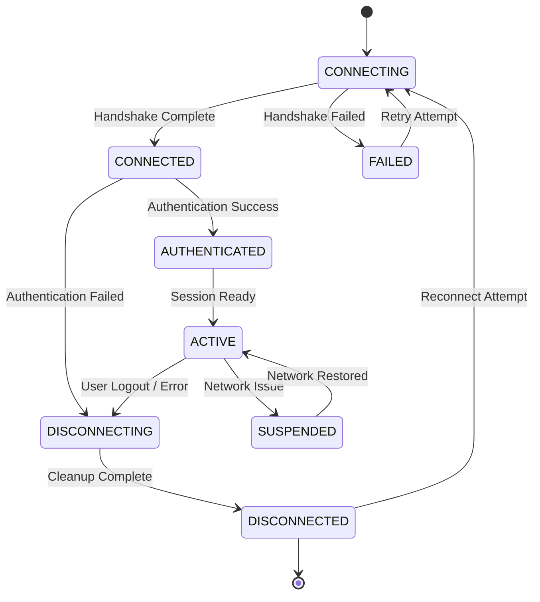

# TACHYON: WEBSOCKET API SPECIFICATION

**Document ID:** TACHYON-API-005-V1.0
**Date:** February 2026
**Status:** Proposed
**Classification:** Technical Specification
**Dependencies:** [TACHYON-STD-V1.0](../../.specs/01_standards/coding_standards.md), [TACHYON-REQ-SRV-V1.0](../../.specs/04_future_state/reqs/server_requirements.md), [TACHYON-DES-API-V1.0](../../.specs/04_future_state/design/api_interfaces.md), [TACHYON-ADR-003-V1.0](../../.specs/02_adrs/003_axum_for_http2_server.md), [TACHYON-ADR-007-V1.0](../../.specs/02_adrs/007_tokio_for_async_runtime.md), [TACHYON-TMA-V1.0](../../.specs/03_threat_model/analysis.md)

---

## TABLE OF CONTENTS

1. [Introduction](#1-introduction)
2. [WebSocket Connection Management](#2-websocket-connection-management)
3. [Message Types and Formats](#3-message-types-and-formats)
4. [WebSocket Endpoints](#4-websocket-endpoints)
5. [WebSocket Security](#5-websocket-security)
6. [WebSocket Performance](#6-websocket-performance)
7. [Error Handling](#7-error-handling)
8. [References](#8-references)

---

## 1. INTRODUCTION

### 1.1. Document Purpose

This document specifies the WebSocket API for the Tachyon server component, defining the protocol for real-time bidirectional communication between clients (desktop and web) and the server. The WebSocket API enables live document updates, collaborative editing features, user presence notifications, and other real-time functionality required by the Tachyon Knowledge Management System.

### 1.2. Scope

This specification covers:
- WebSocket connection lifecycle management
- Message type definitions and schemas
- Real-time update protocols for documents
- User presence and collaboration features
- Security requirements for WebSocket communication
- Performance characteristics and optimization strategies
- Error handling and recovery procedures

Out of scope:
- REST API endpoints (covered in [TACHYON-API-001-V1.0](rest_api_specification.md))
- Desktop-specific IPC protocols (covered in [TACHYON-IPC-001-V1.0](ipc_protocol_specification.md))
- Server-side rendering details (covered in architecture documentation)

### 1.3. WebSocket Design Principles

The Tachyon WebSocket API adheres to the following design principles:

**1.3.1. Minimal Latency**

The WebSocket protocol is optimized for minimal end-to-end latency to ensure real-time responsiveness for collaborative editing and live updates. The design prioritizes message delivery speed over bandwidth efficiency for small, frequent messages typical of collaborative editing scenarios.

**1.3.2. Reliability and Consistency**

The API implements mechanisms to ensure reliable message delivery and maintain consistency across all connected clients. Message ordering guarantees and conflict resolution strategies are defined to handle concurrent edits from multiple users.

**1.3.3. Scalability**

The WebSocket architecture supports horizontal scaling to accommodate large numbers of concurrent connections. Connection pooling, efficient message routing, and resource management strategies are defined to handle enterprise-scale deployments.

**1.3.4. Security First**

All WebSocket connections enforce authentication and authorization before allowing message exchange. Message validation, rate limiting, and threat mitigation strategies are integrated throughout the protocol to prevent common WebSocket security vulnerabilities.

**1.3.5. Backward Compatibility**

The protocol includes versioning mechanisms to support backward compatibility as the API evolves. Clients can negotiate protocol versions during connection establishment, allowing for graceful upgrades without service disruption.

### 1.4. WebSocket Versioning Strategy

The WebSocket API follows semantic versioning to manage protocol evolution while maintaining backward compatibility.

**1.4.1. Version Format**

Protocol versions are identified using semantic versioning: `MAJOR.MINOR.PATCH`

- **MAJOR:** Incompatible API changes requiring client updates
- **MINOR:** Backward-compatible functionality additions
- **PATCH:** Backward-compatible bug fixes

**1.4.2. Version Negotiation**

Clients specify their supported protocol versions during connection establishment via the `Sec-WebSocket-Protocol` header. The server selects the highest compatible version and confirms the negotiated version in the initial handshake response.

**Version Negotiation Protocol:**

```
Client Request:
Sec-WebSocket-Protocol: tachyon-v1.0, tachyon-v1.1

Server Response:
Sec-WebSocket-Protocol: tachyon-v1.1
```

**1.4.3. Deprecation Policy**

Deprecated protocol versions are supported for a minimum of 12 months after the release of a new major version. Clients using deprecated versions receive deprecation warnings in the initial handshake response, encouraging migration to current versions.

**1.4.4. Breaking Changes**

Breaking changes to the WebSocket protocol require a major version increment and must be accompanied by:
- Migration guide for client implementations
- Dual-version support period for gradual rollout
- Comprehensive testing of backward incompatibility scenarios

### 1.5. Technology Stack

The WebSocket API is implemented using the following technologies:

**1.5.1. Server Implementation**

- **Framework:** Axum v0.7 with tokio-tungstenite for WebSocket support
- **Async Runtime:** Tokio v1 with multi-threaded work-stealing scheduler
- **Serialization:** Serde for JSON message serialization/deserialization
- **Compression:** Per-message DEFLATE compression (optional, negotiated per connection)

**1.5.2. Protocol Specifications**

- **WebSocket Protocol:** RFC 6455 (The WebSocket Protocol)
- **Message Format:** JSON with optional binary payload support
- **Subprotocol:** Custom Tachyon WebSocket subprotocol for application-level messaging

**1.5.3. Implementation References**

- **ADR-003:** [Axum for HTTP/2 Server](../../.specs/02_adrs/003_axum_for_http2_server.md) - Framework selection and WebSocket support
- **ADR-007:** [Tokio for Async Runtime](../../.specs/02_adrs/007_tokio_for_async_runtime.md) - Async runtime for WebSocket operations
- **REQ-SRV-091 through REQ-SRV-105:** WebSocket communication requirements from server requirements

### 1.6. Use Cases

The WebSocket API supports the following primary use cases:

**1.6.1. Real-Time Document Updates**

Clients receive immediate notifications when documents are modified by other users, enabling live collaboration without requiring manual refresh or polling.

**1.6.2. Collaborative Editing**

Multiple users can simultaneously edit the same document with real-time synchronization of changes, cursor positions, and typing indicators.

**1.6.3. User Presence**

Users can see which other users are currently online and which documents they are viewing or editing, facilitating coordination and awareness.

**1.6.4. Search Result Streaming**

Search results are streamed to clients as they become available, providing progressive feedback for long-running search operations.

**1.6.5. Progress Updates**

Long-running operations (e.g., document indexing, large file uploads) provide real-time progress updates to keep users informed.

**1.6.6. Notification Delivery**

System notifications (e.g., access requests, document comments, system alerts) are pushed to users in real-time.

---

## 2. WEBSOCKET CONNECTION MANAGEMENT

### 2.1. Connection Lifecycle

The WebSocket connection lifecycle defines the states and transitions that a WebSocket connection undergoes from establishment to termination. Proper lifecycle management ensures reliable communication and efficient resource utilization.

**2.1.1. Connection States**

The WebSocket connection maintains the following states:

| State | Description | Transitions |
|--------|-------------|---------------|
| **CONNECTING** | Initial state during WebSocket handshake | → CONNECTED, → FAILED |
| **CONNECTED** | Connection established, awaiting authentication | → AUTHENTICATED, → DISCONNECTING |
| **AUTHENTICATED** | User authenticated, ready for message exchange | → ACTIVE, → DISCONNECTING |
| **ACTIVE** | Connection fully operational, exchanging messages | → DISCONNECTING, → SUSPENDED |
| **SUSPENDED** | Connection temporarily paused (e.g., network issues) | → ACTIVE, → DISCONNECTING |
| **DISCONNECTING** | Graceful shutdown in progress | → DISCONNECTED |
| **DISCONNECTED** | Connection terminated | → CONNECTING (reconnect) |
| **FAILED** | Connection establishment failed | → CONNECTING (retry) |

**2.1.2. State Transition Diagram**



**2.1.3. Connection Establishment Timeline**

The connection establishment process follows this timeline:

| Time | Event | Action |
|-------|--------|--------|
| T+0ms | Client initiates WebSocket upgrade | Server accepts upgrade request |
| T+50ms | WebSocket handshake completes | Connection transitions to CONNECTED state |
| T+100ms | Server sends authentication challenge | Client responds with credentials |
| T+150ms | Server validates credentials | Connection transitions to AUTHENTICATED state |
| T+200ms | Server sends initial state sync | Connection transitions to ACTIVE state |

**2.1.4. Connection Termination Timeline**

The connection termination process follows this timeline:

| Time | Event | Action |
|-------|--------|--------|
| T+0ms | Client initiates close or server detects error | Connection transitions to DISCONNECTING state |
| T+50ms | Server sends close frame | Client acknowledges close frame |
| T+100ms | Server performs cleanup | Connection transitions to DISCONNECTED state |
| T+150ms | Client receives close notification | Client initiates reconnect if applicable |

### 2.2. Connection Initiation

**2.2.1. WebSocket Endpoint**

The WebSocket endpoint is located at `/ws` relative to the server base URL. Clients initiate WebSocket connections using standard WebSocket upgrade requests.

**Connection URL:**

```
wss://tachyon.example.com/ws
```

For local development (desktop mode):

```
ws://localhost:8080/ws
```

**2.2.2. WebSocket Upgrade Request**

Clients must include the following headers in the WebSocket upgrade request:

| Header | Value | Purpose |
|--------|--------|---------|
| `Upgrade` | `websocket` | Indicates WebSocket protocol upgrade |
| `Connection` | `Upgrade` | Confirms connection upgrade |
| `Sec-WebSocket-Key` | Base64-encoded nonce | WebSocket handshake security |
| `Sec-WebSocket-Version` | `13` | WebSocket protocol version |
| `Sec-WebSocket-Protocol` | `tachyon-v1.0` | Tachyon subprotocol version |
| `Authorization` | `Bearer <token>` | Authentication token (optional, can be sent in first message) |

**2.2.3. Server Response**

The server responds to the WebSocket upgrade request with:

| Header | Value | Purpose |
|--------|--------|---------|
| `Upgrade` | `websocket` | Confirms WebSocket upgrade |
| `Connection` | `Upgrade` | Confirms connection upgrade |
| `Sec-WebSocket-Accept` | Derived from client key | Completes handshake |
| `Sec-WebSocket-Protocol` | `tachyon-v1.0` | Negotiated subprotocol version |
| `Sec-WebSocket-Extensions` | `permessage-deflate` (optional) | Compression extension |

**2.2.4. Initial Handshake Message**

After WebSocket upgrade completion, the server sends an initial handshake message to confirm connection establishment and request authentication:

```json
{
  "type": "handshake",
  "version": "1.0",
  "server_id": "srv_abc123",
  "timestamp": 1707155200000,
  "challenge": "challenge_nonce_abc123"
}
```

**Handshake Message Schema:**

| Field | Type | Required | Description |
|-------|------|-----------|-------------|
| `type` | string | Yes | Message type identifier: "handshake" |
| `version` | string | Yes | Protocol version negotiated |
| `server_id` | string | Yes | Unique server instance identifier |
| `timestamp` | integer | Yes | Unix timestamp in milliseconds |
| `challenge` | string | Yes | Nonce for authentication challenge |

### 2.3. Authentication

**2.3.1. Authentication Methods**

The WebSocket API supports multiple authentication methods to accommodate different deployment scenarios:

| Method | Use Case | Description |
|--------|-----------|-------------|
| **Token-Based** | Web clients, server deployment | JWT or session token from REST API login |
| **Cookie-Based** | Web clients with session cookies | Session cookie from REST API authentication |
| **Local-Mode** | Desktop application | Local authentication without external providers |

**2.3.2. Token-Based Authentication**

Clients authenticate by sending an authentication message immediately after receiving the handshake:

```json
{
  "type": "auth",
  "method": "token",
  "token": "eyJhbGciOiJIUzI1NiIsInR5cCI6IkpXVCJ9...",
  "challenge_response": "challenge_response_xyz789"
}
```

**Authentication Message Schema:**

| Field | Type | Required | Description |
|-------|------|-----------|-------------|
| `type` | string | Yes | Message type identifier: "auth" |
| `method` | string | Yes | Authentication method: "token", "cookie", or "local" |
| `token` | string | Conditional | JWT or session token (required for token method) |
| `challenge_response` | string | Yes | Response to server challenge |

**2.3.3. Authentication Response**

The server responds to authentication attempts with success or failure:

**Success Response:**

```json
{
  "type": "auth_response",
  "status": "success",
  "user_id": "usr_abc123",
  "session_id": "ses_xyz789",
  "permissions": ["read", "write", "admin"],
  "timestamp": 1707155201000
}
```

**Failure Response:**

```json
{
  "type": "auth_response",
  "status": "failed",
  "error_code": "AUTH_INVALID_TOKEN",
  "error_message": "Invalid or expired authentication token",
  "timestamp": 1707155201000
}
```

**Authentication Response Schema:**

| Field | Type | Required | Description |
|-------|------|-----------|-------------|
| `type` | string | Yes | Message type identifier: "auth_response" |
| `status` | string | Yes | Authentication status: "success" or "failed" |
| `user_id` | string | Conditional | User identifier (success only) |
| `session_id` | string | Conditional | Session identifier (success only) |
| `permissions` | array | Conditional | User permissions (success only) |
| `error_code` | string | Conditional | Error code (failure only) |
| `error_message` | string | Conditional | Human-readable error message (failure only) |
| `timestamp` | integer | Yes | Unix timestamp in milliseconds |

**2.3.4. Authentication Error Codes**

| Error Code | Description | Recovery |
|------------|-------------|-----------|
| `AUTH_INVALID_TOKEN` | Token is invalid or expired | Client must re-authenticate via REST API |
| `AUTH_MISSING_TOKEN` | No token provided | Client must provide authentication token |
| `AUTH_INVALID_CHALLENGE` | Challenge response is invalid | Client must retry authentication |
| `AUTH_SESSION_EXPIRED` | Session has expired | Client must re-authenticate via REST API |
| `AUTH_RATE_LIMITED` | Too many authentication attempts | Client must wait before retrying |

### 2.4. Reconnection Strategies

**2.4.1. Reconnection Triggers**

Clients should attempt to reconnect in the following scenarios:

| Trigger | Condition | Action |
|---------|-----------|--------|
| **Connection Loss** | WebSocket connection closes unexpectedly | Attempt reconnection with exponential backoff |
| **Authentication Failure** | Server rejects authentication | Re-authenticate via REST API, then reconnect |
| **Network Recovery** | Network connectivity restored after outage | Attempt reconnection |
| **Server Restart** | Server becomes unavailable | Wait for server recovery, then reconnect |
| **Session Timeout** | Session expires on server | Re-authenticate, then reconnect |

**2.4.2. Exponential Backoff Algorithm**

Clients implement exponential backoff with jitter to prevent thundering herd problems during server restarts:

**Algorithm:**

```
backoff_delay = min(base_delay * (2 ^ attempt_count) + random_jitter, max_delay)
```

**Parameters:**

| Parameter | Default Value | Description |
|-----------|-----------------|-------------|
| `base_delay` | 1000 ms | Initial delay before first reconnection attempt |
| `max_delay` | 30000 ms | Maximum delay between reconnection attempts |
| `max_attempts` | 10 | Maximum number of reconnection attempts before giving up |
| `random_jitter` | 0-500 ms | Random jitter to distribute reconnection times |

**Reconnection Timeline:**

| Attempt | Delay (ms) | Jitter (ms) | Total Delay (ms) |
|---------|--------------|---------------|-----------------|
| 1 | 1000 | 0-500 | 1000-1500 |
| 2 | 2000 | 0-500 | 2000-2500 |
| 3 | 4000 | 0-500 | 4000-4500 |
| 4 | 8000 | 0-500 | 8000-8500 |
| 5 | 16000 | 0-500 | 16000-16500 |
| 6+ | 30000 | 0-500 | 30000-30500 |

**2.4.3. State Restoration**

Upon successful reconnection, clients should request state restoration to synchronize any missed messages:

```json
{
  "type": "restore_state",
  "last_sequence": 12345,
  "last_timestamp": 1707155200000
}
```

**State Restoration Request Schema:**

| Field | Type | Required | Description |
|-------|------|-----------|-------------|
| `type` | string | Yes | Message type identifier: "restore_state" |
| `last_sequence` | integer | Yes | Last message sequence number received |
| `last_timestamp` | integer | Yes | Last message timestamp received |

**2.4.4. Server State Restoration Response**

The server responds with missed messages or confirmation of current state:

```json
{
  "type": "state_restored",
  "status": "success",
  "missed_messages": [
    {
      "type": "document_update",
      "document_id": "doc_abc123",
      "sequence": 12346,
      "timestamp": 1707155201000
    }
  ],
  "current_sequence": 12350,
  "current_timestamp": 1707155205000
}
```

### 2.5. Connection Termination

**2.5.1. Client-Initiated Termination**

Clients initiate graceful termination by sending a close frame:

**Close Frame Format:**

```
WebSocket Close Frame
  Status Code: 1000 (Normal Closure)
  Reason: "Client closing connection"
```

**Client-Side Termination Procedure:**

1. Send WebSocket close frame with status code 1000
2. Wait for server close frame acknowledgment
3. Close WebSocket connection
4. Clean up local resources and event listeners

**2.5.2. Server-Initiated Termination**

The server may terminate connections for various reasons:

| Status Code | Reason | Description |
|-------------|--------|-------------|
| 1000 | Normal Closure | Server shutdown or maintenance |
| 1001 | Going Away | Server is shutting down |
| 1002 | Protocol Error | WebSocket protocol violation |
| 1003 | Unsupported Data | Unsupported message type or format |
| 1008 | Policy Violation | Authentication failure or policy violation |
| 1011 | Internal Error | Server encountered internal error |
| 1012 | Service Restart | Server is restarting |

**2.5.3. Connection Cleanup**

Upon connection termination, the server performs the following cleanup operations:

1. **Session Cleanup:** Remove session from active sessions registry
2. **Presence Cleanup:** Broadcast user offline presence to other connected clients
3. **Subscription Cleanup:** Unsubscribe from all document and topic subscriptions
4. **Resource Cleanup:** Release allocated resources (buffers, channels)
5. **Audit Logging:** Log connection termination for audit purposes

**2.5.4. Connection Termination Logging**

All connection terminations are logged with the following information:

```json
{
  "event": "connection_terminated",
  "connection_id": "conn_abc123",
  "user_id": "usr_xyz789",
  "session_id": "ses_def456",
  "duration_ms": 3600000,
  "messages_sent": 1234,
  "messages_received": 5678,
  "close_code": 1000,
  "close_reason": "Normal Closure",
  "timestamp": 1707158800000
}
```

**Connection Termination Log Schema:**

| Field | Type | Required | Description |
|-------|------|-----------|-------------|
| `event` | string | Yes | Event identifier: "connection_terminated" |
| `connection_id` | string | Yes | Unique connection identifier |
| `user_id` | string | Yes | User identifier |
| `session_id` | string | Yes | Session identifier |
| `duration_ms` | integer | Yes | Connection duration in milliseconds |
| `messages_sent` | integer | Yes | Number of messages sent to client |
| `messages_received` | integer | Yes | Number of messages received from client |
| `close_code` | integer | Yes | WebSocket close status code |
| `close_reason` | string | Yes | Human-readable close reason |
| `timestamp` | integer | Yes | Unix timestamp in milliseconds |

---

## 3. MESSAGE TYPES AND FORMATS

### 3.1. Message Type Definitions

The WebSocket API defines a comprehensive set of message types to support various real-time features. Each message type has a specific schema and purpose, enabling type-safe communication between clients and server.

**3.1.1. Message Type Categories**

Messages are categorized into the following groups:

| Category | Purpose | Message Types |
|-----------|---------|----------------|
| **Control Messages** | Connection management and protocol control | handshake, auth, ping, pong, close |
| **Document Messages** | Document-related operations and updates | document_update, document_delete, document_lock |
| **Presence Messages** | User presence and activity notifications | user_online, user_offline, user_typing, user_cursor |
| **Collaboration Messages** | Collaborative editing features | edit_operation, conflict_notification, conflict_resolution |
| **Search Messages** | Real-time search functionality | search_query, search_result, search_complete |
| **Notification Messages** | System notifications and alerts | notification, notification_ack |
| **Error Messages** | Error reporting and handling | error, warning |

**3.1.2. Common Message Fields**

All messages share a set of common fields for consistency and traceability:

| Field | Type | Required | Description |
|-------|------|-----------|-------------|
| `type` | string | Yes | Message type identifier |
| `sequence` | integer | Yes | Monotonically increasing sequence number |
| `timestamp` | integer | Yes | Unix timestamp in milliseconds |
| `source` | string | Conditional | Message source (client/server) |
| `correlation_id` | string | Conditional | Correlation identifier for request-response pairs |

### 3.2. Message Schemas

**3.2.1. Control Messages**

**3.2.1.1. Ping Message**

Clients and servers send ping messages to verify connection liveness:

```json
{
  "type": "ping",
  "sequence": 12345,
  "timestamp": 1707155200000,
  "payload": "optional_payload_data"
}
```

**Ping Message Schema:**

| Field | Type | Required | Description |
|-------|------|-----------|-------------|
| `type` | string | Yes | Message type identifier: "ping" |
| `sequence` | integer | Yes | Message sequence number |
| `timestamp` | integer | Yes | Unix timestamp in milliseconds |
| `payload` | string | No | Optional payload for round-trip measurement |

**3.2.1.2. Pong Message**

Servers respond to ping messages with pong messages:

```json
{
  "type": "pong",
  "sequence": 12346,
  "timestamp": 1707155200100,
  "ping_sequence": 12345,
  "payload": "optional_payload_data"
}
```

**Pong Message Schema:**

| Field | Type | Required | Description |
|-------|------|-----------|-------------|
| `type` | string | Yes | Message type identifier: "pong" |
| `sequence` | integer | Yes | Message sequence number |
| `timestamp` | integer | Yes | Unix timestamp in milliseconds |
| `ping_sequence` | integer | Yes | Sequence number of the original ping message |
| `payload` | string | No | Echoed payload from ping message |

**3.2.2. Document Messages**

**3.2.2.1. Document Update Message**

Servers broadcast document updates to all subscribed clients:

```json
{
  "type": "document_update",
  "sequence": 12347,
  "timestamp": 1707155200200,
  "document_id": "doc_abc123",
  "version": 5,
  "author_id": "usr_xyz789",
  "author_name": "John Doe",
  "changes": [
    {
      "operation": "insert",
      "position": 100,
      "content": "Hello, World!"
    }
  ]
}
```

**Document Update Message Schema:**

| Field | Type | Required | Description |
|-------|------|-----------|-------------|
| `type` | string | Yes | Message type identifier: "document_update" |
| `sequence` | integer | Yes | Message sequence number |
| `timestamp` | integer | Yes | Unix timestamp in milliseconds |
| `document_id` | string | Yes | Document identifier |
| `version` | integer | Yes | Document version after update |
| `author_id` | string | Yes | User identifier of the author |
| `author_name` | string | Yes | Display name of the author |
| `changes` | array | Yes | Array of change operations |

**Change Operation Schema:**

| Field | Type | Required | Description |
|-------|------|-----------|-------------|
| `operation` | string | Yes | Operation type: "insert", "delete", "replace" |
| `position` | integer | Yes | Character position in document |
| `content` | string | Conditional | Content to insert or replace |
| `length` | integer | Conditional | Length of content to delete |

**3.2.2.2. Document Delete Message**

Servers broadcast document deletion notifications:

```json
{
  "type": "document_delete",
  "sequence": 12348,
  "timestamp": 1707155200300,
  "document_id": "doc_abc123",
  "deleted_by": "usr_xyz789",
  "reason": "Document removed by user"
}
```

**Document Delete Message Schema:**

| Field | Type | Required | Description |
|-------|------|-----------|-------------|
| `type` | string | Yes | Message type identifier: "document_delete" |
| `sequence` | integer | Yes | Message sequence number |
| `timestamp` | integer | Yes | Unix timestamp in milliseconds |
| `document_id` | string | Yes | Document identifier |
| `deleted_by` | string | Yes | User identifier who deleted the document |
| `reason` | string | No | Optional reason for deletion |

**3.2.3. Presence Messages**

**3.2.3.1. User Online Message**

Servers broadcast user online notifications:

```json
{
  "type": "user_online",
  "sequence": 12349,
  "timestamp": 1707155200400,
  "user_id": "usr_xyz789",
  "user_name": "John Doe",
  "user_avatar": "https://example.com/avatars/john.jpg",
  "document_id": "doc_abc123"
}
```

**User Online Message Schema:**

| Field | Type | Required | Description |
|-------|------|-----------|-------------|
| `type` | string | Yes | Message type identifier: "user_online" |
| `sequence` | integer | Yes | Message sequence number |
| `timestamp` | integer | Yes | Unix timestamp in milliseconds |
| `user_id` | string | Yes | User identifier |
| `user_name` | string | Yes | Display name of the user |
| `user_avatar` | string | No | URL to user's avatar image |
| `document_id` | string | No | Document the user is viewing (if applicable) |

**3.2.3.2. User Offline Message**

Servers broadcast user offline notifications:

```json
{
  "type": "user_offline",
  "sequence": 12350,
  "timestamp": 1707155200500,
  "user_id": "usr_xyz789",
  "user_name": "John Doe"
}
```

**User Offline Message Schema:**

| Field | Type | Required | Description |
|-------|------|-----------|-------------|
| `type` | string | Yes | Message type identifier: "user_offline" |
| `sequence` | integer | Yes | Message sequence number |
| `timestamp` | integer | Yes | Unix timestamp in milliseconds |
| `user_id` | string | Yes | User identifier |
| `user_name` | string | Yes | Display name of the user |

**3.2.3.3. User Typing Message**

Clients send typing indicators; servers broadcast to other viewers:

```json
{
  "type": "user_typing",
  "sequence": 12351,
  "timestamp": 1707155200600,
  "user_id": "usr_xyz789",
  "user_name": "John Doe",
  "document_id": "doc_abc123",
  "is_typing": true
}
```

**User Typing Message Schema:**

| Field | Type | Required | Description |
|-------|------|-----------|-------------|
| `type` | string | Yes | Message type identifier: "user_typing" |
| `sequence` | integer | Yes | Message sequence number |
| `timestamp` | integer | Yes | Unix timestamp in milliseconds |
| `user_id` | string | Yes | User identifier |
| `user_name` | string | Yes | Display name of the user |
| `document_id` | string | Yes | Document identifier |
| `is_typing` | boolean | Yes | Whether the user is currently typing |

**3.2.3.4. User Cursor Message**

Clients send cursor position updates; servers broadcast to other viewers:

```json
{
  "type": "user_cursor",
  "sequence": 12352,
  "timestamp": 1707155200700,
  "user_id": "usr_xyz789",
  "user_name": "John Doe",
  "document_id": "doc_abc123",
  "position": 150,
  "selection_start": 150,
  "selection_end": 160
}
```

**User Cursor Message Schema:**

| Field | Type | Required | Description |
|-------|------|-----------|-------------|
| `type` | string | Yes | Message type identifier: "user_cursor" |
| `sequence` | integer | Yes | Message sequence number |
| `timestamp` | integer | Yes | Unix timestamp in milliseconds |
| `user_id` | string | Yes | User identifier |
| `user_name` | string | Yes | Display name of the user |
| `document_id` | string | Yes | Document identifier |
| `position` | integer | Yes | Cursor position in characters |
| `selection_start` | integer | No | Selection start position (if text selected) |
| `selection_end` | integer | No | Selection end position (if text selected) |

**3.2.4. Collaboration Messages**

**3.2.4.1. Edit Operation Message**

Clients send edit operations for collaborative editing:

```json
{
  "type": "edit_operation",
  "sequence": 12353,
  "timestamp": 1707155200800,
  "document_id": "doc_abc123",
  "operation": "insert",
  "position": 100,
  "content": "Hello, World!",
  "client_version": 4
}
```

**Edit Operation Message Schema:**

| Field | Type | Required | Description |
|-------|------|-----------|-------------|
| `type` | string | Yes | Message type identifier: "edit_operation" |
| `sequence` | integer | Yes | Message sequence number |
| `timestamp` | integer | Yes | Unix timestamp in milliseconds |
| `document_id` | string | Yes | Document identifier |
| `operation` | string | Yes | Operation type: "insert", "delete", "replace" |
| `position` | integer | Yes | Character position in document |
| `content` | string | Conditional | Content to insert or replace |
| `length` | integer | Conditional | Length of content to delete |
| `client_version` | integer | Yes | Client's document version before edit |

**3.2.4.2. Conflict Notification Message**

Servers send conflict notifications when concurrent edits are detected:

```json
{
  "type": "conflict_notification",
  "sequence": 12354,
  "timestamp": 1707155200900,
  "document_id": "doc_abc123",
  "conflict_id": "conf_xyz789",
  "conflicting_users": [
    {
      "user_id": "usr_abc123",
      "user_name": "Alice Smith",
      "operation": "insert",
      "position": 100
    },
    {
      "user_id": "usr_def456",
      "user_name": "Bob Johnson",
      "operation": "delete",
      "position": 105
    }
  ],
  "server_version": 5
}
```

**Conflict Notification Message Schema:**

| Field | Type | Required | Description |
|-------|------|-----------|-------------|
| `type` | string | Yes | Message type identifier: "conflict_notification" |
| `sequence` | integer | Yes | Message sequence number |
| `timestamp` | integer | Yes | Unix timestamp in milliseconds |
| `document_id` | string | Yes | Document identifier |
| `conflict_id` | string | Yes | Unique conflict identifier |
| `conflicting_users` | array | Yes | Array of conflicting user operations |
| `server_version` | integer | Yes | Server's document version |

**3.2.4.3. Conflict Resolution Message**

Clients send conflict resolution decisions:

```json
{
  "type": "conflict_resolution",
  "sequence": 12355,
  "timestamp": 1707155201000,
  "document_id": "doc_abc123",
  "conflict_id": "conf_xyz789",
  "resolution": "keep_server",
  "custom_content": null
}
```

**Conflict Resolution Message Schema:**

| Field | Type | Required | Description |
|-------|------|-----------|-------------|
| `type` | string | Yes | Message type identifier: "conflict_resolution" |
| `sequence` | integer | Yes | Message sequence number |
| `timestamp` | integer | Yes | Unix timestamp in milliseconds |
| `document_id` | string | Yes | Document identifier |
| `conflict_id` | string | Yes | Conflict identifier being resolved |
| `resolution` | string | Yes | Resolution strategy: "keep_server", "keep_client", "custom" |
| `custom_content` | string | Conditional | Custom content if resolution is "custom" |

### 3.3. Serialization Formats

**3.3.1. JSON Format**

The default serialization format is JSON (JavaScript Object Notation). JSON provides human readability, wide language support, and efficient parsing for structured data.

**JSON Format Characteristics:**

| Characteristic | Value | Description |
|---------------|-------|-------------|
| **Encoding** | UTF-8 | All strings encoded as UTF-8 |
| **Compression** | Optional | Per-message DEFLATE compression available |
| **Size Limit** | 1 MB | Maximum message size (uncompressed) |
| **Nesting Depth** | 10 levels | Maximum object nesting depth |

**3.3.2. Binary Format (Optional)**

For high-frequency, low-latency scenarios, binary message format is optionally supported:

**Binary Format Characteristics:**

| Characteristic | Value | Description |
|---------------|-------|-------------|
| **Encoding** | MessagePack | Binary serialization format |
| **Compression** | Required | DEFLATE compression mandatory |
| **Size Limit** | 5 MB | Maximum message size (compressed) |
| **Negotiation** | Handshake | Binary format negotiated during connection |

**Binary Format Negotiation:**

Clients request binary format during handshake:

```json
{
  "type": "handshake",
  "version": "1.0",
  "preferred_format": "binary"
}
```

Server responds with negotiated format:

```json
{
  "type": "handshake_response",
  "format": "binary",
  "compression": "deflate"
}
```

### 3.4. Validation Rules

**3.4.1. Message Validation**

All messages received by the server undergo validation before processing:

**Validation Checks:**

| Check | Description | Failure Action |
|--------|-------------|----------------|
| **Schema Validation** | Message conforms to defined schema | Reject with error message |
| **Type Validation** | Field types match schema requirements | Reject with error message |
| **Required Fields** | All required fields present | Reject with error message |
| **Field Constraints** | Field values within allowed ranges | Reject with error message |
| **Size Limits** | Message size within limits | Reject with error message |
| **Authentication** | Sender has valid authentication | Reject connection |

**3.4.2. Field Constraints**

Common field constraints across all message types:

| Field Type | Constraint | Description |
|-------------|------------|-------------|
| `string` | Max 1024 characters | String field length limit |
| `integer` | -2^63 to 2^63-1 | 64-bit signed integer range |
| `boolean` | true or false | Boolean values only |
| `array` | Max 1000 elements | Array length limit |
| `object` | Max 10 nesting levels | Object nesting depth limit |

**3.4.3. Sanitization Rules**

All user-provided content undergoes sanitization to prevent injection attacks:

**Sanitization Rules:**

| Content Type | Sanitization | Purpose |
|--------------|---------------|---------|
| `user_name` | HTML entity encoding | Prevent XSS in user names |
| `document_content` | Markdown sanitization | Prevent malicious Markdown |
| `search_query` | SQL injection prevention | Prevent SQL injection |
| `reason` | HTML entity encoding | Prevent XSS in reason fields |
| `payload` | Base64 validation | Ensure valid Base64 encoding |

**3.4.4. Rate Limiting**

Messages are rate-limited per connection to prevent abuse:

**Rate Limits:**

| Message Type | Limit | Window | Action on Exceed |
|--------------|--------|--------|-------------------|
| `document_update` | 10 messages/second | 1 second | Throttle |
| `edit_operation` | 20 messages/second | 1 second | Throttle |
| `ping` | 5 messages/second | 1 second | Ignore |
| `user_cursor` | 10 messages/second | 1 second | Throttle |
| `user_typing` | 5 messages/second | 1 second | Throttle |

**Rate Limiting Algorithm:**

Token bucket algorithm with configurable bucket size and refill rate:

```
tokens = min(bucket_size, tokens + refill_rate * elapsed_time)
if tokens >= message_cost:
    tokens -= message_cost
    process_message()
else:
    throttle_message()
```

---

## 4. WEBSOCKET ENDPOINTS

### 4.1. Connection Endpoint

**4.1.1. WebSocket Upgrade Endpoint**

The primary WebSocket endpoint for establishing real-time connections:

**Endpoint:** `GET /ws`

**Description:** Initiates WebSocket upgrade for real-time bidirectional communication.

**Request Headers:**

| Header | Value | Required | Description |
|--------|-------|-----------|-------------|
| `Upgrade` | `websocket` | Yes | Indicates WebSocket protocol upgrade |
| `Connection` | `Upgrade` | Yes | Confirms connection upgrade |
| `Sec-WebSocket-Key` | Base64-encoded nonce | Yes | WebSocket handshake security |
| `Sec-WebSocket-Version` | `13` | Yes | WebSocket protocol version |
| `Sec-WebSocket-Protocol` | `tachyon-v1.0` | Yes | Tachyon subprotocol version |
| `Authorization` | `Bearer <token>` | No | Authentication token (optional) |

**Response Headers:**

| Header | Value | Description |
|--------|-------|-------------|
| `Upgrade` | `websocket` | Confirms WebSocket upgrade |
| `Connection` | `Upgrade` | Confirms connection upgrade |
| `Sec-WebSocket-Accept` | Derived from client key | Completes handshake |
| `Sec-WebSocket-Protocol` | `tachyon-v1.0` | Negotiated subprotocol version |
| `Sec-WebSocket-Extensions` | `permessage-deflate` (optional) | Compression extension |

**Implementation Example (Axum):**

```rust
use axum::{
    extract::{
        ws::{WebSocket, WebSocketUpgrade, WebSocketUpgrade as WebSocketExt},
        State,
    },
    response::Response,
};

async fn websocket_upgrade(
    ws: WebSocketUpgrade,
    State(core): State<Arc<Core>>,
) -> Response {
    ws.on_upgrade(|socket, protocol| {
        tokio::spawn(async move {
            handle_websocket(socket, core).await;
        });
        Response::new(StatusCode::SWITCHING_PROTOCOLS)
    })
}
```

**Dependencies:**
- REQ-SRV-091: WebSocket Endpoint
- REQ-SRV-092: Connection Authentication
- REQ-SRV-094: Heartbeat Mechanism

### 4.2. Document Updates Endpoint

**4.2.1. Subscribe to Document Updates**

Clients subscribe to receive real-time updates for specific documents:

**Message Type:** `subscribe_document`

**Request:**

```json
{
  "type": "subscribe_document",
  "sequence": 12356,
  "timestamp": 1707155201100,
  "document_id": "doc_abc123"
}
```

**Subscribe Document Request Schema:**

| Field | Type | Required | Description |
|-------|------|-----------|-------------|
| `type` | string | Yes | Message type identifier: "subscribe_document" |
| `sequence` | integer | Yes | Message sequence number |
| `timestamp` | integer | Yes | Unix timestamp in milliseconds |
| `document_id` | string | Yes | Document identifier to subscribe to |

**Response:**

```json
{
  "type": "subscribe_document_response",
  "sequence": 12357,
  "timestamp": 1707155201200,
  "status": "success",
  "document_id": "doc_abc123",
  "current_version": 5
}
```

**Subscribe Document Response Schema:**

| Field | Type | Required | Description |
|-------|------|-----------|-------------|
| `type` | string | Yes | Message type identifier: "subscribe_document_response" |
| `sequence` | integer | Yes | Message sequence number |
| `timestamp` | integer | Yes | Unix timestamp in milliseconds |
| `status` | string | Yes | Subscription status: "success" or "failed" |
| `document_id` | string | Yes | Document identifier |
| `current_version` | integer | Conditional | Current document version (success only) |
| `error_code` | string | Conditional | Error code (failure only) |
| `error_message` | string | Conditional | Error message (failure only) |

**4.2.2. Unsubscribe from Document Updates**

Clients unsubscribe from document updates:

**Message Type:** `unsubscribe_document`

**Request:**

```json
{
  "type": "unsubscribe_document",
  "sequence": 12358,
  "timestamp": 1707155201300,
  "document_id": "doc_abc123"
}
```

**Unsubscribe Document Request Schema:**

| Field | Type | Required | Description |
|-------|------|-----------|-------------|
| `type` | string | Yes | Message type identifier: "unsubscribe_document" |
| `sequence` | integer | Yes | Message sequence number |
| `timestamp` | integer | Yes | Unix timestamp in milliseconds |
| `document_id` | string | Yes | Document identifier to unsubscribe from |

**Response:**

```json
{
  "type": "unsubscribe_document_response",
  "sequence": 12359,
  "timestamp": 1707155201400,
  "status": "success",
  "document_id": "doc_abc123"
}
```

**Dependencies:**
- REQ-SRV-096: Content Updates

### 4.3. User Presence Endpoint

**4.3.1. Broadcast User Online Status**

Clients automatically broadcast their online status upon connection establishment:

**Message Type:** `user_online` (sent by server)

**Server Broadcast:**

```json
{
  "type": "user_online",
  "sequence": 12360,
  "timestamp": 1707155201500,
  "user_id": "usr_xyz789",
  "user_name": "John Doe",
  "user_avatar": "https://example.com/avatars/john.jpg",
  "document_id": "doc_abc123"
}
```

**4.3.2. Broadcast User Offline Status**

Servers broadcast user offline status upon disconnection:

**Message Type:** `user_offline` (sent by server)

**Server Broadcast:**

```json
{
  "type": "user_offline",
  "sequence": 12361,
  "timestamp": 1707155201600,
  "user_id": "usr_xyz789",
  "user_name": "John Doe"
}
```

**4.3.3. Broadcast Typing Indicators**

Clients send typing indicators; servers broadcast to other document viewers:

**Message Type:** `user_typing` (client to server, server to other clients)

**Client Request:**

```json
{
  "type": "user_typing",
  "sequence": 12362,
  "timestamp": 1707155201700,
  "user_id": "usr_xyz789",
  "user_name": "John Doe",
  "document_id": "doc_abc123",
  "is_typing": true
}
```

**Server Broadcast:**

```json
{
  "type": "user_typing",
  "sequence": 12363,
  "timestamp": 1707155201700,
  "user_id": "usr_xyz789",
  "user_name": "John Doe",
  "document_id": "doc_abc123",
  "is_typing": true
}
```

**Dependencies:**
- REQ-SRV-097: User Presence
- REQ-SRV-099: Typing Indicators

### 4.4. Typing Indicators Endpoint

**4.4.1. Send Typing Indicator**

Clients send typing indicators when editing documents:

**Message Type:** `user_typing`

**Request:**

```json
{
  "type": "user_typing",
  "sequence": 12364,
  "timestamp": 1707155201800,
  "user_id": "usr_xyz789",
  "user_name": "John Doe",
  "document_id": "doc_abc123",
  "is_typing": true
}
```

**Server Broadcast:**

```json
{
  "type": "user_typing",
  "sequence": 12365,
  "timestamp": 1707155201800,
  "user_id": "usr_xyz789",
  "user_name": "John Doe",
  "document_id": "doc_abc123",
  "is_typing": true
}
```

**Typing Indicator Behavior:**

| Behavior | Description |
|----------|-------------|
| **Debouncing** | Typing indicators are debounced for 500ms to prevent excessive broadcasts |
| **Expiration** | Typing indicators expire after 3 seconds of inactivity |
| **Broadcast Scope** | Typing indicators are broadcast only to other document viewers |
| **Rate Limiting** | Maximum 5 typing indicators per second per connection |

### 4.5. Cursor Positions Endpoint

**4.5.1. Send Cursor Position**

Clients send cursor position updates when navigating documents:

**Message Type:** `user_cursor`

**Request:**

```json
{
  "type": "user_cursor",
  "sequence": 12366,
  "timestamp": 1707155201900,
  "user_id": "usr_xyz789",
  "user_name": "John Doe",
  "document_id": "doc_abc123",
  "position": 150,
  "selection_start": 150,
  "selection_end": 160
}
```

**Server Broadcast:**

```json
{
  "type": "user_cursor",
  "sequence": 12367,
  "timestamp": 1707155201900,
  "user_id": "usr_xyz789",
  "user_name": "John Doe",
  "document_id": "doc_abc123",
  "position": 150,
  "selection_start": 150,
  "selection_end": 160
}
```

**Cursor Position Behavior:**

| Behavior | Description |
|----------|-------------|
| **Throttling** | Cursor positions are throttled to 10 updates per second |
| **Broadcast Scope** | Cursor positions are broadcast only to other document viewers |
| **Selection Handling** | Text selection is included when user has active selection |
| **Position Validation** | Positions are validated against document length |

**Dependencies:**
- REQ-SRV-100: Cursor Position

### 4.6. Search Streaming Endpoint

**4.6.1. Initiate Search Query**

Clients initiate search queries that stream results in real-time:

**Message Type:** `search_query`

**Request:**

```json
{
  "type": "search_query",
  "sequence": 12368,
  "timestamp": 1707155202000,
  "query": "search terms",
  "filters": {
    "tags": ["documentation", "api"],
    "date_range": {
      "start": "2026-01-01",
      "end": "2026-02-01"
    }
  },
  "limit": 50
}
```

**Search Query Request Schema:**

| Field | Type | Required | Description |
|-------|------|-----------|-------------|
| `type` | string | Yes | Message type identifier: "search_query" |
| `sequence` | integer | Yes | Message sequence number |
| `timestamp` | integer | Yes | Unix timestamp in milliseconds |
| `query` | string | Yes | Search query string |
| `filters` | object | No | Search filters (tags, date range, etc.) |
| `limit` | integer | No | Maximum number of results |

**Server Response (Streaming):**

```json
{
  "type": "search_result",
  "sequence": 12369,
  "timestamp": 1707155202100,
  "query_id": "qry_abc123",
  "results": [
    {
      "document_id": "doc_def456",
      "title": "API Documentation",
      "snippet": "This document describes...",
      "relevance_score": 0.95
    }
  ],
  "is_complete": false
}
```

**Search Result Schema:**

| Field | Type | Required | Description |
|-------|------|-----------|-------------|
| `type` | string | Yes | Message type identifier: "search_result" |
| `sequence` | integer | Yes | Message sequence number |
| `timestamp` | integer | Yes | Unix timestamp in milliseconds |
| `query_id` | string | Yes | Unique query identifier |
| `results` | array | Yes | Array of search results |
| `is_complete` | boolean | Yes | Whether all results have been sent |

**Search Complete Message:**

```json
{
  "type": "search_complete",
  "sequence": 12370,
  "timestamp": 1707155203000,
  "query_id": "qry_abc123",
  "total_results": 42,
  "query_time_ms": 100
}
```

**Dependencies:**
- REQ-SRV-026: Full-Text Search
- REQ-SRV-029: Search Pagination

---

## 5. WEBSOCKET SECURITY

### 5.1. Authentication Requirements

**5.1.1. Authentication Methods**

The WebSocket API enforces authentication before allowing any message exchange. Multiple authentication methods are supported to accommodate different deployment scenarios.

**Authentication Methods:**

| Method | Use Case | Implementation |
|--------|-----------|----------------|
| **Token-Based** | Web clients, server deployment | JWT or session token from REST API login |
| **Cookie-Based** | Web clients with session cookies | Session cookie from REST API authentication |
| **Local-Mode** | Desktop application | Local authentication without external providers |

**5.1.2. Token-Based Authentication**

Clients authenticate by including a bearer token in the WebSocket upgrade request or in the first message after connection establishment.

**Token Validation:**

The server validates JWT tokens with the following checks:

| Check | Description | Failure Action |
|--------|-------------|----------------|
| **Signature Verification** | Verify JWT signature using secret key | Reject with error code AUTH_INVALID_TOKEN |
| **Expiration Check** | Verify token has not expired | Reject with error code AUTH_SESSION_EXPIRED |
| **Issuer Validation** | Verify token was issued by trusted authority | Reject with error code AUTH_INVALID_ISSUER |
| **Audience Check** | Verify token audience matches server | Reject with error code AUTH_INVALID_AUDIENCE |
| **Revocation Check** | Verify token has not been revoked | Reject with error code AUTH_TOKEN_REVOKED |

**5.1.3. Cookie-Based Authentication**

Clients with valid session cookies can authenticate without explicitly sending tokens. The server validates session cookies against the session store.

**Cookie Validation:**

| Check | Description | Failure Action |
|--------|-------------|----------------|
| **Session Existence** | Verify session exists in session store | Reject with error code AUTH_SESSION_NOT_FOUND |
| **Session Expiration** | Verify session has not expired | Reject with error code AUTH_SESSION_EXPIRED |
| **Cookie Integrity** | Verify cookie has not been tampered with | Reject with error code AUTH_COOKIE_INVALID |
| **User Authorization** | Verify user has permission to access resources | Reject with error code AUTH_UNAUTHORIZED |

**5.1.4. Local-Mode Authentication**

Desktop applications running in local mode bypass external authentication requirements. The server validates the local user's credentials against the local user database.

**Local Authentication Validation:**

| Check | Description | Failure Action |
|--------|-------------|----------------|
| **User Existence** | Verify user exists in local database | Reject with error code AUTH_USER_NOT_FOUND |
| **Credential Verification** | Verify password or authentication method | Reject with error code AUTH_INVALID_CREDENTIALS |
| **Local Mode Enabled** | Verify server is running in local mode | Reject with error code AUTH_LOCAL_MODE_DISABLED |

**Dependencies:**
- REQ-SRV-076: Session Management
- REQ-SRV-078: MFA Support
- REQ-SRV-090: Secure Cookies
- Threat Model: Spoofing (Identity Threats)

### 5.2. Authorization Requirements

**5.2.1. Role-Based Access Control (RBAC)**

The WebSocket API enforces Role-Based Access Control for all operations, ensuring users can only access resources and perform actions for which they have authorization.

**RBAC Enforcement Points:**

| Operation | Authorization Check | Required Permission |
|-----------|-------------------|---------------------|
| **Document Subscription** | User has read permission on document | `document:read` |
| **Document Update** | User has write permission on document | `document:write` |
| **Document Delete** | User has delete permission on document | `document:delete` |
| **User Presence** | User has presence permission | `presence:view` |
| **Search Execution** | User has search permission | `search:execute` |
| **Admin Operations** | User has admin permission | `admin:*` |

**5.2.2. Document Access Control**

Document access is controlled through frontmatter metadata and RBAC policies. The server enforces access control for document subscriptions and updates.

**Frontmatter Access Control:**

```yaml
---
access:
  read:
    - "team:developers"
    - "team:management"
  write:
    - "team:developers"
  internal: true
---
```

**Access Control Enforcement:**

| Check | Description | Failure Action |
|--------|-------------|----------------|
| **Frontmatter Validation** | Parse and validate frontmatter access control | Reject unauthorized subscription |
| **RBAC Validation** | Verify user has required role permissions | Reject with error code AUTH_UNAUTHORIZED |
| **Internal Content Redaction** | Redact `::: internal` blocks for unauthorized users | Return filtered content |
| **Access Logging** | Log all access control decisions for audit | Continue with logging |

**5.2.3. Principle of Least Privilege**

The WebSocket API implements the principle of least privilege, granting users the minimum permissions necessary to perform requested operations.

**Least Privilege Implementation:**

| Operation | Minimum Permission | Rationale |
|-----------|-------------------|-----------|
| **View Document** | `document:read` | User only needs read access to view content |
| **Subscribe to Updates** | `document:read` | Subscribing to updates requires read access |
| **Send Edit Operation** | `document:write` | Editing requires write access |
| **Delete Document** | `document:delete` | Deletion requires delete permission |
| **View User Presence** | `presence:view` | Viewing presence requires presence permission |
| **Admin Operations** | `admin:*` | Administrative operations require admin role |

**Dependencies:**
- REQ-SRV-081: RBAC Enforcement
- REQ-SRV-082: Frontmatter Access Control
- REQ-SRV-083: Block Redaction
- REQ-SRV-084: Principle of Least Privilege
- Threat Model: Elevation of Privilege

### 5.3. Message Validation

**5.3.1. Schema Validation**

All messages received by the server undergo schema validation before processing to prevent injection attacks and protocol violations.

**Validation Checks:**

| Check | Description | Failure Action |
|--------|-------------|----------------|
| **Type Validation** | Verify field types match schema requirements | Reject with error code MSG_INVALID_TYPE |
| **Required Fields** | Verify all required fields are present | Reject with error code MSG_MISSING_FIELD |
| **Field Constraints** | Verify field values within allowed ranges | Reject with error code MSG_INVALID_VALUE |
| **Array Length** | Verify arrays do not exceed maximum length | Reject with error code MSG_ARRAY_TOO_LONG |
| **String Length** | Verify strings do not exceed maximum length | Reject with error code MSG_STRING_TOO_LONG |
| **Nesting Depth** | Verify object nesting does not exceed maximum | Reject with error code MSG_NESTING_TOO_DEEP |

**5.3.2. Content Sanitization**

All user-provided content undergoes sanitization to prevent cross-site scripting (XSS), SQL injection, and other injection attacks.

**Sanitization Rules:**

| Content Type | Sanitization | Threat Mitigated |
|--------------|---------------|-------------------|
| `user_name` | HTML entity encoding | XSS in user names |
| `document_content` | Markdown sanitization | Malicious Markdown |
| `search_query` | SQL injection prevention | SQL injection |
| `reason` | HTML entity encoding | XSS in reason fields |
| `payload` | Base64 validation | Invalid encoding attacks |
| `url` | URL validation and encoding | URL injection attacks |

**5.3.3. Message Size Limits**

Messages are limited to prevent denial of service through large message payloads.

**Message Size Limits:**

| Message Type | Maximum Size | Rationale |
|--------------|--------------|-----------|
| `handshake` | 10 KB | Handshake messages are small |
| `auth` | 10 KB | Authentication messages are small |
| `ping` | 1 KB | Ping messages are minimal |
| `pong` | 1 KB | Pong messages are minimal |
| `document_update` | 1 MB | Document updates can include content |
| `edit_operation` | 100 KB | Edit operations are limited |
| `user_typing` | 1 KB | Typing indicators are minimal |
| `user_cursor` | 1 KB | Cursor positions are minimal |
| `search_query` | 10 KB | Search queries are limited |
| `search_result` | 5 MB | Search results can be large (streamed) |

**Dependencies:**
- REQ-SRV-044: Content Sanitization
- REQ-SRV-117: Request Size Limits
- Threat Model: Tampering (Data Integrity Threats)

### 5.4. Rate Limiting

**5.4.1. Connection-Level Rate Limiting**

The server implements rate limiting at the connection level to prevent abuse and ensure fair resource allocation.

**Rate Limiting Strategy:**

Token bucket algorithm with configurable bucket size and refill rate:

```
tokens = min(bucket_size, tokens + refill_rate * elapsed_time)
if tokens >= message_cost:
    tokens -= message_cost
    process_message()
else:
    throttle_message()
```

**Rate Limits by Message Type:**

| Message Type | Limit | Window | Action on Exceed |
|--------------|--------|--------|-------------------|
| `document_update` | 10 messages/second | 1 second | Throttle |
| `edit_operation` | 20 messages/second | 1 second | Throttle |
| `ping` | 5 messages/second | 1 second | Ignore |
| `user_cursor` | 10 messages/second | 1 second | Throttle |
| `user_typing` | 5 messages/second | 1 second | Throttle |
| `search_query` | 5 messages/second | 1 second | Throttle |

**5.4.2. IP-Level Rate Limiting**

The server implements rate limiting at the IP address level to prevent distributed denial of service attacks.

**IP Rate Limits:**

| Resource | Limit | Window | Action on Exceed |
|----------|-------|--------|-------------------|
| **WebSocket Connections** | 10 connections/IP | 1 minute | Reject new connections |
| **Authentication Attempts** | 10 attempts/IP | 5 minutes | Reject authentication |
| **Search Queries** | 100 queries/IP | 1 minute | Throttle search queries |
| **Document Updates** | 1000 updates/IP | 1 hour | Throttle document updates |

**5.4.3. User-Level Rate Limiting**

The server implements rate limiting at the user level to prevent abuse from individual users.

**User Rate Limits:**

| Resource | Limit | Window | Action on Exceed |
|----------|-------|--------|-------------------|
| **Concurrent Connections** | 5 connections/user | 1 minute | Reject new connections |
| **Document Subscriptions** | 100 subscriptions/user | 1 hour | Reject new subscriptions |
| **Edit Operations** | 1000 operations/user | 1 hour | Throttle edit operations |

**Dependencies:**
- REQ-SRV-118: Rate Limiting
- Threat Model: Denial of Service (Availability Threats)

### 5.5. DDoS Protection

**5.5.1. Connection Limits**

The server implements connection limits to prevent resource exhaustion and denial of service attacks.

**Connection Limits:**

| Limit Type | Value | Rationale |
|-------------|-------|-----------|
| **Total Connections** | 10,000 connections | Prevent server overload |
| **Connections per IP** | 100 connections/IP | Prevent distributed attacks |
| **Connections per User** | 10 connections/user | Prevent user abuse |
| **Unauthenticated Connections** | 5 connections/IP | Require authentication for higher limits |

**5.5.2. Resource Limits**

The server implements resource limits to prevent resource exhaustion attacks.

**Resource Limits:**

| Resource | Limit | Rationale |
|----------|-------|-----------|
| **Memory per Connection** | 10 MB | Prevent memory exhaustion |
| **Message Queue Size** | 1,000 messages/connection | Prevent queue overflow |
| **Message Processing Time** | 100 ms/message | Prevent CPU exhaustion |
| **Bandwidth per Connection** | 1 Mbps | Prevent bandwidth exhaustion |

**5.5.3. Circuit Breakers**

The server implements circuit breakers to prevent cascading failures and provide graceful degradation under load.

**Circuit Breaker States:**

| State | Description | Action |
|-------|-------------|--------|
| **Closed** | Circuit is closed, requests fail fast | Reject with error code CIRCUIT_OPEN |
| **Half-Open** | Circuit is partially open, limited requests allowed | Allow with warning |
| **Open** | Circuit is fully open, normal operation | Allow normally |

**Circuit Breaker Configuration:**

| Parameter | Default Value | Description |
|-----------|---------------|-------------|
| **Failure Threshold** | 5 failures/10 seconds | Number of failures to trigger opening |
| **Success Threshold** | 10 successes/10 seconds | Number of successes to trigger closing |
| **Timeout** | 60 seconds | Time to wait before attempting to close |
| **Half-Open Max Calls** | 10 calls/second | Limited requests in half-open state |

**Dependencies:**
- REQ-SRV-120: Resource Cleanup
- Threat Model: Denial of Service (Availability Threats)
- Threat Model: Logic-Based DoS

### 5.6. Transport Security

**5.6.1. TLS Encryption**

All WebSocket connections are encrypted using TLS 1.3 to prevent man-in-the-middle attacks and ensure confidentiality.

**TLS Configuration:**

| Parameter | Value | Description |
|-----------|-------|-------------|
| **Protocol Version** | TLS 1.3 | Latest TLS version |
| **Cipher Suites** | ECDHE-RSA-AES256-GCM-SHA384, ECDHE-RSA-AES128-GCM-SHA256 | Strong cipher suites |
| **Certificate Type** | ECDSA | Elliptic curve digital signatures |
| **Key Exchange** | Ephemeral | Perfect forward secrecy |
| **HSTS** | Enabled | HTTP Strict Transport Security |

**5.6.2. Certificate Validation**

The server validates client certificates for mutual TLS (mTLS) in enterprise deployments.

**Certificate Validation:**

| Check | Description | Failure Action |
|--------|-------------|----------------|
| **Certificate Chain** | Verify certificate chain to trusted root | Reject with error code TLS_CERTIFICATE_INVALID |
| **Certificate Expiration** | Verify certificate has not expired | Reject with error code TLS_CERTIFICATE_EXPIRED |
| **Certificate Revocation** | Verify certificate has not been revoked | Reject with error code TLS_CERTIFICATE_REVOKED |
| **Hostname Match** | Verify certificate matches server hostname | Reject with error code TLS_HOSTNAME_MISMATCH |
| **Key Strength** | Verify minimum key strength (2048-bit) | Reject with error code TLS_KEY_TOO_WEAK |

**5.6.3. Origin Validation**

The server validates the Origin header to prevent cross-site WebSocket hijacking (CSWSH).

**Origin Validation:**

| Check | Description | Failure Action |
|--------|-------------|----------------|
| **Allowed Origins** | Verify origin is in allowed list | Reject with error code ORIGIN_NOT_ALLOWED |
| **Origin Protocol** | Verify origin uses HTTPS or localhost | Reject with error code ORIGIN_INSECURE |
| **Origin Format** | Verify origin is valid URL | Reject with error code ORIGIN_INVALID |

**Allowed Origins Configuration:**

```toml
[websocket]
allowed_origins = [
    "https://tachyon.example.com",
    "https://app.tachyon.example.com",
    "http://localhost:8080"
]
```

**Dependencies:**
- REQ-SRV-016: TLS 1.3 Support
- REQ-SRV-018: HSTS Headers
- Threat Model: Spoofing (Identity Threats)
- Threat Model: Information Disclosure (Confidentiality Threats)

---

## 6. WEBSOCKET PERFORMANCE

### 6.1. Latency Requirements

The WebSocket API is designed for minimal latency to ensure real-time responsiveness for collaborative editing and live updates.

**6.1.1. End-to-End Latency Targets**

The server targets specific latency requirements for different message types:

| Message Type | Target Latency (P50) | Target Latency (P99) | Rationale |
|--------------|-------------------|-------------------|
| `ping`/`pong` | 10 ms | 50 ms | Heartbeat messages are time-critical |
| `user_typing` | 50 ms | 100 ms | Typing indicators are time-sensitive |
| `user_cursor` | 50 ms | 100 ms | Cursor positions are time-sensitive |
| `document_update` | 100 ms | 250 ms | Document updates are critical |
| `edit_operation` | 100 ms | 200 ms | Edit operations are critical |
| `conflict_notification` | 100 ms | 200 ms | Conflict notifications are critical |
| `search_result` | 200 ms | 500 ms | Search results are less critical |

**6.1.2. Latency Measurement**

The server measures latency at multiple points in the message processing pipeline:

**Latency Measurement Points:**

| Measurement Point | Description | Metric |
|------------------|-------------|--------|
| **Connection Establishment** | Time from WebSocket upgrade to authenticated | Connection Latency |
| **Message Receipt** | Time from message receipt to processing start | Receipt Latency |
| **Message Processing** | Time from processing start to completion | Processing Latency |
| **Message Send** | Time from processing completion to send | Send Latency |
| **End-to-End** | Time from client send to client receipt | Total Latency |

**Latency Monitoring:**

The server implements continuous latency monitoring with the following metrics:

| Metric | Calculation | Threshold | Alert Condition |
|---------|-----------|----------|-------------------|
| **P50 Latency** | 50th percentile of latency measurements | > 100 ms | Alert |
| **P99 Latency** | 99th percentile of latency measurements | > 250 ms | Alert |
| **Average Latency** | Mean of all latency measurements | > 150 ms | Warning |
| **Message Queue Depth** | Number of messages in processing queue | > 100 | Warning |

**Dependencies:**
- REQ-SRV-106: Document Retrieval (100 ms cached)
- REQ-SRV-107: Search Response (100 ms for 100,000 documents)
- REQ-SRV-108: API Response (200 ms under normal load)
- REQ-SRV-109: WebSocket Latency (50 ms of event occurrence)

### 6.2. Throughput Requirements

The WebSocket API is designed for high throughput to support large numbers of concurrent connections and message volume.

**6.2.1. Throughput Targets**

The server targets specific throughput requirements:

| Metric | Target | Rationale |
|---------|-------|-----------|
| **Messages per Second** | 10,000 messages/second | Support high-frequency messaging |
| **Concurrent Connections** | 10,000 connections | Support enterprise-scale deployments |
| **Bytes per Second** | 1 GB/second | Support large message payloads |
| **Broadcast Efficiency** | < 1 ms broadcast latency | Enable real-time collaboration |

**6.2.2. Throughput Measurement**

The server measures throughput at multiple points:

| Metric | Calculation | Target |
|---------|-----------|-------|
| **Messages Processed** | Total messages processed in time window | 10,000 messages/second |
| **Bytes Transferred** | Total bytes transferred in time window | 1 GB/second |
| **Active Connections** | Number of concurrent WebSocket connections | 10,000 connections |
| **Broadcast Fanout** | Messages sent per broadcast operation | 10,000 messages |

**Throughput Monitoring:**

The server implements continuous throughput monitoring with the following metrics:

| Metric | Calculation | Threshold | Alert Condition |
|---------|-----------|----------|-------------------|
| **Message Throughput** | Messages processed per second | < 5,000 | Alert |
| **Bytes Throughput** | Bytes transferred per second | < 500 MB | Alert |
| **Connection Utilization** | Percentage of active connections | > 80% | Warning |
| **Broadcast Queue Depth** | Messages in broadcast queue | > 1,000 | Warning |

**Dependencies:**
- REQ-SRV-111: Concurrent Users (100 concurrent users)
- REQ-SRV-112: Concurrent Requests (1,000 concurrent requests)
- REQ-SRV-113: WebSocket Connections (500 concurrent connections)
- REQ-SRV-114: Connection Pooling

### 6.3. Optimization Strategies

The WebSocket API implements multiple optimization strategies to achieve performance targets.

**6.3.1. Message Compression**

Per-message DEFLATE compression reduces bandwidth usage and improves transmission latency.

**Compression Configuration:**

| Parameter | Default Value | Description |
|-----------|---------------|-------------|
| **Enabled** | true | Compression is enabled by default |
| **Level** | 6 | DEFLATE compression level (1-9) |
| **Window Size** | 32 KB | Compression window size |
| **Threshold** | 512 bytes | Minimum message size to compress |

**Compression Benefits:**

| Metric | Improvement |
|---------|-------------|
| **Bandwidth Reduction** | 60-80% | Reduced bandwidth usage |
| **Latency Improvement** | 10-20% | Reduced transmission time |
| **CPU Overhead** | < 5% | Minimal CPU overhead |

**6.3.2. Message Batching**

The server batches small messages to reduce per-message overhead and improve throughput.

**Batching Configuration:**

| Parameter | Default Value | Description |
|-----------|---------------|-------------|
| **Batch Size** | 10 messages | Number of messages per batch |
| **Batch Timeout** | 10 ms | Maximum time to wait for batch completion |
| **Priority Queuing** | Enabled | Prioritize critical messages |

**Batching Benefits:**

| Metric | Improvement |
|---------|-------------|
| **Throughput** | 30-50% | Increased messages per second |
| **CPU Efficiency** | 20-30% | Reduced context switching |
| **Network Efficiency** | 40-60% | Reduced packet overhead |

**6.3.3. Connection Pooling**

The server implements connection pooling to reduce connection establishment overhead.

**Pooling Configuration:**

| Parameter | Default Value | Description |
|-----------|---------------|-------------|
| **Pool Size** | 100 connections | Pre-established connections |
| **Idle Timeout** | 30 seconds | Time before idle connection reuse |
| **Max Reuse Count** | 100 | Maximum times a connection can be reused |

**Pooling Benefits:**

| Metric | Improvement |
|---------|-------------|
| **Connection Latency** | 50-70% | Reduced TLS handshake overhead |
| **Memory Usage** | 30-40% | Reduced memory allocation |
| **CPU Usage** | 15-25% | Reduced connection setup cost |

**6.3.4. Selective Message Broadcasting**

The server implements selective broadcasting to minimize unnecessary network traffic.

**Broadcasting Strategy:**

| Strategy | Description |
|-----------|-------------|
| **Document Subscriptions** | Broadcast only to subscribed clients | Reduces unnecessary traffic |
| **User Presence** | Broadcast only to relevant users | Reduces noise |
| **Typing Indicators** | Broadcast only to document viewers | Reduces noise |
| **Cursor Positions** | Broadcast only to document viewers | Reduces noise |

**6.3.5. Binary Message Format**

The server supports binary message format (MessagePack) for high-frequency, low-latency scenarios.

**Binary Format Benefits:**

| Metric | Improvement |
|---------|-------------|
| **Serialization Speed** | 2-3x faster | Faster serialization/deserialization |
| **Message Size** | 30-50% smaller | Reduced bandwidth usage |
| **Parsing Overhead** | 40-60% lower | Reduced CPU overhead |

**Dependencies:**
- ADR-003: Axum for HTTP/2 Server (WebSocket support)
- ADR-007: Tokio for Async Runtime (efficient async I/O)

### 6.4. Monitoring Requirements

The WebSocket API implements comprehensive monitoring to ensure performance targets are met and issues are detected early.

**6.4.1. Performance Metrics**

The server collects and exposes the following performance metrics:

| Metric | Description | Collection Method |
|---------|-------------|-------------------|
| **Connection Count** | Number of active WebSocket connections | Real-time counter |
| **Message Rate** | Messages processed per second | Sliding window |
| **Latency** | End-to-end latency distribution | Histogram |
| **Throughput** | Bytes transferred per second | Real-time meter |
| **Error Rate** | Failed messages per second | Real-time counter |
| **Queue Depth** | Messages in processing queue | Real-time gauge |

**6.4.2. Monitoring Endpoints**

The server exposes performance metrics through monitoring endpoints:

**Metrics Endpoint:**

```
GET /metrics/websocket
```

**Response:**

```json
{
  "connection_count": 10000,
  "messages_per_second": 50000,
  "latency_p50_ms": 45,
  "latency_p99_ms": 120,
  "throughput_bytes_per_second": 800000000,
  "error_rate": 0.001
}
```

**6.4.3. Alerting**

The server implements automated alerting for performance degradation:

| Alert Type | Threshold | Action |
|-------------|----------|--------|
| **Latency Alert** | P99 latency > 250 ms | Send alert to monitoring system |
| **Throughput Alert** | Throughput < 5,000 messages/second | Send alert to monitoring system |
| **Error Rate Alert** | Error rate > 1% | Send alert to monitoring system |
| **Connection Alert** | Connection count > 8,000 | Send alert to monitoring system |

**Dependencies:**
- REQ-SRV-110: Cache Hit Rate (80% for frequently accessed content)
- REQ-SRV-115: Async Processing (Tokio work-stealing scheduler)
- ADR-007: Tokio for Async Runtime (efficient async I/O)
