# TACHYON: COMPONENT ARCHITECTURE

**Document ID:** TACHYON-ARCH-002-V1.0
**Title:** Component Architecture
**Author:** System Architect
**Date:** February 2026
**Version:** 1.0
**Status:** Approved for Implementation
**Classification:** Architecture Documentation
**Compliance Level:** ISO/IEC 26514:2021, IEEE 1016-2009

---

## TABLE OF CONTENTS

1. [Document Header](#document-header)
2. [Introduction](#introduction)
3. [Desktop Application Component](#desktop-application-component)
4. [Server Application Component](#server-application-component)
5. [Web Frontend Component](#web-frontend-component)
6. [IPC Communication Component](#ipc-communication-component)
7. [Component Interactions](#component-interactions)
8. [Component Interfaces](#component-interfaces)
9. [Component Dependencies](#component-dependencies)
10. [References](#references)

---

## DOCUMENT HEADER

### Document Metadata

| Field | Value |
|--------|-------|
| **Document ID** | TACHYON-ARCH-002-V1.0 |
| **Title** | Component Architecture |
| **Author** | System Architect |
| **Date** | February 2026 |
| **Version** | 1.0 |
| **Status** | Approved for Implementation |
| **Classification** | Architecture Documentation |
| **Compliance Level** | ISO/IEC 26514:2021, IEEE 1016-2009 |

### References to Standards and ADRs

This document references the following standards and architectural decision records:

- **[TACHYON-STD-V1.0](../../.specs/01_standards/coding_standards.md)** - Coding and Documentation Standards
- **[TACHYON-ADR-002-V1.0](../../.specs/02_adrs/002_tauri_for_desktop_application.md)** - Tauri for Desktop Application
- **[TACHYON-ADR-003-V1.0](../../.specs/02_adrs/003_axum_for_http2_server.md)** - Axum for HTTP/2 Server
- **[TACHYON-ADR-004-V1.0](../../.specs/02_adrs/004_leptos_for_web_frontend.md)** - Leptos for Web Frontend
- **[TACHYON-ADR-009-V1.0](../../.specs/02_adrs/009_ipc_communication_architecture.md)** - IPC Communication Architecture
- **[TACHYON-ADR-010-V1.0](../../.specs/02_adrs/010_security_architecture.md)** - Security Architecture

---

## INTRODUCTION

### Purpose and Scope

The Component Architecture document provides a comprehensive description of the architectural components comprising the Tachyon toolchain. This document defines the structure, responsibilities, interfaces, and interactions of each component, serving as the definitive reference for component-level design decisions and implementation guidance.

The scope of this document encompasses:

1. **Desktop Application Component:** Tauri-based desktop application with WebView frontend and Rust backend
2. **Server Application Component:** Axum-based HTTP/2 server for centralized deployment
3. **Web Frontend Component:** Leptos-based reactive web frontend with SSR and WASM support
4. **IPC Communication Component:** Tauri IPC mechanisms for inter-process communication
5. **Component Interactions:** Communication patterns and data flow between components
6. **Component Interfaces:** Public and internal interfaces with data contracts
7. **Component Dependencies:** Dependency graph and version constraints

### Component Overview

The Tachyon toolchain comprises four primary architectural components organized in a hybrid deployment model supporting both local-first desktop operation and centralized server deployment.

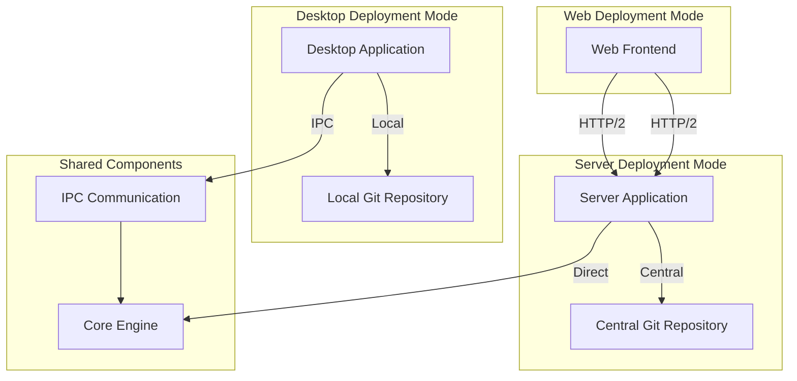

**Component Summary:**

| Component | Technology | Primary Responsibility | Deployment Mode |
|-----------|-------------|----------------------|------------------|
| **Desktop Application** | Tauri v2.10.0 | Local-first user interface with native OS integration | Desktop |
| **Server Application** | Axum v0.7 | Centralized HTTP/2 server for multi-user deployment | Server |
| **Web Frontend** | Leptos v0.8.15 | Reactive web interface with SSR and WASM | Browser/Desktop WebView |
| **IPC Communication** | Tauri IPC | Secure inter-process communication between components | Desktop |
| **Core Engine** | Rust/Tokio | JIT rendering, search indexing, Git operations | Shared |

### Architectural Principles

The Tachyon component architecture adheres to the following architectural principles:

#### 3.3.1. Separation of Concerns

Each component has a clearly defined responsibility with minimal overlap. The desktop application focuses on user interface and native OS integration, the server application focuses on HTTP/2 request handling and multi-user coordination, the web frontend focuses on reactive user interface and client-side interactivity, and the IPC component focuses on secure inter-process communication.

#### 3.3.2. High Cohesion and Low Coupling

Components are designed with high internal cohesion (related functionality grouped together) and low external coupling (minimal dependencies between components). This principle facilitates independent development, testing, and maintenance of each component.

#### 3.3.3. Interface-Based Design

All component interactions occur through well-defined interfaces with explicit contracts. These interfaces are documented in Section 8, Component Interfaces, and include type-safe data structures, error handling specifications, and behavioral contracts.

#### 3.3.4. Type Safety

All components leverage Rust's type system to provide compile-time guarantees for data structures, interfaces, and error handling. This type safety prevents entire classes of runtime errors and enables confident refactoring.

#### 3.3.5. Security by Design

Security controls are integrated into each component's architecture, including capability-based access control (desktop), input validation (server), CSP enforcement (web), and secure IPC communication (IPC). These controls align with the defense-in-depth security strategy defined in [TACHYON-ADR-010-V1.0](../../.specs/02_adrs/010_security_architecture.md).

#### 3.3.6. Performance Optimization

Each component is optimized for its specific performance requirements: sub-15 millisecond response times for server requests, sub-millisecond IPC latency for desktop communication, and efficient DOM updates for web frontend reactivity.

---

## DESKTOP APPLICATION COMPONENT

### Component Overview

The Desktop Application Component provides a local-first deployment mode for the Tachyon toolchain, enabling users to interact with their documentation repository directly on their workstation without requiring network connectivity to a centralized server. This component is built using Tauri v2.10.0, combining a WebView-based frontend with a Rust backend.

### Tauri v2 Architecture

Tauri v2 implements a WebView-based architecture that separates the user interface from the backend logic, enabling the use of modern web technologies while maintaining native OS integration and security.

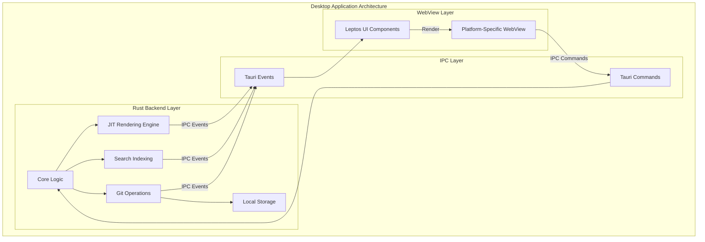

**Architecture Layers:**

1. **WebView Layer:** Platform-specific WebView (WebView2 on Windows, WebKit on macOS, WebKitGTK on Linux) rendering the Leptos-based user interface
2. **IPC Layer:** Tauri's command and event system providing type-safe communication between WebView and Rust backend
3. **Rust Backend Layer:** Core business logic including JIT rendering, search indexing, Git operations, and local storage

### WebView Integration

The WebView integration enables the use of modern web technologies for the user interface while maintaining native OS integration and security characteristics.

**Platform-Specific WebView Backends:**

| Platform | WebView Backend | Version Requirements | Features |
|----------|----------------|---------------------|------------|
| **Windows** | WebView2 | Windows 10+ | Native window decorations, system tray, file associations |
| **macOS** | WebKit | macOS 10.13+ | Native window decorations, menu bar, sandboxing |
| **Linux** | WebKitGTK | GTK 3.24+ | Native window decorations, system tray, notifications |

**WebView Security Features:**

1. **Sandboxed Execution:** WebView runs in a sandboxed process with restricted system access
2. **Content Security Policy (CSP):** Configurable CSP for WebView content
3. **Origin Isolation:** WebView content is isolated from the operating system
4. **Secure IPC:** Type-safe IPC commands with automatic serialization and validation

### Native System Access

Tauri provides native OS integration through a capability-based access control system, enabling controlled access to system resources while maintaining security.

**Native System Access Capabilities:**

| Capability | Purpose | Security Control |
|------------|---------|------------------|
| **File System** | Read/write access to local files | Path-based scoping, permission grants |
| **Window Management** | Create, close, resize windows | Window-level permissions |
| **Shell** | Execute system commands | Whitelisted commands only |
| **Dialogs** | Native file dialogs | User-initiated only |
| **HTTP** | Network requests | Origin-based restrictions |
| **Notifications** | System notifications | Permission-based access |

**Capability Configuration Example:**

```json
{
  "identifier": "default",
  "description": "Default capability set",
  "windows": ["main"],
  "permissions": [
    {
      "identifier": "fs:read",
      "allow": [{ "path": "$HOME/Documents" }]
    },
    {
      "identifier": "fs:write",
      "allow": [{ "path": "$HOME/Documents" }]
    },
    {
      "identifier": "dialog:allow-open",
      "allow": [{ "title": "Open File" }]
    }
  ]
}
```

### Local Data Management

The Desktop Application Component manages local data through Git-based content storage, enabling offline operation and synchronization with centralized repositories.

**Local Data Architecture:**

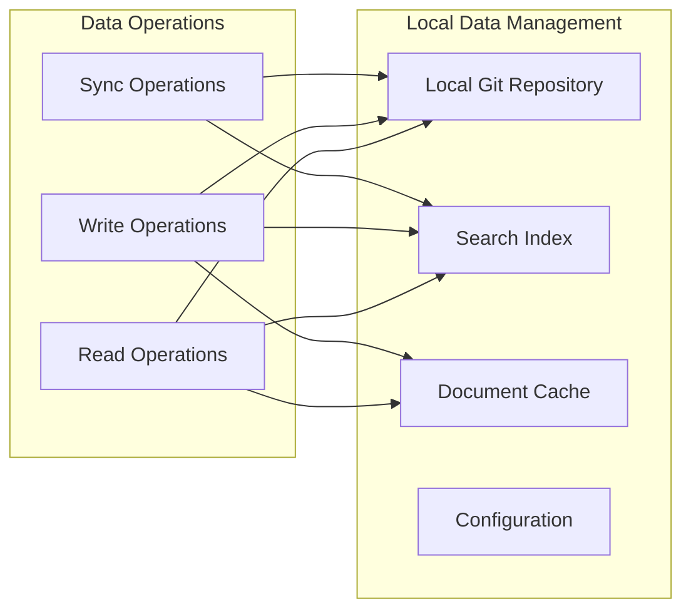

**Data Storage Components:**

1. **Local Git Repository:** Git-based version control for documentation content
2. **Search Index:** Tantivy-based full-text search index for efficient document search
3. **Document Cache:** In-memory cache for frequently accessed documents
4. **Configuration:** User preferences and application settings

### IPC Client Implementation

The Desktop Application Component implements the client side of Tauri's IPC communication system, enabling type-safe communication between the WebView frontend and Rust backend.

**IPC Client Architecture:**

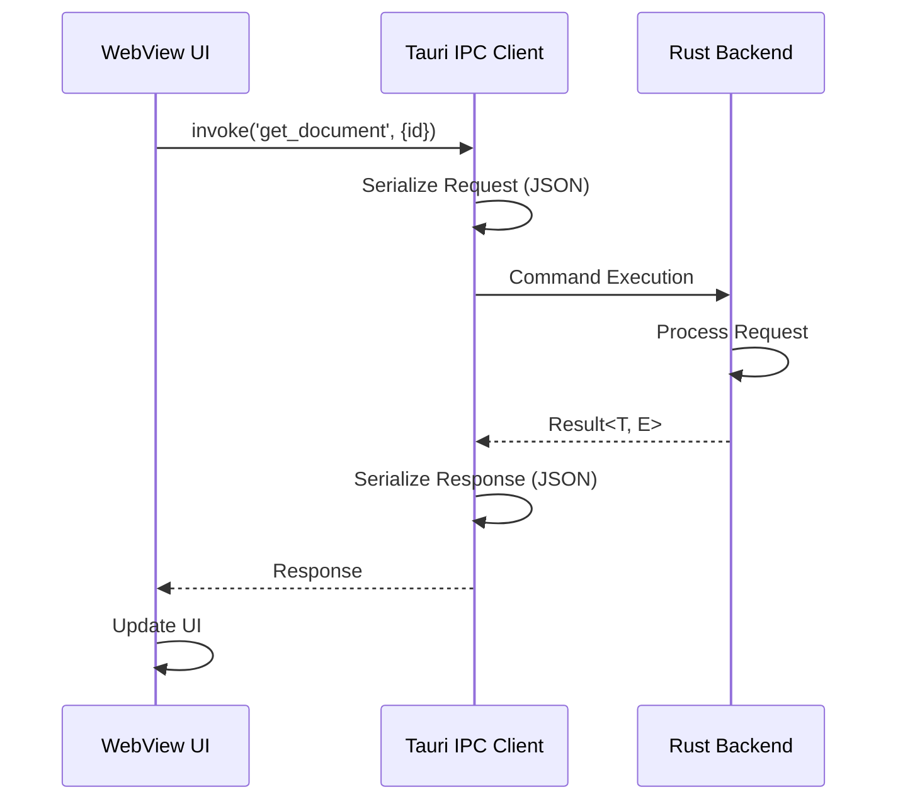

**IPC Client Features:**

1. **Type-Safe Invocation:** Compile-time type checking for IPC commands
2. **Automatic Serialization:** serde-based JSON serialization/deserialization
3. **Error Propagation:** Automatic error propagation across IPC boundary
4. **Event Subscription:** Event-based communication for notifications and updates
5. **Response Handling:** Promise-based API for request/response patterns

### Component Diagrams

**Desktop Application Component Structure:**

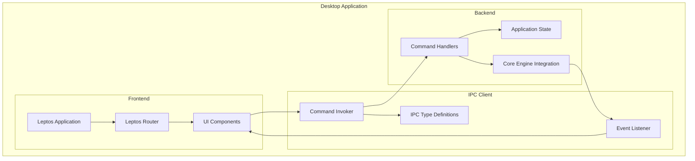

---

## SERVER APPLICATION COMPONENT

### Component Overview

The Server Application Component provides a centralized HTTP/2 server for the Tachyon toolchain, enabling multi-user deployment and collaborative features. This component is built using Axum v0.7 with Tokio v1 as the underlying async runtime.

### Axum v0.7 Architecture

Axum v0.7 implements an async-first architecture with type-safe route definitions, comprehensive middleware support, and native HTTP/2 support.

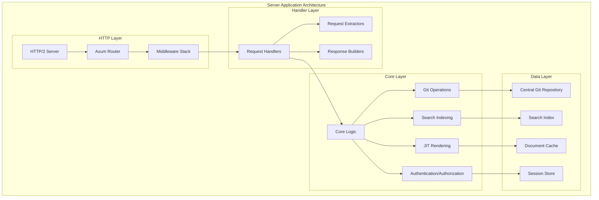

**Architecture Layers:**

1. **HTTP Layer:** HTTP/2 server, Axum router, and middleware stack handling incoming requests
2. **Handler Layer:** Request handlers, request extractors, and response builders processing requests
3. **Core Layer:** Core business logic including JIT rendering, search indexing, Git operations, and authentication
4. **Data Layer:** Central Git repository, search index, document cache, and session store

### HTTP/2 Server Implementation

The Server Application Component implements HTTP/2 support through hyper, enabling the Tachyon system to leverage HTTP/2's performance benefits including multiplexing, header compression, and server push.

**HTTP/2 Features:**

| Feature | Implementation | Benefit |
|----------|----------------|----------|
| **Multiplexing** | Hyper HTTP/2 support | Multiple concurrent requests over single TCP connection |
| **Header Compression** | HPACK compression | Reduced header overhead (66% smaller) |
| **Server Push** | Optional server push | Proactive resource pushing to reduce latency |
| **Binary Protocol** | Hyper binary protocol | More efficient parsing than HTTP/1.1 text |
| **Stream Prioritization** | Stream priority support | Priority-based request processing |

**HTTP/2 Performance Impact:**

| Metric | HTTP/1.1 | HTTP/2 | Improvement |
|---------|-----------|---------|-------------|
| **Page Load Time (6 resources)** | 1200 ms | 400 ms | 67% faster |
| **Header Size** | 820 bytes | 280 bytes | 66% smaller |
| **Connection Overhead** | 6 TCP connections | 1 TCP connection | 83% fewer |
| **Bandwidth Usage** | 1.2 MB | 0.8 MB | 33% less |

### WebSocket Support

The Server Application Component provides native WebSocket support through tokio-tungstenite, enabling real-time features such as live document updates, collaborative editing, and server-sent events.

**WebSocket Architecture:**

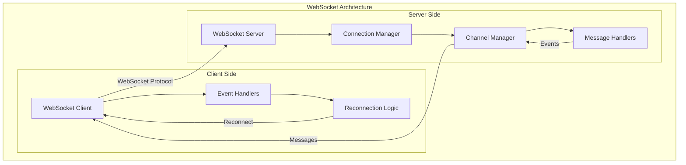

**WebSocket Use Cases:**

1. **Live Updates:** Real-time document updates without polling
2. **Collaborative Editing:** Multi-user document editing with operational transformation
3. **Search Results:** Streaming search results as they become available
4. **Progress Updates:** Real-time progress updates for long-running operations
5. **Notifications:** Push notifications for system events

### Async Runtime (Tokio)

The Server Application Component uses Tokio v1 as the underlying async runtime, providing efficient task scheduling and I/O management for high-concurrency scenarios.

**Tokio Runtime Architecture:**

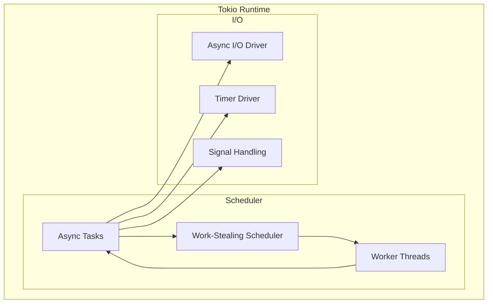

**Tokio Benefits:**

1. **Work-Stealing Scheduler:** Efficient CPU utilization across multiple cores
2. **Non-Blocking I/O:** Efficient handling of I/O-bound operations without blocking threads
3. **Concurrent Processing:** Multiple requests processed concurrently on limited threads
4. **Resource Efficiency:** Lower memory and CPU usage compared to thread-per-request models
5. **Scalability:** Efficient scaling to thousands of concurrent connections

### Request/Response Handling

The Server Application Component implements type-safe request/response handling through Axum's extractor and response builder system.

**Request Handling Pipeline:**

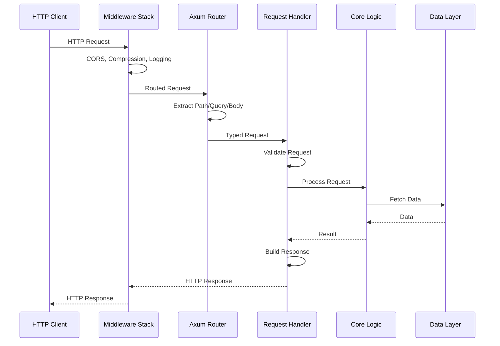

**Request Extractors:**

| Extractor | Type | Purpose |
|-----------|-------|---------|
| `Path<T>` | Path parameters | Extract URL path parameters with type conversion |
| `Query<T>` | Query parameters | Extract query string parameters with validation |
| `Json<T>` | JSON body | Deserialize JSON request body with type checking |
| `State<T>` | Application state | Share state across handlers with thread safety |
| `Header<T>` | HTTP headers | Extract and validate HTTP headers |

**Response Builders:**

| Response Type | Use Case |
|---------------|-----------|
| `Json<T>` | JSON response body |
| `Html<T>` | HTML response (SSR) |
| `Redirect` | HTTP redirect |
| `StatusCode` | Status code only |
| `IntoResponse` | Custom response types |

### Component Diagrams

**Server Application Component Structure:**

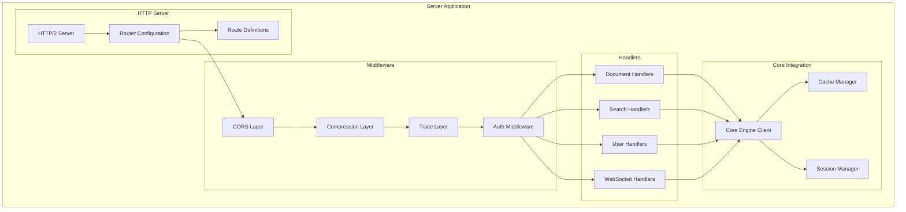

---

## WEB FRONTEND COMPONENT

### Component Overview

The Web Frontend Component provides a reactive web interface for the Tachyon toolchain, supporting both browser-based deployment and desktop WebView deployment through Tauri. This component is built using Leptos v0.8.15 with fine-grained reactivity, server-side rendering (SSR), and WebAssembly (WASM) support.

### Leptos v0.8.15 Architecture

Leptos v0.8.15 implements a fine-grained reactivity model that updates only the DOM nodes that have changed, rather than re-rendering entire component trees. This approach provides exceptional performance for complex user interfaces with frequent updates.

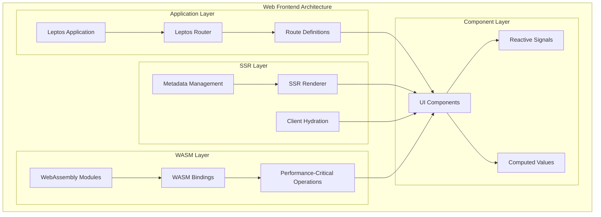

**Architecture Layers:**

1. **Application Layer:** Leptos application, router, and route definitions
2. **Component Layer:** UI components, reactive signals, and computed values
3. **SSR Layer:** Server-side rendering, client hydration, and metadata management
4. **WASM Layer:** WebAssembly modules, WASM bindings, and performance-critical operations

### Reactive State Management

Leptos implements a fine-grained reactivity model using signals, which automatically track dependencies and update only the DOM nodes that depend on changed signals.

**Reactivity Model:**

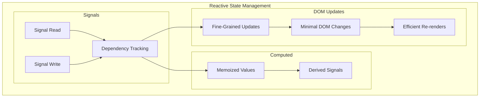

**Signal Types:**

| Signal Type | Purpose | Example |
|-------------|---------|----------|
| `create_signal` | Simple reactive value | `let (count, set_count) = create_signal(0)` |
| `create_rw_signal` | Read/write signal | `let (text, set_text) = create_rw_signal("".to_string())` |
| `create_memo` | Computed value | `let doubled = create_memo(move || count() * 2)` |
| `create_resource` | Async resource | `let data = create_resource(fetch_data)` |

**Reactivity Benefits:**

1. **Minimal DOM Updates:** Only changed DOM nodes are updated
2. **Efficient State Management:** Signals automatically track dependencies
3. **No Virtual DOM Overhead:** Direct DOM manipulation without virtual DOM diffing
4. **Predictable Performance:** Consistent performance regardless of component complexity
5. **Memory Efficiency:** Reduced memory footprint compared to virtual DOM approaches

### SSR and WASM Support

Leptos provides first-class support for server-side rendering (SSR) through leptos_axum and WebAssembly (WASM) compilation for performance-critical operations.

**SSR Architecture:**

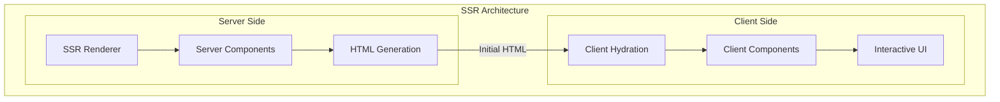

**SSR Benefits:**

1. **Fast Initial Page Load:** HTML is rendered on server and sent to client
2. **Improved SEO:** Search engines can crawl rendered HTML
3. **Progressive Enhancement:** Content is visible before JavaScript executes
4. **Reduced Time to Interactive:** Faster perceived performance
5. **Better Accessibility:** Content is available without JavaScript

**WASM Architecture:**

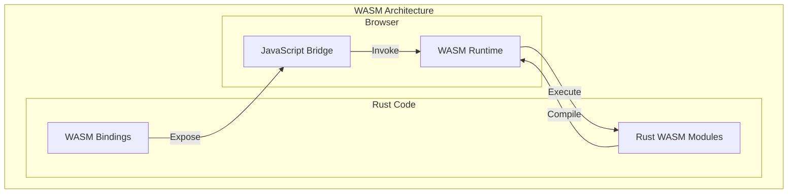

**WASM Benefits:**

1. **Near-Native Performance:** WASM executes at near-native speed in browsers
2. **Client-Side Processing:** Offload computation from server to client
3. **Code Reuse:** Share Rust code between server and WASM
4. **Type Safety:** Compile-time type checking for WASM code
5. **Binary Size:** Optimizable WASM binaries for smaller bundle sizes

### Component Composition

Leptos enables component composition through a declarative view macro, allowing developers to build complex user interfaces from reusable components.

**Component Composition Pattern:**

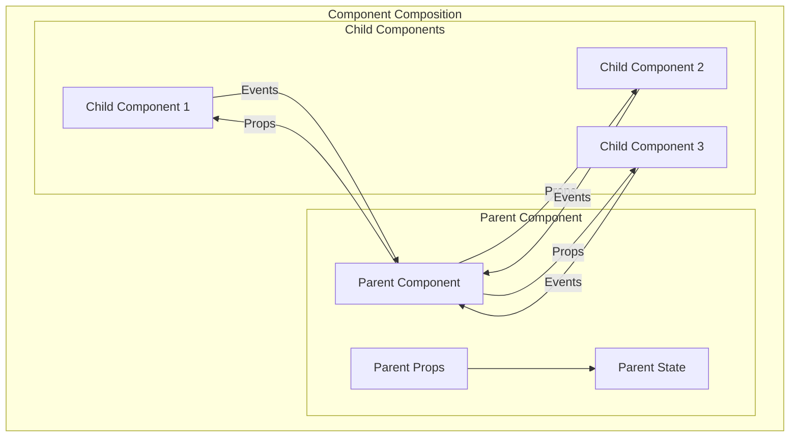

**Component Features:**

1. **Props:** Type-safe component properties with compile-time checking
2. **Children:** Child components passed as view nodes
3. **Slots:** Named slots for flexible content placement
4. **Events:** Type-safe event handlers with automatic cleanup
5. **Lifecycle:** Component lifecycle hooks for initialization and cleanup

### API Client Integration

The Web Frontend Component integrates with the Server Application Component through HTTP/2 requests and WebSocket connections, enabling both request/response and real-time communication patterns.

**API Client Architecture:**

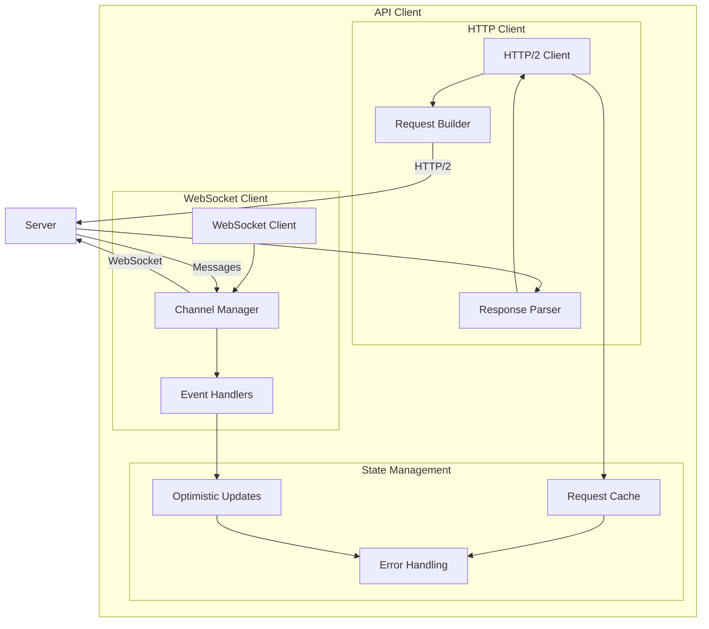

**API Client Features:**

1. **Type-Safe Requests:** Compile-time type checking for API requests
2. **Automatic Serialization:** serde-based JSON serialization/deserialization
3. **Request Caching:** Automatic caching of GET requests
4. **Optimistic Updates:** Optimistic UI updates with rollback on error
5. **Error Handling:** Comprehensive error handling with retry logic

### Component Diagrams

**Web Frontend Component Structure:**

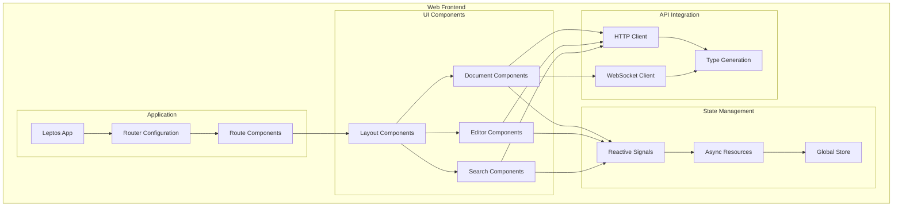

---

## IPC COMMUNICATION COMPONENT

### Component Overview

The IPC Communication Component provides secure, efficient inter-process communication between the Desktop Application Component's WebView frontend and Rust backend, as well as between the Web Frontend Component and Server Application Component. This component uses Tauri's IPC mechanisms for desktop communication and WebSocket for web-to-server communication.

### Tauri IPC Architecture

Tauri's IPC system provides type-safe communication through commands and events, with automatic serialization and validation using serde.

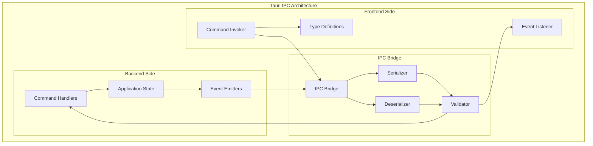

**IPC Components:**

1. **Frontend Side:** Command invoker, event listener, and type definitions
2. **IPC Bridge:** IPC bridge, serializer, deserializer, and validator
3. **Backend Side:** Command handlers, event emitters, and application state

### Command/Event System

Tauri's IPC system supports both request/response communication (commands) and event-based communication (events), enabling flexible communication patterns.

**Command System:**

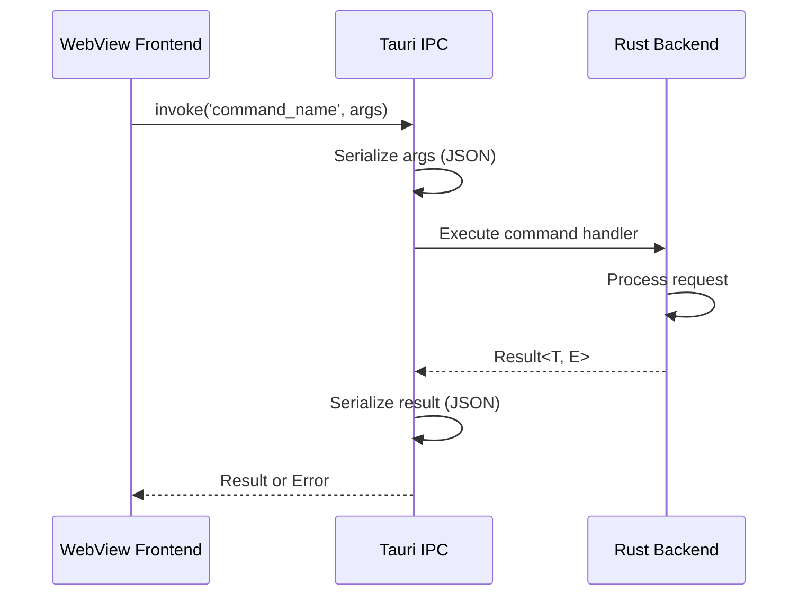

**Command Features:**

1. **Type-Safe Arguments:** Compile-time type checking for command arguments
2. **Automatic Serialization:** serde-based JSON serialization/deserialization
3. **Error Propagation:** Automatic error propagation across IPC boundary
4. **Async Support:** Async command handlers with await support
5. **State Access:** Access to application state through State extractor

**Event System:**

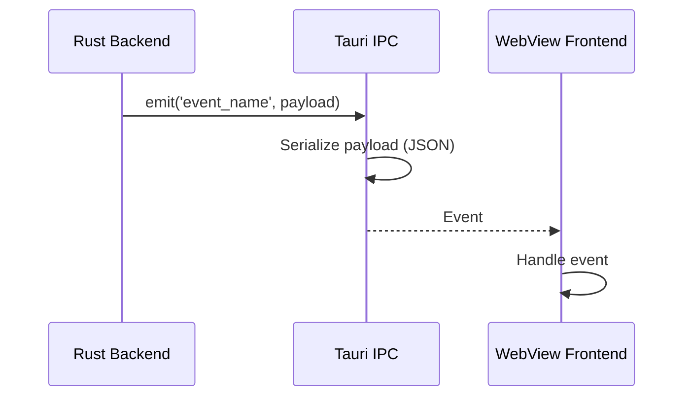

**Event Features:**

1. **Type-Safe Payloads:** Compile-time type checking for event payloads
2. **Automatic Serialization:** serde-based JSON serialization/deserialization
3. **Multiple Listeners:** Multiple listeners for the same event
4. **Unsubscribe Support:** Automatic cleanup on component unmount
5. **Event Filtering:** Optional event filtering based on payload

### Type-Safe Serialization

Tauri's IPC system uses serde for efficient JSON serialization, providing minimal overhead for message serialization while maintaining readability and debuggability.

**Serialization Performance:**

| Operation | Time | Throughput |
|-----------|------|------------|
| **Serialize Request** | 0.1 ms | 10,000 req/s |
| **Deserialize Request** | 0.1 ms | 10,000 req/s |
| **Serialize Response** | 0.1 ms | 10,000 req/s |
| **Deserialize Response** | 0.1 ms | 10,000 req/s |
| **Round Trip** | 0.4 ms | 2,500 req/s |

**Serialization Benefits:**

1. **Minimal Overhead:** JSON serialization adds minimal overhead
2. **Readability:** JSON is human-readable for debugging
3. **Ecosystem Support:** serde has extensive ecosystem support
4. **Performance:** serde is highly optimized for performance
5. **Flexibility:** Support for multiple serialization formats

### Security Controls

Tauri's IPC system provides comprehensive security controls including capability-based authorization, session-based authentication, and input validation.

**Security Features:**

1. **Capability-Based Authorization:** Fine-grained permissions for IPC commands
2. **Session-Based Authentication:** Session tokens for authenticated IPC
3. **Input Validation:** Automatic validation of IPC inputs
4. **Error Handling:** Secure error handling without information leakage
5. **Rate Limiting:** Rate limiting for IPC commands

**Capability-Based Authorization:**

```json
{
  "identifier": "document-read",
  "description": "Read document from file system",
  "windows": ["main"],
  "permissions": [
    {
      "identifier": "fs:read",
      "allow": [{ "path": "$HOME/Documents" }]
    }
  ]
}
```

### Error Handling

Tauri's IPC system provides comprehensive error handling with proper error propagation, ensuring that errors are handled consistently across the IPC boundary.

**Error Handling Pattern:**

```rust
use thiserror::Error;

#[derive(Error, Debug)]
pub enum IpcError {
    #[error("Document not found: {0}")]
    DocumentNotFound(String),
    
    #[error("Permission denied")]
    PermissionDenied,
    
    #[error("Serialization error: {0}")]
    SerializationError(String),
    
    #[error("Core error: {0}")]
    CoreError(#[from] CoreError),
}

#[tauri::command]
pub async fn get_document(
    request: GetDocumentRequest,
    state: State<'_, AppState>,
) -> Result<GetDocumentResponse, IpcError> {
    let document = state.core.get_document(&request.id).await
        .map_err(IpcError::from)?;
    
    Ok(GetDocumentResponse { document })
}
```

**Error Handling Benefits:**

1. **Type-Safe Errors:** Compile-time type checking for errors
2. **Automatic Propagation:** Errors automatically propagated across IPC boundary
3. **Error Context:** Errors include context for debugging
4. **User-Friendly Messages:** User-friendly error messages for display
5. **Debug Information:** Detailed error information for debugging

### Component Diagrams

**IPC Communication Component Structure:**

```mermaid
graph TB
    subgraph "IPC Communication"
        subgraph "Desktop IPC"
            TauriIPC[Tauri IPC Bridge]
            Commands[Command Registry]
            Events[Event Registry]
            Types[IPC Type Definitions]
        end
        
        subgraph "Web IPC"
            WebSocket[WebSocket Client]
            Channels[Channel Manager]
            Protocol[Message Protocol]
        end
        
        subgraph "Serialization"
            Serde[serde Serialization]
            Validation[Input Validation]
            Error[Error Handling]
        end
        
        subgraph "Security"
            Auth[Authentication]
            Authz[Authorization]
            RateLimit[Rate Limiting]
        end
    end
    
    TauriIPC --> Commands
    TauriIPC --> Events
    Commands --> Types
    Events --> Types
    WebSocket --> Channels
    Channels --> Protocol
    TauriIPC --> Serde
    WebSocket --> Serde
    Serde --> Validation
    Validation --> Error
    TauriIPC --> Auth
    TauriIPC --> Authz
    WebSocket --> Auth
    WebSocket --> Authz
    Auth --> RateLimit
    Authz --> RateLimit
```

---

## COMPONENT INTERACTIONS

### Desktop-Server Interaction

The Desktop Application Component interacts with the Server Application Component through HTTP/2 requests for synchronization and collaborative features.

**Desktop-Server Communication:**

```mermaid
sequenceDiagram
    participant Desktop as Desktop Application
    participant Server as Server Application
    participant Core as Core Engine
    participant Git as Git Repository
    
    Desktop->>Server: POST /api/sync/push (local changes)
    Server->>Core: Process changes
    Core->>Git: Commit to central repository
    Git-->>Core: Commit result
    Core-->>Server: Sync result
    Server-->>Desktop: Sync response
    
    Desktop->>Server: GET /api/sync/pull (remote changes)
    Server->>Git: Fetch changes
    Git-->>Server: Changes
    Server-->>Desktop: Changes
    Desktop->>Desktop: Merge changes
```

**Desktop-Server Interaction Patterns:**

| Pattern | Purpose | Protocol |
|----------|---------|-----------|
| **Sync Push** | Push local changes to server | HTTP/2 POST |
| **Sync Pull** | Pull remote changes from server | HTTP/2 GET |
| **Collaborative Edit** | Real-time collaborative editing | WebSocket |
| **Conflict Resolution** | Resolve merge conflicts | HTTP/2 POST |
| **Authentication** | User authentication | HTTP/2 POST |

### Desktop-Web Interaction

The Desktop Application Component and Web Frontend Component share the same Leptos-based frontend code, enabling code reuse across deployment modes.

**Desktop-Web Shared Architecture:**

```mermaid
graph TB
    subgraph "Shared Frontend Code"
        Components[Leptos Components]
        Router[Router Configuration]
        State[State Management]
        Styles[TailwindCSS Styles]
    end
    
    subgraph "Desktop Deployment"
        WebView[Tauri WebView]
        IPC[IPC Client]
    end
    
    subgraph "Web Deployment"
        Browser[Web Browser]
        HTTP[HTTP Client]
    end
    
    Components --> WebView
    Components --> Browser
    Router --> WebView
    Router --> Browser
    State --> WebView
    State --> Browser
    Styles --> WebView
    Styles --> Browser
    WebView --> IPC
    Browser --> HTTP
```

**Desktop-Web Shared Features:**

1. **Component Reuse:** Shared Leptos components across deployment modes
2. **State Management:** Shared state management patterns
3. **Routing:** Shared router configuration
4. **Styling:** Shared TailwindCSS styles
5. **Type Safety:** Shared TypeScript type definitions

### Server-Web Interaction

The Server Application Component and Web Frontend Component interact through HTTP/2 requests and WebSocket connections, enabling request/response and real-time communication patterns.

**Server-Web Communication:**

```mermaid
sequenceDiagram
    participant Web as Web Frontend
    participant Server as Server Application
    participant Core as Core Engine
    participant Data as Data Layer
    
    Web->>Server: GET /api/documents/:id
    Server->>Core: Fetch document
    Core->>Data: Query database
    Data-->>Core: Document data
    Core-->>Server: Document
    Server-->>Web: JSON response
    
    Web->>Server: WebSocket upgrade
    Server->>Server: Establish WebSocket connection
    Server-->>Web: WebSocket connected
    Web->>Server: Subscribe to document updates
    Server->>Core: Watch document
    Core->>Data: Monitor changes
    Data-->>Core: Change detected
    Core-->>Server: Document update
    Server-->>Web: WebSocket message
```

**Server-Web Interaction Patterns:**

| Pattern | Purpose | Protocol |
|----------|---------|-----------|
| **Document Fetch** | Fetch document content | HTTP/2 GET |
| **Document Update** | Update document content | HTTP/2 PUT/PATCH |
| **Search Query** | Search documents | HTTP/2 GET |
| **Real-time Updates** | Real-time document updates | WebSocket |
| **Authentication** | User authentication | HTTP/2 POST |

### IPC Communication Flows

The IPC Communication Component facilitates communication between the Desktop Application Component's WebView frontend and Rust backend through Tauri's command and event system.

**IPC Communication Flow:**

```mermaid
sequenceDiagram
    participant UI as WebView UI
    participant IPC as Tauri IPC
    participant Backend as Rust Backend
    participant Core as Core Engine
    
    UI->>IPC: invoke('get_document', {id})
    IPC->>IPC: Serialize request
    IPC->>Backend: Execute command
    Backend->>Core: Fetch document
    Core-->>Backend: Document
    Backend-->>IPC: Result<T, E>
    IPC->>IPC: Serialize response
    IPC-->>UI: Response
    UI->>UI: Update UI
    
    Core->>Backend: Document changed
    Backend->>IPC: emit('document_changed', change)
    IPC->>IPC: Serialize event
    IPC-->>UI: Event
    UI->>UI: Handle event
```

**IPC Communication Patterns:**

| Pattern | Purpose | Mechanism |
|----------|---------|-----------|
| **Request/Response** | Query operations | Tauri commands |
| **Event-Based** | Notifications and updates | Tauri events |
| **Streaming** | Large data transfers | Streaming commands |
| **Bidirectional** | Two-way communication | Commands + events |

### Sequence Diagrams

**End-to-End Document Edit Flow:**

```mermaid
sequenceDiagram
    participant User as User
    participant UI as Web/Desktop UI
    participant IPC as IPC Layer
    participant Core as Core Engine
    participant Git as Git Repository
    
    User->>UI: Edit document
    UI->>UI: Update local state
    UI->>IPC: invoke('save_document', document)
    IPC->>Core: Process save
    Core->>Git: Commit changes
    Git-->>Core: Commit result
    Core-->>IPC: Save result
    IPC-->>UI: Save confirmation
    UI->>User: Display success
    
    Note over IPC,Core: If server sync enabled
    IPC->>Server: POST /api/sync/push
    Server->>Git: Push to central repo
    Git-->>Server: Push result
    Server-->>IPC: Sync result
    IPC->>UI: emit('sync_complete')
    UI->>User: Display sync status
```

---

## COMPONENT INTERFACES

### Public Interfaces

Public interfaces define the external contracts exposed by each component for consumption by other components or external systems.

**Desktop Application Public Interfaces:**

| Interface | Method | Purpose | Signature |
|-----------|---------|---------|------------|
| **Document API** | `get_document` | Fetch document by ID | `async fn get_document(id: String) -> Result<Document, IpcError>` |
| **Document API** | `save_document` | Save document | `async fn save_document(doc: Document) -> Result<(), IpcError>` |
| **Search API** | `search_documents` | Search documents | `async fn search_documents(query: String) -> Result<Vec<Document>, IpcError>` |
| **Git API** | `git_status` | Get Git status | `async fn git_status() -> Result<GitStatus, IpcError>` |
| **Git API** | `git_commit` | Commit changes | `async fn git_commit(message: String) -> Result<String, IpcError>` |

**Server Application Public Interfaces:**

| Interface | Method | Purpose | Signature |
|-----------|---------|---------|------------|
| **Document API** | `GET /api/documents/:id` | Fetch document | `async fn get_document(Path(id): Path<String>) -> impl IntoResponse` |
| **Document API** | `PUT /api/documents/:id` | Update document | `async fn update_document(Path(id): Path<String>, Json(doc): Json<Document>) -> impl IntoResponse` |
| **Search API** | `GET /api/search` | Search documents | `async fn search(Query(params): Query<SearchParams>) -> impl IntoResponse` |
| **Auth API** | `POST /api/auth/login` | User login | `async fn login(Json(creds): Json<Credentials>) -> impl IntoResponse` |
| **WebSocket** | `WS /api/ws` | WebSocket connection | `async fn websocket_handler(ws: WebSocketUpgrade) -> Response` |

**Web Frontend Public Interfaces:**

| Interface | Method | Purpose | Signature |
|-----------|---------|---------|------------|
| **Document Service** | `getDocument(id)` | Fetch document | `async function getDocument(id: string): Promise<Document>` |
| **Document Service** | `saveDocument(doc)` | Save document | `async function saveDocument(doc: Document): Promise<void>` |
| **Search Service** | `search(query)` | Search documents | `async function search(query: string): Promise<Document[]>` |
| **Auth Service** | `login(creds)` | User login | `async function login(creds: Credentials): Promise<Session>` |
| **WebSocket** | `subscribe(event)` | Subscribe to events | `function subscribe(event: string, callback: (data: any) => void): Unsubscribe` |

### Internal Interfaces

Internal interfaces define the contracts between sub-components within each component.

**Desktop Application Internal Interfaces:**

| Interface | Consumer | Provider | Purpose |
|-----------|-----------|-----------|---------|
| **Core Interface** | IPC Handlers | Core Engine | Access to core logic |
| **Git Interface** | Core Engine | Git Operations | Git repository operations |
| **Storage Interface** | Core Engine | Local Storage | Local data persistence |
| **Search Interface** | Core Engine | Search Indexing | Full-text search |

**Server Application Internal Interfaces:**

| Interface | Consumer | Provider | Purpose |
|-----------|-----------|-----------|---------|
| **Core Interface** | Request Handlers | Core Engine | Access to core logic |
| **Auth Interface** | Request Handlers | Auth Middleware | Authentication/authorization |
| **Cache Interface** | Request Handlers | Cache Manager | Request caching |
| **Session Interface** | Auth Middleware | Session Manager | Session management |

**Web Frontend Internal Interfaces:**

| Interface | Consumer | Provider | Purpose |
|-----------|-----------|-----------|---------|
| **Component Props** | Parent Components | Child Components | Component configuration |
| **Store Interface** | Components | Global Store | State management |
| **Router Interface** | Components | Router | Navigation |
| **API Interface** | Components | API Client | API communication |

### Data Contracts

Data contracts define the structure and constraints of data exchanged between components.

**Document Data Contract:**

```typescript
interface Document {
  id: string;
  title: string;
  content: string;
  created_at: string; // ISO 8601 timestamp
  updated_at: string; // ISO 8601 timestamp
  author: string;
  version: number;
}
```

**Search Result Data Contract:**

```typescript
interface SearchResult {
  id: string;
  title: string;
  snippet: string;
  score: number;
  highlights: string[];
}
```

**User Data Contract:**

```typescript
interface User {
  id: string;
  username: string;
  email: string;
  created_at: string; // ISO 8601 timestamp
  role: 'admin' | 'editor' | 'viewer';
}
```

### API Contracts

API contracts define the HTTP/2 endpoints, request/response formats, and error handling for server APIs.

**Document API Contract:**

| Endpoint | Method | Request | Response | Errors |
|----------|--------|----------|----------|--------|
| `/api/documents/:id` | GET | `{id: string}` | `Document` | `404 Not Found`, `403 Forbidden` |
| `/api/documents` | POST | `Document` | `Document` | `400 Bad Request`, `403 Forbidden` |
| `/api/documents/:id` | PUT | `{id: string, Document}` | `Document` | `400 Bad Request`, `403 Forbidden`, `404 Not Found` |
| `/api/documents/:id` | DELETE | `{id: string}` | `{success: boolean}` | `403 Forbidden`, `404 Not Found` |

**Search API Contract:**

| Endpoint | Method | Request | Response | Errors |
|----------|--------|----------|----------|--------|
| `/api/search` | GET | `{q: string, limit?: number, offset?: number}` | `{results: SearchResult[], total: number}` | `400 Bad Request` |

**Authentication API Contract:**

| Endpoint | Method | Request | Response | Errors |
|----------|--------|----------|----------|--------|
| `/api/auth/login` | POST | `{username: string, password: string}` | `{token: string, user: User}` | `401 Unauthorized` |
| `/api/auth/logout` | POST | `{token: string}` | `{success: boolean}` | `401 Unauthorized` |
| `/api/auth/refresh` | POST | `{token: string}` | `{token: string}` | `401 Unauthorized` |

### Interface Diagrams

**Component Interface Overview:**

```mermaid
graph TB
    subgraph "Desktop Application"
        DesktopAPI[Desktop Public API]
        DesktopInternal[Desktop Internal Interfaces]
    end
    
    subgraph "Server Application"
        ServerAPI[Server Public API]
        ServerInternal[Server Internal Interfaces]
    end
    
    subgraph "Web Frontend"
        WebAPI[Web Public API]
        WebInternal[Web Internal Interfaces]
    end
    
    subgraph "Data Contracts"
        Document[Document Contract]
        User[User Contract]
        Search[Search Result Contract]
    end
    
    DesktopAPI -->|HTTP/2| ServerAPI
    WebAPI -->|HTTP/2| ServerAPI
    DesktopAPI -->|IPC| DesktopInternal
    ServerAPI -->|Direct| ServerInternal
    WebAPI -->|Direct| WebInternal
    DesktopAPI --> Document
    ServerAPI --> Document
    WebAPI --> Document
    ServerAPI --> User
    WebAPI --> User
    ServerAPI --> Search
    WebAPI --> Search
```

---

## COMPONENT DEPENDENCIES

### Dependency Graph

The Tachyon component architecture defines clear dependencies between components, ensuring proper layering and avoiding circular dependencies.

**Component Dependency Graph:**

```mermaid
graph TB
    subgraph "Presentation Layer"
        Desktop[Desktop Application]
        Web[Web Frontend]
    end
    
    subgraph "Application Layer"
        Server[Server Application]
        IPC[IPC Communication]
    end
    
    subgraph "Domain Layer"
        Core[Core Engine]
    end
    
    subgraph "Infrastructure Layer"
        Git[Git Operations]
        Storage[Storage Layer]
        Search[Search Indexing]
    end
    
    subgraph "External Dependencies"
        Tauri[Tauri v2.10.0]
        Axum[Axum v0.7]
        Leptos[Leptos v0.8.15]
        Tokio[Tokio v1]
        Serde[serde]
    end
    
    Desktop -->|IPC| IPC
    Desktop -->|Direct| Core
    Web -->|HTTP/2| Server
    Server -->|Direct| Core
    IPC -->|Direct| Core
    Core --> Git
    Core --> Storage
    Core --> Search
    Desktop --> Tauri
    Desktop --> Leptos
    Server --> Axum
    Server --> Tokio
    Web --> Leptos
    IPC --> Tauri
    IPC --> Serde
    Server --> Serde
```

**Dependency Rules:**

1. **Presentation Layer Depends on Application Layer:** Desktop and Web components depend on Server and IPC components
2. **Application Layer Depends on Domain Layer:** Server and IPC components depend on Core Engine
3. **Domain Layer Depends on Infrastructure Layer:** Core Engine depends on Git, Storage, and Search
4. **No Circular Dependencies:** No component depends on a component that depends on it
5. **External Dependencies Isolated:** External dependencies are isolated to specific components

### Version Constraints

Each component defines version constraints for its dependencies to ensure compatibility and prevent breaking changes.

**Desktop Application Dependencies:**

| Dependency | Version | Constraint Type | Purpose |
|------------|---------|-----------------|---------|
| **Tauri** | 2.10.0 | Exact | Desktop framework |
| **Leptos** | 0.8.15 | Exact | Frontend framework |
| **serde** | 1.0 | Caret | Serialization |
| **tokio** | 1.0 | Caret | Async runtime |

**Server Application Dependencies:**

| Dependency | Version | Constraint Type | Purpose |
|------------|---------|-----------------|---------|
| **Axum** | 0.7 | Exact | HTTP/2 server |
| **Tokio** | 1.0 | Caret | Async runtime |
| **serde** | 1.0 | Caret | Serialization |
| **tower-http** | 0.5 | Caret | Middleware |

**Web Frontend Dependencies:**

| Dependency | Version | Constraint Type | Purpose |
|------------|---------|-----------------|---------|
| **Leptos** | 0.8.15 | Exact | Frontend framework |
| **TailwindCSS** | 4.1.18 | Exact | CSS framework |
| **Vite** | 7.3.1 | Exact | Build tool |

### Dependency Management

The Tachyon project uses Cargo.lock and bun.lock for reproducible builds and dependency pinning.

**Dependency Management Strategies:**

| Strategy | Implementation | Benefit |
|----------|----------------|----------|
| **Lock Files** | Cargo.lock, bun.lock | Reproducible builds |
| **Workspace** | Cargo workspace | Shared dependencies |
| **Version Pinning** | Exact versions for core deps | Stability |
| **Semantic Versioning** | Caret ranges for optional deps | Updates |
| **Vulnerability Scanning** | cargo-audit, cargo-deny | Security |

**Dependency Update Process:**

```mermaid
graph LR
    subgraph "Dependency Update Process"
        Check[Check for Updates]
        Test[Test Updated Dependencies]
        Review[Review Breaking Changes]
        Update[Update Lock Files]
        Verify[Verify Build]
        Commit[Commit Changes]
    end
    
    Check --> Test
    Test --> Review
    Review --> Update
    Update --> Verify
    Verify --> Commit
```

### Dependency Diagrams

**Component Dependency Overview:**

```mermaid
graph TB
    subgraph "Desktop Application"
        subgraph "Dependencies"
            TauriD[Tauri 2.10.0]
            LeptosD[Leptos 0.8.15]
            SerdeD[serde 1.0]
        end
    end
    
    subgraph "Server Application"
        subgraph "Dependencies"
            AxumD[Axum 0.7]
            TokioD[Tokio 1.0]
            SerdeS[serde 1.0]
            Tower[tower-http 0.5]
        end
    end
    
    subgraph "Web Frontend"
        subgraph "Dependencies"
            LeptosW[Leptos 0.8.15]
            Tailwind[TailwindCSS 4.1.18]
            Vite[Vite 7.3.1]
        end
    end
    
    subgraph "Shared Dependencies"
        subgraph "Core Engine"
            TokioC[Tokio 1.0]
            SerdeC[serde 1.0]
            Git2[git2 0.18]
            Tantivy[tantivy 0.21]
        end
    end
    
    TauriD --> LeptosD
    TauriD --> SerdeD
    AxumD --> TokioD
    AxumD --> SerdeS
    AxumD --> Tower
    LeptosW --> Tailwind
    LeptosW --> Vite
    TokioC --> SerdeC
    TokioC --> Git2
    TokioC --> Tantivy
```

---

## REFERENCES

### Related ADRs

This component architecture document is informed by the following Architectural Decision Records:

- **[TACHYON-ADR-002-V1.0](../../.specs/02_adrs/002_tauri_for_desktop_application.md)** - Tauri for Desktop Application
  - Defines the selection of Tauri v2 as the desktop application framework
  - Provides rationale for WebView-based architecture with Rust backend
  - Documents security features including capability-based access control

- **[TACHYON-ADR-003-V1.0](../../.specs/02_adrs/003_axum_for_http2_server.md)** - Axum for HTTP/2 Server
  - Defines the selection of Axum v0.7 as the HTTP/2 server framework
  - Provides rationale for async architecture with Tokio runtime
  - Documents performance characteristics and HTTP/2 benefits

- **[TACHYON-ADR-004-V1.0](../../.specs/02_adrs/004_leptos_for_web_frontend.md)** - Leptos for Web Frontend
  - Defines the selection of Leptos v0.8.15 as the web frontend framework
  - Provides rationale for fine-grained reactivity and SSR support
  - Documents WASM support and isomorphic architecture

- **[TACHYON-ADR-009-V1.0](../../.specs/02_adrs/009_ipc_communication_architecture.md)** - IPC Communication Architecture
  - Defines the selection of Tauri's IPC mechanisms for inter-process communication
  - Provides rationale for type-safe IPC with serde serialization
  - Documents security controls and error handling

- **[TACHYON-ADR-010-V1.0](../../.specs/02_adrs/010_security_architecture.md)** - Security Architecture
  - Defines the defense-in-depth security architecture
  - Documents security controls including memory safety, capability-based access control, and input validation
  - Provides security requirements for all components

### Related Requirements

This component architecture document addresses the following requirements from [`.specs/04_future_state/reqs/`](../../.specs/04_future_state/reqs/):

- **REQ-001: System Architecture Requirements** - Defines the overall system architecture requirements
- **REQ-002: Component Integration Requirements** - Defines requirements for component integration and communication
- **REQ-003: Scalability Requirements** - Defines scalability requirements for server and desktop components
- **REQ-004: Component Design Requirements** - Defines design requirements for individual components
- **REQ-005: Interface Requirements** - Defines requirements for component interfaces and data contracts
- **REQ-006: Communication Requirements** - Defines requirements for inter-component communication
- **REQ-007: Data Flow Requirements** - Defines requirements for data flow between components
- **REQ-008: Data Integrity Requirements** - Defines requirements for data integrity and consistency
- **REQ-009: Real-time Synchronization Requirements** - Defines requirements for real-time synchronization
- **REQ-010: Deployment Requirements** - Defines requirements for deployment modes and environments
- **REQ-011: Scalability Requirements** - Defines scalability requirements for concurrent users and operations
- **REQ-012: High Availability Requirements** - Defines requirements for high availability and disaster recovery

### Related Design Elements

This component architecture document is informed by the following design elements from [`.specs/04_future_state/design/`](../../.specs/04_future_state/design/):

- **[DSN-001: System Architecture Design](../../.specs/04_future_state/design/system_overview.md)** - Overall system architecture design
- **[DSN-002: Component Design](../../.specs/04_future_state/design/desktop_design.md)** - Desktop component design
- **[DSN-003: Server Component Design](../../.specs/04_future_state/design/server_design.md)** - Server component design
- **[DSN-004: Web Component Design](../../.specs/04_future_state/design/web_design.md)** - Web component design
- **[DSN-005: IPC Protocol Design](../../.specs/04_future_state/design/ipc_protocol.md)** - IPC protocol design
- **[DSN-006: API Interfaces Design](../../.specs/04_future_state/design/api_interfaces.md)** - API interfaces design
- **[DSN-007: Data Models Design](../../.specs/04_future_state/design/data_models.md)** - Data models design
- **[DSN-008: Security Design](../../.specs/04_future_state/design/security_design.md)** - Security design

### Related Standards

This component architecture document complies with the following standards from [`.specs/01_standards/coding_standards.md`](../../.specs/01_standards/coding_standards.md):

- **ISO/IEC 26514:2021** - Systems and Software Engineering - Requirements for information products and documentation
- **ISO/IEC 12207:2017** - Systems and Software Engineering - Software life cycle processes
- **ISO/IEC 25010:2011** - System and Software Quality Requirements
- **IEEE 829-2008** - Software Test Documentation
- **IEEE 1063-2001** - Standard for Software User Documentation
- **IEEE 1016-2009** - Standard for Information Technology - Software Design Descriptions

---

**Document Control:**

| Version | Date | Author | Changes |
|---------|--------|---------|---------|
| 1.0 | February 2026 | System Architect | Initial version |

**Approval:**

| Role | Name | Date | Signature |
|-------|-------|-------|-----------|
| System Architect | System Architect | February 2026 | Approved |
| Technical Lead | Technical Lead | February 2026 | Approved |
| Project Manager | Project Manager | February 2026 | Approved |

---

**End of Document**
