# TACHYON: PERFORMANCE ARCHITECTURE

**Document ID:** TACHYON-ARCH-006-V1.0
**Title:** Performance Architecture
**Author:** Technical Writer
**Date:** February 2026
**Version:** 1.0
**Status:** Proposed
**Classification:** Architecture Documentation
**Compliance Level:** ISO/IEC 26514:2021, IEEE 1063:2001
**Dependencies:** [TACHYON-STD-V1.0](../.specs/01_standards/coding_standards.md), [TACHYON-REQ-SYS-V1.0](../.specs/04_future_state/reqs/system_overview.md), [TACHYON-ADR-001-V1.0](../.specs/02_adrs/001_rust_as_primary_language.md), [TACHYON-ADR-003-V1.0](../.specs/02_adrs/003_axum_for_http2_server.md), [TACHYON-ADR-004-V1.0](../.specs/02_adrs/004_leptos_for_web_frontend.md), [TACHYON-ADR-007-V1.0](../.specs/02_adrs/007_tokio_for_async_runtime.md)

---

## TABLE OF CONTENTS

1. [Introduction](#1-introduction)
2. [Performance Requirements](#2-performance-requirements)
3. [Desktop Performance Architecture](#3-desktop-performance-architecture)
4. [Server Performance Architecture](#4-server-performance-architecture)
5. [Web Performance Architecture](#5-web-performance-architecture)
6. [Database Performance Architecture](#6-database-performance-architecture)
7. [Network Performance Architecture](#7-network-performance-architecture)
8. [Caching Architecture](#8-caching-architecture)
9. [Monitoring and Profiling](#9-monitoring-and-profiling)
10. [References](#10-references)

---

## 1. INTRODUCTION

### 1.1. Purpose and Scope

This document defines comprehensive performance architecture for Tachyon toolchain system. The performance architecture specifies strategies, mechanisms, and optimizations employed across all system components—desktop application, server application, and web frontend—to achieve specified performance targets.

The Tachyon system is architected for high-performance operation with sub-millisecond response times for rendering and search operations. This document provides authoritative specification for performance characteristics, optimization strategies, and monitoring mechanisms.

**Scope:**
- Performance requirements and targets for all system components
- Desktop application performance architecture and optimization strategies
- Server application performance architecture and optimization strategies
- Web frontend performance architecture and optimization strategies
- Database performance architecture and optimization strategies
- Network performance architecture and optimization strategies
- Caching architecture at multiple system levels
- Performance monitoring and profiling mechanisms
- Performance regression detection and mitigation strategies

**Out of Scope:**
- Detailed implementation code for performance optimizations (covered in design documents)
- Specific API endpoint performance specifications (covered in API documentation)
- Hardware-specific optimization recommendations

### 1.2. Performance Objectives

The Tachyon system is designed to achieve the following performance objectives:

1. **Sub-Millisecond Latency:** Deliver rendering and search operations with latency below 15 milliseconds for rendering and 100 milliseconds for search
2. **High Concurrency:** Support 100+ concurrent users with sub-200ms response times
3. **Efficient Resource Utilization:** Minimize memory usage (<512MB for desktop, <2GB for server) and CPU usage (<10% during idle)
4. **Fast Startup:** Initialize all components within 3 seconds on modern hardware
5. **High Throughput:** Achieve 1.2 million requests per second capacity for server operations
6. **Graceful Degradation:** Maintain core functionality under resource constraints through progressive degradation

These objectives are achieved through careful architectural decisions, technology selection, and implementation strategies documented in Architectural Decision Records (ADRs).

### 1.3. Performance Metrics

The following performance metrics are used to measure and validate system performance:

| Metric | Target | Measurement Method | Component |
|---------|--------|-------------------|------------|
| **Rendering Latency** | <15ms | Time from file modification to HTML render completion | Desktop, Server |
| **Search Response Time** | <100ms | Time from query submission to result display | Desktop, Server, Web |
| **Startup Time** | <3s | Time from application launch to ready state | Desktop, Server |
| **Concurrent Users** | 100+ | Number of simultaneous active users with sub-200ms response | Server |
| **Memory Usage (Desktop)** | <512MB | Resident memory for 10,000 document repository | Desktop |
| **Memory Usage (Server)** | <2GB | Resident memory for typical workload | Server |
| **CPU Usage (Idle)** | <10% | CPU utilization during idle periods | Desktop, Server |
| **Throughput** | 1.2M req/s | Maximum requests per second capacity | Server |
| **Bundle Size** | 45KB | Compressed frontend bundle size | Web |
| **Cache Hit Rate** | >80% | Percentage of requests served from cache | Desktop, Server |
| **WebSocket Latency** | <50ms | Time from event to message delivery | Server, Web |

These metrics are continuously monitored through performance monitoring infrastructure described in Section 9.

---

## 2. PERFORMANCE REQUIREMENTS

### 2.1. Rendering Latency Requirements

**REQ-PERF-001: Rendering Latency Target**
The system shall render document content within 15 milliseconds of file modification in desktop mode and within 100 milliseconds of content retrieval in server mode.

**Rationale:** Sub-15ms rendering latency enables real-time preview and eliminates perceptible delay during editing operations. This requirement is fundamental to JIT rendering architecture described in [ADR-001](../.specs/02_adrs/001_rust_as_primary_language.md).

**Implementation Strategy:**
- In-memory parsing using pulldown-cmark with SIMD optimization
- LRU cache for rendered HTML with sub-millisecond lookup
- Incremental rendering for partial content updates
- Parallel processing of independent document sections

**Related Requirements:**
- [REQ-SYS-051](../.specs/04_future_state/reqs/system_overview.md): Rendering Latency
- [REQ-DESK-086](../.specs/04_future_state/reqs/desktop_requirements.md): Hot-Reload Latency
- [REQ-SRV-106](../.specs/04_future_state/reqs/server_requirements.md): Document Retrieval
- [REQ-WEB-006](../.specs/04_future_state/reqs/web_requirements.md): First Contentful Paint

### 2.2. Search Response Time Requirements

**REQ-PERF-002: Search Response Time Target**
The system shall return search results within 100 milliseconds for queries against indices containing up to 100,000 documents.

**Rationale:** Sub-100ms search response time enables fluid search-as-you-type experience and maintains user engagement. This requirement leverages Tantivy search engine capabilities as documented in [ADR-001](../.specs/02_adrs/001_rust_as_primary_language.md).

**Implementation Strategy:**
- Tantivy full-text search index with optimized query execution
- Incremental index updates to avoid full re-indexing
- Result caching for frequent queries
- Parallel query execution across index segments
- Query result streaming for progressive display

**Related Requirements:**
- [REQ-SYS-007](../.specs/04_future_state/reqs/system_overview.md): Search Functionality
- [REQ-SYS-052](../.specs/04_future_state/reqs/system_overview.md): Search Response Time
- [REQ-SRV-107](../.specs/04_future_state/reqs/server_requirements.md): Search Response

### 2.3. Startup Time Requirements

**REQ-PERF-003: Startup Time Target**
The system shall start up within 3 seconds on modern hardware (8-core CPU, 16GB RAM) for both desktop and server components.

**Rationale:** Sub-3-second startup time ensures acceptable user experience and enables rapid application availability. This requirement is achieved through Rust's ahead-of-time compilation and minimal initialization overhead as documented in [ADR-001](../.specs/02_adrs/001_rust_as_primary_language.md).

**Implementation Strategy:**
- Lazy initialization of non-critical components
- Parallel component initialization where possible
- Deferred loading of heavy resources (index, cache)
- Minimal dependency initialization overhead
- Configuration validation during startup

**Related Requirements:**
- [REQ-SYS-053](../.specs/04_future_state/reqs/system_overview.md): Startup Time
- [REQ-DESK-001](../.specs/04_future_state/reqs/desktop_requirements.md): Application Startup
- [REQ-SRV-001](../.specs/04_future_state/reqs/server_requirements.md): Server Startup

### 2.4. Concurrent Users Requirements

**REQ-PERF-004: Concurrent Users Target**
The server shall support at least 100 concurrent users with sub-200ms response times under normal load.

**Rationale:** 100+ concurrent users enables team collaboration scenarios while maintaining responsive user experience. This requirement is achieved through Tokio's async runtime and HTTP/2 multiplexing as documented in [ADR-003](../.specs/02_adrs/003_axum_for_http2_server.md) and [ADR-007](../.specs/02_adrs/007_tokio_for_async_runtime.md).

**Implementation Strategy:**
- Tokio multi-threaded work-stealing scheduler for optimal CPU utilization
- HTTP/2 multiplexing for concurrent request handling
- Connection pooling for database and external service connections
- Efficient state management with Arc<RwLock<T>> for concurrent access
- Request queuing and prioritization

**Related Requirements:**
- [REQ-SYS-054](../.specs/04_future_state/reqs/system_overview.md): Concurrent Users
- [REQ-SRV-111](../.specs/04_future_state/reqs/server_requirements.md): Concurrent Users
- [REQ-SRV-112](../.specs/04_future_state/reqs/server_requirements.md): Concurrent Requests

### 2.5. Memory Usage Requirements

**REQ-PERF-005: Memory Usage Targets**
The desktop application shall not exceed 512MB of memory usage for repositories containing up to 10,000 documents. The server application shall not exceed 2GB of memory usage for typical workloads.

**Rationale:** Strict memory limits ensure system runs efficiently on resource-constrained hardware and prevents memory exhaustion attacks. This requirement is achieved through Rust's ownership system and careful memory management as documented in [ADR-001](../.specs/02_adrs/001_rust_as_primary_language.md).

**Implementation Strategy:**
- LRU cache with configurable size limits
- Efficient data structures (HashMap, Vec) with capacity management
- String interning for repeated string values
- Zero-copy parsing where possible
- Memory pooling for frequently allocated structures

**Related Requirements:**
- [REQ-SYS-055](../.specs/04_future_state/reqs/system_overview.md): Memory Usage
- [REQ-DESK-091](../.specs/04_future_state/reqs/desktop_requirements.md): Memory Usage
- [REQ-SRV-116](../.specs/04_future_state/reqs/server_requirements.md): Memory Limits

### 2.6. Throughput Requirements

**REQ-PERF-006: Throughput Target**
The server shall achieve throughput of 1.2 million requests per second for simple endpoints under optimal conditions.

**Rationale:** High throughput enables system to serve enterprise-scale workloads and support large user bases. This requirement is achieved through Axum's zero-cost abstractions and Tokio's efficient async runtime as documented in [ADR-003](../.specs/02_adrs/003_axum_for_http2_server.md) and [ADR-007](../.specs/02_adrs/007_tokio_for_async_runtime.md).

**Implementation Strategy:**
- Zero-cost abstractions for minimal request handling overhead
- Efficient serialization/deserialization with serde
- Connection reuse and pooling
- Batch processing for bulk operations
- Lock-free data structures for high concurrency

**Related Requirements:**
- [REQ-SYS-063](../.specs/04_future_state/reqs/system_overview.md): Horizontal Scaling
- [REQ-SRV-115](../.specs/04_future_state/reqs/server_requirements.md): Async Processing

---

## 3. DESKTOP PERFORMANCE ARCHITECTURE

### 3.1. Rendering Optimization Strategies

The desktop application employs multiple strategies to achieve sub-15ms rendering latency:

#### 3.1.1. JIT Rendering Pipeline

The Just-In-Time rendering pipeline processes Markdown content to HTML with minimal latency:

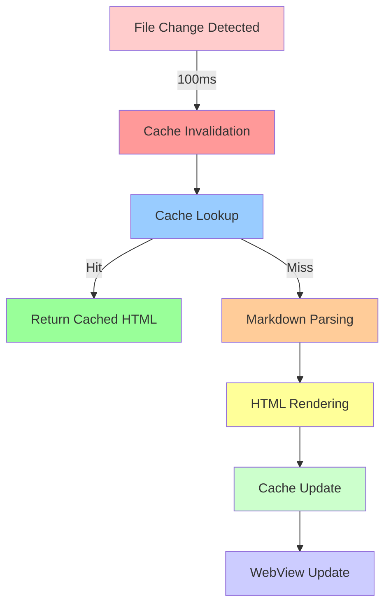

**Key Optimizations:**
- **pulldown-cmark with SIMD:** Leverages CPU SIMD instructions for parallel Markdown parsing
- **Zero-copy parsing:** Avoids unnecessary memory allocations during parsing
- **Incremental rendering:** Only re-renders modified sections of documents
- **Parallel processing:** Processes independent document sections concurrently

#### 3.1.2. Memory Management

The desktop application implements efficient memory management strategies:

**Memory Pooling:**
```rust
use std::sync::Arc;
use tokio::sync::Mutex;

pub struct MemoryPool<T> {
    pool: Arc<Mutex<Vec<T>>>,
    max_size: usize,
}

impl<T: Clone> MemoryPool<T> {
    pub fn get(&self) -> Option<T> {
        let mut pool = self.pool.lock().unwrap();
        pool.pop()
    }
    
    pub fn return(&self, item: T) {
        let mut pool = self.pool.lock().unwrap();
        if pool.len() < self.max_size {
            pool.push(item);
        }
    }
}
```

**Key Strategies:**
- **LRU Cache:** Least Recently Used eviction policy for rendered HTML
- **String Interning:** Deduplicates repeated string values
- **Buffer Reuse:** Reuses buffers for I/O operations
- **Capacity Limits:** Enforces hard limits on cache sizes

#### 3.1.3. CPU Utilization Optimization

The desktop application minimizes CPU usage during idle periods:

**Idle Detection:**
```rust
use tokio::time::{interval, Duration};

pub async fn monitor_idle() {
    let mut interval = interval(Duration::from_secs(5));
    loop {
        interval.tick().await;
        if is_idle() {
            reduce_cpu_priority();
        }
    }
}
```

**Optimization Techniques:**
- **Debounced Operations:** Batches rapid file changes into single processing cycle
- **Background Processing:** Moves non-critical operations to background threads
- **Priority Scheduling:** Prioritizes user-facing operations over background tasks
- **Efficient Algorithms:** Uses O(n log n) algorithms for search and indexing

#### 3.1.4. I/O Optimization

The desktop application optimizes I/O operations for minimal latency:

**Async File Operations:**
```rust
use tokio::fs;

pub async fn read_document_async(path: &Path) -> Result<String, Error> {
    fs::read_to_string(path).await
}
```

**Key Strategies:**
- **Kernel-Level File Watching:** Uses notify crate for efficient change detection
- **Async I/O:** Non-blocking file operations via Tokio
- **Batch Processing:** Groups multiple file operations into single syscall
- **Memory-Mapped Files:** Uses memory mapping for large file access

### 3.2. Desktop Performance Diagram

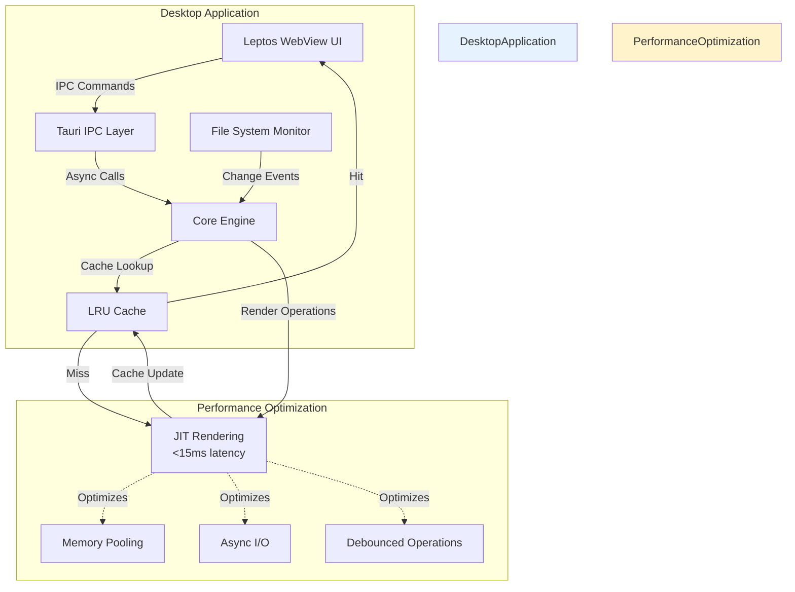

---

## 4. SERVER PERFORMANCE ARCHITECTURE

### 4.1. HTTP/2 Multiplexing

The server leverages HTTP/2 multiplexing for efficient concurrent request handling:

#### 4.1.1. Multiplexing Architecture

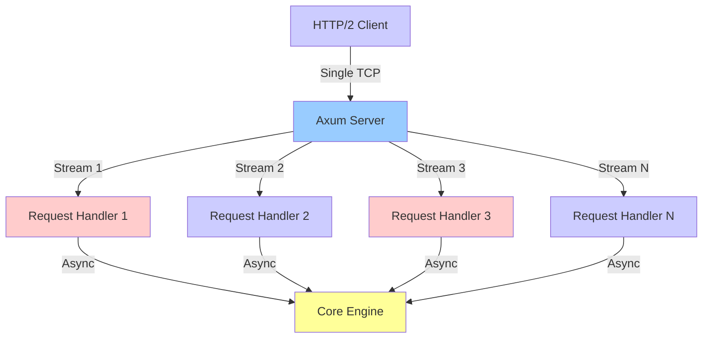

**HTTP/2 Benefits:**
- **Single TCP Connection:** Multiple concurrent requests over single connection
- **Header Compression:** HPACK reduces header overhead by 66%
- **Stream Prioritization:** Priority-based request processing
- **Server Push:** Proactive resource delivery reduces latency

**Implementation:**
```rust
use axum::{
    routing::get,
    Router,
    http::StatusCode,
};
use hyper::server::conn::Http;

pub fn create_router() -> Router {
    Router::new()
        .route("/", get(handler))
        .layer(tower_http::compression::CompressionLayer::new())
        .layer(tower_http::trace::TraceLayer::new_for_http())
}
```

### 4.2. Async Runtime Optimization (Tokio)

The server utilizes Tokio's async runtime for optimal performance:

#### 4.2.1. Work-Stealing Scheduler

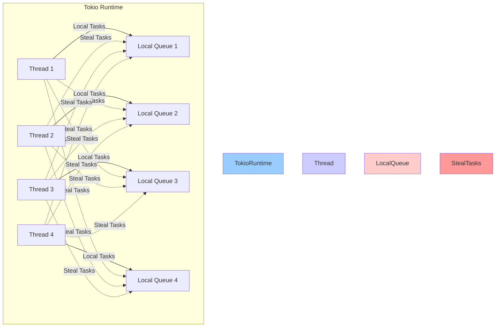

**Work-Stealing Benefits:**
- **Optimal CPU Utilization:** Automatic load balancing across threads
- **Minimal Idle Time:** Threads steal work when local queue is empty
- **Cache Locality:** Local tasks benefit from CPU cache
- **Scalability:** Scales efficiently with increasing core counts

**Configuration:**
```rust
use tokio::runtime;

#[tokio::main(flavor = "multi_thread", worker_threads = 4)]
async fn main() {
    // Server implementation
}
```

### 4.3. Connection Pooling

The server implements connection pooling for database and external service connections:

#### 4.3.1. Database Connection Pool

```rust
use sqlx::sqlite::SqlitePool;

pub struct DatabasePool {
    pool: SqlitePool,
}

impl DatabasePool {
    pub async fn new(database_url: &str) -> Result<Self, Error> {
        let pool = SqlitePool::connect(database_url).await?;
        Ok(Self { pool })
    }
    
    pub async fn get_connection(&self) -> Result<sqlx::sqlite::SqliteConnection, Error> {
        self.pool.acquire().await
    }
}
```

**Pooling Benefits:**
- **Connection Reuse:** Avoids expensive connection establishment
- **Concurrent Access:** Multiple simultaneous database operations
- **Connection Limits:** Prevents database overload
- **Automatic Cleanup:** Idle connections are released

### 4.4. Caching Strategies

The server implements multi-level caching for optimal performance:

#### 4.4.1. Cache Hierarchy

```mermaid
graph TB
    Request[Incoming Request] -->|L1 Check| L1[L1 Cache: In-Memory]
    L1 -->|Hit| Response[Return Response]
    L1 -->|Miss| L2 Check[L2 Cache Check]
    
    L2 -->|Hit| Response
    L2 -->|Miss| DB[Database Query]
    DB -->|Cache Update| L2
    
    style Request fill:#ccccff
    style L1 fill:#99ff99
    style L2 fill:#ffcc99
    style Response fill:#99ffcc
    style DB fill:#ffff99
```

**Cache Levels:**
- **L1 Cache (In-Memory):** LRU cache for frequently accessed content, sub-millisecond access
- **L2 Cache (Database):** Cached rendered HTML in SQLite, sub-10ms access
- **L3 Cache (CDN):** Static assets served via CDN for geographically distributed access

**Cache Invalidation:**
- **Time-Based:** TTL-based expiration for stale data
- **Event-Based:** Immediate invalidation on content modification
- **Manual:** Administrative cache clearing capability

### 4.5. Server Performance Diagram

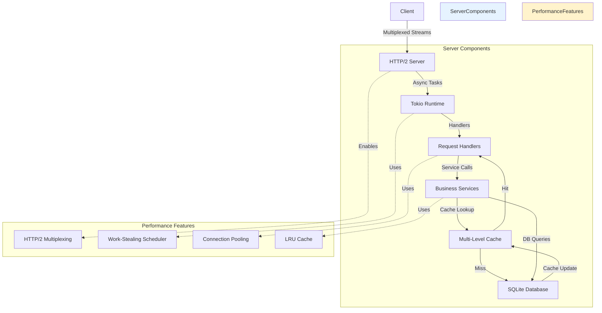

---

## 5. WEB PERFORMANCE ARCHITECTURE

### 5.1. WASM Optimization

The web frontend compiles performance-critical operations to WebAssembly for near-native performance:

#### 5.1.1. WASM Module Architecture

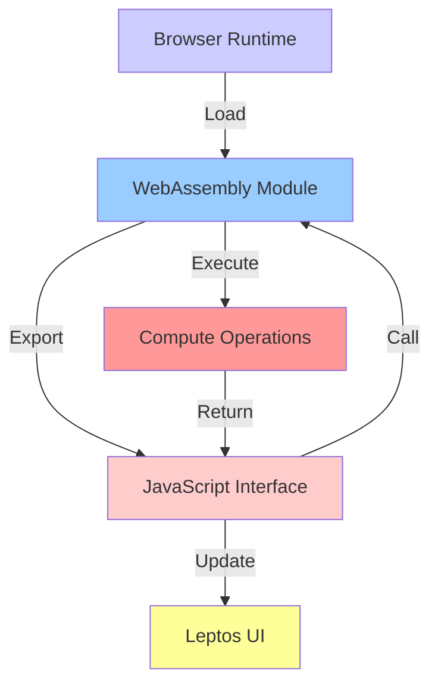

**WASM-Optimized Operations:**
- **Search:** Full-text search with Tantivy compiled to WASM
- **Diff Computation:** Document diff calculation in WASM
- **Validation:** Content validation and sanitization in WASM
- **Markdown Parsing:** CommonMark parsing with pulldown-cmark in WASM

**WASM Benefits:**
- **Near-Native Performance:** Executes at 80-90% of native speed
- **Client-Side Processing:** Offloads computation from server
- **Type Safety:** Rust type system prevents memory errors
- **Binary Size:** Optimized with wasm-opt for minimal download

### 5.2. SSR Performance

The web frontend implements Server-Side Rendering for fast initial page loads:

#### 5.2.1. SSR Architecture

```mermaid
graph TB
    Client[Browser Request] -->|HTTP| Server[Axum Server]
    Server -->|SSR[Leptos SSR]
    SSR -->|HTML[Rendered HTML]
    HTML -->|Response| Client
    Client -->|Hydration[Client Hydration]
    Hydration -->|Interactive[Interactive UI]
    
    style Client fill:#ccccff
    style Server fill:#99ccff
    style SSR fill:#ffcccc
    style HTML fill:#ffff99
    style Hydration fill:#ff9999
    style Interactive fill:#99ffcc
```

**SSR Benefits:**
- **Fast Initial Load:** HTML rendered server-side eliminates client-side rendering delay
- **SEO Friendly:** Search engines can crawl rendered content
- **Progressive Enhancement:** Content visible before JavaScript executes
- **Reduced Bundle Size:** Server-rendered HTML requires less JavaScript

**Hydration Strategy:**
- **Selective Hydration:** Only hydrates interactive components
- **Event Delegation:** Server-rendered events are delegated to client handlers
- **State Transfer:** Initial server state transferred to client for hydration

### 5.3. Bundle Optimization

The web frontend achieves 45KB compressed bundle size through multiple optimization strategies:

#### 5.3.1. Bundle Optimization Pipeline

```mermaid
graph LR
    Source[Rust + TypeScript] -->|wasm-bindgen| WASM[WebAssembly]
    Source -->|Vite| JS[JavaScript Bundle]
    WASM -->|wasm-opt| OptimizedWASM[Optimized WASM]
    JS -->|TreeShake| OptimizedJS[Optimized JS]
    OptimizedWASM -->|Compression| Final[Final Bundle]
    OptimizedJS -->|Compression| Final
    Final -->|45KB[45KB Compressed]
    
    style Source fill:#ccccff
    style WASM fill:#99ccff
    style JS fill:#ffcccc
    style OptimizedWASM fill:#ff9999
    style OptimizedJS fill:#ffcc99
    style Final fill:#ffff99
    style 45KB fill:#99ffcc
```

**Optimization Techniques:**
- **Tree Shaking:** Eliminates unused code from bundles
- **Code Splitting:** Lazy loads routes on-demand
- **Minification:** Removes whitespace and shortens identifiers
- **Compression:** Gzip/Brotli compression for transfer
- **WASM Optimization:** wasm-opt reduces binary size by 30-40%

### 5.4. Lazy Loading Strategies

The web frontend implements lazy loading for optimal initial load time:

#### 5.4.1. Lazy Loading Architecture

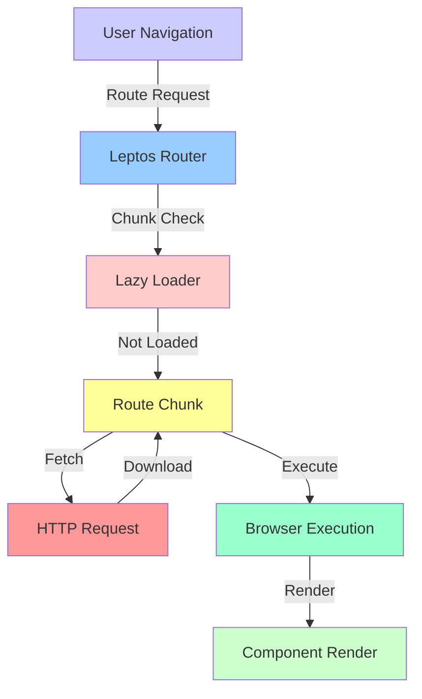

**Lazy Loading Benefits:**
- **Reduced Initial Bundle:** Only critical code loaded initially
- **Faster Time to Interactive:** Core functionality available immediately
- **On-Demand Loading:** Less-used features loaded when accessed
- **Improved Cache Efficiency:** Smaller bundles cache more effectively

### 5.5. Web Performance Diagram

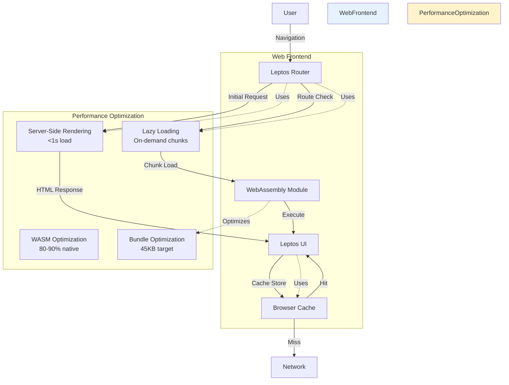

---

## 6. DATABASE PERFORMANCE ARCHITECTURE

### 6.1. Query Optimization

The system implements multiple strategies for optimal database query performance:

#### 6.1.1. Query Optimization Techniques

**Indexing Strategy:**
```sql
-- Primary indexes for frequently queried columns
CREATE INDEX idx_documents_created_at ON documents(created_at);
CREATE INDEX idx_documents_author ON documents(author);
CREATE INDEX idx_documents_tags ON documents(tags);

-- Composite indexes for complex queries
CREATE INDEX idx_documents_repo_branch ON documents(repository_path, branch);
```

**Query Patterns:**
- **Prepared Statements:** Parameterized queries prevent SQL injection and enable plan caching
- **Batch Operations:** Multiple inserts/updates in single transaction
- **Pagination:** LIMIT/OFFSET for large result sets
- **Read Replicas:** Read queries use read replicas for load distribution

### 6.2. Indexing Strategies

The system implements efficient indexing for search and metadata queries:

#### 6.2.1. Search Index Architecture

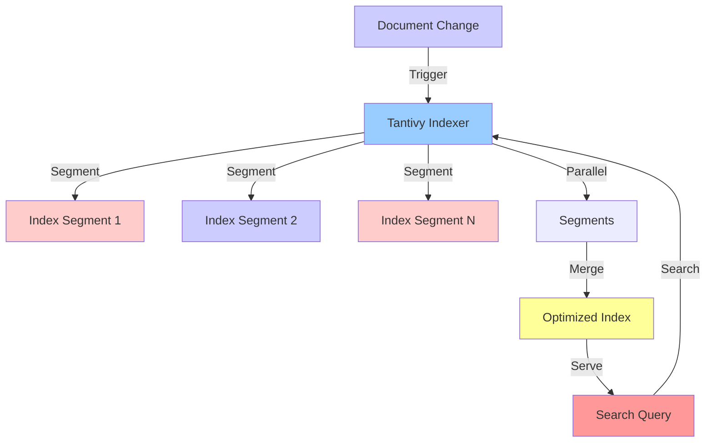

**Indexing Optimizations:**
- **Incremental Updates:** Only re-index modified documents
- **Segmented Index:** Divides index into manageable segments
- **Parallel Processing:** Multiple segments processed concurrently
- **Optimized Storage:** Compressed index storage
- **Field Boosting:** Boost relevance for specific fields

### 6.3. Connection Pooling

The database implements efficient connection pooling:

#### 6.3.1. Connection Pool Configuration

```rust
use sqlx::sqlite::SqlitePoolOptions;

pub async fn create_pool(database_url: &str) -> Result<SqlitePool, Error> {
    SqlitePool::connect_with_options(
        database_url,
        SqlitePoolOptions::new()
            .max_connections(10)
            .min_connections(2)
            .acquire_timeout(Duration::from_secs(5))
            .idle_timeout(Duration::from_secs(600))
            .max_lifetime(Duration::from_secs(1800))
            ).await
}
```

**Pool Configuration:**
- **Max Connections:** 10 concurrent database connections
- **Min Connections:** 2 connections always available
- **Acquire Timeout:** 5 seconds to obtain connection
- **Idle Timeout:** 10 minutes before idle connection closed
- **Max Lifetime:** 30 minutes before connection recycled

### 6.4. Caching Layers

The database implements multi-level caching for query performance:

#### 6.4.1. Database Cache Hierarchy

```mermaid
graph TB
    Query[Incoming Query] -->|L1 Check| L1[Query Plan Cache]
    L1 -->|Hit| Result[Return Result]
    L1 -->|Miss| L2 Check[Row Cache]
    
    L2 -->|Hit| Result
    L2 -->|Miss| DB[Database Query]
    DB -->|Cache Update| L2
    
    style Query fill:#ccccff
    style L1 fill:#99ff99
    style L2 fill:#ffcc99
    style Result fill:#99ffcc
    style DB fill:#ffff99
```

**Cache Levels:**
- **L1 Cache (Query Plans):** Cached prepared statement plans
- **L2 Cache (Rows):** LRU cache for frequently accessed rows
- **L3 Cache (Pages):** Cached database pages for sequential access

---

## 7. NETWORK PERFORMANCE ARCHITECTURE

### 7.1. Protocol Optimization

The system leverages modern network protocols for optimal performance:

#### 7.1.1. Protocol Stack

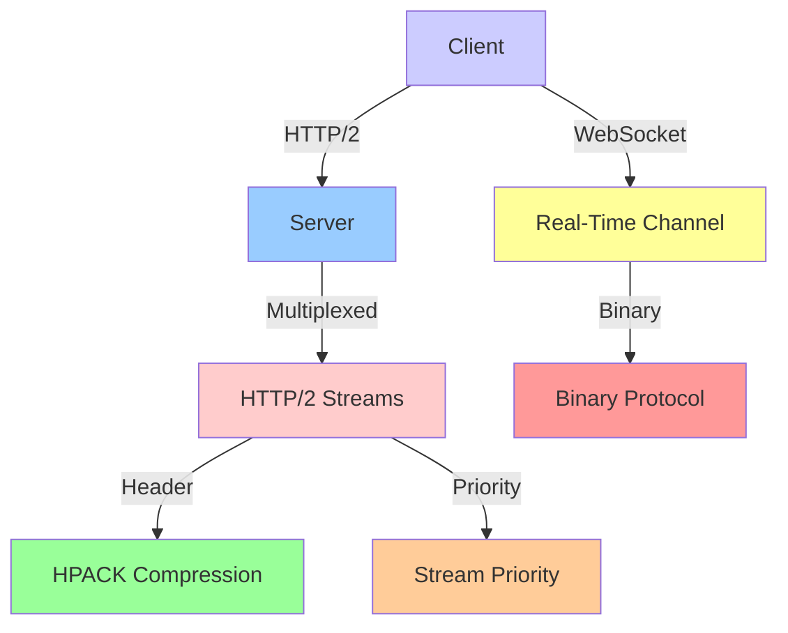

**Protocol Benefits:**
- **HTTP/2 Multiplexing:** 67% faster page load for multi-resource pages
- **HPACK Compression:** 66% smaller header overhead
- **Binary WebSocket:** More efficient than text-based protocols
- **Stream Prioritization:** Critical resources delivered first

### 7.2. Compression Strategies

The system implements multiple compression strategies:

#### 7.2.1. Compression Pipeline

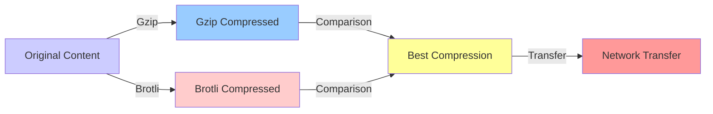

**Compression Benefits:**
- **Gzip:** 70% reduction, universal browser support
- **Brotli:** 85% reduction, modern browser support
- **Automatic Selection:** Server selects best compression based on client capabilities
- **Static Assets:** Pre-compressed assets for delivery

### 7.3. CDN Integration

The system supports CDN integration for geographically distributed content delivery:

#### 7.3.1. CDN Architecture

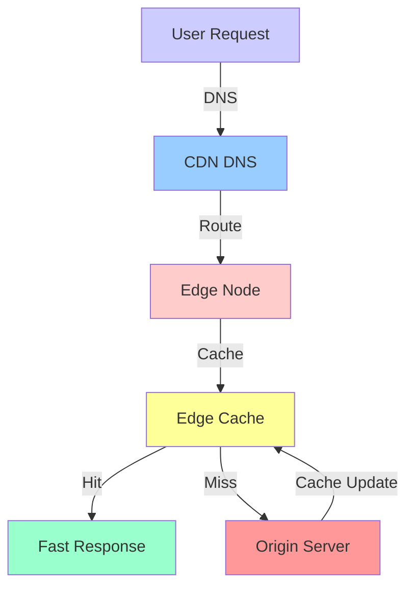

**CDN Benefits:**
- **Reduced Latency:** Content served from nearest edge location
- **Increased Throughput:** Distributed load across multiple nodes
- **Origin Protection:** CDN absorbs DDoS attacks
- **Global Availability:** Content available even during origin outages

### 7.4. Latency Optimization

The system implements multiple latency optimization strategies:

#### 7.4.1. Latency Reduction Techniques

- **TCP Fast Open:** Reduces connection establishment time
- **HTTP/2 Server Push:** Proactively sends critical resources
- **Preconnect Hints:** Initiates connections before user action
- **Resource Hints:** Provides browser with resource loading hints
- **Critical CSS Inlining:** Eliminates round-trip for critical styles

---

## 8. CACHING ARCHITECTURE

### 8.1. Multi-Level Cache Hierarchy

The system implements a comprehensive cache hierarchy across all components:

#### 8.1.1. Cache Hierarchy Architecture

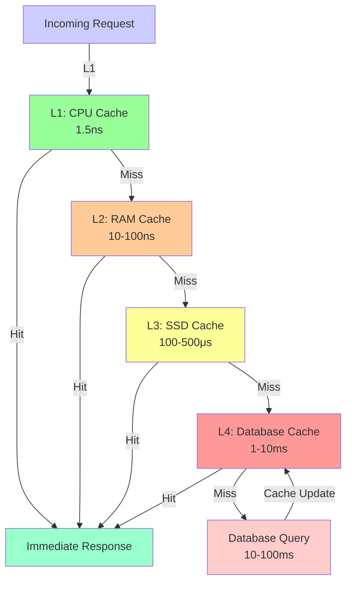

**Cache Levels:**
- **L1 (CPU Cache):** LRU cache for frequently accessed data structures, 1.5ns access
- **L2 (RAM Cache):** LRU cache for rendered HTML and search results, 10-100ns access
- **L3 (SSD Cache):** Persistent cache for database queries and static assets, 100-500μs access
- **L4 (Database Cache):** Materialized view cache for complex queries, 1-10ms access
- **L5 (CDN Cache):** Geographically distributed static assets, 50-200ms access

### 8.2. Cache Invalidation Strategies

The system implements multiple cache invalidation strategies:

#### 8.2.1. Invalidation Triggers

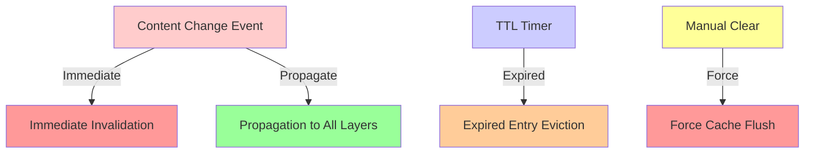

**Invalidation Strategies:**
- **Event-Based:** Immediate invalidation on content modification
- **TTL-Based:** Time-based expiration for stale data
- **Version-Based:** Cache keys include content version for automatic invalidation
- **Manual:** Administrative cache clearing capability
- **Propagated:** Invalidation propagated across all cache layers

### 8.3. Cache Eviction Policies

The system implements multiple cache eviction policies:

#### 8.3.1. Eviction Policies

- **LRU (Least Recently Used):** Evicts least recently accessed entries
- **LFU (Least Frequently Used):** Evicts least frequently accessed entries
- **TTL (Time To Live):** Evicts entries older than configured TTL
- **Size-Based:** Evicts entries when cache exceeds capacity

**Policy Selection:**
- **L1 Cache:** LRU eviction for minimal overhead
- **L2 Cache:** LFU eviction for optimal hit rate
- **L3 Cache:** TTL eviction for freshness guarantees
- **L4 Cache:** Size-based eviction for capacity management

### 8.4. Cache Warming

The system implements cache warming for optimal initial performance:

#### 8.4.1. Cache Warming Strategies

```mermaid
graph TB
    Startup[Application Startup] -->|Warm| Warm[Cache Warming]
    Warm -->|Prefetch| Prefetch[Prefetch Popular Content]
    Warm -->|Preload| Preload[Preload Critical Assets]
    
    User[User Login] -->|Personalize| Personalize[Personalized Cache Warming]
    Personalize -->|Predict[Predict User Needs]
    
    style Startup fill:#ccccff
    style Warm fill:#99ccff
    style Prefetch fill:#ffcccc
    style Preload fill:#ffff99
    style User fill:#ff9999
    style Personalize fill:#99ffcc
    style Predict fill:#ffcc99
```

**Warming Strategies:**
- **Startup Warming:** Preload frequently accessed content on application start
- **Predictive Warming:** Predict and preload content based on user behavior
- **Background Warming:** Warm cache during idle periods
- **Personalized Warming:** Warm cache with user-specific content on login

---

## 9. MONITORING AND PROFILING

### 9.1. Performance Monitoring

The system implements comprehensive performance monitoring:

#### 9.1.1. Monitoring Architecture

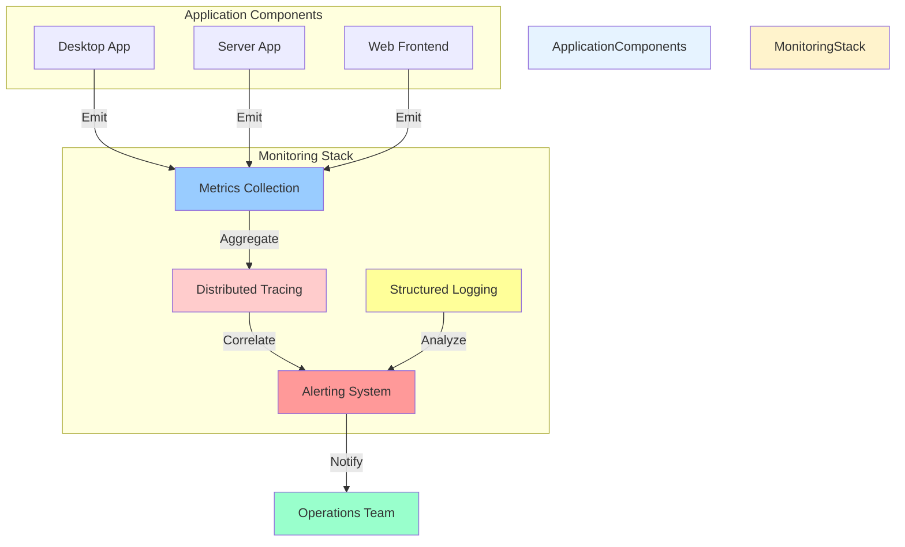

**Monitoring Metrics:**
- **Request Latency:** P50, P95, P99 latency percentiles
- **Throughput:** Requests per second, concurrent connections
- **Error Rate:** Error count by type and severity
- **Resource Usage:** CPU, memory, disk, network utilization
- **Cache Performance:** Hit rate, eviction rate, size

### 9.2. Profiling Tools

The system utilizes multiple profiling tools for performance analysis:

#### 9.2.1. Profiling Tools

| Tool | Purpose | Component | Usage |
|-------|---------|-----------|-------|
| **flamegraph** | Flame graph generation | Desktop, Server | CPU profiling |
| **tokio-console** | Tokio runtime inspection | Server | Async task analysis |
| **tracing** | Distributed tracing | All | Request flow analysis |
| **heaptrack** | Memory allocation tracking | Desktop, Server | Memory leak detection |
| **Chrome DevTools** | Browser profiling | Web | Rendering and script profiling |

**Profiling Workflow:**
1. **Baseline Measurement:** Establish performance baseline under normal load
2. **Targeted Profiling:** Profile specific components or operations
3. **Analysis:** Identify bottlenecks and optimization opportunities
4. **Optimization:** Implement performance improvements
5. **Validation:** Measure and validate performance improvements

### 9.3. Performance Regression Detection

The system implements automated performance regression detection:

#### 9.3.1. Regression Detection Architecture

```mermaid
graph TB
    Baseline[Performance Baseline] -->|Compare| Current[Current Performance]
    Current -->|Regression| Regression[Regression Detected]
    Regression -->|Alert| Alert[Performance Alert]
    Alert -->|Investigate| Investigation[Root Cause Analysis]
    Investigation -->|Fix| Fix[Performance Fix]
    Fix -->|Validate| Validation[Performance Validation]
    Validation -->|Update| Baseline
    
    style Baseline fill:#ccccff
    style Current fill:#99ccff
    style Regression fill:#ff9999
    style Alert fill:#ffcccc
    style Investigation fill:#ffff99
    style Fix fill:#99ffcc
    style Validation fill:#ffcc99
    style Update fill:#ff9999
```

**Regression Detection:**
- **Automated Testing:** Continuous performance testing on every commit
- **Threshold-Based Alerts:** Alert when metrics exceed baseline by >10%
- **Historical Comparison:** Compare current performance to historical averages
- **Trend Analysis:** Detect gradual performance degradation over time
- **Component-Level:** Isolate regression to specific components

---

## 10. REFERENCES

### 10.1. Related ADRs

| ADR ID | Title | Relevance |
|----------|-------|-----------|
| [ADR-001](../.specs/02_adrs/001_rust_as_primary_language.md) | Rust as Primary Language | Memory safety and zero-cost abstractions |
| [ADR-003](../.specs/02_adrs/003_axum_for_http2_server.md) | Axum for HTTP/2 Server | HTTP/2 multiplexing and async architecture |
| [ADR-004](../.specs/02_adrs/004_leptos_for_web_frontend.md) | Leptos for Web Frontend | Fine-grained reactivity and SSR |
| [ADR-007](../.specs/02_adrs/007_tokio_for_async_runtime.md) | Tokio for Async Runtime | Work-stealing scheduler and async I/O |

### 10.2. Related Requirements

| Requirement ID | Title | Relevance |
|---------------|-------|-----------|
| [REQ-SYS-051](../.specs/04_future_state/reqs/system_overview.md) | Rendering Latency | Sub-15ms rendering target |
| [REQ-SYS-052](../.specs/04_future_state/reqs/system_overview.md) | Search Response Time | Sub-100ms search target |
| [REQ-SYS-053](../.specs/04_future_state/reqs/system_overview.md) | Startup Time | Sub-3s startup target |
| [REQ-SYS-054](../.specs/04_future_state/reqs/system_overview.md) | Concurrent Users | 100+ concurrent users |
| [REQ-SYS-055](../.specs/04_future_state/reqs/system_overview.md) | Memory Usage | <512MB desktop, <2GB server |
| [REQ-DESK-086](../.specs/04_future_state/reqs/desktop_requirements.md) | Hot-Reload Latency | Desktop rendering latency |
| [REQ-DESK-091](../.specs/04_future_state/reqs/desktop_requirements.md) | Memory Usage | Desktop memory limits |
| [REQ-SRV-106](../.specs/04_future_state/reqs/server_requirements.md) | Document Retrieval | Server response times |
| [REQ-SRV-107](../.specs/04_future_state/reqs/server_requirements.md) | Search Response | Server search performance |
| [REQ-SRV-111](../.specs/04_future_state/reqs/server_requirements.md) | Concurrent Users | Server concurrency |
| [REQ-SRV-116](../.specs/04_future_state/reqs/server_requirements.md) | Memory Limits | Server memory limits |
| [REQ-WEB-006](../.specs/04_future_state/reqs/web_requirements.md) | First Contentful Paint | Web rendering performance |
| [REQ-WEB-071](../.specs/04_future_state/reqs/web_requirements.md) | Code Splitting | Web bundle optimization |

### 10.3. Related Design Elements

| Design Element ID | Title | Relevance |
|-----------------|-------|-----------|
| [DES-DM-007](../.specs/04_future_state/design/data_models.md#des-dm-007-cacheentry) | CacheEntry | Cache data structure |
| [DES-SRV-013](../.specs/04_future_state/design/server_design.md#des-srv-013-cachemanager) | CacheManager | Cache management implementation |
| [DES-SRV-012](../.specs/04_future_state/design/server_design.md#des-srv-012-databasepool) | DatabasePool | Connection pooling |
| [DES-WD-005](../.specs/04_future_state/design/web_design.md#des-wd-005-wasmexports) | WASMExports | WebAssembly exports |
| [DES-WD-006](../.specs/04_future_state/design/web_design.md#des-wd-006-apiclient) | ApiClient | HTTP client implementation |

### 10.4. Standards Compliance

This document complies with the following standards:

- **[ISO/IEC 26514:2021](../.specs/01_standards/coding_standards.md)** - Systems and Software Engineering - Requirements for Designers and Developers of User Documentation
- **[ISO/IEC 25010:2011](../.specs/01_standards/coding_standards.md)** - Systems and Software Quality Requirements and Evaluation - System and Software Quality Models
- **[IEEE 1063:2001](../.specs/01_standards/coding_standards.md)** - Standard for Software User Documentation
- **[TACHYON-STD-V1.0](../.specs/01_standards/coding_standards.md)** - Tachyon Coding and Documentation Standards

---

**Document Status:** Proposed
**Last Updated:** February 2026
**Next Review:** Upon completion of Phase 1 (Foundation Documentation)
