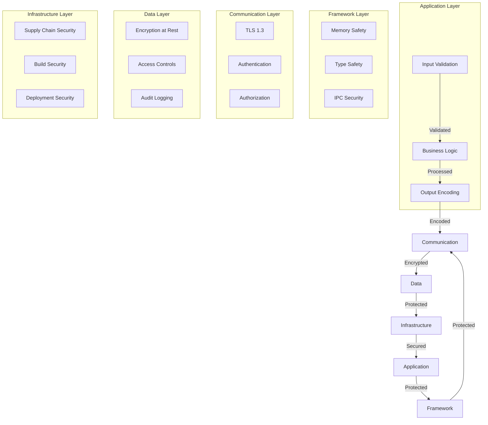
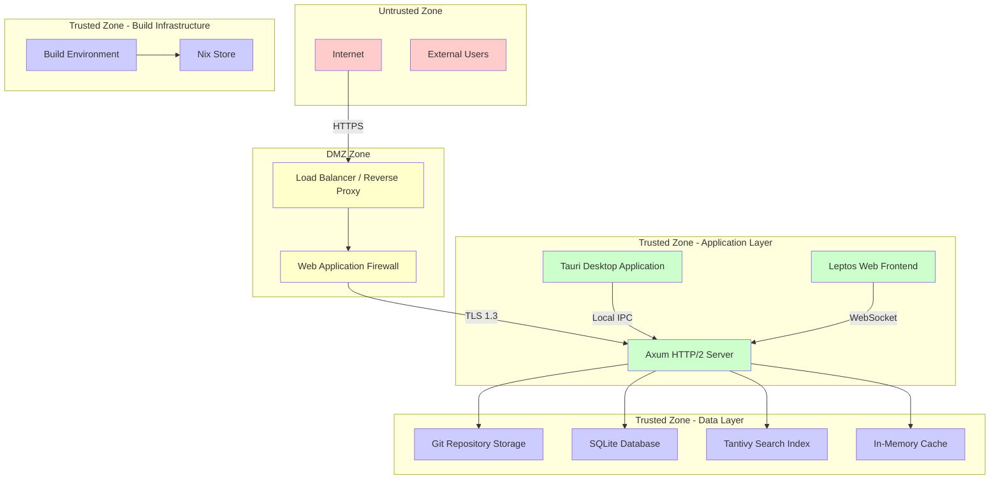
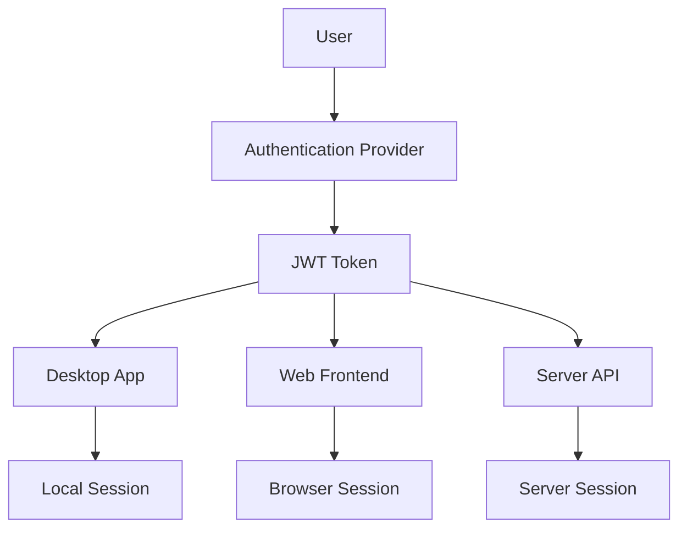
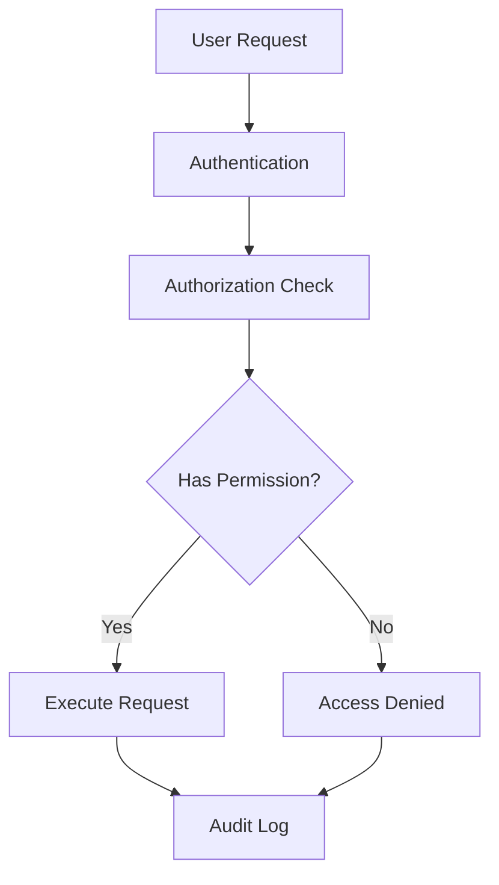
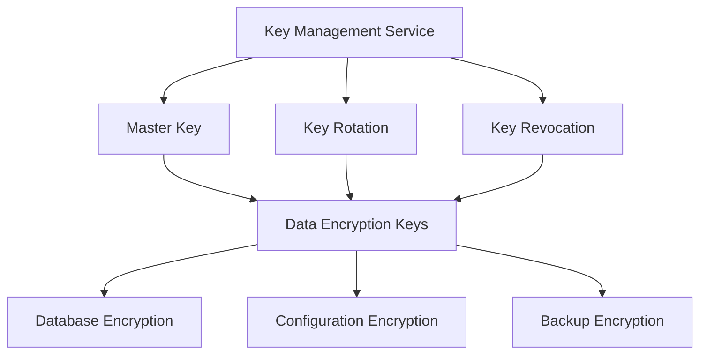
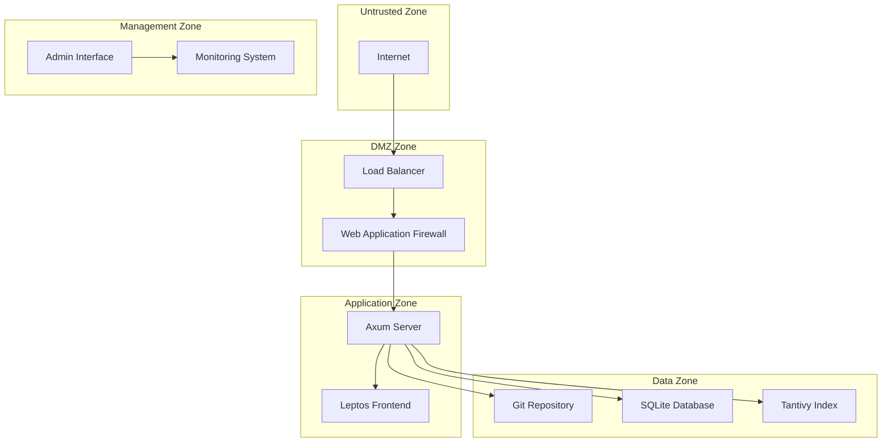
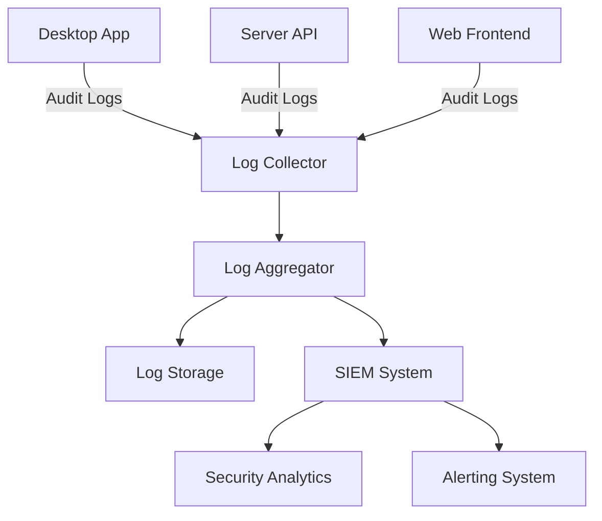
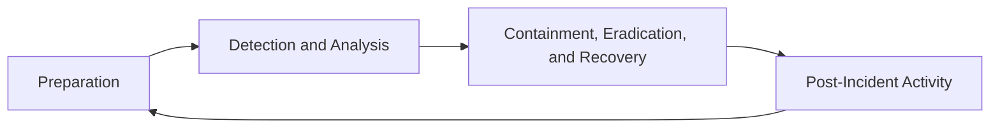

# TACHYON: SECURITY ARCHITECTURE

**Document ID:** TACHYON-ARCH-004-V1.0
**Title:** Security Architecture
**Author:** Security Architect
**Date:** February 2026
**Version:** 1.0
**Status:** Approved for Implementation
**Classification:** Architecture Documentation
**Compliance Level:** ISO/IEC 27001:2022, OWASP Top 10, IEEE 1016-2009

---

## TABLE OF CONTENTS

1. [Introduction](#1-introduction)
2. [Security Architecture Overview](#2-security-architecture-overview)
3. [Authentication and Authorization](#3-authentication-and-authorization)
4. [Data Protection](#4-data-protection)
5. [Network Security](#5-network-security)
6. [Application Security](#6-application-security)
7. [Audit and Logging](#7-audit-and-logging)
8. [Incident Response](#8-incident-response)
9. [Compliance and Governance](#9-compliance-and-governance)
10. [References](#10-references)

---

## 1. INTRODUCTION

### 1.1. Purpose and Scope

This document defines the comprehensive security architecture for the Tachyon toolchain, establishing the security controls, mechanisms, and principles that protect the confidentiality, integrity, and availability of system data and functionality. The architecture implements a defense-in-depth strategy aligned with ISO/IEC 27001:2022 information security management system requirements and OWASP security best practices.

The Tachyon toolchain encompasses:
- A Rust-based core engine with Tokio asynchronous runtime
- A Tauri-based desktop application wrapper
- An Axum-based HTTP/2 server component
- A TypeScript/JavaScript frontend using Leptos and TailwindCSS
- Git-based content storage and management

### 1.2. Security Principles

The Tachyon security architecture is founded upon the following fundamental principles:

| Principle | Description | Implementation |
|-----------|-------------|----------------|
| **Defense-in-Depth** | Multiple layers of security controls provide redundant protection | Multi-layered security architecture with controls at application, framework, communication, data, and infrastructure layers |
| **Least Privilege** | Minimal access required for each operation | Capability-based access control, RBAC with principle of least privilege |
| **Fail-Safe Defaults** | Secure default configurations | Secure defaults for all security configurations |
| **Secure by Design** | Security incorporated into design phase | Security-first architecture with threat modeling |
| **Zero Trust** | No trust assumptions within security boundaries | Verification of all requests regardless of source |
| **Auditability** | All security-relevant events logged | Comprehensive audit logging with tracing |

### 1.3. Compliance Requirements

The Tachyon security architecture is designed to comply with the following standards and regulations:

| Standard | Scope | Implementation |
|----------|-------|----------------|
| **ISO/IEC 27001:2022** | Information Security Management System | Comprehensive ISMS implementation with 114 controls across 4 themes |
| **OWASP Top 10** | Web Application Security Risks | Mitigation of all OWASP Top 10 vulnerabilities |
| **GDPR** | Data Protection Regulation | Data protection by design, privacy by default, data subject rights |
| **SOC 2 Type II** | Security, Availability, Processing Integrity | Controls for security, availability, and processing integrity |

---

## 2. SECURITY ARCHITECTURE OVERVIEW

### 2.1. Defense-in-Depth Strategy

The Tachyon security architecture implements a defense-in-depth strategy with multiple layers of security controls. This approach ensures that if one layer fails, other layers provide protection, aligning with the principle of redundant protection and layered defense.



**Security Layer Descriptions:**

| Layer | Components | Primary Threats Mitigated | Controls |
|-------|------------|-------------------------|----------|
| **Application Layer** | Input validation, output encoding, business logic | SQL injection, XSS, command injection, input validation bypass |
| **Framework Layer** | Memory safety, type safety, IPC security | Buffer overflows, use-after-free, data races, IPC exploitation |
| **Communication Layer** | TLS 1.3, authentication, authorization | Man-in-the-middle, credential theft, unauthorized access |
| **Data Layer** | Encryption at rest, access controls, audit logging | Data exfiltration, tampering, unauthorized access |
| **Infrastructure Layer** | Supply chain security, build security, deployment security | Dependency poisoning, build tampering, supply chain attacks |

### 2.2. Trust Boundaries

The Tachyon architecture defines multiple trust boundaries that must be protected through appropriate security controls.



**Trust Boundary Descriptions:**

| Zone | Description | Trust Level | Primary Threats | Controls |
|------|-------------|-------------|----------------|----------|
| **Untrusted Zone** | Public internet and external users | None | DDoS, reconnaissance, exploitation |
| **DMZ Zone** | Network perimeter with security controls | Low | Man-in-the-middle, protocol attacks |
| **Application Layer** | Server, desktop, and web components | Medium | Application-level exploits, privilege escalation |
| **Data Layer** | Storage systems for content and metadata | High | Data exfiltration, tampering, ransomware |
| **Build Infrastructure** | Nix build environment and artifact storage | High | Supply chain attacks, build poisoning |

### 2.3. Security Zones and Data Classification

The Tachyon system manages various assets requiring protection based on their sensitivity and business impact.

**Asset Classification Matrix:**

| Asset Category | Specific Assets | Classification | Protection Requirements |
|----------------|-----------------|----------------|------------------------|
| **Content Assets** | Documentation files, markdown content, user-generated content | Confidential | Encryption at rest, access controls, audit logging |
| **User Data** | User credentials, personal information, preferences | Highly Confidential | Strong encryption, strict access controls, GDPR compliance |
| **Authentication Data** | Session tokens, API keys, OAuth tokens | Highly Confidential | Secure storage, short expiration, secure transmission |
| **System Configuration** | Server configuration, build scripts, deployment manifests | Restricted | Access controls, version control, audit logging |
| **Source Code** | Rust source, TypeScript source, configuration files | Confidential | Access controls, code review, supply chain security |
| **Build Artifacts** | Compiled binaries, WASM modules, bundled assets | Restricted | Code signing, verification, secure storage |
| **Audit Logs** | Access logs, activity logs, security events | Confidential | WORM storage, encryption, access controls |
| **Search Index** | Tantivy index data, cached query results | Confidential | Encryption at rest, access controls |

---

## 3. AUTHENTICATION AND AUTHORIZATION

### 3.1. Authentication Architecture

The Tachyon system implements a comprehensive authentication architecture supporting multiple authentication methods with JWT-based session management.



### 3.2. Authentication Mechanisms

The Tachyon system supports multiple authentication methods to accommodate different use cases and security requirements.

**Authentication Methods:**

| Method | Description | Security Level | Use Case |
|--------|-------------|----------------|----------|
| **Multi-Factor Authentication (MFA)** | Requires multiple factors for authentication | Critical | All user accounts, privileged operations |
| **Password-Based Authentication** | Username/password with strong password requirements | High | Standard user authentication |
| **OAuth 2.0** | Third-party authentication with OAuth 2.0 | High | Social login, enterprise SSO |
| **SAML 2.0** | Security Assertion Markup Language for enterprise SSO | High | Enterprise single sign-on |
| **OpenID Connect** | OpenID Connect for federated authentication | Medium | Federated authentication |
| **API Key Authentication** | API key-based authentication for programmatic access | Medium | API access, automation |
| **Certificate-Based Authentication** | Client certificate authentication | High | Inter-component communication |

**Password Requirements:**

| Requirement | Specification | Rationale |
|------------|---------------|-----------|
| **Minimum Length** | 12 characters | Prevents brute force attacks |
| **Complexity** | Uppercase, lowercase, numbers, special characters | Increases entropy |
| **Password History** | Last 10 passwords cannot be reused | Prevents password reuse |
| **Password Expiration** | 90 days (configurable) | Limits credential exposure window |
| **Password Hashing** | Argon2id with 256-bit salt | Prevents rainbow table attacks |
| **Password Reset** | Secure reset with time-limited tokens | Enables secure recovery |

### 3.3. Session Management

The Tachyon system implements secure session management with JWT tokens and proper session lifecycle controls.

**JWT Token Structure:**

| Component | Description | Security Considerations |
|-----------|-------------|------------------------|
| **Header** | Algorithm (RS256, ES256), type (JWT), key ID | Must use strong algorithms |
| **Payload** | Issuer, subject, audience, issued at, expiration, JWT ID, permissions, session ID | Must include all necessary claims |
| **Signature** | Cryptographic signature for integrity verification | Must use strong keys and proper verification |

**Session Management Controls:**

| Control | Specification | Rationale |
|---------|---------------|-----------|
| **Token Expiration** | Maximum 24 hours (configurable) | Limits credential exposure window |
| **Session Timeout** | 30 minutes of inactivity (configurable) | Prevents session hijacking |
| **Session Refresh** | Token rotation on refresh | Prevents token replay attacks |
| **Concurrent Session Limits** | Maximum 5 concurrent sessions per user (configurable) | Limits credential theft impact |
| **Session Revocation** | Immediate revocation capability | Enables incident response |
| **Secure Storage** | HttpOnly, Secure, SameSite cookies | Prevents XSS and CSRF attacks |

### 3.4. Authorization Models

The Tachyon system implements Role-Based Access Control (RBAC) with Attribute-Based Access Control (ABAC) extensions for fine-grained permissions.

**Authorization Flow:**



**Role-Based Access Control (RBAC):**

| Role | Permissions | Description |
|------|-------------|-------------|
| **Admin** | All permissions | Full system access |
| **User** | Document read/write, repository read/write | Standard user access |
| **Viewer** | Document read, repository read | Read-only access |
| **Editor** | Document read/write, repository read/write, document share | Content editing access |
| **Auditor** | System audit, document read, repository read | Audit and monitoring access |

**Attribute-Based Access Control (ABAC):**

| Attribute | Values | Description |
|-----------|--------|-------------|
| **Resource Type** | document, repository, user, system | Type of resource being accessed |
| **Resource ID** | UUID-based identifier | Specific resource identifier |
| **User Attributes** | department, location, clearance | User-specific attributes |
| **Time Constraints** | business hours, specific dates | Time-based access restrictions |
| **Location Constraints** | IP address ranges, geographic regions | Location-based access restrictions |

**Frontmatter Access Control:**

The Tachyon system enforces access control directives from document frontmatter, enabling document-level security policies.

```yaml
---
access:
  roles: [admin, editor]
  users: [user-uuid-1, user-uuid-2]
  permissions: [document:read, document:write]
  restrictions:
    time:
      start: "09:00"
      end: "17:00"
    location:
      allowed: ["192.168.1.0/24"]
---
```

**Block Redaction:**

The Tachyon system redacts `::: internal` blocks from documents for unauthorized users, enabling content-level security controls.

```markdown
# Public Content

This content is visible to all authorized users.

::: internal
This content is only visible to users with internal access permissions.
:::

# More Public Content
```

---

## 4. DATA PROTECTION

### 4.1. Encryption at Rest

The Tachyon system implements AES-256 encryption for all sensitive data at rest, ensuring confidentiality and integrity of stored data.

**Encryption Requirements:**

| Data Type | Encryption | Key Size | Algorithm | Key Rotation |
|-----------|-----------|----------|-----------|--------------|
| **User Credentials** | bcrypt | 256-bit salt | Argon2id with 256-bit salt |
| **Session Tokens** | JWT | 256-bit | RS256 or ES256 |
| **Database Files** | SQLite encryption | 256-bit | AES-256-GCM |
| **Configuration Values** | Sensitive config encryption | 256-bit | AES-256-GCM |
| **Backup Files** | Backup encryption | 256-bit | AES-256-GCM |
| **Search Index** | Index encryption | 256-bit | AES-256-GCM |

**Key Management Architecture:**



**Key Management Controls:**

| Control | Specification | Rationale |
|---------|---------------|-----------|
| **Key Generation** | Cryptographically secure random key generation | Prevents predictable keys |
| **Key Storage** | Hardware Security Module (HSM) or secure key store | Prevents key extraction |
| **Key Rotation** | Every 90 days (configurable) | Limits key exposure window |
| **Key Revocation** | Immediate revocation capability | Enables incident response |
| **Key Backup** | Secure, encrypted backup of keys | Prevents key loss |
| **Key Access Logging** | All key access logged | Enables audit trail |

### 4.2. Encryption in Transit

The Tachyon system enforces TLS 1.3 for all network communications, ensuring confidentiality and integrity of data in transit.

**TLS 1.3 Configuration:**

| Parameter | Specification | Rationale |
|-----------|---------------|-----------|
| **Protocol Version** | TLS 1.3 only | Latest, most secure protocol |
| **Cipher Suites** | AES-256-GCM, ChaCha20-Poly1305 | Strong, authenticated encryption |
| **Key Exchange** | ECDHE with P-256 or P-384 | Perfect forward secrecy |
| **Signature Algorithms** | RSA-PSS or ECDSA | Strong signature algorithms |
| **Certificate Validation** | Full chain verification with CRL/OCSP | Prevents certificate fraud |
| **HSTS Headers** | Strict-Transport-Security with max-age=31536000 | Enforces HTTPS |

**Certificate Management:**

| Control | Specification | Rationale |
|---------|---------------|-----------|
| **Certificate Type** | Extended Validation (EV) or Organization Validation (OV) | Higher trust level |
| **Certificate Authority** | Publicly trusted CA | Prevents man-in-the-middle attacks |
| **Certificate Expiration** | Maximum 397 days | Limits certificate exposure window |
| **Certificate Rotation** | Automated rotation before expiration | Prevents service disruption |
| **Certificate Pinning** | Certificate pinning for critical endpoints | Prevents certificate fraud |
| **Mutual TLS (mTLS)** | mTLS for inter-component communication | Enhanced security for internal communication |

### 4.3. Data Integrity

The Tachyon system implements cryptographic integrity verification for critical data, ensuring data integrity and detecting tampering attempts.

**Integrity Verification Mechanisms:**

| Mechanism | Data Type | Algorithm | Purpose |
|-----------|-----------|-----------|---------|
| **Cryptographic Signatures** | Build artifacts, configuration files | Verification of authenticity |
| **Checksums** | All critical files | Detection of tampering |
| **Git Integrity** | Repository content | Leverage Git's cryptographic verification |
| **Subresource Integrity (SRI)** | Web assets | Prevention of supply chain attacks |
| **HMAC** | API requests, messages | Message integrity verification |

**Tamper Detection:**

| Control | Specification | Rationale |
|---------|---------------|-----------|
| **Real-time Monitoring** | Continuous integrity monitoring | Rapid detection of tampering |
| **Alerting** | Immediate alerts on tampering detection | Enables rapid incident response |
| **Audit Logging** | All tampering attempts logged | Enables forensic analysis |
| **Automatic Recovery** | Automatic restoration from backups | Minimizes impact |
| **Incident Response** | Automated incident response procedures | Reduces response time |

### 4.4. Data Masking and Anonymization

The Tachyon system implements data masking and anonymization for sensitive data, protecting privacy and complying with data protection regulations.

**Data Masking Techniques:**

| Technique | Use Case | Example |
|-----------|-----------|---------|
| **Static Masking** | Development, testing environments | `j***@example.com` |
| **Dynamic Masking** | User interface, reports | `j***@example.com` |
| **Tokenization** | Database storage | `token_abc123` |
| **Anonymization** | Analytics, reporting | `user_12345` |
| **Pseudonymization** | Data processing | `pseudonym_xyz789` |

**GDPR Compliance:**

| Requirement | Implementation |
|------------|----------------|
| **Data Protection by Design** | Security controls integrated into system design |
| **Privacy by Default** | Privacy-friendly default configurations |
| **Data Minimization** | Only collect necessary data |
| **Data Subject Rights** | Access, rectification, erasure, portability |
| **Consent Management** | Explicit, informed consent |
| **Data Breach Notification** | 72-hour notification requirement |

---

## 5. NETWORK SECURITY

### 5.1. Secure Communication Protocols

The Tachyon system implements secure communication protocols for all network communications, preventing man-in-the-middle attacks and ensuring data confidentiality and integrity.

**Protocol Security Requirements:**

| Protocol | Version | Security Features | Use Case |
|----------|---------|------------------|----------|
| **HTTP/2** | HTTP/2 only | Server communications |
| **TLS** | TLS 1.3 only | All network communications |
| **WebSocket** | Secure WebSocket (wss://) | Real-time communication |
| **IPC** | Secure IPC with capability enforcement | Desktop-server communication |

**Security Headers:**

| Header | Value | Purpose |
|--------|-------|---------|
| **Strict-Transport-Security** | max-age=31536000; includeSubDomains | Enforces HTTPS |
| **Content-Security-Policy** | default-src 'self'; script-src 'self' | Prevents XSS |
| **X-Frame-Options** | DENY | Prevents clickjacking |
| **X-Content-Type-Options** | nosniff | Prevents MIME sniffing |
| **Referrer-Policy** | strict-origin-when-cross-origin | Controls referrer information |
| **Permissions-Policy** | geolocation=(), microphone=() | Restricts browser features |

### 5.2. Network Segmentation

The Tachyon system implements network segmentation to isolate security zones and limit the blast radius of breaches.

**Network Segmentation Architecture:**



**Firewall Rules:**

| Zone | Source | Destination | Port | Protocol | Action |
|------|--------|-------------|-------|----------|--------|
| **Untrusted → DMZ** | Internet | Load Balancer | 443 | HTTPS | Allow |
| **DMZ → Application** | WAF | Server | 8443 | HTTPS | Allow |
| **Application → Data** | Server | Git Repository | 22 | SSH | Allow |
| **Application → Data** | Server | SQLite Database | 3306 | TCP | Allow |
| **Management → Application** | Admin Interface | Server | 8443 | HTTPS | Allow |
| **All Zones** | Any | Any | Any | Deny | Default |

### 5.3. DDoS Protection

The Tachyon system implements comprehensive DDoS protection to ensure availability of services.

**DDoS Protection Measures:**

| Measure | Implementation | Threat Mitigated |
|---------|---------------|-----------------|
| **Rate Limiting** | Per-IP and per-user rate limits | Volumetric DDoS |
| **Connection Limits** | Maximum concurrent connections | Connection exhaustion |
| **Request Timeout** | Maximum request duration | Slowloris attacks |
| **Request Size Limits** | Maximum request body size | Resource exhaustion |
| **Circuit Breakers** | Automatic circuit breaking for failing services | Cascading failures |
| **DDoS Protection Service** | Cloudflare, AWS Shield | Large-scale DDoS |

**Rate Limiting Configuration:**

| Endpoint | Rate Limit | Window | Rationale |
|----------|-------------|--------|-----------|
| **Authentication** | 5 requests per minute | Prevents credential stuffing |
| **API Requests** | 100 requests per minute | Prevents API abuse |
| **WebSocket Messages** | 10 messages per second | Prevents WebSocket abuse |
| **File Upload** | 10 uploads per hour | Prevents storage exhaustion |

---

## 6. APPLICATION SECURITY

### 6.1. Input Validation and Sanitization

The Tachyon system implements comprehensive input validation and sanitization across all interfaces, preventing injection attacks and ensuring data integrity.

**Input Validation Categories:**

| Interface | Validation | Threats Prevented |
|-----------|-----------|------------------|
| **HTTP/2 Server** | Path validation, query validation, body validation | SQL injection, XSS, path traversal |
| **IPC Commands** | Type validation, range validation, format validation | Type confusion, buffer overflow |
| **File Operations** | Path validation, permission validation, size validation | Path traversal, unauthorized access |
| **WebSocket Messages** | Type validation, size validation, format validation | Type confusion, DoS |

**Input Validation Controls:**

| Control | Specification | Rationale |
|---------|---------------|-----------|
| **Schema Validation** | JSON Schema validation for all JSON inputs | Ensures data structure integrity |
| **Type Validation** | Strict type checking for all inputs | Prevents type confusion attacks |
| **Length Validation** | Maximum length limits for all string inputs | Prevents buffer overflows |
| **Format Validation** | Regex validation for email, URL, dates | Ensures data format correctness |
| **Range Validation** | Numeric range validation | Prevents integer overflow/underflow |

### 6.2. Output Encoding

The Tachyon system implements output encoding for all user-generated content, preventing cross-site scripting (XSS) attacks.

**Output Encoding Techniques:**

| Context | Encoding | Example |
|---------|-----------|---------|
| **HTML** | HTML entity encoding | `<script>` |
| **URL** | URL encoding | `%3Cscript%3E` |
| **JSON** | JSON encoding | JSON string escaping |
| **Attribute** | HTML attribute encoding | `"` |
| **JavaScript** | JavaScript encoding | `\x3Cscript\x3E` |

### 6.3. CSRF Protection

The Tachyon system implements comprehensive CSRF protection to prevent cross-site request forgery attacks.

**CSRF Protection Mechanisms:**

| Mechanism | Implementation | Effectiveness |
|-----------|---------------|---------------|
| **SameSite Cookies** | Strict SameSite attribute | High |
| **CSRF Tokens** | Per-session CSRF tokens | Very High |
| **Origin Validation** | Referer and Origin header validation | Medium |
| **Double Submit Cookie** | Double submit cookie pattern | High |

### 6.4. XSS Prevention

The Tachyon system implements comprehensive XSS prevention measures to protect against cross-site scripting attacks.

**XSS Prevention Controls:**

| Control | Implementation | Threat Mitigated |
|---------|---------------|-----------------|
| **Content Security Policy** | Strict CSP with default-src 'self' | Reflected XSS, Stored XSS |
| **Output Encoding** | Context-aware output encoding | Reflected XSS |
| **Input Sanitization** | HTML sanitization for user content | Stored XSS |
| **HttpOnly Cookies** | HttpOnly attribute for session cookies | Cookie theft |
| **X-XSS-Protection Header** | X-XSS-Protection: 1; mode=block | Reflected XSS |

---

## 7. AUDIT AND LOGGING

### 7.1. Audit Logging Requirements

The Tachyon system implements comprehensive audit logging for all security-relevant events, enabling accountability, forensic analysis, and compliance with security standards.

**Audit Logging Categories:**

| Category | Events | Purpose |
|-----------|--------|---------|
| **Authentication** | Login, logout, MFA, failure | Account tracking |
| **Authorization** | Access granted, access denied | Permission tracking |
| **Data Access** | Read, write, delete | Data access tracking |
| **Configuration** | Configuration changes | Configuration tracking |
| **Security Events** | Failed login, blocked access | Security incident tracking |

**Audit Log Format:**

```json
{
  "timestamp": "2026-02-04T12:00:00.000Z",
  "event_id": "evt_abc123",
  "event_type": "authentication",
  "event_name": "user_login",
  "severity": "info",
  "user_id": "user_uuid",
  "session_id": "session_uuid",
  "source_ip": "192.168.1.100",
  "user_agent": "Mozilla/5.0...",
  "outcome": "success",
  "details": {
    "method": "password",
    "mfa_used": true
  }
}
```

### 7.2. Log Retention Policies

The Tachyon system implements log retention policies aligned with compliance requirements and operational needs.

**Log Retention Requirements:**

| Log Type | Retention Period | Storage | Access |
|----------|----------------|---------|--------|
| **Audit Logs** | 90 days minimum, 1 year recommended | WORM storage | Authorized personnel only |
| **Access Logs** | 30 days minimum | Encrypted storage | Authorized personnel only |
| **Security Logs** | 1 year minimum | WORM storage | Authorized personnel only |
| **Error Logs** | 30 days minimum | Encrypted storage | Authorized personnel only |
| **Debug Logs** | 7 days maximum | Encrypted storage | Developers only |

### 7.3. Log Aggregation and Analysis

The Tachyon system implements log aggregation and analysis for real-time monitoring and security event detection.

**Log Aggregation Architecture:**



**Security Analytics:**

| Analysis Type | Implementation | Purpose |
|-------------|---------------|---------|
| **Anomaly Detection** | Machine learning-based anomaly detection | Detect unusual patterns |
| **Correlation Analysis** | Cross-log correlation | Identify attack patterns |
| **Trend Analysis** | Statistical trend analysis | Identify emerging threats |
| **Behavioral Analysis** | User behavior profiling | Detect compromised accounts |

### 7.4. Security Event Monitoring

The Tachyon system implements real-time security event monitoring for rapid detection and response to security incidents.

**Security Event Monitoring:**

| Event Type | Monitoring | Alerting |
|------------|------------|----------|
| **Failed Authentication** | Real-time monitoring | Immediate alert on threshold exceedance |
| **Unauthorized Access** | Real-time monitoring | Immediate alert |
| **Privilege Escalation** | Real-time monitoring | Immediate alert |
| **Data Exfiltration** | Real-time monitoring | Immediate alert |
| **System Anomalies** | Real-time monitoring | Alert on anomaly detection |

**Alerting Configuration:**

| Severity | Response Time | Notification Channels |
|----------|---------------|---------------------|
| **Critical** | < 5 minutes | SMS, Email, PagerDuty |
| **High** | < 15 minutes | Email, Slack |
| **Medium** | < 1 hour | Email |
| **Low** | < 24 hours | Email |

---

## 8. INCIDENT RESPONSE

### 8.1. Incident Classification

The Tachyon system implements incident classification for appropriate response prioritization and resource allocation.

**Incident Classification Matrix:**

| Classification | Description | Examples | Response Time |
|---------------|-------------|-----------|---------------|
| **Critical** | System compromise, data breach | Ransomware, data exfiltration | < 1 hour |
| **High** | Security control bypass, privilege escalation | Unauthorized access, credential theft | < 4 hours |
| **Medium** | Security event detected, potential impact | Failed authentication, suspicious activity | < 24 hours |
| **Low** | Security policy violation, minor impact | Policy violation, misconfiguration | < 72 hours |

### 8.2. Response Procedures

The Tachyon system implements standardized incident response procedures following the NIST incident response lifecycle.

**Incident Response Lifecycle:**



**Response Procedures:**

| Phase | Activities | Duration |
|-------|------------|----------|
| **Preparation** | Incident response plan, training, tools | Ongoing |
| **Detection and Analysis** | Identify incident, analyze impact, determine scope | 1-4 hours |
| **Containment** | Isolate affected systems, prevent spread | 1-8 hours |
| **Eradication** | Remove threat, patch vulnerabilities | 4-24 hours |
| **Recovery** | Restore systems, verify integrity | 4-48 hours |
| **Post-Incident Activity** | Lessons learned, documentation, improvement | 1-2 weeks |

### 8.3. Escalation Paths

The Tachyon system defines clear escalation paths for security incidents based on severity and impact.

**Escalation Matrix:**

| Severity | Level 1 | Level 2 | Level 3 | Level 4 |
|----------|--------|--------|--------|--------|
| **Critical** | Security Team | CISO | Executive Team | Legal/PR |
| **High** | Security Team | CISO | Executive Team | - |
| **Medium** | Security Team | CISO | - | - |
| **Low** | Security Team | - | - | - |

### 8.4. Recovery Procedures

The Tachyon system implements recovery procedures to restore normal operations after security incidents.

**Recovery Procedures:**

| Procedure | Description | Duration |
|-----------|-------------|----------|
| **System Restoration** | Restore from clean backups | 4-24 hours |
| **Data Recovery** | Restore data from backups | 4-48 hours |
| **Verification** | Verify system integrity and security | 2-8 hours |
| **Monitoring** | Enhanced monitoring post-incident | 7-30 days |
| **Communication** | Stakeholder communication | Ongoing |

---

## 9. COMPLIANCE AND GOVERNANCE

### 9.1. Regulatory Compliance

The Tachyon system is designed to comply with multiple regulatory frameworks and industry standards.

**Compliance Matrix:**

| Standard | Scope | Implementation Status |
|----------|-------|---------------------|
| **ISO/IEC 27001:2022** | Information Security Management System | Implemented |
| **OWASP Top 10** | Web Application Security Risks | Implemented |
| **GDPR** | Data Protection Regulation | Implemented |
| **SOC 2 Type II** | Security, Availability, Processing Integrity | Implemented |
| **NIST SP 800-53** | Security and Privacy Controls | Implemented |
| **PCI DSS** | Payment Card Industry Data Security Standard | Not Applicable |

### 9.2. Security Policies

The Tachyon system implements comprehensive security policies governing all aspects of information security.

**Security Policy Categories:**

| Policy | Description | Frequency |
|--------|-------------|-----------|
| **Acceptable Use Policy** | Defines acceptable use of Tachyon system | Annual review |
| **Access Control Policy** | Defines access control requirements | Annual review |
| **Data Classification Policy** | Defines data classification requirements | Annual review |
| **Incident Response Policy** | Defines incident response procedures | Annual review |
| **Password Policy** | Defines password requirements | Annual review |
| **Encryption Policy** | Defines encryption requirements | Annual review |
| **Remote Access Policy** | Defines remote access requirements | Annual review |
| **Third-Party Access Policy** | Defines third-party access requirements | Annual review |

### 9.3. Security Training

The Tachyon system implements comprehensive security training for all users and administrators.

**Training Requirements:**

| Audience | Training Type | Frequency | Duration |
|----------|--------------|-----------|----------|
| **All Users** | Security awareness training | Annual | 1 hour |
| **Developers** | Secure coding training | Annual | 2 hours |
| **Administrators** | Security administration training | Annual | 4 hours |
| **New Hires** | Security onboarding | On hire | 1 hour |

**Training Topics:**

| Topic | Description |
|-------|-------------|
| **Phishing Awareness** | Recognizing and reporting phishing attempts |
| **Password Security** | Creating and managing strong passwords |
| **Data Handling** | Proper handling of sensitive data |
| **Incident Reporting** | Reporting security incidents |
| **Physical Security** | Physical security best practices |
| **Mobile Security** | Mobile device security |

### 9.4. Security Reviews

The Tachyon system implements regular security reviews to ensure ongoing security posture and compliance.

**Review Schedule:**

| Review Type | Frequency | Scope | Participants |
|-------------|-----------|-------|-------------|
| **Security Architecture Review** | Annual | Entire security architecture | Security team, architects |
| **Code Review** | Continuous | All code changes | Developers, security team |
| **Penetration Testing** | Quarterly | External and internal testing | Third-party testers |
| **Vulnerability Scanning** | Weekly | Automated vulnerability scanning | Security team |
| **Compliance Audit** | Annual | Full compliance audit | Internal/external auditors |
| **Threat Model Review** | Semi-annual | Threat model updates | Security team, architects |

---

## 10. REFERENCES

### 10.1. Related ADRs

| ADR ID | Title | Reference |
|---------|-------|-----------|
| [ADR-010](../../.specs/02_adrs/010_security_architecture.md) | Security Architecture | Defines defense-in-depth security architecture |
| [ADR-001](../../.specs/02_adrs/001_rust_as_primary_language.md) | Rust as Primary Language | Memory safety through Rust ownership system |
| [ADR-002](../../.specs/02_adrs/002_tauri_for_desktop_application.md) | Tauri for Desktop Application | Capability-based access control |
| [ADR-003](../../.specs/02_adrs/003_axum_for_http2_server.md) | Axum for HTTP/2 Server | Secure HTTP/2 server implementation |
| [ADR-006](../../.specs/02_adrs/006_nix_flakes_for_build_system.md) | Nix Flakes for Build System | Reproducible builds and supply chain security |

### 10.2. Related Requirements

| Requirement ID | Title | Reference |
|---------------|-------|-----------|
| [REQ-SEC-001](../../.specs/04_future_state/reqs/security_requirements.md) | Defense-in-Depth | Multiple layers of security controls |
| [REQ-SEC-011](../../.specs/04_future_state/reqs/security_requirements.md) | Multi-Factor Authentication | MFA for all user accounts |
| [REQ-SEC-021](../../.specs/04_future_state/reqs/security_requirements.md) | Role-Based Access Control | RBAC for all resources |
| [REQ-SEC-026](../../.specs/04_future_state/reqs/security_requirements.md) | AES-256 Encryption | Encryption at rest using AES-256 |
| [REQ-SEC-031](../../.specs/04_future_state/reqs/security_requirements.md) | TLS 1.3 Enforcement | TLS 1.3 for all network communications |

### 10.3. Related Design Elements

| Design Element ID | Title | Reference |
|------------------|-------|-----------|
| [DES-SEC-001](../../.specs/04_future_state/design/security_design.md) | AuthenticationProvider | Authentication provider interface |
| [DES-SEC-002](../../.specs/04_future_state/design/security_design.md) | JwtToken | JWT token structure |
| [DES-SEC-003](../../.specs/04_future_state/design/security_design.md) | PermissionManager | Permission manager interface |

### 10.4. Threat Model References

| Threat Category | Threat Mitigation | Reference |
|----------------|-------------------|-----------|
| **Spoofing** | MFA and session management | [TACHYON-TMA-V1.0](../../.specs/03_threat_model/analysis.md) |
| **Tampering** | Encryption and integrity verification | [TACHYON-TMA-V1.0](../../.specs/03_threat_model/analysis.md) |
| **Repudiation** | Audit logging and digital signatures | [TACHYON-TMA-V1.0](../../.specs/03_threat_model/analysis.md) |
| **Information Disclosure** | Encryption and access controls | [TACHYON-TMA-V1.0](../../.specs/03_threat_model/analysis.md) |
| **Denial of Service** | Rate limiting and DDoS protection | [TACHYON-TMA-V1.0](../../.specs/03_threat_model/analysis.md) |
| **Elevation of Privilege** | RBAC and principle of least privilege | [TACHYON-TMA-V1.0](../../.specs/03_threat_model/analysis.md) |

### 10.5. Standards and Regulations

| Standard | Description | Reference |
|----------|-------------|-----------|
| **ISO/IEC 27001:2022** | Information Security Management System | [ISO/IEC 27001:2022](https://www.iso.org/standard/27001) |
| **OWASP Top 10** | Web Application Security Risks | [OWASP Top 10](https://owasp.org/www-project-top-ten/) |
| **GDPR** | General Data Protection Regulation | [GDPR](https://gdpr.eu/) |
| **SOC 2** | Service Organization Control 2 | [AICPA SOC 2](https://www.aicpa.org/soc4so) |
| **NIST SP 800-53** | Security and Privacy Controls | [NIST SP 800-53](https://csrc.nist.gov/publications/detail/sp/800-53) |
| **RFC 8446** | The Transport Layer Security (TLS) Protocol Version 1.3 | [RFC 8446](https://datatracker.ietf.org/doc/html/rfc8446) |

---

## DOCUMENT HISTORY

| Version | Date | Author | Changes |
|---------|-------|---------|---------|
| 1.0 | 2026-02-04 | Security Architect | Initial document creation |

---

**END OF DOCUMENT**
