# TACHYON: DATA ARCHITECTURE

**Document ID:** TACHYON-ARCH-003-V1.0
**Date:** February 2026
**Status:** Approved
**Classification:** Technical Architecture Documentation
**Compliance Level:** ISO/IEC 26514:2021, IEEE 1471-2000

---

## TABLE OF CONTENTS

1. [Document Header](#document-header)
2. [Introduction](#introduction)
3. [Data Model Overview](#data-model-overview)
4. [Document Data Architecture](#document-data-architecture)
5. [Repository Data Architecture](#repository-data-architecture)
6. [Cache Data Architecture](#cache-data-architecture)
7. [Session Data Architecture](#session-data-architecture)
8. [Data Storage Strategy](#data-storage-strategy)
9. [Data Security](#data-security)
10. [Data Migration](#data-migration)
11. [References](#references)

---

## DOCUMENT HEADER

### Document Information

| Field | Value |
|--------|--------|
| **Document ID** | TACHYON-ARCH-003-V1.0 |
| **Title** | Data Architecture |
| **Author** | System Architect |
| **Date** | February 2026 |
| **Version** | 1.0 |
| **Status** | Approved |
| **Classification** | Technical Architecture Documentation |

### Document Dependencies

This document depends on the following documents:

- [TACHYON-STD-V1.0](../.specs/01_standards/coding_standards.md) - Coding and Documentation Standards
- [TACHYON-ARCH-001-V1.0](system_architecture_overview.md) - System Architecture Overview
- [TACHYON-DES-DM-V1.0](../.specs/04_future_state/design/data_models.md) - Data Models Design
- [TACHYON-REQ-SYS-V1.0](../.specs/04_future_state/reqs/system_overview.md) - System Overview Requirements
- [TACHYON-ADR-008-V1.0](../.specs/02_adrs/008_workspace_structure_for_rust_crates.md) - Workspace Structure
- [TACHYON-ADR-010-V1.0](../.specs/02_adrs/010_security_architecture.md) - Security Architecture
- [TACHYON-TMA-V1.0](../.specs/03_threat_model/analysis.md) - Threat Model Analysis

### Compliance Standards

This document complies with the following standards:

- **ISO/IEC 26514:2021** - Systems and Software Engineering - Requirements for Designers and Developers of User Documentation
- **IEEE 1471-2000** - Recommended Practice for Architectural Description of Software-Intensive Systems
- **IEEE 1016-2009** - Standard for Information Technology - System Design - Software Design Descriptions

---

## INTRODUCTION

### 1.1. Purpose and Scope

This document defines the comprehensive data architecture for the Tachyon toolchain, establishing the structural foundation for data organization, storage, access, and transformation across all system components. The data architecture serves as the blueprint for how data flows through the system, how it is persisted, and how it is secured throughout its lifecycle.

The Tachyon data architecture encompasses:
- Document content and metadata management
- Git repository integration and synchronization
- Multi-layered caching strategies for performance optimization
- Session management and authentication state
- Local and remote storage strategies
- Data security and encryption mechanisms
- Data migration and schema evolution procedures

### 1.2. Data Architecture Principles

The Tachyon data architecture adheres to the following fundamental principles:

| Principle | Description | Implementation |
|-----------|-------------|------------------|
| **Type Safety** | Leverage Rust's type system for compile-time data integrity guarantees | Strong typing for all data structures, compile-time validation |
| **Immutability** | Prefer immutable data structures to prevent unintended mutations | Functional patterns, copy-on-write semantics |
| **Zero-Copy** | Minimize data copying through borrowing and references | Rust ownership system, reference-based APIs |
| **Data Integrity** | Ensure data consistency across all storage layers | Cryptographic hashing, validation at all boundaries |
| **Performance-First** | Optimize data access patterns for sub-millisecond latency | LRU caching, incremental indexing, JIT rendering |
| **Security by Design** | Embed security controls into data architecture from the ground up | Encryption at rest and in transit, RBAC enforcement |
| **Sovereignty** | Maintain data locality and user control over data storage | Local-first design, no telemetry without consent |

### 1.3. Data Lifecycle Overview

The Tachyon system manages data through a well-defined lifecycle from creation to archival:

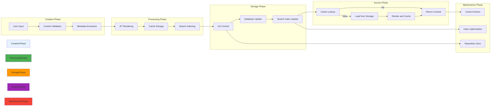
```mermaid
graph LR
    subgraph "Creation Phase"
        A[User Input] --> B[Content Validation]
        B --> C[Metadata Extraction]
    end
    
    subgraph "Processing Phase"
        C --> D[JIT Rendering]
        D --> E[Cache Storage]
        E --> F[Search Indexing]
    end
    
    subgraph "Storage Phase"
        F --> G[Git Commit]
        G --> H[Database Update]
        H --> I[Search Index Update]
    end
    
    subgraph "Access Phase"
        I --> J[Cache Lookup]
        J -->|Hit| K[Return Cached]
        J -->|Miss| L[Load from Storage]
        L --> M[Render and Cache]
        M --> K
    end
    
    subgraph "Maintenance Phase"
        K --> N[Cache Eviction]
        G --> O[Repository Sync]
        I --> P[Index Optimization]
    end
    
    style CreationPhase fill:#e6f3ff
    style ProcessingPhase fill:#4caf50
    style StoragePhase fill:#ff9800
    style AccessPhase fill:#9c27b0
    style MaintenancePhase fill:#f44336
```

**Lifecycle Stages:**

1. **Creation Phase:** User input is validated, metadata is extracted, and content is prepared for processing
2. **Processing Phase:** Content is rendered, cached, and indexed for efficient retrieval
3. **Storage Phase:** Content is committed to Git repository, database is updated, and search indexes are maintained
4. **Access Phase:** Cached content is retrieved when available, otherwise loaded from storage and cached
5. **Maintenance Phase:** Cache eviction, repository synchronization, and index optimization occur periodically

---

## DATA MODEL OVERVIEW

### 2.1. Core Data Entities

The Tachyon data architecture is built upon a foundation of core data entities that represent the fundamental abstractions within the system:

| Entity ID | Entity Name | Description | Primary Storage |
|-----------|-------------|-------------|------------------|
| **ENT-001** | Document | User-generated content with Markdown formatting | Git Repository |
| **ENT-002** | DocumentMetadata | Extracted metadata from frontmatter and file system | SQLite Database |
| **ENT-003** | DocumentContent | Complete content including raw Markdown and rendered HTML | Git Repository + Cache |
| **ENT-004** | User | User account information for authentication and authorization | SQLite Database |
| **ENT-005** | Session | User session for authentication state management | In-Memory + SQLite |
| **ENT-006** | Repository | Git repository configuration and state | SQLite Database |
| **ENT-007** | CacheEntry | Cached rendered content with metadata | In-Memory Cache |
| **ENT-008** | SearchIndex | Full-text search index data | Tantivy Index Files |

### 2.2. Entity Relationships

The relationships between core data entities define the data model topology:

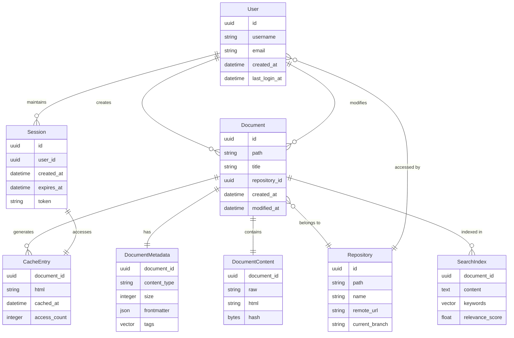
```mermaid
erDiagram
    User ||--o{ Session : "maintains"
    User ||--o{ Document : "creates"
    User ||--o{ Document : "modifies"
    Document ||--|| DocumentMetadata : "has"
    Document ||--|| DocumentContent : "contains"
    Document }o--|| Repository : "belongs to"
    Document ||--o{ CacheEntry : "generates"
    Document ||--o{ SearchIndex : "indexed in"
    Repository ||--o{ User : "accessed by"
    Session ||--|| CacheEntry : "accesses"
    
    User {
        uuid id
        string username
        string email
        datetime created_at
        datetime last_login_at
    }
    
    Session {
        uuid id
        uuid user_id
        datetime created_at
        datetime expires_at
        string token
    }
    
    Document {
        uuid id
        string path
        string title
        uuid repository_id
        datetime created_at
        datetime modified_at
    }
    
    DocumentMetadata {
        uuid document_id
        string content_type
        integer size
        json frontmatter
        vector tags
    }
    
    DocumentContent {
        uuid document_id
        string raw
        string html
        bytes hash
    }
    
    Repository {
        uuid id
        string path
        string name
        string remote_url
        string current_branch
    }
    
    CacheEntry {
        uuid document_id
        string html
        datetime cached_at
        integer access_count
    }
    
    SearchIndex {
        uuid document_id
        text content
        vector keywords
        float relevance_score
    }
```

**Relationship Descriptions:**

1. **User-Session Relationship:** One-to-many relationship where a user maintains multiple sessions across different devices and contexts
2. **User-Document Relationship:** One-to-many relationships for both creation and modification, tracking authorship and edit history
3. **Document-Metadata Relationship:** One-to-one relationship where each document has exactly one metadata record
4. **Document-Content Relationship:** One-to-one relationship where each document has exactly one content record
5. **Document-Repository Relationship:** Many-to-one relationship where documents belong to a single repository
6. **Document-CacheEntry Relationship:** One-to-many relationship where documents generate multiple cache entries over time
7. **Document-SearchIndex Relationship:** One-to-many relationship where documents are indexed across multiple search indices
8. **Repository-User Relationship:** Many-to-many relationship where repositories are accessed by multiple users with different permissions
9. **Session-CacheEntry Relationship:** One-to-many relationship where sessions access multiple cache entries

### 2.3. Data Flow Patterns

The Tachyon system implements several canonical data flow patterns for different operational scenarios:

#### 2.3.1. Document Creation Flow

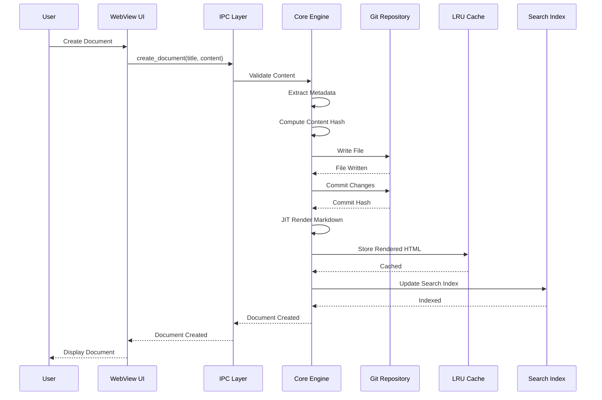
```mermaid
sequenceDiagram
    participant User as User
    participant UI as WebView UI
    participant IPC as IPC Layer
    participant Core as Core Engine
    participant Git as Git Repository
    participant Cache as LRU Cache
    participant Search as Search Index
    
    User->>UI: Create Document
    UI->>IPC: create_document(title, content)
    IPC->>Core: Validate Content
    Core->>Core: Extract Metadata
    Core->>Core: Compute Content Hash
    Core->>Git: Write File
    Git-->>Core: File Written
    Core->>Git: Commit Changes
    Git-->>Core: Commit Hash
    Core->>Core: JIT Render Markdown
    Core->>Cache: Store Rendered HTML
    Cache-->>Core: Cached
    Core->>Search: Update Search Index
    Search-->>Core: Indexed
    Core-->>IPC: Document Created
    IPC-->>UI: Document Created
    UI-->>User: Display Document
```

#### 2.3.2. Document Retrieval Flow

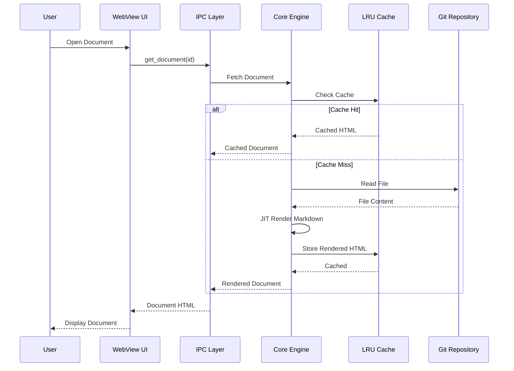
```mermaid
sequenceDiagram
    participant User as User
    participant UI as WebView UI
    participant IPC as IPC Layer
    participant Core as Core Engine
    participant Cache as LRU Cache
    participant Git as Git Repository
    
    User->>UI: Open Document
    UI->>IPC: get_document(id)
    IPC->>Core: Fetch Document
    Core->>Cache: Check Cache
    alt Cache Hit
        Cache-->>Core: Cached HTML
        Core-->>IPC: Cached Document
    else Cache Miss
        Core->>Git: Read File
        Git-->>Core: File Content
        Core->>Core: JIT Render Markdown
        Core->>Cache: Store Rendered HTML
        Cache-->>Core: Cached
        Core-->>IPC: Rendered Document
    end
    IPC-->>UI: Document HTML
    UI-->>User: Display Document
```

#### 2.3.3. Real-Time Synchronization Flow

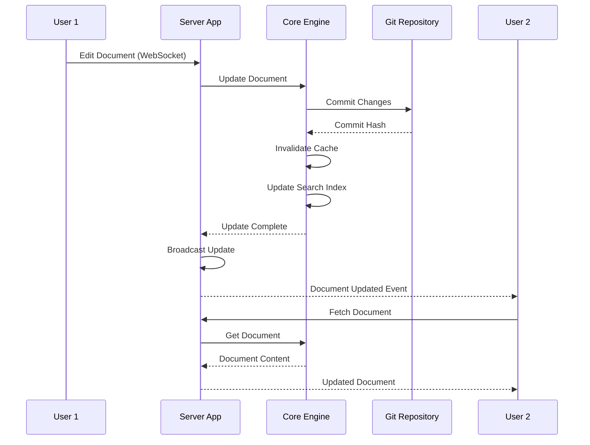
```mermaid
sequenceDiagram
    participant User1 as User 1
    participant Server as Server App
    participant Core as Core Engine
    participant Git as Git Repository
    participant User2 as User 2
    
    User1->>Server: Edit Document (WebSocket)
    Server->>Core: Update Document
    Core->>Git: Commit Changes
    Git-->>Core: Commit Hash
    Core->>Core: Invalidate Cache
    Core->>Core: Update Search Index
    Core-->>Server: Update Complete
    Server->>Server: Broadcast Update
    Server-->>User2: Document Updated Event
    User2->>Server: Fetch Document
    Server->>Core: Get Document
    Core-->>Server: Document Content
    Server-->>User2: Updated Document
```

---

## DOCUMENT DATA ARCHITECTURE

### 3.1. Document Metadata Structure

Document metadata is extracted from multiple sources and stored in a structured format for efficient querying and filtering:

**Metadata Sources:**

1. **Frontmatter:** YAML frontmatter embedded in Markdown files
2. **File System:** File attributes (size, modification time, permissions)
3. **Git History:** Commit information, author attribution, branch data
4. **Content Analysis:** Extracted links, images, code blocks, headings

**Metadata Schema:**

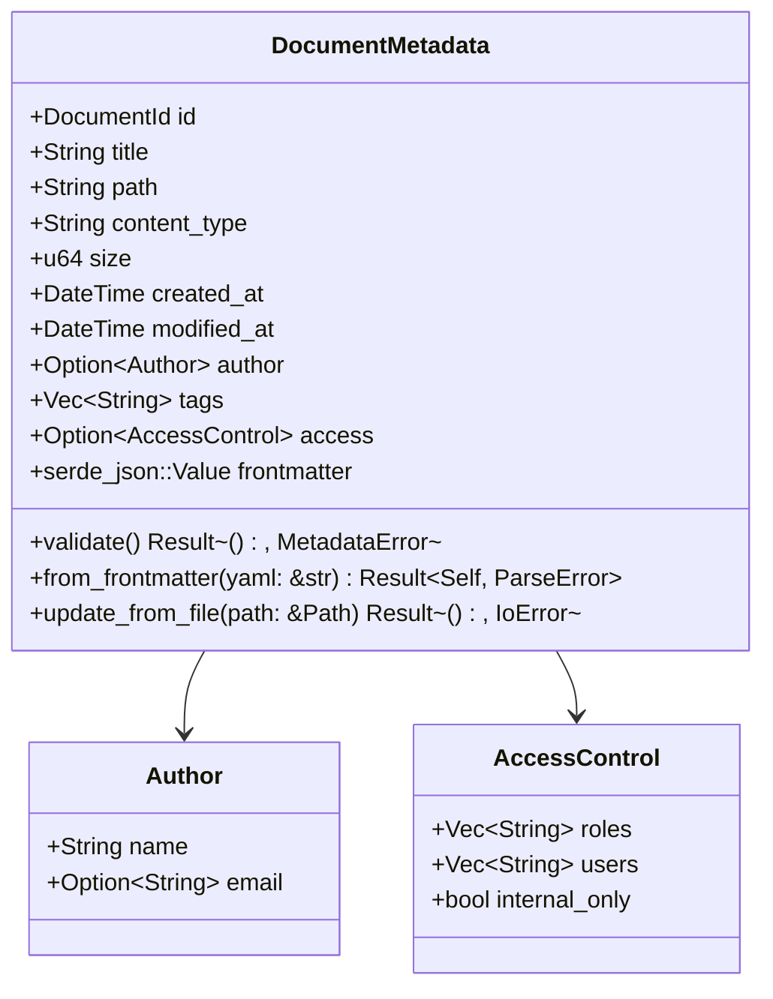
```mermaid
classDiagram
    class DocumentMetadata {
        +DocumentId id
        +String title
        +String path
        +String content_type
        +u64 size
        +DateTime created_at
        +DateTime modified_at
        +Option~Author~ author
        +Vec~String~ tags
        +Option~AccessControl~ access
        +serde_json::Value frontmatter
        +validate() Result~(), MetadataError~
        +from_frontmatter(yaml: &str) Result~Self, ParseError~
        +update_from_file(path: &Path) Result~(), IoError~
    }
    
    class Author {
        +String name
        +Option~String~ email
    }
    
    class AccessControl {
        +Vec~String~ roles
        +Vec~String~ users
        +bool internal_only
    }
    
    DocumentMetadata --> Author
    DocumentMetadata --> AccessControl
```

**Metadata Constraints:**

| Field | Type | Constraints | Validation |
|-------|------|-------------|-------------|
| `title` | String | 1-255 characters | Non-empty, trimmed |
| `path` | String | Max 1024 characters | Valid relative path |
| `content_type` | String | MIME format | Valid MIME type |
| `size` | u64 | 0-104,857,600 bytes | Non-negative |
| `tags` | Vec<String> | Max 50 tags, 64 chars each | Unique, trimmed |
| `created_at` | DateTime<Utc> | ISO 8601 format | Valid timestamp |
| `modified_at` | DateTime<Utc> | ISO 8601 format | Valid timestamp |

### 3.2. Document Content Storage

Document content is stored in a multi-layered architecture optimized for both performance and version control:

**Storage Layers:**

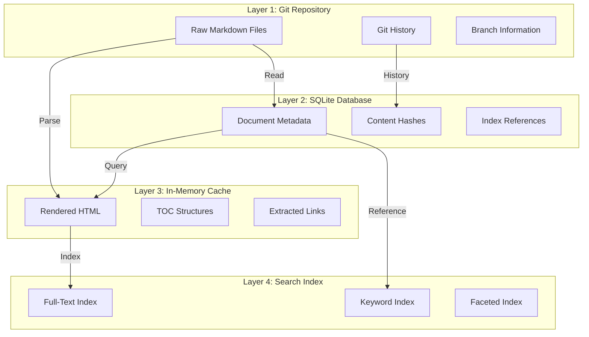
```mermaid
graph TB
    subgraph "Layer 1: Git Repository"
        A1[Raw Markdown Files]
        A2[Git History]
        A3[Branch Information]
    end
    
    subgraph "Layer 2: SQLite Database"
        B1[Document Metadata]
        B2[Content Hashes]
        B3[Index References]
    end
    
    subgraph "Layer 3: In-Memory Cache"
        C1[Rendered HTML]
        C2[TOC Structures]
        C3[Extracted Links]
    end
    
    subgraph "Layer 4: Search Index"
        D1[Full-Text Index]
        D2[Keyword Index]
        D3[Faceted Index]
    end
    
    A1 -->|Read| B1
    A2 -->|History| B2
    A1 -->|Parse| C1
    B1 -->|Query| C1
    C1 -->|Index| D1
    B1 -->|Reference| D2
```

**Storage Layer Responsibilities:**

| Layer | Storage Medium | Purpose | Access Pattern |
|-------|---------------|---------|----------------|
| **Layer 1** | Git Repository | Version control, content storage, history | Write-heavy, append-only |
| **Layer 2** | SQLite Database | Metadata indexing, fast queries | Read-heavy, random access |
| **Layer 3** | In-Memory Cache | Rendered content, derived data | Read-mostly, LRU eviction |
| **Layer 4** | Search Index | Full-text search, faceted queries | Read-only, batch updates |

### 3.3. Document Versioning

Document versioning is implemented through Git's native version control capabilities, augmented with Tachyon-specific metadata:

**Versioning Strategy:**

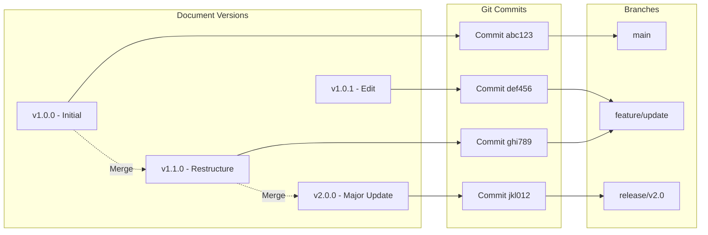
```mermaid
graph LR
    subgraph "Document Versions"
        V1[v1.0.0 - Initial]
        V2[v1.0.1 - Edit]
        V3[v1.1.0 - Restructure]
        V4[v2.0.0 - Major Update]
    end
    
    subgraph "Git Commits"
        C1[Commit abc123]
        C2[Commit def456]
        C3[Commit ghi789]
        C4[Commit jkl012]
    end
    
    subgraph "Branches"
        B1[main]
        B2[feature/update]
        B3[release/v2.0]
    end
    
    V1 --> C1
    V2 --> C2
    V3 --> C3
    V4 --> C4
    
    C1 --> B1
    C2 --> B2
    C3 --> B2
    C4 --> B3
    
    V1 -.->|Merge| V3
    V3 -.->|Merge| V4
```

**Version Metadata:**

Each document version includes the following metadata:

| Field | Description | Source |
|-------|-------------|--------|
| `version` | Semantic version identifier | Git tags or frontmatter |
| `commit_hash` | Git commit SHA | Git repository |
| `author` | Commit author | Git commit |
| `timestamp` | Commit timestamp | Git commit |
| `message` | Commit message | Git commit |
| `branch` | Source branch | Git repository |
| `parent_hashes` | Parent commit hashes | Git commit |
| `content_hash` | SHA-256 of content | Content hash computation |

### 3.4. Document Indexing

Document indexing enables fast search and retrieval across large document collections:

**Indexing Pipeline:**

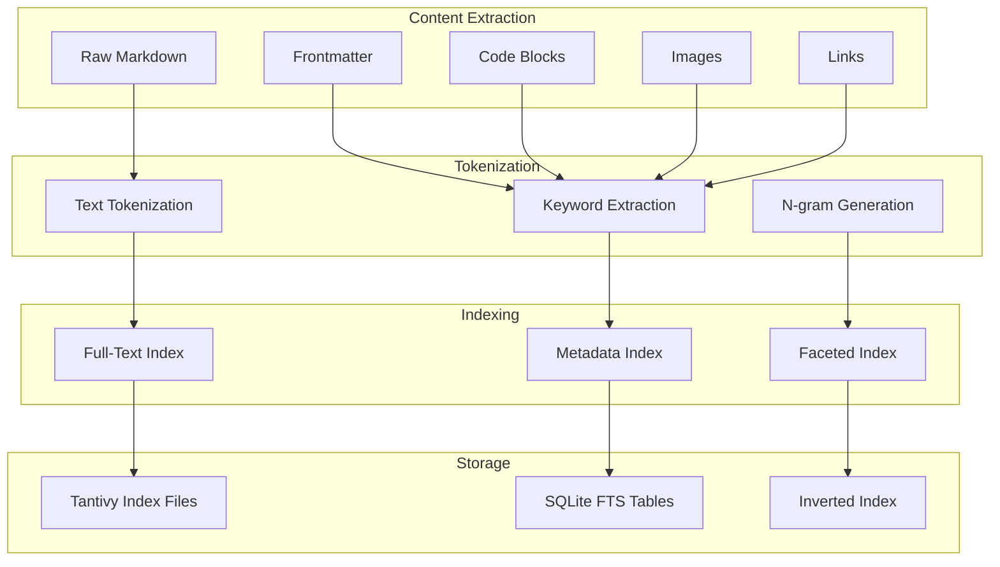
```mermaid
graph TB
    subgraph "Content Extraction"
        E1[Raw Markdown]
        E2[Frontmatter]
        E3[Code Blocks]
        E4[Images]
        E5[Links]
    end
    
    subgraph "Tokenization"
        T1[Text Tokenization]
        T2[Keyword Extraction]
        T3[N-gram Generation]
    end
    
    subgraph "Indexing"
        I1[Full-Text Index]
        I2[Metadata Index]
        I3[Faceted Index]
    end
    
    subgraph "Storage"
        S1[Tantivy Index Files]
        S2[SQLite FTS Tables]
        S3[Inverted Index]
    end
    
    E1 --> T1
    E2 --> T2
    E3 --> T2
    E4 --> T2
    E5 --> T2
    
    T1 --> I1
    T2 --> I2
    T3 --> I3
    
    I1 --> S1
    I2 --> S2
    I3 --> S3
```

**Index Types:**

| Index Type | Purpose | Storage | Update Strategy |
|-----------|---------|---------|-----------------|
| **Full-Text Index** | Content search | Tantivy index files | Incremental updates |
| **Metadata Index** | Metadata queries | SQLite FTS tables | Batch updates |
| **Faceted Index** | Tag/author filtering | Inverted index | Real-time updates |
| **Link Index** | Link validation | SQLite tables | On content change |
| **Image Index** | Asset management | SQLite tables | On content change |

---

## REPOSITORY DATA ARCHITECTURE

### 4.1. Repository Metadata

Repository metadata tracks configuration and state for each Git repository managed by Tachyon:

**Repository Schema:**

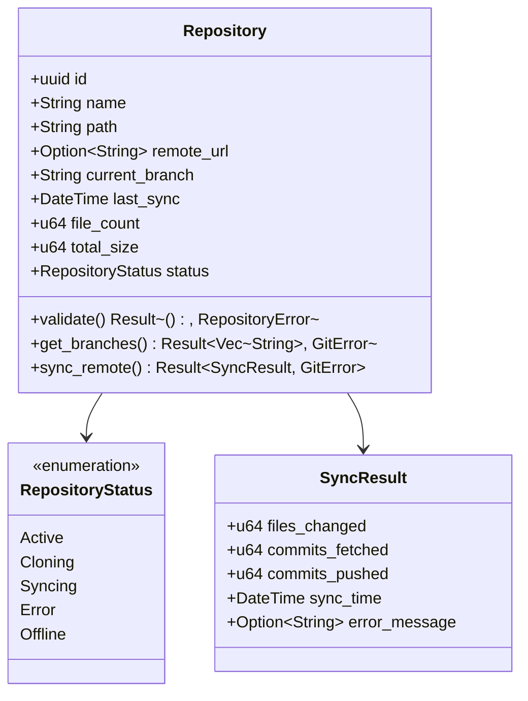
```mermaid
classDiagram
    class Repository {
        +uuid id
        +String name
        +String path
        +Option~String~ remote_url
        +String current_branch
        +DateTime last_sync
        +u64 file_count
        +u64 total_size
        +RepositoryStatus status
        +validate() Result~(), RepositoryError~
        +get_branches() Result~Vec~String~, GitError~
        +sync_remote() Result~SyncResult, GitError~
    }
    
    class RepositoryStatus {
        <<enumeration>>
        Active
        Cloning
        Syncing
        Error
        Offline
    }
    
    class SyncResult {
        +u64 files_changed
        +u64 commits_fetched
        +u64 commits_pushed
        +DateTime sync_time
        +Option~String~ error_message
    }
    
    Repository --> RepositoryStatus
    Repository --> SyncResult
```

**Repository Constraints:**

| Field | Type | Constraints | Validation |
|-------|------|-------------|-------------|
| `name` | String | 1-255 characters | Non-empty, alphanumeric |
| `path` | String | Max 4096 characters | Valid absolute path |
| `remote_url` | Option<String> | Valid URL format | HTTPS, SSH, or git protocol |
| `current_branch` | String | Max 255 characters | Valid Git branch name |
| `file_count` | u64 | 0-1,000,000 | Non-negative |
| `total_size` | u64 | 0-1TB bytes | Non-negative |

### 4.2. Git Integration

Git integration provides version control, collaboration, and history tracking capabilities:

**Integration Architecture:**

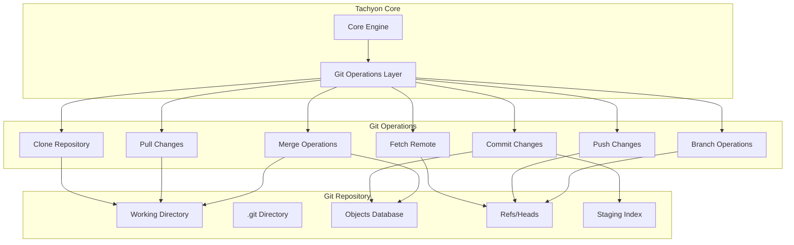
```mermaid
graph TB
    subgraph "Tachyon Core"
        Core[Core Engine]
        GitOps[Git Operations Layer]
    end
    
    subgraph "Git Repository"
        WorkingDir[Working Directory]
        GitDir[.git Directory]
        Objects[Objects Database]
        Refs[Refs/Heads]
        Index[Staging Index]
    end
    
    subgraph "Git Operations"
        Clone[Clone Repository]
        Fetch[Fetch Remote]
        Pull[Pull Changes]
        Commit[Commit Changes]
        Push[Push Changes]
        Branch[Branch Operations]
        Merge[Merge Operations]
    end
    
    Core --> GitOps
    GitOps --> Clone
    GitOps --> Fetch
    GitOps --> Pull
    GitOps --> Commit
    GitOps --> Push
    GitOps --> Branch
    GitOps --> Merge
    
    Clone --> WorkingDir
    Fetch --> Refs
    Pull --> WorkingDir
    Commit --> Index
    Commit --> Objects
    Push --> Refs
    Branch --> Refs
    Merge --> WorkingDir
    Merge --> Objects
```

**Git Operation Flow:**

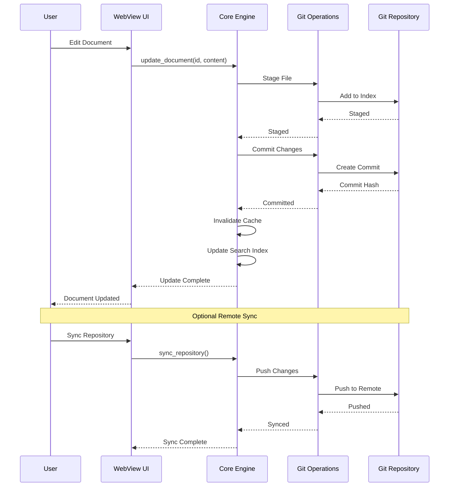
```mermaid
sequenceDiagram
    participant User as User
    participant UI as WebView UI
    participant Core as Core Engine
    participant Git as Git Operations
    participant Repo as Git Repository
    
    User->>UI: Edit Document
    UI->>Core: update_document(id, content)
    Core->>Git: Stage File
    Git->>Repo: Add to Index
    Repo-->>Git: Staged
    Git-->>Core: Staged
    Core->>Git: Commit Changes
    Git->>Repo: Create Commit
    Repo-->>Git: Commit Hash
    Git-->>Core: Committed
    Core->>Core: Invalidate Cache
    Core->>Core: Update Search Index
    Core-->>UI: Update Complete
    UI-->>User: Document Updated
    
    Note over User,Repo: Optional Remote Sync
    User->>UI: Sync Repository
    UI->>Core: sync_repository()
    Core->>Git: Push Changes
    Git->>Repo: Push to Remote
    Repo-->>Git: Pushed
    Git-->>Core: Synced
    Core-->>UI: Sync Complete
```

### 4.3. Repository Synchronization

Repository synchronization enables collaboration and backup across multiple instances:

**Synchronization Strategies:**

| Strategy | Description | Use Case | Frequency |
|----------|-------------|----------|-----------|
| **Auto-Sync** | Automatic sync on content changes | Desktop mode | Debounced (2s default) |
| **Manual Sync** | User-initiated sync | All modes | On demand |
| **Periodic Sync** | Scheduled sync intervals | Server mode | Configurable (5min default) |
| **Event-Driven Sync** | Sync on Git hooks | Server mode | Real-time |

**Sync Conflict Resolution:**

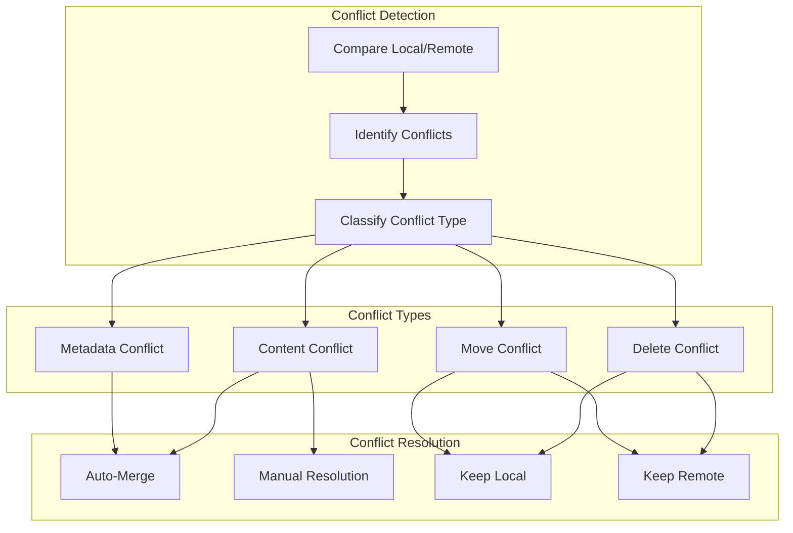
```mermaid
graph TB
    subgraph "Conflict Detection"
        C1[Compare Local/Remote]
        C2[Identify Conflicts]
        C3[Classify Conflict Type]
    end
    
    subgraph "Conflict Resolution"
        R1[Auto-Merge]
        R2[Manual Resolution]
        R3[Keep Local]
        R4[Keep Remote]
    end
    
    subgraph "Conflict Types"
        T1[Content Conflict]
        T2[Delete Conflict]
        T3[Move Conflict]
        T4[Metadata Conflict]
    end
    
    C1 --> C2
    C2 --> C3
    C3 --> T1
    C3 --> T2
    C3 --> T3
    C3 --> T4
    
    T1 --> R1
    T1 --> R2
    T2 --> R3
    T2 --> R4
    T3 --> R3
    T3 --> R4
    T4 --> R1
```

### 4.4. Branch Management

Branch management enables parallel development workflows and feature isolation:

**Branch Operations:**

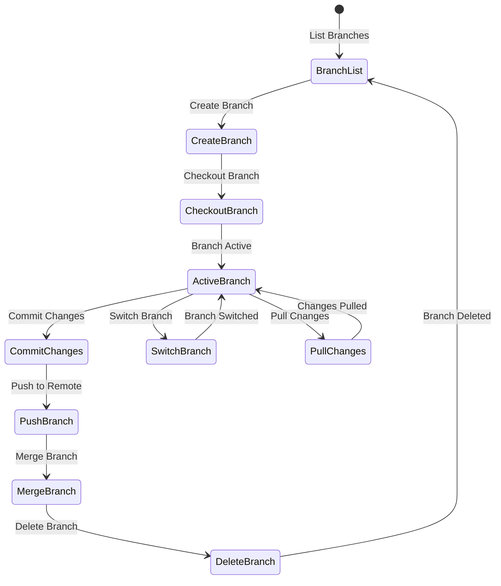
```mermaid
stateDiagram-v2
    [*] --> BranchList: List Branches
    BranchList --> CreateBranch: Create Branch
    CreateBranch --> CheckoutBranch: Checkout Branch
    CheckoutBranch --> ActiveBranch: Branch Active
    ActiveBranch --> CommitChanges: Commit Changes
    CommitChanges --> PushBranch: Push to Remote
    PushBranch --> MergeBranch: Merge Branch
    MergeBranch --> DeleteBranch: Delete Branch
    DeleteBranch --> BranchList: Branch Deleted
    ActiveBranch --> SwitchBranch: Switch Branch
    SwitchBranch --> ActiveBranch: Branch Switched
    ActiveBranch --> PullChanges: Pull Changes
    PullChanges --> ActiveBranch: Changes Pulled
```

**Branch Metadata:**

| Field | Description | Source |
|-------|-------------|--------|
| `name` | Branch name | Git repository |
| `commit_hash` | Latest commit | Git repository |
| `author` | Last commit author | Git commit |
| `timestamp` | Last commit time | Git commit |
| `is_remote` | Remote tracking flag | Git config |
| `remote_name` | Remote branch name | Git config |
| `ahead_count` | Commits ahead of remote | Git status |
| `behind_count` | Commits behind remote | Git status |

---

## CACHE DATA ARCHITECTURE

### 5.1. Cache Hierarchy

The Tachyon system implements a multi-level cache hierarchy to optimize performance across different access patterns:

**Cache Levels:**

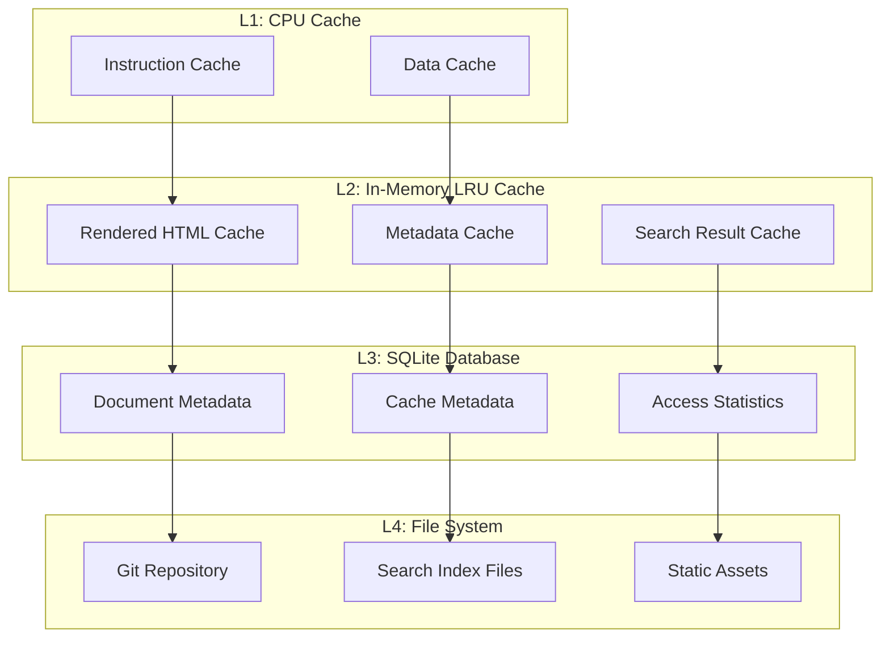
```mermaid
graph TB
    subgraph "L1: CPU Cache"
        L1A[Instruction Cache]
        L1B[Data Cache]
    end
    
    subgraph "L2: In-Memory LRU Cache"
        L2A[Rendered HTML Cache]
        L2B[Metadata Cache]
        L2C[Search Result Cache]
    end
    
    subgraph "L3: SQLite Database"
        L3A[Document Metadata]
        L3B[Cache Metadata]
        L3C[Access Statistics]
    end
    
    subgraph "L4: File System"
        L4A[Git Repository]
        L4B[Search Index Files]
        L4C[Static Assets]
    end
    
    L1A --> L2A
    L1B --> L2B
    L2A --> L3A
    L2B --> L3B
    L2C --> L3C
    L3A --> L4A
    L3B --> L4B
    L3C --> L4C
```

**Cache Level Characteristics:**

| Level | Storage Medium | Capacity | Latency | Eviction Policy |
|-------|---------------|----------|----------|-----------------|
| **L1** | CPU Cache | KB-MB | <1ns | Hardware-managed |
| **L2** | In-Memory | Configurable (100MB-1GB) | <100ns | LRU |
| **L3** | SQLite Database | GB-TB | <1ms | Manual/TTL |
| **L4** | File System | TB-PB | <10ms | Manual |

### 5.2. Cache Invalidation

Cache invalidation ensures data consistency across all cache levels:

**Invalidation Triggers:**

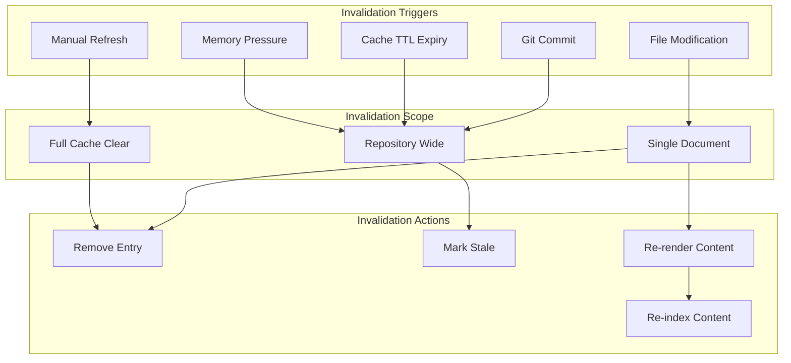
```mermaid
graph TB
    subgraph "Invalidation Triggers"
        T1[File Modification]
        T2[Git Commit]
        T3[Manual Refresh]
        T4[Cache TTL Expiry]
        T5[Memory Pressure]
    end
    
    subgraph "Invalidation Scope"
        S1[Single Document]
        S2[Repository Wide]
        S3[Full Cache Clear]
    end
    
    subgraph "Invalidation Actions"
        A1[Remove Entry]
        A2[Mark Stale]
        A3[Re-render Content]
        A4[Re-index Content]
    end
    
    T1 --> S1
    T2 --> S2
    T3 --> S3
    T4 --> S2
    T5 --> S2
    
    S1 --> A1
    S1 --> A3
    S2 --> A2
    S3 --> A1
    A3 --> A4
```

**Invalidation Strategies:**

| Strategy | Description | Use Case | Performance Impact |
|----------|-------------|----------|-------------------|
| **Write-Through** | Invalidate on write | High consistency requirements | High latency |
| **Write-Back** | Invalidate on commit | Optimized for writes | Low latency |
| **TTL-Based** | Time-based expiry | Cached static content | Medium latency |
| **Manual** | User-triggered refresh | Explicit refresh needs | Variable latency |

### 5.3. Cache Eviction Policies

Cache eviction policies determine which entries are removed when cache capacity is reached:

**Eviction Policies:**

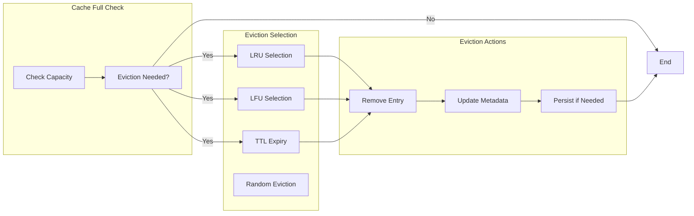
```mermaid
graph LR
    subgraph "Cache Full Check"
        C1[Check Capacity]
        C2[Eviction Needed?]
    end
    
    subgraph "Eviction Selection"
        E1[LRU Selection]
        E2[LFU Selection]
        E3[TTL Expiry]
        E4[Random Eviction]
    end
    
    subgraph "Eviction Actions"
        A1[Remove Entry]
        A2[Update Metadata]
        A3[Persist if Needed]
    end
    
    C1 --> C2
    C2 -->|Yes| E1
    C2 -->|Yes| E2
    C2 -->|Yes| E3
    C2 -->|No| End
    E1 --> A1
    E2 --> A1
    E3 --> A1
    A1 --> A2
    A2 --> A3
    A3 --> End
```

**Eviction Policy Comparison:**

| Policy | Description | Hit Rate | Complexity | Use Case |
|--------|-------------|----------|------------|----------|
| **LRU** | Least Recently Used | High | Low | General purpose |
| **LFU** | Least Frequently Used | Medium | Medium | Temporal locality |
| **TTL** | Time-To-Live | Medium | Low | Time-sensitive data |
| **Random** | Random selection | Low | Very low | Simple scenarios |
| **ARC** | Adaptive Replacement | Very High | High | Complex workloads |

### 5.4. Cache Persistence

Cache persistence enables fast startup and recovery from crashes:

**Persistence Strategy:**

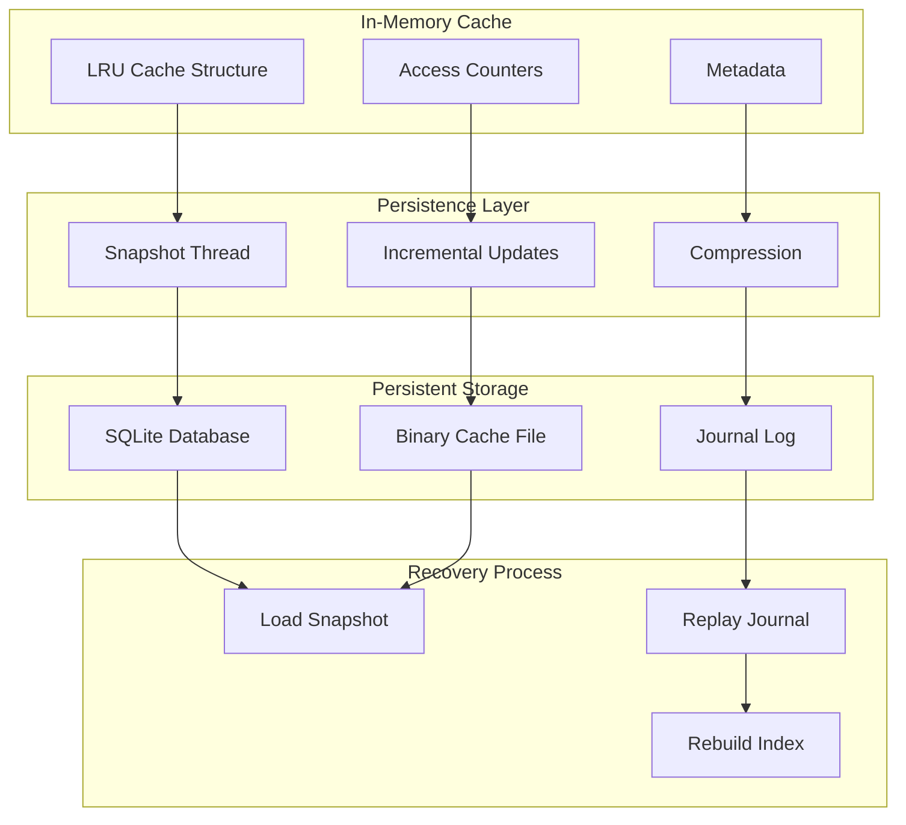
```mermaid
graph TB
    subgraph "In-Memory Cache"
        M1[LRU Cache Structure]
        M2[Access Counters]
        M3[Metadata]
    end
    
    subgraph "Persistence Layer"
        P1[Snapshot Thread]
        P2[Incremental Updates]
        P3[Compression]
    end
    
    subgraph "Persistent Storage"
        S1[SQLite Database]
        S2[Binary Cache File]
        S3[Journal Log]
    end
    
    subgraph "Recovery Process"
        R1[Load Snapshot]
        R2[Replay Journal]
        R3[Rebuild Index]
    end
    
    M1 --> P1
    M2 --> P2
    M3 --> P3
    
    P1 --> S1
    P2 --> S2
    P3 --> S3
    
    S1 --> R1
    S2 --> R1
    S3 --> R2
    R2 --> R3
```

**Persistence Configuration:**

| Parameter | Default | Range | Description |
|-----------|---------|-------|-------------|
| `snapshot_interval` | 60 seconds | 10-3600 seconds | Snapshot frequency |
| `journal_size_limit` | 100MB | 10MB-1GB | Maximum journal size |
| `compression_enabled` | true | boolean | Enable compression |
| `persistence_enabled` | true | boolean | Enable persistence |

---

## SESSION DATA ARCHITECTURE

### 6.1. Session Management

Session management provides authentication state and user context across requests:

**Session Lifecycle:**

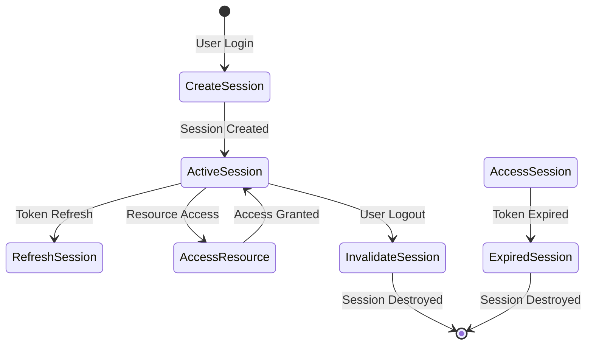
```mermaid
stateDiagram-v2
    [*] --> CreateSession: User Login
    CreateSession --> ActiveSession: Session Created
    ActiveSession --> RefreshSession: Token Refresh
    ActiveSession --> AccessResource: Resource Access
    AccessResource --> ActiveSession: Access Granted
    AccessSession --> ExpiredSession: Token Expired
    ActiveSession --> InvalidateSession: User Logout
    InvalidateSession --> [*]: Session Destroyed
    ExpiredSession --> [*]: Session Destroyed
```

**Session Schema:**

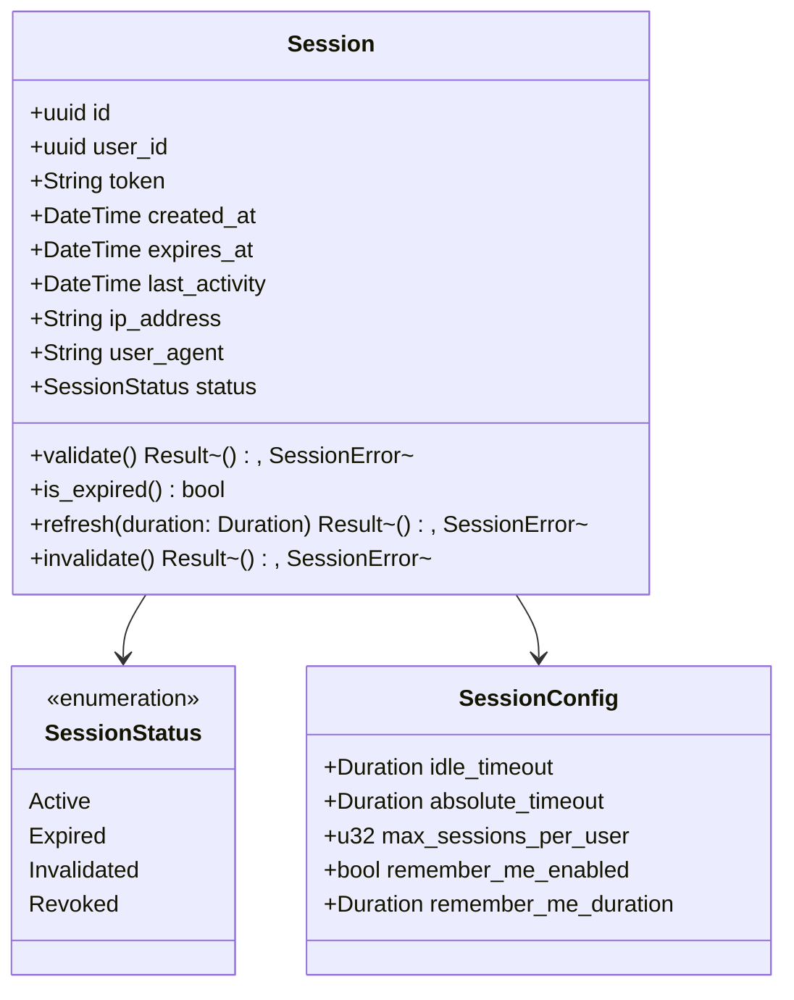
```mermaid
classDiagram
    class Session {
        +uuid id
        +uuid user_id
        +String token
        +DateTime created_at
        +DateTime expires_at
        +DateTime last_activity
        +String ip_address
        +String user_agent
        +SessionStatus status
        +validate() Result~(), SessionError~
        +is_expired() bool
        +refresh(duration: Duration) Result~(), SessionError~
        +invalidate() Result~(), SessionError~
    }
    
    class SessionStatus {
        <<enumeration>>
        Active
        Expired
        Invalidated
        Revoked
    }
    
    class SessionConfig {
        +Duration idle_timeout
        +Duration absolute_timeout
        +u32 max_sessions_per_user
        +bool remember_me_enabled
        +Duration remember_me_duration
    }
    
    Session --> SessionStatus
    Session --> SessionConfig
```

### 6.2. User Authentication State

User authentication state maintains identity and authorization information:

**Authentication State Components:**

```mermaid
graph TB
    subgraph "Authentication State"
        A1[User Identity]
        A2[Authentication Factors]
        A3[Authorization Context]
        A4[Security Metadata]
    end
    
    subgraph "User Identity"
        I1[User ID]
        I2[Username]
        I3[Email]
        I4[Display Name]
    end
    
    subgraph "Authentication Factors"
        F1[Password Hash]
        F2[MFA Secret]
        F3[OAuth Tokens]
        F4[SAML Assertion]
    end
    
    subgraph "Authorization Context"
        Z1[Roles]
        Z2[Permissions]
        Z3[Scopes]
        Z4[Resource Access]
    end
    
    subgraph "Security Metadata"
        S1[Login Timestamp]
        S2[IP Address]
        S3[Device Fingerprint]
        S4[Security Events]
    end
    
    A1 --> I1
    A1 --> I2
    A1 --> I3
    A1 --> I4
    
    A2 --> F1
    A2 --> F2
    A2 --> F3
    A2 --> F4
    
    A3 --> Z1
    A3 --> Z2
    A3 --> Z3
    A3 --> Z4
    
    A4 --> S1
    A4 --> S2
    A4 --> S3
    A4 --> S4
```

### 6.3. Application State

Application state maintains runtime configuration and user preferences:

**State Categories:**

| Category | Description | Storage | Persistence |
|----------|-------------|---------|-------------|
| **User Preferences** | UI settings, themes, language | SQLite | Persistent |
| **Editor State** | Draft content, cursor position | In-Memory + SQLite | Persistent |
| **View State** | Navigation history, open tabs | In-Memory | Session |
| **Search State** | Search history, filters | In-Memory + SQLite | Persistent |
| **Collaboration State** | Active sessions, cursors | In-Memory | Session |

### 6.4. Session Persistence

Session persistence enables recovery and continuity across application restarts:

**Persistence Strategy:**

```mermaid
graph TB
    subgraph "In-Memory Session Store"
        M1[Active Sessions]
        M2[Session Metadata]
        M3[Access Counters]
    end
    
    subgraph "Persistence Layer"
        P1[Session Serialization]
        P2[Encryption]
        P3[Compression]
    end
    
    subgraph "Persistent Storage"
        S1[SQLite Sessions Table]
        S2[Encrypted Session File]
    end
    
    subgraph "Recovery Process"
        R1[Load Sessions]
        R2[Decrypt Sessions]
        R3[Validate Sessions]
        R4[Restore Active Sessions]
    end
    
    M1 --> P1
    M2 --> P2
    M3 --> P3
    
    P1 --> S1
    P2 --> S2
    
    S1 --> R1
    S2 --> R2
    R2 --> R3
    R3 --> R4
```

**Session Persistence Configuration:**

| Parameter | Default | Range | Description |
|-----------|---------|-------|-------------|
| `persist_sessions` | true | boolean | Enable session persistence |
| `session_encryption` | true | boolean | Encrypt session data |
| `max_persisted_sessions` | 100 | 10-1000 | Maximum persisted sessions |
| `session_cleanup_interval` | 1 hour | 5min-24 hours | Cleanup frequency |

---

## DATA STORAGE STRATEGY

### 7.1. Local Storage (Desktop)

Local storage provides offline capability and data sovereignty in desktop mode:

**Local Storage Architecture:**

```mermaid
graph TB
    subgraph "Application Data Directory"
        D1[Documents/]
        D2[Repositories/]
        D3[Cache/]
        D4[Database/]
        D5[Config/]
    end
    
    subgraph "Documents"
        Doc1[Markdown Files]
        Doc2[Assets/]
        Doc3[Frontmatter]
    end
    
    subgraph "Repositories"
        Repo1[Git Repository 1]
        Repo2[Git Repository 2]
        RepoN[Git Repository N]
    end
    
    subgraph "Cache"
        Cache1[Rendered HTML]
        Cache2[Search Index]
        Cache3[Thumbnails]
    end
    
    subgraph "Database"
        DB1[tachyon.db]
        DB2[tachyon-wal.db]
    end
    
    subgraph "Config"
        CFG1[settings.toml]
        CFG2[keybindings.json]
        CFG3[themes/]
    end
    
    D1 --> Doc1
    D1 --> Doc2
    D1 --> Doc3
    
    D2 --> Repo1
    D2 --> Repo2
    D2 --> RepoN
    
    D3 --> Cache1
    D3 --> Cache2
    D3 --> Cache3
    
    D4 --> DB1
    D4 --> DB2
    
    D5 --> CFG1
    D5 --> CFG2
    D5 --> CFG3
```

**Local Storage Paths:**

| Platform | Base Path | Documents | Repositories | Cache | Database | Config |
|----------|-----------|-----------|--------------|-------|----------|--------|
| **Windows** | `%APPDATA%\Tachyon\` | `%APPDATA%\Tachyon\Documents\` | `%APPDATA%\Tachyon\Repositories\` | `%LOCALAPPDATA%\Tachyon\Cache\` | `%APPDATA%\Tachyon\Database\` | `%APPDATA%\Tachyon\Config\` |
| **macOS** | `~/Library/Application Support/Tachyon/` | `~/Documents/Tachyon/` | `~/Library/Application Support/Tachyon/Repositories/` | `~/Library/Caches/Tachyon/` | `~/Library/Application Support/Tachyon/Database/` | `~/Library/Application Support/Tachyon/Config/` |
| **Linux** | `~/.local/share/tachyon/` | `~/Documents/Tachyon/` | `~/.local/share/tachyon/repositories/` | `~/.cache/tachyon/` | `~/.local/share/tachyon/database/` | `~/.config/tachyon/` |

### 7.2. Remote Storage (Server)

Remote storage enables collaboration and centralized access in server mode:

**Server Storage Architecture:**

```mermaid
graph TB
    subgraph "Server Storage"
        S1[Shared Repositories]
        S2[Central Database]
        S3[Shared Cache]
        S4[Search Index Cluster]
    end
    
    subgraph "Shared Repositories"
        R1[Repository 1]
        R2[Repository 2]
        RN[Repository N]
    end
    
    subgraph "Central Database"
        DB1[PostgreSQL Primary]
        DB2[PostgreSQL Replica]
        DB3[Connection Pool]
    end
    
    subgraph "Shared Cache"
        C1[Redis Cluster]
        C2[Cache Nodes]
        C3[Cache Replication]
    end
    
    subgraph "Search Index Cluster"
        I1[Tantivy Index 1]
        I2[Tantivy Index 2]
        IN[Tantivy Index N]
    end
    
    S1 --> R1
    S1 --> R2
    S1 --> RN
    
    S2 --> DB1
    S2 --> DB2
    S2 --> DB3
    
    S3 --> C1
    S3 --> C2
    S3 --> C3
    
    S4 --> I1
    S4 --> I2
    S4 --> IN
```

**Server Storage Configuration:**

| Component | Technology | Replication | Backup Strategy |
|-----------|------------|-------------|-----------------|
| **Repositories** | File System | Git-based | Git remotes, snapshots |
| **Database** | PostgreSQL | Streaming replication | WAL archiving, point-in-time recovery |
| **Cache** | Redis | Cluster replication | AOF persistence, RDB snapshots |
| **Search Index** | Tantivy | Shard replication | File-level snapshots |

### 7.3. Synchronization Mechanisms

Synchronization mechanisms ensure data consistency between local and remote storage:

**Synchronization Modes:**

```mermaid
graph TB
    subgraph "Sync Modes"
        M1[Two-Way Sync]
        M2[One-Way Push]
        M3[One-Way Pull]
        M4[Selective Sync]
    end
    
    subgraph "Sync Triggers"
        T1[Manual Trigger]
        T2[Automatic Trigger]
        T3[Scheduled Trigger]
        T4[Event Trigger]
    end
    
    subgraph "Sync Strategies"
        S1[Full Sync]
        S2[Incremental Sync]
        S3[Delta Sync]
    end
    
    subgraph "Conflict Resolution"
        R1[Auto-Merge]
        R2[Manual Resolution]
        R3[Timestamp Wins]
        R4[Server Wins]
    end
    
    M1 --> S1
    M1 --> S2
    M2 --> S3
    M3 --> S3
    M4 --> S2
    
    T1 --> M1
    T2 --> M2
    T3 --> M1
    T4 --> M4
    
    S1 --> R1
    S2 --> R1
    S3 --> R2
```

**Synchronization Configuration:**

| Parameter | Default | Range | Description |
|-----------|---------|-------|-------------|
| `sync_mode` | two-way | two-way, push, pull, selective | Synchronization mode |
| `auto_sync_enabled` | true | boolean | Enable automatic sync |
| `sync_interval` | 5 minutes | 1min-24 hours | Sync interval |
| `conflict_resolution` | auto-merge | auto-merge, manual, timestamp, server | Conflict strategy |
| `bandwidth_limit` | unlimited | 100KB/s-1GB/s | Bandwidth throttle |

### 7.4. Backup and Recovery

Backup and recovery procedures ensure data protection and disaster recovery:

**Backup Strategy:**

```mermaid
graph TB
    subgraph "Backup Sources"
        S1[Git Repositories]
        S2[SQLite Database]
        S3[Configuration Files]
        S4[User Preferences]
    end
    
    subgraph "Backup Types"
        T1[Full Backup]
        T2[Incremental Backup]
        T3[Differential Backup]
    end
    
    subgraph "Backup Destinations"
        D1[Local Backup Directory]
        D2[External Drive]
        D3[Cloud Storage]
        D4[Network Share]
    end
    
    subgraph "Backup Schedule"
        SC1[Hourly]
        SC2[Daily]
        SC3[Weekly]
        SC4[Monthly]
    end
    
    subgraph "Recovery Process"
        R1[Select Backup]
        R2[Verify Backup]
        R3[Restore Data]
        R4[Validate Integrity]
    end
    
    S1 --> T1
    S1 --> T2
    S2 --> T2
    S2 --> T3
    S3 --> T3
    S4 --> T3
    
    T1 --> D1
    T1 --> D2
    T2 --> D3
    T3 --> D4
    
    D1 --> SC1
    D2 --> SC2
    D3 --> SC3
    D4 --> SC4
    
    SC1 --> R1
    SC2 --> R1
    SC3 --> R1
    SC4 --> R1
    R1 --> R2
    R2 --> R3
    R3 --> R4
```

**Backup Configuration:**

| Parameter | Default | Range | Description |
|-----------|---------|-------|-------------|
| `backup_enabled` | true | boolean | Enable backups |
| `backup_interval` | daily | hourly, daily, weekly, monthly | Backup frequency |
| `backup_retention` | 30 days | 1-365 days | Backup retention |
| `compression_enabled` | true | boolean | Compress backups |
| `encryption_enabled` | true | boolean | Encrypt backups |

---

## DATA SECURITY

### 8.1. Data Encryption at Rest

Data encryption at rest protects sensitive data stored on disk:

**Encryption Architecture:**

```mermaid
graph TB
    subgraph "Encryption Layers"
        L1[File System Encryption]
        L2[Database Encryption]
        L3[Cache Encryption]
        L4[Backup Encryption]
    end
    
    subgraph "Encryption Algorithms"
        A1[AES-256-GCM]
        A2[ChaCha20-Poly1305]
        A3[XChaCha20-Poly1305]
    end
    
    subgraph "Key Management"
        K1[Key Derivation]
        K2[Key Storage]
        K3[Key Rotation]
    end
    
    subgraph "Protected Data"
        D1[User Credentials]
        D2[Session Tokens]
        D3[Private Documents]
        D4[Configuration Secrets]
    end
    
    L1 --> A1
    L2 --> A2
    L3 --> A3
    L4 --> A1
    
    A1 --> K1
    A2 --> K1
    A3 --> K1
    
    K1 --> K2
    K2 --> K3
    
    D1 --> L2
    D2 --> L3
    D3 --> L1
    D4 --> L4
```

**Encryption Configuration:**

| Data Type | Algorithm | Key Size | Key Derivation |
|-----------|------------|----------|----------------|
| **Database** | AES-256-GCM | 256-bit | PBKDF2-SHA256 |
| **Cache** | XChaCha20-Poly1305 | 256-bit | Argon2id |
| **Backups** | AES-256-GCM | 256-bit | PBKDF2-SHA256 |
| **Configuration** | ChaCha20-Poly1305 | 256-bit | Argon2id |

### 8.2. Data Encryption in Transit

Data encryption in transit protects data during network communication:

**Transit Encryption Architecture:**

```mermaid
graph TB
    subgraph "Network Protocols"
        N1[HTTP/2 + TLS 1.3]
        N2[WebSocket + TLS 1.3]
        N3[Git over SSH]
        N4[Git over HTTPS]
    end
    
    subgraph "TLS Configuration"
        T1[TLS 1.3]
        T2[Forward Secrecy]
        T3[HSTS]
        T4[Certificate Pinning]
    end
    
    subgraph "Cipher Suites"
        C1[AES-256-GCM]
        C2[ChaCha20-Poly1305]
        C3[TLS_AES_128_GCM_SHA256]
    end
    
    subgraph "Protected Channels"
        P1[Desktop to Server]
        P2[Server to Database]
        P3[Server to Cache]
        P4[Server to Git Remote]
    end
    
    N1 --> T1
    N2 --> T1
    N3 --> T1
    N4 --> T1
    
    T1 --> C1
    T1 --> C2
    T1 --> C3
    
    C1 --> P1
    C2 --> P2
    C3 --> P3
    C4 --> P4
```

**TLS Configuration:**

| Parameter | Value | Description |
|-----------|-------|-------------|
| `tls_version` | 1.3 | Minimum TLS version |
| `cipher_suites` | AES-256-GCM, ChaCha20-Poly1305 | Allowed cipher suites |
| `forward_secrecy` | true | Enable forward secrecy |
| `hsts_enabled` | true | Enable HSTS |
| `certificate_pinning` | true | Enable certificate pinning |

### 8.3. Data Access Controls

Data access controls enforce authorization and prevent unauthorized access:

**Access Control Architecture:**

```mermaid
graph TB
    subgraph "Access Control Layers"
        L1[Authentication]
        L2[Authorization]
        L3[Resource Access]
        L4[Audit Logging]
    end
    
    subgraph "Authentication Methods"
        A1[OAuth 2.0]
        A2[SAML]
        A3[OpenID Connect]
        A4[API Keys]
    end
    
    subgraph "Authorization Models"
        Z1[RBAC]
        Z2[ABAC]
        Z3[ACL]
    end
    
    subgraph "Resource Access"
        R1[Document Access]
        R2[Repository Access]
        R3[API Access]
        R4[Admin Access]
    end
    
    subgraph "Audit Events"
        E1[Access Granted]
        E2[Access Denied]
        E3[Privilege Escalation]
        E4[Policy Violation]
    end
    
    L1 --> A1
    L1 --> A2
    L1 --> A3
    L1 --> A4
    
    L2 --> Z1
    L2 --> Z2
    L2 --> Z3
    
    Z1 --> R1
    Z2 --> R2
    Z3 --> R3
    Z1 --> R4
    
    R1 --> E1
    R2 --> E2
    R3 --> E3
    R4 --> E4
```

**Access Control Configuration:**

| Parameter | Default | Description |
|-----------|---------|-------------|
| `auth_enabled` | true | Enable authentication |
| `auth_methods` | OAuth, SAML, OpenID Connect | Allowed auth methods |
| `rbac_enabled` | true | Enable RBAC |
| `default_role` | viewer | Default user role |
| `audit_access` | true | Log access events |

### 8.4. Data Retention Policies

Data retention policies define how long different types of data are retained:

**Retention Categories:**

| Data Type | Retention Period | Rationale | Legal Basis |
|-----------|-----------------|-----------|--------------|
| **User Activity Logs** | 90 days | Security monitoring | Security requirement |
| **Access Logs** | 365 days | Audit trail | Compliance requirement |
| **Error Logs** | 30 days | Debugging | Operational need |
| **Performance Metrics** | 7 days | Performance monitoring | Operational need |
| **User Preferences** | Until deletion | User experience | User consent |
| **Document Versions** | Forever | Version control | User data |
| **Deleted Documents** | 30 days | Recovery window | User data |
| **Search History** | 90 days | UX improvement | User consent |

**Retention Enforcement:**

```mermaid
graph TB
    subgraph "Retention Monitoring"
        M1[Data Age Tracking]
        M2[Retention Policy Check]
        M3[Expiration Detection]
    end
    
    subgraph "Retention Actions"
        A1[Archive Data]
        A2[Delete Data]
        A3[Anonymize Data]
        A4[Notify User]
    end
    
    subgraph "Compliance Reporting"
        R1[Retention Reports]
        R2[Compliance Audit]
        R3[Data Inventory]
    end
    
    M1 --> M2
    M2 --> M3
    M3 --> A1
    M3 --> A2
    M3 --> A3
    A2 --> A4
    
    A1 --> R1
    A2 --> R1
    A3 --> R2
    R2 --> R3
```

---

## DATA MIGRATION

### 9.1. Schema Migration Strategy

Schema migration ensures smooth evolution of data structures over time:

**Migration Strategy:**

```mermaid
graph TB
    subgraph "Migration Planning"
        P1[Schema Versioning]
        P2[Migration Design]
        P3[Impact Analysis]
        P4[Rollback Planning]
    end
    
    subgraph "Migration Execution"
        E1[Pre-Migration Backup]
        E2[Schema Migration]
        E3[Data Migration]
        E4[Post-Migration Validation]
    end
    
    subgraph "Migration Types"
        T1[Forward Migration]
        T2[Backward Migration]
        T3[Rolling Migration]
        T4[Big Bang Migration]
    end
    
    subgraph "Migration Testing"
        S1[Staging Test]
        S2[Canary Deployment]
        S3[Production Rollout]
        S4[Monitoring]
    end
    
    P1 --> P2
    P2 --> P3
    P3 --> P4
    
    P4 --> T1
    P4 --> T2
    P4 --> T3
    P4 --> T4
    
    T1 --> E1
    T2 --> E1
    T3 --> E1
    T4 --> E1
    
    E4 --> S1
    S1 --> S2
    S2 --> S3
    S3 --> S4
```

**Migration Configuration:**

| Parameter | Default | Range | Description |
|-----------|---------|-------|-------------|
| `auto_migration` | true | boolean | Enable auto-migration |
| `migration_timeout` | 30 minutes | 1min-24 hours | Migration timeout |
| `backup_before_migration` | true | boolean | Backup before migration |
| `rollback_on_failure` | true | boolean | Rollback on failure |

### 9.2. Data Versioning

Data versioning enables compatibility across different schema versions:

**Versioning Strategy:**

```mermaid
graph TB
    subgraph "Version Identification"
        V1[Schema Version]
        V2[Data Version]
        V3[API Version]
    end
    
    subgraph "Version Compatibility"
        C1[Forward Compatibility]
        C2[Backward Compatibility]
        C3[Cross-Version Support]
    end
    
    subgraph "Version Transformation"
        T1[Upcast]
        T2[Downcast]
        T3[Transform]
    end
    
    subgraph "Version Storage"
        S1[Version Metadata]
        S2[Migration History]
        S3[Compatibility Matrix]
    end
    
    V1 --> C1
    V2 --> C2
    V3 --> C3
    
    C1 --> T1
    C2 --> T2
    C3 --> T3
    
    T1 --> S1
    T2 --> S2
    T3 --> S3
```

**Version Compatibility Matrix:**

| Schema Version | Data Version | API Version | Compatible |
|---------------|--------------|--------------|-------------|
| **1.0** | 1.0 | 1.0 | Yes |
| **1.0** | 1.1 | 1.0 | Yes (transform) |
| **1.1** | 1.0 | 1.0 | No (migrate) |
| **1.1** | 1.1 | 1.1 | Yes |
| **2.0** | 1.1 | 1.1 | No (migrate) |
| **2.0** | 2.0 | 2.0 | Yes |

### 9.3. Backward Compatibility

Backward compatibility ensures newer versions can work with older data:

**Compatibility Strategies:**

| Strategy | Description | Use Case | Complexity |
|----------|-------------|----------|------------|
| **Schema Evolution** | Additive schema changes | Feature additions | Low |
| **Data Transformation** | Runtime data conversion | Version mismatch | Medium |
| **Adapter Pattern** | Version-specific adapters | Multiple versions | High |
| **Legacy Support** | Maintain legacy code paths | Deprecated features | Medium |

### 9.4. Migration Procedures

Migration procedures define the step-by-step process for data migration:

**Migration Procedure:**

```mermaid
flowchart TD
    START[Start Migration] --> PRECHECK[Pre-Migration Checks]
    PRECHECK -->|Pass| BACKUP[Create Backup]
    PRECHECK -->|Fail| ABORT[Abort Migration]
    
    BACKUP --> VALIDATE[Validate Backup]
    VALIDATE -->|Valid| MIGRATE[Execute Migration]
    VALIDATE -->|Invalid| ABORT
    
    MIGRATE --> VERIFY[Verify Migration]
    VERIFY -->|Success| CLEANUP[Cleanup Temporary Data]
    VERIFY -->|Failure| ROLLBACK[Rollback Migration]
    
    CLEANUP --> COMPLETE[Migration Complete]
    ROLLBACK --> RESTORE[Restore from Backup]
    RESTORE --> ABORT
    
    ABORT --> NOTIFY[Notify Stakeholders]
    COMPLETE --> NOTIFY
    NOTIFY --> END[End]
```

**Migration Checklist:**

| Step | Description | Status |
|------|-------------|--------|
| **1. Pre-Migration Checks** | Verify system readiness | [ ] |
| **2. Backup Creation** | Create full system backup | [ ] |
| **3. Backup Validation** | Verify backup integrity | [ ] |
| **4. Migration Execution** | Execute migration scripts | [ ] |
| **5. Post-Migration Verification** | Verify data integrity | [ ] |
| **6. Performance Validation** | Verify system performance | [ ] |
| **7. Cleanup** | Remove temporary data | [ ] |
| **8. Documentation** | Update documentation | [ ] |

---

## REFERENCES

### Related ADRs

- [TACHYON-ADR-001-V1.0](../.specs/02_adrs/001_rust_as_primary_language.md) - Rust as Primary Language
- [TACHYON-ADR-002-V1.0](../.specs/02_adrs/002_tauri_for_desktop_application.md) - Tauri for Desktop Application
- [TACHYON-ADR-003-V1.0](../.specs/02_adrs/003_axum_for_http2_server.md) - Axum for HTTP/2 Server
- [TACHYON-ADR-008-V1.0](../.specs/02_adrs/008_workspace_structure_for_rust_crates.md) - Workspace Structure
- [TACHYON-ADR-010-V1.0](../.specs/02_adrs/010_security_architecture.md) - Security Architecture

### Related Requirements

- [TACHYON-REQ-SYS-V1.0](../.specs/04_future_state/reqs/system_overview.md) - System Overview Requirements
- REQ-SYS-058: Data Integrity
- REQ-SYS-073: Encryption
- REQ-SYS-074: Input Validation
- REQ-SYS-075: Audit Logging

### Related Design Elements

- [TACHYON-DES-DM-V1.0](../.specs/04_future_state/design/data_models.md) - Data Models Design
- DES-DM-001: Document ID
- DES-DM-002: Repository Path
- DES-DM-003: Content Hash
- DES-DM-004: Document Metadata
- DES-DM-005: Document Content

### Related Architecture Documents

- [TACHYON-ARCH-001-V1.0](system_architecture_overview.md) - System Architecture Overview
- [TACHYON-ARCH-002-V1.0](component_architecture.md) - Component Architecture Documentation

### Standards and Specifications

- **ISO/IEC 26514:2021** - Systems and Software Engineering - Requirements for Designers and Developers of User Documentation
- **IEEE 1471-2000** - Recommended Practice for Architectural Description of Software-Intensive Systems
- **IEEE 1016-2009** - Standard for Information Technology - System Design - Software Design Descriptions
- **RFC 7540** - Hypertext Transfer Protocol Version 2 (HTTP/2)
- **RFC 8446** - The Transport Layer Security (TLS) Protocol Version 1.3

---

**Document End**
