# TACHYON: DEPLOYMENT ARCHITECTURE

**Document ID:** TACHYON-ARCH-005-V1.0
**Date:** February 2026
**Status:** Proposed
**Classification:** Architecture Documentation
**Dependencies:** [TACHYON-STD-V1.0](../../.specs/01_standards/coding_standards.md), [TACHYON-TSK-V1.0](../../.specs/tasks.md), [TACHYON-REQ-BLD-V1.0](../../.specs/04_future_state/reqs/build_requirements.md), [TACHYON-DES-BLD-V1.0](../../.specs/04_future_state/design/build_design.md)

---

## TABLE OF CONTENTS

1. [Introduction](#1-introduction)
2. [Desktop Deployment Architecture](#2-desktop-deployment-architecture)
3. [Server Deployment Architecture](#3-server-deployment-architecture)
4. [Web Deployment Architecture](#4-web-deployment-architecture)
5. [Build System Architecture](#5-build-system-architecture)
6. [CI/CD Pipeline Architecture](#6-cicd-pipeline-architecture)
7. [Configuration Management](#7-configuration-management)
8. [Monitoring and Observability](#8-monitoring-and-observability)
9. [Disaster Recovery](#9-disaster-recovery)
10. [References](#10-references)

---

## 1. INTRODUCTION

### 1.1. Purpose and Scope

This document defines the comprehensive deployment architecture for the Tachyon toolchain, encompassing desktop application deployment, server deployment, web deployment, build system architecture, CI/CD pipelines, configuration management, monitoring, and disaster recovery. The deployment architecture ensures consistent, secure, and scalable deployment across all supported platforms and environments.

The Tachyon toolchain deployment encompasses:
- Native desktop applications for Windows, macOS, and Linux
- Centralized HTTP/2 server component for enterprise deployment
- Web frontend with static export and server-side rendering capabilities
- Nix-based build system for reproducible builds
- Automated CI/CD pipelines for continuous delivery
- Comprehensive monitoring and observability
- Disaster recovery and backup strategies

### 1.2. Deployment Principles

The Tachyon deployment architecture adheres to the following principles:

**Principle 1: Reproducibility**
All deployments shall be reproducible through Nix flakes, ensuring identical builds across different systems and times. This principle eliminates deployment drift and reduces debugging complexity.

**Principle 2: Security-First**
All deployment processes shall implement defense-in-depth security, including code signing, encryption at rest and in transit, and secure configuration management. Security controls shall be integrated into all deployment stages.

**Principle 3: Scalability**
Deployment architecture shall support horizontal scaling for server components and efficient distribution for desktop applications. The system shall handle increasing load through architectural design rather than ad-hoc solutions.

**Principle 4: Observability**
All deployments shall include comprehensive monitoring, logging, and tracing capabilities. Observability shall be built into the system from the ground up, not added as an afterthought.

**Principle 5: Automation**
All deployment processes shall be automated through CI/CD pipelines, reducing human error and ensuring consistent deployment procedures. Manual interventions shall be minimized and well-documented.

### 1.3. Deployment Environments

The Tachyon deployment architecture defines three distinct deployment environments:

**Development Environment**
- **Purpose:** Local development and testing
- **Characteristics:** Hot reload, debug builds, verbose logging
- **Access:** Developer workstations, local testing
- **Configuration:** Development-specific settings, local database
- **Deployment Method:** Direct execution from development shell

**Staging Environment**
- **Purpose:** Pre-production testing and validation
- **Characteristics:** Production-like configuration, optimized builds, comprehensive logging
- **Access:** Internal testing teams, beta users
- **Configuration:** Staging-specific settings, staging database
- **Deployment Method:** Automated deployment from CI/CD pipeline

**Production Environment**
- **Purpose:** Live deployment for end users
- **Characteristics:** Optimized builds, minimal logging, high availability
- **Access:** End users, production support teams
- **Configuration:** Production-specific settings, production database
- **Deployment Method:** Automated deployment from CI/CD pipeline with approval gates

---

## 2. DESKTOP DEPLOYMENT ARCHITECTURE

### 2.1. Native Application Packaging

The Tachyon desktop application is packaged as a native application using Tauri v2.10.0, which provides platform-specific packaging for Windows, macOS, and Linux. The packaging process leverages Nix flakes for reproducible builds across all platforms.

**Packaging Architecture:**

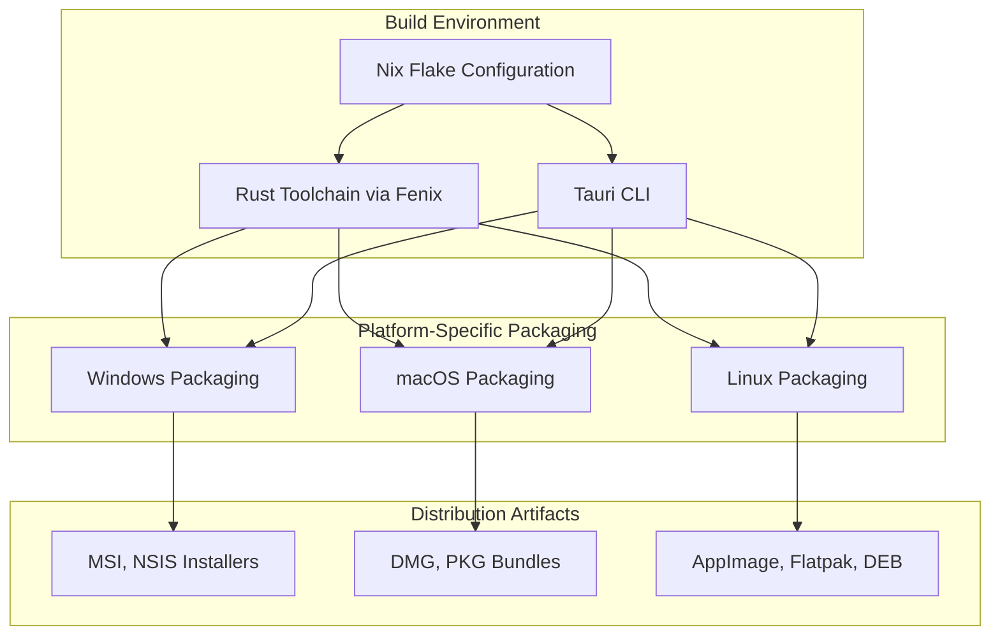
```mermaid
graph TB
    subgraph "Build Environment"
        NixFlake[Nix Flake Configuration]
        RustToolchain[Rust Toolchain via Fenix]
        TauriCLI[Tauri CLI]
    end
    
    subgraph "Platform-Specific Packaging"
        WindowsPackaging[Windows Packaging]
        MacOSPackaging[macOS Packaging]
        LinuxPackaging[Linux Packaging]
    end
    
    subgraph "Distribution Artifacts"
        WindowsArtifacts[MSI, NSIS Installers]
        MacOSArtifacts[DMG, PKG Bundles]
        LinuxArtifacts[AppImage, Flatpak, DEB]
    end
    
    NixFlake --> RustToolchain
    NixFlake --> TauriCLI
    RustToolchain --> WindowsPackaging
    RustToolchain --> MacOSPackaging
    RustToolchain --> LinuxPackaging
    TauriCLI --> WindowsPackaging
    TauriCLI --> MacOSPackaging
    TauriCLI --> LinuxPackaging
    WindowsPackaging --> WindowsArtifacts
    MacOSPackaging --> MacOSArtifacts
    LinuxPackaging --> LinuxArtifacts
```

### 2.2. Platform-Specific Installers

#### 2.2.1. Windows Installers

**MSI Installer (Windows Installer)**
- **Purpose:** Standard Windows installer for enterprise deployment
- **Features:**
  - Silent installation support (`/quiet` flag)
  - Custom installation directory selection
  - Desktop shortcut creation
  - File association for `.tachyon` files
  - Automatic update mechanism integration
  - Uninstallation with complete cleanup
- **Requirements:** Windows 10+ with WebView2 runtime
- **Bundle Size:** Approximately 8-10 MB (includes WebView2 check)
- **Code Signing:** Authenticode signature with timestamp server

**NSIS Installer (Nullsoft Scriptable Install System)**
- **Purpose:** Lightweight installer with advanced customization
- **Features:**
  - Scriptable installation logic
  - Multi-language support
  - Custom pages and dialogs
  - Plugin system for extensions
  - Uninstallation with rollback capability
- **Requirements:** Windows 10+ with WebView2 runtime
- **Bundle Size:** Approximately 6-8 MB (smaller than MSI)
- **Code Signing:** Authenticode signature with timestamp server

**Windows Deployment Diagram:**

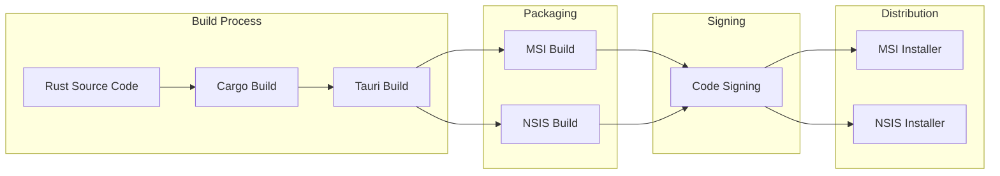
```mermaid
graph LR
    subgraph "Build Process"
        Source[Rust Source Code]
        Cargo[Cargo Build]
        TauriBuild[Tauri Build]
    end
    
    subgraph "Packaging"
        MSIBuild[MSI Build]
        NSISBuild[NSIS Build]
    end
    
    subgraph "Signing"
        CodeSign[Code Signing]
    end
    
    subgraph "Distribution"
        MSI[MSI Installer]
        NSIS[NSIS Installer]
    end
    
    Source --> Cargo
    Cargo --> TauriBuild
    TauriBuild --> MSIBuild
    TauriBuild --> NSISBuild
    MSIBuild --> CodeSign
    NSISBuild --> CodeSign
    CodeSign --> MSI
    CodeSign --> NSIS
```

#### 2.2.2. macOS Installers

**DMG Bundle (Disk Image)**
- **Purpose:** Drag-and-drop installation for macOS users
- **Features:**
  - Application bundle (`.app`) with embedded WebView
  - Code signing with Apple Developer ID
  - Notarization for macOS Gatekeeper
  - Background image and license agreement
  - Custom icon and volume name
- **Requirements:** macOS 10.13+ with WebKit
- **Bundle Size:** Approximately 5-7 MB
- **Code Signing:** Apple Developer ID signature with notarization

**PKG Installer (Package Installer)**
- **Purpose:** Standard macOS installer for enterprise deployment
- **Features:**
  - Silent installation support
  - Custom installation location
  - Pre-install and post-install scripts
  - Receipt generation for package management
  - Uninstallation with complete cleanup
- **Requirements:** macOS 10.13+ with WebKit
- **Bundle Size:** Approximately 6-8 MB
- **Code Signing:** Apple Developer ID signature with notarization

**macOS Deployment Diagram:**

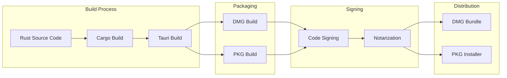
```mermaid
graph LR
    subgraph "Build Process"
        Source[Rust Source Code]
        Cargo[Cargo Build]
        TauriBuild[Tauri Build]
    end
    
    subgraph "Packaging"
        DMGBuild[DMG Build]
        PKGBuild[PKG Build]
    end
    
    subgraph "Signing"
        CodeSign[Code Signing]
        Notarize[Notarization]
    end
    
    subgraph "Distribution"
        DMG[DMG Bundle]
        PKG[PKG Installer]
    end
    
    Source --> Cargo
    Cargo --> TauriBuild
    TauriBuild --> DMGBuild
    TauriBuild --> PKGBuild
    DMGBuild --> CodeSign
    PKGBuild --> CodeSign
    CodeSign --> Notarize
    Notarize --> DMG
    Notarize --> PKG
```

#### 2.2.3. Linux Installers

**AppImage**
- **Purpose:** Universal Linux package format
- **Features:**
  - Self-contained application bundle
  - No installation required (executable)
  - Runs on any Linux distribution
  - Automatic desktop entry creation
  - Sandboxing with AppImage runtime
- **Requirements:** Linux with glibc 2.17+ and GTK 3.24+
- **Bundle Size:** Approximately 5-7 MB
- **Code Signing:** GPG signature for verification

**Flatpak**
- **Purpose:** Universal Linux package with sandboxing
- **Features:**
  - Sandboxed execution environment
  - Bundled dependencies for consistency
  - Automatic updates via Flatpak
  - Integration with system desktop
  - Portal system for controlled access
- **Requirements:** Linux with Flatpak 1.0+
- **Bundle Size:** Approximately 8-12 MB (includes dependencies)
- **Code Signing:** GPG signature for verification

**DEB Package**
- **Purpose:** Debian/Ubuntu package format
- **Features:**
  - Native package manager integration
  - Dependency resolution via apt
  - System integration (desktop entry, mime types)
  - Automatic updates via apt
  - Pre-install and post-install scripts
- **Requirements:** Debian-based Linux distributions
- **Bundle Size:** Approximately 4-6 MB
- **Code Signing:** GPG signature for repository

**Linux Deployment Diagram:**

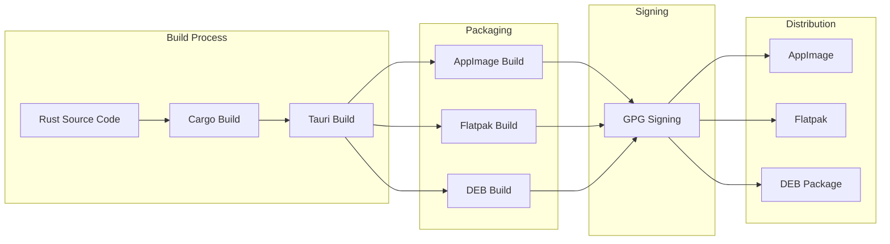
```mermaid
graph LR
    subgraph "Build Process"
        Source[Rust Source Code]
        Cargo[Cargo Build]
        TauriBuild[Tauri Build]
    end
    
    subgraph "Packaging"
        AppImageBuild[AppImage Build]
        FlatpakBuild[Flatpak Build]
        DEBBuild[DEB Build]
    end
    
    subgraph "Signing"
        GPGSign[GPG Signing]
    end
    
    subgraph "Distribution"
        AppImage[AppImage]
        Flatpak[Flatpak]
        DEB[DEB Package]
    end
    
    Source --> Cargo
    Cargo --> TauriBuild
    TauriBuild --> AppImageBuild
    TauriBuild --> FlatpakBuild
    TauriBuild --> DEBBuild
    AppImageBuild --> GPGSign
    FlatpakBuild --> GPGSign
    DEBBuild --> GPGSign
    GPGSign --> AppImage
    GPGSign --> Flatpak
    GPGSign --> DEB
```

### 2.3. Bundle Optimization

The Tachyon desktop application targets a bundle size of 3-10 MB, significantly smaller than Electron-based alternatives (100-200 MB). This optimization is achieved through:

**Size Optimization Strategies:**

1. **WebView Utilization:** Leverages system WebView instead of bundling Chromium
2. **Rust Compilation:** Optimized Rust binaries with LTO and strip symbols
3. **Asset Compression:** Compressed assets (images, fonts, icons) using WebP and WOFF2
4. **Tree Shaking:** Elimination of unused code and dependencies
5. **WASM Optimization:** Optimized WebAssembly modules with `wasm-opt`
6. **Dependency Minimization:** Minimal dependency footprint with careful crate selection

**Bundle Size Comparison:**

| Framework | Bundle Size | Dependencies | Distribution Size |
|-----------|--------------|--------------|-------------------|
| Tauri | 3-10 MB | System WebView, Rust runtime | 5-12 MB |
| Electron | 100-200 MB | Chromium, Node.js, V8 | 150-300 MB |
| Qt | 20-50 MB | Qt libraries, platform-specific | 25-60 MB |
| Flutter | 15-30 MB | Flutter engine, Dart runtime | 20-40 MB |

### 2.4. Auto-Update Mechanism

The Tachyon desktop application implements an automatic update mechanism using Tauri's built-in updater with custom update server integration.

**Update Architecture:**

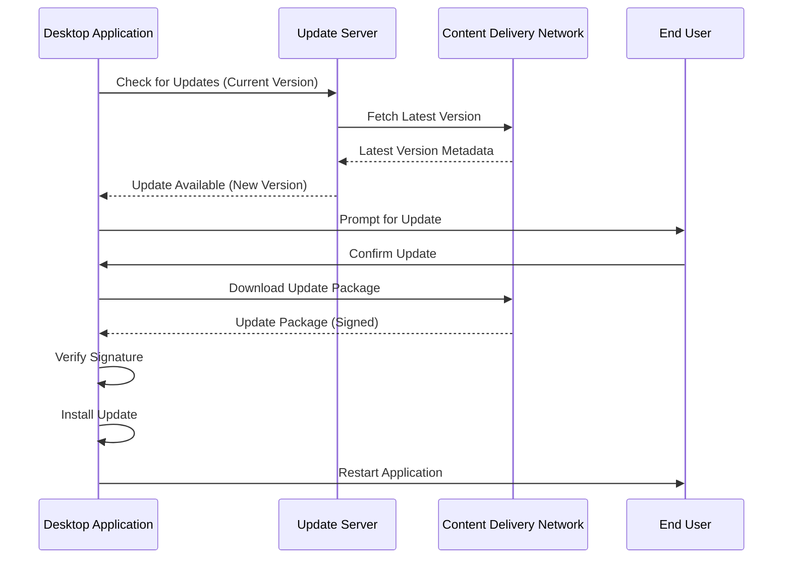
```mermaid
sequenceDiagram
    participant App as Desktop Application
    participant UpdateServer as Update Server
    participant CDN as Content Delivery Network
    participant User as End User
    
    App->>UpdateServer: Check for Updates (Current Version)
    UpdateServer->>CDN: Fetch Latest Version
    CDN-->>UpdateServer: Latest Version Metadata
    UpdateServer-->>App: Update Available (New Version)
    App->>User: Prompt for Update
    User->>App: Confirm Update
    App->>CDN: Download Update Package
    CDN-->>App: Update Package (Signed)
    App->>App: Verify Signature
    App->>App: Install Update
    App->>User: Restart Application
```

**Update Mechanism Features:**

1. **Version Checking:** Periodic checks for available updates (configurable interval)
2. **Delta Updates:** Download only changed components for faster updates
3. **Signature Verification:** Cryptographic verification of update packages
4. **Rollback Support:** Automatic rollback on update failure
5. **User Control:** User prompts and confirmation before updates
6. **Background Downloads:** Non-blocking download process
7. **Resume Support:** Resumable downloads for interrupted connections

**Update Security Considerations:**

- **TLS 1.3:** All update communications encrypted with TLS 1.3
- **Code Signing:** Update packages signed with developer certificates
- **Signature Verification:** Cryptographic verification before installation
- **Checksum Validation:** SHA256 checksum verification of downloaded packages
- **Secure Storage:** Update packages stored securely during download
- **Integrity Checks:** Post-installation integrity verification

---

## 3. SERVER DEPLOYMENT ARCHITECTURE

### 3.1. Containerization Strategy

The Tachyon server component is deployed using containerization for consistency, scalability, and isolation. The architecture supports multiple containerization approaches: Docker, Kubernetes, systemd, and NixOS.

**Containerization Architecture:**

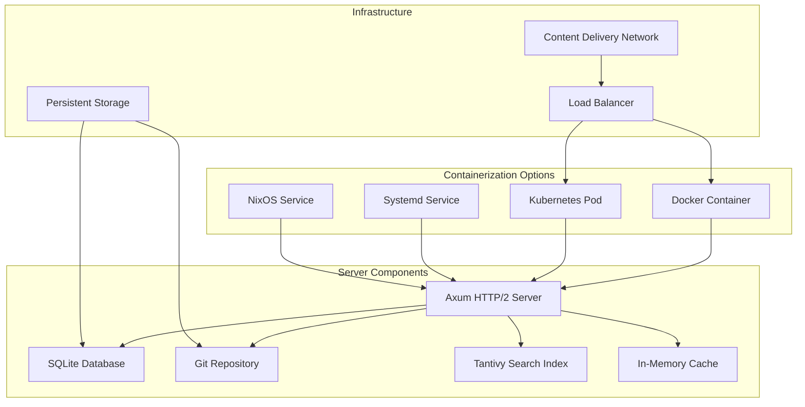
```mermaid
graph TB
    subgraph "Containerization Options"
        Docker[Docker Container]
        Kubernetes[Kubernetes Pod]
        Systemd[Systemd Service]
        NixOS[NixOS Service]
    end
    
    subgraph "Server Components"
        AxumServer[Axum HTTP/2 Server]
        SQLite[SQLite Database]
        GitRepo[Git Repository]
        Tantivy[Tantivy Search Index]
        Cache[In-Memory Cache]
    end
    
    subgraph "Infrastructure"
        LoadBalancer[Load Balancer]
        CDN[Content Delivery Network]
        Storage[Persistent Storage]
    end
    
    Docker --> AxumServer
    Kubernetes --> AxumServer
    Systemd --> AxumServer
    NixOS --> AxumServer
    AxumServer --> SQLite
    AxumServer --> GitRepo
    AxumServer --> Tantivy
    AxumServer --> Cache
    LoadBalancer --> Docker
    LoadBalancer --> Kubernetes
    CDN --> LoadBalancer
    Storage --> SQLite
    Storage --> GitRepo
```

### 3.2. Docker Deployment

**Docker Image Architecture:**

The Tachyon server is packaged as a Docker image using multi-stage builds for optimization.

**Dockerfile Structure:**

```dockerfile
# Stage 1: Builder
FROM rust:1.82-slim as builder
WORKDIR /tachyon
COPY . .
RUN cargo build --release --bin tachyon-server

# Stage 2: Runtime
FROM debian:bookworm-slim
RUN apt-get update && apt-get install -y ca-certificates sqlite3
COPY --from=builder /tachyon/target/release/tachyon-server /usr/local/bin/
EXPOSE 8080
CMD ["tachyon-server"]
```

**Docker Deployment Features:**

1. **Multi-Stage Builds:** Separates build and runtime for smaller images
2. **Base Image Optimization:** Uses slim Debian base for minimal footprint
3. **Layer Caching:** Efficient layer caching for faster rebuilds
4. **Security Scanning:** Automated vulnerability scanning of images
5. **Image Signing:** Docker Content Trust signature verification
6. **Registry Storage:** Pushed to Docker Hub or private registry

**Docker Compose Configuration:**

```yaml
version: '3.8'
services:
  tachyon-server:
    image: tachyon/server:latest
    ports:
      - "8080:8080"
    volumes:
      - ./data:/tachyon/data
      - ./config:/tachyon/config
    environment:
      - RUST_LOG=info
      - DATABASE_PATH=/tachyon/data/tachyon.db
    restart: unless-stopped
    healthcheck:
      test: ["CMD", "curl", "-f", "http://localhost:8080/health"]
      interval: 30s
      timeout: 10s
      retries: 3
```

### 3.3. Kubernetes Deployment

**Kubernetes Deployment Architecture:**

For enterprise deployments, the Tachyon server is deployed on Kubernetes for scalability and high availability.

**Kubernetes Deployment Manifest:**

```yaml
apiVersion: apps/v1
kind: Deployment
metadata:
  name: tachyon-server
spec:
  replicas: 3
  selector:
    matchLabels:
      app: tachyon-server
  template:
    metadata:
      labels:
        app: tachyon-server
    spec:
      containers:
      - name: tachyon-server
        image: tachyon/server:latest
        ports:
        - containerPort: 8080
        resources:
          requests:
            cpu: "500m"
            memory: "512Mi"
          limits:
            cpu: "2000m"
            memory: "2Gi"
        livenessProbe:
          httpGet:
            path: /health
            port: 8080
          initialDelaySeconds: 30
          periodSeconds: 10
        readinessProbe:
          httpGet:
            path: /ready
            port: 8080
          initialDelaySeconds: 5
          periodSeconds: 5
        volumeMounts:
        - name: data
          mountPath: /tachyon/data
      volumes:
      - name: data
        persistentVolumeClaim:
          claimName: tachyon-data
```

**Kubernetes Service Configuration:**

```yaml
apiVersion: v1
kind: Service
metadata:
  name: tachyon-server
spec:
  type: LoadBalancer
  selector:
    app: tachyon-server
  ports:
  - port: 80
    targetPort: 8080
    protocol: TCP
```

### 3.4. Systemd Deployment

For Linux server deployments, the Tachyon server is deployed as a systemd service for process management and automatic restart.

**Systemd Service Unit:**

```ini
[Unit]
Description=Tachyon HTTP/2 Server
After=network.target

[Service]
Type=simple
User=tachyon
WorkingDirectory=/opt/tachyon
ExecStart=/opt/tachyon/bin/tachyon-server
Restart=on-failure
RestartSec=10s
Environment=RUST_LOG=info
Environment=DATABASE_PATH=/var/lib/tachyon/tachyon.db

[Install]
WantedBy=multi-user.target
```

**Systemd Deployment Features:**

1. **Process Management:** Automatic restart on failure
2. **Logging Integration:** Integration with journald for centralized logging
3. **Resource Limits:** CPU and memory limits via systemd slices
4. **Dependency Management:** Automatic dependency ordering and startup
5. **Security Hardening:** Capability dropping and namespace isolation

### 3.5. NixOS Deployment

For NixOS deployments, the Tachyon server is deployed as a NixOS module for declarative system configuration.

**NixOS Module Configuration:**

```nix
{ config, pkgs, lib, ... }:

{
  services.tachyon-server = {
    enable = true;
    package = pkgs.tachyon-server;
    user = "tachyon";
    group = "tachyon";
    dataDir = "/var/lib/tachyon";
    logLevel = "info";
    openFirewall = true;
    port = 8080;
  };
}
```

### 3.6. Horizontal Scaling

The Tachyon server architecture supports horizontal scaling for handling increased load.

**Scaling Architecture:**

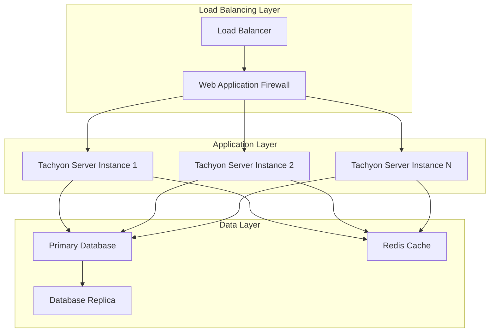
```mermaid
graph TB
    subgraph "Load Balancing Layer"
        LB[Load Balancer]
        WAF[Web Application Firewall]
    end
    
    subgraph "Application Layer"
        Server1[Tachyon Server Instance 1]
        Server2[Tachyon Server Instance 2]
        Server3[Tachyon Server Instance N]
    end
    
    subgraph "Data Layer"
        PrimaryDB[Primary Database]
        ReplicaDB[Database Replica]
        Redis[Redis Cache]
    end
    
    LB --> WAF
    WAF --> Server1
    WAF --> Server2
    WAF --> Server3
    Server1 --> PrimaryDB
    Server2 --> PrimaryDB
    Server3 --> PrimaryDB
    Server1 --> Redis
    Server2 --> Redis
    Server3 --> Redis
    PrimaryDB --> ReplicaDB
```

**Scaling Strategies:**

1. **Horizontal Pod Autoscaling (HPA):** Kubernetes-based autoscaling based on CPU/memory metrics
2. **Manual Scaling:** Manual addition/removal of server instances
3. **Load Balancer Scaling:** Auto-scaling load balancer based on traffic patterns
4. **Database Read Replicas:** Read replicas for query scaling
5. **Cache Layer:** Redis cache for reducing database load

### 3.7. Load Balancing

The Tachyon server deployment includes load balancing for high availability and performance.

**Load Balancing Configuration:**

**Nginx Configuration Example:**

```nginx
upstream tachyon_backend {
    least_conn;
    server server1:8080 max_fails=3 fail_timeout=30s;
    server server2:8080 max_fails=3 fail_timeout=30s;
    server server3:8080 max_fails=3 fail_timeout=30s;
}

server {
    listen 80;
    listen 443 ssl http2;
    
    ssl_certificate /etc/nginx/ssl/tachyon.crt;
    ssl_certificate_key /etc/nginx/ssl/tachyon.key;
    ssl_protocols TLSv1.2 TLSv1.3;
    
    location / {
        proxy_pass http://tachyon_backend;
        proxy_http_version 1.1;
        proxy_set_header Upgrade $http_upgrade;
        proxy_set_header Connection "upgrade";
        proxy_set_header Host $host;
        proxy_set_header X-Real-IP $remote_addr;
    }
}
```

**Load Balancing Algorithms:**

| Algorithm | Description | Use Case |
|-----------|-------------|-----------|
| Round Robin | Distributes requests sequentially | Default for homogeneous servers |
| Least Connections | Routes to server with fewest connections | Variable request duration |
| IP Hash | Routes based on client IP hash | Session persistence required |
| Random | Random server selection | Simple load distribution |

### 3.8. Resource Requirements

The Tachyon server component has minimum and recommended resource requirements for deployment.

**Resource Requirements:**

| Resource | Minimum | Recommended | Scaling Factor |
|----------|-----------|--------------|----------------|
| CPU Cores | 2 | 4 | +1 per 1000 concurrent users |
| RAM | 4 GB | 8 GB | +2 GB per 1000 concurrent users |
| Disk Space | 10 GB | 50 GB | +10 GB per 100 GB of content |
| Network Bandwidth | 100 Mbps | 1 Gbps | +100 Mbps per 1000 concurrent users |
| IOPS | 1000 | 5000 | +500 per 1000 concurrent users |

**Server Deployment Diagram:**

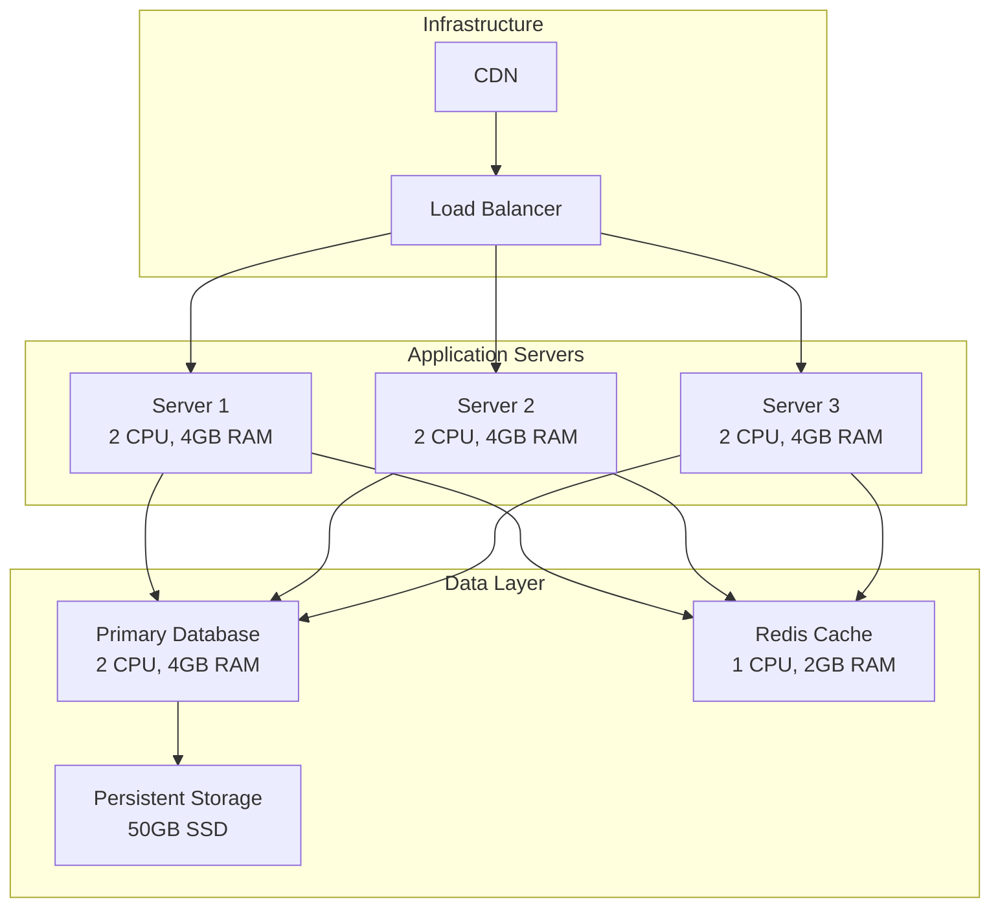
```mermaid
graph TB
    subgraph "Infrastructure"
        LB[Load Balancer]
        CDN[CDN]
    end
    
    subgraph "Application Servers"
        Server1[Server 1<br/>2 CPU, 4GB RAM]
        Server2[Server 2<br/>2 CPU, 4GB RAM]
        Server3[Server 3<br/>2 CPU, 4GB RAM]
    end
    
    subgraph "Data Layer"
        DB[Primary Database<br/>2 CPU, 4GB RAM]
        Cache[Redis Cache<br/>1 CPU, 2GB RAM]
        Storage[Persistent Storage<br/>50GB SSD]
    end
    
    CDN --> LB
    LB --> Server1
    LB --> Server2
    LB --> Server3
    Server1 --> DB
    Server2 --> DB
    Server3 --> DB
    Server1 --> Cache
    Server2 --> Cache
    Server3 --> Cache
    DB --> Storage
```

---

## 4. WEB DEPLOYMENT ARCHITECTURE

### 4.1. Static Export Strategy

The Tachyon web frontend supports static export for deployment to static hosting services and CDNs.

**Static Export Architecture:**

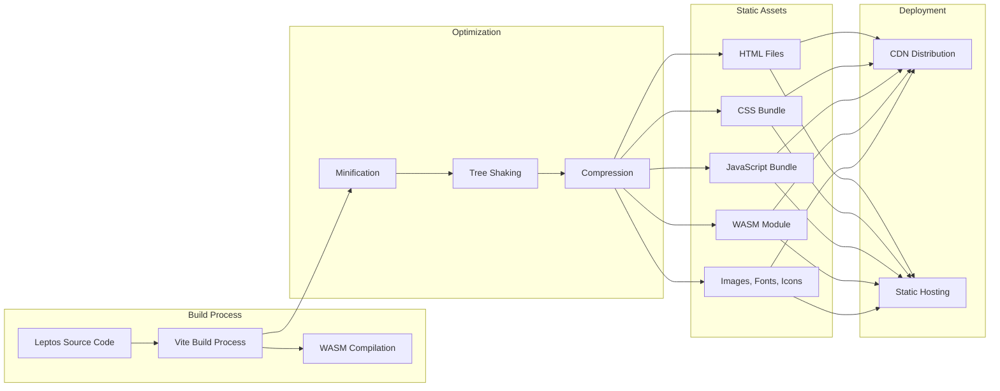
```mermaid
graph LR
    subgraph "Build Process"
        LeptosSource[Leptos Source Code]
        ViteBuild[Vite Build Process]
        WASMCompile[WASM Compilation]
    end
    
    subgraph "Optimization"
        Minify[Minification]
        TreeShake[Tree Shaking]
        Compress[Compression]
    end
    
    subgraph "Static Assets"
        HTML[HTML Files]
        CSS[CSS Bundle]
        JS[JavaScript Bundle]
        WASM[WASM Module]
        Assets[Images, Fonts, Icons]
    end
    
    subgraph "Deployment"
        CDN[CDN Distribution]
        StaticHost[Static Hosting]
    end
    
    LeptosSource --> ViteBuild
    ViteBuild --> WASMCompile
    ViteBuild --> Minify
    Minify --> TreeShake
    TreeShake --> Compress
    Compress --> HTML
    Compress --> CSS
    Compress --> JS
    Compress --> WASM
    Compress --> Assets
    HTML --> CDN
    CSS --> CDN
    JS --> CDN
    WASM --> CDN
    Assets --> CDN
    HTML --> StaticHost
    CSS --> StaticHost
    JS --> StaticHost
    WASM --> StaticHost
    Assets --> StaticHost
```

**Static Export Features:**

1. **Pre-Rendering:** All pages pre-rendered at build time
2. **Asset Optimization:** Images converted to WebP, fonts to WOFF2
3. **Code Splitting:** Automatic code splitting for optimal loading
4. **Compression:** Gzip and Brotli compression for all assets
5. **Cache Headers:** Long cache headers for static assets
6. **Service Worker:** Offline support and caching

### 4.2. SSR Deployment

The Tachyon web frontend supports server-side rendering (SSR) through Leptos SSR integration with Axum.

**SSR Deployment Architecture:**

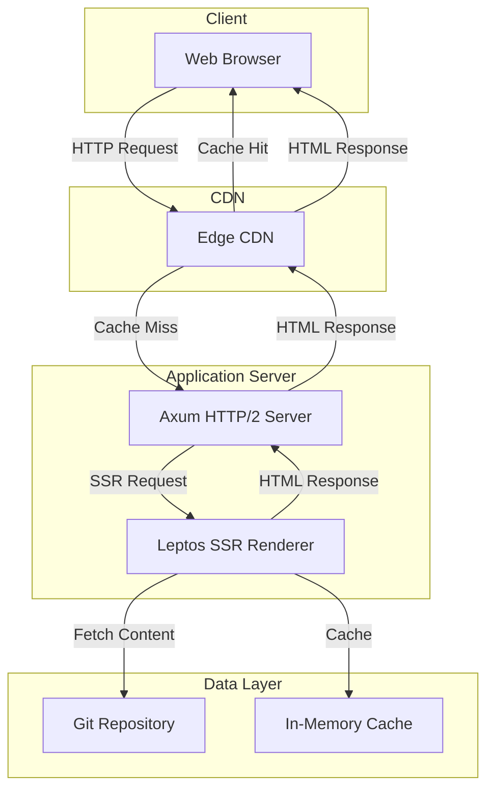
```mermaid
graph TB
    subgraph "Client"
        Browser[Web Browser]
    end
    
    subgraph "CDN"
        Edge[Edge CDN]
    end
    
    subgraph "Application Server"
        Axum[Axum HTTP/2 Server]
        LeptosSSR[Leptos SSR Renderer]
    end
    
    subgraph "Data Layer"
        GitRepo[Git Repository]
        Cache[In-Memory Cache]
    end
    
    Browser -->|HTTP Request| Edge
    Edge -->|Cache Hit| Browser
    Edge -->|Cache Miss| Axum
    Axum -->|SSR Request| LeptosSSR
    LeptosSSR -->|Fetch Content| GitRepo
    LeptosSSR -->|Cache| Cache
    LeptosSSR -->|HTML Response| Axum
    Axum -->|HTML Response| Edge
    Edge -->|HTML Response| Browser
```

**SSR Features:**

1. **Initial HTML Rendering:** Server renders initial HTML for fast page loads
2. **Hydration:** Client-side hydration for interactivity
3. **Streaming:** Progressive rendering for large pages
4. **Metadata Injection:** Server-side metadata for SEO
5. **Error Handling:** Server-side error pages

### 4.3. Edge Deployment Options

The Tachyon web frontend supports edge deployment for global performance and low latency.

**Edge Deployment Platforms:**

| Platform | Features | Integration |
|----------|---------|-------------|
| Cloudflare Workers | Serverless execution, edge caching | Workers Sites, KV storage |
| Vercel Edge | Edge functions, preview deployments | Next.js compatible |
| Netlify Edge | Edge functions, form handling | Build hooks, edge functions |
| AWS CloudFront | CloudFront Functions, S3 integration | Lambda@Edge |
| Fastly Compute@Edge | Edge computing, image optimization | Fastly CDN integration |

**Edge Deployment Architecture:**

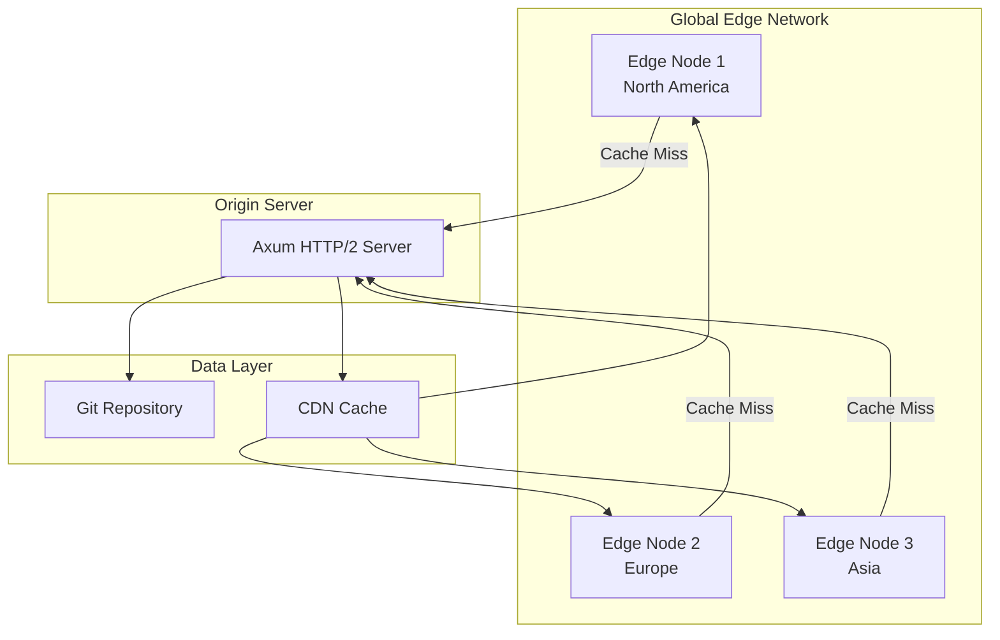
```mermaid
graph TB
    subgraph "Global Edge Network"
        Edge1[Edge Node 1<br/>North America]
        Edge2[Edge Node 2<br/>Europe]
        Edge3[Edge Node 3<br/>Asia]
    end
    
    subgraph "Origin Server"
        Axum[Axum HTTP/2 Server]
    end
    
    subgraph "Data Layer"
        GitRepo[Git Repository]
        CDNCache[CDN Cache]
    end
    
    Edge1 -->|Cache Miss| Axum
    Edge2 -->|Cache Miss| Axum
    Edge3 -->|Cache Miss| Axum
    Axum --> GitRepo
    Axum --> CDNCache
    CDNCache --> Edge1
    CDNCache --> Edge2
    CDNCache --> Edge3
```

### 4.4. Bundle Optimization

The Tachyon web frontend targets a bundle size of 45 KB for optimal loading performance.

**Bundle Optimization Strategies:**

1. **Tree Shaking:** Elimination of unused code and dependencies
2. **Code Splitting:** Dynamic imports for route-based splitting
3. **WASM Optimization:** Optimized WASM modules with `wasm-opt`
4. **CSS Purging:** Removal of unused CSS with TailwindCSS
5. **Asset Optimization:** WebP images, WOFF2 fonts, SVG icons
6. **Compression:** Gzip and Brotli compression
7. **Lazy Loading:** Lazy loading of images and components

**Bundle Size Breakdown:**

| Component | Size | Optimization |
|-----------|------|--------------|
| JavaScript Bundle | 25 KB | Tree shaking, code splitting |
| WASM Module | 10 KB | wasm-opt optimization |
| CSS Bundle | 5 KB | TailwindCSS purging |
| HTML | 3 KB | Minification |
| Assets | 2 KB | WebP, WOFF2 |
| **Total** | **45 KB** | **Compressed** |

### 4.5. CDN Integration

The Tachyon web frontend integrates with CDN services for global content delivery and performance optimization.

**CDN Integration Architecture:**

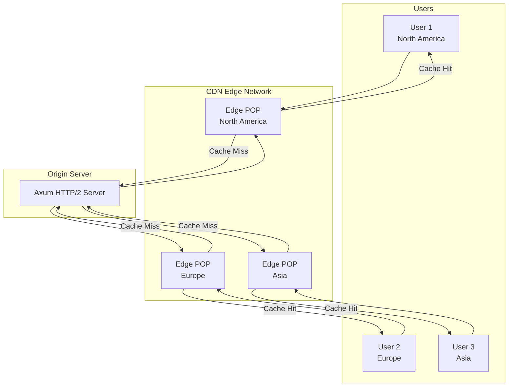
```mermaid
graph TB
    subgraph "Users"
        User1[User 1<br/>North America]
        User2[User 2<br/>Europe]
        User3[User 3<br/>Asia]
    end
    
    subgraph "CDN Edge Network"
        EdgeNA[Edge POP<br/>North America]
        EdgeEU[Edge POP<br/>Europe]
        EdgeAS[Edge POP<br/>Asia]
    end
    
    subgraph "Origin Server"
        Axum[Axum HTTP/2 Server]
    end
    
    User1 --> EdgeNA
    User2 --> EdgeEU
    User3 --> EdgeAS
    EdgeNA -->|Cache Hit| User1
    EdgeNA -->|Cache Miss| Axum
    EdgeEU -->|Cache Hit| User2
    EdgeEU -->|Cache Miss| Axum
    EdgeAS -->|Cache Hit| User3
    EdgeAS -->|Cache Miss| Axum
    Axum --> EdgeNA
    Axum --> EdgeEU
    Axum --> EdgeAS
```

**CDN Configuration:**

1. **Cache Rules:** Configurable cache rules for different content types
2. **Cache Invalidation:** Automatic cache invalidation on content changes
3. **Edge Functions:** Serverless functions at the edge
4. **Image Optimization:** Automatic image optimization and transformation
5. **HTTP/2 Support:** HTTP/2 for CDN-to-origin communication
6. **TLS Termination:** TLS termination at CDN edge

---

## 5. BUILD SYSTEM ARCHITECTURE

### 5.1. Nix Flakes Build System

The Tachyon build system uses Nix flakes for reproducible, declarative, and cross-platform builds.

**Nix Flakes Architecture:**

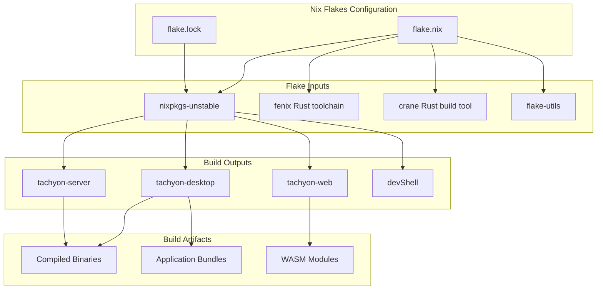
```mermaid
graph TB
    subgraph "Nix Flakes Configuration"
        FlakeNix[flake.nix]
        FlakeLock[flake.lock]
    end
    
    subgraph "Flake Inputs"
        Nixpkgs[nixpkgs-unstable]
        Fenix[fenix Rust toolchain]
        Crane[crane Rust build tool]
        Utils[flake-utils]
    end
    
    subgraph "Build Outputs"
        Desktop[tachyon-desktop]
        Server[tachyon-server]
        Web[tachyon-web]
        DevShell[devShell]
    end
    
    subgraph "Build Artifacts"
        Binaries[Compiled Binaries]
        Bundles[Application Bundles]
        WASM[WASM Modules]
    end
    
    FlakeNix --> Nixpkgs
    FlakeNix --> Fenix
    FlakeNix --> Crane
    FlakeNix --> Utils
    FlakeLock --> Nixpkgs
    Nixpkgs --> Desktop
    Nixpkgs --> Server
    Nixpkgs --> Web
    Nixpkgs --> DevShell
    Desktop --> Binaries
    Desktop --> Bundles
    Server --> Binaries
    Web --> WASM
```

### 5.2. Reproducible Builds

The Nix build system ensures reproducible builds through deterministic compilation and dependency pinning.

**Reproducibility Guarantees:**

1. **Bit-for-Bit Reproducibility:** Identical builds across different systems
2. **Deterministic Dependencies:** All dependencies pinned to specific versions
3. **Build Isolation:** Builds isolated from system state
4. **Timestamp Normalization:** Timestamps normalized for reproducibility
5. **Environment Isolation:** Builds isolated from environment variables

**Reproducibility Verification:**

```bash
# Build on System A
nix build .#tachyon-desktop
sha256sum result/bin/tachyon-desktop

# Build on System B
nix build .#tachyon-desktop
sha256sum result/bin/tachyon-desktop

# Verify identical checksums
```

### 5.3. Cross-Platform Compilation

The Nix build system supports cross-platform compilation for Windows, macOS, and Linux.

**Cross-Platform Architecture:**

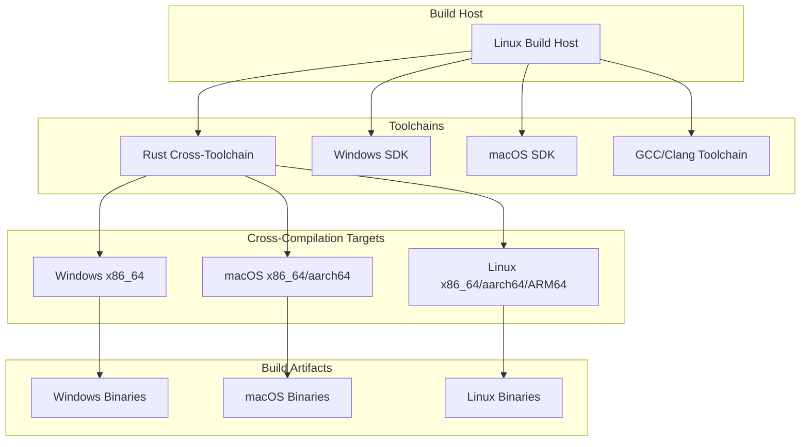
```mermaid
graph TB
    subgraph "Build Host"
        LinuxHost[Linux Build Host]
    end
    
    subgraph "Cross-Compilation Targets"
        WindowsTarget[Windows x86_64]
        MacOSTarget[macOS x86_64/aarch64]
        LinuxTarget[Linux x86_64/aarch64/ARM64]
    end
    
    subgraph "Toolchains"
        RustTarget[Rust Cross-Toolchain]
        WindowsSDK[Windows SDK]
        MacOSSDK[macOS SDK]
        LinuxToolchain[GCC/Clang Toolchain]
    end
    
    subgraph "Build Artifacts"
        WindowsArtifacts[Windows Binaries]
        MacOSArtifacts[macOS Binaries]
        LinuxArtifacts[Linux Binaries]
    end
    
    LinuxHost --> RustTarget
    LinuxHost --> WindowsSDK
    LinuxHost --> MacOSSDK
    LinuxHost --> LinuxToolchain
    RustTarget --> WindowsTarget
    RustTarget --> MacOSTarget
    RustTarget --> LinuxTarget
    WindowsTarget --> WindowsArtifacts
    MacOSTarget --> MacOSArtifacts
    LinuxTarget --> LinuxArtifacts
```

### 5.4. Dependency Management

The Nix build system manages dependencies through flake inputs and lock files.

**Dependency Management Architecture:**

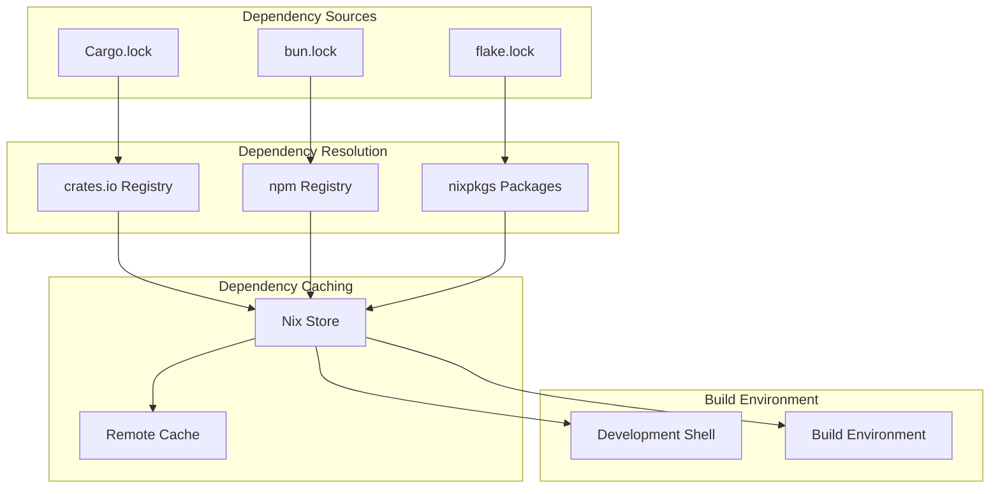
```mermaid
graph TB
    subgraph "Dependency Sources"
        CargoLock[Cargo.lock]
        BunLock[bun.lock]
        FlakeLock[flake.lock]
    end
    
    subgraph "Dependency Resolution"
        Nixpkgs[nixpkgs Packages]
        CratesIO[crates.io Registry]
        NPMRegistry[npm Registry]
    end
    
    subgraph "Dependency Caching"
        NixStore[Nix Store]
        RemoteCache[Remote Cache]
    end
    
    subgraph "Build Environment"
        DevShell[Development Shell]
        BuildEnv[Build Environment]
    end
    
    CargoLock --> CratesIO
    BunLock --> NPMRegistry
    FlakeLock --> Nixpkgs
    CratesIO --> NixStore
    NPMRegistry --> NixStore
    Nixpkgs --> NixStore
    NixStore --> RemoteCache
    NixStore --> DevShell
    NixStore --> BuildEnv
```

### 5.5. Build Diagrams

**Complete Build Pipeline:**

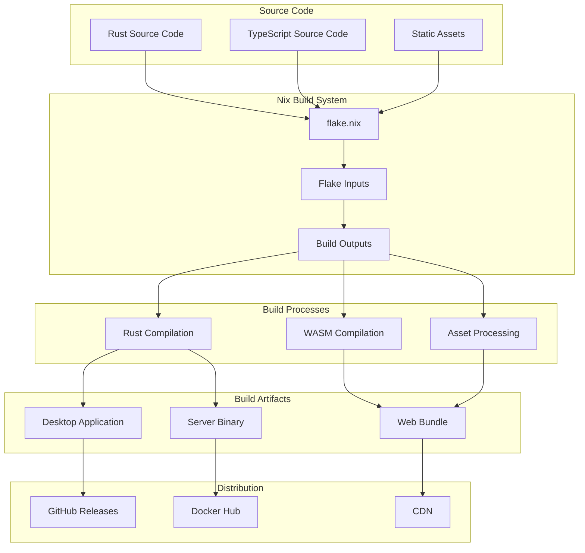
```mermaid
graph TB
    subgraph "Source Code"
        RustSrc[Rust Source Code]
        TSSrc[TypeScript Source Code]
        Assets[Static Assets]
    end
    
    subgraph "Nix Build System"
        Flake[flake.nix]
        Inputs[Flake Inputs]
        Outputs[Build Outputs]
    end
    
    subgraph "Build Processes"
        RustBuild[Rust Compilation]
        WASMBuild[WASM Compilation]
        AssetBuild[Asset Processing]
    end
    
    subgraph "Build Artifacts"
        DesktopApp[Desktop Application]
        ServerBin[Server Binary]
        WebBundle[Web Bundle]
    end
    
    subgraph "Distribution"
        GitHubReleases[GitHub Releases]
        DockerHub[Docker Hub]
        CDN[CDN]
    end
    
    RustSrc --> Flake
    TSSrc --> Flake
    Assets --> Flake
    Flake --> Inputs
    Inputs --> Outputs
    Outputs --> RustBuild
    Outputs --> WASMBuild
    Outputs --> AssetBuild
    RustBuild --> DesktopApp
    RustBuild --> ServerBin
    WASMBuild --> WebBundle
    AssetBuild --> WebBundle
    DesktopApp --> GitHubReleases
    ServerBin --> DockerHub
    WebBundle --> CDN
```

---

## 6. CI/CD PIPELINE ARCHITECTURE

### 6.1. Automated Testing

The CI/CD pipeline includes automated testing at multiple stages to ensure code quality.

**Testing Pipeline Architecture:**

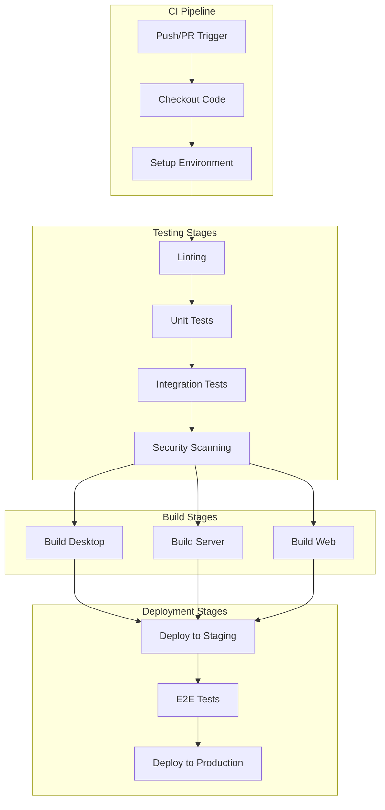
```mermaid
graph TB
    subgraph "CI Pipeline"
        Trigger[Push/PR Trigger]
        Checkout[Checkout Code]
        Setup[Setup Environment]
    end
    
    subgraph "Testing Stages"
        Lint[Linting]
        UnitTests[Unit Tests]
        IntegrationTests[Integration Tests]
        SecurityScan[Security Scanning]
    end
    
    subgraph "Build Stages"
        BuildDesktop[Build Desktop]
        BuildServer[Build Server]
        BuildWeb[Build Web]
    end
    
    subgraph "Deployment Stages"
        DeployStaging[Deploy to Staging]
        E2ETests[E2E Tests]
        DeployProd[Deploy to Production]
    end
    
    Trigger --> Checkout
    Checkout --> Setup
    Setup --> Lint
    Lint --> UnitTests
    UnitTests --> IntegrationTests
    IntegrationTests --> SecurityScan
    SecurityScan --> BuildDesktop
    SecurityScan --> BuildServer
    SecurityScan --> BuildWeb
    BuildDesktop --> DeployStaging
    BuildServer --> DeployStaging
    BuildWeb --> DeployStaging
    DeployStaging --> E2ETests
    E2ETests --> DeployProd
```

### 6.2. Automated Deployment

The CI/CD pipeline automates deployment to staging and production environments.

**Deployment Pipeline Architecture:**

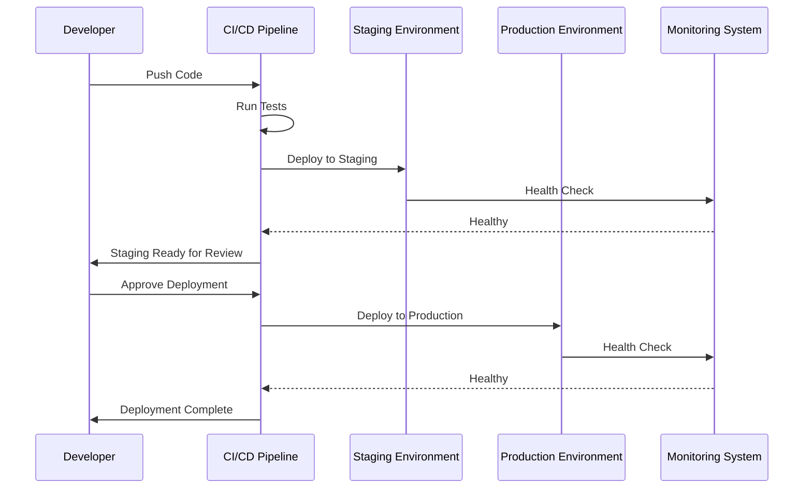
```mermaid
sequenceDiagram
    participant Dev as Developer
    participant CI as CI/CD Pipeline
    participant Staging as Staging Environment
    participant Prod as Production Environment
    participant Monitor as Monitoring System
    
    Dev->>CI: Push Code
    CI->>CI: Run Tests
    CI->>Staging: Deploy to Staging
    Staging->>Monitor: Health Check
    Monitor-->>CI: Healthy
    CI->>Dev: Staging Ready for Review
    Dev->>CI: Approve Deployment
    CI->>Prod: Deploy to Production
    Prod->>Monitor: Health Check
    Monitor-->>CI: Healthy
    CI->>Dev: Deployment Complete
```

### 6.3. Environment Promotion

The CI/CD pipeline implements environment promotion for controlled deployments.

**Promotion Stages:**

1. **Development:** Automatic deployment on push to main branch
2. **Staging:** Automatic deployment on passing tests, manual approval required
3. **Production:** Manual deployment from staging with approval gates

**Promotion Criteria:**

| Stage | Criteria | Approval |
|-------|-----------|-----------|
| Development | All tests pass | Automatic |
| Staging | All tests pass, security scan clean | Manual |
| Production | Staging validation complete, approval granted | Manual |

### 6.4. Rollback Procedures

The CI/CD pipeline includes automated rollback procedures for deployment failures.

**Rollback Architecture:**

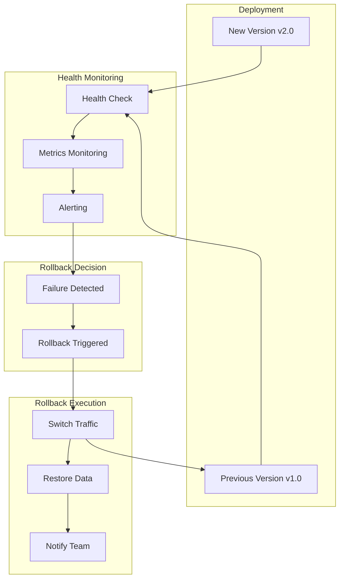
```mermaid
graph TB
    subgraph "Deployment"
        NewVersion[New Version v2.0]
        OldVersion[Previous Version v1.0]
    end
    
    subgraph "Health Monitoring"
        HealthCheck[Health Check]
        Metrics[Metrics Monitoring]
        Alerts[Alerting]
    end
    
    subgraph "Rollback Decision"
        FailureDetected[Failure Detected]
        RollbackTrigger[Rollback Triggered]
    end
    
    subgraph "Rollback Execution"
        SwitchTraffic[Switch Traffic]
        RestoreData[Restore Data]
        Notify[Notify Team]
    end
    
    NewVersion --> HealthCheck
    OldVersion --> HealthCheck
    HealthCheck --> Metrics
    Metrics --> Alerts
    Alerts --> FailureDetected
    FailureDetected --> RollbackTrigger
    RollbackTrigger --> SwitchTraffic
    SwitchTraffic --> OldVersion
    SwitchTraffic --> RestoreData
    RestoreData --> Notify
```

**Rollback Triggers:**

1. **Health Check Failures:** Consecutive health check failures
2. **Error Rate Spike:** Significant increase in error rate
3. **Performance Degradation:** Performance metrics below threshold
4. **Manual Trigger:** Manual rollback initiation by operations team

### 6.5. Pipeline Diagrams

**Complete CI/CD Pipeline:**

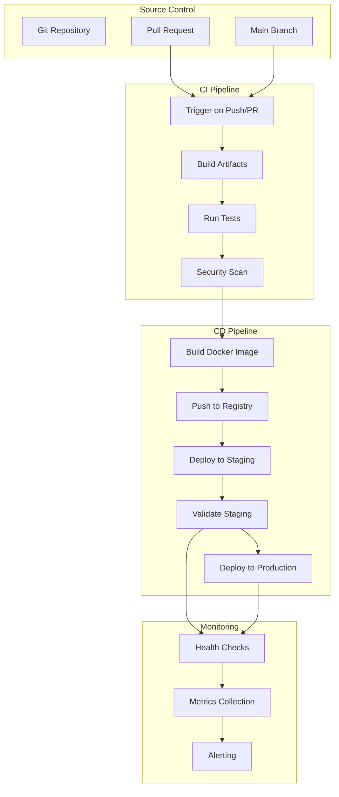
```mermaid
graph TB
    subgraph "Source Control"
        Git[Git Repository]
        PR[Pull Request]
        Main[Main Branch]
    end
    
    subgraph "CI Pipeline"
        Trigger[Trigger on Push/PR]
        Build[Build Artifacts]
        Test[Run Tests]
        Security[Security Scan]
    end
    
    subgraph "CD Pipeline"
        DockerBuild[Build Docker Image]
        DockerPush[Push to Registry]
        DeployStaging[Deploy to Staging]
        Validate[Validate Staging]
        DeployProd[Deploy to Production]
    end
    
    subgraph "Monitoring"
        Health[Health Checks]
        Metrics[Metrics Collection]
        Alerts[Alerting]
    end
    
    PR --> Trigger
    Main --> Trigger
    Trigger --> Build
    Build --> Test
    Test --> Security
    Security --> DockerBuild
    DockerBuild --> DockerPush
    DockerPush --> DeployStaging
    DeployStaging --> Validate
    Validate --> Health
    Health --> Metrics
    Metrics --> Alerts
    Validate --> DeployProd
    DeployProd --> Health
```

---

## 7. CONFIGURATION MANAGEMENT

### 7.1. Environment-Specific Configuration

The Tachyon deployment architecture supports environment-specific configuration for development, staging, and production.

**Configuration Architecture:**

```mermaid
graph TB
    subgraph "Configuration Sources"
        EnvVars[Environment Variables]
        ConfigFiles[Configuration Files]
        Secrets[Secret Management]
    end
    
    subgraph "Configuration Layers"
        BaseConfig[Base Configuration]
        EnvConfig[Environment Configuration]
        LocalConfig[Local Overrides]
    end
    
    subgraph "Configuration Validation"
        Schema[Schema Validation]
        TypeCheck[Type Checking]
        RangeCheck[Range Validation]
    end
    
    subgraph "Application"
        DesktopApp[Desktop Application]
        ServerApp[Server Application]
        WebApp[Web Application]
    end
    
    EnvVars --> BaseConfig
    ConfigFiles --> BaseConfig
    Secrets --> BaseConfig
    BaseConfig --> EnvConfig
    EnvConfig --> LocalConfig
    LocalConfig --> Schema
    Schema --> TypeCheck
    TypeCheck --> RangeCheck
    RangeCheck --> DesktopApp
    RangeCheck --> ServerApp
    RangeCheck --> WebApp
```

**Configuration Hierarchy:**

1. **Base Configuration:** Default configuration values
2. **Environment Configuration:** Environment-specific overrides
3. **Local Configuration:** Local development overrides
4. **Runtime Configuration:** Runtime environment variables

### 7.2. Secret Management

The Tachyon deployment architecture implements secure secret management for sensitive configuration.

**Secret Management Architecture:**

```mermaid
graph TB
    subgraph "Secret Sources"
        EnvVars[Environment Variables]
        Vault[HashiCorp Vault]
        KMS[AWS KMS/GCP KMS]
        SecretsFile[Encrypted Secrets File]
    end
    
    subgraph "Secret Injection"
        CI[CI/CD Pipeline]
        K8s[Kubernetes Secrets]
        Systemd[Systemd Credentials]
    end
    
    subgraph "Application"
        DesktopApp[Desktop Application]
        ServerApp[Server Application]
    end
    
    EnvVars --> CI
    Vault --> CI
    KMS --> CI
    SecretsFile --> CI
    CI --> K8s
    CI --> Systemd
    K8s --> ServerApp
    Systemd --> DesktopApp
```

**Secret Management Best Practices:**

1. **Never Commit Secrets:** Secrets never committed to version control
2. **Encrypted Storage:** Secrets encrypted at rest
3. **Secure Transmission:** Secrets transmitted via TLS 1.3
4. **Rotation:** Regular secret rotation policies
5. **Access Control:** Principle of least privilege for secret access
6. **Audit Logging:** All secret access logged

### 7.3. Configuration Validation

The Tachyon deployment architecture includes configuration validation to prevent misconfiguration.

**Validation Architecture:**

```mermaid
graph TB
    subgraph "Configuration Input"
        RawConfig[Raw Configuration]
        Schema[Configuration Schema]
    end
    
    subgraph "Validation Stages"
        SyntaxCheck[Syntax Validation]
        TypeCheck[Type Checking]
        RangeCheck[Range Validation]
        DependencyCheck[Dependency Validation]
    end
    
    subgraph "Validation Output"
        ValidConfig[Valid Configuration]
        Errors[Validation Errors]
    end
    
    subgraph "Application"
        App[Application Startup]
    end
    
    RawConfig --> SyntaxCheck
    Schema --> SyntaxCheck
    SyntaxCheck --> TypeCheck
    TypeCheck --> RangeCheck
    RangeCheck --> DependencyCheck
    DependencyCheck --> ValidConfig
    DependencyCheck --> Errors
    ValidConfig --> App
    Errors --> App
```

### 7.4. Configuration Diagrams

**Complete Configuration Management:**

```mermaid
graph TB
    subgraph "Development Environment"
        DevEnvVars[.env.local]
        DevConfig[config.dev.toml]
        DevSecrets[secrets.dev.enc]
    end
    
    subgraph "Staging Environment"
        StagingEnvVars[Environment Variables]
        StagingConfig[config.staging.toml]
        StagingVault[HashiCorp Vault]
    end
    
    subgraph "Production Environment"
        ProdEnvVars[Environment Variables]
        ProdConfig[config.prod.toml]
        ProdVault[AWS Secrets Manager]
    end
    
    subgraph "Configuration Loading"
        ConfigLoader[Configuration Loader]
        Validator[Configuration Validator]
    end
    
    subgraph "Application"
        Desktop[Desktop Application]
        Server[Server Application]
        Web[Web Application]
    end
    
    DevEnvVars --> ConfigLoader
    DevConfig --> ConfigLoader
    DevSecrets --> ConfigLoader
    StagingEnvVars --> ConfigLoader
    StagingConfig --> ConfigLoader
    StagingVault --> ConfigLoader
    ProdEnvVars --> ConfigLoader
    ProdConfig --> ConfigLoader
    ProdVault --> ConfigLoader
    ConfigLoader --> Validator
    Validator --> Desktop
    Validator --> Server
    Validator --> Web
```

---

## 8. MONITORING AND OBSERVABILITY

### 8.1. Application Monitoring

The Tachyon deployment architecture includes comprehensive application monitoring for performance and availability.

**Application Monitoring Architecture:**

```mermaid
graph TB
    subgraph "Application"
        DesktopApp[Desktop Application]
        ServerApp[Server Application]
        WebApp[Web Application]
    end
    
    subgraph "Monitoring Agents"
        DesktopAgent[Desktop Telemetry]
        ServerAgent[Server Metrics]
        WebRUM[Web RUM]
    end
    
    subgraph "Monitoring Backend"
        Metrics[Metrics Collector]
        Logs[Log Aggregator]
        Traces[Trace Collector]
    end
    
    subgraph "Monitoring UI"
        Dashboard[Monitoring Dashboard]
        Alerts[Alerting System]
    end
    
    DesktopApp --> DesktopAgent
    ServerApp --> ServerAgent
    WebApp --> WebRUM
    DesktopAgent --> Metrics
    DesktopAgent --> Logs
    ServerAgent --> Metrics
    ServerAgent --> Logs
    ServerAgent --> Traces
    WebRUM --> Metrics
    Metrics --> Dashboard
    Logs --> Dashboard
    Traces --> Dashboard
    Metrics --> Alerts
    Logs --> Alerts
    Traces --> Alerts
```

### 8.2. Infrastructure Monitoring

The Tachyon deployment architecture includes infrastructure monitoring for system health and resource utilization.

**Infrastructure Monitoring Architecture:**

```mermaid
graph TB
    subgraph "Infrastructure"
        Servers[Application Servers]
        Database[Database Servers]
        Network[Network Infrastructure]
        Storage[Storage Systems]
    end
    
    subgraph "Monitoring Agents"
        NodeExporter[Node Exporter]
        DBExporter[Database Exporter]
        NetExporter[Network Exporter]
        StorageExporter[Storage Exporter]
    end
    
    subgraph "Monitoring Backend"
        Prometheus[Prometheus]
        Grafana[Grafana Dashboard]
    end
    
    Servers --> NodeExporter
    Database --> DBExporter
    Network --> NetExporter
    Storage --> StorageExporter
    NodeExporter --> Prometheus
    DBExporter --> Prometheus
    NetExporter --> Prometheus
    StorageExporter --> Prometheus
    Prometheus --> Grafana
```

### 8.3. Log Aggregation

The Tachyon deployment architecture includes centralized log aggregation for troubleshooting and auditing.

**Log Aggregation Architecture:**

```mermaid
graph TB
    subgraph "Log Sources"
        DesktopLogs[Desktop Application Logs]
        ServerLogs[Server Application Logs]
        AccessLogs[Access Logs]
        ErrorLogs[Error Logs]
    end
    
    subgraph "Log Shipping"
        FluentBit[Fluent Bit]
        Logstash[Logstash]
    end
    
    subgraph "Log Storage"
        Elasticsearch[Elasticsearch]
        S3[AWS S3/GCS]
    end
    
    subgraph "Log Analysis"
        Kibana[Kibana Dashboard]
        Queries[Log Queries]
    end
    
    DesktopLogs --> FluentBit
    ServerLogs --> FluentBit
    AccessLogs --> FluentBit
    ErrorLogs --> FluentBit
    FluentBit --> Logstash
    Logstash --> Elasticsearch
    Logstash --> S3
    Elasticsearch --> Kibana
    Elasticsearch --> Queries
```

### 8.4. Metrics and Alerting

The Tachyon deployment architecture includes metrics collection and alerting for proactive issue detection.

**Metrics and Alerting Architecture:**

```mermaid
graph TB
    subgraph "Metrics Sources"
        AppMetrics[Application Metrics]
        InfraMetrics[Infrastructure Metrics]
        BusinessMetrics[Business Metrics]
    end
    
    subgraph "Metrics Processing"
        Prometheus[Prometheus]
        Rules[Alert Rules]
    end
    
    subgraph "Alerting"
        AlertManager[Alert Manager]
        Notifications[Notification Channels]
    end
    
    subgraph "Notification Destinations"
        Email[Email Alerts]
        Slack[Slack Notifications]
        PagerDuty[PagerDuty Escalations]
    end
    
    AppMetrics --> Prometheus
    InfraMetrics --> Prometheus
    BusinessMetrics --> Prometheus
    Prometheus --> Rules
    Rules --> AlertManager
    AlertManager --> Notifications
    Notifications --> Email
    Notifications --> Slack
    Notifications --> PagerDuty
```

### 8.5. Monitoring Diagrams

**Complete Monitoring Architecture:**

```mermaid
graph TB
    subgraph "Data Collection"
        AppMetrics[Application Metrics]
        Logs[Application Logs]
        Traces[Distributed Traces]
        RUM[Real User Monitoring]
    end
    
    subgraph "Processing"
        Prometheus[Prometheus]
        Loki[Loki Log Aggregator]
        Tempo[Tempo Trace Backend]
    end
    
    subgraph "Visualization"
        Grafana[Grafana Dashboards]
    end
    
    subgraph "Alerting"
        AlertManager[Alert Manager]
        Routes[Alert Routes]
    end
    
    subgraph "Notifications"
        Email[Email]
        Slack[Slack]
        PagerDuty[PagerDuty]
    end
    
    AppMetrics --> Prometheus
    Logs --> Loki
    Traces --> Tempo
    RUM --> Prometheus
    Prometheus --> Grafana
    Loki --> Grafana
    Tempo --> Grafana
    Prometheus --> AlertManager
    AlertManager --> Routes
    Routes --> Email
    Routes --> Slack
    Routes --> PagerDuty
```

---

## 9. DISASTER RECOVERY

### 9.1. Backup Strategies

The Tachyon deployment architecture includes comprehensive backup strategies for data protection.

**Backup Architecture:**

```mermaid
graph TB
    subgraph "Data Sources"
        GitRepo[Git Repository]
        SQLite[SQLite Database]
        Files[User Files]
    end
    
    subgraph "Backup Types"
        FullBackup[Full Backups]
        IncrementalBackup[Incremental Backups]
        SnapshotBackup[Point-in-Time Snapshots]
    end
    
    subgraph "Backup Storage"
        LocalBackup[Local Backup Storage]
        RemoteBackup[Remote Backup Storage]
        Archive[Long-term Archive]
    end
    
    subgraph "Backup Verification"
        Integrity[Integrity Checks]
        RestoreTest[Restore Testing]
    end
    
    GitRepo --> FullBackup
    SQLite --> IncrementalBackup
    Files --> SnapshotBackup
    FullBackup --> LocalBackup
    IncrementalBackup --> RemoteBackup
    SnapshotBackup --> Archive
    LocalBackup --> Integrity
    RemoteBackup --> Integrity
    Archive --> Integrity
    Integrity --> RestoreTest
```

**Backup Strategy Details:**

1. **Git Repository:** Automatic pushes to remote repository (GitHub, GitLab)
2. **SQLite Database:** Hourly incremental backups with daily full backups
3. **User Files:** Daily incremental backups with weekly full backups
4. **Configuration:** Version-controlled configuration with change history
5. **Encryption:** All backups encrypted at rest using AES-256-GCM

### 9.2. Recovery Procedures

The Tachyon deployment architecture includes documented recovery procedures for disaster scenarios.

**Recovery Procedure Architecture:**

```mermaid
graph TB
    subgraph "Disaster Detection"
        Monitor[Monitoring Detection]
        Manual[Manual Reporting]
    end
    
    subgraph "Impact Assessment"
        Severity[Severity Assessment]
        Scope[Scope Analysis]
    end
    
    subgraph "Recovery Actions"
        Restore[Data Restore]
        Rebuild[Service Rebuild]
        Failover[Failover to Backup]
    end
    
    subgraph "Verification"
        HealthCheck[Health Verification]
        DataIntegrity[Data Integrity Check]
    end
    
    subgraph "Communication"
        Stakeholders[Stakeholder Notification]
        Documentation[Incident Documentation]
    end
    
    Monitor --> Severity
    Manual --> Severity
    Severity --> Scope
    Scope --> Restore
    Scope --> Rebuild
    Scope --> Failover
    Restore --> HealthCheck
    Rebuild --> HealthCheck
    Failover --> HealthCheck
    HealthCheck --> DataIntegrity
    DataIntegrity --> Stakeholders
    DataIntegrity --> Documentation
```

### 9.3. Failover Mechanisms

The Tachyon deployment architecture includes failover mechanisms for high availability.

**Failover Architecture:**

```mermaid
graph TB
    subgraph "Primary Site"
        PrimaryLB[Primary Load Balancer]
        PrimaryApp[Primary Application Servers]
        PrimaryDB[Primary Database]
    end
    
    subgraph "Secondary Site"
        SecondaryLB[Secondary Load Balancer]
        SecondaryApp[Secondary Application Servers]
        SecondaryDB[Secondary Database]
    end
    
    subgraph "Failover Detection"
        HealthMonitor[Health Monitoring]
        FailoverTrigger[Failover Trigger]
    end
    
    subgraph "DNS Management"
        DNS[DNS Provider]
    end
    
    PrimaryLB --> HealthMonitor
    PrimaryApp --> HealthMonitor
    PrimaryDB --> HealthMonitor
    HealthMonitor --> FailoverTrigger
    FailoverTrigger --> DNS
    DNS --> PrimaryLB
    DNS --> SecondaryLB
    SecondaryLB --> SecondaryApp
    SecondaryApp --> SecondaryDB
```

**Failover Scenarios:**

1. **Application Failure:** Automatic failover to secondary application servers
2. **Database Failure:** Automatic failover to database replica
3. **Site Failure:** DNS failover to secondary site
4. **Network Failure:** Automatic routing via alternative network paths

### 9.4. Recovery Diagrams

**Complete Disaster Recovery Architecture:**

```mermaid
graph TB
    subgraph "Normal Operations"
        Primary[Primary Site]
        Backup[Backup Site]
        DR[Disaster Recovery Site]
    end
    
    subgraph "Disaster Event"
        Failure[Primary Site Failure]
    end
    
    subgraph "Recovery Process"
        Detection[Failure Detection]
        Assessment[Impact Assessment]
        Decision[Recovery Decision]
        Execution[Recovery Execution]
    end
    
    subgraph "Recovery Modes"
        Failover[Failover to Backup]
        Restore[Restore from Backups]
        Rebuild[Rebuild from Source]
    end
    
    subgraph "Post-Recovery"
        Verification[Verification Testing]
        Communication[Stakeholder Communication]
        Documentation[Incident Documentation]
    end
    
    Primary --> Failure
    Backup --> Failover
    DR --> Restore
    DR --> Rebuild
    Failure --> Detection
    Detection --> Assessment
    Assessment --> Decision
    Decision --> Execution
    Execution --> Failover
    Execution --> Restore
    Execution --> Rebuild
    Failover --> Verification
    Restore --> Verification
    Rebuild --> Verification
    Verification --> Communication
    Verification --> Documentation
```

---

## 10. REFERENCES

### 10.1. Related ADRs

| ADR ID | Title | Reference |
|---------|-------|-----------|
| [ADR-002](../../.specs/02_adrs/002_tauri_for_desktop_application.md) | Tauri for Desktop Application | Desktop deployment framework |
| [ADR-003](../../.specs/02_adrs/003_axum_for_http2_server.md) | Axum for HTTP/2 Server | Server deployment framework |
| [ADR-004](../../.specs/02_adrs/004_leptos_for_web_frontend.md) | Leptos for Web Frontend | Web deployment framework |
| [ADR-006](../../.specs/02_adrs/006_nix_flakes_for_build_system.md) | Nix Flakes for Build System | Build system architecture |

### 10.2. Related Requirements

| Requirement ID | Title | Reference |
|----------------|-------|-----------|
| REQ-BLD-001 through REQ-BLD-020 | Nix Flakes Requirements | [Build Requirements](../../.specs/04_future_state/reqs/build_requirements.md) |
| REQ-BLD-026 through REQ-BLD-045 | Cross-Platform Build Support | [Build Requirements](../../.specs/04_future_state/reqs/build_requirements.md) |
| REQ-BLD-046 through REQ-BLD-060 | Build Artifacts | [Build Requirements](../../.specs/04_future_state/reqs/build_requirements.md) |
| REQ-BLD-061 through REQ-BLD-075 | Deployment Procedures | [Build Requirements](../../.specs/04_future_state/reqs/build_requirements.md) |
| REQ-BLD-076 through REQ-BLD-090 | Version Management | [Build Requirements](../../.specs/04_future_state/reqs/build_requirements.md) |

### 10.3. Related Design Elements

| Design Element ID | Title | Reference |
|------------------|-------|-----------|
| DES-BLD-001 | Flake Configuration | [Build Design](../../.specs/04_future_state/design/build_design.md) |
| DES-BLD-002 | Cargo Configuration | [Build Design](../../.specs/04_future_state/design/build_design.md) |
| DES-BLD-003 | Release Profiles | [Build Design](../../.specs/04_future_state/design/build_design.md) |
| DES-BLD-004 | Dependency Locking | [Build Design](../../.specs/04_future_state/design/build_design.md) |
| DES-BLD-006 | Platform Targets | [Build Design](../../.specs/04_future_state/design/build_design.md) |

### 10.4. External References

[1] TACHYON-STD-V1.0, "TACHYON: CODING AND DOCUMENTATION STANDARDS," February 2026.

[2] TACHYON-TSK-V1.0, "TACHYON: EXECUTION TASKS AND WORK BREAKDOWN STRUCTURE," February 2026.

[3] TACHYON-REQ-BLD-V1.0, "TACHYON: BUILD AND DEPLOYMENT REQUIREMENTS," February 2026.

[4] TACHYON-DES-BLD-V1.0, "TACHYON: BUILD SYSTEM DESIGN," February 2026.

[5] TACHYON-TMA-V1.0, "TACHYON: THREAT MODEL ANALYSIS," February 2026.

[6] Nix Manual, "Nix Flakes: A Reproducible Package Manager for Nix," Online. Available: https://nixos.org/manual/nix/stable/chapters/structures/flakes.html. [Accessed: 04-Feb-2026].

[7] Docker Documentation, "Docker: Containerize Your Application," Online. Available: https://docs.docker.com/. [Accessed: 04-Feb-2026].

[8] Kubernetes Documentation, "Kubernetes: Production-Grade Container Orchestration," Online. Available: https://kubernetes.io/docs/. [Accessed: 04-Feb-2026].

[9] Tauri Documentation, "Tauri: Build Smaller, Faster, and More Secure Desktop Applications," Online. Available: https://tauri.app/. [Accessed: 04-Feb-2026].

[10] Leptos Documentation, "Leptos: Build Fast Web Applications with Rust," Online. Available: https://leptos.dev/. [Accessed: 04-Feb-2026].

---

**Document Control**

| Version | Date | Author | Changes |
|---------|------|--------|---------|
| 1.0 | 2026-02-04 | Technical Writer | Initial document creation |

**Approval History**

| Version | Date | Approver | Status |
|---------|------|----------|--------|
| 1.0 | Pending | Pending | Proposed |

---

*End of Document*
