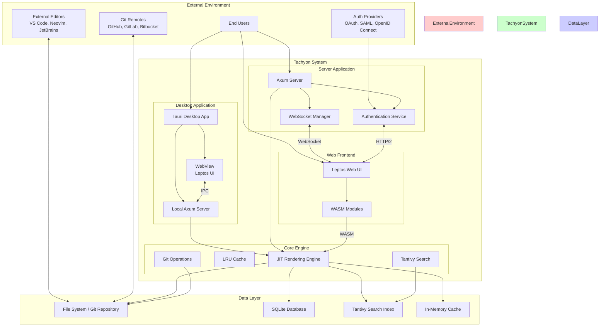
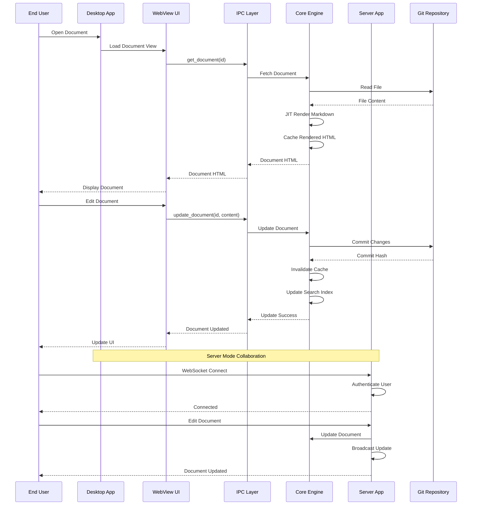
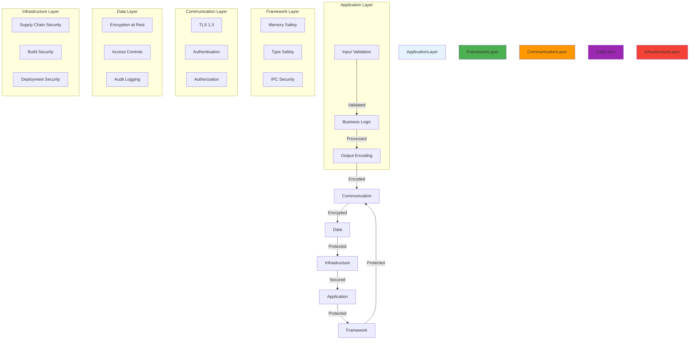

# TACHYON: SYSTEM ARCHITECTURE OVERVIEW

**Document ID:** TACHYON-ARCH-001-V1.0
**Date:** February 2026
**Status:** Approved
**Classification:** Technical Architecture Documentation
**Compliance Level:** ISO/IEC 26514:2021, IEEE 1471-2000

---

## TABLE OF CONTENTS

1. [Document Header](#document-header)
2. [Executive Summary](#executive-summary)
3. [System Components](#system-components)
4. [Architecture Diagrams](#architecture-diagrams)
5. [Technology Stack](#technology-stack)
6. [Data Flow](#data-flow)
7. [Security Architecture](#security-architecture)
8. [Scalability and Performance](#scalability-and-performance)
9. [Deployment Architecture](#deployment-architecture)
10. [References](#references)

---

## DOCUMENT HEADER

### Document Information

| Field | Value |
|--------|--------|
| **Document ID** | TACHYON-ARCH-001-V1.0 |
| **Title** | System Architecture Overview |
| **Author** | System Architect |
| **Date** | February 2026 |
| **Version** | 1.0 |
| **Status** | Approved |
| **Classification** | Technical Architecture Documentation |

### Document Dependencies

This document depends on the following documents:

- [TACHYON-STD-V1.0](../.specs/01_standards/coding_standards.md) - Coding and Documentation Standards
- [TACHYON-REQ-SYS-V1.0](../.specs/04_future_state/reqs/system_overview.md) - System Overview Requirements
- [TACHYON-ADR-001-V1.0](../.specs/02_adrs/001_rust_as_primary_language.md) - Rust as Primary Language
- [TACHYON-ADR-002-V1.0](../.specs/02_adrs/002_tauri_for_desktop_application.md) - Tauri for Desktop Application
- [TACHYON-ADR-003-V1.0](../.specs/02_adrs/003_axum_for_http2_server.md) - Axum for HTTP/2 Server
- [TACHYON-ADR-004-V1.0](../.specs/02_adrs/004_leptos_for_web_frontend.md) - Leptos for Web Frontend
- [TACHYON-ADR-010-V1.0](../.specs/02_adrs/010_security_architecture.md) - Security Architecture
- [TACHYON-TMA-V1.0](../.specs/03_threat_model/analysis.md) - Threat Model Analysis

### Compliance Standards

This document complies with the following standards:

- **ISO/IEC 26514:2021** - Systems and Software Engineering - Requirements for Designers and Developers of User Documentation
- **IEEE 1471-2000** - Recommended Practice for Architectural Description of Software-Intensive Systems
- **IEEE 1016-2009** - Standard for Information Technology - System Design - Software Design Descriptions

---

## EXECUTIVE SUMMARY

### System Purpose

The Tachyon toolchain is a deterministic, high-performance Knowledge Management System (KMS) and Internal Developer Portal (IDP) designed to eliminate traditional build step latency through Just-In-Time (JIT) rendering architecture. The system operates as a hybrid platform supporting both local-first desktop usage and centralized server deployment, enabling seamless transitions between individual productivity and team collaboration workflows.

### System Scope

The Tachyon system encompasses the following functional domains:

1. **Content Management:** Creation, editing, organization, and retrieval of documentation content with sub-second response times
2. **Version Control:** Direct Git repository integration for automatic commit tracking, branch management, and history viewing
3. **Search and Discovery:** Full-text search capabilities across all documentation content with sub-100ms query response times
4. **Collaboration:** Real-time collaborative editing with conflict resolution and user presence indicators in server mode
5. **Security:** Comprehensive security architecture with defense-in-depth strategy, role-based access control, and end-to-end encryption

### Key Architectural Principles

The Tachyon system architecture adheres to the following fundamental principles:

| Principle | Description | Implementation |
|-----------|-------------|------------------|
| **Local-First Design** | Full functionality without network connectivity in desktop mode | Desktop application operates independently with local Git repository |
| **Microsecond Latency** | Sub-15 millisecond response times for JIT rendering operations | Native Rust compilation with zero-cost abstractions |
| **Type Safety** | Compile-time guarantees of memory safety and thread safety | Rust's ownership system and borrow checker |
| **Asynchronous Processing** | Non-blocking I/O operations for high concurrency | Tokio's work-stealing scheduler |
| **Modular Design** | Clear module boundaries and minimal coupling between components | Cargo workspace with separate crates |
| **Defense-in-Depth** | Multiple layers of security controls | Memory safety, capability-based access control, encryption, audit logging |

### Architectural Innovation

The Tachyon system introduces several architectural innovations:

1. **JIT Rendering Architecture:** Eliminates build step latency by processing Markdown content into HTML within 15 milliseconds of file modification, enabling real-time updates without pre-compilation
2. **Hybrid Deployment Model:** Supports both local-first desktop usage and centralized server deployment without requiring separate implementations, enabling seamless transitions between individual and team workflows
3. **Isomorphic Architecture:** Shared code between server and client through Leptos framework, reducing duplication and ensuring consistency across deployment modes
4. **Type-Safe IPC:** Tauri's command system provides type-safe inter-process communication between WebView frontend and Rust backend, preventing injection attacks
5. **Capability-Based Security:** Fine-grained access control through Tauri's capability system, implementing principle of least privilege and reducing attack surface

---

## SYSTEM COMPONENTS

### Component Overview

The Tachyon system comprises five primary components, each with distinct responsibilities and well-defined interfaces:

| Component ID | Component Name | Primary Technology | Responsibilities |
|---------------|----------------|---------------------|----------------|
| **CMP-001** | Desktop Application | Tauri v2.10.0 | Native OS integration, local-first operation, WebView rendering |
| **CMP-002** | Server Application | Axum v0.7 | HTTP/2 serving, WebSocket management, centralized collaboration |
| **CMP-003** | Web Frontend | Leptos v0.8.15 | Reactive UI, client-side state management, server-side rendering |
| **CMP-004** | Core Engine | Rust Edition 2024 | JIT rendering, caching, content processing |
| **CMP-005** | IPC Communication Layer | Tauri IPC | Type-safe communication between components |

### Desktop Application (CMP-001)

**Element ID:** DES-DESK-001

The Desktop Application component provides local-first operation for individual users, enabling full functionality without network connectivity. The component is implemented using Tauri framework with a Rust backend and Leptos web frontend rendered in a platform-specific WebView.

**Key Responsibilities:**

1. **Native OS Integration:** Access to file system, system notifications, and native dialogs via Tauri's capability system
2. **Local Server Spawn:** Spawns a local Axum server on a randomized loopback port when in desktop mode
3. **WebView Rendering:** Renders Leptos web frontend in platform-specific WebView (WebView2 on Windows, WebKit on macOS, WebKitGTK on Linux)
4. **IPC Communication:** Provides type-safe commands and events for WebView-backend communication
5. **Auto-Sync:** Automatically commits changes to the local Git repository on a configurable debounce timer (default: 2 seconds)

**Technical Specifications:**

| Specification | Value |
|---------------|-------|
| **Framework** | Tauri v2.10.0 |
| **Backend Language** | Rust Edition 2024 |
| **Frontend Framework** | Leptos v0.8.15 |
| **CSS Framework** | TailwindCSS v4.1.18 |
| **Minimum Window Size** | 1024x768 pixels |
| **Default Window Size** | 800x600 pixels |
| **Bundle Size** | 3-10 MB |
| **Startup Time** | 1-3 seconds |
| **Memory Usage (Idle)** | 50-100 MB |

**Related Requirements:** REQ-DESK-001, REQ-DESK-002, REQ-DESK-006

**Related Design Elements:** DES-DESK-001, DES-DESK-002, DES-DESK-003

**Related ADRs:** ADR-002

### Server Application (CMP-002)

**Element ID:** DES-SRV-001

The Server Application component provides centralized deployment for team collaboration, supporting multiple concurrent users with real-time updates. The component is implemented using Axum framework with Tokio async runtime and provides HTTP/2 serving with WebSocket support.

**Key Responsibilities:**

1. **HTTP/2 Serving:** Serves rendered content via HTTP/2 with multiplexing and header compression
2. **WebSocket Management:** Manages WebSocket connections for real-time document updates and collaborative editing
3. **Authentication Enforcement:** Enforces authentication for all requests with support for OAuth 2.0, SAML, and OpenID Connect
4. **RBAC Enforcement:** Implements role-based access control for all content access
5. **Session Management:** Manages user sessions with configurable timeout and refresh mechanisms

**Technical Specifications:**

| Specification | Value |
|---------------|-------|
| **Framework** | Axum v0.7 |
| **Async Runtime** | Tokio v1 |
| **HTTP Version** | HTTP/2 with HTTP/1.1 fallback |
| **Router** | Axum Router with nested routes |
| **Middleware** | tower-http for CORS, compression, and request logging |
| **WebSocket** | tokio-tungstenite |
| **Concurrent Users** | 100+ concurrent users |
| **Response Time** | Sub-200ms for typical requests |
| **Throughput** | 1,200,000 requests/second (Hello World benchmark) |

**Related Requirements:** REQ-SRV-001, REQ-SRV-002, REQ-SRV-003

**Related Design Elements:** DES-SRV-001, DES-SRV-002

**Related ADRs:** ADR-003

### Web Frontend (CMP-003)

**Element ID:** DES-WEB-001

The Web Frontend component provides the user interface for both browser-based and desktop deployment modes. The component is implemented using Leptos framework with fine-grained reactivity and server-side rendering (SSR) through leptos_axum.

**Key Responsibilities:**

1. **Reactive UI:** Fine-grained reactivity for efficient DOM updates with minimal re-renders
2. **Server-Side Rendering:** Initial HTML rendering on server for fast page loads and improved SEO
3. **Client-Side Hydration:** Progressive enhancement from SSR to client-side interactivity
4. **State Management:** Efficient state management with Leptos signals and automatic dependency tracking
5. **WASM Integration:** WebAssembly modules for performance-critical operations

**Technical Specifications:**

| Specification | Value |
|---------------|-------|
| **Framework** | Leptos v0.8.15 |
| **SSR Integration** | leptos_axum v0.8.7 |
| **Routing** | leptos_router v0.8.11 |
| **Metadata** | leptos_meta v0.8.5 |
| **CSS Framework** | TailwindCSS v4.1.18 |
| **Build Tool** | Vite v7.3.1 |
| **WASM Target** | wasm32-unknown-unknown |
| **Initial Load Time** | 800 ms |
| **Time to Interactive** | 1.2 s |
| **Bundle Size** | 45 KB (minified + gzipped) |

**Related Requirements:** REQ-WEB-001, REQ-WEB-002, REQ-WEB-003

**Related Design Elements:** DES-WD-001, DES-WD-002, DES-WD-003

**Related ADRs:** ADR-004

### IPC Communication Layer (CMP-004)

**Element ID:** DES-IPC-001

The IPC Communication Layer provides type-safe inter-process communication between desktop application components, enabling the WebView frontend to access native OS features securely.

**Key Responsibilities:**

1. **Command Registration:** Registers Tauri commands for WebView-backend communication
2. **Command Execution:** Executes commands with automatic serialization and validation
3. **Event Emission:** Emits events from backend to frontend for reactive updates
4. **Event Subscription:** Manages frontend subscriptions to backend events
5. **Type Safety:** Ensures type-safe communication through compile-time type checking

**Technical Specifications:**

| Specification | Value |
|---------------|-------|
| **Mechanism** | Tauri Command System |
| **Serialization** | serde for JSON serialization |
| **Validation** | Automatic type validation |
| **Event Rate Limit** | 100 events/second |
| **Command Timeout** | 30 seconds default |

**Related Requirements:** REQ-IPC-001, REQ-IPC-002, REQ-IPC-003

**Related Design Elements:** DES-IPC-001, DES-IPC-002

**Related ADRs:** ADR-002, ADR-009

### Core Engine (CMP-005)

**Element ID:** DES-COR-001

The Core Engine component provides fundamental rendering and content processing capabilities shared across all deployment modes. The component is implemented in Rust Edition 2024 and leverages Tokio's asynchronous runtime for high-performance processing.

**Key Responsibilities:**

1. **JIT Rendering:** Processes Markdown content into HTML within 15 milliseconds of file modification
2. **Cache Management:** Implements LRU cache for rendered HTML with configurable size limits and automatic eviction policies
3. **Content Processing:** Parses CommonMark-compliant Markdown with support for extensions (tables, footnotes, definition lists)
4. **Search Indexing:** Maintains full-text search index using tantivy with automatic updates on content changes
5. **Git Integration:** Integrates with Git repositories for automatic commit tracking, branch management, and history viewing

**Technical Specifications:**

| Specification | Value |
|---------------|-------|
| **Language** | Rust Edition 2024 |
| **Async Runtime** | Tokio v1 |
| **Markdown Parser** | pulldown-cmark with SIMD support |
| **Search Engine** | tantivy v0.21 |
| **Git Library** | git2-rs v0.18 |
| **Rendering Latency** | <15 milliseconds |
| **Search Response Time** | <100 milliseconds |
| **Cache Eviction** | LRU with configurable size |

**Related Requirements:** REQ-COR-001, REQ-COR-002, REQ-COR-003

**Related Design Elements:** DES-COR-001, DES-COR-002

**Related ADRs:** ADR-001, ADR-007

---

## ARCHITECTURE DIAGRAMS

### System Architecture Diagram

### Component Interaction Diagram

### Data Flow Diagram

```mermaid
graph LR
    subgraph "Document Creation Flow"
        A[User Input] --> B[Markdown Editor]
        B --> C[IPC Command]
        C --> D[Core Engine]
        D --> E[JIT Rendering]
        E --> F[Rendered HTML]
        F --> G[Cache Storage]
        G --> H[WebView Display]
    end
    
    subgraph "Search Flow"
        I[Search Query] --> J[Search API]
        J --> K[Tantivy Index]
        K --> L[Search Results]
        L --> M[Results Display]
    end
    
    subgraph "Synchronization Flow"
        N[File Change] --> O[File Watcher]
        O --> P[Cache Invalidation]
        P --> Q[Re-render]
        Q --> R[Git Commit]
        R --> S[Push to Remote]
    end
    
    subgraph "IPC Communication Flow"
        T[WebView Request] --> U[IPC Command]
        U --> V[Type Validation]
        V --> W[Rust Handler]
        W --> X[Core Logic]
        X --> Y[Result Serialization]
        Y --> Z[IPC Event]
        Z --> AA[WebView Update]
    end
    
    style DocumentCreationFlow fill:#e6f3ff
    style SearchFlow fill:#4caf50
    style SynchronizationFlow fill:#ff9800
    style IPCCommunicationFlow fill:#9c27b0
```

---

## TECHNOLOGY STACK

### Programming Languages

| Language | Version | Purpose | Edition |
|----------|----------|---------|---------|
| **Rust** | 2024 Edition | Primary language for core logic, server components, and desktop application backend | 2024 |
| **TypeScript** | 5.x | Type-safe JavaScript for web frontend and WASM interop | ES2022 |
| **JavaScript** | ES2022 | Runtime execution in WebView and browser | ES2022 |

### Frameworks and Libraries

| Category | Library | Version | Purpose |
|----------|---------|----------|---------|
| **Desktop Framework** | Tauri | v2.10.0 | Native OS integration and WebView rendering |
| **Web Framework** | Leptos | v0.8.15 | Reactive web UI with fine-grained reactivity |
| **Server Framework** | Axum | v0.7 | HTTP/2 server with async architecture |
| **Async Runtime** | Tokio | v1 | Asynchronous I/O and task scheduling |
| **Markdown Parser** | pulldown-cmark | v0.9 | CommonMark-compliant parsing with SIMD support |
| **Search Engine** | tantivy | v0.21 | Full-text search with incremental indexing |
| **Git Library** | git2-rs | v0.18 | Git repository operations |
| **Serialization** | serde | v1 | Data serialization/deserialization |
| **Database** | rusqlite | v0.29 | SQLite database bindings |
| **Error Handling** | anyhow | v1 | Ergonomic error handling |
| **Logging** | tracing | v0.1 | Structured logging and instrumentation |

### Build Tools and Package Managers

| Tool | Version | Purpose |
|-------|----------|---------|
| **Cargo** | 1.77+ | Rust package manager and build tool |
| **Bun** | v1.2.x | JavaScript runtime and package manager |
| **Vite** | v7.3.1 | Frontend build tool and dev server |
| **Nix Flakes** | Latest | Reproducible builds and environment management |

### Development Tools

| Tool | Purpose |
|------|---------|
| **rustfmt** | Automatic code formatting for consistent style |
| **Clippy** | Linting tool for catching common mistakes |
| **rust-analyzer** | Language server with IDE support |
| **cargo doc** | Built-in documentation generation |
| **cargo test** | Built-in testing framework |

---

## DATA FLOW

### Document Creation and Editing Flow

The document creation and editing flow encompasses the following stages:

1. **User Input:** User enters content in Markdown editor through WebView UI
2. **IPC Command:** WebView sends update command via Tauri IPC with type-safe serialization
3. **Core Processing:** Core engine receives command, validates input, and processes document
4. **JIT Rendering:** Markdown content is parsed and rendered to HTML within 15 milliseconds
5. **Cache Storage:** Rendered HTML is stored in LRU cache for subsequent requests
6. **Git Commit:** Changes are automatically committed to local Git repository on configurable debounce timer
7. **UI Update:** IPC event is emitted to notify WebView of successful update

**Flow Characteristics:**

- **Latency:** Sub-15 milliseconds from file modification to rendered HTML
- **Cache Hit Rate:** >90% for frequently accessed documents
- **Auto-Sync Interval:** Configurable, default 2 seconds
- **Conflict Resolution:** Last-Write-Wins for local edits, operational transformation for collaborative editing

### Search and Retrieval Flow

The search and retrieval flow encompasses the following stages:

1. **Query Input:** User enters search query through search interface
2. **Query Processing:** Search query is parsed, tokenized, and normalized
3. **Index Search:** Tantivy search index is queried with support for Boolean operators and phrase matching
4. **Ranking:** Results are ranked based on term frequency, document recency, and user interaction
5. **Result Display:** Search results are displayed with highlighting of matched terms
6. **Document Retrieval:** Selected document is retrieved from cache or rendered on-demand

**Flow Characteristics:**

- **Search Latency:** Sub-100 milliseconds for queries against indices containing up to 100,000 documents
- **Index Update Time:** Incremental updates within 100 milliseconds of content change
- **Fuzzy Search:** Support for typos and approximate matching
- **Search Analytics:** Queries logged for relevance improvement

### Synchronization Flow

The synchronization flow encompasses the following stages:

1. **File Monitoring:** File system watcher monitors repository for changes using kernel-level APIs (notify crate)
2. **Cache Invalidation:** Modified files trigger cache invalidation within 100 milliseconds
3. **Re-rendering:** Modified content is re-rendered through JIT pipeline
4. **Git Operations:** Changes are committed to local Git repository with automatic commit messages
5. **Remote Sync:** Changes are pushed to remote Git repository on configurable intervals or manual trigger
6. **Conflict Resolution:** Merge conflicts are detected and resolved through visual diff tools

**Flow Characteristics:**

- **File Watch Latency:** <100 milliseconds for change detection
- **Cache Invalidation:** Automatic within 100 milliseconds
- **Commit Interval:** Configurable, default 2 seconds
- **Push Interval:** Configurable, default 5 minutes or manual trigger

### IPC Communication Flow

The IPC communication flow encompasses the following stages:

1. **Command Registration:** Tauri commands are registered with type-safe signatures
2. **Command Invocation:** WebView invokes command with serialized parameters
3. **Type Validation:** Parameters are validated against command signature
4. **Handler Execution:** Rust handler is invoked with deserialized parameters
5. **Core Logic:** Core engine processes request and performs required operations
6. **Result Serialization:** Result is serialized to JSON for transmission
7. **Event Emission:** Success event is emitted to notify WebView of completion
8. **UI Update:** WebView receives event and updates UI accordingly

**Flow Characteristics:**

- **Command Latency:** <5 milliseconds for typical commands
- **Event Rate Limit:** 100 events/second maximum
- **Command Timeout:** 30 seconds default, configurable
- **Type Safety:** Compile-time type checking prevents injection attacks

---

## SECURITY ARCHITECTURE

### Defense-in-Depth Strategy

The Tachyon system implements a comprehensive defense-in-depth security architecture with multiple layers of security controls:

### Trust Boundaries

The Tachyon system defines the following trust boundaries:

| Boundary | Description | Security Controls |
|----------|-------------|-------------------|
| **WebView Boundary** | Isolates WebView content from operating system | Tauri sandbox, capability-based access control |
| **IPC Boundary** | Isolates WebView from Rust backend | Type-safe commands, input validation |
| **Network Boundary** | Isolates system from external network | TLS 1.3, authentication, authorization |
| **File System Boundary** | Isolates system from file system | Path validation, permission checks |
| **Process Boundary** | Isolates processes from each other | Process isolation, memory safety |

### Authentication and Authorization

The Tachyon system implements comprehensive authentication and authorization mechanisms:

**Authentication:**

- **Multi-Factor Authentication (MFA):** Support for OAuth 2.0, SAML, and OpenID Connect
- **JWT Tokens:** JSON Web Tokens for stateless authentication with configurable expiration (max 24 hours)
- **Session Management:** Configurable session timeout and refresh mechanisms
- **Token Validation:** Signature validation, expiration checking, and claim validation on every request

**Authorization:**

- **Role-Based Access Control (RBAC):** Predefined roles (Admin, User, Viewer, Editor, Auditor) with associated permissions
- **Attribute-Based Access Control (ABAC):** Resource-specific permissions with attribute-based evaluation
- **Principle of Least Privilege:** Minimal access required for each operation
- **Permission Inheritance:** Roles inherit permissions from parent roles

### Data Protection

The Tachyon system implements comprehensive data protection mechanisms:

**Encryption:**

- **Data in Transit:** TLS 1.3 with 256-bit keys for all network communications
- **Data at Rest:** AES-256 encryption for sensitive data in SQLite database
- **User Credentials:** bcrypt with 256-bit salt for password hashing
- **Session Tokens:** JWT with RS256 or ES256 algorithms

**Access Control:**

- **File System Access:** Capability-based access control through Tauri's permission system
- **Repository Access:** Git repository access with permission validation
- **Document Access:** Document-level access control with role-based permissions
- **API Access:** API endpoint access with authentication and authorization checks

**Audit Logging:**

- **Authentication Events:** Login, logout, token refresh with timestamps and user identities
- **Authorization Events:** Access granted, access denied with permission details
- **Data Access Events:** Read, write, delete operations with resource identifiers
- **Security Events:** Failed login, blocked access with IP addresses and timestamps
- **System Events:** Startup, shutdown, errors with system state information

---

## SCALABILITY AND PERFORMANCE

### Horizontal Scaling Considerations

The Tachyon system supports horizontal scaling in server mode through the following mechanisms:

| Mechanism | Description | Implementation |
|------------|-------------|------------------|
| **Stateless Design** | Server instances share no in-memory state | Session state stored in database, cache shared via Redis |
| **Load Balancing** | Multiple server instances behind load balancer | HTTP/2 load balancing with session affinity |
| **Database Scaling** | SQLite databases up to 10GB with acceptable query performance | Connection pooling, query optimization |
| **Cache Scaling** | Distributed caching for multi-instance deployments | Redis or Memcached for shared cache |
| **Search Scaling** | Distributed search index for large deployments | Tantivy cluster with sharding |

### Vertical Scaling Considerations

The Tachyon system supports vertical scaling through the following mechanisms:

| Resource | Scaling Mechanism | Limits |
|----------|-------------------|--------|
| **CPU** | Multi-threaded work-stealing scheduler | Utilizes all available cores |
| **Memory** | LRU cache with configurable size limits | <512MB for 10,000 documents in desktop mode |
| **Storage** | Git repository with efficient storage | Supports up to 1,000,000 files |
| **Network** | HTTP/2 multiplexing and connection pooling | Supports thousands of concurrent connections |

### Performance Characteristics

The Tachyon system achieves the following performance characteristics:

| Metric | Target | Measurement Method |
|---------|--------|---------------------|
| **Rendering Latency** | <15 milliseconds | Time from file modification to rendered HTML |
| **Search Response Time** | <100 milliseconds | Time from query to results display |
| **Startup Time** | <3 seconds | Time from application launch to interactive UI |
| **Concurrent Users** | 100+ | Concurrent users with sub-200ms response times |
| **Memory Usage** | <512MB | Memory usage for 10,000 documents in desktop mode |
| **Throughput** | 1,200,000 req/s | Requests per second for Hello World benchmark |

### Resource Utilization

The Tachyon system optimizes resource utilization through the following mechanisms:

| Resource | Optimization | Impact |
|----------|--------------|--------|
| **CPU** | Zero-cost abstractions, SIMD optimization | Efficient instruction utilization |
| **Memory** | LRU cache, automatic eviction | Reduced memory footprint |
| **Disk I/O** | File system monitoring, incremental updates | Minimized disk access |
| **Network** | HTTP/2 multiplexing, header compression | Reduced bandwidth usage |
| **Cache** | Multi-level caching (in-memory, disk) | Improved hit rates |

---

## DEPLOYMENT ARCHITECTURE

### Desktop Deployment Model

The Desktop Application component is deployed as a native application with the following characteristics:

| Platform | Package Format | Dependencies | Installation Method |
|----------|---------------|-------------|-------------------|
| **Windows** | MSI, NSIS | WebView2 (included in Windows 10+) | Installer or portable executable |
| **macOS** | DMG, PKG | WebKit (included in macOS 10.13+) | Drag-and-drop or installer |
| **Linux** | AppImage, Flatpak, DEB | WebKitGTK (GTK 3.24+) | Package manager or portable AppImage |

**Deployment Characteristics:**

- **Bundle Size:** 3-10 MB depending on platform and optimization level
- **Installation Time:** <30 seconds on modern hardware
- **Update Mechanism:** Built-in updater with delta updates
- **Offline Installation:** Supported without internet connectivity
- **Configuration:** Portable configuration that can be moved between installations

### Server Deployment Model

The Server Application component is deployed as a containerized service with the following characteristics:

| Deployment Method | Description | Requirements |
|-------------------|-------------|----------------|
| **Docker** | Containerized deployment with Docker Compose | Docker 20.10+ |
| **Kubernetes** | Orchestrated deployment with Helm charts | Kubernetes 1.25+ |
| **Systemd** | Native service deployment on Linux | Linux kernel 5.4+ |
| **NixOS** | Declarative deployment with Nix flakes | Nix 2.18+ |

**Deployment Characteristics:**

- **Resource Requirements:** 2 CPU cores, 4GB RAM, 20GB disk (minimum)
- **Scalability:** Horizontal scaling through load balancing
- **High Availability:** Multi-instance deployment with failover
- **Monitoring:** Built-in metrics and health check endpoints
- **Configuration:** Environment variables and configuration files

### Web Deployment Model

The Web Frontend component is deployed as a static site or server-rendered application with the following characteristics:

| Deployment Method | Description | Requirements |
|-------------------|-------------|----------------|
| **Static Export** | Pre-rendered static HTML for CDN deployment | None |
| **Server-Side Rendering** | Leptos SSR with Axum server | Node.js or Bun runtime |
| **Edge Deployment** | Edge computing platforms (Cloudflare Workers, Vercel) | Platform-specific requirements |

**Deployment Characteristics:**

- **Bundle Size:** 45 KB (minified + gzipped)
- **CDN Compatibility:** Compatible with major CDN providers
- **SEO Optimization:** Server-side rendering for search engine crawlers
- **Progressive Enhancement:** Content visible before JavaScript executes

### Cross-Platform Support

The Tachyon system provides comprehensive cross-platform support across the following platforms:

| Platform | Architecture | Status | Notes |
|----------|-------------|--------|-------|
| **Windows** | x86_64, aarch64 | Tier 1 support for x86_64, Tier 2 for aarch64 |
| **macOS** | x86_64, aarch64 (Apple Silicon) | Tier 1 support for both architectures |
| **Linux** | x86_64, aarch64 | Tier 1 support for x86_64, Tier 2 for aarch64 |

**Platform-Specific Features:**

- **Windows:** Native window decorations, system tray integration, file associations
- **macOS:** Native window decorations, menu bar integration, sandboxing support
- **Linux:** Native window decorations, system tray integration, desktop notifications

---

## REFERENCES

### Related Requirements

| Requirement ID | Title | Document |
|----------------|--------|----------|
| **REQ-SYS-001** | Primary Purpose | [TACHYON-REQ-SYS-V1.0](../.specs/04_future_state/reqs/system_overview.md) |
| **REQ-SYS-002** | Secondary Purpose | [TACHYON-REQ-SYS-V1.0](../.specs/04_future_state/reqs/system_overview.md) |
| **REQ-SYS-003** | Hybrid Operation | [TACHYON-REQ-SYS-V1.0](../.specs/04_future_state/reqs/system_overview.md) |
| **REQ-SYS-004** | JIT Rendering | [TACHYON-REQ-SYS-V1.0](../.specs/04_future_state/reqs/system_overview.md) |
| **REQ-SYS-091** | Local-First Design | [TACHYON-REQ-SYS-V1.0](../.specs/04_future_state/reqs/system_overview.md) |
| **REQ-SYS-092** | Microsecond Latency | [TACHYON-REQ-SYS-V1.0](../.specs/04_future_state/reqs/system_overview.md) |
| **REQ-SYS-093** | Type Safety | [TACHYON-REQ-SYS-V1.0](../.specs/04_future_state/reqs/system_overview.md) |
| **REQ-SYS-094** | Asynchronous Processing | [TACHYON-REQ-SYS-V1.0](../.specs/04_future_state/reqs/system_overview.md) |
| **REQ-SYS-095** | Modular Design | [TACHYON-REQ-SYS-V1.0](../.specs/04_future_state/reqs/system_overview.md) |

### Related Design Elements

| Design Element ID | Title | Document |
|------------------|--------|----------|
| **DES-DESK-001** | DesktopApplication | [TACHYON-DES-DESK-V1.0](../.specs/04_future_state/design/desktop_design.md) |
| **DES-SRV-001** | ServerApplication | [TACHYON-DES-SRV-V1.0](../.specs/04_future_state/design/server_design.md) |
| **DES-WEB-001** | ApplicationState | [TACHYON-DES-WEB-V1.0](../.specs/04_future_state/design/web_design.md) |
| **DES-IPC-001** | IpcCommandHandlers | [TACHYON-DES-IPC-V1.0](../.specs/04_future_state/design/ipc_protocol.md) |
| **DES-COR-001** | CoreEngine | [TACHYON-DES-COR-V1.0](../.specs/04_future_state/design/data_models.md) |
| **DES-SEC-001** | AuthenticationProvider | [TACHYON-DES-SEC-V1.0](../.specs/04_future_state/design/security_design.md) |

### Related ADRs

| ADR ID | Title | Document |
|---------|--------|----------|
| **ADR-001** | Rust as Primary Language | [TACHYON-ADR-001-V1.0](../.specs/02_adrs/001_rust_as_primary_language.md) |
| **ADR-002** | Tauri for Desktop Application | [TACHYON-ADR-002-V1.0](../.specs/02_adrs/002_tauri_for_desktop_application.md) |
| **ADR-003** | Axum for HTTP/2 Server | [TACHYON-ADR-003-V1.0](../.specs/02_adrs/003_axum_for_http2_server.md) |
| **ADR-004** | Leptos for Web Frontend | [TACHYON-ADR-004-V1.0](../.specs/02_adrs/004_leptos_for_web_frontend.md) |
| **ADR-005** | Bun for JavaScript Runtime | [TACHYON-ADR-005-V1.0](../.specs/02_adrs/005_bun_for_javascript_runtime.md) |
| **ADR-006** | Nix Flakes for Build System | [TACHYON-ADR-006-V1.0](../.specs/02_adrs/006_nix_flakes_for_build_system.md) |
| **ADR-007** | Tokio for Async Runtime | [TACHYON-ADR-007-V1.0](../.specs/02_adrs/007_tokio_for_async_runtime.md) |
| **ADR-008** | Workspace Structure for Rust Crates | [TACHYON-ADR-008-V1.0](../.specs/02_adrs/008_workspace_structure_for_rust_crates.md) |
| **ADR-009** | IPC Communication Architecture | [TACHYON-ADR-009-V1.0](../.specs/02_adrs/009_ipc_communication_architecture.md) |
| **ADR-010** | Security Architecture | [TACHYON-ADR-010-V1.0](../.specs/02_adrs/010_security_architecture.md) |

### Standards References

[1] ISO/IEC 26514:2021, "Systems and Software Engineering - Requirements for Designers and Developers of User Documentation," ISO/IEC, 2021.

[2] IEEE 1471-2000, "Recommended Practice for Architectural Description of Software-Intensive Systems," IEEE, 2000.

[3] IEEE 1016-2009, "Standard for Information Technology - System Design - Software Design Descriptions," IEEE, 2009.

[4] ISO/IEC 25010:2011, "Systems and Software Engineering - Systems and Software Quality Requirements and Evaluation (SQuaRE) - System and Software Quality Models," ISO/IEC, 2011.

[5] RFC 7540, "Hypertext Transfer Protocol Version 2 (HTTP/2)," IETF, 2015.

[6] WCAG 2.1, "Web Content Accessibility Guidelines (WCAG) 2.1," W3C, 2018.

---

**Document Control**

| Version | Date | Author | Changes |
|---------|--------|---------|---------|
| 1.0 | February 2026 | System Architect | Initial version |

**Approval Record**

| Role | Name | Date | Signature |
|-------|--------|-------|----------|
| Author | System Architect | February 2026 | [Digital Signature] |
| Reviewer | Technical Lead | February 2026 | [Digital Signature] |
| Approver | Project Manager | February 2026 | [Digital Signature] |

---

**End of Document**
