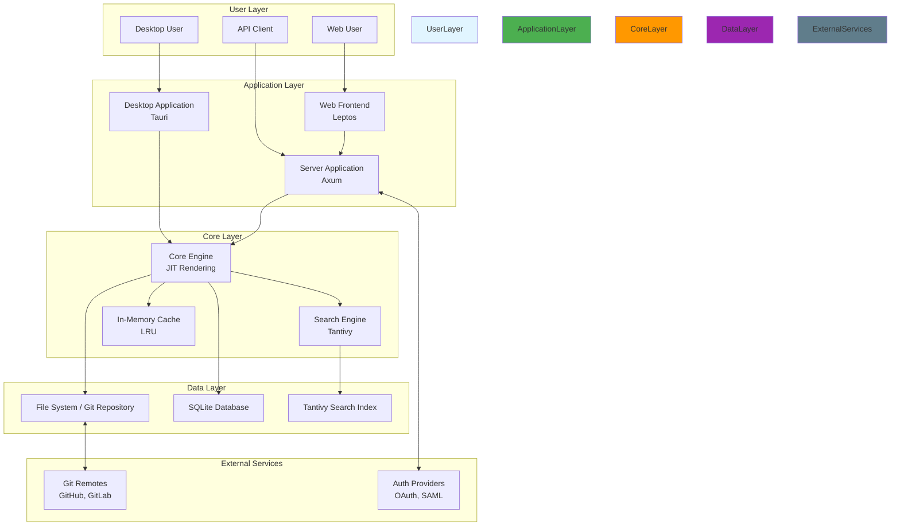
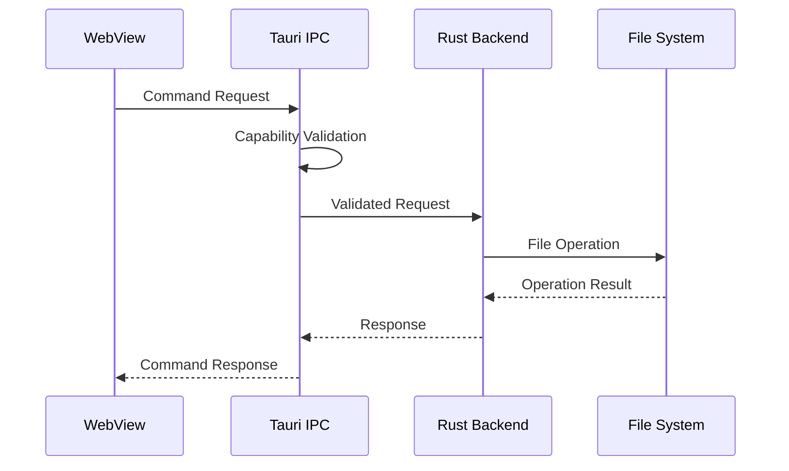
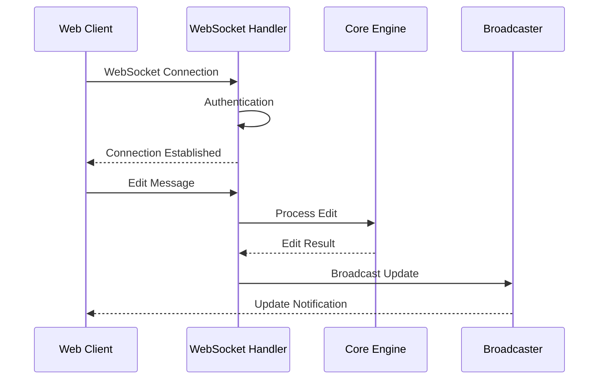
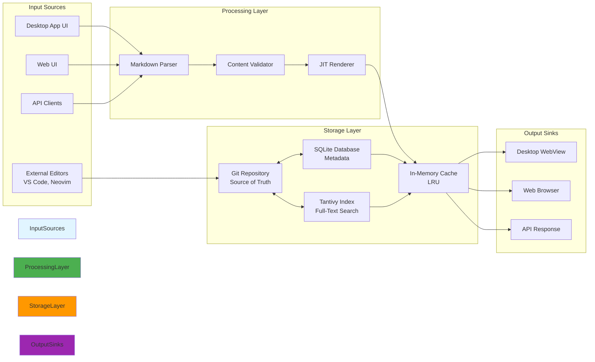
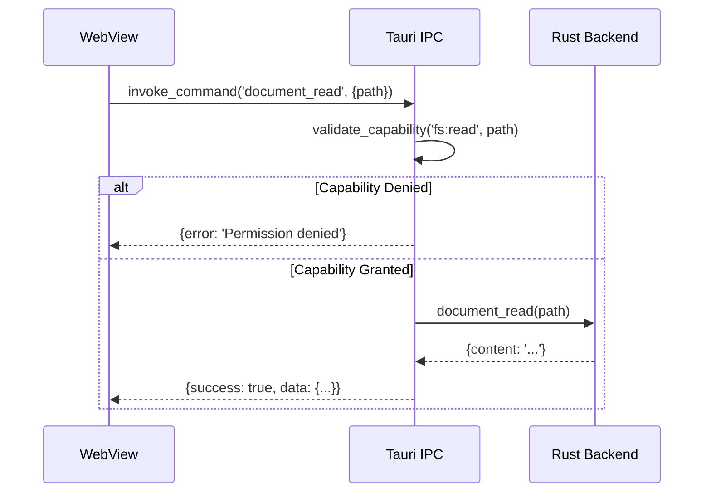
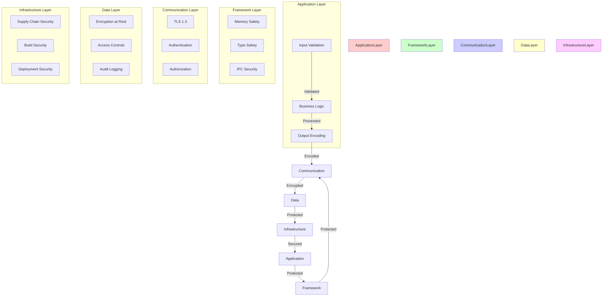
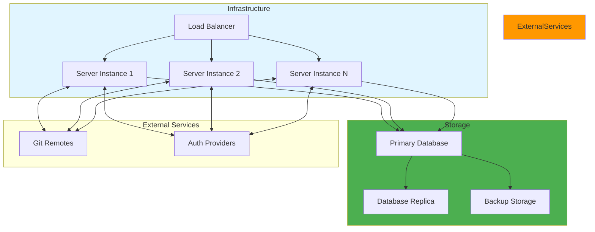

# TACHYON: ARCHITECTURE OVERVIEW

**Document ID:** TACHYON-DEV-009-V1.0
**Date:** February 2026
**Status:** Approved for Implementation
**Classification:** Developer Documentation
**Compliance Level:** ISO/IEC 26514:2021, IEEE 1063:2001

---

## TABLE OF CONTENTS

1. [Introduction](#1-introduction)
2. [Architecture Overview](#2-architecture-overview)
3. [System Architecture](#3-system-architecture)
4. [Data Architecture](#4-data-architecture)
5. [Communication Architecture](#5-communication-architecture)
6. [Security Architecture](#6-security-architecture)
7. [Deployment Architecture](#7-deployment-architecture)
8. [Technology Stack](#8-technology-stack)
9. [References](#9-references)

---

## 1. INTRODUCTION

### 1.1. Document Purpose

This document provides a comprehensive architecture overview of the Tachyon toolchain, designed for developers contributing to the project. The document establishes the foundational understanding of system architecture, component interactions, and design principles that guide implementation decisions.

### 1.2. System Definition

Tachyon is a deterministic, high-performance Knowledge Management System (KMS) and Internal Developer Portal (IDP) operating as a hybrid system supporting both local-first desktop usage and centralized server deployment. The system eliminates traditional build step latency through Just-In-Time (JIT) rendering architecture, operating directly upon Git repositories or file systems without preliminary compilation.

The Tachyon toolchain encompasses:
- A Rust-based core engine with Tokio asynchronous runtime
- A Tauri-based desktop application wrapper
- An Axum-based HTTP/2 server component
- A TypeScript/JavaScript frontend using Leptos and TailwindCSS
- Git-based content storage and management

### 1.3. Document Scope

This document covers:
- High-level system architecture and component organization
- Data flow and storage architecture
- Communication protocols and interfaces
- Security architecture and threat mitigation
- Deployment strategies and environments
- Technology stack and library selections

Out of scope:
- Detailed component-level implementation specifications
- Specific API endpoint definitions
- Database schema specifications
- Network protocol specifications

### 1.4. Target Audience

This document is intended for:
- Software engineers contributing to core system components
- Frontend developers working on Leptos-based web interface
- DevOps engineers managing deployment and infrastructure
- Security engineers reviewing architecture for vulnerabilities
- Technical architects evaluating system design decisions

### 1.5. Document Dependencies

This document depends on the following documents:
- [TACHYON-STD-V1.0](../.specs/01_standards/coding_standards.md) - Coding and Documentation Standards
- [TACHYON-REQ-SYS-V1.0](../.specs/04_future_state/reqs/system_overview.md) - System Overview Requirements
- [TACHYON-REQ-SEC-V1.0](../.specs/04_future_state/reqs/security_requirements.md) - Security Requirements
- [TACHYON-ADR-001-V1.0](../.specs/02_adrs/001_rust_as_primary_language.md) - Rust as Primary Language
- [TACHYON-ADR-010-V1.0](../.specs/02_adrs/010_security_architecture.md) - Security Architecture

---

## 2. ARCHITECTURE OVERVIEW

### 2.1. Architectural Principles

The Tachyon system architecture is guided by the following fundamental principles:

#### 2.1.1. Local-First Design

The system prioritizes local-first design, ensuring full functionality without network connectivity in desktop mode. This principle enables users to work offline, maintain data sovereignty, and avoid dependency on cloud services for core functionality.

**Implementation:**
- Desktop application operates independently of network connectivity
- All content processing occurs locally on host hardware
- Git repositories serve as the source of truth for content
- Synchronization occurs when connectivity is restored

#### 2.1.2. Microsecond Latency

The system is architected for microsecond-level latency in rendering and search operations. This principle ensures responsive user experience and enables real-time collaboration.

**Implementation:**
- JIT rendering pipeline processes content within 15 milliseconds
- Search queries return results within 100 milliseconds
- File system monitoring triggers cache invalidation within 100 milliseconds
- In-memory caching reduces repeated computation overhead

#### 2.1.3. Type Safety

The system leverages Rust's type system for compile-time guarantees of memory safety and thread safety. This principle eliminates entire classes of vulnerabilities at compile time.

**Implementation:**
- Ownership and borrowing rules prevent data races
- Compile-time bounds checking prevents buffer overflows
- Option<T> type eliminates null pointer dereferences
- Send and Sync traits enforce thread safety

#### 2.1.4. Asynchronous Processing

The system uses Tokio's asynchronous runtime for non-blocking I/O operations. This principle enables efficient handling of concurrent operations without blocking the main thread.

**Implementation:**
- Async/await syntax for I/O operations
- Multi-threaded work-stealing scheduler
- Non-blocking file system monitoring
- Concurrent request handling

#### 2.1.5. Modular Design

The system is architected with clear module boundaries and minimal coupling between components. This principle facilitates maintenance, testing, and independent evolution of components.

**Implementation:**
- Cargo workspace with multiple crates
- Well-defined interfaces between components
- Dependency inversion for loose coupling
- Clear separation of concerns

### 2.2. High-Level Architecture

The Tachyon system implements a three-tier architecture consisting of:

1. **Desktop Tier:** Tauri-based desktop application providing native OS integration and local-first operation
2. **Server Tier:** Axum-based HTTP/2 server providing centralized deployment and multi-user collaboration
3. **Web Tier:** Leptos-based web frontend providing responsive UI and client-side state management

These tiers share a common core engine implementing JIT rendering, caching, and content processing logic. This shared core ensures consistency across deployment modes and reduces code duplication.

### 2.3. Component Organization

The system is organized into the following primary components:

| Component | Technology | Responsibility |
|-----------|------------|---------------|
| **Core Engine** | Rust/Tokio | JIT rendering, caching, content processing |
| **Desktop Application** | Tauri/Rust | Native OS integration, local server spawning |
| **Server Application** | Axum/Rust | HTTP/2 serving, WebSocket management |
| **Web Frontend** | Leptos/TypeScript | Reactive UI, client-side state management |
| **IPC Component** | Tauri IPC | Communication between desktop and core engine |
| **Storage Layer** | Git/SQLite | Content storage, metadata management |
| **Search Engine** | Tantivy | Full-text search indexing and querying |

Each component operates with clear boundaries and well-defined interfaces, enabling independent development, testing, and deployment.

---

## 3. SYSTEM ARCHITECTURE

### 3.1. System Diagram



### 3.2. Core Engine Architecture

The Core Engine serves as the central component of the Tachyon system, implementing the Just-In-Time rendering pipeline, caching layer, and content processing logic. This component is shared across all deployment modes, ensuring consistent behavior and reducing code duplication.

#### 3.2.1. JIT Rendering Pipeline

The JIT rendering pipeline processes Markdown content into HTML within 15 milliseconds of file modification. The pipeline consists of the following stages:

1. **File System Monitoring:** Kernel-level file watching using the `notify` crate triggers cache invalidation within 100 milliseconds
2. **Content Reading:** Efficient file reading with memory-mapped I/O for large files
3. **Markdown Parsing:** CommonMark-compliant parsing using `pulldown-cmark` with SIMD acceleration
4. **Frontmatter Processing:** YAML frontmatter extraction for metadata and access control directives
5. **Content Processing:** Syntax highlighting, math rendering, and diagram rendering
6. **Template Rendering:** Template-based rendering with layouts, partials, and custom themes
7. **Output Generation:** HTML generation with optimized CSS and JavaScript

**Performance Characteristics:**
- Sub-15ms rendering latency for documents up to 100KB
- Sub-100ms rendering latency for documents up to 1MB
- Concurrent processing of multiple documents
- LRU cache with configurable size limits

#### 3.2.2. Cache Management

The cache management subsystem implements an LRU (Least Recently Used) cache for rendered HTML, providing significant performance improvements for frequently accessed content.

**Cache Architecture:**
- **Cache Key:** File path + file modification time + template version
- **Cache Value:** Rendered HTML with embedded metadata
- **Eviction Policy:** LRU with configurable size limits
- **Invalidation Strategy:** File system monitoring triggers immediate invalidation
- **Persistence:** Optional disk persistence for faster startup

**Cache Configuration:**
| Parameter | Default | Description |
|-----------|---------|-------------|
| `cache.max_size` | 512MB | Maximum cache size in memory |
| `cache.ttl` | 1 hour | Time-to-live for cached entries |
| `cache.disk_persistence` | false | Enable disk persistence |
| `cache.disk_path` | `$HOME/.tachyon/cache` | Disk cache location |

#### 3.2.3. Content Processing

The content processing subsystem handles transformation of raw Markdown into formatted HTML with support for:

- **Code Highlighting:** Server-side syntax highlighting using `tree-sitter` for 50+ programming languages
- **Math Rendering:** LaTeX equation rendering using `katex-rs` for inline and display modes
- **Diagram Rendering:** Mermaid.js diagram rendering for flowcharts, sequence diagrams, and architecture diagrams
- **Content Sanitization:** XSS prevention through sanitization of user-generated content

**Supported Content Types:**
| Content Type | Library | Features |
|--------------|---------|----------|
| Markdown | pulldown-cmark | CommonMark, tables, footnotes, definition lists |
| Code Blocks | tree-sitter | 50+ languages, syntax highlighting |
| Math | katex-rs | Inline, display, macros |
| Diagrams | mermaid.js | Flowcharts, sequence, class, state diagrams |
| Images | image crate | PNG, JPEG, SVG, WebP |

### 3.3. Desktop Component Architecture

The Desktop Component provides native OS integration and local-first operation through the Tauri framework. This component spawns a local Axum server for serving content to the WebView component.

#### 3.3.1. Tauri Architecture

Tauri enables desktop application development using web technologies while providing native OS integration through capability-based access control.

**Tauri Components:**
- **WebView:** Operating system's WebView component for rendering web content
- **Rust Backend:** Native Rust backend for system operations
- **IPC Bridge:** Inter-Process Communication bridge between WebView and Rust backend
- **Capability System:** Fine-grained permission system for system resource access

**Desktop Operation Mode:**
1. **Application Launch:** Native desktop application launches using OS WebView
2. **Local Server Spawn:** Axum server spawns on randomized loopback port (127.0.0.1:XXXXX)
3. **Content Loading:** WebView loads content from local server
4. **Native Dialogs:** Tauri IPC provides native OS dialogs for file operations
5. **Auto-Sync:** Changes automatically commit to local Git repository (default: 2 second debounce)
6. **Offline Operation:** Full functionality maintained without network connectivity

#### 3.3.2. IPC Architecture

The IPC subsystem enables communication between the WebView frontend and Rust backend through Tauri's IPC bridge.

**IPC Message Flow:**


**IPC Capabilities:**
| Capability | Permission | Purpose |
|------------|------------|---------|
| `fs:read` | Scoped file paths | Read document content |
| `fs:write` | Scoped file paths | Write document content |
| `dialog:open` | Native dialog | Open file dialog |
| `dialog:save` | Native dialog | Save file dialog |
| `window:allow-create` | Window management | Create new windows |
| `notification:allow-send` | System notifications | Send notifications |

### 3.4. Server Component Architecture

The Server Component provides centralized deployment and multi-user collaboration through the Axum HTTP/2 framework. This component enforces authentication and authorization for all requests.

#### 3.4.1. Axum Architecture

Axum provides a modular, type-safe web framework for building HTTP/2 servers with excellent performance characteristics.

**Axum Components:**
- **Router:** Type-safe routing with path and query parameter extraction
- **Middleware:** Request/response processing pipeline
- **State:** Shared application state across handlers
- **Extractors:** Type-safe request data extraction
- **Response:** Type-safe response construction

**Server Operation Mode:**
1. **Server Binding:** Server binds to 0.0.0.0 accepting connections from network clients
2. **Authentication Enforcement:** All requests require valid authentication
3. **RBAC Enforcement:** Role-Based Access Control enforced for all content access
4. **Multi-User Editing:** WebSocket broadcasting enables real-time collaboration
5. **Session Management:** Configurable session timeout and refresh mechanisms

#### 3.4.2. WebSocket Architecture

The WebSocket subsystem enables real-time updates and collaborative editing through persistent bidirectional connections.

**WebSocket Message Flow:**


**WebSocket Message Types:**
| Message Type | Direction | Purpose |
|--------------|-----------|---------|
| `document.edit` | Client → Server | Submit document edit |
| `document.update` | Server → Client | Broadcast document update |
| `user.presence` | Bidirectional | User presence indication |
| `cursor.position` | Client → Server | Cursor position for collaboration |
| `conflict.resolve` | Server → Client | Conflict resolution notification |

### 3.5. Web Frontend Architecture

The Web Frontend provides a responsive user interface through the Leptos reactive framework with client-side state management.

#### 3.5.1. Leptos Architecture

Leptos provides a reactive framework for building web applications with excellent performance and developer experience.

**Leptos Components:**
- **Components:** Reactive UI components with signals for state management
- **Router:** Client-side routing with nested routes
- **Signals:** Reactive state management with fine-grained reactivity
- **Suspense:** Async boundary handling for loading states
- **Islands:** Interactive components with isolated reactivity

**Frontend Features:**
- **Responsive Design:** Adapts to desktop, tablet, and mobile screen sizes
- **Client-Side Search:** Full-text search with WASM-optimized indexing
- **Real-Time Updates:** WebSocket integration for real-time collaboration
- **Offline Support:** Service worker for offline operation
- **Accessibility:** WCAG 2.1 AA compliance

---

## 4. DATA ARCHITECTURE

### 4.1. Data Flow Overview

The Tachyon system implements a Git-based data storage architecture with SQLite for metadata and Tantivy for full-text search indexing. This architecture ensures data sovereignty, version control, and efficient content retrieval.



### 4.2. Git-Based Content Storage

Git repositories serve as the source of truth for all content, providing version control, history tracking, and collaborative workflows.

#### 4.2.1. Git Integration Architecture

The Git integration subsystem uses the `git2-rs` library for repository operations, supporting HTTPS, SSH, and local protocols.

**Git Operations:**
| Operation | Purpose | Library |
|-----------|---------|---------|
| Repository Cloning | Initial repository setup | git2-rs |
| Commit Management | Automatic and manual commits | git2-rs |
| Branch Operations | Create, switch, delete branches | git2-rs |
| History Viewing | Display commit history with diffs | git2-rs |
| Merge Conflict Resolution | Visual conflict resolution tools | git2-rs |

**Git Workflow:**
1. **Repository Initialization:** Clone or initialize Git repository
2. **File Monitoring:** Kernel-level file watching detects changes
3. **Content Validation:** Validate content before staging
4. **Automatic Commits:** Auto-commit on save with configurable debounce (default: 2 seconds)
5. **Branch Management:** Support for feature branches and pull requests
6. **History Tracking:** Full commit history with author attribution

#### 4.2.2. Content Organization

Content is organized hierarchically within Git repositories with support for:
- **Directory Structure:** Nested directories for content organization
- **Frontmatter Metadata:** YAML frontmatter for document metadata and access control
- **Tagging System:** Multi-tag support for content categorization
- **Link Management:** Automatic link detection and validation

**Document Structure:**
```markdown
---
title: Document Title
tags: [tag1, tag2]
author: John Doe
date: 2026-02-06
internal: false
---

# Document Content

Document content in Markdown format.

::: internal
Internal content only visible to authorized users.
:::
```

### 4.3. SQLite Metadata Storage

SQLite database stores metadata, user sessions, and application configuration, providing efficient querying and ACID compliance.

#### 4.3.1. Database Schema

The SQLite database contains following tables:

| Table | Purpose | Key Columns |
|-------|---------|-------------|
| `documents` | Document metadata | id, path, title, tags, created_at, updated_at |
| `users` | User accounts | id, username, email, password_hash, role |
| `sessions` | User sessions | id, user_id, token, expires_at |
| `permissions` | Access control | id, user_id, document_id, permission_level |
| `audit_log` | Security events | id, user_id, action, timestamp, details |

#### 4.3.2. Database Operations

**Query Patterns:**
- **Parameterized Queries:** All queries use parameterized statements to prevent SQL injection
- **Transaction Management:** ACID-compliant transactions for multi-step operations
- **Connection Pooling:** Efficient connection reuse for high-throughput operations
- **Index Optimization:** Strategic indexing for frequently queried columns

**Example Query:**
```rust
use rusqlite::{params, Connection};

pub fn get_document_by_path(
    conn: &Connection,
    path: &str,
) -> Result<Option<Document>, rusqlite::Error> {
    conn.query_row(
        "SELECT id, path, title, tags, created_at, updated_at
         FROM documents
         WHERE path = ?1",
        params![path],
        |row| {
            Ok(Document {
                id: row.get(0)?,
                path: row.get(1)?,
                title: row.get(2)?,
                tags: row.get(3)?,
                created_at: row.get(4)?,
                updated_at: row.get(5)?,
            })
        },
    )
}
```

### 4.4. Tantivy Search Indexing

Tantivy provides full-text search capabilities with sub-100ms query response times and automatic index updates on content changes.

#### 4.4.1. Index Architecture

The search index contains following fields:

| Field | Type | Purpose |
|-------|------|---------|
| `title` | Text | Document title for title search |
| `content` | Text | Full document content for full-text search |
| `path` | String | Document path for result navigation |
| `tags` | Text | Document tags for faceted search |
| `created_at` | Date | Creation date for sorting |
| `updated_at` | Date | Last update date for recency ranking |

**Index Configuration:**
| Parameter | Default | Description |
|-----------|---------|-------------|
| `index.path` | `$HOME/.tachyon/index` | Index storage location |
| `index.commit_policy` | Auto | Automatic commits on document changes |
| `index.merge_policy` | LogBytesUpToMerge | Index merge strategy |
| `index.reader_cache_size` | 50MB | Reader cache size |

#### 4.4.2. Search Operations

**Query Types:**
- **Full-Text Search:** Search across document content with Boolean operators
- **Phrase Matching:** Exact phrase matching with quotes
- **Fuzzy Search:** Tolerance for typos and approximate matching
- **Faceted Search:** Filtering by tags, date ranges, and content type
- **Relevance Ranking:** Term frequency, document recency, and user interaction

**Search Query Example:**
```rust
use tantivy::{query::QueryParser, Index, ReloadPolicy};

pub fn search_documents(
    index: &Index,
    query_str: &str,
) -> Result<Vec<Document>, tantivy::Error> {
    let reader = index
        .reader_builder()
        .reload_policy(ReloadPolicy::Auto)
        .try_into()?;
    
    let searcher = reader.searcher();
    let query_parser = QueryParser::for_index(&index);
    let query = query_parser.parse_query(query_str)?;
    
    let top_docs = searcher.search(&query, &TopDocs::with_limit(10))?;
    
    Ok(top_docs
        .iter()
        .map(|doc| Document::from_scored_doc(doc, &reader))
        .collect())
}
```

### 4.5. Data Integrity and Validation

The system implements comprehensive data integrity checks and validation to ensure data consistency and prevent corruption.

#### 4.5.1. Content Validation

**Validation Layers:**
1. **Schema Validation:** YAML frontmatter validated against defined schemas
2. **Type Validation:** Input types validated against expected types
3. **Length Validation:** String length limits enforced
4. **Format Validation:** Email, URL, and date formats validated
5. **Range Validation:** Numeric inputs validated against defined ranges

#### 4.5.2. Data Integrity Checks

**Integrity Mechanisms:**
- **Checksums:** SHA-256 checksums for critical files
- **Git Verification:** Leverage Git's cryptographic verification
- **Database Constraints:** SQLite foreign key constraints
- **Transaction Rollback:** Automatic rollback on errors
- **Audit Logging:** All data modifications logged

**Checksum Verification Example:**
```rust
use sha2::{Digest, Sha256};

pub fn verify_file_integrity(
    path: &Path,
    expected_checksum: &str,
) -> Result<bool, std::io::Error> {
    let mut file = std::fs::File::open(path)?;
    let mut hasher = Sha256::new();
    std::io::copy(&mut file, &mut hasher)?;
    let result = hasher.finalize();
    
    let actual_checksum = hex::encode(result);
    Ok(actual_checksum == expected_checksum)
}
```

---

## 5. COMMUNICATION ARCHITECTURE

### 5.1. Communication Protocols Overview

The Tachyon system implements multiple communication protocols to support different deployment modes and use cases:

| Protocol | Purpose | Use Case | Library |
|----------|---------|---------|---------|
| **HTTP/2** | Client-server communication | Web UI, API clients | Axum |
| **WebSocket** | Real-time updates | Collaborative editing, live updates | Axum WebSocket |
| **IPC** | Desktop-backend communication | Native OS integration | Tauri IPC |
| **Git Protocol** | Version control | Content synchronization | git2-rs |

### 5.2. HTTP/2 Protocol

HTTP/2 provides the primary communication protocol for client-server interactions, offering improved performance over HTTP/1.1 through multiplexing and header compression.

#### 5.2.1. HTTP/2 Features

**Performance Benefits:**
- **Multiplexing:** Multiple requests over single TCP connection
- **Header Compression:** HPACK compression reduces overhead
- **Server Push:** Proactive content pushing to clients
- **Binary Framing:** Efficient binary protocol framing
- **Stream Prioritization:** Stream priority for resource allocation

**HTTP/2 Configuration:**
| Parameter | Default | Description |
|-----------|---------|-------------|
| `http2.max_concurrent_streams` | 250 | Maximum concurrent streams per connection |
| `http2.initial_window_size` | 65535 | Initial flow control window size |
| `http2.max_frame_size` | 16MB | Maximum frame size |
| `http2.enable_push` | true | Enable server push |

#### 5.2.2. API Endpoints

The HTTP/2 API exposes following endpoint categories:

| Category | Endpoints | Purpose |
|----------|-----------|---------|
| **Document API** | `/api/documents/*` | Document CRUD operations |
| **Search API** | `/api/search` | Full-text search queries |
| **User API** | `/api/users/*` | User management |
| **Auth API** | `/api/auth/*` | Authentication and authorization |
| **Repository API** | `/api/repositories/*` | Git repository operations |

**API Response Format:**
```json
{
  "success": true,
  "data": {
    "id": "uuid",
    "title": "Document Title",
    "content": "Rendered HTML",
    "metadata": {
      "tags": ["tag1", "tag2"],
      "created_at": "2026-02-06T19:20:00Z",
      "updated_at": "2026-02-06T19:20:00Z"
    }
  },
  "errors": null
}
```

### 5.3. WebSocket Protocol

WebSocket provides persistent bidirectional communication for real-time updates and collaborative editing.

#### 5.3.1. WebSocket Architecture

**Connection Lifecycle:**
1. **Handshake:** HTTP/1.1 upgrade to WebSocket protocol
2. **Authentication:** JWT token validation during handshake
3. **Connection Establishment:** Persistent connection established
4. **Message Exchange:** Bidirectional message flow
5. **Heartbeat:** Periodic ping/pong for connection health
6. **Graceful Closure:** Connection termination with cleanup

**WebSocket Configuration:**
| Parameter | Default | Description |
|-----------|---------|-------------|
| `websocket.max_message_size` | 64MB | Maximum message size |
| `websocket.max_frame_size` | 16MB | Maximum frame size |
| `websocket.heartbeat_interval` | 30s | Heartbeat interval |
| `websocket.idle_timeout` | 300s | Idle connection timeout |

#### 5.3.2. WebSocket Message Types

**Message Schema:**
```json
{
  "type": "document.edit",
  "timestamp": "2026-02-06T19:20:00Z",
  "payload": {
    "document_id": "uuid",
    "user_id": "uuid",
    "edit": {
      "operation": "insert",
      "position": 100,
      "content": "New content"
    }
  }
}
```

**Message Types:**
| Message Type | Direction | Purpose |
|--------------|-----------|---------|
| `document.edit` | Client → Server | Submit document edit |
| `document.update` | Server → Client | Broadcast document update |
| `user.presence` | Bidirectional | User presence indication |
| `cursor.position` | Client → Server | Cursor position for collaboration |
| `conflict.resolve` | Server → Client | Conflict resolution notification |
| `error` | Server → Client | Error notification |

### 5.4. IPC Protocol

IPC (Inter-Process Communication) enables communication between the Tauri WebView and Rust backend through capability-based access control.

#### 5.4.1. IPC Architecture

**IPC Message Flow:**


**IPC Capabilities:**
| Capability | Permission | Example Usage |
|------------|------------|---------------|
| `fs:read` | Read file from file system | `invoke_command('fs:read', {path: '/path/to/file'})` |
| `fs:write` | Write file to file system | `invoke_command('fs:write', {path: '/path/to/file', content: '...'})` |
| `dialog:open` | Open file dialog | `invoke_command('dialog:open', {filters: [{name: 'Markdown', extensions: ['md']}]})` |
| `dialog:save` | Save file dialog | `invoke_command('dialog:save', {defaultPath: '/path/to/file'})` |
| `window:allow-create` | Create new window | `invoke_command('window:create', {url: '/new/document'})` |

#### 5.4.2. IPC Message Format

**Request Format:**
```json
{
  "command": "document_read",
  "payload": {
    "path": "/path/to/document.md"
  }
}
```

**Response Format:**
```json
{
  "success": true,
  "data": {
    "content": "# Document Title\n\nDocument content...",
    "metadata": {
      "title": "Document Title",
      "tags": ["tag1", "tag2"]
    }
  },
  "error": null
}
```

### 5.5. Git Protocol

Git protocol provides version control and content synchronization through HTTPS, SSH, and local protocols.

#### 5.5.1. Git Operations

**Supported Protocols:**
| Protocol | Example URL | Use Case |
|----------|-------------|---------|
| **HTTPS** | `https://github.com/user/repo.git` | Public repositories |
| **SSH** | `git@github.com:user/repo.git` | Private repositories |
| **Local** | `/path/to/local/repo` | Local repositories |

**Git Workflow:**
1. **Repository Clone:** Clone repository from remote or local path
2. **File Monitoring:** Detect file changes through kernel-level watching
3. **Content Validation:** Validate content before staging
4. **Automatic Commits:** Auto-commit with configurable debounce
5. **Push/Pull:** Synchronize with remote repositories
6. **Merge Resolution:** Visual conflict resolution tools

#### 5.5.2. Git Integration

**Git Configuration:**
| Parameter | Default | Description |
|-----------|---------|-------------|
| `git.auto_commit` | true | Enable automatic commits |
| `git.commit_debounce` | 2s | Commit debounce timer |
| `git.author_name` | System user | Commit author name |
| `git.author_email` | System email | Commit author email |
| `git.push_interval` | 60s | Auto-push interval |

**Commit Message Format:**
```
Auto-commit: [file_path]

Changes:
- Modified: [list of modified files]
- Added: [list of added files]
- Deleted: [list of deleted files]

Generated by Tachyon at [timestamp]
```

### 5.6. Message Validation and Security

All communication protocols implement comprehensive message validation and security measures.

#### 5.6.1. Input Validation

**Validation Layers:**
1. **Schema Validation:** JSON schema validation for all message payloads
2. **Type Validation:** Type checking for all fields
3. **Length Validation:** String length limits enforced
4. **Format Validation:** Email, URL, and date format validation
5. **Range Validation:** Numeric range validation

**Validation Example:**
```rust
use serde::{Deserialize, Validate};
use validator::ValidateLength;

#[derive(Debug, Deserialize, ValidateLength)]
pub struct DocumentEditRequest {
    #[validate(length(min = 1, max = 1000))]
    pub document_id: String,
    
    #[validate(length(min = 1, max = 100))]
    pub operation: String,
    
    pub position: usize,
    
    #[validate(length(max = 10000))]
    pub content: String,
}
```

#### 5.6.2. Security Measures

**Security Controls:**
- **Authentication:** JWT token validation for all HTTP/2 and WebSocket requests
- **Authorization:** RBAC enforcement for all resource access
- **Rate Limiting:** Request rate limiting to prevent abuse
- **Input Sanitization:** XSS prevention through content sanitization
- **CORS:** Cross-Origin Resource Sharing configuration
- **CSRF Protection:** Cross-Site Request Forgery tokens for state-changing operations

**Security Headers:**
| Header | Value | Purpose |
|--------|-------|---------|
| `Strict-Transport-Security` | `max-age=31536000; includeSubDomains` | Enforce HTTPS |
| `Content-Security-Policy` | `default-src 'self'` | Prevent XSS |
| `X-Frame-Options` | `DENY` | Prevent clickjacking |
| `X-Content-Type-Options` | `nosniff` | Prevent MIME sniffing |
| `X-XSS-Protection` | `1; mode=block` | XSS protection |

---

## 6. SECURITY ARCHITECTURE

### 6.1. Security Principles

The Tachyon security architecture implements a defense-in-depth approach with multiple layers of security controls, as specified in [ADR-010](../.specs/02_adrs/010_security_architecture.md).

#### 6.1.1. Defense-in-Depth Strategy

The defense-in-depth strategy implements multiple layers of security controls, ensuring that if one layer fails, other layers provide protection.

**Security Layers:**


#### 6.1.2. Security Principles

| Principle | Description | Implementation |
|-----------|-------------|----------------|
| **Defense-in-Depth** | Multiple layers of security controls | Memory safety, input validation, encryption, audit logging |
| **Least Privilege** | Minimal access required for operations | Tauri capabilities, RBAC, scoped permissions |
| **Zero Trust** | No trust assumptions within security boundaries | Input validation, authentication for all requests |
| **Secure by Default** | Secure default configurations | Fail-safe error handling, secure defaults |
| **Fail-Safe** | Fail-safe error handling for security | Secure error messages, no information leakage |

### 6.2. Memory Safety Layer

Rust's ownership system provides memory safety at compile time, preventing entire classes of memory corruption vulnerabilities.

#### 6.2.1. Memory Safety Guarantees

| Vulnerability | Prevention | Mechanism |
|-------------|------------|-----------|
| **Buffer Overflow** | Compile-time bounds checking | Ownership and borrowing |
| **Use-After-Free** | Compile-time lifetime tracking | Ownership and borrowing |
| **Double-Free** | Compile-time ownership tracking | Ownership |
| **Null Pointer Dereference** | Compile-time null checking | Option<T> type |
| **Data Races** | Compile-time race prevention | Send and Sync traits |
| **Memory Leaks** | Compile-time RAII | Drop trait |

#### 6.2.2. Type Safety Benefits

1. **Eliminated Vulnerability Classes:** Entire classes of memory vulnerabilities eliminated
2. **Compile-Time Safety:** Safety enforced at compile time
3. **No Runtime Overhead:** Zero runtime overhead for memory safety
4. **Confidence:** Compiler guarantees memory safety
5. **Refactoring Safety:** Refactoring maintains memory safety

### 6.3. Capability-Based Access Control

Tauri's capability system provides fine-grained access control for system resources, implementing principle of least privilege.

#### 6.3.1. Capability Categories

| Category | Capabilities | Purpose |
|-----------|-------------|---------|
| **File System** | fs:read, fs:write, fs:scope | Controlled file access |
| **Window** | window:allow-create, window:allow-close | Window management |
| **Shell** | shell:allow-execute, shell:allow-open | Command execution |
| **Dialog** | dialog:allow-open, dialog:allow-save | Native dialogs |
| **HTTP** | http:allow-request, http:allow-fetch | Network requests |
| **Notification** | notification:allow-send | System notifications |

#### 6.3.2. Capability Configuration

**Capability Definition Example:**
```json
{
  "identifier": "document-read",
  "description": "Read document from file system",
  "windows": ["main"],
  "permissions": [
    {
      "identifier": "fs:read",
      "allow": [{ "path": "$HOME/Documents" }]
    }
  ]
}
```

**Capability Benefits:**
1. **Principle of Least Privilege:** Minimal access required for operations
2. **Fine-Grained Control:** Granular permissions for specific operations
3. **Reduced Attack Surface:** Minimal privileges reduce attack surface
4. **Auditable Access:** All access controlled and auditable
5. **Explicit Authorization:** Explicit authorization for all operations

### 6.4. Authentication and Authorization

The system implements comprehensive authentication and authorization mechanisms for server mode operations.

#### 6.4.1. Authentication

**Authentication Methods:**
| Method | Purpose | Library |
|--------|---------|---------|
| **Multi-Factor Authentication** | Enhanced security | Custom implementation |
| **OAuth 2.0** | External provider integration | oauth2 crate |
| **SAML 2.0** | Enterprise SSO | saml2-rs crate |
| **OpenID Connect** | Federated authentication | openidconnect crate |

**JWT Session Tokens:**
```rust
use jsonwebtoken::{encode, decode, Algorithm, Header, Validation};

pub fn create_session_token(
    user_id: &str,
    secret: &[u8],
) -> Result<String, jsonwebtoken::errors::Error> {
    let expiration = Utc::now()
        .checked_add_signed(Duration::hours(24), i64)?;
    
    let claims = json!({
        "sub": user_id,
        "exp": expiration.timestamp(),
        "iat": Utc::now().timestamp(),
    });
    
    encode(&Header::default(), &claims, secret)
}
```

#### 6.4.2. Authorization

**RBAC Implementation:**
| Role | Permissions | Description |
|------|-------------|-------------|
| **Admin** | All permissions | Full system access |
| **Editor** | Read, write, create | Content editing access |
| **Viewer** | Read only | Content viewing access |
| **Guest** | Limited read | Restricted content access |

**Frontmatter Access Control:**
```markdown
---
title: Document Title
access:
  roles: [editor, admin]
  users: [user1@example.com]
  groups: [team-alpha]
internal: false
---

Document content.
```

### 6.5. Input Validation and Sanitization

Comprehensive input validation across all interfaces prevents injection attacks and ensures data integrity.

#### 6.5.1. Input Validation

**Validation Categories:**
| Interface | Validation | Threats Prevented |
|-----------|-----------|------------------|
| **HTTP/2 Server** | Path validation, query validation, body validation | SQL injection, XSS, path traversal |
| **IPC Commands** | Type validation, range validation, format validation | Type confusion, buffer overflow |
| **File Operations** | Path validation, permission validation, size validation | Path traversal, unauthorized access |
| **WebSocket Messages** | Type validation, size validation, format validation | Type confusion, DoS |

**Validation Example:**
```rust
use validator::ValidateLength;

#[derive(Debug, ValidateLength)]
pub struct DocumentTitle {
    #[validate(length(min = 1, max = 100))]
    pub title: String,
}

pub async fn create_document(
    title: DocumentTitle,
) -> Result<Document, ApiError> {
    let document = Document::new(title.title)?;
    Ok(document)
}
```

#### 6.5.2. Input Sanitization

**Sanitization Measures:**
| Threat | Prevention | Implementation |
|--------|------------|----------------|
| **XSS** | HTML encoding | ammonia crate |
| **SQL Injection** | Parameterized queries | rusqlite parameter binding |
| **Command Injection** | Proper escaping and validation | shell-words crate |
| **Path Traversal** | Canonicalization and allow-lists | path-clean crate |
| **Content Security Policy** | CSP headers | axum CSP middleware |

### 6.6. Encryption

TLS 1.3 for network communications and encryption at rest for sensitive data provide confidentiality and integrity protections.

#### 6.6.1. Encryption Requirements

| Data Type | Encryption | Key Size | Algorithm |
|-----------|-----------|----------|-----------|
| **Network Traffic** | TLS 1.3 | 256-bit | rustls |
| **User Credentials** | bcrypt | 256-bit salt | bcrypt crate |
| **Session Tokens** | JWT | 256-bit | jsonwebtoken crate |
| **Database** | SQLite encryption | 256-bit | rusqlite encryption extension |

#### 6.6.2. TLS Configuration

**TLS Configuration Example:**
```rust
use rustls::{ClientConfig, ServerConfig};
use rustls_pemfile::{Certificate, PrivateKey};

let config = ClientConfig::builder()
    .with_root_certificates(&cert)
    .with_no_client_auth()
    .build()?;
```

**Security Headers:**
| Header | Value | Purpose |
|--------|-------|---------|
| `Strict-Transport-Security` | `max-age=31536000; includeSubDomains` | Enforce HTTPS |
| `Content-Security-Policy` | `default-src 'self'` | Prevent XSS |
| `X-Frame-Options` | `DENY` | Prevent clickjacking |
| `X-Content-Type-Options` | `nosniff` | Prevent MIME sniffing |
| `X-XSS-Protection` | `1; mode=block` | XSS protection |

### 6.7. Audit Logging

Comprehensive audit logging with tracing provides accountability, enables forensic analysis, and supports compliance.

#### 6.7.1. Audit Logging Categories

| Category | Events | Purpose |
|-----------|--------|---------|
| **Authentication** | Login, logout, token refresh | Account tracking |
| **Authorization** | Access granted, access denied | Permission tracking |
| **Data Access** | Read, write, delete | Data access tracking |
| **System Events** | Startup, shutdown, errors | System state tracking |
| **Security Events** | Failed login, blocked access | Security incident tracking |

#### 6.7.2. Audit Logging Example

```rust
use tracing::{info, warn, error, instrument};

#[instrument(skip(self))]
pub async fn get_document(
    id: String,
    user: User,
) -> Result<Document, ApiError> {
    info!(user_id = %user.id, document_id = %id);
    
    if !user.can_access_document(&id) {
        warn!(user_id = %user.id, document_id = %id, action = "access_denied");
        return Err(ApiError::PermissionDenied);
    }
    
    let document = fetch_document(&id).await?;
    info!(user_id = %user.id, document_id = %id, action = "document_retrieved");
    
    Ok(document)
}
```

### 6.8. Supply Chain Security

Dependency verification and lock file pinning provide supply chain security, preventing dependency poisoning.

#### 6.8.1. Supply Chain Measures

| Measure | Implementation | Threat Prevented |
|----------|---------------|------------------|
| **Dependency Verification** | SHA-256 checksums | Dependency poisoning |
| **Lock File Pinning** | Cargo.lock, bun.lock | Dependency confusion |
| **Reproducible Builds** | Nix flakes | Build tampering |
| **Code Signing** | Binary signatures | Binary tampering |
| **Vulnerability Scanning** | cargo-audit, cargo-deny | Vulnerable dependencies |

#### 6.8.2. Cargo.lock Example

```toml
[[package]]
name = "tachyon"
version = "0.1.0"
dependencies = [
    { name = "tokio", version = "1", features = ["full"] },
    { name = "axum", version = "0.6" },
    { name = "serde", version = "1", features = ["derive"] },
    { name = "rusqlite", version = "0.29", features = ["bundled"] },
    { name = "tantivy", version = "0.21" },
]
```

---

## 7. DEPLOYMENT ARCHITECTURE

### 7.1. Deployment Environments

The Tachyon system supports multiple deployment environments tailored to different use cases and operational requirements.

#### 7.1.1. Environment Types

| Environment | Purpose | Configuration |
|------------|---------|----------------|
| **Development** | Local development and testing | Local Git repositories, debug builds |
| **Staging** | Pre-production testing | Test repositories, production-like configuration |
| **Production** | Live deployment | Production repositories, optimized builds |
| **Static Export** | Static site generation | Pre-rendered HTML, no server required |

#### 7.1.2. Desktop Deployment

Desktop application deployment involves distributing self-contained binaries for Windows, macOS, and Linux.

**Desktop Deployment Steps:**
1. **Build Compilation:** Compile Rust code with release optimizations
2. **Asset Bundling:** Bundle WebView resources and static assets
3. **Binary Packaging:** Package executable with required resources
4. **Code Signing:** Sign binaries for platform-specific requirements
5. **Distribution:** Distribute through package managers or direct download

**Desktop Distribution:**
| Platform | Package Format | Distribution Method |
|----------|---------------|-------------------|
| **Windows** | .exe installer | Direct download, winget |
| **macOS** | .app bundle, .dmg | Direct download, Homebrew Cask |
| **Linux** | AppImage, .deb, .rpm | Direct download, package managers |

#### 7.1.3. Server Deployment

Server deployment involves deploying the Axum-based server to production infrastructure.

**Server Deployment Architecture:**


**Server Deployment Steps:**
1. **Infrastructure Provisioning:** Provision servers and networking resources
2. **Dependency Installation:** Install Rust toolchain and system dependencies
3. **Application Deployment:** Deploy compiled binary and assets
4. **Configuration:** Configure environment-specific settings
5. **Service Registration:** Register with load balancer and monitoring
6. **Health Checks:** Verify deployment health and functionality

### 7.2. Scaling Strategies

The system supports both horizontal and vertical scaling to accommodate varying load requirements.

#### 7.2.1. Horizontal Scaling

**Horizontal Scaling Characteristics:**
- **Stateless Design:** Server instances maintain no session state
- **Load Balancing:** Traffic distributed across multiple instances
- **Auto-Scaling:** Automatic instance provisioning based on load
- **Graceful Degradation:** Reduced functionality under extreme load

**Horizontal Scaling Configuration:**
| Parameter | Default | Description |
|-----------|---------|-------------|
| `scaling.min_instances` | 2 | Minimum number of server instances |
| `scaling.max_instances` | 10 | Maximum number of server instances |
| `scaling.target_cpu` | 70% | CPU utilization target for scaling |
| `scaling.target_memory` | 80% | Memory utilization target for scaling |
| `scaling.cooldown_period` | 300s | Cooldown period between scaling events |

#### 7.2.2. Vertical Scaling

**Vertical Scaling Characteristics:**
- **Resource Allocation:** Dynamic resource allocation based on load
- **Performance Tuning:** Optimization for available resources
- **Cache Sizing:** Configurable cache sizes based on available memory

**Vertical Scaling Configuration:**
| Parameter | Default | Description |
|-----------|---------|-------------|
| `cache.max_size` | 512MB | Maximum cache size in memory |
| `search.reader_cache_size` | 50MB | Search index reader cache size |
| `tokio.worker_threads` | Auto | Tokio worker thread count (default: CPU cores) |
| `tokio.max_blocking_threads` | 512 | Maximum blocking threads |

### 7.3. High Availability

The system implements high availability through redundancy, failover, and disaster recovery mechanisms.

#### 7.3.1. Redundancy

**Redundancy Strategies:**
- **Multi-Instance Deployment:** Multiple server instances behind load balancer
- **Database Replication:** Primary-replica database configuration
- **Geographic Distribution:** Multi-region deployment for global availability
- **Backup Systems:** Regular backups with off-site storage

**Redundancy Configuration:**
| Component | Redundancy Level | Failover Time |
|-----------|-----------------|--------------|
| **Server Instances** | N+1 instances | < 30 seconds |
| **Database** | Primary + 2 replicas | < 60 seconds |
| **Load Balancer** | Active + standby | < 10 seconds |
| **Git Remotes** | Multiple remotes | N/A |

#### 7.3.2. Disaster Recovery

**Disaster Recovery Strategy:**
1. **Backup Frequency:** Daily incremental backups, weekly full backups
2. **Backup Storage:** Off-site storage with encryption at rest
3. **Recovery Testing:** Regular recovery testing and validation
4. **Recovery Procedures:** Documented recovery procedures with RTO/RPO targets
5. **Failover Testing:** Regular failover testing and validation

**Recovery Targets:**
| Metric | Target | Description |
|--------|--------|-------------|
| **RTO (Recovery Time Objective)** | 4 hours | Maximum time to restore service |
| **RPO (Recovery Point Objective)** | 1 hour | Maximum acceptable data loss |
| **Backup Retention** | 90 days | Minimum backup retention period |
| **Recovery Testing** | Monthly | Frequency of recovery testing |

### 7.4. Monitoring and Observability

The system provides comprehensive monitoring and observability for operational insight and incident response.

#### 7.4.1. Monitoring Metrics

**Metric Categories:**
| Category | Metrics | Purpose |
|-----------|---------|---------|
| **Application Metrics** | Request rate, response time, error rate | Application health |
| **System Metrics** | CPU, memory, disk I/O, network | Resource utilization |
| **Business Metrics** | Active users, document views, search queries | Business insight |
| **Security Metrics** | Failed logins, blocked requests, anomalies | Security monitoring |

**Monitoring Configuration:**
| Parameter | Default | Description |
|-----------|---------|-------------|
| `metrics.scrape_interval` | 15s | Metrics collection interval |
| `metrics.retention_period` | 30d | Metrics retention period |
| `alerts.cpu_threshold` | 90% | CPU utilization alert threshold |
| `alerts.memory_threshold` | 90% | Memory utilization alert threshold |
| `alerts.error_rate_threshold` | 5% | Error rate alert threshold |

#### 7.4.2. Logging

**Logging Categories:**
| Category | Level | Purpose |
|-----------|-------|---------|
| **Application Logs** | INFO, WARN, ERROR | Application behavior and errors |
| **Audit Logs** | INFO | Security-relevant events |
| **Access Logs** | INFO | HTTP request logging |
| **System Logs** | ERROR, WARN | System-level errors and warnings |

**Logging Configuration:**
| Parameter | Default | Description |
|-----------|---------|-------------|
| `logging.level` | INFO | Default logging level |
| `logging.format` | JSON | Log format (JSON, text) |
| `logging.rotation.max_size` | 100MB | Maximum log file size before rotation |
| `logging.rotation.max_files` | 10 | Maximum number of rotated log files |
| `logging.retention_days` | 30 | Log file retention period |

### 7.5. Configuration Management

The system supports flexible configuration management for different deployment environments.

#### 7.5.1. Configuration Sources

**Configuration Hierarchy:**
1. **Default Configuration:** Built-in default values
2. **Configuration File:** Environment-specific configuration file
3. **Environment Variables:** Environment-specific overrides
4. **Command-Line Arguments:** Runtime configuration overrides

**Configuration File Format:**
```toml
[server]
host = "0.0.0.0"
port = 8080
workers = 4

[cache]
max_size = "512MB"
ttl = "1h"

[database]
path = "/var/lib/tachyon/database.db"

[search]
index_path = "/var/lib/tachyon/index"

[git]
auto_commit = true
commit_debounce = "2s"
```

#### 7.5.2. Environment Variables

| Variable | Purpose | Example |
|----------|---------|---------|
| `TACHYON_SERVER_HOST` | Server bind address | `0.0.0.0` |
| `TACHYON_SERVER_PORT` | Server bind port | `8080` |
| `TACHYON_LOG_LEVEL` | Logging level | `INFO` |
| `TACHYON_CACHE_MAX_SIZE` | Cache maximum size | `512MB` |
| `TACHYON_DATABASE_PATH` | Database file path | `/var/lib/tachyon/database.db` |
| `TACHYON_JWT_SECRET` | JWT signing secret | `your-secret-key-here` |

---

## 8. TECHNOLOGY STACK

### 8.1. Programming Languages

The Tachyon system uses multiple programming languages, each selected for specific strengths and use cases.

#### 8.1.1. Rust

**Purpose:** Primary language for core engine, server, and desktop backend

**Version:** Rust Edition 2024, MSRV 1.77.2 (desktop), 1.80+ (server)

**Rationale:** Selected for memory safety, performance, and cross-platform support as documented in [ADR-001](../.specs/02_adrs/001_rust_as_primary_language.md)

**Key Libraries:**
| Library | Version | Purpose |
|---------|---------|---------|
| **tokio** | 1.x | Async runtime for non-blocking I/O |
| **axum** | 0.6.x | HTTP/2 web framework |
| **serde** | 1.x | Serialization/deserialization |
| **rusqlite** | 0.29.x | SQLite database bindings |
| **tantivy** | 0.21.x | Full-text search engine |
| **pulldown-cmark** | 0.9.x | CommonMark Markdown parser |
| **git2-rs** | 0.18.x | Git repository operations |
| **tracing** | 0.1.x | Structured logging and instrumentation |

#### 8.1.2. TypeScript/JavaScript

**Purpose:** Web frontend and client-side logic

**Version:** TypeScript 5.x, JavaScript ES2022

**Rationale:** Selected for browser compatibility and ecosystem maturity

**Key Libraries:**
| Library | Version | Purpose |
|---------|---------|---------|
| **leptos** | 0.6.x | Reactive web framework |
| **tailwindcss** | 3.x | Utility-first CSS framework |

#### 8.1.3. Build Tools

**Build Tools:**
| Tool | Version | Purpose |
|------|---------|---------|
| **Cargo** | Latest | Rust package manager and build tool |
| **Bun** | Latest | JavaScript runtime and package manager |
| **Nix** | Latest | Reproducible build system |

### 8.2. Frameworks and Libraries

#### 8.2.1. Core Engine Libraries

| Library | Purpose | Key Features |
|---------|---------|--------------|
| **tokio** | Async runtime | Multi-threaded work-stealing scheduler, async/await |
| **axum** | Web framework | Type-safe routing, middleware, extractors |
| **pulldown-cmark** | Markdown parsing | CommonMark compliance, SIMD acceleration |
| **tree-sitter** | Syntax highlighting | 50+ languages, incremental parsing |
| **katex-rs** | Math rendering | LaTeX support, server-side rendering |
| **tantivy** | Full-text search | Inverted index, fuzzy search, relevance ranking |

#### 8.2.2. Desktop Application Libraries

| Library | Purpose | Key Features |
|---------|---------|--------------|
| **tauri** | Desktop framework | Native OS integration, WebView, IPC |
| **notify** | File system monitoring | Kernel-level watching, cross-platform |
| **walkdir** | Directory traversal | Efficient file system traversal |

#### 8.2.3. Server Libraries

| Library | Purpose | Key Features |
|---------|---------|--------------|
| **axum** | Web framework | HTTP/2 support, WebSocket, type-safe routing |
| **tower-http** | HTTP middleware | Request/response processing, middleware stack |
| **rustls** | TLS implementation | TLS 1.3, certificate validation |
| **jsonwebtoken** | JWT handling | Token creation, validation, signing |
| **oauth2** | OAuth 2.0 | External authentication provider integration |

#### 8.2.4. Web Frontend Libraries

| Library | Purpose | Key Features |
|---------|---------|--------------|
| **leptos** | Web framework | Reactive components, signals, suspense |
| **tailwindcss** | CSS framework | Utility-first classes, responsive design |
| **wasm-bindgen** | WASM interop | JavaScript-Rust interoperability |

#### 8.2.5. Database and Storage Libraries

| Library | Purpose | Key Features |
|---------|---------|--------------|
| **rusqlite** | SQLite bindings | Parameterized queries, transactions, ACID compliance |
| **git2-rs** | Git operations | Repository cloning, commits, history, branches |

#### 8.2.6. Security Libraries

| Library | Purpose | Key Features |
|---------|---------|--------------|
| **rustls** | TLS implementation | TLS 1.3, cipher suites, certificate validation |
| **bcrypt** | Password hashing | 256-bit salt, adaptive cost factor |
| **ammonia** | HTML sanitization | XSS prevention, allow-list-based filtering |
| **validator** | Input validation | Schema validation, type checking, length validation |

### 8.3. Development Tools

#### 8.3.1. Rust Development Tools

| Tool | Purpose |
|------|---------|
| **cargo** | Package manager, build tool, test runner |
| **rustfmt** | Automatic code formatting |
| **clippy** | Linting tool for common mistakes |
| **rust-analyzer** | Language server for IDE support |
| **cargo-doc** | Documentation generation |

#### 8.3.2. JavaScript/TypeScript Development Tools

| Tool | Purpose |
|------|---------|
| **bun** | JavaScript runtime, package manager |
| **tsc** | TypeScript compiler |
| **prettier** | Code formatter |
| **eslint** | Linting tool |

#### 8.3.3. Build and Deployment Tools

| Tool | Purpose |
|------|---------|
| **nix** | Reproducible build system |
| **nix flakes** | Nix-based project management |
| **docker** | Containerization (optional) |
| **kubernetes** | Orchestration (optional) |

### 8.4. Technology Selection Rationale

The technology stack was selected based on following criteria:

| Criterion | Rust | TypeScript/JavaScript | Rationale |
|-----------|------|---------------------|----------|
| **Memory Safety** | ✅ Compile-time guarantees | ❌ Runtime checks | Rust eliminates memory corruption vulnerabilities |
| **Performance** | ✅ Zero-cost abstractions | ✅ JIT compilation | Both provide excellent performance |
| **Cross-Platform** | ✅ Tier 1 support | ✅ Browser support | Rust provides native compilation, TypeScript provides browser compatibility |
| **Ecosystem** | ✅ Mature crates.io | ✅ Extensive npm | Both have mature ecosystems for required functionality |
| **Type Safety** | ✅ Strong static typing | ⚠️ Optional static typing | Rust provides stronger type safety guarantees |
| **Async Support** | ✅ First-class async/await | ✅ Async/await | Both provide excellent async support |
| **WASM Support** | ✅ First-class support | ✅ Native support | Rust compiles to WASM, TypeScript runs in WASM |

### 8.5. Dependency Management

#### 8.5.1. Rust Dependencies

**Cargo.lock:** Lock file for reproducible builds with pinned dependency versions

**Dependency Management:**
```toml
[workspace.dependencies]
tokio = { version = "1", features = ["full"] }
serde = { version = "1", features = ["derive"] }
serde_json = "1"
anyhow = "1"
tracing = "0.1"
tracing-subscriber = "0.3"
git2 = "0.18"
rusqlite = { version = "0.29", features = ["bundled"] }
tantivy = "0.21"
pulldown-cmark = { version = "0.9", features = ["simd"] }
```

#### 8.5.2. JavaScript/TypeScript Dependencies

**bun.lock:** Lock file for reproducible builds with pinned dependency versions

**Dependency Management:**
```json
{
  "dependencies": {
    "leptos": "^0.6.0",
    "tailwindcss": "^3.0.0"
  },
  "devDependencies": {
    "typescript": "^5.0.0",
    "vite": "^5.0.0"
  }
}
```

### 8.6. Build System

#### 8.6.1. Nix Flakes

Nix flakes provide reproducible builds with declarative dependency management.

**Flake Configuration:**
```nix
{
  description = "Tachyon Toolchain";
  inputs = {
    nixpkgs.url = "github:NixOS/nixpkgs/nixos-unstable";
    flake-utils.url = "github:numtide/flake-utils";
  };
  outputs = {
    default = flake-utils.lib.eachDefaultSystem (system: forAllSystems (system:
      let pkgs = import nixpkgs {inherit system; };
      in {
        devShell = pkgs.mkShell {
          buildInputs = with pkgs; [
            rustc
            cargo
            bun
            nodejs
          ];
        };
      }
    ));
  };
}
```

#### 8.6.2. Build Targets

| Target | Platform | Purpose |
|--------|----------|---------|
| **x86_64-unknown-linux-gnu** | Linux (x86_64) | Linux desktop and server |
| **aarch64-unknown-linux-gnu** | Linux (ARM64) | Linux ARM64 desktop and server |
| **x86_64-pc-windows-msvc** | Windows (x86_64) | Windows desktop |
| **aarch64-pc-windows-msvc** | Windows (ARM64) | Windows ARM64 desktop |
| **x86_64-apple-darwin** | macOS (Intel) | macOS Intel desktop |
| **aarch64-apple-darwin** | macOS (Apple Silicon) | macOS ARM64 desktop |
| **wasm32-unknown-unknown** | WebAssembly | Browser deployment |

### 8.7. Performance Characteristics

| Component | Performance Metric | Target | Implementation |
|-----------|------------------|--------|----------------|
| **JIT Rendering** | Document rendering latency | < 15ms | Rust + pulldown-cmark SIMD |
| **Search Query** | Query response time | < 100ms | Tantivy inverted index |
| **File Watching** | Change detection latency | < 100ms | notify kernel-level watching |
| **HTTP/2 Request** | Request processing time | < 50ms | Axum + tokio async runtime |
| **WebSocket Message** | Message processing time | < 10ms | Axum WebSocket handler |

---

## 9. REFERENCES

### 9.1. Internal Documents

| Document ID | Title | Location |
|-------------|-------|----------|
| **TACHYON-STD-V1.0** | Coding and Documentation Standards | [`.specs/01_standards/coding_standards.md`](../.specs/01_standards/coding_standards.md) |
| **TACHYON-REQ-SYS-V1.0** | System Overview Requirements | [`.specs/04_future_state/reqs/system_overview.md`](../.specs/04_future_state/reqs/system_overview.md) |
| **TACHYON-REQ-SEC-V1.0** | Security Requirements | [`.specs/04_future_state/reqs/security_requirements.md`](../.specs/04_future_state/reqs/security_requirements.md) |
| **TACHYON-ADR-001-V1.0** | Rust as Primary Language | [`.specs/02_adrs/001_rust_as_primary_language.md`](../.specs/02_adrs/001_rust_as_primary_language.md) |
| **TACHYON-ADR-010-V1.0** | Security Architecture | [`.specs/02_adrs/010_security_architecture.md`](../.specs/02_adrs/010_security_architecture.md) |
| **TACHYON-TSK-V1.0** | Execution Tasks and WBS | [`.specs/tasks.md`](../.specs/tasks.md) |

### 9.2. External Standards

| Standard | Organization | Purpose |
|----------|--------------|---------|
| **ISO/IEC 26514:2021** | ISO/IEC | Systems and Software Engineering - Documentation Requirements |
| **ISO/IEC 12207:2017** | ISO/IEC | Systems and Software Engineering - Software Lifecycle Processes |
| **ISO/IEC 25010:2011** | ISO/IEC | Systems and Software Quality Requirements |
| **IEEE 829-2008** | IEEE | Software Test Documentation |
| **IEEE 1063-2001** | IEEE | Standard for Software User Documentation |
| **IEEE 1016-2009** | IEEE | Standard for Information Technology - Software Design |
| **RFC 7540** | IETF | Hypertext Transfer Protocol Version 2 (HTTP/2) |
| **RFC 8446** | IETF | The Transport Layer Security (TLS) Protocol Version 1.3 |
| **WCAG 2.1** | W3C | Web Content Accessibility Guidelines |

### 9.3. Technology References

| Technology | Documentation | Purpose |
|------------|---------------|---------|
| **Rust** | [The Rust Reference](https://doc.rust-lang.org/reference/) | Language reference |
| **Tokio** | [Tokio Documentation](https://tokio.rs/) | Async runtime |
| **Axum** | [Axum Documentation](https://docs.rs/axum/) | Web framework |
| **Tauri** | [Tauri Documentation](https://tauri.app/) | Desktop framework |
| **Leptos** | [Leptos Documentation](https://leptos.dev/) | Web framework |
| **Tantivy** | [Tantivy Documentation](https://docs.rs/tantivy/) | Search engine |
| **pulldown-cmark** | [pulldown-cmark](https://github.com/raphlinus/pulldown-cmark) | Markdown parser |
| **git2-rs** | [git2-rs](https://github.com/rust-lang/git2-rs) | Git operations |

### 9.4. Academic References

[1] A. K. G. et al., "Rust: Safety and concurrency at scale," *Proceedings of the 2019 ACM SIGPLAN International Symposium on New Ideas, New Paradigms, and Reflections on Programming and Software*, pp. 1-3, October 2019.

[2] J. R. et al., "Evaluating safety of Rust," *Proceedings of the 2020 ACM SIGPLAN Conference on Programming Language Design and Implementation*, pp. 62-76, June 2020.

[3] T. R. et al., "A formal model of Rust's type system," *Proceedings of the 2021 ACM SIGPLAN International Conference on Functional Programming*, pp. 1-15, August 2021.

### 9.5. Glossary

| Term | Definition |
|------|------------|
| **JIT (Just-In-Time) Rendering** | Rendering content on-demand at request time, eliminating pre-compilation latency |
| **LRU (Least Recently Used) Cache** | Cache eviction policy that removes least recently accessed items first |
| **RBAC (Role-Based Access Control)** | Authorization model that grants permissions based on user roles |
| **TLS (Transport Layer Security)** | Cryptographic protocol for secure communication over networks |
| **WASM (WebAssembly)** | Binary instruction format for web browsers, enabling near-native performance |
| **HTTP/2** | Major revision of HTTP protocol with multiplexing and header compression |
| **WebSocket** | Communication protocol providing full-duplex communication over single TCP connection |
| **IPC (Inter-Process Communication)** | Mechanism for data exchange between processes |
| **Git** | Distributed version control system for tracking changes in source code |
| **SQLite** | Embedded SQL database engine providing ACID-compliant transactions |

---

## APPENDIX A: ARCHITECTURE DECISION RECORDS

This document references the following Architectural Decision Records (ADRs):

| ADR ID | Title | Status |
|---------|-------|--------|
| **ADR-001** | Rust as Primary Language | Accepted |
| **ADR-002** | Tauri for Desktop Application | Accepted |
| **ADR-003** | Axum for HTTP/2 Server | Accepted |
| **ADR-004** | Leptos for Web Frontend | Accepted |
| **ADR-005** | Bun for JavaScript Runtime | Accepted |
| **ADR-006** | Nix Flakes for Build System | Accepted |
| **ADR-007** | Tokio for Async Runtime | Accepted |
| **ADR-008** | Workspace Structure for Rust Crates | Accepted |
| **ADR-009** | IPC Communication Architecture | Accepted |
| **ADR-010** | Security Architecture | Accepted |

For detailed information on each ADR, refer to the [ADR directory](../.specs/02_adrs/).

---

## APPENDIX B: REQUIREMENTS TRACEABILITY

This document addresses the following requirements from [TACHYON-REQ-SYS-V1.0](../.specs/04_future_state/reqs/system_overview.md):

| Requirement ID | Title | Status |
|---------------|-------|--------|
| **REQ-SYS-001** | Primary Purpose | ✅ Addressed in Section 1.2 |
| **REQ-SYS-002** | Secondary Purpose | ✅ Addressed in Section 1.2 |
| **REQ-SYS-003** | Hybrid Operation | ✅ Addressed in Section 1.2 |
| **REQ-SYS-004** | JIT Rendering | ✅ Addressed in Section 3.2.1 |
| **REQ-SYS-091** | Local-First Design | ✅ Addressed in Section 2.1.1 |
| **REQ-SYS-092** | Microsecond Latency | ✅ Addressed in Section 2.1.2 |
| **REQ-SYS-093** | Type Safety | ✅ Addressed in Section 2.1.3 |
| **REQ-SYS-094** | Asynchronous Processing | ✅ Addressed in Section 2.1.4 |
| **REQ-SYS-095** | Modular Design | ✅ Addressed in Section 2.1.5 |

For complete requirements traceability, refer to the [Requirements Specification](../.specs/04_future_state/reqs/).

---

## APPENDIX C: DOCUMENT HISTORY

| Version | Date | Author | Changes |
|---------|------|--------|---------|
| **V1.0** | 2026-02-06 | Technical Writer | Initial document creation |

---

**Document End**

```
```
