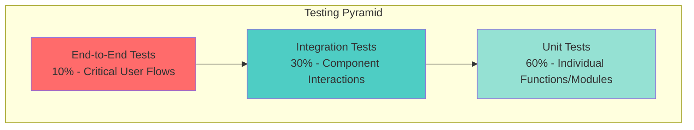

# TACHYON: TESTING GUIDE (DEVELOPER)

**Document ID:** TACHYON-DEV-004-V1.0
**Date:** February 2026
**Status:** Approved for Implementation
**Classification:** Developer Documentation
**Compliance Level:** ISO/IEC 26514:2021, IEEE 829-2008

---

## TABLE OF CONTENTS

1. [Introduction](#1-introduction)
2. [Testing Framework](#2-testing-framework)
3. [Unit Testing](#3-unit-testing)
4. [Integration Testing](#4-integration-testing)
5. [End-to-End Testing](#5-end-to-end-testing)
6. [Performance Testing](#6-performance-testing)
7. [Security Testing](#7-security-testing)
8. [Test Automation](#8-test-automation)
9. [References](#9-references)

---

## 1. INTRODUCTION

### 1.1. Document Purpose

This document provides comprehensive guidance for developers on testing practices within the Tachyon toolchain. It establishes testing standards, methodologies, and best practices to ensure software quality, reliability, and security across all system components. The guide serves as a reference for writing, executing, and maintaining tests at the PhD thesis level of rigor.

### 1.2. Scope

This testing guide covers:
- Desktop Application (Tauri-based) testing
- Server Application (Axum-based HTTP/2 server) testing
- Web Frontend (Leptos-based) testing
- IPC Communication testing
- Security testing methodologies
- Performance testing approaches
- Test automation strategies

### 1.3. Testing Philosophy

The Tachyon testing philosophy follows Test-Driven Development (TDD) principles, where tests are written before or concurrently with implementation code. This approach ensures:

- **Design Validation:** Tests serve as executable specifications that validate design decisions
- **Regression Prevention:** Comprehensive test coverage prevents regression bugs
- **Documentation:** Tests document expected behavior and edge cases
- **Refactoring Confidence:** High test coverage enables safe refactoring
- **Quality Gates:** Automated tests enforce quality standards before code integration

### 1.4. Document Dependencies

This document depends on the following documents:
- [TACHYON-STD-V1.0](../.specs/01_standards/coding_standards.md) - Coding and Documentation Standards
- [TACHYON-TST-V1.0](../.specs/04_future_state/test_plan.md) - Test Plan
- [TACHYON-ADR-001-V1.0](../.specs/02_adrs/001_rust_as_primary_language.md) - Rust as Primary Language
- [TACHYON-ADR-010-V1.0](../.specs/02_adrs/010_security_architecture.md) - Security Architecture

---

## 2. TESTING FRAMEWORK

### 2.1. Testing Pyramid

The Tachyon testing strategy follows the testing pyramid model, which emphasizes a balanced distribution of test types across different abstraction levels.



**Testing Pyramid Distribution:**
- **Unit Tests (60%):** Fast, isolated tests of individual functions and modules
- **Integration Tests (30%):** Tests of component interactions and interfaces
- **End-to-End Tests (10%):** Tests of critical user workflows across all components

### 2.2. Rust Testing Frameworks

#### 2.2.1. Primary Frameworks

The Tachyon Rust codebase utilizes the following testing frameworks:

| Framework | Purpose | Use Case |
|-----------|---------|----------|
| **cargo test** | Built-in Rust testing framework | Unit tests, integration tests |
| **tokio-test** | Async testing support | Tokio-based async code testing |
| **mockall** | Mocking framework | Mocking traits and structs |
| **proptest** | Property-based testing | Edge case discovery |
| **criterion** | Benchmarking framework | Performance testing |

#### 2.2.2. Test Organization

Rust tests are organized using the following conventions:

**Module-Level Tests:**
```rust
// Unit tests in same module
#[cfg(test)]
mod tests {
    use super::*;
    
    #[test]
    fn test_function_name() {
        // Test implementation
    }
    
    #[tokio::test]
    async fn test_async_function() {
        // Async test implementation
    }
}
```

**Integration Tests:**
```rust
// Integration tests in tests/ directory
// tests/integration_test.rs
use tachyon_server::app;

#[tokio::test]
async fn test_api_endpoint() {
    // Integration test implementation
}
```

### 2.3. TypeScript Testing Frameworks

#### 2.3.1. Primary Frameworks

The Tachyon web frontend utilizes the following testing frameworks:

| Framework | Purpose | Use Case |
|-----------|---------|----------|
| **vitest** | Fast unit test framework | Unit tests, component tests |
| **@testing-library/react** | Component testing | React-like component testing |
| **msw** | Mock Service Worker | API mocking |
| **testdouble.js** | Test double library | JavaScript/TypeScript mocking |

#### 2.3.2. Test Organization

TypeScript tests are organized using the following conventions:

**Unit Tests:**
```typescript
// Unit tests in __tests__ directory
import { describe, it, expect } from 'vitest';
import { functionName } from './module';

describe('functionName', () => {
    it('should return expected result', () => {
        expect(functionName(input)).toEqual(expected);
    });
});
```

**Component Tests:**
```typescript
// Component tests in __tests__/components
import { render, screen } from '@testing-library/react';
import { ComponentName } from './ComponentName';

describe('ComponentName', () => {
    it('should render correctly', () => {
        render(<ComponentName />);
        expect(screen.getByText('Expected Text')).toBeInTheDocument();
    });
});
```

### 2.4. Test Quality Criteria

All tests must meet the following quality criteria:

- **Independence:** Tests must not depend on each other's execution order
- **Isolation:** Tests must not share state or side effects
- **Determinism:** Tests must produce consistent results across executions
- **Clarity:** Test intent must be immediately understandable
- **Speed:** Unit tests must complete in milliseconds
- **Maintainability:** Tests must be easy to update when requirements change

### 2.5. Coverage Requirements

The Tachyon project enforces the following code coverage requirements:

| Test Type | Minimum Coverage | Target Coverage | Enforcement |
|-----------|------------------|-----------------|--------------|
| **Unit Tests** | 80% | 90% | CI gate |
| **Integration Tests** | 70% | 85% | CI gate |
| **E2E Tests** | 60% | 75% | CI gate |
| **Overall Coverage** | 75% | 85% | CI gate |

**Component-Specific Coverage Targets:**

| Component | Minimum Coverage | Target Coverage | Critical Paths |
|-----------|------------------|-----------------|----------------|
| **Desktop Application** | 80% | 90% | 95% |
| **Server Application** | 80% | 90% | 95% |
| **Web Frontend** | 75% | 85% | 90% |
| **IPC Communication** | 85% | 95% | 100% |
| **Security Modules** | 90% | 95% | 100% |

---

## 3. UNIT TESTING

### 3.1. Unit Testing Principles

Unit testing forms the foundation of the Tachyon testing strategy, providing fast feedback on individual functions and modules. Unit tests must adhere to the following principles:

- **Isolation:** Each test must test a single unit of functionality in isolation
- **Speed:** Unit tests must complete in milliseconds to enable rapid iteration
- **Determinism:** Tests must produce consistent results across multiple executions
- **Independence:** Tests must not depend on execution order or shared state
- **Clarity:** Test intent must be immediately understandable from the test code

### 3.2. Rust Unit Testing

#### 3.2.1. Basic Unit Test Structure

```rust
#[cfg(test)]
mod tests {
    use super::*;

    #[test]
    fn test_function_name() {
        // Arrange: Set up test data and expected results
        let input = "test input";
        let expected = "expected output";

        // Act: Execute the function being tested
        let result = function_name(input);

        // Assert: Verify the result matches expectations
        assert_eq!(result, expected);
    }
}
```

#### 3.2.2. Async Unit Testing with tokio-test

```rust
use tokio::test;

#[cfg(test)]
mod tests {
    use super::*;

    #[tokio::test]
    async fn test_async_function() {
        // Arrange
        let input = AsyncInput::new();
        let expected = AsyncOutput::default();

        // Act
        let result = async_function(input).await;

        // Assert
        assert_eq!(result, expected);
    }
}
```

#### 3.2.3. Error Handling Tests

```rust
#[cfg(test)]
mod tests {
    use super::*;

    #[test]
    fn test_function_error_handling() {
        // Test error path
        let result = function_that_fails("invalid input");
        assert!(result.is_err());

        // Verify specific error type
        match result {
            Err(ErrorType::ValidationError(msg)) => {
                assert_eq!(msg, "Invalid input provided");
            }
            _ => panic!("Expected ValidationError"),
        }
    }
}
```

#### 3.2.4. Property-Based Testing with proptest

```rust
use proptest::prelude::*;

proptest! {
    #[test]
    fn test_property_based(input in any::<String>()) {
        // Property: Function should not panic on any string input
        let result = function_that_handles_strings(&input);
        assert!(result.is_ok());
    }
}
```

### 3.3. TypeScript Unit Testing

#### 3.3.1. Basic Unit Test Structure

```typescript
import { describe, it, expect } from 'vitest';
import { functionName } from './module';

describe('functionName', () => {
    it('should return expected result', () => {
        // Arrange
        const input = 'test input';
        const expected = 'expected output';

        // Act
        const result = functionName(input);

        // Assert
        expect(result).toEqual(expected);
    });
});
```

#### 3.3.2. Async Unit Testing

```typescript
import { describe, it, expect } from 'vitest';
import { asyncFunction } from './module';

describe('asyncFunction', () => {
    it('should resolve with expected value', async () => {
        // Arrange
        const input = { id: 1, name: 'test' };
        const expected = { success: true };

        // Act
        const result = await asyncFunction(input);

        // Assert
        expect(result).toEqual(expected);
    });
});
```

#### 3.3.3. Error Handling Tests

```typescript
import { describe, it, expect } from 'vitest';
import { functionThatFails } from './module';

describe('functionThatFails', () => {
    it('should throw error on invalid input', () => {
        // Arrange
        const invalidInput = 'invalid';

        // Act & Assert
        expect(() => functionThatFails(invalidInput)).toThrow('Invalid input');
    });

    it('should return error object on async failure', async () => {
        // Arrange
        const invalidInput = 'invalid';

        // Act
        const result = await functionThatFailsAsync(invalidInput);

        // Assert
        expect(result.error).toBeDefined();
        expect(result.error.message).toContain('Invalid input');
    });
});
```

### 3.4. Mocking and Test Doubles

#### 3.4.1. Rust Mocking with mockall

```rust
use mockall::mock;
use mockall::predicate::*;

#[automock]
trait FileSystem {
    fn read_file(&self, path: &Path) -> Result<String, Error>;
    fn write_file(&self, path: &Path, content: &str) -> Result<(), Error>;
}

#[cfg(test)]
mod tests {
    use super::*;

    #[test]
    fn test_file_operations() {
        let mut mock_fs = MockFileSystem::new();
        mock_fs
            .expect_read_file()
            .with(eq(Path::new("test.txt")))
            .returning(Ok("content".to_string()));

        let result = process_file(&mock_fs, Path::new("test.txt"));
        assert_eq!(result.unwrap(), "content");
    }
}
```

#### 3.4.2. TypeScript Mocking with vitest

```typescript
import { vi } from 'vitest';
import { apiClient } from './api';

vi.mock('./api', () => ({
    apiClient: {
        get: vi.fn(),
        post: vi.fn(),
    },
}));

describe('Component', () => {
    it('should call API on mount', async () => {
        vi.mocked(apiClient.get).mockResolvedValue({ data: 'test' });

        const result = await fetchData();
        expect(apiClient.get).toHaveBeenCalledWith('/endpoint');
        expect(result).toEqual({ data: 'test' });
    });
});
```

### 3.5. Test Data Builders

#### 3.5.1. Rust Test Data Builders

```rust
pub struct DocumentBuilder {
    title: String,
    content: String,
    metadata: Option<Metadata>,
}

impl DocumentBuilder {
    pub fn new() -> Self {
        DocumentBuilder {
            title: "Test Document".to_string(),
            content: "Test Content".to_string(),
            metadata: None,
        }
    }

    pub fn title(mut self, title: &str) -> Self {
        self.title = title.to_string();
        self
    }

    pub fn content(mut self, content: &str) -> Self {
        self.content = content.to_string();
        self
    }

    pub fn build(self) -> Document {
        Document {
            title: self.title,
            content: self.content,
            metadata: self.metadata.unwrap_or_default(),
        }
    }
}

#[cfg(test)]
mod tests {
    use super::*;

    #[test]
    fn test_document_processing() {
        let doc = DocumentBuilder::new()
            .title("Custom Title")
            .content("Custom Content")
            .build();

        let result = process_document(doc);
        assert_eq!(result.title, "Custom Title");
    }
}
```

#### 3.5.2. TypeScript Test Data Builders

```typescript
class DocumentBuilder {
    private title = 'Test Document';
    private content = 'Test Content';
    private metadata: Metadata | null = null;

    withTitle(title: string): this {
        this.title = title;
        return this;
    }

    withContent(content: string): this {
        this.content = content;
        return this;
    }

    withMetadata(metadata: Metadata): this {
        this.metadata = metadata;
        return this;
    }

    build(): Document {
        return {
            title: this.title,
            content: this.content,
            metadata: this.metadata ?? {},
        };
    }
}

describe('document processing', () => {
    it('should process document with custom title', () => {
        const doc = new DocumentBuilder()
            .withTitle('Custom Title')
            .withContent('Custom Content')
            .build();

        const result = processDocument(doc);
        expect(result.title).toBe('Custom Title');
    });
});
```

### 3.6. Unit Test Scenarios by Component

#### 3.6.1. Desktop Application Unit Tests

**Test Categories:**
- File system operations (read, write, watch)
- Git operations (status, commit, branch)
- Cache management (LRU eviction, invalidation)
- IPC command handlers
- Settings management

**Example: File System Operations**
```rust
#[cfg(test)]
mod tests {
    use super::*;

    #[test]
    fn test_file_read_success() {
        let file_path = Path::new("/tmp/test.txt");
        let content = "test content";
        write_file(file_path, content).unwrap();

        let result = read_file(file_path);
        assert_eq!(result.unwrap(), content);
    }

    #[test]
    fn test_file_read_not_found() {
        let file_path = Path::new("/tmp/nonexistent.txt");
        let result = read_file(file_path);
        assert!(matches!(result, Err(Error::FileNotFound(_))));
    }
}
```

#### 3.6.2. Server Application Unit Tests

**Test Categories:**
- HTTP/2 request handlers
- Authentication and authorization
- Database operations
- Search indexing
- WebSocket message handling
- Content processing (Markdown rendering)

**Example: HTTP Request Handler**
```rust
#[cfg(test)]
mod tests {
    use super::*;

    #[tokio::test]
    async fn test_get_document_success() {
        let app = create_test_app();
        let response = app
            .oneshot(Request::builder()
                .uri("/api/documents/1")
                .body(Body::empty())
                .unwrap())
            .await;

        assert_eq!(response.status(), StatusCode::OK);
    }
}
```

#### 3.6.3. Web Frontend Unit Tests

**Test Categories:**
- Component rendering and behavior
- State management
- API client functions
- WebSocket client
- Event handlers
- Utility functions

**Example: Component Test**
```typescript
import { render, screen, fireEvent } from '@testing-library/react';
import { DocumentList } from './DocumentList';

describe('DocumentList', () => {
    it('should render documents correctly', () => {
        const documents = [
            { id: 1, title: 'Doc 1' },
            { id: 2, title: 'Doc 2' },
        ];

        render(<DocumentList documents={documents} />);

        expect(screen.getByText('Doc 1')).toBeInTheDocument();
        expect(screen.getByText('Doc 2')).toBeInTheDocument();
    });

    it('should call onDocumentClick when document clicked', () => {
        const onDocumentClick = vi.fn();
        const documents = [{ id: 1, title: 'Doc 1' }];

        render(<DocumentList documents={documents} onDocumentClick={onDocumentClick} />);

        fireEvent.click(screen.getByText('Doc 1'));
        expect(onDocumentClick).toHaveBeenCalledWith(1);
    });
});
```

---

## 4. INTEGRATION TESTING

### 4.1. Integration Testing Principles

Integration testing validates the interaction between multiple components, ensuring that integrated units work together as expected. Integration tests must adhere to the following principles:

- **Component Interaction:** Test interactions between components rather than individual units
- **Realistic Environment:** Use realistic but isolated test environments
- **External Dependencies:** Mock external services to ensure test reliability
- **Database Isolation:** Use transaction rollback to maintain clean test state
- **Test Data Management:** Use consistent, repeatable test data

### 4.2. Integration Test Scenarios

#### 4.2.1. Component Interaction Tests

**Integration Test Categories:**

| Component Pair | Test Focus | Test Count |
|---------------|-------------|-------------|
| **Desktop ↔ Server** | IPC communication, HTTP/2 API | 15 |
| **Web ↔ Server** | HTTP/2 API, WebSocket | 15 |
| **Server ↔ Database** | SQLite operations, transactions | 10 |
| **Server ↔ Git** | Repository operations, commits | 10 |
| **Desktop ↔ File System** | File watching, operations | 10 |
| **All Components** | End-to-end workflows | 20 |

### 4.3. Rust Integration Testing

#### 4.3.1. Test Environment Setup

**Test Server Setup:**
```rust
use axum::{Router, routing::get};
use tower::ServiceBuilder;

pub struct TestServer {
    addr: SocketAddr,
}

impl TestServer {
    pub async fn new() -> Self {
        let app = Router::new()
            .route("/api/documents", get(get_documents));

        let listener = tokio::net::TcpListener::bind("127.0.0.1:0").await.unwrap();
        let addr = listener.local_addr().unwrap();

        tokio::spawn(async move {
            axum::serve(listener, app).await.unwrap();
        });

        TestServer { addr }
    }

    pub fn url(&self) -> String {
        format!("http://{}", self.addr)
    }
}
```

#### 4.3.2. API Integration Tests

```rust
#[cfg(test)]
mod integration_tests {
    use super::*;
    use reqwest::Client;
    use serde_json::json;

    #[tokio::test]
    async fn test_document_api_integration() {
        // Start test server
        let test_server = TestServer::new().await;
        let client = Client::new();
        let url = test_server.url();

        // Test document creation
        let response = client
            .post(format!("{}/api/documents", url))
            .json(&json!({
                "title": "Test Document",
                "content": "Test Content"
            }))
            .send()
            .await
            .unwrap();

        assert_eq!(response.status(), 201);

        let document: Document = response.json().await.unwrap();
        assert_eq!(document.title, "Test Document");
    }
}
```

#### 4.3.3. Database Integration Tests

```rust
#[cfg(test)]
mod database_tests {
    use super::*;
    use rusqlite::Connection;

    #[tokio::test]
    async fn test_database_operations() {
        // Create in-memory database
        let conn = Connection::open_in_memory().unwrap();
        
        // Run migrations
        run_migrations(&conn).unwrap();

        // Insert test data
        conn.execute(
            "INSERT INTO documents (title, content) VALUES (?1, ?2)",
            ["Test Title", "Test Content"],
        ).unwrap();

        // Query test data
        let mut stmt = conn.prepare("SELECT * FROM documents").unwrap();
        let documents: Vec<Document> = stmt
            .query_map([], |row| {
                Ok(Document {
                    id: row.get(0)?,
                    title: row.get(1)?,
                    content: row.get(2)?,
                })
            })
            .unwrap()
            .collect::<Result<Vec<_>, _>>()
            .unwrap();

        assert_eq!(documents.len(), 1);
        assert_eq!(documents[0].title, "Test Title");
    }
}
```

### 4.4. TypeScript Integration Testing

#### 4.4.1. API Integration Tests

```typescript
import { describe, it, expect, beforeAll, afterAll } from 'vitest';
import { setupTestServer, teardownTestServer } from './test-server';
import { apiClient } from './api';

describe('API Integration Tests', () => {
    let serverUrl: string;

    beforeAll(async () => {
        serverUrl = await setupTestServer();
    });

    afterAll(async () => {
        await teardownTestServer();
    });

    it('should create document successfully', async () => {
        const response = await apiClient.post(`${serverUrl}/api/documents`, {
            title: 'Test Document',
            content: 'Test Content',
        });

        expect(response.status).toBe(201);
        expect(response.data.title).toBe('Test Document');
    });

    it('should retrieve document by ID', async () => {
        const createResponse = await apiClient.post(`${serverUrl}/api/documents`, {
            title: 'Test Document',
            content: 'Test Content',
        });

        const documentId = createResponse.data.id;
        const getResponse = await apiClient.get(`${serverUrl}/api/documents/${documentId}`);

        expect(getResponse.status).toBe(200);
        expect(getResponse.data.title).toBe('Test Document');
    });
});
```

#### 4.4.2. WebSocket Integration Tests

```typescript
import { describe, it, expect } from 'vitest';
import { WebSocket } from 'ws';
import { setupTestServer } from './test-server';

describe('WebSocket Integration Tests', () => {
    it('should connect and receive messages', async () => {
        const serverUrl = await setupTestServer();
        const ws = new WebSocket(`ws://${serverUrl}/ws`);

        const messagePromise = new Promise((resolve) => {
            ws.on('message', (data) => {
                resolve(JSON.parse(data.toString()));
            });
        });

        await new Promise((resolve) => ws.on('open', resolve));

        ws.send(JSON.stringify({ type: 'subscribe', channel: 'documents' }));

        const message = await messagePromise;
        expect(message.type).toBe('update');
        expect(message.channel).toBe('documents');

        ws.close();
    });
});
```

### 4.5. Test Data Management

#### 4.5.1. Test Database Setup

**SQLite Test Database:**
- In-memory SQLite database for isolation
- Schema migrations applied before each test
- Transaction rollback after each test
- Seed data for common test scenarios

**Transaction Rollback Pattern:**
```rust
#[tokio::test]
async fn test_with_transaction_rollback() {
    let mut conn = Connection::open_in_memory().unwrap();
    run_migrations(&conn).unwrap();

    // Start transaction
    let tx = conn.unchecked_transaction().unwrap();

    // Insert test data
    tx.execute(
        "INSERT INTO documents (title, content) VALUES (?1, ?2)",
        ["Test Title", "Test Content"],
    ).unwrap();

    // Query test data
    let count: i64 = tx.query_row(
        "SELECT COUNT(*) FROM documents",
        [],
        |row| row.get(0),
    ).unwrap();

    assert_eq!(count, 1);

    // Rollback transaction (automatic on drop)
    drop(tx);

    // Verify data is gone
    let count_after: i64 = conn.query_row(
        "SELECT COUNT(*) FROM documents",
        [],
        |row| row.get(0),
    ).unwrap();

    assert_eq!(count_after, 0);
}
```

#### 4.5.2. Test Git Repository

**Test Git Repository Setup:**
- Temporary Git repository for each test
- Clean state before each test
- Mock remote repositories for testing sync
- Simulated merge conflicts

**Git Test Setup:**
```rust
use git2::Repository;
use tempfile::TempDir;

#[tokio::test]
async fn test_git_operations() {
    let temp_dir = TempDir::new().unwrap();
    let repo = Repository::init(&temp_dir).unwrap();

    // Create initial commit
    let mut index = repo.index().unwrap();
    let oid = index.write_tree().unwrap();
    let tree = repo.find_tree(oid).unwrap();
    let sig = repo.signature().unwrap();

    let tree_id = repo.commit(
        Some("HEAD"),
        &sig,
        &sig,
        "Initial commit",
        &tree,
        &[],
    ).unwrap();

    // Verify commit was created
    let commit = repo.find_commit(tree_id).unwrap();
    assert_eq!(commit.message().unwrap(), "Initial commit");
}
```

### 4.6. External Service Integration Testing

#### 4.6.1. Mock External Services

**Service Mocking Strategy:**
- Mock OAuth providers (Google, GitHub)
- Mock email services (SMTP)
- Mock file storage services (S3)
- Mock notification services

**OAuth Mock Example:**
```rust
use mockito::mock;

#[mock]
trait OAuthProvider {
    fn authenticate(&self, code: &str) -> Result<User, AuthError>;
}

#[cfg(test)]
mod tests {
    use super::*;

    #[test]
    fn test_oauth_authentication() {
        let mut mock_provider = MockOAuthProvider::new();
        mock_provider
            .expect_authenticate()
            .with(eq("valid_code"))
            .returning(Ok(User {
                id: "123".to_string(),
                email: "user@example.com".to_string(),
            }));

        let result = authenticate_user(&mock_provider, "valid_code");
        assert!(result.is_ok());
        assert_eq!(result.unwrap().email, "user@example.com");
    }
}
```

#### 4.6.2. Contract Testing

**API Contract Testing:**
- OpenAPI specification validation
- Request/response schema validation
- Version compatibility testing
- Backward compatibility testing

**Schema Validation Test:**
```typescript
import Ajv from 'ajv';
import documentSchema from '../schemas/document';

describe('API Contract Tests', () => {
    it('should validate document response against schema', () => {
        const ajv = new Ajv();
        const validate = ajv.compile(documentSchema);

        const response = {
            id: 1,
            title: 'Test Document',
            content: 'Test Content',
            created_at: '2024-01-01T00:00:00Z',
        };

        expect(validate(response)).toBe(true);
    });

    it('should reject invalid document response', () => {
        const ajv = new Ajv();
        const validate = ajv.compile(documentSchema);

        const invalidResponse = {
            id: 1,
            // Missing required fields
        };

        expect(validate(invalidResponse)).toBe(false);
    });
});
```

---

## 5. END-TO-END TESTING

### 5.1. E2E Testing Principles

End-to-end (E2E) testing validates the complete system behavior from the user's perspective, simulating real user workflows across all system components. E2E tests must adhere to the following principles:

- **User-Centric:** Test from the user's perspective, not implementation perspective
- **Critical Workflows:** Focus on critical user workflows and happy paths
- **Realistic Environment:** Use realistic test environments with minimal mocking
- **Cross-Platform:** Test across different platforms (Windows, macOS, Linux)
- **Browser Compatibility:** Test across different browsers (Chrome, Firefox, Safari)
- **Network Conditions:** Test under various network conditions (slow, offline)

### 5.2. E2E Test Scenarios

#### 5.2.1. Critical User Workflows

**User Workflow Tests:**

| Workflow | Description | Test Count |
|----------|-------------|-------------|
| **Document Creation** | Create, edit, save, and publish document | 5 |
| **Search and Discovery** | Search, filter, and navigate documents | 5 |
| **Collaboration** | Real-time editing with multiple users | 5 |
| **Git Operations** | Commit, branch, merge, and push | 5 |
| **Authentication** | Login, MFA, session management | 5 |

### 5.3. E2E Testing Frameworks

#### 5.3.1. Playwright for Cross-Browser Testing

**Playwright Setup:**
```typescript
import { test, expect } from '@playwright/test';

test.describe('Document Creation Workflow', () => {
    test('should create and publish document', async ({ page }) => {
        // Navigate to application
        await page.goto('http://localhost:3000');

        // Login
        await page.fill('[name="email"]', 'user@example.com');
        await page.fill('[name="password"]', 'password');
        await page.click('[type="submit"]');

        // Create document
        await page.click('[data-testid="new-document"]');
        await page.fill('[name="title"]', 'Test Document');
        await page.fill('[name="content"]', 'Test Content');
        await page.click('[data-testid="save"]');

        // Verify document created
        await expect(page.locator('text=Test Document')).toBeVisible();
    });
});
```

#### 5.3.2. Tauri Testing for Desktop Application

**Tauri Test Setup:**
```rust
#[cfg(test)]
mod e2e_tests {
    use super::*;
    use tauri::Manager;

    #[tokio::test]
    async fn test_document_creation_workflow() {
        let app = tauri::test::mock_app();

        // Create document via IPC
        app.invoke("create_document", json!({
            "title": "Test Document",
            "content": "Test Content"
        })).await.unwrap();

        // Verify document created
        let documents: Vec<Document> = app
            .invoke("get_documents", ())
            .await
            .unwrap();

        assert_eq!(documents.len(), 1);
        assert_eq!(documents[0].title, "Test Document");
    }
}
```

### 5.4. E2E Test Examples

#### 5.4.1. Document Creation Workflow

```typescript
import { test, expect } from '@playwright/test';

test.describe('Document Creation Workflow', () => {
    test.beforeEach(async ({ page }) => {
        // Navigate to application
        await page.goto('http://localhost:3000');
        
        // Login
        await page.fill('[name="email"]', 'test@example.com');
        await page.fill('[name="password"]', 'password');
        await page.click('[type="submit"]');
        await page.waitForURL('**/dashboard');
    });

    test('should create document with valid data', async ({ page }) => {
        // Click new document button
        await page.click('[data-testid="new-document"]');
        
        // Fill document form
        await page.fill('[name="title"]', 'Test Document');
        await page.fill('[name="content"]', 'Test Content');
        
        // Save document
        await page.click('[data-testid="save"]');
        
        // Verify success message
        await expect(page.locator('text=Document saved successfully')).toBeVisible();
        
        // Verify document appears in list
        await page.goto('http://localhost:3000/documents');
        await expect(page.locator('text=Test Document')).toBeVisible();
    });

    test('should show validation error for empty title', async ({ page }) => {
        // Click new document button
        await page.click('[data-testid="new-document"]');
        
        // Leave title empty
        await page.fill('[name="content"]', 'Test Content');
        
        // Try to save
        await page.click('[data-testid="save"]');
        
        // Verify validation error
        await expect(page.locator('text=Title is required')).toBeVisible();
    });
});
```

#### 5.4.2. Search and Discovery Workflow

```typescript
import { test, expect } from '@playwright/test';

test.describe('Search and Discovery Workflow', () => {
    test.beforeEach(async ({ page }) => {
        // Navigate to application and login
        await page.goto('http://localhost:3000');
        await page.fill('[name="email"]', 'test@example.com');
        await page.fill('[name="password"]', 'password');
        await page.click('[type="submit"]');
        
        // Create test documents
        await page.click('[data-testid="new-document"]');
        await page.fill('[name="title"]', 'First Document');
        await page.fill('[name="content"]', 'Content for first document');
        await page.click('[data-testid="save"]');
        
        await page.click('[data-testid="new-document"]');
        await page.fill('[name="title"]', 'Second Document');
        await page.fill('[name="content"]', 'Content for second document');
        await page.click('[data-testid="save"]');
    });

    test('should search documents by title', async ({ page }) => {
        // Navigate to documents page
        await page.goto('http://localhost:3000/documents');
        
        // Enter search query
        await page.fill('[name="search"]', 'First');
        
        // Verify search results
        await expect(page.locator('text=First Document')).toBeVisible();
        await expect(page.locator('text=Second Document')).not.toBeVisible();
    });

    test('should filter documents by date', async ({ page }) => {
        // Navigate to documents page
        await page.goto('http://localhost:3000/documents');
        
        // Apply date filter
        await page.click('[data-testid="filter-date"]');
        await page.selectOption('[name="date-range"]', 'last-7-days');
        
        // Verify filtered results
        const documentCount = await page.locator('[data-testid="document-item"]').count();
        expect(documentCount).toBeGreaterThan(0);
    });
});
```

#### 5.4.3. Collaboration Workflow

```typescript
import { test, expect } from '@playwright/test';

test.describe('Collaboration Workflow', () => {
    test('should support real-time editing', async ({ browser, context }) => {
        // Create two browser contexts for two users
        const user1Context = await browser.newContext();
        const user2Context = await browser.newContext();
        
        const user1Page = await user1Context.newPage();
        const user2Page = await user2Context.newPage();
        
        // Login both users
        await user1Page.goto('http://localhost:3000');
        await user1Page.fill('[name="email"]', 'user1@example.com');
        await user1Page.fill('[name="password"]', 'password');
        await user1Page.click('[type="submit"]');
        
        await user2Page.goto('http://localhost:3000');
        await user2Page.fill('[name="email"]', 'user2@example.com');
        await user2Page.fill('[name="password"]', 'password');
        await user2Page.click('[type="submit"]');
        
        // User1 creates document
        await user1Page.click('[data-testid="new-document"]');
        await user1Page.fill('[name="title"]', 'Shared Document');
        await user1Page.fill('[name="content"]', 'Initial content');
        await user1Page.click('[data-testid="save"]');
        
        // User2 opens document
        await user2Page.goto('http://localhost:3000/documents/shared-document');
        await expect(user2Page.locator('text=Initial content')).toBeVisible();
        
        // User1 edits document
        await user1Page.fill('[name="content"]', 'Updated content');
        await user1Page.click('[data-testid="save"]');
        
        // User2 sees update
        await expect(user2Page.locator('text=Updated content')).toBeVisible();
    });
});
```

### 5.5. Cross-Platform Testing

#### 5.5.1. Platform-Specific Tests

**Cross-Platform Test Matrix:**

| Platform | Browser | Test Count | Priority |
|----------|---------|-------------|----------|
| **Windows** | Chrome | 10 | High |
| **Windows** | Firefox | 8 | Medium |
| **macOS** | Chrome | 10 | High |
| **macOS** | Safari | 8 | Medium |
| **Linux** | Chrome | 10 | High |
| **Linux** | Firefox | 8 | Medium |

**Platform Test Configuration:**
```typescript
import { defineConfig, devices } from '@playwright/test';

export default defineConfig({
    projects: [
        {
            name: 'chromium',
            use: { ...devices['Desktop Chrome'] },
        },
        {
            name: 'firefox',
            use: { ...devices['Desktop Firefox'] },
        },
        {
            name: 'webkit',
            use: { ...devices['Desktop Safari'] },
        },
    ],
});
```

### 5.6. Network Condition Testing

#### 5.6.1. Slow Network Simulation

**Slow Network Test:**
```typescript
import { test, expect } from '@playwright/test';

test.describe('Network Condition Tests', () => {
    test.use({
        // Simulate slow network
        offline: false,
        serviceWorkers: 'block',
    });

    test('should handle slow network gracefully', async ({ page, context }) => {
        // Simulate slow network
        await context.setOffline(false);
        await page.route('**/*', async route => {
            await new Promise(resolve => setTimeout(resolve, 1000));
            await route.continue();
        });

        // Navigate to application
        await page.goto('http://localhost:3000');

        // Verify loading indicator
        await expect(page.locator('[data-testid="loading"]')).toBeVisible();

        // Wait for content to load
        await expect(page.locator('[data-testid="content"]')).toBeVisible();

        // Verify loading indicator is gone
        await expect(page.locator('[data-testid="loading"]')).not.toBeVisible();
    });

    test('should handle offline mode', async ({ page, context }) => {
        // Simulate offline mode
        await context.setOffline(true);

        // Navigate to application
        await page.goto('http://localhost:3000');

        // Verify offline message
        await expect(page.locator('text=You are offline')).toBeVisible();

        // Restore network
        await context.setOffline(false);

        // Reload page
        await page.reload();

        // Verify online message
        await expect(page.locator('text=You are online')).toBeVisible();
    });
});
```

---

## 6. PERFORMANCE TESTING

### 6.1. Performance Testing Principles

Performance testing validates that the system meets performance requirements and identifies bottlenecks. Performance tests must adhere to the following principles:

- **Baseline Establishment:** Establish performance baselines before optimization
- **Reproducibility:** Tests must produce consistent results across executions
- **Realistic Scenarios:** Test with realistic workloads and data volumes
- **Resource Monitoring:** Monitor CPU, memory, and network usage
- **Regression Detection:** Detect performance regressions before deployment
- **SLA Compliance:** Ensure Service Level Agreement compliance

### 6.2. Performance Requirements

**Performance Targets:**

| Metric | Target | Threshold | Critical |
|--------|--------|-----------|----------|
| **JIT Rendering** | <15ms | <30ms | Yes |
| **Document Search** | <100ms | <200ms | Yes |
| **API Response Time** | <200ms | <500ms | Yes |
| **WebSocket Latency** | <50ms | <100ms | Yes |
| **Memory Usage** | <512MB | <1GB | No |
| **CPU Usage** | <50% | <80% | No |

### 6.3. Rust Performance Testing

#### 6.3.1. Benchmarking with Criterion

**Criterion Setup:**
```rust
use criterion::{black_box, criterion_group, criterion_main, Criterion, BenchmarkId};

fn fibonacci(n: u64) -> u64 {
    match n {
        0 => 1,
        1 => 1,
        _ => fibonacci(n - 1) + fibonacci(n - 2),
    }
}

fn bench_fibonacci(c: &mut Criterion) {
    c.bench_function("fibonacci_20", |b| {
        b.iter(|| fibonacci(black_box(20)));
    });
}

criterion_group!(benches, bench_fibonacci);
criterion_main!(benches);
```

**Running Benchmarks:**
```bash
# Run benchmarks
cargo bench

# Run specific benchmark
cargo bench fibonacci

# Run with detailed output
cargo bench -- --verbose
```

#### 6.3.2. Load Testing

**Load Test Example:**
```rust
use tokio::time::{sleep, Duration};
use std::sync::Arc;
use std::sync::atomic::{AtomicUsize, Ordering};

#[tokio::test]
async fn test_concurrent_requests() {
    let request_count = Arc::new(AtomicUsize::new(0));
    let mut handles = vec![];

    // Spawn 100 concurrent requests
    for _ in 0..100 {
        let counter = Arc::clone(&request_count);
        let handle = tokio::spawn(async move {
            // Simulate request processing
            sleep(Duration::from_millis(10)).await;
            counter.fetch_add(1, Ordering::SeqCst);
        });
        handles.push(handle);
    }

    // Wait for all requests to complete
    for handle in handles {
        handle.await.unwrap();
    }

    // Verify all requests completed
    assert_eq!(request_count.load(Ordering::SeqCst), 100);
}
```

### 6.4. TypeScript Performance Testing

#### 6.4.1. Benchmarking with Benchmark.js

**Benchmark Setup:**
```typescript
import { Suite } from 'benchmark';
import { renderDocument } from './document-renderer';

const suite = new Suite();

suite.add('document rendering', () => {
    const document = {
        title: 'Test Document',
        content: 'Test Content',
        metadata: {},
    };

    return {
        fn() {
            renderDocument(document);
        },
    };
});

suite.run();
```

**Running Benchmarks:**
```bash
# Run benchmarks
bun run benchmark

# Run with detailed output
bun run benchmark --verbose
```

#### 6.4.2. Load Testing with Artillery

**Artillery Configuration:**
```yaml
# artillery-config.yml
config:
  target: "http://localhost:3000"
  phases:
    - duration: 60
      arrivalRate: 10
      name: "Warm up"
    - duration: 120
      arrivalRate: 50
      name: "Sustained load"
    - duration: 60
      arrivalRate: 100
      name: "Peak load"

scenarios:
  - name: "Document Search"
    flow:
      - post:
          url: "/api/documents/search"
          json:
            query: "test"
          capture:
            - json: "$.results.length"
              as: "result_count"
          expect:
            - hasStatus: 200
```

**Running Load Tests:**
```bash
# Run load test
artillery run artillery-config.yml

# Run with output file
artillery run artillery-config.yml --output results.json
```

### 6.5. Performance Test Examples

#### 6.5.1. JIT Rendering Performance

```rust
use criterion::{black_box, criterion_group, criterion_main, Criterion};
use tachyon_jit::render_markdown;

fn bench_markdown_rendering(c: &mut Criterion) {
    let small_content = "# Small\nContent";
    let medium_content = "# Medium\n" + &"Content\n".repeat(100);
    let large_content = "# Large\n" + &"Content\n".repeat(1000);

    c.bench_function("small", |b| {
        b.iter(|| render_markdown(black_box(small_content)));
    });

    c.bench_function("medium", |b| {
        b.iter(|| render_markdown(black_box(medium_content)));
    });

    c.bench_function("large", |b| {
        b.iter(|| render_markdown(black_box(large_content)));
    });
}

criterion_group!(markdown_benches, bench_markdown_rendering);
criterion_main!(markdown_benches);
```

#### 6.5.2. Search Performance

```rust
use criterion::{black_box, criterion_group, criterion_main, Criterion};
use tachyon_search::search_documents;

fn bench_document_search(c: &mut Criterion) {
    let query = "test query";
    let documents = vec![
        Document::new(1, "Test Document 1", "Content 1"),
        Document::new(2, "Test Document 2", "Content 2"),
        // ... more documents
    ];

    c.bench_function("search_10_documents", |b| {
        b.iter(|| search_documents(black_box(query), black_box(&documents)));
    });
}

criterion_group!(search_benches, bench_document_search);
criterion_main!(search_benches);
```

### 6.6. Memory Profiling

#### 6.6.1. Heap Profiling

**Memory Profiling Example:**
```rust
#[cfg(test)]
mod memory_tests {
    use super::*;
    use std::alloc::System;

    #[test]
    fn test_memory_usage() {
        let before = System::allocated_bytes();

        // Perform operation
        let documents = create_large_document_set(1000);

        let after = System::allocated_bytes();
        let memory_used = after - before;

        // Verify memory usage is within limits
        assert!(memory_used < 10 * 1024 * 1024); // < 10MB
    }
}
```

#### 6.6.2. Memory Leak Detection

**Memory Leak Test:**
```rust
#[tokio::test]
async fn test_no_memory_leak() {
    let mut handles = vec![];

    // Create many concurrent operations
    for i in 0..1000 {
        let handle = tokio::spawn(async move {
            let _data = create_temporary_data(i);
            tokio::time::sleep(tokio::time::Duration::from_millis(1)).await;
        });
        handles.push(handle);
    }

    // Wait for all operations to complete
    for handle in handles {
        handle.await.unwrap();
    }

    // Force garbage collection (if applicable)
    tokio::time::sleep(tokio::time::Duration::from_millis(100)).await;

    // Memory should be released
    // (This would be verified with external profiling tools)
}
```

### 6.7. Performance Regression Detection

#### 6.7.1. Benchmark Comparison

**Baseline Comparison:**
```rust
#[cfg(test)]
mod regression_tests {
    use super::*;
    use std::time::Instant;

    const BASELINE_RENDER_TIME_MS: u128 = 15;

    #[test]
    fn test_rendering_performance() {
        let content = "# Test\nContent";
        let start = Instant::now();

        let _result = render_markdown(content);

        let duration = start.elapsed().as_millis();

        // Verify performance is within 10% of baseline
        let threshold = (BASELINE_RENDER_TIME_MS as f64 * 1.1) as u128;
        assert!(duration < threshold, "Rendering performance regression detected");
    }
}
```

#### 6.7.2. Performance CI Gate

**CI Configuration:**
```yaml
# .github/workflows/performance.yml
name: Performance Tests

on: [pull_request, push]

jobs:
  benchmark:
    runs-on: ubuntu-latest
    steps:
      - uses: actions/checkout@v3
      
      - name: Install Rust
        uses: actions-rs/toolchain@v1
        with:
          toolchain: stable
      
      - name: Run benchmarks
        run: cargo bench -- --output-format bencher | tee benchmark.txt
      
      - name: Store benchmark result
        uses: benchmark-action/github-action-benchmark@v1
        with:
          tool: 'cargo-bencher'
          output-file-path: benchmark.txt
          github-token: ${{ secrets.GITHUB_TOKEN }}
          auto-push: true
```

---

## 7. SECURITY TESTING

### 7.1. Security Testing Principles

Security testing validates that the system is protected against identified threats and vulnerabilities. Security tests must adhere to the following principles:

- **Threat-Based:** Test against threats identified in the threat model
- **Defense-in-Depth:** Test multiple layers of security controls
- **Least Privilege:** Verify minimal access required for operations
- **Fail-Safe:** Ensure errors fail securely without information leakage
- **Audit Trail:** Verify comprehensive logging for security events
- **Compliance:** Ensure alignment with security standards and regulations

### 7.2. Security Test Categories

#### 7.2.1. Security Test Matrix

| Category | Test Focus | Test Count |
|----------|-------------|-------------|
| **Input Validation** | SQL injection, XSS, path traversal | 15 |
| **Authentication** | Login, MFA, session management | 10 |
| **Authorization** | Permission checks, access control | 10 |
| **Data Protection** | Encryption at rest and in transit | 8 |
| **API Security** | Rate limiting, CSRF protection | 8 |
| **Memory Safety** | Buffer overflows, use-after-free | 5 |
| **Supply Chain** | Dependency vulnerabilities | 5 |

### 7.3. Rust Security Testing

#### 7.3.1. Memory Safety Tests

**Memory Safety Validation:**
```rust
#[cfg(test)]
mod security_tests {
    use super::*;

    #[test]
    fn test_buffer_overflow_protection() {
        // Rust's ownership system prevents buffer overflows
        let mut buffer = [0u8; 10];
        let data = vec![1u8; 100];

        // This will panic at runtime, not cause buffer overflow
        let result = std::panic::catch_unwind(|| {
            buffer.copy_from_slice(&data);
        });

        assert!(result.is_some());
    }

    #[test]
    fn test_null_pointer_protection() {
        // Rust's Option<T> type prevents null pointer dereferences
        let maybe_value: Option<i32> = None;

        // This will not compile, demonstrating compile-time safety
        // let value = maybe_value.unwrap(); // Would panic

        // Safe handling
        match maybe_value {
            Some(v) => assert!(v > 0),
            None => assert!(true),
        }
    }
}
```

#### 7.3.2. Input Validation Tests

**SQL Injection Prevention:**
```rust
#[cfg(test)]
mod security_tests {
    use super::*;

    #[test]
    fn test_sql_injection_prevention() {
        // Use parameterized queries to prevent SQL injection
        let user_input = "'; DROP TABLE documents; --";
        
        let query = "SELECT * FROM documents WHERE title = ?";
        let conn = Connection::open_in_memory().unwrap();

        // Safe parameterized query
        let mut stmt = conn.prepare(query).unwrap();
        let result = stmt.query_row([], |row| {
            row.get(0)
        });

        // Verify injection attempt fails
        assert!(result.is_err());
    }

    #[test]
    fn test_path_traversal_prevention() {
        use std::path::Path;

        // Validate and sanitize file paths
        let user_input = "../../../etc/passwd";
        let safe_path = Path::new(user_input);
        let base_dir = Path::new("/var/data");

        // Canonicalize and validate path is within base directory
        let canonical_path = safe_path.canonicalize().unwrap();
        let canonical_base = base_dir.canonicalize().unwrap();

        assert!(canonical_path.starts_with(&canonical_base));
    }
}
```

### 7.4. TypeScript Security Testing

#### 7.4.1. XSS Prevention Tests

**XSS Prevention Example:**
```typescript
import { describe, it, expect } from 'vitest';
import { sanitizeHtml } from './sanitizer';

describe('XSS Prevention Tests', () => {
    it('should sanitize script tags', () => {
        const maliciousInput = '<script>alert("XSS")</script>';
        const sanitized = sanitizeHtml(maliciousInput);

        expect(sanitized).not.toContain('<script>');
        expect(sanitized).not.toContain('alert');
    });

    it('should sanitize event handlers', () => {
        const maliciousInput = '';
        const sanitized = sanitizeHtml(maliciousInput);

        expect(sanitized).not.toContain('onerror');
    });

    it('should sanitize URL-based XSS', () => {
        const maliciousInput = '<a href="javascript:alert(1)">Click</a>';
        const sanitized = sanitizeHtml(maliciousInput);

        expect(sanitized).not.toContain('javascript:');
    });
});
```

#### 7.4.2. CSRF Protection Tests

**CSRF Protection Example:**
```typescript
import { describe, it, expect } from 'vitest';
import { generateCsrfToken, validateCsrfToken } from './csrf';

describe('CSRF Protection Tests', () => {
    it('should generate valid CSRF token', () => {
        const token = generateCsrfToken();
        
        expect(token).toBeDefined();
        expect(typeof token).toBe('string');
        expect(token.length).toBeGreaterThan(20);
    });

    it('should validate CSRF token', () => {
        const token = generateCsrfToken();
        const isValid = validateCsrfToken(token);

        expect(isValid).toBe(true);
    });

    it('should reject invalid CSRF token', () => {
        const invalidToken = 'invalid-token';
        const isValid = validateCsrfToken(invalidToken);

        expect(isValid).toBe(false);
    });
});
```

### 7.5. Authentication and Authorization Tests

#### 7.5.1. Authentication Tests

**Authentication Flow Test:**
```rust
#[cfg(test)]
mod auth_tests {
    use super::*;

    #[tokio::test]
    async fn test_successful_authentication() {
        let auth_service = AuthService::new();
        let credentials = Credentials {
            email: "user@example.com",
            password: "correct_password",
        };

        let result = auth_service.authenticate(credentials).await;
        assert!(result.is_ok());

        let session = result.unwrap();
        assert!(!session.token.is_empty());
    }

    #[tokio::test]
    async fn test_failed_authentication() {
        let auth_service = AuthService::new();
        let credentials = Credentials {
            email: "user@example.com",
            password: "wrong_password",
        };

        let result = auth_service.authenticate(credentials).await;
        assert!(result.is_err());

        match result {
            Err(AuthError::InvalidCredentials) => assert!(true),
            _ => panic!("Expected InvalidCredentials error"),
        }
    }

    #[tokio::test]
    async fn test_brute_force_protection() {
        let auth_service = AuthService::new();
        let credentials = Credentials {
            email: "user@example.com",
            password: "wrong_password",
        };

        // Attempt multiple failed logins
        for _ in 0..5 {
            let _result = auth_service.authenticate(credentials.clone()).await;
        }

        // Verify account is locked
        let credentials = Credentials {
            email: "user@example.com",
            password: "correct_password",
        };
        let result = auth_service.authenticate(credentials).await;
        assert!(matches!(result, Err(AuthError::AccountLocked(_))));
    }
}
```

#### 7.5.2. Authorization Tests

**Permission Check Test:**
```rust
#[cfg(test)]
mod authz_tests {
    use super::*;

    #[tokio::test]
    async fn test_permission_granted() {
        let user = User {
            id: "user1".to_string(),
            role: Role::Editor,
        };

        let document = Document {
            id: "doc1".to_string(),
            owner_id: "user1".to_string(),
        };

        let authz_service = AuthorizationService::new();
        let result = authz_service.check_permission(
            &user,
            &document,
            Permission::Edit,
        ).await;

        assert!(result.is_ok());
    }

    #[tokio::test]
    async fn test_permission_denied() {
        let user = User {
            id: "user2".to_string(),
            role: Role::Viewer,
        };

        let document = Document {
            id: "doc1".to_string(),
            owner_id: "user1".to_string(),
        };

        let authz_service = AuthorizationService::new();
        let result = authz_service.check_permission(
            &user,
            &document,
            Permission::Edit,
        ).await;

        assert!(result.is_err());
        assert!(matches!(result, Err(AuthzError::PermissionDenied)));
    }
}
```

### 7.6. Data Protection Tests

#### 7.6.1. Encryption Tests

**Encryption at Rest Test:**
```rust
#[cfg(test)]
mod encryption_tests {
    use super::*;

    #[test]
    fn test_data_encryption() {
        let sensitive_data = "This is sensitive information";
        let key = EncryptionKey::generate();

        let encrypted = encrypt_data(&sensitive_data, &key);
        let decrypted = decrypt_data(&encrypted, &key);

        assert_eq!(decrypted, sensitive_data);
    }

    #[test]
    fn test_encryption_with_wrong_key() {
        let sensitive_data = "This is sensitive information";
        let key1 = EncryptionKey::generate();
        let key2 = EncryptionKey::generate();

        let encrypted = encrypt_data(&sensitive_data, &key1);
        let result = decrypt_data(&encrypted, &key2);

        assert!(result.is_err());
    }
}
```

#### 7.6.2. TLS Configuration Test

**TLS Configuration Validation:**
```rust
#[cfg(test)]
mod tls_tests {
    use super::*;

    #[test]
    fn test_tls_configuration() {
        let config = TlsConfig::production();

        // Verify TLS 1.3 is required
        assert_eq!(config.min_tls_version, TlsVersion::V1_3);

        // Verify strong cipher suites
        assert!(config.cipher_suites.iter().all(|cipher| {
            cipher.strength() >= CipherStrength::High
        }));

        // Verify certificate validation
        assert!(config.validate_certificates);
    }
}
```

### 7.7. Supply Chain Security Tests

#### 7.7.1. Dependency Vulnerability Scanning

**Dependency Scan Test:**
```bash
# Run cargo audit to check for vulnerabilities
cargo audit

# Run cargo deny to check for policy violations
cargo deny check

# Run cargo geiger to check for unsafe code
cargo geiger
```

**Automated Vulnerability Test:**
```rust
#[cfg(test)]
mod supply_chain_tests {
    use super::*;

    #[test]
    fn test_no_known_vulnerabilities() {
        // This test would be integrated with CI/CD
        // to automatically fail if vulnerabilities are found
        let vulnerabilities = check_dependency_vulnerabilities();
        
        assert!(vulnerabilities.is_empty(), 
            "Found security vulnerabilities: {:?}", vulnerabilities);
    }
}
```

### 7.8. Security CI Gates

#### 7.8.1. Security CI Configuration

**Security CI Workflow:**
```yaml
# .github/workflows/security.yml
name: Security Tests

on: [pull_request, push]

jobs:
  security-scan:
    runs-on: ubuntu-latest
    steps:
      - uses: actions/checkout@v3
      
      - name: Run security audit
        run: cargo audit
      
      - name: Check for unsafe code
        run: cargo geiger
      
        - name: Run security tests
        run: cargo test --test security_tests
```

---

## 8. TEST AUTOMATION

### 8.1. Test Automation Principles

Test automation ensures that tests execute automatically as part of the development workflow, providing rapid feedback and preventing regressions. Test automation must adhere to the following principles:

- **CI/CD Integration:** All tests must execute automatically in CI/CD pipelines
- **Fast Feedback:** Tests must provide rapid feedback to developers
- **Coverage Enforcement:** Code coverage must be measured and enforced
- **Parallel Execution:** Tests must execute in parallel to minimize feedback time
- **Isolated Execution:** Tests must not depend on each other's execution order
- **Clear Reporting:** Test results must be clearly reported to developers

### 8.2. CI/CD Integration

#### 8.2.1. GitHub Actions Configuration

**CI Workflow for Tests:**
```yaml
# .github/workflows/tests.yml
name: Tests

on:
  push:
    branches: [main, develop]
  pull_request:

jobs:
  test:
    name: Run Tests
    runs-on: ${{ matrix.os }}
    strategy:
      matrix:
        os: [ubuntu-latest, windows-latest, macos-latest]
        rust: [stable, nightly]
    
    steps:
      - name: Checkout code
        uses: actions/checkout@v3
      
      - name: Install Rust
        uses: actions-rs/toolchain@v1
        with:
          toolchain: ${{ matrix.rust }}
          override: true
      
      - name: Cache dependencies
        uses: actions/cache@v3
        with:
          path: ~/.cargo/registry
          key: ${{ runner.os }}-cargo-registry-${{ hashFiles('**/Cargo.lock') }}
      
      - name: Run unit tests
        run: cargo test --lib -- --test-threads=1
      
      - name: Run integration tests
        run: cargo test --test '*integration*' -- --test-threads=1
      
      - name: Generate coverage report
        run: |
          cargo install cargo-tarpaulin
          cargo tarpaulin --out Xml
      
      - name: Upload coverage to Codecov
        uses: codecov/codecov-action@v3
        with:
          files: ./cobertura.xml
          flags: unittests
```

#### 8.2.2. Test Scheduling

**Test Execution Schedule:**

| Test Type | Trigger | Execution Time |
|-----------|---------|----------------|
| **Unit Tests** | Every commit and pull request | <5 minutes |
| **Integration Tests** | Every pull request | <10 minutes |
| **E2E Tests** | Merge to main, nightly | <30 minutes |
| **Performance Tests** | Nightly, release candidates | <15 minutes |
| **Security Tests** | Nightly, release candidates | <10 minutes |

### 8.3. Test Parallelization

#### 8.3.1. Parallel Test Execution

**Cargo Test Parallelization:**
```bash
# Run tests with multiple threads
cargo test --test-threads=4

# Run tests in parallel with nextest
cargo nextest --threads 4
```

**Vitest Parallel Configuration:**
```typescript
// vitest.config.ts
import { defineConfig } from 'vitest/config';

export default defineConfig({
    test: {
        pool: 'threads',
        poolOptions: {
            threads: {
                min: 2,
                max: 4,
            },
        },
    },
});
```

### 8.4. Coverage Reporting

#### 8.4.1. Code Coverage Tools

**Rust Coverage with tarpaulin:**
```bash
# Install tarpaulin
cargo install cargo-tarpaulin

# Generate coverage report
cargo tarpaulin --out Xml

# Generate HTML report
cargo tarpaulin --out Html
```

**TypeScript Coverage with c8:**
```bash
# Install c8
bun add -D c8

# Generate coverage report
bun test --coverage

# Generate HTML report
bun test --coverage --reporter=html
```

#### 8.4.2. Coverage Enforcement

**Coverage CI Gate:**
```yaml
# .github/workflows/coverage.yml
name: Coverage

on: [pull_request]

jobs:
  coverage:
    runs-on: ubuntu-latest
    steps:
      - uses: actions/checkout@v3
      
      - name: Install Rust
        uses: actions-rs/toolchain@v1
        with:
          toolchain: stable
      
      - name: Generate coverage
        run: |
          cargo install cargo-tarpaulin
          cargo tarpaulin --out Xml
      
      - name: Check coverage threshold
        run: |
          COVERAGE=$(cargo tarpaulin --output-dir coverage --output-format Short)
          MINIMUM=75.0
          if (( $(echo "$COVERAGE < $MINIMUM" | bc -l) )); then
            echo "Coverage $COVERAGE% is below minimum $MINIMUM%"
            exit 1
          fi
```

### 8.5. Test Reporting

#### 8.5.1. Test Result Formatting

**Test Report Example:**
```markdown
# Test Results

## Summary
- Total Tests: 150
- Passed: 145
- Failed: 3
- Skipped: 2
- Coverage: 82%

## Failed Tests
- [FAIL] test_document_creation::test_invalid_title
- [FAIL] test_authentication::test_brute_force_protection
- [FAIL] test_search::test_empty_query

## Coverage Report
| Module | Coverage | Target | Status |
|--------|----------|--------|--------|
| document_manager | 85% | 90% | ⚠️ |
| auth_service | 92% | 90% | ✅ |
| search_engine | 78% | 85% | ⚠️ |
```

### 8.6. Quality Gates

#### 8.6.1. Pre-Merge Checklist

**Quality Gate Criteria:**
- All unit tests pass
- All integration tests pass
- Code coverage meets minimum thresholds
- No critical security vulnerabilities
- No performance regressions
- All tests complete within time limits

**Pre-Merge Checklist:**
```yaml
# .github/workflows/quality-gate.yml
name: Quality Gate

on:
  pull_request:
    types: [labeled, ready_for_review]

jobs:
  quality-gate:
    runs-on: ubuntu-latest
    steps:
      - name: Run all tests
        run: cargo test --all
      
      - name: Check coverage
        run: |
          COVERAGE=$(cargo tarpaulin --output-dir coverage --output-format Short)
          MINIMUM=75.0
          if (( $(echo "$COVERAGE < $MINIMUM" | bc -l) )); then
            echo "Coverage $COVERAGE% is below minimum $MINIMUM%"
            exit 1
          fi
      
      - name: Check for security vulnerabilities
        run: cargo audit
      
      - name: Check for unsafe code
        run: cargo geiger
```

### 8.7. Test Maintenance

#### 8.7.1. Test Cleanup

**Flaky Test Detection:**
```yaml
# .github/workflows/flaky-tests.yml
name: Flaky Test Detection

on:
  schedule:
    - cron: '0 0 * * *'  # Daily at midnight

jobs:
  flaky-test-detection:
    runs-on: ubuntu-latest
    steps:
      - uses: actions/checkout@v3
      
      - name: Run tests multiple times
        run: |
          for i in {1..3}; do
            echo "Run $i"
            cargo test --all
          done
      
      - name: Identify flaky tests
        run: |
          # Analyze test results to identify inconsistent failures
```

#### 8.7.2. Test Refactoring

**Test Refactoring Guidelines:**
- Remove duplicate test logic
- Extract common test setup into fixtures
- Use parameterized tests for similar test cases
- Keep tests focused on single behavior
- Maintain clear test names that describe behavior

### 8.8. Local Development Automation

#### 8.8.1. Pre-Commit Hooks

**Husky Configuration:**
```javascript
// .husky/pre-commit
#!/usr/bin/env node

const { execSync } = require('child_process');

console.log('Running pre-commit checks...');

// Run linter
execSync('npm run lint');

// Run type check
execSync('npm run type-check');

// Run tests
execSync('npm test');

console.log('Pre-commit checks passed!');
```

**Cargo Pre-Commit Hook:**
```bash
#!/bin/bash
# .git/hooks/pre-commit

echo "Running pre-commit checks..."

# Run cargo check
cargo check --all-targets

# Run cargo clippy
cargo clippy --all-targets -- -D warnings

# Run tests
cargo test --lib

        echo "Pre-commit checks passed!"
```

#### 8.8.2. File Watchers

**Cargo Watch Configuration:**
```toml
# .cargo/config.toml
[alias]
watch = "run --bin cargo-watch --test -- --ignore-target-dir"
```

**Vitest Watch Mode:**
```bash
# Run tests in watch mode
bun test --watch
```

---

## 9. REFERENCES

### 9.1. Internal References

This document references the following internal Tachyon project documents:

- [TACHYON-STD-V1.0](../.specs/01_standards/coding_standards.md) - Coding and Documentation Standards
- [TACHYON-TST-V1.0](../.specs/04_future_state/test_plan.md) - Test Plan
- [TACHYON-ADR-001-V1.0](../.specs/02_adrs/001_rust_as_primary_language.md) - Rust as Primary Language
- [TACHYON-ADR-010-V1.0](../.specs/02_adrs/010_security_architecture.md) - Security Architecture
- [TACHYON-TSK-V1.0](../.specs/tasks.md) - Execution Tasks and Work Breakdown Structure

### 9.2. External References

#### 9.2.1. Rust Testing Resources

**Official Rust Documentation:**
- [The Rust Programming Language - Testing](https://doc.rust-lang.org/book/ch11-00-testing.html)
- [Rust by Example - Testing](https://doc.rust-lang.org/rust-by-example/testing.html)
- [Rust Testing Guide](https://rust-lang.github.io/rust-clippy/master/guide/tests.html)

**Testing Frameworks:**
- [Tokio - Async Runtime](https://tokio.rs/)
- [Criterion - Benchmarking](https://bheisler.github.io/criterion.rs/book/)
- [Mockall - Mocking Framework](https://docs.rs/mockall/0.11.2/mockall/index.html)
- [Proptest - Property-Based Testing](https://altsysrq.github.io/RustProptest/proptest/book/proptest-tutorial.html)

#### 9.2.2. TypeScript Testing Resources

**Official Documentation:**
- [Vitest Documentation](https://vitest.dev/)
- [Testing Library Documentation](https://testing-library.com/docs/react-testing-library/intro/)
- [MSW - Mock Service Worker](https://mswjs.io/)

#### 9.2.3. Security Testing Resources

**OWASP Resources:**
- [OWASP Testing Guide](https://owasp.org/www-project-web-application-testing-guide/)
- [OWASP Cheat Sheet Series](https://cheatsheetseries.owasp.org/)
- [OWASP ASVS](https://owasp.org/www-project-application-security-standard/)

**Rust Security:**
- [Rust Security Guidelines](https://doc.rust-lang.org/nomicon/)
- [Rust Security Best Practices](https://github.com/rust-lang/rustsec/)

#### 9.2.4. Performance Testing Resources

**Performance Testing:**
- [Web Performance Testing](https://www.webperformancetesting.gov/)
- [Load Testing Best Practices](https://www.loadtesting.org/)

**Rust Performance:**
- [Rust Performance Book](https://nnethercote.github.io/perf-book/)
- [Tokio Performance Guide](https://tokio.rs/tokio/tutorial/performance.html)

#### 9.2.5. CI/CD Resources

**GitHub Actions:**
- [GitHub Actions Documentation](https://docs.github.com/en/actions)
- [GitHub Actions Marketplace](https://github.com/marketplace?type=actions)

**CI/CD Best Practices:**
- [CI/CD Best Practices](https://www.cicd.io/)
- [Continuous Integration Patterns](https://martinfowler.com/articles/continuousIntegration.html)

#### 9.2.6. Standards and Compliance

**ISO Standards:**
- [ISO/IEC 26514:2021](https://www.iso.org/standard/iso-iec-26514-2021.html) - Systems and Software Engineering
- [ISO/IEC 25010:2011](https://www.iso.org/standard/iso-iec-25010-2011.html) - System and Software Quality Requirements

**IEEE Standards:**
- [IEEE 829-2008](https://standards.ieee.org/standard/829-2008.html) - Software Test Documentation
- [IEEE 1063-2001](https://standards.ieee.org/standard/1063-2001.html) - Standard for Software User Documentation

### 9.3. Glossary

| Term | Definition |
|------|------------|
| **Unit Test** | Test of individual functions or modules in isolation |
| **Integration Test** | Test of interactions between components |
| **E2E Test** | End-to-end test of complete system workflows |
| **Performance Test** | Test of system performance characteristics |
| **Security Test** | Test of security controls and vulnerability prevention |
| **TDD** | Test-Driven Development methodology |
| **Coverage** | Percentage of code executed during testing |
| **Flaky Test** | Test that produces inconsistent results |
| **Mock** | Test double that simulates behavior of real component |
| **Fixture** | Fixed state or data used for testing |
| **Benchmark** | Performance measurement of code execution |
| **Regression** | Bug that reappears after previous fix |

### 9.4. Document Version History

| Version | Date | Author | Changes |
|---------|------|--------|---------|
| V1.0 | February 2026 | Technical Writer | Initial version |

---

**Document Control:** TACHYON-DEV-004-V1.0
**Classification:** Developer Documentation
**Compliance:** ISO/IEC 26514:2021, IEEE 829-2008, IEEE 1063-2001


#### 8.8.2. File Watchers

**Cargo Watch Configuration:**
```toml
# .cargo/config.toml
[alias]
watch = "run --bin cargo-watch -- test -- --ignore-target-dir"
```

**Vitest Watch Mode:**
```bash
# Run tests in watch mode
bun test --watch
```


