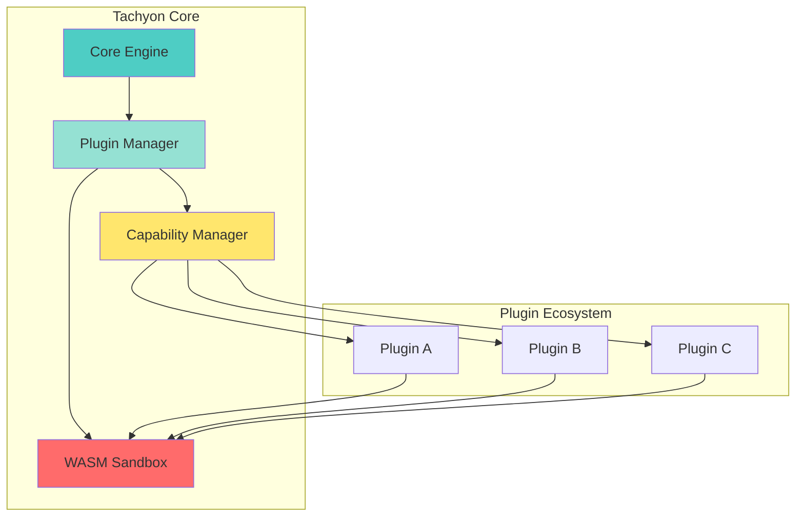
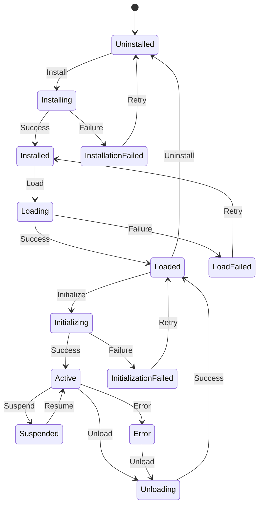
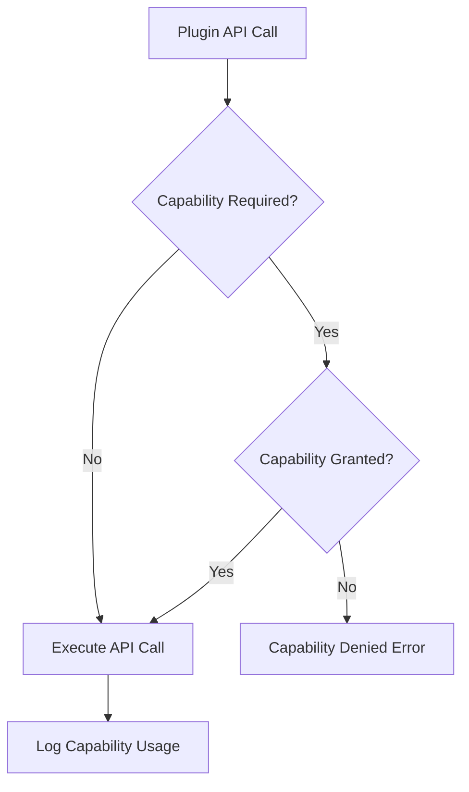

# TACHYON: PLUGIN DEVELOPMENT GUIDE

**Document ID:** TACHYON-INT-003-V1.0
**Date:** February 2026
**Status:** Proposed
**Classification:** Integration Documentation
**Dependencies:** [TACHYON-STD-V1.0](../../.specs/01_standards/coding_standards.md), [TACHYON-ADR-001-V1.0](../../.specs/02_adrs/001_rust_as_primary_language.md), [TACHYON-ADR-010-V1.0](../../.specs/02_adrs/010_security_architecture.md)

---

## TABLE OF CONTENTS

1. [Introduction](#1-introduction)
2. [Plugin Development Framework](#2-plugin-development-framework)
3. [Plugin Architecture](#3-plugin-architecture)
4. [Plugin Manifest](#4-plugin-manifest)
5. [Plugin Lifecycle](#5-plugin-lifecycle)
6. [Plugin API](#6-plugin-api)
7. [WASM Development](#7-wasm-development)
8. [Capability System](#8-capability-system)
9. [Plugin Testing](#9-plugin-testing)
10. [Plugin Distribution](#10-plugin-distribution)
11. [Security Considerations](#11-security-considerations)
12. [Troubleshooting](#12-troubleshooting)
13. [References](#13-references)

---

## 1. INTRODUCTION

### 1.1. Document Purpose

This document provides comprehensive guidance for developing plugins for Tachyon toolchain. The plugin architecture enables third-party developers to extend Tachyon's functionality through a secure, sandboxed environment that maintains system integrity while enabling customization and feature expansion.

### 1.2. Scope

This guide covers:
- Plugin architecture and design principles
- Plugin manifest specification
- Plugin lifecycle management
- Plugin API interfaces
- WebAssembly (WASM) plugin development
- Capability-based permission system
- Plugin testing methodologies
- Plugin distribution and packaging
- Security considerations and sandboxing
- Troubleshooting common issues

### 1.3. Target Audience

This guide is intended for:
- Software developers creating Tachyon plugins
- Systems architects designing plugin-based extensions
- Quality assurance engineers testing plugin functionality
- Security auditors reviewing plugin implementations

### 1.4. Prerequisites

Developers should have:
- Proficiency in Rust (Edition 2024)
- Understanding of WebAssembly (WASM) concepts
- Familiarity with Tauri's capability system
- Knowledge of async/await patterns with Tokio
- Experience with Serde for serialization
- Understanding of capability-based security models

---

## 2. PLUGIN DEVELOPMENT FRAMEWORK

### 2.1. Plugin Architecture Overview

The Tachyon plugin system implements a sandboxed, capability-based architecture that enables secure extension of core functionality. Plugins are compiled to WebAssembly and executed within a controlled environment with explicit permission grants.

**Architecture Principles:**

1. **Sandboxed Execution:** All plugins execute in isolated WASM sandboxes
2. **Capability-Based Security:** Plugins must explicitly declare and be granted capabilities
3. **Type-Safe Interfaces:** Strong typing prevents runtime errors at plugin boundaries
4. **Deterministic Behavior:** Plugin execution is deterministic and reproducible
5. **Resource Limits:** Plugins are constrained by configurable resource limits

### 2.2. Plugin Types

Tachyon supports the following plugin categories:

| Plugin Type | Description | Use Case |
|-------------|-------------|-----------|
| **Content Processor** | Transforms and processes document content | Markdown extensions, syntax highlighting |
| **Data Source** | Provides external data sources | Database connectors, API integrations |
| **UI Extension** | Extends user interface | Custom panels, toolbars, menus |
| **Authentication** | Provides authentication mechanisms | OAuth providers, SSO integration |
| **Search Provider** | Implements search functionality | Custom search engines, filters |
| **Export Format** | Defines export formats | PDF, EPUB, custom formats |

### 2.3. Plugin Development Workflow

The plugin development process follows these stages:

1. **Design Phase:** Define plugin requirements and capabilities
2. **Implementation Phase:** Write plugin code in Rust
3. **Testing Phase:** Write and execute unit and integration tests
4. **Compilation Phase:** Compile to WASM with required dependencies
5. **Packaging Phase:** Create plugin package with manifest
6. **Validation Phase:** Validate plugin against security requirements
7. **Distribution Phase:** Publish plugin to registry or distribute manually

### 2.4. Development Environment Setup

**Required Tools:**

- Rust toolchain (1.77.2+)
- `wasm-pack` for WASM compilation
- `wasm-bindgen` for JavaScript interoperability
- `cargo` for package management
- `wasm-opt` for binary optimization (optional)

**Installation:**

```bash
# Install Rust toolchain
rustup install stable
rustup default stable

# Install WASM target
rustup target add wasm32-unknown-unknown

# Install wasm-pack
cargo install wasm-pack

# Install wasm-opt (optional, requires Binaryen)
# See: https://github.com/WebAssembly/binaryen
```

**Project Initialization:**

```bash
# Create new plugin project
cargo new --lib tachyon-my-plugin
cd tachyon-my-plugin

# Initialize WASM configuration
wasm-pack init --scope my-org

# Add Tachyon plugin SDK dependency
cargo add tachyon-plugin-sdk
```

---

## 3. PLUGIN ARCHITECTURE

### 3.1. Architecture Overview

The Tachyon plugin architecture implements a modular, sandboxed system that enables secure extension of core functionality through WebAssembly modules. The architecture follows capability-based security principles, ensuring that plugins operate with minimal necessary permissions.

**Architecture Diagram:**



### 3.2. Component Responsibilities

#### 3.2.1. Plugin Manager

The Plugin Manager is responsible for:
- Plugin discovery and loading
- Plugin lifecycle management
- Capability enforcement
- Resource allocation and monitoring
- Plugin isolation and sandboxing

**Key Responsibilities:**

| Responsibility | Description |
|---------------|-------------|
| **Discovery** | Scan plugin directories and registry for available plugins |
| **Loading** | Load WASM modules into isolated sandboxes |
| **Validation** | Validate plugin manifests and capabilities |
| **Execution** | Manage plugin execution contexts and state |
| **Monitoring** | Monitor plugin resource usage and performance |
| **Unloading** | Safely unload plugins and release resources |

#### 3.2.2. Capability Manager

The Capability Manager enforces capability-based security:
- Capability declaration validation
- Permission grant management
- Runtime capability enforcement
- Audit logging of capability usage

**Capability Enforcement:**

```rust
use tachyon_plugin_sdk::Capability;

#[derive(Capability)]
pub struct FileReadCapability {
    #[capability(scope)]
    pub paths: Vec<String>,
}

#[derive(Capability)]
pub struct NetworkCapability {
    #[capability(scope)]
    pub domains: Vec<String>,
}
```

#### 3.2.3. WASM Sandbox

The WASM Sandbox provides:
- Isolated execution environment
- Memory access control
- Resource limits (CPU, memory, time)
- Inter-plugin communication mediation

**Sandbox Properties:**

| Property | Default | Configurable |
|-----------|----------|---------------|
| **Memory Limit** | 64 MB | Yes |
| **CPU Time Limit** | 5 seconds | Yes |
| **Execution Timeout** | 30 seconds | Yes |
| **Allowed Imports** | Whitelisted | Yes |

### 3.3. Plugin Communication Model

Plugins communicate with Tachyon core and other plugins through well-defined interfaces:

**Communication Patterns:**

1. **Direct API Calls:** Plugins call Tachyon core APIs directly
2. **Event-Based:** Plugins subscribe to and emit events
3. **Message Passing:** Asynchronous message passing between plugins
4. **Shared Memory:** Controlled shared memory regions (limited)

**Event Bus Example:**

```rust
use tachyon_plugin_sdk::EventBus;

#[derive(Event)]
pub struct DocumentChangedEvent {
    pub document_id: String,
    pub timestamp: u64,
}

pub fn register_event_handler(bus: &EventBus) {
    bus.subscribe(|event: DocumentChangedEvent| {
        println!("Document changed: {}", event.document_id);
    });
}
```

### 3.4. Plugin Isolation

Each plugin operates in an isolated environment with the following isolation mechanisms:

**Isolation Layers:**

1. **Process Isolation:** Plugins execute in separate WASM instances
2. **Memory Isolation:** Plugins have separate memory spaces
3. **Capability Isolation:** Plugins have minimal granted capabilities
4. **Resource Isolation:** Plugins have resource limits enforced
5. **Communication Isolation:** Plugins communicate through mediated channels

**Isolation Benefits:**

- **Security:** Compromised plugins cannot affect system integrity
- **Stability:** Plugin crashes do not affect other plugins or core
- **Performance:** Resource limits prevent runaway plugins
- **Debugging:** Isolated plugins are easier to debug and profile

### 3.5. Plugin Versioning

Plugins follow semantic versioning (SemVer) for compatibility management:

**Version Format:** `MAJOR.MINOR.PATCH`

| Component | Description | Change Triggers |
|------------|-------------|-----------------|
| **MAJOR** | Incompatible API changes | Breaking changes to plugin API |
| **MINOR** | Backwards-compatible functionality | New features, deprecated features |
| **PATCH** | Backwards-compatible bug fixes | Bug fixes, documentation updates |

**Compatibility Matrix:**

| Plugin Version | Tachyon Core | Compatible? |
|---------------|----------------|-------------|
| 1.0.0 | 1.0.0 | Yes |
| 1.1.0 | 1.0.0 | Yes |
| 2.0.0 | 1.0.0 | No |
| 1.0.1 | 1.0.0 | Yes |

---

## 4. PLUGIN MANIFEST

### 4.1. Manifest Overview

The plugin manifest is a JSON-formatted file that declares plugin metadata, capabilities, dependencies, and configuration. The manifest is required for all plugins and is validated during plugin loading.

**Manifest File:** `tachyon-plugin.json`

### 4.2. Manifest Schema

The plugin manifest follows the following schema:

```json
{
  "$schema": "https://tachyon.io/schemas/plugin-manifest-v1.json",
  "name": "plugin-name",
  "version": "1.0.0",
  "description": "Plugin description",
  "author": {
    "name": "Author Name",
    "email": "author@example.com"
  },
  "license": "MIT OR Apache-2.0",
  "repository": {
    "type": "git",
    "url": "https://github.com/username/plugin-repo"
  },
  "homepage": "https://github.com/username/plugin-repo#readme",
  "tachyon": {
    "min_version": "1.0.0",
    "max_version": "2.0.0"
  },
  "type": "content-processor",
  "entry_point": "tachyon_my_plugin",
  "capabilities": [
    {
      "identifier": "fs:read",
      "allow": [
        { "path": "$HOME/Documents" }
      ]
    }
  ],
  "permissions": {
    "network": ["https://api.example.com"],
    "fs": {
      "read": ["$HOME/Documents"],
      "write": []
    }
  },
  "resources": {
    "max_memory_mb": 64,
    "max_cpu_time_ms": 5000,
    "max_execution_time_ms": 30000
  },
  "dependencies": {
    "tachyon": ">=1.0.0,<2.0.0"
  },
  "settings": {
    "schema": "./settings-schema.json",
    "defaults": {
      "enabled": true,
      "priority": 100
    }
  },
  "hooks": {
    "on_load": "on_load",
    "on_unload": "on_unload",
    "on_document_open": "on_document_open"
  }
}
```

### 4.3. Manifest Fields

#### 4.3.1. Required Fields

| Field | Type | Description |
|-------|------|-------------|
| `$schema` | string | JSON Schema URL for validation |
| `name` | string | Unique plugin identifier (kebab-case) |
| `version` | string | Semantic version (SemVer) |
| `description` | string | Short plugin description |
| `type` | string | Plugin type (see Section 2.2) |
| `entry_point` | string | WASM module entry point |
| `capabilities` | array | Required capabilities |

#### 4.3.2. Optional Fields

| Field | Type | Description |
|-------|------|-------------|
| `author` | object | Plugin author information |
| `license` | string | SPDX license identifier |
| `repository` | object | Source code repository |
| `homepage` | string | Plugin homepage URL |
| `tachyon` | object | Tachyon version compatibility |
| `permissions` | object | Granular permission grants |
| `resources` | object | Resource limits |
| `dependencies` | object | Plugin dependencies |
| `settings` | object | Plugin configuration schema |
| `hooks` | object | Plugin lifecycle hooks |

### 4.4. Capability Declaration

Plugins must declare all required capabilities in the manifest:

**Capability Categories:**

| Category | Capability | Description |
|-----------|-------------|-------------|
| **File System** | `fs:read` | Read file system access |
| **File System** | `fs:write` | Write file system access |
| **Network** | `network:request` | HTTP/HTTPS requests |
| **Network** | `network:websocket` | WebSocket connections |
| **UI** | `ui:panel` | Create UI panels |
| **UI** | `ui:menu` | Add menu items |
| **Data** | `data:query` | Query data sources |
| **Data** | `data:mutate` | Modify data sources |

**Capability Declaration Example:**

```json
{
  "capabilities": [
    {
      "identifier": "fs:read",
      "allow": [
        { "path": "$HOME/Documents" },
        { "path": "$HOME/Downloads" }
      ]
    },
    {
      "identifier": "network:request",
      "allow": [
        { "domain": "api.example.com" },
        { "domain": "cdn.example.com" }
      ]
    },
    {
      "identifier": "ui:panel",
      "allow": [
        { "location": "sidebar-right" },
        { "location": "sidebar-left" }
      ]
    }
  ]
}
```

### 4.5. Resource Limits

Plugins may specify resource limits to prevent excessive resource consumption:

**Resource Limit Fields:**

| Field | Type | Default | Description |
|-------|------|---------|-------------|
| `max_memory_mb` | integer | 64 | Maximum memory in megabytes |
| `max_cpu_time_ms` | integer | 5000 | Maximum CPU time in milliseconds |
| `max_execution_time_ms` | integer | 30000 | Maximum execution time in milliseconds |

**Resource Limit Example:**

```json
{
  "resources": {
    "max_memory_mb": 128,
    "max_cpu_time_ms": 10000,
    "max_execution_time_ms": 60000
  }
}
```

### 4.6. Settings Schema

Plugins may define a settings schema for user configuration:

**Settings Schema Example:**

```json
{
  "settings": {
    "schema": {
      "type": "object",
      "properties": {
        "enabled": {
          "type": "boolean",
          "title": "Enable Plugin",
          "default": true
        },
        "priority": {
          "type": "integer",
          "title": "Plugin Priority",
          "minimum": 0,
          "maximum": 1000,
          "default": 100
        },
        "api_key": {
          "type": "string",
          "title": "API Key",
          "format": "password"
        }
      },
      "required": ["enabled"]
    },
    "defaults": {
      "enabled": true,
      "priority": 100
    }
  }
}
```

### 4.7. Manifest Validation

The plugin manifest is validated during plugin loading against the following criteria:

**Validation Rules:**

1. **Schema Validation:** Manifest must conform to JSON Schema
2. **Version Compatibility:** Plugin must be compatible with Tachyon version
3. **Capability Availability:** All declared capabilities must be available
4. **Resource Limits:** Resource limits must be within system constraints
5. **Dependency Resolution:** All dependencies must be resolvable
6. **Signature Verification:** Plugin signature must be valid (if signed)

**Validation Errors:**

| Error | Description | Resolution |
|-------|-------------|------------|
| `INVALID_SCHEMA` | Manifest does not conform to schema | Fix manifest structure |
| `INCOMPATIBLE_VERSION` | Plugin incompatible with Tachyon version | Update version constraints |
| `UNKNOWN_CAPABILITY` | Declared capability not available | Remove or replace capability |
| `RESOURCE_LIMIT_EXCEEDED` | Resource limits exceed system constraints | Reduce resource limits |
| `DEPENDENCY_NOT_FOUND` | Required dependency not found | Install dependency |
| `INVALID_SIGNATURE` | Plugin signature verification failed | Re-sign plugin |

---

## 5. PLUGIN LIFECYCLE

### 5.1. Lifecycle Overview

The plugin lifecycle defines the states a plugin transitions through from installation to removal. Understanding the lifecycle is critical for implementing proper initialization, cleanup, and error handling.

**Lifecycle States:**



### 5.2. Lifecycle Hooks

Plugins may implement lifecycle hooks to respond to state transitions:

**Available Hooks:**

| Hook | Trigger | Purpose | Return Type |
|------|---------|---------|-------------|
| `on_load` | Plugin loaded into memory | Initialize plugin state |
| `on_unload` | Plugin unloaded from memory | Cleanup resources |
| `on_activate` | Plugin activated | Start plugin functionality |
| `on_deactivate` | Plugin deactivated | Stop plugin functionality |
| `on_error` | Plugin error occurred | Handle error conditions |

**Hook Implementation Example:**

```rust
use tachyon_plugin_sdk::{Plugin, PluginContext, Result};

pub struct MyPlugin;

impl Plugin for MyPlugin {
    fn on_load(&mut self, context: &PluginContext) -> Result<()> {
        // Initialize plugin state
        context.log_info("Plugin loaded");
        Ok(())
    }
    
    fn on_unload(&mut self, context: &PluginContext) -> Result<()> {
        // Cleanup resources
        context.log_info("Plugin unloaded");
        Ok(())
    }
    
    fn on_activate(&mut self, context: &PluginContext) -> Result<()> {
        // Start plugin functionality
        context.log_info("Plugin activated");
        Ok(())
    }
    
    fn on_deactivate(&mut self, context: &PluginContext) -> Result<()> {
        // Stop plugin functionality
        context.log_info("Plugin deactivated");
        Ok(())
    }
    
    fn on_error(&mut self, context: &PluginContext, error: &str) -> Result<()> {
        // Handle error conditions
        context.log_error(&format!("Plugin error: {}", error));
        Ok(())
    }
}
```

### 5.3. Plugin Loading

The plugin loading process consists of the following steps:

**Loading Sequence:**

1. **Manifest Validation:** Validate plugin manifest against schema
2. **Dependency Resolution:** Resolve and load plugin dependencies
3. **Capability Verification:** Verify all declared capabilities are available
4. **WASM Module Loading:** Load WASM module into sandbox
5. **Plugin Instantiation:** Create plugin instance
6. **Hook Execution:** Execute `on_load` hook
7. **State Transition:** Transition to `Loaded` state

**Loading Error Handling:**

| Error | Cause | Recovery |
|-------|-------|----------|
| `MANIFEST_INVALID` | Manifest validation failed | Fix manifest |
| `DEPENDENCY_NOT_FOUND` | Dependency not available | Install dependency |
| `CAPABILITY_DENIED` | Capability not granted | Grant capability |
| `WASM_LOAD_FAILED` | WASM module load failed | Recompile plugin |
| `HOOK_FAILED` | Hook execution failed | Fix hook implementation |

### 5.4. Plugin Initialization

Plugin initialization occurs after loading and before activation:

**Initialization Process:**

1. **Capability Granting:** Grant declared capabilities to plugin
2. **Resource Allocation:** Allocate memory and CPU resources
3. **Configuration Loading:** Load plugin configuration
4. **Hook Execution:** Execute `on_activate` hook
5. **State Transition:** Transition to `Active` state

**Initialization Best Practices:**

- Validate all configuration values
- Initialize only necessary resources
- Log initialization progress
- Handle initialization errors gracefully
- Provide clear error messages

### 5.5. Plugin Execution

Once active, plugins execute in response to events and API calls:

**Execution Model:**

- **Event-Driven:** Plugins respond to system events
- **API-Based:** Plugins expose callable APIs
- **Scheduled:** Plugins may schedule periodic tasks
- **Reactive:** Plugins react to data changes

**Execution Constraints:**

| Constraint | Default | Configurable |
|-----------|---------|---------------|
| **Memory Limit** | 64 MB | Yes |
| **CPU Time** | 5 seconds | Yes |
| **Execution Timeout** | 30 seconds | Yes |
| **Concurrent Calls** | 10 | Yes |

### 5.6. Plugin Unloading

Plugin unloading occurs when the plugin is disabled or Tachyon shuts down:

**Unloading Process:**

1. **Deactivation:** Execute `on_deactivate` hook
2. **Task Cancellation:** Cancel all pending tasks
3. **Resource Release:** Release allocated resources
4. **Hook Execution:** Execute `on_unload` hook
5. **State Transition:** Transition to `Loaded` state
6. **Memory Cleanup:** Free plugin memory

**Unloading Best Practices:**

- Save plugin state before unloading
- Cancel all async operations
- Release all external resources
- Close network connections
- Flush any pending writes

### 5.7. Error Handling

Plugins must implement robust error handling for all lifecycle stages:

**Error Handling Principles:**

1. **Fail-Safe:** Errors should not crash the system
2. **Recovery:** Attempt recovery from transient errors
3. **Logging:** Log all errors with context
4. **User Feedback:** Provide user-friendly error messages
5. **Cleanup:** Ensure cleanup on error paths

**Error Handling Example:**

```rust
use tachyon_plugin_sdk::{PluginError, Result};

impl Plugin for MyPlugin {
    fn on_load(&mut self, context: &PluginContext) -> Result<()> {
        // Attempt initialization with error handling
        match self.initialize_resources(context) {
            Ok(_) => {
                context.log_info("Resources initialized successfully");
                Ok(())
            }
            Err(e) => {
                context.log_error(&format!("Initialization failed: {}", e));
                // Attempt cleanup
                let _ = self.cleanup_resources(context);
                Err(e)
            }
        }
    }
    
    fn on_error(&mut self, context: &PluginContext, error: &str) -> Result<()> {
        context.log_error(&format!("Error occurred: {}", error));
        
        // Attempt recovery based on error type
        if error.contains("transient") {
            context.log_info("Attempting recovery from transient error");
            self.recover_from_transient_error(context)
        } else {
            context.log_error("Non-recoverable error, deactivating plugin");
            Err(PluginError::NonRecoverable)
        }
    }
}
```

---

## 7. WASM DEVELOPMENT

### 7.1. WASM Overview

WebAssembly (WASM) is a binary instruction format for a stack-based virtual machine, designed as a portable compilation target for high-level languages like Rust. Tachyon uses WASM for plugin execution to provide sandboxed, secure, and performant plugin environments.

**WASM Benefits for Plugins:**

1. **Security:** Sandboxed execution environment
2. **Portability:** Runs consistently across platforms
3. **Performance:** Near-native execution speed
4. **Safety:** Memory-safe execution model
5. **Determinism:** Reproducible execution behavior

### 7.2. WASM Project Structure

A WASM plugin project follows this structure:

```
tachyon-my-plugin/
├── Cargo.toml              # Cargo manifest
├── tachyon-plugin.json     # Plugin manifest
├── src/
│   └── lib.rs            # Plugin library source
├── pkg/                     # Compiled WASM output
│   ├── tachyon_my_plugin.js
│   ├── tachyon_my_plugin_bg.js
│   ├── tachyon_my_plugin.d.ts
│   └── tachyon_my_plugin.wasm
└── tests/                   # Plugin tests
    └── integration.rs
```

### 7.3. Cargo.toml Configuration

The `Cargo.toml` file configures the WASM compilation:

```toml
[package]
name = "tachyon-my-plugin"
version = "0.1.0"
edition = "2024"

[lib]
crate-type = ["cdylib", "rlib"]

[dependencies]
tachyon-plugin-sdk = "0.1"
serde = { version = "1.0", features = ["derive"] }
serde_json = "1.0"
wasm-bindgen = "0.2"

[dev-dependencies]
wasm-bindgen-test = "0.3"

[profile.release]
opt-level = "z"          # Optimize for size
lto = true                # Link-time optimization
codegen-units = 1         # Single codegen unit

[package.metadata.wasm-pack.profile.release]
wasm-opt = ["-Oz", "--enable-bulk-memory"]  # WASM optimization
```

### 7.4. Plugin Entry Point

The plugin entry point is defined in `src/lib.rs`:

```rust
use tachyon_plugin_sdk::{Plugin, PluginContext, Result};
use wasm_bindgen::prelude::*;

/// Plugin implementation
pub struct MyPlugin {
    // Plugin state
    counter: u32,
}

impl Plugin for MyPlugin {
    fn new() -> Self {
        MyPlugin { counter: 0 }
    }
    
    fn on_load(&mut self, context: &PluginContext) -> Result<()> {
        context.logger().info("Plugin loaded");
        Ok(())
    }
    
    fn on_unload(&mut self, context: &PluginContext) -> Result<()> {
        context.logger().info("Plugin unloaded");
        Ok(())
    }
}

/// Exported WASM functions
#[wasm_bindgen]
pub fn create_plugin() -> *mut MyPlugin {
    Box::leak(Box::new(MyPlugin::new()))
}

#[wasm_bindgen]
pub fn process_text(plugin: &mut MyPlugin, text: &str) -> String {
    plugin.counter += 1;
    format!("Processed: {} (count: {})", text, plugin.counter)
}
```

### 7.5. WASM Compilation

Compile the plugin to WASM using `wasm-pack`:

```bash
# Build plugin for development
wasm-pack build --dev

# Build plugin for release
wasm-pack build --release

# Build with specific target
wasm-pack build --target bundler
```

**Compilation Flags:**

| Flag | Purpose | Default |
|-------|---------|---------|
| `--dev` | Development build (no optimization) | No |
| `--release` | Release build (optimized) | No |
| `--target` | Target bundler (nodejs, bundler, web) | bundler |

### 7.6. WASM Optimization

Optimize WASM binary size and performance:

**Size Optimization:**

```toml
[profile.release]
opt-level = "z"          # Optimize for size
lto = true                # Link-time optimization
codegen-units = 1         # Single codegen unit
panic = "abort"           # Abort on panic (smaller)
```

**WASM-Specific Optimization:**

```bash
# Use wasm-opt for additional optimization
wasm-opt pkg/tachyon_my_plugin_bg.wasm -Oz -o output.wasm

# Enable bulk memory for better memory management
wasm-opt pkg/tachyon_my_plugin_bg.wasm --enable-bulk-memory -o output.wasm
```

**Optimization Results:**

| Optimization | Size Reduction | Performance Impact |
|-------------|-----------------|---------------------|
| `opt-level = "z"` | 30-40% | Slight decrease |
| `lto = true` | 10-15% | Slight increase |
| `wasm-opt -Oz` | 20-30% | Slight decrease |
| `--enable-bulk-memory` | 5-10% | Slight increase |

### 7.7. WASM Testing

Test WASM plugins using `wasm-bindgen-test`:

```rust
#[cfg(test)]
mod tests {
    use super::*;
    use wasm_bindgen_test::wasm_bindgen_test;
    
    #[wasm_bindgen_test]
    fn test_create_plugin() {
        let plugin = create_plugin();
        assert!(!plugin.is_null());
    }
    
    #[wasm_bindgen_test]
    fn test_process_text() {
        let plugin = create_plugin();
        let result = process_text(plugin, "test");
        assert!(result.contains("test"));
    }
}
```

**Run WASM Tests:**

```bash
# Run WASM tests
wasm-pack test --node

# Run tests in browser
wasm-pack test --firefox
wasm-pack test --chrome
```

### 7.8. WASM Debugging

Debug WASM plugins using browser developer tools:

**Debugging Techniques:**

1. **Console Logging:** Use `console.log!` macro
2. **Breakpoints:** Set breakpoints in browser debugger
3. **Memory Inspection:** Inspect WASM memory
4. **Performance Profiling:** Use browser profiler

**Console Logging Example:**

```rust
use wasm_bindgen::prelude::*;

#[wasm_bindgen]
extern "C" {
    #[wasm_bindgen]
    fn console_log(s: &str);
}

#[wasm_bindgen]
pub fn debug_function() {
    console_log("Debug message from WASM");
}
```

### 7.9. WASM Limitations

Be aware of WASM limitations when developing plugins:

**Known Limitations:**

| Limitation | Impact | Workaround |
|------------|--------|------------|
| **No Threads** | No parallel execution | Use async/await |
| **No Dynamic Loading** | All code loaded at startup | Bundle all dependencies |
| **Limited I/O** | No direct file/network access | Use Tachyon API |
| **Memory Limit** | Limited memory available | Optimize memory usage |
| **No FFI** | No direct native calls | Use Tachyon API |

**Best Practices:**

- Minimize memory allocations
- Use efficient data structures
- Avoid large string operations
- Batch operations when possible
- Cache frequently accessed data

---

## 8. CAPABILITY SYSTEM

### 8.1. Capability System Overview

The Tachyon capability system implements capability-based security, where plugins must explicitly declare required capabilities and receive explicit grants from users or administrators. This follows the principle of least privilege, ensuring plugins operate with minimal necessary permissions.

**Capability System Principles:**

1. **Explicit Declaration:** Plugins must declare all required capabilities
2. **User Consent:** Users must grant capabilities explicitly
3. **Granular Control:** Capabilities are fine-grained and specific
4. **Revocable:** Granted capabilities can be revoked
5. **Auditable:** All capability usage is logged

### 8.2. Capability Categories

Tachyon defines the following capability categories:

| Category | Capabilities | Risk Level |
|-----------|-------------|------------|
| **File System** | `fs:read`, `fs:write`, `fs:delete` | Medium |
| **Network** | `network:request`, `network:websocket` | High |
| **UI** | `ui:panel`, `ui:menu`, `ui:notification` | Low |
| **Data** | `data:query`, `data:mutate`, `data:delete` | Medium |
| **System** | `system:execute`, `system:env` | High |
| **Clipboard** | `clipboard:read`, `clipboard:write` | Low |

### 8.3. Capability Declaration

Plugins declare capabilities in the manifest using the `capabilities` field:

**Capability Declaration Format:**

```json
{
  "capabilities": [
    {
      "identifier": "fs:read",
      "description": "Read files from file system",
      "allow": [
        { "path": "$HOME/Documents" },
        { "path": "$HOME/Downloads" }
      ]
    },
    {
      "identifier": "network:request",
      "description": "Make HTTP requests",
      "allow": [
        { "domain": "api.example.com" },
        { "domain": "cdn.example.com" }
      ]
    }
  ]
}
```

**Capability Attributes:**

| Attribute | Type | Required | Description |
|-----------|------|----------|-------------|
| `identifier` | string | Yes | Capability identifier |
| `description` | string | No | Human-readable description |
| `allow` | array | Yes | Allowed resources/operations |

### 8.4. Capability Enforcement

The capability manager enforces capability grants at runtime:

**Enforcement Points:**

1. **Manifest Validation:** Validate declared capabilities are available
2. **API Call Validation:** Check capability before API execution
3. **Resource Access:** Enforce capability for resource access
4. **Runtime Monitoring:** Monitor capability usage patterns

**Enforcement Flow:**



### 8.5. Capability Scoping

Capabilities support scoping to limit access to specific resources:

**Scope Types:**

| Scope Type | Example | Description |
|------------|---------|-------------|
| **Path Scope** | `{ "path": "$HOME/Documents" }` | Limit to specific paths |
| **Domain Scope** | `{ "domain": "api.example.com" }` | Limit to specific domains |
| **Pattern Scope** | `{ "pattern": "*.example.com" }` | Limit to pattern matching |
| **UI Scope** | `{ "location": "sidebar-right" }` | Limit to UI locations |

**Scope Examples:**

```json
{
  "capabilities": [
    {
      "identifier": "fs:read",
      "allow": [
        { "path": "$HOME/Documents" },
        { "path": "$HOME/Downloads" },
        { "pattern": "$HOME/.tachyon/plugins/*" }
      ]
    },
    {
      "identifier": "network:request",
      "allow": [
        { "domain": "api.example.com" },
        { "pattern": "*.example.com" }
      ]
    },
    {
      "identifier": "ui:panel",
      "allow": [
        { "location": "sidebar-right" },
        { "location": "sidebar-left" }
      ]
    }
  ]
}
```

### 8.6. Capability Request Flow

Users grant capabilities through the following flow:

**Capability Request Flow:**

1. **Plugin Installation:** Plugin declares required capabilities
2. **Capability Review:** User reviews requested capabilities
3. **Grant Decision:** User grants or denies capabilities
4. **Capability Activation:** Granted capabilities are activated
5. **Usage Monitoring:** Capability usage is monitored and logged

**User Interface Example:**

```typescript
// Capability request UI
interface CapabilityRequest {
    identifier: string;
    description: string;
    risk: 'low' | 'medium' | 'high';
    scope: string[];
}

function showCapabilityDialog(plugin: Plugin, capabilities: CapabilityRequest[]) {
    capabilities.forEach(cap => {
        const granted = await requestCapabilityGrant(cap);
        if (granted) {
            activateCapability(plugin.id, cap.identifier);
        }
    });
}
```

### 8.7. Capability Revocation

Users can revoke granted capabilities at any time:

**Revocation Process:**

1. **User Request:** User requests capability revocation
2. **Plugin Notification:** Plugin is notified of revocation
3. **Graceful Shutdown:** Plugin performs cleanup
4. **Capability Deactivation:** Capability is deactivated
5. **Logging:** Revocation is logged for audit

**Revocation Handling in Plugin:**

```rust
use tachyon_plugin_sdk::{Plugin, PluginContext, Result};

impl Plugin for MyPlugin {
    fn on_capability_revoked(&mut self, context: &PluginContext, capability: &str) -> Result<()> {
        context.logger().warn(&format!("Capability revoked: {}", capability));
        
        // Perform cleanup based on revoked capability
        match capability {
            "fs:read" => self.cleanup_file_handles(context)?,
            "network:request" => self.cleanup_network_connections(context)?,
            _ => {}
        }
        
        Ok(())
    }
}
```

### 8.8. Capability Audit Logging

All capability usage is logged for security auditing:

**Audit Log Format:**

| Field | Description |
|-------|-------------|
| `timestamp` | Event timestamp |
| `plugin_id` | Plugin identifier |
| `capability` | Capability identifier |
| `action` | Action performed |
| `resource` | Resource accessed |
| `result` | Success or failure |

**Audit Log Example:**

```json
{
  "timestamp": "2026-02-07T22:00:00Z",
  "plugin_id": "tachyon-my-plugin",
  "capability": "fs:read",
  "action": "read_file",
  "resource": "/home/user/Documents/test.txt",
  "result": "success"
}
```

### 8.9. Capability Best Practices

Follow these best practices when working with capabilities:

**Declaration Best Practices:**

- Declare only necessary capabilities
- Use most restrictive scopes possible
- Provide clear descriptions for each capability
- Group related capabilities together
- Document capability usage in plugin code

**Usage Best Practices:**

- Check capability availability before use
- Handle capability denial gracefully
- Minimize capability usage frequency
- Release capabilities when no longer needed
- Log capability usage for debugging

**Security Best Practices:**

- Validate all capability inputs
- Sanitize paths and domains
- Implement rate limiting for network calls
- Use secure defaults for all operations
- Report suspicious capability usage

---

## 9. PLUGIN TESTING

### 9.1. Testing Overview

Comprehensive testing is essential for plugin quality and reliability. Tachyon supports multiple testing methodologies including unit tests, integration tests, and end-to-end tests.

**Testing Principles:**

1. **Test-First Development:** Write tests before implementation
2. **Comprehensive Coverage:** Test all code paths and edge cases
3. **Isolation:** Tests must be independent and isolated
4. **Determinism:** Tests must produce consistent results
5. **Performance:** Include performance benchmarks for critical paths

### 9.2. Unit Testing

Unit tests verify individual functions and modules in isolation:

**Unit Test Framework:**

```rust
#[cfg(test)]
mod tests {
    use super::*;
    use tachyon_plugin_sdk::testing::*;
    
    #[test]
    fn test_process_text() {
        let mut plugin = MyPlugin::new();
        let input = "test input";
        let result = plugin.process_text(input);
        assert!(result.contains("test"));
    }
    
    #[test]
    fn test_error_handling() {
        let mut plugin = MyPlugin::new();
        let result = plugin.process_text("");
        assert!(result.is_err());
    }
}
```

**Run Unit Tests:**

```bash
# Run all unit tests
cargo test

# Run specific test
cargo test test_process_text

# Run tests with output
cargo test -- --nocapture

# Run tests in release mode
cargo test --release
```

### 9.3. Integration Testing

Integration tests verify plugin interactions with Tachyon APIs:

**Integration Test Example:**

```rust
#[cfg(test)]
mod integration_tests {
    use super::*;
    use tachyon_plugin_sdk::testing::*;
    
    #[tokio::test]
    async fn test_file_api_integration() {
        let context = TestContext::new();
        let mut plugin = MyPlugin::new();
        
        // Test file read
        let test_file = context.create_test_file("test.txt", "content")?;
        let content = plugin.read_file(&context, &test_file)?;
        assert_eq!(content, "content");
        
        Ok(())
    }
    
    #[tokio::test]
    async fn test_network_api_integration() {
        let context = TestContext::new_with_network();
        let mut plugin = MyPlugin::new();
        
        // Test network request
        let response = plugin.fetch_data(&context, "https://api.example.com/data")?;
        assert!(response.contains("data"));
        
        Ok(())
    }
}
```

### 9.4. WASM Testing

Test WASM plugins using browser-based testing:

**WASM Test Example:**

```rust
#[wasm_bindgen_test]
fn test_wasm_functionality() {
    let plugin = create_plugin();
    let result = process_text(plugin, "test");
    assert!(result.contains("test"));
}
```

**Run WASM Tests:**

```bash
# Run WASM tests in Node.js
wasm-pack test --node

# Run WASM tests in browser
wasm-pack test --firefox
wasm-pack test --chrome
```

### 9.5. Test Coverage

Maintain high test coverage for plugin reliability:

**Coverage Requirements:**

| Test Type | Minimum Coverage | Target Coverage |
|------------|-----------------|-----------------|
| **Unit Tests** | 80% | 90% |
| **Integration Tests** | 70% | 85% |
| **Overall** | 75% | 85% |

**Generate Coverage Report:**

```bash
# Generate coverage report
cargo tarpaulin --out Html

# Generate coverage for WASM
cargo tarpaulin --target wasm32-unknown-unknown
```

### 9.6. Performance Testing

Performance testing ensures plugins meet performance requirements:

**Performance Benchmarks:**

```rust
#[bench]
fn bench_process_text(b: &mut Bencher) {
    let mut plugin = MyPlugin::new();
    let input = "test input text";
    
    b.iter(|| {
        plugin.process_text(input);
    });
}
```

**Run Performance Tests:**

```bash
# Run benchmarks
cargo bench

# Run with specific criterion
cargo bench -- -- --test-threads=1
```

### 9.7. Test Automation

Automate testing in CI/CD pipelines:

**CI Configuration Example:**

```yaml
name: Plugin Tests

on: [push, pull_request]

jobs:
  test:
    runs-on: ubuntu-latest
    steps:
      - uses: actions/checkout@v3
      - uses: actions-rs/toolchain@v1
        with:
          toolchain: stable
          target: wasm32-unknown-unknown
      - name: Run tests
        run: cargo test --all-features
      - name: Check coverage
        run: cargo tarpaulin --out Xml
```

---

## 10. PLUGIN DISTRIBUTION

### 10.1. Distribution Overview

Plugins can be distributed through multiple channels including the Tachyon Plugin Registry, manual distribution, and private distribution.

**Distribution Channels:**

| Channel | Description | Use Case |
|----------|-------------|----------|
| **Plugin Registry** | Public registry for plugins | Open source plugins |
| **Manual Distribution** | Direct file distribution | Private or custom plugins |
| **Private Registry** | Organization-specific registry | Enterprise plugins |

### 10.2. Plugin Packaging

Package plugins for distribution using the following structure:

**Package Structure:**

```
tachyon-my-plugin-0.1.0.tgz
├── tachyon-plugin.json      # Plugin manifest
├── pkg/                       # Compiled WASM
│   ├── tachyon_my_plugin.wasm
│   ├── tachyon_my_plugin.js
│   └── tachyon_my_plugin_bg.js
├── README.md                   # Plugin documentation
├── LICENSE                     # License file
└── CHANGELOG.md                # Change log
```

**Package Plugin:**

```bash
# Create plugin package
wasm-pack pack

# Package with specific name
wasm-pack pack --name tachyon-my-plugin

# Package for release
wasm-pack pack --release
```

### 10.3. Plugin Registry

Publish plugins to the Tachyon Plugin Registry:

**Publish Plugin:**

```bash
# Login to registry
tachyon-plugin login

# Publish plugin
tachyon-plugin publish

# Publish specific version
tachyon-plugin publish --version 0.1.0
```

**Registry Configuration:**

```toml
[package.metadata.tachyon]
registry = "https://registry.tachyon.io"
```

### 10.4. Version Management

Follow semantic versioning for plugin releases:

**Version Bump:**

```bash
# Bump patch version
tachyon-plugin version patch

# Bump minor version
tachyon-plugin version minor

# Bump major version
tachyon-plugin version major
```

**Release Notes:**

```markdown
# Release Notes

## [0.1.0] - 2026-02-07

### Added
- New feature X
- New feature Y

### Changed
- Improved performance of Z
- Updated dependency A

### Fixed
- Fixed bug B
- Fixed issue C
```

---

## 11. SECURITY CONSIDERATIONS

### 11.1. Security Overview

Plugins execute in a sandboxed environment but must still follow security best practices to prevent vulnerabilities and protect user data.

**Security Principles:**

1. **Least Privilege:** Request only necessary capabilities
2. **Input Validation:** Validate all user inputs
3. **Output Encoding:** Encode all outputs properly
4. **Error Handling:** Handle errors securely
5. **Logging:** Log security events appropriately

### 11.2. Input Validation

Validate all inputs to prevent injection attacks:

**Validation Techniques:**

```rust
use validator::ValidateLength;

#[derive(Debug, ValidateLength)]
pub struct PluginInput {
    #[validate(length(min = 1, max = 1000))]
    pub text: String,
    
    #[validate(url))]
    pub url: String,
}

impl MyPlugin {
    fn process_input(&self, input: PluginInput) -> Result<String> {
        // Validation performed by ValidateLength
        Ok(format!("Processed: {}", input.text))
    }
}
```

### 11.3. Output Encoding

Encode all outputs to prevent XSS and injection:

**Encoding Techniques:**

```rust
use html_escape::encode_text_to_html;

impl MyPlugin {
    fn render_output(&self, text: &str) -> String {
        // Encode HTML to prevent XSS
        let encoded = encode_text_to_html(text);
        format!("<div>{}</div>", encoded)
    }
}
```

### 11.4. Error Handling

Handle errors securely without exposing sensitive information:

**Secure Error Handling:**

```rust
use thiserror::Error;

#[derive(Error, Debug)]
pub enum PluginError {
    #[error("Operation failed")]
    OperationFailed,
    
    #[error("Invalid input")]
    InvalidInput,
    
    #[error("Permission denied")]
    PermissionDenied,
}

impl std::fmt::Display for PluginError {
    fn fmt(&self, f: &mut std::fmt::Formatter) -> std::fmt::Result {
        match self {
            PluginError::OperationFailed => write!(f, "Operation failed"),
            PluginError::InvalidInput => write!(f, "Invalid input"),
            PluginError::PermissionDenied => write!(f, "Permission denied"),
        }
    }
}
```

### 11.5. Sandboxing

Plugins execute in a sandboxed WASM environment:

**Sandbox Properties:**

| Property | Description | Enforcement |
|-----------|-------------|--------------|
| **Memory Isolation** | Separate memory space | WASM runtime |
| **No File Access** | No direct file system access | Capability system |
| **No Network Access** | No direct network access | Capability system |
| **No Native Code** | No native code execution | WASM runtime |

### 11.6. Dependency Security

Secure plugin dependencies:

**Dependency Security:**

```toml
[dependencies]
tachyon-plugin-sdk = { version = "0.1", features = [] }
# Pin specific versions
serde = "=1.0.0"
serde_json = "=1.0.0"
```

**Audit Dependencies:**

```bash
# Audit dependencies for vulnerabilities
cargo audit

# Check for outdated dependencies
cargo outdated
```

---

## 12. TROUBLESHOOTING

### 12.1. Common Issues

Common plugin development issues and solutions:

**Compilation Issues:**

| Issue | Cause | Solution |
|-------|-------|----------|
| `WASM compilation failed` | Missing WASM target | Install `wasm32-unknown-unknown` target |
| `Linker error` | Incompatible dependencies | Update dependencies |
| `Size limit exceeded` | Binary too large | Optimize with `opt-level = "z"` |

**Runtime Issues:**

| Issue | Cause | Solution |
|-------|-------|----------|
| `Capability denied` | Capability not granted | Grant required capability |
| `Resource limit exceeded` | Memory/CPU limit reached | Increase limits or optimize |
| `API call failed` | Invalid parameters | Validate parameters |

### 12.2. Debugging Techniques

Debug plugin issues using these techniques:

**Logging:**

```rust
use tachyon_plugin_sdk::Logger;

impl MyPlugin {
    fn process(&self, context: &PluginContext) -> Result<()> {
        let logger = context.logger();
        logger.debug("Starting processing");
        // ... processing ...
        logger.info("Processing complete");
        Ok(())
    }
}
```

**Browser DevTools:**

1. Open browser DevTools (F12)
2. Navigate to Sources tab
3. Set breakpoints in WASM code
4. Inspect variables and call stack

### 12.3. Performance Issues

Diagnose and fix performance issues:

**Profiling:**

```bash
# Profile plugin performance
cargo flamegraph

# Analyze flamegraph
flamegraph < flamegraph.svg
```

**Optimization Techniques:**

1. Reduce allocations
2. Use efficient data structures
3. Cache frequently accessed data
4. Batch operations
5. Minimize WASM-JS boundary crossings

---

## 13. REFERENCES

### 13.1. Related Documents

- [TACHYON-STD-V1.0](../../.specs/01_standards/coding_standards.md) - Coding and Documentation Standards
- [TACHYON-ADR-001-V1.0](../../.specs/02_adrs/001_rust_as_primary_language.md) - Rust as Primary Language
- [TACHYON-ADR-010-V1.0](../../.specs/02_adrs/010_security_architecture.md) - Security Architecture
- [TACHYON-TST-V1.0](../../.specs/04_future_state/test_plan.md) - Test Plan

### 13.2. External Resources

**Rust Resources:**

- [The Rust Programming Language](https://doc.rust-lang.org/book/)
- [Rust Reference](https://doc.rust-lang.org/reference/)
- [Cargo Guide](https://doc.rust-lang.org/cargo/)

**WASM Resources:**

- [WebAssembly](https://webassembly.org/)
- [wasm-bindgen](https://rustwasm.github.io/wasm-bindgen/)
- [wasm-pack](https://rustwasm.github.io/wasm-pack/)

**Tauri Resources:**

- [Tauri Documentation](https://tauri.app/v1/guides/)
- [Tauri API](https://tauri.app/v1/api/js/)

### 13.3. Standards and Specifications

- [ISO/IEC 26514:2021](https://www.iso.org/standard/iso-iec-26514) - Systems and Software Engineering
- [IEEE 829-2008](https://standards.ieee.org/standard/829-2008.html) - Software Test Documentation
- [IEEE 1063-2001](https://standards.ieee.org/standard/1063-2001.html) - Standard for Software User Documentation

---

**Document Control:**

| Version | Date | Author | Changes |
|---------|------|--------|---------|
| 1.0 | 2026-02-07 | Technical Writer | Initial version |

**Document Status:** Proposed
**Next Review:** Pending peer review

### 6.1. API Overview

The Tachyon Plugin API provides interfaces for plugins to interact with the Tachyon core system. The API is designed to be type-safe, capability-controlled, and minimal to reduce the attack surface.

**API Design Principles:**

1. **Type Safety:** All API functions use strong Rust types
2. **Capability Control:** API access is gated by capabilities
3. **Minimal Surface:** Only essential functions are exposed
4. **Error Handling:** All errors are explicitly handled
5. **Documentation:** All functions are fully documented

### 6.2. Core API Modules

The Plugin API is organized into the following modules:

| Module | Description | Capabilities Required |
|--------|-------------|----------------------|
| `tachyon_plugin_sdk::context` | Plugin context and state management | None |
| `tachyon_plugin_sdk::fs` | File system operations | `fs:read`, `fs:write` |
| `tachyon_plugin_sdk::network` | Network operations | `network:request` |
| `tachyon_plugin_sdk::ui` | User interface operations | `ui:panel`, `ui:menu` |
| `tachyon_plugin_sdk::data` | Data source operations | `data:query`, `data:mutate` |
| `tachyon_plugin_sdk::events` | Event system | None |
| `tachyon_plugin_sdk::logging` | Logging operations | None |

### 6.3. Context API

The Context API provides access to plugin context and state:

**Context API Functions:**

```rust
use tachyon_plugin_sdk::{PluginContext, Result};

impl PluginContext {
    /// Get plugin configuration value
    pub fn get_config(&self, key: &str) -> Result<String>;
    
    /// Set plugin configuration value
    pub fn set_config(&self, key: &str, value: &str) -> Result<()>;
    
    /// Get plugin data directory
    pub fn get_data_dir(&self) -> Result<Path>;
    
    /// Get plugin cache directory
    pub fn get_cache_dir(&self) -> Result<Path>;
    
    /// Save plugin state
    pub fn save_state(&self, state: &[u8]) -> Result<()>;
    
    /// Load plugin state
    pub fn load_state(&self) -> Result<Vec<u8>>;
}
```

**Context API Example:**

```rust
impl Plugin for MyPlugin {
    fn on_load(&mut self, context: &PluginContext) -> Result<()> {
        // Load plugin configuration
        let api_key = context.get_config("api_key")?;
        
        // Get data directory
        let data_dir = context.get_data_dir()?;
        
        // Load saved state
        if let Ok(state) = context.load_state() {
            self.restore_state(&state)?;
        }
        
        Ok(())
    }
}
```

### 6.4. File System API

The File System API provides controlled access to the file system:

**File System API Functions:**

```rust
use tachyon_plugin_sdk::{FsApi, Result};

impl FsApi {
    /// Read file contents
    pub fn read_file(&self, path: &Path) -> Result<Vec<u8>>;
    
    /// Write file contents
    pub fn write_file(&self, path: &Path, contents: &[u8]) -> Result<()>;
    
    /// Check if file exists
    pub fn file_exists(&self, path: &Path) -> Result<bool>;
    
    /// List directory contents
    pub fn list_directory(&self, path: &Path) -> Result<Vec<Path>>;
    
    /// Delete file
    pub fn delete_file(&self, path: &Path) -> Result<()>;
    
    /// Create directory
    pub fn create_directory(&self, path: &Path) -> Result<()>;
}
```

**File System API Example:**

```rust
#[capability(fs:read)]
#[capability(fs:write)]
impl MyPlugin {
    fn process_document(&self, context: &PluginContext, path: &Path) -> Result<String> {
        let fs = context.fs();
        
        // Read document
        let contents = fs.read_file(path)?;
        let text = String::from_utf8(contents)?;
        
        // Process document
        let processed = self.transform_text(&text)?;
        
        // Write processed document
        let output_path = path.with_extension("processed");
        fs.write_file(&output_path, processed.as_bytes())?;
        
        Ok(output_path.to_string_lossy())
    }
}
```

### 6.5. Network API

The Network API provides controlled access to network resources:

**Network API Functions:**

```rust
use tachyon_plugin_sdk::{NetworkApi, Result, HttpMethod};

impl NetworkApi {
    /// Make HTTP request
    pub fn request(
        &self,
        method: HttpMethod,
        url: &str,
        headers: &[(&str, &str)],
        body: Option<&[u8]>
    ) -> Result<HttpResponse>;
    
    /// Make GET request
    pub fn get(&self, url: &str, headers: &[(&str, &str)]) -> Result<HttpResponse>;
    
    /// Make POST request
    pub fn post(
        &self,
        url: &str,
        headers: &[(&str, &str)],
        body: &[u8]
    ) -> Result<HttpResponse>;
}

pub struct HttpResponse {
    pub status: u16,
    pub headers: Vec<(String, String)>,
    pub body: Vec<u8>,
}
```

**Network API Example:**

```rust
#[capability(network:request)]
impl MyPlugin {
    fn fetch_remote_data(&self, context: &PluginContext, url: &str) -> Result<String> {
        let network = context.network();
        
        // Make GET request
        let response = network.get(url, &[
            ("Accept", "application/json"),
            ("User-Agent", "Tachyon-Plugin/1.0")
        ])?;
        
        // Check response status
        if response.status != 200 {
            return Err(PluginError::NetworkError(
                format!("Request failed with status: {}", response.status)
            ));
        }
        
        // Parse response
        let text = String::from_utf8(response.body)?;
        Ok(text)
    }
}
```

### 6.6. UI API

The UI API provides access to user interface elements:

**UI API Functions:**

```rust
use tachyon_plugin_sdk::{UiApi, Result};

impl UiApi {
    /// Create panel
    pub fn create_panel(&self, location: PanelLocation, title: &str) -> Result<PanelId>;
    
    /// Update panel content
    pub fn update_panel(&self, panel_id: PanelId, content: &str) -> Result<()>;
    
    /// Close panel
    pub fn close_panel(&self, panel_id: PanelId) -> Result<()>;
    
    /// Add menu item
    pub fn add_menu_item(&self, menu: MenuLocation, item: MenuItem) -> Result<MenuItemId>;
    
    /// Show notification
    pub fn show_notification(&self, message: &str, level: NotificationLevel) -> Result<()>;
}

pub enum PanelLocation {
    SidebarLeft,
    SidebarRight,
    BottomPanel,
}

pub enum MenuLocation {
    FileMenu,
    EditMenu,
    ViewMenu,
    ToolsMenu,
}
```

**UI API Example:**

```rust
#[capability(ui:panel)]
#[capability(ui:menu)]
impl MyPlugin {
    fn setup_ui(&self, context: &PluginContext) -> Result<()> {
        let ui = context.ui();
        
        // Create sidebar panel
        let panel_id = ui.create_panel(PanelLocation::SidebarRight, "My Plugin")?;
        ui.update_panel(panel_id, "<div>Plugin Content</div>")?;
        
        // Add menu item
        let menu_item = MenuItem {
            label: "My Plugin Action".to_string(),
            callback: "on_menu_action".to_string(),
        };
        ui.add_menu_item(MenuLocation::ToolsMenu, menu_item)?;
        
        Ok(())
    }
}
```

### 6.7. Event API

The Event API provides access to the event system:

**Event API Functions:**

```rust
use tachyon_plugin_sdk::{EventBus, Result};

impl EventBus {
    /// Subscribe to event
    pub fn subscribe<T: Event>(&self, handler: fn(T)) -> Result<SubscriptionId>;
    
    /// Unsubscribe from event
    pub fn unsubscribe(&self, subscription_id: SubscriptionId) -> Result<()>;
    
    /// Emit event
    pub fn emit<T: Event>(&self, event: T) -> Result<()>;
}

// Event trait
pub trait Event: Serialize + Deserialize {
    fn event_type() -> &'static str;
}
```

**Event API Example:**

```rust
#[derive(Serialize, Deserialize)]
pub struct DocumentOpenedEvent {
    pub document_id: String,
    pub timestamp: u64,
}

impl Event for DocumentOpenedEvent {
    fn event_type() -> &'static str {
        "document.opened"
    }
}

impl MyPlugin {
    fn setup_event_handlers(&self, context: &PluginContext) -> Result<()> {
        let events = context.events();
        
        // Subscribe to document opened event
        events.subscribe(|event: DocumentOpenedEvent| {
            println!("Document opened: {}", event.document_id);
        });
        
        Ok(())
    }
}
```

### 6.8. Logging API

The Logging API provides logging capabilities:

**Logging API Functions:**

```rust
use tachyon_plugin_sdk::{Logger, Result};

impl Logger {
    /// Log debug message
    pub fn debug(&self, message: &str);
    
    /// Log info message
    pub fn info(&self, message: &str);
    
    /// Log warning message
    pub fn warn(&self, message: &str);
    
    /// Log error message
    pub fn error(&self, message: &str);
}
```

**Logging API Example:**

```rust
impl MyPlugin {
    fn process_data(&self, context: &PluginContext) -> Result<()> {
        let logger = context.logger();
        
        logger.debug("Starting data processing");
        
        match self.do_processing() {
            Ok(result) => {
                logger.info(&format!("Processing completed: {:?}", result));
                Ok(result)
            }
            Err(e) => {
                logger.error(&format!("Processing failed: {}", e));
                Err(e)
            }
        }
    }
}
```
