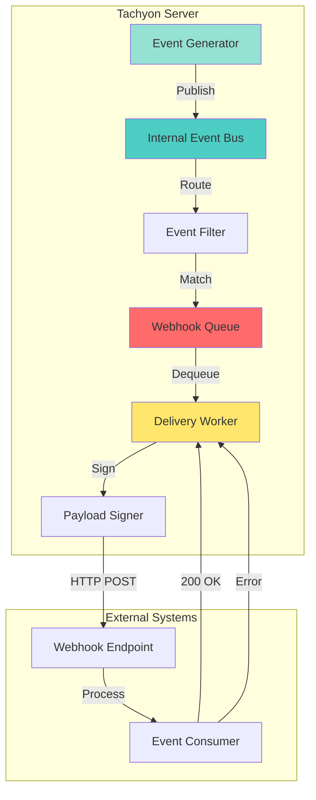
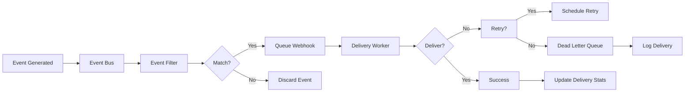

# TACHYON: WEBHOOK INTEGRATION GUIDE

**Document ID:** TACHYON-INT-005-V1.0
**Date:** February 2026
**Status:** Approved for Implementation
**Classification:** Integration Documentation
**Compliance Level:** ISO/IEC 26514:2021, IEEE 1063:2001

---

## TABLE OF CONTENTS

1. [Introduction](#1-introduction)
2. [Webhook Framework Overview](#2-webhook-framework-overview)
3. [Webhook Architecture](#3-webhook-architecture)
4. [Webhook Configuration](#4-webhook-configuration)
5. [Webhook Events](#5-webhook-events)
6. [Webhook Security](#6-webhook-security)
7. [Webhook Delivery](#7-webhook-delivery)
8. [Webhook Testing](#8-webhook-testing)
9. [Webhook Troubleshooting](#9-webhook-troubleshooting)
10. [Best Practices](#10-best-practices)
11. [References](#11-references)

---

## 1. INTRODUCTION

### 1.1. Document Purpose

This document provides comprehensive guidance for integrating with the Tachyon webhook system. The webhook framework enables external systems to receive real-time notifications about events occurring within the Tachyon toolchain, facilitating automated workflows, external integrations, and event-driven architectures.

### 1.2. Webhook Definition

A webhook is an HTTP callback that delivers event notifications to a configurable URL endpoint when specific events occur within the Tachyon system. Webhooks provide a push-based notification mechanism, eliminating the need for polling and enabling near real-time event processing.

### 1.3. Scope

This document covers:
- Webhook architecture and design principles
- Webhook configuration and registration
- Available webhook events and payloads
- Security mechanisms for webhook delivery
- Delivery guarantees and retry logic
- Testing and troubleshooting procedures

Out of scope:
- Internal event system implementation details
- WebSocket real-time communication (covered in WebSocket API documentation)
- Internal message bus architecture
- Plugin system integration (covered in Plugin Development Guide)

### 1.4. Target Audience

This guide is intended for:
- **System Integrators:** Developers integrating external systems with Tachyon
- **DevOps Engineers:** Engineers configuring automated workflows
- **Application Developers:** Developers building applications that consume Tachyon events
- **Security Engineers:** Personnel responsible for webhook security configuration

### 1.5. Prerequisites

Readers of this document should have:
- Understanding of HTTP/2 protocol and REST APIs
- Familiarity with JSON data structures
- Knowledge of cryptographic signatures (HMAC)
- Experience with web server development
- Understanding of asynchronous event processing

---

## 2. WEBHOOK FRAMEWORK OVERVIEW

### 2.1. Framework Purpose

The Tachyon webhook framework provides a standardized mechanism for delivering event notifications to external systems. The framework implements a robust, secure, and scalable webhook delivery system that aligns with the Tachyon security architecture and performance requirements.

### 2.2. Design Principles

The webhook framework adheres to the following design principles:

#### 2.2.1. Security-First Design

All webhook deliveries implement security controls as defined in [ADR-010: Security Architecture](../../.specs/02_adrs/010_security_architecture.md):

- **HMAC Signature Verification:** All webhook payloads are cryptographically signed using HMAC-SHA256
- **TLS Enforcement:** All webhook deliveries require TLS 1.3 encryption
- **Authentication:** Webhook endpoints must be authenticated during registration
- **Authorization:** Event filtering based on RBAC permissions

#### 2.2.2. Reliability Guarantees

The framework provides delivery reliability through:

- **At-Least-Once Delivery:** Webhooks may be delivered multiple times; consumers must handle idempotency
- **Exponential Backoff Retry:** Failed deliveries are retried with exponential backoff
- **Persistent Queue:** Webhook delivery queue persists across server restarts
- **Dead Letter Queue:** Failed webhooks after maximum retries are moved to dead letter queue for inspection

#### 2.2.3. Performance Characteristics

The webhook framework is designed for high throughput:

- **Asynchronous Delivery:** Webhook delivery does not block event processing
- **Connection Pooling:** HTTP/2 connection pooling for efficient delivery
- **Batch Processing:** Multiple webhooks to the same endpoint are batched when possible
- **Rate Limiting:** Per-endpoint rate limiting prevents overwhelming consumers

### 2.3. Supported Event Categories

The webhook framework supports the following event categories:

| Category | Description | Event Count |
|-----------|-------------|--------------|
| **Document Events** | Document lifecycle events (create, update, delete) | 5 |
| **Git Events** | Repository operations (commit, branch, merge) | 4 |
| **User Events** | User account events (login, logout, MFA) | 3 |
| **System Events** | System-level events (startup, shutdown, error) | 3 |
| **Collaboration Events** | Real-time collaboration events (edit, comment) | 3 |
| **Search Events** | Search index events (index, update, delete) | 3 |
| **Security Events** | Security-related events (auth failure, access denied) | 4 |

### 2.4. Integration Use Cases

Common webhook integration use cases include:

#### 2.4.1. Automated Workflows

Trigger automated workflows based on document changes:
- Deploy documentation to static site generators
- Send notifications to communication platforms (Slack, Microsoft Teams)
- Trigger CI/CD pipelines on document publication
- Update external knowledge bases and wikis

#### 2.4.2. Audit and Compliance

Maintain audit trails for compliance requirements:
- Log all document modifications to external audit systems
- Track user activity for security monitoring
- Generate compliance reports from webhook events
- Integrate with SIEM (Security Information and Event Management) systems

#### 2.4.3. Synchronization

Synchronize Tachyon data with external systems:
- Sync documents to external content management systems
- Maintain search index consistency across multiple systems
- Replicate data to backup or disaster recovery systems
- Feed analytics and monitoring platforms with event data

#### 2.4.4. Custom Processing

Implement custom event processing logic:
- Apply custom transformations to document content
- Validate documents against external schemas
- Enrich events with additional metadata
- Route events to multiple downstream systems

### 2.5. Framework Limitations

The webhook framework has the following limitations:

- **Delivery Ordering:** Webhook delivery order is not guaranteed across different endpoints
- **Payload Size:** Webhook payloads are limited to 1MB; larger payloads require alternative mechanisms
- **Latency:** Webhook delivery may experience delays under high load (typically < 5 seconds)
- **Network Requirements:** Consumer endpoints must be accessible from the Tachyon server
- **Idempotency:** Consumers must implement idempotency handling for at-least-once delivery

---

## 3. WEBHOOK ARCHITECTURE

### 3.1. System Architecture

The Tachyon webhook architecture implements a producer-consumer pattern with the following components:



#### 3.1.1. Event Generation

Events are generated throughout the Tachyon system when specific actions occur:

- **Document Operations:** Create, update, delete, publish, unpublish
- **Git Operations:** Commit, branch, merge, push
- **User Operations:** Login, logout, MFA verification
- **System Operations:** Startup, shutdown, configuration changes
- **Collaboration Operations:** Edit, comment, presence changes
- **Search Operations:** Index update, index rebuild, search query
- **Security Operations:** Authentication failure, authorization denial, suspicious activity

All events are published to the internal event bus for distribution to subscribers.

#### 3.1.2. Event Bus

The internal event bus implements a publish-subscribe pattern:

- **Topic-Based Routing:** Events are routed to subscribers based on event type
- **Fan-Out:** Single events are delivered to multiple webhook subscriptions
- **Asynchronous Processing:** Event delivery does not block event generation
- **Backpressure Handling:** Event queue prevents overwhelming the system

The event bus is implemented using Tokio channels for efficient async communication.

#### 3.1.3. Event Filtering

Event filtering ensures that only relevant events are delivered to each webhook subscription:

- **Event Type Filtering:** Subscriptions specify which event types to receive
- **Resource Filtering:** Subscriptions can filter by document ID, user ID, or repository
- **Attribute Filtering:** Subscriptions can filter by event attributes (e.g., document tags)
- **RBAC Enforcement:** Events are filtered based on user permissions

### 3.2. Webhook Queue

The webhook queue implements a persistent, reliable delivery mechanism:

#### 3.2.1. Queue Implementation

The webhook queue is implemented using SQLite for persistence:

- **Persistent Storage:** Queue persists across server restarts
- **Transaction Safety:** Queue operations use database transactions
- **Priority Queue:** High-priority events are delivered before low-priority events
- **Batch Processing:** Multiple events to the same endpoint are batched for efficiency

#### 3.2.2. Queue Schema

The webhook queue uses the following schema:

```sql
CREATE TABLE webhook_queue (
    id INTEGER PRIMARY KEY AUTOINCREMENT,
    webhook_id INTEGER NOT NULL,
    event_type TEXT NOT NULL,
    payload TEXT NOT NULL,
    signature TEXT NOT NULL,
    attempts INTEGER NOT NULL DEFAULT 0,
    next_attempt_at INTEGER NOT NULL,
    created_at INTEGER NOT NULL,
    last_attempt_at INTEGER,
    status TEXT NOT NULL,
    FOREIGN KEY (webhook_id) REFERENCES webhooks(id)
);

CREATE INDEX idx_webhook_queue_status ON webhook_queue(status);
CREATE INDEX idx_webhook_queue_next_attempt ON webhook_queue(next_attempt_at);
```

#### 3.2.3. Queue States

Webhook entries transition through the following states:

| State | Description | Transition |
|-------|-------------|-------------|
| **Pending** | Webhook is queued for delivery | Pending → Delivering |
| **Delivering** | Webhook is being delivered | Delivering → Success, Delivering → Failed |
| **Success** | Webhook was delivered successfully | Success → Archived |
| **Failed** | Webhook delivery failed | Failed → Pending (retry), Failed → Dead Letter |
| **Dead Letter** | Webhook failed after maximum retries | Dead Letter → Archived |

### 3.3. Delivery Worker

The delivery worker processes webhook deliveries asynchronously:

#### 3.3.1. Worker Architecture

The delivery worker is implemented as a Tokio task:

```rust
use tokio::time::{interval, Duration};
use tokio::sync::mpsc;

async fn webhook_delivery_worker(
    mut receiver: mpsc::Receiver<WebhookDelivery>,
) {
    let ticker = interval(Duration::from_secs(1));
    
    loop {
        tokio::select! {
            _ = ticker.tick() => {
                // Process pending webhooks
                process_pending_webhooks().await;
            }
            Some(delivery) = receiver.recv() => {
                // Process immediate delivery
                deliver_webhook(delivery).await;
            }
        }
    }
}
```

#### 3.3.2. Connection Pooling

The delivery worker maintains HTTP/2 connection pools:

- **Endpoint-Based Pools:** Each webhook endpoint has its own connection pool
- **Connection Reuse:** Connections are reused for multiple deliveries
- **Connection Limits:** Maximum 10 concurrent connections per endpoint
- **Connection Timeout:** Connections timeout after 30 seconds of inactivity

#### 3.3.3. Rate Limiting

Per-endpoint rate limiting prevents overwhelming consumers:

- **Token Bucket Algorithm:** Rate limiting uses token bucket algorithm
- **Configurable Limits:** Rate limits are configurable per webhook
- **Default Limits:** 100 requests per minute per endpoint
- **Burst Tolerance:** Short bursts are allowed within limits

### 3.4. Payload Signing

All webhook payloads are cryptographically signed for verification:

#### 3.4.1. HMAC-SHA256 Signature

Payloads are signed using HMAC-SHA256:

- **Secret Key:** Each webhook has a unique secret key
- **Payload Hash:** SHA-256 hash of the payload body
- **Signature Header:** Signature is sent in `X-Tachyon-Signature` header
- **Timestamp:** Signature includes timestamp to prevent replay attacks

#### 3.4.2. Signature Format

The signature format follows the specification:

```
X-Tachyon-Signature: t=<timestamp>,v1=<signature>
```

Where:
- `<timestamp>`: Unix timestamp in seconds
- `<signature>`: Hexadecimal HMAC-SHA256 signature

The signature is computed as:

```
signature = HMAC-SHA256(secret_key, timestamp + "." + payload)
```

### 3.5. Event Payloads

Webhook payloads follow a standardized JSON format:

#### 3.5.1. Payload Structure

All webhook payloads have the following structure:

```json
{
  "id": "evt_abc123",
  "event_type": "document.created",
  "timestamp": "2026-02-08T02:44:00Z",
  "version": "1.0",
  "data": {
    "document_id": "doc_456",
    "title": "Example Document",
    "author": "user_789"
  }
}
```

#### 3.5.2. Payload Fields

| Field | Type | Description |
|-------|------|-------------|
| **id** | String | Unique event identifier |
| **event_type** | String | Event type identifier |
| **timestamp** | ISO 8601 | Event timestamp in UTC |
| **version** | String | Payload schema version |
| **data** | Object | Event-specific data |

---

## 4. WEBHOOK CONFIGURATION

### 4.1. Webhook Registration

Webhook registration is the process of configuring a webhook endpoint to receive event notifications from the Tachyon system.

#### 4.1.1. Registration Endpoint

Webhooks are registered via the REST API:

**Endpoint:** `POST /api/webhooks`

**Authentication:** Requires valid session token or API key

**Request Body:**

```json
{
  "url": "https://example.com/webhook",
  "events": ["document.created", "document.updated"],
  "secret": "webhook_secret_key",
  "description": "Document change notifications",
  "active": true,
  "rate_limit": {
    "requests_per_minute": 100,
    "burst_size": 10
  },
  "filters": {
    "document_tags": ["important", "published"],
    "document_author": "user_123"
  }
}
```

**Response:**

```json
{
  "id": "webhook_abc123",
  "url": "https://example.com/webhook",
  "events": ["document.created", "document.updated"],
  "secret": "whsec_789xyz",
  "description": "Document change notifications",
  "active": true,
  "created_at": "2026-02-08T02:44:00Z",
  "last_delivery_at": null,
  "delivery_count": 0,
  "failure_count": 0
}
```

#### 4.1.2. Registration Parameters

| Parameter | Type | Required | Description |
|-----------|------|----------|-------------|
| **url** | String | Yes | HTTPS URL endpoint for webhook delivery |
| **events** | Array | Yes | List of event types to subscribe to |
| **secret** | String | No | Custom secret key for HMAC signing (auto-generated if not provided) |
| **description** | String | No | Human-readable description of webhook purpose |
| **active** | Boolean | No | Whether webhook is initially active (default: true) |
| **rate_limit** | Object | No | Rate limiting configuration |
| **filters** | Object | No | Event filtering criteria |

#### 4.1.3. Rate Limit Configuration

Rate limiting prevents overwhelming webhook consumers:

```json
{
  "rate_limit": {
    "requests_per_minute": 100,
    "burst_size": 10
  }
}
```

| Parameter | Type | Default | Description |
|-----------|------|---------|-------------|
| **requests_per_minute** | Integer | 100 | Maximum requests per minute |
| **burst_size** | Integer | 10 | Maximum concurrent requests |

#### 4.1.4. Event Filtering

Event filtering reduces noise by delivering only relevant events:

```json
{
  "filters": {
    "document_tags": ["important", "published"],
    "document_author": "user_123",
    "repository": "repo_456"
  }
}
```

| Filter Type | Description | Example |
|-------------|-------------|---------|
| **document_tags** | Filter by document tags | Only events for documents with specified tags |
| **document_author** | Filter by document author | Only events for specified user |
| **repository** | Filter by repository | Only events for specified repository |
| **branch** | Filter by Git branch | Only events for specified branch |

### 4.2. Webhook Management

Registered webhooks can be managed through REST API endpoints.

#### 4.2.1. List Webhooks

**Endpoint:** `GET /api/webhooks`

**Response:**

```json
{
  "webhooks": [
    {
      "id": "webhook_abc123",
      "url": "https://example.com/webhook",
      "events": ["document.created", "document.updated"],
      "description": "Document change notifications",
      "active": true,
      "created_at": "2026-02-08T02:44:00Z",
      "last_delivery_at": "2026-02-08T02:50:00Z",
      "delivery_count": 150,
      "failure_count": 2
    }
  ],
  "total": 1,
  "page": 1,
  "page_size": 50
}
```

#### 4.2.2. Get Webhook Details

**Endpoint:** `GET /api/webhooks/{id}`

**Response:**

```json
{
  "id": "webhook_abc123",
  "url": "https://example.com/webhook",
  "events": ["document.created", "document.updated"],
  "secret": "whsec_789xyz",
  "description": "Document change notifications",
  "active": true,
  "rate_limit": {
    "requests_per_minute": 100,
    "burst_size": 10
  },
  "filters": {
    "document_tags": ["important", "published"]
  },
  "created_at": "2026-02-08T02:44:00Z",
  "last_delivery_at": "2026-02-08T02:50:00Z",
  "delivery_count": 150,
  "failure_count": 2,
  "last_error": "Connection timeout"
}
```

#### 4.2.3. Update Webhook

**Endpoint:** `PUT /api/webhooks/{id}`

**Request Body:** Same as registration (all fields optional)

**Response:** Updated webhook object

#### 4.2.4. Delete Webhook

**Endpoint:** `DELETE /api/webhooks/{id}`

**Response:**

```json
{
  "id": "webhook_abc123",
  "deleted": true,
  "deleted_at": "2026-02-08T02:55:00Z"
}
```

### 4.3. Webhook Activation

Webhooks can be activated or deactivated without deletion.

#### 4.3.1. Activate Webhook

**Endpoint:** `POST /api/webhooks/{id}/activate`

**Response:**

```json
{
  "id": "webhook_abc123",
  "active": true,
  "activated_at": "2026-02-08T02:56:00Z"
}
```

#### 4.3.2. Deactivate Webhook

**Endpoint:** `POST /api/webhooks/{id}/deactivate`

**Response:**

```json
{
  "id": "webhook_abc123",
  "active": false,
  "deactivated_at": "2026-02-08T02:57:00Z"
}
```

### 4.4. Secret Key Management

Secret keys are used for HMAC signature verification.

#### 4.4.1. Generate New Secret

**Endpoint:** `POST /api/webhooks/{id}/secret/regenerate`

**Response:**

```json
{
  "id": "webhook_abc123",
  "secret": "whsec_new789xyz",
  "regenerated_at": "2026-02-08T02:58:00Z"
}
```

**Important:** Regenerating a secret key invalidates all existing signatures. Update consumer endpoints immediately.

#### 4.4.2. Secret Key Storage

Secret keys are stored encrypted at rest:

- **Encryption:** AES-256 encryption for secret keys
- **Key Rotation:** Support for periodic secret key rotation
- **Access Control:** Secret keys are only visible to webhook owners
- **Audit Logging:** Secret key access and regeneration are logged

### 4.5. Delivery History

Webhook delivery history provides visibility into webhook performance.

#### 4.5.1. Get Delivery History

**Endpoint:** `GET /api/webhooks/{id}/deliveries`

**Query Parameters:**

| Parameter | Type | Default | Description |
|-----------|------|---------|-------------|
| **limit** | Integer | 50 | Maximum number of deliveries to return |
| **offset** | Integer | 0 | Offset for pagination |
| **status** | String | All | Filter by delivery status (success, failed, pending) |

**Response:**

```json
{
  "deliveries": [
    {
      "id": "delivery_xyz789",
      "event_id": "evt_abc123",
      "event_type": "document.created",
      "status": "success",
      "http_status": 200,
      "attempt_count": 1,
      "delivered_at": "2026-02-08T02:50:00Z",
      "duration_ms": 125
    },
    {
      "id": "delivery_def456",
      "event_id": "evt_ghi789",
      "event_type": "document.updated",
      "status": "failed",
      "error": "Connection timeout",
      "attempt_count": 3,
      "last_attempt_at": "2026-02-08T02:53:00Z",
      "next_retry_at": "2026-02-08T02:58:00Z"
    }
  ],
  "total": 2,
  "page": 1,
  "page_size": 50
}
```

#### 4.5.2. Retry Failed Delivery

**Endpoint:** `POST /api/webhooks/{id}/deliveries/{delivery_id}/retry`

**Response:**

```json
{
  "id": "delivery_def456",
  "status": "pending",
  "retry_scheduled": true,
  "retry_at": "2026-02-08T02:58:00Z"
}
```

### 4.6. Webhook Testing

Test webhooks allow verification of endpoint configuration before activating.

#### 4.6.1. Send Test Webhook

**Endpoint:** `POST /api/webhooks/{id}/test`

**Request Body:**

```json
{
  "event_type": "document.created",
  "test_data": {
    "document_id": "test_doc_123",
    "title": "Test Document"
  }
}
```

**Response:**

```json
{
  "test_id": "test_abc123",
  "status": "success",
  "http_status": 200,
  "response_time_ms": 125,
  "delivered_at": "2026-02-08T02:59:00Z"
}
```

#### 4.6.2. Test Results

Test results provide diagnostic information:

| Field | Type | Description |
|-------|------|-------------|
| **test_id** | String | Unique test identifier |
| **status** | String | Test status (success, failed) |
| **http_status** | Integer | HTTP status code from endpoint |
| **response_time_ms** | Integer | Response time in milliseconds |
| **error** | String | Error message if test failed |
| **delivered_at** | ISO 8601 | Timestamp of test delivery |

---

## 5. WEBHOOK EVENTS

### 5.1. Event Types

The Tachyon webhook framework supports multiple event types across different categories.

#### 5.1.1. Document Events

Document events are triggered by document lifecycle operations:

| Event Type | Description | Trigger |
|-------------|-------------|---------|
| **document.created** | A new document was created | Document creation API call |
| **document.updated** | An existing document was updated | Document update API call |
| **document.deleted** | A document was deleted | Document deletion API call |
| **document.published** | A document was published | Document publication API call |
| **document.unpublished** | A document was unpublished | Document unpublication API call |

**Payload Example (document.created):**

```json
{
  "id": "evt_doc_created_abc123",
  "event_type": "document.created",
  "timestamp": "2026-02-08T03:00:00Z",
  "version": "1.0",
  "data": {
    "document_id": "doc_456",
    "title": "Example Document",
    "author": {
      "id": "user_789",
      "username": "johndoe"
    },
    "repository": "repo_123",
    "branch": "main",
    "tags": ["important", "published"],
    "created_at": "2026-02-08T03:00:00Z",
    "frontmatter": {
      "access": "public",
      "category": "documentation"
    }
  }
}
```

#### 5.1.2. Git Events

Git events are triggered by repository operations:

| Event Type | Description | Trigger |
|-------------|-------------|---------|
| **git.commit** | A commit was created | Git commit operation |
| **git.branch_created** | A new branch was created | Git branch creation |
| **git.branch_deleted** | A branch was deleted | Git branch deletion |
| **git.merge** | A merge was performed | Git merge operation |

**Payload Example (git.commit):**

```json
{
  "id": "evt_git_commit_def456",
  "event_type": "git.commit",
  "timestamp": "2026-02-08T03:05:00Z",
  "version": "1.0",
  "data": {
    "commit_id": "abc123def456",
    "repository": "repo_123",
    "branch": "main",
    "author": {
      "id": "user_789",
      "username": "johndoe",
      "email": "john@example.com"
    },
    "message": "Update documentation",
    "files_changed": [
      "docs/example.md",
      "docs/another.md"
    ],
    "commit_timestamp": "2026-02-08T03:05:00Z"
  }
}
```

#### 5.1.3. User Events

User events are triggered by user account operations:

| Event Type | Description | Trigger |
|-------------|-------------|---------|
| **user.login** | A user logged in | Successful authentication |
| **user.logout** | A user logged out | Logout operation |
| **user.mfa_verified** | MFA was verified | MFA verification success |

**Payload Example (user.login):**

```json
{
  "id": "evt_user_login_ghi789",
  "event_type": "user.login",
  "timestamp": "2026-02-08T03:10:00Z",
  "version": "1.0",
  "data": {
    "user_id": "user_789",
    "username": "johndoe",
    "login_method": "password",
    "ip_address": "192.168.1.100",
    "user_agent": "Mozilla/5.0",
    "mfa_used": false
  }
}
```

#### 5.1.4. System Events

System events are triggered by system-level operations:

| Event Type | Description | Trigger |
|-------------|-------------|---------|
| **system.started** | The Tachyon server started | Server startup |
| **system.stopped** | The Tachyon server stopped | Server shutdown |
| **system.error** | A system error occurred | Error condition |

**Payload Example (system.started):**

```json
{
  "id": "evt_system_started_jkl012",
  "event_type": "system.started",
  "timestamp": "2026-02-08T03:15:00Z",
  "version": "1.0",
  "data": {
    "server_version": "1.0.0",
    "startup_duration_ms": 2500,
    "configuration": {
      "port": 8080,
      "mode": "server"
    }
  }
}
```

#### 5.1.5. Collaboration Events

Collaboration events are triggered by real-time collaboration features:

| Event Type | Description | Trigger |
|-------------|-------------|---------|
| **collaboration.edit** | A document edit occurred | Real-time edit |
| **collaboration.comment** | A comment was added | Comment creation |
| **collaboration.presence** | User presence changed | User joined/left document |

**Payload Example (collaboration.edit):**

```json
{
  "id": "evt_collab_edit_mno345",
  "event_type": "collaboration.edit",
  "timestamp": "2026-02-08T03:20:00Z",
  "version": "1.0",
  "data": {
    "document_id": "doc_456",
    "editor": {
      "id": "user_789",
      "username": "johndoe"
    },
    "edit_type": "insert",
    "position": {
      "line": 15,
      "column": 10
    },
    "content": "New text",
    "previous_content": ""
  }
}
```

#### 5.1.6. Search Events

Search events are triggered by search index operations:

| Event Type | Description | Trigger |
|-------------|-------------|---------|
| **search.indexed** | A document was indexed | Search index update |
| **search.updated** | Search index was updated | Index rebuild |
| **search.deleted** | Document was removed from index | Index deletion |

**Payload Example (search.indexed):**

```json
{
  "id": "evt_search_indexed_pqr678",
  "event_type": "search.indexed",
  "timestamp": "2026-02-08T03:25:00Z",
  "version": "1.0",
  "data": {
    "document_id": "doc_456",
    "index_version": 5,
    "indexed_at": "2026-02-08T03:25:00Z",
    "index_duration_ms": 150
  }
}
```

#### 5.1.7. Security Events

Security events are triggered by security-related operations:

| Event Type | Description | Trigger |
|-------------|-------------|---------|
| **security.auth_failed** | Authentication failed | Failed login attempt |
| **security.access_denied** | Access was denied | Authorization failure |
| **security.suspicious_activity** | Suspicious activity detected | Security alert |
| **security.mfa_disabled** | MFA was disabled | Security configuration change |

**Payload Example (security.auth_failed):**

```json
{
  "id": "evt_security_auth_failed_stu901",
  "event_type": "security.auth_failed",
  "timestamp": "2026-02-08T03:30:00Z",
  "version": "1.0",
  "data": {
    "user_id": "user_789",
    "username": "johndoe",
    "ip_address": "192.168.1.100",
    "user_agent": "Mozilla/5.0",
    "failure_reason": "invalid_credentials",
    "attempt_count": 3
  }
}
```

### 5.2. Event Payload Schema

All webhook payloads follow a consistent schema structure.

#### 5.2.1. Common Fields

All webhook payloads include the following common fields:

| Field | Type | Description |
|-------|------|-------------|
| **id** | String | Unique event identifier (format: `evt_<type>_<random>`) |
| **event_type** | String | Event type identifier (e.g., `document.created`) |
| **timestamp** | ISO 8601 | Event timestamp in UTC (format: `YYYY-MM-DDTHH:MM:SSZ`) |
| **version** | String | Payload schema version (e.g., `1.0`) |
| **data** | Object | Event-specific data |

#### 5.2.2. Data Field Structure

The `data` field contains event-specific information:

- **Document Events:** Document metadata, author information, repository details
- **Git Events:** Commit details, file changes, author information
- **User Events:** User information, authentication details, IP address
- **System Events:** System configuration, version information, performance metrics
- **Collaboration Events:** Document ID, editor information, edit details
- **Search Events:** Document ID, index version, indexing duration
- **Security Events:** User information, security context, failure details

### 5.3. Event Filtering

Webhook subscriptions can filter events based on specific criteria.

#### 5.3.1. Event Type Filtering

Subscriptions specify which event types to receive:

```json
{
  "events": ["document.created", "document.updated"]
}
```

**Wildcards:**

- Use `*` to subscribe to all events in a category: `document.*`
- Use `**` to subscribe to all events: `**`

#### 5.3.2. Attribute Filtering

Events can be filtered by specific attributes:

```json
{
  "filters": {
    "document_tags": ["important", "published"],
    "document_author": "user_123",
    "repository": "repo_456",
    "branch": "main"
  }
}
```

**Filter Operators:**

- **Exact Match:** Exact value match
- **Contains:** Value contains specified string
- **Regex:** Regular expression match
- **Range:** Numeric range match

### 5.4. Event Ordering

Event delivery ordering follows these principles:

#### 5.4.1. Per-Endpoint Ordering

Webhooks to the same endpoint maintain ordering:

- **FIFO Queue:** First-in, first-out delivery order
- **Event Sequence:** Events are delivered in the order they occurred
- **No Reordering:** Events are not reordered after queuing

#### 5.4.2. Cross-Endpoint Ordering

Webhooks to different endpoints do not guarantee ordering:

- **Independent Queues:** Each endpoint has its own delivery queue
- **Parallel Delivery:** Different endpoints are delivered in parallel
- **No Global Ordering:** No guarantee of global event ordering

### 5.5. Event Payload Limits

Webhook payloads are subject to size and complexity limits.

#### 5.5.1. Size Limits

| Limit Type | Value | Description |
|-------------|-------|-------------|
| **Maximum Payload Size** | 1MB | Maximum JSON payload size |
| **Maximum Array Size** | 1000 | Maximum array length |
| **Maximum String Length** | 10000 | Maximum string length |

#### 5.5.2. Complexity Limits

| Limit Type | Value | Description |
|-------------|-------|-------------|
| **Maximum Object Depth** | 20 | Maximum nested object depth |
| **Maximum Field Count** | 100 | Maximum fields per object |
| **Maximum Total Fields** | 1000 | Maximum total fields in payload |

Payloads exceeding these limits are truncated or rejected.

---

## 6. WEBHOOK SECURITY

### 6.1. Security Overview

The Tachyon webhook framework implements comprehensive security controls aligned with [ADR-010: Security Architecture](../../.specs/02_adrs/010_security_architecture.md).

#### 6.1.1. Security Principles

Webhook security follows these principles:

- **Defense-in-Depth:** Multiple layers of security controls
- **Zero Trust:** No trust assumptions for webhook endpoints
- **Secure by Default:** Secure default configurations
- **Fail-Safe:** Fail-safe error handling for security
- **Audit Logging:** Comprehensive logging for security events

### 6.2. HMAC Signature Verification

All webhook payloads are cryptographically signed using HMAC-SHA256.

#### 6.2.1. Signature Algorithm

The signature algorithm follows this specification:

**Algorithm:** HMAC-SHA256

**Input:** `timestamp + "." + payload_body`

**Output:** 64-character hexadecimal string

#### 6.2.2. Signature Format

The signature is delivered in the `X-Tachyon-Signature` header:

```
X-Tachyon-Signature: t=1738999200,v1=a1b2c3d4e5f6...
```

**Components:**

- `t=<timestamp>`: Unix timestamp in seconds
- `v1=<signature>`: HMAC-SHA256 signature

#### 6.2.3. Signature Verification

Consumers must verify webhook signatures:

**Step 1: Extract Signature**

```javascript
const signatureHeader = request.headers['x-tachyon-signature'];
const [timestamp, signature] = signatureHeader.split(',');
const timestampValue = timestamp.split('=')[1];
const signatureValue = signature.split('=')[1];
```

**Step 2: Compute Expected Signature**

```javascript
const crypto = require('crypto');
const expectedSignature = crypto
  .createHmac('sha256', webhookSecret)
  .update(timestampValue + '.' + requestBody)
  .digest('hex');
```

**Step 3: Verify Signature**

```javascript
if (signatureValue !== expectedSignature) {
  throw new Error('Invalid webhook signature');
}

// Verify timestamp (prevent replay attacks)
const currentTime = Math.floor(Date.now() / 1000);
if (Math.abs(currentTime - parseInt(timestampValue)) > 300) {
  throw new Error('Webhook timestamp too old');
}
```

### 6.3. TLS Encryption

All webhook deliveries require TLS 1.3 encryption.

#### 6.3.1. TLS Requirements

Webhook endpoints must meet these requirements:

| Requirement | Specification |
|-------------|---------------|
| **TLS Version** | 1.3 or higher |
| **Cipher Suites** | Only approved cipher suites |
| **Certificate Validation** | Full certificate chain verification |
| **Hostname Verification** | Strict hostname verification |

#### 6.3.2. Approved Cipher Suites

Only the following cipher suites are allowed:

- TLS_AES_256_GCM_SHA384
- TLS_CHACHA20_POLY1305_SHA256
- TLS_AES_128_GCM_SHA256

#### 6.3.3. Certificate Validation

Certificate validation includes:

- **Chain Verification:** Full certificate chain validation
- **Hostname Verification:** Strict hostname matching
- **Expiration Check:** Certificate expiration validation
- **Revocation Check:** OCSP stapling for revocation status

### 6.4. Authentication and Authorization

Webhook registration requires authentication and authorization.

#### 6.4.1. Registration Authentication

Webhook registration requires valid authentication:

**Authentication Methods:**

- Session Token: User session token from login
- API Key: Service account API key
- OAuth 2.0: OAuth 2.0 bearer token

**Authentication Header:**

```
Authorization: Bearer <token>
```

#### 6.4.2. Authorization Checks

Webhook registration includes authorization checks:

- **User Permissions:** User must have webhook creation permission
- **Resource Access:** User must have access to resources in event filters
- **RBAC Enforcement:** Role-based access control for webhook operations

### 6.5. Secret Key Management

Secret keys are used for HMAC signature verification.

#### 6.5.1. Secret Key Generation

Secret keys are generated using cryptographically secure methods:

**Algorithm:** 256-bit random value

**Format:** 32-character alphanumeric string

**Example:** `whsec_789xyz123456789abc`

#### 6.5.2. Secret Key Storage

Secret keys are stored securely:

- **Encryption at Rest:** AES-256 encryption for secret keys
- **Key Rotation:** Support for periodic secret key rotation
- **Access Control:** Secret keys are only visible to webhook owners
- **Audit Logging:** Secret key access and regeneration are logged

#### 6.5.3. Secret Key Rotation

Secret key rotation is recommended periodically:

**Rotation Schedule:**

| Environment | Rotation Frequency |
|-------------|-------------------|
| **Production** | Every 90 days |
| **Staging** | Every 180 days |
| **Development** | Every 365 days |

**Rotation Process:**

1. Generate new secret key
2. Update webhook configuration
3. Notify consumer of new secret
4. Monitor for successful deliveries with new secret
5. Archive old secret after 7 days

### 6.6. IP Whitelisting

Webhook endpoints can be restricted to specific IP addresses.

#### 6.6.1. IP Whitelist Configuration

IP whitelisting is configured during webhook registration:

```json
{
  "url": "https://example.com/webhook",
  "ip_whitelist": ["192.168.1.100", "10.0.0.50"]
}
```

#### 6.6.2. IP Whitelist Validation

Webhook deliveries are validated against IP whitelist:

- **Exact Match:** Exact IP address match
- **CIDR Notation:** CIDR notation support (e.g., `192.168.1.0/24`)
- **IPv6 Support:** Full IPv6 address support
- **No Whitelist:** If no whitelist configured, any IP is allowed

### 6.7. Payload Validation

Webhook payloads are validated before delivery.

#### 6.7.1. Schema Validation

All webhook payloads are validated against JSON schema:

- **Type Validation:** Field types match schema
- **Required Fields:** All required fields are present
- **Format Validation:** Field formats match expected patterns
- **Range Validation:** Numeric fields are within valid ranges

#### 6.7.2. Size Validation

Webhook payloads are validated for size limits:

- **Maximum Size:** 1MB maximum payload size
- **Array Limits:** Maximum 1000 items per array
- **String Limits:** Maximum 10000 characters per string

Payloads exceeding size limits are rejected before delivery.

### 6.8. Security Headers

Webhook deliveries include security-related headers.

#### 6.8.1. Standard Headers

The following headers are included in all webhook deliveries:

| Header | Description | Example |
|--------|-------------|---------|
| **X-Tachyon-Signature** | HMAC signature | `t=1738999200,v1=a1b2c3...` |
| **X-Tachyon-Event-ID** | Event identifier | `evt_abc123` |
| **X-Tachyon-Event-Type** | Event type | `document.created` |
| **X-Tachyon-Timestamp** | Event timestamp | `2026-02-08T03:00:00Z` |
| **X-Tachyon-Version** | Payload version | `1.0` |
| **X-Tachyon-Webhook-ID** | Webhook identifier | `webhook_abc123` |

#### 6.8.2. Security Headers

Additional security headers are included:

| Header | Description | Example |
|--------|-------------|---------|
| **X-Tachyon-Retry-Count** | Retry attempt count | `3` |
| **X-Tachyon-Delivery-ID** | Delivery attempt identifier | `delivery_xyz789` |

### 6.9. Security Best Practices

Follow these best practices for webhook security:

#### 6.9.1. Consumer Security

**Always Verify Signatures:**

- Verify HMAC signatures for all webhook payloads
- Reject webhooks with invalid or missing signatures
- Implement timestamp validation to prevent replay attacks

**Use HTTPS Only:**

- Only accept webhook deliveries over HTTPS
- Validate TLS certificates
- Implement certificate pinning for critical endpoints

**Validate Input:**

- Validate all webhook payload fields
- Sanitize user-generated content
- Implement input validation and output encoding

#### 6.9.2. Secret Key Security

**Protect Secret Keys:**

- Store secret keys securely (environment variables, secret management service)
- Never commit secret keys to version control
- Rotate secret keys regularly
- Revoke compromised secret keys immediately

**Monitor Secret Usage:**

- Monitor for unusual webhook delivery patterns
- Alert on signature verification failures
- Investigate repeated authentication failures

#### 6.9.3. Network Security

**Implement Network Security:**

- Use firewall rules to restrict webhook endpoint access
- Implement rate limiting to prevent abuse
- Monitor for suspicious IP addresses
- Implement IP whitelisting for sensitive endpoints

### 6.10. Security Auditing

All webhook security events are logged for audit purposes.

#### 6.10.1. Audit Events

The following security events are logged:

| Event Type | Description |
|-------------|-------------|
| **Webhook Created** | New webhook was registered |
| **Webhook Deleted** | Webhook was deleted |
| **Secret Key Regenerated** | Secret key was regenerated |
| **Signature Verification Failed** | Signature verification failed |
| **Authentication Failed** | Webhook authentication failed |
| **Authorization Failed** | Webhook authorization failed |
| **IP Whitelist Violation** | IP whitelist check failed |

#### 6.10.2. Audit Log Format

Audit logs include the following information:

```json
{
  "timestamp": "2026-02-08T03:00:00Z",
  "event_type": "webhook.created",
  "user_id": "user_789",
  "webhook_id": "webhook_abc123",
  "ip_address": "192.168.1.100",
  "user_agent": "Mozilla/5.0",
  "details": {
    "url": "https://example.com/webhook",
    "events": ["document.created"]
  }
}
```

#### 6.10.3. Log Retention

Audit logs are retained according to retention policy:

| Log Type | Retention Period |
|----------|-----------------|
| **Security Events** | 90 days |
| **Delivery Events** | 30 days |
| **Error Events** | 90 days |
| **Performance Events** | 7 days |

---

## 7. WEBHOOK DELIVERY

### 7.1. Delivery Process

The webhook delivery process ensures reliable event notification to external systems.

#### 7.1.1. Delivery Flow

Webhook delivery follows this flow:



#### 7.1.2. Delivery States

Webhook deliveries transition through these states:

| State | Description | Transition |
|-------|-------------|-------------|
| **Pending** | Webhook is queued for delivery | Pending → Delivering |
| **Delivering** | Webhook is being delivered | Delivering → Success, Delivering → Failed |
| **Success** | Webhook was delivered successfully | Success → Archived |
| **Failed** | Webhook delivery failed | Failed → Pending (retry), Failed → Dead Letter |
| **Dead Letter** | Webhook failed after maximum retries | Dead Letter → Archived |
| **Archived** | Webhook is archived for retention | Final state |

### 7.2. Retry Logic

Failed webhook deliveries are retried with exponential backoff.

#### 7.2.1. Retry Algorithm

The retry algorithm uses exponential backoff:

**Algorithm:**

```
retry_delay = min(base_delay * (2 ^ attempt_count), max_delay)
next_attempt_at = current_time + retry_delay
```

**Parameters:**

| Parameter | Default Value | Description |
|-----------|---------------|-------------|
| **base_delay** | 60 seconds | Initial retry delay |
| **max_delay** | 3600 seconds (1 hour) | Maximum retry delay |
| **max_attempts** | 10 | Maximum retry attempts |

#### 7.2.2. Retry Schedule

Retry attempts follow this schedule:

| Attempt | Delay | Cumulative Time |
|---------|-------|------------------|
| 1 | 60 seconds | 1 minute |
| 2 | 120 seconds | 3 minutes |
| 3 | 240 seconds | 7 minutes |
| 4 | 480 seconds | 15 minutes |
| 5 | 960 seconds (16 minutes) | 31 minutes |
| 6 | 1920 seconds (32 minutes) | 1 hour |
| 7 | 3600 seconds (1 hour) | 2 hours |
| 8 | 3600 seconds (1 hour) | 3 hours |
| 9 | 3600 seconds (1 hour) | 4 hours |
| 10 | 3600 seconds (1 hour) | 5 hours |

After maximum attempts, webhook is moved to dead letter queue.

#### 7.2.3. Retry Conditions

Retries are attempted under these conditions:

| Condition | Retry? | Description |
|-----------|---------|-------------|
| **HTTP 5xx** | Yes | Server error, retry |
| **HTTP 429** | Yes | Rate limit exceeded, retry |
| **Network Error** | Yes | Connection error, retry |
| **Timeout** | Yes | Request timeout, retry |
| **HTTP 4xx** | No | Client error, no retry |
| **HTTP 3xx** | No | Redirect, no retry |

### 7.3. Dead Letter Queue

Webhooks that fail after maximum retries are moved to dead letter queue.

#### 7.3.1. Dead Letter Queue Purpose

The dead letter queue provides:

- **Failed Delivery Inspection:** Examine failed webhooks
- **Manual Retry:** Manually retry failed deliveries
- **Root Cause Analysis:** Investigate delivery failures
- **Configuration Correction:** Fix webhook configuration issues

#### 7.3.2. Dead Letter Queue API

Dead letter webhooks can be managed via API:

**List Dead Letter Webhooks:**

**Endpoint:** `GET /api/webhooks/{id}/dead-letter`

**Response:**

```json
{
  "webhook_id": "webhook_abc123",
  "dead_letter_count": 5,
  "deliveries": [
    {
      "id": "delivery_xyz789",
      "event_id": "evt_abc123",
      "event_type": "document.created",
      "status": "dead_letter",
      "attempts": 10,
      "last_attempt_at": "2026-02-08T04:00:00Z",
      "error": "Connection timeout",
      "created_at": "2026-02-08T03:00:00Z",
      "failed_at": "2026-02-08T04:00:00Z"
    }
  ]
}
```

**Retry Dead Letter Webhook:**

**Endpoint:** `POST /api/webhooks/{id}/dead-letter/{delivery_id}/retry`

**Response:**

```json
{
  "id": "delivery_xyz789",
  "status": "pending",
  "retry_scheduled": true,
  "retry_at": "2026-02-08T05:00:00Z"
}
```

### 7.4. Delivery Performance

Webhook delivery is optimized for high throughput and low latency.

#### 7.4.1. Performance Metrics

The following metrics are tracked for webhook delivery:

| Metric | Target | Description |
|--------|--------|-------------|
| **Delivery Latency** | < 5 seconds (P95) | 95th percentile delivery time |
| **Throughput** | > 1000 deliveries/minute | Maximum delivery rate |
| **Success Rate** | > 95% | Successful delivery rate |
| **Error Rate** | < 5% | Failed delivery rate |

#### 7.4.2. Connection Pooling

HTTP/2 connection pooling improves delivery performance:

- **Endpoint-Based Pools:** Each webhook endpoint has its own connection pool
- **Connection Reuse:** Connections are reused for multiple deliveries
- **Connection Limits:** Maximum 10 concurrent connections per endpoint
- **Connection Timeout:** Connections timeout after 30 seconds of inactivity

#### 7.4.3. Batch Processing

Multiple webhooks to the same endpoint are batched:

- **Batch Size:** Up to 10 webhooks per batch
- **Batch Window:** 100 milliseconds maximum batch window
- **Parallel Delivery:** Batches are delivered in parallel
- **Batch Timeout:** Entire batch must complete within 5 seconds

### 7.5. Delivery Monitoring

Webhook delivery is monitored for performance and reliability.

#### 7.5.1. Monitoring Metrics

The following metrics are monitored:

| Metric | Description | Alert Threshold |
|--------|-------------|-----------------|
| **Delivery Success Rate** | Percentage of successful deliveries | < 90% for 5 minutes |
| **Delivery Latency** | Average delivery time | > 10 seconds for 5 minutes |
| **Queue Depth** | Number of pending deliveries | > 10000 for 5 minutes |
| **Dead Letter Rate** | Rate of webhooks moved to dead letter | > 10% for 1 hour |

#### 7.5.2. Alerting

Alerts are generated for monitoring threshold violations:

**Alert Types:**

- **Performance Degradation:** Delivery latency or success rate degrades
- **Queue Backlog:** Delivery queue depth exceeds threshold
- **High Failure Rate:** Dead letter rate exceeds threshold
- **Endpoint Unavailable:** Webhook endpoint becomes unavailable

**Alert Delivery:**

Alerts are delivered via:

- **Email:** Email notifications to webhook owners
- **Webhook:** Alert webhook for monitoring systems
- **Dashboard:** Dashboard notifications for administrators

### 7.6. Delivery Guarantees

The webhook framework provides specific delivery guarantees.

#### 7.6.1. At-Least-Once Delivery

Webhooks may be delivered multiple times:

- **No Ordering Guarantee:** Delivery order is not guaranteed across endpoints
- **Duplicate Prevention:** Event ID is used to detect duplicates
- **Idempotency Required:** Consumers must handle duplicate deliveries

**Idempotency Handling:**

Consumers should implement idempotency:

```javascript
// Track processed event IDs
const processedEvents = new Set();

app.post('/webhook', async (req, res) => {
  const { id, event_type, data } = req.body;
  
  // Check if event was already processed
  if (processedEvents.has(id)) {
    return res.status(200).json({ status: 'already_processed' });
  }
  
  // Process the event
  await processEvent(event_type, data);
  
  // Mark event as processed
  processedEvents.add(id);
  
  return res.status(200).json({ status: 'processed' });
});
```

#### 7.6.2. Event Ordering

Event ordering follows these rules:

- **Per-Endpoint Ordering:** Events are delivered in order they occurred to the same endpoint
- **Cross-Endpoint Ordering:** No guarantee of ordering across different endpoints
- **Timestamp Ordering:** Events are ordered by timestamp within the same endpoint

#### 7.6.3. Delivery Reliability

The framework provides these reliability guarantees:

| Guarantee | Description |
|-----------|-------------|
| **Persistent Queue** | Webhooks persist across server restarts |
| **Retry Logic** | Failed webhooks are retried with exponential backoff |
| **Dead Letter Queue** | Failed webhooks are preserved for inspection |
| **Monitoring** | Delivery performance is continuously monitored |
| **Alerting** | Performance issues are detected and alerted |

### 7.7. Delivery Configuration

Webhook delivery behavior can be configured per webhook.

#### 7.7.1. Timeout Configuration

Request timeouts can be configured:

```json
{
  "timeout_seconds": 30
}
```

| Configuration | Default | Description |
|-------------|---------|-------------|
| **Connect Timeout** | 10 seconds | Maximum time to establish connection |
| **Read Timeout** | 30 seconds | Maximum time to read response |
| **Total Timeout** | 40 seconds | Maximum total request time |

#### 7.7.2. Retry Configuration

Retry behavior can be configured:

```json
{
  "retry_policy": {
    "max_attempts": 10,
    "base_delay_seconds": 60,
    "max_delay_seconds": 3600
  }
}
```

| Configuration | Default | Description |
|-------------|---------|-------------|
| **Max Attempts** | 10 | Maximum retry attempts |
| **Base Delay** | 60 seconds | Initial retry delay |
| **Max Delay** | 3600 seconds | Maximum retry delay |

#### 7.7.3. Batch Configuration

Batch processing can be configured:

```json
{
  "batch_policy": {
    "enabled": true,
    "max_batch_size": 10,
    "batch_window_ms": 100
  }
}
```

| Configuration | Default | Description |
|-------------|---------|-------------|
| **Enabled** | true | Batch processing is enabled |
| **Max Batch Size** | 10 | Maximum webhooks per batch |
| **Batch Window** | 100ms | Maximum batch duration |

---

## 8. WEBHOOK TESTING

### 8.1. Testing Overview

Webhook testing ensures that webhook endpoints are configured correctly before activation.

#### 8.1.1. Testing Objectives

Webhook testing achieves these objectives:

- **Configuration Validation:** Verify webhook endpoint is correctly configured
- **Signature Verification:** Confirm HMAC signature verification works correctly
- **Payload Validation:** Ensure webhook payload is processed correctly
- **Error Handling:** Verify error handling works as expected
- **Performance Testing:** Confirm webhook endpoint can handle expected load

### 8.2. Test Webhook API

The test webhook API allows sending test events to webhook endpoints.

#### 8.2.1. Send Test Webhook

**Endpoint:** `POST /api/webhooks/{id}/test`

**Request Body:**

```json
{
  "event_type": "document.created",
  "test_data": {
    "document_id": "test_doc_123",
    "title": "Test Document"
  }
}
```

**Response:**

```json
{
  "test_id": "test_abc123",
  "status": "success",
  "http_status": 200,
  "response_time_ms": 125,
  "delivered_at": "2026-02-08T02:59:00Z"
}
```

#### 8.2.2. Test Response Fields

| Field | Type | Description |
|-------|------|-------------|
| **test_id** | String | Unique test identifier |
| **status** | String | Test status (success, failed) |
| **http_status** | Integer | HTTP status code from endpoint |
| **response_time_ms** | Integer | Response time in milliseconds |
| **delivered_at** | ISO 8601 | Timestamp of test delivery |
| **error** | String | Error message if test failed |

### 8.3. Testing Procedures

Follow these procedures for comprehensive webhook testing.

#### 8.3.1. Pre-Deployment Testing

Before deploying webhook endpoints to production:

1. **Local Testing:** Test webhook endpoint locally using tools like ngrok or localtunnel
2. **Signature Verification:** Implement and test HMAC signature verification
3. **Payload Processing:** Test payload parsing and validation
4. **Error Handling:** Test error handling and response codes
5. **Idempotency:** Implement idempotency handling for duplicate deliveries

#### 8.3.2. Test Event Types

Test all event types that the webhook will receive:

| Event Type | Test Procedure |
|-------------|-----------------|
| **document.created** | Create test document and trigger creation |
| **document.updated** | Update test document and trigger update |
| **git.commit** | Create test commit and trigger commit event |
| **user.login** | Test login and trigger user login event |
| **system.started** | Restart server and trigger system start event |

#### 8.3.3. Test Security Features

Test all security features:

| Security Feature | Test Procedure |
|------------------|-----------------|
| **HMAC Signature** | Send test webhook with invalid signature |
| **Timestamp Validation** | Send test webhook with old timestamp |
| **TLS Encryption** | Test webhook delivery over HTTPS |
| **IP Whitelist** | Test webhook delivery from whitelisted IP |

#### 8.3.4. Load Testing

Test webhook endpoint under load to ensure performance:

**Load Testing Procedure:**

1. **Baseline Testing:** Measure baseline performance with single request
2. **Concurrent Testing:** Test with 10 concurrent requests
3. **Sustained Load:** Test with 100 requests per minute for 5 minutes
4. **Peak Load:** Test with 500 requests per minute for 1 minute

**Performance Targets:**

| Metric | Target |
|--------|--------|
| **Response Time** | < 200ms (P95) |
| **Success Rate** | > 99% |
| **Error Rate** | < 1% |

### 8.4. Testing Tools

Recommended tools for webhook testing:

#### 8.4.1. Local Testing Tools

| Tool | Purpose | URL |
|------|---------|-----|
| **ngrok** | Expose local server to internet | https://ngrok.com |
| **localtunnel** | Expose local server to internet | https://localtunnel.github.io |
| **Postman** | API testing tool | https://www.postman.com |
| **curl** | Command-line HTTP client | Built-in |

#### 8.4.2. Signature Verification Tools

| Tool | Language | Purpose |
|------|----------|---------|
| **openssl** | Command-line | Generate HMAC signatures |
| **crypto** | Node.js | Cryptographic operations |
| **PyCrypto** | Python | Cryptographic operations |

**HMAC Signature Generation (Node.js):**

```javascript
const crypto = require('crypto');
const webhookSecret = 'your_webhook_secret';
const payload = JSON.stringify(testPayload);
const timestamp = Math.floor(Date.now() / 1000).toString();
const signature = crypto
  .createHmac('sha256', webhookSecret)
  .update(timestamp + '.' + payload)
  .digest('hex');
console.log(`t=${timestamp},v1=${signature}`);
```

**HMAC Signature Verification (Node.js):**

```javascript
const crypto = require('crypto');
const webhookSecret = 'your_webhook_secret';
const signatureHeader = req.headers['x-tachyon-signature'];
const [timestamp, signature] = signatureHeader.split(',');
const timestampValue = timestamp.split('=')[1];
const signatureValue = signature.split('=')[1];
const body = req.body;
const expectedSignature = crypto
  .createHmac('sha256', webhookSecret)
  .update(timestampValue + '.' + body)
  .digest('hex');

if (signatureValue !== expectedSignature) {
  console.error('Invalid webhook signature');
  return res.status(401).json({ error: 'Invalid signature' });
}
```

### 8.5. Testing Checklist

Use this checklist to ensure comprehensive webhook testing:

**Configuration:**

- [ ] Webhook endpoint is publicly accessible
- [ ] Webhook endpoint supports HTTPS
- [ ] Webhook endpoint accepts POST requests
- [ ] Webhook endpoint returns 200 OK for successful delivery
- [ ] Webhook endpoint returns appropriate error codes for failures

**Security:**

- [ ] HMAC signature verification is implemented
- [ ] Timestamp validation is implemented
- [ ] TLS certificate validation is implemented
- [ ] IP whitelist is configured (if applicable)

**Functionality:**

- [ ] Webhook endpoint correctly processes all event types
- [ ] Webhook endpoint handles duplicate deliveries (idempotency)
- [ ] Webhook endpoint logs all webhook deliveries
- [ ] Webhook endpoint returns appropriate error responses

**Performance:**

- [ ] Webhook endpoint responds within 200ms (P95)
- [ ] Webhook endpoint can handle expected load
- [ ] Webhook endpoint has adequate rate limiting
- [ ] Webhook endpoint has adequate error handling

**Monitoring:**

- [ ] Webhook delivery logs are accessible
- [ ] Webhook delivery metrics are monitored
- [ ] Alerts are configured for delivery failures
- [ ] Dead letter queue is monitored

### 8.6. Common Testing Issues

Common issues encountered during webhook testing:

| Issue | Cause | Solution |
|-------|-------|----------|
| **Invalid Signature** | Secret key mismatch | Verify secret key in webhook configuration |
| **Old Timestamp** | Clock skew between systems | Verify system time synchronization |
| **Connection Timeout** | Network connectivity issues | Verify firewall rules and network connectivity |
| **Payload Too Large** | Payload exceeds 1MB limit | Reduce payload size or use alternative mechanism |
| **Rate Limit Exceeded** | Too many requests | Implement rate limiting or increase rate limit |
| **Invalid JSON** | Malformed JSON payload | Validate JSON payload before sending |

---

## 9. WEBHOOK TROUBLESHOOTING

### 9.1. Troubleshooting Overview

This section provides guidance for common webhook integration issues.

### 9.2. Common Issues and Solutions

#### 9.2.1. Webhook Not Received

**Symptoms:**

- Webhook endpoint is not receiving webhooks
- No delivery attempts in delivery history
- No errors in server logs

**Possible Causes:**

1. **Webhook Inactive:** Webhook is deactivated
2. **Event Filter:** Event type is not in webhook subscription
3. **Resource Filter:** Event does not match webhook filter criteria
4. **Rate Limit:** Webhook rate limit has been exceeded

**Solutions:**

1. **Check Webhook Status:** Verify webhook is active via API
2. **Check Event Subscription:** Verify event types are subscribed
3. **Check Event Filters:** Verify filters are not too restrictive
4. **Check Rate Limit:** Verify rate limit is appropriate

#### 9.2.2. Invalid Signature

**Symptoms:**

- Signature verification failures in consumer logs
- 401 Unauthorized responses from consumer

**Possible Causes:**

1. **Secret Key Mismatch:** Secret key in webhook configuration differs from consumer
2. **Timestamp Too Old:** Webhook timestamp is too old (> 300 seconds)
3. **Payload Modification:** Payload was modified in transit
4. **Encoding Issues:** Character encoding mismatch

**Solutions:**

1. **Verify Secret Key:** Confirm secret key matches webhook configuration
2. **Verify Timestamp:** Check system time synchronization
3. **Verify Payload:** Ensure payload is not modified
4. **Verify Encoding:** Ensure consistent character encoding (UTF-8)

#### 9.2.3. Connection Timeout

**Symptoms:**

- Connection timeout errors in delivery history
- High delivery latency (> 10 seconds)

**Possible Causes:**

1. **Network Issues:** Network connectivity problems
2. **Firewall Blocking:** Firewall blocking webhook delivery
3. **Endpoint Unavailable:** Webhook endpoint is down or overloaded
4. **Slow Response:** Webhook endpoint is slow to respond

**Solutions:**

1. **Check Network Connectivity:** Verify network connectivity between systems
2. **Check Firewall Rules:** Verify firewall allows webhook delivery
3. **Check Endpoint Status:** Verify webhook endpoint is available
4. **Increase Timeout:** Increase timeout configuration if endpoint is slow

#### 9.2.4. Payload Too Large

**Symptoms:**

- Payload size exceeded errors in delivery history
- Webhook payload is truncated

**Possible Causes:**

1. **Large Payload:** Event payload exceeds 1MB limit
2. **Large Arrays:** Arrays exceed 1000 item limit
3. **Large Strings:** Strings exceed 10000 character limit

**Solutions:**

1. **Reduce Payload Size:** Remove unnecessary data from event payload
2. **Use Alternative Mechanism:** Use WebSocket for real-time data
3. **Implement Pagination:** Split large data into multiple events
4. **Use External Storage:** Store large data externally and send reference

#### 9.2.5. Rate Limit Exceeded

**Symptoms:**

- Rate limit exceeded errors in delivery history
- Webhook deliveries are being throttled

**Possible Causes:**

1. **High Event Volume:** Too many events are being generated
2. **Low Rate Limit:** Rate limit is too low
3. **Burst Traffic:** Sudden spike in event volume

**Solutions:**

1. **Increase Rate Limit:** Increase rate limit in webhook configuration
2. **Reduce Event Volume:** Reduce number of events being sent
3. **Implement Batching:** Enable batch processing to reduce request count
4. **Use Multiple Endpoints:** Distribute events across multiple endpoints

#### 9.2.6. Dead Letter Queue Full

**Symptoms:**

- Many webhooks in dead letter queue
- High dead letter rate

**Possible Causes:**

1. **Endpoint Unavailable:** Webhook endpoint is consistently unavailable
2. **Persistent Errors:** Webhook endpoint has persistent errors
3. **Configuration Issues:** Webhook configuration is incorrect

**Solutions:**

1. **Fix Endpoint Issues:** Resolve webhook endpoint availability or errors
2. **Update Configuration:** Correct webhook configuration issues
3. **Increase Retries:** Increase maximum retry attempts
4. **Monitor Dead Letter Queue:** Monitor and process dead letter queue regularly

### 9.3. Debugging Tools

Use these tools for webhook troubleshooting:

#### 9.3.1. Server-Side Debugging

**Delivery Logs:**

View webhook delivery logs:

```bash
# View webhook delivery logs
tachyon-server logs webhook --tail
```

**Delivery History:**

View webhook delivery history via API:

```bash
# Get delivery history for webhook
curl -H "Authorization: Bearer $TOKEN" \
  https://tachyon.example.com/api/webhooks/WEBHOOK_ID/deliveries
```

**Dead Letter Queue:**

View dead letter queue:

```bash
# View dead letter queue for webhook
curl -H "Authorization: Bearer $TOKEN" \
  https://tachyon.example.com/api/webhooks/WEBHOOK_ID/dead-letter
```

#### 9.3.2. Consumer-Side Debugging

**Request Logging:**

Log incoming webhook requests:

```javascript
// Log webhook request details
app.use((req, res, next) => {
  console.log('Webhook received:', {
    headers: req.headers,
    body: req.body,
    timestamp: new Date()
  });
  next();
});
```

**Signature Verification:**

Verify signature computation:

```javascript
// Debug signature verification
const crypto = require('crypto');
const webhookSecret = 'your_webhook_secret';
const signatureHeader = req.headers['x-tachyon-signature'];
const [timestamp, signature] = signatureHeader.split(',');
const timestampValue = timestamp.split('=')[1];
const signatureValue = signature.split('=')[1];
const body = req.body;
const expectedSignature = crypto
  .createHmac('sha256', webhookSecret)
  .update(timestampValue + '.' + body)
  .digest('hex');

console.log('Expected signature:', expectedSignature);
console.log('Received signature:', signatureValue);
console.log('Match:', expectedSignature === signatureValue);
```

**Payload Inspection:**

Inspect webhook payload:

```javascript
// Log webhook payload
console.log('Webhook payload:', req.body);

// Validate payload structure
const { id, event_type, timestamp, version, data } = req.body;
console.log('Event ID:', id);
console.log('Event Type:', event_type);
console.log('Timestamp:', timestamp);
console.log('Version:', version);
console.log('Data:', data);
```

### 9.4. Support Resources

Additional resources for webhook troubleshooting:

- **Documentation:** [TACHYON-INT-005-V1.0](webhook_integration_guide.md) - This document
- **API Reference:** [TACHYON-API-V1.0](../api/api_documentation.md) - API documentation
- **Security Guide:** [TACHYON-SEC-V1.0](../security/security_implementation_guide.md) - Security implementation guide
- **Test Plan:** [TACHYON-TST-V1.0](../../.specs/04_future_state/test_plan.md) - Test plan

---

## 10. BEST PRACTICES

### 10.1. Integration Best Practices

Follow these best practices for successful webhook integration.

#### 10.1.1. Security Best Practices

**Always Verify Signatures:**

- Verify HMAC signatures for all webhook payloads
- Reject webhooks with invalid or missing signatures
- Implement timestamp validation to prevent replay attacks
- Store secret keys securely (environment variables, secret management service)

**Use HTTPS Only:**

- Only accept webhook deliveries over HTTPS
- Validate TLS certificates
- Implement certificate pinning for critical endpoints
- Never accept webhook deliveries over HTTP

**Implement Idempotency:**

- Track processed event IDs to prevent duplicate processing
- Use idempotent operations for side effects
- Return appropriate HTTP status codes for duplicate events

**Validate Input:**

- Validate all webhook payload fields
- Sanitize user-generated content
- Implement input validation and output encoding
- Handle all error cases gracefully

#### 10.1.2. Performance Best Practices

**Optimize Payload Size:**

- Minimize webhook payload size to reduce delivery time
- Use references to external storage for large data
- Implement pagination for large data sets
- Compress payloads when appropriate

**Handle High Volume:**

- Implement rate limiting to prevent overwhelming
- Use batching to reduce request overhead
- Scale webhook endpoint horizontally if needed
- Implement queueing for high-volume scenarios

**Monitor Performance:**

- Monitor webhook delivery latency and success rate
- Set up alerts for performance degradation
- Optimize based on performance metrics
- Implement caching where appropriate

#### 10.1.3. Reliability Best Practices

**Implement Idempotency:**

- Design webhook consumers to be idempotent
- Use unique identifiers for idempotency checks
- Implement retry logic with exponential backoff
- Handle duplicate deliveries gracefully

**Monitor Delivery:**

- Monitor webhook delivery status
- Set up alerts for delivery failures
- Implement dead letter queue inspection
- Monitor retry attempts and success rates

**Test Thoroughly:**

- Test webhook endpoints before production deployment
- Test all event types that will be received
- Test error handling and edge cases
- Perform load testing to ensure performance
- Test security features (signatures, TLS)

#### 10.1.4. Monitoring Best Practices

**Log Comprehensive Metrics:**

- Log all webhook deliveries (success and failure)
- Log delivery latency and response times
- Log retry attempts and dead letter events
- Log signature verification failures
- Log rate limit violations

**Set Up Alerts:**

- Alert on high failure rates (> 10% for 5 minutes)
- Alert on high delivery latency (> 10 seconds P95)
- Alert on dead letter queue growth
- Alert on signature verification failures
- Alert on rate limit violations

**Monitor Trends:**

- Track delivery success rate over time
- Track delivery latency trends
- Track error rate trends
- Identify patterns and anomalies

#### 10.1.5. Documentation Best Practices

**Document Integration:**

- Document webhook integration in project documentation
- Document webhook configuration and secret keys
- Document event types and payloads
- Document error handling and retry logic
- Document monitoring and alerting setup

**Maintain Documentation:**

- Keep documentation up to date with system changes
- Document any custom webhook behavior or modifications
- Document troubleshooting procedures and common issues
- Document monitoring dashboards and alerting rules

**Share Knowledge:**

- Share webhook integration knowledge with team
- Document lessons learned from webhook integration
- Share troubleshooting procedures and solutions
- Contribute to webhook integration best practices

### 10.2. Anti-Patterns

Avoid these common anti-patterns in webhook integration.

#### 10.2.1. Security Anti-Patterns

**Do Not Ignore Signatures:**

- Never skip signature verification for convenience
- Never accept webhooks without signature verification
- Never use hardcoded secret keys in production
- Never log secret keys in plain text

**Do Not Use HTTP:**

- Never accept webhook deliveries over HTTP
- Never disable TLS verification
- Never use self-signed certificates in production
- Never disable certificate validation

**Do Not Expose Secrets:**

- Never commit secret keys to version control
- Never log secret keys in application logs
- Never include secret keys in error messages
- Never expose secret keys in API responses

#### 10.2.2. Performance Anti-Patterns

**Do Not Ignore Rate Limits:**

- Never ignore rate limit violations
- Never implement infinite retry loops
- Never disable rate limiting for convenience
- Never overwhelm webhook endpoints with requests

**Do Not Ignore Errors:**

- Never ignore webhook delivery failures
- Never suppress error logging
- Never continue processing after errors without investigation
- Never assume errors are transient without verification

#### 10.2.3. Reliability Anti-Patterns

**Do Not Assume Ordering:**

- Never assume webhook delivery order is guaranteed
- Never depend on event ordering for correctness
- Never implement logic that requires specific ordering
- Never assume cross-endpoint ordering

**Do Not Skip Idempotency:**

- Never skip idempotency checks for performance
- Never process duplicate events multiple times
- Never assume events are unique without verification
- Never implement side effects without idempotency

### 10.3. Testing Best Practices

Follow these best practices for webhook testing.

#### 10.3.1. Test Coverage

**Test All Event Types:**

- Test all event types that webhook will receive
- Test edge cases for each event type
- Test error conditions for each event type
- Test boundary conditions for each event type

**Test Security Features:**

- Test HMAC signature verification
- Test timestamp validation
- Test TLS encryption
- Test IP whitelist (if applicable)
- Test rate limiting

**Test Performance:**

- Test webhook endpoint under load
- Test concurrent request handling
- Test retry logic
- Test dead letter queue processing

**Test Error Handling:**

- Test error responses from webhook endpoint
- Test timeout handling
- Test network error handling
- Test malformed payload handling

#### 10.3.2. Test Automation

**Automate Testing:**

- Implement automated webhook tests in CI/CD pipeline
- Test webhook endpoints on every deployment
- Test webhook signature verification automatically
- Test webhook payload validation automatically

**Test Data Management:**

- Use test data factories for consistent test data
- Use test data builders for complex test scenarios
- Clean up test data after tests
- Isolate test data from production data

**Test Reporting:**

- Generate test reports with coverage metrics
- Track test results over time
- Identify flaky tests and fix them
- Share test results with team

### 10.4. Monitoring Best Practices

Follow these best practices for webhook monitoring.

#### 10.4.1. Metrics to Monitor

**Delivery Metrics:**

- Delivery success rate (percentage and count)
- Delivery failure rate (percentage and count)
- Delivery latency (P50, P95, P99)
- Retry rate and retry attempts
- Dead letter queue size and growth rate

**Performance Metrics:**

- Webhook endpoint response time
- Webhook endpoint throughput
- Connection pool utilization
- Batch processing efficiency

**Security Metrics:**

- Signature verification failures
- Timestamp validation failures
- TLS certificate validation failures
- IP whitelist violations
- Authentication failures

#### 10.4.2. Alert Thresholds

Set appropriate alert thresholds:

| Metric | Warning Threshold | Critical Threshold |
|--------|------------------|-------------------|
| **Failure Rate** | > 5% for 5 minutes | > 10% for 5 minutes |
| **Delivery Latency** | > 5 seconds P95 | > 10 seconds P95 |
| **Dead Letter Rate** | > 10/hour | > 50/hour |
| **Signature Failures** | > 1/hour | > 10/hour |

#### 10.4.3. Dashboard Setup

Create monitoring dashboard for webhook health:

**Key Metrics to Display:**

- Active webhook count
- Delivery success rate (last hour, 24 hours, 7 days)
- Delivery failure rate (last hour, 24 hours, 7 days)
- Average delivery latency (last hour, 24 hours, 7 days)
- Dead letter queue size
- Rate limit violations (last hour, 24 hours, 7 days)

**Visualizations:**

- Line charts for delivery success rate over time
- Bar charts for delivery failures by error type
- Heat map for delivery latency by webhook endpoint
- Gauge for dead letter queue size
- Table for top failing webhooks

---

## 11. REFERENCES

### 11.1. Document References

This document references the following Tachyon project documents:

| Document ID | Title | Section |
|-------------|-------|---------|
| [TACHYON-STD-V1.0](../../.specs/01_standards/coding_standards.md) | Coding and Documentation Standards | All sections |
| [TACHYON-ADR-001-V1.0](../../.specs/02_adrs/001_rust_as_primary_language.md) | Rust as Primary Language | Section 6.5 |
| [TACHYON-ADR-010-V1.0](../../.specs/02_adrs/010_security_architecture.md) | Security Architecture | Section 6 |
| [TACHYON-REQ-SRV-V1.0](../../.specs/04_future_state/reqs/server_requirements.md) | Server Requirements | Section 4 |
| [TACHYON-REQ-SEC-V1.0](../../.specs/04_future_state/reqs/security_requirements.md) | Security Requirements | Section 6 |
| [TACHYON-TST-V1.0](../../.specs/04_future_state/test_plan.md) | Test Plan | Section 8 |

### 11.2. External References

This document references the following external standards and specifications:

| Reference | Title | Section |
|----------|-------|---------|
| RFC 7540 | Hypertext Transfer Protocol Version 2 (HTTP/2) | Section 3.1 |
| RFC 8446 | The Transport Layer Security (TLS) Protocol Version 1.3 | Section 6.3 |
| RFC 6234 | JSON Web Signature (JWS) | Section 6.2 |
| RFC 4648 | The Keyed-Hash Message Authentication Code (HMAC) | Section 6.2 |
| OWASP Top 10 | OWASP Web Application Security Risks | Section 6 |
| ISO/IEC 26514:2021 | Systems and Software Engineering | Section 1 |
| ISO/IEC 27001:2013 | Information Technology | Section 6 |

### 11.3. Technology References

This document references the following technologies:

| Technology | Version | Purpose | Section |
|-------------|---------|---------|
| Rust | 1.77.2+ | Primary implementation language | Section 3.1 |
| Tokio | 1.0+ | Async runtime | Section 3.1 |
| Axum | 0.7+ | HTTP/2 server framework | Section 3.1 |
| SQLite | 3.0+ | Database for webhook queue | Section 3.2 |
| HMAC-SHA256 | - | Cryptographic signature algorithm | Section 6.2 |
| TLS 1.3 | - | Network encryption protocol | Section 6.3 |

### 11.4. API References

This document references the following Tachyon API endpoints:

| Endpoint | Method | Purpose | Section |
|----------|--------|---------|
| POST /api/webhooks | Register webhook | Section 4.1 |
| GET /api/webhooks | List webhooks | Section 4.2 |
| GET /api/webhooks/{id} | Get webhook details | Section 4.2 |
| PUT /api/webhooks/{id} | Update webhook | Section 4.2 |
| DELETE /api/webhooks/{id} | Delete webhook | Section 4.2 |
| POST /api/webhooks/{id}/activate | Activate webhook | Section 4.3 |
| POST /api/webhooks/{id}/deactivate | Deactivate webhook | Section 4.3 |
| POST /api/webhooks/{id}/secret/regenerate | Regenerate secret | Section 4.4 |
| GET /api/webhooks/{id}/deliveries | Get delivery history | Section 4.5 |
| POST /api/webhooks/{id}/deliveries/{delivery_id}/retry | Retry delivery | Section 4.5 |
| POST /api/webhooks/{id}/test | Send test webhook | Section 4.6 |
| GET /api/webhooks/{id}/dead-letter | Get dead letter queue | Section 4.5 |

---

**Document End**

This document provides comprehensive guidance for integrating with the Tachyon webhook system. For questions or issues, refer to the [Tachyon Project Documentation](../project/project_documentation_index.md) or contact the Tachyon development team.
