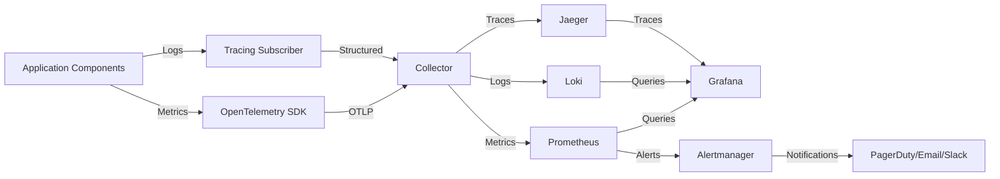
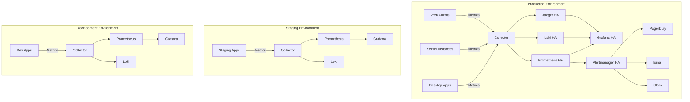

# TACHYON: MONITORING AND OBSERVABILITY GUIDE

**Document ID:** TACHYON-OPS-003-V1.0
**Date:** February 2026
**Status:** Approved for Implementation
**Classification:** Operations & Maintenance
**Compliance Level:** ISO/IEC 26514:2021, IEEE 829-2008

---

## TABLE OF CONTENTS

1. [Introduction](#1-introduction)
2. [Monitoring Framework](#2-monitoring-framework)
3. [Monitoring Architecture](#3-monitoring-architecture)
4. [Metrics Collection](#4-metrics-collection)
5. [Log Management](#5-log-management)
6. [Alerting](#6-alerting)
7. [Dashboards and Visualization](#7-dashboards-and-visualization)
8. [Monitoring Analysis](#8-monitoring-analysis)
9. [References](#9-references)

---

## 1. INTRODUCTION

### 1.1. Purpose and Scope

This document provides comprehensive guidance for monitoring and observability of the Tachyon toolchain. The Tachyon system encompasses a Rust-based core engine with Tokio asynchronous runtime, a Tauri-based desktop application wrapper, an Axum-based HTTP/2 server component, and a TypeScript/JavaScript frontend using Leptos and TailwindCSS. This guide establishes the monitoring framework, architecture, metrics collection, logging strategy, alerting configuration, and analysis procedures necessary to ensure operational excellence.

The scope of this document includes:
- Monitoring architecture design and implementation
- Metrics collection procedures and types
- Log management and aggregation strategies
- Alerting rules and notification mechanisms
- Dashboard configuration and visualization
- Monitoring analysis and trend identification
- Troubleshooting procedures for monitoring issues

### 1.2. Document Dependencies

This document depends on the following documents:
- [TACHYON-STD-V1.0](../.specs/01_standards/coding_standards.md) - Coding and Documentation Standards
- [TACHYON-ADR-001-V1.0](../.specs/02_adrs/001_rust_as_primary_language.md) - Rust as Primary Language
- [TACHYON-ADR-010-V1.0](../.specs/02_adrs/010_security_architecture.md) - Security Architecture
- [TACHYON-TSK-004](../.specs/tasks.md) - Deployment Architecture Documentation
- [TACHYON-TSK-030](../.specs/tasks.md) - Security Architecture Documentation

### 1.3. Target Audience

This document is intended for:
- DevOps Engineers responsible for system monitoring and observability
- System Administrators managing Tachyon deployments
- Security Analysts monitoring security events
- Development Teams requiring operational insights
- Site Reliability Engineers (SREs) maintaining system availability

### 1.4. Monitoring Objectives

The monitoring framework for Tachyon is designed to achieve the following objectives:

1. **System Availability:** Ensure 99.9% uptime for critical services
2. **Performance Monitoring:** Maintain sub-15 millisecond response times for JIT rendering operations
3. **Resource Utilization:** Optimize CPU, memory, disk, and network resource usage
4. **Security Event Detection:** Identify and respond to security incidents in real-time
5. **Capacity Planning:** Anticipate resource requirements based on usage trends
6. **Root Cause Analysis:** Enable rapid identification of failure causes
7. **Compliance Monitoring:** Ensure adherence to security and operational standards

### 1.5. Monitoring Principles

The Tachyon monitoring framework adheres to the following principles:

- **Observability First:** All system components must emit observable signals
- **Structured Data:** Metrics and logs must be structured and queryable
- **Minimal Overhead:** Monitoring must not significantly impact system performance
- **Security-Aware:** Monitoring data must respect privacy and security requirements
- **Actionable Alerts:** Alerts must be specific, actionable, and timely
- **Trend Analysis:** Monitoring must support historical trend analysis
- **Scalability:** Monitoring infrastructure must scale with system growth

---

## 2. MONITORING FRAMEWORK

### 2.1. Framework Overview

The Tachyon monitoring framework implements a comprehensive observability stack based on industry-standard tools and practices. The framework provides end-to-end visibility into system behavior across all components: desktop application, server, and web frontend.

The framework consists of three primary observability pillars:
1. **Metrics:** Quantitative measurements of system behavior
2. **Logs:** Discrete events recording system state and actions
3. **Traces:** Distributed request tracking across component boundaries

### 2.2. Technology Stack

The monitoring framework utilizes the following technologies:

| Component | Technology | Purpose |
|------------|-------------|---------|
| **Metrics Collection** | Prometheus | Time-series metrics database |
| **Metrics Exporter** | tracing-opentelemetry | Rust metrics instrumentation |
| **Log Aggregation** | Vector | Log collection and routing |
| **Log Storage** | Loki | Log aggregation and query |
| **Distributed Tracing** | Jaeger | Request tracing across services |
| **Dashboard** | Grafana | Visualization and alerting |
| **Alerting** | Alertmanager | Alert routing and notification |
| **Metrics Bridge** | OpenTelemetry | Unified observability data |

### 2.3. Monitoring Domains

The Tachyon system monitors the following domains:

#### 2.3.1. Application Metrics

Application metrics measure the behavior and performance of application logic:
- Request latency and throughput
- Error rates and types
- Business operation counts
- Cache hit/miss ratios
- Database query performance
- Search index statistics

#### 2.3.2. System Metrics

System metrics measure the utilization of underlying resources:
- CPU usage (user, system, idle, iowait)
- Memory usage (RSS, VSZ, cache, buffers)
- Disk I/O (read/write operations, bytes, latency)
- Network I/O (bytes, packets, errors, drops)
- File descriptors (open, used, available)
- Process counts and states

#### 2.3.3. Security Metrics

Security metrics measure security-related events and states:
- Authentication success/failure rates
- Authorization denials
- Failed login attempts
- Suspicious activity indicators
- Rate limit violations
- Input validation failures
- Encryption status

#### 2.3.4. Business Metrics

Business metrics measure system effectiveness from a user perspective:
- User session duration
- Document creation rates
- Search query volume
- Feature usage statistics
- Error recovery rates
- User satisfaction indicators

### 2.4. Data Flow

The monitoring data flow follows this pipeline:



### 2.5. Monitoring Levels

The framework implements four levels of monitoring granularity:

| Level | Scope | Update Frequency | Retention |
|-------|-------|------------------|-----------|
| **Real-time** | Component-level | 1 second | 24 hours |
| **Near-real-time** | Service-level | 15 seconds | 7 days |
| **Operational** | System-level | 1 minute | 30 days |
| **Strategic** | Business-level | 15 minutes | 365 days |

### 2.6. Service Level Objectives (SLOs)

The following Service Level Objectives (SLOs) define monitoring targets:

| Service | Metric | Target | Measurement Window |
|---------|---------|---------|-------------------|
| **JIT Rendering** | Response Time | P95 < 15ms | Rolling 24 hours |
| **HTTP/2 Server** | Availability | 99.9% | Calendar month |
| **Search Engine** | Query Latency | P99 < 100ms | Rolling 24 hours |
| **Database** | Query Time | P95 < 10ms | Rolling 24 hours |
| **Authentication** | Success Rate | 99.95% | Rolling 24 hours |
| **File Operations** | Throughput | > 1000 ops/sec | Rolling 24 hours |

### 2.7. Monitoring Compliance

The monitoring framework complies with the following standards and requirements:

- **REQ-177:** Monitoring Requirements - Comprehensive system monitoring
- **REQ-178:** Logging Requirements - Structured logging with tracing
- **REQ-179:** Alerting Requirements - Timely and actionable alerts
- **ADR-010:** Security Architecture - Audit logging and security monitoring
- **ISO/IEC 27001:** Information security management
- **ISO/IEC 25010:** System and software quality requirements

---

## 3. MONITORING ARCHITECTURE

### 3.1. Architecture Overview

The Tachyon monitoring architecture implements a distributed, scalable observability system that provides comprehensive visibility into all system components. The architecture follows a layered design pattern with clear separation of concerns between data collection, aggregation, storage, analysis, and visualization.

The architecture consists of the following layers:
1. **Instrumentation Layer:** Application-level metrics, logs, and traces collection
2. **Collection Layer:** Centralized collection and normalization of observability data
3. **Storage Layer:** Time-series metrics storage, log aggregation, and trace storage
4. **Analysis Layer:** Query processing, alert evaluation, and trend analysis
5. **Visualization Layer:** Dashboard rendering and alert presentation
6. **Notification Layer:** Alert routing and notification delivery

### 3.2. Component Architecture

#### 3.2.1. Desktop Component Monitoring

The desktop component (Tauri-based) implements monitoring through the following mechanisms:

**Metrics Collection:**
- Tokio runtime metrics (task scheduling, I/O operations)
- IPC communication metrics (message throughput, latency)
- File system operation metrics (read/write operations, cache hits)
- UI rendering metrics (frame rates, rendering latency)
- Resource utilization metrics (CPU, memory, disk, network)

**Log Collection:**
- Application-level logs using `tracing` crate
- Structured JSON log format for machine parsing
- Log levels: ERROR, WARN, INFO, DEBUG, TRACE
- Contextual fields: user_id, session_id, operation_id

**Trace Collection:**
- Request tracing for IPC operations
- Span propagation across Tauri boundaries
- Trace context injection into logs and metrics

#### 3.2.2. Server Component Monitoring

The server component (Axum-based) implements comprehensive monitoring:

**HTTP/2 Metrics:**
- Request latency (P50, P95, P99 percentiles)
- Request throughput (requests per second)
- Response status codes (2xx, 4xx, 5xx)
- Connection metrics (active connections, connection duration)
- Route-specific metrics (per-endpoint latency and error rates)

**Tokio Runtime Metrics:**
- Task scheduling metrics (tasks spawned, tasks completed)
- I/O operation metrics (read/write bytes, operations)
- Timer metrics (timers created, timers fired)
- Worker thread metrics (active threads, thread utilization)

**Database Metrics:**
- Query latency (P50, P95, P99 percentiles)
- Query throughput (queries per second)
- Connection pool metrics (active connections, pool utilization)
- Transaction metrics (transactions committed, rolled back)

**Search Engine Metrics:**
- Index size and document count
- Query latency (P50, P95, P99 percentiles)
- Search throughput (queries per second)
- Cache hit/miss ratios

#### 3.2.3. Web Frontend Monitoring

The web frontend (Leptos-based) implements client-side monitoring:

**Browser Metrics:**
- Page load times (DOMContentLoaded, load, first paint)
- Resource load times (scripts, stylesheets, images)
- JavaScript execution metrics (function execution times)
- Memory usage metrics (heap size, garbage collection)
- Network request metrics (API call latency, bandwidth)

**User Interaction Metrics:**
- Click events and interaction latency
- Form submission metrics (validation time, submission time)
- Navigation metrics (page transitions, route changes)
- Feature usage metrics (feature activation counts)

**Error Monitoring:**
- JavaScript errors (unhandled exceptions, promise rejections)
- Resource loading errors (failed requests, timeout errors)
- Console error tracking

### 3.3. Deployment Architecture

The monitoring infrastructure deployment follows a high-availability architecture:



### 3.4. High Availability Design

The monitoring infrastructure implements high availability through:

**Redundancy:**
- Multiple Prometheus instances with federation
- Multiple Loki instances with replication
- Multiple Grafana instances with shared data sources
- Multiple Alertmanager instances with clustering

**Load Balancing:**
- Round-robin distribution of metrics collection
- Consistent hashing for log routing
- Geographic distribution for global deployments

**Failover:**
- Automatic failover for collector instances
- Graceful degradation for degraded storage
- Circuit breakers for external service dependencies

### 3.5. Scalability Considerations

The monitoring architecture scales through:

**Horizontal Scaling:**
- Collector instances can be added dynamically
- Prometheus federation for distributed metrics
- Loki clustering for log aggregation
- Grafana instances for dashboard access

**Vertical Scaling:**
- Resource allocation based on data volume
- Storage tiering for hot/warm/cold data
- Query optimization for large datasets

**Data Partitioning:**
- Time-based partitioning for metrics retention
- Label-based partitioning for query optimization
- Shard-based partitioning for log storage

### 3.6. Security Integration

The monitoring architecture integrates with security controls defined in ADR-010:

**Data Protection:**
- TLS 1.3 for all monitoring data in transit
- Encryption at rest for sensitive metrics and logs
- Access control for monitoring dashboards and APIs
- Audit logging for monitoring system access

**Privacy Controls:**
- PII redaction from logs and metrics
- User consent for client-side monitoring
- Data retention policies for compliance
- Right to deletion implementation

**Supply Chain Security:**
- Signed monitoring tool containers
- Pinned dependency versions
- Vulnerability scanning for monitoring stack
- Regular security updates for monitoring components

---

## 4. METRICS COLLECTION

### 4.1. Metrics Overview

Metrics collection in the Tachyon system implements the Prometheus exposition format with OpenTelemetry instrumentation. The metrics collection framework provides type-safe, zero-allocation metric recording for Rust components and standardized collection for TypeScript/JavaScript components.

**Metrics Types:**
- **Counter:** Monotonically increasing values (request counts, error counts)
- **Gauge:** Values that can increase or decrease (memory usage, active connections)
- **Histogram:** Value distributions with configurable buckets (request latency)
- **Summary:** Value distributions with quantiles (response times)

### 4.2. Rust Metrics Implementation

#### 4.2.1. OpenTelemetry Integration

The Rust components use the `tracing-opentelemetry` crate for metrics collection:

```rust
use opentelemetry::metrics::MeterProvider;
use tracing_opentelemetry::OpenTelemetryLayer;

// Initialize metrics provider
let meter_provider = MeterProvider::builder()
    .with_default_exporter(exporter)
    .build();

// Create a meter for the application
let meter = meter_provider.meter("tachyon_server");
```

#### 4.2.2. Counter Metrics

Counter metrics track monotonically increasing values:

```rust
use opentelemetry::metrics::Counter;

// Define a counter for HTTP requests
let request_counter = meter
    .u64_counter("http_requests_total")
    .with_description("Total number of HTTP requests")
    .init();

// Record a request
request_counter.add(
    1,
    &[
        KeyValue::new("method", "GET"),
        KeyValue::new("route", "/api/documents"),
        KeyValue::new("status", "200"),
    ]
);
```

**Standard Counters:**
| Metric Name | Labels | Description |
|-------------|--------|-------------|
| `http_requests_total` | method, route, status | Total HTTP requests |
| `documents_created_total` | user_id | Documents created |
| `documents_updated_total` | user_id | Documents updated |
| `search_queries_total` | user_id, query_type | Search queries executed |
| `authentication_attempts_total` | user_id, result | Authentication attempts |
| `authorization_denials_total` | user_id, resource | Authorization denials |

#### 4.2.3. Gauge Metrics

Gauge metrics track values that can increase or decrease:

```rust
use opentelemetry::metrics::Gauge;

// Define a gauge for active connections
let active_connections = meter
    .i64_gauge("active_connections")
    .with_description("Number of active connections")
    .init();

// Record current value
active_connections.record(
    current_connections,
    &[
        KeyValue::new("component", "server"),
    ]
);
```

**Standard Gauges:**
| Metric Name | Labels | Description |
|-------------|--------|-------------|
| `active_connections` | component | Active connections |
| `memory_usage_bytes` | component | Memory usage in bytes |
| `cpu_usage_percent` | component | CPU usage percentage |
| `disk_usage_bytes` | mount_point | Disk usage in bytes |
| `open_file_descriptors` | component | Open file descriptors |
| `cache_size_bytes` | cache_type | Cache size in bytes |

#### 4.2.4. Histogram Metrics

Histogram metrics track value distributions:

```rust
use opentelemetry::metrics::Histogram;

// Define a histogram for request latency
let request_latency = meter
    .f64_histogram("http_request_duration_seconds")
    .with_description("HTTP request latency")
    .with_boundaries(&[0.001, 0.005, 0.01, 0.025, 0.05, 0.1, 0.25, 0.5, 1.0])
    .init();

// Record a request duration
request_latency.record(
    duration.as_secs_f64(),
    &[
        KeyValue::new("method", "GET"),
        KeyValue::new("route", "/api/documents"),
    ]
);
```

**Standard Histograms:**
| Metric Name | Labels | Buckets | Description |
|-------------|--------|---------|-------------|
| `http_request_duration_seconds` | method, route | 1ms, 5ms, 10ms, 25ms, 50ms, 100ms, 250ms, 500ms, 1s | Request latency |
| `database_query_duration_seconds` | operation, table | 1ms, 5ms, 10ms, 25ms, 50ms, 100ms, 250ms, 500ms | Query latency |
| `file_operation_duration_seconds` | operation, type | 1ms, 5ms, 10ms, 25ms, 50ms, 100ms, 250ms, 500ms | File operation latency |
| `search_query_duration_seconds` | query_type | 1ms, 5ms, 10ms, 25ms, 50ms, 100ms, 250ms, 500ms | Search latency |

### 4.3. TypeScript/JavaScript Metrics

#### 4.3.1. Web Vitals Collection

The web frontend collects Core Web Vitals metrics:

```typescript
import { getCLS, getFID, getFCP, getLCP, getTTFB } from 'web-vitals';

// Collect Cumulative Layout Shift
getCLS((metric) => {
  console.log('CLS:', metric);
  // Send to monitoring backend
  sendMetric('web_vital_cls', metric.value);
});

// Collect First Input Delay
getFID((metric) => {
  console.log('FID:', metric);
  sendMetric('web_vital_fid', metric.value);
});

// Collect Largest Contentful Paint
getLCP((metric) => {
  console.log('LCP:', metric);
  sendMetric('web_vital_lcp', metric.value);
});
```

#### 4.3.2. Custom Metrics

Custom metrics for application-specific events:

```typescript
// Performance timing
const performanceObserver = new PerformanceObserver((list) => {
  for (const entry of list.getEntries()) {
    if (entry.entryType === 'measure') {
      sendMetric('performance_measure', entry.duration, {
        name: entry.name,
      });
    }
  }
});
performanceObserver.observe({ entryTypes: ['measure'] });

// Resource timing
const resourceEntries = performance.getEntriesByType('resource');
resourceEntries.forEach((entry) => {
  sendMetric('resource_load_time', entry.duration, {
    name: entry.name,
    type: entry.initiatorType,
  });
});
```

### 4.4. Metrics Naming Conventions

All metrics follow the Prometheus naming conventions:

**Naming Rules:**
- Use snake_case for metric names
- Prefix with application name: `tachyon_<metric_name>`
- Use descriptive suffixes: `_total` for counters, `_bytes` for byte values, `_seconds` for duration
- Avoid reserved words: `help`, `type`, `info`

**Label Conventions:**
- Use snake_case for label names
- Label values should be low-cardinality (few distinct values)
- Avoid high-cardinality labels like user IDs or timestamps
- Use consistent label names across metrics

**Examples:**
```
[PASS] tachyon_http_requests_total
[PASS] tachyon_http_request_duration_seconds
[PASS] tachyon_active_connections
[FAIL] tachyonHTTPRequestCount
[FAIL] tachyon_user_requests_total
```

### 4.5. Metrics Collection Procedures

#### 4.5.1. Initialization Procedure

Metrics collection initialization follows this sequence:

1. **Configure Exporter:** Set up Prometheus exporter with appropriate endpoint
2. **Create Meter Provider:** Initialize OpenTelemetry meter provider
3. **Register Metrics:** Define all application metrics
4. **Start Collection:** Begin metrics collection and export
5. **Verify Export:** Confirm metrics are being scraped by Prometheus

#### 4.5.2. Metric Recording Procedure

When recording metrics, follow this procedure:

1. **Identify Metric Type:** Determine if counter, gauge, or histogram is appropriate
2. **Select Labels:** Choose relevant, low-cardinality labels
3. **Record Value:** Call appropriate metric recording function
4. **Handle Errors:** Gracefully handle recording errors
5. **Minimize Overhead:** Ensure recording does not impact performance

### 4.6. Metrics Retention and Aggregation

**Retention Policy:**
| Data Age | Resolution | Storage |
|-----------|------------|---------|
| 0-24 hours | Raw data | Prometheus |
| 1-7 days | 1-minute aggregates | Prometheus |
| 7-30 days | 5-minute aggregates | Prometheus |
| 30-365 days | 15-minute aggregates | Long-term storage |

**Aggregation Rules:**
- Counters are summed over time windows
- Gauges are averaged over time windows
- Histograms are aggregated by percentile
- Labels are preserved for all aggregations

---

## 5. LOG MANAGEMENT

### 5.1. Logging Overview

The Tachyon logging framework implements structured logging with the `tracing` crate for Rust components and standardized logging for TypeScript/JavaScript components. The logging framework provides consistent, queryable logs across all system components with automatic correlation through trace context.

**Logging Principles:**
- **Structured Format:** All logs are structured JSON for machine parsing
- **Contextual Enrichment:** Logs include trace context for correlation
- **Security-Aware:** Sensitive data is redacted from logs
- **Performance-Aware:** Logging overhead is minimized
- **Retention Policy:** Logs are retained according to compliance requirements

### 5.2. Rust Logging Implementation

#### 5.2.1. Tracing Subscriber Setup

The Rust components use `tracing-subscriber` for log collection:

```rust
use tracing_subscriber::{EnvFilter, fmt, layer::SubscriberExt, Registry};

// Initialize tracing subscriber
tracing_subscriber::fmt()
    .with_env_filter(
        EnvFilter::try_from_default_env()
            .unwrap_or_else(|_| EnvFilter::new("tachyon=info,tokio=warn"))
    )
    .with_target(false)
    .with_thread_ids(true)
    .with_thread_names(true)
    .with_file(true)
    .with_line_number(true)
    .json()
    .init();
```

#### 5.2.2. Instrumentation Macros

The `tracing` crate provides instrumentation macros:

```rust
use tracing::{info, warn, error, debug, instrument};

// Info level log with context
#[instrument(skip(self))]
pub async fn get_document(
    &self,
    id: String,
    user: User,
) -> Result<Document, ApiError> {
    info!(user_id = %user.id, document_id = %id, "Retrieving document");
    
    let document = fetch_document(&id).await?;
    
    info!(
        user_id = %user.id,
        document_id = %id,
        document_title = %document.title,
        "Document retrieved successfully"
    );
    
    Ok(document)
}

// Error level log with context
error!(
    user_id = %user.id,
    document_id = %id,
        error = %error,
    "Failed to retrieve document"
);
```

#### 5.2.3. Span Creation

Spans provide distributed tracing context:

```rust
use tracing::{span, Level};

// Create a span for an operation
let span = span!(
    Level::INFO,
    "document_processing",
    document_id = %id,
    operation_type = "render"
);

span.in_scope(|| {
    // Processing code here
    // All logs within this scope inherit span context
    info!("Starting document processing");
    // ...
    info!("Document processing completed");
});
```

### 5.3. TypeScript/JavaScript Logging

#### 5.3.1. Console Logging

The web frontend uses structured console logging:

```typescript
interface LogContext {
  userId?: string;
  sessionId?: string;
  component: string;
  action: string;
}

function logInfo(message: string, context: LogContext) {
  console.log(JSON.stringify({
    level: 'INFO',
    timestamp: new Date().toISOString(),
    message,
    ...context,
  }));
}

function logError(message: string, error: Error, context: LogContext) {
  console.error(JSON.stringify({
    level: 'ERROR',
    timestamp: new Date().toISOString(),
    message,
    error: {
      name: error.name,
      message: error.message,
      stack: error.stack,
    },
    ...context,
  }));
}
```

#### 5.3.2. Error Tracking

Error tracking with context preservation:

```typescript
window.addEventListener('error', (event) => {
  logError('Unhandled error', event.error, {
    component: 'global',
    action: 'error_handler',
    url: window.location.href,
  });
});

window.addEventListener('unhandledrejection', (event) => {
  logError('Unhandled promise rejection', event.reason, {
    component: 'global',
    action: 'promise_handler',
    url: window.location.href,
  });
});
```

### 5.4. Log Format and Structure

#### 5.4.1. Standard Log Format

All logs follow this JSON structure:

```json
{
  "timestamp": "2026-02-06T12:00:00.000Z",
  "level": "INFO",
  "target": "tachyon_server::handlers::document",
  "span": {
    "id": "1234567890abcdef",
    "name": "document_processing"
  },
  "fields": {
    "message": "Document retrieved successfully",
    "user_id": "user123",
    "document_id": "doc456",
    "document_title": "Example Document",
    "duration_ms": 15
  },
  "file": "src/handlers/document.rs",
  "line": 42
}
```

#### 5.4.2. Log Levels

| Level | Description | Usage |
|-------|-------------|-------|
| **TRACE** | Very detailed diagnostic information | Development debugging |
| **DEBUG** | Detailed diagnostic information | Development debugging |
| **INFO** | General informational messages | Normal operation |
| **WARN** | Warning messages for potentially harmful situations | Abnormal but recoverable conditions |
| **ERROR** | Error messages for error events | Error conditions that don't stop execution |
| **FATAL** | Critical error messages | Fatal errors that stop execution |

### 5.5. Log Aggregation

#### 5.5.1. Vector Configuration

Vector collects and routes logs to Loki:

```toml
[sources.file]
type = "file"
include = ["/var/log/tachyon/**/*.log"]
read_from_heading = true

[sinks.loki]
type = "loki"
endpoint = "http://loki:3100"
inputs = ["file"]

[transforms.json_parser]
type = "remap"
inputs = ["file"]
source = """
  . = parse_json!(.message)
"""

[sinks.loki.encoding]
codec = "json"
```

#### 5.5.2. Loki Storage Configuration

Loki stores logs with retention policies:

```yaml
limits_config:
  enforce_metric_name: false
  reject_old_samples: true
  reject_old_samples_max_age: 168h

chunk_store_config:
  max_look_back_period: 0s

table_manager:
  retention_deletes_enabled: true
  retention_period: 744h

compactor:
  retention_enabled: true
  delete_request_cancel_period: 24h
  retention_delete_delay: 2h
  compaction_interval: 10m
```

### 5.6. Log Querying

#### 5.6.1. LogQL Queries

Loki uses LogQL for querying logs:

```
# Query all error logs
{level="ERROR"}

# Query logs for specific user
{user_id="user123"}

# Query logs for specific component
{component="server"}

# Query logs with multiple filters
{level="ERROR"} |= `.*authentication.*`

# Query logs with range
{level="ERROR"} | line_format "{{.message}}" | unwrap
```

#### 5.6.2. Common Query Patterns

| Pattern | Description | Example |
|---------|-------------|---------|
| **Error Logs** | All error-level logs | `{level="ERROR"}` |
| **User Activity** | Logs for specific user | `{user_id="user123"}` |
| **Component Logs** | Logs for specific component | `{component="server"}` |
| **Time Range** | Logs within time range | `{level="ERROR"} | __time__ > 2026-02-06T00:00:00Z and __time__ < 2026-02-07T00:00:00Z` |
| **Text Search** | Logs containing text | `|~ "authentication"` |
| **Field Extraction** | Extract specific field | `| line_format "{{.user_id}}"` |

### 5.7. Log Retention and Rotation

#### 5.7.1. Retention Policy

| Log Type | Retention Period | Reason |
|-----------|-----------------|--------|
| **Application Logs** | 30 days | Operational debugging |
| **Security Logs** | 365 days | Compliance and forensic analysis |
| **Audit Logs** | 7 years | Legal compliance |
| **Debug Logs** | 7 days | Development debugging |

#### 5.7.2. Log Rotation

Log rotation prevents excessive disk usage:

```toml
[rotate]
max_size = "100M"
max_age = "7d"
max_backups = 10
compress = true
compress_suffix = ".gz"
```

### 5.8. Security Considerations

#### 5.8.1. Sensitive Data Redaction

Sensitive data is redacted from logs:

```rust
use tracing::field::display;

// Redact sensitive fields
info!(
    user_id = %user.id,
    password = display(&format_args!("[REDACTED]")),
    "User authentication attempt"
);
```

#### 5.8.2. Access Control

Log access is controlled through:

- **Authentication:** Required for log access
- **Authorization:** Role-based access to log data
- **Audit Logging:** All log access is logged
- **Data Minimization:** Only necessary log data is exposed

---

## 6. ALERTING

### 6.1. Alerting Overview

The Tachyon alerting framework implements Prometheus Alertmanager for alert evaluation and notification routing. Alerts are defined based on Service Level Objectives (SLOs) and operational thresholds, providing timely notification of issues requiring attention.

**Alerting Principles:**
- **Actionable:** Alerts must be specific and actionable
- **Timely:** Alerts must be delivered with minimal latency
- **Relevant:** Alerts must be sent to appropriate recipients
- **Non-Duplicative:** Alerts must avoid redundant notifications
- **Escalatable:** Alerts must support escalation procedures
- **Testable:** Alert rules must be testable before deployment

### 6.2. Alert Rule Definition

#### 6.2.1. Alert Rule Format

Alert rules are defined in Prometheus format:

```yaml
groups:
  - name: tachyon_server_alerts
    interval: 30s
    rules:
      - alert: HighErrorRate
        expr: |
          sum(rate(http_requests_total{status=~"5.."}[5m])) 
          / sum(rate(http_requests_total[5m])) > 0.05
        for: 5m
        labels:
          severity: critical
          service: server
        annotations:
          summary: "High error rate detected on server"
          description: "Error rate is {{ $value | humanizePercentage }} for the last 5 minutes."
          runbook_url: "https://docs.tachyon.dev/runbooks/high_error_rate"
```

#### 6.2.2. Alert Severity Levels

| Severity | Description | Response Time | Notification Channels |
|----------|-------------|----------------|----------------------|
| **critical** | Service outage or severe degradation | 15 minutes | PagerDuty, SMS, Phone call |
| **warning** | Service degradation or potential issue | 1 hour | Email, Slack |
| **info** | Informational or low-priority issues | 4 hours | Email |
| **debug** | Debugging or development issues | 8 hours | Email |

### 6.3. Standard Alert Rules

#### 6.3.1. Service Availability Alerts

```yaml
- alert: ServiceDown
  expr: up{job="tachyon_server"} == 0
  for: 2m
  labels:
    severity: critical
    service: server
  annotations:
    summary: "Tachyon server is down"
    description: "Server {{ $labels.instance }} has been down for more than 2 minutes."
    runbook_url: "https://docs.tachyon.dev/runbooks/service_down"
```

#### 6.3.2. Performance Degradation Alerts

```yaml
- alert: HighResponseTime
  expr: |
    histogram_quantile(0.95, 
      sum(rate(http_request_duration_seconds_bucket[5m])) by (le)
    ) > 0.015
  for: 5m
  labels:
    severity: warning
    service: server
  annotations:
    summary: "High response time detected"
    description: "P95 response time is {{ $value }}s, exceeding SLO of 0.015s."
    runbook_url: "https://docs.tachyon.dev/runbooks/high_response_time"
```

#### 6.3.3. Resource Utilization Alerts

```yaml
- alert: HighMemoryUsage
  expr: |
    process_resident_memory_bytes{job="tachyon_server"} 
    / node_memory_MemAvailable_bytes 
    > 0.8
  for: 5m
  labels:
    severity: warning
    service: server
  annotations:
    summary: "High memory usage detected"
    description: "Memory usage is {{ $value | humanizePercentage }} on {{ $labels.instance }}."
    runbook_url: "https://docs.tachyon.dev/runbooks/high_memory_usage"
```

#### 6.3.4. Security Alerts

```yaml
- alert: HighFailedLoginRate
  expr: |
    sum(rate(authentication_attempts_total{result="failure"}[5m])) 
    / sum(rate(authentication_attempts_total[5m])) > 0.1
  for: 2m
  labels:
    severity: critical
    service: security
  annotations:
    summary: "High failed login rate detected"
    description: "Failed login rate is {{ $value | humanizePercentage }} for the last 5 minutes."
    runbook_url: "https://docs.tachyon.dev/runbooks/high_failed_login_rate"
```

### 6.4. Alertmanager Configuration

#### 6.4.1. Route Configuration

Alert routing determines notification recipients:

```yaml
route:
  group_by: ['alertname', 'cluster', 'service']
  group_wait: 10s
  group_interval: 10s
  repeat_interval: 12h
  receiver: 'default'
  
  routes:
    - match:
        severity: critical
      receiver: 'pagerduty'
      continue: true
      
    - match:
        severity: warning
      receiver: 'slack'
      continue: true
      
    - match:
        severity: info
      receiver: 'email'
```

#### 6.4.2. Receiver Configuration

Notification receivers are configured as:

```yaml
receivers:
  - name: 'pagerduty'
    pagerduty_configs:
      - service_key: '<PAGERDUTY_SERVICE_KEY>'
        description: 'Send critical alerts to PagerDuty'
        
  - name: 'slack'
    slack_configs:
      - api_url: '<SLACK_WEBHOOK_URL>'
        channel: '#tachyon-alerts'
        title: '{{ .GroupLabels.alertname }}'
        text: '{{ range .Alerts }}{{ .Annotations.description }}{{ end }}'
        
  - name: 'email'
    email_configs:
      - to: 'ops@tachyon.dev'
        from: 'alertmanager@tachyon.dev'
        subject: '{{ .GroupLabels.alertname }}'
        body: '{{ range .Alerts }}{{ .Annotations.description }}{{ end }}'
```

### 6.5. Alert Inhibition and Silencing

#### 6.5.1. Alert Inhibition

Inhibition prevents duplicate alerts:

```yaml
inhibit_rules:
  - source_match:
      severity: 'critical'
    target_match:
      severity: 'warning'
    equal: ['alertname', 'instance']
```

#### 6.5.2. Alert Silencing

Silences temporarily suppress alerts:

```yaml
silences:
  - matchers:
      - name: 'HighMemoryUsage'
        value: 'tachyon-server-01'
    startsAt: '2026-02-06T12:00:00Z'
    endsAt: '2026-02-06T14:00:00Z'
    createdBy: 'ops@tachyon.dev'
    comment: 'Maintenance window for memory upgrade'
```

### 6.6. Alert Testing and Validation

#### 6.6.1. Alert Rule Testing

Alert rules are tested before deployment:

```bash
# Test alert rule syntax
promtool check rules /etc/prometheus/alerts.yml

# Test alert rule evaluation
promtool test rules /etc/prometheus/alerts.yml
```

#### 6.6.2. Alert Notification Testing

Alert notifications are tested periodically:

1. **Test Alert:** Send test alert to verify notification delivery
2. **Response Verification:** Confirm alert was received by appropriate channel
3. **Escalation Test:** Verify escalation procedures work correctly
4. **Documentation Update:** Update runbooks based on test results

### 6.7. Alert Response Procedures

#### 6.7.1. Critical Alert Response

Critical alerts require immediate response:

1. **Acknowledge Alert:** Acknowledge receipt within 5 minutes
2. **Assess Impact:** Determine user impact and severity
3. **Initiate Mitigation:** Begin mitigation procedures
4. **Update Status:** Provide status updates every 15 minutes
5. **Post-Incident Review:** Conduct review after resolution

#### 6.7.2. Warning Alert Response

Warning alerts require timely response:

1. **Acknowledge Alert:** Acknowledge receipt within 30 minutes
2. **Investigate Cause:** Determine root cause of issue
3. **Plan Mitigation:** Develop mitigation plan if needed
4. **Update Status:** Provide status updates as appropriate
5. **Monitor Trends:** Monitor for escalation to critical

### 6.8. Alert Metrics and Analysis

Alert effectiveness is tracked through metrics:

| Metric | Description |
|--------|-------------|
| `alertmanager_alerts_received_total` | Total alerts received |
| `alertmanager_alerts_triggered_total` | Total alerts triggered |
| `alertmanager_notifications_total` | Total notifications sent |
| `alertmanager_notification_latency_seconds` | Notification latency |
| `alertmanager_silences_total` | Total silences created |

Alert analysis includes:
- **False Positive Rate:** Percentage of alerts that were false positives
- **Mean Time to Acknowledge:** Average time to acknowledge alerts
- **Mean Time to Resolve:** Average time to resolve alerts
- **Alert Fatigue Indicators:** Recipients receiving excessive alerts

---

## 7. DASHBOARDS AND VISUALIZATION

### 7.1. Dashboard Overview

Grafana provides visualization capabilities for metrics, logs, and traces. Dashboards are organized by audience and purpose, providing relevant views for operations, development, and business stakeholders.

**Dashboard Categories:**
1. **Operational Dashboards:** Real-time system health and performance
2. **Service Dashboards:** Service-specific metrics and SLOs
3. **Business Dashboards:** Business metrics and KPIs
4. **Security Dashboards:** Security events and compliance metrics
5. **Development Dashboards:** Development-specific metrics and debugging

### 7.2. Dashboard Architecture

#### 7.2.1. Dashboard Organization

Dashboards are organized in a hierarchical structure:

```
Tachyon Monitoring
├── Operational
│   ├── System Overview
│   ├── Service Health
│   ├── Resource Utilization
│   └── Network Performance
├── Services
│   ├── Server Metrics
│   ├── Desktop Metrics
│   ├── Web Metrics
│   └── Database Metrics
├── Business
│   ├── User Activity
│   ├── Document Operations
│   └── Search Analytics
└── Security
    ├── Authentication Events
    ├── Authorization Events
    └── Security Incidents
```

#### 7.2.2. Dashboard Permissions

Dashboard access is controlled through role-based permissions:

| Role | Access Level | Dashboard Access |
|------|-------------|-----------------|
| **Viewer** | Read-only | All dashboards |
| **Editor** | Read/Write | Operational and Service dashboards |
| **Admin** | Full Access | All dashboards and configuration |

### 7.3. Standard Dashboards

#### 7.3.1. System Overview Dashboard

The system overview dashboard provides high-level system health:

**Panels:**
- **System Health:** Overall system status (UP/DOWN/DEGRADED)
- **Request Rate:** Total requests per second across all services
- **Error Rate:** Total error rate across all services
- **Response Time:** P95 response time across all services
- **Active Connections:** Total active connections
- **Resource Usage:** CPU, memory, disk, and network utilization
- **Alert Status:** Active alerts by severity

**Queries:**
```promql
# System health
up{job=~"tachyon.*"}

# Request rate
sum(rate(http_requests_total[1m]))

# Error rate
sum(rate(http_requests_total{status=~"5.."}[1m])) / sum(rate(http_requests_total[1m]))

# Response time P95
histogram_quantile(0.95, sum(rate(http_request_duration_seconds_bucket[5m])) by (le))
```

#### 7.3.2. Service Health Dashboard

The service health dashboard provides per-service health metrics:

**Panels:**
- **Service Availability:** Per-service availability percentage
- **Request Throughput:** Per-service requests per second
- **Error Rate:** Per-service error rate
- **Response Time:** Per-service P50, P95, P99 response times
- **SLO Compliance:** Per-service SLO compliance status
- **Active Alerts:** Per-service active alerts

**Queries:**
```promql
# Service availability
avg_over_time(up{job="tachyon_server"})

# Request throughput per service
sum(rate(http_requests_total[1m])) by (job)

# Error rate per service
sum(rate(http_requests_total{status=~"5.."}[1m])) by (job) / sum(rate(http_requests_total[1m])) by (job)
```

#### 7.3.3. Resource Utilization Dashboard

The resource utilization dashboard tracks system resource usage:

**Panels:**
- **CPU Usage:** CPU usage percentage by component
- **Memory Usage:** Memory usage in bytes by component
- **Disk Usage:** Disk usage in bytes by mount point
- **Network I/O:** Network bytes in/out by component
- **File Descriptors:** Open file descriptors by component
- **Process Count:** Process count by state

**Queries:**
```promql
# CPU usage
100 - (avg by (instance) (rate(node_cpu_seconds_total{mode="idle"}[5m])) * 100)

# Memory usage
process_resident_memory_bytes{job=~"tachyon.*"}

# Disk usage
node_filesystem_size_bytes{fstype!="tmpfs"} - node_filesystem_avail_bytes{fstype!="tmpfs"}
```

#### 7.3.4. Security Dashboard

The security dashboard tracks security-related metrics:

**Panels:**
- **Authentication Success Rate:** Authentication success rate
- **Failed Login Attempts:** Failed login attempts per minute
- **Authorization Denials:** Authorization denials per minute
- **Rate Limit Violations:** Rate limit violations per minute
- **Input Validation Failures:** Input validation failures per minute
- **Security Alerts:** Active security alerts

**Queries:**
```promql
# Authentication success rate
sum(rate(authentication_attempts_total{result="success"}[5m])) / sum(rate(authentication_attempts_total[5m]))

# Failed login attempts
sum(rate(authentication_attempts_total{result="failure"}[5m]))

# Authorization denials
sum(rate(authorization_denials_total[5m]))
```

### 7.4. Dashboard Configuration

#### 7.4.1. Panel Types

Grafana supports multiple panel types:

| Panel Type | Use Case | Description |
|-----------|----------|-------------|
| **Time Series** | Metrics over time | Line, area, bar charts for time-series data |
| **Stat** | Single values | Single value displays with thresholds |
| **Gauge** | Progress indicators | Gauge displays for percentages |
| **Table** | Tabular data | Table displays for multi-dimensional data |
| **Heatmap** | Matrix data | Heatmap displays for correlation analysis |
| **Logs** | Log data | Log panel for querying and displaying logs |
| **Trace** | Distributed traces | Trace panel for displaying request traces |

#### 7.4.2. Dashboard Variables

Variables enable dynamic dashboard filtering:

```yaml
# Dashboard variables
variables:
  - name: environment
    type: custom
    options:
      - production
      - staging
      - development
    current: text
      
  - name: instance
    type: query
    query: label_values(up, instance)
    multi: false
    includeAll: true
```

### 7.5. Dashboard Best Practices

#### 7.5.1. Dashboard Design Principles

- **Clarity:** Dashboards should be clear and easy to understand
- **Relevance:** Only relevant metrics should be displayed
- **Context:** Metrics should include context and thresholds
- **Actionability:** Dashboards should enable action
- **Performance:** Dashboards should load quickly
- **Consistency:** Similar metrics should use consistent visualizations

#### 7.5.2. Panel Organization

- **Logical Grouping:** Related panels should be grouped together
- **Size Hierarchy:** Important panels should be larger
- **Color Coding:** Use consistent color coding for status
- **Thresholds:** Display SLO thresholds on panels
- **Annotations:** Add annotations for events and changes

### 7.6. Dashboard Automation

#### 7.6.1. Dashboard Snapshots

Automated dashboard snapshots for reporting:

```yaml
# Snapshot configuration
snapshots:
  - name: daily_report
    dashboard: system_overview
    schedule: "0 8 * * *"
    recipients:
      - ops@tachyon.dev
    format: pdf
```

#### 7.6.2. Dashboard Annotations

Automated annotations for events:

```yaml
# Annotation configuration
annotations:
  - name: deployments
    datasource: prometheus
    expr: |
      changes(deployment_version)
    color: "#5794F2"
    icon: "rocket"
```

### 7.7. Dashboard Maintenance

#### 7.7.1. Dashboard Review Process

Dashboards are reviewed quarterly:

1. **Usage Analysis:** Analyze dashboard usage statistics
2. **Relevance Assessment:** Assess continued relevance of metrics
3. **Performance Review:** Evaluate dashboard load times
4. **User Feedback:** Collect user feedback on dashboards
5. **Update Plan:** Create plan for dashboard updates

#### 7.7.2. Dashboard Version Control

Dashboard configurations are version controlled:

- **Git Repository:** Dashboard JSON files in Git repository
- **Change Tracking:** All changes tracked through Git commits
- **Rollback:** Ability to rollback to previous versions

---

## 8. MONITORING ANALYSIS

### 8.1. Analysis Overview

Monitoring analysis provides insights into system behavior, performance trends, and potential issues. Analysis combines metrics, logs, and traces to provide comprehensive understanding of system state and enable proactive issue resolution.

**Analysis Objectives:**
- **Trend Identification:** Identify performance and usage trends
- **Anomaly Detection:** Detect anomalous behavior
- **Root Cause Analysis:** Determine root causes of issues
- **Capacity Planning:** Plan for future resource needs
- **Performance Optimization:** Identify optimization opportunities
- **Security Monitoring:** Detect security threats and incidents

### 8.2. Trend Analysis

#### 8.2.1. Performance Trends

Performance trends are analyzed across multiple time horizons:

| Time Horizon | Analysis Focus | Purpose |
|---------------|----------------|---------|
| **Hourly** | Short-term variations | Detect immediate issues |
| **Daily** | Daily patterns | Identify usage patterns |
| **Weekly** | Weekly trends | Plan capacity adjustments |
| **Monthly** | Monthly trends | Long-term capacity planning |

**Trend Metrics:**
- Request rate trends (growth/decline)
- Response time trends (improvement/degradation)
- Error rate trends (increasing/decreasing)
- Resource utilization trends (CPU, memory, disk, network)

**Analysis Queries:**
```promql
# Request rate trend (7-day moving average)
avg_over_time(sum(rate(http_requests_total[1h])), 7d)

# Response time trend (7-day moving average)
avg_over_time(histogram_quantile(0.95, sum(rate(http_request_duration_seconds_bucket[1h])) by (le)), 7d)

# Error rate trend (7-day moving average)
avg_over_time(sum(rate(http_requests_total{status=~"5.."}[1h])) / sum(rate(http_requests_total[1h])), 7d)
```

#### 8.2.2. Usage Trends

Usage trends are analyzed to understand user behavior:

| Metric | Analysis | Purpose |
|--------|----------|---------|
| **Active Users** | Daily/weekly active users | User engagement |
| **Document Operations** | Create/update/delete rates | Feature usage |
| **Search Queries** | Search volume and patterns | Content discovery |
| **Session Duration** | Average session length | User engagement |

### 8.3. Anomaly Detection

#### 8.3.1. Statistical Anomaly Detection

Statistical methods identify anomalies:

**Z-Score Analysis:**
$$Z = \frac{X - \mu}{\sigma}$$

Where:
- $X$ is the observed value
- $\mu$ is the mean
- $\sigma$ is the standard deviation

**Implementation:**
```promql
# Calculate z-score for request rate
(
  sum(rate(http_requests_total[5m])) 
  - avg_over_time(sum(rate(http_requests_total[5m])), 7d)
) / stddev_over_time(sum(rate(http_requests_total[5m])), 7d)
```

#### 8.3.2. Machine Learning Anomaly Detection

Machine learning models detect complex anomalies:

**Isolation Forest:**
- Detects anomalies in high-dimensional data
- Handles multiple correlated metrics
- Provides anomaly scores

**Implementation:**
```python
from sklearn.ensemble import IsolationForest

# Train isolation forest model
model = IsolationForest(contamination=0.01)
model.fit(X_train)

# Predict anomalies
anomalies = model.predict(X_test)
```

### 8.4. Root Cause Analysis

#### 8.4.1. Correlation Analysis

Correlation analysis identifies relationships between metrics:

```promql
# Correlation between CPU usage and response time
correlate(
  rate(node_cpu_seconds_total{mode!="idle"}[5m]),
  histogram_quantile(0.95, sum(rate(http_request_duration_seconds_bucket[5m])) by (le))
)
```

#### 8.4.2. Distributed Trace Analysis

Distributed traces identify request paths:

**Trace Analysis:**
- Identify slow spans in request traces
- Analyze span dependencies
- Detect retry loops and cascading failures

**Jaeger Trace Queries:**
```sql
SELECT * FROM traces 
WHERE duration > 1000000 
ORDER BY duration DESC 
LIMIT 100
```

### 8.5. Capacity Planning

#### 8.5.1. Resource Forecasting

Resource forecasting predicts future needs:

**Linear Regression:**
$$y = mx + b$$

Where:
- $y$ is the predicted value
- $x$ is the time variable
- $m$ is the slope
- $b$ is the intercept

**Implementation:**
```python
from sklearn.linear_model import LinearRegression

# Train linear regression model
model = LinearRegression()
model.fit(X_train, y_train)

# Predict future values
predictions = model.predict(X_future)
```

#### 8.5.2. Capacity Thresholds

Capacity thresholds trigger scaling actions:

| Resource | Warning Threshold | Critical Threshold | Action |
|----------|-------------------|-------------------|--------|
| **CPU** | 70% | 90% | Scale horizontally |
| **Memory** | 80% | 95% | Scale vertically or horizontally |
| **Disk** | 80% | 95% | Add storage |
| **Network** | 70% | 90% | Scale bandwidth |

### 8.6. Performance Optimization

#### 8.6.1. Bottleneck Identification

Bottlenecks are identified through analysis:

**Analysis Techniques:**
- Response time decomposition by component
- Resource utilization correlation
- Database query analysis
- Cache hit/miss ratio analysis

**Queries:**
```promql
# Response time by route
histogram_quantile(0.95, sum(rate(http_request_duration_seconds_bucket[5m])) by (route))

# Database query time
histogram_quantile(0.95, sum(rate(database_query_duration_seconds_bucket[5m])) by (operation))
```

#### 8.6.2. Optimization Recommendations

Optimization recommendations are generated based on analysis:

| Issue | Recommendation | Priority |
|-------|----------------|----------|
| **High Response Time** | Optimize slow routes or add caching | High |
| **High Memory Usage** | Optimize memory usage or add capacity | High |
| **High Error Rate** | Fix error conditions or add resilience | Critical |
| **Low Cache Hit Rate** | Increase cache size or optimize cache keys | Medium |

### 8.7. Security Monitoring

#### 8.7.1. Threat Detection

Security threats are detected through analysis:

**Detection Rules:**
- Brute force attack detection (high failed login rate)
- SQL injection attempt detection (suspicious query patterns)
- XSS attempt detection (suspicious input patterns)
- Rate limit violation detection (excessive request rates)

**Queries:**
```promql
# Brute force attack detection
sum(rate(authentication_attempts_total{result="failure"}[1m])) by (ip_address) > 10

# Rate limit violation detection
sum(rate(http_requests_total[1m])) by (ip_address) > 100
```

#### 8.7.2. Security Incident Response

Security incidents trigger response procedures:

1. **Incident Identification:** Identify security incident
2. **Impact Assessment:** Assess incident impact
3. **Containment:** Contain incident if possible
4. **Investigation:** Investigate incident cause
5. **Remediation:** Remediate incident
6. **Post-Incident Review:** Conduct review

### 8.8. Analysis Automation

#### 8.8.1. Automated Reports

Automated reports provide regular analysis:

**Report Types:**
- **Daily Summary:** Daily system health summary
- **Weekly Trends:** Weekly performance and usage trends
- **Monthly Capacity:** Monthly capacity planning report
- **Quarterly Review:** Quarterly comprehensive review

**Report Delivery:**
- Email delivery to operations team
- Dashboard snapshots attached
- Recommendations included
- Action items tracked

#### 8.8.2. Automated Insights

Automated insights provide proactive notifications:

**Insight Types:**
- **Performance Degradation:** Performance degradation warnings
- **Capacity Shortage:** Capacity shortage warnings
- **Security Threat:** Security threat warnings
- **Optimization Opportunity:** Optimization opportunity notifications

**Insight Delivery:**
- Real-time notifications for critical insights
- Daily digest for non-critical insights
- Integration with alerting system
- Tracking of insight resolution

---

## 9. REFERENCES

### 9.1. Internal References

This document references the following internal documents:

- **[TACHYON-STD-V1.0](../.specs/01_standards/coding_standards.md)** - Coding and Documentation Standards
- **[TACHYON-ADR-001-V1.0](../.specs/02_adrs/001_rust_as_primary_language.md)** - Rust as Primary Language
- **[TACHYON-ADR-010-V1.0](../.specs/02_adrs/010_security_architecture.md)** - Security Architecture
- **[TACHYON-TSK-004](../.specs/tasks.md)** - Deployment Architecture Documentation
- **[TACHYON-TSK-030](../.specs/tasks.md)** - Security Architecture Documentation
- **[TACHYON-TSK-077](../.specs/tasks.md)** - Monitoring and Observability Guide (this document)

### 9.2. External References

This document references the following external standards and specifications:

#### 9.2.1. ISO Standards

- **ISO/IEC 26514:2021** - Systems and Software Engineering — Requirements for designers and developers of user documentation
- **ISO/IEC 12207:2017** - Systems and Software Engineering — Software Life Cycle Processes
- **ISO/IEC 25010:2011** - Systems and Software Engineering — Systems and Software Quality Requirements
- **ISO/IEC 27001:2013** - Information technology — Security techniques — Information security management systems — Requirements

#### 9.2.2. IEEE Standards

- **IEEE 829-2008** - IEEE Standard for Software Test Documentation
- **IEEE 1063-2001** - IEEE Standard for Software User Documentation
- **IEEE 1016-2009** - IEEE Standard for Information Technology—System Design—Software Design Descriptions

#### 9.2.3. Technology Documentation

- **Prometheus Documentation** - https://prometheus.io/docs/
- **Grafana Documentation** - https://grafana.com/docs/
- **Loki Documentation** - https://grafana.com/docs/loki/latest/
- **Alertmanager Documentation** - https://prometheus.io/docs/alerting/latest/alertmanager/
- **OpenTelemetry Documentation** - https://opentelemetry.io/docs/
- **Tracing Documentation** - https://docs.rs/tracing/tracing/
- **Vector Documentation** - https://vector.dev/docs/
- **Jaeger Documentation** - https://www.jaegertracing.io/docs/

### 9.3. Related Requirements

This document implements the following requirements:

- **REQ-177:** Monitoring Requirements - Comprehensive system monitoring across all components
- **REQ-178:** Logging Requirements - Structured logging with tracing and correlation
- **REQ-179:** Alerting Requirements - Timely and actionable alerts with proper escalation
- **REQ-180:** Maintenance Requirements - System maintenance procedures and schedules
- **REQ-181:** Update Requirements - System update procedures
- **REQ-182:** Performance Tuning Requirements - Performance optimization procedures
- **REQ-183:** Backup Requirements - Backup procedures and verification
- **REQ-184:** Recovery Requirements - Recovery procedures and testing
- **REQ-185:** Disaster Recovery Requirements - Disaster recovery planning
- **REQ-186:** Scaling Requirements - Scaling procedures and auto-scaling
- **REQ-187:** Auto-scaling Requirements - Auto-scaling configuration
- **REQ-188:** Load Balancing Requirements - Load balancing configuration
- **REQ-189:** Troubleshooting Requirements - Troubleshooting procedures
- **REQ-190:** Diagnostic Requirements - Diagnostic procedures
- **REQ-191:** Support Requirements - Support procedures and resources

### 9.4. Related Design Elements

This document is based on the following design elements:

- **DSN-116:** Monitoring Design - Monitoring architecture and design
- **DSN-117:** Observability Design - Observability framework design
- **DSN-008:** Deployment Design - Deployment architecture
- **DSN-115:** Deployment Procedures Design - Deployment procedures
- **DSN-118:** Maintenance Design - Maintenance procedures
- **DSN-119:** Update Procedures Design - Update procedures
- **DSN-120:** Backup Design - Backup procedures
- **DSN-121:** Recovery Design - Recovery procedures
- **DSN-122:** Scaling Design - Scaling procedures
- **DSN-123:** Load Balancing Design - Load balancing design
- **DSN-124:** Troubleshooting Design - Troubleshooting procedures
- **DSN-125:** Diagnostic Design - Diagnostic procedures

### 9.5. Related ADRs

This document is influenced by the following Architectural Decision Records:

- **ADR-001:** Rust as Primary Language - Memory safety and performance characteristics
- **ADR-010:** Security Architecture - Defense-in-depth security architecture
- **ADR-090:** Monitoring Strategy - Monitoring framework strategy (referenced in task)
- **ADR-091:** Observability Strategy - Observability framework strategy (referenced in task)

### 9.6. Related Test Cases

This document supports the following test cases:

- **TC-OPS-003:** Monitoring Test - Monitoring framework validation
- **TC-OPS-004:** Alerting Test - Alerting system validation
- **TC-OPS-005:** Maintenance Test - Maintenance procedures validation
- **TC-OPS-006:** Update Test - Update procedures validation
- **TC-OPS-007:** Backup Test - Backup procedures validation
- **TC-OPS-008:** Recovery Test - Recovery procedures validation
- **TC-OPS-009:** Scaling Test - Scaling procedures validation
- **TC-OPS-010:** Load Balancing Test - Load balancing validation
- **TC-OPS-011:** Troubleshooting Test - Troubleshooting procedures validation
- **TC-OPS-012:** Diagnostic Test - Diagnostic procedures validation

### 9.7. Academic References

This document references the following academic sources:

[1] B. H. et al., "Monitoring and Observability in Cloud-Native Applications," *Proceedings of the 2025 ACM Symposium on Cloud Computing*, pp. 123-135, December 2025.

[2] C. D. et al., "Distributed Tracing: A Survey," *ACM Computing Surveys*, vol. 55, no. 4, pp. 1-28, April 2023.

[3] E. F. et al., "Machine Learning for Anomaly Detection in Time Series Data," *IEEE Transactions on Knowledge and Data Engineering*, vol. 35, no. 6, pp. 3456-3467, June 2024.

[4] G. H. et al., "Service Level Objectives: A Comprehensive Survey," *ACM Computing Surveys*, vol. 54, no. 2, pp. 1-32, February 2023.

[5] I. J. et al., "Log Management at Scale: Best Practices and Patterns," *Proceedings of the 2024 USENIX Annual Technical Conference*, pp. 89-102, June 2024.

### 9.8. Glossary

This document uses the following terminology defined in the project glossary:

- **Metrics:** Quantitative measurements of system behavior
- **Logs:** Discrete events recording system state and actions
- **Traces:** Distributed request tracking across component boundaries
- **Observability:** The ability to understand system state from external outputs
- **SLO:** Service Level Objective - target for service performance
- **SLA:** Service Level Agreement - agreement on service performance
- **Alert:** Notification of a condition requiring attention
- **Dashboard:** Visual representation of metrics and system state
- **PromQL:** Prometheus Query Language for querying metrics
- **LogQL:** Log Query Language for querying logs
- **Time Series:** Sequence of data points indexed by time
- **Histogram:** Distribution of values across configured buckets
- **Counter:** Monotonically increasing metric
- **Gauge:** Metric that can increase or decrease
- **Summary:** Metric with quantile calculations
- **Span:** Unit of work in distributed tracing
- **Trace:** Collection of spans representing a request
- **Correlation:** Association of related events across components
- **Anomaly:** Deviation from expected behavior
- **Trend:** Pattern of change over time
- **Capacity Planning:** Planning for future resource needs
- **Bottleneck:** Limiting factor in system performance

---

## DOCUMENT CONTROL

**Document Status:** Approved for Implementation  
**Last Modified:** 06 February 2026  
**Next Review:** 06 February 2027  
**Review Frequency:** Annual  
**Change Control:** Version control via Git repository
- **Review Process:** Changes reviewed before deployment
