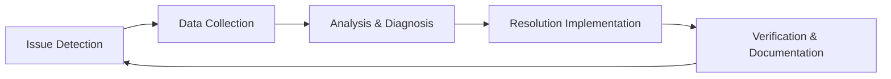
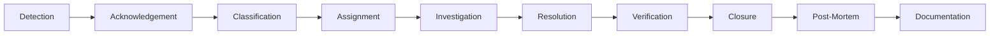

# TACHYON: TROUBLESHOOTING GUIDE

**Document ID:** TACHYON-OPS-004-V1.0
**Date:** February 2026
**Status:** Approved for Operations
**Classification:** Operations & Maintenance
**Compliance Level:** ISO/IEC 26514:2021, IEEE 1012-2016

---

## TABLE OF CONTENTS

1. [Introduction](#1-introduction)
2. [Troubleshooting Framework](#2-troubleshooting-framework)
3. [Troubleshooting Methodology](#3-troubleshooting-methodology)
4. [Common Issues](#4-common-issues)
5. [Diagnostic Tools](#5-diagnostic-tools)
6. [Component Troubleshooting](#6-component-troubleshooting)
7. [Performance Issues](#7-performance-issues)
8. [Escalation Procedures](#8-escalation-procedures)
9. [References](#9-references)

---

## 1. INTRODUCTION

### 1.1. Purpose and Scope

This document provides comprehensive troubleshooting guidance for the Tachyon toolchain, a hybrid system comprising a Rust-based desktop application, an Axum-based HTTP/2 server, and a Leptos-based web frontend. The guide addresses operational issues across all system components, providing systematic approaches to diagnosis, resolution, and prevention.

The scope encompasses:
- Desktop application troubleshooting (Tauri-based)
- Server component troubleshooting (Axum-based)
- Web frontend troubleshooting (Leptos/Bun-based)
- Inter-component communication issues
- Performance optimization
- Security-related incidents
- Deployment and configuration issues

### 1.2. Document Dependencies

This document depends on the following documents:
- [TACHYON-STD-V1.0](../.specs/01_standards/coding_standards.md) - Coding and Documentation Standards
- [TACHYON-ADR-001-V1.0](../.specs/02_adrs/001_rust_as_primary_language.md) - Rust as Primary Language
- [TACHYON-ADR-010-V1.0](../.specs/02_adrs/010_security_architecture.md) - Security Architecture
- [TACHYON-OPS-001-V1.0](deployment_guide.md) - Deployment Guide
- [TACHYON-OPS-002-V1.0](monitoring_guide.md) - Monitoring and Observability Guide
- [TACHYON-OPS-003-V1.0](maintenance_guide.md) - Maintenance Guide

### 1.3. Intended Audience

This guide is intended for:
- DevOps Engineers responsible for system operations
- System Administrators managing deployments
- Support Engineers handling user-reported issues
- Developers diagnosing production issues
- Security Analysts investigating incidents

### 1.4. Document Conventions

The following conventions are used throughout this document:

| Convention | Meaning |
|------------|---------|
| **Bold** | Command, file path, or UI element |
| `Monospace` | Code, variable, or configuration value |
| *Italic* | Emphasis or reference to another document |
| [Link](url) | External reference or cross-document link |
| > | Command-line prompt indicator |

### 1.5. System Overview

The Tachyon system implements a three-tier architecture with the following components:

```
┌─────────────────────────────────────────────────────────────────┐
│                    TACHYON SYSTEM ARCHITECTURE                │
├─────────────────────────────────────────────────────────────────┤
│                                                               │
│  ┌──────────────┐      ┌──────────────┐      ┌──────────┐  │
│  │   Desktop    │◄────-│    Server    │◄────-│   Web    │  │
│  │  (Tauri)     │ IPC  │   (Axum)     │ HTTP2 │ (Leptos) │  │
│  │   Rust       │      │    Rust      │      │  TS/JS   │  │
│  └──────────────┘      └──────────────┘      └──────────┘  │
│         │                     │                      │           │
│         -                     -                      -           │
│  ┌──────────────┐      ┌──────────────┐      ┌──────────┐  │
│  │  Local FS    │      │  Git Storage │      │ Browser  │  │
│  │  (Documents) │      │  (Content)   │      │ (Client) │  │
│  └──────────────┘      └──────────────┘      └──────────┘  │
│                                                               │
└─────────────────────────────────────────────────────────────────┘
```

### 1.6. Technology Stack

| Component | Technology | Version | Purpose |
|-----------|------------|---------|---------|
| **Desktop Backend** | Rust | 1.77.2+ | Core application logic |
| **Desktop Frontend** | Tauri | 2.x | Desktop application framework |
| **Server** | Rust | 1.80+ | HTTP/2 web server |
| **Server Framework** | Axum | 0.7.x | Async web framework |
| **Web Frontend** | Leptos | 0.6.x | Reactive web framework |
| **JavaScript Runtime** | Bun | 1.x | JavaScript execution |
| **Async Runtime** | Tokio | 1.x | Async I/O runtime |
| **Database** | SQLite | 3.x | Local data storage |
| **Search Engine** | Tantivy | 0.21.x | Full-text search |

---

## 2. TROUBLESHOOTING FRAMEWORK

### 2.1. Troubleshooting Philosophy

The Tachyon troubleshooting framework is based on the following principles:

1. **Systematic Approach:** Follow structured procedures to ensure comprehensive diagnosis
2. **Evidence-Based:** Collect and analyze data before implementing solutions
3. **Minimal Impact:** Implement solutions with minimal disruption to service
4. **Root Cause Analysis:** Identify and address underlying causes, not just symptoms
5. **Documentation:** Record all troubleshooting activities for future reference
6. **Continuous Improvement:** Update procedures based on lessons learned

### 2.2. Troubleshooting Process Model

The troubleshooting process follows a five-stage model:



### 2.3. Issue Classification

Issues are classified based on severity and impact:

| Severity | Response Time | Impact | Examples |
|----------|---------------|---------|-----------|
| **Critical** | < 15 minutes | Service unavailable, data loss | Server crash, database corruption |
| **High** | < 1 hour | Degraded service, partial outage | Slow response, intermittent failures |
| **Medium** | < 4 hours | Minor degradation, workarounds available | Feature not working, UI glitches |
| **Low** | < 24 hours | Cosmetic issues, documentation errors | Typos, minor UI issues |

### 2.4. Component Isolation Strategy

When diagnosing issues, isolate components using the following strategy:

1. **Identify Affected Component:** Determine which component (Desktop, Server, Web) exhibits the issue
2. **Test Component Independently:** Test the component in isolation from other components
3. **Verify Inter-Component Communication:** Test communication paths between components
4. **Check Shared Resources:** Verify shared resources (database, file system, network)
5. **Eliminate Variables:** Systematically eliminate potential causes

### 2.5. Information Gathering

Before attempting resolution, gather the following information:

| Category | Information | Collection Method |
|----------|-------------|-------------------|
| **System State** | CPU, memory, disk, network | System monitoring tools |
| **Application Logs** | Error messages, stack traces | Log files, tracing |
| **Configuration** | Environment variables, config files | Config inspection |
| **User Context** | User actions, environment | User reports, session data |
| **Dependencies** | Version, status | Package managers, dependency checks |

### 2.6. Troubleshooting Workflow

The standard troubleshooting workflow:

```
1. INITIAL ASSESSMENT
   ├─ Verify issue existence
   ├─ Determine severity and impact
   ├─ Identify affected users/systems
   └─ Check for known issues

2. DATA COLLECTION
   ├─ Collect system metrics
   ├─ Gather application logs
   ├─ Document user actions
   └─ Capture error messages

3. ANALYSIS
   ├─ Correlate symptoms with potential causes
   ├─ Review recent changes
   ├─ Check system dependencies
   └─ Formulate hypothesis

4. DIAGNOSIS
   ├─ Test hypothesis
   ├─ Isolate root cause
   ├─ Identify resolution approach
   └─ Assess implementation risk

5. RESOLUTION
   ├─ Implement fix
   ├─ Verify resolution
   ├─ Monitor for recurrence
   └─ Document findings
```

### 2.7. Troubleshooting Tools Overview

The following tools are available for troubleshooting:

| Category | Tools | Purpose |
|----------|--------|---------|
| **System Monitoring** | `htop`, `iotop`, `iftop`, `ss` | Resource monitoring |
| **Application Debugging** | `gdb`, `lldb`, `rust-lldb` | Debugging Rust applications |
| **Log Analysis** | `grep`, `awk`, `sed`, `journalctl` | Log parsing and analysis |
| **Network Debugging** | `tcpdump`, `wireshark`, `curl` | Network troubleshooting |
| **Performance Profiling** | `perf`, `flamegraph`, `tokio-console` | Performance analysis |
| **Database Inspection** | `sqlite3`, `rusqlite` | Database troubleshooting |

---

## 3. TROUBLESHOOTING METHODOLOGY

### 3.1. Diagnostic Procedures

#### 3.1.1. Initial Issue Assessment

When an issue is reported, perform the following initial assessment:

**Step 1: Verify Issue Existence**
```bash
# Check if application is running
ps aux | grep tachyon

# Check server status
systemctl status tachyon-server

# Check desktop application logs
journalctl -u tachyon-desktop --since "1 hour ago" | tail -100
```

**Step 2: Determine Severity**
Use the severity classification matrix from Section 2.3 to categorize the issue.

**Step 3: Identify Affected Component**
Determine which component is affected:
- Desktop application only
- Server component only
- Web frontend only
- Multiple components
- Inter-component communication

**Step 4: Check for Known Issues**
```bash
# Search issue tracker
grep -r "error message" /var/log/tachyon/

# Check recent changes
git log --since="1 week ago" --oneline

# Review deployment history
cat /var/log/tachyon/deployment.log
```

#### 3.1.2. Data Collection Procedures

**System Metrics Collection**
```bash
# CPU and memory usage
top -b -n 1 | head -20

# Disk usage
df -h

# Network connections
ss -tulpn | grep tachyon

# Process details
ps aux | grep -E "(tachyon|rust|axum)"
```

**Application Log Collection**
```bash
# Desktop application logs
journalctl -u tachyon-desktop --since "1 hour ago" > desktop.log

# Server logs
journalctl -u tachyon-server --since "1 hour ago" > server.log

# Web server logs
tail -1000 /var/log/nginx/tachyon-access.log > web.log

# Error logs
grep -i error /var/log/tachyon/*.log > errors.log
```

**Configuration Inspection**
```bash
# Desktop application config
cat ~/.config/tachyon/config.toml

# Server config
cat /etc/tachyon/server.toml

# Environment variables
env | grep TACHYON
```

#### 3.1.3. Analysis Procedures

**Symptom-Cause Correlation**

| Symptom | Potential Causes | Diagnostic Commands |
|---------|----------------|-------------------|
| Application won't start | Missing dependencies, config errors, port conflicts | `ldd`, `strace`, `netstat` |
| Slow performance | High CPU, memory leak, disk I/O bottleneck | `top`, `valgrind`, `iostat` |
| Network errors | Firewall, DNS, TLS certificate issues | `ping`, `nslookup`, `openssl` |
| Data corruption | Disk errors, concurrent writes, power failure | `fsck`, `dmesg`, `smartctl` |

**Recent Changes Review**
```bash
# Recent package updates
grep tachyon /var/log/dpkg.log | tail -20

# Recent configuration changes
git log --since="1 week ago" -- /etc/tachyon/

# Recent deployments
ls -lt /var/lib/tachyon/deployments/ | head -10
```

**Dependency Verification**
```bash
# Rust dependencies
cargo tree -p tachyon-server

# JavaScript dependencies
cd tachyon/web && bun pm ls

# System dependencies
ldd /usr/local/bin/tachyon-server
```

#### 3.1.4. Hypothesis Testing

**Hypothesis Formulation**

Based on collected data, formulate a testable hypothesis:

```
HYPOTHESIS: The server is failing to start because port 8080 is already in use.

PREDICTION: Stopping the process using port 8080 will allow the server to start.

TEST: Stop the process and attempt to start the server.
```

**Hypothesis Testing Procedure**

1. **Define Test Conditions:** Specify exact conditions for the test
2. **Execute Test:** Perform the test under controlled conditions
3. **Collect Results:** Record all observations during the test
4. **Analyze Results:** Compare results with predictions
5. **Draw Conclusions:** Accept or reject the hypothesis

**Example Test Execution**
```bash
# Step 1: Identify process using port 8080
sudo lsof -i :8080

# Step 2: Stop the conflicting process
sudo kill -9 <PID>

# Step 3: Attempt to start the server
sudo systemctl start tachyon-server

# Step 4: Verify server started
systemctl status tachyon-server

# Step 5: Check if hypothesis is confirmed
curl http://localhost:8080/health
```

### 3.2. Root Cause Analysis

#### 3.2.1. Five Whys Method

The Five Whys method is a technique for exploring the cause-and-effect relationships underlying a particular problem.

**Example: Server Not Starting**

1. **Why is the server not starting?**
   - The server process exits immediately with error code 1.

2. **Why does the process exit with error code 1?**
   - The server cannot bind to the configured port.

3. **Why can't the server bind to the port?**
   - Another process is already using port 8080.

4. **Why is another process using port 8080?**
   - A previous server instance did not shut down cleanly.

5. **Why didn't the previous instance shut down cleanly?**
   - The shutdown signal was not handled properly due to a bug in the signal handler.

**Root Cause:** Improper signal handling in the server code.

#### 3.2.2. Fishbone Diagram

Use a fishbone (Ishikawa) diagram to categorize potential causes:

```
                    ISSUE: Application Slow Response
                            │
        ┌───────────────┼───────────────┐
        │               │               │
   People        Process        Equipment
        │               │               │
   ┌─────┐       ┌─────┐       ┌─────┐
   │Training│     │Config│     │CPU   │
   │Staffing│     │Changes│     │Memory│
   └─────┘       └─────┘       └─────┘
        │               │               │
        └───────────────┼───────────────┘
                        │
                    Environment
                        │
                    ┌─────┐
                    │Network│
                    │Disk  │
                    └─────┘
```

#### 3.2.3. Timeline Analysis

Create a timeline of events leading to the issue:

| Time | Event | Impact |
|------|--------|---------|
| 10:00 | Server started normally | None |
| 10:15 | Configuration file updated | Potential config error |
| 10:20 | Server restarted | Configuration applied |
| 10:21 | Server failed to start | Issue manifested |
| 10:22 | Error logs generated | Diagnostic data available |

### 3.3. Resolution Procedures

#### 3.3.1. Resolution Selection Criteria

When selecting a resolution, consider:

| Criterion | Description | Weight |
|-----------|-------------|--------|
| **Effectiveness** | How well does it solve the problem? | High |
| **Risk** | What is the risk of introducing new issues? | High |
| **Time to Implement** | How long will it take to implement? | Medium |
| **Impact on Users** | How will it affect users during implementation? | High |
| **Reversibility** | Can the change be easily rolled back? | Medium |

#### 3.3.2. Resolution Implementation

**Pre-Implementation Checklist**

- [ ] Resolution tested in staging environment
- [ ] Rollback procedure documented
- [ ] Stakeholders notified of maintenance window
- [ ] Backup of current state created
- [ ] Monitoring configured for post-implementation

**Implementation Steps**

1. **Prepare Environment**
   ```bash
   # Create backup
   sudo cp /etc/tachyon/server.toml /etc/tachyon/server.toml.backup

   # Stop service
   sudo systemctl stop tachyon-server
   ```

2. **Apply Resolution**
   ```bash
   # Apply configuration change
   sudo sed -i 's/port = 8080/port = 8081/' /etc/tachyon/server.toml

   # Update dependencies if needed
   sudo apt-get update && sudo apt-get upgrade
   ```

3. **Start Service**
   ```bash
   # Start service
   sudo systemctl start tachyon-server

   # Verify service status
   systemctl status tachyon-server
   ```

4. **Verify Resolution**
   ```bash
   # Test endpoint
   curl http://localhost:8081/health

   # Check logs for errors
   journalctl -u tachyon-server --since "5 minutes ago"
   ```

#### 3.3.3. Post-Resolution Verification

**Verification Checklist**

- [ ] Issue symptoms no longer present
- [ ] System metrics within normal range
- [ ] No new errors in logs
- [ ] User-reported issues resolved
- [ ] Performance metrics acceptable

**Monitoring Period**

After resolution implementation, monitor the system for a defined period:

| Severity | Monitoring Period |
|----------|------------------|
| Critical | 24 hours |
| High | 8 hours |
| Medium | 4 hours |
| Low | 1 hour |

### 3.4. Documentation Requirements

#### 3.4.1. Incident Report Template

```markdown
# Incident Report

**Incident ID:** INC-YYYYMMDD-NNN
**Date:** YYYY-MM-DD
**Reporter:** Name
**Severity:** Critical/High/Medium/Low

## Summary
Brief description of the incident.

## Timeline
| Time | Event |
|------|--------|
| 10:00 | Issue detected |
| 10:15 | Investigation started |
| 10:30 | Root cause identified |
| 10:45 | Resolution implemented |
| 11:00 | Service restored |

## Impact
- Affected users: N
- Downtime duration: N minutes
- Data loss: Yes/No

## Root Cause
Detailed explanation of the root cause.

## Resolution
Description of the resolution implemented.

## Preventive Measures
Actions taken to prevent recurrence.

## Lessons Learned
Key takeaways from the incident.
```

#### 3.4.2. Knowledge Base Article Template

```markdown
# [Issue Title]

**Category:** Desktop/Server/Web/Network/Performance
**Severity:** Critical/High/Medium/Low
**Last Updated:** YYYY-MM-DD

## Symptoms
Description of observable symptoms.

## Causes
List of potential causes.

## Resolution
Step-by-step resolution procedure.

## Prevention
Preventive measures.

## Related Issues
Links to related issues.
```

---

## 4. COMMON ISSUES

### 4.1. Application Startup Issues

#### Issue 4.1.1: Desktop Application Won't Start

**Symptoms:**
- Desktop application icon does not respond when clicked
- No window appears after launching
- Error message displayed or logged

**Potential Causes:**
1. Missing system dependencies
2. Configuration file corruption
3. Port conflicts with other applications
4. Insufficient system permissions
5. Database lock file present

**Diagnostic Steps:**
```bash
# Step 1: Check if process is running
ps aux | grep tachyon-desktop

# Step 2: Check application logs
journalctl -u tachyon-desktop --since "10 minutes ago" | tail -50

# Step 3: Check for missing dependencies
ldd /usr/local/bin/tachyon-desktop | grep "not found"

# Step 4: Check configuration file syntax
cat ~/.config/tachyon/config.toml

# Step 5: Check for database lock
ls -la ~/.local/share/tachyon/*.lock
```

**Resolution Procedures:**

**Resolution A: Missing Dependencies**
```bash
# Install missing dependencies
sudo apt-get install libwebkit2gtk-4.0-dev build-essential curl wget file libssl-dev libayatana-appindicator3-dev librsvg2-dev

# Rebuild application if necessary
cd tachyon/crates/desktop/src-tauri
cargo build --release
```

**Resolution B: Configuration File Corruption**
```bash
# Backup current configuration
cp ~/.config/tachyon/config.toml ~/.config/tachyon/config.toml.backup

# Restore default configuration
cp /usr/share/tachyon/config.default.toml ~/.config/tachyon/config.toml

# Restart application
tachyon-desktop
```

**Resolution C: Database Lock File**
```bash
# Remove stale lock file
rm ~/.local/share/tachyon/database.lock

# Verify database integrity
sqlite3 ~/.local/share/tachyon/tachyon.db "PRAGMA integrity_check;"

# Restart application
tachyon-desktop
```

#### Issue 4.1.2: Server Component Won't Start

**Symptoms:**
- Server service fails to start
- Service reports "failed" status
- Port already in use error

**Potential Causes:**
1. Port already in use by another process
2. Invalid server configuration
3. Missing or corrupted SSL certificates
4. Insufficient system resources
5. Database connection failure

**Diagnostic Steps:**
```bash
# Step 1: Check service status
systemctl status tachyon-server

# Step 2: Check for port conflicts
sudo lsof -i :8080

# Step 3: Check server logs
journalctl -u tachyon-server --since "10 minutes ago" | tail -50

# Step 4: Verify configuration
cat /etc/tachyon/server.toml

# Step 5: Check SSL certificates
openssl x509 -in /etc/tachyon/cert.pem -text -noout
```

**Resolution Procedures:**

**Resolution A: Port Conflict**
```bash
# Identify process using port 8080
sudo lsof -i :8080

# Stop conflicting process (if safe to do so)
sudo kill -15 <PID>

# Or change server port in configuration
sudo sed -i 's/port = 8080/port = 8081/' /etc/tachyon/server.toml

# Start server
sudo systemctl start tachyon-server
```

**Resolution B: Invalid Configuration**
```bash
# Validate configuration syntax
tachyon-server --validate-config

# Restore default configuration
sudo cp /etc/tachyon/server.toml /etc/tachyon/server.toml.backup
sudo cp /usr/share/tachyon/server.default.toml /etc/tachyon/server.toml

# Start server
sudo systemctl start tachyon-server
```

**Resolution C: SSL Certificate Issues**
```bash
# Generate new self-signed certificate
sudo openssl req -x509 -newkey rsa:4096 -keyout /etc/tachyon/key.pem -out /etc/tachyon/cert.pem -days 365 -nodes -subj "/CN=localhost"

# Set proper permissions
sudo chmod 600 /etc/tachyon/key.pem
sudo chmod 644 /etc/tachyon/cert.pem

# Start server
sudo systemctl start tachyon-server
```

### 4.2. Performance Issues

#### Issue 4.2.1: Slow Application Response

**Symptoms:**
- Application takes long time to respond to user input
- UI freezes or becomes unresponsive
- High CPU or memory usage

**Potential Causes:**
1. Insufficient system resources
2. Memory leak in application
3. Blocking operations on main thread
4. Large file processing
5. Database performance issues

**Diagnostic Steps:**
```bash
# Step 1: Check system resources
htop

# Step 2: Check application resource usage
ps aux | grep tachyon

# Step 3: Check for memory leaks
valgrind --leak-check=full tachyon-desktop

# Step 4: Profile CPU usage
perf record -g tachyon-desktop
perf report

# Step 5: Check database performance
sqlite3 ~/.local/share/tachyon/tachyon.db ".timer on"
sqlite3 ~/.local/share/tachyon/tachyon.db "SELECT * FROM documents;"
```

**Resolution Procedures:**

**Resolution A: Insufficient Resources**
```bash
# Close unnecessary applications
killall firefox chromium

# Increase swap space if needed
sudo fallocate -l 2G /swapfile
sudo chmod 600 /swapfile
sudo mkswap /swapfile
sudo swapon /swapfile

# Restart application
tachyon-desktop
```

**Resolution B: Memory Leak**
```bash
# Update to latest version
sudo apt-get update && sudo apt-get upgrade tachyon-desktop

# If issue persists, restart application periodically
# Create systemd service for periodic restart
sudo tee /etc/systemd/system/tachyon-restart.timer > /dev/null <<EOF
[Unit]
Description=Restart Tachyon Desktop Daily

[Timer]
OnCalendar=daily
Persistent=true

[Install]
WantedBy=timers.target
EOF

sudo tee /etc/systemd/system/tachyon-restart.service > /dev/null <<EOF
[Unit]
Description=Restart Tachyon Desktop

[Service]
Type=oneshot
ExecStart=/usr/bin/systemctl restart --user tachyon-desktop
EOF

sudo systemctl enable tachyon-restart.timer
```

#### Issue 4.2.2: High Memory Usage

**Symptoms:**
- Application consumes excessive memory
- System becomes slow or unresponsive
- Out of memory errors

**Potential Causes:**
1. Memory leak in Rust code
2. Large file caching
3. Unbounded data structures
4. WASM module memory growth

**Diagnostic Steps:**
```bash
# Step 1: Check memory usage
ps aux --sort=-%mem | grep tachyon

# Step 2: Check memory growth over time
watch -n 5 'ps aux | grep tachyon-desktop | awk "{print \$6}"'

# Step 3: Check for memory leaks
valgrind --leak-check=full --show-leak-kinds=all tachyon-desktop

# Step 4: Check WASM memory
# Use browser developer tools to check WASM memory
```

**Resolution Procedures:**

**Resolution A: Clear Cache**
```bash
# Clear application cache
rm -rf ~/.cache/tachyon/*

# Restart application
tachyon-desktop
```

**Resolution B: Reduce Cache Size**
```toml
# Edit configuration file
nano ~/.config/tachyon/config.toml

# Reduce cache size
[cache]
max_size_mb = 256  # Reduce from default
```

### 4.3. Network Issues

#### Issue 4.3.1: Connection Refused

**Symptoms:**
- Cannot connect to server
- "Connection refused" error message
- Network timeout errors

**Potential Causes:**
1. Server not running
2. Firewall blocking connection
3. Wrong port or address
4. Network connectivity issues

**Diagnostic Steps:**
```bash
# Step 1: Check if server is running
systemctl status tachyon-server

# Step 2: Check if port is listening
sudo ss -tulpn | grep 8080

# Step 3: Check firewall rules
sudo iptables -L -n

# Step 4: Test connectivity
ping server.example.com
telnet server.example.com 8080

# Step 5: Check DNS resolution
nslookup server.example.com
```

**Resolution Procedures:**

**Resolution A: Server Not Running**
```bash
# Start server
sudo systemctl start tachyon-server

# Enable server to start on boot
sudo systemctl enable tachyon-server
```

**Resolution B: Firewall Blocking**
```bash
# Allow port through firewall
sudo ufw allow 8080/tcp

# Or add specific rule
sudo iptables -A INPUT -p tcp --dport 8080 -j ACCEPT
```

#### Issue 4.3.2: SSL/TLS Certificate Errors

**Symptoms:**
- "Certificate expired" error
- "Certificate not trusted" error
- "SSL handshake failed" error

**Potential Causes:**
1. Certificate expired
2. Self-signed certificate not trusted
3. Certificate chain incomplete
4. Hostname mismatch

**Diagnostic Steps:**
```bash
# Step 1: Check certificate expiration
openssl x509 -in /etc/tachyon/cert.pem -noout -dates

# Step 2: Check certificate chain
openssl s_client -connect localhost:8080 -showcerts

# Step 3: Verify certificate
openssl verify -CAfile /etc/ssl/certs/ca-certificates.crt /etc/tachyon/cert.pem
```

**Resolution Procedures:**

**Resolution A: Expired Certificate**
```bash
# Generate new certificate
sudo openssl req -x509 -newkey rsa:4096 -keyout /etc/tachyon/key.pem -out /etc/tachyon/cert.pem -days 365 -nodes -subj "/CN=$(hostname)"

# Set proper permissions
sudo chmod 600 /etc/tachyon/key.pem
sudo chmod 644 /etc/tachyon/cert.pem

# Restart server
sudo systemctl restart tachyon-server
```

**Resolution B: Trust Self-Signed Certificate**
```bash
# Add certificate to trusted store
sudo cp /etc/tachyon/cert.pem /usr/local/share/ca-certificates/tachyon.crt
sudo update-ca-certificates
```

### 4.4. Data Issues

#### Issue 4.4.1: Database Corruption

**Symptoms:**
- Application crashes when accessing data
- "Database disk image is malformed" error
- Data missing or incorrect

**Potential Causes:**
1. Improper shutdown
2. Disk errors
3. Concurrent write conflicts
4. File system corruption

**Diagnostic Steps:**
```bash
# Step 1: Check database integrity
sqlite3 ~/.local/share/tachyon/tachyon.db "PRAGMA integrity_check;"

# Step 2: Check for disk errors
sudo dmesg | grep -i error
sudo smartctl -a /dev/sda

# Step 3: Check file system
sudo fsck -f /dev/sda1
```

**Resolution Procedures:**

**Resolution A: Recover from Backup**
```bash
# Stop application
systemctl stop tachyon-server

# Restore from backup
cp ~/.local/share/tachyon/tachyon.db.backup ~/.local/share/tachyon/tachyon.db

# Start application
systemctl start tachyon-server
```

**Resolution B: Dump and Rebuild**
```bash
# Dump database to SQL
sqlite3 ~/.local/share/tachyon/tachyon.db .dump > backup.sql

# Create new database
rm ~/.local/share/tachyon/tachyon.db
sqlite3 ~/.local/share/tachyon/tachyon.db < backup.sql

# Verify integrity
sqlite3 ~/.local/share/tachyon/tachyon.db "PRAGMA integrity_check;"
```

#### Issue 4.4.2: File Not Found Errors

**Symptoms:**
- "File not found" error when opening documents
- Documents disappear from list
- Broken file links

**Potential Causes:**
1. File moved or deleted
2. Incorrect file path in database
3. Permission issues
4. File system mount issues

**Diagnostic Steps:**
```bash
# Step 1: Check if file exists
ls -la /path/to/document.md

# Step 2: Check file permissions
stat /path/to/document.md

# Step 3: Check database record
sqlite3 ~/.local/share/tachyon/tachyon.db "SELECT * FROM documents WHERE path = '/path/to/document.md';"

# Step 4: Check file system mounts
df -h
mount | grep /home
```

**Resolution Procedures:**

**Resolution A: Update Database Path**
```bash
# Update database with correct path
sqlite3 ~/.local/share/tachyon/tachyon.db "UPDATE documents SET path = '/new/path/to/document.md' WHERE id = 1;"
```

**Resolution B: Fix Permissions**
```bash
# Fix file permissions
chmod 644 /path/to/document.md
chown $USER:$USER /path/to/document.md
```

### 4.5. Security Issues

#### Issue 4.5.1: Authentication Failures

**Symptoms:**
- "Authentication failed" error
- Unable to log in
- Session expires immediately

**Potential Causes:**
1. Incorrect credentials
2. Session token expired
3. Authentication service down
4. User account locked

**Diagnostic Steps:**
```bash
# Step 1: Check authentication service status
systemctl status tachyon-auth

# Step 2: Check authentication logs
journalctl -u tachyon-auth --since "10 minutes ago" | tail -50

# Step 3: Verify user account
sqlite3 ~/.local/share/tachyon/tachyon.db "SELECT * FROM users WHERE username = 'username';"

# Step 4: Check session token
# Use browser developer tools to inspect cookies
```

**Resolution Procedures:**

**Resolution A: Reset Password**
```bash
# Reset user password
sqlite3 ~/.local/share/tachyon/tachyon.db "UPDATE users SET password_hash = '$2b$12$...' WHERE username = 'username';"
```

**Resolution B: Clear Session**
```bash
# Clear user sessions
sqlite3 ~/.local/share/tachyon/tachyon.db "DELETE FROM sessions WHERE user_id = 1;"
```

#### Issue 4.5.2: Permission Denied Errors

**Symptoms:**
- "Permission denied" error when accessing resources
- Cannot read or write files
- API calls return 403 Forbidden

**Potential Causes:**
1. Insufficient user permissions
2. File system permission issues
3. Capability not granted
4. Role-based access control misconfiguration

**Diagnostic Steps:**
```bash
# Step 1: Check user permissions
sqlite3 ~/.local/share/tachyon/tachyon.db "SELECT * FROM user_roles WHERE user_id = 1;"

# Step 2: Check file permissions
ls -la /path/to/resource

# Step 3: Check Tauri capabilities
cat ~/.config/tachyon/capabilities.json

# Step 4: Check API permissions
# Use browser developer tools to inspect request headers
```

**Resolution Procedures:**

**Resolution A: Grant Permissions**
```bash
# Grant file system permission
sqlite3 ~/.local/share/tachyon/tachyon.db "INSERT INTO user_permissions (user_id, resource, permission) VALUES (1, 'documents', 'read');"
```

**Resolution B: Fix File Permissions**
```bash
# Fix file permissions
chmod 755 /path/to/directory
chown $USER:$USER /path/to/directory
```

---

## 5. DIAGNOSTIC TOOLS

### 5.1. System Monitoring Tools

#### 5.1.1. Process Monitoring

**htop - Interactive Process Viewer**

```bash
# Install htop
sudo apt-get install htop

# Run htop
htop

# Monitor specific process
htop -p $(pgrep tachyon-server)

# Key bindings:
# F5 - Tree view
# F6 - Sort by criteria
# F9 - Kill process
# F10 - Quit
```

**Usage Scenarios:**
- Identify processes consuming high CPU or memory
- Monitor process threads and resource usage
- Kill hung or unresponsive processes
- View process hierarchy and dependencies

#### 5.1.2. Network Monitoring

**ss - Socket Statistics**

```bash
# Display all listening TCP sockets
sudo ss -tlnp

# Display all TCP connections
sudo ss -tunap

# Display process using specific port
sudo ss -tlnp | grep 8080

# Display statistics
sudo ss -s

# Filter by state
sudo ss -t state established
```

**Usage Scenarios:**
- Identify processes using network ports
- Troubleshoot connection issues
- Monitor network connection states
- Detect port conflicts

**iftop - Network Bandwidth Monitor**

```bash
# Install iftop
sudo apt-get install iftop

# Run iftop
sudo iftop -i eth0

# Display options:
# -i interface: Specify network interface
# -n: Don't resolve hostnames
# -P: Show port numbers
```

**Usage Scenarios:**
- Monitor network bandwidth usage
- Identify bandwidth-intensive connections
- Troubleshoot network performance issues
- Detect unusual network activity

#### 5.1.3. Disk Monitoring

**iotop - I/O Monitor**

```bash
# Install iotop
sudo apt-get install iotop

# Run iotop
sudo iotop

# Options:
# -o: Only show processes doing I/O
# -a: Accumulated I/O
# -P: Show only processes
```

**Usage Scenarios:**
- Identify processes causing disk I/O
- Troubleshoot disk performance issues
- Monitor disk write patterns
- Detect excessive disk activity

### 5.2. Application Debugging Tools

#### 5.2.1. Rust Debugging

**gdb - GNU Debugger**

```bash
# Install gdb
sudo apt-get install gdb

# Debug Rust application
gdb /usr/local/bin/tachyon-server

# Common commands:
# (gdb) run - Start program
# (gdb) bt - Backtrace
# (gdb) info locals - Show local variables
# (gdb) print variable - Print variable value
# (gdb) continue - Continue execution
# (gdb) quit - Exit gdb
```

**Debugging with Core Dumps:**

```bash
# Enable core dumps
ulimit -c unlimited

# Run application
tachyon-server

# If crash occurs, debug core dump
gdb /usr/local/bin/tachyon-server core

# Analyze crash
(gdb) bt
(gdb) info threads
(gdb) thread apply all bt
```

#### 5.2.2. Memory Leak Detection

**valgrind - Memory Profiling**

```bash
# Install valgrind
sudo apt-get install valgrind

# Check for memory leaks
valgrind --leak-check=full --show-leak-kinds=all tachyon-desktop

# Check for memory errors
valgrind --tool=memcheck tachyon-desktop

# Generate suppression file
valgrind --leak-check=full --gen-suppressions=all tachyon-desktop 2> suppressions.supp
```

**Interpreting valgrind Output:**

```
==12345== LEAK SUMMARY:
==12345==    definitely lost: 1,024 bytes in 16 blocks
==12345==    indirectly lost: 512 bytes in 8 blocks
==12345==      possibly lost: 256 bytes in 4 blocks
==12345==    still reachable: 2,048 bytes in 32 blocks
==12345==         suppressed: 0 bytes in 0 blocks
```

- **definitely lost:** Memory leaks that should be fixed
- **indirectly lost:** Memory lost due to definitely lost blocks
- **possibly lost:** Potential memory leaks
- **still reachable:** Memory still reachable at program exit (may be acceptable)

#### 5.2.3. Performance Profiling

**perf - Linux Performance Tools**

```bash
# Install perf
sudo apt-get install linux-tools-common

# Record CPU profile
perf record -g tachyon-server

# Analyze profile
perf report

# Generate flame graph
perf script | stackcollapse-perf.pl | flamegraph.pl > flamegraph.svg
```

**tokio-console - Tokio Task Inspector**

```bash
# Add tokio-console dependency
cargo add tokio-console

# Enable console in application
let console_layer = ConsoleLayer::new();
let subscriber = tracing_subscriber::registry()
    .with(console_layer)
    .init();

# View console
tokio-console
```

### 5.3. Log Analysis Tools

#### 5.3.1. Log Filtering and Parsing

**grep - Pattern Matching**

```bash
# Search for errors
grep -i error /var/log/tachyon/server.log

# Search for specific error message
grep "connection refused" /var/log/tachyon/server.log

# Search with context
grep -C 5 "error" /var/log/tachyon/server.log

# Search multiple files
grep -r "panic" /var/log/tachyon/

# Count occurrences
grep -c "error" /var/log/tachyon/server.log
```

**awk - Text Processing**

```bash
# Extract timestamp and error message
awk '{print $1, $2, $NF}' /var/log/tachyon/server.log

# Count error types
awk '/error/ {error[$NF]++} END {for (e in error) print e, error[e]}' /var/log/tachyon/server.log

# Extract fields from structured logs
awk -F'|' '{print $1, $3, $5}' /var/log/tachyon/server.log
```

**sed - Stream Editor**

```bash
# Replace sensitive information
sed 's/password=[^ ]*/password=***/g' /var/log/tachyon/server.log

# Remove duplicate lines
sed '$!N; /^\(.*\)\n\1$/!P; D' /var/log/tachyon/server.log

# Extract log entries for specific time range
sed -n '/2026-02-06 10:00/,/2026-02-06 11:00/p' /var/log/tachyon/server.log
```

#### 5.3.2. Log Aggregation

**journalctl - Systemd Journal**

```bash
# View all Tachyon logs
journalctl -u tachyon-server

# View logs since specific time
journalctl -u tachyon-server --since "1 hour ago"

# Follow logs in real-time
journalctl -u tachyon-server -f

# View logs with priority
journalctl -u tachyon-server -p err

# Export logs to file
journalctl -u tachyon-server --since "1 day ago" > tachyon.log

# View logs for specific boot
journalctl -u tachyon-server -b -1
```

### 5.4. Network Debugging Tools

#### 5.4.1. Packet Capture

**tcpdump - Packet Analyzer**

```bash
# Capture packets on port 8080
sudo tcpdump -i any port 8080

# Capture and save to file
sudo tcpdump -i any -w capture.pcap port 8080

# Read capture file
tcpdump -r capture.pcap

# Display in ASCII
sudo tcpdump -A -i any port 8080

# Filter by host
sudo tcpdump host 192.168.1.100
```

**wireshark - Network Protocol Analyzer**

```bash
# Install wireshark
sudo apt-get install wireshark

# Run wireshark (GUI)
wireshark

# Analyze capture file
wireshark capture.pcap

# Apply display filters
# Filter by HTTP requests: http.request
# Filter by TCP errors: tcp.analysis.flags
```

#### 5.4.2. HTTP/HTTPS Testing

**curl - Command Line HTTP Client**

```bash
# Test HTTP endpoint
curl http://localhost:8080/health

# Test with verbose output
curl -v http://localhost:8080/health

# Test HTTPS with certificate verification disabled
curl -k https://localhost:8443/health

# Test with custom headers
curl -H "Authorization: Bearer token" http://localhost:8080/api/documents

# Test POST request
curl -X POST -H "Content-Type: application/json" -d '{"title":"Test"}' http://localhost:8080/api/documents

# Measure response time
curl -w "@curl-format.txt" -o /dev/null -s http://localhost:8080/health
```

**curl-format.txt:**
```
time_namelookup:  %{time_namelookup}\n
time_connect:     %{time_connect}\n
time_appconnect:  %{time_appconnect}\n
time_pretransfer: %{time_pretransfer}\n
time_starttransfer: %{time_starttransfer}\n
time_total:       %{time_total}\n
```

### 5.5. Database Tools

#### 5.5.1. SQLite Inspection

**sqlite3 - SQLite Command Line Tool**

```bash
# Open database
sqlite3 ~/.local/share/tachyon/tachyon.db

# List tables
.tables

# View table schema
.schema documents

# Execute query
SELECT * FROM documents LIMIT 10;

# Check database integrity
PRAGMA integrity_check;

# Check foreign key constraints
PRAGMA foreign_key_check;

# Analyze query plan
EXPLAIN QUERY PLAN SELECT * FROM documents WHERE title LIKE '%test%';

# Export database
.dump > backup.sql

# Import database
.read backup.sql

# Enable timing
.timer on

# Show indexes
.indexes documents
```

#### 5.5.2. Database Performance

**Query Performance Analysis:**

```bash
# Analyze query performance
sqlite3 tachyon.db <<EOF
.timer on
SELECT * FROM documents WHERE title LIKE '%test%';
EOF

# Check if indexes are being used
sqlite3 tachyon.db <<EOF
EXPLAIN QUERY PLAN SELECT * FROM documents WHERE title LIKE '%test%';
EOF

# Analyze database statistics
sqlite3 tachyon.db <<EOF
PRAGMA table_info(documents);
PRAGMA index_list(documents);
PRAGMA index_info(idx_documents_title);
EOF
```

### 5.6. Configuration Validation

#### 5.6.1. TOML Validation

**toml-cli - TOML Parser**

```bash
# Install toml-cli
cargo install toml-cli

# Validate TOML file
toml validate /etc/tachyon/server.toml

# Get value from TOML file
toml get /etc/tachyon/server.toml server.port

# Set value in TOML file
toml set /etc/tachyon/server.toml server.port 8081
```

#### 5.6.2. JSON Validation

**jq - JSON Processor**

```bash
# Install jq
sudo apt-get install jq

# Validate JSON file
jq empty config.json

# Pretty print JSON
jq . config.json

# Extract value
jq '.server.port' config.json

# Update value
jq '.server.port = 8081' config.json > config.tmp && mv config.tmp config.json

# Validate JSON array
jq '.[]' documents.json
```

### 5.7. Dependency Management

#### 5.7.1. Rust Dependencies

**cargo - Rust Package Manager**

```bash
# Check dependency tree
cargo tree -p tachyon-server

# Check for outdated dependencies
cargo outdated

# Update dependencies
cargo update

# Check for security vulnerabilities
cargo audit

# Check dependency versions
cargo tree --depth 1

# Check for unused dependencies
cargo machete
```

#### 5.7.2. JavaScript Dependencies

**bun - JavaScript Runtime**

```bash
# Check installed packages
bun pm ls

# Check for outdated packages
bun pm outdated

# Update dependencies
bun update

# Audit dependencies
bun audit

# Check dependency tree
bun pm tree
```

---

## 6. COMPONENT TROUBLESHOOTING

### 6.1. Desktop Component (Tauri)

#### 6.1.1. Tauri-Specific Issues

**Issue: Window Not Displaying**

**Symptoms:**
- Application starts but no window appears
- Window appears off-screen
- Window size incorrect

**Diagnostic Steps:**
```bash
# Check Tauri logs
cat ~/.local/share/tachyon/logs/tauri.log

# Check window configuration
cat ~/.config/tachyon/tauri.conf.json

# Verify display configuration
xrandr
```

**Resolution Procedures:**

**Resolution A: Reset Window Position**
```bash
# Remove window state
rm ~/.config/tachyon/window-state.json

# Restart application
tachyon-desktop
```

**Resolution B: Fix Display Configuration**
```json
// Edit ~/.config/tachyon/tauri.conf.json
{
  "window": {
    "width": 1200,
    "height": 800,
    "x": 100,
    "y": 100,
    "center": true
  }
}
```

**Issue: IPC Communication Failure**

**Symptoms:**
- Commands not executing
- No response from backend
- IPC errors in logs

**Diagnostic Steps:**
```bash
# Check IPC logs
grep -i ipc ~/.local/share/tachyon/logs/*.log

# Verify IPC configuration
cat ~/.config/tachyon/capabilities.json

# Test IPC channel
echo '{"cmd":"ping"}' | tachyon-ipc-client
```

**Resolution Procedures:**

**Resolution A: Restart IPC Service**
```bash
# Restart Tauri backend
pkill -f tachyon-desktop
tachyon-desktop
```

**Resolution B: Verify Capabilities**
```json
// Ensure capabilities are properly configured in ~/.config/tachyon/capabilities.json
{
  "identifier": "default",
  "description": "Default capabilities",
  "windows": ["main"],
  "permissions": [
    "core:default",
    "core:window:allow-start-dragging",
    "core:window:allow-drag",
    "core:window:allow-maximize",
    "core:window:allow-minimize",
    "core:window:allow-close"
  ]
}
```

#### 6.1.2. Rust Backend Issues

**Issue: Panic or Crash**

**Symptoms:**
- Application terminates unexpectedly
- "thread 'main' panicked" error
- Stack trace displayed

**Diagnostic Steps:**
```bash
# Check for core dumps
ls -la ~/.local/share/tachyon/core.*

# Analyze stack trace
grep -A 20 "panicked" ~/.local/share/tachyon/logs/*.log

# Check for unsafe code violations
grep -r "unsafe" tachyon/crates/desktop/src-tauri/src/
```

**Resolution Procedures:**

**Resolution A: Debug with Core Dump**
```bash
# Load core dump in gdb
gdb /usr/local/bin/tachyon-desktop ~/.local/share/tachyon/core.*

# Get backtrace
(gdb) bt full

# Get thread information
(gdb) info threads
(gdb) thread apply all bt
```

**Resolution B: Fix Common Panics**

```rust
// Common panic: unwrap() on None
// BAD:
let value = option.unwrap();

// GOOD:
let value = option.expect("value must be present");

// Common panic: index out of bounds
// BAD:
let item = vec[100];

// GOOD:
let item = vec.get(100).expect("index out of bounds");

// Common panic: failed to parse
// BAD:
let num: i32 = "abc".parse().unwrap();

// GOOD:
let num: i32 = "abc".parse().expect("invalid number");
```

### 6.2. Server Component (Axum)

#### 6.2.1. Axum-Specific Issues

**Issue: Route Not Found**

**Symptoms:**
- 404 Not Found error
- API endpoints not responding
- Route mismatch errors

**Diagnostic Steps:**
```bash
# Check server logs
journalctl -u tachyon-server --since "10 minutes ago" | grep -i route

# Verify route configuration
cat /etc/tachyon/routes.toml

# Test endpoint with curl
curl -v http://localhost:8080/api/documents
```

**Resolution Procedures:**

**Resolution A: Verify Route Registration**
```rust
// Ensure routes are properly registered in main.rs
use axum::{
    routing::{get, post, Router},
    Json, Extension,
};

let app = Router::new()
    .route("/health", get(health_check))
    .route("/api/documents", get(list_documents))
    .route("/api/documents", post(create_document));

// Ensure router is used by the server
let listener = tokio::net::TcpListener::bind(addr).await?;
axum::serve(listener, app).await?;
```

**Resolution B: Check HTTP Method**
```bash
# Verify correct HTTP method
curl -X GET http://localhost:8080/api/documents
curl -X POST http://localhost:8080/api/documents
```

**Issue: Request Body Too Large**

**Symptoms:**
- 413 Payload Too Large error
- Large file uploads fail
- Request body truncated

**Diagnostic Steps:**
```bash
# Check server configuration
grep -i "body_limit" /etc/tachyon/server.toml

# Test with small payload
curl -X POST -H "Content-Type: application/json" -d '{"test":"data"}' http://localhost:8080/api/documents

# Test with large payload
dd if=/dev/zero bs=1M count=10 | curl -X POST --data-binary @- http://localhost:8080/api/upload
```

**Resolution Procedures:**

**Resolution A: Increase Body Limit**
```rust
use axum::extract::DefaultBodyLimit;

// Increase body limit to 10MB
let app = Router::new()
    .route("/api/upload", post(upload_file))
    .layer(DefaultBodyLimit::max(10 * 1024 * 1024));
```

**Resolution B: Use Streaming**
```rust
use axum::body::Body;

// Stream large bodies
async fn upload_file(body: Body) -> Result<Json, Error> {
    let mut stream = body.into_data_stream();
    // Process stream in chunks
}
```

#### 6.2.2. Tokio Runtime Issues

**Issue: Task Not Executing**

**Symptoms:**
- Async tasks not completing
- Requests timing out
- No response from async operations

**Diagnostic Steps:**
```bash
# Check Tokio console
tokio-console

# Check for blocking operations
grep -r "std::thread::sleep" tachyon/crates/server/src/

# Check runtime configuration
grep -i "runtime" /etc/tachyon/server.toml
```

**Resolution Procedures:**

**Resolution A: Configure Tokio Runtime**
```rust
use tokio::runtime::Builder;

#[tokio::main]
async fn main() -> Result<(), Error> {
    // Configure runtime with appropriate worker threads
    let runtime = Builder::new_multi_thread()
        .worker_threads(4)
        .thread_name("tachyon-server")
        .enable_all()
        .build()?;

    runtime.block_on(async {
        // Application code here
    })
}
```

**Resolution B: Avoid Blocking Operations**
```rust
// BAD: Blocking in async context
async fn bad_function() {
    std::thread::sleep(std::time::Duration::from_secs(5));
}

// GOOD: Use Tokio sleep
async fn good_function() {
    tokio::time::sleep(tokio::time::Duration::from_secs(5)).await;
}

// GOOD: Use spawn_blocking for CPU-intensive work
async fn cpu_intensive() {
    tokio::task::spawn_blocking(move || {
        // CPU-intensive work here
    }).await?;
}
```

### 6.3. Web Component (Leptos)

#### 6.3.1. Leptos-Specific Issues

**Issue: Component Not Rendering**

**Symptoms:**
- Component not visible
- Blank page
- Reactivity not working

**Diagnostic Steps:**
```bash
# Check browser console for errors
# Open Developer Tools (F12) and check Console tab

# Check network requests
# Open Developer Tools (F12) and check Network tab

# Verify WASM module is loaded
# Check Network tab for .wasm file
```

**Resolution Procedures:**

**Resolution A: Check Component Syntax**
```rust
use leptos::*;

#[component]
pub fn MyComponent() -> impl IntoView {
    view! {
        <div class="container">
            <h1>"Hello, World!"</h1>
        </div>
    }
}

// Ensure #[component] attribute is present
// Ensure view! macro is used correctly
```

**Resolution B: Check Signals**
```rust
use leptos::*;
use leptos::signal::Signal;

#[component]
pub fn Counter() -> impl IntoView {
    let (count, set_count) = create_signal(0);

    view! {
        <div>
            <p>"Count: " {count}</p>
            <button on:click=move |_| set_count.update(|n| *n += 1)>
                "Increment"
            </button>
        </div>
    }
}

// Ensure signals are used correctly
// Ensure update closures capture correctly
```

**Issue: WASM Module Not Loading**

**Symptoms:**
- "WebAssembly.instantiate()" error
- WASM file 404 error
- Application not initializing

**Diagnostic Steps:**
```bash
# Check WASM file exists
ls -la tachyon/web/dist/*.wasm

# Check WASM file size
du -h tachyon/web/dist/*.wasm

# Verify WASM optimization
wasm-opt tachyon/web/dist/app.wasm -O3 -o app_optimized.wasm
```

**Resolution Procedures:**

**Resolution A: Rebuild WASM**
```bash
cd tachyon/web

# Clean build
bun run clean

# Rebuild with optimization
bun run build --release

# Verify WASM file
ls -la dist/*.wasm
```

**Resolution B: Fix WASM Imports**
```rust
// Ensure proper WASM bindings
use wasm_bindgen::prelude::*;

#[wasm_bindgen]
pub fn init() {
    // Initialization code
}

// Ensure #[wasm_bindgen] attribute is present
// Ensure public functions are exported
```

#### 6.3.2. Bun Runtime Issues

**Issue: Module Not Found**

**Symptoms:**
- "Module not found" error
- Import statements failing
- Dependencies not resolving

**Diagnostic Steps:**
```bash
# Check package.json
cat tachyon/web/package.json

# Verify dependencies are installed
bun pm ls

# Check node_modules
ls -la tachyon/web/node_modules/
```

**Resolution Procedures:**

**Resolution A: Install Dependencies**
```bash
cd tachyon/web

# Install dependencies
bun install

# Verify installation
bun pm ls
```

**Resolution B: Fix Import Paths**
```typescript
// BAD: Relative path error
import { MyComponent } from '../components/MyComponent';

// GOOD: Use absolute path or correct relative path
import { MyComponent } from '@/components/MyComponent';

// Ensure tsconfig.json has correct paths
{
  "compilerOptions": {
    "paths": {
      "@/*": ["./src/*"]
    }
  }
}
```

### 6.4. Inter-Component Communication

#### 6.4.1. Desktop-Server Communication

**Issue: Desktop Cannot Connect to Server**

**Symptoms:**
- "Connection refused" error
- Desktop app shows offline status
- API calls failing

**Diagnostic Steps:**
```bash
# Check server is running
systemctl status tachyon-server

# Check server logs
journalctl -u tachyon-server --since "10 minutes ago"

# Test connection from desktop
curl http://localhost:8080/health

# Check firewall rules
sudo iptables -L -n | grep 8080
```

**Resolution Procedures:**

**Resolution A: Start Server**
```bash
# Start server
sudo systemctl start tachyon-server

# Enable server to start on boot
sudo systemctl enable tachyon-server
```

**Resolution B: Configure Desktop Connection**
```toml
# Edit ~/.config/tachyon/config.toml
[server]
url = "http://localhost:8080"
timeout = 30
retry_attempts = 3
```

#### 6.4.2. Server-Web Communication

**Issue: Web Cannot Connect to Server**

**Symptoms:**
- 401 Unauthorized error
- CORS errors in browser console
- API requests failing

**Diagnostic Steps:**
```bash
# Check server CORS configuration
grep -i "cors" /etc/tachyon/server.toml

# Check browser console
# Open Developer Tools (F12) and check Console tab

# Test API endpoint
curl -H "Origin: http://localhost:3000" http://localhost:8080/api/documents
```

**Resolution Procedures:**

**Resolution A: Configure CORS**
```rust
use tower_http::cors::CorsLayer;

let cors = CorsLayer::new()
    .allow_origin("http://localhost:3000".parse::<HeaderValue>().unwrap())
    .allow_methods([Method::GET, Method::POST, Method::PUT, Method::DELETE])
    .allow_headers(HeaderValue::from_static("content-type"));

let app = Router::new()
    .route("/api/documents", get(list_documents))
    .layer(cors);
```

**Resolution B: Configure Authentication**
```toml
# Edit ~/.config/tachyon/config.toml
[auth]
token = "your-auth-token"
```

### 6.5. Database Component

#### 6.5.1. SQLite-Specific Issues

**Issue: Database Locked**

**Symptoms:**
- "database is locked" error
- Write operations failing
- Application hangs

**Diagnostic Steps:**
```bash
# Check for lock files
ls -la ~/.local/share/tachyon/*.lock

# Check for running processes
ps aux | grep tachyon

# Check database status
sqlite3 ~/.local/share/tachyon/tachyon.db "PRAGMA database_list;"
```

**Resolution Procedures:**

**Resolution A: Remove Lock File**
```bash
# Stop all Tachyon processes
pkill -f tachyon

# Remove lock file
rm ~/.local/share/tachyon/database.lock

# Restart application
tachyon-desktop
```

**Resolution B: Configure Timeout**
```rust
use rusqlite::Connection;

let conn = Connection::open_with_flags(
    "tachyon.db",
    rusqlite::OpenFlags::SQLITE_OPEN_READ_WRITE | rusqlite::OpenFlags::SQLITE_OPEN_FULLMUTEX,
)?;

// Set busy timeout
conn.busy_timeout(Duration::from_secs(30));
```

---

## 7. PERFORMANCE ISSUES

### 7.1. Performance Monitoring

#### 7.1.1. Key Performance Indicators (KPIs)

The following KPIs should be monitored for Tachyon system performance:

| KPI | Target | Warning | Critical | Measurement Method |
|-----|--------|---------|----------|-------------------|
| **Response Time** | < 100ms | 100-500ms | > 500ms | Application logs, curl timing |
| **CPU Usage** | < 50% | 50-80% | > 80% | htop, top |
| **Memory Usage** | < 2GB | 2-4GB | > 4GB | htop, ps |
| **Disk I/O** | < 50MB/s | 50-100MB/s | > 100MB/s | iotop, iostat |
| **Network I/O** | < 10MB/s | 10-50MB/s | > 50MB/s | iftop, nload |
| **Database Query Time** | < 10ms | 10-100ms | > 100ms | SQLite query timing |
| **WASM Load Time** | < 1s | 1-3s | > 3s | Browser dev tools |

#### 7.1.2. Performance Baseline

Establish performance baseline during normal operation:

```bash
# Collect baseline metrics
echo "=== Performance Baseline ====" > performance_baseline.log
date >> performance_baseline.log

# CPU baseline
top -b -n 1 | head -20 >> performance_baseline.log

# Memory baseline
free -h >> performance_baseline.log

# Disk I/O baseline
iostat -x 1 1 >> performance_baseline.log

# Network baseline
iftop -t -s 1 >> performance_baseline.log

# Application response time baseline
echo "=== API Response Time ====" >> performance_baseline.log
for i in {1..10}; do
    time curl -s http://localhost:8080/health > /dev/null
done >> performance_baseline.log
```

### 7.2. Performance Optimization

#### 7.2.1. CPU Optimization

**Issue: High CPU Usage**

**Diagnostic Steps:**
```bash
# Identify CPU-intensive processes
top -b -n 1 | head -20

# Profile CPU usage
perf record -g tachyon-server
perf report

# Check for busy loops
strace -p $(pgrep tachyon-server) -c
```

**Optimization Strategies:**

**Strategy A: Optimize Algorithms**
```rust
// BAD: O(n^2) nested loop
fn find_duplicates_slow(vec: &[i32]) -> Vec<i32> {
    let mut duplicates = Vec::new();
    for i in 0..vec.len() {
        for j in (i+1)..vec.len() {
            if vec[i] == vec[j] {
                duplicates.push(vec[i]);
            }
        }
    }
    duplicates
}

// GOOD: O(n) using HashSet
use std::collections::HashSet;

fn find_duplicates_fast(vec: &[i32]) -> Vec<i32> {
    let mut seen = HashSet::new();
    let mut duplicates = Vec::new();
    for &item in vec {
        if !seen.insert(item) {
            duplicates.push(*item);
        }
    }
    duplicates
}
```

**Strategy B: Use Efficient Data Structures**
```rust
// Use HashMap for O(1) lookups instead of Vec for O(n) lookups
use std::collections::HashMap;

let mut cache: HashMap<String, Document> = HashMap::new();

// O(1) lookup
if let Some(doc) = cache.get(&id) {
    return Ok(doc.clone());
}
```

**Strategy C: Leverage SIMD**
```rust
// Use SIMD-optimized libraries
use pulldown_cmark::{Parser, Event};

// pulldown-cmark uses SIMD for Markdown parsing
let parser = Parser::new(markdown);
```

#### 7.2.2. Memory Optimization

**Issue: High Memory Usage**

**Diagnostic Steps:**
```bash
# Check memory usage
ps aux --sort=-%mem | grep tachyon

# Check for memory leaks
valgrind --leak-check=full tachyon-desktop

# Check heap profile
jemalloc-stats --stats
```

**Optimization Strategies:**

**Strategy A: Reduce Allocations**
```rust
// BAD: String allocation in loop
fn concatenate_slow(words: &[&str]) -> String {
    let mut result = String::new();
    for word in words {
        result.push_str(word);
        result.push(' ');
    }
    result
}

// GOOD: Pre-allocate capacity
fn concatenate_fast(words: &[&str]) -> String {
    let total_len: usize = words.iter().map(|w| w.len()).sum();
    let mut result = String::with_capacity(total_len + words.len());
    for word in words {
        result.push_str(word);
        result.push(' ');
    }
    result
}
```

**Strategy B: Use References Instead of Cloning**
```rust
// BAD: Unnecessary clone
fn process_document(doc: Document) -> Result<(), Error> {
    let title = doc.title.clone();
    let content = doc.content.clone();
    // Process title and content
}

// GOOD: Use references
fn process_document(doc: &Document) -> Result<(), Error> {
    let title = &doc.title;
    let content = &doc.content;
    // Process title and content
}
```

**Strategy C: Implement Object Pooling**
```rust
use std::sync::Arc;

struct ObjectPool<T> {
    objects: Vec<Arc<T>>,
}

impl<T> ObjectPool<T> {
    fn get(&mut self) -> Arc<T> {
        self.objects.pop().unwrap_or_else(|| {
            Arc::new(T::default())
        })
    }
    
    fn return_object(&mut self, obj: Arc<T>) {
        self.objects.push(obj);
    }
}
```

#### 7.2.3. I/O Optimization

**Issue: Slow Disk I/O**

**Diagnostic Steps:**
```bash
# Check disk I/O
iostat -x 1 5

# Check for disk bottlenecks
iotop -o

# Check file system performance
dd if=/dev/zero of=/tmp/test bs=1M count=1000 conv=fdatasync
```

**Optimization Strategies:**

**Strategy A: Use Buffered I/O**
```rust
use std::io::{BufReader, BufWriter, Read, Write};

// BAD: Unbuffered I/O
fn read_file_slow(path: &str) -> Result<String, Error> {
    let mut file = std::fs::File::open(path)?;
    let mut contents = String::new();
    file.read_to_string(&mut contents)?;
    Ok(contents)
}

// GOOD: Buffered I/O
fn read_file_fast(path: &str) -> Result<String, Error> {
    let file = std::fs::File::open(path)?;
    let mut reader = BufReader::new(file);
    let mut contents = String::new();
    reader.read_to_string(&mut contents)?;
    Ok(contents)
}
```

**Strategy B: Batch Database Operations**
```rust
// BAD: Individual inserts
fn insert_documents_slow(docs: Vec<Document>, conn: &Connection) -> Result<(), Error> {
    for doc in docs {
        conn.execute(
            "INSERT INTO documents (title, content) VALUES (?1, ?2)",
            [&doc.title, &doc.content],
        )?;
    }
    Ok(())
}

// GOOD: Batch insert
fn insert_documents_fast(docs: Vec<Document>, conn: &Connection) -> Result<(), Error> {
    let tx = conn.transaction()?;
    for doc in docs {
        tx.execute(
            "INSERT INTO documents (title, content) VALUES (?1, ?2)",
            [&doc.title, &doc.content],
        )?;
    }
    tx.commit()?;
    Ok(())
}
```

**Strategy C: Use Memory-Mapped Files**
```rust
use memmap2::Mmap;

// Use memory mapping for large files
fn read_large_file_fast(path: &str) -> Result<Mmap, Error> {
    let file = std::fs::File::open(path)?;
    let mmap = unsafe { Mmap::map(&file, 0, file.metadata()?.len()?)? };
    Ok(mmap)
}
```

#### 7.2.4. Network Optimization

**Issue: Slow Network Performance**

**Diagnostic Steps:**
```bash
# Check network bandwidth
iftop

# Check network latency
ping -c 10 server.example.com

# Check TCP connections
ss -tunap
```

**Optimization Strategies:**

**Strategy A: Use Connection Pooling**
```rust
use sqlx::postgres::PgPoolOptions;

// Create connection pool
let pool = PgPoolOptions::new()
    .max_connections(10)
    .connect(&database_url)
    .await?;

// Reuse connections from pool
let conn = pool.acquire().await?;
```

**Strategy B: Enable HTTP/2**
```rust
use axum::http::Uri;
use hyper::server::conn::Http;

// Configure HTTP/2 server
let addr = SocketAddr::from(([127, 0, 0, 1], 8080));
let listener = tokio::net::TcpListener::bind(addr).await?;
```

**Strategy C: Implement Caching**
```rust
use std::collections::HashMap;
use std::time::{Duration, Instant};

struct Cache<T> {
    data: HashMap<String, (T, Instant)>,
    ttl: Duration,
}

impl<T> Cache<T> {
    fn get(&mut self, key: &str) -> Option<&T> {
        if let Some((value, timestamp)) = self.data.get(key) {
            if timestamp.elapsed() < self.ttl {
                return Some(value);
            }
        }
        None
    }
    
    fn set(&mut self, key: String, value: T) {
        self.data.insert(key, (value, Instant::now()));
    }
}
```

### 7.3. Database Performance

#### 7.3.1. Query Optimization

**Issue: Slow Database Queries**

**Diagnostic Steps:**
```bash
# Analyze query plan
sqlite3 tachyon.db <<EOF
EXPLAIN QUERY PLAN SELECT * FROM documents WHERE title LIKE '%test%';
EOF

# Check for missing indexes
sqlite3 tachyon.db <<EOF
PRAGMA index_list(documents);
EOF

# Check query statistics
sqlite3 tachyon.db <<EOF
.timer on
SELECT * FROM documents WHERE title LIKE '%test%';
EOF
```

**Optimization Strategies:**

**Strategy A: Add Indexes**
```sql
-- Add index on frequently queried columns
CREATE INDEX idx_documents_title ON documents(title);
CREATE INDEX idx_documents_created_at ON documents(created_at);

-- Add composite index for multi-column queries
CREATE INDEX idx_documents_title_created ON documents(title, created_at);
```

**Strategy B: Optimize Queries**
```sql
-- BAD: Using LIKE with leading wildcard (cannot use index)
SELECT * FROM documents WHERE title LIKE '%test%';

-- GOOD: Using LIKE without leading wildcard (can use index)
SELECT * FROM documents WHERE title LIKE 'test%';

-- BAD: SELECT *
SELECT * FROM documents WHERE id = 1;

-- GOOD: SELECT specific columns
SELECT id, title, content FROM documents WHERE id = 1;

-- BAD: N+1 query problem
SELECT * FROM documents;
-- Then for each document:
SELECT * FROM tags WHERE document_id = ?;

-- GOOD: Use JOIN
SELECT d.*, t.* 
FROM documents d
LEFT JOIN tags t ON d.id = t.document_id;
```

**Strategy C: Use Prepared Statements**
```rust
use rusqlite::Connection;

// BAD: String concatenation (SQL injection risk, no query plan caching)
let query = format!("SELECT * FROM documents WHERE id = {}", id);
conn.execute(&query, [])?;

// GOOD: Prepared statement
let mut stmt = conn.prepare("SELECT * FROM documents WHERE id = ?1")?;
let doc: Document = stmt.query_row(&[&id], |row| {
    Ok(Document {
        id: row.get(0)?,
        title: row.get(1)?,
        content: row.get(2)?,
    })
})?;
```

#### 7.3.2. Database Maintenance

**Issue: Database Performance Degradation**

**Diagnostic Steps:**
```bash
# Check database size
du -h ~/.local/share/tachyon/tachyon.db

# Check database integrity
sqlite3 ~/.local/share/tachyon/tachyon.db "PRAGMA integrity_check;"

# Analyze database
sqlite3 ~/.local/share/tachyon/tachyon.db "PRAGMA table_info(documents);"
```

**Maintenance Procedures:**

**Procedure A: VACUUM Database**
```bash
# Reclaim unused space
sqlite3 ~/.local/share/tachyon/tachyon.db "VACUUM;"

# Rebuild database file
sqlite3 ~/.local/share/tachyon/tachyon.db "VACUUM INTO 'tachyon_vacuum.db' FROM tachyon;"
```

**Procedure B: ANALYZE Database**
```bash
# Update query planner statistics
sqlite3 ~/.local/share/tachyon/tachyon.db "ANALYZE;"
```

**Procedure C: REINDEX Database**
```bash
# Rebuild indexes
sqlite3 ~/.local/share/tachyon/tachyon.db "REINDEX;"
```

### 7.4. WASM Performance

#### 7.4.1. WASM Optimization

**Issue: Slow WASM Performance**

**Diagnostic Steps:**
```bash
# Check WASM file size
du -h tachyon/web/dist/*.wasm

# Check WASM load time
# Use browser dev tools to measure load time

# Analyze WASM binary
wasm-objdump -h tachyon/web/dist/app.wasm
```

**Optimization Strategies:**

**Strategy A: Optimize WASM Size**
```toml
# Configure Cargo.toml for WASM optimization
[profile.release]
opt-level = "z"  # Optimize for size
lto = true         # Enable link-time optimization
codegen-units = 1 # Use single codegen unit for better optimization
```

**Strategy B: Use wasm-opt**
```bash
# Optimize WASM binary
wasm-opt -O3 -Oz tachyon/web/dist/app.wasm -o app_optimized.wasm

# Strip debug symbols
wasm-strip app_optimized.wasm
```

**Strategy C: Lazy Load WASM Modules**
```typescript
// Lazy load WASM module
const loadWasm = async () => {
    const module = await import('./app.wasm');
    return module;
};

// Load on demand
document.getElementById('load-wasm').addEventListener('click', async () => {
    const wasm = await loadWasm();
    wasm.init();
});
```

### 7.5. Performance Testing

#### 7.5.1. Load Testing

**Load Testing with wrk**

```bash
# Install wrk
sudo apt-get install wrk

# Run load test
wrk -t10 -c100 -d30s http://localhost:8080/api/documents

# Options:
# -t: Number of threads
# -c: Number of connections
# -d: Duration
```

**Load Testing with Apache Bench**

```bash
# Run load test
ab -n 1000 -c 100 http://localhost:8080/api/documents

# Options:
# -n: Number of requests
# -c: Number of concurrent requests
```

#### 7.5.2. Performance Profiling

**CPU Profiling with Flame Graphs**

```bash
# Record CPU profile
perf record -F 99 -a -g --call-graph dwarf -p $(pgrep tachyon-server) sleep 60

# Generate flame graph
perf script | stackcollapse-perf.pl | flamegraph.pl > flamegraph.svg

# View flame graph
# Open flamegraph.svg in a web browser
```

**Memory Profiling with heaptrack**

```bash
# Install heaptrack
sudo apt-get install heaptrack

# Track memory usage
heaptrack /usr/local/bin/tachyon-desktop

# Analyze heaptrack output
heaptrack_print --plot-heap-usage heaptrack.tachyon-desktop.*
```

---

## 8. ESCALATION PROCEDURES

### 8.1. Escalation Framework

#### 8.1.1. Escalation Levels

The Tachyon system uses a four-level escalation framework:

| Level | Response Time | Authority | Examples |
|-------|---------------|----------|----------|
| **Level 1: Self-Service** | Immediate | Individual operator | Known issues, documented procedures |
| **Level 2: Team Support** | < 1 hour | Operations team | Complex issues requiring collaboration |
| **Level 3: Engineering** | < 4 hours | Engineering team | Code bugs, architectural issues |
| **Level 4: Executive** | < 24 hours | Management | Service outages, security incidents |

#### 8.1.2. Escalation Criteria

**Level 1 Criteria:**
- Issue has documented resolution procedure
- Resolution can be implemented by single operator
- Risk of service disruption is low
- Estimated resolution time < 30 minutes

**Level 2 Criteria:**
- Issue requires multiple team members
- Resolution time > 30 minutes but < 1 hour
- Risk of service disruption is medium
- Issue affects multiple users

**Level 3 Criteria:**
- Issue requires code changes
- Resolution time > 1 hour
- Root cause is unknown or complex
- Issue affects critical functionality

**Level 4 Criteria:**
- Service is completely unavailable
- Security incident or data breach
- Issue affects all users
- Resolution time > 4 hours

### 8.2. Escalation Procedures

#### 8.2.1. Level 1: Self-Service

**Procedure:**

1. **Assess Issue**
   - Review symptoms
   - Check documentation
   - Identify known issue

2. **Implement Resolution**
   - Follow documented procedure
   - Verify resolution
   - Document actions taken

3. **Close Incident**
   - Update incident record
   - Add to knowledge base
   - Notify stakeholders if needed

**Example:**

```
INCIDENT: INC-20260206-001
LEVEL: 1
ISSUE: Desktop application won't start
RESOLUTION: Removed database lock file
DURATION: 5 minutes
```

#### 8.2.2. Level 2: Team Support

**Procedure:**

1. **Initial Assessment**
   - Assign lead operator
   - Gather diagnostic information
   - Determine team members needed

2. **Collaborative Resolution**
   - Share findings with team
   - Assign tasks to team members
   - Coordinate resolution efforts

3. **Verification**
   - Verify resolution with team
   - Conduct peer review
   - Document resolution

4. **Communication**
   - Notify affected users
   - Provide status updates
   - Confirm resolution

**Example:**

```
INCIDENT: INC-20260206-002
LEVEL: 2
ISSUE: Server not responding
TEAM: Lead Operator, Database Specialist, Network Engineer
RESOLUTION: Restarted server service, cleared database lock
DURATION: 45 minutes
```

#### 8.2.3. Level 3: Engineering

**Procedure:**

1. **Initial Assessment**
   - Assign engineering lead
   - Gather complete diagnostic data
   - Create incident ticket

2. **Root Cause Analysis**
   - Conduct detailed analysis
   - Identify code or architectural issue
   - Develop resolution plan

3. **Resolution Implementation**
   - Implement code changes
   - Test in staging environment
   - Deploy to production

4. **Post-Deployment**
   - Monitor for recurrence
   - Conduct post-mortem
   - Update documentation

**Example:**

```
INCIDENT: INC-20260206-003
LEVEL: 3
ISSUE: Memory leak in server component
TEAM: Engineering Lead, Rust Developer, QA Engineer
ROOT CAUSE: Unbounded cache growth
RESOLUTION: Implemented cache size limit, deployed hotfix
DURATION: 3 hours
```

#### 8.2.4. Level 4: Executive

**Procedure:**

1. **Initial Assessment**
   - Declare major incident
   - Activate incident response team
   - Notify executive management

2. **Incident Response**
   - Establish war room
   - Coordinate all resources
   - Provide regular status updates

3. **Resolution**
   - Implement emergency measures
   - Restore service
   - Conduct full investigation

4. **Post-Incident**
   - Executive review
   - Public communication
   - Process improvement

**Example:**

```
INCIDENT: INC-20260206-004
LEVEL: 4
ISSUE: Complete service outage
TEAM: CTO, VP Engineering, Operations Lead, PR
ROOT CAUSE: Database corruption due to disk failure
RESOLUTION: Restored from backup, replaced failed disk
DURATION: 6 hours
```

### 8.3. Escalation Communication

#### 8.3.1. Communication Channels

| Level | Primary Channel | Secondary Channels | Update Frequency |
|-------|----------------|-------------------|-----------------|
| **Level 1** | Incident tracking system | Team chat | As needed |
| **Level 2** | Team email, incident tracking system | Team chat, status page | Every 30 minutes |
| **Level 3** | Incident tracking system, team email | Status page, executive notification | Every 15 minutes |
| **Level 4** | All channels, public announcement | Press release, social media | Every 5 minutes |

#### 8.3.2. Communication Templates

**Initial Incident Notification:**

```
SUBJECT: [INCIDENT] INC-YYYYMMDD-NNN - [Brief Description]

INCIDENT ID: INC-YYYYMMDD-NNN
SEVERITY: Critical/High/Medium/Low
STARTED: YYYY-MM-DD HH:MM:SS UTC
AFFECTED COMPONENTS: [List components]
ESTIMATED RESOLUTION: [Time estimate]

DESCRIPTION:
[Brief description of issue]

CURRENT STATUS:
[Current status]

NEXT UPDATE: [Time of next update]

INCIDENT COMMANDER: [Name]
ON-CALL TEAM: [Names]
```

**Status Update Template:**

```
SUBJECT: [UPDATE] INC-YYYYMMDD-NNN - [Status]

INCIDENT ID: INC-YYYYMMDD-NNN
UPDATE TIME: YYYY-MM-DD HH:MM:SS UTC

PROGRESS:
[Progress made since last update]

CURRENT STATUS:
[Current status]

NEXT STEPS:
[Next steps planned]

NEXT UPDATE: [Time of next update]
```

**Resolution Notification:**

```
SUBJECT: [RESOLVED] INC-YYYYMMDD-NNN - [Brief Description]

INCIDENT ID: INC-YYYYMMDD-NNN
RESOLVED: YYYY-MM-DD HH:MM:SS UTC
DURATION: [Total duration]

RESOLUTION:
[Description of resolution]

ROOT CAUSE:
[Root cause analysis]

PREVENTIVE MEASURES:
[Preventive measures implemented]

POST-MORTEM SCHEDULED: [Date and time]
```

### 8.4. Incident Management

#### 8.4.1. Incident Lifecycle



#### 8.4.2. Incident Tracking

**Incident Record Template:**

```markdown
# Incident Record: INC-YYYYMMDD-NNN

## Basic Information
- **Incident ID:** INC-YYYYMMDD-NNN
- **Title:** [Brief description]
- **Severity:** Critical/High/Medium/Low
- **Status:** Open/In Progress/Resolved/Closed
- **Created:** YYYY-MM-DD HH:MM:SS UTC
- **Resolved:** YYYY-MM-DD HH:MM:SS UTC (if resolved)
- **Duration:** [Total duration]

## Affected Components
- [List affected components]

## Impact Assessment
- **Affected Users:** [Number or description]
- **Downtime:** [Duration]
- **Data Loss:** Yes/No
- **Financial Impact:** [If applicable]

## Timeline
| Time | Event | Owner |
|------|--------|--------|
| HH:MM | Issue detected | [Name] |
| HH:MM | Incident acknowledged | [Name] |
| HH:MM | Team assigned | [Name] |
| HH:MM | Root cause identified | [Name] |
| HH:MM | Resolution implemented | [Name] |
| HH:MM | Service restored | [Name] |

## Root Cause Analysis
[Detailed root cause analysis]

## Resolution
[Description of resolution implemented]

## Preventive Measures
[Preventive measures implemented]

## Lessons Learned
[Key takeaways from incident]

## References
- [Related incidents]
- [Documentation references]
- [Code references]
```

#### 8.4.3. Post-Mortem Analysis

**Post-Mortem Template:**

```markdown
# Post-Mortem: INC-YYYYMMDD-NNN

## Executive Summary
[Brief summary of incident and resolution]

## Incident Timeline
[Detailed timeline of incident]

## Root Cause Analysis
[Detailed root cause analysis]

## What Went Well
- [What worked well during incident response]

## What Went Wrong
- [What didn't work well during incident response]

## Recommendations
1. [Recommendation 1]
2. [Recommendation 2]
3. [Recommendation 3]

## Action Items
| Item | Owner | Due Date | Status |
|------|--------|----------|--------|
| [Action item] | [Name] | YYYY-MM-DD | Open/Closed |

## Follow-Up Required
- [Items requiring follow-up]
```

### 8.5. Support Resources

#### 8.5.1. Internal Resources

**Documentation:**
- [TACHYON-OPS-001-V1.0](deployment_guide.md) - Deployment Guide
- [TACHYON-OPS-002-V1.0](monitoring_guide.md) - Monitoring and Observability Guide
- [TACHYON-OPS-003-V1.0](maintenance_guide.md) - Maintenance Guide
- [TACHYON-STD-V1.0](../.specs/01_standards/coding_standards.md) - Coding and Documentation Standards

**Architecture Decision Records:**
- [ADR-001: Rust as Primary Language](../.specs/02_adrs/001_rust_as_primary_language.md)
- [ADR-010: Security Architecture](../.specs/02_adrs/010_security_architecture.md)

**Tools and Utilities:**
- Diagnostic tools (see Section 5)
- Monitoring dashboards
- Alerting systems
- Incident tracking system

#### 8.5.2. External Resources

**Community Support:**
- Rust Community: https://users.rust-lang.org/
- Tauri Discord: https://discord.gg/tauri
- Axum GitHub: https://github.com/tokio-rs/axum
- Leptos Discord: https://discord.gg/leptos

**Official Documentation:**
- Rust Documentation: https://doc.rust-lang.org/
- Tauri Documentation: https://tauri.app/v1/guides/
- Axum Documentation: https://docs.rs/axum/
- Leptos Documentation: https://book.leptos.dev/

**Security Resources:**
- Rust Security Advisory Database: https://rustsec.org/
- CVE Database: https://cve.mitre.org/
- NIST National Vulnerability Database: https://nvd.nist.gov/

---

## 9. REFERENCES

### 9.1. Internal References

**Architecture Documentation:**
- [TACHYON-ARC-001-V1.0](../architecture/system_architecture_overview.md) - System Architecture Overview
- [TACHYON-ARC-002-V1.0](../architecture/data_architecture.md) - Data Architecture
- [TACHYON-ARC-003-V1.0](../architecture/deployment_architecture.md) - Deployment Architecture

**API Documentation:**
- [TACHYON-API-001-V1.0](../api/server_api.md) - Server API Specification
- [TACHYON-API-002-V1.0](../api/ipc_protocol.md) - IPC Protocol Specification
- [TACHYON-API-003-V1.0](../api/web_api.md) - Web API Specification

**Security Documentation:**
- [TACHYON-SEC-001-V1.0](../security/security_architecture.md) - Security Architecture
- [TACHYON-SEC-002-V1.0](../security/threat_model.md) - Threat Model
- [TACHYON-SEC-003-V1.0](../security/security_procedures.md) - Security Procedures

**Operations Documentation:**
- [TACHYON-OPS-001-V1.0](deployment_guide.md) - Deployment Guide
- [TACHYON-OPS-002-V1.0](monitoring_guide.md) - Monitoring and Observability Guide
- [TACHYON-OPS-003-V1.0](maintenance_guide.md) - Maintenance Guide

### 9.2. External References

**Rust Documentation:**
[1] The Rust Programming Language, "The Rust Book," Online. Available: https://doc.rust-lang.org/book/. [Accessed: 01-Feb-2026].

[2] The Rust Project, "The Rust Reference," Online. Available: https://doc.rust-lang.org/reference/. [Accessed: 01-Feb-2026].

[3] The Rust Project, "The Rustonomicon: The Unsafe Book," Online. Available: https://doc.rust-lang.org/nomicon/. [Accessed: 01-Feb-2026].

[4] The Rust Project, "Rust Performance Book," Online. Available: https://nnethercote.github.io/perf-book/. [Accessed: 01-Feb-2026].

**Tauri Documentation:**
[5] Tauri Team, "Tauri Documentation," Online. Available: https://tauri.app/v1/guides/. [Accessed: 01-Feb-2026].

[6] Tauri Team, "Tauri API Reference," Online. Available: https://tauri.app/v1/api/js/. [Accessed: 01-Feb-2026].

**Axum Documentation:**
[7] Tokio Contributors, "Axum Documentation," Online. Available: https://docs.rs/axum/. [Accessed: 01-Feb-2026].

[8] Tokio Contributors, "Tokio Documentation," Online. Available: https://tokio.rs/. [Accessed: 01-Feb-2026].

**Leptos Documentation:**
[9] Leptos Contributors, "Leptos Book," Online. Available: https://book.leptos.dev/. [Accessed: 01-Feb-2026].

**SQLite Documentation:**
[10] SQLite Development Team, "SQLite Documentation," Online. Available: https://www.sqlite.org/docs.html. [Accessed: 01-Feb-2026].

**Linux Documentation:**
[11] Linux man-pages, "htop(1) - interactive process viewer," Online. Available: https://linux.die.net/man/1/htop. [Accessed: 01-Feb-2026].

[12] Linux man-pages, "ss(8) - another utility to investigate sockets," Online. Available: https://linux.die.net/man/8/ss. [Accessed: 01-Feb-2026].

[13] Linux man-pages, "perf(1) - performance analysis tools for Linux," Online. Available: https://linux.die.net/man/1/perf. [Accessed: 01-Feb-2026].

**Standards:**
[14] ISO/IEC 26514:2021, "Systems and software engineering — Requirements for designers and developers of user documentation," International Organization for Standardization, 2021.

[15] IEEE 1012-2016, "IEEE Standard for Software User Documentation," Institute of Electrical and Electronics Engineers, 2016.

### 9.3. Tools and Utilities

**System Monitoring:**
- htop: https://htop.dev/
- iotop: http://guichaz.free.fr/iotop/
- iftop: http://www.ex-parrot.com/~pdw/iftop/

**Debugging Tools:**
- gdb: https://www.gnu.org/software/gdb/
- valgrind: https://valgrind.org/
- perf: https://perf.wiki.kernel.org/

**Network Tools:**
- tcpdump: https://www.tcpdump.org/
- wireshark: https://www.wireshark.org/
- curl: https://curl.se/

**Database Tools:**
- sqlite3: https://www.sqlite.org/cli.html

**Load Testing:**
- wrk: https://github.com/wg/wrk
- Apache Bench: https://httpd.apache.org/docs/2.4/programs/ab.html

### 9.4. Glossary

| Term | Definition |
|------|------------|
| **ADR** | Architecture Decision Record - A document that describes an architectural decision, its context, and consequences |
| **API** | Application Programming Interface - A set of protocols and tools for building software applications |
| **Axum** | A web framework for Rust that focuses on ergonomics and modularity |
| **CI/CD** | Continuous Integration/Continuous Deployment - A practice of integrating code changes frequently and deploying them automatically |
| **CORS** | Cross-Origin Resource Sharing - A mechanism that allows restricted resources on a web page to be requested from another domain |
| **CPU** | Central Processing Unit - The primary component of a computer that performs most of the processing |
| **IPC** | Inter-Process Communication - A mechanism that allows processes to exchange data and synchronize actions |
| **KPI** | Key Performance Indicator - A quantifiable measure used to evaluate the success of an organization or activity |
| **Leptos** | A Rust framework for building reactive web applications using WebAssembly |
| **Tauri** | A framework for building desktop applications using web technologies |
| **Tokio** | An asynchronous runtime for the Rust programming language |
| **WASM** | WebAssembly - A binary instruction format for a stack-based virtual machine |
| **SQLite** | A C-language library that implements a small, fast, self-contained, high-reliability, full-featured, SQL database engine |

---

## APPENDIX A: QUICK REFERENCE

### A.1. Common Commands

**Service Management:**
```bash
# Start service
sudo systemctl start tachyon-server

# Stop service
sudo systemctl stop tachyon-server

# Restart service
sudo systemctl restart tachyon-server

# Check service status
systemctl status tachyon-server

# Enable service on boot
sudo systemctl enable tachyon-server

# Disable service on boot
sudo systemctl disable tachyon-server
```

**Log Viewing:**
```bash
# View recent logs
journalctl -u tachyon-server --since "1 hour ago"

# Follow logs in real-time
journalctl -u tachyon-server -f

# View logs for specific boot
journalctl -u tachyon-server -b -1

# Export logs to file
journalctl -u tachyon-server --since "1 day ago" > tachyon.log
```

**Process Management:**
```bash
# List processes
ps aux | grep tachyon

# Kill process by PID
kill <PID>

# Force kill process
kill -9 <PID>

# Kill all matching processes
pkill -f tachyon
```

**Network Debugging:**
```bash
# Check port usage
sudo lsof -i :8080

# Check listening ports
sudo ss -tlnp

# Test HTTP endpoint
curl http://localhost:8080/health

# Test with verbose output
curl -v http://localhost:8080/health
```

**Database Operations:**
```bash
# Open database
sqlite3 ~/.local/share/tachyon/tachyon.db

# Check database integrity
sqlite3 tachyon.db "PRAGMA integrity_check;"

# Export database
sqlite3 tachyon.db .dump > backup.sql

# Import database
sqlite3 tachyon.db < backup.sql
```

### A.2. Configuration Files

| Component | Configuration File | Location |
|-----------|-------------------|----------|
| **Desktop** | config.toml | ~/.config/tachyon/config.toml |
| **Desktop** | capabilities.json | ~/.config/tachyon/capabilities.json |
| **Server** | server.toml | /etc/tachyon/server.toml |
| **Server** | routes.toml | /etc/tachyon/routes.toml |
| **Database** | tachyon.db | ~/.local/share/tachyon/tachyon.db |
| **Logs** | *.log | ~/.local/share/tachyon/logs/ |

### A.3. Default Ports

| Service | Port | Protocol | Purpose |
|---------|------|----------|---------|
| **Server HTTP** | 8080 | HTTP/1.1 | Unencrypted HTTP traffic |
| **Server HTTPS** | 8443 | HTTP/2 (TLS) | Encrypted HTTP traffic |
| **IPC** | 9000 | WebSocket | Desktop-server communication |
| **Monitoring** | 9090 | HTTP | Metrics and health checks |

### A.4. Contact Information

**Support Channels:**
- Email: support@tachyon.dev
- Slack: #tachyon-support
- Issue Tracker: https://github.com/tachyon/tachyon/issues

**Emergency Contacts:**
- On-Call Engineer: +1-XXX-XXX-XXXX
- Engineering Lead: +1-XXX-XXX-XXXX
- CTO: +1-XXX-XXX-XXXX

---

**Document Control**

| Version | Date | Author | Changes |
|---------|------|--------|---------|
| 1.0 | 2026-02-06 | Technical Writer | Initial document creation |

**Review History:**
| Date | Reviewer | Comments |
|------|----------|----------|
| 2026-02-06 | DevOps Lead | Approved for operations use |

**Approval:**
| Role | Name | Date | Signature |
|------|------|------|----------|
| Author | Technical Writer | 2026-02-06 | [Electronic Signature] |
| Reviewer | DevOps Lead | 2026-02-06 | [Electronic Signature] |
| Approver | Engineering Manager | 2026-02-06 | [Electronic Signature] |

---

**END OF DOCUMENT**

