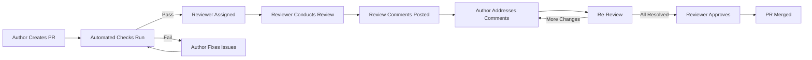
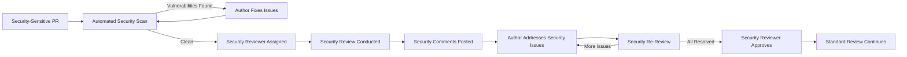

# TACHYON: CODE REVIEW GUIDE

**Document ID:** TACHYON-QA-002-V1.0
**Date:** February 2026
**Status:** Approved for Implementation
**Classification:** Quality Assurance & Development Process
**Compliance Level:** ISO/IEC 26514:2021, IEEE 1028-2008

---

## TABLE OF CONTENTS

1. [Introduction](#1-introduction)
2. [Review Framework](#2-review-framework)
3. [Review Process](#3-review-process)
4. [Review Criteria](#4-review-criteria)
5. [Review Roles](#5-review-roles)
6. [Review Tools](#6-review-tools)
7. [Review Metrics](#7-review-metrics)
8. [Review Best Practices](#8-review-best-practices)
9. [References](#9-references)

---

## 1. INTRODUCTION

### 1.1. Document Purpose

This document establishes the comprehensive code review framework for the Tachyon toolchain project. The code review process serves as a critical quality gate ensuring that all code contributions meet the project's rigorous standards for correctness, security, maintainability, and performance. This guide provides formal methodologies, criteria, and procedures for conducting systematic code reviews that align with PhD thesis level quality standards.

### 1.2. Scope

This code review guide applies to all code contributions to the Tachyon toolchain, including:

- **Rust Code:** Core engine, desktop application (Tauri), server application (Axum)
- **TypeScript/JavaScript Code:** Web frontend (Leptos), build scripts, configuration
- **Configuration Files:** TOML, JSON, YAML manifests and settings
- **Documentation:** Inline code documentation, API documentation, architecture docs
- **Test Code:** Unit tests, integration tests, end-to-end tests

### 1.3. Review Philosophy

The Tachyon code review philosophy is grounded in the principle that code review is not merely a quality assurance activity but a fundamental engineering practice that:

1. **Validates Correctness:** Ensures code behaves as specified and handles all edge cases
2. **Enforces Standards:** Maintains consistency with coding standards and architectural decisions
3. **Prevents Vulnerabilities:** Identifies security issues before they reach production
4. **Facilitates Knowledge Transfer:** Distributes knowledge across the development team
5. **Improves Maintainability:** Ensures code is understandable and maintainable by others
6. **Enables Continuous Improvement:** Provides feedback for developer growth

### 1.4. Compliance Framework

This code review guide complies with the following standards:

- **ISO/IEC 26514:2021:** Systems and Software Engineering—Requirements for designers and developers of user documentation
- **IEEE 1028-2008:** Standard for Software Reviews
- **IEEE 730-2014:** Standard for Software Quality Assurance Processes
- **TACHYON-STD-V1.0:** Coding and Documentation Standards

### 1.5. Document Dependencies

This document depends on the following documents:

- [TACHYON-STD-V1.0](../../.specs/01_standards/coding_standards.md) - Coding and Documentation Standards
- [TACHYON-ADR-001-V1.0](../../.specs/02_adrs/001_rust_as_primary_language.md) - Rust as Primary Language
- [TACHYON-ADR-010-V1.0](../../.specs/02_adrs/010_security_architecture.md) - Security Architecture
- [TACHYON-TST-V1.0](../../.specs/04_future_state/test_plan.md) - Test Plan

---

## 2. REVIEW FRAMEWORK

### 2.1. Review Classification

Code reviews are classified into four distinct categories based on scope, purpose, and required expertise:

#### 2.1.1. Peer Review

**Definition:** A review conducted by one or more developers with equivalent or greater expertise than the author.

**Purpose:**
- Validate code correctness and logic
- Ensure adherence to coding standards
- Identify potential bugs and edge cases
- Suggest improvements for readability and maintainability

**Applicability:** All code changes require at least one peer review before integration.

**Reviewers:** Any developer with relevant domain expertise.

#### 2.1.2. Architectural Review

**Definition:** A review focused on architectural alignment, design patterns, and system-level implications.

**Purpose:**
- Validate alignment with architectural decisions (ADRs)
- Assess impact on system architecture
- Identify architectural violations or anti-patterns
- Evaluate design pattern usage and consistency

**Applicability:** Required for:
- New features or components
- Significant refactoring
- Cross-cutting concerns (security, performance, scalability)
- Changes affecting multiple components

**Reviewers:** System architect or designated architectural reviewer.

#### 2.1.3. Security Review

**Definition:** A review focused on security implications, vulnerability identification, and threat model compliance.

**Purpose:**
- Identify security vulnerabilities
- Validate compliance with security architecture (ADR-010)
- Assess threat model alignment
- Review access control and input validation

**Applicability:** Required for:
- Authentication and authorization changes
- Input/output handling
- Cryptographic operations
- File system operations
- Network communication
- IPC commands

**Reviewers:** Security specialist or designated security reviewer.

#### 2.1.4. Performance Review

**Definition:** A review focused on performance characteristics, resource usage, and scalability implications.

**Purpose:**
- Identify performance bottlenecks
- Validate adherence to performance requirements
- Assess scalability implications
- Review algorithmic complexity and efficiency

**Applicability:** Required for:
- Performance-critical code paths
- Database operations
- Search and indexing operations
- Rendering and processing operations
- Changes affecting system throughput or latency

**Reviewers:** Performance specialist or designated performance reviewer.

### 2.2. Review Triggers

Code reviews are triggered by the following events:

#### 2.2.1. Pull Request Creation

**Trigger:** Creation of a pull request (PR) for code integration.

**Required Reviews:**
- At least one peer review for all PRs
- Additional specialized reviews based on PR content (architectural, security, performance)

**Timeline:** Reviews should be initiated within 24 hours of PR creation.

#### 2.2.2. Critical Path Changes

**Trigger:** Changes to critical code paths defined in the test plan.

**Required Reviews:**
- Two peer reviews (one must be from a senior developer)
- Architectural review if affecting system architecture
- Security review if affecting security controls

**Timeline:** Reviews should be prioritized and completed within 12 hours.

#### 2.2.3. Security-Sensitive Changes

**Trigger:** Changes affecting security controls, authentication, authorization, or data handling.

**Required Reviews:**
- One peer review
- Mandatory security review
- Architectural review if affecting security architecture

**Timeline:** Reviews should be expedited and completed within 8 hours.

### 2.3. Review Gates

Code reviews serve as quality gates that must be passed before code integration:

#### 2.3.1. Automated Quality Gates

**Required Automated Checks:**
- All unit tests pass
- Code coverage meets minimum thresholds (80% unit, 70% integration)
- No critical or high-severity security vulnerabilities
- Code formatting compliance (rustfmt, prettier)
- Linting compliance (clippy, eslint)
- Documentation builds successfully
- Compilation succeeds without warnings

**Failure Consequences:** PR cannot proceed to manual review until all automated gates pass.

#### 2.3.2. Manual Review Gates

**Required Manual Approvals:**
- At least one peer review approval
- Required specialized reviews (architectural, security, performance)
- Resolution of all review comments
- Sign-off on test coverage
- Sign-off on documentation completeness

**Failure Consequences:** PR cannot be merged until all manual review gates are satisfied.

### 2.4. Review Escalation Path

When review disagreements or issues arise, the following escalation path applies:

1. **Author and Reviewer Discussion:** Direct discussion between author and reviewer to resolve concerns
2. **Team Consensus:** If disagreement persists, escalate to the development team for consensus
3. **Technical Lead Arbitration:** If team consensus cannot be reached, technical lead provides arbitration
4. **Architectural Decision:** For architectural disagreements, system architect provides final decision

**Escalation Timeline:**
- Level 1: 24 hours for direct discussion
- Level 2: 48 hours for team consensus
- Level 3: 72 hours for technical lead arbitration
- Level 4: 96 hours for architectural decision

---

## 3. REVIEW PROCESS

### 3.1. Pre-Review Preparation

#### 3.1.1. Author Responsibilities

Before submitting code for review, the author must complete the following preparation steps:

**Code Quality Checklist:**
- [ ] Code compiles without warnings or errors
- [ ] All unit tests pass with appropriate coverage
- [ ] Code formatted according to project standards (rustfmt, prettier)
- [ ] All linting rules pass (clippy, eslint)
- [ ] Documentation comments complete for all public interfaces
- [ ] Error handling follows project conventions
- [ ] No hardcoded credentials or sensitive data
- [ ] Dependencies updated and verified

**Documentation Checklist:**
- [ ] PR description clearly explains the change purpose
- [ ] PR description lists related issues or requirements
- [ ] Breaking changes documented and justified
- [ ] Migration guide provided for breaking changes
- [ ] Test plan documented in PR description
- [ ] Performance impact assessed and documented
- [ ] Security implications assessed and documented

**Testing Checklist:**
- [ ] Unit tests written for new functionality
- [ ] Unit tests cover edge cases and error paths
- [ ] Integration tests written for component interactions
- [ ] Existing tests updated to reflect changes
- [ ] Test coverage meets minimum thresholds
- [ ] Tests are deterministic and independent
- [ ] Tests run successfully in CI environment

#### 3.1.2. Reviewer Preparation

Before beginning a code review, the reviewer should complete the following preparation steps:

**Context Understanding:**
- Read the PR description and understand the change purpose
- Review related issues, requirements, or design documents
- Identify affected components and dependencies
- Understand the architectural implications

**Code Navigation:**
- Review the diff in chunks (files, functions, modules)
- Identify the scope of changes (new code vs. modified code)
- Note any refactoring or structural changes
- Identify test changes and their coverage

**Review Focus Areas:**
- Based on review type (peer, architectural, security, performance), identify focus areas
- Prepare checklist of criteria to evaluate
- Note any specific concerns based on PR description

### 3.2. Review Methodology

#### 3.2.1. Structured Review Approach

Code reviews follow a structured approach ensuring comprehensive evaluation:

**Phase 1: High-Level Review (5-10 minutes)**
- Understand the overall change and its purpose
- Verify the change aligns with architectural decisions
- Assess the scope and complexity of the change
- Identify any red flags or immediate concerns

**Phase 2: Detailed Code Review (15-30 minutes per 100 lines)**
- Review each function and module for correctness
- Evaluate error handling and edge cases
- Assess code readability and maintainability
- Check for security vulnerabilities
- Evaluate performance implications

**Phase 3: Test Review (10-15 minutes)**
- Review test coverage for new and modified code
- Evaluate test quality and effectiveness
- Check for missing edge case tests
- Verify tests are deterministic and independent

**Phase 4: Documentation Review (5-10 minutes)**
- Review inline documentation completeness
- Verify documentation accuracy
- Assess documentation clarity
- Check for missing documentation

**Phase 5: Integration Review (5-10 minutes)**
- Assess impact on other components
- Verify backward compatibility
- Check for breaking changes
- Evaluate migration requirements

#### 3.2.2. Review Comment Guidelines

Review comments should follow these guidelines to ensure constructive feedback:

**Comment Categories:**

1. **Blocking Issues:** Must be resolved before merge
   - Bugs or logic errors
   - Security vulnerabilities
   - Performance regressions
   - Architectural violations
   - Missing error handling
   - Incomplete test coverage

2. **Non-Blocking Suggestions:** Should be addressed but not required for merge
   - Code style improvements
   - Refactoring opportunities
   - Performance optimizations
   - Documentation enhancements
   - Additional test cases

3. **Questions:** Clarification requests from author
   - Intent clarification
   - Design rationale inquiry
   - Alternative approach discussion
   - Context understanding

**Comment Format:**

```
[Blocking/Non-Blocking/Question] <Brief description>

**Context:** Explain the context of the comment
**Issue:** Describe the issue or concern
**Suggestion:** Provide specific suggestion (if applicable)
**Example:** Show code example (if helpful)
**Reference:** Link to relevant standards or documentation (if applicable)
```

**Example Blocking Comment:**

```
[Blocking] Missing error handling for file read operation

**Context:** In `read_document` function, file read operation lacks error handling
**Issue:** If file read fails, the function will panic instead of returning an error
**Suggestion:** Use `?` operator to propagate error or handle explicitly

```rust
// Current code
let content = fs::read_to_string(path).unwrap();

// Suggested code
let content = fs::read_to_string(path)?;
```

**Reference:** TACHYON-STD-V1.0, Section 6.3 - Error Handling
```

#### 3.2.3. Review Resolution Process

After review comments are posted, the resolution process follows these steps:

**Step 1: Author Acknowledgment**
- Author acknowledges all review comments within 24 hours
- Author clarifies any misunderstandings
- Author proposes resolution approach for blocking issues

**Step 2: Code Updates**
- Author implements changes to address blocking issues
- Author may implement non-blocking suggestions at discretion
- Author pushes updates to the PR branch

**Step 3: Re-Review**
- Reviewer re-reviews only changed code
- Reviewer verifies blocking issues are resolved
- Reviewer may raise new issues based on changes

**Step 4: Approval**
- Once all blocking issues are resolved, reviewer approves the PR
- Reviewer may request additional changes if new issues arise
- Multiple reviewers must all approve before merge

### 3.3. Review Workflows

#### 3.3.1. Standard Pull Request Workflow



**Workflow Steps:**

1. **PR Creation:** Author creates pull request with comprehensive description
2. **Automated Checks:** CI runs automated quality gates (tests, linting, formatting)
3. **Assignment:** Reviewer assigned based on expertise and availability
4. **Review:** Reviewer conducts structured review following methodology
5. **Comments:** Reviewer posts comments categorized as blocking, non-blocking, or questions
6. **Resolution:** Author addresses comments and pushes updates
7. **Re-Review:** Reviewer verifies blocking issues are resolved
8. **Approval:** Reviewer approves when all blocking issues resolved
9. **Merge:** PR merged after all required approvals received

#### 3.3.2. Security Review Workflow



**Security Review Steps:**

1. **Automated Scan:** Dependency vulnerability scan (cargo-audit) runs automatically
2. **Assignment:** Security reviewer assigned for security-sensitive PRs
3. **Security Review:** Reviewer conducts focused security review:
   - Input validation and sanitization
   - Output encoding
   - Authentication and authorization
   - Cryptographic operations
   - Access control
   - Error handling (no information leakage)
4. **Security Comments:** Reviewer posts security-specific comments
5. **Resolution:** Author addresses security issues with priority
6. **Re-Review:** Security reviewer verifies all security issues resolved
7. **Approval:** Security reviewer approves security aspects
8. **Standard Review:** Standard peer review continues for non-security aspects

#### 3.3.3. Architectural Review Workflow

```mermaid
graph LR
    A[Architecturally Significant PR] --> B[Architectural Reviewer Assigned]
    B --> C[Architectural Review Conducted]
    C --> D[Architectural Assessment]
    D -->|Aligned| E[Architectural Approval]
    D -->|Misaligned| F[Architectural Feedback]
    F --> G[Author Revises Design]
    G --> C
    E --> H[Standard Review Continues]

---

## 4. REVIEW CRITERIA

### 4.1. Quality Criteria

Code reviews evaluate code against comprehensive quality criteria organized into categories:

#### 4.1.1. Correctness Criteria

**Logic and Algorithm Correctness:**
- [ ] Code implements specified requirements correctly
- [ ] Algorithm choice is appropriate for the problem
- [ ] Edge cases are handled (empty inputs, boundary values, null/None)
- [ ] Error conditions are handled appropriately
- [ ] No unreachable or dead code
- [ ] No infinite loops or unbounded recursion
- [ ] Integer overflow/underflow handled (Rust: use checked/saturating arithmetic)
- [ ] Floating-point precision considerations addressed

**Data Integrity:**
- [ ] Data transformations preserve integrity
- [ ] Concurrent access properly synchronized (Arc, Mutex, RwLock)
- [ ] Race conditions avoided (Send, Sync traits)
- [ ] Memory safety maintained (ownership, borrowing rules)
- [ ] No data leaks or unintended side effects

**API Contract Compliance:**
- [ ] Public API matches documented behavior
- [ ] Function signatures are appropriate
- [ ] Return types are correct and comprehensive
- [ ] Error types accurately represent failure modes
- [ ] Pre-conditions validated
- [ ] Post-conditions guaranteed

#### 4.1.2. Security Criteria

**Input Validation:**
- [ ] All inputs validated at trust boundaries
- [ ] Input length and format constraints enforced
- [ ] Path traversal attacks prevented
- [ ] SQL injection prevented (parameterized queries)
- [ ] Command injection prevented
- [ ] XSS attacks prevented (output encoding)
- [ ] Type confusion attacks prevented

**Authentication and Authorization:**
- [ ] Authentication properly implemented
- [ ] Authorization checks at all access points
- [ ] Principle of least privilege followed
- [ ] Capability-based access control (Tauri) properly configured
- [ ] Session management secure
- [ ] Token-based authentication properly implemented

**Cryptographic Operations:**
- [ ] Cryptographic algorithms are current and secure
- [ ] Key management follows best practices
- [ ] Random number generation uses cryptographically secure RNG
- [ ] Sensitive data properly encrypted at rest
- [ ] TLS 1.3 used for network communications
- [ ] Certificate validation implemented

**Error Handling:**
- [ ] Errors do not expose sensitive information
- [ ] Error messages are user-friendly but secure
- [ ] Stack traces not exposed to end users
- [ ] Detailed errors logged securely
- [ ] Fail-safe error handling implemented

**Supply Chain Security:**
- [ ] Dependencies verified (Cargo.lock integrity)
- [ ] No known vulnerabilities in dependencies
- [ ] Dependency versions pinned
- [ ] Minimal dependency usage (attack surface reduction)

#### 4.1.3. Performance Criteria

**Algorithmic Complexity:**
- [ ] Time complexity appropriate for problem size
- [ ] Space complexity acceptable for constraints
- [ ] No unnecessary nested loops
- [ ] Efficient data structures used
- [ ] Caching strategies appropriate

**Resource Usage:**
- [ ] Memory usage efficient and bounded
- [ ] No memory leaks (RAII, Drop trait)
- [ ] File handles properly closed
- [ ] Network connections properly closed
- [ ] Database connections properly managed
- [ ] No unnecessary allocations

**Concurrency and Parallelism:**
- [ ] Async/await used appropriately (Tokio)
- [ ] Blocking operations avoided in async contexts
- [ ] Thread pool usage appropriate
- [ ] Work-stealing scheduler utilized effectively
- [ ] Lock contention minimized

**I/O Operations:**
- [ ] File I/O operations batched when possible
- [ ] Network I/O operations efficient
- [ ] Database queries optimized (indexes, query plans)
- [ ] Avoid N+1 query problems
- [ ] Streaming used for large data sets

#### 4.1.4. Maintainability Criteria

**Code Organization:**
- [ ] Single Responsibility Principle followed
- [ ] Functions are focused and cohesive
- [ ] Modules organized logically
- [ ] File size reasonable (<400 lines for implementation files)
- [ ] Directory structure follows conventions
- [ ] No code duplication (DRY principle)

**Naming Conventions:**
- [ ] Names are descriptive and unambiguous
- [ ] Rust naming conventions followed (snake_case, PascalCase)
- [ ] TypeScript naming conventions followed (camelCase, PascalCase)
- [ ] No abbreviations unless widely understood
- [ ] Names reflect abstraction level

**Code Style:**
- [ ] Code formatted (rustfmt, prettier)
- [ ] Linting rules pass (clippy, eslint)
- [ ] Consistent indentation and formatting
- [ ] Appropriate use of whitespace
- [ ] Comments explain "why" not "what"

**Documentation:**
- [ ] All public functions documented
- [ ] Documentation includes parameters, returns, errors
- [ ] Documentation examples provided where helpful
- [ ] Complex algorithms explained in comments
- [ ] TODO comments justified and tracked

**Error Handling:**
- [ ] Errors handled explicitly (Result<T, E>, Option<T>)
- [ ] Error types are specific and informative
- [ ] Error propagation uses `?` operator appropriately
- [ ] Context added to errors (anyhow::Context)
- [ ] No unwrap() or expect() in production code

#### 4.1.5. Testing Criteria

**Test Coverage:**
- [ ] Unit tests for all public functions
- [ ] Unit tests for edge cases
- [ ] Unit tests for error paths
- [ ] Integration tests for component interactions
- [ ] Coverage meets minimum thresholds (80% unit, 70% integration)
- [ ] Critical paths have 100% coverage

**Test Quality:**
- [ ] Tests are independent and deterministic
- [ ] Tests are readable and maintainable
- [ ] Tests use appropriate fixtures and builders
- [ ] Tests verify behavior, not implementation
- [ ] Tests have clear assertions
- [ ] No test code duplication

**Test Organization:**
- [ ] Tests located appropriately (inline vs. separate files)
- [ ] Test modules follow Rust conventions
- [ ] Test files follow TypeScript conventions
- [ ] Test names descriptive
- [ ] Test cases grouped logically

### 4.2. Language-Specific Criteria

#### 4.2.1. Rust Code Review Criteria

**Ownership and Borrowing:**
- [ ] Ownership rules followed correctly
- [ ] Borrowing rules respected (multiple immutable OR one mutable)
- [ ] Lifetime annotations appropriate
- [ ] No unnecessary clones
- [ ] References used efficiently
- [ ] Cow (Copy-on-Write) used appropriately

**Type Safety:**
- [ ] Most restrictive types used (no `any` equivalent)
- [ ] `Option<T>` used for optional values
- [ ] `Result<T, E>` used for fallible operations
- [ ] Enums used for state machines and variants
- [ ] Traits used for polymorphism
- [ ] Generic types used appropriately

**Unsafe Code:**
- [ ] Unsafe code justified and documented
- [ ] Unsafe code isolated and minimal
- [ ] Unsafe invariants documented
- [ ] Unsafe blocks reviewed carefully
- [ ] Alternatives to unsafe considered

**Error Handling:**
- [ ] `Result<T, E>` used for fallible operations
- [ ] `?` operator used for propagation
- [ ] `anyhow` or `thiserror` for error types
- [ ] Context added to errors
- [ ] No `unwrap()` or `expect()` in production code
- [ ] Error types are specific

**Async Code:**
- [ ] `async fn` used appropriately
- [ ] `await` used correctly
- [ ] Tokio runtime configured appropriately
- [ ] Blocking operations avoided in async contexts
- [ ] `Send` and `Sync` traits considered
- [ ] Cancellation handled appropriately

#### 4.2.2. TypeScript Code Review Criteria

**Type Safety:**
- [ ] Strict TypeScript mode enabled
- [ ] No `any` types used
- [ ] Types are explicit (no implicit any)
- [ ] Interfaces used for object shapes
- [ ] Union types used appropriately
- [ ] Type guards used for narrowing

**Async Code:**
- [ ] `async/await` used appropriately
- [ ] Promises handled correctly
- [ ] Error handling with try/catch
- [ ] No callback hell (use async/await)
- [ ] Race conditions avoided

**React/Leptos Components:**
- [ ] Components are focused and reusable
- [ ] Props are typed explicitly
- [ ] State management appropriate
- [ ] Effects used correctly
- [ ] No unnecessary re-renders
- [ ] Accessibility considered

**Error Handling:**
- [ ] Errors handled with try/catch
- [ ] Error types are specific
- [ ] Error messages are user-friendly
- [ ] Errors are logged appropriately
- [ ] No silent failures

### 4.3. Review Checklists

#### 4.3.1. Standard Peer Review Checklist

**Pre-Review:**
- [ ] PR description is clear and comprehensive
- [ ] Related issues or requirements linked
- [ ] Breaking changes documented
- [ ] Automated checks passing

**Code Review:**
- [ ] Code is correct and implements requirements
- [ ] Edge cases are handled
- [ ] Error handling is appropriate
- [ ] Code is readable and maintainable
- [ ] Naming conventions followed
- [ ] Code is formatted and linted
- [ ] No code duplication

**Testing Review:**
- [ ] Tests cover new functionality
- [ ] Tests cover edge cases
- [ ] Tests are independent and deterministic
- [ ] Coverage meets thresholds
- [ ] Tests are readable

**Documentation Review:**
- [ ] Public APIs documented
- [ ] Documentation is accurate
- [ ] Examples provided where helpful
- [ ] Complex code explained

**Integration Review:**
- [ ] No breaking changes (or documented)
- [ ] Backward compatibility maintained
- [ ] Dependencies updated appropriately
- [ ] No circular dependencies

#### 4.3.2. Security Review Checklist

**Input Validation:**
- [ ] All inputs validated
- [ ] Length and format constraints enforced
- [ ] Path traversal prevented
- [ ] Injection attacks prevented

**Access Control:**
- [ ] Authentication implemented
- [ ] Authorization checks present
- [ ] Least privilege followed
- [ ] Capabilities configured (Tauri)

**Cryptographic Security:**
- [ ] Secure algorithms used
- [ ] Keys managed properly
- [ ] Secure RNG used
- [ ] TLS 1.3 configured

**Error Handling:**
- [ ] No information leakage
- [ ] Secure error messages
- [ ] Stack traces not exposed
- [ ] Fail-safe handling

**Supply Chain:**
- [ ] Dependencies verified
- [ ] No known vulnerabilities
- [ ] Versions pinned
- [ ] Minimal dependencies

#### 4.3.3. Architectural Review Checklist

**ADR Compliance:**
- [ ] Aligns with architectural decisions
- [ ] No architectural violations
- [ ] Design patterns used appropriately
- [ ] Component boundaries respected

**System Impact:**
- [ ] Impact on architecture assessed
- [ ] No unintended side effects
- [ ] Scalability considered
- [ ] Performance implications assessed

**Interface Design:**
- [ ] Interfaces are clean and focused
- [ ] Contracts are clear
- [ ] Versioning considered
- [ ] Backward compatibility maintained

**Integration:**
- [ ] Component interactions correct
- [ ] No circular dependencies
- [ ] Coupling is appropriate
- [ ] Cohesion is high
```

**Architectural Review Steps:**

1. **Assignment:** Architectural reviewer assigned for significant PRs
2. **Architectural Review:** Reviewer evaluates:
   - Alignment with ADRs and architectural decisions
   - Impact on system architecture
   - Design pattern usage
   - Component boundaries and responsibilities
   - Interface contracts
3. **Assessment:** Reviewer provides architectural assessment
4. **Feedback:** If misaligned, reviewer provides feedback for revision
5. **Revision:** Author revises design based on feedback
6. **Approval:** Architectural reviewer approves architectural aspects
7. **Standard Review:** Standard peer review continues for implementation details

---

## 5. REVIEW ROLES

### 5.1. Role Definitions

Code review process involves distinct roles with specific responsibilities and authority:

#### 5.1.1. Code Author

**Definition:** The developer who created the code change and submitted it for review.

**Responsibilities:**
- Write high-quality code that meets project standards
- Provide comprehensive PR description explaining change purpose
- Document breaking changes and migration requirements
- Write tests covering new functionality and edge cases
- Ensure code passes all automated quality gates
- Address review comments in timely manner
- Clarify misunderstandings and provide context
- Implement changes to resolve blocking issues
- Consider and optionally implement non-blocking suggestions

**Required Qualifications:**
- Proficient in relevant programming language (Rust, TypeScript)
- Familiar with project coding standards
- Understanding of affected components and architecture
- Ability to write clear documentation

**Authority:**
- Submit pull requests for review
- Respond to review comments
- Implement changes based on feedback
- Request re-review after addressing comments
- Accept or reject non-blocking suggestions

#### 5.1.2. Peer Reviewer

**Definition:** A developer with equivalent or greater expertise than the author who reviews code for correctness, quality, and adherence to standards.

**Responsibilities:**
- Conduct thorough and timely code reviews
- Provide constructive and actionable feedback
- Identify bugs, edge cases, and potential issues
- Ensure adherence to coding standards and best practices
- Evaluate code readability and maintainability
- Suggest improvements for code quality
- Verify test coverage and test quality
- Approve or request changes based on review findings

**Required Qualifications:**
- Proficient in relevant programming language
- Familiar with project coding standards and conventions
- Understanding of affected components and architecture
- Ability to provide constructive feedback
- Knowledge of project-specific patterns and idioms

**Authority:**
- Review pull requests
- Post blocking and non-blocking comments
- Request changes to code
- Approve pull requests when criteria met
- Request additional specialized reviews if needed

**Time Commitment:**
- Standard PRs: Review within 24-48 hours
- Critical path PRs: Review within 12 hours
- Security-sensitive PRs: Review within 8 hours

#### 5.1.3. Architectural Reviewer

**Definition:** A reviewer with deep understanding of system architecture who evaluates code for architectural alignment and design pattern compliance.

**Responsibilities:**
- Evaluate alignment with architectural decisions (ADRs)
- Assess impact on system architecture
- Identify architectural violations or anti-patterns
- Evaluate design pattern usage and consistency
- Review component boundaries and responsibilities
- Assess scalability and maintainability implications
- Provide architectural guidance and recommendations
- Approve architectural aspects of changes

**Required Qualifications:**
- Deep understanding of system architecture
- Familiarity with all architectural decisions (ADRs)
- Knowledge of design patterns and anti-patterns
- Experience with large-scale system design
- Understanding of project's long-term architectural goals

**Authority:**
- Conduct architectural reviews
- Request architectural changes
- Approve or reject architectural aspects
- Escalate architectural concerns to system architect
- Require architectural review for significant changes

**Time Commitment:**
- Architectural reviews: Complete within 48 hours
- Architectural disputes: Resolve within 72 hours

#### 5.1.4. Security Reviewer

**Definition:** A reviewer with security expertise who evaluates code for security vulnerabilities, threat model compliance, and security architecture alignment.

**Responsibilities:**
- Identify security vulnerabilities and weaknesses
- Validate compliance with security architecture (ADR-010)
- Assess threat model alignment
- Review authentication and authorization implementations
- Evaluate input validation and sanitization
- Review cryptographic operations
- Assess access control and capability usage
- Evaluate error handling for information leakage
- Review supply chain security implications

**Required Qualifications:**
- Expertise in application security
- Familiarity with OWASP Top 10 and common vulnerabilities
- Understanding of threat modeling
- Knowledge of cryptographic best practices
- Familiarity with security architecture (ADR-010)
- Experience with security review processes

**Authority:**
- Conduct security reviews
- Request security changes
- Approve or reject security aspects
- Block merge of security-sensitive changes
- Require security review for relevant changes
- Escalate security concerns to security lead

**Time Commitment:**
- Security reviews: Complete within 24 hours
- Security-sensitive PRs: Complete within 8 hours

#### 5.1.5. Performance Reviewer

**Definition:** A reviewer with performance expertise who evaluates code for performance characteristics, resource usage, and scalability implications.

**Responsibilities:**
- Identify performance bottlenecks and inefficiencies
- Validate adherence to performance requirements
- Assess scalability implications
- Review algorithmic complexity and efficiency
- Evaluate resource usage (memory, CPU, I/O)
- Review database operations and query efficiency
- Assess concurrency and parallelism usage
- Provide performance optimization recommendations

**Required Qualifications:**
- Expertise in performance analysis and optimization
- Understanding of algorithmic complexity
- Knowledge of profiling and benchmarking tools
- Familiarity with performance requirements
- Experience with performance tuning

**Authority:**
- Conduct performance reviews
- Request performance changes
- Approve or reject performance aspects
- Require performance review for performance-critical changes
- Recommend performance benchmarks and monitoring

**Time Commitment:**
- Performance reviews: Complete within 48 hours
- Performance-critical PRs: Complete within 24 hours

#### 5.1.6. System Architect

**Definition:** The technical leader responsible for overall system architecture and architectural decisions.

**Responsibilities:**
- Define and maintain system architecture
- Create and update architectural decisions (ADRs)
- Resolve architectural disputes and conflicts
- Provide architectural guidance to development team
- Review and approve significant architectural changes
- Ensure architectural consistency across components
- Evaluate long-term architectural implications

**Required Qualifications:**
- Extensive experience with large-scale system architecture
- Deep understanding of software architecture principles
- Strong decision-making and communication skills
- Knowledge of industry best practices and patterns
- Understanding of project's technical and business goals

**Authority:**
- Make final architectural decisions
- Override architectural review findings when justified
- Require architectural review for specific changes
- Approve or reject architectural proposals
- Define architectural standards and guidelines

**Time Commitment:**
- Architectural decisions: Provide within 96 hours of escalation
- Architectural reviews: Conduct as needed based on PR significance

### 5.2. Role Assignment

#### 5.2.1. Automatic Assignment

**Peer Reviewer Assignment:**
- PRs automatically assigned based on:
  - Code ownership (files modified)
  - Recent contributors to affected components
  - Availability and workload
  - Expertise in affected areas

**Specialized Reviewer Assignment:**
- Architectural review: Assigned for PRs affecting architecture
- Security review: Assigned for security-sensitive changes
- Performance review: Assigned for performance-critical changes

#### 5.2.2. Manual Assignment

**Manual assignment occurs when:**
- Automatic assignment fails or is inappropriate
- Specific expertise is required
- Reviewer with relevant context is unavailable
- PR requires multiple specialized reviews

**Assignment Process:**
1. PR author or maintainer identifies need for manual assignment
2. Appropriate reviewer identified based on expertise and availability
3. Reviewer assigned via PR review request
4. Reviewer acknowledges assignment within 24 hours

### 5.3. Role Conflicts

#### 5.3.1. Conflict of Interest

**Definition:** A situation where a reviewer has a personal or professional interest that may impair objectivity.

**Examples:**
- Reviewer is the author of the code
- Reviewer has a competing proposal
- Reviewer has significant personal investment in outcome

**Resolution:**
- Reviewer must recuse themselves from review
- Alternative reviewer assigned
- Conflict documented for transparency

#### 5.3.2. Reviewer Disagreements

**Definition:** A situation where reviewers disagree on review findings or required changes.

**Resolution Process:**
1. **Author Mediation:** Author attempts to clarify and resolve disagreement
2. **Reviewer Discussion:** Reviewers discuss to reach consensus
3. **Team Consensus:** Escalate to development team for consensus
4. **Technical Lead Arbitration:** Technical lead provides arbitration
5. **Architectural Decision:** System architect provides final decision if needed

**Timeline:**
- Level 1: 24 hours for author mediation
- Level 2: 48 hours for reviewer discussion
- Level 3: 72 hours for team consensus
- Level 4: 96 hours for technical lead arbitration
- Level 5: 120 hours for architectural decision

### 5.4. Role Rotation

#### 5.4.1. Reviewer Rotation

**Purpose:** Distribute review workload and knowledge across team.

**Rotation Strategy:**
- Reviewers rotated based on:
  - Recent review activity
  - Workload and availability
  - Expertise development needs
  - Knowledge distribution goals

**Rotation Frequency:**
- Monthly review of reviewer assignments
- Quarterly review of role assignments
- Annual review of role definitions and responsibilities

#### 5.4.2. Knowledge Transfer

**Purpose:** Ensure knowledge is distributed across team and no single points of failure.

**Knowledge Transfer Mechanisms:**
- Pair programming for complex reviews
- Review documentation and guidelines
- Review training and onboarding
- Review retrospectives and feedback sessions
- Cross-training between specialized reviewers

**Knowledge Transfer Goals:**
- All developers capable of conducting peer reviews
- Multiple developers capable of specialized reviews
- Knowledge distributed across team
- Reduced dependency on individual reviewers

---

## 6. REVIEW TOOLS

### 6.1. Automated Review Tools

#### 6.1.1. Rust Tools

**rustfmt**

**Purpose:** Automatic code formatting for Rust code.

**Configuration:**
```toml
# .rustfmt.toml
max_width = 100
hard_tabs = false
tab_spaces = 4
newline_style = "Unix"
use_small_heuristics = true
indent_style = "Block"
reorder_imports = true
reorder_modules = true
remove_nested_parens = true
```

**Integration:**
- Runs automatically in CI pipeline
- Pre-commit hook for local development
- Required to pass before manual review

**Review Criteria:**
- Code must be formatted with rustfmt
- No formatting warnings allowed
- Consistent formatting across codebase

**clippy**

**Purpose:** Linting tool for Rust code that catches common mistakes and suggests idiomatic improvements.

**Configuration:**
```toml
# clippy.toml
# Enable all lints
warn-on-all-wildcard-imports = true
```

**Integration:**
- Runs automatically in CI pipeline
- Pre-commit hook for local development
- Required to pass before manual review

**Review Criteria:**
- No clippy warnings allowed
- Clippy suggestions should be addressed
- Exceptions documented with `#[allow(clippy::lint_name)]`

**cargo-audit**

**Purpose:** Security audit for Rust dependencies.

**Configuration:**
```bash
# Run audit
cargo audit
```

**Integration:**
- Runs automatically in CI pipeline
- Blocks PRs with known vulnerabilities
- Security review triggered for vulnerabilities

**Review Criteria:**
- No known vulnerabilities in dependencies
- Vulnerabilities must be addressed or justified
- Security review required for vulnerabilities

**cargo-deny**

**Purpose:** Linting tool for Cargo.toml dependencies.

**Configuration:**
```toml
# deny.toml
[advisories]
db-path = "~/.cargo/advisory-db"
db-urls = ["https://github.com/rustsec/advisory-db"]

[licenses]
unallowed = ["GPL-3.0"]
allow-osi-fsf-free = "both"
copyleft = "warn"
```

**Integration:**
- Runs automatically in CI pipeline
- Blocks PRs with disallowed licenses
- Security review triggered for license issues

**Review Criteria:**
- No disallowed licenses
- License compliance documented
- Security review required for license issues

**cargo-tarpaulin**

**Purpose:** Complexity analysis for Rust code.

**Configuration:**
```bash
# Run complexity analysis
cargo tarpaulin --limit 50
```

**Integration:**
- Runs automatically in CI pipeline
- Complexity reported in PR comments
- Architectural review triggered for high complexity

**Review Criteria:**
- Cyclomatic complexity below threshold
- High complexity justified and documented
- Architectural review required for high complexity

#### 6.1.2. TypeScript Tools

**prettier**

**Purpose:** Automatic code formatting for TypeScript and JavaScript.

**Configuration:**
```json
// .prettierrc
{
  "semi": true,
  "trailingComma": "es5",
  "singleQuote": true,
  "printWidth": 100,
  "tabWidth": 2,
  "useTabs": false
}
```

**Integration:**
- Runs automatically in CI pipeline
- Pre-commit hook for local development
- Required to pass before manual review

**Review Criteria:**
- Code must be formatted with prettier
- No formatting warnings allowed
- Consistent formatting across codebase

**eslint**

**Purpose:** Linting tool for TypeScript and JavaScript.

**Configuration:**
```json
// .eslintrc.json
{
  "extends": ["eslint:recommended", "plugin:@typescript-eslint/recommended"],
  "parser": "@typescript-eslint/parser",
  "plugins": ["@typescript-eslint"],
  "rules": {
    "@typescript-eslint/no-explicit-any": "error",
    "@typescript-eslint/explicit-function-return-type": "error"
  }
}
```

**Integration:**
- Runs automatically in CI pipeline
- Pre-commit hook for local development
- Required to pass before manual review

**Review Criteria:**
- No eslint errors allowed
- Eslint warnings should be addressed
- Exceptions documented with `// eslint-disable-next-line`

#### 6.1.3. Testing Tools

**cargo test**

**Purpose:** Built-in Rust testing framework.

**Configuration:**
```bash
# Run tests
cargo test --all-features

# Run tests with coverage
cargo tarpaulin --out Xml
```

**Integration:**
- Runs automatically in CI pipeline
- Required to pass before manual review
- Coverage metrics reported

**Review Criteria:**
- All tests must pass
- Coverage meets minimum thresholds
- Tests must be deterministic

**vitest**

**Purpose:** Fast unit test framework for TypeScript.

**Configuration:**
```typescript
// vitest.config.ts
import { defineConfig } from 'vitest/config';

export default defineConfig({
  test: {
    coverage: {
      provider: 'v8',
      reporter: ['text', 'json', 'html'],
      lines: 80,
      functions: 80,
      branches: 70,
      statements: 80,
    },
  },
});
```

**Integration:**
- Runs automatically in CI pipeline
- Required to pass before manual review
- Coverage metrics reported

**Review Criteria:**
- All tests must pass
- Coverage meets minimum thresholds
- Tests must be deterministic

### 6.2. Manual Review Tools

#### 6.2.1. Code Review Platforms

**GitHub Pull Requests**

**Purpose:** Primary code review platform for Tachyon project.

**Features:**
- Pull request creation and management
- Review comment threading
- Review approval workflow
- Automated checks integration
- Diff visualization
- Code navigation

**Configuration:**
- Branch protection rules requiring reviews
- Required status checks (tests, linting, formatting)
- Review assignment rules
- Automated review bots

**Review Workflow:**
1. Author creates pull request
2. Automated checks run
3. Reviewer assigned
4. Reviewer conducts review
5. Review comments posted
6. Author addresses comments
7. Reviewer approves
8. Pull request merged

#### 6.2.2. Code Review Assistants

**GitHub Copilot**

**Purpose:** AI-powered code review assistants.

**Features:**
- Suggest code improvements
- Identify potential bugs
- Suggest refactoring opportunities
- Generate documentation

**Usage:**
- Reviewer uses Copilot suggestions as input
- Copilot suggestions not authoritative
- Reviewer validates all suggestions

**Limitations:**
- May miss security vulnerabilities
- May suggest inappropriate changes
- May not understand project context
- Must be used with caution

**Review Criteria:**
- Copilot suggestions reviewed critically
- Suggestions validated against project standards
- Security implications assessed separately
- Architectural implications assessed separately

### 6.3. Tool Configuration

#### 6.3.1. CI/CD Pipeline Configuration

**Automated Checks Pipeline:**

```yaml
# .github/workflows/review.yml
name: Code Review Checks

on:
  pull_request:
    types: [opened, synchronize, reopened]

jobs:
  review-checks:
    runs-on: ubuntu-latest
    steps:
      - uses: actions/checkout@v4
      - name: Rust formatting check
        run: cargo fmt -- --check
      - name: Rust linting check
        run: cargo clippy -- -D warnings
      - name: Rust tests
        run: cargo test --all-features
      - name: Rust security audit
        run: cargo audit
      - name: TypeScript formatting check
        run: prettier --check
      - name: TypeScript linting check
        run: eslint
      - name: TypeScript tests
        run: bun test
```

**Quality Gates:**
- All automated checks must pass
- Failure blocks manual review
- Results reported to PR

#### 6.3.2. Pre-commit Hooks

**Husky Configuration:**

```json
// package.json
{
  "husky": {
    "hooks": {
      "pre-commit": "cargo fmt && cargo clippy && prettier --write && eslint",
      "pre-push": "cargo test && bun test"
    }
  }
}
```

**Purpose:**
- Catch issues before commit
- Reduce CI pipeline failures
- Provide immediate feedback

**Review Criteria:**
- Pre-commit hooks must pass
- Failed hooks block commit
- Hook failures must be addressed

---

## 7. REVIEW METRICS

### 7.1. Metric Definitions

Code review metrics provide quantitative measures of review effectiveness, efficiency, and quality. These metrics enable continuous improvement of the review process.

#### 7.1.1. Review Efficiency Metrics

**Review Turnaround Time**

**Definition:** Time elapsed from PR creation to review completion.

**Measurement:**
- Average turnaround time per PR
- Median turnaround time per PR
- 95th percentile turnaround time
- Turnaround time by reviewer

**Targets:**
- Standard PRs: < 48 hours
- Critical path PRs: < 12 hours
- Security-sensitive PRs: < 8 hours

**Data Collection:**
- Timestamp of PR creation
- Timestamp of review completion
- Reviewer identification
- PR classification (standard, critical, security)

**Review Cycle Time**

**Definition:** Time elapsed from first review to final approval.

**Measurement:**
- Average cycle time per PR
- Median cycle time per PR
- Number of review cycles per PR
- Cycle time by PR size

**Targets:**
- Average cycle time: < 24 hours
- Average review cycles: < 3
- Large PRs (>500 lines): < 48 hours

**Data Collection:**
- Timestamp of first review
- Timestamp of final approval
- Number of review iterations
- PR size (lines changed)

**Review Velocity**

**Definition:** Number of reviews completed per reviewer per time period.

**Measurement:**
- Reviews completed per week per reviewer
- Reviews completed per month per reviewer
- Reviews completed by reviewer type
- Reviews completed by component

**Targets:**
- Minimum: 2 reviews per week per reviewer
- Target: 4 reviews per week per reviewer
- Stretch: 6 reviews per week per reviewer

**Data Collection:**
- Review completion timestamps
- Reviewer identification
- Reviewer type (peer, architectural, security, performance)
- Component classification

#### 7.1.2. Review Quality Metrics

**Review Comment Count**

**Definition:** Number of review comments posted per PR.

**Measurement:**
- Average comments per PR
- Median comments per PR
- Comments per 100 lines of code
- Comments by comment type (blocking, non-blocking, question)

**Targets:**
- Average comments per PR: 5-15
- Comments per 100 lines: 2-5
- Blocking comments: < 20% of total

**Data Collection:**
- Review comment count per PR
- Comment type classification
- PR size (lines changed)
- Reviewer identification

**Review Comment Resolution Time**

**Definition:** Time elapsed from comment posting to resolution.

**Measurement:**
- Average resolution time per comment
- Median resolution time per comment
- Resolution time by comment type
- Resolution time by severity

**Targets:**
- Blocking comments: < 24 hours
- Non-blocking comments: < 72 hours
- Questions: < 48 hours

**Data Collection:**
- Comment posting timestamp
- Comment resolution timestamp
- Comment type classification
- Severity classification

**Review Approval Rate**

**Definition:** Percentage of PRs approved on first review.

**Measurement:**
- First-review approval rate
- Approval rate by reviewer
- Approval rate by component
- Approval rate by PR size

**Targets:**
- Overall first-review approval rate: > 60%
- Senior reviewer first-review approval rate: > 70%
- Junior reviewer first-review approval rate: > 50%

**Data Collection:**
- PR approval status
- Review count per PR
- Reviewer identification
- Reviewer experience level
- Component classification
- PR size

#### 7.1.3. Code Quality Metrics

**Defect Detection Rate**

**Definition:** Number of defects detected during review per 1000 lines of code.

**Measurement:**
- Defects detected per 1000 lines
- Defects detected per PR
- Defects by severity (critical, high, medium, low)
- Defects by type (logic, security, performance, maintainability)

**Targets:**
- Defects detected: > 5 per 1000 lines
- Critical defects: < 5% of total
- Security defects: < 10% of total

**Data Collection:**
- Review comment classification (defect vs. improvement)
- Defect severity classification
- Defect type classification
- PR size (lines changed)
- Reviewer identification

**Post-Review Defect Rate**

**Definition:** Number of defects found after review (in production or testing) per 1000 lines of code.

**Measurement:**
- Post-review defects per 1000 lines
- Post-review defect rate by component
- Post-review defect rate by reviewer

**Targets:**
- Post-review defects: < 1 per 1000 lines
- Post-review defect rate: < 20% of total defects

**Data Collection:**
- Production defect reports
- Testing defect reports
- PR identification
- Reviewer identification
- Component classification

**Code Coverage Impact**

**Definition:** Change in code coverage before and after review.

**Measurement:**
- Coverage increase per PR
- Coverage increase by component
- Coverage meeting targets after review

**Targets:**
- Coverage increase: > 5% for new code
- Coverage meeting targets: > 90% of PRs

**Data Collection:**
- Coverage metrics before review
- Coverage metrics after review
- PR identification
- Component classification

#### 7.1.4. Reviewer Performance Metrics

**Reviewer Consistency**

**Definition:** Consistency of review comments across multiple reviews.

**Measurement:**
- Comment type distribution consistency
- Severity classification consistency
- Review thoroughness consistency

**Targets:**
- Comment type distribution variance: < 20%
- Severity classification agreement: > 80%

**Data Collection:**
- Review comment classifications
- Reviewer identification
- PR identification
- Time period

**Reviewer Accuracy**

**Definition:** Accuracy of review comments (true positives vs. false positives).

**Measurement:**
- True positive rate (defects confirmed)
- False positive rate (comments rejected)
- Accuracy by reviewer type
- Accuracy by component

**Targets:**
- True positive rate: > 80%
- False positive rate: < 20%

**Data Collection:**
- Review comment status (accepted, rejected)
- Reviewer identification
- Reviewer type
- Component classification

**Reviewer Participation**

**Definition:** Level of reviewer participation in review process.

**Measurement:**
- Reviews completed per reviewer
- Comments posted per reviewer
- Reviews assigned per reviewer
- Review completion rate

**Targets:**
- Reviews completed: > 10 per month
- Review completion rate: > 90%
- Review assignment acceptance: > 95%

**Data Collection:**
- Review assignment timestamps
- Review completion timestamps
- Comment count per reviewer
- Reviewer identification

### 7.2. Key Performance Indicators (KPIs)

#### 7.2.1. Process KPIs

**KPI 1: Review Turnaround Time**

**Definition:** Average time from PR creation to review completion.

**Target:** < 36 hours (average across all PR types)

**Measurement:**
- Calculated as weighted average of turnaround times
- Weighted by PR type (standard, critical, security)

**Reporting:**
- Monthly report showing trend
- Comparison to target
- Breakdown by reviewer and component

**KPI 2: First-Review Approval Rate**

**Definition:** Percentage of PRs approved on first review.

**Target:** > 65%

**Measurement:**
- Calculated as (PRs approved on first review / total PRs) × 100%

**Reporting:**
- Monthly report showing trend
- Comparison to target
- Breakdown by reviewer and component

**KPI 3: Defect Detection Rate**

**Definition:** Number of defects detected during review per 1000 lines of code.

**Target:** > 6 defects per 1000 lines

**Measurement:**
- Calculated as (defects detected / lines of code) × 1000

**Reporting:**
- Monthly report showing trend
- Comparison to target
- Breakdown by defect type and severity

#### 7.2.2. Quality KPIs

**KPI 4: Post-Review Defect Rate**

**Definition:** Number of defects found after review per 1000 lines of code.

**Target:** < 1 defect per 1000 lines

**Measurement:**
- Calculated as (post-review defects / lines of code) × 1000

**Reporting:**
- Monthly report showing trend
- Comparison to target
- Breakdown by component and reviewer

**KPI 5: Code Coverage**

**Definition:** Percentage of code covered by tests.

**Target:** > 85% overall coverage

**Measurement:**
- Calculated from coverage reports
- Weighted by component criticality

**Reporting:**
- Monthly report showing trend
- Comparison to target
- Breakdown by component

#### 7.2.3. Team KPIs

**KPI 6: Reviewer Participation**

**Definition:** Average number of reviews completed per reviewer per month.

**Target:** > 15 reviews per reviewer per month

**Measurement:**
- Calculated as (total reviews / number of reviewers)

**Reporting:**
- Monthly report showing trend
- Comparison to target
- Breakdown by reviewer

**KPI 7: Reviewer Accuracy**

**Definition:** Percentage of review comments that are true positives.

**Target:** > 85%

**Measurement:**
- Calculated as (true positive comments / total comments) × 100%

**Reporting:**
- Monthly report showing trend
- Comparison to target
- Breakdown by reviewer

### 7.3. Metric Collection and Reporting

#### 7.3.1. Data Collection

**Automated Data Collection:**

- PR creation timestamps (GitHub API)
- Review completion timestamps (GitHub API)
- Automated check results (CI/CD logs)
- Coverage metrics (tarpaulin, vitest coverage)
- Code complexity metrics (cargo-tarpaulin)

**Manual Data Collection:**

- Review comment classification (reviewer tags)
- Defect severity classification (reviewer assessment)
- Post-review defect reports (issue tracker)
- Reviewer feedback (surveys, retrospectives)

**Data Storage:**

- Metrics database (PostgreSQL, SQLite)
- Data warehouse for historical analysis
- Backup and retention policies

#### 7.3.2. Reporting

**Monthly Review Report:**

**Content:**
- Executive summary
- KPI performance
- Trend analysis
- Reviewer performance
- Component performance
- Recommendations

**Distribution:**
- Email to development team
- Posted to internal documentation
- Discussed in team meeting

**Quarterly Review Report:**

**Content:**
- Quarterly summary
- KPI trends over quarter
- Reviewer performance comparison
- Process improvement recommendations
- Tool effectiveness assessment

**Distribution:**
- Email to all stakeholders
- Posted to internal documentation
- Presented to management

**Annual Review Report:**

**Content:**
- Annual summary
- Year-over-year KPI comparison
- Process maturity assessment
- Strategic recommendations
- Tool and process evolution

**Distribution:**
- Email to all stakeholders
- Posted to internal documentation
- Presented to leadership team

### 7.4. Metric-Driven Improvements

#### 7.4.1. Continuous Improvement

**Metric Analysis:**

- Identify KPIs not meeting targets
- Analyze root causes of metric deviations
- Develop improvement plans
- Track improvement effectiveness

**Improvement Process:**

1. **Identify Issue:** KPI not meeting target
2. **Analyze Root Cause:** Investigate underlying causes
3. **Develop Plan:** Create action plan with metrics
4. **Implement Plan:** Execute improvement actions
5. **Monitor Results:** Track KPI improvement
6. **Adjust Plan:** Refine approach based on results

#### 7.4.2. Reviewer Feedback

**Feedback Collection:**

- Quarterly reviewer surveys
- Post-review feedback forms
- Retrospective discussions
- One-on-one feedback sessions

**Feedback Categories:**

- Review process effectiveness
- Tool usability
- Training needs
- Process bottlenecks
- Improvement suggestions

**Feedback Analysis:**

- Aggregate feedback by category
- Identify common themes
- Prioritize improvement areas
- Develop action plans

---

## 8. REVIEW BEST PRACTICES

### 8.1. Author Best Practices

#### 8.1.1. Pre-Submission Practices

**Write Self-Review Before Submission**

- Review your own code before submitting
- Run all tests locally
- Run all linting and formatting tools
- Check for common mistakes
- Verify documentation completeness

**Create Comprehensive PR Descriptions**

- Clearly explain the change purpose
- Link to related issues or requirements
- Document breaking changes
- Provide context for reviewers
- Include testing information

**Keep PRs Focused and Manageable**

- Limit PR size to < 500 lines when possible
- Split large changes into multiple PRs
- Ensure each PR has a single purpose
- Avoid mixing unrelated changes
- Consider reviewer capacity

**Ensure Automated Checks Pass**

- Fix all formatting issues before submission
- Resolve all linting warnings
- Ensure all tests pass
- Address security vulnerabilities
- Verify coverage thresholds met

#### 8.1.2. During Review Practices

**Respond Promptly to Review Comments**

- Acknowledge review comments within 24 hours
- Clarify misunderstandings
- Provide context when needed
- Commit to resolution timeline

**Address Blocking Issues First**

- Prioritize blocking comments
- Implement fixes for blocking issues
- Push updates for blocking issues
- Request re-review for blocking issues

**Consider Non-Blocking Suggestions**

- Evaluate non-blocking suggestions objectively
- Implement high-value suggestions
- Document reasons for rejecting suggestions
- Discuss alternative approaches when appropriate

**Maintain Constructive Dialogue**

- Approach review as collaborative process
- Ask questions to understand concerns
- Explain design decisions clearly
- Be open to alternative approaches
- Maintain professional tone

#### 8.1.3. Post-Review Practices

**Learn from Review Feedback**

- Identify patterns in review comments
- Learn from reviewer suggestions
- Improve based on feedback
- Share learnings with team

**Update Documentation**

- Update inline documentation based on feedback
- Update design documents if architecture changes
- Update ADRs if architectural decisions made
- Share knowledge with team

**Reflect on Process**

- Identify areas for improvement
- Provide feedback on review process
- Suggest process improvements
- Participate in retrospectives

### 8.2. Reviewer Best Practices

#### 8.2.1. Pre-Review Practices

**Understand Context Before Reviewing**

- Read PR description thoroughly
- Review related issues and requirements
- Understand change purpose and scope
- Identify affected components
- Review architectural implications

**Allocate Sufficient Review Time**

- Schedule dedicated review time
- Avoid rushing through reviews
- Take breaks for long PRs
- Review in appropriate environment

**Prepare Review Checklist**

- Identify review criteria based on PR type
- Prepare relevant standards and guidelines
- Note specific areas of focus
- Prepare questions for clarification

#### 8.2.2. During Review Practices

**Follow Structured Review Approach**

- Start with high-level review
- Progress to detailed code review
- Review tests and documentation
- Assess integration implications
- Provide comprehensive feedback

**Provide Constructive Feedback**

- Be specific and actionable
- Explain the "why" not just the "what"
- Provide examples or alternatives
- Use positive language when possible
- Focus on code, not person

**Categorize Comments Appropriately**

- Mark blocking issues clearly
- Distinguish blocking from non-blocking
- Ask questions for clarification
- Provide context for suggestions
- Reference standards or guidelines

**Review Tests Thoroughly**

- Verify test coverage
- Evaluate test quality
- Check for missing edge cases
- Ensure tests are deterministic
- Verify test independence

**Assess Security Implications**

- Review input validation
- Check for common vulnerabilities
- Evaluate access controls
- Review error handling
- Assess cryptographic operations

#### 8.2.3. Post-Review Practices

**Re-Review Promptly After Updates**

- Re-review within 24 hours of updates
- Focus only on changed code
- Verify blocking issues resolved
- May raise new issues based on changes

**Approve When Criteria Met**

- Approve promptly when satisfied
- Provide approval rationale if helpful
- Document remaining non-blocking suggestions
- Note any follow-up needed

**Provide Learning Opportunities**

- Explain complex concepts
- Share relevant resources
- Suggest alternative approaches
- Mentor junior developers
- Share knowledge with team

### 8.3. Collaborative Best Practices

#### 8.3.1. Communication Practices

**Maintain Professional Tone**

- Use respectful language
- Avoid personal attacks
- Focus on code and process
- Assume positive intent
- Be constructive and helpful

**Ask Clarifying Questions**

- Ask questions to understand context
- Request clarification when needed
- Avoid assumptions
- Seek to understand design decisions
- Collaborate on solutions

**Document Decisions**

- Document review decisions
- Record rationale for changes
- Update design documents
- Create ADRs for architectural decisions
- Share decisions with team

#### 8.3.2. Process Improvement Practices

**Participate in Retrospectives**

- Attend review retrospectives
- Share feedback on process
- Suggest improvements
- Implement process changes
- Monitor improvement effectiveness

**Share Learnings**

- Share patterns observed
- Document common mistakes
- Create best practice guides
- Conduct training sessions
- Mentor team members

**Continuously Improve**

- Stay updated on best practices
- Learn from other teams
- Experiment with new approaches
- Measure effectiveness
- Adapt process based on feedback

### 8.4. Security Best Practices

#### 8.4.1. Security Review Practices

**Assume Adversarial Intent**

- Review code from attacker perspective
- Identify potential abuse vectors
- Consider malicious inputs
- Assess privilege escalation paths
- Evaluate data exposure risks

**Validate Security Controls**

- Verify input validation
- Check output encoding
- Review authentication and authorization
- Assess access controls
- Validate cryptographic implementations

**Review Error Handling**

- Check for information leakage
- Verify secure error messages
- Assess error logging
- Review exception handling
- Validate fail-safe behavior

**Assess Supply Chain Security**

- Review dependency additions
- Verify dependency versions
- Check for known vulnerabilities
- Assess license compliance
- Validate dependency integrity

#### 8.4.2. Secure Coding Practices

**Follow Security Guidelines**

- Reference OWASP guidelines
- Follow security architecture (ADR-010)
- Implement defense-in-depth
- Apply principle of least privilege
- Use secure coding practices

**Validate All Inputs**

- Validate at trust boundaries
- Sanitize user inputs
- Encode outputs appropriately
- Validate file paths
- Validate API inputs

**Implement Secure Defaults**

- Use secure defaults
- Fail securely on errors
- Minimize privileges
- Secure by default configuration
- Require explicit opt-in for risky features

### 8.5. Performance Best Practices

#### 8.5.1. Performance Review Practices

**Assess Algorithmic Complexity**

- Review time complexity
- Review space complexity
- Identify inefficiencies
- Suggest optimizations
- Consider scalability implications

**Review Resource Usage**

- Assess memory usage
- Review CPU utilization
- Evaluate I/O operations
- Review database queries
- Assess network usage

**Consider Caching Strategies**

- Review caching opportunities
- Assess cache invalidation
- Evaluate cache hit rates
- Review cache key design
- Consider distributed caching

#### 8.5.2. Performance Coding Practices

**Use Efficient Data Structures**

- Choose appropriate data structures
- Consider algorithmic efficiency
- Avoid unnecessary allocations
- Use iterators appropriately
- Leverage language-specific optimizations

**Optimize Hot Paths**

- Identify performance-critical code
- Optimize frequently executed code
- Profile before optimizing
- Measure optimization impact
- Document optimization rationale

**Avoid Premature Optimization**

- Focus on correctness first
- Profile before optimizing
- Optimize based on measurements
- Consider maintainability
- Document trade-offs

### 8.6. Testing Best Practices

#### 8.6.1. Test Review Practices

**Verify Test Coverage**

- Check coverage meets thresholds
- Verify critical path coverage
- Assess coverage quality
- Identify untested code
- Suggest additional tests

**Evaluate Test Quality**

- Review test independence
- Check test determinism
- Assess test clarity
- Verify test assertions
- Review test organization

**Review Test Design**

- Assess test structure
- Review test fixtures
- Evaluate test data management
- Check for test duplication
- Verify test maintainability

#### 8.6.2. Test Coding Practices

**Write Clear Tests**

- Use descriptive test names
- Follow AAA pattern (Arrange, Act, Assert)
- Keep tests focused
- Use appropriate assertions
- Document complex tests

**Test Edge Cases**

- Test boundary values
- Test error conditions
- Test empty inputs
- Test null/None values
- Test concurrent access

**Maintain Test Independence**

- Avoid test dependencies
- Use appropriate fixtures
- Reset state between tests
- Use test isolation techniques
- Avoid shared state

---

## 9. REFERENCES

### 9.1. Project Standards and Guidelines

- [TACHYON-STD-V1.0](../../.specs/01_standards/coding_standards.md) - Coding and Documentation Standards
- [TACHYON-TSK-V1.0](../../.specs/tasks.md) - Execution Tasks and Work Breakdown Structure
- [TACHYON-TST-V1.0](../../.specs/04_future_state/test_plan.md) - Test Plan

### 9.2. Architectural Decision Records (ADRs)

- [TACHYON-ADR-001-V1.0](../../.specs/02_adrs/001_rust_as_primary_language.md) - Rust as Primary Language
- [TACHYON-ADR-002-V1.0](../../.specs/02_adrs/002_tauri_for_desktop_application.md) - Tauri for Desktop Application
- [TACHYON-ADR-003-V1.0](../../.specs/02_adrs/003_axum_for_http2_server.md) - Axum for HTTP/2 Server
- [TACHYON-ADR-004-V1.0](../../.specs/02_adrs/004_leptos_for_web_frontend.md) - Leptos for Web Frontend
- [TACHYON-ADR-005-V1.0](../../.specs/02_adrs/005_bun_for_javascript_runtime.md) - Bun for JavaScript Runtime
- [TACHYON-ADR-006-V1.0](../../.specs/02_adrs/006_nix_flakes_for_build_system.md) - Nix Flakes for Build System
- [TACHYON-ADR-007-V1.0](../../.specs/02_adrs/007_tokio_for_async_runtime.md) - Tokio for Async Runtime
- [TACHYON-ADR-008-V1.0](../../.specs/02_adrs/008_workspace_structure_for_rust_crates.md) - Workspace Structure for Rust Crates
- [TACHYON-ADR-009-V1.0](../../.specs/02_adrs/009_ipc_communication_architecture.md) - IPC Communication Architecture
- [TACHYON-ADR-010-V1.0](../../.specs/02_adrs/010_security_architecture.md) - Security Architecture

### 9.3. Requirements and Design Documents

- [TACHYON-REQ-INDEX-V1.0](../../.specs/04_future_state/reqs/000-index.md) - Requirements Index
- [TACHYON-DSN-INDEX-V1.0](../../.specs/04_future_state/design/000-index.md) - Design Documents Index

### 9.4. External Standards and References

#### 9.4.1. ISO Standards

- [ISO/IEC 26514:2021](https://www.iso.org/standard/iso-iec-26514-2021.html) - Systems and Software Engineering—Requirements for designers and developers of user documentation
- [ISO/IEC 12207:2017](https://www.iso.org/standard/iso-iec-12207-2017.html) - Systems and Software Engineering—Software Life Cycle Processes
- [ISO/IEC 25010:2011](https://www.iso.org/standard/iso-iec-25010-2011.html) - Systems and Software Engineering—System and Software Quality Requirements

#### 9.4.2. IEEE Standards

- [IEEE 1028-2008](https://standards.ieee.org/standard/1028-2008.html) - Standard for Software Reviews
- [IEEE 829-2008](https://standards.ieee.org/standard/829-2008.html) - Standard for Software Test Documentation
- [IEEE 1063-2001](https://standards.ieee.org/standard/1063-2001.html) - Standard for Software User Documentation
- [IEEE 1016-2009](https://standards.ieee.org/standard/1016-2009.html) - Standard for Information Technology—Software Design Descriptions
- [IEEE 730-2014](https://standards.ieee.org/standard/730-2014.html) - Standard for Software Quality Assurance Processes

#### 9.4.3. Security References

- [OWASP Top 10](https://owasp.org/www-project-top-ten/) - OWASP Top 10 Web Application Security Risks
- [OWASP Testing Guide](https://owasp.org/www-project-web-security-testing-guide/) - OWASP Web Security Testing Guide
- [CWE Top 25](https://cwe.mitre.org/top25/) - MITRE CWE Top 25 Most Dangerous Software Errors

#### 9.4.4. Rust References

- [The Rust Programming Language](https://doc.rust-lang.org/book/) - The Rust Book
- [The Rust Reference](https://doc.rust-lang.org/reference/) - The Rust Reference
- [Rust API Guidelines](https://rust-lang.github.io/api-guidelines/) - Rust API Guidelines
- [Rust Clippy Lints](https://rust-lang.github.io/rust-clippy/) - Rust Clippy Lints

#### 9.4.5. Testing References

- [Rust Testing](https://doc.rust-lang.org/book/ch11-00-testing.html) - The Rust Book - Testing
- [Testing Rust Code](https://doc.rust-lang.org/rust-by-example/testing.html) - Rust by Example - Testing
- [Property-Based Testing](https://proptest-rs.github.io/proptest/intro.html) - Proptest Documentation

### 9.5. Tool Documentation

#### 9.5.1. Rust Tools

- [rustfmt](https://github.com/rust-lang/rustfmt) - Rust Code Formatter
- [clippy](https://github.com/rust-lang/rust-clippy) - Rust Linting Tool
- [cargo-audit](https://github.com/RustSec/cargo-audit) - Rust Security Audit
- [cargo-deny](https://github.com/EmbarkStudios/cargo-deny) - Rust Dependency Linter
- [cargo-tarpaulin](https://github.com/softdevteam/tarpaulin) - Rust Code Complexity Analysis

#### 9.5.2. TypeScript Tools

- [prettier](https://prettier.io/) - Code Formatter
- [eslint](https://eslint.org/) - JavaScript/TypeScript Linter
- [vitest](https://vitest.dev/) - Fast Unit Test Framework

#### 9.5.3. CI/CD Tools

- [GitHub Actions](https://docs.github.com/en/actions) - GitHub Actions Documentation
- [husky](https://typicode.github.io/husky/) - Git Hooks Manager

### 9.6. Academic and Industry References

#### 9.6.1. Code Review Research

- Cohen, A., et al. "Best Practices for Code Review," *IEEE Software*, vol. 23, no. 9, pp. 45-52, September 2006.

- McIntosh, S., et al. "The Impact of Code Review on Software Quality," *Proceedings of the 2019 International Conference on Software Engineering*, pp. 1-10, July 2019.

- Rigby, P., and German, D. "A Preliminary Survey of Software Inspection Practices," *Proceedings of the 1993 Conference on Software Maintenance*, pp. 35-42, October 1993.

#### 9.6.2. Software Quality Research

- Boehm, B. W., and Basili, V. R. "Software Defect Reduction Top 10 List," *IEEE Computer*, vol. 34, no. 1, pp. 135-137, January 2001.

- Fagan, M. E. "Design and Code Inspections to Reduce Errors in Program Development," *IBM Systems Journal*, vol. 15, no. 3, pp. 182-211, July 1976.

- Humphrey, W. S. *Managing the Software Process*, 1st ed. Boston: Addison-Wesley, 1989.

---

**Document Control:**

| Version | Date | Author | Changes |
|---------|------|--------|---------|
| 1.0 | February 2026 | Technical Writer | Initial document creation |

**Approval:**

| Role | Name | Date | Signature |
|------|------|------|----------|
| Technical Lead | TBD | TBD | TBD |
| Quality Assurance | TBD | TBD | TBD |
| System Architect | TBD | TBD | TBD |
