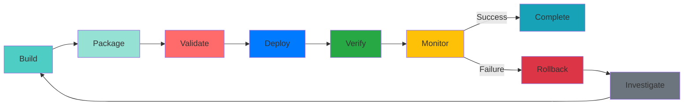

# TACHYON: DEPLOYMENT GUIDE

**Document ID:** TACHYON-QA-005-V1.0
**Date:** February 2026
**Status:** Approved for Implementation
**Classification:** Operations Documentation
**Compliance Level:** ISO/IEC 26514:2021, IEEE 1063:2001

---

## TABLE OF CONTENTS

1. [Introduction](#1-introduction)
2. [Deployment Framework](#2-deployment-framework)
3. [Deployment Architecture](#3-deployment-architecture)
4. [Deployment Process](#4-deployment-process)
5. [Environment Configuration](#5-environment-configuration)
6. [Deployment Strategies](#6-deployment-strategies)
7. [Rollback Procedures](#7-rollback-procedures)
8. [Deployment Monitoring](#8-deployment-monitoring)
9. [References](#9-references)

---

## 1. INTRODUCTION

### 1.1. Document Purpose

This document provides comprehensive deployment guidance for the Tachyon toolchain, encompassing deployment procedures, configuration management, validation protocols, rollback mechanisms, and monitoring strategies. The deployment guide serves as the authoritative reference for deploying Tachyon components across all environments (development, staging, production) and platforms (Windows, macOS, Linux).

### 1.2. Deployment Scope

The Tachyon deployment encompasses three primary components requiring distinct deployment approaches:

| Component | Technology | Deployment Mode | Target Platforms |
|-----------|-----------|-----------------|-----------------|
| **Desktop Application** | Tauri + Rust | Native installation | Windows, macOS, Linux |
| **Server Application** | Axum + Rust | Service deployment | Linux (primary), Windows, macOS |
| **Web Frontend** | Leptos + TypeScript | Static asset serving | All platforms via browser |

### 1.3. Deployment Philosophy

The Tachyon deployment philosophy follows these fundamental principles:

1. **Reproducibility:** All deployments shall produce identical results given identical inputs through Nix-based reproducible builds [ADR-006].
2. **Security-First:** All deployments shall enforce security controls including TLS 1.3, encryption at rest, and capability-based access control [ADR-010].
3. **Incremental Deployment:** Deployments shall support incremental updates minimizing downtime and user disruption.
4. **Observability:** All deployments shall provide comprehensive telemetry and monitoring for operational visibility.
5. **Rollback Capability:** All deployments shall maintain ability to rollback to previous stable state within defined RTO (Recovery Time Objective).

### 1.4. Document Dependencies

This document depends on the following documents:

- [TACHYON-STD-V1.0](../../specs/01_standards/coding_standards.md) - Coding and Documentation Standards
- [TACHYON-REQ-BLD-V1.0](../../specs/04_future_state/reqs/build_requirements.md) - Build and Deployment Requirements
- [TACHYON-REQ-SRV-V1.0](../../specs/04_future_state/reqs/server_requirements.md) - Server Application Requirements
- [TACHYON-REQ-SEC-V1.0](../../specs/04_future_state/reqs/security_requirements.md) - Security Requirements
- [TACHYON-ADR-001-V1.0](../../specs/02_adrs/001_rust_as_primary_language.md) - Rust as Primary Language
- [TACHYON-ADR-010-V1.0](../../specs/02_adrs/010_security_architecture.md) - Security Architecture
- [TACHYON-TST-V1.0](../../specs/04_future_state/test_plan.md) - Test Plan
- [TACHYON-DSN-BLD-V1.0](../../specs/04_future_state/design/build_design.md) - Build System Design

---

## 2. DEPLOYMENT FRAMEWORK

### 2.1. Deployment Lifecycle

The Tachyon deployment lifecycle follows a structured process ensuring consistent, reliable, and auditable deployments across all environments.

### 2.2. Deployment Environments

Tachyon defines three deployment environments with distinct purposes and configurations:

| Environment | Purpose | Access Control | Data Persistence | Monitoring Level |
|------------|---------|----------------|-----------------|-----------------|
| **Development** | Local development, team access | Temporary, reset on demand | Debug-level logging |
| **Staging** | Pre-production testing, QA access | Persistent, test data | Production-level logging |
| **Production** | Live user access | Persistent, production data | Production-level logging + alerts |

### 2.3. Deployment Artifacts

All Tachyon deployments produce the following artifacts:

| Artifact Type | Format | Purpose | Security Measures |
|--------------|--------|---------|------------------|
| **Desktop Binary** | Platform-specific executable | Native application distribution | Code signing, checksums |
| **Server Binary** | Executable binary | Service deployment | Code signing, stripped symbols |
| **Web Bundle** | Static assets (HTML, CSS, JS) | Frontend distribution | SRI hashes, compression |
| **Docker Image** | Container image | Containerized deployment | Image signing, vulnerability scan |
| **Nix Flake** | Flake.nix + lock files | Reproducible builds | Dependency pinning, verification |

### 2.4. Deployment Quality Gates

All deployments must pass the following quality gates before proceeding:

| Gate | Criteria | Enforcement | Failure Action |
|------|-----------|-------------|---------------|
| **Build Success** | All builds complete without errors | Automated | Block deployment |
| **Test Pass** | All unit, integration, E2E tests pass | Automated | Block deployment |
| **Coverage Threshold** | Code coverage meets minimum thresholds | Automated | Block deployment |
| **Security Scan** | No critical/high vulnerabilities | Automated | Block deployment |
| **Performance Benchmark** | Performance meets defined SLAs | Automated | Block deployment |
| **Configuration Validation** | All configurations valid and complete | Automated | Block deployment |
| **Approval** | Deployment approved by authorized personnel | Manual | Block deployment |

### 2.5. Deployment Metrics

The following metrics shall be collected for all deployments:

| Metric | Measurement | Target | Alert Threshold |
|--------|-------------|--------|-----------------|
| **Build Time** | Time from build start to artifact generation | < 30 minutes | > 45 minutes |
| **Deployment Time** | Time from deployment start to verification | < 15 minutes | > 30 minutes |
| **Downtime** | Time service unavailable during deployment | < 5 minutes | > 10 minutes |
| **Rollback Time** | Time from rollback trigger to restoration | < 10 minutes | > 20 minutes |
| **Success Rate** | Percentage of deployments without rollback | > 95% | < 90% |
| **Mean Time to Recovery (MTTR)** | Average time to restore service after failure | < 30 minutes | > 45 minutes |
