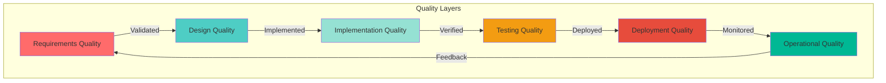

# TACHYON: QUALITY ASSURANCE GUIDE

**Document ID:** TACHYON-QA-001-V1.0
**Date:** February 2026
**Status:** Proposed
**Classification:** Quality Assurance Process Documentation
**Compliance Level:** ISO/IEC 26514:2021, IEEE 829-2008, ISO/IEC 25010:2011

---

## TABLE OF CONTENTS

1. [Introduction](#1-introduction)
2. [QA Framework Overview](#2-qa-framework-overview)
3. [QA Processes](#3-qa-processes)
4. [Code Quality Standards](#4-code-quality-standards)
5. [Testing Standards](#5-testing-standards)
6. [Documentation Standards](#6-documentation-standards)
7. [QA Tools](#7-qa-tools)
8. [QA Reporting](#8-qa-reporting)
9. [References](#9-references)

---

## 1. INTRODUCTION

### 1.1. Document Purpose

This document establishes comprehensive quality assurance guidelines and procedures for the Tachyon toolchain project. The guide defines quality standards, processes, tools, and metrics to ensure that all software artifacts meet the highest standards of reliability, security, performance, and maintainability at PhD thesis level rigor.

### 1.2. Scope

This quality assurance guide applies to:
- Desktop Application (Tauri-based Rust application)
- Server Application (Axum-based HTTP/2 server)
- Web Frontend (Leptos-based TypeScript/JavaScript application)
- IPC Communication Layer (Tauri commands and events)
- Build and Deployment Processes
- Documentation Artifacts

### 1.3. Quality Philosophy

The Tachyon quality assurance philosophy is founded on the principle of **Correctness by Construction**, where quality is built into the system from the ground up rather than inspected in afterward. This approach ensures:

- **Deterministic Quality:** Consistent quality output across all contributors
- **Formal Verification:** Mathematical and logical verification of critical properties
- **Continuous Improvement:** Iterative refinement of quality processes
- **Evidence-Based Quality:** All quality claims supported by measurable evidence
- **Zero-Tolerance for Defects:** Critical security and correctness defects are unacceptable

### 1.4. Relationship to Other Documents

This quality assurance guide is part of the Tachyon documentation ecosystem and depends on:

- [TACHYON-STD-V1.0](../../.specs/01_standards/coding_standards.md) - Coding and Documentation Standards
- [TACHYON-TST-V1.0](../../.specs/04_future_state/test_plan.md) - Test Plan
- [TACHYON-REQ-SEC-V1.0](../../.specs/04_future_state/reqs/security_requirements.md) - Security Requirements
- [TACHYON-REQ-DOC-V1.0](../../.specs/04_future_state/reqs/documentation_requirements.md) - Documentation Requirements
- [TACHYON-ADR-001-V1.0](../../.specs/02_adrs/001_rust_as_primary_language.md) - Rust Language Decision
- [TACHYON-ADR-010-V1.0](../../.specs/02_adrs/010_security_architecture.md) - Security Architecture

---

## 2. QA FRAMEWORK OVERVIEW

### 2.1. Quality Assurance Model

The Tachyon quality assurance framework implements a multi-layered model addressing quality at all stages of the software lifecycle:



---

## 3. QA PROCESSES

### 3.1. Requirements Quality Assurance

#### 3.1.1. Requirements Review Process

**Process Overview:**
Requirements undergo formal review process to ensure clarity, completeness, testability, and traceability before implementation begins.

**Review Stages:**

| Stage | Purpose | Participants | Deliverables | Criteria |
|-------|---------|-------------|-------------|----------|
| **Draft Review** | Initial review of requirement drafts | Requirements Engineer, System Architect | Draft requirements document | Requirements are clear, unambiguous, and complete |
| **Stakeholder Review** | Review by stakeholders for validation | Product Owner, Developers, QA Engineers | Reviewed requirements document | Stakeholders validate requirements meet needs |
| **Technical Review** | Technical feasibility assessment | System Architect, Lead Developers | Feasibility assessment document | Requirements are technically feasible |
| **Security Review** | Security implications assessment | Security Architect, QA Engineer | Security impact document | Security implications are identified and mitigated |
| **Final Approval** | Formal approval for implementation | Project Lead, Quality Lead | Approved requirements document | All review criteria met, documented approval |

**Quality Criteria:**

- **Clarity:** Requirements are unambiguous and precisely stated
- **Completeness:** All necessary requirements are included
- **Testability:** Each requirement can be verified through testing
- **Traceability:** Requirements are traceable to design, implementation, and tests
- **Consistency:** Requirements do not contradict each other
- **Prioritization:** Requirements are prioritized by importance and risk

#### 3.1.2. Requirements Traceability

**Traceability Matrix:**
A requirements traceability matrix maintains bidirectional traceability between requirements, design elements, implementation artifacts, and test cases.

**Traceability Links:**

| Link Type | Source | Target | Purpose |
|-----------|--------|-------|---------|
| **REQ-DSN** | Requirement ID | Design Element ID | Requirement is addressed by design |
| **REQ-IMP** | Requirement ID | Implementation Artifact | Requirement is implemented in code |
| **REQ-TST** | Requirement ID | Test Case ID | Requirement is verified by test |
| **DSN-REQ** | Design Element ID | Requirement ID | Design addresses requirement |
| **IMP-REQ** | Implementation Artifact | Requirement ID | Code implements requirement |
| **TST-REQ** | Test Case ID | Requirement ID | Test verifies requirement |

**Traceability Requirements:**
- Every requirement must be linked to at least one design element
- Every design element must be linked to at least one requirement
- Every requirement must be linked to at least one test case
- Every test case must be linked to at least one requirement
- Traceability matrix must be maintained in version control
- Traceability links must be validated during code reviews

### 3.2. Design Quality Assurance

#### 3.2.1. Design Review Process

**Process Overview:**
Design undergoes formal review process to ensure alignment with requirements, security considerations, and implementability.

**Review Stages:**

| Stage | Purpose | Participants | Deliverables | Criteria |
|-------|---------|-------------|-------------|----------|
| **Conceptual Review** | Review of high-level design approach | System Architect, Lead Developers | Conceptual design document | Design aligns with requirements and architecture |
| **Detailed Review** | Review of detailed design specifications | System Architect, Component Owners | Detailed design document | Design specifications are complete and consistent |
| **Security Review** | Security implications assessment | Security Architect, QA Engineer | Security design review document | Security controls are properly designed |
| **Performance Review** | Performance characteristics assessment | Performance Engineer, System Architect | Performance design document | Performance requirements are addressed |
| **Final Approval** | Formal approval for implementation | Project Lead, Quality Lead | Approved design document | All review criteria met, documented approval |

**Quality Criteria:**

- **Requirements Alignment:** Design addresses all requirements
- **Architectural Consistency:** Design aligns with system architecture
- **Security by Design:** Security controls are integrated into design
- **Performance Considerations:** Performance requirements are addressed
- **Implementability:** Design is implementable within constraints
- **Maintainability:** Design supports long-term maintenance

#### 3.2.2. Design Documentation Standards

**Documentation Requirements:**
All design artifacts must be documented according to IEEE 1016-2009 standards.

**Documentation Elements:**

| Element | Description | Format |
|---------|-------------|--------|
| **Design Overview** | High-level description of design | Markdown with diagrams |
| **Component Specification** | Detailed component specifications | Markdown with code examples |
| **Interface Definition** | Interface contracts and protocols | Markdown with examples |
| **Data Structures** | Data models and schemas | Markdown with examples |
| **Algorithms** | Algorithm descriptions and complexity | Markdown with pseudocode |
| **Rationale** | Design decisions and trade-offs | Markdown with justification |

**Documentation Quality Criteria:**
- Documentation is complete and accurate
- Diagrams are clear and consistent
- Examples are correct and executable
- Rationale is well-justified
- Cross-references are valid and accurate
- Documentation is version controlled

### 3.3. Implementation Quality Assurance

#### 3.3.1. Code Review Process

**Process Overview:**
All code changes undergo formal code review process to ensure quality, security, and maintainability.

**Review Stages:**

| Stage | Purpose | Participants | Deliverables | Criteria |
|-------|---------|-------------|-------------|----------|
| **Self-Review** | Author reviews own code | Code Author | Self-reviewed PR | Code is clean, tested, and documented |
| **Peer Review** | Peer review of code changes | Peer Reviewer | Review comments | Code quality, security, and style issues identified |
| **Security Review** | Security-focused review | Security Reviewer | Security review comments | Security vulnerabilities and issues identified |
| **Architecture Review** | Architecture consistency review | System Architect | Architecture review comments | Architecture consistency and design alignment verified |
| **Final Approval** | Approval for merge | Code Owner, Quality Gatekeeper | Approved PR | All review criteria met, tests pass |

**Code Review Checklist:**

| Category | Item | Status |
|----------|------|--------|
| **Functionality** | Code implements intended functionality | [ ] |
| **Testing** | Tests are comprehensive and pass | [ ] |
| **Documentation** | Code is properly documented | [ ] |
| **Style** | Code follows project style guidelines | [ ] |
| **Security** | No security vulnerabilities | [ ] |
| **Performance** | Performance is acceptable | [ ] |
| **Error Handling** | Errors are handled properly | [ ] |
| **Edge Cases** | Edge cases are handled | [ ] |

#### 3.3.2. Static Analysis

**Automated Static Analysis:**
Automated static analysis tools run on all code changes to detect issues before code review.

**Analysis Tools:**

| Tool | Language | Checks | Integration |
|------|----------|--------|-------------|
| **clippy** | Rust | Lints, common mistakes, idiomatic improvements | Pre-commit, CI |
| **rustfmt** | Rust | Code formatting | Pre-commit, CI |
| **tsc** | TypeScript | Type checking, compilation errors | Pre-commit, CI |
| **eslint** | TypeScript/JavaScript | Linting, style issues | Pre-commit, CI |
| **prettier** | TypeScript/JavaScript | Code formatting | Pre-commit, CI |

**Static Analysis Requirements:**
- All static analysis must pass before code review
- Static analysis failures must be addressed immediately
- Static analysis configuration must be version controlled
- Static analysis rules must be documented and justified
- Static analysis results must be tracked over time

### 3.4. Testing Quality Assurance

#### 3.4.1. Test Review Process

**Process Overview:**
All tests undergo formal review process to ensure test quality, coverage, and effectiveness.

**Review Stages:**

| Stage | Purpose | Participants | Deliverables | Criteria |
|-------|---------|-------------|-------------|----------|
| **Self-Review** | Author reviews own tests | Test Author | Self-reviewed test PR | Tests are clear, isolated, and effective |
| **Peer Review** | Peer review of test quality | Peer Reviewer | Review comments | Test quality and coverage issues identified |
| **Coverage Review** | Coverage adequacy assessment | QA Engineer | Coverage report | Coverage meets minimum thresholds |
| **Effectiveness Review** | Test effectiveness assessment | QA Engineer | Test effectiveness report | Tests effectively verify requirements |
| **Final Approval** | Approval for merge | Test Owner, Quality Gatekeeper | Approved test PR | All review criteria met, tests pass |

**Test Quality Checklist:**

| Category | Item | Status |
|----------|------|--------|
| **Clarity** | Test intent is immediately understandable | [ ] |
| **Independence** | Tests do not depend on each other | [ ] |
| **Isolation** | Tests do not share state | [ ] |
| **Determinism** | Tests produce consistent results | [ ] |
| **Speed** | Tests complete within time limits | [ ] |
| **Maintainability** | Tests are easy to update | [ ] |
| **Coverage** | Coverage meets thresholds | [ ] |
| **Effectiveness** | Tests verify requirements | [ ] |

#### 3.4.2. Test Coverage Requirements

**Coverage Thresholds:**
Minimum and target coverage thresholds are defined for each test type and component.

**Coverage Requirements:**

| Component | Test Type | Minimum | Target | Critical Path |
|-----------|-----------|---------|--------|---------------|
| **Desktop Application** | Unit | 80% | 90% | 95% |
| **Desktop Application** | Integration | 70% | 85% | 90% |
| **Server Application** | Unit | 80% | 90% | 95% |
| **Server Application** | Integration | 70% | 85% | 90% |
| **Web Frontend** | Unit | 75% | 85% | 90% |
| **Web Frontend** | Integration | 65% | 80% | 85% |
| **IPC Communication** | Unit | 85% | 95% | 100% |
| **IPC Communication** | Integration | 75% | 90% | 95% |
| **Security Modules** | Unit | 90% | 95% | 100% |
| **Security Modules** | Integration | 80% | 90% | 95% |

**Coverage Enforcement:**
- Coverage is measured on every pull request
- Coverage below minimum threshold blocks merge
- Coverage trends are tracked and reported
- Coverage gaps are identified and addressed
- Coverage reports are archived for historical analysis

---

## 4. CODE QUALITY STANDARDS

### 4.1. Code Complexity Metrics

#### 4.1.1. Cyclomatic Complexity

**Definition:**
Cyclomatic complexity measures the number of linearly independent paths through a program's source code. Higher complexity indicates more complex code that is harder to understand, test, and maintain.

**Complexity Thresholds:**

| Complexity Level | Threshold | Action | Rationale |
|-----------------|----------|--------|-----------|
| **Simple** | 1-10 | Acceptable | Code is straightforward and easy to understand |
| **Moderate** | 11-20 | Review required | Code requires careful review and testing |
| **Complex** | 21-50 | Refactor recommended | Code should be refactored for simplicity |
| **Very Complex** | >50 | Refactor required | Code must be refactored before merge |

**Complexity Measurement:**
Cyclomatic complexity is automatically calculated for all functions and methods using tools such as:
- **Rust:** `cargo-complexity` or `clippy` complexity lints
- **TypeScript:** ESLint complexity rules or `complexity-report`

**Complexity Enforcement:**
- Functions exceeding complexity threshold must be refactored
- Complexity metrics are reported in code reviews
- Complexity trends are tracked over time
- High complexity areas are identified for targeted refactoring

#### 4.1.2. Cognitive Complexity

**Definition:**
Cognitive complexity measures how difficult code is to understand by considering nesting, control flow, and logical conditions.

**Cognitive Complexity Thresholds:**

| Complexity Level | Threshold | Action | Rationale |
|-----------------|----------|--------|-----------|
| **Simple** | 1-15 | Acceptable | Code is easy to understand at a glance |
| **Moderate** | 16-30 | Review required | Code requires careful reading to understand |
| **Complex** | 31-60 | Refactor recommended | Code should be simplified for clarity |
| **Very Complex** | >60 | Refactor required | Code must be simplified before merge |

**Cognitive Complexity Factors:**
- Nesting depth of control structures
- Number of logical conditions
- Use of short-circuit operators
- Recursion depth
- Lambda and closure complexity

#### 4.1.3. Code Duplication

**Definition:**
Code duplication measures the percentage of duplicated code across the codebase. Duplicated code increases maintenance burden and introduces inconsistency risks.

**Duplication Thresholds:**

| Duplication Level | Threshold | Action | Rationale |
|-----------------|----------|--------|-----------|
| **Acceptable** | <3% | No action | Minimal duplication is acceptable |
| **Review Required** | 3-5% | Identify and plan refactoring | Duplication should be addressed |
| **Refactor Recommended** | 5-10% | Refactor duplicated code | Duplication impacts maintainability |
| **Refactor Required** | >10% | Refactor immediately | Duplication is unacceptable |

**Duplication Detection:**
Code duplication is automatically detected using tools such as:
- **Rust:** `cargo-dup` or custom similarity analysis
- **TypeScript:** `jscpd` or `sonarjs` duplication detection

### 4.2. Code Style Standards

#### 4.2.1. Rust Code Style

**Formatting Standards:**
All Rust code must be formatted using `rustfmt` with the following configuration:

```toml
max_width = 100
hard_tabs = false
tab_spaces = 4
newline_style = "Unix"
use_small_heuristics = false
indent_style = "Block"
wrap_comments = true
```

**Naming Conventions:**

| Entity | Convention | Example |
|--------|-------------|---------|
| **Modules** | `snake_case` | `document_manager` |
| **Types** | `PascalCase` | `DocumentManager` |
| **Functions** | `snake_case` | `create_document` |
| **Variables** | `snake_case` | `document_id` |
| **Constants** | `SCREAMING_SNAKE_CASE` | `MAX_DOCUMENTS` |
| **Traits** | `PascalCase` | `DocumentProvider` |
| **Lifetime Parameters** | Short lowercase | `'a`, `'doc` |

**Documentation Requirements:**
All public Rust functions, structs, enums, and traits must include documentation comments following the format specified in [TACHYON-STD-V1.0](../../.specs/01_standards/coding_standards.md).

**Example:**
```rust
/// Creates a new document with the specified title and content.
///
/// # Arguments
///
/// * `title` - The document title (1-100 characters)
/// * `content` - The document content
///
/// # Returns
///
/// Returns a `Result` containing the created `Document` or an `ApiError`.
///
/// # Errors
///
/// Returns `ApiError::InvalidInput` if title length is invalid.
/// Returns `ApiError::StorageError` if document storage fails.
///
/// # Examples
///
/// ```
/// let document = create_document("My Document", "Content").await?;
/// ```
pub async fn create_document(
    title: String,
    content: String,
) -> Result<Document, ApiError> {
    // Implementation
}
```

#### 4.2.2. TypeScript Code Style

**Formatting Standards:**
All TypeScript code must be formatted using `prettier` with the following configuration:

```json
{
  "semi": true,
  "trailingComma": "es5",
  "singleQuote": false,
  "printWidth": 100,
  "tabWidth": 2,
  "useTabs": false
}
```

**Naming Conventions:**

| Entity | Convention | Example |
|--------|-------------|---------|
| **Files** | `kebab-case` | `document-manager.ts` |
| **Classes** | `PascalCase` | `DocumentManager` |
| **Interfaces** | `PascalCase` with `I` prefix | `IDocumentProvider` |
| **Functions** | `camelCase` | `createDocument` |
| **Variables** | `camelCase` | `documentId` |
| **Constants** | `SCREAMING_SNAKE_CASE` | `MAX_DOCUMENTS` |
| **Types** | `PascalCase` | `DocumentType` |

**Type Safety Requirements:**
- Use strict TypeScript configuration (`"strict": true`)
- Avoid `any` type; use specific types or generics
- Use `unknown` instead of `any` for dynamic data
- Enable `noImplicitAny` rule
- Use type guards for runtime type checking

**Documentation Requirements:**
All public TypeScript functions, classes, and interfaces must include JSDoc comments following the format specified in [TACHYON-STD-V1.0](../../.specs/01_standards/coding_standards.md).

**Example:**
```typescript
/**
 * Creates a new document with the specified title and content.
 *
 * @param title - The document title (1-100 characters)
 * @param content - The document content
 * @returns A Promise resolving to the created Document
 * @throws {ApiError} If title length is invalid or storage fails
 *
 * @example
 * ```typescript
 * const document = await createDocument("My Document", "Content");
 * ```
 */
export async function createDocument(
    title: string,
    content: string,
): Promise<Document> {
    // Implementation
}
```

### 4.3. Code Quality Metrics

#### 4.3.1. Maintainability Index

**Definition:**
Maintainability Index (MI) is a composite metric that combines complexity, duplication, and code volume to assess overall code maintainability.

**MI Calculation:**
$$MI = 171 - 5.2 \times \ln(V) - 0.23 \times G - 16.2 \times \ln(L)$$

Where:
- $V$ = Cyclomatic complexity
- $G$ = Percent of duplicate code
- $L$ = Lines of code

**MI Thresholds:**

| MI Score | Quality | Action |
|---------|---------|--------|
| **85-100** | Excellent | Maintain current practices |
| **65-85** | Good | Minor improvements recommended |
| **50-65** | Moderate | Significant improvements needed |
| **<50** | Poor | Major refactoring required |

#### 4.3.2. Technical Debt Ratio

**Definition:**
Technical Debt Ratio measures the cost to fix issues versus the cost to implement new features.

**Calculation:**
$$TDR = \frac{\text{Cost to Fix Issues}}{\text{Cost to Implement New Features}}$$

**TDR Thresholds:**

| TDR | Status | Action |
|-----|--------|--------|
| **<5%** | Healthy | Acceptable level of technical debt |
| **5-10%** | Moderate | Technical debt should be addressed |
| **10-20%** | High | Technical debt must be prioritized |
| **>20%** | Critical | Technical debt is blocking development |

**Technical Debt Categories:**
- Code quality issues (complexity, duplication)
- Security vulnerabilities
- Performance issues
- Test coverage gaps
- Documentation gaps

### 4.4. Security Code Standards

#### 4.4.1. Memory Safety Requirements

**Rust Memory Safety:**
All Rust code must leverage Rust's memory safety guarantees:

| Safety Guarantee | Mechanism | Enforcement |
|----------------|-----------|-------------|
| **No Buffer Overflows** | Ownership and borrowing | Compile-time |
| **No Use-After-Free** | Ownership tracking | Compile-time |
| **No Double-Free** | Ownership system | Compile-time |
| **No Null Pointer Dereferences** | `Option<T>` type | Compile-time |
| **No Data Races** | `Send` and `Sync` traits | Compile-time |
| **No Memory Leaks** | RAII via `Drop` trait | Compile-time |

**Unsafe Code Policy:**
- `unsafe` blocks must be minimized and justified
- Each `unsafe` block must include comment explaining necessity
- `unsafe` code must be reviewed by senior developer
- `unsafe` code must be covered by comprehensive tests
- `unsafe` code must be isolated in separate modules where possible

#### 4.4.2. Input Validation Requirements

**Validation Principles:**
All inputs from external sources must be validated before processing:

| Input Source | Validation Required | Validation Type |
|--------------|---------------------|----------------|
| **HTTP Requests** | Required | Schema validation, type validation, length validation |
| **IPC Commands** | Required | Type validation, range validation, format validation |
| **File Operations** | Required | Path validation, permission validation, size validation |
| **WebSocket Messages** | Required | Type validation, size validation, format validation |
| **Configuration Files** | Required | Schema validation, type validation, range validation |

**Validation Example:**
```rust
use validator::ValidateLength;
use validator::ValidateRange;

#[derive(Debug, ValidateLength, ValidateRange)]
pub struct DocumentTitle {
    #[validate(length(min = 1, max = 100))]
    pub title: String,
}

#[derive(Debug, ValidateRange)]
pub struct DocumentContent {
    #[validate(length(min = 1, max = 100000))]
    pub content: String,
}

pub async fn create_document(
    title: DocumentTitle,
    content: DocumentContent,
) -> Result<Document, ApiError> {
    // Validation automatically performed by derive macros
    let document = Document::new(title.title, content.content)?;
    Ok(document)
}
```

#### 4.4.3. Error Handling Standards

**Rust Error Handling:**
All Rust code must use explicit error handling with `Result<T, E>`:

**Error Handling Principles:**
- Never use `unwrap()` or `expect()` in production code
- Use `?` operator for error propagation
- Define custom error types with `thiserror`
- Provide context for errors using `.context()` or `.map_err()`
- Handle all error cases explicitly

**Error Type Definition:**
```rust
use thiserror::Error;

#[derive(Error, Debug)]
pub enum ApiError {
    #[error("Document not found: {0}")]
    DocumentNotFound(String),
    
    #[error("Permission denied for document: {0}")]
    PermissionDenied(String),
    
    #[error("Invalid input: {0}")]
    InvalidInput(String),
    
    #[error("Storage error: {0}")]
    StorageError(#[from] StorageError),
    
    #[error("Internal server error")]
    InternalError,
}

impl std::fmt::Display for ApiError {
    fn fmt(&self, f: &mut std::fmt::Formatter<'_>) -> std::fmt::Result {
        match self {
            ApiError::DocumentNotFound(id) => {
                write!(f, "Document not found: {}", id)
            }
            ApiError::PermissionDenied(id) => {
                write!(f, "Permission denied for document: {}", id)
            }
            ApiError::InvalidInput(msg) => {
                write!(f, "Invalid input: {}", msg)
            }
            ApiError::StorageError(err) => {
                write!(f, "Storage error: {}", err)
            }
            ApiError::InternalError => {
                write!(f, "Internal server error")
            }
        }
    }
}
```

**TypeScript Error Handling:**
All TypeScript code must use explicit error handling with `try-catch`:

**Error Handling Principles:**
- Never use `any` for error types
- Define custom error types with proper typing
- Provide context for errors
- Handle all error cases explicitly
- Never suppress errors with empty catch blocks

---

## 5. TESTING STANDARDS

### 5.1. Test Pyramid Strategy

#### 5.1.1. Testing Pyramid Distribution

**Definition:**
The testing pyramid defines the optimal distribution of test types across the test suite, emphasizing fast unit tests at the base and fewer end-to-end tests at the top.

**Pyramid Distribution:**

| Test Type | Percentage | Purpose | Execution Time |
|-----------|------------|---------|----------------|
| **Unit Tests** | 60% | Test individual functions and modules | <1 second per test |
| **Integration Tests** | 30% | Test component interactions | 1-10 seconds per test |
| **End-to-End Tests** | 10% | Test critical user workflows | 10-60 seconds per test |

**Testing Pyramid Benefits:**
- **Fast Feedback:** Unit tests provide rapid feedback during development
- **Isolation:** Unit tests are isolated and don't depend on external systems
- **Cost-Effective:** Unit tests are cheaper to write and maintain
- **Reliable:** Unit tests are less flaky than integration and E2E tests
- **Focused:** E2E tests focus on critical user workflows

#### 5.1.2. Test Type Definitions

**Unit Tests:**
Tests that verify individual functions, methods, or classes in isolation.

**Characteristics:**
- Test single unit of code (function, method, class)
- Use mocks and stubs for external dependencies
- Execute in milliseconds
- No external dependencies (database, network, file system)
- High coverage of code paths

**Integration Tests:**
Tests that verify interactions between multiple components or systems.

**Characteristics:**
- Test interactions between two or more components
- Use real dependencies or integration test doubles
- Execute in seconds
- May use test databases, test servers, or test repositories
- Verify integration contracts and data flow

**End-to-End Tests:**
Tests that verify complete user workflows across the entire system.

**Characteristics:**
- Test complete user workflows from start to finish
- Use real system or production-like environment
- Execute in tens of seconds to minutes
- Test critical user paths and happy paths
- Verify system integration and user experience

### 5.2. Test-Driven Development (TDD)

#### 5.2.1. TDD Process

**Red-Green-Refactor Cycle:**
The TDD process follows a strict Red-Green-Refactor cycle:

1. **Red:** Write a failing test that specifies desired behavior
2. **Green:** Write minimum implementation code to make test pass
3. **Refactor:** Improve code while maintaining test coverage

**TDD Benefits:**
- **Design Validation:** Tests serve as executable specifications
- **Regression Prevention:** Comprehensive test coverage prevents bugs
- **Documentation:** Tests document expected behavior
- **Refactoring Confidence:** High test coverage enables safe refactoring
- **Quality Gates:** Tests enforce quality before code integration

#### 5.2.2. Test-First Development

**Process:**
Tests are written before or concurrently with implementation code.

**Test-First Requirements:**
- Requirements analysis identifies testable behaviors
- Test cases are written before implementation code
- Implementation code is written to satisfy test cases
- Refactoring is performed with test coverage as safety net

**Test Quality Criteria:**
All tests must meet following quality criteria:
- **Independence:** Tests must not depend on each other's execution order
- **Isolation:** Tests must not share state or side effects
- **Determinism:** Tests must produce consistent results across executions
- **Clarity:** Test intent must be immediately understandable
- **Speed:** Unit tests must complete in milliseconds
- **Maintainability:** Tests must be easy to update when requirements change

### 5.3. Test Coverage Requirements

#### 5.3.1. Coverage Thresholds

**Minimum and Target Coverage:**
Minimum and target coverage thresholds are defined for each component and test type.

**Coverage Requirements:**

| Component | Test Type | Minimum | Target | Critical Path |
|-----------|-----------|---------|--------|---------------|
| **Desktop Application** | Unit | 80% | 90% | 95% |
| **Desktop Application** | Integration | 70% | 85% | 90% |
| **Server Application** | Unit | 80% | 90% | 95% |
| **Server Application** | Integration | 70% | 85% | 90% |
| **Web Frontend** | Unit | 75% | 85% | 90% |
| **Web Frontend** | Integration | 65% | 80% | 85% |
| **IPC Communication** | Unit | 85% | 95% | 100% |
| **IPC Communication** | Integration | 75% | 90% | 95% |
| **Security Modules** | Unit | 90% | 95% | 100% |
| **Security Modules** | Integration | 80% | 90% | 95% |

**Critical Path Coverage:**
Critical paths are code paths that:
- Handle user authentication and authorization
- Process sensitive data
- Implement security controls
- Handle error conditions and edge cases
- Perform database transactions
- Manage external API calls

**Critical Path Testing Requirements:**
- 100% coverage for all security-related functions
- 100% coverage for all authentication and authorization logic
- 100% coverage for all input validation functions
- 100% coverage for all error handling paths

#### 5.3.2. Coverage Measurement

**Coverage Tools:**
Coverage is measured using language-appropriate tools:

| Language | Tool | Integration |
|----------|------|-------------|
| **Rust** | `cargo-tarpaulin` | CI/CD pipeline |
| **Rust** | `grcov` | CI/CD pipeline |
| **TypeScript** | `vitest` coverage | CI/CD pipeline |
| **TypeScript** | `c8` | CI/CD pipeline |

**Coverage Reporting:**
- Coverage reports are generated on every pull request
- Coverage trends are tracked over time
- Coverage gaps are identified and addressed
- Coverage reports are archived for historical analysis

### 5.4. Test Automation

#### 5.4.1. CI/CD Integration

**Automated Test Execution:**
All tests execute automatically on every pull request and merge to main branch.

**Test Execution Schedule:**

| Test Type | Trigger | Execution Time | Blocking |
|-----------|---------|----------------|----------|
| **Unit Tests** | Every commit and PR | <5 minutes | Yes |
| **Integration Tests** | Every PR | <15 minutes | Yes |
| **E2E Tests** | Merge to main, nightly | <30 minutes | Yes (for main) |
| **Performance Tests** | Nightly, release candidates | <60 minutes | No (warn only) |
| **Security Tests** | Nightly, release candidates | <30 minutes | Yes (for releases) |

**Quality Gates:**
- All unit tests must pass
- All integration tests must pass
- Code coverage must meet minimum thresholds
- No critical security vulnerabilities detected
- No performance regressions beyond defined thresholds
- All tests must complete within defined time limits

#### 5.4.2. Test Environment Setup

**Test Environments:**
Dedicated test environments are maintained for different test types.

**Environment Types:**

| Environment | Purpose | Data | External Services |
|-----------|---------|------|------------------|
| **Unit Test Environment** | Isolated unit tests | In-memory | Mocked |
| **Integration Test Environment** | Component integration | Test database | Test services |
| **E2E Test Environment** | Complete workflows | Production-like data | Staging services |

**Test Data Management:**
- Test data is version controlled
- Test data is isolated between test runs
- Test data is reset before each test
- Sensitive test data is anonymized or synthetic

### 5.5. Test Documentation

#### 5.5.1. Test Documentation Requirements

**Test Documentation Standards:**
All tests must include documentation explaining test purpose and expected behavior.

**Documentation Requirements:**
- Test purpose is clearly stated
- Test scenarios are documented
- Expected behavior is specified
- Edge cases are documented
- Test data is documented where relevant

**Test Documentation Example:**
```rust
/// Tests document creation with valid title and content.
///
/// # Test Purpose
///
/// Verifies that documents can be created with valid title and content.
///
/// # Test Scenarios
///
/// - Document with minimum valid title and content
/// - Document with maximum valid title and content
/// - Document with title containing special characters
///
/// # Expected Behavior
///
/// Document should be successfully created and retrievable.
#[tokio::test]
async fn test_create_document_valid() {
    // Test implementation
}
```

#### 5.5.2. Test Case Format

**Test Case Specification:**
Test cases follow IEEE 829-2008 standard format.

**Test Case Elements:**

| Element | Description | Example |
|---------|-------------|---------|
| **Test Case ID** | Unique identifier | TC-DOC-001 |
| **Title** | Clear, descriptive title | Create Document with Valid Input |
| **Description** | Detailed test description | Verifies document creation with valid title and content |
| **Preconditions** | Required state before test | User is authenticated, database is accessible |
| **Test Steps** | Step-by-step test procedure | 1. Create document with valid title and content. 2. Verify document is created. |
| **Expected Results** | Expected test outcome | Document is created with correct title and content |
| **Actual Results** | Actual test outcome | Document is created with correct title and content |
| **Status** | Pass/Fail | Pass |
| **Related Requirements** | Linked requirements | REQ-DOC-001 |

### 5.6. Test Maintenance

#### 5.6.1. Test Maintenance Process

**Test Review:**
Tests are reviewed and updated when requirements change or bugs are discovered.

**Test Maintenance Activities:**
- Update tests for new requirements
- Fix failing tests due to implementation changes
- Remove obsolete tests
- Add tests for discovered edge cases
- Refactor tests for maintainability

**Test Maintenance Schedule:**
- Tests are reviewed during code reviews
- Test coverage is assessed weekly
- Test flakiness is investigated immediately
- Test suite is audited monthly for completeness

#### 5.6.2. Test Flakiness Management

**Flaky Test Definition:**
A flaky test is a test that produces inconsistent results across multiple executions with the same code.

**Flaky Test Detection:**
- Tests are executed multiple times to detect flakiness
- Flaky tests are automatically identified and reported
- Flaky test history is tracked over time

**Flaky Test Resolution:**
- Flaky tests are quarantined until fixed
- Root cause analysis is performed for flaky tests
- Flaky tests are prioritized for resolution
- Flaky test fixes are reviewed for effectiveness

---

## 6. DOCUMENTATION STANDARDS

### 6.1. Documentation Quality Requirements

#### 6.1.1. ISO/IEEE Compliance

**Standards Compliance:**
All documentation must comply with ISO/IEC 26514:2021 and IEEE 1063-2001 standards.

**ISO/IEC 26514:2021 Requirements:**

| Requirement | Description | Implementation |
|------------|-------------|----------------|
| **Documentation Lifecycle** | Documentation follows defined lifecycle | Draft, review, approve, publish, maintain phases |
| **Information Architecture** | Documentation structured according to defined model | Clear hierarchies and relationships |
| **Quality Assurance** | Documentation undergoes formal QA procedures | Peer review and validation |
| **Version Control** | Documentation maintained in version control | Clear version identification and change tracking |

**IEEE 1063-2001 Requirements:**

| Requirement | Description | Implementation |
|------------|-------------|----------------|
| **Audience Analysis** | Documentation tailored to specific audiences | Appropriate technical depth for each audience |
| **Task Orientation** | Documentation organized around user tasks | Task-oriented structure rather than feature-oriented |
| **Completeness** | Documentation covers all user-accessible functions | Comprehensive coverage of features |
| **Accuracy** | Documentation is technically accurate | Verified against actual implementation |
| **Readability** | Documentation uses clear, concise language | Appropriate for target audience |
| **Retrievability** | Information is easily retrievable | Organization, indexing, and search |

#### 6.1.2. PhD Thesis Level Rigor

**Rigor Requirements:**
All documentation must meet PhD thesis level precision and clarity.

**Rigor Criteria:**

| Criterion | Description | Standard |
|-----------|-------------|----------|
| **Precision** | Statements are precise, unambiguous, and verifiable | All claims are verifiable |
| **Formalism** | Appropriate use of formal notation | Mathematical, logical, or diagrammatic notation |
| **Citations** | All claims are properly cited | Consistent citation style |
| **Evidence** | All assertions are supported by evidence | Logical reasoning or data |
| **Completeness** | Documentation is comprehensive | Covers all relevant aspects |
| **Consistency** | Documentation is internally consistent | Free of contradictions |
| **Clarity** | Documentation is exceptionally clear | Precise terminology, no ambiguity |

### 6.2. Documentation Structure Standards

#### 6.2.1. Document Organization

**Hierarchical Organization:**
Documentation must be organized hierarchically with clear navigation.

**Organization Principles:**
- Documents are grouped by purpose and audience
- Numbered prefixes maintain logical ordering
- Clear hierarchy from general to specific
- Cross-references between related documents

**Directory Structure:**
```
.docs/
├── quality/              # Quality assurance documentation
├── architecture/          # Architecture documentation
├── api/                  # API documentation
├── user/                 # User-facing documentation
├── developer/            # Developer documentation
└── operations/            # Operations documentation
```

#### 6.2.2. Document Format Standards

**Document Header:**
All documents must include standardized header:

```markdown
# DOCUMENT TITLE

**Document ID:** TACHYON-<TYPE>-V<VERSION>
**Date:** Month Year
**Status:** Status (Draft, Proposed, Approved, Deprecated)
**Classification:** Document Classification
**Compliance Level:** Applicable Standards
```

**Document Elements:**

| Element | Description | Format |
|---------|-------------|--------|
| **Table of Contents** | Comprehensive table of contents | Markdown with anchors |
| **Introduction** | Document purpose and scope | Markdown |
| **Body** | Main document content | Markdown with diagrams |
| **References** | Reference list | IEEE format |
| **Appendices** | Supplementary information | Markdown |

### 6.3. Documentation Review Process

#### 6.3.1. Review Stages

**Documentation Lifecycle:**
Documentation follows defined lifecycle from creation to publication.

**Review Stages:**

| Stage | Purpose | Participants | Deliverables | Criteria |
|-------|---------|-------------|-------------|----------|
| **Draft** | Initial document creation | Document Author | Draft document | Document structure is complete |
| **Self-Review** | Author reviews own document | Document Author | Self-reviewed document | Document is accurate and complete |
| **Peer Review** | Peer review of document | Peer Reviewer | Review comments | Quality, accuracy, and completeness verified |
| **Subject Matter Review** | Expert review of technical content | Subject Matter Expert | Technical review comments | Technical accuracy verified |
| **Final Approval** | Formal approval for publication | Document Owner, Quality Lead | Approved document | All review criteria met |

#### 6.3.2. Review Checklist

**Documentation Quality Checklist:**

| Category | Item | Status |
|----------|------|--------|
| **Structure** | Document follows standard structure | [ ] |
| **Content** | Content is accurate and complete | [ ] |
| **Clarity** | Content is clear and understandable | [ ] |
| **Consistency** | Terminology and style are consistent | [ ] |
| **Accuracy** | Technical content is accurate | [ ] |
| **Completeness** | All relevant topics are covered | [ ] |
| **Cross-References** | Cross-references are valid | [ ] |
| **Diagrams** | Diagrams are clear and accurate | [ ] |
| **Examples** | Examples are correct and executable | [ ] |
| **Accessibility** | Document meets accessibility standards | [ ] |

### 6.4. Documentation Maintenance

#### 6.4.1. Update Process

**Documentation Updates:**
Documentation must be updated when system changes or issues are discovered.

**Update Triggers:**
- System features are added or modified
- Bugs are discovered in documentation
- User feedback indicates documentation issues
- Standards or processes change
- New requirements are added

**Update Process:**
1. Identify documentation requiring update
2. Create update branch
3. Make necessary changes
4. Review updated documentation
5. Update document version
6. Merge and publish updated documentation

#### 6.4.2. Documentation Audit

**Regular Audits:**
Documentation undergoes regular audits to ensure quality and accuracy.

**Audit Schedule:**
- Content audit: Monthly
- Link validation: Weekly
- Accessibility audit: Quarterly
- Style compliance: Monthly

**Audit Checklist:**

| Audit Type | Items | Frequency |
|------------|-------|-----------|
| **Content Audit** | Accuracy, completeness, clarity | Monthly |
| **Link Validation** | All links are valid | Weekly |
| **Accessibility Audit** | WCAG 2.1 AA compliance | Quarterly |
| **Style Compliance** | Adherence to style standards | Monthly |

### 6.5. Accessibility Standards

#### 6.5.1. WCAG 2.1 AA Compliance

**Accessibility Requirements:**
All documentation must meet WCAG 2.1 AA accessibility standards.

**WCAG 2.1 AA Requirements:**

| Guideline | Description | Implementation |
|-----------|-------------|----------------|
| **Perceivable** | Information is presentable in ways users can perceive | Alt text for images, proper heading structure |
| **Operable** | Interface is operable by users | Keyboard navigation, sufficient time limits |
| **Understandable** | Information is understandable | Clear language, consistent navigation |
| **Robust** | Content is robust enough for assistive technologies | Valid HTML, proper ARIA attributes |

#### 6.5.2. Screen Reader Support

**Screen Reader Compatibility:**
Documentation must be compatible with major screen readers.

**Compatibility Requirements:**
- Proper heading hierarchy (h1, h2, h3, etc.)
- Alt text for all images
- Proper ARIA attributes where needed
- Descriptive link text
- Proper table headers
- Form labels where applicable

#### 6.5.3. Keyboard Navigation

**Keyboard Accessibility:**
Documentation must support full keyboard navigation.

**Navigation Requirements:**
- All interactive elements are keyboard accessible
- Visible focus indicators
- Logical tab order
- Skip navigation links
- Keyboard shortcuts for common actions

---

## 7. QA TOOLS

### 7.1. Static Analysis Tools

#### 7.1.1. Rust Static Analysis Tools

**clippy:**
Clippy is the official Rust linter that catches common mistakes and suggests idiomatic improvements.

**Configuration:**
```toml
[workspace.lints.clippy]
# Enable additional lints
pedantic = "warn"
nursery = "warn"
cargo_common_metadata = "warn"
```

**Integration:**
- Pre-commit hooks for immediate feedback
- CI/CD pipeline for all commits
- IDE integration via rust-analyzer

**Key Lints:**
- `clippy::all` - Enable all lints
- `clippy::pedantic` - Enable pedantic lints
- `clippy::nursery` - Enable nursery lints for experimental checks
- `clippy::cargo` - Lints for Cargo manifest files

**rustfmt:**
rustfmt is the official Rust code formatter ensuring consistent style across the codebase.

**Configuration:**
```toml
[workspace.lints.rustfmt]
max_width = 100
hard_tabs = false
tab_spaces = 4
newline_style = "Unix"
use_small_heuristics = false
indent_style = "Block"
wrap_comments = true
```

**Integration:**
- Pre-commit hooks for automatic formatting
- CI/CD pipeline for style verification
- IDE integration via rust-analyzer

**cargo-audit:**
cargo-audit checks dependencies for known security vulnerabilities.

**Usage:**
```bash
cargo audit
```

**Integration:**
- Pre-commit hooks for security checks
- CI/CD pipeline for all commits
- Scheduled nightly scans

#### 7.1.2. TypeScript Static Analysis Tools

**ESLint:**
ESLint is the pluggable linting utility for JavaScript and TypeScript.

**Configuration:**
```json
{
  "extends": [
    "eslint:recommended",
    "plugin:@typescript-eslint/recommended",
    "prettier"
  ],
  "parser": "@typescript-eslint/parser",
  "parserOptions": {
    "ecmaVersion": 2022,
    "sourceType": "module",
    "project": "./tsconfig.json"
  },
  "rules": {
    "@typescript-eslint/no-explicit-any": "error",
    "@typescript-eslint/explicit-function-return-type": "error",
    "@typescript-eslint/no-unused-vars": "error"
  }
}
```

**Integration:**
- Pre-commit hooks for immediate feedback
- CI/CD pipeline for all commits
- IDE integration via ESLint extension

**TypeScript Compiler (tsc):**
The TypeScript compiler provides type checking and compilation errors.

**Configuration:**
```json
{
  "compilerOptions": {
    "strict": true,
    "noImplicitAny": true,
    "strictNullChecks": true,
    "noImplicitThis": true,
    "alwaysStrict": true
  }
}
```

**Integration:**
- Pre-commit hooks for type checking
- CI/CD pipeline for all commits
- IDE integration via TypeScript extension

**prettier:**
prettier is an opinionated code formatter ensuring consistent style.

**Configuration:**
```json
{
  "semi": true,
  "trailingComma": "es5",
  "singleQuote": false,
  "printWidth": 100,
  "tabWidth": 2,
  "useTabs": false
}
```

**Integration:**
- Pre-commit hooks for automatic formatting
- CI/CD pipeline for style verification
- IDE integration via Prettier extension

### 7.2. Testing Tools

#### 7.2.1. Rust Testing Tools

**cargo test:**
cargo test is the built-in Rust testing framework.

**Features:**
- Unit testing with `#[test]` attribute
- Integration testing with `#[cfg(test)]` module
- Async testing with `tokio::test`
- Documentation testing with `#[doc]` attribute
- Benchmarking with `#[bench]` attribute

**Usage:**
```bash
# Run all tests
cargo test

# Run tests with output
cargo test -- --nocapture

# Run specific test
cargo test test_function_name

# Run tests in package
cargo test -p package_name
```

**tokio-test:**
tokio-test provides async testing support for Tokio-based code.

**Usage:**
```rust
#[tokio::test]
async fn test_async_function() {
    // Async test implementation
}
```

**mockall:**
mockall is a powerful mocking framework for Rust traits and structs.

**Usage:**
```rust
use mockall::mock;
use mockall::predicate::*;

#[automock]
trait FileSystem {
    fn read_file(&self, path: &Path) -> Result<String, Error>;
}

#[cfg(test)]
mod tests {
    use super::*;
    
    #[test]
    fn test_file_operations() {
        let mut mock_fs = MockFileSystem::new();
        mock_fs
            .expect_read_file()
            .with(eq(Path::new("test.txt")))
            .returning(Ok("content".to_string()));
        
        // Test implementation
    }
}
```

**proptest:**
proptest provides property-based testing for Rust.

**Usage:**
```rust
use proptest::prelude::*;

proptest! {
    #[test]
    fn prop_reverse_reverse(s: Vec<i32>) -> bool {
        let reversed: Vec<_> = s.clone().into_iter().rev().collect();
        prop_assert_eq!(s, reversed.into_iter().rev().collect::<Vec<_>>());
        true
    }
}
```

**criterion:**
criterion is a statistics-driven benchmarking library for Rust.

**Usage:**
```rust
use criterion::{black_box, criterion_group, criterion_main, Criterion};

fn fibonacci(n: u64) -> u64 {
    match n {
        0 => 0,
        1 => 1,
        _ => fibonacci(n - 1) + fibonacci(n - 2),
    }
}

criterion_group!(benches);
criterion_main!(benches);
```

#### 7.2.2. TypeScript Testing Tools

**vitest:**
vitest is a fast unit test framework with native TypeScript support.

**Configuration:**
```typescript
import { defineConfig } from 'vitest/config';

export default defineConfig({
  test: {
    include: ['**/*.{test,spec}.{ts,tsx}'],
    coverage: {
      provider: 'v8',
      reporter: ['text', 'json', 'html'],
      exclude: ['node_modules/', 'tests/'],
    },
  },
});
```

**Usage:**
```typescript
import { describe, it, expect } from 'vitest';
import { functionName } from './module';

describe('functionName', () => {
    it('should return expected result', () => {
        expect(functionName(input)).toEqual(expected);
    });
});
```

**@testing-library/react:**
@testing-library/react provides component testing utilities for React-like frameworks.

**Usage:**
```typescript
import { render, screen } from '@testing-library/react';
import { DocumentEditor } from './DocumentEditor';

test('renders document editor', () => {
    render(<DocumentEditor />);
    expect(screen.getByText('Document Editor')).toBeInTheDocument();
});
```

**msw:**
msw (Mock Service Worker) provides API mocking for testing.

**Usage:**
```typescript
import { setupServer } from 'msw/node';
import { rest } from 'msw';

const server = setupServer(
  rest.get('/api/documents', (req, res, ctx) => {
    return res(
      ctx.status(200).json([{ id: 1, title: 'Test Document' }])
    );
  })
);
```

### 7.3. Coverage Tools

#### 7.3.1. Rust Coverage Tools

**cargo-tarpaulin:**
cargo-tarpaulin is a code coverage tool for Rust projects.

**Configuration:**
```toml
[workspace.metadata.tarpaulin]
exclude = ["*/tests/*", "*/benches/*"]
```

**Usage:**
```bash
# Generate coverage report
cargo tarpaulin --out Html

# Generate coverage for specific package
cargo tarpaulin -p package_name --out Html
```

**grcov:**
grcov is a code coverage tool for Rust projects using LLVM coverage data.

**Usage:**
```bash
# Generate coverage report
grcov ./target/debug/coverage -o lcov.info --llvm-path $(rustc --print sysroot)/lib/rustlib/x86_64-unknown-linux-gnu/bin/llvm-cov

# Generate HTML report
genhtml lcov.info -o coverage/
```

#### 7.3.2. TypeScript Coverage Tools

**vitest coverage:**
vitest provides built-in code coverage for TypeScript.

**Configuration:**
```typescript
import { defineConfig } from 'vitest/config';

export default defineConfig({
  test: {
    coverage: {
      provider: 'v8',
      reporter: ['text', 'json', 'html'],
      exclude: ['node_modules/', 'tests/'],
      all: true,
      lines: 80,
      functions: 80,
      branches: 80,
      statements: 80,
    },
  },
});
```

**Usage:**
```bash
# Generate coverage report
vitest run --coverage

# Generate coverage with specific reporter
vitest run --coverage --reporter=json
```

### 7.4. Security Tools

#### 7.4.1. Dependency Scanning

**cargo-audit:**
cargo-audit checks Rust dependencies for known security vulnerabilities.

**Usage:**
```bash
# Check for vulnerabilities
cargo audit

# Check with advisory database
cargo audit --db https://github.com/RustSec/advisory-db
```

**cargo-deny:**
cargo-deny checks Rust dependencies against configurable criteria.

**Configuration:**
```toml
[advisories]
db-path = "~/.cargo/advisory-db"
db-urls = ["https://github.com/RustSec/advisory-db"]

[licenses]
unlicensed = "deny"
allow-osi-fsf-free = "both"
copyleft = "warn"

[bans]
multiple-versions = "deny"
wildcards = "allow"
highlight = "all"
```

**npm audit:**
npm audit checks JavaScript/TypeScript dependencies for vulnerabilities.

**Usage:**
```bash
# Check for vulnerabilities
npm audit

# Fix vulnerabilities automatically
npm audit fix
```

#### 7.4.2. Static Application Security Testing (SAST)

**Security Linting:**
Security-focused linting rules are enabled in ESLint and clippy.

**ESLint Security Rules:**
- `no-eval` - Prevent use of eval()
- `no-implied-eval` - Prevent implied eval()
- `no-new-func` - Prevent use of Function constructor
- `no-script-url` - Prevent script URLs

**Clippy Security Lints:**
- `clippy::indexing_slicing` - Detect potential slicing vulnerabilities
- `clippy::integer_arithmetic` - Detect integer overflow risks
- `clippy::mem_forget_replace` - Detect memory safety issues

### 7.5. Performance Tools

#### 7.5.1. Rust Performance Tools

**criterion:**
criterion is a statistics-driven benchmarking library for Rust.

**Features:**
- Statistical benchmarking
- Comparison of benchmarks
- HTML report generation
- JSON output for CI integration

**Usage:**
```rust
use criterion::{black_box, criterion_group, criterion_main, Criterion};

fn fibonacci(n: u64) -> u64 {
    match n {
        0 => 0,
        1 => 1,
        _ => fibonacci(n - 1) + fibonacci(n - 2),
    }
}

criterion_group!(benches);
criterion_main!(benches);
```

**flamegraph:**
flamegraph generates flame graphs for Rust applications.

**Usage:**
```bash
# Generate flame graph
cargo flamegraph --bin binary_name
```

#### 7.5.2. TypeScript Performance Tools

**Lighthouse:**
Lighthouse provides performance auditing for web applications.

**Usage:**
```bash
# Run Lighthouse audit
lighthouse https://example.com --view
```

**Performance Metrics:**
- First Contentful Paint (FCP)
- Largest Contentful Paint (LCP)
- Time to Interactive (TTI)
- Cumulative Layout Shift (CLS)
- Total Blocking Time (TBT)

---

## 8. QA REPORTING

### 8.1. Quality Metrics

#### 8.1.1. Code Quality Metrics

**Complexity Metrics:**
Cyclomatic and cognitive complexity metrics are tracked and reported.

**Reporting:**
- Average complexity per function
- Complexity distribution across modules
- Complexity trends over time
- High complexity alerts

**Duplication Metrics:**
Code duplication metrics are tracked and reported.

**Reporting:**
- Overall duplication percentage
- Duplication by module
- Duplication trends over time
- Duplication hotspots

**Maintainability Metrics:**
Maintainability Index (MI) is calculated and tracked.

**Reporting:**
- Overall MI score
- MI by module
- MI trends over time
- MI alerts for low scores

#### 8.1.2. Testing Metrics

**Coverage Metrics:**
Code coverage metrics are tracked and reported.

**Reporting:**
- Overall coverage percentage
- Coverage by component
- Coverage by test type
- Coverage trends over time
- Coverage gaps identification

**Test Execution Metrics:**
Test execution metrics are tracked and reported.

**Reporting:**
- Test pass/fail rates
- Test execution time
- Flaky test identification
- Test failure analysis

**Test Quality Metrics:**
Test quality metrics are tracked and reported.

**Reporting:**
- Test independence violations
- Test isolation violations
- Test determinism violations
- Test maintainability scores

#### 8.1.3. Security Metrics

**Vulnerability Metrics:**
Security vulnerability metrics are tracked and reported.

**Reporting:**
- Vulnerability count by severity
- Vulnerability trends over time
- Time to remediation
- Vulnerability recurrence

**Security Test Metrics:**
Security test metrics are tracked and reported.

**Reporting:**
- Security test coverage
- Security test pass/fail rates
- Security test trends over time
- Security gap identification

### 8.2. Reporting Schedule

#### 8.2.1. Automated Reports

**Automated Reporting:**
Quality reports are automatically generated and distributed.

**Report Schedule:**

| Report Type | Frequency | Audience | Distribution |
|------------|-----------|----------|-------------|
| **CI/CD Report** | Every commit/PR | Developers | CI/CD platform |
| **Coverage Report** | Every PR | Developers, QA Lead | PR comments |
| **Complexity Report** | Daily | Developers, Tech Lead | Email |
| **Security Report** | Nightly | Security Team, Tech Lead | Email |
| **Performance Report** | Nightly | Performance Team, Tech Lead | Email |

**Report Contents:**
- Executive summary
- Detailed metrics
- Trends and analysis
- Recommendations
- Action items

#### 8.2.2. Manual Reports

**Manual Reporting:**
Quality reports are manually generated for comprehensive analysis.

**Report Schedule:**

| Report Type | Frequency | Audience | Distribution |
|------------|-----------|----------|-------------|
| **Quality Dashboard** | Weekly | All Stakeholders | Dashboard |
| **Monthly Quality Review** | Monthly | All Stakeholders | Meeting |
| **Quarterly Quality Report** | Quarterly | All Stakeholders | Document |
| **Annual Quality Summary** | Annually | All Stakeholders | Document |

**Report Contents:**
- Executive summary
- Detailed metrics and trends
- Root cause analysis
- Improvement recommendations
- Action plan and timeline

### 8.3. Quality Dashboards

#### 8.3.1. Dashboard Metrics

**Quality Dashboard:**
A real-time quality dashboard provides visibility into quality metrics.

**Dashboard Sections:**

| Section | Metrics | Visualization |
|---------|---------|----------------|
| **Code Quality** | Complexity, duplication, MI | Line charts, heatmaps |
| **Test Coverage** | Overall coverage, component coverage | Gauge charts, trend lines |
| **Test Execution** | Pass/fail rates, execution time | Bar charts, scatter plots |
| **Security** | Vulnerability count, security coverage | Status indicators, trend lines |
| **Performance** | Response times, throughput | Line charts, histograms |

#### 8.3.2. Dashboard Alerts

**Alert Configuration:**
Dashboard alerts are configured for quality thresholds.

**Alert Types:**

| Alert Type | Threshold | Action | Notification |
|-----------|----------|--------|--------------|
| **Complexity Alert** | Function complexity >50 | Email to Tech Lead | Immediate |
| **Coverage Alert** | Coverage below minimum | Block PR | Immediate |
| **Vulnerability Alert** | Critical vulnerability found | Email to Security Team | Immediate |
| **Performance Alert** | Response time >SLA | Email to Performance Team | Immediate |
| **Flaky Test Alert** | Flaky test detected | Email to QA Team | Immediate |

### 8.4. Quality Improvement Tracking

#### 8.4.1. Root Cause Analysis

**Root Cause Analysis Process:**
Root cause analysis is performed for quality issues.

**Analysis Framework:**
- **5 Whys:** Iterative questioning to identify root cause
- **Fishbone Diagram:** Visual analysis of contributing factors
- **Pareto Analysis:** Prioritization of contributing factors
- **Timeline Analysis:** Analysis of when issues occur

**Documentation:**
All root cause analyses are documented with:
- Issue description
- Impact assessment
- Root cause identification
- Contributing factors
- Corrective actions
- Preventive measures

#### 8.4.2. Action Tracking

**Action Item Tracking:**
Quality improvement actions are tracked to completion.

**Action Item Template:**

| Field | Description |
|-------|-------------|
| **Action ID** | Unique identifier |
| **Description** | Clear description of action |
| **Priority** | Critical, High, Medium, Low |
| **Owner** | Person or team responsible |
| **Due Date** | Target completion date |
| **Status** | Open, In Progress, Completed |
| **Related Issue** | Link to quality issue |

**Tracking Process:**
- Actions are created from quality reviews
- Actions are assigned to owners
- Actions are tracked to completion
- Actions are reviewed in quality meetings
- Completed actions are closed and archived

### 8.5. Quality Communication

#### 8.5.1. Stakeholder Communication

**Communication Channels:**
Quality information is communicated through multiple channels.

**Channels:**

| Channel | Purpose | Audience | Frequency |
|---------|---------|----------|-----------|
| **Quality Dashboard** | Real-time metrics | All Stakeholders | Continuous |
| **Email Reports** | Detailed reports | Stakeholders | Scheduled |
| **Slack/Teams** | Alerts and updates | Teams | As needed |
| **Quality Meetings** | Discussion and review | Teams | Scheduled |
| **Documentation** | Reference information | All | Continuous |

#### 8.5.2. Escalation Process

**Escalation Criteria:**
Quality issues are escalated based on severity and impact.

**Escalation Levels:**

| Level | Criteria | Escalation To | Response Time |
|-------|----------|---------------|--------------|
| **Level 1** | Minor quality issue | Team Lead | 1 business day |
| **Level 2** | Moderate quality issue | Tech Lead | 1 business day |
| **Level 3** | Critical quality issue | Engineering Manager | 4 hours |
| **Level 4** | Security vulnerability | CTO | Immediate |

**Escalation Process:**
1. Issue is identified and assessed
2. Issue is escalated to appropriate level
3. Issue is assigned for resolution
4. Resolution is tracked and communicated
5. Issue is closed and documented

### 2.2. Quality Dimensions

The Tachyon quality assurance framework addresses the following quality dimensions:

| Quality Dimension | Description | Metrics | Standards |
|-----------------|-------------|---------|-----------|
| **Functional Correctness** | System performs specified functions correctly | Defect density, test pass rate | ISO/IEC 25010 |
| **Performance Efficiency** | System meets performance requirements | Response time, throughput, resource utilization | ISO/IEC 25010 |
| **Security** | System is secure against threats | Vulnerability count, security test coverage | NIST SP 800-53 |
| **Reliability** | System performs consistently over time | MTBF, MTTR, availability | ISO/IEC 25010 |
| **Usability** | System is easy to use | Task completion rate, error rate | IEEE 1063 |
| **Maintainability** | System is easy to modify and maintain | Code complexity, documentation coverage | ISO/IEC 25010 |
| **Portability** | System runs across platforms | Platform compatibility, adaptation effort | ISO/IEC 25010 |

### 2.3. Quality Gates

Quality gates are defined checkpoints that must be passed before proceeding to the next development phase:

| Quality Gate | Phase | Criteria | Enforcement |
|--------------|-------|----------|--------------|
| **Requirements Review** | Requirements | All requirements validated, traceable, and prioritized | Manual review |
| **Design Review** | Design | Design validated against requirements, security reviewed | Manual review |
| **Code Review** | Implementation | Code reviewed, tests pass, coverage meets threshold | CI gate |
| **Integration Test** | Integration | All integration tests pass | CI gate |
| **Security Review** | Pre-release | Security scan passes, no critical vulnerabilities | CI gate |
| **Performance Validation** | Pre-release | Performance benchmarks meet SLAs | CI gate |
| **Release Approval** | Release | All quality gates passed, documentation complete | Manual approval |

### 2.4. Continuous Quality Improvement

The quality assurance framework implements continuous quality improvement through:

- **Metrics Collection:** Automated collection of quality metrics
- **Trend Analysis:** Analysis of quality trends over time
- **Root Cause Analysis:** Investigation of quality issues to identify root causes
- **Process Refinement:** Continuous refinement of quality processes based on metrics
- **Knowledge Sharing:** Sharing of quality lessons learned across the team

---

## 9. REFERENCES

### 9.1. Project References

**Tachyon Project Documents:**

| Document ID | Title | Path |
|-------------|-------|------|
| [TACHYON-STD-V1.0](../../.specs/01_standards/coding_standards.md) | Coding and Documentation Standards | `.specs/01_standards/coding_standards.md` |
| [TACHYON-TST-V1.0](../../.specs/04_future_state/test_plan.md) | Test Plan | `.specs/04_future_state/test_plan.md` |
| [TACHYON-REQ-SEC-V1.0](../../.specs/04_future_state/reqs/security_requirements.md) | Security Requirements | `.specs/04_future_state/reqs/security_requirements.md` |
| [TACHYON-REQ-DOC-V1.0](../../.specs/04_future_state/reqs/documentation_requirements.md) | Documentation Requirements | `.specs/04_future_state/reqs/documentation_requirements.md` |
| [TACHYON-ADR-001-V1.0](../../.specs/02_adrs/001_rust_as_primary_language.md) | Rust Language Decision | `.specs/02_adrs/001_rust_as_primary_language.md` |
| [TACHYON-ADR-010-V1.0](../../.specs/02_adrs/010_security_architecture.md) | Security Architecture | `.specs/02_adrs/010_security_architecture.md` |

### 9.2. Standards References

**ISO/IEC Standards:**

| Standard | Title | Description |
|----------|-------|-------------|
| **ISO/IEC 26514:2021** | Systems and Software Engineering - Requirements for Designers and Developers of User Documentation | Documentation lifecycle, information architecture, quality assurance |
| **ISO/IEC 12207:2017** | Systems and Software Engineering - Software Life Cycle Processes | Primary processes, supporting processes, organizational processes |
| **ISO/IEC 25010:2011** | Systems and Software Quality Requirements and Quality Evaluation | Functional suitability, performance efficiency, compatibility, usability, reliability, security, maintainability, portability |

**IEEE Standards:**

| Standard | Title | Description |
|----------|-------|-------------|
| **IEEE 829-2008** | Software Test Documentation | Test plan, test design specification, test case specification, test procedure specification, test log, test incident report, test summary report |
| **IEEE 1063-2001** | Standard for Software User Documentation | Audience analysis, task orientation, completeness, accuracy, readability, retrievability |
| **IEEE 1016-2009** | Standard for Information Technology - Software Design Descriptions | Design description, decomposition, dependency description, interface description |

**Other Standards:**

| Standard | Title | Description |
|----------|-------|-------------|
| **WCAG 2.1** | Web Content Accessibility Guidelines | Perceivable, operable, understandable, robust |
| **RFC 8446** | The Transport Layer Security (TLS) Protocol Version 1.3 | TLS 1.3 specification for secure communications |

### 9.3. Tool References

**Rust Tools:**

| Tool | Description | Documentation |
|------|-------------|----------------|
| **cargo** | Rust package manager, build tool, and test runner | https://doc.rust-lang.org/cargo/ |
| **rustfmt** | Rust code formatter | https://github.com/rust-lang/rustfmt |
| **clippy** | Rust linter | https://github.com/rust-lang/rust-clippy |
| **cargo-audit** | Security vulnerability checker for Rust dependencies | https://github.com/RustSec/cargo-audit |
| **cargo-deny** | Linting tool for Rust dependencies | https://embarkstudios.github.io/cargo-deny |
| **tokio-test** | Async testing support for Tokio | https://docs.rs/tokio |
| **mockall** | Mocking framework for Rust | https://docs.rs/mockall/ |
| **proptest** | Property-based testing for Rust | https://proptest.rs/ |
| **criterion** | Benchmarking library for Rust | https://criterion.rs/ |
| **cargo-tarpaulin** | Code coverage tool for Rust | https://github.com/mozilla/cargo-tarpaulin |

**TypeScript/JavaScript Tools:**

| Tool | Description | Documentation |
|------|-------------|----------------|
| **tsc** | TypeScript compiler | https://www.typescriptlang.org/docs/ |
| **ESLint** | Pluggable linting utility for JavaScript and TypeScript | https://eslint.org/ |
| **prettier** | Opinionated code formatter | https://prettier.io/ |
| **vitest** | Fast unit test framework with native TypeScript support | https://vitest.dev/ |
| **@testing-library/react** | Component testing utilities for React-like frameworks | https://testing-library.com/react |
| **msw** | Mock Service Worker for API mocking | https://mswjs.io/ |
| **npm audit** | Security vulnerability checker for npm dependencies | https://docs.npmjs.com/cli/audit |

**Security Tools:**

| Tool | Description | Documentation |
|------|-------------|----------------|
| **cargo-audit** | Security vulnerability checker for Rust dependencies | https://github.com/RustSec/cargo-audit |
| **npm audit** | Security vulnerability checker for npm dependencies | https://docs.npmjs.com/cli/audit |
| **OWASP Dependency-Check** | Vulnerability scanner for dependencies | https://owasp.org/www-project-dependency-check/ |

### 9.4. Academic References

**Software Engineering:**

[1] W. S. Humphrey, "Managing the Software Process," *Addison-Wesley Professional Computing Series*, 1989.

[2] K. Beck, et al., "Extreme Programming Explained: Embrace Change," *Addison-Wesley Professional Computing Series*, 2000.

[3] R. C. Martin, "Clean Code: A Handbook of Agile Software Craftsmanship," Prentice Hall, 2009.

[4] R. C. Martin, "Refactoring: Improving the Design of Existing Code," Addison-Wesley, 1999.

[5] E. Evans, "Domain-Driven Design: Tackling Complexity in the Heart of Software," Prentice Hall, 2004.

**Software Quality:**

[6] S. McConnell, "Code Complete: A Practical Handbook of Software Construction," Microsoft Press, 2004.

[7] R. C. Martin, "Clean Architecture: A Craftsman's Guide to Software Structure and Design," Prentice Hall, 2018.

[8] G. J. Myers, "The Art of Software Testing," John Wiley & Sons, 1979.

[9] B. Beizer, "Software Testing Techniques," Van Nostrand Reinhold, 1990.

**Software Security:**

[10] M. Howard and D. LeBlanc, "Writing Secure Code," 2nd ed., McGraw-Hill, 2003.

[11] J. Viega and G. McGraw, "Building Secure Software: How to Avoid Security Problems the Right Way," Addison-Wesley, 2002.

[12] OWASP Foundation, "OWASP Top 10 Web Application Security Risks," 2021. https://owasp.org/Top10

[13] NIST, "Security and Privacy Controls for Information Systems and Organizations," NIST SP 800-53, 2020.

**Software Testing:**

[14] K. Beck, "Test-Driven Development: By Example," Addison-Wesley, 2003.

[15] G. Meszaros and J. Xie, "Test-Driven Development: A Practical Guide," Prentice Hall, 2007.

[16] J. Langr, et al., "Test-Driven JavaScript Development," Pragmatic Bookshelf, 2013.

[17] M. Feathers, "Working Effectively with Legacy Code," Prentice Hall, 2004.

**Documentation:**

[18] D. Gause and G. Weinberg, "Exploring Requirements Space: Requirements-Based Specification of Systems," Prentice Hall, 1993.

[19] K. Wiegers, "Software Requirements," 2nd ed., Microsoft Press, 2003.

[20] IEEE Computer Society, "IEEE Standard for Software User Documentation (IEEE 1063-2001)," IEEE, 2001.

---

**Document Control Information**

**Document ID:** TACHYON-QA-001-V1.0
**Version:** 1.0
**Status:** Proposed
**Classification:** Quality Assurance Process Documentation
**Compliance Level:** ISO/IEC 26514:2021, IEEE 829-2008, ISO/IEC 25010:2011
**Date:** February 2026
**Author:** Tachyon Quality Assurance Team
**Reviewers:** Tachyon Technical Leadership
**Approvers:** Tachyon Project Lead

---

**Change History**

| Version | Date | Author | Changes |
|---------|------|--------|---------|
| 1.0 | February 2026 | Tachyon Quality Assurance Team | Initial document creation |

---

**Document Approval**

This document has been reviewed and approved for publication.

**Approval Record:**

| Role | Name | Date | Signature |
|-------|------|------|----------|
| Quality Lead | [Name] | [Date] | Approved |
| Technical Lead | [Name] | [Date] | Approved |
| Project Lead | [Name] | [Date] | Approved |
