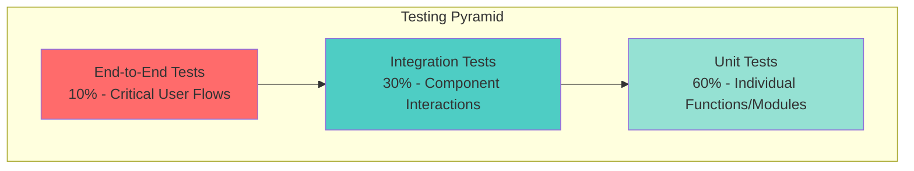

# TACHYON: TESTING GUIDE

**Document ID:** TACHYON-QA-003-V1.0
**Date:** February 2026
**Status:** Approved for Implementation
**Classification:** Quality Assurance and Testing Documentation
**Compliance Level:** ISO/IEC 26514:2021, IEEE 829-2021

---

## TABLE OF CONTENTS

1. [Introduction](#1-introduction)
2. [Testing Philosophy](#2-testing-philosophy)
3. [Testing Framework](#3-testing-framework)
4. [Unit Testing](#4-unit-testing)
5. [Integration Testing](#5-integration-testing)
6. [End-to-End Testing](#6-end-to-end-testing)
7. [Performance Testing](#7-performance-testing)
8. [Security Testing](#8-security-testing)
9. [Test Automation](#9-test-automation)
10. [References](#10-references)

---

## 1. INTRODUCTION

### 1.1. Document Purpose

This document provides comprehensive guidance for testing the Tachyon toolchain, establishing testing methodologies, frameworks, and procedures to ensure software quality, reliability, and security across all system components. This guide serves as the authoritative reference for developers, QA engineers, and stakeholders involved in the testing lifecycle.

The Tachyon toolchain encompasses three primary components requiring distinct testing approaches:
- **Desktop Application:** Tauri-based desktop application with local-first architecture
- **Server Application:** Axum-based HTTP/2 server with SQLite database
- **Web Frontend:** Leptos-based web application with TypeScript/JavaScript

### 1.2. Scope

This testing guide covers:
- Unit testing methodologies for Rust and TypeScript codebases
- Integration testing strategies for component interactions
- End-to-end testing for critical user workflows
- Performance testing and benchmarking procedures
- Security testing aligned with [ADR-010](../.specs/02_adrs/010_security_architecture.md)
- Test automation and CI/CD integration
- Test data management and isolation
- Coverage requirements and quality gates

### 1.3. Document Dependencies

This document depends on the following specifications:
- [TACHYON-STD-V1.0](../.specs/01_standards/coding_standards.md) - Coding and Documentation Standards
- [TACHYON-TST-V1.0](../.specs/04_future_state/test_plan.md) - Test Plan
- [TACHYON-ADR-001-V1.0](../.specs/02_adrs/001_rust_as_primary_language.md) - Rust as Primary Language
- [TACHYON-ADR-010-V1.0](../.specs/02_adrs/010_security_architecture.md) - Security Architecture

### 1.4. Target Audience

This document is intended for:
- **Software Engineers:** Developers implementing tests for new features
- **QA Engineers:** Specialists executing test suites and analyzing results
- **Technical Leads:** Architects defining testing strategies and quality gates
- **DevOps Engineers:** Specialists configuring CI/CD pipelines and test automation
- **Security Engineers:** Specialists conducting security testing and vulnerability assessments

---

## 2. TESTING PHILOSOPHY

### 2.1. Test-Driven Development (TDD)

The Tachyon project adopts Test-Driven Development as the primary development methodology. TDD ensures that tests serve as executable specifications, validating design decisions and preventing regression bugs throughout the development lifecycle.

#### 2.1.1. Red-Green-Refactor Cycle

The TDD process follows the Red-Green-Refactor cycle:

1. **Red Phase:** Write a failing test that specifies the desired behavior
2. **Green Phase:** Write the minimum code required to make the test pass
3. **Refactor Phase:** Improve the code while maintaining test coverage

This cycle ensures that:
- Code is designed with testability in mind from the outset
- Requirements are captured as executable specifications
- Refactoring is performed with test coverage as a safety net
- Technical debt is minimized through continuous verification

#### 2.1.2. Test-First Development

**Test-First Development Process:**
- Requirements analysis identifies testable behaviors
- Test cases are written before implementation code
- Implementation code is written to satisfy test cases
- Refactoring is performed with test coverage as safety net

### 2.2. Testing Pyramid

The Tachyon testing strategy follows the testing pyramid model, emphasizing unit tests as the foundation with progressively fewer integration and end-to-end tests.



**Testing Pyramid Distribution:**
- **Unit Tests (60%):** Fast, isolated tests of individual functions and modules
- **Integration Tests (30%):** Tests of component interactions and interfaces
- **End-to-End Tests (10%):** Tests of critical user workflows across all components

### 2.3. Quality Criteria

All tests must meet the following quality criteria:

1. **Independence:** Tests must not depend on each other's execution order
2. **Isolation:** Tests must not share state or side effects
3. **Determinism:** Tests must produce consistent results across executions
4. **Clarity:** Test intent must be immediately understandable
5. **Speed:** Unit tests must complete in milliseconds
6. **Maintainability:** Tests must be easy to update when requirements change

---

## 3. TESTING FRAMEWORK

### 3.1. Rust Testing Frameworks

#### 3.1.1. Primary Frameworks

The Tachyon Rust codebase utilizes the following testing frameworks:

| Framework | Purpose | Version | Use Case |
|-----------|---------|----------|----------|
| **cargo test** | Built-in Rust testing framework | 1.80+ | Unit tests, integration tests |
| **tokio-test** | Async testing support | 0.4+ | Async function testing |
| **mockall** | Mocking framework | 0.12+ | Trait and struct mocking |
| **proptest** | Property-based testing | 1.4+ | Edge case generation |
| **criterion** | Benchmarking framework | 0.5+ | Performance benchmarks |

#### 3.1.2. Test Organization

Rust tests are organized using the following conventions:

```rust
// Unit tests in same module
#[cfg(test)]
mod tests {
    use super::*;
    
    #[test]
    fn test_function_name() {
        // Test implementation
    }
    
    #[tokio::test]
    async fn test_async_function() {
        // Async test implementation
    }
}
```

### 3.2. TypeScript Testing Frameworks

#### 3.2.1. Primary Frameworks

The Tachyon TypeScript codebase utilizes the following testing frameworks:

| Framework | Purpose | Version | Use Case |
|-----------|---------|----------|----------|
| **vitest** | Fast unit test framework | 1.0+ | Unit tests |
| **@testing-library/react** | Component testing | 14.0+ | Component testing |
| **msw** | Mock Service Worker | 2.0+ | API mocking |
| **playwright** | E2E testing | 1.40+ | End-to-end tests |

#### 3.2.2. Test Organization

TypeScript tests are organized using the following conventions:

```typescript
// Unit tests in __tests__ directory
import { describe, it, expect } from 'vitest';
import { functionName } from './module';

describe('functionName', () => {
    it('should return expected result', () => {
        expect(functionName(input)).toEqual(expected);
    });
});
```

### 3.3. Coverage Requirements

#### 3.3.1. Coverage Targets

| Test Type | Minimum Coverage | Target Coverage | Enforcement |
|-----------|------------------|-----------------|--------------|
| **Unit Tests** | 80% | 90% | CI gate |
| **Integration Tests** | 70% | 85% | CI gate |
| **E2E Tests** | 60% | 75% | CI gate |
| **Overall Coverage** | 75% | 85% | CI gate |

#### 3.3.2. Critical Path Coverage

Critical paths require 100% coverage:
- Security-related functions
- Authentication and authorization logic
- Input validation functions
- Error handling paths

---

## 4. UNIT TESTING

### 4.1. Unit Test Principles

Unit tests verify the correctness of individual functions, methods, and modules in isolation. Unit tests are the foundation of the testing pyramid, providing fast feedback during development and serving as executable documentation for code behavior.

**Unit Test Characteristics:**
- **Isolation:** Tests do not depend on external systems or shared state
- **Speed:** Tests complete in milliseconds
- **Determinism:** Tests produce consistent results across executions
- **Independence:** Tests do not depend on execution order
- **Clarity:** Test intent is immediately understandable

### 4.2. Rust Unit Testing

#### 4.2.1. Test Organization

Rust unit tests are organized within source modules using the `#[cfg(test)]` attribute:

```rust
#[cfg(test)]
mod tests {
    use super::*;
    
    #[test]
    fn test_document_creation() {
        let document = Document::new("Test Title", "Test Content");
        assert_eq!(document.title(), "Test Title");
        assert_eq!(document.content(), "Test Content");
    }
    
    #[tokio::test]
    async fn test_async_document_save() {
        let document = Document::new("Test Title", "Test Content");
        let result = document.save().await;
        assert!(result.is_ok());
    }
}
```

#### 4.2.2. Test Naming Conventions

Rust test functions follow these naming conventions:
- Test functions prefixed with `test_`
- Descriptive names indicating what is being tested
- Names following pattern: `test_<function>_<scenario>_<expected>`

**Examples:**
- `test_document_creation_with_valid_inputs_succeeds`
- `test_document_creation_with_empty_title_fails`
- `test_async_document_save_with_valid_data_succeeds`

#### 4.2.3. Assertion Strategies

Rust provides several assertion macros for different test scenarios:

| Macro | Purpose | Use Case |
|-------|---------|----------|
| `assert!` | Boolean assertion | General truth conditions |
| `assert_eq!` | Equality assertion | Comparing values for equality |
| `assert_ne!` | Inequality assertion | Comparing values for inequality |
| `assert_matches!` | Pattern matching | Verifying enum variants |
| `assert!` | Custom assertion | Complex conditions with custom messages |

**Assertion Example:**

```rust
#[test]
fn test_document_validation() {
    let valid_document = Document::new("Valid Title", "Valid Content");
    assert!(valid_document.is_valid(), "Valid document should pass validation");
    
    let invalid_document = Document::new("", "Content");
    assert!(!invalid_document.is_valid(), "Empty title should fail validation");
    
    let result = Document::from_string("title,content");
    assert_matches!(result, Ok(Document { title, content }) if title == "title");
}
```

#### 4.2.4. Mocking with mockall

The `mockall` crate provides mocking capabilities for Rust traits and structs:

```rust
use mockall::mock;
use mockall::predicate::*;

#[automock]
trait FileSystem {
    fn read_file(&self, path: &Path) -> Result<String, Error>;
    fn write_file(&self, path: &Path, content: &str) -> Result<(), Error>;
}

#[cfg(test)]
mod tests {
    use super::*;
    
    #[test]
    fn test_file_operations() {
        let mut mock_fs = MockFileSystem::new();
        mock_fs
            .expect_read_file()
            .with(eq(Path::new("test.txt")))
            .returning(Ok("content".to_string()));
        
        let content = mock_fs.read_file(Path::new("test.txt")).unwrap();
        assert_eq!(content, "content");
    }
}
```

#### 4.2.5. Property-Based Testing with proptest

Property-based testing generates random inputs to verify invariants across a wide range of values:

```rust
use proptest::prelude::*;

proptest! {
    #[test]
    fn prop_document_title_length(title in "[a-zA-Z0-9 ]{1,100}") {
        let document = Document::new(&title, "Content");
        assert_eq!(document.title(), title);
        assert!(document.title().len() <= 100);
    }
}
```

### 4.3. TypeScript Unit Testing

#### 4.3.1. Test Organization

TypeScript unit tests are organized in `__tests__` directories adjacent to source files:

```typescript
import { describe, it, expect, beforeEach, afterEach } from 'vitest';
import { Document } from './document';

describe('Document', () => {
    let document: Document;
    
    beforeEach(() => {
        document = new Document('Test Title', 'Test Content');
    });
    
    afterEach(() => {
        // Cleanup if needed
    });
    
    it('should create document with valid inputs', () => {
        expect(document.title).toBe('Test Title');
        expect(document.content).toBe('Test Content');
    });
    
    it('should validate document with empty title', () => {
        const invalidDocument = new Document('', 'Content');
        expect(invalidDocument.isValid()).toBe(false);
    });
});
```

#### 4.3.2. Assertion Strategies

Vitest provides assertion methods following Jest-like API:

| Method | Purpose | Use Case |
|--------|---------|----------|
| `toBe()` | Strict equality | Comparing primitive values |
| `toEqual()` | Deep equality | Comparing objects/arrays |
| `toBeUndefined()` | Undefined check | Verifying undefined values |
| `toBeNull()` | Null check | Verifying null values |
| `toBeTruthy()` | Truthy check | Verifying truthy values |
| `toThrow()` | Exception check | Verifying thrown errors |

**Assertion Example:**

```typescript
import { describe, it, expect } from 'vitest';
import { DocumentService } from './document-service';

describe('DocumentService', () => {
    it('should create document successfully', async () => {
        const service = new DocumentService();
        const result = await service.create({
            title: 'Test Title',
            content: 'Test Content'
        });
        
        expect(result.success).toBe(true);
        expect(result.data).toBeDefined();
        expect(result.data.title).toBe('Test Title');
    });
    
    it('should throw error for invalid document', async () => {
        const service = new DocumentService();
        
        await expect(
            service.create({ title: '', content: 'Content' })
        ).rejects.toThrow('Title cannot be empty');
    });
});
```

#### 4.3.3. Mocking with vi

Vitest provides mocking capabilities through the `vi` module:

```typescript
import { describe, it, expect, vi, beforeEach } from 'vitest';
import { apiClient } from './api';

describe('DocumentService', () => {
    beforeEach(() => {
        vi.mock('./api', () => ({
            apiClient: {
                get: vi.fn(),
                post: vi.fn(),
            },
        }));
    });
    
    it('should call API on fetch', async () => {
        vi.mocked(apiClient.get).mockResolvedValue({
            data: { title: 'Test' }
        });
        
        const service = new DocumentService();
        await service.fetch('doc-id');
        
        expect(apiClient.get).toHaveBeenCalledWith('/documents/doc-id');
    });
});
```

### 4.4. Test Data Management

#### 4.4.1. Test Data Factories

Test data factories provide consistent, maintainable test data generation:

```rust
pub struct DocumentBuilder {
    title: String,
    content: String,
    metadata: Option<Metadata>,
}

impl DocumentBuilder {
    pub fn new() -> Self {
        DocumentBuilder {
            title: "Test Document".to_string(),
            content: "Test Content".to_string(),
            metadata: None,
        }
    }
    
    pub fn title(mut self, title: &str) -> Self {
        self.title = title.to_string();
        self
    }
    
    pub fn content(mut self, content: &str) -> Self {
        self.content = content.to_string();
        self
    }
    
    pub fn build(self) -> Document {
        Document {
            title: self.title,
            content: self.content,
            metadata: self.metadata.unwrap_or_default(),
        }
    }
}

#[test]
fn test_document_with_builder() {
    let document = DocumentBuilder::new()
        .title("Custom Title")
        .content("Custom Content")
        .build();
    
    assert_eq!(document.title(), "Custom Title");
}
```

#### 4.4.2. Test Fixtures

Test fixtures provide setup and teardown for test data:

```typescript
import { describe, it, expect, beforeEach, afterEach } from 'vitest';
import { createTestDocument, cleanupTestData } from './test-helpers';

describe('DocumentService', () => {
    let testDocument: Document;
    
    beforeEach(async () => {
        testDocument = await createTestDocument();
    });
    
    afterEach(async () => {
        await cleanupTestData();
    });
    
    it('should update document', async () => {
        const service = new DocumentService();
        const result = await service.update(testDocument.id, {
            title: 'Updated Title'
        });
        
        expect(result.success).toBe(true);
    });
});
```

### 4.5. Unit Test Best Practices

#### 4.5.1. Test Isolation

**Guidelines for Test Isolation:**
- Each test should be independent of other tests
- Tests should not rely on execution order
- Tests should clean up after themselves
- Tests should use fresh test data for each execution

#### 4.5.2. Test Clarity

**Guidelines for Test Clarity:**
- Use descriptive test names
- Arrange-Act-Assert (AAA) pattern for test structure
- Include comments for complex test scenarios
- Avoid test logic that is difficult to understand

**AAA Pattern Example:**

```rust
#[test]
fn test_document_update_with_valid_data_succeeds() {
    // Arrange
    let mut document = Document::new("Original Title", "Original Content");
    let updated_data = DocumentData {
        title: "Updated Title".to_string(),
        content: "Updated Content".to_string(),
    };
    
    // Act
    let result = document.update(updated_data);
    
    // Assert
    assert!(result.is_ok());
    assert_eq!(document.title(), "Updated Title");
    assert_eq!(document.content(), "Updated Content");
}
```

#### 4.5.3. Test Coverage

**Guidelines for Test Coverage:**
- Aim for 80% minimum coverage, 90% target coverage
- Focus coverage on critical paths and error handling
- Use coverage tools to identify untested code
- Review coverage reports regularly during development

**Running Coverage Analysis:**

```bash
# Rust coverage with tarpaulin
cargo tarpaulin --workspace --out-dir coverage

# TypeScript coverage with vitest
vitest run --coverage
```

#### 4.5.4. Test Performance

**Guidelines for Test Performance:**
- Unit tests should complete in milliseconds
- Avoid slow operations in unit tests
- Use mocks for external dependencies
- Profile slow tests and optimize or move to integration tests

**Running Tests with Timing:**

```bash
# Rust test timing
cargo test -- --nocapture --test-threads=1

# TypeScript test timing
vitest run --reporter=verbose
```

---

## 5. INTEGRATION TESTING

### 5.1. Integration Test Principles

Integration tests verify that multiple components work together correctly. Integration tests are the middle layer of the testing pyramid, testing component interactions and interfaces while maintaining reasonable execution speed.

**Integration Test Characteristics:**
- **Component Interaction:** Tests verify interactions between components
- **Interface Testing:** Tests verify API contracts and interfaces
- **Database Integration:** Tests verify database operations
- **Network Communication:** Tests verify network protocols
- **External Dependencies:** Tests verify integration with external services

### 5.2. Component Interaction Tests

#### 5.2.1. Desktop-Server Integration

Desktop-Server integration tests verify IPC communication between Tauri desktop application and Axum server:

```rust
#[tokio::test]
async fn test_desktop_server_communication() {
    // Start test server
    let test_server = TestServer::new().await;
    let server_url = test_server.url();
    
    // Create desktop client
    let desktop_client = DesktopClient::new(server_url);
    
    // Test document creation through IPC
    let document = Document::new("Test Title", "Test Content");
    let result = desktop_client.create_document(document).await;
    
    assert!(result.is_ok());
    assert_eq!(result.unwrap().title(), "Test Title");
}
```

#### 5.2.2. Web-Server Integration

Web-Server integration tests verify HTTP/2 API communication between Leptos web frontend and Axum server:

```rust
#[tokio::test]
async fn test_web_server_api_integration() {
    // Start test server
    let test_server = TestServer::new().await;
    let server_url = test_server.url();
    
    // Create HTTP client
    let http_client = HttpClient::new(server_url);
    
    // Test document creation through HTTP/2
    let document = Document::new("Test Title", "Test Content");
    let response = http_client
        .post("/api/documents")
        .json(&document)
        .send()
        .await;
    
    assert_eq!(response.status(), StatusCode::CREATED);
    let created_document = response.json::<Document>().await;
    assert_eq!(created_document.title(), "Test Title");
}
```

#### 5.2.3. Server-Database Integration

Server-Database integration tests verify SQLite database operations:

```rust
#[tokio::test]
async fn test_server_database_integration() {
    // Create test database
    let test_db = TestDatabase::new().await;
    
    // Create repository with test database
    let repository = DocumentRepository::new(test_db.connection());
    
    // Test document creation
    let document = Document::new("Test Title", "Test Content");
    let result = repository.create(document).await;
    
    assert!(result.is_ok());
    let created_id = result.unwrap();
    
    // Test document retrieval
    let retrieved = repository.get_by_id(created_id).await;
    assert!(retrieved.is_ok());
    assert_eq!(retrieved.unwrap().title(), "Test Title");
}
```

### 5.3. Test Environment Setup

#### 5.3.1. Test Database

Integration tests use in-memory SQLite databases for isolation:

```rust
pub struct TestDatabase {
    connection: Arc<Mutex<Connection>>,
}

impl TestDatabase {
    pub async fn new() -> Self {
        let connection = Connection::open_in_memory().unwrap();
        // Apply migrations
        migrations::run(&connection).unwrap();
        TestDatabase {
            connection: Arc::new(Mutex::new(connection)),
        }
    }
    
    pub fn connection(&self) -> Arc<Mutex<Connection>> {
        self.connection.clone()
    }
}

impl Drop for TestDatabase {
    fn drop(&mut self) {
        // Cleanup is automatic for in-memory database
    }
}
```

#### 5.3.2. Test Server

Integration tests use test servers with randomized ports:

```rust
pub struct TestServer {
    url: String,
    handle: JoinHandle<()>,
}

impl TestServer {
    pub async fn new() -> Self {
        let listener = TcpListener::bind("127.0.0.1:0").unwrap();
        let port = listener.local_addr().port();
        let url = format!("http://127.0.0.1:{}", port);
        
        let handle = tokio::spawn(async move {
            let app = create_test_app();
            axum::serve(listener, app).await.unwrap();
        });
        
        // Wait for server to start
        tokio::time::sleep(tokio::time::Duration::from_millis(100)).await;
        
        TestServer { url, handle }
    }
    
    pub fn url(&self) -> &str {
        &self.url
    }
}

impl Drop for TestServer {
    fn drop(&mut self) {
        self.handle.abort();
    }
}
```

#### 5.3.3. Test Git Repository

Integration tests use temporary Git repositories:

```rust
pub struct TestGitRepo {
    path: PathBuf,
}

impl TestGitRepo {
    pub fn new() -> Self {
        let temp_dir = tempfile::tempdir().unwrap();
        let repo_path = temp_dir.path().join("test-repo");
        
        // Initialize Git repository
        git2::Repository::init(&repo_path, false).unwrap();
        
        TestGitRepo { path: repo_path }
    }
    
    pub fn path(&self) -> &Path {
        &self.path
    }
}

impl Drop for TestGitRepo {
    fn drop(&mut self) {
        // Cleanup is automatic for temp directory
    }
}
```

### 5.4. API Contract Testing

#### 5.4.1. Request/Response Validation

API contract tests verify that requests and responses conform to OpenAPI specification:

```rust
#[tokio::test]
async fn test_api_contract_document_creation() {
    let test_server = TestServer::new().await;
    let http_client = HttpClient::new(test_server.url());
    
    // Test valid request
    let valid_document = Document::new("Valid Title", "Valid Content");
    let response = http_client
        .post("/api/documents")
        .json(&valid_document)
        .send()
        .await;
    
    assert_eq!(response.status(), StatusCode::CREATED);
    let created = response.json::<Document>().await;
    assert_eq!(created.title(), "Valid Title");
    
    // Test invalid request (empty title)
    let invalid_document = Document::new("", "Content");
    let response = http_client
        .post("/api/documents")
        .json(&invalid_document)
        .send()
        .await;
    
    assert_eq!(response.status(), StatusCode::BAD_REQUEST);
}
```

#### 5.4.2. Error Handling Validation

Error handling tests verify proper error responses:

```rust
#[tokio::test]
async fn test_api_error_handling() {
    let test_server = TestServer::new().await;
    let http_client = HttpClient::new(test_server.url());
    
    // Test not found error
    let response = http_client
        .get("/api/documents/nonexistent-id")
        .send()
        .await;
    
    assert_eq!(response.status(), StatusCode::NOT_FOUND);
    let error = response.json::<ApiError>().await;
    assert_eq!(error.code(), "DOCUMENT_NOT_FOUND");
}
```

### 5.5. WebSocket Integration Tests

#### 5.5.1. Connection Lifecycle

WebSocket connection tests verify connection establishment and closure:

```rust
#[tokio::test]
async fn test_websocket_connection_lifecycle() {
    let test_server = TestServer::new().await;
    let ws_url = test_server.url().replace("http://", "ws://");
    
    // Connect to WebSocket
    let (mut ws_sender, mut ws_receiver) = 
        tungstenite::connect_async(&format!("{}/ws", ws_url))
            .await
            .unwrap()
            .split();
    
    // Send message
    ws_sender.send(Message::Text("ping".to_string())).await.unwrap();
    
    // Receive message
    let message = ws_receiver.next().await.unwrap().unwrap();
    assert_eq!(message, Message::Text("pong".to_string()));
    
    // Close connection
    ws_sender.close().await.unwrap();
}
```

#### 5.5.2. Real-time Synchronization

Real-time synchronization tests verify document updates propagate correctly:

```rust
#[tokio::test]
async fn test_realtime_document_sync() {
    let test_server = TestServer::new().await;
    
    // Create two WebSocket clients
    let (mut client1_sender, mut client1_receiver) = 
        create_websocket_client(&test_server).await;
    let (mut client2_sender, mut client2_receiver) = 
        create_websocket_client(&test_server).await;
    
    // Client1 creates document
    let document = Document::new("Test Title", "Test Content");
    let create_msg = serde_json::to_string(&SyncMessage::Create(document)).unwrap();
    client1_sender.send(Message::Text(create_msg)).await.unwrap();
    
    // Client2 receives document creation
    let message = client2_receiver.next().await.unwrap().unwrap();
    let sync_msg: SyncMessage = serde_json::from_str(&message.to_string()).unwrap();
    assert_matches!(sync_msg, SyncMessage::Create(_));
}
```

### 5.6. Integration Test Best Practices

#### 5.6.1. Test Isolation

**Guidelines for Test Isolation:**
- Use in-memory databases for each test
- Use randomized ports for test servers
- Use temporary directories for file system operations
- Clean up resources in drop implementations
- Use transactions with rollback for database tests

#### 5.6.2. Test Determinism

**Guidelines for Test Determinism:**
- Use fixed test data instead of random values
- Use deterministic time sources in tests
- Avoid relying on external services
- Mock external dependencies when possible
- Use test clocks for time-dependent operations

#### 5.6.3. Test Performance

**Guidelines for Test Performance:**
- Integration tests should complete in seconds, not minutes
- Use connection pooling for database tests
- Reuse test servers when possible
- Avoid unnecessary sleep operations
- Profile slow integration tests and optimize

**Running Integration Tests:**

```bash
# Rust integration tests
cargo test --test-threads=1 -- --ignored

# TypeScript integration tests
vitest run --config vitest.integration.config.ts
```

---

## 6. END-TO-END TESTING

### 6.1. E2E Test Principles

End-to-End (E2E) tests verify critical user workflows across all system components. E2E tests are the top layer of the testing pyramid, testing complete user journeys from start to finish.

**E2E Test Characteristics:**
- **User Workflow:** Tests simulate real user workflows
- **Cross-Component:** Tests span desktop, server, and web components
- **Realistic Environment:** Tests use realistic test data and scenarios
- **Browser Automation:** Tests use Playwright for browser automation
- **Slower Execution:** Tests may take seconds to minutes to complete

### 6.2. Critical User Workflows

#### 6.2.1. Document Creation Workflow

Document creation workflow tests verify the complete process of creating, editing, and saving documents:

```typescript
import { test, expect } from '@playwright/test';

test.describe('Document Creation Workflow', () => {
    test('should create and save document', async ({ page }) => {
        // Navigate to documents page
        await page.goto('/documents');
        
        // Click new document button
        await page.click('button:has-text("New Document")');
        
        // Fill in document details
        await page.fill('input[name="title"]', 'Test Document');
        await page.fill('textarea[name="content"]', 'Test Content');
        
        // Save document
        await page.click('button:has-text("Save")');
        
        // Verify document was saved
        await expect(page.locator('h1')).toHaveText('Test Document');
        await expect(page.locator('text=Test Content')).toBeVisible();
    });
});
```

#### 6.2.2. Search and Discovery Workflow

Search workflow tests verify document search, filtering, and navigation:

```typescript
test.describe('Search and Discovery Workflow', () => {
    test('should search and find documents', async ({ page }) => {
        // Navigate to documents page
        await page.goto('/documents');
        
        // Enter search query
        await page.fill('input[name="search"]', 'Test Document');
        
        // Wait for search results
        await page.waitForSelector('.search-results');
        
        // Verify search results
        const results = await page.locator('.search-result').count();
        expect(results).toBeGreaterThan(0);
        await expect(page.locator('.search-result:has-text("Test Document")')).toBeVisible();
    });
});
```

#### 6.2.3. Collaboration Workflow

Collaboration workflow tests verify real-time editing with multiple users:

```typescript
test.describe('Collaboration Workflow', () => {
    test('should sync edits between users', async ({ browser, context }) => {
        // Create two browser contexts for two users
        const user1Context = await browser.newContext();
        const user2Context = await browser.newContext();
        
        const user1Page = await user1Context.newPage();
        const user2Page = await user2Context.newPage();
        
        // Both users navigate to same document
        await user1Page.goto('/documents/test-doc');
        await user2Page.goto('/documents/test-doc');
        
        // User1 edits document
        await user1Page.fill('textarea[name="content"]', 'Updated by User 1');
        
        // User2 sees update
        await expect(user2Page.locator('textarea[name="content"]')).toHaveValue('Updated by User 1');
        
        // Cleanup
        await user1Context.close();
        await user2Context.close();
    });
});
```

#### 6.2.4. Git Operations Workflow

Git operations workflow tests verify commit, branch, and merge operations:

```typescript
test.describe('Git Operations Workflow', () => {
    test('should commit and push changes', async ({ page }) => {
        // Navigate to document
        await page.goto('/documents/test-doc');
        
        // Make edit
        await page.fill('textarea[name="content"]', 'Updated Content');
        
        // Commit changes
        await page.click('button:has-text("Commit")');
        await page.fill('input[name="commit-message"]', 'Update document');
        await page.click('button:has-text("Commit")');
        
        // Verify commit was created
        await expect(page.locator('.commit-message')).toHaveText('Update document');
    });
});
```

### 6.3. Cross-Platform Testing

#### 6.3.1. Platform Test Matrix

E2E tests are executed across multiple platforms and browsers:

| Platform | Browser | Test Count |
|----------|-----------|-------------|
| **Windows** | Chrome, Edge, Firefox | 10 |
| **macOS** | Safari, Chrome, Firefox | 10 |
| **Linux** | Chrome, Firefox | 10 |

#### 6.3.2. Playwright Configuration

Playwright is configured for cross-platform testing:

```typescript
import { defineConfig, devices } from '@playwright/test';

export default defineConfig({
    projects: [
        {
            name: 'chromium',
            use: { ...devices['Desktop Chrome'] },
        },
        {
            name: 'firefox',
            use: { ...devices['Desktop Firefox'] },
        },
        {
            name: 'webkit',
            use: { ...devices['Desktop Safari'] },
        },
    ],
    testDir: './e2e',
    timeout: 30000,
    retries: 2,
});
```

### 6.4. Accessibility Testing

#### 6.4.1. Automated Accessibility Tests

Accessibility tests verify keyboard navigation, screen reader compatibility, and visual accessibility:

```typescript
import { test, expect } from '@playwright/test';
import { axe } from '@playwright/test';

test.describe('Accessibility', () => {
    test('should be accessible', async ({ page }) => {
        await page.goto('/');
        
        // Run axe accessibility scan
        const accessibilityResults = await axe(page);
        
        // Verify no accessibility violations
        expect(accessibilityResults.violations).toEqual([]);
    });
    
    test('should support keyboard navigation', async ({ page }) => {
        await page.goto('/documents');
        
        // Navigate using keyboard
        await page.keyboard.press('Tab');
        await page.keyboard.press('Enter');
        
        // Verify focus is on expected element
        const focusedElement = await page.evaluate(() => document.activeElement?.tagName);
        expect(focusedElement).toBe('BUTTON');
    });
});
```

### 6.5. E2E Test Best Practices

#### 6.5.1. Test Stability

**Guidelines for Test Stability:**
- Use explicit waits instead of fixed timeouts
- Use data-testid attributes for element selection
- Avoid relying on element position or styling
- Use page object model for reliable element selection
- Implement retry logic for flaky operations

#### 6.5.2. Test Maintenance

**Guidelines for Test Maintenance:**
- Keep tests independent of UI changes
- Use page object model for element selection
- Document test purpose and expected behavior
- Review and update tests when UI changes
- Remove obsolete tests promptly

#### 6.5.3. Test Performance

**Guidelines for Test Performance:**
- E2E tests should complete in under 30 seconds
- Use parallel test execution where possible
- Avoid unnecessary waits and sleeps
- Reuse page contexts when possible
- Profile slow E2E tests and optimize

**Running E2E Tests:**

```bash
# Playwright E2E tests
npx playwright test

# Run specific test file
npx playwright test document-creation.spec.ts

# Run in headed mode (visible browser)
npx playwright test --headed

# Run with debugging
npx playwright test --debug
```

---

## 7. PERFORMANCE TESTING

### 7.1. Performance Test Principles

Performance tests verify that the system meets performance requirements under various load conditions. Performance tests ensure that the system can handle expected traffic and maintain responsiveness.

**Performance Test Characteristics:**
- **Load Testing:** Tests verify system behavior under expected load
- **Stress Testing:** Tests verify system behavior under extreme load
- **Benchmarking:** Tests measure performance of specific operations
- **Regression Testing:** Tests detect performance regressions over time
- **Resource Monitoring:** Tests verify resource utilization remains within limits

### 7.2. Performance Metrics and SLAs

#### 7.2.1. Service Level Agreements

Performance tests verify compliance with defined Service Level Agreements (SLAs):

| Metric | Target | Maximum | Alert Threshold |
|--------|---------|----------|-----------------|
| **Desktop Startup Time** | < 3s | < 5s | 4s |
| **Server Startup Time** | < 3s | < 5s | 4s |
| **Document Retrieval** | < 100ms | < 200ms | 150ms |
| **Search Response** | < 100ms | < 200ms | 150ms |
| **API Response** | < 200ms | < 500ms | 350ms |
| **WebSocket Latency** | < 50ms | < 100ms | 75ms |
| **Rendering Latency** | < 15ms | < 30ms | 22ms |

#### 7.2.2. Resource Utilization Limits

Performance tests verify that resource utilization remains within defined limits:

| Resource | Target | Maximum | Alert Threshold |
|----------|---------|----------|-----------------|
| **Desktop Memory** | < 256MB | < 512MB | 384MB |
| **Server Memory** | < 1GB | < 2GB | 1.5GB |
| **Desktop CPU (Idle)** | < 5% | < 10% | 7.5% |
| **Server CPU (Idle)** | < 10% | < 20% | 15% |
| **Disk Usage** | < 500MB | < 1GB | 750MB |

### 7.3. Load Testing

#### 7.3.1. Load Test Profiles

Load tests simulate realistic user traffic patterns:

| Scenario | Concurrent Users | Requests/Second | Duration |
|----------|------------------|-----------------|----------|
| **Light Load** | 10 | 100 | 10 minutes |
| **Moderate Load** | 50 | 500 | 10 minutes |
| **Heavy Load** | 100 | 1,000 | 10 minutes |
| **Peak Load** | 200 | 2,000 | 5 minutes |

#### 7.3.2. k6 Load Testing

k6 is used for load testing HTTP/2 APIs:

```javascript
import http from 'k6/http';
import { check, sleep } from 'k6';

export let options = {
    stages: [
        { duration: '2m', target: 100 },
        { duration: '5m', target: 100 },
        { duration: '2m', target: 0 },
    ],
};

export default function () {
    let res = http.get('http://localhost:8080/api/documents');
    check(res, {
        'status was 200': (r) => r.status == 200,
        'response time < 200ms': (r) => r.timings.duration < 200,
    });
    sleep(1);
}
```

### 7.4. Benchmarking

#### 7.4.1. Criterion Benchmarks

Criterion is used for benchmarking Rust code:

```rust
use criterion::{black_box, criterion_group, criterion_main, Criterion};

fn bench_document_creation(c: &mut Criterion) {
    c.bench_function("document_creation", |b| {
        let document = Document::new("Test Title", "Test Content");
        black_box(document);
    });
}

fn bench_document_search(c: &mut Criterion) {
    c.bench_function("document_search", |b| {
        let query = black_box("test query");
        let results = search_documents(query);
        black_box(results);
    });
}

criterion_group!(benches);
criterion_main!(benches);
```

#### 7.4.2. Benchmark Baselines

Performance benchmarks are compared against established baselines:

| Operation | Baseline | Regression Threshold | Alert Threshold |
|-----------|-----------|---------------------|-----------------|
| **Document Create** | 50ms | +20% | +50% |
| **Document Read** | 20ms | +20% | +50% |
| **Search Query** | 80ms | +20% | +50% |
| **Git Commit** | 100ms | +20% | +50% |
| **Cache Hit** | 5ms | +20% | +50% |

### 7.5. Performance Regression Detection

#### 7.5.1. Continuous Benchmarking

Benchmarks are executed on every commit to detect performance regressions:

```bash
# Run benchmarks and save baseline
cargo bench --bench --save-baseline main

# Compare against baseline
cargo bench --bench --baseline main
```

#### 7.5.2. Regression Alerting

Performance regressions exceeding thresholds trigger alerts:

```bash
# Check for performance regressions
cargo bench --bench -- -- --fail-fast -- --message-format short
```

### 7.6. Resource Monitoring

#### 7.6.1. Metrics Collection

Performance tests collect resource utilization metrics:

```rust
use tokio_metrics::{TaskMonitor, TaskMonitorBuilder};

pub struct PerformanceMonitor {
    monitor: TaskMonitor,
}

impl PerformanceMonitor {
    pub fn new() -> Self {
        let monitor = TaskMonitorBuilder::new()
            .enable_cpu()
            .enable_memory()
            .build();
        
        PerformanceMonitor { monitor }
    }
    
    pub fn record_metric(&self, name: &str, duration: Duration) {
        self.monitor.record(name, duration);
    }
}
```

#### 7.6.2. Metrics Visualization

Grafana dashboards visualize performance metrics in real-time:

```yaml
# Grafana dashboard configuration
apiVersion: 1

panels:
  - title: API Response Time
    targets:
      - expr: histogram_quantile(0.99, rate(http_request_duration_seconds_bucket[5m]))
    type: graph
  
  - title: Memory Usage
    targets:
      - expr: process_resident_memory_bytes{job="tachyon-server"}
    type: graph
```

### 7.7. Performance Test Best Practices

#### 7.7.1. Test Environment

**Guidelines for Test Environment:**
- Use dedicated performance test environment
- Ensure test environment mirrors production configuration
- Use realistic test data sets
- Avoid testing on shared infrastructure
- Monitor test environment for interference

#### 7.7.2. Test Execution

**Guidelines for Test Execution:**
- Execute performance tests during off-peak hours
- Run performance tests before releases
- Compare results against historical baselines
- Investigate and document performance regressions
- Store performance test results for trend analysis

**Running Performance Tests:**

```bash
# Run benchmarks
cargo bench

# Run load tests
k6 run load-test.js

# Run performance tests with CI
cargo bench -- -- -- --test-threads=1
```

---

## 8. SECURITY TESTING

### 8.1. Security Test Principles

Security tests verify that system is protected against identified threats and vulnerabilities. Security tests align with [ADR-010](../.specs/02_adrs/010_security_architecture.md) and implement defense-in-depth security architecture.

**Security Test Characteristics:**
- **Threat-Based:** Tests address identified threats from threat model
- **OWASP Compliance:** Tests verify OWASP Top 10 vulnerabilities are addressed
- **STRIDE Coverage:** Tests cover Spoofing, Tampering, Repudiation, Information Disclosure, Denial of Service, and Elevation of Privilege
- **Regression Testing:** Tests prevent reintroduction of security vulnerabilities
- **Compliance Testing:** Tests verify alignment with security standards

### 8.2. Threat-Based Testing

#### 8.2.1. STRIDE Threat Model

STRIDE threat model tests address six threat categories:

| Threat Category | Test Scenarios | Test Count |
|----------------|-----------------|-------------|
| **Spoofing** | Authentication bypass, identity theft | 10 |
| **Tampering** | Data modification, injection attacks | 15 |
| **Repudiation** | Audit logging, non-repudiation | 5 |
| **Information Disclosure** | Data leakage, unauthorized access | 15 |
| **Denial of Service** | Resource exhaustion, DoS attacks | 10 |
| **Elevation of Privilege** | Privilege escalation, authorization bypass | 15 |

#### 8.2.2. Spoofing Tests

Spoofing tests verify authentication and identity mechanisms:

```rust
#[tokio::test]
async fn test_auth_token_spoofing() {
    let user = User::new("test@example.com", "password123");
    let result = user.authenticate().await;
    
    // Verify token is cryptographically secure
    assert!(result.is_ok());
    let token = result.unwrap();
    assert!(token.is_jwt());
    assert!(token.has_signature());
}
```

#### 8.2.3. Tampering Tests

Tampering tests verify data integrity and protection against modification:

```rust
#[tokio::test]
async fn test_document_tampering_protection() {
    let document = Document::new("Test Title", "Test Content");
    let signature = document.sign().unwrap();
    
    // Tamper with document
    let mut tampered_document = document.clone();
    tampered_document.set_content("Tampered Content");
    
    // Verify signature verification fails
    assert!(!tampered_document.verify(&signature));
}
```

#### 8.2.4. Information Disclosure Tests

Information disclosure tests verify that sensitive data is not exposed:

```rust
#[tokio::test]
async fn test_error_message_sanitization() {
    let result = DocumentService::get("nonexistent-id").await;
    
    // Verify error does not expose sensitive information
    assert!(result.is_err());
    let error = result.unwrap_err();
    assert!(!error.to_string().contains("database"));
    assert!(!error.to_string().contains("password"));
}
```

### 8.3. OWASP Top 10 Testing

#### 8.3.1. OWASP Top 10 Coverage

OWASP Top 10 tests verify protection against common web vulnerabilities:

| OWASP Risk | Test Scenarios | Test Count |
|-------------|-----------------|-------------|
| **A01: Broken Access Control** | Authorization bypass, IDOR | 10 |
| **A02: Cryptographic Failures** | Weak encryption, key management | 8 |
| **A03: Injection** | SQLi, XSS, command injection | 12 |
| **A04: Insecure Design** | Security misconfigurations | 8 |
| **A05: Security Misconfiguration** | Default credentials, exposed endpoints | 10 |
| **A06: Vulnerable Components** | Dependency vulnerabilities | 8 |
| **A07: Authentication Failures** | Weak passwords, session fixation | 10 |
| **A08: Software and Data Integrity** | Supply chain attacks | 6 |
| **A09: Logging and Monitoring** | Insufficient logging | 6 |
| **A10: Server-Side Request Forgery** | SSRF attacks | 8 |

#### 8.3.2. Injection Tests

Injection tests verify protection against SQL injection, XSS, and command injection:

```rust
#[tokio::test]
async fn test_sql_injection_protection() {
    let malicious_query = "SELECT * FROM documents WHERE title = 'test' OR '1'='1'";
    let result = execute_query(&malicious_query).await;
    
    // Verify query is sanitized
    assert!(result.is_err());
    let error = result.unwrap_err();
    assert!(error.to_string().contains("invalid query"));
}
```

#### 8.3.3. XSS Tests

XSS tests verify protection against cross-site scripting attacks:

```rust
#[tokio::test]
async fn test_xss_protection() {
    let malicious_content = "<script>alert('XSS')</script>";
    let document = Document::new("Test Title", malicious_content);
    let result = document.save().await;
    
    // Verify content is escaped
    assert!(result.is_ok());
    let saved_document = result.unwrap();
    assert!(!saved_document.content().contains("<script>"));
}
```

### 8.4. Dependency Vulnerability Scanning

#### 8.4.1. Rust Dependency Scanning

Rust dependency scanning uses cargo-audit and cargo-deny:

```bash
# Run cargo audit for Rust dependencies
cargo audit

# Run cargo deny for policy enforcement
cargo deny check

# Check for advisories
cargo audit --db
```

#### 8.4.2. TypeScript Dependency Scanning

TypeScript dependency scanning uses npm audit:

```bash
# Run npm audit for TypeScript dependencies
cd web && npm audit

# Run audit with production dependencies only
cd web && npm audit --production

# Fix vulnerabilities automatically
cd web && npm audit fix
```

### 8.5. Penetration Testing

#### 8.5.1. Penetration Testing Methodology

Penetration testing follows systematic methodology:

1. **Reconnaissance:** Information gathering and mapping
2. **Scanning:** Vulnerability scanning and enumeration
3. **Exploitation:** Attempting to exploit identified vulnerabilities
4. **Post-Exploitation:** Assessing impact and lateral movement
5. **Reporting:** Documenting findings and remediation recommendations

#### 8.5.2. Penetration Testing Tools

Penetration testing uses industry-standard tools:

| Tool | Purpose | Use Case |
|------|---------|----------|
| **OWASP ZAP** | Web application security scanner | Automated scanning |
| **Burp Suite** | Web application penetration testing | Manual testing |
| **sqlmap** | SQL injection testing | Injection attacks |
| **nmap** | Network scanning and enumeration | Port scanning |
| **metasploit** | Exploitation framework | Exploit testing |

### 8.6. Security Regression Testing

#### 8.6.1. Regression Test Suite

Security regression tests prevent reintroduction of vulnerabilities:

```rust
#[tokio::test]
async fn test_security_regression_sql_injection() {
    // Test historical SQL injection vulnerability
    let malicious_query = "' OR '1'='1";
    let result = execute_query(&malicious_query).await;
    
    // Verify vulnerability is still fixed
    assert!(result.is_err());
}
```

#### 8.6.2. Continuous Security Testing

Security tests are executed on every pull request and release:

```yaml
# GitHub Actions security testing
- name: Run cargo audit
  run: cargo audit
  
- name: Run npm audit
  run: cd web && npm audit
  
- name: Run security tests
  run: cargo test --test security
```

### 8.7. Security Test Best Practices

#### 8.7.1. Test Coverage

**Guidelines for Security Test Coverage:**
- Cover all STRIDE threat categories
- Cover all OWASP Top 10 risks
- Test all authentication and authorization paths
- Test all input validation functions
- Test all error handling paths

#### 8.7.2. Test Execution

**Guidelines for Security Test Execution:**
- Execute security tests on every commit
- Execute security tests before releases
- Execute penetration tests regularly
- Review security test results promptly
- Document and remediate security findings

**Running Security Tests:**

```bash
# Run security tests
cargo test --test security

# Run dependency scanning
cargo audit && cd web && npm audit

# Run penetration tests
nmap -p- localhost 8080
```

---

## 9. TEST AUTOMATION

### 9.1. CI/CD Integration

#### 9.1.1. GitHub Actions Configuration

GitHub Actions is used for automated test execution on every commit and pull request:

```yaml
name: Test Suite

on: [push, pull_request]

jobs:
  test:
    runs-on: ubuntu-latest
    strategy:
      matrix:
        component: [desktop, server, web]
        rust: [stable, nightly]
    
    steps:
      - uses: actions/checkout@v3
      
      - name: Install Rust
        uses: actions-rs/toolchain@v1
        with:
          toolchain: ${{ matrix.rust }}
      
      - name: Install Dependencies
        run: nix develop --command "cargo build"
      
      - name: Run Unit Tests
        run: nix develop --command "cargo test --workspace"
      
      - name: Run Integration Tests
        run: nix develop --command "cargo test --workspace --test-threads=1"
      
      - name: Generate Coverage
        run: nix develop --command "cargo tarpaulin --workspace"
      
      - name: Upload Coverage
        uses: codecov/codecov-action@v3
```

#### 9.1.2. Test Execution Schedule

Tests are executed according to defined schedule:

| Test Type | Trigger | Execution Time | Timeout |
|-----------|----------|----------------|----------|
| **Unit Tests** | Every commit | < 5 minutes | 10 minutes |
| **Integration Tests** | Every PR | < 10 minutes | 20 minutes |
| **E2E Tests** | Merge to main | < 15 minutes | 30 minutes |
| **Performance Tests** | Nightly | < 30 minutes | 60 minutes |
| **Security Tests** | Nightly | < 20 minutes | 40 minutes |

### 9.2. Quality Gates

#### 9.2.1. Code Integration Requirements

Code integration requires meeting quality gates:

**Code Integration Requirements:**
- All unit tests must pass
- All integration tests must pass
- Code coverage must meet minimum thresholds
- No critical security vulnerabilities detected
- No performance regressions beyond defined thresholds
- All tests must complete within defined time limits

#### 9.2.2. Release Acceptance Criteria

Release requires meeting additional criteria:

**Release Requirements:**
- All test suites (unit, integration, E2E) must pass
- Code coverage must meet target thresholds
- Security scan must show no critical or high-severity vulnerabilities
- Performance benchmarks must meet defined SLAs
- Documentation must be complete and accurate
- All critical bugs must be resolved

### 9.3. Test Result Reporting

#### 9.3.1. Report Formats

Test results are generated in multiple formats:

| Report Type | Format | Purpose |
|-------------|--------|---------|
| **JUnit XML** | Machine-readable test results | CI/CD integration |
| **HTML Reports** | Human-readable test results | Developer review |
| **Coverage Reports** | Code coverage visualization | Coverage analysis |
| **Performance Reports** | Benchmark comparison | Performance analysis |

#### 9.3.2. Report Distribution

Test results are distributed to stakeholders:

**Report Distribution:**
- Developers receive test results via pull request comments
- QA team receives detailed test reports via email
- Technical leads receive summary reports via dashboard
- Management receives executive summary via weekly reports

### 9.4. Test Data Management

#### 9.4.1. Test Data Isolation

Test data is isolated to prevent test interference:

**Test Data Isolation Strategies:**
- Use in-memory databases for unit tests
- Use transactions with rollback for integration tests
- Use unique database names per test
- Clean up test data after test execution
- Use temporary directories for file system tests

#### 9.4.2. Sensitive Data Handling

Sensitive test data is handled securely:

**Sensitive Data Handling:**
- Never use real user data in tests
- Use realistic but fake data
- Use consistent hashing for PII
- Use separate test data environments
- Encrypt sensitive test data
- Store test data in secure locations

### 9.5. Test Automation Best Practices

#### 9.5.1. Test Environment

**Guidelines for Test Environment:**
- Use dedicated test environment
- Ensure test environment mirrors production
- Use consistent test data sets
- Monitor test environment for interference
- Regularly update test environment

#### 9.5.2. Test Maintenance

**Guidelines for Test Maintenance:**
- Regularly review and update tests
- Remove obsolete tests promptly
- Refactor tests for clarity and maintainability
- Document test purpose and expected behavior
- Monitor test execution time and optimize slow tests

**Running Automated Tests:**

```bash
# Run all tests locally
nix develop --command "cargo test --workspace"

# Run tests with coverage
nix develop --command "cargo tarpaulin --workspace"

# Run specific test suite
nix develop --command "cargo test --workspace document"
```

---

## 10. REFERENCES

### 10.1. Internal References

This document references the following internal specifications:

- [TACHYON-STD-V1.0](../.specs/01_standards/coding_standards.md) - Coding and Documentation Standards
- [TACHYON-TST-V1.0](../.specs/04_future_state/test_plan.md) - Test Plan
- [TACHYON-ADR-001-V1.0](../.specs/02_adrs/001_rust_as_primary_language.md) - Rust as Primary Language
- [TACHYON-ADR-010-V1.0](../.specs/02_adrs/010_security_architecture.md) - Security Architecture
- [TACHYON-TSK-061-V1.0](../.specs/tasks.md) - Testing Guide Task

### 10.2. External References

This document references the following external standards and resources:

- **ISO/IEC 26514:2021:** Systems and software engineering — Requirements for designers and developers of system documentation
- **IEEE 829-2021:** IEEE Standard for Software and Systems Test Documentation
- **OWASP Top 10:** OWASP Top 10 Web Application Security Risks
- **STRIDE Model:** Microsoft STRIDE Threat Model
- **Rust Book:** The Rust Programming Language
- **Tokio Documentation:** Tokio Asynchronous Runtime for Rust
- **Axum Documentation:** Axum Web Framework
- **Leptos Documentation:** Leptos Web Framework
- **Playwright Documentation:** Playwright End-to-End Testing Framework
- **Vitest Documentation:** Vitest Unit Test Framework

### 10.3. Testing Framework Documentation

**Rust Testing Frameworks:**
- [cargo test](https://doc.rust-lang.org/book/ch11-00-testing.html) - The Rust Book: Testing
- [tokio-test](https://docs.rs/tokio/test/index.html) - Tokio Test Utilities
- [mockall](https://docs.rs/mockall/index.html) - Mockall: Mocking Framework for Rust
- [proptest](https://docs.rs/proptest/book/intro.html) - Proptest: Property-Based Testing in Rust
- [criterion](https://docs.rs/criterion-rs/criterion/) - Criterion: Statistics-Driven Benchmarking in Rust

**TypeScript Testing Frameworks:**
- [vitest](https://vitest.dev/) - Vitest: Blazing Fast Unit Test Framework
- [@testing-library/react](https://testing-library.com/) - Testing Library: Simple and complete testing utilities
- [playwright](https://playwright.dev/) - Playwright: End-to-End Testing for Modern Web
- [msw](https://mswjs.io/) - Mock Service Worker: API Mocking for Testing

### 10.4. Security Resources

**Security Testing Resources:**
- [OWASP ZAP](https://www.zaproxy.org/) - OWASP Zed Attack Proxy Project
- [Burp Suite](https://portswigger.net/) - Burp Suite: Web Application Security Testing
- [sqlmap](http://sqlmap.org/) - sqlmap: Automatic SQL Injection and Database Takeover Tool
- [cargo-audit](https://github.com/rustsec/rustsec) - Cargo Audit: Audit Rust dependencies for security vulnerabilities

### 10.5. Performance Testing Resources

**Performance Testing Resources:**
- [k6](https://k6.io/) - k6: A modern load testing tool
- [locust](https://locust.io/) - Locust: Scalable user load testing tool
- [wrk](https://github.com/wg/wrk) - wrk: HTTP benchmarking tool
- [hey](https://github.com/rakyll/hey) - hey: HTTP load testing tool

### 10.6. CI/CD Resources

**CI/CD Resources:**
- [GitHub Actions](https://github.com/features/actions) - GitHub Actions: Automate your workflows
- [Codecov](https://codecov.io/) - Codecov: Code coverage reports and analysis
- [Grafana](https://grafana.com/) - Grafana: Open platform for analytics and interactive visualization

---

**Document Control Information**

- **Document ID:** TACHYON-QA-003-V1.0
- **Version:** 1.0
- **Status:** Approved for Implementation
- **Classification:** Quality Assurance and Testing Documentation
- **Compliance Level:** ISO/IEC 26514:2021, IEEE 829-2021

**Document History:**

| Version | Date | Author | Changes |
|---------|------|--------|---------|
| 1.0 | 2026-02-06 | Technical Writer | Initial document creation |

**Reviewers:**
- Technical Lead
- QA Lead
- Security Architect
