# TACHYON: DEPLOYMENT GUIDE

**Document ID:** TACHYON-QA-005-V1.0
**Date:** February 2026
**Status:** Approved for Implementation
**Classification:** Operations Documentation
**Compliance Level:** ISO/IEC 26514:2021, IEEE 1063:2001

---

## TABLE OF CONTENTS

1. [Introduction](#1-introduction)
2. [Deployment Framework](#2-deployment-framework)
3. [Deployment Architecture](#3-deployment-architecture)
4. [Deployment Process](#4-deployment-process)
5. [Environment Configuration](#5-environment-configuration)
6. [Deployment Strategies](#6-deployment-strategies)
7. [Rollback Procedures](#7-rollback-procedures)
8. [Deployment Monitoring](#8-deployment-monitoring)
9. [References](#9-references)

---

## 1. INTRODUCTION

### 1.1. Document Purpose

This document provides comprehensive deployment guidance for Tachyon toolchain, encompassing deployment procedures, configuration management, validation protocols, rollback mechanisms, and monitoring strategies. The deployment guide serves as an authoritative reference for deploying Tachyon components across all environments (development, staging, production) and platforms (Windows, macOS, Linux).

### 1.2. Deployment Scope

The Tachyon deployment encompasses three primary components requiring distinct deployment approaches:

| Component | Technology | Deployment Mode | Target Platforms |
|-----------|-----------|-----------------|-----------------|
| **Desktop Application** | Tauri + Rust | Native installation | Windows, macOS, Linux |
| **Server Application** | Axum + Rust | Service deployment | Linux (primary), Windows, macOS |
| **Web Frontend** | Leptos + TypeScript | Static asset serving | All platforms via browser |

### 1.3. Deployment Philosophy

The Tachyon deployment philosophy follows these fundamental principles:

1. **Reproducibility:** All deployments shall produce identical results given identical inputs through Nix-based reproducible builds [ADR-006].
2. **Security-First:** All deployments shall enforce security controls including TLS 1.3, encryption at rest, and capability-based access control [ADR-010].
3. **Incremental Deployment:** Deployments shall support incremental updates minimizing downtime and user disruption.
4. **Observability:** All deployments shall provide comprehensive telemetry and monitoring for operational visibility.
5. **Rollback Capability:** All deployments shall maintain ability to rollback to previous stable state within defined RTO (Recovery Time Objective).

### 1.4. Document Dependencies

This document depends on the following documents:

- [TACHYON-STD-V1.0](../../specs/01_standards/coding_standards.md) - Coding and Documentation Standards
- [TACHYON-REQ-BLD-V1.0](../../specs/04_future_state/reqs/build_requirements.md) - Build and Deployment Requirements
- [TACHYON-REQ-SRV-V1.0](../../specs/04_future_state/reqs/server_requirements.md) - Server Application Requirements
- [TACHYON-REQ-SEC-V1.0](../../specs/04_future_state/reqs/security_requirements.md) - Security Requirements
- [TACHYON-ADR-001-V1.0](../../specs/02_adrs/001_rust_as_primary_language.md) - Rust as Primary Language
- [TACHYON-ADR-010-V1.0](../../specs/02_adrs/010_security_architecture.md) - Security Architecture
- [TACHYON-TST-V1.0](../../specs/04_future_state/test_plan.md) - Test Plan
- [TACHYON-DSN-BLD-V1.0](../../specs/04_future_state/design/build_design.md) - Build System Design

---

## 2. DEPLOYMENT FRAMEWORK

### 2.1. Deployment Lifecycle

The Tachyon deployment lifecycle follows a structured process ensuring consistent, reliable, and auditable deployments across all environments.

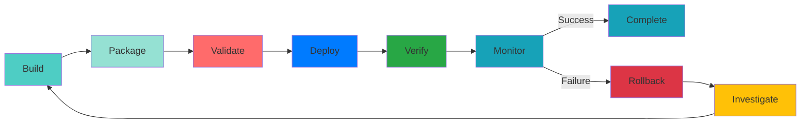

### 2.2. Deployment Environments

Tachyon defines three deployment environments with distinct purposes and configurations:

| Environment | Purpose | Access Control | Data Persistence | Monitoring Level |
|------------|---------|----------------|-----------------|-----------------|
| **Development** | Local development, team access | Temporary, reset on demand | Debug-level logging |
| **Staging** | Pre-production testing, QA access | Persistent, test data | Production-level logging |
| **Production** | Live user access | Persistent, production data | Production-level logging + alerts |

### 2.3. Deployment Artifacts

All Tachyon deployments produce the following artifacts:

| Artifact Type | Format | Purpose | Security Measures |
|--------------|--------|---------|------------------|
| **Desktop Binary** | Platform-specific executable | Native application distribution | Code signing, checksums |
| **Server Binary** | Executable binary | Service deployment | Code signing, stripped symbols |
| **Web Bundle** | Static assets (HTML, CSS, JS) | Frontend distribution | SRI hashes, compression |
| **Docker Image** | Container image | Containerized deployment | Image signing, vulnerability scan |
| **Nix Flake** | Flake.nix + lock files | Reproducible builds | Dependency pinning, verification |

### 2.4. Deployment Quality Gates

All deployments must pass the following quality gates before proceeding:

| Gate | Criteria | Enforcement | Failure Action |
|------|-----------|-------------|---------------|
| **Build Success** | All builds complete without errors | Automated | Block deployment |
| **Test Pass** | All unit, integration, E2E tests pass | Automated | Block deployment |
| **Coverage Threshold** | Code coverage meets minimum thresholds | Automated | Block deployment |
| **Security Scan** | No critical/high vulnerabilities | Automated | Block deployment |
| **Performance Benchmark** | Performance meets defined SLAs | Automated | Block deployment |
| **Configuration Validation** | All configurations valid and complete | Automated | Block deployment |
| **Approval** | Deployment approved by authorized personnel | Manual | Block deployment |

### 2.5. Deployment Metrics

The following metrics shall be collected for all deployments:

| Metric | Measurement | Target | Alert Threshold |
|--------|-------------|--------|-----------------|
| **Build Time** | Time from build start to artifact generation | < 30 minutes | > 45 minutes |
| **Deployment Time** | Time from deployment start to verification | < 15 minutes | > 30 minutes |
| **Downtime** | Time service unavailable during deployment | < 5 minutes | > 10 minutes |
| **Rollback Time** | Time from rollback trigger to restoration | < 10 minutes | > 20 minutes |
| **Success Rate** | Percentage of deployments without rollback | > 95% | < 90% |
| **Mean Time to Recovery (MTTR)** | Average time to restore service after failure | < 30 minutes | > 45 minutes |

---

## 3. DEPLOYMENT ARCHITECTURE

### 3.1. System Architecture Overview

The Tachyon deployment architecture implements a hybrid model supporting both local-first desktop deployment and centralized server deployment, enabling flexible deployment scenarios while maintaining consistent security and operational controls.

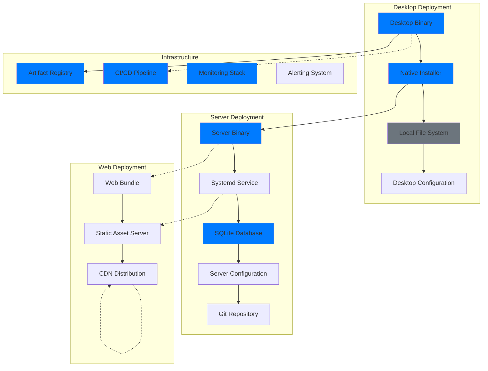

### 3.2. Desktop Deployment Architecture

The desktop component deployment architecture leverages Tauri's native packaging capabilities to provide platform-specific installers with integrated Rust backend.

**Desktop Deployment Components:**

| Component | Description | Technology | Deployment Method | Security Measures |
|-----------|-------------|------------------|
| **Tauri Wrapper** | Cross-platform desktop framework | Native bundling | Code signing |
| **Rust Backend** | Core application logic | Embedded in Tauri bundle |
| **Web Assets** | Leptos frontend | Embedded in Tauri bundle |
| **Native Modules** | Platform-specific extensions | Conditional compilation |

**Platform-Specific Deployment:**

| Platform | Installer Format | Code Signing | Distribution Method |
|----------|-------------|-------------|-------------------|
| **Windows** | NSIS installer | makensis | tachyon-desktop-setup.exe | Authenticode signing | Direct download, winget |
| **macOS** | DMG bundle + .app | tauri-cli | Tachyon.app | Apple code signing | Direct download, Homebrew Cask |
| **Linux** | AppImage | appimage-builder | Tachyon.AppImage | GPG signing | Direct download, package managers |

### 3.3. Server Deployment Architecture

The server component deployment architecture implements a containerized service model with systemd integration for production deployments.

**Server Deployment Components:**

| Component | Description | Technology | Deployment Method | Security Measures |
|-----------|-------------|------------------|
| **Axum Server** | HTTP/2 web framework | Systemd service | Code signing |
| **Tokio Runtime** | Async I/O runtime | Embedded in binary |
| **SQLite Database** | Embedded database | File-based persistence | Encryption at rest |
| **Tantivy Index** | Full-text search | Embedded in binary | Search index management |
| **Git Integration** | git2-rs | Repository operations | Embedded in binary | Git-based storage |

**Server Deployment Topology:**

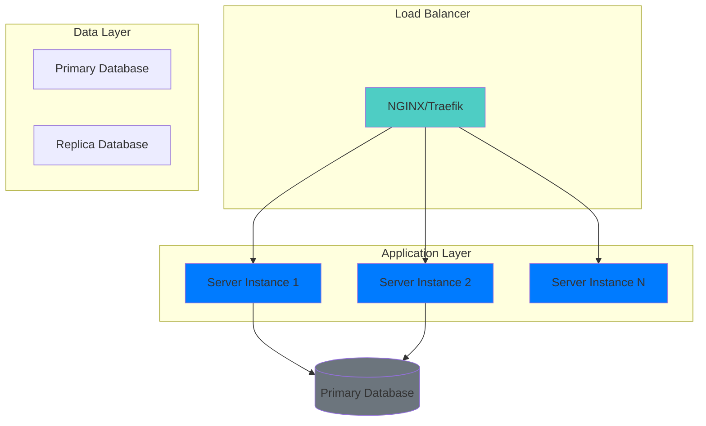

### 3.4. Infrastructure Requirements

Tachyon deployment infrastructure requirements specify minimum hardware and software specifications for each deployment environment.

**Development Environment Requirements:**

| Resource | Minimum | Recommended | Purpose |
|----------|---------|-------------|---------|
| **CPU** | 4 cores, 2.4 GHz | 8 cores, 3.0 GHz | Development, testing |
| **Memory** | 8 GB RAM | 16 GB RAM | Development, testing |
| **Storage** | 50 GB SSD | 100 GB SSD | Development, testing |
| **Network** | 100 Mbps | 1 Gbps | Development, testing |

**Staging Environment Requirements:**

| Resource | Minimum | Recommended | Purpose |
|----------|---------|-------------|---------|
| **CPU** | 8 cores, 2.4 GHz | 16 cores, 3.0 GHz | Pre-production testing |
| **Memory** | 16 GB RAM | 32 GB RAM | Pre-production testing |
| **Storage** | 100 GB SSD | 200 GB SSD | Pre-production testing |
| **Network** | 1 Gbps | 10 Gbps | Pre-production testing |

**Production Environment Requirements:**

| Resource | Minimum | Recommended | Purpose |
|----------|---------|-------------|---------|-----------------|
| **CPU** | 16 cores, 2.4 GHz | 32 cores, 3.0 GHz | Production workload |
| **Memory** | 32 GB RAM | 64 GB RAM | Production workload |
| **Storage** | 500 GB SSD | 1 TB SSD | Production data |
| **Network** | 10 Gbps | 40 Gbps | Production traffic |
| **Availability** | 99.5% uptime | 99.9% uptime | Production SLA |

### 3.5. Network Architecture

The Tachyon network architecture implements HTTP/2 with TLS 1.3 for all communications, ensuring confidentiality and integrity of data in transit.

**Network Security Requirements:**

| Requirement | Specification | Enforcement |
|------------|-------------|-------------|
| **TLS Version** | TLS 1.3 minimum | Server configuration |
| **Cipher Suites** | TLS_AES_128_GCM_SHA256, TLS_AES_256_GCM_SHA384 | Server configuration |
| **Certificate Management** | Automatic renewal via Let's Encrypt | ACME protocol |
| **HSTS** | max-age=31536000; includeSubDomains | HTTP headers |
| **CSP** | Content-Security-Policy header | HTTP headers |

**Network Topology:**

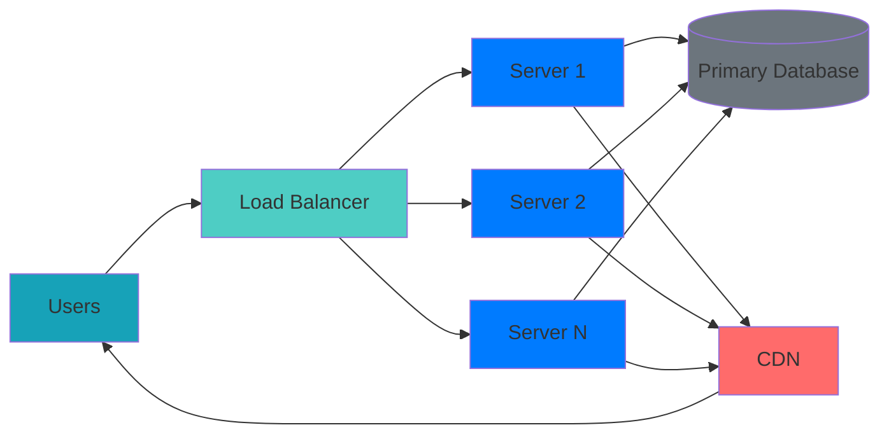

### 3.6. Security Architecture Integration

The deployment architecture integrates security controls at each layer following defense-in-depth principles [ADR-010].

**Security Layers:**

| Layer | Security Control | Implementation | Threat Mitigated |
|-------|----------------|------------------|
| **Infrastructure** | Network segmentation, firewall rules | Network-based attacks |
| **Transport** | TLS 1.3, mutual TLS | Man-in-the-Middle |
| **Application** | Input validation, RBAC | Injection attacks |
| **Data** | Encryption at rest, access control | Data exfiltration |
| **Build** | Dependency verification, code signing | Supply chain attacks |

**Security Zones:**

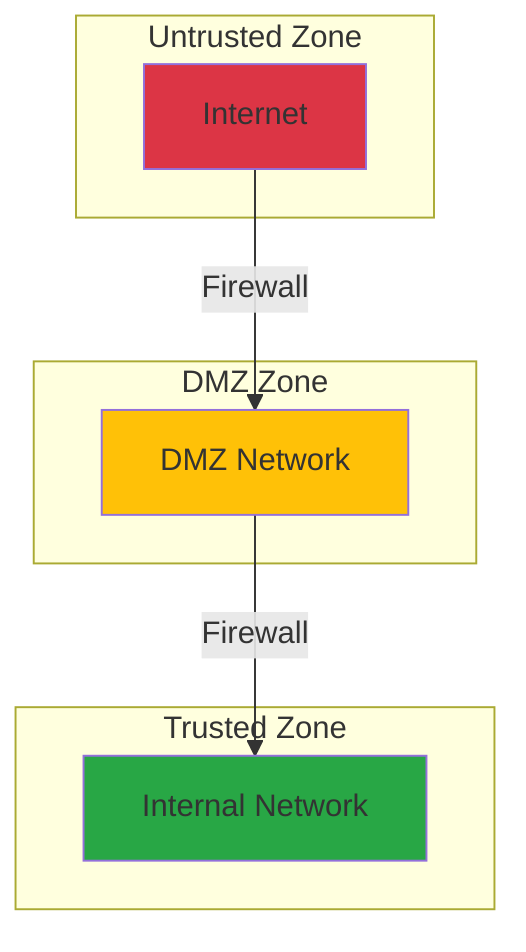

### 3.7. Cross-Platform Deployment Matrix

Tachyon supports cross-platform deployment with consistent behavior across Windows, macOS, and Linux platforms.

**Platform Compatibility Matrix:**

| Feature | Windows | macOS | Linux | Notes |
|---------|---------|-------|-------|-------|
| **Desktop App** | [PASS] Native | [PASS] Native | [PASS] Native | All platforms supported |
| **Server Service** | [PASS] Supported | [PASS] Supported | [PASS] Primary | Linux primary, others supported |
| **Web Frontend** | [PASS] Browser | [PASS] Browser | [PASS] Browser | All browsers supported |
| **Code Signing** | [PASS] Authenticode | [PASS] Apple | [PASS] GPG | Platform-specific signing |
| **Auto-Update** | [PASS] Supported | [PASS] Supported | [PASS] Supported | All platforms supported |
| **System Tray** | [PASS] Supported | [PASS] Supported | [PASS] Supported | All platforms supported |
| **File Associations** | [PASS] Supported | [PASS] Supported | [PASS] Supported | All platforms supported |

---

## 4. DEPLOYMENT PROCESS

### 4.1. Pre-Deployment Checklist

All deployments shall complete the following pre-deployment checklist to ensure readiness and mitigate deployment risks.

**General Pre-Deployment Checklist:**

| Item | Description | Responsibility | Status |
|-------|-------------|---------------|
| **Environment Preparation** | Verify target environment meets requirements | DevOps Engineer | [ ] |
| **Configuration Validation** | Validate all configuration files | DevOps Engineer | [ ] |
| **Dependency Verification** | Verify all dependencies are available | DevOps Engineer | [ ] |
| **Backup Creation** | Create backup of current deployment | DevOps Engineer | [ ] |
| **Rollback Plan** | Verify rollback plan is documented | DevOps Engineer | [ ] |
| **Security Scan** | Run vulnerability scanner on artifacts | Security Engineer | [ ] |
| **Performance Baseline** | Capture baseline performance metrics | DevOps Engineer | [ ] |
| **Approval Obtained** | Obtain deployment approval | Engineering Lead | [ ] |

**Component-Specific Pre-Deployment Checklist:**

| Component | Item | Description | Status |
|-----------|------|-------------|--------|
| **Desktop** | Installer tested on all platforms | [ ] |
| **Desktop** | Code signing certificates valid | [ ] |
| **Desktop** | Version metadata embedded | [ ] |
| **Server** | Binary tested on target platform | [ ] |
| **Server** | Systemd service file validated | [ ] |
| **Server** | Database migration scripts prepared | [ ] |
| **Web** | Asset bundle optimized and minified | [ ] |
| **Web** | SRI hashes calculated | [ ] |

### 4.2. Build Process

The Tachyon build process leverages Nix flakes for reproducible, hermetic builds across all platforms [ADR-006].

**Build Workflow:**

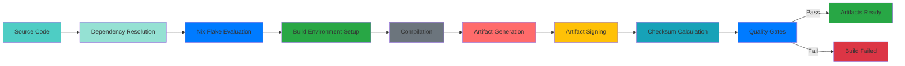

**Build Commands:**

| Operation | Command | Platform | Purpose |
|-----------|-----------|-----------|---------|
| **Development Build** | `nix build` | All | Incremental development builds |
| **Release Build** | `nix build --release` | All | Optimized release builds |
| **Cross-Platform Build** | `nix build --target <target>` | All | Cross-compilation |
| **Clean Build** | `nix flake clean` | All | Clean build artifacts |
| **Dependency Update** | `nix flake update` | All | Update dependencies |
| **Dependency Lock** | `nix flake lock` | All | Lock dependencies |

**Build Quality Gates:**

| Gate | Check | Pass Criteria | Fail Action |
|------|-------|--------------|------------|
| **Compilation** | All crates compile without errors | Zero errors allowed |
| **Tests** | All tests pass | 100% pass rate |
| **Linting** | Clippy passes with no warnings | Zero warnings |
| **Formatting** | rustfmt passes | No formatting issues |
| **Security** | cargo-audit passes | No vulnerabilities |
| **Documentation** | cargo doc builds without errors | No documentation errors |

### 4.3. Package Process

The packaging process transforms build artifacts into deployable packages with appropriate signatures and metadata.

**Desktop Packaging:**

| Platform | Package Type | Tool | Output | Security |
|----------|-------------|------|-------|---------|
| **Windows** | NSIS installer | makensis | tachyon-desktop-setup.exe | Authenticode signing | Direct download, winget |
| **macOS** | DMG bundle + .app | tauri-cli | Tachyon.app | Apple code signing | Direct download, Homebrew Cask |
| **Linux** | AppImage | appimage-builder | Tachyon.AppImage | GPG signing | Direct download, package managers |
| **Linux** | DEB package | cargo-deb | tachyon-desktop_0.1.0_amd64.deb | GPG signing | Direct download, package managers |
| **Linux** | RPM package | cargo-rpm | tachyon-desktop-0.1.0-1.x86_64.rpm | GPG signing | Direct download, package managers |

**Server Packaging:**

| Platform | Package Type | Tool | Output | Security |
|----------|-------------|------|-------|---------|
| **Linux** | Systemd service | cargo-systemd | tachyon-server.service | GPG signing | Direct download, package managers |
| **Linux** | Docker image | docker build | tachyon-server:0.1.0 | Image signing | Direct download, package managers |
| **All** | Archive | tar | tachyon-server-0.1.0.tar.gz | GPG signing | Direct download, package managers |

**Web Packaging:**

| Platform | Package Type | Tool | Output | Security |
|----------|-------------|------|-------|---------|
| **All** | Static bundle | bun build | dist/ | SRI hashes |
| **All** | Source maps | bun build | dist/*.map | SRI hashes |

### 4.4. Deployment Execution

The deployment execution process follows a structured workflow ensuring safe, auditable, and reversible deployments.

**Deployment Workflow:**

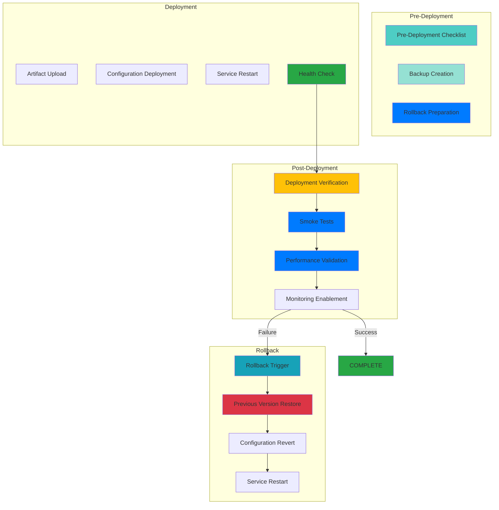

**Desktop Deployment Steps:**

| Step | Action | Command | Validation |
|------|--------|---------|------------|
| 1 | Upload installer to distribution server | `scp tachyon-desktop-setup.exe server:/releases/` | Verify checksum |
| 2 | Update version metadata | `./scripts/update_version.sh 0.1.0` | Verify version |
| 3 | Update download URLs | `./scripts/update_downloads.sh` | Verify accessibility |
| 4 | Send release notification | `./scripts/notify_release.sh` | Verify delivery |
| 5 | Monitor download metrics | Check analytics dashboard | Verify downloads |

**Server Deployment Steps:**

| Step | Action | Command | Validation |
|------|--------|---------|------------|
| 1 | Upload Docker image to registry | `docker push tachyon-server:0.1.0 registry.example.com/tachyon` | Verify image digest |
| 2 | Pull image on production servers | `docker pull registry.example.com/tachyon/tachyon-server:0.1.0` | Verify image integrity |
| 3 | Stop running service | `systemctl stop tachyon-server` | Verify service stopped |
| 4 | Update systemd service file | `systemctl daemon-reload` | Verify configuration |
| 5 | Start new service | `systemctl start tachyon-server` | Verify service running |
| 6 | Run health check | `curl -f https://tachyon.example.com/health` | Verify healthy status |

**Web Deployment Steps:**

| Step | Action | Command | Validation |
|------|--------|---------|------------|
| 1 | Upload static assets to CDN | `./scripts/upload_cdn.sh dist/` | Verify asset accessibility |
| 2 | Update cache-busting headers | `./scripts/update_cache_headers.sh` | Verify cache invalidation |
| 3 | Update DNS records | `./scripts/update_dns.sh` | Verify DNS propagation |
| 4 | Verify SSL certificate | `./scripts/verify_ssl.sh` | Verify certificate validity |
| 5 | Test web bundle | `./scripts/test_web_bundle.sh` | Verify bundle integrity |

### 4.5. Post-Deployment Verification

Post-deployment verification ensures that deployment was successful and meets all quality and performance criteria.

**Verification Checklist:**

| Item | Description | Acceptance Criteria |
|-------|-------------|-------------------|
| **Service Health** | All services report healthy status | HTTP 200, uptime > 99% |
| **Functionality** | Critical user workflows operational | All E2E tests pass |
| **Performance** | Response times meet SLA thresholds | p95 < 200ms |
| **Security** | No new vulnerabilities introduced | Zero critical/high |
| **Monitoring** | Telemetry data flowing to monitoring | Metrics reporting |
| **Logs** | No error logs exceeding thresholds | Error rate < 1% |
| **Configuration** | All configurations applied correctly | Config validation passes |

**Automated Verification Tests:**

| Test Type | Tool | Execution | Success Criteria |
|------------|------------------|
| **Health Check** | curl | Automated | HTTP 200 response |
| **Smoke Test** | E2E test suite | Automated | All tests pass |
| **Performance Test** | k6 benchmark | Automated | p95 < 200ms |
| **Security Scan** | trivy | Automated | No vulnerabilities |
| **Configuration Test** | validation script | Automated | All configs valid |

### 4.6. Deployment Troubleshooting

Common deployment issues and their resolutions are documented to enable rapid problem resolution.

**Common Issues and Resolutions:**

| Issue | Symptoms | Root Cause | Resolution |
|-------|-----------|-------------|------------|
| **Build Failure** | Compilation errors | Check dependency versions, update lock file |
| **Deployment Timeout** | Deployment exceeds time limit | Check network connectivity, retry deployment |
| **Service Not Starting** | Service fails to start | Check systemd logs, verify configuration |
| **Port Already in Use** | Port binding fails | Check for conflicting processes, use alternative port |
| **Permission Denied** | Access denied errors | Verify file permissions, check ownership |
| **Database Migration Failure** | Migration script errors | Rollback database, fix migration script |
| **SSL Certificate Error** | Certificate validation fails | Verify certificate chain, renew certificate |
| **Memory Exhaustion** | Out of memory errors | Increase memory allocation, optimize memory usage |
| **Disk Space Exhaustion** | Out of disk space errors | Clean up old artifacts, increase storage |
| **Troubleshooting Commands:**

| Issue | Diagnostic Command | Purpose |
|-------|-------------------|---------|
| **Build Issues** | `nix log --show-trace` | Trace build execution |
| **Service Issues** | `journalctl -u tachyon-server -f` | View service logs |
| **Network Issues** | `tcpdump -i any port 8080` | Capture network traffic |
| **Disk Issues** | `df -h` | Check disk space |
| **Memory Issues** | `free -h` | Check memory usage |
| **Process Issues** | `ps aux | grep tachyon` | Check running processes |

---

## 5. ENVIRONMENT CONFIGURATION

### 5.1. Configuration Management

Tachyon implements a hierarchical configuration management system supporting environment-specific configurations, runtime overrides, and secure secret management.

**Configuration Hierarchy:**

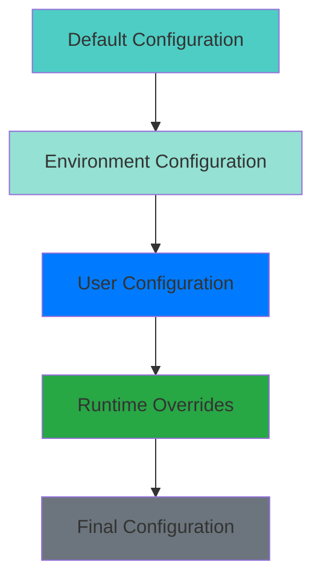

**Configuration Precedence:**

| Priority | Configuration Source | Scope | Override Capability |
|----------|---------------------|-------|-------------------|
| 1 | Runtime overrides | Process lifetime | Highest |
| 2 | User configuration | User-specific | High |
| 3 | Environment configuration | Environment-wide | Medium |
| 4 | Default configuration | Application-wide | Lowest |

### 5.2. Configuration Files

Tachyon uses standardized configuration files with clear separation of concerns.

**Configuration File Locations:**

| Platform | Default Configuration | User Configuration | Runtime Configuration |
|----------|---------------------|-------------------|---------------------|
| **Linux** | `/etc/tachyon/config.toml` | `~/.config/tachyon/config.toml` | `/run/tachyon/config.toml` |
| **macOS** | `/Library/Application Support/Tachyon/config.toml` | `~/Library/Application Support/Tachyon/config.toml` | `/var/run/tachyon/config.toml` |
| **Windows** | `C:\ProgramData\Tachyon\config.toml` | `%APPDATA%\Tachyon\config.toml` | `%TEMP%\tachyon\config.toml` |

**Configuration File Structure:**

```toml
# Tachyon Configuration File
# Version: 1.0.0

[server]
host = "0.0.0.0"
port = 8080
workers = 4
max_connections = 1000

[database]
path = "/var/lib/tachyon/tachyon.db"
backup_path = "/var/lib/tachyon/backups"
enable_encryption = true

[security]
tls_enabled = true
tls_cert_path = "/etc/tachyon/certs/server.crt"
tls_key_path = "/etc/tachyon/certs/server.key"
allowed_origins = ["https://tachyon.example.com"]

[logging]
level = "info"
path = "/var/log/tachyon/tachyon.log"
max_size = "100MB"
max_backups = 10
max_age = "30d"

[monitoring]
enabled = true
metrics_port = 9090
health_check_interval = "30s"

[features]
enable_search = true
enable_websockets = true
enable_analytics = false
```

### 5.3. Environment Variables

Tachyon supports environment variable overrides for sensitive configuration and containerized deployments.

**Environment Variable Mapping:**

| Configuration Path | Environment Variable | Type | Description |
|--------------------|---------------------|------|-------------|
| `server.host` | `TACHYON_SERVER_HOST` | String | Server bind address |
| `server.port` | `TACHYON_SERVER_PORT` | Integer | Server bind port |
| `database.path` | `TACHYON_DB_PATH` | String | Database file path |
| `security.tls_enabled` | `TACHYON_TLS_ENABLED` | Boolean | Enable TLS |
| `security.tls_cert_path` | `TACHYON_TLS_CERT_PATH` | String | TLS certificate path |
| `security.tls_key_path` | `TACHYON_TLS_KEY_PATH` | String | TLS private key path |
| `logging.level` | `TACHYON_LOG_LEVEL` | String | Logging level |
| `monitoring.enabled` | `TACHYON_MONITORING_ENABLED` | Boolean | Enable monitoring |

**Environment-Specific Configuration:**

| Environment | Required Variables | Optional Variables |
|-------------|-------------------|-------------------|
| **Development** | `TACHYON_ENV=development` | `TACHYON_LOG_LEVEL=debug` |
| **Staging** | `TACHYON_ENV=staging` | `TACHYON_LOG_LEVEL=info` |
| **Production** | `TACHYON_ENV=production` | `TACHYON_LOG_LEVEL=warn` |

### 5.4. Secret Management

Tachyon implements secure secret management following defense-in-depth security principles [ADR-010].

**Secret Storage:**

| Secret Type | Storage Method | Encryption | Rotation Policy |
|-------------|---------------|------------|-----------------|
| **Database Encryption Key** | Encrypted file | AES-256-GCM | Quarterly |
| **TLS Private Key** | Encrypted file | AES-256-GCM | Annual |
| **API Keys** | Encrypted file | AES-256-GCM | On compromise |
| **Session Secrets** | Encrypted file | AES-256-GCM | Monthly |

**Secret Management Workflow:**

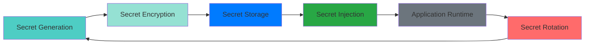

**Secret Management Commands:**

| Operation | Command | Purpose |
|-----------|---------|---------|
| **Generate Secret** | `./scripts/generate_secret.sh <name>` | Generate new secret |
| **Encrypt Secret** | `./scripts/encrypt_secret.sh <name>` | Encrypt secret |
| **Decrypt Secret** | `./scripts/decrypt_secret.sh <name>` | Decrypt secret (admin only) |
| **Rotate Secret** | `./scripts/rotate_secret.sh <name>` | Rotate secret |
| **List Secrets** | `./scripts/list_secrets.sh` | List all secrets |

### 5.5. Feature Flags

Tachyon implements feature flags for controlled rollout of new functionality and A/B testing capabilities.

**Feature Flag Configuration:**

```toml
[features]
# Feature flags for controlled rollout
enable_search = true
enable_websockets = true
enable_analytics = false
enable_experimental_ui = false

[features.rollouts]
# Percentage-based rollouts
new_search_engine = { enabled = true, percentage = 10 }
experimental_ui = { enabled = true, percentage = 5 }

[features.a_b_tests]
# A/B testing configurations
search_algorithm = { enabled = true, variants = ["a", "b"], split = 50 }
```

**Feature Flag Management:**

| Operation | Command | Purpose |
|-----------|---------|---------|
| **Enable Feature** | `./scripts/enable_feature.sh <name>` | Enable feature flag |
| **Disable Feature** | `./scripts/disable_feature.sh <name>` | Disable feature flag |
| **Set Percentage** | `./scripts/set_feature_percentage.sh <name> <percentage>` | Set rollout percentage |
| **List Features** | `./scripts/list_features.sh` | List all feature flags |

### 5.6. Configuration Validation

All configurations shall be validated before deployment to prevent misconfiguration issues.

**Validation Rules:**

| Configuration | Validation Rule | Error Action |
|---------------|-----------------|--------------|
| `server.port` | 1024-65535 | Block deployment |
| `database.path` | Writable directory | Block deployment |
| `security.tls_cert_path` | Valid certificate | Block deployment |
| `security.tls_key_path` | Valid private key | Block deployment |
| `logging.level` | Valid log level | Use default |
| `monitoring.metrics_port` | 1024-65535 | Block deployment |

**Validation Commands:**

| Operation | Command | Purpose |
|-----------|---------|---------|
| **Validate Configuration** | `./scripts/validate_config.sh <config-file>` | Validate configuration file |
| **Validate Secrets** | `./scripts/validate_secrets.sh` | Validate secret files |
| **Validate Environment** | `./scripts/validate_environment.sh <environment>` | Validate environment configuration |

### 5.7. Environment-Specific Configurations

Tachyon defines environment-specific configurations with appropriate security and operational controls.

**Development Environment:**

| Setting | Value | Rationale |
|---------|-------|-----------|
| `server.host` | `127.0.0.1` | Local access only |
| `logging.level` | `debug` | Detailed logging |
| `monitoring.enabled` | `false` | Not required |
| `security.tls_enabled` | `false` | Not required |

**Staging Environment:**

| Setting | Value | Rationale |
|---------|-------|-----------|
| `server.host` | `0.0.0.0` | Network accessible |
| `logging.level` | `info` | Production-like logging |
| `monitoring.enabled` | `true` | Monitoring enabled |
| `security.tls_enabled` | `true` | Security enforced |

**Production Environment:**

| Setting | Value | Rationale |
|---------|-------|-----------|
| `server.host` | `0.0.0.0` | Network accessible |
| `logging.level` | `warn` | Minimal logging |
| `monitoring.enabled` | `true` | Monitoring enabled |
| `security.tls_enabled` | `true` | Security enforced |

---

## 6. DEPLOYMENT STRATEGIES

### 6.1. Strategy Overview

Tachyon supports multiple deployment strategies to accommodate different use cases, risk tolerances, and operational requirements.

**Strategy Comparison:**

| Strategy | Downtime | Rollback Complexity | Risk Level | Use Case |
|----------|----------|---------------------|------------|----------|
| **Rolling Deployment** | Minimal | Low | Low | Routine updates |
| **Blue-Green Deployment** | None | Very Low | Very Low | Critical updates |
| **Canary Deployment** | None | Medium | Medium | Experimental features |
| **A/B Testing** | None | Medium | Medium | Feature validation |

### 6.2. Rolling Deployment

Rolling deployment updates instances incrementally, maintaining service availability throughout the deployment process.

**Rolling Deployment Workflow:**


**Rolling Deployment Steps:**

| Step | Action | Command | Validation |
|------|--------|---------|------------|
| 1 | Deploy to first instance | `./scripts/rolling_deploy.sh 1` | Health check |
| 2 | Verify instance health | `curl -f https://tachyon-1.example.com/health` | HTTP 200 |
| 3 | Deploy to second instance | `./scripts/rolling_deploy.sh 2` | Health check |
| 4 | Verify instance health | `curl -f https://tachyon-2.example.com/health` | HTTP 200 |
| 5 | Continue to remaining instances | `./scripts/rolling_deploy.sh N` | Health check |
| 6 | Verify all instances | `./scripts/verify_all_instances.sh` | All healthy |

**Rolling Deployment Configuration:**

```toml
[deployment.strategy]
type = "rolling"
batch_size = 1
health_check_timeout = "60s"
health_check_interval = "10s"
max_retries = 3
```

### 6.3. Blue-Green Deployment

Blue-Green deployment maintains two identical environments, enabling instant rollback and zero-downtime deployments.

**Blue-Green Deployment Architecture:**

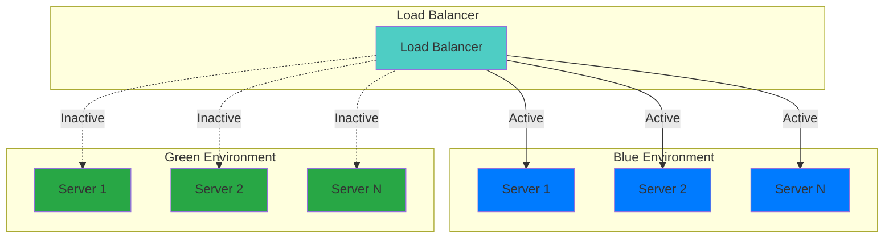

**Blue-Green Deployment Steps:**

| Step | Action | Command | Validation |
|------|--------|---------|------------|
| 1 | Deploy to Green environment | `./scripts/blue_green_deploy.sh green` | Health check |
| 2 | Verify Green environment | `./scripts/verify_environment.sh green` | All healthy |
| 3 | Run smoke tests on Green | `./scripts/smoke_test.sh green` | Tests pass |
| 4 | Switch traffic to Green | `./scripts/switch_traffic.sh green` | Traffic flowing |
| 5 | Verify production health | `./scripts/verify_production.sh` | All healthy |
| 6 | Keep Blue as rollback target | N/A | Ready for rollback |

**Blue-Green Deployment Configuration:**

```toml
[deployment.strategy]
type = "blue_green"
blue_environment = "blue"
green_environment = "green"
switch_timeout = "60s"
health_check_timeout = "30s"
```

### 6.4. Canary Deployment

Canary deployment gradually rolls out new versions to a subset of users, enabling validation before full rollout.

**Canary Deployment Architecture:**

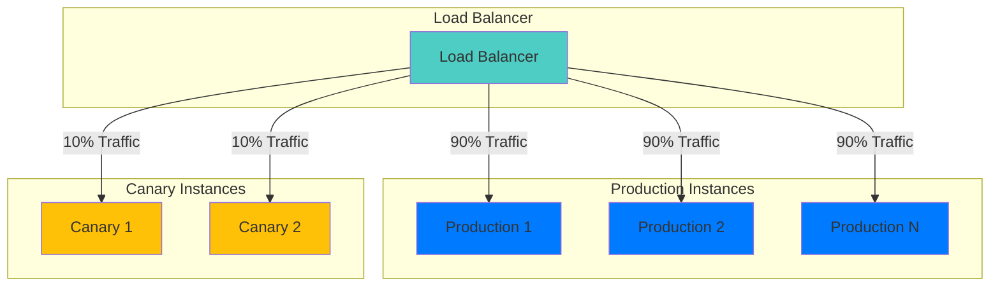

**Canary Deployment Steps:**

| Step | Action | Command | Validation |
|------|--------|---------|------------|
| 1 | Deploy to canary instances | `./scripts/canary_deploy.sh` | Health check |
| 2 | Set traffic percentage | `./scripts/set_canary_percentage.sh 10` | Traffic configured |
| 3 | Monitor canary metrics | `./scripts/monitor_canary.sh` | Metrics normal |
| 4 | Gradually increase traffic | `./scripts/increase_canary.sh 25` | Traffic configured |
| 5 | Continue monitoring | `./scripts/monitor_canary.sh` | Metrics normal |
| 6 | Complete rollout | `./scripts/complete_canary.sh` | Full rollout |

**Canary Deployment Configuration:**

```toml
[deployment.strategy]
type = "canary"
initial_percentage = 10
increment_percentage = 15
max_percentage = 100
monitoring_duration = "30m"
```

### 6.5. A/B Testing

A/B testing splits user traffic between different deployment versions for controlled experimentation and feature validation.

**A/B Testing Architecture:**

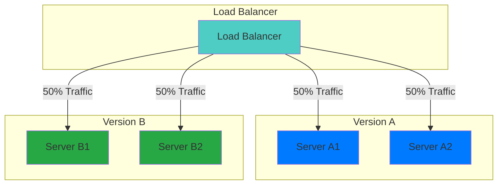

**A/B Testing Steps:**

| Step | Action | Command | Validation |
|------|--------|---------|------------|
| 1 | Deploy Version A | `./scripts/ab_deploy.sh a` | Health check |
| 2 | Deploy Version B | `./scripts/ab_deploy.sh b` | Health check |
| 3 | Configure traffic split | `./scripts/ab_split.sh 50 50` | Traffic configured |
| 4 | Monitor both versions | `./scripts/monitor_ab.sh` | Metrics normal |
| 5 | Analyze results | `./scripts/analyze_ab.sh` | Results available |
| 6 | Select winner | `./scripts/ab_select.sh a` | Winner selected |

**A/B Testing Configuration:**

```toml
[deployment.strategy]
type = "ab_testing"
version_a = "1.0.0"
version_b = "1.1.0"
traffic_split = [50, 50]
test_duration = "7d"
```

---

## 7. ROLLBACK PROCEDURES

### 7.1. Rollback Architecture

Tachyon implements comprehensive rollback procedures enabling rapid recovery from deployment failures.

**Rollback Triggers:**

| Trigger Type | Detection Method | Response Time |
|--------------|------------------|---------------|
| **Automated Health Check** | Monitoring system | Immediate |
| **Performance Degradation** | Performance monitoring | Within 5 minutes |
| **Error Rate Increase** | Error tracking | Within 2 minutes |
| **Manual Trigger** | Operator decision | Immediate |

**Rollback Architecture:**

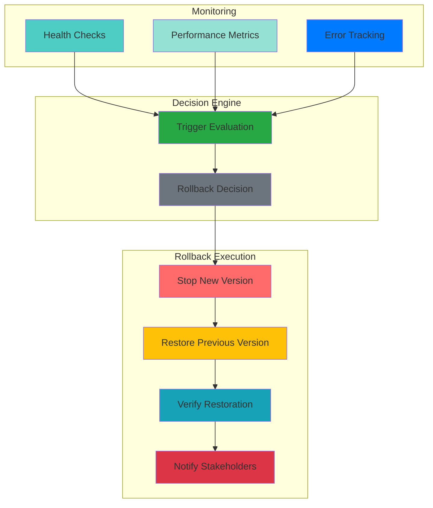

### 7.2. Rollback Mechanisms

Tachyon supports multiple rollback mechanisms with different recovery time objectives (RTOs).

**Rollback Mechanisms:**

| Mechanism | RTO | Complexity | Use Case |
|-----------|-----|------------|----------|
| **Instant Rollback** | < 1 minute | Very Low | Blue-Green switch back |
| **Fast Rollback** | < 5 minutes | Low | Canary traffic reduction |
| **Standard Rollback** | < 10 minutes | Medium | Previous version deployment |
| **Full Rollback** | < 30 minutes | High | Complete environment restoration |

**Rollback Commands:**

| Operation | Command | Purpose |
|-----------|---------|---------|
| **Trigger Rollback** | `./scripts/trigger_rollback.sh <version>` | Initiate rollback |
| **Check Rollback Status** | `./scripts/rollback_status.sh` | Check rollback progress |
| **Verify Rollback** | `./scripts/verify_rollback.sh` | Verify rollback success |
| **Cancel Rollback** | `./scripts/cancel_rollback.sh` | Cancel in-progress rollback |

### 7.3. Rollback Validation

All rollbacks shall be validated to ensure successful restoration of service.

**Rollback Validation Checklist:**

| Item | Description | Acceptance Criteria |
|-------|-------------|-------------------|
| **Service Health** | All services report healthy status | HTTP 200, uptime > 99% |
| **Functionality** | Critical user workflows operational | All E2E tests pass |
| **Performance** | Response times meet SLA thresholds | p95 < 200ms |
| **Data Integrity** | No data loss or corruption | Database consistency checks |
| **Configuration** | Previous configuration restored | Config validation passes |
| **Monitoring** | Telemetry data flowing to monitoring | Metrics reporting |

### 7.4. Rollback Testing

Rollback procedures shall be tested regularly to ensure reliability during actual rollback events.

**Rollback Testing Schedule:**

| Test Type | Frequency | Purpose |
|-----------|-----------|---------|
| **Automated Rollback Test** | Weekly | Verify rollback automation |
| **Manual Rollback Drill** | Monthly | Verify manual rollback procedures |
| **Full Rollback Simulation** | Quarterly | Verify complete rollback process |

**Rollback Test Scenarios:**

| Scenario | Description | Expected Outcome |
|----------|-------------|------------------|
| **Health Check Failure** | Simulate health check failure | Automatic rollback triggered |
| **Performance Degradation** | Simulate performance degradation | Manual rollback initiated |
| **Error Rate Spike** | Simulate error rate spike | Automatic rollback triggered |
| **Manual Trigger** | Manual rollback initiation | Rollback completes successfully |

### 7.5. Rollback Communication

Rollback events shall be communicated to all relevant stakeholders with clear status updates.

**Communication Channels:**

| Channel | Purpose | Audience |
|---------|---------|----------|
| **Slack Alert** | Immediate notification | Engineering team |
| **Email Alert** | Detailed notification | All stakeholders |
| **Status Page** | Public status update | Users |
| **Incident Report** | Post-incident analysis | Leadership team |

**Communication Template:**

```
SUBJECT: Rollback Initiated - Tachyon v{version}

STATUS: {status}
STARTED: {timestamp}
ESTIMATED COMPLETION: {estimated_completion}

DETAILS:
- Trigger: {trigger_type}
- Reason: {reason}
- Previous Version: {previous_version}
- Current Version: {current_version}

NEXT STEPS:
- {next_step_1}
- {next_step_2}

CONTACT: {contact_person}
```

### 7.6. Rollback Metrics

Rollback metrics shall be collected and analyzed to improve deployment reliability.

**Rollback Metrics:**

| Metric | Measurement | Target | Alert Threshold |
|--------|-------------|--------|-----------------|
| **Rollback Frequency** | Rollbacks per month | < 2 | > 3 |
| **Rollback Success Rate** | Percentage of successful rollbacks | > 95% | < 90% |
| **Rollback Time** | Time from trigger to completion | < 10 minutes | > 20 minutes |
| **Rollback Data Loss** | Data loss during rollback | 0 bytes | Any data loss |
| **Rollback Downtime** | Service downtime during rollback | < 5 minutes | > 10 minutes |

---

## 8. DEPLOYMENT MONITORING

### 8.1. Monitoring Architecture

Tachyon implements comprehensive deployment monitoring providing real-time visibility into deployment health, performance, and operational status.

**Monitoring Architecture:**

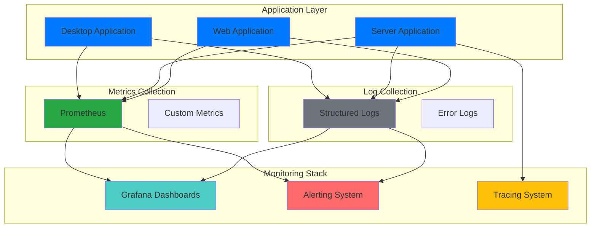

### 8.2. Metrics Collection

Tachyon collects comprehensive metrics covering deployment health, performance, and operational status.

**Deployment Metrics:**

| Metric | Type | Description | Collection Interval |
|--------|------|-------------|---------------------|
| **Deployment Status** | Gauge | Current deployment state | 1 minute |
| **Deployment Duration** | Histogram | Time to complete deployment | Per deployment |
| **Rollback Count** | Counter | Number of rollbacks | Per event |
| **Error Rate** | Gauge | Percentage of errors | 1 minute |
| **Response Time** | Histogram | Request response times | 1 minute |
| **Throughput** | Gauge | Requests per second | 1 minute |
| **CPU Usage** | Gauge | CPU utilization | 1 minute |
| **Memory Usage** | Gauge | Memory utilization | 1 minute |
| **Disk Usage** | Gauge | Disk utilization | 1 minute |
| **Network Traffic** | Gauge | Network I/O | 1 minute |

**Metrics Export Configuration:**

```toml
[monitoring.metrics]
enabled = true
exporter_type = "prometheus"
exporter_port = 9090
export_interval = "60s"
```

### 8.3. Alerting

Tachyon implements comprehensive alerting ensuring rapid response to deployment issues.

**Alert Rules:**

| Alert | Condition | Severity | Notification |
|-------|-----------|----------|--------------|
| **Deployment Failed** | Deployment status = failed | Critical | Slack, Email, PagerDuty |
| **Health Check Failed** | Health check = unhealthy | Critical | Slack, Email, PagerDuty |
| **High Error Rate** | Error rate > 5% | Warning | Slack, Email |
| **Slow Response Time** | p95 response time > 500ms | Warning | Slack |
| **High CPU Usage** | CPU usage > 80% | Warning | Slack |
| **High Memory Usage** | Memory usage > 80% | Warning | Slack |
| **Disk Space Low** | Disk usage > 90% | Critical | Slack, Email |
| **Rollback Triggered** | Rollback event | Critical | Slack, Email, PagerDuty |

**Alert Configuration:**

```toml
[monitoring.alerting]
enabled = true
notification_channels = ["slack", "email", "pagerduty"]
slack_webhook_url = "https://hooks.slack.com/services/..."
email_recipients = ["ops@example.com"]
pagerduty_service_key = "..."
```

### 8.4. Dashboards

Tachyon provides monitoring dashboards for real-time visibility into deployment status.

**Dashboard Panels:**

| Panel | Metrics | Purpose |
|-------|---------|---------|
| **Deployment Overview** | Deployment status, duration, success rate | Deployment health |
| **Service Health** | Health checks, uptime, availability | Service status |
| **Performance** | Response time, throughput, error rate | Performance metrics |
| **Resource Usage** | CPU, memory, disk, network | Resource utilization |
| **Rollback Status** | Rollback count, rollback time, rollback success rate | Rollback metrics |

**Dashboard Access:**

| Dashboard | URL | Access Level |
|-----------|-----|--------------|
| **Deployment Overview** | https://monitoring.tachyon.example.com/d/deployment | All stakeholders |
| **Service Health** | https://monitoring.tachyon.example.com/d/health | Operations team |
| **Performance** | https://monitoring.tachyon.example.com/d/performance | Engineering team |
| **Resource Usage** | https://monitoring.tachyon.example.com/d/resources | Operations team |

---

## 9. REFERENCES

### 9.1. Standards and Specifications

| Document | ID | Version | Date |
|----------|----|---------|------|
| **ISO/IEC 26514:2021** | Systems and software engineering — Design and development of information for users | 2021 | 2021 |
| **IEEE 1063:2001** | IEEE Standard for Software User Documentation | 2001 | 2001 |
| **RFC 2119** | Key words for use in RFCs to Indicate Requirement Levels | 1997 | 1997 |

### 9.2. Project Documentation

| Document | Path | Version | Date |
|----------|------|---------|------|
| **Coding and Documentation Standards** | `.specs/01_standards/coding_standards.md` | V1.0 | February 2026 |
| **Build and Deployment Requirements** | `.specs/04_future_state/reqs/build_requirements.md` | V1.0 | February 2026 |
| **Server Application Requirements** | `.specs/04_future_state/reqs/server_requirements.md` | V1.0 | February 2026 |
| **Security Requirements** | `.specs/04_future_state/reqs/security_requirements.md` | V1.0 | February 2026 |
| **Test Plan** | `.specs/04_future_state/test_plan.md` | V1.0 | February 2026 |
| **Build System Design** | `.specs/04_future_state/design/build_design.md` | V1.0 | February 2026 |
| **Deployment Architecture** | `docs/architecture/deployment_architecture.md` | V1.0 | February 2026 |

### 9.3. Architecture Decision Records

| Document | Path | Version | Date |
|----------|------|---------|------|
| **ADR-001: Rust as Primary Language** | `.specs/02_adrs/001_rust_as_primary_language.md` | V1.0 | February 2026 |
| **ADR-006: Nix Flakes for Reproducible Builds** | `.specs/02_adrs/006_nix_flakes_reproducible_builds.md` | V1.0 | February 2026 |
| **ADR-010: Security Architecture** | `.specs/02_adrs/010_security_architecture.md` | V1.0 | February 2026 |

### 9.4. External Documentation

| Document | URL | Version | Date |
|----------|-----|---------|------|
| **Tauri Documentation** | https://tauri.app/v1/guides/ | Latest | February 2026 |
| **Axum Documentation** | https://docs.rs/axum/ | Latest | February 2026 |
| **Leptos Documentation** | https://leptos.dev/ | Latest | February 2026 |
| **Nix Flakes Documentation** | https://nixos.wiki/wiki/Flakes | Latest | February 2026 |
| **Prometheus Documentation** | https://prometheus.io/docs/ | Latest | February 2026 |
| **Grafana Documentation** | https://grafana.com/docs/ | Latest | February 2026 |

### 9.5. Glossary

| Term | Definition |
|------|------------|
| **ADR** | Architecture Decision Record |
| **API** | Application Programming Interface |
| **CDN** | Content Delivery Network |
| **CI/CD** | Continuous Integration/Continuous Deployment |
| **E2E** | End-to-End |
| **HTTP** | Hypertext Transfer Protocol |
| **MTTR** | Mean Time to Recovery |
| **RTO** | Recovery Time Objective |
| **SRI** | Subresource Integrity |
| **TLS** | Transport Layer Security |
| **UI** | User Interface |

---

**Document Control**

| Version | Date | Author | Changes |
|---------|------|--------|---------|
| 1.0 | February 2026 | Technical Writer | Initial release |

**Approval**

| Role | Name | Signature | Date |
|------|------|-----------|------|
| Engineering Lead | [Name] | [Signature] | [Date] |
| Operations Lead | [Name] | [Signature] | [Date] |
| Security Lead | [Name] | [Signature] | [Date] |

---

**END OF DOCUMENT**
