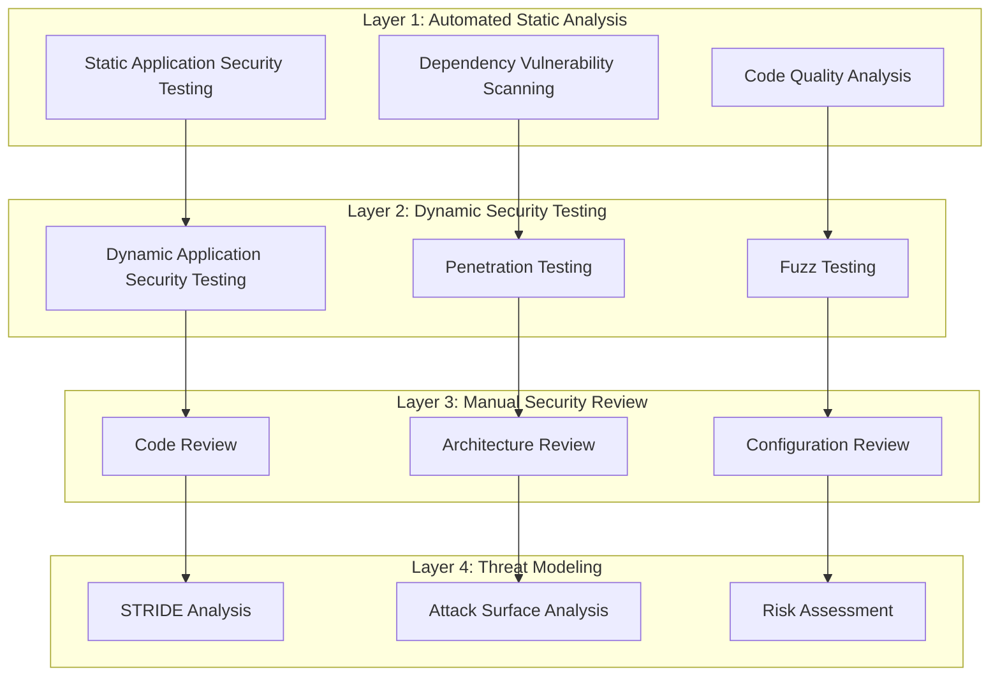
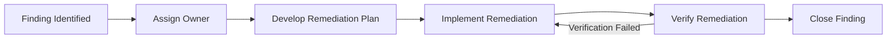

# TACHYON: SECURITY AUDIT GUIDE

**Document ID:** TACHYON-SEC-004-V1.0
**Date:** February 2026
**Status:** Approved for Implementation
**Classification:** Security Architecture Documentation
**Compliance Level:** ISO/IEC 27001:2022, NIST SP 800-53 Rev. 5, OWASP ASVS 4.0

---

## TABLE OF CONTENTS

1. [Introduction](#1-introduction)
2. [Audit Principles](#2-audit-principles)
3. [Security Audit Framework](#3-security-audit-framework)
4. [Pre-Audit Preparation](#4-pre-audit-preparation)
5. [Audit Execution](#5-audit-execution)
6. [Audit Reporting](#6-audit-reporting)
7. [Audit Tools](#7-audit-tools)
8. [Audit Remediation](#8-audit-remediation)
9. [References](#9-references)

---

## 1. INTRODUCTION

### 1.1. Purpose and Scope

This document provides a comprehensive guide for conducting security audits of the Tachyon toolchain. The guide establishes a systematic, rigorous methodology for evaluating the security posture of all system components, ensuring compliance with established security standards and architectural decisions.

The Tachyon toolchain encompasses a hybrid architecture with multiple security domains:
- **Desktop Application:** Tauri-based native application with WebView frontend
- **Server Component:** Axum-based HTTP/2 server with async runtime
- **Web Frontend:** Leptos-based web application with WASM modules
- **Storage Layer:** Git repository and SQLite database
- **Build Infrastructure:** Nix-based reproducible build system

This audit guide addresses the unique security challenges presented by this multi-component architecture, including cross-component communication, local-first deployment modes, and the integration of web and native technologies.

### 1.2. Document Dependencies

This guide depends on the following documents:
- [TACHYON-STD-V1.0](../../.specs/01_standards/coding_standards.md) - Coding and Documentation Standards
- [TACHYON-ADR-001-V1.0](../../.specs/02_adrs/001_rust_as_primary_language.md) - Rust as Primary Language
- [TACHYON-ADR-010-V1.0](../../.specs/02_adrs/010_security_architecture.md) - Security Architecture
- [TACHYON-TMA-V1.0](../../.specs/03_threat_model/analysis.md) - Threat Model Analysis
- [TACHYON-TSK-V1.0](../../.specs/tasks.md) - Execution Tasks and Work Breakdown Structure

### 1.3. Target Audience

This guide is intended for:
- **Security Architects:** Responsible for designing and overseeing security audits
- **Security Engineers:** Responsible for executing security audits
- **Development Teams:** Responsible for implementing security controls and remediating findings
- **DevOps Engineers:** Responsible for secure deployment and infrastructure security
- **Compliance Officers:** Responsible for verifying regulatory compliance

### 1.4. Audit Objectives

The primary objectives of security audits for the Tachyon toolchain are:

1. **Vulnerability Identification:** Systematic identification of security vulnerabilities across all system components
2. **Compliance Verification:** Verification of compliance with security standards, regulations, and architectural decisions
3. **Risk Assessment:** Quantitative and qualitative assessment of security risks
4. **Control Effectiveness:** Evaluation of the effectiveness of implemented security controls
5. **Continuous Improvement:** Identification of opportunities for security posture enhancement

### 1.5. Audit Scope

The audit scope encompasses the following domains:

| Domain | Components | Audit Focus |
|--------|-------------|--------------|
| **Application Layer** | Desktop, Server, Web Frontend | Input validation, authentication, authorization, session management |
| **Communication Layer** | HTTP/2, WebSocket, IPC | Encryption, protocol security, message integrity |
| **Data Layer** | SQLite, Git Repository, Search Index | Encryption at rest, access controls, data integrity |
| **Infrastructure Layer** | Nix Build System, Deployment | Supply chain security, build integrity, configuration management |
| **Operational Layer** | Logging, Monitoring, Incident Response | Audit trails, security monitoring, incident response procedures |

---

## 2. AUDIT PRINCIPLES

### 2.1. Defense-in-Depth Principle

The defense-in-depth principle mandates the implementation of multiple, overlapping security controls. Audits must verify that no single control failure results in complete security compromise.

**Audit Criteria:**
- Multiple independent controls protect each critical asset
- Failure of one control is compensated by others
- Controls are implemented across different architectural layers
- Redundant mechanisms provide protection against control bypass

**Verification Method:**
- Map critical assets to implemented security controls
- Identify single points of failure in security architecture
- Verify control independence and separation of concerns
- Test control failure scenarios

### 2.2. Principle of Least Privilege

The principle of least privilege requires that all components, processes, and users operate with the minimum privileges necessary to perform their functions. Audits must verify that privilege escalation is prevented and excessive privileges are not granted.

**Audit Criteria:**
- Components run with minimal required permissions
- User permissions align with role-based access control (RBAC)
- Privilege separation mechanisms are implemented
- Temporary privilege elevation is properly scoped and time-limited

**Verification Method:**
- Review capability configurations in Tauri capabilities
- Analyze file system permissions and access controls
- Examine database permissions and query privileges
- Verify process and service account permissions

### 2.3. Zero Trust Principle

The zero trust principle assumes no implicit trust within security boundaries. All requests, whether from internal or external sources, must be authenticated, authorized, and encrypted. Audits must verify that trust assumptions are eliminated and all access is explicitly verified.

**Audit Criteria:**
- All network communications are authenticated and encrypted
- No implicit trust based on network location
- Continuous verification of device and user trust
- Micro-segmentation of security zones

**Verification Method:**
- Verify TLS 1.3 implementation for all network communications
- Test authentication and authorization for all API endpoints
- Examine trust boundary definitions and enforcement
- Review certificate management and rotation procedures

### 2.4. Secure by Default Principle

The secure by default principle requires that all configurations, settings, and behaviors are secure out of the box without requiring manual intervention. Audits must verify that insecure defaults are eliminated and security is the default state.

**Audit Criteria:**
- Default configurations are secure
- No insecure features enabled by default
- Security settings cannot be easily disabled
- Clear warnings accompany security-relevant configuration changes

**Verification Method:**
- Review default configuration files and settings
- Test default installation and deployment
- Examine security feature enablement
- Verify configuration validation mechanisms

### 2.5. Fail-Safe Principle

The fail-safe principle requires that systems fail securely, preserving security properties even in error conditions. Audits must verify that error handling does not expose sensitive information or create security vulnerabilities.

**Audit Criteria:**
- Errors do not expose sensitive information
- Error messages are generic and user-friendly
- System state remains secure after errors
- Error conditions are logged for security monitoring

**Verification Method:**
- Test error conditions across all interfaces
- Analyze error message content for information leakage
- Verify error handling code paths
- Review error logging and monitoring

### 2.6. Audit Trail Principle

The audit trail principle requires comprehensive logging of all security-relevant events. Audits must verify that all actions are attributable, logged, and protected against tampering.

**Audit Criteria:**
- All security-relevant events are logged
- Logs include sufficient context for forensic analysis
- Logs are protected against tampering and deletion
- Log retention policies meet compliance requirements

**Verification Method:**
- Review logging implementation across all components
- Verify log content completeness and accuracy
- Test log protection mechanisms
- Examine log retention and archival procedures

---

## 3. SECURITY AUDIT FRAMEWORK

### 3.1. Audit Methodology Overview

The Tachyon security audit framework employs a multi-layered methodology combining static analysis, dynamic testing, manual review, and threat modeling. This comprehensive approach ensures thorough coverage of all security domains while maintaining efficiency and reproducibility.

**Audit Methodology Layers:**



### 3.2. Audit Phases

The security audit process is organized into five sequential phases, each with specific objectives, deliverables, and acceptance criteria.

#### Phase 1: Planning and Scoping

**Objective:** Define audit scope, objectives, and success criteria.

**Activities:**
- Define audit boundaries and in-scope components
- Identify audit objectives and success criteria
- Select audit methodologies and tools
- Establish audit timeline and resource allocation
- Define communication and reporting procedures

**Deliverables:**
- Audit Plan Document
- Component Inventory
- Risk Assessment Matrix
- Resource Allocation Plan

**Acceptance Criteria:**
- Audit scope clearly defined and approved
- Objectives align with security requirements
- Methodologies appropriate for identified risks
- Resources allocated and scheduled
- Stakeholders notified and engaged

#### Phase 2: Information Gathering

**Objective:** Collect comprehensive information about system architecture, implementation, and security controls.

**Activities:**
- Review architectural documentation and design documents
- Analyze source code and configuration files
- Examine build and deployment processes
- Review security policies and procedures
- Gather threat model and risk assessment data

**Deliverables:**
- System Architecture Map
- Component Inventory
- Security Control Inventory
- Threat Model Summary
- Risk Register

**Acceptance Criteria:**
- All in-scope components documented
- Security controls identified and mapped
- Threats and risks catalogued
- Architecture accurately represented
- Documentation current and complete

#### Phase 3: Security Testing and Analysis

**Objective:** Execute security testing methodologies to identify vulnerabilities and assess control effectiveness.

**Activities:**
- Perform static analysis on source code
- Conduct dynamic security testing
- Execute penetration testing procedures
- Perform manual code and architecture reviews
- Analyze security logs and monitoring data

**Deliverables:**
- Static Analysis Results
- Dynamic Testing Results
- Penetration Test Report
- Manual Review Findings
- Vulnerability Inventory

**Acceptance Criteria:**
- All testing methodologies executed
- Vulnerabilities identified and classified
- False positives minimized
- Test coverage meets defined criteria
- Results reproducible and documented

#### Phase 4: Risk Assessment and Reporting

**Objective:** Assess identified vulnerabilities, prioritize remediation, and produce comprehensive audit report.

**Activities:**
- Classify and prioritize vulnerabilities
- Assess business impact and likelihood
- Develop remediation recommendations
- Create executive summary for stakeholders
- Produce detailed technical report

**Deliverables:**
- Vulnerability Prioritization Matrix
- Risk Assessment Report
- Remediation Recommendations
- Executive Summary
- Technical Audit Report

**Acceptance Criteria:**
- Vulnerabilities properly classified and prioritized
- Risk assessment methodology consistent
- Recommendations actionable and prioritized
- Executive summary clear and concise
- Technical report comprehensive and accurate

#### Phase 5: Remediation and Follow-up

**Objective:** Verify remediation of identified vulnerabilities and confirm security posture improvement.

**Activities:**
- Track remediation progress
- Verify remediation implementation
- Conduct regression testing
- Update security documentation
- Conduct lessons learned session

**Deliverables:**
- Remediation Tracking Report
- Verification Test Results
- Updated Security Documentation
- Lessons Learned Document
- Final Audit Closure Report

**Acceptance Criteria:**
- All critical and high vulnerabilities remediated
- Remediation verified through testing
- Documentation updated to reflect changes
- Lessons learned captured and shared
- Audit formally closed

### 3.3. Audit Classification Levels

Security findings are classified according to severity based on CVSS (Common Vulnerability Scoring System) v3.1 scoring and business impact assessment.

| Severity | CVSS Score | Business Impact | Response Time |
|----------|-------------|-----------------|---------------|
| **Critical** | 9.0-10.0 | Immediate threat to confidentiality, integrity, or availability | 24 hours |
| **High** | 7.0-8.9 | Significant impact on security objectives | 72 hours |
| **Medium** | 4.0-6.9 | Moderate impact with limited exposure | 14 days |
| **Low** | 0.1-3.9 | Minimal impact with difficult exploitation | 30 days |
| **Informational** | 0.0 | Security best practice or potential future concern | Next release |

**Classification Criteria:**

**Critical:** Vulnerabilities that allow unauthorized access to sensitive data, privilege escalation, or system compromise without user interaction. Examples:
- Remote code execution vulnerabilities
- SQL injection with authentication bypass
- Authentication bypass or credential theft
- Encryption failures exposing sensitive data

**High:** Vulnerabilities that could lead to system compromise with user interaction or specific conditions. Examples:
- Cross-site scripting (XSS) with session hijacking
- Path traversal with sensitive file access
- Privilege escalation through flawed authorization
- Weak cryptographic implementations

**Medium:** Vulnerabilities that require specific conditions or user interaction to exploit. Examples:
- Stored XSS without immediate exploitation path
- CSRF with lack of anti-CSRF tokens
- Information disclosure through verbose error messages
- Missing security headers

**Low:** Vulnerabilities that are difficult to exploit or have minimal impact. Examples:
- Reflected XSS with user interaction required
- Missing HTTP security headers
- Outdated dependencies without known exploits
- Minor configuration issues

**Informational:** Findings that represent security best practices or potential future concerns. Examples:
- Lack of security documentation
- Opportunities for security enhancement
- Minor code quality issues
- Suggested security improvements

---

## 5. AUDIT EXECUTION

### 5.1. Static Analysis

Static analysis examines source code, configuration files, and build artifacts without executing the system. This approach identifies vulnerabilities early in the development lifecycle and provides comprehensive code coverage.

#### 5.1.1. Rust Code Analysis

Rust's ownership system and borrow checker provide compile-time memory safety, but additional static analysis is required to identify security vulnerabilities beyond memory safety.

**Cargo Audit:**

Cargo audit scans dependencies for known security vulnerabilities using the RustSec Advisory Database.

```bash
# Run cargo audit on workspace
cargo audit

# Audit specific package
cargo audit package <package-name>

# Check for informational advisories
cargo audit --color=never --json
```

**Audit Configuration:**

```toml
# .cargo/advisory-db.toml
[advisories]
db-path = "~/.cargo/advisory-db"
db-urls = ["https://github.com/RustSec/advisory-db"]
```

**Cargo Deny:**

Cargo deny enforces security policies on dependencies, preventing inclusion of vulnerable or undesirable crates.

```toml
# deny.toml
[advisories]
unmaintained = "warn"
yanked = "warn"
notice = "warn"
severity-threshold = "medium"

[bans]
multiple-versions = "warn"
wildcards = "allow"
highlight = "all"

[licenses]
allow = ["MIT", "Apache-2.0", "BSD-3-Clause"]
deny = []
copyleft = "warn"
confidence-threshold = 0.8
```

**Clippy Lints:**

Clippy provides additional lints for common mistakes and potential security issues.

```bash
# Run clippy with all lints
cargo clippy --all-targets --all-features -- -D warnings

# Run clippy with specific lints
cargo clippy -- -W clippy::all
```

**Security-Focused Clippy Lints:**

| Lint | Description | Severity |
|------|-------------|------------|
| `clippy::unwrap_used` | Unchecked unwrap may panic | Medium |
| `clippy::expect_used` | Expect may still panic | Low |
| `clippy::indexing_slicing` | Potential out-of-bounds | High |
| `clippy::string_add_assign` | Inefficient string concatenation | Low |
| `clippy::format_push_string` | Inefficient string formatting | Low |

#### 5.1.2. Dependency Vulnerability Scanning

Comprehensive dependency scanning identifies vulnerabilities in third-party libraries and frameworks.

**Rust Dependencies:**

```bash
# Scan all dependencies
cargo audit

# Check for specific advisory
cargo audit --id RUSTSEC-2020-0001

# Generate SARIF output for CI/CD
cargo audit --output-format sarif > audit-results.sarif
```

**JavaScript/TypeScript Dependencies:**

```bash
# Audit npm dependencies
npm audit

# Audit with severity level
npm audit --audit-level=moderate

# Fix vulnerabilities automatically
npm audit fix
```

**Nix Flake Dependencies:**

```bash
# Check for vulnerabilities in Nix packages
nix-store --query --requisites --include-outputs

# Verify Nix store integrity
nix-store --verify --check-contents
```

**Dependency Scanning Best Practices:**

1. **Automate Scanning:** Integrate scanning into CI/CD pipeline
2. **Fail Build on Critical:** Block builds with critical vulnerabilities
3. **Regular Updates:** Update dependencies and rescan regularly
4. **False Positive Management:** Document and manage false positives
5. **Supply Chain Verification:** Verify dependency integrity and authenticity

#### 5.1.3. Code Quality Analysis

Code quality analysis identifies potential security issues through static analysis of code patterns and structures.

**SonarQube Analysis:**

SonarQube provides comprehensive code quality analysis including security hotspots and vulnerabilities.

```bash
# Analyze Rust code
sonar-scanner \
  -Dsonar.projectKey=tachyon \
  -Dsonar.sources=. \
  -Dsonar.host.url=https://sonarqube.example.com
```

**Security Hotspots Categories:**

| Category | Examples | Severity |
|----------|-----------|------------|
| **Input Validation** | Missing validation, insufficient sanitization | High |
| **Authentication** | Weak authentication, session management | Critical |
| **Authorization** | Broken access control, privilege escalation | Critical |
| **Cryptography** | Weak algorithms, improper key management | High |
| **Data Handling** | Information leakage, data exposure | Medium |

**CodeQL Analysis:**

CodeQL enables semantic code analysis using custom queries for security vulnerabilities.

```sql
-- SQL Injection Query
from DataFlow::Node cfg, DataFlow::Node source, DataFlow::Node sink
where cfg = DataFlow::configuration::global
  and source = cfg.source
  and sink = cfg.sink
  and DataFlow::localFlow(source, sink)
```

### 5.2. Dynamic Security Testing

Dynamic security testing evaluates the running system to identify vulnerabilities that only manifest during execution.

#### 5.2.1. Dynamic Application Security Testing (DAST)

DAST examines the running application from the outside, simulating attacker behavior.

**OWASP ZAP Configuration:**

```bash
# Start ZAP daemon
zap-cli quick-scan \
  --self-contained \
  --start-options '-config api.disablekey=true' \
  --spider \
  --scanners all \
  http://localhost:8080
```

**DAST Testing Checklist:**

- [ ] Spider and crawl all accessible endpoints
- [ ] Test all HTTP methods (GET, POST, PUT, DELETE)
- [ ] Test authentication and authorization
- [ ] Test input validation across all parameters
- [ ] Test session management
- [ ] Test error handling and information disclosure
- [ ] Test for common web vulnerabilities (OWASP Top 10)

**Common DAST Vulnerabilities:**

| Vulnerability | Test Method | Expected Result |

---

## 7. AUDIT TOOLS

### 7.1. Static Analysis Tools

Static analysis tools examine source code and configuration files without executing the system.

#### 7.1.1. Cargo Audit

Cargo audit scans Rust dependencies for known security vulnerabilities.

**Installation:**

```bash
cargo install cargo-audit
```

**Usage:**

```bash
# Scan workspace
cargo audit

# Scan specific package
cargo audit package <name>

# Generate JSON output
cargo audit --json

# Check for specific advisory
cargo audit --id RUSTSEC-2020-0001
```

**Configuration:**

```toml
# .cargo/advisory-db.toml
[advisories]
db-path = "~/.cargo/advisory-db"
db-urls = ["https://github.com/RustSec/advisory-db"]
```

**Integration with CI/CD:**

```yaml
# GitHub Actions example
- name: Security Audit
  run: |
    cargo install cargo-audit
    cargo audit --json > audit-results.json
    # Fail on critical vulnerabilities
    cargo audit --deny-warnings
```

#### 7.1.2. Cargo Deny

Cargo deny enforces security policies on Rust dependencies.

**Installation:**

```bash
cargo install cargo-deny
```

**Usage:**

```bash
# Check dependencies
cargo deny check

# Generate graph
cargo deny graph

# Check licenses
cargo deny licenses
```

**Configuration:**

```toml
# deny.toml
[advisories]
unmaintained = "warn"
yanked = "warn"
notice = "warn"
severity-threshold = "medium"

[bans]
multiple-versions = "warn"
wildcards = "allow"
highlight = "all"

[licenses]
allow = ["MIT", "Apache-2.0", "BSD-3-Clause"]
deny = []
copyleft = "warn"
confidence-threshold = 0.8
```

#### 7.1.3. Clippy

Clippy provides additional lints for common mistakes and potential security issues.

**Usage:**

```bash
# Run all lints
cargo clippy --all-targets --all-features -- -D warnings

# Run specific lints
cargo clippy -- -W clippy::all

# Fix automatically
cargo clippy --fix
```

**Security-Focused Lints:**

```toml
# clippy.toml
clippy = [
    "unwrap_used",
    "expect_used",
    "indexing_slicing",
    "string_add_assign",
    "format_push_string",
    "mem_forget_replace",
    "panic",
]
```

### 7.2. Dynamic Testing Tools

Dynamic testing tools evaluate the running system to identify vulnerabilities.

#### 7.2.1. OWASP ZAP

OWASP ZAP provides automated web application security scanning.

**Installation:**

```bash
# Docker
docker run -u zap -p 8080:8080 -i owasp/zap2.10-weekly

# Download
wget https://github.com/zaproxy/zaproxy/releases/download/v2.10.0/ZAP_2.10.0_Linux.tar.gz
```

**Usage:**

```bash
# Quick scan
zap-cli quick-scan --self-contained \
  --start-options '-config api.disablekey=true' \
  --spider \
  --scanners all \
  http://localhost:8080

# API scan
zap-cli api-scan -f openapi.json http://localhost:8080
```

**Configuration:**

```yaml
# zap-config.yaml
context:
  name: Tachyon
  urls:
    - http://localhost:8080
  includePaths:
    - http://localhost:8080/.*
  excludePaths:
    - http://localhost:8080/static/.*
```

#### 7.2.2. Burp Suite

Burp Suite provides comprehensive web application security testing capabilities.

**Key Features:**

- **Proxy:** Intercept and modify HTTP/HTTPS traffic
- **Scanner:** Automated vulnerability scanning
- **Intruder:** Automated payload injection
- **Repeater:** Manual request manipulation
- **Decoder:** Encode/decode data

**Configuration:**

1. **Proxy Configuration:**
   - Set browser proxy to 127.0.0.1:8080
   - Import CA certificate
   - Configure upstream proxy if needed

2. **Scanner Configuration:**
   - Enable all scan checks
   - Set scan policy to "Deep Scan"
   - Configure scan speed

3. **Target Configuration:**
   - Add target scope
   - Include/exclude URLs
   - Set authentication

### 7.3. Network Analysis Tools

Network analysis tools examine network traffic and infrastructure security.

#### 7.3.1. Nmap

Nmap provides comprehensive network scanning and service discovery.

**Installation:**

```bash
# Linux
sudo apt-get install nmap

# macOS
brew install nmap
```

**Usage:**

```bash
# Port scan
nmap -p- localhost

# Service version detection
nmap -sV localhost

# OS detection
nmap -O localhost

# Vulnerability scan
nmap --script vuln localhost
```

**Configuration:**

```conf
# nmap-service-probes
# Custom service probes for Tachyon services
Probe TCP HTTPRequest q|"GET / HTTP/1.0\r\n\r\n"
```

#### 7.3.2. Wireshark

Wireshark provides network traffic analysis and packet capture.

**Key Features:**

- **Packet Capture:** Capture and analyze network traffic
- **Protocol Analysis:** Decode hundreds of protocols
- **Filtering:** Apply display and capture filters
- **Statistics:** Analyze traffic patterns

**Configuration:**

```bash
# Capture filter
tcp port 8080 or tcp port 8081

# Display filter
http.request.method == "POST" && http contains "password"
```

### 7.4. Code Review Tools

Code review tools assist with manual security code review.

#### 7.4.1. SonarQube

SonarQube provides comprehensive code quality and security analysis.

**Installation:**

```bash
# Docker
docker run -d --name sonarqube -p 9000:9000 sonarqube
```

**Usage:**

```bash
# Analyze code
sonar-scanner \
  -Dsonar.projectKey=tachyon \
  -Dsonar.sources=. \
  -Dsonar.host.url=http://localhost:9000
```

**Configuration:**

```xml
<!-- sonar-project.properties -->
sonar.projectKey=tachyon
sonar.sources=.
sonar.sourceEncoding=UTF-8
sonar.rust.coverage.lcovReportsPath=target/lcov.info
```

#### 7.4.2. CodeQL

CodeQL enables semantic code analysis using custom queries.

**Usage:**

```bash
# Create database
codeql database create tachyon-db --language=rust

# Analyze with queries
codeql database analyze tachyon-db \
  --format=sarif-latest \
  --output=codeql-results.sarif \
  rust/ql/src/Security/
```

**Custom Security Queries:**

```ql
// SQL Injection Query
import cpp
import semmle.python

from DataFlow::Node cfg, DataFlow::Node source, DataFlow::Node sink
where cfg = DataFlow::configuration::global
  and source = cfg.source
  and sink = cfg.sink
  and DataFlow::localFlow(source, sink)
select sink, "SQL injection vulnerability"
```

### 7.5. Tool Integration

Integrating audit tools into CI/CD pipelines ensures continuous security validation.

#### 7.5.1. GitHub Actions Integration

```yaml
name: Security Audit

on:
  push:
    branches: [ main, develop ]
  pull_request:
    branches: [ main ]

jobs:
  audit:
    runs-on: ubuntu-latest
    steps:
      - uses: actions/checkout@v2
      
      - name: Install Rust
        uses: actions-rs/toolchain@v1
        with:
          toolchain: stable
          
      - name: Install audit tools
        run: |
          cargo install cargo-audit cargo-deny
          
      - name: Run cargo audit
        run: cargo audit --deny-warnings
        
      - name: Run cargo deny
        run: cargo deny check
        
      - name: Run clippy
        run: cargo clippy --all-targets -- -D warnings
```

#### 7.5.2. Nix Integration

```nix
# flake.nix
{
  description = "Tachyon security audit";

  inputs = {
    nixpkgs.url = "github:NixOS/nixpkgs/nixos-unstable";
    flake-utils.url = "github:numtide/flake-utils";
  };

  outputs = { self, nixpkgs, flake-utils, ... }:
    flake-utils.lib.eachSystemMap (system:
      let
        pkgs = nixpkgs.legacyPackages.${system};
      in
      {
        devShells.default = pkgs.mkShell {
          buildInputs = with pkgs; [
            cargo
            cargo-audit
            cargo-deny
            rustc
            clippy
          ];
          
          shellHook = ''
            echo "Running security audit..."
            cargo audit --deny-warnings
            cargo deny check
            cargo clippy --all-targets -- -D warnings
          '';
        };
      }
    );
}
```

---

## 8. AUDIT REMEDIATION

### 8.1. Remediation Process

The remediation process ensures that identified vulnerabilities are addressed effectively and efficiently.

**Remediation Workflow:**



### 8.2. Remediation Prioritization

Remediation prioritization ensures that critical vulnerabilities are addressed first.

**Prioritization Criteria:**

| Priority | Criteria | Response Time |
|----------|----------|---------------|
| **P0 - Critical** | Exploitable without user interaction, high business impact | 24 hours |
| **P1 - High** | Exploitable with specific conditions, significant impact | 72 hours |
| **P2 - Medium** | Requires specific conditions or user interaction | 14 days |
| **P3 - Low** | Difficult to exploit, minimal impact | 30 days |

**Prioritization Matrix:**

| Finding ID | Severity | CVSS | Likelihood | Impact | Priority | Response Time |
|-----------|----------|-------|------------|--------|----------|---------------|
| TACHYON-SEC-001-2026-001 | Critical | 9.8 | High | Critical | P0 | 24 hours |
| TACHYON-SEC-001-2026-002 | High | 7.5 | Medium | High | P1 | 72 hours |
| TACHYON-SEC-001-2026-003 | Medium | 5.2 | Low | Medium | P2 | 14 days |

### 8.3. Remediation Planning

Effective remediation planning ensures that fixes are implemented correctly and completely.

**Remediation Plan Template:**

```markdown
# Remediation Plan

## Finding Information
- **Finding ID:** TACHYON-SEC-XXX-YYYY-NNN
- **Title:** [Finding title]
- **Severity:** [Severity level]
- **Priority:** [Priority level]

## Remediation Approach
- **Approach:** [Code change, configuration change, process change]
- **Affected Components:** [List of affected components]
- **Dependencies:** [Other remediations this depends on]

## Remediation Steps
1. [Step 1 with specific actions]
2. [Step 2 with specific actions]
3. [Step 3 with specific actions]

## Testing Plan
- [Test case 1]
- [Test case 2]
- [Test case 3]

## Rollback Plan
- [Rollback step 1]
- [Rollback step 2]

## Resource Requirements
- **Development:** [Hours]
- **Testing:** [Hours]
- **Deployment:** [Hours]
- **Total:** [Hours]

## Timeline
- **Start Date:** [Date]
- **Target Completion:** [Date]
- **Latest Acceptable:** [Date]
```

### 8.4. Remediation Implementation

Remediation implementation follows established development practices while addressing security concerns.

**Implementation Best Practices:**

1. **Code Changes**
   - Follow coding standards and style guidelines
   - Include comprehensive tests for the fix
   - Update documentation to reflect changes
   - Ensure no new vulnerabilities are introduced

2. **Configuration Changes**
   - Document configuration changes
   - Test configuration in staging environment
   - Validate configuration changes
   - Update configuration documentation

3. **Process Changes**
   - Document new processes
   - Train affected personnel
   - Update operational procedures
   - Communicate changes to stakeholders

**Remediation Checklist:**

- [ ] Remediation plan approved
- [ ] Code changes follow coding standards
- [ ] Tests added for remediation
- [ ] Documentation updated
- [ ] No new vulnerabilities introduced
- [ ] Changes tested in staging
- [ ] Rollback plan tested
- [ ] Stakeholders notified

### 8.5. Remediation Verification

Verification ensures that remediations are effective and complete.

**Verification Methods:**

| Method | Description | When to Use |
|--------|-------------|-------------|
| **Automated Testing** | Run existing test suite | All remediations |
| **Regression Testing** | Test related functionality | Code changes |
| **Security Testing** | Re-run security tools | All remediations |
| **Manual Testing** | Manual verification of fix | Complex fixes |
| **Penetration Testing** | Re-test for vulnerability | Critical/High findings |

**Verification Checklist:**

- [ ] All tests pass
- [ ] No regressions introduced
- [ ] Security tools confirm fix
- [ ] Manual verification successful
- [ ] Penetration testing confirms fix
- [ ] Documentation updated
- [ ] Stakeholders accept remediation

### 8.6. Remediation Tracking

Tracking ensures that remediations progress is monitored and completed on time.

**Tracking Template:**

| Finding ID | Title | Severity | Owner | Status | Target Date | Actual Date | Notes |
|-----------|------|----------|--------|--------|------------|-------------|-------|
| TACHYON-SEC-001-2026-001 | SQL Injection | Critical | John Doe | In Progress | 2026-02-07 | | |
| TACHYON-SEC-001-2026-002 | XSS | High | Jane Smith | Not Started | 2026-02-10 | | |

**Status Values:**

- **Not Started:** Remediation not yet begun
- **In Progress:** Remediation actively being worked on
- **Awaiting Review:** Remediation complete, awaiting review
- **Verified:** Remediation verified and accepted
- **Closed:** Finding closed and documented
- **Deferred:** Remediation deferred with justification
- **Accepted Risk:** Risk accepted with mitigation

### 8.7. Remediation Documentation

Documentation ensures that remediations are recorded for future reference.

**Documentation Requirements:**

1. **Remediation Summary**
   - Finding description
   - Remediation approach
   - Changes made
   - Verification results

2. **Code Changes**
   - Diff of changes
   - Reasoning for changes
   - Alternative approaches considered

3. **Testing Results**
   - Test cases executed
   - Test results
   - Any issues encountered

4. **Lessons Learned**
   - Root cause analysis
   - Prevention strategies
   - Process improvements

**Remediation Report Template:**

```markdown
# Remediation Report

## Finding Information
- **Finding ID:** TACHYON-SEC-XXX-YYYY-NNN
- **Title:** [Finding title]
- **Severity:** [Severity level]

## Remediation Summary
[Summary of remediation approach and implementation]

## Changes Made
### Code Changes
[Description of code changes]

### Configuration Changes
[Description of configuration changes]

### Process Changes
[Description of process changes]

## Testing Results
### Automated Testing
[Test results]

### Manual Testing
[Test results]

### Security Testing
[Security tool results]

## Lessons Learned
[Root cause analysis and prevention strategies]

## References
- [Related findings]
- [Related ADRs]
- [Related requirements]

---

## 9. REFERENCES

### 9.1. Standards and Frameworks

This section references the standards and frameworks that inform the security audit methodology.

**Security Standards:**

| Standard | Description | Relevance |
|----------|-------------|-----------|
| **ISO/IEC 27001:2022** | Information security management system | Compliance requirements |
| **NIST SP 800-53 Rev. 5** | Security and privacy controls | Control implementation |
| **OWASP ASVS 4.0** | Application security verification standard | Application security |
| **CWE Top 25** | Most dangerous software errors | Vulnerability identification |
| **OWASP Top 10** | Critical web application security risks | Web application security |

**Compliance Frameworks:**

| Framework | Description | Applicability |
|-----------|-------------|--------------|
| **SOC 2** | Service Organization Controls | Cloud security |
| **PCI DSS** | Payment Card Industry Data Security Standard | Payment processing |
| **GDPR** | General Data Protection Regulation | Data protection |
| **CCPA** | California Consumer Privacy Act | Privacy compliance |

### 9.2. Tachyon Documentation

This section references Tachyon-specific documentation that informs security audits.

**Architecture Documentation:**

- [TACHYON-STD-V1.0](../../.specs/01_standards/coding_standards.md) - Coding and Documentation Standards
- [TACHYON-ADR-001-V1.0](../../.specs/02_adrs/001_rust_as_primary_language.md) - Rust as Primary Language
- [TACHYON-ADR-010-V1.0](../../.specs/02_adrs/010_security_architecture.md) - Security Architecture
- [TACHYON-TMA-V1.0](../../.specs/03_threat_model/analysis.md) - Threat Model Analysis
- [TACHYON-TSK-V1.0](../../.specs/tasks.md) - Execution Tasks and Work Breakdown Structure

**Security Documentation:**

- [TACHYON-SEC-001-V1.0](security_architecture.md) - Security Architecture
- [TACHYON-SEC-002-V1.0](threat_model.md) - Threat Model
- [TACHYON-SEC-003-V1.0](data_security_encryption.md) - Data Security and Encryption
- [TACHYON-SEC-005-V1.0](incident_response_recovery.md) - Incident Response and Recovery

### 9.3. External Resources

This section references external resources that provide additional security audit guidance.

**Security Audit Resources:**

| Resource | URL | Description |
|----------|-----|-------------|
| **OWASP Testing Guide** | https://owasp.org/www-project-web-application-security-testing-guide | Web application security testing |
| **OWASP Code Review Guide** | https://owasp.org/www-community-code-review-guide | Code review best practices |
| **CWE Catalog** | https://cwe.mitre.org/ | Common weakness enumeration |
| **CVE Database** | https://cve.mitre.org/ | Common vulnerabilities and exposures |
| **NVD** | https://nvd.nist.gov/ | National Vulnerability Database |

**Rust Security Resources:**

| Resource | URL | Description |
|----------|-----|-------------|
| **The Rustonomicon** | https://doc.rust-lang.org/nomicon/ | Unsafe Rust code |
| **Rust Security** | https://doc.rust-lang.org/reference/security.html | Rust security features |
| **RustSec Advisories** | https://rustsec.org/advisories | Rust security advisories |
| **Cargo Audit** | https://github.com/RustSec/cargo-audit | Dependency vulnerability scanner |

### 9.4. Tool Documentation

This section references documentation for the security audit tools mentioned in this guide.

**Static Analysis Tools:**

- **Cargo Audit:** https://github.com/RustSec/cargo-audit
- **Cargo Deny:** https://github.com/EmbarkStudios/cargo-deny
- **Clippy:** https://github.com/rust-lang/rust-clippy
- **SonarQube:** https://docs.sonarqube.org/
- **CodeQL:** https://codeql.github.com/

**Dynamic Testing Tools:**

- **OWASP ZAP:** https://www.zaproxy.org/docs/
- **Burp Suite:** https://portswigger.net/burp/documentation
- **Nmap:** https://nmap.org/book/man.html
- **Wireshark:** https://www.wireshark.org/docs/

### 9.5. Acronyms and Terminology

This section defines acronyms and terminology used throughout this guide.

**Security Acronyms:**

| Acronym | Full Term | Definition |
|----------|------------|-----------|
| **ADR** | Architecture Decision Record | Document capturing architectural decisions |
| **API** | Application Programming Interface | Interface for software components |
| **ASVS** | Application Security Verification Standard | OWASP security standard |
| **CI/CD** | Continuous Integration/Continuous Deployment | Automated build and deployment |
| **CSP** | Content Security Policy | Browser security mechanism |
| **CVE** | Common Vulnerability and Exposure | Security vulnerability identifier |
| **CWE** | Common Weakness Enumeration | Software weakness identifier |
| **DAST** | Dynamic Application Security Testing | Runtime security testing |
| **GDPR** | General Data Protection Regulation | EU privacy regulation |
| **MFA** | Multi-Factor Authentication | Multiple authentication methods |
| **OWASP** | Open Web Application Security Project | Security organization |
| **RBAC** | Role-Based Access Control | Access control model |
| **SAST** | Static Application Security Testing | Source code security testing |
| **SOC** | Service Organization Controls | Cloud security framework |
| **SQL** | Structured Query Language | Database query language |
| **TLS** | Transport Layer Security | Network encryption protocol |
| **WAF** | Web Application Firewall | Web traffic filter |
| **XSS** | Cross-Site Scripting | Web vulnerability |
| **XXE** | XML External Entity | XML vulnerability |

**Tachyon-Specific Terminology:**

| Term | Definition |
|-------|-----------|
| **Axum** | Web framework for building HTTP/2 servers in Rust |
| **Leptos** | Rust framework for building reactive web applications |
| **Tauri** | Framework for building desktop applications with web technologies |
| **Tokio** | Asynchronous runtime for Rust |
| **Tantivy** | Full-text search engine library for Rust |
| **pulldown-cmark** | CommonMark parser library for Rust |
| **Nix** | Purely functional package manager |
| **WASM** | WebAssembly binary instruction format |

---

**Document Control:**

- **Document Owner:** Security Architect
- **Review Cycle:** Annual or as needed
- **Change Control:** Managed through version control
- **Distribution:** Controlled distribution to authorized personnel

**Document History:**

| Version | Date | Author | Changes |
|---------|------|--------|---------|
| V1.0 | 2026-02-06 | Security Architect | Initial version |

---

**END OF DOCUMENT**

```
|--------------|-------------|-----------------|
| **SQL Injection** | Inject SQL payloads | Parameterized queries used |
| **Cross-Site Scripting (XSS)** | Inject script payloads | Output encoding applied |
| **CSRF** | Modify request without token | CSRF token required |
| **Path Traversal** | Use `../` sequences | Path validation applied |
| **XXE** | Inject XML entities | XXE protection enabled |

#### 5.2.2. API Security Testing

API security testing evaluates the security of REST and WebSocket interfaces.

**Axum API Testing:**

```bash
# Test authentication endpoint
curl -X POST http://localhost:8080/api/auth/login \
  -H "Content-Type: application/json" \
  -d '{"username":"test","password":"test"}'

# Test for SQL injection
curl -X GET "http://localhost:8080/api/documents?id=1' OR '1'='1"
```

**API Security Checklist:**

- [ ] Authentication required for all protected endpoints
- [ ] Authorization verified for each request
- [ ] Rate limiting implemented and tested
- [ ] Input validation on all parameters
- [ ] Output encoding applied to all responses
- [ ] Error messages do not expose sensitive information
- [ ] CORS configured appropriately
- [ ] WebSocket connections authenticated

#### 5.2.3. WebSocket Security Testing

WebSocket security testing evaluates the security of real-time communication channels.

**WebSocket Connection Testing:**

```javascript
// Test WebSocket authentication
const ws = new WebSocket('ws://localhost:8080/ws');

ws.onopen = () => {
  // Send authentication message
  ws.send(JSON.stringify({
    type: 'auth',
    token: 'test-token'
  }));
};

ws.onmessage = (event) => {
  console.log('Received:', event.data);
};
```

**WebSocket Security Checklist:**

- [ ] Connection authentication required
- [ ] Message validation and sanitization
- [ ] Rate limiting on messages
- [ ] Connection timeout and cleanup
- [ ] Error handling without information leakage
- [ ] Secure subprotocol (wss://) used in production

### 5.3. Penetration Testing

Penetration testing simulates real-world attacks to identify exploitable vulnerabilities.

#### 5.3.1. Network Penetration Testing

Network penetration testing evaluates network-level security controls.

**Nmap Scanning:**

```bash
# Comprehensive port scan
nmap -sS -sV -sC -O --script vuln localhost

# Service version detection
nmap -sV --version-all localhost

# OS detection
nmap -O localhost
```

**Network Security Checklist:**

- [ ] Unnecessary ports closed or filtered
- [ ] Services run with minimal privileges
- [ ] TLS 1.3 enforced for all services
- [ ] Firewall rules restrictive and documented
- [ ] Intrusion detection/prevention enabled

#### 5.3.2. Application Penetration Testing

Application penetration testing evaluates application-level security controls.

**Burp Suite Testing:**

1. **Replay and Modify Requests:** Capture and modify requests to test input validation
2. **Intruder Attacks:** Automate payload injection for fuzzing
3. **Scanner:** Automated vulnerability scanning
4. **Repeater:** Manual request manipulation and testing

**Application Penetration Testing Checklist:**

- [ ] Authentication mechanisms tested
- [ ] Authorization controls tested
- [ ] Session management tested
- [ ] Input validation tested
- [ ] Error handling tested
- [ ] Business logic tested
- [ ] API security tested

### 5.4. Manual Security Review

Manual security review provides context and expertise that automated tools cannot replicate.

#### 5.4.1. Code Review

Manual code review examines source code for security issues that require human judgment.

**Code Review Focus Areas:**

| Area | Review Points |
|-------|--------------|
| **Memory Safety** | Unsafe code, raw pointers, FFI usage |
| **Cryptography** | Algorithm selection, key management, random number generation |
| **Authentication** | Password handling, token management, MFA implementation |
| **Authorization** | Access control logic, privilege checks, RBAC implementation |
| **Input Validation** | Validation logic, sanitization, boundary checking |
| **Error Handling** | Error propagation, information leakage, fail-safe behavior |

**Code Review Checklist:**

- [ ] Unsafe code blocks reviewed and justified
- [ ] Cryptographic implementations reviewed
- [ ] Authentication and authorization logic reviewed
- [ ] Input validation reviewed
- [ ] Error handling reviewed
- [ ] Logging reviewed for security events
- [ ] Configuration reviewed for security settings

#### 5.4.2. Architecture Review

Architecture review evaluates security at the system design level.

**Architecture Review Focus Areas:**

| Area | Review Points |
|-------|--------------|
| **Trust Boundaries** | Boundary definitions, enforcement, data flow |
| **Security Zones** | Zone isolation, access controls, monitoring |
| **Component Interaction** | Communication security, data validation, error handling |
| **Data Flow** | Data classification, encryption, access controls |
| **Deployment** | Infrastructure security, configuration management, monitoring |

**Architecture Review Checklist:**

- [ ] Trust boundaries clearly defined
- [ ] Security zones properly isolated
- [ ] Component communication secured
- [ ] Data flow documented and controlled
- [ ] Deployment security reviewed
- [ ] Monitoring and logging comprehensive

---

## 6. AUDIT REPORTING

### 6.1. Report Structure

The security audit report provides a comprehensive assessment of the system's security posture, including identified vulnerabilities, risk assessments, and remediation recommendations.

**Report Sections:**

1. **Executive Summary**
   - High-level overview of audit findings
   - Critical and high-severity vulnerabilities
   - Overall security posture assessment
   - Key recommendations

2. **Audit Methodology**
   - Audit scope and objectives
   - Testing methodologies employed
   - Tools and techniques used
   - Limitations and assumptions

3. **Findings Summary**
   - Vulnerability statistics by severity
   - Findings by component and category
   - Trend analysis and comparison
   - Risk assessment overview

4. **Detailed Findings**
   - Individual vulnerability descriptions
   - Technical details and evidence
   - Impact and likelihood assessments
   - Reproduction steps

5. **Recommendations**
   - Prioritized remediation recommendations
   - Specific remediation steps
   - Resource requirements
   - Timeline estimates

6. **Appendices**
   - Detailed tool output
   - Code snippets and examples
   - Network traffic captures
   - Supporting documentation

### 6.2. Executive Summary

The executive summary provides stakeholders with a concise overview of audit findings and recommendations.

**Executive Summary Template:**

```markdown
# Executive Summary

## Overall Security Posture
[Assessment: Excellent/Good/Fair/Poor]

## Key Findings
- **Critical Vulnerabilities:** [Count]
- **High Severity Vulnerabilities:** [Count]
- **Medium Severity Vulnerabilities:** [Count]
- **Low Severity Vulnerabilities:** [Count]

## Top Priority Recommendations
1. [Recommendation 1]
2. [Recommendation 2]
3. [Recommendation 3]

## Risk Assessment
[High-level risk assessment with business impact]

## Compliance Status
[Compliance status with relevant standards and regulations]
```

### 6.3. Findings Documentation

Detailed findings documentation provides technical details for each identified vulnerability.

**Finding Template:**

```markdown
## Finding: [Title]

### Finding ID
[Unique identifier: TACHYON-SEC-XXX-YYYY-NNN]

### Severity
[Critical/High/Medium/Low/Informational]

### CVSS Score
[CVSS v3.1 base score]

### Component
[Component name and location]

### Description
[Detailed description of the vulnerability]

### Technical Details
- **Location:** [File path, line numbers, endpoint]
- **Affected Code:** [Code snippet or configuration]
- **Vulnerability Type:** [CWE ID if applicable]

### Impact
- **Confidentiality:** [Impact level]
- **Integrity:** [Impact level]
- **Availability:** [Impact level]
- **Business Impact:** [Description]

### Likelihood
- **Exploitability:** [Easy/Medium/Difficult]
- **Required Conditions:** [Description]
- **Likelihood Score:** [1-10]

### Evidence
- **Screenshots:** [Attachments]
- **Code Snippets:** [Attachments]
- **Network Traffic:** [Attachments]
- **Logs:** [Attachments]

### Reproduction Steps
1. [Step 1]
2. [Step 2]
3. [Step 3]

### References
- [CWE: https://cwe.mitre.org/data/definitions/XXX.html]
- [OWASP: https://owasp.org/www-community/attacks/xxx]
- [CVE: CVE-XXXX-XXXXX]
```

### 6.4. Risk Assessment

Risk assessment evaluates the overall risk posed by identified vulnerabilities.

**Risk Assessment Matrix:**

| Finding ID | Severity | CVSS Score | Likelihood | Impact | Risk Score |
|-----------|----------|-------------|------------|--------|------------|
| TACHYON-SEC-001-2026-001 | Critical | 9.8 | High | Critical | Critical |
| TACHYON-SEC-001-2026-002 | High | 7.5 | Medium | High | High |
| TACHYON-SEC-001-2026-003 | Medium | 5.2 | Low | Medium | Medium |

**Risk Scoring Formula:**

```
Risk Score = (CVSS Score × Likelihood Factor) × Impact Factor

Where:
- Likelihood Factor: High=1.0, Medium=0.7, Low=0.4
- Impact Factor: Critical=1.0, High=0.8, Medium=0.6, Low=0.4
```

**Overall Risk Assessment:**

| Risk Level | Risk Score Range | Response Required |
|-----------|-----------------|-----------------|
| **Critical** | 7.0 - 10.0 | Immediate action (24 hours) |
| **High** | 5.0 - 6.9 | Urgent action (72 hours) |
| **Medium** | 3.0 - 4.9 | Planned action (14 days) |
| **Low** | 1.0 - 2.9 | Routine action (30 days) |

### 6.5. Recommendations

Recommendations provide actionable guidance for remediating identified vulnerabilities.

**Recommendation Template:**

```markdown
## Recommendation: [Title]

### Recommendation ID
[Unique identifier: TACHYON-REC-XXX-YYYY-NNN]

### Related Findings
[List of related finding IDs]

### Priority
[Critical/High/Medium/Low]

### Description
[Detailed description of the recommendation]

### Remediation Steps
1. [Step 1 with specific actions]
2. [Step 2 with specific actions]
3. [Step 3 with specific actions]

### Code Example
```rust
// Example of secure implementation
fn secure_function(input: &str) -> Result<String, Error> {
    // Input validation
    if input.len() > MAX_LENGTH {
        return Err(Error::InvalidInput);
    }
    // Secure processing
    Ok(input.to_string())
}
```

### Resource Requirements
- **Development Effort:** [Hours]
- **Testing Effort:** [Hours]
- **Deployment Effort:** [Hours]
- **Total Effort:** [Hours]

### Timeline
- **Recommended Completion:** [Date]
- **Latest Acceptable:** [Date]

### Verification Steps
1. [Verification step 1]
2. [Verification step 2]
3. [Verification step 3]

### Rollback Plan
[Steps to rollback if remediation causes issues]
```

### 6.6. Report Distribution

Report distribution ensures that findings reach appropriate stakeholders for action.

**Distribution List:**

| Stakeholder | Role | Report Sections | Distribution Method |
|-------------|------|-----------------|-------------------|
| **Executive Team** | Decision makers | Executive Summary | Email + Meeting |
| **Security Team** | Remediation owners | Full Report | Secure portal |
| **Development Team** | Implementation | Technical Findings | Secure portal |
| **Compliance Team** | Verification | Compliance Status | Secure portal |
| **DevOps Team** | Deployment | Infrastructure Findings | Secure portal |

**Distribution Best Practices:**

1. **Secure Distribution:** Use encrypted channels for sensitive reports
2. **Need-to-Know:** Limit access to relevant sections
3. **Version Control:** Track report versions and updates
4. **Acknowledgment:** Require acknowledgment of receipt
5. **Follow-up:** Schedule follow-up meetings for critical findings

## 4. PRE-AUDIT PREPARATION

### 4.1. Audit Planning

Effective audit planning establishes the foundation for successful security assessments. This section outlines the planning activities required before audit execution begins.

**Planning Activities:**

1. **Define Audit Scope and Boundaries**
   - Identify in-scope components and systems
   - Define exclusion criteria and out-of-scope elements
   - Establish audit boundaries and trust zones
   - Document integration points and dependencies

2. **Establish Audit Objectives**
   - Align objectives with security requirements
   - Define success criteria and measurable outcomes
   - Identify compliance requirements and standards
   - Establish risk tolerance thresholds

3. **Select Audit Methodologies**
   - Choose appropriate testing methodologies
   - Select automated tools and manual techniques
   - Define testing depth and coverage requirements
   - Establish testing schedules and timelines

4. **Resource Allocation**
   - Assign audit team members and roles
   - Allocate testing environments and infrastructure
   - Schedule stakeholder availability
   - Budget for external tools or services

**Audit Plan Template:**

```markdown
# Security Audit Plan

## Audit Information
- **Audit ID:** TACHYON-SEC-XXX-YYYY
- **Audit Type:** [Internal/External/Third-Party]
- **Audit Lead:** [Name, Title]
- **Audit Team:** [Team Members]
- **Audit Period:** [Start Date] - [End Date]

## Scope
- **In-Scope Components:** [List]
- **Out-of-Scope Components:** [List]
- **Exclusions:** [Justification]

## Objectives
1. [Objective 1]
2. [Objective 2]
3. [Objective 3]

## Methodologies
- **Static Analysis:** [Tools and Techniques]
- **Dynamic Testing:** [Tools and Techniques]
- **Manual Review:** [Review Areas]
- **Penetration Testing:** [Test Scope]

## Schedule
- **Planning:** [Dates]
- **Information Gathering:** [Dates]
- **Testing:** [Dates]
- **Reporting:** [Dates]
- **Remediation:** [Dates]

## Deliverables
- [Deliverable 1]
- [Deliverable 2]
- [Deliverable 3]
```

### 4.2. Component Inventory

A comprehensive component inventory provides visibility into all system elements requiring security assessment. This inventory serves as the foundation for scoping and planning activities.

**Inventory Categories:**

| Category | Elements | Inventory Details |
|----------|----------|------------------|
| **Desktop Application** | Tauri app, WebView, IPC bridge | Version, capabilities, permissions |
| **Server Components** | Axum server, WebSocket handlers | Endpoints, middleware, authentication |
| **Web Frontend** | Leptos app, WASM modules | Routes, components, dependencies |
| **Storage Systems** | SQLite, Git repository, Search index | Schema, access controls, encryption |
| **Build Infrastructure** | Nix flakes, Cargo workspace | Dependencies, build targets, signing |
| **Network Infrastructure** | Load balancers, firewalls, TLS | Configuration, certificates, routing |
| **Third-Party Services** | External APIs, CDNs, monitoring | Integration points, authentication |

**Inventory Collection Methods:**

1. **Automated Discovery**
   - Use dependency analysis tools (Cargo, npm)
   - Scan configuration files and manifests
   - Analyze network traffic and connections
   - Examine build artifacts and outputs

2. **Manual Documentation Review**
   - Review architecture documentation
   - Examine design documents and diagrams
   - Analyze deployment manifests and scripts
   - Review operational procedures

3. **Stakeholder Interviews**
   - Interview development teams
   - Consult DevOps engineers
   - Discuss with security team
   - Gather input from operations staff

**Component Inventory Template:**

| Component ID | Component Name | Type | Version | Owner | Dependencies | Security Controls |
|--------------|----------------|------|---------|--------|--------------|------------------|
| COMP-001 | Desktop Application | Tauri | 1.0.0 | Team A | [List] | [List] |
| COMP-002 | HTTP Server | Axum | 1.0.0 | Team B | [List] | [List] |
| COMP-003 | Web Frontend | Leptos | 1.0.0 | Team C | [List] | [List] |

### 4.3. Threat Model Review

Reviewing the existing threat model ensures that audit activities align with identified threats and risk assessments.

**Threat Model Review Activities:**

1. **STRIDE Analysis Review**
   - Review spoofing threats and controls
   - Examine tampering threats and mitigations
   - Analyze repudiation threats and logging
   - Evaluate information disclosure threats
   - Assess denial of service threats
   - Review elevation of privilege threats

2. **Attack Surface Analysis**
   - Identify all attack surfaces
   - Map attack vectors to components
   - Assess exposure levels and accessibility
   - Evaluate attack surface reduction opportunities

3. **Risk Assessment Review**
   - Review identified risks and likelihood
   - Assess impact ratings and business consequences
   - Evaluate existing risk treatments
   - Identify residual risks requiring attention

**Threat Model Review Checklist:**

- [ ] All STRIDE threat categories reviewed
- [ ] Attack surfaces identified and documented
- [ ] Risk ratings current and accurate
- [ ] Security controls mapped to threats
- [ ] Residual risks identified
- [ ] Threat model aligned with current architecture

### 4.4. Tool Preparation

Preparing audit tools ensures that testing can proceed efficiently and effectively once the audit begins.

**Tool Categories:**

| Category | Tools | Purpose |
|----------|-------|---------|
| **Static Analysis** | cargo-audit, cargo-deny, clippy | Code vulnerability scanning |
| **Dynamic Testing** | OWASP ZAP, Burp Suite | Web application security testing |
| **Penetration Testing** | Metasploit, Nmap, SQLMap | Exploitation testing |
| **Network Analysis** | Wireshark, tcpdump | Network traffic analysis |
| **Dependency Scanning** | cargo-audit, npm audit | Vulnerability scanning |
| **Code Review** | SonarQube, CodeQL | Code quality analysis |

**Tool Preparation Checklist:**

- [ ] Tools installed and configured
- [ ] Tool versions documented
- [ ] Licenses and compliance verified
- [ ] Tool rules and profiles configured
- [ ] Test environments prepared
- [ ] Tool integration tested
- [ ] Documentation and training completed

**Tool Configuration Requirements:**

1. **Static Analysis Tools**
   - Configure rule sets for Rust code
   - Set severity thresholds for findings
   - Exclude false positives and test code
   - Enable reporting formats and integration

2. **Dynamic Testing Tools**
   - Configure target URLs and endpoints
   - Set authentication credentials
   - Configure scan depth and coverage
   - Enable specific test modules and plugins

3. **Penetration Testing Tools**
   - Configure exploit payloads and techniques
   - Set rate limiting and throttling
   - Configure reporting and logging
   - Enable safe mode for production systems

### 4.5. Environment Preparation

Preparing audit environments ensures that testing can be conducted safely without impacting production systems.

**Environment Types:**

| Environment | Purpose | Access Requirements |
|-------------|---------|---------------------|
| **Development** | Initial testing and tool validation | Full access, debug enabled |
| **Staging** | Pre-production testing | Production-like configuration |
| **Production** | Limited production testing | Restricted access, monitoring enabled |
| **Isolated** | Sensitive testing | Air-gapped, controlled access |

**Environment Preparation Checklist:**

- [ ] Environment provisioned and accessible
- [ ] Configuration matches production standards
- [ ] Test data populated and representative
- [ ] Monitoring and logging enabled
- [ ] Backup and rollback procedures tested
- [ ] Access controls and permissions configured
- [ ] Network connectivity and firewalls configured
- [ ] SSL/TLS certificates valid and trusted

**Environment Safety Considerations:**

1. **Data Protection**
   - Use anonymized or synthetic test data
   - Ensure no production data in test environments
   - Implement data protection measures
   - Verify data retention policies

2. **System Protection**
   - Implement rate limiting and throttling
   - Configure circuit breakers and fail-safes
   - Enable monitoring and alerting
   - Test rollback procedures

3. **Access Control**
   - Implement least privilege access
   - Use separate credentials for audit
   - Enable audit logging for all access
   - Document and approve all access
