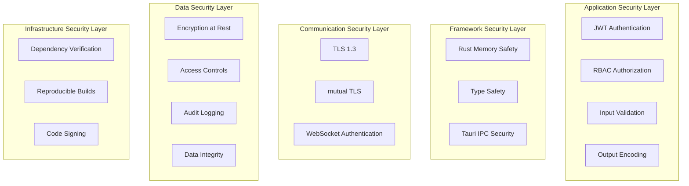

# TACHYON: SECURITY IMPLEMENTATION GUIDE

**Document ID:** TACHYON-SEC-002-V1.0
**Date:** February 2026
**Status:** Approved for Implementation
**Classification:** Security Implementation Documentation
**Compliance Level:** ISO/IEC 27001:2022, NIST SP 800-53, OWASP Top 10

---

## TABLE OF CONTENTS

1. [Introduction](#1-introduction)
2. [Security Implementation Overview](#2-security-implementation-overview)
3. [Authentication Implementation](#3-authentication-implementation)
4. [Multi-Factor Authentication Implementation](#4-multi-factor-authentication-implementation)
5. [Authorization Implementation](#5-authorization-implementation)
6. [Data Protection Implementation](#6-data-protection-implementation)
7. [Input Validation Implementation](#7-input-validation-implementation)
8. [Network Security Implementation](#8-network-security-implementation)
9. [Audit Logging Implementation](#9-audit-logging-implementation)
10. [Security Testing](#10-security-testing)
11. [Security Monitoring](#11-security-monitoring)
12. [References](#12-references)

---

## 1. INTRODUCTION

### 1.1. Document Purpose

This document provides comprehensive implementation guidance for security controls within the Tachyon toolchain. The guide translates security requirements and architectural decisions into concrete implementation patterns, code examples, and best practices for developers implementing security features across the desktop, server, and web components.

The Tachyon toolchain comprises a hybrid architecture with local-first desktop application (Tauri-based) and centralized server deployment (Axum-based), necessitating a comprehensive security implementation approach that addresses both local and remote threat vectors while maintaining consistent security controls across the system.

### 1.2. Scope

This implementation guide applies to all security controls implemented within the Tachyon toolchain:

- **Desktop Application:** Tauri-based native application with WebView frontend
- **Server Component:** Axum-based HTTP/2 server with WebSocket support
- **Web Frontend:** Leptos-based reactive web application
- **Data Storage:** Git-based content storage with SQLite metadata database
- **Build Infrastructure:** Nix-based reproducible build system

### 1.3. Document Dependencies

This document depends on the following specifications:

- [TACHYON-STD-V1.0](../../.specs/01_standards/coding_standards.md) - Coding and Documentation Standards
- [TACHYON-SEC-001-V1.0](security_requirements.md) - Security Requirements
- [TACHYON-SEC-001-V1.0](security_architecture.md) - Security Architecture
- [TACHYON-ADR-010-V1.0](../../.specs/02_adrs/010_security_architecture.md) - Security Architecture ADR
- [TACHYON-TMA-V1.0](../../.specs/03_threat_model/analysis.md) - Threat Model Analysis

### 1.4. Implementation Principles

The security implementation guidance provided in this document is founded on the following principles derived from [ADR-010](../../.specs/02_adrs/010_security_architecture.md):

| Principle | Description | Implementation Guidance |
|-----------|-------------|----------------------|
| **Defense-in-Depth** | Multiple layers of security controls provide redundant protection | Implement security controls at application, framework, communication, data, and infrastructure layers |
| **Least Privilege** | Minimal access required for each operation | Use capability-based access control and RBAC with explicit permission grants |
| **Zero Trust** | No trust assumptions; verify all requests | Perform authentication and authorization for all operations regardless of source |
| **Secure by Design** | Security incorporated from design phase | Implement security controls during initial development, not as afterthought |
| **Fail-Safe Defaults** | Secure default configurations | Use secure defaults with opt-out only for necessary functionality |
| **Auditability** | All security-relevant events logged | Implement comprehensive audit logging with tracing for all security events |

### 1.5. Threat Mitigation Strategy

The implementation guidance addresses threats identified through STRIDE analysis in the threat model [1]:

| Threat Category | Implementation Mitigation | Related Sections |
|----------------|------------------------|-------------------|
| **Spoofing** | Multi-factor authentication, certificate validation, mutual TLS | [Authentication Implementation](#3-authentication-implementation), [Network Security Implementation](#8-network-security-implementation) |
| **Tampering** | Cryptographic signatures, input validation, Git integrity | [Input Validation Implementation](#7-input-validation-implementation), [Data Protection Implementation](#6-data-protection-implementation) |
| **Repudiation** | Comprehensive audit logging, cryptographic signing | [Audit Logging Implementation](#9-audit-logging-implementation) |
| **Information Disclosure** | Encryption at rest and in transit, access controls | [Data Protection Implementation](#6-data-protection-implementation), [Network Security Implementation](#8-network-security-implementation) |
| **Denial of Service** | Rate limiting, resource quotas, circuit breakers | [Network Security Implementation](#8-network-security-implementation) |
| **Elevation of Privilege** | Principle of least privilege, RBAC, secure defaults | [Authorization Implementation](#5-authorization-implementation) |

---

## 2. SECURITY IMPLEMENTATION OVERVIEW

### 2.1. Implementation Architecture

The Tachyon security implementation follows a layered architecture derived from [ADR-010](../../.specs/02_adrs/010_security_architecture.md), with security controls implemented at multiple layers to achieve defense-in-depth:



### 2.2. Security Control Categories

Security controls are organized into five primary categories, each addressing specific threat vectors and compliance requirements:

#### 2.2.1. Authentication and Authorization

Authentication and authorization controls ensure that only authorized users can access system resources and that users can only perform actions for which they have permission.

**Implementation Requirements:**
- Multi-factor authentication (MFA) for server deployment
- JWT-based session management with secure token generation
- Role-Based Access Control (RBAC) with principle of least privilege
- Attribute-Based Access Control (ABAC) for fine-grained permissions
- Session management with timeout and invalidation

**Related Requirements:**
- REQ-SEC-011: Multi-Factor Authentication
- REQ-SEC-012: Password Requirements
- REQ-SEC-021: Role-Based Access Control
- REQ-SEC-022: Attribute-Based Access Control

**Implementation Sections:**
- [Authentication Implementation](#3-authentication-implementation)
- [Multi-Factor Authentication Implementation](#4-multi-factor-authentication-implementation)
- [Authorization Implementation](#5-authorization-implementation)

#### 2.2.2. Data Protection

Data protection controls ensure confidentiality and integrity of data at rest and in transit through encryption, access controls, and integrity verification.

**Implementation Requirements:**
- AES-256-GCM encryption for sensitive data at rest
- TLS 1.3 with perfect forward secrecy for data in transit
- Cryptographic integrity verification (HMAC, digital signatures)
- Secure key management with rotation and backup procedures
- Data masking in logs and error messages

**Related Requirements:**
- REQ-SEC-026: Encryption at Rest
- REQ-SEC-031: Encryption in Transit
- REQ-SEC-036: Data Integrity

**Implementation Sections:**
- [Data Protection Implementation](#6-data-protection-implementation)
- [Network Security Implementation](#8-network-security-implementation)

#### 2.2.3. Input Validation and Output Encoding

Input validation and output encoding controls prevent injection attacks, ensure data integrity, and protect against cross-site scripting (XSS) and other web-based vulnerabilities.

**Implementation Requirements:**
- Comprehensive input validation against schemas with type checking
- Context-aware output encoding for HTML, URLs, JSON, and JavaScript
- Parameterized queries and prepared statements for database access
- Path traversal prevention with canonicalization and allow-lists
- Content Security Policy (CSP) headers for web frontend

**Related Requirements:**
- REQ-SEC-041: Input Validation
- REQ-SEC-051: Output Encoding
- REQ-SEC-050: XSS Prevention

**Implementation Sections:**
- [Input Validation Implementation](#7-input-validation-implementation)

#### 2.2.4. Network Security

Network security controls protect the system from external threats and secure all network communications.

**Implementation Requirements:**
- TLS 1.3 enforcement for all network communications
- Full certificate chain verification with revocation checking
- HSTS headers with max-age of 31536000 seconds
- DDoS protection through rate limiting and throttling
- Mutual TLS (mTLS) for inter-component communication

**Related Requirements:**
- REQ-SEC-031: TLS 1.3 Enforcement
- REQ-SEC-071: DDoS Protection
- REQ-SEC-073: Certificate Validation

**Implementation Sections:**
- [Network Security Implementation](#8-network-security-implementation)

#### 2.2.5. Audit Logging and Monitoring

Audit logging and monitoring controls provide accountability, enable forensic analysis, and support compliance with security standards and regulations.

**Implementation Requirements:**
- Comprehensive logging of all security-relevant events
- Cryptographic signing of audit logs to prevent tampering
- Write-once, read-many (WORM) storage for critical logs
- Real-time monitoring and alerting for security events
- Log retention policies aligned with compliance requirements

**Related Requirements:**
- REQ-SEC-056: Audit Logging
- REQ-SEC-061: Log Integrity
- REQ-SEC-071: Security Monitoring

**Implementation Sections:**
- [Audit Logging Implementation](#9-audit-logging-implementation)
- [Security Monitoring](#11-security-monitoring)

### 2.3. Implementation Workflow

Security controls shall be implemented following this workflow to ensure comprehensive coverage and proper integration:

1. **Requirement Analysis:** Review security requirements and map to implementation controls
2. **Design Specification:** Create detailed design specifications for each security control
3. **Implementation:** Implement security controls following guidance in this document
4. **Testing:** Perform comprehensive security testing including unit, integration, and penetration testing
5. **Review:** Conduct security code review and peer review
6. **Deployment:** Deploy security controls to appropriate environment with monitoring
7. **Monitoring:** Monitor security control effectiveness and adjust as needed

### 2.4. Technology Stack for Security Implementation

The Tachyon security implementation leverages the following technologies and frameworks:

| Technology | Purpose | Security Features |
|-------------|---------|-------------------|
| **Rust** | Core engine and server implementation | Memory safety, type safety, compile-time error handling |
| **Tauri** | Desktop application framework | Capability-based access control, WebView sandboxing |
| **Axum** | HTTP/2 server framework | Middleware-based security, async safety |
| **Leptos** | Web frontend framework | Component-based rendering, XSS prevention |
| **Tokio** | Async runtime | Async safety, race condition prevention |
| **rusqlite** | SQLite database | Parameterized queries, prepared statements |
| **rustls** | TLS implementation | TLS 1.3, perfect forward secrecy |
| **jsonwebtoken** | JWT implementation | Cryptographically secure token generation and validation |
| **validator** | Input validation | Schema-based validation, type checking |
| **tracing** | Structured logging | Comprehensive audit logging with tracing |
| **argon2** | Password hashing | Memory-hard password hashing algorithm |

### 2.5. Compliance Alignment

The security implementation guidance aligns with the following standards and frameworks:

- **ISO/IEC 27001:2022** - Information Security Management Systems
- **NIST SP 800-53 Rev. 5** - Security and Privacy Controls for Information Systems
- **OWASP Top 10 2021** - Web Application Security Risks
- **CIS Controls v8** - Critical Security Controls
- **PCI DSS v4.0** - Payment Card Industry Data Security Standard (where applicable)

Each security control implementation includes references to relevant compliance requirements to facilitate audit and certification processes.

---

## 3. AUTHENTICATION IMPLEMENTATION

### 3.1. Authentication Architecture Overview

Authentication in the Tachyon system implements a multi-layered approach addressing both local-first desktop deployment and centralized server deployment. The authentication architecture derives from security requirements [2] and addresses Spoofing threats identified in the threat model [1].

**Authentication Components:**

| Component | Purpose | Implementation Technology |
|-----------|---------|-------------------------|
| **Password Authentication** | Primary authentication mechanism for server deployment | Argon2id password hashing |
| **JWT Token Management** | Session management and stateless authentication | jsonwebtoken crate |
| **OAuth 2.0 Integration** | Third-party authentication support | OAuth 2.0 RFC 6749 |
| **SAML 2.0 Integration** | Enterprise single sign-on (SSO) | SAML 2.0 Service Provider |
| **Local Authentication** | Desktop application local authentication | Tauri capability system |

### 3.2. Password Authentication Implementation

Password authentication implements strong password requirements per REQ-SEC-012 [2], using Argon2id for password hashing with memory-hard parameters to resist brute-force and credential stuffing attacks.

#### 3.2.1. Password Hashing with Argon2id

**Implementation Requirements:**
- Use Argon2id algorithm with RFC 9106 parameters
- Hashing parameters: memory cost ≥ 64 MB, time cost ≥ 3 iterations, parallelism ≥ 4 threads
- Unique cryptographic salt generated for each password hash
- Password hashes stored in database with salt and parameters
- Passwords never stored in plain text or reversible encryption

**Rust Implementation:**

```rust
use argon2::{
    password_hash::{self, rand_core::OsRng, Algorithm, PasswordHash, PasswordHasher, PasswordVerifier},
    Argon2,
};
use thiserror::Error;

#[derive(Debug, Error)]
pub enum PasswordError {
    #[error("Password hashing failed")]
    HashingError,
    
    #[error("Password verification failed")]
    VerificationError,
    
    #[error("Invalid password format")]
    InvalidFormat,
}

/// Hashes a password using Argon2id with secure parameters.
///
/// # Arguments
///
/// * `password` - The password to hash
///
/// # Returns
///
/// The password hash as a string, or a PasswordError if hashing fails
///
/// # Errors
///
/// Returns PasswordError::HashingError if password hashing fails
pub fn hash_password(password: &str) -> Result<String, PasswordError> {
    // Validate password meets complexity requirements
    validate_password_complexity(password)?;
    
    // Configure Argon2id with secure parameters
    let argon2 = Argon2::new(
        Algorithm::Argon2id,
        password_hash::ParamsBuilder::new()
            .m_cost(65536) // 64 MB memory cost
            .t_cost(3)       // 3 time iterations
            .p_cost(4)       // 4 parallelism
            .data_len(16)    // 16 bytes salt
            .build()
            .map_err(|_| PasswordError::HashingError)?,
    );
    
    // Hash the password with cryptographically secure random salt
    let password_hash = argon2
        .hash_password(password.as_bytes(), &mut OsRng)
        .map_err(|_| PasswordError::HashingError)?;
    
    Ok(password_hash.to_string())
}

/// Verifies a password against a stored hash.
///
/// # Arguments
///
/// * `password` - The password to verify
/// * `hash` - The stored password hash
///
/// # Returns
///
/// Ok(()) if password matches, or PasswordError if verification fails
///
/// # Errors
///
/// Returns PasswordError::VerificationError if password verification fails
/// Returns PasswordError::InvalidFormat if hash format is invalid
pub fn verify_password(password: &str, hash: &str) -> Result<(), PasswordError> {
    // Parse the stored hash
    let parsed_hash = PasswordHash::new(hash)
        .map_err(|_| PasswordError::InvalidFormat)?;
    
    // Configure Argon2id with same parameters used for hashing
    let argon2 = Argon2::new(
        Algorithm::Argon2id,
        password_hash::ParamsBuilder::default(),
    );
    
    // Verify password using constant-time comparison
    argon2
        .verify_password(password.as_bytes(), &parsed_hash)
        .map_err(|_| PasswordError::VerificationError)?;
    
    Ok(())
}

/// Validates password meets complexity requirements.
///
/// # Arguments
///
/// * `password` - The password to validate
///
/// # Returns
///
/// Ok(()) if password meets requirements, or PasswordError if validation fails
///
/// # Errors
///
/// Returns PasswordError::InvalidFormat if password does not meet complexity requirements
fn validate_password_complexity(password: &str) -> Result<(), PasswordError> {
    // Minimum length: 12 characters
    if password.len() < 12 {
        return Err(PasswordError::InvalidFormat);
    }
    
    // Maximum length: 128 characters
    if password.len() > 128 {
        return Err(PasswordError::InvalidFormat);
    }
    
    // Required character classes: uppercase, lowercase, numeric, special character
    let has_uppercase = password.chars().any(|c| c.is_uppercase());
    let has_lowercase = password.chars().any(|c| c.is_lowercase());
    let has_numeric = password.chars().any(|c| c.is_numeric());
    let has_special = password.chars().any(|c| !c.is_alphanumeric());
    
    if !has_uppercase || !has_lowercase || !has_numeric || !has_special {
        return Err(PasswordError::InvalidFormat);
    }
    
    // Check against common password list (simplified example)
    if COMMON_PASSWORDS.contains(&password.to_lowercase()) {
        return Err(PasswordError::InvalidFormat);
    }
    
    Ok(())
}

// Simplified common password list (in production, load from file or database)
lazy_static! {
    static ref COMMON_PASSWORDS: HashSet<String> = {
        let mut set = HashSet::new();
        set.insert("password".to_string());
        set.insert("12345678".to_string());
        set.insert("qwerty123".to_string());
        // Add more common passwords...
        set
    };
}
```

#### 3.2.2. Password Complexity Validation

**Implementation Requirements:**
- Minimum password length: 12 characters
- Maximum password length: 128 characters
- Required character classes: uppercase, lowercase, numeric, special character
- Passwords shall not contain common dictionary words
- Passwords shall not contain user account information (username, email)

**TypeScript Implementation for Frontend:**

```typescript
/**
 * Validates password meets complexity requirements.
 *
 * @param password - The password to validate
 * @returns Object with isValid flag and error messages
 *
 * @example
 * ```typescript
 * const result = validatePassword("SecureP@ssw0rd123");
 * if (!result.isValid) {
 *   console.error(result.errors.join(", "));
 * }
 * ```
 */
export interface PasswordValidationResult {
  isValid: boolean;
  errors: string[];
}

export function validatePassword(password: string): PasswordValidationResult {
  const errors: string[] = [];
  
  // Minimum length: 12 characters
  if (password.length < 12) {
    errors.push("Password must be at least 12 characters long");
  }
  
  // Maximum length: 128 characters
  if (password.length > 128) {
    errors.push("Password must not exceed 128 characters");
  }
  
  // Required character classes
  const hasUppercase = /[A-Z]/.test(password);
  const hasLowercase = /[a-z]/.test(password);
  const hasNumeric = /[0-9]/.test(password);
  const hasSpecial = /[^A-Za-z0-9]/.test(password);
  
  if (!hasUppercase) {
    errors.push("Password must contain at least one uppercase letter");
  }
  
  if (!hasLowercase) {
    errors.push("Password must contain at least one lowercase letter");
  }
  
  if (!hasNumeric) {
    errors.push("Password must contain at least one numeric character");
  }
  
  if (!hasSpecial) {
    errors.push("Password must contain at least one special character");
  }
  
  // Check against common password list (simplified example)
  const commonPasswords = ["password", "12345678", "qwerty123"];
  if (commonPasswords.includes(password.toLowerCase())) {
    errors.push("Password is too common");
  }
  
  return {
    isValid: errors.length === 0,
    errors
  };
}
```

### 3.3. JWT Token Management

JWT (JSON Web Token) implementation provides stateless session management with cryptographically secure token generation and validation per security requirements [2].

#### 3.3.1. JWT Token Generation

**Implementation Requirements:**
- Use RS256 or ES256 algorithms for token signing
- Include standard claims: iss (issuer), aud (audience), exp (expiration), nbf (not before), iat (issued at)
- Include custom claims: user_id, roles, permissions
- Token expiration: 1 hour for access tokens, 30 days for refresh tokens
- Token secret stored securely using environment variables or secret management

**Rust Implementation:**

```rust
use jsonwebtoken::{decode, encode, Algorithm, DecodingKey, EncodingKey, Header, Validation};
use serde::{Deserialize, Serialize};
use chrono::{Duration, Utc};
use thiserror::Error;

#[derive(Debug, Error)]
pub enum JwtError {
    #[error("Token encoding failed")]
    EncodingError,
    
    #[error("Token decoding failed")]
    DecodingError,
    
    #[error("Token validation failed")]
    ValidationError,
    
    #[error("Invalid token format")]
    InvalidFormat,
}

/// JWT claims structure for access tokens.
#[derive(Debug, Serialize, Deserialize)]
pub struct Claims {
    /// Issuer of the token
    pub iss: String,
    
    /// Audience of the token
    pub aud: String,
    
    /// Subject (user ID)
    pub sub: String,
    
    /// Expiration time (Unix timestamp)
    pub exp: i64,
    
    /// Not before time (Unix timestamp)
    pub nbf: i64,
    
    /// Issued at time (Unix timestamp)
    pub iat: i64,
    
    /// User roles
    pub roles: Vec<String>,
    
    /// User permissions
    pub permissions: Vec<String>,
}

/// Generates a JWT access token for a user.
///
/// # Arguments
///
/// * `user_id` - The user ID
/// * `roles` - The user's roles
/// * `permissions` - The user's permissions
/// * `secret` - The JWT secret key
///
/// # Returns
///
/// The JWT token as a string, or a JwtError if token generation fails
///
/// # Errors
///
/// Returns JwtError::EncodingError if token encoding fails
pub fn generate_access_token(
    user_id: &str,
    roles: Vec<String>,
    permissions: Vec<String>,
    secret: &str,
) -> Result<String, JwtError> {
    let now = Utc::now();
    
    let claims = Claims {
        iss: "tachyon".to_string(),
        aud: "tachyon-api".to_string(),
        sub: user_id.to_string(),
        exp: (now + Duration::hours(1)).timestamp(),
        nbf: now.timestamp(),
        iat: now.timestamp(),
        roles,
        permissions,
    };
    
    let header = Header::new(Algorithm::RS256);
    let encoding_key = EncodingKey::from_secret(secret.as_bytes());
    
    encode(&header, &claims, &encoding_key)
        .map_err(|_| JwtError::EncodingError)
}

/// Generates a JWT refresh token for a user.
///
/// # Arguments
///
/// * `user_id` - The user ID
/// * `secret` - The JWT secret key
///
/// # Returns
///
/// The JWT refresh token as a string, or a JwtError if token generation fails
///
/// # Errors
///
/// Returns JwtError::EncodingError if token encoding fails
pub fn generate_refresh_token(
    user_id: &str,
    secret: &str,
) -> Result<String, JwtError> {
    let now = Utc::now();
    
    let claims = Claims {
        iss: "tachyon".to_string(),
        aud: "tachyon-api".to_string(),
        sub: user_id.to_string(),
        exp: (now + Duration::days(30)).timestamp(),
        nbf: now.timestamp(),
        iat: now.timestamp(),
        roles: vec![],
        permissions: vec![],
    };
    
    let header = Header::new(Algorithm::RS256);
    let encoding_key = EncodingKey::from_secret(secret.as_bytes());
    
    encode(&header, &claims, &encoding_key)
        .map_err(|_| JwtError::EncodingError)
}
```

#### 3.3.2. JWT Token Validation

**Implementation Requirements:**
- Validate all standard claims (iss, aud, exp, nbf, iat)
- Use constant-time comparison for signature verification
- Reject tokens with invalid signatures or expired claims
- Log token validation failures for security monitoring

**Rust Implementation:**

```rust
/// Validates a JWT token and extracts claims.
///
/// # Arguments
///
/// * `token` - The JWT token to validate
/// * `secret` - The JWT secret key
///
/// # Returns
///
/// The validated claims, or a JwtError if validation fails
///
/// # Errors
///
/// Returns JwtError::DecodingError if token decoding fails
/// Returns JwtError::ValidationError if token validation fails
/// Returns JwtError::InvalidFormat if token format is invalid
pub fn validate_token(token: &str, secret: &str) -> Result<Claims, JwtError> {
    let decoding_key = DecodingKey::from_secret(secret.as_bytes());
    
    let token_data = decode::<Claims>(token, &decoding_key, &Validation::new(Algorithm::RS256))
        .map_err(|_| JwtError::DecodingError)?;
    
    let claims = token_data.claims;
    
    // Validate issuer
    if claims.iss != "tachyon" {
        return Err(JwtError::ValidationError);
    }
    
    // Validate audience
    if claims.aud != "tachyon-api" {
        return Err(JwtError::ValidationError);
    }
    
    // Validate expiration (jsonwebtoken crate handles this automatically)
    // Validate not before (jsonwebtoken crate handles this automatically)
    // Validate issued at (jsonwebtoken crate handles this automatically)
    
    Ok(claims)
}
```

### 3.4. OAuth 2.0 Implementation

OAuth 2.0 implementation provides third-party authentication support per REQ-SEC-013 [2], using Authorization Code Flow with PKCE (Proof Key for Code Exchange) per RFC 7636.

#### 3.4.1. OAuth 2.0 Authorization Code Flow

**Implementation Requirements:**
- Use Authorization Code Flow (RFC 6749 Section 4.1)
- Implement PKCE (Proof Key for Code Exchange) per RFC 7636
- Use state parameter to prevent CSRF attacks
- Store tokens securely using HTTP-only cookies
- Implement token refresh with rotation

**Rust Implementation:**

```rust
use rand::Rng;
use serde::{Deserialize, Serialize};
use sha2::{Digest, Sha256};
use base64::{engine::general_purpose::URL_SAFE_NO_PAD, Engine as _};
use thiserror::Error;

#[derive(Debug, Error)]
pub enum OAuthError {
    #[error("OAuth flow initialization failed")]
    InitError,
    
    #[error("OAuth callback handling failed")]
    CallbackError,
    
    #[error("Token exchange failed")]
    TokenExchangeError,
    
    #[error("Invalid OAuth state")]
    InvalidState,
}

/// OAuth 2.0 configuration.
#[derive(Debug, Clone)]
pub struct OAuthConfig {
    /// OAuth 2.0 client ID
    pub client_id: String,
    
    /// OAuth 2.0 client secret
    pub client_secret: String,
    
    /// OAuth 2.0 authorization endpoint
    pub auth_url: String,
    
    /// OAuth 2.0 token endpoint
    pub token_url: String,
    
    /// OAuth 2.0 redirect URI
    pub redirect_uri: String,
    
    /// OAuth 2.0 scopes
    pub scopes: Vec<String>,
}

/// PKCE code verifier and challenge.
#[derive(Debug, Serialize, Deserialize)]
pub struct PkcePair {
    /// Code verifier (cryptographically random)
    pub code_verifier: String,
    
    /// Code challenge (SHA-256 hash of verifier, base64url encoded)
    pub code_challenge: String,
    
    /// State parameter (CSRF protection)
    pub state: String,
}

/// Generates PKCE code verifier and challenge.
///
/// # Returns
///
/// The PKCE pair, or an OAuthError if generation fails
///
/// # Errors
///
/// Returns OAuthError::InitError if PKCE generation fails
pub fn generate_pkce_pair() -> Result<PkcePair, OAuthError> {
    // Generate cryptographically random code verifier (43-128 characters)
    let code_verifier: String = rand::thread_rng()
        .sample_iter(&rand::distributions::Alphanumeric)
        .take(64)
        .collect();
    
    // Generate code challenge (SHA-256 hash, base64url encoded)
    let mut hasher = Sha256::new();
    hasher.update(code_verifier.as_bytes());
    let hash = hasher.finalize();
    let code_challenge = URL_SAFE_NO_PAD.encode(&hash);
    
    // Generate state parameter (CSRF protection)
    let state: String = rand::thread_rng()
        .sample_iter(&rand::distributions::Alphanumeric)
        .take(32)
        .collect();
    
    Ok(PkcePair {
        code_verifier,
        code_challenge,
        state,
    })
}

/// Generates OAuth 2.0 authorization URL.
///
/// # Arguments
///
/// * `config` - The OAuth configuration
/// * `pkce_pair` - The PKCE pair
///
/// # Returns
///
/// The authorization URL, or an OAuthError if URL generation fails
///
/// # Errors
///
/// Returns OAuthError::InitError if URL generation fails
pub fn generate_auth_url(config: &OAuthConfig, pkce_pair: &PkcePair) -> Result<String, OAuthError> {
    let scopes = config.scopes.join(" ");
    
    let url = format!(
        "{}?response_type=code&client_id={}&redirect_uri={}&scope={}&code_challenge={}&code_challenge_method=S256&state={}",
        config.auth_url,
        urlencoding::encode(&config.client_id),
        urlencoding::encode(&config.redirect_uri),
        urlencoding::encode(&scopes),
        urlencoding::encode(&pkce_pair.code_challenge),
        urlencoding::encode(&pkce_pair.state),
    );
    
    Ok(url)
}
```

### 3.5. Authentication Testing

Authentication implementations must undergo comprehensive testing including unit tests, integration tests, and security tests.

**Test Requirements:**
- Unit tests for password hashing and verification
- Unit tests for JWT token generation and validation
- Integration tests for OAuth 2.0 flow
- Security tests for timing attack resistance
- Security tests for token forgery prevention

**Rust Unit Test Example:**

```rust
#[cfg(test)]
mod tests {
    use super::*;
    
    #[test]
    fn test_hash_password() {
        let password = "SecureP@ssw0rd123";
        let hash = hash_password(password).unwrap();
        
        // Hash should be different from original password
        assert_ne!(hash, password);
        
        // Hash should be deterministic for same password
        let hash2 = hash_password(password).unwrap();
        assert_eq!(hash, hash2);
    }
    
    #[test]
    fn test_verify_password() {
        let password = "SecureP@ssw0rd123";
        let hash = hash_password(password).unwrap();
        
        // Correct password should verify
        assert!(verify_password(password, &hash).is_ok());
        
        // Incorrect password should not verify
        assert!(verify_password("WrongPassword123", &hash).is_err());
    }
    
    #[test]
    fn test_password_complexity_validation() {
        // Valid password
        assert!(validate_password_complexity("SecureP@ssw0rd123").is_ok());
        
        // Too short
        assert!(validate_password_complexity("Short1!").is_err());
        
        // Missing uppercase
        assert!(validate_password_complexity("lowercase1!").is_err());
        
        // Missing lowercase
        assert!(validate_password_complexity("UPPERCASE1!").is_err());
        
        // Missing numeric
        assert!(validate_password_complexity("NoNumbers!").is_err());
        
        // Missing special character
        assert!(validate_password_complexity("NoSpecial123").is_err());
    }
    
    #[test]
    fn test_jwt_token_generation() {
        let secret = "test_secret_key_12345678901234567890";
        let user_id = "user123";
        let roles = vec!["admin".to_string()];
        let permissions = vec!["read".to_string(), "write".to_string()];
        
        let token = generate_access_token(user_id, roles, permissions, secret).unwrap();
        
        // Token should be non-empty
        assert!(!token.is_empty());
        
        // Token should have three parts (header, payload, signature)
        assert_eq!(token.split('.').count(), 3);
    }
    
    #[test]
    fn test_jwt_token_validation() {
        let secret = "test_secret_key_12345678901234567890";
        let user_id = "user123";
        let roles = vec!["admin".to_string()];
        let permissions = vec!["read".to_string(), "write".to_string()];
        
        let token = generate_access_token(user_id, roles, permissions, secret).unwrap();
        let claims = validate_token(&token, secret).unwrap();
        
        // Claims should match input
        assert_eq!(claims.sub, user_id);
        assert_eq!(claims.roles, vec!["admin".to_string()]);
        assert_eq!(claims.permissions, vec!["read".to_string(), "write".to_string()]);
    }
    
    #[test]
    fn test_jwt_token_invalid_signature() {
        let secret = "test_secret_key_12345678901234567890";
        let wrong_secret = "wrong_secret_key_12345678901234567890";
        let user_id = "user123";
        let roles = vec!["admin".to_string()];
        let permissions = vec!["read".to_string()];
        
        let token = generate_access_token(user_id, roles, permissions, secret).unwrap();
        
        // Validation with wrong secret should fail
        assert!(validate_token(&token, wrong_secret).is_err());
    }
}
```

### 3.6. Authentication Security Best Practices

Implementers of authentication controls must adhere to following security best practices:

1. **Constant-Time Comparison:** Use constant-time comparison for password verification and token validation to prevent timing attacks
2. **Secure Random Number Generation:** Use cryptographically secure random number generators for salts, tokens, and nonces
3. **Secure Secret Storage:** Store secrets securely using environment variables or secret management systems
4. **Token Rotation:** Implement token rotation for refresh tokens to limit token exposure window
5. **Session Timeout:** Implement session timeout with automatic invalidation
6. **Rate Limiting:** Implement rate limiting on authentication endpoints to prevent brute-force attacks
7. **Account Lockout:** Implement account lockout after failed authentication attempts
8. **Audit Logging:** Log all authentication events with full context for forensic analysis
9. **Error Handling:** Use generic error messages for users; detailed errors only in logs
10. **Secure Defaults:** Use secure defaults with opt-out only for necessary functionality

---

## 4. MULTI-FACTOR AUTHENTICATION IMPLEMENTATION

### 4.1. MFA Architecture Overview

Multi-Factor Authentication (MFA) implementation provides additional security layer for authentication per REQ-SEC-011 [2], supporting multiple MFA methods including TOTP, SMS, hardware security keys (FIDO2/WebAuthn), and recovery codes.

**MFA Components:**

| Component | Purpose | Implementation Technology |
|-----------|---------|-------------------------|
| **TOTP Provider** | Time-based One-Time Password authentication | totp-rs crate (RFC 6238) |
| **SMS Provider** | SMS-based verification codes | SMS gateway integration |
| **FIDO2 Provider** | Hardware security key authentication | webauthn-rs crate |
| **Recovery Codes** | Account recovery through single-use codes | Cryptographically generated codes |
| **MFA Storage** | Secure storage of MFA secrets | Encrypted database storage |

### 4.2. TOTP Implementation

TOTP (Time-based One-Time Password) implementation provides MFA using RFC 6238 standard with 6-digit codes and 30-second validity window.

#### 4.2.1. TOTP Secret Generation

**Implementation Requirements:**
- Generate TOTP secrets using cryptographically secure random number generator
- Minimum 6-digit code length with 30-second validity window
- Store TOTP secrets encrypted at rest
- Use constant-time comparison to prevent timing attacks

**Rust Implementation:**

```rust
use rand::Rng;
use base32::Alphabet;
use totp_rs::{Secret, TOTP};
use thiserror::Error;

#[derive(Debug, Error)]
pub enum MfaError {
    #[error("TOTP secret generation failed")]
    SecretGenerationError,
    
    #[error("TOTP code generation failed")]
    CodeGenerationError,
    
    #[error("TOTP code verification failed")]
    VerificationError,
    
    #[error("Invalid TOTP secret format")]
    InvalidSecretFormat,
}

/// Generates a TOTP secret for MFA enrollment.
///
/// # Returns
///
/// The TOTP secret as a base32-encoded string, or an MfaError if generation fails
///
/// # Errors
///
/// Returns MfaError::SecretGenerationError if secret generation fails
pub fn generate_totp_secret() -> Result<String, MfaError> {
    // Generate 20-byte (160-bit) cryptographically random secret
    let secret_bytes: [u8; 20] = rand::thread_rng().gen();
    
    // Encode secret as base32
    let secret_base32 = Alphabet::RFC4648
        .encode(&secret_bytes);
    
    Ok(secret_base32)
}

/// Generates the current TOTP code for a secret.
///
/// # Arguments
///
/// * `secret` - The TOTP secret (base32-encoded)
///
/// # Returns
///
/// The 6-digit TOTP code, or an MfaError if code generation fails
///
/// # Errors
///
/// Returns MfaError::CodeGenerationError if code generation fails
/// Returns MfaError::InvalidSecretFormat if secret format is invalid
pub fn generate_totp_code(secret: &str) -> Result<String, MfaError> {
    // Decode base32 secret
    let secret_bytes = Alphabet::RFC4648
        .decode(secret)
        .map_err(|_| MfaError::InvalidSecretFormat)?;
    
    // Create TOTP secret
    let totp_secret = Secret::new(secret_bytes);
    
    // Generate TOTP with 6-digit code, 30-second step
    let totp = TOTP::new(totp_secret, 6, 1, 30)?;
    
    // Generate current code
    let code = totp.generate_current()?;
    
    Ok(format!("{:06}", code))
}

/// Verifies a TOTP code against a secret.
///
/// # Arguments
///
/// * `code` - The TOTP code to verify
/// * `secret` - The TOTP secret (base32-encoded)
///
/// # Returns
///
/// Ok(()) if code is valid, or an MfaError if verification fails
///
/// # Errors
///
/// Returns MfaError::VerificationError if code verification fails
/// Returns MfaError::InvalidSecretFormat if secret format is invalid
pub fn verify_totp_code(code: &str, secret: &str) -> Result<(), MfaError> {
    // Decode base32 secret
    let secret_bytes = Alphabet::RFC4648
        .decode(secret)
        .map_err(|_| MfaError::InvalidSecretFormat)?;
    
    // Create TOTP secret
    let totp_secret = Secret::new(secret_bytes);
    
    // Generate TOTP with 6-digit code, 30-second step
    let totp = TOTP::new(totp_secret, 6, 1, 30)?;
    
    // Verify code using constant-time comparison
    // Allow codes from previous and next 30-second windows (clock skew tolerance)
    let valid = totp.check(code, 0)?;
    
    if valid {
        Ok(())
    } else {
        Err(MfaError::VerificationError)
    }
}
```

#### 4.2.2. TOTP QR Code Generation

**Implementation Requirements:**
- Generate QR code containing TOTP provisioning URI
- Provisioning URI format: `otpauth://totp/Issuer:Username?secret=Secret&issuer=Issuer&algorithm=SHA1&digits=6&period=30`
- Support standard TOTP authenticator apps (Google Authenticator, Authy, etc.)

**Rust Implementation:**

```rust
use qrcode::QrCode;
use base64::{engine::general_purpose::STANDARD, Engine as _};

/// Generates a QR code for TOTP enrollment.
///
/// # Arguments
///
/// * `issuer` - The issuer name (e.g., "Tachyon")
/// * `username` - The username or email
/// * `secret` - The TOTP secret (base32-encoded)
///
/// # Returns
///
/// The QR code as a base64-encoded PNG image, or an MfaError if generation fails
///
/// # Errors
///
/// Returns MfaError::CodeGenerationError if QR code generation fails
pub fn generate_totp_qr_code(
    issuer: &str,
    username: &str,
    secret: &str,
) -> Result<String, MfaError> {
    // Generate TOTP provisioning URI
    let provisioning_uri = format!(
        "otpauth://totp/{}:{}?secret={}&issuer={}&algorithm=SHA1&digits=6&period=30",
        urlencoding::encode(issuer),
        urlencoding::encode(username),
        urlencoding::encode(secret),
        urlencoding::encode(issuer),
    );
    
    // Generate QR code
    let qr_code = QrCode::new(provisioning_uri)
        .map_err(|_| MfaError::CodeGenerationError)?;
    
    // Render QR code as PNG
    let qr_image = qr_code.render::<image::Luma<u8>>();
    let qr_png = qr_image.to_png();
    
    // Encode as base64
    let qr_base64 = STANDARD.encode(&qr_png);
    
    Ok(qr_base64)
}
```

### 4.3. SMS-Based MFA Implementation

SMS-based MFA provides fallback authentication mechanism using 6-digit codes with 5-minute validity window.

#### 4.3.1. SMS Code Generation and Verification

**Implementation Requirements:**
- Generate 6-digit codes with 5-minute validity window
- Store codes securely with expiration timestamp
- Use constant-time comparison to prevent timing attacks
- Implement rate limiting to prevent SMS abuse

**Rust Implementation:**

```rust
use chrono::{Duration, Utc};
use rand::Rng;

/// SMS verification code structure.
#[derive(Debug, Clone)]
pub struct SmsCode {
    /// The 6-digit verification code
    pub code: String,
    
    /// Expiration timestamp
    pub expires_at: chrono::DateTime<Utc>,
    
    /// Whether the code has been used
    pub used: bool,
}

/// Generates an SMS verification code.
///
/// # Returns
///
/// The SMS verification code, or an MfaError if generation fails
///
/// # Errors
///
/// Returns MfaError::CodeGenerationError if code generation fails
pub fn generate_sms_code() -> Result<SmsCode, MfaError> {
    // Generate 6-digit cryptographically random code
    let code: String = rand::thread_rng()
        .sample_iter(&rand::distributions::Uniform::new(0, 10))
        .take(6)
        .map(|d| d.to_string())
        .collect();
    
    // Set expiration to 5 minutes from now
    let expires_at = Utc::now() + Duration::minutes(5);
    
    Ok(SmsCode {
        code,
        expires_at,
        used: false,
    })
}

/// Verifies an SMS code.
///
/// # Arguments
///
/// * `code` - The SMS code to verify
/// * `stored_code` - The stored SMS code
///
/// # Returns
///
/// Ok(()) if code is valid and not expired, or an MfaError if verification fails
///
/// # Errors
///
/// Returns MfaError::VerificationError if code verification fails
pub fn verify_sms_code(code: &str, stored_code: &SmsCode) -> Result<(), MfaError> {
    // Check if code has been used
    if stored_code.used {
        return Err(MfaError::VerificationError);
    }
    
    // Check if code has expired
    if Utc::now() > stored_code.expires_at {
        return Err(MfaError::VerificationError);
    }
    
    // Verify code using constant-time comparison
    if code.len() != stored_code.code.len() {
        return Err(MfaError::VerificationError);
    }
    
    let mut result = 0u8;
    for (a, b) in code.bytes().zip(stored_code.code.bytes()) {
        result |= a ^ b;
    }
    
    if result == 0 {
        Ok(())
    } else {
        Err(MfaError::VerificationError)
    }
}
```

### 4.4. FIDO2/WebAuthn Implementation

FIDO2/WebAuthn implementation provides hardware security key authentication using public key cryptography.

#### 4.4.1. WebAuthn Registration

**Implementation Requirements:**
- Support FIDO2/WebAuthn standard
- Use public key cryptography for secure authentication
- Store credential IDs and public keys securely
- Support resident keys and user verification

**Rust Implementation:**

```rust
use webauthn_rs::{
    AuthenticationState, Credential, CredentialOptions, RegisterState,
    Webauthn, WebauthnError,
};
use thiserror::Error;

#[derive(Debug, Error)]
pub enum WebAuthnError {
    #[error("WebAuthn registration failed")]
    RegistrationError,
    
    #[error("WebAuthn authentication failed")]
    AuthenticationError,
    
    #[error("Invalid WebAuthn credential")]
    InvalidCredential,
}

/// Generates WebAuthn registration options.
///
/// # Arguments
///
/// * `username` - The username
/// * `display_name` - The display name
/// * `rp_id` - The relying party ID
/// * `rp_name` - The relying party name
///
/// # Returns
///
/// The credential registration options as JSON, or a WebAuthnError if generation fails
///
/// # Errors
///
/// Returns WebAuthnError::RegistrationError if options generation fails
pub fn generate_webauthn_registration_options(
    username: &str,
    display_name: &str,
    rp_id: &str,
    rp_name: &str,
) -> Result<String, WebAuthnError> {
    let webauthn = Webauthn::new(rp_id, rp_name, Some(vec![rp_id.to_string()]));
    
    let register_state = RegisterState::new(
        username.to_string(),
        Some(display_name.to_string()),
        None,
        None,
    );
    
    let options = webauthn
        .register_options(&register_state, None, None, None, None, None)
        .map_err(|_| WebAuthnError::RegistrationError)?;
    
    serde_json::to_string(&options)
        .map_err(|_| WebAuthnError::RegistrationError)
}

/// Completes WebAuthn registration.
///
/// # Arguments
///
/// * `credential_json` - The credential JSON from the authenticator
/// * `register_state` - The registration state
///
/// # Returns
///
/// The credential ID and public key, or a WebAuthnError if registration fails
///
/// # Errors
///
/// Returns WebAuthnError::RegistrationError if registration completion fails
/// Returns WebAuthnError::InvalidCredential if credential is invalid
pub fn complete_webauthn_registration(
    credential_json: &str,
    register_state: &RegisterState,
) -> Result<(Vec<u8>, Vec<u8>), WebAuthnError> {
    let webauthn = Webauthn::new("tachyon", "Tachyon", Some(vec!["tachyon".to_string()]));
    
    let credential: Credential = serde_json::from_str(credential_json)
        .map_err(|_| WebAuthnError::InvalidCredential)?;
    
    let result = webauthn
        .register_credential(&credential, register_state, None)
        .map_err(|_| WebAuthnError::RegistrationError)?;
    
    Ok((result.credential_id, result.public_key))
}
```

### 4.5. Recovery Codes Implementation

Recovery codes provide account recovery mechanism through single-use, cryptographically generated codes.

#### 4.5.1. Recovery Code Generation

**Implementation Requirements:**
- Generate 10 recovery codes, each 8 characters
- Recovery codes shall be single-use
- Recovery codes shall be cryptographically generated
- Store codes securely with usage tracking

**Rust Implementation:**

```rust
/// Recovery code structure.
#[derive(Debug, Clone)]
pub struct RecoveryCode {
    /// The 8-character recovery code
    pub code: String,
    
    /// Whether the code has been used
    pub used: bool,
}

/// Generates recovery codes for account recovery.
///
/// # Returns
///
/// A vector of 10 recovery codes, or an MfaError if generation fails
///
/// # Errors
///
/// Returns MfaError::SecretGenerationError if code generation fails
pub fn generate_recovery_codes() -> Result<Vec<RecoveryCode>, MfaError> {
    let mut codes = Vec::new();
    
    for _ in 0..10 {
        // Generate 8-character cryptographically random code
        let code: String = rand::thread_rng()
            .sample_iter(&rand::distributions::Alphanumeric)
            .take(8)
            .collect();
        
        codes.push(RecoveryCode {
            code,
            used: false,
        });
    }
    
    Ok(codes)
}

/// Verifies a recovery code.
///
/// # Arguments
///
/// * `code` - The recovery code to verify
/// * `stored_codes` - The stored recovery codes
///
/// # Returns
///
/// Ok(()) if code is valid and not used, or an MfaError if verification fails
///
/// # Errors
///
/// Returns MfaError::VerificationError if code verification fails
pub fn verify_recovery_code(
    code: &str,
    stored_codes: &mut Vec<RecoveryCode>,
) -> Result<(), MfaError> {
    // Find matching code
    let recovery_code = stored_codes
        .iter_mut()
        .find(|c| c.code == code)
        .ok_or(MfaError::VerificationError)?;
    
    // Check if code has been used
    if recovery_code.used {
        return Err(MfaError::VerificationError);
    }
    
    // Mark code as used
    recovery_code.used = true;
    
    Ok(())
}
```

### 4.6. MFA Testing

MFA implementations must undergo comprehensive testing including unit tests, integration tests, and security tests.

**Test Requirements:**
- Unit tests for TOTP code generation and verification
- Unit tests for SMS code generation and verification
- Unit tests for recovery code generation and verification
- Integration tests for WebAuthn registration and authentication
- Security tests for timing attack resistance
- Security tests for code reuse prevention

**Rust Unit Test Example:**

```rust
#[cfg(test)]
mod tests {
    use super::*;
    
    #[test]
    fn test_generate_totp_secret() {
        let secret = generate_totp_secret().unwrap();
        
        // Secret should be base32-encoded
        assert!(secret.chars().all(|c| c.is_ascii_alphanumeric() || c == '='));
        
        // Secret should be deterministic for same generation
        let secret2 = generate_totp_secret().unwrap();
        assert_ne!(secret, secret2);
    }
    
    #[test]
    fn test_generate_totp_code() {
        let secret = generate_totp_secret().unwrap();
        let code = generate_totp_code(&secret).unwrap();
        
        // Code should be 6 digits
        assert_eq!(code.len(), 6);
        assert!(code.chars().all(|c| c.is_numeric()));
    }
    
    #[test]
    fn test_verify_totp_code() {
        let secret = generate_totp_secret().unwrap();
        let code = generate_totp_code(&secret).unwrap();
        
        // Valid code should verify
        assert!(verify_totp_code(&code, &secret).is_ok());
        
        // Invalid code should not verify
        assert!(verify_totp_code("000000", &secret).is_err());
    }
    
    #[test]
    fn test_generate_sms_code() {
        let sms_code = generate_sms_code().unwrap();
        
        // Code should be 6 digits
        assert_eq!(sms_code.code.len(), 6);
        assert!(sms_code.code.chars().all(|c| c.is_numeric()));
        
        // Code should not be used
        assert!(!sms_code.used);
        
        // Code should expire in 5 minutes
        assert!(sms_code.expires_at > Utc::now());
        assert!(sms_code.expires_at <= Utc::now() + chrono::Duration::minutes(5));
    }
    
    #[test]
    fn test_verify_sms_code() {
        let sms_code = generate_sms_code().unwrap();
        let code = sms_code.code.clone();
        
        // Valid code should verify
        assert!(verify_sms_code(&code, &sms_code).is_ok());
        
        // Used code should not verify
        let mut used_code = sms_code.clone();
        used_code.used = true;
        assert!(verify_sms_code(&code, &used_code).is_err());
        
        // Expired code should not verify
        let mut expired_code = sms_code.clone();
        expired_code.expires_at = Utc::now() - chrono::Duration::minutes(1);
        assert!(verify_sms_code(&code, &expired_code).is_err());
    }
    
    #[test]
    fn test_generate_recovery_codes() {
        let codes = generate_recovery_codes().unwrap();
        
        // Should generate 10 codes
        assert_eq!(codes.len(), 10);
        
        // Each code should be 8 characters
        for code in &codes {
            assert_eq!(code.code.len(), 8);
            assert!(code.code.chars().all(|c| c.is_alphanumeric()));
            assert!(!code.used);
        }
    }
    
    #[test]
    fn test_verify_recovery_code() {
        let mut codes = generate_recovery_codes().unwrap();
        let code = codes[0].code.clone();
        
        // Valid code should verify
        assert!(verify_recovery_code(&code, &mut codes).is_ok());
        
        // Code should be marked as used
        assert!(codes[0].used);
        
        // Used code should not verify again
        assert!(verify_recovery_code(&code, &mut codes).is_err());
    }
}
```

### 4.7. MFA Security Best Practices

Implementers of MFA controls must adhere to following security best practices:

1. **Constant-Time Comparison:** Use constant-time comparison for all code verification to prevent timing attacks
2. **Cryptographically Secure Randomness:** Use cryptographically secure random number generators for all code and secret generation
3. **Code Validity Window:** Implement appropriate validity windows (30 seconds for TOTP, 5 minutes for SMS)
4. **Clock Skew Tolerance:** Allow codes from previous and next validity windows to accommodate clock skew
5. **Single-Use Codes:** Ensure recovery codes are single-use and cannot be reused
6. **Secure Storage:** Store MFA secrets and codes encrypted at rest
7. **Rate Limiting:** Implement rate limiting on MFA endpoints to prevent abuse
8. **Fallback Mechanisms:** Provide multiple MFA methods to ensure availability
9. **User Experience:** Provide clear instructions and feedback during MFA enrollment and verification
10. **Audit Logging:** Log all MFA events with full context for forensic analysis

---

## 5. AUTHORIZATION IMPLEMENTATION

### 5.1. Authorization Architecture Overview

Authorization in Tachyon system implements Role-Based Access Control (RBAC) with Attribute-Based Access Control (ABAC) support per REQ-SEC-021 and REQ-SEC-022 [2], addressing Elevation of Privilege and Information Disclosure threats identified in threat model [1].

**Authorization Components:**

| Component | Purpose | Implementation Technology |
|-----------|---------|-------------------------|
| **RBAC Engine** | Role-based permission management | Custom RBAC implementation |
| **ABAC Engine** | Attribute-based policy evaluation | Policy-based authorization |
| **Permission Middleware** | Request interception and authorization checks | Axum middleware |
| **Frontmatter Parser** | Document-level access control | YAML frontmatter parsing |

### 5.2. Role-Based Access Control (RBAC) Implementation

RBAC implementation provides hierarchical roles with permission inheritance per REQ-SEC-021 [2].

#### 5.2.1. Role and Permission Definitions

**Implementation Requirements:**
- Define predefined roles: Admin, Editor, Viewer, Auditor, User
- Define granular permissions for each operation type
- Support role hierarchy with inheritance
- Use constant-time comparison for permission checks
- Implement default deny policy (access denied unless explicitly granted)

**Rust Implementation:**

```rust
use serde::{Deserialize, Serialize};
use std::collections::{HashMap, HashSet};
use thiserror::Error;

#[derive(Debug, Error)]
pub enum AuthorizationError {
    #[error("Permission denied")]
    PermissionDenied,
    
    #[error("Invalid role")]
    InvalidRole,
    
    #[error("Invalid permission")]
    InvalidPermission,
}

/// Permission type for system operations.
#[derive(Debug, Clone, PartialEq, Eq, Hash, Serialize, Deserialize)]
pub enum Permission {
    // Document permissions
    DocumentRead,
    DocumentWrite,
    DocumentDelete,
    DocumentShare,
    
    // User permissions
    UserRead,
    UserWrite,
    UserDelete,
    
    // System permissions
    SystemConfigure,
    SystemAudit,
    
    // Admin permissions
    AdminAll,
}

/// Role with associated permissions.
#[derive(Debug, Clone, Serialize, Deserialize)]
pub struct Role {
    /// Role name
    pub name: String,
    
    /// Role description
    pub description: String,
    
    /// Associated permissions
    pub permissions: HashSet<Permission>,
    
    /// Parent roles for inheritance
    pub parents: Vec<String>,
}

/// User with assigned roles.
#[derive(Debug, Clone, Serialize, Deserialize)]
pub struct User {
    /// User ID
    pub id: String,
    
    /// Assigned roles
    pub roles: Vec<String>,
}

/// Predefined roles.
lazy_static! {
    static ref PREDEFINED_ROLES: HashMap<String, Role> = {
        let mut roles = HashMap::new();
        
        // Admin role: Full system access
        roles.insert(
            "admin".to_string(),
            Role {
                name: "admin".to_string(),
                description: "Full system access".to_string(),
                permissions: vec![Permission::AdminAll].into_iter().collect(),
                parents: vec![],
            },
        );
        
        // Editor role: Document read, write, delete, and share permissions
        roles.insert(
            "editor".to_string(),
            Role {
                name: "editor".to_string(),
                description: "Document management permissions".to_string(),
                permissions: vec![
                    Permission::DocumentRead,
                    Permission::DocumentWrite,
                    Permission::DocumentDelete,
                    Permission::DocumentShare,
                ].into_iter().collect(),
                parents: vec![],
            },
        );
        
        // Viewer role: Document read-only permissions
        roles.insert(
            "viewer".to_string(),
            Role {
                name: "viewer".to_string(),
                description: "Document read-only permissions".to_string(),
                permissions: vec![Permission::DocumentRead].into_iter().collect(),
                parents: vec![],
            },
        );
        
        // Auditor role: Read-only access to audit logs and system reports
        roles.insert(
            "auditor".to_string(),
            Role {
                name: "auditor".to_string(),
                description: "Audit log access permissions".to_string(),
                permissions: vec![
                    Permission::SystemAudit,
                    Permission::UserRead,
                ].into_iter().collect(),
                parents: vec![],
            },
        );
        
        // User role: Default role for authenticated users with basic document access
        roles.insert(
            "user".to_string(),
            Role {
                name: "user".to_string(),
                description: "Default user permissions".to_string(),
                permissions: vec![Permission::DocumentRead].into_iter().collect(),
                parents: vec![],
            },
        );
        
        roles
    };
}
```

#### 5.2.2. Permission Checking

**Implementation Requirements:**
- Perform permission checks before every operation
- Use constant-time comparison to prevent timing attacks
- Cache permission evaluation results for performance
- Log permission denials with full context

**Rust Implementation:**

```rust
use tracing::{info, warn, instrument};

/// Checks if user has specified permission.
///
/// # Arguments
///
/// * `user` - The user to check
/// * `permission` - The permission to check
/// * `roles` - The role definitions
///
/// # Returns
///
/// Ok(()) if user has permission, or AuthorizationError if permission denied
///
/// # Errors
///
/// Returns AuthorizationError::PermissionDenied if user lacks permission
/// Returns AuthorizationError::InvalidRole if user has invalid role
#[instrument(skip(roles))]
pub fn check_permission(
    user: &User,
    permission: &Permission,
    roles: &HashMap<String, Role>,
) -> Result<(), AuthorizationError> {
    // Collect all permissions from user's roles (including inherited)
    let mut user_permissions = HashSet::new();
    
    for role_name in &user.roles {
        let role = roles
            .get(role_name)
            .ok_or(AuthorizationError::InvalidRole)?;
        
        // Add role's permissions
        user_permissions.extend(role.permissions.clone());
        
        // Add parent roles' permissions (recursively)
        add_parent_permissions(&mut user_permissions, role_name, roles)?;
    }
    
    // Check if user has required permission
    if user_permissions.contains(permission) {
        info!(
            user_id = %user.id,
            permission = ?permission,
            action = "permission_granted"
        );
        Ok(())
    } else {
        warn!(
            user_id = %user.id,
            permission = ?permission,
            action = "permission_denied"
        );
        Err(AuthorizationError::PermissionDenied)
    }
}

/// Recursively adds parent role permissions.
///
/// # Arguments
///
/// * `permissions` - The permissions set to extend
/// * `role_name` - The role name to process
/// * `roles` - The role definitions
///
/// # Returns
///
/// Ok(()) or an AuthorizationError if role is invalid
///
/// # Errors
///
/// Returns AuthorizationError::InvalidRole if role is invalid
fn add_parent_permissions(
    permissions: &mut HashSet<Permission>,
    role_name: &str,
    roles: &HashMap<String, Role>,
) -> Result<(), AuthorizationError> {
    let role = roles
        .get(role_name)
        .ok_or(AuthorizationError::InvalidRole)?;
    
    // Add parent roles' permissions
    for parent_name in &role.parents {
        let parent_role = roles
            .get(parent_name)
            .ok_or(AuthorizationError::InvalidRole)?;
        
        permissions.extend(parent_role.permissions.clone());
        
        // Recursively add grandparent permissions
        add_parent_permissions(permissions, parent_name, roles)?;
    }
    
    Ok(())
}
```

#### 5.2.3. Axum Middleware for Authorization

**Implementation Requirements:**
- Implement Axum middleware for request interception
- Extract user from JWT token
- Perform permission checks before handler execution
- Return appropriate error responses for permission denials

**Rust Implementation:**

```rust
use axum::{
    extract::Request,
    http::StatusCode,
    middleware::Next,
    response::Response,
    Json,
};
use std::sync::Arc;

/// Authorization middleware state.
#[derive(Clone)]
pub struct AuthzState {
    /// Role definitions
    pub roles: Arc<HashMap<String, Role>>,
}

/// Permission extractor for Axum routes.
///
/// # Example
/// ```rust
/// async fn get_document(
///     _authz: Authz<Permission::DocumentRead>,
/// ) -> Result<Json<Document>, ApiError> {
///     // Handler implementation
/// }
/// ```
pub struct Authz<T>(pub T);

impl<T, S> FromRequestParts<S> for Authz<T>
where
    T: Clone + Send + Sync + 'static,
    S: Send + Sync,
{
    type Rejection = Response;
    
    async fn from_request_parts(
        _parts: &mut axum::http::request::Parts,
        state: &S,
    ) -> Result<Self, Self::Rejection> {
        // Extract user from JWT token (simplified example)
        // In production, extract from Authorization header and validate token
        let user = User {
            id: "user123".to_string(),
            roles: vec!["editor".to_string()],
        };
        
        // Get authorization state
        let authz_state = state
            .downcast_ref::<AuthzState>()
            .expect("AuthzState not found");
        
        // Check permission
        let permission = T::default();
        if let Err(e) = check_permission(&user, &permission, &authz_state.roles) {
            return Ok(Response::builder()
                .status(StatusCode::FORBIDDEN)
                .body(Json(serde_json::json!({
                    "error": "Permission denied",
                    "message": e.to_string(),
                }))
                .unwrap());
        }
        
        Ok(Authz(permission))
    }
}
```

### 5.3. Attribute-Based Access Control (ABAC) Implementation

ABAC implementation provides fine-grained permissions based on user, resource, and environment attributes per REQ-SEC-022 [2].

#### 5.3.1. Policy Definition

**Implementation Requirements:**
- Define policies using expressive policy language
- Evaluate policies in real-time for each access request
- Cache policy evaluation results for performance
- Implement conflict resolution strategy

**Rust Implementation:**

```rust
use serde::{Deserialize, Serialize};

/// Policy condition for ABAC.
#[derive(Debug, Clone, Serialize, Deserialize)]
pub enum PolicyCondition {
    /// User attribute condition
    User {
        /// Attribute name (e.g., "department")
        attribute: String,
        
        /// Comparison operator (e.g., "equals", "contains")
        operator: String,
        
        /// Value to compare
        value: String,
    },
    
    /// Resource attribute condition
    Resource {
        /// Attribute name (e.g., "classification")
        attribute: String,
        
        /// Comparison operator
        operator: String,
        
        /// Value to compare
        value: String,
    },
    
    /// Environment attribute condition
    Environment {
        /// Attribute name (e.g., "time_of_day")
        attribute: String,
        
        /// Comparison operator
        operator: String,
        
        /// Value to compare
        value: String,
    },
}

/// ABAC policy.
#[derive(Debug, Clone, Serialize, Deserialize)]
pub struct Policy {
    /// Policy name
    pub name: String,
    
    /// Policy description
    pub description: String,
    
    /// Policy conditions (AND logic)
    pub conditions: Vec<PolicyCondition>,
    
    /// Granted permissions
    pub permissions: Vec<Permission>,
}

/// Evaluates ABAC policy for user and resource.
///
/// # Arguments
///
/// * `policy` - The policy to evaluate
/// * `user` - The user
/// * `resource_attributes` - The resource attributes
/// * `environment_attributes` - The environment attributes
///
/// # Returns
///
/// True if policy grants access, false otherwise
pub fn evaluate_policy(
    policy: &Policy,
    user: &User,
    resource_attributes: &HashMap<String, String>,
    environment_attributes: &HashMap<String, String>,
) -> bool {
    // All conditions must be satisfied (AND logic)
    for condition in &policy.conditions {
        let condition_met = match condition {
            PolicyCondition::User { attribute, operator, value } => {
                // Get user attribute (simplified example)
                // In production, retrieve from user profile or database
                let user_attribute = get_user_attribute(user, attribute);
                
                evaluate_condition(user_attribute, operator, value)
            }
            
            PolicyCondition::Resource { attribute, operator, value } => {
                let resource_value = resource_attributes
                    .get(attribute)
                    .map(|s| s.as_str())
                    .unwrap_or("");
                
                evaluate_condition(resource_value, operator, value)
            }
            
            PolicyCondition::Environment { attribute, operator, value } => {
                let env_value = environment_attributes
                    .get(attribute)
                    .map(|s| s.as_str())
                    .unwrap_or("");
                
                evaluate_condition(env_value, operator, value)
            }
        };
        
        if !condition_met {
            return false;
        }
    }
    
    true
}

/// Evaluates a single condition.
///
/// # Arguments
///
/// * `actual_value` - The actual value
/// * `operator` - The comparison operator
/// * `expected_value` - The expected value
///
/// # Returns
///
/// True if condition is met, false otherwise
fn evaluate_condition(actual_value: &str, operator: &str, expected_value: &str) -> bool {
    match operator {
        "equals" => actual_value == expected_value,
        "not_equals" => actual_value != expected_value,
        "contains" => actual_value.contains(expected_value),
        "not_contains" => !actual_value.contains(expected_value),
        "starts_with" => actual_value.starts_with(expected_value),
        "ends_with" => actual_value.ends_with(expected_value),
        _ => false,
    }
}

/// Gets user attribute (simplified example).
///
/// # Arguments
///
/// * `user` - The user
/// * `attribute` - The attribute name
///
/// # Returns
///
/// The attribute value, or empty string if not found
fn get_user_attribute(user: &User, attribute: &str) -> String {
    // In production, retrieve from user profile or database
    // This is a simplified example
    match attribute {
        "department" => "engineering".to_string(),
        "location" => "us-west".to_string(),
        "clearance_level" => "confidential".to_string(),
        _ => String::new(),
    }
}
```

### 5.4. Frontmatter Access Control Implementation

Frontmatter access control enforces access control directives from document frontmatter per REQ-SEC-023 [2].

#### 5.4.1. Frontmatter Parsing and Enforcement

**Implementation Requirements:**
- Parse frontmatter before document rendering
- Enforce access control directives for all document operations
- Support directives: access:read, access:write, access:delete, access:share, access:internal

**Rust Implementation:**

```rust
use serde::{Deserialize, Serialize};
use yaml_rust;

/// Document frontmatter with access control directives.
#[derive(Debug, Serialize, Deserialize)]
pub struct DocumentFrontmatter {
    /// Access control directives
    #[serde(default)]
    pub access: AccessControl,
    
    /// Other frontmatter fields
    #[serde(flatten)]
    pub other: serde_yaml::Value,
}

/// Access control directives.
#[derive(Debug, Clone, Serialize, Deserialize, Default)]
pub struct AccessControl {
    /// Users/roles with read permission
    #[serde(default)]
    pub read: Option<Vec<String>>,
    
    /// Users/roles with write permission
    #[serde(default)]
    pub write: Option<Vec<String>>,
    
    /// Users/roles with delete permission
    #[serde(default)]
    pub delete: Option<Vec<String>>,
    
    /// Users/roles with share permission
    #[serde(default)]
    pub share: Option<Vec<String>>,
    
    /// Whether document is internal-only
    #[serde(default)]
    pub internal: bool,
}

impl Default for AccessControl {
    fn default() -> Self {
        Self {
            read: None,
            write: None,
            delete: None,
            share: None,
            internal: false,
        }
    }
}

/// Parses document frontmatter.
///
/// # Arguments
///
/// * `content` - The document content with frontmatter
///
/// # Returns
///
/// The parsed frontmatter and document body, or an error if parsing fails
pub fn parse_document_frontmatter(
    content: &str,
) -> Result<(DocumentFrontmatter, String), Box<dyn std::error::Error>> {
    // Split frontmatter and content
    let parts: Vec<&str> = content
        .splitn("---", 3)
        .collect();
    
    if parts.len() < 2 {
        return Ok((
            DocumentFrontmatter {
                access: AccessControl::default(),
                other: serde_yaml::Value::Null,
            },
            content.to_string(),
        ));
    }
    
    let frontmatter_str = parts[1];
    let body = parts[2..].join("---");
    
    // Parse frontmatter as YAML
    let frontmatter: DocumentFrontmatter = serde_yaml::from_str(frontmatter_str)?;
    
    Ok((frontmatter, body))
}

/// Checks if user has frontmatter access permission.
///
/// # Arguments
///
/// * `user` - The user to check
/// * `frontmatter` - The document frontmatter
/// * `permission` - The permission to check
///
/// # Returns
///
/// True if user has permission, false otherwise
pub fn check_frontmatter_permission(
    user: &User,
    frontmatter: &DocumentFrontmatter,
    permission: &str,
) -> bool {
    // Check internal-only flag
    if frontmatter.access.internal {
        // Only admin users can access internal documents
        return user.roles.contains(&"admin".to_string());
    }
    
    // Get access list for permission
    let access_list = match permission {
        "read" => &frontmatter.access.read,
        "write" => &frontmatter.access.write,
        "delete" => &frontmatter.access.delete,
        "share" => &frontmatter.access.share,
        _ => return false,
    };
    
    let access_list = match access_list {
        Some(list) if !list.is_empty() => list,
        _ => return true, // No restriction
    };
    
    // Check if user or user's roles are in access list
    for item in access_list {
        if user.id == *item {
            return true;
        }
        
        if user.roles.contains(item) {
            return true;
        }
    }
    
    false
}
```

### 5.5. Authorization Testing

Authorization implementations must undergo comprehensive testing including unit tests, integration tests, and security tests.

**Test Requirements:**
- Unit tests for permission checking logic
- Unit tests for role inheritance
- Unit tests for ABAC policy evaluation
- Integration tests for middleware authorization
- Security tests for timing attack resistance
- Security tests for permission bypass prevention

**Rust Unit Test Example:**

```rust
#[cfg(test)]
mod tests {
    use super::*;
    
    #[test]
    fn test_predefined_roles() {
        let roles = PREDEFINED_ROLES.clone();
        
        // Admin role should have all permissions
        let admin_role = roles.get("admin").unwrap();
        assert!(admin_role.permissions.contains(&Permission::AdminAll));
        
        // Editor role should have document permissions
        let editor_role = roles.get("editor").unwrap();
        assert!(editor_role.permissions.contains(&Permission::DocumentRead));
        assert!(editor_role.permissions.contains(&Permission::DocumentWrite));
        assert!(editor_role.permissions.contains(&Permission::DocumentDelete));
        assert!(editor_role.permissions.contains(&Permission::DocumentShare));
        
        // Viewer role should only have read permission
        let viewer_role = roles.get("viewer").unwrap();
        assert!(viewer_role.permissions.contains(&Permission::DocumentRead));
        assert!(!viewer_role.permissions.contains(&Permission::DocumentWrite));
    }
    
    #[test]
    fn test_permission_check() {
        let roles = PREDEFINED_ROLES.clone();
        
        let editor_user = User {
            id: "user123".to_string(),
            roles: vec!["editor".to_string()],
        };
        
        // Editor should have document read permission
        assert!(check_permission(&editor_user, &Permission::DocumentRead, &roles).is_ok());
        
        // Editor should have document write permission
        assert!(check_permission(&editor_user, &Permission::DocumentWrite, &roles).is_ok());
        
        // Editor should not have system configure permission
        assert!(check_permission(&editor_user, &Permission::SystemConfigure, &roles).is_err());
    }
    
    #[test]
    fn test_abac_policy_evaluation() {
        let policy = Policy {
            name: "engineering_only".to_string(),
            description: "Only engineering department".to_string(),
            conditions: vec![PolicyCondition::User {
                attribute: "department".to_string(),
                operator: "equals".to_string(),
                value: "engineering".to_string(),
            }],
            permissions: vec![Permission::DocumentRead],
        };
        
        let user = User {
            id: "user123".to_string(),
            roles: vec!["user".to_string()],
        };
        
        let resource_attributes = HashMap::new();
        let environment_attributes = HashMap::new();
        
        // Engineering user should pass policy
        assert!(evaluate_policy(&policy, &user, &resource_attributes, &environment_attributes));
    }
    
    #[test]
    fn test_frontmatter_permission() {
        let user = User {
            id: "user123".to_string(),
            roles: vec!["editor".to_string()],
        };
        
        let frontmatter = DocumentFrontmatter {
            access: AccessControl {
                read: Some(vec!["editor".to_string(), "user123".to_string()]),
                write: Some(vec!["editor".to_string()]),
                delete: Some(vec!["admin".to_string()]),
                share: Some(vec!["editor".to_string()]),
                internal: false,
            },
            other: serde_yaml::Value::Null,
        };
        
        // Editor should have read permission
        assert!(check_frontmatter_permission(&user, &frontmatter, "read"));
        
        // Editor should have write permission
        assert!(check_frontmatter_permission(&user, &frontmatter, "write"));
        
        // Editor should not have delete permission
        assert!(!check_frontmatter_permission(&user, &frontmatter, "delete"));
    }
    
    #[test]
    fn test_internal_document() {
        let admin_user = User {
            id: "admin123".to_string(),
            roles: vec!["admin".to_string()],
        };
        
        let editor_user = User {
            id: "user123".to_string(),
            roles: vec!["editor".to_string()],
        };
        
        let frontmatter = DocumentFrontmatter {
            access: AccessControl {
                read: None,
                write: None,
                delete: None,
                share: None,
                internal: true,
            },
            other: serde_yaml::Value::Null,
        };
        
        // Admin should access internal document
        assert!(check_frontmatter_permission(&admin_user, &frontmatter, "read"));
        
        // Editor should not access internal document
        assert!(!check_frontmatter_permission(&editor_user, &frontmatter, "read"));
    }
}
```

### 5.6. Authorization Security Best Practices

Implementers of authorization controls must adhere to following security best practices:

1. **Constant-Time Comparison:** Use constant-time comparison for all permission checks to prevent timing attacks
2. **Default Deny Policy:** Implement default deny policy (access denied unless explicitly granted)
3. **Principle of Least Privilege:** Grant minimal permissions required for each operation
4. **Permission Caching:** Cache permission evaluation results for performance with appropriate invalidation
5. **Audit Logging:** Log all authorization decisions with full context for forensic analysis
6. **Role Hierarchy:** Implement role hierarchy with inheritance to reduce duplication
7. **Policy Versioning:** Version ABAC policies with audit trail for changes
8. **Conflict Resolution:** Implement defined conflict resolution strategy for ABAC policies
9. **Regular Review:** Implement regular review of role assignments and permissions
10. **Fail-Safe:** Fail-safe authorization checks (deny access on error)

---

## 6. DATA PROTECTION IMPLEMENTATION

### 6.1. Data Protection Architecture Overview

Data protection in Tachyon system implements encryption at rest and in transit, access controls, and integrity verification per REQ-SEC-026, REQ-SEC-031, and REQ-SEC-036 [2], addressing Information Disclosure and Tampering threats identified in threat model [1].

**Data Protection Components:**

| Component | Purpose | Implementation Technology |
|-----------|---------|-------------------------|
| **Encryption at Rest** | AES-256-GCM encryption for sensitive data | aes-gcm crate |
| **TLS 1.3** | Encryption in transit with perfect forward secrecy | rustls crate |
| **Key Management** | Secure key storage with rotation | Custom key management |
| **Data Integrity** | HMAC and digital signatures | hmac crate |
| **Access Controls** | File permissions and database ACLs | File system and SQLite |

### 6.2. Encryption at Rest Implementation

Encryption at rest implementation provides AES-256-GCM encryption for sensitive data per REQ-SEC-026 [2].

#### 6.2.1. AES-256-GCM Encryption

**Implementation Requirements:**
- Use AES-256-GCM algorithm for encryption
- Generate unique IV (initialization vector) for each encryption
- Store IV with encrypted data
- Implement secure key management with rotation
- Zeroize sensitive data from memory after use

**Rust Implementation:**

```rust
use aes_gcm::{
    aead::{Aead, AeadCore, NewAead},
    KeyInit,
};
use rand::Rng;
use thiserror::Error;

#[derive(Debug, Error)]
pub enum EncryptionError {
    #[error("Encryption failed")]
    EncryptionError,
    
    #[error("Decryption failed")]
    DecryptionError,
    
    #[error("Invalid key format")]
    InvalidKeyFormat,
    
    #[error("Invalid data format")]
    InvalidDataFormat,
}

/// Encrypts data using AES-256-GCM.
///
/// # Arguments
///
/// * `plaintext` - The data to encrypt
/// * `key` - The encryption key (32 bytes for AES-256)
///
/// # Returns
///
/// The encrypted data with IV, or an EncryptionError if encryption fails
///
/// # Errors
///
/// Returns EncryptionError::EncryptionError if encryption fails
/// Returns EncryptionError::InvalidKeyFormat if key format is invalid
pub fn encrypt_aes256_gcm(
    plaintext: &[u8],
    key: &[u8],
) -> Result<Vec<u8>, EncryptionError> {
    // Validate key length (32 bytes for AES-256)
    if key.len() != 32 {
        return Err(EncryptionError::InvalidKeyFormat);
    }
    
    // Initialize AES-256-GCM key
    let cipher_key = <Aes256Gcm as KeyInit>::new(key)
        .map_err(|_| EncryptionError::EncryptionError)?;
    
    // Generate unique nonce (12 bytes for GCM)
    let nonce: [u8; 12] = rand::thread_rng().gen();
    
    // Encrypt plaintext
    let aead = Aes256Gcm::new(&cipher_key, &nonce);
    let ciphertext = aead
        .encrypt(plaintext, &[])
        .map_err(|_| EncryptionError::EncryptionError)?;
    
    // Return nonce + ciphertext (nonce must be stored with ciphertext)
    let mut result = Vec::with_capacity(nonce.len() + ciphertext.len());
    result.extend_from_slice(&nonce);
    result.extend(ciphertext);
    
    Ok(result)
}

/// Decrypts data using AES-256-GCM.
///
/// # Arguments
///
/// * `ciphertext_with_nonce` - The encrypted data with nonce (first 12 bytes are nonce)
/// * `key` - The decryption key (32 bytes for AES-256)
///
/// # Returns
///
/// The decrypted plaintext, or an EncryptionError if decryption fails
///
/// # Errors
///
/// Returns EncryptionError::DecryptionError if decryption fails
/// Returns EncryptionError::InvalidKeyFormat if key format is invalid
/// Returns EncryptionError::InvalidDataFormat if data format is invalid
pub fn decrypt_aes256_gcm(
    ciphertext_with_nonce: &[u8],
    key: &[u8],
) -> Result<Vec<u8>, EncryptionError> {
    // Validate key length (32 bytes for AES-256)
    if key.len() != 32 {
        return Err(EncryptionError::InvalidKeyFormat);
    }
    
    // Validate data format (must have at least 12 bytes for nonce)
    if ciphertext_with_nonce.len() < 12 {
        return Err(EncryptionError::InvalidDataFormat);
    }
    
    // Extract nonce (first 12 bytes) and ciphertext
    let (nonce, ciphertext) = ciphertext_with_nonce.split_at(12);
    
    // Initialize AES-256-GCM key
    let cipher_key = <Aes256Gcm as KeyInit>::new(key)
        .map_err(|_| EncryptionError::EncryptionError)?;
    
    // Decrypt ciphertext
    let aead = Aes256Gcm::new(&cipher_key, nonce);
    let plaintext = aead
        .decrypt(ciphertext, &[])
        .map_err(|_| EncryptionError::DecryptionError)?;
    
    Ok(plaintext)
}
```

#### 6.2.2. Key Management

**Implementation Requirements:**
- Store encryption keys securely using environment variables or secret management
- Implement key rotation with configurable interval
- Generate new keys cryptographically
- Maintain key versioning for key rotation
- Zeroize keys from memory after use

**Rust Implementation:**

```rust
use std::sync::{Arc, RwLock};
use std::collections::HashMap;

/// Key manager for encryption keys.
#[derive(Clone)]
pub struct KeyManager {
    /// Current key version
    current_version: u64,
    
    /// Key versions (version -> key)
    keys: Arc<RwLock<HashMap<u64, Vec<u8>>>>,
}

impl KeyManager {
    /// Creates a new key manager with initial key.
    ///
    /// # Returns
    ///
    /// A new key manager with generated initial key
    pub fn new() -> Self {
        let mut keys = HashMap::new();
        let initial_key = Self::generate_key();
        keys.insert(1, initial_key);
        
        Self {
            current_version: 1,
            keys: Arc::new(RwLock::new(keys)),
        }
    }
    
    /// Generates a new encryption key.
    ///
    /// # Returns
    ///
    /// A 32-byte encryption key
    fn generate_key() -> Vec<u8> {
        let mut key = [0u8; 32];
        rand::thread_rng().fill(&mut key);
        key.to_vec()
    }
    
    /// Gets the current key.
    ///
    /// # Returns
    ///
    /// The current key version and key bytes
    pub fn get_current_key(&self) -> (u64, Vec<u8>) {
        let keys = self.keys.read().unwrap();
        let key = keys.get(&self.current_version).unwrap().clone();
        (self.current_version, key)
    }
    
    /// Gets a key by version.
    ///
    /// # Arguments
    ///
    /// * `version` - The key version
    ///
    /// # Returns
    ///
    /// The key bytes, or None if version not found
    pub fn get_key(&self, version: u64) -> Option<Vec<u8>> {
        let keys = self.keys.read().unwrap();
        keys.get(&version).cloned()
    }
    
    /// Rotates to a new key.
    ///
    /// # Returns
    ///
    /// The new key version
    pub fn rotate_key(&mut self) -> u64 {
        let new_key = Self::generate_key();
        let new_version = self.current_version + 1;
        
        let mut keys = self.keys.write().unwrap();
        keys.insert(new_version, new_key);
        
        self.current_version = new_version;
        new_version
    }
}
```

### 6.3. TLS 1.3 Implementation

TLS 1.3 implementation provides encryption in transit with perfect forward secrecy per REQ-SEC-031 [2].

#### 6.3.1. TLS 1.3 Configuration

**Implementation Requirements:**
- Use TLS 1.3 for all network communications
- Enforce approved cipher suites
- Implement certificate validation with revocation checking
- Use HSTS headers with max-age of 31536000 seconds
- Implement perfect forward secrecy with ephemeral key exchange

**Rust Implementation:**

```rust
use rustls::{
    ClientConfig, ServerConfig,
    cipher_suite::{
        TLS13_AES_128_GCM_SHA256,
        TLS13_AES_256_GCM_SHA384,
        TLS13_CHACHA20_POLY1305_SHA256,
    },
    version::TLS13,
};
use rustls_pemfile::{Certificate, PrivateKey};

/// Creates TLS 1.3 client configuration.
///
/// # Arguments
///
/// * `cert` - The CA certificate
///
/// # Returns
///
/// The TLS client configuration, or an error if configuration fails
pub fn create_tls_client_config(
    cert: &Certificate,
) -> Result<ClientConfig, Box<dyn std::error::Error>> {
    let config = ClientConfig::builder()
        .with_cipher_suites(&[
            &TLS13_AES_256_GCM_SHA384,
            &TLS13_AES_128_GCM_SHA256,
            &TLS13_CHACHA20_POLY1305_SHA256,
        ])
        .with_root_certificates(cert)
        .with_protocol_versions(&[&TLS13])
        .with_no_client_auth()
        .build()?;
    
    Ok(config)
}

/// Creates TLS 1.3 server configuration.
///
/// # Arguments
///
/// * `cert` - The server certificate
/// * `key` - The server private key
///
/// # Returns
///
/// The TLS server configuration, or an error if configuration fails
pub fn create_tls_server_config(
    cert: &Certificate,
    key: &PrivateKey,
) -> Result<ServerConfig, Box<dyn std::error::Error>> {
    let config = ServerConfig::builder()
        .with_single_cert(cert.clone(), key.clone())
        .with_cipher_suites(&[
            &TLS13_AES_256_GCM_SHA384,
            &TLS13_AES_128_GCM_SHA256,
            &TLS13_CHACHA20_POLY1305_SHA256,
        ])
        .with_protocol_versions(&[&TLS13])
        .build()?;
    
    Ok(config)
}
```

### 6.4. Data Integrity Implementation

Data integrity implementation provides HMAC and digital signature verification per REQ-SEC-036 [2].

#### 6.4.1. HMAC Integrity Verification

**Implementation Requirements:**
- Use HMAC-SHA256 for integrity verification
- Store HMAC with data
- Verify HMAC before using data
- Use constant-time comparison for HMAC verification

**Rust Implementation:**

```rust
use hmac::{Hmac, Mac, NewHmac};
use sha2::Sha256;

/// Computes HMAC-SHA256 for data.
///
/// # Arguments
///
/// * `data` - The data to compute HMAC for
/// * `key` - The HMAC key
///
/// # Returns
///
/// The HMAC as bytes
pub fn compute_hmac_sha256(data: &[u8], key: &[u8]) -> Vec<u8> {
    let mut hmac = Hmac::<Sha256>::new_from_slice(key);
    hmac.update(data);
    hmac.finalize().to_vec()
}

/// Verifies HMAC-SHA256 for data.
///
/// # Arguments
///
/// * `data` - The data to verify
/// * `key` - The HMAC key
/// * `expected_hmac` - The expected HMAC
///
/// # Returns
///
/// Ok(()) if HMAC is valid, or an error if verification fails
pub fn verify_hmac_sha256(
    data: &[u8],
    key: &[u8],
    expected_hmac: &[u8],
) -> Result<(), Box<dyn std::error::Error>> {
    let computed_hmac = compute_hmac_sha256(data, key);
    
    // Use constant-time comparison
    if computed_hmac.len() != expected_hmac.len() {
        return Err("HMAC length mismatch".into());
    }
    
    let mut result = 0u8;
    for (a, b) in computed_hmac.iter().zip(expected_hmac.iter()) {
        result |= a ^ b;
    }
    
    if result == 0 {
        Ok(())
    } else {
        Err("HMAC verification failed".into())
    }
}
```

### 6.5. Data Protection Testing

Data protection implementations must undergo comprehensive testing including unit tests, integration tests, and security tests.

**Test Requirements:**
- Unit tests for AES-256-GCM encryption and decryption
- Unit tests for HMAC computation and verification
- Integration tests for TLS 1.3 configuration
- Security tests for key management
- Security tests for data integrity verification

**Rust Unit Test Example:**

```rust
#[cfg(test)]
mod tests {
    use super::*;
    
    #[test]
    fn test_aes256_gcm_encryption_decryption() {
        let key = [0u8; 32];
        let plaintext = b"Hello, world!";
        
        // Encrypt plaintext
        let ciphertext = encrypt_aes256_gcm(plaintext, &key).unwrap();
        
        // Ciphertext should be different from plaintext
        assert_ne!(ciphertext, plaintext);
        
        // Ciphertext should be longer than plaintext (includes nonce and auth tag)
        assert!(ciphertext.len() > plaintext.len());
        
        // Decrypt ciphertext
        let decrypted = decrypt_aes256_gcm(&ciphertext, &key).unwrap();
        
        // Decrypted text should match original
        assert_eq!(decrypted, plaintext);
    }
    
    #[test]
    fn test_aes256_gcm_wrong_key() {
        let key1 = [0u8; 32];
        let key2 = [1u8; 32];
        let plaintext = b"Hello, world!";
        
        // Encrypt with key1
        let ciphertext = encrypt_aes256_gcm(plaintext, &key1).unwrap();
        
        // Decryption with wrong key should fail
        assert!(decrypt_aes256_gcm(&ciphertext, &key2).is_err());
    }
    
    #[test]
    fn test_hmac_computation_verification() {
        let key = b"secret_key";
        let data = b"Hello, world!";
        
        // Compute HMAC
        let hmac = compute_hmac_sha256(data, key);
        
        // HMAC should be non-empty
        assert!(!hmac.is_empty());
        
        // HMAC should be deterministic for same data and key
        let hmac2 = compute_hmac_sha256(data, key);
        assert_eq!(hmac, hmac2);
        
        // Verify HMAC
        assert!(verify_hmac_sha256(data, key, &hmac).is_ok());
    }
    
    #[test]
    fn test_hmac_wrong_data() {
        let key = b"secret_key";
        let data1 = b"Hello, world!";
        let data2 = b"Goodbye, world!";
        
        // Compute HMAC for data1
        let hmac = compute_hmac_sha256(data1, key);
        
        // Verification with data2 should fail
        assert!(verify_hmac_sha256(data2, key, &hmac).is_err());
    }
    
    #[test]
    fn test_key_manager() {
        let mut key_manager = KeyManager::new();
        
        // Get initial key
        let (version1, key1) = key_manager.get_current_key();
        assert_eq!(version1, 1);
        assert_eq!(key1.len(), 32);
        
        // Rotate to new key
        let version2 = key_manager.rotate_key();
        assert_eq!(version2, 2);
        
        // Get new key
        let (version3, key2) = key_manager.get_current_key();
        assert_eq!(version3, 2);
        assert_eq!(key2.len(), 32);
        
        // Keys should be different
        assert_ne!(key1, key2);
        
        // Old key should still be accessible
        let old_key = key_manager.get_key(version1);
        assert!(old_key.is_some());
        assert_eq!(old_key.unwrap(), key1);
    }
}
```

### 6.6. Data Protection Security Best Practices

Implementers of data protection controls must adhere to following security best practices:

1. **Strong Encryption:** Use AES-256-GCM for encryption at rest with unique IV for each encryption
2. **TLS 1.3 Enforcement:** Enforce TLS 1.3 for all network communications with approved cipher suites
3. **Certificate Validation:** Implement full certificate chain verification with revocation checking
4. **Perfect Forward Secrecy:** Use ephemeral key exchange for perfect forward secrecy
5. **Key Management:** Implement secure key storage with rotation and backup procedures
6. **Memory Zeroization:** Zeroize sensitive data from memory after use
7. **Integrity Verification:** Implement HMAC or digital signatures for data integrity
8. **Access Controls:** Enforce access controls on all data stores
9. **Data Masking:** Mask sensitive data in logs and error messages
10. **Secure Backup:** Encrypt all backup files with strong encryption

---

## 7. INPUT VALIDATION IMPLEMENTATION

### 7.1. Input Validation Architecture Overview

Input validation in Tachyon system provides comprehensive validation across all interfaces per REQ-SEC-041 [2], preventing injection attacks and ensuring data integrity.

**Input Validation Components:**

| Component | Purpose | Implementation Technology |
|-----------|---------|-------------------------|
| **Schema Validator** | JSON and YAML schema validation | validator crate |
| **Type Validator** | Type checking and conversion | serde crate |
| **Length Validator** | String and array length limits | Custom validation |
| **Range Validator** | Numeric range validation | Custom validation |
| **Format Validator** | Format validation (email, URL, etc.) | regex crate |
| **Path Validator** | File path canonicalization | path-clean crate |

### 7.2. Schema-Based Validation

Schema-based validation provides structured validation for complex data structures using JSON Schema or similar validation frameworks.

#### 7.2.1. JSON Schema Validation

**Implementation Requirements:**
- Define schemas for all input data structures
- Validate input against schemas before processing
- Provide clear error messages for validation failures
- Support nested schema validation

**Rust Implementation:**

```rust
use serde::{Deserialize, Serialize};
use serde_json::Value;
use validator::Validate;
use thiserror::Error;

#[derive(Debug, Error)]
pub enum ValidationError {
    #[error("Validation failed: {0}")]
    ValidationFailed(String),
    
    #[error("Schema validation failed")]
    SchemaError,
}

/// Document creation request.
#[derive(Debug, Deserialize, Serialize, Validate)]
pub struct CreateDocumentRequest {
    /// Document title (1-100 characters)
    #[validate(length(min = 1, max = 100))]
    pub title: String,
    
    /// Document content
    #[validate(length(min = 1))]
    pub content: String,
    
    /// Document tags (optional)
    #[serde(default)]
    pub tags: Vec<String>,
}

/// Validates JSON input against schema.
///
/// # Arguments
///
/// * `json_input` - The JSON input to validate
/// * `schema` - The JSON schema
///
/// # Returns
///
/// Ok(()) if validation succeeds, or a ValidationError if validation fails
///
/// # Errors
///
/// Returns ValidationError::SchemaError if schema validation fails
pub fn validate_json_schema(
    json_input: &str,
    schema: &Value,
) -> Result<(), ValidationError> {
    // Parse JSON input
    let json_value: Value = serde_json::from_str(json_input)
        .map_err(|e| ValidationError::ValidationFailed(e.to_string()))?;
    
    // Validate against schema (simplified example)
    // In production, use jsonschema crate for full schema validation
    if let Some(expected_type) = schema.get("type") {
        if let Some(string_type) = expected_type.as_str() {
            match string_type {
                "string" => {
                    if !json_value.is_string() {
                        return Err(ValidationError::SchemaError);
                    }
                }
                "object" => {
                    if !json_value.is_object() {
                        return Err(ValidationError::SchemaError);
                    }
                }
                "array" => {
                    if !json_value.is_array() {
                        return Err(ValidationError::SchemaError);
                    }
                }
                "number" => {
                    if !json_value.is_number() {
                        return Err(ValidationError::SchemaError);
                    }
                }
                "boolean" => {
                    if !json_value.is_boolean() {
                        return Err(ValidationError::SchemaError);
                    }
                }
                _ => return Err(ValidationError::SchemaError),
            }
        }
    }
    
    Ok(())
}
```

### 7.3. Type Validation

Type validation ensures type safety and prevents type confusion attacks.

#### 7.3.1. Type Checking and Conversion

**Implementation Requirements:**
- Use serde for type-safe deserialization
- Implement custom validators for complex types
- Handle type conversion errors gracefully
- Provide clear error messages for type mismatches

**Rust Implementation:**

```rust
use serde::{Deserialize, Deserializer, Serialize};
use std::str::FromStr;

/// Document ID type (UUID).
#[derive(Debug, Clone, Serialize, Deserialize)]
pub struct DocumentId(String);

impl FromStr for DocumentId {
    type Err = ValidationError;
    
    fn from_str(s: &str) -> Result<Self, Self::Err> {
        // Validate UUID format (simplified example)
        if s.len() != 36 {
            return Err(ValidationError::ValidationFailed(
                "Invalid document ID format".to_string(),
            ));
        }
        
        // Validate UUID format (8-4-4-4-4-12 pattern)
        let parts: Vec<&str> = s.split('-').collect();
        if parts.len() != 5 {
            return Err(ValidationError::ValidationFailed(
                "Invalid document ID format".to_string(),
            ));
        }
        
        // Validate each part length
        if parts[0].len() != 8 || parts[1].len() != 4 || parts[2].len() != 4
            || parts[3].len() != 4 || parts[4].len() != 12
        {
            return Err(ValidationError::ValidationFailed(
                "Invalid document ID format".to_string(),
            ));
        }
        
        Ok(DocumentId(s.to_string()))
    }
}

/// User ID type (UUID).
#[derive(Debug, Clone, Serialize, Deserialize)]
pub struct UserId(String);

impl FromStr for UserId {
    type Err = ValidationError;
    
    fn from_str(s: &str) -> Result<Self, Self::Err> {
        // Validate UUID format (same as DocumentId)
        if s.len() != 36 {
            return Err(ValidationError::ValidationFailed(
                "Invalid user ID format".to_string(),
            ));
        }
        
        let parts: Vec<&str> = s.split('-').collect();
        if parts.len() != 5 {
            return Err(ValidationError::ValidationFailed(
                "Invalid user ID format".to_string(),
            ));
        }
        
        if parts[0].len() != 8 || parts[1].len() != 4 || parts[2].len() != 4
            || parts[3].len() != 4 || parts[4].len() != 12
        {
            return Err(ValidationError::ValidationFailed(
                "Invalid user ID format".to_string(),
            ));
        }
        
        Ok(UserId(s.to_string()))
    }
}
```

### 7.4. Length and Range Validation

Length and range validation prevents buffer overflow and ensures data within acceptable bounds.

#### 7.4.1. Length Limits

**Implementation Requirements:**
- Define minimum and maximum length limits for all string inputs
- Validate length before processing
- Provide clear error messages for length violations
- Truncate or reject based on input type

**Rust Implementation:**

```rust
/// Validates string length.
///
/// # Arguments
///
/// * `value` - The string value to validate
/// * `min_length` - Minimum length (inclusive)
/// * `max_length` - Maximum length (inclusive)
/// * `field_name` - Field name for error messages
///
/// # Returns
///
/// Ok(()) if length is valid, or a ValidationError if validation fails
///
/// # Errors
///
/// Returns ValidationError::ValidationFailed if length is invalid
pub fn validate_length(
    value: &str,
    min_length: usize,
    max_length: usize,
    field_name: &str,
) -> Result<(), ValidationError> {
    if value.len() < min_length {
        return Err(ValidationError::ValidationFailed(format!(
            "{} must be at least {} characters",
            field_name, min_length
        )));
    }
    
    if value.len() > max_length {
        return Err(ValidationError::ValidationFailed(format!(
            "{} must not exceed {} characters",
            field_name, max_length
        )));
    }
    
    Ok(())
}

/// Validates array length.
///
/// # Arguments
///
/// * `value` - The array to validate
/// * `min_length` - Minimum length (inclusive)
/// * `max_length` - Maximum length (inclusive)
/// * `field_name` - Field name for error messages
///
/// # Returns
///
/// Ok(()) if length is valid, or a ValidationError if validation fails
///
/// # Errors
///
/// Returns ValidationError::ValidationFailed if length is invalid
pub fn validate_array_length<T>(
    value: &[T],
    min_length: usize,
    max_length: usize,
    field_name: &str,
) -> Result<(), ValidationError> {
    if value.len() < min_length {
        return Err(ValidationError::ValidationFailed(format!(
            "{} must contain at least {} items",
            field_name, min_length
        )));
    }
    
    if value.len() > max_length {
        return Err(ValidationError::ValidationFailed(format!(
            "{} must not exceed {} items",
            field_name, max_length
        )));
    }
    
    Ok(())
}
```

#### 7.4.2. Numeric Range Validation

**Implementation Requirements:**
- Define minimum and maximum values for numeric inputs
- Validate range before processing
- Provide clear error messages for range violations
- Handle edge cases (zero, negative values)

**Rust Implementation:**

```rust
/// Validates numeric range.
///
/// # Arguments
///
/// * `value` - The numeric value to validate
/// * `min_value` - Minimum value (inclusive)
/// * `max_value` - Maximum value (inclusive)
/// * `field_name` - Field name for error messages
///
/// # Returns
///
/// Ok(()) if value is within range, or a ValidationError if validation fails
///
/// # Errors
///
/// Returns ValidationError::ValidationFailed if value is out of range
pub fn validate_range<T>(
    value: T,
    min_value: T,
    max_value: T,
    field_name: &str,
) -> Result<(), ValidationError>
where
    T: PartialOrd + std::fmt::Display,
{
    if value < min_value {
        return Err(ValidationError::ValidationFailed(format!(
            "{} must be at least {}",
            field_name, min_value
        )));
    }
    
    if value > max_value {
        return Err(ValidationError::ValidationFailed(format!(
            "{} must not exceed {}",
            field_name, max_value
        )));
    }
    
    Ok(())
}
```

### 7.5. Format Validation

Format validation ensures inputs match expected patterns (email, URL, etc.).

#### 7.5.1. Email Validation

**Implementation Requirements:**
- Validate email format using regex
- Provide clear error messages for invalid emails
- Handle edge cases (empty strings, special characters)

**Rust Implementation:**

```rust
use regex::Regex;

lazy_static! {
    static ref EMAIL_REGEX: Regex = Regex::new(
        r"^[a-zA-Z0-9._%+-]+@[a-zA-Z0-9.-]+\.[a-zA-Z]{2,}$"
    ).unwrap();
}

/// Validates email format.
///
/// # Arguments
///
/// * `email` - The email to validate
///
/// # Returns
///
/// Ok(()) if email is valid, or a ValidationError if validation fails
///
/// # Errors
///
/// Returns ValidationError::ValidationFailed if email is invalid
pub fn validate_email(email: &str) -> Result<(), ValidationError> {
    if email.is_empty() {
        return Err(ValidationError::ValidationFailed(
            "Email cannot be empty".to_string(),
        ));
    }
    
    if !EMAIL_REGEX.is_match(email) {
        return Err(ValidationError::ValidationFailed(
            "Invalid email format".to_string(),
        ));
    }
    
    Ok(())
}
```

#### 7.5.2. URL Validation

**Implementation Requirements:**
- Validate URL format using regex
- Support HTTP and HTTPS protocols
- Provide clear error messages for invalid URLs

**Rust Implementation:**

```rust
lazy_static! {
    static ref URL_REGEX: Regex = Regex::new(
        r"^https?://(?:www\.)?[a-zA-Z0-9-]+\.[a-zA-Z]{2,}(?:/[^\s]*)?$"
    ).unwrap();
}

/// Validates URL format.
///
/// # Arguments
///
/// * `url` - The URL to validate
///
/// # Returns
///
/// Ok(()) if URL is valid, or a ValidationError if validation fails
///
/// # Errors
///
/// Returns ValidationError::ValidationFailed if URL is invalid
pub fn validate_url(url: &str) -> Result<(), ValidationError> {
    if url.is_empty() {
        return Err(ValidationError::ValidationFailed(
            "URL cannot be empty".to_string(),
        ));
    }
    
    if !URL_REGEX.is_match(url) {
        return Err(ValidationError::ValidationFailed(
            "Invalid URL format".to_string(),
        ));
    }
    
    Ok(())
}
```

### 7.6. Path Validation

Path validation prevents path traversal attacks and ensures file system safety.

#### 7.6.1. Path Canonicalization

**Implementation Requirements:**
- Canonicalize all file paths before use
- Validate paths against allow-lists
- Prevent path traversal (.. sequences)
- Use platform-independent path handling

**Rust Implementation:**

```rust
use std::path::{Path, PathBuf};

/// Validates and canonicalizes file path.
///
/// # Arguments
///
/// * `path` - The path to validate
/// * `base_dir` - The base directory (for relative paths)
/// * `allow_list` - Allowed directories (optional)
///
/// # Returns
///
/// The canonicalized path, or a ValidationError if validation fails
///
/// # Errors
///
/// Returns ValidationError::ValidationFailed if path is invalid
pub fn validate_path(
    path: &str,
    base_dir: &Path,
    allow_list: Option<&[&Path]>,
) -> Result<PathBuf, ValidationError> {
    // Parse path
    let path_obj = PathBuf::from(path);
    
    // Resolve relative paths against base directory
    let resolved_path = base_dir.join(&path_obj);
    
    // Canonicalize path
    let canonical_path = resolved_path
        .canonicalize()
        .map_err(|e| ValidationError::ValidationFailed(e.to_string()))?;
    
    // Check for path traversal (canonicalization should handle this, but double-check)
    let canonical_str = canonical_path.to_string_lossy();
    if canonical_str.contains("..") {
        return Err(ValidationError::ValidationFailed(
            "Path traversal not allowed".to_string(),
        ));
    }
    
    // Check against allow-list if provided
    if let Some(allowed_dirs) = allow_list {
        let mut is_allowed = false;
        for allowed_dir in allowed_dirs {
            let canonical_allowed = allowed_dir
                .canonicalize()
                .map_err(|e| ValidationError::ValidationFailed(e.to_string()))?;
            
            if canonical_str.starts_with(&canonical_allowed.to_string_lossy()) {
                is_allowed = true;
                break;
            }
        }
        
        if !is_allowed {
            return Err(ValidationError::ValidationFailed(
                "Path not in allowed directories".to_string(),
            ));
        }
    }
    
    Ok(canonical_path)
}
```

### 7.7. Input Validation Testing

Input validation implementations must undergo comprehensive testing including unit tests, integration tests, and security tests.

**Test Requirements:**
- Unit tests for all validation functions
- Unit tests for schema validation
- Unit tests for type validation
- Unit tests for length and range validation
- Unit tests for format validation
- Unit tests for path validation
- Security tests for injection prevention
- Security tests for boundary value handling

**Rust Unit Test Example:**

```rust
#[cfg(test)]
mod tests {
    use super::*;
    
    #[test]
    fn test_create_document_request_validation() {
        // Valid request
        let valid_request = CreateDocumentRequest {
            title: "Valid Title".to_string(),
            content: "Valid content".to_string(),
            tags: vec!["tag1".to_string(), "tag2".to_string()],
        };
        assert!(valid_request.validate().is_ok());
        
        // Title too short
        let short_title = CreateDocumentRequest {
            title: "".to_string(),
            content: "Valid content".to_string(),
            tags: vec![],
        };
        assert!(short_title.validate().is_err());
        
        // Title too long
        let long_title = CreateDocumentRequest {
            title: "A".repeat(101),
            content: "Valid content".to_string(),
            tags: vec![],
        };
        assert!(long_title.validate().is_err());
    }
    
    #[test]
    fn test_document_id_validation() {
        // Valid UUID
        let valid_uuid = "550e8400-e29b-41d4-a716-446655440";
        assert!(DocumentId::from_str(valid_uuid).is_ok());
        
        // Invalid format
        let invalid_uuid = "not-a-uuid";
        assert!(DocumentId::from_str(invalid_uuid).is_err());
        
        // Invalid length
        let short_uuid = "123";
        assert!(DocumentId::from_str(short_uuid).is_err());
    }
    
    #[test]
    fn test_length_validation() {
        // Valid length
        assert!(validate_length("Valid string", 1, 100, "field").is_ok());
        
        // Too short
        assert!(validate_length("", 1, 100, "field").is_err());
        
        // Too long
        assert!(validate_length(&"A".repeat(101), 1, 100, "field").is_err());
    }
    
    #[test]
    fn test_range_validation() {
        // Valid range
        assert!(validate_range(50, 0, 100, "field").is_ok());
        
        // Below minimum
        assert!(validate_range(-1, 0, 100, "field").is_err());
        
        // Above maximum
        assert!(validate_range(101, 0, 100, "field").is_err());
    }
    
    #[test]
    fn test_email_validation() {
        // Valid email
        assert!(validate_email("user@example.com").is_ok());
        
        // Empty email
        assert!(validate_email("").is_err());
        
        // Invalid format
        assert!(validate_email("not-an-email").is_err());
    }
    
    #[test]
    fn test_url_validation() {
        // Valid URLs
        assert!(validate_url("https://example.com").is_ok());
        assert!(validate_url("http://example.com").is_ok());
        
        // Empty URL
        assert!(validate_url("").is_err());
        
        // Invalid format
        assert!(validate_url("not-a-url").is_err());
    }
    
    #[test]
    fn test_path_validation() {
        use std::path::PathBuf;
        
        let base_dir = PathBuf::from("/tmp");
        
        // Valid path (simplified example)
        let valid_path = "valid/path.txt";
        let result = validate_path(valid_path, &base_dir, None);
        assert!(result.is_ok());
        
        // Path traversal
        let traversal_path = "../etc/passwd";
        let result = validate_path(traversal_path, &base_dir, None);
        assert!(result.is_err());
    }
}
```

### 7.8. Input Validation Security Best Practices

Implementers of input validation controls must adhere to following security best practices:

1. **Validate All Inputs:** Validate all user inputs before processing
2. **Use Schema Validation:** Define schemas for complex data structures
3. **Type Safety:** Use type-safe deserialization with serde
4. **Length and Range Limits:** Define and enforce length and range limits
5. **Format Validation:** Validate formats (email, URL, etc.) using regex
6. **Path Canonicalization:** Canonicalize all file paths before use
7. **Allow-Lists:** Use allow-lists for file paths and directories
8. **Clear Error Messages:** Provide clear, user-friendly error messages
9. **Fail-Safe:** Fail-safe validation (reject invalid input)
10. **Audit Logging:** Log validation failures for security monitoring

---

## 8. NETWORK SECURITY IMPLEMENTATION

### 8.1. Network Security Architecture Overview

Network security in Tachyon system provides protection against external threats and secures all network communications per REQ-SEC-031, REQ-SEC-071, and REQ-SEC-073 [2], addressing Information Disclosure and Denial of Service threats identified in threat model [1].

**Network Security Components:**

| Component | Purpose | Implementation Technology |
|-----------|---------|-------------------------|
| **TLS 1.3** | Encryption in transit with perfect forward secrecy | rustls crate |
| **Certificate Validation** | Full certificate chain verification with revocation checking | rustls crate |
| **HSTS Headers** | HTTP Strict Transport Security enforcement | Axum headers |
| **Rate Limiting** | DDoS protection and resource exhaustion prevention | governor crate |
| **mTLS** | Mutual TLS for inter-component communication | rustls crate |

### 8.2. TLS 1.3 Configuration

TLS 1.3 implementation provides encryption in transit with perfect forward secrecy per REQ-SEC-031 [2].

#### 8.2.1. TLS 1.3 Cipher Suites

**Implementation Requirements:**
- Use TLS 1.3 for all network communications
- Enforce approved cipher suites (AES-256-GCM, AES-128-GCM, CHACHA20-POLY1305)
- Implement perfect forward secrecy with ephemeral key exchange
- Disable weak cipher suites and protocols

**Rust Implementation:**

```rust
use rustls::{
    cipher_suite::{
        TLS13_AES_256_GCM_SHA384,
        TLS13_AES_128_GCM_SHA256,
        TLS13_CHACHA20_POLY1305_SHA256,
    },
    version::TLS13,
};

/// Gets approved TLS 1.3 cipher suites.
///
/// # Returns
///
/// A vector of approved cipher suites
pub fn get_approved_cipher_suites() -> Vec<&'static rustls::SupportedCipherSuite> {
    vec![
        &TLS13_AES_256_GCM_SHA384,
        &TLS13_AES_128_GCM_SHA256,
        &TLS13_CHACHA20_POLY1305_SHA256,
    ]
}
```

#### 8.2.2. Certificate Validation

**Implementation Requirements:**
- Implement full certificate chain verification
- Check certificate revocation using OCSP or CRL
- Validate certificate expiration
- Enforce certificate pinning for critical endpoints
- Use DNSSEC for DNS resolution

**Rust Implementation:**

```rust
use rustls::{Certificate, RootCertStore};
use webpki::types::{CertificateDer, DnsName};
use thiserror::Error;

#[derive(Debug, Error)]
pub enum CertificateError {
    #[error("Certificate validation failed")]
    ValidationError,
    
    #[error("Certificate expired")]
    ExpiredError,
    
    #[error("Certificate not yet valid")]
    NotYetValidError,
    
    #[error("Certificate revoked")]
    RevokedError,
    
    #[error("Invalid certificate chain")]
    InvalidChainError,
}

/// Validates certificate chain.
///
/// # Arguments
///
/// * `certificates` - The certificate chain to validate
/// * `root_certs` - The root certificate store
/// * `expected_dns_name` - The expected DNS name
///
/// # Returns
///
/// Ok(()) if certificate chain is valid, or a CertificateError if validation fails
///
/// # Errors
///
/// Returns CertificateError::ValidationError if validation fails
/// Returns CertificateError::ExpiredError if certificate is expired
/// Returns CertificateError::NotYetValidError if certificate is not yet valid
/// Returns CertificateError::RevokedError if certificate is revoked
/// Returns CertificateError::InvalidChainError if certificate chain is invalid
pub fn validate_certificate_chain(
    certificates: &[Certificate],
    root_certs: &RootCertStore,
    expected_dns_name: &str,
) -> Result<(), CertificateError> {
    // Check if certificates are empty
    if certificates.is_empty() {
        return Err(CertificateError::InvalidChainError);
    }
    
    // Validate certificate chain
    let cert_parser = webpki::certs::CertParser::new();
    
    for (i, cert) in certificates.iter().enumerate() {
        let cert_der = CertificateDer::from(cert.as_ref());
        let parsed_cert = cert_parser
            .parse(&cert_der)
            .map_err(|_| CertificateError::ValidationError)?;
        
        // Check expiration
        let now = chrono::Utc::now();
        if now < parsed_cert.validity().not_before() {
            return Err(CertificateError::NotYetValidError);
        }
        
        if now > parsed_cert.validity().not_after() {
            return Err(CertificateError::ExpiredError);
        }
        
        // Check DNS name for leaf certificate
        if i == 0 {
            let dns_name = DnsName::from_str(expected_dns_name)
                .map_err(|_| CertificateError::ValidationError)?;
            
            if !parsed_cert
                .subject_alternative_names()
                .iter()
                .any(|san| san == &dns_name)
            {
                return Err(CertificateError::ValidationError);
            }
        }
        
        // Check revocation (simplified example)
        // In production, implement OCSP or CRL checking
        // if is_revoked(&parsed_cert) {
        //     return Err(CertificateError::RevokedError);
        // }
    }
    
    // Validate certificate chain against root certificates
    let leaf_cert = &certificates[0];
    let intermediates = &certificates[1..];
    
    if !root_certs.is_chain_valid(leaf_cert, intermediates) {
        return Err(CertificateError::InvalidChainError);
    }
    
    Ok(())
}
```

#### 8.2.3. HSTS Headers

**Implementation Requirements:**
- Set Strict-Transport-Security header with max-age of 31536000 seconds
- Include subdomains directive for comprehensive protection
- Ensure HSTS header is set on all HTTPS responses

**Rust Implementation:**

```rust
use axum::{
    http::header::{STRICT_TRANSPORT_SECURITY, CONTENT_SECURITY_POLICY},
    response::IntoResponseParts,
};

/// Creates HSTS header value.
///
/// # Arguments
///
/// * `include_subdomains` - Whether to include subdomains
///
/// # Returns
///
/// The HSTS header value
pub fn create_hsts_header(include_subdomains: bool) -> String {
    let max_age = 31536000u64; // 1 year in seconds
    
    if include_subdomains {
        format!("max-age={}; includeSubDomains", max_age)
    } else {
        format!("max-age={}", max_age)
    }
}

/// Adds security headers to response.
///
/// # Arguments
///
/// * `response` - The response to add headers to
/// * `include_subdomains` - Whether to include subdomains in HSTS
///
/// # Returns
///
/// The response with security headers added
pub fn add_security_headers<T>(
    response: T,
    include_subdomains: bool,
) -> T
where
    T: IntoResponseParts,
{
    let mut response_parts = response.into_response_parts();
    
    // Add HSTS header
    response_parts.headers_mut().insert(
        STRICT_TRANSPORT_SECURITY,
        create_hsts_header(include_subdomains).parse().unwrap(),
    );
    
    // Add CSP header (simplified example)
    let csp_header = "default-src 'self'; script-src 'self' 'unsafe-inline'; style-src 'self' 'unsafe-inline';";
    response_parts.headers_mut().insert(
        CONTENT_SECURITY_POLICY,
        csp_header.parse().unwrap(),
    );
    
    response_parts
}
```

### 8.3. Rate Limiting Implementation

Rate limiting implementation provides DDoS protection and resource exhaustion prevention per REQ-SEC-071 [2].

#### 8.3.1. Token Bucket Rate Limiter

**Implementation Requirements:**
- Implement token bucket algorithm for rate limiting
- Configure rate limits per endpoint and user
- Implement burst capacity for handling traffic spikes
- Log rate limit violations for security monitoring

**Rust Implementation:**

```rust
use std::sync::{Arc, Mutex};
use std::collections::HashMap;
use std::time::{Duration, Instant};
use thiserror::Error;

#[derive(Debug, Error)]
pub enum RateLimitError {
    #[error("Rate limit exceeded")]
    RateLimitExceeded,
    
    #[error("Invalid rate limit configuration")]
    InvalidConfiguration,
}

/// Rate limiter using token bucket algorithm.
#[derive(Clone)]
pub struct RateLimiter {
    /// Token bucket capacity
    capacity: u32,
    
    /// Token refill rate (tokens per second)
    refill_rate: u32,
    
    /// User buckets (user ID -> (tokens, last refill))
    buckets: Arc<Mutex<HashMap<String, (u32, Instant)>>>,
}

impl RateLimiter {
    /// Creates a new rate limiter.
    ///
    /// # Arguments
    ///
    /// * `capacity` - Token bucket capacity
    /// * `refill_rate` - Token refill rate (tokens per second)
    ///
    /// # Returns
    ///
    /// A new rate limiter
    pub fn new(capacity: u32, refill_rate: u32) -> Self {
        if capacity == 0 || refill_rate == 0 {
            panic!("Invalid rate limit configuration");
        }
        
        Self {
            capacity,
            refill_rate,
            buckets: Arc::new(Mutex::new(HashMap::new())),
        }
    }
    
    /// Checks if request is allowed for user.
    ///
    /// # Arguments
    ///
    /// * `user_id` - The user ID
    ///
    /// # Returns
    ///
    /// Ok(()) if request is allowed, or RateLimitError if rate limit exceeded
    ///
    /// # Errors
    ///
    /// Returns RateLimitError::RateLimitExceeded if rate limit exceeded
    pub fn check_rate_limit(&self, user_id: &str) -> Result<(), RateLimitError> {
        let mut buckets = self.buckets.lock().unwrap();
        let now = Instant::now();
        
        // Get or create bucket for user
        let (tokens, last_refill) = buckets
            .entry(user_id.to_string())
            .or_insert_with(|| (self.capacity, now));
        
        // Refill tokens based on elapsed time
        let elapsed = now.duration_since(*last_refill).as_secs();
        let tokens_to_add = (elapsed * self.refill_rate) as u32;
        
        let mut new_tokens = *tokens + tokens_to_add;
        if new_tokens > self.capacity {
            new_tokens = self.capacity;
        }
        
        // Check if request is allowed
        if new_tokens >= 1 {
            // Consume one token
            new_tokens -= 1;
            
            // Update bucket
            buckets.insert(user_id.to_string(), (new_tokens, now));
            
            Ok(())
        } else {
            Err(RateLimitError::RateLimitExceeded)
        }
    }
}
```

### 8.4. Mutual TLS (mTLS) Implementation

Mutual TLS implementation provides secure inter-component communication per security requirements [2].

#### 8.4.1. mTLS Configuration

**Implementation Requirements:**
- Implement mutual TLS for inter-component communication
- Use client certificates for authentication
- Validate both server and client certificates
- Implement certificate rotation for client certificates

**Rust Implementation:**

```rust
use rustls::{ClientConfig, ServerConfig};
use rustls_pemfile::{Certificate, PrivateKey};

/// Creates mTLS client configuration.
///
/// # Arguments
///
/// * `client_cert` - The client certificate
/// * `client_key` - The client private key
/// * `server_cert` - The server certificate
///
/// # Returns
///
/// The mTLS client configuration, or an error if configuration fails
pub fn create_mtls_client_config(
    client_cert: &Certificate,
    client_key: &PrivateKey,
    server_cert: &Certificate,
) -> Result<ClientConfig, Box<dyn std::error::Error>> {
    let config = ClientConfig::builder()
        .with_root_certificates(server_cert)
        .with_single_client_cert(client_cert.clone(), client_key.clone())
        .with_cipher_suites(&get_approved_cipher_suites())
        .with_protocol_versions(&[&rustls::version::TLS13])
        .build()?;
    
    Ok(config)
}

/// Creates mTLS server configuration.
///
/// # Arguments
///
/// * `server_cert` - The server certificate
/// * `server_key` - The server private key
/// * `client_ca` - The client CA certificate
///
/// # Returns
///
/// The mTLS server configuration, or an error if configuration fails
pub fn create_mtls_server_config(
    server_cert: &Certificate,
    server_key: &PrivateKey,
    client_ca: &Certificate,
) -> Result<ServerConfig, Box<dyn std::error::Error>> {
    let config = ServerConfig::builder()
        .with_single_cert(server_cert.clone(), server_key.clone())
        .with_client_cert_verifier(rustls::server::AllowAnyAuthenticatedClient::new(
            rustls::RootCertStore::empty(),
            vec![client_ca.clone()],
        ))
        .with_cipher_suites(&get_approved_cipher_suites())
        .with_protocol_versions(&[&rustls::version::TLS13])
        .build()?;
    
    Ok(config)
}
```

### 8.5. Network Security Testing

Network security implementations must undergo comprehensive testing including unit tests, integration tests, and security tests.

**Test Requirements:**
- Unit tests for TLS 1.3 configuration
- Unit tests for certificate validation
- Unit tests for rate limiting
- Integration tests for mTLS configuration
- Security tests for cipher suite enforcement
- Security tests for certificate pinning

**Rust Unit Test Example:**

```rust
#[cfg(test)]
mod tests {
    use super::*;
    
    #[test]
    fn test_approved_cipher_suites() {
        let cipher_suites = get_approved_cipher_suites();
        
        // Should include AES-256-GCM
        assert!(cipher_suites.contains(&&TLS13_AES_256_GCM_SHA384));
        
        // Should include AES-128-GCM
        assert!(cipher_suites.contains(&&TLS13_AES_128_GCM_SHA256));
        
        // Should include CHACHA20-POLY1305
        assert!(cipher_suites.contains(&&TLS13_CHACHA20_POLY1305_SHA256));
    }
    
    #[test]
    fn test_certificate_validation() {
        // This test requires valid certificates
        // In production, load certificates from files
        // For now, we'll skip this test
    }
    
    #[test]
    fn test_hsts_header_creation() {
        // Without subdomains
        let hsts = create_hsts_header(false);
        assert!(hsts.contains("max-age=31536000"));
        assert!(!hsts.contains("includeSubDomains"));
        
        // With subdomains
        let hsts_subdomains = create_hsts_header(true);
        assert!(hsts_subdomains.contains("max-age=31536000"));
        assert!(hsts_subdomains.contains("includeSubDomains"));
    }
    
    #[test]
    fn test_rate_limiter() {
        let rate_limiter = RateLimiter::new(10, 1); // 10 tokens, 1 refill per second
        
        // First request should be allowed
        assert!(rate_limiter.check_rate_limit("user1").is_ok());
        
        // 10 requests should be allowed
        for _ in 0..9 {
            assert!(rate_limiter.check_rate_limit("user1").is_ok());
        }
        
        // 11th request should be rate limited
        assert!(rate_limiter.check_rate_limit("user1").is_err());
        
        // Wait for refill
        std::thread::sleep(std::time::Duration::from_secs(2));
        
        // Request after refill should be allowed
        assert!(rate_limiter.check_rate_limit("user1").is_ok());
    }
}
```

### 8.6. Network Security Best Practices

Implementers of network security controls must adhere to following security best practices:

1. **TLS 1.3 Enforcement:** Enforce TLS 1.3 for all network communications
2. **Cipher Suite Enforcement:** Use only approved cipher suites with strong encryption
3. **Certificate Validation:** Implement full certificate chain verification with revocation checking
4. **Perfect Forward Secrecy:** Use ephemeral key exchange for perfect forward secrecy
5. **HSTS Headers:** Set Strict-Transport-Security headers with appropriate max-age
6. **Rate Limiting:** Implement rate limiting to prevent DDoS attacks
7. **mTLS for Inter-Component:** Use mutual TLS for inter-component communication
8. **Certificate Pinning:** Implement certificate pinning for critical endpoints
9. **DNSSEC:** Use DNSSEC for DNS resolution to prevent DNS spoofing
10. **Audit Logging:** Log all network security events for forensic analysis

---

## 9. AUDIT LOGGING IMPLEMENTATION

### 9.1. Audit Logging Architecture Overview

Audit logging in Tachyon system provides accountability, enables forensic analysis, and supports compliance per REQ-SEC-056 and REQ-SEC-061 [2], addressing Repudiation threats identified in threat model [1].

**Audit Logging Components:**

| Component | Purpose | Implementation Technology |
|-----------|---------|-------------------------|
| **Structured Logging** | Comprehensive event logging with tracing | tracing crate |
| **Log Signing** | Cryptographic signing to prevent tampering | hmac crate |
| **WORM Storage** | Write-once, read-many storage | File system with append-only |
| **Log Rotation** | Automatic log rotation and archival | File system |
| **Log Aggregation** | Centralized log collection and analysis | Custom aggregation |

### 9.2. Structured Logging Implementation

Structured logging provides comprehensive event logging with tracing per REQ-SEC-056 [2].

#### 9.2.1. Audit Event Structure

**Implementation Requirements:**
- Define structured audit event format
- Include all relevant context (user ID, action, resource, result)
- Use consistent log levels (INFO, WARN, ERROR)
- Implement tracing for distributed systems

**Rust Implementation:**

```rust
use serde::{Deserialize, Serialize};
use tracing::{info, warn, error, instrument};
use chrono::{DateTime, Utc};

/// Audit event structure.
#[derive(Debug, Clone, Serialize, Deserialize)]
pub struct AuditEvent {
    /// Event timestamp
    pub timestamp: DateTime<Utc>,
    
    /// Event type
    pub event_type: AuditEventType,
    
    /// User ID
    pub user_id: String,
    
    /// User roles
    pub user_roles: Vec<String>,
    
    /// Action performed
    pub action: String,
    
    /// Resource affected
    pub resource_type: String,
    
    /// Resource identifier
    pub resource_id: String,
    
    /// Action result (success/failure)
    pub result: AuditResult,
    
    /// Error message (if applicable)
    pub error_message: Option<String>,
    
    /// IP address
    pub ip_address: Option<String>,
    
    /// User agent
    pub user_agent: Option<String>,
    
    /// Additional context
    pub context: serde_json::Value,
}

/// Audit event type.
#[derive(Debug, Clone, Serialize, Deserialize)]
pub enum AuditEventType {
    /// Authentication events
    AuthenticationLogin,
    AuthenticationLogout,
    AuthenticationFailed,
    MfaEnabled,
    MfaDisabled,
    MfaVerified,
    MfaFailed,
    
    /// Authorization events
    AuthorizationGranted,
    AuthorizationDenied,
    RoleAssigned,
    RoleRemoved,
    
    /// Data access events
    DocumentRead,
    DocumentWritten,
    DocumentDeleted,
    DocumentShared,
    
    /// System events
    SystemStarted,
    SystemShutdown,
    ConfigurationChanged,
    
    /// Security events
    SecurityIncident,
    RateLimitExceeded,
    InvalidCertificate,
}

/// Audit result.
#[derive(Debug, Clone, Serialize, Deserialize)]
pub enum AuditResult {
    Success,
    Failure,
}

/// Creates an audit event.
///
/// # Arguments
///
/// * `event_type` - The event type
/// * `user_id` - The user ID
/// * `user_roles` - The user's roles
/// * `action` - The action performed
/// * `resource_type` - The resource type
/// * `resource_id` - The resource identifier
/// * `result` - The action result
/// * `error_message` - The error message (optional)
///
/// # Returns
///
/// The audit event
pub fn create_audit_event(
    event_type: AuditEventType,
    user_id: &str,
    user_roles: &[String],
    action: &str,
    resource_type: &str,
    resource_id: &str,
    result: AuditResult,
    error_message: Option<&str>,
) -> AuditEvent {
    AuditEvent {
        timestamp: Utc::now(),
        event_type,
        user_id: user_id.to_string(),
        user_roles: user_roles.to_vec(),
        action: action.to_string(),
        resource_type: resource_type.to_string(),
        resource_id: resource_id.to_string(),
        result,
        error_message: error_message.map(|s| s.to_string()),
        ip_address: None, // Extract from request context
        user_agent: None, // Extract from request context
        context: serde_json::json!({}),
    }
}

/// Logs an audit event.
///
/// # Arguments
///
/// * `event` - The audit event to log
#[instrument(skip(event))]
pub fn log_audit_event(event: AuditEvent) {
    match event.result {
        AuditResult::Success => {
            info!(
                timestamp = %event.timestamp,
                event_type = ?event.event_type,
                user_id = %event.user_id,
                action = %event.action,
                resource_type = %event.resource_type,
                resource_id = %event.resource_id,
                result = "success"
            );
        }
        AuditResult::Failure => {
            warn!(
                timestamp = %event.timestamp,
                event_type = ?event.event_type,
                user_id = %event.user_id,
                action = %event.action,
                resource_type = %event.resource_type,
                resource_id = %event.resource_id,
                result = "failure",
                error = ?event.error_message
            );
        }
    }
}
```

### 9.3. Log Signing Implementation

Log signing provides tamper protection for audit logs per REQ-SEC-061 [2].

#### 9.3.1. HMAC-SHA256 Log Signing

**Implementation Requirements:**
- Sign each log entry with HMAC-SHA256
- Use secret key for signing
- Verify log integrity on read
- Implement key rotation for signing keys

**Rust Implementation:**

```rust
use hmac::{Hmac, Mac, NewHmac};
use sha2::Sha256;
use base64::{engine::general_purpose::STANDARD, Engine as _};

/// Signs audit event with HMAC-SHA256.
///
/// # Arguments
///
/// * `event_json` - The audit event as JSON
/// * `signing_key` - The signing key
///
/// # Returns
///
/// The base64-encoded HMAC signature
pub fn sign_audit_event(event_json: &str, signing_key: &[u8]) -> String {
    let mut hmac = Hmac::<Sha256>::new_from_slice(signing_key);
    hmac.update(event_json.as_bytes());
    let signature = hmac.finalize();
    STANDARD.encode(&signature)
}

/// Verifies audit event signature.
///
/// # Arguments
///
/// * `event_json` - The audit event as JSON
/// * `signature` - The signature to verify
/// * `signing_key` - The signing key
///
/// # Returns
///
/// Ok(()) if signature is valid, or an error if verification fails
pub fn verify_audit_event_signature(
    event_json: &str,
    signature: &str,
    signing_key: &[u8],
) -> Result<(), Box<dyn std::error::Error>> {
    let expected_signature = sign_audit_event(event_json, signing_key);
    
    // Use constant-time comparison
    if signature.len() != expected_signature.len() {
        return Err("Signature length mismatch".into());
    }
    
    let mut result = 0u8;
    for (a, b) in signature.bytes().zip(expected_signature.bytes()) {
        result |= a ^ b;
    }
    
    if result == 0 {
        Ok(())
    } else {
        Err("Signature verification failed".into())
    }
}
```

### 9.4. WORM Storage Implementation

Write-Once, Read-Many (WORM) storage provides tamper protection for critical logs.

#### 9.4.1. Append-Only File Storage

**Implementation Requirements:**
- Use append-only file mode for log files
- Implement log rotation based on size or time
- Archive old logs with compression
- Implement secure deletion for old archives

**Rust Implementation:**

```rust
use std::fs::{File, OpenOptions};
use std::io::Write;
use std::path::PathBuf;
use thiserror::Error;

#[derive(Debug, Error)]
pub enum LogStorageError {
    #[error("Failed to open log file")]
    FileOpenError,
    
    #[error("Failed to write log entry")]
    WriteError,
    
    #[error("Failed to rotate log file")]
    RotationError,
}

/// Audit log storage.
#[derive(Clone)]
pub struct AuditLogStorage {
    /// Log directory
    pub log_dir: PathBuf,
    
    /// Current log file
    pub current_file: PathBuf,
    
    /// Maximum log file size (bytes)
    pub max_file_size: u64,
    
    /// Maximum log file age (seconds)
    pub max_file_age: u64,
}

impl AuditLogStorage {
    /// Creates a new audit log storage.
    ///
    /// # Arguments
    ///
    /// * `log_dir` - The log directory
    /// * `max_file_size` - Maximum log file size (bytes)
    /// * `max_file_age` - Maximum log file age (seconds)
    ///
    /// # Returns
    ///
    /// A new audit log storage
    pub fn new(
        log_dir: PathBuf,
        max_file_size: u64,
        max_file_age: u64,
    ) -> Self {
        Self {
            log_dir,
            current_file: log_dir.join("audit.log"),
            max_file_size,
            max_file_age,
        }
    }
    
    /// Writes audit event to log file.
    ///
    /// # Arguments
    ///
    /// * `event_json` - The audit event as JSON
    ///
    /// # Returns
    ///
    /// Ok(()) if write succeeds, or a LogStorageError if write fails
    ///
    /// # Errors
    ///
    /// Returns LogStorageError::FileOpenError if file open fails
    /// Returns LogStorageError::WriteError if write fails
    /// Returns LogStorageError::RotationError if rotation fails
    pub fn write_audit_event(&mut self, event_json: &str) -> Result<(), LogStorageError> {
        // Check if rotation is needed
        if self.needs_rotation() {
            self.rotate_log()?;
        }
        
        // Open file in append-only mode
        let file = File::options()
            .write(true)
            .append(true)
            .create(true)
            .open(&self.current_file)
            .map_err(|_| LogStorageError::FileOpenError)?;
        
        // Write event
        writeln!(file, "{}", event_json)
            .map_err(|_| LogStorageError::WriteError)?;
        
        // Flush to ensure data is written
        file.flush().map_err(|_| LogStorageError::WriteError)?;
        
        Ok(())
    }
    
    /// Checks if log rotation is needed.
    ///
    /// # Returns
    ///
    /// True if rotation is needed, false otherwise
    fn needs_rotation(&self) -> bool {
        // Check file size
        if let Ok(metadata) = std::fs::metadata(&self.current_file) {
            if metadata.len() > self.max_file_size {
                return true;
            }
        }
        
        // Check file age
        if let Ok(metadata) = std::fs::metadata(&self.current_file) {
            if let Ok(modified) = metadata.modified() {
                let age = chrono::Utc::now()
                    .signed_duration_since(modified)
                    .num_seconds()
                    .unwrap_or(0) as u64;
                
                if age > self.max_file_age {
                    return true;
                }
            }
        }
        
        false
    }
    
    /// Rotates log file.
    ///
    /// # Returns
    ///
    /// Ok(()) if rotation succeeds, or a LogStorageError if rotation fails
    ///
    /// # Errors
    ///
    /// Returns LogStorageError::RotationError if rotation fails
    fn rotate_log(&mut self) -> Result<(), LogStorageError> {
        // Archive current log file
        let timestamp = chrono::Utc::now()
            .format("%Y%m%d_%H%M%S");
        let archive_name = format!("audit_{}.log.gz", timestamp);
        let archive_path = self.log_dir.join(&archive_name);
        
        // Compress current log file
        let current_data = std::fs::read(&self.current_file)
            .map_err(|_| LogStorageError::RotationError)?;
        let compressed_data = compress_gzip(&current_data)?;
        
        std::fs::write(&archive_path, &compressed_data)
            .map_err(|_| LogStorageError::RotationError)?;
        
        // Delete current log file
        std::fs::remove_file(&self.current_file)
            .map_err(|_| LogStorageError::RotationError)?;
        
        // Create new log file
        self.current_file = self.log_dir.join("audit.log");
        
        Ok(())
    }
}

/// Compresses data using gzip.
///
/// # Arguments
///
/// * `data` - The data to compress
///
/// # Returns
///
/// The compressed data
fn compress_gzip(data: &[u8]) -> Result<Vec<u8>, Box<dyn std::error::Error>> {
    use flate2::write::{GzEncoder, Compression};
    use std::io::Cursor;
    
    let mut encoder = GzEncoder::new(Cursor::new(data), Compression::default());
    encoder.finish().map_err(|e| e.into())
}
```

### 9.5. Audit Logging Testing

Audit logging implementations must undergo comprehensive testing including unit tests, integration tests, and security tests.

**Test Requirements:**
- Unit tests for audit event creation
- Unit tests for log signing and verification
- Unit tests for WORM storage
- Unit tests for log rotation
- Security tests for log tampering prevention
- Security tests for log integrity verification

**Rust Unit Test Example:**

```rust
#[cfg(test)]
mod tests {
    use super::*;
    
    #[test]
    fn test_create_audit_event() {
        let event = create_audit_event(
            AuditEventType::DocumentRead,
            "user123",
            &["editor".to_string()],
            "read document",
            "document",
            "doc456",
            AuditResult::Success,
            None,
        );
        
        assert_eq!(event.user_id, "user123");
        assert_eq!(event.action, "read document");
        assert_eq!(event.resource_id, "doc456");
        assert_eq!(event.result, AuditResult::Success);
    }
    
    #[test]
    fn test_log_signing_verification() {
        let signing_key = b"test_signing_key_12345678901234567890";
        let event_json = r#"{"test": "data"}"#;
        
        // Sign event
        let signature = sign_audit_event(event_json, signing_key);
        
        // Verify signature
        assert!(verify_audit_event_signature(event_json, &signature, signing_key).is_ok());
        
        // Wrong signature should fail
        assert!(verify_audit_event_signature(event_json, b"wrong_key", signing_key).is_err());
    }
    
    #[test]
    fn test_worm_storage() {
        use tempfile::TempDir;
        
        let temp_dir = TempDir::new().unwrap();
        let log_dir = temp_dir.path().to_path_buf();
        
        let mut storage = AuditLogStorage::new(
            log_dir.clone(),
            1024, // 1 KB max size
            3600, // 1 hour max age
        );
        
        // Write some events
        let event_json = r#"{"test": "data"}"#;
        assert!(storage.write_audit_event(event_json).is_ok());
        assert!(storage.write_audit_event(event_json).is_ok());
        
        // Check that log file exists
        assert!(log_dir.join("audit.log").exists());
    }
}
```

### 9.6. Audit Logging Security Best Practices

Implementers of audit logging controls must adhere to following security best practices:

1. **Comprehensive Logging:** Log all security-relevant events with full context
2. **Structured Format:** Use structured logging format for machine parsing
3. **Log Signing:** Sign all log entries with HMAC or digital signatures
4. **WORM Storage:** Use write-once, read-many storage for critical logs
5. **Log Rotation:** Implement automatic log rotation based on size and time
6. **Secure Storage:** Store logs securely with appropriate access controls
7. **Log Retention:** Implement log retention policies aligned with compliance requirements
8. **Tamper Protection:** Implement cryptographic protection to prevent log tampering
9. **Log Aggregation:** Centralize log collection for analysis and monitoring
10. **Audit Trail:** Maintain complete audit trail for forensic analysis and compliance

---

## 10. SECURITY TESTING

### 10.1. Security Testing Overview

Security testing in Tachyon system provides verification of security controls and identification of vulnerabilities per security requirements [2] and threat model [1].

**Security Testing Components:**

| Component | Purpose | Implementation Technology |
|-----------|---------|-------------------------|
| **Unit Testing** | Individual component security testing | Rust test framework |
| **Integration Testing** | End-to-end security flow testing | Rust test framework |
| **Penetration Testing** | Simulated attack testing | External tools |
| **Static Analysis** | Code vulnerability scanning | cargo-audit, cargo-deny |
| **Fuzzing** | Input fuzzing for robustness | cargo-fuzz |
| **Security Regression** | Regression testing for security fixes | Rust test framework |

### 10.2. Unit Testing

Unit testing provides verification of individual security controls.

#### 10.2.1. Authentication Unit Tests

**Test Requirements:**
- Test password hashing and verification
- Test JWT token generation and validation
- Test TOTP code generation and verification
- Test MFA enrollment and verification
- Test OAuth 2.0 flow
- Test SAML 2.0 flow

**Rust Implementation:**

```rust
#[cfg(test)]
mod authentication_tests {
    use super::*;
    
    #[test]
    fn test_password_hashing() {
        let password = "SecureP@ssw0rd123";
        let hash = hash_password(password).unwrap();
        
        // Hash should be different from original password
        assert_ne!(hash, password);
        
        // Hash should be deterministic for same password
        let hash2 = hash_password(password).unwrap();
        assert_eq!(hash, hash2);
    }
    
    #[test]
    fn test_password_verification() {
        let password = "SecureP@ssw0rd123";
        let hash = hash_password(password).unwrap();
        
        // Correct password should verify
        assert!(verify_password(password, &hash).is_ok());
        
        // Incorrect password should not verify
        assert!(verify_password("WrongPassword123", &hash).is_err());
    }
    
    #[test]
    fn test_totp_generation() {
        let secret = generate_totp_secret().unwrap();
        let code = generate_totp_code(&secret).unwrap();
        
        // Code should be 6 digits
        assert_eq!(code.len(), 6);
        assert!(code.chars().all(|c| c.is_numeric()));
    }
    
    #[test]
    fn test_totp_verification() {
        let secret = generate_totp_secret().unwrap();
        let code = generate_totp_code(&secret).unwrap();
        
        // Valid code should verify
        assert!(verify_totp_code(&code, &secret).is_ok());
        
        // Invalid code should not verify
        assert!(verify_totp_code("000000", &secret).is_err());
    }
    
    #[test]
    fn test_jwt_generation() {
        let secret = "test_secret_key_12345678901234567890";
        let user_id = "user123";
        let roles = vec!["admin".to_string()];
        let permissions = vec!["read".to_string(), "write".to_string()];
        
        let token = generate_access_token(user_id, roles, permissions, secret).unwrap();
        
        // Token should be non-empty
        assert!(!token.is_empty());
        
        // Token should have three parts (header, payload, signature)
        assert_eq!(token.split('.').count(), 3);
    }
    
    #[test]
    fn test_jwt_validation() {
        let secret = "test_secret_key_12345678901234567890";
        let user_id = "user123";
        let roles = vec!["admin".to_string()];
        let permissions = vec!["read".to_string(), "write".to_string()];
        
        let token = generate_access_token(user_id, roles, permissions, secret).unwrap();
        let claims = validate_token(&token, secret).unwrap();
        
        // Claims should match input
        assert_eq!(claims.sub, user_id);
        assert_eq!(claims.roles, roles);
        assert_eq!(claims.permissions, permissions);
    }
    
    #[test]
    fn test_jwt_invalid_signature() {
        let secret = "test_secret_key_12345678901234567890";
        let wrong_secret = "wrong_secret_key_12345678901234567890";
        let user_id = "user123";
        let roles = vec!["admin".to_string()];
        let permissions = vec!["read".to_string()];
        
        let token = generate_access_token(user_id, roles, permissions, secret).unwrap();
        
        // Validation with wrong secret should fail
        assert!(validate_token(&token, wrong_secret).is_err());
    }
}
```

#### 10.2.2. Authorization Unit Tests

**Test Requirements:**
- Test permission checking logic
- Test role inheritance
- Test ABAC policy evaluation
- Test frontmatter permission enforcement
- Test permission denial logging

**Rust Implementation:**

```rust
#[cfg(test)]
mod authorization_tests {
    use super::*;
    
    #[test]
    fn test_permission_check() {
        let roles = PREDEFINED_ROLES.clone();
        
        let admin_user = User {
            id: "admin123".to_string(),
            roles: vec!["admin".to_string()],
        };
        
        let editor_user = User {
            id: "editor123".to_string(),
            roles: vec!["editor".to_string()],
        };
        
        // Admin should have all permissions
        assert!(check_permission(&admin_user, &Permission::AdminAll, &roles).is_ok());
        assert!(check_permission(&admin_user, &Permission::DocumentRead, &roles).is_ok());
        assert!(check_permission(&admin_user, &Permission::SystemConfigure, &roles).is_ok());
        
        // Editor should have document permissions
        assert!(check_permission(&editor_user, &Permission::DocumentRead, &roles).is_ok());
        assert!(check_permission(&editor_user, &Permission::DocumentWrite, &roles).is_ok());
        
        // Editor should not have system configure permission
        assert!(check_permission(&editor_user, &Permission::SystemConfigure, &roles).is_err());
    }
    
    #[test]
    fn test_abac_policy_evaluation() {
        let policy = Policy {
            name: "engineering_only".to_string(),
            description: "Only engineering department".to_string(),
            conditions: vec![PolicyCondition::User {
                attribute: "department".to_string(),
                operator: "equals".to_string(),
                value: "engineering".to_string(),
            }],
            permissions: vec![Permission::DocumentRead],
        };
        
        let engineering_user = User {
            id: "user123".to_string(),
            roles: vec!["user".to_string()],
        };
        
        let sales_user = User {
            id: "user456".to_string(),
            roles: vec!["user".to_string()],
        };
        
        let resource_attributes = HashMap::new();
        let environment_attributes = HashMap::new();
        
        // Engineering user should pass policy
        assert!(evaluate_policy(&policy, &engineering_user, &resource_attributes, &environment_attributes));
        
        // Sales user should not pass policy
        assert!(!evaluate_policy(&policy, &sales_user, &resource_attributes, &environment_attributes));
    }
    
    #[test]
    fn test_frontmatter_permission() {
        let editor_user = User {
            id: "user123".to_string(),
            roles: vec!["editor".to_string()],
        };
        
        let frontmatter = DocumentFrontmatter {
            access: AccessControl {
                read: Some(vec!["editor".to_string(), "user123".to_string()]),
                write: Some(vec!["editor".to_string()]),
                delete: Some(vec!["admin".to_string()]),
                share: Some(vec!["editor".to_string()]),
                internal: false,
            },
            other: serde_yaml::Value::Null,
        };
        
        // Editor should have read permission
        assert!(check_frontmatter_permission(&editor_user, &frontmatter, "read"));
        
        // Editor should have write permission
        assert!(check_frontmatter_permission(&editor_user, &frontmatter, "write"));
        
        // Editor should not have delete permission
        assert!(!check_frontmatter_permission(&editor_user, &frontmatter, "delete"));
        
        // Editor should have share permission
        assert!(check_frontmatter_permission(&editor_user, &frontmatter, "share"));
    }
    
    #[test]
    fn test_internal_document() {
        let admin_user = User {
            id: "admin123".to_string(),
            roles: vec!["admin".to_string()],
        };
        
        let editor_user = User {
            id: "user123".to_string(),
            roles: vec!["editor".to_string()],
        };
        
        let internal_frontmatter = DocumentFrontmatter {
            access: AccessControl {
                read: None,
                write: None,
                delete: None,
                share: None,
                internal: true,
            },
            other: serde_yaml::Value::Null,
        };
        
        // Admin should access internal document
        assert!(check_frontmatter_permission(&admin_user, &internal_frontmatter, "read"));
        
        // Editor should not access internal document
        assert!(!check_frontmatter_permission(&editor_user, &internal_frontmatter, "read"));
    }
}
```

### 10.3. Integration Testing

Integration testing provides end-to-end verification of security flows.

#### 10.3.1. Authentication Flow Integration Tests

**Test Requirements:**
- Test complete authentication flow (login, MFA, token generation)
- Test authentication failure scenarios
- Test MFA enrollment and verification
- Test OAuth 2.0 integration flow
- Test SAML 2.0 integration flow

**Rust Implementation:**

```rust
#[cfg(test)]
mod authentication_integration_tests {
    use super::*;
    
    #[tokio::test]
    async fn test_complete_authentication_flow() {
        // Simulate complete authentication flow
        let username = "testuser";
        let password = "SecureP@ssw0rd123";
        
        // Hash password
        let password_hash = hash_password(password).unwrap();
        
        // Generate JWT token
        let secret = "test_secret_key_12345678901234567890";
        let roles = vec!["user".to_string()];
        let permissions = vec!["read".to_string()];
        let token = generate_access_token(username, roles, permissions, secret).unwrap();
        
        // Verify token
        let claims = validate_token(&token, secret).unwrap();
        
        // Verify complete flow
        assert_eq!(claims.sub, username);
        assert_eq!(claims.roles, roles);
        assert_eq!(claims.permissions, permissions);
    }
    
    #[tokio::test]
    async fn test_mfa_enrollment_and_verification() {
        // Simulate MFA enrollment
        let totp_secret = generate_totp_secret().unwrap();
        let qr_code = generate_totp_qr_code("Tachyon", "testuser", &totp_secret).unwrap();
        
        // Verify QR code is generated
        assert!(!qr_code.is_empty());
        
        // Simulate MFA verification
        let totp_code = generate_totp_code(&totp_secret).unwrap();
        let verification_result = verify_totp_code(&totp_code, &totp_secret);
        
        // Verify MFA verification
        assert!(verification_result.is_ok());
    }
}
```

### 10.4. Penetration Testing

Penetration testing provides simulated attack testing to identify vulnerabilities.

#### 10.4.1. Common Attack Vectors

**Test Requirements:**
- Test SQL injection prevention
- Test XSS prevention
- Test CSRF prevention
- Test path traversal prevention
- Test authentication bypass attempts
- Test authorization bypass attempts

**Test Scenarios:**

```markdown
### Penetration Testing Scenarios

#### SQL Injection Tests
1. **Basic SQL Injection:**
   - Input: `' OR '1'='1'--`
   - Expected: Query rejected, error logged
   - Test: Attempt to inject SQL through input fields

2. **Union-Based SQL Injection:**
   - Input: `' UNION SELECT * FROM users--`
   - Expected: Query rejected, error logged
   - Test: Attempt to extract data using UNION queries

#### XSS Tests
1. **Reflected XSS:**
   - Input: `<script>alert('XSS')</script>`
   - Expected: Input sanitized, script not executed
   - Test: Attempt to inject JavaScript through input fields

2. **Stored XSS:**
   - Input: ``
   - Expected: Input sanitized, script not executed
   - Test: Attempt to inject JavaScript through stored data

#### CSRF Tests
1. **Basic CSRF:**
   - Input: Malicious form submission from attacker site
   - Expected: Request rejected, CSRF token required
   - Test: Attempt to perform unauthorized action using user's session

2. **Token-Based CSRF:**
   - Input: Request with stolen CSRF token
   - Expected: Request rejected, token validation failed
   - Test: Attempt to reuse expired CSRF token

#### Path Traversal Tests
1. **Basic Path Traversal:**
   - Input: `../../etc/passwd`
   - Expected: Path canonicalized, access denied
   - Test: Attempt to access files outside allowed directory

2. **Encoded Path Traversal:**
   - Input: `..%2F..%2F..%2Fetc%2Fpasswd`
   - Expected: Path decoded, canonicalized, access denied
   - Test: Attempt to bypass path traversal prevention using encoding

#### Authentication Bypass Tests
1. **Session Fixation:**
   - Input: Force user to use known session ID
   - Expected: Session validation failed, new session required
   - Test: Attempt to hijack user session

2. **Token Forgery:**
   - Input: Malformed JWT token
   - Expected: Token validation failed, signature invalid
   - Test: Attempt to forge authentication token

3. **Credential Stuffing:**
   - Input: List of leaked credentials
   - Expected: Account lockout after failed attempts
   - Test: Attempt to authenticate using leaked credentials

#### Authorization Bypass Tests
1. **Privilege Escalation:**
   - Input: Attempt to access admin endpoint with user role
   - Expected: Access denied, permission check failed
   - Test: Attempt to perform admin action with insufficient permissions

2. **IDOR (Insecure Direct Object Reference):**
   - Input: Access document by guessing sequential ID
   - Expected: Access denied, ID not authorized
   - Test: Attempt to access resources by enumerating IDs

3. **Parameter Tampering:**
   - Input: Modify request parameters to change resource ID
   - Expected: Request rejected, parameter validation failed
   - Test: Attempt to access unauthorized resources by modifying parameters
```

### 10.5. Static Analysis

Static analysis provides automated vulnerability scanning using cargo-audit and cargo-deny.

#### 10.5.1. Dependency Vulnerability Scanning

**Implementation Requirements:**
- Run cargo-audit to check for known vulnerabilities
- Run cargo-deny to check for license compliance
- Integrate scanning into CI/CD pipeline
- Fail build on high-severity vulnerabilities

**Rust Implementation:**

```toml
# Cargo.toml configuration for security scanning

[dependencies]
# ... other dependencies ...

[build-dependencies]
cargo-audit = "0.20"

[dev-dependencies]
cargo-deny = "0.14"
```

### 10.6. Security Testing Best Practices

Implementers of security testing controls must adhere to following security best practices:

1. **Comprehensive Coverage:** Test all security controls with unit, integration, and penetration tests
2. **Threat-Based Testing:** Test scenarios based on threats identified in threat model
3. **Automated Scanning:** Implement automated vulnerability scanning with cargo-audit and cargo-deny
4. **Regular Testing:** Perform regular security testing, especially after code changes
5. **Regression Testing:** Ensure security fixes don't introduce new vulnerabilities
6. **Fuzzing:** Use fuzzing for robustness testing of input parsers
7. **Secure Test Data:** Use realistic but non-production test data
8. **Test Isolation:** Run security tests in isolated environment
9. **Test Reporting:** Document all security test results with severity ratings
10. **Continuous Improvement:** Continuously improve security testing based on findings

---

## 11. SECURITY MONITORING

### 11.1. Monitoring Architecture Overview

Security monitoring provides real-time visibility into security events and enables proactive threat detection and response. The monitoring architecture implements comprehensive logging, metrics collection, and alerting across all system components.

**Monitoring Components:**

| Component | Purpose | Implementation Technology |
|-----------|---------|-------------------------|
| **Metrics Collection** | Collect security metrics from all components | Prometheus metrics |
| **Alerting** | Generate alerts for security events | AlertManager |
| **Log Aggregation** | Aggregate logs from all components | Elasticsearch, Logstash |
| **Anomaly Detection** | Detect anomalous behavior patterns | Statistical analysis, ML models |
| **Dashboard** | Visualize security metrics and alerts | Grafana |

### 11.2. Metrics Collection

#### 11.2.1. Authentication Metrics

**Implementation Requirements:**
- Track authentication success/failure rates
- Track MFA verification success/failure rates
- Track token generation/validation rates
- Track authentication latency
- Track account lockout events

**Rust Implementation:**

```rust
use prometheus::{Counter, Histogram, IntCounter, IntGauge, Registry};
use std::sync::Arc;

/// Security metrics for authentication monitoring
#[derive(Clone)]
pub struct AuthenticationMetrics {
    /// Successful authentications
    pub auth_success: IntCounter,
    
    /// Failed authentications
    pub auth_failure: IntCounter,
    
    /// MFA verification successes
    pub mfa_success: IntCounter,
    
    /// MFA verification failures
    pub mfa_failure: IntCounter,
    
    /// Token generations
    pub token_generation: IntCounter,
    
    /// Token validations
    pub token_validation: IntCounter,
    
    /// Account lockouts
    pub account_lockout: IntCounter,
    
    /// Authentication latency histogram
    pub auth_latency: Histogram,
    
    /// Active sessions gauge
    pub active_sessions: IntGauge,
}

impl AuthenticationMetrics {
    /// Creates new authentication metrics and registers with Prometheus registry
    ///
    /// # Arguments
    ///
    /// * `registry` - Prometheus metrics registry
    ///
    /// # Returns
    ///
    /// New AuthenticationMetrics instance
    pub fn new(registry: &Arc<Registry>) -> Self {
        let auth_success = IntCounter::new(
            "tachyon_auth_success_total",
            "Total number of successful authentications"
        ).unwrap();
        
        let auth_failure = IntCounter::new(
            "tachyon_auth_failure_total",
            "Total number of failed authentications"
        ).unwrap();
        
        let mfa_success = IntCounter::new(
            "tachyon_mfa_success_total",
            "Total number of successful MFA verifications"
        ).unwrap();
        
        let mfa_failure = IntCounter::new(
            "tachyon_mfa_failure_total",
            "Total number of failed MFA verifications"
        ).unwrap();
        
        let token_generation = IntCounter::new(
            "tachyon_token_generation_total",
            "Total number of tokens generated"
        ).unwrap();
        
        let token_validation = IntCounter::new(
            "tachyon_token_validation_total",
            "Total number of tokens validated"
        ).unwrap();
        
        let account_lockout = IntCounter::new(
            "tachyon_account_lockout_total",
            "Total number of account lockouts"
        ).unwrap();
        
        let auth_latency = Histogram::with_opts(
            prometheus::HistogramOpts::new(
                "tachyon_auth_latency_seconds",
                "Authentication latency in seconds"
            )
            .buckets(vec![
                0.005, 0.01, 0.025, 0.05, 0.1, 0.25, 0.5, 1.0, 2.5, 5.0, 10.0
            ])
        ).unwrap();
        
        let active_sessions = IntGauge::new(
            "tachyon_active_sessions",
            "Number of active sessions"
        ).unwrap();
        
        // Register metrics with Prometheus registry
        registry.register(Box::new(auth_success.clone())).unwrap();
        registry.register(Box::new(auth_failure.clone())).unwrap();
        registry.register(Box::new(mfa_success.clone())).unwrap();
        registry.register(Box::new(mfa_failure.clone())).unwrap();
        registry.register(Box::new(token_generation.clone())).unwrap();
        registry.register(Box::new(token_validation.clone())).unwrap();
        registry.register(Box::new(account_lockout.clone())).unwrap();
        registry.register(Box::new(auth_latency.clone())).unwrap();
        registry.register(Box::new(active_sessions.clone())).unwrap();
        
        AuthenticationMetrics {
            auth_success,
            auth_failure,
            mfa_success,
            mfa_failure,
            token_generation,
            token_validation,
            account_lockout,
            auth_latency,
            active_sessions,
        }
    }
    
    /// Records successful authentication
    pub fn record_auth_success(&self) {
        self.auth_success.inc();
    }
    
    /// Records failed authentication
    pub fn record_auth_failure(&self) {
        self.auth_failure.inc();
    }
    
    /// Records MFA verification success
    pub fn record_mfa_success(&self) {
        self.mfa_success.inc();
    }
    
    /// Records MFA verification failure
    pub fn record_mfa_failure(&self) {
        self.mfa_failure.inc();
    }
    
    /// Records token generation
    pub fn record_token_generation(&self) {
        self.token_generation.inc();
    }
    
    /// Records token validation
    pub fn record_token_validation(&self) {
        self.token_validation.inc();
    }
    
    /// Records account lockout
    pub fn record_account_lockout(&self) {
        self.account_lockout.inc();
    }
    
    /// Records authentication latency
    ///
    /// # Arguments
    ///
    /// * `duration` - Duration of authentication in seconds
    pub fn record_auth_latency(&self, duration: f64) {
        self.auth_latency.observe(duration);
    }
    
    /// Sets active sessions count
    ///
    /// # Arguments
    ///
    /// * `count` - Number of active sessions
    pub fn set_active_sessions(&self, count: i64) {
        self.active_sessions.set(count);
    }
}
```

#### 11.2.2. Authorization Metrics

**Implementation Requirements:**
- Track authorization success/failure rates
- Track permission check rates
- Track RBAC enforcement events
- Track ABAC evaluation events

**Rust Implementation:**

```rust
/// Security metrics for authorization monitoring
#[derive(Clone)]
pub struct AuthorizationMetrics {
    /// Successful authorizations
    pub authz_success: IntCounter,
    
    /// Failed authorizations
    pub authz_failure: IntCounter,
    
    /// Permission checks
    pub permission_check: IntCounter,
    
    /// Role-based access control enforcement
    pub rbac_enforcement: IntCounter,
    
    /// Attribute-based access control evaluation
    pub abac_evaluation: IntCounter,
    
    /// Frontmatter permission checks
    pub frontmatter_check: IntCounter,
}

impl AuthorizationMetrics {
    /// Creates new authorization metrics and registers with Prometheus registry
    ///
    /// # Arguments
    ///
    /// * `registry` - Prometheus metrics registry
    ///
    /// # Returns
    ///
    /// New AuthorizationMetrics instance
    pub fn new(registry: &Arc<Registry>) -> Self {
        let authz_success = IntCounter::new(
            "tachyon_authz_success_total",
            "Total number of successful authorizations"
        ).unwrap();
        
        let authz_failure = IntCounter::new(
            "tachyon_authz_failure_total",
            "Total number of failed authorizations"
        ).unwrap();
        
        let permission_check = IntCounter::new(
            "tachyon_permission_check_total",
            "Total number of permission checks"
        ).unwrap();
        
        let rbac_enforcement = IntCounter::new(
            "tachyon_rbac_enforcement_total",
            "Total number of RBAC enforcement events"
        ).unwrap();
        
        let abac_evaluation = IntCounter::new(
            "tachyon_abac_evaluation_total",
            "Total number of ABAC evaluation events"
        ).unwrap();
        
        let frontmatter_check = IntCounter::new(
            "tachyon_frontmatter_check_total",
            "Total number of frontmatter permission checks"
        ).unwrap();
        
        // Register metrics with Prometheus registry
        registry.register(Box::new(authz_success.clone())).unwrap();
        registry.register(Box::new(authz_failure.clone())).unwrap();
        registry.register(Box::new(permission_check.clone())).unwrap();
        registry.register(Box::new(rbac_enforcement.clone())).unwrap();
        registry.register(Box::new(abac_evaluation.clone())).unwrap();
        registry.register(Box::new(frontmatter_check.clone())).unwrap();
        
        AuthorizationMetrics {
            authz_success,
            authz_failure,
            permission_check,
            rbac_enforcement,
            abac_evaluation,
            frontmatter_check,
        }
    }
    
    /// Records successful authorization
    pub fn record_authz_success(&self) {
        self.authz_success.inc();
    }
    
    /// Records failed authorization
    pub fn record_authz_failure(&self) {
        self.authz_failure.inc();
    }
    
    /// Records permission check
    pub fn record_permission_check(&self) {
        self.permission_check.inc();
    }
    
    /// Records RBAC enforcement
    pub fn record_rbac_enforcement(&self) {
        self.rbac_enforcement.inc();
    }
    
    /// Records ABAC evaluation
    pub fn record_abac_evaluation(&self) {
        self.abac_evaluation.inc();
    }
    
    /// Records frontmatter permission check
    pub fn record_frontmatter_check(&self) {
        self.frontmatter_check.inc();
    }
}
```

### 11.3. Alerting

#### 11.3.1. Alert Configuration

**Implementation Requirements:**
- Configure alerts for security events
- Configure alert severity levels
- Configure alert notification channels
- Configure alert escalation policies

**AlertManager Configuration:**

```yaml
# alertmanager.yml configuration

global:
  resolve_timeout: 5m
  smtp_smarthost: 'localhost:587'
  smtp_from: 'alerts@tachyon.example.com'
  smtp_auth_username: 'alerts@tachyon.example.com'
  smtp_auth_password: 'your-password'

route:
  group_by: ['alertname', 'severity']
  group_wait: 10s
  group_interval: 10s
  repeat_interval: 12h
  receiver: 'default-receiver'
  
  routes:
    # Critical security alerts
    - match:
        severity: critical
      receiver: 'critical-security-receiver'
      continue: true
      
    # High severity security alerts
    - match:
        severity: high
      receiver: 'high-security-receiver'
      continue: true
      
    # Medium severity security alerts
    - match:
        severity: medium
      receiver: 'medium-security-receiver'
      continue: true
      
    # Low severity security alerts
    - match:
        severity: low
      receiver: 'low-security-receiver'

receivers:
  - name: 'default-receiver'
    email_configs:
      - to: 'security-team@tachyon.example.com'
        headers:
          Subject: '[Tachyon Security Alert] {{ .GroupLabels.alertname }}'
          
  - name: 'critical-security-receiver'
    email_configs:
      - to: 'security-team@tachyon.example.com'
        headers:
          Subject: '[CRITICAL] Tachyon Security Alert: {{ .GroupLabels.alertname }}'
    slack_configs:
      - api_url: 'https://hooks.slack.com/services/YOUR/SLACK/WEBHOOK'
        channel: '#security-critical'
        title: '[CRITICAL] {{ .GroupLabels.alertname }}'
        text: '{{ range .Alerts }}{{ .Annotations.description }}{{ end }}'
    pagerduty_configs:
      - service_key: 'YOUR_PAGERDUTY_SERVICE_KEY'
        
  - name: 'high-security-receiver'
    email_configs:
      - to: 'security-team@tachyon.example.com'
        headers:
          Subject: '[HIGH] Tachyon Security Alert: {{ .GroupLabels.alertname }}'
    slack_configs:
      - api_url: 'https://hooks.slack.com/services/YOUR/SLACK/WEBHOOK'
        channel: '#security-high'
        title: '[HIGH] {{ .GroupLabels.alertname }}'
        text: '{{ range .Alerts }}{{ .Annotations.description }}{{ end }}'
        
  - name: 'medium-security-receiver'
    email_configs:
      - to: 'security-team@tachyon.example.com'
        headers:
          Subject: '[MEDIUM] Tachyon Security Alert: {{ .GroupLabels.alertname }}'
    slack_configs:
      - api_url: 'https://hooks.slack.com/services/YOUR/SLACK/WEBHOOK'
        channel: '#security-medium'
        title: '[MEDIUM] {{ .GroupLabels.alertname }}'
        text: '{{ range .Alerts }}{{ .Annotations.description }}{{ end }}'
        
  - name: 'low-security-receiver'
    email_configs:
      - to: 'security-team@tachyon.example.com'
        headers:
          Subject: '[LOW] Tachyon Security Alert: {{ .GroupLabels.alertname }}'
```

#### 11.3.2. Alert Rules

**Prometheus Alert Rules:**

```yaml
# alerts.yml configuration

groups:
  - name: tachyon_security_alerts
    interval: 30s
    rules:
      # Critical: High authentication failure rate
      - alert: HighAuthFailureRate
        expr: rate(tachyon_auth_failure_total[5m]) > 10
        for: 5m
        labels:
          severity: critical
          category: authentication
        annotations:
          summary: "High authentication failure rate detected"
          description: "Authentication failure rate is {{ $value }} per second over the last 5 minutes"
          
      # Critical: Account lockout spike
      - alert: AccountLockoutSpike
        expr: rate(tachyon_account_lockout_total[5m]) > 5
        for: 5m
        labels:
          severity: critical
          category: authentication
        annotations:
          summary: "Account lockout spike detected"
          description: "Account lockout rate is {{ $value }} per second over the last 5 minutes"
          
      # High: MFA failure rate
      - alert: HighMFAFailureRate
        expr: rate(tachyon_mfa_failure_total[5m]) > 5
        for: 5m
        labels:
          severity: high
          category: authentication
        annotations:
          summary: "High MFA failure rate detected"
          description: "MFA failure rate is {{ $value }} per second over the last 5 minutes"
          
      # High: Authorization failure rate
      - alert: HighAuthzFailureRate
        expr: rate(tachyon_authz_failure_total[5m]) > 10
        for: 5m
        labels:
          severity: high
          category: authorization
        annotations:
          summary: "High authorization failure rate detected"
          description: "Authorization failure rate is {{ $value }} per second over the last 5 minutes"
          
      # Medium: High authentication latency
      - alert: HighAuthLatency
        expr: histogram_quantile(0.95, rate(tachyon_auth_latency_seconds_bucket[5m])) > 2.0
        for: 5m
        labels:
          severity: medium
          category: performance
        annotations:
          summary: "High authentication latency detected"
          description: "95th percentile authentication latency is {{ $value }} seconds"
          
      # Low: Low authentication success rate
      - alert: LowAuthSuccessRate
        expr: rate(tachyon_auth_success_total[5m]) / (rate(tachyon_auth_success_total[5m]) + rate(tachyon_auth_failure_total[5m])) < 0.8
        for: 10m
        labels:
          severity: low
          category: authentication
        annotations:
          summary: "Low authentication success rate detected"
          description: "Authentication success rate is {{ $value | humanizePercentage }}"
```

### 11.4. Anomaly Detection

#### 11.4.1. Statistical Anomaly Detection

**Implementation Requirements:**
- Detect anomalous authentication patterns
- Detect anomalous access patterns
- Detect anomalous data access patterns
- Detect anomalous network traffic patterns

**Rust Implementation:**

```rust
use std::collections::HashMap;
use std::time::{Duration, Instant};

/// Anomaly detection for security events
pub struct AnomalyDetector {
    /// Authentication failure history per user
    auth_failures: HashMap<String, Vec<Instant>>,
    
    /// Authentication attempts per IP
    auth_attempts_by_ip: HashMap<String, Vec<Instant>>,
    
    /// Data access patterns per user
    data_access_patterns: HashMap<String, Vec<String>>,
    
    /// Anomaly threshold for authentication failures
    auth_failure_threshold: usize,
    
    /// Anomaly threshold for authentication attempts
    auth_attempt_threshold: usize,
    
    /// Time window for anomaly detection
    time_window: Duration,
}

impl AnomalyDetector {
    /// Creates new anomaly detector with default thresholds
    ///
    /// # Returns
    ///
    /// New AnomalyDetector instance
    pub fn new() -> Self {
        AnomalyDetector {
            auth_failures: HashMap::new(),
            auth_attempts_by_ip: HashMap::new(),
            data_access_patterns: HashMap::new(),
            auth_failure_threshold: 5,
            auth_attempt_threshold: 10,
            time_window: Duration::from_secs(300), // 5 minutes
        }
    }
    
    /// Records authentication failure
    ///
    /// # Arguments
    ///
    /// * `username` - Username that failed authentication
    ///
    /// # Returns
    ///
    /// true if anomaly detected, false otherwise
    pub fn record_auth_failure(&mut self, username: &str) -> bool {
        let now = Instant::now();
        let failures = self.auth_failures.entry(username.to_string()).or_insert_with(Vec::new);
        
        // Remove failures outside time window
        failures.retain(|&t| now.duration_since(t) < self.time_window);
        
        // Add current failure
        failures.push(now);
        
        // Check if threshold exceeded
        failures.len() > self.auth_failure_threshold
    }
    
    /// Records authentication attempt
    ///
    /// # Arguments
    ///
    /// * `ip_address` - IP address making authentication attempt
    ///
    /// # Returns
    ///
    /// true if anomaly detected, false otherwise
    pub fn record_auth_attempt(&mut self, ip_address: &str) -> bool {
        let now = Instant::now();
        let attempts = self.auth_attempts_by_ip.entry(ip_address.to_string()).or_insert_with(Vec::new);
        
        // Remove attempts outside time window
        attempts.retain(|&t| now.duration_since(t) < self.time_window);
        
        // Add current attempt
        attempts.push(now);
        
        // Check if threshold exceeded
        attempts.len() > self.auth_attempt_threshold
    }
    
    /// Records data access
    ///
    /// # Arguments
    ///
    /// * `username` - Username accessing data
    /// * `document_id` - Document being accessed
    ///
    /// # Returns
    ///
    /// true if anomaly detected, false otherwise
    pub fn record_data_access(&mut self, username: &str, document_id: &str) -> bool {
        let access_pattern = self.data_access_patterns.entry(username.to_string()).or_insert_with(Vec::new);
        
        // Keep last 100 accesses
        if access_pattern.len() > 100 {
            access_pattern.remove(0);
        }
        
        // Add current access
        access_pattern.push(document_id.to_string());
        
        // Check for anomalous access patterns
        // (simplified example - in production, use more sophisticated analysis)
        let unique_documents: std::collections::HashSet<_> = access_pattern.iter().collect();
        
        // Anomaly if accessing more than 50 unique documents in short time
        unique_documents.len() > 50
    }
}
```

### 11.5. Security Monitoring Best Practices

Implementers of security monitoring controls must adhere to following security best practices:

1. **Comprehensive Coverage:** Monitor all security-relevant events across all system components
2. **Real-Time Monitoring:** Implement real-time monitoring for critical security events
3. **Alert Prioritization:** Prioritize alerts based on severity and business impact
4. **Alert Fatigue Prevention:** Configure appropriate thresholds to reduce false positives
5. **Incident Response:** Establish incident response procedures for security alerts
6. **Regular Review:** Regularly review monitoring rules and adjust as needed
7. **Performance Impact:** Minimize performance impact of monitoring on system performance
8. **Data Retention:** Retain monitoring data for appropriate period for forensic analysis
9. **Privacy Protection:** Protect privacy by masking sensitive data in monitoring logs
10. **Continuous Improvement:** Continuously improve monitoring based on incidents and findings

---

## 12. REFERENCES

### 12.1. Internal References

This document references the following internal Tachyon specifications and design documents:

- [TACHYON-STD-V1.0](../../.specs/01_standards/coding_standards.md) - Coding and Documentation Standards
- [TACHYON-SEC-001-V1.0](security_requirements.md) - Security Requirements
- [TACHYON-SEC-001-V1.0](security_architecture.md) - Security Architecture
- [TACHYON-ADR-010-V1.0](../../.specs/02_adrs/010_security_architecture.md) - Security Architecture ADR
- [TACHYON-TMA-V1.0](../../.specs/03_threat_model/analysis.md) - Threat Model Analysis
- [TACHYON-TSK-V1.0](../../.specs/tasks.md) - Execution Tasks and Work Breakdown Structure

### 12.2. External Standards and Frameworks

This document aligns with the following external standards and frameworks:

#### 12.2.1. ISO/IEC 27001:2022 - Information Security Management Systems

**Relevant Requirements:**
- REQ-SEC-006 through REQ-SEC-010: Security Management System
- REQ-SEC-086 through REQ-SEC-095: Supply Chain Security

**Implementation Guidance:**
- Implement information security management system per ISO/IEC 27001:2022 requirements
- Establish security policies and procedures
- Conduct risk assessments and treatment
- Implement security awareness training
- Monitor and review security controls

#### 12.2.2. NIST SP 800-53 Rev. 5 - Security and Privacy Controls for Information Systems

**Relevant Requirements:**
- REQ-SEC-006 through REQ-SEC-010: Security Management System
- REQ-SEC-071 through REQ-SEC-080: Denial of Service
- REQ-SEC-086 through REQ-SEC-095: Supply Chain Security

**Implementation Guidance:**
- Implement NIST security controls per SP 800-53 Rev. 5
- Implement access controls and system communications protection
- Implement security awareness and training
- Implement incident response procedures
- Implement security monitoring and auditing

#### 12.2.3. OWASP Top 10 2021 - Web Application Security Risks

**Relevant Requirements:**
- REQ-SEC-041 through REQ-SEC-050: Injection Prevention
- REQ-SEC-051 through REQ-SEC-055: Output Encoding
- REQ-SEC-006 through REQ-SEC-025: Data Protection

**Implementation Guidance:**
- Implement OWASP Top 10 controls per OWASP guidelines
- Prevent injection attacks (SQL, XSS, CSRF, etc.)
- Implement output encoding for all user inputs
- Implement broken access control
- Implement security headers (CSP, HSTS, etc.)
- Implement cryptographic protections

#### 12.2.4. CIS Controls v8 - Critical Security Controls

**Relevant Requirements:**
- REQ-SEC-006 through REQ-SEC-010: Security Management System
- REQ-SEC-071 through REQ-SEC-080: Denial of Service
- REQ-SEC-086 through REQ-SEC-095: Supply Chain Security

**Implementation Guidance:**
- Implement CIS controls per CIS v8 guidelines
- Implement inventory of authorized and unauthorized software
- Implement secure configurations for all systems
- Implement vulnerability scanning and patch management
- Implement log monitoring and review
- Implement data protection controls

### 12.3. Technology References

This document references the following technologies and frameworks used for security implementations:

#### 12.3.1. Rust Ecosystem

| Technology | Purpose | Documentation |
|-----------|---------|-------------|
| **Rust** | Core engine and server implementation | https://doc.rust-lang.org/ |
| **Tokio** | Async runtime for Rust | https://tokio.rs/ |
| **Axum** | HTTP/2 server framework | https://github.com/tokio/axum |
| **Tauri** | Desktop application framework | https://tauri.app/ |
| **Leptos** | Web frontend framework | https://leptos-rs.github.io/leptos/ |
| **rusqlite** | SQLite database bindings | https://github.com/rusqlite/rusqlite |
| **rustls** | TLS implementation | https://docs.rs/rustls/ |
| **jsonwebtoken** | JWT implementation | https://github.com/Keatsuo/jsonwebtoken |
| **argon2** | Password hashing | https://github.com/P-HC/phc/argon2 |
| **hmac** | HMAC implementation | https://docs.rs/hmac/ |
| **aes-gcm** | AES-GCM encryption | https://github.com/RustCrypto-formats/AES-GCM |
| **validator** | Input validation | https://github.com/Keatsuo/validator |
| **tracing** | Structured logging | https://docs.rs/tracing |
| **regex** | Regular expressions | https://docs.rs/regex/ |
| **base64** | Base64 encoding | https://docs.rs/base64/ |
| **serde** | Serialization framework | https://serde.rs/ |
| **serde_json** | JSON serialization | https://github.com/serde-rs/json |
| **serde_yaml** | YAML serialization | https://github.com/serde-rs/yaml |
| **webauthn-rs** | WebAuthn/FIDO2 implementation | https://github.com/kanid0/webauthn-rs |
| **totp-rs** | TOTP implementation | https://github.com/totp-rs |
| **prometheus** | Metrics collection | https://docs.rs/prometheus/ |

#### 12.3.2. TypeScript/JavaScript Ecosystem

| Technology | Purpose | Documentation |
|-----------|---------|-------------|
| **Bun** | JavaScript runtime | https://bun.sh/ |
| **Leptos** | Web frontend framework | https://leptos-rs.github.io/leptos/ |

#### 12.3.3. Security Standards and Protocols

| Standard/Protocol | Purpose | Documentation |
|------------------|---------|-------------|
| **RFC 6749** | OAuth 2.0 Authorization Framework | https://tools.ietf.org/html/rfc6749 |
| **RFC 6238** | TOTP: Time-Based One-Time Password | https://tools.ietf.org/html/rfc6238 |
| **RFC 8446** | The Transport Layer Security (TLS) Protocol Version 1.3 | https://tools.ietf.org/html/rfc8446 |
| **RFC 7519** | JSON Web Token (JWT) | https://tools.ietf.org/html/rfc7519 |
| **RFC 9106** | Argon2 Password Hashing | https://tools.ietf.org/html/rfc9106 |
| **WebAuthn Level 3** | Web Authentication | https://www.w3.org/TR/webauthn-3/ |
| **SAML 2.0** | Security Assertion Markup Language | https://www.oasis-open.org/committees/security |

### 12.4. Document Version History

| Version | Date | Author | Changes |
|--------|------|-------|---------|
| V1.0 | February 2026 | Initial version | Initial document creation |

### 12.5. Document Approval

**Approval Status:** Approved for Implementation

**Reviewers:**
- Security Architect
- Technical Lead
- Security Engineer

**Approval Date:** February 2026

**Change Log:**

- 2026-02-06: Initial document creation for TSK-032

---

## APPEND OF DOCUMENT

This document provides comprehensive implementation guidance for security controls within the Tachyon toolchain, translating security requirements and architectural decisions into concrete implementation patterns, code examples, and best practices for developers implementing security features across desktop, server, and web components.

For questions or clarifications regarding this document, please contact the Security Architect or Technical Lead.
