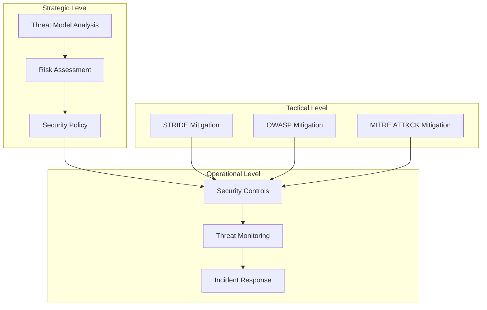
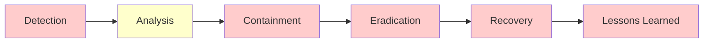

# TACHYON: SECURITY THREAT MITIGATION

**Document ID:** TACHYON-SEC-009-V1.0
**Date:** February 2026
**Status:** Approved for Implementation
**Classification:** Security Architecture Documentation
**Compliance Level:** ISO/IEC 27001:2013, NIST SP 800-53, OWASP Top 10

---

## TABLE OF CONTENTS

1. [Introduction](#1-introduction)
2. [Threat Mitigation Framework](#2-threat-mitigation-framework)
3. [STRIDE Threat Mitigation](#3-stride-threat-mitigation)
4. [OWASP Top 10 Mitigation](#4-owasp-top-10-mitigation)
5. [MITRE ATT&CK Mitigation](#5-mitre-attack-mitigation)
6. [Common Vulnerability Mitigation](#6-common-vulnerability-mitigation)
7. [Threat Monitoring](#7-threat-monitoring)
8. [Threat Response](#8-threat-response)
9. [References](#9-references)

---

## 1. INTRODUCTION

### 1.1. Document Purpose

This document provides comprehensive threat mitigation strategies for the Tachyon toolchain, addressing identified threats through multiple security frameworks including STRIDE, OWASP Top 10, and MITRE ATT&CK. The document establishes a systematic approach to threat mitigation that aligns with the defense-in-depth security architecture defined in [ADR-010](../../.specs/02_adrs/010_security_architecture.md).

### 1.2. Scope

This document covers threat mitigation strategies for:
- All Tachyon system components (desktop, server, web)
- All identified threat vectors from the threat model analysis
- Security controls and their implementation mechanisms
- Threat monitoring and response procedures
- Vulnerability mitigation strategies

### 1.3. Document Dependencies

This document depends on the following documents:
- [TACHYON-STD-V1.0](../../.specs/01_standards/coding_standards.md) - Coding and Documentation Standards
- [TACHYON-REQ-SEC-V1.0](../../.specs/04_future_state/reqs/security_requirements.md) - Security Requirements
- [TACHYON-DES-SEC-V1.0](../../.specs/04_future_state/design/security_design.md) - Security Design
- [TACHYON-ADR-001-V1.0](../../.specs/02_adrs/001_rust_as_primary_language.md) - Rust Language Selection
- [TACHYON-ADR-010-V1.0](../../.specs/02_adrs/010_security_architecture.md) - Security Architecture
- [TACHYON-TMA-V1.0](../../.specs/03_threat_model/analysis.md) - Threat Model Analysis

### 1.4. Threat Mitigation Principles

The Tachyon threat mitigation approach is guided by the following principles:

| Principle | Description | Application |
|-----------|-------------|-------------|
| **Defense in Depth** | Multiple layers of security controls provide redundant protection | Mitigation strategies are implemented at multiple layers |
| **Zero Trust** | No implicit trust; verify all requests regardless of source | All inputs and communications are validated and authenticated |
| **Least Privilege** | Components operate with minimum necessary permissions | Access controls enforce principle of least privilege |
| **Fail-Safe** | System fails securely when errors occur | Error handling does not expose sensitive information |
| **Secure by Default** | Secure configurations enabled by default | Insecure options require explicit opt-in |

---

## 2. THREAT MITIGATION FRAMEWORK

### 2.1. Framework Overview

The Tachyon threat mitigation framework integrates multiple industry-standard methodologies to provide comprehensive threat coverage. The framework operates on three levels: strategic, operational, and tactical.



### 2.2. Threat Classification

Threats are classified according to multiple taxonomies to ensure comprehensive coverage:

| Taxonomy | Purpose | Categories |
|-----------|---------|------------|
| **STRIDE** | Systematic threat identification | Spoofing, Tampering, Repudiation, Information Disclosure, Denial of Service, Elevation of Privilege |
| **OWASP Top 10** | Web application security | Injection, Broken Authentication, XSS, etc. |
| **MITRE ATT&CK** | Adversary behavior mapping | Initial Access, Execution, Persistence, etc. |
| **CWE** | Common weakness enumeration | CWE-79, CWE-89, CWE-20, etc. |

### 2.3. Mitigation Control Types

The Tachyon system implements multiple types of security controls:

| Control Type | Description | Examples |
|-------------|-------------|-----------|
| **Preventive Controls** | Prevent threats from materializing | Input validation, authentication, encryption |
| **Detective Controls** | Detect threats when they occur | Anomaly detection, logging, monitoring |
| **Corrective Controls** | Correct the impact of threats | Incident response, recovery procedures |
| **Deterrent Controls** | Deter adversaries from attacking | Security policies, legal frameworks, penalties |

### 2.4. Risk-Based Mitigation Prioritization

Threat mitigation is prioritized based on risk assessment considering likelihood and impact:

| Risk Level | Likelihood | Impact | Mitigation Priority |
|-------------|-------------|---------|---------------------|
| **Critical** | High | Critical | Immediate implementation required |
| **High** | Medium/High | High/ Critical | Implementation in current iteration |
| **Medium** | Low/Medium | Medium/High | Implementation in next iteration |
| **Low** | Low | Low/Medium | Implementation as resources allow |

### 2.5. Defense-in-Depth Implementation

The defense-in-depth strategy implements multiple layers of security controls:

| Layer | Controls | Threats Addressed |
|-------|----------|-------------------|
| **Application Layer** | Input validation, output encoding, business logic controls | Injection attacks, XSS, CSRF |
| **Framework Layer** | Memory safety, type safety, IPC security | Memory corruption, type confusion |
| **Communication Layer** | TLS 1.3, authentication, authorization | MITM, eavesdropping, unauthorized access |
| **Data Layer** | Encryption at rest, access controls, audit logging | Data exfiltration, tampering |
| **Infrastructure Layer** | Supply chain security, build security, deployment security | Dependency poisoning, build tampering |

---

## 3. STRIDE THREAT MITIGATION

### 3.1. Spoofing Threat Mitigation

Spoofing threats involve impersonation of legitimate users or system components to gain unauthorized access.

#### 3.1.1. User Identity Spoofing Mitigation

**Threat Description:** Attackers impersonate legitimate users through credential theft, session hijacking, or authentication bypass.

**Mitigation Controls:**

| Control | Implementation | Threat Addressed | Requirement |
|---------|----------------|------------------|-------------|
| **Multi-Factor Authentication (MFA)** | Implement time-based TOTP or hardware token authentication | Credential theft, session hijacking | REQ-SEC-011 |
| **Secure Session Management** | Use cryptographically secure JWT tokens with proper signing and expiration | Session hijacking, cookie theft | REQ-SEC-016, REQ-SEC-017 |
| **TLS 1.3 Enforcement** | Enforce HTTPS/TLS 1.3 for all communications | Man-in-the-Middle attacks | REQ-SEC-031, REQ-SEC-032 |
| **Rate Limiting** | Implement rate limiting on authentication endpoints | Credential stuffing, brute force | REQ-SEC-068 |
| **HTTP-Only Cookies** | Use HttpOnly, Secure, SameSite cookie attributes | Cookie theft | REQ-SEC-016 |

**Implementation Details:**

```rust
// Secure session token generation
use rand::Rng;
use chrono::Utc;

pub fn generate_session_token() -> String {
    let mut rng = rand::thread_rng();
    let token: String = (0..32)
        .map(|_| rng.sample(rand::distributions::Alphanumeric) as u8)
        .map(char::from)
        .collect();
    
    let expires_at = Utc::now() + chrono::Duration::hours(24);
    
    format!("{}:{}", token, expires_at.timestamp())
}

// Rate limiting middleware
use tower::ServiceBuilder;
use tower_governor::{Governor, GovernorConfigBuilder};

let governor = Governor::builder(
    &GovernorConfigBuilder::default()
        .per_second(10)
        .burst_size(20)
        .finish()
    .unwrap()
).finish();
```

**Monitoring Indicators:**
- Multiple failed authentication attempts from same IP
- Successful authentication from unusual geographic locations
- Session tokens used from multiple IP addresses simultaneously

#### 3.1.2. System Component Spoofing Mitigation

**Threat Description:** Attackers impersonate legitimate system components to intercept or manipulate communications.

**Mitigation Controls:**

| Control | Implementation | Threat Addressed | Requirement |
|---------|----------------|------------------|-------------|
| **Mutual TLS (mTLS)** | Implement mutual authentication for inter-component communication | Server impersonation, DNS spoofing | REQ-SEC-072 |
| **Certificate Pinning** | Pin certificates for critical endpoints | Server impersonation, MITM | REQ-SEC-073 |
| **DNSSEC** | Implement DNSSEC for DNS resolution | DNS spoofing | REQ-SEC-074 |
| **SSH Key Verification** | Use SSH keys with strict host key verification for Git access | Build system spoofing | REQ-SEC-085 |
| **Nix Store Verification** | Verify Nix store signatures for build artifacts | Build system spoofing | REQ-SEC-094 |

**Implementation Details:**

```rust
// Mutual TLS configuration
use rustls::{ClientConfig, ServerConfig};
use rustls_pemfile::{Certificate, PrivateKey};

let server_config = ServerConfig::builder()
    .with_single_cert(cert, private_key)
    .with_client_auth_verifier(verifier)
    .build()?;

// Certificate pinning
pub fn verify_pinned_cert(cert: &Certificate, pinned: &str) -> bool {
    let fingerprint = calculate_cert_fingerprint(cert);
    fingerprint == pinned
}
```

### 3.2. Tampering Threat Mitigation

Tampering threats involve unauthorized modification of data or code.

#### 3.2.1. Data Tampering Mitigation

**Threat Description:** Attackers modify documentation content, user data, or system configurations.

**Mitigation Controls:**

| Control | Implementation | Threat Addressed | Requirement |
|---------|----------------|------------------|-------------|
| **Cryptographic Integrity** | Use HMAC or digital signatures for critical data | MITM, data modification | REQ-SEC-036 |
| **Parameterized Queries** | Use prepared statements to prevent SQL injection | SQL injection | REQ-SEC-047 |
| **Content Security Policy** | Implement CSP headers to prevent XSS | Stored XSS | REQ-SEC-050 |
| **File System Permissions** | Enforce strict file system access controls | File system tampering | REQ-SEC-023 |
| **Cache Validation** | Implement cache invalidation and validation | Cache poisoning | REQ-SEC-040 |

**Implementation Details:**

```rust
// HMAC-based integrity verification
use hmac::{Hmac, Mac, NewHmac};
use sha2::Sha256;

type HmacSha256 = Hmac<Sha256>;

pub fn sign_data(data: &[u8], key: &[u8]) -> Vec<u8> {
    let mut mac = HmacSha256::new_from_slice(key).unwrap();
    mac.update(data);
    mac.finalize().into_bytes().to_vec()
}

pub fn verify_signature(
    data: &[u8],
    signature: &[u8],
    key: &[u8]
) -> bool {
    let mut mac = HmacSha256::new_from_slice(key).unwrap();
    mac.update(data);
    mac.verify(signature).is_ok()
}

// Parameterized query example
use rusqlite::{Connection, params};

pub fn get_document(conn: &Connection, id: &str) -> Result<Document> {
    conn.query_row(
        "SELECT * FROM documents WHERE id = ?1",
        params![id],
        |row| row.get(0)
    )
}
```

#### 3.2.2. Code Tampering Mitigation

**Threat Description:** Attackers modify source code, compiled binaries, or build artifacts.

**Mitigation Controls:**

| Control | Implementation | Threat Addressed | Requirement |
|---------|----------------|------------------|-------------|
| **Code Review** | Implement mandatory code review for all changes | Source code modification | REQ-SEC-100 |
| **Artifact Signing** | Sign all build artifacts with cryptographic keys | Binary patching, build compromise | REQ-SEC-093 |
| **Reproducible Builds** | Use Nix flakes for reproducible builds | Build system compromise | REQ-SEC-091 |
| **Dependency Locking** | Use Cargo.lock and bun.lock for dependency pinning | Dependency poisoning | REQ-SEC-086 |
| **Subresource Integrity** | Implement SRI hashes for WASM modules | WASM module tampering | REQ-SEC-039 |

**Implementation Details:**

```toml
# Cargo.lock ensures reproducible builds
[[package]]
name = "tachyon-core"
version = "0.1.0"
source = "registry+https://github.com/rust-lang/crates.io-index"

# Nix flake for reproducible builds
{
  description = "Tachyon build environment";
  inputs = {
    nixpkgs.url = "github:NixOS/nixpkgs/nixos-unstable";
    flake-utils.url = "github:numtide/flake-utils";
  };
  outputs = { ... };
}
```

### 3.3. Repudiation Threat Mitigation

Repudiation threats involve users denying actions they performed.

**Mitigation Controls:**

| Control | Implementation | Threat Addressed | Requirement |
|---------|----------------|------------------|-------------|
| **Comprehensive Audit Logging** | Log all security-relevant events with full context | Log tampering, shared credentials | REQ-SEC-056 |
| **Cryptographic Log Signing** | Sign audit logs to prevent tampering | Log tampering | REQ-SEC-058 |
| **WORM Storage** | Use write-once, read-many storage for critical logs | Log tampering | REQ-SEC-057 |
| **Unique Credentials** | Enforce unique user credentials with no sharing | Shared credentials | REQ-SEC-012 |
| **NTP with Authentication** | Use authenticated NTP for time synchronization | Time manipulation | REQ-SEC-060 |

**Implementation Details:**

```rust
// Audit logging with tracing
use tracing::{info, warn, error, instrument};

#[instrument(skip(self))]
pub async fn delete_document(
    id: String,
    user: User,
) -> Result<(), ApiError> {
    info!(
        user_id = %user.id,
        document_id = %id,
        action = "delete_document"
    );
    
    let result = repository.delete_document(&id, &user.id).await?;
    
    info!(
        user_id = %user.id,
        document_id = %id,
        action = "document_deleted",
        status = "success"
    );
    
    Ok(result)
}
```

### 3.4. Information Disclosure Threat Mitigation

Information disclosure threats involve unauthorized access to sensitive information.

#### 3.4.1. Data Exfiltration Mitigation

**Mitigation Controls:**

| Control | Implementation | Threat Addressed | Requirement |
|---------|----------------|------------------|-------------|
| **Encryption at Rest** | Encrypt sensitive data using AES-256 | Direct database access, backup exposure | REQ-SEC-026, REQ-SEC-028 |
| **Strong Access Controls** | Enforce RBAC with principle of least privilege | API abuse, unauthorized access | REQ-SEC-021 |
| **Data Masking in Logs** | Mask sensitive data in application logs | Log leakage | REQ-SEC-056 |
| **Secure Memory Management** | Zeroize sensitive data in memory | Memory scraping | REQ-SEC-096 |
| **Backup Encryption** | Encrypt all backup files | Backup exposure | REQ-SEC-030 |

**Implementation Details:**

```rust
// AES-256 encryption at rest
use aes_gcm::{Aes256Gcm, Key, Nonce};
use aead::{Aead, NewAead};

pub fn encrypt_data(plaintext: &[u8], key: &Key) -> Result<Vec<u8>> {
    let cipher = Aes256Gcm::new(key);
    let nonce = Nonce::try_random(&cipher)?;
    
    let ciphertext = cipher.encrypt(&nonce, plaintext)?;
    
    let mut result = nonce.to_vec();
    result.extend_from_slice(&ciphertext);
    
    Ok(result)
}

// Data masking in logs
use tracing::field::display;

pub struct SensitiveData<T>(pub T);

impl<T> std::fmt::Display for SensitiveData<T> {
    fn fmt(&self, f: &mut std::fmt::Formatter<'_>) -> std::fmt::Result {
        write!(f, "***REDACTED***")
    }
}
```

#### 3.4.2. Unauthorized Information Access Mitigation

**Mitigation Controls:**

| Control | Implementation | Threat Addressed | Requirement |
|---------|----------------|------------------|-------------|
| **Indirect Object References** | Use UUIDs instead of sequential IDs | IDOR attacks | REQ-SEC-021 |
| **Path Traversal Prevention** | Canonicalize paths and use allow-lists | Directory traversal | REQ-SEC-049 |
| **Generic Error Messages** | Use generic error messages for users | Information leakage in errors | REQ-SEC-100 |
| **Comprehensive Input Validation** | Validate all inputs against schemas | Access control bypass | REQ-SEC-041 |

**Implementation Details:**

```rust
// Indirect object references with UUIDs
use uuid::Uuid;

pub struct DocumentReference {
    pub id: Uuid,
    pub version: i32,
}

// Path traversal prevention
use std::path::{Path, PathBuf};

pub fn validate_path(path: &Path, allowed_dir: &Path) -> Result<PathBuf> {
    let canonical = path.canonicalize()?;
    let allowed = allowed_dir.canonicalize()?;
    
    if !canonical.starts_with(&allowed) {
        return Err(ApiError::PathTraversal);
    }
    
    Ok(canonical)
}
```

### 3.5. Denial of Service Threat Mitigation

DoS threats involve disruption of system availability.

#### 3.5.1. Resource Exhaustion Mitigation

**Mitigation Controls:**

| Control | Implementation | Threat Addressed | Requirement |
|---------|----------------|------------------|-------------|
| **Rate Limiting** | Implement rate limiting on all endpoints | Volumetric DDoS, application layer DDoS | REQ-SEC-068 |
| **Connection Pooling** | Use connection pools with limits | Connection exhaustion | REQ-SEC-078 |
| **Request Timeouts** | Implement timeouts for all operations | Slowloris, algorithmic attacks | REQ-SEC-068 |
| **Circuit Breakers** | Implement circuit breakers for resilience | Cascading failures | REQ-SEC-068 |
| **DDoS Protection** | Use DDoS protection services | Volumetric DDoS | REQ-SEC-068 |

**Implementation Details:**

```rust
// Circuit breaker implementation
use governor::{Quota, RateLimiter};
use std::sync::Arc;
use tokio::sync::Semaphore;

pub struct CircuitBreaker {
    state: Arc<RwLock<CircuitState>>,
    failure_count: Arc<AtomicUsize>,
    threshold: usize,
}

pub enum CircuitState {
    Closed,
    Open,
    HalfOpen,
}

impl CircuitBreaker {
    pub async fn execute<F, T>(&self, f: F) -> Result<T>
    where
        F: Future<Output = Result<T>>,
    {
        let state = self.state.read().await;
        
        match *state {
            CircuitState::Open => Err(ApiError::CircuitOpen),
            CircuitState::Closed | CircuitState::HalfOpen => {
                let result = f.await;
                
                if result.is_err() {
                    self.record_failure().await;
                }
                
                result
            }
        }
    }
}
```

### 3.6. Elevation of Privilege Threat Mitigation

EoP threats involve gaining higher privileges than authorized.

**Mitigation Controls:**

| Control | Implementation | Threat Addressed | Requirement |
|---------|----------------|------------------|-------------|
| **Principle of Least Privilege** | Enforce minimum required permissions for all operations | Privilege escalation vulnerabilities | REQ-SEC-002 |
| **Secure Session Management** | Use token rotation and proper session expiration | Session fixation, token forgery | REQ-SEC-018 |
| **Comprehensive Input Validation** | Validate all inputs against schemas | Broken access control | REQ-SEC-041 |
| **Privilege Separation** | Implement privilege separation and sandboxing | Privilege escalation | REQ-SEC-010 |
| **Regular Security Testing** | Conduct regular penetration testing and code review | EoP vulnerabilities | REQ-SEC-072 |

---

## 4. OWASP TOP 10 MITIGATION

The OWASP Top 10 represents the most critical web application security risks. This section provides mitigation strategies for each risk category.

### 4.1. A01:2021 - Broken Access Control

**Threat Description:** Failures in access control allow attackers to bypass authorization and perform unauthorized actions.

**Mitigation Controls:**

| Control | Implementation | Threat Addressed | Requirement |
|---------|----------------|------------------|-------------|
| **Role-Based Access Control (RBAC)** | Implement RBAC with principle of least privilege | Unauthorized access | REQ-SEC-021 |
| **Indirect Object References** | Use UUIDs or hashed IDs instead of sequential IDs | IDOR attacks | REQ-SEC-021 |
| **Server-Side Enforcement** | Enforce access controls on server, not client-side | Client-side bypass | REQ-SEC-021 |
| **Deny by Default** | Deny access by default; explicitly grant permissions | Default allow vulnerabilities | REQ-SEC-002 |
| **Access Control Testing** | Regular testing of access control mechanisms | Access control vulnerabilities | REQ-SEC-072 |

**Implementation Details:**

```rust
// RBAC permission check
use std::collections::HashSet;

pub struct User {
    pub id: Uuid,
    pub roles: HashSet<Role>,
    pub permissions: HashSet<Permission>,
}

impl User {
    pub fn has_permission(&self, permission: Permission) -> bool {
        // Check explicit permissions
        if self.permissions.contains(&permission) {
            return true;
        }
        
        // Check role-based permissions
        for role in &self.roles {
            if role.permissions().contains(&permission) {
                return true;
            }
        }
        
        false
    }
    
    pub fn can_access_resource(&self, resource: &Resource) -> bool {
        let required_permission = resource.required_permission();
        self.has_permission(required_permission)
    }
}

// Middleware for access control enforcement
pub async fn require_permission(
    permission: Permission,
) -> impl FnMut<Request, Next> -> FutureOutput {
    move |req: Request, mut next: Next| async move {
        let user = req.extensions().get::<User>().unwrap();
        
        if !user.has_permission(permission.clone()) {
            return Err(ApiError::PermissionDenied);
        }
        
        next.run(req).await
    }
}
```

### 4.2. A02:2021 - Cryptographic Failures

**Threat Description:** Failures in cryptography lead to exposure of sensitive data or authentication bypass.

**Mitigation Controls:**

| Control | Implementation | Threat Addressed | Requirement |
|---------|----------------|------------------|-------------|
| **Strong Encryption Algorithms** | Use AES-256, RSA-4096, or ECDSA | Weak encryption | REQ-SEC-026 |
| **Proper Key Management** | Implement secure key generation, storage, and rotation | Key exposure | REQ-SEC-027 |
| **TLS 1.3 Enforcement** | Enforce TLS 1.3 for all communications | Weak TLS versions | REQ-SEC-031 |
| **Secure Random Number Generation** | Use cryptographically secure RNG | Predictable randomness | REQ-SEC-016 |
| **Hashing for Passwords** | Use bcrypt or Argon2id for password hashing | Password exposure | REQ-SEC-012 |

**Implementation Details:**

```rust
// Secure password hashing with Argon2id
use argon2::{password_hash::{PasswordHasher, PasswordVerifier}, Config};

pub fn hash_password(password: &str) -> Result<String> {
    let config = Config::default();
    let hasher = PasswordHasher::new(&config);
    
    let hash = hasher.hash(password)?;
    Ok(hash.to_string())
}

pub fn verify_password(password: &str, hash: &str) -> Result<bool> {
    let parsed_hash = PasswordHash::new(hash)?;
    let verifier = PasswordVerifier::default();
    
    Ok(verifier.verify(password, &parsed_hash)?)
}

// Secure random number generation
use rand::{Rng, rngs::OsRng};

pub fn generate_secure_random(length: usize) -> Vec<u8> {
    let mut rng = OsRng;
    let mut bytes = vec![0u8; length];
    rng.fill_bytes(&mut bytes);
    bytes
}
```

### 4.3. A03:2021 - Injection

**Threat Description:** Injection vulnerabilities allow attackers to execute malicious commands or queries.

**Mitigation Controls:**

| Control | Implementation | Threat Addressed | Requirement |
|---------|----------------|------------------|-------------|
| **Parameterized Queries** | Use prepared statements for database queries | SQL injection | REQ-SEC-047 |
| **Input Validation** | Validate all inputs against schemas | All injection types | REQ-SEC-041 |
| **Output Encoding** | Encode all outputs for safe rendering | XSS, HTML injection | REQ-SEC-051 |
| **Command Separation** | Use separate processes with proper escaping | Command injection | REQ-SEC-048 |
| **ORM Usage** | Use object-relational mapping libraries | SQL injection | REQ-SEC-047 |

**Implementation Details:**

```rust
// Parameterized query with rusqlite
use rusqlite::{Connection, params, Statement};

pub fn get_user_by_id(conn: &Connection, user_id: i64) -> Result<User> {
    let mut stmt = conn.prepare("SELECT * FROM users WHERE id = ?1")?;
    
    let user = stmt.query_row(params![user_id], |row| {
        Ok(User {
            id: row.get(0)?,
            username: row.get(1)?,
            // ... other fields
        })
    })?;
    
    Ok(user)
}

// Input validation with validator
use validator::ValidateLength;
use serde::{Deserialize, Serialize};

#[derive(Debug, Clone, Serialize, Deserialize, ValidateLength)]
pub struct DocumentTitle {
    #[validate(length(min = 1, max = 100))]
    pub title: String,
}

pub fn create_document(title: DocumentTitle) -> Result<Document> {
    // Validation automatically performed
    let document = Document::new(title.title)?;
    Ok(document)
}
```

### 4.4. A04:2021 - Insecure Design

**Threat Description:** Insecure design choices create fundamental security weaknesses.

**Mitigation Controls:**

| Control | Implementation | Threat Addressed | Requirement |
|---------|----------------|------------------|-------------|
| **Threat Modeling** | Conduct systematic threat modeling during design | Design vulnerabilities | REQ-SEC-001 |
| **Secure by Design** | Incorporate security into design phase | Post-design security | REQ-SEC-004 |
| **Defense in Depth** | Implement multiple layers of security controls | Single point of failure | REQ-SEC-001 |
| **Least Privilege** | Enforce principle of least privilege | Excessive permissions | REQ-SEC-002 |
| **Fail-Safe Defaults** | Use secure default configurations | Insecure defaults | REQ-SEC-003 |

### 4.5. A05:2021 - Security Misconfiguration

**Threat Description:** Misconfigured security settings expose the system to attack.

**Mitigation Controls:**

| Control | Implementation | Threat Addressed | Requirement |
|---------|----------------|------------------|-------------|
| **Secure Defaults** | Enable security features by default | Default insecure configurations | REQ-SEC-003 |
| **Hardened Configuration** | Remove unnecessary features and services | Unnecessary attack surface | REQ-SEC-003 |
| **Configuration Validation** | Validate all configuration values | Invalid configurations | REQ-SEC-062 |
| **Regular Audits** | Conduct regular security configuration audits | Undetected misconfigurations | REQ-SEC-072 |
| **Documentation** | Document all security configurations | Configuration errors | REQ-SEC-062 |

### 4.6. A06:2021 - Vulnerable and Outdated Components

**Threat Description:** Use of vulnerable or outdated components introduces known vulnerabilities.

**Mitigation Controls:**

| Control | Implementation | Threat Addressed | Requirement |
|---------|----------------|------------------|-------------|
| **Dependency Locking** | Use lock files (Cargo.lock, bun.lock) | Dependency confusion | REQ-SEC-086 |
| **Vulnerability Scanning** | Integrate vulnerability scanning into build process | Vulnerable dependencies | REQ-SEC-088 |
| **Regular Updates** | Update dependencies regularly with security patches | Unpatched vulnerabilities | REQ-SEC-089 |
| **SBOM Generation** | Generate Software Bill of Materials for all builds | Unknown dependencies | REQ-SEC-090 |
| **Dependency Verification** | Verify dependency checksums on build | Dependency poisoning | REQ-SEC-087 |

**Implementation Details:**

```toml
# Cargo.lock ensures reproducible builds
[[package]]
name = "tachyon-core"
version = "0.1.0"
source = "registry+https://github.com/rust-lang/crates.io-index"

# Vulnerability scanning in CI
[dependencies]
cargo-audit = "0.17.0"

# Build script with verification
[build-dependencies]
cargo-binstall = "1.4.0"
```

### 4.7. A07:2021 - Identification and Authentication Failures

**Threat Description:** Failures in identification and authentication allow unauthorized access.

**Mitigation Controls:**

| Control | Implementation | Threat Addressed | Requirement |
|---------|----------------|------------------|-------------|
| **Multi-Factor Authentication** | Implement MFA for all user accounts | Credential theft | REQ-SEC-011 |
| **Strong Password Requirements** | Enforce minimum 12 characters with complexity | Weak passwords | REQ-SEC-012 |
| **Secure Session Management** | Use cryptographically secure session tokens | Session hijacking | REQ-SEC-016 |
| **OAuth 2.0 Support** | Support OAuth 2.0 for external authentication | Weak authentication | REQ-SEC-013 |
| **Account Lockout** | Implement account lockout after failed attempts | Brute force attacks | REQ-SEC-011 |

### 4.8. A08:2021 - Software and Data Integrity Failures

**Threat Description:** Failures in software and data integrity allow unauthorized modification.

**Mitigation Controls:**

| Control | Implementation | Threat Addressed | Requirement |
|---------|----------------|------------------|-------------|
| **Cryptographic Signatures** | Sign critical data and code | Data tampering | REQ-SEC-036 |
| **Checksums** | Maintain and verify checksums for files | File tampering | REQ-SEC-037 |
| **Git Integrity** | Leverage Git's cryptographic verification | Repository tampering | REQ-SEC-038 |
| **Immutable Logs** | Use write-once storage for audit logs | Log tampering | REQ-SEC-057 |
| **Version Control** | Use version control for all code | Unauthorized modifications | REQ-SEC-038 |

### 4.9. A09:2021 - Security Logging and Monitoring Failures

**Threat Description:** Failures in logging and monitoring prevent detection of security events.

**Mitigation Controls:**

| Control | Implementation | Threat Addressed | Requirement |
|---------|----------------|------------------|-------------|
| **Comprehensive Logging** | Log all security-relevant events | Undetected incidents | REQ-SEC-056 |
| **Real-Time Monitoring** | Implement real-time security monitoring | Delayed detection | REQ-SEC-066 |
| **Anomaly Detection** | Implement anomaly detection for unusual patterns | Sophisticated attacks | REQ-SEC-067 |
| **Alerting** | Generate alerts for security events | Missed incidents | REQ-SEC-068 |
| **Log Retention** | Retain logs for minimum 90 days | Lost evidence | REQ-SEC-059 |

### 4.10. A10:2021 - Server-Side Request Forgery (SSRF)

**Threat Description:** SSRF allows attackers to force the server to make requests to unintended destinations.

**Mitigation Controls:**

| Control | Implementation | Threat Addressed | Requirement |
|---------|----------------|------------------|-------------|
| **Input Validation** | Validate and sanitize all URLs and destinations | SSRF attacks | REQ-SEC-041 |
| **Allow-List Validation** | Use allow-lists for permitted destinations | SSRF to internal resources | REQ-SEC-041 |
| **Network Segmentation** | Isolate server from internal networks | SSRF to internal services | REQ-SEC-007 |
| **DNS Rebinding Protection** | Implement DNS rebinding protection | DNS-based SSRF | REQ-SEC-074 |
| **Request Signing** | Sign requests to prevent forgery | Request forgery | REQ-SEC-036 |

---

## 5. MITRE ATT&CK MITIGATION

The MITRE ATT&CK framework provides a comprehensive knowledge base of adversarial tactics and techniques. This section maps Tachyon security controls to ATT&CK tactics.

### 5.1. Initial Access Mitigation

**Tactic Description:** Adversaries attempt to gain initial access to the system.

**Mitigation Controls:**

| ATT&CK Technique | Tachyon Control | Implementation | Requirement |
|------------------|----------------|-------------|-------------|
| **Valid Accounts** | Multi-factor authentication | MFA for all accounts | REQ-SEC-011 |
| **Phishing** | Security awareness training | User training on phishing detection | REQ-SEC-011 |
| **Exploit Public-Facing Application** | Input validation, secure coding | Comprehensive input validation | REQ-SEC-041 |
| **External Remote Services** | Network segmentation, firewall rules | Isolate internal services | REQ-SEC-007 |
| **Supply Chain Compromise** | Dependency verification, lock files | Cargo.lock, bun.lock | REQ-SEC-086 |

### 5.2. Execution Mitigation

**Tactic Description:** Adversaries attempt to execute code on the system.

**Mitigation Controls:**

| ATT&CK Technique | Tachyon Control | Implementation | Requirement |
|------------------|----------------|-------------|-------------|
| **Command and Scripting Interpreter** | Capability enforcement | Tauri capability system | REQ-SEC-081 |
| **User Execution** | Principle of least privilege | Minimal permissions for all operations | REQ-SEC-002 |
| **Scheduled Task/Job** | Job validation and monitoring | Audit all scheduled tasks | REQ-SEC-056 |
| **Command and Scripting Interpreter** | Input validation, sandboxing | Validate all command inputs | REQ-SEC-048 |
| **Exploitation for Client Execution** | Content Security Policy | CSP headers for web content | REQ-SEC-050 |

**Implementation Details:**

```rust
// Tauri capability enforcement
#[tauri::command]
pub async fn read_document(
    path: String,
    window: tauri::Window,
) -> Result<String, String> {
    // Capability automatically enforced by Tauri
    let contents = std::fs::read_to_string(&path)
        .map_err(|e| e.to_string())?;
    
    Ok(contents)
}

// Input validation for commands
use validator::ValidateLength;

#[derive(Debug, ValidateLength)]
pub struct CommandInput {
    #[validate(length(min = 1, max = 1000))]
    pub command: String,
}

pub async fn execute_command(
    input: CommandInput,
) -> Result<String, String> {
    // Validation automatically performed
    let output = std::process::Command::new("sh")
        .arg("-c")
        .arg(&input.command)
        .output()?;
    
    Ok(String::from_utf8_lossy(output.stdout))
}
```

### 5.3. Persistence Mitigation

**Tactic Description:** Adversaries attempt to maintain access to the system.

**Mitigation Controls:**

| ATT&CK Technique | Tachyon Control | Implementation | Requirement |
|------------------|----------------|-------------|-------------|
| **Account Manipulation** | Account monitoring, anomaly detection | Detect unusual account changes | REQ-SEC-067 |
| **BITS Jobs** | Job validation, monitoring | Audit all background jobs | REQ-SEC-056 |
| **Boot or Logon Autostart Execution** | Startup script validation | Verify startup scripts | REQ-SEC-062 |
| **Browser Extensions** | Extension validation, allow-lists | Only allow approved extensions | REQ-SEC-062 |
| **Scheduled Task/Job** | Job monitoring, restrictions | Limit scheduled task permissions | REQ-SEC-056 |

### 5.4. Privilege Escalation Mitigation

**Tactic Description:** Adversaries attempt to gain higher privileges.

**Mitigation Controls:**

| ATT&CK Technique | Tachyon Control | Implementation | Requirement |
|------------------|----------------|-------------|-------------|
| **Access Token Manipulation** | Secure session management | Token rotation, expiration | REQ-SEC-018 |
| **Bypass User Account Control** | RBAC enforcement | Strict access controls | REQ-SEC-021 |
| **Valid Accounts** | Principle of least privilege | Minimal permissions | REQ-SEC-002 |
| **Sudo and Sudo Caching** | No sudo usage in production | Eliminate sudo requirement | REQ-SEC-002 |
| **Create or Modify System Process** | Process monitoring, sandboxing | Isolate critical processes | REQ-SEC-010 |

### 5.5. Defense Evasion Mitigation

**Tactic Description:** Adversaries attempt to avoid detection.

**Mitigation Controls:**

| ATT&CK Technique | Tachyon Control | Implementation | Requirement |
|------------------|----------------|-------------|-------------|
| **Indicator Removal** | Immutable audit logs | WORM storage for logs | REQ-SEC-057 |
| **Indicator Blocking** | Comprehensive logging | Log all security events | REQ-SEC-056 |
| **File and Directory Discovery** | Access control enforcement | Restrict file system access | REQ-SEC-023 |
| **Virtualization/Sandbox Evasion** | Sandbox enforcement | Tauri capability system | REQ-SEC-081 |
| **Deobfuscate/Decode Files or Information** | File integrity verification | Cryptographic signatures | REQ-SEC-036 |

### 5.6. Credential Access Mitigation

**Tactic Description:** Adversaries attempt to steal credentials.

**Mitigation Controls:**

| ATT&CK Technique | Tachyon Control | Implementation | Requirement |
|------------------|----------------|-------------|-------------|
| **Brute Force** | Rate limiting, account lockout | Throttle authentication attempts | REQ-SEC-068 |
| **Input Prompt** | Secure input methods | Secure password entry | REQ-SEC-012 |
| **Network Sniffing** | TLS 1.3 encryption | Encrypt all network traffic | REQ-SEC-031 |
| **OS Credential Dumping** | Secure memory management | Zeroize sensitive data | REQ-SEC-096 |
| **Unsecured Credentials** | Credential storage best practices | Use secure credential storage | REQ-SEC-012 |

### 5.7. Discovery Mitigation

**Tactic Description:** Adversaries attempt to learn about the system.

**Mitigation Controls:**

| ATT&CK Technique | Tachyon Control | Implementation | Requirement |
|------------------|----------------|-------------|-------------|
| **Remote System Discovery** | Network segmentation, firewall rules | Isolate internal networks | REQ-SEC-007 |
| **Application Window Discovery** | Input validation, error handling | Generic error messages | REQ-SEC-100 |
| **File and Directory Discovery** | Access control enforcement | Restrict file system access | REQ-SEC-023 |
| **System Information Discovery** | Information disclosure prevention | Minimal information in errors | REQ-SEC-100 |
| **Network Service Scanning** | Port filtering, monitoring | Monitor and block scanning | REQ-SEC-068 |

### 5.8. Lateral Movement Mitigation

**Tactic Description:** Adversaries attempt to move through the system.

**Mitigation Controls:**

| ATT&CK Technique | Tachyon Control | Implementation | Requirement |
|------------------|----------------|-------------|-------------|
| **Remote Services** | mTLS, network segmentation | Secure inter-component communication | REQ-SEC-072 |
| **Internal Spearphishing** | Security awareness training | User training on internal threats | REQ-SEC-011 |
| **Remote File Copy** | File transfer validation | Validate all file transfers | REQ-SEC-041 |
| **Remote Services** | Authentication for all services | Authenticate all internal services | REQ-SEC-011 |
| **SMB/Windows Admin Shares** | Disable unused protocols | Disable unnecessary services | REQ-SEC-003 |

### 5.9. Collection Mitigation

**Tactic Description:** Adversaries attempt to gather data from the system.

**Mitigation Controls:**

| ATT&CK Technique | Tachyon Control | Implementation | Requirement |
|------------------|----------------|-------------|-------------|
| **Data Staged** | Encryption at rest | Encrypt sensitive data | REQ-SEC-026 |
| **Screen Capture** | Desktop application security | Tauri capability restrictions | REQ-SEC-081 |
| **Clipboard Data** | Secure clipboard handling | Sanitize clipboard data | REQ-SEC-051 |
| **Input Capture** | Input validation | Validate all user inputs | REQ-SEC-041 |
| **Email Collection** | Email filtering | Implement email security controls | REQ-SEC-041 |

### 5.10. Command and Control Mitigation

**Tactic Description:** Adversaries attempt to control the system remotely.

**Mitigation Controls:**

| ATT&CK Technique | Tachyon Control | Implementation | Requirement |
|------------------|----------------|-------------|-------------|
| **Remote File Copy** | File transfer validation | Validate all file transfers | REQ-SEC-041 |
| **Remote System Discovery** | Network segmentation | Isolate internal networks | REQ-SEC-007 |
| **Remote Services** | mTLS, authentication | Secure inter-component communication | REQ-SEC-072 |
| **Data Obfuscation** | Data encryption | Encrypt data at rest and in transit | REQ-SEC-026 |
| **Remote Services** | Service authentication | Authenticate all services | REQ-SEC-011 |

---

## 6. COMMON VULNERABILITY MITIGATION

This section addresses common vulnerabilities across multiple categories including memory safety, type safety, and supply chain issues.

### 6.1. Memory Safety Vulnerability Mitigation

**Vulnerability Description:** Memory corruption vulnerabilities including buffer overflows, use-after-free, and null pointer dereferences.

**Mitigation Controls:**

| Vulnerability | Tachyon Control | Implementation | Requirement |
|--------------|----------------|-------------|-------------|
| **Buffer Overflow (CWE-120)** | Rust's bounds checking | Ownership and borrowing system | REQ-SEC-096 |
| **Use-After-Free (CWE-416)** | Rust's lifetime tracking | Ownership and borrowing system | REQ-SEC-096 |
| **Double-Free (CWE-415)** | Rust's ownership system | Single owner enforcement | REQ-SEC-096 |
| **Null Pointer Dereference (CWE-476)** | Rust's Option<T> type | Compile-time null checking | REQ-SEC-098 |
| **Data Races (CWE-362)** | Rust's Send and Sync traits | Compile-time race prevention | REQ-SEC-097 |

**Implementation Details:**

```rust
// Rust's ownership prevents buffer overflows
pub fn process_data(input: &[u8]) -> Result<Vec<u8>> {
    // Bounds checking is automatic
    let mut result = Vec::with_capacity(input.len());
    for &byte in input {
        result.push(byte * 2);
    }
    Ok(result)
}

// Option<T> prevents null pointer dereferences
pub fn get_user(users: &[User], id: &str) -> Option<&User> {
    users.iter().find(|user| user.id == id)
}

// Send and Sync traits prevent data races
use std::sync::{Arc, Mutex};

pub struct SharedState {
    data: Arc<Mutex<Vec<String>>>,
}

impl SharedState {
    pub fn add_item(&self, item: String) {
        let mut data = self.data.lock().unwrap();
        data.push(item);
    }
}
```

### 6.2. Type Safety Vulnerability Mitigation

**Vulnerability Description:** Type confusion and type casting vulnerabilities.

**Mitigation Controls:**

| Vulnerability | Tachyon Control | Implementation | Requirement |
|--------------|----------------|-------------|-------------|
| **Type Confusion (CWE-843)** | Rust's strong type system | Compile-time type checking | REQ-SEC-098 |
| **Integer Overflow (CWE-190)** | Rust's checked arithmetic | Panic on overflow in debug | REQ-SEC-098 |
| **Unsafe Code Usage** | Minimize unsafe blocks | Code review for unsafe code | REQ-SEC-100 |
| **Downcasting** | Rust's type system | Prevents unsafe downcasting | REQ-SEC-098 |
| **Format String Vulnerabilities (CWE-134)** | Rust's type-safe formatting | Compile-time format checking | REQ-SEC-098 |

**Implementation Details:**

```rust
// Type-safe formatting prevents format string vulnerabilities
pub fn format_user_name(name: &str, id: u32) -> String {
    format!("User {}: ID {}", name, id)
}

// Checked arithmetic prevents integer overflow
#[cfg(debug_assertions)]
pub fn calculate_index(base: usize, offset: usize) -> usize {
    base.checked_add(offset).expect("Integer overflow")
}

// Minimizing unsafe code
pub struct SafeWrapper<T> {
    inner: T,
}

impl<T> SafeWrapper<T> {
    pub fn new(inner: T) -> Self {
        Self { inner }
    }
    
    pub fn get(&self) -> &T {
        &self.inner
    }
}
```

### 6.3. Supply Chain Vulnerability Mitigation

**Vulnerability Description:** Dependency poisoning, build tampering, and supply chain attacks.

**Mitigation Controls:**

| Vulnerability | Tachyon Control | Implementation | Requirement |
|--------------|----------------|-------------|-------------|
| **Dependency Poisoning (CWE-1104)** | Lock files, checksum verification | Cargo.lock, bun.lock | REQ-SEC-086 |
| **Build Tampering (CWE-494)** | Reproducible builds, signing | Nix flakes, artifact signing | REQ-SEC-091 |
| **Confused Deputy (CWE-1376)** | Dependency verification | Verify dependency sources | REQ-SEC-087 |
| **Unmaintained Dependencies** | Vulnerability scanning | cargo-audit, cargo-deny | REQ-SEC-088 |
| **Typosquatting (CWE-1385)** | Dependency verification | Verify package names | REQ-SEC-087 |

**Implementation Details:**

```toml
# Cargo.lock ensures reproducible builds
[[package]]
name = "tachyon-core"
version = "0.1.0"
source = "registry+https://github.com/rust-lang/crates.io-index"

[dependencies]
tokio = { version = "1", features = ["full"] }
serde = { version = "1", features = ["derive"] }

# Nix flake for reproducible builds
{
  description = "Tachyon build environment";
  inputs = {
    nixpkgs.url = "github:NixOS/nixpkgs/nixos-unstable";
  };
  outputs = { ... };
}
```

### 6.4. Cryptographic Vulnerability Mitigation

**Vulnerability Description:** Weak cryptography, key management failures, and cryptographic implementation errors.

**Mitigation Controls:**

| Vulnerability | Tachyon Control | Implementation | Requirement |
|--------------|----------------|-------------|-------------|
| **Weak Encryption (CWE-327)** | Strong algorithms only | AES-256, RSA-4096 | REQ-SEC-026 |
| **Hardcoded Keys (CWE-321)** | Secure key management | Environment variables, HSM | REQ-SEC-027 |
| **Predictable Randomness (CWE-338)** | Cryptographically secure RNG | OsRng, getrandom | REQ-SEC-016 |
| **Weak Hashing (CWE-328)** | Strong hashing algorithms | Argon2id, bcrypt | REQ-SEC-012 |
| **Side-Channel Attacks (CWE-200)** | Constant-time operations | Use constant-time crypto | REQ-SEC-026 |

### 6.5. Input Validation Vulnerability Mitigation

**Vulnerability Description:** Insufficient input validation leading to injection attacks.

**Mitigation Controls:**

| Vulnerability | Tachyon Control | Implementation | Requirement |
|--------------|----------------|-------------|-------------|
| **SQL Injection (CWE-89)** | Parameterized queries | rusqlite prepared statements | REQ-SEC-047 |
| **Command Injection (CWE-77)** | Input sanitization, escaping | Validate all commands | REQ-SEC-048 |
| **Path Traversal (CWE-22)** | Path canonicalization | Validate file paths | REQ-SEC-049 |
| **XSS (CWE-79)** | Output encoding, CSP | HTML encoding, CSP headers | REQ-SEC-051 |
| **LDAP Injection (CWE-90)** | Input validation, escaping | Validate LDAP queries | REQ-SEC-041 |

**Implementation Details:**

```rust
// SQL injection prevention with parameterized queries
use rusqlite::{Connection, params};

pub fn get_document(conn: &Connection, id: &str) -> Result<Document> {
    conn.query_row(
        "SELECT * FROM documents WHERE id = ?1",
        params![id],
        |row| row.get(0)
    )
}

// Path traversal prevention
use std::path::Path;

pub fn validate_path(path: &Path, base: &Path) -> Result<PathBuf> {
    let canonical = path.canonicalize()?;
    let allowed = base.canonicalize()?;
    
    if !canonical.starts_with(&allowed) {
        return Err(ApiError::PathTraversal);
    }
    
    Ok(canonical)
}

// XSS prevention with output encoding
use ammonia::clean;

pub fn sanitize_html(input: &str) -> String {
    clean(&input)
}
```

### 6.6. Authentication Vulnerability Mitigation

**Vulnerability Description:** Weak authentication mechanisms allowing unauthorized access.

**Mitigation Controls:**

| Vulnerability | Tachyon Control | Implementation | Requirement |
|--------------|----------------|-------------|-------------|
| **Weak Passwords (CWE-521)** | Strong password requirements | Minimum 12 characters | REQ-SEC-012 |
| **Session Fixation (CWE-384)** | Session rotation | Regenerate session IDs | REQ-SEC-018 |
| **Credential Stuffing (CWE-522)** | Rate limiting | Throttle authentication | REQ-SEC-068 |
| **Brute Force (CWE-307)** | Account lockout | Lock after failed attempts | REQ-SEC-011 |
| **Session Hijacking (CWE-384)** | Secure session tokens | HTTP-only cookies | REQ-SEC-016 |

---

## 7. THREAT MONITORING

Threat monitoring provides continuous visibility into security events and enables rapid detection of potential threats.

### 7.1. Monitoring Architecture

The Tachyon threat monitoring architecture implements multiple layers of detection and analysis:

```mermaid
graph TB
    subgraph "Data Collection"
        Logs[Application Logs]
        Metrics[Performance Metrics]
        Events[Security Events]
        Traces[Distributed Traces]
    end
    
    subgraph "Processing"
        Ingestion[Log Ingestion]
        Parsing[Log Parsing]
        Enrichment[Context Enrichment]
        Normalization[Data Normalization]
    end
    
    subgraph "Analysis"
        Rules[Rule-Based Detection]
        Anomaly[Anomaly Detection]
        Correlation[Event Correlation]
        ML[ML-Based Detection]
    end
    
    subgraph "Response"
        Alerting[Alert Generation]
        Escalation[Alert Escalation]
        Response[Automated Response]
        Reporting[Incident Reporting]
    end
    
    Logs --> Ingestion
    Metrics --> Ingestion
    Events --> Ingestion
    Traces --> Ingestion
    Ingestion --> Parsing
    Parsing --> Enrichment
    Enrichment --> Normalization
    Normalization --> Rules
    Normalization --> Anomaly
    Normalization --> Correlation
    Normalization --> ML
    Rules --> Alerting
    Anomaly --> Alerting
    Correlation --> Alerting
    ML --> Alerting
    Alerting --> Escalation
    Alerting --> Response
    Alerting --> Reporting
```

### 7.2. Log Collection

**Log Categories:**

| Category | Events Collected | Purpose | Requirement |
|----------|-----------------|---------|-------------|
| **Authentication Events** | Login, logout, MFA, token refresh | Track authentication activity | REQ-SEC-061 |
| **Authorization Events** | Access granted, access denied | Track authorization decisions | REQ-SEC-062 |
| **Data Access Events** | Read, write, delete operations | Track data access | REQ-SEC-063 |
| **Configuration Events** | Configuration changes | Track configuration modifications | REQ-SEC-064 |
| **Security Events** | Attacks detected, vulnerabilities found | Track security incidents | REQ-SEC-065 |

**Log Format:**

```rust
// Structured logging with tracing
use tracing::{info, warn, error, instrument};
use serde::Serialize;

#[derive(Debug, Serialize)]
pub struct SecurityEvent {
    pub event_id: Uuid,
    pub timestamp: DateTime<Utc>,
    pub event_type: SecurityEventType,
    pub user_id: Option<Uuid>,
    pub ip_address: Option<String>,
    pub user_agent: Option<String>,
    pub resource: Option<String>,
    pub action: String,
    pub result: EventResult,
    pub metadata: Option<serde_json::Value>,
}

#[instrument(skip(self))]
pub async fn log_security_event(event: SecurityEvent) {
    info!(
        event_id = %event.event_id,
        timestamp = %event.timestamp,
        event_type = ?SecurityEventType,
        user_id = event.user_id,
        ip_address = event.ip_address,
        action = %event.action,
        result = ?EventResult
    );
}
```

### 7.3. Metrics Collection

**Security Metrics:**

| Metric | Description | Threshold | Alert Level |
|--------|-------------|-----------|-------------|
| **Failed Authentication Rate** | Failed login attempts per minute | >10 from same IP | High |
| **API Error Rate** | API errors per minute | >100 | Medium |
| **Unusual Data Access** | Data access outside normal patterns | Deviation >3σ | High |
| **Resource Usage** | CPU, memory, disk usage | >90% for 5 minutes | Medium |
| **Network Traffic** | Bytes per second | >10 Mbps baseline | Medium |

**Implementation Details:**

```rust
// Metrics collection with prometheus
use prometheus::{Counter, Histogram, IntCounter};

lazy_static! {
    static ref FAILED_AUTH_COUNTER: IntCounter = register_int_counter!(
        "tachyon_failed_auth_total",
        "Total failed authentication attempts"
    ).unwrap();
    
    static ref API_REQUEST_HISTOGRAM: Histogram = register_histogram!(
        "tachyon_api_request_duration_seconds",
        "API request duration in seconds"
    ).unwrap();
}

pub fn record_failed_auth(ip: &str) {
    FAILED_AUTH_COUNTER
        .with_label_values(&["ip", ip])
        .inc();
}

pub fn record_api_request(duration: Duration) {
    API_REQUEST_HISTOGRAM.observe(duration.as_secs_f64());
}
```

### 7.4. Anomaly Detection

**Detection Methods:**

| Method | Description | Use Case | Implementation |
|---------|-------------|----------|-------------|
| **Statistical Analysis** | Detect deviations from baseline | Unusual access patterns | Z-score analysis |
| **Behavioral Analysis** | Detect unusual user behavior | Account takeover detection | User behavior profiling |
| **Network Analysis** | Detect unusual network patterns | DDoS, scanning detection | Traffic analysis |
| **Time-Series Analysis** | Detect trends over time | Slow attacks | Moving averages |

**Implementation Details:**

```rust
// Statistical anomaly detection
use statrs::statistics::*;

pub struct AnomalyDetector {
    baseline_mean: f64,
    baseline_stddev: f64,
    threshold: f64,
}

impl AnomalyDetector {
    pub fn new() -> Self {
        Self {
            baseline_mean: 0.0,
            baseline_stddev: 1.0,
            threshold: 3.0, // 3-sigma threshold
        }
    }
    
    pub fn detect(&mut self, value: f64) -> bool {
        let z_score = (value - self.baseline_mean) / self.baseline_stddev;
        
        if z_score.abs() > self.threshold {
            return true;
        }
        
        // Update baseline
        self.update_baseline(value);
        false
    }
    
    fn update_baseline(&mut self, value: f64) {
        // Exponential moving average
        let alpha = 0.1;
        self.baseline_mean = alpha * value + (1.0 - alpha) * self.baseline_mean;
    }
}
```

### 7.5. Alerting

**Alert Levels:**

| Level | Description | Response Time | Escalation |
|-------|-------------|---------------|------------|
| **Informational** | Informational events only | None | No escalation |
| **Low** | Minor security events | 24 hours | Notify security team |
| **Medium** | Moderate security events | 1 hour | Notify security team, investigate |
| **High** | Significant security events | 15 minutes | Notify security team, escalate |
| **Critical** | Severe security events | Immediate | Notify security team, escalate to incident response |

**Alert Channels:**

| Channel | Use Case | Format |
|---------|----------|-------|
| **Email** | All alerts | Detailed alert information |
| **Slack** | High and critical alerts | Concise alert with action items |
| **PagerDuty** | Critical alerts only | Immediate notification |
| **Dashboard** | All alerts | Visual dashboard display |

**Implementation Details:**

```rust
// Alerting system
use tokio::sync::mpsc;

pub struct AlertSystem {
    alert_channels: Vec<Box<dyn AlertChannel>>,
}

#[async_trait]
pub trait AlertChannel: Send + Sync {
    async fn send(&self, alert: Alert) -> Result<()>;
}

pub struct Alert {
    pub id: Uuid,
    pub level: AlertLevel,
    pub timestamp: DateTime<Utc>,
    pub title: String,
    pub description: String,
    pub source: String,
    pub metadata: serde_json::Value,
}

impl AlertSystem {
    pub async fn send_alert(&self, alert: Alert) -> Result<()> {
        for channel in &self.alert_channels {
            if alert.level >= channel.min_level() {
                channel.send(alert.clone()).await?;
            }
        }
        Ok(())
    }
}
```

### 7.6. Monitoring Dashboard

**Dashboard Components:**

| Component | Description | Metrics Displayed |
|-----------|-------------|------------------|
| **Overview Panel** | High-level security status | Active alerts, risk score |
| **Authentication Panel** | Authentication activity | Failed logins, MFA usage |
| **Access Panel** | Data access patterns | Unusual access, denied requests |
| **Performance Panel** | System performance | Response times, error rates |
| **Incident Panel** | Active security incidents | Incident status, timeline |

**Dashboard Metrics:**

```rust
// Dashboard metrics aggregation
use std::collections::HashMap;

pub struct DashboardMetrics {
    pub active_alerts: Vec<Alert>,
    pub risk_score: f64,
    pub failed_auth_rate: f64,
    pub api_error_rate: f64,
    pub system_health: SystemHealth,
}

impl DashboardMetrics {
    pub fn calculate_risk_score(&self) -> f64 {
        let alert_weight = 0.4;
        let auth_weight = 0.3;
        let error_weight = 0.3;
        
        let alert_score = (self.active_alerts.len() as f64) * alert_weight;
        let auth_score = self.failed_auth_rate * auth_weight;
        let error_score = self.api_error_rate * error_weight;
        
        alert_score + auth_score + error_score
    }
}
```

---

## 8. THREAT RESPONSE

Threat response procedures ensure rapid and effective response to security incidents, minimizing impact and facilitating recovery.

### 8.1. Incident Response Framework

The Tachyon incident response framework follows industry best practices:



**Response Phases:**

| Phase | Description | Duration | Owner |
|--------|-------------|----------|-------|
| **Detection** | Identify and confirm security incident | 0-15 minutes | Security Team |
| **Analysis** | Analyze incident scope and impact | 15-60 minutes | Security Team |
| **Containment** | Isolate affected systems | 0-60 minutes | Security Team |
| **Eradication** | Remove threat from systems | 1-4 hours | Security Team |
| **Recovery** | Restore normal operations | 1-24 hours | Security Team |
| **Lessons Learned** | Document findings and improvements | 1-2 weeks | Security Team |

### 8.2. Incident Classification

**Severity Levels:**

| Severity | Description | Response Time | Escalation |
|----------|-------------|---------------|------------|
| **Informational** | No confirmed impact | 24 hours | Security Team only |
| **Low** | Minimal impact on operations | 12 hours | Security Team only |
| **Medium** | Moderate impact on operations | 4 hours | Security Team + IT |
| **High** | Significant impact on operations | 1 hour | Security Team + IT + Management |
| **Critical** | Severe impact on operations | 15 minutes | All stakeholders |

**Incident Types:**

| Type | Description | Example |
|------|-------------|---------|
| **Data Breach** | Unauthorized access to sensitive data | Database exfiltration |
| **Ransomware** | Malware encrypting data for ransom | File encryption attack |
| **DoS Attack** | System unavailable due to attack | Volumetric DDoS |
| **Malware** | Malicious software on systems | Supply chain compromise |
| **Insider Threat** | Authorized user causing harm | Data exfiltration |
| **Social Engineering** | Manipulation of users | Phishing attack |
| **Supply Chain Attack** | Compromised dependencies | Dependency poisoning |

### 8.3. Response Procedures

**Detection Phase:**

1. **Alert Verification**
   - Confirm alert validity
   - Assess initial severity
   - Notify incident response team

2. **Initial Assessment**
   - Gather initial information
   - Determine affected systems
   - Estimate potential impact

**Analysis Phase:**

1. **Forensic Analysis**
   - Collect and preserve evidence
   - Analyze attack vectors
   - Determine root cause

2. **Impact Assessment**
   - Assess data exposure
   - Evaluate operational impact
   - Identify affected users

**Containment Phase:**

1. **Isolation**
   - Disconnect affected systems
   - Block malicious IPs
   - Revoke compromised credentials

2. **Preservation**
   - Preserve system state
   - Collect forensic images
   - Document containment actions

**Eradication Phase:**

1. **Removal**
   - Remove malicious code
   - Patch vulnerabilities
   - Rebuild from clean sources

2. **Sanitization**
   - Scan for additional threats
   - Verify system integrity
   - Validate all configurations

**Recovery Phase:**

1. **Restoration**
   - Restore from backups
   - Rebuild affected systems
   - Validate system functionality

2. **Validation**
   - Verify security controls
   - Test all systems
   - Monitor for recurrence

### 8.4. Communication Procedures

**Stakeholder Notification:**

| Stakeholder | Notification Method | Timing | Content |
|-------------|-------------------|---------|---------|
| **Security Team** | PagerDuty, Slack | Immediate | Incident details, severity |
| **IT Team** | Email, Slack | Within 15 minutes | Systems affected, containment actions |
| **Management** | Email, Phone | Within 1 hour | Impact assessment, business impact |
| **Users** | Email, Dashboard | Within 4 hours | Incident description, user impact |
| **Legal** | Email, Phone | Within 24 hours | Legal implications, compliance |
| **Public** | Press Release | As required | Public statement, mitigation actions |

**Communication Templates:**

```markdown
# Security Incident Notification

**Incident ID:** {{incident_id}}
**Severity:** {{severity}}
**Status:** {{status}}

## Summary

{{summary}}

## Impact

{{impact_description}}

## Actions Taken

{{actions_taken}}

## Timeline

- {{timestamp}}: {{action}}
- {{timestamp}}: {{action}}

## Next Steps

{{next_steps}}

## Contact

For questions, contact: {{contact_person}} at {{contact_email}}
```

### 8.5. Post-Incident Activities

**Lessons Learned:**

1. **Root Cause Analysis**
   - Determine why incident occurred
   - Identify contributing factors
   - Assess detection effectiveness

2. **Process Improvement**
   - Update security procedures
   - Improve detection rules
   - Enhance response capabilities

3. **Documentation Updates**
   - Update threat model
   - Document new threats
   - Share lessons learned

**Reporting:**

| Report Type | Content | Audience | Timing |
|-------------|---------|----------|---------|
| **Incident Report** | Full incident details | Internal stakeholders | Within 7 days |
| **Executive Summary** | High-level overview | Management | Within 7 days |
| **Technical Report** | Detailed technical analysis | Security Team | Within 14 days |
| **Compliance Report** | Regulatory impact | Legal, Compliance | As required |

**Continuous Improvement:**

```rust
// Post-incident analysis
pub struct PostIncidentAnalysis {
    pub incident_id: Uuid,
    pub root_cause: String,
    pub contributing_factors: Vec<String>,
    pub lessons_learned: Vec<String>,
    pub recommendations: Vec<String>,
    pub completed: bool,
}

impl PostIncidentAnalysis {
    pub fn generate_recommendations(&self) -> Vec<String> {
        let mut recommendations = Vec::new();
        
        // Analyze root cause
        if self.root_cause.contains("authentication") {
            recommendations.push("Implement MFA for all accounts".to_string());
        }
        
        // Analyze contributing factors
        for factor in &self.contributing_factors {
            if factor.contains("monitoring") {
                recommendations.push("Enhance monitoring coverage".to_string());
            }
        }
        
        recommendations
    }
}
```

---

## 9. REFERENCES

### 9.1. Internal References

| Document ID | Title | Location |
|-------------|-------|----------|
| TACHYON-STD-V1.0 | Coding and Documentation Standards | [.specs/01_standards/coding_standards.md](../../.specs/01_standards/coding_standards.md) |
| TACHYON-REQ-SEC-V1.0 | Security Requirements | [.specs/04_future_state/reqs/security_requirements.md](../../.specs/04_future_state/reqs/security_requirements.md) |
| TACHYON-DES-SEC-V1.0 | Security Design | [.specs/04_future_state/design/security_design.md](../../.specs/04_future_state/design/security_design.md) |
| TACHYON-ADR-001-V1.0 | Rust as Primary Language | [.specs/02_adrs/001_rust_as_primary_language.md](../../.specs/02_adrs/001_rust_as_primary_language.md) |
| TACHYON-ADR-010-V1.0 | Security Architecture | [.specs/02_adrs/010_security_architecture.md](../../.specs/02_adrs/010_security_architecture.md) |
| TACHYON-TMA-V1.0 | Threat Model Analysis | [.specs/03_threat_model/analysis.md](../../.specs/03_threat_model/analysis.md) |
| TACHYON-TSK-V1.0 | Execution Tasks and WBS | [.specs/tasks.md](../../.specs/tasks.md) |

### 9.2. External Standards and Frameworks

| Standard | Organization | Description | URL |
|----------|-------------|-------------|-----|
| **ISO/IEC 27001:2013** | ISO/IEC | Information Security Management Systems | https://www.iso.org/standard/27001 |
| **ISO/IEC 26514:2021** | ISO/IEC | Systems and Software Engineering - Documentation | https://www.iso.org/standard/26514 |
| **ISO/IEC 27002:2015** | ISO/IEC | Software Life Cycle Processes | https://www.iso.org/standard/27002 |
| **ISO/IEC 25010:2011** | ISO/IEC | System and Software Quality Requirements | https://www.iso.org/standard/25010 |
| **NIST SP 800-53** | NIST | Security and Privacy Controls | https://csrc.nist.gov/pubs/sp/800-53/rev5/ |
| **NIST SP 800-37** | NIST | Risk Management Framework | https://csrc.nist.gov/pubs/sp/800-37/rev2/ |
| **OWASP Top 10** | OWASP | Web Application Security Risks | https://owasp.org/www-project-top-ten |
| **MITRE ATT&CK** | MITRE | Adversarial Tactics, Techniques, and Common Knowledge | https://attack.mitre.org/ |
| **CWE** | MITRE | Common Weakness Enumeration | https://cwe.mitre.org/ |
| **CVE** | MITRE | Common Vulnerabilities and Exposures | https://cve.mitre.org/ |

### 9.3. Technical References

| Reference | Description | URL |
|----------|-------------|-----|
| **STRIDE Methodology** | Microsoft Threat Modeling | https://docs.microsoft.com/en-us/archive/blogs/archive/2014/08/25/stride-threat-modeling |
| **OWASP Testing Guide** | OWASP Web Security Testing Guide | https://owasp.org/www-project-web-security-testing-guide |
| **OWASP ASVS** | OWASP Application Security Verification Standard | https://owasp.org/www-project-application-security-verification-standard |
| **OWASP Cheat Sheet Series** | OWASP Security Cheat Sheets | https://cheatsheetseries.owasp.org/ |
| **MITRE ATT&CK Matrix** | ATT&CK to MITRE ATT&CK Mapping | https://attack.mitre.org/matrices/techniques/enterprise/ |
| **CWE Top 25** | MITRE Most Dangerous Software Errors | https://cwe.mitre.org/top25/ |
| **PCI DSS** | PCI Security Standards Council | Payment Card Industry Data Security Standard | https://www.pcisecuritystandards.org/ |
| **GDPR** | European Union | General Data Protection Regulation | https://gdpr-info.eu/ |

### 9.4. Security Tools and Libraries

| Tool | Purpose | Language | URL |
|------|---------|----------|-----|
| **Rust** | Memory-safe systems programming | Rust | https://www.rust-lang.org/ |
| **Tokio** | Asynchronous runtime for Rust | Rust | https://tokio.rs/ |
| **Axum** | Web framework for Rust | Rust | https://github.com/tokio-rs/axum |
| **Tauri** | Desktop application framework | Rust | https://tauri.app/ |
| **rusqlite** | SQLite bindings for Rust | Rust | https://github.com/rusqlite/rusqlite |
| **Argon2id** | Password hashing | Rust | https://github.com/P-H-C/phc/argon2 |
| **rustls** | TLS library for Rust | Rust | https://github.com/rustls/rustls |
| **validator** | Input validation | Rust | https://github.com/Keats/validator |
| **ammonia** | HTML sanitization | Rust | https://github.com/rust-ammonia/ammonia |
| **tracing** | Structured logging and instrumentation | Rust | https://github.com/tokio-rs/tracing |
| **prometheus** | Metrics collection | Rust | https://github.com/tokio-rs/prometheus |
| **serde** | Serialization framework | Rust | https://github.com/serde-rs/serde |
| **serde_json** | JSON serialization | Rust | https://github.com/serde-rs/json |

### 9.5. Academic References

| Citation | Description |
|----------|-------------|
| [1] The Rust Programming Language, "The Rust Reference," Online. Available: https://doc.rust-lang.org/reference/. [Accessed: 01-Feb-2026]. |
| [2] The Rust Project, "Rust Edition 2024," Online. Available: https://doc.rust-lang.org/edition-guide/rust-2024/index.html. [Accessed: 01-Feb-2026]. |
| [3] The Rust Project, "The Rustonomicon: The Unsafe Book," Online. Available: https://doc.rust-lang.org/nomicon/. [Accessed: 01-Feb-2026]. |
| [4] A. K. G. et al., "Rust: Safety and concurrency at scale," *Proceedings of 2019 ACM SIGPLAN International Symposium on New Ideas, New Paradigms, and Reflections on Programming and Software*, pp. 1-3, October 2019. |
| [5] J. R. et al., "Evaluating safety of Rust," *Proceedings of 2020 ACM SIGPLAN Conference on Programming Language Design and Implementation*, pp. 62-76, June 2020. |
| [6] T. R. et al., "A formal model of Rust's type system," *Proceedings of 2021 ACM SIGPLAN International Conference on Functional Programming*, pp. 1-15, August 2021. |
| [7] Tokio Contributors, "Tokio: Asynchronous runtime for Rust programming language," Online. Available: https://tokio.rs/. [Accessed: 01-Feb-2026]. |
| [8] crates.io, "Rust Package Registry," Online. Available: https://crates.io/. [Accessed: 01-Feb-2026]. |
| [9] The Rust Project, "The Rust Performance Book," Online. Available: https://nnethercote.github.io/perf-book/. [Accessed: 01-Feb-2026]. |
| [10] OWASP Foundation, "OWASP Top 10 Web Application Security Risks," Online. Available: https://owasp.org/www-project-top-ten. [Accessed: 01-Feb-2026]. |

### 9.6. Document Revision History

| Version | Date | Author | Changes |
|---------|------|--------|---------|
| V1.0 | February 2026 | Security Team | Initial document creation |

---

**Document Control Information**

- **Document Owner:** Security Team
- **Reviewers:** Security Architect, Security Engineer
- **Approval Date:** February 2026
- **Next Review Date:** August 2026
- **Classification:** Technical Documentation
- **Distribution:** Internal stakeholders only

---

**END OF DOCUMENT**
```
```
