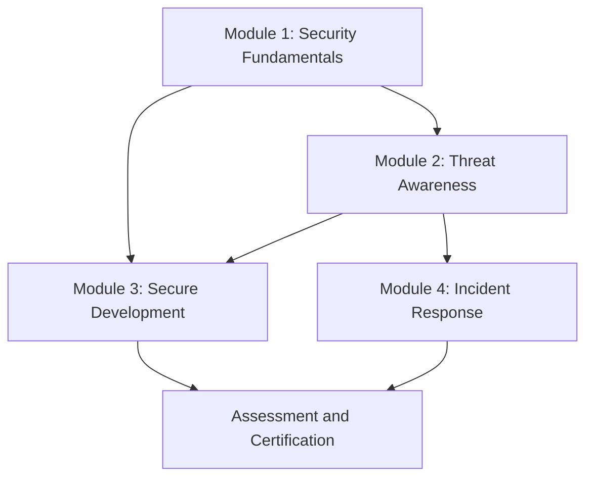
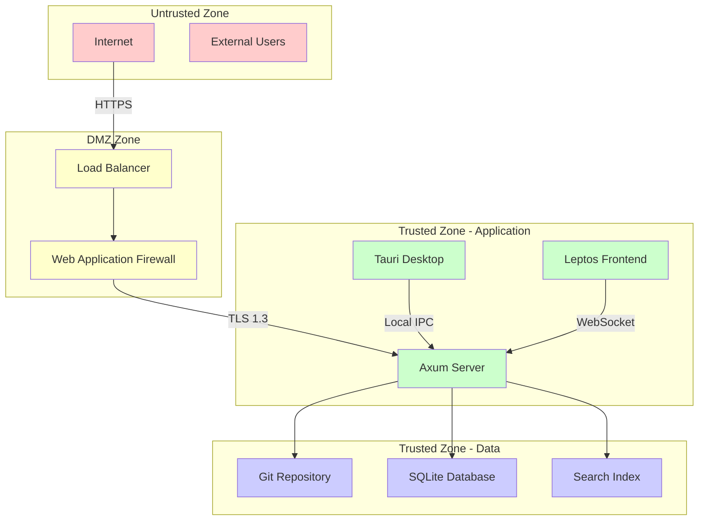
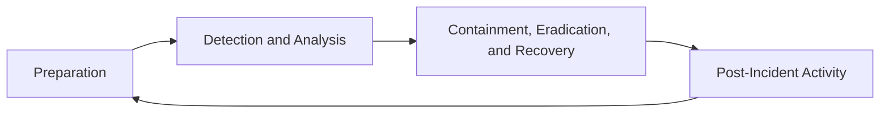

# TACHYON: SECURITY TRAINING MATERIAL

**Document ID:** TACHYON-SEC-006-V1.0
**Date:** February 2026
**Status:** Approved for Training
**Classification:** Security Documentation
**Dependencies:** [TACHYON-STD-V1.0](../../.specs/01_standards/coding_standards.md), [TACHYON-TMA-V1.0](../../.specs/03_threat_model/analysis.md), [TACHYON-ADR-010-V1.0](../../.specs/02_adrs/010_security_architecture.md)

---

## TABLE OF CONTENTS

1. [Introduction](#1-introduction)
2. [Training Philosophy](#2-training-philosophy)
3. [Training Curriculum](#3-training-curriculum)
4. [Module 1: Security Fundamentals](#4-module-1-security-fundamentals)
5. [Module 2: Threat Awareness](#5-module-2-threat-awareness)
6. [Module 3: Secure Development](#6-module-3-secure-development)
7. [Module 4: Incident Response](#7-module-4-incident-response)
8. [Assessment and Certification](#8-assessment-and-certification)
9. [References](#9-references)

---

## 1. INTRODUCTION

### 1.1. Purpose and Scope

This document provides comprehensive security training material for all contributors to the Tachyon toolchain project. The training curriculum is designed to establish a security-first mindset across all development activities, ensuring that security considerations are integrated into every phase of the software development lifecycle.

The Tachyon toolchain encompasses a hybrid architecture comprising:
- A Rust-based core engine with Tokio asynchronous runtime
- A Tauri-based desktop application wrapper
- An Axum-based HTTP/2 server component
- A TypeScript/JavaScript frontend using Leptos and TailwindCSS
- Git-based content storage and management

This hybrid architecture presents unique security challenges that must be addressed through comprehensive training and awareness programs.

### 1.2. Target Audience

This training material is designed for:
- **Software Engineers:** Developers working on Rust, TypeScript, and JavaScript components
- **DevOps Engineers:** Personnel responsible for deployment and infrastructure management
- **Security Engineers:** Security professionals conducting reviews and assessments
- **Technical Leads:** Team leaders responsible for security decisions
- **Quality Assurance:** Testers verifying security requirements

### 1.3. Training Objectives

Upon completion of this training program, participants will be able to:
1. Understand the fundamental principles of information security
2. Identify and classify security threats relevant to the Tachyon system
3. Apply secure development practices in their daily work
4. Recognize and respond to security incidents appropriately
5. Maintain continuous security awareness throughout the development lifecycle

### 1.4. Document Dependencies

This training material references and builds upon:
- [TACHYON-STD-V1.0](../../.specs/01_standards/coding_standards.md) - Coding and Documentation Standards
- [TACHYON-TMA-V1.0](../../.specs/03_threat_model/analysis.md) - Threat Model Analysis
- [TACHYON-ADR-001-V1.0](../../.specs/02_adrs/001_rust_as_primary_language.md) - Rust Language Selection
- [TACHYON-ADR-010-V1.0](../../.specs/02_adrs/010_security_architecture.md) - Security Architecture
- [TACHYON-REQ-SEC-V1.0](../../.specs/04_future_state/reqs/security_requirements.md) - Security Requirements

---

## 2. TRAINING PHILOSOPHY

### 2.1. Security-First Mindset

The Tachyon project adopts a security-first philosophy that integrates security considerations into every aspect of development. This philosophy is grounded in the principle that security is not an add-on feature but a fundamental property of the system that must be designed, implemented, and verified from the outset.

**Core Principles:**

1. **Security by Design:** Security requirements are identified and addressed during the design phase, not as an afterthought
2. **Defense in Depth:** Multiple layers of security controls provide redundancy and resilience
3. **Fail-Safe Defaults:** Systems default to secure configurations, with explicit opt-out for insecure behaviors
4. **Principle of Least Privilege:** Components operate with the minimum permissions necessary for their function
5. **Continuous Verification:** Security is continuously validated through automated and manual processes

### 2.2. Learning Methodology

The training curriculum employs a multi-modal learning approach designed to maximize knowledge retention and practical application:

**Pedagogical Framework:**

| Learning Mode | Description | Application |
|---------------|-------------|-------------|
| **Conceptual** | Theoretical foundations and principles | Lectures, readings, case studies |
| **Procedural** | Step-by-step processes and procedures | Hands-on exercises, walkthroughs |
| **Analytical** | Critical thinking and problem-solving | Threat modeling exercises, code reviews |
| **Practical** | Real-world application and practice | Lab exercises, project work |

### 2.3. Competency Framework

The training program is structured around a competency framework that defines the knowledge, skills, and abilities required at different levels of security expertise:

**Competency Levels:**

**Level 1 - Security Awareness:**
- Basic understanding of security concepts
- Recognition of common security issues
- Knowledge of security policies and procedures

**Level 2 - Security Practitioner:**
- Application of secure coding practices
- Identification of security vulnerabilities
- Implementation of security controls

**Level 3 - Security Specialist:**
- Design of secure architectures
- Threat modeling and risk assessment
- Security testing and verification

**Level 4 - Security Expert:**
- Advanced security research and analysis
- Security strategy and policy development
- Incident response leadership

### 2.4. Continuous Learning

Security is an evolving discipline that requires continuous learning and adaptation. The training program emphasizes:

1. **Stay Current:** Regular updates on emerging threats and vulnerabilities
2. **Learn from Incidents:** Post-incident reviews identify lessons learned
3. **Share Knowledge:** Security insights are shared across the team
4. **Practice Regularly:** Security skills are maintained through regular exercises
5. **Seek Feedback:** Peer reviews provide opportunities for improvement

### 2.5. Assessment Philosophy

Assessment is designed to measure both knowledge acquisition and practical application:

**Assessment Types:**

1. **Formative Assessment:** Ongoing evaluation during training to identify areas for improvement
2. **Summative Assessment:** Comprehensive evaluation at the end of modules to certify competency
3. **Performance Assessment:** Evaluation of security practices in actual work through code reviews and audits
4. **Self-Assessment:** Reflection on personal security knowledge and skills

**Assessment Criteria:**

- **Accuracy:** Correctness of security knowledge and practices
- **Completeness:** Coverage of all relevant security considerations
- **Consistency:** Application of security principles across different contexts
- **Timeliness:** Prompt identification and response to security issues
- **Effectiveness:** Ability to prevent, detect, and respond to security threats

---

## 3. TRAINING CURRICULUM

### 3.1. Curriculum Overview

The Tachyon security training curriculum is structured as a progressive learning path that builds foundational knowledge before advancing to specialized topics. The curriculum is organized into four primary modules, each designed to address specific aspects of security relevant to the Tachyon toolchain.

**Curriculum Structure:**

| Module | Title | Duration | Prerequisites | Target Level |
|--------|-------|----------|--------------|--------------|
| Module 1 | Security Fundamentals | 4 hours | None | Level 1 |
| Module 2 | Threat Awareness | 6 hours | Module 1 | Level 1-2 |
| Module 3 | Secure Development | 8 hours | Module 1, 2 | Level 2-3 |
| Module 4 | Incident Response | 4 hours | Module 1, 2 | Level 2-3 |

**Total Training Duration:** 22 hours (excluding assessment and certification)

### 3.2. Module Dependencies

The curriculum follows a sequential dependency model where foundational concepts must be mastered before advancing to more complex topics:



**Dependency Rationale:**

1. **Module 1 as Foundation:** Security Fundamentals provides the conceptual framework required for understanding threats and implementing secure development practices
2. **Module 2 Enables Practical Application:** Threat Awareness builds on fundamentals to identify specific risks relevant to the Tachyon system
3. **Module 3 Requires Threat Context:** Secure Development practices are most effective when informed by an understanding of the threat landscape
4. **Module 4 Benefits from Threat Knowledge:** Incident Response procedures are enhanced by the ability to recognize and classify threats

### 3.3. Training Delivery Methods

The curriculum supports multiple delivery modalities to accommodate different learning preferences and organizational constraints:

**Delivery Modalities:**

1. **Instructor-Led Training (ILT):**
   - Live sessions with security experts
   - Interactive discussions and Q&A
   - Real-time feedback and guidance
   - Recommended for initial training and major updates

2. **Self-Paced E-Learning:**
   - Pre-recorded video modules
   - Interactive exercises and quizzes
   - Flexible scheduling
   - Recommended for refresher training and new hires

3. **Blended Learning:**
   - Combination of ILT and e-learning
   - Balance of structure and flexibility
   - Recommended for ongoing training programs

4. **Workshop-Based Training:**
   - Hands-on exercises and labs
   - Collaborative problem-solving
   - Recommended for practical skill development

### 3.4. Training Schedule

**Recommended Training Schedule:**

| Training Type | Frequency | Duration | Audience |
|---------------|-----------|----------|----------|
| **Onboarding Training** | Upon hire | 22 hours | New employees |
| **Refresher Training** | Annually | 8 hours | All employees |
| **Update Training** | As needed | 2-4 hours | Affected teams |
| **Specialized Training** | On demand | Variable | Specific roles |

### 3.5. Training Materials

Each module includes comprehensive training materials designed to support different learning styles:

**Material Types:**

1. **Participant Guide:**
   - Module objectives and outline
   - Key concepts and definitions
   - Reference materials and checklists
   - Self-assessment questions

2. **Instructor Guide:**
   - Detailed lesson plans
   - Facilitation notes and tips
   - Exercise instructions and solutions
   - Assessment rubrics

3. **Presentation Materials:**
   - Slide decks with visual aids
   - Diagrams and illustrations
   - Code examples and demonstrations
   - Case study materials

4. **Exercise Materials:**
   - Hands-on lab exercises
   - Code review scenarios
   - Threat modeling templates
   - Incident response simulations

5. **Assessment Materials:**
   - Knowledge quizzes
   - Practical exercises
   - Case study analyses
   - Certification exams

### 3.6. Training Prerequisites

**General Prerequisites:**

1. **Technical Background:**
   - Familiarity with software development concepts
   - Understanding of web technologies (HTTP, HTML, CSS, JavaScript)
   - Basic knowledge of version control systems (Git)

2. **Tachyon System Knowledge:**
   - Understanding of Tachyon architecture and components
   - Familiarity with Tachyon development workflow
   - Knowledge of relevant programming languages (Rust, TypeScript)

3. **Computing Environment:**
   - Access to a development environment
   - Ability to run Tachyon components locally
   - Internet access for external resources

**Module-Specific Prerequisites:**

| Module | Additional Prerequisites |
|--------|------------------------|
| Module 1 | None |
| Module 2 | Completion of Module 1 |
| Module 3 | Completion of Modules 1 and 2; programming experience |
| Module 4 | Completion of Modules 1 and 2; understanding of system operations |

### 3.7. Learning Objectives by Module

**Module 1: Security Fundamentals**
- Define core security principles and concepts
- Explain the CIA triad and security objectives
- Identify common vulnerability classes
- Understand the importance of security in software development

**Module 2: Threat Awareness**
- Apply STRIDE methodology to identify threats
- Recognize attack surfaces in the Tachyon system
- Classify threats by severity and likelihood
- Understand threat actors and their motivations

**Module 3: Secure Development**
- Implement secure coding practices in Rust and TypeScript
- Apply input validation and output encoding
- Use cryptographic primitives correctly
- Conduct security-focused code reviews

**Module 4: Incident Response**
- Execute incident response procedures
- Classify and report security incidents
- Preserve evidence for forensic analysis
- Conduct post-incident reviews and lessons learned

---

## 4. MODULE 1: SECURITY FUNDAMENTALS

### 4.1. Module Overview

Module 1 establishes the foundational knowledge required for all subsequent security training. This module introduces core security concepts, principles, and terminology that form the basis for understanding threats, implementing secure development practices, and responding to incidents.

**Module Duration:** 4 hours
**Target Level:** Level 1 - Security Awareness
**Prerequisites:** None

### 4.2. Learning Objectives

Upon completion of this module, participants will be able to:

1. **Define Core Security Concepts:**
   - Explain the CIA triad (Confidentiality, Integrity, Availability)
   - Define authentication, authorization, and accounting (AAA)
   - Describe non-repudiation and accountability
   - Understand the principle of least privilege

2. **Identify Security Principles:**
   - Apply defense-in-depth strategy
   - Implement fail-safe defaults
   - Practice security by design
   - Understand the concept of attack surface reduction

3. **Recognize Common Vulnerability Classes:**
   - Identify injection vulnerabilities (SQL, command, LDAP)
   - Recognize cross-site scripting (XSS) and cross-site request forgery (CSRF)
   - Understand buffer overflow and memory corruption issues
   - Identify insecure direct object references

4. **Understand Security in Software Development:**
   - Explain the importance of security in the SDLC
   - Identify security considerations at each development phase
   - Understand the role of security testing
   - Recognize the value of security reviews

### 4.3. Module Structure

**Session 1: Core Security Concepts (1 hour)**
- Introduction to information security
- The CIA triad and expanded security objectives
- Security principles and best practices
- Security terminology and definitions

**Session 2: Vulnerability Fundamentals (1 hour)**
- Common vulnerability classes
- The OWASP Top 10
- Vulnerability lifecycle and disclosure
- Impact and severity assessment

**Session 3: Security in Development (1 hour)**
- Security considerations in the SDLC
- Secure development lifecycle (SDLC)
- Security testing methodologies
- Code review practices

**Session 4: Tachyon Security Context (1 hour)**
- Tachyon security architecture overview
- Security requirements and objectives
- Threat model introduction
- Security responsibilities and accountability

### 4.4. Core Security Concepts

#### 4.4.1. The CIA Triad

The CIA triad forms the foundation of information security:

**Confidentiality:**
- Definition: Ensuring that information is accessible only to authorized entities
- Implementation: Access controls, encryption, authentication
- Relevance to Tachyon: Protecting sensitive documentation and user credentials

**Integrity:**
- Definition: Maintaining the accuracy and completeness of information
- Implementation: Hashing, digital signatures, version control
- Relevance to Tachyon: Ensuring documentation content remains unaltered

**Availability:**
- Definition: Ensuring authorized access to information and resources when needed
- Implementation: Redundancy, load balancing, disaster recovery
- Relevance to Tachyon: Maintaining continuous access to documentation services

#### 4.4.2. Expanded Security Objectives

Beyond the CIA triad, modern security considers additional objectives:

**Non-Repudiation:**
- Definition: The ability to prove that a specific action was performed by a specific entity
- Implementation: Digital signatures, audit logs, cryptographic proofs
- Relevance to Tachyon: Preventing users from denying actions they performed

**Accountability:**
- Definition: The ability to trace actions to specific entities
- Implementation: Authentication, logging, monitoring
- Relevance to Tachyon: Enabling traceability of all user actions

**Authenticity:**
- Definition: Verifying the identity of entities and the origin of data
- Implementation: Authentication protocols, digital certificates
- Relevance to Tachyon: Ensuring users and data sources are legitimate

#### 4.4.3. Security Principles

**Defense in Depth:**
- Definition: Implementing multiple layers of security controls
- Rationale: If one control fails, others provide protection
- Application: Network security, application security, data security
- Tachyon Implementation: Memory safety, input validation, encryption, access controls

**Principle of Least Privilege:**
- Definition: Granting only the minimum permissions necessary for a task
- Rationale: Reduces the impact of compromised accounts or components
- Application: User permissions, service accounts, API access
- Tachyon Implementation: Tauri capability system, RBAC, minimal file system access

**Fail-Safe Defaults:**
- Definition: Systems default to secure configurations
- Rationale: Prevents insecure configurations due to oversight
- Application: Default deny policies, secure parameter values
- Tachyon Implementation: Secure default settings, explicit opt-out for insecure features

**Security by Design:**
- Definition: Security is considered from the beginning of development
- Rationale: More effective and efficient than adding security later
- Application: Threat modeling, secure design patterns
- Tachyon Implementation: Security requirements in design phase, ADR-010 compliance

### 4.5. Common Vulnerability Classes

#### 4.5.1. Injection Vulnerabilities

Injection vulnerabilities occur when untrusted data is sent to an interpreter as part of a command or query:

**SQL Injection:**
- Description: Attacker interferes with database queries
- Impact: Data theft, data modification, authentication bypass
- Prevention: Parameterized queries, input validation, ORM usage

**Command Injection:**
- Description: Attacker executes operating system commands
- Impact: System compromise, data exfiltration, privilege escalation
- Prevention: Avoid shell commands, use safe APIs, input sanitization

**LDAP Injection:**
- Description: Attacker manipulates LDAP queries
- Impact: Authentication bypass, information disclosure
- Prevention: Parameterized queries, input validation, proper escaping

#### 4.5.2. Cross-Site Scripting (XSS)

XSS vulnerabilities allow attackers to execute scripts in the victim's browser:

**Stored XSS:**
- Description: Malicious script stored on the server and served to users
- Impact: Session hijacking, credential theft, malware distribution
- Prevention: Output encoding, Content Security Policy (CSP), input validation

**Reflected XSS:**
- Description: Malicious script reflected off a web server
- Impact: Session hijacking, credential theft
- Prevention: Output encoding, input validation, URL encoding

**DOM-based XSS:**
- Description: Malicious script executes in the DOM
- Impact: Session hijacking, credential theft
- Prevention: Safe DOM APIs, output encoding, input validation

#### 4.5.3. Cross-Site Request Forgery (CSRF)

CSRF forces an end user to execute unwanted actions on a web application:

**Description:**
- Attacker tricks user into submitting a malicious request
- User's authentication is used to perform the action
- Can result in state-changing operations

**Impact:**
- Unauthorized fund transfers
- Password changes
- Data modification

**Prevention:**
- Anti-CSRF tokens
- SameSite cookie attributes
- Origin/Referer header validation
- Custom headers for state-changing requests

#### 4.5.4. Memory Corruption Vulnerabilities

Memory corruption vulnerabilities are particularly relevant to systems programming:

**Buffer Overflow:**
- Description: Writing beyond allocated memory boundaries
- Impact: Code execution, denial of service, information disclosure
- Prevention: Bounds checking, safe string functions, Rust's ownership system

**Use-After-Free:**
- Description: Using memory after it has been freed
- Impact: Code execution, denial of service
- Prevention: Rust's ownership system, smart pointers, memory safety

**Double-Free:**
- Description: Freeing the same memory twice
- Impact: Code execution, denial of service
- Prevention: Rust's ownership system, RAII patterns

**Tachyon Mitigation:**
- Rust's ownership system prevents memory corruption at compile time
- ADR-001 selection of Rust provides memory safety guarantees
- No unsafe code without explicit justification and review

---

## 5. MODULE 2: THREAT AWARENESS

### 5.1. Module Overview

Module 2 builds upon the foundational knowledge from Module 1 to develop threat awareness. This module introduces systematic methodologies for identifying, classifying, and assessing threats relevant to the Tachyon toolchain. Participants will learn to apply threat modeling techniques to recognize potential attack vectors and understand the motivations and capabilities of threat actors.

**Module Duration:** 6 hours
**Target Level:** Level 1-2 - Security Awareness to Practitioner
**Prerequisites:** Module 1: Security Fundamentals

### 5.2. Learning Objectives

Upon completion of this module, participants will be able to:

1. **Apply Threat Modeling Methodologies:**
   - Use the STRIDE methodology to identify threats
   - Apply attack tree analysis to decompose threats
   - Understand threat modeling in the context of Tachyon
   - Document threat models effectively

2. **Recognize Attack Surfaces:**
   - Identify entry points for attackers in the Tachyon system
   - Map data flows and trust boundaries
   - Recognize potential privilege escalation paths
   - Understand the impact of hybrid deployment on attack surface

3. **Classify Threats:**
   - Assess threat severity and likelihood
   - Prioritize threats for mitigation
   - Understand threat actor motivations
   - Map threats to security requirements

4. **Understand Threat Landscape:**
   - Identify common threat actors targeting documentation systems
   - Understand attack techniques and tools
   - Recognize emerging threats and trends
   - Apply threat intelligence to Tachyon security

### 5.3. Module Structure

**Session 1: Threat Modeling Fundamentals (1.5 hours)**
- Introduction to threat modeling
- The STRIDE methodology
- Attack tree analysis
- Threat modeling tools and techniques

**Session 2: Tachyon Attack Surface Analysis (1.5 hours)**
- Tachyon architecture and components
- Trust boundaries and data flows
- Entry points and attack vectors
- Hybrid deployment considerations

**Session 3: Threat Classification and Assessment (1.5 hours)**
- Threat severity assessment
- Likelihood and impact analysis
- Threat actor motivations and capabilities
- Risk-based prioritization

**Session 4: Threat Landscape and Intelligence (1.5 hours)**
- Common threat actors
- Attack techniques and methodologies
- Emerging threats and trends
- Threat intelligence integration

### 5.4. Threat Modeling Methodologies

#### 5.4.1. STRIDE Methodology

STRIDE is a threat modeling methodology that categorizes threats into six categories:

**Spoofing:**
- Definition: Impersonating something or someone else
- Examples: Spoofed user identities, fake API endpoints
- Tachyon Relevance: Authentication bypass, credential theft
- Mitigation: Strong authentication, MFA, certificate validation

**Tampering:**
- Definition: Modifying data or code without authorization
- Examples: Modifying documentation content, altering configuration
- Tachyon Relevance: Content integrity, configuration tampering
- Mitigation: Digital signatures, version control, integrity checks

**Repudiation:**
- Definition: Denying having performed an action
- Examples: User denies modifying a document
- Tachyon Relevance: Audit trail verification
- Mitigation: Comprehensive logging, non-repudiation mechanisms

**Information Disclosure:**
- Definition: Exposing information to unauthorized parties
- Examples: Leaking sensitive documentation, credential exposure
- Tachyon Relevance: Data breach, privacy violation
- Mitigation: Access controls, encryption, data minimization

**Denial of Service:**
- Definition: Making a service unavailable to legitimate users
- Examples: Resource exhaustion, network flooding
- Tachyon Relevance: Service disruption, availability impact
- Mitigation: Rate limiting, resource quotas, redundancy

**Elevation of Privilege:**
- Definition: Gaining unauthorized higher-level permissions
- Examples: Privilege escalation, role bypass
- Tachyon Relevance: Unauthorized access, system compromise
- Mitigation: Least privilege, proper authorization, privilege separation

#### 5.4.2. Attack Tree Analysis

Attack trees provide a structured approach to analyzing threats:

**Attack Tree Structure:**
- Root node: Attack goal
- Child nodes: Sub-goals or methods
- Leaf nodes: Atomic actions or prerequisites
- AND/OR relationships: Combination or alternative methods

**Example: Unauthorized Document Access**

```
Goal: Access confidential document
├─ AND: Authenticate as authorized user
│  ├─ OR: Steal credentials
│  │  ├─ Phishing attack
│  │  └─ Credential dumping
│  └─ OR: Bypass authentication
│     ├─ Session hijacking
│     └─ Authentication bypass
└─ OR: Exploit authorization flaw
   ├─ Direct object reference
   └─ Privilege escalation
```

**Benefits of Attack Trees:**
- Systematic decomposition of threats
- Identification of multiple attack paths
- Quantitative risk assessment
- Clear mitigation strategies

#### 5.4.3. Threat Modeling Process

**Step 1: Define Scope**
- Identify system boundaries and components
- Define trust relationships
- Establish security objectives

**Step 2: Identify Assets**
- List valuable assets (data, functionality, resources)
- Classify assets by sensitivity and criticality
- Map assets to system components

**Step 3: Identify Threats**
- Apply STRIDE to each component
- Use attack trees for complex threats
- Consider threat actor capabilities

**Step 4: Analyze Threats**
- Assess likelihood and impact
- Prioritize threats for mitigation
- Document threat rationale

**Step 5: Define Mitigations**
- Identify controls for each threat
- Evaluate control effectiveness
- Document residual risk

### 5.5. Tachyon Attack Surface Analysis

#### 5.5.1. System Components and Attack Surfaces

**Desktop Application (Tauri):**
- Attack Surface: Local file system access, IPC communication
- Threats: Local privilege escalation, data exfiltration
- Mitigations: Capability system, sandboxing, input validation

**Server Component (Axum):**
- Attack Surface: HTTP/2 endpoints, WebSocket connections
- Threats: Remote code execution, authentication bypass
- Mitigations: Input validation, authentication, rate limiting

**Web Frontend (Leptos):**
- Attack Surface: Browser APIs, WebSocket connections
- Threats: XSS, CSRF, client-side attacks
- Mitigations: Content Security Policy, output encoding

**Git Repository Storage:**
- Attack Surface: Git protocol, file system access
- Threats: Repository compromise, history tampering
- Mitigations: Access controls, GPG signing, integrity verification

#### 5.5.2. Trust Boundaries



**Trust Boundary Considerations:**
- Network boundaries require encryption and authentication
- Process boundaries require IPC security
- User boundaries require authorization and access controls
- Data boundaries require classification and protection

#### 5.5.3. Hybrid Deployment Threats

**Local-First Desktop Mode:**
- Threats: Local file system access, physical access, malware
- Mitigations: Local authentication, encryption at rest, secure configuration

**Centralized Server Mode:**
- Threats: Network attacks, authentication bypass, data breach
- Mitigations: TLS 1.3, MFA, network segmentation, monitoring

**Synchronization Threats:**
- Threats: Data inconsistency, sync attacks, credential exposure
- Mitigations: Secure sync protocol, conflict resolution, credential protection

### 5.6. Threat Classification and Assessment

#### 5.6.1. Threat Severity Assessment

**Severity Criteria:**

| Severity | Impact | Description |
|----------|--------|-------------|
| Critical | Catastrophic | Complete system compromise, data breach |
| High | Major | Significant data loss, service disruption |
| Medium | Moderate | Limited data exposure, partial service impact |
| Low | Minor | Minimal impact, easily recoverable |

**Likelihood Criteria:**

| Likelihood | Probability | Description |
|------------|-------------|-------------|
| Very High | >90% | Almost certain to occur |
| High | 70-90% | Highly probable |
| Medium | 30-70% | Possible |
| Low | 10-30% | Unlikely |
| Very Low | <10% | Rare |

#### 5.6.2. Risk Matrix

| Likelihood \ Impact | Low | Medium | High | Critical |
|---------------------|-----|--------|------|----------|
| Very High | Medium | High | Critical | Critical |
| High | Low | Medium | High | Critical |
| Medium | Low | Medium | High | Critical |
| Low | Low | Low | Medium | High |
| Very Low | Low | Low | Low | Medium |

#### 5.6.3. Threat Actor Motivations

**Script Kiddies:**
- Motivation: Curiosity, notoriety
- Capabilities: Low to medium
- Threat Level: Low
- Tachyon Relevance: Opportunistic attacks, automated scanning

**Hacktivists:**
- Motivation: Political or social causes
- Capabilities: Medium
- Threat Level: Medium
- Tachyon Relevance: Defacement, data leaks, service disruption

**Cybercriminals:**
- Motivation: Financial gain
- Capabilities: Medium to high
- Threat Level: High
- Tachyon Relevance: Data theft, ransomware, credential harvesting

**Insider Threats:**
- Motivation: Malice, negligence, or coercion
- Capabilities: High (authorized access)
- Threat Level: High
- Tachyon Relevance: Data exfiltration, sabotage, privilege abuse

**Advanced Persistent Threats (APTs):**
- Motivation: Espionage, strategic advantage
- Capabilities: Very high
- Threat Level: Critical
- Tachyon Relevance: Long-term access, data exfiltration, system compromise

### 5.7. Threat Landscape and Intelligence

#### 5.7.1. Common Attack Techniques

**MITRE ATT&CK Framework:**

The MITRE ATT&CK framework provides a comprehensive knowledge base of adversary tactics and techniques:

**Initial Access:**
- Phishing: Spear phishing campaigns targeting employees
- Exploit Public-Facing Application: Vulnerabilities in web servers
- Valid Accounts: Compromised credentials from data breaches

**Execution:**
- Command and Scripting Interpreter: PowerShell, bash, cmd.exe
- User Execution: Malicious documents, email attachments
- Scheduled Task/Job: Persistence mechanisms

**Persistence:**
- Account Manipulation: Creating backdoor accounts
- Scheduled Task/Job: Maintaining access
- Create Account: Creating new accounts for access

**Privilege Escalation:**
- Exploitation for Privilege Escalation: Kernel vulnerabilities
- Process Injection: Code injection into legitimate processes
- Access Token Manipulation: Stealing or forging tokens

**Defense Evasion:**
- Obfuscated Files or Information: Hiding malicious code
- Indicator Removal: Clearing logs and artifacts
- Masquerading: Impersonating legitimate processes

**Credential Access:**
- Credential Dumping: Extracting credentials from memory
- Input Capture: Keylogging, screen scraping
- Unsecured Credentials: Finding hardcoded credentials

**Discovery:**
- Remote System Discovery: Scanning for targets
- System Information Discovery: Gathering system details
- Network Service Scanning: Identifying open ports and services

**Lateral Movement:**
- Remote Services: SMB, RDP, SSH
- Internal Spearphishing: Targeting internal users
- Remote File Copy: Moving tools across the network

**Collection:**
- Data Staged: Preparing data for exfiltration
- Screen Capture: Taking screenshots
- Email Collection: Accessing email content

**Command and Control:**
- Application Layer Protocol: HTTP, DNS, etc.
- Encrypted Channel: TLS/SSL for C2
- Ingress Tool Transfer: Downloading tools

**Exfiltration:**
- Exfiltration Over Web Service: Using web protocols
- Exfiltration Over C2 Channel: Using C2 infrastructure
- Exfiltration Over Alternative Protocol: Using non-standard protocols

**Impact:**
- Data Encrypted for Impact: Ransomware
- Data Destruction: Deleting or corrupting data
- Service Stop: Disrupting services

---

## 6. MODULE 3: SECURE DEVELOPMENT

### 6.1. Module Overview

Module 3 focuses on practical secure development techniques for the Tachyon toolchain. This module provides hands-on guidance for implementing security controls in Rust and TypeScript, conducting security-focused code reviews, and applying secure coding practices throughout the development lifecycle.

**Module Duration:** 8 hours
**Target Level:** Level 2-3 - Security Practitioner to Specialist
**Prerequisites:** Module 1: Security Fundamentals, Module 2: Threat Awareness

### 6.2. Learning Objectives

Upon completion of this module, participants will be able to:

1. **Implement Secure Coding Practices:**
   - Apply secure coding patterns in Rust and TypeScript
   - Use type systems to prevent vulnerabilities
   - Implement proper error handling
   - Write secure concurrent code

2. **Apply Input Validation and Output Encoding:**
   - Validate all user inputs comprehensively
   - Encode outputs to prevent injection attacks
   - Implement safe file handling
   - Use secure string manipulation

3. **Use Cryptographic Primitives Correctly:**
   - Select appropriate cryptographic algorithms
   - Implement secure key management
   - Use TLS 1.3 for network communications
   - Apply encryption at rest for sensitive data

4. **Conduct Security-Focused Code Reviews:**
   - Identify security vulnerabilities in code
   - Apply security review checklists
   - Provide actionable security feedback
   - Track security issues to resolution

### 6.3. Module Structure

**Session 1: Secure Coding in Rust (2 hours)**
- Rust security features and ownership system
- Memory safety and type safety
- Safe concurrency patterns
- Error handling and result types

**Session 2: Secure Coding in TypeScript (2 hours)**
- TypeScript type system for security
- Secure async/await patterns
- DOM security and XSS prevention
- Input validation and sanitization

**Session 3: Cryptography and Secure Communications (2 hours)**
- Cryptographic primitives and algorithms
- Key management and storage
- TLS 1.3 implementation
- Encryption at rest

**Session 4: Security Code Reviews and Testing (2 hours)**
- Security review methodology
- Common security anti-patterns
- Security testing techniques
- Static analysis and dynamic analysis

### 6.4. Secure Coding in Rust

#### 6.4.1. Rust Security Features

**Ownership System:**
The Rust ownership system provides memory safety guarantees at compile time:

```rust
// Ownership prevents use-after-free
fn process_data(data: Vec<u8>) -> Result<String, Error> {
    // data is owned by this function
    let processed = transform(data)?;
    Ok(String::from_utf8(processed)?)
}
// data is automatically dropped here
```

**Borrowing Rules:**
Rust's borrowing rules prevent data races:

```rust
// Multiple immutable references OR one mutable reference
fn safe_concurrent_read(data: &[u8]) {
    let reader1 = &data;
    let reader2 = &data; // OK: multiple immutable references
    // let mut_ref = &mut data; // ERROR: cannot have mutable reference
}

fn safe_exclusive_write(data: &mut Vec<u8>) {
    data.push(1); // OK: exclusive mutable access
    // let reader = &data; // ERROR: cannot borrow while mutably borrowed
}
```

**Lifetimes:**
Lifetimes ensure references remain valid:

```rust
// Lifetime parameter ensures returned reference is valid
fn find_longest<'a>(s1: &'a str, s2: &'a str) -> &'a str {
    if s1.len() > s2.len() {
        s1
    } else {
        s2
    }
}
```

#### 6.4.2. Type Safety for Security

**Enum Types for Valid States:**
Use enums to represent valid states and prevent invalid states:

```rust
// Secure authentication state
enum AuthState {
    Unauthenticated,
    Authenticated { user_id: u64, expires_at: SystemTime },
    Expired,
}

// Prevents operations on invalid states
fn require_auth(state: &AuthState) -> Result<u64, AuthError> {
    match state {
        AuthState::Authenticated { user_id, expires_at } => {
            if *expires_at > SystemTime::now() {
                Ok(*user_id)
            } else {
                Err(AuthError::SessionExpired)
            }
        }
        _ => Err(AuthError::NotAuthenticated),
    }
}
```

**Result Types for Error Handling:**
Use `Result<T, E>` for explicit error handling:

```rust
// Explicit error handling prevents panics
fn read_config(path: &Path) -> Result<Config, ConfigError> {
    let content = fs::read_to_string(path)
        .map_err(ConfigError::IoError)?;
    
    let config: Config = serde_json::from_str(&content)
        .map_err(ConfigError::ParseError)?;
    
    Ok(config)
}
```

**Option Types for Nullable Values:**
Use `Option<T>` instead of null:

```rust
// Explicit handling of missing values
fn get_user_by_id(id: u64, users: &[User]) -> Option<&User> {
    users.iter().find(|u| u.id == id)
}

// Forces handling of the None case
match get_user_by_id(1, &users) {
    Some(user) => println!("Found user: {}", user.name),
    None => println!("User not found"),
}
```

#### 6.4.3. Safe Concurrency

**Channels for Message Passing:**
Use channels for safe concurrent communication:

```rust
use tokio::sync::mpsc;

async fn safe_message_processing() {
    let (tx, mut rx) = mpsc::channel(100);
    
    // Producer
    tokio::spawn(async move {
        for i in 0..10 {
            tx.send(i).await.unwrap();
        }
    });
    
    // Consumer
    while let Some(msg) = rx.recv().await {
        process_message(msg).await;
    }
}
```

**Arc and Mutex for Shared State:**
Use `Arc<Mutex<T>>` for shared mutable state:

```rust
use std::sync::{Arc, Mutex};
use tokio::task;

async fn safe_shared_state() {
    let counter = Arc::new(Mutex::new(0));
    let mut handles = vec![];
    
    for _ in 0..10 {
        let counter = Arc::clone(&counter);
        let handle = task::spawn(async move {
            let mut num = counter.lock().unwrap();
            *num += 1;
        });
        handles.push(handle);
    }
    
    for handle in handles {
        handle.await.unwrap();
    }
    
    println!("Final count: {}", *counter.lock().unwrap());
}
```

#### 6.4.4. Secure Error Handling

**Never Expose Sensitive Information in Errors:**
```rust
// Bad: Exposes internal details
fn bad_auth(username: &str, password: &str) -> Result<bool, Error> {
    if password != "secret123" {
        Err(Error::AuthFailed {
            username,
            expected_password: "secret123",
        })
    } else {
        Ok(true)
    }
}

// Good: Generic error message
fn good_auth(username: &str, password: &str) -> Result<bool, AuthError> {
    if !verify_password(username, password) {
        Err(AuthError::InvalidCredentials)
    } else {
        Ok(true)
    }
}
```

**Log Errors Securely:**
```rust
// Bad: Logs sensitive data
error!("Auth failed for user {} with password {}", username, password);

// Good: Logs without sensitive data
error!("Auth failed for user {}", username);
```

### 6.5. Secure Coding in TypeScript

#### 6.5.1. Type System for Security

**Strict Type Checking:**
Enable strict type checking in `tsconfig.json`:

```json
{
  "compilerOptions": {
    "strict": true,
    "noImplicitAny": true,
    "strictNullChecks": true,
    "strictFunctionTypes": true,
    "strictBindCallApply": true,
    "strictPropertyInitialization": true
  }
}
```

**Discriminated Unions:**
Use discriminated unions for type-safe state:

```typescript
type AuthState =
  | { type: 'unauthenticated' }
  | { type: 'authenticated'; userId: string; expiresAt: Date }
  | { type: 'expired' };

function requireAuth(state: AuthState): string | null {
  if (state.type === 'authenticated') {
    if (state.expiresAt > new Date()) {
      return state.userId;
    }
  }
  return null;
}
```

**Type Guards:**
Use type guards for runtime type checking:

```typescript
function isUser(obj: unknown): obj is User {
  return (
    typeof obj === 'object' &&
    obj !== null &&
    'id' in obj &&
    'name' in obj &&
    typeof (obj as User).id === 'string' &&
    typeof (obj as User).name === 'string'
  );
}

function processUser(obj: unknown) {
  if (isUser(obj)) {
    // TypeScript knows obj is User here
    console.log(obj.name);
  }
}
```

#### 6.5.2. DOM Security

**Content Security Policy (CSP):**
Implement CSP headers:

```typescript
// CSP configuration
const cspHeaders = {
  'Content-Security-Policy': [
    "default-src 'self'",
    "script-src 'self' 'unsafe-inline' 'unsafe-eval'",
    "style-src 'self' 'unsafe-inline'",
    "img-src 'self' data: https:",
    "connect-src 'self' wss://localhost:*",
    "font-src 'self'",
    "object-src 'none'",
    "base-uri 'self'",
    "form-action 'self'",
  ].join('; ')
};
```

**XSS Prevention:**
Use proper output encoding:

```typescript
// Use a library like DOMPurify
import DOMPurify from 'dompurify';

function sanitizeHtml(unsafe: string): string {
  return DOMPurify.sanitize(unsafe, {
    ALLOWED_TAGS: ['b', 'i', 'u', 'strong', 'em'],
    ALLOWED_ATTR: [],
  });
}

// Use textContent instead of innerHTML when possible
function setElementText(element: HTMLElement, text: string) {
  element.textContent = text; // Safe
  // element.innerHTML = text; // Unsafe
}
```

#### 6.5.3. Input Validation

**Validation Library:**
Use a validation library like Zod:

```typescript
import { z } from 'zod';

// Define schema
const UserSchema = z.object({
  id: z.string().uuid(),
  name: z.string().min(1).max(100),
  email: z.string().email(),
  role: z.enum(['admin', 'user', 'guest']),
});

// Validate input
function validateUser(input: unknown) {
  try {
    const user = UserSchema.parse(input);
    return { success: true, data: user };
  } catch (error) {
    return { success: false, error };
  }
}
```

**URL Validation:**
Validate URLs before using them:

```typescript
function isValidUrl(url: string): boolean {
  try {
    const parsed = new URL(url);
    return ['http:', 'https:'].includes(parsed.protocol);
  } catch {
    return false;
  }
}
```

### 6.6. Cryptography and Secure Communications

#### 6.6.1. Cryptographic Primitives

**Use Established Libraries:**
Use well-vetted cryptographic libraries:

```rust
// Rust: Use rust-crypto or similar
use sha2::{Sha256, Digest};
use aes::Aes256;
use aes::cipher::{KeyIvInit, StreamCipher};

fn hash_data(data: &[u8]) -> [u8; 32] {
    let mut hasher = Sha256::new();
    hasher.update(data);
    hasher.finalize().into()
}
```

**Never Implement Your Own Cryptography:**
- Cryptography is difficult to implement correctly
- Side-channel attacks are hard to prevent
- Use established libraries with peer review

#### 6.6.2. Key Management

**Never Hardcode Keys:**
```rust
// Bad: Hardcoded key
const API_KEY: &str = "sk-1234567890abcdef";

// Good: Load from environment
fn get_api_key() -> Result<String, EnvError> {
    std::env::var("API_KEY").map_err(EnvError::Missing)
}
```

**Use Secure Storage:**
- Use environment variables for configuration
- Use secret management services for production
- Never commit secrets to version control

#### 6.6.3. TLS 1.3 Implementation

**Rust TLS Configuration:**
```rust
use rustls::ClientConfig;
use rustls_pemfile::{certs, private_key};

fn create_tls_config() -> Result<ClientConfig, TlsError> {
    let mut config = ClientConfig::builder()
        .with_safe_defaults()
        .with_root_certificates(root_certs())
        .with_no_client_auth();
    
    // Enforce TLS 1.3
    config.max_protocol_version = Some(rustls::ProtocolVersion::TLSv1_3);
    config.min_protocol_version = Some(rustls::ProtocolVersion::TLSv1_3);
    
    Ok(config)
}
```

**TypeScript TLS Configuration:**
```typescript
import https from 'https';

const httpsAgent = new https.Agent({
  minVersion: 'TLSv1.3',
  maxVersion: 'TLSv1.3',
  rejectUnauthorized: true,
});
```

### 6.7. Security Code Reviews

#### 6.7.1. Security Review Checklist

**Input Validation:**
- [ ] Are all user inputs validated?
- [ ] Are input length limits enforced?
- [ ] Are input types validated?
- [ ] Are special characters handled?

**Output Encoding:**
- [ ] Are outputs encoded for the context?
- [ ] Is HTML encoded for web output?
- [ ] Is SQL parameterized for database queries?
- [ ] Are shell commands avoided or properly escaped?

**Authentication and Authorization:**
- [ ] Is authentication implemented correctly?
- [ ] Are authorization checks performed?
- [ ] Is the principle of least privilege followed?
- [ ] Are sessions properly managed?

**Error Handling:**
- [ ] Are errors handled securely?
- [ ] Is sensitive information not exposed in errors?
- [ ] Are error messages generic for users?
- [ ] Are detailed errors logged securely?

**Cryptography:**
- [ ] Are cryptographic algorithms appropriate?
- [ ] Are keys managed securely?
- [ ] Is TLS 1.3 used for communications?
- [ ] Is encryption at rest implemented?

**Memory Safety:**
- [ ] Are buffer overflows prevented?
- [ ] Is memory managed correctly?
- [ ] Are use-after-free issues prevented?
- [ ] Are data races avoided?

#### 6.7.2. Common Security Anti-Patterns

**Insecure Random Number Generation:**
```rust
// Bad: Non-cryptographic random
use rand::Rng;
let mut rng = rand::thread_rng();
let nonce: u64 = rng.gen();

// Good: Cryptographic random
use rand::rngs::OsRng;
let mut rng = OsRng;
let nonce: u64 = rng.gen();
```

**Insecure String Comparison:**
```rust
// Bad: Timing vulnerable
fn compare_passwords(a: &str, b: &str) -> bool {
    a == b
}

// Good: Constant-time comparison
use subtle::ConstantTimeEq;
fn compare_passwords(a: &str, b: &str) -> bool {
    a.as_bytes().ct_eq(b.as_bytes()).into()
}
```

**Insecure File Operations:**
```rust
// Bad: Path traversal vulnerability
fn read_file(path: &str) -> Result<String, Error> {
    fs::read_to_string(path).map_err(Error::Io)
}

// Good: Path validation
fn read_file(path: &str) -> Result<String, Error> {
    let canonical = PathBuf::from(path).canonicalize()
        .map_err(Error::Io)?;
    
    let allowed = PathBuf::from("/var/data").canonicalize()
        .map_err(Error::Io)?;
    
    if !canonical.starts_with(&allowed) {
        return Err(Error::PathTraversal);
    }
    
    fs::read_to_string(canonical).map_err(Error::Io)
}

---

## 7. MODULE 4: INCIDENT RESPONSE

### 7.1. Module Overview

Module 4 provides comprehensive training on incident response procedures for the Tachyon toolchain. This module covers the complete incident response lifecycle, from detection and classification through containment, eradication, and recovery. Participants will learn to execute incident response procedures, preserve evidence for forensic analysis, and conduct post-incident reviews.

**Module Duration:** 4 hours
**Target Level:** Level 2-3 - Security Practitioner to Specialist
**Prerequisites:** Module 1: Security Fundamentals, Module 2: Threat Awareness

### 7.2. Learning Objectives

Upon completion of this module, participants will be able to:

1. **Execute Incident Response Procedures:**
   - Follow the incident response lifecycle
   - Apply containment strategies appropriately
   - Coordinate with incident response team
   - Document all incident response actions

2. **Classify and Report Security Incidents:**
   - Identify and classify incident types
   - Apply severity classification criteria
   - Report incidents through proper channels
   - Communicate effectively with stakeholders

3. **Preserve Evidence for Forensic Analysis:**
   - Collect and preserve evidence properly
   - Maintain chain of custody
   - Document evidence collection procedures
   - Handle evidence according to legal requirements

4. **Conduct Post-Incident Reviews:**
   - Perform root cause analysis
   - Identify lessons learned
   - Develop improvement recommendations
   - Update security procedures based on findings

### 7.3. Module Structure

**Session 1: Incident Response Fundamentals (1 hour)**
- Incident response lifecycle
- Incident classification and severity
- Incident response team structure
- Communication and coordination

**Session 2: Detection and Analysis (1 hour)**
- Incident detection methods
- Triage and initial assessment
- Evidence collection procedures
- Forensic analysis basics

**Session 3: Containment and Eradication (1 hour)**
- Containment strategies
- System isolation techniques
- Malware removal and system hardening
- Verification of eradication

**Session 4: Recovery and Post-Incident Activities (1 hour)**
- System recovery procedures
- Post-incident review process
- Lessons learned documentation
- Continuous improvement

### 7.4. Incident Response Lifecycle

The incident response lifecycle follows the NIST Special Publication 800-61 framework:



#### 7.4.1. Preparation

Preparation activities establish the foundation for effective incident response:

**Establish Incident Response Capability:**
- Develop incident response policies and procedures
- Create incident response team with defined roles
- Establish communication channels and escalation paths
- Prepare incident response tools and resources

**Tachyon-Specific Preparation:**
- Document Tachyon architecture and data flows
- Identify critical assets and their protection requirements
- Establish monitoring and alerting for Tachyon components
- Prepare backup and recovery procedures for Tachyon data

#### 7.4.2. Detection and Analysis

Detection and analysis involves identifying and characterizing incidents:

**Incident Detection Methods:**
- Automated monitoring and alerting
- User reports and help desk tickets
- Security information and event management (SIEM)
- External notifications (customers, partners, authorities)

**Triage and Initial Assessment:**
- Determine if an incident has occurred
- Classify the incident type
- Assess incident severity and impact
- Identify affected systems and data

**Evidence Collection:**
- Collect logs from Tachyon components
- Preserve system state and memory dumps
- Document timeline of events
- Maintain chain of custody

#### 7.4.3. Containment, Eradication, and Recovery

This phase focuses on stopping the incident and restoring operations:

**Containment Strategies:**
- **Short-term containment:** Immediate actions to stop the incident
- **Long-term containment:** Permanent fixes to prevent recurrence

**Tachyon Containment Examples:**
- Disable affected Tauri desktop application
- Isolate compromised Axum server
- Block malicious IP addresses at firewall
- Revoke compromised user credentials

**Eradication:**
- Identify and remove root cause
- Remove malware and backdoors
- Patch vulnerabilities
- Update security configurations

**Recovery:**
- Restore systems from clean backups
- Verify system integrity
- Monitor for recurrence
- Return to normal operations

#### 7.4.4. Post-Incident Activity

Post-incident activities ensure learning and improvement:

**Post-Incident Review:**
- Conduct root cause analysis
- Identify lessons learned
- Document incident timeline and actions
- Develop improvement recommendations

**Knowledge Management:**
- Update incident response procedures
- Enhance monitoring and detection
- Improve security controls
- Share knowledge across organization

### 7.5. Incident Classification

#### 7.5.1. Incident Types

**Incident Categories:**

| Category | Description | Examples |
|----------|-------------|----------|
| **Malicious Code** | Malware, viruses, ransomware | Ransomware infection, virus outbreak |
| **Unauthorized Access** | Unauthorized system or data access | Credential theft, privilege escalation |
| **Inappropriate Usage** | Policy violations, misuse | Data exfiltration, unauthorized software |
| **Denial of Service** | Service disruption | DDoS attack, resource exhaustion |
| **Multiple Incidents** | Coordinated attacks | APT campaign, multi-vector attack |

#### 7.5.2. Severity Classification

**Severity Levels:**

| Severity | Impact | Response Time | Example |
|----------|--------|----------------|---------|
| **Critical** | Catastrophic, system-wide compromise | Immediate | Complete data breach, ransomware |
| **High** | Major impact, significant data loss | Within 1 hour | Privilege escalation, large data leak |
| **Medium** | Moderate impact, limited data exposure | Within 4 hours | Single account compromise, minor data leak |
| **Low** | Minor impact, easily recoverable | Within 24 hours | Failed login attempts, minor policy violation |

### 7.6. Evidence Collection and Preservation

#### 7.6.1. Evidence Collection Procedures

**Tachyon Component Evidence:**

**Desktop Application (Tauri):**
- Application logs
- System event logs
- Memory dumps
- File system metadata
- User activity logs

**Server Component (Axum):**
- HTTP/2 access logs
- Application error logs
- System logs
- Network traffic captures
- Database records

**Git Repository:**
- Repository access logs
- Commit history
- Branch and tag metadata
- Push/pull logs
- GPG signature verification

#### 7.6.2. Chain of Custody

**Chain of Custody Requirements:**
- Document who collected the evidence
- Document when and where evidence was collected
- Document how evidence was collected
- Document any changes to evidence
- Maintain evidence integrity through hashing

**Chain of Custody Documentation:**

```
Evidence ID: EVID-2026-001
Collector: John Doe (jdoe@example.com)
Collection Date: 2026-02-06T10:00:00Z
Collection Location: /var/log/tachyon/
Collection Method: Copy to secure storage
Hash: SHA256: a1b2c3d4e5f6...
Storage Location: /secure/evidence/EVID-2026-001/
```

#### 7.6.3. Evidence Preservation

**Preservation Guidelines:**
- Create forensic images when possible
- Store evidence in write-once media
- Maintain evidence in secure, access-controlled storage
- Document all evidence handling
- Use cryptographic hashes to verify integrity

### 7.7. Post-Incident Review

#### 7.7.1. Root Cause Analysis

**Root Cause Analysis Techniques:**

**5 Whys Method:**
1. Why did the incident occur?
2. Why was that condition present?
3. Why was that condition allowed?
4. Why was that not detected?
5. Why was that not prevented?

**Fishbone Diagram:**
Identify potential causes across categories:
- People: Training, staffing, procedures
- Process: Policies, workflows, controls
- Technology: Systems, software, configurations
- Environment: Network, physical, external factors

#### 7.7.2. Lessons Learned

**Lessons Learned Categories:**

**Detection and Response:**
- What worked well in detection?
- What could be improved in detection?
- Was response timely and effective?
- Were the right people involved?

**Prevention:**
- Could the incident have been prevented?
- What controls were missing or ineffective?
- What additional controls are needed?

**Communication:**
- Was communication effective?
- Were stakeholders informed appropriately?
- Was information accurate and timely?

**Documentation:**
- Was the incident well-documented?
- Was evidence properly collected?
- Were procedures followed?

#### 7.7.3. Improvement Recommendations

**Recommendation Categories:**

**Technical Improvements:**
- Implement additional security controls
- Enhance monitoring and detection
- Update configurations and settings
- Patch vulnerabilities

**Process Improvements:**
- Update incident response procedures
- Improve communication protocols
- Enhance training and awareness
- Strengthen change management

**Organizational Improvements:**
- Adjust team structure and roles
- Improve resource allocation
- Enhance collaboration with external parties
- Update policies and standards

### 7.8. Incident Response Procedures

#### 7.8.1. Reporting Procedure

**Incident Reporting Steps:**

1. **Identify Potential Incident:**
   - Recognize suspicious activity
   - Confirm it's not a false positive
   - Assess potential impact

2. **Classify Incident:**
   - Determine incident type
   - Assess severity level
   - Identify affected components

3. **Report Incident:**
   - Contact incident response team
   - Provide initial details
   - Follow escalation procedures

4. **Document Initial Report:**
   - Record date and time
   - Document reporter information
   - Describe observed activity
   - Note any actions taken

**Incident Report Template:**

```
Incident Report
--------------
Incident ID: INC-2026-001
Reported By: [Name, Role, Contact]
Reported Date: [Date and Time]
Incident Type: [Category]
Severity: [Critical/High/Medium/Low]
Description: [Detailed description]
Affected Systems: [List of affected components]
Actions Taken: [Initial response actions]
```

#### 7.8.2. Escalation Procedure

**Escalation Criteria:**

| Severity | Escalation Timeline | Escalation Path |
|----------|---------------------|------------------|
| Critical | Immediate | CTO, Security Lead, Legal |
| High | Within 1 hour | Security Lead, Engineering Manager |
| Medium | Within 4 hours | Engineering Manager |
| Low | Within 24 hours | Team Lead |

**Escalation Communication:**
- Clear description of incident
- Current status and impact
- Actions taken and planned
- Resources needed

#### 7.8.3. Communication Procedure

**Stakeholder Communication:**

**Internal Stakeholders:**
- Incident response team
- Engineering teams
- Management and executives
- Legal and compliance

**External Stakeholders:**
- Customers (if affected)
- Partners and vendors
- Regulatory authorities (if required)
- Law enforcement (if required)

**Communication Guidelines:**
- Be accurate and timely
- Provide appropriate level of detail
- Coordinate messaging across channels
- Document all communications

---

## 8. ASSESSMENT AND CERTIFICATION

### 8.1. Assessment Overview

Assessment and certification validate that participants have achieved the learning objectives of the security training program. The assessment framework includes formative assessments during training, summative assessments at module completion, and practical assessments through performance evaluation.

**Assessment Philosophy:**
- **Continuous:** Assessment occurs throughout the training program
- **Comprehensive:** Multiple assessment methods measure different competencies
- **Practical:** Emphasis on real-world application of security knowledge
- **Fair:** Clear criteria and consistent evaluation standards

### 8.2. Assessment Types

#### 8.2.1. Formative Assessment

Formative assessments provide ongoing feedback during training:

**Purpose:**
- Identify areas for improvement
- Reinforce learning objectives
- Provide immediate feedback
- Guide instructional adjustments

**Formative Assessment Methods:**

**Knowledge Checks:**
- Short quizzes after each session
- Quick polls and surveys
- Group discussions and debates
- Question and answer sessions

**Practical Exercises:**
- Hands-on coding exercises
- Threat modeling workshops
- Code review simulations
- Incident response scenarios

**Peer Assessments:**
- Code review exchanges
- Threat model critiques
- Incident response plan reviews
- Security control evaluations

#### 8.2.2. Summative Assessment

Summative assessments certify competency at module completion:

**Purpose:**
- Verify achievement of learning objectives
- Certify competency for certification
- Provide formal evaluation
- Inform advancement decisions

**Summative Assessment Methods:**

**Module Examinations:**
- Written knowledge exams
- Multiple-choice questions
- Short answer questions
- Essay questions

**Practical Examinations:**
- Coding challenges with security requirements
- Threat modeling exercises
- Code review assessments
- Incident response simulations

**Case Study Analysis:**
- Real-world security incidents
- Tachyon-specific scenarios
- Root cause analysis
- Remediation planning

#### 8.2.3. Performance Assessment

Performance assessments evaluate security practices in actual work:

**Purpose:**
- Measure real-world application of security knowledge
- Identify gaps between training and practice
- Provide ongoing feedback
- Support continuous improvement

**Performance Assessment Methods:**

**Code Review Quality:**
- Security vulnerability identification
- Remediation recommendation quality
- Communication effectiveness
- Follow-through on security issues

**Security Testing:**
- Test case coverage
- Vulnerability detection
- Test execution quality
- Result documentation

**Incident Participation:**
- Incident response effectiveness
- Evidence collection quality
- Communication during incidents
- Post-incident review contributions

### 8.3. Assessment Criteria

#### 8.3.1. Knowledge Assessment Criteria

**Accuracy:**
- Correctness of security knowledge
- Precision in terminology and concepts
- Accuracy in identifying vulnerabilities
- Correct application of security principles

**Completeness:**
- Coverage of all relevant security considerations
- Inclusion of all required elements
- Thoroughness in analysis
- Comprehensive documentation

**Depth of Understanding:**
- Ability to explain concepts clearly
- Understanding of underlying principles
- Recognition of edge cases and exceptions
- Ability to apply concepts to new situations

#### 8.3.2. Practical Assessment Criteria

**Effectiveness:**
- Ability to prevent security vulnerabilities
- Effectiveness of security controls
- Efficiency of incident response
- Quality of remediation

**Consistency:**
- Application of security principles across contexts
- Consistent use of secure coding practices
- Regular security reviews
- Ongoing security awareness

**Timeliness:**
- Prompt identification of security issues
- Timely implementation of security controls
- Quick response to incidents
- Efficient security testing

#### 8.3.3. Communication Assessment Criteria

**Clarity:**
- Clear explanation of security concepts
- Precise use of terminology
- Understandable documentation
- Effective communication of risks

**Appropriateness:**
- Tailored communication to audience
- Appropriate level of detail
- Respectful and professional tone
- Culturally sensitive communication

**Completeness:**
- All necessary information included
- Clear action items and next steps
- Sufficient context provided
- Follow-up commitments documented

### 8.4. Certification Requirements

#### 8.4.1. Certification Levels

**Level 1 - Security Awareness Certification:**
- Complete Module 1: Security Fundamentals
- Pass Module 1 examination (minimum 80%)
- Demonstrate basic security knowledge
- Recognize common security issues

**Level 2 - Security Practitioner Certification:**
- Complete Modules 1, 2, and 3
- Pass all module examinations (minimum 80% each)
- Complete practical coding exercise
- Demonstrate secure coding practices

**Level 3 - Security Specialist Certification:**
- Complete all four modules
- Pass all module examinations (minimum 85% each)
- Complete comprehensive practical assessment
- Demonstrate advanced security skills

**Level 4 - Security Expert Certification:**
- Hold Level 3 certification for at least 1 year
- Complete advanced security training
- Contribute to security program development
- Demonstrate leadership in security

#### 8.4.2. Certification Process

**Step 1: Complete Training Modules**
- Attend all required training sessions
- Complete all exercises and assignments
- Participate in discussions and activities
- Submit all required assessments

**Step 2: Pass Module Examinations**
- Achieve minimum passing score on each module exam
- Complete any required retakes
- Address any identified gaps
- Obtain instructor approval

**Step 3: Complete Practical Assessment**
- Complete hands-on security exercise
- Submit practical assessment artifacts
- Receive performance evaluation
- Address any feedback

**Step 4: Receive Certification**
- Certification committee review
- Approval for certification
- Issuance of certificate
- Entry into certified personnel database

#### 8.4.3. Certification Maintenance

**Recertification Requirements:**

**Annual Refresher Training:**
- Complete 8 hours of refresher training annually
- Pass refresher examination (minimum 80%)
- Review and acknowledge updated security policies
- Participate in security awareness activities

**Continuing Education:**
- Complete 16 hours of security training every 2 years
- Attend security conferences or workshops
- Contribute to security community
- Stay current with security trends

**Performance Review:**
- Demonstrate ongoing application of security knowledge
- Participate in security reviews and assessments
- Contribute to incident response activities
- Maintain security awareness in daily work

### 8.5. Assessment Instruments

#### 8.5.1. Knowledge Examination Sample Questions

**Module 1 Sample Questions:**

1. **CIA Triad:** Which of the following is NOT part of the CIA triad?
   a) Confidentiality
   b) Integrity
   c) Availability
   d) Authentication

2. **Defense in Depth:** What is the primary purpose of defense in depth?
   a) Reduce system complexity
   b) Provide multiple layers of security controls
   c) Simplify security management
   d) Reduce security costs

3. **Injection Vulnerabilities:** Which of the following is an injection vulnerability?
   a) Cross-site scripting
   b) SQL injection
   c) Cross-site request forgery
   d) All of the above

**Module 2 Sample Questions:**

1. **STRIDE:** What does the 'S' in STRIDE stand for?
   a) Security
   b) Spoofing
   c) System
   d) Scanning

2. **Trust Boundaries:** What is a trust boundary?
   a) A network firewall
   b) A division between trusted and untrusted components
   c) A security policy
   d) A user authentication system

3. **Threat Actors:** Which threat actor is most likely to target a documentation system for financial gain?
   a) Script kiddie
   b) Hacktivist
   c) Cybercriminal
   d) Insider threat

**Module 3 Sample Questions:**

1. **Rust Ownership:** What does Rust's ownership system prevent?
   a) Performance issues
   b) Memory corruption vulnerabilities
   c) Type errors
   d) Compilation errors

2. **Input Validation:** When should input validation occur?
   a) Only at the database layer
   b) Only at the user interface layer
   c) At all trust boundaries
   d) Only for web applications

3. **TLS 1.3:** What is the minimum TLS version required for Tachyon?
   a) TLS 1.0
   b) TLS 1.2
   c) TLS 1.3
   d) TLS 2.0

**Module 4 Sample Questions:**

1. **Incident Response Lifecycle:** What is the first phase of the incident response lifecycle?
   a) Detection and Analysis
   b) Containment, Eradication, and Recovery
   c) Post-Incident Activity
   d) Preparation

2. **Severity Classification:** What is the response time for a critical incident?
   a) Within 24 hours
   b) Within 4 hours
   c) Within 1 hour
   d) Immediate

3. **Evidence Collection:** What is chain of custody?
   a) A type of encryption
   b) Documentation of evidence handling
   c) A security protocol
   d) A type of firewall

#### 8.5.2. Practical Assessment Scenarios

**Scenario 1: Secure Code Review**

**Task:** Review the following Rust code for security vulnerabilities and provide remediation recommendations.

```rust
fn process_user_input(input: &str) -> String {
    let sanitized = input.trim();
    let command = format!("cat /var/data/{}", sanitized);
    std::process::Command::new("sh")
        .arg("-c")
        .arg(&command)
        .output()
        .expect("command failed");
    sanitized.to_string()
}
```

**Evaluation Criteria:**
- Identification of command injection vulnerability
- Appropriate remediation recommendation
- Clear explanation of the vulnerability
- Alternative secure approaches

**Scenario 2: Threat Modeling**

**Task:** Create a threat model for a new Tachyon feature that allows users to share documents via email links.

**Evaluation Criteria:**
- Application of STRIDE methodology
- Identification of relevant threats
- Appropriate severity assessment
- Effective mitigation recommendations

**Scenario 3: Incident Response**

**Task:** You receive a report that a user's account has been accessed from an unusual location. Describe your incident response process.

**Evaluation Criteria:**
- Proper incident classification
- Appropriate containment actions
- Evidence collection procedures
- Communication plan

### 8.6. Feedback and Improvement

#### 8.6.1. Assessment Feedback

**Participant Feedback:**
- Detailed feedback on assessment performance
- Identification of strengths and areas for improvement
- Specific recommendations for skill development
- Resources for further learning

**Program Feedback:**
- Participant satisfaction surveys
- Instructor evaluations
- Content relevance assessments
- Delivery method preferences

#### 8.6.2. Continuous Improvement

**Assessment Analysis:**
- Review assessment results for trends
- Identify common knowledge gaps
- Evaluate assessment effectiveness
- Adjust training content based on results

**Program Enhancement:**
- Update training materials based on feedback
- Incorporate new security threats and techniques
- Improve assessment instruments
- Enhance delivery methods

**Industry Alignment:**
- Monitor industry security trends
- Update certification requirements
- Align with industry standards
- Incorporate best practices

---

## 9. REFERENCES

### 9.1. Tachyon Project References

**Standards and Specifications:**
- [TACHYON-STD-V1.0](../../.specs/01_standards/coding_standards.md) - Coding and Documentation Standards
- [TACHYON-TSK-V1.0](../../.specs/tasks.md) - Execution Tasks and Work Breakdown Structure

**Architecture Decisions:**
- [TACHYON-ADR-001-V1.0](../../.specs/02_adrs/001_rust_as_primary_language.md) - Rust as Primary Language
- [TACHYON-ADR-010-V1.0](../../.specs/02_adrs/010_security_architecture.md) - Security Architecture

**Threat Model:**
- [TACHYON-TMA-V1.0](../../.specs/03_threat_model/analysis.md) - Threat Model Analysis

**Requirements:**
- [TACHYON-REQ-SEC-V1.0](../../.specs/04_future_state/reqs/security_requirements.md) - Security Requirements
- [TACHYON-REQ-SYS-V1.0](../../.specs/04_future_state/reqs/system_overview.md) - System Overview Requirements

**Design Documents:**
- [TACHYON-DSN-SEC-V1.0](../../.specs/04_future_state/design/security_design.md) - Security Design
- [TACHYON-DSN-SRV-V1.0](../../.specs/04_future_state/design/server_design.md) - Server Design
- [TACHYON-DSN-DSK-V1.0](../../.specs/04_future_state/design/desktop_design.md) - Desktop Design

### 9.2. International Standards

**ISO Standards:**
- ISO/IEC 26514:2021 - Systems and Software Engineering — Requirements for Designers and Developers of User Documentation
- ISO/IEC 12207:2017 - Systems and Software Engineering — Software Life Cycle Processes
- ISO/IEC 25010:2011 - Systems and Software Engineering — Systems and Software Quality Requirements and Evaluation (SQuaRE)
- ISO/IEC 27001:2022 - Information Security, Cybersecurity and Privacy Protection — Information Security Management Systems
- ISO/IEC 27002:2022 - Information Security, Cybersecurity and Privacy Protection — Information Security Controls

**IEEE Standards:**
- IEEE 1058-2009 - Standard for Software Project Management Plans
- IEEE 1063:2001 - Standard for Software User Documentation
- IEEE 730:2014 - Standard for Software Quality Assurance Processes
- IEEE 1012:2016 - Standard for System Verification and Validation

### 9.3. Security Frameworks and Methodologies

**Threat Modeling:**
- STRIDE Methodology - Microsoft Threat Modeling
- Attack Trees - Security threat analysis methodology
- MITRE ATT&CK® - Adversarial Tactics, Techniques, and Common Knowledge
- OWASP Threat Modeling Cheat Sheet

**Incident Response:**
- NIST SP 800-61 Rev. 2 - Computer Security Incident Handling Guide
- ISO/IEC 27035:2016 - Information Security Incident Management
- SANS Incident Response Process

**Secure Development:**
- OWASP Software Assurance Maturity Model (SAMM)
- Microsoft Security Development Lifecycle (SDL)
- NIST SP 800-53 - Security and Privacy Controls for Information Systems and Organizations
- BSIMM - Building Security In Maturity Model

### 9.4. Cryptography Standards

**Algorithms and Protocols:**
- NIST SP 800-57 Part 1 Rev. 5 - Recommendation for Key Management
- NIST SP 800-38 Series - Recommendation for Block Cipher Modes of Operation
- RFC 8446 - The Transport Layer Security (TLS) Protocol Version 1.3
- FIPS 140-3 - Security Requirements for Cryptographic Modules

**Best Practices:**
- NIST SP 800-52 Rev. 2 - Guidelines for the Selection, Configuration, and Use of Transport Layer Security (TLS) Implementations
- RFC 7525 - Recommendations for Secure Use of TLS and DTLS
- NIST SP 800-90 Series - Recommendation for Random Number Generation Using Deterministic Random Bit Generators

### 9.5. Programming Language Security

**Rust Security:**
- The Rust Programming Language - Official Documentation
- Rust Security Guidelines - https://doc.rust-lang.org/nomicon/
- Rust Security Working Group - https://www.rust-lang.org/governance/wgs/wg-security
- Rust Secure Code Guidelines - https://rustsec.github.io/guidelines/

**TypeScript Security:**
- TypeScript Handbook - https://www.typescriptlang.org/docs/handbook/intro.html
- OWASP TypeScript Security Cheat Sheet
- TypeScript Best Practices for Security

### 9.6. Web Security

**OWASP Resources:**
- OWASP Top 10 - https://owasp.org/www-project-top-ten/
- OWASP Cheat Sheet Series - https://cheatsheetseries.owasp.org/
- OWASP Web Security Testing Guide - https://owasp.org/www-project-web-security-testing-guide/
- OWASP Application Security Verification Standard (ASVS)

**Content Security Policy:**
- Content Security Policy Level 3 - https://www.w3.org/TR/CSP3/
- CSP Evaluator - https://csp-evaluator.withgoogle.com/

### 9.7. Security Testing

**Static Analysis:**
- Static Application Security Testing (SAST) Best Practices
- Rust Clippy Lints - https://rust-lang.github.io/rust-clippy/
- TypeScript ESLint Security Rules

**Dynamic Analysis:**
- Dynamic Application Security Testing (DAST) Methodologies
- OWASP ZAP - https://www.zaproxy.org/
- Burp Suite - https://portswigger.net/burp

**Penetration Testing:**
- Penetration Testing Execution Standard (PTES)
- Open Web Application Security Project (OWASP) Testing Guide
- NIST SP 800-115 - Technical Guide to Information Security Testing and Assessment

### 9.8. Security Awareness and Training

**Training Frameworks:**
- NIST SP 800-50 - Building an Information Technology Security Awareness and Training Program
- ISO/IEC 27001 Annex A - Information security awareness, education and training
- SANS Security Awareness

**Certifications:**
- (ISC)² CISSP - Certified Information Systems Security Professional
- (ISC)² SSCP - Systems Security Certified Practitioner
- CompTIA Security+
- GIAC Security Essentials (GSEC)

### 9.9. Legal and Compliance

**Data Protection:**
- GDPR - General Data Protection Regulation
- CCPA - California Consumer Privacy Act
- HIPAA - Health Insurance Portability and Accountability Act

**Industry Standards:**
- PCI DSS - Payment Card Industry Data Security Standard
- SOC 2 - Service Organization Control 2
- ISO 27001 - Information Security Management

### 9.10. Additional Resources

**Security Research:**
- CVE - Common Vulnerabilities and Exposures - https://cve.mitre.org/
- NVD - National Vulnerability Database - https://nvd.nist.gov/
- CWE - Common Weakness Enumeration - https://cwe.mitre.org/

**Security Communities:**
- OWASP - Open Web Application Security Project - https://owasp.org/
- SANS Institute - https://www.sans.org/
- FIRST - Forum of Incident Response and Security Teams - https://www.first.org/

**Tachyon-Specific Resources:**
- Tachyon Documentation - [`.docs/`](../)
- Tach Specifications - [`.specs/`](../../.specs/)
- Tachyon Source Code - [`tachyon/`](../../tachyon/)

---

## APPENDIX A: GLOSSARY

**Term | Definition**
|------|------------|
| **Authentication** | The process of verifying the identity of a user or system |
| **Authorization** | The process of determining what actions an authenticated entity is permitted to perform |
| **Availability** | The property of being accessible and usable upon demand by an authorized entity |
| **CIA Triad** | Confidentiality, Integrity, and Availability - the three core principles of information security |
| **Confidentiality** | The property that information is not made available or disclosed to unauthorized individuals, entities, or processes |
| **Defense in Depth** | A layered approach to security that uses multiple, overlapping security controls |
| **Denial of Service (DoS)** | An attack that prevents legitimate users from accessing a service |
| **Elevation of Privilege** | The act of exploiting a vulnerability to gain higher-level permissions |
| **Incident** | An occurrence that actually or potentially jeopardizes the confidentiality, integrity, or availability of an information system |
| **Injection** | A class of vulnerabilities where untrusted data is sent to an interpreter as part of a command or query |
| **Integrity** | The property of protecting the accuracy and completeness of assets |
| **Least Privilege** | The principle that entities should only have the minimum permissions necessary to perform their functions |
| **Non-Repudiation** | The ability to prove that a specific action was performed by a specific entity |
| **Spoofing** | Impersonating something or someone else |
| **Tampering** | Modifying data or code without authorization |
| **Threat** | A potential cause of an incident that may result in an unwanted outcome |
| **Threat Actor** | An entity that causes or contributes to the existence of a threat |
| **Vulnerability** | A weakness in an information system, system security procedures, internal controls, or implementation that could be exploited |

---

## APPENDIX B: ACRONYMS

**Acronym | Full Name**
|----------|-----------|
| ADR | Architecture Decision Record |
| APT | Advanced Persistent Threat |
| ASVS | Application Security Verification Standard |
| CCPA | California Consumer Privacy Act |
| CIA | Confidentiality, Integrity, Availability |
| CSRF | Cross-Site Request Forgery |
| CSP | Content Security Policy |
| CSP | Content Security Policy |
| CWE | Common Weakness Enumeration |
| CVE | Common Vulnerabilities and Exposures |
| DAST | Dynamic Application Security Testing |
| DDoS | Distributed Denial of Service |
| GDPR | General Data Protection Regulation |
| HIPAA | Health Insurance Portability and Accountability Act |
| HTTPS | Hypertext Transfer Protocol Secure |
| IPC | Inter-Process Communication |
| ISO | International Organization for Standardization |
| KMS | Knowledge Management System |
| MITRE | MITRE Corporation |
| NIST | National Institute of Standards and Technology |
| OWASP | Open Web Application Security Project |
| PCI DSS | Payment Card Industry Data Security Standard |
| RBAC | Role-Based Access Control |
| RFC | Request for Comments |
| SaaS | Software as a Service |
| SAML | Security Assertion Markup Language |
| SAMM | Software Assurance Maturity Model |
| SANS | SysAdmin, Audit, Network, Security |
| SAST | Static Application Security Testing |
| SDL | Security Development Lifecycle |
| SDLC | Software Development Lifecycle |
| SIEM | Security Information and Event Management |
| SOC | Service Organization Control |
| SQL | Structured Query Language |
| STRIDE | Spoofing, Tampering, Repudiation, Information Disclosure, Denial of Service, Elevation of Privilege |
| TLS | Transport Layer Security |
| XSS | Cross-Site Scripting |

---

**Document Control:**

| Version | Date | Author | Changes |
|---------|------|--------|---------|
| V1.0 | February 2026 | Security Team | Initial Release |

---

**Document Status:** Approved for Training
**Next Review Date:** February 2027
**Classification:** Security Documentation


```


